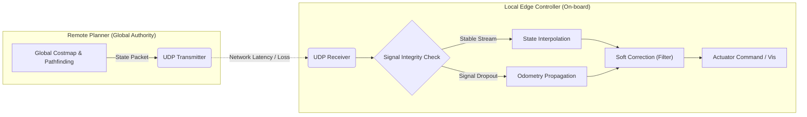

# Project Context: vbn930
> This file was automatically generated for AI code analysis.

## 1. Project Structure
```text
├── vbn930-Realtime-Consistency-Sim-2a51ac6
│   ├── .gitattributes
│   ├── .gitignore
│   ├── Config
│   │   ├── DefaultEditor.ini
│   │   ├── DefaultEditorPerProjectUserSettings.ini
│   │   ├── DefaultEngine.ini
│   │   ├── DefaultGame.ini
│   │   ├── DefaultGameUserSettings.ini
│   │   └── DefaultInput.ini
│   ├── Content
│   │   ├── Blueprints
│   │   │   ├── BP_NetworkAgent.uasset
│   │   │   ├── BP_NetworkManager.uasset
│   │   │   └── BP_SimPC.uasset
│   │   ├── Characters
│   │   │   └── Mannequins
│   │   │       ├── Anims
│   │   │       │   ├── Death
│   │   │       │   │   ├── MM_Death_Back_01.uasset
│   │   │       │   │   ├── MM_Death_Front_01.uasset
│   │   │       │   │   ├── MM_Death_Front_02.uasset
│   │   │       │   │   ├── MM_Death_Front_03.uasset
│   │   │       │   │   ├── MM_Death_Left_01.uasset
│   │   │       │   │   └── MM_Death_Right_01.uasset
│   │   │       │   ├── Pistol
│   │   │       │   │   ├── Aim
│   │   │       │   │   │   ├── AO_Pistol.uasset
│   │   │       │   │   │   ├── MF_Pistol_Idle_ADS1.uasset
│   │   │       │   │   │   ├── MF_Pistol_Idle_ADS_AO_CD.uasset
│   │   │       │   │   │   └── MF_Pistol_Idle_ADS_AO_CU.uasset
│   │   │       │   │   ├── Jog
│   │   │       │   │   │   ├── MF_Pistol_Jog_Bwd.uasset
│   │   │       │   │   │   ├── MF_Pistol_Jog_Bwd_Left.uasset
│   │   │       │   │   │   ├── MF_Pistol_Jog_Bwd_Right.uasset
│   │   │       │   │   │   ├── MF_Pistol_Jog_Fwd.uasset
│   │   │       │   │   │   ├── MF_Pistol_Jog_Fwd_Left.uasset
│   │   │       │   │   │   ├── MF_Pistol_Jog_Fwd_Right.uasset
│   │   │       │   │   │   ├── MF_Pistol_Jog_Left.uasset
│   │   │       │   │   │   └── MF_Pistol_Jog_Right.uasset
│   │   │       │   │   ├── Jump
│   │   │       │   │   │   ├── MM_Pistol_Jump_Fall_Loop.uasset
│   │   │       │   │   │   ├── MM_Pistol_Jump_RecoveryAdditive.uasset
│   │   │       │   │   │   └── MM_Pistol_Jump_Start.uasset
│   │   │       │   │   ├── MF_Pistol_Idle_ADS.uasset
│   │   │       │   │   ├── MM_Pistol_DryFire.uasset
│   │   │       │   │   ├── MM_Pistol_Equip.uasset
│   │   │       │   │   ├── MM_Pistol_Fire.uasset
│   │   │       │   │   ├── MM_Pistol_Fire_Montage.uasset
│   │   │       │   │   ├── MM_Pistol_Reload.uasset
│   │   │       │   │   └── Walk
│   │   │       │   │       ├── MF_Pistol_Walk_Bwd.uasset
│   │   │       │   │       ├── MF_Pistol_Walk_Bwd_Left.uasset
│   │   │       │   │       ├── MF_Pistol_Walk_Bwd_Right.uasset
│   │   │       │   │       ├── MF_Pistol_Walk_Fwd.uasset
│   │   │       │   │       ├── MF_Pistol_Walk_Fwd_Left.uasset
│   │   │       │   │       ├── MF_Pistol_Walk_Fwd_Right.uasset
│   │   │       │   │       ├── MF_Pistol_Walk_Left.uasset
│   │   │       │   │       └── MF_Pistol_Walk_Right.uasset
│   │   │       │   ├── Rifle
│   │   │       │   │   ├── AIM
│   │   │       │   │   │   ├── AO_Rifle.uasset
│   │   │       │   │   │   ├── MM_Rifle_Idle_ADS_AO_CC.uasset
│   │   │       │   │   │   ├── MM_Rifle_Idle_ADS_AO_CD.uasset
│   │   │       │   │   │   └── MM_Rifle_Idle_ADS_AO_CU.uasset
│   │   │       │   │   ├── HitReact
│   │   │       │   │   │   ├── MM_HitReact_Back_Med_01.uasset
│   │   │       │   │   │   ├── MM_HitReact_Front_Hvy_01.uasset
│   │   │       │   │   │   ├── MM_HitReact_Front_Lgt_01.uasset
│   │   │       │   │   │   ├── MM_HitReact_Front_Lgt_02.uasset
│   │   │       │   │   │   ├── MM_HitReact_Front_Lgt_03.uasset
│   │   │       │   │   │   ├── MM_HitReact_Front_Lgt_04.uasset
│   │   │       │   │   │   ├── MM_HitReact_Front_Med_01.uasset
│   │   │       │   │   │   └── MM_HitReact_Front_Med_02.uasset
│   │   │       │   │   ├── Jog
│   │   │       │   │   │   ├── MF_Rifle_Jog_Bwd.uasset
│   │   │       │   │   │   ├── MF_Rifle_Jog_Bwd_Left.uasset
│   │   │       │   │   │   ├── MF_Rifle_Jog_Bwd_Right.uasset
│   │   │       │   │   │   ├── MF_Rifle_Jog_Fwd.uasset
│   │   │       │   │   │   ├── MF_Rifle_Jog_Fwd_Left.uasset
│   │   │       │   │   │   ├── MF_Rifle_Jog_Fwd_Right.uasset
│   │   │       │   │   │   ├── MF_Rifle_Jog_Left.uasset
│   │   │       │   │   │   └── MF_Rifle_Jog_Right.uasset
│   │   │       │   │   ├── Jump
│   │   │       │   │   │   ├── MM_Rifle_Jump_Apex.uasset
│   │   │       │   │   │   ├── MM_Rifle_Jump_Fall_Land.uasset
│   │   │       │   │   │   ├── MM_Rifle_Jump_Fall_Loop.uasset
│   │   │       │   │   │   ├── MM_Rifle_Jump_RecoveryAdditive.uasset
│   │   │       │   │   │   ├── MM_Rifle_Jump_Start.uasset
│   │   │       │   │   │   └── MM_Rifle_Jump_Start_Loop.uasset
│   │   │       │   │   ├── MF_Rifle_Idle_ADS.uasset
│   │   │       │   │   ├── MM_Rifle_DryFire.uasset
│   │   │       │   │   ├── MM_Rifle_Equip.uasset
│   │   │       │   │   ├── MM_Rifle_Fire.uasset
│   │   │       │   │   ├── MM_Rifle_Reload.uasset
│   │   │       │   │   └── Walk
│   │   │       │   │       ├── MF_Rifle_Walk_Bwd.uasset
│   │   │       │   │       ├── MF_Rifle_Walk_Bwd_Left.uasset
│   │   │       │   │       ├── MF_Rifle_Walk_Bwd_Right.uasset
│   │   │       │   │       ├── MF_Rifle_Walk_Fwd.uasset
│   │   │       │   │       ├── MF_Rifle_Walk_Fwd_Left.uasset
│   │   │       │   │       ├── MF_Rifle_Walk_Fwd_Right.uasset
│   │   │       │   │       ├── MF_Rifle_Walk_Left.uasset
│   │   │       │   │       └── MF_Rifle_Walk_Right.uasset
│   │   │       │   └── Unarmed
│   │   │       │       ├── ABP_Unarmed.uasset
│   │   │       │       ├── Attack
│   │   │       │       │   ├── MM_Attack_01.uasset
│   │   │       │       │   ├── MM_Attack_02.uasset
│   │   │       │       │   ├── MM_Attack_03.uasset
│   │   │       │       │   └── MM_ChargedAttack.uasset
│   │   │       │       ├── BS_Idle_Walk_Run.uasset
│   │   │       │       ├── Jog
│   │   │       │       │   ├── MF_Unarmed_Jog_Bwd.uasset
│   │   │       │       │   ├── MF_Unarmed_Jog_Bwd_Left.uasset
│   │   │       │       │   ├── MF_Unarmed_Jog_Bwd_Right.uasset
│   │   │       │       │   ├── MF_Unarmed_Jog_Fwd.uasset
│   │   │       │       │   ├── MF_Unarmed_Jog_Fwd_Left.uasset
│   │   │       │       │   ├── MF_Unarmed_Jog_Fwd_Right.uasset
│   │   │       │       │   ├── MF_Unarmed_Jog_Left.uasset
│   │   │       │       │   └── MF_Unarmed_Jog_Right.uasset
│   │   │       │       ├── Jump
│   │   │       │       │   ├── MM_Dash.uasset
│   │   │       │       │   ├── MM_Fall_Loop.uasset
│   │   │       │       │   ├── MM_Jump.uasset
│   │   │       │       │   ├── MM_Land.uasset
│   │   │       │       │   └── MM_WallJump.uasset
│   │   │       │       ├── MM_Idle.uasset
│   │   │       │       └── Walk
│   │   │       │           ├── MF_Unarmed_Walk_Bwd.uasset
│   │   │       │           ├── MF_Unarmed_Walk_Bwd_Left.uasset
│   │   │       │           ├── MF_Unarmed_Walk_Bwd_Right.uasset
│   │   │       │           ├── MF_Unarmed_Walk_Fwd.uasset
│   │   │       │           ├── MF_Unarmed_Walk_Fwd_Left.uasset
│   │   │       │           ├── MF_Unarmed_Walk_Fwd_Right.uasset
│   │   │       │           ├── MF_Unarmed_Walk_Left.uasset
│   │   │       │           └── MF_Unarmed_Walk_Right.uasset
│   │   │       ├── Materials
│   │   │       │   ├── M_Mannequin.uasset
│   │   │       │   ├── Manny
│   │   │       │   │   ├── MI_Manny_01_New.uasset
│   │   │       │   │   └── MI_Manny_02_New.uasset
│   │   │       │   └── Quinn
│   │   │       │       ├── MI_Quinn_01.uasset
│   │   │       │       └── MI_Quinn_02.uasset
│   │   │       ├── Meshes
│   │   │       │   ├── SKM_Manny_Simple.uasset
│   │   │       │   ├── SKM_Quinn_Simple.uasset
│   │   │       │   └── SK_Mannequin.uasset
│   │   │       ├── Rigs
│   │   │       │   ├── CR_Mannequin_Body.uasset
│   │   │       │   ├── CR_Mannequin_FootIK.uasset
│   │   │       │   ├── CR_Mannequin_Procedural.uasset
│   │   │       │   └── PA_Mannequin.uasset
│   │   │       └── Textures
│   │   │           ├── Manny
│   │   │           │   ├── T_Manny_01_BN.uasset
│   │   │           │   ├── T_Manny_01_D.uasset
│   │   │           │   ├── T_Manny_01_MRA.uasset
│   │   │           │   ├── T_Manny_02_BN.uasset
│   │   │           │   ├── T_Manny_02_D.uasset
│   │   │           │   ├── T_Manny_02_MRA.uasset
│   │   │           │   └── T_Manny_02_N.uasset
│   │   │           ├── Quinn
│   │   │           │   ├── T_Quinn_01_D.uasset
│   │   │           │   ├── T_Quinn_01_MRA.uasset
│   │   │           │   ├── T_Quinn_01_N.uasset
│   │   │           │   ├── T_Quinn_02_D.uasset
│   │   │           │   ├── T_Quinn_02_MRA.uasset
│   │   │           │   └── T_Quinn_02_N.uasset
│   │   │           └── Shared
│   │   │               └── T_UE_Logo_M.uasset
│   │   ├── Input
│   │   │   ├── Actions
│   │   │   │   ├── IA_Jump.uasset
│   │   │   │   ├── IA_Look.uasset
│   │   │   │   ├── IA_MouseLook.uasset
│   │   │   │   └── IA_Move.uasset
│   │   │   ├── IMC_Default.uasset
│   │   │   ├── IMC_MouseLook.uasset
│   │   │   └── Touch
│   │   │       ├── BPI_TouchInterface.uasset
│   │   │       ├── UI_Thumbstick.uasset
│   │   │       └── UI_TouchSimple.uasset
│   │   ├── LevelPrototyping
│   │   │   ├── Interactable
│   │   │   │   ├── Door
│   │   │   │   │   ├── Assets
│   │   │   │   │   │   └── Meshes
│   │   │   │   │   │       ├── SM_Door.fbx
│   │   │   │   │   │       ├── SM_Door.uasset
│   │   │   │   │   │       ├── SM_DoorFrame_Corner.fbx
│   │   │   │   │   │       ├── SM_DoorFrame_Corner.uasset
│   │   │   │   │   │       ├── SM_DoorFrame_Edge.uasset
│   │   │   │   │   │       └── SM_DoorFrame_Strt.fbx
│   │   │   │   │   └── BP_DoorFrame.uasset
│   │   │   │   ├── JumpPad
│   │   │   │   │   ├── Assets
│   │   │   │   │   │   ├── Materials
│   │   │   │   │   │   │   ├── MI_GlowNT.uasset
│   │   │   │   │   │   │   ├── M_GradientGlow.uasset
│   │   │   │   │   │   │   └── M_SimpleGlow.uasset
│   │   │   │   │   │   ├── Meshes
│   │   │   │   │   │   │   ├── SM_CircularBand.fbx
│   │   │   │   │   │   │   ├── SM_CircularBand.uasset
│   │   │   │   │   │   │   ├── SM_CircularGlow.fbx
│   │   │   │   │   │   │   └── SM_CircularGlow.uasset
│   │   │   │   │   │   └── NS_JumpPad.uasset
│   │   │   │   │   └── BP_JumpPad.uasset
│   │   │   │   └── Target
│   │   │   │       ├── Assets
│   │   │   │       │   ├── SM_TargetBaseMesh.fbx
│   │   │   │       │   └── SM_TargetBaseMesh.uasset
│   │   │   │       └── BP_WobbleTarget.uasset
│   │   │   ├── Materials
│   │   │   │   ├── MF_ProcGrid.uasset
│   │   │   │   ├── MI_DefaultColorway.uasset
│   │   │   │   ├── MI_PrototypeGrid_Gray.uasset
│   │   │   │   ├── MI_PrototypeGrid_Gray_02.uasset
│   │   │   │   ├── MI_PrototypeGrid_TopDark.uasset
│   │   │   │   ├── M_FlatCol.uasset
│   │   │   │   └── M_PrototypeGrid.uasset
│   │   │   ├── Meshes
│   │   │   │   ├── SM_ChamferCube.fbx
│   │   │   │   ├── SM_ChamferCube.uasset
│   │   │   │   ├── SM_Cube.uasset
│   │   │   │   ├── SM_Cylinder.fbx
│   │   │   │   ├── SM_Cylinder.uasset
│   │   │   │   ├── SM_QuarterCylinder.fbx
│   │   │   │   ├── SM_QuarterCylinder.uasset
│   │   │   │   ├── SM_Ramp.uasset
│   │   │   │   └── SM_SM_ChamferCube.fbx
│   │   │   └── Textures
│   │   │       └── T_GridChecker_A.uasset
│   │   ├── Levels
│   │   │   └── L_Simulation.umap
│   │   ├── Material
│   │   │   ├── MI_Blue.uasset
│   │   │   ├── MI_Red.uasset
│   │   │   ├── M_Circle.uasset
│   │   │   └── M_SolidColor.uasset
│   │   ├── ThirdPerson
│   │   │   ├── Blueprints
│   │   │   │   ├── BP_ThirdPersonCharacter.uasset
│   │   │   │   ├── BP_ThirdPersonGameMode.uasset
│   │   │   │   └── BP_ThirdPersonPlayerController.uasset
│   │   │   ├── Lvl_ThirdPerson.umap
│   │   │   └── MI_ThirdPersonColWay.uasset
│   │   ├── UI
│   │   │   └── WBP_UserWidget.uasset
│   │   ├── Variant_Combat
│   │   │   ├── Anims
│   │   │   │   ├── ABP_Manny_Combat.uasset
│   │   │   │   ├── AM_ChargedAttack.uasset
│   │   │   │   └── AM_ComboAttack.uasset
│   │   │   ├── Blueprints
│   │   │   │   ├── AI
│   │   │   │   │   ├── BP_CombatAIController.uasset
│   │   │   │   │   ├── BP_CombatEnemy.uasset
│   │   │   │   │   ├── BP_CombatEnemySpawner.uasset
│   │   │   │   │   ├── EnvQuery_Fallback.uasset
│   │   │   │   │   ├── EnvQuery_Flank.uasset
│   │   │   │   │   └── ST_CombatEnemy.uasset
│   │   │   │   ├── BP_CameraShake_Hit_Enemy.uasset
│   │   │   │   ├── BP_CameraShake_Hit_Player.uasset
│   │   │   │   ├── BP_CombatCharacter.uasset
│   │   │   │   ├── BP_CombatGameMode.uasset
│   │   │   │   ├── BP_CombatPlayerController.uasset
│   │   │   │   └── Interactables
│   │   │   │       ├── BP_CombatActivationVolume.uasset
│   │   │   │       ├── BP_CombatCheckpointVolume.uasset
│   │   │   │       ├── BP_CombatDamageableBox.uasset
│   │   │   │       ├── BP_CombatDummy.uasset
│   │   │   │       └── BP_CombatLavaFloor.uasset
│   │   │   ├── Input
│   │   │   │   ├── Actions
│   │   │   │   │   ├── IA_ChargedAttack.uasset
│   │   │   │   │   └── IA_ComboAttack.uasset
│   │   │   │   ├── BPI_TouchInterface_Combat.uasset
│   │   │   │   ├── IMC_Combat.uasset
│   │   │   │   └── UI_TouchInterface_Combat.uasset
│   │   │   ├── Lvl_Combat.umap
│   │   │   ├── Materials
│   │   │   │   ├── MI_Box_Destroyed.uasset
│   │   │   │   └── M_Lava.uasset
│   │   │   ├── UI
│   │   │   │   └── UI_LifeBar.uasset
│   │   │   └── VFX
│   │   │       └── NS_Damage.uasset
│   │   ├── Variant_Platforming
│   │   │   ├── Anims
│   │   │   │   ├── ABP_Manny_Platforming.uasset
│   │   │   │   └── AM_Dash.uasset
│   │   │   ├── Blueprints
│   │   │   │   ├── BP_PlatformingCharacter.uasset
│   │   │   │   ├── BP_PlatformingGameMode.uasset
│   │   │   │   └── BP_PlatformingPlayerController.uasset
│   │   │   ├── Input
│   │   │   │   ├── Actions
│   │   │   │   │   └── IA_Dash.uasset
│   │   │   │   ├── BPI_TouchInterface_Platforming.uasset
│   │   │   │   ├── IMC_Platforming.uasset
│   │   │   │   └── UI_TouchInterface_Platforming.uasset
│   │   │   ├── Lvl_Platforming.umap
│   │   │   └── VFX
│   │   │       └── NS_Jump_Trail.uasset
│   │   ├── Variant_SideScrolling
│   │   │   ├── Anims
│   │   │   │   └── ABP_Manny_SideScroller.uasset
│   │   │   ├── Blueprints
│   │   │   │   ├── AI
│   │   │   │   │   ├── BP_SideScrollingAIController.uasset
│   │   │   │   │   ├── BP_SideScrollingNPC.uasset
│   │   │   │   │   └── ST_SideScrollingNPC.uasset
│   │   │   │   ├── BP_SideScrollingCameraManager.uasset
│   │   │   │   ├── BP_SideScrollingCharacter.uasset
│   │   │   │   ├── BP_SideScrollingGameMode.uasset
│   │   │   │   ├── BP_SideScrollingPlayerController.uasset
│   │   │   │   └── Items
│   │   │   │       ├── BP_SideScrollingMovingPlatform.uasset
│   │   │   │       ├── BP_SideScrollingPickup.uasset
│   │   │   │       └── BP_SideScrollingSoftPlatform.uasset
│   │   │   ├── Input
│   │   │   │   ├── Actions
│   │   │   │   │   ├── IA_Drop.uasset
│   │   │   │   │   ├── IA_Interact.uasset
│   │   │   │   │   └── IA_Mover.uasset
│   │   │   │   ├── BPI_TouchInterface_SideScrolling.uasset
│   │   │   │   ├── IMC_SideScroller.uasset
│   │   │   │   └── UI_TouchInterface_SideScrolling.uasset
│   │   │   ├── Lvl_SideScrolling.umap
│   │   │   └── UI
│   │   │       └── UI_SideScrolling.uasset
│   │   ├── __ExternalActors__
│   │   │   ├── Levels
│   │   │   │   └── L_Simulation
│   │   │   │       ├── 0
│   │   │   │       │   ├── 7T
│   │   │   │       │   │   └── 3ZDJHXN7IJFE2YJSDRI9NT.uasset
│   │   │   │       │   ├── L1
│   │   │   │       │   │   └── BGN51N9W13DLH13GTUYMEY.uasset
│   │   │   │       │   └── UJ
│   │   │   │       │       └── 3OR1TC1JOP8542WBCOTXWC.uasset
│   │   │   │       ├── 1
│   │   │   │       │   ├── 8O
│   │   │   │       │   │   └── FYZRP8DA1BWET79KCDTB0R.uasset
│   │   │   │       │   ├── G0
│   │   │   │       │   │   └── HJFBO2DIKMKG761HYPF3JX.uasset
│   │   │   │       │   └── P7
│   │   │   │       │       └── J3Z3CDH8SWYAIYD3P85CT8.uasset
│   │   │   │       ├── 2
│   │   │   │       │   ├── 6L
│   │   │   │       │   │   └── 0APLNYUO3VQ7QXIHS73X1B.uasset
│   │   │   │       │   ├── 9B
│   │   │   │       │   │   └── VTJSG2B8PZBKZVWRY6BZ0P.uasset
│   │   │   │       │   ├── BA
│   │   │   │       │   │   └── 2SN66F8YV0FOBDLF5FYHK4.uasset
│   │   │   │       │   └── JN
│   │   │   │       │       └── 2JL5B5E1SQAUUN97MXNGWW.uasset
│   │   │   │       ├── 3
│   │   │   │       │   ├── 08
│   │   │   │       │   │   └── LSXF7MWPDMD47K9290KYXT.uasset
│   │   │   │       │   ├── AA
│   │   │   │       │   │   └── RGJMTZHZLQ9BSR461SU0H3.uasset
│   │   │   │       │   ├── BD
│   │   │   │       │   │   └── MQJ4Y3R441W43NGEU2EWE0.uasset
│   │   │   │       │   ├── F7
│   │   │   │       │   │   └── JIAGW8ATUFFGBQA07DRGCX.uasset
│   │   │   │       │   ├── SU
│   │   │   │       │   │   └── GFQLZ25EGSYJI09XCNSF34.uasset
│   │   │   │       │   └── UJ
│   │   │   │       │       └── VTZMXD88UF1CMZH38UE8RZ.uasset
│   │   │   │       ├── 4
│   │   │   │       │   ├── HJ
│   │   │   │       │   │   └── 878EIEMOUX1YFIR05HKTPQ.uasset
│   │   │   │       │   ├── YJ
│   │   │   │       │   │   └── JBJI7Z8VZOZ9J3HEFARIDP.uasset
│   │   │   │       │   └── ZJ
│   │   │   │       │       └── 5BQSEL3YKHS20X805QDFLG.uasset
│   │   │   │       ├── 5
│   │   │   │       │   ├── 1U
│   │   │   │       │   │   └── DYUCHYOHD8GAIS73TV5T02.uasset
│   │   │   │       │   ├── 2R
│   │   │   │       │   │   └── R0N2K4DOJCI6WQULN38V6D.uasset
│   │   │   │       │   ├── EY
│   │   │   │       │   │   └── G3BZVAM4BS6AXL4E30T23L.uasset
│   │   │   │       │   ├── SN
│   │   │   │       │   │   └── EFUOTAYKAXU6B1DXOLG5V9.uasset
│   │   │   │       │   └── X5
│   │   │   │       │       └── 5GXAOJ76QAAN7WVUAO9JRA.uasset
│   │   │   │       ├── 6
│   │   │   │       │   ├── 57
│   │   │   │       │   │   └── 0IXVIVVQUDMAXCZJ2FHEZ7.uasset
│   │   │   │       │   ├── 6P
│   │   │   │       │   │   └── AVSEFS85GJ0MQSJAT4HF7T.uasset
│   │   │   │       │   ├── EU
│   │   │   │       │   │   └── M7V1DE9245AA96VVXF5UKT.uasset
│   │   │   │       │   └── L1
│   │   │   │       │       └── R132J4JAG5OMHWSGIMI8MB.uasset
│   │   │   │       ├── 7
│   │   │   │       │   ├── 34
│   │   │   │       │   │   └── O5J484JMQK0FADW5JNSHFM.uasset
│   │   │   │       │   ├── F5
│   │   │   │       │   │   └── ZR8M5TYMS8J84RAADTFJNE.uasset
│   │   │   │       │   ├── HE
│   │   │   │       │   │   └── Y6YR0OCVNIW9QUCGTSNI6Y.uasset
│   │   │   │       │   └── YW
│   │   │   │       │       └── 4TJFAU230G3459LV7IJ2C4.uasset
│   │   │   │       ├── 8
│   │   │   │       │   ├── 3U
│   │   │   │       │   │   └── IIRKRWD844AF6SSJRSI198.uasset
│   │   │   │       │   ├── HV
│   │   │   │       │   │   └── M2G6YDNCUUI7EZ5DWMIVRX.uasset
│   │   │   │       │   ├── N6
│   │   │   │       │   │   └── C27QXK73HP89VJT6XEIKX9.uasset
│   │   │   │       │   ├── RQ
│   │   │   │       │   │   └── JOH1EK7KBLTG24XX3W62EY.uasset
│   │   │   │       │   └── UF
│   │   │   │       │       └── K0AP2F07V43GOGKY8QYPCB.uasset
│   │   │   │       ├── 9
│   │   │   │       │   ├── 59
│   │   │   │       │   │   └── LSHCMCRNKKJYA2S1R0JK1Z.uasset
│   │   │   │       │   ├── 5P
│   │   │   │       │   │   └── 6CB8F397FZYY4VHDVJN66X.uasset
│   │   │   │       │   ├── J5
│   │   │   │       │   │   └── 1UKEXUK5WSP4RLH0535B5P.uasset
│   │   │   │       │   └── QJ
│   │   │   │       │       └── E1F2XWI2UKJH4L76ZSO8RT.uasset
│   │   │   │       ├── A
│   │   │   │       │   ├── 2E
│   │   │   │       │   │   └── E0PDQA2U79JCJSZFYODIEU.uasset
│   │   │   │       │   ├── F1
│   │   │   │       │   │   └── XN6MJX32BUF2CQ3WJNBQLH.uasset
│   │   │   │       │   ├── FB
│   │   │   │       │   │   └── FTCYR8VU7AXLXMQYD262ZT.uasset
│   │   │   │       │   ├── GP
│   │   │   │       │   │   └── FW8KVVV7PK1P5TZHJCP5IZ.uasset
│   │   │   │       │   ├── HH
│   │   │   │       │   │   └── UAYP445FA6Q4TBO8XLH5V0.uasset
│   │   │   │       │   ├── K0
│   │   │   │       │   │   └── SFB0NWMR5262IW0FZ1SF89.uasset
│   │   │   │       │   └── MP
│   │   │   │       │       └── ZDUOXHE7TZIQL8IS4M1NAR.uasset
│   │   │   │       ├── B
│   │   │   │       │   ├── 47
│   │   │   │       │   │   └── QBG2F6QEHBO2IRA4KMWE7W.uasset
│   │   │   │       │   ├── 6S
│   │   │   │       │   │   └── GICOO3ONTIIAO5SI5D6IZZ.uasset
│   │   │   │       │   ├── IP
│   │   │   │       │   │   └── 4GG80A9BJ0EQZPWBL641LY.uasset
│   │   │   │       │   └── WX
│   │   │   │       │       └── NS5ZMFG3KG6HIBU9CJ6W0K.uasset
│   │   │   │       ├── C
│   │   │   │       │   ├── 2Q
│   │   │   │       │   │   └── 23314K6RNLBMZG2PBKGNZ7.uasset
│   │   │   │       │   ├── LJ
│   │   │   │       │   │   └── YVJSNBIEUYPP20I10CZTXU.uasset
│   │   │   │       │   └── ZE
│   │   │   │       │       └── Z8A715M6B0NYQGYJPWQATJ.uasset
│   │   │   │       ├── D
│   │   │   │       │   ├── CH
│   │   │   │       │   │   └── KJ29PU0OQHVBSYAXBC6ZWU.uasset
│   │   │   │       │   ├── II
│   │   │   │       │   │   └── H8J9GMPIP3ODBBRHGEILOW.uasset
│   │   │   │       │   ├── SB
│   │   │   │       │   │   └── 57K1INYTP0PTVSWJK5GPJQ.uasset
│   │   │   │       │   └── Z7
│   │   │   │       │       └── IISXSK1FO10TV0J1L317CR.uasset
│   │   │   │       ├── E
│   │   │   │       │   ├── 5Z
│   │   │   │       │   │   └── 3ROGYVFAQ5RVS99TMM6SBU.uasset
│   │   │   │       │   ├── B8
│   │   │   │       │   │   └── 0I9GHQQ87ZXCBD6L3Y00GC.uasset
│   │   │   │       │   ├── FC
│   │   │   │       │   │   └── C3GBHDDVLSD34AI8PSS61J.uasset
│   │   │   │       │   ├── I2
│   │   │   │       │   │   └── Y2PZM3U4THKTFPQKVMEZ9R.uasset
│   │   │   │       │   ├── M7
│   │   │   │       │   │   └── 0E6BM18PFQ90USTO97JO4N.uasset
│   │   │   │       │   ├── QN
│   │   │   │       │   │   └── 4SPWZIZK2C2K03YWGUHXKQ.uasset
│   │   │   │       │   ├── TT
│   │   │   │       │   │   └── UDLOY3FU1D3RH4L7WHG51O.uasset
│   │   │   │       │   ├── UT
│   │   │   │       │   │   └── S5TZ8AVRFEH7QYRVFVU4FB.uasset
│   │   │   │       │   └── UV
│   │   │   │       │       └── APU1SIMLP9NC9MEBE6R8JD.uasset
│   │   │   │       └── F
│   │   │   │           ├── 18
│   │   │   │           │   └── C8S5STSF00KF99EYFZQBU1.uasset
│   │   │   │           └── 4R
│   │   │   │               └── 435D0RN5HHUFUPT8XL806T.uasset
│   │   │   ├── ThirdPerson
│   │   │   │   └── Lvl_ThirdPerson
│   │   │   │       ├── 0
│   │   │   │       │   └── 9R
│   │   │   │       │       └── UKIMD8EYGPZFS8OC6GX24A.uasset
│   │   │   │       ├── 1
│   │   │   │       │   ├── EU
│   │   │   │       │   │   └── X5MT1GOX9C5UUGZAKRVC3R.uasset
│   │   │   │       │   ├── K3
│   │   │   │       │   │   └── 79QZQ7KG2RXNWMD6RSPKUM.uasset
│   │   │   │       │   ├── KL
│   │   │   │       │   │   └── UYSRPQ5SOYIFVLEQINPH31.uasset
│   │   │   │       │   ├── MV
│   │   │   │       │   │   └── 2U2IE6JXO1320Q32RJQKSE.uasset
│   │   │   │       │   └── X5
│   │   │   │       │       └── JDOWWCJ7DZVSHT4Y29GQ4D.uasset
│   │   │   │       ├── 2
│   │   │   │       │   ├── AM
│   │   │   │       │   │   └── 9YGDW7FMEY1CZD31VUYO11.uasset
│   │   │   │       │   ├── AX
│   │   │   │       │   │   └── QEPSHOMS1K2ANUR3LXWOJM.uasset
│   │   │   │       │   ├── TV
│   │   │   │       │   │   └── DYUIEBPX2N8UFXT326WX2O.uasset
│   │   │   │       │   └── V0
│   │   │   │       │       └── 9XTUAMN5S6UUCFB5K0ZGZM.uasset
│   │   │   │       ├── 3
│   │   │   │       │   ├── 0N
│   │   │   │       │   │   └── NTRPN55OWWUSD03K29ZOSH.uasset
│   │   │   │       │   ├── C5
│   │   │   │       │   │   └── 3LNK9WKCBL4YVMWIBXQZ1I.uasset
│   │   │   │       │   ├── D3
│   │   │   │       │   │   └── XWEMBL7KZTNQP83W1KTMXE.uasset
│   │   │   │       │   ├── E2
│   │   │   │       │   │   └── L159AMTR83MORHTF2GEOKE.uasset
│   │   │   │       │   └── L5
│   │   │   │       │       └── 790AP8RYBMX9YBLGTW6WE6.uasset
│   │   │   │       ├── 4
│   │   │   │       │   └── CQ
│   │   │   │       │       └── I205QOSSXONYWBP69RVMVA.uasset
│   │   │   │       ├── 5
│   │   │   │       │   ├── 25
│   │   │   │       │   │   └── 3IO0LF8AOO4YLSEAEN2JO1.uasset
│   │   │   │       │   ├── 9M
│   │   │   │       │   │   └── BJR5SDQDQW7QDFFPNUUMNX.uasset
│   │   │   │       │   ├── KG
│   │   │   │       │   │   └── ETKAO35ANVW90XFH3J8GJ2.uasset
│   │   │   │       │   └── W9
│   │   │   │       │       └── ZAAGYIUQZ2W6WEO3HPXAX7.uasset
│   │   │   │       ├── 6
│   │   │   │       │   ├── 3C
│   │   │   │       │   │   └── KAT90QYQLFOHNMOF9BEDZK.uasset
│   │   │   │       │   ├── 8I
│   │   │   │       │   │   └── HFL05AWIVBP8M8UXTV4H5K.uasset
│   │   │   │       │   ├── G9
│   │   │   │       │   │   └── 77SUGCMHUBU5E7FP1DLCVD.uasset
│   │   │   │       │   ├── UK
│   │   │   │       │   │   └── OT5UOZ3WBJ9P30TU3DBDEK.uasset
│   │   │   │       │   ├── XM
│   │   │   │       │   │   └── SN8KJL01L24VVIYC52MNFR.uasset
│   │   │   │       │   └── YB
│   │   │   │       │       └── C5UDZYKFL5M0YW62JXMPIZ.uasset
│   │   │   │       ├── 7
│   │   │   │       │   ├── GV
│   │   │   │       │   │   └── W5DNM2FP1ON7VGU0C2BGMV.uasset
│   │   │   │       │   ├── JD
│   │   │   │       │   │   └── OCW0UZT4ANZZD9YHEAOMAP.uasset
│   │   │   │       │   ├── O7
│   │   │   │       │   │   └── IHUOIGG1MW1YZY097JJ8O7.uasset
│   │   │   │       │   └── XU
│   │   │   │       │       └── RW3P9HUUCOCG5TL3TPG6XF.uasset
│   │   │   │       ├── 8
│   │   │   │       │   ├── 0N
│   │   │   │       │   │   └── 1OONKTGJMLVBN21M6JE59I.uasset
│   │   │   │       │   ├── 7A
│   │   │   │       │   │   └── C0UVMH95QVQO1KMTVK7MSB.uasset
│   │   │   │       │   ├── HN
│   │   │   │       │   │   └── XXZLD30WH49IXWEHJXSVAR.uasset
│   │   │   │       │   ├── VS
│   │   │   │       │   │   └── XX060WNO6GEZU5BZQCLZPP.uasset
│   │   │   │       │   ├── WI
│   │   │   │       │   │   └── FHUVUALB8C8XRJ0PY9XXTI.uasset
│   │   │   │       │   └── XH
│   │   │   │       │       └── SKCKQTQDTE8ZNW6C0FCBRO.uasset
│   │   │   │       ├── 9
│   │   │   │       │   ├── 5G
│   │   │   │       │   │   └── 29Z6AXUGZPZ0CXHLK2DICG.uasset
│   │   │   │       │   ├── 6V
│   │   │   │       │   │   └── AV0JKCFBVPU58UEBGB0GC0.uasset
│   │   │   │       │   ├── EE
│   │   │   │       │   │   └── OCR348BHEJWLHO72TR249H.uasset
│   │   │   │       │   ├── LX
│   │   │   │       │   │   └── 1K6D4FIEJMOF50LSVJKFMP.uasset
│   │   │   │       │   └── UM
│   │   │   │       │       └── 1F7R5WQFM2D9KH7A94JFBU.uasset
│   │   │   │       ├── A
│   │   │   │       │   ├── 3J
│   │   │   │       │   │   └── Q8CQM512VVS7UZZW0KQRSV.uasset
│   │   │   │       │   ├── 8N
│   │   │   │       │   │   └── 4L4W0MLV9WFUGRTMUBLBOP.uasset
│   │   │   │       │   ├── BN
│   │   │   │       │   │   └── LKN4IB4C3UPW62GHBEKTIW.uasset
│   │   │   │       │   └── IP
│   │   │   │       │       └── MGVQPE8M923OBBJLZBI1PC.uasset
│   │   │   │       ├── B
│   │   │   │       │   ├── 0L
│   │   │   │       │   │   └── IL99N1JAI1J4A2DFQBQL53.uasset
│   │   │   │       │   ├── 2F
│   │   │   │       │   │   └── XTDQUHCYJJV6JCH4OJSVLG.uasset
│   │   │   │       │   ├── HX
│   │   │   │       │   │   └── PES0ONLF01PSQTJCC5USD2.uasset
│   │   │   │       │   ├── P1
│   │   │   │       │   │   └── LRQT09TOYHOXK9DY22EIKE.uasset
│   │   │   │       │   └── RX
│   │   │   │       │       └── 297QBXCKTP06G7NIHIULK4.uasset
│   │   │   │       ├── C
│   │   │   │       │   ├── 27
│   │   │   │       │   │   └── 6ZCCZ1F7ZO6DM3C8OLVGTF.uasset
│   │   │   │       │   ├── EE
│   │   │   │       │   │   └── HZ5WNBFZRJYQPUA6X8TVVT.uasset
│   │   │   │       │   └── HY
│   │   │   │       │       └── Q7CPP7VHOXBAMAJI90W626.uasset
│   │   │   │       ├── D
│   │   │   │       │   ├── 13
│   │   │   │       │   │   └── EPTYZCFZWXT7Z7XYKZ88XK.uasset
│   │   │   │       │   ├── 50
│   │   │   │       │   │   └── 395Y4QE4IIEWI3KSE3SB6L.uasset
│   │   │   │       │   ├── 8U
│   │   │   │       │   │   └── VKFLMM0CV8ZCC0P3TQGTTM.uasset
│   │   │   │       │   ├── AY
│   │   │   │       │   │   └── KLCRMXKI9WR2P0GDY96C36.uasset
│   │   │   │       │   ├── K5
│   │   │   │       │   │   └── NQBPXM7AM8N39CBW4ZT57P.uasset
│   │   │   │       │   ├── M3
│   │   │   │       │   │   └── 6T1XG4EDG4ZEE1U9HMYL4C.uasset
│   │   │   │       │   ├── MG
│   │   │   │       │   │   └── EDRUPW3EOYDDSI6HNSIVT1.uasset
│   │   │   │       │   └── RI
│   │   │   │       │       └── R8L7GQXCHQGMMKBPTBJTNA.uasset
│   │   │   │       ├── E
│   │   │   │       │   ├── 96
│   │   │   │       │   │   └── RFQP83S9K0LC7IW8CXS6C0.uasset
│   │   │   │       │   ├── JR
│   │   │   │       │   │   └── W7S9610Y7RWELGF93FZYAE.uasset
│   │   │   │       │   └── SS
│   │   │   │       │       └── QXUZ4IXFNKHCYFWERA1HQA.uasset
│   │   │   │       └── F
│   │   │   │           └── 4G
│   │   │   │               └── TYFCMQ9MC435YW6FZBF5FS.uasset
│   │   │   ├── Variant_Combat
│   │   │   │   └── Lvl_Combat
│   │   │   │       ├── 0
│   │   │   │       │   ├── 09
│   │   │   │       │   │   └── 6VOTF0H77B77LNPRHA1IYO.uasset
│   │   │   │       │   ├── 68
│   │   │   │       │   │   └── TFF0KCJOKMAFWHCUNS986L.uasset
│   │   │   │       │   ├── 6T
│   │   │   │       │   │   └── 7MNN6LIAHBUH3LNJA8OD7O.uasset
│   │   │   │       │   ├── GY
│   │   │   │       │   │   └── W6UMQ08ZGD02NR2XHXMS7T.uasset
│   │   │   │       │   ├── PY
│   │   │   │       │   │   └── D55A2955I299GXFMUK73NN.uasset
│   │   │   │       │   └── SK
│   │   │   │       │       └── 591N2DAZZHFKKFOF53JES4.uasset
│   │   │   │       ├── 1
│   │   │   │       │   ├── 13
│   │   │   │       │   │   └── 96ZEEPCX5RLGE3VS3Z5F83.uasset
│   │   │   │       │   ├── 7N
│   │   │   │       │   │   └── TMU12PWOB3PF1QBMHGAA9P.uasset
│   │   │   │       │   ├── 8V
│   │   │   │       │   │   └── MZ5VD1FM5EWPQ14HOUY9LL.uasset
│   │   │   │       │   ├── 9L
│   │   │   │       │   │   └── RVJQMYYFJ9NF8ATLBRGNE2.uasset
│   │   │   │       │   ├── G4
│   │   │   │       │   │   └── J64XLYHNNKOHM68L3ATL04.uasset
│   │   │   │       │   ├── K6
│   │   │   │       │   │   └── QEH37F755SSQDHM16RP0W6.uasset
│   │   │   │       │   ├── MO
│   │   │   │       │   │   └── FX52NCMV5JFYOIP51Q8D0R.uasset
│   │   │   │       │   ├── N0
│   │   │   │       │   │   └── UUHIOS9OWPYF8DRRUOILO0.uasset
│   │   │   │       │   ├── NZ
│   │   │   │       │   │   └── 2DGYN86OICCF1JK42OM8LH.uasset
│   │   │   │       │   ├── Q1
│   │   │   │       │   │   └── 54UJTQSRBUIMXTLWMQD201.uasset
│   │   │   │       │   └── QC
│   │   │   │       │       └── I20BJ3V98WLHGTVOPUE3TL.uasset
│   │   │   │       ├── 2
│   │   │   │       │   ├── DC
│   │   │   │       │   │   └── J79FNM591NCL4PRZU30JKH.uasset
│   │   │   │       │   ├── E2
│   │   │   │       │   │   └── 7WMFIN5511KNW0G94AGVMX.uasset
│   │   │   │       │   ├── ES
│   │   │   │       │   │   └── Y759LYJCXPLAYRH2BHOD2H.uasset
│   │   │   │       │   ├── PC
│   │   │   │       │   │   └── QNCY9367JPRDLFY623BAWG.uasset
│   │   │   │       │   ├── PN
│   │   │   │       │   │   └── 5DVYKXIO9QXKZ6DD03JHFY.uasset
│   │   │   │       │   ├── T8
│   │   │   │       │   │   └── Z9LBHJJSRJW405KOMZM5LN.uasset
│   │   │   │       │   ├── UQ
│   │   │   │       │   │   └── VZBO103EOK3C009CQ3SIA2.uasset
│   │   │   │       │   ├── VD
│   │   │   │       │   │   └── 6CQW6ZVH27TP37BOERS3L5.uasset
│   │   │   │       │   └── XD
│   │   │   │       │       └── KJJ0PM9Q2DJXW333FHZ7R0.uasset
│   │   │   │       ├── 3
│   │   │   │       │   ├── 3E
│   │   │   │       │   │   └── 2AV29D92911SDW8QKQ24BX.uasset
│   │   │   │       │   ├── 85
│   │   │   │       │   │   └── TBH0DY74DPFG02QFP4HVBY.uasset
│   │   │   │       │   ├── 8W
│   │   │   │       │   │   └── TGNMGZGKIRPV4FRVB95PUT.uasset
│   │   │   │       │   ├── CJ
│   │   │   │       │   │   └── 8IMDJ47RUM6RR9KKJ07RMR.uasset
│   │   │   │       │   ├── DE
│   │   │   │       │   │   └── EG6ISGHPR9UK0TU4M6ILXJ.uasset
│   │   │   │       │   ├── G1
│   │   │   │       │   │   └── 8K6PTWH7EC700FSPEZEBAI.uasset
│   │   │   │       │   ├── GU
│   │   │   │       │   │   └── HHTBIYESCLLX4M9TYH2V2O.uasset
│   │   │   │       │   └── LU
│   │   │   │       │       └── MQL9YZXJP8NMBT4NJS35FE.uasset
│   │   │   │       ├── 4
│   │   │   │       │   ├── 2G
│   │   │   │       │   │   └── 4AWBEWEWJUNQ9436Q44MM8.uasset
│   │   │   │       │   ├── 3C
│   │   │   │       │   │   └── BUY1N1NIXKH5ZMH2B9OHQS.uasset
│   │   │   │       │   ├── 4Z
│   │   │   │       │   │   └── 0CC2QQCZ4BB1D3AHY0Q906.uasset
│   │   │   │       │   ├── 74
│   │   │   │       │   │   └── O2DL9QU8VK5L7HY1JO6IXG.uasset
│   │   │   │       │   ├── 9S
│   │   │   │       │   │   └── CN0ENC7UB9EH44A15Z9DS5.uasset
│   │   │   │       │   ├── C9
│   │   │   │       │   │   └── WRKC9ED7V99C15LK7N52RX.uasset
│   │   │   │       │   ├── DQ
│   │   │   │       │   │   └── NDUDVEMBDWYTZMRHKUF2S1.uasset
│   │   │   │       │   ├── E0
│   │   │   │       │   │   └── 3GAWGDPJRLAX24672Y8QI4.uasset
│   │   │   │       │   ├── K0
│   │   │   │       │   │   └── SB6TUKZ0O9035RUL6J9QPV.uasset
│   │   │   │       │   ├── MK
│   │   │   │       │   │   └── 0B83XTNUO53M03D9U4EFOU.uasset
│   │   │   │       │   ├── Q3
│   │   │   │       │   │   └── S3DCYMNYH5AAJ7KBVZMOEP.uasset
│   │   │   │       │   ├── RN
│   │   │   │       │   │   └── Z1AJIFWKGGP237W3JG3GPE.uasset
│   │   │   │       │   └── T2
│   │   │   │       │       └── M3Q0393W11ULYHGZPBGWES.uasset
│   │   │   │       ├── 5
│   │   │   │       │   ├── 1I
│   │   │   │       │   │   └── K236CQU20O4O3XE1TLBV3U.uasset
│   │   │   │       │   ├── 5P
│   │   │   │       │   │   └── CWCQ7HWLG4FMXT0ZRC4TI0.uasset
│   │   │   │       │   ├── 5V
│   │   │   │       │   │   └── 2ZKI0MH4J35IQ435354JH3.uasset
│   │   │   │       │   ├── B7
│   │   │   │       │   │   └── C4HUJNJJBL0Y0DBF5HV1PH.uasset
│   │   │   │       │   ├── BF
│   │   │   │       │   │   └── BFIXU5567HNRMQP5MJY0O1.uasset
│   │   │   │       │   ├── EK
│   │   │   │       │   │   └── 9F37QKGF01YU7CHDKL2KO5.uasset
│   │   │   │       │   └── OV
│   │   │   │       │       └── ZNSNNPGU4O3LUJM2II2DZH.uasset
│   │   │   │       ├── 6
│   │   │   │       │   ├── 58
│   │   │   │       │   │   └── RK3NC5MNSOW06DYLLR8400.uasset
│   │   │   │       │   ├── GZ
│   │   │   │       │   │   └── GUJXQ0SLRQY9GOI1S9KFYR.uasset
│   │   │   │       │   ├── JG
│   │   │   │       │   │   └── SVPF4PAWLB95N3A3454HRT.uasset
│   │   │   │       │   ├── RY
│   │   │   │       │   │   └── MYVMN2NWF4QNT14AQUADS9.uasset
│   │   │   │       │   └── ZZ
│   │   │   │       │       └── Y9F2IUUMWMKN65LVGL93M3.uasset
│   │   │   │       ├── 7
│   │   │   │       │   ├── 3E
│   │   │   │       │   │   └── FM5O1XVO2BJK8VOAB6TSPC.uasset
│   │   │   │       │   ├── 8Q
│   │   │   │       │   │   └── 5HSFA3MSWAHTHR0JJALDVL.uasset
│   │   │   │       │   ├── BM
│   │   │   │       │   │   └── 7479BCOZ59Z9SD4ZOM4F9V.uasset
│   │   │   │       │   ├── JK
│   │   │   │       │   │   └── 7MZAAVLMCDJG8N39T8CHSV.uasset
│   │   │   │       │   ├── OM
│   │   │   │       │   │   └── H0URW02T819PVDV28FETOW.uasset
│   │   │   │       │   ├── SI
│   │   │   │       │   │   └── O3Y0LUWOXJ0ISZ4831L7JJ.uasset
│   │   │   │       │   ├── UA
│   │   │   │       │   │   └── 57QE41VBC21TQVJDEOPIDD.uasset
│   │   │   │       │   ├── XH
│   │   │   │       │   │   └── LZHLJ4KVLTW803TFRP2L6G.uasset
│   │   │   │       │   ├── YL
│   │   │   │       │   │   └── Z1OC45KSRGWRYP06FOLI06.uasset
│   │   │   │       │   └── ZL
│   │   │   │       │       └── CM32V8FT81XRL4H1KIRZ82.uasset
│   │   │   │       ├── 8
│   │   │   │       │   ├── DC
│   │   │   │       │   │   └── S1EW4KLHAUP0J6WDU070LV.uasset
│   │   │   │       │   ├── EP
│   │   │   │       │   │   └── MZT58AKN5FYJDSWXBTJ4J5.uasset
│   │   │   │       │   ├── NJ
│   │   │   │       │   │   └── 7JIU4N386J0Y6M6DDYAUM4.uasset
│   │   │   │       │   └── VT
│   │   │   │       │       └── E69L6BT44SM44CXN0MTR63.uasset
│   │   │   │       ├── 9
│   │   │   │       │   ├── 1J
│   │   │   │       │   │   └── 16WYQZ5CWG9P0JJ5N5MEYL.uasset
│   │   │   │       │   ├── 42
│   │   │   │       │   │   └── MYS8TTPTRDM4WQJQIA3JBR.uasset
│   │   │   │       │   ├── 5Y
│   │   │   │       │   │   └── RL8GWHB7J9LK8ABYT86KFK.uasset
│   │   │   │       │   ├── 7S
│   │   │   │       │   │   └── 4WSAUZ9CKGL1KAB95PLUKB.uasset
│   │   │   │       │   ├── CT
│   │   │   │       │   │   └── XOY76XWZ289FAGBPE23VGM.uasset
│   │   │   │       │   ├── F7
│   │   │   │       │   │   └── BI9AGK5BZ5HC3OEFD71NDX.uasset
│   │   │   │       │   ├── L9
│   │   │   │       │   │   └── ISAVDUPAU52L9Y0B19ZSVR.uasset
│   │   │   │       │   ├── UK
│   │   │   │       │   │   └── VIHECZYKQBHOHTQJ5HOP5N.uasset
│   │   │   │       │   ├── WD
│   │   │   │       │   │   └── 1RTVDV9K0CECLS8KGYNIWK.uasset
│   │   │   │       │   └── YB
│   │   │   │       │       └── DGOD6T41WFMLGX79EE8K93.uasset
│   │   │   │       ├── A
│   │   │   │       │   ├── 1C
│   │   │   │       │   │   └── B670KN293LRVUI9KPDJYZQ.uasset
│   │   │   │       │   ├── 4Y
│   │   │   │       │   │   └── 92E37ZMC15SJHI4WVOAUJF.uasset
│   │   │   │       │   ├── 6J
│   │   │   │       │   │   └── 4ZIILPFTQ6GFUC2XONSULT.uasset
│   │   │   │       │   ├── 7Y
│   │   │   │       │   │   └── VJ8782056EN0L3U58SXFHI.uasset
│   │   │   │       │   ├── IZ
│   │   │   │       │   │   └── RAFMPUO8GU8O5DPTYQX1R0.uasset
│   │   │   │       │   ├── RX
│   │   │   │       │   │   └── HCSASZZNTMSQ8CQ8W60SV1.uasset
│   │   │   │       │   ├── T7
│   │   │   │       │   │   └── 0YPDDNSZW9JPKHNAMZOYH6.uasset
│   │   │   │       │   └── U6
│   │   │   │       │       └── PB0X7ZBOLQE6CEQQV3DVW5.uasset
│   │   │   │       ├── B
│   │   │   │       │   ├── 3C
│   │   │   │       │   │   └── RADELFHIH52GWIX5947EMP.uasset
│   │   │   │       │   ├── 41
│   │   │   │       │   │   └── 958IOENSA2728UXMR02FI9.uasset
│   │   │   │       │   ├── B3
│   │   │   │       │   │   └── SAWMSAU314L3NNBWR7W4D6.uasset
│   │   │   │       │   ├── FI
│   │   │   │       │   │   └── RBBFX2WPX0SZJJYN6C8QXA.uasset
│   │   │   │       │   ├── IS
│   │   │   │       │   │   └── GP5HYM7VCE5DAG4X5BCLTR.uasset
│   │   │   │       │   ├── NJ
│   │   │   │       │   │   └── 5Y1VQUNTF8AFC4KPGYNOPY.uasset
│   │   │   │       │   ├── RM
│   │   │   │       │   │   └── 0ZAUNU1TI4K8V3F9W7FWX1.uasset
│   │   │   │       │   ├── S1
│   │   │   │       │   │   └── K7PEL8F0LO6OYJG2NMIOPV.uasset
│   │   │   │       │   ├── U6
│   │   │   │       │   │   └── OYWNWHCBUR6VJ1KQ2YG1EL.uasset
│   │   │   │       │   └── YE
│   │   │   │       │       └── OSR9D90IZ8XS3U3U9JOZMT.uasset
│   │   │   │       ├── C
│   │   │   │       │   ├── 0V
│   │   │   │       │   │   └── XLEE1T2PHH0O58PW97TAGB.uasset
│   │   │   │       │   ├── 2I
│   │   │   │       │   │   └── TKDUF5QTLUB3M3LINOWE54.uasset
│   │   │   │       │   ├── 52
│   │   │   │       │   │   └── L0UWST7CZ30C6XW4U9WDUN.uasset
│   │   │   │       │   ├── 5J
│   │   │   │       │   │   └── S7RNJ6GME3RDR5K4S4BA7C.uasset
│   │   │   │       │   ├── CF
│   │   │   │       │   │   └── CCVPG4FRPH1SRANJGHB4AW.uasset
│   │   │   │       │   ├── D3
│   │   │   │       │   │   └── 0IZLBUD8D8FRFZ3X6FS0NL.uasset
│   │   │   │       │   ├── DN
│   │   │   │       │   │   └── PSZEID3KH3UCA6N4JJ7EH5.uasset
│   │   │   │       │   ├── H3
│   │   │   │       │   │   └── 0XSTNQS7WWXGF0W0R0MHYH.uasset
│   │   │   │       │   ├── IC
│   │   │   │       │   │   └── 82GXHIQ1LBSS75HKJS22Z1.uasset
│   │   │   │       │   ├── OQ
│   │   │   │       │   │   └── QSHJBZFA3DH4WUMPYR0F5P.uasset
│   │   │   │       │   ├── R9
│   │   │   │       │   │   └── L3U9JKOV9CIMSF7EVCJIZH.uasset
│   │   │   │       │   ├── S5
│   │   │   │       │   │   └── R35THGWMTZWY37KCLGIB7L.uasset
│   │   │   │       │   ├── WL
│   │   │   │       │   │   └── P9Y29NLS25OX7A4GU66A6A.uasset
│   │   │   │       │   └── ZI
│   │   │   │       │       └── 29MX5OP77Y9OOZ7V1YCBUM.uasset
│   │   │   │       ├── D
│   │   │   │       │   ├── 09
│   │   │   │       │   │   └── ZZRW8OHLRZDO5O0926MMPR.uasset
│   │   │   │       │   ├── 0N
│   │   │   │       │   │   └── 93KJOJF9EXQN0RAXMTNKDR.uasset
│   │   │   │       │   ├── 61
│   │   │   │       │   │   └── ITYUBBWV7Y4IQXOLL3OQJZ.uasset
│   │   │   │       │   ├── 75
│   │   │   │       │   │   └── S72Z416K7C5SQ26QAZYHIC.uasset
│   │   │   │       │   ├── AC
│   │   │   │       │   │   └── AU94FKCJ1ZPAVYN19SWNSR.uasset
│   │   │   │       │   ├── B0
│   │   │   │       │   │   └── ZE8C59CK81PJ77IL1LVLQU.uasset
│   │   │   │       │   ├── O0
│   │   │   │       │   │   └── ICNATY20XOMXIO9PWTLC46.uasset
│   │   │   │       │   ├── OO
│   │   │   │       │   │   └── N782ZG44Y5GSTV48DK6NHT.uasset
│   │   │   │       │   ├── QZ
│   │   │   │       │   │   └── IDA5I0RVDBWJM3XO7DN7BU.uasset
│   │   │   │       │   ├── RR
│   │   │   │       │   │   └── E36ZI764OLQ2HQNVTOL4I0.uasset
│   │   │   │       │   └── ZN
│   │   │   │       │       └── AASHM8JVSL0T04BL1PKPVV.uasset
│   │   │   │       ├── E
│   │   │   │       │   ├── 0W
│   │   │   │       │   │   └── BXUQNB8M3HHSJ6SCAVEGS7.uasset
│   │   │   │       │   ├── 27
│   │   │   │       │   │   └── GZJOI0Z35GOANSWBGT9QY9.uasset
│   │   │   │       │   ├── 5H
│   │   │   │       │   │   └── SXKH8U4XMAUA5AFBNY1M9I.uasset
│   │   │   │       │   ├── C3
│   │   │   │       │   │   └── SA8IH98KFTNCIYFK2VCP5C.uasset
│   │   │   │       │   ├── FF
│   │   │   │       │   │   └── 4T2DI6DVP9S9AFO2356BSH.uasset
│   │   │   │       │   ├── IM
│   │   │   │       │   │   └── TWHLFKFH4DB824NJJJLC1H.uasset
│   │   │   │       │   ├── J9
│   │   │   │       │   │   └── Q4B9M2NH0W56UM3XIMZMOZ.uasset
│   │   │   │       │   ├── K5
│   │   │   │       │   │   └── S1VK675CG7GLA667I2TYT5.uasset
│   │   │   │       │   ├── KK
│   │   │   │       │   │   └── RKM41UD17P08BSJT6UZVLJ.uasset
│   │   │   │       │   ├── Y5
│   │   │   │       │   │   └── G83AFQCGFHSD24L1L4S5WO.uasset
│   │   │   │       │   └── YO
│   │   │   │       │       └── 13HRCDN18BGJI0B1LGKN1T.uasset
│   │   │   │       └── F
│   │   │   │           └── 5B
│   │   │   │               └── VVZB345TJTB0CL0BS349YF.uasset
│   │   │   ├── Variant_Platforming
│   │   │   │   └── Lvl_Platforming
│   │   │   │       ├── 0
│   │   │   │       │   ├── 4B
│   │   │   │       │   │   └── I5O7HJ57YPKKYPY4SSFLZZ.uasset
│   │   │   │       │   ├── J0
│   │   │   │       │   │   └── QVXJ1XUJQIZQ2ONEJOW0EI.uasset
│   │   │   │       │   ├── JN
│   │   │   │       │   │   └── C6PH50SPLFLBWA0OBWMQ5F.uasset
│   │   │   │       │   ├── KB
│   │   │   │       │   │   └── 70R3R0AIAG8WCGCAGQ9CY3.uasset
│   │   │   │       │   ├── L0
│   │   │   │       │   │   └── 7JFGLNLOCKI0V1IMMACK8B.uasset
│   │   │   │       │   ├── LN
│   │   │   │       │   │   └── 6XUGMACJHTF9UVGA53PLQ9.uasset
│   │   │   │       │   ├── OK
│   │   │   │       │   │   └── 2FZGASC74XU6I8LRJ4B9LO.uasset
│   │   │   │       │   ├── Q1
│   │   │   │       │   │   └── Q5QAZW7H2QSS3YP9WWH1SC.uasset
│   │   │   │       │   ├── TH
│   │   │   │       │   │   └── TXPB77A5UO9PLNG838CR59.uasset
│   │   │   │       │   └── XS
│   │   │   │       │       └── 21O3C30HDVFRXZ0RL7PRMF.uasset
│   │   │   │       ├── 1
│   │   │   │       │   ├── 1O
│   │   │   │       │   │   └── DVDF8QZG4S920O3BQWHRO1.uasset
│   │   │   │       │   ├── 32
│   │   │   │       │   │   └── 9OI6KLDGH7UIFHL3YRPU1R.uasset
│   │   │   │       │   ├── 3E
│   │   │   │       │   │   └── MP74I7I6B8KHZ3XNPOIUQK.uasset
│   │   │   │       │   ├── 4V
│   │   │   │       │   │   └── AM9A6SENLG8J1ID4WGVI4L.uasset
│   │   │   │       │   ├── 51
│   │   │   │       │   │   └── 5Y69443HPJ0BUZGAUHEJK3.uasset
│   │   │   │       │   ├── 97
│   │   │   │       │   │   └── XM7WH6EAJNTGEZ63GE7FJ6.uasset
│   │   │   │       │   ├── GA
│   │   │   │       │   │   └── OEGB3A3ENQT70XN5J4YKQJ.uasset
│   │   │   │       │   ├── L5
│   │   │   │       │   │   └── QG3Z4YZSPOZSHGICCUH31A.uasset
│   │   │   │       │   ├── N4
│   │   │   │       │   │   └── PELUAFNLTUJDHSXON93S6I.uasset
│   │   │   │       │   ├── PU
│   │   │   │       │   │   └── K4YJRC8WAA2CIGF549BYZR.uasset
│   │   │   │       │   ├── R0
│   │   │   │       │   │   └── HT23SLNIEQ0O2HXL7LBX4R.uasset
│   │   │   │       │   ├── T1
│   │   │   │       │   │   └── H5NOVVQYGVDZH2QBIXZRI5.uasset
│   │   │   │       │   ├── U0
│   │   │   │       │   │   └── YGL0WFXJS6FO10WOKK1V2L.uasset
│   │   │   │       │   ├── YF
│   │   │   │       │   │   └── EKAD5DGG3DXWMMY6JCZYDE.uasset
│   │   │   │       │   └── ZP
│   │   │   │       │       └── 9I0OZ8R10E9S06ETOOJA63.uasset
│   │   │   │       ├── 2
│   │   │   │       │   ├── 1C
│   │   │   │       │   │   └── ZUE27ERNTBGXJY0JQR479S.uasset
│   │   │   │       │   ├── 1R
│   │   │   │       │   │   └── 618POQ41Q2FSSGC1VTL0AJ.uasset
│   │   │   │       │   ├── 67
│   │   │   │       │   │   └── LRD5AFZSX7RLAT58UVOF6S.uasset
│   │   │   │       │   ├── K8
│   │   │   │       │   │   └── 5Z205Q47ZTF15T5Q87JU7E.uasset
│   │   │   │       │   ├── L6
│   │   │   │       │   │   └── 9KHQMN7IUK8SMKHH3VX6M3.uasset
│   │   │   │       │   ├── OI
│   │   │   │       │   │   └── MF8ZZS7KVI44SVR0BHY301.uasset
│   │   │   │       │   ├── V9
│   │   │   │       │   │   └── XCZ24R2H8269E10XXKVHNG.uasset
│   │   │   │       │   └── Z9
│   │   │   │       │       └── 6SNYH6YCML05ATNZJMJNLV.uasset
│   │   │   │       ├── 3
│   │   │   │       │   ├── 11
│   │   │   │       │   │   └── QC3UE5SH63R7HLDSIARHYP.uasset
│   │   │   │       │   ├── 1L
│   │   │   │       │   │   └── ITUZ7HAI87POYJ5CKEJ6JQ.uasset
│   │   │   │       │   ├── 5C
│   │   │   │       │   │   └── 472HXGW93Z5Y0DTU24MT05.uasset
│   │   │   │       │   ├── 69
│   │   │   │       │   │   └── 49UL41JIT9J3Z82DSEOGNR.uasset
│   │   │   │       │   ├── 6F
│   │   │   │       │   │   └── 7UY85E4YUBO3IIQ5WZY2TR.uasset
│   │   │   │       │   ├── 6H
│   │   │   │       │   │   └── 7ALASFYN40X69PEEB5RXZ2.uasset
│   │   │   │       │   ├── AD
│   │   │   │       │   │   └── OOT0TOS7NDYPON55O43E4B.uasset
│   │   │   │       │   ├── GD
│   │   │   │       │   │   └── LA9QY6EIOP5MXBBFTM03KI.uasset
│   │   │   │       │   ├── J1
│   │   │   │       │   │   └── ZMFUDHBD9FHM68ZT96IA1C.uasset
│   │   │   │       │   ├── JO
│   │   │   │       │   │   └── XBLLR77AXMIP149OV5ULY9.uasset
│   │   │   │       │   ├── LR
│   │   │   │       │   │   └── AXA3SZ8RWC8FDWTY56RLDA.uasset
│   │   │   │       │   ├── SN
│   │   │   │       │   │   └── 0X78Q6B7RDHXMQZYGFLGXK.uasset
│   │   │   │       │   ├── VJ
│   │   │   │       │   │   └── XUG7C1X903GP7S2ZAQ6UPS.uasset
│   │   │   │       │   ├── ZC
│   │   │   │       │   │   └── GUWXM26Q7AB4QLO5N6TPIP.uasset
│   │   │   │       │   └── ZO
│   │   │   │       │       └── 2FVRIT79WCE6J17NINDFS5.uasset
│   │   │   │       ├── 4
│   │   │   │       │   ├── 2U
│   │   │   │       │   │   └── FNC5A4JGOWJW5YKO9E4ZYH.uasset
│   │   │   │       │   ├── F1
│   │   │   │       │   │   └── ROZ0POEXKJ0PKXMW4DSCG1.uasset
│   │   │   │       │   ├── LU
│   │   │   │       │   │   └── 26JCC0IS872O4TFGUT9O98.uasset
│   │   │   │       │   ├── OS
│   │   │   │       │   │   └── M2J2I7C3QIZMSSVZ2GMVVF.uasset
│   │   │   │       │   ├── UV
│   │   │   │       │   │   └── ZAF0544EAKPRNRKQIP0O01.uasset
│   │   │   │       │   ├── WL
│   │   │   │       │   │   └── YEFLQ06YUDR45W9UEV3JM5.uasset
│   │   │   │       │   ├── XS
│   │   │   │       │   │   └── U8PM1GZLKWHL4FF18EN1ND.uasset
│   │   │   │       │   └── ZF
│   │   │   │       │       └── WCHFY0EDKV80XWG7UZXXIX.uasset
│   │   │   │       ├── 5
│   │   │   │       │   ├── 10
│   │   │   │       │   │   └── G2ESKRA6OA5RY0JRT35GRW.uasset
│   │   │   │       │   ├── 1I
│   │   │   │       │   │   └── 93DDS3U8RVSY7QM30EHTKV.uasset
│   │   │   │       │   ├── 91
│   │   │   │       │   │   └── 0Q4R1IE3K2BYJSXIZOQ0QP.uasset
│   │   │   │       │   ├── BA
│   │   │   │       │   │   └── DGFPSX4DTSKSZQ36SD1Y3K.uasset
│   │   │   │       │   ├── CT
│   │   │   │       │   │   └── GLPCUDYPOA417QPFT25J2M.uasset
│   │   │   │       │   ├── D1
│   │   │   │       │   │   └── PJ7PHXS1Q9YT4RRK8ASA17.uasset
│   │   │   │       │   ├── DP
│   │   │   │       │   │   └── 15D95A5TUVKKEPBC5Z3V0K.uasset
│   │   │   │       │   ├── IL
│   │   │   │       │   │   └── XNME8P2GEX8RVJYJ5AS9L9.uasset
│   │   │   │       │   ├── PQ
│   │   │   │       │   │   └── PI85JOOOY2R6IWIS0B5ZV5.uasset
│   │   │   │       │   └── VB
│   │   │   │       │       └── DD4B02GSXHYDFMAB03BUYE.uasset
│   │   │   │       ├── 6
│   │   │   │       │   ├── 3U
│   │   │   │       │   │   └── Y7SCQAHPSUVVCZQCNEIKCJ.uasset
│   │   │   │       │   ├── 7U
│   │   │   │       │   │   └── KFRJ8G1ZYZHNS4N6S74ZMY.uasset
│   │   │   │       │   ├── 8P
│   │   │   │       │   │   └── A5XH9J5QDNE58G2EZQY8EN.uasset
│   │   │   │       │   ├── 9G
│   │   │   │       │   │   └── 2YEWP1NRKUKTW7IS6S8YM5.uasset
│   │   │   │       │   ├── FD
│   │   │   │       │   │   └── BLYOF7Y0BIG7Q9IEJJVLIJ.uasset
│   │   │   │       │   ├── IR
│   │   │   │       │   │   └── DGTM6Z6X9MUIW1R1RM6HEM.uasset
│   │   │   │       │   ├── KW
│   │   │   │       │   │   └── DIOBPSCU4ASCOKUXZZGYBP.uasset
│   │   │   │       │   ├── MR
│   │   │   │       │   │   └── CIPUCZLV4PC998H04BXE50.uasset
│   │   │   │       │   ├── UN
│   │   │   │       │   │   └── V2FXYCRO8TWCQFEW9S7ONL.uasset
│   │   │   │       │   └── V3
│   │   │   │       │       └── KTE510QWYNYYC5GPCZILN2.uasset
│   │   │   │       ├── 7
│   │   │   │       │   ├── 2L
│   │   │   │       │   │   └── 43POZNB1OZZ0WC9OQQWP32.uasset
│   │   │   │       │   ├── 7N
│   │   │   │       │   │   └── IHKH3QKKSO2BH68HLQE5HW.uasset
│   │   │   │       │   ├── FF
│   │   │   │       │   │   └── SREIGLJND5CE6ZHB6ORFDA.uasset
│   │   │   │       │   ├── HC
│   │   │   │       │   │   └── DMJ0WZMFEPSSU5KV3I06DY.uasset
│   │   │   │       │   ├── I3
│   │   │   │       │   │   └── 2DFXQK7NBEGYK26EMWYIAI.uasset
│   │   │   │       │   ├── KT
│   │   │   │       │   │   └── 1DMK92SYFO52BCWH7YW6X1.uasset
│   │   │   │       │   ├── MJ
│   │   │   │       │   │   └── 5XX5M6PJ0MHJDUL7W6DYUJ.uasset
│   │   │   │       │   ├── WH
│   │   │   │       │   │   └── A20YQ6G8GBT085UFJFYOFD.uasset
│   │   │   │       │   └── XH
│   │   │   │       │       └── NCZ6KTAN4JPVHK2TB6KIWE.uasset
│   │   │   │       ├── 8
│   │   │   │       │   ├── 0Y
│   │   │   │       │   │   └── JZOJQOJ8LAMK8MRFA4Y2CN.uasset
│   │   │   │       │   ├── 16
│   │   │   │       │   │   └── M2H1K5CDOD4X9UOOKN3G2R.uasset
│   │   │   │       │   ├── 2U
│   │   │   │       │   │   └── XD95IMXOS47D6E9UJR2SNJ.uasset
│   │   │   │       │   ├── 5K
│   │   │   │       │   │   └── WT2N6PIFH19MI313NH2V8D.uasset
│   │   │   │       │   ├── 6P
│   │   │   │       │   │   └── E9NE3R4WWBFLO7DM3YVJ25.uasset
│   │   │   │       │   ├── 6U
│   │   │   │       │   │   └── 9N30SLQBL4GCYWZAABJERE.uasset
│   │   │   │       │   ├── 7K
│   │   │   │       │   │   └── H1IDQB3F7XR0G6D56GBMU6.uasset
│   │   │   │       │   ├── AJ
│   │   │   │       │   │   └── XJF07VB8ISEFI4M87N4CXF.uasset
│   │   │   │       │   ├── DH
│   │   │   │       │   │   └── OC6G68ED5VJZVW8EJQA76B.uasset
│   │   │   │       │   ├── GN
│   │   │   │       │   │   └── DIDACECEDK7DQHGSZF35H6.uasset
│   │   │   │       │   ├── HS
│   │   │   │       │   │   └── R85DVK392RC4R0J9AJJSDX.uasset
│   │   │   │       │   ├── L1
│   │   │   │       │   │   └── PNG8TF54EI2EAW897D3V0R.uasset
│   │   │   │       │   ├── LP
│   │   │   │       │   │   └── 95YG2KJ4S2ZT9TNGF4O1UA.uasset
│   │   │   │       │   ├── NQ
│   │   │   │       │   │   └── B9RELJCTYQ8L9Y6YSJCZIA.uasset
│   │   │   │       │   └── XL
│   │   │   │       │       └── 7MKLADN1ZTTQ9FPVTBJGUD.uasset
│   │   │   │       ├── 9
│   │   │   │       │   ├── 1I
│   │   │   │       │   │   └── FU34616O1QKKFXMD67EPG7.uasset
│   │   │   │       │   ├── 2Z
│   │   │   │       │   │   └── K9Y7T981NPFQB0F0ODWMT7.uasset
│   │   │   │       │   ├── 40
│   │   │   │       │   │   └── 03OMEJKEKXOLMSAJLN6AF0.uasset
│   │   │   │       │   ├── 91
│   │   │   │       │   │   └── EMMTW3081FS3SV7WH9BV88.uasset
│   │   │   │       │   ├── DQ
│   │   │   │       │   │   └── SBFD5M675LVD68N22SGIWH.uasset
│   │   │   │       │   ├── HL
│   │   │   │       │   │   └── KDU8U69V1XMLLWEBDOOFTK.uasset
│   │   │   │       │   ├── HU
│   │   │   │       │   │   └── PMPASKH2GKH319Q1CFMPRM.uasset
│   │   │   │       │   ├── IO
│   │   │   │       │   │   └── VM3C7C9TQPPAFFJU31MCU7.uasset
│   │   │   │       │   ├── JR
│   │   │   │       │   │   └── THXBS4Q7NOST3UFAAZK5R4.uasset
│   │   │   │       │   ├── UW
│   │   │   │       │   │   └── FS31A2FNT9GW4YINH4S00F.uasset
│   │   │   │       │   └── UZ
│   │   │   │       │       └── 8KR57T843NS9S301MPFH8D.uasset
│   │   │   │       ├── A
│   │   │   │       │   ├── 37
│   │   │   │       │   │   └── 3MDT8UZULS2IQMUIAZMQYT.uasset
│   │   │   │       │   ├── 3T
│   │   │   │       │   │   └── LQOJ9BAH0TFG9BN6VMPR0L.uasset
│   │   │   │       │   ├── AT
│   │   │   │       │   │   └── 95NOG595COK8YO39FPAVPE.uasset
│   │   │   │       │   ├── HZ
│   │   │   │       │   │   └── SQLM1IFIPOBMEKJGJHIBDL.uasset
│   │   │   │       │   ├── NT
│   │   │   │       │   │   └── 1U3K1FIZFLZJD9JECG4J91.uasset
│   │   │   │       │   ├── P0
│   │   │   │       │   │   └── 2315TBK297NP062364FRJK.uasset
│   │   │   │       │   └── YE
│   │   │   │       │       └── 8F6N6CWL3Z9YFWFCPBOABN.uasset
│   │   │   │       ├── B
│   │   │   │       │   ├── 17
│   │   │   │       │   │   └── SDPBJ9K67UIPUP22ZH7864.uasset
│   │   │   │       │   ├── 4O
│   │   │   │       │   │   └── 8WLC0J43A48EBWDDJ38YJD.uasset
│   │   │   │       │   ├── 76
│   │   │   │       │   │   └── E3AHN2FPNWBFJ2AQ6HVNOY.uasset
│   │   │   │       │   ├── BQ
│   │   │   │       │   │   └── Q372FLA8BD7JIG29PCYFWG.uasset
│   │   │   │       │   ├── CT
│   │   │   │       │   │   └── CFSGXL14SGU01FPIMKSNE1.uasset
│   │   │   │       │   ├── DA
│   │   │   │       │   │   └── 6DJ7HJ17WP8CD3I6ZY8HWI.uasset
│   │   │   │       │   ├── EX
│   │   │   │       │   │   └── VH3KW6RCB7L4HSAXAZF3W3.uasset
│   │   │   │       │   ├── F7
│   │   │   │       │   │   └── KMRREMHTMPCZQOSLDYDJBS.uasset
│   │   │   │       │   ├── NE
│   │   │   │       │   │   └── 1IZ3B0QY64Q0RDP9NU2K6H.uasset
│   │   │   │       │   ├── SG
│   │   │   │       │   │   └── ABBQVE4WS4Q8X6QBWDF841.uasset
│   │   │   │       │   └── T3
│   │   │   │       │       └── BMIR1KVDQU7TPX80KNVG2T.uasset
│   │   │   │       ├── C
│   │   │   │       │   ├── 2M
│   │   │   │       │   │   └── BKLMJXKFDR71PC1PWGUPPP.uasset
│   │   │   │       │   ├── 4T
│   │   │   │       │   │   └── 2KL36DS4X1S0RM7I09CL33.uasset
│   │   │   │       │   ├── 7M
│   │   │   │       │   │   └── BO9IX3WLRNCEHVRDDLEOWT.uasset
│   │   │   │       │   ├── 8A
│   │   │   │       │   │   └── TJ8MW1WQ2KJOMU1L02L2YA.uasset
│   │   │   │       │   ├── W1
│   │   │   │       │   │   └── 4XPUEFSRF6IJ5DJVQ5HY2N.uasset
│   │   │   │       │   └── YZ
│   │   │   │       │       └── BZJ174LKPK9P48T2FPZ2YD.uasset
│   │   │   │       ├── D
│   │   │   │       │   ├── 24
│   │   │   │       │   │   └── 8PNBMJZ6VELIPUADNB9KZY.uasset
│   │   │   │       │   ├── 40
│   │   │   │       │   │   └── HCM80K2UTKQ44YIMIPPXS8.uasset
│   │   │   │       │   ├── EY
│   │   │   │       │   │   └── PINX4K2U7SAPH6WRJ4H1EL.uasset
│   │   │   │       │   └── LA
│   │   │   │       │       └── T916UMOAT5N27HQFVX6WGS.uasset
│   │   │   │       ├── E
│   │   │   │       │   ├── 5L
│   │   │   │       │   │   └── 5SHDOVHTHP7TGMLI05GVV9.uasset
│   │   │   │       │   ├── A5
│   │   │   │       │   │   └── G6EJWJRQ94MEJ6VYZQCH0P.uasset
│   │   │   │       │   ├── KF
│   │   │   │       │   │   └── BM04659BFJO7X0DH4EGU2N.uasset
│   │   │   │       │   └── L8
│   │   │   │       │       └── O2XSZ7TA8EZ3U0EH412XVT.uasset
│   │   │   │       └── F
│   │   │   │           └── 4R
│   │   │   │               └── B8IQ24EUB55DKMWKFIM65C.uasset
│   │   │   └── Variant_SideScrolling
│   │   │       └── Lvl_SideScrolling
│   │   │           ├── 0
│   │   │           │   ├── 2I
│   │   │           │   │   └── G1MKF8NNQ54SREG7DDID6O.uasset
│   │   │           │   ├── 51
│   │   │           │   │   └── C41HDKEQ2QWJHE8D8QL4TM.uasset
│   │   │           │   ├── 55
│   │   │           │   │   └── TSQ6SNX6TODA8EE8PEHVED.uasset
│   │   │           │   ├── 7N
│   │   │           │   │   └── X1VL3XUO4ZCPBN9ZEYXAU5.uasset
│   │   │           │   ├── 9X
│   │   │           │   │   └── ON50D9MMRRWCOF8MZCJLBN.uasset
│   │   │           │   ├── A0
│   │   │           │   │   └── QUB33CZ9GJSQCJ55A8O7SH.uasset
│   │   │           │   ├── CE
│   │   │           │   │   └── WO89H04O4WVY06P3ZDQZDY.uasset
│   │   │           │   ├── W4
│   │   │           │   │   └── K4XW5H58ZTIXYZPFEU59QY.uasset
│   │   │           │   ├── XR
│   │   │           │   │   └── DKEGC1B4JI84Q6M99OFPAB.uasset
│   │   │           │   └── YZ
│   │   │           │       └── 8GP970C3DULJJRBDLJCCAT.uasset
│   │   │           ├── 1
│   │   │           │   ├── 4L
│   │   │           │   │   └── QHE9SS8IL8NAH4LP40QVMA.uasset
│   │   │           │   ├── AS
│   │   │           │   │   └── 7JLJ2FV98VA2GZXKO2SZQ3.uasset
│   │   │           │   ├── DZ
│   │   │           │   │   └── I5IBC74KFACATJBFXLDCE0.uasset
│   │   │           │   └── MM
│   │   │           │       └── CNZCO2Y9UH51FLSXM49L4K.uasset
│   │   │           ├── 2
│   │   │           │   ├── 88
│   │   │           │   │   └── W3TC4XVD4B726DXP8IRN6K.uasset
│   │   │           │   ├── 8N
│   │   │           │   │   └── FCX53BERRMEQY7OWO3KYO6.uasset
│   │   │           │   ├── 8W
│   │   │           │   │   └── JCYX6FJ8GQ2IFZ7BNCK5RE.uasset
│   │   │           │   ├── BX
│   │   │           │   │   └── L4E2EQEA7T84XTQO1ANHJH.uasset
│   │   │           │   ├── QN
│   │   │           │   │   ├── 5OYUDWJJIFAH2U8EP29EZW.uasset
│   │   │           │   │   └── HKCCLAZQSUEJZG9QCZ6C0O.uasset
│   │   │           │   ├── TS
│   │   │           │   │   └── G8WTY9XQQX37L3VIWLTMJU.uasset
│   │   │           │   ├── UF
│   │   │           │   │   └── U3AV1VA4PKPVMO06KMZSD1.uasset
│   │   │           │   ├── WS
│   │   │           │   │   └── OVOQ7FE1IFTPQISWGSWKVC.uasset
│   │   │           │   └── WV
│   │   │           │       └── IGCDSH3F4Y0RC8SENYM91Z.uasset
│   │   │           ├── 3
│   │   │           │   ├── 5S
│   │   │           │   │   └── 82ZBWG53S08ZU6XJ2ZSBBE.uasset
│   │   │           │   ├── GX
│   │   │           │   │   └── 6EOALX5Y5HFRQJAGOS1QT7.uasset
│   │   │           │   ├── LI
│   │   │           │   │   └── I3R0J0JY12SLX2CUDGPK14.uasset
│   │   │           │   └── V1
│   │   │           │       └── D800HGD5TR8TIRIXI0DPZO.uasset
│   │   │           ├── 4
│   │   │           │   ├── 2O
│   │   │           │   │   └── 7LLF6A9TYTLPVE3CJBMHZW.uasset
│   │   │           │   ├── 5P
│   │   │           │   │   └── 6P8DZN6JS5T15S43S4A4Q9.uasset
│   │   │           │   ├── AO
│   │   │           │   │   └── V40S5T2E6I4T2O6BBNUR38.uasset
│   │   │           │   ├── DJ
│   │   │           │   │   └── F3N5KA328H6KPE36KJLFHV.uasset
│   │   │           │   ├── FE
│   │   │           │   │   └── C6BJR38GS6H4J2SPT0XRZG.uasset
│   │   │           │   ├── FI
│   │   │           │   │   └── PYW5E1IVFV8U5TT2WHQGHB.uasset
│   │   │           │   ├── SR
│   │   │           │   │   └── O49WBYGCZC2E5STYR76FC4.uasset
│   │   │           │   └── X1
│   │   │           │       └── 0K1YU00713QQLQPVSUR3IP.uasset
│   │   │           ├── 5
│   │   │           │   ├── 1I
│   │   │           │   │   └── 2S73Q6F8UM0GUJ5FUTYL7X.uasset
│   │   │           │   ├── AN
│   │   │           │   │   └── JLMHPKUN9Z5WTQYDGYP142.uasset
│   │   │           │   ├── BN
│   │   │           │   │   └── 36TXURCS5J98HU9ZZ79V1Z.uasset
│   │   │           │   ├── CY
│   │   │           │   │   └── E7V6YSUV6ZU1RENFIG0S6N.uasset
│   │   │           │   ├── R7
│   │   │           │   │   └── QBO2ZHXPF79ZYF4GINGLIF.uasset
│   │   │           │   └── RK
│   │   │           │       └── SCE75WXEPFZ9ERSYYKKE4A.uasset
│   │   │           ├── 6
│   │   │           │   ├── 7N
│   │   │           │   │   └── V8LHYHOZ8T4E0JW1UI8HNH.uasset
│   │   │           │   ├── G4
│   │   │           │   │   └── 6HOLR0R7EDXS2QUKSQ79J7.uasset
│   │   │           │   ├── Y7
│   │   │           │   │   └── WUY3BJM0HMIJDZ6ORO6KDY.uasset
│   │   │           │   ├── Z6
│   │   │           │   │   └── A3HQCHNAI3O4WPJZEB47V3.uasset
│   │   │           │   └── ZZ
│   │   │           │       └── JNWPBGUXXO50Z8FMT2C8FK.uasset
│   │   │           ├── 7
│   │   │           │   ├── AC
│   │   │           │   │   └── GJKJDMBGHUD0VUN52G0BWX.uasset
│   │   │           │   ├── FI
│   │   │           │   │   └── VOZOS1IVPW2M97OAXQCQV1.uasset
│   │   │           │   ├── FU
│   │   │           │   │   └── ESKEUK3PO4RFJ7DNJHE95H.uasset
│   │   │           │   ├── FZ
│   │   │           │   │   └── TAY0RTVT1I4LEADPG4DMCL.uasset
│   │   │           │   ├── HG
│   │   │           │   │   └── KNVV0PKQUQGFMXEO4LEB5E.uasset
│   │   │           │   ├── OJ
│   │   │           │   │   └── 3Z4PRDM96FA9PAAA5QN8T6.uasset
│   │   │           │   ├── Q9
│   │   │           │   │   └── VV1XAARCTH3S9KYJ70JU5U.uasset
│   │   │           │   ├── RK
│   │   │           │   │   └── BFV42H3EZS6RTU76GYOY42.uasset
│   │   │           │   ├── TK
│   │   │           │   │   └── XOW2H2EFOJBB8E2LG4DQ3A.uasset
│   │   │           │   └── VE
│   │   │           │       └── PAV8481ITARYRY3QDLFEJZ.uasset
│   │   │           ├── 8
│   │   │           │   ├── 0Y
│   │   │           │   │   └── JGIN2GJ35V3PEEV84HFVRV.uasset
│   │   │           │   ├── BX
│   │   │           │   │   └── 0TL7ZIIQQ5DC1IAX1XYJUZ.uasset
│   │   │           │   ├── IY
│   │   │           │   │   └── E2HCOQGZZ81FQJZH0Q7EXB.uasset
│   │   │           │   ├── QR
│   │   │           │   │   └── 0XN8O0QF52ZUXKOZG7BONA.uasset
│   │   │           │   ├── V3
│   │   │           │   │   └── 20IIIADDF8349J2BKCJKT0.uasset
│   │   │           │   ├── XQ
│   │   │           │   │   └── YVK1F3AJGN2OYUWBYE1175.uasset
│   │   │           │   ├── XT
│   │   │           │   │   └── 8U4LWVODG9CWTCW2RDG45N.uasset
│   │   │           │   └── ZO
│   │   │           │       └── DNU8CWFVEZ083S87RKPEZ9.uasset
│   │   │           ├── 9
│   │   │           │   ├── 0H
│   │   │           │   │   └── L2OPHB6SDBCIRYW1FF8EBT.uasset
│   │   │           │   ├── EY
│   │   │           │   │   └── NKSPJALRCCOUADXCNJK3CL.uasset
│   │   │           │   ├── FU
│   │   │           │   │   └── 3SI6A5UVXA8UU40SO8PXBK.uasset
│   │   │           │   ├── IB
│   │   │           │   │   └── TU2042O8WCAXRXICLUU34I.uasset
│   │   │           │   ├── W1
│   │   │           │   │   └── Y1NMCVOYTP7IVRTZNVIOZN.uasset
│   │   │           │   ├── XD
│   │   │           │   │   └── B5ECBUW5KR3KQQF2K7SZ1E.uasset
│   │   │           │   └── ZQ
│   │   │           │       └── 9WNDS1QQWL546BM4CI6BNZ.uasset
│   │   │           ├── A
│   │   │           │   ├── 2J
│   │   │           │   │   └── LZETGQ3X85G5TSJ9FFXCA3.uasset
│   │   │           │   ├── 2S
│   │   │           │   │   └── 5B1U9FCQ8M5X53RHEQ6D5J.uasset
│   │   │           │   ├── 89
│   │   │           │   │   └── YLDOGE8ZIHHE1N8EWSSA5X.uasset
│   │   │           │   ├── I2
│   │   │           │   │   └── P09WK19412DF9S1OSOGA9N.uasset
│   │   │           │   ├── MU
│   │   │           │   │   └── N60BGDPNX9NAECL7P3D62A.uasset
│   │   │           │   ├── QT
│   │   │           │   │   └── 43H2JAMUR02W8525AAT31O.uasset
│   │   │           │   ├── R0
│   │   │           │   │   └── PW2O8FXK76Q7QQP5HO12GT.uasset
│   │   │           │   ├── RH
│   │   │           │   │   └── 6EAZC8A5PICQNUO92BCA8I.uasset
│   │   │           │   ├── RR
│   │   │           │   │   └── VFVX5TLBBD4APPS0WIVULU.uasset
│   │   │           │   ├── SR
│   │   │           │   │   └── 9P30BPQ8QVJ0DC2NIS2OC5.uasset
│   │   │           │   └── TM
│   │   │           │       └── 9JUSV7NLY7Q93ZKVXAUORV.uasset
│   │   │           ├── B
│   │   │           │   ├── 0Q
│   │   │           │   │   └── K1MY2Z3PO44FGAHJOJSWRF.uasset
│   │   │           │   ├── 4U
│   │   │           │   │   └── 0JQULTZPZO65LXMOXJI8ZH.uasset
│   │   │           │   ├── C4
│   │   │           │   │   └── G8J8FNL5D83NA6SN3RKUNP.uasset
│   │   │           │   ├── DM
│   │   │           │   │   └── E5TLKD3GOGSELPM18VQESJ.uasset
│   │   │           │   ├── NS
│   │   │           │   │   └── E0F0PNC3IO8QSVU5LCI5I2.uasset
│   │   │           │   ├── Q6
│   │   │           │   │   └── JDMX515ZGL66Y7Z28EI0RU.uasset
│   │   │           │   ├── TT
│   │   │           │   │   └── YM92F6PM12D7710U2ZVWWY.uasset
│   │   │           │   └── UR
│   │   │           │       └── JZ7DT0ELPYBVDXM6L7TM0C.uasset
│   │   │           ├── C
│   │   │           │   ├── 0L
│   │   │           │   │   └── CL3R603WDPFWJLMYLWZVZN.uasset
│   │   │           │   ├── 5R
│   │   │           │   │   └── 95TDOJQ9Z8E18ROGC7MIX7.uasset
│   │   │           │   ├── 6U
│   │   │           │   │   └── 6T7ODNLR62JH0BULT1J4AE.uasset
│   │   │           │   ├── 9S
│   │   │           │   │   └── LQQ0H0SH70184OCJX1HNZ4.uasset
│   │   │           │   ├── C4
│   │   │           │   │   └── C5A84ZQFO9N5LUDADATW0V.uasset
│   │   │           │   ├── J4
│   │   │           │   │   └── 0LD3OOMMA7A1BOXNC9KUEB.uasset
│   │   │           │   ├── LR
│   │   │           │   │   └── BCXS1F48STUAAKWQ5V9AA5.uasset
│   │   │           │   ├── ML
│   │   │           │   │   └── 40T5MMM0YXF4J1LHKAELOM.uasset
│   │   │           │   ├── N4
│   │   │           │   │   └── 8DRPJ2DF8214RH35JA4GMC.uasset
│   │   │           │   ├── O2
│   │   │           │   │   └── 81W0XWDLGITVXVMUB25TDV.uasset
│   │   │           │   └── P8
│   │   │           │       └── NS40YVZO11JHTQKF9JMSXF.uasset
│   │   │           ├── D
│   │   │           │   ├── 73
│   │   │           │   │   └── Q8RBKW1UCEJ0BQANAITWX5.uasset
│   │   │           │   ├── 7P
│   │   │           │   │   └── SBT259X67MUNBQI7R3T53P.uasset
│   │   │           │   ├── 82
│   │   │           │   │   └── UMH0N4CZQFRU0ME4IZXWI8.uasset
│   │   │           │   ├── 88
│   │   │           │   │   └── TDH4MAYEZP207X3DMEB2OI.uasset
│   │   │           │   ├── 8J
│   │   │           │   │   └── EQEW33IHHR667Y7DPDUFKK.uasset
│   │   │           │   ├── EG
│   │   │           │   │   └── T8AKUCFASX0QNVT22HD30H.uasset
│   │   │           │   ├── MO
│   │   │           │   │   └── C4L1DOMPEFG1B1T21Z4RNL.uasset
│   │   │           │   ├── T2
│   │   │           │   │   └── 1CGXTAH2ZI6S335DJWHRJ9.uasset
│   │   │           │   ├── T6
│   │   │           │   │   └── 99IJ6BRDKY68PMANM4E0U1.uasset
│   │   │           │   └── W0
│   │   │           │       └── 7ZPJ8M3MEVY6KHBGJC37EZ.uasset
│   │   │           ├── E
│   │   │           │   ├── DA
│   │   │           │   │   └── K28CUXOWD7LWSW25P6Z35P.uasset
│   │   │           │   ├── E2
│   │   │           │   │   └── LUCPJMX9ZH469ORNA5LMBP.uasset
│   │   │           │   ├── F3
│   │   │           │   │   └── 8FPOFB99K2OT9AF8LGCI1G.uasset
│   │   │           │   └── VE
│   │   │           │       └── IBZI1HGCXN01TW4JJ5RBOU.uasset
│   │   │           └── F
│   │   │               ├── 03
│   │   │               │   └── 7O6UXFI7OYBTT8XLD8LOQX.uasset
│   │   │               └── 49
│   │   │                   └── VR137PSSEONSZYOJDXKSNI.uasset
│   │   └── __ExternalObjects__
│   │       ├── Levels
│   │       │   └── L_Simulation
│   │       │       ├── 5
│   │       │       │   └── EV
│   │       │       │       └── PUT2GJW3F3PPPPGELR518A.uasset
│   │       │       └── C
│   │       │           └── BD
│   │       │               └── 19GYFN46O1JQV1O8IX7MJ3.uasset
│   │       ├── ThirdPerson
│   │       │   └── Lvl_ThirdPerson
│   │       │       ├── 0
│   │       │       │   └── TQ
│   │       │       │       └── 1UP2MCOIYXC0GTW985R4K0.uasset
│   │       │       └── 5
│   │       │           └── TX
│   │       │               └── O6OLZU4WSCI3YRJS922SWL.uasset
│   │       ├── Variant_Combat
│   │       │   └── Lvl_Combat
│   │       │       ├── 0
│   │       │       │   ├── AJ
│   │       │       │   │   └── Q42ZSOSTBUDHJO9I0YFJH8.uasset
│   │       │       │   └── QK
│   │       │       │       └── 03V86HC7QVQDQ0QJ94CYLX.uasset
│   │       │       ├── 1
│   │       │       │   ├── 7X
│   │       │       │   │   └── QGWW4SCWICG53A9K5OPS0G.uasset
│   │       │       │   ├── K1
│   │       │       │   │   └── 7BSJXD4YWZ2V1U8AB8O3Z2.uasset
│   │       │       │   └── SR
│   │       │       │       └── 0VGOAD2U620LLZDVVPGFFF.uasset
│   │       │       ├── 2
│   │       │       │   ├── C9
│   │       │       │   │   └── 058CTC6QHX54BNVCVEDMD5.uasset
│   │       │       │   └── QF
│   │       │       │       └── FZ8IH801CN94E0HZNJIAMB.uasset
│   │       │       ├── 5
│   │       │       │   └── EA
│   │       │       │       └── O3MBSQAXYS6XJUBQR76X9N.uasset
│   │       │       ├── 7
│   │       │       │   └── O5
│   │       │       │       └── 2TVKAOBOK3OMUSU4BNULM9.uasset
│   │       │       ├── 9
│   │       │       │   └── SK
│   │       │       │       └── PAE64UA62B4I6LK904O50Y.uasset
│   │       │       ├── A
│   │       │       │   ├── 6N
│   │       │       │   │   └── VD4T3XSWEKR61PNFVRIPB4.uasset
│   │       │       │   ├── D9
│   │       │       │   │   └── DAOWHPOKN1G4LLVA17BQ4F.uasset
│   │       │       │   └── YB
│   │       │       │       └── BKATFJPNWZY6410P5E2OS4.uasset
│   │       │       ├── B
│   │       │       │   ├── 4J
│   │       │       │   │   └── TM33UR07N3CL6T1XDN76MR.uasset
│   │       │       │   └── 4P
│   │       │       │       └── 81CFSVQHA7OU7889MQEIM0.uasset
│   │       │       ├── C
│   │       │       │   ├── 7O
│   │       │       │   │   └── MHGK46YY82PZMS60I1H4B5.uasset
│   │       │       │   ├── BG
│   │       │       │   │   └── 14XRTQLQ9HZHEKKS9TDV2B.uasset
│   │       │       │   └── PM
│   │       │       │       └── J4QSJEZXX4QSU71S2XNSGB.uasset
│   │       │       └── D
│   │       │           └── AE
│   │       │               └── OPO6LLO34IW7V0SYGULM48.uasset
│   │       ├── Variant_Platforming
│   │       │   └── Lvl_Platforming
│   │       │       ├── 0
│   │       │       │   ├── 9D
│   │       │       │   │   └── ODYKWBVQ5YPDXSDWJDSI5Z.uasset
│   │       │       │   ├── HU
│   │       │       │   │   └── BN9XQV23Z2PJ1NNACEOHTX.uasset
│   │       │       │   ├── IT
│   │       │       │   │   └── LAONTWEKWR03FY1W3WGQNC.uasset
│   │       │       │   └── VW
│   │       │       │       └── D1QERUEF4BT0SJ7JON4ABJ.uasset
│   │       │       ├── 1
│   │       │       │   └── N4
│   │       │       │       └── K32KI0AG7N0DL49GXDSEHL.uasset
│   │       │       ├── 2
│   │       │       │   └── OE
│   │       │       │       └── 06E4EHW0RK6BBO6IKZ8MM7.uasset
│   │       │       ├── 5
│   │       │       │   ├── 7Z
│   │       │       │   │   └── 29V5FZQ00G4SPGYVRIIHN5.uasset
│   │       │       │   └── B1
│   │       │       │       └── 01JFRDWADRKIKP06478EQG.uasset
│   │       │       ├── 8
│   │       │       │   ├── 36
│   │       │       │   │   └── KBB8RFBN2RRMBD1EAOZ825.uasset
│   │       │       │   ├── GS
│   │       │       │   │   └── 2WS5T7NPSL6P167YENZ0RX.uasset
│   │       │       │   └── Q3
│   │       │       │       └── KY42ITXWBEPD99BD50GCCJ.uasset
│   │       │       ├── 9
│   │       │       │   └── UZ
│   │       │       │       └── KTVOLZ6X4TIVACY98L8NUE.uasset
│   │       │       ├── D
│   │       │       │   ├── QJ
│   │       │       │   │   └── Q8MUZMCPNSAFNQNT1EMPEO.uasset
│   │       │       │   └── Y4
│   │       │       │       └── TGT919L5P5S1G33ISKEPWO.uasset
│   │       │       └── E
│   │       │           ├── AU
│   │       │           │   └── ABFDDJXNWORLPCM5L00YZ8.uasset
│   │       │           └── VP
│   │       │               └── CTS3EAYXWWHWS91H39XWNY.uasset
│   │       └── Variant_SideScrolling
│   │           └── Lvl_SideScrolling
│   │               ├── 1
│   │               │   ├── UG
│   │               │   │   └── ZX8RGGTMXVLSKTMZHEWEKR.uasset
│   │               │   └── Z1
│   │               │       └── UMJIL66X80HOZOJFKETNE8.uasset
│   │               ├── 8
│   │               │   └── 31
│   │               │       └── NU4AYO6JNDEAFXR2NA7X2O.uasset
│   │               ├── 9
│   │               │   └── XZ
│   │               │       └── RWPO76SKN90CVFMFKTDPKE.uasset
│   │               └── A
│   │                   └── KQ
│   │                       └── NGY0EZTAH2RRKD753U65B5.uasset
│   ├── Docs
│   │   ├── R
│   │   └── Research_Report.pdf
│   ├── LICENSE.txt
│   ├── NetSimProject.uproject
│   ├── README.md
│   └── Source
│       ├── NetSimProject
│       │   ├── NetSimProject.Build.cs
│       │   ├── NetSimProject.cpp
│       │   ├── NetSimProject.h
│       │   ├── NetSimProjectCharacter.cpp
│       │   ├── NetSimProjectCharacter.h
│       │   ├── NetSimProjectGameMode.cpp
│       │   ├── NetSimProjectGameMode.h
│       │   ├── NetSimProjectPlayerController.cpp
│       │   ├── NetSimProjectPlayerController.h
│       │   ├── Private
│       │   │   ├── ANetworkManager.cpp
│       │   │   ├── NetworkAgent.cpp
│       │   │   ├── NetworkProtocol.cpp
│       │   │   └── SimPlayerController.cpp
│       │   ├── Public
│       │   │   ├── ANetworkManager.h
│       │   │   ├── NetworkAgent.h
│       │   │   ├── NetworkProtocol.h
│       │   │   └── SimPlayerController.h
│       │   ├── Variant_Combat
│       │   │   ├── AI
│       │   │   │   ├── CombatAIController.cpp
│       │   │   │   ├── CombatAIController.h
│       │   │   │   ├── CombatEnemy.cpp
│       │   │   │   ├── CombatEnemy.h
│       │   │   │   ├── CombatEnemySpawner.cpp
│       │   │   │   ├── CombatEnemySpawner.h
│       │   │   │   ├── CombatStateTreeUtility.cpp
│       │   │   │   ├── CombatStateTreeUtility.h
│       │   │   │   ├── EnvQueryContext_Player.cpp
│       │   │   │   └── EnvQueryContext_Player.h
│       │   │   ├── Animation
│       │   │   │   ├── AnimNotify_CheckChargedAttack.cpp
│       │   │   │   ├── AnimNotify_CheckChargedAttack.h
│       │   │   │   ├── AnimNotify_CheckCombo.cpp
│       │   │   │   ├── AnimNotify_CheckCombo.h
│       │   │   │   ├── AnimNotify_DoAttackTrace.cpp
│       │   │   │   └── AnimNotify_DoAttackTrace.h
│       │   │   ├── CombatCharacter.cpp
│       │   │   ├── CombatCharacter.h
│       │   │   ├── CombatGameMode.cpp
│       │   │   ├── CombatGameMode.h
│       │   │   ├── CombatPlayerController.cpp
│       │   │   ├── CombatPlayerController.h
│       │   │   ├── Gameplay
│       │   │   │   ├── CombatActivationVolume.cpp
│       │   │   │   ├── CombatActivationVolume.h
│       │   │   │   ├── CombatCheckpointVolume.cpp
│       │   │   │   ├── CombatCheckpointVolume.h
│       │   │   │   ├── CombatDamageableBox.cpp
│       │   │   │   ├── CombatDamageableBox.h
│       │   │   │   ├── CombatDummy.cpp
│       │   │   │   ├── CombatDummy.h
│       │   │   │   ├── CombatLavaFloor.cpp
│       │   │   │   └── CombatLavaFloor.h
│       │   │   ├── Interfaces
│       │   │   │   ├── CombatActivatable.cpp
│       │   │   │   ├── CombatActivatable.h
│       │   │   │   ├── CombatAttacker.cpp
│       │   │   │   ├── CombatAttacker.h
│       │   │   │   ├── CombatDamageable.cpp
│       │   │   │   └── CombatDamageable.h
│       │   │   └── UI
│       │   │       ├── CombatLifeBar.cpp
│       │   │       └── CombatLifeBar.h
│       │   ├── Variant_Platforming
│       │   │   ├── Animation
│       │   │   │   ├── AnimNotify_EndDash.cpp
│       │   │   │   └── AnimNotify_EndDash.h
│       │   │   ├── PlatformingCharacter.cpp
│       │   │   ├── PlatformingCharacter.h
│       │   │   ├── PlatformingGameMode.cpp
│       │   │   ├── PlatformingGameMode.h
│       │   │   ├── PlatformingPlayerController.cpp
│       │   │   └── PlatformingPlayerController.h
│       │   └── Variant_SideScrolling
│       │       ├── AI
│       │       │   ├── SideScrollingAIController.cpp
│       │       │   ├── SideScrollingAIController.h
│       │       │   ├── SideScrollingNPC.cpp
│       │       │   ├── SideScrollingNPC.h
│       │       │   ├── SideScrollingStateTreeUtility.cpp
│       │       │   └── SideScrollingStateTreeUtility.h
│       │       ├── Gameplay
│       │       │   ├── SideScrollingJumpPad.cpp
│       │       │   ├── SideScrollingJumpPad.h
│       │       │   ├── SideScrollingMovingPlatform.cpp
│       │       │   ├── SideScrollingMovingPlatform.h
│       │       │   ├── SideScrollingPickup.cpp
│       │       │   ├── SideScrollingPickup.h
│       │       │   ├── SideScrollingSoftPlatform.cpp
│       │       │   └── SideScrollingSoftPlatform.h
│       │       ├── Interfaces
│       │       │   ├── SideScrollingInteractable.cpp
│       │       │   └── SideScrollingInteractable.h
│       │       ├── SideScrollingCameraManager.cpp
│       │       ├── SideScrollingCameraManager.h
│       │       ├── SideScrollingCharacter.cpp
│       │       ├── SideScrollingCharacter.h
│       │       ├── SideScrollingGameMode.cpp
│       │       ├── SideScrollingGameMode.h
│       │       ├── SideScrollingPlayerController.cpp
│       │       ├── SideScrollingPlayerController.h
│       │       └── UI
│       │           ├── SideScrollingUI.cpp
│       │           └── SideScrollingUI.h
│       ├── NetSimProject.Target.cs
│       └── NetSimProjectEditor.Target.cs
├── vbn930-Twitter_User_Tracker-27377bb
│   ├── .gitattributes
│   ├── .gitignore
│   ├── README.md
│   ├── Utility
│   │   ├── Logger.py
│   │   └── client_manager.py
│   ├── account_setting.csv
│   ├── log.txt
│   ├── main.py
│   ├── setting.csv
│   └── 사용 방법.txt
├── vbn930-auto-readme-generator-266747c
│   ├── .gitattributes
│   ├── .gitignore
│   ├── LICENSE
│   ├── app.py
│   ├── modules
│   │   ├── __init__.py
│   │   ├── readme_generator.py
│   │   └── repo_downloader.py
│   ├── test.py
│   └── utils
│       ├── __init__.py
│       ├── downloader.py
│       ├── file_manager.py
│       └── logger.py
├── vbn930-baekjoon-dc5578d
│   ├── BFS
│   │   ├── 10819.cpp
│   │   ├── 10971.cpp
│   │   ├── 1107.cpp
│   │   ├── 1451.cpp
│   │   ├── 1476.cpp
│   │   ├── 1525.cpp
│   │   ├── 1759.cpp
│   │   ├── 1963.cpp
│   │   ├── 1987.cpp
│   │   ├── 2003.cpp
│   │   ├── 2251.cpp
│   │   ├── 2580.cpp
│   │   ├── 3108.cpp
│   │   ├── 5014.cpp
│   │   ├── 6603.cpp
│   │   ├── 9019.cpp
│   │   └── 9095.cpp
│   ├── DP
│   │   ├── 10844.cpp
│   │   ├── 11052.cpp
│   │   ├── 11053.cpp
│   │   ├── 11054.cpp
│   │   ├── 11055.cpp
│   │   ├── 11057.cpp
│   │   ├── 11722.cpp
│   │   ├── 11726.cpp
│   │   ├── 11727.cpp
│   │   ├── 1463.cpp
│   │   ├── 1699.cpp
│   │   ├── 1912.cpp
│   │   ├── 2011.cpp
│   │   ├── 2133.cpp
│   │   ├── 2156.cpp
│   │   ├── 2193.cpp
│   │   ├── 2225.cpp
│   │   ├── 2579.cpp
│   │   ├── 9461.cpp
│   │   └── 9465.cpp
│   ├── Data Structure
│   │   ├── 1158.cpp
│   │   ├── 1168.cpp
│   │   └── 1406.cpp
│   ├── Deque
│   │   └── 10866.cpp
│   ├── DivideAndConquer
│   │   ├── 11728.cpp
│   │   ├── 11729.cpp
│   │   ├── 1780.cpp
│   │   ├── 1992.cpp
│   │   ├── 2447.cpp
│   │   └── 2448.cpp
│   ├── Graph
│   │   ├── 10451.cpp
│   │   ├── 1167.cpp
│   │   ├── 11724_bfs.cpp
│   │   ├── 11724_dfs.cpp
│   │   ├── 11725.cpp
│   │   ├── 1269.cpp
│   │   ├── 1697.cpp
│   │   ├── 1707.cpp
│   │   ├── 1967.cpp
│   │   ├── 1991.cpp
│   │   ├── 2146.cpp
│   │   ├── 2178.cpp
│   │   ├── 2186.cpp
│   │   ├── 2331.cpp
│   │   ├── 2667.cpp
│   │   ├── 4963.cpp
│   │   ├── 7576.cpp
│   │   ├── 9466.cpp
│   │   └── test.cpp
│   ├── Greedy
│   │   ├── 10610.cpp
│   │   ├── 11047.cpp
│   │   ├── 11399.cpp
│   │   ├── 1744.cpp
│   │   ├── 1783.cpp
│   │   ├── 1931.cpp
│   │   └── 2875.cpp
│   ├── IO
│   │   ├── 10818.cpp
│   │   ├── 10950.cpp
│   │   ├── 10951.cpp
│   │   ├── 10952.cpp
│   │   ├── 10953.cpp
│   │   ├── 10991.cpp
│   │   ├── 10992.cpp
│   │   ├── 11021.cpp
│   │   ├── 11022.cpp
│   │   ├── 11718.cpp
│   │   ├── 11719.cpp
│   │   ├── 11720.cpp
│   │   ├── 11721.cpp
│   │   ├── 1924.cpp
│   │   ├── 2440.cpp
│   │   ├── 2441.cpp
│   │   ├── 2442.cpp
│   │   ├── 2445.cpp
│   │   ├── 2446.cpp
│   │   ├── 2489.cpp
│   │   ├── 2522.cpp
│   │   ├── 2557.cpp
│   │   ├── 2558.cpp
│   │   ├── 2739.cpp
│   │   ├── 2741.cpp
│   │   ├── 2742.cpp
│   │   └── 8393.cpp
│   ├── Math
│   │   ├── 10430.cpp
│   │   ├── 10872.cpp
│   │   ├── 11005.cpp
│   │   ├── 11576.cpp
│   │   ├── 11653.cpp
│   │   ├── 1212.cpp
│   │   ├── 1373.cpp
│   │   ├── 1676.cpp
│   │   ├── 1850.cpp
│   │   ├── 1929.cpp
│   │   ├── 1934.cpp
│   │   ├── 1978.cpp
│   │   ├── 2004.cpp
│   │   ├── 2089.cpp
│   │   ├── 2609.cpp
│   │   ├── 2745.cpp
│   │   ├── 6588.cpp
│   │   └── 9613.cpp
│   ├── ParametricSearch
│   │   ├── 10815.cpp
│   │   ├── 10816.cpp
│   │   ├── 11662.cpp
│   │   ├── 1654.cpp
│   │   ├── 2110.cpp
│   │   └── 2805.cpp
│   ├── Queue
│   │   └── 10845.cpp
│   ├── Sorting
│   │   ├── 10814.cpp
│   │   ├── 10825.cpp
│   │   ├── 10989.cpp
│   │   ├── 11004.cpp
│   │   ├── 11650.cpp
│   │   ├── 11651.cpp
│   │   ├── 11652.cpp
│   │   └── 2751.cpp
│   ├── Stack
│   │   ├── 10799.cpp
│   │   ├── 10828.cpp
│   │   └── 9012.cpp
│   ├── String
│   │   ├── 10808.cpp
│   │   ├── 10809.cpp
│   │   ├── 10820.cpp
│   │   ├── 10824.cpp
│   │   ├── 11655.cpp
│   │   ├── 11656.cpp
│   │   └── 2743.cpp
│   └── goorm.manifest
├── vbn930-c-practice-1be54b8
│   ├── .gitignore
│   └── Array1.c
├── vbn930-cs397-assginment-a5af5b1
│   ├── .github
│   │   └── workflows
│   │       └── main.yml
│   ├── CS397
│   │   ├── Exporter
│   │   │   ├── JsonConsoleActivityExporter.cs
│   │   │   └── JsonConsoleExporter.cs
│   │   ├── Internal
│   │   │   ├── ArrayTagWriter.cs
│   │   │   ├── ConsoleTagWriter.cs
│   │   │   ├── JsonStringArrayTagWriter.cs
│   │   │   └── TagWriter.cs
│   │   └── Trace
│   │       └── JsonConsoleExporterHelperExtensions.cs
│   ├── Dockerfile
│   ├── HelloWorldWebServer.csproj
│   ├── HelloWorldWebServer.sln
│   ├── Program.cs
│   ├── Properties
│   │   └── launchSettings.json
│   ├── appsettings.Development.json
│   └── appsettings.json
├── vbn930-discord_trpg-2e023bf
│   └── README.md
├── vbn930-ep_crawling-b2a3a96
│   ├── .gitattributes
│   ├── .gitignore
│   ├── EP_crawler.py
│   ├── Evotech-Preformance Crawler ver1.0
│   │   ├── Evotech-Preformance Crawler ver1.0.exe
│   │   └── settings
│   │       ├── account_setting.csv
│   │       ├── make_list.csv
│   │       └── start_setting.csv
│   ├── README.md
│   ├── log.txt
│   ├── main.py
│   ├── manager
│   │   ├── file_manager.py
│   │   ├── log_manager.py
│   │   ├── resource_monitor_manager.py
│   │   ├── translate_manager.py
│   │   └── web_driver_manager.py
│   └── settings
│       ├── account_setting.csv
│       ├── keyword_list.csv
│       ├── make_list.csv
│       └── start_setting.csv
├── vbn930-exchange-rate-client-serivce-bc3455a
│   ├── .gitignore
│   ├── ExchangeRateClientService
│   │   ├── Azure
│   │   │   ├── BlobStorageWrapper.cs
│   │   │   ├── CosmosDbWrapper.cs
│   │   │   └── KeyVaultWrapper.cs
│   │   ├── Clients
│   │   │   └── ExchangeAPIClient.cs
│   │   ├── Controller
│   │   │   ├── ChannelTimerController.cs
│   │   │   ├── DataController.cs
│   │   │   └── ExchangeRateController.cs
│   │   ├── Dtos
│   │   │   ├── ChannelTimerSetting.cs
│   │   │   ├── ConvertedExchangeRateData.cs
│   │   │   └── ExchangeRateData.cs
│   │   ├── ExchangeRateClientService.csproj
│   │   ├── ExchangeRateClientService.http
│   │   ├── Program.cs
│   │   ├── Properties
│   │   │   └── launchSettings.json
│   │   ├── Services
│   │   │   ├── Api
│   │   │   │   └── APIRequestWrapper.cs
│   │   │   └── CurrencyConvertor.cs
│   │   ├── Telemetry
│   │   │   ├── Exporter
│   │   │   │   ├── JsonConsoleActivityExporter.cs
│   │   │   │   └── JsonConsoleExporter.cs
│   │   │   ├── Internal
│   │   │   │   ├── ArrayTagWriter.cs
│   │   │   │   ├── ConsoleTagWriter.cs
│   │   │   │   ├── JsonStringArrayTagWriter.cs
│   │   │   │   └── TagWriter.cs
│   │   │   └── Trace
│   │   │       └── JsonConsoleExporterHelperExtensions.cs
│   │   ├── Utils
│   │   │   ├── Logger.cs
│   │   │   ├── MethodLogger.cs
│   │   │   └── UserErrorException.cs
│   │   ├── appsettings.Development.json
│   │   └── appsettings.json
│   └── ExchangeRateClientService.sln
├── vbn930-exchange-rate-notifier-1fe77a8
│   ├── .gitignore
│   ├── Currencies.json
│   ├── ExchangeRateNotifierWorkerService
│   │   ├── Clients
│   │   │   ├── DiscordClientManager.cs
│   │   │   ├── ExchangeAPIClient.cs
│   │   │   └── IDiscordClientManager.cs
│   │   ├── Dtos
│   │   │   ├── ChannelTimerSetting.cs
│   │   │   ├── ConvertedExchangeRateData.cs
│   │   │   └── ExchangeRateData.cs
│   │   ├── ExchangeRateNotifierWorkerService.csproj
│   │   ├── Program.cs
│   │   ├── Properties
│   │   │   └── launchSettings.json
│   │   ├── Services
│   │   │   ├── Api
│   │   │   │   ├── APIRequestWrapper.cs
│   │   │   │   └── ExcahngeRateAPIWrapper.cs
│   │   │   ├── ChannelTimer.cs
│   │   │   └── CurrencyConvertor.cs
│   │   ├── Utils
│   │   │   ├── Logger.cs
│   │   │   ├── MethodLogger.cs
│   │   │   └── UserErrorException.cs
│   │   ├── Worker.cs
│   │   ├── appsettings.Development.json
│   │   └── appsettings.json
│   ├── exchange-rate-notifier.sln
│   └── main.py
├── vbn930-game-server-c87feb0
│   ├── .gitattributes
│   ├── .gitignore
│   ├── DummyClient
│   │   ├── DummyClient.cpp
│   │   ├── DummyClient.vcxproj
│   │   ├── DummyClient.vcxproj.filters
│   │   ├── pch.cpp
│   │   └── pch.h
│   ├── GameServer
│   │   ├── ConcurrentQueue.cpp
│   │   ├── ConcurrentQueue.h
│   │   ├── ConcurrentStack.cpp
│   │   ├── ConcurrentStack.h
│   │   ├── GameServer.cpp
│   │   ├── GameServer.vcxproj
│   │   ├── GameServer.vcxproj.filters
│   │   ├── pch.cpp
│   │   └── pch.h
│   ├── GameServer.sln
│   └── ServerCore
│       ├── Allocator.cpp
│       ├── Allocator.h
│       ├── Container.cpp
│       ├── Container.h
│       ├── CoreGlobal.cpp
│       ├── CoreGlobal.h
│       ├── CoreMacro.h
│       ├── CorePch.cpp
│       ├── CorePch.h
│       ├── CoreTLS.cpp
│       ├── CoreTLS.h
│       ├── DeadLockProfiler.cpp
│       ├── DeadLockProfiler.h
│       ├── Lock.cpp
│       ├── Lock.h
│       ├── Memory.cpp
│       ├── Memory.h
│       ├── MemoryPool.cpp
│       ├── MemoryPool.h
│       ├── ObjectPool.cpp
│       ├── ObjectPool.h
│       ├── RefCounting.cpp
│       ├── RefCounting.h
│       ├── ServerCore.cpp
│       ├── ServerCore.vcxproj
│       ├── ServerCore.vcxproj.filters
│       ├── ThreadManager.cpp
│       ├── ThreadManager.h
│       ├── TypeCast.h
│       ├── Types.h
│       ├── framework.h
│       ├── pch.cpp
│       └── pch.h
├── vbn930-health_func_food_info_crawling-0384c24
│   ├── .gitattributes
│   ├── .gitignore
│   ├── README.md
│   ├── log.txt
│   ├── main.py
│   ├── manager
│   │   └── log_manager.py
│   ├── output
│   │   ├── 2024-04-20~2024-04-24_검색결과.xlsx
│   │   ├── 2024-04-28~2024-05-03_검색결과.xlsx
│   │   ├── 건강기능식품_2024-01-01~20190004553286_검색결과.xlsx
│   │   ├── 건강기능식품_2024-01-12~2024-01-12_검색결과.xlsx
│   │   ├── 건강기능식품_2024-03-01~2024-05-03_검색결과.xlsx
│   │   ├── 건강기능식품_2024-03-01~2024-05-09_검색결과.xlsx
│   │   ├── 건강기능식품_2024-04-01~200400170061715_검색결과.xlsx
│   │   ├── 건강기능식품_2024-04-01~20180012174433_검색결과.xlsx
│   │   ├── 건강기능식품_2024-04-01~2024-05-08_검색결과.xlsx
│   │   ├── 건강기능식품_2024-04-20~2024-05-03_검색결과.xlsx
│   │   ├── 건강기능식품_2024-05-01~2024-05-03_검색결과.xlsx
│   │   └── 건강기능식품_2024-05-03~2024-05-03_검색결과.xlsx
│   ├── setting.csv
│   └── 요구사항
│       ├── 2024-04-28~2024-05-03_검색결과_수정.xlsx
│       ├── Image_실행안되는+화면.jpg
│       ├── log_fail_01.txt
│       ├── log_fail_02.txt
│       ├── log_fail_03.txt
│       ├── log_fail_04.txt
│       ├── log_실행안됨.txt
│       ├── 건강기능식품+검색+양식.xlsx
│       ├── 스크린샷 2024-05-13 130002.png
│       ├── 실행안되는오류_프로그램+테스트버전+실행.mp4
│       └── 요청사항.txt
├── vbn930-hepco-becker_crawling-2b09119
│   ├── .gitattributes
│   ├── .gitignore
│   ├── HB_crawler.py
│   ├── Hepco&Becker Crawler
│   │   ├── Hepco&Becker Crawler ver1.1.exe
│   │   └── hb_setting.csv
│   ├── Hepco&Becker Crawler.zip
│   ├── Hepco&Becker Luggage-Systems Crawler
│   │   ├── Hepco&Becker Luggage-Systems Crawler ver1.1.exe
│   │   └── ls_setting.csv
│   ├── Hepco&Becker Luggage-Systems Crawler.zip
│   ├── Hepco&Becker Protection-Comfort Crawler
│   │   ├── Hepco&Becker Protection-Comfort Crawler ver1.1.exe
│   │   └── pc_setting.csv
│   ├── Hepco&Becker Protection-Comfort Crawler.zip
│   ├── README.md
│   ├── hb_setting.csv
│   ├── log.txt
│   ├── ls_setting.csv
│   ├── main.py
│   ├── manager
│   │   ├── file_manager.py
│   │   ├── log_manager.py
│   │   ├── resource_monitor_manager.py
│   │   ├── translate_manager.py
│   │   └── web_driver_manager.py
│   └── pc_setting.csv
├── vbn930-image_download_program-286a733
│   ├── .gitattributes
│   ├── .gitignore
│   ├── README.md
│   ├── file_manager.py
│   ├── input.csv
│   ├── log_manager.py
│   ├── main.py
│   └── webimagedownload.xlsm
├── vbn930-jump-to-django-5f0b8f0
│   ├── .gitignore
│   ├── config
│   │   ├── __init__.py
│   │   ├── asgi.py
│   │   ├── settings.py
│   │   ├── urls.py
│   │   └── wsgi.py
│   ├── manage.py
│   ├── pybo
│   │   ├── __init__.py
│   │   ├── admin.py
│   │   ├── apps.py
│   │   ├── forms.py
│   │   ├── migrations
│   │   │   ├── 0001_initial.py
│   │   │   └── __init__.py
│   │   ├── models.py
│   │   ├── tests.py
│   │   ├── urls.py
│   │   └── views.py
│   ├── static
│   │   ├── bootstrap.min.css
│   │   └── style.css
│   └── templates
│       ├── base.html
│       └── pybo
│           ├── question_detail.html
│           ├── question_form.html
│           └── question_list.html
├── vbn930-lolchess_deck_bot-3173d30
│   ├── .gitattributes
│   ├── .gitignore
│   └── main.py
├── vbn930-medical_term_crawling-b80e3f9
│   ├── .gitattributes
│   ├── .gitignore
│   ├── README.md
│   ├── d0f8056e-790d-4a3b-9743-794bf10d5ae3.xlsx
│   ├── log.txt
│   ├── main.py
│   ├── manager
│   │   └── log_manager.py
│   ├── result.csv
│   └── terms.csv
├── vbn930-mra_crawling-b6601d9
│   ├── .gitattributes
│   ├── .gitignore
│   ├── Manager
│   │   ├── DriverManager.py
│   │   └── FileManager.py
│   ├── README.md
│   ├── Utility
│   │   ├── LoginModule.py
│   │   └── Util.py
│   ├── driver
│   │   └── chromedriver.exe
│   ├── log.txt
│   ├── main.py
│   ├── mra_crawler.py
│   ├── requirements.txt
│   ├── setting.csv
│   ├── temp.png
│   └── 요구 사항
│       ├── KakaoTalk_20240411_120258075.jpg
│       ├── KakaoTalk_20240411_120258075_01.jpg
│       ├── 샘플 mra.csv
│       └── 요구사항 mra.xt.txt
├── vbn930-notion-github-automation-3ecf6fc
│   └── main.py
├── vbn930-shopping_mall_monitoring-d301cde
│   ├── .gitattributes
│   ├── .gitignore
│   ├── DB
│   │   ├── Hoopcity
│   │   │   ├── 202404291459_Hoopcity.xlsx
│   │   │   ├── 202404291637_Hoopcity.xlsx
│   │   │   ├── 202404291647_Hoopcity.xlsx
│   │   │   ├── 202404301234_Hoopcity.xlsx
│   │   │   ├── 202404301510_Hoopcity.xlsx
│   │   │   ├── 202404301601_Hoopcity.xlsx
│   │   │   ├── 202405011124_Hoopcity.xlsx
│   │   │   ├── 202405041635_Hoopcity.xlsx
│   │   │   ├── 202405041642_Hoopcity.xlsx
│   │   │   ├── 202405041651_Hoopcity.xlsx
│   │   │   ├── 202405041702_Hoopcity.xlsx
│   │   │   ├── 202405041704_Hoopcity.xlsx
│   │   │   ├── 202405041707_Hoopcity.xlsx
│   │   │   ├── 202405041710_Hoopcity.xlsx
│   │   │   └── 202405202324_Hoopcity.xlsx
│   │   └── Kasina
│   │       ├── 202404291637_Kasina.xlsx
│   │       ├── 202404291647_Kasina.xlsx
│   │       ├── 202404301234_Kasina.xlsx
│   │       ├── 202404301510_Kasina.xlsx
│   │       ├── 202404301601_Kasina.xlsx
│   │       ├── 202405011124_Kasina.xlsx
│   │       ├── 202405041651_Kasina.xlsx
│   │       └── 202405202333_Kasina.xlsx
│   ├── README.md
│   ├── TEMP
│   │   └── thumbnail.jpg
│   ├── config
│   │   ├── config.json
│   │   ├── latest_item_info.json
│   │   ├── proxy_auth_plugin.zip
│   │   └── restock_check_list.json
│   ├── crawler
│   │   ├── hoopcity_crawler.py
│   │   └── kasina_crawler.py
│   ├── discord_sample.png
│   ├── hoopcity_db_sample.xlsx
│   ├── kasina_db_sample.xlsx
│   ├── log.txt
│   ├── main.py
│   ├── manager
│   │   ├── file_manager.py
│   │   ├── log_manager.py
│   │   ├── resource_monitor_manager.py
│   │   └── web_driver_manager.py
│   ├── page_screenshot.png
│   ├── proxy_auth_plugin
│   │   ├── background.js
│   │   └── manifest.json
│   ├── proxy_auth_plugin.zip
│   ├── reference.txt
│   ├── resource_monitor_log.txt
│   ├── restock_check_list.json
│   ├── test.py
│   ├── 쇼핑몰 모니터링 프로그램 기획안.docx
│   └── 스크린샷 2024-05-04 170929.png
├── vbn930-shopping_mall_monitoring_2-05594cf
│   ├── .gitattributes
│   ├── .gitignore
│   ├── DB
│   │   ├── GentleMonster
│   │   │   ├── HBA
│   │   │   │   ├── 202405140237_HBA.xlsx
│   │   │   │   ├── 202405140248_HBA.xlsx
│   │   │   │   ├── 202405140252_HBA.xlsx
│   │   │   │   ├── 202405140257_HBA.xlsx
│   │   │   │   ├── 202405140301_HBA.xlsx
│   │   │   │   ├── 202405140306_HBA.xlsx
│   │   │   │   ├── 202405140311_HBA.xlsx
│   │   │   │   ├── 202405140315_HBA.xlsx
│   │   │   │   ├── 202405151319_HBA.xlsx
│   │   │   │   ├── 202405151337_HBA.xlsx
│   │   │   │   ├── 202405161407_HBA.xlsx
│   │   │   │   ├── 202405190253_HBA.xlsx
│   │   │   │   ├── 202405190350_HBA.xlsx
│   │   │   │   ├── 202405231621_HBA.xlsx
│   │   │   │   └── 202405241550_HBA.xlsx
│   │   │   └── collaboration
│   │   │       ├── 202405140237_collaboration.xlsx
│   │   │       ├── 202405161356_collaboration.xlsx
│   │   │       ├── 202405190329_collaboration.xlsx
│   │   │       ├── 202405201529_collaboration.xlsx
│   │   │       ├── 202405231623_collaboration.xlsx
│   │   │       ├── 202405241544_collaboration.xlsx
│   │   │       └── 202405241550_collaboration.xlsx
│   │   ├── Kakao
│   │   │   ├── SF
│   │   │   │   ├── 202405140152_SF.xlsx
│   │   │   │   ├── 202405140234_SF.xlsx
│   │   │   │   ├── 202405140244_SF.xlsx
│   │   │   │   ├── 202405140249_SF.xlsx
│   │   │   │   ├── 202405140254_SF.xlsx
│   │   │   │   ├── 202405140259_SF.xlsx
│   │   │   │   ├── 202405140303_SF.xlsx
│   │   │   │   ├── 202405140308_SF.xlsx
│   │   │   │   ├── 202405140312_SF.xlsx
│   │   │   │   ├── 202405140317_SF.xlsx
│   │   │   │   ├── 202405151311_SF.xlsx
│   │   │   │   ├── 202405151324_SF.xlsx
│   │   │   │   ├── 202405151341_SF.xlsx
│   │   │   │   ├── 202405171309_SF.xlsx
│   │   │   │   └── 202405190305_SF.xlsx
│   │   │   └── stanley
│   │   │       ├── 202405132027_stanley.xlsx
│   │   │       ├── 202405132032_stanley.xlsx
│   │   │       ├── 202405132034_stanley.xlsx
│   │   │       ├── 202405132035_stanley.xlsx
│   │   │       ├── 202405132250_stanley.xlsx
│   │   │       ├── 202405161353_stanley.xlsx
│   │   │       ├── 202405171309_stanley.xlsx
│   │   │       ├── 202405190305_stanley.xlsx
│   │   │       └── 202405201524_stanley.xlsx
│   │   └── SSF
│   │       ├── shirts
│   │       │   ├── 202405140157_shirts.xlsx
│   │       │   ├── 202405151312_shirts.xlsx
│   │       │   ├── 202405171330_shirts.xlsx
│   │       │   ├── 202405190316_shirts.xlsx
│   │       │   ├── 202405201524_shirts.xlsx
│   │       │   ├── 202405221712_shirts.xlsx
│   │       │   └── 202405262110_shirts.xlsx
│   │       └── shoes
│   │           ├── 202405131951_shoes.xlsx
│   │           ├── 202405132003_shoes.xlsx
│   │           ├── 202405132009_shoes.xlsx
│   │           ├── 202405132013_shoes.xlsx
│   │           ├── 202405132014_shoes.xlsx
│   │           ├── 202405132322_shoes.xlsx
│   │           ├── 202405132330_shoes.xlsx
│   │           ├── 202405140141_shoes.xlsx
│   │           ├── 202405140143_shoes.xlsx
│   │           ├── 202405140157_shoes.xlsx
│   │           ├── 202405140218_shoes.xlsx
│   │           ├── 202405140222_shoes.xlsx
│   │           ├── 202405140235_shoes.xlsx
│   │           ├── 202405140245_shoes.xlsx
│   │           ├── 202405140250_shoes.xlsx
│   │           ├── 202405140255_shoes.xlsx
│   │           ├── 202405140300_shoes.xlsx
│   │           ├── 202405140304_shoes.xlsx
│   │           ├── 202405140309_shoes.xlsx
│   │           ├── 202405140313_shoes.xlsx
│   │           ├── 202405151312_shoes.xlsx
│   │           ├── 202405151326_shoes.xlsx
│   │           ├── 202405151342_shoes.xlsx
│   │           ├── 202405161354_shoes.xlsx
│   │           ├── 202405161406_shoes.xlsx
│   │           ├── 202405161410_shoes.xlsx
│   │           ├── 202405161418_shoes.xlsx
│   │           ├── 202405161518_shoes.xlsx
│   │           ├── 202405171330_shoes.xlsx
│   │           ├── 202405190253_shoes.xlsx
│   │           ├── 202405190255_shoes.xlsx
│   │           ├── 202405190256_shoes.xlsx
│   │           ├── 202405190258_shoes.xlsx
│   │           ├── 202405190259_shoes.xlsx
│   │           ├── 202405190301_shoes.xlsx
│   │           ├── 202405190302_shoes.xlsx
│   │           ├── 202405190316_shoes.xlsx
│   │           └── 202405201524_shoes.xlsx
│   ├── ErrorLog
│   │   ├── log_err.txt
│   │   └── log_ㄷㄷㄱ2.txt
│   ├── README.md
│   ├── TEMP
│   │   └── thumbnail.jpg
│   ├── config
│   │   ├── config.json
│   │   ├── gentle_monster
│   │   │   ├── gentle_monster_config.json
│   │   │   ├── latest_item_info.json
│   │   │   └── restock_check_list.json
│   │   ├── kakao
│   │   │   ├── kakao_config.json
│   │   │   ├── latest_item_info.json
│   │   │   └── restock_check_list.json
│   │   ├── proxy_auth_plugin.zip
│   │   ├── restock_check_list.json
│   │   └── ssf
│   │       ├── latest_item_info.json
│   │       ├── restock_check_list.json
│   │       └── ssf_config.json
│   ├── crawler
│   │   ├── gentle_monster_crawler.py
│   │   ├── kakao_crawler.py
│   │   └── ssf_crawler.py
│   ├── log.txt
│   ├── main.py
│   ├── manager
│   │   ├── file_manager.py
│   │   ├── log_manager.py
│   │   ├── resource_monitor_manager.py
│   │   └── web_driver_manager.py
│   ├── test.py
│   └── 스크린샷 2024-05-10 143130.png
├── vbn930-socket-projects-32c4713
│   ├── .gitignore
│   ├── README.md
│   ├── chat-server
│   │   ├── linux
│   │   │   ├── chat_server_ET.cpp
│   │   │   └── chat_server_LT.cpp
│   │   └── win
│   │       ├── AsyncNotiChatServer.cpp
│   │       └── IOCPChatServer.cpp
│   └── main.cpp
├── vbn930-study_notes-cd99e9a
│   ├── .obsidian
│   │   ├── app.json
│   │   ├── appearance.json
│   │   ├── core-plugins.json
│   │   ├── graph.json
│   │   └── workspace.json
│   ├── Pasted image 20250914161807.jpg
│   ├── algorithm
│   │   ├── Algorithm - Brute Force.md
│   │   └── Big-O notation.md
│   ├── c-cpp
│   │   ├── c
│   │   │   ├── static 변수.md
│   │   │   ├── 매크로와 선행처리기.md
│   │   │   ├── 메모리.md
│   │   │   ├── 배열의 포인터.md
│   │   │   ├── 조건부 컴파일.md
│   │   │   ├── 포인터 대상의 const.md
│   │   │   └── 함수 포인터.md
│   │   └── cpp
│   │       ├── C++의 참조자.md
│   │       ├── Modern C++.md
│   │       ├── OOP
│   │       │   ├── Rule of Five.md
│   │       │   ├── 객체관의 관계.md
│   │       │   ├── 깊은 복사와 얕은 복사.md
│   │       │   ├── 연산자 오버로딩.md
│   │       │   ├── 클래스 정보 은닉.md
│   │       │   ├── 클래스의 다형성.md
│   │       │   ├── 클래스의 상속성.md
│   │       │   ├── 클래스의 초기화.md
│   │       │   ├── 타입 변환 생성자.md
│   │       │   └── 템플릿.md
│   │       ├── Rvalue와 Lvalue.md
│   │       ├── STL
│   │       │   ├── STL - deque.md
│   │       │   ├── STL - list.md
│   │       │   ├── STL - map.md
│   │       │   ├── STL - others.md
│   │       │   ├── STL - vector.md
│   │       │   ├── algorithm 라이브러리.md
│   │       │   ├── custom_vector.cpp
│   │       │   ├── list 직접 구현.md
│   │       │   ├── list_imple.cpp
│   │       │   ├── vector - push_back vs emplace_back.md
│   │       │   └── vector 직접 구현.md
│   │       ├── inline 함수.md
│   │       ├── 동적 할당.md
│   │       ├── 타입 변환.md
│   │       └── 함수 객체.md
│   ├── game-server-lib
│   │   ├── 날짜별 노트
│   │   │   ├── 11.09.md
│   │   │   ├── 11.10.md
│   │   │   └── 11.16.md
│   │   ├── 멀티스레드
│   │   │   ├── Atomic, Lock(Mutex), 그리고 Deadlock.md
│   │   │   ├── C++ Lock 기반 동기화 패턴.md
│   │   │   ├── C++ 스레드 (Thread) 생성 및 관리.md
│   │   │   ├── Count 기반 Lock-Free Stack 구현.md
│   │   │   ├── Lock Free 기법과 Lock의 차이점.md
│   │   │   ├── Lock의 동기화 기법.md
│   │   │   ├── Memory & Cache.md
│   │   │   ├── Read-Wirter Lock.md
│   │   │   └── 데드락.md
│   │   ├── 메모리 관리
│   │   │   ├── Memory Pooling.md
│   │   │   └── 스마트 포인터.md
│   │   └── 컴퓨터 구조
│   │       └── 비트 마스킹.md
│   └── network
│       └── TCP-IP
│           ├── IO 멀티플렉싱과 select().md
│           ├── IO 멀티플렉싱과 비동기.md
│           ├── IOCP.md
│           ├── Nagle 알고리즘.md
│           ├── Overlapped IO.md
│           ├── TCP 방식의 소켓.md
│           ├── TCP 소켓의 Time-wait.md
│           ├── UDP 방식의 소켓.md
│           ├── select() 에코 서버.md
│           ├── 레벨 트리거와 엣지 트리거.md
│           ├── 리눅스 환경의 IO 멀티플랙싱.md
│           ├── 멀티 프로세스 기반의 서버.md
│           ├── 멀티 프로세스.md
│           ├── 멀티캐스트와 브로드캐스트.md
│           ├── 소켓 주소의 할당.md
│           ├── 소켓을 통한 입출력.md
│           ├── 소켓의 Half-Close.md
│           ├── 소켓의 생성과 연결 (서버).md
│           ├── 소켓의 생성과 연결 (클라이언트).md
│           ├── 소켓의 타입과 프로토콜.md
│           ├── 에코 서버 구현 (리눅스).md
│           ├── 에코 서버 구현 (윈도우).md
│           └── 프로세스 관리에서의 시그널 핸들링.md
├── vbn930-vbn930-6330cb5
│   └── README.md
├── vbn930-vision-cursor-1d7327e
│   ├── .gitattributes
│   ├── .gitignore
│   ├── LICENSE
│   ├── README.md
│   ├── main.py
│   ├── requirements.txt
│   └── src
│       ├── __init__.py
│       ├── hand_detector.py
│       ├── mouse_controller.py
│       └── vision_cursor.py
├── vbn930-web-socket-practice-44a608f
│   ├── .gitignore
│   ├── c
│   │   └── notes
│   │       ├── static 변수.md
│   │       ├── 매크로와 선행처리기.md
│   │       ├── 메모리.md
│   │       ├── 배열의 포인터.md
│   │       ├── 조건부 컴파일.md
│   │       ├── 포인터 대상의 const.md
│   │       └── 함수 포인터.md
│   ├── c++
│   │   └── notes
│   │       ├── C++의 참조자.md
│   │       ├── Rule of Five.md
│   │       ├── Rvalue와 Lvalue.md
│   │       ├── STL - deque.md
│   │       ├── STL - list.md
│   │       ├── STL - map.md
│   │       ├── STL - others.md
│   │       ├── STL - vector.md
│   │       ├── algorithm 라이브러리.md
│   │       ├── custom_vector.cpp
│   │       ├── inline 함수.md
│   │       ├── list 직접 구현.md
│   │       ├── list_imple.cpp
│   │       ├── vector - push_back vs emplace_back.md
│   │       ├── vector 직접 구현.md
│   │       ├── 객체관의 관계.md
│   │       ├── 깊은 복사와 얕은 복사.md
│   │       ├── 동적 할당.md
│   │       ├── 연산자 오버로딩.md
│   │       ├── 클래스 정보 은닉.md
│   │       ├── 클래스의 다형성.md
│   │       ├── 클래스의 상속성.md
│   │       ├── 클래스의 초기화.md
│   │       ├── 타입 변환 생성자.md
│   │       ├── 타입 변환.md
│   │       ├── 템플릿.md
│   │       ├── 함수 객체.md
│   │       └── 함수 포인터.md
│   ├── socket
│   │   ├── 1-4
│   │   │   ├── hello_client_win.cpp
│   │   │   └── hello_server_win.cpp
│   │   ├── 12-3
│   │   │   └── echo_server.cpp
│   │   ├── 19-1
│   │   │   ├── thread1.cpp
│   │   │   └── thread2.cpp
│   │   ├── 2-2
│   │   │   ├── tcp_client_win.cpp
│   │   │   └── tcp_server_win.cpp
│   │   ├── 20-1
│   │   │   ├── SyncCS.cpp
│   │   │   ├── SyncEvent Sema.cpp
│   │   │   ├── SyncEvent.cpp
│   │   │   ├── SyncMutex.cpp
│   │   │   └── SyncSema.cpp
│   │   ├── 21-2
│   │   │   └── AsyncNotiEchoServer.cpp
│   │   ├── 21-prac
│   │   │   ├── AsyncNotiChatServer.cpp
│   │   │   └── chat_clnt_win.cpp
│   │   ├── 22-1
│   │   │   ├── CmplRoutinesRecv.cpp
│   │   │   ├── OverlappedRecv.cpp
│   │   │   └── OverlappedSend.cpp
│   │   ├── 23-1
│   │   │   ├── CmplRouEchoServ.cpp
│   │   │   └── StableEchoClnt.cpp
│   │   ├── 23-2
│   │   │   └── IOCPEchoServer.cpp
│   │   ├── 23-prc
│   │   │   └── IOCPChatServer.cpp
│   │   ├── 4-4
│   │   │   ├── echo_client.cpp
│   │   │   └── echo_server.cpp
│   │   └── notes
│   │       ├── IO 멀티플렉싱과 select().md
│   │       ├── IO 멀티플렉싱과 비동기.md
│   │       ├── IOCP.md
│   │       ├── Nagle 알고리즘.md
│   │       ├── Overlapped IO.md
│   │       ├── TCP 방식의 소켓.md
│   │       ├── TCP 소켓의 Time-wait.md
│   │       ├── UDP 방식의 소켓.md
│   │       ├── select() 에코 서버.md
│   │       ├── 레벨 트리거와 엣지 트리거.md
│   │       ├── 리눅스 환경의 IO 멀티플랙싱.md
│   │       ├── 멀티 프로세스 기반의 서버.md
│   │       ├── 멀티 프로세스.md
│   │       ├── 멀티캐스트와 브로드캐스트.md
│   │       ├── 소켓 주소의 할당.md
│   │       ├── 소켓을 통한 입출력.md
│   │       ├── 소켓의 Half-Close.md
│   │       ├── 소켓의 생성과 연결 (서버).md
│   │       ├── 소켓의 생성과 연결 (클라이언트).md
│   │       ├── 소켓의 타입과 프로토콜.md
│   │       ├── 에코 서버 구현 (리눅스).md
│   │       ├── 에코 서버 구현 (윈도우).md
│   │       └── 프로세스 관리에서의 시그널 핸들링.md
│   ├── test.cpp
│   ├── vcpkg-configuration.json
│   └── vcpkg.json
└── vbn930-web-socket-practice-linux-f7da32e
    ├── .gitignore
    ├── 1-1
    │   ├── hello_client
    │   ├── hello_client.cpp
    │   ├── hello_server
    │   └── hello_server.cpp
    ├── 1-2
    │   ├── data.txt
    │   ├── low_open
    │   ├── low_open.cpp
    │   ├── low_read
    │   └── low_read.cpp
    ├── 1-problem
    │   ├── data.txt
    │   ├── data_copy.txt
    │   ├── file_copy
    │   ├── file_copy.cpp
    │   ├── low_file_copy
    │   └── low_file_copy.cpp
    ├── 10-4
    │   ├── echo_mpclient.cpp
    │   ├── echo_mpserv.cpp
    │   └── echo_server.cpp
    ├── 10-prac
    │   ├── event_handler
    │   ├── event_handler.cpp
    │   ├── file_fork
    │   └── file_fork.cpp
    ├── 11-1
    │   ├── pip1
    │   ├── pip1.cpp
    │   ├── pip2.cpp
    │   └── pip3.cpp
    ├── 11-2
    │   └── echo_storeserv.cpp
    ├── 11-prac
    │   ├── pip4
    │   └── pip4.cpp
    ├── 12-2
    │   ├── echo_selectserv.cpp
    │   ├── select
    │   └── select.cpp
    ├── 13-1
    │   ├── oob_send
    │   ├── oob_send.cpp
    │   ├── oon_recv
    │   └── oon_recv.cpp
    ├── 14-1
    │   ├── news_receivber.cpp
    │   └── news_sender.cpp
    ├── 14-2
    │   ├── news_receivber_brd.cpp
    │   └── news_sender_brd.cpp
    ├── 15-1
    │   ├── echo_client.cpp
    │   └── echo_server.cpp
    ├── 17-1
    │   └── echo_epollserv.cpp
    ├── 17-2
    │   ├── echo_EPETserv
    │   ├── echo_EPETserv.cpp
    │   ├── echo_EPLTserv
    │   └── echo_EPLTserv.cpp
    ├── 17-prac
    │   ├── chat_client
    │   ├── chat_client.cpp
    │   ├── chat_client_LT
    │   ├── chat_server_ET
    │   ├── chat_server_ET.cpp
    │   ├── chat_server_LT
    │   └── chat_server_LT.cpp
    ├── 18-2
    │   ├── thread1
    │   ├── thread1.cpp
    │   ├── thread2
    │   ├── thread2.cpp
    │   ├── thread3
    │   └── thread3.cpp
    ├── 18-4
    │   ├── mutex
    │   └── mutex.cpp
    ├── 18-5
    │   └── chat_server.cpp
    ├── 18-prac
    │   └── echo_server.cpp
    ├── 2-1
    │   ├── tcp_client
    │   ├── tcp_client.cpp
    │   ├── tcp_server
    │   └── tcp_server.cpp
    ├── 3-3
    │   ├── endian_conv
    │   ├── endian_conv.cpp
    │   ├── inet_addr
    │   ├── inet_addr.cpp
    │   ├── inet_aton
    │   └── inet_aton.cpp
    ├── 4-3
    │   ├── echo_client
    │   ├── echo_client.cpp
    │   ├── echo_server
    │   └── echo_server.cpp
    ├── 5-1
    │   ├── calculator_client
    │   ├── calculator_client.cpp
    │   ├── calculator_server
    │   ├── calculator_server.cpp
    │   └── echo_client2.cpp
    ├── 5-problem
    │   ├── tcp_client
    │   ├── tcp_client.cpp
    │   ├── tcp_server
    │   └── tcp_server.cpp
    ├── 6-2
    │   ├── uecho_client
    │   ├── uecho_client.cpp
    │   ├── uecho_server
    │   └── uecho_server.cpp
    ├── 6-3
    │   ├── bound_host1
    │   ├── bound_host1.cpp
    │   ├── bound_host2
    │   └── bound_host2.cpp
    ├── 6-4
    │   ├── uecho_con_client.cpp
    │   └── uecho_server.cpp
    ├── 7-1
    │   ├── file_client.cpp
    │   └── file_server.cpp
    ├── 8-2
    │   ├── getbyhostname
    │   ├── getbyhostname.cpp
    │   ├── gethostbyaddr
    │   └── gethostbyaddr.cpp
    ├── 9-1
    │   ├── get_buf
    │   ├── get_buf.cpp
    │   ├── set_buf
    │   ├── set_buf.cpp
    │   ├── sock_type
    │   └── sock_type.cpp
    ├── main
    └── main.cpp
```

## 2. File Contents

### File: `vbn930-auto-readme-generator-266747c/.gitattributes` (Binary/Asset)
> Content skipped (Non-text file)

### File: `vbn930-auto-readme-generator-266747c/.gitignore` (Binary/Asset)
> Content skipped (Non-text file)

### File: `vbn930-auto-readme-generator-266747c/app.py`
```py
import os
import asyncio
import time

import streamlit as st

from utils.logger import setup_logger

from modules import ReadmeGenerator
from modules import RepoDownloader

# 페이지 기본 설정 (화면을 넓게 씀)
st.set_page_config(page_title="GitHub README Generator", layout="wide")

# 세션 상태 초기화 (우측 미리보기 인덱스 관리를 위해 필요)
if 'preview_index' not in st.session_state:
    st.session_state.preview_index = 0

# --- [목업 데이터] 실제 로직 연결 시 삭제될 부분 ---
MOCK_REPOS = [
    {"name": "Distributed-System-Engine", "content": "# Distributed System Engine\n\n이 프로젝트는 분산 시스템을 위한..."},
    {"name": "Real-Time-Network-Lib", "content": "# Real-Time Network Lib\n\nUDP 기반의 신뢰성 있는 전송을 보장하는..."},
    {"name": "AI-Pathfinding-Study", "content": "# AI Pathfinding\n\nA* 알고리즘과 JPS를 비교 분석한..."},
]

def get_current_repo():
    """현재 인덱스에 해당하는 레포지토리 정보를 반환"""
    idx = st.session_state.preview_index % len(MOCK_REPOS)
    return MOCK_REPOS[idx]

# --- [UI 레이아웃] ---
st.title("Auto README Generator Dashboard")
st.markdown("---")

# 3개의 컬럼으로 분할 (비율 조정 가능)
col_left, col_mid, col_right = st.columns([1, 1.5, 2])

# ==========================================
# 1. 왼쪽: 사용자 입력 및 가져오기
# ==========================================
with col_left:
    st.subheader("1. GitHub 설정")
    
    # 유저네임 입력
    username = st.text_input("GitHub Username", placeholder="e.g., dohun-lee")
    
    # 프라이빗 레포 체크박스
    include_private = st.checkbox("Private Repo 포함 가져오기")
    
    st.write("") # 여백
    
    # 레포 가져오기 버튼
    if st.button("유저 레포 가져오기", use_container_width=True):
        if not username:
            st.error("GitHub 유저 네임을 입력해주세요!")
        else:
            # 로딩 시작 (스피너)
            with st.spinner(f"GitHub에서 '{username}'님의 저장소를 찾고 있습니다..."):
                
                # TODO: 여기에 실제 GitHub API 호출 코드 작성
                time.sleep(1.5) # (로딩 느낌을 주기 위한 가짜 딜레이)
                
            # 로딩이 끝나면 실행되는 부분
            st.success("레포지토리 목록 갱신 완료!")
            # 실제로는 여기서 st.session_state에 데이터를 담거나 목록을 갱신하면 됩니다.

# ==========================================
# 2. 중간: 레포 목록 및 선택
# ==========================================
with col_mid:
    st.subheader("2. 레포지토리 선택")
    
    # 컨테이너를 사용하여 영역 구분
    with st.container(border=True):
        st.write("가져온 레포지토리 목록")
        
        # 전체 선택/해제 기능 (선택 사항)
        select_all = st.checkbox("전체 선택")
        
        st.divider()
        
        # 레포지토리 리스트 출력 (체크박스)
        # TODO: 실제 데이터가 들어오면 for문으로 동적 생성
        selected_repos = []
        for repo in MOCK_REPOS:
            is_checked = st.checkbox(f"📁 {repo['name']}", value=select_all)
            if is_checked:
                selected_repos.append(repo['name'])
    
    st.write("") # 여백
    
    # 생성 버튼
    if st.button("다운로드 및 README 생성", type="primary", use_container_width=True):
        if not selected_repos:
            st.warning("레포지토리를 하나 이상 선택해주세요.")
        else:
            # st.status: 단계별 상태를 보여주는 컨테이너
            with st.status("작업을 시작합니다...", expanded=True) as status:
                
                # 프로그레스 바 생성 (0.0 ~ 1.0)
                progress_bar = st.progress(0)
                total_tasks = len(selected_repos)
                
                for i, repo_name in enumerate(selected_repos):
                    # 1. 상태 메세지 업데이트
                    st.write(f"📥 [{repo_name}] 소스코드 다운로드 중...")
                    time.sleep(1) # TODO: 실제 다운로드 로직 교체
                    
                    st.write(f"🤖 [{repo_name}] AI 리드미 생성 중...")
                    time.sleep(1) # TODO: 실제 AI 생성 로직 교체
                    
                    # 2. 프로그레스 바 업데이트
                    progress_bar.progress((i + 1) / total_tasks)
                
                # 3. 모든 작업 완료 후 상태 업데이트
                status.update(label="모든 작업이 완료되었습니다!", state="complete", expanded=False)
                
            st.success("생성이 완료되어 목록이 갱신되었습니다.")

# ==========================================
# 3. 오른쪽: 미리보기 및 개별 제어
# ==========================================
with col_right:
    st.subheader("3. 결과 미리보기")
    
    # 현재 보고 있는 레포 정보 가져오기
    current_repo = get_current_repo()
    
    # --- 카루셀 (네비게이션) ---
    nav_col1, nav_col2, nav_col3 = st.columns([1, 4, 1], vertical_alignment="center")
    
    with nav_col1:
        if st.button("◀", key="prev"):
            st.session_state.preview_index -= 1
            st.rerun()
            
    with nav_col2:
        # 가운데 정렬된 레포 이름
        st.markdown(f"<h3 style='text-align: center; margin:0;'>{current_repo['name']}</h3>", unsafe_allow_html=True)
        
    with nav_col3:
        if st.button("▶", key="next"):
            st.session_state.preview_index += 1
            st.rerun()
            
    st.divider()
    
    # --- README 미리보기 영역 ---
    # 실제 마크다운이 렌더링되어 보임
    preview_container = st.container(height=500, border=True) # 스크롤 가능한 영역
    with preview_container:
        st.markdown(current_repo['content'])
    
    st.write("") # 여백
    
    # --- 개별 재생성 버튼 ---
    if st.button(f"🔄 '{current_repo['name']}' 리드미만 다시 재생성", use_container_width=True):
    
        # st.spinner: 블록 내부 코드가 실행되는 동안 로딩 표시
        with st.spinner(f"'{current_repo['name']}'를 다시 분석하고 있습니다..."):
            
            # TODO: 실제 단일 재생성 로직 호출
            time.sleep(2) # (목업용 딜레이)
            
        # 완료 후 메시지 (toast는 우측 하단에 잠시 떴다 사라짐)
        st.toast(f"{current_repo['name']} 재생성 완료!", icon="✅")
        
        # 필요하다면 페이지 새로고침하여 내용 반영
        # st.rerun()
```
---

### File: `vbn930-auto-readme-generator-266747c/LICENSE` (Binary/Asset)
> Content skipped (Non-text file)

### File: `vbn930-auto-readme-generator-266747c/test.py`
```py
import os
import asyncio

from utils.logger import setup_logger

from modules import ReadmeGenerator
from modules import RepoDownloader

if __name__ == "__main__":
    # 1. 현재 실행 중인 파일(app.py)의 절대 경로를 구함
    current_file_path = os.path.abspath(__file__)

    # 2. 그 파일이 있는 폴더(디렉토리) 경로만 추출
    root_dir = os.path.dirname(current_file_path)

    # 3. 그 폴더 안에 'downloads' 경로 생성
    download_dir = os.path.join(root_dir, "downloads")
    os.makedirs(download_dir, exist_ok=True)

    logger = setup_logger()

    # repo_downloader 테스트
    user_name = "vbn930"
    repo_downloader = RepoDownloader(logger)

    repos = repo_downloader.get_repos_from_git_hub(user_name)
    logger.debug(f"Total {len(repos)} repos loaded")
    archive_pairs = repo_downloader.get_archive_links(repos)
    logger.debug(f"Total {len(archive_pairs)} archive loaded")

    repo_names, downloaded_file_paths = asyncio.run(repo_downloader.download_all_repos_async(user_name, archive_pairs, download_dir))
    
    logger.debug(f"Total {len(downloaded_file_paths)}  downloaded")
```
---

### File: `vbn930-auto-readme-generator-266747c/modules/readme_generator.py`
```py
import os
import logging

class ReadmeGenerator:
    def __init__(self, logger: logging.Logger):
        self.logger = logger
        pass
    
    def extract_zip_files(self):
        pass
```
---

### File: `vbn930-auto-readme-generator-266747c/modules/repo_downloader.py`
```py
import os
import logging

from dotenv import load_dotenv
from github import Github

import utils
    
class RepoDownloader:
    def __init__(self, logger: logging.Logger):
        load_dotenv()
        ACCESS_TOKEN = os.getenv("GITHUB_TOKEN")

        self.git_hub = Github(ACCESS_TOKEN)
        self.logger = logger
    
    def get_repos_from_git_hub(self, target_username: str) -> list:
        user = self.git_hub.get_user(target_username)
        repos = user.get_repos()
        repos = list(repos) # PagenatedList를 모두 다운받아서 리스트로 변환 후 반환
        return repos
    
    def get_archive_links(self, repos: list, only_download_public: bool = True) -> list:
        archive_names = list()
        archive_links = list()
        
        for repo in repos:
            if only_download_public: 
                if not repo.private:
                    archive_names.append(repo.name)
                    archive_links.append(repo.get_archive_link('zipball'))
            else:
                archive_names.append(repo.name)
                archive_links.append(repo.get_archive_link('zipball'))
                
        archive_pairs = list(zip(archive_names, archive_links))
        
        return archive_pairs
    
    async def download_all_repos_async(self, user_name: str, archive_pairs: list, download_dir: str) -> list:
        downloaded_file_paths = []
        repo_names = []
        
        new_download_dir = os.path.join(download_dir, user_name)
        os.makedirs(new_download_dir, exist_ok=True)
        
        success_list, file_names = await utils.downloader.download_all_async(archive_pairs, new_download_dir, self.logger)
        
        for is_success, filename, archive_pair in zip(success_list, file_names, archive_pairs):
            if is_success:
                ziped_file_path = os.path.join(new_download_dir, filename)
                
                downloaded_file_path = utils.file_manager.unzip_and_clean(ziped_file_path, new_download_dir, self.logger)
                downloaded_file_paths.append(downloaded_file_path)
                repo_names.append(archive_pair[0])
        
        return repo_names, downloaded_file_paths
```
---

### File: `vbn930-auto-readme-generator-266747c/modules/__init__.py`
```py
from .readme_generator import ReadmeGenerator
from .repo_downloader import RepoDownloader
```
---

### File: `vbn930-auto-readme-generator-266747c/utils/downloader.py`
```py
import os
import asyncio
import aiohttp
import aiofiles  # 비동기 파일 쓰기용

# 한 번에 동시에 다운로드할 최대 개수 (GitHub API 제한 방지용)
MAX_CONCURRENT_DOWNLOADS = 10

async def download_file(session, url, save_path, semaphore, logger=None):
    """
    세마포어를 사용하여 동시 실행 수를 제한하며 파일을 다운로드합니다.
    """
    async with semaphore: # 여기서 자리가 날 때까지 기다림
        try:
            async with session.get(url) as response:
                if response.status != 200:
                    if logger: logger.error(f"다운로드 실패({response.status}): {url}")
                    return False
                
                # 파일 쓰기 (Chunk 단위로 끊어서 써야 메모리 절약됨)
                async with aiofiles.open(save_path, 'wb') as f:
                    async for chunk in response.content.iter_chunked(1024 * 1024): # 1MB씩
                        await f.write(chunk)
                        
            if logger: logger.info(f"다운로드 완료: {save_path}")
            return True
            
        except Exception as e:
            if logger: logger.error(f"에러 발생 {url}: {e}")
            return False

async def download_all_async(pairs, download_dir, logger=None):
    """
    pairs: [(이름, 링크), (이름, 링크), ...] 형태의 리스트
    """
    # 세마포어 생성 (동시 5개 제한)
    semaphore = asyncio.Semaphore(MAX_CONCURRENT_DOWNLOADS)
    
    zips = []
    
    async with aiohttp.ClientSession() as session:
        tasks = []
        for name, link in pairs:
            # 저장 경로 생성
            file_name  = f"{name}.zip"
            save_path = os.path.join(download_dir, f"{name}.zip")
            zips.append(file_name)
            
            # 작업 예약 (바로 실행되는 게 아니라 Task 리스트에 담김)
            task = download_file(session, link, save_path, semaphore, logger)
            tasks.append(task)
        
        # 여기서 모든 작업이 병렬로 시작되고, 다 끝날 때까지 기다림
        results = await asyncio.gather(*tasks)
        
    return results, zips # [True, False, True, ...] 성공 여부 리스트 반환
```
---

### File: `vbn930-auto-readme-generator-266747c/utils/file_manager.py`
```py
import os
import shutil
import zipfile
import logging

def unzip_and_clean(zip_path, extract_to, logger: logging.Logger):
    """
    1. 압축 해제
    2. 원본 zip 파일 삭제
    3. 단일 폴더로 감싸져 있다면 껍질 벗기기 (내용물을 상위로 이동)
    """
    
    # 1. 압축 해제
    try:
        with zipfile.ZipFile(zip_path, 'r') as zip_ref:
            zip_ref.extractall(extract_to)
    except zipfile.BadZipFile:
        logger.error(f"Error: 잘못된 Zip 파일입니다 - {zip_path}")
        return

    # 2. 원본 Zip 파일 삭제
    os.remove(zip_path)

    # 3. 폴더 껍질 벗기기 (Flatten)
    # 압축 푼 폴더 안에 아이템이 딱 하나 있고, 그게 폴더람면? (예: repo/repo-main/...)
    items = os.listdir(extract_to)
    
    if len(items) == 1:
        inner_folder_name = items[0]
        inner_folder_path = os.path.join(extract_to, inner_folder_name)

        if os.path.isdir(inner_folder_path):
            # 내용물들을 전부 상위 폴더(extract_to)로 이동
            for filename in os.listdir(inner_folder_path):
                shutil.move(
                    os.path.join(inner_folder_path, filename), # 원래 위치
                    os.path.join(extract_to, filename)         # 이동할 위치
                )
            
            # 빈 껍데기 폴더 삭제
            os.rmdir(inner_folder_path)
            
    return os.path.abspath(extract_to)
```
---

### File: `vbn930-auto-readme-generator-266747c/utils/logger.py`
```py
import logging
import streamlit as st

class StreamlitHandler(logging.Handler):
    """
    로그가 발생하면 Streamlit session_state에 저장하는 핸들러
    """
    def __init__(self):
        super().__init__()
        
    def emit(self, record):
        try:
            msg = self.format(record)
            # 세션 스테이트에 'log_lines' 리스트가 없으면 생성
            if 'log_lines' not in st.session_state:
                st.session_state['log_lines'] = []
            
            # 로그 추가
            st.session_state['log_lines'].append(msg)
        except Exception:
            self.handleError(record)

def setup_logger(name="README.ai"):
    logger = logging.getLogger(name)
    logger.setLevel(logging.DEBUG)

    # 중복 추가 방지 (이미 핸들러가 있으면 그대로 반환)
    if logger.hasHandlers():
        return logger

    # 포맷 설정
    formatter = logging.Formatter('%(asctime)s - %(levelname)s - %(message)s', datefmt='%H:%M:%S')

    # 1. 콘솔 핸들러 (터미널용)
    stream_handler = logging.StreamHandler()
    stream_handler.setFormatter(formatter)
    logger.addHandler(stream_handler)

    # 2. 파일 핸들러 (파일 저장용)
    file_handler = logging.FileHandler('app.log', encoding='utf-8')
    file_handler.setFormatter(formatter)
    logger.addHandler(file_handler)

    # 3. Streamlit 핸들러 (대시보드 출력용) 👈 [새로 추가된 부분]
    st_handler = StreamlitHandler()
    st_handler.setFormatter(formatter)
    logger.addHandler(st_handler)

    return logger
```
---

### File: `vbn930-auto-readme-generator-266747c/utils/__init__.py`
```py
from .logger import setup_logger
from .downloader import download_file, download_all_async
from .file_manager import unzip_and_clean
```
---

### File: `vbn930-baekjoon-dc5578d/goorm.manifest` (Binary/Asset)
> Content skipped (Non-text file)

### File: `vbn930-baekjoon-dc5578d/BFS/10819.cpp`
```cpp
#include <iostream>
#include <cstdlib>
#include <vector>

std::vector<int> vec;
bool visited[8];
int arr[8];
int n;
int max = 0;

int Sum(const std::vector<int>& arr){
	int sum = 0;
	int len = arr.size();
	for(int i = 0; i < len - 1; i++){
		sum += std::abs(arr[i] - arr[i + 1]);
	}
	return sum;
}

void GetMax(int cnt){
	if(cnt == n){
		int sum = Sum(vec);
		if(sum > max){
			max = sum;
		} 
		return;
	}
	
	for(int i = 0; i < n; i++){
		if(visited[i] == false){
			visited[i] = true;
			vec.push_back(arr[i]);
			GetMax(cnt + 1);
			vec.pop_back();
			visited[i] = false;
		}
	}
}

int main(){
	int a;
	std::cin >> n;
	for(int i = 0; i < n; i++){
		std::cin >> a;
		arr[i] = a;
	}
	GetMax(0);
	std::cout << max;
}
```
---

### File: `vbn930-baekjoon-dc5578d/BFS/10971.cpp`
```cpp
#include <iostream>
#include <vector>

int min = 1e9;
int arr[10][10];
bool visited[10];
std::vector<int> path;
int n;

int Sum(){
	int sum = 0;
	for(int i = 0; i < n - 1; i++){
		if(arr[path[i]][path[i + 1]] == 0){
			return sum = 1e9;
		}
		sum += arr[path[i]][path[i + 1]];
	}
	if(arr[path.back()][path[0]] == 0){
		return 1e9;
	}
	sum += arr[path.back()][path[0]];
	return sum;
}

void FindPath(int cnt){
	
	if(cnt == n){
		int sum = Sum();
		if(sum < min){
			min = sum;
		}
		return;
	}
	
	for(int i = 0; i < n; i++){
		if(visited[i] == false){
			visited[i] = true;
			path.push_back(i);
			FindPath(cnt + 1);
			path.pop_back();
			visited[i] = false;
		}
	}
}

int main(){
	int a;
	std::cin >> n;
	for(int i = 0; i < n; i++){
		for(int j = 0; j < n; j++){
			std::cin >> a;
			arr[i][j] = a;
		}
		visited[i] = false;
	}
	
	FindPath(0);
	
	std::cout << min;
}
```
---

### File: `vbn930-baekjoon-dc5578d/BFS/1107.cpp`
```cpp
#include <iostream>
#include <string>
#include <cstdlib>
#include <algorithm>

int main(){
	const int MAX = 1000001;
	std::string target, input, s;
	int n;
	std::cin >> target >> n;
	for(int i = 0; i < n; ++i){
		std::cin >> s;
		input += s;
	}
	
	int len = input.length();
	bool isFound = false;
	int ans = std::abs(std::stoi(target) - 100);
	for(int i = 0; i < MAX; i++){
		isFound = true;
		for(int j = 0; j < len; j++){
			if(std::to_string(i).find(input[j]) != std::string::npos){
				isFound = false;
				break;
			}
		}
		if(isFound){
			if(ans > std::abs(i - std::stoi(target)) + std::to_string(i).length()){
				ans = std::abs(i - std::stoi(target)) + std::to_string(i).length();
			}
		}
	}
	
	std::cout << ans;
}
```
---

### File: `vbn930-baekjoon-dc5578d/BFS/1451.cpp`
```cpp
#include <iostream>
#include <string>
#include <algorithm>
int arr[50][50];
int n, m;

long long Sum(int tn, int tm, int bn, int bm){
	long long sum = 0;
	for(int i = tn; i <= bn; i++){
		for(int j = tm; j <= bm; j++){
			sum += arr[i][j];
		}
	}
	return sum;
}

long long CrossMax(){
	long long max = 0;
	long long maxA, maxB, maxC, maxD;
	long long a, b, c, d;
	for(int i = 0; i < n - 1; i++){
		for(int j = 0; j < m - 1; j++){
			a = Sum(0, 0, i, j);
			b = Sum(0, j + 1, i, m - 1);
			c = Sum(i + 1, 0, n - 1, j);
			d = Sum(i + 1, j + 1, n - 1,  m - 1);

			//a+b, c, d
			maxA = (a + b) * c * d; 
			//a+c, b, d
			maxB = (a + c) * b * d;
			//a, b+d, c
			maxC = a * (b + d) * c;
			//a, c+d, b
			maxD = a * (c + d) * b;
			
			//std::cout << maxA << " " << maxB << " " << maxC << " " << maxD << " " << "\n";
			maxA = std::max(std::max(maxA, maxB), std::max(maxC, maxD));
			if(max < maxA){
				max = maxA;
			}
		}
	}
	return max;
}

long long RowMax(){
	long long max = 0;
	long long a, b, c;
	for(int i = 0; i < n - 2; i++){
		for(int j = i + 1; j < n - 1; j++){
			a = Sum(0, 0, i, m - 1);
			b = Sum(i + 1, 0, j, m - 1);
			c = Sum(j + 1, 0, n - 1, m - 1);
			
			if(max < (a * b * c)){
				max = (a * b * c);
			}
		}
	}
	return max;
}

long long ColMax(){
	long long max = 0;
	long long a, b, c;
	for(int i = 0; i < m - 2; i++){
		for(int j = i + 1; j < m - 1; j++){
			a = Sum(0, 0, n - 1, i);
			b = Sum(0, i + 1, n - 1, j);
			c = Sum(0, j + 1, n - 1, m - 1);
			
			if(max < (a * b * c)){
				max = (a * b * c);
			}
		}
	}
	return max;
}

int main(){
	long long max = 0;
	std::string s;
	
	std::cin >> n >> m;
	
	for(int i = 0; i < n; i++){
		std::cin >> s;
		for(int j = 0; j < m; j++){
			arr[i][j] = s[j] - '0';
		}
	}
	
	if(n == 1){
		max = ColMax();
	}else if(m == 1){
		max = RowMax();
	}else{
		long long maxH, maxC, maxP;
		maxP = ColMax();
		maxH = RowMax();
		maxC = CrossMax();
		//std::cout << "Max : " << maxC << " " << maxH << " " << maxP << "\n";
		max = std::max(std::max(maxC, maxH), maxP);
	}

	std::cout << max;
}
```
---

### File: `vbn930-baekjoon-dc5578d/BFS/1476.cpp`
```cpp
#include <iostream>

int NextE(int e){
	if(e == 15){
		return 1;
	}
	return e + 1;
}

int NextS(int s){
	if(s == 28){
		return 1;
	}
	return s + 1;
}

int NextM(int m){
	if(m == 19){
		return 1;
	}
	return m + 1;
}

int main(){
	std::ios_base :: sync_with_stdio(false);
	std::cin.tie(NULL);
	std::cout.tie(NULL);

	int curE = 1;
	int curS = 1;
	int curM = 1;
	int ans = 1;
	int E, S, M;
	
	std::cin >> E >> S >> M;
	
	while(true){
		if((curE == E) && (curS == S) && (curM == M)){
			break;
		}
		curE = NextE(curE);
		curS = NextS(curS);
		curM = NextM(curM);
		ans++;
	}
	
	std::cout << ans;
}
```
---

### File: `vbn930-baekjoon-dc5578d/BFS/1525.cpp`
```cpp
#include <iostream>
#include <string>
#include <queue>
#include <utility>
#include <set>
#include <algorithm>

std::string s;
int dx[4] = {0, 0, -1, 1};
int dy[4] = {-1, 1, 0, 0};
std::set<std::string> visited;
std::queue<std::pair<std::string, int>> q;

void BFS(){
	q.push(std::make_pair(s, 0));
	visited.insert(s);
	while(!q.empty()){
		std::string curr = q.front().first;
		int cnt = q.front().second;
		q.pop();
		if(curr == "123456780"){
			std::cout << cnt;
			return;
		}
		
		int idx = curr.find("0");
		for(int i = 0; i < 4; i++){
			int nx = (idx % 3) + dx[i];
			int ny = (idx / 3) + dy[i];
			std::string temp = curr;
			temp[idx] = temp[ny * 3 + nx];
			temp[ny * 3 + nx] = '0';
			if(nx >= 0 && nx < 3 && ny >= 0 && ny < 3 && visited.find(temp) == visited.end()){
				q.push(std::make_pair(temp, cnt + 1));
				visited.insert(temp);
			}
		}
	}
	std::cout << -1;
}

int main(){
	std::string temp;
	for(int i = 0; i < 9; i++){
		std::cin >> temp;
		s += temp;
	}
	BFS();
}
```
---

### File: `vbn930-baekjoon-dc5578d/BFS/1759.cpp`
```cpp
#include <iostream>
#include <vector>
#include <string>
#include <algorithm>

int l, c;
char ns[5] = {'a', 'e', 'i', 'o', 'u'};
std::vector<std::string> ans;
std::vector<char> letters;

bool Check(const std::string& word){
	int cnt = 0;
	for(int i = 0; i < l; i++){
		for(int j = 0; j < 5; j++){
			if(word[i] == ns[j]){
				cnt++;
			}
		}
	}
	
	if(cnt > 0 && word.size() - cnt > 1){
		return true;
	}
	return false;
}

void DFS(const std::string& word, int idx, int cnt){
	if(cnt == l){
		if(Check(word) == true){
			ans.push_back(word);
		}
		return;
	}
	
	for(int i = idx; i < c; i++){
		std::string temp = word;
		temp.push_back(letters[i]);
		DFS(temp, i + 1, cnt + 1);
	}
}

int main(){
	std::ios_base :: sync_with_stdio(false);
	std::cin.tie(NULL);
	std::cout.tie(NULL);
	
	std::cin >> l >> c;
	char a;
	for(int i = 0; i < c; i++){
		std::cin >> a;
		letters.push_back(a);
	}
	
	std::sort(letters.begin(), letters.end());
	DFS(std::string(), 0, 0);
	for(auto s : ans){
		std::cout << s << "\n";
	}
}
```
---

### File: `vbn930-baekjoon-dc5578d/BFS/1963.cpp`
```cpp
#include <iostream>
#include <cstring>
#include <queue>
#include <utility>
#include <string>

const int MAX = 100000;
bool prime[MAX];
bool isVisited[MAX];
int t, srt, dest, ans;

int ChangeStoI(std::string s, int idx, int n){
	s[idx] = '0' + n;
	return std::stoi(s);
}
void SetPrime(){
	memset(prime, true, sizeof(prime));
	for(int i = 2; i * i < MAX; i++){
		if(prime[i]){
			for(int j = i * i; j < MAX; j += i){
				prime[j] = false;
			}
		}
	}
}

void BFS(){
	bool isPossible = false;
	memset(isVisited, false, sizeof(isVisited));
	std::pair<int, int> curr;
	std::queue<std::pair<int, int>> q;
	q.push(std::make_pair(srt, 0));
	while(!q.empty()){
		curr = q.front();
		q.pop();
		if(curr.first == dest){
			isPossible = true;
			break;
		}
		std::string s = std::to_string(curr.first);
		for(int i = 0; i < 4; i++){
			int start;
			if(i == 0){
				start = 1;
			}else{
				start = 0;
			}
			for(int j = start; j <= 9; j++){
				if(j != s[i] - '0'){
					int n = ChangeStoI(s, i, j);
					if(prime[n] == true && isVisited[n] == false){
						q.push(std::make_pair(n, curr.second + 1));
						isVisited[n] = true;
					}
				}
			}
		}
	}
	if(isPossible == true){
		ans = curr.second;
	}else{
		ans = -1;
	}
}

int main(){
	std::cin >> t;
	SetPrime();
	for(int i = 0; i < t; i++){
		std::cin >> srt >> dest;
		BFS();
		if(ans == -1){
			std::cout << "Impossible\n";
		}else{
			std::cout << ans << "\n";
		}
	}
}
```
---

### File: `vbn930-baekjoon-dc5578d/BFS/1987.cpp`
```cpp
#include <iostream>
#include <vector>
#include <string>

char board[20][20];
bool isVisited[26];
int dx[4] = {1, -1, 0, 0};
int dy[4] = {0, 0, 1, -1};
int r, c, ans;

void DFS(int x, int y, int cnt){
	if(isVisited[int(board[x][y] - 'A')] == true){
		if(ans < cnt){
			ans = cnt;
		}
		return;
	}
	isVisited[board[x][y] - 'A'] = true;
	for(int  i = 0; i < 4; i++){
		if(x + dx[i] >= 0 && x + dx[i] < r && y + dy[i] >= 0 && y + dy[i] < c){
			DFS(x + dx[i], y + dy[i], cnt + 1);
		}
	}
	isVisited[int(board[x][y] - 'A')] = false;
}

int main(){
	std::ios_base :: sync_with_stdio(false);
	std::cin.tie(NULL);
	std::cout.tie(NULL);
	
	std::string s;
	std::cin >> r >> c;
	for(int i = 0; i < r; i++){
		std::cin >> s;
		for(int j = 0; j < c; j++){
			board[i][j] = s[j];
		}
	}
	
	DFS(0, 0, 0);
	
	std::cout << ans;
}
```
---

### File: `vbn930-baekjoon-dc5578d/BFS/2003.cpp`
```cpp
#include <iostream>

int arr[10000], n, m, ans;

int main(){
	std::ios_base :: sync_with_stdio(false);
	std::cin.tie(NULL);
	std::cout.tie(NULL);
	
	std::cin >> n >> m;
	for(int i = 0; i < n; i++){
		std::cin >> arr[i];
	}
	
	for(int i = 0; i < n; i++){
		int sum = 0;
		for(int j = i; j < n; j++){
			sum += arr[j];
			if(sum == m){
				ans++;
				break;
			}
		}
	}
	std::cout << ans;
}
```
---

### File: `vbn930-baekjoon-dc5578d/BFS/2251.cpp`
```cpp
#include <iostream>
#include <vector>
#include <algorithm>
#include <cmath>

bool isVisited[201][201][201];
bool isInVector[201];
std::vector<int> ans;
int A, B, C;

void DFS(int a, int b, int c){
	if(isVisited[a][b][c] == true){
		return;
	}
	//A가 0인 경우에서도 물통을 옮기는 경우를 생각 해야함 (B, C끼리 옮기는 경우)
	if(a == 0){
		if(isInVector[c] == false){
			ans.push_back(c);
			isInVector[c] = true;
		}
	}
	isVisited[a][b][c] = true;
	//A -> B, C
	if(B < a + b){
		DFS((a + b) - B, B, c);
	}else{
		DFS(0, a + b, c);
	}
	
	if(C < a + c){
		DFS((a + b) - C, b, C);
	}else{
		DFS(0, b, a + c);
	}
	//B -> A, C
	if(b != 0){
		if(A < a + b){
			DFS(A, a + b - A, c);
		}else{
			DFS(a + b, 0, c);
		}
	
		if(C < b + c){
			DFS(a, b + c - C, C);
		}else{
			DFS(a, 0, b + c);
		}
	}
	//C -> A, B
	if(c != 0){
		if(A < a + c){
			DFS(A, b, a + c - A);
		}else{
			DFS(a + c, b, 0);
		}
	
		if(B < b + c){
			DFS(a, B, b + c - B);
		}else{
			DFS(a, b + c, 0);
		}
	}
}

int main(){
	std::ios_base :: sync_with_stdio(false);
	std::cin.tie(NULL);
	std::cout.tie(NULL);
	
	std::cin >> A >> B >> C;
	DFS(0, 0, C);
	if(B > C){
		DFS(0, C, 0);
	}else{
		DFS(0, B, C - B);
	}
	
	if(A > C){
		DFS(C, 0, 0);
	}else{
		DFS(A, 0, C - A);
	}
	std::sort(ans.begin(), ans.end());
	for(auto n : ans){
		std::cout << n << " ";
	}
}
```
---

### File: `vbn930-baekjoon-dc5578d/BFS/2580.cpp`
```cpp
#include <iostream>
#include <vector>
#include <string>

struct Point{
	int x;
	int y;
};

int board[9][9];
std::vector<Point> emptyBlock;

bool Check(Point p, int n){
	for(int i = 0; i < 9; i++){
		if(n == board[i][p.y]){
			return false;
		}
	}
	
	for(int i = 0; i < 9; i++){
		if(n == board[p.x][i]){
			return false;
		}
	}
	
	int x = p.x / 3;
	int y = p.y / 3;
	
	for(int i = x * 3; i < (x * 3) + 3; i++){
		for(int j = y * 3; j < (y * 3) + 3; j++){
			if(n == board[i][j] && i != p.x && j != p.y){
				return false;
			}
		}
	}
	
	return true;
}

void DFS(int idx){
	if(idx == emptyBlock.size()){
		for(int i = 0; i < 9; i++){
			for(int j = 0; j < 9; j++){
				std::cout << board[i][j] << " ";
			}
			std::cout << "\n";
		}
		exit(0);
	}
	
	for(int i = 1; i < 10; i++){
		if(Check(emptyBlock[idx], i) == true){
			board[emptyBlock[idx].x][emptyBlock[idx].y] = i;
			DFS(idx + 1);
		}
	}
	board[emptyBlock[idx].x][emptyBlock[idx].y] = 0;
}

int main(){
	std::ios_base :: sync_with_stdio(false);
	std::cin.tie(NULL);
	std::cout.tie(NULL);
	
	int n;
	for(int i = 0; i < 9; i++){
		for(int j = 0; j < 9; j++){
			std::cin >> n;
			board[i][j] = n;
			if(n == 0){
				Point p{i, j};
				emptyBlock.push_back(p);
			}
		}
	}
	DFS(0);
}
```
---

### File: `vbn930-baekjoon-dc5578d/BFS/3108.cpp`
```cpp
#include <iostream>
#include <vector>

bool isFoundZero = false;

struct Box{
	int x1;
	int y1;
	int x2;
	int y2;
};

std::vector<std::vector<Box>> sets;

void MergeSet(const std::vector<int> cnt){
	std::vector<Box> nSet;
	for(auto n : cnt){
		for(auto box : sets[n]){
			nSet.push_back(box);
		}
		sets[n].clear();
	}
	sets.push_back(nSet);
}

void MakeSet(const Box& box){
	std::vector<int> setCnt;
	for(int i = 0 ; i < sets.size(); i++){
		for(int j = 0; j < sets[i].size(); j++){
			if (box.y2 > sets[i][j].y2 && sets[i][j].x2 < box.x2 && sets[i][j].y1 > box.y1 && box.x1 < sets[i][j].x1){
				continue;
			}else if (sets[i][j].y2 > box.y2 && box.x2 < sets[i][j].x2 && box.y1 > sets[i][j].y1 && box.x1 > sets[i][j].x1){
				continue;
			}else if (box.y1 > sets[i][j].y2 || box.x1 > sets[i][j].x2 || sets[i][j].y1 > box.y2 || box.x2 < sets[i][j].x1){
				continue;
			}else{
				setCnt.push_back(i);
				break;
			}
		}
	}
	int cnt = setCnt.size();
	if(cnt == 0){
		std::vector<Box> temp;
		temp.push_back(box);
		sets.push_back(temp);
	}else if(cnt == 1){
		sets[setCnt[0]].push_back(box);
	}else{
		MergeSet(setCnt);
	}
}

int main(){
	std::ios_base :: sync_with_stdio(false);
	std::cin.tie(NULL);
	std::cout.tie(NULL);
	
	Box box{ 0, 0, 0, 0};
	std::vector<Box> temp;
	temp.push_back(box);
	sets.push_back(temp);
	int n;
	int ans = 0;
	std::cin >> n;
	for(int i = 0; i < n; i++){
		std::cin >> box.x1 >> box.y1 >> box.x2 >> box.y2;
		MakeSet(box);
	}
	
	for(auto set : sets){
		if(set.size() > 0){
			ans++;
		}
	}
	
	if(sets[0].size() > 1){
		ans--;
	}
	std::cout << ans;
}
```
---

### File: `vbn930-baekjoon-dc5578d/BFS/5014.cpp`
```cpp
#include <iostream>
#include <queue>
#include <utility>

bool isVisited[1000001];
std::queue<std::pair<int, int>> g;
int F, S, G, U, D;
bool flag;

void BFS(){
	std::pair<int, int> curr;
	isVisited[S] = true;
	g.push(std::make_pair(S, 0));
	while(!g.empty()){
		curr = g.front();
		g.pop();
		if(curr.first == G){
			std::cout << curr.second;
			flag = true;
			return;
		}
		if(curr.first - D > 0 && isVisited[curr.first - D] == false){
			g.push(std::make_pair(curr.first - D, curr.second + 1));
			isVisited[curr.first - D] = true;
		}
		if(curr.first + U <= F && isVisited[curr.first + U] == false){
			g.push(std::make_pair(curr.first + U, curr.second + 1));
			isVisited[curr.first + U] = true;
		}
	}
}

int main(){
	std::cin >> F >> S >> G >> U >> D;
	BFS();
	if(flag == false){
		std::cout << "use the stairs"; 
	}
}

```
---

### File: `vbn930-baekjoon-dc5578d/BFS/6603.cpp`
```cpp
#include <iostream>

int nums[13], k, ans[6];

void DFS(int idx, int cnt){
	if(cnt == 6){
		for(int i = 0; i < 6; i++){
			std::cout << ans[i] << " ";
		}
		std::cout << "\n";
		return;
	}
	for(int i = idx; i < k; i++){
		ans[cnt] = nums[i];
		DFS(i + 1, cnt + 1);
	}
}

int main(){
	std::ios_base :: sync_with_stdio(false);
	std::cin.tie(NULL);
	std::cout.tie(NULL);
	
	int n;
	while(true){
		std::cin >> k;
		if(k == 0){
			break;
		}
		for(int i = 0; i < k; i++){
			std::cin >> nums[i];
		}
		DFS(0, 0);
		std::cout << "\n";
	}
}
```
---

### File: `vbn930-baekjoon-dc5578d/BFS/9019.cpp`
```cpp
#include <iostream>
#include <utility>
#include <queue>
#include <string>
#include <cstring>

const int MAX = 10000;
bool isVisited[MAX];
std::string command[4] = {"D", "S", "L", "R"};
std::string ans;
int t, a, b;

int Converter(int n, const std::string& s){
	if(s == "D"){
		if(n * 2 > 9999){
			return (n * 2) % 10000;
		}else{
			return n * 2;
		}
	}else if(s == "S"){
		if(n == 0){
			return 9999;
		}else{
			return n - 1;
		}
	}else if(s == "L"){
		return n % 1000 * 10 + n / 1000;
	}else if(s == "R"){
		return n % 10 * 1000 + n / 10;
	}
	return -1;
}

void BFS(){
	memset(isVisited, false, sizeof(isVisited));
	std::queue<std::pair<int, std::string>> q;
	int curr;
	std::string s;
	q.push(std::make_pair(a, std::string()));
	isVisited[a] = true;
	while(!q.empty()){
		curr = q.front().first;
		s = q.front().second;
		q.pop();
		
		for(int i = 0; i < 4; i++){
			int next = Converter(curr, command[i]);
			if(isVisited[next] == false){
				if(next == b){
					ans = s + command[i];
					return;
				}
				q.push(std::make_pair(next, s + command[i]));
				isVisited[next] = true;
			}
		}
	}
}

int main(){
	std::ios_base::sync_with_stdio(false);
	std::cin.tie(NULL);
	std::cout.tie(NULL);
	
	std::cin >> t;
	for(int i = 0; i < t; i++){
		std::cin >> a >> b;
		BFS();
		std::cout << ans << "\n";
	}
}
```
---

### File: `vbn930-baekjoon-dc5578d/BFS/9095.cpp`
```cpp
#include <iostream>

int Factorial(int n){
	if(n == 1 || n == 0){
		return 1;
	}
	return Factorial(n - 1) * n;
}

int Count(int one, int two, int three){
	int count = 0;
	count = Factorial(one + two + three) / (Factorial(one) * Factorial(two) * Factorial(three));
	return count;
}

int main(){
	int n, num, i, j, k;
	int ans = 0;
	std::cin >> n;
	for(int loop = 0; loop < n; loop++){
		std::cin >> num;
		ans = 0;
		i = num;
		j = num / 2;
		k = num / 3;
		
		for(int one = 0; one <= i; one++){
			for(int two = 0; two <= j; two++){
				for(int three = 0; three <= k; three++){
					if(num == one + (two * 2) + (three * 3)){
						ans += Count(one, two, three);
					}
				}
			}
		}
		std::cout << ans << "\n";
	}
}
```
---

### File: `vbn930-baekjoon-dc5578d/Data Structure/1158.cpp`
```cpp
#include <iostream>
#include <queue>

int main(){
	std::ios_base :: sync_with_stdio(false);
	std::cin.tie(NULL);
	std::cout.tie(NULL);
	
	std::queue<int> yo;
	int n, k;
	std::cin >> n >> k;
	for(int i = 0; i < n; i++){
		yo.push(i + 1);
	}
	std::cout << "<";
	while(true){
		for(int i = 0; i < k - 1; i++){
			yo.push(yo.front());
			yo.pop();
		}
		if(yo.size() == 1){
			std::cout << yo.front() << ">";
			break;
		}else{
			std::cout << yo.front() << ", ";
			yo.pop();
		}
	}
}
```
---

### File: `vbn930-baekjoon-dc5578d/Data Structure/1168.cpp`
```cpp
#include <iostream>
int n, k, curIdx, cnt;
bool isVistied[100001] = {false};
int GetNext(int idx){
	if(idx == n){
		return 1;
	}
	return idx + 1;
}

int NextYo(int idx){
	int jump = k;
	int cur = idx;
	while(jump != 0){
		if(isVistied[cur] != true){
			jump--;
		}
		cur = GetNext(cur);
	}
	return cur;
}

int main(){
	std::ios_base :: sync_with_stdio(false);
	std::cin.tie(NULL);
	std::cout.tie(NULL);
	
	std::cin >> n >> k;
	curIdx = k;
	cnt = 0;
	std::cout << "<";
	while(true){
		if(cnt < n - 1){
			std::cout << curIdx << ", ";
		}else{
			std::cout << curIdx << ">";
			break;
		}
		isVistied[curIdx] = true;
		curIdx = NextYo(curIdx);
		cnt++;
	}
}
```
---

### File: `vbn930-baekjoon-dc5578d/Data Structure/1406.cpp`
```cpp
#include <iostream>
#include <string>
#include <list>

int main(){
	std::ios_base :: sync_with_stdio(false);
	std::cin.tie(NULL);
	std::cout.tie(NULL);
	
	std::list<char> editor;
	std::string s;
	int n, len;
	std::list<char>::iterator cusor = editor.end();
	char c;
	std::cin >> s;
	len = s.length();
	for(int i = 0; i < len; i++){
		editor.push_back(s[i]);
	}
	std::cin >> n;
	for(int i = 0; i < n; i++){
		std::cin >> c;
		if(c == 'L'){
			if(cusor != editor.begin()){
				cusor--;
			}
		}else if(c == 'D'){
			if(cusor != editor.end()){
				cusor++;
			}
		}else if(c == 'B'){
			if(cusor != editor.begin()){
				cusor--;
				cusor = editor.erase(cusor);
			}
		}else if(c == 'P'){
			std::cin >> c;
			cusor = editor.insert(cusor, c);
			cusor++;
		}
	}
	for(auto i : editor){
		std::cout << i;
	}
}

```
---

### File: `vbn930-baekjoon-dc5578d/Deque/10866.cpp`
```cpp
#include <iostream>
#include <string>

class Deque{
private:
	const int MAX_SIZE = 10000;
	int arr[10000];
	int size;
	int front;
	int back;
	bool empty;
	
	int NextIdx(int idx){
		if(idx + 1 == MAX_SIZE){
			return 0;
		}
		return idx + 1;
	}
	
	int BackIdx(int idx){
		if(idx == 0){
			return MAX_SIZE - 1;
		}
		return idx - 1;
	}
public:
	Deque(){
		size = 0;
		front = 0;
		back = 0;
		empty = true;
	}
	
	void PushFront(int n){
		if(empty){
			arr[front] = n;
			empty = false;
		}else{
			front = BackIdx(front);
		}
		
		arr[front] = n;
		size++;
	}
	
	void PushBack(int n){
		if(empty){
			arr[back] = n;
			empty = false;
		}else{
			back = NextIdx(back);
			arr[back] = n;
		}
		
		arr[back] = n;
		size++;
	}
	
	int PopFront(){
		 if(empty){
			return -1;
		}
		if(front == back){
			empty = true;
			size--;
			return arr[front];
		}
		int n = arr[front];
		front = NextIdx(front);
		size--;
		return n;
	}
	
	int PopBack(){
		 if(empty){
			return -1;
		}
		if(front == back){
			empty = true;
			size--;
			return arr[back];
		}
		int n = arr[back];
		back = BackIdx(back);
		size--;
		return n;
	}
	
	int Size(){
		return size;
	}
	
	bool Empty(){
		return empty;
	}
	
	int Front(){
		if(empty){
			return -1;
		}
		return arr[front];
	}
	
	int Back(){
		if(empty){
			return -1;
		}
		return arr[back];
	}
};

int main(){
	Deque queue = Deque();
	int n, num;
	std::string s;
	std::cin >> n;
	for(int i = 0; i < n; i++){
		std::cin >> s;
		if(s == "push_front"){
			std::cin >> num;
			queue.PushFront(num);
		}else if(s == "push_back"){
			std::cin >> num;
			queue.PushBack(num);
		}else if(s == "pop_front"){
			num = queue.PopFront();
			std::cout << num << "\n";
		}else if(s == "pop_back"){
			num = queue.PopBack();
			std::cout << num << "\n";
		}else if(s == "size"){
			std::cout << queue.Size() << "\n";
		}else if(s == "empty"){
			std::cout << queue.Empty() << "\n";
		}else if(s == "front"){
			std::cout << queue.Front() << "\n";
		}else if(s == "back"){
			std::cout << queue.Back() << "\n";
		}
	}
}
```
---

### File: `vbn930-baekjoon-dc5578d/DivideAndConquer/11728.cpp`
```cpp
#include <iostream>
#include <algorithm>

#define For(i, n) for(int i = 0; i < n; i++)

const int MAX = 2000000;
int n, m, ans[MAX], arr[MAX];
void Sort(int start, int end){
	int mid = (start + end) / 2;
	if(start < end){
		Sort(start, mid);
		Sort(mid + 1, end);
	}
	
	int i, j, k;
	i = start; j = mid + 1; k = start;
	while(i <= mid && j <= end){
		if(ans[i] > ans[j]){
			arr[k] = ans[j];
			j++;
		}else{
			arr[k] = ans[i];
			i++;
		}
		k++;
	}
	
	if(i > mid){
		while(j <= end){
			arr[k] = ans[j];
			j++;
			k++;
		}
	}else{
		while(i <= mid){
			arr[k] = ans[i];
			i++;
			k++;
		}
	}
	
	for (int a = start; a <= end; a++) {
		ans[a] = arr[a];
	}
}


int main(){
	std::ios_base::sync_with_stdio(false);
	std::cin.tie(NULL);
	std::cout.tie(NULL);
	
	std::cin >> n >> m;
	For(i, n + m){
		std::cin >> ans[i];
	}
	Sort(0, n + m - 1);
	For(i, n + m){
		std::cout << ans[i] << " ";
	}
}
```
---

### File: `vbn930-baekjoon-dc5578d/DivideAndConquer/11729.cpp`
```cpp
#include <iostream>
#include <utility>
#include <vector>

std::vector<std::pair<int, int>> order;
int n, cnt;

void HnoiMove(int num, int from, int by, int to){
	if(num == 1){
		order.push_back(std::make_pair(from, to));
	}else{
		HnoiMove(num - 1, from, to, by);
		order.push_back(std::make_pair(from, to));
		HnoiMove(num - 1, by, from, to);
	}
	cnt++;
}
int main(){
	std::ios_base::sync_with_stdio(false);
	std::cin.tie(NULL);
	std::cout.tie(NULL);
	
	std::cin >> n;
	HnoiMove(n, 1, 2, 3);
	std::cout << cnt << "\n";
	for(int i = 0; i < order.size(); i++){
		std::cout << order[i].first << " " << order[i].second << "\n";
	}
	
}
```
---

### File: `vbn930-baekjoon-dc5578d/DivideAndConquer/1780.cpp`
```cpp
#include <iostream>

const int MAX = 2200;
int paper[MAX][MAX], cnt[3], n;

void CountPaper(int n, int x, int y){
	if(n == 1){
		cnt[paper[x][y] + 1]++;
		return;
	}
	int prev = paper[x][y];
	for(int i = x; i < x + n; i++){
		for(int j = y; j < y + n; j++){
			if(prev != paper[i][j]){
				for(int k = 0; k < 3; k++){
					for(int l = 0; l < 3; l++){
						int m = n / 3;
						CountPaper(m, x + (m * k), y + (m * l));
					}
				}
				return;
			}
		}
	}
	cnt[prev + 1]++;
}

int main(){
	std::ios_base::sync_with_stdio(false);
	std::cin.tie(NULL);
	std::cout.tie(NULL);
	
	std::cin >> n;
	for(int i = 0; i < n; i++){
		for(int j = 0; j < n; j++){
			std::cin >> paper[i][j];
		}
	}
	CountPaper(n, 0, 0);
	for(int i = 0; i < 3; i++){
		std::cout << cnt[i] << "\n";
	}
}
```
---

### File: `vbn930-baekjoon-dc5578d/DivideAndConquer/1992.cpp`
```cpp
#include <iostream>
#include <string>
const int MAX = 64;
int n, data[MAX][MAX];
std::string s;
void CompressData(int num, int x, int y){
	if(num == 1){
		std::cout << data[x][y];
		return;
	}
	
	int prev = data[x][y];
	for(int i = x; i < x + num; i++){
		for(int j = y; j < y + num; j++){
			if(prev != data[i][j]){
				int m = num / 2;
				std::cout << "(";
				for(int k = 0; k < 2; k++){
					for(int l = 0; l < 2; l++){
						CompressData(m, x + (m * k), y + (m * l));
					}
				}
				std::cout << ")";
				return;
			}
		}
	}
	std::cout << prev;
}

int main(){
	std::ios_base::sync_with_stdio(false);
	std::cin.tie(NULL);
	std::cout.tie(NULL);
	
	std::cin >> n;
	for(int i = 0; i < n; i++){
		std::cin >> s;
		for(int j = 0; j < n; j++){
			data[i][j] = s[j] - '0';
		}
	}
	CompressData(n, 0, 0);
}
```
---

### File: `vbn930-baekjoon-dc5578d/DivideAndConquer/2447.cpp`
```cpp
#include <iostream>
char star[2200][2200];

void Dot(bool isStar, int x, int y){
	if(isStar == true){
		for(int i = x; i < x + 3; i++){
			for(int j = y; j < y + 3; j++){
				if(i == x + 1 && j ==  y + 1){
					star[i][j] = ' ';
				}else{
					star[i][j] = '*';
				}
			}
		}
	}else{
		for(int i = x; i < x + 3; i++){
			for(int j = y; j < y + 3; j++){
				star[i][j] = ' ';
			}
		}
	}
}

void Star(int n, bool isStar, int x, int y){
	if(n == 3){
		Dot(isStar, x, y);
		return;
	}
	int m = n / 3;
	
	for(int k = 0; k < 3; k++){
		for(int l = 0; l < 3; l++){
			if(isStar == true){
				if(k == 1 && l == 1){
					Star(m, false, x + (m * k), y + (m * l));
				}else{
					Star(m, true, x + (m * k), y + (m * l));
				}
			}else{
				Star(m, false, x + (m * k), y + (m * l));
			}
		}
	}
}

int main(){
	std::ios_base::sync_with_stdio(false);
	std::cin.tie(NULL);
	std::cout.tie(NULL);
	
	int n;
	std::cin >> n;
	Star(n, true, 0, 0);
	for(int i = 0; i < n; i++){
		for(int j = 0; j < n; j++){
			std::cout << star[i][j];
		}
		std::cout << "\n";
	}
}
```
---

### File: `vbn930-baekjoon-dc5578d/DivideAndConquer/2448.cpp`
```cpp
#include <iostream>
#include <cstring>

const int MAX = 6200;
char board[MAX][MAX];
int n;

void Dot(int x, int y){
	board[x][y + 2] = '*';
	board[x + 1][y + 1] = '*';
	board[x + 1][y + 3] = '*';
	for(int j = 0; j < 5; j++){
		board[x + 2][y + j] = '*';
	}
}

void MakeBoard(int n, int x, int y){
	if(n == 3){
		Dot(x, y);
		return;
	}
	MakeBoard(n / 2, x, y + (n / 2));
	MakeBoard(n / 2, x + (n / 2), y);
	MakeBoard(n / 2, x + (n / 2), y + n);
}

int main(){
	std::ios_base::sync_with_stdio(false);
	std::cin.tie(NULL);
	std::cout.tie(NULL);
	
	memset(board, ' ', sizeof(board));
	std::cin >> n;
	MakeBoard(n, 0, 0);
	for(int i = 0; i < n; i++){
		for(int j = 0; j < n * 2; j++){
			std::cout << board[i][j];
		}
		std::cout << "\n";
	}
}
```
---

### File: `vbn930-baekjoon-dc5578d/DP/10844.cpp`
```cpp
#include <iostream>

int dp[101][10];
int n;
int ans = 0;
int main(){
	std::cin >> n;
	dp[1][0] = 0;
	for(int i = 1; i < 10; i++){
		dp[1][i] = 1;
	}
	
	for(int i = 2; i <= n; i++){
		for(int j = 0; j < 10; j++){
			if(j == 0){
				dp[i][j] = dp[i-1][j+1];
			}else if(j == 9){
				dp[i][j] = dp[i-1][j-1];
			}else{
				dp[i][j] = dp[i-1][j-1] + dp[i-1][j+1];
			}
			dp[i][j] %= 1000000000;
		}
	}
	
	for(int j = 0; j < 10; j++){
		ans = (ans + dp[n][j]) % 1000000000;
	}
	std::cout << ans;
}
```
---

### File: `vbn930-baekjoon-dc5578d/DP/11052.cpp`
```cpp
#include <iostream>
#include <algorithm>
const int MAX = 1001;
long long arr[MAX];
long long dp[MAX];

int main(){
	std::ios_base :: sync_with_stdio(false);
	std::cin.tie(NULL);
	std::cout.tie(NULL);
	
	int n;
	std::cin >> n;
	for(int i = 1; i <= n; i++){
		std::cin >> arr[i];
	}
	
	dp[0] = 0;
	dp[1] = arr[1];
	
	long long max = 1;
	for(int i = 2; i <= n; i++){
		for(int j = 1; j <= i; j++){
			max = std::max(max, dp[i - j] + dp[j]);
		}
		if(max < arr[i]){
			max = arr[i];
		}
		dp[i] = max;
	}
	std::cout << dp[n];
}
```
---

### File: `vbn930-baekjoon-dc5578d/DP/11053.cpp`
```cpp
#include <iostream>
#include <algorithm>

const int MAX = 1001;
int arr[MAX];
int dp[MAX];
 int main(){
	 std::ios_base :: sync_with_stdio(false);
	 std::cin.tie(NULL);
	 std::cout.tie(NULL);
	 
	 int n;
	 int ans = 0;
	 std::cin >> n;
	 
	 for(int i = 1; i <= n; i++){
		 std::cin >> arr[i];
	 }
	
	 for(int i = 1; i <= n; i++){
		 dp[i] = 1;
		 for(int j = i - 1; j >= 1; j--){
			 if(arr[i] > arr[j]){
				 dp[i] = std::max(dp[i], dp[j] + 1);
			 }
		 }
		 ans = std::max(dp[i], ans);
	 }
	 std::cout << ans;
 }
```
---

### File: `vbn930-baekjoon-dc5578d/DP/11054.cpp`
```cpp
#include <iostream>
#include <algorithm>

const int MAX = 1001;
int arr[MAX];
int dp[MAX];
int arrReverse[MAX];
int dpReverse[MAX];
 int main(){
	 std::ios_base :: sync_with_stdio(false);
	 std::cin.tie(NULL);
	 std::cout.tie(NULL);
	 
	 int n;
	 int ans = 0;
	 std::cin >> n;
	 
	 for(int i = 1; i <= n; i++){
		 std::cin >> arr[i];
		 arrReverse[n + 1 - i] = arr[i];
	 }
	
	 for(int i = 1; i <= n; i++){
		 dp[i] = 1;
		 dpReverse[i] = 1;
		 for(int j = i - 1; j >= 1; j--){
			 if(arr[i] > arr[j]){
				 dp[i] = std::max(dp[i], dp[j] + 1);
			 }
			 if(arrReverse[i] > arrReverse[j]){
				 dpReverse[i] = std::max(dpReverse[i], dpReverse[j] + 1);
			 }
		 }
	 }
	 for(int i = 1; i <= n; i++){
		 if(ans < dp[i] + dpReverse[n + 1 - i] - 1){
			 ans = dp[i] + dpReverse[n + 1 - i] - 1;
		 }
	 }
	 
	std::cout << ans;
 }
```
---

### File: `vbn930-baekjoon-dc5578d/DP/11055.cpp`
```cpp
#include <iostream>
#include <algorithm>

const int MAX = 1001;
int arr[MAX];
int dp[MAX];
 int main(){
	 std::ios_base :: sync_with_stdio(false);
	 std::cin.tie(NULL);
	 std::cout.tie(NULL);
	 
	 int n;
	 int ans = 0;
	 std::cin >> n;
	 
	 for(int i = 1; i <= n; i++){
		 std::cin >> arr[i];
	 }
	
	 for(int i = 1; i <= n; i++){
		 dp[i] = arr[i];
		 for(int j = i - 1; j >= 1; j--){
			 if(arr[i] > arr[j]){
				 dp[i] = std::max(dp[i], dp[j] + arr[i]);
			 }
		 }
		 ans = std::max(dp[i], ans);
	 }
	 std::cout << ans;
 }
```
---

### File: `vbn930-baekjoon-dc5578d/DP/11057.cpp`
```cpp
#include <iostream>

int dp[1001][10] = {0};
int n;
int ans = 0;
const int MOD = 10007;
int main(){
	std::cin >> n;
	for(int i = 0; i < 10; i++){
		dp[1][i] = 1;
	}
	
	for(int i = 2; i <= n; i++){
		for(int j = 0; j < 10; j++){
			for(int k = 0; k <= j; k++){
				dp[i][j] += dp[i-1][k]; 
			}
			dp[i][j] %= MOD;
		}
	}
	
	for(int j = 0; j < 10; j++){
		ans = (ans + dp[n][j]) % MOD;
	}
	std::cout << ans;
}
```
---

### File: `vbn930-baekjoon-dc5578d/DP/11722.cpp`
```cpp
#include <iostream>
#include <algorithm>

const int MAX = 1001;
int arr[MAX];
int dp[MAX];
 int main(){
	 std::ios_base :: sync_with_stdio(false);
	 std::cin.tie(NULL);
	 std::cout.tie(NULL);
	 
	 int n;
	 int ans = 0;
	 std::cin >> n;
	 
	 for(int i = 1; i <= n; i++){
		 std::cin >> arr[i];
	 }
	
	 for(int i = 1; i <= n; i++){
		 dp[i] = 1;
		 for(int j = i - 1; j >= 1; j--){
			 if(arr[i] < arr[j]){
				 dp[i] = std::max(dp[i], dp[j] + 1);
			 }
		 }
		 ans = std::max(dp[i], ans);
	 }
	 std::cout << ans;
 }
```
---

### File: `vbn930-baekjoon-dc5578d/DP/11726.cpp`
```cpp
#include <iostream>
#include <algorithm>
int dp[1001];
int n;
int main(){
	std::cin >> n;
	dp[1] = 1;
	dp[2] = 2;
	for(int i = 3; i <= n; i++){
		dp[i] = (dp[i  - 1] + dp[i - 2]) % 10007;
	}
	std::cout << dp[n];
}
```
---

### File: `vbn930-baekjoon-dc5578d/DP/11727.cpp`
```cpp
#include <iostream>
#include <algorithm>
int dp[1001];
int n;
int main(){
	std::cin >> n;
	dp[1] = 1;
	dp[2] = 3;
	for(int i = 3; i <= n; i++){
		dp[i] = (dp[i  - 1] + (dp[i - 2] * 2)) % 10007;
	}
	std::cout << dp[n];
}
```
---

### File: `vbn930-baekjoon-dc5578d/DP/1463.cpp`
```cpp
#include <iostream>
#include <algorithm>
int dp[1000001];
int n;
int main(){
	std::cin >> n;
	dp[1] = 0;
	dp[2] = 1;
	dp[3] = 1;
	for(int i = 4; i <= n; i++){
		if(i % 2 != 0 && i % 3 != 0){
			dp[i] = dp[i-1] + 1;
		}else if(i % 2 == 0 && i % 3 == 0){
			dp[i] = std::min(dp[i/2], dp[i/3]) + 1;
		}
		else if(i % 2 == 0){
			dp[i] = std::min(dp[i-1], dp[i/2]) + 1;
		}else if(i % 3 == 0){
			dp[i] = std::min(dp[i-1], dp[i/3]) + 1;
		}
	}
	std::cout << dp[n];
}
```
---

### File: `vbn930-baekjoon-dc5578d/DP/1699.cpp`
```cpp
#include <iostream>
#include <cmath>
#include <vector>
const int MAX = 100001;
int dp[MAX];
std::vector<int> sqrts;

bool IsSquare(unsigned int num){
	unsigned int temp = (unsigned int)(std::sqrt((double)num)+0.5);
	return temp*temp == num;
}

int main(){
	int n, temp;
	std::cin >> n;
	dp[0] = 0;
	for(int i = 1; i <= n; i++){
		if(IsSquare(i) == true){
			sqrts.push_back(i);
			dp[i] = 1;
		}else{
			dp[i] = MAX;
			for(auto sqrt : sqrts){
				temp = i / sqrt;
				dp[i] = std::min(dp[i], dp[i % sqrt] + temp);
			}
		}
	}
	std::cout << dp[n];
}
```
---

### File: `vbn930-baekjoon-dc5578d/DP/1912.cpp`
```cpp
#include <iostream>
#include <algorithm>

const int MAX = 100001;
int arr[MAX];
int dp[MAX];

int main(){
	std::ios_base :: sync_with_stdio(false);
	std::cin.tie(NULL);
	std::cout.tie(NULL);
	
	int ans;
	int n;
	
	std::cin >> n;
	for(int i = 1; i <= n; i++){
		std::cin >> arr[i];
	}
	
	dp[1] = arr[1];
	ans = dp[1];
	
	for(int i = 2; i <= n; i++){
		if(dp[i-1] + arr[i] > arr[i]){
			dp[i] = dp[i-1] + arr[i];
		}else{
			dp[i] = arr[i];
		}
		ans = std::max(ans, dp[i]);
	}
	
	std::cout << ans;
}
```
---

### File: `vbn930-baekjoon-dc5578d/DP/2011.cpp`
```cpp
#include <iostream>
#include <string>

const int MAX = 5001;
const long long MOD = 1000000;
long long dp[MAX] ={0};

int main(){
	std::string s, offset;
	offset = " ";
	int n, last;
	std::cin >> s;
	if(s[0] == '0'){
		std::cout << 0;
		return 0;
	}
	s = offset + s;
	n = s.length() - 1;
	
	dp[0] = 1;
	dp[1] = 1;
	for(int i = 2; i <= n; i++){
		if(s[i-1] == '0' && s[i] == '0'){
			std::cout << 0;
			return 0;
		}
		last = (s[i-1] - '0') * 10 + (s[i] - '0');
		if(s[i] - '0' > 0){
			dp[i] = (dp[i-1]) % MOD;
		}
		if(last >= 10 && last < 27){
			dp[i] += dp[i-2] % MOD;
		}
	}
	std::cout << dp[n] % MOD;
}
```
---

### File: `vbn930-baekjoon-dc5578d/DP/2133.cpp`
```cpp
#include <iostream>

int dp[31] = {0};
int main(){
	int n;
	std::cin >> n;
	dp[0] = 1;
	dp[1] = 0;
	dp[2] = 3;
	dp[3] = 0;
	dp[4] = 11;
	for(int i = 6; i<= n; i+=2){
		dp[i] = dp[i-2] * 3;
		for(int j = i - 4; j >= 0; j -= 2){
			dp[i] += dp[j] * 2;
		}
	}
	
	std::cout << dp[n];
}
```
---

### File: `vbn930-baekjoon-dc5578d/DP/2156.cpp`
```cpp
#include <iostream>
#include <algorithm>
const int MAX = 10001;
int arr[MAX];
int dp[MAX];

int main(){
	std::ios_base :: sync_with_stdio(false);
	std::cin.tie(NULL);
	std::cout.tie(NULL);
	
	int n, num;
	std::cin >> n;
	for(int i = 1; i <= n; i++){
		std::cin >> num;
		arr[i] = num;
 	}
	
	dp[1] = arr[1];
	dp[2] = dp[1] + arr[2];
	
	for(int i = 3; i <= n; i++){
		dp[i] = std::max((dp[i-2] + arr[i]), (dp[i-3] + arr[i-1] + arr[i]));
		dp[i] = std::max(dp[i], dp[i-1]);
	}
	
	std::cout << dp[n];
}
```
---

### File: `vbn930-baekjoon-dc5578d/DP/2193.cpp`
```cpp
#include <iostream>
long dp[91][2] = {0};
int n;
long ans = 0;
int main(){
	std::cin >> n;
	dp[1][0] = 0;
	dp[1][1] = 1;
	for(int i = 2; i <= n; i++){
		dp[i][0] = dp[i-1][0] + dp[i-1][1];
		dp[i][1] = dp[i-1][0];
	}
	ans = dp[n][0] + dp[n][1];
	std::cout << ans;
}
```
---

### File: `vbn930-baekjoon-dc5578d/DP/2225.cpp`
```cpp
#include <iostream>

const int MAX = 201;
const int MOD = 1000000000;

long long dp[MAX][MAX] = {0};

int main(){
	std::ios_base :: sync_with_stdio(false);
	std::cin.tie(NULL);
	std::cout.tie(NULL);
	int n, k;
	std::cin >> n >> k;
	for(int i = 1; i <= n; i++){
		dp[i][1] = 1;
	}
	
	for(int i = 1; i <= k; i++){
		dp[1][i] = i;
	}
	
	for(int i = 2; i <= n; i++){
		for(int j = 1; j <= k; j++){
			dp[i][j] = (dp[i][j - 1] + dp[i - 1][j]) % MOD;
		}
	}
	
	std::cout << dp[n][k];
}
```
---

### File: `vbn930-baekjoon-dc5578d/DP/2579.cpp`
```cpp
#include <iostream>
#include <algorithm>

const int MAX = 301;
int arr[MAX];
int dp[MAX] = {0};

int main(){
	std::ios_base :: sync_with_stdio(false);
	std::cin.tie(NULL);
	std::cout.tie(NULL);
	
	int n;
	std::cin >> n;
	for(int i = 1; i <= n; i++){
		std::cin >> arr[i];
	}
	
	dp[1] = arr[1];
	dp[2] = arr[2] + dp[1];
	
	for(int i = 3; i <= n; i++){
		dp[i] = std::max(dp[i-2] + arr[i], dp[i-3] + arr[i-1] + arr[i]);
	}
	
	std::cout << dp[n];
}
```
---

### File: `vbn930-baekjoon-dc5578d/DP/9461.cpp`
```cpp
#include <iostream>

long long dp[101];
int main(){
	std::ios_base :: sync_with_stdio(false);
	std::cin.tie(NULL);
	std::cout.tie(NULL);
	
	int n, p;
	std::cin >> n;
	dp[1] = 1;
	dp[2] = 1;
	dp[3] = 1;
	dp[4] = 2;
	dp[5] = 2;
	for(int i = 0; i < n; i++){
		std::cin >> p;
		for(int j = 6; j <= p; j++){
			dp[j] = dp[j-1] + dp[j-5];
		}
		std::cout << dp[p] << "\n";
	}
}
```
---

### File: `vbn930-baekjoon-dc5578d/DP/9465.cpp`
```cpp
#include <algorithm>
#include <iostream>
const int MAX_N = 100001;

int dp[2][MAX_N];
int arr[2][MAX_N];

int main(){
	std::ios_base :: sync_with_stdio(false);
	std::cin.tie(NULL);
	std::cout.tie(NULL);
	int n,k, num;
	std::cin >> n;
	for(int i = 0; i < n; i++){
		std::cin >> k;
		for(int j = 1; j <= k; j++){
			std::cin >> num;
			arr[0][j] = num;
		}
		for(int j = 1; j <= k; j++){
			std::cin >> num;
			arr[1][j] = num;
		}
		
		dp[0][1] = arr[0][1];
		dp[1][1] = arr[1][1];
		dp[0][2] = dp[1][1] + arr[0][2];
		dp[1][2] = dp[0][1] + arr[1][2];
		
		for(int i = 3; i <= k; i++){
			dp[0][i] = arr[0][i] + std::max(dp[1][i-1], dp[1][i-2]);
			dp[1][i] = arr[1][i] + std::max(dp[0][i-1], dp[0][i-2]);
		}
		int max = std::max(dp[0][k], dp[1][k]);
		std::cout << max <<"\n";
	}
}
```
---

### File: `vbn930-baekjoon-dc5578d/Graph/10451.cpp`
```cpp
#include <iostream>
#include <cstring>

const int MAX = 1001;
int g[MAX];
bool isVisited[MAX] = {false};
int t, n, num;

void DFS(int start){
	isVisited[start] = true;
	if(isVisited[g[start]] == false){
		DFS(g[start]);
	}
}

void Reset(){
	memset(isVisited, false, sizeof(isVisited));
}

int main(){
	std::ios_base :: sync_with_stdio(false);
	std::cin.tie(NULL);
	std::cout.tie(NULL);
	
	std::cin >> t;
	for(int i = 0; i < t; i++){
		int ans = 0;
		std::cin >> n;
		for(int j = 1; j <= n; j++){
			std::cin >> g[j];
		}
		for(int j = 1; j <= n; j++){
			if(isVisited[j] == false){
				DFS(j);
				ans++;
			}
		}
		std::cout << ans << "\n";
		Reset();
	}
}
```
---

### File: `vbn930-baekjoon-dc5578d/Graph/1167.cpp`
```cpp
#include <iostream>
#include <vector>
#include <cstring>

#define MAX 100001

int u, v, n;
std::vector<std::pair<int ,int>> tree[MAX];
bool isVisited[MAX] = {false};
int max = 0;
int ans = 0;
int maxNode = 0;

void DFS(int node, int len){
	if(isVisited[node] == true){
		return;
	}
	
	isVisited[node] = true;
	if(len > max){
		max = len;
		maxNode = node;
	}
	
	for(auto next : tree[node]){
		DFS(next.first, len + next.second);
	}
}

int main(){
	std::ios_base::sync_with_stdio(false);
	std::cin.tie(NULL);
	std::cout.tie(NULL);
	
	int p, c, cost;
	std::cin >> n;
	for(int i = 0; i < n; i++){
		std::cin >> p;
		while(true){
			std::cin >> c;
			if(c == -1){
				break;
			}
			std::cin >> cost;
			tree[p].push_back(std::make_pair(c, cost));
			tree[c].push_back(std::make_pair(p, cost));
		}
	}
	DFS(1, 0);
	max = 0;
	memset(isVisited, false, sizeof(isVisited));
	DFS(maxNode, 0);
	ans += max;
	std::cout << ans;
}
```
---

### File: `vbn930-baekjoon-dc5578d/Graph/11724_bfs.cpp`
```cpp
#include <iostream>
#include <queue>
bool g[1001][1001] = {false};
bool isVisited[1001] = {false};
int u, v, n, m;

void DFS(int start){
	isVisited[start] = true;
	for(int i = 1; i <= n; i++){
		if(isVisited[i] == false && g[start][i] == true){
			DFS(i);
		}
	}
}

int main(){
	std::ios_base::sync_with_stdio(false);
	std::cin.tie(NULL);
	std::cout.tie(NULL);
	
	int ans = 0;
	std::cin >> n >> m;
	for(int i = 0; i < m; i++){
		std::cin >> u >> v;
		g[u][v] = true;
		g[v][u] = true;
	}
	for(int i = 1; i <= n; i++){
		if(isVisited[i] == false){
			std::queue<int> q;
			isVisited[i] = true;
			q.push(i);
			while(!q.empty()){
				int node = q.front();
				q.pop();
				for(int j = 1; j <= n; j++){
					if(isVisited[j] == false && g[node][j] == true){
						isVisited[j] = true;
						q.push(j);
					}
				}
			}
			ans++;
		}
	}
	std::cout << ans;
}
```
---

### File: `vbn930-baekjoon-dc5578d/Graph/11724_dfs.cpp`
```cpp
#include <iostream>
#include <stack>
bool g[1001][1001] = {false};
bool isVisited[1001] = {false};
int u, v, n, m;
std::stack<int> path;

void DFS(int start){
	isVisited[start] = true;
	for(int i = 1; i <= n; i++){
		if(isVisited[i] == false && g[start][i] == true){
			DFS(i);
		}
	}
}

int main(){
	std::ios_base :: sync_with_stdio(false);
	std::cin.tie(NULL);
	std::cout.tie(NULL);
	
	int ans = 0;
	std::cin >> n >> m;
	for(int i = 0; i < m; i++){
		std::cin >> u >> v;
		g[u][v] = true;
		g[v][u] = true;
	}
	for(int i = 1; i <= n; i++){
		if(isVisited[i] == false){
			DFS(i);
			ans++;
		}
	}
	std::cout << ans;
}
```
---

### File: `vbn930-baekjoon-dc5578d/Graph/11725.cpp`
```cpp
#include <iostream>
#include <vector>

const int MAX = 100001;
std::vector<int> g[MAX];
int p[MAX];
bool isVisited[MAX];
int n;

void DFS(int start){
	isVisited[start] = true;
	for(auto i : g[start]){
		if(isVisited[i] == false){
			p[i] = start;
			DFS(i);
		}
	}
}

int main(){
	std::ios_base :: sync_with_stdio(false);
	std::cin.tie(NULL);
	std::cout.tie(NULL);
	
	int u, v;
	std::cin >> n;
	for(int i = 0; i <= n; i++){
		g[i] = std::vector<int>();
	}
	
	for(int i = 1; i < n; i++){
		std::cin >> u >> v;
		g[u].push_back(v);
		g[v].push_back(u);
	}
	
	DFS(1);
	
	for(int i = 2; i <= n; i++){
		std::cout << p[i] << "\n";
	}
}
```
---

### File: `vbn930-baekjoon-dc5578d/Graph/1269.cpp`
```cpp
#include <iostream>

const int MAX = 200001;

int arr[2][MAX];
bool hash[2][100000000] = {false};

int main(){
	std::ios_base :: sync_with_stdio(false);
	std::cin.tie(NULL);
	std::cout.tie(NULL);
	
	int n, k, a, b;
	std::cin >> n >> k;
	a = n;
	b = k;
	for(int i = 0; i < n; i++){
		std::cin >> arr[0][i];
		hash[0][arr[0][i]] = true;
	}
	for(int i = 0; i < k; i++){
		std::cin >> arr[1][i];
		hash[1][arr[1][i]] = true;
	}
	
	for(int i = 0; i < n; i++){
		if(hash[1][arr[0][i]] == true){
			a--;
		}
	}
	for(int i = 0; i < k; i++){
		if(hash[0][arr[1][i]] == true){
			b--;
		}
	}
	
	std::cout << a + b;
}
```
---

### File: `vbn930-baekjoon-dc5578d/Graph/1697.cpp`
```cpp
#include <iostream>
#include <queue>

const int MAX = 200001;
int n, k, t, size;
bool isVisited[MAX] = {false};
std::queue<int> g;

void BFS(int pos){
	int next = pos;
	g.push(pos);
	size = 1;
	isVisited[pos] = true;
	while(next != k){
		if(size == 0){
			t++;
			size = g.size();
		}
		next = g.front();
		g.pop();
		size--;
		if(isVisited[next - 1] == false && next - 1 < MAX && next - 1 >= 0){
			g.push(next - 1);
			isVisited[next - 1] = true;
		}
		if(isVisited[next + 1] == false && next + 1 < MAX && next + 1 >= 0){
			g.push(next + 1);
			isVisited[next + 1] = true;
		}
		if(isVisited[next * 2] == false && next * 2 < MAX && next * 2 >= 0){
			g.push(next * 2);
			isVisited[next * 2] = true;
		}
	}
}

int main(){
	std::cin >> n >> k;
	t = 0;
	BFS(n);
	std::cout << t;
}
```
---

### File: `vbn930-baekjoon-dc5578d/Graph/1707.cpp`
```cpp
#include <iostream>
#include <string>
#include <cstring>
#include <vector>
#include <queue>

std::vector<std::vector<int>> g;
bool isVisited[20001] = {false};
bool isColored[20001] = {false};
int k ,v, e;

void BFS(int start){
	std::queue<int> q;
	int next;
	q.push(start);
	isVisited[start] = true;
	while(!q.empty()){
		next = q.front();
		q.pop();
		int len = g[next].size();
		for(int i = 0; i < len; i++){
			if(isVisited[g[next][i]] == false){
				q.push(g[next][i]);
				isVisited[g[next][i]] = true;
				isColored[g[next][i]] = !isColored[next];
			}
		}
	}
}

void Reset(){
	memset(isVisited, false, sizeof(isVisited));
	memset(isColored, false, sizeof(isColored));
}

int main(){
	std::ios_base :: sync_with_stdio(false);
	std::cin.tie(NULL);
	std::cout.tie(NULL);
	
	std::cin >> k;
	for(int i = 0; i < k; i++){
		std::string ans = "YES";
		std::cin >> v >> e;
		for(int j = 0; j < v + 1; j++){
			std::vector<int> nodes;
			g.push_back(nodes);
		}
		for(int j = 0; j < e; j++){
			int v1, v2;
			std::cin >> v1 >> v2;
			g[v1].push_back(v2);
			g[v2].push_back(v1);
		}
		for(int j = 1; j <= v; j++){
			if(isVisited[j] == false){
				BFS(j);
			}
			int len = g[j].size();
			for(int n = 0; n < len; n++){
				if(isColored[j] == isColored[g[j][n]]){
					ans = "NO";
					break;
				}
			}
			if(ans == "NO"){
				break;
			}
		}
		std::cout << ans << "\n";
		g.clear();
		Reset();
	}
}
```
---

### File: `vbn930-baekjoon-dc5578d/Graph/1967.cpp`
```cpp
#include <iostream>
#include <vector>
#include <cstring>

#define MAX 10001

int u, v, n;
std::vector<std::pair<int ,int>> tree[MAX];
bool isVisited[MAX] = {false};
int max = 0;
int ans = 0;
int maxNode = 0;

void DFS(int node, int len){
	if(isVisited[node] == true){
		return;
	}
	
	isVisited[node] = true;
	if(len > max){
		max = len;
		maxNode = node;
	}
	
	for(auto next : tree[node]){
		DFS(next.first, len + next.second);
	}
}

int main(){
	std::ios_base::sync_with_stdio(false);
	std::cin.tie(NULL);
	std::cout.tie(NULL);
	
	int m, k, e;
	std::cin >> n;
	for(int i = 0; i < n - 1; i++){
		std::cin >> m >> k >> e;
		tree[m].push_back(std::make_pair(k, e));
		tree[k].push_back(std::make_pair(m, e));
	}
	DFS(1, 0);
	max = 0;
	memset(isVisited, false, sizeof(isVisited));
	DFS(maxNode, 0);
	ans += max;
	std::cout << ans;
}
```
---

### File: `vbn930-baekjoon-dc5578d/Graph/1991.cpp`
```cpp
#include <iostream>
#include <cstring>

const int MAX = 52;
int tree[MAX] = {-1};
bool isVisited[MAX] ={false};
int n;


void PreOrder(int idx){
	if(idx == -1){
		return;
	}else{
		std::cout << char('A' + idx);
		PreOrder(tree[idx * 2]);
		PreOrder(tree[(idx * 2) + 1]);
	}
}

void InOrder(int idx){
	if(idx == -1){
		return;
	}else{
		InOrder(tree[idx * 2]);
		std::cout << char('A' + idx);
		InOrder(tree[(idx * 2) + 1]);
	}
}

void PostOrder(int idx){
	if(idx == -1){
		return;
	}else{
		PostOrder(tree[idx * 2]);
		PostOrder(tree[(idx * 2) + 1]);
		std::cout << char('A' + idx);
	}
}

int main(){
	std::ios_base :: sync_with_stdio(false);
	std::cin.tie(NULL);
	std::cout.tie(NULL);
	
	memset(tree, -1, sizeof(tree));
	
	char rightNode, leftNode, cur;
	std::cin >> n;
	for(int i = 0; i < n; i++){
		std::cin >> cur >> leftNode >> rightNode;
		int idx;
		int curIdx = cur - 'A';
		if(leftNode != '.'){
			idx = leftNode - 'A';
			tree[curIdx * 2] = idx;
		}
		if(rightNode != '.'){
			idx = rightNode - 'A';
			tree[(curIdx * 2) + 1] = idx;
		}
	}
	
	PreOrder(0);
	std::cout << "\n";
	InOrder(0);
	std::cout << "\n";
	PostOrder(0);
}
```
---

### File: `vbn930-baekjoon-dc5578d/Graph/2146.cpp`
```cpp
#include <iostream>
#include <queue>
#include <utility>
#include <cstring>

const int MAX = 100;
int map[MAX][MAX];
int cost[MAX][MAX];
std::queue<std::pair<int, int>> path;
bool isVisited[MAX][MAX];
int n, min;
int landNum = 0;
int dx[4] = {-1, 1, 0, 0};
int dy[4] = {0, 0, -1, 1};

void BFS(int x, int y){
	std::pair<int, int> next;
	path.push(std::make_pair(x, y));
	isVisited[x][y] = true;
	bool isFound = false;
	while(!path.empty()){
		next = path.front();
		path.pop();
		if(map[next.first][next.second] > 0 && 
		   map[next.first][next.second] != map[x][y]){
			if(min > cost[next.first][next.second] - 1){
				min = cost[next.first][next.second] - 1;
			}
		}
		for(int k = 0; k < 4; k++){
			if((next.first + dx[k] >= 0 && next.first + dx[k] < n) && 
			   (next.second + dy[k] >= 0 && next.second + dy[k] < n) && 
			   isVisited[next.first + dx[k]][next.second + dy[k]] == false){
				path.push(std::make_pair(next.first + dx[k], next.second + dy[k]));
				isVisited[next.first + dx[k]][next.second + dy[k]] = true;
				cost[next.first + dx[k]][next.second + dy[k]] = cost[next.first][next.second] + 1;
			}
		}
	}
}

void DFS(int x, int y){
	map[x][y] = landNum;
	isVisited[x][y] = true;
	for(int k = 0; k < 4; k++){
		if((x + dx[k] >= 0 && x + dx[k] < n) && (y + dy[k] >= 0 && y + dy[k] < n)){
			if(map[x + dx[k]][y + dy[k]] == 1 && isVisited[x + dx[k]][y + dy[k]] == false){
				DFS(x + dx[k], y + dy[k]);
			}
		}
	}
}

void ShowInfo(){
	std::cout << "=======================\n";
	for(int i = 0; i < n; i++){
		for(int j = 0; j < n; j++){
			std::cout << map[i][j] << " ";
		}
		std::cout << "\n";
	}
}

int main(){
	std::ios_base::sync_with_stdio(false);
	std::cin.tie(NULL);
	std::cout.tie(NULL);
	min = 10000;
	std::cin >> n;
	for(int i = 0; i < n; i++){
		for(int j = 0; j < n; j++){
			std::cin >> map[i][j];
		}
	}
	
	for(int i = 0; i < n; i++){
		for(int j = 0; j < n; j++){
			if(map[i][j] != 0 && isVisited[i][j] == false){
				landNum++;
				DFS(i, j);
			}
		}
	}
	//ShowInfo();
	
	for(int i = 0; i < n; i++){
		for(int j = 0; j < n; j++){
			if(map[i][j] > 0){
				for(int k = 0; k < 4; k++){
					if((i + dx[k] >= 0 && i + dx[k] < n) && (j + dy[k] >= 0 && j + dy[k] < n)){
						if(map[i + dx[k]][j + dy[k]] == 0){
							//각 섬의 모든 edge에 대해서 탐색 진행
							path = std::queue<std::pair<int, int>>();
							memset(isVisited, false, sizeof(isVisited));
							memset(cost, 0, sizeof(cost));
							BFS(i, j);
							break;
						}
					}
				}
			}
		}
	}
	
	std::cout << min;
}
```
---

### File: `vbn930-baekjoon-dc5578d/Graph/2178.cpp`
```cpp
#include <iostream>
#include <queue>
#include <utility>
#include <string>

const int MAX = 100;
bool maze[MAX][MAX];
bool isVisited[MAX][MAX];
int mazePrice[MAX][MAX] = {0};
std::queue<std::pair<int, int>> path;
int n, m, min;

void BFS(){
	std::pair<int, int> next;
	path.push(std::make_pair(0, 0));
	mazePrice[0][0]++;
	isVisited[0][0] = true;
	while(!path.empty()){
		
		next = path.front();
		path.pop();
		
		if(next.first > 0 && isVisited[next.first - 1][next.second] == false && 
		   maze[next.first - 1][next.second] == true){
			mazePrice[next.first - 1][next.second] = mazePrice[next.first][next.second] + 1;
			path.push(std::make_pair(next.first - 1, next.second));
			isVisited[next.first - 1][next.second] = true;
		}
		
		if(next.first < n  - 1 && isVisited[next.first + 1][next.second] == false && 
		   maze[next.first + 1][next.second] == true){
			mazePrice[next.first + 1][next.second] = mazePrice[next.first][next.second] + 1;
			path.push(std::make_pair(next.first + 1, next.second));
			isVisited[next.first + 1][next.second] = true;
		}
		
		if(next.second > 0 && isVisited[next.first][next.second - 1] == false && 
		   maze[next.first][next.second - 1] == true){
			mazePrice[next.first][next.second - 1] = mazePrice[next.first][next.second] + 1;
			path.push(std::make_pair(next.first, next.second - 1));
			isVisited[next.first][next.second - 1] = true;
		}
		
		if(next.second < m - 1 && isVisited[next.first][next.second + 1] == false && 
		   maze[next.first][next.second + 1] == true){
			mazePrice[next.first][next.second + 1] = mazePrice[next.first][next.second] + 1;
			path.push(std::make_pair(next.first, next.second + 1));
			isVisited[next.first][next.second + 1] = true;
		}
	}
}

int main(){
	std::ios_base :: sync_with_stdio(false);
	std::cin.tie(NULL);
	std::cout.tie(NULL);
	
	std::cin >> n >> m;
	for(int i = 0; i < n; i++){
		std::string s;
		std::cin >> s;
		for(int j = 0;  j < m; j++){
			maze[i][j] = s[j] - '0';
		}
	}
	BFS();
	std::cout << mazePrice[n - 1][m - 1];
}
```
---

### File: `vbn930-baekjoon-dc5578d/Graph/2186.cpp`
```cpp
#include <iostream>
#include <string>
#include <cstring>

int n, m, k, size;
int dx[4] = {0 ,0 ,1 , -1};
int dy[4] = {1, -1, 0 , 0};
int dp[100][100][80];
int cnt = 0;
std::string s;
char board[100][100];

int DFS(int idx, int x, int y){
	if(dp[x][y][idx] != -1){
		return dp[x][y][idx];
	}
	if(idx >= size){
		return 1;
	}
	dp[x][y][idx] = 0;
	for(int i = 1; i <= k; i++){
		for(int j = 0; j < 4; j++){
			if(x + (dx[j]*i) >= 0 && x + (dx[j]*i) < n && y + (dy[j]*i) >= 0 && y + (dy[j]*i) < m){
				if(board[x + (dx[j]*i)][y + (dy[j]*i)] == s[idx]){
					dp[x][y][idx] += DFS(idx + 1, x + (dx[j]*i), y + (dy[j]*i));
				}
			}
		}
	}
	return dp[x][y][idx];
}

int main(){
	std::ios_base::sync_with_stdio(false);
	std::cin.tie(NULL);
	std::cout.tie(NULL);
	
	std::cin >> n >> m >> k;
	for(int i = 0 ; i < n; i++){
		std::cin >> s;
		for(int j = 0; j < m; j++){
			board[i][j] = s[j];
		}
	}
	std::cin >> s;
	size = s.size();
	memset(dp, -1, sizeof(dp));
	for(int i = 0 ; i < n; i++){
		for(int j = 0; j < m; j++){
			if(board[i][j] == s[0]){
				cnt += DFS(1, i, j);
			}
		}
	}
	std::cout << cnt;
}
```
---

### File: `vbn930-baekjoon-dc5578d/Graph/2331.cpp`
```cpp
#include <iostream>
#include <string>
#include <cmath>
#include <vector>

std::vector<int> arr;

int GetNum(std::string n, int p){
	int len = n.size();
	int total = 0;
	for(int i = 0; i < len; i++){
		total += std::pow(n[i] - '0', p);
	}
	return total;
}

int main(){
	std::ios_base :: sync_with_stdio(false);
	std::cin.tie(NULL);
	std::cout.tie(NULL);
	
	int  a, p;
	int ans = 0;
	std::cin >> a >> p;
	arr.push_back(a);
	while(true){
		a = GetNum(std::to_string(a), p);
		int len = arr.size();
		for(int i = 0; i < len; i++){
			if(arr[i] == a){
				ans = i;
				std::cout << ans;
				return 0;
			}
		}
		arr.push_back(a);
	}
}
```
---

### File: `vbn930-baekjoon-dc5578d/Graph/2667.cpp`
```cpp
#include <iostream>
#include <vector>
#include <algorithm>
#include <string>

bool g[25][25] = {false};
bool isVisited[25][25] = {false};
int n, ans;
std::vector<int> h;

void DFS(int i, int j){
	isVisited[i][j] = true;
	ans++;
	//up
	if(i + 1 < 25 && isVisited[i + 1][j] == false){
		if(g[i + 1][j] == true){
			DFS(i + 1, j);
		}
	}
	//down
	if(i > 0 && isVisited[i - 1][j] == false){
		if(g[i - 1][j] == true){
			DFS(i - 1, j);
		}
	}
	//right
	if(j + 1 < 25 && isVisited[i][j + 1] == false){
		if(g[i][j + 1] == true){
			DFS(i, j + 1);
		}
	}
	//left
	if(j > 0 && isVisited[i][j - 1] == false){
		if(g[i][j - 1] == true){
			DFS(i, j - 1);
		}
	}
}

int main(){
	std::ios_base :: sync_with_stdio(false);
	std::cin.tie(NULL);
	std::cout.tie(NULL);
	
	std::string s;
	std::cin >> n;
	for(int i = 0; i < n; i++){
		std::cin >> s;
		for(int j = 0; j < n; j++){
			g[i][j] = s[j] - '0';
		}
	}
	for(int i = 0; i < n; i++){
		for(int j = 0; j < n; j++){
			ans = 0;
			if(g[i][j] == true && isVisited[i][j] == false){
				DFS(i, j);
			}
			if(ans > 0){
				h.push_back(ans);
			}
		}
	}
	std::sort(h.begin(), h.end());
	std::cout << h.size() << "\n";
	for(auto i : h){
		std::cout << i << "\n";
	}
}
```
---

### File: `vbn930-baekjoon-dc5578d/Graph/4963.cpp`
```cpp
#include <iostream>
#include <cstring>
bool g[50][50];
bool isVisited[50][50];
int h, w, ans;

void DFS(int i, int j){
	isVisited[i][j] = true;
	//up right
	if(i + 1 < 50 && j + 1 < 50 && isVisited[i + 1][j + 1] == false){
		if(g[i + 1][j + 1] == true){
			DFS(i + 1, j + 1);
		}
	}
	//up left
	if(i + 1 < 50 && j > 0 && isVisited[i + 1][j - 1] == false){
		if(g[i + 1][j - 1] == true){
			DFS(i + 1, j - 1);
		}
	}
	//down right
	if(i > 0 && j + 1 < 50 && isVisited[i - 1][j + 1] == false){
		if(g[i - 1][j + 1] == true){
			DFS(i - 1, j + 1);
		}
	}
	// down left
	if(i > 0 && j > 0 && isVisited[i - 1][j - 1] == false){
		if(g[i - 1][j - 1] == true){
			DFS(i - 1, j - 1);
		}
	}
	//up
	if(i + 1 < 50 && isVisited[i + 1][j] == false){
		if(g[i + 1][j] == true){
			DFS(i + 1, j);
		}
	}
	//down
	if(i > 0 && isVisited[i - 1][j] == false){
		if(g[i - 1][j] == true){
			DFS(i - 1, j);
		}
	}
	//right
	if(j + 1 < 50 && isVisited[i][j + 1] == false){
		if(g[i][j + 1] == true){
			DFS(i, j + 1);
		}
	}
	//left
	if(j > 0 && isVisited[i][j - 1] == false){
		if(g[i][j - 1] == true){
			DFS(i, j - 1);
		}
	}
}

int main(){
	std::ios_base :: sync_with_stdio(false);
	std::cin.tie(NULL);
	std::cout.tie(NULL);
	
	while(true){
		std::cin >> w >> h;
		if(h == 0 && w == 0){
			break;
		}
		ans = 0;
		memset(isVisited, false, sizeof(isVisited));
		memset(g, false, sizeof(g));
		for(int i = 0; i < h; i++){
			for(int j = 0; j < w; j++){
				std::cin >> g[i][j];
			}
		}
		
		for(int i = 0; i < h; i++){
			for(int j = 0; j < w; j++){
				if(g[i][j] == true && isVisited[i][j] == false){
					ans++;
					DFS(i, j);
				}
			}
		}
		std::cout << ans << "\n";
	}
}
```
---

### File: `vbn930-baekjoon-dc5578d/Graph/7576.cpp`
```cpp
#include <utility>
#include <iostream>
#include <queue>

const int MAX = 1001;
int g[MAX][MAX];
bool isVisited[MAX][MAX];
int m, n, cnt, day;
std::queue<std::pair<int, int>> path;

void ShowG(){
	for(int i = 0; i < n; i++){
		for(int j = 0; j < m; j++){
			std::cout << g[i][j] << " ";
		}
		std::cout << "\n";
	}
}

void BFS(){
	while(!path.empty()){
		if(cnt == 0){
			day++;
			cnt = path.size();
		}

		std::pair<int, int> next = path.front();
		path.pop();
		cnt--;
		
		if(next.first > 0 && isVisited[next.first - 1][next.second] == false && g[next.first - 1][next.second] == 0){
			path.push(std::make_pair(next.first - 1, next.second));
			g[next.first - 1][next.second] = 1;
			isVisited[next.first - 1][next.second] = true;
		}
		if(next.second < m - 1 && isVisited[next.first][next.second + 1] == false && g[next.first][next.second + 1] == 0){
			path.push(std::make_pair(next.first, next.second + 1));
			g[next.first][next.second + 1] = 1;
			isVisited[next.first][next.second + 1] = true;
		}
		if(next.first < n - 1 && isVisited[next.first + 1][next.second] == false && g[next.first + 1][next.second] == 0){
			path.push(std::make_pair(next.first + 1, next.second));
			g[next.first + 1][next.second] = 1;
			isVisited[next.first + 1][next.second] = true;
		}
		if(next.second > 0 && isVisited[next.first][next.second - 1] == false && g[next.first][next.second - 1] == 0){
			path.push(std::make_pair(next.first, next.second - 1));
			g[next.first][next.second - 1] = 1;
			isVisited[next.first][next.second - 1] = true;
		}
	}
}

int main(){
	std::ios_base :: sync_with_stdio(false);
	std::cin.tie(NULL);
	std::cout.tie(NULL);
	
	day = 0;
	bool flag = false;
	std::cin >> m >> n;
	for(int i = 0; i < n; i++){
		for(int j = 0; j < m; j++){
			std::cin >> g[i][j];
			if(g[i][j] == 1){
				path.push(std::make_pair(i, j));
				isVisited[i][j] = true;
			}
			if(g[i][j] == 0){
				flag = true;
			}
		}
	}
	
	if(flag == false){
		std::cout << 0;
	}else{
		cnt = path.size();
		BFS();
		for(int i = 0; i < n; i++){
			for(int j = 0; j < m; j++){
				if(g[i][j] == 0){
					day = -1;
				}
			}
			if(day == -1){
				break;
			}
		}
		std::cout << day;
	}
}
```
---

### File: `vbn930-baekjoon-dc5578d/Graph/9466.cpp`
```cpp
#include<iostream>
#include <cstring>
const int MAX = 100001;
int g[MAX];
bool isClosed;
bool isClosed[MAX];
bool isVisited[MAX];
int t, n, ans, srt;

void DFS(int start){
	isVisited[start] = true;
	if(g[start] == srt){
		isClosed = true;
	}
	if(isVisited[g[start]] == false){
		DFS(g[start]);
	}
	if(isClosed == true){
		ans++;
	}else{
		isVisited[start] = false;
	}
}

int main(){
	std::ios_base :: sync_with_stdio(false);
	std::cin.tie(NULL);
	std::cout.tie(NULL);
	
	std::cin >> t;
	for(int i = 0; i < t; i++){
		std::cin >> n;
		ans = 0;
		for(int j = 1; j <= n; j++){
			std::cin >> g[j];
			if(g[j] == j){
				isVisited[j] = true;
				ans++;
			}
		}
		
		for(int j = 1; j <= n; j++){
			srt = j;
			isClosed = false;
			if(isVisited[j] == false){
				DFS(j);
			}
		}
		memset(isVisited, false, sizeof(isVisited));
		std::cout << n - ans << "\n";
	}
}
```
---

### File: `vbn930-baekjoon-dc5578d/Graph/test.cpp`
```cpp
#include <iostream>
#include <vector>
using namespace std;

int n;
pair<int,int> edge[26];
void pre(char cur) {
	//root left right
	if (cur == '.')return;
	
	cout << cur;
	pre(edge[cur - 'A'].first);
	pre(edge[cur - 'A'].second);
}


void in(char cur) {
	//left root right
	if (cur == '.')return;
	in(edge[cur - 'A'].first);
	cout << cur;
	in(edge[cur - 'A'].second);
}

void post(char cur) {
	//left right root
	if (cur == '.') return;
	post(edge[cur - 'A'].first);
	post(edge[cur - 'A'].second);
	cout << cur;
}

int main() {
	ios::sync_with_stdio(false);
	cin.tie(0);
	cout.tie(0);
	cin >> n;
	for (int i = 0; i < n; i++) {
		char ch,left,right;
		cin >> ch >> left >> right;
		edge[ch - 'A'] = { left,right };
	}
	pre('A');
	cout << '\n';
	in('A');
	cout << '\n';
	post('A');

	 return 0;
}
```
---

### File: `vbn930-baekjoon-dc5578d/Greedy/10610.cpp`
```cpp
#include <iostream>
#include <string>
#include <algorithm>

int a[100000];
std::string s;

int main(){
	std::ios_base::sync_with_stdio(false);
	std::cin.tie(NULL);
	std::cout.tie(NULL);
	
	std::cin >> s;
	int len = s.size();
	int sum = 0;
	for(int i = 0; i < len; i++){
		a[i] = s[i] - '0';
		sum += a[i];
	}
	std::sort(a, a + len);
	if(a[0] == 0 && sum % 3 == 0){
		for(int i = len - 1; i >= 0; i--){
			std::cout << a[i];
		}
	}else{
		std::cout << -1;
	}
}
```
---

### File: `vbn930-baekjoon-dc5578d/Greedy/11047.cpp`
```cpp
#include <iostream>
#include <vector>

std::vector<int> coin;
int n, k, ans, last;

int main(){
	std::ios_base::sync_with_stdio(false);
	std::cin.tie(NULL);
	std::cout.tie(NULL);
	
	std::cin >> n >> k;
	for(int i = 0; i < n; i++){
		int temp;
		std::cin >> temp;
		coin.push_back(temp);
	}
	
	last = coin.size() - 1;
	ans = 0;
	
	while(k != 0){
		for(int i = last; i >= 0; i--){
			if((k / coin[i]) > 0){
				ans += (k / coin[i]);
				k = k % coin[i];
				last = i;
				break;
			}
		}
	}
	
	std::cout << ans;
}
```
---

### File: `vbn930-baekjoon-dc5578d/Greedy/11399.cpp`
```cpp
#include <iostream>
#include <vector>
#include <algorithm>

std::vector<int> vec;
int n, ans;

int main(){
	std::ios_base::sync_with_stdio(false);
	std::cin.tie(NULL);
	std::cout.tie(NULL);
	
	std::cin >> n;
	for(int i = 0; i < n; i++){
		int a;
		std::cin >> a;
		vec.push_back(a);
	}
	
	std::sort(vec.begin(), vec.end());
	int len = vec.size();
	
	for(int i = 0; i < len; i++){
		for(int j = 0; j <= i; j++){
			ans += vec[j];
		}
	}
	std::cout << ans;
}
```
---

### File: `vbn930-baekjoon-dc5578d/Greedy/1744.cpp`
```cpp
#include <vector>
#include <iostream>
#include <algorithm>

int n, ans, bound;
bool hasZero = false;
bool isOdd = false;
std::vector<int> arr;

bool Comp(int a, int b){
	return a > b;
}

int main(){
	std::ios_base::sync_with_stdio(false);
	std::cin.tie(NULL);
	std::cout.tie(NULL);
	
	std::cin >> n;
	for(int i = 0; i < n; i++){
		int temp;
		std::cin >> temp;
		arr.push_back(temp);
	}
	
	std::sort(arr.begin(), arr.end(), Comp);
	bound = -1;
	
	for(int i = 0; i < n; i++){
		if(arr[i] == 0){
			hasZero = true;
		}else if(arr[i] < 0 && bound == -1){
			isOdd = (n - i) % 2;
			bound = i;
			if(isOdd == true){
				if(hasZero == false){
					ans += arr[i];
					isOdd = false;
				}
			}else{
				i--;
			}
		}else{
			if(bound != -1){
				if(isOdd == true){
					if(i < n - 1){
						ans += arr[i] * arr[i + 1];
					    i++;
					}
				}else{
					ans += arr[i] * arr[i + 1];
					i++;
				}
			}else{
				if(i < n - 1 && (arr[i] > 0 && arr[i + 1] > 0)){
					if(arr[i + 1] == 1){
						ans += arr[i] + arr[i + 1];
						i++;
					}else{
						ans += arr[i] * arr[i + 1];
						i++;
					}
				}else{
					ans += arr[i];
				}
			}
		}
	}
	
	std::cout << ans;
}
```
---

### File: `vbn930-baekjoon-dc5578d/Greedy/1783.cpp`
```cpp
#include <iostream>
#include <algorithm>
int n, m;

int main(){
	std::cin >> n >> m;
	if(n == 1){
		std::cout << 1;
	}else if(n == 2){
		std::cout << std::min(4, (m + 1) / 2);
	}else{
		if(m < 7){
			std::cout << std::min(4, m);
		}else{
			std::cout << m - 2;
		}
	}
}
```
---

### File: `vbn930-baekjoon-dc5578d/Greedy/1931.cpp`
```cpp
#include <iostream>
#include <vector>
#include <utility>
#include <algorithm>

std::vector<std::pair<int, int>> vec;
int n, t;

bool Comp(std::pair<int, int> a, std::pair<int, int> b){
	if(a.second == b.second){
		return a.first < b.first;
	}
	return a.second < b.second;
}

int main(){
	std::ios_base::sync_with_stdio(false);
	std::cin.tie(NULL);
	std::cout.tie(NULL);
	
	std::cin >> n;
	for(int i = 0; i < n; i++){
		int a, b;
		std::cin >> a >> b;
		vec.push_back(std::make_pair(a, b));
	}
	
	std::sort(vec.begin(), vec.end(), Comp);
	int idx = 0;
	t = 1;
	for(int i = 1; i < vec.size(); i++){
		if(vec[i].first >= vec[idx].second){
			idx = i;
			t++;
		}
	}
	std::cout << t;
}
```
---

### File: `vbn930-baekjoon-dc5578d/Greedy/2875.cpp`
```cpp
#include <iostream>

int n, m, k;

int main(){
	std::ios_base::sync_with_stdio(false);
	std::cin.tie(NULL);
	std::cout.tie(NULL);
	
	std::cin >> n >> m >> k;
	int team = 0;
	while(true){
		if(n - 2 + m - 1 - k >= 0 && n >= 2 && m >= 1){
			n -= 2;
			m -= 1;
			team++;
		}else{
			break;
		}
	}
	std::cout << team;
}
```
---

### File: `vbn930-baekjoon-dc5578d/IO/10818.cpp`
```cpp
#include <iostream>
int main(){
	int max = -1000000;
	int min = 1000000;
	int n,m;
	 std::cin >> n;
	for(int i = 0; i < n; i++){
		std::cin >> m;
		
		if(m > max){
			max = m;
		}
		
		if(m < min){
			min = m;
		}
	}
	
	std::cout << min << " " << max << "\n";
}
```
---

### File: `vbn930-baekjoon-dc5578d/IO/10950.cpp`
```cpp
#include <iostream>

int main(){
	int n, a, b;
	int arr[1000] = {0,};
	std::cin >> n;
	for(int i = 0; i < n; i++){
		a = 0;
		b = 0;
		std::cin >> a >> b;
		arr[i] = a + b;
	}
	
	for(int i = 0; i < n; i++){
		std::cout << arr[i] << std::endl;
	}
	
	return 0;
}
```
---

### File: `vbn930-baekjoon-dc5578d/IO/10951.cpp`
```cpp
#include <iostream>
int main(){
	int a,b,n;
	int arr[1000];
	while(!(std::cin >> a >> b).eof()){
		arr[n] = a + b;
		n++;
	}
	
	for(int i = 0; i < n; i++){
		std::cout << arr[i] << std::endl;
	}
	return 0;
}
```
---

### File: `vbn930-baekjoon-dc5578d/IO/10952.cpp`
```cpp
#include <iostream>
int main(){
	int a, b = 1;
	int n = 0;
	int arr[1000];
	while(!(a == 0 && b == 0)){
		
		std::cin >> a >> b;
		arr[n] = a + b;
		n++;
	}
	
	for(int i = 0; i < n - 1; i++){
		std::cout << arr[i] << std::endl;
	}
	
	return 0;
}
```
---

### File: `vbn930-baekjoon-dc5578d/IO/10953.cpp`
```cpp
#include <iostream>

int main(){
	std::string s;
	int a,b,n,l;
	int arr[1000];
	
	std::cin >> n;
	for(int i = 0; i < n; i++){
		std::cin >> s;
		l = s.find(44);
		a = std::stoi(s.substr(0,l));
		b = std::stoi(s.substr(l+1));
		std::cout << a << " " << b << std::endl;
		arr[i] = a + b;
	}
	
	for(int i = 0; i < n; i++){
		std::cout << arr[i] << std::endl;
	}
}
```
---

### File: `vbn930-baekjoon-dc5578d/IO/10991.cpp`
```cpp
#include <iostream>

int main(){
	int n;
	std::cin >> n;
	for(int i = 1; i <= n; i++){
		for(int j = 0; j < n - i; j++){
			std::cout << " ";
		}
		for(int k = 1; k < (2 * i); k++){
			if((k % 2) == 0){
				std::cout << " ";
			}else{
				std::cout << "*";
			}
		}
		std::cout << "\n";
	}
}
```
---

### File: `vbn930-baekjoon-dc5578d/IO/10992.cpp`
```cpp
#include <iostream>

int main(){
	int n;
	std::cin >> n;
	for(int i = 1; i <= n; i++){
		for(int j = 0; j < n - i; j++){
			std::cout << " ";
		}
		for(int k = 1; k < (2 * i); k++){
			if(i == n){
				std::cout << "*";
			}else{
				if(k == 1 || k == ((2 * i) - 1)){
					std::cout << "*";
				}else{
					std::cout << " ";
				}
			}
		}
		std::cout << "\n";
	}
}
```
---

### File: `vbn930-baekjoon-dc5578d/IO/11021.cpp`
```cpp
#include <iostream>

int main(){
	int a,b,n;
	int arr[1000];
	
	std::cin >> n;
	for(int i = 0; i < n; i++){
		std::cin >> a >> b;
		arr[i] = a+b;
	}
	
	for(int i = 0; i < n; i++){
		std::cout << "Case #" << i + 1 << ": " 
			<< arr[i] << std::endl;
	}
}
```
---

### File: `vbn930-baekjoon-dc5578d/IO/11022.cpp`
```cpp
#include <iostream>

int main(){
	int a,b,n;
	int arr[1000][3];
	
	std::cin >> n;
	for(int i = 0; i < n; i++){
		std::cin >> a >> b;
		arr[i][0] = a;
		arr[i][1] = b;
		arr[i][2] = a+b;
	}
	
	for(int i = 0; i < n; i++){
		std::cout << "Case #" << i + 1 << ": " 
			<< arr[i][0] << " + " << arr[i][1] 
			<< " = " << arr[i][2] << std::endl;
	}
}
```
---

### File: `vbn930-baekjoon-dc5578d/IO/11718.cpp`
```cpp
#include<iostream>
#include<string>
int main(){
	std::string s;
	
	while(true){
		std::getline(std::cin, s);
		if(s == ""){
			break;
		}
		std::cout << s << std:: endl;
	}
}
```
---

### File: `vbn930-baekjoon-dc5578d/IO/11719.cpp`
```cpp
#include<iostream>
#include<string>
int main(){
	std::string arr[100];
	int n = 100;
	for(int i = 0; i < n; ++i){
		std::getline(std::cin, arr[i]);
	}
	for(int i = 0; i < n; ++i){
		std::cout << arr[i] << std::endl;
	}
}
```
---

### File: `vbn930-baekjoon-dc5578d/IO/11720.cpp`
```cpp
#include <iostream>

int main(){
	int m,n,total = 0;
	std::string s;
	std::cin >> n >> s;
	for(int i = 0; i < n; i++){
		m = int(s[i]) - 48;
		total += m;
	}
	std::cout << total;
}
```
---

### File: `vbn930-baekjoon-dc5578d/IO/11721.cpp`
```cpp
#include<iostream>

int main(){
	std::string s;
	std::string arr[10000];
	int n = 0;
	
	std::cin >> s;
	
	while(true){
		if(s.length() < 10){
			arr[n] = s;
			n++;
			break;
		}
		
		arr[n] = s.substr(0,10);
		s = s.substr(10);
		n++;
	}
	for(int i = 0; i < n; i++){
		std::cout << arr[i] << std::endl;
	}
}
```
---

### File: `vbn930-baekjoon-dc5578d/IO/1924.cpp`
```cpp
#include<iostream>

int main(){
	int m,d,total = 0;
	std::string day;
	std::string weeks[7] = {"SUN", "MON", "TUE", "WED", "THU", 
							"FRI", "SAT"};
	int months[12] = {31, 28, 31, 30, 
					  31, 30, 31, 31, 30,
					  31, 30, 31};
	std::cin >> m >> d;
	
	for(int i = 0; i < m - 1; i++){
		total = total + months[i];
	}
	m = total + d;
	d = m % 7;
	std::cout << weeks[d] << "\n";
}
```
---

### File: `vbn930-baekjoon-dc5578d/IO/2440.cpp`
```cpp
#include <iostream>

int main(){
	int n;
	std::cin >> n;
	for(int i = n; i > 0; i--){
		for(int j = 0; j < i; j++){
			std::cout << "*";
		}
		std::cout << "\n";
	}
}
```
---

### File: `vbn930-baekjoon-dc5578d/IO/2441.cpp`
```cpp
#include <iostream>

int main(){
	int n;
	std::cin >> n;
	for(int i = n; i > 0; i--){
		for(int j = 0; j < n - i; j++){
			std::cout << " ";
		}
		for(int k = 0; k < i; k++){
			std::cout << "*";
		}
		std::cout << "\n";
	}
}
```
---

### File: `vbn930-baekjoon-dc5578d/IO/2442.cpp`
```cpp
#include <iostream>

int main(){
	int n;
	std::cin >> n;
	for(int i = 1; i <= n; i++){
		for(int j = 0; j < n - i; j++){
			std::cout << " ";
		}
		for(int k = 0; k < (2 * i) - 1; k++){
			std::cout << "*";
		}
		std::cout << "\n";
	}
}
```
---

### File: `vbn930-baekjoon-dc5578d/IO/2445.cpp`
```cpp
#include <iostream>

int main(){
	int n;
	std::cin >> n;
	int line = 2*n;
	for(int i = 1; i < n; i++){
		for(int j = 0; j < i; j++){
			std::cout << "*";
		}
		for(int k = 0; k < line - (2*i); k++){
			std::cout << " ";
		}
		for(int j = 0; j < i; j++){
			std::cout << "*";
		}
		std::cout << "\n";
	}
	
	for(int i = n; i > 0 ; i--){
		for(int j = 0; j < i; j++){
			std::cout << "*";
		}
		for(int k = 0; k < line - (2*i); k++){
			std::cout << " ";
		}
		for(int j = 0; j < i; j++){
			std::cout << "*";
		}
		std::cout << "\n";
	}
}
```
---

### File: `vbn930-baekjoon-dc5578d/IO/2446.cpp`
```cpp
#include <iostream>

int main(){
	int n;
	std::cin >> n;
	int line = (2*n) - 1;
	for(int i = 0; i < n; i++){
		for(int j = 0; j < i; j++){
			std::cout << " ";
		}
		for(int k = 0; k < line - (2*i); k++){
			std::cout << "*";
		}
		std::cout << "\n";
	}
	
	for(int i = n - 2; i >= 0 ; i--){
		for(int j = 0; j < i; j++){
			std::cout << " ";
		}
		for(int k = 0; k < line - (2*i); k++){
			std::cout << "*";
		}
		std::cout << "\n";
	}
}
```
---

### File: `vbn930-baekjoon-dc5578d/IO/2489.cpp`
```cpp
#include <iostream>

int main(){
	int arr[10000][3];
	int n;
	int x,y = 0;
	std::cin >> n;
	for(int i = 0; i < n; i++){
		for(int j = 0; j < 3; j++){
			std::cin >> arr[i][j];
		}
	}
	
	
}
```
---

### File: `vbn930-baekjoon-dc5578d/IO/2522.cpp`
```cpp
#include <iostream>

int main(){
	int n;
	std::cin >> n;
	for(int i = 1; i < n; i++){
		for(int k = 0; k < n - i; k++){
			std::cout << " ";
		}
		for(int j = 0; j < i; j++){
			std::cout << "*";
		}
		std::cout << "\n";
	}
	
	for(int i = n; i > 0 ; i--){
		for(int k = 0; k < n - i; k++){
			std::cout << " ";
		}
		for(int j = 0; j < i; j++){
			std::cout << "*";
		}
		std::cout << "\n";
	}
}
```
---

### File: `vbn930-baekjoon-dc5578d/IO/2557.cpp`
```cpp
#include <iostream>

int main(){
	std::cout << "Hello World!";
	return 0;
}
```
---

### File: `vbn930-baekjoon-dc5578d/IO/2558.cpp`
```cpp
#include <iostream>

int main(){
	float a,b;
	std::cin >> a >> b;
	std::cout << a + b;
	return 0;
}
```
---

### File: `vbn930-baekjoon-dc5578d/IO/2739.cpp`
```cpp
#include <iostream>

int main(){
	int n;
	std::cin >> n;
	for(int i = 0; i < 9; i++){
		std::cout << n << " * " << i + 1
			<< " = " << n * (i + 1) << "\n";
	}
}
```
---

### File: `vbn930-baekjoon-dc5578d/IO/2741.cpp`
```cpp
#include <iostream>

int main(){
	int n;
	std::cin >> n;
	for(int i = 0; i < n; ++i){
		std::cout << i + 1 << "\n";
	}
	return 0;
}
```
---

### File: `vbn930-baekjoon-dc5578d/IO/2742.cpp`
```cpp
#include <iostream>

int main(){
	int n;
	std::cin >> n;
	for(int i = n; i > 0; i--){
		std::cout << i << "\n";
	}

}
```
---

### File: `vbn930-baekjoon-dc5578d/IO/8393.cpp`
```cpp
#include <iostream>

int main(){
	int n;
	std::cin >> n;
	n = ((n + 1) * n) / 2;
	std::cout << n << "\n";
}
```
---

### File: `vbn930-baekjoon-dc5578d/Math/10430.cpp`
```cpp
#include <iostream>

int main(){
	int a, b, c;
	std::cin >> a >> b >> c;
	std::cout << (a + b) % c << "\n";
	std::cout << ((a % c) + (b % c)) % c << "\n";
	std::cout << (a * b) % c << "\n";
	std::cout << ((a % c) * (b % c)) % c << "\n";
}
```
---

### File: `vbn930-baekjoon-dc5578d/Math/10872.cpp`
```cpp
#include <iostream>

int Factorial(int n){
	if(n == 1 || n == 0){
		return 1;
	}
	return Factorial(n - 1) * n;
}

int main(){
	int n;
	std::cin >> n;
	std::cout << Factorial(n);
}
```
---

### File: `vbn930-baekjoon-dc5578d/Math/11005.cpp`
```cpp
#include <iostream>
#include <string>

std::string Reverse(std::string _s){
	int len = _s.length();
	std::string s;
	
	for(int i = len - 1; i >= 0; i--){
		s += _s[i];
	}
	
	return s;
}

int main(){
	long long n;
	long long b;
	std::string s;
	std::cin >> n >> b;
	
	while(true){
		int num = n % b;
		if(n == 0){
			break;
		}
		
		if(num > 9){
			s += (char)(num + 55);
		}else{
			s += std::to_string(num);
		}
		n = n / b;
	}
	
	
	std::cout << Reverse(s);
}
```
---

### File: `vbn930-baekjoon-dc5578d/Math/11576.cpp`
```cpp
#include <iostream>
#include <cmath>
#include <string>
#include <stack>
//스택의 구조를 활용하여 변수를 저장하면 더 코드 줄수를 줄일수있다.
int main(){
	int A, B, n, num;
	int sum = 0;
	std::stack<int> ans;
	std::cin >> A >> B;
	std::cin >> n;
	
	for(int i = 0; i < n; i++){
		std::cin >> num;
		sum += num * std::pow(A, n - i - 1);
	}
	
	while(true){
		int reminder = sum % B;
		if(sum == 0){
			break;
		}
		sum = sum / B;
		ans.push(reminder);
	}
	
	while(!ans.empty()){
		std::cout << ans.top() << " ";
		ans.pop();
	}
	
}
```
---

### File: `vbn930-baekjoon-dc5578d/Math/11653.cpp`
```cpp
#include <iostream>
#include <cmath>
#include <vector>

//에라토스테네스의 체 알고리즘

int main(){
	int n;
	bool arr[10000000];
	std::vector<int> prime;
	std::cin >> n;
	
	for(int i = 2; i <= n; i++){
		arr[i] = true;
	}
	
	for(int i = 2; i * i <= n; i++){
		if(arr[i] == true){
			for(int j = i * i; j <= n; j += i){
				arr[j] = false;
			}
		}
	}
	
	for(int i = 2; i <= n; i++){
		if(arr[i] == true){
			prime.push_back(i);
		}
	}
	
	int i = 0;
	while(n != 1){
		if(n % prime[i] == 0){
			std::cout << prime[i] << "\n";
			n = n / prime[i];
		}else{
			i++;
		}
	}
}
```
---

### File: `vbn930-baekjoon-dc5578d/Math/1212.cpp`
```cpp
#include <iostream>
#include <string>

std::string Reverse(std::string _s){
	int len = _s.length();
	std::string s;
	
	for(int i = len - 1; i >= 0; i--){
		s += _s[i];
	}
	
	return s;
}

std::string DecimalToBinary(int n){
	
	std::string s;
	while(true){
		int num = n % 2;
		if(n == 0){
			break;
		}
		
		s += std::to_string(num);
		n = n / 2;
	}
	
	while(s.length() != 3){
		s += '0';
	}
	s = Reverse(s);
	return s;
}

int main(){
	std::string s, bin;
	std::cin >> s;
	
	if(s[0] == '0'){
		std::cout << 0;
		return 0;
	}
	
	
	for(int i = 0; i < s.length(); i++){
		bin += DecimalToBinary(s[i] - '0');
	}
	
	for(int i = 0; i < bin.length(); i++){
		if(bin[i] == '1'){
			bin = bin.substr(i);
			break;
		}
	}
	
	std::cout << bin;
}
```
---

### File: `vbn930-baekjoon-dc5578d/Math/1373.cpp`
```cpp
#include <iostream>
#include <cmath>
#include <string>

std::string Reverse(std::string _s){
	int len = _s.length();
	std::string s;
	
	for(int i = len - 1; i >= 0; i--){
		s += _s[i];
	}
	
	return s;
}

std::string BinaryToDecimal(std::string s){
	int n = 0;
	int len = s.length();
	for(int i = 0; i < len; i++){
		int num;
		num = s[i] - '0';
		num = num * std::pow(2, len - 1 - i);
		n += num;
	}
	
	return std::to_string(n);
}

//2진수를 뒤에서 부터 3자리씩 끊어서 10진수로 변환 후 모두 나열하면 8진수가 된다.

int main(){
	
	std::string binary;
	std::string octal;
	
	std::cin >> binary;
	
	for(int i = binary.length() - 1; i >= 0; i -= 3){
		
		if(i < 3){
			std::string s2;
			s2 += binary.substr(0, i + 1);
			octal += BinaryToDecimal(s2);
			break;
		}
		
		std::string s;
		s = binary.substr(i - 2, 3);
		octal += BinaryToDecimal(s);
		
		
	}
	
	std::cout << Reverse(octal);
}
```
---

### File: `vbn930-baekjoon-dc5578d/Math/1676.cpp`
```cpp
#include <iostream>
#include <string>

int main(){
	int n;
	std::cin >> n;
	int ans = 0;
	
	for(int i = 5; i <= n; i*=5){
		ans += n / i;
	}
	
	std::cout << ans;
}
```
---

### File: `vbn930-baekjoon-dc5578d/Math/1850.cpp`
```cpp
#include <iostream>
#include <cmath>

long long gcd(long long a, long long b){
	if(a % b == 0){
		return b;
	}
	return gcd(b, a % b);
}

int main(){
	long long a, b, n;
	std::cin >> a >> b;
	n = gcd(a, b);
	for(long long i = 0; i < n; i++){
		std::cout << "1";
	}
}
```
---

### File: `vbn930-baekjoon-dc5578d/Math/1929.cpp`
```cpp
#include <iostream>
#include <cmath>

//에라토스테네스의 체 알고리즘

int main(){
	int m ,n;
	bool arr[1000000];
	std::cin >> m >> n;
	
	for(int i = 2; i <= n; i++){
		arr[i] = true;
	}
	
	for(int i = 2; i * i <= n; i++){
		if(arr[i] == true){
			for(int j = i * i; j <= n; j += i){
				arr[j] = false;
			}
		}
	}
	
	for(int i = m; i <= n; i++){
		if(arr[i] == true){
			std::cout << i << "\n";
		}
	}
}
```
---

### File: `vbn930-baekjoon-dc5578d/Math/1934.cpp`
```cpp
#include <iostream>

int gcd(int a, int b){
	if(a % b == 0){
		return b;
	}
	return gcd(b, a % b);
}

int main(){
	int n, a, b, c;
	std::cin >> n;
	for(int i = 0; i < n; i++){
		std::cin >> a >> b;
		std::cout << (a * b) / gcd(a, b) << "\n";
	}
}
```
---

### File: `vbn930-baekjoon-dc5578d/Math/1978.cpp`
```cpp
#include <iostream>
#include <cmath>

//소수를 구하는 방법 -> 1부터 수까지 다 나누어 보고 만약 나누어지 떨어지는 수가 2개 뿐이라면 소수다.
int main(){
	int n, prime;
	
	std::cin >> n;
	
	int count = 0; 
	int total = 0;
	for(int i = 0; i < n; i++){
		std::cin >> prime;
		count = 0;
		for(int j = 1; j <= prime; j++){
			if(prime % j == 0){
				count++;
			}
		}
		if(count == 2){
			total++;
		}
	}
	std::cout << total;
}
```
---

### File: `vbn930-baekjoon-dc5578d/Math/2004.cpp`
```cpp
#include <iostream>

int CountTwo(long m){
	int ans = 0;

	for(long i = 2; i <= m; i *= 2){
		ans += m / i;
	}
	
	return ans;
}

int CountFive(long m){
	int ans = 0;
	for(long i = 5; i <= m; i *= 5){
		ans += m / i;
	}
	
	return ans;
}

int main(){
	long n, m;
	int p, two, five, ans;
	std::cin >> n >> m;
	two = CountTwo(n) - CountTwo(n - m) - CountTwo(m);
	five = CountFive(n) - CountFive(n - m) - CountFive(m);
	ans = std::min(two, five);
	
	std::cout << ans;
}
```
---

### File: `vbn930-baekjoon-dc5578d/Math/2089.cpp`
```cpp

```
---

### File: `vbn930-baekjoon-dc5578d/Math/2609.cpp`
```cpp
#include <iostream>

int main(){
	int a, b, c, temp;
	std::cin >> a >> b;
	
	c = a * b;
	
	//유클리드 호제법을 이용 (최대 공약수)
	//2개의 자연수(또는 정식) a, b에 대해서 a를 b로 나눈 나머지를 r이라 하면(단, a>b), 
	//a와 b의 최대공약수는 b와 r의 최대공약수와 같다. 이 성질에 따라, b를 r로 나눈 나머지 r'를 구하고, 
	//다시 r을 r'로 나눈 나머지를 구하는 과정을 반복하여 나머지가 0이 되었을 때 나누는 수가 a와 b의 최대공약수이다.
	
	while(true){
		if((a % b) == 0){
			std::cout << b << "\n";
			break;
		}
		temp = a % b;
		a = b;
		b = temp;
	}
	
	//최대 공구수 = 두 자연수 곱 / 최대 공약수
	std::cout << c / b << "\n";
}
```
---

### File: `vbn930-baekjoon-dc5578d/Math/2745.cpp`
```cpp
#include <iostream>
#include <cmath>
#include <string>

int main(){
	std::string s;
	long long n = 0;
	int b;
	std::cin >> s >> b;
	int len = s.length();
	for(int i = 0; i < len; i++){
		long long num;
		if(s[i] >= 'A'){
			num = s[i] - 55;
		}else{
			num = s[i] - '0';
		}
		num = num * std::pow(b, len - 1 - i);
		n += num;
	}
	
	std::cout << n;
}
```
---

### File: `vbn930-baekjoon-dc5578d/Math/6588.cpp`
```cpp
#include <iostream>
#include <cmath>

int main(){
	std::ios_base::sync_with_stdio(false);
    std::cin.tie(NULL);
    std::cout.tie(NULL);
	int n;
	bool arr[1000002];
	
	for(int i = 2; i <= 1000001; i++){
		arr[i] = true;
	}
	
	for(int i = 2; i * i <= 1000001; i++){
		if(arr[i] == true){
			for(int j = 2 * i; j <= 1000001; j += i){
				arr[j] = false;
			}
		}
	}
	
	while(1){
		bool flag = false;
		std::cin >> n;
		if(n == 0){
			break;
		}
		for(int i = 3; i <= n / 2; i+=2){
			if(arr[i] == true && arr[n - i] == true){
				std::cout << n << " = " << i << " + " << n - i << "\n";
				flag = true;
				break;
			}
		}
		if(flag == false){
			std::cout << "Goldbach's conjecture is wrong." << "/n";
		}
	}
}
```
---

### File: `vbn930-baekjoon-dc5578d/Math/9613.cpp`
```cpp
#include <iostream>

int gcd(int a, int b){
	if(a % b == 0){
		return b;
	}
	return gcd(b, a % b);
}

long GetGDCSum(long* arr, int n){
	long sum = 0;
	
	for(int i = 0; i < n - 1; i++){
		for(int j = i + 1; j < n; j++){
			sum += gcd(arr[i], arr[j]);
		}
	}
	return sum;
}

int main(){
	int t, n;
	long arr[100];
	
	std::cin >> t;
	
	for(int i = 0; i < t; i++){
		std::cin >> n;
		for(int j = 0; j < n; j++){
			std::cin >> arr[j];
		}
		std::cout << GetGDCSum(arr, n) << "\n";
	}
}
```
---

### File: `vbn930-baekjoon-dc5578d/ParametricSearch/10815.cpp`
```cpp
#include <iostream>
#include <vector>
#include <algorithm>

int n, m;
std::vector<int> cards;

bool BS(int num){
	int lo, hi, mid;
	lo = 0;
	hi = cards.size() - 1;
	while(lo <= hi){
		mid = (lo + hi) / 2;
		if(cards[mid] == num){
			return true;
		}
		if(cards[mid] < num){
			lo = mid + 1;
		}else{
			hi = mid - 1;
		}
	}
	return false;
}

int main(){
	std::ios_base::sync_with_stdio(false);
	std::cin.tie(NULL);
	std::cout.tie(NULL);
	
	int temp;
	std::cin >> n;
	for(int i = 0; i < n; i++){
		std::cin >> temp;
		cards.push_back(temp);
	}
	std::sort(cards.begin(), cards.end());
	std::cin >> m;
	for(int i = 0; i < m; i++){
		std::cin >> temp;
		std::cout << BS(temp) << " ";
	}
}
```
---

### File: `vbn930-baekjoon-dc5578d/ParametricSearch/10816.cpp`
```cpp
#include <iostream>
#include <vector>
#include <algorithm>

int n, m;
std::vector<int> cards;

int BSLower(int num){
	int lo, hi, mid;
	lo = 0;
	hi = cards.size() - 1;
	while(lo <= hi){
		mid = (lo + hi) / 2;
		if(cards[mid] < num){
			lo = mid + 1;
		}else{
			hi = mid - 1;
		}
	}
	return lo;
}

int BSUpper(int num){
	int lo, hi, mid;
	lo = 0;
	hi = cards.size() - 1;
	while(lo <= hi){
		mid = (lo + hi) / 2;
		if(cards[mid] <= num){
			lo = mid + 1;
		}else{
			hi = mid - 1;
		}
	}
	return hi + 1;
}

int main(){
	std::ios_base::sync_with_stdio(false);
	std::cin.tie(NULL);
	std::cout.tie(NULL);
	
	int temp;
	std::cin >> n;
	for(int i = 0; i < n; i++){
		std::cin >> temp;
		cards.push_back(temp);
	}
	std::sort(cards.begin(), cards.end());
	std::cin >> m;
	for(int i = 0; i < m; i++){
		std::cin >> temp;
		std::cout << BSUpper(temp) - BSLower(temp)<< " ";
	}
}
```
---

### File: `vbn930-baekjoon-dc5578d/ParametricSearch/11662.cpp`
```cpp
#include <iostream>
#include <cmath>
#include <algorithm>

struct Point{
	double x;
	double y;
};

Point start1, start2, dest1, dest2;

double f(Point n1, Point n2){
	double dist;
	dist = std::sqrt(std::pow((n2.x - n1.x), 2) + std::pow((n2.y - n1.y), 2));
	return dist;
}

int main(){
	std::cin >> start1.x >> start1.y >> dest1.x >> dest1.y
		>> start2.x >> start2.y >> dest2.x >> dest2.y;
	int t = 100;
	double mid1, mid2;
	
	while(t--){
		mid1 = f(start1, start2);
		mid2 = f(dest1, dest2);
		if(mid1 > mid2){
			start1 = Point{start1.x + (dest1.x - start1.x) / 3, start1.y + (dest1.y - start1.y) / 3};
			start2 = Point{start2.x + (dest2.x - start2.x) / 3, start2.y + (dest2.y - start2.y) / 3};
		}else if(mid1 < mid2){
			dest1 = Point{dest1.x - (dest1.x - start1.x) / 3, dest1.y - (dest1.y - start1.y) / 3};
			dest2 = Point{dest2.x - (dest2.x - start2.x) / 3, dest2.y - (dest2.y - start2.y) / 3};
		}else{
			break;
		}
	}
	
	std::cout << std::fixed;
	std::cout.precision(10);
	std::cout << std::min(mid1, mid2);
}
```
---

### File: `vbn930-baekjoon-dc5578d/ParametricSearch/1654.cpp`
```cpp
#include <iostream>
#include <vector>
#include <algorithm>

int k, n;
long long ans;
long long mid, start, end;
std::vector<long long> lines;


int CountLine(int lineLen){
	int total = 0;
	for(auto line : lines){
		total += line / lineLen;
	}
	return total;
}

int main(){
	std::ios_base :: sync_with_stdio(false);
	std::cin.tie(NULL);
	std::cout.tie(NULL);
	
	std::cin >> k >> n;
	for(int i = 0; i < k; i++){
		std::cin >> start;
		lines.push_back(start);
	}
	std::sort(lines.begin(), lines.end());
	end = lines[lines.size() - 1];
	start = 1;
	mid = (start + end) / 2;
	ans = 0;
	
	while(end-start>= 0){
		int cnt = CountLine(mid);
		if(cnt >= n){
			start = mid + 1;
			if(mid > ans){
				ans = mid;
			}
		}else if(cnt < n){
			end = mid - 1;
		}
		mid = (start + end) / 2;
	}
	std::cout << ans;
}
```
---

### File: `vbn930-baekjoon-dc5578d/ParametricSearch/2110.cpp`
```cpp
#include <iostream>
#include <algorithm>

const int MAX = 200000;
int n, c, house[MAX];

int BS(){
	int lo, hi, cnt, mid, ans;
	lo = 1;
	hi = house[n - 1] - house[0];
	ans = 0;
	while(lo <= hi){
		mid = (lo + hi) / 2;
		cnt = 1;
		int prev = house[0];
		for(int i = 1; i < n; i++){
			if(mid <= house[i] - prev){
				cnt++;
				prev = house[i];
			}
		}
		if(cnt >= c){
			lo = mid + 1;
			if(ans < mid){
				ans = mid;
			}
		}else{
			hi = mid - 1;
		}
		
	}
	return ans;
}

int main(){
	std::ios_base::sync_with_stdio(false);
	std::cin.tie(NULL);
	std::cout.tie(NULL);
	
	std::cin >> n >> c;
	for(int i = 0; i < n; i++){
		std::cin >> house[i];
	}
	std::sort(house, house + n);
	std::cout << BS();
}
```
---

### File: `vbn930-baekjoon-dc5578d/ParametricSearch/2805.cpp`
```cpp
#include <iostream>

const int MAX = 1000000;
int arr[MAX];
int n, m;

bool Check(int cut){
	long long total = 0;
	for(int i = 0; i < n; i++){
		if(arr[i] - cut > 0){
			total += arr[i] - cut;
		}
	}
	if(total >= m){
		return true;
	}
	return false;
}

int main(){
	std::ios_base::sync_with_stdio(false);
	std::cin.tie(NULL);
	std::cout.tie(NULL);
	
	int lo, mid, hi;
	int max = 0;
	std::cin >> n >> m;
	for(int i = 0; i < n; i++){
		std::cin >> arr[i];
		if(arr[i] > max){
			max = arr[i];
		}
	}
	
	lo = 0;
	hi = max;
	while(lo + 1 < hi){
		mid = (lo + hi) / 2;
		if(Check(mid) == true){
			lo = mid;
		}else{
			hi = mid;
		}
	}
	std::cout << lo;
}
```
---

### File: `vbn930-baekjoon-dc5578d/Queue/10845.cpp`
```cpp
#include <iostream>
#include <string>

class Queue{
private:
	const int MAX_SIZE = 10000;
	int arr[10000];
	int size;
	int front;
	int back;
	bool empty;
	
	int NextIdx(int idx){
		if(idx + 1 == MAX_SIZE){
			return 0;
		}
		return idx + 1;
	}
public:
	Queue(){
		size = 0;
		front = 0;
		back = 0;
		empty = true;
	}
	void Push(int n){
		if(empty){
			arr[back] = n;
			empty = false;
		}else{
			back = NextIdx(back);
			arr[back] = n;
		}
		
		arr[back] = n;
		size++;
	}
	
	int Pop(){
		 if(empty){
			return -1;
		}
		if(front == back){
			empty = true;
			size--;
			return arr[front];
		}
		int n = arr[front];
		front = NextIdx(front);
		size--;
		return n;
	}
	
	int Size(){
		return size;
	}
	
	bool Empty(){
		return empty;
	}
	
	int Front(){
		if(empty){
			return -1;
		}
		return arr[front];
	}
	
	int Back(){
		if(empty){
			return -1;
		}
		return arr[back];
	}
};

int main(){
	Queue queue = Queue();
	int n, num;
	std::string s;
	std::cin >> n;
	for(int i = 0; i < n; i++){
		std::cin >> s;
		if(s == "push"){
			std::cin >> num;
			queue.Push(num);
		}else if(s == "pop"){
			num = queue.Pop();
			std::cout << num << "\n";
		}else if(s == "size"){
			std::cout << queue.Size() << "\n";
		}else if(s == "empty"){
			std::cout << queue.Empty() << "\n";
		}else if(s == "front"){
			std::cout << queue.Front() << "\n";
		}else if(s == "back"){
			std::cout << queue.Back() << "\n";
		}
	}
}
```
---

### File: `vbn930-baekjoon-dc5578d/Sorting/10814.cpp`
```cpp
#include <iostream>
#include <algorithm>
#include <string>
#include <vector>

class Member{
public:
	int age;
	int order;
	std::string name;
	
	Member(int _age, std::string _name, int _order){
		age = _age;
		name = _name;
		order = _order;
	}
};

bool CompareAge(const Member& a, const Member& b){
	if(a.age == b.age){
		return a.order < b.order;
	}
	return a.age < b.age;
}

int main(){
	std::vector<Member> members;
	int n, age;
	std::string name;
	
	std::cin >> n;
	
	for(int i = 0; i < n; i++){
		std::cin >> age >> name;
		members.push_back(Member(age, name, i));
	}
	
	std::sort(members.begin(), members.end(), CompareAge);
	
	for(int i = 0; i < n; i++){
		std::cout << members[i].age << " " << members[i].name << "\n";
	}
}
```
---

### File: `vbn930-baekjoon-dc5578d/Sorting/10825.cpp`
```cpp
#include <iostream>
#include <algorithm>
#include <string>

class Student{
public:
	std::string name;
	int kor;
	int math;
	int eng;
	
	void SetStudent(std::string _name, int _kor, int _eng, int _math){
		name = _name;
		kor = _kor;
		math = _math;
		eng = _eng;
	}
};

bool Compare(const Student& a, const Student& b){
	if(a.kor == b.kor){
		if(a.eng == b.eng){
			if(a.math == b.math){
				return a.name < b.name;
			}
			return a.math > b.math;
		}
		return a.eng < b.eng;
	}
	return a.kor > b.kor;
}

int main(){
	std::ios_base::sync_with_stdio(false);
	std::cin.tie(NULL);
	std::cout.tie(NULL);
	
	int n, kor, math, eng;
	std::string name;
	Student students[100000];
	
	std::cin >> n;
	
	for(int i = 0; i < n; i++){
		std::cin >> name >> kor >> eng >> math;
		students[i] = Student();
		students[i].SetStudent(name, kor, eng, math);
	}
	
	std::sort(students, students + n, Compare);

	for(int i = 0; i < n; i++){
		std::cout << students[i].name << "\n";
	}
}
```
---

### File: `vbn930-baekjoon-dc5578d/Sorting/10989.cpp`
```cpp
#include <iostream>
#include <algorithm>

int main(){
	std::ios_base :: sync_with_stdio(false);
	std::cin.tie(NULL);
	std::cout.tie(NULL);
	
	int n, a;
	
	std::cin >> n;
	int* arr = new int[n + 1];
	for(int i = 0; i < n; i++){
		std::cin >> a;
		arr[i] = a;
	}
	std::sort(arr, arr + n);
	for(int i = 0; i < n; i++){
		std::cout << arr[i] << "\n";
	}

}
```
---

### File: `vbn930-baekjoon-dc5578d/Sorting/11004.cpp`
```cpp
#include <iostream>
#include <algorithm>
#include <vector>

int main(){
	std::ios_base :: sync_with_stdio(false);
	std::cin.tie(NULL);
	std::cout.tie(NULL);
	
	int n, k;
	long* arr;
	long a;
	std::cin >> n >> k;
	arr = new long[n];
	for(int i = 0; i < n; i++){
		std::cin >> a;
		arr[i] = a;
	}
	std::sort(arr, arr + n);
	std::cout << arr[k - 1];
}
```
---

### File: `vbn930-baekjoon-dc5578d/Sorting/11650.cpp`
```cpp
#include <iostream>
#include <algorithm>

struct vec{
	int x;
	int y;
};

bool compare(vec a, vec b){
	if(a.x < b.x){
		return true;
	}else if(a.x == b.x){
		if(a.y < b.y){
			return true;
		}
		return false;
	}
	return false;
}

int main(){
	
	std::ios_base :: sync_with_stdio(false);
	std::cin.tie(NULL);
	std::cout.tie(NULL);
	
	int n,x,y;
	vec arr[100000];
	std::cin >> n;
	for(int i = 0; i < n; i++){
		vec a;
		std::cin >> x >> y;
		a.x = x;
		a.y = y;
		arr[i] = a;
	}
	std::sort(arr, arr + n, compare);
	
	for(int i = 0; i < n; i++){
		std::cout << arr[i].x << " " << arr[i].y << "\n";
	}
}
```
---

### File: `vbn930-baekjoon-dc5578d/Sorting/11651.cpp`
```cpp
#include <iostream>
#include <algorithm>

struct vec{
	int x;
	int y;
};

bool compare(vec a, vec b){
	if(a.y < b.y){
		return true;
	}else if(a.y == b.y){
		if(a.x < b.x){
			return true;
		}
		return false;
	}
	return false;
}

int main(){
	
	std::ios_base::sync_with_stdio(false);
	std::cin.tie(NULL);
	std::cout.tie(NULL);
	
	int n,x,y;
	vec arr[100000];
	std::cin >> n;
	for(int i = 0; i < n; i++){
		vec a;
		std::cin >> x >> y;
		a.x = x;
		a.y = y;
		arr[i] = a;
	}
	std::sort(arr, arr + n, compare);
	
	for(int i = 0; i < n; i++){
		std::cout << arr[i].x << " " << arr[i].y << "\n";
	}
}
```
---

### File: `vbn930-baekjoon-dc5578d/Sorting/11652.cpp`
```cpp
#include <iostream>
#include <algorithm>

int main(){
	long long arr[100000];
	int n;
	long long a;
	std::cin >> n;
	for(int i = 0; i < n; i++){
		std::cin >> a;
		arr[i] = a;
	}
	std::sort(arr, arr + n);
	
	long long maxNum = arr[0];
	int maxCount = 1;
	int count = 1;
	for(int i = 0; i < n - 1; i++){
		if(arr[i] == arr[i + 1]){
			count++;
		}else{
			count = 1;
		}
		if(maxCount < count){
			maxCount = count;
			maxNum = arr[i];
		}
	}
	std::cout << maxNum;
}
```
---

### File: `vbn930-baekjoon-dc5578d/Sorting/2751.cpp`
```cpp
#include <iostream>
#include <algorithm>

int main(){
	std::ios_base :: sync_with_stdio(false);
	std::cin.tie(NULL);
	std::cout.tie(NULL);
	
	int n, a;
	
	std::cin >> n;
	int* arr = new int[n + 1];
	for(int i = 0; i < n; i++){
		std::cin >> a;
		arr[i] = a;
	}
	std::sort(arr, arr + n);
	for(int i = 0; i < n; i++){
		std::cout << arr[i] << "\n";
	}

}
```
---

### File: `vbn930-baekjoon-dc5578d/Stack/10799.cpp`
```cpp
#include <iostream>
#include <string>

int main(){
	std::string s;
	std::cin >> s;
	int len = s.length();
	int stick = 0;
	int ans = 0;
	for(int i = 0; i < len; i++){
		if(i < len - 1){
			if(s[i] == '(' && s[i + 1] == ')'){
				ans += stick;
				i++;
			}else{
				if(s[i] == '('){
					stick++;
				}else{
					stick--;
					ans++;
				}
			}
		}else{
			ans++;
		}
	}
	std::cout << ans;
}
```
---

### File: `vbn930-baekjoon-dc5578d/Stack/10828.cpp`
```cpp
#include <iostream>
#include <string>

class Stack{
private:
	int arr[10000];
	int size;
	int isEmpty;
	int lastIdx;
public:
	Stack(){
		size = 0;
		isEmpty = true;
		lastIdx = -1;
	}
	void Push(int num){
		if(isEmpty == true){
			isEmpty = false;
		}
		lastIdx++;
		size++;
		arr[lastIdx] = num;
	}
	
	int Pop(){
		if(Empty() == true){
			return -1;
		}
		
		int n = arr[lastIdx];
		size--;
		lastIdx--;
		if(size == 0){
			isEmpty = true;
		}
		return n;
	}
	
	int Size(){
		return size;
	}
	
	bool Empty(){
		return isEmpty;
	}
	
	int Top(){
		if(Empty() == true){
			return -1;
		}
		
		return arr[lastIdx];
	}
	
	void Info(){
		std::cout << "Size : " << size << "\n" 
			<< "IsEmpty : " << isEmpty << "\n";
		for(int i = 0; i < size; i++){
			std::cout << arr[i] << " ";
		}
		std::cout << "\n";
	}
};

int main(){
	Stack stack = Stack();
	std::string s;
	int n, comd;
	std::cin >> n;
	for(int i = 0; i < n; i++){
		std::cin >> s;
		if(s == "push"){
			std::cin >> comd;
			stack.Push(comd);
		}else if(s == "pop"){
			std::cout << stack.Pop() << "\n";
		}else if(s == "size"){
			std::cout << stack.Size() << "\n";
		}else if(s == "empty"){
			std::cout << stack.Empty() << "\n";
		}else if(s == "top"){
			std::cout << stack.Top() << "\n";
		}
	}
}
```
---

### File: `vbn930-baekjoon-dc5578d/Stack/9012.cpp`
```cpp
#include <iostream>
#include <string>
#include <stack>

int main(){
	std::string s, ans;
	int n;
	int fcnt = 0;
	int lcnt = 0;
	std::stack<char> stack;
	std::cin >> n;
	for(int i = 0; i < n; i++){
		std::cin >> s;
		ans = "YES";
		for(int j = 0; j < s.length(); j++){
			if(s[j] == '('){
				stack.push(s[j]);
			}else if(s[j] == ')'){
				if(stack.empty()){
					ans = "NO";
					break;
				}else{
					stack.pop();
				}
			}
		}
		if(stack.empty() == false){
			ans = "NO";
			while(!stack.empty()){
				stack.pop();
			}
		}
		std::cout << ans << "\n";
	}
}
```
---

### File: `vbn930-baekjoon-dc5578d/String/10808.cpp`
```cpp
#include <iostream>
#include <string>

int main(){
	std::string s;
	std::cin >> s;
	int arr[26] = {0};
	int n = 0;
	
	for(int i = 0; i < s.size(); i++){
		n = s[i] - 97;
		arr[n]++;
	}
	
	for(int i = 0; i < 26; i++){
		std::cout << arr[i] << " ";
	}
}
```
---

### File: `vbn930-baekjoon-dc5578d/String/10809.cpp`
```cpp
#include <iostream>
#include <string>

int main(){
	std::string s;
	std::cin >> s;
	int arr[26];
	int n = 0;
	
	for(int i = 0; i < 26; i++){
		arr[i] = -1;
	}
	
	for(int i = 0; i < s.size(); i++){
		n = s[i] - 97;
		if(arr[n] == -1){
			arr[n] = i;
		}
	}
	
	for(int i = 0; i < 26; i++){
		std::cout << arr[i] << " ";
	}
}
```
---

### File: `vbn930-baekjoon-dc5578d/String/10820.cpp`
```cpp
#include <iostream>
#include <string>

int main(){
	int arr[4] = {0,};
	int n = 0;
	
	while(1){
		std::string s;
		
		std::getline(std::cin, s);
		if(s.length()==0){
			break;
		}
		arr[0] = 0;
		arr[1] = 0;
		arr[2] = 0;
		arr[3] = 0;
		for(int j = 0; j < s.size(); j++){
			 if(s[j] >= 97 && s[j] <= 122){
				 arr[0]++;
			 }else if(s[j] >= 65 && s[j] <= 90){
				 arr[1]++;
			 }else if(s[j] >= 48 && s[j] <= 57){
				 arr[2]++;
			 }else if(s[j] == 32){
				 arr[3]++;
			 }
		 }
		std::cout << arr[0] << " " << arr[1] << " "
				 << arr[2] << " " <<arr[3] << "\n";
	}
}
```
---

### File: `vbn930-baekjoon-dc5578d/String/10824.cpp`
```cpp
#include <iostream>
#include <string>

int main(){
	std::string s[4];
	unsigned long long int n = 0;
	for(int i = 0; i < 4; ++i){
		std::cin >> s[i];
	}
	s[0] = s[0] + s[1];
	s[1] = s[2] + s[3];
	
	n = stoull(s[0]) + stoull(s[1]);
	std::cout << n;
}
```
---

### File: `vbn930-baekjoon-dc5578d/String/11655.cpp`
```cpp
#include <iostream>
#include <string>

int main(){
	std::string s;
	std::getline(std::cin, s);
	
	for(int i = 0; i < s.length(); i++){
		if(s[i] >= 97 && s[i] <= 122){
			if(s[i] + 13 > 122){
				s[i] = 96 + (s[i] + 13 - 122);
			}else{
				s[i] = s[i] + 13;
			}
		}else if(s[i] >= 65 && s[i] <= 90){
			if(s[i] + 13 > 90){
				s[i] = 64 + (s[i] + 13 - 90);
			}else{
				s[i] = s[i] + 13;
			}
		}
	}
	 std::cout << s << "\n";
}
```
---

### File: `vbn930-baekjoon-dc5578d/String/11656.cpp`
```cpp
#include <iostream>
#include <string>

int main(){
	std::string s, temp, max;
	std::string arr[1000];
	int n;
	
	std::cin >> s;
	n = s.length();
	
	for(int i = 0; i < n; i++){
		arr[i] = s.substr(i);
	}
	
	
	for(int i = n - 1; i > 0; i--){
		for(int j = 0; j < i; j++){
			if(arr[j] > arr[j + 1]){
				temp = arr[j];
				arr[j] = arr[j + 1];
				arr[j + 1] = temp;
			}
		}
	}
	
	for(int i = 0; i < n; i++){
		std::cout << arr[i] << std::endl;
	}
}
```
---

### File: `vbn930-baekjoon-dc5578d/String/2743.cpp`
```cpp
#include <iostream>
#include <string>

int main(){
	std::string s;
	std::cin >> s;
	std::cout << s.length() << "\n";
}
```
---

### File: `vbn930-c-practice-1be54b8/.gitignore` (Binary/Asset)
> Content skipped (Non-text file)

### File: `vbn930-c-practice-1be54b8/Array1.c`
```c
#include <stdio.h>

int GetMaxIndex(int arr[100], int len, int cnt){
    int max = 0;
    int maxIdx = -1;
    for(int i = 0; i < len; i++){
        printf("Cnt: %d, Current val: %d, Max val: %d \n", cnt, arr[i], max);
        if(arr[i] > max){
            max = arr[i];
            maxIdx = i;
        }
    }
    arr[maxIdx] = -1;
    return max;
}

int main()
{
    int max = 0;
    int scores[100] = {0};
    int orderedScores[100] = {0};
    int numStu = 0;
    printf("학생 수 (최대 100명):");
    scanf("%d", &numStu);
    
    for(int i = 0; i < numStu; i++){
        int score = 0;
        printf("학생 %d의 성적: ", i + 1);
        scanf("%d", &score);
        
        if(score > max){
            max = score;
        }
        
        scores[i] = score;
    }
    
    for(int i = 0; i < numStu; i++){
        int max = GetMaxIndex(scores, numStu, i+1);
        orderedScores[i] = max;
    }
    
    for(int i = 0; i < numStu; i++){
        printf("학생 %d: ", i + 1);
        int scoreRatio = orderedScores[i] / 10;
        for(int j = 0; j < scoreRatio; j++){
            printf("*");
        }
        printf("\n");
    }
    return 0;
}

```
---

### File: `vbn930-cs397-assginment-a5af5b1/appsettings.Development.json`
```json
{
  "Logging": {
    "LogLevel": {
      "Default": "Information",
      "Microsoft.AspNetCore": "Warning"
    }
  }
}

```
---

### File: `vbn930-cs397-assginment-a5af5b1/appsettings.json`
```json
{
  "Logging": {
    "LogLevel": {
      "Default": "Information",
      "Microsoft.AspNetCore": "Warning"
    }
  },
  "AllowedHosts": "*"
}

```
---

### File: `vbn930-cs397-assginment-a5af5b1/Dockerfile`
```dockerfile
FROM mcr.microsoft.com/dotnet/aspnet:8.0 AS base
WORKDIR /app
EXPOSE 5121

ENV ASPNETCORE_URLS=http://+:5121

USER app
FROM --platform=$BUILDPLATFORM mcr.microsoft.com/dotnet/sdk:8.0 AS build
ARG configuration=Release
WORKDIR /src
COPY ["HelloWorldWebServer.csproj", "./"]
RUN dotnet restore "HelloWorldWebServer.csproj"
COPY . .
WORKDIR "/src/."
RUN dotnet build "HelloWorldWebServer.csproj" -c $configuration -o /app/build

FROM build AS publish
ARG configuration=Release
RUN dotnet publish "HelloWorldWebServer.csproj" -c $configuration -o /app/publish /p:UseAppHost=false

FROM base AS final
WORKDIR /app
COPY --from=publish /app/publish .
ENTRYPOINT ["dotnet", "HelloWorldWebServer.dll"]

```
---

### File: `vbn930-cs397-assginment-a5af5b1/HelloWorldWebServer.csproj` (Binary/Asset)
> Content skipped (Non-text file)

### File: `vbn930-cs397-assginment-a5af5b1/HelloWorldWebServer.sln` (Binary/Asset)
> Content skipped (Non-text file)

### File: `vbn930-cs397-assginment-a5af5b1/Program.cs`
```cs
using OpenTelemetry.Resources;
using OpenTelemetry.Trace;

using Microsoft.Extensions.Primitives;

using System.Text.Json;

using CS397.Trace;

public class HelloMessage
{
    public string Message { get; set; } = string.Empty;
}

class Program
{
    const string serviceName = "monitored-docker-web-service";
    const string serviceVersion = "1.0.0";

    private readonly Tracer _tracer;

    public Program(){
        _tracer = TracerProvider.Default.GetTracer(serviceName);
    }
    private async Task HelloWorldDelegate(HttpContext context){

        TelemetrySpan currentSpan = _tracer.StartSpan("HelloWorldDelegate");
        currentSpan.SetAttribute("http.method", context.Request.Method);
        currentSpan.SetAttribute("http.url", context.Request.Path);

        context.Response.Headers.Append("x-trace-id", currentSpan.Context.TraceId.ToString());

        try{

            await context.Response.WriteAsync("Hello, World!");

        }catch(Exception e){
            currentSpan.SetAttribute("error", true);
            currentSpan.SetAttribute("error.message", e.Message);
            currentSpan.SetAttribute("error.stacktrace", e.StackTrace);

            context.Response.StatusCode = 500;
        }finally{
            currentSpan.End();
        }
    }

    private async Task GoodbyeDelegate(HttpContext context){
        TelemetrySpan currentSpan = _tracer.StartSpan("HelloWorldDelegate");
        currentSpan.SetAttribute("http.method", context.Request.Method);
        currentSpan.SetAttribute("http.url", context.Request.Path);

        context.Response.Headers.Append("x-trace-id", currentSpan.Context.TraceId.ToString());

        try{

            await context.Response.WriteAsync("Goodbye, World!");

        }catch(Exception e){
            currentSpan.SetAttribute("error", true);
            currentSpan.SetAttribute("error.message", e.Message);
            currentSpan.SetAttribute("error.stacktrace", e.StackTrace);

            context.Response.StatusCode = 500;
        }finally{
            currentSpan.End();
        }
    }

    private async Task HelloJsonDelegate(HttpContext context){
        // OpenTelemetry uses concepts of "span" to correlate all messages together
        // from the same operation. We start with a new span, include some attributes,
        // and then wrap the work in a try-catch-finally block to ensure the span is
        // ended even if an exception is thrown, and to include error information in
        // the span.
        TelemetrySpan currentSpan = _tracer.StartSpan("HelloJsonWorldDelegate");
        currentSpan.SetAttribute("http.method", context.Request.Method);
        currentSpan.SetAttribute("http.url", context.Request.Path);

        // Let's add the current TraceId to the response headers
        // Remember, good behavior is to include "x-" in front of custom headers
        context.Response.Headers.Append("x-trace-id", currentSpan.Context.TraceId.ToString());

        try
        {
            HttpRequest request = context.Request;

            string echostring = "Hello, World!";
            if (request.Query.TryGetValue("Message", out StringValues messageValues))
            {
                echostring = messageValues[0];
                currentSpan.SetAttribute("message", echostring);
            }
            else
            {
                currentSpan.SetAttribute("message", "<empty>");
            }
            
            HelloMessage m = new HelloMessage();
            m.Message = echostring ?? "<empty>";
            string jsonString = JsonSerializer.Serialize(m);

            HttpResponse response = context.Response;
            response.ContentLength = jsonString.Length;
            response.ContentType = "application/json";

            await context.Response.WriteAsync(jsonString);
        }
        catch(Exception e)
        {
            // If any error happend via an exception, we can include that information
            // in the log. Including the stack trace can be either useful or very
            // noisy, so you often control that with log levels.
            currentSpan.SetAttribute("error", true);
            currentSpan.SetAttribute("error.message", e.Message);
            currentSpan.SetAttribute("error.stacktrace", e.StackTrace);
            
            // 500 is the typical status code for an internal server error
            // We got an unhandled exception, so we don't know what went wrong
            // Hence we log the information and return a 500 status code
            context.Response.StatusCode = 500;
        }
        finally
        {
            // Ending the span will automatically include the time the entire operation took
            currentSpan.End();
        }
    }

    static void Main(String[] args){
        WebApplicationBuilder builder = WebApplication.CreateBuilder(args);

        builder.Services.AddOpenTelemetry().WithTracing(tcb =>{
            tcb
            .AddSource(serviceName)
            .SetResourceBuilder(
                ResourceBuilder.CreateDefault()
                    .AddService(serviceName: serviceName, serviceVersion: serviceVersion))
            .AddAspNetCoreInstrumentation()
            .AddJsonConsoleExporter();
        });

        Program instance = new Program();
        WebApplication app = builder.Build();

        app.MapGet("/", instance.HelloWorldDelegate);
        app.MapGet("/hello", instance.HelloWorldDelegate);
        app.MapGet("/goodbye", instance.GoodbyeDelegate);
        app.MapGet("/hellojson", instance.HelloJsonDelegate);

        app.Run();
    }
}

```
---

### File: `vbn930-cs397-assginment-a5af5b1/.github/workflows/main.yml`
```yml
name: Build and Push Docker Image for Hello, World
on:
  push:
    branches:
      - main
jobs:
  build:
    runs-on: ubuntu-latest

    steps:
    - name: Checkout repository
      uses: actions/checkout@v2

    - name: Set up .NET Core
      uses: actions/setup-dotnet@v3
      with:
        dotnet-version: '8.x'

    - name: Restore dependencies
      run: dotnet restore

    - name: Build the project
      run: dotnet build --configuration Release --no-restore

    - name: Publish the project
      run: dotnet publish -c Release

    - name: Build Docker image
      run: docker build -t dlee930cs397registry.azurecr.io/helloworldwebserver:latest .

    - name: Login to Azure Container Registry
      uses: azure/docker-login@v1
      with:
        login-server: dlee930cs397registry.azurecr.io
        username: ${{ secrets.ACR_USERNAME }}
        password: ${{ secrets.ACR_PASSWORD }}

    - name: Push Docker image
      run: docker push dlee930cs397registry.azurecr.io/helloworldwebserver:latest

    

```
---

### File: `vbn930-cs397-assginment-a5af5b1/CS397/Exporter/JsonConsoleActivityExporter.cs`
```cs
// This is a quick-n-dirty modification of the OpenTelemetry.ConsoleExporter to support Activity objects.
// It uses the same basic code to write the activity in a single JSON line to the console, rather than the OTLP format.
// See https://github.com/open-telemetry/opentelemetry-dotnet/blob/main/src/OpenTelemetry.Exporter.Console/ConsoleActivityExporter.cs

using System.Diagnostics;

using OpenTelemetry;
using OpenTelemetry.Resources;
using OpenTelemetry.Exporter;
using Newtonsoft.Json;

namespace CS397.Exporter;

internal static class SpanAttributeConstants
{
    public const string StatusCodeKey = "otel.status_code";
    public const string StatusDescriptionKey = "otel.status_description";
}

public class JsonConsoleActivityExporter : JsonConsoleExporter<Activity>
{
    public JsonConsoleActivityExporter(ConsoleExporterOptions options)
        : base(options)
    {
    }

    public override ExportResult Export(in Batch<Activity> batch)
    {
        // Create a dictionary to store the parsed name-value pairs
        Dictionary<string, object> keyValuePairs = [];

        foreach (var activity in batch)
        {
            keyValuePairs["traceid"] = activity.TraceId.ToString();
            keyValuePairs["spanid"] = activity.SpanId.ToString();
            keyValuePairs["traceflags"] = activity.ActivityTraceFlags.ToString();

            if (!string.IsNullOrEmpty(activity.TraceStateString))
            {
                keyValuePairs["tracestate"] = activity.TraceStateString;
            }

            if (activity.ParentSpanId != default)
            {
                keyValuePairs["parentspanid"] = activity.ParentSpanId.ToString();
            }

            keyValuePairs["source.name"] = activity.Source.Name;
            if (!string.IsNullOrEmpty(activity.Source.Version))
            {
                keyValuePairs["source.version"] = activity.Source.Version;
            }

            keyValuePairs["displayname"] = activity.DisplayName;
            keyValuePairs["kind"] = activity.Kind.ToString();
            keyValuePairs["starttime"] = activity.StartTimeUtc.ToString("yyyy-MM-ddTHH:mm:ss.fffffffZ");
            keyValuePairs["duration"] = activity.Duration.ToString();
            
            var statusCode = string.Empty;
            var statusDesc = string.Empty;

            if (activity.TagObjects.Any())
            {
                // Create a dictionary to store the parsed name-value tags
                Dictionary<string, object> tagKeyValuePairs = [];

                foreach (ref readonly var tag in activity.EnumerateTagObjects())
                {
                    if (tag.Key == SpanAttributeConstants.StatusCodeKey)
                    {
                        statusCode = tag.Value as string;
                        continue;
                    }

                    if (tag.Key == SpanAttributeConstants.StatusDescriptionKey)
                    {
                        statusDesc = tag.Value as string;
                        continue;
                    }

                    if (this.TagWriter.TryTransformTag(tag, out var result))
                    {
                        tagKeyValuePairs[result.Key] = result.Value;
                    }
                }

                keyValuePairs["tags"] = tagKeyValuePairs;                
            }

            if (activity.Status != ActivityStatusCode.Unset)
            {
                keyValuePairs["statuscode"] = activity.Status.ToString();
                if (!string.IsNullOrEmpty(activity.StatusDescription))
                {
                    keyValuePairs["statusdescription"] = activity.StatusDescription;    
                }
            }
            else if (!string.IsNullOrEmpty(statusCode))
            {
                keyValuePairs["statuscode"] = statusCode;
                if (!string.IsNullOrEmpty(statusDesc))
                {
                    keyValuePairs["statusdescription"] = statusDesc;
                }
            }

            if (activity.Events.Any())
            {
                // Create a dictionary to store the parsed name-value events
                Dictionary<string, object> eventKeyValuePairs = [];

                foreach (ref readonly var activityEvent in activity.EnumerateEvents())
                {
                    // Create a dictionary to store the parsed name-value attributes
                    Dictionary<string, object> attributeKeyValuePairs = [];

                    attributeKeyValuePairs["time"] = activityEvent.Timestamp.ToString("yyyy-MM-ddTHH:mm:ss.fffffffZ");
                    foreach (ref readonly var attribute in activityEvent.EnumerateTagObjects())
                    {
                        if (this.TagWriter.TryTransformTag(attribute, out var result))
                        {
                            attributeKeyValuePairs[result.Key] = result.Value;
                        }
                    }
                    eventKeyValuePairs[activityEvent.Name] = attributeKeyValuePairs;
                }

                keyValuePairs["events"] = eventKeyValuePairs;   
            }

            if (activity.Links.Any())
            {
                // Create a dictionary to store the parsed name-value links
                Dictionary<string, object> linkKeyValuePairs = [];

                foreach (ref readonly var activityLink in activity.EnumerateLinks())
                {
                    // Create a dictionary to store the parsed name-value attributes
                    Dictionary<string, object> attributeKeyValuePairs = [];

                    attributeKeyValuePairs["traceid"] = activityLink.Context.TraceId.ToString();                    
                    foreach (ref readonly var attribute in activityLink.EnumerateTagObjects())
                    {
                        if (this.TagWriter.TryTransformTag(attribute, out var result))
                        {
                            attributeKeyValuePairs[result.Key] = result.Value;
                        }
                    }
                }

                keyValuePairs["links"] = linkKeyValuePairs;
            }

            var resource = this.ParentProvider.GetResource();
            if (resource != Resource.Empty)
            {
                // Create a dictionary to store the parsed name-value resources
                Dictionary<string, object> resourceKeyValuePairs = [];

                foreach (var resourceAttribute in resource.Attributes)
                {
                    if (this.TagWriter.TryTransformTag(resourceAttribute, out var result))
                    {
                        resourceKeyValuePairs[result.Key] = result.Value;
                    }
                }

                keyValuePairs["resource"] = resourceKeyValuePairs;
            }

            string json = JsonConvert.SerializeObject(keyValuePairs, Formatting.None);

            this.WriteLine(json);
        }

        return ExportResult.Success;
    }
}
```
---

### File: `vbn930-cs397-assginment-a5af5b1/CS397/Exporter/JsonConsoleExporter.cs`
```cs
// This is a quick-n-dirty modification of the OpenTelemetry.ConsoleExporter to support Activity objects.
// It uses the same basic code to write the activity in a single JSON line to the console, rather than the OTLP format.
// See https://github.com/open-telemetry/opentelemetry-dotnet/blob/main/src/OpenTelemetry.Exporter.Console/ConsoleExporter.cs

using OpenTelemetry;
using OpenTelemetry.Exporter;

namespace CS397.Exporter;

public abstract class JsonConsoleExporter<T> : BaseExporter<T>
    where T : class
{
    private readonly ConsoleExporterOptions options;

    protected JsonConsoleExporter(ConsoleExporterOptions options)
    {
        this.options = options ?? new ConsoleExporterOptions();

        this.TagWriter = new ConsoleTagWriter(this.OnUnsupportedTagDropped);
    }

    internal ConsoleTagWriter TagWriter { get; }

    protected void WriteLine(string message)
    {
        if (this.options.Targets.HasFlag(ConsoleExporterOutputTargets.Console))
        {
            Console.WriteLine(message);
        }

        if (this.options.Targets.HasFlag(ConsoleExporterOutputTargets.Debug))
        {
            System.Diagnostics.Trace.WriteLine(message);
        }
    }

    private void OnUnsupportedTagDropped(
        string tagKey,
        string tagValueTypeFullName)
    {
        this.WriteLine($"Unsupported attribute value type '{tagValueTypeFullName}' for '{tagKey}'.");
    }
}
```
---

### File: `vbn930-cs397-assginment-a5af5b1/CS397/Internal/ArrayTagWriter.cs`
```cs
// This is a quick-n-dirty modification of the OpenTelemetry.ConsoleExporter to support Activity objects.
// It uses the same basic code to write the activity in a single JSON line to the console, rather than the OTLP format.
// See https://github.com/open-telemetry/opentelemetry-dotnet/blob/main/src/Shared/TagWriter/ArrayTagWriter.cs

namespace CS397.Internal;

internal abstract class ArrayTagWriter<TArrayState>
    where TArrayState : notnull
{
    public abstract TArrayState BeginWriteArray();

    public abstract void WriteNullValue(ref TArrayState state);

    public abstract void WriteIntegralValue(ref TArrayState state, long value);

    public abstract void WriteFloatingPointValue(ref TArrayState state, double value);

    public abstract void WriteBooleanValue(ref TArrayState state, bool value);

    public abstract void WriteStringValue(ref TArrayState state, string value);

    public abstract void EndWriteArray(ref TArrayState state);
}
```
---

### File: `vbn930-cs397-assginment-a5af5b1/CS397/Internal/ConsoleTagWriter.cs`
```cs
// This is a quick-n-dirty modification of the OpenTelemetry.ConsoleExporter to support Activity objects.
// It uses the same basic code to write the activity in a single JSON line to the console, rather than the OTLP format.
// https://github.com/open-telemetry/opentelemetry-dotnet/blob/main/src/OpenTelemetry.Exporter.Console/Implementation/ConsoleTagWriter.cs

#nullable enable

using System.Diagnostics;
using System.Text;

using CS397.Internal;

namespace CS397.Exporter;

internal sealed class ConsoleTagWriter : JsonStringArrayTagWriter<ConsoleTagWriter.ConsoleTag>
{
    private readonly Action<string, string> onUnsupportedTagDropped;

    public ConsoleTagWriter(Action<string, string> onUnsupportedTagDropped)
    {
        Debug.Assert(onUnsupportedTagDropped != null, "onUnsupportedTagDropped was null");

        this.onUnsupportedTagDropped = onUnsupportedTagDropped!;
    }

    public bool TryTransformTag(KeyValuePair<string, object?> tag, out KeyValuePair<string, string> result)
    {
        ConsoleTag consoleTag = default;
        if (this.TryWriteTag(ref consoleTag, tag))
        {
            result = new KeyValuePair<string, string>(consoleTag.Key!, consoleTag.Value!);
            return true;
        }

        result = default;
        return false;
    }

    protected override void WriteIntegralTag(ref ConsoleTag consoleTag, string key, long value)
    {
        consoleTag.Key = key;
        consoleTag.Value = value.ToString();
    }

    protected override void WriteFloatingPointTag(ref ConsoleTag consoleTag, string key, double value)
    {
        consoleTag.Key = key;
        consoleTag.Value = value.ToString();
    }

    protected override void WriteBooleanTag(ref ConsoleTag consoleTag, string key, bool value)
    {
        consoleTag.Key = key;
        consoleTag.Value = value ? "true" : "false";
    }

    protected override void WriteStringTag(ref ConsoleTag consoleTag, string key, string value)
    {
        consoleTag.Key = key;
        consoleTag.Value = value;
    }

    protected override void WriteArrayTag(ref ConsoleTag consoleTag, string key, ArraySegment<byte> arrayUtf8JsonBytes)
    {
        consoleTag.Key = key;
        consoleTag.Value = Encoding.UTF8.GetString(arrayUtf8JsonBytes.Array!, 0, arrayUtf8JsonBytes.Count);
    }

    protected override void OnUnsupportedTagDropped(
        string tagKey,
        string tagValueTypeFullName)
    {
        this.onUnsupportedTagDropped(tagKey, tagValueTypeFullName);
    }

    internal struct ConsoleTag
    {
        public string? Key;

        public string? Value;
    }
}
```
---

### File: `vbn930-cs397-assginment-a5af5b1/CS397/Internal/JsonStringArrayTagWriter.cs`
```cs
// This is a quick-n-dirty modification of the OpenTelemetry.ConsoleExporter to support Activity objects.
// It uses the same basic code to write the activity in a single JSON line to the console, rather than the OTLP format.
// See https://github.com/open-telemetry/opentelemetry-dotnet/blob/main/src/Shared/TagWriter/JsonStringArrayTagWriter.cs

#nullable enable

using System.Diagnostics;
using System.Text.Json;

namespace CS397.Internal;

internal abstract class JsonStringArrayTagWriter<TTagState> : TagWriter<TTagState, JsonStringArrayTagWriter<TTagState>.JsonArrayTagWriterState>
    where TTagState : notnull
{
    protected JsonStringArrayTagWriter()
        : base(new JsonArrayTagWriter())
    {
    }

    protected sealed override void WriteArrayTag(ref TTagState writer, string key, ref JsonArrayTagWriterState array)
    {
        var result = array.Stream.TryGetBuffer(out var buffer);

        Debug.Assert(result, "result was false");

        this.WriteArrayTag(ref writer, key, buffer);
    }

    protected abstract void WriteArrayTag(ref TTagState writer, string key, ArraySegment<byte> arrayUtf8JsonBytes);

    internal readonly struct JsonArrayTagWriterState(MemoryStream stream, Utf8JsonWriter writer)
    {
        public MemoryStream Stream { get; } = stream;

        public Utf8JsonWriter Writer { get; } = writer;
    }

    internal sealed class JsonArrayTagWriter : ArrayTagWriter<JsonArrayTagWriterState>
    {
        [ThreadStatic]
        private static MemoryStream? threadStream;

        [ThreadStatic]
        private static Utf8JsonWriter? threadWriter;

        public override JsonArrayTagWriterState BeginWriteArray()
        {
            var state = EnsureWriter();
            state.Writer.WriteStartArray();
            return state;
        }

        public override void EndWriteArray(ref JsonArrayTagWriterState state)
        {
            state.Writer.WriteEndArray();
            state.Writer.Flush();
        }

        public override void WriteBooleanValue(ref JsonArrayTagWriterState state, bool value)
        {
            state.Writer.WriteBooleanValue(value);
        }

        public override void WriteFloatingPointValue(ref JsonArrayTagWriterState state, double value)
        {
            state.Writer.WriteNumberValue(value);
        }

        public override void WriteIntegralValue(ref JsonArrayTagWriterState state, long value)
        {
            state.Writer.WriteNumberValue(value);
        }

        public override void WriteNullValue(ref JsonArrayTagWriterState state)
        {
            state.Writer.WriteNullValue();
        }

        public override void WriteStringValue(ref JsonArrayTagWriterState state, string value)
        {
            state.Writer.WriteStringValue(value);
        }

        private static JsonArrayTagWriterState EnsureWriter()
        {
            if (threadStream == null)
            {
                threadStream = new MemoryStream();
                threadWriter = new Utf8JsonWriter(threadStream);
                return new(threadStream, threadWriter);
            }
            else
            {
                threadStream.SetLength(0);
                threadWriter!.Reset(threadStream);
                return new(threadStream, threadWriter);
            }
        }
    }
}
```
---

### File: `vbn930-cs397-assginment-a5af5b1/CS397/Internal/TagWriter.cs`
```cs
// This is a quick-n-dirty modification of the OpenTelemetry.ConsoleExporter to support Activity objects.
// It uses the same basic code to write the activity in a single JSON line to the console, rather than the OTLP format.
// See https://github.com/open-telemetry/opentelemetry-dotnet/blob/main/src/Shared/TagWriter/TagWriter.cs

#nullable enable

using System.Buffers;
using System.Diagnostics;
using System.Diagnostics.CodeAnalysis;

namespace CS397.Internal;

internal abstract class TagWriter<TTagState, TArrayState>
    where TTagState : notnull
    where TArrayState : notnull
{
    private readonly ArrayTagWriter<TArrayState> arrayWriter;

    protected TagWriter(
        ArrayTagWriter<TArrayState> arrayTagWriter)
    {
        this.arrayWriter = arrayTagWriter ?? throw new ArgumentNullException(nameof(arrayTagWriter));
    }

    public bool TryWriteTag(
        ref TTagState state,
        KeyValuePair<string, object?> tag,
        int? tagValueMaxLength = null)
    {
        if (tag.Value == null)
        {
            return false;
        }

        switch (tag.Value)
        {
            case char:
            case string:
                this.WriteStringTag(ref state, tag.Key, TruncateString(Convert.ToString(tag.Value)!, tagValueMaxLength));
                break;
            case bool b:
                this.WriteBooleanTag(ref state, tag.Key, b);
                break;
            case byte:
            case sbyte:
            case short:
            case ushort:
            case int:
            case uint:
            case long:
                this.WriteIntegralTag(ref state, tag.Key, Convert.ToInt64(tag.Value));
                break;
            case float:
            case double:
                this.WriteFloatingPointTag(ref state, tag.Key, Convert.ToDouble(tag.Value));
                break;
            case Array array:
                try
                {
                    this.WriteArrayTagInternal(ref state, tag.Key, array, tagValueMaxLength);
                }
                catch
                {
                    // If an exception is thrown when calling ToString
                    // on any element of the array, then the entire array value
                    // is ignored.
                    return this.LogUnsupportedTagTypeAndReturnFalse(tag.Key, tag.Value);
                }

                break;

            // All other types are converted to strings including the following
            // built-in value types:
            // case nint:    Pointer type.
            // case nuint:   Pointer type.
            // case ulong:   May throw an exception on overflow.
            // case decimal: Converting to double produces rounding errors.
            default:
                try
                {
                    var stringValue = TruncateString(Convert.ToString(tag.Value/*TODO: , CultureInfo.InvariantCulture*/), tagValueMaxLength);
                    if (stringValue == null)
                    {
                        return this.LogUnsupportedTagTypeAndReturnFalse(tag.Key, tag.Value);
                    }

                    this.WriteStringTag(ref state, tag.Key, stringValue);
                }
                catch
                {
                    // If ToString throws an exception then the tag is ignored.
                    return this.LogUnsupportedTagTypeAndReturnFalse(tag.Key, tag.Value);
                }

                break;
        }

        return true;
    }

    protected abstract void WriteIntegralTag(ref TTagState state, string key, long value);

    protected abstract void WriteFloatingPointTag(ref TTagState state, string key, double value);

    protected abstract void WriteBooleanTag(ref TTagState state, string key, bool value);

    protected abstract void WriteStringTag(ref TTagState state, string key, string value);

    protected abstract void WriteArrayTag(ref TTagState state, string key, ref TArrayState value);

    protected abstract void OnUnsupportedTagDropped(
        string tagKey,
        string tagValueTypeFullName);

    [return: NotNullIfNotNull(nameof(value))]
    private static string? TruncateString(string? value, int? maxLength)
    {
        return maxLength.HasValue && value?.Length > maxLength
            ? value.Substring(0, maxLength.Value)
            : value;
    }

    private void WriteArrayTagInternal(ref TTagState state, string key, Array array, int? tagValueMaxLength)
    {
        var arrayState = this.arrayWriter.BeginWriteArray();

        // This switch ensures the values of the resultant array-valued tag are of the same type.
        switch (array)
        {
            case char[] charArray: this.WriteToArray(ref arrayState, charArray); break;
            case string[]: this.ConvertToStringArrayThenWriteArrayTag(ref arrayState, array, tagValueMaxLength); break;
            case bool[] boolArray: this.WriteToArray(ref arrayState, boolArray); break;
            case byte[] byteArray: this.WriteToArray(ref arrayState, byteArray); break;
            case sbyte[] sbyteArray: this.WriteToArray(ref arrayState, sbyteArray); break;
            case short[] shortArray: this.WriteToArray(ref arrayState, shortArray); break;
            case ushort[] ushortArray: this.WriteToArray(ref arrayState, ushortArray); break;
            case uint[] uintArray: this.WriteToArray(ref arrayState, uintArray); break;
#if NETFRAMEWORK
            case int[]: this.WriteArrayTagIntNetFramework(ref arrayState, array, tagValueMaxLength); break;
            case long[]: this.WriteArrayTagLongNetFramework(ref arrayState, array, tagValueMaxLength); break;
#else
            case int[] intArray: this.WriteToArray(ref arrayState, intArray); break;
            case long[] longArray: this.WriteToArray(ref arrayState, longArray); break;
#endif
            case float[] floatArray: this.WriteToArray(ref arrayState, floatArray); break;
            case double[] doubleArray: this.WriteToArray(ref arrayState, doubleArray); break;
            default: this.ConvertToStringArrayThenWriteArrayTag(ref arrayState, array, tagValueMaxLength); break;
        }

        this.arrayWriter.EndWriteArray(ref arrayState);

        this.WriteArrayTag(ref state, key, ref arrayState);
    }

#if NETFRAMEWORK
    private void WriteArrayTagIntNetFramework(ref TArrayState arrayState, Array array, int? tagValueMaxLength)
    {
        // Note: On .NET Framework x86 nint[] & nuint[] fall into int[] case

        var arrayType = array.GetType();
        if (arrayType == typeof(nint[])
            || arrayType == typeof(nuint[]))
        {
            this.ConvertToStringArrayThenWriteArrayTag(ref arrayState, array, tagValueMaxLength);
            return;
        }

        this.WriteToArray(ref arrayState, (int[])array);
    }

    private void WriteArrayTagLongNetFramework(ref TArrayState arrayState, Array array, int? tagValueMaxLength)
    {
        // Note: On .NET Framework x64 nint[] & nuint[] fall into long[] case

        var arrayType = array.GetType();
        if (arrayType == typeof(nint[])
            || arrayType == typeof(nuint[]))
        {
            this.ConvertToStringArrayThenWriteArrayTag(ref arrayState, array, tagValueMaxLength);
            return;
        }

        this.WriteToArray(ref arrayState, (long[])array);
    }
#endif

    private void ConvertToStringArrayThenWriteArrayTag(ref TArrayState arrayState, Array array, int? tagValueMaxLength)
    {
        if (array is string?[] arrayAsStringArray
            && (!tagValueMaxLength.HasValue || !arrayAsStringArray.Any(s => s?.Length > tagValueMaxLength)))
        {
            this.WriteStringsToArray(ref arrayState, arrayAsStringArray);
        }
        else
        {
            string?[] stringArray = ArrayPool<string?>.Shared.Rent(array.Length);
            try
            {
                for (var i = 0; i < array.Length; ++i)
                {
                    var item = array.GetValue(i);
                    stringArray[i] = item == null
                        ? null
                        : TruncateString(Convert.ToString(item/*TODO: , CultureInfo.InvariantCulture*/), tagValueMaxLength);
                }

                this.WriteStringsToArray(ref arrayState, new(stringArray, 0, array.Length));
            }
            finally
            {
                ArrayPool<string?>.Shared.Return(stringArray);
            }
        }
    }

    private void WriteToArray<TItem>(ref TArrayState arrayState, TItem[] array)
        where TItem : struct
    {
        foreach (TItem item in array)
        {
            if (typeof(TItem) == typeof(char))
            {
                this.arrayWriter.WriteStringValue(ref arrayState, Convert.ToString((char)(object)item)!);
            }
            else if (typeof(TItem) == typeof(bool))
            {
                this.arrayWriter.WriteBooleanValue(ref arrayState, (bool)(object)item);
            }
            else if (typeof(TItem) == typeof(byte))
            {
                this.arrayWriter.WriteIntegralValue(ref arrayState, (byte)(object)item);
            }
            else if (typeof(TItem) == typeof(sbyte))
            {
                this.arrayWriter.WriteIntegralValue(ref arrayState, (sbyte)(object)item);
            }
            else if (typeof(TItem) == typeof(short))
            {
                this.arrayWriter.WriteIntegralValue(ref arrayState, (short)(object)item);
            }
            else if (typeof(TItem) == typeof(ushort))
            {
                this.arrayWriter.WriteIntegralValue(ref arrayState, (ushort)(object)item);
            }
            else if (typeof(TItem) == typeof(int))
            {
                this.arrayWriter.WriteIntegralValue(ref arrayState, (int)(object)item);
            }
            else if (typeof(TItem) == typeof(uint))
            {
                this.arrayWriter.WriteIntegralValue(ref arrayState, (uint)(object)item);
            }
            else if (typeof(TItem) == typeof(long))
            {
                this.arrayWriter.WriteIntegralValue(ref arrayState, (long)(object)item);
            }
            else if (typeof(TItem) == typeof(float))
            {
                this.arrayWriter.WriteFloatingPointValue(ref arrayState, (float)(object)item);
            }
            else if (typeof(TItem) == typeof(double))
            {
                this.arrayWriter.WriteFloatingPointValue(ref arrayState, (double)(object)item);
            }
            else
            {
                Debug.Fail("Unexpected type encountered");

                throw new NotSupportedException();
            }
        }
    }

    private void WriteStringsToArray(ref TArrayState arrayState, ReadOnlySpan<string?> data)
    {
        foreach (var item in data)
        {
            if (item == null)
            {
                this.arrayWriter.WriteNullValue(ref arrayState);
            }
            else
            {
                this.arrayWriter.WriteStringValue(ref arrayState, item);
            }
        }
    }

    private bool LogUnsupportedTagTypeAndReturnFalse(string key, object value)
    {
        Debug.Assert(value != null, "value was null");

        this.OnUnsupportedTagDropped(key, value!.GetType().ToString());
        return false;
    }
}
```
---

### File: `vbn930-cs397-assginment-a5af5b1/CS397/Trace/JsonConsoleExporterHelperExtensions.cs`
```cs
// This is a quick-n-dirty modification of the OpenTelemetry.ConsoleExporter to support Activity objects.
// It uses the same basic code to write the activity in a single JSON line to the console, rather than the OTLP format.
// See https://github.com/open-telemetry/opentelemetry-dotnet/blob/main/src/OpenTelemetry.Exporter.Console/ConsoleExporterHelperExtensions.cs

using Microsoft.Extensions.Options;

using OpenTelemetry;
using OpenTelemetry.Trace;
using OpenTelemetry.Exporter;

using CS397.Exporter;

namespace CS397.Trace;

public static class JsonConsoleExporterHelperExtensions
{
    /// <summary>
    /// Adds Console exporter to the TracerProvider.
    /// </summary>
    /// <param name="builder"><see cref="TracerProviderBuilder"/> builder to use.</param>
    /// <returns>The instance of <see cref="TracerProviderBuilder"/> to chain the calls.</returns>
    public static TracerProviderBuilder AddJsonConsoleExporter(this TracerProviderBuilder builder)
        => AddJsonConsoleExporter(builder, name: null, configure: null);

    /// <summary>
    /// Adds Console exporter to the TracerProvider.
    /// </summary>
    /// <param name="builder"><see cref="TracerProviderBuilder"/> builder to use.</param>
    /// <param name="configure">Callback action for configuring <see cref="ConsoleExporterOptions"/>.</param>
    /// <returns>The instance of <see cref="TracerProviderBuilder"/> to chain the calls.</returns>
    public static TracerProviderBuilder AddJsonConsoleExporter(this TracerProviderBuilder builder, Action<ConsoleExporterOptions> configure)
        => AddJsonConsoleExporter(builder, name: null, configure);

    /// <summary>
    /// Adds Console exporter to the TracerProvider.
    /// </summary>
    /// <param name="builder"><see cref="TracerProviderBuilder"/> builder to use.</param>
    /// <param name="name">Name which is used when retrieving options.</param>
    /// <param name="configure">Callback action for configuring <see cref="ConsoleExporterOptions"/>.</param>
    /// <returns>The instance of <see cref="TracerProviderBuilder"/> to chain the calls.</returns>
    public static TracerProviderBuilder AddJsonConsoleExporter(
        this TracerProviderBuilder builder,
        string name,
        Action<ConsoleExporterOptions> configure)
    {
        if (builder == null)
        {
            throw new ArgumentNullException(nameof(builder));
        }

        name ??= Options.DefaultName;

        if (configure != null)
        {
            builder.ConfigureServices(services => services.Configure(name, configure));
        }

        return builder.AddProcessor(sp =>
        {
            var options = sp.GetRequiredService<IOptionsMonitor<ConsoleExporterOptions>>().Get(name);

            return new SimpleActivityExportProcessor(new JsonConsoleActivityExporter(options));
        });
    }
}
```
---

### File: `vbn930-cs397-assginment-a5af5b1/Properties/launchSettings.json`
```json
{
  "$schema": "http://json.schemastore.org/launchsettings.json",
  "iisSettings": {
    "windowsAuthentication": false,
    "anonymousAuthentication": true,
    "iisExpress": {
      "applicationUrl": "http://localhost:16768",
      "sslPort": 44365
    }
  },
  "profiles": {
    "http": {
      "commandName": "Project",
      "dotnetRunMessages": true,
      "launchBrowser": true,
      "applicationUrl": "http://localhost:5121",
      "environmentVariables": {
        "ASPNETCORE_ENVIRONMENT": "Development"
      }
    },
    "https": {
      "commandName": "Project",
      "dotnetRunMessages": true,
      "launchBrowser": true,
      "applicationUrl": "https://localhost:7123;http://localhost:5121",
      "environmentVariables": {
        "ASPNETCORE_ENVIRONMENT": "Development"
      }
    },
    "IIS Express": {
      "commandName": "IISExpress",
      "launchBrowser": true,
      "environmentVariables": {
        "ASPNETCORE_ENVIRONMENT": "Development"
      }
    }
  }
}

```
---

### File: `vbn930-discord_trpg-2e023bf/README.md`
```md

```
---

### File: `vbn930-ep_crawling-b2a3a96/.gitattributes` (Binary/Asset)
> Content skipped (Non-text file)

### File: `vbn930-ep_crawling-b2a3a96/.gitignore` (Binary/Asset)
> Content skipped (Non-text file)

### File: `vbn930-ep_crawling-b2a3a96/EP_crawler.py`
```py
from manager import log_manager
from manager import file_manager
from manager import web_driver_manager
from manager import translate_manager

from selenium.webdriver.common.by import By
from selenium import webdriver
from selenium.webdriver.common.keys import Keys
from selenium.webdriver.common.action_chains import ActionChains
from selenium.webdriver.chrome.service import Service as ChromeService
from selenium.webdriver.support.ui import WebDriverWait
from selenium.webdriver.support.ui import Select
from selenium.webdriver.support import expected_conditions as EC
from selenium.common.exceptions import NoSuchElementException
from dataclasses import dataclass
import pandas as pd
import pyperclip
import datetime
import time
import re

@dataclass
class Product:
    code: str
    org_name: str
    name: str
    price: str
    dealer_price: str
    description: str
    trans_description: str
    images: list
    make: str
    model: str
    year: str
    
class Evotech_Crawler:
    def __init__(self, logger: log_manager.Logger):
        self.file_manager = file_manager.FileManager()
        self.logger = logger
        self.driver_manager = web_driver_manager.WebDriverManager(self.logger)
        self.driver_manager.create_driver(is_udc=True)
        self.driver_obj = self.driver_manager.drive_obj
        self.driver = self.driver_obj.driver
        self.file_manager.create_dir("./temp")
        self.file_manager.create_dir("./output")
        self.product_numbers = []
        self.products = []
        self.data = dict()
        self.data_init()

    def convert_to_lowercase_except_special_chars(self, input_string):
        # 영어 문자만 소문자로 변환
        english_chars = ''.join(c.lower() if c.isalpha() else c for c in input_string)
        return english_chars
        
    def data_init(self):
        self.data.clear()
        self.data["상품 코드"] = list()
        self.data["상품명 원본"] = list()
        self.data["상품명"] = list()
        self.data["가격"] = list()
        self.data["딜러가"] = list()
        self.data["대표 이미지"] = list()
        self.data["상세 이미지"] = list()
        self.data["설명"] = list()
        self.data["설명 번역"] = list()
        self.data["MAKE"] = list()
        self.data["MODEL"] = list()
        self.data["YEAR"] = list()
        
    def extract_between_strings(self, original_string, start_string, end_string):
        pattern = f"{re.escape(start_string)}(.*?){re.escape(end_string)}"
        match = re.search(pattern, original_string)
        if match:
            return match.group(1)
        else:
            return None


    def login(self, id, pw):
        self.driver.maximize_window()
        url = "https://evotech-performance.com/account/login"
        self.driver.get(url)
        id_input = self.driver.find_element(By.ID, "CustomerEmail")
        id_input.click()
        pyperclip.copy(id)
        actions = ActionChains(self.driver)
        actions.key_down(Keys.CONTROL).send_keys('v').key_up(Keys.CONTROL).perform()
        time.sleep(5)
        
        pw_input = self.driver.find_element(By.ID, "CustomerPassword")
        pw_input.click()
        pyperclip.copy(pw)
        actions = ActionChains(self.driver)
        actions.key_down(Keys.CONTROL).send_keys('v').key_up(Keys.CONTROL).perform()
        time.sleep(5)

        submit_btn = self.driver.find_element(By.CLASS_NAME, "button.button-primary")
        submit_btn.click()

        time.sleep(10)
        self.driver.minimize_window()

        confirm_url = "https://evotech-performance.com/account"
        
        if self.driver.current_url != confirm_url:
            return False
        
        return True

    def save_item_in_database(self, item: Product):
        self.data["상품 코드"].append(item.code)
        self.data["상품명 원본"].append(item.org_name)
        self.data["상품명"].append(item.name)
        self.data["가격"].append(item.price)
        self.data["딜러가"].append(item.dealer_price)
        if len(item.images) != 0:
            self.data["대표 이미지"].append(item.images[0])
            self.data["상세 이미지"].append("|".join(item.images))
        else:
            self.data["대표 이미지"].append("")
            self.data["상세 이미지"].append("")
        self.data["설명"].append(item.description)
        self.data["설명 번역"].append(item.trans_description)
        self.data["MAKE"].append(item.make)
        self.data["MODEL"].append(item.model)
        self.data["YEAR"].append(item.year)

    def save_database_to_excel(self, output_name):
        self.file_manager.create_dir(f"./output/{output_name}")
        data_frame = pd.DataFrame(self.data)
        data_frame.to_excel(f"./output/{output_name}/{output_name}.xlsx", index=False)

    def get_account_info(self, path):
        data = pd.read_csv(path)
        id = data["ID"].to_list()[0]
        pw = data["PW"].to_list()[0]
        return id, pw

    def get_make_list_from_file(self, path):
        data = pd.read_csv(path)
        make_list = data["MAKE"].to_list()
        return make_list

    def get_start_info(self, path):
        data = pd.read_csv(path)
        start_make = data["start_make"].to_list()
        if len(start_make) == 0:
            return False 
        start_make = start_make[0]
        start_model = data["start_model"].to_list()[0]
        start_year = data["start_year"].to_list()[0]

        start_info = [start_make, start_model, start_year]
        return start_info
    
    def get_make_links(self, make_list):
        make_infos = []
        for make in make_list:
            make_conv = self.convert_to_lowercase_except_special_chars(make.replace(" ", "-"))
            make_url = f"https://evotech-performance.com/pages/{make_conv}-motorcycle-parts"
            make_infos.append([make_url, make])

        return make_infos
    
    def get_model_links(self, make_url):
        model_infos = []
        self.driver.get(make_url)
        link_elemnets = self.driver.find_elements(By.CLASS_NAME, "links")

        for link_elemnet in link_elemnets:
            model_url = link_elemnet.get_attribute("href")
            model_text = link_elemnet.text
            model_infos.append([model_url, model_text])

        return model_infos
    
    def get_year_links(self, model_url):
        year_infos = []
        self.driver.get(model_url)
        link_elemnets = self.driver.find_elements(By.CLASS_NAME, "links")

        for link_elemnet in link_elemnets:
            year_url = link_elemnet.get_attribute("href")
            year_text = link_elemnet.text
            year_infos.append([year_url, year_text])

        return year_infos
    
    def get_product_links(self, year_url):
        product_infos = []
        self.driver.get(year_url)
        if self.driver_obj.is_element_exist(By.CLASS_NAME, "product-name"):
            product_elements = self.driver.find_elements(By.CLASS_NAME, "product-name")
            for product_element in product_elements:
                product_info = product_element.find_element(By.TAG_NAME, "a")
                product_url = product_info.get_attribute("href")
                product_name = product_info.text
                product_name = product_name.split("\n")
                product_name = product_name[1]
                if "News And Updates" not in product_name:
                    self.logger.log_debug(f"Found item : {product_name}")
                    product_infos.append([product_url, product_name])

        return product_infos
    
    def get_product_detail(self, product_url, product_name, make, model, year, output_name, is_category_crawling=True):
        self.driver.get(product_url)
        price = self.driver.find_element(By.ID, "ComparePrice-").find_element(By.CLASS_NAME, "money").text
        dealer_price = self.driver.find_element(By.ID, "ProductPrice-").find_element(By.CLASS_NAME, "money").text
        code = "ep-" + self.driver.find_element(By.ID, "productSKU").text.split(":")[1][1:]
        description = self.driver.find_element(By.ID, "productDescriptionOutput").text.replace("\n", "|")

        img_elements = []
        if self.driver_obj.is_element_exist(By.CLASS_NAME, "image-carousel-container"):
            img_elements = self.driver.find_element(By.CLASS_NAME, "image-carousel-container").find_elements(By.TAG_NAME, "img")
            img_elements = img_elements[:len(img_elements) // 2]
        else:
            # 360 image
            img_container_elements = self.driver.find_elements(By.CLASS_NAME, "MagicToolboxSlide")
            for img_container_element in img_container_elements:
                img_elements.append(img_container_element.find_element(By.TAG_NAME, "img"))

        img_names = []
        img_cnt = 1
        for i in range(len(img_elements)):
            img_url = img_elements[i].get_attribute("src")
            if "thumbnail" not in img_url and "360%20logo_small" not in img_url:
                img_name = f"{code}_{img_cnt}"
                img_names.append(img_name + ".jpg")
                self.driver_manager.download_image(img_url, img_name, f"./output/{output_name}/images")
                img_cnt += 1
        
        year_text = year
        year_alter_text= ""
        make_model_str = ""
        org_name = product_name
        
        if is_category_crawling:        
            year_text = self.extract_between_strings(year, "(", ")")
            year_alter_text = year_text.replace(" ", "")
            make_model_str = year.split("(")[0][:-1]
        
            product_name = product_name.replace(f"{make_model_str} ", "")
            product_name = product_name.replace(f"{year_text}", "")
            product_name = product_name.replace(f"{year_alter_text}", "")
        
        product = Product(code=code, org_name=org_name, name=product_name, price=price, dealer_price=dealer_price, description=description,
                          trans_description=translate_manager.translator(self.logger, "en", "ko", description), 
                          images=img_names, make=make, model=model, year=year_text)
        
        self.save_item_in_database(product)

        self.logger.log_info(f"Product {product_name} crawling completed!")
    
    def start_keyword_crawling(self):
        now = datetime.datetime.now()
        year = f"{now.year}"
        month = "%02d" % now.month
        day = "%02d" % now.day
        output_name = f"{year+month+day}_Keyword_EP"
        self.file_manager.create_dir(f"./output/{output_name}")
        self.file_manager.create_dir(f"./output/{output_name}/images")
        
        data = pd.read_csv("./settings/keyword_list.csv")
        keyword_list = data["KEYWORD"].to_list()
        id, pw = self.get_account_info("./settings/account_setting.csv")

        login_res = self.login(id, pw)

        if login_res == False:
            self.logger.log_error(f"로그인에 실패했습니다. 계정 정보를 다시 확인 해주세요. 계정 정보가 올바르다면, 프로그램을 다시 실행 해주세요.")
            return
        
        for keyword in keyword_list:
            search_url = f"https://evotech-performance.com/search?type=product&q={keyword}"
            product_infos = self.get_product_links(search_url)
            for product_info in product_infos:
                product_url = product_info[0]
                product_name = product_info[1]
                self.get_product_detail(product_url, product_name, "", "", "", output_name, is_category_crawling=False)

            self.save_database_to_excel(output_name)
    
    def start_category_crawling(self):

        now = datetime.datetime.now()
        year = f"{now.year}"
        month = "%02d" % now.month
        day = "%02d" % now.day
        output_name = f"{year+month+day}_Category_EP"
        self.file_manager.create_dir(f"./output/{output_name}")
        self.file_manager.create_dir(f"./output/{output_name}/images")
        
        make_list = self.get_make_list_from_file("./settings/make_list.csv")
        start_info = self.get_start_info("./settings/start_setting.csv")
        id, pw = self.get_account_info("./settings/account_setting.csv")

        login_res = self.login(id, pw)

        if login_res == False:
            self.logger.log_error(f"로그인에 실패했습니다. 계정 정보를 다시 확인 해주세요. 계정 정보가 올바르다면, 프로그램을 다시 실행 해주세요.")
            return
        
        is_found_start_point = False
        if start_info == False:
            is_found_start_point = True
        
        make_infos = self.get_make_links(make_list)
        for make_info in make_infos:
            make_url = make_info[0]
            make_name = make_info[1]
            self.logger.log_info(f"Current make : {make_name}")

            model_infos = self.get_model_links(make_url)
            for model_info in model_infos:
                model_url = model_info[0]
                model_name = model_info[1]
                self.logger.log_info(f"Current model : {model_name}")
                
                year_infos = []
                temp_infos = self.get_year_links(model_url)
                temp_year_name = temp_infos[0][1]
                
                if "(" in temp_year_name and ")" in temp_year_name:
                    year_infos = self.get_year_links(model_url)
                else:
                    temp_infos = self.get_year_links(model_url)
                    for temp_info in temp_infos:
                        url = temp_info[0]
                        year_infos += self.get_year_links(url)
                
                for year_info in year_infos:
                    year_url = year_info[0]
                    year_name = year_info[1]
                    year = self.extract_between_strings(year_name, "(", ")")
                    self.logger.log_info(f"Current category (make / model / year) : {make_name} / {model_name} / {year_name}")
                    if not is_found_start_point and make_name == start_info[0] and model_name == start_info[1] and year_name == start_info[2]:
                        is_found_start_point = True
                    if is_found_start_point:
                        product_infos = self.get_product_links(year_url)
                        for product_info in product_infos:
                            product_url = product_info[0]
                            product_name = product_info[1]
                            self.get_product_detail(product_url, product_name, make_name, model_name, year_name, output_name)

                        self.save_database_to_excel(output_name)

```
---

### File: `vbn930-ep_crawling-b2a3a96/log.txt`
```txt
[2024-07-06 14:16:52][DEBUG]Driver created without proxy
[2024-07-06 14:17:03][INFO]Current make : Aprilia
[2024-07-06 14:17:04][INFO]Current model : Caponord
[2024-07-06 14:17:05][INFO]Current category (make / model / year) : Aprilia / Caponord / 2014 - 2017
[2024-07-06 14:17:07][DEBUG]Found item : Evotech Evo Folding Clutch and Short Brake Lever set - Aprilia Caponord 1200 (2014 - 2017)
[2024-07-06 14:17:07][DEBUG]Found item : Evotech Evo Folding Clutch and Brake Lever set - Aprilia Caponord 1200 (2014 - 2017)
[2024-07-06 14:17:07][DEBUG]Found item : Evotech Evo Short Clutch and Brake Lever set - Aprilia Caponord 1200 (2014 - 2017)
[2024-07-06 14:17:11][DEBUG]Image 'https://evotech-performance.com/cdn/shop/products/Evotech-Performance-EP-Folding-Clutch-Short-Brake-Lever-Set-HC_7c039725-13d0-44b9-8725-2d401d768665_1000x1000.jpg?v=1707833218' download completed
[2024-07-06 14:17:12][DEBUG]Image 'https://evotech-performance.com/cdn/shop/files/preview_images/290b7cc998834e81af000bb9e96f9f7c.thumbnail.0000000000_small.jpg?v=1707894066' download completed
[2024-07-06 14:17:13][DEBUG]Image 'https://evotech-performance.com/cdn/shop/files/Evotech-Performance-EP-Evo-Brake-Clutch-Lever-Adjusters-Red-CU_7bc91b49-ea96-4586-ab21-ecffb5b7a174_1000x1000.jpg?v=1707894297' download completed
[2024-07-06 14:17:15][INFO]Product Evotech Evo Folding Clutch and Short Brake Lever set - () crawling completed!
[2024-07-06 14:17:20][DEBUG]Image 'https://evotech-performance.com/cdn/shop/files/Evotech-Performance-EP-Folding-Brake-Clutch-Lever-Set-Hydraulic-Set_fa291111-81df-4f6e-89ed-6a4b09f06824_1000x1000.jpg?v=1706111259' download completed
[2024-07-06 14:17:21][DEBUG]Image 'https://evotech-performance.com/cdn/shop/files/Evotech-Performance-EP-Folding-Brake-Clutch-Lever-Set-Detail_afeb79cb-d027-4c2f-a079-43d9a4a5b67e_1000x1000.jpg?v=1706111259' download completed
[2024-07-06 14:17:21][DEBUG]Image 'https://evotech-performance.com/cdn/shop/files/preview_images/8520b31c58c548308622a2b4e85a1ced.thumbnail.0000000000_small.jpg?v=1706111288' download completed
[2024-07-06 14:17:24][INFO]Product Evotech Evo Folding Clutch and Brake Lever set - () crawling completed!
[2024-07-06 14:17:28][DEBUG]Image 'https://evotech-performance.com/cdn/shop/files/Evotech-Performance-EP-Short-Brake-Clutch-Lever-Hydraulic-Set_d679006b-bfa7-4637-825d-2fb29a37fa62_1000x1000.jpg?v=1706093455' download completed
[2024-07-06 14:17:28][DEBUG]Image 'https://evotech-performance.com/cdn/shop/files/Evotech-Performance-EP-Short-Brake-Clutch-Lever-Set-Detail_e6e4f8d9-716f-4498-9404-89ca951d03e3_1000x1000.jpg?v=1706093456' download completed
[2024-07-06 14:17:29][DEBUG]Image 'https://evotech-performance.com/cdn/shop/files/preview_images/ef11a76712154978afb9276bea09832d.thumbnail.0000000000_small.jpg?v=1706093484' download completed
[2024-07-06 14:17:31][INFO]Product Evotech Evo Short Clutch and Brake Lever set - () crawling completed!
[2024-07-06 14:17:31][INFO]Current category (make / model / year) : Aprilia / Caponord / 2014 - 2017
[2024-07-06 14:17:34][DEBUG]Found item : Evotech Evo Folding Clutch and Short Brake Lever set - Aprilia Caponord 1200 Rally (2014 - 2017)
[2024-07-06 14:17:34][DEBUG]Found item : Evotech Evo Short Clutch and Brake Lever set - Aprilia Caponord 1200 Rally (2014 - 2017)
[2024-07-06 14:17:34][DEBUG]Found item : Evotech Evo Folding Clutch and Brake Lever set - Aprilia Caponord 1200 Rally (2014 - 2017)
[2024-07-06 14:17:38][DEBUG]Image 'https://evotech-performance.com/cdn/shop/products/Evotech-Performance-EP-Folding-Clutch-Short-Brake-Lever-Set-HC_1d3492df-337e-4dfd-80d1-2db0afb9ed7e_1000x1000.jpg?v=1707833269' download completed
[2024-07-06 14:17:39][DEBUG]Image 'https://evotech-performance.com/cdn/shop/files/preview_images/b33f24048e1746e79db54076153867d8.thumbnail.0000000000_small.jpg?v=1707894380' download completed
[2024-07-06 14:17:40][DEBUG]Image 'https://evotech-performance.com/cdn/shop/files/Evotech-Performance-EP-Evo-Brake-Clutch-Lever-Adjusters-Red-CU_1000x1000.jpg?v=1707894382' download completed
[2024-07-06 14:17:42][INFO]Product Evotech Evo Folding Clutch and Short Brake Lever set - () crawling completed!
[2024-07-06 14:17:46][DEBUG]Image 'https://evotech-performance.com/cdn/shop/files/Evotech-Performance-EP-Short-Brake-Clutch-Lever-Hydraulic-Set_22e50ba7-70b6-465b-bb40-3a4978b7b3fd_1000x1000.jpg?v=1706110333' download completed
[2024-07-06 14:17:46][DEBUG]Image 'https://evotech-performance.com/cdn/shop/files/Evotech-Performance-EP-Short-Brake-Clutch-Lever-Set-Detail_08012126-3eea-4468-bf08-2536f38e72c6_1000x1000.jpg?v=1706110333' download completed
[2024-07-06 14:17:47][DEBUG]Image 'https://evotech-performance.com/cdn/shop/files/preview_images/f52bddee22204d7eb7fb22dd0754025c.thumbnail.0000000000_small.jpg?v=1706110479' download completed
[2024-07-06 14:17:49][INFO]Product Evotech Evo Short Clutch and Brake Lever set - () crawling completed!
[2024-07-06 14:17:53][DEBUG]Image 'https://evotech-performance.com/cdn/shop/files/Evotech-Performance-EP-Folding-Brake-Clutch-Lever-Set-Hydraulic-Set_6caf28d2-874b-413f-87db-1b3c1f5c6177_1000x1000.jpg?v=1706111265' download completed
[2024-07-06 14:17:54][DEBUG]Image 'https://evotech-performance.com/cdn/shop/files/Evotech-Performance-EP-Folding-Brake-Clutch-Lever-Set-Detail_763a33c7-2c29-4e39-8bb2-2c7196a38963_1000x1000.jpg?v=1706111264' download completed
[2024-07-06 14:17:55][DEBUG]Image 'https://evotech-performance.com/cdn/shop/files/preview_images/efccb04e63084c3f8bab48ef8b033e4a.thumbnail.0000000000_small.jpg?v=1706111293' download completed
[2024-07-06 14:17:57][INFO]Product Evotech Evo Folding Clutch and Brake Lever set - () crawling completed!
[2024-07-06 14:17:57][INFO]Current model : Dorsoduro
[2024-07-06 14:17:58][INFO]Current category (make / model / year) : Aprilia / Dorsoduro / 2008 - 2016
[2024-07-06 14:18:00][DEBUG]Found item : Evotech Evo Folding Clutch and Short Brake Lever set - Aprilia Dorsoduro 750 (2008 - 2016)
[2024-07-06 14:18:00][DEBUG]Found item : Evotech Evo Short Clutch and Brake Lever set - Aprilia Dorsoduro 750 (2008 - 2016)
[2024-07-06 14:18:00][DEBUG]Found item : Evotech Evo Folding Clutch and Brake Lever set - Aprilia Dorsoduro 750 (2008 - 2016)
[2024-07-06 14:18:00][DEBUG]Found item : Evotech Radiator Guard - Aprilia Dorsoduro 750 (2008 - 2016)
[2024-07-06 14:18:00][DEBUG]Found item : Evotech Front Spindle Bobbins - Aprilia Dorsoduro 750 (2008 - 2016)
[2024-07-06 14:18:00][DEBUG]Found item : Evotech Paddock Stand Bobbins - Aprilia Dorsoduro 750 (2008 - 2016)
[2024-07-06 14:18:04][DEBUG]Image 'https://evotech-performance.com/cdn/shop/products/Evotech-Performance-EP-Folding-Clutch-Short-Brake-Lever-Set-CC_3be5f3cc-9756-48a9-9292-9ed27927b67d_1000x1000.jpg?v=1707833311' download completed
[2024-07-06 14:18:05][DEBUG]Image 'https://evotech-performance.com/cdn/shop/files/preview_images/a45b4ad3c13042a4b6981474c81956c7.thumbnail.0000000000_small.jpg?v=1707894427' download completed
[2024-07-06 14:18:06][DEBUG]Image 'https://evotech-performance.com/cdn/shop/files/Evotech-Performance-EP-Evo-Brake-Clutch-Lever-Adjusters-Red-CU_8e557ef2-5fad-49e7-99b5-1e2df0176a0f_1000x1000.jpg?v=1707894399' download completed
[2024-07-06 14:18:08][INFO]Product Evotech Evo Folding Clutch and Short Brake Lever set - () crawling completed!
[2024-07-06 14:18:12][DEBUG]Image 'https://evotech-performance.com/cdn/shop/files/Evotech-Performance-EP-Short-Brake-Clutch-Lever-Cable-Hydraulic-set_b958d6e2-62fb-4b2a-99c2-4403fdc90ea3_1000x1000.jpg?v=1706102291' download completed
[2024-07-06 14:18:13][DEBUG]Image 'https://evotech-performance.com/cdn/shop/files/Evotech-Performance-EP-Short-Brake-Clutch-Lever-Set-Detail_6091d9ec-2bc7-4f24-9c7b-cfafde298097_1000x1000.jpg?v=1706102291' download completed
[2024-07-06 14:18:13][DEBUG]Image 'https://evotech-performance.com/cdn/shop/files/preview_images/e464ebe28a2a4bf6a154db950996238e.thumbnail.0000000000_small.jpg?v=1706102348' download completed
[2024-07-06 14:18:16][INFO]Product Evotech Evo Short Clutch and Brake Lever set - () crawling completed!
[2024-07-06 14:18:19][DEBUG]Image 'https://evotech-performance.com/cdn/shop/files/Evotech-Performance-EP-Folding-Brake-Clutch-Lever-Cable-Hydraulic-set_87b797f8-589a-4b6b-89d5-b878d502549a_1000x1000.jpg?v=1706095412' download completed
[2024-07-06 14:18:19][DEBUG]Image 'https://evotech-performance.com/cdn/shop/files/Evotech-Performance-EP-Folding-Brake-Clutch-Lever-Set-Detail_34ba232f-7864-4132-8650-33b723fc9f1f_1000x1000.jpg?v=1706095412' download completed
[2024-07-06 14:18:20][DEBUG]Image 'https://evotech-performance.com/cdn/shop/files/preview_images/f5a20b90de254baaa3d9f72730d0bdbe.thumbnail.0000000000_small.jpg?v=1706095462' download completed
[2024-07-06 14:18:22][INFO]Product Evotech Evo Folding Clutch and Brake Lever set - () crawling completed!
[2024-07-06 14:18:53][DEBUG]Image 'https://evotech-performance.com/cdn/shop/products/Evotech-Aprilia-Shiver-900-Rad-Guard-PRN006731-Hi-Res-01_9931f3b7-a2a8-4694-8f57-7b189e978aa0_large.jpg?22648' download completed
[2024-07-06 14:18:54][DEBUG]Image 'https://evotech-performance.com/cdn/shop/products/Evotech-Aprilia-Shiver-900-Rad-Guard-PRN006731-12-Image-Rotation-01_b86733c9-1030-447d-8954-c367f73d4b33_large.jpg?v=1594130859' download completed
[2024-07-06 14:18:57][INFO]Product Evotech Radiator Guard - () crawling completed!
[2024-07-06 14:19:21][DEBUG]Image 'https://evotech-performance.com/cdn/shop/products/Evotech-Front-Spindle-Bobbins-PRN012431-Hi-Res-01_eaa631d2-3d97-474d-9748-0dafee859d84_large.jpg?22648' download completed
[2024-07-06 14:19:22][DEBUG]Image 'https://evotech-performance.com/cdn/shop/products/Evotech-Front-Spindle-Bobbins-PRN012431-12-Image-Rotation-01_13141795-1fae-485c-a647-47229e24f957_large.jpg?v=1571438779' download completed
[2024-07-06 14:19:22][DEBUG]Image 'https://evotech-performance.com/cdn/shop/products/Evotech-Front-Fork-Spindle-Bobbins-PRN012431_83d21c4c-75cf-4ee6-8025-6ac9411901ac_large.jpg?v=1571438779' download completed
[2024-07-06 14:19:23][DEBUG]Image 'https://evotech-performance.com/cdn/shop/products/Evotech-Performance-Front-Fork-Spindle-Bobbins-PRN012431_16bab140-617d-4b6e-8406-250a4ea39a15_large.jpg?v=1571438779' download completed
[2024-07-06 14:19:26][INFO]Product Evotech Front Spindle Bobbins - () crawling completed!
[2024-07-06 14:19:50][DEBUG]Image 'https://evotech-performance.com/cdn/shop/products/Evotech-Paddock-Stand-Bobbin-M6-PRN012592-01_large.jpg?22648' download completed
[2024-07-06 14:19:51][DEBUG]Image 'https://evotech-performance.com/cdn/shop/products/Evotech-Paddock-Stand-Bobbin-M6-PRN012592-Thumbnail_large.jpg?v=1662544576' download completed
[2024-07-06 14:19:51][DEBUG]Image 'https://evotech-performance.com/cdn/shop/products/Evotech-2020-Yamaha-R1-M-Paddock-Stand-Bobbin-PRN012592-Closeup2_large.jpg?v=1662544576' download completed
[2024-07-06 14:19:52][DEBUG]Image 'https://evotech-performance.com/cdn/shop/products/Evotech-2020-Yamaha-R1-M-Paddock-Stand-Bobbin-PRN012592-Closeup_large.jpg?v=1662544576' download completed
[2024-07-06 14:19:55][INFO]Product Evotech Paddock Stand Bobbins - () crawling completed!
[2024-07-06 14:19:55][INFO]Current category (make / model / year) : Aprilia / Dorsoduro / 2017
[2024-07-06 14:19:57][DEBUG]Found item : Evotech Radiator Guard - Aprilia Dorsoduro 750 (2017)
[2024-07-06 14:19:57][DEBUG]Found item : Evotech Front Spindle Bobbins - Aprilia Dorsoduro 750 (2017)
[2024-07-06 14:19:57][DEBUG]Found item : Evotech Paddock Stand Bobbins - Aprilia Dorsoduro 750 (2017)
[2024-07-06 14:20:19][DEBUG]Image 'https://evotech-performance.com/cdn/shop/files/Evotech-Aprilia-Shiver-900-Rad-Guard-PRN006731-Hi-Res-01_e9420a97-265b-47cf-b3a2-9b39505ab001_large.jpg?22648' download completed
[2024-07-06 14:20:20][DEBUG]Image 'https://evotech-performance.com/cdn/shop/files/Evotech-Aprilia-Shiver-900-Rad-Guard-PRN006731-12-Image-Rotation-01_30168fab-454b-469e-865c-128584411e56_large.jpg?v=1706095034' download completed
[2024-07-06 14:20:22][INFO]Product Evotech Radiator Guard - () crawling completed!
[2024-07-06 14:20:48][DEBUG]Image 'https://evotech-performance.com/cdn/shop/files/Evotech-Front-Spindle-Bobbins-PRN012431-Hi-Res-01_4ff59858-0027-4e2f-baea-6ac04cc35937_large.jpg?22648' download completed
[2024-07-06 14:20:49][DEBUG]Image 'https://evotech-performance.com/cdn/shop/files/Evotech-Front-Spindle-Bobbins-PRN012431-12-Image-Rotation-01_6b55d9cf-4351-49ec-aff6-aebfd2a220ba_large.jpg?v=1706095043' download completed
[2024-07-06 14:20:50][DEBUG]Image 'https://evotech-performance.com/cdn/shop/files/Evotech-Front-Fork-Spindle-Bobbins-PRN012431_6b6f814b-fa47-4372-8a80-460e69c8e119_large.jpg?v=1706095043' download completed
[2024-07-06 14:20:50][DEBUG]Image 'https://evotech-performance.com/cdn/shop/files/Evotech-Performance-Front-Fork-Spindle-Bobbins-PRN012431_85966600-6ed5-48f1-a71f-8da06530f423_large.jpg?v=1706095043' download completed
[2024-07-06 14:20:53][INFO]Product Evotech Front Spindle Bobbins - () crawling completed!
[2024-07-06 14:21:16][DEBUG]Image 'https://evotech-performance.com/cdn/shop/files/Evotech-Paddock-Stand-Bobbin-M6-PRN012592-01_fabfea68-f94b-435a-b3ec-58d21493ba12_large.jpg?22648' download completed
[2024-07-06 14:21:17][DEBUG]Image 'https://evotech-performance.com/cdn/shop/files/Evotech-Paddock-Stand-Bobbin-M6-PRN012592-Thumbnail_a82f6fab-a1ba-4b21-b9d0-0c0ba8eb91aa_large.jpg?v=1706095100' download completed
[2024-07-06 14:21:18][DEBUG]Image 'https://evotech-performance.com/cdn/shop/files/Evotech-2020-Yamaha-R1-M-Paddock-Stand-Bobbin-PRN012592-Closeup2_0ea4f331-4513-4030-bccb-9a0c7287809a_large.jpg?v=1706095100' download completed
[2024-07-06 14:21:18][DEBUG]Image 'https://evotech-performance.com/cdn/shop/files/Evotech-2020-Yamaha-R1-M-Paddock-Stand-Bobbin-PRN012592-Closeup_a5f0f1a0-8cc0-46ad-acf6-35e90b6b7c6d_large.jpg?v=1706095101' download completed
[2024-07-06 14:21:21][INFO]Product Evotech Paddock Stand Bobbins - () crawling completed!
[2024-07-06 14:21:21][INFO]Current category (make / model / year) : Aprilia / Dorsoduro / 2018 - 2021
[2024-07-06 14:21:24][DEBUG]Found item : Evotech Evo Folding Clutch and Short Brake Lever set - Aprilia Dorsoduro 900 (2018 - 2021)
[2024-07-06 14:21:24][DEBUG]Found item : Evotech Evo Short Clutch and Brake Lever set - Aprilia Dorsoduro 900 (2018 - 2021)
[2024-07-06 14:21:24][DEBUG]Found item : Evotech Evo Folding Clutch and Brake Lever set - Aprilia Dorsoduro 900 (2018 - 2021)
[2024-07-06 14:21:24][DEBUG]Found item : Evotech Peak Design Handlebar Clamp Sat Nav Mount - Evotech Aprilia Dorsoduro 900 (2018 - 2021)
[2024-07-06 14:21:24][DEBUG]Found item : Evotech Quad Lock Handlebar Clamp Sat Nav Mount - Evotech Aprilia Dorsoduro 900 (2018 - 2021)
[2024-07-06 14:21:24][DEBUG]Found item : Evotech Beeline Handlebar Clamp Sat Nav Mount - Evotech Aprilia Dorsoduro 900 (2018 - 2021)
[2024-07-06 14:21:24][DEBUG]Found item : Evotech Action / Dash Cam Handlebar Clamp Sat Nav Mount - Evotech Aprilia Dorsoduro 900 (2018 - 2021)
[2024-07-06 14:21:24][DEBUG]Found item : Evotech TomTom Handlebar Clamp Sat Nav Mount - Evotech Aprilia Dorsoduro 900 (2018 - 2021)
[2024-07-06 14:21:24][DEBUG]Found item : Evotech SP Connect Handlebar Clamp Sat Nav Mount Evotech Aprilia Dorsoduro 900 (2018 - 2021)
[2024-07-06 14:21:24][DEBUG]Found item : Evotech Garmin Handlebar Clamp Sat Nav Mount - Evotech Aprilia Dorsoduro 900 (2018 - 2021)
[2024-07-06 14:21:24][DEBUG]Found item : Evotech Front Spindle Bobbins - Aprilia Dorsoduro 900 (2018 - 2021)
[2024-07-06 14:21:24][DEBUG]Found item : Evotech Paddock Stand Bobbins - Aprilia Dorsoduro 900 (2018-2021)
[2024-07-06 14:21:24][DEBUG]Found item : Evotech Motorcycle USB Charger - Aprilia Dorsoduro 900 (2018 - 2021)
[2024-07-06 14:21:28][DEBUG]Image 'https://evotech-performance.com/cdn/shop/products/Evotech-Performance-EP-Folding-Clutch-Short-Brake-Lever-Set-CC_4175bfe8-760f-4095-a8e0-afb0eae67219_1000x1000.jpg?v=1707833315' download completed
[2024-07-06 14:21:29][DEBUG]Image 'https://evotech-performance.com/cdn/shop/files/preview_images/98bb8f7bdb6b4e5e932c8ac24e878fc4.thumbnail.0000000000_small.jpg?v=1707894453' download completed
[2024-07-06 14:21:30][DEBUG]Image 'https://evotech-performance.com/cdn/shop/files/Evotech-Performance-EP-Evo-Brake-Clutch-Lever-Adjusters-Red-CU_ad1eec2e-be6e-46d0-a977-faa34a3a940b_1000x1000.jpg?v=1707894424' download completed
[2024-07-06 14:21:32][INFO]Product Evotech Evo Folding Clutch and Short Brake Lever set - () crawling completed!
[2024-07-06 14:21:36][DEBUG]Image 'https://evotech-performance.com/cdn/shop/files/Evotech-Performance-EP-Short-Brake-Clutch-Lever-Cable-Hydraulic-set_4562af4b-97d3-4861-9c53-37381471f5ed_1000x1000.jpg?v=1706102393' download completed
[2024-07-06 14:21:36][DEBUG]Image 'https://evotech-performance.com/cdn/shop/files/Evotech-Performance-EP-Short-Brake-Clutch-Lever-Set-Detail_6e90abfb-4d8f-409a-83d8-a611354a1223_1000x1000.jpg?v=1706102393' download completed
[2024-07-06 14:21:39][INFO]Product Evotech Evo Short Clutch and Brake Lever set - () crawling completed!
[2024-07-06 14:21:44][DEBUG]Image 'https://evotech-performance.com/cdn/shop/files/Evotech-Performance-EP-Folding-Brake-Clutch-Lever-Cable-Hydraulic-set_2f8c9e22-c7cb-4754-b328-09bc7d1a08fb_1000x1000.jpg?v=1706095607' download completed
[2024-07-06 14:21:44][DEBUG]Image 'https://evotech-performance.com/cdn/shop/files/Evotech-Performance-EP-Folding-Brake-Clutch-Lever-Set-Detail_7fee9eb8-95e7-45f3-a402-d7897f727c81_1000x1000.jpg?v=1706095607' download completed
[2024-07-06 14:21:45][DEBUG]Image 'https://evotech-performance.com/cdn/shop/files/preview_images/a689612ebdd04719b7583254f3125efe.thumbnail.0000000000_small.jpg?v=1706095894' download completed
[2024-07-06 14:21:47][INFO]Product Evotech Evo Folding Clutch and Brake Lever set - () crawling completed!
[2024-07-06 14:21:51][DEBUG]Image 'https://evotech-performance.com/cdn/shop/files/EP-Evotech-Performance-Handlebar-Peak-Design-Sat-Nav-GPS-Mount-Holder-01_d7d507d5-7764-42fc-b03d-a3cc543355aa_1000x1000.jpg?v=1710492132' download completed
[2024-07-06 14:21:52][DEBUG]Image 'https://evotech-performance.com/cdn/shop/files/preview_images/a9162d82af0b43b0b5d731881f42d960.thumbnail.0000000000_small.jpg?v=1710492156' download completed
[2024-07-06 14:21:52][DEBUG]Image 'https://evotech-performance.com/cdn/shop/t/26/assets/360%20logo_small.png?v=143240399146600574231698250941' download completed
[2024-07-06 14:21:55][INFO]Product Evotech Peak Design Handlebar Clamp Sat Nav Mount - Evotech () crawling completed!
[2024-07-06 14:21:58][DEBUG]Image 'https://evotech-performance.com/cdn/shop/files/EP-EVO_1_74f31b82-4a66-4279-9b05-4661d9d18547_1000x1000.jpg?v=1695912651' download completed
[2024-07-06 14:21:58][DEBUG]Image 'https://evotech-performance.com/cdn/shop/t/26/assets/360%20logo_small.png?v=143240399146600574231698250941' download completed
[2024-07-06 14:21:59][DEBUG]Image 'https://evotech-performance.com/cdn/shop/files/preview_images/a9288398ddbb4d0c857bc938cd9a4d7b.thumbnail.0000000000_small.jpg?v=1695912681' download completed
[2024-07-06 14:22:02][INFO]Product Evotech Quad Lock Handlebar Clamp Sat Nav Mount - Evotech () crawling completed!
[2024-07-06 14:22:06][DEBUG]Image 'https://evotech-performance.com/cdn/shop/files/EP-Evotech-Performance-GoPro-Beeline-Action-Handlebar-Top-Clamp-Mounting-Kit_d834167e-f4c1-4920-b808-ceb2205cd1e2_1000x1000.jpg?v=1694442234' download completed
[2024-07-06 14:22:06][DEBUG]Image 'https://evotech-performance.com/cdn/shop/t/26/assets/360%20logo_small.png?v=143240399146600574231698250941' download completed
[2024-07-06 14:22:06][DEBUG]Image 'https://evotech-performance.com/cdn/shop/files/preview_images/34b1f21935e141d28bc25a461942621d.thumbnail.0000000000_small.jpg?v=1694441925' download completed
[2024-07-06 14:22:10][INFO]Product Evotech Beeline Handlebar Clamp Sat Nav Mount - Evotech () crawling completed!
[2024-07-06 14:22:13][DEBUG]Image 'https://evotech-performance.com/cdn/shop/files/EP-EVO_1_94f020ee-f9f2-4639-bd8a-11bf1632005f_1000x1000.jpg?v=1695223645' download completed
[2024-07-06 14:22:13][DEBUG]Image 'https://evotech-performance.com/cdn/shop/t/26/assets/360%20logo_small.png?v=143240399146600574231698250941' download completed
[2024-07-06 14:22:13][DEBUG]Image 'https://evotech-performance.com/cdn/shop/files/preview_images/db984476560547baa6f1d1f824605033.thumbnail.0000000000_small.jpg?v=1695223457' download completed
[2024-07-06 14:22:16][INFO]Product Evotech Action / Dash Cam Handlebar Clamp Sat Nav Mount - Evotech () crawling completed!
[2024-07-06 14:22:20][DEBUG]Image 'https://evotech-performance.com/cdn/shop/files/EP-EVO_1_d3abcaf2-97cd-48c0-97b2-223a7fc74965_1000x1000.jpg?v=1698159020' download completed
[2024-07-06 14:22:21][DEBUG]Image 'https://evotech-performance.com/cdn/shop/t/26/assets/360%20logo_small.png?v=143240399146600574231698250941' download completed
[2024-07-06 14:22:21][DEBUG]Image 'https://evotech-performance.com/cdn/shop/files/preview_images/e9a68d25713046108850d3c731e32e8d.thumbnail.0000000000_small.jpg?v=1698159051' download completed
[2024-07-06 14:22:24][INFO]Product Evotech TomTom Handlebar Clamp Sat Nav Mount - Evotech () crawling completed!
[2024-07-06 14:22:28][DEBUG]Image 'https://evotech-performance.com/cdn/shop/files/EP-EVO_1_80a4e668-f70c-49ab-9d05-816361103a1c_1000x1000.jpg?v=1695301144' download completed
[2024-07-06 14:22:28][DEBUG]Image 'https://evotech-performance.com/cdn/shop/t/26/assets/360%20logo_small.png?v=143240399146600574231698250941' download completed
[2024-07-06 14:22:28][DEBUG]Image 'https://evotech-performance.com/cdn/shop/files/preview_images/c475d7a7dd8247ca90f1c3572df0b9e5.thumbnail.0000000000_small.jpg?v=1695301175' download completed
[2024-07-06 14:22:31][INFO]Product Evotech SP Connect Handlebar Clamp Sat Nav Mount Evotech () crawling completed!
[2024-07-06 14:22:35][DEBUG]Image 'https://evotech-performance.com/cdn/shop/files/EP-EVO_1_361920ed-dd13-4df4-8744-9987d605a051_1000x1000.jpg?v=1697637388' download completed
[2024-07-06 14:22:35][DEBUG]Image 'https://evotech-performance.com/cdn/shop/t/26/assets/360%20logo_small.png?v=143240399146600574231698250941' download completed
[2024-07-06 14:22:36][DEBUG]Image 'https://evotech-performance.com/cdn/shop/files/preview_images/cc6467d012f648188440792080a6bd82.thumbnail.0000000000_small.jpg?v=1697637419' download completed
[2024-07-06 14:22:39][INFO]Product Evotech Garmin Handlebar Clamp Sat Nav Mount - Evotech () crawling completed!
[2024-07-06 14:23:04][DEBUG]Image 'https://evotech-performance.com/cdn/shop/products/Evotech-Front-Spindle-Bobbins-PRN012431-Hi-Res-01_20604534-9af4-409f-b398-a16a83348cb0_large.jpg?22648' download completed
[2024-07-06 14:23:05][DEBUG]Image 'https://evotech-performance.com/cdn/shop/products/Evotech-Front-Spindle-Bobbins-PRN012431-12-Image-Rotation-01_c2a0d50b-2ea8-417a-a92a-b9441791ee5b_large.jpg?v=1571438779' download completed
[2024-07-06 14:23:05][DEBUG]Image 'https://evotech-performance.com/cdn/shop/products/Evotech-Front-Fork-Spindle-Bobbins-PRN012431_f97ce5ff-9e00-4d0a-bb8c-0bc072f28464_large.jpg?v=1571438779' download completed
[2024-07-06 14:23:06][DEBUG]Image 'https://evotech-performance.com/cdn/shop/products/Evotech-Performance-Front-Fork-Spindle-Bobbins-PRN012431_4fdd860c-b9a5-4fea-9132-62ff35e64034_large.jpg?v=1571438779' download completed
[2024-07-06 14:23:09][INFO]Product Evotech Front Spindle Bobbins - () crawling completed!
[2024-07-06 14:23:33][DEBUG]Image 'https://evotech-performance.com/cdn/shop/products/Evotech-Paddock-Stand-Bobbin-M6-PRN012592-01_a5526d28-fef8-4317-b980-fd236064da2f_large.jpg?22648' download completed
[2024-07-06 14:23:34][DEBUG]Image 'https://evotech-performance.com/cdn/shop/products/Evotech-Paddock-Stand-Bobbin-M6-PRN012592-Thumbnail_d7203bb1-1d47-434f-8e2d-4788256fd555_large.jpg?v=1662545530' download completed
[2024-07-06 14:23:35][DEBUG]Image 'https://evotech-performance.com/cdn/shop/products/Evotech-2020-Yamaha-R1-M-Paddock-Stand-Bobbin-PRN012592-Closeup2_914db4d8-ba92-4a5b-afcb-d89f73871374_large.jpg?v=1662545530' download completed
[2024-07-06 14:23:36][DEBUG]Image 'https://evotech-performance.com/cdn/shop/products/Evotech-2020-Yamaha-R1-M-Paddock-Stand-Bobbin-PRN012592-Closeup_d0149fbd-3050-4b30-8fa2-27f024601195_large.jpg?v=1662545530' download completed
[2024-07-06 14:23:39][INFO]Product Evotech Paddock Stand Bobbins - (2018-2021) crawling completed!
[2024-07-06 14:23:44][DEBUG]Image 'https://evotech-performance.com/cdn/shop/files/ep-motorcycle-usb-charger-1-rev1_6131a0d8-f0bd-4827-b2c4-a71dbe084358_1000x1000.jpg?v=1708697152' download completed
[2024-07-06 14:23:45][DEBUG]Image 'https://evotech-performance.com/cdn/shop/files/ep-motorcycle-usb-charger-2-rev1_5c212612-0c52-40b0-b333-554125057520_1000x1000.jpg?v=1708697151' download completed
[2024-07-06 14:23:46][DEBUG]Image 'https://evotech-performance.com/cdn/shop/files/ep-motorcycle-usb-charger-3-rev1_f1d62eb8-fc6a-434d-9c28-557a1b52ddaf_1000x1000.jpg?v=1708697151' download completed
[2024-07-06 14:23:46][DEBUG]Image 'https://evotech-performance.com/cdn/shop/files/ep-motorcycle-usb-charger-4-rev1_b7ecdf45-cdc9-44fe-b377-f336d2a37d8e_1000x1000.jpg?v=1708697152' download completed
[2024-07-06 14:23:49][INFO]Product Evotech Motorcycle USB Charger - () crawling completed!
[2024-07-06 14:23:49][INFO]Current category (make / model / year) : Aprilia / Dorsoduro / 2011 - 2016
[2024-07-06 14:23:54][DEBUG]Found item : Evotech Evo Folding Clutch and Short Brake Lever set - Aprilia Dorsoduro 1200 (2011 - 2016)
[2024-07-06 14:23:54][DEBUG]Found item : Evotech Evo Folding Clutch and Brake Lever set - Aprilia Dorsoduro 1200 (2011 - 2016)
[2024-07-06 14:23:54][DEBUG]Found item : Evotech Evo Short Clutch and Brake Lever set - Aprilia Dorsoduro 1200 (2011 - 2016)
[2024-07-06 14:23:54][DEBUG]Found item : Evotech Peak Design Handlebar Clamp Sat Nav Mount - Evotech Aprilia Dorsoduro 1200 (2011-2016)
[2024-07-06 14:23:54][DEBUG]Found item : Evotech Quad Lock Handlebar Clamp Sat Nav Mount - Evotech Aprilia Dorsoduro 1200 (2011-2016)
[2024-07-06 14:23:54][DEBUG]Found item : Evotech Action / Safety Camera Front Mudguard Mount - Aprilia Dorsoduro 1200 (2011-2016)
[2024-07-06 14:23:54][DEBUG]Found item : Evotech Beeline Handlebar Clamp Sat Nav Mount - Evotech Aprilia Dorsoduro 1200 (2011-2016)
[2024-07-06 14:23:54][DEBUG]Found item : Evotech Garmin Handlebar Clamp Sat Nav Mount - Evotech Aprilia Dorsoduro 1200 (2011-2016)
[2024-07-06 14:23:54][DEBUG]Found item : Evotech TomTom Handlebar Clamp Sat Nav Mount - Evotech Aprilia Dorsoduro 1200 (2011-2016)
[2024-07-06 14:23:54][DEBUG]Found item : Evotech SP Connect Handlebar Clamp Sat Nav Mount Evotech Aprilia Dorsoduro 1200 (2011-2016)
[2024-07-06 14:23:54][DEBUG]Found item : Evotech Paddock Stand Bobbins - Aprilia Dorsoduro 1200 (2011-2016)
[2024-07-06 14:23:54][DEBUG]Found item : Evotech Motorcycle USB Charger - Aprilia Dorsoduro 1200 (2011-2016)
[2024-07-06 14:23:58][DEBUG]Image 'https://evotech-performance.com/cdn/shop/products/Evotech-Performance-EP-Folding-Clutch-Short-Brake-Lever-Set-HC_ae8c556a-69ac-4a29-a290-6513fcb4309a_1000x1000.jpg?v=1707833220' download completed
[2024-07-06 14:23:58][DEBUG]Image 'https://evotech-performance.com/cdn/shop/files/preview_images/7d1ba63e3d6c47f29fd634973ba996fe.thumbnail.0000000000_small.jpg?v=1707894402' download completed
[2024-07-06 14:23:59][DEBUG]Image 'https://evotech-performance.com/cdn/shop/files/Evotech-Performance-EP-Evo-Brake-Clutch-Lever-Adjusters-Red-CU_36e7e4b1-c07e-48a7-9dbf-bfa8ed419fb8_1000x1000.jpg?v=1707894379' download completed
[2024-07-06 14:24:01][INFO]Product Evotech Evo Folding Clutch and Short Brake Lever set - () crawling completed!
[2024-07-06 14:24:07][DEBUG]Image 'https://evotech-performance.com/cdn/shop/files/Evotech-Performance-EP-Folding-Brake-Clutch-Lever-Set-Hydraulic-Set_37d101a8-3f12-446c-988f-4020a8cb3e4a_1000x1000.jpg?v=1706111275' download completed
[2024-07-06 14:24:07][DEBUG]Image 'https://evotech-performance.com/cdn/shop/files/Evotech-Performance-EP-Folding-Brake-Clutch-Lever-Set-Detail_452c2e37-f915-4d5c-98d7-fc0e848ea40f_1000x1000.jpg?v=1706111275' download completed
[2024-07-06 14:24:08][DEBUG]Image 'https://evotech-performance.com/cdn/shop/files/preview_images/ff2103363e574483b6840df9dfeaf45e.thumbnail.0000000000_small.jpg?v=1706111304' download completed
[2024-07-06 14:24:10][INFO]Product Evotech Evo Folding Clutch and Brake Lever set - () crawling completed!
[2024-07-06 14:24:15][DEBUG]Image 'https://evotech-performance.com/cdn/shop/files/Evotech-Performance-EP-Short-Brake-Clutch-Lever-Hydraulic-Set_38b5e6ba-62e0-4ed2-9ef2-e827fdedc69b_1000x1000.jpg?v=1706093364' download completed
[2024-07-06 14:24:16][DEBUG]Image 'https://evotech-performance.com/cdn/shop/files/Evotech-Performance-EP-Short-Brake-Clutch-Lever-Set-Detail_d89224d0-7369-4816-bb28-0b956c9b26ee_1000x1000.jpg?v=1706093365' download completed
[2024-07-06 14:24:16][DEBUG]Image 'https://evotech-performance.com/cdn/shop/files/preview_images/3d8ae795ab474d63b60a358fb85914de.thumbnail.0000000000_small.jpg?v=1706093393' download completed
[2024-07-06 14:24:19][INFO]Product Evotech Evo Short Clutch and Brake Lever set - () crawling completed!
[2024-07-06 14:24:22][DEBUG]Image 'https://evotech-performance.com/cdn/shop/files/EP-Evotech-Performance-Handlebar-Peak-Design-Sat-Nav-GPS-Mount-Holder-01_ac63bf73-3805-46a9-a5b8-7a0df88d9e74_1000x1000.jpg?v=1710492163' download completed
[2024-07-06 14:24:22][DEBUG]Image 'https://evotech-performance.com/cdn/shop/files/preview_images/f8e72ff68b044c3280f2972f0c9ed43e.thumbnail.0000000000_small.jpg?v=1710492172' download completed
[2024-07-06 14:24:22][DEBUG]Image 'https://evotech-performance.com/cdn/shop/t/26/assets/360%20logo_small.png?v=143240399146600574231698250941' download completed
[2024-07-06 14:24:26][INFO]Product Evotech Peak Design Handlebar Clamp Sat Nav Mount - Evotech (2011-2016) crawling completed!
[2024-07-06 14:24:29][DEBUG]Image 'https://evotech-performance.com/cdn/shop/files/EP-EVO_1_1ee8c6ac-3e31-458e-ba4f-732e16368961_1000x1000.jpg?v=1695912657' download completed
[2024-07-06 14:24:29][DEBUG]Image 'https://evotech-performance.com/cdn/shop/t/26/assets/360%20logo_small.png?v=143240399146600574231698250941' download completed
[2024-07-06 14:24:30][DEBUG]Image 'https://evotech-performance.com/cdn/shop/files/preview_images/88ebc2cd2a064730a20ae9e134847d1a.thumbnail.0000000000_small.jpg?v=1695912693' download completed
[2024-07-06 14:24:32][INFO]Product Evotech Quad Lock Handlebar Clamp Sat Nav Mount - Evotech (2011-2016) crawling completed!
[2024-07-06 14:24:35][DEBUG]Image 'https://evotech-performance.com/cdn/shop/files/EP-Evotech-Performance-Front-Fender-Action-Safety-Camera-Mount-Go-Pro-Insta360-Drift-25_c6d1e27c-9c7e-4150-95bd-684b40f19aa6_1000x1000.jpg?v=1689247322' download completed
[2024-07-06 14:24:36][DEBUG]Image 'https://evotech-performance.com/cdn/shop/files/preview_images/9d1e7f1ed49c49d1aa08688f97335dbc.thumbnail.0000000000_small.jpg?v=1691146651' download completed
[2024-07-06 14:24:36][DEBUG]Image 'https://evotech-performance.com/cdn/shop/files/preview_images/776f109a37ee4edc94df442a068643d9.thumbnail.0000000000_small.jpg?v=1691146624' download completed
[2024-07-06 14:24:37][DEBUG]Image 'https://evotech-performance.com/cdn/shop/files/preview_images/7480486bbdcb4f6fa8122fe44817297d.thumbnail.0000000000_small.jpg?v=1691146649' download completed
[2024-07-06 14:24:40][INFO]Product Evotech Action / Safety Camera Front Mudguard Mount - (2011-2016) crawling completed!
[2024-07-06 14:24:43][DEBUG]Image 'https://evotech-performance.com/cdn/shop/files/EP-Evotech-Performance-GoPro-Beeline-Action-Handlebar-Top-Clamp-Mounting-Kit_2148aec1-d8d3-4671-a4c7-9b8ec209dc84_1000x1000.jpg?v=1694442231' download completed
[2024-07-06 14:24:43][DEBUG]Image 'https://evotech-performance.com/cdn/shop/t/26/assets/360%20logo_small.png?v=143240399146600574231698250941' download completed
[2024-07-06 14:24:44][DEBUG]Image 'https://evotech-performance.com/cdn/shop/files/preview_images/9e300d0cedc043f4af3d96d4f22e5e2f.thumbnail.0000000000_small.jpg?v=1694441914' download completed
[2024-07-06 14:24:46][INFO]Product Evotech Beeline Handlebar Clamp Sat Nav Mount - Evotech (2011-2016) crawling completed!
[2024-07-06 14:24:50][DEBUG]Image 'https://evotech-performance.com/cdn/shop/files/EP-EVO_1_995d0b6f-4223-4207-a271-dad21a33b54d_1000x1000.jpg?v=1697637377' download completed
[2024-07-06 14:24:50][DEBUG]Image 'https://evotech-performance.com/cdn/shop/t/26/assets/360%20logo_small.png?v=143240399146600574231698250941' download completed
[2024-07-06 14:24:51][DEBUG]Image 'https://evotech-performance.com/cdn/shop/files/preview_images/712bf4c8b7644027a9517e5a559b6baf.thumbnail.0000000000_small.jpg?v=1697637407' download completed
[2024-07-06 14:24:53][INFO]Product Evotech Garmin Handlebar Clamp Sat Nav Mount - Evotech (2011-2016) crawling completed!
[2024-07-06 14:24:56][DEBUG]Image 'https://evotech-performance.com/cdn/shop/files/EP-EVO_1_4276244b-ac28-461f-9b04-50e5112d4961_1000x1000.jpg?v=1698158900' download completed
[2024-07-06 14:24:56][DEBUG]Image 'https://evotech-performance.com/cdn/shop/t/26/assets/360%20logo_small.png?v=143240399146600574231698250941' download completed
[2024-07-06 14:24:57][DEBUG]Image 'https://evotech-performance.com/cdn/shop/files/preview_images/49c9d0f526314a6d85959023bd6d3adf.thumbnail.0000000000_small.jpg?v=1698158931' download completed
[2024-07-06 14:25:00][INFO]Product Evotech TomTom Handlebar Clamp Sat Nav Mount - Evotech (2011-2016) crawling completed!
[2024-07-06 14:25:03][DEBUG]Image 'https://evotech-performance.com/cdn/shop/files/EP-EVO_1_bf648a7f-d783-4323-9806-522e329ba617_1000x1000.jpg?v=1695301145' download completed
[2024-07-06 14:25:03][DEBUG]Image 'https://evotech-performance.com/cdn/shop/t/26/assets/360%20logo_small.png?v=143240399146600574231698250941' download completed
[2024-07-06 14:25:04][DEBUG]Image 'https://evotech-performance.com/cdn/shop/files/preview_images/2da8acacbb524007850d01c5cf4186d6.thumbnail.0000000000_small.jpg?v=1695301176' download completed
[2024-07-06 14:25:07][INFO]Product Evotech SP Connect Handlebar Clamp Sat Nav Mount Evotech (2011-2016) crawling completed!
[2024-07-06 14:25:29][DEBUG]Image 'https://evotech-performance.com/cdn/shop/products/Evotech-Paddock-Stand-Bobbin-M6-PRN012559-01_large.jpg?22648' download completed
[2024-07-06 14:25:30][DEBUG]Image 'https://evotech-performance.com/cdn/shop/products/Evotech-Paddock-Stand-Bobbin-M6-PRN012559-Thumbnail_large.jpg?v=1660113237' download completed
[2024-07-06 14:25:30][DEBUG]Image 'https://evotech-performance.com/cdn/shop/products/Evotech-Yamaha-R1-Paddock-Stand-Bobbins-PRN012559-01_99929d99-dcb0-434d-860e-4accec374be6_large.jpg?v=1660113237' download completed
[2024-07-06 14:25:31][DEBUG]Image 'https://evotech-performance.com/cdn/shop/products/Evotech-Yamaha-R1-Paddock-Stand-Bobbins-PRN012559-02_5554beac-40ea-4f1f-bc4c-b430da1d5a01_large.jpg?v=1660113237' download completed
[2024-07-06 14:25:34][INFO]Product Evotech Paddock Stand Bobbins - (2011-2016) crawling completed!
[2024-07-06 14:25:39][DEBUG]Image 'https://evotech-performance.com/cdn/shop/files/ep-motorcycle-usb-charger-1-rev1_fbe1ded8-3c36-4145-8946-74fa2b9bb476_1000x1000.jpg?v=1708697145' download completed
[2024-07-06 14:25:40][DEBUG]Image 'https://evotech-performance.com/cdn/shop/files/ep-motorcycle-usb-charger-2-rev1_c323e4ba-d34e-48e9-8624-fb93ae3ca790_1000x1000.jpg?v=1708697144' download completed
[2024-07-06 14:25:40][DEBUG]Image 'https://evotech-performance.com/cdn/shop/files/ep-motorcycle-usb-charger-3-rev1_130bcc95-b9b4-49ae-9c57-86b44a640948_1000x1000.jpg?v=1708697143' download completed
[2024-07-06 14:25:41][DEBUG]Image 'https://evotech-performance.com/cdn/shop/files/ep-motorcycle-usb-charger-4-rev1_c109dc63-5c6f-4723-9e33-99fc419a533a_1000x1000.jpg?v=1708697143' download completed
[2024-07-06 14:25:43][INFO]Product Evotech Motorcycle USB Charger - (2011-2016) crawling completed!
[2024-07-06 14:25:43][INFO]Current model : Falco
[2024-07-06 14:25:44][INFO]Current category (make / model / year) : Aprilia / Falco / 2000 - 2004
[2024-07-06 14:25:47][DEBUG]Found item : Evotech Evo Folding Clutch and Short Brake Lever set - Aprilia Falco (2000 - 2004)
[2024-07-06 14:25:47][DEBUG]Found item : Evotech Evo Folding Clutch and Brake Lever set - Aprilia Falco (2000 - 2004)
[2024-07-06 14:25:47][DEBUG]Found item : Evotech Evo Short Clutch and Brake Lever set - Aprilia Falco (2000 - 2004)
[2024-07-06 14:25:50][DEBUG]Image 'https://evotech-performance.com/cdn/shop/products/Evotech-Performance-EP-Folding-Clutch-Short-Brake-Lever-Set-HC_76465a1d-452f-43f3-a117-efa5580a79e1_1000x1000.jpg?v=1707833223' download completed
[2024-07-06 14:25:51][DEBUG]Image 'https://evotech-performance.com/cdn/shop/files/preview_images/79a90b45335d4f85a0179df6b45466f7.thumbnail.0000000000_small.jpg?v=1707894457' download completed
[2024-07-06 14:25:52][DEBUG]Image 'https://evotech-performance.com/cdn/shop/files/Evotech-Performance-EP-Evo-Brake-Clutch-Lever-Adjusters-Red-CU_fd3abb05-3d8d-49c3-af7a-39278c0a2005_1000x1000.jpg?v=1707894429' download completed
[2024-07-06 14:25:54][INFO]Product Evotech Evo Folding Clutch and Short Brake Lever set - () crawling completed!
[2024-07-06 14:25:58][DEBUG]Image 'https://evotech-performance.com/cdn/shop/files/Evotech-Performance-EP-Folding-Brake-Clutch-Lever-Set-Hydraulic-Set_c8f0fa9a-8ce9-48c3-b41a-6fb5f3144075_1000x1000.jpg?v=1706111282' download completed
[2024-07-06 14:25:59][DEBUG]Image 'https://evotech-performance.com/cdn/shop/files/Evotech-Performance-EP-Folding-Brake-Clutch-Lever-Set-Detail_c536b8b2-deb0-4f49-b3a0-4f9db77a0065_1000x1000.jpg?v=1706111282' download completed
[2024-07-06 14:25:59][DEBUG]Image 'https://evotech-performance.com/cdn/shop/files/preview_images/0f4ba950908644e8b08ac1fd04ab4444.thumbnail.0000000000_small.jpg?v=1706111311' download completed
[2024-07-06 14:26:02][INFO]Product Evotech Evo Folding Clutch and Brake Lever set - () crawling completed!
[2024-07-06 14:26:06][DEBUG]Image 'https://evotech-performance.com/cdn/shop/files/Evotech-Performance-EP-Short-Brake-Clutch-Lever-Hydraulic-Set_ffb199fa-d226-4c4e-ae14-db3c206da1a4_1000x1000.jpg?v=1706093380' download completed
[2024-07-06 14:26:07][DEBUG]Image 'https://evotech-performance.com/cdn/shop/files/Evotech-Performance-EP-Short-Brake-Clutch-Lever-Set-Detail_f07dbf37-52b0-458a-8cde-20213b1c4beb_1000x1000.jpg?v=1706093381' download completed
[2024-07-06 14:26:07][DEBUG]Image 'https://evotech-performance.com/cdn/shop/files/preview_images/b91d9ebf19d3466ca42012c12aa20b07.thumbnail.0000000000_small.jpg?v=1706093409' download completed
[2024-07-06 14:26:10][INFO]Product Evotech Evo Short Clutch and Brake Lever set - () crawling completed!
[2024-07-06 14:26:10][INFO]Current model : GPR
[2024-07-06 14:26:11][INFO]Current category (make / model / year) : Aprilia / GPR / 2021+
[2024-07-06 14:26:12][DEBUG]Found item : Evotech Evo Short Clutch and Brake Lever set - Aprilia GPR 150 (2021+)
[2024-07-06 14:26:12][DEBUG]Found item : Evotech Evo Folding Clutch and Short Brake Lever set - Aprilia GPR 150 (2021+)
[2024-07-06 14:26:12][DEBUG]Found item : Evotech Evo Folding Clutch and Brake Lever set - Aprilia GPR 150 (2021+)
[2024-07-06 14:26:17][DEBUG]Image 'https://evotech-performance.com/cdn/shop/files/Evotech-Performance-EP-Short-Brake-Clutch-Lever-Cable-Hydraulic-set_28693fbc-4003-4991-a870-584387963cb1_1000x1000.jpg?v=1712381972' download completed
[2024-07-06 14:26:17][DEBUG]Image 'https://evotech-performance.com/cdn/shop/files/Evotech-Performance-EP-Short-Brake-Clutch-Lever-Set-Detail_39396cb0-99cf-46af-80d4-376763457aca_1000x1000.jpg?v=1712381972' download completed
[2024-07-06 14:26:18][DEBUG]Image 'https://evotech-performance.com/cdn/shop/files/preview_images/d90f71d0bc4d4059bccc6890a1081842.thumbnail.0000000000_small.jpg?v=1712382002' download completed
[2024-07-06 14:26:20][INFO]Product Evotech Evo Short Clutch and Brake Lever set - () crawling completed!
[2024-07-06 14:26:24][DEBUG]Image 'https://evotech-performance.com/cdn/shop/files/Evotech-Performance-EP-Folding-Clutch-Short-Brake-Lever-Set-CC_229c777c-30c5-4b1c-bc2e-60e19cdbd297_1000x1000.jpg?v=1712381230' download completed
[2024-07-06 14:26:25][DEBUG]Image 'https://evotech-performance.com/cdn/shop/files/Evotech-Performance-EP-Short-Brake-Clutch-Lever-Set-Detail_669a577e-4c85-4cab-a940-7e4509d3adc4_1000x1000.jpg?v=1712381910' download completed
[2024-07-06 14:26:25][DEBUG]Image 'https://evotech-performance.com/cdn/shop/files/preview_images/2aac613e86ce4463b8bfd1e7a5780d4c.thumbnail.0000000000_small.jpg?v=1712381280' download completed
[2024-07-06 14:26:28][INFO]Product Evotech Evo Folding Clutch and Short Brake Lever set - () crawling completed!
[2024-07-06 14:26:32][DEBUG]Image 'https://evotech-performance.com/cdn/shop/files/Evotech-Performance-EP-Folding-Brake-Clutch-Lever-Cable-Hydraulic-set_6772d602-6e87-49a3-ab9d-977b8cbefa4c_1000x1000.jpg?v=1712379140' download completed
[2024-07-06 14:26:33][DEBUG]Image 'https://evotech-performance.com/cdn/shop/files/Evotech-Performance-EP-Folding-Brake-Clutch-Lever-Set-Detail_c4161a90-d144-4e26-b6be-0da5c0992f65_1000x1000.jpg?v=1712379139' download completed
[2024-07-06 14:26:34][DEBUG]Image 'https://evotech-performance.com/cdn/shop/files/preview_images/89dd03118ebe418e8159d0d8d56d832c.thumbnail.0000000000_small.jpg?v=1712379169' download completed
[2024-07-06 14:26:36][INFO]Product Evotech Evo Folding Clutch and Brake Lever set - () crawling completed!
[2024-07-06 14:26:36][INFO]Current category (make / model / year) : Aprilia / GPR / 2021+
[2024-07-06 14:26:37][DEBUG]Found item : Evotech Evo Short Clutch and Brake Lever set - Aprilia GPR 250 (2021+)
[2024-07-06 14:26:37][DEBUG]Found item : Evotech Evo Folding Clutch and Short Brake Lever set - Aprilia GPR 250 (2021+)
[2024-07-06 14:26:37][DEBUG]Found item : Evotech Evo Folding Clutch and Brake Lever set - Aprilia GPR 250 (2021+)
[2024-07-06 14:26:42][DEBUG]Image 'https://evotech-performance.com/cdn/shop/files/Evotech-Performance-EP-Short-Brake-Clutch-Lever-Cable-Hydraulic-set_27775301-5b30-4ea8-b700-81f1c974ef27_1000x1000.jpg?v=1712382108' download completed
[2024-07-06 14:26:42][DEBUG]Image 'https://evotech-performance.com/cdn/shop/files/Evotech-Performance-EP-Short-Brake-Clutch-Lever-Set-Detail_fc103eb8-5afb-474a-a9f9-eb2d5d0403a6_1000x1000.jpg?v=1712382108' download completed
[2024-07-06 14:26:43][DEBUG]Image 'https://evotech-performance.com/cdn/shop/files/preview_images/537655a33a6e48ae9e496baf35bf800d.thumbnail.0000000000_small.jpg?v=1712382149' download completed
[2024-07-06 14:26:45][INFO]Product Evotech Evo Short Clutch and Brake Lever set - () crawling completed!
[2024-07-06 14:26:50][DEBUG]Image 'https://evotech-performance.com/cdn/shop/files/Evotech-Performance-EP-Folding-Clutch-Short-Brake-Lever-Set-CC_bf33268c-2e13-4ae3-8de3-80e53ce2ae46_1000x1000.jpg?v=1712381369' download completed
[2024-07-06 14:26:50][DEBUG]Image 'https://evotech-performance.com/cdn/shop/files/Evotech-Performance-EP-Short-Brake-Clutch-Lever-Set-Detail_be808cd6-bd92-46f4-8670-27897ae0c080_1000x1000.jpg?v=1712381924' download completed
[2024-07-06 14:26:51][DEBUG]Image 'https://evotech-performance.com/cdn/shop/files/preview_images/9d53805a76d148e68ebf9780d12bb471.thumbnail.0000000000_small.jpg?v=1712381431' download completed
[2024-07-06 14:26:53][INFO]Product Evotech Evo Folding Clutch and Short Brake Lever set - () crawling completed!
[2024-07-06 14:26:57][DEBUG]Image 'https://evotech-performance.com/cdn/shop/files/Evotech-Performance-EP-Folding-Brake-Clutch-Lever-Cable-Hydraulic-set_acda602a-b623-4480-972d-7f3451ea342a_1000x1000.jpg?v=1712380135' download completed
[2024-07-06 14:26:58][DEBUG]Image 'https://evotech-performance.com/cdn/shop/files/Evotech-Performance-EP-Folding-Brake-Clutch-Lever-Set-Detail_3fefc3e4-15df-4b18-88b3-fdbf45b326c6_1000x1000.jpg?v=1712380136' download completed
[2024-07-06 14:26:58][DEBUG]Image 'https://evotech-performance.com/cdn/shop/files/preview_images/1f29559207f14e658287525682b4ba15.thumbnail.0000000000_small.jpg?v=1712380196' download completed
[2024-07-06 14:27:00][INFO]Product Evotech Evo Folding Clutch and Brake Lever set - () crawling completed!
[2024-07-06 14:27:01][INFO]Current model : RS
[2024-07-06 14:27:02][INFO]Current category (make / model / year) : Aprilia / RS / 2007 - 2012
[2024-07-06 14:27:08][INFO]Current category (make / model / year) : Aprilia / RS / 2007 - 2012
[2024-07-06 14:27:15][INFO]Current category (make / model / year) : Aprilia / RS / 2007 - 2012
[2024-07-06 14:27:21][INFO]Current category (make / model / year) : Aprilia / RS / 2018+
[2024-07-06 14:27:24][DEBUG]Found item : Evotech Aprilia RS 125 Replica GP Brake And Clutch Lever Protector Kit (2018+) (Road)
[2024-07-06 14:27:24][DEBUG]Found item : Evotech Aprilia RS 125 Replica GP Brake And Clutch Lever Protector Kit (2018+) (Race)
[2024-07-06 14:27:24][DEBUG]Found item : Evotech Aprilia RS 125 Replica GP Brake Lever Protector Kit (2018+) (Road)
[2024-07-06 14:27:24][DEBUG]Found item : Evotech Aprilia RS 125 Replica GP Brake Lever Protector Kit (2018+) (Race)
[2024-07-06 14:27:24][DEBUG]Found item : Evotech Aprilia RS 125 Replica GP Tail Tidy (2018+)
[2024-07-06 14:27:24][DEBUG]Found item : Evotech Bar End Weights (Touring) - Aprilia RS 125 Replica GP (2018+)
[2024-07-06 14:27:24][DEBUG]Found item : Evotech Bar End Weights (Road) - Aprilia RS 125 Replica GP (2018+)
[2024-07-06 14:27:24][DEBUG]Found item : Evotech Bar End Weights (Race) - Aprilia RS 125 Replica GP (2018+)
[2024-07-06 14:27:24][DEBUG]Found item : Evotech Action / Safety Camera Front Mudguard Mount - Aprilia RS 125 Replica GP (2018+)
[2024-07-06 14:27:43][DEBUG]Image 'https://evotech-performance.com/cdn/shop/products/Evotech-Aprilia-RS-125-Brake-Clutch-Lever-Protector-Kit-Road-PRN015536-015554-016067-016302-01_1729a41c-19cf-445b-9f5f-18044b933557_large.jpg?22648' download completed
[2024-07-06 14:27:43][DEBUG]Image 'https://evotech-performance.com/cdn/shop/products/Evotech-Aprilia-RS-125-Brake-Clutch-Lever-Protector-Kit-Road-PRN015536-015554-016067-016302-25_21df512f-852f-417e-a614-df9fd2c5c37f_large.jpg?v=1678717306' download completed
[2024-07-06 14:27:47][INFO]Product Evotech Brake And Clutch Lever Protector Kit () (Road) crawling completed!
[2024-07-06 14:28:05][DEBUG]Image 'https://evotech-performance.com/cdn/shop/products/Evotech-Aprilia-RS-125-Brake-Clutch-Lever-Protector-Kit-Race-PRN015536-015554-016053-016302-01_ac02b7eb-4179-431d-a709-8dda51b70b5a_large.jpg?22648' download completed
[2024-07-06 14:28:05][DEBUG]Image 'https://evotech-performance.com/cdn/shop/products/Evotech-Aprilia-RS-125-Brake-Clutch-Lever-Protector-Kit-Race-PRN015536-015554-016053-016302-25_3c09fd4e-035e-44ca-8c86-3ccfbef812ce_large.jpg?v=1678717429' download completed
[2024-07-06 14:28:07][INFO]Product Evotech Brake And Clutch Lever Protector Kit () (Race) crawling completed!
[2024-07-06 14:28:26][DEBUG]Image 'https://evotech-performance.com/cdn/shop/products/Evotech-Aprilia-RS-125-Brake-Lever-Protector-Kit-Road-PRN015536-016066-016067-016302-01_41f82edc-8006-4083-a922-ffd9c2843aed_large.jpg?22648' download completed
[2024-07-06 14:28:26][DEBUG]Image 'https://evotech-performance.com/cdn/shop/products/Evotech-Aprilia-RS-125-Brake-Lever-Protector-Kit-Road-PRN015536-016066-016067-016302-25_1f5c630f-aefa-4d81-a021-a6acd84d7ec4_large.jpg?v=1678716891' download completed
[2024-07-06 14:28:28][INFO]Product Evotech Brake Lever Protector Kit () (Road) crawling completed!
[2024-07-06 14:28:46][DEBUG]Image 'https://evotech-performance.com/cdn/shop/products/Evotech-Aprilia-RS-125-Brake-Lever-Protector-Kit-Race-PRN015536-016052-016053-016302-01_50cb132e-a74a-4d8c-accf-b818dc204223_large.jpg?22648' download completed
[2024-07-06 14:28:47][DEBUG]Image 'https://evotech-performance.com/cdn/shop/products/Evotech-Aprilia-RS-125-Brake-Lever-Protector-Kit-Race-PRN015536-016052-016053-016302-25_a2d0a8bd-d69b-4332-88a0-8597173e8537_large.jpg?v=1678717038' download completed
[2024-07-06 14:28:49][INFO]Product Evotech Brake Lever Protector Kit () (Race) crawling completed!
[2024-07-06 14:29:05][DEBUG]Image 'https://evotech-performance.com/cdn/shop/products/Evotech-Aprilia-Tail-Tidy-2018-PRN007489-Hi-Res-01_large.jpg?22648' download completed
[2024-07-06 14:29:06][DEBUG]Image 'https://evotech-performance.com/cdn/shop/products/Evotech-Aprilia-Tail-Tidy-2018-PRN007489-12-Image-Rotation-01_large.jpg?v=1578406816' download completed
[2024-07-06 14:29:06][DEBUG]Image 'https://evotech-performance.com/cdn/shop/products/Evotech-Aprilia-RS4-125-Tail-Tidy-PRN007489-01_large.jpg?v=1578406816' download completed
[2024-07-06 14:29:07][DEBUG]Image 'https://evotech-performance.com/cdn/shop/products/Evotech-Aprilia-RS4-125-Tail-Tidy-PRN007489-02_large.jpg?v=1578406816' download completed
[2024-07-06 14:29:08][DEBUG]Image 'https://evotech-performance.com/cdn/shop/products/Evotech-Aprilia-RS4-125-Tail-Tidy-PRN007489-03_large.jpg?v=1578406816' download completed
[2024-07-06 14:29:10][INFO]Product Evotech Tail Tidy () crawling completed!
[2024-07-06 14:29:13][DEBUG]Image 'https://evotech-performance.com/cdn/shop/files/Evotech-Aprilia-RS660-Bar-End-Touring-PRN016302-016570_b7c6e082-b64a-46bd-b721-dacb299727b2_1000x1000.jpg?v=1696509392' download completed
[2024-07-06 14:29:14][DEBUG]Image 'https://evotech-performance.com/cdn/shop/t/26/assets/360%20logo_small.png?v=143240399146600574231698250941' download completed
[2024-07-06 14:29:16][INFO]Product Evotech Bar End Weights (Touring) - () crawling completed!
[2024-07-06 14:29:35][DEBUG]Image 'https://evotech-performance.com/cdn/shop/products/Evotech-Aprilia-RS-125-Bar-End-Weight-Road-PRN016066-016302-01_c911a6db-91b1-4b31-af2a-61ebdf931e65_large.jpg?22648' download completed
[2024-07-06 14:29:35][DEBUG]Image 'https://evotech-performance.com/cdn/shop/products/Evotech-Aprilia-RS-125-Bar-End-Weight-Road-PRN016066-016302-25_d5ec036b-f2d4-4b25-a0b8-834a1dd26f60_large.jpg?v=1678717692' download completed
[2024-07-06 14:29:38][INFO]Product Evotech Bar End Weights (Road) - () crawling completed!
[2024-07-06 14:29:56][DEBUG]Image 'https://evotech-performance.com/cdn/shop/products/Evotech-Aprilia-RS-125-Bar-End-Weight-Race-PRN016052-016302-01_3bb15c9a-959b-4a4a-bf99-b88a9bba6e4a_large.jpg?22648' download completed
[2024-07-06 14:29:57][DEBUG]Image 'https://evotech-performance.com/cdn/shop/products/Evotech-Aprilia-RS-125-Bar-End-Weight-Race-PRN016052-016302-25_60635bcd-5210-4457-9596-9bd3a91d7332_large.jpg?v=1678717575' download completed
[2024-07-06 14:30:00][INFO]Product Evotech Bar End Weights (Race) - () crawling completed!
[2024-07-06 14:30:03][DEBUG]Image 'https://evotech-performance.com/cdn/shop/products/EP-Evotech-Performance-Front-Fender-Action-Safety-Camera-Mount-Go-Pro-Insta360-Drift-25_7a04f295-c4b4-4168-9e9c-00a0e8568d88_1000x1000.jpg?v=1689257019' download completed
[2024-07-06 14:30:04][DEBUG]Image 'https://evotech-performance.com/cdn/shop/files/preview_images/e3fe751e0bfb433198af9e4b138a44c0.thumbnail.0000000000_small.jpg?v=1691404307' download completed
[2024-07-06 14:30:04][DEBUG]Image 'https://evotech-performance.com/cdn/shop/files/preview_images/a120723a804c458c91b06babc617e109.thumbnail.0000000000_small.jpg?v=1691404276' download completed
[2024-07-06 14:30:05][DEBUG]Image 'https://evotech-performance.com/cdn/shop/files/preview_images/2e04bf5b621f49bcb9164f2b3f1fefc4.thumbnail.0000000000_small.jpg?v=1691404281' download completed
[2024-07-06 14:30:07][INFO]Product Evotech Action / Safety Camera Front Mudguard Mount - () crawling completed!
[2024-07-06 14:30:07][INFO]Current category (make / model / year) : Aprilia / RS / 2024+
[2024-07-06 14:30:13][INFO]Current category (make / model / year) : Aprilia / RS / 2021+
[2024-07-06 14:30:16][DEBUG]Found item : Evotech Aprilia RS660 Crash Bobbins (2021+)
[2024-07-06 14:30:16][DEBUG]Found item : Evotech Aprilia RS660 Tail Tidy (2021+)
[2024-07-06 14:30:16][DEBUG]Found item : Evotech Aprilia RS660 Brake Lever Protector Kit (2021+) (Race)
[2024-07-06 14:30:16][DEBUG]Found item : Evotech Aprilia RS660 Brake Lever Protector Kit (2021+) (Road)
[2024-07-06 14:30:16][DEBUG]Found item : Evotech Radiator & Header Guard Set - Aprilia RS660 (2021+)
[2024-07-06 14:30:16][DEBUG]Found item : Evotech Spindle Bobbins Kit - Aprilia RS660 (2021+)
[2024-07-06 14:30:16][DEBUG]Found item : Evotech Peak Design Sat Nav Mount - Aprilia RS660 (2021+)
[2024-07-06 14:30:16][DEBUG]Found item : Evotech Quad Lock Sat Nav Mount - Aprilia RS660 (2021+)
[2024-07-06 14:30:16][DEBUG]Found item : Evotech Bar End Weights (Touring) - Aprilia RS660 (2021+)
[2024-07-06 14:30:16][DEBUG]Found item : Evotech Bar End Weights (Race) - Aprilia RS660 (2021+)
[2024-07-06 14:30:16][DEBUG]Found item : Evotech Bar End Weights (Road) - Aprilia RS660 (2021+)
[2024-07-06 14:30:16][DEBUG]Found item : Evotech Beeline Sat Nav Mount - Aprilia RS660 (2021+)
[2024-07-06 14:30:16][DEBUG]Found item : Evotech SP Connect Sat Nav Mount Aprilia RS660 (2021+)
[2024-07-06 14:30:16][DEBUG]Found item : Evotech TomTom Sat Nav Mount - Aprilia RS660 (2021+)
[2024-07-06 14:30:16][DEBUG]Found item : Evotech Garmin Sat Nav Mount - Aprilia RS660 (2021+)
[2024-07-06 14:30:16][DEBUG]Found item : Evotech Rear Spindle Bobbins - Aprilia RS660 (2021+)
[2024-07-06 14:30:16][DEBUG]Found item : Evotech Front Spindle Bobbins - Aprilia RS660 (2021+)
[2024-07-06 14:30:16][DEBUG]Found item : Evotech Aprilia RS660 Pillion Footrest Removal Kit (2021+)
[2024-07-06 14:30:16][DEBUG]Found item : Evotech Paddock Stand Bobbins - Aprilia RS660 (2021+)
[2024-07-06 14:30:16][DEBUG]Found item : Evotech Motorcycle USB Charger - Aprilia RS660 (2021+)
[2024-07-06 14:30:27][DEBUG]Image 'https://evotech-performance.com/cdn/shop/products/Evotech-Aprilia-RS660-Crash-Bobbins-PRN015288-Hi-Res-01_large.jpg?22648' download completed
[2024-07-06 14:30:28][DEBUG]Image 'https://evotech-performance.com/cdn/shop/products/Evotech-Aprilia-RS660-Crash-Bobbins-PRN015288-Hi-Res-01_ec9ab212-2dc9-4f07-a760-8b507233c085_large.jpg?v=1615973437' download completed
[2024-07-06 14:30:29][DEBUG]Image 'https://evotech-performance.com/cdn/shop/products/EVOTECH-2021-Aprilia-RS660-Crash-Protection-L1220027_large.jpg?v=1637672773' download completed
[2024-07-06 14:30:29][DEBUG]Image 'https://evotech-performance.com/cdn/shop/products/EVOTECH-2021-Aprilia-RS660-Crash-Protection-L1220029_large.jpg?v=1637672773' download completed
[2024-07-06 14:30:30][DEBUG]Image 'https://evotech-performance.com/cdn/shop/products/EVOTECH-2021-Aprilia-RS660-Crash-Protection-L1220031_large.jpg?v=1637672773' download completed
[2024-07-06 14:30:31][DEBUG]Image 'https://evotech-performance.com/cdn/shop/products/EVOTECH-2021-Aprilia-RS660-Crash-Protection-L1220136_large.jpg?v=1637672773' download completed
[2024-07-06 14:30:32][DEBUG]Image 'https://evotech-performance.com/cdn/shop/products/EVOTECH-2021-Aprilia-RS660-Crash-Protection-L1220141_large.jpg?v=1637672773' download completed
[2024-07-06 14:30:33][DEBUG]Image 'https://evotech-performance.com/cdn/shop/products/EVOTECH-2021-Aprilia-RS660-Front-0015-BrakeProtector_c3b7eb34-45de-41c6-b11d-3f9f53541e8c_large.jpg?v=1637672773' download completed
[2024-07-06 14:30:34][DEBUG]Image 'https://evotech-performance.com/cdn/shop/products/EVOTECH-2021-Aprilia-RS660-Offside-3Q--0061_b47189e3-1c06-411b-b746-f62f29a88645_large.jpg?v=1637672773' download completed
[2024-07-06 14:30:35][DEBUG]Image 'https://evotech-performance.com/cdn/shop/products/EVOTECH-2021-Aprilia-RS660-Nearside-0038_ac5710ec-2d94-45a5-96ef-14e6cf77fd95_large.jpg?v=1637672773' download completed
[2024-07-06 14:30:36][DEBUG]Image 'https://evotech-performance.com/cdn/shop/products/EVOTECH-2021-Aprilia-RS660-Offside-0046_5e1d4ac2-3bb6-4063-8798-d1928e6008e2_large.jpg?v=1637672773' download completed
[2024-07-06 14:30:36][DEBUG]Image 'https://evotech-performance.com/cdn/shop/products/EVOTECH-2021-Aprilia-RS660-Rear-0025_large.jpg?v=1637672773' download completed
[2024-07-06 14:30:39][INFO]Product Evotech Crash Bobbins () crawling completed!
[2024-07-06 14:30:57][DEBUG]Image 'https://evotech-performance.com/cdn/shop/products/Evotech-Aprilia-RS-660-Tail-Tidy-PRN015278-Hi-Res-01_large.jpg?22648' download completed
[2024-07-06 14:30:57][DEBUG]Image 'https://evotech-performance.com/cdn/shop/products/Evotech-Aprilia-RS-660-Tail-Tidy-PRN015278-Hi-Res-01_f2b53216-277d-4a74-a3a0-ee788312bc41_large.jpg?v=1617950939' download completed
[2024-07-06 14:30:58][DEBUG]Image 'https://evotech-performance.com/cdn/shop/products/EVOTECH-2021-Aprilia-RS660-Tail-Tidy-L1220096_large.jpg?v=1637672956' download completed
[2024-07-06 14:30:59][DEBUG]Image 'https://evotech-performance.com/cdn/shop/products/EVOTECH-2021-Aprilia-RS660-Tail-Tidy--L1220090_large.jpg?v=1637672956' download completed
[2024-07-06 14:30:59][DEBUG]Image 'https://evotech-performance.com/cdn/shop/products/EVOTECH-2021-Aprilia-RS660-Tail-Tidy-L1220098_large.jpg?v=1637672956' download completed
[2024-07-06 14:31:00][DEBUG]Image 'https://evotech-performance.com/cdn/shop/products/EVOTECH-2021-Aprilia-RS660-Rear-0025_2c34ef61-328e-4d8d-8b4e-432d8ef94abe_large.jpg?v=1637672956' download completed
[2024-07-06 14:31:01][DEBUG]Image 'https://evotech-performance.com/cdn/shop/products/EVOTECH-2021-Aprilia-RS660-Offside-Elevated--3Q-0087_large.jpg?v=1637672956' download completed
[2024-07-06 14:31:02][DEBUG]Image 'https://evotech-performance.com/cdn/shop/products/EVOTECH-2021-Aprilia-RS660-Offside-Rear-3Q-0079_6d6f4778-ead4-4ca6-bd05-230d77a20c46_large.jpg?v=1637672956' download completed
[2024-07-06 14:31:03][DEBUG]Image 'https://evotech-performance.com/cdn/shop/products/EVOTECH-2021-Aprilia-RS660-Nearside-0038_4eded067-10ea-4d52-a2a9-405fd8362650_large.jpg?v=1637672956' download completed
[2024-07-06 14:31:04][DEBUG]Image 'https://evotech-performance.com/cdn/shop/products/EVOTECH-2021-Aprilia-RS660-Offside-0046_7cdfd4d7-d2e4-4ba1-bca5-97a2b2d00ba6_large.jpg?v=1637672956' download completed
[2024-07-06 14:31:08][INFO]Product Evotech Tail Tidy () crawling completed!
[2024-07-06 14:31:22][DEBUG]Image 'https://evotech-performance.com/cdn/shop/files/Evotech-Aprilia-RS-125-Brake-Lever-Protector-Kit-Race-PRN015536-016052-016053-016302-01_db9be23d-39b8-4b9d-94e9-67a731334387_large.jpg?22648' download completed
[2024-07-06 14:31:22][DEBUG]Image 'https://evotech-performance.com/cdn/shop/files/Evotech-Aprilia-RS-125-Brake-Lever-Protector-Kit-Race-PRN015536-016052-016053-016302-25_c41b4359-f736-4162-843f-f9a955ccf6ce_large.jpg?v=1690368066' download completed
[2024-07-06 14:31:25][INFO]Product Evotech Brake Lever Protector Kit () (Race) crawling completed!
[2024-07-06 14:31:38][DEBUG]Image 'https://evotech-performance.com/cdn/shop/files/Evotech-Aprilia-RS-125-Brake-Lever-Protector-Kit-Road-PRN015536-016066-016067-016302-01_96ce4a52-f69a-468a-9c93-626302b3c8e0_large.jpg?22648' download completed
[2024-07-06 14:31:39][DEBUG]Image 'https://evotech-performance.com/cdn/shop/files/Evotech-Aprilia-RS-125-Brake-Lever-Protector-Kit-Road-PRN015536-016066-016067-016302-25_b2b0943e-7120-4740-a268-4b214bfb894b_large.jpg?v=1690367145' download completed
[2024-07-06 14:31:42][INFO]Product Evotech Brake Lever Protector Kit () (Road) crawling completed!
[2024-07-06 14:31:51][DEBUG]Image 'https://evotech-performance.com/cdn/shop/products/Evotech-Aprilia-RS660-Radiator-Guard-PRN015267-Hi-Res-01_large.jpg?22648' download completed
[2024-07-06 14:31:51][DEBUG]Image 'https://evotech-performance.com/cdn/shop/products/Evotech-Aprilia-RS660-Radiator-Guard-PRN015267-Hi-Res-01_5cb5a9df-69dd-4765-8ee4-a5658b235a71_large.jpg?v=1611159191' download completed
[2024-07-06 14:31:52][DEBUG]Image 'https://evotech-performance.com/cdn/shop/products/EVOTECH-2021-Aprilia-RS660-Radiator-Guard-L1220037_large.jpg?v=1637673294' download completed
[2024-07-06 14:31:53][DEBUG]Image 'https://evotech-performance.com/cdn/shop/products/EVOTECH-2021-Aprilia-RS660-Radiator-Guard-L1220045_large.jpg?v=1637673294' download completed
[2024-07-06 14:31:54][DEBUG]Image 'https://evotech-performance.com/cdn/shop/products/EVOTECH-2021-Aprilia-RS660-Offside-3Q--0061_0fc10415-db41-4155-864f-3045db7d2909_large.jpg?v=1637673294' download completed
[2024-07-06 14:31:57][INFO]Product Evotech Radiator & Header Guard Set - () crawling completed!
[2024-07-06 14:32:19][DEBUG]Image 'https://evotech-performance.com/cdn/shop/products/Evotech-Aprilia-RS660-Front-Spindle-Bobbins-PRN015257-Hi-Res-01_a4dd6c47-5eee-47d3-bb32-40fe3e8a9440_large.jpg?22648' download completed
[2024-07-06 14:32:19][DEBUG]Image 'https://evotech-performance.com/cdn/shop/products/SpindleBobbinKit_large.jpg?v=1636097593' download completed
[2024-07-06 14:32:20][DEBUG]Image 'https://evotech-performance.com/cdn/shop/products/EVOTECH-2021-Aprilia-RS660-Front-Spindle-Bobbins-L1220018_large.jpg?v=1637673743' download completed
[2024-07-06 14:32:21][DEBUG]Image 'https://evotech-performance.com/cdn/shop/products/EVOTECH-2021-Aprilia-RS660-Front-Spindle-Bobbins-L1220023_large.jpg?v=1637673743' download completed
[2024-07-06 14:32:22][DEBUG]Image 'https://evotech-performance.com/cdn/shop/products/EVOTECH-2021-Aprilia-RS660-Front-Spindle-Bobbins-L1220024_0db2a301-3670-42e1-8c36-89da6360f01b_large.jpg?v=1637673743' download completed
[2024-07-06 14:32:23][DEBUG]Image 'https://evotech-performance.com/cdn/shop/products/EVOTECH-2021-Aprilia-RS660-Front-Spindle-Bobbins-L1220143_large.jpg?v=1637673743' download completed
[2024-07-06 14:32:23][DEBUG]Image 'https://evotech-performance.com/cdn/shop/products/EVOTECH-2021-Aprilia-RS660-Rear-Spindle-Bobbin-L1220161_large.jpg?v=1637673957' download completed
[2024-07-06 14:32:24][DEBUG]Image 'https://evotech-performance.com/cdn/shop/products/EVOTECH-2021-Aprilia-RS660-Rear-Spindle-Bobbins--L1220074_large.jpg?v=1637673957' download completed
[2024-07-06 14:32:25][DEBUG]Image 'https://evotech-performance.com/cdn/shop/products/EVOTECH-2021-Aprilia-RS660-Rear-Spindle-Bobbins--L1220077_large.jpg?v=1637673957' download completed
[2024-07-06 14:32:25][DEBUG]Image 'https://evotech-performance.com/cdn/shop/products/EVOTECH-2021-Aprilia-RS660-Rear-Spindle-Bobbins--L1220079_large.jpg?v=1637673957' download completed
[2024-07-06 14:32:26][DEBUG]Image 'https://evotech-performance.com/cdn/shop/products/EVOTECH-2021-Aprilia-RS660-Rear-Spindle-Bobbins-L1220088_large.jpg?v=1637673957' download completed
[2024-07-06 14:32:27][DEBUG]Image 'https://evotech-performance.com/cdn/shop/products/EVOTECH-2021-Aprilia-RS660-Front-0015-BrakeProtector_65840d1b-e4bc-464c-8b4d-e05f9fdf1915_large.jpg?v=1637673957' download completed
[2024-07-06 14:32:28][DEBUG]Image 'https://evotech-performance.com/cdn/shop/products/EVOTECH-2021-Aprilia-RS660-Offside-3Q--0061_b67cdd6a-65bd-44b5-a1a3-eb8d6c816c06_large.jpg?v=1637673957' download completed
[2024-07-06 14:32:29][DEBUG]Image 'https://evotech-performance.com/cdn/shop/products/EVOTECH-2021-Aprilia-RS660-Nearside-0038_8e052fc8-302d-4aae-b6cc-a5bff9a3695b_large.jpg?v=1637673957' download completed
[2024-07-06 14:32:30][DEBUG]Image 'https://evotech-performance.com/cdn/shop/products/EVOTECH-2021-Aprilia-RS660-Offside-0046_736762b3-cb4d-473e-95aa-3dea782a9947_large.jpg?v=1637673957' download completed
[2024-07-06 14:32:31][DEBUG]Image 'https://evotech-performance.com/cdn/shop/products/EVOTECH-2021-Aprilia-RS660-Offside-Rear-3Q-0079_50b60de7-b1e4-492d-b7dc-e80ec0219307_large.jpg?v=1637673957' download completed
[2024-07-06 14:32:32][DEBUG]Image 'https://evotech-performance.com/cdn/shop/products/EVOTECH-2021-Aprilia-RS660-Offside-Elevated--3Q-0087_c1eaf77e-7e03-4ed7-85d5-f06c6b841c6c_large.jpg?v=1637673957' download completed
[2024-07-06 14:32:33][DEBUG]Image 'https://evotech-performance.com/cdn/shop/products/EVOTECH-2021-Aprilia-RS660-Rear-0025_551e044c-0a47-4d3d-9991-91af3ea378b5_large.jpg?v=1637673957' download completed
[2024-07-06 14:32:36][INFO]Product Evotech Spindle Bobbins Kit - () crawling completed!
[2024-07-06 14:32:38][DEBUG]Image 'https://evotech-performance.com/cdn/shop/files/comingsoon_e902b49a-5f03-4498-aba5-6fb90227ffbb_1000x1000.jpg?v=1711385541' download completed
[2024-07-06 14:32:41][INFO]Product Evotech Peak Design Sat Nav Mount - () crawling completed!
[2024-07-06 14:32:55][DEBUG]Image 'https://evotech-performance.com/cdn/shop/files/Evotech-Performance-EP-Arilia-RS-660-Sat-Nav-Quad-Lock-Mount-PRN014568-016345-01_4ad96d06-5025-41c5-8db0-ae597335f28c_large.jpg?22648' download completed
[2024-07-06 14:32:55][DEBUG]Image 'https://evotech-performance.com/cdn/shop/files/Evotech-Performance-EP-Arilia-RS-660-Sat-Nav-Quad-Lock-Mount-PRN014568-016345-25_5c43dda1-8e3e-4268-bae9-9466d1c553e6_large.jpg?v=1684134327' download completed
[2024-07-06 14:32:58][INFO]Product Evotech Quad Lock Sat Nav Mount - () crawling completed!
[2024-07-06 14:33:01][DEBUG]Image 'https://evotech-performance.com/cdn/shop/files/Evotech-Aprilia-RS660-Bar-End-Touring-PRN016302-016570_898e3dc0-d44a-48ef-a418-795b7f6f6177_1000x1000.jpg?v=1696509331' download completed
[2024-07-06 14:33:01][DEBUG]Image 'https://evotech-performance.com/cdn/shop/t/26/assets/360%20logo_small.png?v=143240399146600574231698250941' download completed
[2024-07-06 14:33:05][INFO]Product Evotech Bar End Weights (Touring) - () crawling completed!
[2024-07-06 14:33:24][DEBUG]Image 'https://evotech-performance.com/cdn/shop/files/Evotech-Aprilia-RS-125-Bar-End-Weight-Race-PRN016052-016302-01_557f6e9c-d520-4df1-8119-49ee28586ebd_large.jpg?22648' download completed
[2024-07-06 14:33:24][DEBUG]Image 'https://evotech-performance.com/cdn/shop/files/Evotech-Aprilia-RS-125-Bar-End-Weight-Race-PRN016052-016302-25_3ceb934e-0f34-4a84-80dc-a658efb0275c_large.jpg?v=1690368290' download completed
[2024-07-06 14:33:27][INFO]Product Evotech Bar End Weights (Race) - () crawling completed!
[2024-07-06 14:33:41][DEBUG]Image 'https://evotech-performance.com/cdn/shop/files/Evotech-Aprilia-RS-125-Bar-End-Weight-Road-PRN016066-016302-01_d714dce7-17c3-447d-923d-0c1970b95a96_large.jpg?22648' download completed
[2024-07-06 14:33:42][DEBUG]Image 'https://evotech-performance.com/cdn/shop/files/Evotech-Aprilia-RS-125-Bar-End-Weight-Road-PRN016066-016302-25_97c34b9b-2fbd-43a5-933e-4c219b5d8afc_large.jpg?v=1690366683' download completed
[2024-07-06 14:33:45][INFO]Product Evotech Bar End Weights (Road) - () crawling completed!
[2024-07-06 14:34:05][DEBUG]Image 'https://evotech-performance.com/cdn/shop/files/Evotech-Performance-EP-Arilia-RS-660-Sat-Nav-Safety-Action-Camera-GoPro-Beeline-Mount-PRN015683-016345-01_f299f0c4-3fd9-4a19-9dbb-f00f6f804e76_large.jpg?22648' download completed
[2024-07-06 14:34:06][DEBUG]Image 'https://evotech-performance.com/cdn/shop/files/Evotech-Performance-EP-Arilia-RS-660-Sat-Nav-Safety-Action-Camera-GoPro-Beeline-Mount-PRN015683-016345-25_1a7ce346-c446-4eca-b6ba-ef866f95ae24_large.jpg?v=1684134107' download completed
[2024-07-06 14:34:09][INFO]Product Evotech Beeline Sat Nav Mount - () crawling completed!
[2024-07-06 14:34:25][DEBUG]Image 'https://evotech-performance.com/cdn/shop/files/Evotech-Performance-EP-Arilia-RS-660-Sat-Nav-SP-Connect-Mount-PRN014677-016345-01_9e718a65-8843-4b33-b7a7-e8f3a72d82b5_large.jpg?22648' download completed
[2024-07-06 14:34:26][DEBUG]Image 'https://evotech-performance.com/cdn/shop/files/Evotech-Performance-EP-Arilia-RS-660-Sat-Nav-SP-Connect-Mount-PRN014677-016345-25_61777079-4e5b-4798-8691-10f762cb562a_large.jpg?v=1684133300' download completed
[2024-07-06 14:34:28][INFO]Product Evotech SP Connect Sat Nav Mount () crawling completed!
[2024-07-06 14:34:50][DEBUG]Image 'https://evotech-performance.com/cdn/shop/files/Evotech-Performance-EP-Arilia-RS-660-Sat-Nav-TomTom-Mount-PRN014567-016345-01_2228f28d-1909-4c4d-a603-8e2c5f1c1b6a_large.jpg?22648' download completed
[2024-07-06 14:34:50][DEBUG]Image 'https://evotech-performance.com/cdn/shop/files/Evotech-Performance-EP-Arilia-RS-660-Sat-Nav-TomTom-Mount-PRN014567-016345-25_0cd5cb07-edb8-4f2e-89ad-fb57c6807b52_large.jpg?v=1684132645' download completed
[2024-07-06 14:34:53][INFO]Product Evotech TomTom Sat Nav Mount - () crawling completed!
[2024-07-06 14:35:14][DEBUG]Image 'https://evotech-performance.com/cdn/shop/files/Evotech-Performance-EP-Arilia-RS-660-Sat-Nav-Garmin-Mount-PRN014566-016345-01_ddc5cb93-b203-4352-b17a-2c1234f662bb_large.jpg?22648' download completed
[2024-07-06 14:35:15][DEBUG]Image 'https://evotech-performance.com/cdn/shop/files/Evotech-Performance-EP-Arilia-RS-660-Sat-Nav-Garmin-Mount-PRN014566-016345-25_2b922e75-26e2-4aaf-95f7-a4c68e0216ee_large.jpg?v=1684133501' download completed
[2024-07-06 14:35:18][INFO]Product Evotech Garmin Sat Nav Mount - () crawling completed!
[2024-07-06 14:35:28][DEBUG]Image 'https://evotech-performance.com/cdn/shop/products/Evotech-Aprilia-RS660-Rear-Spindle-Bobbins-PRN015260-Hi-Res-01_large.jpg?22648' download completed
[2024-07-06 14:35:29][DEBUG]Image 'https://evotech-performance.com/cdn/shop/products/Evotech-Aprilia-RS660-Rear-Spindle-Bobbins-PRN015260-Hi-Res-01_17d7f4c9-5ae7-4525-9e3c-0629438981f0_large.jpg?v=1612887012' download completed
[2024-07-06 14:35:30][DEBUG]Image 'https://evotech-performance.com/cdn/shop/products/EVOTECH-2021-Aprilia-RS660-Rear-Spindle-Bobbin-L1220161_0ca2c905-e24f-4c7a-acfb-8e81bcd88c9e_large.jpg?v=1637674111' download completed
[2024-07-06 14:35:30][DEBUG]Image 'https://evotech-performance.com/cdn/shop/products/EVOTECH-2021-Aprilia-RS660-Rear-Spindle-Bobbins--L1220074_aeeb30b0-a391-432e-97d6-ce37e21f3a17_large.jpg?v=1637674111' download completed
[2024-07-06 14:35:31][DEBUG]Image 'https://evotech-performance.com/cdn/shop/products/EVOTECH-2021-Aprilia-RS660-Rear-Spindle-Bobbins--L1220077_6524e686-f3ee-4123-96ab-6f4959985080_large.jpg?v=1637674111' download completed
[2024-07-06 14:35:31][DEBUG]Image 'https://evotech-performance.com/cdn/shop/products/EVOTECH-2021-Aprilia-RS660-Rear-Spindle-Bobbins--L1220079_4617c95f-e044-4251-afc7-8696cf03073f_large.jpg?v=1637674111' download completed
[2024-07-06 14:35:32][DEBUG]Image 'https://evotech-performance.com/cdn/shop/products/EVOTECH-2021-Aprilia-RS660-Rear-Spindle-Bobbins-L1220088_5771c9e2-700f-4812-aae1-4d5c65bdd234_large.jpg?v=1637674111' download completed
[2024-07-06 14:35:33][DEBUG]Image 'https://evotech-performance.com/cdn/shop/products/EVOTECH-2021-Aprilia-RS660-Rear-0025_365789c1-86e7-4f2e-8363-6b0d71528626_large.jpg?v=1637674111' download completed
[2024-07-06 14:35:34][DEBUG]Image 'https://evotech-performance.com/cdn/shop/products/EVOTECH-2021-Aprilia-RS660-Offside-Elevated--3Q-0087_2f7fd6da-baf9-4fd0-87f9-57540717a2fb_large.jpg?v=1637674111' download completed
[2024-07-06 14:35:35][DEBUG]Image 'https://evotech-performance.com/cdn/shop/products/EVOTECH-2021-Aprilia-RS660-Offside-Rear-3Q-0079_93a9219c-32c4-4b23-945e-6441d1bb368c_large.jpg?v=1637674111' download completed
[2024-07-06 14:35:36][DEBUG]Image 'https://evotech-performance.com/cdn/shop/products/EVOTECH-2021-Aprilia-RS660-Nearside-0038_68dab8b0-0ea6-4278-8c65-c7ae82cf79d7_large.jpg?v=1637674111' download completed
[2024-07-06 14:35:37][DEBUG]Image 'https://evotech-performance.com/cdn/shop/products/EVOTECH-2021-Aprilia-RS660-Offside-0046_34375cd0-8fcf-4855-8a9e-b6968c947f3f_large.jpg?v=1637674111' download completed
[2024-07-06 14:35:40][INFO]Product Evotech Rear Spindle Bobbins - () crawling completed!
[2024-07-06 14:35:50][DEBUG]Image 'https://evotech-performance.com/cdn/shop/products/Evotech-Aprilia-RS660-Front-Spindle-Bobbins-PRN015257-Hi-Res-01_large.jpg?22648' download completed
[2024-07-06 14:35:50][DEBUG]Image 'https://evotech-performance.com/cdn/shop/products/Evotech-Aprilia-RS660-Front-Spindle-Bobbins-PRN015257-Hi-Res-01_62055467-114c-48c6-8d99-76bb6a383498_large.jpg?v=1612887281' download completed
[2024-07-06 14:35:51][DEBUG]Image 'https://evotech-performance.com/cdn/shop/products/EVOTECH-2021-Aprilia-RS660-Front-Spindle-Bobbins-L1220018_35915a47-c83c-41ef-8ec6-415f0d33a6f1_large.jpg?v=1637673699' download completed
[2024-07-06 14:35:52][DEBUG]Image 'https://evotech-performance.com/cdn/shop/products/EVOTECH-2021-Aprilia-RS660-Front-Spindle-Bobbins-L1220023_ace4e47e-410a-45bf-aaf2-ad190bb42902_large.jpg?v=1637673699' download completed
[2024-07-06 14:35:53][DEBUG]Image 'https://evotech-performance.com/cdn/shop/products/EVOTECH-2021-Aprilia-RS660-Front-Spindle-Bobbins-L1220024_ecc2976d-2168-49df-86a7-354e68e7c130_large.jpg?v=1637673699' download completed
[2024-07-06 14:35:54][DEBUG]Image 'https://evotech-performance.com/cdn/shop/products/EVOTECH-2021-Aprilia-RS660-Front-Spindle-Bobbins-L1220143_aee64dfc-4f71-4c41-9914-cd83f1f30d14_large.jpg?v=1637673699' download completed
[2024-07-06 14:35:54][DEBUG]Image 'https://evotech-performance.com/cdn/shop/products/EVOTECH-2021-Aprilia-RS660-Front-0015-BrakeProtector_fc60e973-ae28-453d-bef5-e2c13dc625c4_large.jpg?v=1637673699' download completed
[2024-07-06 14:35:55][DEBUG]Image 'https://evotech-performance.com/cdn/shop/products/EVOTECH-2021-Aprilia-RS660-Offside-3Q--0061_7e886a7a-b16a-499b-b69d-a9867d9d30e1_large.jpg?v=1637673699' download completed
[2024-07-06 14:35:56][DEBUG]Image 'https://evotech-performance.com/cdn/shop/products/EVOTECH-2021-Aprilia-RS660-Nearside-0038_d798ff58-4e9e-4de8-95bc-a05d9f6c7a97_large.jpg?v=1637673699' download completed
[2024-07-06 14:35:57][DEBUG]Image 'https://evotech-performance.com/cdn/shop/products/EVOTECH-2021-Aprilia-RS660-Offside-0046_30d8c4fd-4d6e-4af0-bc4c-4223a682d084_large.jpg?v=1637673699' download completed
[2024-07-06 14:35:59][INFO]Product Evotech Front Spindle Bobbins - () crawling completed!
[2024-07-06 14:36:22][DEBUG]Image 'https://evotech-performance.com/cdn/shop/products/Evotech-Aprilia-RS660-Footrest-Blanking-Plate-PRN015270-Hi-Res-01_large.jpg?22648' download completed
[2024-07-06 14:36:22][DEBUG]Image 'https://evotech-performance.com/cdn/shop/products/Evotech-Aprilia-RS660-Footrest-Blanking-Plate-PRN015270-Hi-Res-01_06f50227-9494-4f08-a720-41e1e5969404_large.jpg?v=1611852403' download completed
[2024-07-06 14:36:23][DEBUG]Image 'https://evotech-performance.com/cdn/shop/products/EVOTECH-2021-Aprilia-RS660-Footrest-Blanking-Plates-L1220120_large.jpg?v=1637674243' download completed
[2024-07-06 14:36:24][DEBUG]Image 'https://evotech-performance.com/cdn/shop/products/EVOTECH-2021-Aprilia-RS660-Footrest-Blanking-Plates-L1220124_large.jpg?v=1637674243' download completed
[2024-07-06 14:36:25][DEBUG]Image 'https://evotech-performance.com/cdn/shop/products/EVOTECH-2021-Aprilia-RS660-Footrest-Blanking-Plates-L1220126_large.jpg?v=1637674243' download completed
[2024-07-06 14:36:25][DEBUG]Image 'https://evotech-performance.com/cdn/shop/products/EVOTECH-2021-Aprilia-RS660-Footrest-Blanking-Plates-L1220130_large.jpg?v=1637674243' download completed
[2024-07-06 14:36:26][DEBUG]Image 'https://evotech-performance.com/cdn/shop/products/EVOTECH-2021-Aprilia-RS660-Rear-0025_f69f6a70-8220-46aa-8006-3a0315d7200b_large.jpg?v=1637674243' download completed
[2024-07-06 14:36:27][DEBUG]Image 'https://evotech-performance.com/cdn/shop/products/EVOTECH-2021-Aprilia-RS660-Offside-Rear-3Q-0079_large.jpg?v=1637674243' download completed
[2024-07-06 14:36:28][DEBUG]Image 'https://evotech-performance.com/cdn/shop/products/EVOTECH-2021-Aprilia-RS660-Nearside-0038_46081637-0bbd-4449-9d47-d512efe6aa63_large.jpg?v=1637674243' download completed
[2024-07-06 14:36:29][DEBUG]Image 'https://evotech-performance.com/cdn/shop/products/EVOTECH-2021-Aprilia-RS660-Offside-0046_42cc559d-c5a0-46e3-bbc6-e0161192324c_large.jpg?v=1637674243' download completed
[2024-07-06 14:36:32][INFO]Product Evotech Pillion Footrest Removal Kit () crawling completed!
[2024-07-06 14:36:51][DEBUG]Image 'https://evotech-performance.com/cdn/shop/products/Evotech-Paddock-Stand-Bobbin-M6-PRN012592-01_9c482b1a-dd5e-4d80-9228-d47fe0c1997c_large.jpg?22648' download completed
[2024-07-06 14:36:51][DEBUG]Image 'https://evotech-performance.com/cdn/shop/products/Evotech-Paddock-Stand-Bobbin-M6-PRN012592-Thumbnail_d722dcac-b5d3-4dc7-aab2-1f82a5a8d8fb_large.jpg?v=1662547563' download completed
[2024-07-06 14:36:52][DEBUG]Image 'https://evotech-performance.com/cdn/shop/products/EVOTECH-2021-Aprilia-RS660-Track-Stand-Bobbins--L1220064_large.jpg?v=1662547563' download completed
[2024-07-06 14:36:53][DEBUG]Image 'https://evotech-performance.com/cdn/shop/products/EVOTECH-2021-Aprilia-RS660-Track-Stand-Bobbins--L1220066_large.jpg?v=1662547563' download completed
[2024-07-06 14:36:54][DEBUG]Image 'https://evotech-performance.com/cdn/shop/products/EVOTECH-2021-Aprilia-RS660-Track-Stand-Bobbins--L1220068_large.jpg?v=1662547563' download completed
[2024-07-06 14:36:54][DEBUG]Image 'https://evotech-performance.com/cdn/shop/products/EVOTECH-2021-Aprilia-RS660-Track-Stand-Bobbins--L1220086_large.jpg?v=1662547563' download completed
[2024-07-06 14:36:55][DEBUG]Image 'https://evotech-performance.com/cdn/shop/products/EVOTECH-2021-Aprilia-RS660-Rear-0025_bbb19167-4abd-4bed-afde-a5729729fc11_large.jpg?v=1662547563' download completed
[2024-07-06 14:36:56][DEBUG]Image 'https://evotech-performance.com/cdn/shop/products/EVOTECH-2021-Aprilia-RS660-Offside-Rear-3Q-0079_71f7a11d-b6d2-4d20-b4a5-3340c986da64_large.jpg?v=1662547563' download completed
[2024-07-06 14:36:57][DEBUG]Image 'https://evotech-performance.com/cdn/shop/products/EVOTECH-2021-Aprilia-RS660-Nearside-0038_04999ad5-dce1-4aa0-8fb1-730aeaf64cee_large.jpg?v=1662547563' download completed
[2024-07-06 14:36:58][DEBUG]Image 'https://evotech-performance.com/cdn/shop/products/EVOTECH-2021-Aprilia-RS660-Offside-0046_0074d9dc-7769-4786-bb20-eb1d39cbe7e9_large.jpg?v=1662547563' download completed
[2024-07-06 14:37:01][INFO]Product Evotech Paddock Stand Bobbins - () crawling completed!
[2024-07-06 14:37:04][DEBUG]Image 'https://evotech-performance.com/cdn/shop/files/ep-motorcycle-usb-charger-1-rev1_8f917ffe-f9e1-44f0-801b-12ac5dd6c193_1000x1000.jpg?v=1708697158' download completed
[2024-07-06 14:37:05][DEBUG]Image 'https://evotech-performance.com/cdn/shop/files/ep-motorcycle-usb-charger-2-rev1_a5638308-f02d-4260-9334-6a171fae6bcc_1000x1000.jpg?v=1708697159' download completed
[2024-07-06 14:37:06][DEBUG]Image 'https://evotech-performance.com/cdn/shop/files/ep-motorcycle-usb-charger-3-rev1_601f39aa-228a-4ef5-9006-3c99caf098db_1000x1000.jpg?v=1708697158' download completed
[2024-07-06 14:37:06][DEBUG]Image 'https://evotech-performance.com/cdn/shop/files/ep-motorcycle-usb-charger-4-rev1_8bd39e71-088a-44f9-97b9-ab6ed6fa38ec_1000x1000.jpg?v=1708697160' download completed
[2024-07-06 14:37:08][INFO]Product Evotech Motorcycle USB Charger - () crawling completed!
[2024-07-06 14:37:08][INFO]Current model : RS4
[2024-07-06 14:37:10][INFO]Current category (make / model / year) : Aprilia / RS4 / 2011 - 2021
[2024-07-06 14:37:12][DEBUG]Found item : Evotech Aprilia RS4 50 Brake And Clutch Lever Protector Kit (2011 - 2021) (Road)
[2024-07-06 14:37:12][DEBUG]Found item : Evotech Aprilia RS4 50 Brake And Clutch Lever Protector Kit (2011 - 2021) (Race)
[2024-07-06 14:37:13][DEBUG]Found item : Evotech Aprilia RS4 50 Brake Lever Protector Kit (2011 - 2021) (Road)
[2024-07-06 14:37:13][DEBUG]Found item : Evotech Aprilia RS4 50 Brake Lever Protector Kit (2011 - 2021) (Race)
[2024-07-06 14:37:13][DEBUG]Found item : Evotech Aprilia RS4 50 Tail Tidy (2011 - 2021)
[2024-07-06 14:37:13][DEBUG]Found item : Evotech Bar End Weights (Touring) - Aprilia RS4 50 (2011-2021)
[2024-07-06 14:37:13][DEBUG]Found item : Evotech Bar End Weights (Road) - Aprilia RS4 50 (2011-2021)
[2024-07-06 14:37:13][DEBUG]Found item : Evotech Bar End Weights (Race) - Aprilia RS4 50 (2011-2021)
[2024-07-06 14:37:32][DEBUG]Image 'https://evotech-performance.com/cdn/shop/products/Evotech-Aprilia-RS-125-Brake-Clutch-Lever-Protector-Kit-Road-PRN015536-015554-016067-016302-01_94c8a0a9-6715-401c-861b-d4dd8ae90b3c_large.jpg?22648' download completed
[2024-07-06 14:37:32][DEBUG]Image 'https://evotech-performance.com/cdn/shop/products/Evotech-Aprilia-RS-125-Brake-Clutch-Lever-Protector-Kit-Road-PRN015536-015554-016067-016302-25_b764e2b5-377c-4909-b7c9-1ea6e6f4e53e_large.jpg?v=1678717351' download completed
[2024-07-06 14:37:35][INFO]Product Evotech Brake And Clutch Lever Protector Kit () (Road) crawling completed!
[2024-07-06 14:37:53][DEBUG]Image 'https://evotech-performance.com/cdn/shop/products/Evotech-Aprilia-RS-125-Brake-Clutch-Lever-Protector-Kit-Race-PRN015536-015554-016053-016302-01_b6ecef42-443b-426c-89ce-fca4d178f22b_large.jpg?22648' download completed
[2024-07-06 14:37:53][DEBUG]Image 'https://evotech-performance.com/cdn/shop/products/Evotech-Aprilia-RS-125-Brake-Clutch-Lever-Protector-Kit-Race-PRN015536-015554-016053-016302-25_aa669b89-66c6-4fae-b8db-4ba666cbc21c_large.jpg?v=1678717488' download completed
[2024-07-06 14:37:56][INFO]Product Evotech Brake And Clutch Lever Protector Kit () (Race) crawling completed!
[2024-07-06 14:38:14][DEBUG]Image 'https://evotech-performance.com/cdn/shop/products/Evotech-Aprilia-RS-125-Brake-Lever-Protector-Kit-Road-PRN015536-016066-016067-016302-01_a486f458-9aef-4fe1-923c-0b12c62a59d3_large.jpg?22648' download completed
[2024-07-06 14:38:15][DEBUG]Image 'https://evotech-performance.com/cdn/shop/products/Evotech-Aprilia-RS-125-Brake-Lever-Protector-Kit-Road-PRN015536-016066-016067-016302-25_ad6ead28-523f-4ccd-b6ca-c33dae5cb55a_large.jpg?v=1678716937' download completed
[2024-07-06 14:38:17][INFO]Product Evotech Brake Lever Protector Kit () (Road) crawling completed!
[2024-07-06 14:38:36][DEBUG]Image 'https://evotech-performance.com/cdn/shop/products/Evotech-Aprilia-RS-125-Brake-Lever-Protector-Kit-Race-PRN015536-016052-016053-016302-01_e9271e20-353f-4224-ab8b-200cc4674f11_large.jpg?22648' download completed
[2024-07-06 14:38:36][DEBUG]Image 'https://evotech-performance.com/cdn/shop/products/Evotech-Aprilia-RS-125-Brake-Lever-Protector-Kit-Race-PRN015536-016052-016053-016302-25_a3fda0c3-9268-4daf-99a5-d7019d2b01c9_large.jpg?v=1678717088' download completed
[2024-07-06 14:38:39][INFO]Product Evotech Brake Lever Protector Kit () (Race) crawling completed!
[2024-07-06 14:39:02][DEBUG]Image 'https://evotech-performance.com/cdn/shop/products/Evotech-Aprilia-RS4-50-Tail-Tidy-2011-PRN007489-Hi-Res-01_e37a3f89-fcef-457f-a754-30d64651f8ea_large.jpg?22648' download completed
[2024-07-06 14:39:03][DEBUG]Image 'https://evotech-performance.com/cdn/shop/products/Evotech-Aprilia-RS4-50-Tail-Tidy-2011-PRN007489-12-Image-Rotation-01_fe3da137-36e0-417c-997f-65110bcae80b_large.jpg?v=1578406718' download completed
[2024-07-06 14:39:06][INFO]Product Evotech Tail Tidy () crawling completed!
[2024-07-06 14:39:09][DEBUG]Image 'https://evotech-performance.com/cdn/shop/files/Evotech-Aprilia-RS660-Bar-End-Touring-PRN016302-016570_1d83b4bb-1d51-4a26-81ac-8d1debe81f92_1000x1000.jpg?v=1696509363' download completed
[2024-07-06 14:39:09][DEBUG]Image 'https://evotech-performance.com/cdn/shop/t/26/assets/360%20logo_small.png?v=143240399146600574231698250941' download completed
[2024-07-06 14:39:12][INFO]Product Evotech Bar End Weights (Touring) - (2011-2021) crawling completed!
[2024-07-06 14:39:31][DEBUG]Image 'https://evotech-performance.com/cdn/shop/products/Evotech-Aprilia-RS-125-Bar-End-Weight-Road-PRN016066-016302-01_ceb02285-66c2-417c-adfe-786f250c0c9f_large.jpg?22648' download completed
[2024-07-06 14:39:32][DEBUG]Image 'https://evotech-performance.com/cdn/shop/products/Evotech-Aprilia-RS-125-Bar-End-Weight-Road-PRN016066-016302-25_00886ce5-0a39-4475-9228-d173167c13dd_large.jpg?v=1678717750' download completed
[2024-07-06 14:39:35][INFO]Product Evotech Bar End Weights (Road) - (2011-2021) crawling completed!
[2024-07-06 14:39:54][DEBUG]Image 'https://evotech-performance.com/cdn/shop/products/Evotech-Aprilia-RS-125-Bar-End-Weight-Race-PRN016052-016302-01_d66a758f-b648-4b0a-bb9a-0f393f4b4a1e_large.jpg?22648' download completed
[2024-07-06 14:39:54][DEBUG]Image 'https://evotech-performance.com/cdn/shop/products/Evotech-Aprilia-RS-125-Bar-End-Weight-Race-PRN016052-016302-25_4362aaaa-c4bd-4023-a307-da536cee48c9_large.jpg?v=1678717621' download completed
[2024-07-06 14:39:58][INFO]Product Evotech Bar End Weights (Race) - (2011-2021) crawling completed!
[2024-07-06 14:39:58][INFO]Current category (make / model / year) : Aprilia / RS4 / 2018 - 2019
[2024-07-06 14:40:00][DEBUG]Found item : Evotech Aprilia RS4 50 Replica Brake And Clutch Lever Protector Kit (2018-2019) (Road)
[2024-07-06 14:40:00][DEBUG]Found item : Evotech Aprilia RS4 50 Replica Brake And Clutch Lever Protector Kit (2018-2019) (Race)
[2024-07-06 14:40:00][DEBUG]Found item : Evotech Aprilia RS4 50 Replica Brake Lever Protector Kit (2018-2019) (Road)
[2024-07-06 14:40:00][DEBUG]Found item : Evotech Aprilia RS4 50 Replica Brake Lever Protector Kit (2018-2019) (Race)
[2024-07-06 14:40:00][DEBUG]Found item : Evotech Aprilia RS4 50 Replica Tail Tidy (2018 - 2019)
[2024-07-06 14:40:00][DEBUG]Found item : Evotech Bar End Weights (Touring) - Aprilia RS4 50 Replica (2018-2019)
[2024-07-06 14:40:00][DEBUG]Found item : Evotech Bar End Weights (Road) - Aprilia RS4 50 Replica (2018-2019)
[2024-07-06 14:40:00][DEBUG]Found item : Evotech Bar End Weights (Race) - Aprilia RS4 50 Replica (2018-2019)
[2024-07-06 14:40:19][DEBUG]Image 'https://evotech-performance.com/cdn/shop/products/Evotech-Aprilia-RS-125-Brake-Clutch-Lever-Protector-Kit-Road-PRN015536-015554-016067-016302-01_7e80fc3b-11ce-4bb6-b526-8155cdcb7c98_large.jpg?22648' download completed
[2024-07-06 14:40:20][DEBUG]Image 'https://evotech-performance.com/cdn/shop/products/Evotech-Aprilia-RS-125-Brake-Clutch-Lever-Protector-Kit-Road-PRN015536-015554-016067-016302-25_885efebe-5a67-466e-aa9b-b5a13f2106ee_large.jpg?v=1678717374' download completed
[2024-07-06 14:40:23][INFO]Product Evotech Brake And Clutch Lever Protector Kit (2018-2019) (Road) crawling completed!
[2024-07-06 14:40:42][DEBUG]Image 'https://evotech-performance.com/cdn/shop/products/Evotech-Aprilia-RS-125-Brake-Clutch-Lever-Protector-Kit-Race-PRN015536-015554-016053-016302-01_9a50cbd6-9658-44c5-98dd-fe927683e6e5_large.jpg?22648' download completed
[2024-07-06 14:40:42][DEBUG]Image 'https://evotech-performance.com/cdn/shop/products/Evotech-Aprilia-RS-125-Brake-Clutch-Lever-Protector-Kit-Race-PRN015536-015554-016053-016302-25_6dbc9ac0-69ae-4f22-bb3b-78a6d2224b97_large.jpg?v=1678717517' download completed
[2024-07-06 14:40:45][INFO]Product Evotech Brake And Clutch Lever Protector Kit (2018-2019) (Race) crawling completed!
[2024-07-06 14:41:03][DEBUG]Image 'https://evotech-performance.com/cdn/shop/products/Evotech-Aprilia-RS-125-Brake-Lever-Protector-Kit-Road-PRN015536-016066-016067-016302-01_e71178ab-517f-4010-ac56-0a28b5aaa262_large.jpg?22648' download completed
[2024-07-06 14:41:04][DEBUG]Image 'https://evotech-performance.com/cdn/shop/products/Evotech-Aprilia-RS-125-Brake-Lever-Protector-Kit-Road-PRN015536-016066-016067-016302-25_111a5fdb-6566-4489-af0b-45d457529a7c_large.jpg?v=1678716960' download completed
[2024-07-06 14:41:06][INFO]Product Evotech Brake Lever Protector Kit (2018-2019) (Road) crawling completed!
[2024-07-06 14:41:21][DEBUG]Image 'https://evotech-performance.com/cdn/shop/products/Evotech-Aprilia-RS-125-Brake-Lever-Protector-Kit-Race-PRN015536-016052-016053-016302-01_1adf495a-a972-410e-9120-f5da82cde9ff_large.jpg?22648' download completed
[2024-07-06 14:41:22][DEBUG]Image 'https://evotech-performance.com/cdn/shop/products/Evotech-Aprilia-RS-125-Brake-Lever-Protector-Kit-Race-PRN015536-016052-016053-016302-25_4a26de03-2d3b-43fe-afb1-a28c5fab7236_large.jpg?v=1678717113' download completed
[2024-07-06 14:41:24][INFO]Product Evotech Brake Lever Protector Kit (2018-2019) (Race) crawling completed!
[2024-07-06 14:41:47][DEBUG]Image 'https://evotech-performance.com/cdn/shop/products/Evotech-Aprilia-RS4-50-Tail-Tidy-2011-PRN007489-Hi-Res-01_large.jpg?22648' download completed
[2024-07-06 14:41:47][DEBUG]Image 'https://evotech-performance.com/cdn/shop/products/Evotech-Aprilia-RS4-50-Tail-Tidy-2011-PRN007489-12-Image-Rotation-01_large.jpg?v=1578406320' download completed
[2024-07-06 14:41:50][INFO]Product Evotech Tail Tidy () crawling completed!
[2024-07-06 14:41:53][DEBUG]Image 'https://evotech-performance.com/cdn/shop/files/Evotech-Aprilia-RS660-Bar-End-Touring-PRN016302-016570_aa41eb3f-b077-43c3-923b-ebf9bd071769_1000x1000.jpg?v=1696509343' download completed
[2024-07-06 14:41:53][DEBUG]Image 'https://evotech-performance.com/cdn/shop/t/26/assets/360%20logo_small.png?v=143240399146600574231698250941' download completed
[2024-07-06 14:41:56][INFO]Product Evotech Bar End Weights (Touring) - (2018-2019) crawling completed!
[2024-07-06 14:42:15][DEBUG]Image 'https://evotech-performance.com/cdn/shop/products/Evotech-Aprilia-RS-125-Bar-End-Weight-Road-PRN016066-016302-01_163c199a-f3b8-42dd-8b78-2b9e66ac0686_large.jpg?22648' download completed
[2024-07-06 14:42:15][DEBUG]Image 'https://evotech-performance.com/cdn/shop/products/Evotech-Aprilia-RS-125-Bar-End-Weight-Road-PRN016066-016302-25_094aecaa-e634-4918-8cd3-4a8607d681bc_large.jpg?v=1678717778' download completed
[2024-07-06 14:42:18][INFO]Product Evotech Bar End Weights (Road) - (2018-2019) crawling completed!
[2024-07-06 14:42:38][DEBUG]Image 'https://evotech-performance.com/cdn/shop/products/Evotech-Aprilia-RS-125-Bar-End-Weight-Race-PRN016052-016302-01_6aaa4eea-6061-41c6-9abf-08df66ec7617_large.jpg?22648' download completed
[2024-07-06 14:42:38][DEBUG]Image 'https://evotech-performance.com/cdn/shop/products/Evotech-Aprilia-RS-125-Bar-End-Weight-Race-PRN016052-016302-25_b73214db-0e8c-4964-9adb-3eab0dcb54f3_large.jpg?v=1678717642' download completed
[2024-07-06 14:42:41][INFO]Product Evotech Bar End Weights (Race) - (2018-2019) crawling completed!
[2024-07-06 14:42:41][INFO]Current category (make / model / year) : Aprilia / RS4 / 2011 - 2022
[2024-07-06 14:42:43][DEBUG]Found item : Evotech Aprilia RS4 125 Brake And Clutch Lever Protector Kit (2011 - 2022) (Road)
[2024-07-06 14:42:43][DEBUG]Found item : Evotech Aprilia RS4 125 Brake And Clutch Lever Protector Kit (2011 - 2022) (Race)
[2024-07-06 14:42:43][DEBUG]Found item : Evotech Aprilia RS4 125 Brake Lever Protector Kit (2011 - 2022) (Road)
[2024-07-06 14:42:43][DEBUG]Found item : Evotech Aprilia RS4 125 Brake Lever Protector Kit (2011 - 2022) (Race)
[2024-07-06 14:42:43][DEBUG]Found item : Evotech Aprilia RS4 125 Tail Tidy (2011 - 2022)
[2024-07-06 14:42:43][DEBUG]Found item : Evotech Bar End Weights (Touring) - Aprilia RS4 125 (2011-2022)
[2024-07-06 14:42:43][DEBUG]Found item : Evotech Bar End Weights (Road) - Aprilia RS4 125 (2011-2022)
[2024-07-06 14:42:43][DEBUG]Found item : Evotech Bar End Weights (Race) - Aprilia RS4 125 (2011-2022)
[2024-07-06 14:43:03][DEBUG]Image 'https://evotech-performance.com/cdn/shop/products/Evotech-Aprilia-RS-125-Brake-Clutch-Lever-Protector-Kit-Road-PRN015536-015554-016067-016302-01_large.jpg?22648' download completed
[2024-07-06 14:43:04][DEBUG]Image 'https://evotech-performance.com/cdn/shop/products/Evotech-Aprilia-RS-125-Brake-Clutch-Lever-Protector-Kit-Road-PRN015536-015554-016067-016302-25_large.jpg?v=1678711625' download completed
[2024-07-06 14:43:06][INFO]Product Evotech Brake And Clutch Lever Protector Kit () (Road) crawling completed!
[2024-07-06 14:43:25][DEBUG]Image 'https://evotech-performance.com/cdn/shop/products/Evotech-Aprilia-RS-125-Brake-Clutch-Lever-Protector-Kit-Race-PRN015536-015554-016053-016302-01_large.jpg?22648' download completed
[2024-07-06 14:43:26][DEBUG]Image 'https://evotech-performance.com/cdn/shop/products/Evotech-Aprilia-RS-125-Brake-Clutch-Lever-Protector-Kit-Race-PRN015536-015554-016053-016302-25_large.jpg?v=1678711240' download completed
[2024-07-06 14:43:28][INFO]Product Evotech Brake And Clutch Lever Protector Kit () (Race) crawling completed!
[2024-07-06 14:43:47][DEBUG]Image 'https://evotech-performance.com/cdn/shop/products/Evotech-Aprilia-RS-125-Brake-Lever-Protector-Kit-Road-PRN015536-016066-016067-016302-01_large.jpg?22648' download completed
[2024-07-06 14:43:48][DEBUG]Image 'https://evotech-performance.com/cdn/shop/products/Evotech-Aprilia-RS-125-Brake-Lever-Protector-Kit-Road-PRN015536-016066-016067-016302-25_large.jpg?v=1678710919' download completed
[2024-07-06 14:43:50][INFO]Product Evotech Brake Lever Protector Kit () (Road) crawling completed!
[2024-07-06 14:44:09][DEBUG]Image 'https://evotech-performance.com/cdn/shop/products/Evotech-Aprilia-RS-125-Brake-Lever-Protector-Kit-Race-PRN015536-016052-016053-016302-01_large.jpg?22648' download completed
[2024-07-06 14:44:10][DEBUG]Image 'https://evotech-performance.com/cdn/shop/products/Evotech-Aprilia-RS-125-Brake-Lever-Protector-Kit-Race-PRN015536-016052-016053-016302-25_large.jpg?v=1678710534' download completed
[2024-07-06 14:44:12][INFO]Product Evotech Brake Lever Protector Kit () (Race) crawling completed!
[2024-07-06 14:44:37][DEBUG]Image 'https://evotech-performance.com/cdn/shop/products/Evotech-Aprilia-Tail-Tidy-2018-PRN007489-Hi-Res-01_863105c1-7645-437d-afcc-7f22d4fbb2b3_large.jpg?22648' download completed
[2024-07-06 14:44:38][DEBUG]Image 'https://evotech-performance.com/cdn/shop/products/Evotech-Aprilia-Tail-Tidy-2018-PRN007489-12-Image-Rotation-01_68068f86-f30a-4993-a0b4-231fcc1cbca6_large.jpg?v=1578407965' download completed
[2024-07-06 14:44:39][DEBUG]Image 'https://evotech-performance.com/cdn/shop/products/Evotech-Aprilia-RS4-125-Tail-Tidy-PRN007489-01_3fb825fd-b8db-4794-be56-a580d4fbaeca_large.jpg?v=1571438743' download completed
[2024-07-06 14:44:39][DEBUG]Image 'https://evotech-performance.com/cdn/shop/products/Evotech-Aprilia-RS4-125-Tail-Tidy-PRN007489-02_76cfae86-70e3-4041-8faa-342dbee2f54f_large.jpg?v=1571438743' download completed
[2024-07-06 14:44:40][DEBUG]Image 'https://evotech-performance.com/cdn/shop/products/Evotech-Aprilia-RS4-125-Tail-Tidy-PRN007489-03_45f8b0f8-10be-4741-9ddb-557096eedbff_large.jpg?v=1571438743' download completed
[2024-07-06 14:44:43][INFO]Product Evotech Tail Tidy () crawling completed!
[2024-07-06 14:44:46][DEBUG]Image 'https://evotech-performance.com/cdn/shop/files/Evotech-Aprilia-RS660-Bar-End-Touring-PRN016302-016570_aebc5dc6-d9ec-442d-85b2-daa32f841d87_1000x1000.jpg?v=1696509374' download completed
[2024-07-06 14:44:46][DEBUG]Image 'https://evotech-performance.com/cdn/shop/t/26/assets/360%20logo_small.png?v=143240399146600574231698250941' download completed
[2024-07-06 14:44:49][INFO]Product Evotech Bar End Weights (Touring) - (2011-2022) crawling completed!
[2024-07-06 14:45:09][DEBUG]Image 'https://evotech-performance.com/cdn/shop/products/Evotech-Aprilia-RS-125-Bar-End-Weight-Road-PRN016066-016302-01_large.jpg?22648' download completed
[2024-07-06 14:45:09][DEBUG]Image 'https://evotech-performance.com/cdn/shop/products/Evotech-Aprilia-RS-125-Bar-End-Weight-Road-PRN016066-016302-25_large.jpg?v=1678708197' download completed
[2024-07-06 14:45:13][INFO]Product Evotech Bar End Weights (Road) - (2011-2022) crawling completed!
[2024-07-06 14:45:31][DEBUG]Image 'https://evotech-performance.com/cdn/shop/products/Evotech-Aprilia-RS-125-Bar-End-Weight-Race-PRN016052-016302-01_large.jpg?22648' download completed
[2024-07-06 14:45:32][DEBUG]Image 'https://evotech-performance.com/cdn/shop/products/Evotech-Aprilia-RS-125-Bar-End-Weight-Race-PRN016052-016302-25_large.jpg?v=1678707865' download completed
[2024-07-06 14:45:35][INFO]Product Evotech Bar End Weights (Race) - (2011-2022) crawling completed!
[2024-07-06 14:45:35][INFO]Current model : RSV
[2024-07-06 14:45:37][INFO]Current category (make / model / year) : Aprilia / RSV / 1999 - 2003
[2024-07-06 14:45:38][DEBUG]Found item : Evotech Evo Folding Clutch and Short Brake Lever set - Aprilia RSV Mille (1999 - 2003)
[2024-07-06 14:45:38][DEBUG]Found item : Evotech Evo Folding Clutch and Brake Lever set - Aprilia RSV Mille (1999 - 2003)
[2024-07-06 14:45:38][DEBUG]Found item : Evotech Evo Short Clutch and Brake Lever set - Aprilia RSV Mille (1999 - 2003)
[2024-07-06 14:45:42][DEBUG]Image 'https://evotech-performance.com/cdn/shop/products/Evotech-Performance-EP-Folding-Clutch-Short-Brake-Lever-Set-HC_f96b978b-4250-4bfe-9a59-620a401190a4_1000x1000.jpg?v=1707833225' download completed
[2024-07-06 14:45:42][DEBUG]Image 'https://evotech-performance.com/cdn/shop/files/preview_images/3b91128a01c3412fb4c6c79a7a513fba.thumbnail.0000000000_small.jpg?v=1707894533' download completed
[2024-07-06 14:45:43][DEBUG]Image 'https://evotech-performance.com/cdn/shop/files/Evotech-Performance-EP-Evo-Brake-Clutch-Lever-Adjusters-Red-CU_6f861a45-5c37-48cf-ba0c-d4bf2b49bbfa_1000x1000.jpg?v=1707894505' download completed
[2024-07-06 14:45:45][INFO]Product Evotech Evo Folding Clutch and Short Brake Lever set - () crawling completed!
[2024-07-06 14:45:50][DEBUG]Image 'https://evotech-performance.com/cdn/shop/files/Evotech-Performance-EP-Folding-Brake-Clutch-Lever-Set-Hydraulic-Set_429ea5ff-4c8f-49da-b23c-f879fe3a4472_1000x1000.jpg?v=1706111291' download completed
[2024-07-06 14:45:50][DEBUG]Image 'https://evotech-performance.com/cdn/shop/files/Evotech-Performance-EP-Folding-Brake-Clutch-Lever-Set-Detail_b2f14c08-a4a7-45cd-90cb-689ffe9ca61c_1000x1000.jpg?v=1706111291' download completed
[2024-07-06 14:45:51][DEBUG]Image 'https://evotech-performance.com/cdn/shop/files/preview_images/9614565f0bfc414a9a1b28d0fd8d41ca.thumbnail.0000000000_small.jpg?v=1706111325' download completed
[2024-07-06 14:45:53][INFO]Product Evotech Evo Folding Clutch and Brake Lever set - () crawling completed!
[2024-07-06 14:45:57][DEBUG]Image 'https://evotech-performance.com/cdn/shop/files/Evotech-Performance-EP-Short-Brake-Clutch-Lever-Hydraulic-Set_7417088b-0266-499b-b6dc-d13c34574bc9_1000x1000.jpg?v=1706093388' download completed
[2024-07-06 14:45:58][DEBUG]Image 'https://evotech-performance.com/cdn/shop/files/Evotech-Performance-EP-Short-Brake-Clutch-Lever-Set-Detail_c767e0a9-ad77-42c0-b792-81ba6c016063_1000x1000.jpg?v=1706093389' download completed
[2024-07-06 14:45:58][DEBUG]Image 'https://evotech-performance.com/cdn/shop/files/preview_images/ca25599f6557444cbfe23c76d2a13d64.thumbnail.0000000000_small.jpg?v=1706093418' download completed
[2024-07-06 14:46:00][INFO]Product Evotech Evo Short Clutch and Brake Lever set - () crawling completed!
[2024-07-06 14:46:00][INFO]Current category (make / model / year) : Aprilia / RSV / 2004 - 2008
[2024-07-06 14:46:02][DEBUG]Found item : Evotech Evo Folding Clutch and Short Brake Lever set - Aprilia RSV1000 2004 - 2008
[2024-07-06 14:46:02][DEBUG]Found item : Evotech Evo Folding Clutch and Brake Lever set - Aprilia RSV1000 2004 - 2008
[2024-07-06 14:46:02][DEBUG]Found item : Evotech Evo Short Clutch and Brake Lever set - Aprilia RSV1000 2004 - 2008
[2024-07-06 14:46:02][DEBUG]Found item : Evotech Paddock Stand Bobbins - Aprilia RSV1000 (2004-2008)
[2024-07-06 14:46:06][DEBUG]Image 'https://evotech-performance.com/cdn/shop/products/Evotech-Performance-EP-Folding-Clutch-Short-Brake-Lever-Set-HC_f960c90e-b5d3-40f2-a992-f2b61aa425f4_1000x1000.jpg?v=1707832645' download completed
[2024-07-06 14:46:07][DEBUG]Image 'https://evotech-performance.com/cdn/shop/files/preview_images/a6e148484fe645a18fe29a64ed92afcc.thumbnail.0000000000_small.jpg?v=1707894562' download completed
[2024-07-06 14:46:07][DEBUG]Image 'https://evotech-performance.com/cdn/shop/files/Evotech-Performance-EP-Evo-Brake-Clutch-Lever-Adjusters-Red-CU_239e8755-d241-4b9c-86b3-7476dc98da07_1000x1000.jpg?v=1707894533' download completed
[2024-07-06 14:46:09][INFO]Product Evotech Evo Folding Clutch and Short Brake Lever set -  crawling completed!
[2024-07-06 14:46:14][DEBUG]Image 'https://evotech-performance.com/cdn/shop/products/Evotech-Performance-EP-Folding-Brake-Clutch-Lever-Set_eeeee642-ad69-4981-bb70-294f5c8e0ffe_1000x1000.jpg?v=1705505352' download completed
[2024-07-06 14:46:15][DEBUG]Image 'https://evotech-performance.com/cdn/shop/files/Evotech-Performance-EP-Folding-Brake-Clutch-Lever-Set-Detail_1000x1000.jpg?v=1705572599' download completed
[2024-07-06 14:46:15][DEBUG]Image 'https://evotech-performance.com/cdn/shop/files/preview_images/1e95ca328b2f4a34b57a5f904bf9f1aa.thumbnail.0000000000_small.jpg?v=1705574886' download completed
[2024-07-06 14:46:17][INFO]Product Evotech Evo Folding Clutch and Brake Lever set -  crawling completed!
[2024-07-06 14:46:22][DEBUG]Image 'https://evotech-performance.com/cdn/shop/products/Evotech-Performance-EP-Short-Brake-Clutch-Lever-Set_fe8fbd01-761d-4cd4-81aa-fc64ecd5cf25_1000x1000.jpg?v=1705504815' download completed
[2024-07-06 14:46:22][DEBUG]Image 'https://evotech-performance.com/cdn/shop/files/Evotech-Performance-EP-Short-Brake-Clutch-Lever-Set-Detail_e24128d4-cdea-4ae5-af84-bbcd364d7d68_1000x1000.jpg?v=1705589593' download completed
[2024-07-06 14:46:23][DEBUG]Image 'https://evotech-performance.com/cdn/shop/files/preview_images/0af4aceb99df433981f28be5b282567c.thumbnail.0000000000_small.jpg?v=1705589444' download completed
[2024-07-06 14:46:25][INFO]Product Evotech Evo Short Clutch and Brake Lever set -  crawling completed!
[2024-07-06 14:46:48][DEBUG]Image 'https://evotech-performance.com/cdn/shop/products/Evotech-Paddock-Stand-Bobbin-M6-PRN012559-01_addba63b-d022-4477-a7eb-91de4ece4a6d_large.jpg?22648' download completed
[2024-07-06 14:46:49][DEBUG]Image 'https://evotech-performance.com/cdn/shop/products/Evotech-Paddock-Stand-Bobbin-M6-PRN012559-Thumbnail_3cd763e6-0746-4c2d-b876-908ad3993d15_large.jpg?v=1660113974' download completed
[2024-07-06 14:46:50][DEBUG]Image 'https://evotech-performance.com/cdn/shop/products/Evotech-Yamaha-R1-Paddock-Stand-Bobbins-PRN012559-01_dd7ba36d-90ab-4b9e-aff4-b2692b62015c_large.jpg?v=1660113974' download completed
[2024-07-06 14:46:50][DEBUG]Image 'https://evotech-performance.com/cdn/shop/products/Evotech-Yamaha-R1-Paddock-Stand-Bobbins-PRN012559-02_c3b4cfa8-b749-48e6-a84d-a642c83ee1f6_large.jpg?v=1660113974' download completed
[2024-07-06 14:46:54][INFO]Product Evotech Paddock Stand Bobbins - (2004-2008) crawling completed!
[2024-07-06 14:46:54][INFO]Current category (make / model / year) : Aprilia / RSV / 2004 - 2008
[2024-07-06 14:46:55][DEBUG]Found item : Evotech Evo Folding Clutch and Short Brake Lever set - Aprilia RSV1000 R 2004 - 2008
[2024-07-06 14:46:55][DEBUG]Found item : Evotech Evo Folding Clutch and Brake Lever set - Aprilia RSV1000 R 2004 - 2008
[2024-07-06 14:46:55][DEBUG]Found item : Evotech Evo Short Clutch and Brake Lever set - Aprilia RSV1000 R 2004 - 2008
[2024-07-06 14:46:55][DEBUG]Found item : Evotech Paddock Stand Bobbins - Aprilia RSV1000 R (2004-2008)
[2024-07-06 14:46:59][DEBUG]Image 'https://evotech-performance.com/cdn/shop/products/Evotech-Performance-EP-Folding-Clutch-Short-Brake-Lever-Set-HC_0f5c57f0-895b-48cd-9bf2-604e67379bad_1000x1000.jpg?v=1707832651' download completed
[2024-07-06 14:47:00][DEBUG]Image 'https://evotech-performance.com/cdn/shop/files/preview_images/0faeb27e2a1744918f753236b91b28fe.thumbnail.0000000000_small.jpg?v=1707894603' download completed
[2024-07-06 14:47:01][DEBUG]Image 'https://evotech-performance.com/cdn/shop/files/Evotech-Performance-EP-Evo-Brake-Clutch-Lever-Adjusters-Red-CU_32b73548-eeb3-485d-b501-b20f358d56ca_1000x1000.jpg?v=1707894575' download completed
[2024-07-06 14:47:03][INFO]Product Evotech Evo Folding Clutch and Short Brake Lever set -  crawling completed!
[2024-07-06 14:47:07][DEBUG]Image 'https://evotech-performance.com/cdn/shop/products/Evotech-Performance-EP-Folding-Brake-Clutch-Lever-Set_269a47f9-a05b-43f1-81db-6a5ef79cd9ad_1000x1000.jpg?v=1705505348' download completed
[2024-07-06 14:47:08][DEBUG]Image 'https://evotech-performance.com/cdn/shop/files/Evotech-Performance-EP-Folding-Brake-Clutch-Lever-Set-Detail_a19ac28d-86d3-4a73-b998-ad38dabf9243_1000x1000.jpg?v=1705572619' download completed
[2024-07-06 14:47:08][DEBUG]Image 'https://evotech-performance.com/cdn/shop/files/preview_images/f0aa5c2f145c4a28940a8ca2e1e1bb94.thumbnail.0000000000_small.jpg?v=1705574922' download completed
[2024-07-06 14:47:11][INFO]Product Evotech Evo Folding Clutch and Brake Lever set -  crawling completed!
[2024-07-06 14:47:15][DEBUG]Image 'https://evotech-performance.com/cdn/shop/products/Evotech-Performance-EP-Short-Brake-Clutch-Lever-Set_a4e8d49f-2b5d-4e0c-8ae1-a89034e79173_1000x1000.jpg?v=1705504811' download completed
[2024-07-06 14:47:16][DEBUG]Image 'https://evotech-performance.com/cdn/shop/files/Evotech-Performance-EP-Short-Brake-Clutch-Lever-Set-Detail_f2568601-4999-47d2-8662-4cbfc81f21c7_1000x1000.jpg?v=1705589598' download completed
[2024-07-06 14:47:16][DEBUG]Image 'https://evotech-performance.com/cdn/shop/files/preview_images/21ffdced6c5c4bb9ac518de259243695.thumbnail.0000000000_small.jpg?v=1705589492' download completed
[2024-07-06 14:47:19][INFO]Product Evotech Evo Short Clutch and Brake Lever set -  crawling completed!
[2024-07-06 14:47:42][DEBUG]Image 'https://evotech-performance.com/cdn/shop/products/Evotech-Paddock-Stand-Bobbin-M6-PRN012559-01_0aebbe01-fa4e-4a6c-a1f4-649f01e8b523_large.jpg?22648' download completed
[2024-07-06 14:47:43][DEBUG]Image 'https://evotech-performance.com/cdn/shop/products/Evotech-Paddock-Stand-Bobbin-M6-PRN012559-Thumbnail_6edc3f5e-4676-4b6d-b323-356804022fb2_large.jpg?v=1660113919' download completed
[2024-07-06 14:47:43][DEBUG]Image 'https://evotech-performance.com/cdn/shop/products/Evotech-Yamaha-R1-Paddock-Stand-Bobbins-PRN012559-01_207d204c-2af5-4aa3-a76b-fc580ba508b1_large.jpg?v=1660113919' download completed
[2024-07-06 14:47:44][DEBUG]Image 'https://evotech-performance.com/cdn/shop/products/Evotech-Yamaha-R1-Paddock-Stand-Bobbins-PRN012559-02_83e0b107-0b2f-4046-bdd4-cef90335961d_large.jpg?v=1660113919' download completed
[2024-07-06 14:47:47][INFO]Product Evotech Paddock Stand Bobbins - (2004-2008) crawling completed!
[2024-07-06 14:47:47][INFO]Current category (make / model / year) : Aprilia / RSV / 2004 - 2008
[2024-07-06 14:47:49][DEBUG]Found item : Evotech Evo Folding Clutch and Short Brake Lever set - Aprilia RSV1000 Factory 2004 - 2008
[2024-07-06 14:47:49][DEBUG]Found item : Evotech Evo Folding Clutch and Brake Lever set - Aprilia RSV1000 Factory 2004 - 2008
[2024-07-06 14:47:49][DEBUG]Found item : Evotech Evo Short Clutch and Brake Lever set - Aprilia RSV1000 Factory 2004 - 2008
[2024-07-06 14:47:49][DEBUG]Found item : Evotech Paddock Stand Bobbins - Aprilia RSV1000 Factory (2004-2008)
[2024-07-06 14:47:53][DEBUG]Image 'https://evotech-performance.com/cdn/shop/products/Evotech-Performance-EP-Folding-Clutch-Short-Brake-Lever-Set-HC_74528e52-ab6c-45b7-bd07-47bce9b2d824_1000x1000.jpg?v=1707832736' download completed
[2024-07-06 14:47:54][DEBUG]Image 'https://evotech-performance.com/cdn/shop/files/preview_images/872bc7d055734ab79dc3ace1b3b91b02.thumbnail.0000000000_small.jpg?v=1707894585' download completed
[2024-07-06 14:47:55][DEBUG]Image 'https://evotech-performance.com/cdn/shop/files/Evotech-Performance-EP-Evo-Brake-Clutch-Lever-Adjusters-Red-CU_d1401ea5-ee72-460f-aed2-9b4c4de06041_1000x1000.jpg?v=1707894556' download completed
[2024-07-06 14:47:57][INFO]Product Evotech Evo Folding Clutch and Short Brake Lever set -  crawling completed!
[2024-07-06 14:48:01][DEBUG]Image 'https://evotech-performance.com/cdn/shop/products/Evotech-Performance-EP-Folding-Brake-Clutch-Lever-Set_5ff78904-e8a8-4303-b076-27d58de4d09c_1000x1000.jpg?v=1705505344' download completed
[2024-07-06 14:48:02][DEBUG]Image 'https://evotech-performance.com/cdn/shop/files/Evotech-Performance-EP-Folding-Brake-Clutch-Lever-Set-Detail_b28d8674-0cfd-415d-88d8-82f1b5ada373_1000x1000.jpg?v=1705572610' download completed
[2024-07-06 14:48:03][DEBUG]Image 'https://evotech-performance.com/cdn/shop/files/preview_images/2640c53185824579a2261ea4f0e3c41d.thumbnail.0000000000_small.jpg?v=1705574882' download completed
[2024-07-06 14:48:05][INFO]Product Evotech Evo Folding Clutch and Brake Lever set -  crawling completed!
[2024-07-06 14:48:09][DEBUG]Image 'https://evotech-performance.com/cdn/shop/products/Evotech-Performance-EP-Short-Brake-Clutch-Lever-Set_3f02dcee-da58-4499-8a19-637ab65092b2_1000x1000.jpg?v=1705504807' download completed
[2024-07-06 14:48:10][DEBUG]Image 'https://evotech-performance.com/cdn/shop/files/Evotech-Performance-EP-Short-Brake-Clutch-Lever-Set-Detail_61723322-db44-4d81-9078-baf4e676c115_1000x1000.jpg?v=1705589596' download completed
[2024-07-06 14:48:10][DEBUG]Image 'https://evotech-performance.com/cdn/shop/files/preview_images/141fef587a3c433ea8430c4d91eb000a.thumbnail.0000000000_small.jpg?v=1705589465' download completed
[2024-07-06 14:48:12][INFO]Product Evotech Evo Short Clutch and Brake Lever set -  crawling completed!
[2024-07-06 14:48:35][DEBUG]Image 'https://evotech-performance.com/cdn/shop/products/Evotech-Paddock-Stand-Bobbin-M6-PRN012559-01_f7cbbdb9-4995-45ec-9f87-46d05a8d40da_large.jpg?22648' download completed
[2024-07-06 14:48:35][DEBUG]Image 'https://evotech-performance.com/cdn/shop/products/Evotech-Paddock-Stand-Bobbin-M6-PRN012559-Thumbnail_3a6c0469-e026-4648-84e4-6aca07e27a2d_large.jpg?v=1660113947' download completed
[2024-07-06 14:48:36][DEBUG]Image 'https://evotech-performance.com/cdn/shop/products/Evotech-Yamaha-R1-Paddock-Stand-Bobbins-PRN012559-01_02ff13c6-8e22-44ae-af4c-ea4a86f09c07_large.jpg?v=1660113947' download completed
[2024-07-06 14:48:36][DEBUG]Image 'https://evotech-performance.com/cdn/shop/products/Evotech-Yamaha-R1-Paddock-Stand-Bobbins-PRN012559-02_151372be-282c-4ec3-8faf-e051759563a0_large.jpg?v=1660113947' download completed
[2024-07-06 14:48:40][INFO]Product Evotech Paddock Stand Bobbins - (2004-2008) crawling completed!
[2024-07-06 14:48:40][INFO]Current model : RSV4
[2024-07-06 14:48:41][INFO]Current category (make / model / year) : Aprilia / RSV4 / 2009 - 2014
[2024-07-06 14:48:45][DEBUG]Found item : Evotech Aprilia RSV4 Crash Bobbins 2009 - 2014
[2024-07-06 14:48:45][DEBUG]Found item : Evotech Aprilia RSV4 Brake And Clutch Lever Protector Kit (2009-2014) (Road)
[2024-07-06 14:48:45][DEBUG]Found item : Evotech Aprilia RSV4 Brake And Clutch Lever Protector Kit (2009-2014) (Race)
[2024-07-06 14:48:45][DEBUG]Found item : Evotech Evo Folding Clutch and Short Brake Lever set - Aprilia RSV4 2009 - 2014
[2024-07-06 14:48:45][DEBUG]Found item : Evotech Evo Short Clutch and Brake Lever set - Aprilia RSV4 2009 - 2014
[2024-07-06 14:48:45][DEBUG]Found item : Evotech Evo Folding Clutch and Brake Lever set - Aprilia RSV4 2009 - 2014
[2024-07-06 14:48:45][DEBUG]Found item : Evotech Aprilia RSV4 Brake Lever Protector Kit (2009 - 2014) (Road)
[2024-07-06 14:48:45][DEBUG]Found item : Evotech Aprilia RSV4 Brake Lever Protector Kit (2009 - 2014) (Race)
[2024-07-06 14:48:45][DEBUG]Found item : Evotech Aprilia RSV4 Tail Tidy 2009 - 2014
[2024-07-06 14:48:45][DEBUG]Found item : Evotech Radiator Guard - Aprilia RSV4 1000 (2009-2014)
[2024-07-06 14:48:45][DEBUG]Found item : Evotech Spindle Bobbins Kit - Aprilia RSV4 (2009-2014)
[2024-07-06 14:48:45][DEBUG]Found item : Evotech Bar End Weights (Touring) - Aprilia RSV4 (2009-2014)
[2024-07-06 14:48:45][DEBUG]Found item : Evotech Bar End Weights (Road) - Aprilia RSV4 (2009-2014)
[2024-07-06 14:48:45][DEBUG]Found item : Evotech Bar End Weights (Race) - Aprilia RSV4 (2009-2014)
[2024-07-06 14:48:45][DEBUG]Found item : Evotech Rear Spindle Bobbins - Aprilia RSV4 (2009-2014)
[2024-07-06 14:48:45][DEBUG]Found item : Evotech Oil Cooler Guard - Aprilia RSV4 1000 (2009-2014)
[2024-07-06 14:48:45][DEBUG]Found item : Evotech Front Spindle Bobbins - Aprilia RSV4 (2009-2014)
[2024-07-06 14:49:12][DEBUG]Image 'https://evotech-performance.com/cdn/shop/products/Evotech-Aprilia-RSV4-APRC-Crash-Bobbins-PRN011769-Hi-Res-01_0ef000f7-4942-4583-b331-9db950fc6269_large.jpg?22648' download completed
[2024-07-06 14:49:13][DEBUG]Image 'https://evotech-performance.com/cdn/shop/products/Evotech-Aprilia-RSV4-APRC-Crash-Bobbins-PRN011769-12-Image-Rotation-01_large.jpg?v=1571438627' download completed
[2024-07-06 14:49:13][DEBUG]Image 'https://evotech-performance.com/cdn/shop/products/Drury-Precision-Engineering-Ltd_66217326_345156c8-272b-4ed1-b9c2-ae74c85d1be5_large.jpg?v=1571438627' download completed
[2024-07-06 14:49:14][DEBUG]Image 'https://evotech-performance.com/cdn/shop/products/Drury-Precision-Engineering-Ltd_66217327_ade0af57-3bfe-4e3f-a09f-3748de2c543f_large.jpg?v=1571438627' download completed
[2024-07-06 14:49:15][DEBUG]Image 'https://evotech-performance.com/cdn/shop/products/Drury-Precision-Engineering-Ltd_66217328_d0674a9e-4430-48cc-a93b-3317e7cc1b86_large.jpg?v=1571438627' download completed
[2024-07-06 14:49:18][INFO]Product Evotech Crash Bobbins  crawling completed!
[2024-07-06 14:49:38][DEBUG]Image 'https://evotech-performance.com/cdn/shop/products/Evotech-Moto-Guzzi-V100-Mandello-Brake-Clutch-Lever-Protector-Kit-Road-PRN015536-015554-016067-016074-01_4e262114-9ece-456d-9454-959e2f51f091_large.jpg?22648' download completed
[2024-07-06 14:49:38][DEBUG]Image 'https://evotech-performance.com/cdn/shop/products/Evotech-Moto-Guzzi-V100-Mandello-Brake-Clutch-Lever-Protector-Kit-Road-PRN015536-015554-016067-016074-25_98ea5dde-8022-4e7f-a059-50d1ea00770e_large.jpg?v=1678974275' download completed
[2024-07-06 14:49:41][INFO]Product Evotech Brake And Clutch Lever Protector Kit (2009-2014) (Road) crawling completed!
[2024-07-06 14:50:00][DEBUG]Image 'https://evotech-performance.com/cdn/shop/products/Evotech-Aprilia-RSV4-Brake-Clutch-Lever-Protector-Kit-PRN015536-015554-016053-016074-01_large.jpg?22648' download completed
[2024-07-06 14:50:01][DEBUG]Image 'https://evotech-performance.com/cdn/shop/products/Evotech-Aprilia-RSV4-Brake-Clutch-Lever-Protector-Kit-PRN015536-015554-016053-016074-25_large.jpg?v=1675855802' download completed
[2024-07-06 14:50:03][INFO]Product Evotech Brake And Clutch Lever Protector Kit (2009-2014) (Race) crawling completed!
[2024-07-06 14:50:06][DEBUG]Image 'https://evotech-performance.com/cdn/shop/products/Evotech-Performance-EP-Folding-Clutch-Short-Brake-Lever-Set-CC_efdd6fb1-ec62-4fff-aecc-1f43084ea833_1000x1000.jpg?v=1707832812' download completed
[2024-07-06 14:50:07][DEBUG]Image 'https://evotech-performance.com/cdn/shop/files/preview_images/af396e401200415d859ff912a8094ae2.thumbnail.0000000000_small.jpg?v=1707894634' download completed
[2024-07-06 14:50:07][DEBUG]Image 'https://evotech-performance.com/cdn/shop/files/Evotech-Performance-EP-Evo-Brake-Clutch-Lever-Adjusters-Red-CU_0e3a0273-d57d-4757-82dd-3c3f7f52a981_1000x1000.jpg?v=1707894609' download completed
[2024-07-06 14:50:10][INFO]Product Evotech Evo Folding Clutch and Short Brake Lever set -  crawling completed!
[2024-07-06 14:50:14][DEBUG]Image 'https://evotech-performance.com/cdn/shop/files/Evotech-Performance-EP-Short-Brake-Clutch-Lever-Cable-Hydraulic-set_63bfc325-8ab2-4239-95d5-34f5ff58e84d_1000x1000.jpg?v=1705590514' download completed
[2024-07-06 14:50:15][DEBUG]Image 'https://evotech-performance.com/cdn/shop/files/Evotech-Performance-EP-Short-Brake-Clutch-Lever-Set-Detail_8c480501-1cee-4321-a522-42934ab19a9d_1000x1000.jpg?v=1705590514' download completed
[2024-07-06 14:50:15][DEBUG]Image 'https://evotech-performance.com/cdn/shop/files/preview_images/7d2b17e91f594076934ea963ddb09f56.thumbnail.0000000000_small.jpg?v=1705590464' download completed
[2024-07-06 14:50:17][INFO]Product Evotech Evo Short Clutch and Brake Lever set -  crawling completed!
[2024-07-06 14:50:22][DEBUG]Image 'https://evotech-performance.com/cdn/shop/files/Evotech-Performance-EP-Folding-Brake-Clutch-Lever-Cable-Hydraulic-set_62569c3f-ca11-47c5-836c-ae917a3fe21a_1000x1000.jpg?v=1705581553' download completed
[2024-07-06 14:50:23][DEBUG]Image 'https://evotech-performance.com/cdn/shop/files/Evotech-Performance-EP-Folding-Brake-Clutch-Lever-Set-Detail_bc433f18-e2ff-4963-bc55-49f23668b1a2_1000x1000.jpg?v=1705581553' download completed
[2024-07-06 14:50:23][DEBUG]Image 'https://evotech-performance.com/cdn/shop/files/preview_images/b027f2f282bd4ca39134fa32a52564ed.thumbnail.0000000000_small.jpg?v=1705574936' download completed
[2024-07-06 14:50:25][INFO]Product Evotech Evo Folding Clutch and Brake Lever set -  crawling completed!
[2024-07-06 14:50:44][DEBUG]Image 'https://evotech-performance.com/cdn/shop/products/Evotech-Moto-Guzzi-V100-Mandello-Brake-Lever-Protector-Kit-Road-PRN015536-016066-016067-016074-01_f87102fe-9b2b-4506-9fbc-4eb12c64085b_large.jpg?22648' download completed
[2024-07-06 14:50:45][DEBUG]Image 'https://evotech-performance.com/cdn/shop/products/Evotech-Moto-Guzzi-V100-Mandello-Brake-Lever-Protector-Kit-Road-PRN015536-016066-016067-016074-25_5f5a4c7f-27d1-4024-ac0e-5b93fb4d7ec8_large.jpg?v=1678971314' download completed
[2024-07-06 14:50:47][INFO]Product Evotech Brake Lever Protector Kit () (Road) crawling completed!
[2024-07-06 14:51:06][DEBUG]Image 'https://evotech-performance.com/cdn/shop/products/Evotech-Aprilia-RSV4-Brake-Lever-Protector-Kit-PRN015536-016052-016053-016074-01_9ee0894a-baaf-4db9-bb99-4fc859585a54_large.jpg?22648' download completed
[2024-07-06 14:51:07][DEBUG]Image 'https://evotech-performance.com/cdn/shop/products/Evotech-Aprilia-RSV4-Brake-Lever-Protector-Kit-PRN015536-016052-016053-016074-25_e35f534d-a459-4258-bc56-1cf8e20d22e5_large.jpg?v=1674743994' download completed
[2024-07-06 14:51:09][INFO]Product Evotech Brake Lever Protector Kit () (Race) crawling completed!
[2024-07-06 14:51:33][DEBUG]Image 'https://evotech-performance.com/cdn/shop/products/Evotech-Aprilia-Tail-Tidy-2018-PRN007489-Hi-Res-01_312dcaf6-0a32-4811-a6b9-2971428639fc_large.jpg?22648' download completed
[2024-07-06 14:51:34][DEBUG]Image 'https://evotech-performance.com/cdn/shop/products/Evotech-Aprilia-Tail-Tidy-2018-PRN007489-12-Image-Rotation-01_b3646e38-a5da-4fe7-aa33-fac9b94dcc0b_large.jpg?v=1578408156' download completed
[2024-07-06 14:51:34][DEBUG]Image 'https://evotech-performance.com/cdn/shop/products/Evotech-Aprilia-RSV4-Tail-Tidy-PRN007489-01_a55e8f26-abb0-46a8-83d7-5accd94377e4_large.jpg?v=1571438784' download completed
[2024-07-06 14:51:35][DEBUG]Image 'https://evotech-performance.com/cdn/shop/products/Evotech-Aprilia-RSV4-Tail-Tidy-PRN007489-02_7b9208ab-12f6-4e46-85f6-fcb64a9c7c7f_large.jpg?v=1571438784' download completed
[2024-07-06 14:51:38][INFO]Product Evotech Tail Tidy  crawling completed!
[2024-07-06 14:52:07][DEBUG]Image 'https://evotech-performance.com/cdn/shop/products/Evotech-Aprilia-RSV4-APRC-Radiator-Guard-2011-2015-PRN008163-Hi-Res-01_075b84e8-0173-460b-8cc2-1bc0b6067d77_large.jpg?22648' download completed
[2024-07-06 14:52:08][DEBUG]Image 'https://evotech-performance.com/cdn/shop/products/Evotech-Aprilia-RSV4-APRC-Radiator-Guard-2011-2015-PRN008163-12-Image-Rotation-01_2a7414f5-77af-40a8-beb5-e756946d002b_large.jpg?v=1594127228' download completed
[2024-07-06 14:52:09][DEBUG]Image 'https://evotech-performance.com/cdn/shop/products/Evotech-Aprilia-RSV4-Radiator-Guard-PRN008163-01_b82387ca-9980-49b6-984b-183a08f39463_large.jpg?v=1594127249' download completed
[2024-07-06 14:52:12][INFO]Product Evotech Radiator Guard - 1000 (2009-2014) crawling completed!
[2024-07-06 14:52:39][DEBUG]Image 'https://evotech-performance.com/cdn/shop/products/Evotech-Front-Spindle-Bobbins-PRN012431-Hi-Res-01_da5de7fb-b2d1-4de4-8085-974f1753b712_large.jpg?22648' download completed
[2024-07-06 14:52:39][DEBUG]Image 'https://evotech-performance.com/cdn/shop/products/PRN012431-0112434_large.jpg?v=1636099779' download completed
[2024-07-06 14:52:40][DEBUG]Image 'https://evotech-performance.com/cdn/shop/products/Evotech-Front-Fork-Spindle-Bobbins-PRN012431_39280b4c-005c-4b27-8634-55d5b7b9deef_large.jpg?v=1636098356' download completed
[2024-07-06 14:52:41][DEBUG]Image 'https://evotech-performance.com/cdn/shop/products/Evotech-Performance-Front-Fork-Spindle-Bobbins-PRN012431_9cfb42e2-3cfc-482b-8ef4-44c62bc380f5_large.jpg?v=1636098356' download completed
[2024-07-06 14:52:41][DEBUG]Image 'https://evotech-performance.com/cdn/shop/products/aprilia-tuono-v4-1100-factory-rear-spindle-bobbin-evotech-performance-PRN012434_740c4a5e-2c27-4bf8-a743-fdec0e211798_large.jpg?v=1636098356' download completed
[2024-07-06 14:52:42][DEBUG]Image 'https://evotech-performance.com/cdn/shop/products/aprilia-tuono-v4-1100-factory-evotech-performance-PRN012434_53db3921-4b98-4ae5-95fb-e5afef4927e6_large.jpg?v=1636098356' download completed
[2024-07-06 14:52:43][DEBUG]Image 'https://evotech-performance.com/cdn/shop/products/aprilia-tuono-v4-1100-factory-evotech-performance-PRN012434-1_4b26db00-03cc-4ba5-9b3e-1c68532e82e5_large.jpg?v=1636098356' download completed
[2024-07-06 14:52:46][INFO]Product Evotech Spindle Bobbins Kit - (2009-2014) crawling completed!
[2024-07-06 14:52:49][DEBUG]Image 'https://evotech-performance.com/cdn/shop/files/Evotech-Aprilia-Tuono-V4-Bar-End-Touring-PRN016074-016570_fddaeb8b-56e8-4f92-b683-9559b63deb5a_1000x1000.jpg?v=1696516268' download completed
[2024-07-06 14:52:49][DEBUG]Image 'https://evotech-performance.com/cdn/shop/t/26/assets/360%20logo_small.png?v=143240399146600574231698250941' download completed
[2024-07-06 14:52:52][INFO]Product Evotech Bar End Weights (Touring) - (2009-2014) crawling completed!
[2024-07-06 14:53:10][DEBUG]Image 'https://evotech-performance.com/cdn/shop/products/Evotech-Moto-Guzzi-V100-Mandello-Bar-End-Weight-Road-PRN016066-016074-01_8a0dce78-d4ee-47db-adbd-d1b1a9bbe8d5_large.jpg?22648' download completed
[2024-07-06 14:53:11][DEBUG]Image 'https://evotech-performance.com/cdn/shop/products/Evotech-Moto-Guzzi-V100-Mandello-Bar-End-Weight-Road-PRN016066-016074-25_f36b03bc-7c27-4b62-9b1d-3d3fdc8b38da_large.jpg?v=1678459367' download completed
[2024-07-06 14:53:15][INFO]Product Evotech Bar End Weights (Road) - (2009-2014) crawling completed!
[2024-07-06 14:53:34][DEBUG]Image 'https://evotech-performance.com/cdn/shop/products/Evotech-Aprilia-RSV4-Bar-End-Weight-PRN016052-016074-01_cc7b40e5-1e85-4078-9e7f-8c593b10326b_large.jpg?22648' download completed
[2024-07-06 14:53:34][DEBUG]Image 'https://evotech-performance.com/cdn/shop/products/Evotech-Aprilia-RSV4-Bar-End-Weight-PRN016052-016074-25_8ff1d48f-469b-4bca-9f84-0a54e969ccbe_large.jpg?v=1674660473' download completed
[2024-07-06 14:53:37][INFO]Product Evotech Bar End Weights (Race) - (2009-2014) crawling completed!
[2024-07-06 14:54:02][DEBUG]Image 'https://evotech-performance.com/cdn/shop/products/Evotech-Rear-Spindle-Bobbins-PRN012434-Hi-Res-01_c8204c0d-a089-43a2-8e76-4dab33268be3_large.jpg?22648' download completed
[2024-07-06 14:54:03][DEBUG]Image 'https://evotech-performance.com/cdn/shop/products/Evotech-Rear-Spindle-Bobbins-PRN012434-Hi-Res-01_5251b18b-fc8f-4acd-adc9-575f50961888_large.jpg?v=1571438639' download completed
[2024-07-06 14:54:04][DEBUG]Image 'https://evotech-performance.com/cdn/shop/products/aprilia-tuono-v4-1100-factory-rear-spindle-bobbin-evotech-performance-PRN012434_41b39bd4-4275-48b7-825d-bb44ed961957_large.jpg?v=1571438639' download completed
[2024-07-06 14:54:04][DEBUG]Image 'https://evotech-performance.com/cdn/shop/products/aprilia-tuono-v4-1100-factory-evotech-performance-PRN012434_41c74d78-3434-4024-a8f0-0657d34b6993_large.jpg?v=1571438639' download completed
[2024-07-06 14:54:05][DEBUG]Image 'https://evotech-performance.com/cdn/shop/products/aprilia-tuono-v4-1100-factory-evotech-performance-PRN012434-1_d7bdbe2b-e9c6-476b-a6ed-547a4923d840_large.jpg?v=1571438639' download completed
[2024-07-06 14:54:08][INFO]Product Evotech Rear Spindle Bobbins - (2009-2014) crawling completed!
[2024-07-06 14:54:35][DEBUG]Image 'https://evotech-performance.com/cdn/shop/products/Evotech-Aprillia-RSV4-RF-APRC-RR-V4-1100-Oil-Cooler-Guard-PRN008164-Hi-Res-01_b8f25dde-cf0e-4d12-9acd-537d13a1c1f3_large.jpg?22648' download completed
[2024-07-06 14:54:35][DEBUG]Image 'https://evotech-performance.com/cdn/shop/products/Evotech-Aprillia-RSV4-RF-APRC-RR-V4-1100-Oil-Cooler-Guard-PRN008164-12-Image-Rotation-01_0f2fb7c2-3192-4226-a649-ad39a7d32879_large.jpg?v=1594132033' download completed
[2024-07-06 14:54:39][INFO]Product Evotech Oil Cooler Guard - 1000 (2009-2014) crawling completed!
[2024-07-06 14:55:02][DEBUG]Image 'https://evotech-performance.com/cdn/shop/products/Evotech-Front-Spindle-Bobbins-PRN012431-Hi-Res-01_c077dae2-bc27-4011-a5d4-7361fd3c94d8_large.jpg?22648' download completed
[2024-07-06 14:55:03][DEBUG]Image 'https://evotech-performance.com/cdn/shop/products/Evotech-Front-Spindle-Bobbins-PRN012431-12-Image-Rotation-01_f20878df-0d44-4841-ace4-5be8c3f1aa7c_large.jpg?v=1571438639' download completed
[2024-07-06 14:55:04][DEBUG]Image 'https://evotech-performance.com/cdn/shop/products/Evotech-Front-Fork-Spindle-Bobbins-PRN012431_a02e0119-89e7-4952-adb0-eec1fe1c5a69_large.jpg?v=1571438639' download completed
[2024-07-06 14:55:04][DEBUG]Image 'https://evotech-performance.com/cdn/shop/products/Evotech-Performance-Front-Fork-Spindle-Bobbins-PRN012431_10c12c8c-e5ca-4ba3-b6a3-99aa44359d8f_large.jpg?v=1571438639' download completed
[2024-07-06 14:55:07][INFO]Product Evotech Front Spindle Bobbins - (2009-2014) crawling completed!
[2024-07-06 14:55:08][INFO]Current category (make / model / year) : Aprilia / RSV4 / 2009 - 2014
[2024-07-06 14:55:11][DEBUG]Found item : Evotech Aprilia RSV4 Factory Crash Bobbins 2009 - 2014
[2024-07-06 14:55:11][DEBUG]Found item : Evotech Aprilia RSV4 Factory Brake And Clutch Lever Protector Kit (2009-2014) (Road)
[2024-07-06 14:55:11][DEBUG]Found item : Evotech Aprilia RSV4 Factory Brake And Clutch Lever Protector Kit (2009-2014) (Race)
[2024-07-06 14:55:11][DEBUG]Found item : Evotech Evo Folding Clutch and Short Brake Lever set - Aprilia RSV4 Factory 2009 - 2014
[2024-07-06 14:55:11][DEBUG]Found item : Evotech Evo Short Clutch and Brake Lever set - Aprilia RSV4 Factory 2009 - 2014
[2024-07-06 14:55:11][DEBUG]Found item : Evotech Evo Folding Clutch and Brake Lever set - Aprilia RSV4 Factory 2009 - 2014
[2024-07-06 14:55:11][DEBUG]Found item : Evotech Aprilia RSV4 Factory Brake Lever Protector Kit (2009 - 2014) (Road)
[2024-07-06 14:55:11][DEBUG]Found item : Evotech Aprilia RSV4 Factory Brake Lever Protector Kit (2009 - 2014) (Race)
[2024-07-06 14:55:11][DEBUG]Found item : Evotech Aprilia RSV4 Factory Tail Tidy 2009 - 2014
[2024-07-06 14:55:11][DEBUG]Found item : Evotech Radiator Guard - Aprilia RSV4 1000 Factory (2009-2014)
[2024-07-06 14:55:11][DEBUG]Found item : Evotech Bar End Weights (Touring) - Aprilia RSV4 Factory (2009-2014)
[2024-07-06 14:55:11][DEBUG]Found item : Evotech Bar End Weights (Road) - Aprilia RSV4 Factory (2009-2014)
[2024-07-06 14:55:11][DEBUG]Found item : Evotech Bar End Weights (Race) - Aprilia RSV4 Factory (2009-2014)
[2024-07-06 14:55:11][DEBUG]Found item : Evotech Rear Spindle Bobbins - Aprilia RSV4 Factory (2009-2014)
[2024-07-06 14:55:11][DEBUG]Found item : Evotech Oil Cooler Guard - Aprilia RSV4 1000 Factory (2009-2014)
[2024-07-06 14:55:12][DEBUG]Found item : Evotech Front Spindle Bobbins - Aprilia RSV4 Factory (2009-2014)
[2024-07-06 14:55:38][DEBUG]Image 'https://evotech-performance.com/cdn/shop/products/Evotech-Aprilia-RSV4-APRC-Crash-Bobbins-PRN011769-Hi-Res-01_559a5eb3-ecda-42fb-866b-998331959dc1_large.jpg?22648' download completed
[2024-07-06 14:55:39][DEBUG]Image 'https://evotech-performance.com/cdn/shop/products/Evotech-Aprilia-RSV4-APRC-Crash-Bobbins-PRN011769-12-Image-Rotation-01_683700be-d3be-4466-9267-b9e96c1b5519_large.jpg?v=1571438650' download completed
[2024-07-06 14:55:39][DEBUG]Image 'https://evotech-performance.com/cdn/shop/products/Drury-Precision-Engineering-Ltd_66217326_ef33177a-ddd5-40e5-a4d3-f08e311a65f0_large.jpg?v=1571438650' download completed
[2024-07-06 14:55:40][DEBUG]Image 'https://evotech-performance.com/cdn/shop/products/Drury-Precision-Engineering-Ltd_66217327_d7d30788-0b1a-4baa-9f9e-aa9338bdcf25_large.jpg?v=1571438650' download completed
[2024-07-06 14:55:41][DEBUG]Image 'https://evotech-performance.com/cdn/shop/products/Drury-Precision-Engineering-Ltd_66217328_a9136f72-e0f5-451f-83ea-a002890fcdef_large.jpg?v=1571438650' download completed
[2024-07-06 14:55:43][INFO]Product Evotech Crash Bobbins  crawling completed!
[2024-07-06 14:56:02][DEBUG]Image 'https://evotech-performance.com/cdn/shop/products/Evotech-Moto-Guzzi-V100-Mandello-Brake-Clutch-Lever-Protector-Kit-Road-PRN015536-015554-016067-016074-01_e3518d6a-ea2d-4d67-b22b-f3110f1e1d4c_large.jpg?22648' download completed
[2024-07-06 14:56:03][DEBUG]Image 'https://evotech-performance.com/cdn/shop/products/Evotech-Moto-Guzzi-V100-Mandello-Brake-Clutch-Lever-Protector-Kit-Road-PRN015536-015554-016067-016074-25_b9cfff65-120c-472d-bcb4-d61e307caffd_large.jpg?v=1678974393' download completed
[2024-07-06 14:56:05][INFO]Product Evotech Brake And Clutch Lever Protector Kit (2009-2014) (Road) crawling completed!
[2024-07-06 14:56:24][DEBUG]Image 'https://evotech-performance.com/cdn/shop/products/Evotech-Aprilia-RSV4-Brake-Clutch-Lever-Protector-Kit-PRN015536-015554-016053-016074-01_a80cbe04-e840-431d-95c3-8faf6d8a44aa_large.jpg?22648' download completed
[2024-07-06 14:56:24][DEBUG]Image 'https://evotech-performance.com/cdn/shop/products/Evotech-Aprilia-RSV4-Brake-Clutch-Lever-Protector-Kit-PRN015536-015554-016053-016074-25_e59a1edb-62e6-4866-89cc-0c33fe85944e_large.jpg?v=1675856392' download completed
[2024-07-06 14:56:27][INFO]Product Evotech Brake And Clutch Lever Protector Kit (2009-2014) (Race) crawling completed!
[2024-07-06 14:56:31][DEBUG]Image 'https://evotech-performance.com/cdn/shop/products/Evotech-Performance-EP-Folding-Clutch-Short-Brake-Lever-Set-CC_eca1f1f7-7245-479e-a1a3-1783263aa799_1000x1000.jpg?v=1707832810' download completed
[2024-07-06 14:56:31][DEBUG]Image 'https://evotech-performance.com/cdn/shop/files/preview_images/ed0f5eb3b02c4aa6bdb15ad35f14466c.thumbnail.0000000000_small.jpg?v=1707894787' download completed
[2024-07-06 14:56:32][DEBUG]Image 'https://evotech-performance.com/cdn/shop/files/Evotech-Performance-EP-Evo-Brake-Clutch-Lever-Adjusters-Red-CU_1b5e731a-3a63-4433-ac3b-5370091dee3f_1000x1000.jpg?v=1707894758' download completed
[2024-07-06 14:56:34][INFO]Product Evotech Evo Folding Clutch and Short Brake Lever set -  crawling completed!
[2024-07-06 14:56:39][DEBUG]Image 'https://evotech-performance.com/cdn/shop/files/Evotech-Performance-EP-Short-Brake-Clutch-Lever-Cable-Hydraulic-set_41056e1b-2b3d-4fbb-a9a9-6e2557016269_1000x1000.jpg?v=1705590528' download completed
[2024-07-06 14:56:40][DEBUG]Image 'https://evotech-performance.com/cdn/shop/files/Evotech-Performance-EP-Short-Brake-Clutch-Lever-Set-Detail_6940dc54-2ac4-40c5-b30b-3a639c6f1515_1000x1000.jpg?v=1705590528' download completed
[2024-07-06 14:56:40][DEBUG]Image 'https://evotech-performance.com/cdn/shop/files/preview_images/8238b18dc0e44855bceb364549a3013d.thumbnail.0000000000_small.jpg?v=1705590496' download completed
[2024-07-06 14:56:42][INFO]Product Evotech Evo Short Clutch and Brake Lever set -  crawling completed!
[2024-07-06 14:56:46][DEBUG]Image 'https://evotech-performance.com/cdn/shop/files/Evotech-Performance-EP-Folding-Brake-Clutch-Lever-Cable-Hydraulic-set_f8661b39-c506-4ddd-9499-9392e9903f21_1000x1000.jpg?v=1705581582' download completed
[2024-07-06 14:56:47][DEBUG]Image 'https://evotech-performance.com/cdn/shop/files/Evotech-Performance-EP-Folding-Brake-Clutch-Lever-Set-Detail_4a2efd44-ed86-46c5-9231-aa217b1926a0_1000x1000.jpg?v=1705581582' download completed
[2024-07-06 14:56:47][DEBUG]Image 'https://evotech-performance.com/cdn/shop/files/preview_images/b9332678d23149b58c1a1c8c354ac285.thumbnail.0000000000_small.jpg?v=1705574989' download completed
[2024-07-06 14:56:50][INFO]Product Evotech Evo Folding Clutch and Brake Lever set -  crawling completed!
[2024-07-06 14:57:08][DEBUG]Image 'https://evotech-performance.com/cdn/shop/products/Evotech-Moto-Guzzi-V100-Mandello-Brake-Lever-Protector-Kit-Road-PRN015536-016066-016067-016074-01_c6f79d12-618b-4063-937d-d6377e7ae855_large.jpg?22648' download completed
[2024-07-06 14:57:09][DEBUG]Image 'https://evotech-performance.com/cdn/shop/products/Evotech-Moto-Guzzi-V100-Mandello-Brake-Lever-Protector-Kit-Road-PRN015536-016066-016067-016074-25_bf7a2bfe-3cff-4b53-99b4-f4841c8a2d51_large.jpg?v=1678971500' download completed
[2024-07-06 14:57:11][INFO]Product Evotech Brake Lever Protector Kit () (Road) crawling completed!
[2024-07-06 14:57:41][DEBUG]Image 'https://evotech-performance.com/cdn/shop/products/Evotech-Aprilia-RSV4-Brake-Lever-Protector-Kit-PRN015536-016052-016053-016074-01_fa495963-acbf-466d-baac-324d0c95d306_large.jpg?22648' download completed
[2024-07-06 14:57:41][DEBUG]Image 'https://evotech-performance.com/cdn/shop/products/Evotech-Aprilia-RSV4-Brake-Lever-Protector-Kit-PRN015536-016052-016053-016074-25_fccdade2-8946-4a7f-a461-b031e3023712_large.jpg?v=1674744060' download completed
[2024-07-06 14:57:44][INFO]Product Evotech Brake Lever Protector Kit () (Race) crawling completed!
[2024-07-06 14:58:09][DEBUG]Image 'https://evotech-performance.com/cdn/shop/products/Evotech-Aprilia-Tail-Tidy-2018-PRN007489-Hi-Res-01_f989dd41-5d9d-4be0-a157-872202eca704_large.jpg?22648' download completed
[2024-07-06 14:58:10][DEBUG]Image 'https://evotech-performance.com/cdn/shop/products/Evotech-Aprilia-Tail-Tidy-2018-PRN007489-12-Image-Rotation-01_8515d975-5ee8-475e-b76c-fe97bc097522_large.jpg?v=1578407997' download completed
[2024-07-06 14:58:10][DEBUG]Image 'https://evotech-performance.com/cdn/shop/products/Evotech-Aprilia-RSV4-Tail-Tidy-PRN007489-01_2dc33df1-ff5f-4dce-a648-cd3837bea823_large.jpg?v=1571438744' download completed
[2024-07-06 14:58:11][DEBUG]Image 'https://evotech-performance.com/cdn/shop/products/Evotech-Aprilia-RSV4-Tail-Tidy-PRN007489-02_fd8b275f-30b0-4a64-b1a6-2f274466453d_large.jpg?v=1571438744' download completed
[2024-07-06 14:58:13][INFO]Product Evotech Tail Tidy  crawling completed!
[2024-07-06 14:58:47][DEBUG]Image 'https://evotech-performance.com/cdn/shop/products/Evotech-Aprilia-RSV4-APRC-Radiator-Guard-2011-2015-PRN008163-Hi-Res-01_263c528e-0a6f-49f6-a8d8-d696140ce1ea_large.jpg?22648' download completed
[2024-07-06 14:58:48][DEBUG]Image 'https://evotech-performance.com/cdn/shop/products/Evotech-Aprilia-RSV4-APRC-Radiator-Guard-2011-2015-PRN008163-12-Image-Rotation-01_51386258-c73c-4044-a56b-9beef3ebf841_large.jpg?v=1594130479' download completed
[2024-07-06 14:58:49][DEBUG]Image 'https://evotech-performance.com/cdn/shop/products/Evotech-Aprilia-RSV4-Radiator-Guard-PRN008163-01_da06d380-0e16-4e18-b29e-18b4caa5608c_large.jpg?v=1594130493' download completed
[2024-07-06 14:58:52][INFO]Product Evotech Radiator Guard - Aprilia RSV4 1000 Factory (2009-2014) crawling completed!
[2024-07-06 14:58:56][DEBUG]Image 'https://evotech-performance.com/cdn/shop/files/Evotech-Aprilia-Tuono-V4-Bar-End-Touring-PRN016074-016570_6a643eb8-bcda-481f-8667-46a09a1fef1a_1000x1000.jpg?v=1696516249' download completed
[2024-07-06 14:58:56][DEBUG]Image 'https://evotech-performance.com/cdn/shop/t/26/assets/360%20logo_small.png?v=143240399146600574231698250941' download completed
[2024-07-06 14:58:58][INFO]Product Evotech Bar End Weights (Touring) - (2009-2014) crawling completed!
[2024-07-06 14:59:17][DEBUG]Image 'https://evotech-performance.com/cdn/shop/products/Evotech-Moto-Guzzi-V100-Mandello-Bar-End-Weight-Road-PRN016066-016074-01_474a0a52-8c70-4f65-83c8-80c3616323e7_large.jpg?22648' download completed
[2024-07-06 14:59:18][DEBUG]Image 'https://evotech-performance.com/cdn/shop/products/Evotech-Moto-Guzzi-V100-Mandello-Bar-End-Weight-Road-PRN016066-016074-25_0a127f14-dc4f-4ee5-8d52-c5a3e5ca8081_large.jpg?v=1678459873' download completed
[2024-07-06 14:59:21][INFO]Product Evotech Bar End Weights (Road) - (2009-2014) crawling completed!
[2024-07-06 14:59:40][DEBUG]Image 'https://evotech-performance.com/cdn/shop/products/Evotech-Aprilia-RSV4-Bar-End-Weight-PRN016052-016074-01_500801c4-fb13-49af-98ae-77c7c58f94f9_large.jpg?22648' download completed
[2024-07-06 14:59:41][DEBUG]Image 'https://evotech-performance.com/cdn/shop/products/Evotech-Aprilia-RSV4-Bar-End-Weight-PRN016052-016074-25_df372bd3-a694-41f8-9e0c-2f3c290cb6e5_large.jpg?v=1674660508' download completed
[2024-07-06 14:59:44][INFO]Product Evotech Bar End Weights (Race) - (2009-2014) crawling completed!
[2024-07-06 15:00:10][DEBUG]Image 'https://evotech-performance.com/cdn/shop/products/Evotech-Rear-Spindle-Bobbins-PRN012434-Hi-Res-01_168c303b-cca2-4b9f-8a66-aca794901d75_large.jpg?22648' download completed
[2024-07-06 15:00:11][DEBUG]Image 'https://evotech-performance.com/cdn/shop/products/Evotech-Rear-Spindle-Bobbins-PRN012434-Hi-Res-01_b042fcb5-8a30-493c-b75b-85bc9ea616ce_large.jpg?v=1571438650' download completed
[2024-07-06 15:00:12][DEBUG]Image 'https://evotech-performance.com/cdn/shop/products/aprilia-tuono-v4-1100-factory-rear-spindle-bobbin-evotech-performance-PRN012434_26ad7bb9-78bf-4504-9f0b-6d5b46ebf11c_large.jpg?v=1571438650' download completed
[2024-07-06 15:00:12][DEBUG]Image 'https://evotech-performance.com/cdn/shop/products/aprilia-tuono-v4-1100-factory-evotech-performance-PRN012434_041ddbb0-4832-41bf-8295-286a16a0b9d0_large.jpg?v=1571438650' download completed
[2024-07-06 15:00:13][DEBUG]Image 'https://evotech-performance.com/cdn/shop/products/aprilia-tuono-v4-1100-factory-evotech-performance-PRN012434-1_741fb521-df6c-4fd4-be2c-dd92b83e7fe1_large.jpg?v=1571438650' download completed
[2024-07-06 15:00:15][INFO]Product Evotech Rear Spindle Bobbins - (2009-2014) crawling completed!
[2024-07-06 15:00:42][DEBUG]Image 'https://evotech-performance.com/cdn/shop/products/Evotech-Aprillia-RSV4-RF-APRC-RR-V4-1100-Oil-Cooler-Guard-PRN008164-Hi-Res-01_09a9f6e9-5cd6-4818-8a38-e26276de701f_large.jpg?22648' download completed
[2024-07-06 15:00:42][DEBUG]Image 'https://evotech-performance.com/cdn/shop/products/Evotech-Aprillia-RSV4-RF-APRC-RR-V4-1100-Oil-Cooler-Guard-PRN008164-12-Image-Rotation-01_755908c1-9848-4610-8bfd-be59004aeffc_large.jpg?v=1594132581' download completed
[2024-07-06 15:00:46][INFO]Product Evotech Oil Cooler Guard - Aprilia RSV4 1000 Factory (2009-2014) crawling completed!
[2024-07-06 15:01:10][DEBUG]Image 'https://evotech-performance.com/cdn/shop/products/Evotech-Front-Spindle-Bobbins-PRN012431-Hi-Res-01_448f5501-ce0f-42c5-9af6-026cef59b184_large.jpg?22648' download completed
[2024-07-06 15:01:11][DEBUG]Image 'https://evotech-performance.com/cdn/shop/products/Evotech-Front-Spindle-Bobbins-PRN012431-12-Image-Rotation-01_7039e011-fdd1-472d-affb-5b0992f5c8ea_large.jpg?v=1571438650' download completed
[2024-07-06 15:01:11][DEBUG]Image 'https://evotech-performance.com/cdn/shop/products/Evotech-Front-Fork-Spindle-Bobbins-PRN012431_69512079-daf1-4f26-9099-fab4aa8b2b2e_large.jpg?v=1571438650' download completed
[2024-07-06 15:01:12][DEBUG]Image 'https://evotech-performance.com/cdn/shop/products/Evotech-Performance-Front-Fork-Spindle-Bobbins-PRN012431_b7758575-b3fb-410f-87e0-80f25835f666_large.jpg?v=1571438650' download completed
[2024-07-06 15:01:16][INFO]Product Evotech Front Spindle Bobbins - (2009-2014) crawling completed!
[2024-07-06 15:01:16][INFO]Current category (make / model / year) : Aprilia / RSV4 / 2011 - 2015
[2024-07-06 15:01:19][DEBUG]Found item : Evotech Aprilia RSV4 APRC Crash Bobbins 2011 - 2015
[2024-07-06 15:01:19][DEBUG]Found item : Evotech Aprilia RSV4 APRC Brake And Clutch Lever Protector Kit (2011-2015) (Road)
[2024-07-06 15:01:19][DEBUG]Found item : Evotech Aprilia RSV4 APRC Brake And Clutch Lever Protector Kit (2011-2015) (Race)
[2024-07-06 15:01:19][DEBUG]Found item : Evotech Evo Folding Clutch and Short Brake Lever set - Aprilia RSV4 APRC 2011 - 2015
[2024-07-06 15:01:19][DEBUG]Found item : Evotech Evo Short Clutch and Brake Lever set - Aprilia RSV4 APRC 2011 - 2015
[2024-07-06 15:01:19][DEBUG]Found item : Evotech Evo Folding Clutch and Brake Lever set - Aprilia RSV4 APRC 2011 - 2015
[2024-07-06 15:01:19][DEBUG]Found item : Evotech Aprilia RSV4 APRC Brake Lever Protector Kit (2011 - 2015) (Road)
[2024-07-06 15:01:19][DEBUG]Found item : Evotech Aprilia RSV4 APRC Brake Lever Protector Kit (2011 - 2015) (Race)
[2024-07-06 15:01:19][DEBUG]Found item : Evotech Aprilia RSV4 APRC Tail Tidy 2011 - 2015
[2024-07-06 15:01:19][DEBUG]Found item : Evotech Radiator Guard - Aprilia RSV4 1000 APRC (2011-2015)
[2024-07-06 15:01:19][DEBUG]Found item : Evotech Spindle Bobbins Kit - Aprilia RSV4 APRC (2011-2015)
[2024-07-06 15:01:19][DEBUG]Found item : Evotech Bar End Weights (Touring) - Aprilia RSV4 APRC (2011-2015)
[2024-07-06 15:01:19][DEBUG]Found item : Evotech Bar End Weights (Road) - Aprilia RSV4 APRC (2011-2015)
[2024-07-06 15:01:19][DEBUG]Found item : Evotech Bar End Weights (Race) - Aprilia RSV4 APRC (2011-2015)
[2024-07-06 15:01:19][DEBUG]Found item : Evotech Rear Spindle Bobbins - Aprilia RSV4 APRC (2011-2015)
[2024-07-06 15:01:19][DEBUG]Found item : Evotech Oil Cooler Guard - Aprilia RSV4 1000 APRC (2011-2015)
[2024-07-06 15:01:19][DEBUG]Found item : Evotech Front Spindle Bobbins - Aprilia RSV4 APRC (2011 - 2015)
[2024-07-06 15:01:47][DEBUG]Image 'https://evotech-performance.com/cdn/shop/products/Evotech-Aprilia-RSV4-APRC-Crash-Bobbins-PRN011769-Hi-Res-01_large.jpg?22648' download completed
[2024-07-06 15:01:48][DEBUG]Image 'https://evotech-performance.com/cdn/shop/products/Evotech-Aprilia-RSV4-APRC-Crash-Bobbins-PRN011769-12-Image-Rotation-01_17ef0599-f065-44bb-8e48-62d3c0768d17_large.jpg?v=1571438695' download completed
[2024-07-06 15:01:49][DEBUG]Image 'https://evotech-performance.com/cdn/shop/products/Drury-Precision-Engineering-Ltd_66217326_large.jpg?v=1571438695' download completed
[2024-07-06 15:01:50][DEBUG]Image 'https://evotech-performance.com/cdn/shop/products/Drury-Precision-Engineering-Ltd_66217327_large.jpg?v=1571438695' download completed
[2024-07-06 15:01:50][DEBUG]Image 'https://evotech-performance.com/cdn/shop/products/Drury-Precision-Engineering-Ltd_66217328_large.jpg?v=1571438695' download completed
[2024-07-06 15:01:53][INFO]Product Evotech Crash Bobbins  crawling completed!
[2024-07-06 15:02:12][DEBUG]Image 'https://evotech-performance.com/cdn/shop/products/Evotech-Moto-Guzzi-V100-Mandello-Brake-Clutch-Lever-Protector-Kit-Road-PRN015536-015554-016067-016074-01_3d4f2025-42b6-4ba0-a120-a5f8710b846d_large.jpg?22648' download completed
[2024-07-06 15:02:13][DEBUG]Image 'https://evotech-performance.com/cdn/shop/products/Evotech-Moto-Guzzi-V100-Mandello-Brake-Clutch-Lever-Protector-Kit-Road-PRN015536-015554-016067-016074-25_68e2e140-66cf-4a2b-8cf9-703926ab4980_large.jpg?v=1678973992' download completed
[2024-07-06 15:02:15][INFO]Product Evotech Brake And Clutch Lever Protector Kit (2011-2015) (Road) crawling completed!
[2024-07-06 15:02:35][DEBUG]Image 'https://evotech-performance.com/cdn/shop/products/Evotech-Aprilia-RSV4-Brake-Clutch-Lever-Protector-Kit-PRN015536-015554-016053-016074-01_e65e4fa5-a4fc-46fc-9b90-28ae6ce655e8_large.jpg?22648' download completed
[2024-07-06 15:02:36][DEBUG]Image 'https://evotech-performance.com/cdn/shop/products/Evotech-Aprilia-RSV4-Brake-Clutch-Lever-Protector-Kit-PRN015536-015554-016053-016074-25_33695a00-1e97-4c1a-b9f7-1962f47a46c9_large.jpg?v=1675856520' download completed
[2024-07-06 15:02:38][INFO]Product Evotech Brake And Clutch Lever Protector Kit (2011-2015) (Race) crawling completed!
[2024-07-06 15:02:41][DEBUG]Image 'https://evotech-performance.com/cdn/shop/products/Evotech-Performance-EP-Folding-Clutch-Short-Brake-Lever-Set-CC_c099bd8d-6768-4919-86a8-219107ea2eb5_1000x1000.jpg?v=1707832808' download completed
[2024-07-06 15:02:42][DEBUG]Image 'https://evotech-performance.com/cdn/shop/files/preview_images/ea14c80b81be4819a73b0ce353db32d5.thumbnail.0000000000_small.jpg?v=1707894651' download completed
[2024-07-06 15:02:42][DEBUG]Image 'https://evotech-performance.com/cdn/shop/files/Evotech-Performance-EP-Evo-Brake-Clutch-Lever-Adjusters-Red-CU_c3691494-967b-4cf2-8b81-2cdf5a78b1bf_1000x1000.jpg?v=1707894622' download completed
[2024-07-06 15:02:45][INFO]Product Evotech Evo Folding Clutch and Short Brake Lever set -  crawling completed!
[2024-07-06 15:02:49][DEBUG]Image 'https://evotech-performance.com/cdn/shop/files/Evotech-Performance-EP-Short-Brake-Clutch-Lever-Cable-Hydraulic-set_08827889-26e9-461c-94f5-a468696aa5f4_1000x1000.jpg?v=1705590518' download completed
[2024-07-06 15:02:49][DEBUG]Image 'https://evotech-performance.com/cdn/shop/files/Evotech-Performance-EP-Short-Brake-Clutch-Lever-Set-Detail_b4356861-7e4b-4b80-9a6d-211053fdf429_1000x1000.jpg?v=1705590518' download completed
[2024-07-06 15:02:50][DEBUG]Image 'https://evotech-performance.com/cdn/shop/files/preview_images/3767678429d748af99f35a13d68619fd.thumbnail.0000000000_small.jpg?v=1705590472' download completed
[2024-07-06 15:02:52][INFO]Product Evotech Evo Short Clutch and Brake Lever set -  crawling completed!
[2024-07-06 15:02:57][DEBUG]Image 'https://evotech-performance.com/cdn/shop/files/Evotech-Performance-EP-Folding-Brake-Clutch-Lever-Cable-Hydraulic-set_fdcff75f-766b-4110-a4f4-8999af504f6d_1000x1000.jpg?v=1705581559' download completed
[2024-07-06 15:02:58][DEBUG]Image 'https://evotech-performance.com/cdn/shop/files/Evotech-Performance-EP-Folding-Brake-Clutch-Lever-Set-Detail_49cf7818-9a99-4806-8fcc-a442094664b1_1000x1000.jpg?v=1705581559' download completed
[2024-07-06 15:02:59][DEBUG]Image 'https://evotech-performance.com/cdn/shop/files/preview_images/8e460859efe44c9c99498ec49e8d5345.thumbnail.0000000000_small.jpg?v=1705574953' download completed
[2024-07-06 15:03:01][INFO]Product Evotech Evo Folding Clutch and Brake Lever set -  crawling completed!
[2024-07-06 15:03:19][DEBUG]Image 'https://evotech-performance.com/cdn/shop/products/Evotech-Moto-Guzzi-V100-Mandello-Brake-Lever-Protector-Kit-Road-PRN015536-016066-016067-016074-01_f205b750-c8bc-4496-8d68-4075ef70271e_large.jpg?22648' download completed
[2024-07-06 15:03:19][DEBUG]Image 'https://evotech-performance.com/cdn/shop/products/Evotech-Moto-Guzzi-V100-Mandello-Brake-Lever-Protector-Kit-Road-PRN015536-016066-016067-016074-25_77e5e3b3-07cb-45f8-a79a-55974c566622_large.jpg?v=1678971230' download completed
[2024-07-06 15:03:21][INFO]Product Evotech Brake Lever Protector Kit () (Road) crawling completed!
[2024-07-06 15:03:40][DEBUG]Image 'https://evotech-performance.com/cdn/shop/products/Evotech-Aprilia-RSV4-Brake-Lever-Protector-Kit-PRN015536-016052-016053-016074-01_7ebe277b-0ba3-4faf-a388-4f1bab7ad44d_large.jpg?22648' download completed
[2024-07-06 15:03:41][DEBUG]Image 'https://evotech-performance.com/cdn/shop/products/Evotech-Aprilia-RSV4-Brake-Lever-Protector-Kit-PRN015536-016052-016053-016074-25_4caf633e-8b5b-4165-a5f5-b4ae4d0a7d66_large.jpg?v=1674744027' download completed
[2024-07-06 15:03:43][INFO]Product Evotech Brake Lever Protector Kit () (Race) crawling completed!
[2024-07-06 15:04:09][DEBUG]Image 'https://evotech-performance.com/cdn/shop/products/Evotech-Aprilia-Tail-Tidy-2018-PRN007489-Hi-Res-01_1605d284-35bc-486d-a815-5995d4a6fd64_large.jpg?22648' download completed
[2024-07-06 15:04:10][DEBUG]Image 'https://evotech-performance.com/cdn/shop/products/Evotech-Aprilia-Tail-Tidy-2018-PRN007489-12-Image-Rotation-01_9c4a7b14-b9b6-453e-a99e-3ef1708c8550_large.jpg?v=1578408092' download completed
[2024-07-06 15:04:11][DEBUG]Image 'https://evotech-performance.com/cdn/shop/products/Evotech-Aprilia-RSV4-Tail-Tidy-PRN007489-01_87481755-be1d-4d61-af0f-efff48582228_large.jpg?v=1571438744' download completed
[2024-07-06 15:04:11][DEBUG]Image 'https://evotech-performance.com/cdn/shop/products/Evotech-Aprilia-RSV4-Tail-Tidy-PRN007489-02_3a2c1222-b7ad-44f8-b7b3-bb439881128d_large.jpg?v=1571438744' download completed
[2024-07-06 15:04:13][INFO]Product Evotech Tail Tidy  crawling completed!
[2024-07-06 15:04:45][DEBUG]Image 'https://evotech-performance.com/cdn/shop/products/Evotech-Aprilia-RSV4-APRC-Radiator-Guard-2011-2015-PRN008163-Hi-Res-01_large.jpg?22648' download completed
[2024-07-06 15:04:46][DEBUG]Image 'https://evotech-performance.com/cdn/shop/products/Evotech-Aprilia-RSV4-APRC-Radiator-Guard-2011-2015-PRN008163-12-Image-Rotation-01_large.jpg?v=1594130332' download completed
[2024-07-06 15:04:47][DEBUG]Image 'https://evotech-performance.com/cdn/shop/products/Evotech-Aprilia-RSV4-Radiator-Guard-PRN008163-01_large.jpg?v=1594130381' download completed
[2024-07-06 15:04:48][DEBUG]Image 'https://evotech-performance.com/cdn/shop/products/Evotech-Aprillia-RSV4-RF-APRC-RR-Tuono-1100-Rad-Guard-PRN008163-Hi-Res-10_large.jpg?v=1578926922' download completed
[2024-07-06 15:04:51][INFO]Product Evotech Radiator Guard - Aprilia RSV4 1000 APRC (2011-2015) crawling completed!
[2024-07-06 15:05:19][DEBUG]Image 'https://evotech-performance.com/cdn/shop/products/Evotech-Front-Spindle-Bobbins-PRN012431-Hi-Res-01_95d99586-1f30-4ed2-9c6d-da378ea784d9_large.jpg?22648' download completed
[2024-07-06 15:05:20][DEBUG]Image 'https://evotech-performance.com/cdn/shop/products/PRN012431-0112434_a06f7bac-95f8-4eaf-a636-65726881cdf3_large.jpg?v=1636100514' download completed
[2024-07-06 15:05:20][DEBUG]Image 'https://evotech-performance.com/cdn/shop/products/Evotech-Front-Fork-Spindle-Bobbins-PRN012431_32f39e99-4e50-4426-a5ad-739c6c63652f_large.jpg?v=1636100514' download completed
[2024-07-06 15:05:21][DEBUG]Image 'https://evotech-performance.com/cdn/shop/products/Evotech-Performance-Front-Fork-Spindle-Bobbins-PRN012431_b5f35743-3742-418f-b167-385fcb7a4302_large.jpg?v=1636100515' download completed
[2024-07-06 15:05:21][DEBUG]Image 'https://evotech-performance.com/cdn/shop/products/aprilia-tuono-v4-1100-factory-rear-spindle-bobbin-evotech-performance-PRN012434_8d271f32-7f21-4a94-82a1-4c4be99fa26e_large.jpg?v=1636100515' download completed
[2024-07-06 15:05:22][DEBUG]Image 'https://evotech-performance.com/cdn/shop/products/aprilia-tuono-v4-1100-factory-evotech-performance-PRN012434_0f7bfd05-8e42-4d6c-912f-efae8c994713_large.jpg?v=1636100515' download completed
[2024-07-06 15:05:23][DEBUG]Image 'https://evotech-performance.com/cdn/shop/products/aprilia-tuono-v4-1100-factory-evotech-performance-PRN012434-1_739f920b-2a66-44ed-9ca4-9e83df10502a_large.jpg?v=1636100515' download completed
[2024-07-06 15:05:26][INFO]Product Evotech Spindle Bobbins Kit - (2011-2015) crawling completed!
[2024-07-06 15:05:29][DEBUG]Image 'https://evotech-performance.com/cdn/shop/files/Evotech-Aprilia-Tuono-V4-Bar-End-Touring-PRN016074-016570_f97d334b-6e2b-4d2d-ad63-1fc14d51c6f2_1000x1000.jpg?v=1696516255' download completed
[2024-07-06 15:05:29][DEBUG]Image 'https://evotech-performance.com/cdn/shop/t/26/assets/360%20logo_small.png?v=143240399146600574231698250941' download completed
[2024-07-06 15:05:32][INFO]Product Evotech Bar End Weights (Touring) - (2011-2015) crawling completed!
[2024-07-06 15:05:51][DEBUG]Image 'https://evotech-performance.com/cdn/shop/products/Evotech-Moto-Guzzi-V100-Mandello-Bar-End-Weight-Road-PRN016066-016074-01_7c10241b-0452-421c-b8c8-cf8284ff6d88_large.jpg?22648' download completed
[2024-07-06 15:05:52][DEBUG]Image 'https://evotech-performance.com/cdn/shop/products/Evotech-Moto-Guzzi-V100-Mandello-Bar-End-Weight-Road-PRN016066-016074-25_ddbfe9e1-abe2-4e4b-86e9-d783d3f6621b_large.jpg?v=1678459254' download completed
[2024-07-06 15:05:55][INFO]Product Evotech Bar End Weights (Road) - (2011-2015) crawling completed!
[2024-07-06 15:06:14][DEBUG]Image 'https://evotech-performance.com/cdn/shop/products/Evotech-Aprilia-RSV4-Bar-End-Weight-PRN016052-016074-01_large.jpg?22648' download completed
[2024-07-06 15:06:15][DEBUG]Image 'https://evotech-performance.com/cdn/shop/products/Evotech-Aprilia-RSV4-Bar-End-Weight-PRN016052-016074-25_large.jpg?v=1674659551' download completed
[2024-07-06 15:06:18][INFO]Product Evotech Bar End Weights (Race) - (2011-2015) crawling completed!
[2024-07-06 15:06:43][DEBUG]Image 'https://evotech-performance.com/cdn/shop/products/Evotech-Rear-Spindle-Bobbins-PRN012434-Hi-Res-01_large.jpg?22648' download completed
[2024-07-06 15:06:43][DEBUG]Image 'https://evotech-performance.com/cdn/shop/products/Evotech-Rear-Spindle-Bobbins-PRN012434-Hi-Res-01_6e8a4bdb-98ac-4108-a464-a9de54099744_large.jpg?v=1571438695' download completed
[2024-07-06 15:06:44][DEBUG]Image 'https://evotech-performance.com/cdn/shop/products/aprilia-tuono-v4-1100-factory-rear-spindle-bobbin-evotech-performance-PRN012434_large.jpg?v=1571438695' download completed
[2024-07-06 15:06:44][DEBUG]Image 'https://evotech-performance.com/cdn/shop/products/aprilia-tuono-v4-1100-factory-evotech-performance-PRN012434_large.jpg?v=1571438695' download completed
[2024-07-06 15:06:45][DEBUG]Image 'https://evotech-performance.com/cdn/shop/products/aprilia-tuono-v4-1100-factory-evotech-performance-PRN012434-1_large.jpg?v=1571438695' download completed
[2024-07-06 15:06:48][INFO]Product Evotech Rear Spindle Bobbins - (2011-2015) crawling completed!
[2024-07-06 15:07:15][DEBUG]Image 'https://evotech-performance.com/cdn/shop/products/Evotech-Aprillia-RSV4-RF-APRC-RR-V4-1100-Oil-Cooler-Guard-PRN008164-Hi-Res-01_large.jpg?22648' download completed
[2024-07-06 15:07:16][DEBUG]Image 'https://evotech-performance.com/cdn/shop/products/Evotech-Aprillia-RSV4-RF-APRC-RR-V4-1100-Oil-Cooler-Guard-PRN008164-12-Image-Rotation-01_large.jpg?v=1594132686' download completed
[2024-07-06 15:07:19][INFO]Product Evotech Oil Cooler Guard - Aprilia RSV4 1000 APRC (2011-2015) crawling completed!
[2024-07-06 15:07:44][DEBUG]Image 'https://evotech-performance.com/cdn/shop/products/Evotech-Front-Spindle-Bobbins-PRN012431-Hi-Res-01_large.jpg?22648' download completed
[2024-07-06 15:07:45][DEBUG]Image 'https://evotech-performance.com/cdn/shop/products/Evotech-Front-Spindle-Bobbins-PRN012431-12-Image-Rotation-01_large.jpg?v=1571438695' download completed
[2024-07-06 15:07:46][DEBUG]Image 'https://evotech-performance.com/cdn/shop/products/Evotech-Front-Fork-Spindle-Bobbins-PRN012431_large.jpg?v=1571438695' download completed
[2024-07-06 15:07:46][DEBUG]Image 'https://evotech-performance.com/cdn/shop/products/Evotech-Performance-Front-Fork-Spindle-Bobbins-PRN012431_large.jpg?v=1571438695' download completed
[2024-07-06 15:07:50][INFO]Product Evotech Front Spindle Bobbins - () crawling completed!
[2024-07-06 15:07:50][INFO]Current category (make / model / year) : Aprilia / RSV4 / 2015 - 2020
[2024-07-06 15:07:52][DEBUG]Found item : Evotech Aprilia RSV4 RF Crash Bobbins (2015-2020)
[2024-07-06 15:07:52][DEBUG]Found item : Evotech Aprilia RSV4 RF Brake And Clutch Lever Protector Kit (2015-2020) (Road)
[2024-07-06 15:07:52][DEBUG]Found item : Evotech Aprilia RSV4 RF Brake And Clutch Lever Protector Kit (2015-2020) (Race)
[2024-07-06 15:07:52][DEBUG]Found item : Evotech Evo Folding Clutch and Short Brake Lever set - Aprilia RSV4 RF (2015-2020)
[2024-07-06 15:07:52][DEBUG]Found item : Evotech Evo Short Clutch and Brake Lever set - Aprilia RSV4 RF (2015-2020)
[2024-07-06 15:07:52][DEBUG]Found item : Evotech Evo Folding Clutch and Brake Lever set - Aprilia RSV4 RF (2015-2020)
[2024-07-06 15:07:52][DEBUG]Found item : Evotech Aprilia RSV4 RF Brake Lever Protector Kit (2015-2020) (Road)
[2024-07-06 15:07:52][DEBUG]Found item : Evotech Aprilia RSV4 RF Brake Lever Protector Kit (2015-2020) (Race)
[2024-07-06 15:07:52][DEBUG]Found item : Evotech Aprilia RSV4 RF Tail Tidy (2015-2020)
[2024-07-06 15:07:52][DEBUG]Found item : Evotech Radiator Guard - Aprilia RSV4 1000 RF (2015-2020)
[2024-07-06 15:07:52][DEBUG]Found item : Evotech Spindle Bobbins Kit - Aprilia RSV4 RF (2015-2020)
[2024-07-06 15:07:52][DEBUG]Found item : Evotech Bar End Weights (Race) - Aprilia RSV4 RF (2015-2020)
[2024-07-06 15:07:52][DEBUG]Found item : Evotech Rear Spindle Bobbins - Aprilia RSV4 RF (2015-2020)
[2024-07-06 15:07:52][DEBUG]Found item : Evotech Oil Cooler Guard - Aprilia RSV4 1000 RF (2015-2020)
[2024-07-06 15:07:52][DEBUG]Found item : Evotech Front Spindle Bobbins - Aprilia RSV4 RF (2015-2020)
[2024-07-06 15:08:08][DEBUG]Image 'https://evotech-performance.com/cdn/shop/products/Evotech-Aprilia-RSV4-APRC-Crash-Bobbins-PRN011769-Hi-Res-01_6979c36d-01c7-489d-80b9-a418c6f31453_large.jpg?22648' download completed
[2024-07-06 15:08:09][DEBUG]Image 'https://evotech-performance.com/cdn/shop/products/Evotech-Aprilia-RSV4-APRC-Crash-Bobbins-PRN011769-12-Image-Rotation-01_db489323-15c5-472b-aec2-529d7214a660_large.jpg?v=1571438687' download completed
[2024-07-06 15:08:10][DEBUG]Image 'https://evotech-performance.com/cdn/shop/products/Drury-Precision-Engineering-Ltd_66217326_30c71b7a-e288-45b9-91f7-9a9e7ab74613_large.jpg?v=1571438687' download completed
[2024-07-06 15:08:10][DEBUG]Image 'https://evotech-performance.com/cdn/shop/products/Drury-Precision-Engineering-Ltd_66217327_485400e4-9678-4727-9dd2-5de34d84b17d_large.jpg?v=1571438687' download completed
[2024-07-06 15:08:11][DEBUG]Image 'https://evotech-performance.com/cdn/shop/products/Drury-Precision-Engineering-Ltd_66217328_9510cab4-c4cf-4a00-8aa4-6f2482c76555_large.jpg?v=1571438687' download completed
[2024-07-06 15:08:13][INFO]Product Evotech Crash Bobbins (2015-2020) crawling completed!
[2024-07-06 15:08:32][DEBUG]Image 'https://evotech-performance.com/cdn/shop/products/Evotech-Moto-Guzzi-V100-Mandello-Brake-Clutch-Lever-Protector-Kit-Road-PRN015536-015554-016067-016074-01_92877329-8a60-4803-9ad9-a2054c6fef68_large.jpg?22648' download completed
[2024-07-06 15:08:33][DEBUG]Image 'https://evotech-performance.com/cdn/shop/products/Evotech-Moto-Guzzi-V100-Mandello-Brake-Clutch-Lever-Protector-Kit-Road-PRN015536-015554-016067-016074-25_fb440497-55d6-4e08-a0a8-da0c32052174_large.jpg?v=1678975147' download completed
[2024-07-06 15:08:35][INFO]Product Evotech Brake And Clutch Lever Protector Kit (2015-2020) (Road) crawling completed!
[2024-07-06 15:08:54][DEBUG]Image 'https://evotech-performance.com/cdn/shop/products/Evotech-Aprilia-RSV4-Brake-Clutch-Lever-Protector-Kit-PRN015536-015554-016053-016074-01_53fa651e-f5c5-4907-8dfe-73fcf5ac1dda_large.jpg?22648' download completed
[2024-07-06 15:08:55][DEBUG]Image 'https://evotech-performance.com/cdn/shop/products/Evotech-Aprilia-RSV4-Brake-Clutch-Lever-Protector-Kit-PRN015536-015554-016053-016074-25_08ef5370-49d9-4a01-8d6e-11d01cc858c8_large.jpg?v=1675856631' download completed
[2024-07-06 15:08:57][INFO]Product Evotech Brake And Clutch Lever Protector Kit (2015-2020) (Race) crawling completed!
[2024-07-06 15:09:01][DEBUG]Image 'https://evotech-performance.com/cdn/shop/products/Evotech-Performance-EP-Folding-Clutch-Short-Brake-Lever-Set-CC_76fe407a-6bd5-4d58-8819-c9185421b1ef_1000x1000.jpg?v=1707832819' download completed
[2024-07-06 15:09:02][DEBUG]Image 'https://evotech-performance.com/cdn/shop/files/preview_images/f5178ccbfad24bb2a96e2a63b1e20726.thumbnail.0000000000_small.jpg?v=1707894815' download completed
[2024-07-06 15:09:02][DEBUG]Image 'https://evotech-performance.com/cdn/shop/files/Evotech-Performance-EP-Evo-Brake-Clutch-Lever-Adjusters-Red-CU_c6b14c49-4729-470c-801b-10950f975f34_1000x1000.jpg?v=1707894786' download completed
[2024-07-06 15:09:05][INFO]Product Evotech Evo Folding Clutch and Short Brake Lever set - (2015-2020) crawling completed!
[2024-07-06 15:09:07][DEBUG]Image 'https://evotech-performance.com/cdn/shop/files/Evotech-Performance-EP-Short-Brake-Clutch-Lever-Cable-Hydraulic-set_e50d6284-0066-4da3-8176-788f6d4a3bb6_1000x1000.jpg?v=1705590532' download completed
[2024-07-06 15:09:08][DEBUG]Image 'https://evotech-performance.com/cdn/shop/files/Evotech-Performance-EP-Short-Brake-Clutch-Lever-Set-Detail_4f9065f1-3371-4200-92c1-1f278be9c68d_1000x1000.jpg?v=1705590532' download completed
[2024-07-06 15:09:09][DEBUG]Image 'https://evotech-performance.com/cdn/shop/files/preview_images/57031146f3e4449f93bc1349deb872ea.thumbnail.0000000000_small.jpg?v=1705590503' download completed
[2024-07-06 15:09:11][INFO]Product Evotech Evo Short Clutch and Brake Lever set - (2015-2020) crawling completed!
[2024-07-06 15:09:15][DEBUG]Image 'https://evotech-performance.com/cdn/shop/files/Evotech-Performance-EP-Folding-Brake-Clutch-Lever-Cable-Hydraulic-set_166f6fe0-36ba-4d4a-9aa6-42cfd382f02a_1000x1000.jpg?v=1705581589' download completed
[2024-07-06 15:09:15][DEBUG]Image 'https://evotech-performance.com/cdn/shop/files/Evotech-Performance-EP-Folding-Brake-Clutch-Lever-Set-Detail_529f72dd-7ff7-4999-91b8-1a7c1f427b67_1000x1000.jpg?v=1705581589' download completed
[2024-07-06 15:09:16][DEBUG]Image 'https://evotech-performance.com/cdn/shop/files/preview_images/751e1eaff6c34926af904f3416bfdd51.thumbnail.0000000000_small.jpg?v=1705574991' download completed
[2024-07-06 15:09:18][INFO]Product Evotech Evo Folding Clutch and Brake Lever set - (2015-2020) crawling completed!
[2024-07-06 15:09:38][DEBUG]Image 'https://evotech-performance.com/cdn/shop/products/Evotech-Moto-Guzzi-V100-Mandello-Brake-Lever-Protector-Kit-Road-PRN015536-016066-016067-016074-01_ac8b51b4-61c5-49cb-888e-01e71d3b54cd_large.jpg?22648' download completed
[2024-07-06 15:09:38][DEBUG]Image 'https://evotech-performance.com/cdn/shop/products/Evotech-Moto-Guzzi-V100-Mandello-Brake-Lever-Protector-Kit-Road-PRN015536-016066-016067-016074-25_0d557036-2ef1-477f-8fd7-de34d014365c_large.jpg?v=1678971696' download completed
[2024-07-06 15:09:41][INFO]Product Evotech Brake Lever Protector Kit (2015-2020) (Road) crawling completed!
[2024-07-06 15:10:00][DEBUG]Image 'https://evotech-performance.com/cdn/shop/products/Evotech-Aprilia-RSV4-Brake-Lever-Protector-Kit-PRN015536-016052-016053-016074-01_e293508d-13ae-4e23-8cce-33408434b5cb_large.jpg?22648' download completed
[2024-07-06 15:10:01][DEBUG]Image 'https://evotech-performance.com/cdn/shop/products/Evotech-Aprilia-RSV4-Brake-Lever-Protector-Kit-PRN015536-016052-016053-016074-25_5f776921-b70e-41a8-82df-1ec8435e191c_large.jpg?v=1674744132' download completed
[2024-07-06 15:10:03][INFO]Product Evotech Brake Lever Protector Kit (2015-2020) (Race) crawling completed!
[2024-07-06 15:10:28][DEBUG]Image 'https://evotech-performance.com/cdn/shop/products/Evotech-Aprilia-Tail-Tidy-2018-PRN007489-Hi-Res-01_4a606233-e447-49d0-8b7a-ad7f76939622_large.jpg?22648' download completed
[2024-07-06 15:10:29][DEBUG]Image 'https://evotech-performance.com/cdn/shop/products/Evotech-Aprilia-Tail-Tidy-2018-PRN007489-12-Image-Rotation-01_9ae9a41f-c5a2-40c4-b8f4-9a9086467900_large.jpg?v=1578407935' download completed
[2024-07-06 15:10:29][DEBUG]Image 'https://evotech-performance.com/cdn/shop/products/Evotech-Aprilia-RSV4-Tail-Tidy-PRN007489-01_large.jpg?v=1571438688' download completed
[2024-07-06 15:10:30][DEBUG]Image 'https://evotech-performance.com/cdn/shop/products/Evotech-Aprilia-RSV4-Tail-Tidy-PRN007489-02_large.jpg?v=1571438688' download completed
[2024-07-06 15:10:33][INFO]Product Evotech Tail Tidy (2015-2020) crawling completed!
[2024-07-06 15:11:04][DEBUG]Image 'https://evotech-performance.com/cdn/shop/products/Evotech-Aprilia-RSV4-APRC-Radiator-Guard-2011-2015-PRN008163-Hi-Res-01_6345227c-d58a-4ce1-b1a8-ea0fa2b165f7_large.jpg?22648' download completed
[2024-07-06 15:11:04][DEBUG]Image 'https://evotech-performance.com/cdn/shop/products/Evotech-Aprilia-RSV4-APRC-Radiator-Guard-2011-2015-PRN008163-12-Image-Rotation-01_5c11b832-1180-449f-9409-e1bee550ed6d_large.jpg?v=1594129945' download completed
[2024-07-06 15:11:05][DEBUG]Image 'https://evotech-performance.com/cdn/shop/products/Evotech-Aprilia-RSV4-Radiator-Guard-PRN008163-01_652cff6e-a1ba-4e5f-b112-a36a2902601e_large.jpg?v=1594129955' download completed
[2024-07-06 15:11:09][INFO]Product Evotech Radiator Guard - Aprilia RSV4 1000 RF (2015-2020) crawling completed!
[2024-07-06 15:11:36][DEBUG]Image 'https://evotech-performance.com/cdn/shop/products/Evotech-Front-Spindle-Bobbins-PRN012431-Hi-Res-01_137bcd6d-11c1-47b0-99a3-a59321bb9433_large.jpg?22648' download completed
[2024-07-06 15:11:37][DEBUG]Image 'https://evotech-performance.com/cdn/shop/products/PRN012431-0112434_d9c892fc-cbe2-4882-ab01-0cab1c252010_large.jpg?v=1636100998' download completed
[2024-07-06 15:11:37][DEBUG]Image 'https://evotech-performance.com/cdn/shop/products/Evotech-Front-Fork-Spindle-Bobbins-PRN012431_6fa8fb6e-9939-4bc8-908b-5f585fe5ecdd_large.jpg?v=1636100998' download completed
[2024-07-06 15:11:38][DEBUG]Image 'https://evotech-performance.com/cdn/shop/products/Evotech-Performance-Front-Fork-Spindle-Bobbins-PRN012431_5853a493-c910-4d36-bdda-92f8d0f72bca_large.jpg?v=1636100998' download completed
[2024-07-06 15:11:39][DEBUG]Image 'https://evotech-performance.com/cdn/shop/products/aprilia-tuono-v4-1100-factory-rear-spindle-bobbin-evotech-performance-PRN012434_f21661c5-1785-4950-8497-ba14760da58e_large.jpg?v=1636100998' download completed
[2024-07-06 15:11:39][DEBUG]Image 'https://evotech-performance.com/cdn/shop/products/aprilia-tuono-v4-1100-factory-evotech-performance-PRN012434_9945b15b-11b6-49dc-95a4-c1bd5a22bc75_large.jpg?v=1636100998' download completed
[2024-07-06 15:11:40][DEBUG]Image 'https://evotech-performance.com/cdn/shop/products/aprilia-tuono-v4-1100-factory-evotech-performance-PRN012434-1_b2c1891a-2b55-435f-a5d3-81f6414b55ba_large.jpg?v=1636100999' download completed
[2024-07-06 15:11:43][INFO]Product Evotech Spindle Bobbins Kit - (2015-2020) crawling completed!
[2024-07-06 15:12:03][DEBUG]Image 'https://evotech-performance.com/cdn/shop/products/Evotech-Aprilia-RSV4-Bar-End-Weight-PRN016052-016074-01_632a4db4-f2f6-491c-ae7e-e7a59b4d28b4_large.jpg?22648' download completed
[2024-07-06 15:12:03][DEBUG]Image 'https://evotech-performance.com/cdn/shop/products/Evotech-Aprilia-RSV4-Bar-End-Weight-PRN016052-016074-25_77ffa613-b492-49e8-a5f9-e5b12f2cd99c_large.jpg?v=1674660579' download completed
[2024-07-06 15:12:06][INFO]Product Evotech Bar End Weights (Race) - (2015-2020) crawling completed!
[2024-07-06 15:12:32][DEBUG]Image 'https://evotech-performance.com/cdn/shop/products/Evotech-Rear-Spindle-Bobbins-PRN012434-Hi-Res-01_27635b92-5293-422b-a36c-2dd5ea239560_large.jpg?22648' download completed
[2024-07-06 15:12:33][DEBUG]Image 'https://evotech-performance.com/cdn/shop/products/Evotech-Rear-Spindle-Bobbins-PRN012434-Hi-Res-01_967ed708-c930-4ea6-92b8-8a05b132edb4_large.jpg?v=1571438688' download completed
[2024-07-06 15:12:33][DEBUG]Image 'https://evotech-performance.com/cdn/shop/products/aprilia-tuono-v4-1100-factory-rear-spindle-bobbin-evotech-performance-PRN012434_2dc962bf-f549-4189-b39a-a91ad0d138d9_large.jpg?v=1571438688' download completed
[2024-07-06 15:12:34][DEBUG]Image 'https://evotech-performance.com/cdn/shop/products/aprilia-tuono-v4-1100-factory-evotech-performance-PRN012434_01448289-1ae2-4abd-b3a2-ba1f3cd3c63b_large.jpg?v=1571438688' download completed
[2024-07-06 15:12:35][DEBUG]Image 'https://evotech-performance.com/cdn/shop/products/aprilia-tuono-v4-1100-factory-evotech-performance-PRN012434-1_91b2d2bd-1c45-449f-a58b-a2d2e324b017_large.jpg?v=1571438688' download completed
[2024-07-06 15:12:38][INFO]Product Evotech Rear Spindle Bobbins - (2015-2020) crawling completed!
[2024-07-06 15:13:05][DEBUG]Image 'https://evotech-performance.com/cdn/shop/products/Evotech-Aprillia-RSV4-RF-APRC-RR-V4-1100-Oil-Cooler-Guard-PRN008164-Hi-Res-01_50a52b4b-dced-4b27-8d8b-9f5833cb24db_large.jpg?22648' download completed
[2024-07-06 15:13:06][DEBUG]Image 'https://evotech-performance.com/cdn/shop/products/Evotech-Aprillia-RSV4-RF-APRC-RR-V4-1100-Oil-Cooler-Guard-PRN008164-12-Image-Rotation-01_53af1164-44e4-4ac4-b4ac-63e536916ded_large.jpg?v=1594132363' download completed
[2024-07-06 15:13:09][INFO]Product Evotech Oil Cooler Guard - Aprilia RSV4 1000 RF (2015-2020) crawling completed!
[2024-07-06 15:13:34][DEBUG]Image 'https://evotech-performance.com/cdn/shop/products/Evotech-Front-Spindle-Bobbins-PRN012431-Hi-Res-01_a1e81126-55f4-444e-991d-25b102a905d0_large.jpg?22648' download completed
[2024-07-06 15:13:34][DEBUG]Image 'https://evotech-performance.com/cdn/shop/products/Evotech-Front-Spindle-Bobbins-PRN012431-12-Image-Rotation-01_e7cf327d-4e9d-42ff-8a67-815518694121_large.jpg?v=1571438688' download completed
[2024-07-06 15:13:35][DEBUG]Image 'https://evotech-performance.com/cdn/shop/products/Evotech-Front-Fork-Spindle-Bobbins-PRN012431_2413ce19-da78-40aa-bc7a-bcde78977f73_large.jpg?v=1571438688' download completed
[2024-07-06 15:13:36][DEBUG]Image 'https://evotech-performance.com/cdn/shop/products/Evotech-Performance-Front-Fork-Spindle-Bobbins-PRN012431_fe2ef803-33d5-4db0-8df4-24c3f6036476_large.jpg?v=1571438688' download completed
[2024-07-06 15:13:38][INFO]Product Evotech Front Spindle Bobbins - (2015-2020) crawling completed!
[2024-07-06 15:13:38][INFO]Current category (make / model / year) : Aprilia / RSV4 / 2015 - 2020
[2024-07-06 15:13:41][DEBUG]Found item : Evotech Aprilia RSV4 RR Crash Bobbins (2015-2020)
[2024-07-06 15:13:41][DEBUG]Found item : Evotech Aprilia RSV4 RR Brake And Clutch Lever Protector Kit (2015-2020) (Road)
[2024-07-06 15:13:41][DEBUG]Found item : Evotech Aprilia RSV4 RR Brake And Clutch Lever Protector Kit (2015-2020) (Race)
[2024-07-06 15:13:41][DEBUG]Found item : Evotech Evo Folding Clutch and Short Brake Lever set - Aprilia RSV4 RR (2015-2020)
[2024-07-06 15:13:41][DEBUG]Found item : Evotech Evo Short Clutch and Brake Lever set - Aprilia RSV4 RR (2015-2020)
[2024-07-06 15:13:42][DEBUG]Found item : Evotech Evo Folding Clutch and Brake Lever set - Aprilia RSV4 RR (2015-2020)
[2024-07-06 15:13:42][DEBUG]Found item : Evotech Aprilia RSV4 RR Brake Lever Protector Kit (2015-2020) (Road)
[2024-07-06 15:13:42][DEBUG]Found item : Evotech Aprilia RSV4 RR Brake Lever Protector Kit (2015-2020) (Race)
[2024-07-06 15:13:42][DEBUG]Found item : Evotech Aprilia RSV4 RR Tail Tidy (2015-2020)
[2024-07-06 15:13:42][DEBUG]Found item : Evotech Radiator Guard - Aprilia RSV4 1000 RR (2015-2020)
[2024-07-06 15:13:42][DEBUG]Found item : Evotech Spindle Bobbins Kit - Aprilia RSV4 RR (2015-2020)
[2024-07-06 15:13:42][DEBUG]Found item : Evotech Bar End Weights (Touring) - Aprilia RSV4 RR (2015-2020)
[2024-07-06 15:13:42][DEBUG]Found item : Evotech Bar End Weights (Road) - Aprilia RSV4 RR (2015-2020)
[2024-07-06 15:13:42][DEBUG]Found item : Evotech Bar End Weights (Race) - Aprilia RSV4 RR (2015-2020)
[2024-07-06 15:13:42][DEBUG]Found item : Evotech Rear Spindle Bobbins - Aprilia RSV4 RR (2015-2020)
[2024-07-06 15:13:42][DEBUG]Found item : Evotech Oil Cooler Guard - Aprilia RSV4 1000 RR (2015-2020)
[2024-07-06 15:13:42][DEBUG]Found item : Evotech Front Spindle Bobbins - Aprilia RSV4 RR (2015-2020)
[2024-07-06 15:14:10][DEBUG]Image 'https://evotech-performance.com/cdn/shop/products/Evotech-Aprilia-RSV4-APRC-Crash-Bobbins-PRN011769-Hi-Res-01_f08c2160-b1e1-4972-8135-281ca82a8c92_large.jpg?22648' download completed
[2024-07-06 15:14:10][DEBUG]Image 'https://evotech-performance.com/cdn/shop/products/Evotech-Aprilia-RSV4-APRC-Crash-Bobbins-PRN011769-12-Image-Rotation-01_015937b7-270e-47ee-b1ef-35a90ae05298_large.jpg?v=1571438686' download completed
[2024-07-06 15:14:11][DEBUG]Image 'https://evotech-performance.com/cdn/shop/products/Drury-Precision-Engineering-Ltd_66217326_2014c3eb-9dcf-47c2-80e6-0f32cc69fcfa_large.jpg?v=1571438686' download completed
[2024-07-06 15:14:12][DEBUG]Image 'https://evotech-performance.com/cdn/shop/products/Drury-Precision-Engineering-Ltd_66217327_7e9ad3f1-38aa-4994-bb10-9c6945ca58cd_large.jpg?v=1571438686' download completed
[2024-07-06 15:14:12][DEBUG]Image 'https://evotech-performance.com/cdn/shop/products/Drury-Precision-Engineering-Ltd_66217328_cd7ab0d7-b21c-4d20-a678-44047ebb4e73_large.jpg?v=1571438686' download completed
[2024-07-06 15:14:16][INFO]Product Evotech Crash Bobbins (2015-2020) crawling completed!
[2024-07-06 15:14:36][DEBUG]Image 'https://evotech-performance.com/cdn/shop/products/Evotech-Moto-Guzzi-V100-Mandello-Brake-Clutch-Lever-Protector-Kit-Road-PRN015536-015554-016067-016074-01_2f02f736-378a-4b5f-8837-2c73f98da889_large.jpg?22648' download completed
[2024-07-06 15:14:37][DEBUG]Image 'https://evotech-performance.com/cdn/shop/products/Evotech-Moto-Guzzi-V100-Mandello-Brake-Clutch-Lever-Protector-Kit-Road-PRN015536-015554-016067-016074-25_ad6f8017-aec3-466d-b09c-70a01ebf6b4c_large.jpg?v=1678975308' download completed
[2024-07-06 15:14:39][INFO]Product Evotech Brake And Clutch Lever Protector Kit (2015-2020) (Road) crawling completed!
[2024-07-06 15:14:59][DEBUG]Image 'https://evotech-performance.com/cdn/shop/products/Evotech-Aprilia-RSV4-Brake-Clutch-Lever-Protector-Kit-PRN015536-015554-016053-016074-01_e75a518d-354c-4b40-add3-f7ba1e4fc072_large.jpg?22648' download completed
[2024-07-06 15:14:59][DEBUG]Image 'https://evotech-performance.com/cdn/shop/products/Evotech-Aprilia-RSV4-Brake-Clutch-Lever-Protector-Kit-PRN015536-015554-016053-016074-25_d94cffe9-4593-4426-b5df-dbcd8ac95aa1_large.jpg?v=1675856796' download completed
[2024-07-06 15:15:02][INFO]Product Evotech Brake And Clutch Lever Protector Kit (2015-2020) (Race) crawling completed!
[2024-07-06 15:15:06][DEBUG]Image 'https://evotech-performance.com/cdn/shop/products/Evotech-Performance-EP-Folding-Clutch-Short-Brake-Lever-Set-CC_96834975-5c6b-4d54-9cf2-65dcd340fa57_1000x1000.jpg?v=1707832817' download completed
[2024-07-06 15:15:06][DEBUG]Image 'https://evotech-performance.com/cdn/shop/files/preview_images/8ff5ec835651406195ecc882e011ea59.thumbnail.0000000000_small.jpg?v=1707894845' download completed
[2024-07-06 15:15:07][DEBUG]Image 'https://evotech-performance.com/cdn/shop/files/Evotech-Performance-EP-Evo-Brake-Clutch-Lever-Adjusters-Red-CU_defa8f72-c6a5-4492-93c6-f3c88b53ba3c_1000x1000.jpg?v=1707894814' download completed
[2024-07-06 15:15:09][INFO]Product Evotech Evo Folding Clutch and Short Brake Lever set - (2015-2020) crawling completed!
[2024-07-06 15:15:14][DEBUG]Image 'https://evotech-performance.com/cdn/shop/files/Evotech-Performance-EP-Short-Brake-Clutch-Lever-Cable-Hydraulic-set_765635e9-9619-4995-8c72-95f242d6a406_1000x1000.jpg?v=1705590535' download completed
[2024-07-06 15:15:15][DEBUG]Image 'https://evotech-performance.com/cdn/shop/files/Evotech-Performance-EP-Short-Brake-Clutch-Lever-Set-Detail_90aa79f3-95f3-4fe6-a77e-f8ae9c4e3734_1000x1000.jpg?v=1705590535' download completed
[2024-07-06 15:15:15][DEBUG]Image 'https://evotech-performance.com/cdn/shop/files/preview_images/0c653abafa744f77a59d2ee96513011f.thumbnail.0000000000_small.jpg?v=1705590511' download completed
[2024-07-06 15:15:17][INFO]Product Evotech Evo Short Clutch and Brake Lever set - (2015-2020) crawling completed!
[2024-07-06 15:15:20][DEBUG]Image 'https://evotech-performance.com/cdn/shop/files/Evotech-Performance-EP-Folding-Brake-Clutch-Lever-Cable-Hydraulic-set_f4e0ebfb-dd19-421f-882c-23857961f21f_1000x1000.jpg?v=1705581599' download completed
[2024-07-06 15:15:21][DEBUG]Image 'https://evotech-performance.com/cdn/shop/files/Evotech-Performance-EP-Folding-Brake-Clutch-Lever-Set-Detail_8cae5af0-f0c8-4d67-91b9-82f01a7df298_1000x1000.jpg?v=1705581599' download completed
[2024-07-06 15:15:21][DEBUG]Image 'https://evotech-performance.com/cdn/shop/files/preview_images/cd0861130fd74f3989a837b5c45ac27b.thumbnail.0000000000_small.jpg?v=1705574993' download completed
[2024-07-06 15:15:24][INFO]Product Evotech Evo Folding Clutch and Brake Lever set - (2015-2020) crawling completed!
[2024-07-06 15:15:43][DEBUG]Image 'https://evotech-performance.com/cdn/shop/products/Evotech-Moto-Guzzi-V100-Mandello-Brake-Lever-Protector-Kit-Road-PRN015536-016066-016067-016074-01_6d3d3c62-5fbb-432d-b0fb-4ef37272dc4b_large.jpg?22648' download completed
[2024-07-06 15:15:43][DEBUG]Image 'https://evotech-performance.com/cdn/shop/products/Evotech-Moto-Guzzi-V100-Mandello-Brake-Lever-Protector-Kit-Road-PRN015536-016066-016067-016074-25_1e711135-7d9c-4b2a-9580-7c3d5b5e085b_large.jpg?v=1678971780' download completed
[2024-07-06 15:15:46][INFO]Product Evotech Brake Lever Protector Kit (2015-2020) (Road) crawling completed!
[2024-07-06 15:16:05][DEBUG]Image 'https://evotech-performance.com/cdn/shop/products/Evotech-Aprilia-RSV4-Brake-Lever-Protector-Kit-PRN015536-016052-016053-016074-01_e9fcf5b0-cb2a-424e-83a4-e2e29283f6c0_large.jpg?22648' download completed
[2024-07-06 15:16:06][DEBUG]Image 'https://evotech-performance.com/cdn/shop/products/Evotech-Aprilia-RSV4-Brake-Lever-Protector-Kit-PRN015536-016052-016053-016074-25_1bad2ab9-b3bb-47cd-910d-290a7f68968a_large.jpg?v=1674744165' download completed
[2024-07-06 15:16:08][INFO]Product Evotech Brake Lever Protector Kit (2015-2020) (Race) crawling completed!
[2024-07-06 15:16:33][DEBUG]Image 'https://evotech-performance.com/cdn/shop/products/Evotech-Aprilia-Tail-Tidy-2018-PRN007489-Hi-Res-01_15b20a72-0d60-4479-94b2-38618fcc6ab9_large.jpg?22648' download completed
[2024-07-06 15:16:33][DEBUG]Image 'https://evotech-performance.com/cdn/shop/products/Evotech-Aprilia-Tail-Tidy-2018-PRN007489-12-Image-Rotation-01_bb4fa96f-c1f4-43c7-b5b8-d84aea4cda65_large.jpg?v=1578407890' download completed
[2024-07-06 15:16:34][DEBUG]Image 'https://evotech-performance.com/cdn/shop/products/Evotech-Aprilia-RSV4-Tail-Tidy-PRN007489-01_47837e79-78b6-4f16-8714-01f99503361c_large.jpg?v=1571438688' download completed
[2024-07-06 15:16:34][DEBUG]Image 'https://evotech-performance.com/cdn/shop/products/Evotech-Aprilia-RSV4-Tail-Tidy-PRN007489-02_2b54418b-267b-4217-acee-f4a622bdb20e_large.jpg?v=1571438688' download completed
[2024-07-06 15:16:37][INFO]Product Evotech Tail Tidy (2015-2020) crawling completed!
[2024-07-06 15:17:08][DEBUG]Image 'https://evotech-performance.com/cdn/shop/products/Evotech-Aprilia-RSV4-APRC-Radiator-Guard-2011-2015-PRN008163-Hi-Res-01_88358c8f-294b-4af5-896c-07431205365b_large.jpg?22648' download completed
[2024-07-06 15:17:09][DEBUG]Image 'https://evotech-performance.com/cdn/shop/products/Evotech-Aprilia-RSV4-APRC-Radiator-Guard-2011-2015-PRN008163-12-Image-Rotation-01_be6a82e7-b6d5-43ae-a3f6-b35064eb0ec2_large.jpg?v=1594128797' download completed
[2024-07-06 15:17:10][DEBUG]Image 'https://evotech-performance.com/cdn/shop/products/Evotech-Aprilia-RSV4-Radiator-Guard-PRN008163-01_0517ed50-458a-4da3-86b9-6b512bdfb7ad_large.jpg?v=1594128813' download completed
[2024-07-06 15:17:13][INFO]Product Evotech Radiator Guard - Aprilia RSV4 1000 RR (2015-2020) crawling completed!
[2024-07-06 15:17:40][DEBUG]Image 'https://evotech-performance.com/cdn/shop/products/Evotech-Front-Spindle-Bobbins-PRN012431-Hi-Res-01_52aae755-ad9c-448a-bc38-108bcc49e839_large.jpg?22648' download completed
[2024-07-06 15:17:41][DEBUG]Image 'https://evotech-performance.com/cdn/shop/products/PRN012431-0112434_71892674-4472-43d2-8e79-b4724afa8c01_large.jpg?v=1636101124' download completed
[2024-07-06 15:17:41][DEBUG]Image 'https://evotech-performance.com/cdn/shop/products/Evotech-Front-Fork-Spindle-Bobbins-PRN012431_d34ff129-e37c-4a70-80ed-d067d1d82e96_large.jpg?v=1636101124' download completed
[2024-07-06 15:17:42][DEBUG]Image 'https://evotech-performance.com/cdn/shop/products/Evotech-Performance-Front-Fork-Spindle-Bobbins-PRN012431_b618fa1d-4023-42a2-802c-4ecee9c1efda_large.jpg?v=1636101124' download completed
[2024-07-06 15:17:43][DEBUG]Image 'https://evotech-performance.com/cdn/shop/products/aprilia-tuono-v4-1100-factory-rear-spindle-bobbin-evotech-performance-PRN012434_59264f88-8677-4bfa-b85d-10445e902704_large.jpg?v=1636101124' download completed
[2024-07-06 15:17:44][DEBUG]Image 'https://evotech-performance.com/cdn/shop/products/aprilia-tuono-v4-1100-factory-evotech-performance-PRN012434_176e3de9-026c-43b5-ab59-023b7a9eec4b_large.jpg?v=1636101124' download completed
[2024-07-06 15:17:44][DEBUG]Image 'https://evotech-performance.com/cdn/shop/products/aprilia-tuono-v4-1100-factory-evotech-performance-PRN012434-1_5859e499-f9a3-464e-9497-98618c2d4c2c_large.jpg?v=1636101124' download completed
[2024-07-06 15:17:47][INFO]Product Evotech Spindle Bobbins Kit - (2015-2020) crawling completed!
[2024-07-06 15:17:50][DEBUG]Image 'https://evotech-performance.com/cdn/shop/files/Evotech-Aprilia-Tuono-V4-Bar-End-Touring-PRN016074-016570_3a6a9a0f-6df5-4129-b3c4-18c22f3f0425_1000x1000.jpg?v=1696516224' download completed
[2024-07-06 15:17:50][DEBUG]Image 'https://evotech-performance.com/cdn/shop/t/26/assets/360%20logo_small.png?v=143240399146600574231698250941' download completed
[2024-07-06 15:17:54][INFO]Product Evotech Bar End Weights (Touring) - (2015-2020) crawling completed!
[2024-07-06 15:18:13][DEBUG]Image 'https://evotech-performance.com/cdn/shop/products/Evotech-Moto-Guzzi-V100-Mandello-Bar-End-Weight-Road-PRN016066-016074-01_cae84075-aaf5-4f70-af8c-d4e19d3636d4_large.jpg?22648' download completed
[2024-07-06 15:18:14][DEBUG]Image 'https://evotech-performance.com/cdn/shop/products/Evotech-Moto-Guzzi-V100-Mandello-Bar-End-Weight-Road-PRN016066-016074-25_f509c0bb-3bdb-4037-be13-f51f2934b4d7_large.jpg?v=1678460411' download completed
[2024-07-06 15:18:17][INFO]Product Evotech Bar End Weights (Road) - (2015-2020) crawling completed!
[2024-07-06 15:18:37][DEBUG]Image 'https://evotech-performance.com/cdn/shop/products/Evotech-Aprilia-RSV4-Bar-End-Weight-PRN016052-016074-01_4e921a6d-8133-494f-8abf-bbfad183d8db_large.jpg?22648' download completed
[2024-07-06 15:18:37][DEBUG]Image 'https://evotech-performance.com/cdn/shop/products/Evotech-Aprilia-RSV4-Bar-End-Weight-PRN016052-016074-25_f580a42c-a716-40bd-842d-5a3d42c3f909_large.jpg?v=1674660609' download completed
[2024-07-06 15:18:41][INFO]Product Evotech Bar End Weights (Race) - (2015-2020) crawling completed!
[2024-07-06 15:19:06][DEBUG]Image 'https://evotech-performance.com/cdn/shop/products/Evotech-Rear-Spindle-Bobbins-PRN012434-Hi-Res-01_2d3eb199-ad2b-481d-9c0a-5a57f14ce69d_large.jpg?22648' download completed
[2024-07-06 15:19:07][DEBUG]Image 'https://evotech-performance.com/cdn/shop/products/Evotech-Rear-Spindle-Bobbins-PRN012434-Hi-Res-01_09871afd-6b46-40eb-91b0-ce8a58916c59_large.jpg?v=1571438688' download completed
[2024-07-06 15:19:07][DEBUG]Image 'https://evotech-performance.com/cdn/shop/products/aprilia-tuono-v4-1100-factory-rear-spindle-bobbin-evotech-performance-PRN012434_04eb229e-9bdf-4f08-9451-b5ab071a6393_large.jpg?v=1571438688' download completed
[2024-07-06 15:19:08][DEBUG]Image 'https://evotech-performance.com/cdn/shop/products/aprilia-tuono-v4-1100-factory-evotech-performance-PRN012434_1173ba9a-61f4-4b96-9bb9-60c7a376f2fe_large.jpg?v=1571438688' download completed
[2024-07-06 15:19:09][DEBUG]Image 'https://evotech-performance.com/cdn/shop/products/aprilia-tuono-v4-1100-factory-evotech-performance-PRN012434-1_1026f2ac-7c28-4990-9928-da9107578144_large.jpg?v=1571438688' download completed
[2024-07-06 15:19:12][INFO]Product Evotech Rear Spindle Bobbins - (2015-2020) crawling completed!
[2024-07-06 15:19:39][DEBUG]Image 'https://evotech-performance.com/cdn/shop/products/Evotech-Aprillia-RSV4-RF-APRC-RR-V4-1100-Oil-Cooler-Guard-PRN008164-Hi-Res-01_5803c70a-6e5e-4414-9678-a7134a59d824_large.jpg?22648' download completed
[2024-07-06 15:19:40][DEBUG]Image 'https://evotech-performance.com/cdn/shop/products/Evotech-Aprillia-RSV4-RF-APRC-RR-V4-1100-Oil-Cooler-Guard-PRN008164-12-Image-Rotation-01_334efb4d-a974-4be0-80bf-8e32d4940450_large.jpg?v=1594132269' download completed
[2024-07-06 15:19:43][INFO]Product Evotech Oil Cooler Guard - Aprilia RSV4 1000 RR (2015-2020) crawling completed!
[2024-07-06 15:20:09][DEBUG]Image 'https://evotech-performance.com/cdn/shop/products/Evotech-Front-Spindle-Bobbins-PRN012431-Hi-Res-01_23d24d5e-573f-4400-8fe2-88971408aa7f_large.jpg?22648' download completed
[2024-07-06 15:20:10][DEBUG]Image 'https://evotech-performance.com/cdn/shop/products/Evotech-Front-Spindle-Bobbins-PRN012431-12-Image-Rotation-01_fabc0173-eb32-484a-8a65-42972b14677b_large.jpg?v=1571438688' download completed
[2024-07-06 15:20:11][DEBUG]Image 'https://evotech-performance.com/cdn/shop/products/Evotech-Front-Fork-Spindle-Bobbins-PRN012431_d7a518e8-dc5e-4353-9167-eeda0c5a6c88_large.jpg?v=1571438688' download completed
[2024-07-06 15:20:11][DEBUG]Image 'https://evotech-performance.com/cdn/shop/products/Evotech-Performance-Front-Fork-Spindle-Bobbins-PRN012431_11a6305f-eda6-4c04-b9bc-7748526bd248_large.jpg?v=1571438688' download completed
[2024-07-06 15:20:15][INFO]Product Evotech Front Spindle Bobbins - (2015-2020) crawling completed!
[2024-07-06 15:20:15][INFO]Current category (make / model / year) : Aprilia / RSV4 / 2019 - 2020
[2024-07-06 15:20:19][DEBUG]Found item : Evotech Aprilia RSV4 Factory Crash Bobbins (2019-2020)
[2024-07-06 15:20:19][DEBUG]Found item : Evotech Aprilia RSV4 Factory Brake And Clutch Lever Protector Kit (2019-2020) (Road)
[2024-07-06 15:20:19][DEBUG]Found item : Evotech Aprilia RSV4 Factory Brake And Clutch Lever Protector Kit (2019-2020) (Race)
[2024-07-06 15:20:19][DEBUG]Found item : Evotech Evo Folding Clutch and Short Brake Lever set - Aprilia RSV4 Factory (2019-2020)
[2024-07-06 15:20:19][DEBUG]Found item : Evotech Evo Short Clutch and Brake Lever set - Aprilia RSV4 Factory (2019-2020)
[2024-07-06 15:20:19][DEBUG]Found item : Evotech Evo Folding Clutch and Brake Lever set - Aprilia RSV4 Factory (2019-2020)
[2024-07-06 15:20:19][DEBUG]Found item : Evotech Aprilia RSV4 Factory Brake Lever Protector Kit (2019-2020) (Road)
[2024-07-06 15:20:19][DEBUG]Found item : Evotech Aprilia RSV4 Factory Brake Lever Protector Kit (2019-2020) (Race)
[2024-07-06 15:20:19][DEBUG]Found item : Evotech Aprilia RSV4 Factory Tail Tidy (2019-2020)
[2024-07-06 15:20:19][DEBUG]Found item : Evotech Radiator Guard - Aprilia RSV4 1000 Factory (2019-2020)
[2024-07-06 15:20:19][DEBUG]Found item : Evotech Spindle Bobbins Kit - Aprilia RSV4 Factory (2019-2020)
[2024-07-06 15:20:19][DEBUG]Found item : Evotech Bar End Weights (Touring) - Aprilia RSV4 Factory (2019-2020)
[2024-07-06 15:20:19][DEBUG]Found item : Evotech Bar End Weights (Road) - Aprilia RSV4 Factory (2019-2020)
[2024-07-06 15:20:19][DEBUG]Found item : Evotech Bar End Weights (Race) - Aprilia RSV4 Factory (2019-2020)
[2024-07-06 15:20:19][DEBUG]Found item : Evotech Rear Spindle Bobbins - Aprilia RSV4 Factory (2019-2020)
[2024-07-06 15:20:19][DEBUG]Found item : Evotech Oil Cooler Guard - Aprilia RSV4 1000 Factory (2019-2020)
[2024-07-06 15:20:19][DEBUG]Found item : Evotech Aprilia RSV4 Factory Titanium Brake Caliper Spacers (2019-2020)
[2024-07-06 15:20:19][DEBUG]Found item : Evotech Front Spindle Bobbins - Aprilia RSV4 Factory (2019-2020)
[2024-07-06 15:20:48][DEBUG]Image 'https://evotech-performance.com/cdn/shop/products/Evotech-Aprilia-RSV4-APRC-Crash-Bobbins-PRN011769-Hi-Res-01_7f5ec74c-f5b8-4dff-91c5-4827442fcd76_large.jpg?22648' download completed
[2024-07-06 15:20:49][DEBUG]Image 'https://evotech-performance.com/cdn/shop/products/Evotech-Aprilia-RSV4-APRC-Crash-Bobbins-PRN011769-12-Image-Rotation-01_00cd90b2-5fc2-44c3-af8e-d0535b2eea0c_large.jpg?v=1571438784' download completed
[2024-07-06 15:20:49][DEBUG]Image 'https://evotech-performance.com/cdn/shop/products/Drury-Precision-Engineering-Ltd_66217326_af6a720a-fd96-4729-9862-4e896bdd1f09_large.jpg?v=1571438784' download completed
[2024-07-06 15:20:50][DEBUG]Image 'https://evotech-performance.com/cdn/shop/products/Drury-Precision-Engineering-Ltd_66217327_048a8855-d04a-498c-a9ed-644d7ce5d0d5_large.jpg?v=1571438784' download completed
[2024-07-06 15:20:51][DEBUG]Image 'https://evotech-performance.com/cdn/shop/products/Drury-Precision-Engineering-Ltd_66217328_e1ff30e8-7893-4bc6-a075-7e4ad8295eb6_large.jpg?v=1571438784' download completed
[2024-07-06 15:20:53][INFO]Product Evotech Crash Bobbins (2019-2020) crawling completed!
[2024-07-06 15:21:13][DEBUG]Image 'https://evotech-performance.com/cdn/shop/products/Evotech-Moto-Guzzi-V100-Mandello-Brake-Clutch-Lever-Protector-Kit-Road-PRN015536-015554-016067-016074-01_4887fe35-3272-407c-95d9-86e5aaa6ca69_large.jpg?22648' download completed
[2024-07-06 15:21:13][DEBUG]Image 'https://evotech-performance.com/cdn/shop/products/Evotech-Moto-Guzzi-V100-Mandello-Brake-Clutch-Lever-Protector-Kit-Road-PRN015536-015554-016067-016074-25_9ffcf163-071d-4827-858c-a24d95bdcf3b_large.jpg?v=1678974474' download completed
[2024-07-06 15:21:16][INFO]Product Evotech Brake And Clutch Lever Protector Kit (2019-2020) (Road) crawling completed!
[2024-07-06 15:21:36][DEBUG]Image 'https://evotech-performance.com/cdn/shop/products/Evotech-Aprilia-RSV4-Brake-Clutch-Lever-Protector-Kit-PRN015536-015554-016053-016074-01_d28148db-3246-41fd-8e33-64d8ed71da3d_large.jpg?22648' download completed
[2024-07-06 15:21:37][DEBUG]Image 'https://evotech-performance.com/cdn/shop/products/Evotech-Aprilia-RSV4-Brake-Clutch-Lever-Protector-Kit-PRN015536-015554-016053-016074-25_5b0971e7-55d9-4e23-8c51-92bcd84a862e_large.jpg?v=1675857082' download completed
[2024-07-06 15:21:39][INFO]Product Evotech Brake And Clutch Lever Protector Kit (2019-2020) (Race) crawling completed!
[2024-07-06 15:21:43][DEBUG]Image 'https://evotech-performance.com/cdn/shop/products/Evotech-Performance-EP-Folding-Clutch-Short-Brake-Lever-Set-CC_c04e26a5-cdaa-4464-b4cd-96ae15de285c_1000x1000.jpg?v=1707832821' download completed
[2024-07-06 15:21:44][DEBUG]Image 'https://evotech-performance.com/cdn/shop/files/preview_images/8b2b682fd52443028c466f4c9abe5104.thumbnail.0000000000_small.jpg?v=1707894670' download completed
[2024-07-06 15:21:45][DEBUG]Image 'https://evotech-performance.com/cdn/shop/files/Evotech-Performance-EP-Evo-Brake-Clutch-Lever-Adjusters-Red-CU_9f026020-295a-4426-abe0-2f53fd9f8b3a_1000x1000.jpg?v=1707894641' download completed
[2024-07-06 15:21:47][INFO]Product Evotech Evo Folding Clutch and Short Brake Lever set - (2019-2020) crawling completed!
[2024-07-06 15:21:51][DEBUG]Image 'https://evotech-performance.com/cdn/shop/files/Evotech-Performance-EP-Short-Brake-Clutch-Lever-Cable-Hydraulic-set_63aaed7b-b55c-4bcb-9738-da9d4273be1e_1000x1000.jpg?v=1705590521' download completed
[2024-07-06 15:21:54][DEBUG]Image 'https://evotech-performance.com/cdn/shop/files/Evotech-Performance-EP-Short-Brake-Clutch-Lever-Set-Detail_3cd635ea-3512-42ff-a3df-15107315f24d_1000x1000.jpg?v=1705590521' download completed
[2024-07-06 15:21:54][DEBUG]Image 'https://evotech-performance.com/cdn/shop/files/preview_images/2edbcfadbc39410194d9456e5b4904d6.thumbnail.0000000000_small.jpg?v=1705590480' download completed
[2024-07-06 15:21:56][INFO]Product Evotech Evo Short Clutch and Brake Lever set - (2019-2020) crawling completed!
[2024-07-06 15:22:01][DEBUG]Image 'https://evotech-performance.com/cdn/shop/files/Evotech-Performance-EP-Folding-Brake-Clutch-Lever-Cable-Hydraulic-set_5a079535-4125-4848-b1a0-0778d6501538_1000x1000.jpg?v=1705581570' download completed
[2024-07-06 15:22:01][DEBUG]Image 'https://evotech-performance.com/cdn/shop/files/Evotech-Performance-EP-Folding-Brake-Clutch-Lever-Set-Detail_d5e1565b-e8c6-48d1-94ac-2e187337d4f4_1000x1000.jpg?v=1705581570' download completed
[2024-07-06 15:22:02][DEBUG]Image 'https://evotech-performance.com/cdn/shop/files/preview_images/423e38f4886740c38847c38fd2c10c8d.thumbnail.0000000000_small.jpg?v=1705574979' download completed
[2024-07-06 15:22:04][INFO]Product Evotech Evo Folding Clutch and Brake Lever set - (2019-2020) crawling completed!
[2024-07-06 15:22:25][DEBUG]Image 'https://evotech-performance.com/cdn/shop/products/Evotech-Moto-Guzzi-V100-Mandello-Brake-Lever-Protector-Kit-Road-PRN015536-016066-016067-016074-01_a553e08c-fc79-4a55-b8a8-3947a32629f4_large.jpg?22648' download completed
[2024-07-06 15:22:25][DEBUG]Image 'https://evotech-performance.com/cdn/shop/products/Evotech-Moto-Guzzi-V100-Mandello-Brake-Lever-Protector-Kit-Road-PRN015536-016066-016067-016074-25_ca985f1f-6e28-4341-91ff-ccac75732120_large.jpg?v=1678971558' download completed
[2024-07-06 15:22:27][INFO]Product Evotech Brake Lever Protector Kit (2019-2020) (Road) crawling completed!
[2024-07-06 15:22:47][DEBUG]Image 'https://evotech-performance.com/cdn/shop/products/Evotech-Aprilia-RSV4-Brake-Lever-Protector-Kit-PRN015536-016052-016053-016074-01_f29db342-8866-485a-9383-c198ddbfd874_large.jpg?22648' download completed
[2024-07-06 15:22:47][DEBUG]Image 'https://evotech-performance.com/cdn/shop/products/Evotech-Aprilia-RSV4-Brake-Lever-Protector-Kit-PRN015536-016052-016053-016074-25_2aa83048-80cf-4b4f-903a-64147a692949_large.jpg?v=1674744098' download completed
[2024-07-06 15:22:50][INFO]Product Evotech Brake Lever Protector Kit (2019-2020) (Race) crawling completed!
[2024-07-06 15:23:10][DEBUG]Image 'https://evotech-performance.com/cdn/shop/products/Evotech-Aprilia-Tail-Tidy-2018-PRN007489-Hi-Res-01_210f0308-155c-49f5-9d6a-420e74152fdc_large.jpg?22648' download completed
[2024-07-06 15:23:10][DEBUG]Image 'https://evotech-performance.com/cdn/shop/products/Evotech-Aprilia-Tail-Tidy-2018-PRN007489-12-Image-Rotation-01_61b8f58a-c36e-43d3-b7fb-c02cc96ccd2c_large.jpg?v=1578408188' download completed
[2024-07-06 15:23:11][DEBUG]Image 'https://evotech-performance.com/cdn/shop/products/Evotech-Aprilia-RSV4-Tail-Tidy-PRN007489-01_0831af47-c18f-4524-bff1-a44a9000d2d7_large.jpg?v=1571438784' download completed
[2024-07-06 15:23:12][DEBUG]Image 'https://evotech-performance.com/cdn/shop/products/Evotech-Aprilia-RSV4-Tail-Tidy-PRN007489-02_1544f99b-56b6-4a29-b2bf-3fb3229fec65_large.jpg?v=1571438784' download completed
[2024-07-06 15:23:14][INFO]Product Evotech Tail Tidy (2019-2020) crawling completed!
[2024-07-06 15:23:44][DEBUG]Image 'https://evotech-performance.com/cdn/shop/products/Evotech-Aprilia-RSV4-APRC-Radiator-Guard-2011-2015-PRN008163-Hi-Res-01_f4cd6fe2-a061-475b-a578-92e85bd81acd_large.jpg?22648' download completed
[2024-07-06 15:23:45][DEBUG]Image 'https://evotech-performance.com/cdn/shop/products/Evotech-Aprilia-RSV4-APRC-Radiator-Guard-2011-2015-PRN008163-12-Image-Rotation-01_72cdb14e-646b-46c2-89f7-6bc076e6ce75_large.jpg?v=1594124643' download completed
[2024-07-06 15:23:46][DEBUG]Image 'https://evotech-performance.com/cdn/shop/products/Evotech-Aprilia-RSV4-Radiator-Guard-PRN008163-01_97f368cf-82de-4b21-9079-d8683fe33794_large.jpg?v=1594125081' download completed
[2024-07-06 15:23:49][INFO]Product Evotech Radiator Guard - Aprilia RSV4 1000 Factory (2019-2020) crawling completed!
[2024-07-06 15:24:16][DEBUG]Image 'https://evotech-performance.com/cdn/shop/products/Evotech-Front-Spindle-Bobbins-PRN012431-Hi-Res-01_51edaab4-1df0-4ea8-8202-056ad2a8363d_large.jpg?22648' download completed
[2024-07-06 15:24:17][DEBUG]Image 'https://evotech-performance.com/cdn/shop/products/PRN012431-0112434_c51b3bad-f9af-4f5a-87e5-9cb0ae223abb_large.jpg?v=1636100819' download completed
[2024-07-06 15:24:17][DEBUG]Image 'https://evotech-performance.com/cdn/shop/products/Evotech-Front-Fork-Spindle-Bobbins-PRN012431_1ead4efe-6ea5-46f1-8aac-e9daecc38097_large.jpg?v=1636100819' download completed
[2024-07-06 15:24:18][DEBUG]Image 'https://evotech-performance.com/cdn/shop/products/Evotech-Performance-Front-Fork-Spindle-Bobbins-PRN012431_83e575d1-59cc-4ecd-972a-6a237897d329_large.jpg?v=1636100819' download completed
[2024-07-06 15:24:18][DEBUG]Image 'https://evotech-performance.com/cdn/shop/products/aprilia-tuono-v4-1100-factory-rear-spindle-bobbin-evotech-performance-PRN012434_ae185bfa-b1bb-444f-89be-f5cb05a1faad_large.jpg?v=1636100820' download completed
[2024-07-06 15:24:19][DEBUG]Image 'https://evotech-performance.com/cdn/shop/products/aprilia-tuono-v4-1100-factory-evotech-performance-PRN012434_a5f3a702-9b69-43a5-899c-9a0c6bffe036_large.jpg?v=1636100820' download completed
[2024-07-06 15:24:20][DEBUG]Image 'https://evotech-performance.com/cdn/shop/products/aprilia-tuono-v4-1100-factory-evotech-performance-PRN012434-1_547f5bb6-b00f-4e44-aa6f-6cfd75b4dc6b_large.jpg?v=1636100820' download completed
[2024-07-06 15:24:23][INFO]Product Evotech Spindle Bobbins Kit - (2019-2020) crawling completed!
[2024-07-06 15:24:26][DEBUG]Image 'https://evotech-performance.com/cdn/shop/files/Evotech-Aprilia-Tuono-V4-Bar-End-Touring-PRN016074-016570_2f6e557d-2027-4811-803f-1166256c3ed0_1000x1000.jpg?v=1696516244' download completed
[2024-07-06 15:24:26][DEBUG]Image 'https://evotech-performance.com/cdn/shop/t/26/assets/360%20logo_small.png?v=143240399146600574231698250941' download completed
[2024-07-06 15:24:28][INFO]Product Evotech Bar End Weights (Touring) - (2019-2020) crawling completed!
[2024-07-06 15:24:47][DEBUG]Image 'https://evotech-performance.com/cdn/shop/products/Evotech-Moto-Guzzi-V100-Mandello-Bar-End-Weight-Road-PRN016066-016074-01_422dd212-fbbd-403b-bc89-707552149af3_large.jpg?22648' download completed
[2024-07-06 15:24:47][DEBUG]Image 'https://evotech-performance.com/cdn/shop/products/Evotech-Moto-Guzzi-V100-Mandello-Bar-End-Weight-Road-PRN016066-016074-25_ebe56a3c-d255-4626-8040-33a0f6901a77_large.jpg?v=1678459541' download completed
[2024-07-06 15:24:51][INFO]Product Evotech Bar End Weights (Road) - (2019-2020) crawling completed!
[2024-07-06 15:25:10][DEBUG]Image 'https://evotech-performance.com/cdn/shop/products/Evotech-Aprilia-RSV4-Bar-End-Weight-PRN016052-016074-01_c6de1e98-10df-4af5-93b1-ef29259dd924_large.jpg?22648' download completed
[2024-07-06 15:25:10][DEBUG]Image 'https://evotech-performance.com/cdn/shop/products/Evotech-Aprilia-RSV4-Bar-End-Weight-PRN016052-016074-25_b255b95a-6de1-4325-9388-71c71af54205_large.jpg?v=1674660543' download completed
[2024-07-06 15:25:13][INFO]Product Evotech Bar End Weights (Race) - (2019-2020) crawling completed!
[2024-07-06 15:25:38][DEBUG]Image 'https://evotech-performance.com/cdn/shop/products/Evotech-Rear-Spindle-Bobbins-PRN012434-Hi-Res-01_90775d78-9fb2-462a-b30b-fbe8500d3a10_large.jpg?22648' download completed
[2024-07-06 15:25:39][DEBUG]Image 'https://evotech-performance.com/cdn/shop/products/Evotech-Rear-Spindle-Bobbins-PRN012434-Hi-Res-01_95722995-1bdc-498d-8dcf-4efd7b5f41ac_large.jpg?v=1571438784' download completed
[2024-07-06 15:25:39][DEBUG]Image 'https://evotech-performance.com/cdn/shop/products/aprilia-tuono-v4-1100-factory-rear-spindle-bobbin-evotech-performance-PRN012434_b87ed37e-9a3c-49c1-8f20-8fb4ca07c3b7_large.jpg?v=1571438784' download completed
[2024-07-06 15:25:40][DEBUG]Image 'https://evotech-performance.com/cdn/shop/products/aprilia-tuono-v4-1100-factory-evotech-performance-PRN012434_dc88e226-1441-42ba-893e-adffdca90f8c_large.jpg?v=1571438784' download completed
[2024-07-06 15:25:41][DEBUG]Image 'https://evotech-performance.com/cdn/shop/products/aprilia-tuono-v4-1100-factory-evotech-performance-PRN012434-1_0d1195b3-1609-4f47-8b9b-9cdadaa3e06f_large.jpg?v=1571438784' download completed
[2024-07-06 15:25:44][INFO]Product Evotech Rear Spindle Bobbins - (2019-2020) crawling completed!
[2024-07-06 15:26:10][DEBUG]Image 'https://evotech-performance.com/cdn/shop/products/Evotech-Aprillia-RSV4-RF-APRC-RR-V4-1100-Oil-Cooler-Guard-PRN008164-Hi-Res-01_a02f9a1c-c50c-4471-a48c-9c7eb54ef1f7_large.jpg?22648' download completed
[2024-07-06 15:26:10][DEBUG]Image 'https://evotech-performance.com/cdn/shop/products/Evotech-Aprillia-RSV4-RF-APRC-RR-V4-1100-Oil-Cooler-Guard-PRN008164-12-Image-Rotation-01_491e1826-0a54-4cbe-8b5b-f20293452e87_large.jpg?v=1594132117' download completed
[2024-07-06 15:26:13][INFO]Product Evotech Oil Cooler Guard - Aprilia RSV4 1000 Factory (2019-2020) crawling completed!
[2024-07-06 15:26:35][DEBUG]Image 'https://evotech-performance.com/cdn/shop/files/Evotech-Performance-EP-Brembo-Brake-Caliper-Spacers-Titanium-PRN016448-01_e81a0682-29c0-430c-a8f2-347d06aaa677_large.png?22648' download completed
[2024-07-06 15:26:36][DEBUG]Image 'https://evotech-performance.com/cdn/shop/files/Evotech-Performance-EP-Brembo-Brake-Caliper-Spacers-Titanium-PRN016448-25_64b7829c-1290-4b7c-ba30-9f9566fc67da_large.png?v=1691995121' download completed
[2024-07-06 15:26:39][INFO]Product Evotech Titanium Brake Caliper Spacers (2019-2020) crawling completed!
[2024-07-06 15:27:04][DEBUG]Image 'https://evotech-performance.com/cdn/shop/products/Evotech-Front-Spindle-Bobbins-PRN012431-Hi-Res-01_db6bd16b-bfd1-4998-8e1a-83132edbaafa_large.jpg?22648' download completed
[2024-07-06 15:27:05][DEBUG]Image 'https://evotech-performance.com/cdn/shop/products/Evotech-Front-Spindle-Bobbins-PRN012431-12-Image-Rotation-01_cf2c8780-d779-4f28-8661-9c8ffcebd04e_large.jpg?v=1571438784' download completed
[2024-07-06 15:27:05][DEBUG]Image 'https://evotech-performance.com/cdn/shop/products/Evotech-Front-Fork-Spindle-Bobbins-PRN012431_a9302a46-3c8d-48d0-a63c-03236d018b60_large.jpg?v=1571438784' download completed
[2024-07-06 15:27:06][DEBUG]Image 'https://evotech-performance.com/cdn/shop/products/Evotech-Performance-Front-Fork-Spindle-Bobbins-PRN012431_c112825c-56c0-460a-87a6-8647261acc00_large.jpg?v=1571438784' download completed
[2024-07-06 15:27:09][INFO]Product Evotech Front Spindle Bobbins - (2019-2020) crawling completed!
[2024-07-06 15:27:09][INFO]Current category (make / model / year) : Aprilia / RSV4 / 2021+
[2024-07-06 15:27:11][DEBUG]Found item : Evotech Aprilia RSV4 Tail Tidy (2021+)
[2024-07-06 15:27:11][DEBUG]Found item : Evotech Aprilia RSV4 Brake And Clutch Lever Protector Kit (2021+) (Road)
[2024-07-06 15:27:12][DEBUG]Found item : Evotech Aprilia RSV4 Brake And Clutch Lever Protector Kit (2021+) (Race)
[2024-07-06 15:27:12][DEBUG]Found item : Evotech Evo Folding Clutch and Short Brake Lever set - Aprilia RSV4 (2021+)
[2024-07-06 15:27:12][DEBUG]Found item : Evotech Evo Short Clutch and Brake Lever set - Aprilia RSV4 (2021+)
[2024-07-06 15:27:12][DEBUG]Found item : Evotech Evo Folding Clutch and Brake Lever set - Aprilia RSV4 (2021+)
[2024-07-06 15:27:12][DEBUG]Found item : Evotech Radiator Guard Set - Aprilia RSV4 (2021+)
[2024-07-06 15:27:12][DEBUG]Found item : Evotech Aprilia RSV4 Brake Lever Protector Kit (2021+) (Road)
[2024-07-06 15:27:12][DEBUG]Found item : Evotech Aprilia RSV4 Brake Lever Protector Kit (2021+) (Race)
[2024-07-06 15:27:12][DEBUG]Found item : Evotech Spindle Bobbins Kit - Aprilia RSV4 (2021+)
[2024-07-06 15:27:12][DEBUG]Found item : Evotech Aprilia RSV4 Exhaust Hanger 2021+
[2024-07-06 15:27:12][DEBUG]Found item : Evotech Bar End Weights (Touring) - Aprilia RSV4 Factory (2021+)
[2024-07-06 15:27:12][DEBUG]Found item : Evotech Bar End Weights (Touring) - Aprilia RSV4 (2021+)
[2024-07-06 15:27:12][DEBUG]Found item : Evotech Bar End Weights (Road) - Aprilia RSV4 Factory (2021+)
[2024-07-06 15:27:12][DEBUG]Found item : Evotech Bar End Weights (Road) - Aprilia RSV4 (2021+)
[2024-07-06 15:27:12][DEBUG]Found item : Evotech Bar End Weights (Race) - Aprilia RSV4 (2021+)
[2024-07-06 15:27:12][DEBUG]Found item : Evotech Rear Spindle Bobbins - Aprilia RSV4 (2021+)
[2024-07-06 15:27:12][DEBUG]Found item : Evotech Front Spindle Bobbins - Aprilia RSV4 (2021+)
[2024-07-06 15:27:19][DEBUG]Image 'https://evotech-performance.com/cdn/shop/products/Evotech-Aprilia-Tuono-V4-RSV4-Factory-Tail-Tidy-PRN015516-Hi-Res-01_bb13fe32-8c07-41a6-89b8-d656e46e7ccf_large.jpg?22648' download completed
[2024-07-06 15:27:19][DEBUG]Image 'https://evotech-performance.com/cdn/shop/products/Evotech-Aprilia-Tuono-V4-RSV4-Factory-Tail-Tidy-PRN015516-Hi-Res-01_b2ee899b-aa7f-485d-b40d-8241cf263ea1_large.jpg?v=1631695147' download completed
[2024-07-06 15:27:19][DEBUG]Image 'https://evotech-performance.com/cdn/shop/products/EP-Evotech-Aprilia-RSV4-Tail-Tidy-PRN015516_0b330a5b-42c9-405e-900e-b7c95b62fe7d_large.jpg?v=1631695181' download completed
[2024-07-06 15:27:19][DEBUG]Image 'https://evotech-performance.com/cdn/shop/products/EP-Evotech-Aprilia-RSV4-Tail-Tidy-PRN015516-01_591df6dc-ec6b-4344-9cf9-8db6267f96d0_large.jpg?v=1631695181' download completed
[2024-07-06 15:27:22][INFO]Product Evotech Tail Tidy () crawling completed!
[2024-07-06 15:27:29][DEBUG]Image 'https://evotech-performance.com/cdn/shop/products/Evotech-Moto-Guzzi-V100-Mandello-Brake-Clutch-Lever-Protector-Kit-Road-PRN015536-015554-016067-016074-01_3e2be535-73fd-4eeb-8849-20fd44d16dd8_large.jpg?22648' download completed
[2024-07-06 15:27:29][DEBUG]Image 'https://evotech-performance.com/cdn/shop/products/Evotech-Moto-Guzzi-V100-Mandello-Brake-Clutch-Lever-Protector-Kit-Road-PRN015536-015554-016067-016074-25_2d54c628-49d5-4e04-acd6-e8edbff4d7f5_large.jpg?v=1678974325' download completed
[2024-07-06 15:27:31][INFO]Product Evotech Brake And Clutch Lever Protector Kit () (Road) crawling completed!
[2024-07-06 15:27:38][DEBUG]Image 'https://evotech-performance.com/cdn/shop/products/Evotech-Aprilia-RSV4-Brake-Clutch-Lever-Protector-Kit-PRN015536-015554-016053-016074-01_99d54d24-746c-40bc-893f-f2906055f575_large.jpg?22648' download completed
[2024-07-06 15:27:39][DEBUG]Image 'https://evotech-performance.com/cdn/shop/products/Evotech-Aprilia-RSV4-Brake-Clutch-Lever-Protector-Kit-PRN015536-015554-016053-016074-25_8e80f5bb-56a6-4e7f-8394-5a02bfac5c5e_large.jpg?v=1675857206' download completed
[2024-07-06 15:27:41][INFO]Product Evotech Brake And Clutch Lever Protector Kit () (Race) crawling completed!
[2024-07-06 15:27:43][DEBUG]Image 'https://evotech-performance.com/cdn/shop/products/Evotech-Performance-EP-Folding-Clutch-Short-Brake-Lever-Set-CC_2ca71cad-cb90-472a-b86a-02a0a26d21ea_1000x1000.jpg?v=1707832826' download completed
[2024-07-06 15:27:43][DEBUG]Image 'https://evotech-performance.com/cdn/shop/files/preview_images/f1b7cde7d4aa461588af68c01bec9e09.thumbnail.0000000000_small.jpg?v=1707894612' download completed
[2024-07-06 15:27:43][DEBUG]Image 'https://evotech-performance.com/cdn/shop/files/Evotech-Performance-EP-Evo-Brake-Clutch-Lever-Adjusters-Red-CU_cacd9436-4188-4cc2-bd95-6b84f80a7871_1000x1000.jpg?v=1707894589' download completed
[2024-07-06 15:27:46][INFO]Product Evotech Evo Folding Clutch and Short Brake Lever set - () crawling completed!
[2024-07-06 15:27:47][DEBUG]Image 'https://evotech-performance.com/cdn/shop/files/Evotech-Performance-EP-Short-Brake-Clutch-Lever-Cable-Hydraulic-set_a4ec2bef-2aa2-4270-9110-c6af36d2d20a_1000x1000.jpg?v=1705590511' download completed
[2024-07-06 15:27:47][DEBUG]Image 'https://evotech-performance.com/cdn/shop/files/Evotech-Performance-EP-Short-Brake-Clutch-Lever-Set-Detail_05eec2d7-66bf-40ca-9f86-b179acf20e9b_1000x1000.jpg?v=1705590511' download completed
[2024-07-06 15:27:47][DEBUG]Image 'https://evotech-performance.com/cdn/shop/files/preview_images/86ac6ad4623143c3877956926fb341c1.thumbnail.0000000000_small.jpg?v=1705590455' download completed
[2024-07-06 15:27:50][INFO]Product Evotech Evo Short Clutch and Brake Lever set - () crawling completed!
[2024-07-06 15:27:52][DEBUG]Image 'https://evotech-performance.com/cdn/shop/files/Evotech-Performance-EP-Folding-Brake-Clutch-Lever-Cable-Hydraulic-set_a8b101dc-6364-4662-9c21-5429344cb51e_1000x1000.jpg?v=1705581546' download completed
[2024-07-06 15:27:52][DEBUG]Image 'https://evotech-performance.com/cdn/shop/files/Evotech-Performance-EP-Folding-Brake-Clutch-Lever-Set-Detail_597c936b-0999-4410-b2cf-c652a98cce9b_1000x1000.jpg?v=1705581546' download completed
[2024-07-06 15:27:52][DEBUG]Image 'https://evotech-performance.com/cdn/shop/files/preview_images/e9d679aea29940a4b32aeaa776041ff2.thumbnail.0000000000_small.jpg?v=1705574930' download completed
[2024-07-06 15:27:54][INFO]Product Evotech Evo Folding Clutch and Brake Lever set - () crawling completed!
[2024-07-06 15:28:02][DEBUG]Image 'https://evotech-performance.com/cdn/shop/products/Evotech-Aprilia-RSV4-Radiator-Guard-Set-PRN008163-008164-360-01_87d3022a-e9ca-4f32-9d57-b3123b7d37c5_large.jpg?22648' download completed
[2024-07-06 15:28:02][DEBUG]Image 'https://evotech-performance.com/cdn/shop/products/Evotech-Aprilia-RSV4-Radiator-Guard-Set-PRN008163-008164-360-01_b2a0af09-cee3-409f-a71a-df1fe7b821e5_large.jpg?v=1623235141' download completed
[2024-07-06 15:28:02][DEBUG]Image 'https://evotech-performance.com/cdn/shop/products/EP-Evotech-Aprilia-RSV4-Radiator-Guard-Set-PRN008163-008164_48a1aea2-fb1d-4078-b02b-c7731ea67536_large.jpg?v=1631700058' download completed
[2024-07-06 15:28:02][DEBUG]Image 'https://evotech-performance.com/cdn/shop/products/EP-Evotech-Aprilia-RSV4-Radiator-Guard-Set-PRN008163-008164-01_large.jpg?v=1631700058' download completed
[2024-07-06 15:28:03][DEBUG]Image 'https://evotech-performance.com/cdn/shop/products/EP-Evotech-Aprilia-RSV4-Radiator-Guard-Set-PRN008163-008164-02_cd336a1a-0f7e-4907-af5f-09152eb72388_large.jpg?v=1631700058' download completed
[2024-07-06 15:28:05][INFO]Product Evotech Radiator Guard Set - () crawling completed!
[2024-07-06 15:28:12][DEBUG]Image 'https://evotech-performance.com/cdn/shop/products/Evotech-Moto-Guzzi-V100-Mandello-Brake-Lever-Protector-Kit-Road-PRN015536-016066-016067-016074-01_115e0ab0-b2a4-44a0-83a1-9f40fbeca677_large.jpg?22648' download completed
[2024-07-06 15:28:12][DEBUG]Image 'https://evotech-performance.com/cdn/shop/products/Evotech-Moto-Guzzi-V100-Mandello-Brake-Lever-Protector-Kit-Road-PRN015536-016066-016067-016074-25_80cac827-ee45-4f53-8fc0-9942e3040437_large.jpg?v=1678971440' download completed
[2024-07-06 15:28:14][INFO]Product Evotech Brake Lever Protector Kit () (Road) crawling completed!
[2024-07-06 15:28:22][DEBUG]Image 'https://evotech-performance.com/cdn/shop/products/Evotech-Aprilia-RSV4-Brake-Lever-Protector-Kit-PRN015536-016052-016053-016074-01_e12800ce-39e0-4ef3-8420-79dbd4b63526_large.jpg?22648' download completed
[2024-07-06 15:28:22][DEBUG]Image 'https://evotech-performance.com/cdn/shop/products/Evotech-Aprilia-RSV4-Brake-Lever-Protector-Kit-PRN015536-016052-016053-016074-25_478281c1-0fff-4d04-9f9a-f5220af8065d_large.jpg?v=1674744264' download completed
[2024-07-06 15:28:24][INFO]Product Evotech Brake Lever Protector Kit () (Race) crawling completed!
[2024-07-06 15:28:32][DEBUG]Image 'https://evotech-performance.com/cdn/shop/products/Evotech-Front-Spindle-Bobbins-PRN012431-Hi-Res-01_688d232e-8678-4b06-81e3-d3484b0a1be0_large.jpg?22648' download completed
[2024-07-06 15:28:32][DEBUG]Image 'https://evotech-performance.com/cdn/shop/products/PRN012431-0112434_dd12e14c-0c75-4d5c-aaf3-21123e4db496_large.jpg?v=1636100336' download completed
[2024-07-06 15:28:32][DEBUG]Image 'https://evotech-performance.com/cdn/shop/products/Evotech-Front-Fork-Spindle-Bobbins-PRN012431_15cb9cac-b4bf-449f-8982-d00f63991f83_large.jpg?v=1636100336' download completed
[2024-07-06 15:28:33][DEBUG]Image 'https://evotech-performance.com/cdn/shop/products/Evotech-Performance-Front-Fork-Spindle-Bobbins-PRN012431_2fc3e7aa-57fb-4aa2-a96a-e07c184c93d2_large.jpg?v=1636100336' download completed
[2024-07-06 15:28:33][DEBUG]Image 'https://evotech-performance.com/cdn/shop/products/aprilia-tuono-v4-1100-factory-rear-spindle-bobbin-evotech-performance-PRN012434_976beaf5-d48c-4cf5-8995-433030de355a_large.jpg?v=1636100336' download completed
[2024-07-06 15:28:33][DEBUG]Image 'https://evotech-performance.com/cdn/shop/products/aprilia-tuono-v4-1100-factory-evotech-performance-PRN012434_db3ebeb3-f98b-413d-9d21-8c04c8d76e31_large.jpg?v=1636100336' download completed
[2024-07-06 15:28:33][DEBUG]Image 'https://evotech-performance.com/cdn/shop/products/aprilia-tuono-v4-1100-factory-evotech-performance-PRN012434-1_d3c0c22a-8eeb-4c3a-a357-986245ca4dcc_large.jpg?v=1636100336' download completed
[2024-07-06 15:28:35][INFO]Product Evotech Spindle Bobbins Kit - () crawling completed!
[2024-07-06 15:28:43][DEBUG]Image 'https://evotech-performance.com/cdn/shop/products/Evotech-Aprilia-RSV4-Factory-Exhaust-Hanger-Kit-2021_-PRN015528-360-01_98671b20-7c83-4ba0-ae50-80a04d7118d5_large.jpg?22648' download completed
[2024-07-06 15:28:43][DEBUG]Image 'https://evotech-performance.com/cdn/shop/products/Evotech-Aprilia-RSV4-Factory-Exhaust-Hanger-Kit-2021_-PRN015528-360-01_large.jpg?v=1623832595' download completed
[2024-07-06 15:28:43][DEBUG]Image 'https://evotech-performance.com/cdn/shop/products/EP-Evotech-Aprilia-Tuono-V4-1100-Exhaust-Hanger-PRN015528-01_63d6d380-1580-4dea-a5a3-d9d1fae7217b_large.jpg?v=1631700302' download completed
[2024-07-06 15:28:43][DEBUG]Image 'https://evotech-performance.com/cdn/shop/products/EP-Evotech-Aprilia-Tuono-V4-1100-Exhaust-Hanger-PRN015528_large.jpg?v=1631700302' download completed
[2024-07-06 15:28:43][DEBUG]Image 'https://evotech-performance.com/cdn/shop/products/EP-Evotech-Aprilia-Tuono-V4-1100-Pillion-Plate-PRN015528_large.jpg?v=1631700302' download completed
[2024-07-06 15:28:45][INFO]Product Evotech Exhaust Hanger  crawling completed!
[2024-07-06 15:28:47][DEBUG]Image 'https://evotech-performance.com/cdn/shop/files/Evotech-Aprilia-Tuono-V4-Bar-End-Touring-PRN016074-016570_ff607d12-bc46-4d38-b409-c902d0d648f9_1000x1000.jpg?v=1696516236' download completed
[2024-07-06 15:28:47][DEBUG]Image 'https://evotech-performance.com/cdn/shop/t/26/assets/360%20logo_small.png?v=143240399146600574231698250941' download completed
[2024-07-06 15:28:49][INFO]Product Evotech Bar End Weights (Touring) - Factory () crawling completed!
[2024-07-06 15:28:51][DEBUG]Image 'https://evotech-performance.com/cdn/shop/files/Evotech-Aprilia-Tuono-V4-Bar-End-Touring-PRN016074-016570_e7dae4d9-7be7-4d10-8504-928a53724ffb_1000x1000.jpg?v=1696516261' download completed
[2024-07-06 15:28:51][DEBUG]Image 'https://evotech-performance.com/cdn/shop/t/26/assets/360%20logo_small.png?v=143240399146600574231698250941' download completed
[2024-07-06 15:28:53][INFO]Product Evotech Bar End Weights (Touring) - () crawling completed!
[2024-07-06 15:29:02][DEBUG]Image 'https://evotech-performance.com/cdn/shop/products/Evotech-Moto-Guzzi-V100-Mandello-Bar-End-Weight-Road-PRN016066-016074-01_9b047d0d-6e17-4fdc-bff9-45488bc203e4_large.jpg?22648' download completed
[2024-07-06 15:29:02][DEBUG]Image 'https://evotech-performance.com/cdn/shop/products/Evotech-Moto-Guzzi-V100-Mandello-Bar-End-Weight-Road-PRN016066-016074-25_dd31f191-bcbc-4a96-a699-b0c9b20cabc5_large.jpg?v=1678459666' download completed
[2024-07-06 15:29:04][INFO]Product Evotech Bar End Weights (Road) - Factory () crawling completed!
[2024-07-06 15:29:13][DEBUG]Image 'https://evotech-performance.com/cdn/shop/products/Evotech-Moto-Guzzi-V100-Mandello-Bar-End-Weight-Road-PRN016066-016074-01_d1aac63b-04f7-4b65-908a-7545e4314edd_large.jpg?22648' download completed
[2024-07-06 15:29:13][DEBUG]Image 'https://evotech-performance.com/cdn/shop/products/Evotech-Moto-Guzzi-V100-Mandello-Bar-End-Weight-Road-PRN016066-016074-25_64c5d06c-70c3-4274-95f2-09b6a3d19bbb_large.jpg?v=1678459309' download completed
[2024-07-06 15:29:15][INFO]Product Evotech Bar End Weights (Road) - () crawling completed!
[2024-07-06 15:29:24][DEBUG]Image 'https://evotech-performance.com/cdn/shop/products/Evotech-Aprilia-RSV4-Bar-End-Weight-PRN016052-016074-01_9dc51758-0fab-4025-9099-b59790da87fb_large.jpg?22648' download completed
[2024-07-06 15:29:24][DEBUG]Image 'https://evotech-performance.com/cdn/shop/products/Evotech-Aprilia-RSV4-Bar-End-Weight-PRN016052-016074-25_15a4a518-5c49-4cb4-9fd1-ce9b0e3712a5_large.jpg?v=1674660701' download completed
[2024-07-06 15:29:26][INFO]Product Evotech Bar End Weights (Race) - () crawling completed!
[2024-07-06 15:29:36][DEBUG]Image 'https://evotech-performance.com/cdn/shop/products/Evotech-Rear-Spindle-Bobbins-PRN012434-Hi-Res-01_46b34c98-5c3f-451b-b704-75248df01c79_large.jpg?22648' download completed
[2024-07-06 15:29:36][DEBUG]Image 'https://evotech-performance.com/cdn/shop/products/Evotech-Rear-Spindle-Bobbins-PRN012434-Hi-Res-01_2d307b6f-20a2-4894-94a7-171066f1eedf_large.jpg?v=1620299901' download completed
[2024-07-06 15:29:36][DEBUG]Image 'https://evotech-performance.com/cdn/shop/products/aprilia-tuono-v4-1100-factory-rear-spindle-bobbin-evotech-performance-PRN012434_b692b92f-1093-4ebb-9ce5-461e5cf45a00_large.jpg?v=1620299901' download completed
[2024-07-06 15:29:36][DEBUG]Image 'https://evotech-performance.com/cdn/shop/products/aprilia-tuono-v4-1100-factory-evotech-performance-PRN012434_dd36af79-b4c7-4403-a5ce-1cbe29755d9c_large.jpg?v=1620299901' download completed
[2024-07-06 15:29:36][DEBUG]Image 'https://evotech-performance.com/cdn/shop/products/aprilia-tuono-v4-1100-factory-evotech-performance-PRN012434-1_f7578027-7678-433e-b2a4-38aa3fc089b5_large.jpg?v=1620299901' download completed
[2024-07-06 15:29:39][INFO]Product Evotech Rear Spindle Bobbins - () crawling completed!
[2024-07-06 15:29:48][DEBUG]Image 'https://evotech-performance.com/cdn/shop/products/Evotech-Front-Spindle-Bobbins-PRN012431-Hi-Res-01_457c504c-6ed9-4594-a262-9ae7ad5e0611_large.jpg?22648' download completed
[2024-07-06 15:29:48][DEBUG]Image 'https://evotech-performance.com/cdn/shop/products/Evotech-Front-Spindle-Bobbins-PRN012431-12-Image-Rotation-01_3f206654-d649-45f7-8e58-5878963387e3_large.jpg?v=1620299614' download completed
[2024-07-06 15:29:48][DEBUG]Image 'https://evotech-performance.com/cdn/shop/products/Evotech-Front-Fork-Spindle-Bobbins-PRN012431_b466c7b3-a67b-44c7-9fb7-7b53318e4739_large.jpg?v=1620299614' download completed
[2024-07-06 15:29:48][DEBUG]Image 'https://evotech-performance.com/cdn/shop/products/Evotech-Performance-Front-Fork-Spindle-Bobbins-PRN012431_d381f82b-0304-456b-afb3-4584abdca65d_large.jpg?v=1620299614' download completed
[2024-07-06 15:29:51][INFO]Product Evotech Front Spindle Bobbins - () crawling completed!
[2024-07-06 15:29:51][INFO]Current category (make / model / year) : Aprilia / RSV4 / 2021+
[2024-07-06 15:29:53][DEBUG]Found item : Evotech Aprilia RSV4 Factory Tail Tidy (2021+)
[2024-07-06 15:29:53][DEBUG]Found item : Evotech Aprilia RSV4 Factory Brake And Clutch Lever Protector Kit (2021+) (Road)
[2024-07-06 15:29:53][DEBUG]Found item : Evotech Aprilia RSV4 Factory Brake And Clutch Lever Protector Kit (2021+) (Race)
[2024-07-06 15:29:53][DEBUG]Found item : Evotech Evo Folding Clutch and Short Brake Lever set - Aprilia RSV4 Factory (2021+)
[2024-07-06 15:29:53][DEBUG]Found item : Evotech Evo Short Clutch and Brake Lever set - Aprilia RSV4 Factory (2021+)
[2024-07-06 15:29:53][DEBUG]Found item : Evotech Evo Folding Clutch and Brake Lever set - Aprilia RSV4 Factory (2021+)
[2024-07-06 15:29:53][DEBUG]Found item : Evotech Radiator Guard Set - Aprilia RSV4 Factory (2021+)
[2024-07-06 15:29:53][DEBUG]Found item : Evotech Aprilia RSV4 Factory Brake Lever Protector Kit (2021+) (Road)
[2024-07-06 15:29:53][DEBUG]Found item : Evotech Aprilia RSV4 Factory Brake Lever Protector Kit (2021+) (Race)
[2024-07-06 15:29:53][DEBUG]Found item : Evotech Spindle Bobbins Kit - Aprilia RSV4 Factory (2021+)
[2024-07-06 15:29:53][DEBUG]Found item : Evotech Aprilia RSV4 Factory Exhaust Hanger Kit 2021+
[2024-07-06 15:29:53][DEBUG]Found item : Evotech Bar End Weights (Touring) - Aprilia RSV4 Factory (2021+)
[2024-07-06 15:29:53][DEBUG]Found item : Evotech Bar End Weights (Road) - Aprilia RSV4 Factory (2021+)
[2024-07-06 15:29:53][DEBUG]Found item : Evotech Bar End Weights (Race) - Aprilia RSV4 Factory (2021+)
[2024-07-06 15:29:53][DEBUG]Found item : Evotech Rear Spindle Bobbins - Aprilia RSV4 Factory (2021+)
[2024-07-06 15:29:53][DEBUG]Found item : Evotech Aprilia RSV4 Factory Titanium Brake Caliper Spacers (2021+)
[2024-07-06 15:29:53][DEBUG]Found item : Evotech Front Spindle Bobbins - Aprilia RSV4 Factory (2021+)
[2024-07-06 15:30:02][DEBUG]Image 'https://evotech-performance.com/cdn/shop/products/Evotech-Aprilia-Tuono-V4-RSV4-Factory-Tail-Tidy-PRN015516-Hi-Res-01_large.jpg?22648' download completed
[2024-07-06 15:30:02][DEBUG]Image 'https://evotech-performance.com/cdn/shop/products/Evotech-Aprilia-Tuono-V4-RSV4-Factory-Tail-Tidy-PRN015516-Hi-Res-01_38466843-6725-4b87-8fa1-85086c9128ee_large.jpg?v=1631695142' download completed
[2024-07-06 15:30:02][DEBUG]Image 'https://evotech-performance.com/cdn/shop/products/EP-Evotech-Aprilia-RSV4-Tail-Tidy-PRN015516_large.jpg?v=1631695185' download completed
[2024-07-06 15:30:02][DEBUG]Image 'https://evotech-performance.com/cdn/shop/products/EP-Evotech-Aprilia-RSV4-Tail-Tidy-PRN015516-01_large.jpg?v=1631695185' download completed
[2024-07-06 15:30:05][INFO]Product Evotech Tail Tidy () crawling completed!
[2024-07-06 15:30:15][DEBUG]Image 'https://evotech-performance.com/cdn/shop/products/Evotech-Moto-Guzzi-V100-Mandello-Brake-Clutch-Lever-Protector-Kit-Road-PRN015536-015554-016067-016074-01_9717b14e-f309-4d05-ac52-e2e6bc45a35a_large.jpg?22648' download completed
[2024-07-06 15:30:15][DEBUG]Image 'https://evotech-performance.com/cdn/shop/products/Evotech-Moto-Guzzi-V100-Mandello-Brake-Clutch-Lever-Protector-Kit-Road-PRN015536-015554-016067-016074-25_5f720362-b37f-49f5-a712-580239e03151_large.jpg?v=1678975089' download completed
[2024-07-06 15:30:18][INFO]Product Evotech Brake And Clutch Lever Protector Kit () (Road) crawling completed!
[2024-07-06 15:30:26][DEBUG]Image 'https://evotech-performance.com/cdn/shop/products/Evotech-Aprilia-RSV4-Brake-Clutch-Lever-Protector-Kit-PRN015536-015554-016053-016074-01_a0b57ea5-1796-45b5-b9f6-222dafb21df3_large.jpg?22648' download completed
[2024-07-06 15:30:26][DEBUG]Image 'https://evotech-performance.com/cdn/shop/products/Evotech-Aprilia-RSV4-Brake-Clutch-Lever-Protector-Kit-PRN015536-015554-016053-016074-25_ec0d7082-81bb-46fc-8d2e-6576d210757f_large.jpg?v=1675859617' download completed
[2024-07-06 15:30:28][INFO]Product Evotech Brake And Clutch Lever Protector Kit () (Race) crawling completed!
[2024-07-06 15:30:30][DEBUG]Image 'https://evotech-performance.com/cdn/shop/products/Evotech-Performance-EP-Folding-Clutch-Short-Brake-Lever-Set-CC_42d75dac-78a7-495b-ab62-3b89af44fd59_1000x1000.jpg?v=1707832827' download completed
[2024-07-06 15:30:30][DEBUG]Image 'https://evotech-performance.com/cdn/shop/files/preview_images/19372e894a7e47e7bad0da0cab67b0da.thumbnail.0000000000_small.jpg?v=1707894694' download completed
[2024-07-06 15:30:31][DEBUG]Image 'https://evotech-performance.com/cdn/shop/files/Evotech-Performance-EP-Evo-Brake-Clutch-Lever-Adjusters-Red-CU_6615cdab-7c1b-481f-bf87-bb37bb84a9d2_1000x1000.jpg?v=1707894665' download completed
[2024-07-06 15:30:33][INFO]Product Evotech Evo Folding Clutch and Short Brake Lever set - () crawling completed!
[2024-07-06 15:30:35][DEBUG]Image 'https://evotech-performance.com/cdn/shop/files/Evotech-Performance-EP-Short-Brake-Clutch-Lever-Cable-Hydraulic-set_255adda2-6ab8-4f9c-8aaa-f74bc140aeba_1000x1000.jpg?v=1705590525' download completed
[2024-07-06 15:30:35][DEBUG]Image 'https://evotech-performance.com/cdn/shop/files/Evotech-Performance-EP-Short-Brake-Clutch-Lever-Set-Detail_e791855e-7acb-4444-bb21-3ffa60de35d0_1000x1000.jpg?v=1705590525' download completed
[2024-07-06 15:30:35][DEBUG]Image 'https://evotech-performance.com/cdn/shop/files/preview_images/1c6d32f827144d1ebd3657323e10dcd4.thumbnail.0000000000_small.jpg?v=1705590482' download completed
[2024-07-06 15:30:38][INFO]Product Evotech Evo Short Clutch and Brake Lever set - () crawling completed!
[2024-07-06 15:30:40][DEBUG]Image 'https://evotech-performance.com/cdn/shop/files/Evotech-Performance-EP-Folding-Brake-Clutch-Lever-Cable-Hydraulic-set_379cb8dd-60fb-428a-a8d8-2bb56ad27961_1000x1000.jpg?v=1705581576' download completed
[2024-07-06 15:30:40][DEBUG]Image 'https://evotech-performance.com/cdn/shop/files/Evotech-Performance-EP-Folding-Brake-Clutch-Lever-Set-Detail_596cc2c3-92c0-42ff-9b64-8b4933d78d29_1000x1000.jpg?v=1705581576' download completed
[2024-07-06 15:30:40][DEBUG]Image 'https://evotech-performance.com/cdn/shop/files/preview_images/2c521d964e2844b9b34a52c7186857f4.thumbnail.0000000000_small.jpg?v=1705574980' download completed
[2024-07-06 15:30:42][INFO]Product Evotech Evo Folding Clutch and Brake Lever set - () crawling completed!
[2024-07-06 15:30:51][DEBUG]Image 'https://evotech-performance.com/cdn/shop/products/Evotech-Aprilia-RSV4-Radiator-Guard-Set-PRN008163-008164-360-01_502e1a47-247d-4c67-9e56-ab7d0bf669d3_large.jpg?22648' download completed
[2024-07-06 15:30:51][DEBUG]Image 'https://evotech-performance.com/cdn/shop/products/Evotech-Aprilia-RSV4-Radiator-Guard-Set-PRN008163-008164-360-01_large.jpg?v=1623234674' download completed
[2024-07-06 15:30:51][DEBUG]Image 'https://evotech-performance.com/cdn/shop/products/EP-Evotech-Aprilia-RSV4-Radiator-Guard-Set-PRN008163-008164_large.jpg?v=1631700067' download completed
[2024-07-06 15:30:52][DEBUG]Image 'https://evotech-performance.com/cdn/shop/products/EP-Evotech-Aprilia-RSV4-Radiator-Guard-Set-PRN008163-008164-01_918859e4-7a30-4e28-a4c9-c0211e5f8ab6_large.jpg?v=1631700067' download completed
[2024-07-06 15:30:52][DEBUG]Image 'https://evotech-performance.com/cdn/shop/products/EP-Evotech-Aprilia-RSV4-Radiator-Guard-Set-PRN008163-008164-02_large.jpg?v=1631700067' download completed
[2024-07-06 15:30:54][INFO]Product Evotech Radiator Guard Set - () crawling completed!
[2024-07-06 15:31:03][DEBUG]Image 'https://evotech-performance.com/cdn/shop/products/Evotech-Moto-Guzzi-V100-Mandello-Brake-Lever-Protector-Kit-Road-PRN015536-016066-016067-016074-01_387e6767-0c82-48ff-b033-9a9a3d828d37_large.jpg?22648' download completed
[2024-07-06 15:31:03][DEBUG]Image 'https://evotech-performance.com/cdn/shop/products/Evotech-Moto-Guzzi-V100-Mandello-Brake-Lever-Protector-Kit-Road-PRN015536-016066-016067-016074-25_6ffc4837-29fc-47d9-b1a6-b1bf1f6c649b_large.jpg?v=1678971616' download completed
[2024-07-06 15:31:06][INFO]Product Evotech Brake Lever Protector Kit () (Road) crawling completed!
[2024-07-06 15:31:20][DEBUG]Image 'https://evotech-performance.com/cdn/shop/products/Evotech-Aprilia-RSV4-Brake-Lever-Protector-Kit-PRN015536-016052-016053-016074-01_a3fa6905-edff-4bdf-833d-0ccc4a33242e_large.jpg?22648' download completed
[2024-07-06 15:31:20][DEBUG]Image 'https://evotech-performance.com/cdn/shop/products/Evotech-Aprilia-RSV4-Brake-Lever-Protector-Kit-PRN015536-016052-016053-016074-25_ba675a33-762d-4c9a-81b3-bf71e65f2ace_large.jpg?v=1674744231' download completed
[2024-07-06 15:31:22][INFO]Product Evotech Brake Lever Protector Kit () (Race) crawling completed!
[2024-07-06 15:31:39][DEBUG]Image 'https://evotech-performance.com/cdn/shop/products/Evotech-Front-Spindle-Bobbins-PRN012431-Hi-Res-01_a0668de5-e890-440a-88ea-6dd19577a9b2_large.jpg?22648' download completed
[2024-07-06 15:31:39][DEBUG]Image 'https://evotech-performance.com/cdn/shop/products/PRN012431-0112434_eae76a19-c3e2-4faa-b63c-f94516e5afcb_large.jpg?v=1636100929' download completed
[2024-07-06 15:31:39][DEBUG]Image 'https://evotech-performance.com/cdn/shop/products/Evotech-Front-Fork-Spindle-Bobbins-PRN012431_a6b6a89c-e677-468a-9081-604353640bea_large.jpg?v=1636100929' download completed
[2024-07-06 15:31:40][DEBUG]Image 'https://evotech-performance.com/cdn/shop/products/Evotech-Performance-Front-Fork-Spindle-Bobbins-PRN012431_2c14f5af-28b5-4d96-a9b3-fc757c6a697a_large.jpg?v=1636100930' download completed
[2024-07-06 15:31:40][DEBUG]Image 'https://evotech-performance.com/cdn/shop/products/aprilia-tuono-v4-1100-factory-rear-spindle-bobbin-evotech-performance-PRN012434_5399300d-dffe-4bd1-acc0-4c2a061ec5d9_large.jpg?v=1636100930' download completed
[2024-07-06 15:31:40][DEBUG]Image 'https://evotech-performance.com/cdn/shop/products/aprilia-tuono-v4-1100-factory-evotech-performance-PRN012434_1a0854a4-2c9a-4347-a60c-ff32e72948f8_large.jpg?v=1636100930' download completed
[2024-07-06 15:31:40][DEBUG]Image 'https://evotech-performance.com/cdn/shop/products/aprilia-tuono-v4-1100-factory-evotech-performance-PRN012434-1_9c80b216-094d-4157-a843-762d8272f689_large.jpg?v=1636100930' download completed
[2024-07-06 15:31:44][INFO]Product Evotech Spindle Bobbins Kit - () crawling completed!
[2024-07-06 15:32:03][DEBUG]Image 'https://evotech-performance.com/cdn/shop/products/Evotech-Aprilia-RSV4-Factory-Exhaust-Hanger-Kit-2021_-PRN015528-360-01_a8a3a8b0-925e-4fa6-8825-80e7fd9636a4_large.jpg?22648' download completed
[2024-07-06 15:32:04][DEBUG]Image 'https://evotech-performance.com/cdn/shop/products/Evotech-Aprilia-RSV4-Factory-Exhaust-Hanger-Kit-2021_-PRN015528-360-01_fbe1329b-b820-440c-b0c7-86feac31bfe1_large.jpg?v=1623832846' download completed
[2024-07-06 15:32:05][DEBUG]Image 'https://evotech-performance.com/cdn/shop/products/EP-Evotech-Aprilia-Tuono-V4-1100-Exhaust-Hanger-PRN015528-01_59bbf5e2-8212-4a9e-8a38-48f64d0a0e61_large.jpg?v=1631700315' download completed
[2024-07-06 15:32:05][DEBUG]Image 'https://evotech-performance.com/cdn/shop/products/EP-Evotech-Aprilia-Tuono-V4-1100-Exhaust-Hanger-PRN015528_34354167-bb0d-4ec7-9b87-31d1a95a9d89_large.jpg?v=1631700315' download completed
[2024-07-06 15:32:06][DEBUG]Image 'https://evotech-performance.com/cdn/shop/products/EP-Evotech-Aprilia-Tuono-V4-1100-Pillion-Plate-PRN015528_66138714-877b-45ec-8446-190962227cd6_large.jpg?v=1631700315' download completed
[2024-07-06 15:32:08][INFO]Product Evotech Exhaust Hanger Kit  crawling completed!
[2024-07-06 15:32:10][DEBUG]Image 'https://evotech-performance.com/cdn/shop/files/Evotech-Aprilia-Tuono-V4-Bar-End-Touring-PRN016074-016570_ff607d12-bc46-4d38-b409-c902d0d648f9_1000x1000.jpg?v=1696516236' download completed
[2024-07-06 15:32:10][DEBUG]Image 'https://evotech-performance.com/cdn/shop/t/26/assets/360%20logo_small.png?v=143240399146600574231698250941' download completed
[2024-07-06 15:32:12][INFO]Product Evotech Bar End Weights (Touring) - () crawling completed!
[2024-07-06 15:32:19][DEBUG]Image 'https://evotech-performance.com/cdn/shop/products/Evotech-Moto-Guzzi-V100-Mandello-Bar-End-Weight-Road-PRN016066-016074-01_9b047d0d-6e17-4fdc-bff9-45488bc203e4_large.jpg?22648' download completed
[2024-07-06 15:32:20][DEBUG]Image 'https://evotech-performance.com/cdn/shop/products/Evotech-Moto-Guzzi-V100-Mandello-Bar-End-Weight-Road-PRN016066-016074-25_dd31f191-bcbc-4a96-a699-b0c9b20cabc5_large.jpg?v=1678459666' download completed
[2024-07-06 15:32:23][INFO]Product Evotech Bar End Weights (Road) - () crawling completed!
[2024-07-06 15:32:38][DEBUG]Image 'https://evotech-performance.com/cdn/shop/products/Evotech-Aprilia-RSV4-Bar-End-Weight-PRN016052-016074-01_4a085e9d-f86a-4633-afee-9508e1c70da1_large.jpg?22648' download completed
[2024-07-06 15:32:39][DEBUG]Image 'https://evotech-performance.com/cdn/shop/products/Evotech-Aprilia-RSV4-Bar-End-Weight-PRN016052-016074-25_808c7b51-47ad-4b3e-b105-d079b0cb930e_large.jpg?v=1674660667' download completed
[2024-07-06 15:32:42][INFO]Product Evotech Bar End Weights (Race) - () crawling completed!
[2024-07-06 15:33:05][DEBUG]Image 'https://evotech-performance.com/cdn/shop/products/Evotech-Rear-Spindle-Bobbins-PRN012434-Hi-Res-01_14473c72-206c-46ad-b209-4dd86f9fe9da_large.jpg?22648' download completed
[2024-07-06 15:33:06][DEBUG]Image 'https://evotech-performance.com/cdn/shop/products/Evotech-Rear-Spindle-Bobbins-PRN012434-Hi-Res-01_11cef55a-5b77-4d1a-8df6-69ba3edd5d8f_large.jpg?v=1620299828' download completed
[2024-07-06 15:33:06][DEBUG]Image 'https://evotech-performance.com/cdn/shop/products/aprilia-tuono-v4-1100-factory-rear-spindle-bobbin-evotech-performance-PRN012434_db6f0aa1-4948-4bbb-b14a-4fd67f4a1eb4_large.jpg?v=1620299828' download completed
[2024-07-06 15:33:07][DEBUG]Image 'https://evotech-performance.com/cdn/shop/products/aprilia-tuono-v4-1100-factory-evotech-performance-PRN012434_20c5ae6a-da11-48e5-8c53-4a45c1390a7c_large.jpg?v=1620299828' download completed
[2024-07-06 15:33:08][DEBUG]Image 'https://evotech-performance.com/cdn/shop/products/aprilia-tuono-v4-1100-factory-evotech-performance-PRN012434-1_e97a441e-6e2f-45d5-adc1-926db7c00fd2_large.jpg?v=1620299828' download completed
[2024-07-06 15:33:10][INFO]Product Evotech Rear Spindle Bobbins - () crawling completed!
[2024-07-06 15:33:30][DEBUG]Image 'https://evotech-performance.com/cdn/shop/files/Evotech-Performance-EP-Brembo-Brake-Caliper-Spacers-Titanium-PRN016448-01_9302221f-ac91-4954-a99d-6c0b17a40f56_large.png?22648' download completed
[2024-07-06 15:33:31][DEBUG]Image 'https://evotech-performance.com/cdn/shop/files/Evotech-Performance-EP-Brembo-Brake-Caliper-Spacers-Titanium-PRN016448-25_2006b3a5-d404-4821-8d18-611f07ae87f0_large.png?v=1691995376' download completed
[2024-07-06 15:33:33][INFO]Product Evotech Titanium Brake Caliper Spacers () crawling completed!
[2024-07-06 15:33:48][DEBUG]Image 'https://evotech-performance.com/cdn/shop/products/Evotech-Front-Spindle-Bobbins-PRN012431-Hi-Res-01_a5077298-e2cb-4d66-b904-406ee5d5d4f3_large.jpg?22648' download completed
[2024-07-06 15:33:49][DEBUG]Image 'https://evotech-performance.com/cdn/shop/products/Evotech-Front-Spindle-Bobbins-PRN012431-12-Image-Rotation-01_5bcd2db4-ab62-4da1-97c5-027bc27fabd0_large.jpg?v=1620299740' download completed
[2024-07-06 15:33:49][DEBUG]Image 'https://evotech-performance.com/cdn/shop/products/Evotech-Front-Fork-Spindle-Bobbins-PRN012431_a398229b-9e2f-4f25-8c0f-0609dc13e80f_large.jpg?v=1620299740' download completed
[2024-07-06 15:33:50][DEBUG]Image 'https://evotech-performance.com/cdn/shop/products/Evotech-Performance-Front-Fork-Spindle-Bobbins-PRN012431_caf5682c-274e-480a-8b06-be07b993cebd_large.jpg?v=1620299740' download completed
[2024-07-06 15:33:52][INFO]Product Evotech Front Spindle Bobbins - () crawling completed!
[2024-07-06 15:33:52][INFO]Current model : Shiver
[2024-07-06 15:33:53][INFO]Current category (make / model / year) : Aprilia / Shiver / 2007 - 2016
[2024-07-06 15:33:56][DEBUG]Found item : Evotech Evo Folding Clutch and Short Brake Lever set - Aprilia Shiver SL 750 (2007 - 2016)
[2024-07-06 15:33:56][DEBUG]Found item : Evotech Evo Short Clutch and Brake Lever set - Aprilia Shiver SL 750 (2007 - 2016)
[2024-07-06 15:33:56][DEBUG]Found item : Evotech Evo Folding Clutch and Brake Lever set - Aprilia Shiver SL 750 (2007 - 2016)
[2024-07-06 15:33:56][DEBUG]Found item : Evotech Aprilia Shiver SL 750 Radiator Guard (2007 - 2016)
[2024-07-06 15:33:56][DEBUG]Found item : Evotech Front Spindle Bobbins - Aprilia Shiver SL 750 (2007-2016)
[2024-07-06 15:33:56][DEBUG]Found item : Evotech Paddock Stand Bobbins - Aprilia Shiver SL 750 (2007-2016)
[2024-07-06 15:33:59][DEBUG]Image 'https://evotech-performance.com/cdn/shop/products/Evotech-Performance-EP-Folding-Clutch-Short-Brake-Lever-Set-CC_9a47fe72-93dd-4006-b392-4b642a024d54_1000x1000.jpg?v=1707833308' download completed
[2024-07-06 15:33:59][DEBUG]Image 'https://evotech-performance.com/cdn/shop/files/preview_images/9ba86e04a603411bba0a4fb85f3fc2c5.thumbnail.0000000000_small.jpg?v=1707894880' download completed
[2024-07-06 15:34:01][DEBUG]Image 'https://evotech-performance.com/cdn/shop/files/Evotech-Performance-EP-Evo-Brake-Clutch-Lever-Adjusters-Red-CU_6f2f68b5-3614-4813-a53a-3e6c08718296_1000x1000.jpg?v=1707894851' download completed
[2024-07-06 15:34:03][INFO]Product Evotech Evo Folding Clutch and Short Brake Lever set - () crawling completed!
[2024-07-06 15:34:07][DEBUG]Image 'https://evotech-performance.com/cdn/shop/files/Evotech-Performance-EP-Short-Brake-Clutch-Lever-Cable-Hydraulic-set_26be51d6-2ba8-4108-933e-b04cf9cb2843_1000x1000.jpg?v=1706093146' download completed
[2024-07-06 15:34:08][DEBUG]Image 'https://evotech-performance.com/cdn/shop/files/Evotech-Performance-EP-Short-Brake-Clutch-Lever-Set-Detail_685d26ce-6bbd-4e08-b831-98daa1673410_1000x1000.jpg?v=1706093145' download completed
[2024-07-06 15:34:08][DEBUG]Image 'https://evotech-performance.com/cdn/shop/files/preview_images/a2bffae15d5f479dbe1d6a1fc84fd296.thumbnail.0000000000_small.jpg?v=1706093174' download completed
[2024-07-06 15:34:11][INFO]Product Evotech Evo Short Clutch and Brake Lever set - () crawling completed!
[2024-07-06 15:34:14][DEBUG]Image 'https://evotech-performance.com/cdn/shop/files/Evotech-Performance-EP-Folding-Brake-Clutch-Lever-Cable-Hydraulic-set_57a96367-34d9-434a-9c2d-ff15c456df55_1000x1000.jpg?v=1706091852' download completed
[2024-07-06 15:34:16][DEBUG]Image 'https://evotech-performance.com/cdn/shop/files/Evotech-Performance-EP-Folding-Brake-Clutch-Lever-Set-Detail_84507c01-f6bd-4fd6-a23d-671c47b85eb4_1000x1000.jpg?v=1706091852' download completed
[2024-07-06 15:34:16][DEBUG]Image 'https://evotech-performance.com/cdn/shop/files/preview_images/8caaf29f3da048aeb2ed29e72182a1f0.thumbnail.0000000000_small.jpg?v=1706091909' download completed
[2024-07-06 15:34:18][INFO]Product Evotech Evo Folding Clutch and Brake Lever set - () crawling completed!
[2024-07-06 15:34:44][DEBUG]Image 'https://evotech-performance.com/cdn/shop/products/Evotech-Aprilia-Shiver-900-Rad-Guard-PRN006731-Hi-Res-01_28f994a1-d800-4135-9feb-1a3e0d45ba17_large.jpg?22648' download completed
[2024-07-06 15:34:45][DEBUG]Image 'https://evotech-performance.com/cdn/shop/products/Evotech-Aprilia-Shiver-900-Rad-Guard-PRN006731-12-Image-Rotation-01_ab4fc0df-f820-4e2f-a38b-9bcc0bb7ece2_large.jpg?v=1571438770' download completed
[2024-07-06 15:34:45][DEBUG]Image 'https://evotech-performance.com/cdn/shop/products/Evotech-Aprilia-Shiver-900-Radiator-Guard-PRN006731-P1210044_322a48c3-20e1-418b-84bf-e0f9a1666564_large.jpg?v=1571438770' download completed
[2024-07-06 15:34:46][DEBUG]Image 'https://evotech-performance.com/cdn/shop/products/Evotech-Aprilia-Shiver-900-Radiator-Guard-PRN006731-P1210046_6bfcb869-5ed1-4fa4-a8e8-cfbb4828edba_large.jpg?v=1571438770' download completed
[2024-07-06 15:34:49][INFO]Product Evotech Radiator Guard () crawling completed!
[2024-07-06 15:35:09][DEBUG]Image 'https://evotech-performance.com/cdn/shop/products/Evotech-Front-Spindle-Bobbins-PRN012431-Hi-Res-01_142e5745-00b8-4357-8880-1d2157f266bf_large.jpg?22648' download completed
[2024-07-06 15:35:10][DEBUG]Image 'https://evotech-performance.com/cdn/shop/products/Evotech-Front-Spindle-Bobbins-PRN012431-12-Image-Rotation-01_8b1d5fe4-e5fa-4308-959e-be4ba88c1ba4_large.jpg?v=1571438779' download completed
[2024-07-06 15:35:11][DEBUG]Image 'https://evotech-performance.com/cdn/shop/products/Evotech-Front-Fork-Spindle-Bobbins-PRN012431_e5127d9b-411b-4b20-b0b0-1d934ad924db_large.jpg?v=1571438779' download completed
[2024-07-06 15:35:11][DEBUG]Image 'https://evotech-performance.com/cdn/shop/products/Evotech-Performance-Front-Fork-Spindle-Bobbins-PRN012431_5ec05708-2fef-446f-b85e-cab1f10ea28f_large.jpg?v=1571438779' download completed
[2024-07-06 15:35:14][INFO]Product Evotech Front Spindle Bobbins - (2007-2016) crawling completed!
[2024-07-06 15:35:32][DEBUG]Image 'https://evotech-performance.com/cdn/shop/products/Evotech-Paddock-Stand-Bobbin-M6-PRN012592-01_48d279b6-dbe2-4150-b97a-8ba63221b697_large.jpg?22648' download completed
[2024-07-06 15:35:33][DEBUG]Image 'https://evotech-performance.com/cdn/shop/products/Evotech-Paddock-Stand-Bobbin-M6-PRN012592-Thumbnail_00d51908-d030-4e4a-9c05-d331745c55ee_large.jpg?v=1662545483' download completed
[2024-07-06 15:35:33][DEBUG]Image 'https://evotech-performance.com/cdn/shop/products/Evotech-2020-Yamaha-R1-M-Paddock-Stand-Bobbin-PRN012592-Closeup2_2c8a2e29-f3d8-4d6c-b694-f7ba2a546e24_large.jpg?v=1662545483' download completed
[2024-07-06 15:35:34][DEBUG]Image 'https://evotech-performance.com/cdn/shop/products/Evotech-2020-Yamaha-R1-M-Paddock-Stand-Bobbin-PRN012592-Closeup_06237926-4a2e-478f-8fc1-91ee4deffb38_large.jpg?v=1662545483' download completed
[2024-07-06 15:35:38][INFO]Product Evotech Paddock Stand Bobbins - (2007-2016) crawling completed!
[2024-07-06 15:35:38][INFO]Current category (make / model / year) : Aprilia / Shiver / 2017
[2024-07-06 15:35:39][DEBUG]Found item : Evotech Aprilia Shiver SL 750 Radiator Guard (2017)
[2024-07-06 15:35:39][DEBUG]Found item : Evotech Front Spindle Bobbins - Aprilia Shiver SL 750 (2017)
[2024-07-06 15:35:39][DEBUG]Found item : Evotech Paddock Stand Bobbins - Aprilia Shiver SL 750 (2017)
[2024-07-06 15:36:09][DEBUG]Image 'https://evotech-performance.com/cdn/shop/files/Evotech-Aprilia-Shiver-900-Rad-Guard-PRN006731-Hi-Res-01_0be4cfec-6b39-4977-94c4-971579554d43_large.jpg?22648' download completed
[2024-07-06 15:36:10][DEBUG]Image 'https://evotech-performance.com/cdn/shop/files/Evotech-Aprilia-Shiver-900-Rad-Guard-PRN006731-12-Image-Rotation-01_def4e3ee-6c03-4963-a904-c3c8bcb5fc8b_large.jpg?v=1706092222' download completed
[2024-07-06 15:36:11][DEBUG]Image 'https://evotech-performance.com/cdn/shop/files/Evotech-Aprilia-Shiver-900-Radiator-Guard-PRN006731-P1210044_eb012241-4c54-4299-9163-dde822f6ff8e_large.jpg?v=1706092223' download completed
[2024-07-06 15:36:11][DEBUG]Image 'https://evotech-performance.com/cdn/shop/files/Evotech-Aprilia-Shiver-900-Radiator-Guard-PRN006731-P1210046_0ee3b743-f75b-4271-95ab-cba28840da09_large.jpg?v=1706092223' download completed
[2024-07-06 15:36:14][INFO]Product Evotech Radiator Guard () crawling completed!
[2024-07-06 15:36:35][DEBUG]Image 'https://evotech-performance.com/cdn/shop/files/Evotech-Front-Spindle-Bobbins-PRN012431-Hi-Res-01_4d264db5-fa6e-4b2b-978c-69f0391dca2e_large.jpg?22648' download completed
[2024-07-06 15:36:36][DEBUG]Image 'https://evotech-performance.com/cdn/shop/files/Evotech-Front-Spindle-Bobbins-PRN012431-12-Image-Rotation-01_7ad2d40d-92ef-43ac-9a0c-44bc7dd6ebde_large.jpg?v=1706092232' download completed
[2024-07-06 15:36:37][DEBUG]Image 'https://evotech-performance.com/cdn/shop/files/Evotech-Front-Fork-Spindle-Bobbins-PRN012431_aa229566-ef04-42e5-98fb-2dff9a0c9c27_large.jpg?v=1706092232' download completed
[2024-07-06 15:36:37][DEBUG]Image 'https://evotech-performance.com/cdn/shop/files/Evotech-Performance-Front-Fork-Spindle-Bobbins-PRN012431_2fa9ec74-e9cf-4d3b-b4cf-5e72bd99d4e6_large.jpg?v=1706092232' download completed
[2024-07-06 15:36:40][INFO]Product Evotech Front Spindle Bobbins - () crawling completed!
[2024-07-06 15:37:03][DEBUG]Image 'https://evotech-performance.com/cdn/shop/files/Evotech-Paddock-Stand-Bobbin-M6-PRN012592-01_f4d4e625-73c5-4b04-87e6-000bcf0ffa3a_large.jpg?22648' download completed
[2024-07-06 15:37:03][DEBUG]Image 'https://evotech-performance.com/cdn/shop/files/Evotech-Paddock-Stand-Bobbin-M6-PRN012592-Thumbnail_0a7392dc-c202-4234-bd2c-c8d3ef0e325b_large.jpg?v=1706092289' download completed
[2024-07-06 15:37:04][DEBUG]Image 'https://evotech-performance.com/cdn/shop/files/Evotech-2020-Yamaha-R1-M-Paddock-Stand-Bobbin-PRN012592-Closeup2_fa66a7bb-65b7-4088-84d2-107479c3910b_large.jpg?v=1706092290' download completed
[2024-07-06 15:37:09][DEBUG]Image 'https://evotech-performance.com/cdn/shop/files/Evotech-2020-Yamaha-R1-M-Paddock-Stand-Bobbin-PRN012592-Closeup_ce47799d-6638-4d0e-bcc4-8ed1c21075a5_large.jpg?v=1706092290' download completed
[2024-07-06 15:37:11][INFO]Product Evotech Paddock Stand Bobbins - () crawling completed!
[2024-07-06 15:37:11][INFO]Current category (make / model / year) : Aprilia / Shiver / 2018 - 2021
[2024-07-06 15:37:13][DEBUG]Found item : Evotech Evo Folding Clutch and Short Brake Lever set - Aprilia Shiver 900 (2018 - 2021)
[2024-07-06 15:37:13][DEBUG]Found item : Evotech Evo Short Clutch and Brake Lever set - Aprilia Shiver 900 (2018 - 2021)
[2024-07-06 15:37:13][DEBUG]Found item : Evotech Evo Folding Clutch and Brake Lever set - Aprilia Shiver 900 (2018 - 2021)
[2024-07-06 15:37:13][DEBUG]Found item : Evotech Radiator Guard - Aprilia Shiver 900 (2018 - 2021)
[2024-07-06 15:37:13][DEBUG]Found item : Evotech Front Spindle Bobbins - Aprilia Shiver 900 (2018 - 2021)
[2024-07-06 15:37:13][DEBUG]Found item : Evotech Paddock Stand Bobbins - Aprilia Shiver 900 (2018-2021)
[2024-07-06 15:37:16][DEBUG]Image 'https://evotech-performance.com/cdn/shop/products/Evotech-Performance-EP-Folding-Clutch-Short-Brake-Lever-Set-CC_0e48addc-7026-454b-b9bc-f93f0ce7a49f_1000x1000.jpg?v=1707833317' download completed
[2024-07-06 15:37:16][DEBUG]Image 'https://evotech-performance.com/cdn/shop/files/preview_images/fc91e1c1fad040329f642c9042a2b990.thumbnail.0000000000_small.jpg?v=1707894854' download completed
[2024-07-06 15:37:17][DEBUG]Image 'https://evotech-performance.com/cdn/shop/files/Evotech-Performance-EP-Evo-Brake-Clutch-Lever-Adjusters-Red-CU_90f57c57-9f90-46bf-ac20-2f36267f38ce_1000x1000.jpg?v=1707894826' download completed
[2024-07-06 15:37:19][INFO]Product Evotech Evo Folding Clutch and Short Brake Lever set - () crawling completed!
[2024-07-06 15:37:23][DEBUG]Image 'https://evotech-performance.com/cdn/shop/files/Evotech-Performance-EP-Short-Brake-Clutch-Lever-Cable-Hydraulic-set_a619070c-3d29-4a66-97fa-791959f8fe2b_1000x1000.jpg?v=1706102709' download completed
[2024-07-06 15:37:23][DEBUG]Image 'https://evotech-performance.com/cdn/shop/files/Evotech-Performance-EP-Short-Brake-Clutch-Lever-Set-Detail_4ff0c633-dc5b-40c3-81c5-8281c4f26abc_1000x1000.jpg?v=1706102709' download completed
[2024-07-06 15:37:24][DEBUG]Image 'https://evotech-performance.com/cdn/shop/files/preview_images/131c86e27d9a4f5eab626da7c17ed8d1.thumbnail.0000000000_small.jpg?v=1706102758' download completed
[2024-07-06 15:37:26][INFO]Product Evotech Evo Short Clutch and Brake Lever set - () crawling completed!
[2024-07-06 15:37:29][DEBUG]Image 'https://evotech-performance.com/cdn/shop/files/Evotech-Performance-EP-Folding-Brake-Clutch-Lever-Cable-Hydraulic-set_22335a93-7f81-4a92-85e6-07eb9cbe596b_1000x1000.jpg?v=1706095957' download completed
[2024-07-06 15:37:30][DEBUG]Image 'https://evotech-performance.com/cdn/shop/files/Evotech-Performance-EP-Folding-Brake-Clutch-Lever-Set-Detail_ebf98639-315f-4850-a8d5-916139760e26_1000x1000.jpg?v=1706095957' download completed
[2024-07-06 15:37:30][DEBUG]Image 'https://evotech-performance.com/cdn/shop/files/preview_images/eb34e53c730f452381f3433930f5b78a.thumbnail.0000000000_small.jpg?v=1706096004' download completed
[2024-07-06 15:37:32][INFO]Product Evotech Evo Folding Clutch and Brake Lever set - () crawling completed!
[2024-07-06 15:38:00][DEBUG]Image 'https://evotech-performance.com/cdn/shop/products/Evotech-Aprilia-Shiver-900-Rad-Guard-PRN006731-Hi-Res-01_large.jpg?22648' download completed
[2024-07-06 15:38:00][DEBUG]Image 'https://evotech-performance.com/cdn/shop/products/Evotech-Aprilia-Shiver-900-Rad-Guard-PRN006731-12-Image-Rotation-01_22bc1191-3dc7-4475-8286-aa3f96e17ec2_large.jpg?v=1594130062' download completed
[2024-07-06 15:38:01][DEBUG]Image 'https://evotech-performance.com/cdn/shop/products/Evotech-Aprilia-Shiver-900-Radiator-Guard-PRN006731-P1210044_large.jpg?v=1594130081' download completed
[2024-07-06 15:38:02][DEBUG]Image 'https://evotech-performance.com/cdn/shop/products/Evotech-Aprilia-Shiver-900-Radiator-Guard-PRN006731-P1210046_large.jpg?v=1594130092' download completed
[2024-07-06 15:38:05][INFO]Product Evotech Radiator Guard - () crawling completed!
[2024-07-06 15:38:26][DEBUG]Image 'https://evotech-performance.com/cdn/shop/products/Evotech-Front-Spindle-Bobbins-PRN012431-Hi-Res-01_27441970-1fcb-4350-8a4a-9294ba15641b_large.jpg?22648' download completed
[2024-07-06 15:38:26][DEBUG]Image 'https://evotech-performance.com/cdn/shop/products/Evotech-Front-Spindle-Bobbins-PRN012431-12-Image-Rotation-01_2ac456e0-3d31-4f51-b089-6388f1b4254c_large.jpg?v=1571438779' download completed
[2024-07-06 15:38:27][DEBUG]Image 'https://evotech-performance.com/cdn/shop/products/Evotech-Front-Fork-Spindle-Bobbins-PRN012431_0f592ab3-50d7-4e82-8b0d-1d416c9db1c4_large.jpg?v=1571438779' download completed
[2024-07-06 15:38:28][DEBUG]Image 'https://evotech-performance.com/cdn/shop/products/Evotech-Performance-Front-Fork-Spindle-Bobbins-PRN012431_b6d2b41a-d1fa-45b7-b356-e2e460a0537f_large.jpg?v=1571438779' download completed
[2024-07-06 15:38:31][INFO]Product Evotech Front Spindle Bobbins - () crawling completed!
[2024-07-06 15:38:51][DEBUG]Image 'https://evotech-performance.com/cdn/shop/products/Evotech-Paddock-Stand-Bobbin-M6-PRN012592-01_a395b47d-f8c7-4a39-94b3-1a6b4d0b42c1_large.jpg?22648' download completed
[2024-07-06 15:38:51][DEBUG]Image 'https://evotech-performance.com/cdn/shop/products/Evotech-Paddock-Stand-Bobbin-M6-PRN012592-Thumbnail_6be902ba-8051-4e1d-944d-ca26ebb20317_large.jpg?v=1662545507' download completed
[2024-07-06 15:38:52][DEBUG]Image 'https://evotech-performance.com/cdn/shop/products/Evotech-2020-Yamaha-R1-M-Paddock-Stand-Bobbin-PRN012592-Closeup2_f2a869ea-7279-4e65-8907-43458abe0425_large.jpg?v=1662545507' download completed
[2024-07-06 15:38:53][DEBUG]Image 'https://evotech-performance.com/cdn/shop/products/Evotech-2020-Yamaha-R1-M-Paddock-Stand-Bobbin-PRN012592-Closeup_2749fa26-3784-4bbb-9e79-13525ebfad50_large.jpg?v=1662545507' download completed
[2024-07-06 15:38:56][INFO]Product Evotech Paddock Stand Bobbins - (2018-2021) crawling completed!
[2024-07-06 15:38:56][INFO]Current model : Tuareg
[2024-07-06 15:38:57][INFO]Current category (make / model / year) : Aprilia / Tuareg / 2022+
[2024-07-06 15:39:00][DEBUG]Found item : Evotech Aprilia Tuareg 660 Crash Protection (2022+)
[2024-07-06 15:39:00][DEBUG]Found item : Evotech Peak Design Handlebar Clamp Sat Nav Mount - Aprilia Tuareg 660 (2022+)
[2024-07-06 15:39:00][DEBUG]Found item : Evotech Quad Lock Handlebar Clamp Sat Nav Mount - Aprilia Tuareg 660 (2022+)
[2024-07-06 15:39:00][DEBUG]Found item : Evotech Aprilia Tuareg 660 SP Connect Sat Nav Mount (2019+)
[2024-07-06 15:39:00][DEBUG]Found item : Evotech Aprilia Tuareg 660 Tom Tom Sat Nav Mount (2019+)
[2024-07-06 15:39:00][DEBUG]Found item : Evotech Aprilia Tuareg 660 Garmin Sat Nav Mount (2019+)
[2024-07-06 15:39:00][DEBUG]Found item : Evotech Beeline Handlebar Clamp Sat Nav Mount - Aprilia Tuareg 660 (2022+)
[2024-07-06 15:39:00][DEBUG]Found item : Evotech Action / Dash Cam Handlebar Clamp Sat Nav Mount - Aprilia Tuareg 660 (2022+)
[2024-07-06 15:39:00][DEBUG]Found item : Evotech TomTom Handlebar Clamp Sat Nav Mount - Aprilia Tuareg 660 (2022+)
[2024-07-06 15:39:00][DEBUG]Found item : Evotech Garmin Handlebar Clamp Sat Nav Mount - Aprilia Tuareg 660 (2022+)
[2024-07-06 15:39:00][DEBUG]Found item : Evotech Rear Spindle Bobbins - Aprilia Tuareg 660 (2022+)
[2024-07-06 15:39:00][DEBUG]Found item : Evotech Front Spindle Bobbins - Aprilia Tuareg 660 (2022+)
[2024-07-06 15:39:00][DEBUG]Found item : Evotech Paddock Stand Bobbins - Aprilia Tuareg 660 (2022+)
[2024-07-06 15:39:00][DEBUG]Found item : Evotech Motorcycle USB Charger - Aprilia Tuareg 660 (2022+)
[2024-07-06 15:39:22][DEBUG]Image 'https://evotech-performance.com/cdn/shop/products/Evotech-Aprilia-Tuareg-660-Crash-Protection-PRN015824-01_large.jpg?22648' download completed
[2024-07-06 15:39:22][DEBUG]Image 'https://evotech-performance.com/cdn/shop/products/Evotech-Aprilia-Tuareg-660-Crash-Protection-PRN015824-Thumbnail_large.jpg?v=1658936862' download completed
[2024-07-06 15:39:23][DEBUG]Image 'https://evotech-performance.com/cdn/shop/products/EP-Evotech-Aprilia-Tuareg-660-Crash-Protection-PRN015824-P1310656_large.jpg?v=1658936862' download completed
[2024-07-06 15:39:24][DEBUG]Image 'https://evotech-performance.com/cdn/shop/products/EP-Evotech-Aprilia-Tuareg-660-Crash-Protection-PRN015824-P1310651_large.jpg?v=1658936862' download completed
[2024-07-06 15:39:24][DEBUG]Image 'https://evotech-performance.com/cdn/shop/products/EP-Evotech-Aprilia-Tuareg-660-Crash-Protection-PRN015824-P1310683_large.jpg?v=1658936862' download completed
[2024-07-06 15:39:25][DEBUG]Image 'https://evotech-performance.com/cdn/shop/products/EP-Evotech-Aprilia-Tuareg-660-Crash-Protection-PRN015824-P1310678_large.jpg?v=1658936862' download completed
[2024-07-06 15:39:25][DEBUG]Image 'https://evotech-performance.com/cdn/shop/products/EP-Evotech-Aprilia-Tuareg-660-Crash-Protection-PRN015824-P1310671_large.jpg?v=1658936862' download completed
[2024-07-06 15:39:26][DEBUG]Image 'https://evotech-performance.com/cdn/shop/products/EP-Evotech-Aprilia-Tuareg-660-Crash-Protection-PRN015824-P1310658_large.jpg?v=1658936862' download completed
[2024-07-06 15:39:29][INFO]Product Evotech Crash Protection () crawling completed!
[2024-07-06 15:39:31][DEBUG]Image 'https://evotech-performance.com/cdn/shop/files/EP-Evotech-Performance-Handlebar-Peak-Design-Sat-Nav-GPS-Mount-Holder-01_1320f15f-2459-47a8-b068-118e31de1373_1000x1000.jpg?v=1710435159' download completed
[2024-07-06 15:39:32][DEBUG]Image 'https://evotech-performance.com/cdn/shop/files/preview_images/b747860a87624da58af99943572e7c41.thumbnail.0000000000_small.jpg?v=1710435182' download completed
[2024-07-06 15:39:32][DEBUG]Image 'https://evotech-performance.com/cdn/shop/t/26/assets/360%20logo_small.png?v=143240399146600574231698250941' download completed
[2024-07-06 15:39:34][INFO]Product Evotech Peak Design Handlebar Clamp Sat Nav Mount - () crawling completed!
[2024-07-06 15:39:37][DEBUG]Image 'https://evotech-performance.com/cdn/shop/files/EP-EVO_1_4ac1a1c1-3c4f-4a0b-b526-280fff640085_1000x1000.jpg?v=1696585563' download completed
[2024-07-06 15:39:37][DEBUG]Image 'https://evotech-performance.com/cdn/shop/t/26/assets/360%20logo_small.png?v=143240399146600574231698250941' download completed
[2024-07-06 15:39:37][DEBUG]Image 'https://evotech-performance.com/cdn/shop/files/preview_images/4cd4719901474836916b83546803d776.thumbnail.0000000000_small.jpg?v=1696585593' download completed
[2024-07-06 15:39:41][INFO]Product Evotech Quad Lock Handlebar Clamp Sat Nav Mount - () crawling completed!
[2024-07-06 15:39:48][DEBUG]Image 'https://evotech-performance.com/cdn/shop/products/Evotech-BMW-Yamaha-Ducati-Sat-Nav-SP-Connect-Phone-Mount-PRN014677-015147_d8e67bbf-52a4-481a-8dc2-4934a91d1535_large.jpg?22648' download completed
[2024-07-06 15:39:52][INFO]Product Evotech SP Connect Sat Nav Mount (2019+) crawling completed!
[2024-07-06 15:40:00][DEBUG]Image 'https://evotech-performance.com/cdn/shop/products/Evotech-BMW-Yamaha-Ducati-Sat-Nav-TomTom-Mount-PRN014567-015147_6aa966ca-e9a1-4a35-b1b8-2066a30a8699_large.jpg?22648' download completed
[2024-07-06 15:40:03][INFO]Product Evotech Tom Tom Sat Nav Mount (2019+) crawling completed!
[2024-07-06 15:40:10][DEBUG]Image 'https://evotech-performance.com/cdn/shop/products/Evotech-BMW-Yamaha-Ducati-Sat-Nav-Garmin-Mount-PRN014566-015147_e1608ac9-cac4-4ace-9041-1a6433fa977b_large.jpg?22648' download completed
[2024-07-06 15:40:14][INFO]Product Evotech Garmin Sat Nav Mount (2019+) crawling completed!
[2024-07-06 15:40:17][DEBUG]Image 'https://evotech-performance.com/cdn/shop/files/EP-Evotech-Performance-GoPro-Beeline-Action-Handlebar-Top-Clamp-Mounting-Kit_1000x1000.jpg?v=1694183069' download completed
[2024-07-06 15:40:17][DEBUG]Image 'https://evotech-performance.com/cdn/shop/t/26/assets/360%20logo_small.png?v=143240399146600574231698250941' download completed
[2024-07-06 15:40:17][DEBUG]Image 'https://evotech-performance.com/cdn/shop/files/preview_images/13b247ae8a7646baaeb32232a68057f1.thumbnail.0000000000_small.jpg?v=1694434833' download completed
[2024-07-06 15:40:19][INFO]Product Evotech Beeline Handlebar Clamp Sat Nav Mount - () crawling completed!
[2024-07-06 15:40:22][DEBUG]Image 'https://evotech-performance.com/cdn/shop/files/EP-EVO_1_ca93c62f-8fe4-4e65-a40b-4d1e2e7510a6_1000x1000.jpg?v=1695217981' download completed
[2024-07-06 15:40:22][DEBUG]Image 'https://evotech-performance.com/cdn/shop/t/26/assets/360%20logo_small.png?v=143240399146600574231698250941' download completed
[2024-07-06 15:40:22][DEBUG]Image 'https://evotech-performance.com/cdn/shop/files/preview_images/1b8e0ce2fead4c7aba7359f61c008c60.thumbnail.0000000000_small.jpg?v=1695218004' download completed
[2024-07-06 15:40:25][INFO]Product Evotech Action / Dash Cam Handlebar Clamp Sat Nav Mount - () crawling completed!
[2024-07-06 15:40:27][DEBUG]Image 'https://evotech-performance.com/cdn/shop/files/EP-EVO_1_81067e93-37c5-4ea4-8b9c-19b524a000bb_1000x1000.jpg?v=1698154067' download completed
[2024-07-06 15:40:28][DEBUG]Image 'https://evotech-performance.com/cdn/shop/t/26/assets/360%20logo_small.png?v=143240399146600574231698250941' download completed
[2024-07-06 15:40:28][DEBUG]Image 'https://evotech-performance.com/cdn/shop/files/preview_images/463ef6b6f194459fbe705045785ede48.thumbnail.0000000000_small.jpg?v=1698154098' download completed
[2024-07-06 15:40:31][INFO]Product Evotech TomTom Handlebar Clamp Sat Nav Mount - () crawling completed!
[2024-07-06 15:40:34][DEBUG]Image 'https://evotech-performance.com/cdn/shop/files/EP-EVO_1_89768698-d18d-4d89-9175-5eac1eec5558_1000x1000.jpg?v=1696598088' download completed
[2024-07-06 15:40:35][DEBUG]Image 'https://evotech-performance.com/cdn/shop/t/26/assets/360%20logo_small.png?v=143240399146600574231698250941' download completed
[2024-07-06 15:40:35][DEBUG]Image 'https://evotech-performance.com/cdn/shop/files/preview_images/7be6a925534f43df839623e602789376.thumbnail.0000000000_small.jpg?v=1696598119' download completed
[2024-07-06 15:40:38][INFO]Product Evotech Garmin Handlebar Clamp Sat Nav Mount - () crawling completed!
[2024-07-06 15:40:54][DEBUG]Image 'https://evotech-performance.com/cdn/shop/products/Evotech-Performance-Aprilia-Tuareg-660-Rear-Spindle-Bobbin-PRN015811-01_large.jpg?22648' download completed
[2024-07-06 15:40:54][DEBUG]Image 'https://evotech-performance.com/cdn/shop/products/Evotech-Performance-Aprilia-Tuareg-660-Rear-Spindle-Bobbin-PRN015811-Thumbnail_large.jpg?v=1642671751' download completed
[2024-07-06 15:40:58][INFO]Product Evotech Rear Spindle Bobbins - () crawling completed!
[2024-07-06 15:41:12][DEBUG]Image 'https://evotech-performance.com/cdn/shop/products/Evotech-Performance-Aprilia-Tuareg-660-Front-Spindle-Bobbin-PRN015814-01_large.jpg?22648' download completed
[2024-07-06 15:41:13][DEBUG]Image 'https://evotech-performance.com/cdn/shop/products/Evotech-Performance-Aprilia-Tuareg-660-Front-Spindle-Bobbin-PRN015814-Thumbnail_large.jpg?v=1642671364' download completed
[2024-07-06 15:41:16][INFO]Product Evotech Front Spindle Bobbins - () crawling completed!
[2024-07-06 15:41:36][DEBUG]Image 'https://evotech-performance.com/cdn/shop/products/Evotech-Paddock-Stand-Bobbin-M6-PRN012592-01_436245dc-3d86-4615-afa4-498abe9c9672_large.jpg?22648' download completed
[2024-07-06 15:41:37][DEBUG]Image 'https://evotech-performance.com/cdn/shop/products/Evotech-Paddock-Stand-Bobbin-M6-PRN012592-Thumbnail_c649c9b0-1fc2-4434-bde5-2e5f4916e7e1_large.jpg?v=1662548050' download completed
[2024-07-06 15:41:38][DEBUG]Image 'https://evotech-performance.com/cdn/shop/products/EVOTECH-2021-Aprilia-RS660-Track-Stand-Bobbins--L1220064_01f5ad09-e507-4f69-add7-84e541f70e60_large.jpg?v=1662548050' download completed
[2024-07-06 15:41:38][DEBUG]Image 'https://evotech-performance.com/cdn/shop/products/EVOTECH-2021-Aprilia-RS660-Track-Stand-Bobbins--L1220066_927ad999-f64e-45c6-bcd3-d3468bc9c00c_large.jpg?v=1662548050' download completed
[2024-07-06 15:41:39][DEBUG]Image 'https://evotech-performance.com/cdn/shop/products/EVOTECH-2021-Aprilia-RS660-Track-Stand-Bobbins--L1220068_309feb21-aa85-458c-ba86-b4e9f1bb084b_large.jpg?v=1662548050' download completed
[2024-07-06 15:41:40][DEBUG]Image 'https://evotech-performance.com/cdn/shop/products/EVOTECH-2021-Aprilia-RS660-Track-Stand-Bobbins--L1220086_0df0c55f-890e-4b42-a0df-98657aae7b0a_large.jpg?v=1662548050' download completed
[2024-07-06 15:41:43][INFO]Product Evotech Paddock Stand Bobbins - () crawling completed!
[2024-07-06 15:41:47][DEBUG]Image 'https://evotech-performance.com/cdn/shop/files/ep-motorcycle-usb-charger-1-rev1_89c79c09-9e6d-443e-a764-6bfa8686904e_1000x1000.jpg?v=1708697169' download completed
[2024-07-06 15:41:47][DEBUG]Image 'https://evotech-performance.com/cdn/shop/files/ep-motorcycle-usb-charger-2-rev1_05e919a0-f045-4fdb-91fe-06a789f55c4f_1000x1000.jpg?v=1708697168' download completed
[2024-07-06 15:41:48][DEBUG]Image 'https://evotech-performance.com/cdn/shop/files/ep-motorcycle-usb-charger-3-rev1_81869574-85d9-4706-88f7-d99474d644e3_1000x1000.jpg?v=1708697168' download completed
[2024-07-06 15:41:48][DEBUG]Image 'https://evotech-performance.com/cdn/shop/files/ep-motorcycle-usb-charger-4-rev1_7b54452c-633a-46e0-bd65-c47793ada948_1000x1000.jpg?v=1708697167' download completed
[2024-07-06 15:41:51][INFO]Product Evotech Motorcycle USB Charger - () crawling completed!
[2024-07-06 15:41:51][INFO]Current category (make / model / year) : Aprilia / Tuareg / None
[2024-07-06 15:41:57][INFO]Current model : Tuono
[2024-07-06 15:41:58][INFO]Current category (make / model / year) : Aprilia / Tuono / 2018+
[2024-07-06 15:42:02][DEBUG]Found item : Evotech Bar End Mirrors / Brake and Clutch Protector Kit - Aprilia Tuono 125 (2018+)
[2024-07-06 15:42:02][DEBUG]Found item : Evotech Bar End Mirrors / Brake Protector - Aprilia Tuono 125 (2018+)
[2024-07-06 15:42:02][DEBUG]Found item : Evotech Bar End Mirrors - Aprilia Tuono 125 (2018+)
[2024-07-06 15:42:02][DEBUG]Found item : Evotech Aprilia Tuono 125 Brake And Clutch Lever Protector Kit (2018+) (Road)
[2024-07-06 15:42:02][DEBUG]Found item : Evotech Aprilia Tuono 125 Brake And Clutch Lever Protector Kit (2018+) (Race)
[2024-07-06 15:42:02][DEBUG]Found item : Evotech Aprilia Tuono 125 Brake Lever Protector Kit (2018+) (Road)
[2024-07-06 15:42:02][DEBUG]Found item : Evotech Aprilia Tuono 125 Brake Lever Protector Kit (2018+) (Race)
[2024-07-06 15:42:02][DEBUG]Found item : Evotech Aprilia Tuono 125 Tail Tidy 2018+
[2024-07-06 15:42:02][DEBUG]Found item : Evotech Bar End Weights (Touring) - Aprilia Tuono 125 (2018+)
[2024-07-06 15:42:02][DEBUG]Found item : Evotech Bar End Weights (Road) - Aprilia Tuono 125 (2018+)
[2024-07-06 15:42:02][DEBUG]Found item : Evotech Bar End Weights (Race) - Aprilia Tuono 125 (2018+)
[2024-07-06 15:42:02][DEBUG]Found item : Evotech Peak Design Handlebar Clamp Sat Nav Mount - Aprilia Tuono 125 (2018+)
[2024-07-06 15:42:02][DEBUG]Found item : Evotech Quad Lock Handlebar Clamp Sat Nav Mount - Aprilia Tuono 125 (2018+)
[2024-07-06 15:42:02][DEBUG]Found item : Evotech Action / Safety Camera Front Mudguard Mount - Aprilia Tuono 125 (2018+)
[2024-07-06 15:42:02][DEBUG]Found item : Evotech Beeline Handlebar Clamp Sat Nav Mount - Aprilia Tuono 125 (2018+)
[2024-07-06 15:42:02][DEBUG]Found item : Evotech Garmin Handlebar Clamp Sat Nav Mount - Aprilia Tuono 125 (2018+)
[2024-07-06 15:42:02][DEBUG]Found item : Evotech TomTom Handlebar Clamp Sat Nav Mount - Aprilia Tuono 125 (2018+)
[2024-07-06 15:42:02][DEBUG]Found item : Evotech SP Connect Handlebar Clamp Sat Nav Mount Aprilia Tuono 125 (2018+)
[2024-07-06 15:42:02][DEBUG]Found item : Evotech Motorcycle USB Charger - Aprilia Tuono 125 (2018+)
[2024-07-06 15:42:05][DEBUG]Image 'https://evotech-performance.com/cdn/shop/files/EV8D40_1_1000x1000.jpg?v=1701694496' download completed
[2024-07-06 15:42:05][DEBUG]Image 'https://evotech-performance.com/cdn/shop/t/26/assets/360%20logo_small.png?v=143240399146600574231698250941' download completed
[2024-07-06 15:42:08][INFO]Product Evotech Bar End Mirrors / Brake and Clutch Protector Kit - () crawling completed!
[2024-07-06 15:42:11][DEBUG]Image 'https://evotech-performance.com/cdn/shop/files/EVOTEC_3_3db0b6dc-cd1c-456a-8867-d4fe54d2898c_1000x1000.jpg?v=1701269359' download completed
[2024-07-06 15:42:11][DEBUG]Image 'https://evotech-performance.com/cdn/shop/t/26/assets/360%20logo_small.png?v=143240399146600574231698250941' download completed
[2024-07-06 15:42:14][INFO]Product Evotech Bar End Mirrors / Brake Protector - () crawling completed!
[2024-07-06 15:42:17][DEBUG]Image 'https://evotech-performance.com/cdn/shop/files/Evotech-Bar-End-Mirror-Kit-PRN016074-016459-016469-016516_995949ba-46ac-47f0-9cf5-85673842e724_1000x1000.jpg?v=1700664085' download completed
[2024-07-06 15:42:17][DEBUG]Image 'https://evotech-performance.com/cdn/shop/t/26/assets/360%20logo_small.png?v=143240399146600574231698250941' download completed
[2024-07-06 15:42:21][INFO]Product Evotech Bar End Mirrors - () crawling completed!
[2024-07-06 15:42:39][DEBUG]Image 'https://evotech-performance.com/cdn/shop/products/Evotech-Aprilia-RS-125-Brake-Clutch-Lever-Protector-Kit-Road-PRN015536-015554-016067-016302-01_441f2f7c-f5dd-4187-aabf-ce60497400ec_large.jpg?22648' download completed
[2024-07-06 15:42:40][DEBUG]Image 'https://evotech-performance.com/cdn/shop/products/Evotech-Aprilia-RS-125-Brake-Clutch-Lever-Protector-Kit-Road-PRN015536-015554-016067-016302-25_e76584bb-29d4-4c70-b21d-ee278c83bb5c_large.jpg?v=1678717329' download completed
[2024-07-06 15:42:42][INFO]Product Evotech Brake And Clutch Lever Protector Kit () (Road) crawling completed!
[2024-07-06 15:43:00][DEBUG]Image 'https://evotech-performance.com/cdn/shop/products/Evotech-Aprilia-RS-125-Brake-Clutch-Lever-Protector-Kit-Race-PRN015536-015554-016053-016302-01_35b969f0-24d9-46a4-aa27-eb5219082465_large.jpg?22648' download completed
[2024-07-06 15:43:01][DEBUG]Image 'https://evotech-performance.com/cdn/shop/products/Evotech-Aprilia-RS-125-Brake-Clutch-Lever-Protector-Kit-Race-PRN015536-015554-016053-016302-25_ed301e37-0efa-49de-a183-ea7802f1b3e9_large.jpg?v=1678717459' download completed
[2024-07-06 15:43:03][INFO]Product Evotech Brake And Clutch Lever Protector Kit () (Race) crawling completed!
[2024-07-06 15:43:21][DEBUG]Image 'https://evotech-performance.com/cdn/shop/products/Evotech-Aprilia-RS-125-Brake-Lever-Protector-Kit-Road-PRN015536-016066-016067-016302-01_512a6ef1-4ae0-4980-921d-c262d9c6fe77_large.jpg?22648' download completed
[2024-07-06 15:43:22][DEBUG]Image 'https://evotech-performance.com/cdn/shop/products/Evotech-Aprilia-RS-125-Brake-Lever-Protector-Kit-Road-PRN015536-016066-016067-016302-25_9299a575-43a3-4f56-a0b8-77438acc5a04_large.jpg?v=1678716913' download completed
[2024-07-06 15:43:24][INFO]Product Evotech Brake Lever Protector Kit () (Road) crawling completed!
[2024-07-06 15:43:39][DEBUG]Image 'https://evotech-performance.com/cdn/shop/products/Evotech-Aprilia-RS-125-Brake-Lever-Protector-Kit-Race-PRN015536-016052-016053-016302-01_29a703a1-dd42-4426-9de2-872b0a858244_large.jpg?22648' download completed
[2024-07-06 15:43:40][DEBUG]Image 'https://evotech-performance.com/cdn/shop/products/Evotech-Aprilia-RS-125-Brake-Lever-Protector-Kit-Race-PRN015536-016052-016053-016302-25_ef84c3c9-7a0e-416e-a921-5d40ed05fd27_large.jpg?v=1678717063' download completed
[2024-07-06 15:43:42][INFO]Product Evotech Brake Lever Protector Kit () (Race) crawling completed!
[2024-07-06 15:44:08][DEBUG]Image 'https://evotech-performance.com/cdn/shop/products/Evotech-Aprilia-Tail-Tidy-2018-PRN007489-Hi-Res-01_9780a0ba-eb9c-4444-8c6d-8f5480fecadf_large.jpg?22648' download completed
[2024-07-06 15:44:08][DEBUG]Image 'https://evotech-performance.com/cdn/shop/products/Evotech-Aprilia-Tail-Tidy-2018-PRN007489-12-Image-Rotation-01_e85fdf68-213a-4503-9dd9-4f5a42371565_large.jpg?v=1578408124' download completed
[2024-07-06 15:44:09][DEBUG]Image 'https://evotech-performance.com/cdn/shop/products/Evotech-Aprilia-RS4-125-Tail-Tidy-PRN007489-01_6e0ff604-6f00-41bb-949d-ae12975f7f28_large.jpg?v=1571438774' download completed
[2024-07-06 15:44:10][DEBUG]Image 'https://evotech-performance.com/cdn/shop/products/Evotech-Aprilia-RS4-125-Tail-Tidy-PRN007489-02_10c96dd8-b518-41f5-b2d2-db3085b729c4_large.jpg?v=1571438774' download completed
[2024-07-06 15:44:10][DEBUG]Image 'https://evotech-performance.com/cdn/shop/products/Evotech-Aprilia-RS4-125-Tail-Tidy-PRN007489-03_cc15aa99-1f31-4567-8d79-a619509eecfb_large.jpg?v=1571438774' download completed
[2024-07-06 15:44:13][INFO]Product Evotech Tail Tidy  crawling completed!
[2024-07-06 15:44:16][DEBUG]Image 'https://evotech-performance.com/cdn/shop/files/Evotech-Aprilia-RS660-Bar-End-Touring-PRN016302-016570_1000x1000.jpg?v=1696509304' download completed
[2024-07-06 15:44:16][DEBUG]Image 'https://evotech-performance.com/cdn/shop/t/26/assets/360%20logo_small.png?v=143240399146600574231698250941' download completed
[2024-07-06 15:44:19][INFO]Product Evotech Bar End Weights (Touring) - () crawling completed!
[2024-07-06 15:44:38][DEBUG]Image 'https://evotech-performance.com/cdn/shop/products/Evotech-Aprilia-RS-125-Bar-End-Weight-Road-PRN016066-016302-01_0598a162-3c78-44a1-aceb-8079ccc1b758_large.jpg?22648' download completed
[2024-07-06 15:44:39][DEBUG]Image 'https://evotech-performance.com/cdn/shop/products/Evotech-Aprilia-RS-125-Bar-End-Weight-Road-PRN016066-016302-25_45eb59f6-ebb1-4e0e-8e6e-d3b9135a9171_large.jpg?v=1678717721' download completed
[2024-07-06 15:44:42][INFO]Product Evotech Bar End Weights (Road) - () crawling completed!
[2024-07-06 15:45:01][DEBUG]Image 'https://evotech-performance.com/cdn/shop/products/Evotech-Aprilia-RS-125-Bar-End-Weight-Race-PRN016052-016302-01_f7603f81-8976-4d30-9088-6bf619c4f7ac_large.jpg?22648' download completed
[2024-07-06 15:45:02][DEBUG]Image 'https://evotech-performance.com/cdn/shop/products/Evotech-Aprilia-RS-125-Bar-End-Weight-Race-PRN016052-016302-25_594b47a9-8f1c-4883-9d1d-59a19d820015_large.jpg?v=1678717598' download completed
[2024-07-06 15:45:05][INFO]Product Evotech Bar End Weights (Race) - () crawling completed!
[2024-07-06 15:45:08][DEBUG]Image 'https://evotech-performance.com/cdn/shop/files/EP-Evotech-Performance-Handlebar-Peak-Design-Sat-Nav-GPS-Mount-Holder-01_044e17c3-dccc-44fe-86aa-27cbc651a562_1000x1000.jpg?v=1710435187' download completed
[2024-07-06 15:45:08][DEBUG]Image 'https://evotech-performance.com/cdn/shop/files/preview_images/f1e331f513e446da901719785ce8ed12.thumbnail.0000000000_small.jpg?v=1710435210' download completed
[2024-07-06 15:45:08][DEBUG]Image 'https://evotech-performance.com/cdn/shop/t/26/assets/360%20logo_small.png?v=143240399146600574231698250941' download completed
[2024-07-06 15:45:12][INFO]Product Evotech Peak Design Handlebar Clamp Sat Nav Mount - () crawling completed!
[2024-07-06 15:45:15][DEBUG]Image 'https://evotech-performance.com/cdn/shop/files/EP-EVO_1_c37bdd2d-f2bb-4c33-bc65-bd35974afe0c_1000x1000.jpg?v=1696585563' download completed
[2024-07-06 15:45:15][DEBUG]Image 'https://evotech-performance.com/cdn/shop/t/26/assets/360%20logo_small.png?v=143240399146600574231698250941' download completed
[2024-07-06 15:45:15][DEBUG]Image 'https://evotech-performance.com/cdn/shop/files/preview_images/be5a4d65b5444365a0b4d1ee65fe590b.thumbnail.0000000000_small.jpg?v=1696585588' download completed
[2024-07-06 15:45:19][INFO]Product Evotech Quad Lock Handlebar Clamp Sat Nav Mount - () crawling completed!
[2024-07-06 15:45:22][DEBUG]Image 'https://evotech-performance.com/cdn/shop/products/EP-Evotech-Performance-Front-Fender-Action-Safety-Camera-Mount-Go-Pro-Insta360-Drift-25_c6d1e27c-9c7e-4150-95bd-684b40f19aa6_1000x1000.jpg?v=1689257047' download completed
[2024-07-06 15:45:23][DEBUG]Image 'https://evotech-performance.com/cdn/shop/files/preview_images/8740751d0bd74b3da6bc88d3a9ca319b.thumbnail.0000000000_small.jpg?v=1691404316' download completed
[2024-07-06 15:45:24][DEBUG]Image 'https://evotech-performance.com/cdn/shop/files/preview_images/d5775259582f4e18ba5ad2f1a2748606.thumbnail.0000000000_small.jpg?v=1691404290' download completed
[2024-07-06 15:45:25][DEBUG]Image 'https://evotech-performance.com/cdn/shop/files/preview_images/a18c15663a0b4a73bf9aa36c1dece436.thumbnail.0000000000_small.jpg?v=1691404300' download completed
[2024-07-06 15:45:27][INFO]Product Evotech Action / Safety Camera Front Mudguard Mount - () crawling completed!
[2024-07-06 15:45:30][DEBUG]Image 'https://evotech-performance.com/cdn/shop/files/EP-Evotech-Performance-GoPro-Beeline-Action-Handlebar-Top-Clamp-Mounting-Kit_281234bc-570d-423d-8987-7373181732a9_1000x1000.jpg?v=1694434978' download completed
[2024-07-06 15:45:30][DEBUG]Image 'https://evotech-performance.com/cdn/shop/t/26/assets/360%20logo_small.png?v=143240399146600574231698250941' download completed
[2024-07-06 15:45:31][DEBUG]Image 'https://evotech-performance.com/cdn/shop/files/preview_images/f6ece9f2186d4eb39d9080c0b539fd85.thumbnail.0000000000_small.jpg?v=1694435000' download completed
[2024-07-06 15:45:33][INFO]Product Evotech Beeline Handlebar Clamp Sat Nav Mount - () crawling completed!
[2024-07-06 15:45:37][DEBUG]Image 'https://evotech-performance.com/cdn/shop/files/EP-EVO_1_c72f8a59-ca4a-47d3-8852-b8e909ef62ed_1000x1000.jpg?v=1696598086' download completed
[2024-07-06 15:45:37][DEBUG]Image 'https://evotech-performance.com/cdn/shop/t/26/assets/360%20logo_small.png?v=143240399146600574231698250941' download completed
[2024-07-06 15:45:37][DEBUG]Image 'https://evotech-performance.com/cdn/shop/files/preview_images/3398dee07220405b929fd8154cca0368.thumbnail.0000000000_small.jpg?v=1696598117' download completed
[2024-07-06 15:45:41][INFO]Product Evotech Garmin Handlebar Clamp Sat Nav Mount - () crawling completed!
[2024-07-06 15:45:44][DEBUG]Image 'https://evotech-performance.com/cdn/shop/files/EP-EVO_1_82262707-6ffc-448e-9d50-7f674019100f_1000x1000.jpg?v=1698154379' download completed
[2024-07-06 15:45:44][DEBUG]Image 'https://evotech-performance.com/cdn/shop/t/26/assets/360%20logo_small.png?v=143240399146600574231698250941' download completed
[2024-07-06 15:45:45][DEBUG]Image 'https://evotech-performance.com/cdn/shop/files/preview_images/9ae6ab1b84e144799022819b63147873.thumbnail.0000000000_small.jpg?v=1698154419' download completed
[2024-07-06 15:45:47][INFO]Product Evotech TomTom Handlebar Clamp Sat Nav Mount - () crawling completed!
[2024-07-06 15:45:50][DEBUG]Image 'https://evotech-performance.com/cdn/shop/files/EP-EVO_1_05787d5c-7a05-48c6-a79e-89857d8d09d5_1000x1000.jpg?v=1695895889' download completed
[2024-07-06 15:45:51][DEBUG]Image 'https://evotech-performance.com/cdn/shop/t/26/assets/360%20logo_small.png?v=143240399146600574231698250941' download completed
[2024-07-06 15:45:51][DEBUG]Image 'https://evotech-performance.com/cdn/shop/files/preview_images/47388afac1a24950a02f7d5b3e24577e.thumbnail.0000000000_small.jpg?v=1695895920' download completed
[2024-07-06 15:45:53][INFO]Product Evotech SP Connect Handlebar Clamp Sat Nav Mount () crawling completed!
[2024-07-06 15:45:59][DEBUG]Image 'https://evotech-performance.com/cdn/shop/files/ep-motorcycle-usb-charger-1-rev1_41c2d0de-2986-4137-8f31-4c374e1c9cbb_1000x1000.jpg?v=1708697176' download completed
[2024-07-06 15:46:00][DEBUG]Image 'https://evotech-performance.com/cdn/shop/files/ep-motorcycle-usb-charger-2-rev1_2b8f4c7e-3752-4a94-9162-d24fc245c095_1000x1000.jpg?v=1708697177' download completed
[2024-07-06 15:46:01][DEBUG]Image 'https://evotech-performance.com/cdn/shop/files/ep-motorcycle-usb-charger-3-rev1_dbe535ba-6925-465f-90f3-0b8d4ce3cb07_1000x1000.jpg?v=1708697178' download completed
[2024-07-06 15:46:02][DEBUG]Image 'https://evotech-performance.com/cdn/shop/files/ep-motorcycle-usb-charger-4-rev1_08503af5-38a8-4e4a-9c8a-a61213b51d51_1000x1000.jpg?v=1708697176' download completed
[2024-07-06 15:46:04][INFO]Product Evotech Motorcycle USB Charger - () crawling completed!
[2024-07-06 15:46:04][INFO]Current category (make / model / year) : Aprilia / Tuono / 2021+
[2024-07-06 15:46:09][DEBUG]Found item : Evotech Bar End Mirrors / Brake and Clutch Protector Kit - Aprilia Tuono 660 (2021+)
[2024-07-06 15:46:09][DEBUG]Found item : Evotech Bar End Mirrors / Brake Protector - Aprilia Tuono 660 (2021+)
[2024-07-06 15:46:09][DEBUG]Found item : Evotech Bar End Mirrors - Aprilia Tuono 660 (2021+)
[2024-07-06 15:46:09][DEBUG]Found item : Evotech Aprilia Tuono 660 Crash Bobbins (2021+)
[2024-07-06 15:46:09][DEBUG]Found item : Evotech Aprilia Tuono 660 Tail Tidy (2021+)
[2024-07-06 15:46:09][DEBUG]Found item : Evotech Aprilia Tuono 660 Brake And Clutch Lever Protector Kit (2021+) (Road)
[2024-07-06 15:46:09][DEBUG]Found item : Evotech Aprilia Tuono 660 Brake And Clutch Lever Protector Kit (2021+) (Race)
[2024-07-06 15:46:09][DEBUG]Found item : Evotech Evo Folding Clutch and Short Brake Lever set - Aprilia Tuono 660 (2021+)
[2024-07-06 15:46:09][DEBUG]Found item : Evotech Evo Short Clutch and Brake Lever set - Aprilia Tuono 660 (2021+)
[2024-07-06 15:46:09][DEBUG]Found item : Evotech Evo Folding Clutch and Brake Lever set - Aprilia Tuono 660 (2021+)
[2024-07-06 15:46:09][DEBUG]Found item : Evotech Aprilia Tuono 660 Brake Lever Protector Kit (2021+) (Road)
[2024-07-06 15:46:09][DEBUG]Found item : Evotech Aprilia Tuono 660 Brake Lever Protector Kit (2021+) (Race)
[2024-07-06 15:46:09][DEBUG]Found item : Evotech Spindle Bobbins Kit - Aprilia Tuono 660 (2021+)
[2024-07-06 15:46:09][DEBUG]Found item : Evotech Bar End Weights (Touring) - Aprilia Tuono 660 (2021+)
[2024-07-06 15:46:09][DEBUG]Found item : Evotech Bar End Weights (Road) - Aprilia Tuono 660 (2021+)
[2024-07-06 15:46:09][DEBUG]Found item : Evotech Bar End Weights (Race) - Aprilia Tuono 660 (2021+)
[2024-07-06 15:46:09][DEBUG]Found item : Evotech Peak Design Handlebar Clamp Sat Nav Mount - Aprilia Tuono 660 (2021+)
[2024-07-06 15:46:09][DEBUG]Found item : Evotech Quad Lock Handlebar Clamp Sat Nav Mount - Aprilia Tuono 660 (2021+)
[2024-07-06 15:46:09][DEBUG]Found item : Evotech Radiator Guard - Aprilia Tuono 660 (2021+)
[2024-07-06 15:46:09][DEBUG]Found item : Evotech Beeline Handlebar Clamp Sat Nav Mount - Aprilia Tuono 660 (2021+)
[2024-07-06 15:46:09][DEBUG]Found item : Evotech Action / Dash Cam Handlebar Clamp Sat Nav Mount - Aprilia Tuono 660 (2021+)
[2024-07-06 15:46:09][DEBUG]Found item : Evotech Garmin Handlebar Clamp Sat Nav Mount - Aprilia Tuono 660 (2021+)
[2024-07-06 15:46:09][DEBUG]Found item : Evotech TomTom Handlebar Clamp Sat Nav Mount - Aprilia Tuono 660 (2021+)
[2024-07-06 15:46:09][DEBUG]Found item : Evotech SP Connect Handlebar Clamp Sat Nav Mount Aprilia Tuono 660 (2021+)
[2024-07-06 15:46:09][DEBUG]Found item : Evotech Rear Spindle Bobbins - Aprilia Tuono 660 (2021+)
[2024-07-06 15:46:09][DEBUG]Found item : Evotech Front Spindle Bobbins - Aprilia Tuono 660 (2021+)
[2024-07-06 15:46:09][DEBUG]Found item : Evotech Aprilia Tuono 660 Pillion Footpeg Removal Kit (2021+)
[2024-07-06 15:46:09][DEBUG]Found item : Evotech Paddock Stand Bobbins - Aprilia Tuono 660 (2021+)
[2024-07-06 15:46:09][DEBUG]Found item : Evotech Motorcycle USB Charger - Aprilia Tuono 660 (2021+)
[2024-07-06 15:46:11][DEBUG]Image 'https://evotech-performance.com/cdn/shop/files/EV107B_1_133bcd97-e702-4e03-a2fd-b6f0d5ad8766_1000x1000.jpg?v=1694065444' download completed
[2024-07-06 15:46:12][DEBUG]Image 'https://evotech-performance.com/cdn/shop/t/26/assets/360%20logo_small.png?v=143240399146600574231698250941' download completed
[2024-07-06 15:46:15][INFO]Product Evotech Bar End Mirrors / Brake and Clutch Protector Kit - () crawling completed!
[2024-07-06 15:46:18][DEBUG]Image 'https://evotech-performance.com/cdn/shop/products/Evotech-Bar-End-Mirror-Brake-Lever-Protector-Kit-PRN015536-016074-016459-016469-016516-016518_6dc9ea44-1821-438c-b165-0dac015bf15b_1000x1000.jpg?v=1692875132' download completed
[2024-07-06 15:46:18][DEBUG]Image 'https://evotech-performance.com/cdn/shop/t/26/assets/360%20logo_small.png?v=143240399146600574231698250941' download completed
[2024-07-06 15:46:22][INFO]Product Evotech Bar End Mirrors / Brake Protector - () crawling completed!
[2024-07-06 15:46:24][DEBUG]Image 'https://evotech-performance.com/cdn/shop/products/Evotech-Bar-End-Mirror-Kit-PRN016074-016459-016469-016516_c446c219-c06b-4409-97d8-a419cc18307e_1000x1000.jpg?v=1692691934' download completed
[2024-07-06 15:46:24][DEBUG]Image 'https://evotech-performance.com/cdn/shop/t/26/assets/360%20logo_small.png?v=143240399146600574231698250941' download completed
[2024-07-06 15:46:27][INFO]Product Evotech Bar End Mirrors - () crawling completed!
[2024-07-06 15:46:45][DEBUG]Image 'https://evotech-performance.com/cdn/shop/products/Evotech-Aprilia-Tuono-660-Crash-Bobbins-_2021_-PRN015476-360-01_ae13418c-0eed-47fd-8c37-54568af74059_large.jpg?22648' download completed
[2024-07-06 15:46:45][DEBUG]Image 'https://evotech-performance.com/cdn/shop/products/Evotech-Aprilia-Tuono-660-Crash-Bobbins-_2021_-PRN015476-360-01_large.jpg?v=1623247797' download completed
[2024-07-06 15:46:49][INFO]Product Evotech Crash Bobbins () crawling completed!
[2024-07-06 15:47:04][DEBUG]Image 'https://evotech-performance.com/cdn/shop/products/Evotech-Aprilia-RS-660-Tail-Tidy-PRN015278-Hi-Res-01_4dfccd72-010e-41c1-aaa0-ed700c500a01_large.jpg?22648' download completed
[2024-07-06 15:47:04][DEBUG]Image 'https://evotech-performance.com/cdn/shop/products/Evotech-Aprilia-RS-660-Tail-Tidy-PRN015278-Hi-Res-01_2d78f8ba-708e-4426-a414-a2625de460fd_large.jpg?v=1617951222' download completed
[2024-07-06 15:47:05][DEBUG]Image 'https://evotech-performance.com/cdn/shop/products/EVOTECH-2021-Aprilia-RS660-Tail-Tidy-L1220098_34607617-f9f6-40f5-b4fc-8d876aba30e6_large.jpg?v=1637672986' download completed
[2024-07-06 15:47:08][INFO]Product Evotech Tail Tidy () crawling completed!
[2024-07-06 15:47:25][DEBUG]Image 'https://evotech-performance.com/cdn/shop/products/Evotech-Moto-Guzzi-V100-Mandello-Brake-Clutch-Lever-Protector-Kit-Road-PRN015536-015554-016067-016074-01_2202c37d-75e5-41ca-a17e-a28c8a1062bf_large.jpg?22648' download completed
[2024-07-06 15:47:26][DEBUG]Image 'https://evotech-performance.com/cdn/shop/products/Evotech-Moto-Guzzi-V100-Mandello-Brake-Clutch-Lever-Protector-Kit-Road-PRN015536-015554-016067-016074-25_5431e8e2-1ca2-49fd-aa58-4f9144ce45e8_large.jpg?v=1678976138' download completed
[2024-07-06 15:47:28][INFO]Product Evotech Brake And Clutch Lever Protector Kit () (Road) crawling completed!
[2024-07-06 15:47:44][DEBUG]Image 'https://evotech-performance.com/cdn/shop/products/Evotech-Aprilia-RSV4-Brake-Clutch-Lever-Protector-Kit-PRN015536-015554-016053-016074-01_3cf049e8-3b8a-49f9-aa71-0d9f81287e2e_large.jpg?22648' download completed
[2024-07-06 15:47:44][DEBUG]Image 'https://evotech-performance.com/cdn/shop/products/Evotech-Aprilia-RSV4-Brake-Clutch-Lever-Protector-Kit-PRN015536-015554-016053-016074-25_a6071e32-d25c-4369-b471-c2d44b3e8dc5_large.jpg?v=1675859878' download completed
[2024-07-06 15:47:48][INFO]Product Evotech Brake And Clutch Lever Protector Kit () (Race) crawling completed!
[2024-07-06 15:47:51][DEBUG]Image 'https://evotech-performance.com/cdn/shop/products/Evotech-Performance-EP-Folding-Clutch-Short-Brake-Lever-Set-CC_4db96264-4873-455b-8297-9e6135af6d35_1000x1000.jpg?v=1707832829' download completed
[2024-07-06 15:47:51][DEBUG]Image 'https://evotech-performance.com/cdn/shop/files/preview_images/424a940870ec4e6facdb46c8ab499d86.thumbnail.0000000000_small.jpg?v=1707895045' download completed
[2024-07-06 15:47:51][DEBUG]Image 'https://evotech-performance.com/cdn/shop/files/Evotech-Performance-EP-Evo-Brake-Clutch-Lever-Adjusters-Red-CU_8b881300-d1c5-41e5-88a7-05f02f7be05c_1000x1000.jpg?v=1707895017' download completed
[2024-07-06 15:47:54][INFO]Product Evotech Evo Folding Clutch and Short Brake Lever set - () crawling completed!
[2024-07-06 15:47:57][DEBUG]Image 'https://evotech-performance.com/cdn/shop/files/Evotech-Performance-EP-Short-Brake-Clutch-Lever-Cable-Hydraulic-set_f2be21fc-52c0-4909-879a-27e0393c3cf9_1000x1000.jpg?v=1705590538' download completed
[2024-07-06 15:47:58][DEBUG]Image 'https://evotech-performance.com/cdn/shop/files/Evotech-Performance-EP-Short-Brake-Clutch-Lever-Set-Detail_452300bd-de46-4903-a292-86ec0b7199f7_1000x1000.jpg?v=1705590538' download completed
[2024-07-06 15:47:59][DEBUG]Image 'https://evotech-performance.com/cdn/shop/files/preview_images/106766159f554958a7a10f807c005428.thumbnail.0000000000_small.jpg?v=1705590521' download completed
[2024-07-06 15:48:01][INFO]Product Evotech Evo Short Clutch and Brake Lever set - () crawling completed!
[2024-07-06 15:48:05][DEBUG]Image 'https://evotech-performance.com/cdn/shop/files/Evotech-Performance-EP-Folding-Brake-Clutch-Lever-Cable-Hydraulic-set_1000x1000.jpg?v=1705575062' download completed
[2024-07-06 15:48:06][DEBUG]Image 'https://evotech-performance.com/cdn/shop/files/Evotech-Performance-EP-Folding-Brake-Clutch-Lever-Set-Detail_8f212cee-7571-4c9e-abf5-34f9123577f7_1000x1000.jpg?v=1705575062' download completed
[2024-07-06 15:48:06][DEBUG]Image 'https://evotech-performance.com/cdn/shop/files/preview_images/e74f5cf7fc8147f2b1387d817adc1870.thumbnail.0000000000_small.jpg?v=1705575082' download completed
[2024-07-06 15:48:08][INFO]Product Evotech Evo Folding Clutch and Brake Lever set - () crawling completed!
[2024-07-06 15:48:28][DEBUG]Image 'https://evotech-performance.com/cdn/shop/products/Evotech-Moto-Guzzi-V100-Mandello-Brake-Lever-Protector-Kit-Road-PRN015536-016066-016067-016074-01_df7d68ec-bc13-43e2-86e7-fc7308cb4bb4_large.jpg?22648' download completed
[2024-07-06 15:48:28][DEBUG]Image 'https://evotech-performance.com/cdn/shop/products/Evotech-Moto-Guzzi-V100-Mandello-Brake-Lever-Protector-Kit-Road-PRN015536-016066-016067-016074-25_b897a2bc-e93e-4a60-adf1-f62288563e30_large.jpg?v=1678971831' download completed
[2024-07-06 15:48:30][INFO]Product Evotech Brake Lever Protector Kit () (Road) crawling completed!
[2024-07-06 15:48:50][DEBUG]Image 'https://evotech-performance.com/cdn/shop/products/Evotech-Aprilia-RSV4-Brake-Lever-Protector-Kit-PRN015536-016052-016053-016074-01_f061541c-4642-420e-aec2-01a5725bb233_large.jpg?22648' download completed
[2024-07-06 15:48:50][DEBUG]Image 'https://evotech-performance.com/cdn/shop/products/Evotech-Aprilia-RSV4-Brake-Lever-Protector-Kit-PRN015536-016052-016053-016074-25_cd0ee7ab-f914-4b2c-b890-0cde42b7bc87_large.jpg?v=1674744200' download completed
[2024-07-06 15:48:53][INFO]Product Evotech Brake Lever Protector Kit () (Race) crawling completed!
[2024-07-06 15:49:17][DEBUG]Image 'https://evotech-performance.com/cdn/shop/products/Evotech-Aprilia-RS660-Front-Spindle-Bobbins-PRN015257-Hi-Res-12_7a99ab6f-e3fb-4faf-81af-6e98a93415d3_large.jpg?22648' download completed
[2024-07-06 15:49:17][DEBUG]Image 'https://evotech-performance.com/cdn/shop/products/Evotech-Performance-Aprilia-Tuono-660-Spindle-Bobbin-Kit-PRN012431-014060_large.jpg?v=1636113109' download completed
[2024-07-06 15:49:18][DEBUG]Image 'https://evotech-performance.com/cdn/shop/products/EVOTECH-2021-Aprilia-RS660-Front-Spindle-Bobbins-L1220018_5cb4e156-b0c5-4789-99c9-0a09b74de22f_large.jpg?v=1637673533' download completed
[2024-07-06 15:49:19][DEBUG]Image 'https://evotech-performance.com/cdn/shop/products/EVOTECH-2021-Aprilia-RS660-Front-Spindle-Bobbins-L1220023_a998298e-16c8-4b2c-b6be-907cc2206419_large.jpg?v=1637673533' download completed
[2024-07-06 15:49:20][DEBUG]Image 'https://evotech-performance.com/cdn/shop/products/EVOTECH-2021-Aprilia-RS660-Front-Spindle-Bobbins-L1220024_large.jpg?v=1637673533' download completed
[2024-07-06 15:49:20][DEBUG]Image 'https://evotech-performance.com/cdn/shop/products/EVOTECH-2021-Aprilia-RS660-Front-Spindle-Bobbins-L1220143_c87444d1-353d-47c2-9633-8e688d2a53a2_large.jpg?v=1637673533' download completed
[2024-07-06 15:49:21][DEBUG]Image 'https://evotech-performance.com/cdn/shop/products/EVOTECH-2021-Aprilia-RS660-Rear-Spindle-Bobbin-L1220161_556159dd-5488-4464-9df0-9005192b93d4_large.jpg?v=1637674066' download completed
[2024-07-06 15:49:22][DEBUG]Image 'https://evotech-performance.com/cdn/shop/products/EVOTECH-2021-Aprilia-RS660-Rear-Spindle-Bobbins--L1220074_ec433c16-a6fa-41ac-b902-dfe5ab405b23_large.jpg?v=1637674066' download completed
[2024-07-06 15:49:23][DEBUG]Image 'https://evotech-performance.com/cdn/shop/products/EVOTECH-2021-Aprilia-RS660-Rear-Spindle-Bobbins--L1220077_2c71703d-b27e-41e2-aae2-703c5dd656df_large.jpg?v=1637674066' download completed
[2024-07-06 15:49:24][DEBUG]Image 'https://evotech-performance.com/cdn/shop/products/EVOTECH-2021-Aprilia-RS660-Rear-Spindle-Bobbins--L1220079_0a2328b6-f1aa-48db-b0dd-2742806a2073_large.jpg?v=1637674066' download completed
[2024-07-06 15:49:25][DEBUG]Image 'https://evotech-performance.com/cdn/shop/products/EVOTECH-2021-Aprilia-RS660-Rear-Spindle-Bobbins-L1220088_30fe548e-b8cb-4992-9b02-88a8c10609c1_large.jpg?v=1637674066' download completed
[2024-07-06 15:49:28][INFO]Product Evotech Spindle Bobbins Kit - () crawling completed!
[2024-07-06 15:49:30][DEBUG]Image 'https://evotech-performance.com/cdn/shop/files/Evotech-Aprilia-Tuono-V4-Bar-End-Touring-PRN016074-016570_ac5aa0cb-b279-4d76-9684-52b779908f85_1000x1000.jpg?v=1696516218' download completed
[2024-07-06 15:49:30][DEBUG]Image 'https://evotech-performance.com/cdn/shop/t/26/assets/360%20logo_small.png?v=143240399146600574231698250941' download completed
[2024-07-06 15:49:33][INFO]Product Evotech Bar End Weights (Touring) - () crawling completed!
[2024-07-06 15:49:52][DEBUG]Image 'https://evotech-performance.com/cdn/shop/products/Evotech-Moto-Guzzi-V100-Mandello-Bar-End-Weight-Road-PRN016066-016074-01_8c991999-6964-40a6-afb9-f0161198e421_large.jpg?22648' download completed
[2024-07-06 15:49:52][DEBUG]Image 'https://evotech-performance.com/cdn/shop/products/Evotech-Moto-Guzzi-V100-Mandello-Bar-End-Weight-Road-PRN016066-016074-25_b13f9dd0-d080-4b99-b941-ca7134f6edaf_large.jpg?v=1678461192' download completed
[2024-07-06 15:49:55][INFO]Product Evotech Bar End Weights (Road) - () crawling completed!
[2024-07-06 15:50:14][DEBUG]Image 'https://evotech-performance.com/cdn/shop/products/Evotech-Aprilia-RSV4-Bar-End-Weight-PRN016052-016074-01_b257d15e-2e3c-4a43-90e2-55aee0639722_large.jpg?22648' download completed
[2024-07-06 15:50:15][DEBUG]Image 'https://evotech-performance.com/cdn/shop/products/Evotech-Aprilia-RSV4-Bar-End-Weight-PRN016052-016074-25_326cbf16-333d-486c-aee0-051666f9345b_large.jpg?v=1674660636' download completed
[2024-07-06 15:50:18][INFO]Product Evotech Bar End Weights (Race) - () crawling completed!
[2024-07-06 15:50:21][DEBUG]Image 'https://evotech-performance.com/cdn/shop/files/EP-Evotech-Performance-Handlebar-Peak-Design-Sat-Nav-GPS-Mount-Holder-01_323a27fd-d04e-4beb-850e-2af4cdb9d83d_1000x1000.jpg?v=1710435205' download completed
[2024-07-06 15:50:21][DEBUG]Image 'https://evotech-performance.com/cdn/shop/files/preview_images/b80fb909d9ca4396b010bc5aad9d37d1.thumbnail.0000000000_small.jpg?v=1710435231' download completed
[2024-07-06 15:50:21][DEBUG]Image 'https://evotech-performance.com/cdn/shop/t/26/assets/360%20logo_small.png?v=143240399146600574231698250941' download completed
[2024-07-06 15:50:25][INFO]Product Evotech Peak Design Handlebar Clamp Sat Nav Mount - () crawling completed!
[2024-07-06 15:50:27][DEBUG]Image 'https://evotech-performance.com/cdn/shop/files/EP-EVO_1_27080430-3355-4e4a-a4e0-9a35a9321663_1000x1000.jpg?v=1696585562' download completed
[2024-07-06 15:50:27][DEBUG]Image 'https://evotech-performance.com/cdn/shop/t/26/assets/360%20logo_small.png?v=143240399146600574231698250941' download completed
[2024-07-06 15:50:28][DEBUG]Image 'https://evotech-performance.com/cdn/shop/files/preview_images/343e799660234f17bfc7c101ce2d37cb.thumbnail.0000000000_small.jpg?v=1696585593' download completed
[2024-07-06 15:50:31][INFO]Product Evotech Quad Lock Handlebar Clamp Sat Nav Mount - () crawling completed!
[2024-07-06 15:50:45][DEBUG]Image 'https://evotech-performance.com/cdn/shop/products/Evotech-Aprilia-Tuono-660-Radiator-Guard-PRN015464-Hi-Res-01_large.jpg?22648' download completed
[2024-07-06 15:50:45][DEBUG]Image 'https://evotech-performance.com/cdn/shop/products/Evotech-Aprilia-Tuono-660-Radiator-Guard-PRN015464-Hi-Res-01_c800c14c-2e0e-4d70-b75a-51fb0f0958cd_large.jpg?v=1621593171' download completed
[2024-07-06 15:50:49][INFO]Product Evotech Radiator Guard - () crawling completed!
[2024-07-06 15:50:52][DEBUG]Image 'https://evotech-performance.com/cdn/shop/files/EP-Evotech-Performance-GoPro-Beeline-Action-Handlebar-Top-Clamp-Mounting-Kit_dc01dbd8-4f2d-490d-bc17-7d80ec2e3a94_1000x1000.jpg?v=1694434980' download completed
[2024-07-06 15:50:52][DEBUG]Image 'https://evotech-performance.com/cdn/shop/t/26/assets/360%20logo_small.png?v=143240399146600574231698250941' download completed
[2024-07-06 15:50:53][DEBUG]Image 'https://evotech-performance.com/cdn/shop/files/preview_images/d3c9382e4ff54ebfaedbe82e2e2a95cb.thumbnail.0000000000_small.jpg?v=1694435004' download completed
[2024-07-06 15:50:55][INFO]Product Evotech Beeline Handlebar Clamp Sat Nav Mount - () crawling completed!
[2024-07-06 15:50:58][DEBUG]Image 'https://evotech-performance.com/cdn/shop/files/EP-EVO_1_c79031dc-5546-45d2-9e6c-8f4c3fd71c5d_1000x1000.jpg?v=1695218065' download completed
[2024-07-06 15:50:59][DEBUG]Image 'https://evotech-performance.com/cdn/shop/t/26/assets/360%20logo_small.png?v=143240399146600574231698250941' download completed
[2024-07-06 15:50:59][DEBUG]Image 'https://evotech-performance.com/cdn/shop/files/preview_images/3b91b1e041c147aa85a7a7e493635ce2.thumbnail.0000000000_small.jpg?v=1695218074' download completed
[2024-07-06 15:51:01][INFO]Product Evotech Action / Dash Cam Handlebar Clamp Sat Nav Mount - () crawling completed!
[2024-07-06 15:51:05][DEBUG]Image 'https://evotech-performance.com/cdn/shop/files/EP-EVO_1_239a4ce8-bcaf-4ef6-89ec-09ba388a6678_1000x1000.jpg?v=1696598082' download completed
[2024-07-06 15:51:05][DEBUG]Image 'https://evotech-performance.com/cdn/shop/t/26/assets/360%20logo_small.png?v=143240399146600574231698250941' download completed
[2024-07-06 15:51:05][DEBUG]Image 'https://evotech-performance.com/cdn/shop/files/preview_images/9729e1d5fab340b7ab56976e516bb93f.thumbnail.0000000000_small.jpg?v=1696598113' download completed
[2024-07-06 15:51:08][INFO]Product Evotech Garmin Handlebar Clamp Sat Nav Mount - () crawling completed!
[2024-07-06 15:51:12][DEBUG]Image 'https://evotech-performance.com/cdn/shop/files/EP-EVO_1_c013122b-1957-4a77-a9b3-505099a16d4b_1000x1000.jpg?v=1698154396' download completed
[2024-07-06 15:51:12][DEBUG]Image 'https://evotech-performance.com/cdn/shop/t/26/assets/360%20logo_small.png?v=143240399146600574231698250941' download completed
[2024-07-06 15:51:12][DEBUG]Image 'https://evotech-performance.com/cdn/shop/files/preview_images/6591d13ee8224ead955262e9624bbd14.thumbnail.0000000000_small.jpg?v=1698154427' download completed
[2024-07-06 15:51:15][INFO]Product Evotech TomTom Handlebar Clamp Sat Nav Mount - () crawling completed!
[2024-07-06 15:51:18][DEBUG]Image 'https://evotech-performance.com/cdn/shop/files/EP-EVO_1_4ae0b54d-2460-49c5-b2a1-0216e7219713_1000x1000.jpg?v=1695895878' download completed
[2024-07-06 15:51:18][DEBUG]Image 'https://evotech-performance.com/cdn/shop/t/26/assets/360%20logo_small.png?v=143240399146600574231698250941' download completed
[2024-07-06 15:51:18][DEBUG]Image 'https://evotech-performance.com/cdn/shop/files/preview_images/67ef81e33dd44d42aa74151e1971b736.thumbnail.0000000000_small.jpg?v=1695895909' download completed
[2024-07-06 15:51:22][INFO]Product Evotech SP Connect Handlebar Clamp Sat Nav Mount () crawling completed!
[2024-07-06 15:51:43][DEBUG]Image 'https://evotech-performance.com/cdn/shop/products/Evotech-Aprilia-RS660-Rear-Spindle-Bobbins-PRN015260-Hi-Res-01_dc0c9f51-2fc2-4efc-99bb-0bdb37922b9c_large.jpg?22648' download completed
[2024-07-06 15:51:44][DEBUG]Image 'https://evotech-performance.com/cdn/shop/products/Evotech-Aprilia-RS660-Rear-Spindle-Bobbins-PRN015260-Hi-Res-01_e85ff711-8252-4ca4-b307-515997feb21c_large.jpg?v=1657207280' download completed
[2024-07-06 15:51:45][DEBUG]Image 'https://evotech-performance.com/cdn/shop/products/EVOTECH-2021-Aprilia-RS660-Rear-Spindle-Bobbin-L1220161_2afe17e6-24b0-43c3-ae35-f50abcdda226_large.jpg?v=1657207280' download completed
[2024-07-06 15:51:46][DEBUG]Image 'https://evotech-performance.com/cdn/shop/products/EVOTECH-2021-Aprilia-RS660-Rear-Spindle-Bobbins--L1220074_0ea217e1-0aed-43e5-86a7-db4fe6f1c1b4_large.jpg?v=1657207280' download completed
[2024-07-06 15:51:47][DEBUG]Image 'https://evotech-performance.com/cdn/shop/products/EVOTECH-2021-Aprilia-RS660-Rear-Spindle-Bobbins--L1220077_643c38d4-76c2-4d12-aa27-840f2acd2e80_large.jpg?v=1657207280' download completed
[2024-07-06 15:51:48][DEBUG]Image 'https://evotech-performance.com/cdn/shop/products/EVOTECH-2021-Aprilia-RS660-Rear-Spindle-Bobbins--L1220079_dc776bd2-5afb-49cf-b2ae-a272d92ba734_large.jpg?v=1657207280' download completed
[2024-07-06 15:51:49][DEBUG]Image 'https://evotech-performance.com/cdn/shop/products/EVOTECH-2021-Aprilia-RS660-Rear-Spindle-Bobbins-L1220088_2f5f8681-75a7-44a4-a347-be5101ae4d8f_large.jpg?v=1657207280' download completed
[2024-07-06 15:51:52][INFO]Product Evotech Rear Spindle Bobbins - () crawling completed!
[2024-07-06 15:52:19][DEBUG]Image 'https://evotech-performance.com/cdn/shop/products/Evotech-Aprilia-RS660-Front-Spindle-Bobbins-PRN015257-Hi-Res-01_4a98c3c6-ddb2-45e4-8e1b-0362d5807da6_large.jpg?22648' download completed
[2024-07-06 15:52:20][DEBUG]Image 'https://evotech-performance.com/cdn/shop/products/Evotech-Aprilia-RS660-Front-Spindle-Bobbins-PRN015257-Hi-Res-01_ffd5bbf0-7604-4cde-bdbd-dc0bcaf6d2dc_large.jpg?v=1614762747' download completed
[2024-07-06 15:52:21][DEBUG]Image 'https://evotech-performance.com/cdn/shop/products/EVOTECH-2021-Aprilia-RS660-Front-Spindle-Bobbins-L1220018_3a2395b7-7a8d-4d40-a6a8-3d56fd8f9b43_large.jpg?v=1637673581' download completed
[2024-07-06 15:52:21][DEBUG]Image 'https://evotech-performance.com/cdn/shop/products/EVOTECH-2021-Aprilia-RS660-Front-Spindle-Bobbins-L1220023_dea2220e-e3ee-4f50-9975-859d08b6549d_large.jpg?v=1637673581' download completed
[2024-07-06 15:52:22][DEBUG]Image 'https://evotech-performance.com/cdn/shop/products/EVOTECH-2021-Aprilia-RS660-Front-Spindle-Bobbins-L1220024_76f9cb3d-5687-40a4-93c6-0121a5cd7447_large.jpg?v=1637673581' download completed
[2024-07-06 15:52:23][DEBUG]Image 'https://evotech-performance.com/cdn/shop/products/EVOTECH-2021-Aprilia-RS660-Front-Spindle-Bobbins-L1220143_82fe4677-6df1-4993-9192-8d6093b0786b_large.jpg?v=1637673581' download completed
[2024-07-06 15:52:26][INFO]Product Evotech Front Spindle Bobbins - () crawling completed!
[2024-07-06 15:52:49][DEBUG]Image 'https://evotech-performance.com/cdn/shop/products/Evotech-Aprilia-RS660-Footrest-Blanking-Plate-PRN015270-Hi-Res-01_c2f2bad4-0f2b-4151-89d9-599139152566_large.jpg?22648' download completed
[2024-07-06 15:52:50][DEBUG]Image 'https://evotech-performance.com/cdn/shop/products/Evotech-Aprilia-RS660-Footrest-Blanking-Plate-PRN015270-Hi-Res-01_b2a5cff7-c75c-4df0-bd9d-d1b29578e0ad_large.jpg?v=1619446425' download completed
[2024-07-06 15:52:50][DEBUG]Image 'https://evotech-performance.com/cdn/shop/products/EVOTECH-2021-Aprilia-RS660-Footrest-Blanking-Plates-L1220120_f36dbb94-0829-437d-b2a1-283395e6ec63_large.jpg?v=1637674308' download completed
[2024-07-06 15:52:51][DEBUG]Image 'https://evotech-performance.com/cdn/shop/products/EVOTECH-2021-Aprilia-RS660-Footrest-Blanking-Plates-L1220124_2bb0707f-887f-40cf-827a-cde4fa7130a5_large.jpg?v=1637674308' download completed
[2024-07-06 15:52:52][DEBUG]Image 'https://evotech-performance.com/cdn/shop/products/EVOTECH-2021-Aprilia-RS660-Footrest-Blanking-Plates-L1220126_84029053-0f71-41c1-b2f2-8a6d11f93480_large.jpg?v=1637674308' download completed
[2024-07-06 15:52:52][DEBUG]Image 'https://evotech-performance.com/cdn/shop/products/EVOTECH-2021-Aprilia-RS660-Footrest-Blanking-Plates-L1220130_a13a6180-8b1b-432d-9825-43ac63f96663_large.jpg?v=1637674308' download completed
[2024-07-06 15:52:55][INFO]Product Evotech Pillion Footpeg Removal Kit () crawling completed!
[2024-07-06 15:53:15][DEBUG]Image 'https://evotech-performance.com/cdn/shop/products/Evotech-Paddock-Stand-Bobbin-M6-PRN012592-01_e0191dc0-3891-48b0-9213-808b8767c1d0_large.jpg?22648' download completed
[2024-07-06 15:53:17][DEBUG]Image 'https://evotech-performance.com/cdn/shop/products/Evotech-Paddock-Stand-Bobbin-M6-PRN012592-Thumbnail_ae1a4dca-f1a8-429c-857a-8333fa940a05_large.jpg?v=1662548084' download completed
[2024-07-06 15:53:18][DEBUG]Image 'https://evotech-performance.com/cdn/shop/products/EVOTECH-2021-Aprilia-RS660-Track-Stand-Bobbins--L1220064_0f39394a-e054-474d-b9a7-cb1b1fa9876f_large.jpg?v=1662548084' download completed
[2024-07-06 15:53:18][DEBUG]Image 'https://evotech-performance.com/cdn/shop/products/EVOTECH-2021-Aprilia-RS660-Track-Stand-Bobbins--L1220066_28baef59-a3e0-4054-9ca4-68fa347aabbc_large.jpg?v=1662548084' download completed
[2024-07-06 15:53:19][DEBUG]Image 'https://evotech-performance.com/cdn/shop/products/EVOTECH-2021-Aprilia-RS660-Track-Stand-Bobbins--L1220068_6c11e391-4cbd-44cd-a9f0-aaad8073720e_large.jpg?v=1662548084' download completed
[2024-07-06 15:53:20][DEBUG]Image 'https://evotech-performance.com/cdn/shop/products/EVOTECH-2021-Aprilia-RS660-Track-Stand-Bobbins--L1220086_6ce52864-f9c2-4c6b-9cba-1c5c879895cc_large.jpg?v=1662548084' download completed
[2024-07-06 15:53:23][INFO]Product Evotech Paddock Stand Bobbins - () crawling completed!
[2024-07-06 15:53:28][DEBUG]Image 'https://evotech-performance.com/cdn/shop/files/ep-motorcycle-usb-charger-1-rev1_cc2b50cf-62e6-4a93-a219-021762f0b3b7_1000x1000.jpg?v=1708697183' download completed
[2024-07-06 15:53:28][DEBUG]Image 'https://evotech-performance.com/cdn/shop/files/ep-motorcycle-usb-charger-2-rev1_7e7861f8-9558-4e59-8fce-d564c3a0eced_1000x1000.jpg?v=1708697183' download completed
[2024-07-06 15:53:28][DEBUG]Image 'https://evotech-performance.com/cdn/shop/files/ep-motorcycle-usb-charger-3-rev1_6a88e0be-8d17-4cdb-ba87-3ce7d4103c78_1000x1000.jpg?v=1708697184' download completed
[2024-07-06 15:53:29][DEBUG]Image 'https://evotech-performance.com/cdn/shop/files/ep-motorcycle-usb-charger-4-rev1_6a64cfca-b962-4be4-8afa-c5259b6e99c2_1000x1000.jpg?v=1708697184' download completed
[2024-07-06 15:53:31][INFO]Product Evotech Motorcycle USB Charger - () crawling completed!
[2024-07-06 15:53:31][INFO]Current category (make / model / year) : Aprilia / Tuono / 2022+
[2024-07-06 15:53:36][DEBUG]Found item : Evotech Bar End Mirrors / Brake and Clutch Protector Kit - Aprilia Tuono 660 Factory (2022+)
[2024-07-06 15:53:36][DEBUG]Found item : Evotech Bar End Mirrors / Brake Protector - Aprilia Tuono 660 Factory (2022+)
[2024-07-06 15:53:36][DEBUG]Found item : Evotech Bar End Mirrors - Aprilia Tuono 660 Factory (2022+)
[2024-07-06 15:53:36][DEBUG]Found item : Evotech Aprilia Tuono 660 Factory Crash Bobbins (2022+)
[2024-07-06 15:53:36][DEBUG]Found item : Evotech Aprilia Tuono 660 Factory Tail Tidy (2022+)
[2024-07-06 15:53:36][DEBUG]Found item : Evotech Aprilia Tuono 660 Factory Brake And Clutch Lever Protector Kit (2022+) (Road)
[2024-07-06 15:53:36][DEBUG]Found item : Evotech Aprilia Tuono 660 Factory Brake And Clutch Lever Protector Kit (2022+) (Race)
[2024-07-06 15:53:36][DEBUG]Found item : Evotech Evo Folding Clutch and Short Brake Lever set - Aprilia Tuono 660 Factory (2022+)
[2024-07-06 15:53:36][DEBUG]Found item : Evotech Evo Short Clutch and Brake Lever set - Aprilia Tuono 660 Factory (2022+)
[2024-07-06 15:53:36][DEBUG]Found item : Evotech Evo Folding Clutch and Brake Lever set - Aprilia Tuono 660 Factory (2022+)
[2024-07-06 15:53:36][DEBUG]Found item : Evotech Aprilia Tuono 660 Factory Brake Lever Protector Kit (2022+) (Road)
[2024-07-06 15:53:36][DEBUG]Found item : Evotech Aprilia Tuono 660 Factory Brake Lever Protector Kit (2022+) (Race)
[2024-07-06 15:53:36][DEBUG]Found item : Evotech Spindle Bobbins Kit - Aprilia Tuono 660 Factory (2022+)
[2024-07-06 15:53:36][DEBUG]Found item : Evotech Bar End Weights (Touring) - Aprilia Tuono 660 Factory (2022+)
[2024-07-06 15:53:36][DEBUG]Found item : Evotech Bar End Weights (Road) - Aprilia Tuono 660 Factory (2022+)
[2024-07-06 15:53:36][DEBUG]Found item : Evotech Bar End Weights (Race) - Aprilia Tuono 660 Factory (2022+)
[2024-07-06 15:53:36][DEBUG]Found item : Evotech Peak Design Handlebar Clamp Sat Nav Mount - Aprilia Tuono 660 Factory (2022+)
[2024-07-06 15:53:36][DEBUG]Found item : Evotech Quad Lock Handlebar Clamp Sat Nav Mount - Aprilia Tuono 660 Factory (2022+)
[2024-07-06 15:53:36][DEBUG]Found item : Evotech Radiator Guard - Aprilia Tuono 660 Factory (2022+)
[2024-07-06 15:53:36][DEBUG]Found item : Evotech Beeline Handlebar Clamp Sat Nav Mount - Aprilia Tuono 660 Factory (2022+)
[2024-07-06 15:53:36][DEBUG]Found item : Evotech Action / Dash Cam Handlebar Clamp Sat Nav Mount - Aprilia Tuono 660 Factory (2022+)
[2024-07-06 15:53:36][DEBUG]Found item : Evotech Garmin Handlebar Clamp Sat Nav Mount - Aprilia Tuono 660 Factory (2022+)
[2024-07-06 15:53:36][DEBUG]Found item : Evotech TomTom Handlebar Clamp Sat Nav Mount - Aprilia Tuono 660 Factory (2022+)
[2024-07-06 15:53:36][DEBUG]Found item : Evotech SP Connect Handlebar Clamp Sat Nav Mount Aprilia Tuono 660 Factory (2022+)
[2024-07-06 15:53:36][DEBUG]Found item : Evotech Rear Spindle Bobbins - Aprilia Tuono 660 Factory (2022+)
[2024-07-06 15:53:36][DEBUG]Found item : Evotech Front Spindle Bobbins - Aprilia Tuono 660 Factory (2022+)
[2024-07-06 15:53:36][DEBUG]Found item : Evotech Aprilia Tuono 660 Factory Pillion Footpeg Removal Kit (2022+)
[2024-07-06 15:53:36][DEBUG]Found item : Evotech Paddock Stand Bobbins - Aprilia Tuono 660 Factory (2022+)
[2024-07-06 15:53:36][DEBUG]Found item : Evotech Motorcycle USB Charger - Aprilia Tuono 660 Factory (2022+)
[2024-07-06 15:53:39][DEBUG]Image 'https://evotech-performance.com/cdn/shop/files/EV107B_1_a242331d-00a2-47e8-bdfc-b0be8f8e6d82_1000x1000.jpg?v=1694065437' download completed
[2024-07-06 15:53:39][DEBUG]Image 'https://evotech-performance.com/cdn/shop/t/26/assets/360%20logo_small.png?v=143240399146600574231698250941' download completed
[2024-07-06 15:53:42][INFO]Product Evotech Bar End Mirrors / Brake and Clutch Protector Kit - () crawling completed!
[2024-07-06 15:53:46][DEBUG]Image 'https://evotech-performance.com/cdn/shop/products/Evotech-Bar-End-Mirror-Brake-Lever-Protector-Kit-PRN015536-016074-016459-016469-016516-016518_8cde12bc-9a5c-4f66-b7ca-ca94921030bc_1000x1000.jpg?v=1692875134' download completed
[2024-07-06 15:53:46][DEBUG]Image 'https://evotech-performance.com/cdn/shop/t/26/assets/360%20logo_small.png?v=143240399146600574231698250941' download completed
[2024-07-06 15:53:49][INFO]Product Evotech Bar End Mirrors / Brake Protector - () crawling completed!
[2024-07-06 15:53:52][DEBUG]Image 'https://evotech-performance.com/cdn/shop/products/Evotech-Bar-End-Mirror-Kit-PRN016074-016459-016469-016516_2bd7a80e-7b4a-41c8-b674-87072c38c02c_1000x1000.jpg?v=1692691933' download completed
[2024-07-06 15:53:52][DEBUG]Image 'https://evotech-performance.com/cdn/shop/t/26/assets/360%20logo_small.png?v=143240399146600574231698250941' download completed
[2024-07-06 15:53:56][INFO]Product Evotech Bar End Mirrors - () crawling completed!
[2024-07-06 15:54:09][DEBUG]Image 'https://evotech-performance.com/cdn/shop/products/Evotech-Aprilia-Tuono-660-Crash-Bobbins-_2021_-PRN015476-360-01_529591a3-8a9f-4180-9126-6359c0e2006d_large.jpg?22648' download completed
[2024-07-06 15:54:10][DEBUG]Image 'https://evotech-performance.com/cdn/shop/products/Evotech-Aprilia-Tuono-660-Crash-Bobbins-_2021_-PRN015476-360-01_9092ee3b-107f-4806-9125-c3ba539f53d5_large.jpg?v=1652425010' download completed
[2024-07-06 15:54:13][INFO]Product Evotech Crash Bobbins () crawling completed!
[2024-07-06 15:54:30][DEBUG]Image 'https://evotech-performance.com/cdn/shop/products/Evotech-Aprilia-RS-660-Tail-Tidy-PRN015278-Hi-Res-01_41f13aee-0ee8-4a77-b2b7-2b15649f0245_large.jpg?22648' download completed
[2024-07-06 15:54:31][DEBUG]Image 'https://evotech-performance.com/cdn/shop/products/Evotech-Aprilia-RS-660-Tail-Tidy-PRN015278-Hi-Res-01_03a763cd-1b43-49f8-924e-145369429331_large.jpg?v=1652424492' download completed
[2024-07-06 15:54:31][DEBUG]Image 'https://evotech-performance.com/cdn/shop/products/EVOTECH-2021-Aprilia-RS660-Tail-Tidy-L1220098_619e0488-c806-4a00-9b2f-3db296c587d3_large.jpg?v=1652424492' download completed
[2024-07-06 15:54:34][INFO]Product Evotech Tail Tidy () crawling completed!
[2024-07-06 15:54:51][DEBUG]Image 'https://evotech-performance.com/cdn/shop/products/Evotech-Moto-Guzzi-V100-Mandello-Brake-Clutch-Lever-Protector-Kit-Road-PRN015536-015554-016067-016074-01_dcff330f-5716-458f-9f46-e2d4a57ab0a6_large.jpg?22648' download completed
[2024-07-06 15:54:52][DEBUG]Image 'https://evotech-performance.com/cdn/shop/products/Evotech-Moto-Guzzi-V100-Mandello-Brake-Clutch-Lever-Protector-Kit-Road-PRN015536-015554-016067-016074-25_5f9cf37e-4132-4ac8-b9b6-0af1874365fe_large.jpg?v=1678976264' download completed
[2024-07-06 15:54:54][INFO]Product Evotech Brake And Clutch Lever Protector Kit () (Road) crawling completed!
[2024-07-06 15:55:10][DEBUG]Image 'https://evotech-performance.com/cdn/shop/products/Evotech-Aprilia-RSV4-Brake-Clutch-Lever-Protector-Kit-PRN015536-015554-016053-016074-01_deb888fb-2fa4-48e4-8b20-1ab4414b323a_large.jpg?22648' download completed
[2024-07-06 15:55:11][DEBUG]Image 'https://evotech-performance.com/cdn/shop/products/Evotech-Aprilia-RSV4-Brake-Clutch-Lever-Protector-Kit-PRN015536-015554-016053-016074-25_7321d3c5-0fe0-46ba-a7ef-569d001f93c4_large.jpg?v=1675859980' download completed
[2024-07-06 15:55:13][INFO]Product Evotech Brake And Clutch Lever Protector Kit () (Race) crawling completed!
[2024-07-06 15:55:19][DEBUG]Image 'https://evotech-performance.com/cdn/shop/products/Evotech-Performance-EP-Folding-Clutch-Short-Brake-Lever-Set-CC_bd46cc27-2a82-49c4-ba52-6988a6eb76bc_1000x1000.jpg?v=1707832831' download completed
[2024-07-06 15:55:20][DEBUG]Image 'https://evotech-performance.com/cdn/shop/files/preview_images/be230f44dc08497bb1eb2cd131d6930e.thumbnail.0000000000_small.jpg?v=1707895064' download completed
[2024-07-06 15:55:20][DEBUG]Image 'https://evotech-performance.com/cdn/shop/files/Evotech-Performance-EP-Evo-Brake-Clutch-Lever-Adjusters-Red-CU_5229910e-5db3-4a11-8674-60a24cef237f_1000x1000.jpg?v=1707895035' download completed
[2024-07-06 15:55:22][INFO]Product Evotech Evo Folding Clutch and Short Brake Lever set - () crawling completed!
[2024-07-06 15:55:26][DEBUG]Image 'https://evotech-performance.com/cdn/shop/files/Evotech-Performance-EP-Short-Brake-Clutch-Lever-Cable-Hydraulic-set_9ed9b9b6-69cf-4831-a885-fd51662eb6d4_1000x1000.jpg?v=1705590541' download completed
[2024-07-06 15:55:27][DEBUG]Image 'https://evotech-performance.com/cdn/shop/files/Evotech-Performance-EP-Short-Brake-Clutch-Lever-Set-Detail_10773fbe-3fe3-4f79-ba58-d533310644f3_1000x1000.jpg?v=1705590541' download completed
[2024-07-06 15:55:27][DEBUG]Image 'https://evotech-performance.com/cdn/shop/files/preview_images/97ccb45de1f944758527770bb5d82920.thumbnail.0000000000_small.jpg?v=1705590528' download completed
[2024-07-06 15:55:29][INFO]Product Evotech Evo Short Clutch and Brake Lever set - () crawling completed!
[2024-07-06 15:55:33][DEBUG]Image 'https://evotech-performance.com/cdn/shop/files/Evotech-Performance-EP-Folding-Brake-Clutch-Lever-Cable-Hydraulic-set_dc6952f1-419e-4136-bbfc-548d76448b15_1000x1000.jpg?v=1705575117' download completed
[2024-07-06 15:55:34][DEBUG]Image 'https://evotech-performance.com/cdn/shop/files/Evotech-Performance-EP-Folding-Brake-Clutch-Lever-Set-Detail_2c854b58-9ab0-45e2-9aa3-d9a86528f539_1000x1000.jpg?v=1705575117' download completed
[2024-07-06 15:55:34][DEBUG]Image 'https://evotech-performance.com/cdn/shop/files/preview_images/2defaa6485c74fbd8d8c6980df07ea5a.thumbnail.0000000000_small.jpg?v=1705575100' download completed
[2024-07-06 15:55:37][INFO]Product Evotech Evo Folding Clutch and Brake Lever set - () crawling completed!
[2024-07-06 15:55:56][DEBUG]Image 'https://evotech-performance.com/cdn/shop/products/Evotech-Moto-Guzzi-V100-Mandello-Brake-Lever-Protector-Kit-Road-PRN015536-016066-016067-016074-01_30556f6c-bd98-4e49-b8dd-814f45c1ada9_large.jpg?22648' download completed
[2024-07-06 15:55:57][DEBUG]Image 'https://evotech-performance.com/cdn/shop/products/Evotech-Moto-Guzzi-V100-Mandello-Brake-Lever-Protector-Kit-Road-PRN015536-016066-016067-016074-25_13531c9a-b17a-4b69-a80b-8ae8bd205c33_large.jpg?v=1678971896' download completed
[2024-07-06 15:55:59][INFO]Product Evotech Brake Lever Protector Kit () (Road) crawling completed!
[2024-07-06 15:56:13][DEBUG]Image 'https://evotech-performance.com/cdn/shop/products/Evotech-Aprilia-RSV4-Brake-Lever-Protector-Kit-PRN015536-016052-016053-016074-01_8610fc4d-373c-4b7c-b968-3523067f22f1_large.jpg?22648' download completed
[2024-07-06 15:56:13][DEBUG]Image 'https://evotech-performance.com/cdn/shop/products/Evotech-Aprilia-RSV4-Brake-Lever-Protector-Kit-PRN015536-016052-016053-016074-25_bb3b3d22-477e-453b-9559-1e0743a18181_large.jpg?v=1674744297' download completed
[2024-07-06 15:56:17][INFO]Product Evotech Brake Lever Protector Kit () (Race) crawling completed!
[2024-07-06 15:56:52][DEBUG]Image 'https://evotech-performance.com/cdn/shop/products/Evotech-Aprilia-RS660-Front-Spindle-Bobbins-PRN015257-Hi-Res-12_e63d6e08-1064-4fef-bf67-6ea87ae907bd_large.jpg?22648' download completed
[2024-07-06 15:56:52][DEBUG]Image 'https://evotech-performance.com/cdn/shop/products/Evotech-Performance-Aprilia-Tuono-660-Spindle-Bobbin-Kit-PRN012431-014060_093477d6-16e9-43d3-9770-da1f0e9e5e28_large.jpg?v=1652424400' download completed
[2024-07-06 15:56:53][DEBUG]Image 'https://evotech-performance.com/cdn/shop/products/EVOTECH-2021-Aprilia-RS660-Front-Spindle-Bobbins-L1220018_0b0e9985-8df8-48d9-8b4c-1e13f2914851_large.jpg?v=1652424400' download completed
[2024-07-06 15:56:54][DEBUG]Image 'https://evotech-performance.com/cdn/shop/products/EVOTECH-2021-Aprilia-RS660-Front-Spindle-Bobbins-L1220023_34e3452a-8ddc-4a31-aac2-7ac662e4424b_large.jpg?v=1652424400' download completed
[2024-07-06 15:56:55][DEBUG]Image 'https://evotech-performance.com/cdn/shop/products/EVOTECH-2021-Aprilia-RS660-Front-Spindle-Bobbins-L1220024_8ebe961e-a93d-492f-af76-be8410af3b16_large.jpg?v=1652424400' download completed
[2024-07-06 15:56:55][DEBUG]Image 'https://evotech-performance.com/cdn/shop/products/EVOTECH-2021-Aprilia-RS660-Front-Spindle-Bobbins-L1220143_ee3b6f12-bd45-416a-94eb-1028c792c27a_large.jpg?v=1652424400' download completed
[2024-07-06 15:56:56][DEBUG]Image 'https://evotech-performance.com/cdn/shop/products/EVOTECH-2021-Aprilia-RS660-Rear-Spindle-Bobbin-L1220161_f60fc20d-cf56-45e7-b596-883f4e862ecb_large.jpg?v=1652424400' download completed
[2024-07-06 15:56:57][DEBUG]Image 'https://evotech-performance.com/cdn/shop/products/EVOTECH-2021-Aprilia-RS660-Rear-Spindle-Bobbins--L1220074_4376f04c-cd94-4cf1-8dc5-bfe51646c0c8_large.jpg?v=1652424400' download completed
[2024-07-06 15:56:58][DEBUG]Image 'https://evotech-performance.com/cdn/shop/products/EVOTECH-2021-Aprilia-RS660-Rear-Spindle-Bobbins--L1220077_169c55e6-9d8f-434e-8c1f-cc91cd256d96_large.jpg?v=1652424400' download completed
[2024-07-06 15:56:58][DEBUG]Image 'https://evotech-performance.com/cdn/shop/products/EVOTECH-2021-Aprilia-RS660-Rear-Spindle-Bobbins--L1220079_d7ab4477-ee2b-46ef-b17d-2a78a488892b_large.jpg?v=1652424400' download completed
[2024-07-06 15:56:59][DEBUG]Image 'https://evotech-performance.com/cdn/shop/products/EVOTECH-2021-Aprilia-RS660-Rear-Spindle-Bobbins-L1220088_8450c0ec-12de-48e7-9cd7-67344bbf40a6_large.jpg?v=1652424400' download completed
[2024-07-06 15:57:02][INFO]Product Evotech Spindle Bobbins Kit - () crawling completed!
[2024-07-06 15:57:05][DEBUG]Image 'https://evotech-performance.com/cdn/shop/files/Evotech-Aprilia-Tuono-V4-Bar-End-Touring-PRN016074-016570_cbcd82c9-d9de-4f2a-9cf3-78b6205f82bd_1000x1000.jpg?v=1696516211' download completed
[2024-07-06 15:57:05][DEBUG]Image 'https://evotech-performance.com/cdn/shop/t/26/assets/360%20logo_small.png?v=143240399146600574231698250941' download completed
[2024-07-06 15:57:08][INFO]Product Evotech Bar End Weights (Touring) - () crawling completed!
[2024-07-06 15:57:22][DEBUG]Image 'https://evotech-performance.com/cdn/shop/products/Evotech-Moto-Guzzi-V100-Mandello-Bar-End-Weight-Road-PRN016066-016074-01_3ffbb9fd-1e7f-4f1c-938d-20952b4221d7_large.jpg?22648' download completed
[2024-07-06 15:57:23][DEBUG]Image 'https://evotech-performance.com/cdn/shop/products/Evotech-Moto-Guzzi-V100-Mandello-Bar-End-Weight-Road-PRN016066-016074-25_6d386561-caa5-43e3-9484-6804028fed4a_large.jpg?v=1678461258' download completed
[2024-07-06 15:57:26][INFO]Product Evotech Bar End Weights (Road) - () crawling completed!
[2024-07-06 15:57:39][DEBUG]Image 'https://evotech-performance.com/cdn/shop/products/Evotech-Aprilia-RSV4-Bar-End-Weight-PRN016052-016074-01_9a3e0320-c666-4620-a628-59888010a1a7_large.jpg?22648' download completed
[2024-07-06 15:57:40][DEBUG]Image 'https://evotech-performance.com/cdn/shop/products/Evotech-Aprilia-RSV4-Bar-End-Weight-PRN016052-016074-25_22e3f26d-21eb-4a03-a0ac-7318d1d37c87_large.jpg?v=1674660793' download completed
[2024-07-06 15:57:42][INFO]Product Evotech Bar End Weights (Race) - () crawling completed!
[2024-07-06 15:57:46][DEBUG]Image 'https://evotech-performance.com/cdn/shop/files/EP-Evotech-Performance-Handlebar-Peak-Design-Sat-Nav-GPS-Mount-Holder-01_f5cb74e3-7937-4d1f-a4b7-b2fe02b5f93d_1000x1000.jpg?v=1710435378' download completed
[2024-07-06 15:57:46][DEBUG]Image 'https://evotech-performance.com/cdn/shop/files/preview_images/776ab5eb934c40498580203e5c53e003.thumbnail.0000000000_small.jpg?v=1710435293' download completed
[2024-07-06 15:57:47][DEBUG]Image 'https://evotech-performance.com/cdn/shop/t/26/assets/360%20logo_small.png?v=143240399146600574231698250941' download completed
[2024-07-06 15:57:50][INFO]Product Evotech Peak Design Handlebar Clamp Sat Nav Mount - () crawling completed!
[2024-07-06 15:57:52][DEBUG]Image 'https://evotech-performance.com/cdn/shop/files/EP-EVO_1_7e7c5743-fc32-44a3-9317-67179bc41bf9_1000x1000.jpg?v=1696585562' download completed
[2024-07-06 15:57:52][DEBUG]Image 'https://evotech-performance.com/cdn/shop/t/26/assets/360%20logo_small.png?v=143240399146600574231698250941' download completed
[2024-07-06 15:57:53][DEBUG]Image 'https://evotech-performance.com/cdn/shop/files/preview_images/ef3f332eb2434df49a6070f78ac47522.thumbnail.0000000000_small.jpg?v=1696585593' download completed
[2024-07-06 15:57:56][INFO]Product Evotech Quad Lock Handlebar Clamp Sat Nav Mount - () crawling completed!
[2024-07-06 15:58:11][DEBUG]Image 'https://evotech-performance.com/cdn/shop/products/Evotech-Aprilia-Tuono-660-Radiator-Guard-PRN015464-Hi-Res-01_8e1920d8-21a5-4123-b9e1-8a8061caf84c_large.jpg?22648' download completed
[2024-07-06 15:58:11][DEBUG]Image 'https://evotech-performance.com/cdn/shop/products/Evotech-Aprilia-Tuono-660-Radiator-Guard-PRN015464-Hi-Res-01_7129d8ac-b1ba-4c11-bfa0-c9f823325631_large.jpg?v=1652424965' download completed
[2024-07-06 15:58:14][INFO]Product Evotech Radiator Guard - () crawling completed!
[2024-07-06 15:58:17][DEBUG]Image 'https://evotech-performance.com/cdn/shop/files/EP-Evotech-Performance-GoPro-Beeline-Action-Handlebar-Top-Clamp-Mounting-Kit_bab5021a-14a6-451b-855c-6320380bce71_1000x1000.jpg?v=1694434981' download completed
[2024-07-06 15:58:17][DEBUG]Image 'https://evotech-performance.com/cdn/shop/t/26/assets/360%20logo_small.png?v=143240399146600574231698250941' download completed
[2024-07-06 15:58:18][DEBUG]Image 'https://evotech-performance.com/cdn/shop/files/preview_images/935fd259ade7425aac3edc076f2b11b4.thumbnail.0000000000_small.jpg?v=1694435005' download completed
[2024-07-06 15:58:20][INFO]Product Evotech Beeline Handlebar Clamp Sat Nav Mount - () crawling completed!
[2024-07-06 15:58:24][DEBUG]Image 'https://evotech-performance.com/cdn/shop/files/EP-EVO_1_ffc2580e-a63f-45eb-8048-5b6d615a9c76_1000x1000.jpg?v=1695218066' download completed
[2024-07-06 15:58:24][DEBUG]Image 'https://evotech-performance.com/cdn/shop/t/26/assets/360%20logo_small.png?v=143240399146600574231698250941' download completed
[2024-07-06 15:58:25][DEBUG]Image 'https://evotech-performance.com/cdn/shop/files/preview_images/db73e23808294059ba8425c8a8631adc.thumbnail.0000000000_small.jpg?v=1695218085' download completed
[2024-07-06 15:58:27][INFO]Product Evotech Action / Dash Cam Handlebar Clamp Sat Nav Mount - () crawling completed!
[2024-07-06 15:58:30][DEBUG]Image 'https://evotech-performance.com/cdn/shop/files/EP-EVO_1_5aebd303-ad48-4a44-9a72-c1cdd9d9b6d4_1000x1000.jpg?v=1696598076' download completed
[2024-07-06 15:58:30][DEBUG]Image 'https://evotech-performance.com/cdn/shop/t/26/assets/360%20logo_small.png?v=143240399146600574231698250941' download completed
[2024-07-06 15:58:31][DEBUG]Image 'https://evotech-performance.com/cdn/shop/files/preview_images/83375255bff046159f999830b4f475fc.thumbnail.0000000000_small.jpg?v=1696598107' download completed
[2024-07-06 15:58:34][INFO]Product Evotech Garmin Handlebar Clamp Sat Nav Mount - () crawling completed!
[2024-07-06 15:58:36][DEBUG]Image 'https://evotech-performance.com/cdn/shop/files/EP-EVO_1_b126c763-8ef3-48e2-b981-f8b8795b9ff6_1000x1000.jpg?v=1698154465' download completed
[2024-07-06 15:58:36][DEBUG]Image 'https://evotech-performance.com/cdn/shop/t/26/assets/360%20logo_small.png?v=143240399146600574231698250941' download completed
[2024-07-06 15:58:37][DEBUG]Image 'https://evotech-performance.com/cdn/shop/files/preview_images/2288ef36de864f39b07aac02a90b6dbd.thumbnail.0000000000_small.jpg?v=1698154495' download completed
[2024-07-06 15:58:40][INFO]Product Evotech TomTom Handlebar Clamp Sat Nav Mount - () crawling completed!
[2024-07-06 15:58:43][DEBUG]Image 'https://evotech-performance.com/cdn/shop/files/EP-EVO_1_fb0c0e7a-51b5-4631-aa45-a0064617feb3_1000x1000.jpg?v=1695895486' download completed
[2024-07-06 15:58:43][DEBUG]Image 'https://evotech-performance.com/cdn/shop/t/26/assets/360%20logo_small.png?v=143240399146600574231698250941' download completed
[2024-07-06 15:58:44][DEBUG]Image 'https://evotech-performance.com/cdn/shop/files/preview_images/9e4ca3201fba4d0daf382f61bbd53b67.thumbnail.0000000000_small.jpg?v=1695895483' download completed
[2024-07-06 15:58:47][INFO]Product Evotech SP Connect Handlebar Clamp Sat Nav Mount () crawling completed!
[2024-07-06 15:59:16][DEBUG]Image 'https://evotech-performance.com/cdn/shop/products/Evotech-Aprilia-RS660-Rear-Spindle-Bobbins-PRN015260-Hi-Res-01_29f576ae-756d-4b50-ac3e-40f3317714e5_large.jpg?22648' download completed
[2024-07-06 15:59:17][DEBUG]Image 'https://evotech-performance.com/cdn/shop/products/Evotech-Aprilia-RS660-Rear-Spindle-Bobbins-PRN015260-Hi-Res-01_9a7e5226-28ed-4751-aad2-93829b7c5e26_large.jpg?v=1657207443' download completed
[2024-07-06 15:59:18][DEBUG]Image 'https://evotech-performance.com/cdn/shop/products/EVOTECH-2021-Aprilia-RS660-Rear-Spindle-Bobbin-L1220161_5f010aac-0f9c-46f0-a788-b6954cdf7a22_large.jpg?v=1657207443' download completed
[2024-07-06 15:59:19][DEBUG]Image 'https://evotech-performance.com/cdn/shop/products/EVOTECH-2021-Aprilia-RS660-Rear-Spindle-Bobbins--L1220074_26b16732-4cf2-408c-a376-75eef4d4c694_large.jpg?v=1657207443' download completed
[2024-07-06 15:59:19][DEBUG]Image 'https://evotech-performance.com/cdn/shop/products/EVOTECH-2021-Aprilia-RS660-Rear-Spindle-Bobbins--L1220077_5b1b3d8d-af63-4e4e-acc5-f11258f7652a_large.jpg?v=1657207443' download completed
[2024-07-06 15:59:20][DEBUG]Image 'https://evotech-performance.com/cdn/shop/products/EVOTECH-2021-Aprilia-RS660-Rear-Spindle-Bobbins--L1220079_302b76bf-54bc-483a-a7dc-01022e204ea6_large.jpg?v=1657207443' download completed
[2024-07-06 15:59:21][DEBUG]Image 'https://evotech-performance.com/cdn/shop/products/EVOTECH-2021-Aprilia-RS660-Rear-Spindle-Bobbins-L1220088_f43e101c-e1f0-4e4e-9211-e77465fd474a_large.jpg?v=1657207443' download completed
[2024-07-06 15:59:24][INFO]Product Evotech Rear Spindle Bobbins - () crawling completed!
[2024-07-06 15:59:52][DEBUG]Image 'https://evotech-performance.com/cdn/shop/products/Evotech-Aprilia-RS660-Front-Spindle-Bobbins-PRN015257-Hi-Res-01_8634aa13-5d91-4c95-a0dd-e95a54e3ef4e_large.jpg?22648' download completed
[2024-07-06 15:59:53][DEBUG]Image 'https://evotech-performance.com/cdn/shop/products/Evotech-Aprilia-RS660-Front-Spindle-Bobbins-PRN015257-Hi-Res-01_4cc1a0dd-7490-4c25-98d3-0ab599889264_large.jpg?v=1652424451' download completed
[2024-07-06 15:59:54][DEBUG]Image 'https://evotech-performance.com/cdn/shop/products/EVOTECH-2021-Aprilia-RS660-Front-Spindle-Bobbins-L1220018_9e98f1f5-4c4c-4f93-9463-2a039f10bb27_large.jpg?v=1652424451' download completed
[2024-07-06 15:59:55][DEBUG]Image 'https://evotech-performance.com/cdn/shop/products/EVOTECH-2021-Aprilia-RS660-Front-Spindle-Bobbins-L1220023_9bf0cce1-2719-4ec1-9b1c-76b4b6d644ac_large.jpg?v=1652424451' download completed
[2024-07-06 15:59:56][DEBUG]Image 'https://evotech-performance.com/cdn/shop/products/EVOTECH-2021-Aprilia-RS660-Front-Spindle-Bobbins-L1220024_244b64d1-39fa-46d7-ad53-10cf8c3ebecc_large.jpg?v=1652424451' download completed
[2024-07-06 15:59:56][DEBUG]Image 'https://evotech-performance.com/cdn/shop/products/EVOTECH-2021-Aprilia-RS660-Front-Spindle-Bobbins-L1220143_cdb4be41-73e8-4b8d-9d89-edfe25a33c61_large.jpg?v=1652424451' download completed
[2024-07-06 16:00:00][INFO]Product Evotech Front Spindle Bobbins - () crawling completed!
[2024-07-06 16:00:15][DEBUG]Image 'https://evotech-performance.com/cdn/shop/products/Evotech-Aprilia-RS660-Footrest-Blanking-Plate-PRN015270-Hi-Res-01_bc2b7684-b4fe-4e15-aaee-ff8fcb1f59b3_large.jpg?22648' download completed
[2024-07-06 16:00:16][DEBUG]Image 'https://evotech-performance.com/cdn/shop/products/Evotech-Aprilia-RS660-Footrest-Blanking-Plate-PRN015270-Hi-Res-01_b8fea6b6-ed5f-453a-908e-c94eb6d0da9a_large.jpg?v=1652424710' download completed
[2024-07-06 16:00:17][DEBUG]Image 'https://evotech-performance.com/cdn/shop/products/EVOTECH-2021-Aprilia-RS660-Footrest-Blanking-Plates-L1220120_a6a6b6d3-b68a-4e48-b5cb-aa62100e759c_large.jpg?v=1652424710' download completed
[2024-07-06 16:00:18][DEBUG]Image 'https://evotech-performance.com/cdn/shop/products/EVOTECH-2021-Aprilia-RS660-Footrest-Blanking-Plates-L1220124_40943eca-cb20-4c75-848c-23155f3ec968_large.jpg?v=1652424710' download completed
[2024-07-06 16:00:19][DEBUG]Image 'https://evotech-performance.com/cdn/shop/products/EVOTECH-2021-Aprilia-RS660-Footrest-Blanking-Plates-L1220126_fddb2303-5026-4b6f-a7e6-7afb403701c4_large.jpg?v=1652424710' download completed
[2024-07-06 16:00:20][DEBUG]Image 'https://evotech-performance.com/cdn/shop/products/EVOTECH-2021-Aprilia-RS660-Footrest-Blanking-Plates-L1220130_11828aba-a108-4f25-8ec6-12c6680c43bd_large.jpg?v=1652424710' download completed
[2024-07-06 16:00:22][INFO]Product Evotech Pillion Footpeg Removal Kit () crawling completed!
[2024-07-06 16:00:38][DEBUG]Image 'https://evotech-performance.com/cdn/shop/products/Evotech-Paddock-Stand-Bobbin-M6-PRN012592-01_9189fe96-5069-42d8-bc6f-59f720abf889_large.jpg?22648' download completed
[2024-07-06 16:00:39][DEBUG]Image 'https://evotech-performance.com/cdn/shop/products/Evotech-Paddock-Stand-Bobbin-M6-PRN012592-Thumbnail_2024ec91-7f09-4b8e-9e9f-cdd0e139643b_large.jpg?v=1662548018' download completed
[2024-07-06 16:00:40][DEBUG]Image 'https://evotech-performance.com/cdn/shop/products/EVOTECH-2021-Aprilia-RS660-Track-Stand-Bobbins--L1220064_cb12a1cb-07ca-4862-a093-4ad1eda752e2_large.jpg?v=1662548018' download completed
[2024-07-06 16:00:41][DEBUG]Image 'https://evotech-performance.com/cdn/shop/products/EVOTECH-2021-Aprilia-RS660-Track-Stand-Bobbins--L1220066_623f99c1-82ee-4aa9-a2d3-a4c69a6e7ccf_large.jpg?v=1662548018' download completed
[2024-07-06 16:00:41][DEBUG]Image 'https://evotech-performance.com/cdn/shop/products/EVOTECH-2021-Aprilia-RS660-Track-Stand-Bobbins--L1220068_b830a5db-008f-47fe-b5c8-5a6ac4c2079c_large.jpg?v=1662548018' download completed
[2024-07-06 16:00:42][DEBUG]Image 'https://evotech-performance.com/cdn/shop/products/EVOTECH-2021-Aprilia-RS660-Track-Stand-Bobbins--L1220086_2165f959-3566-4f38-a7c2-d603a66e413a_large.jpg?v=1662548018' download completed
[2024-07-06 16:00:46][INFO]Product Evotech Paddock Stand Bobbins - () crawling completed!
[2024-07-06 16:00:49][DEBUG]Image 'https://evotech-performance.com/cdn/shop/files/ep-motorcycle-usb-charger-1-rev1_19f3308e-08e2-41c5-9238-e3ccbe431df9_1000x1000.jpg?v=1708697191' download completed
[2024-07-06 16:00:50][DEBUG]Image 'https://evotech-performance.com/cdn/shop/files/ep-motorcycle-usb-charger-2-rev1_d2a92f2b-9bb8-46ae-a037-dff77f793e20_1000x1000.jpg?v=1708697191' download completed
[2024-07-06 16:00:51][DEBUG]Image 'https://evotech-performance.com/cdn/shop/files/ep-motorcycle-usb-charger-3-rev1_b3edbcd0-d96a-4631-ae64-7e7f454c3e01_1000x1000.jpg?v=1708697192' download completed
[2024-07-06 16:00:51][DEBUG]Image 'https://evotech-performance.com/cdn/shop/files/ep-motorcycle-usb-charger-4-rev1_12a25be4-7e12-4be7-a2c6-536315cbe544_1000x1000.jpg?v=1708697191' download completed
[2024-07-06 16:00:53][INFO]Product Evotech Motorcycle USB Charger - () crawling completed!
[2024-07-06 16:00:54][INFO]Current category (make / model / year) : Aprilia / Tuono / 2003 - 2010
[2024-07-06 16:00:56][DEBUG]Found item : Evotech Evo Folding Clutch and Short Brake Lever set - Aprilia Tuono (2003 - 2010)
[2024-07-06 16:00:56][DEBUG]Found item : Evotech Evo Folding Clutch and Brake Lever set - Aprilia Tuono (2003 - 2010)
[2024-07-06 16:00:56][DEBUG]Found item : Evotech Evo Short Clutch and Brake Lever set - Aprilia Tuono (2003 - 2010)
[2024-07-06 16:01:00][DEBUG]Image 'https://evotech-performance.com/cdn/shop/products/Evotech-Performance-EP-Folding-Clutch-Short-Brake-Lever-Set-HC_cb12028e-37fe-425b-9bca-fc00a2064e02_1000x1000.jpg?v=1707833227' download completed
[2024-07-06 16:01:00][DEBUG]Image 'https://evotech-performance.com/cdn/shop/files/preview_images/255646122a4942d3b84db02ed0fc5f7f.thumbnail.0000000000_small.jpg?v=1707894891' download completed
[2024-07-06 16:01:01][DEBUG]Image 'https://evotech-performance.com/cdn/shop/files/Evotech-Performance-EP-Evo-Brake-Clutch-Lever-Adjusters-Red-CU_79738d65-3e20-4e90-af87-8b296b62c587_1000x1000.jpg?v=1707894863' download completed
[2024-07-06 16:01:03][INFO]Product Evotech Evo Folding Clutch and Short Brake Lever set - () crawling completed!
[2024-07-06 16:01:07][DEBUG]Image 'https://evotech-performance.com/cdn/shop/files/Evotech-Performance-EP-Folding-Brake-Clutch-Lever-Set-Hydraulic-Set_9682f069-6823-4816-8c6e-efda2e404ce3_1000x1000.jpg?v=1706111306' download completed
[2024-07-06 16:01:08][DEBUG]Image 'https://evotech-performance.com/cdn/shop/files/Evotech-Performance-EP-Folding-Brake-Clutch-Lever-Set-Detail_5e14a99b-dff1-4c19-a363-bff985df12ee_1000x1000.jpg?v=1706111306' download completed
[2024-07-06 16:01:08][DEBUG]Image 'https://evotech-performance.com/cdn/shop/files/preview_images/cbf0975d26b5402e8dc9ff07e5e8774f.thumbnail.0000000000_small.jpg?v=1706111335' download completed
[2024-07-06 16:01:10][INFO]Product Evotech Evo Folding Clutch and Brake Lever set - () crawling completed!
[2024-07-06 16:01:15][DEBUG]Image 'https://evotech-performance.com/cdn/shop/products/Evotech-Performance-EP-Folding-Brake-Clutch-Lever-Set_1d289d6e-c8cb-4c24-b87e-7ef00608a2be_1000x1000.jpg?v=1705505356' download completed
[2024-07-06 16:01:16][DEBUG]Image 'https://evotech-performance.com/cdn/shop/files/Evotech-Performance-EP-Folding-Brake-Clutch-Lever-Set-Detail_95383561-04b9-4070-a047-afd3c8e152c9_1000x1000.jpg?v=1705572692' download completed
[2024-07-06 16:01:17][DEBUG]Image 'https://evotech-performance.com/cdn/shop/files/preview_images/e9a45f399114484ca7094796aae6941f.thumbnail.0000000000_small.jpg?v=1705574994' download completed
[2024-07-06 16:01:19][INFO]Product Evotech Evo Short Clutch and Brake Lever set - () crawling completed!
[2024-07-06 16:01:19][INFO]Current category (make / model / year) : Aprilia / Tuono / 2011 - 2014
[2024-07-06 16:01:22][DEBUG]Found item : Evotech Bar End Mirrors / Brake Protector - Aprilia Tuono V4 (2011-2014)
[2024-07-06 16:01:22][DEBUG]Found item : Evotech Bar End Mirrors - Aprilia Tuono V4 (2011-2014)
[2024-07-06 16:01:22][DEBUG]Found item : Evotech Evo Folding Clutch and Short Brake Lever set - Aprilia Tuono V4 2011 - 2014
[2024-07-06 16:01:22][DEBUG]Found item : Evotech Evo Folding Clutch and Brake Lever set - Aprilia Tuono V4 2011 - 2014
[2024-07-06 16:01:23][DEBUG]Found item : Evotech Evo Short Clutch and Brake Lever set - Aprilia Tuono V4 2011 - 2014
[2024-07-06 16:01:23][DEBUG]Found item : Evotech Aprilia Tuono V4 Brake Lever Protector Kit (2011-2014) (Road)
[2024-07-06 16:01:23][DEBUG]Found item : Evotech Aprilia Tuono V4 Brake Lever Protector Kit (2011-2014) (Race)
[2024-07-06 16:01:23][DEBUG]Found item : Evotech Aprilia Tuono V4 Tail Tidy 2011 - 2014
[2024-07-06 16:01:23][DEBUG]Found item : Evotech Aprilia Tuono V4 Crash Bobbins 2011 - 2014
[2024-07-06 16:01:23][DEBUG]Found item : Evotech Radiator Guard - Aprilia Tuono V4 (2011-2014)
[2024-07-06 16:01:23][DEBUG]Found item : Evotech Bar End Weights (Touring) - Aprilia Tuono V4 (2011-2014)
[2024-07-06 16:01:23][DEBUG]Found item : Evotech Bar End Weights (Road) - Aprilia Tuono V4 (2011-2014)
[2024-07-06 16:01:23][DEBUG]Found item : Evotech Bar End Weights (Race) - Aprilia Tuono V4 (2011-2014)
[2024-07-06 16:01:23][DEBUG]Found item : Evotech Rear Spindle Bobbins - Aprilia Tuono V4 (2011-2014)
[2024-07-06 16:01:23][DEBUG]Found item : Evotech Oil Cooler Guard - Aprilia Tuono V4 (2011-2014)
[2024-07-06 16:01:23][DEBUG]Found item : Evotech Front Spindle Bobbins - Aprilia Tuono V4 (2011-2014)
[2024-07-06 16:01:23][DEBUG]Found item : Evotech Paddock Stand Bobbins - Aprilia Tuono V4 M6 (2011-2014)
[2024-07-06 16:01:25][DEBUG]Image 'https://evotech-performance.com/cdn/shop/products/Evotech-Bar-End-Mirror-Brake-Lever-Protector-Kit-PRN015536-016074-016459-016469-016516-016518_4571d773-e221-4131-b913-af4b90ca9cda_1000x1000.jpg?v=1692875141' download completed
[2024-07-06 16:01:26][DEBUG]Image 'https://evotech-performance.com/cdn/shop/t/26/assets/360%20logo_small.png?v=143240399146600574231698250941' download completed
[2024-07-06 16:01:29][INFO]Product Evotech Bar End Mirrors / Brake Protector - (2011-2014) crawling completed!
[2024-07-06 16:01:32][DEBUG]Image 'https://evotech-performance.com/cdn/shop/products/Evotech-Bar-End-Mirror-Kit-PRN016074-016459-016469-016516_984df487-ae39-42c9-b4db-9c386f95ed1d_1000x1000.jpg?v=1692691941' download completed
[2024-07-06 16:01:32][DEBUG]Image 'https://evotech-performance.com/cdn/shop/t/26/assets/360%20logo_small.png?v=143240399146600574231698250941' download completed
[2024-07-06 16:01:35][INFO]Product Evotech Bar End Mirrors - (2011-2014) crawling completed!
[2024-07-06 16:01:39][DEBUG]Image 'https://evotech-performance.com/cdn/shop/products/Evotech-Performance-EP-Folding-Clutch-Short-Brake-Lever-Set-HC_78dc6a90-3db3-4b8a-82c4-05e3849573b7_1000x1000.jpg?v=1707833199' download completed
[2024-07-06 16:01:39][DEBUG]Image 'https://evotech-performance.com/cdn/shop/files/preview_images/6d13111ec7d4401e942816d9a20e8932.thumbnail.0000000000_small.jpg?v=1707895187' download completed
[2024-07-06 16:01:40][DEBUG]Image 'https://evotech-performance.com/cdn/shop/files/Evotech-Performance-EP-Evo-Brake-Clutch-Lever-Adjusters-Red-CU_68331d46-3939-4d43-93a8-f0b75a529193_1000x1000.jpg?v=1707895159' download completed
[2024-07-06 16:01:42][INFO]Product Evotech Evo Folding Clutch and Short Brake Lever set -  crawling completed!
[2024-07-06 16:01:47][DEBUG]Image 'https://evotech-performance.com/cdn/shop/files/Evotech-Performance-EP-Folding-Brake-Clutch-Lever-Set-Hydraulic-Set_b496eb64-65e5-43df-955c-4ce2b8841dae_1000x1000.jpg?v=1706015974' download completed
[2024-07-06 16:01:47][DEBUG]Image 'https://evotech-performance.com/cdn/shop/files/Evotech-Performance-EP-Folding-Brake-Clutch-Lever-Set-Detail_b709aebf-4fca-4e56-a3c0-cd398dad2c49_1000x1000.jpg?v=1706015975' download completed
[2024-07-06 16:01:50][INFO]Product Evotech Evo Folding Clutch and Brake Lever set -  crawling completed!
[2024-07-06 16:01:54][DEBUG]Image 'https://evotech-performance.com/cdn/shop/files/Evotech-Performance-EP-Short-Brake-Clutch-Lever-Cable-Hydraulic-set_85404a47-f935-4045-8089-d7c6387dfd86_1000x1000.jpg?v=1705590904' download completed
[2024-07-06 16:01:54][DEBUG]Image 'https://evotech-performance.com/cdn/shop/files/Evotech-Performance-EP-Short-Brake-Clutch-Lever-Set-Detail_913f1759-da6e-4660-861b-28fc89b77144_1000x1000.jpg?v=1705590904' download completed
[2024-07-06 16:01:55][DEBUG]Image 'https://evotech-performance.com/cdn/shop/files/preview_images/db93cf1f4721487f96b3574f194bba9e.thumbnail.0000000000_small.jpg?v=1705590932' download completed
[2024-07-06 16:01:57][INFO]Product Evotech Evo Short Clutch and Brake Lever set -  crawling completed!
[2024-07-06 16:02:16][DEBUG]Image 'https://evotech-performance.com/cdn/shop/products/Evotech-Moto-Guzzi-V100-Mandello-Brake-Lever-Protector-Kit-Road-PRN015536-016066-016067-016074-01_16559df8-2a65-4f56-8522-21fbc4da7e80_large.jpg?22648' download completed
[2024-07-06 16:02:17][DEBUG]Image 'https://evotech-performance.com/cdn/shop/products/Evotech-Moto-Guzzi-V100-Mandello-Brake-Lever-Protector-Kit-Road-PRN015536-016066-016067-016074-25_b9dd3b65-99e1-4df6-9bcd-ff56ced6a2b1_large.jpg?v=1678972170' download completed
[2024-07-06 16:02:19][INFO]Product Evotech Brake Lever Protector Kit (2011-2014) (Road) crawling completed!
[2024-07-06 16:02:38][DEBUG]Image 'https://evotech-performance.com/cdn/shop/products/Evotech-Aprilia-RSV4-Brake-Lever-Protector-Kit-PRN015536-016052-016053-016074-01_5d0f728b-d4a2-42c0-87ae-8c4fef0c6786_large.jpg?22648' download completed
[2024-07-06 16:02:38][DEBUG]Image 'https://evotech-performance.com/cdn/shop/products/Evotech-Aprilia-RSV4-Brake-Lever-Protector-Kit-PRN015536-016052-016053-016074-25_72b8bd9b-70ea-45fb-a1dc-7f717606499b_large.jpg?v=1674749371' download completed
[2024-07-06 16:02:42][INFO]Product Evotech Brake Lever Protector Kit (2011-2014) (Race) crawling completed!
[2024-07-06 16:03:08][DEBUG]Image 'https://evotech-performance.com/cdn/shop/products/Evotech-Aprilia-Tail-Tidy-2018-PRN007489-Hi-Res-01_2771d799-57b9-4ee6-a19e-e7cf1d1fc20b_large.jpg?22648' download completed
[2024-07-06 16:03:09][DEBUG]Image 'https://evotech-performance.com/cdn/shop/products/Evotech-Aprilia-Tail-Tidy-2018-PRN007489-12-Image-Rotation-01_de79371f-f98d-4f83-84b7-0132921e2dfe_large.jpg?v=1578407849' download completed
[2024-07-06 16:03:10][DEBUG]Image 'https://evotech-performance.com/cdn/shop/products/Evotech-Aprilia-Tuono-V4-Tail-Tidy-PRN007489-01_aa235b0c-20d2-473e-a14c-8151bb450f3c_large.jpg?v=1571438646' download completed
[2024-07-06 16:03:10][DEBUG]Image 'https://evotech-performance.com/cdn/shop/products/Evotech-Aprilia-Tuono-V4-Tail-Tidy-PRN007489-02_759757b0-4089-45c0-a51a-ae520d9c3705_large.jpg?v=1571438646' download completed
[2024-07-06 16:03:11][DEBUG]Image 'https://evotech-performance.com/cdn/shop/products/Evotech-Aprilia-Tuono-V4-Tail-Tidy-PRN007489-03_630c7c99-8a57-423b-89e1-2cf4b1a224cf_large.jpg?v=1571438646' download completed
[2024-07-06 16:03:14][INFO]Product Evotech Tail Tidy  crawling completed!
[2024-07-06 16:03:42][DEBUG]Image 'https://evotech-performance.com/cdn/shop/products/Evotech-Aprilia-Tuono-V4-1100-RR-Crash-Bobbins-PRN012448-Hi-Res-01_ab058976-c806-4e8c-9a87-9ac0d02c5403_large.jpg?22648' download completed
[2024-07-06 16:03:43][DEBUG]Image 'https://evotech-performance.com/cdn/shop/products/Evotech-Aprilia-Tuono-V4-1100-RR-Crash-Bobbins-PRN012448-12-Image-Rotation-01_7337d7b3-6904-47b8-a4ba-100099fb12bb_large.jpg?v=1571438641' download completed
[2024-07-06 16:03:44][DEBUG]Image 'https://evotech-performance.com/cdn/shop/products/Evotech-Aprilia-Tuono-V4-1100-Factory-Crash-Protection-PRN012448-02_991f0f68-39f3-41b6-bc5c-9eebf99745bc_large.jpg?v=1571438641' download completed
[2024-07-06 16:03:45][DEBUG]Image 'https://evotech-performance.com/cdn/shop/products/Evotech-Aprilia-Tuono-V4-1100-Factory-Crash-Protection-PRN012448-04_c668d91e-fd16-44f3-9cda-977a0757f67c_large.jpg?v=1571438641' download completed
[2024-07-06 16:03:45][DEBUG]Image 'https://evotech-performance.com/cdn/shop/products/Evotech-Aprilia-Tuono-V4-1100-Factory-Crash-Protection-PRN012448-01_f6f2e11d-2ae1-4ce3-b474-b39fde9ca60f_large.jpg?v=1571438641' download completed
[2024-07-06 16:03:46][DEBUG]Image 'https://evotech-performance.com/cdn/shop/products/Evotech-Aprilia-Tuono-V4-1100-Factory-Crash-Protection-PRN012448-05_77ad36ce-9f39-4aa1-8c32-9784d1267284_large.jpg?v=1571438641' download completed
[2024-07-06 16:03:49][INFO]Product Evotech Crash Bobbins  crawling completed!
[2024-07-06 16:04:20][DEBUG]Image 'https://evotech-performance.com/cdn/shop/products/Evotech-Aprilia-RSV4-APRC-Radiator-Guard-2011-2015-PRN008163-Hi-Res-01_3dde23d8-5f33-417c-8858-37c25d2b3490_large.jpg?22648' download completed
[2024-07-06 16:04:21][DEBUG]Image 'https://evotech-performance.com/cdn/shop/products/Evotech-Aprilia-RSV4-APRC-Radiator-Guard-2011-2015-PRN008163-12-Image-Rotation-01_7bd43c5d-a967-4015-80c6-d49910ad279a_large.jpg?v=1594130180' download completed
[2024-07-06 16:04:22][DEBUG]Image 'https://evotech-performance.com/cdn/shop/products/Evotech-Aprilia-Tuono-Radiator-Guard-PRN008163-01_large.jpg?v=1594130203' download completed
[2024-07-06 16:04:25][INFO]Product Evotech Radiator Guard - (2011-2014) crawling completed!
[2024-07-06 16:04:28][DEBUG]Image 'https://evotech-performance.com/cdn/shop/files/Evotech-Aprilia-Tuono-V4-Bar-End-Touring-PRN016074-016570_c87d3eb0-3da0-45ab-bafa-bc13a9eca394_1000x1000.jpg?v=1696516206' download completed
[2024-07-06 16:04:28][DEBUG]Image 'https://evotech-performance.com/cdn/shop/t/26/assets/360%20logo_small.png?v=143240399146600574231698250941' download completed
[2024-07-06 16:04:32][INFO]Product Evotech Bar End Weights (Touring) - (2011-2014) crawling completed!
[2024-07-06 16:04:50][DEBUG]Image 'https://evotech-performance.com/cdn/shop/products/Evotech-Moto-Guzzi-V100-Mandello-Bar-End-Weight-Road-PRN016066-016074-01_efc276e4-196e-4699-8b85-db5a2a547593_large.jpg?22648' download completed
[2024-07-06 16:04:51][DEBUG]Image 'https://evotech-performance.com/cdn/shop/products/Evotech-Moto-Guzzi-V100-Mandello-Bar-End-Weight-Road-PRN016066-016074-25_6e103a73-a949-4c55-b1de-76ca3f2fe713_large.jpg?v=1678461596' download completed
[2024-07-06 16:04:54][INFO]Product Evotech Bar End Weights (Road) - (2011-2014) crawling completed!
[2024-07-06 16:05:13][DEBUG]Image 'https://evotech-performance.com/cdn/shop/products/Evotech-Aprilia-RSV4-Bar-End-Weight-PRN016052-016074-01_00f4c582-ced9-4048-8a1c-702743cb5af7_large.jpg?22648' download completed
[2024-07-06 16:05:13][DEBUG]Image 'https://evotech-performance.com/cdn/shop/products/Evotech-Aprilia-RSV4-Bar-End-Weight-PRN016052-016074-25_7a2e1c6f-8051-4e3b-bfb4-c9085e04d36a_large.jpg?v=1674746001' download completed
[2024-07-06 16:05:17][INFO]Product Evotech Bar End Weights (Race) - (2011-2014) crawling completed!
[2024-07-06 16:05:42][DEBUG]Image 'https://evotech-performance.com/cdn/shop/products/Evotech-Rear-Spindle-Bobbins-PRN012434-Hi-Res-01_3f95ed15-38f9-4244-92fa-f2722a9d1e00_large.jpg?22648' download completed
[2024-07-06 16:05:42][DEBUG]Image 'https://evotech-performance.com/cdn/shop/products/Evotech-Rear-Spindle-Bobbins-PRN012434-Hi-Res-01_a1729151-83da-4161-8a27-d36f783a65b9_large.jpg?v=1571438639' download completed
[2024-07-06 16:05:43][DEBUG]Image 'https://evotech-performance.com/cdn/shop/products/aprilia-tuono-v4-1100-factory-rear-spindle-bobbin-evotech-performance-PRN012434_9d9b302d-357c-4f05-82ee-588e053fe9a9_large.jpg?v=1571438639' download completed
[2024-07-06 16:05:43][DEBUG]Image 'https://evotech-performance.com/cdn/shop/products/aprilia-tuono-v4-1100-factory-evotech-performance-PRN012434_3fc5fb1a-21ed-4794-9b93-cbf201d6fa41_large.jpg?v=1571438639' download completed
[2024-07-06 16:05:44][DEBUG]Image 'https://evotech-performance.com/cdn/shop/products/aprilia-tuono-v4-1100-factory-evotech-performance-PRN012434-1_2a00ed50-a664-456d-b69e-f368fa6dbf41_large.jpg?v=1571438639' download completed
[2024-07-06 16:05:47][INFO]Product Evotech Rear Spindle Bobbins - (2011-2014) crawling completed!
[2024-07-06 16:06:16][DEBUG]Image 'https://evotech-performance.com/cdn/shop/products/Evotech-Aprillia-RSV4-RF-APRC-RR-V4-1100-Oil-Cooler-Guard-PRN008164-Hi-Res-01_9bf5a20d-22f0-4a9b-b0b1-cc6e2bf53646_large.jpg?22648' download completed
[2024-07-06 16:06:17][DEBUG]Image 'https://evotech-performance.com/cdn/shop/products/Evotech-Aprillia-RSV4-RF-APRC-RR-V4-1100-Oil-Cooler-Guard-PRN008164-12-Image-Rotation-01_30435f02-2468-451c-ba9e-9518a0ab2c1a_large.jpg?v=1594132459' download completed
[2024-07-06 16:06:17][DEBUG]Image 'https://evotech-performance.com/cdn/shop/products/Evotech-Aprilia-Tuono-V4-Oil-Cooler-Guard-PRN008164-01_25cf0a19-84ba-481b-a9cc-1a1e06167853_large.jpg?v=1594132489' download completed
[2024-07-06 16:06:18][DEBUG]Image 'https://evotech-performance.com/cdn/shop/products/Evotech-Aprilia-Tuono-V4-Oil-Cooler-Guard-PRN008164-02_79d2e27d-d2b3-43f3-a9b4-f0222acadb0b_large.jpg?v=1594132507' download completed
[2024-07-06 16:06:21][INFO]Product Evotech Oil Cooler Guard - (2011-2014) crawling completed!
[2024-07-06 16:06:45][DEBUG]Image 'https://evotech-performance.com/cdn/shop/products/Evotech-Front-Spindle-Bobbins-PRN012431-Hi-Res-01_c91c6a07-efaa-48af-9eea-7a2ade69d380_large.jpg?22648' download completed
[2024-07-06 16:06:46][DEBUG]Image 'https://evotech-performance.com/cdn/shop/products/Evotech-Front-Spindle-Bobbins-PRN012431-12-Image-Rotation-01_6ced07e6-3006-44bf-8a6b-8d95234993ee_large.jpg?v=1571438639' download completed
[2024-07-06 16:06:47][DEBUG]Image 'https://evotech-performance.com/cdn/shop/products/Evotech-Front-Fork-Spindle-Bobbins-PRN012431_ee5ef8c8-3e3e-4ac2-86f6-7a0a37e13438_large.jpg?v=1571438639' download completed
[2024-07-06 16:06:48][DEBUG]Image 'https://evotech-performance.com/cdn/shop/products/Evotech-Performance-Front-Fork-Spindle-Bobbins-PRN012431_2030f2e3-e28a-4a43-bd1b-2866a2ff6301_large.jpg?v=1571438639' download completed
[2024-07-06 16:06:51][INFO]Product Evotech Front Spindle Bobbins - (2011-2014) crawling completed!
[2024-07-06 16:07:08][DEBUG]Image 'https://evotech-performance.com/cdn/shop/products/Evotech-Paddock-Stand-Bobbin-M6-PRN012592-01_cc9e495c-4e95-4617-913d-4ee4c420c839_large.jpg?22648' download completed
[2024-07-06 16:07:08][DEBUG]Image 'https://evotech-performance.com/cdn/shop/products/Evotech-Paddock-Stand-Bobbin-M6-PRN012592-Thumbnail_e3fdb71b-83f2-423c-8d88-77019d98cc89_large.jpg?v=1662545552' download completed
[2024-07-06 16:07:09][DEBUG]Image 'https://evotech-performance.com/cdn/shop/products/Evotech-2020-Yamaha-R1-M-Paddock-Stand-Bobbin-PRN012592-Closeup2_6f15cdc8-1901-4417-b551-8fb68071bcb3_large.jpg?v=1662545552' download completed
[2024-07-06 16:07:10][DEBUG]Image 'https://evotech-performance.com/cdn/shop/products/Evotech-2020-Yamaha-R1-M-Paddock-Stand-Bobbin-PRN012592-Closeup_22651ae8-6939-4525-9241-f9be1d4cab42_large.jpg?v=1662545552' download completed
[2024-07-06 16:07:13][INFO]Product Evotech Paddock Stand Bobbins - M6 (2011-2014) crawling completed!
[2024-07-06 16:07:13][INFO]Current category (make / model / year) : Aprilia / Tuono / 2015 - 2016
[2024-07-06 16:07:16][DEBUG]Found item : Evotech Bar End Mirrors / Brake Protector - Aprilia Tuono V4 1100 Factory (2015-2016)
[2024-07-06 16:07:16][DEBUG]Found item : Evotech Bar End Mirrors - Aprilia Tuono V4 1100 Factory (2015-2016)
[2024-07-06 16:07:16][DEBUG]Found item : Evotech Evo Folding Clutch and Short Brake Lever set - Aprilia Tuono V4 1100 Factory 2015 - 2016
[2024-07-06 16:07:16][DEBUG]Found item : Evotech Evo Folding Clutch and Brake Lever set - Aprilia Tuono V4 1100 Factory 2015 - 2016
[2024-07-06 16:07:16][DEBUG]Found item : Evotech Evo Short Clutch and Brake Lever set - Aprilia Tuono V4 1100 Factory 2015 - 2016
[2024-07-06 16:07:16][DEBUG]Found item : Evotech Aprilia Tuono V4 1100 Factory Brake Lever Protector Kit (2015-2016) (Road)
[2024-07-06 16:07:16][DEBUG]Found item : Evotech Aprilia Tuono V4 1100 Factory Brake Lever Protector Kit (2015-2016) (Race)
[2024-07-06 16:07:16][DEBUG]Found item : Evotech Aprilia Tuono V4 1100 Factory Tail Tidy 2015 - 2016
[2024-07-06 16:07:16][DEBUG]Found item : Evotech Aprilia Tuono V4 1100 Factory Crash Protection Bobbins 2015 - 2016
[2024-07-06 16:07:16][DEBUG]Found item : Evotech Radiator Guard - Aprilia Tuono V4 1100 Factory (2015-2016)
[2024-07-06 16:07:16][DEBUG]Found item : Evotech Bar End Weights (Touring) - Aprilia Tuono V4 1100 Factory (2015-2016)
[2024-07-06 16:07:16][DEBUG]Found item : Evotech Bar End Weights (Road) - Aprilia Tuono V4 1100 Factory (2015-2016)
[2024-07-06 16:07:16][DEBUG]Found item : Evotech Bar End Weights (Race) - Aprilia Tuono V4 1100 Factory (2015-2016)
[2024-07-06 16:07:16][DEBUG]Found item : Evotech Rear Spindle Bobbins - Aprilia Tuono V4 1100 Factory (2015-2016)
[2024-07-06 16:07:16][DEBUG]Found item : Evotech Aprilia Tuono V4 1100 Factory Mirror Extensions 2015 - 2016
[2024-07-06 16:07:16][DEBUG]Found item : Evotech Oil Cooler Guard - Aprilia Tuono V4 1100 Factory (2015-2016)
[2024-07-06 16:07:16][DEBUG]Found item : Evotech Front Spindle Bobbins - Aprilia Tuono V4 1100 Factory (2015-2016)
[2024-07-06 16:07:19][DEBUG]Image 'https://evotech-performance.com/cdn/shop/products/Evotech-Bar-End-Mirror-Brake-Lever-Protector-Kit-PRN015536-016074-016459-016469-016516-016518_9cd10f1e-0099-43db-91f1-5b80bd3b91d7_1000x1000.jpg?v=1692875136' download completed
[2024-07-06 16:07:19][DEBUG]Image 'https://evotech-performance.com/cdn/shop/t/26/assets/360%20logo_small.png?v=143240399146600574231698250941' download completed
[2024-07-06 16:07:23][INFO]Product Evotech Bar End Mirrors / Brake Protector - (2015-2016) crawling completed!
[2024-07-06 16:07:26][DEBUG]Image 'https://evotech-performance.com/cdn/shop/products/Evotech-Bar-End-Mirror-Kit-PRN016074-016459-016469-016516_e0877332-2556-4198-981b-35aa679a9749_1000x1000.jpg?v=1692691935' download completed
[2024-07-06 16:07:26][DEBUG]Image 'https://evotech-performance.com/cdn/shop/t/26/assets/360%20logo_small.png?v=143240399146600574231698250941' download completed
[2024-07-06 16:07:29][INFO]Product Evotech Bar End Mirrors - (2015-2016) crawling completed!
[2024-07-06 16:07:34][DEBUG]Image 'https://evotech-performance.com/cdn/shop/files/Evotech-Performance-EP-Folding-Clutch-Short-Brake-Lever-Set-HC_8ce222af-2e9d-47f6-b0c6-f1362ec395c1_1000x1000.jpg?v=1707928937' download completed
[2024-07-06 16:07:34][DEBUG]Image 'https://evotech-performance.com/cdn/shop/files/preview_images/b57d84a7108345f9ade60352eeccdf17.thumbnail.0000000000_small.jpg?v=1707895116' download completed
[2024-07-06 16:07:35][DEBUG]Image 'https://evotech-performance.com/cdn/shop/files/Evotech-Performance-EP-Evo-Brake-Clutch-Lever-Adjusters-Red-CU_71cebcca-dbc8-4ec2-914d-c708a219a23c_1000x1000.jpg?v=1707928950' download completed
[2024-07-06 16:07:37][INFO]Product Evotech Evo Folding Clutch and Short Brake Lever set -  crawling completed!
[2024-07-06 16:07:41][DEBUG]Image 'https://evotech-performance.com/cdn/shop/files/Evotech-Performance-EP-Folding-Brake-Clutch-Lever-Set-Hydraulic-Set_1000x1000.jpg?v=1706015706' download completed
[2024-07-06 16:07:42][DEBUG]Image 'https://evotech-performance.com/cdn/shop/files/Evotech-Performance-EP-Folding-Brake-Clutch-Lever-Set-Detail_3f4c29fb-f1ba-4595-816c-b053499e950d_1000x1000.jpg?v=1706015706' download completed
[2024-07-06 16:07:43][DEBUG]Image 'https://evotech-performance.com/cdn/shop/files/preview_images/e95de8633ada43bfa4f2c47782f62bce.thumbnail.0000000000_small.jpg?v=1706015735' download completed
[2024-07-06 16:07:45][INFO]Product Evotech Evo Folding Clutch and Brake Lever set -  crawling completed!
[2024-07-06 16:07:49][DEBUG]Image 'https://evotech-performance.com/cdn/shop/files/Evotech-Performance-EP-Short-Brake-Clutch-Lever-Cable-Hydraulic-set_03baad0d-283d-452f-b164-05c472adec8a_1000x1000.jpg?v=1705590846' download completed
[2024-07-06 16:07:50][DEBUG]Image 'https://evotech-performance.com/cdn/shop/files/Evotech-Performance-EP-Short-Brake-Clutch-Lever-Set-Detail_141364f5-7b3b-428a-bdfc-885ecc75d645_1000x1000.jpg?v=1705590845' download completed
[2024-07-06 16:07:51][DEBUG]Image 'https://evotech-performance.com/cdn/shop/files/preview_images/bce3edea68fd45cb935e1222e9ef25f8.thumbnail.0000000000_small.jpg?v=1705590874' download completed
[2024-07-06 16:07:53][INFO]Product Evotech Evo Short Clutch and Brake Lever set -  crawling completed!
[2024-07-06 16:08:12][DEBUG]Image 'https://evotech-performance.com/cdn/shop/products/Evotech-Moto-Guzzi-V100-Mandello-Brake-Lever-Protector-Kit-Road-PRN015536-016066-016067-016074-01_21b37259-1880-4d9d-a400-5e5b562638e2_large.jpg?22648' download completed
[2024-07-06 16:08:13][DEBUG]Image 'https://evotech-performance.com/cdn/shop/products/Evotech-Moto-Guzzi-V100-Mandello-Brake-Lever-Protector-Kit-Road-PRN015536-016066-016067-016074-25_68584052-8919-4c3d-8a32-2f09f8b7cd0e_large.jpg?v=1678971943' download completed
[2024-07-06 16:08:15][INFO]Product Evotech Brake Lever Protector Kit (2015-2016) (Road) crawling completed!
[2024-07-06 16:08:34][DEBUG]Image 'https://evotech-performance.com/cdn/shop/products/Evotech-Aprilia-RSV4-Brake-Lever-Protector-Kit-PRN015536-016052-016053-016074-01_ea636ade-ab83-4cab-b5ed-5459d2e93b8c_large.jpg?22648' download completed
[2024-07-06 16:08:34][DEBUG]Image 'https://evotech-performance.com/cdn/shop/products/Evotech-Aprilia-RSV4-Brake-Lever-Protector-Kit-PRN015536-016052-016053-016074-25_ff7804fb-95c7-4b4c-b501-db189fdab940_large.jpg?v=1674749539' download completed
[2024-07-06 16:08:36][INFO]Product Evotech Brake Lever Protector Kit (2015-2016) (Race) crawling completed!
[2024-07-06 16:08:52][DEBUG]Image 'https://evotech-performance.com/cdn/shop/products/Evotech-Aprilia-Tail-Tidy-2018-PRN007489-Hi-Res-01_8ee8eaf8-cb2b-48c6-8097-d5c7baf1fc12_large.jpg?22648' download completed
[2024-07-06 16:08:53][DEBUG]Image 'https://evotech-performance.com/cdn/shop/products/Evotech-Aprilia-Tail-Tidy-2018-PRN007489-12-Image-Rotation-01_8afc3d5a-3385-4006-928b-3aaec65940df_large.jpg?v=1578408229' download completed
[2024-07-06 16:08:54][DEBUG]Image 'https://evotech-performance.com/cdn/shop/products/Evotech-Aprilia-Tuono-V4-Tail-Tidy-PRN007489-01_69642075-b8f5-42e6-a7b7-a02f88a0360c_large.jpg?v=1574322748' download completed
[2024-07-06 16:08:54][DEBUG]Image 'https://evotech-performance.com/cdn/shop/products/Evotech-Aprilia-Tuono-V4-Tail-Tidy-PRN007489-02_13981909-6461-43e4-86b9-0778882a9edd_large.jpg?v=1574322748' download completed
[2024-07-06 16:08:55][DEBUG]Image 'https://evotech-performance.com/cdn/shop/products/Evotech-Aprilia-Tuono-V4-Tail-Tidy-PRN007489-03_4ffb799b-7f57-4877-b82b-4a19a6dff10b_large.jpg?v=1574322748' download completed
[2024-07-06 16:08:58][INFO]Product Evotech Tail Tidy  crawling completed!
[2024-07-06 16:09:15][DEBUG]Image 'https://evotech-performance.com/cdn/shop/products/Evotech-Aprilia-Tuono-V4-1100-RR-Crash-Bobbins-PRN012448-Hi-Res-01_bafbc237-a70e-4182-b79e-20c095e7c43b_large.jpg?22648' download completed
[2024-07-06 16:09:16][DEBUG]Image 'https://evotech-performance.com/cdn/shop/products/Evotech-Aprilia-Tuono-V4-1100-RR-Crash-Bobbins-PRN012448-12-Image-Rotation-01_b1f42e03-083d-4c4d-b370-ecac3046705f_large.jpg?v=1574321547' download completed
[2024-07-06 16:09:17][DEBUG]Image 'https://evotech-performance.com/cdn/shop/products/Evotech-Aprilia-Tuono-V4-1100-Factory-Crash-Protection-PRN012448-02_588bf76d-554e-44ab-bfeb-14a26034348c_large.jpg?v=1574321547' download completed
[2024-07-06 16:09:18][DEBUG]Image 'https://evotech-performance.com/cdn/shop/products/Evotech-Aprilia-Tuono-V4-1100-Factory-Crash-Protection-PRN012448-04_599c09d0-c048-4e54-8f8a-f185b4e9d9e5_large.jpg?v=1574321547' download completed
[2024-07-06 16:09:18][DEBUG]Image 'https://evotech-performance.com/cdn/shop/products/Evotech-Aprilia-Tuono-V4-1100-Factory-Crash-Protection-PRN012448-01_1f793d32-e4eb-4418-b2ba-0b4fd27bb78e_large.jpg?v=1574321547' download completed
[2024-07-06 16:09:19][DEBUG]Image 'https://evotech-performance.com/cdn/shop/products/Evotech-Aprilia-Tuono-V4-1100-Factory-Crash-Protection-PRN012448-05_800e9ec8-5b22-4a22-8ac0-fb03684544df_large.jpg?v=1574321547' download completed
[2024-07-06 16:09:21][INFO]Product Evotech Crash Protection Bobbins  crawling completed!
[2024-07-06 16:09:54][DEBUG]Image 'https://evotech-performance.com/cdn/shop/products/Evotech-Aprilia-RSV4-APRC-Radiator-Guard-2011-2015-PRN008163-Hi-Res-01_b2f685eb-8d12-4493-8374-ebe7e7c31010_large.jpg?22648' download completed
[2024-07-06 16:09:55][DEBUG]Image 'https://evotech-performance.com/cdn/shop/products/Evotech-Aprilia-RSV4-APRC-Radiator-Guard-2011-2015-PRN008163-12-Image-Rotation-01_7d95be4b-bb3c-4271-8a1f-44a2dc3dba9a_large.jpg?v=1594131761' download completed
[2024-07-06 16:09:56][DEBUG]Image 'https://evotech-performance.com/cdn/shop/products/Evotech-Aprilia-Tuono-V4-1100-Radiator-Guard-PRN008163-02_96d08c0b-0d0a-4066-8529-fbc4b96edf80_large.jpg?v=1594131776' download completed
[2024-07-06 16:09:57][DEBUG]Image 'https://evotech-performance.com/cdn/shop/products/Evotech-Aprilia-Tuono-V4-1100-Radiator-Guard-PRN008163-01_c7fe2103-ac2c-435a-80cc-34d7e359aabe_large.jpg?v=1594131792' download completed
[2024-07-06 16:10:00][INFO]Product Evotech Radiator Guard - (2015-2016) crawling completed!
[2024-07-06 16:10:03][DEBUG]Image 'https://evotech-performance.com/cdn/shop/files/Evotech-Aprilia-Tuono-V4-Bar-End-Touring-PRN016074-016570_345c02a1-d18d-43ad-a1c7-6b67c3564aeb_1000x1000.jpg?v=1696516192' download completed
[2024-07-06 16:10:03][DEBUG]Image 'https://evotech-performance.com/cdn/shop/t/26/assets/360%20logo_small.png?v=143240399146600574231698250941' download completed
[2024-07-06 16:10:06][INFO]Product Evotech Bar End Weights (Touring) - (2015-2016) crawling completed!
[2024-07-06 16:10:26][DEBUG]Image 'https://evotech-performance.com/cdn/shop/products/Evotech-Moto-Guzzi-V100-Mandello-Bar-End-Weight-Road-PRN016066-016074-01_754a6946-d797-42fc-b8f4-e3ebf3855ca2_large.jpg?22648' download completed
[2024-07-06 16:10:27][DEBUG]Image 'https://evotech-performance.com/cdn/shop/products/Evotech-Moto-Guzzi-V100-Mandello-Bar-End-Weight-Road-PRN016066-016074-25_8ccf51da-95eb-452c-ac5c-c2fa17f43801_large.jpg?v=1678461371' download completed
[2024-07-06 16:10:29][INFO]Product Evotech Bar End Weights (Road) - (2015-2016) crawling completed!
[2024-07-06 16:10:48][DEBUG]Image 'https://evotech-performance.com/cdn/shop/products/Evotech-Aprilia-RSV4-Bar-End-Weight-PRN016052-016074-01_d9ef0a4d-dea2-46b1-aa9e-f027f90c8fad_large.jpg?22648' download completed
[2024-07-06 16:10:49][DEBUG]Image 'https://evotech-performance.com/cdn/shop/products/Evotech-Aprilia-RSV4-Bar-End-Weight-PRN016052-016074-25_38d8c8ef-d539-4493-99be-a33f6cd5711b_large.jpg?v=1674748522' download completed
[2024-07-06 16:10:52][INFO]Product Evotech Bar End Weights (Race) - (2015-2016) crawling completed!
[2024-07-06 16:11:17][DEBUG]Image 'https://evotech-performance.com/cdn/shop/products/Evotech-Rear-Spindle-Bobbins-PRN012434-Hi-Res-01_6537d21e-6cdf-4ec5-be95-ce7aa6f2e4dd_large.jpg?22648' download completed
[2024-07-06 16:11:18][DEBUG]Image 'https://evotech-performance.com/cdn/shop/products/Evotech-Rear-Spindle-Bobbins-PRN012434-Hi-Res-01_3ef02cc6-4907-4f84-9502-d7872b9e669b_large.jpg?v=1571438691' download completed
[2024-07-06 16:11:19][DEBUG]Image 'https://evotech-performance.com/cdn/shop/products/aprilia-tuono-v4-1100-factory-rear-spindle-bobbin-evotech-performance-PRN012434_97b697e2-0ef7-475c-9ad2-6a9a1a3a6440_large.jpg?v=1571438691' download completed
[2024-07-06 16:11:19][DEBUG]Image 'https://evotech-performance.com/cdn/shop/products/aprilia-tuono-v4-1100-factory-evotech-performance-PRN012434_76348069-4ff3-40b6-9b5e-5e834ae83246_large.jpg?v=1571438691' download completed
[2024-07-06 16:11:20][DEBUG]Image 'https://evotech-performance.com/cdn/shop/products/aprilia-tuono-v4-1100-factory-evotech-performance-PRN012434-1_22bacd0f-4bbf-400a-8499-5180f8b65c64_large.jpg?v=1571438691' download completed
[2024-07-06 16:11:22][INFO]Product Evotech Rear Spindle Bobbins - (2015-2016) crawling completed!
[2024-07-06 16:11:45][DEBUG]Image 'https://evotech-performance.com/cdn/shop/products/Evotech-Mirror-Extensions-PRN011545-Hi-Res-01_large.jpg?22648' download completed
[2024-07-06 16:11:45][DEBUG]Image 'https://evotech-performance.com/cdn/shop/products/Evotech-Mirror-Extensions-PRN011545-12-Image-Rotation-01_large.jpg?v=1571438691' download completed
[2024-07-06 16:11:46][DEBUG]Image 'https://evotech-performance.com/cdn/shop/products/Evotech-Triumph-Street-Twin-Mirror-Extension-PRN011545_large.jpg?v=1571438691' download completed
[2024-07-06 16:11:49][INFO]Product Evotech Mirror Extensions  crawling completed!
[2024-07-06 16:12:19][DEBUG]Image 'https://evotech-performance.com/cdn/shop/products/Evotech-Aprillia-RSV4-RF-APRC-RR-V4-1100-Oil-Cooler-Guard-PRN008164-Hi-Res-01_54663d08-d0d1-4e12-90e8-8c5f70b4a148_large.jpg?22648' download completed
[2024-07-06 16:12:21][DEBUG]Image 'https://evotech-performance.com/cdn/shop/products/Evotech-Aprillia-RSV4-RF-APRC-RR-V4-1100-Oil-Cooler-Guard-PRN008164-12-Image-Rotation-01_ebc15e12-3b96-49e5-92a6-8bb0016e72fb_large.jpg?v=1594133379' download completed
[2024-07-06 16:12:22][DEBUG]Image 'https://evotech-performance.com/cdn/shop/products/Evotech-Aprilia-Tuono-V4-Oil-Cooler-Guard-PRN008164-01_8fd739d7-4e1a-4782-875f-a479cc923cba_large.jpg?v=1594133397' download completed
[2024-07-06 16:12:22][DEBUG]Image 'https://evotech-performance.com/cdn/shop/products/Evotech-Aprilia-Tuono-V4-Oil-Cooler-Guard-PRN008164-02_4b1c74ab-51b2-4fe9-9eca-8d444a6ad251_large.jpg?v=1594133410' download completed
[2024-07-06 16:12:25][INFO]Product Evotech Oil Cooler Guard - (2015-2016) crawling completed!
[2024-07-06 16:12:50][DEBUG]Image 'https://evotech-performance.com/cdn/shop/products/Evotech-Front-Spindle-Bobbins-PRN012431-Hi-Res-01_c8c43ed7-519e-4585-99c2-4870cf65f701_large.jpg?22648' download completed
[2024-07-06 16:12:51][DEBUG]Image 'https://evotech-performance.com/cdn/shop/products/Evotech-Front-Spindle-Bobbins-PRN012431-12-Image-Rotation-01_34f1452f-f0fc-4004-bfb4-fc507e433005_large.jpg?v=1571438691' download completed
[2024-07-06 16:12:51][DEBUG]Image 'https://evotech-performance.com/cdn/shop/products/Evotech-Front-Fork-Spindle-Bobbins-PRN012431_02be5e90-bcb0-4e0d-a2c7-255762911d6f_large.jpg?v=1571438691' download completed
[2024-07-06 16:12:52][DEBUG]Image 'https://evotech-performance.com/cdn/shop/products/Evotech-Performance-Front-Fork-Spindle-Bobbins-PRN012431_d8ee7e73-2cad-4862-a4c4-2fd4b2c5a048_large.jpg?v=1571438691' download completed
[2024-07-06 16:12:55][INFO]Product Evotech Front Spindle Bobbins - (2015-2016) crawling completed!
[2024-07-06 16:12:55][INFO]Current category (make / model / year) : Aprilia / Tuono / 2017 - 2020
[2024-07-06 16:13:00][DEBUG]Found item : Evotech Bar End Mirrors / Brake Protector - Aprilia Tuono V4 1100 Factory (2017-2020)
[2024-07-06 16:13:00][DEBUG]Found item : Evotech Bar End Mirrors - Aprilia Tuono V4 1100 Factory (2017-2020)
[2024-07-06 16:13:00][DEBUG]Found item : Evotech Evo Folding Clutch and Short Brake Lever set - Aprilia Tuono V4 1100 Factory (2017 - 2020)
[2024-07-06 16:13:00][DEBUG]Found item : Evotech Evo Short Clutch and Brake Lever set - Aprilia Tuono V4 1100 Factory (2017 - 2020)
[2024-07-06 16:13:00][DEBUG]Found item : Evotech Evo Folding Clutch and Brake Lever set - Aprilia Tuono V4 1100 Factory (2017 - 2020)
[2024-07-06 16:13:00][DEBUG]Found item : Evotech Aprilia Tuono V4 1100 Factory Brake Lever Protector Kit (2017-2020) (Road)
[2024-07-06 16:13:00][DEBUG]Found item : Evotech Aprilia Tuono V4 1100 Factory Brake Lever Protector Kit (2017-2020) (Race)
[2024-07-06 16:13:00][DEBUG]Found item : Evotech Aprilia Tuono V4 1100 Factory Tail Tidy (2017 - 2020)
[2024-07-06 16:13:00][DEBUG]Found item : Evotech Aprilia Tuono V4 1100 Factory Crash Protection Bobbins (2017 - 2020)
[2024-07-06 16:13:00][DEBUG]Found item : Evotech Radiator Guard - Aprilia Tuono V4 1100 Factory (2017 - 2020)
[2024-07-06 16:13:00][DEBUG]Found item : Evotech Spindle Bobbins Kit - Aprilia Tuono V4 1100 Factory (2017-2020)
[2024-07-06 16:13:00][DEBUG]Found item : Evotech Bar End Weights (Touring) - Aprilia V4 1100 Factory (2017-2020)
[2024-07-06 16:13:00][DEBUG]Found item : Evotech Bar End Weights (Road) - Aprilia V4 1100 Factory (2017-2020)
[2024-07-06 16:13:00][DEBUG]Found item : Evotech Bar End Weights (Race) - Aprilia Tuono V4 1100 Factory (2017-2020)
[2024-07-06 16:13:00][DEBUG]Found item : Evotech Peak Design Handlebar Clamp Sat Nav Mount - Aprilia Tuono V4 1100 Factory (2017 - 2020)
[2024-07-06 16:13:00][DEBUG]Found item : Evotech Quad Lock Handlebar Clamp Sat Nav Mount - Aprilia Tuono V4 1100 Factory (2017 - 2020)
[2024-07-06 16:13:00][DEBUG]Found item : Evotech Beeline Handlebar Clamp Sat Nav Mount - Aprilia Tuono V4 1100 Factory (2017 - 2020)
[2024-07-06 16:13:00][DEBUG]Found item : Evotech Action / Dash Cam Handlebar Clamp Sat Nav Mount - Aprilia Tuono V4 1100 Factory (2017 - 2020)
[2024-07-06 16:13:00][DEBUG]Found item : Evotech Garmin Handlebar Clamp Sat Nav Mount - Aprilia Tuono V4 1100 Factory (2017 - 2020)
[2024-07-06 16:13:00][DEBUG]Found item : Evotech TomTom Handlebar Clamp Sat Nav Mount - Aprilia Tuono V4 1100 Factory (2017 - 2020)
[2024-07-06 16:13:00][DEBUG]Found item : Evotech SP Connect Handlebar Clamp Sat Nav Mount Aprilia Tuono V4 1100 Factory (2017 - 2020)
[2024-07-06 16:13:00][DEBUG]Found item : Evotech Rear Spindle Bobbins - Aprilia Tuono V4 1100 Factory (2017 - 2020)
[2024-07-06 16:13:00][DEBUG]Found item : Evotech Aprilia Tuono V4 1100 Factory Mirror Extensions (2017 - 2020)
[2024-07-06 16:13:00][DEBUG]Found item : Evotech Oil Cooler Guard - Aprilia Tuono V4 1100 Factory (2017 - 2020)
[2024-07-06 16:13:00][DEBUG]Found item : Evotech Aprilia Tuono V4 Factory Titanium Brake Caliper Spacers (2017-2020)
[2024-07-06 16:13:00][DEBUG]Found item : Evotech Front Spindle Bobbins - Aprilia Tuono V4 1100 Factory (2017 - 2020)
[2024-07-06 16:13:00][DEBUG]Found item : Evotech Motorcycle USB Charger - Aprilia Tuono V4 1100 Factory (2017 - 2020)
[2024-07-06 16:13:02][DEBUG]Image 'https://evotech-performance.com/cdn/shop/products/Evotech-Bar-End-Mirror-Brake-Lever-Protector-Kit-PRN015536-016074-016459-016469-016516-016518_b4caced4-ae60-45d1-8eeb-4e2f4ea4d6a9_1000x1000.jpg?v=1692875137' download completed
[2024-07-06 16:13:03][DEBUG]Image 'https://evotech-performance.com/cdn/shop/t/26/assets/360%20logo_small.png?v=143240399146600574231698250941' download completed
[2024-07-06 16:13:05][INFO]Product Evotech Bar End Mirrors / Brake Protector - (2017-2020) crawling completed!
[2024-07-06 16:13:08][DEBUG]Image 'https://evotech-performance.com/cdn/shop/products/Evotech-Bar-End-Mirror-Kit-PRN016074-016459-016469-016516_4857542a-d8d8-4bde-a2d0-170349ab15d5_1000x1000.jpg?v=1692691937' download completed
[2024-07-06 16:13:08][DEBUG]Image 'https://evotech-performance.com/cdn/shop/t/26/assets/360%20logo_small.png?v=143240399146600574231698250941' download completed
[2024-07-06 16:13:11][INFO]Product Evotech Bar End Mirrors - (2017-2020) crawling completed!
[2024-07-06 16:13:15][DEBUG]Image 'https://evotech-performance.com/cdn/shop/products/Evotech-Performance-EP-Folding-Clutch-Short-Brake-Lever-Set-CC_a5450539-3406-445b-9b14-aa7a853378c3_1000x1000.jpg?v=1707832813' download completed
[2024-07-06 16:13:16][DEBUG]Image 'https://evotech-performance.com/cdn/shop/files/preview_images/f9c8eb838db14096902b753de02173ec.thumbnail.0000000000_small.jpg?v=1707895098' download completed
[2024-07-06 16:13:16][DEBUG]Image 'https://evotech-performance.com/cdn/shop/files/Evotech-Performance-EP-Evo-Brake-Clutch-Lever-Adjusters-Red-CU_ecd4b379-de56-478f-b89e-f28de06af911_1000x1000.jpg?v=1707895069' download completed
[2024-07-06 16:13:19][INFO]Product Evotech Evo Folding Clutch and Short Brake Lever set - () crawling completed!
[2024-07-06 16:13:23][DEBUG]Image 'https://evotech-performance.com/cdn/shop/files/Evotech-Performance-EP-Short-Brake-Clutch-Lever-Cable-Hydraulic-set_6051c1df-2571-4364-95f2-57c188199b49_1000x1000.jpg?v=1705590548' download completed
[2024-07-06 16:13:24][DEBUG]Image 'https://evotech-performance.com/cdn/shop/files/Evotech-Performance-EP-Short-Brake-Clutch-Lever-Set-Detail_3ef3268e-10ce-404b-a199-b870d6fd9998_1000x1000.jpg?v=1705590548' download completed
[2024-07-06 16:13:24][DEBUG]Image 'https://evotech-performance.com/cdn/shop/files/preview_images/0583785a15db47988069d37995f6f473.thumbnail.0000000000_small.jpg?v=1705590540' download completed
[2024-07-06 16:13:26][INFO]Product Evotech Evo Short Clutch and Brake Lever set - () crawling completed!
[2024-07-06 16:13:31][DEBUG]Image 'https://evotech-performance.com/cdn/shop/files/Evotech-Performance-EP-Folding-Brake-Clutch-Lever-Cable-Hydraulic-set_0041e925-cf62-4f4d-8ef8-4462961212fc_1000x1000.jpg?v=1705575124' download completed
[2024-07-06 16:13:31][DEBUG]Image 'https://evotech-performance.com/cdn/shop/files/Evotech-Performance-EP-Folding-Brake-Clutch-Lever-Set-Detail_bf369fb8-30d1-4411-ad37-231fec04c67d_1000x1000.jpg?v=1705575124' download completed
[2024-07-06 16:13:32][DEBUG]Image 'https://evotech-performance.com/cdn/shop/files/preview_images/28c3b69c5f6d41a0a7c47bf6ea7bc3ce.thumbnail.0000000000_small.jpg?v=1705575120' download completed
[2024-07-06 16:13:34][INFO]Product Evotech Evo Folding Clutch and Brake Lever set - () crawling completed!
[2024-07-06 16:13:53][DEBUG]Image 'https://evotech-performance.com/cdn/shop/products/Evotech-Moto-Guzzi-V100-Mandello-Brake-Lever-Protector-Kit-Road-PRN015536-016066-016067-016074-01_736fd75a-3179-44e7-943e-f85606775924_large.jpg?22648' download completed
[2024-07-06 16:13:53][DEBUG]Image 'https://evotech-performance.com/cdn/shop/products/Evotech-Moto-Guzzi-V100-Mandello-Brake-Lever-Protector-Kit-Road-PRN015536-016066-016067-016074-25_059f92c7-0074-4c0a-ba24-a4cb42fab631_large.jpg?v=1678972014' download completed
[2024-07-06 16:13:56][INFO]Product Evotech Brake Lever Protector Kit (2017-2020) (Road) crawling completed!
[2024-07-06 16:14:15][DEBUG]Image 'https://evotech-performance.com/cdn/shop/products/Evotech-Aprilia-RSV4-Brake-Lever-Protector-Kit-PRN015536-016052-016053-016074-01_e0f0216e-f659-4194-b85d-815a0991840f_large.jpg?22648' download completed
[2024-07-06 16:14:15][DEBUG]Image 'https://evotech-performance.com/cdn/shop/products/Evotech-Aprilia-RSV4-Brake-Lever-Protector-Kit-PRN015536-016052-016053-016074-25_8c9ee783-7ecd-4913-9761-f10b9677768d_large.jpg?v=1678435696' download completed
[2024-07-06 16:14:17][INFO]Product Evotech Brake Lever Protector Kit (2017-2020) (Race) crawling completed!
[2024-07-06 16:14:33][DEBUG]Image 'https://evotech-performance.com/cdn/shop/products/Evotech-Aprilia-Tail-Tidy-2018-PRN007489-Hi-Res-01_0529d63d-1956-4ff8-948f-5cdbbc21a777_large.jpg?22648' download completed
[2024-07-06 16:14:34][DEBUG]Image 'https://evotech-performance.com/cdn/shop/products/Evotech-Aprilia-Tail-Tidy-2018-PRN007489-12-Image-Rotation-01_3da1a95f-a24a-487d-b56e-b25b0d6b8478_large.jpg?v=1578408061' download completed
[2024-07-06 16:14:34][DEBUG]Image 'https://evotech-performance.com/cdn/shop/products/Evotech-Aprilia-Tuono-V4-Tail-Tidy-PRN007489-01_large.jpg?v=1571438744' download completed
[2024-07-06 16:14:35][DEBUG]Image 'https://evotech-performance.com/cdn/shop/products/Evotech-Aprilia-Tuono-V4-Tail-Tidy-PRN007489-02_large.jpg?v=1571438744' download completed
[2024-07-06 16:14:36][DEBUG]Image 'https://evotech-performance.com/cdn/shop/products/Evotech-Aprilia-Tuono-V4-Tail-Tidy-PRN007489-03_590d4b4b-1a88-4d6d-b53b-c7cde9defc2b_large.jpg?v=1571438744' download completed
[2024-07-06 16:14:38][INFO]Product Evotech Tail Tidy () crawling completed!
[2024-07-06 16:14:53][DEBUG]Image 'https://evotech-performance.com/cdn/shop/products/Evotech-Aprilia-Tuono-V4-1100-RR-Crash-Bobbins-PRN012448-Hi-Res-01_large.jpg?22648' download completed
[2024-07-06 16:14:54][DEBUG]Image 'https://evotech-performance.com/cdn/shop/products/Evotech-Aprilia-Tuono-V4-1100-RR-Crash-Bobbins-PRN012448-12-Image-Rotation-01_large.jpg?v=1571438691' download completed
[2024-07-06 16:14:54][DEBUG]Image 'https://evotech-performance.com/cdn/shop/products/Evotech-Aprilia-Tuono-V4-1100-Factory-Crash-Protection-PRN012448-02_large.jpg?v=1571438691' download completed
[2024-07-06 16:14:55][DEBUG]Image 'https://evotech-performance.com/cdn/shop/products/Evotech-Aprilia-Tuono-V4-1100-Factory-Crash-Protection-PRN012448-04_large.jpg?v=1571438691' download completed
[2024-07-06 16:14:56][DEBUG]Image 'https://evotech-performance.com/cdn/shop/products/Evotech-Aprilia-Tuono-V4-1100-Factory-Crash-Protection-PRN012448-01_large.jpg?v=1571438691' download completed
[2024-07-06 16:14:57][DEBUG]Image 'https://evotech-performance.com/cdn/shop/products/Evotech-Aprilia-Tuono-V4-1100-Factory-Crash-Protection-PRN012448-05_large.jpg?v=1571438691' download completed
[2024-07-06 16:14:59][INFO]Product Evotech Crash Protection Bobbins () crawling completed!
[2024-07-06 16:15:30][DEBUG]Image 'https://evotech-performance.com/cdn/shop/products/Evotech-Aprilia-RSV4-APRC-Radiator-Guard-2011-2015-PRN008163-Hi-Res-01_ddf4fa6f-9e99-47c3-9114-281640be63bb_large.jpg?22648' download completed
[2024-07-06 16:15:31][DEBUG]Image 'https://evotech-performance.com/cdn/shop/products/Evotech-Aprilia-RSV4-APRC-Radiator-Guard-2011-2015-PRN008163-12-Image-Rotation-01_ed435f22-797c-478c-81cd-98ed089a9088_large.jpg?v=1594130723' download completed
[2024-07-06 16:15:32][DEBUG]Image 'https://evotech-performance.com/cdn/shop/products/Evotech-Aprilia-Tuono-V4-1100-Radiator-Guard-PRN008163-02_large.jpg?v=1594130738' download completed
[2024-07-06 16:15:32][DEBUG]Image 'https://evotech-performance.com/cdn/shop/products/Evotech-Aprilia-Tuono-V4-1100-Radiator-Guard-PRN008163-01_large.jpg?v=1571438691' download completed
[2024-07-06 16:15:36][INFO]Product Evotech Radiator Guard - () crawling completed!
[2024-07-06 16:16:03][DEBUG]Image 'https://evotech-performance.com/cdn/shop/products/Evotech-Front-Spindle-Bobbins-PRN012431-Hi-Res-01_a567d1c7-2e51-48ac-bed4-4939e7a53c8d_large.jpg?22648' download completed
[2024-07-06 16:16:03][DEBUG]Image 'https://evotech-performance.com/cdn/shop/products/PRN012431-0112434_beb6cba7-dbcc-465f-863e-240cfaf60807_large.jpg?v=1636101446' download completed
[2024-07-06 16:16:04][DEBUG]Image 'https://evotech-performance.com/cdn/shop/products/Evotech-Front-Fork-Spindle-Bobbins-PRN012431_50d04984-cd00-407f-83a7-f81535f1c48e_large.jpg?v=1636101446' download completed
[2024-07-06 16:16:05][DEBUG]Image 'https://evotech-performance.com/cdn/shop/products/Evotech-Performance-Front-Fork-Spindle-Bobbins-PRN012431_224f3360-b730-4cea-9e4b-43ba445ddf85_large.jpg?v=1636101446' download completed
[2024-07-06 16:16:06][DEBUG]Image 'https://evotech-performance.com/cdn/shop/products/aprilia-tuono-v4-1100-factory-rear-spindle-bobbin-evotech-performance-PRN012434_15359621-ee0a-49ca-b98f-3657efd6e2d2_large.jpg?v=1636101446' download completed
[2024-07-06 16:16:06][DEBUG]Image 'https://evotech-performance.com/cdn/shop/products/aprilia-tuono-v4-1100-factory-evotech-performance-PRN012434_0c0515bf-6f4f-44e5-bd96-e1a08b737a45_large.jpg?v=1636101446' download completed
[2024-07-06 16:16:07][DEBUG]Image 'https://evotech-performance.com/cdn/shop/products/aprilia-tuono-v4-1100-factory-evotech-performance-PRN012434-1_6e595173-8a04-43d0-b447-e0b93af742b7_large.jpg?v=1636101446' download completed
[2024-07-06 16:16:11][INFO]Product Evotech Spindle Bobbins Kit - (2017-2020) crawling completed!
[2024-07-06 16:16:14][DEBUG]Image 'https://evotech-performance.com/cdn/shop/files/Evotech-Aprilia-Tuono-V4-Bar-End-Touring-PRN016074-016570_470db984-ea01-4cf0-b832-74a310fb1477_1000x1000.jpg?v=1696516178' download completed
[2024-07-06 16:16:14][DEBUG]Image 'https://evotech-performance.com/cdn/shop/t/26/assets/360%20logo_small.png?v=143240399146600574231698250941' download completed
[2024-07-06 16:16:17][INFO]Product Evotech Bar End Weights (Touring) - Aprilia V4 1100 Factory (2017-2020) crawling completed!
[2024-07-06 16:16:36][DEBUG]Image 'https://evotech-performance.com/cdn/shop/products/Evotech-Moto-Guzzi-V100-Mandello-Bar-End-Weight-Road-PRN016066-016074-01_d92d857e-eb42-4871-b16c-2819687a50d0_large.jpg?22648' download completed
[2024-07-06 16:16:36][DEBUG]Image 'https://evotech-performance.com/cdn/shop/products/Evotech-Moto-Guzzi-V100-Mandello-Bar-End-Weight-Road-PRN016066-016074-25_42e7c3a0-9efd-46ae-be8f-53df6ba362e2_large.jpg?v=1678458992' download completed
[2024-07-06 16:16:39][INFO]Product Evotech Bar End Weights (Road) - Aprilia V4 1100 Factory (2017-2020) crawling completed!
[2024-07-06 16:16:59][DEBUG]Image 'https://evotech-performance.com/cdn/shop/products/Evotech-Aprilia-RSV4-Bar-End-Weight-PRN016052-016074-01_1271d5dc-d07f-4d5d-b766-1fa55ce4a790_large.jpg?22648' download completed
[2024-07-06 16:16:59][DEBUG]Image 'https://evotech-performance.com/cdn/shop/products/Evotech-Aprilia-RSV4-Bar-End-Weight-PRN016052-016074-25_a558952f-6d62-4720-ad67-4eca02659932_large.jpg?v=1678435766' download completed
[2024-07-06 16:17:02][INFO]Product Evotech Bar End Weights (Race) - (2017-2020) crawling completed!
[2024-07-06 16:17:05][DEBUG]Image 'https://evotech-performance.com/cdn/shop/files/EP-Evotech-Performance-Handlebar-Peak-Design-Sat-Nav-GPS-Mount-Holder-01_37bc60ff-548f-47f7-b9a3-9278c8f8ff7d_1000x1000.jpg?v=1710435411' download completed
[2024-07-06 16:17:06][DEBUG]Image 'https://evotech-performance.com/cdn/shop/files/preview_images/720f6d41e6ae45aea96719abcfd49885.thumbnail.0000000000_small.jpg?v=1710435431' download completed
[2024-07-06 16:17:06][DEBUG]Image 'https://evotech-performance.com/cdn/shop/t/26/assets/360%20logo_small.png?v=143240399146600574231698250941' download completed
[2024-07-06 16:17:09][INFO]Product Evotech Peak Design Handlebar Clamp Sat Nav Mount - () crawling completed!
[2024-07-06 16:17:12][DEBUG]Image 'https://evotech-performance.com/cdn/shop/files/EP-EVO_1_59884de2-4b60-4483-8a4f-8b31d3f332df_1000x1000.jpg?v=1696585558' download completed
[2024-07-06 16:17:12][DEBUG]Image 'https://evotech-performance.com/cdn/shop/t/26/assets/360%20logo_small.png?v=143240399146600574231698250941' download completed
[2024-07-06 16:17:13][DEBUG]Image 'https://evotech-performance.com/cdn/shop/files/preview_images/3bed4ce37f584b278aae9d2fb08d3a30.thumbnail.0000000000_small.jpg?v=1696585588' download completed
[2024-07-06 16:17:16][INFO]Product Evotech Quad Lock Handlebar Clamp Sat Nav Mount - () crawling completed!
[2024-07-06 16:17:20][DEBUG]Image 'https://evotech-performance.com/cdn/shop/files/EP-Evotech-Performance-GoPro-Beeline-Action-Handlebar-Top-Clamp-Mounting-Kit_87934e89-d85c-4b79-8a69-dc9aff8ce18b_1000x1000.jpg?v=1694435159' download completed
[2024-07-06 16:17:20][DEBUG]Image 'https://evotech-performance.com/cdn/shop/t/26/assets/360%20logo_small.png?v=143240399146600574231698250941' download completed
[2024-07-06 16:17:20][DEBUG]Image 'https://evotech-performance.com/cdn/shop/files/preview_images/09819212e59a4f64aad1446fdf41c4a0.thumbnail.0000000000_small.jpg?v=1694435182' download completed
[2024-07-06 16:17:22][INFO]Product Evotech Beeline Handlebar Clamp Sat Nav Mount - () crawling completed!
[2024-07-06 16:17:26][DEBUG]Image 'https://evotech-performance.com/cdn/shop/files/EP-EVO_1_285987dd-daff-4ebe-a9e0-d53daa6917ba_1000x1000.jpg?v=1695218070' download completed
[2024-07-06 16:17:26][DEBUG]Image 'https://evotech-performance.com/cdn/shop/t/26/assets/360%20logo_small.png?v=143240399146600574231698250941' download completed
[2024-07-06 16:17:27][DEBUG]Image 'https://evotech-performance.com/cdn/shop/files/preview_images/fd439dad749742fc86e4d617266a3126.thumbnail.0000000000_small.jpg?v=1695218090' download completed
[2024-07-06 16:17:29][INFO]Product Evotech Action / Dash Cam Handlebar Clamp Sat Nav Mount - () crawling completed!
[2024-07-06 16:17:33][DEBUG]Image 'https://evotech-performance.com/cdn/shop/files/EP-EVO_1_bf36fa44-6061-4f5f-ba3d-114a918c37db_1000x1000.jpg?v=1697631515' download completed
[2024-07-06 16:17:33][DEBUG]Image 'https://evotech-performance.com/cdn/shop/t/26/assets/360%20logo_small.png?v=143240399146600574231698250941' download completed
[2024-07-06 16:17:33][DEBUG]Image 'https://evotech-performance.com/cdn/shop/files/preview_images/7402b6bdce29434bb5705c58f514a1c8.thumbnail.0000000000_small.jpg?v=1697631544' download completed
[2024-07-06 16:17:36][INFO]Product Evotech Garmin Handlebar Clamp Sat Nav Mount - () crawling completed!
[2024-07-06 16:17:40][DEBUG]Image 'https://evotech-performance.com/cdn/shop/files/EP-EVO_1_0a80a99c-73c2-4a84-9e98-1225ede56eb9_1000x1000.jpg?v=1698154502' download completed
[2024-07-06 16:17:40][DEBUG]Image 'https://evotech-performance.com/cdn/shop/t/26/assets/360%20logo_small.png?v=143240399146600574231698250941' download completed
[2024-07-06 16:17:41][DEBUG]Image 'https://evotech-performance.com/cdn/shop/files/preview_images/d267d741fdfd4e6db872809978ef7b1e.thumbnail.0000000000_small.jpg?v=1698154533' download completed
[2024-07-06 16:17:43][INFO]Product Evotech TomTom Handlebar Clamp Sat Nav Mount - () crawling completed!
[2024-07-06 16:17:47][DEBUG]Image 'https://evotech-performance.com/cdn/shop/files/EP-EVO_1_cb6f7ed9-1720-4c04-a1e4-fed57aa3607b_1000x1000.jpg?v=1695895479' download completed
[2024-07-06 16:17:47][DEBUG]Image 'https://evotech-performance.com/cdn/shop/t/26/assets/360%20logo_small.png?v=143240399146600574231698250941' download completed
[2024-07-06 16:17:47][DEBUG]Image 'https://evotech-performance.com/cdn/shop/files/preview_images/8585606e1e0946a79603b81e55e334f5.thumbnail.0000000000_small.jpg?v=1695895482' download completed
[2024-07-06 16:17:50][INFO]Product Evotech SP Connect Handlebar Clamp Sat Nav Mount () crawling completed!
[2024-07-06 16:18:16][DEBUG]Image 'https://evotech-performance.com/cdn/shop/products/Evotech-Rear-Spindle-Bobbins-PRN012434-Hi-Res-01_15a5a4c1-6cfa-467f-a2a2-36382fa1cd2b_large.jpg?22648' download completed
[2024-07-06 16:18:17][DEBUG]Image 'https://evotech-performance.com/cdn/shop/products/Evotech-Rear-Spindle-Bobbins-PRN012434-Hi-Res-01_fdb11e0a-42f3-4cea-b44e-98ffa0dd91e6_large.jpg?v=1574323155' download completed
[2024-07-06 16:18:18][DEBUG]Image 'https://evotech-performance.com/cdn/shop/products/aprilia-tuono-v4-1100-factory-rear-spindle-bobbin-evotech-performance-PRN012434_64d52aff-fe8f-4ccb-8828-97bbee036e86_large.jpg?v=1574323155' download completed
[2024-07-06 16:18:18][DEBUG]Image 'https://evotech-performance.com/cdn/shop/products/aprilia-tuono-v4-1100-factory-evotech-performance-PRN012434_2401bbfc-d257-4c72-b9b7-d602c307b058_large.jpg?v=1574323155' download completed
[2024-07-06 16:18:19][DEBUG]Image 'https://evotech-performance.com/cdn/shop/products/aprilia-tuono-v4-1100-factory-evotech-performance-PRN012434-1_d4597afb-dfed-4c0a-bc9b-53bcd9b37a5f_large.jpg?v=1574323155' download completed
[2024-07-06 16:18:21][INFO]Product Evotech Rear Spindle Bobbins - () crawling completed!
[2024-07-06 16:18:37][DEBUG]Image 'https://evotech-performance.com/cdn/shop/products/Evotech-Mirror-Extensions-PRN011545-Hi-Res-01_03ceb93e-3f2b-4b57-a64b-843fb2b75d95_large.jpg?22648' download completed
[2024-07-06 16:18:38][DEBUG]Image 'https://evotech-performance.com/cdn/shop/products/Evotech-Mirror-Extensions-PRN011545-12-Image-Rotation-01_8f7c0d4a-973f-4e9b-a244-3e18de9caed8_large.jpg?v=1574321758' download completed
[2024-07-06 16:18:39][DEBUG]Image 'https://evotech-performance.com/cdn/shop/products/Evotech-Triumph-Street-Twin-Mirror-Extension-PRN011545_33308329-b64a-4a87-a30a-8d66dafe3778_large.jpg?v=1574321758' download completed
[2024-07-06 16:18:42][INFO]Product Evotech Mirror Extensions () crawling completed!
[2024-07-06 16:19:12][DEBUG]Image 'https://evotech-performance.com/cdn/shop/products/Evotech-Aprillia-RSV4-RF-APRC-RR-V4-1100-Oil-Cooler-Guard-PRN008164-Hi-Res-01_0d77ad1e-4eab-4527-9c79-a4eeb2124a97_large.jpg?22648' download completed
[2024-07-06 16:19:13][DEBUG]Image 'https://evotech-performance.com/cdn/shop/products/Evotech-Aprillia-RSV4-RF-APRC-RR-V4-1100-Oil-Cooler-Guard-PRN008164-12-Image-Rotation-01_a1b661a8-f86a-4ee4-983f-dda9f2de3e78_large.jpg?v=1594133048' download completed
[2024-07-06 16:19:13][DEBUG]Image 'https://evotech-performance.com/cdn/shop/products/Evotech-Aprilia-Tuono-V4-Oil-Cooler-Guard-PRN008164-01_ed62c429-ff73-4f23-a701-7a98a8793fcc_large.jpg?v=1594133060' download completed
[2024-07-06 16:19:14][DEBUG]Image 'https://evotech-performance.com/cdn/shop/products/Evotech-Aprilia-Tuono-V4-Oil-Cooler-Guard-PRN008164-02_ba578791-3297-40d5-8df1-5a9a3bc8bfaf_large.jpg?v=1594133204' download completed
[2024-07-06 16:19:17][INFO]Product Evotech Oil Cooler Guard - () crawling completed!
[2024-07-06 16:19:39][DEBUG]Image 'https://evotech-performance.com/cdn/shop/files/Evotech-Performance-EP-Brembo-Brake-Caliper-Spacers-Titanium-PRN016448-01_273cf03a-f6f4-4fa4-8f35-a3f7e273b160_large.png?22648' download completed
[2024-07-06 16:19:42][INFO]Product Evotech Aprilia Tuono V4 Factory Titanium Brake Caliper Spacers (2017-2020) crawling completed!
[2024-07-06 16:20:07][DEBUG]Image 'https://evotech-performance.com/cdn/shop/products/Evotech-Front-Spindle-Bobbins-PRN012431-Hi-Res-01_5322c183-d0e7-463a-965a-cabcb66ead00_large.jpg?22648' download completed
[2024-07-06 16:20:07][DEBUG]Image 'https://evotech-performance.com/cdn/shop/products/Evotech-Front-Spindle-Bobbins-PRN012431-12-Image-Rotation-01_d81677ee-a6eb-4d7a-81ad-9602a0af2d0e_large.jpg?v=1574322932' download completed
[2024-07-06 16:20:08][DEBUG]Image 'https://evotech-performance.com/cdn/shop/products/Evotech-Front-Fork-Spindle-Bobbins-PRN012431_6be0e37a-25ef-4315-ab6d-5fbe24e0fdba_large.jpg?v=1574322932' download completed
[2024-07-06 16:20:09][DEBUG]Image 'https://evotech-performance.com/cdn/shop/products/Evotech-Performance-Front-Fork-Spindle-Bobbins-PRN012431_1ea2bba8-1034-48ba-9414-752f16ace71b_large.jpg?v=1574322932' download completed
[2024-07-06 16:20:12][INFO]Product Evotech Front Spindle Bobbins - () crawling completed!
[2024-07-06 16:20:15][DEBUG]Image 'https://evotech-performance.com/cdn/shop/files/ep-motorcycle-usb-charger-1-rev1_025027c7-8115-4d22-a89d-f71698e2db51_1000x1000.jpg?v=1708697212' download completed
[2024-07-06 16:20:15][DEBUG]Image 'https://evotech-performance.com/cdn/shop/files/ep-motorcycle-usb-charger-2-rev1_b8a5e91a-5871-422a-9bdf-2f85cbab3431_1000x1000.jpg?v=1708697211' download completed
[2024-07-06 16:20:16][DEBUG]Image 'https://evotech-performance.com/cdn/shop/files/ep-motorcycle-usb-charger-3-rev1_b58cc72c-3fa3-4556-8c74-a26c3aff18d5_1000x1000.jpg?v=1708697211' download completed
[2024-07-06 16:20:17][DEBUG]Image 'https://evotech-performance.com/cdn/shop/files/ep-motorcycle-usb-charger-4-rev1_e02ae7e6-84db-4fd5-a1e1-9f1d10063335_1000x1000.jpg?v=1708697211' download completed
[2024-07-06 16:20:19][INFO]Product Evotech Motorcycle USB Charger - () crawling completed!
[2024-07-06 16:20:19][INFO]Current category (make / model / year) : Aprilia / Tuono / 2015 - 2016
[2024-07-06 16:20:22][DEBUG]Found item : Evotech Bar End Mirrors - Aprilia Tuono V4 1100 RR (2015-2016)
[2024-07-06 16:20:22][DEBUG]Found item : Evotech Evo Folding Clutch and Short Brake Lever set - Aprilia Tuono V4 1100 RR 2015 - 2016
[2024-07-06 16:20:22][DEBUG]Found item : Evotech Evo Folding Clutch and Brake Lever set - Aprilia Tuono V4 1100 RR 2015 - 2016
[2024-07-06 16:20:22][DEBUG]Found item : Evotech Evo Short Clutch and Brake Lever set - Aprilia Tuono V4 1100 RR 2015 - 2016
[2024-07-06 16:20:22][DEBUG]Found item : Evotech Aprilia Tuono V4 1100 RR Tail Tidy 2015 - 2016
[2024-07-06 16:20:22][DEBUG]Found item : Evotech Aprilia Tuono V4 1100 RR Crash Protection Bobbins 2015 - 2016
[2024-07-06 16:20:22][DEBUG]Found item : Evotech Radiator Guard - Aprilia Tuono V4 1100 RR (2015-2016)
[2024-07-06 16:20:23][DEBUG]Found item : Evotech Spindle Bobbins Kit - Aprilia Tuono V4 1100 RR (2015-2016)
[2024-07-06 16:20:23][DEBUG]Found item : Evotech Rear Spindle Bobbins - Aprilia Tuono V4 1100 RR (2015-2016)
[2024-07-06 16:20:23][DEBUG]Found item : Evotech Aprilia Tuono V4 1100 RR Mirror Extensions 2015 - 2016
[2024-07-06 16:20:23][DEBUG]Found item : Evotech Oil Cooler Guard - Aprilia Tuono V4 1100 RR (2015-2016)
[2024-07-06 16:20:23][DEBUG]Found item : Evotech Front Spindle Bobbins - Aprilia Tuono V4 1100 RR (2015-2016)
[2024-07-06 16:20:26][DEBUG]Image 'https://evotech-performance.com/cdn/shop/files/Evotech-Bar-End-Mirror-Kit-PRN016074-016459-016469-016516_1f7df41a-f920-4331-bf81-b338aac7c695_1000x1000.jpg?v=1705072268' download completed
[2024-07-06 16:20:26][DEBUG]Image 'https://evotech-performance.com/cdn/shop/t/26/assets/360%20logo_small.png?v=143240399146600574231698250941' download completed
[2024-07-06 16:20:29][INFO]Product Evotech Bar End Mirrors - (2015-2016) crawling completed!
[2024-07-06 16:20:33][DEBUG]Image 'https://evotech-performance.com/cdn/shop/products/Evotech-Performance-EP-Folding-Clutch-Short-Brake-Lever-Set-HC_0bb210e3-05cc-426a-98a7-f02b6f8d7239_1000x1000.jpg?v=1707833196' download completed
[2024-07-06 16:20:33][DEBUG]Image 'https://evotech-performance.com/cdn/shop/files/preview_images/29a6c41b48c148a28644285239a79f86.thumbnail.0000000000_small.jpg?v=1707895170' download completed
[2024-07-06 16:20:33][DEBUG]Image 'https://evotech-performance.com/cdn/shop/files/Evotech-Performance-EP-Evo-Brake-Clutch-Lever-Adjusters-Red-CU_e58b5dd4-0004-44b4-a525-ec1713df3b13_1000x1000.jpg?v=1707895142' download completed
[2024-07-06 16:20:36][INFO]Product Evotech Evo Folding Clutch and Short Brake Lever set -  crawling completed!
[2024-07-06 16:20:40][DEBUG]Image 'https://evotech-performance.com/cdn/shop/files/Evotech-Performance-EP-Folding-Brake-Clutch-Lever-Set-Hydraulic-Set_1b46edb3-05ec-456b-96f9-e7f0ba87ec3f_1000x1000.jpg?v=1706015869' download completed
[2024-07-06 16:20:41][DEBUG]Image 'https://evotech-performance.com/cdn/shop/files/Evotech-Performance-EP-Folding-Brake-Clutch-Lever-Set-Detail_5bd90570-97f3-4f2f-9a6d-665b75581fb3_1000x1000.jpg?v=1706015869' download completed
[2024-07-06 16:20:42][DEBUG]Image 'https://evotech-performance.com/cdn/shop/files/preview_images/5eaf255f614c4de9b080f4824596a75a.thumbnail.0000000000_small.jpg?v=1706015934' download completed
[2024-07-06 16:20:44][INFO]Product Evotech Evo Folding Clutch and Brake Lever set -  crawling completed!
[2024-07-06 16:20:48][DEBUG]Image 'https://evotech-performance.com/cdn/shop/files/Evotech-Performance-EP-Short-Brake-Clutch-Lever-Cable-Hydraulic-set_4e72a8e2-42c3-4650-920d-7a5840b3fd52_1000x1000.jpg?v=1705590884' download completed
[2024-07-06 16:20:49][DEBUG]Image 'https://evotech-performance.com/cdn/shop/files/Evotech-Performance-EP-Short-Brake-Clutch-Lever-Set-Detail_d7b42f37-2561-4bc1-becd-e0c23e512975_1000x1000.jpg?v=1705590889' download completed
[2024-07-06 16:20:49][DEBUG]Image 'https://evotech-performance.com/cdn/shop/files/preview_images/476e83cbe5ce461a9be43f389d206975.thumbnail.0000000000_small.jpg?v=1705590913' download completed
[2024-07-06 16:20:51][INFO]Product Evotech Evo Short Clutch and Brake Lever set -  crawling completed!
[2024-07-06 16:21:18][DEBUG]Image 'https://evotech-performance.com/cdn/shop/products/Evotech-Aprilia-Tail-Tidy-2018-PRN007489-Hi-Res-01_48c91ff8-832e-441b-a84c-d89ebd1428c8_large.jpg?22648' download completed
[2024-07-06 16:21:18][DEBUG]Image 'https://evotech-performance.com/cdn/shop/products/Evotech-Aprilia-Tail-Tidy-2018-PRN007489-12-Image-Rotation-01_99e11168-3d6c-4d54-ab03-7ceaa0a6338f_large.jpg?v=1578408028' download completed
[2024-07-06 16:21:18][DEBUG]Image 'https://evotech-performance.com/cdn/shop/products/Evotech-Aprilia-Tuono-V4-Tail-Tidy-PRN007489-02_b78c8c26-e6e7-466d-a279-df456834e0a6_large.jpg?v=1571438744' download completed
[2024-07-06 16:21:19][DEBUG]Image 'https://evotech-performance.com/cdn/shop/products/Evotech-Aprilia-Tuono-V4-Tail-Tidy-PRN007489-01_feec3d2f-ceec-45f2-950d-5845693995c5_large.jpg?v=1571438744' download completed
[2024-07-06 16:21:20][DEBUG]Image 'https://evotech-performance.com/cdn/shop/products/Evotech-Aprilia-Tuono-V4-Tail-Tidy-PRN007489-03_large.jpg?v=1571438744' download completed
[2024-07-06 16:21:23][INFO]Product Evotech Tail Tidy  crawling completed!
[2024-07-06 16:21:50][DEBUG]Image 'https://evotech-performance.com/cdn/shop/products/Evotech-Aprilia-Tuono-V4-1100-RR-Crash-Bobbins-PRN012448-Hi-Res-01_def03ba2-f928-4ed8-8de3-165f7e87f6e4_large.jpg?22648' download completed
[2024-07-06 16:21:51][DEBUG]Image 'https://evotech-performance.com/cdn/shop/products/Evotech-Aprilia-Tuono-V4-1100-RR-Crash-Bobbins-PRN012448-12-Image-Rotation-01_00fa5892-06a8-412a-895a-969010ecfc14_large.jpg?v=1571438673' download completed
[2024-07-06 16:21:51][DEBUG]Image 'https://evotech-performance.com/cdn/shop/products/Evotech-Aprilia-Tuono-V4-1100-Factory-Crash-Protection-PRN012448-02_7fc341a3-49c7-4d85-b6e0-3c660cc06307_large.jpg?v=1571438673' download completed
[2024-07-06 16:21:52][DEBUG]Image 'https://evotech-performance.com/cdn/shop/products/Evotech-Aprilia-Tuono-V4-1100-Factory-Crash-Protection-PRN012448-04_c86395d3-e4fe-4f84-af72-d3f1d3a1f09b_large.jpg?v=1571438673' download completed
[2024-07-06 16:21:52][DEBUG]Image 'https://evotech-performance.com/cdn/shop/products/Evotech-Aprilia-Tuono-V4-1100-Factory-Crash-Protection-PRN012448-01_171d2e6e-3d36-4a77-99d6-ad16af4636ca_large.jpg?v=1571438673' download completed
[2024-07-06 16:21:53][DEBUG]Image 'https://evotech-performance.com/cdn/shop/products/Evotech-Aprilia-Tuono-V4-1100-Factory-Crash-Protection-PRN012448-05_67db7520-4c93-4c17-bceb-3d94919719ce_large.jpg?v=1571438673' download completed
[2024-07-06 16:21:56][INFO]Product Evotech Crash Protection Bobbins  crawling completed!
[2024-07-06 16:22:30][DEBUG]Image 'https://evotech-performance.com/cdn/shop/products/Evotech-Aprilia-RSV4-APRC-Radiator-Guard-2011-2015-PRN008163-Hi-Res-01_17400104-2f3f-4d3d-9883-d7f2aef03df0_large.jpg?22648' download completed
[2024-07-06 16:22:30][DEBUG]Image 'https://evotech-performance.com/cdn/shop/products/Evotech-Aprilia-RSV4-APRC-Radiator-Guard-2011-2015-PRN008163-12-Image-Rotation-01_02a6c968-aa0f-4640-99bd-c9e13e2800ea_large.jpg?v=1594131889' download completed
[2024-07-06 16:22:31][DEBUG]Image 'https://evotech-performance.com/cdn/shop/products/Evotech-Aprilia-Tuono-V4-1100-Radiator-Guard-PRN008163-02_4596742c-48ce-41b5-81de-2f1d52bc6bb8_large.jpg?v=1594131903' download completed
[2024-07-06 16:22:32][DEBUG]Image 'https://evotech-performance.com/cdn/shop/products/Evotech-Aprilia-Tuono-V4-1100-Radiator-Guard-PRN008163-01_dbc32f15-6869-40d0-8aa1-469168dba6d7_large.jpg?v=1594131946' download completed
[2024-07-06 16:22:35][INFO]Product Evotech Radiator Guard - (2015-2016) crawling completed!
[2024-07-06 16:23:03][DEBUG]Image 'https://evotech-performance.com/cdn/shop/products/Evotech-Front-Spindle-Bobbins-PRN012431-Hi-Res-01_48ce680e-2319-452d-b641-7e1c14563404_large.jpg?22648' download completed
[2024-07-06 16:23:04][DEBUG]Image 'https://evotech-performance.com/cdn/shop/products/PRN012431-0112434_bda4a882-79ae-48f5-8e79-2be02788c00e_large.jpg?v=1636101856' download completed
[2024-07-06 16:23:04][DEBUG]Image 'https://evotech-performance.com/cdn/shop/products/Evotech-Front-Fork-Spindle-Bobbins-PRN012431_ef0d05b7-1ab6-4271-a071-ad92d7ed9af1_large.jpg?v=1636101856' download completed
[2024-07-06 16:23:05][DEBUG]Image 'https://evotech-performance.com/cdn/shop/products/Evotech-Performance-Front-Fork-Spindle-Bobbins-PRN012431_60a51091-5a84-41b6-991a-7813bcb1a12c_large.jpg?v=1636101856' download completed
[2024-07-06 16:23:06][DEBUG]Image 'https://evotech-performance.com/cdn/shop/products/aprilia-tuono-v4-1100-factory-rear-spindle-bobbin-evotech-performance-PRN012434_87c5a40c-3ceb-4fc3-a69f-147ba92c0573_large.jpg?v=1636101856' download completed
[2024-07-06 16:23:06][DEBUG]Image 'https://evotech-performance.com/cdn/shop/products/aprilia-tuono-v4-1100-factory-evotech-performance-PRN012434_d23f9996-25be-482b-acab-87dcba15b786_large.jpg?v=1636101856' download completed
[2024-07-06 16:23:07][DEBUG]Image 'https://evotech-performance.com/cdn/shop/products/aprilia-tuono-v4-1100-factory-evotech-performance-PRN012434-1_07913332-962f-46b0-89dc-ed6f8256c08f_large.jpg?v=1636101856' download completed
[2024-07-06 16:23:10][INFO]Product Evotech Spindle Bobbins Kit - (2015-2016) crawling completed!
[2024-07-06 16:23:36][DEBUG]Image 'https://evotech-performance.com/cdn/shop/products/Evotech-Rear-Spindle-Bobbins-PRN012434-Hi-Res-01_53973782-6811-4f8a-a1e1-35a244b2b7d0_large.jpg?22648' download completed
[2024-07-06 16:23:36][DEBUG]Image 'https://evotech-performance.com/cdn/shop/products/Evotech-Rear-Spindle-Bobbins-PRN012434-Hi-Res-01_44eb3861-8a7c-4004-89e8-3fc649edd1b8_large.jpg?v=1571438673' download completed
[2024-07-06 16:23:37][DEBUG]Image 'https://evotech-performance.com/cdn/shop/products/aprilia-tuono-v4-1100-factory-rear-spindle-bobbin-evotech-performance-PRN012434_827e84d1-3036-4cb7-b176-8c7af29d89d0_large.jpg?v=1571438673' download completed
[2024-07-06 16:23:38][DEBUG]Image 'https://evotech-performance.com/cdn/shop/products/aprilia-tuono-v4-1100-factory-evotech-performance-PRN012434_6356fe4d-311e-4807-b50f-92c73e166068_large.jpg?v=1571438673' download completed
[2024-07-06 16:23:38][DEBUG]Image 'https://evotech-performance.com/cdn/shop/products/aprilia-tuono-v4-1100-factory-evotech-performance-PRN012434-1_b47fa575-0315-4c36-9d46-e660dee65c79_large.jpg?v=1571438673' download completed
[2024-07-06 16:23:41][INFO]Product Evotech Rear Spindle Bobbins - (2015-2016) crawling completed!
[2024-07-06 16:24:05][DEBUG]Image 'https://evotech-performance.com/cdn/shop/products/Evotech-Mirror-Extensions-PRN011545-Hi-Res-01_5f0447f8-0332-4baa-a8c0-6dcf6951e2f1_large.jpg?22648' download completed
[2024-07-06 16:24:05][DEBUG]Image 'https://evotech-performance.com/cdn/shop/products/Evotech-Mirror-Extensions-PRN011545-12-Image-Rotation-01_b3c84d1c-ca74-4491-b841-94f733ec8c32_large.jpg?v=1571438691' download completed
[2024-07-06 16:24:06][DEBUG]Image 'https://evotech-performance.com/cdn/shop/products/Evotech-Triumph-Street-Twin-Mirror-Extension-PRN011545_9573d06a-c0b6-465d-ae8c-e96d5ba96a82_large.jpg?v=1571438691' download completed
[2024-07-06 16:24:08][INFO]Product Evotech Mirror Extensions  crawling completed!
[2024-07-06 16:24:37][DEBUG]Image 'https://evotech-performance.com/cdn/shop/products/Evotech-Aprillia-RSV4-RF-APRC-RR-V4-1100-Oil-Cooler-Guard-PRN008164-Hi-Res-01_626269a0-dc66-43dd-bff7-c65c98216f91_large.jpg?22648' download completed
[2024-07-06 16:24:37][DEBUG]Image 'https://evotech-performance.com/cdn/shop/products/Evotech-Aprillia-RSV4-RF-APRC-RR-V4-1100-Oil-Cooler-Guard-PRN008164-12-Image-Rotation-01_98571ab2-36bf-4eff-9e1d-9fcef5de8b64_large.jpg?v=1594133300' download completed
[2024-07-06 16:24:38][DEBUG]Image 'https://evotech-performance.com/cdn/shop/products/Evotech-Aprilia-Tuono-V4-Oil-Cooler-Guard-PRN008164-01_71a58a9c-a114-4890-9542-a54afb2f49aa_large.jpg?v=1594133317' download completed
[2024-07-06 16:24:38][DEBUG]Image 'https://evotech-performance.com/cdn/shop/products/Evotech-Aprilia-Tuono-V4-Oil-Cooler-Guard-PRN008164-02_d1af018e-9631-4bda-8e48-f62be6c7570c_large.jpg?v=1594133327' download completed
[2024-07-06 16:24:41][INFO]Product Evotech Oil Cooler Guard - (2015-2016) crawling completed!
[2024-07-06 16:25:06][DEBUG]Image 'https://evotech-performance.com/cdn/shop/products/Evotech-Front-Spindle-Bobbins-PRN012431-Hi-Res-01_30673d60-b238-4b1c-8b66-8f6cbf75311a_large.jpg?22648' download completed
[2024-07-06 16:25:06][DEBUG]Image 'https://evotech-performance.com/cdn/shop/products/Evotech-Front-Spindle-Bobbins-PRN012431-12-Image-Rotation-01_5d2f95e4-d3c0-46eb-a379-150b23ba1358_large.jpg?v=1571438673' download completed
[2024-07-06 16:25:07][DEBUG]Image 'https://evotech-performance.com/cdn/shop/products/Evotech-Front-Fork-Spindle-Bobbins-PRN012431_ea0aa3d5-9300-43f6-9114-616a4e368737_large.jpg?v=1571438673' download completed
[2024-07-06 16:25:08][DEBUG]Image 'https://evotech-performance.com/cdn/shop/products/Evotech-Performance-Front-Fork-Spindle-Bobbins-PRN012431_67194824-f2b2-4bb5-bfd4-f28e67077d88_large.jpg?v=1571438673' download completed
[2024-07-06 16:25:11][INFO]Product Evotech Front Spindle Bobbins - (2015-2016) crawling completed!
[2024-07-06 16:25:11][INFO]Current category (make / model / year) : Aprilia / Tuono / 2017 - 2020
[2024-07-06 16:25:14][DEBUG]Found item : Evotech Bar End Mirrors / Brake Protector - Aprilia Tuono V4 1100 RR (2017-2020)
[2024-07-06 16:25:14][DEBUG]Found item : Evotech Bar End Mirrors - Aprilia Tuono V4 1100 RR (2017-2020)
[2024-07-06 16:25:14][DEBUG]Found item : Evotech Evo Folding Clutch and Short Brake Lever set - Aprilia Tuono V4 1100 RR (2017 - 2020)
[2024-07-06 16:25:14][DEBUG]Found item : Evotech Evo Short Clutch and Brake Lever set - Aprilia Tuono V4 1100 RR (2017 - 2020)
[2024-07-06 16:25:14][DEBUG]Found item : Evotech Evo Folding Clutch and Brake Lever set - Aprilia Tuono V4 1100 RR (2017 - 2020)
[2024-07-06 16:25:14][DEBUG]Found item : Evotech Aprilia Tuono V4 1100 RR Brake Lever Protector Kit (2017-2020) (Road)
[2024-07-06 16:25:14][DEBUG]Found item : Evotech Aprilia Tuono V4 1100 RR Brake Lever Protector Kit (2017-2020) (Race)
[2024-07-06 16:25:14][DEBUG]Found item : Evotech Aprilia Tuono V4 1100 RR Tail Tidy (2017 - 2020)
[2024-07-06 16:25:14][DEBUG]Found item : Evotech Aprilia Tuono V4 1100 RR Crash Protection Bobbins (2017 - 2020)
[2024-07-06 16:25:14][DEBUG]Found item : Evotech Radiator Guard - Aprilia Tuono V4 1100 RR (2017 - 2020)
[2024-07-06 16:25:14][DEBUG]Found item : Evotech Spindle Bobbins Kit - Aprilia Tuono V4 1100 RR (2017-2020)
[2024-07-06 16:25:14][DEBUG]Found item : Evotech Bar End Weights (Touring) - Aprilia V4 1100 RR (2017-2020)
[2024-07-06 16:25:14][DEBUG]Found item : Evotech Bar End Weights (Road) - Aprilia V4 1100 RR (2017-2020)
[2024-07-06 16:25:14][DEBUG]Found item : Evotech Bar End Weights (Race) - Aprilia Tuono V4 1100 RR (2017-2020)
[2024-07-06 16:25:14][DEBUG]Found item : Evotech Peak Design Handlebar Clamp Sat Nav Mount - Aprilia Tuono V4 1100 RR (2017 - 2020)
[2024-07-06 16:25:14][DEBUG]Found item : Evotech Quad Lock Handlebar Clamp Sat Nav Mount - Aprilia Tuono V4 1100 RR (2017 - 2020)
[2024-07-06 16:25:14][DEBUG]Found item : Evotech Beeline Handlebar Clamp Sat Nav Mount - Aprilia Tuono V4 1100 RR (2017 - 2020)
[2024-07-06 16:25:14][DEBUG]Found item : Evotech Action / Dash Cam Handlebar Clamp Sat Nav Mount - Aprilia Tuono V4 1100 RR (2017 - 2020)
[2024-07-06 16:25:14][DEBUG]Found item : Evotech TomTom Handlebar Clamp Sat Nav Mount - Aprilia Tuono V4 1100 RR (2017 - 2020)
[2024-07-06 16:25:14][DEBUG]Found item : Evotech SP Connect Handlebar Clamp Sat Nav Mount Aprilia Tuono V4 1100 RR (2017 - 2020)
[2024-07-06 16:25:14][DEBUG]Found item : Evotech Garmin Handlebar Clamp Sat Nav Mount - Aprilia Tuono V4 1100 RR (2017 - 2020)
[2024-07-06 16:25:14][DEBUG]Found item : Evotech Rear Spindle Bobbins - Aprilia Tuono V4 1100 RR (2017 - 2020)
[2024-07-06 16:25:14][DEBUG]Found item : Evotech Aprilia Tuono V4 1100 RR Mirror Extensions (2017 - 2020)
[2024-07-06 16:25:14][DEBUG]Found item : Evotech Oil Cooler Guard - Aprilia Tuono V4 1100 RR (2017 - 2020)
[2024-07-06 16:25:14][DEBUG]Found item : Evotech Aprilia Tuono V4 1100 RR Titanium Brake Caliper Spacers (2017-2020)
[2024-07-06 16:25:14][DEBUG]Found item : Evotech Front Spindle Bobbins - Aprilia Tuono V4 1100 RR (2017 - 2020)
[2024-07-06 16:25:14][DEBUG]Found item : Evotech Motorcycle USB Charger - Aprilia Tuono V4 1100 RR (2017 - 2020)
[2024-07-06 16:25:17][DEBUG]Image 'https://evotech-performance.com/cdn/shop/products/Evotech-Bar-End-Mirror-Brake-Lever-Protector-Kit-PRN015536-016074-016459-016469-016516-016518_a7b78a58-fe2e-4503-adc5-57e4957457c5_1000x1000.jpg?v=1692875139' download completed
[2024-07-06 16:25:17][DEBUG]Image 'https://evotech-performance.com/cdn/shop/t/26/assets/360%20logo_small.png?v=143240399146600574231698250941' download completed
[2024-07-06 16:25:20][INFO]Product Evotech Bar End Mirrors / Brake Protector - (2017-2020) crawling completed!
[2024-07-06 16:25:24][DEBUG]Image 'https://evotech-performance.com/cdn/shop/products/Evotech-Bar-End-Mirror-Kit-PRN016074-016459-016469-016516_825d3e0e-4e44-4e6c-9b14-5717de0f0873_1000x1000.jpg?v=1692691938' download completed
[2024-07-06 16:25:24][DEBUG]Image 'https://evotech-performance.com/cdn/shop/t/26/assets/360%20logo_small.png?v=143240399146600574231698250941' download completed
[2024-07-06 16:25:27][INFO]Product Evotech Bar End Mirrors - (2017-2020) crawling completed!
[2024-07-06 16:25:31][DEBUG]Image 'https://evotech-performance.com/cdn/shop/products/Evotech-Performance-EP-Folding-Clutch-Short-Brake-Lever-Set-CC_589fb817-3785-4154-95e3-0df9dfee420c_1000x1000.jpg?v=1707832815' download completed
[2024-07-06 16:25:31][DEBUG]Image 'https://evotech-performance.com/cdn/shop/files/preview_images/132010e3028046daa95ff84c23b83627.thumbnail.0000000000_small.jpg?v=1707895158' download completed
[2024-07-06 16:25:32][DEBUG]Image 'https://evotech-performance.com/cdn/shop/files/Evotech-Performance-EP-Evo-Brake-Clutch-Lever-Adjusters-Red-CU_be0c7f57-78b1-4bdc-830c-33ebce4d3384_1000x1000.jpg?v=1707895130' download completed
[2024-07-06 16:25:34][INFO]Product Evotech Evo Folding Clutch and Short Brake Lever set - () crawling completed!
[2024-07-06 16:25:38][DEBUG]Image 'https://evotech-performance.com/cdn/shop/files/Evotech-Performance-EP-Short-Brake-Clutch-Lever-Cable-Hydraulic-set_57a2086e-8d2e-447c-bf2b-79c059862732_1000x1000.jpg?v=1705590551' download completed
[2024-07-06 16:25:38][DEBUG]Image 'https://evotech-performance.com/cdn/shop/files/Evotech-Performance-EP-Short-Brake-Clutch-Lever-Set-Detail_bb46206d-d91b-4ad3-b04e-663918e2ada6_1000x1000.jpg?v=1705590551' download completed
[2024-07-06 16:25:39][DEBUG]Image 'https://evotech-performance.com/cdn/shop/files/preview_images/53343867143448e884268d36fd92bdb0.thumbnail.0000000000_small.jpg?v=1705590545' download completed
[2024-07-06 16:25:41][INFO]Product Evotech Evo Short Clutch and Brake Lever set - () crawling completed!
[2024-07-06 16:25:45][DEBUG]Image 'https://evotech-performance.com/cdn/shop/files/Evotech-Performance-EP-Folding-Brake-Clutch-Lever-Cable-Hydraulic-set_c8f4561a-6e66-4675-9ee8-21939d0e5684_1000x1000.jpg?v=1705575131' download completed
[2024-07-06 16:25:45][DEBUG]Image 'https://evotech-performance.com/cdn/shop/files/Evotech-Performance-EP-Folding-Brake-Clutch-Lever-Set-Detail_922bbbe0-2c88-4634-81a4-cc2a927fe418_1000x1000.jpg?v=1705575131' download completed
[2024-07-06 16:25:46][DEBUG]Image 'https://evotech-performance.com/cdn/shop/files/preview_images/366f4e1522d5486ca41634930d206caf.thumbnail.0000000000_small.jpg?v=1705575122' download completed
[2024-07-06 16:25:48][INFO]Product Evotech Evo Folding Clutch and Brake Lever set - () crawling completed!
[2024-07-06 16:26:07][DEBUG]Image 'https://evotech-performance.com/cdn/shop/products/Evotech-Moto-Guzzi-V100-Mandello-Brake-Lever-Protector-Kit-Road-PRN015536-016066-016067-016074-01_db5af1d0-5e46-47e4-a0e3-13aaed53526f_large.jpg?22648' download completed
[2024-07-06 16:26:07][DEBUG]Image 'https://evotech-performance.com/cdn/shop/products/Evotech-Moto-Guzzi-V100-Mandello-Brake-Lever-Protector-Kit-Road-PRN015536-016066-016067-016074-25_95332aa6-09f7-49c2-bbdb-bad5fddc6cf0_large.jpg?v=1678972093' download completed
[2024-07-06 16:26:10][INFO]Product Evotech Brake Lever Protector Kit (2017-2020) (Road) crawling completed!
[2024-07-06 16:26:27][DEBUG]Image 'https://evotech-performance.com/cdn/shop/products/Evotech-Aprilia-RSV4-Brake-Lever-Protector-Kit-PRN015536-016052-016053-016074-01_1958c665-dec1-472b-bc18-eadbe1b803cf_large.jpg?22648' download completed
[2024-07-06 16:26:27][DEBUG]Image 'https://evotech-performance.com/cdn/shop/products/Evotech-Aprilia-RSV4-Brake-Lever-Protector-Kit-PRN015536-016052-016053-016074-25_3413973a-c621-4814-9cdb-db2064262bed_large.jpg?v=1675787166' download completed
[2024-07-06 16:26:30][INFO]Product Evotech Brake Lever Protector Kit (2017-2020) (Race) crawling completed!
[2024-07-06 16:26:56][DEBUG]Image 'https://evotech-performance.com/cdn/shop/products/Evotech-Aprilia-Tail-Tidy-2018-PRN007489-Hi-Res-01_d9877afc-ef35-42a8-a435-47c1d87d9f74_large.jpg?22648' download completed
[2024-07-06 16:26:56][DEBUG]Image 'https://evotech-performance.com/cdn/shop/products/Evotech-Aprilia-Tail-Tidy-2018-PRN007489-12-Image-Rotation-01_ab47a1ae-51b6-4b2c-a425-9ea3b5101757_large.jpg?v=1578408260' download completed
[2024-07-06 16:26:57][DEBUG]Image 'https://evotech-performance.com/cdn/shop/products/Evotech-Aprilia-Tuono-V4-Tail-Tidy-PRN007489-02_76a93f71-ecdd-4e22-a992-e8c0b16af4ed_large.jpg?v=1574326314' download completed
[2024-07-06 16:26:58][DEBUG]Image 'https://evotech-performance.com/cdn/shop/products/Evotech-Aprilia-Tuono-V4-Tail-Tidy-PRN007489-01_e2990794-3f18-40ae-9af2-444a03cc5688_large.jpg?v=1574326314' download completed
[2024-07-06 16:26:58][DEBUG]Image 'https://evotech-performance.com/cdn/shop/products/Evotech-Aprilia-Tuono-V4-Tail-Tidy-PRN007489-03_16676d1d-8fea-414d-88b0-bae79e5914e5_large.jpg?v=1574326314' download completed
[2024-07-06 16:27:01][INFO]Product Evotech Tail Tidy () crawling completed!
[2024-07-06 16:27:18][DEBUG]Image 'https://evotech-performance.com/cdn/shop/products/Evotech-Aprilia-Tuono-V4-1100-RR-Crash-Bobbins-PRN012448-Hi-Res-01_65cf42b1-9815-45f7-b60b-50b0ccde8d92_large.jpg?22648' download completed
[2024-07-06 16:27:19][DEBUG]Image 'https://evotech-performance.com/cdn/shop/products/Evotech-Aprilia-Tuono-V4-1100-RR-Crash-Bobbins-PRN012448-12-Image-Rotation-01_5c71cce3-eddc-42b5-a7fb-5845a26e6119_large.jpg?v=1574325454' download completed
[2024-07-06 16:27:20][DEBUG]Image 'https://evotech-performance.com/cdn/shop/products/Evotech-Aprilia-Tuono-V4-1100-Factory-Crash-Protection-PRN012448-02_adab28d5-c539-45d6-b0f2-c2f5568fe937_large.jpg?v=1574325454' download completed
[2024-07-06 16:27:20][DEBUG]Image 'https://evotech-performance.com/cdn/shop/products/Evotech-Aprilia-Tuono-V4-1100-Factory-Crash-Protection-PRN012448-04_b74546a9-0349-4690-b79a-f1f37b9066d8_large.jpg?v=1574325454' download completed
[2024-07-06 16:27:21][DEBUG]Image 'https://evotech-performance.com/cdn/shop/products/Evotech-Aprilia-Tuono-V4-1100-Factory-Crash-Protection-PRN012448-01_46520bc8-5d45-4898-b1b7-1d39103aa389_large.jpg?v=1574325454' download completed
[2024-07-06 16:27:22][DEBUG]Image 'https://evotech-performance.com/cdn/shop/products/Evotech-Aprilia-Tuono-V4-1100-Factory-Crash-Protection-PRN012448-05_145edf34-7106-435f-8727-a4402f0a8512_large.jpg?v=1574325454' download completed
[2024-07-06 16:27:24][INFO]Product Evotech Crash Protection Bobbins () crawling completed!
[2024-07-06 16:27:58][DEBUG]Image 'https://evotech-performance.com/cdn/shop/products/Evotech-Aprilia-RSV4-APRC-Radiator-Guard-2011-2015-PRN008163-Hi-Res-01_d1c38bee-fa46-48bb-8622-0e7d585dc42c_large.jpg?22648' download completed
[2024-07-06 16:27:59][DEBUG]Image 'https://evotech-performance.com/cdn/shop/products/Evotech-Aprilia-RSV4-APRC-Radiator-Guard-2011-2015-PRN008163-12-Image-Rotation-01_27b7c097-3ae8-47b4-9c10-6fd33787f377_large.jpg?v=1594130627' download completed
[2024-07-06 16:27:59][DEBUG]Image 'https://evotech-performance.com/cdn/shop/products/Evotech-Aprilia-Tuono-V4-1100-Radiator-Guard-PRN008163-02_3977dedc-922f-44d3-b465-ccaa0bef7ed1_large.jpg?v=1594130641' download completed
[2024-07-06 16:28:01][DEBUG]Image 'https://evotech-performance.com/cdn/shop/products/Evotech-Aprilia-Tuono-V4-1100-Radiator-Guard-PRN008163-01_a08da091-3970-4a81-8809-989e569badfb_large.jpg?v=1574326169' download completed
[2024-07-06 16:28:04][INFO]Product Evotech Radiator Guard - () crawling completed!
[2024-07-06 16:28:32][DEBUG]Image 'https://evotech-performance.com/cdn/shop/products/Evotech-Front-Spindle-Bobbins-PRN012431-Hi-Res-01_905dec04-7adf-4488-9c5d-f0b4fc57ddfd_large.jpg?22648' download completed
[2024-07-06 16:28:33][DEBUG]Image 'https://evotech-performance.com/cdn/shop/products/PRN012431-0112434_8484fccf-6a76-44fc-82a3-58345b7cfaa9_large.jpg?v=1636102041' download completed
[2024-07-06 16:28:33][DEBUG]Image 'https://evotech-performance.com/cdn/shop/products/Evotech-Front-Fork-Spindle-Bobbins-PRN012431_b7b5eb0c-b64d-4b84-b1cf-64a97cefa603_large.jpg?v=1636102041' download completed
[2024-07-06 16:28:34][DEBUG]Image 'https://evotech-performance.com/cdn/shop/products/Evotech-Performance-Front-Fork-Spindle-Bobbins-PRN012431_fc0014d4-d014-4509-bb0e-85f5f0e0c515_large.jpg?v=1636102041' download completed
[2024-07-06 16:28:35][DEBUG]Image 'https://evotech-performance.com/cdn/shop/products/aprilia-tuono-v4-1100-factory-rear-spindle-bobbin-evotech-performance-PRN012434_f7d6526f-90c7-4372-bab5-d625fbfb3e1b_large.jpg?v=1636102042' download completed
[2024-07-06 16:28:35][DEBUG]Image 'https://evotech-performance.com/cdn/shop/products/aprilia-tuono-v4-1100-factory-evotech-performance-PRN012434_8d26183e-e8a3-40de-9df4-f39c61774a3b_large.jpg?v=1636102042' download completed
[2024-07-06 16:28:36][DEBUG]Image 'https://evotech-performance.com/cdn/shop/products/aprilia-tuono-v4-1100-factory-evotech-performance-PRN012434-1_44db6769-330e-4cea-82b2-91797dea4681_large.jpg?v=1636102042' download completed
[2024-07-06 16:28:38][INFO]Product Evotech Spindle Bobbins Kit - (2017-2020) crawling completed!
[2024-07-06 16:28:41][DEBUG]Image 'https://evotech-performance.com/cdn/shop/files/Evotech-Aprilia-Tuono-V4-Bar-End-Touring-PRN016074-016570_da1cf7fc-b505-488a-a358-4c7dbb9ed867_1000x1000.jpg?v=1696516172' download completed
[2024-07-06 16:28:41][DEBUG]Image 'https://evotech-performance.com/cdn/shop/t/26/assets/360%20logo_small.png?v=143240399146600574231698250941' download completed
[2024-07-06 16:28:45][INFO]Product Evotech Bar End Weights (Touring) - Aprilia V4 1100 RR (2017-2020) crawling completed!
[2024-07-06 16:29:04][DEBUG]Image 'https://evotech-performance.com/cdn/shop/products/Evotech-Moto-Guzzi-V100-Mandello-Bar-End-Weight-Road-PRN016066-016074-01_47be3f60-be03-495c-8086-2488988c4235_large.jpg?22648' download completed
[2024-07-06 16:29:05][DEBUG]Image 'https://evotech-performance.com/cdn/shop/products/Evotech-Moto-Guzzi-V100-Mandello-Bar-End-Weight-Road-PRN016066-016074-25_ec541eef-3e3e-4640-9aad-985f10a61649_large.jpg?v=1678458971' download completed
[2024-07-06 16:29:07][INFO]Product Evotech Bar End Weights (Road) - Aprilia V4 1100 RR (2017-2020) crawling completed!
[2024-07-06 16:29:26][DEBUG]Image 'https://evotech-performance.com/cdn/shop/products/Evotech-Aprilia-RSV4-Bar-End-Weight-PRN016052-016074-01_f4d0298a-c8cc-4373-be23-1b18bf0a9e24_large.jpg?22648' download completed
[2024-07-06 16:29:27][DEBUG]Image 'https://evotech-performance.com/cdn/shop/products/Evotech-Aprilia-RSV4-Bar-End-Weight-PRN016052-016074-25_f5587b12-7408-4170-9141-f19b7464bb6d_large.jpg?v=1675786659' download completed
[2024-07-06 16:29:29][INFO]Product Evotech Bar End Weights (Race) - (2017-2020) crawling completed!
[2024-07-06 16:29:33][DEBUG]Image 'https://evotech-performance.com/cdn/shop/files/EP-Evotech-Performance-Handlebar-Peak-Design-Sat-Nav-GPS-Mount-Holder-01_de07f88f-dfd4-4b5f-9f5a-5ad0afe349f7_1000x1000.jpg?v=1710435436' download completed
[2024-07-06 16:29:34][DEBUG]Image 'https://evotech-performance.com/cdn/shop/files/preview_images/4881f5fad0f449e0bc2fdec2a41d7879.thumbnail.0000000000_small.jpg?v=1710435462' download completed
[2024-07-06 16:29:34][DEBUG]Image 'https://evotech-performance.com/cdn/shop/t/26/assets/360%20logo_small.png?v=143240399146600574231698250941' download completed
[2024-07-06 16:29:36][INFO]Product Evotech Peak Design Handlebar Clamp Sat Nav Mount - () crawling completed!
[2024-07-06 16:29:40][DEBUG]Image 'https://evotech-performance.com/cdn/shop/files/EP-EVO_1_a0008321-f9c4-4f4b-9c40-9a3ad3cfe8b8_1000x1000.jpg?v=1696585556' download completed
[2024-07-06 16:29:40][DEBUG]Image 'https://evotech-performance.com/cdn/shop/t/26/assets/360%20logo_small.png?v=143240399146600574231698250941' download completed
[2024-07-06 16:29:40][DEBUG]Image 'https://evotech-performance.com/cdn/shop/files/preview_images/102762ed434e4f4a9301e2bcc4e4edfa.thumbnail.0000000000_small.jpg?v=1696585586' download completed
[2024-07-06 16:29:43][INFO]Product Evotech Quad Lock Handlebar Clamp Sat Nav Mount - () crawling completed!
[2024-07-06 16:29:47][DEBUG]Image 'https://evotech-performance.com/cdn/shop/files/EP-Evotech-Performance-GoPro-Beeline-Action-Handlebar-Top-Clamp-Mounting-Kit_c60e0980-8007-48e3-b3de-30aaa45be2f4_1000x1000.jpg?v=1694435162' download completed
[2024-07-06 16:29:47][DEBUG]Image 'https://evotech-performance.com/cdn/shop/t/26/assets/360%20logo_small.png?v=143240399146600574231698250941' download completed
[2024-07-06 16:29:47][DEBUG]Image 'https://evotech-performance.com/cdn/shop/files/preview_images/4e36ade0b4c1493bb4d319432f4c7191.thumbnail.0000000000_small.jpg?v=1694435192' download completed
[2024-07-06 16:29:50][INFO]Product Evotech Beeline Handlebar Clamp Sat Nav Mount - () crawling completed!
[2024-07-06 16:29:53][DEBUG]Image 'https://evotech-performance.com/cdn/shop/files/EP-EVO_1_d84a8d30-3dc1-494c-9b3f-c90ad09843e2_1000x1000.jpg?v=1695218249' download completed
[2024-07-06 16:29:53][DEBUG]Image 'https://evotech-performance.com/cdn/shop/t/26/assets/360%20logo_small.png?v=143240399146600574231698250941' download completed
[2024-07-06 16:29:54][DEBUG]Image 'https://evotech-performance.com/cdn/shop/files/preview_images/0e07e43912b54783b2cca117c7f18c7c.thumbnail.0000000000_small.jpg?v=1695218277' download completed
[2024-07-06 16:29:56][INFO]Product Evotech Action / Dash Cam Handlebar Clamp Sat Nav Mount - () crawling completed!
[2024-07-06 16:30:00][DEBUG]Image 'https://evotech-performance.com/cdn/shop/files/EP-EVO_1_8382757c-7929-493c-8e5f-052bab4c5955_1000x1000.jpg?v=1698154534' download completed
[2024-07-06 16:30:00][DEBUG]Image 'https://evotech-performance.com/cdn/shop/t/26/assets/360%20logo_small.png?v=143240399146600574231698250941' download completed
[2024-07-06 16:30:01][DEBUG]Image 'https://evotech-performance.com/cdn/shop/files/preview_images/6d10df773b4d4a7aab4574349564e980.thumbnail.0000000000_small.jpg?v=1698154565' download completed
[2024-07-06 16:30:04][INFO]Product Evotech TomTom Handlebar Clamp Sat Nav Mount - () crawling completed!
[2024-07-06 16:30:08][DEBUG]Image 'https://evotech-performance.com/cdn/shop/files/EP-EVO_1_b5c765b1-6fa0-44ba-9230-aa6ba51638e8_1000x1000.jpg?v=1695895470' download completed
[2024-07-06 16:30:08][DEBUG]Image 'https://evotech-performance.com/cdn/shop/t/26/assets/360%20logo_small.png?v=143240399146600574231698250941' download completed
[2024-07-06 16:30:08][DEBUG]Image 'https://evotech-performance.com/cdn/shop/files/preview_images/831bd28b152b4367b3027b288325107a.thumbnail.0000000000_small.jpg?v=1695895481' download completed
[2024-07-06 16:30:11][INFO]Product Evotech SP Connect Handlebar Clamp Sat Nav Mount () crawling completed!
[2024-07-06 16:30:14][DEBUG]Image 'https://evotech-performance.com/cdn/shop/files/EP-EVO_1_76c5c8c4-cea3-4ee1-a219-75676d8bff5b_1000x1000.jpg?v=1697631543' download completed
[2024-07-06 16:30:14][DEBUG]Image 'https://evotech-performance.com/cdn/shop/t/26/assets/360%20logo_small.png?v=143240399146600574231698250941' download completed
[2024-07-06 16:30:15][DEBUG]Image 'https://evotech-performance.com/cdn/shop/files/preview_images/a6a926e4990e4a95b02e96f3ed55c87b.thumbnail.0000000000_small.jpg?v=1697631573' download completed
[2024-07-06 16:30:18][INFO]Product Evotech Garmin Handlebar Clamp Sat Nav Mount - () crawling completed!
[2024-07-06 16:30:44][DEBUG]Image 'https://evotech-performance.com/cdn/shop/products/Evotech-Rear-Spindle-Bobbins-PRN012434-Hi-Res-01_193a0a3b-0923-4d62-9269-0cfa2d53f4b3_large.jpg?22648' download completed
[2024-07-06 16:30:45][DEBUG]Image 'https://evotech-performance.com/cdn/shop/products/Evotech-Rear-Spindle-Bobbins-PRN012434-Hi-Res-01_d473aa6a-8f14-4046-b58b-4197b64da4cb_large.jpg?v=1574326649' download completed
[2024-07-06 16:30:45][DEBUG]Image 'https://evotech-performance.com/cdn/shop/products/aprilia-tuono-v4-1100-factory-rear-spindle-bobbin-evotech-performance-PRN012434_382f374c-9f55-4d9a-a9d1-fac908068b98_large.jpg?v=1574326649' download completed
[2024-07-06 16:30:46][DEBUG]Image 'https://evotech-performance.com/cdn/shop/products/aprilia-tuono-v4-1100-factory-evotech-performance-PRN012434_0fc5faf0-b25e-46ea-af15-399348befe3f_large.jpg?v=1574326649' download completed
[2024-07-06 16:30:47][DEBUG]Image 'https://evotech-performance.com/cdn/shop/products/aprilia-tuono-v4-1100-factory-evotech-performance-PRN012434-1_550bbebd-f0a2-4c0f-a5d1-efe83718da90_large.jpg?v=1574326649' download completed
[2024-07-06 16:30:49][INFO]Product Evotech Rear Spindle Bobbins - () crawling completed!
[2024-07-06 16:31:12][DEBUG]Image 'https://evotech-performance.com/cdn/shop/products/Evotech-Mirror-Extensions-PRN011545-Hi-Res-01_58214939-7c1c-4721-a75e-97f0046d23ca_large.jpg?22648' download completed
[2024-07-06 16:31:13][DEBUG]Image 'https://evotech-performance.com/cdn/shop/products/Evotech-Mirror-Extensions-PRN011545-12-Image-Rotation-01_886597c2-a136-45c1-a6ec-d97c3bd64f1b_large.jpg?v=1574325612' download completed
[2024-07-06 16:31:13][DEBUG]Image 'https://evotech-performance.com/cdn/shop/products/Evotech-Triumph-Street-Twin-Mirror-Extension-PRN011545_56cc823a-84ac-423d-86ec-9e1b061dca38_large.jpg?v=1574325612' download completed
[2024-07-06 16:31:16][INFO]Product Evotech Mirror Extensions () crawling completed!
[2024-07-06 16:31:45][DEBUG]Image 'https://evotech-performance.com/cdn/shop/products/Evotech-Aprillia-RSV4-RF-APRC-RR-V4-1100-Oil-Cooler-Guard-PRN008164-Hi-Res-01_0510071f-6d98-4f0b-889a-3f1957707911_large.jpg?22648' download completed
[2024-07-06 16:31:46][DEBUG]Image 'https://evotech-performance.com/cdn/shop/products/Evotech-Aprillia-RSV4-RF-APRC-RR-V4-1100-Oil-Cooler-Guard-PRN008164-12-Image-Rotation-01_19c1b1e0-e8e4-4758-8da7-636ab33ac749_large.jpg?v=1594132797' download completed
[2024-07-06 16:31:47][DEBUG]Image 'https://evotech-performance.com/cdn/shop/products/Evotech-Aprilia-Tuono-V4-Oil-Cooler-Guard-PRN008164-01_bc98ac02-8d9e-44da-b359-ac2d7ffa1208_large.jpg?v=1594132809' download completed
[2024-07-06 16:31:47][DEBUG]Image 'https://evotech-performance.com/cdn/shop/products/Evotech-Aprilia-Tuono-V4-Oil-Cooler-Guard-PRN008164-02_55d82be6-87d0-4740-b505-8626c8e2817e_large.jpg?v=1594132832' download completed
[2024-07-06 16:31:51][INFO]Product Evotech Oil Cooler Guard - () crawling completed!
[2024-07-06 16:32:14][DEBUG]Image 'https://evotech-performance.com/cdn/shop/files/Evotech-Performance-EP-Brembo-Brake-Caliper-Spacers-Titanium-PRN016448-01_4d7f58b8-0fea-4791-871f-6bdf547774c5_large.png?22648' download completed
[2024-07-06 16:32:14][DEBUG]Image 'https://evotech-performance.com/cdn/shop/files/Evotech-Performance-EP-Brembo-Brake-Caliper-Spacers-Titanium-PRN016448-25_77a94077-89f7-489f-99ff-3e3718879a3a_large.png?v=1691996694' download completed
[2024-07-06 16:32:17][INFO]Product Evotech Titanium Brake Caliper Spacers (2017-2020) crawling completed!
[2024-07-06 16:32:41][DEBUG]Image 'https://evotech-performance.com/cdn/shop/products/Evotech-Front-Spindle-Bobbins-PRN012431-Hi-Res-01_7f76dfe2-f049-4532-8a55-005a1e21dad8_large.jpg?22648' download completed
[2024-07-06 16:32:42][DEBUG]Image 'https://evotech-performance.com/cdn/shop/products/Evotech-Front-Spindle-Bobbins-PRN012431-12-Image-Rotation-01_13b7c26c-1adb-4868-997b-62dba74e1ffe_large.jpg?v=1574326551' download completed
[2024-07-06 16:32:43][DEBUG]Image 'https://evotech-performance.com/cdn/shop/products/Evotech-Front-Fork-Spindle-Bobbins-PRN012431_2810e80a-d491-4e36-b4b7-b07013317ac2_large.jpg?v=1574326551' download completed
[2024-07-06 16:32:44][DEBUG]Image 'https://evotech-performance.com/cdn/shop/products/Evotech-Performance-Front-Fork-Spindle-Bobbins-PRN012431_ea3ceadd-bcae-45e4-adeb-85510aaff7bf_large.jpg?v=1574326551' download completed
[2024-07-06 16:32:47][INFO]Product Evotech Front Spindle Bobbins - () crawling completed!
[2024-07-06 16:32:53][DEBUG]Image 'https://evotech-performance.com/cdn/shop/files/ep-motorcycle-usb-charger-1-rev1_fe0e1b4a-8034-45b4-92ec-37a3f8584106_1000x1000.jpg?v=1708697206' download completed
[2024-07-06 16:32:53][DEBUG]Image 'https://evotech-performance.com/cdn/shop/files/ep-motorcycle-usb-charger-2-rev1_1bf31b58-3cbe-4735-9748-e05f1fb1bddc_1000x1000.jpg?v=1708697205' download completed
[2024-07-06 16:32:54][DEBUG]Image 'https://evotech-performance.com/cdn/shop/files/ep-motorcycle-usb-charger-3-rev1_9ad39772-51a6-461d-bc08-808fa16e3203_1000x1000.jpg?v=1708697206' download completed
[2024-07-06 16:32:54][DEBUG]Image 'https://evotech-performance.com/cdn/shop/files/ep-motorcycle-usb-charger-4-rev1_92f961d2-a79c-48c9-bc0a-486eaaf1626d_1000x1000.jpg?v=1708697207' download completed
[2024-07-06 16:32:57][INFO]Product Evotech Motorcycle USB Charger - () crawling completed!
[2024-07-06 16:32:57][INFO]Current category (make / model / year) : Aprilia / Tuono / 2021+
[2024-07-06 16:33:01][DEBUG]Found item : Evotech Bar End Mirrors / Brake and Clutch Protector Kit - Aprilia Tuono V4 (2021+)
[2024-07-06 16:33:01][DEBUG]Found item : Evotech Bar End Mirrors / Brake Protector - Aprilia Tuono V4 (2021+)
[2024-07-06 16:33:01][DEBUG]Found item : Evotech Bar End Mirrors - Aprilia Tuono V4 (2021+)
[2024-07-06 16:33:01][DEBUG]Found item : Evotech Aprilia Tuono V4 Tail Tidy (2021+)
[2024-07-06 16:33:01][DEBUG]Found item : Evotech Aprilia Tuono V4 Brake And Clutch Lever Protector Kit (2021+) (Road)
[2024-07-06 16:33:01][DEBUG]Found item : Evotech Aprilia Tuono V4 Brake And Clutch Lever Protector Kit (2021+) (Race)
[2024-07-06 16:33:01][DEBUG]Found item : Evotech Evo Folding Clutch and Short Brake Lever set - Aprilia Tuono V4 (2021+)
[2024-07-06 16:33:01][DEBUG]Found item : Evotech Evo Short Clutch and Brake Lever set - Aprilia Tuono V4 (2021+)
[2024-07-06 16:33:01][DEBUG]Found item : Evotech Evo Folding Clutch and Brake Lever set - Aprilia Tuono V4 (2021+)
[2024-07-06 16:33:01][DEBUG]Found item : Evotech Radiator Guard Set - Aprilia Tuono V4 (2021+)
[2024-07-06 16:33:01][DEBUG]Found item : Evotech Aprilia Tuono V4 Brake Lever Protector Kit (2021+) (Road)
[2024-07-06 16:33:01][DEBUG]Found item : Evotech Aprilia Tuono V4 Brake Lever Protector Kit (2021+) (Race)
[2024-07-06 16:33:01][DEBUG]Found item : Evotech Aprilia Tuono V4 Crash Protection Bobbins (2021+)
[2024-07-06 16:33:02][DEBUG]Found item : Evotech Spindle Bobbins Kit - Aprilia Tuono V4 (2021+)
[2024-07-06 16:33:02][DEBUG]Found item : Evotech Aprilia Tuono V4 Exhaust Hanger Kit 2021+
[2024-07-06 16:33:02][DEBUG]Found item : Evotech Bar End Weights (Touring) - Aprilia Tuono V4 (2021+)
[2024-07-06 16:33:02][DEBUG]Found item : Evotech Bar End Weights (Road) - Aprilia Tuono V4 (2021+)
[2024-07-06 16:33:02][DEBUG]Found item : Evotech Bar End Weights (Race) - Aprilia Tuono V4 (2021+)
[2024-07-06 16:33:02][DEBUG]Found item : Evotech Peak Design Handlebar Clamp Sat Nav Mount - Aprilia Tuono V4 (2021+)
[2024-07-06 16:33:02][DEBUG]Found item : Evotech Quad Lock Handlebar Clamp Sat Nav Mount - Aprilia Tuono V4 (2021+)
[2024-07-06 16:33:02][DEBUG]Found item : Evotech Beeline Handlebar Clamp Sat Nav Mount - Aprilia Tuono V4 (2021+)
[2024-07-06 16:33:02][DEBUG]Found item : Evotech Action / Dash Cam Handlebar Clamp Sat Nav Mount - Aprilia Tuono V4 (2021+)
[2024-07-06 16:33:02][DEBUG]Found item : Evotech Garmin Handlebar Clamp Sat Nav Mount - Aprilia Tuono V4 (2021+)
[2024-07-06 16:33:02][DEBUG]Found item : Evotech TomTom Handlebar Clamp Sat Nav Mount - Aprilia Tuono V4 (2021+)
[2024-07-06 16:33:02][DEBUG]Found item : Evotech SP Connect Handlebar Clamp Sat Nav Mount Aprilia Tuono V4 (2021+)
[2024-07-06 16:33:02][DEBUG]Found item : Evotech Rear Spindle Bobbins - Aprilia Tuono V4 (2021+)
[2024-07-06 16:33:02][DEBUG]Found item : Evotech Aprilia Tuono V4 Mirror Extensions (2021+)
[2024-07-06 16:33:02][DEBUG]Found item : Evotech Front Spindle Bobbins - Aprilia Tuono V4 (2021+)
[2024-07-06 16:33:02][DEBUG]Found item : Evotech Motorcycle USB Charger - Aprilia Tuono V4 (2021+)
[2024-07-06 16:33:05][DEBUG]Image 'https://evotech-performance.com/cdn/shop/files/EV107B_1_56e3c454-7470-464c-91fe-2623b0f26739_1000x1000.jpg?v=1694065422' download completed
[2024-07-06 16:33:05][DEBUG]Image 'https://evotech-performance.com/cdn/shop/t/26/assets/360%20logo_small.png?v=143240399146600574231698250941' download completed
[2024-07-06 16:33:08][INFO]Product Evotech Bar End Mirrors / Brake and Clutch Protector Kit - () crawling completed!
[2024-07-06 16:33:12][DEBUG]Image 'https://evotech-performance.com/cdn/shop/products/Evotech-Bar-End-Mirror-Brake-Lever-Protector-Kit-PRN015536-016074-016459-016469-016516-016518_8a9e1355-38c0-4f90-a8f2-6ef56b981c6d_1000x1000.jpg?v=1692875143' download completed
[2024-07-06 16:33:12][DEBUG]Image 'https://evotech-performance.com/cdn/shop/t/26/assets/360%20logo_small.png?v=143240399146600574231698250941' download completed
[2024-07-06 16:33:15][INFO]Product Evotech Bar End Mirrors / Brake Protector - () crawling completed!
[2024-07-06 16:33:17][DEBUG]Image 'https://evotech-performance.com/cdn/shop/products/Evotech-Bar-End-Mirror-Kit-PRN016074-016459-016469-016516_0869f54b-7ecb-4888-99c7-7139f082c06f_1000x1000.jpg?v=1692691943' download completed
[2024-07-06 16:33:17][DEBUG]Image 'https://evotech-performance.com/cdn/shop/t/26/assets/360%20logo_small.png?v=143240399146600574231698250941' download completed
[2024-07-06 16:33:21][INFO]Product Evotech Bar End Mirrors - () crawling completed!
[2024-07-06 16:33:36][DEBUG]Image 'https://evotech-performance.com/cdn/shop/products/Evotech-Aprilia-Tuono-V4-RSV4-Factory-Tail-Tidy-PRN015516-Hi-Res-01_d3739817-d527-4d6e-8084-b64129bd6a70_large.jpg?22648' download completed
[2024-07-06 16:33:36][DEBUG]Image 'https://evotech-performance.com/cdn/shop/products/Evotech-Aprilia-Tuono-V4-RSV4-Factory-Tail-Tidy-PRN015516-Hi-Res-01_d7adce10-976b-481f-8245-f72ac01a4f78_large.jpg?v=1626440004' download completed
[2024-07-06 16:33:37][DEBUG]Image 'https://evotech-performance.com/cdn/shop/products/EP-Evotech-Aprilia-Tuono-V4-1100-Tail-Tidy-PRN015516_2ce3465d-e659-40b7-abf5-8ea7172b5958_large.jpg?v=1631693525' download completed
[2024-07-06 16:33:38][DEBUG]Image 'https://evotech-performance.com/cdn/shop/products/EP-Evotech-Aprilia-Tuono-V4-1100-Tail-Tidy-PRN015516-01_1fec6ab1-8494-4cef-b236-38e590b34d10_large.jpg?v=1631693525' download completed
[2024-07-06 16:33:40][INFO]Product Evotech Tail Tidy () crawling completed!
[2024-07-06 16:34:00][DEBUG]Image 'https://evotech-performance.com/cdn/shop/products/Evotech-Moto-Guzzi-V100-Mandello-Brake-Clutch-Lever-Protector-Kit-Road-PRN015536-015554-016067-016074-01_b330f4fd-a552-4577-995c-1c1ced6e7841_large.jpg?22648' download completed
[2024-07-06 16:34:00][DEBUG]Image 'https://evotech-performance.com/cdn/shop/products/Evotech-Moto-Guzzi-V100-Mandello-Brake-Clutch-Lever-Protector-Kit-Road-PRN015536-015554-016067-016074-25_3619d9ae-46ab-48fd-b655-91d7b7081d12_large.jpg?v=1678976321' download completed
[2024-07-06 16:34:02][INFO]Product Evotech Brake And Clutch Lever Protector Kit () (Road) crawling completed!
[2024-07-06 16:34:22][DEBUG]Image 'https://evotech-performance.com/cdn/shop/products/Evotech-Aprilia-RSV4-Brake-Clutch-Lever-Protector-Kit-PRN015536-015554-016053-016074-01_934cea06-3311-41b3-9a89-884e5c0dce10_large.jpg?22648' download completed
[2024-07-06 16:34:23][DEBUG]Image 'https://evotech-performance.com/cdn/shop/products/Evotech-Aprilia-RSV4-Brake-Clutch-Lever-Protector-Kit-PRN015536-015554-016053-016074-25_3aa5ddb1-39f9-4570-8b8d-69b530703361_large.jpg?v=1675860234' download completed
[2024-07-06 16:34:26][INFO]Product Evotech Brake And Clutch Lever Protector Kit () (Race) crawling completed!
[2024-07-06 16:34:30][DEBUG]Image 'https://evotech-performance.com/cdn/shop/products/Evotech-Performance-EP-Folding-Clutch-Short-Brake-Lever-Set-CC_eecd1306-6fd4-488d-8aa6-6cc84c6fcb88_1000x1000.jpg?v=1707832822' download completed
[2024-07-06 16:34:31][DEBUG]Image 'https://evotech-performance.com/cdn/shop/files/preview_images/653f7df1f23f4da88403cd24a182208a.thumbnail.0000000000_small.jpg?v=1707895078' download completed
[2024-07-06 16:34:32][DEBUG]Image 'https://evotech-performance.com/cdn/shop/files/Evotech-Performance-EP-Evo-Brake-Clutch-Lever-Adjusters-Red-CU_26bd910c-e219-42c6-85ff-3e9bab5a8037_1000x1000.jpg?v=1707895049' download completed
[2024-07-06 16:34:34][INFO]Product Evotech Evo Folding Clutch and Short Brake Lever set - () crawling completed!
[2024-07-06 16:34:37][DEBUG]Image 'https://evotech-performance.com/cdn/shop/files/Evotech-Performance-EP-Short-Brake-Clutch-Lever-Cable-Hydraulic-set_03841093-21bc-4984-9acd-623d9a1a9720_1000x1000.jpg?v=1705590545' download completed
[2024-07-06 16:34:38][DEBUG]Image 'https://evotech-performance.com/cdn/shop/files/Evotech-Performance-EP-Short-Brake-Clutch-Lever-Set-Detail_3e41f72f-9c20-42ae-bd42-597853d32edf_1000x1000.jpg?v=1705590545' download completed
[2024-07-06 16:34:38][DEBUG]Image 'https://evotech-performance.com/cdn/shop/files/preview_images/5209f6ce59a24f78b7465acafc078e7f.thumbnail.0000000000_small.jpg?v=1705590533' download completed
[2024-07-06 16:34:40][INFO]Product Evotech Evo Short Clutch and Brake Lever set - () crawling completed!
[2024-07-06 16:34:45][DEBUG]Image 'https://evotech-performance.com/cdn/shop/files/Evotech-Performance-EP-Folding-Brake-Clutch-Lever-Cable-Hydraulic-set_00b0508d-3f87-426e-8ddf-d1bc7203b143_1000x1000.jpg?v=1705575121' download completed
[2024-07-06 16:34:46][DEBUG]Image 'https://evotech-performance.com/cdn/shop/files/Evotech-Performance-EP-Folding-Brake-Clutch-Lever-Set-Detail_87dea738-d94d-41c2-a329-59a3ea42ac10_1000x1000.jpg?v=1705575121' download completed
[2024-07-06 16:34:46][DEBUG]Image 'https://evotech-performance.com/cdn/shop/files/preview_images/7385c65102e34028bb98a5b1730a461e.thumbnail.0000000000_small.jpg?v=1705575115' download completed
[2024-07-06 16:34:48][INFO]Product Evotech Evo Folding Clutch and Brake Lever set - () crawling completed!
[2024-07-06 16:35:08][DEBUG]Image 'https://evotech-performance.com/cdn/shop/products/Evotech-Aprilia-RSV4-Radiator-Guard-Set-PRN008163-008164-360-01_3bf1a89a-e295-42e1-9f71-90a53d0eed8d_large.jpg?22648' download completed
[2024-07-06 16:35:08][DEBUG]Image 'https://evotech-performance.com/cdn/shop/products/Evotech-Aprilia-RSV4-Radiator-Guard-Set-PRN008163-008164-360-01_feedcb46-e865-4a4a-b87e-69ca5d0488de_large.jpg?v=1623684515' download completed
[2024-07-06 16:35:08][DEBUG]Image 'https://evotech-performance.com/cdn/shop/products/EP-Evotech-Aprilia-Tuono-V4-1100-Radiator-Guard-Set-PRN008163-008164_large.jpg?v=1631700165' download completed
[2024-07-06 16:35:09][DEBUG]Image 'https://evotech-performance.com/cdn/shop/products/EP-Evotech-Aprilia-Tuono-V4-1100-Radiator-Guard-Set-PRN008163-008164-01_00115848-542e-4638-8ada-36c5b6fbaa4c_large.jpg?v=1631700165' download completed
[2024-07-06 16:35:12][INFO]Product Evotech Radiator Guard Set - () crawling completed!
[2024-07-06 16:35:33][DEBUG]Image 'https://evotech-performance.com/cdn/shop/products/Evotech-Moto-Guzzi-V100-Mandello-Brake-Lever-Protector-Kit-Road-PRN015536-016066-016067-016074-01_a7f804e2-35ea-4ea3-b433-21e04af087c3_large.jpg?22648' download completed
[2024-07-06 16:35:34][DEBUG]Image 'https://evotech-performance.com/cdn/shop/products/Evotech-Moto-Guzzi-V100-Mandello-Brake-Lever-Protector-Kit-Road-PRN015536-016066-016067-016074-25_a25b1909-c2a3-4141-8524-b417dd870319_large.jpg?v=1678972576' download completed
[2024-07-06 16:35:36][INFO]Product Evotech Brake Lever Protector Kit () (Road) crawling completed!
[2024-07-06 16:35:56][DEBUG]Image 'https://evotech-performance.com/cdn/shop/products/Evotech-Aprilia-RSV4-Brake-Lever-Protector-Kit-PRN015536-016052-016053-016074-01_large.jpg?22648' download completed
[2024-07-06 16:35:56][DEBUG]Image 'https://evotech-performance.com/cdn/shop/products/Evotech-Aprilia-RSV4-Brake-Lever-Protector-Kit-PRN015536-016052-016053-016074-25_large.jpg?v=1674742950' download completed
[2024-07-06 16:35:59][INFO]Product Evotech Brake Lever Protector Kit () (Race) crawling completed!
[2024-07-06 16:36:20][DEBUG]Image 'https://evotech-performance.com/cdn/shop/products/Evotech-Aprilia-Tuono-V4-1100-RR-Crash-Bobbins-PRN012448-Hi-Res-01_de76aee0-61bc-4de5-ab98-cd7064735f16_large.jpg?22648' download completed
[2024-07-06 16:36:20][DEBUG]Image 'https://evotech-performance.com/cdn/shop/products/Evotech-Aprilia-Tuono-V4-1100-RR-Crash-Bobbins-PRN012448-12-Image-Rotation-01_9c7e22de-c128-43f6-9c79-f2c8a56dceaf_large.jpg?v=1631700396' download completed
[2024-07-06 16:36:21][DEBUG]Image 'https://evotech-performance.com/cdn/shop/products/EP-Evotech-Aprilia-Tuono-V4-1100-Crash-Protection-PRN012448-01_large.jpg?v=1631700459' download completed
[2024-07-06 16:36:22][DEBUG]Image 'https://evotech-performance.com/cdn/shop/products/EP-Evotech-Aprilia-Tuono-V4-1100-Crash-Protection-PRN012448_96962565-38c9-4404-9c5e-74de543e6c4e_large.jpg?v=1631700459' download completed
[2024-07-06 16:36:24][INFO]Product Evotech Crash Protection Bobbins () crawling completed!
[2024-07-06 16:36:48][DEBUG]Image 'https://evotech-performance.com/cdn/shop/products/Evotech-Front-Spindle-Bobbins-PRN012431-Hi-Res-01_e2449f8a-61c5-43bd-92f9-d611c7309f69_large.jpg?22648' download completed
[2024-07-06 16:36:49][DEBUG]Image 'https://evotech-performance.com/cdn/shop/products/PRN012431-0112434_3a4ece69-c2cc-44df-9cea-6bc2b622b24b_large.jpg?v=1636101201' download completed
[2024-07-06 16:36:50][DEBUG]Image 'https://evotech-performance.com/cdn/shop/products/Evotech-Front-Fork-Spindle-Bobbins-PRN012431_2e18439d-18e3-4e09-941a-99fad5f6f44e_large.jpg?v=1636101201' download completed
[2024-07-06 16:36:50][DEBUG]Image 'https://evotech-performance.com/cdn/shop/products/Evotech-Performance-Front-Fork-Spindle-Bobbins-PRN012431_3aa4ad9a-5502-4180-ae2d-968be9161c1d_large.jpg?v=1636101201' download completed
[2024-07-06 16:36:51][DEBUG]Image 'https://evotech-performance.com/cdn/shop/products/aprilia-tuono-v4-1100-factory-rear-spindle-bobbin-evotech-performance-PRN012434_4854fa13-16ea-4836-8eb4-b69734812f2f_large.jpg?v=1636101201' download completed
[2024-07-06 16:36:51][DEBUG]Image 'https://evotech-performance.com/cdn/shop/products/aprilia-tuono-v4-1100-factory-evotech-performance-PRN012434_cee7b631-15b6-4f06-a584-eed9a1218cec_large.jpg?v=1636101201' download completed
[2024-07-06 16:36:52][DEBUG]Image 'https://evotech-performance.com/cdn/shop/products/aprilia-tuono-v4-1100-factory-evotech-performance-PRN012434-1_2badfe1f-957d-4957-a5af-35406a2131e8_large.jpg?v=1636101201' download completed
[2024-07-06 16:36:55][INFO]Product Evotech Spindle Bobbins Kit - () crawling completed!
[2024-07-06 16:37:16][DEBUG]Image 'https://evotech-performance.com/cdn/shop/products/Evotech-Aprilia-RSV4-Factory-Exhaust-Hanger-Kit-2021_-PRN015528-360-01_8f081aba-40db-48ff-a963-9785fe33777b_large.jpg?22648' download completed
[2024-07-06 16:37:17][DEBUG]Image 'https://evotech-performance.com/cdn/shop/products/Evotech-Aprilia-RSV4-Factory-Exhaust-Hanger-Kit-2021_-PRN015528-360-01_a5eb06f8-42ae-4270-9f04-dfdabcf9f643_large.jpg?v=1623833030' download completed
[2024-07-06 16:37:18][DEBUG]Image 'https://evotech-performance.com/cdn/shop/products/EP-Evotech-Aprilia-Tuono-V4-1100-Exhaust-Hanger-PRN015528-01_2882901d-10c7-4f31-8174-b743b0e13322_large.jpg?v=1631700325' download completed
[2024-07-06 16:37:19][DEBUG]Image 'https://evotech-performance.com/cdn/shop/products/EP-Evotech-Aprilia-Tuono-V4-1100-Exhaust-Hanger-PRN015528_ff6a488e-71f4-49cc-8a1f-091179fd9240_large.jpg?v=1631700325' download completed
[2024-07-06 16:37:20][DEBUG]Image 'https://evotech-performance.com/cdn/shop/products/EP-Evotech-Aprilia-Tuono-V4-1100-Pillion-Plate-PRN015528_7fb45497-0a94-41c3-9f3f-a4ce5f42f7f8_large.jpg?v=1631700325' download completed
[2024-07-06 16:37:22][INFO]Product Evotech Exhaust Hanger Kit  crawling completed!
[2024-07-06 16:37:25][DEBUG]Image 'https://evotech-performance.com/cdn/shop/files/Evotech-Aprilia-Tuono-V4-Bar-End-Touring-PRN016074-016570_767fb836-f388-4e75-9606-84e11838a337_1000x1000.jpg?v=1696516200' download completed
[2024-07-06 16:37:25][DEBUG]Image 'https://evotech-performance.com/cdn/shop/t/26/assets/360%20logo_small.png?v=143240399146600574231698250941' download completed
[2024-07-06 16:37:28][INFO]Product Evotech Bar End Weights (Touring) - () crawling completed!
[2024-07-06 16:37:45][DEBUG]Image 'https://evotech-performance.com/cdn/shop/products/Evotech-Moto-Guzzi-V100-Mandello-Bar-End-Weight-Road-PRN016066-016074-01_b1415117-3452-42c4-805e-668dfdef81cc_large.jpg?22648' download completed
[2024-07-06 16:37:46][DEBUG]Image 'https://evotech-performance.com/cdn/shop/products/Evotech-Moto-Guzzi-V100-Mandello-Bar-End-Weight-Road-PRN016066-016074-25_1898f56a-191b-42b2-af45-3456175e7651_large.jpg?v=1678461688' download completed
[2024-07-06 16:37:49][INFO]Product Evotech Bar End Weights (Road) - () crawling completed!
[2024-07-06 16:38:07][DEBUG]Image 'https://evotech-performance.com/cdn/shop/products/Evotech-Aprilia-RSV4-Bar-End-Weight-PRN016052-016074-01_e8d70ef5-087a-434a-9cb7-ad364f50dfcb_large.jpg?22648' download completed
[2024-07-06 16:38:07][DEBUG]Image 'https://evotech-performance.com/cdn/shop/products/Evotech-Aprilia-RSV4-Bar-End-Weight-PRN016052-016074-25_daf0e5e3-f3f2-4624-9182-e0d0fddc0631_large.jpg?v=1674660763' download completed
[2024-07-06 16:38:11][INFO]Product Evotech Bar End Weights (Race) - () crawling completed!
[2024-07-06 16:38:14][DEBUG]Image 'https://evotech-performance.com/cdn/shop/files/EP-Evotech-Performance-Handlebar-Peak-Design-Sat-Nav-GPS-Mount-Holder-01_f67a4fc8-960b-420c-8774-b78d370bd5ce_1000x1000.jpg?v=1710435405' download completed
[2024-07-06 16:38:14][DEBUG]Image 'https://evotech-performance.com/cdn/shop/files/preview_images/27c080c9da144ca2a8c614e732026717.thumbnail.0000000000_small.jpg?v=1710435426' download completed
[2024-07-06 16:38:14][DEBUG]Image 'https://evotech-performance.com/cdn/shop/t/26/assets/360%20logo_small.png?v=143240399146600574231698250941' download completed
[2024-07-06 16:38:17][INFO]Product Evotech Peak Design Handlebar Clamp Sat Nav Mount - () crawling completed!
[2024-07-06 16:38:20][DEBUG]Image 'https://evotech-performance.com/cdn/shop/files/EP-EVO_1_b54e1402-d4b3-4106-bcfb-a4f1f2434d22_1000x1000.jpg?v=1696585561' download completed
[2024-07-06 16:38:20][DEBUG]Image 'https://evotech-performance.com/cdn/shop/t/26/assets/360%20logo_small.png?v=143240399146600574231698250941' download completed
[2024-07-06 16:38:21][DEBUG]Image 'https://evotech-performance.com/cdn/shop/files/preview_images/d79e5c3fe21449a4953753544dabc728.thumbnail.0000000000_small.jpg?v=1696585592' download completed
[2024-07-06 16:38:23][INFO]Product Evotech Quad Lock Handlebar Clamp Sat Nav Mount - () crawling completed!
[2024-07-06 16:38:26][DEBUG]Image 'https://evotech-performance.com/cdn/shop/files/EP-Evotech-Performance-GoPro-Beeline-Action-Handlebar-Top-Clamp-Mounting-Kit_23387a04-3dc3-4c52-ad35-3185ecc8b853_1000x1000.jpg?v=1694434982' download completed
[2024-07-06 16:38:27][DEBUG]Image 'https://evotech-performance.com/cdn/shop/t/26/assets/360%20logo_small.png?v=143240399146600574231698250941' download completed
[2024-07-06 16:38:27][DEBUG]Image 'https://evotech-performance.com/cdn/shop/files/preview_images/5a8dd77ff1024636b50acb0e5cf7e316.thumbnail.0000000000_small.jpg?v=1694435006' download completed
[2024-07-06 16:38:29][INFO]Product Evotech Beeline Handlebar Clamp Sat Nav Mount - () crawling completed!
[2024-07-06 16:38:33][DEBUG]Image 'https://evotech-performance.com/cdn/shop/files/EP-EVO_1_8afdae61-185c-47b6-b39e-30bc10c05519_1000x1000.jpg?v=1695218068' download completed
[2024-07-06 16:38:33][DEBUG]Image 'https://evotech-performance.com/cdn/shop/t/26/assets/360%20logo_small.png?v=143240399146600574231698250941' download completed
[2024-07-06 16:38:33][DEBUG]Image 'https://evotech-performance.com/cdn/shop/files/preview_images/31a56ed33c4f451c8e3f18ee06ddfc89.thumbnail.0000000000_small.jpg?v=1695218090' download completed
[2024-07-06 16:38:36][INFO]Product Evotech Action / Dash Cam Handlebar Clamp Sat Nav Mount - () crawling completed!
[2024-07-06 16:38:39][DEBUG]Image 'https://evotech-performance.com/cdn/shop/files/EP-EVO_1_bfb8735b-6b8a-46d9-adcc-d42c043622d8_1000x1000.jpg?v=1696598052' download completed
[2024-07-06 16:38:39][DEBUG]Image 'https://evotech-performance.com/cdn/shop/t/26/assets/360%20logo_small.png?v=143240399146600574231698250941' download completed
[2024-07-06 16:38:39][DEBUG]Image 'https://evotech-performance.com/cdn/shop/files/preview_images/1ffccf40aa7e47bbbb0c0e48669e2356.thumbnail.0000000000_small.jpg?v=1696598083' download completed
[2024-07-06 16:38:42][INFO]Product Evotech Garmin Handlebar Clamp Sat Nav Mount - () crawling completed!
[2024-07-06 16:38:45][DEBUG]Image 'https://evotech-performance.com/cdn/shop/files/EP-EVO_1_034e3d9b-a65c-498f-9515-d722b7dd767b_1000x1000.jpg?v=1698154490' download completed
[2024-07-06 16:38:45][DEBUG]Image 'https://evotech-performance.com/cdn/shop/t/26/assets/360%20logo_small.png?v=143240399146600574231698250941' download completed
[2024-07-06 16:38:45][DEBUG]Image 'https://evotech-performance.com/cdn/shop/files/preview_images/89bac99538424696aae283d4a8a8e215.thumbnail.0000000000_small.jpg?v=1698154521' download completed
[2024-07-06 16:38:48][INFO]Product Evotech TomTom Handlebar Clamp Sat Nav Mount - () crawling completed!
[2024-07-06 16:38:52][DEBUG]Image 'https://evotech-performance.com/cdn/shop/files/EP-EVO_1_d331bfff-8ba6-4ea6-a6ea-ad0b7cfde7b2_1000x1000.jpg?v=1695895483' download completed
[2024-07-06 16:38:52][DEBUG]Image 'https://evotech-performance.com/cdn/shop/t/26/assets/360%20logo_small.png?v=143240399146600574231698250941' download completed
[2024-07-06 16:38:52][DEBUG]Image 'https://evotech-performance.com/cdn/shop/files/preview_images/41197228e2f54fa19dfca77def2403e0.thumbnail.0000000000_small.jpg?v=1695895483' download completed
[2024-07-06 16:38:56][INFO]Product Evotech SP Connect Handlebar Clamp Sat Nav Mount () crawling completed!
[2024-07-06 16:39:21][DEBUG]Image 'https://evotech-performance.com/cdn/shop/products/Evotech-Rear-Spindle-Bobbins-PRN012434-Hi-Res-01_9a6313aa-c9ad-466a-a987-a5c32c91d936_large.jpg?22648' download completed
[2024-07-06 16:39:21][DEBUG]Image 'https://evotech-performance.com/cdn/shop/products/Evotech-Rear-Spindle-Bobbins-PRN012434-Hi-Res-01_1d9cd094-de3b-4c86-93dc-528044f0c794_large.jpg?v=1623684576' download completed
[2024-07-06 16:39:22][DEBUG]Image 'https://evotech-performance.com/cdn/shop/products/aprilia-tuono-v4-1100-factory-rear-spindle-bobbin-evotech-performance-PRN012434_16dc2413-1ce1-4508-9bfb-7f9c7e67620e_large.jpg?v=1623684576' download completed
[2024-07-06 16:39:23][DEBUG]Image 'https://evotech-performance.com/cdn/shop/products/aprilia-tuono-v4-1100-factory-evotech-performance-PRN012434_185ff566-9ec1-4a1b-a3c0-84e0381de668_large.jpg?v=1623684576' download completed
[2024-07-06 16:39:23][DEBUG]Image 'https://evotech-performance.com/cdn/shop/products/aprilia-tuono-v4-1100-factory-evotech-performance-PRN012434-1_d770f425-2d9e-4028-b9c0-8104f98d555c_large.jpg?v=1623684576' download completed
[2024-07-06 16:39:26][INFO]Product Evotech Rear Spindle Bobbins - () crawling completed!
[2024-07-06 16:39:48][DEBUG]Image 'https://evotech-performance.com/cdn/shop/products/Evotech-Mirror-Extensions-PRN011545-Hi-Res-01_e4fe585b-b7d5-4487-99c9-53e223d67a61_large.jpg?22648' download completed
[2024-07-06 16:39:49][DEBUG]Image 'https://evotech-performance.com/cdn/shop/products/Evotech-Mirror-Extensions-PRN011545-12-Image-Rotation-01_070fcaf5-f98b-4908-a2db-21559913f3f2_large.jpg?v=1624442530' download completed
[2024-07-06 16:39:50][DEBUG]Image 'https://evotech-performance.com/cdn/shop/products/Evotech-Triumph-Street-Twin-Mirror-Extension-PRN011545_15e69785-760e-41a0-99a1-a0e64f06bb78_large.jpg?v=1624442530' download completed
[2024-07-06 16:39:52][INFO]Product Evotech Mirror Extensions () crawling completed!
[2024-07-06 16:40:17][DEBUG]Image 'https://evotech-performance.com/cdn/shop/products/Evotech-Front-Spindle-Bobbins-PRN012431-Hi-Res-01_be6281cb-4359-4d16-a0c9-458fe7a2296f_large.jpg?22648' download completed
[2024-07-06 16:40:17][DEBUG]Image 'https://evotech-performance.com/cdn/shop/products/Evotech-Front-Spindle-Bobbins-PRN012431-12-Image-Rotation-01_cb9e89a7-8986-4edd-9ea8-cb06859d4dcc_large.jpg?v=1631700497' download completed
[2024-07-06 16:40:18][DEBUG]Image 'https://evotech-performance.com/cdn/shop/products/EP-Evotech-Aprilia-Tuono-V4-1100-Front-Spindle-Bobbin-PRN012431-01_471f08ea-54e4-4b53-bf7b-74da560a7549_large.jpg?v=1631700540' download completed
[2024-07-06 16:40:19][DEBUG]Image 'https://evotech-performance.com/cdn/shop/products/EP-Evotech-Aprilia-Tuono-V4-1100-Front-Spindle-Bobbin-PRN012431_large.jpg?v=1631700540' download completed
[2024-07-06 16:40:21][INFO]Product Evotech Front Spindle Bobbins - () crawling completed!
[2024-07-06 16:40:27][DEBUG]Image 'https://evotech-performance.com/cdn/shop/files/ep-motorcycle-usb-charger-1-rev1_400a4660-8a04-4e54-a5cf-624790cc3594_1000x1000.jpg?v=1708697201' download completed
[2024-07-06 16:40:27][DEBUG]Image 'https://evotech-performance.com/cdn/shop/files/ep-motorcycle-usb-charger-2-rev1_becda4fc-7c84-41b7-986f-99e8fd40e14d_1000x1000.jpg?v=1708697202' download completed
[2024-07-06 16:40:28][DEBUG]Image 'https://evotech-performance.com/cdn/shop/files/ep-motorcycle-usb-charger-3-rev1_41ba1831-d443-4d5f-b7d1-3a841b724a02_1000x1000.jpg?v=1708697201' download completed
[2024-07-06 16:40:29][DEBUG]Image 'https://evotech-performance.com/cdn/shop/files/ep-motorcycle-usb-charger-4-rev1_3e830f81-9721-4133-b497-52126cc7a829_1000x1000.jpg?v=1708697200' download completed
[2024-07-06 16:40:31][INFO]Product Evotech Motorcycle USB Charger - () crawling completed!
[2024-07-06 16:40:31][INFO]Current category (make / model / year) : Aprilia / Tuono / 2021+
[2024-07-06 16:40:36][DEBUG]Found item : Evotech Bar End Mirrors / Brake and Clutch Protector Kit - Aprilia Tuono V4 Factory (2021+)
[2024-07-06 16:40:36][DEBUG]Found item : Evotech Bar End Mirrors / Brake Protector - Aprilia Tuono V4 Factory (2021+)
[2024-07-06 16:40:36][DEBUG]Found item : Evotech Bar End Mirrors - Aprilia Tuono V4 Factory (2021+)
[2024-07-06 16:40:36][DEBUG]Found item : Evotech Aprilia Tuono V4 Factory Tail Tidy (2021+)
[2024-07-06 16:40:36][DEBUG]Found item : Evotech Aprilia Tuono V4 Factory Brake And Clutch Lever Protector Kit (2021+) (Road)
[2024-07-06 16:40:36][DEBUG]Found item : Evotech Aprilia Tuono V4 Factory Brake And Clutch Lever Protector Kit (2021+) (Race)
[2024-07-06 16:40:36][DEBUG]Found item : Evotech Evo Folding Clutch and Short Brake Lever set - Aprilia Tuono V4 Factory (2021+)
[2024-07-06 16:40:36][DEBUG]Found item : Evotech Evo Short Clutch and Brake Lever set - Aprilia Tuono V4 Factory (2021+)
[2024-07-06 16:40:36][DEBUG]Found item : Evotech Evo Folding Clutch and Brake Lever set - Aprilia Tuono V4 Factory (2021+)
[2024-07-06 16:40:36][DEBUG]Found item : Evotech Radiator Guard Set - Aprilia Tuono V4 Factory (2021+)
[2024-07-06 16:40:36][DEBUG]Found item : Evotech Aprilia Tuono V4 Factory Brake Lever Protector Kit (2021+) (Road)
[2024-07-06 16:40:36][DEBUG]Found item : Evotech Aprilia Tuono V4 Factory Brake Lever Protector Kit (2021+) (Race)
[2024-07-06 16:40:36][DEBUG]Found item : Evotech Aprilia Tuono V4 Factory Crash Protection Bobbins (2021+)
[2024-07-06 16:40:36][DEBUG]Found item : Evotech Spindle Bobbins Kit - Aprilia Tuono V4 Factory (2021+)
[2024-07-06 16:40:36][DEBUG]Found item : Evotech Aprilia Tuono V4 Factory Exhaust Hanger Kit (2021+)
[2024-07-06 16:40:36][DEBUG]Found item : Evotech Bar End Weights (Touring) - Aprilia Tuono V4 Factory (2021+)
[2024-07-06 16:40:36][DEBUG]Found item : Evotech Bar End Weights (Road) - Aprilia Tuono V4 Factory (2021+)
[2024-07-06 16:40:36][DEBUG]Found item : Evotech Bar End Weights (Race) - Aprilia Tuono V4 Factory (2021+)
[2024-07-06 16:40:36][DEBUG]Found item : Evotech Peak Design Handlebar Clamp Sat Nav Mount - Aprilia Tuono V4 Factory (2021+)
[2024-07-06 16:40:36][DEBUG]Found item : Evotech Quad Lock Handlebar Clamp Sat Nav Mount - Aprilia Tuono V4 Factory (2021+)
[2024-07-06 16:40:36][DEBUG]Found item : Evotech Beeline Handlebar Clamp Sat Nav Mount - Aprilia Tuono V4 Factory (2021+)
[2024-07-06 16:40:36][DEBUG]Found item : Evotech SP Connect Handlebar Clamp Sat Nav Mount Aprilia Tuono V4 Factory (2021+)
[2024-07-06 16:40:36][DEBUG]Found item : Evotech TomTom Handlebar Clamp Sat Nav Mount - Aprilia Tuono V4 Factory (2021+)
[2024-07-06 16:40:36][DEBUG]Found item : Evotech Garmin Handlebar Clamp Sat Nav Mount - Aprilia Tuono V4 Factory (2021+)
[2024-07-06 16:40:36][DEBUG]Found item : Evotech Action / Dash Cam Handlebar Clamp Sat Nav Mount - Aprilia Tuono V4 Factory (2021+)
[2024-07-06 16:40:36][DEBUG]Found item : Evotech Rear Spindle Bobbins - Aprilia Tuono V4 Factory (2021+)
[2024-07-06 16:40:36][DEBUG]Found item : Evotech Aprilia Tuono V4 Factory Mirror Extensions (2021+)
[2024-07-06 16:40:36][DEBUG]Found item : Evotech Aprilia Tuono V4 Factory Titanium Brake Caliper Spacers (2021+)
[2024-07-06 16:40:36][DEBUG]Found item : Evotech Front Spindle Bobbins - Aprilia Tuono V4 Factory (2021+)
[2024-07-06 16:40:36][DEBUG]Found item : Evotech Motorcycle USB Charger - Aprilia Tuono V4 Factory (2021+)
[2024-07-06 16:40:40][DEBUG]Image 'https://evotech-performance.com/cdn/shop/files/EV107B_1_53cb3d2e-c7c5-4010-ab41-7c792cec362a_1000x1000.jpg?v=1694065393' download completed
[2024-07-06 16:40:40][DEBUG]Image 'https://evotech-performance.com/cdn/shop/t/26/assets/360%20logo_small.png?v=143240399146600574231698250941' download completed
[2024-07-06 16:40:43][INFO]Product Evotech Bar End Mirrors / Brake and Clutch Protector Kit - () crawling completed!
[2024-07-06 16:40:46][DEBUG]Image 'https://evotech-performance.com/cdn/shop/products/Evotech-Bar-End-Mirror-Brake-Lever-Protector-Kit-PRN015536-016074-016459-016469-016516-016518_dca11860-0222-4df9-b0a1-3e22ac73dda4_1000x1000.jpg?v=1692875144' download completed
[2024-07-06 16:40:46][DEBUG]Image 'https://evotech-performance.com/cdn/shop/t/26/assets/360%20logo_small.png?v=143240399146600574231698250941' download completed
[2024-07-06 16:40:49][INFO]Product Evotech Bar End Mirrors / Brake Protector - () crawling completed!
[2024-07-06 16:40:52][DEBUG]Image 'https://evotech-performance.com/cdn/shop/products/Evotech-Bar-End-Mirror-Kit-PRN016074-016459-016469-016516_9b095a1c-dc53-4281-98a9-1788bf0b3bf9_1000x1000.jpg?v=1692691940' download completed
[2024-07-06 16:40:52][DEBUG]Image 'https://evotech-performance.com/cdn/shop/t/26/assets/360%20logo_small.png?v=143240399146600574231698250941' download completed
[2024-07-06 16:40:55][INFO]Product Evotech Bar End Mirrors - () crawling completed!
[2024-07-06 16:41:10][DEBUG]Image 'https://evotech-performance.com/cdn/shop/products/Evotech-Aprilia-Tuono-V4-RSV4-Factory-Tail-Tidy-PRN015516-Hi-Res-01_62d1e9c1-2303-4cd6-9759-28202a9a0c67_large.jpg?22648' download completed
[2024-07-06 16:41:11][DEBUG]Image 'https://evotech-performance.com/cdn/shop/products/Evotech-Aprilia-Tuono-V4-RSV4-Factory-Tail-Tidy-PRN015516-Hi-Res-01_c9cf45a4-2476-4878-9342-1a1a43c58e4c_large.jpg?v=1626439963' download completed
[2024-07-06 16:41:12][DEBUG]Image 'https://evotech-performance.com/cdn/shop/products/EP-Evotech-Aprilia-Tuono-V4-1100-Tail-Tidy-PRN015516-01_large.jpg?v=1631693537' download completed
[2024-07-06 16:41:13][DEBUG]Image 'https://evotech-performance.com/cdn/shop/products/EP-Evotech-Aprilia-Tuono-V4-1100-Tail-Tidy-PRN015516_large.jpg?v=1631693537' download completed
[2024-07-06 16:41:16][INFO]Product Evotech Tail Tidy () crawling completed!
[2024-07-06 16:41:34][DEBUG]Image 'https://evotech-performance.com/cdn/shop/products/Evotech-Moto-Guzzi-V100-Mandello-Brake-Clutch-Lever-Protector-Kit-Road-PRN015536-015554-016067-016074-01_204e0e88-c0d3-4526-a859-26629c8f25af_large.jpg?22648' download completed
[2024-07-06 16:41:35][DEBUG]Image 'https://evotech-performance.com/cdn/shop/products/Evotech-Moto-Guzzi-V100-Mandello-Brake-Clutch-Lever-Protector-Kit-Road-PRN015536-015554-016067-016074-25_d84015dd-267e-491a-941f-2dce295c3f8f_large.jpg?v=1678976404' download completed
[2024-07-06 16:41:37][INFO]Product Evotech Brake And Clutch Lever Protector Kit () (Road) crawling completed!
[2024-07-06 16:41:51][DEBUG]Image 'https://evotech-performance.com/cdn/shop/products/Evotech-Aprilia-RSV4-Brake-Clutch-Lever-Protector-Kit-PRN015536-015554-016053-016074-01_3154e605-a0d2-4577-9bfd-4a174fb5088b_large.jpg?22648' download completed
[2024-07-06 16:41:52][DEBUG]Image 'https://evotech-performance.com/cdn/shop/products/Evotech-Aprilia-RSV4-Brake-Clutch-Lever-Protector-Kit-PRN015536-015554-016053-016074-25_9c0720f2-fd37-4b17-bfc6-c9e2f908a445_large.jpg?v=1675860368' download completed
[2024-07-06 16:41:54][INFO]Product Evotech Brake And Clutch Lever Protector Kit () (Race) crawling completed!
[2024-07-06 16:41:58][DEBUG]Image 'https://evotech-performance.com/cdn/shop/products/Evotech-Performance-EP-Folding-Clutch-Short-Brake-Lever-Set-CC_60be4d76-8fd6-4f80-91e7-b143dc7c39b2_1000x1000.jpg?v=1707832824' download completed
[2024-07-06 16:41:58][DEBUG]Image 'https://evotech-performance.com/cdn/shop/files/preview_images/c36f7dfb58aa4e2ca7bcd763fa6bdbf0.thumbnail.0000000000_small.jpg?v=1707895207' download completed
[2024-07-06 16:41:59][DEBUG]Image 'https://evotech-performance.com/cdn/shop/files/Evotech-Performance-EP-Evo-Brake-Clutch-Lever-Adjusters-Red-CU_0aa92438-01f8-4007-b577-1b2ce9a29bc9_1000x1000.jpg?v=1707895178' download completed
[2024-07-06 16:42:01][INFO]Product Evotech Evo Folding Clutch and Short Brake Lever set - () crawling completed!
[2024-07-06 16:42:05][DEBUG]Image 'https://evotech-performance.com/cdn/shop/files/Evotech-Performance-EP-Short-Brake-Clutch-Lever-Cable-Hydraulic-set_7bbdf8c8-b936-4785-990b-c6e25bc8af8f_1000x1000.jpg?v=1705590555' download completed
[2024-07-06 16:42:05][DEBUG]Image 'https://evotech-performance.com/cdn/shop/files/Evotech-Performance-EP-Short-Brake-Clutch-Lever-Set-Detail_de924499-4dcb-4966-82d9-c07e8d909d53_1000x1000.jpg?v=1705590555' download completed
[2024-07-06 16:42:06][DEBUG]Image 'https://evotech-performance.com/cdn/shop/files/preview_images/4d18800f1ecf4fbd815b8efe8461def9.thumbnail.0000000000_small.jpg?v=1705590548' download completed
[2024-07-06 16:42:08][INFO]Product Evotech Evo Short Clutch and Brake Lever set - () crawling completed!
[2024-07-06 16:42:12][DEBUG]Image 'https://evotech-performance.com/cdn/shop/files/Evotech-Performance-EP-Folding-Brake-Clutch-Lever-Cable-Hydraulic-set_754453b4-73d2-47a2-b4b7-ac47835a5038_1000x1000.jpg?v=1705575095' download completed
[2024-07-06 16:42:12][DEBUG]Image 'https://evotech-performance.com/cdn/shop/files/Evotech-Performance-EP-Folding-Brake-Clutch-Lever-Set-Detail_efc74ebe-462f-4a7a-8ec7-a7ff899a6baf_1000x1000.jpg?v=1705575095' download completed
[2024-07-06 16:42:13][DEBUG]Image 'https://evotech-performance.com/cdn/shop/files/preview_images/91ddcab9143540a38544b922dcfbe896.thumbnail.0000000000_small.jpg?v=1705575123' download completed
[2024-07-06 16:42:15][INFO]Product Evotech Evo Folding Clutch and Brake Lever set - () crawling completed!
[2024-07-06 16:42:33][DEBUG]Image 'https://evotech-performance.com/cdn/shop/products/Evotech-Aprilia-RSV4-Radiator-Guard-Set-PRN008163-008164-360-01_656aeab4-c74c-4afd-a6ac-f16bd6ca3114_large.jpg?22648' download completed
[2024-07-06 16:42:34][DEBUG]Image 'https://evotech-performance.com/cdn/shop/products/Evotech-Aprilia-RSV4-Radiator-Guard-Set-PRN008163-008164-360-01_9bb4d5d8-2771-4747-a77d-f1357c4989ff_large.jpg?v=1623684404' download completed
[2024-07-06 16:42:35][DEBUG]Image 'https://evotech-performance.com/cdn/shop/products/EP-Evotech-Aprilia-Tuono-V4-1100-Radiator-Guard-Set-PRN008163-008164_ef21457f-51e2-4975-8b16-1959e67ac738_large.jpg?v=1631700172' download completed
[2024-07-06 16:42:36][DEBUG]Image 'https://evotech-performance.com/cdn/shop/products/EP-Evotech-Aprilia-Tuono-V4-1100-Radiator-Guard-Set-PRN008163-008164-01_large.jpg?v=1631700172' download completed
[2024-07-06 16:42:38][INFO]Product Evotech Radiator Guard Set - () crawling completed!
[2024-07-06 16:42:55][DEBUG]Image 'https://evotech-performance.com/cdn/shop/products/Evotech-Moto-Guzzi-V100-Mandello-Brake-Lever-Protector-Kit-Road-PRN015536-016066-016067-016074-01_ef164e52-93b1-4fc4-aa4b-884498924cf6_large.jpg?22648' download completed
[2024-07-06 16:42:55][DEBUG]Image 'https://evotech-performance.com/cdn/shop/products/Evotech-Moto-Guzzi-V100-Mandello-Brake-Lever-Protector-Kit-Road-PRN015536-016066-016067-016074-25_1054fd63-a0f1-448a-b4d7-adbe099fe9f6_large.jpg?v=1678972636' download completed
[2024-07-06 16:42:58][INFO]Product Evotech Brake Lever Protector Kit () (Road) crawling completed!
[2024-07-06 16:43:16][DEBUG]Image 'https://evotech-performance.com/cdn/shop/products/Evotech-Aprilia-RSV4-Brake-Lever-Protector-Kit-PRN015536-016052-016053-016074-01_55ab6051-ee1b-4e3d-bf8d-fe496f9974bc_large.jpg?22648' download completed
[2024-07-06 16:43:17][DEBUG]Image 'https://evotech-performance.com/cdn/shop/products/Evotech-Aprilia-RSV4-Brake-Lever-Protector-Kit-PRN015536-016052-016053-016074-25_98d7ad19-6ae8-45ee-8829-40df1abc3cee_large.jpg?v=1674744956' download completed
[2024-07-06 16:43:19][INFO]Product Evotech Brake Lever Protector Kit () (Race) crawling completed!
[2024-07-06 16:43:35][DEBUG]Image 'https://evotech-performance.com/cdn/shop/products/Evotech-Aprilia-Tuono-V4-1100-RR-Crash-Bobbins-PRN012448-Hi-Res-01_a7ff7dcb-2d96-4686-a6c2-679028436434_large.jpg?22648' download completed
[2024-07-06 16:43:35][DEBUG]Image 'https://evotech-performance.com/cdn/shop/products/Evotech-Aprilia-Tuono-V4-1100-RR-Crash-Bobbins-PRN012448-12-Image-Rotation-01_876566db-f38c-4d78-ad67-a68e4717e987_large.jpg?v=1631700419' download completed
[2024-07-06 16:43:36][DEBUG]Image 'https://evotech-performance.com/cdn/shop/products/EP-Evotech-Aprilia-Tuono-V4-1100-Crash-Protection-PRN012448-01_173cb656-fb3b-4a0b-b0b0-0733b0cc8f6e_large.jpg?v=1631700466' download completed
[2024-07-06 16:43:37][DEBUG]Image 'https://evotech-performance.com/cdn/shop/products/EP-Evotech-Aprilia-Tuono-V4-1100-Crash-Protection-PRN012448_large.jpg?v=1631700466' download completed
[2024-07-06 16:43:40][INFO]Product Evotech Crash Protection Bobbins () crawling completed!
[2024-07-06 16:43:56][DEBUG]Image 'https://evotech-performance.com/cdn/shop/products/Evotech-Front-Spindle-Bobbins-PRN012431-Hi-Res-01_af9657e1-cccf-432f-8dbf-9cd5ed8231a7_large.jpg?22648' download completed
[2024-07-06 16:43:56][DEBUG]Image 'https://evotech-performance.com/cdn/shop/products/PRN012431-0112434_87e59474-b38d-4437-bd2c-4ecc7fe5e49f_large.jpg?v=1639117955' download completed
[2024-07-06 16:43:57][DEBUG]Image 'https://evotech-performance.com/cdn/shop/products/Evotech-Front-Fork-Spindle-Bobbins-PRN012431_a5debfed-e37a-4e6d-93b2-9befbd632a5c_large.jpg?v=1639117955' download completed
[2024-07-06 16:43:58][DEBUG]Image 'https://evotech-performance.com/cdn/shop/products/Evotech-Performance-Front-Fork-Spindle-Bobbins-PRN012431_68abdc12-d958-4d63-9f18-544b5278e23a_large.jpg?v=1639117956' download completed
[2024-07-06 16:43:58][DEBUG]Image 'https://evotech-performance.com/cdn/shop/products/aprilia-tuono-v4-1100-factory-rear-spindle-bobbin-evotech-performance-PRN012434_3ee56741-3368-4d81-980d-35c406bf5455_large.jpg?v=1639117956' download completed
[2024-07-06 16:43:59][DEBUG]Image 'https://evotech-performance.com/cdn/shop/products/aprilia-tuono-v4-1100-factory-evotech-performance-PRN012434_327d5849-4197-4bc5-8804-1343714e3727_large.jpg?v=1639117956' download completed
[2024-07-06 16:44:00][DEBUG]Image 'https://evotech-performance.com/cdn/shop/products/aprilia-tuono-v4-1100-factory-evotech-performance-PRN012434-1_8b2b4686-37f6-4311-ac86-f6c1b9d0e16c_large.jpg?v=1639117956' download completed
[2024-07-06 16:44:03][INFO]Product Evotech Spindle Bobbins Kit - () crawling completed!
[2024-07-06 16:44:23][DEBUG]Image 'https://evotech-performance.com/cdn/shop/products/Evotech-Aprilia-RSV4-Factory-Exhaust-Hanger-Kit-2021_-PRN015528-360-01_5d076000-d0ed-468e-a350-babc1d324147_large.jpg?22648' download completed
[2024-07-06 16:44:23][DEBUG]Image 'https://evotech-performance.com/cdn/shop/products/Evotech-Aprilia-RSV4-Factory-Exhaust-Hanger-Kit-2021_-PRN015528-360-01_16c50088-8f2e-4faa-9072-c5e792a62de8_large.jpg?v=1623833173' download completed
[2024-07-06 16:44:24][DEBUG]Image 'https://evotech-performance.com/cdn/shop/products/EP-Evotech-Aprilia-Tuono-V4-1100-Exhaust-Hanger-PRN015528-01_large.jpg?v=1631700336' download completed
[2024-07-06 16:44:25][DEBUG]Image 'https://evotech-performance.com/cdn/shop/products/EP-Evotech-Aprilia-Tuono-V4-1100-Exhaust-Hanger-PRN015528_76acaf1c-5b9c-4f50-8ab7-61bd6fd05720_large.jpg?v=1631700336' download completed
[2024-07-06 16:44:26][DEBUG]Image 'https://evotech-performance.com/cdn/shop/products/EP-Evotech-Aprilia-Tuono-V4-1100-Pillion-Plate-PRN015528_426d3a05-f55c-4bf8-aee0-1cb40cdcf348_large.jpg?v=1631700336' download completed
[2024-07-06 16:44:28][INFO]Product Evotech Exhaust Hanger Kit () crawling completed!
[2024-07-06 16:44:31][DEBUG]Image 'https://evotech-performance.com/cdn/shop/files/Evotech-Aprilia-Tuono-V4-Bar-End-Touring-PRN016074-016570_d4fc8eaf-bf2d-478e-960f-5c543bf3e821_1000x1000.jpg?v=1696516186' download completed
[2024-07-06 16:44:31][DEBUG]Image 'https://evotech-performance.com/cdn/shop/t/26/assets/360%20logo_small.png?v=143240399146600574231698250941' download completed
[2024-07-06 16:44:34][INFO]Product Evotech Bar End Weights (Touring) - () crawling completed!
[2024-07-06 16:44:53][DEBUG]Image 'https://evotech-performance.com/cdn/shop/products/Evotech-Moto-Guzzi-V100-Mandello-Bar-End-Weight-Road-PRN016066-016074-01_4b9fe85c-a063-4578-87db-f2c8dd656951_large.jpg?22648' download completed
[2024-07-06 16:44:53][DEBUG]Image 'https://evotech-performance.com/cdn/shop/products/Evotech-Moto-Guzzi-V100-Mandello-Bar-End-Weight-Road-PRN016066-016074-25_a3f509ce-ff1d-419a-b665-a436473d8a7f_large.jpg?v=1678461788' download completed
[2024-07-06 16:44:57][INFO]Product Evotech Bar End Weights (Road) - () crawling completed!
[2024-07-06 16:45:16][DEBUG]Image 'https://evotech-performance.com/cdn/shop/products/Evotech-Aprilia-RSV4-Bar-End-Weight-PRN016052-016074-01_c97f627e-307d-4135-bfe9-c2af782ed5e3_large.jpg?22648' download completed
[2024-07-06 16:45:17][DEBUG]Image 'https://evotech-performance.com/cdn/shop/products/Evotech-Aprilia-RSV4-Bar-End-Weight-PRN016052-016074-25_78c31ec4-1052-4332-bebb-20033da95242_large.jpg?v=1674660733' download completed
[2024-07-06 16:45:20][INFO]Product Evotech Bar End Weights (Race) - () crawling completed!
[2024-07-06 16:45:23][DEBUG]Image 'https://evotech-performance.com/cdn/shop/files/EP-Evotech-Performance-Handlebar-Peak-Design-Sat-Nav-GPS-Mount-Holder-01_392e5f67-4378-43c6-93e1-d83eaefaed88_1000x1000.jpg?v=1710435459' download completed
[2024-07-06 16:45:23][DEBUG]Image 'https://evotech-performance.com/cdn/shop/files/preview_images/73d4f7690ac1459c8e4117272e96af72.thumbnail.0000000000_small.jpg?v=1710435479' download completed
[2024-07-06 16:45:24][DEBUG]Image 'https://evotech-performance.com/cdn/shop/t/26/assets/360%20logo_small.png?v=143240399146600574231698250941' download completed
[2024-07-06 16:45:26][INFO]Product Evotech Peak Design Handlebar Clamp Sat Nav Mount - () crawling completed!
[2024-07-06 16:45:29][DEBUG]Image 'https://evotech-performance.com/cdn/shop/files/EP-EVO_1_16ff6f02-2597-4a14-b492-31b3e9825980_1000x1000.jpg?v=1696585547' download completed
[2024-07-06 16:45:29][DEBUG]Image 'https://evotech-performance.com/cdn/shop/t/26/assets/360%20logo_small.png?v=143240399146600574231698250941' download completed
[2024-07-06 16:45:30][DEBUG]Image 'https://evotech-performance.com/cdn/shop/files/preview_images/a453c71536d643f68879d1f74965cc12.thumbnail.0000000000_small.jpg?v=1696585577' download completed
[2024-07-06 16:45:33][INFO]Product Evotech Quad Lock Handlebar Clamp Sat Nav Mount - () crawling completed!
[2024-07-06 16:45:37][DEBUG]Image 'https://evotech-performance.com/cdn/shop/files/EP-Evotech-Performance-GoPro-Beeline-Action-Handlebar-Top-Clamp-Mounting-Kit_17b8ff58-a7cd-465a-a487-7640a1b92ea9_1000x1000.jpg?v=1694438002' download completed
[2024-07-06 16:45:37][DEBUG]Image 'https://evotech-performance.com/cdn/shop/t/26/assets/360%20logo_small.png?v=143240399146600574231698250941' download completed
[2024-07-06 16:45:37][DEBUG]Image 'https://evotech-performance.com/cdn/shop/files/preview_images/dc8b8333596d400c85c8fa1bc559dd7c.thumbnail.0000000000_small.jpg?v=1694435199' download completed
[2024-07-06 16:45:39][INFO]Product Evotech Beeline Handlebar Clamp Sat Nav Mount - () crawling completed!
[2024-07-06 16:45:42][DEBUG]Image 'https://evotech-performance.com/cdn/shop/files/EP-EVO_1_8bcc15df-133a-44a1-9b36-c7eae8953096_1000x1000.jpg?v=1695895448' download completed
[2024-07-06 16:45:43][DEBUG]Image 'https://evotech-performance.com/cdn/shop/t/26/assets/360%20logo_small.png?v=143240399146600574231698250941' download completed
[2024-07-06 16:45:43][DEBUG]Image 'https://evotech-performance.com/cdn/shop/files/preview_images/d7f4c1b1b0f5452da1fff929bd19a62f.thumbnail.0000000000_small.jpg?v=1695895476' download completed
[2024-07-06 16:45:46][INFO]Product Evotech SP Connect Handlebar Clamp Sat Nav Mount () crawling completed!
[2024-07-06 16:45:50][DEBUG]Image 'https://evotech-performance.com/cdn/shop/files/EP-EVO_1_dba83044-febc-4c35-8f93-3bc5eca5b0bc_1000x1000.jpg?v=1698154676' download completed
[2024-07-06 16:45:50][DEBUG]Image 'https://evotech-performance.com/cdn/shop/t/26/assets/360%20logo_small.png?v=143240399146600574231698250941' download completed
[2024-07-06 16:45:50][DEBUG]Image 'https://evotech-performance.com/cdn/shop/files/preview_images/3e70625495a046659210a8a3bc13ea5b.thumbnail.0000000000_small.jpg?v=1698154707' download completed
[2024-07-06 16:45:54][INFO]Product Evotech TomTom Handlebar Clamp Sat Nav Mount - () crawling completed!
[2024-07-06 16:45:57][DEBUG]Image 'https://evotech-performance.com/cdn/shop/files/EP-EVO_1_286acbd4-3f23-4eaa-bd89-a18b84e17669_1000x1000.jpg?v=1697631563' download completed
[2024-07-06 16:45:57][DEBUG]Image 'https://evotech-performance.com/cdn/shop/t/26/assets/360%20logo_small.png?v=143240399146600574231698250941' download completed
[2024-07-06 16:45:58][DEBUG]Image 'https://evotech-performance.com/cdn/shop/files/preview_images/2e5dbebac5ad4c56adcd863275cc449c.thumbnail.0000000000_small.jpg?v=1697631594' download completed
[2024-07-06 16:46:00][INFO]Product Evotech Garmin Handlebar Clamp Sat Nav Mount - () crawling completed!
[2024-07-06 16:46:04][DEBUG]Image 'https://evotech-performance.com/cdn/shop/files/EP-EVO_1_b31c7c2a-52fd-4247-b847-24314fdc4c2c_1000x1000.jpg?v=1695218260' download completed
[2024-07-06 16:46:04][DEBUG]Image 'https://evotech-performance.com/cdn/shop/t/26/assets/360%20logo_small.png?v=143240399146600574231698250941' download completed
[2024-07-06 16:46:05][DEBUG]Image 'https://evotech-performance.com/cdn/shop/files/preview_images/5b2ff0c1001b4703a46fce6609cb762b.thumbnail.0000000000_small.jpg?v=1695218290' download completed
[2024-07-06 16:46:08][INFO]Product Evotech Action / Dash Cam Handlebar Clamp Sat Nav Mount - () crawling completed!
[2024-07-06 16:46:28][DEBUG]Image 'https://evotech-performance.com/cdn/shop/products/Evotech-Rear-Spindle-Bobbins-PRN012434-Hi-Res-01_a5a518e8-4c5c-4c92-8e45-b191ea597a20_large.jpg?22648' download completed
[2024-07-06 16:46:29][DEBUG]Image 'https://evotech-performance.com/cdn/shop/products/Evotech-Rear-Spindle-Bobbins-PRN012434-Hi-Res-01_1bc2ca0e-97ba-4d6f-af8d-0c0143ecf581_large.jpg?v=1623684670' download completed
[2024-07-06 16:46:30][DEBUG]Image 'https://evotech-performance.com/cdn/shop/products/aprilia-tuono-v4-1100-factory-rear-spindle-bobbin-evotech-performance-PRN012434_ed57c021-9e39-4826-a71f-205759c08310_large.jpg?v=1623684670' download completed
[2024-07-06 16:46:31][DEBUG]Image 'https://evotech-performance.com/cdn/shop/products/aprilia-tuono-v4-1100-factory-evotech-performance-PRN012434_62ef9307-e4cf-4eab-a10b-7818a90ba12e_large.jpg?v=1623684670' download completed
[2024-07-06 16:46:32][DEBUG]Image 'https://evotech-performance.com/cdn/shop/products/aprilia-tuono-v4-1100-factory-evotech-performance-PRN012434-1_57e94bd5-5bdb-4dcf-9569-f46f59dbd517_large.jpg?v=1623684670' download completed
[2024-07-06 16:46:35][INFO]Product Evotech Rear Spindle Bobbins - () crawling completed!
[2024-07-06 16:46:57][DEBUG]Image 'https://evotech-performance.com/cdn/shop/products/Evotech-Mirror-Extensions-PRN011545-Hi-Res-01_698cf98e-cb0a-4371-bb6a-aaa8a2600285_large.jpg?22648' download completed
[2024-07-06 16:46:58][DEBUG]Image 'https://evotech-performance.com/cdn/shop/products/Evotech-Mirror-Extensions-PRN011545-12-Image-Rotation-01_27cbd4a0-da41-4503-bdcd-10cbca1c2e38_large.jpg?v=1624442608' download completed
[2024-07-06 16:46:58][DEBUG]Image 'https://evotech-performance.com/cdn/shop/products/Evotech-Triumph-Street-Twin-Mirror-Extension-PRN011545_fe9c30d1-c97f-4ff5-98c2-6ba190e168f1_large.jpg?v=1624442608' download completed
[2024-07-06 16:47:01][INFO]Product Evotech Mirror Extensions () crawling completed!
[2024-07-06 16:47:24][DEBUG]Image 'https://evotech-performance.com/cdn/shop/files/Evotech-Performance-EP-Brembo-Brake-Caliper-Spacers-Titanium-PRN016448-01_b4751ad8-b656-4a37-a8e6-e41f4d3a9ba1_large.png?22648' download completed
[2024-07-06 16:47:25][DEBUG]Image 'https://evotech-performance.com/cdn/shop/files/Evotech-Performance-EP-Brembo-Brake-Caliper-Spacers-Titanium-PRN016448-25_1723d961-70a7-4db2-8222-96477a0e0e03_large.png?v=1691996848' download completed
[2024-07-06 16:47:27][INFO]Product Evotech Titanium Brake Caliper Spacers () crawling completed!
[2024-07-06 16:47:46][DEBUG]Image 'https://evotech-performance.com/cdn/shop/products/Evotech-Front-Spindle-Bobbins-PRN012431-Hi-Res-01_24ad4295-0d54-45a2-968a-80d11ed8fac6_large.jpg?22648' download completed
[2024-07-06 16:47:47][DEBUG]Image 'https://evotech-performance.com/cdn/shop/products/Evotech-Front-Spindle-Bobbins-PRN012431-12-Image-Rotation-01_db42bcf1-45d3-4113-853c-72135fdaf29c_large.jpg?v=1631700502' download completed
[2024-07-06 16:47:48][DEBUG]Image 'https://evotech-performance.com/cdn/shop/products/EP-Evotech-Aprilia-Tuono-V4-1100-Front-Spindle-Bobbin-PRN012431-01_large.jpg?v=1631700533' download completed
[2024-07-06 16:47:49][DEBUG]Image 'https://evotech-performance.com/cdn/shop/products/EP-Evotech-Aprilia-Tuono-V4-1100-Front-Spindle-Bobbin-PRN012431_0db29ef5-17db-40c4-9904-3ce4a4d79310_large.jpg?v=1631700533' download completed
[2024-07-06 16:47:51][INFO]Product Evotech Front Spindle Bobbins - () crawling completed!
[2024-07-06 16:47:57][DEBUG]Image 'https://evotech-performance.com/cdn/shop/files/ep-motorcycle-usb-charger-1-rev1_de32ae57-3507-4feb-bcb2-8aa41fff4764_1000x1000.jpg?v=1708697219' download completed
[2024-07-06 16:47:58][DEBUG]Image 'https://evotech-performance.com/cdn/shop/files/ep-motorcycle-usb-charger-2-rev1_383360d6-7c1c-4d66-a294-955c0fee0669_1000x1000.jpg?v=1708697218' download completed
[2024-07-06 16:47:59][DEBUG]Image 'https://evotech-performance.com/cdn/shop/files/ep-motorcycle-usb-charger-3-rev1_bbfb28dd-f0ef-4972-87e0-e76f97af6624_1000x1000.jpg?v=1708697218' download completed
[2024-07-06 16:47:59][DEBUG]Image 'https://evotech-performance.com/cdn/shop/files/ep-motorcycle-usb-charger-4-rev1_23394562-23d1-4db2-b667-9d009cb9c0e4_1000x1000.jpg?v=1708697217' download completed
[2024-07-06 16:48:01][INFO]Product Evotech Motorcycle USB Charger - () crawling completed!
[2024-07-06 16:48:02][INFO]Current make : BMW
[2024-07-06 16:48:03][INFO]Current model : F-Series
[2024-07-06 16:48:04][INFO]Current category (make / model / year) : BMW / F-Series / 2008 - 2012
[2024-07-06 16:48:06][DEBUG]Found item : Evotech Evo Short Clutch and Brake Lever set - BMW F 650 GS (2008 - 2012)
[2024-07-06 16:48:06][DEBUG]Found item : Evotech Evo Folding Clutch and Short Brake Lever set - BMW F 650 GS (2008 - 2012)
[2024-07-06 16:48:06][DEBUG]Found item : Evotech Evo Folding Clutch and Brake Lever set - BMW F 650 GS (2008 - 2012)
[2024-07-06 16:48:10][DEBUG]Image 'https://evotech-performance.com/cdn/shop/files/Evotech-Performance-EP-Short-Brake-Clutch-Lever-Cable-Hydraulic-set_ed2c31b9-1e04-49d8-8352-07ee172cec82_1000x1000.jpg?v=1712385032' download completed
[2024-07-06 16:48:11][DEBUG]Image 'https://evotech-performance.com/cdn/shop/files/Evotech-Performance-EP-Short-Brake-Clutch-Lever-Set-Detail_b5187359-dabf-435e-a274-1c7d2b45f0ad_1000x1000.jpg?v=1712385032' download completed
[2024-07-06 16:48:11][DEBUG]Image 'https://evotech-performance.com/cdn/shop/files/preview_images/063dfd9d82a44f5aae9704a935f451da.thumbnail.0000000000_small.jpg?v=1712385200' download completed
[2024-07-06 16:48:13][INFO]Product Evotech Evo Short Clutch and Brake Lever set - () crawling completed!
[2024-07-06 16:48:17][DEBUG]Image 'https://evotech-performance.com/cdn/shop/files/Evotech-Performance-EP-Folding-Clutch-Short-Brake-Lever-Set-CC_c103ca71-c151-4d64-a059-cc6e8d54effa_1000x1000.jpg?v=1712383200' download completed
[2024-07-06 16:48:17][DEBUG]Image 'https://evotech-performance.com/cdn/shop/files/Evotech-Performance-EP-Short-Brake-Clutch-Lever-Set-Detail_04c19f01-c915-473b-84c1-5fe961a021b4_1000x1000.jpg?v=1712383201' download completed
[2024-07-06 16:48:18][DEBUG]Image 'https://evotech-performance.com/cdn/shop/files/preview_images/664442063159485bba4704310a09d6a6.thumbnail.0000000000_small.jpg?v=1712383257' download completed
[2024-07-06 16:48:20][INFO]Product Evotech Evo Folding Clutch and Short Brake Lever set - () crawling completed!
[2024-07-06 16:48:25][DEBUG]Image 'https://evotech-performance.com/cdn/shop/files/Evotech-Performance-EP-Folding-Brake-Clutch-Lever-Cable-Hydraulic-set_edf6cfa8-03b5-473a-b7b1-c6f2b061db25_1000x1000.jpg?v=1708529163' download completed
[2024-07-06 16:48:26][DEBUG]Image 'https://evotech-performance.com/cdn/shop/files/Evotech-Performance-EP-Folding-Brake-Clutch-Lever-Set-Detail_10b67d39-bd91-4ca6-ac1e-9d2e5dac2c9f_1000x1000.jpg?v=1708529164' download completed
[2024-07-06 16:48:26][DEBUG]Image 'https://evotech-performance.com/cdn/shop/files/preview_images/282d45af7291446a9e32fba324c220a6.thumbnail.0000000000_small.jpg?v=1708529193' download completed
[2024-07-06 16:48:29][INFO]Product Evotech Evo Folding Clutch and Brake Lever set - () crawling completed!
[2024-07-06 16:48:29][INFO]Current category (make / model / year) : BMW / F-Series / 2013 - 2017
[2024-07-06 16:48:30][DEBUG]Found item : Evotech Evo Short Clutch and Brake Lever set - BMW F 700 GS (2013 - 2017)
[2024-07-06 16:48:30][DEBUG]Found item : Evotech Evo Folding Clutch and Short Brake Lever set - BMW F 700 GS (2013 - 2017)
[2024-07-06 16:48:30][DEBUG]Found item : Evotech Evo Folding Clutch and Brake Lever set - BMW F 700 GS (2013 - 2017)
[2024-07-06 16:48:35][DEBUG]Image 'https://evotech-performance.com/cdn/shop/files/Evotech-Performance-EP-Short-Brake-Clutch-Lever-Cable-Hydraulic-set_2829cdee-96bb-47ad-bea4-8c8cd30a114f_1000x1000.jpg?v=1712385321' download completed
[2024-07-06 16:48:35][DEBUG]Image 'https://evotech-performance.com/cdn/shop/files/Evotech-Performance-EP-Short-Brake-Clutch-Lever-Set-Detail_953084d3-c557-44d3-baa2-b07e8de323ed_1000x1000.jpg?v=1712385321' download completed
[2024-07-06 16:48:35][DEBUG]Image 'https://evotech-performance.com/cdn/shop/files/preview_images/395ee943d3bf487dabfb8e3dce6a5f97.thumbnail.0000000000_small.jpg?v=1712385369' download completed
[2024-07-06 16:48:38][INFO]Product Evotech Evo Short Clutch and Brake Lever set - () crawling completed!
[2024-07-06 16:48:41][DEBUG]Image 'https://evotech-performance.com/cdn/shop/files/Evotech-Performance-EP-Folding-Clutch-Short-Brake-Lever-Set-CC_e2960d51-81c2-47ee-8f1a-e3cefe2a429a_1000x1000.jpg?v=1712383671' download completed
[2024-07-06 16:48:42][DEBUG]Image 'https://evotech-performance.com/cdn/shop/files/Evotech-Performance-EP-Short-Brake-Clutch-Lever-Set-Detail_174671ba-3ca6-47c0-b00c-93faf0e50458_1000x1000.jpg?v=1712383671' download completed
[2024-07-06 16:48:43][DEBUG]Image 'https://evotech-performance.com/cdn/shop/files/preview_images/97fc1ae3e6a14e069d0d5eeacac21afd.thumbnail.0000000000_small.jpg?v=1712383749' download completed
[2024-07-06 16:48:45][INFO]Product Evotech Evo Folding Clutch and Short Brake Lever set - () crawling completed!
[2024-07-06 16:48:49][DEBUG]Image 'https://evotech-performance.com/cdn/shop/files/Evotech-Performance-EP-Folding-Brake-Clutch-Lever-Cable-Hydraulic-set_d7266eb1-435b-4920-ab72-4949fc2cb1b8_1000x1000.jpg?v=1708530964' download completed
[2024-07-06 16:48:50][DEBUG]Image 'https://evotech-performance.com/cdn/shop/files/Evotech-Performance-EP-Folding-Brake-Clutch-Lever-Set-Detail_43b0494b-c7b1-4869-84da-edd9433e67e9_1000x1000.jpg?v=1708530964' download completed
[2024-07-06 16:48:51][DEBUG]Image 'https://evotech-performance.com/cdn/shop/files/preview_images/16cb168e33da47ec98b0579c50accc65.thumbnail.0000000000_small.jpg?v=1708531279' download completed
[2024-07-06 16:48:53][INFO]Product Evotech Evo Folding Clutch and Brake Lever set - () crawling completed!
[2024-07-06 16:48:53][INFO]Current category (make / model / year) : BMW / F-Series / 2019+
[2024-07-06 16:48:56][DEBUG]Found item : Evotech Bar End Mirrors / Brake and Clutch Protector Kit - BMW F 750 GS (2019+)
[2024-07-06 16:48:56][DEBUG]Found item : Evotech Bar End Mirrors / Brake Protector - BMW F 750 GS (2019+)
[2024-07-06 16:48:56][DEBUG]Found item : Evotech Bar End Mirrors - BMW F 750 GS (2019+)
[2024-07-06 16:48:56][DEBUG]Found item : Evotech BMW F 750 GS Brake And Clutch Lever Protector Kit (2019+)
[2024-07-06 16:48:56][DEBUG]Found item : Evotech Evo Folding Clutch and Short Brake Lever set - BMW F 750 GS (2019+)
[2024-07-06 16:48:56][DEBUG]Found item : Evotech Evo Short Clutch and Brake Lever set - BMW F 750 GS (2019+)
[2024-07-06 16:48:56][DEBUG]Found item : Evotech Evo Folding Clutch and Brake Lever set - BMW F 750 GS (2019+)
[2024-07-06 16:48:56][DEBUG]Found item : Evotech BMW F 750 GS Brake Protector Kit (2019+)
[2024-07-06 16:48:56][DEBUG]Found item : Evotech Spotlight Guard - BMW F 750 GS (2019+)
[2024-07-06 16:48:56][DEBUG]Found item : Evotech Peak Design Handlebar Clamp Sat Nav Mount - BMW F 750 GS (2019+)
[2024-07-06 16:48:56][DEBUG]Found item : Evotech Quad Lock Handlebar Clamp Sat Nav Mount - BMW F 750 GS (2019+)
[2024-07-06 16:48:56][DEBUG]Found item : Evotech Bar End Weights (Touring) - BMW F 750 GS (2019+)
[2024-07-06 16:48:56][DEBUG]Found item : Evotech Bar End Weights (Road) - BMW F 750 GS (2019+)
[2024-07-06 16:48:56][DEBUG]Found item : Evotech Beeline Handlebar Clamp Sat Nav Mount - BMW F 750 GS (2019+)
[2024-07-06 16:48:56][DEBUG]Found item : Evotech Action / Dash Cam Handlebar Clamp Sat Nav Mount - BMW F 750 GS (2019+)
[2024-07-06 16:48:56][DEBUG]Found item : Evotech Garmin Handlebar Clamp Sat Nav Mount - BMW F 750 GS (2019+)
[2024-07-06 16:48:56][DEBUG]Found item : Evotech TomTom Handlebar Clamp Sat Nav Mount - BMW F 750 GS (2019+)
[2024-07-06 16:48:56][DEBUG]Found item : Evotech SP Connect Handlebar Clamp Sat Nav Mount BMW F 750 GS (2019+)
[2024-07-06 16:48:56][DEBUG]Found item : Evotech Motorcycle USB Charger - BMW F 750 GS (2019+)
[2024-07-06 16:48:59][DEBUG]Image 'https://evotech-performance.com/cdn/shop/files/EVOTEC_3_73aaa8ac-2705-4b8d-8c61-c996405ee8cd_1000x1000.jpg?v=1693902230' download completed
[2024-07-06 16:48:59][DEBUG]Image 'https://evotech-performance.com/cdn/shop/t/26/assets/360%20logo_small.png?v=143240399146600574231698250941' download completed
[2024-07-06 16:49:03][INFO]Product Evotech Bar End Mirrors / Brake and Clutch Protector Kit - () crawling completed!
[2024-07-06 16:49:06][DEBUG]Image 'https://evotech-performance.com/cdn/shop/files/EV9D44_1_1000x1000.jpg?v=1701271161' download completed
[2024-07-06 16:49:06][DEBUG]Image 'https://evotech-performance.com/cdn/shop/t/26/assets/360%20logo_small.png?v=143240399146600574231698250941' download completed
[2024-07-06 16:49:09][INFO]Product Evotech Bar End Mirrors / Brake Protector - () crawling completed!
[2024-07-06 16:49:13][DEBUG]Image 'https://evotech-performance.com/cdn/shop/products/Evotech-Bar-End-Mirror-Kit-M10-PRN016058-016459-016469-016516_1000x1000.jpg?v=1692689928' download completed
[2024-07-06 16:49:13][DEBUG]Image 'https://evotech-performance.com/cdn/shop/t/26/assets/360%20logo_small.png?v=143240399146600574231698250941' download completed
[2024-07-06 16:49:16][INFO]Product Evotech Bar End Mirrors - () crawling completed!
[2024-07-06 16:49:35][DEBUG]Image 'https://evotech-performance.com/cdn/shop/products/Evotech-BMW-S1000R-Brake-Clutch-Lever-Protector-Kit-M10-Road-PRN015536-015554-016058-016067-01_large.jpg?22648' download completed
[2024-07-06 16:49:36][DEBUG]Image 'https://evotech-performance.com/cdn/shop/products/Evotech-BMW-S1000R-Brake-Clutch-Lever-Protector-Kit-M10-Road-PRN015536-015554-016058-016067-25_large.jpg?v=1680195046' download completed
[2024-07-06 16:49:39][INFO]Product Evotech Brake And Clutch Lever Protector Kit () crawling completed!
[2024-07-06 16:49:43][DEBUG]Image 'https://evotech-performance.com/cdn/shop/files/Evotech-Performance-EP-Folding-Clutch-Short-Brake-Lever-Set-CC_83c5e0f5-8fb1-4007-826a-51dfca57b2d2_1000x1000.jpg?v=1708091847' download completed
[2024-07-06 16:49:44][DEBUG]Image 'https://evotech-performance.com/cdn/shop/files/Evotech-Performance-EP-Evo-Brake-Clutch-Lever-Adjusters-Red-CU_cefaeb29-963f-4400-9da6-930e5c207d33_1000x1000.jpg?v=1708091847' download completed
[2024-07-06 16:49:44][DEBUG]Image 'https://evotech-performance.com/cdn/shop/files/preview_images/85ddb9d91d174193aac3cdbcd4ebe0cc.thumbnail.0000000000_small.jpg?v=1708092043' download completed
[2024-07-06 16:49:46][INFO]Product Evotech Evo Folding Clutch and Short Brake Lever set - () crawling completed!
[2024-07-06 16:49:51][DEBUG]Image 'https://evotech-performance.com/cdn/shop/files/Evotech-Performance-EP-Short-Brake-Clutch-Lever-Cable-Hydraulic-set_95041a01-cb2e-4118-bb46-f891f64024a4_1000x1000.jpg?v=1708089366' download completed
[2024-07-06 16:49:52][DEBUG]Image 'https://evotech-performance.com/cdn/shop/files/Evotech-Performance-EP-Short-Brake-Clutch-Lever-Set-Detail_1d44c71e-94f0-47c4-9adb-49440c06b6c4_1000x1000.jpg?v=1708089366' download completed
[2024-07-06 16:49:53][DEBUG]Image 'https://evotech-performance.com/cdn/shop/files/preview_images/e2ca55a2208d40a7b5af6c408605a37a.thumbnail.0000000000_small.jpg?v=1708091150' download completed
[2024-07-06 16:49:54][DEBUG]Image 'https://evotech-performance.com/cdn/shop/files/preview_images/a73c6ecf9fb34225b80c8c5706c0cdca.thumbnail.0000000000_small.jpg?v=1708091160' download completed
[2024-07-06 16:49:56][INFO]Product Evotech Evo Short Clutch and Brake Lever set - () crawling completed!
[2024-07-06 16:50:00][DEBUG]Image 'https://evotech-performance.com/cdn/shop/files/Evotech-Performance-EP-Folding-Brake-Clutch-Lever-Cable-Hydraulic-set_cb8f9a0d-83f3-4ba5-9108-07f8e21f7b2f_1000x1000.jpg?v=1708084266' download completed
[2024-07-06 16:50:01][DEBUG]Image 'https://evotech-performance.com/cdn/shop/files/Evotech-Performance-EP-Folding-Brake-Clutch-Lever-Set-Detail_eafb0340-b8bb-4347-afc0-a71a1e8b4510_1000x1000.jpg?v=1708084266' download completed
[2024-07-06 16:50:02][DEBUG]Image 'https://evotech-performance.com/cdn/shop/files/preview_images/78149d285d9e4c32ae10ce3ea97502b1.thumbnail.0000000000_small.jpg?v=1708084294' download completed
[2024-07-06 16:50:04][INFO]Product Evotech Evo Folding Clutch and Brake Lever set - () crawling completed!
[2024-07-06 16:50:23][DEBUG]Image 'https://evotech-performance.com/cdn/shop/products/Evotech-BMW-S1000R-Brake-Lever-Protector-Kit-M10-Road-PRN015536-016058-016066-016067-01_ea9f156d-ce44-4905-8e21-aaf3e03cb432_large.jpg?22648' download completed
[2024-07-06 16:50:23][DEBUG]Image 'https://evotech-performance.com/cdn/shop/products/Evotech-BMW-S1000R-Brake-Lever-Protector-Kit-M10-Road-PRN015536-016058-016066-016067-25_8cbb4fe6-4ce1-45c2-9b55-ba706057f8c3_large.jpg?v=1674487412' download completed
[2024-07-06 16:50:27][INFO]Product Evotech Brake Protector Kit () crawling completed!
[2024-07-06 16:50:32][DEBUG]Image 'https://evotech-performance.com/cdn/shop/files/Evotech-BMW-R1300-GS-R1300GS-Spot-Light-Guard-Nano-Spotlight-Cover-Protection-Grill-PRN016708_1e5819ee-2ca6-44fa-ae43-2c561dc80930_1000x1000.jpg?v=1710773932' download completed
[2024-07-06 16:50:32][DEBUG]Image 'https://evotech-performance.com/cdn/shop/files/EP-Evotech-Performance-BMW-R-1300-GS-Spot-Light_Guard-Forest-View-PRN016708_64e0fc55-a0c5-415b-a5c7-91580af994a4_1000x1000.jpg?v=1710773932' download completed
[2024-07-06 16:50:33][DEBUG]Image 'https://evotech-performance.com/cdn/shop/files/EP-BMW-R-1300-GS-Spot-Light-Guard-Close-Image-PRN016708_fbe0268c-5c40-44ae-a7ce-a592ed0d93be_1000x1000.jpg?v=1710773933' download completed
[2024-07-06 16:50:36][INFO]Product Evotech Spotlight Guard - () crawling completed!
[2024-07-06 16:50:39][DEBUG]Image 'https://evotech-performance.com/cdn/shop/files/EP-Evotech-Performance-Handlebar-Peak-Design-Sat-Nav-GPS-Mount-Holder-01_eac30fd6-ae86-4f07-bfb2-54b0e585bc6d_1000x1000.jpg?v=1710435477' download completed
[2024-07-06 16:50:39][DEBUG]Image 'https://evotech-performance.com/cdn/shop/files/preview_images/49323dccdc1c423d88ec2a93dd6057eb.thumbnail.0000000000_small.jpg?v=1710435503' download completed
[2024-07-06 16:50:39][DEBUG]Image 'https://evotech-performance.com/cdn/shop/t/26/assets/360%20logo_small.png?v=143240399146600574231698250941' download completed
[2024-07-06 16:50:42][INFO]Product Evotech Peak Design Handlebar Clamp Sat Nav Mount - () crawling completed!
[2024-07-06 16:50:45][DEBUG]Image 'https://evotech-performance.com/cdn/shop/files/EP-EVO_1_8a372a32-7968-48e0-97c3-d8f3fd5b8b2b_1000x1000.jpg?v=1696585211' download completed
[2024-07-06 16:50:45][DEBUG]Image 'https://evotech-performance.com/cdn/shop/t/26/assets/360%20logo_small.png?v=143240399146600574231698250941' download completed
[2024-07-06 16:50:45][DEBUG]Image 'https://evotech-performance.com/cdn/shop/files/preview_images/8e801e6a61df42ddb85742e9a9d963fd.thumbnail.0000000000_small.jpg?v=1696585241' download completed
[2024-07-06 16:50:49][INFO]Product Evotech Quad Lock Handlebar Clamp Sat Nav Mount - () crawling completed!
[2024-07-06 16:50:52][DEBUG]Image 'https://evotech-performance.com/cdn/shop/files/Evotech-BMW-S1000R-Bar-End-Touring-PRN016058-016570_11d06a9d-c9b3-42d2-a482-2d9704cf597a_1000x1000.jpg?v=1696573199' download completed
[2024-07-06 16:50:52][DEBUG]Image 'https://evotech-performance.com/cdn/shop/t/26/assets/360%20logo_small.png?v=143240399146600574231698250941' download completed
[2024-07-06 16:50:55][INFO]Product Evotech Bar End Weights (Touring) - () crawling completed!
[2024-07-06 16:51:14][DEBUG]Image 'https://evotech-performance.com/cdn/shop/products/Evotech-BMW-S1000R-Bar-End-Weight-M10-Road-PRN016058-016066-01_de266e60-422f-4758-a477-c11012f34977_large.jpg?22648' download completed
[2024-07-06 16:51:14][DEBUG]Image 'https://evotech-performance.com/cdn/shop/products/Evotech-BMW-S1000R-Bar-End-Weight-M10-Road-PRN016058-016066-25_8085fe60-2a75-49c8-a57f-ea67450b69d3_large.jpg?v=1674488458' download completed
[2024-07-06 16:51:17][INFO]Product Evotech Bar End Weights (Road) - () crawling completed!
[2024-07-06 16:51:21][DEBUG]Image 'https://evotech-performance.com/cdn/shop/files/EP-Evotech-Performance-GoPro-Beeline-Action-Handlebar-Top-Clamp-Mounting-Kit_f69054c2-6813-47a8-899a-fa00021b233d_1000x1000.jpg?v=1694435172' download completed
[2024-07-06 16:51:21][DEBUG]Image 'https://evotech-performance.com/cdn/shop/t/26/assets/360%20logo_small.png?v=143240399146600574231698250941' download completed
[2024-07-06 16:51:22][DEBUG]Image 'https://evotech-performance.com/cdn/shop/files/preview_images/685a8b95ab8c4addb9710e6b17165931.thumbnail.0000000000_small.jpg?v=1694435218' download completed
[2024-07-06 16:51:24][INFO]Product Evotech Beeline Handlebar Clamp Sat Nav Mount - () crawling completed!
[2024-07-06 16:51:28][DEBUG]Image 'https://evotech-performance.com/cdn/shop/files/EP-EVO_1_c72dafe3-f991-4205-856a-8f449d814ff9_1000x1000.jpg?v=1695218261' download completed
[2024-07-06 16:51:28][DEBUG]Image 'https://evotech-performance.com/cdn/shop/t/26/assets/360%20logo_small.png?v=143240399146600574231698250941' download completed
[2024-07-06 16:51:29][DEBUG]Image 'https://evotech-performance.com/cdn/shop/files/preview_images/1e9dd0d277924191bfeb0cbeeeba8050.thumbnail.0000000000_small.jpg?v=1695218292' download completed
[2024-07-06 16:51:31][INFO]Product Evotech Action / Dash Cam Handlebar Clamp Sat Nav Mount - () crawling completed!
[2024-07-06 16:51:35][DEBUG]Image 'https://evotech-performance.com/cdn/shop/files/EP-EVO_1_9ecc7214-bf82-4bdf-8c5f-7cc65d86d3b9_1000x1000.jpg?v=1697631566' download completed
[2024-07-06 16:51:36][DEBUG]Image 'https://evotech-performance.com/cdn/shop/t/26/assets/360%20logo_small.png?v=143240399146600574231698250941' download completed
[2024-07-06 16:51:36][DEBUG]Image 'https://evotech-performance.com/cdn/shop/files/preview_images/e61fec8270984586b0655675cec1c152.thumbnail.0000000000_small.jpg?v=1697631596' download completed
[2024-07-06 16:51:39][INFO]Product Evotech Garmin Handlebar Clamp Sat Nav Mount - () crawling completed!
[2024-07-06 16:51:42][DEBUG]Image 'https://evotech-performance.com/cdn/shop/files/EP-EVO_1_fb330d1e-b876-486d-bc73-a8524562c712_1000x1000.jpg?v=1698154696' download completed
[2024-07-06 16:51:42][DEBUG]Image 'https://evotech-performance.com/cdn/shop/t/26/assets/360%20logo_small.png?v=143240399146600574231698250941' download completed
[2024-07-06 16:51:43][DEBUG]Image 'https://evotech-performance.com/cdn/shop/files/preview_images/7f8afdd4fcf64aaf80f9a74d93e94024.thumbnail.0000000000_small.jpg?v=1698154727' download completed
[2024-07-06 16:51:46][INFO]Product Evotech TomTom Handlebar Clamp Sat Nav Mount - () crawling completed!
[2024-07-06 16:51:49][DEBUG]Image 'https://evotech-performance.com/cdn/shop/files/EP-EVO_1_46694d79-4970-4a0e-a79d-47fea0411afe_1000x1000.jpg?v=1695897797' download completed
[2024-07-06 16:51:49][DEBUG]Image 'https://evotech-performance.com/cdn/shop/t/26/assets/360%20logo_small.png?v=143240399146600574231698250941' download completed
[2024-07-06 16:51:49][DEBUG]Image 'https://evotech-performance.com/cdn/shop/files/preview_images/a1ddb3c43f27453ab6865c4885012eb7.thumbnail.0000000000_small.jpg?v=1695897865' download completed
[2024-07-06 16:51:52][INFO]Product Evotech SP Connect Handlebar Clamp Sat Nav Mount () crawling completed!
[2024-07-06 16:51:57][DEBUG]Image 'https://evotech-performance.com/cdn/shop/files/ep-motorcycle-usb-charger-1-rev1_4918f8f7-4906-421a-8f7e-c5cb6a05992c_1000x1000.jpg?v=1708697225' download completed
[2024-07-06 16:51:58][DEBUG]Image 'https://evotech-performance.com/cdn/shop/files/ep-motorcycle-usb-charger-2-rev1_17593c77-a8bd-4e27-a400-14f927ce9562_1000x1000.jpg?v=1708697223' download completed
[2024-07-06 16:51:58][DEBUG]Image 'https://evotech-performance.com/cdn/shop/files/ep-motorcycle-usb-charger-3-rev1_ce423d45-3a34-47e8-9b1c-db5bb152393a_1000x1000.jpg?v=1708697224' download completed
[2024-07-06 16:51:59][DEBUG]Image 'https://evotech-performance.com/cdn/shop/files/ep-motorcycle-usb-charger-4-rev1_f310eb8d-080a-4238-8075-9d4ce34ebe7a_1000x1000.jpg?v=1708697223' download completed
[2024-07-06 16:52:01][INFO]Product Evotech Motorcycle USB Charger - () crawling completed!
[2024-07-06 16:52:01][INFO]Current category (make / model / year) : BMW / F-Series / 2008 - 2018
[2024-07-06 16:52:03][DEBUG]Found item : Evotech Evo Short Clutch and Brake Lever set - BMW F 800 GS (2008 - 2018)
[2024-07-06 16:52:03][DEBUG]Found item : Evotech Evo Folding Clutch and Short Brake Lever set - BMW F 800 GS (2008 - 2018)
[2024-07-06 16:52:03][DEBUG]Found item : Evotech Evo Folding Clutch and Brake Lever set - BMW F 800 GS (2008 - 2018)
[2024-07-06 16:52:08][DEBUG]Image 'https://evotech-performance.com/cdn/shop/files/Evotech-Performance-EP-Short-Brake-Clutch-Lever-Cable-Hydraulic-set_3a519d5c-b1f6-479b-8fd8-ca346094393a_1000x1000.jpg?v=1712385467' download completed
[2024-07-06 16:52:08][DEBUG]Image 'https://evotech-performance.com/cdn/shop/files/Evotech-Performance-EP-Short-Brake-Clutch-Lever-Set-Detail_6ccacc1c-8319-4c7e-9fc5-c95e15140929_1000x1000.jpg?v=1712385467' download completed
[2024-07-06 16:52:09][DEBUG]Image 'https://evotech-performance.com/cdn/shop/files/preview_images/a3d247a0386745f7b6c967289189726d.thumbnail.0000000000_small.jpg?v=1712385556' download completed
[2024-07-06 16:52:11][INFO]Product Evotech Evo Short Clutch and Brake Lever set - () crawling completed!
[2024-07-06 16:52:14][DEBUG]Image 'https://evotech-performance.com/cdn/shop/files/Evotech-Performance-EP-Folding-Clutch-Short-Brake-Lever-Set-CC_53cd0426-7c86-4aa2-9d80-841878a438ae_1000x1000.jpg?v=1712383793' download completed
[2024-07-06 16:52:14][DEBUG]Image 'https://evotech-performance.com/cdn/shop/files/Evotech-Performance-EP-Short-Brake-Clutch-Lever-Set-Detail_b421bb43-2fbf-4035-b476-acc5ad41fa75_1000x1000.jpg?v=1712383793' download completed
[2024-07-06 16:52:15][DEBUG]Image 'https://evotech-performance.com/cdn/shop/files/preview_images/3598dd15bad54bbfa87de86c37592b16.thumbnail.0000000000_small.jpg?v=1712383840' download completed
[2024-07-06 16:52:17][INFO]Product Evotech Evo Folding Clutch and Short Brake Lever set - () crawling completed!
[2024-07-06 16:52:22][DEBUG]Image 'https://evotech-performance.com/cdn/shop/files/Evotech-Performance-EP-Folding-Brake-Clutch-Lever-Cable-Hydraulic-set_2ea439d6-47a9-404d-b123-4cf085080df9_1000x1000.jpg?v=1708532369' download completed
[2024-07-06 16:52:23][DEBUG]Image 'https://evotech-performance.com/cdn/shop/files/Evotech-Performance-EP-Folding-Brake-Clutch-Lever-Set-Detail_fd315745-d7fd-471d-a812-6e25323e28cd_1000x1000.jpg?v=1708532369' download completed
[2024-07-06 16:52:23][DEBUG]Image 'https://evotech-performance.com/cdn/shop/files/preview_images/a0c7ef5be10f46398cd0e90ae0ba4880.thumbnail.0000000000_small.jpg?v=1708532723' download completed
[2024-07-06 16:52:25][INFO]Product Evotech Evo Folding Clutch and Brake Lever set - () crawling completed!
[2024-07-06 16:52:25][INFO]Current category (make / model / year) : BMW / F-Series / 2008 - 2018
[2024-07-06 16:52:27][DEBUG]Found item : Evotech Evo Short Clutch and Brake Lever set - BMW F 800 GS Adventure (2008 - 2018)
[2024-07-06 16:52:27][DEBUG]Found item : Evotech Evo Folding Clutch and Short Brake Lever set - BMW F 800 GS Adventure (2008 - 2018)
[2024-07-06 16:52:27][DEBUG]Found item : Evotech Evo Folding Clutch and Brake Lever set - BMW F 800 GS Adventure (2008 - 2018)
[2024-07-06 16:52:31][DEBUG]Image 'https://evotech-performance.com/cdn/shop/files/Evotech-Performance-EP-Short-Brake-Clutch-Lever-Cable-Hydraulic-set_b20a58a2-a0b3-43b4-92a5-e7964b667e5a_1000x1000.jpg?v=1712385585' download completed
[2024-07-06 16:52:32][DEBUG]Image 'https://evotech-performance.com/cdn/shop/files/Evotech-Performance-EP-Short-Brake-Clutch-Lever-Set-Detail_a5d4f0ca-e5ab-4de3-aba2-1d980b39ab67_1000x1000.jpg?v=1712385586' download completed
[2024-07-06 16:52:33][DEBUG]Image 'https://evotech-performance.com/cdn/shop/files/preview_images/cef57a8ef3724191be91cfd67bb4b2b8.thumbnail.0000000000_small.jpg?v=1712385645' download completed
[2024-07-06 16:52:35][INFO]Product Evotech Evo Short Clutch and Brake Lever set - () crawling completed!
[2024-07-06 16:52:39][DEBUG]Image 'https://evotech-performance.com/cdn/shop/files/Evotech-Performance-EP-Folding-Clutch-Short-Brake-Lever-Set-CC_6e165559-6434-4245-9e1b-7c82e4a2ba5e_1000x1000.jpg?v=1712383913' download completed
[2024-07-06 16:52:40][DEBUG]Image 'https://evotech-performance.com/cdn/shop/files/Evotech-Performance-EP-Short-Brake-Clutch-Lever-Set-Detail_3817f7ef-a3b8-4db2-888a-732544c45b88_1000x1000.jpg?v=1712383913' download completed
[2024-07-06 16:52:40][DEBUG]Image 'https://evotech-performance.com/cdn/shop/files/preview_images/73fcdeda134e496d9eb543812fd4ccc0.thumbnail.0000000000_small.jpg?v=1712383975' download completed
[2024-07-06 16:52:43][INFO]Product Evotech Evo Folding Clutch and Short Brake Lever set - () crawling completed!
[2024-07-06 16:52:47][DEBUG]Image 'https://evotech-performance.com/cdn/shop/files/Evotech-Performance-EP-Folding-Brake-Clutch-Lever-Cable-Hydraulic-set_e9af427b-f69c-484d-ae67-104133ef8967_1000x1000.jpg?v=1708532790' download completed
[2024-07-06 16:52:48][DEBUG]Image 'https://evotech-performance.com/cdn/shop/files/Evotech-Performance-EP-Folding-Brake-Clutch-Lever-Set-Detail_0d9f8d13-122b-4a08-a48c-956871d00784_1000x1000.jpg?v=1708532791' download completed
[2024-07-06 16:52:49][DEBUG]Image 'https://evotech-performance.com/cdn/shop/files/preview_images/435709038db3423582328249261a0766.thumbnail.0000000000_small.jpg?v=1708532849' download completed
[2024-07-06 16:52:51][INFO]Product Evotech Evo Folding Clutch and Brake Lever set - () crawling completed!
[2024-07-06 16:52:51][INFO]Current category (make / model / year) : BMW / F-Series / 2013 - 2018
[2024-07-06 16:52:53][DEBUG]Found item : Evotech Evo Short Clutch and Brake Lever set - BMW F 800 GT (2013 - 2018)
[2024-07-06 16:52:53][DEBUG]Found item : Evotech Evo Folding Clutch and Short Brake Lever set - BMW F 800 GT (2013 - 2018)
[2024-07-06 16:52:53][DEBUG]Found item : Evotech Evo Folding Clutch and Brake Lever set - BMW F 800 GT (2013 - 2018)
[2024-07-06 16:52:57][DEBUG]Image 'https://evotech-performance.com/cdn/shop/files/Evotech-Performance-EP-Short-Brake-Clutch-Lever-Cable-Hydraulic-set_f7fb7867-fd22-49a9-bbae-707137e112fe_1000x1000.jpg?v=1712385689' download completed
[2024-07-06 16:52:58][DEBUG]Image 'https://evotech-performance.com/cdn/shop/files/Evotech-Performance-EP-Short-Brake-Clutch-Lever-Set-Detail_53f0c803-d504-4b03-994d-e8e9c469137b_1000x1000.jpg?v=1712385689' download completed
[2024-07-06 16:52:59][DEBUG]Image 'https://evotech-performance.com/cdn/shop/files/preview_images/22b454d9855245518a3118177d413b86.thumbnail.0000000000_small.jpg?v=1712385752' download completed
[2024-07-06 16:53:01][INFO]Product Evotech Evo Short Clutch and Brake Lever set - () crawling completed!
[2024-07-06 16:53:04][DEBUG]Image 'https://evotech-performance.com/cdn/shop/files/Evotech-Performance-EP-Folding-Clutch-Short-Brake-Lever-Set-CC_196f0606-ebe1-49b7-b166-391f08917057_1000x1000.jpg?v=1712384053' download completed
[2024-07-06 16:53:05][DEBUG]Image 'https://evotech-performance.com/cdn/shop/files/Evotech-Performance-EP-Short-Brake-Clutch-Lever-Set-Detail_9ac7af9b-dcd5-487c-9f9f-e1b278c5c464_1000x1000.jpg?v=1712384053' download completed
[2024-07-06 16:53:06][DEBUG]Image 'https://evotech-performance.com/cdn/shop/files/preview_images/014e1e8fb6e64b7381014cdeaa295826.thumbnail.0000000000_small.jpg?v=1712384153' download completed
[2024-07-06 16:53:08][INFO]Product Evotech Evo Folding Clutch and Short Brake Lever set - () crawling completed!
[2024-07-06 16:53:12][DEBUG]Image 'https://evotech-performance.com/cdn/shop/files/Evotech-Performance-EP-Folding-Brake-Clutch-Lever-Cable-Hydraulic-set_b817d1a3-6672-4463-881f-1c3dff7052b6_1000x1000.jpg?v=1708533476' download completed
[2024-07-06 16:53:13][DEBUG]Image 'https://evotech-performance.com/cdn/shop/files/Evotech-Performance-EP-Folding-Brake-Clutch-Lever-Set-Detail_3a72ff46-4bb6-480a-9551-f6f654643471_1000x1000.jpg?v=1708533477' download completed
[2024-07-06 16:53:14][DEBUG]Image 'https://evotech-performance.com/cdn/shop/files/preview_images/e803c85ad239489682a01064e2ad74fe.thumbnail.0000000000_small.jpg?v=1708533619' download completed
[2024-07-06 16:53:19][ERROR]Failed to translate product description : timed out

```
---

### File: `vbn930-ep_crawling-b2a3a96/main.py`
```py
import EP_crawler
from manager import log_manager
from manager import file_manager as FM
import datetime

# pyinstaller -n "Evotech-Preformance Crawler ver1.2" --clean --onefile main.py

global log_level
log_level = log_manager.LogType.DEBUG
logger = log_manager.Logger(log_level)
crawler = EP_crawler.Evotech_Crawler(logger)

crawler.start_category_crawling()

end_msg = input("프로그램을 종료하시려면 엔터키를 눌러주세요.")
```
---

### File: `vbn930-ep_crawling-b2a3a96/README.md`
```md
# EP Crawling

Welcome to the **EP Crawling** project! This project was developed while working with Bikeonline, showcasing my skills in providing efficient solutions for real-world business needs. This repository showcases my skills in developing efficient and robust web crawling tools. This Python-based solution is designed to automate data collection from specified web sources, demonstrating my ability to build practical tools for research, data analysis, or business intelligence.

## Why EP Crawling?
The **EP Crawling** project highlights my expertise in web scraping, automation, and data processing. The project was built to address common challenges in data collection, such as dynamically changing websites, unstructured data, and the need for customized solutions. This project is an example of how I can leverage Python and various libraries to solve real-world problems involving data extraction and organization.

## Key Features
- **Automated Data Extraction**: The tool can automatically crawl specified websites and extract the information you need. This feature demonstrates my ability to create scalable data collection systems.
- **Customizable Configurations**: The crawling targets and settings are easily configurable, showcasing my focus on creating flexible and reusable code that adapts to different requirements.
- **Structured Data Output**: Extracted data is organized into a structured format, which is essential for data analysis, reporting, or integration into other applications. This shows my understanding of how to handle and prepare data effectively.

## Technologies and Skills Demonstrated
- **Python**: The core language used for building the crawler, illustrating my proficiency in Python programming.
- **Requests Library**: Used to handle HTTP requests, demonstrating my experience with network communication and RESTful interactions.
- **BeautifulSoup**: Utilized to parse HTML content, showcasing my skills in navigating and extracting information from web pages.
- **Pandas** (optional): Used for data organization, highlighting my ability to work with data in tabular formats for further analysis or processing.

## Project Objectives
The main goal of the **EP Crawling** project was to create an efficient, customizable web crawler capable of handling different types of web content. This project demonstrates:
- My capability to understand and implement web scraping requirements.
- My problem-solving skills in dealing with challenges like dynamic content, HTML parsing, and data consistency.
- My focus on writing clean, maintainable, and reusable code that others can easily adapt or expand.

## How This Project Adds Value
Web scraping and automated data collection are crucial for many industries, from e-commerce to market research. By showcasing this project, I demonstrate my ability to:
- Develop tools that solve real-world problems efficiently.
- Understand and meet client needs through tailored solutions.
- Produce high-quality, reliable software that can be easily adapted for different use cases.

```
---

### File: `vbn930-ep_crawling-b2a3a96/Evotech-Preformance Crawler ver1.0/Evotech-Preformance Crawler ver1.0.exe` (Binary/Asset)
> Content skipped (Non-text file)

### File: `vbn930-ep_crawling-b2a3a96/Evotech-Preformance Crawler ver1.0/settings/account_setting.csv` (Binary/Asset)
> Content skipped (Non-text file)

### File: `vbn930-ep_crawling-b2a3a96/Evotech-Preformance Crawler ver1.0/settings/make_list.csv` (Binary/Asset)
> Content skipped (Non-text file)

### File: `vbn930-ep_crawling-b2a3a96/Evotech-Preformance Crawler ver1.0/settings/start_setting.csv` (Binary/Asset)
> Content skipped (Non-text file)

### File: `vbn930-ep_crawling-b2a3a96/manager/file_manager.py`
```py
import shutil
import os

class FileManager():
    def __init__(self):
        self.file_move_record = list()

    def is_dir_exist(self, dir_path):
        return os.path.exists(dir_path)
    
    def create_dir(self, path):
        os.makedirs(path, exist_ok=True)
        return

    def clear_dir(self, path, folder_name, remove_folder = True):

        if remove_folder == False:
            self.create_dir(path, folder_name)
        return

    def move_file(self, file_name, src, dst):
        if self.is_dir_exist(dst) == False:
            self.create_dir(dst)
        shutil.move(os.path.join(src, file_name), os.path.join(dst, file_name))
        return True
```
---

### File: `vbn930-ep_crawling-b2a3a96/manager/log_manager.py`
```py
from enum import IntEnum
from datetime import datetime

class LogLevel(IntEnum):
    TRACE = 1
    DEBUG = 2
    INFO = 3
    WARN = 4
    ERROR = 5
    FATAL = 6

class LogType(IntEnum):
    BUILD = 1
    DEBUG = 2

class Logger:
    def __init__(self, log_type: LogType):
        self.log_type = log_type
        self.log_stack = []
        
    def log_trace(self, log_msg):
        now = datetime.now()
        msg = f"[{now.strftime('%Y-%m-%d %H:%M:%S')}][{LogLevel.TRACE.name}]{log_msg}"
        self.log_stack.append(msg)
        if self.log_type.value >= 2:
            print(msg)
    
    def log_debug(self, log_msg):
        now = datetime.now()
        msg = f"[{now.strftime('%Y-%m-%d %H:%M:%S')}][{LogLevel.DEBUG.name}]{log_msg}"
        self.log_stack.append(msg)
        if self.log_type.value >= 2:
            print(msg)
            
    def log_info(self, log_msg):
        now = datetime.now()
        msg = f"[{now.strftime('%Y-%m-%d %H:%M:%S')}][{LogLevel.INFO.name}]{log_msg}"
        print(msg)
        self.log_stack.append(msg)
        
    def log_warn(self, log_msg):
        now = datetime.now()
        msg = f"[{now.strftime('%Y-%m-%d %H:%M:%S')}][{LogLevel.WARN.name}]{log_msg}"
        print(msg)
        self.log_stack.append(msg)
        
    def log_error(self, log_msg):
        now = datetime.now()
        msg = f"[{now.strftime('%Y-%m-%d %H:%M:%S')}][{LogLevel.ERROR.name}]{log_msg}"
        print(msg)
        self.log_stack.append(msg)
        self.save_log()
        
    def log_fatal(self, log_msg):
        now = datetime.now()
        msg = f"[{now.strftime('%Y-%m-%d %H:%M:%S')}][{LogLevel.FATAL.name}]{log_msg}"
        print(msg)
        self.log_stack.append(msg)
        self.save_log()
        
    def save_log(self):
        file_path = "log.txt"
        with open(file_path, "w", encoding='UTF-8') as file:
            for log in self.log_stack:
                file.write(log + "\n")
                
        self.log_stack.clear()
        del self.log_stack
        self.log_stack = []
```
---

### File: `vbn930-ep_crawling-b2a3a96/manager/resource_monitor_manager.py`
```py
import psutil
import os

from manager import log_manager

class ResourceMonitor:
    def __init__(self, logger: log_manager.Logger) -> None:
        self.logger = logger

    def print_current_resource_usage(self):
        log_msg = ""
        curr_pid = os.getpid()

        for process in psutil.process_iter():
            if curr_pid == process.pid:
                # log_msg = f"프로세스 정보 \n이름 : {process.name()} \nPID : {process.pid} \n현재 시스템 리소스 사용량 \nCPU : {process.cpu_percent(interval=0.1)}% \nRAM : {round(process.memory_percent(), 3)}%"
                log_msg = f"프로세스 정보 \n이름 : {process.name()} \nPID : {process.pid} \n현재 시스템 리소스 사용량 \nRAM : {round(process.memory_percent(), 3)}%"
                break
        self.logger.log_info(log_msg)
```
---

### File: `vbn930-ep_crawling-b2a3a96/manager/translate_manager.py`
```py
from googletrans import Translator
import sys
import time

def translator(logger, src, dst, trans_str):
    result_str = ""
    is_translated = False
    error_cnt = 0
    while(not is_translated):
        if error_cnt > 5:
            logger.log_error(f"Failed to translate product description and shutdown the program")
            sys.exit()
        try:
            translator = Translator()
            result_str = translator.translate(text=trans_str, src=src, dest=dst).text
            time.sleep(2)
            is_translated = True
        except Exception as e:
            error_cnt += 1
            logger.log_error(f"Failed to translate product description : {e}")
    return result_str
```
---

### File: `vbn930-ep_crawling-b2a3a96/manager/web_driver_manager.py`
```py
from webdriver_manager.chrome import ChromeDriverManager
from selenium import webdriver
from selenium.webdriver.chrome.webdriver import WebDriver
from selenium.webdriver.chrome.service import Service
from selenium.common.exceptions import NoSuchElementException
import undetected_chromedriver as uc 
from dataclasses import dataclass
import zipfile
import requests
import os

from manager import log_manager

@dataclass
class Proxy:
    host: str
    port: str
    username: str
    password: str
    
class Driver:
    def __init__(self, logger: log_manager.Logger, driver: WebDriver, proxy: Proxy):
        self.logger = logger
        self.driver = driver
        self.proxy = proxy
        
    def get_page(self, url, max_wait_time=30):
        is_page_loaded = False
        cnt = 0
        while(is_page_loaded == False):
            if cnt >= 10:
                break
            try:
                self.driver.implicitly_wait(30)
                self.driver.get(url)
                self.logger.log_debug(f"Get *{url}* page")
                is_page_loaded = True
            except Exception as e:
                self.logger.log_debug(f"Page load failed : {e}")
                is_page_loaded = False
                cnt += 1
    
    def is_element_exist(self, by, value, element=None):
        self.driver.implicitly_wait(5)
        is_exist = False
        try:
            if element != None:
                element.find_element(by, value)
            else:
                self.driver.find_element(by, value)
            is_exist = True
        except NoSuchElementException:
            is_exist = False
        return is_exist
    
    def __del__(self):
        self.driver.close()
        self.driver.quit()
        del self.driver


class WebDriverManager():
    def __init__(self, logger: log_manager.Logger):
        self.logger = logger
        self.drive_obj = None
            
    def create_driver(self, user_agent=None, proxy=None, is_headless=False, is_udc=False, is_load_img=True):
        if is_udc:
            chrome_options = uc.ChromeOptions() 
        else:
            chrome_options = webdriver.ChromeOptions()
            chrome_options.add_experimental_option("excludeSwitches", ["enable-logging"])
            chrome_options.add_experimental_option('excludeSwitches', ['disable-popup-blocking'])
        
        if proxy:
            PROXY_HOST = proxy.host  # rotating proxy or host
            PROXY_PORT = proxy.port # port
            PROXY_USER = proxy.username # username
            PROXY_PASS = proxy.password # password

            manifest_json = """
            {
                "version": "1.0.0",
                "manifest_version": 2,
                "name": "Chrome Proxy",
                "permissions": [
                    "proxy",
                    "tabs",
                    "unlimitedStorage",
                    "storage",
                    "<all_urls>",
                    "webRequest",
                    "webRequestBlocking"
                ],
                "background": {
                    "scripts": ["background.js"]
                },
                "minimum_chrome_version":"22.0.0"
            }
            """

            background_js = """
            var config = {
                    mode: "fixed_servers",
                    rules: {
                    singleProxy: {
                        scheme: "http",
                        host: "%s",
                        port: parseInt(%s)
                    },
                    bypassList: ["localhost"]
                    }
                };

            chrome.proxy.settings.set({value: config, scope: "regular"}, function() {});

            function callbackFn(details) {
                return {
                    authCredentials: {
                        username: "%s",
                        password: "%s"
                    }
                };
            }

            chrome.webRequest.onAuthRequired.addListener(
                        callbackFn,
                        {urls: ["<all_urls>"]},
                        ['blocking']
            );
            """ % (PROXY_HOST, PROXY_PORT, PROXY_USER, PROXY_PASS)
        
            pluginfile = './config/proxy_auth_plugin.zip'
            with zipfile.ZipFile(pluginfile, 'w') as zp:
                zp.writestr("manifest.json", manifest_json)
                zp.writestr("background.js", background_js)
            chrome_options.add_extension(pluginfile)
        
        if user_agent:
            chrome_options.add_argument('--user-agent=%s' % user_agent)
        
        if is_headless:
            chrome_options.add_argument('headless')
        chrome_options.add_argument('--disable-dev-shm-usage')
        chrome_options.add_argument("--disable-notifications")
        if not is_load_img:
            prefs = {"profile.managed_default_content_settings.images": 2}
            chrome_options.add_experimental_option("prefs", prefs)

        driver = None
        
        if is_udc:
            driver = uc.Chrome(use_subprocess=True, options=chrome_options)
        else:
            driver = webdriver.Chrome(options=chrome_options)
        
        log_msg = ""
        if proxy:
            log_msg = f"Driver created with proxy({proxy.host}:{proxy.port})"
        else:
            log_msg = f"Driver created without proxy"
        
        self.logger.log_debug(log_msg)
        self.drive_obj = Driver(self.logger, driver, proxy)
        return self.drive_obj
    
    def download_image(self, img_url, img_name, img_path, download_cnt=0, proxy=None):
        min_size = 0
        
        #만약 다운로드 시도횟수가 5번을 넘는다면 다운로드 불가능한 이미지로 간주
        if download_cnt > 5:
            self.logger.log_debug(f"Img size is under {min_size}KB or cannot download image \'{img_name}\'")
            return
        try:
            if proxy:
                proxy_str = f"{proxy[0]}:{proxy[1]}:{proxy[2]}:{proxy[3]}"
                r = requests.get(img_url,headers={'User-Agent': 'Mozilla/5.0'}, timeout=20, proxies={'http':proxy_str,'https':proxy_str})
            else:
                r = requests.get(img_url,headers={'User-Agent': 'Mozilla/5.0'}, timeout=20)
            with open(f"{img_path}/{img_name}.jpg", "wb") as outfile:
                outfile.write(r.content)
        except Exception as e:
            self.logger.log_debug(f"Image \'{img_url}\' download failed with error : {e}")
            return
        #KB 단위의 이미지 사이즈
        img_size = os.path.getsize(f"{img_path}/{img_name}.jpg") / 1024

        #만약 이미지 크기가 일정 크기 이하라면 다운로드가 실패한것으로 간주, 다시 다운로드
        if img_size < min_size:
            self.logger.log_debug(f"Image \'{img_url}\' download failed")
            self.download_image(img_url, img_name, img_path, download_cnt + 1)
        else:
            self.logger.log_debug(f"Image \'{img_url}\' download completed")
        return
    
    def delete_driver(self):
        if self.drive_obj != None:
            self.drive_obj.driver.close()
            del self.drive_obj
            self.drive_obj = None
            self.logger.log_debug("Driver deleted")
            
    def __del__(self):
        self.delete_driver()
```
---

### File: `vbn930-ep_crawling-b2a3a96/settings/account_setting.csv` (Binary/Asset)
> Content skipped (Non-text file)

### File: `vbn930-ep_crawling-b2a3a96/settings/keyword_list.csv` (Binary/Asset)
> Content skipped (Non-text file)

### File: `vbn930-ep_crawling-b2a3a96/settings/make_list.csv` (Binary/Asset)
> Content skipped (Non-text file)

### File: `vbn930-ep_crawling-b2a3a96/settings/start_setting.csv` (Binary/Asset)
> Content skipped (Non-text file)

### File: `vbn930-exchange-rate-client-serivce-bc3455a/.gitignore` (Binary/Asset)
> Content skipped (Non-text file)

### File: `vbn930-exchange-rate-client-serivce-bc3455a/ExchangeRateClientService.sln` (Binary/Asset)
> Content skipped (Non-text file)

### File: `vbn930-exchange-rate-client-serivce-bc3455a/ExchangeRateClientService/appsettings.Development.json`
```json
{
  "Logging": {
    "LogLevel": {
      "Default": "Information",
      "Microsoft.AspNetCore": "Warning"
    }
  }
}

```
---

### File: `vbn930-exchange-rate-client-serivce-bc3455a/ExchangeRateClientService/appsettings.json`
```json
{
  "Logging": {
    "ServiceName": "ExchangeRateClientService",
    "LogLevel": {
      "Default": "Information",
      "Microsoft.AspNetCore": "Warning"
    }
  },
  "ServiceName": "exchange-rate-client-service",
  "AllowedHosts": "*",
  "ExchangeRateClientService":{
    "ConnectionStrings": {
      "cosmos-endpoint": "https://vbn930-cosmosdb.documents.azure.com:443/",
      "CosmosDatabaseName": "azure-file-share",
      "CosmosContainerName": "player-data",
      "BlobStorageEndpoint": "https://vbn930blobstorage.blob.core.windows.net"
    },
    "KeyVaultUri": ""
  }
}

```
---

### File: `vbn930-exchange-rate-client-serivce-bc3455a/ExchangeRateClientService/ExchangeRateClientService.csproj` (Binary/Asset)
> Content skipped (Non-text file)

### File: `vbn930-exchange-rate-client-serivce-bc3455a/ExchangeRateClientService/ExchangeRateClientService.http` (Binary/Asset)
> Content skipped (Non-text file)

### File: `vbn930-exchange-rate-client-serivce-bc3455a/ExchangeRateClientService/Program.cs`
```cs
using ExchangeRateClientService.Azure;
using ExchangeRateClientService.Clients;
using ExchangeRateClientService.Dtos;
using ExchangeRateClientService.Services;
using ExchangeRateClientService.Utils;

using OpenTelemetry.Resources;
using OpenTelemetry.Trace;
using Telemetry.Trace;
using DotNetEnv;

var builder = WebApplication.CreateBuilder(args);

Env.Load();

IConfiguration configuration = builder.Configuration;

string serviceName = configuration["Logging:ServiceName"];
string serviceVersion = configuration["Logging:ServiceVersion"];
string API_KEY = Environment.GetEnvironmentVariable("OPEN_EXCHANGE_RATES_API_KEY");

builder.Services.AddMemoryCache();
builder.Services.AddOpenTelemetry().WithTracing(tcb =>
{
    tcb
    .AddSource(serviceName)
    .SetResourceBuilder(
        ResourceBuilder.CreateDefault()
            .AddService(serviceName: serviceName, serviceVersion: serviceVersion))
    .AddAspNetCoreInstrumentation()
    .AddJsonConsoleExporter();
});

builder.Services.AddSingleton<HttpClient>();
builder.Services.AddSingleton<APIRequestWrapper>();
builder.Services.AddSingleton<CosmosDbWrapper>();
builder.Services.AddSingleton<KeyVaultWapper>();
builder.Services.AddSingleton(provider =>
{
    var configuration = provider.GetService<IConfiguration>();
    var apiRequestWrapper = provider.GetService<APIRequestWrapper>();
    var cosmosDbWrapper = provider.GetService<CosmosDbWrapper>();
    return new ExchangeAPIClient(configuration, apiRequestWrapper, cosmosDbWrapper, API_KEY);
});

// Add services to the container.
// Learn more about configuring Swagger/OpenAPI at https://aka.ms/aspnetcore/swashbuckle
builder.Services.AddControllers();

builder.Services.AddEndpointsApiExplorer();
builder.Services.AddSwaggerGen();

var app = builder.Build();

// Configure the HTTP request pipeline.
if (app.Environment.IsDevelopment())
{
    app.UseSwagger();
    app.UseSwaggerUI();
}

//app.UseHttpsRedirection();
app.UseRouting();
app.UseAuthorization();

app.MapControllers();

app.Run();
```
---

### File: `vbn930-exchange-rate-client-serivce-bc3455a/ExchangeRateClientService/Azure/BlobStorageWrapper.cs`
```cs
using Azure.Identity;
using Azure.Storage.Blobs;

using ExchangeRateClientService.Utils;

namespace ExchangeRateClientService.Azure;

// A very simple wrapper to make it easier to call Azure Storage Blob APIs
public class BlobStorageWrapper
{
    private readonly Logger _logger;
    private readonly BlobServiceClient _client;

    public BlobStorageWrapper(IConfiguration configuration)
    {
        if (null == configuration)
        {
            throw new ArgumentNullException(nameof(configuration));
        }

        string serviceName = configuration["Logging:ServiceName"];
        _logger = new Logger(serviceName);

        string blobEndpoint = configuration["AzureFileServer:ConnectionStrings:BlobStorageEndpoint"];
        string blobConnectioonString = configuration["AzureFileServer:ConnectionStrings:BlobStorageConnectionString"];
        if (string.IsNullOrEmpty(blobConnectioonString))
        {
            _client = new BlobServiceClient(new Uri(blobEndpoint), new DefaultAzureCredential());
        }
        else
        {
            _client = new BlobServiceClient(blobConnectioonString);
        }
    }

    public async Task WriteBlob(string containerName, string filename, Stream blobContentStream)
    {
        if (string.IsNullOrEmpty(containerName))
        {
            throw new ArgumentException("Container name cannot be null or empty", nameof(containerName));
        }
        if (string.IsNullOrEmpty(filename))
        {
            throw new ArgumentException("Filename cannot be null or empty", nameof(filename));
        }
        if (null == blobContentStream)
        {
            throw new ArgumentException("Blob Content cannot be null", nameof(blobContentStream));
        }

        using (var log = _logger.StartMethod(nameof(WriteBlob)))
        {
            log.SetAttribute("containerName", containerName);
            log.SetAttribute("filename", filename);

            // First step is to ensure the container exists - this is sometimes a pain with
            // create failing if it already exists, or get failing if it doesn't. So we force the 
            // issue with CreateIfNotExistsAsync().
            await _client.GetBlobContainerClient(containerName).CreateIfNotExistsAsync();
            BlobContainerClient container = _client.GetBlobContainerClient(containerName);
            BlobClient blob = container.GetBlobClient(filename);

            // We set the overwrite flag to true, so that if the blob already exists, it will be overwritten.
            await blob.UploadAsync(blobContentStream, true);
        }
    }

    public async Task DownloadBlob(string containerName, string filename, Stream uploadStream)
    {
        if (string.IsNullOrEmpty(containerName))
        {
            throw new ArgumentException("Container name cannot be null or empty", nameof(containerName));
        }
        if (string.IsNullOrEmpty(filename))
        {
            throw new ArgumentException("Filename cannot be null or empty", nameof(filename));
        }

        using (var log = _logger.StartMethod(nameof(DownloadBlob)))
        {
            log.SetAttribute("containerName", containerName);
            log.SetAttribute("filename", filename);

            BlobContainerClient container = _client.GetBlobContainerClient(containerName);
            BlobClient blob = container.GetBlobClient(filename);

            await blob.DownloadToAsync(uploadStream);
        }
    }

    public async Task DeleteBlob(string containerName, string filename)
{
    if (string.IsNullOrEmpty(containerName))
    {
        throw new ArgumentException("Container name cannot be null or empty", nameof(containerName));
    }
    if (string.IsNullOrEmpty(filename))
    {
        throw new ArgumentException("Filename cannot be null or empty", nameof(filename));
    }

    using (var log = _logger.StartMethod(nameof(DeleteBlob)))
    {
        log.SetAttribute("containerName", containerName);
        log.SetAttribute("file", filename);

        BlobContainerClient container = _client.GetBlobContainerClient(containerName);
        BlobClient blob = container.GetBlobClient(filename);
        await blob.DeleteIfExistsAsync();
    }
}
}
```
---

### File: `vbn930-exchange-rate-client-serivce-bc3455a/ExchangeRateClientService/Azure/CosmosDbWrapper.cs`
```cs
using System.Net;

using Azure.Identity;
using Microsoft.Azure.Cosmos;

using ExchangeRateClientService.Utils;
using ExchangeRateClientService.Services;

namespace ExchangeRateClientService.Azure;
using System.Text.Json;

// A very simple wrapper to make it easier to call CosmosDb APIs
public class CosmosDbWrapper
{
    private readonly Logger _logger;

    private readonly CosmosClient _client;
    private readonly Container _container;

    public CosmosDbWrapper(IConfiguration configuration)
    {
        if (null == configuration)
        {
            throw new ArgumentNullException(nameof(configuration));
        }

        string serviceName = configuration["Logging:ServiceName"];
        _logger = new Logger(serviceName);
        
        string cosmosEndpoint = configuration["ExchangeRateClientService:ConnectionStrings:cosmos-endpoint"];
        string cosmosConnectionString = configuration["cosmos-connection-string"];
        if (string.IsNullOrEmpty(cosmosConnectionString))
        {
            _client = new CosmosClient(cosmosEndpoint, new DefaultAzureCredential());
        }
        else
        {
            _client = new CosmosClient(cosmosConnectionString);
        }

        string databaseName = configuration["ExchangeRateClientService:ConnectionStrings:CosmosDatabaseName"];
        string containerName = configuration["ExchangeRateClientService:ConnectionStrings:CosmosContainerName"];
        _container = _client.GetContainer(databaseName, containerName);
    }

    public async Task AddItemAsync<T>(T item, string pk)
    {
        if (null == item)
        {
            throw new ArgumentException("Item cannot be null", nameof(item));
        }
        if (string.IsNullOrEmpty(pk))
        {
            throw new ArgumentException("Partition key cannot be null or empty", nameof(pk));
        }

        using (var log = _logger.StartMethod(nameof(AddItemAsync)))
        {
            log.SetAttribute("item", item.ToString());
            log.SetAttribute("pk", pk);
            await _container.CreateItemAsync(item, new PartitionKey(pk));
        }
    }

    public async Task<T> GetItemAsync<T>(string id, string pk)
    {
        if (string.IsNullOrEmpty(id))
        {
            throw new ArgumentException("Id cannot be null or empty", nameof(id));
        }
        if (string.IsNullOrEmpty(pk))
        {
            throw new ArgumentException("Partition key cannot be null or empty", nameof(pk));
        }

        try
        {
            using (var log = _logger.StartMethod(nameof(GetItemAsync)))
            {
                log.SetAttribute("id", id);
                log.SetAttribute("pk", pk);
                ItemResponse<T> response = await _container.ReadItemAsync<T>(id, new PartitionKey(pk));
                return response.Resource;
            }
        }
        catch (CosmosException ex) when (ex.StatusCode == HttpStatusCode.NotFound)
        {
            return default;
        }
    }

    public async Task<IEnumerable<T>> GetItemsAsync<T>(string queryString)
    {
        if (string.IsNullOrEmpty(queryString))
        {
            throw new ArgumentException("Query string cannot be null or empty", nameof(queryString));
        }

        using (var log = _logger.StartMethod(nameof(GetItemAsync)))
        {
            log.SetAttribute("query", queryString);

            var query = _container.GetItemQueryIterator<T>(new QueryDefinition(queryString));
            List<T> results = new List<T>();
            while (query.HasMoreResults)
            {
                FeedResponse<T> response = await query.ReadNextAsync();
                results.AddRange(response);
            }

            return results;
        }
    }

    public async Task UpdateItemAsync<T>(string id, string pk, T item)
    {
        if (string.IsNullOrEmpty(id))
        {
            throw new ArgumentException("Id cannot be null or empty", nameof(id));
        }
        if (string.IsNullOrEmpty(pk))
        {
            throw new ArgumentException("Partition key cannot be null or empty", nameof(pk));
        }
        if (null == item)
        {
            throw new ArgumentException("Item cannot be null", nameof(item));
        }
        
        using (var log = _logger.StartMethod(nameof(UpdateItemAsync)))
        {
            log.SetAttribute("id", id);
            log.SetAttribute("pk", pk);
            log.SetAttribute("item", item.ToString());
            await _container.UpsertItemAsync(item, new PartitionKey(pk));
        }
    }

    public async Task DeleteItemAsync<T>(string id, string pk)
    {
        using (var log = _logger.StartMethod(nameof(DeleteItemAsync)))
        {
            log.SetAttribute("id", id);
            await _container.DeleteItemAsync<T>(id, new PartitionKey(pk));
        }
    }
}
```
---

### File: `vbn930-exchange-rate-client-serivce-bc3455a/ExchangeRateClientService/Azure/KeyVaultWrapper.cs`
```cs
using System;
using System.Drawing;
using Azure.Identity;
using Azure.Security.KeyVault.Secrets;

using ExchangeRateClientService.Utils;

namespace ExchangeRateClientService.Azure;

public class KeyVaultWapper
{
    private readonly Logger _logger;
    private readonly SecretClient _client;

    public KeyVaultWapper(IConfiguration configuration)
    {
        if (null == configuration)
        {
            throw new ArgumentNullException(nameof(configuration));
        }

        string serviceName = configuration["Logging:ServiceName"];
        _logger = new Logger(serviceName);

        string keyVaultUri = configuration["ExchangeRateClientService:KeyvaultUri"];
        if (string.IsNullOrEmpty(keyVaultUri))
        {
            _client = new SecretClient(new Uri(keyVaultUri), new DefaultAzureCredential());
        }
        else
        {
            throw new ArgumentException(nameof(keyVaultUri));
        }
    }

    public async Task<string> GetSecretAsync(string secretKey)
    {
        if (string.IsNullOrEmpty(secretKey))
        {
            throw new ArgumentException("Secret key cannot be null or empty", nameof(secretKey));
        }

        using (var log = _logger.StartMethod(nameof(GetSecretAsync)))
        {
            log.SetAttribute("secretKey", secretKey);
            var secret = await _client.GetSecretAsync(secretKey);
            string value = secret.Value.Value;

            return value;
        }
    }
}
```
---

### File: `vbn930-exchange-rate-client-serivce-bc3455a/ExchangeRateClientService/Clients/ExchangeAPIClient.cs`
```cs
using System.Text.Json;

using ExchangeRateClientService.Services;
using ExchangeRateClientService.Dtos;
using ExchangeRateClientService.Utils;
using System.Globalization;
using ExchangeRateClientService.Azure;

namespace ExchangeRateClientService.Clients;

public class ExchangeAPIClient
{
    private readonly Logger _logger;
    private readonly APIRequestWrapper _apiRequestWrapper;
    private readonly CosmosDbWrapper _cosmosDbWrapper;
    private readonly string _token;
    private readonly string _apiRequestUrl;
    private readonly List<ConvertedExchangeRateData> _dataStack;

    public ExchangeAPIClient(
        IConfiguration configuration,
        APIRequestWrapper apiRequestWrapper,
        CosmosDbWrapper cosmosDbWrapper,
        string token
    )
    {
        if (null == configuration)
        {
            throw new ArgumentNullException(nameof(configuration));
        }

        if (string.IsNullOrEmpty(token))
        {
            throw new ArgumentNullException(nameof(token));
        }

        string serviceName = configuration["Logging:ServiceName"];
        _logger = new Logger(serviceName);

        using (var log = _logger.StartMethod(nameof(ExchangeAPIClient)))
        {
            log.SetAttribute("token: ", token);
            _apiRequestWrapper = apiRequestWrapper;
            _cosmosDbWrapper = cosmosDbWrapper;
            _token = token;
            _apiRequestUrl = $"https://openexchangerates.org/api/latest.json?app_id={_token}&base=USD&prettyprint=true&show_alternative=false";
            _dataStack = new List<ConvertedExchangeRateData>();
        }
    }

    private async Task<string?> RequestExchangeRateDataAsync()
    {
        using (var log = _logger.StartMethod(nameof(ExchangeAPIClient)))
        {
            string? res = await _apiRequestWrapper.GetAsync(_apiRequestUrl);
            return res;
        }
    }

    public async Task<ConvertedExchangeRateData> GetExchangeRateDataAsync()
    {
        string res = await RequestExchangeRateDataAsync();

        if (string.IsNullOrEmpty(res)) { throw new Exception("API response is null or empty"); }

        using (var log = _logger.StartMethod(nameof(GetExchangeRateDataAsync)))
        {
            log.SetAttribute("response", res);

            ExchangeRateData? data = JsonSerializer.Deserialize<ExchangeRateData>(res);

            if (data == null) { throw new Exception("Failed to serialize response value"); }

            ConvertedExchangeRateData convertedData = new ConvertedExchangeRateData();
            convertedData.Timestamp = data.Timestamp;
            convertedData.Base = "KRW";

            //rate data conversion
            var rateDict = data.Rates;
            var rateKeyList = rateDict.Keys.ToList();
            decimal KRWRate = rateDict["KRW"];

            //convert base currency to KRW
            for (int i = 0; i < rateDict.Count; i++)
            {
                string key = rateKeyList[i];
                if (key != "KRW")
                {
                    rateDict[key] = CurrencyConvertor.ConvertCurrencyRate(KRWRate, rateDict[key]);
                }
            }

            //for japan Yen, times 100
            rateDict["JPY"] *= 100;

            //exchange KWR and USD
            rateDict["USD"] = Math.Round(KRWRate, 2);
            rateDict["KRW"] = 1;
            convertedData.Rates = rateDict;

            _dataStack.Add(convertedData);
            return convertedData;
        }
    }

    public async Task SaveDataStackIntoDBAsync()
    {
        using (var log = _logger.StartMethod(nameof(SaveDataStackIntoDBAsync)))
        {
            string id = DateTime.Now.ToString("yyyyMMdd");
            log.SetAttribute("id", id);
            var dataDict = new ConvertedExchangeRateDataDict(id, DataStackToDict());
            await _cosmosDbWrapper.AddItemAsync(dataDict, id);
            ClearDataStack();
        }
        
    }

    public Dictionary<string, ConvertedExchangeRateData> DataStackToDict()
    {
        Dictionary<string, ConvertedExchangeRateData> dict = new Dictionary<string, ConvertedExchangeRateData>();

        foreach (var data in _dataStack)
        {
            dict.Add(data.Timestamp.ToString(), data);
        }

        return dict;
    }

    public List<ConvertedExchangeRateData> GetDataStack()
    {
        return _dataStack;
    }

    public void ClearDataStack()
    {
        _dataStack.Clear();
    }
}
```
---

### File: `vbn930-exchange-rate-client-serivce-bc3455a/ExchangeRateClientService/Controller/ChannelTimerController.cs`
```cs
using Microsoft.AspNetCore.Mvc;

using ExchangeRateClientService.Utils;
using ExchangeRateClientService.Azure;
using ExchangeRateClientService.Services;
using ExchangeRateClientService.Clients;

namespace ExchangeRateClientService.Controller;

[ApiController]
[Route("timer")]
public class ChannelTimerController: ControllerBase
{
    private readonly Logger _logger;
    private readonly CosmosDbWrapper _cosmosDbWrapper;
    public ChannelTimerController(IConfiguration configuration, CosmosDbWrapper cosmosDbWrapper){
        if (null == configuration)
        {
            throw new ArgumentNullException(nameof(configuration));
        }

        string serviceName = configuration["Logging:ServiceName"];
        _logger = new Logger(serviceName);
        _cosmosDbWrapper = cosmosDbWrapper;
    }

    [HttpGet("setting/{id}")]
    public async Task<IActionResult> GetTimerSettingAsync(ulong id){
        using (var log = _logger.StartMethod(nameof(GetTimerSettingAsync))){
            string cosmosId = $"ChannelTimerSettings-{id}";
            string pk = id.ToString();

            log.SetAttribute("id", cosmosId);
            log.SetAttribute("pk", pk);

            var timerSetting = await _cosmosDbWrapper.GetItemAsync<ChannelTimerSetting>(cosmosId, pk);

            if (timerSetting == default){
                return NotFound();
            }

            return Ok(timerSetting);
        }
    }

    [HttpPost("setting")]
    public async Task<IActionResult> PostTimerSettingAsync(ChannelTimerSetting timerSetting){
        using (var log = _logger.StartMethod(nameof(PostTimerSettingAsync))){
            log.SetAttribute("Channel Id", timerSetting.ChannelId);

            await _cosmosDbWrapper.AddItemAsync<ChannelTimerSetting>(timerSetting, timerSetting.ChannelId.ToString());

            return CreatedAtAction(nameof(GetTimerSettingAsync), new { id = timerSetting.ChannelId }, timerSetting);
        }
    }
}
```
---

### File: `vbn930-exchange-rate-client-serivce-bc3455a/ExchangeRateClientService/Controller/DataController.cs`
```cs
using Microsoft.AspNetCore.Mvc;

using ExchangeRateClientService.Azure;
using ExchangeRateClientService.Services;
using ExchangeRateClientService.Clients;
using ExchangeRateClientService.Utils;
using ExchangeRateClientService.Dtos;

[ApiController]
[Route("data")]
public class DataController : ControllerBase
{
    private readonly ExchangeAPIClient _exchangeApiClient;
    private readonly CosmosDbWrapper _cosmosDbWrapper;
    private readonly Logger _logger;
    public DataController(IConfiguration configuration, ExchangeAPIClient exchangeApiClient, CosmosDbWrapper cosmosDbWrapper)
    {
        if (null == configuration)
        {
            throw new ArgumentNullException(nameof(configuration));
        }

        string serviceName = configuration["Logging:ServiceName"];
        _logger = new Logger(serviceName);

        _exchangeApiClient = exchangeApiClient;
        _cosmosDbWrapper = cosmosDbWrapper;
    }

    [HttpGet("data/{date}")]
    public async Task<IActionResult> GetDataAsync(string date)
    {
        using (var log = _logger.StartMethod(nameof(GetDataAsync)))
        {
            log.SetAttribute("Date", date);

            if (string.IsNullOrEmpty(date) || date.Length != 6 || !long.TryParse(date, out _))
            {
                return BadRequest("Date parameter invaild");
            }

            string id = $"ConvertedExchangeRateDataDict-{date}";
            var data = await _cosmosDbWrapper.GetItemAsync<ConvertedExchangeRateDataDict>(id, date);

            return Ok(data);
        }
    }

    [HttpPost("save-data")]
    public async Task<IActionResult> PostSaveDataAsync()
    {
        using (var log = _logger.StartMethod(nameof(PostSaveDataAsync)))
        {
            int dataStackCount = _exchangeApiClient.GetDataStack().Count();
            log.SetAttribute("Data stack size", dataStackCount);
            
            if (dataStackCount < 0)
            {
                return BadRequest("Data stack size should more than 0");
            }

            await _exchangeApiClient.SaveDataStackIntoDBAsync();
            return Ok();
        }
    }
}

```
---

### File: `vbn930-exchange-rate-client-serivce-bc3455a/ExchangeRateClientService/Controller/ExchangeRateController.cs`
```cs
using Microsoft.AspNetCore.Mvc;

using ExchangeRateClientService.Utils;
using ExchangeRateClientService.Services;
using ExchangeRateClientService.Clients;

namespace ExchangeRateClientService.Controller;

[ApiController]
[Route("exchange-rate")]
public class ExchangeRateController : ControllerBase
{
    private readonly Logger _logger;
    private readonly ExchangeAPIClient _exchangeAPIClient;

    public ExchangeRateController(IConfiguration configuration, ExchangeAPIClient exchangeAPIClient)
    {
        if (null == configuration)
        {
            throw new ArgumentNullException(nameof(configuration));
        }

        string serviceName = configuration["Logging:ServiceName"];
        _logger = new Logger(serviceName);
        _exchangeAPIClient = exchangeAPIClient;
    }

    [HttpGet("rate-data")]
    public async Task<IActionResult> GetExchangeRates()
    {
        using (var log = _logger.StartMethod(nameof(GetExchangeRates)))
        {
            var res = await _exchangeAPIClient.GetExchangeRateDataAsync();
            return Ok(res);
        }
    }
}
```
---

### File: `vbn930-exchange-rate-client-serivce-bc3455a/ExchangeRateClientService/Dtos/ChannelTimerSetting.cs`
```cs
using ExchangeRateClientService.Dtos;

public class ChannelTimerSetting
{
    public string Id { get; set; } // Cosmos DB 저장을 위한 ID
    public ulong ChannelId { get; set; }
    public int IntervalMinutes { get; set; }
    public DateTimeOffset LastSentTime { get; set; }
    public bool IsEnabled { get; set; }

    public ChannelTimerSetting() { }

    public ChannelTimerSetting(ulong channelId, int intervalMinutes)
    {
        ChannelId = channelId;
        IntervalMinutes = intervalMinutes;
        LastSentTime = DateTimeOffset.UtcNow;
        IsEnabled = true;
        // Cosmos DB Id 설정 (예시)
        Id = $"ChannelTimerSettings-{channelId}";
    }
}
```
---

### File: `vbn930-exchange-rate-client-serivce-bc3455a/ExchangeRateClientService/Dtos/ConvertedExchangeRateData.cs`
```cs
using System.Text.Json.Serialization;

namespace ExchangeRateClientService.Dtos
{
    public class ConvertedExchangeRateData
    {
        [JsonPropertyName("timestamp")]
        public long Timestamp { get; set; }

        [JsonPropertyName("base")]
        public string Base { get; set; }

        [JsonPropertyName("rates")]
        public Dictionary<string, decimal> Rates { get; set; }
    }

    public class ConvertedExchangeRateDataDict
    {
        [JsonPropertyName("id")]
        public string Id { get; set; }

        [JsonPropertyName("date")]
        public string Date { get; set; }

        [JsonPropertyName("data")]
        public Dictionary<string, ConvertedExchangeRateData> Data { get; set; }

        public ConvertedExchangeRateDataDict(string date, Dictionary<string, ConvertedExchangeRateData> data)
        {
            Date = date;
            Data = data;
            Id = $"ConvertedExchangeRateDataDict-{date}";
        }
    }
}
```
---

### File: `vbn930-exchange-rate-client-serivce-bc3455a/ExchangeRateClientService/Dtos/ExchangeRateData.cs`
```cs
using System.Text.Json.Serialization;

namespace ExchangeRateClientService.Dtos
{
    public class ExchangeRateData
    {
        [JsonPropertyName("disclaimer")]
        public string Disclaimer { get; set; }

        [JsonPropertyName("license")]
        public string License { get; set; }

        [JsonPropertyName("timestamp")]
        public long Timestamp { get; set; }

        [JsonPropertyName("base")]
        public string Base { get; set; }

        [JsonPropertyName("rates")]
        public Dictionary<string, decimal> Rates { get; set; }
    }
}
```
---

### File: `vbn930-exchange-rate-client-serivce-bc3455a/ExchangeRateClientService/Properties/launchSettings.json`
```json
{
  "$schema": "http://json.schemastore.org/launchsettings.json",
  "iisSettings": {
    "windowsAuthentication": false,
    "anonymousAuthentication": true,
    "iisExpress": {
      "applicationUrl": "http://localhost:55815",
      "sslPort": 44330
    }
  },
  "profiles": {
    "http": {
      "commandName": "Project",
      "dotnetRunMessages": true,
      "launchBrowser": true,
      "launchUrl": "swagger",
      "applicationUrl": "http://localhost:5029",
      "environmentVariables": {
        "ASPNETCORE_ENVIRONMENT": "Development"
      }
    },
    "https": {
      "commandName": "Project",
      "dotnetRunMessages": true,
      "launchBrowser": true,
      "launchUrl": "swagger",
      "applicationUrl": "https://localhost:7144;http://localhost:5029",
      "environmentVariables": {
        "ASPNETCORE_ENVIRONMENT": "Development"
      }
    },
    "IIS Express": {
      "commandName": "IISExpress",
      "launchBrowser": true,
      "launchUrl": "swagger",
      "environmentVariables": {
        "ASPNETCORE_ENVIRONMENT": "Development"
      }
    }
  }
}

```
---

### File: `vbn930-exchange-rate-client-serivce-bc3455a/ExchangeRateClientService/Services/CurrencyConvertor.cs`
```cs
using ExchangeRateClientService.Dtos;
using ExchangeRateClientService.Utils;

namespace ExchangeRateClientService.Services;

public static class CurrencyConvertor
{
    private readonly static Logger _logger;

    static CurrencyConvertor()
    {
        string serviceName = "ExchangeRateClientService";
        _logger = new Logger(serviceName);
    } 
    public static decimal ConvertCurrencyRate(decimal srcCurrencyRate, decimal baseCurrencyRate)
    {
        var currency = Math.Round(srcCurrencyRate / baseCurrencyRate, 2);
        return currency;
    }
}
```
---

### File: `vbn930-exchange-rate-client-serivce-bc3455a/ExchangeRateClientService/Services/Api/APIRequestWrapper.cs`
```cs
using System.Text;
using System.Text.Json;

namespace ExchangeRateClientService.Services
{
    public class APIRequestWrapper
    {
        private readonly HttpClient _httpClient;

        public APIRequestWrapper(HttpClient httpClient)
        {
            _httpClient = httpClient ?? throw new ArgumentNullException(nameof(httpClient));
        }

        public async Task<string?> PostAsync(string url)
        {
            try
            {
                var request = new HttpRequestMessage(HttpMethod.Post, url);

                var response = await _httpClient.SendAsync(request);
                if (response.IsSuccessStatusCode)
                {
                    var responseText = await response.Content.ReadAsStringAsync();
                    return responseText;
                }
                else
                {
                    return null;
                }
            }
            catch (Exception ex)
            {
                throw new Exception($"Error in PostAsync: {ex.Message}");
            }
        }

        public async Task<string?> PostAsync<T>(string url, T? payload)
        {
            try
            {
                HttpContent? content = null;

                if (payload != null)
                {
                    var json = JsonSerializer.Serialize(payload);
                    content = new StringContent(json, Encoding.UTF8, "application/json");
                }
                else
                {
                    content = new StringContent("", Encoding.UTF8, "application/json");
                }

                var request = new HttpRequestMessage(HttpMethod.Post, url)
                {
                    Content = content
                };

                var response = await _httpClient.SendAsync(request);

                if (response.IsSuccessStatusCode)
                {
                    var responseText = await response.Content.ReadAsStringAsync();
                    return responseText;
                }
                else
                {
                    return null;
                }
            }
            catch (Exception ex)
            {
                throw new Exception($"Error in PostAsync: {ex.Message}");
            }
        }

        public async Task<string?> GetAsync(string url)
        {
            try
            {
                var request = new HttpRequestMessage(HttpMethod.Get, url);
                var response = await _httpClient.SendAsync(request);

                if (response.IsSuccessStatusCode)
                {
                    var responseText = await response.Content.ReadAsStringAsync();
                    return responseText;
                }
                else
                {
                    return null;
                }
            }
            catch (Exception ex)
            {
                throw new Exception($"Error in GetAsync: {ex.Message}");
            }
        }


        public async Task<string?> PutAsync(string url)
        {
            try
            {
                var request = new HttpRequestMessage(HttpMethod.Put, url);

                var response = await _httpClient.SendAsync(request);
                if (response.IsSuccessStatusCode)
                {
                    var responseText = await response.Content.ReadAsStringAsync();
                    return responseText;
                }
                else
                {
                    return null;
                }
            }
            catch (Exception ex)
            {
                throw new Exception($"Error in PostAsync: {ex.Message}");
            }
        }

        public async Task<string?> PutAsync<T>(string url, T payload)
        {
            try
            {
                var json = JsonSerializer.Serialize(payload);
                var content = new StringContent(json, Encoding.UTF8, "application/json");

                var request = new HttpRequestMessage(HttpMethod.Put, url)
                {
                    Content = content
                };

                var response = await _httpClient.SendAsync(request);

                if (response.IsSuccessStatusCode)
                {
                    var responseText = await response.Content.ReadAsStringAsync();
                    return responseText;
                }
                else
                {
                    return null;
                }
            }
            catch (Exception ex)
            {
                throw new Exception($"Error in PutAsync: {ex.Message}");
            }
        }

        public async Task<string?> DeleteAsync(string url)
        {
            try
            {
                var request = new HttpRequestMessage(HttpMethod.Delete, url);

                var response = await _httpClient.SendAsync(request);

                if (response.IsSuccessStatusCode)
                {
                    var responseText = await response.Content.ReadAsStringAsync();
                    return responseText;
                }
                else
                {
                    return null;
                }
            }
            catch (Exception ex)
            {
                throw new Exception($"Error in DeleteAsync: {ex.Message}");
            }
        }
    }
}

```
---

### File: `vbn930-exchange-rate-client-serivce-bc3455a/ExchangeRateClientService/Telemetry/Exporter/JsonConsoleActivityExporter.cs`
```cs
// This is a quick-n-dirty modification of the OpenTelemetry.ConsoleExporter to support Activity objects.
// It uses the same basic code to write the activity in a single JSON line to the console, rather than the OTLP format.
// See https://github.com/open-telemetry/opentelemetry-dotnet/blob/main/src/OpenTelemetry.Exporter.Console/ConsoleActivityExporter.cs

using System.Diagnostics;

using OpenTelemetry;
using OpenTelemetry.Resources;
using OpenTelemetry.Exporter;
using Newtonsoft.Json;

namespace Telemetry.Exporter;

internal static class SpanAttributeConstants
{
    public const string StatusCodeKey = "otel.status_code";
    public const string StatusDescriptionKey = "otel.status_description";
}

public class JsonConsoleActivityExporter : JsonConsoleExporter<Activity>
{
    public JsonConsoleActivityExporter(ConsoleExporterOptions options)
        : base(options)
    {
    }

    public override ExportResult Export(in Batch<Activity> batch)
    {
        // Create a dictionary to store the parsed name-value pairs
        Dictionary<string, object> keyValuePairs = [];

        foreach (var activity in batch)
        {
            keyValuePairs["traceid"] = activity.TraceId.ToString();
            keyValuePairs["spanid"] = activity.SpanId.ToString();
            keyValuePairs["traceflags"] = activity.ActivityTraceFlags.ToString();

            if (!string.IsNullOrEmpty(activity.TraceStateString))
            {
                keyValuePairs["tracestate"] = activity.TraceStateString;
            }

            if (activity.ParentSpanId != default)
            {
                keyValuePairs["parentspanid"] = activity.ParentSpanId.ToString();
            }

            keyValuePairs["source.name"] = activity.Source.Name;
            if (!string.IsNullOrEmpty(activity.Source.Version))
            {
                keyValuePairs["source.version"] = activity.Source.Version;
            }

            keyValuePairs["displayname"] = activity.DisplayName;
            keyValuePairs["kind"] = activity.Kind.ToString();
            keyValuePairs["starttime"] = activity.StartTimeUtc.ToString("yyyy-MM-ddTHH:mm:ss.fffffffZ");
            keyValuePairs["duration"] = activity.Duration.ToString();
            
            var statusCode = string.Empty;
            var statusDesc = string.Empty;

            if (activity.TagObjects.Any())
            {
                // Create a dictionary to store the parsed name-value tags
                Dictionary<string, object> tagKeyValuePairs = [];

                foreach (ref readonly var tag in activity.EnumerateTagObjects())
                {
                    if (tag.Key == SpanAttributeConstants.StatusCodeKey)
                    {
                        statusCode = tag.Value as string;
                        continue;
                    }

                    if (tag.Key == SpanAttributeConstants.StatusDescriptionKey)
                    {
                        statusDesc = tag.Value as string;
                        continue;
                    }

                    if (this.TagWriter.TryTransformTag(tag, out var result))
                    {
                        tagKeyValuePairs[result.Key] = result.Value;
                    }
                }

                keyValuePairs["tags"] = tagKeyValuePairs;                
            }

            if (activity.Status != ActivityStatusCode.Unset)
            {
                keyValuePairs["statuscode"] = activity.Status.ToString();
                if (!string.IsNullOrEmpty(activity.StatusDescription))
                {
                    keyValuePairs["statusdescription"] = activity.StatusDescription;    
                }
            }
            else if (!string.IsNullOrEmpty(statusCode))
            {
                keyValuePairs["statuscode"] = statusCode;
                if (!string.IsNullOrEmpty(statusDesc))
                {
                    keyValuePairs["statusdescription"] = statusDesc;
                }
            }

            if (activity.Events.Any())
            {
                // Create a dictionary to store the parsed name-value events
                Dictionary<string, object> eventKeyValuePairs = [];

                foreach (ref readonly var activityEvent in activity.EnumerateEvents())
                {
                    // Create a dictionary to store the parsed name-value attributes
                    Dictionary<string, object> attributeKeyValuePairs = [];

                    attributeKeyValuePairs["time"] = activityEvent.Timestamp.ToString("yyyy-MM-ddTHH:mm:ss.fffffffZ");
                    foreach (ref readonly var attribute in activityEvent.EnumerateTagObjects())
                    {
                        if (this.TagWriter.TryTransformTag(attribute, out var result))
                        {
                            attributeKeyValuePairs[result.Key] = result.Value;
                        }
                    }
                    eventKeyValuePairs[activityEvent.Name] = attributeKeyValuePairs;
                }

                keyValuePairs["events"] = eventKeyValuePairs;   
            }

            if (activity.Links.Any())
            {
                // Create a dictionary to store the parsed name-value links
                Dictionary<string, object> linkKeyValuePairs = [];

                foreach (ref readonly var activityLink in activity.EnumerateLinks())
                {
                    // Create a dictionary to store the parsed name-value attributes
                    Dictionary<string, object> attributeKeyValuePairs = [];

                    attributeKeyValuePairs["traceid"] = activityLink.Context.TraceId.ToString();                    
                    foreach (ref readonly var attribute in activityLink.EnumerateTagObjects())
                    {
                        if (this.TagWriter.TryTransformTag(attribute, out var result))
                        {
                            attributeKeyValuePairs[result.Key] = result.Value;
                        }
                    }
                }

                keyValuePairs["links"] = linkKeyValuePairs;
            }

            var resource = this.ParentProvider.GetResource();
            if (resource != Resource.Empty)
            {
                // Create a dictionary to store the parsed name-value resources
                Dictionary<string, object> resourceKeyValuePairs = [];

                foreach (var resourceAttribute in resource.Attributes)
                {
                    if (this.TagWriter.TryTransformTag(resourceAttribute, out var result))
                    {
                        resourceKeyValuePairs[result.Key] = result.Value;
                    }
                }

                keyValuePairs["resource"] = resourceKeyValuePairs;
            }

            string json = JsonConvert.SerializeObject(keyValuePairs, Formatting.None);

            this.WriteLine(json);
        }

        return ExportResult.Success;
    }
}
```
---

### File: `vbn930-exchange-rate-client-serivce-bc3455a/ExchangeRateClientService/Telemetry/Exporter/JsonConsoleExporter.cs`
```cs
// This is a quick-n-dirty modification of the OpenTelemetry.ConsoleExporter to support Activity objects.
// It uses the same basic code to write the activity in a single JSON line to the console, rather than the OTLP format.
// See https://github.com/open-telemetry/opentelemetry-dotnet/blob/main/src/OpenTelemetry.Exporter.Console/ConsoleExporter.cs

using OpenTelemetry;
using OpenTelemetry.Exporter;

namespace Telemetry.Exporter;

public abstract class JsonConsoleExporter<T> : BaseExporter<T>
    where T : class
{
    private readonly ConsoleExporterOptions options;

    protected JsonConsoleExporter(ConsoleExporterOptions options)
    {
        this.options = options ?? new ConsoleExporterOptions();

        this.TagWriter = new ConsoleTagWriter(this.OnUnsupportedTagDropped);
    }

    internal ConsoleTagWriter TagWriter { get; }

    protected void WriteLine(string message)
    {
        if (this.options.Targets.HasFlag(ConsoleExporterOutputTargets.Console))
        {
            Console.WriteLine(message);
        }

        if (this.options.Targets.HasFlag(ConsoleExporterOutputTargets.Debug))
        {
            System.Diagnostics.Trace.WriteLine(message);
        }
    }

    private void OnUnsupportedTagDropped(
        string tagKey,
        string tagValueTypeFullName)
    {
        this.WriteLine($"Unsupported attribute value type '{tagValueTypeFullName}' for '{tagKey}'.");
    }
}
```
---

### File: `vbn930-exchange-rate-client-serivce-bc3455a/ExchangeRateClientService/Telemetry/Internal/ArrayTagWriter.cs`
```cs
// This is a quick-n-dirty modification of the OpenTelemetry.ConsoleExporter to support Activity objects.
// It uses the same basic code to write the activity in a single JSON line to the console, rather than the OTLP format.
// See https://github.com/open-telemetry/opentelemetry-dotnet/blob/main/src/Shared/TagWriter/ArrayTagWriter.cs

namespace Telemetry.Internal;

internal abstract class ArrayTagWriter<TArrayState>
    where TArrayState : notnull
{
    public abstract TArrayState BeginWriteArray();

    public abstract void WriteNullValue(ref TArrayState state);

    public abstract void WriteIntegralValue(ref TArrayState state, long value);

    public abstract void WriteFloatingPointValue(ref TArrayState state, double value);

    public abstract void WriteBooleanValue(ref TArrayState state, bool value);

    public abstract void WriteStringValue(ref TArrayState state, string value);

    public abstract void EndWriteArray(ref TArrayState state);
}
```
---

### File: `vbn930-exchange-rate-client-serivce-bc3455a/ExchangeRateClientService/Telemetry/Internal/ConsoleTagWriter.cs`
```cs
// This is a quick-n-dirty modification of the OpenTelemetry.ConsoleExporter to support Activity objects.
// It uses the same basic code to write the activity in a single JSON line to the console, rather than the OTLP format.
// https://github.com/open-telemetry/opentelemetry-dotnet/blob/main/src/OpenTelemetry.Exporter.Console/Implementation/ConsoleTagWriter.cs

#nullable enable

using System.Diagnostics;
using System.Text;

using Telemetry.Internal;

namespace Telemetry.Exporter;

internal sealed class ConsoleTagWriter : JsonStringArrayTagWriter<ConsoleTagWriter.ConsoleTag>
{
    private readonly Action<string, string> onUnsupportedTagDropped;

    public ConsoleTagWriter(Action<string, string> onUnsupportedTagDropped)
    {
        Debug.Assert(onUnsupportedTagDropped != null, "onUnsupportedTagDropped was null");

        this.onUnsupportedTagDropped = onUnsupportedTagDropped!;
    }

    public bool TryTransformTag(KeyValuePair<string, object?> tag, out KeyValuePair<string, string> result)
    {
        ConsoleTag consoleTag = default;
        if (this.TryWriteTag(ref consoleTag, tag))
        {
            result = new KeyValuePair<string, string>(consoleTag.Key!, consoleTag.Value!);
            return true;
        }

        result = default;
        return false;
    }

    protected override void WriteIntegralTag(ref ConsoleTag consoleTag, string key, long value)
    {
        consoleTag.Key = key;
        consoleTag.Value = value.ToString();
    }

    protected override void WriteFloatingPointTag(ref ConsoleTag consoleTag, string key, double value)
    {
        consoleTag.Key = key;
        consoleTag.Value = value.ToString();
    }

    protected override void WriteBooleanTag(ref ConsoleTag consoleTag, string key, bool value)
    {
        consoleTag.Key = key;
        consoleTag.Value = value ? "true" : "false";
    }

    protected override void WriteStringTag(ref ConsoleTag consoleTag, string key, string value)
    {
        consoleTag.Key = key;
        consoleTag.Value = value;
    }

    protected override void WriteArrayTag(ref ConsoleTag consoleTag, string key, ArraySegment<byte> arrayUtf8JsonBytes)
    {
        consoleTag.Key = key;
        consoleTag.Value = Encoding.UTF8.GetString(arrayUtf8JsonBytes.Array!, 0, arrayUtf8JsonBytes.Count);
    }

    protected override void OnUnsupportedTagDropped(
        string tagKey,
        string tagValueTypeFullName)
    {
        this.onUnsupportedTagDropped(tagKey, tagValueTypeFullName);
    }

    internal struct ConsoleTag
    {
        public string? Key;

        public string? Value;
    }
}
```
---

### File: `vbn930-exchange-rate-client-serivce-bc3455a/ExchangeRateClientService/Telemetry/Internal/JsonStringArrayTagWriter.cs`
```cs
// This is a quick-n-dirty modification of the OpenTelemetry.ConsoleExporter to support Activity objects.
// It uses the same basic code to write the activity in a single JSON line to the console, rather than the OTLP format.
// See https://github.com/open-telemetry/opentelemetry-dotnet/blob/main/src/Shared/TagWriter/JsonStringArrayTagWriter.cs

#nullable enable

using System.Diagnostics;
using System.Text.Json;

namespace Telemetry.Internal;

internal abstract class JsonStringArrayTagWriter<TTagState> : TagWriter<TTagState, JsonStringArrayTagWriter<TTagState>.JsonArrayTagWriterState>
    where TTagState : notnull
{
    protected JsonStringArrayTagWriter()
        : base(new JsonArrayTagWriter())
    {
    }

    protected sealed override void WriteArrayTag(ref TTagState writer, string key, ref JsonArrayTagWriterState array)
    {
        var result = array.Stream.TryGetBuffer(out var buffer);

        Debug.Assert(result, "result was false");

        this.WriteArrayTag(ref writer, key, buffer);
    }

    protected abstract void WriteArrayTag(ref TTagState writer, string key, ArraySegment<byte> arrayUtf8JsonBytes);

    internal readonly struct JsonArrayTagWriterState(MemoryStream stream, Utf8JsonWriter writer)
    {
        public MemoryStream Stream { get; } = stream;

        public Utf8JsonWriter Writer { get; } = writer;
    }

    internal sealed class JsonArrayTagWriter : ArrayTagWriter<JsonArrayTagWriterState>
    {
        [ThreadStatic]
        private static MemoryStream? threadStream;

        [ThreadStatic]
        private static Utf8JsonWriter? threadWriter;

        public override JsonArrayTagWriterState BeginWriteArray()
        {
            var state = EnsureWriter();
            state.Writer.WriteStartArray();
            return state;
        }

        public override void EndWriteArray(ref JsonArrayTagWriterState state)
        {
            state.Writer.WriteEndArray();
            state.Writer.Flush();
        }

        public override void WriteBooleanValue(ref JsonArrayTagWriterState state, bool value)
        {
            state.Writer.WriteBooleanValue(value);
        }

        public override void WriteFloatingPointValue(ref JsonArrayTagWriterState state, double value)
        {
            state.Writer.WriteNumberValue(value);
        }

        public override void WriteIntegralValue(ref JsonArrayTagWriterState state, long value)
        {
            state.Writer.WriteNumberValue(value);
        }

        public override void WriteNullValue(ref JsonArrayTagWriterState state)
        {
            state.Writer.WriteNullValue();
        }

        public override void WriteStringValue(ref JsonArrayTagWriterState state, string value)
        {
            state.Writer.WriteStringValue(value);
        }

        private static JsonArrayTagWriterState EnsureWriter()
        {
            if (threadStream == null)
            {
                threadStream = new MemoryStream();
                threadWriter = new Utf8JsonWriter(threadStream);
                return new(threadStream, threadWriter);
            }
            else
            {
                threadStream.SetLength(0);
                threadWriter!.Reset(threadStream);
                return new(threadStream, threadWriter);
            }
        }
    }
}
```
---

### File: `vbn930-exchange-rate-client-serivce-bc3455a/ExchangeRateClientService/Telemetry/Internal/TagWriter.cs`
```cs
// This is a quick-n-dirty modification of the OpenTelemetry.ConsoleExporter to support Activity objects.
// It uses the same basic code to write the activity in a single JSON line to the console, rather than the OTLP format.
// See https://github.com/open-telemetry/opentelemetry-dotnet/blob/main/src/Shared/TagWriter/TagWriter.cs

#nullable enable

using System.Buffers;
using System.Diagnostics;
using System.Diagnostics.CodeAnalysis;

namespace Telemetry.Internal;

internal abstract class TagWriter<TTagState, TArrayState>
    where TTagState : notnull
    where TArrayState : notnull
{
    private readonly ArrayTagWriter<TArrayState> arrayWriter;

    protected TagWriter(
        ArrayTagWriter<TArrayState> arrayTagWriter)
    {
        this.arrayWriter = arrayTagWriter ?? throw new ArgumentNullException(nameof(arrayTagWriter));
    }

    public bool TryWriteTag(
        ref TTagState state,
        KeyValuePair<string, object?> tag,
        int? tagValueMaxLength = null)
    {
        if (tag.Value == null)
        {
            return false;
        }

        switch (tag.Value)
        {
            case char:
            case string:
                this.WriteStringTag(ref state, tag.Key, TruncateString(Convert.ToString(tag.Value)!, tagValueMaxLength));
                break;
            case bool b:
                this.WriteBooleanTag(ref state, tag.Key, b);
                break;
            case byte:
            case sbyte:
            case short:
            case ushort:
            case int:
            case uint:
            case long:
                this.WriteIntegralTag(ref state, tag.Key, Convert.ToInt64(tag.Value));
                break;
            case float:
            case double:
                this.WriteFloatingPointTag(ref state, tag.Key, Convert.ToDouble(tag.Value));
                break;
            case Array array:
                try
                {
                    this.WriteArrayTagInternal(ref state, tag.Key, array, tagValueMaxLength);
                }
                catch
                {
                    // If an exception is thrown when calling ToString
                    // on any element of the array, then the entire array value
                    // is ignored.
                    return this.LogUnsupportedTagTypeAndReturnFalse(tag.Key, tag.Value);
                }

                break;

            // All other types are converted to strings including the following
            // built-in value types:
            // case nint:    Pointer type.
            // case nuint:   Pointer type.
            // case ulong:   May throw an exception on overflow.
            // case decimal: Converting to double produces rounding errors.
            default:
                try
                {
                    var stringValue = TruncateString(Convert.ToString(tag.Value), tagValueMaxLength);
                    if (stringValue == null)
                    {
                        return this.LogUnsupportedTagTypeAndReturnFalse(tag.Key, tag.Value);
                    }

                    this.WriteStringTag(ref state, tag.Key, stringValue);
                }
                catch
                {
                    // If ToString throws an exception then the tag is ignored.
                    return this.LogUnsupportedTagTypeAndReturnFalse(tag.Key, tag.Value);
                }

                break;
        }

        return true;
    }

    protected abstract void WriteIntegralTag(ref TTagState state, string key, long value);

    protected abstract void WriteFloatingPointTag(ref TTagState state, string key, double value);

    protected abstract void WriteBooleanTag(ref TTagState state, string key, bool value);

    protected abstract void WriteStringTag(ref TTagState state, string key, string value);

    protected abstract void WriteArrayTag(ref TTagState state, string key, ref TArrayState value);

    protected abstract void OnUnsupportedTagDropped(
        string tagKey,
        string tagValueTypeFullName);

    [return: NotNullIfNotNull(nameof(value))]
    private static string? TruncateString(string? value, int? maxLength)
    {
        return maxLength.HasValue && value?.Length > maxLength
            ? value.Substring(0, maxLength.Value)
            : value;
    }

    private void WriteArrayTagInternal(ref TTagState state, string key, Array array, int? tagValueMaxLength)
    {
        var arrayState = this.arrayWriter.BeginWriteArray();

        // This switch ensures the values of the resultant array-valued tag are of the same type.
        switch (array)
        {
            case char[] charArray: this.WriteToArray(ref arrayState, charArray); break;
            case string[]: this.ConvertToStringArrayThenWriteArrayTag(ref arrayState, array, tagValueMaxLength); break;
            case bool[] boolArray: this.WriteToArray(ref arrayState, boolArray); break;
            case byte[] byteArray: this.WriteToArray(ref arrayState, byteArray); break;
            case sbyte[] sbyteArray: this.WriteToArray(ref arrayState, sbyteArray); break;
            case short[] shortArray: this.WriteToArray(ref arrayState, shortArray); break;
            case ushort[] ushortArray: this.WriteToArray(ref arrayState, ushortArray); break;
            case uint[] uintArray: this.WriteToArray(ref arrayState, uintArray); break;
#if NETFRAMEWORK
            case int[]: this.WriteArrayTagIntNetFramework(ref arrayState, array, tagValueMaxLength); break;
            case long[]: this.WriteArrayTagLongNetFramework(ref arrayState, array, tagValueMaxLength); break;
#else
            case int[] intArray: this.WriteToArray(ref arrayState, intArray); break;
            case long[] longArray: this.WriteToArray(ref arrayState, longArray); break;
#endif
            case float[] floatArray: this.WriteToArray(ref arrayState, floatArray); break;
            case double[] doubleArray: this.WriteToArray(ref arrayState, doubleArray); break;
            default: this.ConvertToStringArrayThenWriteArrayTag(ref arrayState, array, tagValueMaxLength); break;
        }

        this.arrayWriter.EndWriteArray(ref arrayState);

        this.WriteArrayTag(ref state, key, ref arrayState);
    }

#if NETFRAMEWORK
    private void WriteArrayTagIntNetFramework(ref TArrayState arrayState, Array array, int? tagValueMaxLength)
    {
        // Note: On .NET Framework x86 nint[] & nuint[] fall into int[] case

        var arrayType = array.GetType();
        if (arrayType == typeof(nint[])
            || arrayType == typeof(nuint[]))
        {
            this.ConvertToStringArrayThenWriteArrayTag(ref arrayState, array, tagValueMaxLength);
            return;
        }

        this.WriteToArray(ref arrayState, (int[])array);
    }

    private void WriteArrayTagLongNetFramework(ref TArrayState arrayState, Array array, int? tagValueMaxLength)
    {
        // Note: On .NET Framework x64 nint[] & nuint[] fall into long[] case

        var arrayType = array.GetType();
        if (arrayType == typeof(nint[])
            || arrayType == typeof(nuint[]))
        {
            this.ConvertToStringArrayThenWriteArrayTag(ref arrayState, array, tagValueMaxLength);
            return;
        }

        this.WriteToArray(ref arrayState, (long[])array);
    }
#endif

    private void ConvertToStringArrayThenWriteArrayTag(ref TArrayState arrayState, Array array, int? tagValueMaxLength)
    {
        if (array is string?[] arrayAsStringArray
            && (!tagValueMaxLength.HasValue || !arrayAsStringArray.Any(s => s?.Length > tagValueMaxLength)))
        {
            this.WriteStringsToArray(ref arrayState, arrayAsStringArray);
        }
        else
        {
            string?[] stringArray = ArrayPool<string?>.Shared.Rent(array.Length);
            try
            {
                for (var i = 0; i < array.Length; ++i)
                {
                    var item = array.GetValue(i);
                    stringArray[i] = item == null
                        ? null
                        : TruncateString(Convert.ToString(item), tagValueMaxLength);
                }

                this.WriteStringsToArray(ref arrayState, new(stringArray, 0, array.Length));
            }
            finally
            {
                ArrayPool<string?>.Shared.Return(stringArray);
            }
        }
    }

    private void WriteToArray<TItem>(ref TArrayState arrayState, TItem[] array)
        where TItem : struct
    {
        foreach (TItem item in array)
        {
            if (typeof(TItem) == typeof(char))
            {
                this.arrayWriter.WriteStringValue(ref arrayState, Convert.ToString((char)(object)item)!);
            }
            else if (typeof(TItem) == typeof(bool))
            {
                this.arrayWriter.WriteBooleanValue(ref arrayState, (bool)(object)item);
            }
            else if (typeof(TItem) == typeof(byte))
            {
                this.arrayWriter.WriteIntegralValue(ref arrayState, (byte)(object)item);
            }
            else if (typeof(TItem) == typeof(sbyte))
            {
                this.arrayWriter.WriteIntegralValue(ref arrayState, (sbyte)(object)item);
            }
            else if (typeof(TItem) == typeof(short))
            {
                this.arrayWriter.WriteIntegralValue(ref arrayState, (short)(object)item);
            }
            else if (typeof(TItem) == typeof(ushort))
            {
                this.arrayWriter.WriteIntegralValue(ref arrayState, (ushort)(object)item);
            }
            else if (typeof(TItem) == typeof(int))
            {
                this.arrayWriter.WriteIntegralValue(ref arrayState, (int)(object)item);
            }
            else if (typeof(TItem) == typeof(uint))
            {
                this.arrayWriter.WriteIntegralValue(ref arrayState, (uint)(object)item);
            }
            else if (typeof(TItem) == typeof(long))
            {
                this.arrayWriter.WriteIntegralValue(ref arrayState, (long)(object)item);
            }
            else if (typeof(TItem) == typeof(float))
            {
                this.arrayWriter.WriteFloatingPointValue(ref arrayState, (float)(object)item);
            }
            else if (typeof(TItem) == typeof(double))
            {
                this.arrayWriter.WriteFloatingPointValue(ref arrayState, (double)(object)item);
            }
            else
            {
                Debug.Fail("Unexpected type encountered");

                throw new NotSupportedException();
            }
        }
    }

    private void WriteStringsToArray(ref TArrayState arrayState, ReadOnlySpan<string?> data)
    {
        foreach (var item in data)
        {
            if (item == null)
            {
                this.arrayWriter.WriteNullValue(ref arrayState);
            }
            else
            {
                this.arrayWriter.WriteStringValue(ref arrayState, item);
            }
        }
    }

    private bool LogUnsupportedTagTypeAndReturnFalse(string key, object value)
    {
        Debug.Assert(value != null, "value was null");

        this.OnUnsupportedTagDropped(key, value!.GetType().ToString());
        return false;
    }
}
```
---

### File: `vbn930-exchange-rate-client-serivce-bc3455a/ExchangeRateClientService/Telemetry/Trace/JsonConsoleExporterHelperExtensions.cs`
```cs
// This is a quick-n-dirty modification of the OpenTelemetry.ConsoleExporter to support Activity objects.
// It uses the same basic code to write the activity in a single JSON line to the console, rather than the OTLP format.
// See https://github.com/open-telemetry/opentelemetry-dotnet/blob/main/src/OpenTelemetry.Exporter.Console/ConsoleExporterHelperExtensions.cs

using Microsoft.Extensions.Options;

using OpenTelemetry;
using OpenTelemetry.Trace;
using OpenTelemetry.Exporter;

using Telemetry.Exporter;

namespace Telemetry.Trace;

public static class JsonConsoleExporterHelperExtensions
{
    /// <summary>
    /// Adds Console exporter to the TracerProvider.
    /// </summary>
    /// <param name="builder"><see cref="TracerProviderBuilder"/> builder to use.</param>
    /// <returns>The instance of <see cref="TracerProviderBuilder"/> to chain the calls.</returns>
    public static TracerProviderBuilder AddJsonConsoleExporter(this TracerProviderBuilder builder)
        => AddJsonConsoleExporter(builder, name: null, configure: null);

    /// <summary>
    /// Adds Console exporter to the TracerProvider.
    /// </summary>
    /// <param name="builder"><see cref="TracerProviderBuilder"/> builder to use.</param>
    /// <param name="configure">Callback action for configuring <see cref="ConsoleExporterOptions"/>.</param>
    /// <returns>The instance of <see cref="TracerProviderBuilder"/> to chain the calls.</returns>
    public static TracerProviderBuilder AddJsonConsoleExporter(this TracerProviderBuilder builder, Action<ConsoleExporterOptions> configure)
        => AddJsonConsoleExporter(builder, name: null, configure);

    /// <summary>
    /// Adds Console exporter to the TracerProvider.
    /// </summary>
    /// <param name="builder"><see cref="TracerProviderBuilder"/> builder to use.</param>
    /// <param name="name">Name which is used when retrieving options.</param>
    /// <param name="configure">Callback action for configuring <see cref="ConsoleExporterOptions"/>.</param>
    /// <returns>The instance of <see cref="TracerProviderBuilder"/> to chain the calls.</returns>
    public static TracerProviderBuilder AddJsonConsoleExporter(
        this TracerProviderBuilder builder,
        string name,
        Action<ConsoleExporterOptions> configure)
    {
        if (builder == null)
        {
            throw new ArgumentNullException(nameof(builder));
        }

        name ??= Options.DefaultName;

        if (configure != null)
        {
            builder.ConfigureServices(services => services.Configure(name, configure));
        }

        return builder.AddProcessor(sp =>
        {
            var options = sp.GetRequiredService<IOptionsMonitor<ConsoleExporterOptions>>().Get(name);

            return new SimpleActivityExportProcessor(new JsonConsoleActivityExporter(options));
        });
    }
}
```
---

### File: `vbn930-exchange-rate-client-serivce-bc3455a/ExchangeRateClientService/Utils/Logger.cs`
```cs
using Microsoft.AspNetCore.Http;
using OpenTelemetry.Trace;

namespace ExchangeRateClientService.Utils;

// A simple factory-patternwrapper for OpenTelemetry logging
public class Logger
{
    private readonly Tracer _tracer;

    public Logger(string serviceName)
    {
        if (string.IsNullOrEmpty(serviceName)) { throw new ArgumentException("Service name cannot be null or empty"); }

        _tracer = TracerProvider.Default.GetTracer(serviceName);
    }

    // Used for internal methods or blocks to track. This will not add any HTTP context
    // and assumes that the method is not exposed to the outside world. 
    // Note this doesn't have to be a "method" per-se, any block of code you are interested in
    // logging parameters, results and time duration
    public MethodLogger StartMethod(string methodName)
    {
        if (string.IsNullOrEmpty(methodName)) { throw new ArgumentException("Service name cannot be null or empty"); }

        return new MethodLogger(_tracer, methodName);
    }

    // Used for public methods that are exposed to the outside world. This will add HTTP context
    public MethodLogger StartMethod(string methodName, HttpContext context)
    {
        if (string.IsNullOrEmpty(methodName)) { throw new ArgumentException("Service name cannot be null or empty"); }
        if (null == context) { throw new ArgumentException("HttpContext cannot be null"); }

        return new MethodLogger(_tracer, methodName, context);
    }   
}
```
---

### File: `vbn930-exchange-rate-client-serivce-bc3455a/ExchangeRateClientService/Utils/MethodLogger.cs`
```cs
using System.Net;
using OpenTelemetry.Trace;
using Microsoft.AspNetCore.Http;

namespace ExchangeRateClientService.Utils;

// A simple wrapper class to help with logging method entry and exit
// Note that you can use this recursively, so you can have a method logging
// and then create another method logger for a subclass. The span will be
// correctly managed.
public class MethodLogger : IDisposable
{
    private readonly Tracer _tracer;
    private readonly TelemetrySpan _currentSpan;
    private readonly HttpContext _context;

    public MethodLogger(Tracer tracer, string methodName, HttpContext context)
    {
        if (null == tracer) { throw new ArgumentException("Tracer cannot be null"); }
        if (string.IsNullOrEmpty(methodName)) { throw new ArgumentException("Service name cannot be null or empty"); }

        _tracer = tracer;
        _context = context;
        _currentSpan = _tracer.StartActiveSpan(methodName);
        
        if (_context != null)
        {        
            _currentSpan.SetAttribute("http.method", context.Request.Method);
            _currentSpan.SetAttribute("http.url", context.Request.Path);

            // Let's add the current TraceId to the response headers
            // Remember, good behavior is to include "x-" in front of custom headers
            _context.Response.Headers.Append("x-trace-id", _currentSpan.Context.TraceId.ToString());
        }
    }

    public MethodLogger(Tracer tracer, string methodName)
    {
        if (null == tracer) { throw new ArgumentException("Tracer cannot be null"); }
        if (string.IsNullOrEmpty(methodName)) { throw new ArgumentException("Service name cannot be null or empty"); }

        _tracer = tracer;
        _currentSpan = _tracer.StartActiveSpan(methodName);
    }

    public void SetAttribute(string key, object value)
    {
        if (string.IsNullOrEmpty(key)) { throw new ArgumentException("Key cannot be null or empty"); }
        if (null == value) { throw new ArgumentException("Value cannot be null"); }

        _currentSpan.SetAttribute(key, value.ToString());
    }

    public void LogUserError(string errorMessage)
    {
        SetAttribute("error", true);
        SetAttribute("error.message", errorMessage);

        if (_context != null)
        {
            // HTTP 400 indicates a bad request, which is what you return if the
            // user sends an invalid request, such as missing a required parameter
            _context.Response.StatusCode = (int)HttpStatusCode.NotFound;
        }
    }

    public void HandleException(Exception e)
    {
        if (null == e) { throw new ArgumentException("Exception cannot be null"); }

        // If any error happend via an exception, we can include that information
        // in the log. Including the stack trace can be either useful or very
        // noisy, so you often control that with log levels.
        _currentSpan.SetAttribute("error", true);
        _currentSpan.SetAttribute("error.message", e.Message);
        _currentSpan.SetAttribute("error.stacktrace", e.StackTrace);
        
        if (_context != null)
        {
            // 500 is the typical status code for an internal server error
            // We got an unhandled exception, so we don't know what went wrong
            // Hence we log the information and return a 500 status code
            _context.Response.StatusCode = (int)HttpStatusCode.InternalServerError;
        }
    }

    public void Dispose()
    {
        _currentSpan.End();
     }
}
```
---

### File: `vbn930-exchange-rate-client-serivce-bc3455a/ExchangeRateClientService/Utils/UserErrorException.cs`
```cs

namespace ExchangeRateClientService.Utils;

// Simple exception class meant to detect when callers of the service do not provide
// the correct parameters or otherwise invoke the REST method incorrectly
[Serializable]
internal class UserErrorException : Exception
{
    public UserErrorException()
    {
    }

    public UserErrorException(string message) : base(message)
    {
    }

    public UserErrorException(string message, Exception innerException) : base(message, innerException)
    {
    }
}
```
---

### File: `vbn930-exchange-rate-notifier-1fe77a8/.gitignore` (Binary/Asset)
> Content skipped (Non-text file)

### File: `vbn930-exchange-rate-notifier-1fe77a8/Currencies.json`
```json
{
  "AED": "United Arab Emirates Dirham",
  "AFN": "Afghan Afghani",
  "ALL": "Albanian Lek",
  "AMD": "Armenian Dram",
  "ANG": "Netherlands Antillean Guilder",
  "AOA": "Angolan Kwanza",
  "ARS": "Argentine Peso",
  "AUD": "Australian Dollar",
  "AWG": "Aruban Florin",
  "AZN": "Azerbaijani Manat",
  "BAM": "Bosnia-Herzegovina Convertible Mark",
  "BBD": "Barbadian Dollar",
  "BDT": "Bangladeshi Taka",
  "BGN": "Bulgarian Lev",
  "BHD": "Bahraini Dinar",
  "BIF": "Burundian Franc",
  "BMD": "Bermudan Dollar",
  "BND": "Brunei Dollar",
  "BOB": "Bolivian Boliviano",
  "BRL": "Brazilian Real",
  "BSD": "Bahamian Dollar",
  "BTC": "Bitcoin",
  "BTN": "Bhutanese Ngultrum",
  "BWP": "Botswanan Pula",
  "BYN": "Belarusian Ruble",
  "BZD": "Belize Dollar",
  "CAD": "Canadian Dollar",
  "CDF": "Congolese Franc",
  "CHF": "Swiss Franc",
  "CLF": "Chilean Unit of Account (UF)",
  "CLP": "Chilean Peso",
  "CNH": "Chinese Yuan (Offshore)",
  "CNY": "Chinese Yuan",
  "COP": "Colombian Peso",
  "CRC": "Costa Rican Colón",
  "CUC": "Cuban Convertible Peso",
  "CUP": "Cuban Peso",
  "CVE": "Cape Verdean Escudo",
  "CZK": "Czech Republic Koruna",
  "DJF": "Djiboutian Franc",
  "DKK": "Danish Krone",
  "DOP": "Dominican Peso",
  "DZD": "Algerian Dinar",
  "EGP": "Egyptian Pound",
  "ERN": "Eritrean Nakfa",
  "ETB": "Ethiopian Birr",
  "EUR": "Euro",
  "FJD": "Fijian Dollar",
  "FKP": "Falkland Islands Pound",
  "GBP": "British Pound Sterling",
  "GEL": "Georgian Lari",
  "GGP": "Guernsey Pound",
  "GHS": "Ghanaian Cedi",
  "GIP": "Gibraltar Pound",
  "GMD": "Gambian Dalasi",
  "GNF": "Guinean Franc",
  "GTQ": "Guatemalan Quetzal",
  "GYD": "Guyanaese Dollar",
  "HKD": "Hong Kong Dollar",
  "HNL": "Honduran Lempira",
  "HRK": "Croatian Kuna",
  "HTG": "Haitian Gourde",
  "HUF": "Hungarian Forint",
  "IDR": "Indonesian Rupiah",
  "ILS": "Israeli New Sheqel",
  "IMP": "Manx pound",
  "INR": "Indian Rupee",
  "IQD": "Iraqi Dinar",
  "IRR": "Iranian Rial",
  "ISK": "Icelandic Króna",
  "JEP": "Jersey Pound",
  "JMD": "Jamaican Dollar",
  "JOD": "Jordanian Dinar",
  "JPY": "Japanese Yen",
  "KES": "Kenyan Shilling",
  "KGS": "Kyrgystani Som",
  "KHR": "Cambodian Riel",
  "KMF": "Comorian Franc",
  "KPW": "North Korean Won",
  "KRW": "South Korean Won",
  "KWD": "Kuwaiti Dinar",
  "KYD": "Cayman Islands Dollar",
  "KZT": "Kazakhstani Tenge",
  "LAK": "Laotian Kip",
  "LBP": "Lebanese Pound",
  "LKR": "Sri Lankan Rupee",
  "LRD": "Liberian Dollar",
  "LSL": "Lesotho Loti",
  "LYD": "Libyan Dinar",
  "MAD": "Moroccan Dirham",
  "MDL": "Moldovan Leu",
  "MGA": "Malagasy Ariary",
  "MKD": "Macedonian Denar",
  "MMK": "Myanma Kyat",
  "MNT": "Mongolian Tugrik",
  "MOP": "Macanese Pataca",
  "MRU": "Mauritanian Ouguiya",
  "MUR": "Mauritian Rupee",
  "MVR": "Maldivian Rufiyaa",
  "MWK": "Malawian Kwacha",
  "MXN": "Mexican Peso",
  "MYR": "Malaysian Ringgit",
  "MZN": "Mozambican Metical",
  "NAD": "Namibian Dollar",
  "NGN": "Nigerian Naira",
  "NIO": "Nicaraguan Córdoba",
  "NOK": "Norwegian Krone",
  "NPR": "Nepalese Rupee",
  "NZD": "New Zealand Dollar",
  "OMR": "Omani Rial",
  "PAB": "Panamanian Balboa",
  "PEN": "Peruvian Nuevo Sol",
  "PGK": "Papua New Guinean Kina",
  "PHP": "Philippine Peso",
  "PKR": "Pakistani Rupee",
  "PLN": "Polish Zloty",
  "PYG": "Paraguayan Guarani",
  "QAR": "Qatari Rial",
  "RON": "Romanian Leu",
  "RSD": "Serbian Dinar",
  "RUB": "Russian Ruble",
  "RWF": "Rwandan Franc",
  "SAR": "Saudi Riyal",
  "SBD": "Solomon Islands Dollar",
  "SCR": "Seychellois Rupee",
  "SDG": "Sudanese Pound",
  "SEK": "Swedish Krona",
  "SGD": "Singapore Dollar",
  "SHP": "Saint Helena Pound",
  "SLL": "Sierra Leonean Leone",
  "SOS": "Somali Shilling",
  "SRD": "Surinamese Dollar",
  "SSP": "South Sudanese Pound",
  "STD": "São Tomé and Príncipe Dobra (pre-2018)",
  "STN": "São Tomé and Príncipe Dobra",
  "SVC": "Salvadoran Colón",
  "SYP": "Syrian Pound",
  "SZL": "Swazi Lilangeni",
  "THB": "Thai Baht",
  "TJS": "Tajikistani Somoni",
  "TMT": "Turkmenistani Manat",
  "TND": "Tunisian Dinar",
  "TOP": "Tongan Pa'anga",
  "TRY": "Turkish Lira",
  "TTD": "Trinidad and Tobago Dollar",
  "TWD": "New Taiwan Dollar",
  "TZS": "Tanzanian Shilling",
  "UAH": "Ukrainian Hryvnia",
  "UGX": "Ugandan Shilling",
  "USD": "United States Dollar",
  "UYU": "Uruguayan Peso",
  "UZS": "Uzbekistan Som",
  "VEF": "Venezuelan Bolívar Fuerte (Old)",
  "VES": "Venezuelan Bolívar Soberano",
  "VND": "Vietnamese Dong",
  "VUV": "Vanuatu Vatu",
  "WST": "Samoan Tala",
  "XAF": "CFA Franc BEAC",
  "XAG": "Silver Ounce",
  "XAU": "Gold Ounce",
  "XCD": "East Caribbean Dollar",
  "XDR": "Special Drawing Rights",
  "XOF": "CFA Franc BCEAO",
  "XPD": "Palladium Ounce",
  "XPF": "CFP Franc",
  "XPT": "Platinum Ounce",
  "YER": "Yemeni Rial",
  "ZAR": "South African Rand",
  "ZMW": "Zambian Kwacha",
  "ZWL": "Zimbabwean Dollar"
}
```
---

### File: `vbn930-exchange-rate-notifier-1fe77a8/exchange-rate-notifier.sln` (Binary/Asset)
> Content skipped (Non-text file)

### File: `vbn930-exchange-rate-notifier-1fe77a8/main.py`
```py
import requests
import datetime
import pytz
import time

API_KEY = "c511651c1c924ddc9b621f261b3ee649"
# GET 요청을 보낼 URL
url = f'https://openexchangerates.org/api/latest.json?app_id={API_KEY}&base=USD&prettyprint=true&show_alternative=false'  # 실제 API 엔드포인트로 변경해야 합니다.
headers = {
    'Content-Type': 'application/json'  # 요청에 따라 필요할 수 있습니다.
}
try:
    # GET 요청 보내기
    response = requests.get(url)

    # 요청이 성공했는지 확인 (상태 코드 200 OK)
    if response.status_code == 200:
        data = response.json()
        timestamp = data["timestamp"]
        rates = data["rates"]
        KRW = rates["KRW"]
        
        # 특정 시간대 지정 (Asia/Seoul - 한국 표준시)
        korea_timezone = pytz.timezone('Asia/Seoul')
        datetime_korea = datetime.datetime.fromtimestamp(timestamp, korea_timezone)
        
        print(f"한국 시간 (Asia/Seoul): {datetime_korea}")
        print(f"1USD -> {KRW}WON")
    else:
        print(f"GET 요청 실패. 상태 코드: {response.status_code}")
        print("에러 내용:", response.text)

except requests.exceptions.RequestException as e:
    print(f"요청 중 오류 발생: {e}")
```
---

### File: `vbn930-exchange-rate-notifier-1fe77a8/ExchangeRateNotifierWorkerService/appsettings.Development.json`
```json
{
  "Logging": {
    "LogLevel": {
      "Default": "Information",
      "Microsoft.Hosting.Lifetime": "Information"
    }
  }
}

```
---

### File: `vbn930-exchange-rate-notifier-1fe77a8/ExchangeRateNotifierWorkerService/appsettings.json`
```json
{
  "Logging": {
    "LogLevel": {
      "Default": "Information",
      "Microsoft.Hosting.Lifetime": "Information"
    }
  }
}

```
---

### File: `vbn930-exchange-rate-notifier-1fe77a8/ExchangeRateNotifierWorkerService/ExchangeRateNotifierWorkerService.csproj` (Binary/Asset)
> Content skipped (Non-text file)

### File: `vbn930-exchange-rate-notifier-1fe77a8/ExchangeRateNotifierWorkerService/Program.cs`
```cs
using ExchangeRateNotifierWorkerService;
using ExchangeRateNotifierWorkerService.Services;
using ExchangeRateNotifierWorkerService.Dtos;
using ExchangeRateNotifierWorkerService.Clients;

using System.Net.Http;
using System.Text.Json;
using System.Text.Json.Serialization;

var builder = Host.CreateApplicationBuilder(args);
builder.Services.AddHostedService<Worker>();

var host = builder.Build();
host.Run();

```
---

### File: `vbn930-exchange-rate-notifier-1fe77a8/ExchangeRateNotifierWorkerService/Worker.cs`
```cs
using ExchangeRateNotifierWorkerService.Utils;

namespace ExchangeRateNotifierWorkerService;

public class Worker : BackgroundService
{
    private readonly Logger _logger;

    public Worker(IConfiguration configuration)
    {
        if (null == configuration)
        {
            throw new ArgumentNullException(nameof(configuration));
        }
        string serviceName = configuration["Logging:ServiceName"];
        _logger = new Logger(serviceName);
    }

    protected override async Task ExecuteAsync(CancellationToken stoppingToken)
    {
        while (!stoppingToken.IsCancellationRequested)
        {
            await Task.Delay(1000, stoppingToken);
        }
    }
}

```
---

### File: `vbn930-exchange-rate-notifier-1fe77a8/ExchangeRateNotifierWorkerService/Clients/DiscordClientManager.cs`
```cs
using System;
using System.Threading.Tasks;
using Discord;
using Discord.WebSocket;
using Discord.Commands;
using Discord.Interactions;
using System.Reflection;

using ExchangeRateNotifierWorkerService.Utils;

namespace ExchangeRateNotifierWorkerService.Clients
{
    public class DiscordClientManager : IDiscordClientManager
    {
        private readonly DiscordSocketClient _client;
        private readonly CommandService _commands;
        private readonly InteractionService _interactions;
        private readonly IServiceProvider _services;
        private readonly IConfiguration _configuration;
        private readonly Logger _logger;

        public DiscordClientManager(
            DiscordSocketClient client,
            CommandService commands,
            InteractionService interactions,
            IServiceProvider services,
            IConfiguration configuration)
        {
            _client = client;
            _commands = commands;
            _interactions = interactions;
            _services = services;
            _configuration = configuration;
            if (null == _configuration)
            {
                throw new ArgumentNullException(nameof(configuration));
            }

            string serviceName = configuration["Logging:ServiceName"];
            _logger = new Logger(serviceName);

            _client.Log += LogAsync;
            _client.MessageReceived += MessageReceivedAsync;
            _client.Ready += ReadyAsync;
            _client.InteractionCreated += HandleInteractionAsync;
        }

        public async Task InitClientAsync()
        {
            await _commands.AddModulesAsync(Assembly.GetEntryAssembly(), _services);
            await _interactions.AddModulesAsync(Assembly.GetEntryAssembly(), _services);
        }
        private async Task ReadyAsync()
        {
            await _interactions.RegisterCommandsGloballyAsync(true);
        }

        private async Task HandleInteractionAsync(SocketInteraction interaction)
        {
            using(var log = _logger.StartMethod(nameof(HandleInteractionAsync))){
                var context = new SocketInteractionContext(_client, interaction);
                await _interactions.ExecuteCommandAsync(context, _services);
                if (interaction.Type == InteractionType.ApplicationCommand)
                {
                    await interaction.RespondAsync("⚠️ An error occurred while processing a slash instruction.", ephemeral: true);
                }
            };
        }

        public async Task StartClientAsync(string token)
        {
            if (string.IsNullOrWhiteSpace(token))
                throw new ArgumentException("Token cannot be null or empty.", nameof(token));

            await _client.LoginAsync(TokenType.Bot, token);
            await _client.StartAsync();
        }

        public async Task StopClientAsync()
        {
            await _client.StopAsync();
        }

        private Task LogAsync(LogMessage logMessage)
        {
            var log = _logger.StartMethod(nameof(LogAsync));
            log.SetAttribute("client.log", logMessage.ToString());
            log.Dispose();
            return Task.CompletedTask;
        }

        private async Task MessageReceivedAsync(SocketMessage messageParam)
        {
            using (var log = _logger.StartMethod(nameof(MessageReceivedAsync)))
            {
                if (!(messageParam is SocketUserMessage message)) return;
                if (message.Author.IsBot) return;

                log.SetAttribute("client.received-message", message.Content);

                int argPos = 0;
                if (!message.HasCharPrefix('!', ref argPos))
                {
                    throw new Exception("Prefix not found.");
                }

                var context = new SocketCommandContext(_client, message);
                var result = await _commands.ExecuteAsync(context, argPos, _services);
                if (!result.IsSuccess)
                {
                    log.SetAttribute("client.error", result.ErrorReason);
                }
            }
        }
    }
}

```
---

### File: `vbn930-exchange-rate-notifier-1fe77a8/ExchangeRateNotifierWorkerService/Clients/ExchangeAPIClient.cs`
```cs
using System.Text.Json;

using ExchangeRateNotifierWorkerService.Services;
using ExchangeRateNotifierWorkerService.Dtos;

namespace ExchangeRateNotifierWorkerService.Clients;

public class ExchangeAPIClient
{
    private readonly APIRequestWrapper _apiRequestWrapper;
    private readonly string _token;
    private readonly string _apiRequestUrl;
    private readonly List<ExchangeRateData> _dataStack;

    public ExchangeAPIClient(
        APIRequestWrapper apiRequestWrapper,
        string token
    )
    {
        _apiRequestWrapper = apiRequestWrapper;
        _token = token;
        _apiRequestUrl = $"https://openexchangerates.org/api/latest.json?app_id={_token}&base=USD&prettyprint=true&show_alternative=false";
        _dataStack = new List<ExchangeRateData>();
    }

    private async Task<string> RequestExchangeRateDataAsync()
    {
        string? res = await _apiRequestWrapper.GetAsync(_apiRequestUrl);
        if (res == null) { throw new ArgumentNullException("Failed to API request"); }

        return res;
    }

    public async Task<ExchangeRateData> GetExchangeRateDataAsync()
    {
        string res = await RequestExchangeRateDataAsync();
        Console.WriteLine(res);
        ExchangeRateData? data = JsonSerializer.Deserialize<ExchangeRateData>(res);

        if (data == null) { throw new ArgumentNullException("Failed to get exchange data"); }

        _dataStack.Add(data);
        return data;
    }

    public async Task SaveDataStackIntoDB()
    {
        //TODO: DB에 data stack 저장
        await Task.Delay(0);
        ClearDataStack();
    }

    public void ClearDataStack()
    {
        _dataStack.Clear();
    }
}
```
---

### File: `vbn930-exchange-rate-notifier-1fe77a8/ExchangeRateNotifierWorkerService/Clients/IDiscordClientManager.cs`
```cs
using Discord.WebSocket;
using Discord.Commands;

namespace ExchangeRateNotifierWorkerService.Clients{
    public interface IDiscordClientManager{
        Task InitClientAsync();

        Task StartClientAsync(string token);

        Task StopClientAsync();
    }
}
```
---

### File: `vbn930-exchange-rate-notifier-1fe77a8/ExchangeRateNotifierWorkerService/Dtos/ChannelTimerSetting.cs`
```cs
using ExchangeRateNotifierWorkerService.Dtos;

public class ChannelTimerSetting
{
    public string Id { get; set; } // Cosmos DB 저장을 위한 ID
    public ulong ChannelId { get; set; }
    public int IntervalMinutes { get; set; }
    public DateTimeOffset LastSentTime { get; set; }
    public bool IsEnabled { get; set; }

    public ChannelTimerSetting() { }

    public ChannelTimerSetting(ulong channelId, int intervalMinutes)
    {
        ChannelId = channelId;
        IntervalMinutes = intervalMinutes;
        LastSentTime = DateTimeOffset.UtcNow;
        IsEnabled = true;
        // Cosmos DB Id 설정 (예시)
        Id = $"ChannelTimerSettings-{channelId}";
    }
}
```
---

### File: `vbn930-exchange-rate-notifier-1fe77a8/ExchangeRateNotifierWorkerService/Dtos/ConvertedExchangeRateData.cs`
```cs
using System.Text.Json.Serialization;

namespace ExchangeRateClientService.Dtos
{
    public class ConvertedExchangeRateData
    {
        [JsonPropertyName("timestamp")]
        public long Timestamp { get; set; }

        [JsonPropertyName("base")]
        public string Base { get; set; }

        [JsonPropertyName("rates")]
        public Dictionary<string, decimal> Rates { get; set; }
    }
}
```
---

### File: `vbn930-exchange-rate-notifier-1fe77a8/ExchangeRateNotifierWorkerService/Dtos/ExchangeRateData.cs`
```cs
using System.Text.Json.Serialization;

namespace ExchangeRateNotifierWorkerService.Dtos
{
    public class ExchangeRateData
    {
        [JsonPropertyName("disclaimer")]
        public string Disclaimer { get; set; }

        [JsonPropertyName("license")]
        public string License { get; set; }

        [JsonPropertyName("timestamp")]
        public long Timestamp { get; set; }

        [JsonPropertyName("base")]
        public string Base { get; set; }

        [JsonPropertyName("rates")]
        public Dictionary<string, decimal> Rates { get; set; }
    }
}
```
---

### File: `vbn930-exchange-rate-notifier-1fe77a8/ExchangeRateNotifierWorkerService/Properties/launchSettings.json`
```json
{
  "$schema": "http://json.schemastore.org/launchsettings.json",
  "profiles": {
    "ExchangeRateNotifierWorkerService": {
      "commandName": "Project",
      "dotnetRunMessages": true,
      "environmentVariables": {
        "DOTNET_ENVIRONMENT": "Development"
      }
    }
  }
}

```
---

### File: `vbn930-exchange-rate-notifier-1fe77a8/ExchangeRateNotifierWorkerService/Services/ChannelTimer.cs`
```cs
using ExchangeRateNotifierWorkerService.Utils;
using ExchangeRateNotifierWorkerService.Dtos;
using ExchangeRateNotifierWorkerService.Services;
using System.Reflection.Metadata.Ecma335;

namespace ExchangeRateNotifierWorkerService.Services;

public class ChannelTimerService
{
    private readonly APIRequestWrapper _apiRequestWrapper;
    private readonly Logger _logger;
    private readonly Dictionary<ulong, System.Timers.Timer> _channelTimers;
    private readonly List<ChannelTimerSetting> _channelTimerSettings;

    public ChannelTimerService(IConfiguration configuration, APIRequestWrapper apiRequestWrapper)
    {
        if (null == configuration)
        {
            throw new ArgumentNullException(nameof(configuration));
        }
        string serviceName = configuration["Logging:ServiceName"];
        _logger = new Logger(serviceName);

        _apiRequestWrapper = apiRequestWrapper;

        _channelTimers = new Dictionary<ulong, System.Timers.Timer>();
        _channelTimerSettings = new List<ChannelTimerSetting>();

        //TODO: get timer settings from CosmosDB
    }

    public async Task AddChannelTimerAsync(ulong channelId, int intervalMinutes)
    {
        using (var log = _logger.StartMethod(nameof(AddChannelTimerAsync)))
        {
            log.SetAttribute("Channel Id", channelId);
            log.SetAttribute("Interval Minutes", intervalMinutes);
            if (_channelTimers.ContainsKey(channelId))
            {
                log.SetAttribute("Is Alrady Exist", true);
                return;
            }

            log.SetAttribute("Is Alrady Exist", false);

            var channelSetting = new ChannelTimerSetting(channelId, intervalMinutes);
            var channelTimer = new System.Timers.Timer();

            channelTimer.Interval = intervalMinutes * 60 * 1000;
            channelTimer.AutoReset = true;
            channelTimer.Elapsed += async (sender, e) =>
            {
                //TODO: Send discord message
            };

            channelTimer.Start();
            _channelTimers.Add(channelSetting.ChannelId, channelTimer);

            //TODO: Save channel setting in CosmosDB

            _channelTimerSettings.Add(channelSetting);
        }
    }

    public async Task<bool> DeleteChannelTimerAysnc(ulong channelId)
    {
        if (_channelTimers.TryGetValue(channelId, out System.Timers.Timer existingTimer))
        {
            existingTimer.Stop();
            existingTimer.Dispose();
            _channelTimers.Remove(channelId);
        }
        else
        {
            return false;
        }

        var existingSettingInList = _channelTimerSettings.FirstOrDefault(s => s.ChannelId == channelId);
        if (existingSettingInList != null)
        {
            _channelTimerSettings.Remove(existingSettingInList);
        }

        await Task.Delay(0);

        return true;
    }

    public async Task UpdateChannelTimerAsync(ChannelTimerSetting channelTimerSetting)
    {
        await DeleteChannelTimerAysnc(channelTimerSetting.ChannelId);

        //Set new timer with new setting
        await AddChannelTimerAsync(channelTimerSetting.ChannelId, channelTimerSetting.IntervalMinutes);

        //TODO: update setting in CosmosDB

        _channelTimerSettings.Add(channelTimerSetting);
    }
}
```
---

### File: `vbn930-exchange-rate-notifier-1fe77a8/ExchangeRateNotifierWorkerService/Services/CurrencyConvertor.cs`
```cs
using ExchangeRateNotifierWorkerService.Dtos;

namespace ExchangeRateNotifierWorkerService.Services;

public static class CurrencyConvertor
{
    public static decimal ConvertToKRW(ExchangeRateData data, string baseCurrency)
    {
        var rate = data.Rates[baseCurrency];
        var currency = Math.Round(data.Rates["KRW"] / rate, 2);
        return currency;
    }
}
```
---

### File: `vbn930-exchange-rate-notifier-1fe77a8/ExchangeRateNotifierWorkerService/Services/Api/APIRequestWrapper.cs`
```cs
using System.Text;
using System.Text.Json;

namespace ExchangeRateNotifierWorkerService.Services
{
    public class APIRequestWrapper
    {
        private readonly HttpClient _httpClient;

        public APIRequestWrapper(HttpClient httpClient)
        {
            _httpClient = httpClient ?? throw new ArgumentNullException(nameof(httpClient));
        }

        public async Task<string?> PostAsync(string url)
        {
            try
            {
                var request = new HttpRequestMessage(HttpMethod.Post, url);

                var response = await _httpClient.SendAsync(request);
                if (response.IsSuccessStatusCode)
                {
                    var responseText = await response.Content.ReadAsStringAsync();
                    return responseText;
                }
                else
                {
                    return null;
                }
            }
            catch (Exception ex)
            {
                throw new Exception($"Error in PostAsync: {ex.Message}");
            }
        }

        public async Task<string?> PostAsync<T>(string url, T? payload)
        {
            try
            {
                HttpContent? content = null;

                if (payload != null)
                {
                    var json = JsonSerializer.Serialize(payload);
                    content = new StringContent(json, Encoding.UTF8, "application/json");
                }
                else
                {
                    content = new StringContent("", Encoding.UTF8, "application/json");
                }

                var request = new HttpRequestMessage(HttpMethod.Post, url)
                {
                    Content = content
                };

                var response = await _httpClient.SendAsync(request);

                if (response.IsSuccessStatusCode)
                {
                    var responseText = await response.Content.ReadAsStringAsync();
                    return responseText;
                }
                else
                {
                    return null;
                }
            }
            catch (Exception ex)
            {
                throw new Exception($"Error in PostAsync: {ex.Message}");
            }
        }

        public async Task<string?> GetAsync(string url)
        {
            try
            {
                var request = new HttpRequestMessage(HttpMethod.Get, url);
                var response = await _httpClient.SendAsync(request);

                if (response.IsSuccessStatusCode)
                {
                    var responseText = await response.Content.ReadAsStringAsync();
                    return responseText;
                }
                else
                {
                    return null;
                }
            }
            catch (Exception ex)
            {
                throw new Exception($"Error in GetAsync: {ex.Message}");
            }
        }


        public async Task<string?> PutAsync(string url)
        {
            try
            {
                var request = new HttpRequestMessage(HttpMethod.Put, url);

                var response = await _httpClient.SendAsync(request);
                if (response.IsSuccessStatusCode)
                {
                    var responseText = await response.Content.ReadAsStringAsync();
                    return responseText;
                }
                else
                {
                    return null;
                }
            }
            catch (Exception ex)
            {
                throw new Exception($"Error in PostAsync: {ex.Message}");
            }
        }

        public async Task<string?> PutAsync<T>(string url, T payload)
        {
            try
            {
                var json = JsonSerializer.Serialize(payload);
                var content = new StringContent(json, Encoding.UTF8, "application/json");

                var request = new HttpRequestMessage(HttpMethod.Put, url)
                {
                    Content = content
                };

                var response = await _httpClient.SendAsync(request);

                if (response.IsSuccessStatusCode)
                {
                    var responseText = await response.Content.ReadAsStringAsync();
                    return responseText;
                }
                else
                {
                    return null;
                }
            }
            catch (Exception ex)
            {
                throw new Exception($"Error in PutAsync: {ex.Message}");
            }
        }

        public async Task<string?> DeleteAsync(string url)
        {
            try
            {
                var request = new HttpRequestMessage(HttpMethod.Delete, url);

                var response = await _httpClient.SendAsync(request);

                if (response.IsSuccessStatusCode)
                {
                    var responseText = await response.Content.ReadAsStringAsync();
                    return responseText;
                }
                else
                {
                    return null;
                }
            }
            catch (Exception ex)
            {
                throw new Exception($"Error in DeleteAsync: {ex.Message}");
            }
        }
    }
}

```
---

### File: `vbn930-exchange-rate-notifier-1fe77a8/ExchangeRateNotifierWorkerService/Services/Api/ExcahngeRateAPIWrapper.cs`
```cs
using ExchangeRateNotifierWorkerService;
using ExchangeRateNotifierWorkerService.Services;
using ExchangeRateNotifierWorkerService.Dtos;
using ExchangeRateNotifierWorkerService.Clients;
using ExchangeRateNotifierWorkerService.Utils;
using ExchangeRateClientService.Dtos;

using System.Text;
using System.Text.Json;

namespace ExchangeRateNotifierWorkerService.Services;

class ExchangeRateAPIWrapper
{
    private readonly APIRequestWrapper _apiRequestWrapper;
    private readonly Logger _logger;
    private readonly List<ConvertedExchangeRateData> _cache;

    public ExchangeRateAPIWrapper(IConfiguration configuration, APIRequestWrapper apiRequestWrapper)
    {
        if (null == configuration)
        {
            throw new ArgumentNullException(nameof(configuration));
        }

        _apiRequestWrapper = apiRequestWrapper;

        string serviceName = configuration["Logging:ServiceName"];
        _logger = new Logger(serviceName);
        _cache = new List<ConvertedExchangeRateData>();
    }

    public async Task<ConvertedExchangeRateData> GetExchangeRateFromClient()
    {
        using (var log = _logger.StartMethod(nameof(GetExchangeRateFromClient)))
        {
            string endpoint = "";
            log.SetAttribute("API Endpoint", endpoint);
            
            var res = await _apiRequestWrapper.GetAsync(endpoint);
            if (string.IsNullOrEmpty(res))
            {
                throw new ArgumentException("Failed to get data from Exchange Rate Client");
            }

            var data = JsonSerializer.Deserialize<ConvertedExchangeRateData>(res);

            if (data == null)
            {
                throw new ArgumentException("Failed to serialize the respons data");
            }
            _cache.Add(data);

            return data;
        }
    }
}
```
---

### File: `vbn930-exchange-rate-notifier-1fe77a8/ExchangeRateNotifierWorkerService/Utils/Logger.cs`
```cs
using Microsoft.AspNetCore.Http;
using OpenTelemetry.Trace;

namespace ExchangeRateNotifierWorkerService.Utils;

// A simple factory-patternwrapper for OpenTelemetry logging
public class Logger
{
    private readonly Tracer _tracer;

    public Logger(string serviceName)
    {
        if (string.IsNullOrEmpty(serviceName)) { throw new ArgumentException("Service name cannot be null or empty"); }

        _tracer = TracerProvider.Default.GetTracer(serviceName);
    }

    // Used for internal methods or blocks to track. This will not add any HTTP context
    // and assumes that the method is not exposed to the outside world. 
    // Note this doesn't have to be a "method" per-se, any block of code you are interested in
    // logging parameters, results and time duration
    public MethodLogger StartMethod(string methodName)
    {
        if (string.IsNullOrEmpty(methodName)) { throw new ArgumentException("Service name cannot be null or empty"); }

        return new MethodLogger(_tracer, methodName);
    }

    // Used for public methods that are exposed to the outside world. This will add HTTP context
    public MethodLogger StartMethod(string methodName, HttpContext context)
    {
        if (string.IsNullOrEmpty(methodName)) { throw new ArgumentException("Service name cannot be null or empty"); }
        if (null == context) { throw new ArgumentException("HttpContext cannot be null"); }

        return new MethodLogger(_tracer, methodName, context);
    }   
}
```
---

### File: `vbn930-exchange-rate-notifier-1fe77a8/ExchangeRateNotifierWorkerService/Utils/MethodLogger.cs`
```cs
using System.Net;
using OpenTelemetry.Trace;
using Microsoft.AspNetCore.Http;

namespace ExchangeRateNotifierWorkerService.Utils;

// A simple wrapper class to help with logging method entry and exit
// Note that you can use this recursively, so you can have a method logging
// and then create another method logger for a subclass. The span will be
// correctly managed.
public class MethodLogger : IDisposable
{
    private readonly Tracer _tracer;
    private readonly TelemetrySpan _currentSpan;
    private readonly HttpContext _context;

    public MethodLogger(Tracer tracer, string methodName, HttpContext context)
    {
        if (null == tracer) { throw new ArgumentException("Tracer cannot be null"); }
        if (string.IsNullOrEmpty(methodName)) { throw new ArgumentException("Service name cannot be null or empty"); }

        _tracer = tracer;
        _context = context;
        _currentSpan = _tracer.StartActiveSpan(methodName);
        
        if (_context != null)
        {        
            _currentSpan.SetAttribute("http.method", context.Request.Method);
            _currentSpan.SetAttribute("http.url", context.Request.Path);

            // Let's add the current TraceId to the response headers
            // Remember, good behavior is to include "x-" in front of custom headers
            _context.Response.Headers.Append("x-trace-id", _currentSpan.Context.TraceId.ToString());
        }
    }

    public MethodLogger(Tracer tracer, string methodName)
    {
        if (null == tracer) { throw new ArgumentException("Tracer cannot be null"); }
        if (string.IsNullOrEmpty(methodName)) { throw new ArgumentException("Service name cannot be null or empty"); }

        _tracer = tracer;
        _currentSpan = _tracer.StartActiveSpan(methodName);
    }

    public void SetAttribute(string key, object value)
    {
        if (string.IsNullOrEmpty(key)) { throw new ArgumentException("Key cannot be null or empty"); }
        if (null == value) { throw new ArgumentException("Value cannot be null"); }

        _currentSpan.SetAttribute(key, value.ToString());
    }

    public void LogUserError(string errorMessage)
    {
        SetAttribute("error", true);
        SetAttribute("error.message", errorMessage);

        if (_context != null)
        {
            // HTTP 400 indicates a bad request, which is what you return if the
            // user sends an invalid request, such as missing a required parameter
            _context.Response.StatusCode = (int)HttpStatusCode.NotFound;
        }
    }

    public void HandleException(Exception e)
    {
        if (null == e) { throw new ArgumentException("Exception cannot be null"); }

        // If any error happend via an exception, we can include that information
        // in the log. Including the stack trace can be either useful or very
        // noisy, so you often control that with log levels.
        _currentSpan.SetAttribute("error", true);
        _currentSpan.SetAttribute("error.message", e.Message);
        _currentSpan.SetAttribute("error.stacktrace", e.StackTrace);
        
        if (_context != null)
        {
            // 500 is the typical status code for an internal server error
            // We got an unhandled exception, so we don't know what went wrong
            // Hence we log the information and return a 500 status code
            _context.Response.StatusCode = (int)HttpStatusCode.InternalServerError;
        }
    }

    public void Dispose()
    {
        _currentSpan.End();
     }
}
```
---

### File: `vbn930-exchange-rate-notifier-1fe77a8/ExchangeRateNotifierWorkerService/Utils/UserErrorException.cs`
```cs

namespace ExchangeRateNotifierWorkerService.Utils;

// Simple exception class meant to detect when callers of the service do not provide
// the correct parameters or otherwise invoke the REST method incorrectly
[Serializable]
internal class UserErrorException : Exception
{
    public UserErrorException()
    {
    }

    public UserErrorException(string message) : base(message)
    {
    }

    public UserErrorException(string message, Exception innerException) : base(message, innerException)
    {
    }
}
```
---

### File: `vbn930-game-server-c87feb0/.gitattributes` (Binary/Asset)
> Content skipped (Non-text file)

### File: `vbn930-game-server-c87feb0/.gitignore` (Binary/Asset)
> Content skipped (Non-text file)

### File: `vbn930-game-server-c87feb0/GameServer.sln` (Binary/Asset)
> Content skipped (Non-text file)

### File: `vbn930-game-server-c87feb0/DummyClient/DummyClient.cpp`
```cpp
#include "pch.h"
#include <iostream>

int main()
{
	HelloWorld();
}

// Run program: Ctrl + F5 or Debug > Start Without Debugging menu
// Debug program: F5 or Debug > Start Debugging menu

// Tips for Getting Started: 
//   1. Use the Solution Explorer window to add/manage files
//   2. Use the Team Explorer window to connect to source control
//   3. Use the Output window to see build output and other messages
//   4. Use the Error List window to view errors
//   5. Go to Project > Add New Item to create new code files, or Project > Add Existing Item to add existing code files to the project
//   6. In the future, to open this project again, go to File > Open > Project and select the .sln file

```
---

### File: `vbn930-game-server-c87feb0/DummyClient/DummyClient.vcxproj` (Binary/Asset)
> Content skipped (Non-text file)

### File: `vbn930-game-server-c87feb0/DummyClient/DummyClient.vcxproj.filters` (Binary/Asset)
> Content skipped (Non-text file)

### File: `vbn930-game-server-c87feb0/DummyClient/pch.cpp`
```cpp
#include "pch.h"

```
---

### File: `vbn930-game-server-c87feb0/DummyClient/pch.h`
```h
#pragma once

// add headers that you want to pre-compile here
#define WIN32_LEAN_AND_MEAN             // Exclude rarely-used stuff from Windows headers

#ifdef _DEBUG
#pragma comment (lib, "Debug\\ServerCore.lib")
#else
#pragma comment (lib, "Release\\ServerCore.lib")
#endif

#include "CorePch.h"


```
---

### File: `vbn930-game-server-c87feb0/GameServer/ConcurrentQueue.cpp`
```cpp
#include "pch.h"
#include "ConcurrentQueue.h"

```
---

### File: `vbn930-game-server-c87feb0/GameServer/ConcurrentQueue.h`
```h
#pragma once
#include <mutex>

template<typename T>
class LockQueue {
public:
	LockQueue(){}

	LockQueue(const LockQueue&) = delete;
	LockQueue& operator=(const LockQueue&) = delete;

	void Push(T value) {
		lock_guard<mutex> lock(_mutex);
		_queue.push(std::move(value));
		_conVar.notify_one();
	}

	bool TryPop(T& value) {
		lock_guard<mutex> lock(_mutex);
		if (_queue.empty()) {
			return false;
		}
		value = std::move(_queue.front());
		_queue.pop();
		return true;
	}

	bool WaitPop(T& value) {
		unique_lock<mutex> lock(_mutex);
		_conVar.wait(lock, [this]() { return !_queue.empty(); });
		value = std::move(_queue.front());
		_queue.pop();
		return true;
	}

private:
	queue<T> _queue;
	mutex _mutex;
	condition_variable _conVar;
};


```
---

### File: `vbn930-game-server-c87feb0/GameServer/ConcurrentStack.cpp`
```cpp
#include "pch.h"
#include "ConcurrentStack.h"

```
---

### File: `vbn930-game-server-c87feb0/GameServer/ConcurrentStack.h`
```h
#pragma once


#include <mutex>
template<typename T>
class LockStack {
public:
	LockStack(){}

	LockStack(const LockStack&) = delete;
	LockStack& operator=(const LockStack&) = delete;

	void Push(T value) {
		lock_guard<mutex> lock(_mutex);
		_queue.push(std::move(value));
		_conVar.notify_one();
	}

	bool TryPop(T& value) {
		lock_guard<mutex> lock(_mutex);
		if (_queue.empty()) {
			return false;
		}

		value = std::move(_queue.top());
		_queue.pop();
		return true;
	}

	bool WaitPop(T& value) {
		unique_lock<mutex> lock(_mutex);
		_conVar.wait(lock, [this]() { return !_queue.empty(); });
		value = std::move(_queue.top());
		_queue.pop();
		return true;
	}

private:
	queue<T> _queue;
	mutex _mutex;
	condition_variable _conVar;
};

template<typename T>
class LockFreeStack {
	struct Node;

	struct CountedNodePtr {
		int32 externalCount = 0;
		Node* ptr = nullptr;
	};

	struct Node {
		Node(const T& value) : data(make_shared<T>(value))
		{}

		shared_ptr<T> data;
		atomic<int32> internalCount = 0;
		CountedNodePtr next;
	};

public:

	void Push(const T& value) {
		CountedNodePtr node;
		node.ptr = new Node(value);
		node.externalCount = 1;

		node.ptr->next = _head;
		while (_head.compare_exchange_weak(node.ptr->next, node) == false);
	}

	shared_ptr<T> TryPop() {
		CountedNodePtr oldHead = _head;

		IncreaseHeadCount(oldHead);

		Node* ptr = oldHead.ptr;
		if (ptr == nullptr) {
			return shared_ptr<T>();
		}

		if (_head.compare_exchange_strong(oldHead, ptr->next)) {
			shared_ptr<T> res;
			res.swap(ptr->data);
			int32 countIncrease = oldHead.externalCount - 2;
			// fetch_add는 인자로 전달된 값을 더하고, 더하기 이전의 값을 반환한다.
			if (ptr->internalCount.fetch_add(countIncrease) == -countIncrease) {
				delete ptr;
			}
			return res;
		}
		else if (ptr->internalCount.fetch_add(-1) == 1) {
			delete ptr;
		}
	}

private:

	void IncreaseHeadCount(CountedNodePtr& oldCounter) {
		while (true) {
			CountedNodePtr newCounter = oldCounter;
			++newCounter.externalCount;

			if (_head.compare_exchange_strong(oldCounter, newCounter)) {
				break;
			}
		}
	}
	atomic<CountedNodePtr> _head;
};
```
---

### File: `vbn930-game-server-c87feb0/GameServer/GameServer.cpp`
```cpp
// GameServer.cpp : This file contains the 'main' function. Program execution begins and ends there.
//
#include "pch.h"
#include <iostream>
#include "CorePch.h"

#include <thread>
#include <atomic>
#include <mutex>
#include <Windows.h>

#include <future>

#include "ThreadManager.h"
#include "Allocator.h"


int main()
{
	vector<int32, STLAllocator<int32>> v(100);

}

```
---

### File: `vbn930-game-server-c87feb0/GameServer/GameServer.vcxproj` (Binary/Asset)
> Content skipped (Non-text file)

### File: `vbn930-game-server-c87feb0/GameServer/GameServer.vcxproj.filters` (Binary/Asset)
> Content skipped (Non-text file)

### File: `vbn930-game-server-c87feb0/GameServer/pch.cpp`
```cpp
#include "pch.h"

```
---

### File: `vbn930-game-server-c87feb0/GameServer/pch.h`
```h
#pragma once

// add headers that you want to pre-compile here
#define WIN32_LEAN_AND_MEAN             // Exclude rarely-used stuff from Windows headers

#ifdef _DEBUG
#pragma comment (lib, "Debug\\ServerCore.lib")
#else
#pragma comment (lib, "Release\\ServerCore.lib")
#endif

#include "CorePch.h"

```
---

### File: `vbn930-game-server-c87feb0/ServerCore/Allocator.cpp`
```cpp
#include "pch.h"
#include "Allocator.h"
#include "Memory.h"

/*---------------
	BaseAllocator
---------------*/

void* BaseAllocator::Alloc(int32 size)
{
	return ::malloc(size);
}

void BaseAllocator::Release(void* ptr)
{
	::free(ptr);
}

/*------------------
	StompAllocator
------------------*/

void* StompAllocator::Alloc(int32 size)
{
	// size를 페이지 크기 단위로 올림해서 할당
	const int64 pageCount = (size + PAGE_SIZE - 1) / PAGE_SIZE;

	const int64 dataOffset = pageCount * PAGE_SIZE - size;
	void* baseAddress = ::VirtualAlloc(NULL, pageCount * PAGE_SIZE, MEM_RESERVE | MEM_COMMIT, PAGE_READWRITE);
	
	return static_cast<void*>(static_cast<int8*>(baseAddress) + dataOffset);
}

void StompAllocator::Release(void* ptr)
{
	const int64 address = reinterpret_cast<int64>(ptr);
	const int64 baseAddress = address - (address % PAGE_SIZE);
	::VirtualFree(reinterpret_cast<void*>(ptr), 0, MEM_RELEASE);
}

/*------------------
	PoolAllocator
------------------*/

void* PoolAllocator::Alloc(int32 size)
{
	return GMemory->Allocate(size);
}

void PoolAllocator::Release(void* ptr)
{
	GMemory->Release(ptr);
}
```
---

### File: `vbn930-game-server-c87feb0/ServerCore/Allocator.h`
```h
#pragma once

/*---------------
	BaseAllocator
---------------*/

class BaseAllocator
{
public:
	static void*	Alloc(int32 size);
	static void		Release(void* ptr);
};

/*------------------
	StompAllocator
------------------*/

class StompAllocator {
	enum { PAGE_SIZE = 0x1000 };
public:
	static void*	Alloc(int32 size);
	static void		Release(void* ptr);
};

/*------------------
	Pool Allocator
------------------*/

class PoolAllocator {
public:
	static void*	Alloc(int32 size);
	static void		Release(void* ptr);
};


/*------------------
	STL Allocator
------------------*/

template <typename T>
class STLAllocator {
public:
	using value_type = T;

	STLAllocator() {}

	template<typename Other>
	STLAllocator(const STLAllocator<Other>&) {}

	T* allocate(size_t count) {
		const int32 size = static_cast<int32>(count * sizeof(T));
		return static_cast<T*>(xxalloc(size));
	}

	void deallocate(T* ptr, size_t count) {
		xxrelease(ptr);
	}
};
```
---

### File: `vbn930-game-server-c87feb0/ServerCore/Container.cpp`
```cpp
#include "pch.h"
#include "Container.h"

```
---

### File: `vbn930-game-server-c87feb0/ServerCore/Container.h`
```h
#pragma once

#include "Types.h"
#include "Allocator.h"

#include <vector>
#include <list>
#include <queue>
#include <map>
#include <stack>
#include <set>
#include <unordered_map>
#include <unordered_set>

using namespace std;

template<typename Type>
using Vector = vector<Type, STLAllocator<Type>>;

template<typename Type>
using List = list<Type, STLAllocator<Type>>;

template<typename Key, typename Type, typename Pred = less<Key>>
using Map = map<Key, Type, Pred, STLAllocator<pair<const Key, Type>>>;

template<typename Key, typename Pred = less<Key>>
using Set = set<Key, Pred, STLAllocator<Key>>;

template<typename Type>
using Deque = deque<Type, STLAllocator<Type>>;

template<typename Type, typename Container = Deque<Type>>
using Queue = queue<Type, Container>;

template<typename Type, typename Container = Deque<Type>>
using Stack = stack<Type, Container>;

template<typename Type, typename Container = Vector<Type>, typename Pred = less<typename Container::value_type>>
using PriorityQueue = priority_queue<Type, Container, Pred>;

using String = basic_string<char, char_traits<char>, STLAllocator<char>>;

using WString = basic_string<wchar_t, char_traits<wchar_t>, STLAllocator<wchar_t>>;

template<typename Key, typename Type, typename Hasher = hash<Key>, typename KeyEq = equal_to<Key>>
using HashMap = unordered_map<Key, Type, Hasher, KeyEq, STLAllocator<pair<const Key, Type>>>;

template<typename Key, typename Hasher = hash<Key>, typename KeyEq = equal_to<Key>>
using HashSet = unordered_set<Key, Hasher, KeyEq, STLAllocator<Key>>;
```
---

### File: `vbn930-game-server-c87feb0/ServerCore/CoreGlobal.cpp`
```cpp
#include "pch.h"
#include "CoreGlobal.h"
#include "ThreadManager.h"
#include "Memory.h"
#include "DeadLockProfiler.h"

ThreadManager*		GThreadManager = nullptr;
Memory*				GMemory = nullptr;
DeadLockProfiler*	GDeadLockProfiler = nullptr;

class CoreGlobal
{
public:
	CoreGlobal()
	{
		GThreadManager = new ThreadManager();
		GMemory = new Memory();
		GDeadLockProfiler = new DeadLockProfiler();
	}

	~CoreGlobal()
	{
		delete GThreadManager;
		delete GMemory;
		delete GDeadLockProfiler;
		GDeadLockProfiler = nullptr;
		GMemory = nullptr;
		GThreadManager = nullptr;
	}
} GCoreGlobal;
```
---

### File: `vbn930-game-server-c87feb0/ServerCore/CoreGlobal.h`
```h
#pragma once

extern class ThreadManager*		GThreadManager;
extern class Memory*			GMemory;


extern class DeadLockProfiler*	GDeadLockProfiler;


```
---

### File: `vbn930-game-server-c87feb0/ServerCore/CoreMacro.h`
```h
#pragma once

// OUT 매그로 뒤의 변수가 변경 될 수 있음을 나타냄
#define OUT

/*---------------
	Lock Macro
---------------*/
#define USE_MANY_LOCK(count)	Lock _lock[count];
#define USE_LOCK				USE_MANY_LOCK(1);
#define READ_LOCK_IDX(idx)		ReadLockGuard _readLockGuard_##idx(_lock[idx], typeid(this).name());
#define READ_LOCK				READ_LOCK_IDX(0)
#define WRITE_LOCK_IDX(idx)		WriteLockGuard _writeLockGuard_##idx(_lock[idx], typeid(this).name());
#define WRITE_LOCK				WRITE_LOCK_IDX(0)

/*---------------
	Crash Macro
---------------*/

#define CRASH(cause){									\
	uint32* crash = nullptr;							\
	__analysis_assume(crash != nullptr);				\
	*crash = 0xDEADBEEF;								\
}

#define ASSERT_CRASH(expr){								\
	if(!(expr)) {										\
		CRASH("ASSERT_CRASH");							\
		__analysis_assume(expr);						\
	}													\
}


#define _STOMP
```
---

### File: `vbn930-game-server-c87feb0/ServerCore/CorePch.cpp`
```cpp
#include "pch.h"
#include "CorePch.h"
```
---

### File: `vbn930-game-server-c87feb0/ServerCore/CorePch.h`
```h
#pragma once

#include "Types.h"
#include "CoreGlobal.h"
#include "CoreTLS.h"
#include "CoreMacro.h"
#include "Container.h"

#include <windows.h>
#include <iostream>

using namespace std;

#include "Lock.h"

#include "ObjectPool.h"
```
---

### File: `vbn930-game-server-c87feb0/ServerCore/CoreTLS.cpp`
```cpp
#include "pch.h"
#include "CoreTLS.h"

thread_local uint32 LThreadId = 0;
```
---

### File: `vbn930-game-server-c87feb0/ServerCore/CoreTLS.h`
```h
#pragma once

extern thread_local uint32 LThreadId;


```
---

### File: `vbn930-game-server-c87feb0/ServerCore/DeadLockProfiler.cpp`
```cpp
#include "pch.h"
#include "DeadLockProfiler.h"


/*=============
* Dead Lock Profiler
==============*/

void DeadLockProfiler::PushLock(const char* name)
{
	LockGuard guard(_lock);

	// 아이디를 찾거나 발급
	int32 lockId = 0;
	auto findIt = _nameToId.find(name);
	if (findIt == _nameToId.end()) {
		lockId = static_cast<int32>(_nameToId.size());
		_nameToId[name] = lockId;
		_idToName[lockId] = name;
	}
	else {
		lockId = findIt->second;
	}

	// 락을 이미 잡고 있다면
	if (_lockStack.empty() == false) {

		// 기존에 발견되지 않은 락이라면 데드락 체크를 위해 기록
		const int32 prevId = _lockStack.top();
		if (lockId != prevId) {
			set<int32>& history = _lockHistory[prevId];
			if (history.find(lockId) == history.end()) {
				history.insert(lockId);
				// 데드락 체크
				CheckCycle();
			}
		}
	}

	_lockStack.push(lockId);
}

void DeadLockProfiler::PopLock(const char* name)
{
	LockGuard guard(_lock);
	if (_lockStack.empty()) {
		CRASH("DeadLockProfiler::PopLock Lock Stack Empty");
	}

	int32 lockId = _nameToId[name];
	if (_lockStack.top() != lockId) {
		CRASH("DeadLockProfiler::PopLock Lock Mismatch");
	}

	_lockStack.pop();
}

void DeadLockProfiler::CheckCycle()
{
	// 초기화
	const int32 lockCount = static_cast<int32>(_nameToId.size());
	_discoveredOrder = vector<int32>(lockCount, -1);
	_finished = vector<bool>(lockCount, false);
	_parent = vector<int32>(lockCount, -1);
	_discoveredCount = 0;

	// 모든 노드에 대해 DFS 수행
	for (int32 i = 0; i < lockCount; i++) {
		Dfs(i);
	}

	_discoveredOrder.clear();
	_finished.clear();
	_parent.clear();
}

void DeadLockProfiler::Dfs(int32 here)
{
	if (_discoveredOrder[here] == -1) {
		return;
	}

	_discoveredOrder[here] = _discoveredCount++;

	// 모든 인접한 정점 순회
	auto findIt = _lockHistory.find(here);
	if (findIt == _lockHistory.end()) {
		_finished[here] = true;
		return;
	}

	set<int32>& nextSet = findIt->second;
	for (int32 there : nextSet) {
		// 아직 발견되지 않은 정점이라면
		if (_discoveredOrder[there] == -1) {
			_parent[there] = here;
			Dfs(there);
		}
		
		// here가 there 보다 먼저 발견 되었다면, 순방향 간선
		if (_discoveredOrder[here] < _discoveredOrder[there]) {
			continue;
		}

		// 순방향이 아니고 there가 아직 종료되지 않았다면, 사이클 발견 - 역방향 간선
		if (_finished[there] == false) {
			printf("Dead Lock Detected Cycle:\n");
			printf(" %s -> %s\n", _idToName[here], _idToName[there]);
			int32 p = here;
			while (p != there) {
				printf(" %s -> %s\n", _idToName[_parent[p]], _idToName[p]);
				p = _parent[p];
			}

			CRASH("DeadLockProfiler::Dfs Dead Lock Detected");
		}
	}

	_finished[here] = true;
}

```
---

### File: `vbn930-game-server-c87feb0/ServerCore/DeadLockProfiler.h`
```h
#pragma once
#include <stack>
#include <map>
#include <vector>

/*=============
* Dead Lock Profiler
==============*/

class DeadLockProfiler
{
public:
	void PushLock(const char* name);
	void PopLock(const char* name);
	void CheckCycle();

private:
	void Dfs(int32 here);
private:
	unordered_map<const char*, int32> _nameToId; // 락이 실행된 오브젝트 이름을 ID로 변환
	unordered_map<int32, const char*> _idToName; // 락이 실행된 오브젝트 ID를 이름으로 변환
	stack<int32>					  _lockStack;
	map<int32, set<int32>>			  _lockHistory;

	Mutex _lock;
private:
	vector<int32>	_discoveredOrder; // 노드가 발견 된 순서를 기록하는 배열
	int32			_discoveredCount = 0; // 노드가 발견 된 순서 카운트
	vector<bool>	_finished; // Dfs(i)가 종료 되었는지 여부
	vector<int32>	_parent;
};


```
---

### File: `vbn930-game-server-c87feb0/ServerCore/framework.h`
```h
#pragma once

#define WIN32_LEAN_AND_MEAN             // Exclude rarely-used stuff from Windows headers

```
---

### File: `vbn930-game-server-c87feb0/ServerCore/Lock.cpp`
```cpp
#include "pch.h"
#include "Lock.h"
#include "CoreTLS.h"
#include "DeadLockProfiler.h"

void Lock::WirteLock(const char* name)
{
#if _DEBUG
	GDeadLockProfiler->PushLock(name);
#endif
	// 동일한 스레드가 이미 쓰기락을 소유하고 있을때, 무조건 획득
	const uint32 lockThreadId = (_lockFlag.load() & WRITE_THREAD_MASK) >> 16;
	if (lockThreadId == LThreadId) {
		_writeCount++;
		return;
	}
	// 아무도 소유 및 공유하고 있지 않을때, 경합해서 획득
	const int64 beginTick = ::GetTickCount64();

	// 누군가가 Read 락을 소유하고 있는 경우엔 쓰기 락 획득 불가
	const uint32 desired = ((LThreadId << 16) & WRITE_THREAD_MASK);
	while (true) {
		for (uint32 spinCount = 0; spinCount < MAX_SPIN_COUNT; spinCount++) {
			uint32 expected = EMPTY_FLAG;
			// 락 플래그가 비어있다면 쓰기락을 현재 스레드가 획득
			if (_lockFlag.compare_exchange_weak(OUT expected, desired)) {
				_writeCount++;
				return;
			}
		}

		if (::GetTickCount64() - beginTick >= ACQUIRE_TIMEOUT_TICK) {;
			CRASH("Lock::WirteLock Acquire Timeout");
		}

		this_thread::yield();
	}
}

void Lock::WriteUnlock(const char* name)
{
#if _DEBUG
	GDeadLockProfiler->PopLock(name);
#endif
	// Read Lock 을 다 풀기 전에는 Write Lock 을 풀 수 없음
	if ((_lockFlag.load() & READ_COUNT_MASK) != 0) {
		CRASH("Lock::WriteUnlock Read Lock Still Acquired");
	}
	const int32 lockCount = _writeCount--;
	if (_writeCount == 0) {
		// 쓰기 락 해제
		_lockFlag.store(EMPTY_FLAG);
	}
}

void Lock::ReadLock(const char* name)
{
#if _DEBUG
	GDeadLockProfiler->PushLock(name);
#endif
	// 쓰기 락을 소유한 스레드가 동일 스레드라면, 무조건 획득
	const uint32 lockThreadId = (_lockFlag.load() & WRITE_THREAD_MASK) >> 16;
	if (lockThreadId == LThreadId) {
		_lockFlag.fetch_add(1);
		return;
	}
	// 아무도 쓰기 락을 소유하고 있지 않을때, 경합해서 획득
	const int64 beginTick = ::GetTickCount64();
	while (true) {
		for (uint32 spinCount = 0; spinCount < MAX_SPIN_COUNT; spinCount++) {
			uint32 expected = (_lockFlag.load() & READ_COUNT_MASK);
			// 쓰기 락이 걸려있지 않다면 읽기 락 획득
			if (_lockFlag.compare_exchange_weak(OUT expected, expected + 1)) {
				return;
			}
		}

		if (::GetTickCount64() - beginTick >= ACQUIRE_TIMEOUT_TICK) {
			CRASH("Lock::ReadLock Acquire Timeout");
		}
		this_thread::yield();
	}
}

void Lock::ReadUnlock(const char* name)
{
#if _DEBUG
	GDeadLockProfiler->PopLock(name);
#endif
	if ((_lockFlag.fetch_sub(1) & READ_COUNT_MASK) == 0) {
		CRASH("Lock::ReadUnlock No Read Lock Acquired");
	}
}
```
---

### File: `vbn930-game-server-c87feb0/ServerCore/Lock.h`
```h
#pragma once
#include "Types.h"

/*=============
* Read-Write Spin Lock
* [상위 16비트][하위 16비트]
*  상위 16비트 : 현재 쓰기 락을 건 스레드의 ID
*  하위 16비트 : 현재 읽기 락을 건 스레드의 수

* Write Lock 을 잡은 상태에서 Read Lock 획득은 가능
*  단, Read Lock 을 잡은 상태에서 Write Lock 획득은 불가능
*  Read Lock은 여러 스레드가 동시에 획득 하고 있을 수도 있기 때문
==============*/

class Lock
{
	enum : uint32 {
		ACQUIRE_TIMEOUT_TICK = 10000,
		MAX_SPIN_COUNT = 5000,
		WRITE_THREAD_MASK = 0xFFFF'0000,
		READ_COUNT_MASK = 0x0000'FFFF,
		EMPTY_FLAG = 0x0000'0000
	};

public:
	void WirteLock(const char* name);
	void WriteUnlock(const char* name);
	void ReadLock(const char* name);
	void ReadUnlock(const char* name);

private:
	Atomic<uint32> _lockFlag = EMPTY_FLAG;
	uint16 _writeCount = 0; // 락의 재귀적 사용을 위한 카운트 -> 어차피 동일 스레드만 접근 가능 하기 때문에 Atomic 불필요
};

/*=============
* Lock Guards
==============*/

class ReadLockGuard
{
public:
	ReadLockGuard(Lock& lock, const char* name)
		: _lock(lock), _name(name)
	{
		_lock.ReadLock(_name);
	}
	~ReadLockGuard()
	{
		_lock.ReadUnlock(_name);
	}
private:
	Lock& _lock;
	const char* _name;
};

class WriteLockGuard
{
public:
	WriteLockGuard(Lock& lock, const char* name)
		: _lock(lock), _name(name)
	{
		_lock.WirteLock(_name);
	}
	~WriteLockGuard()
	{
		_lock.WriteUnlock(_name);
	}
private:
	Lock& _lock;
	const char* _name;
};

```
---

### File: `vbn930-game-server-c87feb0/ServerCore/Memory.cpp`
```cpp
#include "pch.h"
#include "Memory.h"
#include "MemoryPool.h"

/*------------------
	Memory
------------------*/

Memory::Memory() {
	int32 size = 0;
	int32 tableIndex = 0;

	for (size = 32; size <= 1024; size += 32) {
		MemoryPool* pool = new MemoryPool(size);
		_pools.push_back(pool);

		while (tableIndex <= size) {
			_poolTable[tableIndex] = pool;
			tableIndex++;
		}
	}

	for (; size <= 2048; size += 128) {
		MemoryPool* pool = new MemoryPool(size);
		_pools.push_back(pool);

		while (tableIndex <= size) {
			_poolTable[tableIndex] = pool;
			tableIndex++;
		}
	}

	for (; size <= 4096; size += 256) {
		MemoryPool* pool = new MemoryPool(size);
		_pools.push_back(pool);

		while (tableIndex <= size) {
			_poolTable[tableIndex] = pool;
			tableIndex++;
		}
	}
}

Memory::~Memory() {
	for (MemoryPool* pool : _pools) {
		delete pool;
	}

	_pools.clear();
}

void* Memory::Allocate(int32 size) {
	MemoryHeader* header = nullptr;
	const int32 allocSize = size + sizeof(MemoryHeader);
#ifdef _STOMP
	header = reinterpret_cast<MemoryHeader*>(StompAllocator::Alloc(allocSize));
#else
	if (allocSize > MAX_ALLOC_SIZE) {
		header = reinterpret_cast<MemoryHeader*>(::_aligned_malloc(allocSize, SLIST_ALIGNMENT));
	}
	else {
		header = _poolTable[allocSize]->Pop();
	}
#endif
	

	return MemoryHeader::AttachHeader(header, allocSize);
}

void Memory::Release(void* ptr) {
	MemoryHeader* header = MemoryHeader::DetachHeader(ptr);

	const int32 allocSize = header->allocSize;
	ASSERT_CRASH(allocSize > 0);

#ifdef _STOMP
	StompAllocator::Release(header);
#else
	if (allocSize > MAX_ALLOC_SIZE) {
		::_aligned_free(header);
	}
	else {
		_poolTable[allocSize]->Push(header);
	}
#endif
}
```
---

### File: `vbn930-game-server-c87feb0/ServerCore/Memory.h`
```h
#pragma once
#include "Allocator.h"

class MemoryPool;

/*------------------
	Memory
------------------*/

class Memory {
	enum {
		POOL_COUNT = (1024 / 32) + (2048 / 128) + (4096 / 256),
		MAX_ALLOC_SIZE = 4096
	};

public:
	Memory();
	~Memory();

	void*	Allocate(int32 size);
	void	Release(void* ptr);

private:
	vector<MemoryPool*> _pools;
	MemoryPool* _poolTable[MAX_ALLOC_SIZE + 1];
};

template<typename Type, typename... Args>
Type* xnew(Args&& ...args) {
	Type* memory = static_cast<Type*>(PoolAllocator::Alloc(sizeof(Type)));

	// placement new
	new(memory) Type(std::forward<Args>(args)...);
	return memory;
}

template<typename Type>
void xdelete(Type* obj) {
	obj->~Type();
	PoolAllocator::Release(obj);
}

template<typename Type>
shared_ptr<Type> MakeShared() {
	return shared_ptr<Type>{ xnew<Type>(), xdelete<Type> };
}
```
---

### File: `vbn930-game-server-c87feb0/ServerCore/MemoryPool.cpp`
```cpp
#include "pch.h"
#include "MemoryPool.h"

/*----------------------
	Memory Pool
----------------------*/

MemoryPool::MemoryPool(int32 allocSize) : _allocSize(allocSize)
{
	::RtlInitializeSListHead(&_header);
}

MemoryPool::~MemoryPool()
{
	while (MemoryHeader* memory = static_cast<MemoryHeader*>(::InterlockedPopEntrySList(&_header))) {
		::_aligned_free(memory);
	}
}

void MemoryPool::Push(MemoryHeader* ptr)
{
	ptr->allocSize = 0;
	
	::InterlockedPushEntrySList(&_header, static_cast<PSLIST_ENTRY>(ptr));

	_useCount.fetch_sub(1);
	_reservedCount.fetch_add(1);
}

MemoryHeader* MemoryPool::Pop()
{
	MemoryHeader* memory = static_cast<MemoryHeader*>(::InterlockedPopEntrySList(&_header));

	

	if (memory == nullptr) {
		memory = reinterpret_cast<MemoryHeader*>(::_aligned_malloc(_allocSize, SLIST_ALIGNMENT));
	}
	else {
		ASSERT_CRASH(memory->allocSize == 0);
		_reservedCount.fetch_sub(1);
	}

	_useCount.fetch_add(1);

	return memory;
}

```
---

### File: `vbn930-game-server-c87feb0/ServerCore/MemoryPool.h`
```h
#pragma once

enum {
	SLIST_ALIGNMENT = 16
};
/*----------------------
	Memory Header
----------------------*/

DECLSPEC_ALIGN(SLIST_ALIGNMENT)
struct MemoryHeader : public SLIST_ENTRY {
	MemoryHeader(int32 size) : allocSize(size) {}

	static void* AttachHeader(MemoryHeader* header, int32 size) {
		new(header)MemoryHeader(size);
		return reinterpret_cast<void*>(++header);
	}

	static MemoryHeader* DetachHeader(void* ptr) {
		MemoryHeader* header = reinterpret_cast<MemoryHeader*>(ptr) - 1;
		return header;
	}

	int32 allocSize;
};

/*----------------------
	Memory Pool
----------------------*/

DECLSPEC_ALIGN(SLIST_ALIGNMENT)
class MemoryPool
{
public:
	MemoryPool(int32 allocSize);
	~MemoryPool();

	void			Push(MemoryHeader* ptr);
	MemoryHeader*	Pop();

private:
	SLIST_HEADER	_header;
	int32			_allocSize = 0;
	atomic<int32>	_useCount = 0;
	atomic<int32>	_reservedCount = 0;
};


```
---

### File: `vbn930-game-server-c87feb0/ServerCore/ObjectPool.cpp`
```cpp
#include "pch.h"
#include "ObjectPool.h"

```
---

### File: `vbn930-game-server-c87feb0/ServerCore/ObjectPool.h`
```h
#pragma once
#include "Types.h"
#include "MemoryPool.h"


template<typename Type>
class ObjectPool {
public:
	template<typename... Args>
	static Type* Pop(Args&& ...args) {
#ifdef _STOMP
		MemoryHeader* ptr = reinterpret_cast<MemoryHeader*>(StompAllocator::Alloc(s_allocSize));
		Type* memory = static_cast<Type*>(MemoryHeader::AttachHeader(ptr, s_allocSize));
#else
		Type* memory = static_cast<Type*>(MemoryHeader::AttachHeader(s_pool.Pop(), s_allocSize));
#endif
		new(memory)Type(forward<Args>(args)...);
		return memory;
	}

	static void Push(Type* obj) {
		obj->~Type();

#ifdef _STOMP
		StompAllocator::Release(MemoryHeader::DetachHeader(obj));
#else
		s_pool.Push(MemoryHeader::DetachHeader(obj));
#endif
	}

	static shared_ptr<Type> MakeShared() {
		shared_ptr<Type> ptr = { Pop(), Push };
		return ptr;
	}

private:
	static int32		s_allocSize;
	static MemoryPool	s_pool;
};

template<typename Type>
int32 ObjectPool<Type>::s_allocSize = sizeof(Type) + sizeof(MemoryHeader);

template<typename Type>
MemoryPool ObjectPool<Type>::s_pool{ s_allocSize };

```
---

### File: `vbn930-game-server-c87feb0/ServerCore/pch.cpp`
```cpp
// pch.cpp: source file corresponding to the pre-compiled header

#include "pch.h"

// When you are using pre-compiled headers, this source file is necessary for compilation to succeed.

```
---

### File: `vbn930-game-server-c87feb0/ServerCore/pch.h`
```h
#pragma once

// add headers that you want to pre-compile here
#define WIN32_LEAN_AND_MEAN             // Exclude rarely-used stuff from Windows headers

#include "CorePch.h"
```
---

### File: `vbn930-game-server-c87feb0/ServerCore/RefCounting.cpp`
```cpp
#include "pch.h"
#include "RefCounting.h"

```
---

### File: `vbn930-game-server-c87feb0/ServerCore/RefCounting.h`
```h
#pragma once

/*=============
* RefCountable
==============*/

class RefCountable
{
public:
	RefCountable() : _refCount(1) {}
	virtual ~RefCountable() {}

	int32 GetRefCount() { return _refCount; }
	int32 AddRef() { return ++_refCount; }
	int32 ReleaseRef() {
		int32 refCount = --_refCount;
		if (refCount == 0) {
			delete this;
		}
		return refCount;
	}

protected:
	int32 _refCount;
};


/*=============
* SharedPtr
==============*/

template <typename T>
class TSharedPtr 
{
public:
	TSharedPtr() {}
	TSharedPtr(T* ptr) { Set(ptr); }

	TSharedPtr(const TSharedPtr& rhs) {
		Set(rhs._ptr);
	}

	TSharedPtr(TSharedPtr&& rhs) {
		_ptr = rhs._ptr;
		rhs._ptr = nullptr;
	}

	template <typename U>
	TSharedPtr(const TSharedPtr<U>& rhs) {
		Set(static_cast<T*>(rhs._ptr));
	}

	~TSharedPtr() {
		Release();
	}

public:
	TSharedPtr& operator=(const TSharedPtr& rhs) {
		if (_ptr != rhs._ptr) {
			Release();
			Set(rhs._ptr);
		}

		return *this;
	}

	TSharedPtr& operator=(TSharedPtr&& rhs) {
		Release();
		_ptr = rhs._ptr;
		rhs._ptr = nullptr;
		return *this;
	}

	bool operator==(const TSharedPtr& rhs) {
		return _ptr == rhs._ptr;
	}

	bool operator==(const T* ptr) {
		return _ptr == ptr;
	}

	bool operator!=(const TSharedPtr& rhs) {
		return _ptr != rhs._ptr;
	}

	bool operator!=(const T* ptr) {
		return _ptr != ptr;
	}

	bool operator<(const TSharedPtr & rhs) {
		return _ptr < rhs._ptr;
	}

	T* operator*() {
		return _ptr;
	}

	const T* operator*() const {
		return _ptr;
	}

	operator T* () const {
		return _ptr;
	}

	T* operator->() {
		return _ptr;
	}
	const T* operator->() const {
		return _ptr;
	}

	bool IsNull() {
		return _ptr == nullptr;
	}

private:
	inline void Set(T* ptr) {
		_ptr = ptr;
		if (ptr) {
			ptr->AddRef();
		}
	}

	inline void Release() {
		if (_ptr != nullptr) {
			_ptr->ReleaseRef();
			_ptr = nullptr;
		}
	}
private:
	T* _ptr = nullptr;
};
```
---

### File: `vbn930-game-server-c87feb0/ServerCore/ServerCore.cpp`
```cpp
// ServerCore.cpp : Defines the functions for the static library.
//

#include "pch.h"
#include "framework.h"

// TODO: This is an example of a library function
void fnServerCore()
{
}

```
---

### File: `vbn930-game-server-c87feb0/ServerCore/ServerCore.vcxproj` (Binary/Asset)
> Content skipped (Non-text file)

### File: `vbn930-game-server-c87feb0/ServerCore/ServerCore.vcxproj.filters` (Binary/Asset)
> Content skipped (Non-text file)

### File: `vbn930-game-server-c87feb0/ServerCore/ThreadManager.cpp`
```cpp
#include "pch.h"
#include "ThreadManager.h"


ThreadManager::ThreadManager()
{
	// Main Thread
	ThreadManager::InitTLS();
}

ThreadManager::~ThreadManager()
{
	Join();
}

void ThreadManager::Launch(function<void(void)> callback)
{
	LockGuard guard(_lock);
	_threads.push_back(thread([=]() {
		ThreadManager::InitTLS();
		callback();
		ThreadManager::DestroyTLS();
	}));
}

void ThreadManager::Join() {
	for (thread& t : _threads) {
		if (t.joinable()) {
			t.join();
		}
	}

	_threads.clear();
}

void ThreadManager::InitTLS()
{
	static Atomic<uint32> SThreadId = 1;
	LThreadId = SThreadId.fetch_add(1);
}

void ThreadManager::DestroyTLS()
{
	
}
```
---

### File: `vbn930-game-server-c87feb0/ServerCore/ThreadManager.h`
```h
#pragma once

#include <thread>
#include <functional>

/*
 Thread Manager
*/

class ThreadManager
{
public:
	ThreadManager();
	~ThreadManager();

	void Launch(function<void(void)> callback);
	void Join();

	static void InitTLS();
	static void DestroyTLS();
private:
	Mutex _lock;
	vector<thread> _threads;
};


```
---

### File: `vbn930-game-server-c87feb0/ServerCore/TypeCast.h`
```h
#pragma once
#include "Types.h"

#pragma region TypeList
template<typename... T>
struct TypeList;

template<typename T, typename U>
struct TypeList<T, U>
{
	using Head = T;
	using Tail = U;
};

template<typename T, typename... U>
struct TypeList<T, U...>
{
	using Head = T;
	using Tail = TypeList<U...>;
};
#pragma endregion

#pragma region Length
template<typename T>
struct Length;

template<>
struct Length<TypeList<>>
{
	enum { value = 0 };
};

template<typename T, typename... U>
struct Length<TypeList<T, U...>>
{
	enum { value = 1 + Length<TypeList<U...>>::value };
};
#pragma endregion

#pragma region TypeAt
template<typename TL, int32 index>
struct TypeAt;

template<typename Head, typename... Tail>
struct TypeAt<TypeList<Head, Tail...>, 0>
{
	using Result = Head;
};

template<typename Head, typename... Tail, int32 index>
struct TypeAt<TypeList<Head, Tail...>, index>
{
	using Result = typename TypeAt<TypeList<Tail...>, index - 1>::Result;
};
#pragma endregion

#pragma  region IndexOf
template<typename TL, typename T>
struct IndexOf;

template<typename... Tail, typename T>
struct IndexOf<TypeList<T, Tail...>, T>
{
	enum { value = 0 };
};

template<typename T>
struct IndexOf<TypeList<>, T>
{
	enum { value = -1 };
};

template<typename Head, typename... Tail, typename T>
struct IndexOf<TypeList<Head, Tail...>, T>
{
private:
	enum { temp = IndexOf<TypeList<Tail...>, T>::value };

public:
	enum { value = (temp == -1) ? -1 : temp + 1 };
};
#pragma endregion

#pragma region Conversion
template<typename From, typename To>
class Conversion
{
private:
	using Small = __int8;
	using Big = __int32;

	static Small Test(const To&) { return 0; }
	static Big Test(...) { return 0; }
	static From MakeFrom() { return 0; }

public:
	enum
	{
		exists = sizeof(Test(MakeFrom())) == sizeof(Small)
	};
};
#pragma endregion

#pragma region TypeCast

template<int32 v>
struct Int2Type
{
	enum { value = v };
};

template<typename TL>
class TypeConversion
{
public:
	enum
	{
		length = Length<TL>::value
	};

	TypeConversion()
	{
		MakeTable(Int2Type<0>(), Int2Type<0>());
	}

	template<int32 i, int32 j>
	static void MakeTable(Int2Type<i>, Int2Type<j>)
	{
		using FromType = typename TypeAt<TL, i>::Result;
		using ToType = typename TypeAt<TL, j>::Result;

		if (Conversion<const FromType*, const ToType*>::exists)
			s_convert[i][j] = true;
		else
			s_convert[i][j] = false;

		MakeTable(Int2Type<i>(), Int2Type<j + 1>());
	}

	template<int32 i>
	static void MakeTable(Int2Type<i>, Int2Type<length>)
	{
		MakeTable(Int2Type<i + 1>(), Int2Type<0>());
	}

	template<int j>
	static void MakeTable(Int2Type<length>, Int2Type<j>)
	{
	}

	static inline bool CanConvert(int32 from, int32 to)
	{
		static TypeConversion conversion;
		return s_convert[from][to];
	}

public:
	static bool s_convert[length][length];
};

template<typename TL>
bool TypeConversion<TL>::s_convert[length][length];

template<typename To, typename From>
To TypeCast(From* ptr)
{
	if (ptr == nullptr)
		return nullptr;

	using TL = typename From::TL;

	if (TypeConversion<TL>::CanConvert(ptr->_typeId, IndexOf<TL, remove_pointer_t<To>>::value))
		return static_cast<To>(ptr);

	return nullptr;
}


template<typename To, typename From>
std::shared_ptr<To> TypeCast(std::shared_ptr<From> ptr)
{
	if (ptr == nullptr)
		return nullptr;

	using TL = typename From::TL;

	if (TypeConversion<TL>::CanConvert(ptr->_typeId, IndexOf<TL, std::remove_pointer_t<To>>::value))
		return std::static_pointer_cast<To>(ptr);

	return nullptr;
}

template<typename To, typename From>
bool CanCast(From* ptr)
{
	if (ptr == nullptr)
		return false;

	using TL = typename From::TL;
	return TypeConversion<TL>::CanConvert(ptr->_typeId, IndexOf<TL, std::remove_pointer_t<To>>::value);
}


template<typename To, typename From>
bool CanCast(std::shared_ptr<From> ptr)
{
	if (ptr == nullptr)
		return false;

	using TL = typename From::TL;
	return TypeConversion<TL>::CanConvert(ptr->_typeId, IndexOf<TL, std::remove_pointer_t<To>>::value);
}

#pragma endregion

#define DECLARE_TL		using TL = TL; int32 _typeId;
#define INIT_TL(Type)	_typeId = IndexOf<TL, Type>::value;
```
---

### File: `vbn930-game-server-c87feb0/ServerCore/Types.h`
```h
#pragma once

#include <mutex>
#include <atomic>

using BYTE = unsigned char;
using int8 = __int8;
using int16 = __int16;
using int32 = __int32;
using int64 = __int64;	
using uint8 = unsigned __int8;
using uint16 = unsigned __int16;
using uint32 = unsigned __int32;
using uint64 = unsigned __int64;

template <typename T>
using Atomic = std::atomic<T>;
using Mutex = std::mutex;
using CondVar = std::condition_variable;
using LockGuard = std::lock_guard<std::mutex>;
using UniqueLock = std::unique_lock<std::mutex>;
```
---

### File: `vbn930-health_func_food_info_crawling-0384c24/.gitattributes` (Binary/Asset)
> Content skipped (Non-text file)

### File: `vbn930-health_func_food_info_crawling-0384c24/.gitignore` (Binary/Asset)
> Content skipped (Non-text file)

### File: `vbn930-health_func_food_info_crawling-0384c24/log.txt`
```txt
[2024-05-09 13:06:23][INFO]크롤링 대상 웹사이트 1개를 발견하였습니다.
[2024-05-09 13:06:26][INFO]기간 설정을 위해 시작과 종료 날짜를 입력해주세요.
[2024-05-09 13:06:26][INFO]반드시 YYYY-MM-DD의 양식으로 입력 해주세요.
[2024-05-09 13:06:40][INFO]2024-04-01~2024-05-08로 기간 설정을 완료하였습니다.
[2024-05-09 13:06:40][INFO]URL 주소 https://www.foodsafetykorea.go.kr/portal/healthyfoodlife/searchHomeHF.do?menu_grp=MENU_NEW01&menu_no=2823의 크롤링을 시작하였습니다.
[2024-05-09 13:06:54][INFO]이 페이지에서 제품 크롤링 시작 지점을 찾는 중입니다.
[2024-05-09 13:07:03][INFO]크롤링 시작 제품을 찾아서 크롤링을 시작합니다.
[2024-05-09 13:07:05][INFO]After Before, Cleanse Diet 에버앤에버 ABC 다이어트 (2024-05-08) 정보 수집 완료!
[2024-05-09 13:07:10][INFO]엑셀 파일 건강기능식품_2024-04-01~2024-05-08_검색결과 저장 완료!
[2024-05-09 13:07:11][INFO]프로-인파 (2024-05-08) 정보 수집 완료!
[2024-05-09 13:07:16][INFO]엑셀 파일 건강기능식품_2024-04-01~2024-05-08_검색결과 저장 완료!
[2024-05-09 13:07:17][INFO]혈당컷슬림 (2024-05-08) 정보 수집 완료!
[2024-05-09 13:07:22][INFO]엑셀 파일 건강기능식품_2024-04-01~2024-05-08_검색결과 저장 완료!
[2024-05-09 13:07:23][INFO]포베라 키즈 프로바이오틱스 (2024-05-08) 정보 수집 완료!
[2024-05-09 13:07:28][INFO]엑셀 파일 건강기능식품_2024-04-01~2024-05-08_검색결과 저장 완료!
[2024-05-09 13:07:29][INFO]엔바이탈 눈꽃 차전자피 가르시니아 슬림핏 (2024-05-08) 정보 수집 완료!
[2024-05-09 13:07:34][INFO]엑셀 파일 건강기능식품_2024-04-01~2024-05-08_검색결과 저장 완료!
[2024-05-09 13:07:35][INFO]닥터에스더 그린컷 (전량수출용) (2024-05-08) 정보 수집 완료!
[2024-05-09 13:07:40][INFO]엑셀 파일 건강기능식품_2024-04-01~2024-05-08_검색결과 저장 완료!
[2024-05-09 13:07:42][INFO]퍼펙트 이뮨 플러스 밀크씨슬 알티지오메가3 루테인 올인원 멀티비타민 (2024-05-08) 정보 수집 완료!
[2024-05-09 13:07:47][INFO]엑셀 파일 건강기능식품_2024-04-01~2024-05-08_검색결과 저장 완료!
[2024-05-09 13:07:48][INFO]PS 포스파티딜세린 플러스 (2024-05-08) 정보 수집 완료!
[2024-05-09 13:07:55][INFO]엑셀 파일 건강기능식품_2024-04-01~2024-05-08_검색결과 저장 완료!
[2024-05-09 13:07:56][INFO]웰러스 유산균 엔 씬다이어트 (2024-05-08) 정보 수집 완료!
[2024-05-09 13:08:01][INFO]엑셀 파일 건강기능식품_2024-04-01~2024-05-08_검색결과 저장 완료!
[2024-05-09 13:08:02][INFO]닥터스 티베이직 (2024-05-08) 정보 수집 완료!
[2024-05-09 13:08:07][INFO]엑셀 파일 건강기능식품_2024-04-01~2024-05-08_검색결과 저장 완료!
[2024-05-09 13:08:08][INFO]디아큐라셀 엑티브 슬림 (2024-05-08) 정보 수집 완료!
[2024-05-09 13:08:13][INFO]엑셀 파일 건강기능식품_2024-04-01~2024-05-08_검색결과 저장 완료!
[2024-05-09 13:08:14][INFO]보령 해피온가족혼합유산균D플러스 (2024-05-08) 정보 수집 완료!
[2024-05-09 13:08:19][INFO]엑셀 파일 건강기능식품_2024-04-01~2024-05-08_검색결과 저장 완료!
[2024-05-09 13:08:20][INFO]퀸즈핏 다이어트 (2024-05-08) 정보 수집 완료!
[2024-05-09 13:08:26][INFO]엑셀 파일 건강기능식품_2024-04-01~2024-05-08_검색결과 저장 완료!
[2024-05-09 13:08:26][INFO]100억 프로바이오틱스 플러스+ (2024-05-08) 정보 수집 완료!
[2024-05-09 13:08:32][INFO]엑셀 파일 건강기능식품_2024-04-01~2024-05-08_검색결과 저장 완료!
[2024-05-09 13:08:32][INFO]건강한 생 유산균 플러스 (2024-05-08) 정보 수집 완료!
[2024-05-09 13:08:38][INFO]엑셀 파일 건강기능식품_2024-04-01~2024-05-08_검색결과 저장 완료!
[2024-05-09 13:08:39][INFO]오브맘 다이어트 유산균 V2 (2024-05-08) 정보 수집 완료!
[2024-05-09 13:08:44][INFO]엑셀 파일 건강기능식품_2024-04-01~2024-05-08_검색결과 저장 완료!
[2024-05-09 13:08:45][INFO]주니어홍삼(수출용) (2024-05-08) 정보 수집 완료!
[2024-05-09 13:08:50][INFO]엑셀 파일 건강기능식품_2024-04-01~2024-05-08_검색결과 저장 완료!
[2024-05-09 13:08:51][INFO]면역 비타민 레드 (2024-05-08) 정보 수집 완료!
[2024-05-09 13:08:56][INFO]엑셀 파일 건강기능식품_2024-04-01~2024-05-08_검색결과 저장 완료!
[2024-05-09 13:08:57][INFO]메디콕 우먼투비타민 (2024-05-08) 정보 수집 완료!
[2024-05-09 13:09:02][INFO]엑셀 파일 건강기능식품_2024-04-01~2024-05-08_검색결과 저장 완료!
[2024-05-09 13:09:03][INFO]프로바이오텍 엘지지 블렌드-300 (Probio-Tec LGG Blend-300) (2024-05-07) 정보 수집 완료!
[2024-05-09 13:09:08][INFO]엑셀 파일 건강기능식품_2024-04-01~2024-05-08_검색결과 저장 완료!
[2024-05-09 13:09:09][INFO]비타민 E (2024-05-07) 정보 수집 완료!
[2024-05-09 13:09:14][INFO]엑셀 파일 건강기능식품_2024-04-01~2024-05-08_검색결과 저장 완료!
[2024-05-09 13:09:15][INFO]쾌장엔골드 (2024-05-07) 정보 수집 완료!
[2024-05-09 13:09:20][INFO]엑셀 파일 건강기능식품_2024-04-01~2024-05-08_검색결과 저장 완료!
[2024-05-09 13:09:20][INFO]청송로얄프리미엄플러스(전량수출용) (2024-05-07) 정보 수집 완료!
[2024-05-09 13:09:29][INFO]엑셀 파일 건강기능식품_2024-04-01~2024-05-08_검색결과 저장 완료!
[2024-05-09 13:09:30][INFO]콜레우스 포스콜리 (2024-05-07) 정보 수집 완료!
[2024-05-09 13:09:35][INFO]엑셀 파일 건강기능식품_2024-04-01~2024-05-08_검색결과 저장 완료!
[2024-05-09 13:09:36][INFO]코엔자임Q10 (2024-05-07) 정보 수집 완료!
[2024-05-09 13:09:41][INFO]엑셀 파일 건강기능식품_2024-04-01~2024-05-08_검색결과 저장 완료!
[2024-05-09 13:09:41][INFO]Lactobacillus gasseri (수출전용) (2024-05-07) 정보 수집 완료!
[2024-05-09 13:09:47][INFO]엑셀 파일 건강기능식품_2024-04-01~2024-05-08_검색결과 저장 완료!
[2024-05-09 13:09:47][INFO]테아닌 (2024-05-07) 정보 수집 완료!
[2024-05-09 13:09:53][INFO]엑셀 파일 건강기능식품_2024-04-01~2024-05-08_검색결과 저장 완료!
[2024-05-09 13:09:53][INFO]비타민 A (2024-05-07) 정보 수집 완료!
[2024-05-09 13:09:58][INFO]엑셀 파일 건강기능식품_2024-04-01~2024-05-08_검색결과 저장 완료!
[2024-05-09 13:09:59][INFO]비타민 B12 (2024-05-07) 정보 수집 완료!
[2024-05-09 13:10:04][INFO]엑셀 파일 건강기능식품_2024-04-01~2024-05-08_검색결과 저장 완료!
[2024-05-09 13:10:05][INFO]청송로얄프리미엄(전량수출용) (2024-05-07) 정보 수집 완료!
[2024-05-09 13:10:10][INFO]엑셀 파일 건강기능식품_2024-04-01~2024-05-08_검색결과 저장 완료!
[2024-05-09 13:10:10][INFO]아연 (2024-05-07) 정보 수집 완료!
[2024-05-09 13:10:16][INFO]엑셀 파일 건강기능식품_2024-04-01~2024-05-08_검색결과 저장 완료!
[2024-05-09 13:10:16][INFO]옥타코사놀 (2024-05-07) 정보 수집 완료!
[2024-05-09 13:10:22][INFO]엑셀 파일 건강기능식품_2024-04-01~2024-05-08_검색결과 저장 완료!
[2024-05-09 13:10:22][INFO]구리 (2024-05-07) 정보 수집 완료!
[2024-05-09 13:10:27][INFO]엑셀 파일 건강기능식품_2024-04-01~2024-05-08_검색결과 저장 완료!
[2024-05-09 13:10:28][INFO]바나바 (2024-05-07) 정보 수집 완료!
[2024-05-09 13:10:33][INFO]엑셀 파일 건강기능식품_2024-04-01~2024-05-08_검색결과 저장 완료!
[2024-05-09 13:10:34][INFO]비오틴 (2024-05-07) 정보 수집 완료!
[2024-05-09 13:10:39][INFO]엑셀 파일 건강기능식품_2024-04-01~2024-05-08_검색결과 저장 완료!
[2024-05-09 13:10:40][INFO]당엔장 프리미엄 (2024-05-07) 정보 수집 완료!
[2024-05-09 13:10:45][INFO]엑셀 파일 건강기능식품_2024-04-01~2024-05-08_검색결과 저장 완료!
[2024-05-09 13:10:46][INFO]경남 눈건강 간건강 면역건강 (2024-05-07) 정보 수집 완료!
[2024-05-09 13:10:51][INFO]엑셀 파일 건강기능식품_2024-04-01~2024-05-08_검색결과 저장 완료!
[2024-05-09 13:10:52][INFO]온유로케어 릴렉스루틴 테아닌 (2024-05-07) 정보 수집 완료!
[2024-05-09 13:10:57][INFO]엑셀 파일 건강기능식품_2024-04-01~2024-05-08_검색결과 저장 완료!
[2024-05-09 13:10:58][INFO]미노지움 (2024-05-07) 정보 수집 완료!
[2024-05-09 13:11:04][INFO]엑셀 파일 건강기능식품_2024-04-01~2024-05-08_검색결과 저장 완료!
[2024-05-09 13:11:04][INFO]루테인&아스타잔틴 (2024-05-07) 정보 수집 완료!
[2024-05-09 13:11:10][INFO]엑셀 파일 건강기능식품_2024-04-01~2024-05-08_검색결과 저장 완료!
[2024-05-09 13:11:10][INFO]라이필 뼈에쎈DK2 (2024-05-07) 정보 수집 완료!
[2024-05-09 13:11:16][INFO]엑셀 파일 건강기능식품_2024-04-01~2024-05-08_검색결과 저장 완료!
[2024-05-09 13:11:17][INFO]온유로케어 채움루틴 블랙 포우먼 비오틴 히알루론산 (2024-05-07) 정보 수집 완료!
[2024-05-09 13:11:22][INFO]엑셀 파일 건강기능식품_2024-04-01~2024-05-08_검색결과 저장 완료!
[2024-05-09 13:11:23][INFO]활성엽산 800 (2024-05-07) 정보 수집 완료!
[2024-05-09 13:11:32][INFO]엑셀 파일 건강기능식품_2024-04-01~2024-05-08_검색결과 저장 완료!
[2024-05-09 13:11:33][INFO]은행잎 (2024-05-07) 정보 수집 완료!
[2024-05-09 13:11:42][INFO]엑셀 파일 건강기능식품_2024-04-01~2024-05-08_검색결과 저장 완료!
[2024-05-09 13:11:43][INFO]회화나무 (2024-05-07) 정보 수집 완료!
[2024-05-09 13:11:48][INFO]엑셀 파일 건강기능식품_2024-04-01~2024-05-08_검색결과 저장 완료!
[2024-05-09 13:11:49][INFO]프로바이오텍 비비-12 블렌드-100 브이1 (PROBIO-TEC BB-12 BLEND-100 V1) (2024-05-07) 정보 수집 완료!
[2024-05-09 13:11:54][INFO]엑셀 파일 건강기능식품_2024-04-01~2024-05-08_검색결과 저장 완료!
[2024-05-09 13:11:56][INFO]센서티브 아이점프 S 프로바이오틱스 (2024-05-07) 정보 수집 완료!
[2024-05-09 13:12:01][INFO]엑셀 파일 건강기능식품_2024-04-01~2024-05-08_검색결과 저장 완료!
[2024-05-09 13:12:02][INFO]The 실리마린채움 (2024-05-07) 정보 수집 완료!
[2024-05-09 13:12:07][INFO]엑셀 파일 건강기능식품_2024-04-01~2024-05-08_검색결과 저장 완료!
[2024-05-09 13:12:07][INFO]The칼마디채움 (2024-05-07) 정보 수집 완료!
[2024-05-09 13:12:17][INFO]엑셀 파일 건강기능식품_2024-04-01~2024-05-08_검색결과 저장 완료!
[2024-05-09 13:12:18][INFO]눈건강엔 리얼퍼펙트 비타민A (2024-05-07) 정보 수집 완료!
[2024-05-09 13:12:23][INFO]엑셀 파일 건강기능식품_2024-04-01~2024-05-08_검색결과 저장 완료!
[2024-05-09 13:12:24][INFO]당핏 DANG-FIT (2024-05-07) 정보 수집 완료!
[2024-05-09 13:12:29][INFO]엑셀 파일 건강기능식품_2024-04-01~2024-05-08_검색결과 저장 완료!
[2024-05-09 13:12:30][INFO]더쎈 칼륨 포타슘 1500 (2024-05-07) 정보 수집 완료!
[2024-05-09 13:12:35][INFO]엑셀 파일 건강기능식품_2024-04-01~2024-05-08_검색결과 저장 완료!
[2024-05-09 13:12:36][INFO]마그네슘350플러스 (2024-05-07) 정보 수집 완료!
[2024-05-09 13:12:41][INFO]엑셀 파일 건강기능식품_2024-04-01~2024-05-08_검색결과 저장 완료!
[2024-05-09 13:12:42][INFO]메디콕 에너지투비타민 (2024-05-07) 정보 수집 완료!
[2024-05-09 13:12:51][INFO]엑셀 파일 건강기능식품_2024-04-01~2024-05-08_검색결과 저장 완료!
[2024-05-09 13:12:53][INFO]메디콕 올투비타엔미네랄 (2024-05-07) 정보 수집 완료!
[2024-05-09 13:12:58][DEBUG]알림창을 감지 하였습니다.
[2024-05-09 13:13:18][INFO]이 페이지에서 제품을 발견 하지 못하여 다음 페이지를 로드합니다.
[2024-05-09 13:13:22][DEBUG]크롤링 중단점 발견 및 클릭 완료.
[2024-05-09 13:13:22][INFO]크롤링 시작 제품을 찾아서 크롤링을 시작합니다.
[2024-05-09 13:13:27][INFO]엑셀 파일 건강기능식품_2024-04-01~2024-05-08_검색결과 저장 완료!
[2024-05-09 13:13:32][INFO]보스웰리아 7 데이즈 (2024-05-07) 정보 수집 완료!
[2024-05-09 13:13:37][INFO]엑셀 파일 건강기능식품_2024-04-01~2024-05-08_검색결과 저장 완료!
[2024-05-09 13:13:38][INFO]블러드케어 포인원 (2024-05-07) 정보 수집 완료!
[2024-05-09 13:13:44][INFO]엑셀 파일 건강기능식품_2024-04-01~2024-05-08_검색결과 저장 완료!
[2024-05-09 13:13:44][INFO]셀렉스 디벨롭 비타민D (2024-05-07) 정보 수집 완료!
[2024-05-09 13:13:50][INFO]엑셀 파일 건강기능식품_2024-04-01~2024-05-08_검색결과 저장 완료!
[2024-05-09 13:13:50][INFO]HIMEVITA Co Q10 & VITAMIN E (2024-05-07) 정보 수집 완료!
[2024-05-09 13:13:55][INFO]엑셀 파일 건강기능식품_2024-04-01~2024-05-08_검색결과 저장 완료!
[2024-05-09 13:13:56][INFO]스몰윈도우 마시는 콜라겐 몽땅 (2024-05-07) 정보 수집 완료!
[2024-05-09 13:14:02][INFO]엑셀 파일 건강기능식품_2024-04-01~2024-05-08_검색결과 저장 완료!
[2024-05-09 13:14:03][INFO]스킨마스터 (2024-05-07) 정보 수집 완료!
[2024-05-09 13:14:08][INFO]엑셀 파일 건강기능식품_2024-04-01~2024-05-08_검색결과 저장 완료!
[2024-05-09 13:14:09][INFO]쓰리컷 젤리 (2024-05-07) 정보 수집 완료!
[2024-05-09 13:14:14][INFO]엑셀 파일 건강기능식품_2024-04-01~2024-05-08_검색결과 저장 완료!
[2024-05-09 13:14:15][INFO]응 활력엔 리포좀 비타민C야 (2024-05-07) 정보 수집 완료!
[2024-05-09 13:14:21][INFO]엑셀 파일 건강기능식품_2024-04-01~2024-05-08_검색결과 저장 완료!
[2024-05-09 13:14:21][INFO]장건강 아이점프 G 프로바이오틱스 (2024-05-07) 정보 수집 완료!
[2024-05-09 13:14:27][INFO]엑셀 파일 건강기능식품_2024-04-01~2024-05-08_검색결과 저장 완료!
[2024-05-09 13:14:27][INFO]칼마디아 프리미엄 (2024-05-07) 정보 수집 완료!
[2024-05-09 13:14:37][INFO]엑셀 파일 건강기능식품_2024-04-01~2024-05-08_검색결과 저장 완료!
[2024-05-09 13:14:37][INFO]포스파티딜세린 PS 300 징코 (2024-05-07) 정보 수집 완료!
[2024-05-09 13:14:43][INFO]엑셀 파일 건강기능식품_2024-04-01~2024-05-08_검색결과 저장 완료!
[2024-05-09 13:14:44][INFO]푸응 티톡스(talks)다이어트 (2024-05-07) 정보 수집 완료!
[2024-05-09 13:14:49][INFO]엑셀 파일 건강기능식품_2024-04-01~2024-05-08_검색결과 저장 완료!
[2024-05-09 13:14:50][INFO]홍삼농축액 N (2024-05-07) 정보 수집 완료!
[2024-05-09 13:14:55][INFO]엑셀 파일 건강기능식품_2024-04-01~2024-05-08_검색결과 저장 완료!
[2024-05-09 13:14:56][INFO]let’s eco energy essentials(전량수출용) (2024-05-07) 정보 수집 완료!
[2024-05-09 13:15:02][INFO]엑셀 파일 건강기능식품_2024-04-01~2024-05-08_검색결과 저장 완료!
[2024-05-09 13:15:03][INFO]리얼 화이트 토마토 시그니처 (전량수출용) (2024-05-03) 정보 수집 완료!
[2024-05-09 13:15:08][INFO]엑셀 파일 건강기능식품_2024-04-01~2024-05-08_검색결과 저장 완료!
[2024-05-09 13:15:09][INFO]맘스타민 퍼스트케어 콘드로이친 뮤코다당단백 1200 플러스 (2024-05-03) 정보 수집 완료!
[2024-05-09 13:15:14][INFO]엑셀 파일 건강기능식품_2024-04-01~2024-05-08_검색결과 저장 완료!
[2024-05-09 13:15:15][INFO]치아엔 인사플렉스 (2024-05-03) 정보 수집 완료!
[2024-05-09 13:15:21][INFO]엑셀 파일 건강기능식품_2024-04-01~2024-05-08_검색결과 저장 완료!
[2024-05-09 13:15:22][INFO]닥터에스더 차전자피 식이섬유 플러스 (2024-05-03) 정보 수집 완료!
[2024-05-09 13:15:27][INFO]엑셀 파일 건강기능식품_2024-04-01~2024-05-08_검색결과 저장 완료!
[2024-05-09 13:15:28][INFO]뉴트라비타 코엔자임Q10 홍국 바나바 (2024-05-03) 정보 수집 완료!
[2024-05-09 13:15:33][INFO]엑셀 파일 건강기능식품_2024-04-01~2024-05-08_검색결과 저장 완료!
[2024-05-09 13:15:34][INFO]비바아이 분말 (2024-05-03) 정보 수집 완료!
[2024-05-09 13:15:39][INFO]엑셀 파일 건강기능식품_2024-04-01~2024-05-08_검색결과 저장 완료!
[2024-05-09 13:15:40][INFO]메디콕 아이투루아 (2024-05-03) 정보 수집 완료!
[2024-05-09 13:15:50][INFO]엑셀 파일 건강기능식품_2024-04-01~2024-05-08_검색결과 저장 완료!
[2024-05-09 13:15:50][INFO]듀오락 더 퍼스트 클래스 캡슐 (2024-05-03) 정보 수집 완료!
[2024-05-09 13:15:55][INFO]엑셀 파일 건강기능식품_2024-04-01~2024-05-08_검색결과 저장 완료!
[2024-05-09 13:15:56][INFO]아이누네(I-NUNE) (2024-05-03) 정보 수집 완료!
[2024-05-09 13:16:02][INFO]엑셀 파일 건강기능식품_2024-04-01~2024-05-08_검색결과 저장 완료!
[2024-05-09 13:16:03][INFO]잇츠브이플러스 (2024-05-03) 정보 수집 완료!
[2024-05-09 13:16:11][INFO]엑셀 파일 건강기능식품_2024-04-01~2024-05-08_검색결과 저장 완료!
[2024-05-09 13:16:12][INFO]레드컷 체지방감소 날씬 다이어트&유산균 17 (2024-05-03) 정보 수집 완료!
[2024-05-09 13:16:17][INFO]엑셀 파일 건강기능식품_2024-04-01~2024-05-08_검색결과 저장 완료!
[2024-05-09 13:16:18][INFO]주니어 16종 혼합유산균(Junior 16 Strain Blend) <전량수출용> (2024-05-03) 정보 수집 완료!
[2024-05-09 13:16:23][INFO]엑셀 파일 건강기능식품_2024-04-01~2024-05-08_검색결과 저장 완료!
[2024-05-09 13:16:24][INFO]이뮨 비타민 & 미네랄 스틱 (2024-05-03) 정보 수집 완료!
[2024-05-09 13:16:30][INFO]엑셀 파일 건강기능식품_2024-04-01~2024-05-08_검색결과 저장 완료!
[2024-05-09 13:16:30][INFO]인지력 개선엔 포스파티딜세린PS (2024-05-03) 정보 수집 완료!
[2024-05-09 13:16:36][INFO]엑셀 파일 건강기능식품_2024-04-01~2024-05-08_검색결과 저장 완료!
[2024-05-09 13:16:37][INFO]전문의가 성분배합한 닥터 PS 브레인 (2024-05-03) 정보 수집 완료!
[2024-05-09 13:16:42][INFO]엑셀 파일 건강기능식품_2024-04-01~2024-05-08_검색결과 저장 완료!
[2024-05-09 13:16:43][INFO]글루코웰 애플사이다비니거맛 (2024-05-03) 정보 수집 완료!
[2024-05-09 13:16:48][INFO]엑셀 파일 건강기능식품_2024-04-01~2024-05-08_검색결과 저장 완료!
[2024-05-09 13:16:49][INFO]리얼메디온 지금 당케어 카페 혈당·체지방컷 다이어트 커피맛 (2024-05-03) 정보 수집 완료!
[2024-05-09 13:16:55][INFO]엑셀 파일 건강기능식품_2024-04-01~2024-05-08_검색결과 저장 완료!
[2024-05-09 13:16:56][INFO]지노솔루션 (2024-05-03) 정보 수집 완료!
[2024-05-09 13:17:01][INFO]엑셀 파일 건강기능식품_2024-04-01~2024-05-08_검색결과 저장 완료!
[2024-05-09 13:17:02][INFO]바이탈리젠트 지앤케이-8 (2024-05-02) 정보 수집 완료!
[2024-05-09 13:17:07][INFO]엑셀 파일 건강기능식품_2024-04-01~2024-05-08_검색결과 저장 완료!
[2024-05-09 13:17:08][INFO]일맥 마그네슘 에센셜 (2024-05-02) 정보 수집 완료!
[2024-05-09 13:17:13][INFO]엑셀 파일 건강기능식품_2024-04-01~2024-05-08_검색결과 저장 완료!
[2024-05-09 13:17:14][INFO]바이탈리젠트 비앤큐-10 (2024-05-02) 정보 수집 완료!
[2024-05-09 13:17:19][INFO]엑셀 파일 건강기능식품_2024-04-01~2024-05-08_검색결과 저장 완료!
[2024-05-09 13:17:20][INFO]브레인 루틴 포스파티딜세린 (2024-05-02) 정보 수집 완료!
[2024-05-09 13:17:26][INFO]엑셀 파일 건강기능식품_2024-04-01~2024-05-08_검색결과 저장 완료!
[2024-05-09 13:17:27][INFO]사삼 슬림핏 다이어트 (2024-05-02) 정보 수집 완료!
[2024-05-09 13:17:36][INFO]엑셀 파일 건강기능식품_2024-04-01~2024-05-08_검색결과 저장 완료!
[2024-05-09 13:17:37][INFO]락티브 메가스피드 멜팅 마그네슘 (2024-05-02) 정보 수집 완료!
[2024-05-09 13:17:43][INFO]엑셀 파일 건강기능식품_2024-04-01~2024-05-08_검색결과 저장 완료!
[2024-05-09 13:17:44][INFO]골든핏 바이탈 밸런스 (2024-05-02) 정보 수집 완료!
[2024-05-09 13:17:49][INFO]엑셀 파일 건강기능식품_2024-04-01~2024-05-08_검색결과 저장 완료!
[2024-05-09 13:17:51][INFO]맥스데이 멀티부스터 (2024-05-02) 정보 수집 완료!
[2024-05-09 13:17:56][INFO]엑셀 파일 건강기능식품_2024-04-01~2024-05-08_검색결과 저장 완료!
[2024-05-09 13:17:57][INFO]비타비스틱 (2024-05-02) 정보 수집 완료!
[2024-05-09 13:18:05][INFO]엑셀 파일 건강기능식품_2024-04-01~2024-05-08_검색결과 저장 완료!
[2024-05-09 13:18:06][INFO]흑삼정프리미엄스틱 (2024-05-02) 정보 수집 완료!
[2024-05-09 13:18:12][INFO]엑셀 파일 건강기능식품_2024-04-01~2024-05-08_검색결과 저장 완료!
[2024-05-09 13:18:12][INFO]애터미 홍경천 밀크씨슬(ATOMY RHODIOLA ROSEA MILK THISTLE, 터키 수출용) (2024-05-02) 정보 수집 완료!
[2024-05-09 13:18:18][INFO]엑셀 파일 건강기능식품_2024-04-01~2024-05-08_검색결과 저장 완료!
[2024-05-09 13:18:19][INFO]옴니 밸런스 360° (OMNI BALANCE 360°) (2024-05-02) 정보 수집 완료!
[2024-05-09 13:18:24][INFO]엑셀 파일 건강기능식품_2024-04-01~2024-05-08_검색결과 저장 완료!
[2024-05-09 13:18:25][INFO]이너뷰티 리포좀 비타민C (2024-05-02) 정보 수집 완료!
[2024-05-09 13:18:30][INFO]엑셀 파일 건강기능식품_2024-04-01~2024-05-08_검색결과 저장 완료!
[2024-05-09 13:18:31][INFO]홍삼침향단(전량수출용) (2024-05-02) 정보 수집 완료!
[2024-05-09 13:18:37][INFO]엑셀 파일 건강기능식품_2024-04-01~2024-05-08_검색결과 저장 완료!
[2024-05-09 13:18:37][INFO]일맥 비타민B군 컴플렉스 에센셜 (2024-05-02) 정보 수집 완료!
[2024-05-09 13:18:43][INFO]엑셀 파일 건강기능식품_2024-04-01~2024-05-08_검색결과 저장 완료!
[2024-05-09 13:18:44][INFO]장톡스(Talks) (2024-05-02) 정보 수집 완료!
[2024-05-09 13:18:49][INFO]엑셀 파일 건강기능식품_2024-04-01~2024-05-08_검색결과 저장 완료!
[2024-05-09 13:18:50][INFO]랩트리션 리포좀 비타민C 플러스 (2024-05-02) 정보 수집 완료!
[2024-05-09 13:18:56][INFO]엑셀 파일 건강기능식품_2024-04-01~2024-05-08_검색결과 저장 완료!
[2024-05-09 13:18:57][INFO]프로면역시럽 (2024-05-02) 정보 수집 완료!
[2024-05-09 13:19:02][DEBUG]알림창을 감지 하였습니다.
[2024-05-09 13:19:23][INFO]이 페이지에서 제품을 발견 하지 못하여 다음 페이지를 로드합니다.
[2024-05-09 13:19:31][INFO]이 페이지에서 제품을 발견 하지 못하여 다음 페이지를 로드합니다.
[2024-05-09 13:19:35][DEBUG]크롤링 중단점 발견 및 클릭 완료.
[2024-05-09 13:19:35][INFO]크롤링 시작 제품을 찾아서 크롤링을 시작합니다.
[2024-05-09 13:19:40][INFO]엑셀 파일 건강기능식품_2024-04-01~2024-05-08_검색결과 저장 완료!
[2024-05-09 13:19:45][INFO]광동 올인원 이뮨 데일리팩 (2024-05-02) 정보 수집 완료!
[2024-05-09 13:19:50][INFO]엑셀 파일 건강기능식품_2024-04-01~2024-05-08_검색결과 저장 완료!
[2024-05-09 13:19:51][INFO]간건강을 위한 프리미엄 밀크씨슬 (2024-05-01) 정보 수집 완료!
[2024-05-09 13:20:00][INFO]엑셀 파일 건강기능식품_2024-04-01~2024-05-08_검색결과 저장 완료!
[2024-05-09 13:20:01][INFO]빼주오 다이어트&유산균 (2024-05-01) 정보 수집 완료!
[2024-05-09 13:20:06][INFO]엑셀 파일 건강기능식품_2024-04-01~2024-05-08_검색결과 저장 완료!
[2024-05-09 13:20:07][INFO]혈당케어 앤 20억보장 유산균 (2024-05-01) 정보 수집 완료!
[2024-05-09 13:20:13][INFO]엑셀 파일 건강기능식품_2024-04-01~2024-05-08_검색결과 저장 완료!
[2024-05-09 13:20:14][INFO]퍼펙트 혈당 컷 젤리 (2024-05-01) 정보 수집 완료!
[2024-05-09 13:20:19][INFO]엑셀 파일 건강기능식품_2024-04-01~2024-05-08_검색결과 저장 완료!
[2024-05-09 13:20:20][INFO]캄다운 (2024-05-01) 정보 수집 완료!
[2024-05-09 13:20:25][INFO]엑셀 파일 건강기능식품_2024-04-01~2024-05-08_검색결과 저장 완료!
[2024-05-09 13:20:26][INFO]초임계 비타민K2 (2024-05-01) 정보 수집 완료!
[2024-05-09 13:20:35][INFO]엑셀 파일 건강기능식품_2024-04-01~2024-05-08_검색결과 저장 완료!
[2024-05-09 13:20:35][INFO]진정주 프리미엄 콜라겐 (2024-05-01) 정보 수집 완료!
[2024-05-09 13:20:41][INFO]엑셀 파일 건강기능식품_2024-04-01~2024-05-08_검색결과 저장 완료!
[2024-05-09 13:20:41][INFO]원모어 크레아틴 (2024-05-01) 정보 수집 완료!
[2024-05-09 13:20:47][INFO]엑셀 파일 건강기능식품_2024-04-01~2024-05-08_검색결과 저장 완료!
[2024-05-09 13:20:48][INFO]오늘푸푸 (2024-05-01) 정보 수집 완료!
[2024-05-09 13:20:53][INFO]엑셀 파일 건강기능식품_2024-04-01~2024-05-08_검색결과 저장 완료!
[2024-05-09 13:20:54][INFO]야미푸 그린 프로폴리스 면역젤리 (2024-05-01) 정보 수집 완료!
[2024-05-09 13:21:04][INFO]엑셀 파일 건강기능식품_2024-04-01~2024-05-08_검색결과 저장 완료!
[2024-05-09 13:21:06][INFO]알레스 (2024-05-01) 정보 수집 완료!
[2024-05-09 13:21:11][INFO]엑셀 파일 건강기능식품_2024-04-01~2024-05-08_검색결과 저장 완료!
[2024-05-09 13:21:12][INFO]스킨솔루션 프로텍트 (2024-05-01) 정보 수집 완료!
[2024-05-09 13:21:18][INFO]엑셀 파일 건강기능식품_2024-04-01~2024-05-08_검색결과 저장 완료!
[2024-05-09 13:21:19][INFO]스킨 글로우 히알루론산 (2024-05-01) 정보 수집 완료!
[2024-05-09 13:21:30][INFO]엑셀 파일 건강기능식품_2024-04-01~2024-05-08_검색결과 저장 완료!
[2024-05-09 13:21:31][INFO]매실추출물 (2024-05-01) 정보 수집 완료!
[2024-05-09 13:21:36][INFO]엑셀 파일 건강기능식품_2024-04-01~2024-05-08_검색결과 저장 완료!
[2024-05-09 13:21:37][INFO]소코플렉스 캡슐 (2024-05-01) 정보 수집 완료!
[2024-05-09 13:21:42][INFO]엑셀 파일 건강기능식품_2024-04-01~2024-05-08_검색결과 저장 완료!
[2024-05-09 13:21:43][INFO]라이프 에센스 (LIFE ESSENCE) (2024-05-01) 정보 수집 완료!
[2024-05-09 13:21:49][INFO]엑셀 파일 건강기능식품_2024-04-01~2024-05-08_검색결과 저장 완료!
[2024-05-09 13:21:50][INFO]눈이 번쩍 차즈기 (2024-05-01) 정보 수집 완료!
[2024-05-09 13:21:56][INFO]엑셀 파일 건강기능식품_2024-04-01~2024-05-08_검색결과 저장 완료!
[2024-05-09 13:21:56][INFO]나토키나제 혈행케어 플러스 (2024-05-01) 정보 수집 완료!
[2024-05-09 13:22:04][INFO]엑셀 파일 건강기능식품_2024-04-01~2024-05-08_검색결과 저장 완료!
[2024-05-09 13:22:04][INFO]Ultra Strength Omega-3 Fish Oil 울트라스트렝스오메가쓰리피쉬오일(홍콩전량수출용) (2024-05-01) 정보 수집 완료!
[2024-05-09 13:22:10][INFO]엑셀 파일 건강기능식품_2024-04-01~2024-05-08_검색결과 저장 완료!
[2024-05-09 13:22:11][INFO]휴먼코어 쏘팔메토 옥타코사놀 라이코펜 (2024-05-01) 정보 수집 완료!
[2024-05-09 13:22:20][INFO]엑셀 파일 건강기능식품_2024-04-01~2024-05-08_검색결과 저장 완료!
[2024-05-09 13:22:21][INFO]푸응 와일드버닝 (2024-05-01) 정보 수집 완료!
[2024-05-09 13:22:26][INFO]엑셀 파일 건강기능식품_2024-04-01~2024-05-08_검색결과 저장 완료!
[2024-05-09 13:22:27][INFO]웰빙프라임 레시틴 골드 (2024-05-01) 정보 수집 완료!
[2024-05-09 13:22:32][INFO]엑셀 파일 건강기능식품_2024-04-01~2024-05-08_검색결과 저장 완료!
[2024-05-09 13:22:33][INFO]에스디 이뮨(SD IMMUNE) (2024-05-01) 정보 수집 완료!
[2024-05-09 13:22:39][INFO]엑셀 파일 건강기능식품_2024-04-01~2024-05-08_검색결과 저장 완료!
[2024-05-09 13:22:39][INFO]듀오랩 CLA 바디튠 (2024-04-30) 정보 수집 완료!
[2024-05-09 13:22:45][INFO]엑셀 파일 건강기능식품_2024-04-01~2024-05-08_검색결과 저장 완료!
[2024-05-09 13:22:45][INFO]닥터키즈 뉴홍삼 스마트업(전량수출용) (2024-04-30) 정보 수집 완료!
[2024-05-09 13:22:51][INFO]엑셀 파일 건강기능식품_2024-04-01~2024-05-08_검색결과 저장 완료!
[2024-05-09 13:22:53][INFO]뉴트리알파 트루 멀티비타민&미네랄 21 (2024-04-30) 정보 수집 완료!
[2024-05-09 13:22:58][INFO]엑셀 파일 건강기능식품_2024-04-01~2024-05-08_검색결과 저장 완료!
[2024-05-09 13:22:59][INFO]리세린지 수국잎추출물 다이어트 (2024-04-30) 정보 수집 완료!
[2024-05-09 13:23:04][INFO]엑셀 파일 건강기능식품_2024-04-01~2024-05-08_검색결과 저장 완료!
[2024-05-09 13:23:05][INFO]장 피부 면역엔 알로에 젤리 (2024-04-30) 정보 수집 완료!
[2024-05-09 13:23:11][INFO]엑셀 파일 건강기능식품_2024-04-01~2024-05-08_검색결과 저장 완료!
[2024-05-09 13:23:12][INFO]홀인원 핑크틱스 (2024-04-30) 정보 수집 완료!
[2024-05-09 13:23:17][INFO]엑셀 파일 건강기능식품_2024-04-01~2024-05-08_검색결과 저장 완료!
[2024-05-09 13:23:18][INFO]온유로케어 채움루틴 블랙 포맨 비오틴 옥타코사놀 (2024-04-30) 정보 수집 완료!
[2024-05-09 13:23:24][INFO]엑셀 파일 건강기능식품_2024-04-01~2024-05-08_검색결과 저장 완료!
[2024-05-09 13:23:24][INFO]메가임팩 영국산 비타민C 3000 (2024-04-30) 정보 수집 완료!
[2024-05-09 13:23:30][INFO]엑셀 파일 건강기능식품_2024-04-01~2024-05-08_검색결과 저장 완료!
[2024-05-09 13:23:31][INFO]리세린지 수국잎 다이어트 (2024-04-30) 정보 수집 완료!
[2024-05-09 13:23:36][INFO]엑셀 파일 건강기능식품_2024-04-01~2024-05-08_검색결과 저장 완료!
[2024-05-09 13:23:37][INFO]방탄젤리 (2024-04-30) 정보 수집 완료!
[2024-05-09 13:23:42][INFO]엑셀 파일 건강기능식품_2024-04-01~2024-05-08_검색결과 저장 완료!
[2024-05-09 13:23:43][INFO]엔더랩 바이오틱스 포뮬라 (2024-04-30) 정보 수집 완료!
[2024-05-09 13:23:49][INFO]엑셀 파일 건강기능식품_2024-04-01~2024-05-08_검색결과 저장 완료!
[2024-05-09 13:23:50][INFO]위장탁 (2024-04-30) 정보 수집 완료!
[2024-05-09 13:23:56][INFO]엑셀 파일 건강기능식품_2024-04-01~2024-05-08_검색결과 저장 완료!
[2024-05-09 13:23:57][INFO]이너셋 홍삼종가 홍삼액편 (2024-04-30) 정보 수집 완료!
[2024-05-09 13:24:02][INFO]엑셀 파일 건강기능식품_2024-04-01~2024-05-08_검색결과 저장 완료!
[2024-05-09 13:24:03][INFO]푸응 프로틴 다이어트 (2024-04-30) 정보 수집 완료!
[2024-05-09 13:24:08][INFO]엑셀 파일 건강기능식품_2024-04-01~2024-05-08_검색결과 저장 완료!
[2024-05-09 13:24:09][INFO]관절엔 소연골 뮤코다당단백 (콘드로이친) 1200 (2024-04-29) 정보 수집 완료!
[2024-05-09 13:24:15][INFO]엑셀 파일 건강기능식품_2024-04-01~2024-05-08_검색결과 저장 완료!
[2024-05-09 13:24:16][INFO]관절엔 콘드로이친 뮤코다당단백 1200 (2024-04-29) 정보 수집 완료!
[2024-05-09 13:24:21][INFO]엑셀 파일 건강기능식품_2024-04-01~2024-05-08_검색결과 저장 완료!
[2024-05-09 13:24:22][INFO]슬림타임 잔티젠 (2024-04-29) 정보 수집 완료!
[2024-05-09 13:24:27][INFO]엑셀 파일 건강기능식품_2024-04-01~2024-05-08_검색결과 저장 완료!
[2024-05-09 13:24:28][INFO]두뇌엔 PS300 알파플러스 (2024-04-29) 정보 수집 완료!
[2024-05-09 13:24:34][INFO]엑셀 파일 건강기능식품_2024-04-01~2024-05-08_검색결과 저장 완료!
[2024-05-09 13:24:35][INFO]활력 코엔자임Q10 플러스 (2024-04-29) 정보 수집 완료!
[2024-05-09 13:24:40][INFO]엑셀 파일 건강기능식품_2024-04-01~2024-05-08_검색결과 저장 완료!
[2024-05-09 13:24:41][INFO]혈행건강엔 초임계 rTG 오메가3 (2024-04-29) 정보 수집 완료!
[2024-05-09 13:24:46][INFO]엑셀 파일 건강기능식품_2024-04-01~2024-05-08_검색결과 저장 완료!
[2024-05-09 13:24:47][INFO]혈당케어 바나바잎추출물 (2024-04-29) 정보 수집 완료!
[2024-05-09 13:24:53][INFO]엑셀 파일 건강기능식품_2024-04-01~2024-05-08_검색결과 저장 완료!
[2024-05-09 13:24:54][INFO]혈당 그린티 다이어트 (2024-04-29) 정보 수집 완료!
[2024-05-09 13:24:59][INFO]엑셀 파일 건강기능식품_2024-04-01~2024-05-08_검색결과 저장 완료!
[2024-05-09 13:25:00][INFO]한국 호건보 (2024-04-29) 정보 수집 완료!
[2024-05-09 13:25:05][INFO]엑셀 파일 건강기능식품_2024-04-01~2024-05-08_검색결과 저장 완료!
[2024-05-09 13:25:06][INFO]하루레시피 다이어트 3 (2024-04-29) 정보 수집 완료!
[2024-05-09 13:25:12][INFO]엑셀 파일 건강기능식품_2024-04-01~2024-05-08_검색결과 저장 완료!
[2024-05-09 13:25:13][INFO]피크노 퀸 (2024-04-29) 정보 수집 완료!
[2024-05-09 13:25:18][INFO]엑셀 파일 건강기능식품_2024-04-01~2024-05-08_검색결과 저장 완료!
[2024-05-09 13:25:19][INFO]프리솔라 MG플로라 유산균 (2024-04-29) 정보 수집 완료!
[2024-05-09 13:25:24][DEBUG]알림창을 감지 하였습니다.
[2024-05-09 13:25:44][INFO]이 페이지에서 제품을 발견 하지 못하여 다음 페이지를 로드합니다.
[2024-05-09 13:25:51][INFO]이 페이지에서 제품을 발견 하지 못하여 다음 페이지를 로드합니다.
[2024-05-09 13:25:58][INFO]이 페이지에서 제품을 발견 하지 못하여 다음 페이지를 로드합니다.
[2024-05-09 13:26:02][DEBUG]크롤링 중단점 발견 및 클릭 완료.
[2024-05-09 13:26:02][INFO]크롤링 시작 제품을 찾아서 크롤링을 시작합니다.
[2024-05-09 13:26:07][INFO]엑셀 파일 건강기능식품_2024-04-01~2024-05-08_검색결과 저장 완료!
[2024-05-09 13:26:12][INFO]프리벤트라 코큐텐 플러스 혈압케어 (2024-04-29) 정보 수집 완료!
[2024-05-09 13:26:17][INFO]엑셀 파일 건강기능식품_2024-04-01~2024-05-08_검색결과 저장 완료!
[2024-05-09 13:26:18][INFO]파마코PS70 (2024-04-29) 정보 수집 완료!
[2024-05-09 13:26:24][INFO]엑셀 파일 건강기능식품_2024-04-01~2024-05-08_검색결과 저장 완료!
[2024-05-09 13:26:25][INFO]아이엠 스킨촉촉 히알루론산 (2024-04-29) 정보 수집 완료!
[2024-05-09 13:26:30][INFO]엑셀 파일 건강기능식품_2024-04-01~2024-05-08_검색결과 저장 완료!
[2024-05-09 13:26:32][INFO]리얼 멀티비타민 (2024-04-29) 정보 수집 완료!
[2024-05-09 13:26:37][INFO]엑셀 파일 건강기능식품_2024-04-01~2024-05-08_검색결과 저장 완료!
[2024-05-09 13:26:38][INFO]두뇌기억력+인지력케어 포스파티딜세린 징코 브레인 (2024-04-29) 정보 수집 완료!
[2024-05-09 13:26:44][INFO]엑셀 파일 건강기능식품_2024-04-01~2024-05-08_검색결과 저장 완료!
[2024-05-09 13:26:45][INFO]마그네슘 (2024-04-29) 정보 수집 완료!
[2024-05-09 13:26:50][INFO]엑셀 파일 건강기능식품_2024-04-01~2024-05-08_검색결과 저장 완료!
[2024-05-09 13:26:51][INFO]건기남의 리포좀 비타민C 700 (2024-04-29) 정보 수집 완료!
[2024-05-09 13:26:56][INFO]엑셀 파일 건강기능식품_2024-04-01~2024-05-08_검색결과 저장 완료!
[2024-05-09 13:26:57][INFO]MSM골드정제 (2024-04-29) 정보 수집 완료!
[2024-05-09 13:27:04][INFO]엑셀 파일 건강기능식품_2024-04-01~2024-05-08_검색결과 저장 완료!
[2024-05-09 13:27:05][INFO]하루야채 버닝 다이어트 킬팻 제로 (2024-04-29) 정보 수집 완료!
[2024-05-09 13:27:11][INFO]엑셀 파일 건강기능식품_2024-04-01~2024-05-08_검색결과 저장 완료!
[2024-05-09 13:27:11][INFO]비피도박테리움 롱검 OL <전량수출용> (2024-04-29) 정보 수집 완료!
[2024-05-09 13:27:18][INFO]엑셀 파일 건강기능식품_2024-04-01~2024-05-08_검색결과 저장 완료!
[2024-05-09 13:27:18][INFO]비피도박테리움 비피덤 OL <전량수출용> (2024-04-29) 정보 수집 완료!
[2024-05-09 13:27:24][INFO]엑셀 파일 건강기능식품_2024-04-01~2024-05-08_검색결과 저장 완료!
[2024-05-09 13:27:25][INFO]에스디이너뷰티젤리 (2024-04-29) 정보 수집 완료!
[2024-05-09 13:27:30][INFO]엑셀 파일 건강기능식품_2024-04-01~2024-05-08_검색결과 저장 완료!
[2024-05-09 13:27:31][INFO]편안한 쾌변 365 (2024-04-29) 정보 수집 완료!
[2024-05-09 13:27:37][INFO]엑셀 파일 건강기능식품_2024-04-01~2024-05-08_검색결과 저장 완료!
[2024-05-09 13:27:37][INFO]혈당케어 바나바잎추출물 (2024-04-29) 정보 수집 완료!
[2024-05-09 13:27:43][INFO]엑셀 파일 건강기능식품_2024-04-01~2024-05-08_검색결과 저장 완료!
[2024-05-09 13:27:44][INFO]홍경천 (2024-04-29) 정보 수집 완료!
[2024-05-09 13:27:49][INFO]엑셀 파일 건강기능식품_2024-04-01~2024-05-08_검색결과 저장 완료!
[2024-05-09 13:27:50][INFO]쾌변 클렌즈 다이어트 올인원 (2024-04-29) 정보 수집 완료!
[2024-05-09 13:27:59][INFO]엑셀 파일 건강기능식품_2024-04-01~2024-05-08_검색결과 저장 완료!
[2024-05-09 13:28:01][INFO]자민경 홍녹진액 (2024-04-29) 정보 수집 완료!
[2024-05-09 13:28:06][INFO]엑셀 파일 건강기능식품_2024-04-01~2024-05-08_검색결과 저장 완료!
[2024-05-09 13:28:07][INFO]메디콕 혈당&프로바이오틱스 (2024-04-26) 정보 수집 완료!
[2024-05-09 13:28:13][INFO]엑셀 파일 건강기능식품_2024-04-01~2024-05-08_검색결과 저장 완료!
[2024-05-09 13:28:14][INFO]리모시락토바실러스퍼멘텀 FMT24 (2024-04-26) 정보 수집 완료!
[2024-05-09 13:28:19][INFO]엑셀 파일 건강기능식품_2024-04-01~2024-05-08_검색결과 저장 완료!
[2024-05-09 13:28:20][INFO]퍼펙트 혈당앤유산균 (2024-04-26) 정보 수집 완료!
[2024-05-09 13:28:27][INFO]엑셀 파일 건강기능식품_2024-04-01~2024-05-08_검색결과 저장 완료!
[2024-05-09 13:28:27][INFO]전립선건강 쏘팔메토 옥타코사놀 (2024-04-26) 정보 수집 완료!
[2024-05-09 13:28:33][INFO]엑셀 파일 건강기능식품_2024-04-01~2024-05-08_검색결과 저장 완료!
[2024-05-09 13:28:34][INFO]엠에스엠 1500 비타민D·아연 (2024-04-26) 정보 수집 완료!
[2024-05-09 13:28:39][INFO]엑셀 파일 건강기능식품_2024-04-01~2024-05-08_검색결과 저장 완료!
[2024-05-09 13:28:40][INFO]엘레뉴 비타민 & 미네랄 구미 (2024-04-26) 정보 수집 완료!
[2024-05-09 13:28:46][INFO]엑셀 파일 건강기능식품_2024-04-01~2024-05-08_검색결과 저장 완료!
[2024-05-09 13:28:47][INFO]엘레뉴 I 럭스LUXE (2024-04-26) 정보 수집 완료!
[2024-05-09 13:28:53][INFO]엑셀 파일 건강기능식품_2024-04-01~2024-05-08_검색결과 저장 완료!
[2024-05-09 13:28:53][INFO]메디콕 본투칼슘플러스 (2024-04-26) 정보 수집 완료!
[2024-05-09 13:28:59][INFO]엑셀 파일 건강기능식품_2024-04-01~2024-05-08_검색결과 저장 완료!
[2024-05-09 13:29:00][INFO]메디콕 리버투씨슬&비 (2024-04-26) 정보 수집 완료!
[2024-05-09 13:29:06][INFO]엑셀 파일 건강기능식품_2024-04-01~2024-05-08_검색결과 저장 완료!
[2024-05-09 13:29:06][INFO]메디콕 100억프로바이오틱스 (2024-04-26) 정보 수집 완료!
[2024-05-09 13:29:12][INFO]엑셀 파일 건강기능식품_2024-04-01~2024-05-08_검색결과 저장 완료!
[2024-05-09 13:29:13][INFO]멀티비타민&미네랄 에너지 구미 (2024-04-26) 정보 수집 완료!
[2024-05-09 13:29:19][INFO]엑셀 파일 건강기능식품_2024-04-01~2024-05-08_검색결과 저장 완료!
[2024-05-09 13:29:19][INFO]두드림리포좀비타민C (2024-04-26) 정보 수집 완료!
[2024-05-09 13:29:25][INFO]엑셀 파일 건강기능식품_2024-04-01~2024-05-08_검색결과 저장 완료!
[2024-05-09 13:29:26][INFO]포스파티딜세린 브레인 E플러스 (2024-04-26) 정보 수집 완료!
[2024-05-09 13:29:31][INFO]엑셀 파일 건강기능식품_2024-04-01~2024-05-08_검색결과 저장 완료!
[2024-05-09 13:29:32][INFO]더 폴릭 포 마미 활성엽산 (2024-04-26) 정보 수집 완료!
[2024-05-09 13:29:37][INFO]엑셀 파일 건강기능식품_2024-04-01~2024-05-08_검색결과 저장 완료!
[2024-05-09 13:29:38][INFO]골드 이뮨•리포좀 비타민C+ (2024-04-26) 정보 수집 완료!
[2024-05-09 13:29:44][INFO]엑셀 파일 건강기능식품_2024-04-01~2024-05-08_검색결과 저장 완료!
[2024-05-09 13:29:45][INFO]번앤번 (2024-04-26) 정보 수집 완료!
[2024-05-09 13:29:51][INFO]엑셀 파일 건강기능식품_2024-04-01~2024-05-08_검색결과 저장 완료!
[2024-05-09 13:29:51][INFO]차전자피식이섬유분말스틱 (2024-04-26) 정보 수집 완료!
[2024-05-09 13:29:57][INFO]엑셀 파일 건강기능식품_2024-04-01~2024-05-08_검색결과 저장 완료!
[2024-05-09 13:29:58][INFO]에고맨 파워 (2024-04-26) 정보 수집 완료!
[2024-05-09 13:30:03][INFO]엑셀 파일 건강기능식품_2024-04-01~2024-05-08_검색결과 저장 완료!
[2024-05-09 13:30:04][INFO]뼈애진주 (2024-04-26) 정보 수집 완료!
[2024-05-09 13:30:10][INFO]엑셀 파일 건강기능식품_2024-04-01~2024-05-08_검색결과 저장 완료!
[2024-05-09 13:30:10][INFO]간엔씨슬 (2024-04-26) 정보 수집 완료!
[2024-05-09 13:30:16][INFO]엑셀 파일 건강기능식품_2024-04-01~2024-05-08_검색결과 저장 완료!
[2024-05-09 13:30:17][INFO]2080관절MSM (2024-04-26) 정보 수집 완료!
[2024-05-09 13:30:27][INFO]엑셀 파일 건강기능식품_2024-04-01~2024-05-08_검색결과 저장 완료!
[2024-05-09 13:30:27][INFO]홍국추출분말 (2024-04-26) 정보 수집 완료!
[2024-05-09 13:30:35][INFO]엑셀 파일 건강기능식품_2024-04-01~2024-05-08_검색결과 저장 완료!
[2024-05-09 13:30:36][INFO]로젠빈 요로건강 (2024-04-25) 정보 수집 완료!
[2024-05-09 13:30:42][INFO]엑셀 파일 건강기능식품_2024-04-01~2024-05-08_검색결과 저장 완료!
[2024-05-09 13:30:43][INFO]혈당슬림컷 (2024-04-25) 정보 수집 완료!
[2024-05-09 13:30:48][INFO]엑셀 파일 건강기능식품_2024-04-01~2024-05-08_검색결과 저장 완료!
[2024-05-09 13:30:49][INFO]메가 비타민C 1000mg(전량수출용) (2024-04-25) 정보 수집 완료!
[2024-05-09 13:30:55][INFO]엑셀 파일 건강기능식품_2024-04-01~2024-05-08_검색결과 저장 완료!
[2024-05-09 13:30:55][INFO]릴렉스팩 (2024-04-25) 정보 수집 완료!
[2024-05-09 13:31:06][INFO]엑셀 파일 건강기능식품_2024-04-01~2024-05-08_검색결과 저장 완료!
[2024-05-09 13:31:08][INFO]릴렉스 메이트 (2024-04-25) 정보 수집 완료!
[2024-05-09 13:31:14][INFO]엑셀 파일 건강기능식품_2024-04-01~2024-05-08_검색결과 저장 완료!
[2024-05-09 13:31:14][INFO]로젠빈 배뇨건강 (2024-04-25) 정보 수집 완료!
[2024-05-09 13:31:20][INFO]엑셀 파일 건강기능식품_2024-04-01~2024-05-08_검색결과 저장 완료!
[2024-05-09 13:31:21][INFO]라라슬림 (2024-04-25) 정보 수집 완료!
[2024-05-09 13:31:27][INFO]엑셀 파일 건강기능식품_2024-04-01~2024-05-08_검색결과 저장 완료!
[2024-05-09 13:31:27][INFO]다이어트리카 (2024-04-25) 정보 수집 완료!
[2024-05-09 13:31:33][INFO]엑셀 파일 건강기능식품_2024-04-01~2024-05-08_검색결과 저장 완료!
[2024-05-09 13:31:34][INFO]다이어트노카 (2024-04-25) 정보 수집 완료!
[2024-05-09 13:31:39][INFO]엑셀 파일 건강기능식품_2024-04-01~2024-05-08_검색결과 저장 완료!
[2024-05-09 13:31:40][INFO]Nufinity Synpro(전량수출용) (2024-04-25) 정보 수집 완료!
[2024-05-09 13:31:46][INFO]엑셀 파일 건강기능식품_2024-04-01~2024-05-08_검색결과 저장 완료!
[2024-05-09 13:31:47][INFO]Lifening Active Energy Shot(전량수출용) (2024-04-25) 정보 수집 완료!
[2024-05-09 13:31:52][DEBUG]알림창을 감지 하였습니다.
[2024-05-09 13:32:12][INFO]이 페이지에서 제품을 발견 하지 못하여 다음 페이지를 로드합니다.
[2024-05-09 13:32:19][INFO]이 페이지에서 제품을 발견 하지 못하여 다음 페이지를 로드합니다.
[2024-05-09 13:32:27][INFO]이 페이지에서 제품을 발견 하지 못하여 다음 페이지를 로드합니다.
[2024-05-09 13:32:34][INFO]이 페이지에서 제품을 발견 하지 못하여 다음 페이지를 로드합니다.
[2024-05-09 13:32:38][DEBUG]크롤링 중단점 발견 및 클릭 완료.
[2024-05-09 13:32:38][INFO]크롤링 시작 제품을 찾아서 크롤링을 시작합니다.
[2024-05-09 13:32:44][INFO]엑셀 파일 건강기능식품_2024-04-01~2024-05-08_검색결과 저장 완료!
[2024-05-09 13:32:47][INFO]17종혼합유산균더블유(W) (2024-04-25) 정보 수집 완료!
[2024-05-09 13:32:53][INFO]엑셀 파일 건강기능식품_2024-04-01~2024-05-08_검색결과 저장 완료!
[2024-05-09 13:32:54][INFO]유한m 소연골 콘드로이친 뮤코다당단백 1500 (2024-04-25) 정보 수집 완료!
[2024-05-09 13:32:59][INFO]엑셀 파일 건강기능식품_2024-04-01~2024-05-08_검색결과 저장 완료!
[2024-05-09 13:33:00][INFO]메가임팩 비타민D 5000 (2024-04-25) 정보 수집 완료!
[2024-05-09 13:33:06][INFO]엑셀 파일 건강기능식품_2024-04-01~2024-05-08_검색결과 저장 완료!
[2024-05-09 13:33:06][INFO]드림에이드 아쉬아간다 앰플 (2024-04-25) 정보 수집 완료!
[2024-05-09 13:33:16][INFO]엑셀 파일 건강기능식품_2024-04-01~2024-05-08_검색결과 저장 완료!
[2024-05-09 13:33:17][INFO]보니젤리 포도맛 (2024-04-25) 정보 수집 완료!
[2024-05-09 13:33:23][INFO]엑셀 파일 건강기능식품_2024-04-01~2024-05-08_검색결과 저장 완료!
[2024-05-09 13:33:23][INFO]라이프케어 종합멀티비타민 (2024-04-25) 정보 수집 완료!
[2024-05-09 13:33:29][INFO]엑셀 파일 건강기능식품_2024-04-01~2024-05-08_검색결과 저장 완료!
[2024-05-09 13:33:30][INFO]오로라 프로바이오틱스 (2024-04-25) 정보 수집 완료!
[2024-05-09 13:33:35][INFO]엑셀 파일 건강기능식품_2024-04-01~2024-05-08_검색결과 저장 완료!
[2024-05-09 13:33:36][INFO]카밍솔루션 : 레드 릴렉스 프로 (2024-04-25) 정보 수집 완료!
[2024-05-09 13:33:42][INFO]엑셀 파일 건강기능식품_2024-04-01~2024-05-08_검색결과 저장 완료!
[2024-05-09 13:33:43][INFO]케이 에세르 당박사 (2024-04-25) 정보 수집 완료!
[2024-05-09 13:33:48][INFO]엑셀 파일 건강기능식품_2024-04-01~2024-05-08_검색결과 저장 완료!
[2024-05-09 13:33:49][INFO]홍삼정스틱 (2024-04-25) 정보 수집 완료!
[2024-05-09 13:33:55][INFO]엑셀 파일 건강기능식품_2024-04-01~2024-05-08_검색결과 저장 완료!
[2024-05-09 13:33:56][INFO]칼슘마그네슘Z (2024-04-25) 정보 수집 완료!
[2024-05-09 13:34:01][INFO]엑셀 파일 건강기능식품_2024-04-01~2024-05-08_검색결과 저장 완료!
[2024-05-09 13:34:02][INFO]비타민 B6 (2024-04-25) 정보 수집 완료!
[2024-05-09 13:34:08][INFO]엑셀 파일 건강기능식품_2024-04-01~2024-05-08_검색결과 저장 완료!
[2024-05-09 13:34:08][INFO]비타민 B2 (2024-04-25) 정보 수집 완료!
[2024-05-09 13:34:14][INFO]엑셀 파일 건강기능식품_2024-04-01~2024-05-08_검색결과 저장 완료!
[2024-05-09 13:34:15][INFO]마그네슘 420 맥스 (2024-04-25) 정보 수집 완료!
[2024-05-09 13:34:20][INFO]엑셀 파일 건강기능식품_2024-04-01~2024-05-08_검색결과 저장 완료!
[2024-05-09 13:34:21][INFO]프리나탈 프로바이오틱스 (2024-04-25) 정보 수집 완료!
[2024-05-09 13:34:27][INFO]엑셀 파일 건강기능식품_2024-04-01~2024-05-08_검색결과 저장 완료!
[2024-05-09 13:34:27][INFO]순홍삼만 (2024-04-25) 정보 수집 완료!
[2024-05-09 13:34:33][INFO]엑셀 파일 건강기능식품_2024-04-01~2024-05-08_검색결과 저장 완료!
[2024-05-09 13:34:33][INFO]배배 유산균 드롭스 D (2024-04-24) 정보 수집 완료!
[2024-05-09 13:34:39][INFO]엑셀 파일 건강기능식품_2024-04-01~2024-05-08_검색결과 저장 완료!
[2024-05-09 13:34:40][INFO]마이코드 밀크씨슬&비타민B (2024-04-24) 정보 수집 완료!
[2024-05-09 13:34:46][INFO]엑셀 파일 건강기능식품_2024-04-01~2024-05-08_검색결과 저장 완료!
[2024-05-09 13:34:48][INFO]콜레올로지 더블샷 7일 (2024-04-24) 정보 수집 완료!
[2024-05-09 13:34:53][INFO]엑셀 파일 건강기능식품_2024-04-01~2024-05-08_검색결과 저장 완료!
[2024-05-09 13:34:55][INFO]당케어 앤 유산균 (2024-04-24) 정보 수집 완료!
[2024-05-09 13:35:00][INFO]엑셀 파일 건강기능식품_2024-04-01~2024-05-08_검색결과 저장 완료!
[2024-05-09 13:35:02][INFO]어린이 멀티비타민 미네랄 구미 (2024-04-24) 정보 수집 완료!
[2024-05-09 13:35:07][INFO]엑셀 파일 건강기능식품_2024-04-01~2024-05-08_검색결과 저장 완료!
[2024-05-09 13:35:08][INFO]기억력·혈행개선 은행잎추출물 징코플러스 (2024-04-24) 정보 수집 완료!
[2024-05-09 13:35:14][INFO]엑셀 파일 건강기능식품_2024-04-01~2024-05-08_검색결과 저장 완료!
[2024-05-09 13:35:15][INFO]나이트슬림 칼로리컷 (2024-04-24) 정보 수집 완료!
[2024-05-09 13:35:21][INFO]엑셀 파일 건강기능식품_2024-04-01~2024-05-08_검색결과 저장 완료!
[2024-05-09 13:35:22][INFO]닥터에스더 위포스 프로 (2024-04-24) 정보 수집 완료!
[2024-05-09 13:35:28][INFO]엑셀 파일 건강기능식품_2024-04-01~2024-05-08_검색결과 저장 완료!
[2024-05-09 13:35:28][INFO]면역엔 NK 베타글루칸 (2024-04-24) 정보 수집 완료!
[2024-05-09 13:35:34][INFO]엑셀 파일 건강기능식품_2024-04-01~2024-05-08_검색결과 저장 완료!
[2024-05-09 13:35:35][INFO]삭비움 5day 클렌즈 (2024-04-24) 정보 수집 완료!
[2024-05-09 13:35:40][INFO]엑셀 파일 건강기능식품_2024-04-01~2024-05-08_검색결과 저장 완료!
[2024-05-09 13:35:41][INFO]서비푸드 슈퍼 크레아퓨어 크레아틴 (2024-04-24) 정보 수집 완료!
[2024-05-09 13:35:47][INFO]엑셀 파일 건강기능식품_2024-04-01~2024-05-08_검색결과 저장 완료!
[2024-05-09 13:35:48][INFO]서울 MSM 프리미엄 골드 (2024-04-24) 정보 수집 완료!
[2024-05-09 13:35:57][INFO]엑셀 파일 건강기능식품_2024-04-01~2024-05-08_검색결과 저장 완료!
[2024-05-09 13:35:58][INFO]슈퍼 클리어 눈 건강 루테인지아잔틴 (2024-04-24) 정보 수집 완료!
[2024-05-09 13:36:04][INFO]엑셀 파일 건강기능식품_2024-04-01~2024-05-08_검색결과 저장 완료!
[2024-05-09 13:36:05][INFO]스윗메디 슬림핏 (2024-04-24) 정보 수집 완료!
[2024-05-09 13:36:11][INFO]엑셀 파일 건강기능식품_2024-04-01~2024-05-08_검색결과 저장 완료!
[2024-05-09 13:36:12][INFO]위건강 솔루션 프라임 (2024-04-24) 정보 수집 완료!
[2024-05-09 13:36:17][INFO]엑셀 파일 건강기능식품_2024-04-01~2024-05-08_검색결과 저장 완료!
[2024-05-09 13:36:18][INFO]참나리추출분말 (2024-04-24) 정보 수집 완료!
[2024-05-09 13:36:24][INFO]엑셀 파일 건강기능식품_2024-04-01~2024-05-08_검색결과 저장 완료!
[2024-05-09 13:36:24][INFO]인지력 기억력 포스파티딜세린 징코 (2024-04-24) 정보 수집 완료!
[2024-05-09 13:36:30][INFO]엑셀 파일 건강기능식품_2024-04-01~2024-05-08_검색결과 저장 완료!
[2024-05-09 13:36:32][INFO]콜레올로지 쾌변 젤리 (2024-04-24) 정보 수집 완료!
[2024-05-09 13:36:37][INFO]엑셀 파일 건강기능식품_2024-04-01~2024-05-08_검색결과 저장 완료!
[2024-05-09 13:36:38][INFO]크릴56 플러스 (2024-04-24) 정보 수집 완료!
[2024-05-09 13:36:43][INFO]엑셀 파일 건강기능식품_2024-04-01~2024-05-08_검색결과 저장 완료!
[2024-05-09 13:36:44][INFO]트리플 쿨링 마그네슘부스터 (2024-04-24) 정보 수집 완료!
[2024-05-09 13:36:50][INFO]엑셀 파일 건강기능식품_2024-04-01~2024-05-08_검색결과 저장 완료!
[2024-05-09 13:36:51][INFO]프로티니 No.72 (2024-04-24) 정보 수집 완료!
[2024-05-09 13:36:57][INFO]엑셀 파일 건강기능식품_2024-04-01~2024-05-08_검색결과 저장 완료!
[2024-05-09 13:36:57][INFO]하루 2번 바로혈당 (2024-04-24) 정보 수집 완료!
[2024-05-09 13:37:03][INFO]엑셀 파일 건강기능식품_2024-04-01~2024-05-08_검색결과 저장 완료!
[2024-05-09 13:37:04][INFO]판토텐산 (2024-04-24) 정보 수집 완료!
[2024-05-09 13:37:10][INFO]엑셀 파일 건강기능식품_2024-04-01~2024-05-08_검색결과 저장 완료!
[2024-05-09 13:37:10][INFO]뮤코다당단백 (2024-04-24) 정보 수집 완료!
[2024-05-09 13:37:16][INFO]엑셀 파일 건강기능식품_2024-04-01~2024-05-08_검색결과 저장 완료!
[2024-05-09 13:37:17][INFO]맘스타민 퍼스트케어 기억력 혈행 혈압 혈당 (2024-04-24) 정보 수집 완료!
[2024-05-09 13:37:23][INFO]엑셀 파일 건강기능식품_2024-04-01~2024-05-08_검색결과 저장 완료!
[2024-05-09 13:37:24][INFO]간 건강·스트레스로 인한 피로 개선 부스터샷 (2024-04-24) 정보 수집 완료!
[2024-05-09 13:37:30][INFO]엑셀 파일 건강기능식품_2024-04-01~2024-05-08_검색결과 저장 완료!
[2024-05-09 13:37:30][INFO]FISH OIL OMEGA 3 SOFTGEL (2024-04-24) 정보 수집 완료!
[2024-05-09 13:37:36][INFO]엑셀 파일 건강기능식품_2024-04-01~2024-05-08_검색결과 저장 완료!
[2024-05-09 13:37:37][INFO]BENESSRE GEN-Z RED GINSENG EXTRACT (2024-04-24) 정보 수집 완료!
[2024-05-09 13:37:43][INFO]엑셀 파일 건강기능식품_2024-04-01~2024-05-08_검색결과 저장 완료!
[2024-05-09 13:37:44][INFO]ATOMY POWER VITA-ENERGY (2024-04-24) 정보 수집 완료!
[2024-05-09 13:37:50][INFO]엑셀 파일 건강기능식품_2024-04-01~2024-05-08_검색결과 저장 완료!
[2024-05-09 13:37:51][INFO]눈 내리는 소리 (2024-04-24) 정보 수집 완료!
[2024-05-09 13:37:56][INFO]엑셀 파일 건강기능식품_2024-04-01~2024-05-08_검색결과 저장 완료!
[2024-05-09 13:37:57][INFO]녹차추출물 (2024-04-24) 정보 수집 완료!
[2024-05-09 13:38:03][INFO]엑셀 파일 건강기능식품_2024-04-01~2024-05-08_검색결과 저장 완료!
[2024-05-09 13:38:04][INFO]MPRO(엠프로) 플레인 스위트 (2024-04-24) 정보 수집 완료!
[2024-05-09 13:38:09][INFO]엑셀 파일 건강기능식품_2024-04-01~2024-05-08_검색결과 저장 완료!
[2024-05-09 13:38:10][INFO]나이아신 (2024-04-24) 정보 수집 완료!
[2024-05-09 13:38:16][INFO]엑셀 파일 건강기능식품_2024-04-01~2024-05-08_검색결과 저장 완료!
[2024-05-09 13:38:17][INFO]가르시니아 (2024-04-24) 정보 수집 완료!
[2024-05-09 13:38:22][DEBUG]알림창을 감지 하였습니다.
[2024-05-09 13:38:41][INFO]이 페이지에서 제품을 발견 하지 못하여 다음 페이지를 로드합니다.
[2024-05-09 13:38:48][INFO]이 페이지에서 제품을 발견 하지 못하여 다음 페이지를 로드합니다.
[2024-05-09 13:38:56][INFO]이 페이지에서 제품을 발견 하지 못하여 다음 페이지를 로드합니다.
[2024-05-09 13:39:03][INFO]이 페이지에서 제품을 발견 하지 못하여 다음 페이지를 로드합니다.
[2024-05-09 13:39:10][INFO]이 페이지에서 제품을 발견 하지 못하여 다음 페이지를 로드합니다.
[2024-05-09 13:39:17][DEBUG]크롤링 중단점 발견 및 클릭 완료.
[2024-05-09 13:39:17][INFO]크롤링 시작 제품을 찾아서 크롤링을 시작합니다.
[2024-05-09 13:39:22][INFO]엑셀 파일 건강기능식품_2024-04-01~2024-05-08_검색결과 저장 완료!
[2024-05-09 13:39:26][INFO]B-콜라겐 (2024-04-24) 정보 수집 완료!
[2024-05-09 13:39:31][INFO]엑셀 파일 건강기능식품_2024-04-01~2024-05-08_검색결과 저장 완료!
[2024-05-09 13:39:32][INFO]Kids Garden® iBarrier™ Amino acids & Probiotics(전량수출용) (2024-04-23) 정보 수집 완료!
[2024-05-09 13:39:38][INFO]엑셀 파일 건강기능식품_2024-04-01~2024-05-08_검색결과 저장 완료!
[2024-05-09 13:39:39][INFO]소연골 콘드로이친 뮤코다당단백 1200 (2024-04-23) 정보 수집 완료!
[2024-05-09 13:39:45][INFO]엑셀 파일 건강기능식품_2024-04-01~2024-05-08_검색결과 저장 완료!
[2024-05-09 13:39:46][INFO]비오틴 프리미엄 솔루션 (전량수출용) (2024-04-23) 정보 수집 완료!
[2024-05-09 13:39:56][INFO]엑셀 파일 건강기능식품_2024-04-01~2024-05-08_검색결과 저장 완료!
[2024-05-09 13:39:57][INFO]비오틴 판토 메가 (2024-04-23) 정보 수집 완료!
[2024-05-09 13:40:03][INFO]엑셀 파일 건강기능식품_2024-04-01~2024-05-08_검색결과 저장 완료!
[2024-05-09 13:40:03][INFO]리얼 비타민C (전량수출용) (2024-04-23) 정보 수집 완료!
[2024-05-09 13:40:09][INFO]엑셀 파일 건강기능식품_2024-04-01~2024-05-08_검색결과 저장 완료!
[2024-05-09 13:40:10][INFO]관절튼튼 콘드로이친 뮤코다당단백 1200 (2024-04-23) 정보 수집 완료!
[2024-05-09 13:40:16][INFO]엑셀 파일 건강기능식품_2024-04-01~2024-05-08_검색결과 저장 완료!
[2024-05-09 13:40:17][INFO]The MSM관절진심 (2024-04-23) 정보 수집 완료!
[2024-05-09 13:40:23][INFO]엑셀 파일 건강기능식품_2024-04-01~2024-05-08_검색결과 저장 완료!
[2024-05-09 13:40:23][INFO]엠뉴 클린 라이트너 (2024-04-23) 정보 수집 완료!
[2024-05-09 13:40:29][INFO]엑셀 파일 건강기능식품_2024-04-01~2024-05-08_검색결과 저장 완료!
[2024-05-09 13:40:30][INFO]과채유래유산균 CJLP-133 (3000) (2024-04-23) 정보 수집 완료!
[2024-05-09 13:40:36][INFO]엑셀 파일 건강기능식품_2024-04-01~2024-05-08_검색결과 저장 완료!
[2024-05-09 13:40:37][INFO]비타디홍 (2024-04-23) 정보 수집 완료!
[2024-05-09 13:40:42][INFO]엑셀 파일 건강기능식품_2024-04-01~2024-05-08_검색결과 저장 완료!
[2024-05-09 13:40:43][INFO]서재걸 아미 리포좀비타민C (2024-04-23) 정보 수집 완료!
[2024-05-09 13:40:49][INFO]엑셀 파일 건강기능식품_2024-04-01~2024-05-08_검색결과 저장 완료!
[2024-05-09 13:40:50][INFO]식후 혈당상승 억제 바나바잎 플러스 크롬 (2024-04-23) 정보 수집 완료!
[2024-05-09 13:40:56][INFO]엑셀 파일 건강기능식품_2024-04-01~2024-05-08_검색결과 저장 완료!
[2024-05-09 13:40:57][INFO]SUPER 리포좀비타민C (2024-04-23) 정보 수집 완료!
[2024-05-09 13:41:03][INFO]엑셀 파일 건강기능식품_2024-04-01~2024-05-08_검색결과 저장 완료!
[2024-05-09 13:41:04][INFO]삼대오백 커큐민 (2024-04-23) 정보 수집 완료!
[2024-05-09 13:41:09][INFO]엑셀 파일 건강기능식품_2024-04-01~2024-05-08_검색결과 저장 완료!
[2024-05-09 13:41:11][INFO]웰에버징크 (2024-04-23) 정보 수집 완료!
[2024-05-09 13:41:17][INFO]엑셀 파일 건강기능식품_2024-04-01~2024-05-08_검색결과 저장 완료!
[2024-05-09 13:41:17][INFO]90%FishOilOmega3(90%피쉬오일오메가3)(전량수출용) (2024-04-23) 정보 수집 완료!
[2024-05-09 13:41:23][INFO]엑셀 파일 건강기능식품_2024-04-01~2024-05-08_검색결과 저장 완료!
[2024-05-09 13:41:23][INFO]ELTIS 엘티스 식후 혈당 케어 다이어트 프리미엄 (2024-04-23) 정보 수집 완료!
[2024-05-09 13:41:32][INFO]엑셀 파일 건강기능식품_2024-04-01~2024-05-08_검색결과 저장 완료!
[2024-05-09 13:41:33][INFO]그린프레소 블랙 (2024-04-23) 정보 수집 완료!
[2024-05-09 13:41:39][INFO]엑셀 파일 건강기능식품_2024-04-01~2024-05-08_검색결과 저장 완료!
[2024-05-09 13:41:39][INFO]리모시락토바실러스루테리엠지5458(MG5458)-1000 (2024-04-23) 정보 수집 완료!
[2024-05-09 13:41:45][INFO]엑셀 파일 건강기능식품_2024-04-01~2024-05-08_검색결과 저장 완료!
[2024-05-09 13:41:45][INFO]리모시락토바실러스루테리엠지5458(MG5458)-2000 (2024-04-23) 정보 수집 완료!
[2024-05-09 13:41:51][INFO]엑셀 파일 건강기능식품_2024-04-01~2024-05-08_검색결과 저장 완료!
[2024-05-09 13:41:52][INFO]리얼그램 마그네슘&테아닌 마인드피스 (2024-04-23) 정보 수집 완료!
[2024-05-09 13:41:58][INFO]엑셀 파일 건강기능식품_2024-04-01~2024-05-08_검색결과 저장 완료!
[2024-05-09 13:41:59][INFO]머슬 다이노 트리플 업 (2024-04-23) 정보 수집 완료!
[2024-05-09 13:42:04][INFO]엑셀 파일 건강기능식품_2024-04-01~2024-05-08_검색결과 저장 완료!
[2024-05-09 13:42:06][INFO]메타 부스트 제니스 (2024-04-23) 정보 수집 완료!
[2024-05-09 13:42:12][INFO]엑셀 파일 건강기능식품_2024-04-01~2024-05-08_검색결과 저장 완료!
[2024-05-09 13:42:13][INFO]뮤코다당단백 [콘드로이친] 1200K (2024-04-23) 정보 수집 완료!
[2024-05-09 13:42:19][INFO]엑셀 파일 건강기능식품_2024-04-01~2024-05-08_검색결과 저장 완료!
[2024-05-09 13:42:20][INFO]보령프로바이오틱스 (2024-04-23) 정보 수집 완료!
[2024-05-09 13:42:26][INFO]엑셀 파일 건강기능식품_2024-04-01~2024-05-08_검색결과 저장 완료!
[2024-05-09 13:42:27][INFO]센트룸 원데이팩 맨 2030 (2024-04-23) 정보 수집 완료!
[2024-05-09 13:42:33][INFO]엑셀 파일 건강기능식품_2024-04-01~2024-05-08_검색결과 저장 완료!
[2024-05-09 13:42:35][INFO]센트룸 원데이팩 맨 40 (2024-04-23) 정보 수집 완료!
[2024-05-09 13:42:40][INFO]엑셀 파일 건강기능식품_2024-04-01~2024-05-08_검색결과 저장 완료!
[2024-05-09 13:42:42][INFO]센트룸 원데이팩 맨 50+ (2024-04-23) 정보 수집 완료!
[2024-05-09 13:42:47][INFO]엑셀 파일 건강기능식품_2024-04-01~2024-05-08_검색결과 저장 완료!
[2024-05-09 13:42:49][INFO]센트룸 원데이팩 우먼 2030 (2024-04-23) 정보 수집 완료!
[2024-05-09 13:42:55][INFO]엑셀 파일 건강기능식품_2024-04-01~2024-05-08_검색결과 저장 완료!
[2024-05-09 13:42:56][INFO]센트룸 원데이팩 우먼 50+ (2024-04-23) 정보 수집 완료!
[2024-05-09 13:43:02][INFO]엑셀 파일 건강기능식품_2024-04-01~2024-05-08_검색결과 저장 완료!
[2024-05-09 13:43:03][INFO]엔바이탈 리포좀 비타민C (2024-04-23) 정보 수집 완료!
[2024-05-09 13:43:09][INFO]엑셀 파일 건강기능식품_2024-04-01~2024-05-08_검색결과 저장 완료!
[2024-05-09 13:43:09][INFO]지에이치 포뮬라 비타민D 2000IU (2024-04-23) 정보 수집 완료!
[2024-05-09 13:43:15][INFO]엑셀 파일 건강기능식품_2024-04-01~2024-05-08_검색결과 저장 완료!
[2024-05-09 13:43:16][INFO]프리벤트라 바나바 플러스 혈당케어 (2024-04-23) 정보 수집 완료!
[2024-05-09 13:43:22][INFO]엑셀 파일 건강기능식품_2024-04-01~2024-05-08_검색결과 저장 완료!
[2024-05-09 13:43:23][INFO]홍삼정 마일드 (2024-04-23) 정보 수집 완료!
[2024-05-09 13:43:29][INFO]엑셀 파일 건강기능식품_2024-04-01~2024-05-08_검색결과 저장 완료!
[2024-05-09 13:43:29][INFO]혈당 케어 & 유산균 PRO (2024-04-23) 정보 수집 완료!
[2024-05-09 13:43:35][INFO]엑셀 파일 건강기능식품_2024-04-01~2024-05-08_검색결과 저장 완료!
[2024-05-09 13:43:36][INFO]하루한포 액상 철분제 (2024-04-23) 정보 수집 완료!
[2024-05-09 13:43:42][INFO]엑셀 파일 건강기능식품_2024-04-01~2024-05-08_검색결과 저장 완료!
[2024-05-09 13:43:43][INFO]애터미 혈당컷 여주 (2024-04-22) 정보 수집 완료!
[2024-05-09 13:43:52][INFO]엑셀 파일 건강기능식품_2024-04-01~2024-05-08_검색결과 저장 완료!
[2024-05-09 13:43:53][INFO]하우연비타민디 포도맛 (2024-04-22) 정보 수집 완료!
[2024-05-09 13:43:58][INFO]엑셀 파일 건강기능식품_2024-04-01~2024-05-08_검색결과 저장 완료!
[2024-05-09 13:43:59][INFO]푸응 팻버닝 (2024-04-22) 정보 수집 완료!
[2024-05-09 13:44:05][INFO]엑셀 파일 건강기능식품_2024-04-01~2024-05-08_검색결과 저장 완료!
[2024-05-09 13:44:05][INFO]익스트림 모노크레아틴 (2024-04-22) 정보 수집 완료!
[2024-05-09 13:44:11][INFO]엑셀 파일 건강기능식품_2024-04-01~2024-05-08_검색결과 저장 완료!
[2024-05-09 13:44:12][INFO]오큐메가3 (2024-04-22) 정보 수집 완료!
[2024-05-09 13:44:21][INFO]엑셀 파일 건강기능식품_2024-04-01~2024-05-08_검색결과 저장 완료!
[2024-05-09 13:44:22][INFO]식물성 알티지 오메가3 트리플 (2024-04-22) 정보 수집 완료!
[2024-05-09 13:44:27][INFO]엑셀 파일 건강기능식품_2024-04-01~2024-05-08_검색결과 저장 완료!
[2024-05-09 13:44:28][INFO]고려은단 비타플렉스 올인원 (2024-04-22) 정보 수집 완료!
[2024-05-09 13:44:34][INFO]엑셀 파일 건강기능식품_2024-04-01~2024-05-08_검색결과 저장 완료!
[2024-05-09 13:44:34][INFO]Bacillus coagulans(전량 수출용) (2024-04-22) 정보 수집 완료!
[2024-05-09 13:44:40][INFO]엑셀 파일 건강기능식품_2024-04-01~2024-05-08_검색결과 저장 완료!
[2024-05-09 13:44:41][INFO]코건강 면역엔 쑥부쟁이 (2024-04-22) 정보 수집 완료!
[2024-05-09 13:44:47][INFO]엑셀 파일 건강기능식품_2024-04-01~2024-05-08_검색결과 저장 완료!
[2024-05-09 13:44:48][INFO]훼리모아시럽골드 (2024-04-22) 정보 수집 완료!
[2024-05-09 13:44:53][INFO]엑셀 파일 건강기능식품_2024-04-01~2024-05-08_검색결과 저장 완료!
[2024-05-09 13:44:54][INFO]힐링앤팜 흑삼진액 (2024-04-22) 정보 수집 완료!
[2024-05-09 13:45:00][INFO]엑셀 파일 건강기능식품_2024-04-01~2024-05-08_검색결과 저장 완료!
[2024-05-09 13:45:01][INFO]비피오 트루 이너시크릿 100억 유산균 (2024-04-22) 정보 수집 완료!
[2024-05-09 13:45:07][INFO]엑셀 파일 건강기능식품_2024-04-01~2024-05-08_검색결과 저장 완료!
[2024-05-09 13:45:08][INFO]Dr.Di 발효 칼슘 뼈 건강 365 (2024-04-22) 정보 수집 완료!
[2024-05-09 13:45:13][DEBUG]알림창을 감지 하였습니다.
[2024-05-09 13:45:33][INFO]이 페이지에서 제품을 발견 하지 못하여 다음 페이지를 로드합니다.
[2024-05-09 13:45:40][INFO]이 페이지에서 제품을 발견 하지 못하여 다음 페이지를 로드합니다.
[2024-05-09 13:45:47][INFO]이 페이지에서 제품을 발견 하지 못하여 다음 페이지를 로드합니다.
[2024-05-09 13:45:54][INFO]이 페이지에서 제품을 발견 하지 못하여 다음 페이지를 로드합니다.
[2024-05-09 13:46:02][INFO]이 페이지에서 제품을 발견 하지 못하여 다음 페이지를 로드합니다.
[2024-05-09 13:46:10][INFO]이 페이지에서 제품을 발견 하지 못하여 다음 페이지를 로드합니다.
[2024-05-09 13:46:14][DEBUG]크롤링 중단점 발견 및 클릭 완료.
[2024-05-09 13:46:14][INFO]크롤링 시작 제품을 찾아서 크롤링을 시작합니다.
[2024-05-09 13:46:20][INFO]엑셀 파일 건강기능식품_2024-04-01~2024-05-08_검색결과 저장 완료!
[2024-05-09 13:46:23][INFO]알티지 오메가3 트리플 (2024-04-22) 정보 수집 완료!
[2024-05-09 13:46:29][INFO]엑셀 파일 건강기능식품_2024-04-01~2024-05-08_검색결과 저장 완료!
[2024-05-09 13:46:30][INFO]Heya TahamiQ Maany Ei-Woqo (2024-04-22) 정보 수집 완료!
[2024-05-09 13:46:36][INFO]엑셀 파일 건강기능식품_2024-04-01~2024-05-08_검색결과 저장 완료!
[2024-05-09 13:46:37][INFO]The CalciumD(베트남 수출용) (2024-04-22) 정보 수집 완료!
[2024-05-09 13:46:42][INFO]엑셀 파일 건강기능식품_2024-04-01~2024-05-08_검색결과 저장 완료!
[2024-05-09 13:46:43][INFO]글로우 슬림라이트 (2024-04-22) 정보 수집 완료!
[2024-05-09 13:46:49][INFO]엑셀 파일 건강기능식품_2024-04-01~2024-05-08_검색결과 저장 완료!
[2024-05-09 13:46:50][INFO]뉴트리네이션 멀티비타민 플러스 (Nutrination Multivitamin Plus) (2024-04-22) 정보 수집 완료!
[2024-05-09 13:46:55][INFO]엑셀 파일 건강기능식품_2024-04-01~2024-05-08_검색결과 저장 완료!
[2024-05-09 13:46:56][INFO]비타민 B1 (2024-04-22) 정보 수집 완료!
[2024-05-09 13:47:02][INFO]엑셀 파일 건강기능식품_2024-04-01~2024-05-08_검색결과 저장 완료!
[2024-05-09 13:47:03][INFO]더클레 칼마디 츄어블 (2024-04-22) 정보 수집 완료!
[2024-05-09 13:47:09][INFO]엑셀 파일 건강기능식품_2024-04-01~2024-05-08_검색결과 저장 완료!
[2024-05-09 13:47:09][INFO]리포좀비타C 마이크로철분 활성형엽산 다이렉트 (2024-04-22) 정보 수집 완료!
[2024-05-09 13:47:15][INFO]엑셀 파일 건강기능식품_2024-04-01~2024-05-08_검색결과 저장 완료!
[2024-05-09 13:47:16][INFO]설포라판(Sulforaphane)(수출용) (2024-04-22) 정보 수집 완료!
[2024-05-09 13:47:22][INFO]엑셀 파일 건강기능식품_2024-04-01~2024-05-08_검색결과 저장 완료!
[2024-05-09 13:47:23][INFO]리포좀씨 큐텐 (2024-04-22) 정보 수집 완료!
[2024-05-09 13:47:29][INFO]엑셀 파일 건강기능식품_2024-04-01~2024-05-08_검색결과 저장 완료!
[2024-05-09 13:47:30][INFO]슬림에이드(SLIM AID) (2024-04-22) 정보 수집 완료!
[2024-05-09 13:47:35][INFO]엑셀 파일 건강기능식품_2024-04-01~2024-05-08_검색결과 저장 완료!
[2024-05-09 13:47:36][INFO]홍삼침향단프리미엄 (2024-04-19) 정보 수집 완료!
[2024-05-09 13:47:42][INFO]엑셀 파일 건강기능식품_2024-04-01~2024-05-08_검색결과 저장 완료!
[2024-05-09 13:47:43][INFO]호당본 (2024-04-19) 정보 수집 완료!
[2024-05-09 13:47:49][INFO]엑셀 파일 건강기능식품_2024-04-01~2024-05-08_검색결과 저장 완료!
[2024-05-09 13:47:50][INFO]리턴당케어혈당&유산균 (2024-04-19) 정보 수집 완료!
[2024-05-09 13:47:56][INFO]엑셀 파일 건강기능식품_2024-04-01~2024-05-08_검색결과 저장 완료!
[2024-05-09 13:47:56][INFO]베타카로틴 (2024-04-19) 정보 수집 완료!
[2024-05-09 13:48:02][INFO]엑셀 파일 건강기능식품_2024-04-01~2024-05-08_검색결과 저장 완료!
[2024-05-09 13:48:03][INFO]비너스 (2024-04-19) 정보 수집 완료!
[2024-05-09 13:48:12][INFO]엑셀 파일 건강기능식품_2024-04-01~2024-05-08_검색결과 저장 완료!
[2024-05-09 13:48:12][INFO]셀레늄 (2024-04-19) 정보 수집 완료!
[2024-05-09 13:48:18][INFO]엑셀 파일 건강기능식품_2024-04-01~2024-05-08_검색결과 저장 완료!
[2024-05-09 13:48:19][INFO]장B (2024-04-19) 정보 수집 완료!
[2024-05-09 13:48:25][INFO]엑셀 파일 건강기능식품_2024-04-01~2024-05-08_검색결과 저장 완료!
[2024-05-09 13:48:26][INFO]화인골드타임 (2024-04-19) 정보 수집 완료!
[2024-05-09 13:48:31][INFO]엑셀 파일 건강기능식품_2024-04-01~2024-05-08_검색결과 저장 완료!
[2024-05-09 13:48:32][INFO]체지방 컷 포스콜린 (2024-04-19) 정보 수집 완료!
[2024-05-09 13:48:38][INFO]엑셀 파일 건강기능식품_2024-04-01~2024-05-08_검색결과 저장 완료!
[2024-05-09 13:48:39][INFO]더 리치 비오틴(전량 수출용) (2024-04-19) 정보 수집 완료!
[2024-05-09 13:48:45][INFO]엑셀 파일 건강기능식품_2024-04-01~2024-05-08_검색결과 저장 완료!
[2024-05-09 13:48:46][INFO]위슬로 여주랑 트리플혈케어 (2024-04-19) 정보 수집 완료!
[2024-05-09 13:48:52][INFO]엑셀 파일 건강기능식품_2024-04-01~2024-05-08_검색결과 저장 완료!
[2024-05-09 13:48:53][INFO]아이클리어 루테인지아잔틴 아스타잔틴 미니 (2024-04-19) 정보 수집 완료!
[2024-05-09 13:48:58][INFO]엑셀 파일 건강기능식품_2024-04-01~2024-05-08_검색결과 저장 완료!
[2024-05-09 13:48:59][INFO]아이엠 비타민 A/D/E (2024-04-19) 정보 수집 완료!
[2024-05-09 13:49:05][INFO]엑셀 파일 건강기능식품_2024-04-01~2024-05-08_검색결과 저장 완료!
[2024-05-09 13:49:06][INFO]시그널팩터 (2024-04-19) 정보 수집 완료!
[2024-05-09 13:49:12][INFO]엑셀 파일 건강기능식품_2024-04-01~2024-05-08_검색결과 저장 완료!
[2024-05-09 13:49:13][INFO]슬림웨이 다이어트 (2024-04-19) 정보 수집 완료!
[2024-05-09 13:49:19][INFO]엑셀 파일 건강기능식품_2024-04-01~2024-05-08_검색결과 저장 완료!
[2024-05-09 13:49:20][INFO]순환 이지 다이어트 (2024-04-19) 정보 수집 완료!
[2024-05-09 13:49:26][INFO]엑셀 파일 건강기능식품_2024-04-01~2024-05-08_검색결과 저장 완료!
[2024-05-09 13:49:27][INFO]비타튼튼 젤리 제주감귤맛 (2024-04-19) 정보 수집 완료!
[2024-05-09 13:49:32][INFO]엑셀 파일 건강기능식품_2024-04-01~2024-05-08_검색결과 저장 완료!
[2024-05-09 13:49:33][INFO]비세라 슬림 (2024-04-19) 정보 수집 완료!
[2024-05-09 13:49:39][INFO]엑셀 파일 건강기능식품_2024-04-01~2024-05-08_검색결과 저장 완료!
[2024-05-09 13:49:40][INFO]메가 비오틴 밸런스 12000 (2024-04-19) 정보 수집 완료!
[2024-05-09 13:49:46][INFO]엑셀 파일 건강기능식품_2024-04-01~2024-05-08_검색결과 저장 완료!
[2024-05-09 13:49:47][INFO]멀티맥스 비타 14 (2024-04-19) 정보 수집 완료!
[2024-05-09 13:49:53][INFO]엑셀 파일 건강기능식품_2024-04-01~2024-05-08_검색결과 저장 완료!
[2024-05-09 13:49:54][INFO]마이핏 Origin 덴마크 100억 유산균 (2024-04-19) 정보 수집 완료!
[2024-05-09 13:50:00][INFO]엑셀 파일 건강기능식품_2024-04-01~2024-05-08_검색결과 저장 완료!
[2024-05-09 13:50:01][INFO]나프라우드 셀이뮨 종합 멀티비타민 앤 미네랄 (2024-04-19) 정보 수집 완료!
[2024-05-09 13:50:07][INFO]엑셀 파일 건강기능식품_2024-04-01~2024-05-08_검색결과 저장 완료!
[2024-05-09 13:50:08][INFO]근력튼튼 뼈건강 면역천재 (2024-04-19) 정보 수집 완료!
[2024-05-09 13:50:14][INFO]엑셀 파일 건강기능식품_2024-04-01~2024-05-08_검색결과 저장 완료!
[2024-05-09 13:50:15][INFO]BENESSRE CELL MAXPLACENTA + MULTIVITAMIN (2024-04-19) 정보 수집 완료!
[2024-05-09 13:50:21][INFO]엑셀 파일 건강기능식품_2024-04-01~2024-05-08_검색결과 저장 완료!
[2024-05-09 13:50:21][INFO]17종혼합유산균에이치(H)-2400 (2024-04-19) 정보 수집 완료!
[2024-05-09 13:50:30][INFO]엑셀 파일 건강기능식품_2024-04-01~2024-05-08_검색결과 저장 완료!
[2024-05-09 13:50:31][INFO]혈당 혈압 콜레스테롤 기억력엔 바나바잎 코큐텐 홍국 은행잎추출물 (2024-04-19) 정보 수집 완료!
[2024-05-09 13:50:37][INFO]엑셀 파일 건강기능식품_2024-04-01~2024-05-08_검색결과 저장 완료!
[2024-05-09 13:50:38][INFO]징코 큐텐(Ginkgo Q10) (2024-04-19) 정보 수집 완료!
[2024-05-09 13:50:47][INFO]엑셀 파일 건강기능식품_2024-04-01~2024-05-08_검색결과 저장 완료!
[2024-05-09 13:50:49][INFO]멀티비타 액상 이뮨샷 종합비타민 (2024-04-19) 정보 수집 완료!
[2024-05-09 13:50:55][INFO]엑셀 파일 건강기능식품_2024-04-01~2024-05-08_검색결과 저장 완료!
[2024-05-09 13:50:56][INFO]튼튼닷컴 포스파티딜세린 (2024-04-19) 정보 수집 완료!
[2024-05-09 13:51:02][INFO]엑셀 파일 건강기능식품_2024-04-01~2024-05-08_검색결과 저장 완료!
[2024-05-09 13:51:03][INFO]구미 오메가3 (2024-04-19) 정보 수집 완료!
[2024-05-09 13:51:09][INFO]엑셀 파일 건강기능식품_2024-04-01~2024-05-08_검색결과 저장 완료!
[2024-05-09 13:51:10][INFO]근력운동엔 크레아틴 파워 3000 (2024-04-19) 정보 수집 완료!
[2024-05-09 13:51:16][INFO]엑셀 파일 건강기능식품_2024-04-01~2024-05-08_검색결과 저장 완료!
[2024-05-09 13:51:16][INFO]인지력 기억력 포스파티딜세린 징코 (2024-04-19) 정보 수집 완료!
[2024-05-09 13:51:22][INFO]엑셀 파일 건강기능식품_2024-04-01~2024-05-08_검색결과 저장 완료!
[2024-05-09 13:51:23][INFO]케어유 홍삼구미 (2024-04-19) 정보 수집 완료!
[2024-05-09 13:51:29][INFO]엑셀 파일 건강기능식품_2024-04-01~2024-05-08_검색결과 저장 완료!
[2024-05-09 13:51:30][INFO]프로진프로폴리스 (2024-04-19) 정보 수집 완료!
[2024-05-09 13:51:36][INFO]엑셀 파일 건강기능식품_2024-04-01~2024-05-08_검색결과 저장 완료!
[2024-05-09 13:51:37][INFO]혈압·콜레스테롤엔 영천별아마늘 (2024-04-19) 정보 수집 완료!
[2024-05-09 13:51:43][INFO]엑셀 파일 건강기능식품_2024-04-01~2024-05-08_검색결과 저장 완료!
[2024-05-09 13:51:43][INFO]항산화 비타민C 3000 맥스 (2024-04-19) 정보 수집 완료!
[2024-05-09 13:51:49][INFO]엑셀 파일 건강기능식품_2024-04-01~2024-05-08_검색결과 저장 완료!
[2024-05-09 13:51:49][INFO]크롬 (2024-04-19) 정보 수집 완료!
[2024-05-09 13:51:55][INFO]엑셀 파일 건강기능식품_2024-04-01~2024-05-08_검색결과 저장 완료!
[2024-05-09 13:51:56][INFO]철 (2024-04-19) 정보 수집 완료!
[2024-05-09 13:52:02][INFO]엑셀 파일 건강기능식품_2024-04-01~2024-05-08_검색결과 저장 완료!
[2024-05-09 13:52:03][INFO]직빵 (2024-04-19) 정보 수집 완료!
[2024-05-09 13:52:08][DEBUG]알림창을 감지 하였습니다.
[2024-05-09 13:52:28][INFO]이 페이지에서 제품을 발견 하지 못하여 다음 페이지를 로드합니다.
[2024-05-09 13:52:35][INFO]이 페이지에서 제품을 발견 하지 못하여 다음 페이지를 로드합니다.
[2024-05-09 13:52:42][INFO]이 페이지에서 제품을 발견 하지 못하여 다음 페이지를 로드합니다.
[2024-05-09 13:52:50][INFO]이 페이지에서 제품을 발견 하지 못하여 다음 페이지를 로드합니다.
[2024-05-09 13:52:57][INFO]이 페이지에서 제품을 발견 하지 못하여 다음 페이지를 로드합니다.
[2024-05-09 13:53:05][INFO]이 페이지에서 제품을 발견 하지 못하여 다음 페이지를 로드합니다.
[2024-05-09 13:53:12][INFO]이 페이지에서 제품을 발견 하지 못하여 다음 페이지를 로드합니다.
[2024-05-09 13:53:16][DEBUG]크롤링 중단점 발견 및 클릭 완료.
[2024-05-09 13:53:16][INFO]크롤링 시작 제품을 찾아서 크롤링을 시작합니다.
[2024-05-09 13:53:22][INFO]엑셀 파일 건강기능식품_2024-04-01~2024-05-08_검색결과 저장 완료!
[2024-05-09 13:53:26][INFO]울트라레드진생동충하초캡슐 (2024-04-19) 정보 수집 완료!
[2024-05-09 13:53:32][INFO]엑셀 파일 건강기능식품_2024-04-01~2024-05-08_검색결과 저장 완료!
[2024-05-09 13:53:32][INFO]스트레스 엔 테아닌 프리미엄 (2024-04-19) 정보 수집 완료!
[2024-05-09 13:53:38][INFO]엑셀 파일 건강기능식품_2024-04-01~2024-05-08_검색결과 저장 완료!
[2024-05-09 13:53:39][INFO]혈당Q 카페라떼맛 (2024-04-19) 정보 수집 완료!
[2024-05-09 13:53:45][INFO]엑셀 파일 건강기능식품_2024-04-01~2024-05-08_검색결과 저장 완료!
[2024-05-09 13:53:46][INFO]혈당케어엔유산균 장용성 프로바이오틱스 (2024-04-19) 정보 수집 완료!
[2024-05-09 13:53:52][INFO]엑셀 파일 건강기능식품_2024-04-01~2024-05-08_검색결과 저장 완료!
[2024-05-09 13:53:53][INFO]비타민 D (2024-04-19) 정보 수집 완료!
[2024-05-09 13:53:59][INFO]엑셀 파일 건강기능식품_2024-04-01~2024-05-08_검색결과 저장 완료!
[2024-05-09 13:53:59][INFO]Premix Probiotics Powder PAI(전량수출용) (2024-04-19) 정보 수집 완료!
[2024-05-09 13:54:05][INFO]엑셀 파일 건강기능식품_2024-04-01~2024-05-08_검색결과 저장 완료!
[2024-05-09 13:54:06][INFO]뉴트원마그네슘액티브 (2024-04-19) 정보 수집 완료!
[2024-05-09 13:54:12][INFO]엑셀 파일 건강기능식품_2024-04-01~2024-05-08_검색결과 저장 완료!
[2024-05-09 13:54:13][INFO]마츠이칸 (2024-04-19) 정보 수집 완료!
[2024-05-09 13:54:19][INFO]엑셀 파일 건강기능식품_2024-04-01~2024-05-08_검색결과 저장 완료!
[2024-05-09 13:54:20][INFO]루시아 프로바이오틱스 (2024-04-18) 정보 수집 완료!
[2024-05-09 13:54:26][INFO]엑셀 파일 건강기능식품_2024-04-01~2024-05-08_검색결과 저장 완료!
[2024-05-09 13:54:28][INFO]다이어트 유산균샷 (2024-04-18) 정보 수집 완료!
[2024-05-09 13:54:34][INFO]엑셀 파일 건강기능식품_2024-04-01~2024-05-08_검색결과 저장 완료!
[2024-05-09 13:54:34][INFO]쉐킷톡 (2024-04-18) 정보 수집 완료!
[2024-05-09 13:54:40][INFO]엑셀 파일 건강기능식품_2024-04-01~2024-05-08_검색결과 저장 완료!
[2024-05-09 13:54:41][INFO]보명장마이너스 (2024-04-18) 정보 수집 완료!
[2024-05-09 13:54:47][INFO]엑셀 파일 건강기능식품_2024-04-01~2024-05-08_검색결과 저장 완료!
[2024-05-09 13:54:48][INFO]프라임 포뮬러 (2024-04-18) 정보 수집 완료!
[2024-05-09 13:54:54][INFO]엑셀 파일 건강기능식품_2024-04-01~2024-05-08_검색결과 저장 완료!
[2024-05-09 13:54:55][INFO]콜레스테롤케어 홍국 플러스 바나바 (2024-04-18) 정보 수집 완료!
[2024-05-09 13:55:05][INFO]엑셀 파일 건강기능식품_2024-04-01~2024-05-08_검색결과 저장 완료!
[2024-05-09 13:55:06][INFO]제호보감(帝祜寶鑑) (2024-04-18) 정보 수집 완료!
[2024-05-09 13:55:12][INFO]엑셀 파일 건강기능식품_2024-04-01~2024-05-08_검색결과 저장 완료!
[2024-05-09 13:55:13][INFO]삼성 MSM 뉴365 (2024-04-18) 정보 수집 완료!
[2024-05-09 13:55:19][INFO]엑셀 파일 건강기능식품_2024-04-01~2024-05-08_검색결과 저장 완료!
[2024-05-09 13:55:20][INFO]보명장플러스 (2024-04-18) 정보 수집 완료!
[2024-05-09 13:55:29][INFO]엑셀 파일 건강기능식품_2024-04-01~2024-05-08_검색결과 저장 완료!
[2024-05-09 13:55:31][INFO]밸런스포텐시:이뮨 (2024-04-18) 정보 수집 완료!
[2024-05-09 13:55:37][INFO]엑셀 파일 건강기능식품_2024-04-01~2024-05-08_검색결과 저장 완료!
[2024-05-09 13:55:38][INFO]메가씨 비타민C 1000 (2024-04-18) 정보 수집 완료!
[2024-05-09 13:55:44][INFO]엑셀 파일 건강기능식품_2024-04-01~2024-05-08_검색결과 저장 완료!
[2024-05-09 13:55:45][INFO]맥스컷 다이어트 허리업S (2024-04-18) 정보 수집 완료!
[2024-05-09 13:55:51][INFO]엑셀 파일 건강기능식품_2024-04-01~2024-05-08_검색결과 저장 완료!
[2024-05-09 13:55:52][INFO]마그원샷 (2024-04-18) 정보 수집 완료!
[2024-05-09 13:55:58][INFO]엑셀 파일 건강기능식품_2024-04-01~2024-05-08_검색결과 저장 완료!
[2024-05-09 13:55:58][INFO]더블액션 당케어 & 유산균 (2024-04-18) 정보 수집 완료!
[2024-05-09 13:56:10][INFO]엑셀 파일 건강기능식품_2024-04-01~2024-05-08_검색결과 저장 완료!
[2024-05-09 13:56:11][INFO]굿나잇 뺄래 이뮨 앤 릴랙스 (2024-04-18) 정보 수집 완료!
[2024-05-09 13:56:21][INFO]엑셀 파일 건강기능식품_2024-04-01~2024-05-08_검색결과 저장 완료!
[2024-05-09 13:56:22][INFO]관절 연골엔 콘드로이친 뮤코다당단백 1500 (2024-04-18) 정보 수집 완료!
[2024-05-09 13:56:28][INFO]엑셀 파일 건강기능식품_2024-04-01~2024-05-08_검색결과 저장 완료!
[2024-05-09 13:56:28][INFO]BIOLAC (2024-04-17) 정보 수집 완료!
[2024-05-09 13:56:37][INFO]엑셀 파일 건강기능식품_2024-04-01~2024-05-08_검색결과 저장 완료!
[2024-05-09 13:56:38][INFO]효도할 때 효삼(孝蔘) (2024-04-17) 정보 수집 완료!
[2024-05-09 13:56:44][INFO]엑셀 파일 건강기능식품_2024-04-01~2024-05-08_검색결과 저장 완료!
[2024-05-09 13:56:45][INFO]혈당, 유산균 당당케어 (2024-04-17) 정보 수집 완료!
[2024-05-09 13:56:51][INFO]엑셀 파일 건강기능식품_2024-04-01~2024-05-08_검색결과 저장 완료!
[2024-05-09 13:56:51][INFO]G-Probalance(전량수출용) (2024-04-17) 정보 수집 완료!
[2024-05-09 13:56:57][INFO]엑셀 파일 건강기능식품_2024-04-01~2024-05-08_검색결과 저장 완료!
[2024-05-09 13:56:58][INFO]헤모힘 당귀등 혼합추출물 분말 (2024-04-17) 정보 수집 완료!
[2024-05-09 13:57:04][INFO]엑셀 파일 건강기능식품_2024-04-01~2024-05-08_검색결과 저장 완료!
[2024-05-09 13:57:05][INFO]프로티니 No.10 (2024-04-17) 정보 수집 완료!
[2024-05-09 13:57:11][INFO]엑셀 파일 건강기능식품_2024-04-01~2024-05-08_검색결과 저장 완료!
[2024-05-09 13:57:12][INFO]비타민D3, K2 연질캡슐 (2024-04-17) 정보 수집 완료!
[2024-05-09 13:57:18][INFO]엑셀 파일 건강기능식품_2024-04-01~2024-05-08_검색결과 저장 완료!
[2024-05-09 13:57:18][INFO]간케어 앤 유산균 (2024-04-17) 정보 수집 완료!
[2024-05-09 13:57:25][INFO]엑셀 파일 건강기능식품_2024-04-01~2024-05-08_검색결과 저장 완료!
[2024-05-09 13:57:26][INFO]간편안 간쾌청 (2024-04-17) 정보 수집 완료!
[2024-05-09 13:57:32][INFO]엑셀 파일 건강기능식품_2024-04-01~2024-05-08_검색결과 저장 완료!
[2024-05-09 13:57:33][INFO]고려6년근홍삼정프리미엄골드 (2024-04-17) 정보 수집 완료!
[2024-05-09 13:57:39][INFO]엑셀 파일 건강기능식품_2024-04-01~2024-05-08_검색결과 저장 완료!
[2024-05-09 13:57:39][INFO]고려홍삼6년근천홍삼정프리미엄 (2024-04-17) 정보 수집 완료!
[2024-05-09 13:57:45][INFO]엑셀 파일 건강기능식품_2024-04-01~2024-05-08_검색결과 저장 완료!
[2024-05-09 13:57:46][INFO]관절연골엔 소연골 콘드로이친 뮤코다당 단백 1200 (2024-04-17) 정보 수집 완료!
[2024-05-09 13:57:52][INFO]엑셀 파일 건강기능식품_2024-04-01~2024-05-08_검색결과 저장 완료!
[2024-05-09 13:57:53][INFO]데일리 수퍼 키즈 프로바이오틱스 (2024-04-17) 정보 수집 완료!
[2024-05-09 13:57:59][INFO]엑셀 파일 건강기능식품_2024-04-01~2024-05-08_검색결과 저장 완료!
[2024-05-09 13:58:01][INFO]동성제약 멀티비타민 올인원 by Dr.Yodd (2024-04-17) 정보 수집 완료!
[2024-05-09 13:58:07][INFO]엑셀 파일 건강기능식품_2024-04-01~2024-05-08_검색결과 저장 완료!
[2024-05-09 13:58:09][INFO]마이핏 S 스피드 팻버닝 핑크핏 다이어트 (2024-04-17) 정보 수집 완료!
[2024-05-09 13:58:15][INFO]엑셀 파일 건강기능식품_2024-04-01~2024-05-08_검색결과 저장 완료!
[2024-05-09 13:58:16][INFO]맘편한 생 유산균 베이비 앤 키즈 (2024-04-17) 정보 수집 완료!
[2024-05-09 13:58:22][INFO]엑셀 파일 건강기능식품_2024-04-01~2024-05-08_검색결과 저장 완료!
[2024-05-09 13:58:22][INFO]면역홍삼 진세노25 (2024-04-17) 정보 수집 완료!
[2024-05-09 13:58:29][INFO]엑셀 파일 건강기능식품_2024-04-01~2024-05-08_검색결과 저장 완료!
[2024-05-09 13:58:30][INFO]퓨어 MSM 관절 건강 (2024-04-17) 정보 수집 완료!
[2024-05-09 13:58:36][INFO]엑셀 파일 건강기능식품_2024-04-01~2024-05-08_검색결과 저장 완료!
[2024-05-09 13:58:36][INFO]삼성 MSM 365 (2024-04-17) 정보 수집 완료!
[2024-05-09 13:58:46][INFO]엑셀 파일 건강기능식품_2024-04-01~2024-05-08_검색결과 저장 완료!
[2024-05-09 13:58:46][INFO]삼성 MSM 뉴골드 (2024-04-17) 정보 수집 완료!
[2024-05-09 13:58:53][INFO]엑셀 파일 건강기능식품_2024-04-01~2024-05-08_검색결과 저장 완료!
[2024-05-09 13:58:53][INFO]일양엠에스엠분말 (2024-04-17) 정보 수집 완료!
[2024-05-09 13:59:00][INFO]엑셀 파일 건강기능식품_2024-04-01~2024-05-08_검색결과 저장 완료!
[2024-05-09 13:59:01][INFO]리포좀 비타민CD 플러스 (2024-04-16) 정보 수집 완료!
[2024-05-09 13:59:07][INFO]엑셀 파일 건강기능식품_2024-04-01~2024-05-08_검색결과 저장 완료!
[2024-05-09 13:59:08][INFO]포켓부스터 (2024-04-16) 정보 수집 완료!
[2024-05-09 13:59:14][INFO]엑셀 파일 건강기능식품_2024-04-01~2024-05-08_검색결과 저장 완료!
[2024-05-09 13:59:15][INFO]에너지샷 바디 앤 브레인 (2024-04-16) 정보 수집 완료!
[2024-05-09 13:59:21][INFO]엑셀 파일 건강기능식품_2024-04-01~2024-05-08_검색결과 저장 완료!
[2024-05-09 13:59:23][INFO]유스스팬3 (2024-04-16) 정보 수집 완료!
[2024-05-09 13:59:33][INFO]엑셀 파일 건강기능식품_2024-04-01~2024-05-08_검색결과 저장 완료!
[2024-05-09 13:59:33][INFO]ATOMY VITAMIN C 1000 MG POWDER(말레이시아) (2024-04-16) 정보 수집 완료!
[2024-05-09 13:59:38][DEBUG]알림창을 감지 하였습니다.
[2024-05-09 14:00:00][INFO]이 페이지에서 제품을 발견 하지 못하여 다음 페이지를 로드합니다.
[2024-05-09 14:00:07][INFO]이 페이지에서 제품을 발견 하지 못하여 다음 페이지를 로드합니다.
[2024-05-09 14:00:14][INFO]이 페이지에서 제품을 발견 하지 못하여 다음 페이지를 로드합니다.
[2024-05-09 14:00:21][INFO]이 페이지에서 제품을 발견 하지 못하여 다음 페이지를 로드합니다.
[2024-05-09 14:00:28][INFO]이 페이지에서 제품을 발견 하지 못하여 다음 페이지를 로드합니다.
[2024-05-09 14:00:35][INFO]이 페이지에서 제품을 발견 하지 못하여 다음 페이지를 로드합니다.
[2024-05-09 14:00:42][INFO]이 페이지에서 제품을 발견 하지 못하여 다음 페이지를 로드합니다.
[2024-05-09 14:00:49][INFO]이 페이지에서 제품을 발견 하지 못하여 다음 페이지를 로드합니다.
[2024-05-09 14:00:53][DEBUG]크롤링 중단점 발견 및 클릭 완료.
[2024-05-09 14:00:53][INFO]크롤링 시작 제품을 찾아서 크롤링을 시작합니다.
[2024-05-09 14:00:59][INFO]엑셀 파일 건강기능식품_2024-04-01~2024-05-08_검색결과 저장 완료!
[2024-05-09 14:01:02][INFO]세리포리아 락세라타 균사체 배양물 (2024-04-16) 정보 수집 완료!
[2024-05-09 14:01:08][INFO]엑셀 파일 건강기능식품_2024-04-01~2024-05-08_검색결과 저장 완료!
[2024-05-09 14:01:09][INFO]애터미 바이탈 메가비타민C 2000 (ATOMY VITAL MEGA VITAMIN C 2000, 미국수출용) (2024-04-16) 정보 수집 완료!
[2024-05-09 14:01:15][INFO]엑셀 파일 건강기능식품_2024-04-01~2024-05-08_검색결과 저장 완료!
[2024-05-09 14:01:16][INFO]리얼 식물성 초임계 알티지 오메가3 (2024-04-16) 정보 수집 완료!
[2024-05-09 14:01:22][INFO]엑셀 파일 건강기능식품_2024-04-01~2024-05-08_검색결과 저장 완료!
[2024-05-09 14:01:23][INFO]닥터아람 혈당 & 100억 유산균 (2024-04-16) 정보 수집 완료!
[2024-05-09 14:01:29][INFO]엑셀 파일 건강기능식품_2024-04-01~2024-05-08_검색결과 저장 완료!
[2024-05-09 14:01:30][INFO]닥터리본 리포퍼 철분 프리미엄 (2024-04-16) 정보 수집 완료!
[2024-05-09 14:01:36][INFO]엑셀 파일 건강기능식품_2024-04-01~2024-05-08_검색결과 저장 완료!
[2024-05-09 14:01:37][INFO]뉴트라비타 콘드로이친 뮤코다당단백 1200 (2024-04-16) 정보 수집 완료!
[2024-05-09 14:01:43][INFO]엑셀 파일 건강기능식품_2024-04-01~2024-05-08_검색결과 저장 완료!
[2024-05-09 14:01:43][INFO]INDEX 프로바이오틱스 (2024-04-16) 정보 수집 완료!
[2024-05-09 14:01:49][INFO]엑셀 파일 건강기능식품_2024-04-01~2024-05-08_검색결과 저장 완료!
[2024-05-09 14:01:50][INFO]ATOMY VITAMIN C(캐나다) (2024-04-16) 정보 수집 완료!
[2024-05-09 14:01:56][INFO]엑셀 파일 건강기능식품_2024-04-01~2024-05-08_검색결과 저장 완료!
[2024-05-09 14:01:58][INFO]ATOMY VITAL COLOR VITAMIN C(필리핀) (2024-04-16) 정보 수집 완료!
[2024-05-09 14:02:08][INFO]엑셀 파일 건강기능식품_2024-04-01~2024-05-08_검색결과 저장 완료!
[2024-05-09 14:02:09][INFO]올바른 두뇌엔 포스파티딜세린 PS 징코 (2024-04-16) 정보 수집 완료!
[2024-05-09 14:02:15][INFO]엑셀 파일 건강기능식품_2024-04-01~2024-05-08_검색결과 저장 완료!
[2024-05-09 14:02:16][INFO]ATOMY VITAL COLOR VITAMIN C(대만) (2024-04-16) 정보 수집 완료!
[2024-05-09 14:02:22][INFO]엑셀 파일 건강기능식품_2024-04-01~2024-05-08_검색결과 저장 완료!
[2024-05-09 14:02:22][INFO]ATOMY COLOR FOOD VITAMIN C(터키) (2024-04-16) 정보 수집 완료!
[2024-05-09 14:02:32][INFO]엑셀 파일 건강기능식품_2024-04-01~2024-05-08_검색결과 저장 완료!
[2024-05-09 14:02:34][INFO]ATOMY COLOR FOOD VITAMIN C(일본) (2024-04-16) 정보 수집 완료!
[2024-05-09 14:02:40][INFO]엑셀 파일 건강기능식품_2024-04-01~2024-05-08_검색결과 저장 완료!
[2024-05-09 14:02:41][INFO]ATOMY COLOR FOOD VITAMIN C(인도네시아) (2024-04-16) 정보 수집 완료!
[2024-05-09 14:02:47][INFO]엑셀 파일 건강기능식품_2024-04-01~2024-05-08_검색결과 저장 완료!
[2024-05-09 14:02:48][INFO]ATOMY COLOR FOOD VITAMIN C(미국) (2024-04-16) 정보 수집 완료!
[2024-05-09 14:02:54][INFO]엑셀 파일 건강기능식품_2024-04-01~2024-05-08_검색결과 저장 완료!
[2024-05-09 14:02:55][INFO]ATOMY COLOR FOOD VITAMIN C(말레이시아) (2024-04-16) 정보 수집 완료!
[2024-05-09 14:03:01][INFO]엑셀 파일 건강기능식품_2024-04-01~2024-05-08_검색결과 저장 완료!
[2024-05-09 14:03:02][INFO]ATOMY COLOR C(멕시코) (2024-04-16) 정보 수집 완료!
[2024-05-09 14:03:10][INFO]엑셀 파일 건강기능식품_2024-04-01~2024-05-08_검색결과 저장 완료!
[2024-05-09 14:03:11][INFO]유청단백지질추출물 (2024-04-16) 정보 수집 완료!
[2024-05-09 14:03:17][INFO]엑셀 파일 건강기능식품_2024-04-01~2024-05-08_검색결과 저장 완료!
[2024-05-09 14:03:18][INFO]헬시드림 Y플러스 (2024-04-16) 정보 수집 완료!
[2024-05-09 14:03:25][INFO]엑셀 파일 건강기능식품_2024-04-01~2024-05-08_검색결과 저장 완료!
[2024-05-09 14:03:25][INFO]에이지이365V(브이)2(AGE365V2) (2024-04-16) 정보 수집 완료!
[2024-05-09 14:03:31][INFO]엑셀 파일 건강기능식품_2024-04-01~2024-05-08_검색결과 저장 완료!
[2024-05-09 14:03:33][INFO]힘나는 하루 (2024-04-16) 정보 수집 완료!
[2024-05-09 14:03:39][INFO]엑셀 파일 건강기능식품_2024-04-01~2024-05-08_검색결과 저장 완료!
[2024-05-09 14:03:39][INFO]홍삼정 데일리스틱 (2024-04-16) 정보 수집 완료!
[2024-05-09 14:03:45][INFO]엑셀 파일 건강기능식품_2024-04-01~2024-05-08_검색결과 저장 완료!
[2024-05-09 14:03:47][INFO]캡틴 홍삼뮨 (2024-04-16) 정보 수집 완료!
[2024-05-09 14:03:53][INFO]엑셀 파일 건강기능식품_2024-04-01~2024-05-08_검색결과 저장 완료!
[2024-05-09 14:03:54][INFO]쏘팔메토 옥타코사놀 (2024-04-16) 정보 수집 완료!
[2024-05-09 14:04:00][INFO]엑셀 파일 건강기능식품_2024-04-01~2024-05-08_검색결과 저장 완료!
[2024-05-09 14:04:01][INFO]쏘팔메토 (2024-04-16) 정보 수집 완료!
[2024-05-09 14:04:07][INFO]엑셀 파일 건강기능식품_2024-04-01~2024-05-08_검색결과 저장 완료!
[2024-05-09 14:04:08][INFO]보령 인지력케어 PS유산균 (2024-04-16) 정보 수집 완료!
[2024-05-09 14:04:14][INFO]엑셀 파일 건강기능식품_2024-04-01~2024-05-08_검색결과 저장 완료!
[2024-05-09 14:04:14][INFO]당케어 혈당앤유산균플러스 (2024-04-16) 정보 수집 완료!
[2024-05-09 14:04:21][INFO]엑셀 파일 건강기능식품_2024-04-01~2024-05-08_검색결과 저장 완료!
[2024-05-09 14:04:21][INFO]Royale Ultra B-complex (2024-04-16) 정보 수집 완료!
[2024-05-09 14:04:28][INFO]엑셀 파일 건강기능식품_2024-04-01~2024-05-08_검색결과 저장 완료!
[2024-05-09 14:04:28][INFO]의사가 만든 튼튼 칼슘 비타민D B12 엽산 (2024-04-16) 정보 수집 완료!
[2024-05-09 14:04:34][INFO]엑셀 파일 건강기능식품_2024-04-01~2024-05-08_검색결과 저장 완료!
[2024-05-09 14:04:36][INFO]차즈기 Plus 밀크씨슬 에너지샷 (2024-04-16) 정보 수집 완료!
[2024-05-09 14:04:42][INFO]엑셀 파일 건강기능식품_2024-04-01~2024-05-08_검색결과 저장 완료!
[2024-05-09 14:04:43][INFO]탱글 알로에 면역 젤리 (2024-04-16) 정보 수집 완료!
[2024-05-09 14:04:49][INFO]엑셀 파일 건강기능식품_2024-04-01~2024-05-08_검색결과 저장 완료!
[2024-05-09 14:04:50][INFO]헤파케어 (2024-04-16) 정보 수집 완료!
[2024-05-09 14:05:01][INFO]엑셀 파일 건강기능식품_2024-04-01~2024-05-08_검색결과 저장 완료!
[2024-05-09 14:05:02][INFO]황제관절보환 (2024-04-16) 정보 수집 완료!
[2024-05-09 14:05:08][INFO]엑셀 파일 건강기능식품_2024-04-01~2024-05-08_검색결과 저장 완료!
[2024-05-09 14:05:09][INFO]흑삼진생베리골드 (2024-04-16) 정보 수집 완료!
[2024-05-09 14:05:15][INFO]엑셀 파일 건강기능식품_2024-04-01~2024-05-08_검색결과 저장 완료!
[2024-05-09 14:05:16][INFO]혈행건강 알티지 오메가3 (2024-04-15) 정보 수집 완료!
[2024-05-09 14:05:22][INFO]엑셀 파일 건강기능식품_2024-04-01~2024-05-08_검색결과 저장 완료!
[2024-05-09 14:05:23][INFO]웰블렌즈 스트레스 완화 & 릴렉스 (2024-04-15) 정보 수집 완료!
[2024-05-09 14:05:29][INFO]엑셀 파일 건강기능식품_2024-04-01~2024-05-08_검색결과 저장 완료!
[2024-05-09 14:05:30][INFO]다이어트포스 (2024-04-15) 정보 수집 완료!
[2024-05-09 14:05:36][INFO]엑셀 파일 건강기능식품_2024-04-01~2024-05-08_검색결과 저장 완료!
[2024-05-09 14:05:37][INFO]스킨케어 기능성 나티콜 콜라겐 (2024-04-15) 정보 수집 완료!
[2024-05-09 14:05:43][INFO]엑셀 파일 건강기능식품_2024-04-01~2024-05-08_검색결과 저장 완료!
[2024-05-09 14:05:43][INFO]수면엔 플러스 (2024-04-15) 정보 수집 완료!
[2024-05-09 14:05:50][INFO]엑셀 파일 건강기능식품_2024-04-01~2024-05-08_검색결과 저장 완료!
[2024-05-09 14:05:51][INFO]두뇌인지력케어 PS앤유산균 (2024-04-15) 정보 수집 완료!
[2024-05-09 14:05:57][INFO]엑셀 파일 건강기능식품_2024-04-01~2024-05-08_검색결과 저장 완료!
[2024-05-09 14:05:58][INFO]홍삼진 천지옥고 (2024-04-15) 정보 수집 완료!
[2024-05-09 14:06:04][INFO]엑셀 파일 건강기능식품_2024-04-01~2024-05-08_검색결과 저장 완료!
[2024-05-09 14:06:04][INFO]하모네슈퍼플러스메가비타민씨3000 (2024-04-15) 정보 수집 완료!
[2024-05-09 14:06:11][INFO]엑셀 파일 건강기능식품_2024-04-01~2024-05-08_검색결과 저장 완료!
[2024-05-09 14:06:11][INFO]칸탁 밀크씨슬 (2024-04-15) 정보 수집 완료!
[2024-05-09 14:06:17][INFO]엑셀 파일 건강기능식품_2024-04-01~2024-05-08_검색결과 저장 완료!
[2024-05-09 14:06:19][INFO]면역피로탁 (2024-04-15) 정보 수집 완료!
[2024-05-09 14:06:25][INFO]엑셀 파일 건강기능식품_2024-04-01~2024-05-08_검색결과 저장 완료!
[2024-05-09 14:06:26][INFO]간(肝) 건강엔 밀크씨슬 (2024-04-15) 정보 수집 완료!
[2024-05-09 14:06:32][INFO]엑셀 파일 건강기능식품_2024-04-01~2024-05-08_검색결과 저장 완료!
[2024-05-09 14:06:33][INFO]헬리코박터 증식억제 위건강 앤 장건강 유산균 (2024-04-15) 정보 수집 완료!
[2024-05-09 14:06:43][INFO]엑셀 파일 건강기능식품_2024-04-01~2024-05-08_검색결과 저장 완료!
[2024-05-09 14:06:43][INFO]다이어트 비움 (2024-04-15) 정보 수집 완료!
[2024-05-09 14:06:53][INFO]엑셀 파일 건강기능식품_2024-04-01~2024-05-08_검색결과 저장 완료!
[2024-05-09 14:06:55][INFO]디엘오 코어팩 2.2 (2024-04-15) 정보 수집 완료!
[2024-05-09 14:07:01][INFO]엑셀 파일 건강기능식품_2024-04-01~2024-05-08_검색결과 저장 완료!
[2024-05-09 14:07:02][INFO]모닝케어 간솔루션 (2024-04-15) 정보 수집 완료!
[2024-05-09 14:07:08][INFO]엑셀 파일 건강기능식품_2024-04-01~2024-05-08_검색결과 저장 완료!
[2024-05-09 14:07:09][INFO]아이(EYE)튼튼 차즈기 젤리 (2024-04-15) 정보 수집 완료!
[2024-05-09 14:07:14][DEBUG]알림창을 감지 하였습니다.
[2024-05-09 14:07:33][INFO]이 페이지에서 제품을 발견 하지 못하여 다음 페이지를 로드합니다.
[2024-05-09 14:07:40][INFO]이 페이지에서 제품을 발견 하지 못하여 다음 페이지를 로드합니다.
[2024-05-09 14:07:47][INFO]이 페이지에서 제품을 발견 하지 못하여 다음 페이지를 로드합니다.
[2024-05-09 14:07:53][INFO]이 페이지에서 제품을 발견 하지 못하여 다음 페이지를 로드합니다.
[2024-05-09 14:08:00][INFO]이 페이지에서 제품을 발견 하지 못하여 다음 페이지를 로드합니다.
[2024-05-09 14:08:07][INFO]이 페이지에서 제품을 발견 하지 못하여 다음 페이지를 로드합니다.
[2024-05-09 14:08:14][INFO]이 페이지에서 제품을 발견 하지 못하여 다음 페이지를 로드합니다.
[2024-05-09 14:08:21][INFO]이 페이지에서 제품을 발견 하지 못하여 다음 페이지를 로드합니다.
[2024-05-09 14:08:28][DEBUG]크롤링 중단점 발견 및 클릭 완료.
[2024-05-09 14:08:28][INFO]크롤링 시작 제품을 찾아서 크롤링을 시작합니다.
[2024-05-09 14:08:34][INFO]엑셀 파일 건강기능식품_2024-04-01~2024-05-08_검색결과 저장 완료!
[2024-05-09 14:08:37][INFO]테아필 (2024-04-15) 정보 수집 완료!
[2024-05-09 14:08:43][INFO]엑셀 파일 건강기능식품_2024-04-01~2024-05-08_검색결과 저장 완료!
[2024-05-09 14:08:44][INFO]모닝케어 간솔루션 (2024-04-15) 정보 수집 완료!
[2024-05-09 14:08:50][INFO]엑셀 파일 건강기능식품_2024-04-01~2024-05-08_검색결과 저장 완료!
[2024-05-09 14:08:51][INFO]웰블렌즈 스트레스 완화 & 릴렉스 (2024-04-15) 정보 수집 완료!
[2024-05-09 14:08:56][DEBUG]알림창을 감지 하였습니다.
[2024-05-09 14:09:16][INFO]이 페이지에서 제품을 발견 하지 못하여 다음 페이지를 로드합니다.
[2024-05-09 14:09:24][INFO]이 페이지에서 제품을 발견 하지 못하여 다음 페이지를 로드합니다.
[2024-05-09 14:09:32][INFO]이 페이지에서 제품을 발견 하지 못하여 다음 페이지를 로드합니다.
[2024-05-09 14:09:40][INFO]이 페이지에서 제품을 발견 하지 못하여 다음 페이지를 로드합니다.
[2024-05-09 14:09:47][INFO]이 페이지에서 제품을 발견 하지 못하여 다음 페이지를 로드합니다.
[2024-05-09 14:09:55][INFO]이 페이지에서 제품을 발견 하지 못하여 다음 페이지를 로드합니다.
[2024-05-09 14:10:02][INFO]이 페이지에서 제품을 발견 하지 못하여 다음 페이지를 로드합니다.
[2024-05-09 14:10:09][INFO]이 페이지에서 제품을 발견 하지 못하여 다음 페이지를 로드합니다.
[2024-05-09 14:10:17][INFO]이 페이지에서 제품을 발견 하지 못하여 다음 페이지를 로드합니다.
[2024-05-09 14:10:21][DEBUG]크롤링 중단점 발견 및 클릭 완료.
[2024-05-09 14:10:21][INFO]크롤링 시작 제품을 찾아서 크롤링을 시작합니다.
[2024-05-09 14:10:28][INFO]엑셀 파일 건강기능식품_2024-04-01~2024-05-08_검색결과 저장 완료!
[2024-05-09 14:10:31][INFO]수면엔 플러스 (2024-04-15) 정보 수집 완료!
[2024-05-09 14:10:37][INFO]엑셀 파일 건강기능식품_2024-04-01~2024-05-08_검색결과 저장 완료!
[2024-05-09 14:10:38][INFO]차전자피 프로바이오틱스 (2024-04-12) 정보 수집 완료!
[2024-05-09 14:10:44][INFO]엑셀 파일 건강기능식품_2024-04-01~2024-05-08_검색결과 저장 완료!
[2024-05-09 14:10:45][INFO]셀티바 글루트랙 블랙키 AM (2024-04-12) 정보 수집 완료!
[2024-05-09 14:10:51][INFO]엑셀 파일 건강기능식품_2024-04-01~2024-05-08_검색결과 저장 완료!
[2024-05-09 14:10:53][INFO]익스트림 올인원 포 맨 (2024-04-12) 정보 수집 완료!
[2024-05-09 14:10:59][INFO]엑셀 파일 건강기능식품_2024-04-01~2024-05-08_검색결과 저장 완료!
[2024-05-09 14:11:00][INFO]장건강 100억 쿨멜팅 유산균 (2024-04-12) 정보 수집 완료!
[2024-05-09 14:11:06][INFO]엑셀 파일 건강기능식품_2024-04-01~2024-05-08_검색결과 저장 완료!
[2024-05-09 14:11:07][INFO]제니스칼 팻킬 슬림 샷 (2024-04-12) 정보 수집 완료!
[2024-05-09 14:11:14][INFO]엑셀 파일 건강기능식품_2024-04-01~2024-05-08_검색결과 저장 완료!
[2024-05-09 14:11:15][INFO]혈행개선 나토키나제 (2024-04-12) 정보 수집 완료!
[2024-05-09 14:11:21][INFO]엑셀 파일 건강기능식품_2024-04-01~2024-05-08_검색결과 저장 완료!
[2024-05-09 14:11:22][INFO]콜레스테롤·혈당케어&유산균 (2024-04-12) 정보 수집 완료!
[2024-05-09 14:11:28][INFO]엑셀 파일 건강기능식품_2024-04-01~2024-05-08_검색결과 저장 완료!
[2024-05-09 14:11:28][INFO]팻다운 블랙 (2024-04-12) 정보 수집 완료!
[2024-05-09 14:11:35][INFO]엑셀 파일 건강기능식품_2024-04-01~2024-05-08_검색결과 저장 완료!
[2024-05-09 14:11:35][INFO]풍기천삼 (2024-04-12) 정보 수집 완료!
[2024-05-09 14:11:41][INFO]엑셀 파일 건강기능식품_2024-04-01~2024-05-08_검색결과 저장 완료!
[2024-05-09 14:11:42][INFO]혈당 앤 굿 (2024-04-12) 정보 수집 완료!
[2024-05-09 14:11:48][INFO]엑셀 파일 건강기능식품_2024-04-01~2024-05-08_검색결과 저장 완료!
[2024-05-09 14:11:49][INFO]경동금보환 (2024-04-12) 정보 수집 완료!
[2024-05-09 14:11:55][INFO]엑셀 파일 건강기능식품_2024-04-01~2024-05-08_검색결과 저장 완료!
[2024-05-09 14:11:56][INFO]셀로맥스 콜레오파트라 (2024-04-12) 정보 수집 완료!
[2024-05-09 14:12:02][INFO]엑셀 파일 건강기능식품_2024-04-01~2024-05-08_검색결과 저장 완료!
[2024-05-09 14:12:03][INFO]관절엔 콘액트플러스 (2024-04-12) 정보 수집 완료!
[2024-05-09 14:12:10][INFO]엑셀 파일 건강기능식품_2024-04-01~2024-05-08_검색결과 저장 완료!
[2024-05-09 14:12:11][INFO]삼백초추출물(LHF618) (2024-04-12) 정보 수집 완료!
[2024-05-09 14:12:17][INFO]엑셀 파일 건강기능식품_2024-04-01~2024-05-08_검색결과 저장 완료!
[2024-05-09 14:12:19][INFO]마이 에너지 부스터 이뮨 21샷 (2024-04-12) 정보 수집 완료!
[2024-05-09 14:12:25][INFO]엑셀 파일 건강기능식품_2024-04-01~2024-05-08_검색결과 저장 완료!
[2024-05-09 14:12:26][INFO]루테인지아잔틴 아스타잔틴 (2024-04-12) 정보 수집 완료!
[2024-05-09 14:12:32][INFO]엑셀 파일 건강기능식품_2024-04-01~2024-05-08_검색결과 저장 완료!
[2024-05-09 14:12:33][INFO]랩트리션 마그네슘 칼슘 비타민D 플러스 (2024-04-12) 정보 수집 완료!
[2024-05-09 14:12:39][INFO]엑셀 파일 건강기능식품_2024-04-01~2024-05-08_검색결과 저장 완료!
[2024-05-09 14:12:40][INFO]당당때문에 (2024-04-12) 정보 수집 완료!
[2024-05-09 14:12:46][INFO]엑셀 파일 건강기능식품_2024-04-01~2024-05-08_검색결과 저장 완료!
[2024-05-09 14:12:47][INFO]고려 홍삼정 진 플러스 스틱 (2024-04-12) 정보 수집 완료!
[2024-05-09 14:12:53][INFO]엑셀 파일 건강기능식품_2024-04-01~2024-05-08_검색결과 저장 완료!
[2024-05-09 14:12:54][INFO]혈관싹싹 (2024-04-12) 정보 수집 완료!
[2024-05-09 14:13:00][INFO]엑셀 파일 건강기능식품_2024-04-01~2024-05-08_검색결과 저장 완료!
[2024-05-09 14:13:01][INFO]비타블로썸 콘드로이친 뮤코다당ㆍ단백 (2024-04-12) 정보 수집 완료!
[2024-05-09 14:13:07][INFO]엑셀 파일 건강기능식품_2024-04-01~2024-05-08_검색결과 저장 완료!
[2024-05-09 14:13:08][INFO]HMOBiotic Hero Allergy Protection(전량수출용) (2024-04-12) 정보 수집 완료!
[2024-05-09 14:13:14][INFO]엑셀 파일 건강기능식품_2024-04-01~2024-05-08_검색결과 저장 완료!
[2024-05-09 14:13:15][INFO]올바른 액티브 활성 엽산 플러스 (2024-04-12) 정보 수집 완료!
[2024-05-09 14:13:21][INFO]엑셀 파일 건강기능식품_2024-04-01~2024-05-08_검색결과 저장 완료!
[2024-05-09 14:13:23][INFO]보령 프로바이오틱스 간케어 (2024-04-12) 정보 수집 완료!
[2024-05-09 14:13:29][INFO]엑셀 파일 건강기능식품_2024-04-01~2024-05-08_검색결과 저장 완료!
[2024-05-09 14:13:30][INFO]코오롱 DR.MG 400mg 마그네슘 (2024-04-12) 정보 수집 완료!
[2024-05-09 14:13:36][INFO]엑셀 파일 건강기능식품_2024-04-01~2024-05-08_검색결과 저장 완료!
[2024-05-09 14:13:37][INFO]헬시허그 쾌변차전자피&다이어트 (2024-04-12) 정보 수집 완료!
[2024-05-09 14:13:44][INFO]엑셀 파일 건강기능식품_2024-04-01~2024-05-08_검색결과 저장 완료!
[2024-05-09 14:13:44][INFO]17종혼합유산균오(O) (2024-04-12) 정보 수집 완료!
[2024-05-09 14:13:50][INFO]엑셀 파일 건강기능식품_2024-04-01~2024-05-08_검색결과 저장 완료!
[2024-05-09 14:13:51][INFO]SHIKOOTAENG BROWN EDITION(시쿠탱 브라운 에디션, 수출용) (2024-04-12) 정보 수집 완료!
[2024-05-09 14:13:58][INFO]엑셀 파일 건강기능식품_2024-04-01~2024-05-08_검색결과 저장 완료!
[2024-05-09 14:13:59][INFO]간엔 레몬밤단델리온 LD100 (2024-04-12) 정보 수집 완료!
[2024-05-09 14:14:05][INFO]엑셀 파일 건강기능식품_2024-04-01~2024-05-08_검색결과 저장 완료!
[2024-05-09 14:14:06][INFO]리버엑스-10 (2024-04-12) 정보 수집 완료!
[2024-05-09 14:14:13][INFO]엑셀 파일 건강기능식품_2024-04-01~2024-05-08_검색결과 저장 완료!
[2024-05-09 14:14:14][INFO]리얼닥터 혈당케어 바나바잎추출물 (2024-04-12) 정보 수집 완료!
[2024-05-09 14:14:20][INFO]엑셀 파일 건강기능식품_2024-04-01~2024-05-08_검색결과 저장 완료!
[2024-05-09 14:14:21][INFO]비세라 슬림샷 (2024-04-12) 정보 수집 완료!
[2024-05-09 14:14:28][INFO]엑셀 파일 건강기능식품_2024-04-01~2024-05-08_검색결과 저장 완료!
[2024-05-09 14:14:28][INFO]베터헬씨투모로우 (2024-04-11) 정보 수집 완료!
[2024-05-09 14:14:35][INFO]엑셀 파일 건강기능식품_2024-04-01~2024-05-08_검색결과 저장 완료!
[2024-05-09 14:14:36][INFO]인사엔 프리미엄 골드 (2024-04-11) 정보 수집 완료!
[2024-05-09 14:14:42][INFO]엑셀 파일 건강기능식품_2024-04-01~2024-05-08_검색결과 저장 완료!
[2024-05-09 14:14:43][INFO]관절오름 (2024-04-11) 정보 수집 완료!
[2024-05-09 14:14:49][INFO]엑셀 파일 건강기능식품_2024-04-01~2024-05-08_검색결과 저장 완료!
[2024-05-09 14:14:50][INFO]어린이 눈건강 베타카로틴 골드 (2024-04-11) 정보 수집 완료!
[2024-05-09 14:14:57][INFO]엑셀 파일 건강기능식품_2024-04-01~2024-05-08_검색결과 저장 완료!
[2024-05-09 14:14:58][INFO]멀티비타민 미네랄 D3 비오틴 (2024-04-11) 정보 수집 완료!
[2024-05-09 14:15:04][INFO]엑셀 파일 건강기능식품_2024-04-01~2024-05-08_검색결과 저장 완료!
[2024-05-09 14:15:05][INFO]농협천삼단천 (2024-04-11) 정보 수집 완료!
[2024-05-09 14:15:11][INFO]엑셀 파일 건강기능식품_2024-04-01~2024-05-08_검색결과 저장 완료!
[2024-05-09 14:15:12][INFO]다미 한간원 (2024-04-11) 정보 수집 완료!
[2024-05-09 14:15:19][INFO]엑셀 파일 건강기능식품_2024-04-01~2024-05-08_검색결과 저장 완료!
[2024-05-09 14:15:20][INFO]밀크씨슬 11종복합기능성 (2024-04-11) 정보 수집 완료!
[2024-05-09 14:15:25][DEBUG]알림창을 감지 하였습니다.
[2024-05-09 14:15:45][INFO]이 페이지에서 제품을 발견 하지 못하여 다음 페이지를 로드합니다.
[2024-05-09 14:15:52][INFO]이 페이지에서 제품을 발견 하지 못하여 다음 페이지를 로드합니다.
[2024-05-09 14:16:00][INFO]이 페이지에서 제품을 발견 하지 못하여 다음 페이지를 로드합니다.
[2024-05-09 14:16:07][INFO]이 페이지에서 제품을 발견 하지 못하여 다음 페이지를 로드합니다.
[2024-05-09 14:16:15][INFO]이 페이지에서 제품을 발견 하지 못하여 다음 페이지를 로드합니다.
[2024-05-09 14:16:22][INFO]이 페이지에서 제품을 발견 하지 못하여 다음 페이지를 로드합니다.
[2024-05-09 14:16:30][INFO]이 페이지에서 제품을 발견 하지 못하여 다음 페이지를 로드합니다.
[2024-05-09 14:16:38][INFO]이 페이지에서 제품을 발견 하지 못하여 다음 페이지를 로드합니다.
[2024-05-09 14:16:45][INFO]이 페이지에서 제품을 발견 하지 못하여 다음 페이지를 로드합니다.
[2024-05-09 14:16:53][INFO]이 페이지에서 제품을 발견 하지 못하여 다음 페이지를 로드합니다.
[2024-05-09 14:16:57][DEBUG]크롤링 중단점 발견 및 클릭 완료.
[2024-05-09 14:16:57][INFO]크롤링 시작 제품을 찾아서 크롤링을 시작합니다.
[2024-05-09 14:17:03][INFO]엑셀 파일 건강기능식품_2024-04-01~2024-05-08_검색결과 저장 완료!
[2024-05-09 14:17:06][INFO]이너 프로바이오틱스 플러스 (2024-04-11) 정보 수집 완료!
[2024-05-09 14:17:12][INFO]엑셀 파일 건강기능식품_2024-04-01~2024-05-08_검색결과 저장 완료!
[2024-05-09 14:17:13][INFO]일동 데일리미라클 (2024-04-11) 정보 수집 완료!
[2024-05-09 14:17:19][INFO]엑셀 파일 건강기능식품_2024-04-01~2024-05-08_검색결과 저장 완료!
[2024-05-09 14:17:21][INFO]에스트로뉴 (2024-04-11) 정보 수집 완료!
[2024-05-09 14:17:27][INFO]엑셀 파일 건강기능식품_2024-04-01~2024-05-08_검색결과 저장 완료!
[2024-05-09 14:17:28][INFO]써큐알파-엑스 (2024-04-11) 정보 수집 완료!
[2024-05-09 14:17:35][INFO]엑셀 파일 건강기능식품_2024-04-01~2024-05-08_검색결과 저장 완료!
[2024-05-09 14:17:36][INFO]슬림-드림(Slim-Dream) (2024-04-11) 정보 수집 완료!
[2024-05-09 14:17:42][INFO]엑셀 파일 건강기능식품_2024-04-01~2024-05-08_검색결과 저장 완료!
[2024-05-09 14:17:43][INFO]슈퍼 비타민 B 콤플렉스 (2024-04-11) 정보 수집 완료!
[2024-05-09 14:17:49][INFO]엑셀 파일 건강기능식품_2024-04-01~2024-05-08_검색결과 저장 완료!
[2024-05-09 14:17:50][INFO]슈퍼 RTG 오메가3 900mg (2024-04-11) 정보 수집 완료!
[2024-05-09 14:17:56][INFO]엑셀 파일 건강기능식품_2024-04-01~2024-05-08_검색결과 저장 완료!
[2024-05-09 14:17:57][INFO]비타민B 컴플렉스 11 (2024-04-11) 정보 수집 완료!
[2024-05-09 14:18:03][INFO]엑셀 파일 건강기능식품_2024-04-01~2024-05-08_검색결과 저장 완료!
[2024-05-09 14:18:04][INFO]벨더웰 옵티MSM 칼마디 듀얼 (2024-04-11) 정보 수집 완료!
[2024-05-09 14:18:11][INFO]엑셀 파일 건강기능식품_2024-04-01~2024-05-08_검색결과 저장 완료!
[2024-05-09 14:18:12][INFO]면역 그린프로부스터 (2024-04-11) 정보 수집 완료!
[2024-05-09 14:18:18][INFO]엑셀 파일 건강기능식품_2024-04-01~2024-05-08_검색결과 저장 완료!
[2024-05-09 14:18:19][INFO]콜라겐 비타민 젤리 (2024-04-11) 정보 수집 완료!
[2024-05-09 14:18:26][INFO]엑셀 파일 건강기능식품_2024-04-01~2024-05-08_검색결과 저장 완료!
[2024-05-09 14:18:27][INFO]맨마스터 (2024-04-11) 정보 수집 완료!
[2024-05-09 14:18:33][INFO]엑셀 파일 건강기능식품_2024-04-01~2024-05-08_검색결과 저장 완료!
[2024-05-09 14:18:34][INFO]맛있는 비오틴 (2024-04-11) 정보 수집 완료!
[2024-05-09 14:18:40][INFO]엑셀 파일 건강기능식품_2024-04-01~2024-05-08_검색결과 저장 완료!
[2024-05-09 14:18:41][INFO]리포좀 비오티나게인 플러스 (2024-04-11) 정보 수집 완료!
[2024-05-09 14:18:48][INFO]엑셀 파일 건강기능식품_2024-04-01~2024-05-08_검색결과 저장 완료!
[2024-05-09 14:18:49][INFO]라비앙 퍼펙트 바디밸런스 플러스 (2024-04-11) 정보 수집 완료!
[2024-05-09 14:18:55][INFO]엑셀 파일 건강기능식품_2024-04-01~2024-05-08_검색결과 저장 완료!
[2024-05-09 14:18:56][INFO]닥터블릿 종합비타민 (2024-04-11) 정보 수집 완료!
[2024-05-09 14:19:03][INFO]엑셀 파일 건강기능식품_2024-04-01~2024-05-08_검색결과 저장 완료!
[2024-05-09 14:19:04][INFO]다이나믹 초임계 쏘팔메토, 옥타코사놀 (2024-04-11) 정보 수집 완료!
[2024-05-09 14:19:10][INFO]엑셀 파일 건강기능식품_2024-04-01~2024-05-08_검색결과 저장 완료!
[2024-05-09 14:19:11][INFO]관절연골엔 MSM 2000 플러스 NAG (2024-04-11) 정보 수집 완료!
[2024-05-09 14:19:18][INFO]엑셀 파일 건강기능식품_2024-04-01~2024-05-08_검색결과 저장 완료!
[2024-05-09 14:19:18][INFO]관절엔 뮤코다당단백 콘드로이친+DK (2024-04-11) 정보 수집 완료!
[2024-05-09 14:19:28][INFO]엑셀 파일 건강기능식품_2024-04-01~2024-05-08_검색결과 저장 완료!
[2024-05-09 14:19:29][INFO]장케어 프로바이오틱스 생유산균 (2024-04-11) 정보 수집 완료!
[2024-05-09 14:19:35][INFO]엑셀 파일 건강기능식품_2024-04-01~2024-05-08_검색결과 저장 완료!
[2024-05-09 14:19:36][INFO]스키니랩 핏 카페(SKINNYLAB FIT CAFE) (2024-04-11) 정보 수집 완료!
[2024-05-09 14:19:42][INFO]엑셀 파일 건강기능식품_2024-04-01~2024-05-08_검색결과 저장 완료!
[2024-05-09 14:19:44][INFO]퍼펙트원샷 피로컷부스터 (2024-04-11) 정보 수집 완료!
[2024-05-09 14:19:50][INFO]엑셀 파일 건강기능식품_2024-04-01~2024-05-08_검색결과 저장 완료!
[2024-05-09 14:19:52][INFO]올인원 맨즈팩 (2024-04-11) 정보 수집 완료!
[2024-05-09 14:19:58][INFO]엑셀 파일 건강기능식품_2024-04-01~2024-05-08_검색결과 저장 완료!
[2024-05-09 14:19:59][INFO]엔테로코커스 페시움 아이디씨씨(IDCC) 2102 알(R) (600B) <전량수출용> (2024-04-11) 정보 수집 완료!
[2024-05-09 14:20:08][INFO]엑셀 파일 건강기능식품_2024-04-01~2024-05-08_검색결과 저장 완료!
[2024-05-09 14:20:09][INFO]악마다이어트 아쿠아 프로 핑크피치맛 (2024-04-11) 정보 수집 완료!
[2024-05-09 14:20:16][INFO]엑셀 파일 건강기능식품_2024-04-01~2024-05-08_검색결과 저장 완료!
[2024-05-09 14:20:17][INFO]악마다이어트 아쿠아 프로 파인애플맛 (2024-04-11) 정보 수집 완료!
[2024-05-09 14:20:23][INFO]엑셀 파일 건강기능식품_2024-04-01~2024-05-08_검색결과 저장 완료!
[2024-05-09 14:20:24][INFO]뮤코다당단백(콘드로이친) 1500 플러스 K (2024-04-11) 정보 수집 완료!
[2024-05-09 14:20:31][INFO]엑셀 파일 건강기능식품_2024-04-01~2024-05-08_검색결과 저장 완료!
[2024-05-09 14:20:31][INFO]락티플란티바실러스 플란타럼 아이디씨씨(IDCC) 3501 알(R) (300B) <전량수출용> (2024-04-11) 정보 수집 완료!
[2024-05-09 14:20:38][INFO]엑셀 파일 건강기능식품_2024-04-01~2024-05-08_검색결과 저장 완료!
[2024-05-09 14:20:39][INFO]관절컨트롤 (2024-04-11) 정보 수집 완료!
[2024-05-09 14:20:45][INFO]엑셀 파일 건강기능식품_2024-04-01~2024-05-08_검색결과 저장 완료!
[2024-05-09 14:20:46][INFO]Kids Garden® AntiAller® Plus Probiotics (전량수출용) (2024-04-11) 정보 수집 완료!
[2024-05-09 14:20:52][INFO]엑셀 파일 건강기능식품_2024-04-01~2024-05-08_검색결과 저장 완료!
[2024-05-09 14:20:53][INFO]비헴철엽산 프리미엄 (2024-04-11) 정보 수집 완료!
[2024-05-09 14:20:59][INFO]엑셀 파일 건강기능식품_2024-04-01~2024-05-08_검색결과 저장 완료!
[2024-05-09 14:21:00][INFO]하와이안스피루리나골드 (2024-04-11) 정보 수집 완료!
[2024-05-09 14:21:06][INFO]엑셀 파일 건강기능식품_2024-04-01~2024-05-08_검색결과 저장 완료!
[2024-05-09 14:21:07][INFO]푸응 다이어트 (2024-04-11) 정보 수집 완료!
[2024-05-09 14:21:14][INFO]엑셀 파일 건강기능식품_2024-04-01~2024-05-08_검색결과 저장 완료!
[2024-05-09 14:21:15][INFO]프롬바이오 올인원 멀티 프로 (2024-04-11) 정보 수집 완료!
[2024-05-09 14:21:21][INFO]엑셀 파일 건강기능식품_2024-04-01~2024-05-08_검색결과 저장 완료!
[2024-05-09 14:21:23][INFO]퀸톡 QueenTalk (2024-04-11) 정보 수집 완료!
[2024-05-09 14:21:30][INFO]엑셀 파일 건강기능식품_2024-04-01~2024-05-08_검색결과 저장 완료!
[2024-05-09 14:21:31][INFO]혈당케어 코로솔산 플러스 (Blood Sugar Care Corosolic acid Plus) (2024-04-11) 정보 수집 완료!
[2024-05-09 14:21:41][INFO]엑셀 파일 건강기능식품_2024-04-01~2024-05-08_검색결과 저장 완료!
[2024-05-09 14:21:41][INFO]N-아세틸글루코사민 (2024-04-09) 정보 수집 완료!
[2024-05-09 14:21:48][INFO]엑셀 파일 건강기능식품_2024-04-01~2024-05-08_검색결과 저장 완료!
[2024-05-09 14:21:48][INFO]행복해 초임계 알티지 오메가3 위드 비타민 E (2024-04-09) 정보 수집 완료!
[2024-05-09 14:21:55][INFO]엑셀 파일 건강기능식품_2024-04-01~2024-05-08_검색결과 저장 완료!
[2024-05-09 14:21:55][INFO]풍기인삼농협 천삼단천 (2024-04-09) 정보 수집 완료!
[2024-05-09 14:22:02][INFO]엑셀 파일 건강기능식품_2024-04-01~2024-05-08_검색결과 저장 완료!
[2024-05-09 14:22:02][INFO]비글로우 콜라겐 (2024-04-09) 정보 수집 완료!
[2024-05-09 14:22:09][INFO]엑셀 파일 건강기능식품_2024-04-01~2024-05-08_검색결과 저장 완료!
[2024-05-09 14:22:09][INFO]비타민 K (2024-04-09) 정보 수집 완료!
[2024-05-09 14:22:19][INFO]엑셀 파일 건강기능식품_2024-04-01~2024-05-08_검색결과 저장 완료!
[2024-05-09 14:22:21][INFO]슈프리 DBT 프로바이오틱스 (2024-04-09) 정보 수집 완료!
[2024-05-09 14:22:27][INFO]엑셀 파일 건강기능식품_2024-04-01~2024-05-08_검색결과 저장 완료!
[2024-05-09 14:22:28][INFO]맛있는 차전자피 텅쾌함 (2024-04-09) 정보 수집 완료!
[2024-05-09 14:22:34][INFO]엑셀 파일 건강기능식품_2024-04-01~2024-05-08_검색결과 저장 완료!
[2024-05-09 14:22:35][INFO]트러스펙트 오메가3 루테인 (2024-04-09) 정보 수집 완료!
[2024-05-09 14:22:42][INFO]엑셀 파일 건강기능식품_2024-04-01~2024-05-08_검색결과 저장 완료!
[2024-05-09 14:22:42][INFO]프로틴 파우더 (2024-04-09) 정보 수집 완료!
[2024-05-09 14:22:49][INFO]엑셀 파일 건강기능식품_2024-04-01~2024-05-08_검색결과 저장 완료!
[2024-05-09 14:22:49][INFO]투퍼데이 관절&연골 (2024-04-09) 정보 수집 완료!
[2024-05-09 14:22:56][INFO]엑셀 파일 건강기능식품_2024-04-01~2024-05-08_검색결과 저장 완료!
[2024-05-09 14:22:57][INFO]장 건강 프로바이오틱스 (2024-04-09) 정보 수집 완료!
[2024-05-09 14:23:03][INFO]엑셀 파일 건강기능식품_2024-04-01~2024-05-08_검색결과 저장 완료!
[2024-05-09 14:23:04][INFO]에너씨슬 퍼펙트샷 이뮨+ 정 (2024-04-09) 정보 수집 완료!
[2024-05-09 14:23:11][INFO]엑셀 파일 건강기능식품_2024-04-01~2024-05-08_검색결과 저장 완료!
[2024-05-09 14:23:12][INFO]세라핏 다이어트 (2024-04-09) 정보 수집 완료!
[2024-05-09 14:23:18][INFO]엑셀 파일 건강기능식품_2024-04-01~2024-05-08_검색결과 저장 완료!
[2024-05-09 14:23:19][INFO]홍삼정골드11 (2024-04-08) 정보 수집 완료!
[2024-05-09 14:23:24][DEBUG]알림창을 감지 하였습니다.
[2024-05-09 14:23:43][INFO]이 페이지에서 제품을 발견 하지 못하여 다음 페이지를 로드합니다.
[2024-05-09 14:23:51][INFO]이 페이지에서 제품을 발견 하지 못하여 다음 페이지를 로드합니다.
[2024-05-09 14:23:58][INFO]이 페이지에서 제품을 발견 하지 못하여 다음 페이지를 로드합니다.
[2024-05-09 14:24:06][INFO]이 페이지에서 제품을 발견 하지 못하여 다음 페이지를 로드합니다.
[2024-05-09 14:24:13][INFO]이 페이지에서 제품을 발견 하지 못하여 다음 페이지를 로드합니다.
[2024-05-09 14:24:20][INFO]이 페이지에서 제품을 발견 하지 못하여 다음 페이지를 로드합니다.
[2024-05-09 14:24:27][INFO]이 페이지에서 제품을 발견 하지 못하여 다음 페이지를 로드합니다.
[2024-05-09 14:24:34][INFO]이 페이지에서 제품을 발견 하지 못하여 다음 페이지를 로드합니다.
[2024-05-09 14:24:42][INFO]이 페이지에서 제품을 발견 하지 못하여 다음 페이지를 로드합니다.
[2024-05-09 14:24:50][INFO]이 페이지에서 제품을 발견 하지 못하여 다음 페이지를 로드합니다.
[2024-05-09 14:24:58][INFO]이 페이지에서 제품을 발견 하지 못하여 다음 페이지를 로드합니다.
[2024-05-09 14:25:01][DEBUG]크롤링 중단점 발견 및 클릭 완료.
[2024-05-09 14:25:01][INFO]크롤링 시작 제품을 찾아서 크롤링을 시작합니다.
[2024-05-09 14:25:08][INFO]엑셀 파일 건강기능식품_2024-04-01~2024-05-08_검색결과 저장 완료!
[2024-05-09 14:25:11][INFO]리모시락토바실러스 퍼멘텀 KBL375 1,000억 (2024-04-08) 정보 수집 완료!
[2024-05-09 14:25:17][INFO]엑셀 파일 건강기능식품_2024-04-01~2024-05-08_검색결과 저장 완료!
[2024-05-09 14:25:18][INFO]이뮨알로에4X (2024-04-08) 정보 수집 완료!
[2024-05-09 14:25:29][INFO]엑셀 파일 건강기능식품_2024-04-01~2024-05-08_검색결과 저장 완료!
[2024-05-09 14:25:30][INFO]다트너스 20.9 (2024-04-08) 정보 수집 완료!
[2024-05-09 14:25:36][INFO]엑셀 파일 건강기능식품_2024-04-01~2024-05-08_검색결과 저장 완료!
[2024-05-09 14:25:37][INFO]홍삼농축액분말30 (2024-04-08) 정보 수집 완료!
[2024-05-09 14:25:43][INFO]엑셀 파일 건강기능식품_2024-04-01~2024-05-08_검색결과 저장 완료!
[2024-05-09 14:25:45][INFO]프라미스 (2024-04-08) 정보 수집 완료!
[2024-05-09 14:25:51][INFO]엑셀 파일 건강기능식품_2024-04-01~2024-05-08_검색결과 저장 완료!
[2024-05-09 14:25:52][INFO]당잇케어 sugar care (2024-04-08) 정보 수집 완료!
[2024-05-09 14:25:59][INFO]엑셀 파일 건강기능식품_2024-04-01~2024-05-08_검색결과 저장 완료!
[2024-05-09 14:25:59][INFO]하이킥 키즈 멀티젤리 (2024-04-08) 정보 수집 완료!
[2024-05-09 14:26:06][INFO]엑셀 파일 건강기능식품_2024-04-01~2024-05-08_검색결과 저장 완료!
[2024-05-09 14:26:07][INFO]락토데이 100억 프리미엄 프로바이오틱스 FOR MEN (LactoDay 10 Billion Premium Probiotics FOR MEN) (2024-04-08) 정보 수집 완료!
[2024-05-09 14:26:13][INFO]엑셀 파일 건강기능식품_2024-04-01~2024-05-08_검색결과 저장 완료!
[2024-05-09 14:26:14][INFO]루시웰 장프로젝트 다이어트 솔루션 (2024-04-08) 정보 수집 완료!
[2024-05-09 14:26:21][INFO]엑셀 파일 건강기능식품_2024-04-01~2024-05-08_검색결과 저장 완료!
[2024-05-09 14:26:22][INFO]안국건강 리포좀 비타민C (2024-04-08) 정보 수집 완료!
[2024-05-09 14:26:28][INFO]엑셀 파일 건강기능식품_2024-04-01~2024-05-08_검색결과 저장 완료!
[2024-05-09 14:26:29][INFO]이뮨&에너지 (2024-04-08) 정보 수집 완료!
[2024-05-09 14:26:35][INFO]엑셀 파일 건강기능식품_2024-04-01~2024-05-08_검색결과 저장 완료!
[2024-05-09 14:26:36][INFO]장당당 (2024-04-08) 정보 수집 완료!
[2024-05-09 14:26:43][INFO]엑셀 파일 건강기능식품_2024-04-01~2024-05-08_검색결과 저장 완료!
[2024-05-09 14:26:43][INFO]테트라포스 판토텐산 (2024-04-08) 정보 수집 완료!
[2024-05-09 14:26:50][INFO]엑셀 파일 건강기능식품_2024-04-01~2024-05-08_검색결과 저장 완료!
[2024-05-09 14:26:51][INFO]프롬바이오 포스파티딜세린 징코 PS (2024-04-08) 정보 수집 완료!
[2024-05-09 14:26:57][INFO]엑셀 파일 건강기능식품_2024-04-01~2024-05-08_검색결과 저장 완료!
[2024-05-09 14:26:58][INFO]ATOMY VITAL COLOR VITAMIN C(싱가포르,캄보디아,몽골) (2024-04-08) 정보 수집 완료!
[2024-05-09 14:27:04][INFO]엑셀 파일 건강기능식품_2024-04-01~2024-05-08_검색결과 저장 완료!
[2024-05-09 14:27:05][INFO]ATOMY VITAL COLOR VITAMIN C(태국) (2024-04-08) 정보 수집 완료!
[2024-05-09 14:27:11][INFO]엑셀 파일 건강기능식품_2024-04-01~2024-05-08_검색결과 저장 완료!
[2024-05-09 14:27:12][INFO]HYDRANGEA BEAUTY & SLIM(전량수출용) (2024-04-08) 정보 수집 완료!
[2024-05-09 14:27:22][INFO]엑셀 파일 건강기능식품_2024-04-01~2024-05-08_검색결과 저장 완료!
[2024-05-09 14:27:23][INFO]ATOMY HONEYSUCKLE FLOWER COMPLEX (대만수출용) (2024-04-08) 정보 수집 완료!
[2024-05-09 14:27:29][INFO]엑셀 파일 건강기능식품_2024-04-01~2024-05-08_검색결과 저장 완료!
[2024-05-09 14:27:30][INFO]비움 차전자피 다이어트 (2024-04-08) 정보 수집 완료!
[2024-05-09 14:27:37][INFO]엑셀 파일 건강기능식품_2024-04-01~2024-05-08_검색결과 저장 완료!
[2024-05-09 14:27:37][INFO]위드바인 비타민C 3000 (2024-04-08) 정보 수집 완료!
[2024-05-09 14:27:44][INFO]엑셀 파일 건강기능식품_2024-04-01~2024-05-08_검색결과 저장 완료!
[2024-05-09 14:27:45][INFO]우르르 차전자피 (2024-04-08) 정보 수집 완료!
[2024-05-09 14:27:51][INFO]엑셀 파일 건강기능식품_2024-04-01~2024-05-08_검색결과 저장 완료!
[2024-05-09 14:27:52][INFO]락토런스 (2024-04-08) 정보 수집 완료!
[2024-05-09 14:27:58][INFO]엑셀 파일 건강기능식품_2024-04-01~2024-05-08_검색결과 저장 완료!
[2024-05-09 14:27:59][INFO]수분촉촉 먹는 히알루론산 (2024-04-08) 정보 수집 완료!
[2024-05-09 14:28:05][INFO]엑셀 파일 건강기능식품_2024-04-01~2024-05-08_검색결과 저장 완료!
[2024-05-09 14:28:06][INFO]새빨간 콜레우스포스콜리 다이어트 (2024-04-08) 정보 수집 완료!
[2024-05-09 14:28:15][INFO]엑셀 파일 건강기능식품_2024-04-01~2024-05-08_검색결과 저장 완료!
[2024-05-09 14:28:16][INFO]여에스더 유산균 & 덴탈 (2024-04-08) 정보 수집 완료!
[2024-05-09 14:29:20][INFO]엑셀 파일 건강기능식품_2024-04-01~2024-05-08_검색결과 저장 완료!
[2024-05-09 14:29:31][ERROR]다음과 같은 오류가 발생하여 상품을 재검색 합니다. : Message: no such element: Unable to locate element: {"method":"tag name","selector":"table"}
  (Session info: chrome=124.0.6367.119); For documentation on this error, please visit: https://www.selenium.dev/documentation/webdriver/troubleshooting/errors#no-such-element-exception
Stacktrace:
	GetHandleVerifier [0x00007FF718C91572+60802]
	(No symbol) [0x00007FF718C0AC72]
	(No symbol) [0x00007FF718AC7CE4]
	(No symbol) [0x00007FF718B16D4D]
	(No symbol) [0x00007FF718B16E1C]
	(No symbol) [0x00007FF718B0A8FC]
	(No symbol) [0x00007FF718B3ABBF]
	(No symbol) [0x00007FF718B0A7C6]
	(No symbol) [0x00007FF718B3AD90]
	(No symbol) [0x00007FF718B5A224]
	(No symbol) [0x00007FF718B3A923]
	(No symbol) [0x00007FF718B08FEC]
	(No symbol) [0x00007FF718B09C21]
	GetHandleVerifier [0x00007FF718F9420D+3217949]
	GetHandleVerifier [0x00007FF718FD61A7+3488183]
	GetHandleVerifier [0x00007FF718FCF12F+3459391]
	GetHandleVerifier [0x00007FF718D4B936+823622]
	(No symbol) [0x00007FF718C1600F]
	(No symbol) [0x00007FF718C10F34]
	(No symbol) [0x00007FF718C110C2]
	(No symbol) [0x00007FF718C01914]
	BaseThreadInitThunk [0x00007FFF0555257D+29]
	RtlUserThreadStart [0x00007FFF05BEAA48+40]


```
---

### File: `vbn930-health_func_food_info_crawling-0384c24/main.py`
```py
from manager import log_manager

from webdriver_manager.chrome import ChromeDriverManager
from selenium.webdriver.common.by import By
from selenium import webdriver
from selenium.webdriver.chrome.options import Options
from selenium.webdriver.chrome.service import Service
from selenium.webdriver.support.ui import WebDriverWait
from selenium.webdriver.support import expected_conditions as EC
from selenium.common.exceptions import NoAlertPresentException
from selenium.webdriver.support.ui import Select
from selenium.webdriver.chrome.webdriver import WebDriver
from selenium.webdriver.common.action_chains import ActionChains
import time
import pandas as pd
from openpyxl import load_workbook
import os
import sys
import re

# pyinstaller -n "식품안전나라_크롤링_프로그램_ver1.4" --clean --onefile main.py

def get_urls_from_cvs(path):
    webpage_names = []
    webpage_urls = []
    
    data = pd.read_csv(path)
    
    webpage_names = data["이름"].to_list()
    webpage_urls = data["링크"].to_list()
    
    return webpage_names, webpage_urls
    
def get_chrome_driver(logger: log_manager.Logger):
    chrome_options = Options()
    user_agent = "Mozilla/5.0 (Windows NT 10.0; Win64; x64) AppleWebKit/537.36 (KHTML, like Gecko) Chrome/124.0.0.0 Safari/537.36"
    chrome_options.add_argument('user-agent=' + user_agent)
    chrome_options.add_argument('--disable-dev-shm-usage')
    chrome_options.add_argument("--disable-notifications")
    chrome_options.add_argument("--disable-blink-features=AnimationControlled")
    chrome_options.add_argument('--start-maximized')
    chrome_options.add_experimental_option('excludeSwitches', ['enable-logging'])
    chrome_options.add_argument('--log-level=3') # 브라우저 로그 레벨을 낮춤
    chrome_options.add_argument('--disable-loging') # 로그를 남기지 않음
    # chrome_options.add_argument("headless")
    driver = webdriver.Chrome(options=chrome_options)
    return driver

def find_items(logger: log_manager.Logger, driver: WebDriver, url, end_date):
    
    logger.log_info(f"URL 주소 {url}의 크롤링을 시작하였습니다.")
    
    driver.implicitly_wait(10)
    driver.get(url)
    WebDriverWait(driver, 10).until(EC.presence_of_element_located((By.ID, 'show_cnt')))
    time.sleep(5)
    
    #한 페이지에 표시되는 제품을 50개로 설정
    show_cnt = Select(driver.find_element(By.ID, 'show_cnt'))
    show_cnt.select_by_value("50")
    show_btn = driver.find_element(By.ID, 'show_cnt-btn')
    actions = ActionChains(driver).move_to_element(show_btn)
    actions.perform()
    show_btn.click()
    
    time.sleep(5)
    
    is_found_end_date = False
    
    while(not is_found_end_date):
        
        logger.log_info("이 페이지에서 제품 크롤링 시작 지점을 찾는 중입니다.")
        WebDriverWait(driver, 10).until(EC.presence_of_element_located((By.CLASS_NAME, "mobile_table")))
        table_contents = driver.find_element(By.CLASS_NAME, "mobile_table").find_element(By.TAG_NAME, "tbody").find_elements(By.TAG_NAME, "tr")
        for table_content in table_contents:
            upload_date = table_content.find_elements(By.TAG_NAME, "td")[4].find_element(By.CLASS_NAME, "table_txt").text
            upload_date = time.strptime(upload_date, "%Y-%m-%d")
            if end_date >= upload_date:
                actions = ActionChains(driver).move_to_element(table_content)
                actions.perform()
                table_content.click()
                time.sleep(5)
                logger.log_info("크롤링 시작 제품을 찾아서 크롤링을 시작합니다.")
                return
        
        driver.find_element(By.CLASS_NAME, "page-link.next").click()
        time.sleep(5)

def find_item_by_id(logger: log_manager.Logger, driver: WebDriver, url, item_id):

    driver.get(url)
    
    time.sleep(5)
    WebDriverWait(driver, 10).until(EC.presence_of_element_located((By.ID, 'show_cnt')))
    #한 페이지에 표시되는 제품을 50개로 설정
    show_cnt = Select(driver.find_element(By.ID, 'show_cnt'))
    show_cnt.select_by_value("50")
    show_btn = driver.find_element(By.ID, 'show_cnt-btn')
    actions = ActionChains(driver).move_to_element(show_btn)
    actions.perform()
    show_btn.click()
    
    time.sleep(5)
    
    while(True):
        WebDriverWait(driver, 10).until(EC.presence_of_element_located((By.CLASS_NAME, "mobile_table")))
        table_contents = driver.find_element(By.CLASS_NAME, "mobile_table").find_element(By.TAG_NAME, "tbody").find_elements(By.TAG_NAME, "tr")
        for table_content in table_contents:
            id = table_content.find_elements(By.TAG_NAME, "td")[3].find_element(By.CLASS_NAME, "table_txt").text
            if item_id == id:
                actions = ActionChains(driver).move_to_element(table_content)
                actions.perform()
                table_content.click()
                logger.log_debug("크롤링 중단점 발견 및 클릭 완료.")
                logger.log_info("크롤링 시작 제품을 찾아서 크롤링을 시작합니다.")
                time.sleep(5)
                return
        
        driver.find_element(By.CLASS_NAME, "page-link.next").click()
        time.sleep(5)
        logger.log_info("이 페이지에서 제품을 발견 하지 못하여 다음 페이지를 로드합니다.")

def get_item_info(logger: log_manager.Logger, driver: WebDriver, url, start_date):
    
    is_found_start_date = False
    
    data = []
    
    article_element = WebDriverWait(driver, 10).until(EC.presence_of_element_located((By.TAG_NAME, "article")))
    
    #건강 기능 식품 정보 테이블
    table_rows = article_element.find_element(By.TAG_NAME, "table").find_element(By.TAG_NAME, "tbody").find_elements(By.TAG_NAME, "tr")
    for row in table_rows:
        text = row.find_element(By.TAG_NAME, "td").text
        data.append(text)
    
    #기능성 원재료 정보
    first_div_rows = article_element.find_elements(By.TAG_NAME, "div")[0].find_element(By.TAG_NAME, "table").find_element(By.TAG_NAME, "tbody").find_elements(By.TAG_NAME, "tr")
    
    text = ""
    for row in first_div_rows:
        tds = row.find_elements(By.TAG_NAME, 'td')
        if len(tds) > 1:
            if row != first_div_rows[-1]:
                text += f"{tds[1].text};"
            else:
                text += f"{tds[1].text}"
    data.append(text)
    #기타 원재료 정보
    second_div_rows = article_element.find_elements(By.TAG_NAME, "div")[1].find_element(By.TAG_NAME, "table").find_element(By.TAG_NAME, "tbody").find_elements(By.TAG_NAME, "tr")
    text = ""
    for row in second_div_rows:
        tds = row.find_elements(By.TAG_NAME, 'td')
        if len(tds) > 1:
            if row != second_div_rows[-1]:
                text += f"{tds[1].text};"
            else:
                text += f"{tds[1].text}"
    data.append(text)
    
    if start_date > time.strptime(data[3], "%Y-%m-%d"):
        is_found_start_date = True
    
    if not is_found_start_date:
        logger.log_info(f"신고 번호 : {data[2]}, {data[1]} ({data[3]}) 정보 수집 완료!")
        driver.find_element(By.CLASS_NAME, "prev-btn-wrap").find_elements(By.TAG_NAME, "a")[1].click()
        time.sleep(5)
        
        try:
            alert = driver.switch_to.alert
            alert.accept()
            
            logger.log_debug("알림창을 감지 하였습니다.")
            
            find_item_by_id(logger=logger, driver=driver, url=url, item_id=data[2])
            driver.find_element(By.CLASS_NAME, "prev-btn-wrap").find_elements(By.TAG_NAME, "a")[1].click()
        
        except NoAlertPresentException:
            pass
                
    return data, is_found_start_date, data[2]

def save_datas_to_excel_file(logger: log_manager.Logger, datas: list, output_name, start_date, end_date):
    
    path = f"./output/{output_name}.xlsx"
    
    data = dict()
    data["업소명"] = list()
    data["제품명"] = list()
    data["신고번호"] = list()
    data["등록일자"] = list()
    data["소비기한"] = list()
    data["성상"] = list()
    data["섭취량/섭취 방법"] = list()
    data["포장재질"] = list()
    data["포장방법"] = list()
    data["보존 및 유통기준"] = list()
    data["섭취시주의사항"] = list()
    data["기능성 내용"] = list()
    data["기준 및 규격"] = list()
    data["기능성 원재료 정보"] = list()
    data["기타 원재료 정보"] = list()
    
    for item_data in datas:
        data["업소명"].append(item_data[0])
        data["제품명"].append(item_data[1])
        data["신고번호"].append(int(item_data[2]))
        data["등록일자"].append(item_data[3])
        data["소비기한"].append(item_data[4])
        data["성상"].append(item_data[5])
        data["섭취량/섭취 방법"].append(item_data[6])
        data["포장재질"].append(item_data[7])
        data["포장방법"].append(item_data[8])
        data["보존 및 유통기준"].append(item_data[9])
        data["섭취시주의사항"].append(item_data[10])
        data["기능성 내용"].append(item_data[11])
        data["기준 및 규격"].append(item_data[12])
        data["기능성 원재료 정보"].append(item_data[13])
        data["기타 원재료 정보"].append(item_data[14])
    
    data_frame = pd.DataFrame(data)
    data_frame.to_excel(path, index=False, startrow=2, engine='xlsxwriter')
    
    workbook = load_workbook(path , data_only=True)
    worksheet = workbook.active
    worksheet["A1"] = "검색기간(시작)"
    worksheet["A2"] = "검색기간(종료)"
    worksheet["B1"] = start_date
    worksheet["B2"] = end_date
    workbook.save(path)
    
def test():
    logger = log_manager.Logger(log_manager.LogType.BUILD)
    os.makedirs("./output", exist_ok=True)
    
    webpage_names, webpage_urls = get_urls_from_cvs("./setting.csv")
    
    logger.log_info(f"크롤링 대상 웹사이트 {len(webpage_urls)}개를 발견하였습니다.")
    
    driver = get_chrome_driver(logger)
    
    for i in range(len(webpage_urls)):
        logger.log_info("기간 설정을 위해 시작과 종료 날짜 혹은 신고 번호를 입력해주세요.")
        logger.log_info("반드시 YYYY-MM-DD의 양식으로 입력 해주세요.")
        
        start_date = input("검색 시작 날짜 : ")
        end_date = input("검색 종료 혹은 신고번호 : ")
        
        file_name = f"{webpage_names[i]}_{start_date}~{end_date}_검색결과"
        start_date_time = time.strptime(start_date, "%Y-%m-%d")
        
        if re.search('[0-9][0-9][0-9][0-9]-[0-9][0-9]-[0-9][0-9]', end_date):
            logger.log_info(f"{start_date}~{end_date}로 기간 설정을 완료하였습니다.")
        
            end_date_time = time.strptime(end_date, "%Y-%m-%d")
            
            find_items(logger, driver, webpage_urls[i], end_date_time)

        else:
            logger.log_info(f"신고번호 {end_date} 부터 {start_date} 까지의 상품을 검색합니다.")
            
            find_item_by_id(logger=logger, driver=driver, url=webpage_urls[i], item_id=end_date)

        datas = []
        
        is_found_startdate = False
        id = ""
        while(not is_found_startdate):
            data, is_found_startdate, id = get_item_info(logger, driver, webpage_urls[i], start_date_time)
            if not is_found_startdate:
                datas.append(data)
                save_datas_to_excel_file(logger, datas, file_name, start_date, end_date)
                
        logger.log_info(f"엑셀 파일 저장 및 크롤링 완료!")
        driver.quit()
        program_exit = input("프로그램 종료를 위해 엔터키를 눌러주세요.")
        sys.exit()

if __name__ == '__main__':
    try:
        logger = log_manager.Logger(log_manager.LogType.BUILD)
        os.makedirs("./output", exist_ok=True)
        
        webpage_names, webpage_urls = get_urls_from_cvs("./setting.csv")
        
        logger.log_info(f"크롤링 대상 웹사이트 {len(webpage_urls)}개를 발견하였습니다.")
        
        driver = get_chrome_driver(logger)
        
        for i in range(len(webpage_urls)):
            logger.log_info("기간 설정을 위해 시작과 종료 날짜 혹은 신고 번호를 입력해주세요.")
            logger.log_info("반드시 YYYY-MM-DD의 양식으로 입력 해주세요.")
            
            start_date = input("검색 시작 날짜 : ")
            end_date = input("검색 종료 혹은 신고번호 : ")
            
            file_name = f"{webpage_names[i]}_{start_date}~{end_date}_검색결과"
            start_date_time = time.strptime(start_date, "%Y-%m-%d")
            
            if re.search('[0-9][0-9][0-9][0-9]-[0-9][0-9]-[0-9][0-9]', end_date):
                logger.log_info(f"{start_date}~{end_date}로 기간 설정을 완료하였습니다.")
            
                end_date_time = time.strptime(end_date, "%Y-%m-%d")
                
                find_items(logger, driver, webpage_urls[i], end_date_time)

            else:
                logger.log_info(f"신고번호 {end_date} 부터 {start_date} 까지의 상품을 검색합니다.")
                
                find_item_by_id(logger=logger, driver=driver, url=webpage_urls[i], item_id=end_date)

            datas = []
            
            is_found_startdate = False
            id = ""
            while(not is_found_startdate):
                data, is_found_startdate, id = get_item_info(logger, driver, webpage_urls[i], start_date_time)
                if not is_found_startdate:
                    datas.append(data)
                    save_datas_to_excel_file(logger, datas, file_name, start_date, end_date)
                    
            logger.log_info(f"엑셀 파일 저장 및 크롤링 완료!")
            
    except Exception as e:
        logger.log_error(f"다음과 같은 오류로 프로그램을 종료합니다. 프로그램을 재실행 해주세요.: {e}")
    finally:
        driver.quit()
        program_exit = input("프로그램 종료를 위해 엔터키를 눌러주세요.")
        sys.exit()
```
---

### File: `vbn930-health_func_food_info_crawling-0384c24/README.md`
```md
# Health Functional Food Info Crawling

Welcome to the **Health Functional Food Info Crawling** project! This project was developed as part of a freelance assignment, demonstrating my ability to create tailored solutions for specific client needs. The main goal of this program is to scrape and organize information related to health functional food products, making it easier to collect and analyze data from various web sources.

## Why Health Functional Food Info Crawling?
The **Health Functional Food Info Crawling** project was developed to automate the data collection process for health functional food information, which is crucial for businesses in the health and wellness industry. By developing this tool, I aimed to provide a reliable way to gather and structure important product information, highlighting my skills in web scraping and data processing.

## Key Features
- **Targeted Data Extraction**: Automatically scrape detailed information about health functional food products, including ingredients, benefits, and product descriptions, demonstrating my ability to extract meaningful data from complex web structures.
- **Configurable Crawling Settings**: Easily modify target URLs and data points, providing flexibility to meet different client requirements.
- **Structured Output for Analysis**: Organizes the scraped data into a structured format, ready for analysis or integration into other systems.

## Technologies and Skills Demonstrated
- **Python**: The core language used for the development of the crawler, illustrating my proficiency in Python programming.
- **Requests Library**: Handles HTTP requests, demonstrating my experience with interacting with web services and APIs.
- **BeautifulSoup**: Used for parsing HTML content and extracting the necessary information, showcasing my skills in handling web page structures.
- **Pandas** (optional): For organizing and analyzing the collected data, showing my expertise in data manipulation.

## Project Objectives
The **Health Functional Food Info Crawling** project was developed to automate and simplify the collection of detailed product information from health-related websites. It demonstrates:
- My ability to understand and fulfill specific client needs through web scraping and data automation.
- My problem-solving skills when handling complex and dynamic HTML structures.
- Writing clean, reusable code that can easily be adapted to new requirements.

## How This Project Adds Value
The health and wellness industry relies heavily on accurate and up-to-date product information. This project adds value by:
- Providing an efficient and automated way to collect health functional food data.
- Reducing the manual effort required for data collection and ensuring consistent quality.
- Offering a customizable solution that can adapt to different websites and data needs.

```
---

### File: `vbn930-health_func_food_info_crawling-0384c24/setting.csv` (Binary/Asset)
> Content skipped (Non-text file)

### File: `vbn930-health_func_food_info_crawling-0384c24/manager/log_manager.py`
```py
from enum import IntEnum
from datetime import datetime

class LogLevel(IntEnum):
    TRACE = 1
    DEBUG = 2
    INFO = 3
    WARN = 4
    ERROR = 5
    FATAL = 6

class LogType(IntEnum):
    BUILD = 1
    DEBUG = 2

class Logger:
    def __init__(self, log_type: LogType):
        self.log_type = log_type
        self.log_stack = []
        
    def log_trace(self, log_msg):
        now = datetime.now()
        msg = f"[{now.strftime('%Y-%m-%d %H:%M:%S')}][{LogLevel.TRACE.name}]{log_msg}"
        self.log_stack.append(msg)
        if self.log_type.value >= 2:
            print(msg)
    
    def log_debug(self, log_msg):
        now = datetime.now()
        msg = f"[{now.strftime('%Y-%m-%d %H:%M:%S')}][{LogLevel.DEBUG.name}]{log_msg}"
        self.log_stack.append(msg)
        if self.log_type.value >= 2:
            print(msg)
            
    def log_info(self, log_msg):
        now = datetime.now()
        msg = f"[{now.strftime('%Y-%m-%d %H:%M:%S')}][{LogLevel.INFO.name}]{log_msg}"
        print(msg)
        self.log_stack.append(msg)
        
    def log_warn(self, log_msg):
        now = datetime.now()
        msg = f"[{now.strftime('%Y-%m-%d %H:%M:%S')}][{LogLevel.WARN.name}]{log_msg}"
        print(msg)
        self.log_stack.append(msg)
        
    def log_error(self, log_msg):
        now = datetime.now()
        msg = f"[{now.strftime('%Y-%m-%d %H:%M:%S')}][{LogLevel.ERROR.name}]{log_msg}"
        print(msg)
        self.log_stack.append(msg)
        self.save_log()
        
    def log_fatal(self, log_msg):
        now = datetime.now()
        msg = f"[{now.strftime('%Y-%m-%d %H:%M:%S')}][{LogLevel.FATAL.name}]{log_msg}"
        print(msg)
        self.log_stack.append(msg)
        self.save_log()
        
    def save_log(self):
        file_path = "log.txt"
        with open(file_path, "w", encoding='UTF-8') as file:
            for log in self.log_stack:
                file.write(log + "\n")
                
        self.log_stack.clear()
        del self.log_stack
        self.log_stack = []
```
---

### File: `vbn930-health_func_food_info_crawling-0384c24/output/2024-04-20~2024-04-24_검색결과.xlsx` (Binary/Asset)
> Content skipped (Non-text file)

### File: `vbn930-health_func_food_info_crawling-0384c24/output/2024-04-28~2024-05-03_검색결과.xlsx` (Binary/Asset)
> Content skipped (Non-text file)

### File: `vbn930-health_func_food_info_crawling-0384c24/output/건강기능식품_2024-01-01~20190004553286_검색결과.xlsx` (Binary/Asset)
> Content skipped (Non-text file)

### File: `vbn930-health_func_food_info_crawling-0384c24/output/건강기능식품_2024-01-12~2024-01-12_검색결과.xlsx` (Binary/Asset)
> Content skipped (Non-text file)

### File: `vbn930-health_func_food_info_crawling-0384c24/output/건강기능식품_2024-03-01~2024-05-03_검색결과.xlsx` (Binary/Asset)
> Content skipped (Non-text file)

### File: `vbn930-health_func_food_info_crawling-0384c24/output/건강기능식품_2024-03-01~2024-05-09_검색결과.xlsx` (Binary/Asset)
> Content skipped (Non-text file)

### File: `vbn930-health_func_food_info_crawling-0384c24/output/건강기능식품_2024-04-01~200400170061715_검색결과.xlsx` (Binary/Asset)
> Content skipped (Non-text file)

### File: `vbn930-health_func_food_info_crawling-0384c24/output/건강기능식품_2024-04-01~20180012174433_검색결과.xlsx` (Binary/Asset)
> Content skipped (Non-text file)

### File: `vbn930-health_func_food_info_crawling-0384c24/output/건강기능식품_2024-04-01~2024-05-08_검색결과.xlsx` (Binary/Asset)
> Content skipped (Non-text file)

### File: `vbn930-health_func_food_info_crawling-0384c24/output/건강기능식품_2024-04-20~2024-05-03_검색결과.xlsx` (Binary/Asset)
> Content skipped (Non-text file)

### File: `vbn930-health_func_food_info_crawling-0384c24/output/건강기능식품_2024-05-01~2024-05-03_검색결과.xlsx` (Binary/Asset)
> Content skipped (Non-text file)

### File: `vbn930-health_func_food_info_crawling-0384c24/output/건강기능식품_2024-05-03~2024-05-03_검색결과.xlsx` (Binary/Asset)
> Content skipped (Non-text file)

### File: `vbn930-health_func_food_info_crawling-0384c24/요구사항/2024-04-28~2024-05-03_검색결과_수정.xlsx` (Binary/Asset)
> Content skipped (Non-text file)

### File: `vbn930-health_func_food_info_crawling-0384c24/요구사항/Image_실행안되는+화면.jpg` (Binary/Asset)
> Content skipped (Non-text file)

### File: `vbn930-health_func_food_info_crawling-0384c24/요구사항/log_fail_01.txt`
```txt
[2024-05-07 16:30:01][INFO]크롤링 대상 웹사이트 1개를 발견하였습니다.
[2024-05-07 16:30:08][INFO]기간 설정을 위해 시작과 종료 날짜를 입력해주세요.
[2024-05-07 16:30:08][INFO]반드시 YYYY-MM-DD의 양식으로 입력 해주세요.
[2024-05-07 16:30:40][INFO]2024-01-01~2024-02-29로 기간 설정을 완료하였습니다.
[2024-05-07 16:30:40][INFO]URL 주소 https://www.foodsafetykorea.go.kr/portal/healthyfoodlife/searchHomeHF.do?menu_grp=MENU_NEW01&menu_no=2823의 크롤링을 시작하였습니다.
[2024-05-07 16:30:44][ERROR]다음과 같은 오류로 프로그램을 종료합니다. 프로그램을 재실행 해주세요.: Message: element click intercepted: Element <a href="#" id="show_cnt-btn" class="btn btn-default" role="button">...</a> is not clickable at point (714, 292). Other element would receive the click: <div class="overlay" style="position: absolute; width: 779px; height: 1363px; background: black; z-index: 5000; opacity: 0.5;"></div>
  (Session info: chrome-headless-shell=124.0.6367.119)
Stacktrace:
	GetHandleVerifier [0x00007FF6B5631502+60802]
	(No symbol) [0x00007FF6B55AAC02]
	(No symbol) [0x00007FF6B5467CE4]
	(No symbol) [0x00007FF6B54BE877]
	(No symbol) [0x00007FF6B54BC344]
	(No symbol) [0x00007FF6B54B980A]
	(No symbol) [0x00007FF6B54B89E2]
	(No symbol) [0x00007FF6B54AAE8B]
	(No symbol) [0x00007FF6B54DAB7A]
	(No symbol) [0x00007FF6B54AA7C6]
	(No symbol) [0x00007FF6B54DAD90]
	(No symbol) [0x00007FF6B54FA224]
	(No symbol) [0x00007FF6B54DA923]
	(No symbol) [0x00007FF6B54A8FEC]
	(No symbol) [0x00007FF6B54A9C21]
	GetHandleVerifier [0x00007FF6B593411D+3217821]
	GetHandleVerifier [0x00007FF6B59760B7+3488055]
	GetHandleVerifier [0x00007FF6B596F03F+3459263]
	GetHandleVerifier [0x00007FF6B56EB846+823494]
	(No symbol) [0x00007FF6B55B5F9F]
	(No symbol) [0x00007FF6B55B0EC4]
	(No symbol) [0x00007FF6B55B1052]
	(No symbol) [0x00007FF6B55A18A4]
	BaseThreadInitThunk [0x00007FFF45F3257D+29]
	RtlUserThreadStart [0x00007FFF4670AA48+40]


```
---

### File: `vbn930-health_func_food_info_crawling-0384c24/요구사항/log_fail_02.txt`
```txt
[2024-05-07 16:06:45][INFO]크롤링 대상 웹사이트 1개를 발견하였습니다.
[2024-05-07 16:06:57][INFO]기간 설정을 위해 시작과 종료 날짜를 입력해주세요.
[2024-05-07 16:06:57][INFO]반드시 YYYY-MM-DD의 양식으로 입력 해주세요.
[2024-05-07 16:07:29][INFO]2024-01-01~2024-04-30로 기간 설정을 완료하였습니다.
[2024-05-07 16:07:29][INFO]URL 주소 https://www.foodsafetykorea.go.kr/portal/healthyfoodlife/searchHomeHF.do?menu_grp=MENU_NEW01&menu_no=2823의 크롤링을 시작하였습니다.
[2024-05-07 16:07:36][ERROR]다음과 같은 오류로 프로그램을 종료합니다. 프로그램을 재실행 해주세요.: Message: element click intercepted: Element <a href="#" id="show_cnt-btn" class="btn btn-default" role="button">...</a> is not clickable at point (714, 292). Other element would receive the click: <div class="overlay" style="position: absolute; width: 779px; height: 1363px; background: black; z-index: 5000; opacity: 0.5;"></div>
  (Session info: chrome-headless-shell=124.0.6367.119)
Stacktrace:
	GetHandleVerifier [0x00007FF6B5631502+60802]
	(No symbol) [0x00007FF6B55AAC02]
	(No symbol) [0x00007FF6B5467CE4]
	(No symbol) [0x00007FF6B54BE877]
	(No symbol) [0x00007FF6B54BC344]2024-01-01
	(No symbol) [0x00007FF6B54B980A]
	(No symbol) [0x00007FF6B54B89E2]
	(No symbol) [0x00007FF6B54AAE8B]
	(No symbol) [0x00007FF6B54DAB7A]
	(No symbol) [0x00007FF6B54AA7C6]
	(No symbol) [0x00007FF6B54DAD90]
	(No symbol) [0x00007FF6B54FA224]
	(No symbol) [0x00007FF6B54DA923]
	(No symbol) [0x00007FF6B54A8FEC]
	(No symbol) [0x00007FF6B54A9C21]
	GetHandleVerifier [0x00007FF6B593411D+3217821]
	GetHandleVerifier [0x00007FF6B59760B7+3488055]
	GetHandleVerifier [0x00007FF6B596F03F+3459263]
	GetHandleVerifier [0x00007FF6B56EB846+823494]
	(No symbol) [0x00007FF6B55B5F9F]
	(No symbol) [0x00007FF6B55B0EC4]
	(No symbol) [0x00007FF6B55B1052]
	(No symbol) [0x00007FF6B55A18A4]
	BaseThreadInitThunk [0x00007FFF45F3257D+29]
	RtlUserThreadStart [0x00007FFF4670AA48+40]


```
---

### File: `vbn930-health_func_food_info_crawling-0384c24/요구사항/log_fail_03.txt`
```txt
[2024-05-07 16:30:01][INFO]크롤링 대상 웹사이트 1개를 발견하였습니다.
[2024-05-07 16:30:08][INFO]기간 설정을 위해 시작과 종료 날짜를 입력해주세요.
[2024-05-07 16:30:08][INFO]반드시 YYYY-MM-DD의 양식으로 입력 해주세요.
[2024-05-07 16:30:40][INFO]2024-01-01~2024-02-29로 기간 설정을 완료하였습니다.
[2024-05-07 16:30:40][INFO]URL 주소 https://www.foodsafetykorea.go.kr/portal/healthyfoodlife/searchHomeHF.do?menu_grp=MENU_NEW01&menu_no=2823의 크롤링을 시작하였습니다.
[2024-05-07 16:30:44][ERROR]다음과 같은 오류로 프로그램을 종료합니다. 프로그램을 재실행 해주세요.: Message: element click intercepted: Element <a href="#" id="show_cnt-btn" class="btn btn-default" role="button">...</a> is not clickable at point (714, 292). Other element would receive the click: <div class="overlay" style="position: absolute; width: 779px; height: 1363px; background: black; z-index: 5000; opacity: 0.5;"></div>
  (Session info: chrome-headless-shell=124.0.6367.119)
Stacktrace:
	GetHandleVerifier [0x00007FF6B5631502+60802]
	(No symbol) [0x00007FF6B55AAC02]
	(No symbol) [0x00007FF6B5467CE4]
	(No symbol) [0x00007FF6B54BE877]
	(No symbol) [0x00007FF6B54BC344]
	(No symbol) [0x00007FF6B54B980A]
	(No symbol) [0x00007FF6B54B89E2]
	(No symbol) [0x00007FF6B54AAE8B]
	(No symbol) [0x00007FF6B54DAB7A]
	(No symbol) [0x00007FF6B54AA7C6]
	(No symbol) [0x00007FF6B54DAD90]
	(No symbol) [0x00007FF6B54FA224]
	(No symbol) [0x00007FF6B54DA923]
	(No symbol) [0x00007FF6B54A8FEC]
	(No symbol) [0x00007FF6B54A9C21]
	GetHandleVerifier [0x00007FF6B593411D+3217821]
	GetHandleVerifier [0x00007FF6B59760B7+3488055]
	GetHandleVerifier [0x00007FF6B596F03F+3459263]
	GetHandleVerifier [0x00007FF6B56EB846+823494]
	(No symbol) [0x00007FF6B55B5F9F]
	(No symbol) [0x00007FF6B55B0EC4]
	(No symbol) [0x00007FF6B55B1052]
	(No symbol) [0x00007FF6B55A18A4]
	BaseThreadInitThunk [0x00007FFF45F3257D+29]
	RtlUserThreadStart [0x00007FFF4670AA48+40]


```
---

### File: `vbn930-health_func_food_info_crawling-0384c24/요구사항/log_fail_04.txt`
```txt
[2024-05-07 16:33:56][INFO]크롤링 대상 웹사이트 1개를 발견하였습니다.
[2024-05-07 16:34:02][INFO]기간 설정을 위해 시작과 종료 날짜를 입력해주세요.
[2024-05-07 16:34:02][INFO]반드시 YYYY-MM-DD의 양식으로 입력 해주세요.
[2024-05-07 16:34:11][INFO]2024-01-01~2024-02-29로 기간 설정을 완료하였습니다.
[2024-05-07 16:34:11][INFO]URL 주소 https://www.foodsafetykorea.go.kr/portal/healthyfoodlife/searchHomeHF.do?menu_grp=MENU_NEW01&menu_no=2823의 크롤링을 시작하였습니다.
[2024-05-07 16:37:16][INFO]루키두스 락토 프리미엄 유산균 LUCIDUS LACTO PREMIUM (2024-02-29) 정보 수집 완료!
[2024-05-07 16:37:19][INFO]광동 6년근 홍삼정 로얄 (2024-02-29) 정보 수집 완료!
[2024-05-07 16:37:23][INFO]나의 철분, 마이론씨 츄어블 (2024-02-29) 정보 수집 완료!
[2024-05-07 16:37:26][INFO]유기농엽산800 (2024-02-29) 정보 수집 완료!
[2024-05-07 16:37:30][INFO]홍삼메시마마일드 (2024-02-29) 정보 수집 완료!
[2024-05-07 16:37:33][INFO]베어헬스 바나바잎추출물 (2024-02-29) 정보 수집 완료!
[2024-05-07 16:37:37][INFO]베어헬스 리포좀 비타민C 1000 (2024-02-29) 정보 수집 완료!
[2024-05-07 16:37:41][INFO]백삼농축액10 (2024-02-29) 정보 수집 완료!
[2024-05-07 16:37:44][INFO]바디이룸 (2024-02-29) 정보 수집 완료!
[2024-05-07 16:37:47][INFO]메리트C 메리트C&D 듀얼 메가 (2024-02-29) 정보 수집 완료!
[2024-05-07 16:37:51][INFO]마이핏 V 멀티비타민 미네랄 올인원 (2024-02-29) 정보 수집 완료!
[2024-05-07 16:37:55][ERROR]다음과 같은 오류로 프로그램을 종료합니다. 프로그램을 재실행 해주세요.: Message: stale element reference: stale element not found in the current frame
  (Session info: chrome-headless-shell=124.0.6367.119); For documentation on this error, please visit: https://www.selenium.dev/documentation/webdriver/troubleshooting/errors#stale-element-reference-exception
Stacktrace:
	GetHandleVerifier [0x00007FF6B5631502+60802]
	(No symbol) [0x00007FF6B55AAC02]
	(No symbol) [0x00007FF6B5467CE4]
	(No symbol) [0x00007FF6B546DE26]
	(No symbol) [0x00007FF6B54701DB]
	(No symbol) [0x00007FF6B5470280]
	(No symbol) [0x00007FF6B54B6A11]
	(No symbol) [0x00007FF6B54B6E1C]
	(No symbol) [0x00007FF6B54AA8FC]
	(No symbol) [0x00007FF6B54DABBF]
	(No symbol) [0x00007FF6B54AA7C6]
	(No symbol) [0x00007FF6B54DAD90]
	(No symbol) [0x00007FF6B54FA224]
	(No symbol) [0x00007FF6B54DA923]
	(No symbol) [0x00007FF6B54A8FEC]
	(No symbol) [0x00007FF6B54A9C21]
	GetHandleVerifier [0x00007FF6B593411D+3217821]
	GetHandleVerifier [0x00007FF6B59760B7+3488055]
	GetHandleVerifier [0x00007FF6B596F03F+3459263]
	GetHandleVerifier [0x00007FF6B56EB846+823494]
	(No symbol) [0x00007FF6B55B5F9F]
	(No symbol) [0x00007FF6B55B0EC4]
	(No symbol) [0x00007FF6B55B1052]
	(No symbol) [0x00007FF6B55A18A4]
	BaseThreadInitThunk [0x00007FFF45F3257D+29]
	RtlUserThreadStart [0x00007FFF4670AA48+40]


```
---

### File: `vbn930-health_func_food_info_crawling-0384c24/요구사항/log_실행안됨.txt`
```txt
[2024-05-07 16:32:01][INFO]크롤링 대상 웹사이트 1개를 발견하였습니다.
[2024-05-07 16:32:04][ERROR]다음과 같은 오류로 프로그램을 종료합니다. 프로그램을 재실행 해주세요.: 'NoneType' object has no attribute 'split'

```
---

### File: `vbn930-health_func_food_info_crawling-0384c24/요구사항/건강기능식품+검색+양식.xlsx` (Binary/Asset)
> Content skipped (Non-text file)

### File: `vbn930-health_func_food_info_crawling-0384c24/요구사항/스크린샷 2024-05-13 130002.png` (Binary/Asset)
> Content skipped (Non-text file)

### File: `vbn930-health_func_food_info_crawling-0384c24/요구사항/실행안되는오류_프로그램+테스트버전+실행.mp4` (Binary/Asset)
> Content skipped (Non-text file)

### File: `vbn930-health_func_food_info_crawling-0384c24/요구사항/요청사항.txt`
```txt
대상 정보 :  '소비기한', '섭취량/섭취방법', '포장재질', '보존 및 유통기준', '섭취 시 주의사항', '기준 및 규격', 업소명, 제품명, 신고번호, 등록일자, 성상, 포장방법, 기능성 내용, 기능성 원재료 정보

*기간을 설정하여 크롤링 가능하도록
*url 설정 가능하도록

상품 url 탐색 -> 셀레니움
상품 상세페이지 정보 크롤링 ->bs4

```
---

### File: `vbn930-hepco-becker_crawling-2b09119/.gitattributes` (Binary/Asset)
> Content skipped (Non-text file)

### File: `vbn930-hepco-becker_crawling-2b09119/.gitignore` (Binary/Asset)
> Content skipped (Non-text file)

### File: `vbn930-hepco-becker_crawling-2b09119/HB_crawler.py`
```py
from manager import log_manager
from manager import file_manager
from manager import web_driver_manager
from manager import translate_manager

from selenium.webdriver.common.by import By
from selenium import webdriver
from selenium.webdriver.common.keys import Keys
from selenium.webdriver.common.action_chains import ActionChains
from selenium.webdriver.chrome.service import Service as ChromeService
from selenium.webdriver.support.ui import WebDriverWait
from selenium.webdriver.support.ui import Select
from selenium.webdriver.support import expected_conditions as EC
from selenium.common.exceptions import NoSuchElementException
from dataclasses import dataclass
import pandas as pd
import datetime
import time

@dataclass
class Product:
    code: str
    name: str
    price: str
    description: str
    trans_description: str
    images: list
    make: str
    model: str
    category: str
    sub_category: str
    
class Hepco_Becker_Crawler:
    def __init__(self, logger: log_manager.Logger):
        self.file_manager = file_manager.FileManager()
        self.logger = logger
        self.driver_manager = web_driver_manager.WebDriverManager(self.logger)
        self.driver_manager.create_driver()
        self.driver_obj = self.driver_manager.drive_obj
        self.driver = self.driver_obj.driver
        self.file_manager.create_dir("./temp")
        self.file_manager.create_dir("./output")
        self.product_numbers = []
        self.products = []
        self.data = dict()
        self.data_init()
    
    def capitalize_words(self, s):
        # 빈 문자열이면 그대로 반환
        if not s:
            return s
        
        # 단어별로 분리하여 처리
        words = s.split()
        result = []
        for word in words:
            # 단어의 첫 글자를 대문자로, 나머지는 소문자로 변환
            capitalized_word = word.capitalize()
            result.append(capitalized_word)
        
        # 변환된 단어들을 공백으로 연결하여 반환
        return ' '.join(result)

    def get_init_settings_from_file(self, file_code):
        #cvs 파일에서 계정 정보, 브랜드, 브랜드 코드 가져오기
        data = pd.read_csv(f"./{file_code}_setting.csv")
        data.to_dict()
        
        setting_vals = []
        if file_code == "hb":
            if len(data["MAKE"]) != 0:
                setting_vals.append(data["MAKE"][0])
                setting_vals.append(data["MODEL"][0])
            else:
                setting_vals.append("")
                setting_vals.append("")
        elif file_code == "ls" or file_code == "pc":
            if len(data["CATEGORY"]) != 0:
                setting_vals.append(data["CATEGORY"][0])
                setting_vals.append(data["SUB CATEGORY"][0])
            else:
                setting_vals.append("")
                setting_vals.append("")
        
        self.logger.log_debug(f"Setting values : {setting_vals}")
        return setting_vals
        
    def data_init(self):
        self.data.clear()
        self.data["상품 코드"] = list()
        self.data["상품명"] = list()
        self.data["가격"] = list()
        self.data["대표 이미지"] = list()
        self.data["상세 이미지"] = list()
        self.data["설명"] = list()
        self.data["설명 번역"] = list()
        self.data["MAKE"] = list()
        self.data["MODEL"] = list()
        self.data["CATEGORY"] = list()
        self.data["SUBCATEGORY"] = list()

    def check_region_and_language(self):
        modal_element = self.driver.find_element(By.CLASS_NAME, "modal-body")
        ship_select = Select(modal_element.find_element(By.NAME, "countryId"))
        lang_select = Select(modal_element.find_element(By.NAME, "languageId"))
        
        ship_select.select_by_visible_text("Germany")
        lang_select.select_by_visible_text("English")

        self.driver.find_element(By.CLASS_NAME, "btn.btn-primary.btn-block.btn-primary.button-confirm.bst-country-check-accept-button").click()

        self.logger.log_debug("Modal popup check completed!")
    
    def get_items_from_categories(self, start_make="", start_model="", output_name=None):
        is_found_start_idx = False

        if start_make == "":
            is_found_start_idx = True
        
        make_select = Select(self.driver.find_elements(By.CLASS_NAME, "browser-default.custom-select.mmy-group")[0])

        make_options = [option.text for option in make_select.options if option.text != "Choose Brand"]

        for make_option in make_options:
            make_select = Select(self.driver.find_elements(By.CLASS_NAME, "browser-default.custom-select.mmy-group")[0])
            make_select.select_by_visible_text(make_option)
            self.logger.log_trace(f"Current make options : {make_option}")
            
            model_select = Select(self.driver.find_elements(By.CLASS_NAME, "browser-default.custom-select.mmy-group")[1])
            model_options = [option.text for option in model_select.options if option.text != "Choose Model"]
            self.logger.log_trace(f"Model option cnt: {len(model_options)}")

            for model_option in model_options:
                self.logger.log_info(f"Current make & model : {make_option} / {model_option}")

                make_select = Select(self.driver.find_elements(By.CLASS_NAME, "browser-default.custom-select.mmy-group")[0])
                make_select.select_by_visible_text(make_option)
                time.sleep(1)

                if start_make == make_option and start_model == model_option and is_found_start_idx == False:
                    is_found_start_idx = True

                if is_found_start_idx:
                    model_select = Select(self.driver.find_elements(By.CLASS_NAME, "browser-default.custom-select.mmy-group")[1])
                    model_select.select_by_visible_text(model_option)
                    time.sleep(5)

                    item_urls = self.get_item_list_in_category()
                    for item_url in item_urls:
                        item = self.get_item_information(item_url, make_option, model_option, output_name=output_name)
                        self.save_item_in_database(item)
                    self.save_database_to_excel(output_name=output_name)

                    self.driver.find_element(By.CLASS_NAME, "btn.btn-black.btn-mmy-clear").click()
                    time.sleep(5)

    def get_item_list_in_category(self):
        item_urls = []
        if self.driver_obj.is_element_exist(By.CLASS_NAME, "card-body"):
            product_card_elements = self.driver.find_elements(By.CLASS_NAME, "card-body")

            for product_card_element in product_card_elements:
                if self.driver_obj.is_element_exist(By.CLASS_NAME, "product-info", product_card_element):
                    item_name_element = product_card_element.find_element(By.CLASS_NAME, "product-info").find_element(By.CLASS_NAME, "product-name")
                    item_url = item_name_element.get_attribute("href")
                    item_name = item_name_element.get_attribute("title")
                    self.logger.log_info(f"Found item : {item_name}")
                    item_urls.append(item_url)
        
        return item_urls

    def get_item_information(self, item_url, make="", model="", categoty="", sub_category="", output_name=None):
        self.driver.get(item_url)
        item_name = self.driver.find_element(By.CLASS_NAME, "product-detail-name").text
        item_name = self.capitalize_words(item_name)
        item_code = self.driver.find_element(By.CLASS_NAME, "product-detail-ordernumber").text[3:]
        item_code = "hb" + item_code.replace(" ", "").replace("/", "-")
        item_price = self.driver.find_element(By.CLASS_NAME, "product-detail-price").text[1:-1]
        item_description = self.driver.find_element(By.CLASS_NAME, "product-detail-description-text").text.replace("\n","|")
        item_img_urls = []
        if self.driver_obj.is_element_exist(By.CLASS_NAME, "gallery-slider-thumbnails.tns-slider.tns-carousel.tns-subpixel.tns-calc.tns-horizontal"):
            img_elements = self.driver.find_element(By.CLASS_NAME, "gallery-slider-thumbnails.tns-slider.tns-carousel.tns-subpixel.tns-calc.tns-horizontal").find_elements(By.TAG_NAME, "img")
            for img_element in img_elements:
                img_url = img_element.get_attribute("src")
                item_img_urls.append(img_url)
        elif self.driver_obj.is_element_exist(By.TAG_NAME, "img", self.driver.find_element(By.CLASS_NAME, "base-slider.gallery-slider")):
            img_url = self.driver.find_element(By.CLASS_NAME, "base-slider.gallery-slider").find_element(By.TAG_NAME, "img").get_attribute("src")
            item_img_urls.append(img_url)

        item_img_names = []
        if len(item_img_urls) > 12:
            item_img_urls = item_img_urls[0:12]
        
        for i in range(len(item_img_urls)):
            item_img_url = item_img_urls[i]
            item_img_name = item_code + f"_{i+1}"
            item_img_names.append(item_img_name+".jpg")
            self.driver_manager.download_image(item_img_url, item_img_name, f"./output/{output_name}/images")
        self.logger.log_info(f"Item {item_name} crawling completed")

        item = Product(code=item_code, name=item_name, price=item_price, description=item_description, 
                       trans_description=translate_manager.translator(self.logger, "en", "ko", item_description),
                       images=item_img_names, make=make, model=model, category=categoty, sub_category=sub_category)
        # item = Product(code=item_code, name=item_name, price=item_price, description=item_description, 
        #                trans_description="",
        #                images=item_img_names, make=make, model=model, category=categoty, sub_category=sub_category)
        
        return item

    def save_item_in_database(self, item: Product):
        self.data["상품 코드"].append(item.code)
        self.data["상품명"].append(item.name)
        self.data["가격"].append(item.price)
        if len(item.images) != 0:
            self.data["대표 이미지"].append(item.images[0])
            self.data["상세 이미지"].append("|".join(item.images))
        else:
            self.data["대표 이미지"].append("")
            self.data["상세 이미지"].append("")
        self.data["설명"].append(item.description)
        self.data["설명 번역"].append(item.trans_description)
        self.data["MAKE"].append(item.make)
        self.data["MODEL"].append(item.model)
        self.data["CATEGORY"].append(item.category)
        self.data["SUBCATEGORY"].append(item.sub_category)

    def save_database_to_excel(self, output_name):
        self.file_manager.create_dir(f"./output/{output_name}")
        data_frame = pd.DataFrame(self.data)
        data_frame.to_excel(f"./output/{output_name}/{output_name}.xlsx", index=False)

    def start_category_crawling(self, output_name, start_make, start_model):
        self.logger.log_info(f"======Hepco&Becker Crawler======")
        url = "https://www.hepco-becker.de/en/"
        self.driver.get(url)
        self.check_region_and_language()
        self.get_items_from_categories(output_name=output_name, start_make=start_make, start_model=start_model)

    def get_category_links(self):
        category_infos = []
        category_elements = self.driver.find_elements(By.CLASS_NAME, "teaser-link")
        for category_element in category_elements:
            category_url = category_element.get_attribute("href")
            category_name = category_element.get_attribute("title")
            category_infos.append([category_name, category_url])

        return category_infos

    def start_sub_category_crawling(self, url, output_name, start_catrgory="", start_sub_category=""):
        self.logger.log_info(f"======Hepco&Becker Category Crawler======")
        self.driver.get(url)
        self.check_region_and_language()
        category_infos = self.get_category_links()
        # for category_url in category_urls:
        #     url = category_url[1]
        #     self.driver.get(url)
        #     category_infos += self.get_category_links()

        is_found_start_point = False
        if start_catrgory == "":
            is_found_start_point = True

        sub_category_infos = []
        for i in range(len(category_infos)):
            categoty_name = category_infos[i][0]
            categoty_url = category_infos[i][1]

            self.driver.get(categoty_url)
            category_temp_infos = self.get_category_links()

            for category_temp_info in category_temp_infos:
                #category, sub_category, url
                sub_category_infos.append([categoty_name, category_temp_info[0], category_temp_info[1]])

        for sub_category_info in sub_category_infos:
            url = sub_category_info[2]
            category_name = sub_category_info[0]
            sub_category_name = sub_category_info[1]
            self.logger.log_info(f"Current category : {category_name} / {sub_category_name}")
            if is_found_start_point == False and category_name == start_catrgory and sub_category_name == start_sub_category:
                is_found_start_point = True
            
            if is_found_start_point:
                page = 1
                item_urls = []
                self.driver.get(url)
                if self.driver_obj.is_element_exist(By.CLASS_NAME, "pagination-nav"):
                    while(True):
                        page_url = url + f"?order=topseller&p={page}"
                        self.driver.get(page_url)
                        self.logger.log_debug(f"Current page: {page_url}")
                        item_list = self.get_item_list_in_category()
                        if len(item_list) == 0:
                            break
                        item_urls += item_list
                        page += 1
                else:
                    item_urls = self.get_item_list_in_category()

                for item_url in item_urls:
                    item = self.get_item_information(item_url=item_url, categoty=category_name, sub_category=sub_category_name, output_name=output_name)
                    self.save_item_in_database(item)
                self.save_database_to_excel(output_name=output_name)
        pass
```
---

### File: `vbn930-hepco-becker_crawling-2b09119/hb_setting.csv` (Binary/Asset)
> Content skipped (Non-text file)

### File: `vbn930-hepco-becker_crawling-2b09119/Hepco&Becker Crawler.zip` (Binary/Asset)
> Content skipped (Non-text file)

### File: `vbn930-hepco-becker_crawling-2b09119/Hepco&Becker Luggage-Systems Crawler.zip` (Binary/Asset)
> Content skipped (Non-text file)

### File: `vbn930-hepco-becker_crawling-2b09119/Hepco&Becker Protection-Comfort Crawler.zip` (Binary/Asset)
> Content skipped (Non-text file)

### File: `vbn930-hepco-becker_crawling-2b09119/log.txt`
```txt
[2024-07-16 16:05:52][DEBUG]Driver created without proxy
[2024-07-16 16:05:52][DEBUG]Setting values : ['', '']
[2024-07-16 16:05:52][INFO]======Hepco&Becker Category Crawler======
[2024-07-16 16:06:06][DEBUG]Modal popup check completed!
[2024-07-16 16:06:21][INFO]Current category : Luggage rack / C-Bow carrier
[2024-07-16 16:06:27][INFO]Found item : Thread locking medium strength MARSTON 10g
[2024-07-16 16:06:27][INFO]Found item : C-Bow spare part - black
[2024-07-16 16:06:28][INFO]Found item : C-Bow plastic adapter incl. key and lock
[2024-07-16 16:06:28][INFO]Found item : C-Bow shifting vertical 30mm - black (set)
[2024-07-16 16:06:28][INFO]Found item : Universal C-Bow shifting 5cm horizontal black
[2024-07-16 16:06:28][INFO]Found item : C-Bow spare part - chrome
[2024-07-16 16:06:28][INFO]Found item : Universal C-Bow enlargement 40mm black - set
[2024-07-16 16:06:28][INFO]Found item : Universal C-Bow enlargement 20mm black - set
[2024-07-16 16:06:28][INFO]Found item : Universal C-Bow enlargement 10mm black - set
[2024-07-16 16:06:28][INFO]Found item : C-Bow shifting vertical 30mm - chrome (set)
[2024-07-16 16:06:28][INFO]Found item : Paint repair set black matt
[2024-07-16 16:06:28][INFO]Found item : Universal C-Bow shifting 5cm horizontal chrome
[2024-07-16 16:06:28][INFO]Found item : 5 liters metal canister incl. Holder / adapter for Hepco Becker C-Bow side carrier
[2024-07-16 16:06:28][INFO]Found item : C-Bow wall holder
[2024-07-16 16:06:28][INFO]Found item : Paint repair set black glossy
[2024-07-16 16:06:41][DEBUG]Image 'https://www.hepco-becker.de/media/21/e9/25/1639743116/a_4000353002_01_allb4c37.jpg' download completed
[2024-07-16 16:06:41][INFO]Item Thread Locking Medium Strength Marston 10g crawling completed
[2024-07-16 16:06:51][DEBUG]Image 'https://www.hepco-becker.de/media/3a/6c/db/1639743189/c-bow_schwarzfd106.jpg' download completed

```
---

### File: `vbn930-hepco-becker_crawling-2b09119/ls_setting.csv` (Binary/Asset)
> Content skipped (Non-text file)

### File: `vbn930-hepco-becker_crawling-2b09119/main.py`
```py
import HB_crawler
from manager import log_manager
from manager import file_manager as FM
import datetime

# pyinstaller -n "Hepco&Becker Crawler ver1.3" --clean --onefile main.py

# pyinstaller -n "Hepco&Becker Luggage-Systems Crawler ver1.4" --clean --onefile main.py

# pyinstaller -n "Hepco&Becker Protection-Comfort Crawler ver1.4" --clean --onefile main.py

global log_level
log_level = log_manager.LogType.BUILD

def start_luggage_systems_crawling():
    now = datetime.datetime.now()
    year = f"{now.year}"
    month = "%02d" % now.month
    day = "%02d" % now.day
    output_name = f"{year+month+day}_HB_LS"

    file_manager = FM.FileManager()

    file_manager.create_dir(f"./output/{output_name}")
    file_manager.create_dir(f"./output/{output_name}/images")
    
    logger = log_manager.Logger(log_level)
    crawler = HB_crawler.Hepco_Becker_Crawler(logger)
    ls_url = "https://www.hepco-becker.de/en/luggage-systems"
    setting_vals = crawler.get_init_settings_from_file("ls")
    crawler.start_sub_category_crawling(url=ls_url, output_name=output_name, start_catrgory=setting_vals[0], start_sub_category=setting_vals[1])

def start_protection_comfort_crawling():
    now = datetime.datetime.now()
    year = f"{now.year}"
    month = "%02d" % now.month
    day = "%02d" % now.day
    output_name = f"{year+month+day}_HB_PC"

    file_manager = FM.FileManager()

    file_manager.create_dir(f"./output/{output_name}")
    file_manager.create_dir(f"./output/{output_name}/images")
    
    logger = log_manager.Logger(log_level)
    crawler = HB_crawler.Hepco_Becker_Crawler(logger)
    pc_url = "https://www.hepco-becker.de/en/schutz"
    setting_vals = crawler.get_init_settings_from_file("pc")
    crawler.start_sub_category_crawling(url=pc_url, output_name=output_name, start_catrgory=setting_vals[0], start_sub_category=setting_vals[1])

def start_category_crawling():
    now = datetime.datetime.now()
    year = f"{now.year}"
    month = "%02d" % now.month
    day = "%02d" % now.day
    output_name = f"{year+month+day}_HB"

    file_manager = FM.FileManager()

    file_manager.create_dir(f"./output/{output_name}")
    file_manager.create_dir(f"./output/{output_name}/images")
    
    logger = log_manager.Logger(log_level)
    crawler = HB_crawler.Hepco_Becker_Crawler(logger)
    setting_vals = crawler.get_init_settings_from_file("hb")
    crawler.start_category_crawling(output_name, setting_vals[0], setting_vals[1])

# start_category_crawling()
# start_luggage_systems_crawling()
start_protection_comfort_crawling()

end_msg = input("프로그램을 종료하시려면 엔터키를 눌러주세요.")
```
---

### File: `vbn930-hepco-becker_crawling-2b09119/pc_setting.csv` (Binary/Asset)
> Content skipped (Non-text file)

### File: `vbn930-hepco-becker_crawling-2b09119/README.md`
```md
# Resilient E-Commerce Data Pipeline (Hepco & Becker Crawler)

`Python` `Selenium` `Data-Pipeline` `Networking` `ETL` `Resilience`

## 1\. Project Overview

This project is a complete, end-to-end **ETL (Extract, Transform, Load) data pipeline** designed for a complex, large-scale web crawling task. The target, `hepco-becker.de`, is a large e-commerce site with thousands of products across deeply nested categories.

A simple scraper would fail due to network interruptions, API failures, or sheer job length (potentially a multi-day crawl). This system is architected from the ground up for **resilience, network error handling, and stateful recovery**. It is designed to run as a standalone executable (`pyinstaller`) batch job, capable of being stopped and restarted without data loss.

## 2\. System Architecture & Core Components

The application operates as a stateful pipeline, where a central coordinator manages a series of specialized modules for network communication, data transformation, and storage.

### A. Coordinator (`main.py`)

  * **Job Orchestration:** The main entry point that initializes the `Logger` and `FileManager`.
  * **Task Selection:** Selects which specific crawl job to run (e.g., `start_luggage_systems_crawling`, `start_protection_comfort_crawling`).
  * **Environment Setup:** Creates the necessary output directories for the batch job, named with a timestamp (e.g., `./output/20251105_HB_PC/images`).

### B. Core Crawler Engine (`HB_crawler.py`)

  * **Stateful Logic:** This is the "brains" of the operation. It's not a stateless script; it reads a `_setting.csv` file to determine its **starting checkpoint** (`start_category`, `start_sub_category`). This allows the crawl to be resumed after a failure, saving hours or days of work.
  * **Crawl Strategy:** Implements two distinct, deep-crawl strategies:
    1.  By **Make/Model**: Iterates through every brand and model of vehicle.
    2.  By **Category/Sub-Category**: Iterates through product categories and handles pagination (`?p={page}`).
  * **Data Aggregation:** Holds the extracted data in a `pandas` DataFrame in memory, which is periodically flushed to disk.

### C. Advanced Network Manager (`web_driver_manager.py`)

This module is the core of the system's network-level capabilities and resilience.

  * **Dynamic Proxy Authentication:** The `create_driver` function **dynamically builds a `proxy_auth_plugin.zip` file on the fly**. It writes a custom `manifest.json` and `background.js` to handle complex proxy authentication (`username:password`) at the browser's `webRequest` level. This is a far more robust solution than standard proxy methods.
  * **Resilient Page Loader:** The `Driver.get_page` method wraps the Selenium `driver.get()` call in a **retry loop (10 attempts)** with a `try...except` block, ensuring temporary network failures do not kill the entire crawl.
  * **Resilient Image Downloader:** The `download_image` method (using `requests` for efficiency) also features a **5-attempt retry loop**. Crucially, it performs **data integrity validation** by checking the downloaded file size, automatically retrying if the file is empty or corrupted.

### D. External API Service (`translate_manager.py`)

  * **Data Transformation:** This module enriches the data by feeding the scraped English product descriptions (`item_description`) into the **Google Translate API** to produce a Korean translation (`trans_description`).
  * **Network Resilience:** This external HTTP API call has its *own* **5-attempt retry loop** with exponential backoff (`time.sleep(2)`). It's designed to handle API rate limiting or temporary service outages.

### E. Persistence & Logging (`file_manager.py`, `log_manager.py`)

  * **Safe Data Storage:** The crawler **periodically saves its complete DataFrame to an Excel file** (`save_database_to_excel`) *during* the crawl (e.g., after each model is finished). This minimizes data loss in the event of a critical failure.
  * **Advanced Logging:** The `log_manager` provides multi-level logging (`TRACE`, `DEBUG`, `INFO`) and separate build modes (`BUILD` vs. `DEBUG`) to control verbosity, saving all output to `log.txt` for troubleshooting.

## 3\. Highlights

This project was specifically designed to solve common networking and data integrity problems in large-scale scraping.

  * **Dynamic L7 Proxy Authentication:** Demonstrates a deep understanding of browser-level networking by programmatically generating a Chrome extension to handle `onAuthRequired` events for authenticated proxies.
  * **Multi-Layered Retry Logic:** The system does not assume a stable connection. Resilience is baked into three separate layers:
    1.  **Page Load:** Retries 10 times (`web_driver_manager`).
    2.  **Image Download:** Retries 5 times (`web_driver_manager`).
    3.  **API Translation:** Retries 5 times (`translate_manager`).
  * **Stateful Checkpointing:** The use of `_setting.csv` files to "bookmark" the crawler's progress is a key feature, turning a fragile script into a robust batch-processing job that can recover from failure.
  * **Data Integrity Validation:** By checking image file sizes post-download, the system ensures the data pipeline is not "garbage in, garbage out," preventing corrupted data from being saved.

## 4\. Tech Stack

  * **Core:** Python
  * **Web Automation:** Selenium
  * **Driver Management:** webdriver-manager
  * **Data Handling:** Pandas
  * **External API:** googletrans
  * **HTTP Requests:** requests
  * **System Utilities:** psutil (for `resource_monitor_manager`)

```
---

### File: `vbn930-hepco-becker_crawling-2b09119/Hepco&Becker Crawler/hb_setting.csv` (Binary/Asset)
> Content skipped (Non-text file)

### File: `vbn930-hepco-becker_crawling-2b09119/Hepco&Becker Crawler/Hepco&Becker Crawler ver1.1.exe` (Binary/Asset)
> Content skipped (Non-text file)

### File: `vbn930-hepco-becker_crawling-2b09119/Hepco&Becker Luggage-Systems Crawler/Hepco&Becker Luggage-Systems Crawler ver1.1.exe` (Binary/Asset)
> Content skipped (Non-text file)

### File: `vbn930-hepco-becker_crawling-2b09119/Hepco&Becker Luggage-Systems Crawler/ls_setting.csv` (Binary/Asset)
> Content skipped (Non-text file)

### File: `vbn930-hepco-becker_crawling-2b09119/Hepco&Becker Protection-Comfort Crawler/Hepco&Becker Protection-Comfort Crawler ver1.1.exe` (Binary/Asset)
> Content skipped (Non-text file)

### File: `vbn930-hepco-becker_crawling-2b09119/Hepco&Becker Protection-Comfort Crawler/pc_setting.csv` (Binary/Asset)
> Content skipped (Non-text file)

### File: `vbn930-hepco-becker_crawling-2b09119/manager/file_manager.py`
```py
import shutil
import os

class FileManager():
    def __init__(self):
        self.file_move_record = list()

    def is_dir_exist(self, dir_path):
        return os.path.exists(dir_path)
    
    def create_dir(self, path):
        os.makedirs(path, exist_ok=True)
        return

    def clear_dir(self, path, folder_name, remove_folder = True):

        if remove_folder == False:
            self.create_dir(path, folder_name)
        return

    def move_file(self, file_name, src, dst):
        if self.is_dir_exist(dst) == False:
            self.create_dir(dst)
        shutil.move(os.path.join(src, file_name), os.path.join(dst, file_name))
        return True
```
---

### File: `vbn930-hepco-becker_crawling-2b09119/manager/log_manager.py`
```py
from enum import IntEnum
from datetime import datetime

class LogLevel(IntEnum):
    TRACE = 1
    DEBUG = 2
    INFO = 3
    WARN = 4
    ERROR = 5
    FATAL = 6

class LogType(IntEnum):
    BUILD = 1
    DEBUG = 2

class Logger:
    def __init__(self, log_type: LogType):
        self.log_type = log_type
        self.log_stack = []
        
    def log_trace(self, log_msg):
        now = datetime.now()
        msg = f"[{now.strftime('%Y-%m-%d %H:%M:%S')}][{LogLevel.TRACE.name}]{log_msg}"
        self.log_stack.append(msg)
        self.save_log(is_clear_stack=False)
        if self.log_type.value >= 2:
            print(msg)
    
    def log_debug(self, log_msg):
        now = datetime.now()
        msg = f"[{now.strftime('%Y-%m-%d %H:%M:%S')}][{LogLevel.DEBUG.name}]{log_msg}"
        self.log_stack.append(msg)
        self.save_log(is_clear_stack=False)
        if self.log_type.value >= 2:
            print(msg)
            
    def log_info(self, log_msg):
        now = datetime.now()
        msg = f"[{now.strftime('%Y-%m-%d %H:%M:%S')}][{LogLevel.INFO.name}]{log_msg}"
        print(msg)
        self.log_stack.append(msg)
        self.save_log(is_clear_stack=False)
        
    def log_warn(self, log_msg):
        now = datetime.now()
        msg = f"[{now.strftime('%Y-%m-%d %H:%M:%S')}][{LogLevel.WARN.name}]{log_msg}"
        print(msg)
        self.log_stack.append(msg)
        self.save_log(is_clear_stack=False)
        
    def log_error(self, log_msg):
        now = datetime.now()
        msg = f"[{now.strftime('%Y-%m-%d %H:%M:%S')}][{LogLevel.ERROR.name}]{log_msg}"
        print(msg)
        self.log_stack.append(msg)
        self.save_log()
        
    def log_fatal(self, log_msg):
        now = datetime.now()
        msg = f"[{now.strftime('%Y-%m-%d %H:%M:%S')}][{LogLevel.FATAL.name}]{log_msg}"
        print(msg)
        self.log_stack.append(msg)
        self.save_log()
        
    def save_log(self, is_clear_stack=True):
        file_path = "log.txt"
        with open(file_path, "w", encoding='UTF-8') as file:
            for log in self.log_stack:
                file.write(log + "\n")

        if is_clear_stack:     
            self.log_stack.clear()
            del self.log_stack
            self.log_stack = []
```
---

### File: `vbn930-hepco-becker_crawling-2b09119/manager/resource_monitor_manager.py`
```py
import psutil
import os

from manager import log_manager

class ResourceMonitor:
    def __init__(self, logger: log_manager.Logger) -> None:
        self.logger = logger

    def print_current_resource_usage(self):
        log_msg = ""
        curr_pid = os.getpid()

        for process in psutil.process_iter():
            if curr_pid == process.pid:
                # log_msg = f"프로세스 정보 \n이름 : {process.name()} \nPID : {process.pid} \n현재 시스템 리소스 사용량 \nCPU : {process.cpu_percent(interval=0.1)}% \nRAM : {round(process.memory_percent(), 3)}%"
                log_msg = f"프로세스 정보 \n이름 : {process.name()} \nPID : {process.pid} \n현재 시스템 리소스 사용량 \nRAM : {round(process.memory_percent(), 3)}%"
                break
        self.logger.log_info(log_msg)
```
---

### File: `vbn930-hepco-becker_crawling-2b09119/manager/translate_manager.py`
```py
from googletrans import Translator
import sys
import time

def translator(logger, src, dst, trans_str):
    result_str = ""
    is_translated = False
    error_cnt = 0
    while(not is_translated):
        if error_cnt > 5:
            logger.log_error(f"Failed to translate product description and shutdown the program")
            sys.exit()
        try:
            translator = Translator()
            result_str = translator.translate(text=trans_str, src=src, dest=dst).text
            time.sleep(2)
            is_translated = True
        except Exception as e:
            error_cnt += 1
            logger.log_error(f"Failed to translate product description : {e}")
    return result_str
```
---

### File: `vbn930-hepco-becker_crawling-2b09119/manager/web_driver_manager.py`
```py
from webdriver_manager.chrome import ChromeDriverManager
from selenium import webdriver
from selenium.webdriver.chrome.webdriver import WebDriver
from selenium.webdriver.chrome.service import Service
from selenium.common.exceptions import NoSuchElementException
from dataclasses import dataclass
import zipfile
import requests
import os

from manager import log_manager

@dataclass
class Proxy:
    host: str
    port: str
    username: str
    password: str
    
class Driver:
    def __init__(self, logger: log_manager.Logger, driver: WebDriver, proxy: Proxy):
        self.logger = logger
        self.driver = driver
        self.proxy = proxy
        
    def get_page(self, url, max_wait_time=30):
        is_page_loaded = False
        cnt = 0
        while(is_page_loaded == False):
            if cnt >= 10:
                break
            try:
                self.driver.implicitly_wait(30)
                self.driver.get(url)
                self.logger.log_debug(f"Get *{url}* page")
                is_page_loaded = True
            except Exception as e:
                self.logger.log_debug(f"Page load failed : {e}")
                is_page_loaded = False
                cnt += 1
    
    def is_element_exist(self, by, value, element=None):
        self.driver.implicitly_wait(5)
        is_exist = False
        try:
            if element != None:
                element.find_element(by, value)
            else:
                self.driver.find_element(by, value)
            is_exist = True
        except NoSuchElementException:
            is_exist = False
        return is_exist
    
    def __del__(self):
        self.driver.close()
        self.driver.quit()
        del self.driver


class WebDriverManager():
    def __init__(self, logger: log_manager.Logger):
        self.logger = logger
        self.drive_obj = None
            
    def create_driver(self, user_agent=None, proxy=None, is_headless=False, is_udc=False, is_load_img=True):
        chrome_options = webdriver.ChromeOptions()
        
        if proxy:
            PROXY_HOST = proxy.host  # rotating proxy or host
            PROXY_PORT = proxy.port # port
            PROXY_USER = proxy.username # username
            PROXY_PASS = proxy.password # password

            manifest_json = """
            {
                "version": "1.0.0",
                "manifest_version": 2,
                "name": "Chrome Proxy",
                "permissions": [
                    "proxy",
                    "tabs",
                    "unlimitedStorage",
                    "storage",
                    "<all_urls>",
                    "webRequest",
                    "webRequestBlocking"
                ],
                "background": {
                    "scripts": ["background.js"]
                },
                "minimum_chrome_version":"22.0.0"
            }
            """

            background_js = """
            var config = {
                    mode: "fixed_servers",
                    rules: {
                    singleProxy: {
                        scheme: "http",
                        host: "%s",
                        port: parseInt(%s)
                    },
                    bypassList: ["localhost"]
                    }
                };

            chrome.proxy.settings.set({value: config, scope: "regular"}, function() {});

            function callbackFn(details) {
                return {
                    authCredentials: {
                        username: "%s",
                        password: "%s"
                    }
                };
            }

            chrome.webRequest.onAuthRequired.addListener(
                        callbackFn,
                        {urls: ["<all_urls>"]},
                        ['blocking']
            );
            """ % (PROXY_HOST, PROXY_PORT, PROXY_USER, PROXY_PASS)
        
            pluginfile = './config/proxy_auth_plugin.zip'
            with zipfile.ZipFile(pluginfile, 'w') as zp:
                zp.writestr("manifest.json", manifest_json)
                zp.writestr("background.js", background_js)
            chrome_options.add_extension(pluginfile)
        
        if user_agent:
            chrome_options.add_argument('--user-agent=%s' % user_agent)
        
        if is_headless:
            chrome_options.add_argument('headless')
        chrome_options.add_argument('--disable-dev-shm-usage')
        chrome_options.add_argument("--disable-notifications")
        chrome_options.add_experimental_option('excludeSwitches', ['disable-popup-blocking'])
        if not is_load_img:
            prefs = {"profile.managed_default_content_settings.images": 2}
            chrome_options.add_experimental_option("prefs", prefs)
        chrome_options.add_experimental_option("excludeSwitches", ["enable-logging"])

        service = Service(excutable_path=ChromeDriverManager().install())

        driver = webdriver.Chrome(options=chrome_options, service=service)
        driver.minimize_window()
        
        log_msg = ""
        if proxy:
            log_msg = f"Driver created with proxy({proxy.host}:{proxy.port})"
        else:
            log_msg = f"Driver created without proxy"
        
        self.logger.log_debug(log_msg)
        self.drive_obj = Driver(self.logger, driver, proxy)
        return self.drive_obj
    
    def download_image(self, img_url, img_name, img_path, download_cnt=0, proxy=None):
        min_size = 0
        
        #만약 다운로드 시도횟수가 5번을 넘는다면 다운로드 불가능한 이미지로 간주
        if download_cnt > 5:
            self.logger.log_debug(f"Img size is under {min_size}KB or cannot download image \'{img_name}\'")
            return
        try:
            if proxy:
                proxy_str = f"{proxy[0]}:{proxy[1]}:{proxy[2]}:{proxy[3]}"
                r = requests.get(img_url,headers={'User-Agent': 'Mozilla/5.0'}, timeout=20, proxies={'http':proxy_str,'https':proxy_str})
            else:
                r = requests.get(img_url,headers={'User-Agent': 'Mozilla/5.0'}, timeout=20)
            with open(f"{img_path}/{img_name}.jpg", "wb") as outfile:
                outfile.write(r.content)
        except Exception as e:
            self.logger.log_debug(f"Image \'{img_url}\' download failed with error : {e}")
            return
        #KB 단위의 이미지 사이즈
        img_size = os.path.getsize(f"{img_path}/{img_name}.jpg") / 1024

        #만약 이미지 크기가 일정 크기 이하라면 다운로드가 실패한것으로 간주, 다시 다운로드
        if img_size < min_size:
            self.logger.log_debug(f"Image \'{img_url}\' download failed")
            self.download_image(img_url, img_name, img_path, download_cnt + 1)
        else:
            self.logger.log_debug(f"Image \'{img_url}\' download completed")
        return
    
    def delete_driver(self):
        if self.drive_obj != None:
            self.drive_obj.driver.close()
            del self.drive_obj
            self.drive_obj = None
            self.logger.log_debug("Driver deleted")
            
    def __del__(self):
        self.delete_driver()
```
---

### File: `vbn930-image_download_program-286a733/.gitattributes` (Binary/Asset)
> Content skipped (Non-text file)

### File: `vbn930-image_download_program-286a733/.gitignore` (Binary/Asset)
> Content skipped (Non-text file)

### File: `vbn930-image_download_program-286a733/file_manager.py`
```py
import shutil
import os

class FileManager():
    def __init__(self):
        self.file_move_record = list()

    def is_dir_exist(self, dir_path):
        return os.path.exists(dir_path)
    
    def create_dir(self, path):
        os.makedirs(path, exist_ok=True)
        return

    def clear_dir(self, path, folder_name, remove_folder = True):

        if remove_folder == False:
            self.create_dir(path, folder_name)
        return

    def move_file(self, file_name, src, dst):
        if self.is_dir_exist(dst) == False:
            self.creat_dir(dst)
        shutil.move(os.path.join(src, file_name), os.path.join(dst, file_name))
        return True
```
---

### File: `vbn930-image_download_program-286a733/input.csv` (Binary/Asset)
> Content skipped (Non-text file)

### File: `vbn930-image_download_program-286a733/log_manager.py`
```py
from enum import IntEnum
from datetime import datetime

class LogLevel(IntEnum):
    TRACE = 1
    DEBUG = 2
    INFO = 3
    WARN = 4
    ERROR = 5
    FATAL = 6

class LogType(IntEnum):
    BUILD = 1
    DEBUG = 2

class Logger:
    def __init__(self, log_type: LogType):
        self.log_type = log_type
        self.log_stack = []
        
    def log_trace(self, log_msg):
        now = datetime.now()
        msg = f"[{now.strftime('%Y-%m-%d %H:%M:%S')}][{LogLevel.TRACE.name}]{log_msg}"
        self.log_stack.append(msg)
        if self.log_type.value >= 2:
            print(msg)
    
    def log_debug(self, log_msg):
        now = datetime.now()
        msg = f"[{now.strftime('%Y-%m-%d %H:%M:%S')}][{LogLevel.DEBUG.name}]{log_msg}"
        self.log_stack.append(msg)
        if self.log_type.value >= 2:
            print(msg)
            
    def log_info(self, log_msg):
        now = datetime.now()
        msg = f"[{now.strftime('%Y-%m-%d %H:%M:%S')}][{LogLevel.INFO.name}]{log_msg}"
        print(msg)
        self.log_stack.append(msg)
        
    def log_warn(self, log_msg):
        now = datetime.now()
        msg = f"[{now.strftime('%Y-%m-%d %H:%M:%S')}][{LogLevel.WARN.name}]{log_msg}"
        print(msg)
        self.log_stack.append(msg)
        
    def log_error(self, log_msg):
        now = datetime.now()
        msg = f"[{now.strftime('%Y-%m-%d %H:%M:%S')}][{LogLevel.ERROR.name}]{log_msg}"
        print(msg)
        self.log_stack.append(msg)
        self.save_log()
        
    def log_fatal(self, log_msg):
        now = datetime.now()
        msg = f"[{now.strftime('%Y-%m-%d %H:%M:%S')}][{LogLevel.FATAL.name}]{log_msg}"
        print(msg)
        self.log_stack.append(msg)
        self.save_log()
        
    def save_log(self):
        file_path = "log.txt"
        with open(file_path, "w", encoding='UTF-8') as file:
            for log in self.log_stack:
                file.write(log + "\n")
                
        self.log_stack.clear()
        del self.log_stack
        self.log_stack = []
```
---

### File: `vbn930-image_download_program-286a733/main.py`
```py
import pandas as pd
import requests
import os
import datetime
import progressbar
from tqdm import tqdm

import log_manager
import file_manager as FM

# pyinstaller -n "IMAGE_DOWNLOAD_PROGRAM" --clean --onefile main.py

def get_img_hrefs(logger: log_manager.Logger, file_path):
    img_hrefs = []
    img_names = []

    data = pd.read_csv(file_path)
    img_hrefs = data["URL"]
    img_names = data["NAME"]

    logger.log_info(f"총 {len(img_hrefs)}개의 이미지 링크를 발견 하였습니다!")

    return img_hrefs, img_names

def download_image(logger: log_manager.Logger, img_url, img_name, img_path, download_cnt, proxy=None):
    if proxy:
        proxy_str = f"{proxy[0]}:{proxy[1]}:{proxy[2]}:{proxy[3]}"
        r = requests.get(img_url,headers={'User-Agent': 'Mozilla/5.0'}, timeout=20, proxies={'http':proxy_str,'https':proxy_str})
    else:
        r = requests.get(img_url,headers={'User-Agent': 'Mozilla/5.0'}, timeout=20)
    with open(f"{img_path}/{img_name}", "wb") as outfile:
        outfile.write(r.content)
    return
if __name__ == '__main__':
    file_manager = FM.FileManager()
    logger = log_manager.Logger(log_manager.LogType.BUILD)

    file_manager.create_dir("./output")
    now = datetime.datetime.now()
    year = f"{now.year}"
    month = "%02d" % now.month
    day = "%02d" % now.day
    hour = "%02d" % now.hour
    minute = "%02d" % now.minute

    output_name = f"{year}{month}{day}{hour}{minute}"
    output_path = f"./output/{output_name}"
    file_manager.create_dir(output_path)

    input_path = "./input.csv"
    img_hrefs, img_names = get_img_hrefs(logger, input_path)

    img_cnt = len(img_hrefs)

    logger.log_info(f"총 {img_cnt}개의 이미지 다운로드를 시작합니다.")
    progress_bar = progressbar.ProgressBar(maxval=img_cnt).start()

    pbar = tqdm(range(img_cnt), unit = 'download')
    for i in pbar:
        download_image(logger=logger, img_url=img_hrefs[i], img_name=img_names[i].replace("/","-"), img_path=output_path, download_cnt=0)
        progress_bar.update(i)
    

```
---

### File: `vbn930-image_download_program-286a733/README.md`
```md
# Image Download Program

Welcome to the **Image Download Program** project! This project was developed while working with Bikeonline, highlighting my ability to create practical and efficient software solutions for real-world business applications. This repository showcases my skills in building a robust tool for automating image downloads from specified web sources, making it easier for businesses to manage media resources.

## Why Image Download Program?
The **Image Download Program** was created to automate the process of downloading images from websites, which is particularly useful for e-commerce platforms that require frequent updates to product images. This project exemplifies my capability to develop specialized tools that meet specific business needs while maintaining efficiency and reliability.

## Key Features
- **Automated Image Downloading**: Automatically download images from specified URLs, showcasing my skills in building reliable automation tools.
- **Configurable Settings**: Easily modify download settings, allowing customization to different requirements, demonstrating my focus on adaptability.
- **Efficient Storage Management**: The program stores downloaded images in an organized manner, highlighting my emphasis on usability and system organization.

## Technologies and Skills Demonstrated
- **Python**: The core language used to develop this program, demonstrating my proficiency in Python development.
- **Requests Library**: Used for making HTTP requests, illustrating my experience in interacting with web resources.
- **OS Module**: Utilized to manage file system operations, demonstrating my capability to work with file handling in Python.

## Project Objectives
The **Image Download Program** project aims to simplify the process of collecting images from web sources. It demonstrates:
- My expertise in creating automation tools to solve specific business problems.
- My ability to handle HTTP requests and manage file downloads efficiently.
- Writing organized, reusable, and user-friendly code that can be adapted as requirements change.

## How This Project Adds Value
Automated image downloading is valuable for e-commerce companies and media-heavy websites. This project adds value by:
- Reducing manual effort needed for downloading and organizing images.
- Providing a customizable solution to streamline content management.
- Offering a reliable tool that can easily be adapted to new sources or requirements.

```
---

### File: `vbn930-image_download_program-286a733/webimagedownload.xlsm` (Binary/Asset)
> Content skipped (Non-text file)

### File: `vbn930-jump-to-django-5f0b8f0/.gitignore` (Binary/Asset)
> Content skipped (Non-text file)

### File: `vbn930-jump-to-django-5f0b8f0/manage.py`
```py
#!/usr/bin/env python
"""Django's command-line utility for administrative tasks."""
import os
import sys


def main():
    """Run administrative tasks."""
    os.environ.setdefault('DJANGO_SETTINGS_MODULE', 'config.settings')
    try:
        from django.core.management import execute_from_command_line
    except ImportError as exc:
        raise ImportError(
            "Couldn't import Django. Are you sure it's installed and "
            "available on your PYTHONPATH environment variable? Did you "
            "forget to activate a virtual environment?"
        ) from exc
    execute_from_command_line(sys.argv)


if __name__ == '__main__':
    main()

```
---

### File: `vbn930-jump-to-django-5f0b8f0/config/asgi.py`
```py
"""
ASGI config for config project.

It exposes the ASGI callable as a module-level variable named ``application``.

For more information on this file, see
https://docs.djangoproject.com/en/5.1/howto/deployment/asgi/
"""

import os

from django.core.asgi import get_asgi_application

os.environ.setdefault('DJANGO_SETTINGS_MODULE', 'config.settings')

application = get_asgi_application()

```
---

### File: `vbn930-jump-to-django-5f0b8f0/config/settings.py`
```py
"""
Django settings for config project.

Generated by 'django-admin startproject' using Django 5.1.5.

For more information on this file, see
https://docs.djangoproject.com/en/5.1/topics/settings/

For the full list of settings and their values, see
https://docs.djangoproject.com/en/5.1/ref/settings/
"""

from pathlib import Path

# Build paths inside the project like this: BASE_DIR / 'subdir'.
BASE_DIR = Path(__file__).resolve().parent.parent


# Quick-start development settings - unsuitable for production
# See https://docs.djangoproject.com/en/5.1/howto/deployment/checklist/

# SECURITY WARNING: keep the secret key used in production secret!
SECRET_KEY = 'django-insecure-$&bv1wq^+6mfwaj4b^_o&6af@7f$!#5+qlom-u-gh^)7+gy1z!'

# SECURITY WARNING: don't run with debug turned on in production!
DEBUG = True

ALLOWED_HOSTS = []


# Application definition

INSTALLED_APPS = [
    'pybo.apps.PyboConfig',
    'django.contrib.admin',
    'django.contrib.auth',
    'django.contrib.contenttypes',
    'django.contrib.sessions',
    'django.contrib.messages',
    'django.contrib.staticfiles',
]

MIDDLEWARE = [
    'django.middleware.security.SecurityMiddleware',
    'django.contrib.sessions.middleware.SessionMiddleware',
    'django.middleware.common.CommonMiddleware',
    'django.middleware.csrf.CsrfViewMiddleware',
    'django.contrib.auth.middleware.AuthenticationMiddleware',
    'django.contrib.messages.middleware.MessageMiddleware',
    'django.middleware.clickjacking.XFrameOptionsMiddleware',
]

ROOT_URLCONF = 'config.urls'

TEMPLATES = [
    {
        'BACKEND': 'django.template.backends.django.DjangoTemplates',
        'DIRS': [BASE_DIR / 'templates'],
        'APP_DIRS': True,
        'OPTIONS': {
            'context_processors': [
                'django.template.context_processors.debug',
                'django.template.context_processors.request',
                'django.contrib.auth.context_processors.auth',
                'django.contrib.messages.context_processors.messages',
            ],
        },
    },
]

WSGI_APPLICATION = 'config.wsgi.application'


# Database
# https://docs.djangoproject.com/en/5.1/ref/settings/#databases

DATABASES = {
    'default': {
        'ENGINE': 'django.db.backends.sqlite3',
        'NAME': BASE_DIR / 'db.sqlite3',
    }
}


# Password validation
# https://docs.djangoproject.com/en/5.1/ref/settings/#auth-password-validators

AUTH_PASSWORD_VALIDATORS = [
    {
        'NAME': 'django.contrib.auth.password_validation.UserAttributeSimilarityValidator',
    },
    {
        'NAME': 'django.contrib.auth.password_validation.MinimumLengthValidator',
    },
    {
        'NAME': 'django.contrib.auth.password_validation.CommonPasswordValidator',
    },
    {
        'NAME': 'django.contrib.auth.password_validation.NumericPasswordValidator',
    },
]


# Internationalization
# https://docs.djangoproject.com/en/5.1/topics/i18n/

LANGUAGE_CODE = 'en-us'

TIME_ZONE = 'UTC'

USE_I18N = True

USE_TZ = True


# Static files (CSS, JavaScript, Images)
# https://docs.djangoproject.com/en/5.1/howto/static-files/

STATIC_URL = 'static/'
STATICFILES_DIRS = [
    BASE_DIR / 'static',
]

# Default primary key field type
# https://docs.djangoproject.com/en/5.1/ref/settings/#default-auto-field

DEFAULT_AUTO_FIELD = 'django.db.models.BigAutoField'

```
---

### File: `vbn930-jump-to-django-5f0b8f0/config/urls.py`
```py
"""
URL configuration for config project.

The `urlpatterns` list routes URLs to views. For more information please see:
    https://docs.djangoproject.com/en/5.1/topics/http/urls/
Examples:
Function views
    1. Add an import:  from my_app import views
    2. Add a URL to urlpatterns:  path('', views.home, name='home')
Class-based views
    1. Add an import:  from other_app.views import Home
    2. Add a URL to urlpatterns:  path('', Home.as_view(), name='home')
Including another URLconf
    1. Import the include() function: from django.urls import include, path
    2. Add a URL to urlpatterns:  path('blog/', include('blog.urls'))
"""
from django.contrib import admin
from django.urls import path, include

from pybo import views

urlpatterns = [
    path('admin/', admin.site.urls),
    path('pybo/', include('pybo.urls')),
]

```
---

### File: `vbn930-jump-to-django-5f0b8f0/config/wsgi.py`
```py
"""
WSGI config for config project.

It exposes the WSGI callable as a module-level variable named ``application``.

For more information on this file, see
https://docs.djangoproject.com/en/5.1/howto/deployment/wsgi/
"""

import os

from django.core.wsgi import get_wsgi_application

os.environ.setdefault('DJANGO_SETTINGS_MODULE', 'config.settings')

application = get_wsgi_application()

```
---

### File: `vbn930-jump-to-django-5f0b8f0/config/__init__.py`
```py

```
---

### File: `vbn930-jump-to-django-5f0b8f0/pybo/admin.py`
```py
from django.contrib import admin
from .models import Question
# Register your models here.

class QuestionAdmin(admin.ModelAdmin):
    search_fields = ['subject']

admin.site.register(Question, QuestionAdmin)
```
---

### File: `vbn930-jump-to-django-5f0b8f0/pybo/apps.py`
```py
from django.apps import AppConfig


class PyboConfig(AppConfig):
    default_auto_field = 'django.db.models.BigAutoField'
    name = 'pybo'

```
---

### File: `vbn930-jump-to-django-5f0b8f0/pybo/forms.py`
```py
from django import forms
from pybo.models import Question, Answer


class QuestionForm(forms.ModelForm):
    class Meta:
        model = Question  # 사용할 모델
        fields = ['subject', 'content']  # QuestionForm에서 사용할 Question 모델의 속성
        labels = {
            'subject': '제목',
            'content': '내용',
        }
        
class AnswerForm(forms.ModelForm):
    class Meta:
        model = Answer
        fields = ['content']
        labels = {
            'content': '답변 내용'
        }
```
---

### File: `vbn930-jump-to-django-5f0b8f0/pybo/models.py`
```py
from django.db import models

# Create your models here.

class Question(models.Model):
    subject = models.CharField(max_length=200)
    content = models.TextField()
    create_date = models.DateTimeField()
    
    def __str__(self):
        return self.subject
    
class Answer(models.Model):
    question = models.ForeignKey(Question, on_delete=models.CASCADE)
    content = models.TextField()
    create_date = models.DateTimeField()
```
---

### File: `vbn930-jump-to-django-5f0b8f0/pybo/tests.py`
```py
from django.test import TestCase

# Create your tests here.

```
---

### File: `vbn930-jump-to-django-5f0b8f0/pybo/urls.py`
```py
from django.urls import path

from . import views

app_name = 'pybo'

urlpatterns = [
    path('', views.index, name='index'),
    path('<int:question_id>/', views.detail, name='detail'),
    path('answer/create/<int:question_id>/', views.answer_create, name='answer_create'),
    path('question/create/', views.question_create, name='question_create')
]

```
---

### File: `vbn930-jump-to-django-5f0b8f0/pybo/views.py`
```py
from django.shortcuts import render, get_object_or_404, redirect
from django.http import HttpResponseNotAllowed
from django.utils import timezone
from .models import Question
from .forms import QuestionForm, AnswerForm

# Create your views here.

def index(request):
    question_list = Question.objects.order_by('-create_date')
    context = {'question_list': question_list}
    return render(request, 'pybo/question_list.html', context)

def detail(request, question_id):
    question = get_object_or_404(Question, pk=question_id)
    context = {'question': question}
    return render(request, 'pybo/question_detail.html', context)

def answer_create(request, question_id):
    question = get_object_or_404(Question, pk=question_id)
    if request.method == "POST":
        form = AnswerForm(request.POST)
        if form.is_valid():
            answer = form.save(commit=False)
            answer.create_date = timezone.now()
            answer.question = question
            answer.save()
            return redirect('pybo:detail', question_id=question.id)
    else:
        return HttpResponseNotAllowed('Only POST is possible.')
    context = {'question': question, 'form': form}
    return render(request, 'pybo/question_detail.html', context)

def question_create(request):
    if request.method == 'POST':
        form = QuestionForm(request.POST)
        if form.is_valid():
            question = form.save(commit=False)
            question.create_date = timezone.now()
            question.save()
            return redirect('pybo:index')
    else:
        form = QuestionForm()
    context = {'form': form}
    return render(request, 'pybo/question_form.html', context)
```
---

### File: `vbn930-jump-to-django-5f0b8f0/pybo/__init__.py`
```py

```
---

### File: `vbn930-jump-to-django-5f0b8f0/pybo/migrations/0001_initial.py`
```py
# Generated by Django 5.1.5 on 2025-01-24 06:48

import django.db.models.deletion
from django.db import migrations, models


class Migration(migrations.Migration):

    initial = True

    dependencies = [
    ]

    operations = [
        migrations.CreateModel(
            name='Question',
            fields=[
                ('id', models.BigAutoField(auto_created=True, primary_key=True, serialize=False, verbose_name='ID')),
                ('subject', models.CharField(max_length=200)),
                ('content', models.TextField()),
                ('create_date', models.DateTimeField()),
            ],
        ),
        migrations.CreateModel(
            name='Answer',
            fields=[
                ('id', models.BigAutoField(auto_created=True, primary_key=True, serialize=False, verbose_name='ID')),
                ('content', models.TextField()),
                ('create_date', models.DateTimeField()),
                ('question', models.ForeignKey(on_delete=django.db.models.deletion.CASCADE, to='pybo.question')),
            ],
        ),
    ]

```
---

### File: `vbn930-jump-to-django-5f0b8f0/pybo/migrations/__init__.py`
```py

```
---

### File: `vbn930-jump-to-django-5f0b8f0/static/bootstrap.min.css`
```css
@charset "UTF-8";/*!
 * Bootstrap  v5.3.3 (https://getbootstrap.com/)
 * Copyright 2011-2024 The Bootstrap Authors
 * Licensed under MIT (https://github.com/twbs/bootstrap/blob/main/LICENSE)
 */:root,[data-bs-theme=light]{--bs-blue:#0d6efd;--bs-indigo:#6610f2;--bs-purple:#6f42c1;--bs-pink:#d63384;--bs-red:#dc3545;--bs-orange:#fd7e14;--bs-yellow:#ffc107;--bs-green:#198754;--bs-teal:#20c997;--bs-cyan:#0dcaf0;--bs-black:#000;--bs-white:#fff;--bs-gray:#6c757d;--bs-gray-dark:#343a40;--bs-gray-100:#f8f9fa;--bs-gray-200:#e9ecef;--bs-gray-300:#dee2e6;--bs-gray-400:#ced4da;--bs-gray-500:#adb5bd;--bs-gray-600:#6c757d;--bs-gray-700:#495057;--bs-gray-800:#343a40;--bs-gray-900:#212529;--bs-primary:#0d6efd;--bs-secondary:#6c757d;--bs-success:#198754;--bs-info:#0dcaf0;--bs-warning:#ffc107;--bs-danger:#dc3545;--bs-light:#f8f9fa;--bs-dark:#212529;--bs-primary-rgb:13,110,253;--bs-secondary-rgb:108,117,125;--bs-success-rgb:25,135,84;--bs-info-rgb:13,202,240;--bs-warning-rgb:255,193,7;--bs-danger-rgb:220,53,69;--bs-light-rgb:248,249,250;--bs-dark-rgb:33,37,41;--bs-primary-text-emphasis:#052c65;--bs-secondary-text-emphasis:#2b2f32;--bs-success-text-emphasis:#0a3622;--bs-info-text-emphasis:#055160;--bs-warning-text-emphasis:#664d03;--bs-danger-text-emphasis:#58151c;--bs-light-text-emphasis:#495057;--bs-dark-text-emphasis:#495057;--bs-primary-bg-subtle:#cfe2ff;--bs-secondary-bg-subtle:#e2e3e5;--bs-success-bg-subtle:#d1e7dd;--bs-info-bg-subtle:#cff4fc;--bs-warning-bg-subtle:#fff3cd;--bs-danger-bg-subtle:#f8d7da;--bs-light-bg-subtle:#fcfcfd;--bs-dark-bg-subtle:#ced4da;--bs-primary-border-subtle:#9ec5fe;--bs-secondary-border-subtle:#c4c8cb;--bs-success-border-subtle:#a3cfbb;--bs-info-border-subtle:#9eeaf9;--bs-warning-border-subtle:#ffe69c;--bs-danger-border-subtle:#f1aeb5;--bs-light-border-subtle:#e9ecef;--bs-dark-border-subtle:#adb5bd;--bs-white-rgb:255,255,255;--bs-black-rgb:0,0,0;--bs-font-sans-serif:system-ui,-apple-system,"Segoe UI",Roboto,"Helvetica Neue","Noto Sans","Liberation Sans",Arial,sans-serif,"Apple Color Emoji","Segoe UI Emoji","Segoe UI Symbol","Noto Color Emoji";--bs-font-monospace:SFMono-Regular,Menlo,Monaco,Consolas,"Liberation Mono","Courier New",monospace;--bs-gradient:linear-gradient(180deg, rgba(255, 255, 255, 0.15), rgba(255, 255, 255, 0));--bs-body-font-family:var(--bs-font-sans-serif);--bs-body-font-size:1rem;--bs-body-font-weight:400;--bs-body-line-height:1.5;--bs-body-color:#212529;--bs-body-color-rgb:33,37,41;--bs-body-bg:#fff;--bs-body-bg-rgb:255,255,255;--bs-emphasis-color:#000;--bs-emphasis-color-rgb:0,0,0;--bs-secondary-color:rgba(33, 37, 41, 0.75);--bs-secondary-color-rgb:33,37,41;--bs-secondary-bg:#e9ecef;--bs-secondary-bg-rgb:233,236,239;--bs-tertiary-color:rgba(33, 37, 41, 0.5);--bs-tertiary-color-rgb:33,37,41;--bs-tertiary-bg:#f8f9fa;--bs-tertiary-bg-rgb:248,249,250;--bs-heading-color:inherit;--bs-link-color:#0d6efd;--bs-link-color-rgb:13,110,253;--bs-link-decoration:underline;--bs-link-hover-color:#0a58ca;--bs-link-hover-color-rgb:10,88,202;--bs-code-color:#d63384;--bs-highlight-color:#212529;--bs-highlight-bg:#fff3cd;--bs-border-width:1px;--bs-border-style:solid;--bs-border-color:#dee2e6;--bs-border-color-translucent:rgba(0, 0, 0, 0.175);--bs-border-radius:0.375rem;--bs-border-radius-sm:0.25rem;--bs-border-radius-lg:0.5rem;--bs-border-radius-xl:1rem;--bs-border-radius-xxl:2rem;--bs-border-radius-2xl:var(--bs-border-radius-xxl);--bs-border-radius-pill:50rem;--bs-box-shadow:0 0.5rem 1rem rgba(0, 0, 0, 0.15);--bs-box-shadow-sm:0 0.125rem 0.25rem rgba(0, 0, 0, 0.075);--bs-box-shadow-lg:0 1rem 3rem rgba(0, 0, 0, 0.175);--bs-box-shadow-inset:inset 0 1px 2px rgba(0, 0, 0, 0.075);--bs-focus-ring-width:0.25rem;--bs-focus-ring-opacity:0.25;--bs-focus-ring-color:rgba(13, 110, 253, 0.25);--bs-form-valid-color:#198754;--bs-form-valid-border-color:#198754;--bs-form-invalid-color:#dc3545;--bs-form-invalid-border-color:#dc3545}[data-bs-theme=dark]{color-scheme:dark;--bs-body-color:#dee2e6;--bs-body-color-rgb:222,226,230;--bs-body-bg:#212529;--bs-body-bg-rgb:33,37,41;--bs-emphasis-color:#fff;--bs-emphasis-color-rgb:255,255,255;--bs-secondary-color:rgba(222, 226, 230, 0.75);--bs-secondary-color-rgb:222,226,230;--bs-secondary-bg:#343a40;--bs-secondary-bg-rgb:52,58,64;--bs-tertiary-color:rgba(222, 226, 230, 0.5);--bs-tertiary-color-rgb:222,226,230;--bs-tertiary-bg:#2b3035;--bs-tertiary-bg-rgb:43,48,53;--bs-primary-text-emphasis:#6ea8fe;--bs-secondary-text-emphasis:#a7acb1;--bs-success-text-emphasis:#75b798;--bs-info-text-emphasis:#6edff6;--bs-warning-text-emphasis:#ffda6a;--bs-danger-text-emphasis:#ea868f;--bs-light-text-emphasis:#f8f9fa;--bs-dark-text-emphasis:#dee2e6;--bs-primary-bg-subtle:#031633;--bs-secondary-bg-subtle:#161719;--bs-success-bg-subtle:#051b11;--bs-info-bg-subtle:#032830;--bs-warning-bg-subtle:#332701;--bs-danger-bg-subtle:#2c0b0e;--bs-light-bg-subtle:#343a40;--bs-dark-bg-subtle:#1a1d20;--bs-primary-border-subtle:#084298;--bs-secondary-border-subtle:#41464b;--bs-success-border-subtle:#0f5132;--bs-info-border-subtle:#087990;--bs-warning-border-subtle:#997404;--bs-danger-border-subtle:#842029;--bs-light-border-subtle:#495057;--bs-dark-border-subtle:#343a40;--bs-heading-color:inherit;--bs-link-color:#6ea8fe;--bs-link-hover-color:#8bb9fe;--bs-link-color-rgb:110,168,254;--bs-link-hover-color-rgb:139,185,254;--bs-code-color:#e685b5;--bs-highlight-color:#dee2e6;--bs-highlight-bg:#664d03;--bs-border-color:#495057;--bs-border-color-translucent:rgba(255, 255, 255, 0.15);--bs-form-valid-color:#75b798;--bs-form-valid-border-color:#75b798;--bs-form-invalid-color:#ea868f;--bs-form-invalid-border-color:#ea868f}*,::after,::before{box-sizing:border-box}@media (prefers-reduced-motion:no-preference){:root{scroll-behavior:smooth}}body{margin:0;font-family:var(--bs-body-font-family);font-size:var(--bs-body-font-size);font-weight:var(--bs-body-font-weight);line-height:var(--bs-body-line-height);color:var(--bs-body-color);text-align:var(--bs-body-text-align);background-color:var(--bs-body-bg);-webkit-text-size-adjust:100%;-webkit-tap-highlight-color:transparent}hr{margin:1rem 0;color:inherit;border:0;border-top:var(--bs-border-width) solid;opacity:.25}.h1,.h2,.h3,.h4,.h5,.h6,h1,h2,h3,h4,h5,h6{margin-top:0;margin-bottom:.5rem;font-weight:500;line-height:1.2;color:var(--bs-heading-color)}.h1,h1{font-size:calc(1.375rem + 1.5vw)}@media (min-width:1200px){.h1,h1{font-size:2.5rem}}.h2,h2{font-size:calc(1.325rem + .9vw)}@media (min-width:1200px){.h2,h2{font-size:2rem}}.h3,h3{font-size:calc(1.3rem + .6vw)}@media (min-width:1200px){.h3,h3{font-size:1.75rem}}.h4,h4{font-size:calc(1.275rem + .3vw)}@media (min-width:1200px){.h4,h4{font-size:1.5rem}}.h5,h5{font-size:1.25rem}.h6,h6{font-size:1rem}p{margin-top:0;margin-bottom:1rem}abbr[title]{-webkit-text-decoration:underline dotted;text-decoration:underline dotted;cursor:help;-webkit-text-decoration-skip-ink:none;text-decoration-skip-ink:none}address{margin-bottom:1rem;font-style:normal;line-height:inherit}ol,ul{padding-left:2rem}dl,ol,ul{margin-top:0;margin-bottom:1rem}ol ol,ol ul,ul ol,ul ul{margin-bottom:0}dt{font-weight:700}dd{margin-bottom:.5rem;margin-left:0}blockquote{margin:0 0 1rem}b,strong{font-weight:bolder}.small,small{font-size:.875em}.mark,mark{padding:.1875em;color:var(--bs-highlight-color);background-color:var(--bs-highlight-bg)}sub,sup{position:relative;font-size:.75em;line-height:0;vertical-align:baseline}sub{bottom:-.25em}sup{top:-.5em}a{color:rgba(var(--bs-link-color-rgb),var(--bs-link-opacity,1));text-decoration:underline}a:hover{--bs-link-color-rgb:var(--bs-link-hover-color-rgb)}a:not([href]):not([class]),a:not([href]):not([class]):hover{color:inherit;text-decoration:none}code,kbd,pre,samp{font-family:var(--bs-font-monospace);font-size:1em}pre{display:block;margin-top:0;margin-bottom:1rem;overflow:auto;font-size:.875em}pre code{font-size:inherit;color:inherit;word-break:normal}code{font-size:.875em;color:var(--bs-code-color);word-wrap:break-word}a>code{color:inherit}kbd{padding:.1875rem .375rem;font-size:.875em;color:var(--bs-body-bg);background-color:var(--bs-body-color);border-radius:.25rem}kbd kbd{padding:0;font-size:1em}figure{margin:0 0 1rem}img,svg{vertical-align:middle}table{caption-side:bottom;border-collapse:collapse}caption{padding-top:.5rem;padding-bottom:.5rem;color:var(--bs-secondary-color);text-align:left}th{text-align:inherit;text-align:-webkit-match-parent}tbody,td,tfoot,th,thead,tr{border-color:inherit;border-style:solid;border-width:0}label{display:inline-block}button{border-radius:0}button:focus:not(:focus-visible){outline:0}button,input,optgroup,select,textarea{margin:0;font-family:inherit;font-size:inherit;line-height:inherit}button,select{text-transform:none}[role=button]{cursor:pointer}select{word-wrap:normal}select:disabled{opacity:1}[list]:not([type=date]):not([type=datetime-local]):not([type=month]):not([type=week]):not([type=time])::-webkit-calendar-picker-indicator{display:none!important}[type=button],[type=reset],[type=submit],button{-webkit-appearance:button}[type=button]:not(:disabled),[type=reset]:not(:disabled),[type=submit]:not(:disabled),button:not(:disabled){cursor:pointer}::-moz-focus-inner{padding:0;border-style:none}textarea{resize:vertical}fieldset{min-width:0;padding:0;margin:0;border:0}legend{float:left;width:100%;padding:0;margin-bottom:.5rem;font-size:calc(1.275rem + .3vw);line-height:inherit}@media (min-width:1200px){legend{font-size:1.5rem}}legend+*{clear:left}::-webkit-datetime-edit-day-field,::-webkit-datetime-edit-fields-wrapper,::-webkit-datetime-edit-hour-field,::-webkit-datetime-edit-minute,::-webkit-datetime-edit-month-field,::-webkit-datetime-edit-text,::-webkit-datetime-edit-year-field{padding:0}::-webkit-inner-spin-button{height:auto}[type=search]{-webkit-appearance:textfield;outline-offset:-2px}::-webkit-search-decoration{-webkit-appearance:none}::-webkit-color-swatch-wrapper{padding:0}::-webkit-file-upload-button{font:inherit;-webkit-appearance:button}::file-selector-button{font:inherit;-webkit-appearance:button}output{display:inline-block}iframe{border:0}summary{display:list-item;cursor:pointer}progress{vertical-align:baseline}[hidden]{display:none!important}.lead{font-size:1.25rem;font-weight:300}.display-1{font-size:calc(1.625rem + 4.5vw);font-weight:300;line-height:1.2}@media (min-width:1200px){.display-1{font-size:5rem}}.display-2{font-size:calc(1.575rem + 3.9vw);font-weight:300;line-height:1.2}@media (min-width:1200px){.display-2{font-size:4.5rem}}.display-3{font-size:calc(1.525rem + 3.3vw);font-weight:300;line-height:1.2}@media (min-width:1200px){.display-3{font-size:4rem}}.display-4{font-size:calc(1.475rem + 2.7vw);font-weight:300;line-height:1.2}@media (min-width:1200px){.display-4{font-size:3.5rem}}.display-5{font-size:calc(1.425rem + 2.1vw);font-weight:300;line-height:1.2}@media (min-width:1200px){.display-5{font-size:3rem}}.display-6{font-size:calc(1.375rem + 1.5vw);font-weight:300;line-height:1.2}@media (min-width:1200px){.display-6{font-size:2.5rem}}.list-unstyled{padding-left:0;list-style:none}.list-inline{padding-left:0;list-style:none}.list-inline-item{display:inline-block}.list-inline-item:not(:last-child){margin-right:.5rem}.initialism{font-size:.875em;text-transform:uppercase}.blockquote{margin-bottom:1rem;font-size:1.25rem}.blockquote>:last-child{margin-bottom:0}.blockquote-footer{margin-top:-1rem;margin-bottom:1rem;font-size:.875em;color:#6c757d}.blockquote-footer::before{content:"— "}.img-fluid{max-width:100%;height:auto}.img-thumbnail{padding:.25rem;background-color:var(--bs-body-bg);border:var(--bs-border-width) solid var(--bs-border-color);border-radius:var(--bs-border-radius);max-width:100%;height:auto}.figure{display:inline-block}.figure-img{margin-bottom:.5rem;line-height:1}.figure-caption{font-size:.875em;color:var(--bs-secondary-color)}.container,.container-fluid,.container-lg,.container-md,.container-sm,.container-xl,.container-xxl{--bs-gutter-x:1.5rem;--bs-gutter-y:0;width:100%;padding-right:calc(var(--bs-gutter-x) * .5);padding-left:calc(var(--bs-gutter-x) * .5);margin-right:auto;margin-left:auto}@media (min-width:576px){.container,.container-sm{max-width:540px}}@media (min-width:768px){.container,.container-md,.container-sm{max-width:720px}}@media (min-width:992px){.container,.container-lg,.container-md,.container-sm{max-width:960px}}@media (min-width:1200px){.container,.container-lg,.container-md,.container-sm,.container-xl{max-width:1140px}}@media (min-width:1400px){.container,.container-lg,.container-md,.container-sm,.container-xl,.container-xxl{max-width:1320px}}:root{--bs-breakpoint-xs:0;--bs-breakpoint-sm:576px;--bs-breakpoint-md:768px;--bs-breakpoint-lg:992px;--bs-breakpoint-xl:1200px;--bs-breakpoint-xxl:1400px}.row{--bs-gutter-x:1.5rem;--bs-gutter-y:0;display:flex;flex-wrap:wrap;margin-top:calc(-1 * var(--bs-gutter-y));margin-right:calc(-.5 * var(--bs-gutter-x));margin-left:calc(-.5 * var(--bs-gutter-x))}.row>*{flex-shrink:0;width:100%;max-width:100%;padding-right:calc(var(--bs-gutter-x) * .5);padding-left:calc(var(--bs-gutter-x) * .5);margin-top:var(--bs-gutter-y)}.col{flex:1 0 0%}.row-cols-auto>*{flex:0 0 auto;width:auto}.row-cols-1>*{flex:0 0 auto;width:100%}.row-cols-2>*{flex:0 0 auto;width:50%}.row-cols-3>*{flex:0 0 auto;width:33.33333333%}.row-cols-4>*{flex:0 0 auto;width:25%}.row-cols-5>*{flex:0 0 auto;width:20%}.row-cols-6>*{flex:0 0 auto;width:16.66666667%}.col-auto{flex:0 0 auto;width:auto}.col-1{flex:0 0 auto;width:8.33333333%}.col-2{flex:0 0 auto;width:16.66666667%}.col-3{flex:0 0 auto;width:25%}.col-4{flex:0 0 auto;width:33.33333333%}.col-5{flex:0 0 auto;width:41.66666667%}.col-6{flex:0 0 auto;width:50%}.col-7{flex:0 0 auto;width:58.33333333%}.col-8{flex:0 0 auto;width:66.66666667%}.col-9{flex:0 0 auto;width:75%}.col-10{flex:0 0 auto;width:83.33333333%}.col-11{flex:0 0 auto;width:91.66666667%}.col-12{flex:0 0 auto;width:100%}.offset-1{margin-left:8.33333333%}.offset-2{margin-left:16.66666667%}.offset-3{margin-left:25%}.offset-4{margin-left:33.33333333%}.offset-5{margin-left:41.66666667%}.offset-6{margin-left:50%}.offset-7{margin-left:58.33333333%}.offset-8{margin-left:66.66666667%}.offset-9{margin-left:75%}.offset-10{margin-left:83.33333333%}.offset-11{margin-left:91.66666667%}.g-0,.gx-0{--bs-gutter-x:0}.g-0,.gy-0{--bs-gutter-y:0}.g-1,.gx-1{--bs-gutter-x:0.25rem}.g-1,.gy-1{--bs-gutter-y:0.25rem}.g-2,.gx-2{--bs-gutter-x:0.5rem}.g-2,.gy-2{--bs-gutter-y:0.5rem}.g-3,.gx-3{--bs-gutter-x:1rem}.g-3,.gy-3{--bs-gutter-y:1rem}.g-4,.gx-4{--bs-gutter-x:1.5rem}.g-4,.gy-4{--bs-gutter-y:1.5rem}.g-5,.gx-5{--bs-gutter-x:3rem}.g-5,.gy-5{--bs-gutter-y:3rem}@media (min-width:576px){.col-sm{flex:1 0 0%}.row-cols-sm-auto>*{flex:0 0 auto;width:auto}.row-cols-sm-1>*{flex:0 0 auto;width:100%}.row-cols-sm-2>*{flex:0 0 auto;width:50%}.row-cols-sm-3>*{flex:0 0 auto;width:33.33333333%}.row-cols-sm-4>*{flex:0 0 auto;width:25%}.row-cols-sm-5>*{flex:0 0 auto;width:20%}.row-cols-sm-6>*{flex:0 0 auto;width:16.66666667%}.col-sm-auto{flex:0 0 auto;width:auto}.col-sm-1{flex:0 0 auto;width:8.33333333%}.col-sm-2{flex:0 0 auto;width:16.66666667%}.col-sm-3{flex:0 0 auto;width:25%}.col-sm-4{flex:0 0 auto;width:33.33333333%}.col-sm-5{flex:0 0 auto;width:41.66666667%}.col-sm-6{flex:0 0 auto;width:50%}.col-sm-7{flex:0 0 auto;width:58.33333333%}.col-sm-8{flex:0 0 auto;width:66.66666667%}.col-sm-9{flex:0 0 auto;width:75%}.col-sm-10{flex:0 0 auto;width:83.33333333%}.col-sm-11{flex:0 0 auto;width:91.66666667%}.col-sm-12{flex:0 0 auto;width:100%}.offset-sm-0{margin-left:0}.offset-sm-1{margin-left:8.33333333%}.offset-sm-2{margin-left:16.66666667%}.offset-sm-3{margin-left:25%}.offset-sm-4{margin-left:33.33333333%}.offset-sm-5{margin-left:41.66666667%}.offset-sm-6{margin-left:50%}.offset-sm-7{margin-left:58.33333333%}.offset-sm-8{margin-left:66.66666667%}.offset-sm-9{margin-left:75%}.offset-sm-10{margin-left:83.33333333%}.offset-sm-11{margin-left:91.66666667%}.g-sm-0,.gx-sm-0{--bs-gutter-x:0}.g-sm-0,.gy-sm-0{--bs-gutter-y:0}.g-sm-1,.gx-sm-1{--bs-gutter-x:0.25rem}.g-sm-1,.gy-sm-1{--bs-gutter-y:0.25rem}.g-sm-2,.gx-sm-2{--bs-gutter-x:0.5rem}.g-sm-2,.gy-sm-2{--bs-gutter-y:0.5rem}.g-sm-3,.gx-sm-3{--bs-gutter-x:1rem}.g-sm-3,.gy-sm-3{--bs-gutter-y:1rem}.g-sm-4,.gx-sm-4{--bs-gutter-x:1.5rem}.g-sm-4,.gy-sm-4{--bs-gutter-y:1.5rem}.g-sm-5,.gx-sm-5{--bs-gutter-x:3rem}.g-sm-5,.gy-sm-5{--bs-gutter-y:3rem}}@media (min-width:768px){.col-md{flex:1 0 0%}.row-cols-md-auto>*{flex:0 0 auto;width:auto}.row-cols-md-1>*{flex:0 0 auto;width:100%}.row-cols-md-2>*{flex:0 0 auto;width:50%}.row-cols-md-3>*{flex:0 0 auto;width:33.33333333%}.row-cols-md-4>*{flex:0 0 auto;width:25%}.row-cols-md-5>*{flex:0 0 auto;width:20%}.row-cols-md-6>*{flex:0 0 auto;width:16.66666667%}.col-md-auto{flex:0 0 auto;width:auto}.col-md-1{flex:0 0 auto;width:8.33333333%}.col-md-2{flex:0 0 auto;width:16.66666667%}.col-md-3{flex:0 0 auto;width:25%}.col-md-4{flex:0 0 auto;width:33.33333333%}.col-md-5{flex:0 0 auto;width:41.66666667%}.col-md-6{flex:0 0 auto;width:50%}.col-md-7{flex:0 0 auto;width:58.33333333%}.col-md-8{flex:0 0 auto;width:66.66666667%}.col-md-9{flex:0 0 auto;width:75%}.col-md-10{flex:0 0 auto;width:83.33333333%}.col-md-11{flex:0 0 auto;width:91.66666667%}.col-md-12{flex:0 0 auto;width:100%}.offset-md-0{margin-left:0}.offset-md-1{margin-left:8.33333333%}.offset-md-2{margin-left:16.66666667%}.offset-md-3{margin-left:25%}.offset-md-4{margin-left:33.33333333%}.offset-md-5{margin-left:41.66666667%}.offset-md-6{margin-left:50%}.offset-md-7{margin-left:58.33333333%}.offset-md-8{margin-left:66.66666667%}.offset-md-9{margin-left:75%}.offset-md-10{margin-left:83.33333333%}.offset-md-11{margin-left:91.66666667%}.g-md-0,.gx-md-0{--bs-gutter-x:0}.g-md-0,.gy-md-0{--bs-gutter-y:0}.g-md-1,.gx-md-1{--bs-gutter-x:0.25rem}.g-md-1,.gy-md-1{--bs-gutter-y:0.25rem}.g-md-2,.gx-md-2{--bs-gutter-x:0.5rem}.g-md-2,.gy-md-2{--bs-gutter-y:0.5rem}.g-md-3,.gx-md-3{--bs-gutter-x:1rem}.g-md-3,.gy-md-3{--bs-gutter-y:1rem}.g-md-4,.gx-md-4{--bs-gutter-x:1.5rem}.g-md-4,.gy-md-4{--bs-gutter-y:1.5rem}.g-md-5,.gx-md-5{--bs-gutter-x:3rem}.g-md-5,.gy-md-5{--bs-gutter-y:3rem}}@media (min-width:992px){.col-lg{flex:1 0 0%}.row-cols-lg-auto>*{flex:0 0 auto;width:auto}.row-cols-lg-1>*{flex:0 0 auto;width:100%}.row-cols-lg-2>*{flex:0 0 auto;width:50%}.row-cols-lg-3>*{flex:0 0 auto;width:33.33333333%}.row-cols-lg-4>*{flex:0 0 auto;width:25%}.row-cols-lg-5>*{flex:0 0 auto;width:20%}.row-cols-lg-6>*{flex:0 0 auto;width:16.66666667%}.col-lg-auto{flex:0 0 auto;width:auto}.col-lg-1{flex:0 0 auto;width:8.33333333%}.col-lg-2{flex:0 0 auto;width:16.66666667%}.col-lg-3{flex:0 0 auto;width:25%}.col-lg-4{flex:0 0 auto;width:33.33333333%}.col-lg-5{flex:0 0 auto;width:41.66666667%}.col-lg-6{flex:0 0 auto;width:50%}.col-lg-7{flex:0 0 auto;width:58.33333333%}.col-lg-8{flex:0 0 auto;width:66.66666667%}.col-lg-9{flex:0 0 auto;width:75%}.col-lg-10{flex:0 0 auto;width:83.33333333%}.col-lg-11{flex:0 0 auto;width:91.66666667%}.col-lg-12{flex:0 0 auto;width:100%}.offset-lg-0{margin-left:0}.offset-lg-1{margin-left:8.33333333%}.offset-lg-2{margin-left:16.66666667%}.offset-lg-3{margin-left:25%}.offset-lg-4{margin-left:33.33333333%}.offset-lg-5{margin-left:41.66666667%}.offset-lg-6{margin-left:50%}.offset-lg-7{margin-left:58.33333333%}.offset-lg-8{margin-left:66.66666667%}.offset-lg-9{margin-left:75%}.offset-lg-10{margin-left:83.33333333%}.offset-lg-11{margin-left:91.66666667%}.g-lg-0,.gx-lg-0{--bs-gutter-x:0}.g-lg-0,.gy-lg-0{--bs-gutter-y:0}.g-lg-1,.gx-lg-1{--bs-gutter-x:0.25rem}.g-lg-1,.gy-lg-1{--bs-gutter-y:0.25rem}.g-lg-2,.gx-lg-2{--bs-gutter-x:0.5rem}.g-lg-2,.gy-lg-2{--bs-gutter-y:0.5rem}.g-lg-3,.gx-lg-3{--bs-gutter-x:1rem}.g-lg-3,.gy-lg-3{--bs-gutter-y:1rem}.g-lg-4,.gx-lg-4{--bs-gutter-x:1.5rem}.g-lg-4,.gy-lg-4{--bs-gutter-y:1.5rem}.g-lg-5,.gx-lg-5{--bs-gutter-x:3rem}.g-lg-5,.gy-lg-5{--bs-gutter-y:3rem}}@media (min-width:1200px){.col-xl{flex:1 0 0%}.row-cols-xl-auto>*{flex:0 0 auto;width:auto}.row-cols-xl-1>*{flex:0 0 auto;width:100%}.row-cols-xl-2>*{flex:0 0 auto;width:50%}.row-cols-xl-3>*{flex:0 0 auto;width:33.33333333%}.row-cols-xl-4>*{flex:0 0 auto;width:25%}.row-cols-xl-5>*{flex:0 0 auto;width:20%}.row-cols-xl-6>*{flex:0 0 auto;width:16.66666667%}.col-xl-auto{flex:0 0 auto;width:auto}.col-xl-1{flex:0 0 auto;width:8.33333333%}.col-xl-2{flex:0 0 auto;width:16.66666667%}.col-xl-3{flex:0 0 auto;width:25%}.col-xl-4{flex:0 0 auto;width:33.33333333%}.col-xl-5{flex:0 0 auto;width:41.66666667%}.col-xl-6{flex:0 0 auto;width:50%}.col-xl-7{flex:0 0 auto;width:58.33333333%}.col-xl-8{flex:0 0 auto;width:66.66666667%}.col-xl-9{flex:0 0 auto;width:75%}.col-xl-10{flex:0 0 auto;width:83.33333333%}.col-xl-11{flex:0 0 auto;width:91.66666667%}.col-xl-12{flex:0 0 auto;width:100%}.offset-xl-0{margin-left:0}.offset-xl-1{margin-left:8.33333333%}.offset-xl-2{margin-left:16.66666667%}.offset-xl-3{margin-left:25%}.offset-xl-4{margin-left:33.33333333%}.offset-xl-5{margin-left:41.66666667%}.offset-xl-6{margin-left:50%}.offset-xl-7{margin-left:58.33333333%}.offset-xl-8{margin-left:66.66666667%}.offset-xl-9{margin-left:75%}.offset-xl-10{margin-left:83.33333333%}.offset-xl-11{margin-left:91.66666667%}.g-xl-0,.gx-xl-0{--bs-gutter-x:0}.g-xl-0,.gy-xl-0{--bs-gutter-y:0}.g-xl-1,.gx-xl-1{--bs-gutter-x:0.25rem}.g-xl-1,.gy-xl-1{--bs-gutter-y:0.25rem}.g-xl-2,.gx-xl-2{--bs-gutter-x:0.5rem}.g-xl-2,.gy-xl-2{--bs-gutter-y:0.5rem}.g-xl-3,.gx-xl-3{--bs-gutter-x:1rem}.g-xl-3,.gy-xl-3{--bs-gutter-y:1rem}.g-xl-4,.gx-xl-4{--bs-gutter-x:1.5rem}.g-xl-4,.gy-xl-4{--bs-gutter-y:1.5rem}.g-xl-5,.gx-xl-5{--bs-gutter-x:3rem}.g-xl-5,.gy-xl-5{--bs-gutter-y:3rem}}@media (min-width:1400px){.col-xxl{flex:1 0 0%}.row-cols-xxl-auto>*{flex:0 0 auto;width:auto}.row-cols-xxl-1>*{flex:0 0 auto;width:100%}.row-cols-xxl-2>*{flex:0 0 auto;width:50%}.row-cols-xxl-3>*{flex:0 0 auto;width:33.33333333%}.row-cols-xxl-4>*{flex:0 0 auto;width:25%}.row-cols-xxl-5>*{flex:0 0 auto;width:20%}.row-cols-xxl-6>*{flex:0 0 auto;width:16.66666667%}.col-xxl-auto{flex:0 0 auto;width:auto}.col-xxl-1{flex:0 0 auto;width:8.33333333%}.col-xxl-2{flex:0 0 auto;width:16.66666667%}.col-xxl-3{flex:0 0 auto;width:25%}.col-xxl-4{flex:0 0 auto;width:33.33333333%}.col-xxl-5{flex:0 0 auto;width:41.66666667%}.col-xxl-6{flex:0 0 auto;width:50%}.col-xxl-7{flex:0 0 auto;width:58.33333333%}.col-xxl-8{flex:0 0 auto;width:66.66666667%}.col-xxl-9{flex:0 0 auto;width:75%}.col-xxl-10{flex:0 0 auto;width:83.33333333%}.col-xxl-11{flex:0 0 auto;width:91.66666667%}.col-xxl-12{flex:0 0 auto;width:100%}.offset-xxl-0{margin-left:0}.offset-xxl-1{margin-left:8.33333333%}.offset-xxl-2{margin-left:16.66666667%}.offset-xxl-3{margin-left:25%}.offset-xxl-4{margin-left:33.33333333%}.offset-xxl-5{margin-left:41.66666667%}.offset-xxl-6{margin-left:50%}.offset-xxl-7{margin-left:58.33333333%}.offset-xxl-8{margin-left:66.66666667%}.offset-xxl-9{margin-left:75%}.offset-xxl-10{margin-left:83.33333333%}.offset-xxl-11{margin-left:91.66666667%}.g-xxl-0,.gx-xxl-0{--bs-gutter-x:0}.g-xxl-0,.gy-xxl-0{--bs-gutter-y:0}.g-xxl-1,.gx-xxl-1{--bs-gutter-x:0.25rem}.g-xxl-1,.gy-xxl-1{--bs-gutter-y:0.25rem}.g-xxl-2,.gx-xxl-2{--bs-gutter-x:0.5rem}.g-xxl-2,.gy-xxl-2{--bs-gutter-y:0.5rem}.g-xxl-3,.gx-xxl-3{--bs-gutter-x:1rem}.g-xxl-3,.gy-xxl-3{--bs-gutter-y:1rem}.g-xxl-4,.gx-xxl-4{--bs-gutter-x:1.5rem}.g-xxl-4,.gy-xxl-4{--bs-gutter-y:1.5rem}.g-xxl-5,.gx-xxl-5{--bs-gutter-x:3rem}.g-xxl-5,.gy-xxl-5{--bs-gutter-y:3rem}}.table{--bs-table-color-type:initial;--bs-table-bg-type:initial;--bs-table-color-state:initial;--bs-table-bg-state:initial;--bs-table-color:var(--bs-emphasis-color);--bs-table-bg:var(--bs-body-bg);--bs-table-border-color:var(--bs-border-color);--bs-table-accent-bg:transparent;--bs-table-striped-color:var(--bs-emphasis-color);--bs-table-striped-bg:rgba(var(--bs-emphasis-color-rgb), 0.05);--bs-table-active-color:var(--bs-emphasis-color);--bs-table-active-bg:rgba(var(--bs-emphasis-color-rgb), 0.1);--bs-table-hover-color:var(--bs-emphasis-color);--bs-table-hover-bg:rgba(var(--bs-emphasis-color-rgb), 0.075);width:100%;margin-bottom:1rem;vertical-align:top;border-color:var(--bs-table-border-color)}.table>:not(caption)>*>*{padding:.5rem .5rem;color:var(--bs-table-color-state,var(--bs-table-color-type,var(--bs-table-color)));background-color:var(--bs-table-bg);border-bottom-width:var(--bs-border-width);box-shadow:inset 0 0 0 9999px var(--bs-table-bg-state,var(--bs-table-bg-type,var(--bs-table-accent-bg)))}.table>tbody{vertical-align:inherit}.table>thead{vertical-align:bottom}.table-group-divider{border-top:calc(var(--bs-border-width) * 2) solid currentcolor}.caption-top{caption-side:top}.table-sm>:not(caption)>*>*{padding:.25rem .25rem}.table-bordered>:not(caption)>*{border-width:var(--bs-border-width) 0}.table-bordered>:not(caption)>*>*{border-width:0 var(--bs-border-width)}.table-borderless>:not(caption)>*>*{border-bottom-width:0}.table-borderless>:not(:first-child){border-top-width:0}.table-striped>tbody>tr:nth-of-type(odd)>*{--bs-table-color-type:var(--bs-table-striped-color);--bs-table-bg-type:var(--bs-table-striped-bg)}.table-striped-columns>:not(caption)>tr>:nth-child(2n){--bs-table-color-type:var(--bs-table-striped-color);--bs-table-bg-type:var(--bs-table-striped-bg)}.table-active{--bs-table-color-state:var(--bs-table-active-color);--bs-table-bg-state:var(--bs-table-active-bg)}.table-hover>tbody>tr:hover>*{--bs-table-color-state:var(--bs-table-hover-color);--bs-table-bg-state:var(--bs-table-hover-bg)}.table-primary{--bs-table-color:#000;--bs-table-bg:#cfe2ff;--bs-table-border-color:#a6b5cc;--bs-table-striped-bg:#c5d7f2;--bs-table-striped-color:#000;--bs-table-active-bg:#bacbe6;--bs-table-active-color:#000;--bs-table-hover-bg:#bfd1ec;--bs-table-hover-color:#000;color:var(--bs-table-color);border-color:var(--bs-table-border-color)}.table-secondary{--bs-table-color:#000;--bs-table-bg:#e2e3e5;--bs-table-border-color:#b5b6b7;--bs-table-striped-bg:#d7d8da;--bs-table-striped-color:#000;--bs-table-active-bg:#cbccce;--bs-table-active-color:#000;--bs-table-hover-bg:#d1d2d4;--bs-table-hover-color:#000;color:var(--bs-table-color);border-color:var(--bs-table-border-color)}.table-success{--bs-table-color:#000;--bs-table-bg:#d1e7dd;--bs-table-border-color:#a7b9b1;--bs-table-striped-bg:#c7dbd2;--bs-table-striped-color:#000;--bs-table-active-bg:#bcd0c7;--bs-table-active-color:#000;--bs-table-hover-bg:#c1d6cc;--bs-table-hover-color:#000;color:var(--bs-table-color);border-color:var(--bs-table-border-color)}.table-info{--bs-table-color:#000;--bs-table-bg:#cff4fc;--bs-table-border-color:#a6c3ca;--bs-table-striped-bg:#c5e8ef;--bs-table-striped-color:#000;--bs-table-active-bg:#badce3;--bs-table-active-color:#000;--bs-table-hover-bg:#bfe2e9;--bs-table-hover-color:#000;color:var(--bs-table-color);border-color:var(--bs-table-border-color)}.table-warning{--bs-table-color:#000;--bs-table-bg:#fff3cd;--bs-table-border-color:#ccc2a4;--bs-table-striped-bg:#f2e7c3;--bs-table-striped-color:#000;--bs-table-active-bg:#e6dbb9;--bs-table-active-color:#000;--bs-table-hover-bg:#ece1be;--bs-table-hover-color:#000;color:var(--bs-table-color);border-color:var(--bs-table-border-color)}.table-danger{--bs-table-color:#000;--bs-table-bg:#f8d7da;--bs-table-border-color:#c6acae;--bs-table-striped-bg:#eccccf;--bs-table-striped-color:#000;--bs-table-active-bg:#dfc2c4;--bs-table-active-color:#000;--bs-table-hover-bg:#e5c7ca;--bs-table-hover-color:#000;color:var(--bs-table-color);border-color:var(--bs-table-border-color)}.table-light{--bs-table-color:#000;--bs-table-bg:#f8f9fa;--bs-table-border-color:#c6c7c8;--bs-table-striped-bg:#ecedee;--bs-table-striped-color:#000;--bs-table-active-bg:#dfe0e1;--bs-table-active-color:#000;--bs-table-hover-bg:#e5e6e7;--bs-table-hover-color:#000;color:var(--bs-table-color);border-color:var(--bs-table-border-color)}.table-dark{--bs-table-color:#fff;--bs-table-bg:#212529;--bs-table-border-color:#4d5154;--bs-table-striped-bg:#2c3034;--bs-table-striped-color:#fff;--bs-table-active-bg:#373b3e;--bs-table-active-color:#fff;--bs-table-hover-bg:#323539;--bs-table-hover-color:#fff;color:var(--bs-table-color);border-color:var(--bs-table-border-color)}.table-responsive{overflow-x:auto;-webkit-overflow-scrolling:touch}@media (max-width:575.98px){.table-responsive-sm{overflow-x:auto;-webkit-overflow-scrolling:touch}}@media (max-width:767.98px){.table-responsive-md{overflow-x:auto;-webkit-overflow-scrolling:touch}}@media (max-width:991.98px){.table-responsive-lg{overflow-x:auto;-webkit-overflow-scrolling:touch}}@media (max-width:1199.98px){.table-responsive-xl{overflow-x:auto;-webkit-overflow-scrolling:touch}}@media (max-width:1399.98px){.table-responsive-xxl{overflow-x:auto;-webkit-overflow-scrolling:touch}}.form-label{margin-bottom:.5rem}.col-form-label{padding-top:calc(.375rem + var(--bs-border-width));padding-bottom:calc(.375rem + var(--bs-border-width));margin-bottom:0;font-size:inherit;line-height:1.5}.col-form-label-lg{padding-top:calc(.5rem + var(--bs-border-width));padding-bottom:calc(.5rem + var(--bs-border-width));font-size:1.25rem}.col-form-label-sm{padding-top:calc(.25rem + var(--bs-border-width));padding-bottom:calc(.25rem + var(--bs-border-width));font-size:.875rem}.form-text{margin-top:.25rem;font-size:.875em;color:var(--bs-secondary-color)}.form-control{display:block;width:100%;padding:.375rem .75rem;font-size:1rem;font-weight:400;line-height:1.5;color:var(--bs-body-color);-webkit-appearance:none;-moz-appearance:none;appearance:none;background-color:var(--bs-body-bg);background-clip:padding-box;border:var(--bs-border-width) solid var(--bs-border-color);border-radius:var(--bs-border-radius);transition:border-color .15s ease-in-out,box-shadow .15s ease-in-out}@media (prefers-reduced-motion:reduce){.form-control{transition:none}}.form-control[type=file]{overflow:hidden}.form-control[type=file]:not(:disabled):not([readonly]){cursor:pointer}.form-control:focus{color:var(--bs-body-color);background-color:var(--bs-body-bg);border-color:#86b7fe;outline:0;box-shadow:0 0 0 .25rem rgba(13,110,253,.25)}.form-control::-webkit-date-and-time-value{min-width:85px;height:1.5em;margin:0}.form-control::-webkit-datetime-edit{display:block;padding:0}.form-control::-moz-placeholder{color:var(--bs-secondary-color);opacity:1}.form-control::placeholder{color:var(--bs-secondary-color);opacity:1}.form-control:disabled{background-color:var(--bs-secondary-bg);opacity:1}.form-control::-webkit-file-upload-button{padding:.375rem .75rem;margin:-.375rem -.75rem;-webkit-margin-end:.75rem;margin-inline-end:.75rem;color:var(--bs-body-color);background-color:var(--bs-tertiary-bg);pointer-events:none;border-color:inherit;border-style:solid;border-width:0;border-inline-end-width:var(--bs-border-width);border-radius:0;-webkit-transition:color .15s ease-in-out,background-color .15s ease-in-out,border-color .15s ease-in-out,box-shadow .15s ease-in-out;transition:color .15s ease-in-out,background-color .15s ease-in-out,border-color .15s ease-in-out,box-shadow .15s ease-in-out}.form-control::file-selector-button{padding:.375rem .75rem;margin:-.375rem -.75rem;-webkit-margin-end:.75rem;margin-inline-end:.75rem;color:var(--bs-body-color);background-color:var(--bs-tertiary-bg);pointer-events:none;border-color:inherit;border-style:solid;border-width:0;border-inline-end-width:var(--bs-border-width);border-radius:0;transition:color .15s ease-in-out,background-color .15s ease-in-out,border-color .15s ease-in-out,box-shadow .15s ease-in-out}@media (prefers-reduced-motion:reduce){.form-control::-webkit-file-upload-button{-webkit-transition:none;transition:none}.form-control::file-selector-button{transition:none}}.form-control:hover:not(:disabled):not([readonly])::-webkit-file-upload-button{background-color:var(--bs-secondary-bg)}.form-control:hover:not(:disabled):not([readonly])::file-selector-button{background-color:var(--bs-secondary-bg)}.form-control-plaintext{display:block;width:100%;padding:.375rem 0;margin-bottom:0;line-height:1.5;color:var(--bs-body-color);background-color:transparent;border:solid transparent;border-width:var(--bs-border-width) 0}.form-control-plaintext:focus{outline:0}.form-control-plaintext.form-control-lg,.form-control-plaintext.form-control-sm{padding-right:0;padding-left:0}.form-control-sm{min-height:calc(1.5em + .5rem + calc(var(--bs-border-width) * 2));padding:.25rem .5rem;font-size:.875rem;border-radius:var(--bs-border-radius-sm)}.form-control-sm::-webkit-file-upload-button{padding:.25rem .5rem;margin:-.25rem -.5rem;-webkit-margin-end:.5rem;margin-inline-end:.5rem}.form-control-sm::file-selector-button{padding:.25rem .5rem;margin:-.25rem -.5rem;-webkit-margin-end:.5rem;margin-inline-end:.5rem}.form-control-lg{min-height:calc(1.5em + 1rem + calc(var(--bs-border-width) * 2));padding:.5rem 1rem;font-size:1.25rem;border-radius:var(--bs-border-radius-lg)}.form-control-lg::-webkit-file-upload-button{padding:.5rem 1rem;margin:-.5rem -1rem;-webkit-margin-end:1rem;margin-inline-end:1rem}.form-control-lg::file-selector-button{padding:.5rem 1rem;margin:-.5rem -1rem;-webkit-margin-end:1rem;margin-inline-end:1rem}textarea.form-control{min-height:calc(1.5em + .75rem + calc(var(--bs-border-width) * 2))}textarea.form-control-sm{min-height:calc(1.5em + .5rem + calc(var(--bs-border-width) * 2))}textarea.form-control-lg{min-height:calc(1.5em + 1rem + calc(var(--bs-border-width) * 2))}.form-control-color{width:3rem;height:calc(1.5em + .75rem + calc(var(--bs-border-width) * 2));padding:.375rem}.form-control-color:not(:disabled):not([readonly]){cursor:pointer}.form-control-color::-moz-color-swatch{border:0!important;border-radius:var(--bs-border-radius)}.form-control-color::-webkit-color-swatch{border:0!important;border-radius:var(--bs-border-radius)}.form-control-color.form-control-sm{height:calc(1.5em + .5rem + calc(var(--bs-border-width) * 2))}.form-control-color.form-control-lg{height:calc(1.5em + 1rem + calc(var(--bs-border-width) * 2))}.form-select{--bs-form-select-bg-img:url("data:image/svg+xml,%3csvg xmlns='http://www.w3.org/2000/svg' viewBox='0 0 16 16'%3e%3cpath fill='none' stroke='%23343a40' stroke-linecap='round' stroke-linejoin='round' stroke-width='2' d='m2 5 6 6 6-6'/%3e%3c/svg%3e");display:block;width:100%;padding:.375rem 2.25rem .375rem .75rem;font-size:1rem;font-weight:400;line-height:1.5;color:var(--bs-body-color);-webkit-appearance:none;-moz-appearance:none;appearance:none;background-color:var(--bs-body-bg);background-image:var(--bs-form-select-bg-img),var(--bs-form-select-bg-icon,none);background-repeat:no-repeat;background-position:right .75rem center;background-size:16px 12px;border:var(--bs-border-width) solid var(--bs-border-color);border-radius:var(--bs-border-radius);transition:border-color .15s ease-in-out,box-shadow .15s ease-in-out}@media (prefers-reduced-motion:reduce){.form-select{transition:none}}.form-select:focus{border-color:#86b7fe;outline:0;box-shadow:0 0 0 .25rem rgba(13,110,253,.25)}.form-select[multiple],.form-select[size]:not([size="1"]){padding-right:.75rem;background-image:none}.form-select:disabled{background-color:var(--bs-secondary-bg)}.form-select:-moz-focusring{color:transparent;text-shadow:0 0 0 var(--bs-body-color)}.form-select-sm{padding-top:.25rem;padding-bottom:.25rem;padding-left:.5rem;font-size:.875rem;border-radius:var(--bs-border-radius-sm)}.form-select-lg{padding-top:.5rem;padding-bottom:.5rem;padding-left:1rem;font-size:1.25rem;border-radius:var(--bs-border-radius-lg)}[data-bs-theme=dark] .form-select{--bs-form-select-bg-img:url("data:image/svg+xml,%3csvg xmlns='http://www.w3.org/2000/svg' viewBox='0 0 16 16'%3e%3cpath fill='none' stroke='%23dee2e6' stroke-linecap='round' stroke-linejoin='round' stroke-width='2' d='m2 5 6 6 6-6'/%3e%3c/svg%3e")}.form-check{display:block;min-height:1.5rem;padding-left:1.5em;margin-bottom:.125rem}.form-check .form-check-input{float:left;margin-left:-1.5em}.form-check-reverse{padding-right:1.5em;padding-left:0;text-align:right}.form-check-reverse .form-check-input{float:right;margin-right:-1.5em;margin-left:0}.form-check-input{--bs-form-check-bg:var(--bs-body-bg);flex-shrink:0;width:1em;height:1em;margin-top:.25em;vertical-align:top;-webkit-appearance:none;-moz-appearance:none;appearance:none;background-color:var(--bs-form-check-bg);background-image:var(--bs-form-check-bg-image);background-repeat:no-repeat;background-position:center;background-size:contain;border:var(--bs-border-width) solid var(--bs-border-color);-webkit-print-color-adjust:exact;color-adjust:exact;print-color-adjust:exact}.form-check-input[type=checkbox]{border-radius:.25em}.form-check-input[type=radio]{border-radius:50%}.form-check-input:active{filter:brightness(90%)}.form-check-input:focus{border-color:#86b7fe;outline:0;box-shadow:0 0 0 .25rem rgba(13,110,253,.25)}.form-check-input:checked{background-color:#0d6efd;border-color:#0d6efd}.form-check-input:checked[type=checkbox]{--bs-form-check-bg-image:url("data:image/svg+xml,%3csvg xmlns='http://www.w3.org/2000/svg' viewBox='0 0 20 20'%3e%3cpath fill='none' stroke='%23fff' stroke-linecap='round' stroke-linejoin='round' stroke-width='3' d='m6 10 3 3 6-6'/%3e%3c/svg%3e")}.form-check-input:checked[type=radio]{--bs-form-check-bg-image:url("data:image/svg+xml,%3csvg xmlns='http://www.w3.org/2000/svg' viewBox='-4 -4 8 8'%3e%3ccircle r='2' fill='%23fff'/%3e%3c/svg%3e")}.form-check-input[type=checkbox]:indeterminate{background-color:#0d6efd;border-color:#0d6efd;--bs-form-check-bg-image:url("data:image/svg+xml,%3csvg xmlns='http://www.w3.org/2000/svg' viewBox='0 0 20 20'%3e%3cpath fill='none' stroke='%23fff' stroke-linecap='round' stroke-linejoin='round' stroke-width='3' d='M6 10h8'/%3e%3c/svg%3e")}.form-check-input:disabled{pointer-events:none;filter:none;opacity:.5}.form-check-input:disabled~.form-check-label,.form-check-input[disabled]~.form-check-label{cursor:default;opacity:.5}.form-switch{padding-left:2.5em}.form-switch .form-check-input{--bs-form-switch-bg:url("data:image/svg+xml,%3csvg xmlns='http://www.w3.org/2000/svg' viewBox='-4 -4 8 8'%3e%3ccircle r='3' fill='rgba%280, 0, 0, 0.25%29'/%3e%3c/svg%3e");width:2em;margin-left:-2.5em;background-image:var(--bs-form-switch-bg);background-position:left center;border-radius:2em;transition:background-position .15s ease-in-out}@media (prefers-reduced-motion:reduce){.form-switch .form-check-input{transition:none}}.form-switch .form-check-input:focus{--bs-form-switch-bg:url("data:image/svg+xml,%3csvg xmlns='http://www.w3.org/2000/svg' viewBox='-4 -4 8 8'%3e%3ccircle r='3' fill='%2386b7fe'/%3e%3c/svg%3e")}.form-switch .form-check-input:checked{background-position:right center;--bs-form-switch-bg:url("data:image/svg+xml,%3csvg xmlns='http://www.w3.org/2000/svg' viewBox='-4 -4 8 8'%3e%3ccircle r='3' fill='%23fff'/%3e%3c/svg%3e")}.form-switch.form-check-reverse{padding-right:2.5em;padding-left:0}.form-switch.form-check-reverse .form-check-input{margin-right:-2.5em;margin-left:0}.form-check-inline{display:inline-block;margin-right:1rem}.btn-check{position:absolute;clip:rect(0,0,0,0);pointer-events:none}.btn-check:disabled+.btn,.btn-check[disabled]+.btn{pointer-events:none;filter:none;opacity:.65}[data-bs-theme=dark] .form-switch .form-check-input:not(:checked):not(:focus){--bs-form-switch-bg:url("data:image/svg+xml,%3csvg xmlns='http://www.w3.org/2000/svg' viewBox='-4 -4 8 8'%3e%3ccircle r='3' fill='rgba%28255, 255, 255, 0.25%29'/%3e%3c/svg%3e")}.form-range{width:100%;height:1.5rem;padding:0;-webkit-appearance:none;-moz-appearance:none;appearance:none;background-color:transparent}.form-range:focus{outline:0}.form-range:focus::-webkit-slider-thumb{box-shadow:0 0 0 1px #fff,0 0 0 .25rem rgba(13,110,253,.25)}.form-range:focus::-moz-range-thumb{box-shadow:0 0 0 1px #fff,0 0 0 .25rem rgba(13,110,253,.25)}.form-range::-moz-focus-outer{border:0}.form-range::-webkit-slider-thumb{width:1rem;height:1rem;margin-top:-.25rem;-webkit-appearance:none;appearance:none;background-color:#0d6efd;border:0;border-radius:1rem;-webkit-transition:background-color .15s ease-in-out,border-color .15s ease-in-out,box-shadow .15s ease-in-out;transition:background-color .15s ease-in-out,border-color .15s ease-in-out,box-shadow .15s ease-in-out}@media (prefers-reduced-motion:reduce){.form-range::-webkit-slider-thumb{-webkit-transition:none;transition:none}}.form-range::-webkit-slider-thumb:active{background-color:#b6d4fe}.form-range::-webkit-slider-runnable-track{width:100%;height:.5rem;color:transparent;cursor:pointer;background-color:var(--bs-secondary-bg);border-color:transparent;border-radius:1rem}.form-range::-moz-range-thumb{width:1rem;height:1rem;-moz-appearance:none;appearance:none;background-color:#0d6efd;border:0;border-radius:1rem;-moz-transition:background-color .15s ease-in-out,border-color .15s ease-in-out,box-shadow .15s ease-in-out;transition:background-color .15s ease-in-out,border-color .15s ease-in-out,box-shadow .15s ease-in-out}@media (prefers-reduced-motion:reduce){.form-range::-moz-range-thumb{-moz-transition:none;transition:none}}.form-range::-moz-range-thumb:active{background-color:#b6d4fe}.form-range::-moz-range-track{width:100%;height:.5rem;color:transparent;cursor:pointer;background-color:var(--bs-secondary-bg);border-color:transparent;border-radius:1rem}.form-range:disabled{pointer-events:none}.form-range:disabled::-webkit-slider-thumb{background-color:var(--bs-secondary-color)}.form-range:disabled::-moz-range-thumb{background-color:var(--bs-secondary-color)}.form-floating{position:relative}.form-floating>.form-control,.form-floating>.form-control-plaintext,.form-floating>.form-select{height:calc(3.5rem + calc(var(--bs-border-width) * 2));min-height:calc(3.5rem + calc(var(--bs-border-width) * 2));line-height:1.25}.form-floating>label{position:absolute;top:0;left:0;z-index:2;height:100%;padding:1rem .75rem;overflow:hidden;text-align:start;text-overflow:ellipsis;white-space:nowrap;pointer-events:none;border:var(--bs-border-width) solid transparent;transform-origin:0 0;transition:opacity .1s ease-in-out,transform .1s ease-in-out}@media (prefers-reduced-motion:reduce){.form-floating>label{transition:none}}.form-floating>.form-control,.form-floating>.form-control-plaintext{padding:1rem .75rem}.form-floating>.form-control-plaintext::-moz-placeholder,.form-floating>.form-control::-moz-placeholder{color:transparent}.form-floating>.form-control-plaintext::placeholder,.form-floating>.form-control::placeholder{color:transparent}.form-floating>.form-control-plaintext:not(:-moz-placeholder-shown),.form-floating>.form-control:not(:-moz-placeholder-shown){padding-top:1.625rem;padding-bottom:.625rem}.form-floating>.form-control-plaintext:focus,.form-floating>.form-control-plaintext:not(:placeholder-shown),.form-floating>.form-control:focus,.form-floating>.form-control:not(:placeholder-shown){padding-top:1.625rem;padding-bottom:.625rem}.form-floating>.form-control-plaintext:-webkit-autofill,.form-floating>.form-control:-webkit-autofill{padding-top:1.625rem;padding-bottom:.625rem}.form-floating>.form-select{padding-top:1.625rem;padding-bottom:.625rem}.form-floating>.form-control:not(:-moz-placeholder-shown)~label{color:rgba(var(--bs-body-color-rgb),.65);transform:scale(.85) translateY(-.5rem) translateX(.15rem)}.form-floating>.form-control-plaintext~label,.form-floating>.form-control:focus~label,.form-floating>.form-control:not(:placeholder-shown)~label,.form-floating>.form-select~label{color:rgba(var(--bs-body-color-rgb),.65);transform:scale(.85) translateY(-.5rem) translateX(.15rem)}.form-floating>.form-control:not(:-moz-placeholder-shown)~label::after{position:absolute;inset:1rem 0.375rem;z-index:-1;height:1.5em;content:"";background-color:var(--bs-body-bg);border-radius:var(--bs-border-radius)}.form-floating>.form-control-plaintext~label::after,.form-floating>.form-control:focus~label::after,.form-floating>.form-control:not(:placeholder-shown)~label::after,.form-floating>.form-select~label::after{position:absolute;inset:1rem 0.375rem;z-index:-1;height:1.5em;content:"";background-color:var(--bs-body-bg);border-radius:var(--bs-border-radius)}.form-floating>.form-control:-webkit-autofill~label{color:rgba(var(--bs-body-color-rgb),.65);transform:scale(.85) translateY(-.5rem) translateX(.15rem)}.form-floating>.form-control-plaintext~label{border-width:var(--bs-border-width) 0}.form-floating>.form-control:disabled~label,.form-floating>:disabled~label{color:#6c757d}.form-floating>.form-control:disabled~label::after,.form-floating>:disabled~label::after{background-color:var(--bs-secondary-bg)}.input-group{position:relative;display:flex;flex-wrap:wrap;align-items:stretch;width:100%}.input-group>.form-control,.input-group>.form-floating,.input-group>.form-select{position:relative;flex:1 1 auto;width:1%;min-width:0}.input-group>.form-control:focus,.input-group>.form-floating:focus-within,.input-group>.form-select:focus{z-index:5}.input-group .btn{position:relative;z-index:2}.input-group .btn:focus{z-index:5}.input-group-text{display:flex;align-items:center;padding:.375rem .75rem;font-size:1rem;font-weight:400;line-height:1.5;color:var(--bs-body-color);text-align:center;white-space:nowrap;background-color:var(--bs-tertiary-bg);border:var(--bs-border-width) solid var(--bs-border-color);border-radius:var(--bs-border-radius)}.input-group-lg>.btn,.input-group-lg>.form-control,.input-group-lg>.form-select,.input-group-lg>.input-group-text{padding:.5rem 1rem;font-size:1.25rem;border-radius:var(--bs-border-radius-lg)}.input-group-sm>.btn,.input-group-sm>.form-control,.input-group-sm>.form-select,.input-group-sm>.input-group-text{padding:.25rem .5rem;font-size:.875rem;border-radius:var(--bs-border-radius-sm)}.input-group-lg>.form-select,.input-group-sm>.form-select{padding-right:3rem}.input-group:not(.has-validation)>.dropdown-toggle:nth-last-child(n+3),.input-group:not(.has-validation)>.form-floating:not(:last-child)>.form-control,.input-group:not(.has-validation)>.form-floating:not(:last-child)>.form-select,.input-group:not(.has-validation)>:not(:last-child):not(.dropdown-toggle):not(.dropdown-menu):not(.form-floating){border-top-right-radius:0;border-bottom-right-radius:0}.input-group.has-validation>.dropdown-toggle:nth-last-child(n+4),.input-group.has-validation>.form-floating:nth-last-child(n+3)>.form-control,.input-group.has-validation>.form-floating:nth-last-child(n+3)>.form-select,.input-group.has-validation>:nth-last-child(n+3):not(.dropdown-toggle):not(.dropdown-menu):not(.form-floating){border-top-right-radius:0;border-bottom-right-radius:0}.input-group>:not(:first-child):not(.dropdown-menu):not(.valid-tooltip):not(.valid-feedback):not(.invalid-tooltip):not(.invalid-feedback){margin-left:calc(var(--bs-border-width) * -1);border-top-left-radius:0;border-bottom-left-radius:0}.input-group>.form-floating:not(:first-child)>.form-control,.input-group>.form-floating:not(:first-child)>.form-select{border-top-left-radius:0;border-bottom-left-radius:0}.valid-feedback{display:none;width:100%;margin-top:.25rem;font-size:.875em;color:var(--bs-form-valid-color)}.valid-tooltip{position:absolute;top:100%;z-index:5;display:none;max-width:100%;padding:.25rem .5rem;margin-top:.1rem;font-size:.875rem;color:#fff;background-color:var(--bs-success);border-radius:var(--bs-border-radius)}.is-valid~.valid-feedback,.is-valid~.valid-tooltip,.was-validated :valid~.valid-feedback,.was-validated :valid~.valid-tooltip{display:block}.form-control.is-valid,.was-validated .form-control:valid{border-color:var(--bs-form-valid-border-color);padding-right:calc(1.5em + .75rem);background-image:url("data:image/svg+xml,%3csvg xmlns='http://www.w3.org/2000/svg' viewBox='0 0 8 8'%3e%3cpath fill='%23198754' d='M2.3 6.73.6 4.53c-.4-1.04.46-1.4 1.1-.8l1.1 1.4 3.4-3.8c.6-.63 1.6-.27 1.2.7l-4 4.6c-.43.5-.8.4-1.1.1z'/%3e%3c/svg%3e");background-repeat:no-repeat;background-position:right calc(.375em + .1875rem) center;background-size:calc(.75em + .375rem) calc(.75em + .375rem)}.form-control.is-valid:focus,.was-validated .form-control:valid:focus{border-color:var(--bs-form-valid-border-color);box-shadow:0 0 0 .25rem rgba(var(--bs-success-rgb),.25)}.was-validated textarea.form-control:valid,textarea.form-control.is-valid{padding-right:calc(1.5em + .75rem);background-position:top calc(.375em + .1875rem) right calc(.375em + .1875rem)}.form-select.is-valid,.was-validated .form-select:valid{border-color:var(--bs-form-valid-border-color)}.form-select.is-valid:not([multiple]):not([size]),.form-select.is-valid:not([multiple])[size="1"],.was-validated .form-select:valid:not([multiple]):not([size]),.was-validated .form-select:valid:not([multiple])[size="1"]{--bs-form-select-bg-icon:url("data:image/svg+xml,%3csvg xmlns='http://www.w3.org/2000/svg' viewBox='0 0 8 8'%3e%3cpath fill='%23198754' d='M2.3 6.73.6 4.53c-.4-1.04.46-1.4 1.1-.8l1.1 1.4 3.4-3.8c.6-.63 1.6-.27 1.2.7l-4 4.6c-.43.5-.8.4-1.1.1z'/%3e%3c/svg%3e");padding-right:4.125rem;background-position:right .75rem center,center right 2.25rem;background-size:16px 12px,calc(.75em + .375rem) calc(.75em + .375rem)}.form-select.is-valid:focus,.was-validated .form-select:valid:focus{border-color:var(--bs-form-valid-border-color);box-shadow:0 0 0 .25rem rgba(var(--bs-success-rgb),.25)}.form-control-color.is-valid,.was-validated .form-control-color:valid{width:calc(3rem + calc(1.5em + .75rem))}.form-check-input.is-valid,.was-validated .form-check-input:valid{border-color:var(--bs-form-valid-border-color)}.form-check-input.is-valid:checked,.was-validated .form-check-input:valid:checked{background-color:var(--bs-form-valid-color)}.form-check-input.is-valid:focus,.was-validated .form-check-input:valid:focus{box-shadow:0 0 0 .25rem rgba(var(--bs-success-rgb),.25)}.form-check-input.is-valid~.form-check-label,.was-validated .form-check-input:valid~.form-check-label{color:var(--bs-form-valid-color)}.form-check-inline .form-check-input~.valid-feedback{margin-left:.5em}.input-group>.form-control:not(:focus).is-valid,.input-group>.form-floating:not(:focus-within).is-valid,.input-group>.form-select:not(:focus).is-valid,.was-validated .input-group>.form-control:not(:focus):valid,.was-validated .input-group>.form-floating:not(:focus-within):valid,.was-validated .input-group>.form-select:not(:focus):valid{z-index:3}.invalid-feedback{display:none;width:100%;margin-top:.25rem;font-size:.875em;color:var(--bs-form-invalid-color)}.invalid-tooltip{position:absolute;top:100%;z-index:5;display:none;max-width:100%;padding:.25rem .5rem;margin-top:.1rem;font-size:.875rem;color:#fff;background-color:var(--bs-danger);border-radius:var(--bs-border-radius)}.is-invalid~.invalid-feedback,.is-invalid~.invalid-tooltip,.was-validated :invalid~.invalid-feedback,.was-validated :invalid~.invalid-tooltip{display:block}.form-control.is-invalid,.was-validated .form-control:invalid{border-color:var(--bs-form-invalid-border-color);padding-right:calc(1.5em + .75rem);background-image:url("data:image/svg+xml,%3csvg xmlns='http://www.w3.org/2000/svg' viewBox='0 0 12 12' width='12' height='12' fill='none' stroke='%23dc3545'%3e%3ccircle cx='6' cy='6' r='4.5'/%3e%3cpath stroke-linejoin='round' d='M5.8 3.6h.4L6 6.5z'/%3e%3ccircle cx='6' cy='8.2' r='.6' fill='%23dc3545' stroke='none'/%3e%3c/svg%3e");background-repeat:no-repeat;background-position:right calc(.375em + .1875rem) center;background-size:calc(.75em + .375rem) calc(.75em + .375rem)}.form-control.is-invalid:focus,.was-validated .form-control:invalid:focus{border-color:var(--bs-form-invalid-border-color);box-shadow:0 0 0 .25rem rgba(var(--bs-danger-rgb),.25)}.was-validated textarea.form-control:invalid,textarea.form-control.is-invalid{padding-right:calc(1.5em + .75rem);background-position:top calc(.375em + .1875rem) right calc(.375em + .1875rem)}.form-select.is-invalid,.was-validated .form-select:invalid{border-color:var(--bs-form-invalid-border-color)}.form-select.is-invalid:not([multiple]):not([size]),.form-select.is-invalid:not([multiple])[size="1"],.was-validated .form-select:invalid:not([multiple]):not([size]),.was-validated .form-select:invalid:not([multiple])[size="1"]{--bs-form-select-bg-icon:url("data:image/svg+xml,%3csvg xmlns='http://www.w3.org/2000/svg' viewBox='0 0 12 12' width='12' height='12' fill='none' stroke='%23dc3545'%3e%3ccircle cx='6' cy='6' r='4.5'/%3e%3cpath stroke-linejoin='round' d='M5.8 3.6h.4L6 6.5z'/%3e%3ccircle cx='6' cy='8.2' r='.6' fill='%23dc3545' stroke='none'/%3e%3c/svg%3e");padding-right:4.125rem;background-position:right .75rem center,center right 2.25rem;background-size:16px 12px,calc(.75em + .375rem) calc(.75em + .375rem)}.form-select.is-invalid:focus,.was-validated .form-select:invalid:focus{border-color:var(--bs-form-invalid-border-color);box-shadow:0 0 0 .25rem rgba(var(--bs-danger-rgb),.25)}.form-control-color.is-invalid,.was-validated .form-control-color:invalid{width:calc(3rem + calc(1.5em + .75rem))}.form-check-input.is-invalid,.was-validated .form-check-input:invalid{border-color:var(--bs-form-invalid-border-color)}.form-check-input.is-invalid:checked,.was-validated .form-check-input:invalid:checked{background-color:var(--bs-form-invalid-color)}.form-check-input.is-invalid:focus,.was-validated .form-check-input:invalid:focus{box-shadow:0 0 0 .25rem rgba(var(--bs-danger-rgb),.25)}.form-check-input.is-invalid~.form-check-label,.was-validated .form-check-input:invalid~.form-check-label{color:var(--bs-form-invalid-color)}.form-check-inline .form-check-input~.invalid-feedback{margin-left:.5em}.input-group>.form-control:not(:focus).is-invalid,.input-group>.form-floating:not(:focus-within).is-invalid,.input-group>.form-select:not(:focus).is-invalid,.was-validated .input-group>.form-control:not(:focus):invalid,.was-validated .input-group>.form-floating:not(:focus-within):invalid,.was-validated .input-group>.form-select:not(:focus):invalid{z-index:4}.btn{--bs-btn-padding-x:0.75rem;--bs-btn-padding-y:0.375rem;--bs-btn-font-family: ;--bs-btn-font-size:1rem;--bs-btn-font-weight:400;--bs-btn-line-height:1.5;--bs-btn-color:var(--bs-body-color);--bs-btn-bg:transparent;--bs-btn-border-width:var(--bs-border-width);--bs-btn-border-color:transparent;--bs-btn-border-radius:var(--bs-border-radius);--bs-btn-hover-border-color:transparent;--bs-btn-box-shadow:inset 0 1px 0 rgba(255, 255, 255, 0.15),0 1px 1px rgba(0, 0, 0, 0.075);--bs-btn-disabled-opacity:0.65;--bs-btn-focus-box-shadow:0 0 0 0.25rem rgba(var(--bs-btn-focus-shadow-rgb), .5);display:inline-block;padding:var(--bs-btn-padding-y) var(--bs-btn-padding-x);font-family:var(--bs-btn-font-family);font-size:var(--bs-btn-font-size);font-weight:var(--bs-btn-font-weight);line-height:var(--bs-btn-line-height);color:var(--bs-btn-color);text-align:center;text-decoration:none;vertical-align:middle;cursor:pointer;-webkit-user-select:none;-moz-user-select:none;user-select:none;border:var(--bs-btn-border-width) solid var(--bs-btn-border-color);border-radius:var(--bs-btn-border-radius);background-color:var(--bs-btn-bg);transition:color .15s ease-in-out,background-color .15s ease-in-out,border-color .15s ease-in-out,box-shadow .15s ease-in-out}@media (prefers-reduced-motion:reduce){.btn{transition:none}}.btn:hover{color:var(--bs-btn-hover-color);background-color:var(--bs-btn-hover-bg);border-color:var(--bs-btn-hover-border-color)}.btn-check+.btn:hover{color:var(--bs-btn-color);background-color:var(--bs-btn-bg);border-color:var(--bs-btn-border-color)}.btn:focus-visible{color:var(--bs-btn-hover-color);background-color:var(--bs-btn-hover-bg);border-color:var(--bs-btn-hover-border-color);outline:0;box-shadow:var(--bs-btn-focus-box-shadow)}.btn-check:focus-visible+.btn{border-color:var(--bs-btn-hover-border-color);outline:0;box-shadow:var(--bs-btn-focus-box-shadow)}.btn-check:checked+.btn,.btn.active,.btn.show,.btn:first-child:active,:not(.btn-check)+.btn:active{color:var(--bs-btn-active-color);background-color:var(--bs-btn-active-bg);border-color:var(--bs-btn-active-border-color)}.btn-check:checked+.btn:focus-visible,.btn.active:focus-visible,.btn.show:focus-visible,.btn:first-child:active:focus-visible,:not(.btn-check)+.btn:active:focus-visible{box-shadow:var(--bs-btn-focus-box-shadow)}.btn-check:checked:focus-visible+.btn{box-shadow:var(--bs-btn-focus-box-shadow)}.btn.disabled,.btn:disabled,fieldset:disabled .btn{color:var(--bs-btn-disabled-color);pointer-events:none;background-color:var(--bs-btn-disabled-bg);border-color:var(--bs-btn-disabled-border-color);opacity:var(--bs-btn-disabled-opacity)}.btn-primary{--bs-btn-color:#fff;--bs-btn-bg:#0d6efd;--bs-btn-border-color:#0d6efd;--bs-btn-hover-color:#fff;--bs-btn-hover-bg:#0b5ed7;--bs-btn-hover-border-color:#0a58ca;--bs-btn-focus-shadow-rgb:49,132,253;--bs-btn-active-color:#fff;--bs-btn-active-bg:#0a58ca;--bs-btn-active-border-color:#0a53be;--bs-btn-active-shadow:inset 0 3px 5px rgba(0, 0, 0, 0.125);--bs-btn-disabled-color:#fff;--bs-btn-disabled-bg:#0d6efd;--bs-btn-disabled-border-color:#0d6efd}.btn-secondary{--bs-btn-color:#fff;--bs-btn-bg:#6c757d;--bs-btn-border-color:#6c757d;--bs-btn-hover-color:#fff;--bs-btn-hover-bg:#5c636a;--bs-btn-hover-border-color:#565e64;--bs-btn-focus-shadow-rgb:130,138,145;--bs-btn-active-color:#fff;--bs-btn-active-bg:#565e64;--bs-btn-active-border-color:#51585e;--bs-btn-active-shadow:inset 0 3px 5px rgba(0, 0, 0, 0.125);--bs-btn-disabled-color:#fff;--bs-btn-disabled-bg:#6c757d;--bs-btn-disabled-border-color:#6c757d}.btn-success{--bs-btn-color:#fff;--bs-btn-bg:#198754;--bs-btn-border-color:#198754;--bs-btn-hover-color:#fff;--bs-btn-hover-bg:#157347;--bs-btn-hover-border-color:#146c43;--bs-btn-focus-shadow-rgb:60,153,110;--bs-btn-active-color:#fff;--bs-btn-active-bg:#146c43;--bs-btn-active-border-color:#13653f;--bs-btn-active-shadow:inset 0 3px 5px rgba(0, 0, 0, 0.125);--bs-btn-disabled-color:#fff;--bs-btn-disabled-bg:#198754;--bs-btn-disabled-border-color:#198754}.btn-info{--bs-btn-color:#000;--bs-btn-bg:#0dcaf0;--bs-btn-border-color:#0dcaf0;--bs-btn-hover-color:#000;--bs-btn-hover-bg:#31d2f2;--bs-btn-hover-border-color:#25cff2;--bs-btn-focus-shadow-rgb:11,172,204;--bs-btn-active-color:#000;--bs-btn-active-bg:#3dd5f3;--bs-btn-active-border-color:#25cff2;--bs-btn-active-shadow:inset 0 3px 5px rgba(0, 0, 0, 0.125);--bs-btn-disabled-color:#000;--bs-btn-disabled-bg:#0dcaf0;--bs-btn-disabled-border-color:#0dcaf0}.btn-warning{--bs-btn-color:#000;--bs-btn-bg:#ffc107;--bs-btn-border-color:#ffc107;--bs-btn-hover-color:#000;--bs-btn-hover-bg:#ffca2c;--bs-btn-hover-border-color:#ffc720;--bs-btn-focus-shadow-rgb:217,164,6;--bs-btn-active-color:#000;--bs-btn-active-bg:#ffcd39;--bs-btn-active-border-color:#ffc720;--bs-btn-active-shadow:inset 0 3px 5px rgba(0, 0, 0, 0.125);--bs-btn-disabled-color:#000;--bs-btn-disabled-bg:#ffc107;--bs-btn-disabled-border-color:#ffc107}.btn-danger{--bs-btn-color:#fff;--bs-btn-bg:#dc3545;--bs-btn-border-color:#dc3545;--bs-btn-hover-color:#fff;--bs-btn-hover-bg:#bb2d3b;--bs-btn-hover-border-color:#b02a37;--bs-btn-focus-shadow-rgb:225,83,97;--bs-btn-active-color:#fff;--bs-btn-active-bg:#b02a37;--bs-btn-active-border-color:#a52834;--bs-btn-active-shadow:inset 0 3px 5px rgba(0, 0, 0, 0.125);--bs-btn-disabled-color:#fff;--bs-btn-disabled-bg:#dc3545;--bs-btn-disabled-border-color:#dc3545}.btn-light{--bs-btn-color:#000;--bs-btn-bg:#f8f9fa;--bs-btn-border-color:#f8f9fa;--bs-btn-hover-color:#000;--bs-btn-hover-bg:#d3d4d5;--bs-btn-hover-border-color:#c6c7c8;--bs-btn-focus-shadow-rgb:211,212,213;--bs-btn-active-color:#000;--bs-btn-active-bg:#c6c7c8;--bs-btn-active-border-color:#babbbc;--bs-btn-active-shadow:inset 0 3px 5px rgba(0, 0, 0, 0.125);--bs-btn-disabled-color:#000;--bs-btn-disabled-bg:#f8f9fa;--bs-btn-disabled-border-color:#f8f9fa}.btn-dark{--bs-btn-color:#fff;--bs-btn-bg:#212529;--bs-btn-border-color:#212529;--bs-btn-hover-color:#fff;--bs-btn-hover-bg:#424649;--bs-btn-hover-border-color:#373b3e;--bs-btn-focus-shadow-rgb:66,70,73;--bs-btn-active-color:#fff;--bs-btn-active-bg:#4d5154;--bs-btn-active-border-color:#373b3e;--bs-btn-active-shadow:inset 0 3px 5px rgba(0, 0, 0, 0.125);--bs-btn-disabled-color:#fff;--bs-btn-disabled-bg:#212529;--bs-btn-disabled-border-color:#212529}.btn-outline-primary{--bs-btn-color:#0d6efd;--bs-btn-border-color:#0d6efd;--bs-btn-hover-color:#fff;--bs-btn-hover-bg:#0d6efd;--bs-btn-hover-border-color:#0d6efd;--bs-btn-focus-shadow-rgb:13,110,253;--bs-btn-active-color:#fff;--bs-btn-active-bg:#0d6efd;--bs-btn-active-border-color:#0d6efd;--bs-btn-active-shadow:inset 0 3px 5px rgba(0, 0, 0, 0.125);--bs-btn-disabled-color:#0d6efd;--bs-btn-disabled-bg:transparent;--bs-btn-disabled-border-color:#0d6efd;--bs-gradient:none}.btn-outline-secondary{--bs-btn-color:#6c757d;--bs-btn-border-color:#6c757d;--bs-btn-hover-color:#fff;--bs-btn-hover-bg:#6c757d;--bs-btn-hover-border-color:#6c757d;--bs-btn-focus-shadow-rgb:108,117,125;--bs-btn-active-color:#fff;--bs-btn-active-bg:#6c757d;--bs-btn-active-border-color:#6c757d;--bs-btn-active-shadow:inset 0 3px 5px rgba(0, 0, 0, 0.125);--bs-btn-disabled-color:#6c757d;--bs-btn-disabled-bg:transparent;--bs-btn-disabled-border-color:#6c757d;--bs-gradient:none}.btn-outline-success{--bs-btn-color:#198754;--bs-btn-border-color:#198754;--bs-btn-hover-color:#fff;--bs-btn-hover-bg:#198754;--bs-btn-hover-border-color:#198754;--bs-btn-focus-shadow-rgb:25,135,84;--bs-btn-active-color:#fff;--bs-btn-active-bg:#198754;--bs-btn-active-border-color:#198754;--bs-btn-active-shadow:inset 0 3px 5px rgba(0, 0, 0, 0.125);--bs-btn-disabled-color:#198754;--bs-btn-disabled-bg:transparent;--bs-btn-disabled-border-color:#198754;--bs-gradient:none}.btn-outline-info{--bs-btn-color:#0dcaf0;--bs-btn-border-color:#0dcaf0;--bs-btn-hover-color:#000;--bs-btn-hover-bg:#0dcaf0;--bs-btn-hover-border-color:#0dcaf0;--bs-btn-focus-shadow-rgb:13,202,240;--bs-btn-active-color:#000;--bs-btn-active-bg:#0dcaf0;--bs-btn-active-border-color:#0dcaf0;--bs-btn-active-shadow:inset 0 3px 5px rgba(0, 0, 0, 0.125);--bs-btn-disabled-color:#0dcaf0;--bs-btn-disabled-bg:transparent;--bs-btn-disabled-border-color:#0dcaf0;--bs-gradient:none}.btn-outline-warning{--bs-btn-color:#ffc107;--bs-btn-border-color:#ffc107;--bs-btn-hover-color:#000;--bs-btn-hover-bg:#ffc107;--bs-btn-hover-border-color:#ffc107;--bs-btn-focus-shadow-rgb:255,193,7;--bs-btn-active-color:#000;--bs-btn-active-bg:#ffc107;--bs-btn-active-border-color:#ffc107;--bs-btn-active-shadow:inset 0 3px 5px rgba(0, 0, 0, 0.125);--bs-btn-disabled-color:#ffc107;--bs-btn-disabled-bg:transparent;--bs-btn-disabled-border-color:#ffc107;--bs-gradient:none}.btn-outline-danger{--bs-btn-color:#dc3545;--bs-btn-border-color:#dc3545;--bs-btn-hover-color:#fff;--bs-btn-hover-bg:#dc3545;--bs-btn-hover-border-color:#dc3545;--bs-btn-focus-shadow-rgb:220,53,69;--bs-btn-active-color:#fff;--bs-btn-active-bg:#dc3545;--bs-btn-active-border-color:#dc3545;--bs-btn-active-shadow:inset 0 3px 5px rgba(0, 0, 0, 0.125);--bs-btn-disabled-color:#dc3545;--bs-btn-disabled-bg:transparent;--bs-btn-disabled-border-color:#dc3545;--bs-gradient:none}.btn-outline-light{--bs-btn-color:#f8f9fa;--bs-btn-border-color:#f8f9fa;--bs-btn-hover-color:#000;--bs-btn-hover-bg:#f8f9fa;--bs-btn-hover-border-color:#f8f9fa;--bs-btn-focus-shadow-rgb:248,249,250;--bs-btn-active-color:#000;--bs-btn-active-bg:#f8f9fa;--bs-btn-active-border-color:#f8f9fa;--bs-btn-active-shadow:inset 0 3px 5px rgba(0, 0, 0, 0.125);--bs-btn-disabled-color:#f8f9fa;--bs-btn-disabled-bg:transparent;--bs-btn-disabled-border-color:#f8f9fa;--bs-gradient:none}.btn-outline-dark{--bs-btn-color:#212529;--bs-btn-border-color:#212529;--bs-btn-hover-color:#fff;--bs-btn-hover-bg:#212529;--bs-btn-hover-border-color:#212529;--bs-btn-focus-shadow-rgb:33,37,41;--bs-btn-active-color:#fff;--bs-btn-active-bg:#212529;--bs-btn-active-border-color:#212529;--bs-btn-active-shadow:inset 0 3px 5px rgba(0, 0, 0, 0.125);--bs-btn-disabled-color:#212529;--bs-btn-disabled-bg:transparent;--bs-btn-disabled-border-color:#212529;--bs-gradient:none}.btn-link{--bs-btn-font-weight:400;--bs-btn-color:var(--bs-link-color);--bs-btn-bg:transparent;--bs-btn-border-color:transparent;--bs-btn-hover-color:var(--bs-link-hover-color);--bs-btn-hover-border-color:transparent;--bs-btn-active-color:var(--bs-link-hover-color);--bs-btn-active-border-color:transparent;--bs-btn-disabled-color:#6c757d;--bs-btn-disabled-border-color:transparent;--bs-btn-box-shadow:0 0 0 #000;--bs-btn-focus-shadow-rgb:49,132,253;text-decoration:underline}.btn-link:focus-visible{color:var(--bs-btn-color)}.btn-link:hover{color:var(--bs-btn-hover-color)}.btn-group-lg>.btn,.btn-lg{--bs-btn-padding-y:0.5rem;--bs-btn-padding-x:1rem;--bs-btn-font-size:1.25rem;--bs-btn-border-radius:var(--bs-border-radius-lg)}.btn-group-sm>.btn,.btn-sm{--bs-btn-padding-y:0.25rem;--bs-btn-padding-x:0.5rem;--bs-btn-font-size:0.875rem;--bs-btn-border-radius:var(--bs-border-radius-sm)}.fade{transition:opacity .15s linear}@media (prefers-reduced-motion:reduce){.fade{transition:none}}.fade:not(.show){opacity:0}.collapse:not(.show){display:none}.collapsing{height:0;overflow:hidden;transition:height .35s ease}@media (prefers-reduced-motion:reduce){.collapsing{transition:none}}.collapsing.collapse-horizontal{width:0;height:auto;transition:width .35s ease}@media (prefers-reduced-motion:reduce){.collapsing.collapse-horizontal{transition:none}}.dropdown,.dropdown-center,.dropend,.dropstart,.dropup,.dropup-center{position:relative}.dropdown-toggle{white-space:nowrap}.dropdown-toggle::after{display:inline-block;margin-left:.255em;vertical-align:.255em;content:"";border-top:.3em solid;border-right:.3em solid transparent;border-bottom:0;border-left:.3em solid transparent}.dropdown-toggle:empty::after{margin-left:0}.dropdown-menu{--bs-dropdown-zindex:1000;--bs-dropdown-min-width:10rem;--bs-dropdown-padding-x:0;--bs-dropdown-padding-y:0.5rem;--bs-dropdown-spacer:0.125rem;--bs-dropdown-font-size:1rem;--bs-dropdown-color:var(--bs-body-color);--bs-dropdown-bg:var(--bs-body-bg);--bs-dropdown-border-color:var(--bs-border-color-translucent);--bs-dropdown-border-radius:var(--bs-border-radius);--bs-dropdown-border-width:var(--bs-border-width);--bs-dropdown-inner-border-radius:calc(var(--bs-border-radius) - var(--bs-border-width));--bs-dropdown-divider-bg:var(--bs-border-color-translucent);--bs-dropdown-divider-margin-y:0.5rem;--bs-dropdown-box-shadow:var(--bs-box-shadow);--bs-dropdown-link-color:var(--bs-body-color);--bs-dropdown-link-hover-color:var(--bs-body-color);--bs-dropdown-link-hover-bg:var(--bs-tertiary-bg);--bs-dropdown-link-active-color:#fff;--bs-dropdown-link-active-bg:#0d6efd;--bs-dropdown-link-disabled-color:var(--bs-tertiary-color);--bs-dropdown-item-padding-x:1rem;--bs-dropdown-item-padding-y:0.25rem;--bs-dropdown-header-color:#6c757d;--bs-dropdown-header-padding-x:1rem;--bs-dropdown-header-padding-y:0.5rem;position:absolute;z-index:var(--bs-dropdown-zindex);display:none;min-width:var(--bs-dropdown-min-width);padding:var(--bs-dropdown-padding-y) var(--bs-dropdown-padding-x);margin:0;font-size:var(--bs-dropdown-font-size);color:var(--bs-dropdown-color);text-align:left;list-style:none;background-color:var(--bs-dropdown-bg);background-clip:padding-box;border:var(--bs-dropdown-border-width) solid var(--bs-dropdown-border-color);border-radius:var(--bs-dropdown-border-radius)}.dropdown-menu[data-bs-popper]{top:100%;left:0;margin-top:var(--bs-dropdown-spacer)}.dropdown-menu-start{--bs-position:start}.dropdown-menu-start[data-bs-popper]{right:auto;left:0}.dropdown-menu-end{--bs-position:end}.dropdown-menu-end[data-bs-popper]{right:0;left:auto}@media (min-width:576px){.dropdown-menu-sm-start{--bs-position:start}.dropdown-menu-sm-start[data-bs-popper]{right:auto;left:0}.dropdown-menu-sm-end{--bs-position:end}.dropdown-menu-sm-end[data-bs-popper]{right:0;left:auto}}@media (min-width:768px){.dropdown-menu-md-start{--bs-position:start}.dropdown-menu-md-start[data-bs-popper]{right:auto;left:0}.dropdown-menu-md-end{--bs-position:end}.dropdown-menu-md-end[data-bs-popper]{right:0;left:auto}}@media (min-width:992px){.dropdown-menu-lg-start{--bs-position:start}.dropdown-menu-lg-start[data-bs-popper]{right:auto;left:0}.dropdown-menu-lg-end{--bs-position:end}.dropdown-menu-lg-end[data-bs-popper]{right:0;left:auto}}@media (min-width:1200px){.dropdown-menu-xl-start{--bs-position:start}.dropdown-menu-xl-start[data-bs-popper]{right:auto;left:0}.dropdown-menu-xl-end{--bs-position:end}.dropdown-menu-xl-end[data-bs-popper]{right:0;left:auto}}@media (min-width:1400px){.dropdown-menu-xxl-start{--bs-position:start}.dropdown-menu-xxl-start[data-bs-popper]{right:auto;left:0}.dropdown-menu-xxl-end{--bs-position:end}.dropdown-menu-xxl-end[data-bs-popper]{right:0;left:auto}}.dropup .dropdown-menu[data-bs-popper]{top:auto;bottom:100%;margin-top:0;margin-bottom:var(--bs-dropdown-spacer)}.dropup .dropdown-toggle::after{display:inline-block;margin-left:.255em;vertical-align:.255em;content:"";border-top:0;border-right:.3em solid transparent;border-bottom:.3em solid;border-left:.3em solid transparent}.dropup .dropdown-toggle:empty::after{margin-left:0}.dropend .dropdown-menu[data-bs-popper]{top:0;right:auto;left:100%;margin-top:0;margin-left:var(--bs-dropdown-spacer)}.dropend .dropdown-toggle::after{display:inline-block;margin-left:.255em;vertical-align:.255em;content:"";border-top:.3em solid transparent;border-right:0;border-bottom:.3em solid transparent;border-left:.3em solid}.dropend .dropdown-toggle:empty::after{margin-left:0}.dropend .dropdown-toggle::after{vertical-align:0}.dropstart .dropdown-menu[data-bs-popper]{top:0;right:100%;left:auto;margin-top:0;margin-right:var(--bs-dropdown-spacer)}.dropstart .dropdown-toggle::after{display:inline-block;margin-left:.255em;vertical-align:.255em;content:""}.dropstart .dropdown-toggle::after{display:none}.dropstart .dropdown-toggle::before{display:inline-block;margin-right:.255em;vertical-align:.255em;content:"";border-top:.3em solid transparent;border-right:.3em solid;border-bottom:.3em solid transparent}.dropstart .dropdown-toggle:empty::after{margin-left:0}.dropstart .dropdown-toggle::before{vertical-align:0}.dropdown-divider{height:0;margin:var(--bs-dropdown-divider-margin-y) 0;overflow:hidden;border-top:1px solid var(--bs-dropdown-divider-bg);opacity:1}.dropdown-item{display:block;width:100%;padding:var(--bs-dropdown-item-padding-y) var(--bs-dropdown-item-padding-x);clear:both;font-weight:400;color:var(--bs-dropdown-link-color);text-align:inherit;text-decoration:none;white-space:nowrap;background-color:transparent;border:0;border-radius:var(--bs-dropdown-item-border-radius,0)}.dropdown-item:focus,.dropdown-item:hover{color:var(--bs-dropdown-link-hover-color);background-color:var(--bs-dropdown-link-hover-bg)}.dropdown-item.active,.dropdown-item:active{color:var(--bs-dropdown-link-active-color);text-decoration:none;background-color:var(--bs-dropdown-link-active-bg)}.dropdown-item.disabled,.dropdown-item:disabled{color:var(--bs-dropdown-link-disabled-color);pointer-events:none;background-color:transparent}.dropdown-menu.show{display:block}.dropdown-header{display:block;padding:var(--bs-dropdown-header-padding-y) var(--bs-dropdown-header-padding-x);margin-bottom:0;font-size:.875rem;color:var(--bs-dropdown-header-color);white-space:nowrap}.dropdown-item-text{display:block;padding:var(--bs-dropdown-item-padding-y) var(--bs-dropdown-item-padding-x);color:var(--bs-dropdown-link-color)}.dropdown-menu-dark{--bs-dropdown-color:#dee2e6;--bs-dropdown-bg:#343a40;--bs-dropdown-border-color:var(--bs-border-color-translucent);--bs-dropdown-box-shadow: ;--bs-dropdown-link-color:#dee2e6;--bs-dropdown-link-hover-color:#fff;--bs-dropdown-divider-bg:var(--bs-border-color-translucent);--bs-dropdown-link-hover-bg:rgba(255, 255, 255, 0.15);--bs-dropdown-link-active-color:#fff;--bs-dropdown-link-active-bg:#0d6efd;--bs-dropdown-link-disabled-color:#adb5bd;--bs-dropdown-header-color:#adb5bd}.btn-group,.btn-group-vertical{position:relative;display:inline-flex;vertical-align:middle}.btn-group-vertical>.btn,.btn-group>.btn{position:relative;flex:1 1 auto}.btn-group-vertical>.btn-check:checked+.btn,.btn-group-vertical>.btn-check:focus+.btn,.btn-group-vertical>.btn.active,.btn-group-vertical>.btn:active,.btn-group-vertical>.btn:focus,.btn-group-vertical>.btn:hover,.btn-group>.btn-check:checked+.btn,.btn-group>.btn-check:focus+.btn,.btn-group>.btn.active,.btn-group>.btn:active,.btn-group>.btn:focus,.btn-group>.btn:hover{z-index:1}.btn-toolbar{display:flex;flex-wrap:wrap;justify-content:flex-start}.btn-toolbar .input-group{width:auto}.btn-group{border-radius:var(--bs-border-radius)}.btn-group>.btn-group:not(:first-child),.btn-group>:not(.btn-check:first-child)+.btn{margin-left:calc(var(--bs-border-width) * -1)}.btn-group>.btn-group:not(:last-child)>.btn,.btn-group>.btn.dropdown-toggle-split:first-child,.btn-group>.btn:not(:last-child):not(.dropdown-toggle){border-top-right-radius:0;border-bottom-right-radius:0}.btn-group>.btn-group:not(:first-child)>.btn,.btn-group>.btn:nth-child(n+3),.btn-group>:not(.btn-check)+.btn{border-top-left-radius:0;border-bottom-left-radius:0}.dropdown-toggle-split{padding-right:.5625rem;padding-left:.5625rem}.dropdown-toggle-split::after,.dropend .dropdown-toggle-split::after,.dropup .dropdown-toggle-split::after{margin-left:0}.dropstart .dropdown-toggle-split::before{margin-right:0}.btn-group-sm>.btn+.dropdown-toggle-split,.btn-sm+.dropdown-toggle-split{padding-right:.375rem;padding-left:.375rem}.btn-group-lg>.btn+.dropdown-toggle-split,.btn-lg+.dropdown-toggle-split{padding-right:.75rem;padding-left:.75rem}.btn-group-vertical{flex-direction:column;align-items:flex-start;justify-content:center}.btn-group-vertical>.btn,.btn-group-vertical>.btn-group{width:100%}.btn-group-vertical>.btn-group:not(:first-child),.btn-group-vertical>.btn:not(:first-child){margin-top:calc(var(--bs-border-width) * -1)}.btn-group-vertical>.btn-group:not(:last-child)>.btn,.btn-group-vertical>.btn:not(:last-child):not(.dropdown-toggle){border-bottom-right-radius:0;border-bottom-left-radius:0}.btn-group-vertical>.btn-group:not(:first-child)>.btn,.btn-group-vertical>.btn~.btn{border-top-left-radius:0;border-top-right-radius:0}.nav{--bs-nav-link-padding-x:1rem;--bs-nav-link-padding-y:0.5rem;--bs-nav-link-font-weight: ;--bs-nav-link-color:var(--bs-link-color);--bs-nav-link-hover-color:var(--bs-link-hover-color);--bs-nav-link-disabled-color:var(--bs-secondary-color);display:flex;flex-wrap:wrap;padding-left:0;margin-bottom:0;list-style:none}.nav-link{display:block;padding:var(--bs-nav-link-padding-y) var(--bs-nav-link-padding-x);font-size:var(--bs-nav-link-font-size);font-weight:var(--bs-nav-link-font-weight);color:var(--bs-nav-link-color);text-decoration:none;background:0 0;border:0;transition:color .15s ease-in-out,background-color .15s ease-in-out,border-color .15s ease-in-out}@media (prefers-reduced-motion:reduce){.nav-link{transition:none}}.nav-link:focus,.nav-link:hover{color:var(--bs-nav-link-hover-color)}.nav-link:focus-visible{outline:0;box-shadow:0 0 0 .25rem rgba(13,110,253,.25)}.nav-link.disabled,.nav-link:disabled{color:var(--bs-nav-link-disabled-color);pointer-events:none;cursor:default}.nav-tabs{--bs-nav-tabs-border-width:var(--bs-border-width);--bs-nav-tabs-border-color:var(--bs-border-color);--bs-nav-tabs-border-radius:var(--bs-border-radius);--bs-nav-tabs-link-hover-border-color:var(--bs-secondary-bg) var(--bs-secondary-bg) var(--bs-border-color);--bs-nav-tabs-link-active-color:var(--bs-emphasis-color);--bs-nav-tabs-link-active-bg:var(--bs-body-bg);--bs-nav-tabs-link-active-border-color:var(--bs-border-color) var(--bs-border-color) var(--bs-body-bg);border-bottom:var(--bs-nav-tabs-border-width) solid var(--bs-nav-tabs-border-color)}.nav-tabs .nav-link{margin-bottom:calc(-1 * var(--bs-nav-tabs-border-width));border:var(--bs-nav-tabs-border-width) solid transparent;border-top-left-radius:var(--bs-nav-tabs-border-radius);border-top-right-radius:var(--bs-nav-tabs-border-radius)}.nav-tabs .nav-link:focus,.nav-tabs .nav-link:hover{isolation:isolate;border-color:var(--bs-nav-tabs-link-hover-border-color)}.nav-tabs .nav-item.show .nav-link,.nav-tabs .nav-link.active{color:var(--bs-nav-tabs-link-active-color);background-color:var(--bs-nav-tabs-link-active-bg);border-color:var(--bs-nav-tabs-link-active-border-color)}.nav-tabs .dropdown-menu{margin-top:calc(-1 * var(--bs-nav-tabs-border-width));border-top-left-radius:0;border-top-right-radius:0}.nav-pills{--bs-nav-pills-border-radius:var(--bs-border-radius);--bs-nav-pills-link-active-color:#fff;--bs-nav-pills-link-active-bg:#0d6efd}.nav-pills .nav-link{border-radius:var(--bs-nav-pills-border-radius)}.nav-pills .nav-link.active,.nav-pills .show>.nav-link{color:var(--bs-nav-pills-link-active-color);background-color:var(--bs-nav-pills-link-active-bg)}.nav-underline{--bs-nav-underline-gap:1rem;--bs-nav-underline-border-width:0.125rem;--bs-nav-underline-link-active-color:var(--bs-emphasis-color);gap:var(--bs-nav-underline-gap)}.nav-underline .nav-link{padding-right:0;padding-left:0;border-bottom:var(--bs-nav-underline-border-width) solid transparent}.nav-underline .nav-link:focus,.nav-underline .nav-link:hover{border-bottom-color:currentcolor}.nav-underline .nav-link.active,.nav-underline .show>.nav-link{font-weight:700;color:var(--bs-nav-underline-link-active-color);border-bottom-color:currentcolor}.nav-fill .nav-item,.nav-fill>.nav-link{flex:1 1 auto;text-align:center}.nav-justified .nav-item,.nav-justified>.nav-link{flex-basis:0;flex-grow:1;text-align:center}.nav-fill .nav-item .nav-link,.nav-justified .nav-item .nav-link{width:100%}.tab-content>.tab-pane{display:none}.tab-content>.active{display:block}.navbar{--bs-navbar-padding-x:0;--bs-navbar-padding-y:0.5rem;--bs-navbar-color:rgba(var(--bs-emphasis-color-rgb), 0.65);--bs-navbar-hover-color:rgba(var(--bs-emphasis-color-rgb), 0.8);--bs-navbar-disabled-color:rgba(var(--bs-emphasis-color-rgb), 0.3);--bs-navbar-active-color:rgba(var(--bs-emphasis-color-rgb), 1);--bs-navbar-brand-padding-y:0.3125rem;--bs-navbar-brand-margin-end:1rem;--bs-navbar-brand-font-size:1.25rem;--bs-navbar-brand-color:rgba(var(--bs-emphasis-color-rgb), 1);--bs-navbar-brand-hover-color:rgba(var(--bs-emphasis-color-rgb), 1);--bs-navbar-nav-link-padding-x:0.5rem;--bs-navbar-toggler-padding-y:0.25rem;--bs-navbar-toggler-padding-x:0.75rem;--bs-navbar-toggler-font-size:1.25rem;--bs-navbar-toggler-icon-bg:url("data:image/svg+xml,%3csvg xmlns='http://www.w3.org/2000/svg' viewBox='0 0 30 30'%3e%3cpath stroke='rgba%2833, 37, 41, 0.75%29' stroke-linecap='round' stroke-miterlimit='10' stroke-width='2' d='M4 7h22M4 15h22M4 23h22'/%3e%3c/svg%3e");--bs-navbar-toggler-border-color:rgba(var(--bs-emphasis-color-rgb), 0.15);--bs-navbar-toggler-border-radius:var(--bs-border-radius);--bs-navbar-toggler-focus-width:0.25rem;--bs-navbar-toggler-transition:box-shadow 0.15s ease-in-out;position:relative;display:flex;flex-wrap:wrap;align-items:center;justify-content:space-between;padding:var(--bs-navbar-padding-y) var(--bs-navbar-padding-x)}.navbar>.container,.navbar>.container-fluid,.navbar>.container-lg,.navbar>.container-md,.navbar>.container-sm,.navbar>.container-xl,.navbar>.container-xxl{display:flex;flex-wrap:inherit;align-items:center;justify-content:space-between}.navbar-brand{padding-top:var(--bs-navbar-brand-padding-y);padding-bottom:var(--bs-navbar-brand-padding-y);margin-right:var(--bs-navbar-brand-margin-end);font-size:var(--bs-navbar-brand-font-size);color:var(--bs-navbar-brand-color);text-decoration:none;white-space:nowrap}.navbar-brand:focus,.navbar-brand:hover{color:var(--bs-navbar-brand-hover-color)}.navbar-nav{--bs-nav-link-padding-x:0;--bs-nav-link-padding-y:0.5rem;--bs-nav-link-font-weight: ;--bs-nav-link-color:var(--bs-navbar-color);--bs-nav-link-hover-color:var(--bs-navbar-hover-color);--bs-nav-link-disabled-color:var(--bs-navbar-disabled-color);display:flex;flex-direction:column;padding-left:0;margin-bottom:0;list-style:none}.navbar-nav .nav-link.active,.navbar-nav .nav-link.show{color:var(--bs-navbar-active-color)}.navbar-nav .dropdown-menu{position:static}.navbar-text{padding-top:.5rem;padding-bottom:.5rem;color:var(--bs-navbar-color)}.navbar-text a,.navbar-text a:focus,.navbar-text a:hover{color:var(--bs-navbar-active-color)}.navbar-collapse{flex-basis:100%;flex-grow:1;align-items:center}.navbar-toggler{padding:var(--bs-navbar-toggler-padding-y) var(--bs-navbar-toggler-padding-x);font-size:var(--bs-navbar-toggler-font-size);line-height:1;color:var(--bs-navbar-color);background-color:transparent;border:var(--bs-border-width) solid var(--bs-navbar-toggler-border-color);border-radius:var(--bs-navbar-toggler-border-radius);transition:var(--bs-navbar-toggler-transition)}@media (prefers-reduced-motion:reduce){.navbar-toggler{transition:none}}.navbar-toggler:hover{text-decoration:none}.navbar-toggler:focus{text-decoration:none;outline:0;box-shadow:0 0 0 var(--bs-navbar-toggler-focus-width)}.navbar-toggler-icon{display:inline-block;width:1.5em;height:1.5em;vertical-align:middle;background-image:var(--bs-navbar-toggler-icon-bg);background-repeat:no-repeat;background-position:center;background-size:100%}.navbar-nav-scroll{max-height:var(--bs-scroll-height,75vh);overflow-y:auto}@media (min-width:576px){.navbar-expand-sm{flex-wrap:nowrap;justify-content:flex-start}.navbar-expand-sm .navbar-nav{flex-direction:row}.navbar-expand-sm .navbar-nav .dropdown-menu{position:absolute}.navbar-expand-sm .navbar-nav .nav-link{padding-right:var(--bs-navbar-nav-link-padding-x);padding-left:var(--bs-navbar-nav-link-padding-x)}.navbar-expand-sm .navbar-nav-scroll{overflow:visible}.navbar-expand-sm .navbar-collapse{display:flex!important;flex-basis:auto}.navbar-expand-sm .navbar-toggler{display:none}.navbar-expand-sm .offcanvas{position:static;z-index:auto;flex-grow:1;width:auto!important;height:auto!important;visibility:visible!important;background-color:transparent!important;border:0!important;transform:none!important;transition:none}.navbar-expand-sm .offcanvas .offcanvas-header{display:none}.navbar-expand-sm .offcanvas .offcanvas-body{display:flex;flex-grow:0;padding:0;overflow-y:visible}}@media (min-width:768px){.navbar-expand-md{flex-wrap:nowrap;justify-content:flex-start}.navbar-expand-md .navbar-nav{flex-direction:row}.navbar-expand-md .navbar-nav .dropdown-menu{position:absolute}.navbar-expand-md .navbar-nav .nav-link{padding-right:var(--bs-navbar-nav-link-padding-x);padding-left:var(--bs-navbar-nav-link-padding-x)}.navbar-expand-md .navbar-nav-scroll{overflow:visible}.navbar-expand-md .navbar-collapse{display:flex!important;flex-basis:auto}.navbar-expand-md .navbar-toggler{display:none}.navbar-expand-md .offcanvas{position:static;z-index:auto;flex-grow:1;width:auto!important;height:auto!important;visibility:visible!important;background-color:transparent!important;border:0!important;transform:none!important;transition:none}.navbar-expand-md .offcanvas .offcanvas-header{display:none}.navbar-expand-md .offcanvas .offcanvas-body{display:flex;flex-grow:0;padding:0;overflow-y:visible}}@media (min-width:992px){.navbar-expand-lg{flex-wrap:nowrap;justify-content:flex-start}.navbar-expand-lg .navbar-nav{flex-direction:row}.navbar-expand-lg .navbar-nav .dropdown-menu{position:absolute}.navbar-expand-lg .navbar-nav .nav-link{padding-right:var(--bs-navbar-nav-link-padding-x);padding-left:var(--bs-navbar-nav-link-padding-x)}.navbar-expand-lg .navbar-nav-scroll{overflow:visible}.navbar-expand-lg .navbar-collapse{display:flex!important;flex-basis:auto}.navbar-expand-lg .navbar-toggler{display:none}.navbar-expand-lg .offcanvas{position:static;z-index:auto;flex-grow:1;width:auto!important;height:auto!important;visibility:visible!important;background-color:transparent!important;border:0!important;transform:none!important;transition:none}.navbar-expand-lg .offcanvas .offcanvas-header{display:none}.navbar-expand-lg .offcanvas .offcanvas-body{display:flex;flex-grow:0;padding:0;overflow-y:visible}}@media (min-width:1200px){.navbar-expand-xl{flex-wrap:nowrap;justify-content:flex-start}.navbar-expand-xl .navbar-nav{flex-direction:row}.navbar-expand-xl .navbar-nav .dropdown-menu{position:absolute}.navbar-expand-xl .navbar-nav .nav-link{padding-right:var(--bs-navbar-nav-link-padding-x);padding-left:var(--bs-navbar-nav-link-padding-x)}.navbar-expand-xl .navbar-nav-scroll{overflow:visible}.navbar-expand-xl .navbar-collapse{display:flex!important;flex-basis:auto}.navbar-expand-xl .navbar-toggler{display:none}.navbar-expand-xl .offcanvas{position:static;z-index:auto;flex-grow:1;width:auto!important;height:auto!important;visibility:visible!important;background-color:transparent!important;border:0!important;transform:none!important;transition:none}.navbar-expand-xl .offcanvas .offcanvas-header{display:none}.navbar-expand-xl .offcanvas .offcanvas-body{display:flex;flex-grow:0;padding:0;overflow-y:visible}}@media (min-width:1400px){.navbar-expand-xxl{flex-wrap:nowrap;justify-content:flex-start}.navbar-expand-xxl .navbar-nav{flex-direction:row}.navbar-expand-xxl .navbar-nav .dropdown-menu{position:absolute}.navbar-expand-xxl .navbar-nav .nav-link{padding-right:var(--bs-navbar-nav-link-padding-x);padding-left:var(--bs-navbar-nav-link-padding-x)}.navbar-expand-xxl .navbar-nav-scroll{overflow:visible}.navbar-expand-xxl .navbar-collapse{display:flex!important;flex-basis:auto}.navbar-expand-xxl .navbar-toggler{display:none}.navbar-expand-xxl .offcanvas{position:static;z-index:auto;flex-grow:1;width:auto!important;height:auto!important;visibility:visible!important;background-color:transparent!important;border:0!important;transform:none!important;transition:none}.navbar-expand-xxl .offcanvas .offcanvas-header{display:none}.navbar-expand-xxl .offcanvas .offcanvas-body{display:flex;flex-grow:0;padding:0;overflow-y:visible}}.navbar-expand{flex-wrap:nowrap;justify-content:flex-start}.navbar-expand .navbar-nav{flex-direction:row}.navbar-expand .navbar-nav .dropdown-menu{position:absolute}.navbar-expand .navbar-nav .nav-link{padding-right:var(--bs-navbar-nav-link-padding-x);padding-left:var(--bs-navbar-nav-link-padding-x)}.navbar-expand .navbar-nav-scroll{overflow:visible}.navbar-expand .navbar-collapse{display:flex!important;flex-basis:auto}.navbar-expand .navbar-toggler{display:none}.navbar-expand .offcanvas{position:static;z-index:auto;flex-grow:1;width:auto!important;height:auto!important;visibility:visible!important;background-color:transparent!important;border:0!important;transform:none!important;transition:none}.navbar-expand .offcanvas .offcanvas-header{display:none}.navbar-expand .offcanvas .offcanvas-body{display:flex;flex-grow:0;padding:0;overflow-y:visible}.navbar-dark,.navbar[data-bs-theme=dark]{--bs-navbar-color:rgba(255, 255, 255, 0.55);--bs-navbar-hover-color:rgba(255, 255, 255, 0.75);--bs-navbar-disabled-color:rgba(255, 255, 255, 0.25);--bs-navbar-active-color:#fff;--bs-navbar-brand-color:#fff;--bs-navbar-brand-hover-color:#fff;--bs-navbar-toggler-border-color:rgba(255, 255, 255, 0.1);--bs-navbar-toggler-icon-bg:url("data:image/svg+xml,%3csvg xmlns='http://www.w3.org/2000/svg' viewBox='0 0 30 30'%3e%3cpath stroke='rgba%28255, 255, 255, 0.55%29' stroke-linecap='round' stroke-miterlimit='10' stroke-width='2' d='M4 7h22M4 15h22M4 23h22'/%3e%3c/svg%3e")}[data-bs-theme=dark] .navbar-toggler-icon{--bs-navbar-toggler-icon-bg:url("data:image/svg+xml,%3csvg xmlns='http://www.w3.org/2000/svg' viewBox='0 0 30 30'%3e%3cpath stroke='rgba%28255, 255, 255, 0.55%29' stroke-linecap='round' stroke-miterlimit='10' stroke-width='2' d='M4 7h22M4 15h22M4 23h22'/%3e%3c/svg%3e")}.card{--bs-card-spacer-y:1rem;--bs-card-spacer-x:1rem;--bs-card-title-spacer-y:0.5rem;--bs-card-title-color: ;--bs-card-subtitle-color: ;--bs-card-border-width:var(--bs-border-width);--bs-card-border-color:var(--bs-border-color-translucent);--bs-card-border-radius:var(--bs-border-radius);--bs-card-box-shadow: ;--bs-card-inner-border-radius:calc(var(--bs-border-radius) - (var(--bs-border-width)));--bs-card-cap-padding-y:0.5rem;--bs-card-cap-padding-x:1rem;--bs-card-cap-bg:rgba(var(--bs-body-color-rgb), 0.03);--bs-card-cap-color: ;--bs-card-height: ;--bs-card-color: ;--bs-card-bg:var(--bs-body-bg);--bs-card-img-overlay-padding:1rem;--bs-card-group-margin:0.75rem;position:relative;display:flex;flex-direction:column;min-width:0;height:var(--bs-card-height);color:var(--bs-body-color);word-wrap:break-word;background-color:var(--bs-card-bg);background-clip:border-box;border:var(--bs-card-border-width) solid var(--bs-card-border-color);border-radius:var(--bs-card-border-radius)}.card>hr{margin-right:0;margin-left:0}.card>.list-group{border-top:inherit;border-bottom:inherit}.card>.list-group:first-child{border-top-width:0;border-top-left-radius:var(--bs-card-inner-border-radius);border-top-right-radius:var(--bs-card-inner-border-radius)}.card>.list-group:last-child{border-bottom-width:0;border-bottom-right-radius:var(--bs-card-inner-border-radius);border-bottom-left-radius:var(--bs-card-inner-border-radius)}.card>.card-header+.list-group,.card>.list-group+.card-footer{border-top:0}.card-body{flex:1 1 auto;padding:var(--bs-card-spacer-y) var(--bs-card-spacer-x);color:var(--bs-card-color)}.card-title{margin-bottom:var(--bs-card-title-spacer-y);color:var(--bs-card-title-color)}.card-subtitle{margin-top:calc(-.5 * var(--bs-card-title-spacer-y));margin-bottom:0;color:var(--bs-card-subtitle-color)}.card-text:last-child{margin-bottom:0}.card-link+.card-link{margin-left:var(--bs-card-spacer-x)}.card-header{padding:var(--bs-card-cap-padding-y) var(--bs-card-cap-padding-x);margin-bottom:0;color:var(--bs-card-cap-color);background-color:var(--bs-card-cap-bg);border-bottom:var(--bs-card-border-width) solid var(--bs-card-border-color)}.card-header:first-child{border-radius:var(--bs-card-inner-border-radius) var(--bs-card-inner-border-radius) 0 0}.card-footer{padding:var(--bs-card-cap-padding-y) var(--bs-card-cap-padding-x);color:var(--bs-card-cap-color);background-color:var(--bs-card-cap-bg);border-top:var(--bs-card-border-width) solid var(--bs-card-border-color)}.card-footer:last-child{border-radius:0 0 var(--bs-card-inner-border-radius) var(--bs-card-inner-border-radius)}.card-header-tabs{margin-right:calc(-.5 * var(--bs-card-cap-padding-x));margin-bottom:calc(-1 * var(--bs-card-cap-padding-y));margin-left:calc(-.5 * var(--bs-card-cap-padding-x));border-bottom:0}.card-header-tabs .nav-link.active{background-color:var(--bs-card-bg);border-bottom-color:var(--bs-card-bg)}.card-header-pills{margin-right:calc(-.5 * var(--bs-card-cap-padding-x));margin-left:calc(-.5 * var(--bs-card-cap-padding-x))}.card-img-overlay{position:absolute;top:0;right:0;bottom:0;left:0;padding:var(--bs-card-img-overlay-padding);border-radius:var(--bs-card-inner-border-radius)}.card-img,.card-img-bottom,.card-img-top{width:100%}.card-img,.card-img-top{border-top-left-radius:var(--bs-card-inner-border-radius);border-top-right-radius:var(--bs-card-inner-border-radius)}.card-img,.card-img-bottom{border-bottom-right-radius:var(--bs-card-inner-border-radius);border-bottom-left-radius:var(--bs-card-inner-border-radius)}.card-group>.card{margin-bottom:var(--bs-card-group-margin)}@media (min-width:576px){.card-group{display:flex;flex-flow:row wrap}.card-group>.card{flex:1 0 0%;margin-bottom:0}.card-group>.card+.card{margin-left:0;border-left:0}.card-group>.card:not(:last-child){border-top-right-radius:0;border-bottom-right-radius:0}.card-group>.card:not(:last-child) .card-header,.card-group>.card:not(:last-child) .card-img-top{border-top-right-radius:0}.card-group>.card:not(:last-child) .card-footer,.card-group>.card:not(:last-child) .card-img-bottom{border-bottom-right-radius:0}.card-group>.card:not(:first-child){border-top-left-radius:0;border-bottom-left-radius:0}.card-group>.card:not(:first-child) .card-header,.card-group>.card:not(:first-child) .card-img-top{border-top-left-radius:0}.card-group>.card:not(:first-child) .card-footer,.card-group>.card:not(:first-child) .card-img-bottom{border-bottom-left-radius:0}}.accordion{--bs-accordion-color:var(--bs-body-color);--bs-accordion-bg:var(--bs-body-bg);--bs-accordion-transition:color 0.15s ease-in-out,background-color 0.15s ease-in-out,border-color 0.15s ease-in-out,box-shadow 0.15s ease-in-out,border-radius 0.15s ease;--bs-accordion-border-color:var(--bs-border-color);--bs-accordion-border-width:var(--bs-border-width);--bs-accordion-border-radius:var(--bs-border-radius);--bs-accordion-inner-border-radius:calc(var(--bs-border-radius) - (var(--bs-border-width)));--bs-accordion-btn-padding-x:1.25rem;--bs-accordion-btn-padding-y:1rem;--bs-accordion-btn-color:var(--bs-body-color);--bs-accordion-btn-bg:var(--bs-accordion-bg);--bs-accordion-btn-icon:url("data:image/svg+xml,%3csvg xmlns='http://www.w3.org/2000/svg' viewBox='0 0 16 16' fill='none' stroke='%23212529' stroke-linecap='round' stroke-linejoin='round'%3e%3cpath d='M2 5L8 11L14 5'/%3e%3c/svg%3e");--bs-accordion-btn-icon-width:1.25rem;--bs-accordion-btn-icon-transform:rotate(-180deg);--bs-accordion-btn-icon-transition:transform 0.2s ease-in-out;--bs-accordion-btn-active-icon:url("data:image/svg+xml,%3csvg xmlns='http://www.w3.org/2000/svg' viewBox='0 0 16 16' fill='none' stroke='%23052c65' stroke-linecap='round' stroke-linejoin='round'%3e%3cpath d='M2 5L8 11L14 5'/%3e%3c/svg%3e");--bs-accordion-btn-focus-box-shadow:0 0 0 0.25rem rgba(13, 110, 253, 0.25);--bs-accordion-body-padding-x:1.25rem;--bs-accordion-body-padding-y:1rem;--bs-accordion-active-color:var(--bs-primary-text-emphasis);--bs-accordion-active-bg:var(--bs-primary-bg-subtle)}.accordion-button{position:relative;display:flex;align-items:center;width:100%;padding:var(--bs-accordion-btn-padding-y) var(--bs-accordion-btn-padding-x);font-size:1rem;color:var(--bs-accordion-btn-color);text-align:left;background-color:var(--bs-accordion-btn-bg);border:0;border-radius:0;overflow-anchor:none;transition:var(--bs-accordion-transition)}@media (prefers-reduced-motion:reduce){.accordion-button{transition:none}}.accordion-button:not(.collapsed){color:var(--bs-accordion-active-color);background-color:var(--bs-accordion-active-bg);box-shadow:inset 0 calc(-1 * var(--bs-accordion-border-width)) 0 var(--bs-accordion-border-color)}.accordion-button:not(.collapsed)::after{background-image:var(--bs-accordion-btn-active-icon);transform:var(--bs-accordion-btn-icon-transform)}.accordion-button::after{flex-shrink:0;width:var(--bs-accordion-btn-icon-width);height:var(--bs-accordion-btn-icon-width);margin-left:auto;content:"";background-image:var(--bs-accordion-btn-icon);background-repeat:no-repeat;background-size:var(--bs-accordion-btn-icon-width);transition:var(--bs-accordion-btn-icon-transition)}@media (prefers-reduced-motion:reduce){.accordion-button::after{transition:none}}.accordion-button:hover{z-index:2}.accordion-button:focus{z-index:3;outline:0;box-shadow:var(--bs-accordion-btn-focus-box-shadow)}.accordion-header{margin-bottom:0}.accordion-item{color:var(--bs-accordion-color);background-color:var(--bs-accordion-bg);border:var(--bs-accordion-border-width) solid var(--bs-accordion-border-color)}.accordion-item:first-of-type{border-top-left-radius:var(--bs-accordion-border-radius);border-top-right-radius:var(--bs-accordion-border-radius)}.accordion-item:first-of-type>.accordion-header .accordion-button{border-top-left-radius:var(--bs-accordion-inner-border-radius);border-top-right-radius:var(--bs-accordion-inner-border-radius)}.accordion-item:not(:first-of-type){border-top:0}.accordion-item:last-of-type{border-bottom-right-radius:var(--bs-accordion-border-radius);border-bottom-left-radius:var(--bs-accordion-border-radius)}.accordion-item:last-of-type>.accordion-header .accordion-button.collapsed{border-bottom-right-radius:var(--bs-accordion-inner-border-radius);border-bottom-left-radius:var(--bs-accordion-inner-border-radius)}.accordion-item:last-of-type>.accordion-collapse{border-bottom-right-radius:var(--bs-accordion-border-radius);border-bottom-left-radius:var(--bs-accordion-border-radius)}.accordion-body{padding:var(--bs-accordion-body-padding-y) var(--bs-accordion-body-padding-x)}.accordion-flush>.accordion-item{border-right:0;border-left:0;border-radius:0}.accordion-flush>.accordion-item:first-child{border-top:0}.accordion-flush>.accordion-item:last-child{border-bottom:0}.accordion-flush>.accordion-item>.accordion-header .accordion-button,.accordion-flush>.accordion-item>.accordion-header .accordion-button.collapsed{border-radius:0}.accordion-flush>.accordion-item>.accordion-collapse{border-radius:0}[data-bs-theme=dark] .accordion-button::after{--bs-accordion-btn-icon:url("data:image/svg+xml,%3csvg xmlns='http://www.w3.org/2000/svg' viewBox='0 0 16 16' fill='%236ea8fe'%3e%3cpath fill-rule='evenodd' d='M1.646 4.646a.5.5 0 0 1 .708 0L8 10.293l5.646-5.647a.5.5 0 0 1 .708.708l-6 6a.5.5 0 0 1-.708 0l-6-6a.5.5 0 0 1 0-.708z'/%3e%3c/svg%3e");--bs-accordion-btn-active-icon:url("data:image/svg+xml,%3csvg xmlns='http://www.w3.org/2000/svg' viewBox='0 0 16 16' fill='%236ea8fe'%3e%3cpath fill-rule='evenodd' d='M1.646 4.646a.5.5 0 0 1 .708 0L8 10.293l5.646-5.647a.5.5 0 0 1 .708.708l-6 6a.5.5 0 0 1-.708 0l-6-6a.5.5 0 0 1 0-.708z'/%3e%3c/svg%3e")}.breadcrumb{--bs-breadcrumb-padding-x:0;--bs-breadcrumb-padding-y:0;--bs-breadcrumb-margin-bottom:1rem;--bs-breadcrumb-bg: ;--bs-breadcrumb-border-radius: ;--bs-breadcrumb-divider-color:var(--bs-secondary-color);--bs-breadcrumb-item-padding-x:0.5rem;--bs-breadcrumb-item-active-color:var(--bs-secondary-color);display:flex;flex-wrap:wrap;padding:var(--bs-breadcrumb-padding-y) var(--bs-breadcrumb-padding-x);margin-bottom:var(--bs-breadcrumb-margin-bottom);font-size:var(--bs-breadcrumb-font-size);list-style:none;background-color:var(--bs-breadcrumb-bg);border-radius:var(--bs-breadcrumb-border-radius)}.breadcrumb-item+.breadcrumb-item{padding-left:var(--bs-breadcrumb-item-padding-x)}.breadcrumb-item+.breadcrumb-item::before{float:left;padding-right:var(--bs-breadcrumb-item-padding-x);color:var(--bs-breadcrumb-divider-color);content:var(--bs-breadcrumb-divider, "/")}.breadcrumb-item.active{color:var(--bs-breadcrumb-item-active-color)}.pagination{--bs-pagination-padding-x:0.75rem;--bs-pagination-padding-y:0.375rem;--bs-pagination-font-size:1rem;--bs-pagination-color:var(--bs-link-color);--bs-pagination-bg:var(--bs-body-bg);--bs-pagination-border-width:var(--bs-border-width);--bs-pagination-border-color:var(--bs-border-color);--bs-pagination-border-radius:var(--bs-border-radius);--bs-pagination-hover-color:var(--bs-link-hover-color);--bs-pagination-hover-bg:var(--bs-tertiary-bg);--bs-pagination-hover-border-color:var(--bs-border-color);--bs-pagination-focus-color:var(--bs-link-hover-color);--bs-pagination-focus-bg:var(--bs-secondary-bg);--bs-pagination-focus-box-shadow:0 0 0 0.25rem rgba(13, 110, 253, 0.25);--bs-pagination-active-color:#fff;--bs-pagination-active-bg:#0d6efd;--bs-pagination-active-border-color:#0d6efd;--bs-pagination-disabled-color:var(--bs-secondary-color);--bs-pagination-disabled-bg:var(--bs-secondary-bg);--bs-pagination-disabled-border-color:var(--bs-border-color);display:flex;padding-left:0;list-style:none}.page-link{position:relative;display:block;padding:var(--bs-pagination-padding-y) var(--bs-pagination-padding-x);font-size:var(--bs-pagination-font-size);color:var(--bs-pagination-color);text-decoration:none;background-color:var(--bs-pagination-bg);border:var(--bs-pagination-border-width) solid var(--bs-pagination-border-color);transition:color .15s ease-in-out,background-color .15s ease-in-out,border-color .15s ease-in-out,box-shadow .15s ease-in-out}@media (prefers-reduced-motion:reduce){.page-link{transition:none}}.page-link:hover{z-index:2;color:var(--bs-pagination-hover-color);background-color:var(--bs-pagination-hover-bg);border-color:var(--bs-pagination-hover-border-color)}.page-link:focus{z-index:3;color:var(--bs-pagination-focus-color);background-color:var(--bs-pagination-focus-bg);outline:0;box-shadow:var(--bs-pagination-focus-box-shadow)}.active>.page-link,.page-link.active{z-index:3;color:var(--bs-pagination-active-color);background-color:var(--bs-pagination-active-bg);border-color:var(--bs-pagination-active-border-color)}.disabled>.page-link,.page-link.disabled{color:var(--bs-pagination-disabled-color);pointer-events:none;background-color:var(--bs-pagination-disabled-bg);border-color:var(--bs-pagination-disabled-border-color)}.page-item:not(:first-child) .page-link{margin-left:calc(var(--bs-border-width) * -1)}.page-item:first-child .page-link{border-top-left-radius:var(--bs-pagination-border-radius);border-bottom-left-radius:var(--bs-pagination-border-radius)}.page-item:last-child .page-link{border-top-right-radius:var(--bs-pagination-border-radius);border-bottom-right-radius:var(--bs-pagination-border-radius)}.pagination-lg{--bs-pagination-padding-x:1.5rem;--bs-pagination-padding-y:0.75rem;--bs-pagination-font-size:1.25rem;--bs-pagination-border-radius:var(--bs-border-radius-lg)}.pagination-sm{--bs-pagination-padding-x:0.5rem;--bs-pagination-padding-y:0.25rem;--bs-pagination-font-size:0.875rem;--bs-pagination-border-radius:var(--bs-border-radius-sm)}.badge{--bs-badge-padding-x:0.65em;--bs-badge-padding-y:0.35em;--bs-badge-font-size:0.75em;--bs-badge-font-weight:700;--bs-badge-color:#fff;--bs-badge-border-radius:var(--bs-border-radius);display:inline-block;padding:var(--bs-badge-padding-y) var(--bs-badge-padding-x);font-size:var(--bs-badge-font-size);font-weight:var(--bs-badge-font-weight);line-height:1;color:var(--bs-badge-color);text-align:center;white-space:nowrap;vertical-align:baseline;border-radius:var(--bs-badge-border-radius)}.badge:empty{display:none}.btn .badge{position:relative;top:-1px}.alert{--bs-alert-bg:transparent;--bs-alert-padding-x:1rem;--bs-alert-padding-y:1rem;--bs-alert-margin-bottom:1rem;--bs-alert-color:inherit;--bs-alert-border-color:transparent;--bs-alert-border:var(--bs-border-width) solid var(--bs-alert-border-color);--bs-alert-border-radius:var(--bs-border-radius);--bs-alert-link-color:inherit;position:relative;padding:var(--bs-alert-padding-y) var(--bs-alert-padding-x);margin-bottom:var(--bs-alert-margin-bottom);color:var(--bs-alert-color);background-color:var(--bs-alert-bg);border:var(--bs-alert-border);border-radius:var(--bs-alert-border-radius)}.alert-heading{color:inherit}.alert-link{font-weight:700;color:var(--bs-alert-link-color)}.alert-dismissible{padding-right:3rem}.alert-dismissible .btn-close{position:absolute;top:0;right:0;z-index:2;padding:1.25rem 1rem}.alert-primary{--bs-alert-color:var(--bs-primary-text-emphasis);--bs-alert-bg:var(--bs-primary-bg-subtle);--bs-alert-border-color:var(--bs-primary-border-subtle);--bs-alert-link-color:var(--bs-primary-text-emphasis)}.alert-secondary{--bs-alert-color:var(--bs-secondary-text-emphasis);--bs-alert-bg:var(--bs-secondary-bg-subtle);--bs-alert-border-color:var(--bs-secondary-border-subtle);--bs-alert-link-color:var(--bs-secondary-text-emphasis)}.alert-success{--bs-alert-color:var(--bs-success-text-emphasis);--bs-alert-bg:var(--bs-success-bg-subtle);--bs-alert-border-color:var(--bs-success-border-subtle);--bs-alert-link-color:var(--bs-success-text-emphasis)}.alert-info{--bs-alert-color:var(--bs-info-text-emphasis);--bs-alert-bg:var(--bs-info-bg-subtle);--bs-alert-border-color:var(--bs-info-border-subtle);--bs-alert-link-color:var(--bs-info-text-emphasis)}.alert-warning{--bs-alert-color:var(--bs-warning-text-emphasis);--bs-alert-bg:var(--bs-warning-bg-subtle);--bs-alert-border-color:var(--bs-warning-border-subtle);--bs-alert-link-color:var(--bs-warning-text-emphasis)}.alert-danger{--bs-alert-color:var(--bs-danger-text-emphasis);--bs-alert-bg:var(--bs-danger-bg-subtle);--bs-alert-border-color:var(--bs-danger-border-subtle);--bs-alert-link-color:var(--bs-danger-text-emphasis)}.alert-light{--bs-alert-color:var(--bs-light-text-emphasis);--bs-alert-bg:var(--bs-light-bg-subtle);--bs-alert-border-color:var(--bs-light-border-subtle);--bs-alert-link-color:var(--bs-light-text-emphasis)}.alert-dark{--bs-alert-color:var(--bs-dark-text-emphasis);--bs-alert-bg:var(--bs-dark-bg-subtle);--bs-alert-border-color:var(--bs-dark-border-subtle);--bs-alert-link-color:var(--bs-dark-text-emphasis)}@keyframes progress-bar-stripes{0%{background-position-x:1rem}}.progress,.progress-stacked{--bs-progress-height:1rem;--bs-progress-font-size:0.75rem;--bs-progress-bg:var(--bs-secondary-bg);--bs-progress-border-radius:var(--bs-border-radius);--bs-progress-box-shadow:var(--bs-box-shadow-inset);--bs-progress-bar-color:#fff;--bs-progress-bar-bg:#0d6efd;--bs-progress-bar-transition:width 0.6s ease;display:flex;height:var(--bs-progress-height);overflow:hidden;font-size:var(--bs-progress-font-size);background-color:var(--bs-progress-bg);border-radius:var(--bs-progress-border-radius)}.progress-bar{display:flex;flex-direction:column;justify-content:center;overflow:hidden;color:var(--bs-progress-bar-color);text-align:center;white-space:nowrap;background-color:var(--bs-progress-bar-bg);transition:var(--bs-progress-bar-transition)}@media (prefers-reduced-motion:reduce){.progress-bar{transition:none}}.progress-bar-striped{background-image:linear-gradient(45deg,rgba(255,255,255,.15) 25%,transparent 25%,transparent 50%,rgba(255,255,255,.15) 50%,rgba(255,255,255,.15) 75%,transparent 75%,transparent);background-size:var(--bs-progress-height) var(--bs-progress-height)}.progress-stacked>.progress{overflow:visible}.progress-stacked>.progress>.progress-bar{width:100%}.progress-bar-animated{animation:1s linear infinite progress-bar-stripes}@media (prefers-reduced-motion:reduce){.progress-bar-animated{animation:none}}.list-group{--bs-list-group-color:var(--bs-body-color);--bs-list-group-bg:var(--bs-body-bg);--bs-list-group-border-color:var(--bs-border-color);--bs-list-group-border-width:var(--bs-border-width);--bs-list-group-border-radius:var(--bs-border-radius);--bs-list-group-item-padding-x:1rem;--bs-list-group-item-padding-y:0.5rem;--bs-list-group-action-color:var(--bs-secondary-color);--bs-list-group-action-hover-color:var(--bs-emphasis-color);--bs-list-group-action-hover-bg:var(--bs-tertiary-bg);--bs-list-group-action-active-color:var(--bs-body-color);--bs-list-group-action-active-bg:var(--bs-secondary-bg);--bs-list-group-disabled-color:var(--bs-secondary-color);--bs-list-group-disabled-bg:var(--bs-body-bg);--bs-list-group-active-color:#fff;--bs-list-group-active-bg:#0d6efd;--bs-list-group-active-border-color:#0d6efd;display:flex;flex-direction:column;padding-left:0;margin-bottom:0;border-radius:var(--bs-list-group-border-radius)}.list-group-numbered{list-style-type:none;counter-reset:section}.list-group-numbered>.list-group-item::before{content:counters(section, ".") ". ";counter-increment:section}.list-group-item-action{width:100%;color:var(--bs-list-group-action-color);text-align:inherit}.list-group-item-action:focus,.list-group-item-action:hover{z-index:1;color:var(--bs-list-group-action-hover-color);text-decoration:none;background-color:var(--bs-list-group-action-hover-bg)}.list-group-item-action:active{color:var(--bs-list-group-action-active-color);background-color:var(--bs-list-group-action-active-bg)}.list-group-item{position:relative;display:block;padding:var(--bs-list-group-item-padding-y) var(--bs-list-group-item-padding-x);color:var(--bs-list-group-color);text-decoration:none;background-color:var(--bs-list-group-bg);border:var(--bs-list-group-border-width) solid var(--bs-list-group-border-color)}.list-group-item:first-child{border-top-left-radius:inherit;border-top-right-radius:inherit}.list-group-item:last-child{border-bottom-right-radius:inherit;border-bottom-left-radius:inherit}.list-group-item.disabled,.list-group-item:disabled{color:var(--bs-list-group-disabled-color);pointer-events:none;background-color:var(--bs-list-group-disabled-bg)}.list-group-item.active{z-index:2;color:var(--bs-list-group-active-color);background-color:var(--bs-list-group-active-bg);border-color:var(--bs-list-group-active-border-color)}.list-group-item+.list-group-item{border-top-width:0}.list-group-item+.list-group-item.active{margin-top:calc(-1 * var(--bs-list-group-border-width));border-top-width:var(--bs-list-group-border-width)}.list-group-horizontal{flex-direction:row}.list-group-horizontal>.list-group-item:first-child:not(:last-child){border-bottom-left-radius:var(--bs-list-group-border-radius);border-top-right-radius:0}.list-group-horizontal>.list-group-item:last-child:not(:first-child){border-top-right-radius:var(--bs-list-group-border-radius);border-bottom-left-radius:0}.list-group-horizontal>.list-group-item.active{margin-top:0}.list-group-horizontal>.list-group-item+.list-group-item{border-top-width:var(--bs-list-group-border-width);border-left-width:0}.list-group-horizontal>.list-group-item+.list-group-item.active{margin-left:calc(-1 * var(--bs-list-group-border-width));border-left-width:var(--bs-list-group-border-width)}@media (min-width:576px){.list-group-horizontal-sm{flex-direction:row}.list-group-horizontal-sm>.list-group-item:first-child:not(:last-child){border-bottom-left-radius:var(--bs-list-group-border-radius);border-top-right-radius:0}.list-group-horizontal-sm>.list-group-item:last-child:not(:first-child){border-top-right-radius:var(--bs-list-group-border-radius);border-bottom-left-radius:0}.list-group-horizontal-sm>.list-group-item.active{margin-top:0}.list-group-horizontal-sm>.list-group-item+.list-group-item{border-top-width:var(--bs-list-group-border-width);border-left-width:0}.list-group-horizontal-sm>.list-group-item+.list-group-item.active{margin-left:calc(-1 * var(--bs-list-group-border-width));border-left-width:var(--bs-list-group-border-width)}}@media (min-width:768px){.list-group-horizontal-md{flex-direction:row}.list-group-horizontal-md>.list-group-item:first-child:not(:last-child){border-bottom-left-radius:var(--bs-list-group-border-radius);border-top-right-radius:0}.list-group-horizontal-md>.list-group-item:last-child:not(:first-child){border-top-right-radius:var(--bs-list-group-border-radius);border-bottom-left-radius:0}.list-group-horizontal-md>.list-group-item.active{margin-top:0}.list-group-horizontal-md>.list-group-item+.list-group-item{border-top-width:var(--bs-list-group-border-width);border-left-width:0}.list-group-horizontal-md>.list-group-item+.list-group-item.active{margin-left:calc(-1 * var(--bs-list-group-border-width));border-left-width:var(--bs-list-group-border-width)}}@media (min-width:992px){.list-group-horizontal-lg{flex-direction:row}.list-group-horizontal-lg>.list-group-item:first-child:not(:last-child){border-bottom-left-radius:var(--bs-list-group-border-radius);border-top-right-radius:0}.list-group-horizontal-lg>.list-group-item:last-child:not(:first-child){border-top-right-radius:var(--bs-list-group-border-radius);border-bottom-left-radius:0}.list-group-horizontal-lg>.list-group-item.active{margin-top:0}.list-group-horizontal-lg>.list-group-item+.list-group-item{border-top-width:var(--bs-list-group-border-width);border-left-width:0}.list-group-horizontal-lg>.list-group-item+.list-group-item.active{margin-left:calc(-1 * var(--bs-list-group-border-width));border-left-width:var(--bs-list-group-border-width)}}@media (min-width:1200px){.list-group-horizontal-xl{flex-direction:row}.list-group-horizontal-xl>.list-group-item:first-child:not(:last-child){border-bottom-left-radius:var(--bs-list-group-border-radius);border-top-right-radius:0}.list-group-horizontal-xl>.list-group-item:last-child:not(:first-child){border-top-right-radius:var(--bs-list-group-border-radius);border-bottom-left-radius:0}.list-group-horizontal-xl>.list-group-item.active{margin-top:0}.list-group-horizontal-xl>.list-group-item+.list-group-item{border-top-width:var(--bs-list-group-border-width);border-left-width:0}.list-group-horizontal-xl>.list-group-item+.list-group-item.active{margin-left:calc(-1 * var(--bs-list-group-border-width));border-left-width:var(--bs-list-group-border-width)}}@media (min-width:1400px){.list-group-horizontal-xxl{flex-direction:row}.list-group-horizontal-xxl>.list-group-item:first-child:not(:last-child){border-bottom-left-radius:var(--bs-list-group-border-radius);border-top-right-radius:0}.list-group-horizontal-xxl>.list-group-item:last-child:not(:first-child){border-top-right-radius:var(--bs-list-group-border-radius);border-bottom-left-radius:0}.list-group-horizontal-xxl>.list-group-item.active{margin-top:0}.list-group-horizontal-xxl>.list-group-item+.list-group-item{border-top-width:var(--bs-list-group-border-width);border-left-width:0}.list-group-horizontal-xxl>.list-group-item+.list-group-item.active{margin-left:calc(-1 * var(--bs-list-group-border-width));border-left-width:var(--bs-list-group-border-width)}}.list-group-flush{border-radius:0}.list-group-flush>.list-group-item{border-width:0 0 var(--bs-list-group-border-width)}.list-group-flush>.list-group-item:last-child{border-bottom-width:0}.list-group-item-primary{--bs-list-group-color:var(--bs-primary-text-emphasis);--bs-list-group-bg:var(--bs-primary-bg-subtle);--bs-list-group-border-color:var(--bs-primary-border-subtle);--bs-list-group-action-hover-color:var(--bs-emphasis-color);--bs-list-group-action-hover-bg:var(--bs-primary-border-subtle);--bs-list-group-action-active-color:var(--bs-emphasis-color);--bs-list-group-action-active-bg:var(--bs-primary-border-subtle);--bs-list-group-active-color:var(--bs-primary-bg-subtle);--bs-list-group-active-bg:var(--bs-primary-text-emphasis);--bs-list-group-active-border-color:var(--bs-primary-text-emphasis)}.list-group-item-secondary{--bs-list-group-color:var(--bs-secondary-text-emphasis);--bs-list-group-bg:var(--bs-secondary-bg-subtle);--bs-list-group-border-color:var(--bs-secondary-border-subtle);--bs-list-group-action-hover-color:var(--bs-emphasis-color);--bs-list-group-action-hover-bg:var(--bs-secondary-border-subtle);--bs-list-group-action-active-color:var(--bs-emphasis-color);--bs-list-group-action-active-bg:var(--bs-secondary-border-subtle);--bs-list-group-active-color:var(--bs-secondary-bg-subtle);--bs-list-group-active-bg:var(--bs-secondary-text-emphasis);--bs-list-group-active-border-color:var(--bs-secondary-text-emphasis)}.list-group-item-success{--bs-list-group-color:var(--bs-success-text-emphasis);--bs-list-group-bg:var(--bs-success-bg-subtle);--bs-list-group-border-color:var(--bs-success-border-subtle);--bs-list-group-action-hover-color:var(--bs-emphasis-color);--bs-list-group-action-hover-bg:var(--bs-success-border-subtle);--bs-list-group-action-active-color:var(--bs-emphasis-color);--bs-list-group-action-active-bg:var(--bs-success-border-subtle);--bs-list-group-active-color:var(--bs-success-bg-subtle);--bs-list-group-active-bg:var(--bs-success-text-emphasis);--bs-list-group-active-border-color:var(--bs-success-text-emphasis)}.list-group-item-info{--bs-list-group-color:var(--bs-info-text-emphasis);--bs-list-group-bg:var(--bs-info-bg-subtle);--bs-list-group-border-color:var(--bs-info-border-subtle);--bs-list-group-action-hover-color:var(--bs-emphasis-color);--bs-list-group-action-hover-bg:var(--bs-info-border-subtle);--bs-list-group-action-active-color:var(--bs-emphasis-color);--bs-list-group-action-active-bg:var(--bs-info-border-subtle);--bs-list-group-active-color:var(--bs-info-bg-subtle);--bs-list-group-active-bg:var(--bs-info-text-emphasis);--bs-list-group-active-border-color:var(--bs-info-text-emphasis)}.list-group-item-warning{--bs-list-group-color:var(--bs-warning-text-emphasis);--bs-list-group-bg:var(--bs-warning-bg-subtle);--bs-list-group-border-color:var(--bs-warning-border-subtle);--bs-list-group-action-hover-color:var(--bs-emphasis-color);--bs-list-group-action-hover-bg:var(--bs-warning-border-subtle);--bs-list-group-action-active-color:var(--bs-emphasis-color);--bs-list-group-action-active-bg:var(--bs-warning-border-subtle);--bs-list-group-active-color:var(--bs-warning-bg-subtle);--bs-list-group-active-bg:var(--bs-warning-text-emphasis);--bs-list-group-active-border-color:var(--bs-warning-text-emphasis)}.list-group-item-danger{--bs-list-group-color:var(--bs-danger-text-emphasis);--bs-list-group-bg:var(--bs-danger-bg-subtle);--bs-list-group-border-color:var(--bs-danger-border-subtle);--bs-list-group-action-hover-color:var(--bs-emphasis-color);--bs-list-group-action-hover-bg:var(--bs-danger-border-subtle);--bs-list-group-action-active-color:var(--bs-emphasis-color);--bs-list-group-action-active-bg:var(--bs-danger-border-subtle);--bs-list-group-active-color:var(--bs-danger-bg-subtle);--bs-list-group-active-bg:var(--bs-danger-text-emphasis);--bs-list-group-active-border-color:var(--bs-danger-text-emphasis)}.list-group-item-light{--bs-list-group-color:var(--bs-light-text-emphasis);--bs-list-group-bg:var(--bs-light-bg-subtle);--bs-list-group-border-color:var(--bs-light-border-subtle);--bs-list-group-action-hover-color:var(--bs-emphasis-color);--bs-list-group-action-hover-bg:var(--bs-light-border-subtle);--bs-list-group-action-active-color:var(--bs-emphasis-color);--bs-list-group-action-active-bg:var(--bs-light-border-subtle);--bs-list-group-active-color:var(--bs-light-bg-subtle);--bs-list-group-active-bg:var(--bs-light-text-emphasis);--bs-list-group-active-border-color:var(--bs-light-text-emphasis)}.list-group-item-dark{--bs-list-group-color:var(--bs-dark-text-emphasis);--bs-list-group-bg:var(--bs-dark-bg-subtle);--bs-list-group-border-color:var(--bs-dark-border-subtle);--bs-list-group-action-hover-color:var(--bs-emphasis-color);--bs-list-group-action-hover-bg:var(--bs-dark-border-subtle);--bs-list-group-action-active-color:var(--bs-emphasis-color);--bs-list-group-action-active-bg:var(--bs-dark-border-subtle);--bs-list-group-active-color:var(--bs-dark-bg-subtle);--bs-list-group-active-bg:var(--bs-dark-text-emphasis);--bs-list-group-active-border-color:var(--bs-dark-text-emphasis)}.btn-close{--bs-btn-close-color:#000;--bs-btn-close-bg:url("data:image/svg+xml,%3csvg xmlns='http://www.w3.org/2000/svg' viewBox='0 0 16 16' fill='%23000'%3e%3cpath d='M.293.293a1 1 0 0 1 1.414 0L8 6.586 14.293.293a1 1 0 1 1 1.414 1.414L9.414 8l6.293 6.293a1 1 0 0 1-1.414 1.414L8 9.414l-6.293 6.293a1 1 0 0 1-1.414-1.414L6.586 8 .293 1.707a1 1 0 0 1 0-1.414z'/%3e%3c/svg%3e");--bs-btn-close-opacity:0.5;--bs-btn-close-hover-opacity:0.75;--bs-btn-close-focus-shadow:0 0 0 0.25rem rgba(13, 110, 253, 0.25);--bs-btn-close-focus-opacity:1;--bs-btn-close-disabled-opacity:0.25;--bs-btn-close-white-filter:invert(1) grayscale(100%) brightness(200%);box-sizing:content-box;width:1em;height:1em;padding:.25em .25em;color:var(--bs-btn-close-color);background:transparent var(--bs-btn-close-bg) center/1em auto no-repeat;border:0;border-radius:.375rem;opacity:var(--bs-btn-close-opacity)}.btn-close:hover{color:var(--bs-btn-close-color);text-decoration:none;opacity:var(--bs-btn-close-hover-opacity)}.btn-close:focus{outline:0;box-shadow:var(--bs-btn-close-focus-shadow);opacity:var(--bs-btn-close-focus-opacity)}.btn-close.disabled,.btn-close:disabled{pointer-events:none;-webkit-user-select:none;-moz-user-select:none;user-select:none;opacity:var(--bs-btn-close-disabled-opacity)}.btn-close-white{filter:var(--bs-btn-close-white-filter)}[data-bs-theme=dark] .btn-close{filter:var(--bs-btn-close-white-filter)}.toast{--bs-toast-zindex:1090;--bs-toast-padding-x:0.75rem;--bs-toast-padding-y:0.5rem;--bs-toast-spacing:1.5rem;--bs-toast-max-width:350px;--bs-toast-font-size:0.875rem;--bs-toast-color: ;--bs-toast-bg:rgba(var(--bs-body-bg-rgb), 0.85);--bs-toast-border-width:var(--bs-border-width);--bs-toast-border-color:var(--bs-border-color-translucent);--bs-toast-border-radius:var(--bs-border-radius);--bs-toast-box-shadow:var(--bs-box-shadow);--bs-toast-header-color:var(--bs-secondary-color);--bs-toast-header-bg:rgba(var(--bs-body-bg-rgb), 0.85);--bs-toast-header-border-color:var(--bs-border-color-translucent);width:var(--bs-toast-max-width);max-width:100%;font-size:var(--bs-toast-font-size);color:var(--bs-toast-color);pointer-events:auto;background-color:var(--bs-toast-bg);background-clip:padding-box;border:var(--bs-toast-border-width) solid var(--bs-toast-border-color);box-shadow:var(--bs-toast-box-shadow);border-radius:var(--bs-toast-border-radius)}.toast.showing{opacity:0}.toast:not(.show){display:none}.toast-container{--bs-toast-zindex:1090;position:absolute;z-index:var(--bs-toast-zindex);width:-webkit-max-content;width:-moz-max-content;width:max-content;max-width:100%;pointer-events:none}.toast-container>:not(:last-child){margin-bottom:var(--bs-toast-spacing)}.toast-header{display:flex;align-items:center;padding:var(--bs-toast-padding-y) var(--bs-toast-padding-x);color:var(--bs-toast-header-color);background-color:var(--bs-toast-header-bg);background-clip:padding-box;border-bottom:var(--bs-toast-border-width) solid var(--bs-toast-header-border-color);border-top-left-radius:calc(var(--bs-toast-border-radius) - var(--bs-toast-border-width));border-top-right-radius:calc(var(--bs-toast-border-radius) - var(--bs-toast-border-width))}.toast-header .btn-close{margin-right:calc(-.5 * var(--bs-toast-padding-x));margin-left:var(--bs-toast-padding-x)}.toast-body{padding:var(--bs-toast-padding-x);word-wrap:break-word}.modal{--bs-modal-zindex:1055;--bs-modal-width:500px;--bs-modal-padding:1rem;--bs-modal-margin:0.5rem;--bs-modal-color: ;--bs-modal-bg:var(--bs-body-bg);--bs-modal-border-color:var(--bs-border-color-translucent);--bs-modal-border-width:var(--bs-border-width);--bs-modal-border-radius:var(--bs-border-radius-lg);--bs-modal-box-shadow:var(--bs-box-shadow-sm);--bs-modal-inner-border-radius:calc(var(--bs-border-radius-lg) - (var(--bs-border-width)));--bs-modal-header-padding-x:1rem;--bs-modal-header-padding-y:1rem;--bs-modal-header-padding:1rem 1rem;--bs-modal-header-border-color:var(--bs-border-color);--bs-modal-header-border-width:var(--bs-border-width);--bs-modal-title-line-height:1.5;--bs-modal-footer-gap:0.5rem;--bs-modal-footer-bg: ;--bs-modal-footer-border-color:var(--bs-border-color);--bs-modal-footer-border-width:var(--bs-border-width);position:fixed;top:0;left:0;z-index:var(--bs-modal-zindex);display:none;width:100%;height:100%;overflow-x:hidden;overflow-y:auto;outline:0}.modal-dialog{position:relative;width:auto;margin:var(--bs-modal-margin);pointer-events:none}.modal.fade .modal-dialog{transition:transform .3s ease-out;transform:translate(0,-50px)}@media (prefers-reduced-motion:reduce){.modal.fade .modal-dialog{transition:none}}.modal.show .modal-dialog{transform:none}.modal.modal-static .modal-dialog{transform:scale(1.02)}.modal-dialog-scrollable{height:calc(100% - var(--bs-modal-margin) * 2)}.modal-dialog-scrollable .modal-content{max-height:100%;overflow:hidden}.modal-dialog-scrollable .modal-body{overflow-y:auto}.modal-dialog-centered{display:flex;align-items:center;min-height:calc(100% - var(--bs-modal-margin) * 2)}.modal-content{position:relative;display:flex;flex-direction:column;width:100%;color:var(--bs-modal-color);pointer-events:auto;background-color:var(--bs-modal-bg);background-clip:padding-box;border:var(--bs-modal-border-width) solid var(--bs-modal-border-color);border-radius:var(--bs-modal-border-radius);outline:0}.modal-backdrop{--bs-backdrop-zindex:1050;--bs-backdrop-bg:#000;--bs-backdrop-opacity:0.5;position:fixed;top:0;left:0;z-index:var(--bs-backdrop-zindex);width:100vw;height:100vh;background-color:var(--bs-backdrop-bg)}.modal-backdrop.fade{opacity:0}.modal-backdrop.show{opacity:var(--bs-backdrop-opacity)}.modal-header{display:flex;flex-shrink:0;align-items:center;padding:var(--bs-modal-header-padding);border-bottom:var(--bs-modal-header-border-width) solid var(--bs-modal-header-border-color);border-top-left-radius:var(--bs-modal-inner-border-radius);border-top-right-radius:var(--bs-modal-inner-border-radius)}.modal-header .btn-close{padding:calc(var(--bs-modal-header-padding-y) * .5) calc(var(--bs-modal-header-padding-x) * .5);margin:calc(-.5 * var(--bs-modal-header-padding-y)) calc(-.5 * var(--bs-modal-header-padding-x)) calc(-.5 * var(--bs-modal-header-padding-y)) auto}.modal-title{margin-bottom:0;line-height:var(--bs-modal-title-line-height)}.modal-body{position:relative;flex:1 1 auto;padding:var(--bs-modal-padding)}.modal-footer{display:flex;flex-shrink:0;flex-wrap:wrap;align-items:center;justify-content:flex-end;padding:calc(var(--bs-modal-padding) - var(--bs-modal-footer-gap) * .5);background-color:var(--bs-modal-footer-bg);border-top:var(--bs-modal-footer-border-width) solid var(--bs-modal-footer-border-color);border-bottom-right-radius:var(--bs-modal-inner-border-radius);border-bottom-left-radius:var(--bs-modal-inner-border-radius)}.modal-footer>*{margin:calc(var(--bs-modal-footer-gap) * .5)}@media (min-width:576px){.modal{--bs-modal-margin:1.75rem;--bs-modal-box-shadow:var(--bs-box-shadow)}.modal-dialog{max-width:var(--bs-modal-width);margin-right:auto;margin-left:auto}.modal-sm{--bs-modal-width:300px}}@media (min-width:992px){.modal-lg,.modal-xl{--bs-modal-width:800px}}@media (min-width:1200px){.modal-xl{--bs-modal-width:1140px}}.modal-fullscreen{width:100vw;max-width:none;height:100%;margin:0}.modal-fullscreen .modal-content{height:100%;border:0;border-radius:0}.modal-fullscreen .modal-footer,.modal-fullscreen .modal-header{border-radius:0}.modal-fullscreen .modal-body{overflow-y:auto}@media (max-width:575.98px){.modal-fullscreen-sm-down{width:100vw;max-width:none;height:100%;margin:0}.modal-fullscreen-sm-down .modal-content{height:100%;border:0;border-radius:0}.modal-fullscreen-sm-down .modal-footer,.modal-fullscreen-sm-down .modal-header{border-radius:0}.modal-fullscreen-sm-down .modal-body{overflow-y:auto}}@media (max-width:767.98px){.modal-fullscreen-md-down{width:100vw;max-width:none;height:100%;margin:0}.modal-fullscreen-md-down .modal-content{height:100%;border:0;border-radius:0}.modal-fullscreen-md-down .modal-footer,.modal-fullscreen-md-down .modal-header{border-radius:0}.modal-fullscreen-md-down .modal-body{overflow-y:auto}}@media (max-width:991.98px){.modal-fullscreen-lg-down{width:100vw;max-width:none;height:100%;margin:0}.modal-fullscreen-lg-down .modal-content{height:100%;border:0;border-radius:0}.modal-fullscreen-lg-down .modal-footer,.modal-fullscreen-lg-down .modal-header{border-radius:0}.modal-fullscreen-lg-down .modal-body{overflow-y:auto}}@media (max-width:1199.98px){.modal-fullscreen-xl-down{width:100vw;max-width:none;height:100%;margin:0}.modal-fullscreen-xl-down .modal-content{height:100%;border:0;border-radius:0}.modal-fullscreen-xl-down .modal-footer,.modal-fullscreen-xl-down .modal-header{border-radius:0}.modal-fullscreen-xl-down .modal-body{overflow-y:auto}}@media (max-width:1399.98px){.modal-fullscreen-xxl-down{width:100vw;max-width:none;height:100%;margin:0}.modal-fullscreen-xxl-down .modal-content{height:100%;border:0;border-radius:0}.modal-fullscreen-xxl-down .modal-footer,.modal-fullscreen-xxl-down .modal-header{border-radius:0}.modal-fullscreen-xxl-down .modal-body{overflow-y:auto}}.tooltip{--bs-tooltip-zindex:1080;--bs-tooltip-max-width:200px;--bs-tooltip-padding-x:0.5rem;--bs-tooltip-padding-y:0.25rem;--bs-tooltip-margin: ;--bs-tooltip-font-size:0.875rem;--bs-tooltip-color:var(--bs-body-bg);--bs-tooltip-bg:var(--bs-emphasis-color);--bs-tooltip-border-radius:var(--bs-border-radius);--bs-tooltip-opacity:0.9;--bs-tooltip-arrow-width:0.8rem;--bs-tooltip-arrow-height:0.4rem;z-index:var(--bs-tooltip-zindex);display:block;margin:var(--bs-tooltip-margin);font-family:var(--bs-font-sans-serif);font-style:normal;font-weight:400;line-height:1.5;text-align:left;text-align:start;text-decoration:none;text-shadow:none;text-transform:none;letter-spacing:normal;word-break:normal;white-space:normal;word-spacing:normal;line-break:auto;font-size:var(--bs-tooltip-font-size);word-wrap:break-word;opacity:0}.tooltip.show{opacity:var(--bs-tooltip-opacity)}.tooltip .tooltip-arrow{display:block;width:var(--bs-tooltip-arrow-width);height:var(--bs-tooltip-arrow-height)}.tooltip .tooltip-arrow::before{position:absolute;content:"";border-color:transparent;border-style:solid}.bs-tooltip-auto[data-popper-placement^=top] .tooltip-arrow,.bs-tooltip-top .tooltip-arrow{bottom:calc(-1 * var(--bs-tooltip-arrow-height))}.bs-tooltip-auto[data-popper-placement^=top] .tooltip-arrow::before,.bs-tooltip-top .tooltip-arrow::before{top:-1px;border-width:var(--bs-tooltip-arrow-height) calc(var(--bs-tooltip-arrow-width) * .5) 0;border-top-color:var(--bs-tooltip-bg)}.bs-tooltip-auto[data-popper-placement^=right] .tooltip-arrow,.bs-tooltip-end .tooltip-arrow{left:calc(-1 * var(--bs-tooltip-arrow-height));width:var(--bs-tooltip-arrow-height);height:var(--bs-tooltip-arrow-width)}.bs-tooltip-auto[data-popper-placement^=right] .tooltip-arrow::before,.bs-tooltip-end .tooltip-arrow::before{right:-1px;border-width:calc(var(--bs-tooltip-arrow-width) * .5) var(--bs-tooltip-arrow-height) calc(var(--bs-tooltip-arrow-width) * .5) 0;border-right-color:var(--bs-tooltip-bg)}.bs-tooltip-auto[data-popper-placement^=bottom] .tooltip-arrow,.bs-tooltip-bottom .tooltip-arrow{top:calc(-1 * var(--bs-tooltip-arrow-height))}.bs-tooltip-auto[data-popper-placement^=bottom] .tooltip-arrow::before,.bs-tooltip-bottom .tooltip-arrow::before{bottom:-1px;border-width:0 calc(var(--bs-tooltip-arrow-width) * .5) var(--bs-tooltip-arrow-height);border-bottom-color:var(--bs-tooltip-bg)}.bs-tooltip-auto[data-popper-placement^=left] .tooltip-arrow,.bs-tooltip-start .tooltip-arrow{right:calc(-1 * var(--bs-tooltip-arrow-height));width:var(--bs-tooltip-arrow-height);height:var(--bs-tooltip-arrow-width)}.bs-tooltip-auto[data-popper-placement^=left] .tooltip-arrow::before,.bs-tooltip-start .tooltip-arrow::before{left:-1px;border-width:calc(var(--bs-tooltip-arrow-width) * .5) 0 calc(var(--bs-tooltip-arrow-width) * .5) var(--bs-tooltip-arrow-height);border-left-color:var(--bs-tooltip-bg)}.tooltip-inner{max-width:var(--bs-tooltip-max-width);padding:var(--bs-tooltip-padding-y) var(--bs-tooltip-padding-x);color:var(--bs-tooltip-color);text-align:center;background-color:var(--bs-tooltip-bg);border-radius:var(--bs-tooltip-border-radius)}.popover{--bs-popover-zindex:1070;--bs-popover-max-width:276px;--bs-popover-font-size:0.875rem;--bs-popover-bg:var(--bs-body-bg);--bs-popover-border-width:var(--bs-border-width);--bs-popover-border-color:var(--bs-border-color-translucent);--bs-popover-border-radius:var(--bs-border-radius-lg);--bs-popover-inner-border-radius:calc(var(--bs-border-radius-lg) - var(--bs-border-width));--bs-popover-box-shadow:var(--bs-box-shadow);--bs-popover-header-padding-x:1rem;--bs-popover-header-padding-y:0.5rem;--bs-popover-header-font-size:1rem;--bs-popover-header-color:inherit;--bs-popover-header-bg:var(--bs-secondary-bg);--bs-popover-body-padding-x:1rem;--bs-popover-body-padding-y:1rem;--bs-popover-body-color:var(--bs-body-color);--bs-popover-arrow-width:1rem;--bs-popover-arrow-height:0.5rem;--bs-popover-arrow-border:var(--bs-popover-border-color);z-index:var(--bs-popover-zindex);display:block;max-width:var(--bs-popover-max-width);font-family:var(--bs-font-sans-serif);font-style:normal;font-weight:400;line-height:1.5;text-align:left;text-align:start;text-decoration:none;text-shadow:none;text-transform:none;letter-spacing:normal;word-break:normal;white-space:normal;word-spacing:normal;line-break:auto;font-size:var(--bs-popover-font-size);word-wrap:break-word;background-color:var(--bs-popover-bg);background-clip:padding-box;border:var(--bs-popover-border-width) solid var(--bs-popover-border-color);border-radius:var(--bs-popover-border-radius)}.popover .popover-arrow{display:block;width:var(--bs-popover-arrow-width);height:var(--bs-popover-arrow-height)}.popover .popover-arrow::after,.popover .popover-arrow::before{position:absolute;display:block;content:"";border-color:transparent;border-style:solid;border-width:0}.bs-popover-auto[data-popper-placement^=top]>.popover-arrow,.bs-popover-top>.popover-arrow{bottom:calc(-1 * (var(--bs-popover-arrow-height)) - var(--bs-popover-border-width))}.bs-popover-auto[data-popper-placement^=top]>.popover-arrow::after,.bs-popover-auto[data-popper-placement^=top]>.popover-arrow::before,.bs-popover-top>.popover-arrow::after,.bs-popover-top>.popover-arrow::before{border-width:var(--bs-popover-arrow-height) calc(var(--bs-popover-arrow-width) * .5) 0}.bs-popover-auto[data-popper-placement^=top]>.popover-arrow::before,.bs-popover-top>.popover-arrow::before{bottom:0;border-top-color:var(--bs-popover-arrow-border)}.bs-popover-auto[data-popper-placement^=top]>.popover-arrow::after,.bs-popover-top>.popover-arrow::after{bottom:var(--bs-popover-border-width);border-top-color:var(--bs-popover-bg)}.bs-popover-auto[data-popper-placement^=right]>.popover-arrow,.bs-popover-end>.popover-arrow{left:calc(-1 * (var(--bs-popover-arrow-height)) - var(--bs-popover-border-width));width:var(--bs-popover-arrow-height);height:var(--bs-popover-arrow-width)}.bs-popover-auto[data-popper-placement^=right]>.popover-arrow::after,.bs-popover-auto[data-popper-placement^=right]>.popover-arrow::before,.bs-popover-end>.popover-arrow::after,.bs-popover-end>.popover-arrow::before{border-width:calc(var(--bs-popover-arrow-width) * .5) var(--bs-popover-arrow-height) calc(var(--bs-popover-arrow-width) * .5) 0}.bs-popover-auto[data-popper-placement^=right]>.popover-arrow::before,.bs-popover-end>.popover-arrow::before{left:0;border-right-color:var(--bs-popover-arrow-border)}.bs-popover-auto[data-popper-placement^=right]>.popover-arrow::after,.bs-popover-end>.popover-arrow::after{left:var(--bs-popover-border-width);border-right-color:var(--bs-popover-bg)}.bs-popover-auto[data-popper-placement^=bottom]>.popover-arrow,.bs-popover-bottom>.popover-arrow{top:calc(-1 * (var(--bs-popover-arrow-height)) - var(--bs-popover-border-width))}.bs-popover-auto[data-popper-placement^=bottom]>.popover-arrow::after,.bs-popover-auto[data-popper-placement^=bottom]>.popover-arrow::before,.bs-popover-bottom>.popover-arrow::after,.bs-popover-bottom>.popover-arrow::before{border-width:0 calc(var(--bs-popover-arrow-width) * .5) var(--bs-popover-arrow-height)}.bs-popover-auto[data-popper-placement^=bottom]>.popover-arrow::before,.bs-popover-bottom>.popover-arrow::before{top:0;border-bottom-color:var(--bs-popover-arrow-border)}.bs-popover-auto[data-popper-placement^=bottom]>.popover-arrow::after,.bs-popover-bottom>.popover-arrow::after{top:var(--bs-popover-border-width);border-bottom-color:var(--bs-popover-bg)}.bs-popover-auto[data-popper-placement^=bottom] .popover-header::before,.bs-popover-bottom .popover-header::before{position:absolute;top:0;left:50%;display:block;width:var(--bs-popover-arrow-width);margin-left:calc(-.5 * var(--bs-popover-arrow-width));content:"";border-bottom:var(--bs-popover-border-width) solid var(--bs-popover-header-bg)}.bs-popover-auto[data-popper-placement^=left]>.popover-arrow,.bs-popover-start>.popover-arrow{right:calc(-1 * (var(--bs-popover-arrow-height)) - var(--bs-popover-border-width));width:var(--bs-popover-arrow-height);height:var(--bs-popover-arrow-width)}.bs-popover-auto[data-popper-placement^=left]>.popover-arrow::after,.bs-popover-auto[data-popper-placement^=left]>.popover-arrow::before,.bs-popover-start>.popover-arrow::after,.bs-popover-start>.popover-arrow::before{border-width:calc(var(--bs-popover-arrow-width) * .5) 0 calc(var(--bs-popover-arrow-width) * .5) var(--bs-popover-arrow-height)}.bs-popover-auto[data-popper-placement^=left]>.popover-arrow::before,.bs-popover-start>.popover-arrow::before{right:0;border-left-color:var(--bs-popover-arrow-border)}.bs-popover-auto[data-popper-placement^=left]>.popover-arrow::after,.bs-popover-start>.popover-arrow::after{right:var(--bs-popover-border-width);border-left-color:var(--bs-popover-bg)}.popover-header{padding:var(--bs-popover-header-padding-y) var(--bs-popover-header-padding-x);margin-bottom:0;font-size:var(--bs-popover-header-font-size);color:var(--bs-popover-header-color);background-color:var(--bs-popover-header-bg);border-bottom:var(--bs-popover-border-width) solid var(--bs-popover-border-color);border-top-left-radius:var(--bs-popover-inner-border-radius);border-top-right-radius:var(--bs-popover-inner-border-radius)}.popover-header:empty{display:none}.popover-body{padding:var(--bs-popover-body-padding-y) var(--bs-popover-body-padding-x);color:var(--bs-popover-body-color)}.carousel{position:relative}.carousel.pointer-event{touch-action:pan-y}.carousel-inner{position:relative;width:100%;overflow:hidden}.carousel-inner::after{display:block;clear:both;content:""}.carousel-item{position:relative;display:none;float:left;width:100%;margin-right:-100%;-webkit-backface-visibility:hidden;backface-visibility:hidden;transition:transform .6s ease-in-out}@media (prefers-reduced-motion:reduce){.carousel-item{transition:none}}.carousel-item-next,.carousel-item-prev,.carousel-item.active{display:block}.active.carousel-item-end,.carousel-item-next:not(.carousel-item-start){transform:translateX(100%)}.active.carousel-item-start,.carousel-item-prev:not(.carousel-item-end){transform:translateX(-100%)}.carousel-fade .carousel-item{opacity:0;transition-property:opacity;transform:none}.carousel-fade .carousel-item-next.carousel-item-start,.carousel-fade .carousel-item-prev.carousel-item-end,.carousel-fade .carousel-item.active{z-index:1;opacity:1}.carousel-fade .active.carousel-item-end,.carousel-fade .active.carousel-item-start{z-index:0;opacity:0;transition:opacity 0s .6s}@media (prefers-reduced-motion:reduce){.carousel-fade .active.carousel-item-end,.carousel-fade .active.carousel-item-start{transition:none}}.carousel-control-next,.carousel-control-prev{position:absolute;top:0;bottom:0;z-index:1;display:flex;align-items:center;justify-content:center;width:15%;padding:0;color:#fff;text-align:center;background:0 0;border:0;opacity:.5;transition:opacity .15s ease}@media (prefers-reduced-motion:reduce){.carousel-control-next,.carousel-control-prev{transition:none}}.carousel-control-next:focus,.carousel-control-next:hover,.carousel-control-prev:focus,.carousel-control-prev:hover{color:#fff;text-decoration:none;outline:0;opacity:.9}.carousel-control-prev{left:0}.carousel-control-next{right:0}.carousel-control-next-icon,.carousel-control-prev-icon{display:inline-block;width:2rem;height:2rem;background-repeat:no-repeat;background-position:50%;background-size:100% 100%}.carousel-control-prev-icon{background-image:url("data:image/svg+xml,%3csvg xmlns='http://www.w3.org/2000/svg' viewBox='0 0 16 16' fill='%23fff'%3e%3cpath d='M11.354 1.646a.5.5 0 0 1 0 .708L5.707 8l5.647 5.646a.5.5 0 0 1-.708.708l-6-6a.5.5 0 0 1 0-.708l6-6a.5.5 0 0 1 .708 0z'/%3e%3c/svg%3e")}.carousel-control-next-icon{background-image:url("data:image/svg+xml,%3csvg xmlns='http://www.w3.org/2000/svg' viewBox='0 0 16 16' fill='%23fff'%3e%3cpath d='M4.646 1.646a.5.5 0 0 1 .708 0l6 6a.5.5 0 0 1 0 .708l-6 6a.5.5 0 0 1-.708-.708L10.293 8 4.646 2.354a.5.5 0 0 1 0-.708z'/%3e%3c/svg%3e")}.carousel-indicators{position:absolute;right:0;bottom:0;left:0;z-index:2;display:flex;justify-content:center;padding:0;margin-right:15%;margin-bottom:1rem;margin-left:15%}.carousel-indicators [data-bs-target]{box-sizing:content-box;flex:0 1 auto;width:30px;height:3px;padding:0;margin-right:3px;margin-left:3px;text-indent:-999px;cursor:pointer;background-color:#fff;background-clip:padding-box;border:0;border-top:10px solid transparent;border-bottom:10px solid transparent;opacity:.5;transition:opacity .6s ease}@media (prefers-reduced-motion:reduce){.carousel-indicators [data-bs-target]{transition:none}}.carousel-indicators .active{opacity:1}.carousel-caption{position:absolute;right:15%;bottom:1.25rem;left:15%;padding-top:1.25rem;padding-bottom:1.25rem;color:#fff;text-align:center}.carousel-dark .carousel-control-next-icon,.carousel-dark .carousel-control-prev-icon{filter:invert(1) grayscale(100)}.carousel-dark .carousel-indicators [data-bs-target]{background-color:#000}.carousel-dark .carousel-caption{color:#000}[data-bs-theme=dark] .carousel .carousel-control-next-icon,[data-bs-theme=dark] .carousel .carousel-control-prev-icon,[data-bs-theme=dark].carousel .carousel-control-next-icon,[data-bs-theme=dark].carousel .carousel-control-prev-icon{filter:invert(1) grayscale(100)}[data-bs-theme=dark] .carousel .carousel-indicators [data-bs-target],[data-bs-theme=dark].carousel .carousel-indicators [data-bs-target]{background-color:#000}[data-bs-theme=dark] .carousel .carousel-caption,[data-bs-theme=dark].carousel .carousel-caption{color:#000}.spinner-border,.spinner-grow{display:inline-block;width:var(--bs-spinner-width);height:var(--bs-spinner-height);vertical-align:var(--bs-spinner-vertical-align);border-radius:50%;animation:var(--bs-spinner-animation-speed) linear infinite var(--bs-spinner-animation-name)}@keyframes spinner-border{to{transform:rotate(360deg)}}.spinner-border{--bs-spinner-width:2rem;--bs-spinner-height:2rem;--bs-spinner-vertical-align:-0.125em;--bs-spinner-border-width:0.25em;--bs-spinner-animation-speed:0.75s;--bs-spinner-animation-name:spinner-border;border:var(--bs-spinner-border-width) solid currentcolor;border-right-color:transparent}.spinner-border-sm{--bs-spinner-width:1rem;--bs-spinner-height:1rem;--bs-spinner-border-width:0.2em}@keyframes spinner-grow{0%{transform:scale(0)}50%{opacity:1;transform:none}}.spinner-grow{--bs-spinner-width:2rem;--bs-spinner-height:2rem;--bs-spinner-vertical-align:-0.125em;--bs-spinner-animation-speed:0.75s;--bs-spinner-animation-name:spinner-grow;background-color:currentcolor;opacity:0}.spinner-grow-sm{--bs-spinner-width:1rem;--bs-spinner-height:1rem}@media (prefers-reduced-motion:reduce){.spinner-border,.spinner-grow{--bs-spinner-animation-speed:1.5s}}.offcanvas,.offcanvas-lg,.offcanvas-md,.offcanvas-sm,.offcanvas-xl,.offcanvas-xxl{--bs-offcanvas-zindex:1045;--bs-offcanvas-width:400px;--bs-offcanvas-height:30vh;--bs-offcanvas-padding-x:1rem;--bs-offcanvas-padding-y:1rem;--bs-offcanvas-color:var(--bs-body-color);--bs-offcanvas-bg:var(--bs-body-bg);--bs-offcanvas-border-width:var(--bs-border-width);--bs-offcanvas-border-color:var(--bs-border-color-translucent);--bs-offcanvas-box-shadow:var(--bs-box-shadow-sm);--bs-offcanvas-transition:transform 0.3s ease-in-out;--bs-offcanvas-title-line-height:1.5}@media (max-width:575.98px){.offcanvas-sm{position:fixed;bottom:0;z-index:var(--bs-offcanvas-zindex);display:flex;flex-direction:column;max-width:100%;color:var(--bs-offcanvas-color);visibility:hidden;background-color:var(--bs-offcanvas-bg);background-clip:padding-box;outline:0;transition:var(--bs-offcanvas-transition)}}@media (max-width:575.98px) and (prefers-reduced-motion:reduce){.offcanvas-sm{transition:none}}@media (max-width:575.98px){.offcanvas-sm.offcanvas-start{top:0;left:0;width:var(--bs-offcanvas-width);border-right:var(--bs-offcanvas-border-width) solid var(--bs-offcanvas-border-color);transform:translateX(-100%)}.offcanvas-sm.offcanvas-end{top:0;right:0;width:var(--bs-offcanvas-width);border-left:var(--bs-offcanvas-border-width) solid var(--bs-offcanvas-border-color);transform:translateX(100%)}.offcanvas-sm.offcanvas-top{top:0;right:0;left:0;height:var(--bs-offcanvas-height);max-height:100%;border-bottom:var(--bs-offcanvas-border-width) solid var(--bs-offcanvas-border-color);transform:translateY(-100%)}.offcanvas-sm.offcanvas-bottom{right:0;left:0;height:var(--bs-offcanvas-height);max-height:100%;border-top:var(--bs-offcanvas-border-width) solid var(--bs-offcanvas-border-color);transform:translateY(100%)}.offcanvas-sm.show:not(.hiding),.offcanvas-sm.showing{transform:none}.offcanvas-sm.hiding,.offcanvas-sm.show,.offcanvas-sm.showing{visibility:visible}}@media (min-width:576px){.offcanvas-sm{--bs-offcanvas-height:auto;--bs-offcanvas-border-width:0;background-color:transparent!important}.offcanvas-sm .offcanvas-header{display:none}.offcanvas-sm .offcanvas-body{display:flex;flex-grow:0;padding:0;overflow-y:visible;background-color:transparent!important}}@media (max-width:767.98px){.offcanvas-md{position:fixed;bottom:0;z-index:var(--bs-offcanvas-zindex);display:flex;flex-direction:column;max-width:100%;color:var(--bs-offcanvas-color);visibility:hidden;background-color:var(--bs-offcanvas-bg);background-clip:padding-box;outline:0;transition:var(--bs-offcanvas-transition)}}@media (max-width:767.98px) and (prefers-reduced-motion:reduce){.offcanvas-md{transition:none}}@media (max-width:767.98px){.offcanvas-md.offcanvas-start{top:0;left:0;width:var(--bs-offcanvas-width);border-right:var(--bs-offcanvas-border-width) solid var(--bs-offcanvas-border-color);transform:translateX(-100%)}.offcanvas-md.offcanvas-end{top:0;right:0;width:var(--bs-offcanvas-width);border-left:var(--bs-offcanvas-border-width) solid var(--bs-offcanvas-border-color);transform:translateX(100%)}.offcanvas-md.offcanvas-top{top:0;right:0;left:0;height:var(--bs-offcanvas-height);max-height:100%;border-bottom:var(--bs-offcanvas-border-width) solid var(--bs-offcanvas-border-color);transform:translateY(-100%)}.offcanvas-md.offcanvas-bottom{right:0;left:0;height:var(--bs-offcanvas-height);max-height:100%;border-top:var(--bs-offcanvas-border-width) solid var(--bs-offcanvas-border-color);transform:translateY(100%)}.offcanvas-md.show:not(.hiding),.offcanvas-md.showing{transform:none}.offcanvas-md.hiding,.offcanvas-md.show,.offcanvas-md.showing{visibility:visible}}@media (min-width:768px){.offcanvas-md{--bs-offcanvas-height:auto;--bs-offcanvas-border-width:0;background-color:transparent!important}.offcanvas-md .offcanvas-header{display:none}.offcanvas-md .offcanvas-body{display:flex;flex-grow:0;padding:0;overflow-y:visible;background-color:transparent!important}}@media (max-width:991.98px){.offcanvas-lg{position:fixed;bottom:0;z-index:var(--bs-offcanvas-zindex);display:flex;flex-direction:column;max-width:100%;color:var(--bs-offcanvas-color);visibility:hidden;background-color:var(--bs-offcanvas-bg);background-clip:padding-box;outline:0;transition:var(--bs-offcanvas-transition)}}@media (max-width:991.98px) and (prefers-reduced-motion:reduce){.offcanvas-lg{transition:none}}@media (max-width:991.98px){.offcanvas-lg.offcanvas-start{top:0;left:0;width:var(--bs-offcanvas-width);border-right:var(--bs-offcanvas-border-width) solid var(--bs-offcanvas-border-color);transform:translateX(-100%)}.offcanvas-lg.offcanvas-end{top:0;right:0;width:var(--bs-offcanvas-width);border-left:var(--bs-offcanvas-border-width) solid var(--bs-offcanvas-border-color);transform:translateX(100%)}.offcanvas-lg.offcanvas-top{top:0;right:0;left:0;height:var(--bs-offcanvas-height);max-height:100%;border-bottom:var(--bs-offcanvas-border-width) solid var(--bs-offcanvas-border-color);transform:translateY(-100%)}.offcanvas-lg.offcanvas-bottom{right:0;left:0;height:var(--bs-offcanvas-height);max-height:100%;border-top:var(--bs-offcanvas-border-width) solid var(--bs-offcanvas-border-color);transform:translateY(100%)}.offcanvas-lg.show:not(.hiding),.offcanvas-lg.showing{transform:none}.offcanvas-lg.hiding,.offcanvas-lg.show,.offcanvas-lg.showing{visibility:visible}}@media (min-width:992px){.offcanvas-lg{--bs-offcanvas-height:auto;--bs-offcanvas-border-width:0;background-color:transparent!important}.offcanvas-lg .offcanvas-header{display:none}.offcanvas-lg .offcanvas-body{display:flex;flex-grow:0;padding:0;overflow-y:visible;background-color:transparent!important}}@media (max-width:1199.98px){.offcanvas-xl{position:fixed;bottom:0;z-index:var(--bs-offcanvas-zindex);display:flex;flex-direction:column;max-width:100%;color:var(--bs-offcanvas-color);visibility:hidden;background-color:var(--bs-offcanvas-bg);background-clip:padding-box;outline:0;transition:var(--bs-offcanvas-transition)}}@media (max-width:1199.98px) and (prefers-reduced-motion:reduce){.offcanvas-xl{transition:none}}@media (max-width:1199.98px){.offcanvas-xl.offcanvas-start{top:0;left:0;width:var(--bs-offcanvas-width);border-right:var(--bs-offcanvas-border-width) solid var(--bs-offcanvas-border-color);transform:translateX(-100%)}.offcanvas-xl.offcanvas-end{top:0;right:0;width:var(--bs-offcanvas-width);border-left:var(--bs-offcanvas-border-width) solid var(--bs-offcanvas-border-color);transform:translateX(100%)}.offcanvas-xl.offcanvas-top{top:0;right:0;left:0;height:var(--bs-offcanvas-height);max-height:100%;border-bottom:var(--bs-offcanvas-border-width) solid var(--bs-offcanvas-border-color);transform:translateY(-100%)}.offcanvas-xl.offcanvas-bottom{right:0;left:0;height:var(--bs-offcanvas-height);max-height:100%;border-top:var(--bs-offcanvas-border-width) solid var(--bs-offcanvas-border-color);transform:translateY(100%)}.offcanvas-xl.show:not(.hiding),.offcanvas-xl.showing{transform:none}.offcanvas-xl.hiding,.offcanvas-xl.show,.offcanvas-xl.showing{visibility:visible}}@media (min-width:1200px){.offcanvas-xl{--bs-offcanvas-height:auto;--bs-offcanvas-border-width:0;background-color:transparent!important}.offcanvas-xl .offcanvas-header{display:none}.offcanvas-xl .offcanvas-body{display:flex;flex-grow:0;padding:0;overflow-y:visible;background-color:transparent!important}}@media (max-width:1399.98px){.offcanvas-xxl{position:fixed;bottom:0;z-index:var(--bs-offcanvas-zindex);display:flex;flex-direction:column;max-width:100%;color:var(--bs-offcanvas-color);visibility:hidden;background-color:var(--bs-offcanvas-bg);background-clip:padding-box;outline:0;transition:var(--bs-offcanvas-transition)}}@media (max-width:1399.98px) and (prefers-reduced-motion:reduce){.offcanvas-xxl{transition:none}}@media (max-width:1399.98px){.offcanvas-xxl.offcanvas-start{top:0;left:0;width:var(--bs-offcanvas-width);border-right:var(--bs-offcanvas-border-width) solid var(--bs-offcanvas-border-color);transform:translateX(-100%)}.offcanvas-xxl.offcanvas-end{top:0;right:0;width:var(--bs-offcanvas-width);border-left:var(--bs-offcanvas-border-width) solid var(--bs-offcanvas-border-color);transform:translateX(100%)}.offcanvas-xxl.offcanvas-top{top:0;right:0;left:0;height:var(--bs-offcanvas-height);max-height:100%;border-bottom:var(--bs-offcanvas-border-width) solid var(--bs-offcanvas-border-color);transform:translateY(-100%)}.offcanvas-xxl.offcanvas-bottom{right:0;left:0;height:var(--bs-offcanvas-height);max-height:100%;border-top:var(--bs-offcanvas-border-width) solid var(--bs-offcanvas-border-color);transform:translateY(100%)}.offcanvas-xxl.show:not(.hiding),.offcanvas-xxl.showing{transform:none}.offcanvas-xxl.hiding,.offcanvas-xxl.show,.offcanvas-xxl.showing{visibility:visible}}@media (min-width:1400px){.offcanvas-xxl{--bs-offcanvas-height:auto;--bs-offcanvas-border-width:0;background-color:transparent!important}.offcanvas-xxl .offcanvas-header{display:none}.offcanvas-xxl .offcanvas-body{display:flex;flex-grow:0;padding:0;overflow-y:visible;background-color:transparent!important}}.offcanvas{position:fixed;bottom:0;z-index:var(--bs-offcanvas-zindex);display:flex;flex-direction:column;max-width:100%;color:var(--bs-offcanvas-color);visibility:hidden;background-color:var(--bs-offcanvas-bg);background-clip:padding-box;outline:0;transition:var(--bs-offcanvas-transition)}@media (prefers-reduced-motion:reduce){.offcanvas{transition:none}}.offcanvas.offcanvas-start{top:0;left:0;width:var(--bs-offcanvas-width);border-right:var(--bs-offcanvas-border-width) solid var(--bs-offcanvas-border-color);transform:translateX(-100%)}.offcanvas.offcanvas-end{top:0;right:0;width:var(--bs-offcanvas-width);border-left:var(--bs-offcanvas-border-width) solid var(--bs-offcanvas-border-color);transform:translateX(100%)}.offcanvas.offcanvas-top{top:0;right:0;left:0;height:var(--bs-offcanvas-height);max-height:100%;border-bottom:var(--bs-offcanvas-border-width) solid var(--bs-offcanvas-border-color);transform:translateY(-100%)}.offcanvas.offcanvas-bottom{right:0;left:0;height:var(--bs-offcanvas-height);max-height:100%;border-top:var(--bs-offcanvas-border-width) solid var(--bs-offcanvas-border-color);transform:translateY(100%)}.offcanvas.show:not(.hiding),.offcanvas.showing{transform:none}.offcanvas.hiding,.offcanvas.show,.offcanvas.showing{visibility:visible}.offcanvas-backdrop{position:fixed;top:0;left:0;z-index:1040;width:100vw;height:100vh;background-color:#000}.offcanvas-backdrop.fade{opacity:0}.offcanvas-backdrop.show{opacity:.5}.offcanvas-header{display:flex;align-items:center;padding:var(--bs-offcanvas-padding-y) var(--bs-offcanvas-padding-x)}.offcanvas-header .btn-close{padding:calc(var(--bs-offcanvas-padding-y) * .5) calc(var(--bs-offcanvas-padding-x) * .5);margin:calc(-.5 * var(--bs-offcanvas-padding-y)) calc(-.5 * var(--bs-offcanvas-padding-x)) calc(-.5 * var(--bs-offcanvas-padding-y)) auto}.offcanvas-title{margin-bottom:0;line-height:var(--bs-offcanvas-title-line-height)}.offcanvas-body{flex-grow:1;padding:var(--bs-offcanvas-padding-y) var(--bs-offcanvas-padding-x);overflow-y:auto}.placeholder{display:inline-block;min-height:1em;vertical-align:middle;cursor:wait;background-color:currentcolor;opacity:.5}.placeholder.btn::before{display:inline-block;content:""}.placeholder-xs{min-height:.6em}.placeholder-sm{min-height:.8em}.placeholder-lg{min-height:1.2em}.placeholder-glow .placeholder{animation:placeholder-glow 2s ease-in-out infinite}@keyframes placeholder-glow{50%{opacity:.2}}.placeholder-wave{-webkit-mask-image:linear-gradient(130deg,#000 55%,rgba(0,0,0,0.8) 75%,#000 95%);mask-image:linear-gradient(130deg,#000 55%,rgba(0,0,0,0.8) 75%,#000 95%);-webkit-mask-size:200% 100%;mask-size:200% 100%;animation:placeholder-wave 2s linear infinite}@keyframes placeholder-wave{100%{-webkit-mask-position:-200% 0%;mask-position:-200% 0%}}.clearfix::after{display:block;clear:both;content:""}.text-bg-primary{color:#fff!important;background-color:RGBA(var(--bs-primary-rgb),var(--bs-bg-opacity,1))!important}.text-bg-secondary{color:#fff!important;background-color:RGBA(var(--bs-secondary-rgb),var(--bs-bg-opacity,1))!important}.text-bg-success{color:#fff!important;background-color:RGBA(var(--bs-success-rgb),var(--bs-bg-opacity,1))!important}.text-bg-info{color:#000!important;background-color:RGBA(var(--bs-info-rgb),var(--bs-bg-opacity,1))!important}.text-bg-warning{color:#000!important;background-color:RGBA(var(--bs-warning-rgb),var(--bs-bg-opacity,1))!important}.text-bg-danger{color:#fff!important;background-color:RGBA(var(--bs-danger-rgb),var(--bs-bg-opacity,1))!important}.text-bg-light{color:#000!important;background-color:RGBA(var(--bs-light-rgb),var(--bs-bg-opacity,1))!important}.text-bg-dark{color:#fff!important;background-color:RGBA(var(--bs-dark-rgb),var(--bs-bg-opacity,1))!important}.link-primary{color:RGBA(var(--bs-primary-rgb),var(--bs-link-opacity,1))!important;-webkit-text-decoration-color:RGBA(var(--bs-primary-rgb),var(--bs-link-underline-opacity,1))!important;text-decoration-color:RGBA(var(--bs-primary-rgb),var(--bs-link-underline-opacity,1))!important}.link-primary:focus,.link-primary:hover{color:RGBA(10,88,202,var(--bs-link-opacity,1))!important;-webkit-text-decoration-color:RGBA(10,88,202,var(--bs-link-underline-opacity,1))!important;text-decoration-color:RGBA(10,88,202,var(--bs-link-underline-opacity,1))!important}.link-secondary{color:RGBA(var(--bs-secondary-rgb),var(--bs-link-opacity,1))!important;-webkit-text-decoration-color:RGBA(var(--bs-secondary-rgb),var(--bs-link-underline-opacity,1))!important;text-decoration-color:RGBA(var(--bs-secondary-rgb),var(--bs-link-underline-opacity,1))!important}.link-secondary:focus,.link-secondary:hover{color:RGBA(86,94,100,var(--bs-link-opacity,1))!important;-webkit-text-decoration-color:RGBA(86,94,100,var(--bs-link-underline-opacity,1))!important;text-decoration-color:RGBA(86,94,100,var(--bs-link-underline-opacity,1))!important}.link-success{color:RGBA(var(--bs-success-rgb),var(--bs-link-opacity,1))!important;-webkit-text-decoration-color:RGBA(var(--bs-success-rgb),var(--bs-link-underline-opacity,1))!important;text-decoration-color:RGBA(var(--bs-success-rgb),var(--bs-link-underline-opacity,1))!important}.link-success:focus,.link-success:hover{color:RGBA(20,108,67,var(--bs-link-opacity,1))!important;-webkit-text-decoration-color:RGBA(20,108,67,var(--bs-link-underline-opacity,1))!important;text-decoration-color:RGBA(20,108,67,var(--bs-link-underline-opacity,1))!important}.link-info{color:RGBA(var(--bs-info-rgb),var(--bs-link-opacity,1))!important;-webkit-text-decoration-color:RGBA(var(--bs-info-rgb),var(--bs-link-underline-opacity,1))!important;text-decoration-color:RGBA(var(--bs-info-rgb),var(--bs-link-underline-opacity,1))!important}.link-info:focus,.link-info:hover{color:RGBA(61,213,243,var(--bs-link-opacity,1))!important;-webkit-text-decoration-color:RGBA(61,213,243,var(--bs-link-underline-opacity,1))!important;text-decoration-color:RGBA(61,213,243,var(--bs-link-underline-opacity,1))!important}.link-warning{color:RGBA(var(--bs-warning-rgb),var(--bs-link-opacity,1))!important;-webkit-text-decoration-color:RGBA(var(--bs-warning-rgb),var(--bs-link-underline-opacity,1))!important;text-decoration-color:RGBA(var(--bs-warning-rgb),var(--bs-link-underline-opacity,1))!important}.link-warning:focus,.link-warning:hover{color:RGBA(255,205,57,var(--bs-link-opacity,1))!important;-webkit-text-decoration-color:RGBA(255,205,57,var(--bs-link-underline-opacity,1))!important;text-decoration-color:RGBA(255,205,57,var(--bs-link-underline-opacity,1))!important}.link-danger{color:RGBA(var(--bs-danger-rgb),var(--bs-link-opacity,1))!important;-webkit-text-decoration-color:RGBA(var(--bs-danger-rgb),var(--bs-link-underline-opacity,1))!important;text-decoration-color:RGBA(var(--bs-danger-rgb),var(--bs-link-underline-opacity,1))!important}.link-danger:focus,.link-danger:hover{color:RGBA(176,42,55,var(--bs-link-opacity,1))!important;-webkit-text-decoration-color:RGBA(176,42,55,var(--bs-link-underline-opacity,1))!important;text-decoration-color:RGBA(176,42,55,var(--bs-link-underline-opacity,1))!important}.link-light{color:RGBA(var(--bs-light-rgb),var(--bs-link-opacity,1))!important;-webkit-text-decoration-color:RGBA(var(--bs-light-rgb),var(--bs-link-underline-opacity,1))!important;text-decoration-color:RGBA(var(--bs-light-rgb),var(--bs-link-underline-opacity,1))!important}.link-light:focus,.link-light:hover{color:RGBA(249,250,251,var(--bs-link-opacity,1))!important;-webkit-text-decoration-color:RGBA(249,250,251,var(--bs-link-underline-opacity,1))!important;text-decoration-color:RGBA(249,250,251,var(--bs-link-underline-opacity,1))!important}.link-dark{color:RGBA(var(--bs-dark-rgb),var(--bs-link-opacity,1))!important;-webkit-text-decoration-color:RGBA(var(--bs-dark-rgb),var(--bs-link-underline-opacity,1))!important;text-decoration-color:RGBA(var(--bs-dark-rgb),var(--bs-link-underline-opacity,1))!important}.link-dark:focus,.link-dark:hover{color:RGBA(26,30,33,var(--bs-link-opacity,1))!important;-webkit-text-decoration-color:RGBA(26,30,33,var(--bs-link-underline-opacity,1))!important;text-decoration-color:RGBA(26,30,33,var(--bs-link-underline-opacity,1))!important}.link-body-emphasis{color:RGBA(var(--bs-emphasis-color-rgb),var(--bs-link-opacity,1))!important;-webkit-text-decoration-color:RGBA(var(--bs-emphasis-color-rgb),var(--bs-link-underline-opacity,1))!important;text-decoration-color:RGBA(var(--bs-emphasis-color-rgb),var(--bs-link-underline-opacity,1))!important}.link-body-emphasis:focus,.link-body-emphasis:hover{color:RGBA(var(--bs-emphasis-color-rgb),var(--bs-link-opacity,.75))!important;-webkit-text-decoration-color:RGBA(var(--bs-emphasis-color-rgb),var(--bs-link-underline-opacity,0.75))!important;text-decoration-color:RGBA(var(--bs-emphasis-color-rgb),var(--bs-link-underline-opacity,0.75))!important}.focus-ring:focus{outline:0;box-shadow:var(--bs-focus-ring-x,0) var(--bs-focus-ring-y,0) var(--bs-focus-ring-blur,0) var(--bs-focus-ring-width) var(--bs-focus-ring-color)}.icon-link{display:inline-flex;gap:.375rem;align-items:center;-webkit-text-decoration-color:rgba(var(--bs-link-color-rgb),var(--bs-link-opacity,0.5));text-decoration-color:rgba(var(--bs-link-color-rgb),var(--bs-link-opacity,0.5));text-underline-offset:0.25em;-webkit-backface-visibility:hidden;backface-visibility:hidden}.icon-link>.bi{flex-shrink:0;width:1em;height:1em;fill:currentcolor;transition:.2s ease-in-out transform}@media (prefers-reduced-motion:reduce){.icon-link>.bi{transition:none}}.icon-link-hover:focus-visible>.bi,.icon-link-hover:hover>.bi{transform:var(--bs-icon-link-transform,translate3d(.25em,0,0))}.ratio{position:relative;width:100%}.ratio::before{display:block;padding-top:var(--bs-aspect-ratio);content:""}.ratio>*{position:absolute;top:0;left:0;width:100%;height:100%}.ratio-1x1{--bs-aspect-ratio:100%}.ratio-4x3{--bs-aspect-ratio:75%}.ratio-16x9{--bs-aspect-ratio:56.25%}.ratio-21x9{--bs-aspect-ratio:42.8571428571%}.fixed-top{position:fixed;top:0;right:0;left:0;z-index:1030}.fixed-bottom{position:fixed;right:0;bottom:0;left:0;z-index:1030}.sticky-top{position:-webkit-sticky;position:sticky;top:0;z-index:1020}.sticky-bottom{position:-webkit-sticky;position:sticky;bottom:0;z-index:1020}@media (min-width:576px){.sticky-sm-top{position:-webkit-sticky;position:sticky;top:0;z-index:1020}.sticky-sm-bottom{position:-webkit-sticky;position:sticky;bottom:0;z-index:1020}}@media (min-width:768px){.sticky-md-top{position:-webkit-sticky;position:sticky;top:0;z-index:1020}.sticky-md-bottom{position:-webkit-sticky;position:sticky;bottom:0;z-index:1020}}@media (min-width:992px){.sticky-lg-top{position:-webkit-sticky;position:sticky;top:0;z-index:1020}.sticky-lg-bottom{position:-webkit-sticky;position:sticky;bottom:0;z-index:1020}}@media (min-width:1200px){.sticky-xl-top{position:-webkit-sticky;position:sticky;top:0;z-index:1020}.sticky-xl-bottom{position:-webkit-sticky;position:sticky;bottom:0;z-index:1020}}@media (min-width:1400px){.sticky-xxl-top{position:-webkit-sticky;position:sticky;top:0;z-index:1020}.sticky-xxl-bottom{position:-webkit-sticky;position:sticky;bottom:0;z-index:1020}}.hstack{display:flex;flex-direction:row;align-items:center;align-self:stretch}.vstack{display:flex;flex:1 1 auto;flex-direction:column;align-self:stretch}.visually-hidden,.visually-hidden-focusable:not(:focus):not(:focus-within){width:1px!important;height:1px!important;padding:0!important;margin:-1px!important;overflow:hidden!important;clip:rect(0,0,0,0)!important;white-space:nowrap!important;border:0!important}.visually-hidden-focusable:not(:focus):not(:focus-within):not(caption),.visually-hidden:not(caption){position:absolute!important}.stretched-link::after{position:absolute;top:0;right:0;bottom:0;left:0;z-index:1;content:""}.text-truncate{overflow:hidden;text-overflow:ellipsis;white-space:nowrap}.vr{display:inline-block;align-self:stretch;width:var(--bs-border-width);min-height:1em;background-color:currentcolor;opacity:.25}.align-baseline{vertical-align:baseline!important}.align-top{vertical-align:top!important}.align-middle{vertical-align:middle!important}.align-bottom{vertical-align:bottom!important}.align-text-bottom{vertical-align:text-bottom!important}.align-text-top{vertical-align:text-top!important}.float-start{float:left!important}.float-end{float:right!important}.float-none{float:none!important}.object-fit-contain{-o-object-fit:contain!important;object-fit:contain!important}.object-fit-cover{-o-object-fit:cover!important;object-fit:cover!important}.object-fit-fill{-o-object-fit:fill!important;object-fit:fill!important}.object-fit-scale{-o-object-fit:scale-down!important;object-fit:scale-down!important}.object-fit-none{-o-object-fit:none!important;object-fit:none!important}.opacity-0{opacity:0!important}.opacity-25{opacity:.25!important}.opacity-50{opacity:.5!important}.opacity-75{opacity:.75!important}.opacity-100{opacity:1!important}.overflow-auto{overflow:auto!important}.overflow-hidden{overflow:hidden!important}.overflow-visible{overflow:visible!important}.overflow-scroll{overflow:scroll!important}.overflow-x-auto{overflow-x:auto!important}.overflow-x-hidden{overflow-x:hidden!important}.overflow-x-visible{overflow-x:visible!important}.overflow-x-scroll{overflow-x:scroll!important}.overflow-y-auto{overflow-y:auto!important}.overflow-y-hidden{overflow-y:hidden!important}.overflow-y-visible{overflow-y:visible!important}.overflow-y-scroll{overflow-y:scroll!important}.d-inline{display:inline!important}.d-inline-block{display:inline-block!important}.d-block{display:block!important}.d-grid{display:grid!important}.d-inline-grid{display:inline-grid!important}.d-table{display:table!important}.d-table-row{display:table-row!important}.d-table-cell{display:table-cell!important}.d-flex{display:flex!important}.d-inline-flex{display:inline-flex!important}.d-none{display:none!important}.shadow{box-shadow:var(--bs-box-shadow)!important}.shadow-sm{box-shadow:var(--bs-box-shadow-sm)!important}.shadow-lg{box-shadow:var(--bs-box-shadow-lg)!important}.shadow-none{box-shadow:none!important}.focus-ring-primary{--bs-focus-ring-color:rgba(var(--bs-primary-rgb), var(--bs-focus-ring-opacity))}.focus-ring-secondary{--bs-focus-ring-color:rgba(var(--bs-secondary-rgb), var(--bs-focus-ring-opacity))}.focus-ring-success{--bs-focus-ring-color:rgba(var(--bs-success-rgb), var(--bs-focus-ring-opacity))}.focus-ring-info{--bs-focus-ring-color:rgba(var(--bs-info-rgb), var(--bs-focus-ring-opacity))}.focus-ring-warning{--bs-focus-ring-color:rgba(var(--bs-warning-rgb), var(--bs-focus-ring-opacity))}.focus-ring-danger{--bs-focus-ring-color:rgba(var(--bs-danger-rgb), var(--bs-focus-ring-opacity))}.focus-ring-light{--bs-focus-ring-color:rgba(var(--bs-light-rgb), var(--bs-focus-ring-opacity))}.focus-ring-dark{--bs-focus-ring-color:rgba(var(--bs-dark-rgb), var(--bs-focus-ring-opacity))}.position-static{position:static!important}.position-relative{position:relative!important}.position-absolute{position:absolute!important}.position-fixed{position:fixed!important}.position-sticky{position:-webkit-sticky!important;position:sticky!important}.top-0{top:0!important}.top-50{top:50%!important}.top-100{top:100%!important}.bottom-0{bottom:0!important}.bottom-50{bottom:50%!important}.bottom-100{bottom:100%!important}.start-0{left:0!important}.start-50{left:50%!important}.start-100{left:100%!important}.end-0{right:0!important}.end-50{right:50%!important}.end-100{right:100%!important}.translate-middle{transform:translate(-50%,-50%)!important}.translate-middle-x{transform:translateX(-50%)!important}.translate-middle-y{transform:translateY(-50%)!important}.border{border:var(--bs-border-width) var(--bs-border-style) var(--bs-border-color)!important}.border-0{border:0!important}.border-top{border-top:var(--bs-border-width) var(--bs-border-style) var(--bs-border-color)!important}.border-top-0{border-top:0!important}.border-end{border-right:var(--bs-border-width) var(--bs-border-style) var(--bs-border-color)!important}.border-end-0{border-right:0!important}.border-bottom{border-bottom:var(--bs-border-width) var(--bs-border-style) var(--bs-border-color)!important}.border-bottom-0{border-bottom:0!important}.border-start{border-left:var(--bs-border-width) var(--bs-border-style) var(--bs-border-color)!important}.border-start-0{border-left:0!important}.border-primary{--bs-border-opacity:1;border-color:rgba(var(--bs-primary-rgb),var(--bs-border-opacity))!important}.border-secondary{--bs-border-opacity:1;border-color:rgba(var(--bs-secondary-rgb),var(--bs-border-opacity))!important}.border-success{--bs-border-opacity:1;border-color:rgba(var(--bs-success-rgb),var(--bs-border-opacity))!important}.border-info{--bs-border-opacity:1;border-color:rgba(var(--bs-info-rgb),var(--bs-border-opacity))!important}.border-warning{--bs-border-opacity:1;border-color:rgba(var(--bs-warning-rgb),var(--bs-border-opacity))!important}.border-danger{--bs-border-opacity:1;border-color:rgba(var(--bs-danger-rgb),var(--bs-border-opacity))!important}.border-light{--bs-border-opacity:1;border-color:rgba(var(--bs-light-rgb),var(--bs-border-opacity))!important}.border-dark{--bs-border-opacity:1;border-color:rgba(var(--bs-dark-rgb),var(--bs-border-opacity))!important}.border-black{--bs-border-opacity:1;border-color:rgba(var(--bs-black-rgb),var(--bs-border-opacity))!important}.border-white{--bs-border-opacity:1;border-color:rgba(var(--bs-white-rgb),var(--bs-border-opacity))!important}.border-primary-subtle{border-color:var(--bs-primary-border-subtle)!important}.border-secondary-subtle{border-color:var(--bs-secondary-border-subtle)!important}.border-success-subtle{border-color:var(--bs-success-border-subtle)!important}.border-info-subtle{border-color:var(--bs-info-border-subtle)!important}.border-warning-subtle{border-color:var(--bs-warning-border-subtle)!important}.border-danger-subtle{border-color:var(--bs-danger-border-subtle)!important}.border-light-subtle{border-color:var(--bs-light-border-subtle)!important}.border-dark-subtle{border-color:var(--bs-dark-border-subtle)!important}.border-1{border-width:1px!important}.border-2{border-width:2px!important}.border-3{border-width:3px!important}.border-4{border-width:4px!important}.border-5{border-width:5px!important}.border-opacity-10{--bs-border-opacity:0.1}.border-opacity-25{--bs-border-opacity:0.25}.border-opacity-50{--bs-border-opacity:0.5}.border-opacity-75{--bs-border-opacity:0.75}.border-opacity-100{--bs-border-opacity:1}.w-25{width:25%!important}.w-50{width:50%!important}.w-75{width:75%!important}.w-100{width:100%!important}.w-auto{width:auto!important}.mw-100{max-width:100%!important}.vw-100{width:100vw!important}.min-vw-100{min-width:100vw!important}.h-25{height:25%!important}.h-50{height:50%!important}.h-75{height:75%!important}.h-100{height:100%!important}.h-auto{height:auto!important}.mh-100{max-height:100%!important}.vh-100{height:100vh!important}.min-vh-100{min-height:100vh!important}.flex-fill{flex:1 1 auto!important}.flex-row{flex-direction:row!important}.flex-column{flex-direction:column!important}.flex-row-reverse{flex-direction:row-reverse!important}.flex-column-reverse{flex-direction:column-reverse!important}.flex-grow-0{flex-grow:0!important}.flex-grow-1{flex-grow:1!important}.flex-shrink-0{flex-shrink:0!important}.flex-shrink-1{flex-shrink:1!important}.flex-wrap{flex-wrap:wrap!important}.flex-nowrap{flex-wrap:nowrap!important}.flex-wrap-reverse{flex-wrap:wrap-reverse!important}.justify-content-start{justify-content:flex-start!important}.justify-content-end{justify-content:flex-end!important}.justify-content-center{justify-content:center!important}.justify-content-between{justify-content:space-between!important}.justify-content-around{justify-content:space-around!important}.justify-content-evenly{justify-content:space-evenly!important}.align-items-start{align-items:flex-start!important}.align-items-end{align-items:flex-end!important}.align-items-center{align-items:center!important}.align-items-baseline{align-items:baseline!important}.align-items-stretch{align-items:stretch!important}.align-content-start{align-content:flex-start!important}.align-content-end{align-content:flex-end!important}.align-content-center{align-content:center!important}.align-content-between{align-content:space-between!important}.align-content-around{align-content:space-around!important}.align-content-stretch{align-content:stretch!important}.align-self-auto{align-self:auto!important}.align-self-start{align-self:flex-start!important}.align-self-end{align-self:flex-end!important}.align-self-center{align-self:center!important}.align-self-baseline{align-self:baseline!important}.align-self-stretch{align-self:stretch!important}.order-first{order:-1!important}.order-0{order:0!important}.order-1{order:1!important}.order-2{order:2!important}.order-3{order:3!important}.order-4{order:4!important}.order-5{order:5!important}.order-last{order:6!important}.m-0{margin:0!important}.m-1{margin:.25rem!important}.m-2{margin:.5rem!important}.m-3{margin:1rem!important}.m-4{margin:1.5rem!important}.m-5{margin:3rem!important}.m-auto{margin:auto!important}.mx-0{margin-right:0!important;margin-left:0!important}.mx-1{margin-right:.25rem!important;margin-left:.25rem!important}.mx-2{margin-right:.5rem!important;margin-left:.5rem!important}.mx-3{margin-right:1rem!important;margin-left:1rem!important}.mx-4{margin-right:1.5rem!important;margin-left:1.5rem!important}.mx-5{margin-right:3rem!important;margin-left:3rem!important}.mx-auto{margin-right:auto!important;margin-left:auto!important}.my-0{margin-top:0!important;margin-bottom:0!important}.my-1{margin-top:.25rem!important;margin-bottom:.25rem!important}.my-2{margin-top:.5rem!important;margin-bottom:.5rem!important}.my-3{margin-top:1rem!important;margin-bottom:1rem!important}.my-4{margin-top:1.5rem!important;margin-bottom:1.5rem!important}.my-5{margin-top:3rem!important;margin-bottom:3rem!important}.my-auto{margin-top:auto!important;margin-bottom:auto!important}.mt-0{margin-top:0!important}.mt-1{margin-top:.25rem!important}.mt-2{margin-top:.5rem!important}.mt-3{margin-top:1rem!important}.mt-4{margin-top:1.5rem!important}.mt-5{margin-top:3rem!important}.mt-auto{margin-top:auto!important}.me-0{margin-right:0!important}.me-1{margin-right:.25rem!important}.me-2{margin-right:.5rem!important}.me-3{margin-right:1rem!important}.me-4{margin-right:1.5rem!important}.me-5{margin-right:3rem!important}.me-auto{margin-right:auto!important}.mb-0{margin-bottom:0!important}.mb-1{margin-bottom:.25rem!important}.mb-2{margin-bottom:.5rem!important}.mb-3{margin-bottom:1rem!important}.mb-4{margin-bottom:1.5rem!important}.mb-5{margin-bottom:3rem!important}.mb-auto{margin-bottom:auto!important}.ms-0{margin-left:0!important}.ms-1{margin-left:.25rem!important}.ms-2{margin-left:.5rem!important}.ms-3{margin-left:1rem!important}.ms-4{margin-left:1.5rem!important}.ms-5{margin-left:3rem!important}.ms-auto{margin-left:auto!important}.p-0{padding:0!important}.p-1{padding:.25rem!important}.p-2{padding:.5rem!important}.p-3{padding:1rem!important}.p-4{padding:1.5rem!important}.p-5{padding:3rem!important}.px-0{padding-right:0!important;padding-left:0!important}.px-1{padding-right:.25rem!important;padding-left:.25rem!important}.px-2{padding-right:.5rem!important;padding-left:.5rem!important}.px-3{padding-right:1rem!important;padding-left:1rem!important}.px-4{padding-right:1.5rem!important;padding-left:1.5rem!important}.px-5{padding-right:3rem!important;padding-left:3rem!important}.py-0{padding-top:0!important;padding-bottom:0!important}.py-1{padding-top:.25rem!important;padding-bottom:.25rem!important}.py-2{padding-top:.5rem!important;padding-bottom:.5rem!important}.py-3{padding-top:1rem!important;padding-bottom:1rem!important}.py-4{padding-top:1.5rem!important;padding-bottom:1.5rem!important}.py-5{padding-top:3rem!important;padding-bottom:3rem!important}.pt-0{padding-top:0!important}.pt-1{padding-top:.25rem!important}.pt-2{padding-top:.5rem!important}.pt-3{padding-top:1rem!important}.pt-4{padding-top:1.5rem!important}.pt-5{padding-top:3rem!important}.pe-0{padding-right:0!important}.pe-1{padding-right:.25rem!important}.pe-2{padding-right:.5rem!important}.pe-3{padding-right:1rem!important}.pe-4{padding-right:1.5rem!important}.pe-5{padding-right:3rem!important}.pb-0{padding-bottom:0!important}.pb-1{padding-bottom:.25rem!important}.pb-2{padding-bottom:.5rem!important}.pb-3{padding-bottom:1rem!important}.pb-4{padding-bottom:1.5rem!important}.pb-5{padding-bottom:3rem!important}.ps-0{padding-left:0!important}.ps-1{padding-left:.25rem!important}.ps-2{padding-left:.5rem!important}.ps-3{padding-left:1rem!important}.ps-4{padding-left:1.5rem!important}.ps-5{padding-left:3rem!important}.gap-0{gap:0!important}.gap-1{gap:.25rem!important}.gap-2{gap:.5rem!important}.gap-3{gap:1rem!important}.gap-4{gap:1.5rem!important}.gap-5{gap:3rem!important}.row-gap-0{row-gap:0!important}.row-gap-1{row-gap:.25rem!important}.row-gap-2{row-gap:.5rem!important}.row-gap-3{row-gap:1rem!important}.row-gap-4{row-gap:1.5rem!important}.row-gap-5{row-gap:3rem!important}.column-gap-0{-moz-column-gap:0!important;column-gap:0!important}.column-gap-1{-moz-column-gap:0.25rem!important;column-gap:.25rem!important}.column-gap-2{-moz-column-gap:0.5rem!important;column-gap:.5rem!important}.column-gap-3{-moz-column-gap:1rem!important;column-gap:1rem!important}.column-gap-4{-moz-column-gap:1.5rem!important;column-gap:1.5rem!important}.column-gap-5{-moz-column-gap:3rem!important;column-gap:3rem!important}.font-monospace{font-family:var(--bs-font-monospace)!important}.fs-1{font-size:calc(1.375rem + 1.5vw)!important}.fs-2{font-size:calc(1.325rem + .9vw)!important}.fs-3{font-size:calc(1.3rem + .6vw)!important}.fs-4{font-size:calc(1.275rem + .3vw)!important}.fs-5{font-size:1.25rem!important}.fs-6{font-size:1rem!important}.fst-italic{font-style:italic!important}.fst-normal{font-style:normal!important}.fw-lighter{font-weight:lighter!important}.fw-light{font-weight:300!important}.fw-normal{font-weight:400!important}.fw-medium{font-weight:500!important}.fw-semibold{font-weight:600!important}.fw-bold{font-weight:700!important}.fw-bolder{font-weight:bolder!important}.lh-1{line-height:1!important}.lh-sm{line-height:1.25!important}.lh-base{line-height:1.5!important}.lh-lg{line-height:2!important}.text-start{text-align:left!important}.text-end{text-align:right!important}.text-center{text-align:center!important}.text-decoration-none{text-decoration:none!important}.text-decoration-underline{text-decoration:underline!important}.text-decoration-line-through{text-decoration:line-through!important}.text-lowercase{text-transform:lowercase!important}.text-uppercase{text-transform:uppercase!important}.text-capitalize{text-transform:capitalize!important}.text-wrap{white-space:normal!important}.text-nowrap{white-space:nowrap!important}.text-break{word-wrap:break-word!important;word-break:break-word!important}.text-primary{--bs-text-opacity:1;color:rgba(var(--bs-primary-rgb),var(--bs-text-opacity))!important}.text-secondary{--bs-text-opacity:1;color:rgba(var(--bs-secondary-rgb),var(--bs-text-opacity))!important}.text-success{--bs-text-opacity:1;color:rgba(var(--bs-success-rgb),var(--bs-text-opacity))!important}.text-info{--bs-text-opacity:1;color:rgba(var(--bs-info-rgb),var(--bs-text-opacity))!important}.text-warning{--bs-text-opacity:1;color:rgba(var(--bs-warning-rgb),var(--bs-text-opacity))!important}.text-danger{--bs-text-opacity:1;color:rgba(var(--bs-danger-rgb),var(--bs-text-opacity))!important}.text-light{--bs-text-opacity:1;color:rgba(var(--bs-light-rgb),var(--bs-text-opacity))!important}.text-dark{--bs-text-opacity:1;color:rgba(var(--bs-dark-rgb),var(--bs-text-opacity))!important}.text-black{--bs-text-opacity:1;color:rgba(var(--bs-black-rgb),var(--bs-text-opacity))!important}.text-white{--bs-text-opacity:1;color:rgba(var(--bs-white-rgb),var(--bs-text-opacity))!important}.text-body{--bs-text-opacity:1;color:rgba(var(--bs-body-color-rgb),var(--bs-text-opacity))!important}.text-muted{--bs-text-opacity:1;color:var(--bs-secondary-color)!important}.text-black-50{--bs-text-opacity:1;color:rgba(0,0,0,.5)!important}.text-white-50{--bs-text-opacity:1;color:rgba(255,255,255,.5)!important}.text-body-secondary{--bs-text-opacity:1;color:var(--bs-secondary-color)!important}.text-body-tertiary{--bs-text-opacity:1;color:var(--bs-tertiary-color)!important}.text-body-emphasis{--bs-text-opacity:1;color:var(--bs-emphasis-color)!important}.text-reset{--bs-text-opacity:1;color:inherit!important}.text-opacity-25{--bs-text-opacity:0.25}.text-opacity-50{--bs-text-opacity:0.5}.text-opacity-75{--bs-text-opacity:0.75}.text-opacity-100{--bs-text-opacity:1}.text-primary-emphasis{color:var(--bs-primary-text-emphasis)!important}.text-secondary-emphasis{color:var(--bs-secondary-text-emphasis)!important}.text-success-emphasis{color:var(--bs-success-text-emphasis)!important}.text-info-emphasis{color:var(--bs-info-text-emphasis)!important}.text-warning-emphasis{color:var(--bs-warning-text-emphasis)!important}.text-danger-emphasis{color:var(--bs-danger-text-emphasis)!important}.text-light-emphasis{color:var(--bs-light-text-emphasis)!important}.text-dark-emphasis{color:var(--bs-dark-text-emphasis)!important}.link-opacity-10{--bs-link-opacity:0.1}.link-opacity-10-hover:hover{--bs-link-opacity:0.1}.link-opacity-25{--bs-link-opacity:0.25}.link-opacity-25-hover:hover{--bs-link-opacity:0.25}.link-opacity-50{--bs-link-opacity:0.5}.link-opacity-50-hover:hover{--bs-link-opacity:0.5}.link-opacity-75{--bs-link-opacity:0.75}.link-opacity-75-hover:hover{--bs-link-opacity:0.75}.link-opacity-100{--bs-link-opacity:1}.link-opacity-100-hover:hover{--bs-link-opacity:1}.link-offset-1{text-underline-offset:0.125em!important}.link-offset-1-hover:hover{text-underline-offset:0.125em!important}.link-offset-2{text-underline-offset:0.25em!important}.link-offset-2-hover:hover{text-underline-offset:0.25em!important}.link-offset-3{text-underline-offset:0.375em!important}.link-offset-3-hover:hover{text-underline-offset:0.375em!important}.link-underline-primary{--bs-link-underline-opacity:1;-webkit-text-decoration-color:rgba(var(--bs-primary-rgb),var(--bs-link-underline-opacity))!important;text-decoration-color:rgba(var(--bs-primary-rgb),var(--bs-link-underline-opacity))!important}.link-underline-secondary{--bs-link-underline-opacity:1;-webkit-text-decoration-color:rgba(var(--bs-secondary-rgb),var(--bs-link-underline-opacity))!important;text-decoration-color:rgba(var(--bs-secondary-rgb),var(--bs-link-underline-opacity))!important}.link-underline-success{--bs-link-underline-opacity:1;-webkit-text-decoration-color:rgba(var(--bs-success-rgb),var(--bs-link-underline-opacity))!important;text-decoration-color:rgba(var(--bs-success-rgb),var(--bs-link-underline-opacity))!important}.link-underline-info{--bs-link-underline-opacity:1;-webkit-text-decoration-color:rgba(var(--bs-info-rgb),var(--bs-link-underline-opacity))!important;text-decoration-color:rgba(var(--bs-info-rgb),var(--bs-link-underline-opacity))!important}.link-underline-warning{--bs-link-underline-opacity:1;-webkit-text-decoration-color:rgba(var(--bs-warning-rgb),var(--bs-link-underline-opacity))!important;text-decoration-color:rgba(var(--bs-warning-rgb),var(--bs-link-underline-opacity))!important}.link-underline-danger{--bs-link-underline-opacity:1;-webkit-text-decoration-color:rgba(var(--bs-danger-rgb),var(--bs-link-underline-opacity))!important;text-decoration-color:rgba(var(--bs-danger-rgb),var(--bs-link-underline-opacity))!important}.link-underline-light{--bs-link-underline-opacity:1;-webkit-text-decoration-color:rgba(var(--bs-light-rgb),var(--bs-link-underline-opacity))!important;text-decoration-color:rgba(var(--bs-light-rgb),var(--bs-link-underline-opacity))!important}.link-underline-dark{--bs-link-underline-opacity:1;-webkit-text-decoration-color:rgba(var(--bs-dark-rgb),var(--bs-link-underline-opacity))!important;text-decoration-color:rgba(var(--bs-dark-rgb),var(--bs-link-underline-opacity))!important}.link-underline{--bs-link-underline-opacity:1;-webkit-text-decoration-color:rgba(var(--bs-link-color-rgb),var(--bs-link-underline-opacity,1))!important;text-decoration-color:rgba(var(--bs-link-color-rgb),var(--bs-link-underline-opacity,1))!important}.link-underline-opacity-0{--bs-link-underline-opacity:0}.link-underline-opacity-0-hover:hover{--bs-link-underline-opacity:0}.link-underline-opacity-10{--bs-link-underline-opacity:0.1}.link-underline-opacity-10-hover:hover{--bs-link-underline-opacity:0.1}.link-underline-opacity-25{--bs-link-underline-opacity:0.25}.link-underline-opacity-25-hover:hover{--bs-link-underline-opacity:0.25}.link-underline-opacity-50{--bs-link-underline-opacity:0.5}.link-underline-opacity-50-hover:hover{--bs-link-underline-opacity:0.5}.link-underline-opacity-75{--bs-link-underline-opacity:0.75}.link-underline-opacity-75-hover:hover{--bs-link-underline-opacity:0.75}.link-underline-opacity-100{--bs-link-underline-opacity:1}.link-underline-opacity-100-hover:hover{--bs-link-underline-opacity:1}.bg-primary{--bs-bg-opacity:1;background-color:rgba(var(--bs-primary-rgb),var(--bs-bg-opacity))!important}.bg-secondary{--bs-bg-opacity:1;background-color:rgba(var(--bs-secondary-rgb),var(--bs-bg-opacity))!important}.bg-success{--bs-bg-opacity:1;background-color:rgba(var(--bs-success-rgb),var(--bs-bg-opacity))!important}.bg-info{--bs-bg-opacity:1;background-color:rgba(var(--bs-info-rgb),var(--bs-bg-opacity))!important}.bg-warning{--bs-bg-opacity:1;background-color:rgba(var(--bs-warning-rgb),var(--bs-bg-opacity))!important}.bg-danger{--bs-bg-opacity:1;background-color:rgba(var(--bs-danger-rgb),var(--bs-bg-opacity))!important}.bg-light{--bs-bg-opacity:1;background-color:rgba(var(--bs-light-rgb),var(--bs-bg-opacity))!important}.bg-dark{--bs-bg-opacity:1;background-color:rgba(var(--bs-dark-rgb),var(--bs-bg-opacity))!important}.bg-black{--bs-bg-opacity:1;background-color:rgba(var(--bs-black-rgb),var(--bs-bg-opacity))!important}.bg-white{--bs-bg-opacity:1;background-color:rgba(var(--bs-white-rgb),var(--bs-bg-opacity))!important}.bg-body{--bs-bg-opacity:1;background-color:rgba(var(--bs-body-bg-rgb),var(--bs-bg-opacity))!important}.bg-transparent{--bs-bg-opacity:1;background-color:transparent!important}.bg-body-secondary{--bs-bg-opacity:1;background-color:rgba(var(--bs-secondary-bg-rgb),var(--bs-bg-opacity))!important}.bg-body-tertiary{--bs-bg-opacity:1;background-color:rgba(var(--bs-tertiary-bg-rgb),var(--bs-bg-opacity))!important}.bg-opacity-10{--bs-bg-opacity:0.1}.bg-opacity-25{--bs-bg-opacity:0.25}.bg-opacity-50{--bs-bg-opacity:0.5}.bg-opacity-75{--bs-bg-opacity:0.75}.bg-opacity-100{--bs-bg-opacity:1}.bg-primary-subtle{background-color:var(--bs-primary-bg-subtle)!important}.bg-secondary-subtle{background-color:var(--bs-secondary-bg-subtle)!important}.bg-success-subtle{background-color:var(--bs-success-bg-subtle)!important}.bg-info-subtle{background-color:var(--bs-info-bg-subtle)!important}.bg-warning-subtle{background-color:var(--bs-warning-bg-subtle)!important}.bg-danger-subtle{background-color:var(--bs-danger-bg-subtle)!important}.bg-light-subtle{background-color:var(--bs-light-bg-subtle)!important}.bg-dark-subtle{background-color:var(--bs-dark-bg-subtle)!important}.bg-gradient{background-image:var(--bs-gradient)!important}.user-select-all{-webkit-user-select:all!important;-moz-user-select:all!important;user-select:all!important}.user-select-auto{-webkit-user-select:auto!important;-moz-user-select:auto!important;user-select:auto!important}.user-select-none{-webkit-user-select:none!important;-moz-user-select:none!important;user-select:none!important}.pe-none{pointer-events:none!important}.pe-auto{pointer-events:auto!important}.rounded{border-radius:var(--bs-border-radius)!important}.rounded-0{border-radius:0!important}.rounded-1{border-radius:var(--bs-border-radius-sm)!important}.rounded-2{border-radius:var(--bs-border-radius)!important}.rounded-3{border-radius:var(--bs-border-radius-lg)!important}.rounded-4{border-radius:var(--bs-border-radius-xl)!important}.rounded-5{border-radius:var(--bs-border-radius-xxl)!important}.rounded-circle{border-radius:50%!important}.rounded-pill{border-radius:var(--bs-border-radius-pill)!important}.rounded-top{border-top-left-radius:var(--bs-border-radius)!important;border-top-right-radius:var(--bs-border-radius)!important}.rounded-top-0{border-top-left-radius:0!important;border-top-right-radius:0!important}.rounded-top-1{border-top-left-radius:var(--bs-border-radius-sm)!important;border-top-right-radius:var(--bs-border-radius-sm)!important}.rounded-top-2{border-top-left-radius:var(--bs-border-radius)!important;border-top-right-radius:var(--bs-border-radius)!important}.rounded-top-3{border-top-left-radius:var(--bs-border-radius-lg)!important;border-top-right-radius:var(--bs-border-radius-lg)!important}.rounded-top-4{border-top-left-radius:var(--bs-border-radius-xl)!important;border-top-right-radius:var(--bs-border-radius-xl)!important}.rounded-top-5{border-top-left-radius:var(--bs-border-radius-xxl)!important;border-top-right-radius:var(--bs-border-radius-xxl)!important}.rounded-top-circle{border-top-left-radius:50%!important;border-top-right-radius:50%!important}.rounded-top-pill{border-top-left-radius:var(--bs-border-radius-pill)!important;border-top-right-radius:var(--bs-border-radius-pill)!important}.rounded-end{border-top-right-radius:var(--bs-border-radius)!important;border-bottom-right-radius:var(--bs-border-radius)!important}.rounded-end-0{border-top-right-radius:0!important;border-bottom-right-radius:0!important}.rounded-end-1{border-top-right-radius:var(--bs-border-radius-sm)!important;border-bottom-right-radius:var(--bs-border-radius-sm)!important}.rounded-end-2{border-top-right-radius:var(--bs-border-radius)!important;border-bottom-right-radius:var(--bs-border-radius)!important}.rounded-end-3{border-top-right-radius:var(--bs-border-radius-lg)!important;border-bottom-right-radius:var(--bs-border-radius-lg)!important}.rounded-end-4{border-top-right-radius:var(--bs-border-radius-xl)!important;border-bottom-right-radius:var(--bs-border-radius-xl)!important}.rounded-end-5{border-top-right-radius:var(--bs-border-radius-xxl)!important;border-bottom-right-radius:var(--bs-border-radius-xxl)!important}.rounded-end-circle{border-top-right-radius:50%!important;border-bottom-right-radius:50%!important}.rounded-end-pill{border-top-right-radius:var(--bs-border-radius-pill)!important;border-bottom-right-radius:var(--bs-border-radius-pill)!important}.rounded-bottom{border-bottom-right-radius:var(--bs-border-radius)!important;border-bottom-left-radius:var(--bs-border-radius)!important}.rounded-bottom-0{border-bottom-right-radius:0!important;border-bottom-left-radius:0!important}.rounded-bottom-1{border-bottom-right-radius:var(--bs-border-radius-sm)!important;border-bottom-left-radius:var(--bs-border-radius-sm)!important}.rounded-bottom-2{border-bottom-right-radius:var(--bs-border-radius)!important;border-bottom-left-radius:var(--bs-border-radius)!important}.rounded-bottom-3{border-bottom-right-radius:var(--bs-border-radius-lg)!important;border-bottom-left-radius:var(--bs-border-radius-lg)!important}.rounded-bottom-4{border-bottom-right-radius:var(--bs-border-radius-xl)!important;border-bottom-left-radius:var(--bs-border-radius-xl)!important}.rounded-bottom-5{border-bottom-right-radius:var(--bs-border-radius-xxl)!important;border-bottom-left-radius:var(--bs-border-radius-xxl)!important}.rounded-bottom-circle{border-bottom-right-radius:50%!important;border-bottom-left-radius:50%!important}.rounded-bottom-pill{border-bottom-right-radius:var(--bs-border-radius-pill)!important;border-bottom-left-radius:var(--bs-border-radius-pill)!important}.rounded-start{border-bottom-left-radius:var(--bs-border-radius)!important;border-top-left-radius:var(--bs-border-radius)!important}.rounded-start-0{border-bottom-left-radius:0!important;border-top-left-radius:0!important}.rounded-start-1{border-bottom-left-radius:var(--bs-border-radius-sm)!important;border-top-left-radius:var(--bs-border-radius-sm)!important}.rounded-start-2{border-bottom-left-radius:var(--bs-border-radius)!important;border-top-left-radius:var(--bs-border-radius)!important}.rounded-start-3{border-bottom-left-radius:var(--bs-border-radius-lg)!important;border-top-left-radius:var(--bs-border-radius-lg)!important}.rounded-start-4{border-bottom-left-radius:var(--bs-border-radius-xl)!important;border-top-left-radius:var(--bs-border-radius-xl)!important}.rounded-start-5{border-bottom-left-radius:var(--bs-border-radius-xxl)!important;border-top-left-radius:var(--bs-border-radius-xxl)!important}.rounded-start-circle{border-bottom-left-radius:50%!important;border-top-left-radius:50%!important}.rounded-start-pill{border-bottom-left-radius:var(--bs-border-radius-pill)!important;border-top-left-radius:var(--bs-border-radius-pill)!important}.visible{visibility:visible!important}.invisible{visibility:hidden!important}.z-n1{z-index:-1!important}.z-0{z-index:0!important}.z-1{z-index:1!important}.z-2{z-index:2!important}.z-3{z-index:3!important}@media (min-width:576px){.float-sm-start{float:left!important}.float-sm-end{float:right!important}.float-sm-none{float:none!important}.object-fit-sm-contain{-o-object-fit:contain!important;object-fit:contain!important}.object-fit-sm-cover{-o-object-fit:cover!important;object-fit:cover!important}.object-fit-sm-fill{-o-object-fit:fill!important;object-fit:fill!important}.object-fit-sm-scale{-o-object-fit:scale-down!important;object-fit:scale-down!important}.object-fit-sm-none{-o-object-fit:none!important;object-fit:none!important}.d-sm-inline{display:inline!important}.d-sm-inline-block{display:inline-block!important}.d-sm-block{display:block!important}.d-sm-grid{display:grid!important}.d-sm-inline-grid{display:inline-grid!important}.d-sm-table{display:table!important}.d-sm-table-row{display:table-row!important}.d-sm-table-cell{display:table-cell!important}.d-sm-flex{display:flex!important}.d-sm-inline-flex{display:inline-flex!important}.d-sm-none{display:none!important}.flex-sm-fill{flex:1 1 auto!important}.flex-sm-row{flex-direction:row!important}.flex-sm-column{flex-direction:column!important}.flex-sm-row-reverse{flex-direction:row-reverse!important}.flex-sm-column-reverse{flex-direction:column-reverse!important}.flex-sm-grow-0{flex-grow:0!important}.flex-sm-grow-1{flex-grow:1!important}.flex-sm-shrink-0{flex-shrink:0!important}.flex-sm-shrink-1{flex-shrink:1!important}.flex-sm-wrap{flex-wrap:wrap!important}.flex-sm-nowrap{flex-wrap:nowrap!important}.flex-sm-wrap-reverse{flex-wrap:wrap-reverse!important}.justify-content-sm-start{justify-content:flex-start!important}.justify-content-sm-end{justify-content:flex-end!important}.justify-content-sm-center{justify-content:center!important}.justify-content-sm-between{justify-content:space-between!important}.justify-content-sm-around{justify-content:space-around!important}.justify-content-sm-evenly{justify-content:space-evenly!important}.align-items-sm-start{align-items:flex-start!important}.align-items-sm-end{align-items:flex-end!important}.align-items-sm-center{align-items:center!important}.align-items-sm-baseline{align-items:baseline!important}.align-items-sm-stretch{align-items:stretch!important}.align-content-sm-start{align-content:flex-start!important}.align-content-sm-end{align-content:flex-end!important}.align-content-sm-center{align-content:center!important}.align-content-sm-between{align-content:space-between!important}.align-content-sm-around{align-content:space-around!important}.align-content-sm-stretch{align-content:stretch!important}.align-self-sm-auto{align-self:auto!important}.align-self-sm-start{align-self:flex-start!important}.align-self-sm-end{align-self:flex-end!important}.align-self-sm-center{align-self:center!important}.align-self-sm-baseline{align-self:baseline!important}.align-self-sm-stretch{align-self:stretch!important}.order-sm-first{order:-1!important}.order-sm-0{order:0!important}.order-sm-1{order:1!important}.order-sm-2{order:2!important}.order-sm-3{order:3!important}.order-sm-4{order:4!important}.order-sm-5{order:5!important}.order-sm-last{order:6!important}.m-sm-0{margin:0!important}.m-sm-1{margin:.25rem!important}.m-sm-2{margin:.5rem!important}.m-sm-3{margin:1rem!important}.m-sm-4{margin:1.5rem!important}.m-sm-5{margin:3rem!important}.m-sm-auto{margin:auto!important}.mx-sm-0{margin-right:0!important;margin-left:0!important}.mx-sm-1{margin-right:.25rem!important;margin-left:.25rem!important}.mx-sm-2{margin-right:.5rem!important;margin-left:.5rem!important}.mx-sm-3{margin-right:1rem!important;margin-left:1rem!important}.mx-sm-4{margin-right:1.5rem!important;margin-left:1.5rem!important}.mx-sm-5{margin-right:3rem!important;margin-left:3rem!important}.mx-sm-auto{margin-right:auto!important;margin-left:auto!important}.my-sm-0{margin-top:0!important;margin-bottom:0!important}.my-sm-1{margin-top:.25rem!important;margin-bottom:.25rem!important}.my-sm-2{margin-top:.5rem!important;margin-bottom:.5rem!important}.my-sm-3{margin-top:1rem!important;margin-bottom:1rem!important}.my-sm-4{margin-top:1.5rem!important;margin-bottom:1.5rem!important}.my-sm-5{margin-top:3rem!important;margin-bottom:3rem!important}.my-sm-auto{margin-top:auto!important;margin-bottom:auto!important}.mt-sm-0{margin-top:0!important}.mt-sm-1{margin-top:.25rem!important}.mt-sm-2{margin-top:.5rem!important}.mt-sm-3{margin-top:1rem!important}.mt-sm-4{margin-top:1.5rem!important}.mt-sm-5{margin-top:3rem!important}.mt-sm-auto{margin-top:auto!important}.me-sm-0{margin-right:0!important}.me-sm-1{margin-right:.25rem!important}.me-sm-2{margin-right:.5rem!important}.me-sm-3{margin-right:1rem!important}.me-sm-4{margin-right:1.5rem!important}.me-sm-5{margin-right:3rem!important}.me-sm-auto{margin-right:auto!important}.mb-sm-0{margin-bottom:0!important}.mb-sm-1{margin-bottom:.25rem!important}.mb-sm-2{margin-bottom:.5rem!important}.mb-sm-3{margin-bottom:1rem!important}.mb-sm-4{margin-bottom:1.5rem!important}.mb-sm-5{margin-bottom:3rem!important}.mb-sm-auto{margin-bottom:auto!important}.ms-sm-0{margin-left:0!important}.ms-sm-1{margin-left:.25rem!important}.ms-sm-2{margin-left:.5rem!important}.ms-sm-3{margin-left:1rem!important}.ms-sm-4{margin-left:1.5rem!important}.ms-sm-5{margin-left:3rem!important}.ms-sm-auto{margin-left:auto!important}.p-sm-0{padding:0!important}.p-sm-1{padding:.25rem!important}.p-sm-2{padding:.5rem!important}.p-sm-3{padding:1rem!important}.p-sm-4{padding:1.5rem!important}.p-sm-5{padding:3rem!important}.px-sm-0{padding-right:0!important;padding-left:0!important}.px-sm-1{padding-right:.25rem!important;padding-left:.25rem!important}.px-sm-2{padding-right:.5rem!important;padding-left:.5rem!important}.px-sm-3{padding-right:1rem!important;padding-left:1rem!important}.px-sm-4{padding-right:1.5rem!important;padding-left:1.5rem!important}.px-sm-5{padding-right:3rem!important;padding-left:3rem!important}.py-sm-0{padding-top:0!important;padding-bottom:0!important}.py-sm-1{padding-top:.25rem!important;padding-bottom:.25rem!important}.py-sm-2{padding-top:.5rem!important;padding-bottom:.5rem!important}.py-sm-3{padding-top:1rem!important;padding-bottom:1rem!important}.py-sm-4{padding-top:1.5rem!important;padding-bottom:1.5rem!important}.py-sm-5{padding-top:3rem!important;padding-bottom:3rem!important}.pt-sm-0{padding-top:0!important}.pt-sm-1{padding-top:.25rem!important}.pt-sm-2{padding-top:.5rem!important}.pt-sm-3{padding-top:1rem!important}.pt-sm-4{padding-top:1.5rem!important}.pt-sm-5{padding-top:3rem!important}.pe-sm-0{padding-right:0!important}.pe-sm-1{padding-right:.25rem!important}.pe-sm-2{padding-right:.5rem!important}.pe-sm-3{padding-right:1rem!important}.pe-sm-4{padding-right:1.5rem!important}.pe-sm-5{padding-right:3rem!important}.pb-sm-0{padding-bottom:0!important}.pb-sm-1{padding-bottom:.25rem!important}.pb-sm-2{padding-bottom:.5rem!important}.pb-sm-3{padding-bottom:1rem!important}.pb-sm-4{padding-bottom:1.5rem!important}.pb-sm-5{padding-bottom:3rem!important}.ps-sm-0{padding-left:0!important}.ps-sm-1{padding-left:.25rem!important}.ps-sm-2{padding-left:.5rem!important}.ps-sm-3{padding-left:1rem!important}.ps-sm-4{padding-left:1.5rem!important}.ps-sm-5{padding-left:3rem!important}.gap-sm-0{gap:0!important}.gap-sm-1{gap:.25rem!important}.gap-sm-2{gap:.5rem!important}.gap-sm-3{gap:1rem!important}.gap-sm-4{gap:1.5rem!important}.gap-sm-5{gap:3rem!important}.row-gap-sm-0{row-gap:0!important}.row-gap-sm-1{row-gap:.25rem!important}.row-gap-sm-2{row-gap:.5rem!important}.row-gap-sm-3{row-gap:1rem!important}.row-gap-sm-4{row-gap:1.5rem!important}.row-gap-sm-5{row-gap:3rem!important}.column-gap-sm-0{-moz-column-gap:0!important;column-gap:0!important}.column-gap-sm-1{-moz-column-gap:0.25rem!important;column-gap:.25rem!important}.column-gap-sm-2{-moz-column-gap:0.5rem!important;column-gap:.5rem!important}.column-gap-sm-3{-moz-column-gap:1rem!important;column-gap:1rem!important}.column-gap-sm-4{-moz-column-gap:1.5rem!important;column-gap:1.5rem!important}.column-gap-sm-5{-moz-column-gap:3rem!important;column-gap:3rem!important}.text-sm-start{text-align:left!important}.text-sm-end{text-align:right!important}.text-sm-center{text-align:center!important}}@media (min-width:768px){.float-md-start{float:left!important}.float-md-end{float:right!important}.float-md-none{float:none!important}.object-fit-md-contain{-o-object-fit:contain!important;object-fit:contain!important}.object-fit-md-cover{-o-object-fit:cover!important;object-fit:cover!important}.object-fit-md-fill{-o-object-fit:fill!important;object-fit:fill!important}.object-fit-md-scale{-o-object-fit:scale-down!important;object-fit:scale-down!important}.object-fit-md-none{-o-object-fit:none!important;object-fit:none!important}.d-md-inline{display:inline!important}.d-md-inline-block{display:inline-block!important}.d-md-block{display:block!important}.d-md-grid{display:grid!important}.d-md-inline-grid{display:inline-grid!important}.d-md-table{display:table!important}.d-md-table-row{display:table-row!important}.d-md-table-cell{display:table-cell!important}.d-md-flex{display:flex!important}.d-md-inline-flex{display:inline-flex!important}.d-md-none{display:none!important}.flex-md-fill{flex:1 1 auto!important}.flex-md-row{flex-direction:row!important}.flex-md-column{flex-direction:column!important}.flex-md-row-reverse{flex-direction:row-reverse!important}.flex-md-column-reverse{flex-direction:column-reverse!important}.flex-md-grow-0{flex-grow:0!important}.flex-md-grow-1{flex-grow:1!important}.flex-md-shrink-0{flex-shrink:0!important}.flex-md-shrink-1{flex-shrink:1!important}.flex-md-wrap{flex-wrap:wrap!important}.flex-md-nowrap{flex-wrap:nowrap!important}.flex-md-wrap-reverse{flex-wrap:wrap-reverse!important}.justify-content-md-start{justify-content:flex-start!important}.justify-content-md-end{justify-content:flex-end!important}.justify-content-md-center{justify-content:center!important}.justify-content-md-between{justify-content:space-between!important}.justify-content-md-around{justify-content:space-around!important}.justify-content-md-evenly{justify-content:space-evenly!important}.align-items-md-start{align-items:flex-start!important}.align-items-md-end{align-items:flex-end!important}.align-items-md-center{align-items:center!important}.align-items-md-baseline{align-items:baseline!important}.align-items-md-stretch{align-items:stretch!important}.align-content-md-start{align-content:flex-start!important}.align-content-md-end{align-content:flex-end!important}.align-content-md-center{align-content:center!important}.align-content-md-between{align-content:space-between!important}.align-content-md-around{align-content:space-around!important}.align-content-md-stretch{align-content:stretch!important}.align-self-md-auto{align-self:auto!important}.align-self-md-start{align-self:flex-start!important}.align-self-md-end{align-self:flex-end!important}.align-self-md-center{align-self:center!important}.align-self-md-baseline{align-self:baseline!important}.align-self-md-stretch{align-self:stretch!important}.order-md-first{order:-1!important}.order-md-0{order:0!important}.order-md-1{order:1!important}.order-md-2{order:2!important}.order-md-3{order:3!important}.order-md-4{order:4!important}.order-md-5{order:5!important}.order-md-last{order:6!important}.m-md-0{margin:0!important}.m-md-1{margin:.25rem!important}.m-md-2{margin:.5rem!important}.m-md-3{margin:1rem!important}.m-md-4{margin:1.5rem!important}.m-md-5{margin:3rem!important}.m-md-auto{margin:auto!important}.mx-md-0{margin-right:0!important;margin-left:0!important}.mx-md-1{margin-right:.25rem!important;margin-left:.25rem!important}.mx-md-2{margin-right:.5rem!important;margin-left:.5rem!important}.mx-md-3{margin-right:1rem!important;margin-left:1rem!important}.mx-md-4{margin-right:1.5rem!important;margin-left:1.5rem!important}.mx-md-5{margin-right:3rem!important;margin-left:3rem!important}.mx-md-auto{margin-right:auto!important;margin-left:auto!important}.my-md-0{margin-top:0!important;margin-bottom:0!important}.my-md-1{margin-top:.25rem!important;margin-bottom:.25rem!important}.my-md-2{margin-top:.5rem!important;margin-bottom:.5rem!important}.my-md-3{margin-top:1rem!important;margin-bottom:1rem!important}.my-md-4{margin-top:1.5rem!important;margin-bottom:1.5rem!important}.my-md-5{margin-top:3rem!important;margin-bottom:3rem!important}.my-md-auto{margin-top:auto!important;margin-bottom:auto!important}.mt-md-0{margin-top:0!important}.mt-md-1{margin-top:.25rem!important}.mt-md-2{margin-top:.5rem!important}.mt-md-3{margin-top:1rem!important}.mt-md-4{margin-top:1.5rem!important}.mt-md-5{margin-top:3rem!important}.mt-md-auto{margin-top:auto!important}.me-md-0{margin-right:0!important}.me-md-1{margin-right:.25rem!important}.me-md-2{margin-right:.5rem!important}.me-md-3{margin-right:1rem!important}.me-md-4{margin-right:1.5rem!important}.me-md-5{margin-right:3rem!important}.me-md-auto{margin-right:auto!important}.mb-md-0{margin-bottom:0!important}.mb-md-1{margin-bottom:.25rem!important}.mb-md-2{margin-bottom:.5rem!important}.mb-md-3{margin-bottom:1rem!important}.mb-md-4{margin-bottom:1.5rem!important}.mb-md-5{margin-bottom:3rem!important}.mb-md-auto{margin-bottom:auto!important}.ms-md-0{margin-left:0!important}.ms-md-1{margin-left:.25rem!important}.ms-md-2{margin-left:.5rem!important}.ms-md-3{margin-left:1rem!important}.ms-md-4{margin-left:1.5rem!important}.ms-md-5{margin-left:3rem!important}.ms-md-auto{margin-left:auto!important}.p-md-0{padding:0!important}.p-md-1{padding:.25rem!important}.p-md-2{padding:.5rem!important}.p-md-3{padding:1rem!important}.p-md-4{padding:1.5rem!important}.p-md-5{padding:3rem!important}.px-md-0{padding-right:0!important;padding-left:0!important}.px-md-1{padding-right:.25rem!important;padding-left:.25rem!important}.px-md-2{padding-right:.5rem!important;padding-left:.5rem!important}.px-md-3{padding-right:1rem!important;padding-left:1rem!important}.px-md-4{padding-right:1.5rem!important;padding-left:1.5rem!important}.px-md-5{padding-right:3rem!important;padding-left:3rem!important}.py-md-0{padding-top:0!important;padding-bottom:0!important}.py-md-1{padding-top:.25rem!important;padding-bottom:.25rem!important}.py-md-2{padding-top:.5rem!important;padding-bottom:.5rem!important}.py-md-3{padding-top:1rem!important;padding-bottom:1rem!important}.py-md-4{padding-top:1.5rem!important;padding-bottom:1.5rem!important}.py-md-5{padding-top:3rem!important;padding-bottom:3rem!important}.pt-md-0{padding-top:0!important}.pt-md-1{padding-top:.25rem!important}.pt-md-2{padding-top:.5rem!important}.pt-md-3{padding-top:1rem!important}.pt-md-4{padding-top:1.5rem!important}.pt-md-5{padding-top:3rem!important}.pe-md-0{padding-right:0!important}.pe-md-1{padding-right:.25rem!important}.pe-md-2{padding-right:.5rem!important}.pe-md-3{padding-right:1rem!important}.pe-md-4{padding-right:1.5rem!important}.pe-md-5{padding-right:3rem!important}.pb-md-0{padding-bottom:0!important}.pb-md-1{padding-bottom:.25rem!important}.pb-md-2{padding-bottom:.5rem!important}.pb-md-3{padding-bottom:1rem!important}.pb-md-4{padding-bottom:1.5rem!important}.pb-md-5{padding-bottom:3rem!important}.ps-md-0{padding-left:0!important}.ps-md-1{padding-left:.25rem!important}.ps-md-2{padding-left:.5rem!important}.ps-md-3{padding-left:1rem!important}.ps-md-4{padding-left:1.5rem!important}.ps-md-5{padding-left:3rem!important}.gap-md-0{gap:0!important}.gap-md-1{gap:.25rem!important}.gap-md-2{gap:.5rem!important}.gap-md-3{gap:1rem!important}.gap-md-4{gap:1.5rem!important}.gap-md-5{gap:3rem!important}.row-gap-md-0{row-gap:0!important}.row-gap-md-1{row-gap:.25rem!important}.row-gap-md-2{row-gap:.5rem!important}.row-gap-md-3{row-gap:1rem!important}.row-gap-md-4{row-gap:1.5rem!important}.row-gap-md-5{row-gap:3rem!important}.column-gap-md-0{-moz-column-gap:0!important;column-gap:0!important}.column-gap-md-1{-moz-column-gap:0.25rem!important;column-gap:.25rem!important}.column-gap-md-2{-moz-column-gap:0.5rem!important;column-gap:.5rem!important}.column-gap-md-3{-moz-column-gap:1rem!important;column-gap:1rem!important}.column-gap-md-4{-moz-column-gap:1.5rem!important;column-gap:1.5rem!important}.column-gap-md-5{-moz-column-gap:3rem!important;column-gap:3rem!important}.text-md-start{text-align:left!important}.text-md-end{text-align:right!important}.text-md-center{text-align:center!important}}@media (min-width:992px){.float-lg-start{float:left!important}.float-lg-end{float:right!important}.float-lg-none{float:none!important}.object-fit-lg-contain{-o-object-fit:contain!important;object-fit:contain!important}.object-fit-lg-cover{-o-object-fit:cover!important;object-fit:cover!important}.object-fit-lg-fill{-o-object-fit:fill!important;object-fit:fill!important}.object-fit-lg-scale{-o-object-fit:scale-down!important;object-fit:scale-down!important}.object-fit-lg-none{-o-object-fit:none!important;object-fit:none!important}.d-lg-inline{display:inline!important}.d-lg-inline-block{display:inline-block!important}.d-lg-block{display:block!important}.d-lg-grid{display:grid!important}.d-lg-inline-grid{display:inline-grid!important}.d-lg-table{display:table!important}.d-lg-table-row{display:table-row!important}.d-lg-table-cell{display:table-cell!important}.d-lg-flex{display:flex!important}.d-lg-inline-flex{display:inline-flex!important}.d-lg-none{display:none!important}.flex-lg-fill{flex:1 1 auto!important}.flex-lg-row{flex-direction:row!important}.flex-lg-column{flex-direction:column!important}.flex-lg-row-reverse{flex-direction:row-reverse!important}.flex-lg-column-reverse{flex-direction:column-reverse!important}.flex-lg-grow-0{flex-grow:0!important}.flex-lg-grow-1{flex-grow:1!important}.flex-lg-shrink-0{flex-shrink:0!important}.flex-lg-shrink-1{flex-shrink:1!important}.flex-lg-wrap{flex-wrap:wrap!important}.flex-lg-nowrap{flex-wrap:nowrap!important}.flex-lg-wrap-reverse{flex-wrap:wrap-reverse!important}.justify-content-lg-start{justify-content:flex-start!important}.justify-content-lg-end{justify-content:flex-end!important}.justify-content-lg-center{justify-content:center!important}.justify-content-lg-between{justify-content:space-between!important}.justify-content-lg-around{justify-content:space-around!important}.justify-content-lg-evenly{justify-content:space-evenly!important}.align-items-lg-start{align-items:flex-start!important}.align-items-lg-end{align-items:flex-end!important}.align-items-lg-center{align-items:center!important}.align-items-lg-baseline{align-items:baseline!important}.align-items-lg-stretch{align-items:stretch!important}.align-content-lg-start{align-content:flex-start!important}.align-content-lg-end{align-content:flex-end!important}.align-content-lg-center{align-content:center!important}.align-content-lg-between{align-content:space-between!important}.align-content-lg-around{align-content:space-around!important}.align-content-lg-stretch{align-content:stretch!important}.align-self-lg-auto{align-self:auto!important}.align-self-lg-start{align-self:flex-start!important}.align-self-lg-end{align-self:flex-end!important}.align-self-lg-center{align-self:center!important}.align-self-lg-baseline{align-self:baseline!important}.align-self-lg-stretch{align-self:stretch!important}.order-lg-first{order:-1!important}.order-lg-0{order:0!important}.order-lg-1{order:1!important}.order-lg-2{order:2!important}.order-lg-3{order:3!important}.order-lg-4{order:4!important}.order-lg-5{order:5!important}.order-lg-last{order:6!important}.m-lg-0{margin:0!important}.m-lg-1{margin:.25rem!important}.m-lg-2{margin:.5rem!important}.m-lg-3{margin:1rem!important}.m-lg-4{margin:1.5rem!important}.m-lg-5{margin:3rem!important}.m-lg-auto{margin:auto!important}.mx-lg-0{margin-right:0!important;margin-left:0!important}.mx-lg-1{margin-right:.25rem!important;margin-left:.25rem!important}.mx-lg-2{margin-right:.5rem!important;margin-left:.5rem!important}.mx-lg-3{margin-right:1rem!important;margin-left:1rem!important}.mx-lg-4{margin-right:1.5rem!important;margin-left:1.5rem!important}.mx-lg-5{margin-right:3rem!important;margin-left:3rem!important}.mx-lg-auto{margin-right:auto!important;margin-left:auto!important}.my-lg-0{margin-top:0!important;margin-bottom:0!important}.my-lg-1{margin-top:.25rem!important;margin-bottom:.25rem!important}.my-lg-2{margin-top:.5rem!important;margin-bottom:.5rem!important}.my-lg-3{margin-top:1rem!important;margin-bottom:1rem!important}.my-lg-4{margin-top:1.5rem!important;margin-bottom:1.5rem!important}.my-lg-5{margin-top:3rem!important;margin-bottom:3rem!important}.my-lg-auto{margin-top:auto!important;margin-bottom:auto!important}.mt-lg-0{margin-top:0!important}.mt-lg-1{margin-top:.25rem!important}.mt-lg-2{margin-top:.5rem!important}.mt-lg-3{margin-top:1rem!important}.mt-lg-4{margin-top:1.5rem!important}.mt-lg-5{margin-top:3rem!important}.mt-lg-auto{margin-top:auto!important}.me-lg-0{margin-right:0!important}.me-lg-1{margin-right:.25rem!important}.me-lg-2{margin-right:.5rem!important}.me-lg-3{margin-right:1rem!important}.me-lg-4{margin-right:1.5rem!important}.me-lg-5{margin-right:3rem!important}.me-lg-auto{margin-right:auto!important}.mb-lg-0{margin-bottom:0!important}.mb-lg-1{margin-bottom:.25rem!important}.mb-lg-2{margin-bottom:.5rem!important}.mb-lg-3{margin-bottom:1rem!important}.mb-lg-4{margin-bottom:1.5rem!important}.mb-lg-5{margin-bottom:3rem!important}.mb-lg-auto{margin-bottom:auto!important}.ms-lg-0{margin-left:0!important}.ms-lg-1{margin-left:.25rem!important}.ms-lg-2{margin-left:.5rem!important}.ms-lg-3{margin-left:1rem!important}.ms-lg-4{margin-left:1.5rem!important}.ms-lg-5{margin-left:3rem!important}.ms-lg-auto{margin-left:auto!important}.p-lg-0{padding:0!important}.p-lg-1{padding:.25rem!important}.p-lg-2{padding:.5rem!important}.p-lg-3{padding:1rem!important}.p-lg-4{padding:1.5rem!important}.p-lg-5{padding:3rem!important}.px-lg-0{padding-right:0!important;padding-left:0!important}.px-lg-1{padding-right:.25rem!important;padding-left:.25rem!important}.px-lg-2{padding-right:.5rem!important;padding-left:.5rem!important}.px-lg-3{padding-right:1rem!important;padding-left:1rem!important}.px-lg-4{padding-right:1.5rem!important;padding-left:1.5rem!important}.px-lg-5{padding-right:3rem!important;padding-left:3rem!important}.py-lg-0{padding-top:0!important;padding-bottom:0!important}.py-lg-1{padding-top:.25rem!important;padding-bottom:.25rem!important}.py-lg-2{padding-top:.5rem!important;padding-bottom:.5rem!important}.py-lg-3{padding-top:1rem!important;padding-bottom:1rem!important}.py-lg-4{padding-top:1.5rem!important;padding-bottom:1.5rem!important}.py-lg-5{padding-top:3rem!important;padding-bottom:3rem!important}.pt-lg-0{padding-top:0!important}.pt-lg-1{padding-top:.25rem!important}.pt-lg-2{padding-top:.5rem!important}.pt-lg-3{padding-top:1rem!important}.pt-lg-4{padding-top:1.5rem!important}.pt-lg-5{padding-top:3rem!important}.pe-lg-0{padding-right:0!important}.pe-lg-1{padding-right:.25rem!important}.pe-lg-2{padding-right:.5rem!important}.pe-lg-3{padding-right:1rem!important}.pe-lg-4{padding-right:1.5rem!important}.pe-lg-5{padding-right:3rem!important}.pb-lg-0{padding-bottom:0!important}.pb-lg-1{padding-bottom:.25rem!important}.pb-lg-2{padding-bottom:.5rem!important}.pb-lg-3{padding-bottom:1rem!important}.pb-lg-4{padding-bottom:1.5rem!important}.pb-lg-5{padding-bottom:3rem!important}.ps-lg-0{padding-left:0!important}.ps-lg-1{padding-left:.25rem!important}.ps-lg-2{padding-left:.5rem!important}.ps-lg-3{padding-left:1rem!important}.ps-lg-4{padding-left:1.5rem!important}.ps-lg-5{padding-left:3rem!important}.gap-lg-0{gap:0!important}.gap-lg-1{gap:.25rem!important}.gap-lg-2{gap:.5rem!important}.gap-lg-3{gap:1rem!important}.gap-lg-4{gap:1.5rem!important}.gap-lg-5{gap:3rem!important}.row-gap-lg-0{row-gap:0!important}.row-gap-lg-1{row-gap:.25rem!important}.row-gap-lg-2{row-gap:.5rem!important}.row-gap-lg-3{row-gap:1rem!important}.row-gap-lg-4{row-gap:1.5rem!important}.row-gap-lg-5{row-gap:3rem!important}.column-gap-lg-0{-moz-column-gap:0!important;column-gap:0!important}.column-gap-lg-1{-moz-column-gap:0.25rem!important;column-gap:.25rem!important}.column-gap-lg-2{-moz-column-gap:0.5rem!important;column-gap:.5rem!important}.column-gap-lg-3{-moz-column-gap:1rem!important;column-gap:1rem!important}.column-gap-lg-4{-moz-column-gap:1.5rem!important;column-gap:1.5rem!important}.column-gap-lg-5{-moz-column-gap:3rem!important;column-gap:3rem!important}.text-lg-start{text-align:left!important}.text-lg-end{text-align:right!important}.text-lg-center{text-align:center!important}}@media (min-width:1200px){.float-xl-start{float:left!important}.float-xl-end{float:right!important}.float-xl-none{float:none!important}.object-fit-xl-contain{-o-object-fit:contain!important;object-fit:contain!important}.object-fit-xl-cover{-o-object-fit:cover!important;object-fit:cover!important}.object-fit-xl-fill{-o-object-fit:fill!important;object-fit:fill!important}.object-fit-xl-scale{-o-object-fit:scale-down!important;object-fit:scale-down!important}.object-fit-xl-none{-o-object-fit:none!important;object-fit:none!important}.d-xl-inline{display:inline!important}.d-xl-inline-block{display:inline-block!important}.d-xl-block{display:block!important}.d-xl-grid{display:grid!important}.d-xl-inline-grid{display:inline-grid!important}.d-xl-table{display:table!important}.d-xl-table-row{display:table-row!important}.d-xl-table-cell{display:table-cell!important}.d-xl-flex{display:flex!important}.d-xl-inline-flex{display:inline-flex!important}.d-xl-none{display:none!important}.flex-xl-fill{flex:1 1 auto!important}.flex-xl-row{flex-direction:row!important}.flex-xl-column{flex-direction:column!important}.flex-xl-row-reverse{flex-direction:row-reverse!important}.flex-xl-column-reverse{flex-direction:column-reverse!important}.flex-xl-grow-0{flex-grow:0!important}.flex-xl-grow-1{flex-grow:1!important}.flex-xl-shrink-0{flex-shrink:0!important}.flex-xl-shrink-1{flex-shrink:1!important}.flex-xl-wrap{flex-wrap:wrap!important}.flex-xl-nowrap{flex-wrap:nowrap!important}.flex-xl-wrap-reverse{flex-wrap:wrap-reverse!important}.justify-content-xl-start{justify-content:flex-start!important}.justify-content-xl-end{justify-content:flex-end!important}.justify-content-xl-center{justify-content:center!important}.justify-content-xl-between{justify-content:space-between!important}.justify-content-xl-around{justify-content:space-around!important}.justify-content-xl-evenly{justify-content:space-evenly!important}.align-items-xl-start{align-items:flex-start!important}.align-items-xl-end{align-items:flex-end!important}.align-items-xl-center{align-items:center!important}.align-items-xl-baseline{align-items:baseline!important}.align-items-xl-stretch{align-items:stretch!important}.align-content-xl-start{align-content:flex-start!important}.align-content-xl-end{align-content:flex-end!important}.align-content-xl-center{align-content:center!important}.align-content-xl-between{align-content:space-between!important}.align-content-xl-around{align-content:space-around!important}.align-content-xl-stretch{align-content:stretch!important}.align-self-xl-auto{align-self:auto!important}.align-self-xl-start{align-self:flex-start!important}.align-self-xl-end{align-self:flex-end!important}.align-self-xl-center{align-self:center!important}.align-self-xl-baseline{align-self:baseline!important}.align-self-xl-stretch{align-self:stretch!important}.order-xl-first{order:-1!important}.order-xl-0{order:0!important}.order-xl-1{order:1!important}.order-xl-2{order:2!important}.order-xl-3{order:3!important}.order-xl-4{order:4!important}.order-xl-5{order:5!important}.order-xl-last{order:6!important}.m-xl-0{margin:0!important}.m-xl-1{margin:.25rem!important}.m-xl-2{margin:.5rem!important}.m-xl-3{margin:1rem!important}.m-xl-4{margin:1.5rem!important}.m-xl-5{margin:3rem!important}.m-xl-auto{margin:auto!important}.mx-xl-0{margin-right:0!important;margin-left:0!important}.mx-xl-1{margin-right:.25rem!important;margin-left:.25rem!important}.mx-xl-2{margin-right:.5rem!important;margin-left:.5rem!important}.mx-xl-3{margin-right:1rem!important;margin-left:1rem!important}.mx-xl-4{margin-right:1.5rem!important;margin-left:1.5rem!important}.mx-xl-5{margin-right:3rem!important;margin-left:3rem!important}.mx-xl-auto{margin-right:auto!important;margin-left:auto!important}.my-xl-0{margin-top:0!important;margin-bottom:0!important}.my-xl-1{margin-top:.25rem!important;margin-bottom:.25rem!important}.my-xl-2{margin-top:.5rem!important;margin-bottom:.5rem!important}.my-xl-3{margin-top:1rem!important;margin-bottom:1rem!important}.my-xl-4{margin-top:1.5rem!important;margin-bottom:1.5rem!important}.my-xl-5{margin-top:3rem!important;margin-bottom:3rem!important}.my-xl-auto{margin-top:auto!important;margin-bottom:auto!important}.mt-xl-0{margin-top:0!important}.mt-xl-1{margin-top:.25rem!important}.mt-xl-2{margin-top:.5rem!important}.mt-xl-3{margin-top:1rem!important}.mt-xl-4{margin-top:1.5rem!important}.mt-xl-5{margin-top:3rem!important}.mt-xl-auto{margin-top:auto!important}.me-xl-0{margin-right:0!important}.me-xl-1{margin-right:.25rem!important}.me-xl-2{margin-right:.5rem!important}.me-xl-3{margin-right:1rem!important}.me-xl-4{margin-right:1.5rem!important}.me-xl-5{margin-right:3rem!important}.me-xl-auto{margin-right:auto!important}.mb-xl-0{margin-bottom:0!important}.mb-xl-1{margin-bottom:.25rem!important}.mb-xl-2{margin-bottom:.5rem!important}.mb-xl-3{margin-bottom:1rem!important}.mb-xl-4{margin-bottom:1.5rem!important}.mb-xl-5{margin-bottom:3rem!important}.mb-xl-auto{margin-bottom:auto!important}.ms-xl-0{margin-left:0!important}.ms-xl-1{margin-left:.25rem!important}.ms-xl-2{margin-left:.5rem!important}.ms-xl-3{margin-left:1rem!important}.ms-xl-4{margin-left:1.5rem!important}.ms-xl-5{margin-left:3rem!important}.ms-xl-auto{margin-left:auto!important}.p-xl-0{padding:0!important}.p-xl-1{padding:.25rem!important}.p-xl-2{padding:.5rem!important}.p-xl-3{padding:1rem!important}.p-xl-4{padding:1.5rem!important}.p-xl-5{padding:3rem!important}.px-xl-0{padding-right:0!important;padding-left:0!important}.px-xl-1{padding-right:.25rem!important;padding-left:.25rem!important}.px-xl-2{padding-right:.5rem!important;padding-left:.5rem!important}.px-xl-3{padding-right:1rem!important;padding-left:1rem!important}.px-xl-4{padding-right:1.5rem!important;padding-left:1.5rem!important}.px-xl-5{padding-right:3rem!important;padding-left:3rem!important}.py-xl-0{padding-top:0!important;padding-bottom:0!important}.py-xl-1{padding-top:.25rem!important;padding-bottom:.25rem!important}.py-xl-2{padding-top:.5rem!important;padding-bottom:.5rem!important}.py-xl-3{padding-top:1rem!important;padding-bottom:1rem!important}.py-xl-4{padding-top:1.5rem!important;padding-bottom:1.5rem!important}.py-xl-5{padding-top:3rem!important;padding-bottom:3rem!important}.pt-xl-0{padding-top:0!important}.pt-xl-1{padding-top:.25rem!important}.pt-xl-2{padding-top:.5rem!important}.pt-xl-3{padding-top:1rem!important}.pt-xl-4{padding-top:1.5rem!important}.pt-xl-5{padding-top:3rem!important}.pe-xl-0{padding-right:0!important}.pe-xl-1{padding-right:.25rem!important}.pe-xl-2{padding-right:.5rem!important}.pe-xl-3{padding-right:1rem!important}.pe-xl-4{padding-right:1.5rem!important}.pe-xl-5{padding-right:3rem!important}.pb-xl-0{padding-bottom:0!important}.pb-xl-1{padding-bottom:.25rem!important}.pb-xl-2{padding-bottom:.5rem!important}.pb-xl-3{padding-bottom:1rem!important}.pb-xl-4{padding-bottom:1.5rem!important}.pb-xl-5{padding-bottom:3rem!important}.ps-xl-0{padding-left:0!important}.ps-xl-1{padding-left:.25rem!important}.ps-xl-2{padding-left:.5rem!important}.ps-xl-3{padding-left:1rem!important}.ps-xl-4{padding-left:1.5rem!important}.ps-xl-5{padding-left:3rem!important}.gap-xl-0{gap:0!important}.gap-xl-1{gap:.25rem!important}.gap-xl-2{gap:.5rem!important}.gap-xl-3{gap:1rem!important}.gap-xl-4{gap:1.5rem!important}.gap-xl-5{gap:3rem!important}.row-gap-xl-0{row-gap:0!important}.row-gap-xl-1{row-gap:.25rem!important}.row-gap-xl-2{row-gap:.5rem!important}.row-gap-xl-3{row-gap:1rem!important}.row-gap-xl-4{row-gap:1.5rem!important}.row-gap-xl-5{row-gap:3rem!important}.column-gap-xl-0{-moz-column-gap:0!important;column-gap:0!important}.column-gap-xl-1{-moz-column-gap:0.25rem!important;column-gap:.25rem!important}.column-gap-xl-2{-moz-column-gap:0.5rem!important;column-gap:.5rem!important}.column-gap-xl-3{-moz-column-gap:1rem!important;column-gap:1rem!important}.column-gap-xl-4{-moz-column-gap:1.5rem!important;column-gap:1.5rem!important}.column-gap-xl-5{-moz-column-gap:3rem!important;column-gap:3rem!important}.text-xl-start{text-align:left!important}.text-xl-end{text-align:right!important}.text-xl-center{text-align:center!important}}@media (min-width:1400px){.float-xxl-start{float:left!important}.float-xxl-end{float:right!important}.float-xxl-none{float:none!important}.object-fit-xxl-contain{-o-object-fit:contain!important;object-fit:contain!important}.object-fit-xxl-cover{-o-object-fit:cover!important;object-fit:cover!important}.object-fit-xxl-fill{-o-object-fit:fill!important;object-fit:fill!important}.object-fit-xxl-scale{-o-object-fit:scale-down!important;object-fit:scale-down!important}.object-fit-xxl-none{-o-object-fit:none!important;object-fit:none!important}.d-xxl-inline{display:inline!important}.d-xxl-inline-block{display:inline-block!important}.d-xxl-block{display:block!important}.d-xxl-grid{display:grid!important}.d-xxl-inline-grid{display:inline-grid!important}.d-xxl-table{display:table!important}.d-xxl-table-row{display:table-row!important}.d-xxl-table-cell{display:table-cell!important}.d-xxl-flex{display:flex!important}.d-xxl-inline-flex{display:inline-flex!important}.d-xxl-none{display:none!important}.flex-xxl-fill{flex:1 1 auto!important}.flex-xxl-row{flex-direction:row!important}.flex-xxl-column{flex-direction:column!important}.flex-xxl-row-reverse{flex-direction:row-reverse!important}.flex-xxl-column-reverse{flex-direction:column-reverse!important}.flex-xxl-grow-0{flex-grow:0!important}.flex-xxl-grow-1{flex-grow:1!important}.flex-xxl-shrink-0{flex-shrink:0!important}.flex-xxl-shrink-1{flex-shrink:1!important}.flex-xxl-wrap{flex-wrap:wrap!important}.flex-xxl-nowrap{flex-wrap:nowrap!important}.flex-xxl-wrap-reverse{flex-wrap:wrap-reverse!important}.justify-content-xxl-start{justify-content:flex-start!important}.justify-content-xxl-end{justify-content:flex-end!important}.justify-content-xxl-center{justify-content:center!important}.justify-content-xxl-between{justify-content:space-between!important}.justify-content-xxl-around{justify-content:space-around!important}.justify-content-xxl-evenly{justify-content:space-evenly!important}.align-items-xxl-start{align-items:flex-start!important}.align-items-xxl-end{align-items:flex-end!important}.align-items-xxl-center{align-items:center!important}.align-items-xxl-baseline{align-items:baseline!important}.align-items-xxl-stretch{align-items:stretch!important}.align-content-xxl-start{align-content:flex-start!important}.align-content-xxl-end{align-content:flex-end!important}.align-content-xxl-center{align-content:center!important}.align-content-xxl-between{align-content:space-between!important}.align-content-xxl-around{align-content:space-around!important}.align-content-xxl-stretch{align-content:stretch!important}.align-self-xxl-auto{align-self:auto!important}.align-self-xxl-start{align-self:flex-start!important}.align-self-xxl-end{align-self:flex-end!important}.align-self-xxl-center{align-self:center!important}.align-self-xxl-baseline{align-self:baseline!important}.align-self-xxl-stretch{align-self:stretch!important}.order-xxl-first{order:-1!important}.order-xxl-0{order:0!important}.order-xxl-1{order:1!important}.order-xxl-2{order:2!important}.order-xxl-3{order:3!important}.order-xxl-4{order:4!important}.order-xxl-5{order:5!important}.order-xxl-last{order:6!important}.m-xxl-0{margin:0!important}.m-xxl-1{margin:.25rem!important}.m-xxl-2{margin:.5rem!important}.m-xxl-3{margin:1rem!important}.m-xxl-4{margin:1.5rem!important}.m-xxl-5{margin:3rem!important}.m-xxl-auto{margin:auto!important}.mx-xxl-0{margin-right:0!important;margin-left:0!important}.mx-xxl-1{margin-right:.25rem!important;margin-left:.25rem!important}.mx-xxl-2{margin-right:.5rem!important;margin-left:.5rem!important}.mx-xxl-3{margin-right:1rem!important;margin-left:1rem!important}.mx-xxl-4{margin-right:1.5rem!important;margin-left:1.5rem!important}.mx-xxl-5{margin-right:3rem!important;margin-left:3rem!important}.mx-xxl-auto{margin-right:auto!important;margin-left:auto!important}.my-xxl-0{margin-top:0!important;margin-bottom:0!important}.my-xxl-1{margin-top:.25rem!important;margin-bottom:.25rem!important}.my-xxl-2{margin-top:.5rem!important;margin-bottom:.5rem!important}.my-xxl-3{margin-top:1rem!important;margin-bottom:1rem!important}.my-xxl-4{margin-top:1.5rem!important;margin-bottom:1.5rem!important}.my-xxl-5{margin-top:3rem!important;margin-bottom:3rem!important}.my-xxl-auto{margin-top:auto!important;margin-bottom:auto!important}.mt-xxl-0{margin-top:0!important}.mt-xxl-1{margin-top:.25rem!important}.mt-xxl-2{margin-top:.5rem!important}.mt-xxl-3{margin-top:1rem!important}.mt-xxl-4{margin-top:1.5rem!important}.mt-xxl-5{margin-top:3rem!important}.mt-xxl-auto{margin-top:auto!important}.me-xxl-0{margin-right:0!important}.me-xxl-1{margin-right:.25rem!important}.me-xxl-2{margin-right:.5rem!important}.me-xxl-3{margin-right:1rem!important}.me-xxl-4{margin-right:1.5rem!important}.me-xxl-5{margin-right:3rem!important}.me-xxl-auto{margin-right:auto!important}.mb-xxl-0{margin-bottom:0!important}.mb-xxl-1{margin-bottom:.25rem!important}.mb-xxl-2{margin-bottom:.5rem!important}.mb-xxl-3{margin-bottom:1rem!important}.mb-xxl-4{margin-bottom:1.5rem!important}.mb-xxl-5{margin-bottom:3rem!important}.mb-xxl-auto{margin-bottom:auto!important}.ms-xxl-0{margin-left:0!important}.ms-xxl-1{margin-left:.25rem!important}.ms-xxl-2{margin-left:.5rem!important}.ms-xxl-3{margin-left:1rem!important}.ms-xxl-4{margin-left:1.5rem!important}.ms-xxl-5{margin-left:3rem!important}.ms-xxl-auto{margin-left:auto!important}.p-xxl-0{padding:0!important}.p-xxl-1{padding:.25rem!important}.p-xxl-2{padding:.5rem!important}.p-xxl-3{padding:1rem!important}.p-xxl-4{padding:1.5rem!important}.p-xxl-5{padding:3rem!important}.px-xxl-0{padding-right:0!important;padding-left:0!important}.px-xxl-1{padding-right:.25rem!important;padding-left:.25rem!important}.px-xxl-2{padding-right:.5rem!important;padding-left:.5rem!important}.px-xxl-3{padding-right:1rem!important;padding-left:1rem!important}.px-xxl-4{padding-right:1.5rem!important;padding-left:1.5rem!important}.px-xxl-5{padding-right:3rem!important;padding-left:3rem!important}.py-xxl-0{padding-top:0!important;padding-bottom:0!important}.py-xxl-1{padding-top:.25rem!important;padding-bottom:.25rem!important}.py-xxl-2{padding-top:.5rem!important;padding-bottom:.5rem!important}.py-xxl-3{padding-top:1rem!important;padding-bottom:1rem!important}.py-xxl-4{padding-top:1.5rem!important;padding-bottom:1.5rem!important}.py-xxl-5{padding-top:3rem!important;padding-bottom:3rem!important}.pt-xxl-0{padding-top:0!important}.pt-xxl-1{padding-top:.25rem!important}.pt-xxl-2{padding-top:.5rem!important}.pt-xxl-3{padding-top:1rem!important}.pt-xxl-4{padding-top:1.5rem!important}.pt-xxl-5{padding-top:3rem!important}.pe-xxl-0{padding-right:0!important}.pe-xxl-1{padding-right:.25rem!important}.pe-xxl-2{padding-right:.5rem!important}.pe-xxl-3{padding-right:1rem!important}.pe-xxl-4{padding-right:1.5rem!important}.pe-xxl-5{padding-right:3rem!important}.pb-xxl-0{padding-bottom:0!important}.pb-xxl-1{padding-bottom:.25rem!important}.pb-xxl-2{padding-bottom:.5rem!important}.pb-xxl-3{padding-bottom:1rem!important}.pb-xxl-4{padding-bottom:1.5rem!important}.pb-xxl-5{padding-bottom:3rem!important}.ps-xxl-0{padding-left:0!important}.ps-xxl-1{padding-left:.25rem!important}.ps-xxl-2{padding-left:.5rem!important}.ps-xxl-3{padding-left:1rem!important}.ps-xxl-4{padding-left:1.5rem!important}.ps-xxl-5{padding-left:3rem!important}.gap-xxl-0{gap:0!important}.gap-xxl-1{gap:.25rem!important}.gap-xxl-2{gap:.5rem!important}.gap-xxl-3{gap:1rem!important}.gap-xxl-4{gap:1.5rem!important}.gap-xxl-5{gap:3rem!important}.row-gap-xxl-0{row-gap:0!important}.row-gap-xxl-1{row-gap:.25rem!important}.row-gap-xxl-2{row-gap:.5rem!important}.row-gap-xxl-3{row-gap:1rem!important}.row-gap-xxl-4{row-gap:1.5rem!important}.row-gap-xxl-5{row-gap:3rem!important}.column-gap-xxl-0{-moz-column-gap:0!important;column-gap:0!important}.column-gap-xxl-1{-moz-column-gap:0.25rem!important;column-gap:.25rem!important}.column-gap-xxl-2{-moz-column-gap:0.5rem!important;column-gap:.5rem!important}.column-gap-xxl-3{-moz-column-gap:1rem!important;column-gap:1rem!important}.column-gap-xxl-4{-moz-column-gap:1.5rem!important;column-gap:1.5rem!important}.column-gap-xxl-5{-moz-column-gap:3rem!important;column-gap:3rem!important}.text-xxl-start{text-align:left!important}.text-xxl-end{text-align:right!important}.text-xxl-center{text-align:center!important}}@media (min-width:1200px){.fs-1{font-size:2.5rem!important}.fs-2{font-size:2rem!important}.fs-3{font-size:1.75rem!important}.fs-4{font-size:1.5rem!important}}@media print{.d-print-inline{display:inline!important}.d-print-inline-block{display:inline-block!important}.d-print-block{display:block!important}.d-print-grid{display:grid!important}.d-print-inline-grid{display:inline-grid!important}.d-print-table{display:table!important}.d-print-table-row{display:table-row!important}.d-print-table-cell{display:table-cell!important}.d-print-flex{display:flex!important}.d-print-inline-flex{display:inline-flex!important}.d-print-none{display:none!important}}
/*# sourceMappingURL=bootstrap.min.css.map */
```
---

### File: `vbn930-jump-to-django-5f0b8f0/static/style.css`
```css

```
---

### File: `vbn930-jump-to-django-5f0b8f0/templates/base.html`
```html

<!doctype html>
<html lang="ko">
<head>
    <!-- Required meta tags -->
    <meta charset="utf-8">
    <meta name="viewport" content="width=device-width, initial-scale=1, shrink-to-fit=no">
    <!-- Bootstrap CSS -->
    <link rel="stylesheet" type="text/css" href="">
    <!-- pybo CSS -->
    <link rel="stylesheet" type="text/css" href="">
    <title>Hello, pybo!</title>
</head>
<body>
<!-- 기본 템플릿 안에 삽입될 내용 Start -->


<!-- 기본 템플릿 안에 삽입될 내용 End -->
</body>
</html>
```
---

### File: `vbn930-jump-to-django-5f0b8f0/templates/pybo/question_detail.html`
```html


<div class="container my-3">
    <!-- 질문 -->
    <h2 class="border-bottom py-2">{{ question.subject }}</h2>
    <div class="card my-3">
        <div class="card-body">
            <div class="card-text" style="white-space: pre-line;">{{ question.content }}</div>
            <div class="d-flex justify-content-end">
                <div class="badge bg-light text-dark p-2">
                    {{ question.create_date }}
                </div>
            </div>
        </div>
    </div>
    <!-- 답변 -->
    <h5 class="border-bottom my-3 py-2">{{question.answer_set.count}}개의 답변이 있습니다.</h5>
    
    <div class="card my-3">
        <div class="card-body">
            <div class="card-text" style="white-space: pre-line;">{{ answer.content }}</div>
            <div class="d-flex justify-content-end">
                <div class="badge bg-light text-dark p-2">
                    {{ answer.create_date }}
                </div>
            </div>
        </div>
    </div>
    
    <!-- 답변 등록 -->
    <form action="" method="post" class="my-3">
        
         <!-- 오류표시 Start -->
         
         <div class="alert alert-danger" role="alert">
             
             
             <div>
                 <strong>{{ field.label }}</strong>
                 {{ field.errors }}
             </div>
             
             
         </div>
         
         <!-- 오류표시 End -->
        <div class="mb-3">
            <textarea name="content" id="content" class="form-control" rows="10"></textarea>
        </div>
        <input type="submit" value="답변등록" class="btn btn-primary">
    </form>
</div>

```
---

### File: `vbn930-jump-to-django-5f0b8f0/templates/pybo/question_form.html`
```html


<div class="container">
    <h5 class="my-3 border-bottom pb-2">질문등록</h5>
    <form method="post">
        
        <!-- 오류표시 Start -->
        
        <div class="alert alert-danger" role="alert">
            
            
            <div>
                <strong>{{ field.label }}</strong>
                {{ field.errors }}
            </div>
            
            
        </div>
        
        <!-- 오류표시 End -->
        <div class="mb-3">
            <label for="subject" class="form-label">제목</label>
            <input type="text" class="form-control" name="subject" id="subject"
                   value="{{ form.subject.value|default_if_none:'' }}">
        </div>
        <div class="mb-3">
            <label for="content" class="form-label">내용</label>
            <textarea class="form-control" name="content"
                      id="content" rows="10">{{ form.content.value|default_if_none:'' }}</textarea>
        </div>
        <button type="submit" class="btn btn-primary">저장하기</button>
    </form>
</div>

```
---

### File: `vbn930-jump-to-django-5f0b8f0/templates/pybo/question_list.html`
```html


<div class="container my-3">
    <table class="table">
        <thead>
        <tr class="table-dark">
            <th>번호</th>
            <th>제목</th>
            <th>작성일시</th>
        </tr>
        </thead>
        <tbody>
        
        
        <tr>
            <td>{{ forloop.counter }}</td>
            <td>
                <a href="">{{ question.subject }}</a>
            </td>
            <td>{{ question.create_date }}</td>
        </tr>
        
        
        <tr>
            <td colspan="3">질문이 없습니다.</td>
        </tr>
        
        </tbody>
    </table>
    <a href="" class="btn btn-primary">질문 등록하기</a>
</div>

```
---

### File: `vbn930-lolchess_deck_bot-3173d30/.gitattributes` (Binary/Asset)
> Content skipped (Non-text file)

### File: `vbn930-lolchess_deck_bot-3173d30/.gitignore` (Binary/Asset)
> Content skipped (Non-text file)

### File: `vbn930-lolchess_deck_bot-3173d30/main.py`
```py
from selenium import webdriver
from selenium.webdriver.common.by import By
from selenium.webdriver.common.keys import Keys
from selenium.webdriver.chrome.service import Service
from webdriver_manager.chrome import ChromeDriverManager
from selenium.webdriver.support.ui import WebDriverWait
from selenium.webdriver.support import expected_conditions as EC
from selenium.common.exceptions import NoSuchElementException
from selenium.webdriver.chrome.options import Options
from discord_webhook import DiscordWebhook, DiscordEmbed
import time
from dataclasses import dataclass, field


@dataclass
class Chapion:
    name: str = ""
    cost: str = ""
    star: int = 1
    img_src: str = ""
    items: list = field(default_factory=list)
    
@dataclass
class Deck:
    name: str = ""
    champs: list = field(default_factory=list)
    team_code: str = ""
    detail_link: str = ""

# 1. 웹드라이버 설정 및 브라우저 열기
def setup_driver():
    chrome_options = Options()
    chrome_options.add_argument('--headless')
    chrome_options.add_argument('--disable-gpu')
    chrome_options.add_argument('--no-sandbox')
    driver = webdriver.Chrome(options=chrome_options)
    return driver

# 2. 페이지 열기 및 크롤링하기
def crawl_page(driver: webdriver.Chrome, url):
    try:
        # URL로 이동
        driver.get(url)
        elements = WebDriverWait(driver, 10).until(
        EC.presence_of_all_elements_located((By.CLASS_NAME, "Champion.css-6e2gh1.e9927jh0"))
    )
        
        # 예: 페이지에서 특정 요소 찾기 (예: 제목 태그 찾기)
        body_element = driver.find_element(By.CLASS_NAME, 'css-s9pipd.e2kj5ne0')
        deck_info_elements = body_element.find_elements(By.CLASS_NAME, 'css-1iudmso.emls75t0')
        
        decks = list()
        
        for deck_info_element in deck_info_elements:
            # 초기 덱 리스트에 있는 덱 정보 스크래핑
            deck = Deck()
            deck.name = deck_info_element.find_element(By.CLASS_NAME, 'css-35tzvc.emls75t4').text
            if "HOT" in deck.name:
                deck.name = deck.name.replace("\n", "").replace("HOT", "")
                deck.name = f'🔥{deck.name}🔥'
                
            deck.detail_link = deck_info_element.find_element(By.CLASS_NAME, "link-wrapper").find_element(By.TAG_NAME, "a").get_attribute("href")
            
            deck_champ_icons_elements = deck_info_element.find_elements(By.CLASS_NAME, 'Champion.css-6e2gh1.e9927jh0')
            for deck_champ_icons_element in deck_champ_icons_elements:
                champ = Chapion()
                champ_potrait_element = deck_champ_icons_element.find_element(By.CLASS_NAME, "champion-portrait")
                champ.img_src = champ_potrait_element.find_element(By.TAG_NAME, "img").get_attribute("src")
                champ.name = deck_champ_icons_element.find_element(By.CLASS_NAME, "css-yox8du.e9927jh2").text
                champ.cost = deck_champ_icons_element.find_element(By.CLASS_NAME, "css-z1wt3q.e9927jh3").text
                item_elements = deck_champ_icons_element.find_elements(By.CLASS_NAME, "item")
                items = list()
                for item_element in item_elements:
                    item = item_element.find_element(By.TAG_NAME, "img").get_attribute("src")
                    items.append(item)
                    
                champ.items = items
                
                deck.champs.append(champ)
                
            decks.append(deck)
            print(f"덱 '{deck.name}'의 기본 정보 크롤링을 완료하였습니다.")
            
        for deck in decks:
            deck.champs = get_deck_detail(driver=driver, url=deck.detail_link, deck=deck, champs=deck.champs)
            print(f"덱 '{deck.name}'의 챔피온 정보 크롤링을 완료하였습니다.")
        
    except Exception as e:
        print("An error occurred:", e)
        
    return decks

def get_deck_detail(driver: webdriver.Chrome, url, deck: Deck, champs: list):
    driver.get(url)
    elements = WebDriverWait(driver, 10).until(
        EC.presence_of_all_elements_located((By.CLASS_NAME, "css-11hlchy.e1k9xd3h2"))
    )
    
    champ_elements = driver.find_elements(By.CLASS_NAME, "Slot")
    for i in range(len(champ_elements)):
        champ_element = champ_elements[i]
        try:
            champ_name = champ_element.find_element(By.CLASS_NAME, "css-wgmjlp.ed21b2i3").text
            champ_star = len(champ_element.find_element(By.CLASS_NAME, "css-11hlchy.e1k9xd3h2").find_elements(By.TAG_NAME, "div")) - 1
            for champ in champs:
                if champ.name in champ_name:
                    champ.star = champ_star
        
        except NoSuchElementException:
            pass
    
    return champs

def send_discord_webhook(webhook: DiscordWebhook, deck: Deck):
    time.sleep(2)
    embed = DiscordEmbed(title=deck.name, url=deck.detail_link)
    
    for champ in deck.champs:
        embed_name = f"{'⭐'*champ.star}{champ.name}{champ.cost}"
        embed_value = f""
        if len(champ.items) != 0:
            item_name = ""
            for item in champ.items:
                if "Emblem" in item:
                    item_name = item.split("/")[-1].split("_")[0]
                else:
                    item_name = item.split("/")[-1].replace("TFT_Item_", "").replace(".png", "")
                embed_value = embed_value + f"**{item_name}**\n"
        else:
            embed_value = "No item\n"*3
        embed.add_embed_field(name=embed_name, value=embed_value)
        
    embed.set_footer(text="롤토체스 인기 덱 알림이")
    embed.set_timestamp()
    webhook.add_embed(embed)
    webhook.execute()
    webhook.embeds.clear()

# 3. 드라이버 종료
def close_driver(driver):
    driver.quit()

# 메인 함수
def main():
    # 1. 드라이버 설정
    driver = setup_driver()
    
    # 2. 크롤링할 URL 설정
    url_pbe = "https://lolchess.gg/meta?pbe=true"
    url = "https://lolchess.gg/meta"
    
    # 3. 페이지 크롤링
    decks = crawl_page(driver, url)
    
    webhook_url = 'https://discord.com/api/webhooks/1233783047523012759/u7-Qh6WMH0jBgI4mSLNZJCXZHGQKDQsOLKnMzBdFFqI__lWPMjPluST501w5_KhCcHjD'
    webhook = DiscordWebhook(url=webhook_url)
    
    for deck in decks:
        send_discord_webhook(webhook=webhook, deck=deck)
    
    # 4. 드라이버 종료
    close_driver(driver)

if __name__ == "__main__":
    main()
```
---

### File: `vbn930-medical_term_crawling-b80e3f9/.gitattributes` (Binary/Asset)
> Content skipped (Non-text file)

### File: `vbn930-medical_term_crawling-b80e3f9/.gitignore` (Binary/Asset)
> Content skipped (Non-text file)

### File: `vbn930-medical_term_crawling-b80e3f9/d0f8056e-790d-4a3b-9743-794bf10d5ae3.xlsx` (Binary/Asset)
> Content skipped (Non-text file)

### File: `vbn930-medical_term_crawling-b80e3f9/log.txt`
```txt
[2024-05-17 14:28:56][INFO]Term 약물중독 -> drug addiction, count : 1147, progress : 1147/1149
[2024-05-17 14:28:56][INFO]Term 심폐소생술  -> cardiopulmonary resuscitation(CPR), count : 1148, progress : 1148/1149
[2024-05-17 14:28:58][ERROR]Error in KMLE tanslate term

```
---

### File: `vbn930-medical_term_crawling-b80e3f9/main.py`
```py
from manager import log_manager

from webdriver_manager.chrome import ChromeDriverManager
from selenium.webdriver.common.by import By
from selenium import webdriver
from selenium.webdriver.chrome.options import Options
from selenium.webdriver.chrome.service import Service
from selenium.webdriver.support.ui import WebDriverWait
from selenium.webdriver.support import expected_conditions as EC
from selenium.common.exceptions import NoAlertPresentException
from selenium.webdriver.support.ui import Select
from selenium.webdriver.chrome.webdriver import WebDriver
from selenium.webdriver.common.action_chains import ActionChains
from googletrans import Translator
import pandas as pd
import time

def translator(src, dst, trans_str):
    result_str = ""
    is_translated = False
    error_cnt = 0
    while(not is_translated):
        if error_cnt > 5:
            return ""
        try:
            translator = Translator(user_agent='Mozilla/5.0 (Windows NT 10.0; Win64; x64)')
            result_str = translator.translate(text=trans_str, src=src, dest=dst).text
            time.sleep(2)
            is_translated = True
        except Exception as e:
            error_cnt += 1
    return result_str

def get_terms_from_csv(path):
    org_terms = []
    
    data = pd.read_csv(path)
    
    org_terms = data["TERM"].to_list()
    
    return org_terms

def get_chrome_driver(logger: log_manager.Logger):
    chrome_options = Options()
    user_agent = "Mozilla/5.0 (Windows NT 10.0; Win64; x64) AppleWebKit/537.36 (KHTML, like Gecko) Chrome/124.0.0.0 Safari/537.36"
    chrome_options.add_argument('user-agent=' + user_agent)
    chrome_options.add_argument('--disable-dev-shm-usage')
    chrome_options.add_argument("--disable-notifications")
    chrome_options.add_argument("--disable-blink-features=AnimationControlled")
    chrome_options.add_argument('--start-maximized')
    chrome_options.add_experimental_option('excludeSwitches', ['enable-logging'])
    chrome_options.add_argument('--log-level=3') # 브라우저 로그 레벨을 낮춤
    chrome_options.add_argument('--disable-loging') # 로그를 남기지 않음
    # chrome_options.add_argument("headless")
    driver = webdriver.Chrome(options=chrome_options)
    return driver

def KMLE_crawler(keyword):
    dis_term = ""
    try:
        driver.get("https://www.kmle.co.kr/")
        search = driver.find_element(By.ID, "Search")
        search.send_keys(org_term)
        search.send_keys("\n")
        dis_term = driver.find_element(By.XPATH, '//*[@id="EbookTerminologyB"]/div/table/tbody/tr[1]/td[1]').text
    except Exception as e:
        logger.log_error(f"Error in KMLE tanslate term")
        
    return dis_term

def NAVER_crawler(keyword):
    dis_term = ""
    try:
        driver.get(f"https://en.dict.naver.com/#/search?range=all&query={keyword}")
        dis_term = driver.find_element(By.XPATH, '//*[@id="searchPage_entry"]/div/div[1]/ul').text
    except Exception as e:
        logger.log_error(f"Error in NAVER tanslate term")
        
    return dis_term

if __name__ == '__main__':
    logger = log_manager.Logger(log_manager.LogType.BUILD)
    driver = get_chrome_driver(logger=logger)
    driver.implicitly_wait(2)
    org_terms = get_terms_from_csv("./terms.csv")
    logger.log_info(f"Total terms : {len(org_terms)}")
    result = []
    failed_list = []
    trans_cnt = 0
    cnt = 0
    for org_term in org_terms:
        cnt += 1
        dist_term = KMLE_crawler(org_term)
        if dist_term == "":
            dist_term = NAVER_crawler(org_term)
        
        if dist_term == "":
            dist_term = translator("ko", "en", org_term)
        if dist_term != "":
            trans_cnt += 1
            logger.log_info(f"Term {org_term} -> {dist_term}, count : {trans_cnt}, progress : {cnt}/{len(org_terms)}")
        else:
            logger.log_error("Failed to translate")
        result.append(dist_term)
            
    logger.log_info(f"Result : {trans_cnt}/{len(org_terms)}")
    data = {"DIST" : result}
    path = f"./result.csv"
    data_frame = pd.DataFrame(data)
    data_frame.to_csv(path, index=False, encoding='cp949')
            
            
```
---

### File: `vbn930-medical_term_crawling-b80e3f9/README.md`
```md
# Medical Term Crawling

Welcome to the **Medical Term Crawling** project! This project was developed as part of a freelance assignment, showcasing my ability to create specialized tools for data collection and automation. The main goal of this program is to automate the translation of medical terms using APIs, making it easier to handle large volumes of medical terminology efficiently.

## Why Medical Term Crawling?
The **Medical Term Crawling** project was designed to streamline the process of translating medical terms, a critical need in healthcare and medical documentation. By utilizing APIs for automated translation, this tool eliminates the need for manual translation, significantly reducing the time and effort required to handle large datasets of medical terms. This project highlights my skills in integrating external APIs and developing automation tools for specialized fields.

## Key Features
- **Automated Medical Term Translation**: Automatically translates medical terms using an integrated API, showcasing my expertise in working with API-driven solutions and automating translation processes.
- **Configurable API and Input Sources**: Easily modify the input data sources and API settings, demonstrating my focus on building flexible and adaptable tools.
- **Efficient Data Handling**: Organizes translated terms in a structured format, ready for use in documentation or integration into other systems, highlighting my emphasis on usability and system integration.

## Technologies and Skills Demonstrated
- **Python**: The core language used for developing this crawling tool, illustrating my proficiency in Python.
- **Requests Library**: Used to make API calls, demonstrating my experience in interacting with external services.
- **JSON Handling**: Utilized for processing API responses, highlighting my skills in managing structured data formats.
- **Pandas** (optional): For organizing and analyzing the translated terms, showing my expertise in data manipulation and tabular data processing.

## Project Objectives
The **Medical Term Crawling** project aims to provide an automated, efficient solution for translating medical terms by leveraging APIs. It demonstrates:
- My ability to understand and meet specific client needs in specialized fields such as healthcare.
- Problem-solving skills related to automating repetitive and labor-intensive processes.
- Writing clean, reusable code that can be easily adapted for different translation needs or other types of data.

## How This Project Adds Value
Accurate and efficient translation of medical terms is crucial for healthcare providers, researchers, and medical documentation. This project adds value by:
- Automating the translation process, reducing the workload of manual translators.
- Providing a customizable solution that can adapt to different data sources and API services.
- Ensuring consistent and accurate translations, which are critical in the medical field.

```
---

### File: `vbn930-medical_term_crawling-b80e3f9/result.csv` (Binary/Asset)
> Content skipped (Non-text file)

### File: `vbn930-medical_term_crawling-b80e3f9/terms.csv` (Binary/Asset)
> Content skipped (Non-text file)

### File: `vbn930-medical_term_crawling-b80e3f9/manager/log_manager.py`
```py
from enum import IntEnum
from datetime import datetime

class LogLevel(IntEnum):
    TRACE = 1
    DEBUG = 2
    INFO = 3
    WARN = 4
    ERROR = 5
    FATAL = 6

class LogType(IntEnum):
    BUILD = 1
    DEBUG = 2

class Logger:
    def __init__(self, log_type: LogType):
        self.log_type = log_type
        self.log_stack = []
        
    def log_trace(self, log_msg):
        now = datetime.now()
        msg = f"[{now.strftime('%Y-%m-%d %H:%M:%S')}][{LogLevel.TRACE.name}]{log_msg}"
        self.log_stack.append(msg)
        if self.log_type.value >= 2:
            print(msg)
    
    def log_debug(self, log_msg):
        now = datetime.now()
        msg = f"[{now.strftime('%Y-%m-%d %H:%M:%S')}][{LogLevel.DEBUG.name}]{log_msg}"
        self.log_stack.append(msg)
        if self.log_type.value >= 2:
            print(msg)
            
    def log_info(self, log_msg):
        now = datetime.now()
        msg = f"[{now.strftime('%Y-%m-%d %H:%M:%S')}][{LogLevel.INFO.name}]{log_msg}"
        print(msg)
        self.log_stack.append(msg)
        
    def log_warn(self, log_msg):
        now = datetime.now()
        msg = f"[{now.strftime('%Y-%m-%d %H:%M:%S')}][{LogLevel.WARN.name}]{log_msg}"
        print(msg)
        self.log_stack.append(msg)
        
    def log_error(self, log_msg):
        now = datetime.now()
        msg = f"[{now.strftime('%Y-%m-%d %H:%M:%S')}][{LogLevel.ERROR.name}]{log_msg}"
        print(msg)
        self.log_stack.append(msg)
        self.save_log()
        
    def log_fatal(self, log_msg):
        now = datetime.now()
        msg = f"[{now.strftime('%Y-%m-%d %H:%M:%S')}][{LogLevel.FATAL.name}]{log_msg}"
        print(msg)
        self.log_stack.append(msg)
        self.save_log()
        
    def save_log(self):
        file_path = "log.txt"
        with open(file_path, "w", encoding='UTF-8') as file:
            for log in self.log_stack:
                file.write(log + "\n")
                
        self.log_stack.clear()
        del self.log_stack
        self.log_stack = []
```
---

### File: `vbn930-mra_crawling-b6601d9/.gitattributes` (Binary/Asset)
> Content skipped (Non-text file)

### File: `vbn930-mra_crawling-b6601d9/.gitignore` (Binary/Asset)
> Content skipped (Non-text file)

### File: `vbn930-mra_crawling-b6601d9/log.txt`
```txt
[2024-05-07 23:53:39][Debug] Driver init
[2024-05-07 23:53:41][Event] =MRA Crawler ver1.4=
[2024-05-07 23:53:48][Debug] Get *https://www.mrashop.de/com/model-based-products/* page
[2024-05-07 23:53:54][Debug] Wait 2 secs
[2024-05-07 23:53:56][Event] Start point found! - Brand : DUCATI, Model : Multistrada 1000 DS, Year : BJ 03-
[2024-05-07 23:53:56][Event] Brand : DUCATI, Model : Multistrada 1000 DS, Year : BJ 03-, Value : https://www.mrashop.de/com/model-based-products/ducati/multistrada-1000-ds/bj-03/
[2024-05-07 23:53:56][Event] End point found! - Brand : DUCATI, Model : Multistrada 1000 DS, Year : BJ 03-
[2024-05-07 23:53:56][Event] Current maker : DUCATI, model : Multistrada 1000 DS, year : BJ 03-
[2024-05-07 23:53:56][Debug] Get *https://www.mrashop.de/com/model-based-products/ducati/multistrada-1000-ds/bj-03/?p=1* page
[2024-05-07 23:53:58][Debug] Get *https://www.mrashop.de/com/model-based-products/ducati/multistrada-1000-ds/bj-03/?p=2* page
[2024-05-07 23:54:30][Debug] Get *https://www.mrashop.de/com/model-based-products/ducati/multistrada-620-ds/bj-03/5583/multistrada-ds-620/800/1000/1100-variotouringscreen-vt-all-years?c=90004432* page
[2024-05-07 23:54:34][Debug] Image 'mra-4025066099047_1' download completed
[2024-05-07 23:54:36][Event] Product 'MULTISTRADA DS 620/800/1000/1100 - Variotouringscreen "VT" all years' information crawling completed
[2024-05-07 23:54:46][Debug] Page load 0 times failed : Message: timeout: Timed out receiving message from renderer: 8.638
  (Session info: chrome=124.0.6367.119)
Stacktrace:
	GetHandleVerifier [0x0083C113+48259]
	(No symbol) [0x007CCA41]
	(No symbol) [0x006C0A17]
	(No symbol) [0x006AD104]
	(No symbol) [0x006AD136]
	(No symbol) [0x006AB484]
	(No symbol) [0x006AB9DD]
	(No symbol) [0x006B7ABC]
	(No symbol) [0x006CB181]
	(No symbol) [0x006CF536]
	(No symbol) [0x006AC048]
	(No symbol) [0x006CAF5A]
	(No symbol) [0x00739E95]
	(No symbol) [0x00720B36]
	(No symbol) [0x006F570D]
	(No symbol) [0x006F62CD]
	GetHandleVerifier [0x00AF6533+2908323]
	GetHandleVerifier [0x00B33B4B+3159739]
	GetHandleVerifier [0x008D505B+674763]
	GetHandleVerifier [0x008DB21C+699788]
	(No symbol) [0x007D6244]
	(No symbol) [0x007D2298]
	(No symbol) [0x007D242C]
	(No symbol) [0x007C4BB0]
	BaseThreadInitThunk [0x75C07BA9+25]
	RtlInitializeExceptionChain [0x7761BE3B+107]
	RtlClearBits [0x7761BDBF+191]

[2024-05-07 23:54:56][Debug] Page load 1 times failed : Message: timeout: Timed out receiving message from renderer: 9.651
  (Session info: chrome=124.0.6367.119)
Stacktrace:
	GetHandleVerifier [0x0083C113+48259]
	(No symbol) [0x007CCA41]
	(No symbol) [0x006C0A17]
	(No symbol) [0x006AD104]
	(No symbol) [0x006AD136]
	(No symbol) [0x006AB484]
	(No symbol) [0x006AB9DD]
	(No symbol) [0x006B7ABC]
	(No symbol) [0x006CB181]
	(No symbol) [0x006CF536]
	(No symbol) [0x006AC048]
	(No symbol) [0x006CAF5A]
	(No symbol) [0x00739E95]
	(No symbol) [0x00720B36]
	(No symbol) [0x006F570D]
	(No symbol) [0x006F62CD]
	GetHandleVerifier [0x00AF6533+2908323]
	GetHandleVerifier [0x00B33B4B+3159739]
	GetHandleVerifier [0x008D505B+674763]
	GetHandleVerifier [0x008DB21C+699788]
	(No symbol) [0x007D6244]
	(No symbol) [0x007D2298]
	(No symbol) [0x007D242C]
	(No symbol) [0x007C4BB0]
	BaseThreadInitThunk [0x75C07BA9+25]
	RtlInitializeExceptionChain [0x7761BE3B+107]
	RtlClearBits [0x7761BDBF+191]

[2024-05-07 23:55:02][Debug] Get *https://www.mrashop.de/com/model-based-products/aprilia/atlantic-125200250300/bj-03/7187/vsa-typ-a-30/19-cm-vario-touring-part-vsa.a-incl.-clamps-all-years?c=90004432* page
[2024-05-07 23:55:09][Debug] Image 'mra-4025066155040_1' download completed
[2024-05-07 23:55:16][Debug] Image 'mra-4025066155040_2' download completed
[2024-05-07 23:55:22][Debug] Image 'mra-4025066155040_3' download completed
[2024-05-07 23:55:28][Debug] Image 'mra-4025066155040_4' download completed
[2024-05-07 23:55:35][Debug] Image 'mra-4025066155040_5' download completed
[2024-05-07 23:55:41][Debug] Image 'mra-4025066155040_6' download completed
[2024-05-07 23:55:47][Debug] Image 'mra-4025066155040_7' download completed
[2024-05-07 23:55:53][Debug] Image 'mra-4025066155040_8' download completed
[2024-05-07 23:55:59][Debug] Image 'mra-4025066155040_9' download completed
[2024-05-07 23:56:05][Debug] Image 'mra-4025066155040_10' download completed
[2024-05-07 23:56:08][Debug] Image 'mra-4025066155040_11' download completed
[2024-05-07 23:56:10][Debug] Image 'mra-4025066155040_12' download completed
[2024-05-07 23:56:13][Event] Product 'VSA-TYP A (30/19 CM) - Vario-Touring-part "VSA.A" incl. clamps all years' information crawling completed
[2024-05-07 23:56:23][Debug] Page load 0 times failed : Message: timeout: Timed out receiving message from renderer: 8.645
  (Session info: chrome=124.0.6367.119)
Stacktrace:
	GetHandleVerifier [0x0083C113+48259]
	(No symbol) [0x007CCA41]
	(No symbol) [0x006C0A17]
	(No symbol) [0x006AD104]
	(No symbol) [0x006AD136]
	(No symbol) [0x006AB484]
	(No symbol) [0x006AB9DD]
	(No symbol) [0x006B7ABC]
	(No symbol) [0x006CB181]
	(No symbol) [0x006CF536]
	(No symbol) [0x006AC048]
	(No symbol) [0x006CAF5A]
	(No symbol) [0x00739E95]
	(No symbol) [0x00720B36]
	(No symbol) [0x006F570D]
	(No symbol) [0x006F62CD]
	GetHandleVerifier [0x00AF6533+2908323]
	GetHandleVerifier [0x00B33B4B+3159739]
	GetHandleVerifier [0x008D505B+674763]
	GetHandleVerifier [0x008DB21C+699788]
	(No symbol) [0x007D6244]
	(No symbol) [0x007D2298]
	(No symbol) [0x007D242C]
	(No symbol) [0x007C4BB0]
	BaseThreadInitThunk [0x75C07BA9+25]
	RtlInitializeExceptionChain [0x7761BE3B+107]
	RtlClearBits [0x7761BDBF+191]

[2024-05-07 23:56:33][Debug] Page load 1 times failed : Message: timeout: Timed out receiving message from renderer: 9.647
  (Session info: chrome=124.0.6367.119)
Stacktrace:
	GetHandleVerifier [0x0083C113+48259]
	(No symbol) [0x007CCA41]
	(No symbol) [0x006C0A17]
	(No symbol) [0x006AD104]
	(No symbol) [0x006AD136]
	(No symbol) [0x006AB484]
	(No symbol) [0x006AB9DD]
	(No symbol) [0x006B7ABC]
	(No symbol) [0x006CB181]
	(No symbol) [0x006CF536]
	(No symbol) [0x006AC048]
	(No symbol) [0x006CAF5A]
	(No symbol) [0x00739E95]
	(No symbol) [0x00720B36]
	(No symbol) [0x006F570D]
	(No symbol) [0x006F62CD]
	GetHandleVerifier [0x00AF6533+2908323]
	GetHandleVerifier [0x00B33B4B+3159739]
	GetHandleVerifier [0x008D505B+674763]
	GetHandleVerifier [0x008DB21C+699788]
	(No symbol) [0x007D6244]
	(No symbol) [0x007D2298]
	(No symbol) [0x007D242C]
	(No symbol) [0x007C4BB0]
	BaseThreadInitThunk [0x75C07BA9+25]
	RtlInitializeExceptionChain [0x7761BE3B+107]
	RtlClearBits [0x7761BDBF+191]

[2024-05-07 23:56:40][Debug] Get *https://www.mrashop.de/com/model-based-products/aprilia/atlantic-125200250300/bj-03/7189/vsa-typ-b-33/22-cm-vario-touring-part-vsa.b-incl.-clamps-all-years?c=90004432* page
[2024-05-07 23:56:48][Debug] Image 'mra-4025066155125_1' download completed
[2024-05-07 23:56:54][Debug] Image 'mra-4025066155125_2' download completed
[2024-05-07 23:57:01][Debug] Image 'mra-4025066155125_3' download completed
[2024-05-07 23:57:07][Debug] Image 'mra-4025066155125_4' download completed
[2024-05-07 23:57:14][Debug] Image 'mra-4025066155125_5' download completed
[2024-05-07 23:57:21][Debug] Image 'mra-4025066155125_6' download completed
[2024-05-07 23:57:27][Debug] Image 'mra-4025066155125_7' download completed
[2024-05-07 23:57:33][Debug] Image 'mra-4025066155125_8' download completed
[2024-05-07 23:57:39][Debug] Image 'mra-4025066155125_9' download completed
[2024-05-07 23:57:46][Debug] Image 'mra-4025066155125_10' download completed
[2024-05-07 23:57:48][Debug] Image 'mra-4025066155125_11' download completed
[2024-05-07 23:57:51][Debug] Image 'mra-4025066155125_12' download completed
[2024-05-07 23:57:53][Event] Product 'VSA-TYP B (33/22 CM) - Vario-Touring-part "VSA.B" incl. clamps all years' information crawling completed
[2024-05-07 23:58:03][Debug] Page load 0 times failed : Message: timeout: Timed out receiving message from renderer: 8.635
  (Session info: chrome=124.0.6367.119)
Stacktrace:
	GetHandleVerifier [0x0083C113+48259]
	(No symbol) [0x007CCA41]
	(No symbol) [0x006C0A17]
	(No symbol) [0x006AD104]
	(No symbol) [0x006AD136]
	(No symbol) [0x006AB484]
	(No symbol) [0x006AB9DD]
	(No symbol) [0x006B7ABC]
	(No symbol) [0x006CB181]
	(No symbol) [0x006CF536]
	(No symbol) [0x006AC048]
	(No symbol) [0x006CAF5A]
	(No symbol) [0x00739E95]
	(No symbol) [0x00720B36]
	(No symbol) [0x006F570D]
	(No symbol) [0x006F62CD]
	GetHandleVerifier [0x00AF6533+2908323]
	GetHandleVerifier [0x00B33B4B+3159739]
	GetHandleVerifier [0x008D505B+674763]
	GetHandleVerifier [0x008DB21C+699788]
	(No symbol) [0x007D6244]
	(No symbol) [0x007D2298]
	(No symbol) [0x007D242C]
	(No symbol) [0x007C4BB0]
	BaseThreadInitThunk [0x75C07BA9+25]
	RtlInitializeExceptionChain [0x7761BE3B+107]
	RtlClearBits [0x7761BDBF+191]

[2024-05-07 23:58:12][Debug] Get *https://www.mrashop.de/com/model-based-products/aprilia/atlantic-125200250300/bj-03/7188/vsa-typ-c-30/18-cm-vario-touring-part-vsa-c-incl.-clamps-all-years?c=90004432* page
[2024-05-07 23:58:17][Debug] Image 'mra-4025066157051_1' download completed
[2024-05-07 23:58:22][Debug] Image 'mra-4025066157051_2' download completed
[2024-05-07 23:58:27][Debug] Image 'mra-4025066157051_3' download completed
[2024-05-07 23:58:32][Debug] Image 'mra-4025066157051_4' download completed
[2024-05-07 23:58:37][Debug] Image 'mra-4025066157051_5' download completed
[2024-05-07 23:58:43][Debug] Image 'mra-4025066157051_6' download completed
[2024-05-07 23:58:49][Debug] Image 'mra-4025066157051_7' download completed
[2024-05-07 23:58:54][Debug] Image 'mra-4025066157051_8' download completed
[2024-05-07 23:58:59][Debug] Image 'mra-4025066157051_9' download completed
[2024-05-07 23:59:05][Debug] Image 'mra-4025066157051_10' download completed
[2024-05-07 23:59:07][Debug] Image 'mra-4025066157051_11' download completed
[2024-05-07 23:59:09][Debug] Image 'mra-4025066157051_12' download completed
[2024-05-07 23:59:12][Event] Product 'VSA-TYP C (30/18 CM) - Vario-Touring-part "VSA-C" incl. clamps all years' information crawling completed
[2024-05-07 23:59:22][Debug] Page load 0 times failed : Message: timeout: Timed out receiving message from renderer: 8.442
  (Session info: chrome=124.0.6367.119)
Stacktrace:
	GetHandleVerifier [0x0083C113+48259]
	(No symbol) [0x007CCA41]
	(No symbol) [0x006C0A17]
	(No symbol) [0x006AD104]
	(No symbol) [0x006AD136]
	(No symbol) [0x006AB484]
	(No symbol) [0x006AB9DD]
	(No symbol) [0x006B7ABC]
	(No symbol) [0x006CB181]
	(No symbol) [0x006CF536]
	(No symbol) [0x006AC048]
	(No symbol) [0x006CAF5A]
	(No symbol) [0x00739E95]
	(No symbol) [0x00720B36]
	(No symbol) [0x006F570D]
	(No symbol) [0x006F62CD]
	GetHandleVerifier [0x00AF6533+2908323]
	GetHandleVerifier [0x00B33B4B+3159739]
	GetHandleVerifier [0x008D505B+674763]
	GetHandleVerifier [0x008DB21C+699788]
	(No symbol) [0x007D6244]
	(No symbol) [0x007D2298]
	(No symbol) [0x007D242C]
	(No symbol) [0x007C4BB0]
	BaseThreadInitThunk [0x75C07BA9+25]
	RtlInitializeExceptionChain [0x7761BE3B+107]
	RtlClearBits [0x7761BDBF+191]

[2024-05-07 23:59:24][Debug] Get *https://www.mrashop.de/com/model-based-products/aprilia/atlantic-125200250300/bj-03/5844/x-creen-touring-aufsatz-x-creen-touring-part-xcta-all-years?c=90004432* page
[2024-05-07 23:59:26][Debug] Image 'mra-4025066125043_1' download failed
[2024-05-07 23:59:28][Debug] Image 'mra-4025066125043_1' download failed
[2024-05-07 23:59:30][Debug] Image 'mra-4025066125043_1' download failed
[2024-05-07 23:59:32][Debug] Image 'mra-4025066125043_1' download failed
[2024-05-07 23:59:34][Debug] Image 'mra-4025066125043_1' download failed
[2024-05-07 23:59:36][Debug] Image 'mra-4025066125043_1' download failed
[2024-05-07 23:59:36][Error] Img size is under 50KB or cannot download image 'mra-4025066125043_1'
[2024-05-07 23:59:38][Debug] Image 'mra-4025066125043_2' download completed
[2024-05-07 23:59:41][Debug] Image 'mra-4025066125043_3' download completed
[2024-05-07 23:59:45][Debug] Image 'mra-4025066125043_4' download completed
[2024-05-07 23:59:49][Debug] Image 'mra-4025066125043_5' download completed
[2024-05-07 23:59:54][Debug] Image 'mra-4025066125043_6' download completed
[2024-05-07 23:59:58][Debug] Image 'mra-4025066125043_7' download completed
[2024-05-08 00:00:02][Debug] Image 'mra-4025066125043_8' download completed
[2024-05-08 00:00:06][Debug] Image 'mra-4025066125043_9' download completed
[2024-05-08 00:00:10][Debug] Image 'mra-4025066125043_10' download completed
[2024-05-08 00:00:15][Error] Failed to translate product description : _ssl.c:990: The handshake operation timed out

```
---

### File: `vbn930-mra_crawling-b6601d9/main.py`
```py
from Manager import DriverManager
from Utility import LoginModule
from Utility import Util
import atexit
import mra_crawler

#pip install -r requirements.txt
#pyinstaller -n "MRA Crawler ver1.5" --clean --onefile main.py

def main():
    # logger = Util.Logger("Build")
    logger = Util.Logger("Build")
    crawler = mra_crawler.MRA_Crawler(logger)
    logger.log(log_level="Event", log_msg=f"=MRA Crawler ver1.5=")
    try:
        crawler.start_crawling()
        return
    except Exception as e:
        logger.log(log_level="Error", log_msg=e)
    finally:
        exit_program = input("Press enter key to exit the program")

main()

```
---

### File: `vbn930-mra_crawling-b6601d9/mra_crawler.py`
```py
from Utility import Util
from Manager import DriverManager
from Utility import LoginModule
from Manager import FileManager

from selenium.webdriver.common.by import By
from selenium import webdriver
from selenium.webdriver.common.keys import Keys
from selenium.webdriver.common.action_chains import ActionChains
from selenium.webdriver.chrome.service import Service as ChromeService
from selenium.webdriver.support.ui import WebDriverWait
from selenium.webdriver.support.ui import Select
from selenium.webdriver.support import expected_conditions as EC
from selenium.common.exceptions import NoSuchElementException
from dataclasses import dataclass
import pandas as pd
import datetime
import logging


@dataclass
class Product:
    code: str
    name: str
    price: str
    length: str
    width: str
    shipment: str
    description: str
    trans_description: str
    images: list
    option_name: str
    option_value: str
    make: str
    model: str
    year: str

@dataclass
class ShopCatrgory:
    make: str
    model: str
    year: str
    href: str

class MRA_Crawler:
    def __init__(self, logger):
        self.file_manager = FileManager.FileManager()
        self.logger = logger
        self.driver_manager = DriverManager.WebDriverManager(self.logger, is_headless=False, is_use_udc=True)
        self.driver = self.driver_manager.driver
        self.file_manager.creat_dir("./temp")
        self.file_manager.creat_dir("./output")
        self.product_numbers = []
        self.product_abbreviations = []
        self.account = []
        self.products = []
        self.data = dict()
        self.data_init()

    def get_init_settings_from_file(self):
        
        start_maker_val = 0
        start_model_val = 0
        start_year_val = 0
        end_maker_val = 0
        end_model_val = 0
        end_year_val = 0
        
        #cvs 파일에서 계정 정보, 브랜드, 브랜드 코드 가져오기
        data = pd.read_csv("./setting.csv").fillna(0)
        
        start_maker = data["start_maker"].to_list()
        start_maker.append(0)
        start_maker = start_maker[0:start_maker.index(0)]
        
        start_model = data["start_model"].to_list()
        start_model.append(0)
        start_model = start_model[0:start_model.index(0)]

        start_year = data["start_year"].to_list()
        start_year.append(0)
        start_year = start_year[0:start_year.index(0)]
        
        end_maker = data["end_maker"].to_list()
        end_maker.append(0)
        end_maker = end_maker[0:end_maker.index(0)]
        
        end_model = data["end_model"].to_list()
        end_model.append(0)
        end_model = end_model[0:end_model.index(0)]
        
        end_year = data["end_year"].to_list()
        end_year.append(0)
        end_year = end_year[0:end_year.index(0)]
        
        if len(start_maker) == 0:
            start_maker_val = 0
            start_model_val = 0
            start_year_val = 0
            
        if len(end_maker) == 0:
            end_maker_val = 0
            end_model_val = 0
            end_year_val = 0
        
        if not isinstance(start_year[0], str):
            if isinstance(start_year[0], int):
                start_maker_val = start_maker[0]
                start_model_val = start_model[0]
                start_year_val = str(start_year[0])
            elif isinstance(start_year[0], float):
                start_maker_val = start_maker[0]
                start_model_val = start_model[0]
                start_year_val = str(int(start_year[0]))
            else:
                start_maker_val = start_maker[0]
                start_model_val = start_model[0]
                start_year_val = start_year[0]
        else:
            start_maker_val = start_maker[0]
            start_model_val = start_model[0]
            start_year_val = start_year[0]
            
        if not isinstance(end_year[0], str):
            if isinstance(end_year[0], int):
                end_maker_val = end_maker[0]
                end_model_val = end_model[0]
                end_year_val = str(end_year[0])
            elif isinstance(end_year[0], float):
                end_maker_val = end_maker[0]
                end_model_val = end_model[0]
                end_year_val = str(int(end_year[0]))
            else:
                end_maker_val = end_maker[0]
                end_model_val = end_model[0]
                end_year_val = end_year[0]
        else:
            end_maker_val = end_maker[0]
            end_model_val = end_model[0]
            end_year_val = end_year[0]
            
        return start_maker_val, start_model_val, start_year_val, end_maker_val, end_model_val, end_year_val
        
    def data_init(self):
        self.data.clear()
        self.data["상품 코드"] = list()
        self.data["상품명"] = list()
        self.data["정상가"] = list()
        self.data["Length"] = list()
        self.data["Width"] = list()
        self.data["Shipment"] = list()
        self.data["설명"] = list()
        self.data["설명 번역"] = list()
        self.data["대표 이미지"] = list()
        self.data["상세 이미지"] = list()
        self.data["옵션명"] = list()
        self.data["옵션 내용"] = list()
        self.data["MAKE"] = list()
        self.data["MODEL"] = list()
        self.data["YEAR"] = list()
    
    def add_product_to_data(self, product):
        self.data["상품 코드"].append(product.code)
        self.data["상품명"].append(product.name)
        self.data["정상가"].append(product.price)
        
        if len(product.images) == 0:
            self.data["대표 이미지"].append("")
            self.data["상세 이미지"].append("")
        else:
            self.data["대표 이미지"].append(product.images[0])
            img_text = ""
            for img in product.images:
                img_text += img
                if img != product.images[-1]:
                    img_text += "|"
            self.data["상세 이미지"].append(img_text)
        self.data["옵션명"].append(product.option_name)
        self.data["옵션 내용"].append(product.option_value)
        self.data["Length"].append(product.length)
        self.data["Width"].append(product.width)
        self.data["Shipment"].append(product.shipment)
        self.data["설명"].append(product.description)
        self.data["설명 번역"].append(product.trans_description)
        self.data["MAKE"].append(product.make)
        self.data["MODEL"].append(product.model)
        self.data["YEAR"].append(product.year)

    def get_shop_categories(self, start_make=0, start_model=0, start_year=0, end_make=0, end_model=0, end_year=0):
        is_found_start_idx = False
        is_found_end_inx = False
        shop_categories = []
        
        if start_make == 0:
            is_found_start_idx = True
            
        if end_make == 0:
            is_found_end_inx = True
        
        #shop 옵션 값 가져오기
        WebDriverWait(self.driver, 10).until(EC.presence_of_element_located((By.ID, 'level1')))
        make_select = Select(self.driver.find_element(By.ID, 'level1'))
        make_options = make_select.options
        make_options = make_options[1:]
        make_option_texts = [option.text for option in make_options]
        start_make_idx = 0

        if not is_found_start_idx:
            start_make_idx = make_option_texts.index(start_make)

        for i in range(start_make_idx, len(make_options)):
            WebDriverWait(self.driver, 10).until(EC.presence_of_element_located((By.ID, 'level1')))
            make_select = Select(self.driver.find_element(By.ID, 'level1'))
            make_select.select_by_index(i+1)

            WebDriverWait(self.driver, 10).until(EC.presence_of_element_located((By.ID, 'level2')))
            model_select = Select(self.driver.find_element(By.ID, 'level2'))

            model_options = model_select.options
            model_options = model_options[1:]
            model_option_texts = [option.text for option in model_options]
            start_model_idx = 0

            if not is_found_start_idx:
                start_model_idx = model_option_texts.index(start_model)

            for j in range(start_model_idx, len(model_options)):

                WebDriverWait(self.driver, 10).until(EC.presence_of_element_located((By.ID, 'level2')))
                model_select = Select(self.driver.find_element(By.ID, 'level2'))
                model_select.select_by_index(j+1)
                Util.wait_time(logger=self.logger, wait_time=2)
                #WebDriverWait(self.driver, 10).until(EC.presence_of_element_located((By.ID, 'level3')))
                if self.driver_manager.is_element_exist(By.ID, 'level3'):
                    year_select = Select(self.driver.find_element(By.ID, 'level3'))
                    year_options = year_select.options
                    year_options = year_options[1:]
                    year_option_texts = [option.text for option in year_options]
                    start_year_idx = 0

                    if not is_found_start_idx:
                        start_year_idx = year_option_texts.index(start_year)
                else:
                    year_options = []

                for k in range(len(year_options)):
                    year_option = year_options[k]
                    if start_make == make_option_texts[i] and start_model == model_option_texts[j] and start_year == year_option_texts[k] and is_found_start_idx == False:
                        is_found_start_idx = True
                        self.logger.log(log_level="Event", log_msg=f"Start point found! - Brand : {make_option_texts[i]}, Model : {model_option_texts[j]}, Year : {year_option_texts[k]}")
                    
                    if is_found_start_idx:
                        self.logger.log(log_level="Event", log_msg=f"Brand : {make_option_texts[i]}, Model : {model_option_texts[j]}, Year : {year_option_texts[k]}, Value : {year_option.get_attribute('value')}")
                        shop_category = ShopCatrgory(make=make_option_texts[i], model=model_option_texts[j], year=year_option_texts[k], href=year_option.get_attribute("value"))
                        shop_categories.append(shop_category)
                        if end_make == make_option_texts[i] and end_model == model_option_texts[j] and end_year == year_option_texts[k] and is_found_end_inx == False:
                            self.logger.log(log_level="Event", log_msg=f"End point found! - Brand : {make_option_texts[i]}, Model : {model_option_texts[j]}, Year : {year_option_texts[k]}")
                            return shop_categories

        return shop_categories

    def get_items_from_page(self, src):
        item_hrefs = []
        is_last_page = False
        page = 1
        while(not is_last_page):
            page_url = f"{src}?p={page}"
            self.driver_manager.get_page(page_url)
            
            if self.driver_manager.is_element_exist(By.CLASS_NAME, "product--info"):
                product_elements = self.driver.find_elements(By.CLASS_NAME, "product--info")
                for product_element in product_elements:
                    href = product_element.find_element(By.TAG_NAME, "a").get_attribute("href")
                    item_hrefs.append(href)
            else:
                is_last_page = True
            page += 1

        return item_hrefs

    def get_item_info(self, src, shop_catrgory, output_name):
        is_page_loaded = self.driver_manager.get_page(src)
        
        if is_page_loaded:
            item_name = self.driver.find_element(By.CLASS_NAME, 'product--title').text
            org_price = self.driver.find_element(By.CLASS_NAME, 'product--price.price--default').find_element(By.TAG_NAME, "meta").get_attribute("content")
            
            item_code = "mra-"
            item_length = ""
            item_width = ""
            item_shipment = ""
            
            if self.driver_manager.is_element_exist(By.CLASS_NAME, "product--base-info.list--unstyled"):
                product_info_list = self.driver.find_element(By.CLASS_NAME, "product--base-info.list--unstyled")
                product_info_elements = product_info_list.find_elements(By.TAG_NAME, "li")
                product_info_elements = product_info_elements[1:]
                
                for product_info_element in product_info_elements:
                    text = product_info_element.find_element(By.CLASS_NAME, "entry--content").text
                    lable = product_info_element.find_element(By.CLASS_NAME, "entry--label").text
                    if "Order number" in lable:
                        item_code += text
                    elif "Length" in lable:
                        item_length = text
                    elif "Width" in lable:
                        item_width = text
                    elif "Shipment" in lable:
                        item_shipment = text
                    
            img_hrefs = []
            
            if self.driver_manager.is_element_exist(By.CLASS_NAME, "image--box.image-slider--item.image-slider--item--image"):
                img_elements = self.driver.find_elements(By.CLASS_NAME, "image--box.image-slider--item.image-slider--item--image")
                for img_element in img_elements:
                    img_href = img_element.find_element(By.CLASS_NAME, "image--element").get_attribute("data-img-original")
                    img_hrefs.append(img_href)
            
            img_hrefs = img_hrefs[0:12]
            
            #이미지 다운로드
            image_cnt = 1
            image_names = []
            for img_href in img_hrefs:
                image_name = f"{item_code}_{image_cnt}"
                self.driver_manager.download_image(img_href, image_name, f"./output/{output_name}/images", 0)
                image_names.append(image_name+".jpg")
                image_cnt += 1
            
            option_names = []
            options = []

            if self.driver_manager.is_element_exist(By.CLASS_NAME, "product--configurator"):
                option_name_elements = self.driver.find_element(By.CLASS_NAME, "product--configurator").find_elements(By.CLASS_NAME, "configurator--label")
                for option_name_element in option_name_elements:
                    option_name = option_name_element.text
                    option_names.append(option_name[:-1])

                option_elements = self.driver.find_element(By.CLASS_NAME, "product--configurator").find_elements(By.TAG_NAME, "select")
                for option_element in option_elements:
                    option_list = []
                    option_selects = Select(option_element).options
                    for option_select in option_selects:
                        option_list.append(option_select.text)
                    options.append(option_list)

            option_name = ""
            option_value = ""
            
            for name in option_names:
                option_name += name
                if name != option_names[-1]:
                    option_name += "|"
            
            for option in options:
                for val in option:
                    option_value += val
                    if val != option[-1]:
                        option_value += ";"
                if option != options[-1]:
                        option_value += "|"

            item_description = ""
            if self.driver_manager.is_element_exist(By.CLASS_NAME, "product--description"):
                item_description = self.driver.find_element(By.CLASS_NAME, "product--description").text.replace("\n", "|")
                if not isinstance(item_description, str):
                    item_description = ""

            product = Product(code=item_code, name=item_name, price=org_price, length=item_length, width=item_width, shipment=item_shipment, description=item_description, 
                                trans_description=Util.translator(self.logger, "en", "ko", item_description), images=image_names, option_name=option_name, 
                                option_value=option_value, make=shop_catrgory.make, model=shop_catrgory.model, year=shop_catrgory.year)

            self.add_product_to_data(product)
            self.save_csv_datas(output_name=output_name)

            self.logger.log(log_level="Event", log_msg=f"Product \'{product.name}\' information crawling completed")
        else:
            product = Product(code=src, name="", price="", length="", width="", shipment="", description="", 
                                trans_description="", images="", option_name="", option_value="", make=shop_catrgory.make, model=shop_catrgory.model, year=shop_catrgory.year)

            self.add_product_to_data(product)
            self.save_csv_datas(output_name=output_name)

            self.logger.log(log_level="Event", log_msg=f"Product \'{product.name}\' information crawling failed")
        return
    
    def get_item_info_with_bs(self, src, shop_catrgory, output_name):
        soup = self.driver_manager.get_bs_soup(src)
        
        item_model = f"{shop_catrgory.make} {shop_catrgory.model} {shop_catrgory.year}"
        item_name = soup.select_one('.product--title').get_text().replace('\n', "")
        org_price = soup.select_one('body > div > section > div > div.content--wrapper > div > div.product--detail-upper.block-group > div.product--buybox.block > div > div.product--price.price--default > span > meta').attrs["content"]
        
        item_code = "mra-"
        item_length = ""
        item_width = ""
        item_shipment = ""
        
        if soup.select("body > div > section > div > div.content--wrapper > div > div.product--detail-upper.block-group > div.product--buybox.block > ul > li") is not None:
            product_info_elements = soup.select("body > div > section > div > div.content--wrapper > div > div.product--detail-upper.block-group > div.product--buybox.block > ul > li")
            product_info_elements = product_info_elements[1:]
            
            for product_info_element in product_info_elements:
                text = product_info_element.select_one("span").get_text().replace('\n', "")
                lable = product_info_element.select_one("strong").get_text().replace('\n', "")
                if "Order number" in lable:
                    item_code += text
                elif "Length" in lable:
                    item_length = text
                elif "Width" in lable:
                    item_width = text
                elif "Shipment" in lable:
                    item_shipment = text
                
        img_hrefs = []
        
        if soup.select("body > div > section > div > div.content--wrapper > div > div.product--detail-upper.block-group > div.product--image-container.image-slider.product--image-zoom > div.image-slider--container > div > div > span") is not None:
            img_elements = soup.select("body > div > section > div > div.content--wrapper > div > div.product--detail-upper.block-group > div.product--image-container.image-slider.product--image-zoom > div.image-slider--container > div > div > span")
            print(img_elements)
            for img_element in img_elements:
                img_href = img_element.attrs["data-img-original"]
                img_hrefs.append(img_href)
        
        img_hrefs = img_hrefs[0:12]
        
         #이미지 다운로드
        image_cnt = 1
        image_names = []
        for img_href in img_hrefs:
            image_name = f"{item_code}_{image_cnt}"
            self.driver_manager.download_image(img_href, image_name, f"./output/{output_name}/images", 0)
            image_names.append(image_name+".jpg")
            image_cnt += 1
        
        option_names = []
        options = []

        if soup.select("body > div > section > div > div.content--wrapper > div > div.product--detail-upper.block-group > div.product--buybox.block > div > div.product--configurator > form > p") is not None:
            option_name_elements = soup.select("body > div > section > div > div.content--wrapper > div > div.product--detail-upper.block-group > div.product--buybox.block > div > div.product--configurator > form > p")
            for option_name_element in option_name_elements:
                option_name = option_name_element.get_text()
                option_names.append(option_name[:-1])

            option_elements = soup.select("body > div > section > div > div.content--wrapper > div > div.product--detail-upper.block-group > div.product--buybox.block > div > div.product--configurator > form > div > select")
            for option_element in option_elements:
                option_list = []
                option_selects = option_element.select("option")
                for option_select in option_selects:
                    option_list.append(option_select.get_text().replace('\n', ""))
                options.append(option_list)

        option_name = ""
        option_value = ""
        
        for name in option_names:
            option_name += name
            if name != option_names[-1]:
                option_name += "|"
        
        for option in options:
            for val in option:
                option_value += val
                if val != option[-1]:
                    option_value += ";"
            if option != options[-1]:
                    option_value += "|"

        item_description = ""
        if soup.select(".product--description") is not None:
            item_description = soup.select_one(".product--description").get_text().replace("\n", "|")
            if not isinstance(item_description, str):
                item_description = ""

        product = Product(code=item_code, name=item_name, price=org_price, length=item_length, width=item_width, shipment=item_shipment, description=item_description, 
                            trans_description=Util.translator(self.logger, "en", "ko", item_description), images=image_names, option_name=option_name, 
                            option_value=option_value, make=shop_catrgory.make, model=shop_catrgory.model, year=shop_catrgory.year)

        print(product)
        self.add_product_to_data(product)
        self.save_csv_datas(output_name=output_name)

        self.logger.log(log_level="Event", log_msg=f"Product \'{product.name}\' information crawling completed")
        return

    def save_csv_datas(self, output_name):
        data_frame = pd.DataFrame(self.data)
        data_frame.to_excel(f"./output/{output_name}/{output_name}.xlsx", index=False)
        return
    
    def start_crawling(self):
        now = datetime.datetime.now()
        year = f"{now.year}"
        month = "%02d" % now.month
        day = "%02d" % now.day
        output_name = f"{year+month+day}_MRA"
        
        self.file_manager.creat_dir(f"./output/{output_name}")
        self.file_manager.creat_dir(f"./output/{output_name}/images")

        start_make, start_model, start_year, end_make, end_model, end_year = self.get_init_settings_from_file()
        
        self.driver_manager.get_page("https://www.mrashop.de/com/model-based-products/")

        try:
            shop_categories = self.get_shop_categories(start_make, start_model, start_year, end_make, end_model, end_year)
        except Exception as e:
            self.logger.log(log_level="Error", log_msg=f"Error in get_shop_categories : {e}")
            return
        
        for shop_catrgory in shop_categories:
            item_hrefs = []
            
            self.logger.log(log_level="Event", log_msg=f"Current maker : {shop_catrgory.make}, model : {shop_catrgory.model}, year : {shop_catrgory.year}")
            try:
                item_hrefs = self.get_items_from_page(shop_catrgory.href)
            except Exception as e:
                self.logger.log(log_level="Error", log_msg=f"Error in get_items_from_page : {e}")
                return

            for item_href in item_hrefs:
                try:
                    item_info = self.get_item_info(item_href, shop_catrgory, output_name)
                except Exception as e:
                    self.logger.log(log_level="Error", log_msg=f"Error in get_item_info : {e}")
                    return


```
---

### File: `vbn930-mra_crawling-b6601d9/README.md`
```md
# MRA Crawler

Welcome to the **MRA Crawler** project! This project was developed while working with Bikeonline, showcasing my ability to build effective tools for data extraction from specific web sources. The main goal of this program is to automate the collection of MRA product information, providing an efficient solution for gathering data on products, prices, and availability.

## Why MRA Crawler?
The **MRA Crawler** project was designed to automate the data collection process for MRA products, which is essential for businesses that need to monitor and analyze product listings. By developing this solution, I demonstrated my expertise in building automated data extraction tools that efficiently gather and structure product information from multiple online sources, tailored to meet specific client needs.

## Key Features
- **Automated Product Data Crawling**: Automatically extracts product details, including product names, prices, availability, and other relevant information, highlighting my skills in web scraping and data automation.
- **Configurable Crawling Targets**: Easily modify the target URLs and product details to be extracted, showcasing my focus on flexibility and adaptability.
- **Structured Data Output**: Organizes the extracted data in a format suitable for inventory management, analysis, or integration into other systems, emphasizing my skills in usability and data processing.

## Technologies and Skills Demonstrated
- **Python**: The core language used for developing this crawler, highlighting my proficiency in Python programming.
- **Requests Library**: Used to make HTTP requests and interact with target websites, demonstrating my experience in gathering data from web sources.
- **BeautifulSoup**: Utilized to parse HTML content and extract product information, showcasing my ability to handle and navigate complex web structures.
- **Pandas** (optional): For organizing and analyzing the scraped data, demonstrating my expertise in managing and processing tabular data.

## Project Objectives
The **MRA Crawler** project aims to automate the collection of product information from MRA websites. It demonstrates:
- My ability to develop specialized data extraction tools for specific business needs.
- Problem-solving skills in dealing with dynamic web content and HTML structures.
- Writing clean, maintainable, and adaptable code that can be reused for different data collection requirements.

## How This Project Adds Value
Automated product data collection is crucial for e-commerce businesses that need up-to-date information to stay competitive. This project adds value by:
- Reducing the manual effort required to track product information across multiple websites.
- Providing a customizable solution that can adapt to different products or e-commerce platforms.
- Offering reliable, structured data for inventory management, price comparison, or market analysis.

```
---

### File: `vbn930-mra_crawling-b6601d9/requirements.txt` (Read Error)
> Error reading file: 'utf-8' codec can't decode byte 0xff in position 0: invalid start byte

### File: `vbn930-mra_crawling-b6601d9/setting.csv` (Binary/Asset)
> Content skipped (Non-text file)

### File: `vbn930-mra_crawling-b6601d9/temp.png` (Binary/Asset)
> Content skipped (Non-text file)

### File: `vbn930-mra_crawling-b6601d9/driver/chromedriver.exe` (Binary/Asset)
> Content skipped (Non-text file)

### File: `vbn930-mra_crawling-b6601d9/Manager/DriverManager.py`
```py
import sys
sys.path.append("./Utility")
from Utility import Util

from webdriver_manager.chrome import ChromeDriverManager
import undetected_chromedriver as uc 
from selenium.webdriver.common.by import By
from selenium import webdriver
from selenium.webdriver.chrome.options import Options
from selenium.webdriver.chrome.service import Service
from selenium.webdriver.support.ui import WebDriverWait
from selenium.webdriver.support import expected_conditions as EC
from selenium.common.exceptions import NoSuchElementException
from selenium_stealth import stealth
from datetime import datetime
import requests
import os
import psutil
from PIL import Image
from bs4 import BeautifulSoup
import urllib3

class WebDriverManager:
    def __init__(self, logger, is_headless=False, is_use_udc=False):
        urllib3.disable_warnings(urllib3.exceptions.InsecureRequestWarning)
        self.logger = logger
        self.is_headless = is_headless
        self.is_use_udc = is_use_udc
        self.logger.log(log_level="Debug", log_msg="Driver init")
        self.driver = None
        self.open_driver()
        self.driver.minimize_window()
        self.process_list = []
        for proc in psutil.process_iter():
            # 프로세스 이름을 ps_name에 할당
            ps_name = proc.name()
            if ps_name == "chrome.exe":
                self.process_list.append(proc.pid)


    def open_driver(self):
        if self.is_use_udc:
            options = uc.ChromeOptions() 
            options.headless = False  # Set headless to False to run in non-headless mode
            options.add_argument('--disable-dev-shm-usage')
            options.add_argument("--disable-notifications")
            if self.is_headless:
                options.add_argument("headless")
            driver = uc.Chrome(use_subprocess=True, options=options)
        
            self.driver = driver
            self.driver.set_page_load_timeout(10)
        else:
            # Chrome driver Manager를 통해 크롬 드라이버 자동 설치 > 최신 버전을 설치 > Service에 저장
            service = Service(excutable_path=ChromeDriverManager().install())
            chrome_options = Options()
            user_agent = "Mozilla/5.0 (Windows NT 10.0; Win64; x64) AppleWebKit/537.36 (KHTML, like Gecko) Chrome/124.0.0.0 Safari/537.36"
            chrome_options.add_argument('user-agent=' + user_agent)
            chrome_options.add_argument('--disable-dev-shm-usage')
            chrome_options.add_argument("--disable-notifications")
            chrome_options.add_argument("--disable-blink-features=AnimationControlled")
            chrome_options.add_argument('--start-maximized')
            chrome_options.add_experimental_option('excludeSwitches', ['enable-logging'])
            chrome_options.add_argument('--log-level=3') # 브라우저 로그 레벨을 낮춤
            chrome_options.add_argument('--disable-loging') # 로그를 남기지 않음
            prefs = {"profile.managed_default_content_settings.images": 2}
            chrome_options.add_experimental_option("prefs", prefs)
            if self.is_headless:
                chrome_options.add_argument("headless")
            driver = webdriver.Chrome(options=chrome_options, service=service)
            self.driver = driver
    
    def close_driver(self):
        if self.driver != None:
            pid = self.driver.service.process.pid
            self.driver.close()
            self.driver.quit()
            self.logger.log(log_level="Debug", log_msg=f"Driver PID : {pid}")
            new_process_list = []
            for proc in psutil.process_iter():
                # 프로세스 이름을 ps_name에 할당
                ps_name = proc.name()
                if ps_name == "chrome.exe":
                    new_process_list.append(proc.pid)
            new_process_list = list(set(new_process_list) - set(self.process_list))
            self.logger.log(log_level="Debug", log_msg=f"New pid : {new_process_list}")
            for p in new_process_list:
                os.system("taskkill /pid {} /t".format(pid))
                self.logger.log(log_level="Debug", log_msg=f"Kill pid {pid}")
            self.driver = None
            self.logger.log(log_level="Debug", log_msg=f"Driver deleted")

    def get_page(self, url, max_wait_time = 30):
        is_page_loaded = False
        cnt = 1
        while(True):
            if cnt >= 10:
                is_page_loaded = False
                break
            try:
                self.driver.get(url)
                self.driver.implicitly_wait(max_wait_time)
                self.logger.log(log_level="Debug", log_msg=f"Get *{url}* page")
                # self.driver.get_screenshot_as_file("temp.png")
                is_page_loaded = True
                break
            except Exception as e:
                self.logger.log(log_level="Debug", log_msg=f"Page load {cnt} times failed : {e}")
                cnt += 1
            #self.driver.minimize_window()
        return is_page_loaded

    def get_driver(self):
        return self.driver

    def is_element_exist(self, find_type, element):
        is_exist = False
        try:
            self.driver.find_element(find_type, element)
            is_exist = True
        except NoSuchElementException:
            is_exist = False
        return is_exist

    def download_image(self, img_url, img_name, img_path, download_cnt):
        min_size = 50
        
        #만약 다운로드 시도횟수가 5번을 넘는다면 다운로드 불가능한 이미지로 간주
        if download_cnt > 5:
            self.logger.log(log_level="Error", log_msg=f"Img size is under {min_size}KB or cannot download image \'{img_name}\'")
            return
        try:
            r = requests.get(img_url,headers={'User-Agent': 'Mozilla/5.0'},verify=False,timeout=20)
            with open(f"{img_path}/{img_name}.jpg", "wb") as outfile:
                outfile.write(r.content)
        except Exception as e:
            self.logger.log(log_level="Error", log_msg=f"Image \'{img_name}\' download failed with error : {e}")
            return
        #KB 단위의 이미지 사이즈
        img_size = os.path.getsize(f"{img_path}/{img_name}.jpg") / 1024

        #만약 이미지 크기가 일정 크기 이하라면 다운로드가 실패한것으로 간주, 다시 다운로드
        if img_size < min_size:
            self.logger.log(log_level="Debug", log_msg=f"Image \'{img_name}\' download failed")
            self.download_image(img_url, img_name, img_path, download_cnt + 1)
        else:
            self.logger.log(log_level="Debug", log_msg=f"Image \'{img_name}\' download completed")
        return

    def get_bs_soup(self, url):
        response = requests.get(url)

        if response.status_code == 200:
            html = response.text
            soup = BeautifulSoup(html, 'html.parser')
            return soup
        else : 
            self.logger.log(log_level="Error", log_msg=f"Failed to load page with BeautifulSoup")
            return False
    def __del__(self):
        self.close_driver()
```
---

### File: `vbn930-mra_crawling-b6601d9/Manager/FileManager.py`
```py
import shutil
import os

class FileManager():
    def __init__(self):
        self.file_move_record = list()

    def is_dir_exist(self, dir_path):
        return os.path.exists(dir_path)
    
    def creat_dir(self, path):
        os.makedirs(path, exist_ok=True)
        return

    def clear_dir(self, path, folder_name, remove_folder = True):

        if remove_folder == False:
            self.creat_dir(path, folder_name)
        return

    def move_file(self, file_name, src, dst):
        if self.is_dir_exist(dst) == False:
            self.creat_dir(dst)
        shutil.move(os.path.join(src, file_name), os.path.join(dst, file_name))
        return True
    
```
---

### File: `vbn930-mra_crawling-b6601d9/Utility/LoginModule.py`
```py
import sys
sys.path.append("./Utility")
from Utility import Util

from selenium.webdriver.common.by import By
from selenium import webdriver
from selenium.webdriver.common.keys import Keys
from selenium.webdriver.common.action_chains import ActionChains
from selenium.webdriver.chrome.service import Service as ChromeService
from selenium.webdriver.support.ui import WebDriverWait
from selenium.webdriver.support import expected_conditions as EC
import pyperclip
import time

def trex_login_module(driver_manager, logger, id, pw):
    try:
        driver = driver_manager.get_driver()
        login_url = "https://www.t-rex-racing.com/login.asp"
        if driver is None:
            return False
        
        if driver.current_url is not login_url:
            driver_manager.get_page(login_url)

        id_input = driver.find_element(By.NAME, "email").send_keys(id)
        # id_input.click()
        # pyperclip.copy(id)
        # actions = ActionChains(driver)
        # actions.key_down(Keys.CONTROL).send_keys('v').key_up(Keys.CONTROL).perform()
        Util.wait_time(logger, 2)
        driver.get_screenshot_as_file("id_input.png")

        pw_input = driver.find_element(By.NAME, "password").send_keys(pw)
        # pw_input.click()
        # pyperclip.copy(pw)
        # actions = ActionChains(driver)
        # actions.key_down(Keys.CONTROL).send_keys('v').key_up(Keys.CONTROL).perform()
        Util.wait_time(logger, 2)
        driver.get_screenshot_as_file("pw_input.png")

        driver.find_element(By.ID, "btnSubmit").click()
        Util.wait_time(logger, 5)
        
        if driver.current_url == login_url:
            driver_manager.logger.log(log_level="Error", log_msg="Login failed! Check your account again")
            return False
        driver_manager.logger.log(log_level="Event", log_msg="Login succes!")
        return True
    except Exception as e:
        self.logger.log(log_level="Error", log_msg=f"Error in login module {e}")
        return False
```
---

### File: `vbn930-mra_crawling-b6601d9/Utility/Util.py`
```py
import time
from datetime import datetime
from googletrans import Translator
import sys

def translator(logger, src, dst, trans_str):
    result_str = ""
    is_translated = False
    error_cnt = 0
    if trans_str == "":
        return result_str
    while(not is_translated):
        if error_cnt > 5:
            logger.log(log_level="Error", log_msg=f"Failed to translate product description and shutdown the program")
            sys.exit()
        try:
            translator = Translator(user_agent='Mozilla/5.0 (Windows NT 10.0; Win64; x64)')
            result_str = translator.translate(text=trans_str, src=src, dest=dst).text
            time.sleep(2)
            is_translated = True
        except Exception as e:
            error_cnt += 1
            logger.log(log_level="Error", log_msg=f"Failed to translate product description : {e}")
    return result_str

def wait_time(logger, wait_time):
    logger.log(log_level="Debug", log_msg=f"Wait {wait_time} secs")
    time.sleep(wait_time)

class Logger:
    def __init__(self, log_level):
        self.log_level = log_level
        self.log_stack = list()

    def save_logs(self):
        file_path = "log.txt"
        with open(file_path, "w", encoding='UTF-8') as file:
            for log in self.log_stack:
                file.write(log + "\n")
        
    def clear_log_stack(self):
        self.log_stack.clear()
    
    #로그 타입 Debug, Info, Event, Error
    def log(self, log_level = "Debug", log_msg = "Null"):
        now = datetime.now()
        msg = f"[{now.strftime('%Y-%m-%d %H:%M:%S')}][{log_level}] {log_msg}"
        self.log_stack.append(msg)
        if self.log_level == "Dev":
            print(msg)
        elif self.log_level == "Build":
            if log_level == "Event" or log_level == "Error":
                print(msg)
        if log_level == "Error":
            self.save_logs()
            
```
---

### File: `vbn930-mra_crawling-b6601d9/요구 사항/KakaoTalk_20240411_120258075.jpg` (Binary/Asset)
> Content skipped (Non-text file)

### File: `vbn930-mra_crawling-b6601d9/요구 사항/KakaoTalk_20240411_120258075_01.jpg` (Binary/Asset)
> Content skipped (Non-text file)

### File: `vbn930-mra_crawling-b6601d9/요구 사항/샘플 mra.csv` (Binary/Asset)
> Content skipped (Non-text file)

### File: `vbn930-mra_crawling-b6601d9/요구 사항/요구사항 mra.xt.txt`
```txt
1. 대상 사이트
  https://www.mrashop.de/com/model-based-products/
  먼저 영문으로 되어 있는지 확인해야함

2. 상품 선정
   Make - Model - Year 순으로 검색
  예 : BMW - R 1300 GS - BJ 23-
  상단 처럼 검색하면 아래 상품리스트가 나옵니다.
  차례로 클릭하여 파싱을 시작합니다.  

3. 데이터는 엑셀파일로, 이미지는 별도 폴더에 넣습니다.
   엑셀 밒 폴더 파일명은 년월+MRA(예 : 202402_MRA.xlsx  상품코드 및 이미지명은 아래 참조

5. 엑셀에 들어가는 내용
   가.  상품코드
         상품 코드 선정 : 상품코드의 첫두글자는 mra로 고정합니다.
     상품코드 뒤의 것은 스크린샷에서 나오는 Order Number 를 이어 붙입니다.
     예 : mra-4025066175277
     * 원래 컬러를 선택하면 order number가 변하지만 처음에 나오는 넘버를 기준으로 하면됩니다.

  나. 상품명(단 각 단어의 첫글자만 대문자로 처리 : R 1300 GS - Sport-Screen "SPM" 2023-
    
  마. 정상가 

  바. Length in mm : 440 부터 Width, Shipment의 내용을 모두 각 칸에 넣습니다.

  사. 대표이미지
       이미지는 상품코드 뒤에 _1.jpg 를 붙입니다. 많을경우 _2 _3순으로 붙입니다.
       상품코드_1.jpg(예를들어 mra-4025066175277_1.jpg)

  자. 상세이미지(갯수 제한 최대 12개) 각 이미지명 사이에 "|"를 넣습니다.
       mra-4025066175277_1.jpg|mra-4025066175277_2.jpg|mra-4025066175277_3.jpg
 
 차. 옵션명 (단 각 단어의 첫글자만 대문자로 처리)
       Color
       Color|Size

  카. 옵션내용 ;로 구분 (단 각 단어의 첫글자만 대문자로 처리)
       Smoke;Clear;Black
       2가지 이상인경우 |로 구분 
       Small;Medium;Large|Black;Red;White

  타. 제품설명
       각 문장마다 끝에 "|"넣고요
  타-1 그 옆칸에 한국어로 구글 번역해서 넣습니다. 문장끝에 "|"넣습니다.
 
  파. 바이크 기종과 년식 샘플2참조
       처음에 선택했던 기종과 년식을 넣습니다.
       BMW R 1300 GS BJ 23-

starting at 2024-04-16 23:27:42


```
---

### File: `vbn930-notion-github-automation-3ecf6fc/main.py`
```py

```
---

### File: `vbn930-Realtime-Consistency-Sim-2a51ac6/.gitattributes` (Binary/Asset)
> Content skipped (Non-text file)

### File: `vbn930-Realtime-Consistency-Sim-2a51ac6/.gitignore` (Binary/Asset)
> Content skipped (Non-text file)

### File: `vbn930-Realtime-Consistency-Sim-2a51ac6/LICENSE.txt`
```txt
MIT License

Copyright (c) 2025 Dohun Lee

Permission is hereby granted, free of charge, to any person obtaining a copy
of this software and associated documentation files (the "Software"), to deal
in the Software without restriction, including without limitation the rights
to use, copy, modify, merge, publish, distribute, sublicense, and/or sell
copies of the Software, and to permit persons to whom the Software is
furnished to do so, subject to the following conditions:

The above copyright notice and this permission notice shall be included in all
copies or substantial portions of the Software.

THE SOFTWARE IS PROVIDED "AS IS", WITHOUT WARRANTY OF ANY KIND, EXPRESS OR
IMPLIED, INCLUDING BUT NOT LIMITED TO THE WARRANTIES OF MERCHANTABILITY,
FITNESS FOR A PARTICULAR PURPOSE AND NONINFRINGEMENT. IN NO EVENT SHALL THE
AUTHORS OR COPYRIGHT HOLDERS BE LIABLE FOR ANY CLAIM, DAMAGES OR OTHER
LIABILITY, WHETHER IN AN ACTION OF CONTRACT, TORT OR OTHERWISE, ARISING FROM,
OUT OF OR IN CONNECTION WITH THE SOFTWARE OR THE USE OR OTHER DEALINGS IN THE
SOFTWARE.

```
---

### File: `vbn930-Realtime-Consistency-Sim-2a51ac6/NetSimProject.uproject` (Binary/Asset)
> Content skipped (Non-text file)

### File: `vbn930-Realtime-Consistency-Sim-2a51ac6/README.md`
```md
# Robust State Estimation & Remote Control in High-Latency Environments

### : Fault-Tolerant Teleoperation for AMRs using Hybrid Kinematic Prediction
[](https://www.unrealengine.com/)
[](https://isocpp.org/)
[]()
[]()

> **Project Status:** Completed (December 2025)  
> **Domain:** Networked Robotics, Teleoperation, State Estimation, Edge Computing  
> **Key Tech:** UDP Communication, Trajectory Smoothing, Dead Reckoning (Odometry Propagation)

<br>

## Full Research Report

For a detailed analysis of the control stability and error metrics, please refer to the full report below:
[-Click_Here-blue?style=for-the-badge)](./Docs/Research_Report.pdf)

-----

## Abstract

This project implements a **fault-tolerant state estimation framework** for remote-controlled Autonomous Mobile Robots (AMRs) operating under unstable network conditions. Utilizing a high-fidelity physics simulation environment (Unreal Engine), I developed a **custom UDP communication layer** to model real-world constraints such as sensor-to-actuator latency, jitter, and stochastic packet loss.

The core contribution is a **Hybrid Prediction Algorithm** that adaptively switches between **Temporal State Interpolation** and **Kinematic Prediction (Dead Reckoning)** based on data stream integrity. Quantitative experiments demonstrate that the local controller maintains kinematic consistency and operational safety even under **300ms latency** and **61% signal loss**, proving its resilience in distributed robotic control systems.

-----

## Simulation & Validation

The left screen shows the raw sensor feed (discontinuous/stopped), while the right screen shows the locally estimated state (smooth/continuous) using the proposed algorithm.

| **Scenario 1: High Latency (300ms)** | **Scenario 2: Critical Signal Loss (60%+)** |
|:---:|:---:|
| **State Interpolation** ensures smooth trajectory tracking despite severe signal jitter. | **Kinematic Prediction** maintains control loop stability during communication blackouts. |

-----

## System Architecture

The simulation adopts a decoupled **Remote Planner - Local Controller** architecture to simulate a realistic teleoperation scenario where the high-level path planning occurs remotely (e.g., Cloud/Server), and low-level execution occurs on the edge (Robot).



### 1\. Communication Layer (Custom UDP)

Instead of relying on high-level engine replication, a raw BSD-socket-based communication manager was implemented to emulate a **Real-Time Control Protocol**.

  * **Protocol:** Custom binary packet structure (`Header` + `KinematicState` + `Timestamp`).
  * **Environment Modeling:** Programmable **Latency (0-500ms)** and **Packet Loss (0-100%)** injection to simulate degraded radio environments (e.g., WiFi interference, long-range teleoperation).

### 2\. Hybrid State Estimation Algorithm

The local controller employs a Finite State Machine (FSM) to handle incoming state updates and estimate the robot's true position:

  * **Mode A: Trajectory Smoothing (Normal Operation)**
      * Delays execution slightly ($T_{local} = T_{remote} - T_{delay}$) to buffer incoming state packets.
      * Performs linear interpolation to eliminate control oscillation (jitter) caused by variable network latency.
  * **Mode B: Kinematic Prediction (Signal Loss Fallback)**
      * Triggered when the buffer underruns due to packet loss ($Gap > Threshold$).
      * Extrapolates the robot's future state using the last known velocity and heading ($P_{est} = P_{last} + V \times \Delta t$), effectively acting as a software-based **Odometry Propagation**.
  * **Reconciliation:** Uses a **Soft Correction Filter** to smoothly blend the estimated state with the authoritative state upon signal recovery, preventing "teleportation" artifacts (sudden position jumps).

-----

## Experimental Analysis

Experiments were conducted to measure **Tracking Error** and **Motion Continuity** under varying network stress.

### 1\. Robustness: Tracking Error Analysis

**Condition:** Latency 110ms / **Packet Loss 61%**

  * **Observation:** The blue line (Estimated Path) shows occasional deviations when Prediction Mode is active during signal loss.
  * **Analysis:** Crucially, the error **rapidly converges to zero** immediately after the signal is restored. This proves the system's **Resilience**—the local estimator recovers from drift without permanent desynchronization.

### 2\. Availability: Kinematic Consistency

**Condition:** Communication Blackout Intervals

  * **Observation:** The raw signal (Red Dotted) frequently drops to zero velocity, indicating the robot would stop moving due to command loss.
  * **Analysis:** The estimated state (Blue Solid) maintains a velocity profile consistent with the remote planner's intent. This proves **Operational Continuity**—the robot continues to function autonomously based on its internal kinematic model even when the link is down.

-----

## Technology Stack

  * **Simulation Environment:** Unreal Engine 5.4 (Source Build) - *Used as a Physics & Rendering Sandbox*
  * **Language:** C++17 (Strict memory management with Smart Pointers)
  * **Communication:** `FSocket` (Low-level UDP implementation for Real-Time Data)
  * **Control/AI:** Global Path Planning ($A^*$), Navigation Mesh
  * **Analysis Tools:** Python (Pandas, Matplotlib) for telemetry log parsing

-----

## Author

**Dohun Lee**

  * **Affiliation:** DigiPen Institute of Technology (BS in Computer Science in Real-Time Interactive Simualtion)
  * **Contact:** vbn9302@gmail.com

```
---

### File: `vbn930-Realtime-Consistency-Sim-2a51ac6/Config/DefaultEditor.ini`
```ini
[UnrealEd.SimpleMap]
SimpleMapName=/Game/ThirdPersonCPP/Maps/ThirdPersonExampleMap

[EditoronlyBP]
bAllowClassAndBlueprintPinMatching=true
bReplaceBlueprintWithClass= true
bDontLoadBlueprintOutsideEditor= true
bBlueprintIsNotBlueprintType= true


```
---

### File: `vbn930-Realtime-Consistency-Sim-2a51ac6/Config/DefaultEditorPerProjectUserSettings.ini`
```ini
[ContentBrowser]
ContentBrowserTab1.SelectedPaths=/Game/ThirdPersonCPP
```
---

### File: `vbn930-Realtime-Consistency-Sim-2a51ac6/Config/DefaultEngine.ini`
```ini
[/Script/EngineSettings.GameMapsSettings]
GameDefaultMap=/Game/Levels/L_Simulation.L_Simulation
EditorStartupMap=/Game/Levels/L_Simulation.L_Simulation
GlobalDefaultGameMode=/Game/ThirdPerson/Blueprints/BP_ThirdPersonGameMode.BP_ThirdPersonGameMode_C

[/Script/Engine.RendererSettings]
r.ReflectionMethod=1
r.GenerateMeshDistanceFields=True
r.DynamicGlobalIlluminationMethod=1
r.Lumen.TraceMeshSDFs=0
r.Shadow.Virtual.Enable=1
r.DefaultFeature.AutoExposure.ExtendDefaultLuminanceRange=True
r.DefaultFeature.AutoExposure.ExtendDefaultLuminanceRange=true
r.AllowStaticLighting=False

r.SkinCache.CompileShaders=True

r.RayTracing=True

r.RayTracing.RayTracingProxies.ProjectEnabled=True

r.DefaultFeature.LocalExposure.HighlightContrastScale=0.8

r.DefaultFeature.LocalExposure.ShadowContrastScale=0.8

[/Script/WindowsTargetPlatform.WindowsTargetSettings]
DefaultGraphicsRHI=DefaultGraphicsRHI_DX12
DefaultGraphicsRHI=DefaultGraphicsRHI_DX12
-D3D12TargetedShaderFormats=PCD3D_SM5
+D3D12TargetedShaderFormats=PCD3D_SM6
-D3D11TargetedShaderFormats=PCD3D_SM5
+D3D11TargetedShaderFormats=PCD3D_SM5
Compiler=Default
AudioSampleRate=48000
AudioCallbackBufferFrameSize=1024
AudioNumBuffersToEnqueue=1
AudioMaxChannels=0
AudioNumSourceWorkers=4
SpatializationPlugin=
SourceDataOverridePlugin=
ReverbPlugin=
OcclusionPlugin=
CompressionOverrides=(bOverrideCompressionTimes=False,DurationThreshold=5.000000,MaxNumRandomBranches=0,SoundCueQualityIndex=0)
CacheSizeKB=65536
MaxChunkSizeOverrideKB=0
bResampleForDevice=False
MaxSampleRate=48000.000000
HighSampleRate=32000.000000
MedSampleRate=24000.000000
LowSampleRate=12000.000000
MinSampleRate=8000.000000
CompressionQualityModifier=1.000000
AutoStreamingThreshold=0.000000
SoundCueCookQualityIndex=-1

[/Script/LinuxTargetPlatform.LinuxTargetSettings]
-TargetedRHIs=SF_VULKAN_SM5
+TargetedRHIs=SF_VULKAN_SM6

[/Script/Engine.CollisionProfile]
-Profiles=(Name="NoCollision",CollisionEnabled=NoCollision,ObjectTypeName="WorldStatic",CustomResponses=((Channel="Visibility",Response=ECR_Ignore),(Channel="Camera",Response=ECR_Ignore)),HelpMessage="No collision",bCanModify=False)
-Profiles=(Name="BlockAll",CollisionEnabled=QueryAndPhysics,ObjectTypeName="WorldStatic",CustomResponses=,HelpMessage="WorldStatic object that blocks all actors by default. All new custom channels will use its own default response. ",bCanModify=False)
-Profiles=(Name="OverlapAll",CollisionEnabled=QueryOnly,ObjectTypeName="WorldStatic",CustomResponses=((Channel="WorldStatic",Response=ECR_Overlap),(Channel="Pawn",Response=ECR_Overlap),(Channel="Visibility",Response=ECR_Overlap),(Channel="WorldDynamic",Response=ECR_Overlap),(Channel="Camera",Response=ECR_Overlap),(Channel="PhysicsBody",Response=ECR_Overlap),(Channel="Vehicle",Response=ECR_Overlap),(Channel="Destructible",Response=ECR_Overlap)),HelpMessage="WorldStatic object that overlaps all actors by default. All new custom channels will use its own default response. ",bCanModify=False)
-Profiles=(Name="BlockAllDynamic",CollisionEnabled=QueryAndPhysics,ObjectTypeName="WorldDynamic",CustomResponses=,HelpMessage="WorldDynamic object that blocks all actors by default. All new custom channels will use its own default response. ",bCanModify=False)
-Profiles=(Name="OverlapAllDynamic",CollisionEnabled=QueryOnly,ObjectTypeName="WorldDynamic",CustomResponses=((Channel="WorldStatic",Response=ECR_Overlap),(Channel="Pawn",Response=ECR_Overlap),(Channel="Visibility",Response=ECR_Overlap),(Channel="WorldDynamic",Response=ECR_Overlap),(Channel="Camera",Response=ECR_Overlap),(Channel="PhysicsBody",Response=ECR_Overlap),(Channel="Vehicle",Response=ECR_Overlap),(Channel="Destructible",Response=ECR_Overlap)),HelpMessage="WorldDynamic object that overlaps all actors by default. All new custom channels will use its own default response. ",bCanModify=False)
-Profiles=(Name="IgnoreOnlyPawn",CollisionEnabled=QueryOnly,ObjectTypeName="WorldDynamic",CustomResponses=((Channel="Pawn",Response=ECR_Ignore),(Channel="Vehicle",Response=ECR_Ignore)),HelpMessage="WorldDynamic object that ignores Pawn and Vehicle. All other channels will be set to default.",bCanModify=False)
-Profiles=(Name="OverlapOnlyPawn",CollisionEnabled=QueryOnly,ObjectTypeName="WorldDynamic",CustomResponses=((Channel="Pawn",Response=ECR_Overlap),(Channel="Vehicle",Response=ECR_Overlap),(Channel="Camera",Response=ECR_Ignore)),HelpMessage="WorldDynamic object that overlaps Pawn, Camera, and Vehicle. All other channels will be set to default. ",bCanModify=False)
-Profiles=(Name="Pawn",CollisionEnabled=QueryAndPhysics,ObjectTypeName="Pawn",CustomResponses=((Channel="Visibility",Response=ECR_Ignore)),HelpMessage="Pawn object. Can be used for capsule of any playerable character or AI. ",bCanModify=False)
-Profiles=(Name="Spectator",CollisionEnabled=QueryOnly,ObjectTypeName="Pawn",CustomResponses=((Channel="WorldStatic",Response=ECR_Block),(Channel="Pawn",Response=ECR_Ignore),(Channel="Visibility",Response=ECR_Ignore),(Channel="WorldDynamic",Response=ECR_Ignore),(Channel="Camera",Response=ECR_Ignore),(Channel="PhysicsBody",Response=ECR_Ignore),(Channel="Vehicle",Response=ECR_Ignore),(Channel="Destructible",Response=ECR_Ignore)),HelpMessage="Pawn object that ignores all other actors except WorldStatic.",bCanModify=False)
-Profiles=(Name="CharacterMesh",CollisionEnabled=QueryOnly,ObjectTypeName="Pawn",CustomResponses=((Channel="Pawn",Response=ECR_Ignore),(Channel="Vehicle",Response=ECR_Ignore),(Channel="Visibility",Response=ECR_Ignore)),HelpMessage="Pawn object that is used for Character Mesh. All other channels will be set to default.",bCanModify=False)
-Profiles=(Name="PhysicsActor",CollisionEnabled=QueryAndPhysics,ObjectTypeName="PhysicsBody",CustomResponses=,HelpMessage="Simulating actors",bCanModify=False)
-Profiles=(Name="Destructible",CollisionEnabled=QueryAndPhysics,ObjectTypeName="Destructible",CustomResponses=,HelpMessage="Destructible actors",bCanModify=False)
-Profiles=(Name="InvisibleWall",CollisionEnabled=QueryAndPhysics,ObjectTypeName="WorldStatic",CustomResponses=((Channel="Visibility",Response=ECR_Ignore)),HelpMessage="WorldStatic object that is invisible.",bCanModify=False)
-Profiles=(Name="InvisibleWallDynamic",CollisionEnabled=QueryAndPhysics,ObjectTypeName="WorldDynamic",CustomResponses=((Channel="Visibility",Response=ECR_Ignore)),HelpMessage="WorldDynamic object that is invisible.",bCanModify=False)
-Profiles=(Name="Trigger",CollisionEnabled=QueryOnly,ObjectTypeName="WorldDynamic",CustomResponses=((Channel="WorldStatic",Response=ECR_Overlap),(Channel="Pawn",Response=ECR_Overlap),(Channel="Visibility",Response=ECR_Ignore),(Channel="WorldDynamic",Response=ECR_Overlap),(Channel="Camera",Response=ECR_Overlap),(Channel="PhysicsBody",Response=ECR_Overlap),(Channel="Vehicle",Response=ECR_Overlap),(Channel="Destructible",Response=ECR_Overlap)),HelpMessage="WorldDynamic object that is used for trigger. All other channels will be set to default.",bCanModify=False)
-Profiles=(Name="Ragdoll",CollisionEnabled=QueryAndPhysics,ObjectTypeName="PhysicsBody",CustomResponses=((Channel="Pawn",Response=ECR_Ignore),(Channel="Visibility",Response=ECR_Ignore)),HelpMessage="Simulating Skeletal Mesh Component. All other channels will be set to default.",bCanModify=False)
-Profiles=(Name="Vehicle",CollisionEnabled=QueryAndPhysics,ObjectTypeName="Vehicle",CustomResponses=,HelpMessage="Vehicle object that blocks Vehicle, WorldStatic, and WorldDynamic. All other channels will be set to default.",bCanModify=False)
-Profiles=(Name="UI",CollisionEnabled=QueryOnly,ObjectTypeName="WorldDynamic",CustomResponses=((Channel="WorldStatic",Response=ECR_Overlap),(Channel="Pawn",Response=ECR_Overlap),(Channel="Visibility",Response=ECR_Block),(Channel="WorldDynamic",Response=ECR_Overlap),(Channel="Camera",Response=ECR_Overlap),(Channel="PhysicsBody",Response=ECR_Overlap),(Channel="Vehicle",Response=ECR_Overlap),(Channel="Destructible",Response=ECR_Overlap)),HelpMessage="WorldStatic object that overlaps all actors by default. All new custom channels will use its own default response. ",bCanModify=False)
+Profiles=(Name="NoCollision",CollisionEnabled=NoCollision,bCanModify=False,ObjectTypeName="WorldStatic",CustomResponses=((Channel="Visibility",Response=ECR_Ignore),(Channel="Camera",Response=ECR_Ignore)),HelpMessage="No collision")
+Profiles=(Name="BlockAll",CollisionEnabled=QueryAndPhysics,bCanModify=False,ObjectTypeName="WorldStatic",CustomResponses=,HelpMessage="WorldStatic object that blocks all actors by default. All new custom channels will use its own default response. ")
+Profiles=(Name="OverlapAll",CollisionEnabled=QueryOnly,bCanModify=False,ObjectTypeName="WorldStatic",CustomResponses=((Channel="WorldStatic",Response=ECR_Overlap),(Channel="Pawn",Response=ECR_Overlap),(Channel="Visibility",Response=ECR_Overlap),(Channel="WorldDynamic",Response=ECR_Overlap),(Channel="Camera",Response=ECR_Overlap),(Channel="PhysicsBody",Response=ECR_Overlap),(Channel="Vehicle",Response=ECR_Overlap),(Channel="Destructible",Response=ECR_Overlap)),HelpMessage="WorldStatic object that overlaps all actors by default. All new custom channels will use its own default response. ")
+Profiles=(Name="BlockAllDynamic",CollisionEnabled=QueryAndPhysics,bCanModify=False,ObjectTypeName="WorldDynamic",CustomResponses=,HelpMessage="WorldDynamic object that blocks all actors by default. All new custom channels will use its own default response. ")
+Profiles=(Name="OverlapAllDynamic",CollisionEnabled=QueryOnly,bCanModify=False,ObjectTypeName="WorldDynamic",CustomResponses=((Channel="WorldStatic",Response=ECR_Overlap),(Channel="Pawn",Response=ECR_Overlap),(Channel="Visibility",Response=ECR_Overlap),(Channel="WorldDynamic",Response=ECR_Overlap),(Channel="Camera",Response=ECR_Overlap),(Channel="PhysicsBody",Response=ECR_Overlap),(Channel="Vehicle",Response=ECR_Overlap),(Channel="Destructible",Response=ECR_Overlap)),HelpMessage="WorldDynamic object that overlaps all actors by default. All new custom channels will use its own default response. ")
+Profiles=(Name="IgnoreOnlyPawn",CollisionEnabled=QueryOnly,bCanModify=False,ObjectTypeName="WorldDynamic",CustomResponses=((Channel="Pawn",Response=ECR_Ignore),(Channel="Vehicle",Response=ECR_Ignore)),HelpMessage="WorldDynamic object that ignores Pawn and Vehicle. All other channels will be set to default.")
+Profiles=(Name="OverlapOnlyPawn",CollisionEnabled=QueryOnly,bCanModify=False,ObjectTypeName="WorldDynamic",CustomResponses=((Channel="Pawn",Response=ECR_Overlap),(Channel="Vehicle",Response=ECR_Overlap),(Channel="Camera",Response=ECR_Ignore)),HelpMessage="WorldDynamic object that overlaps Pawn, Camera, and Vehicle. All other channels will be set to default. ")
+Profiles=(Name="Pawn",CollisionEnabled=QueryAndPhysics,bCanModify=False,ObjectTypeName="Pawn",CustomResponses=((Channel="Visibility",Response=ECR_Ignore)),HelpMessage="Pawn object. Can be used for capsule of any playerable character or AI. ")
+Profiles=(Name="Spectator",CollisionEnabled=QueryOnly,bCanModify=False,ObjectTypeName="Pawn",CustomResponses=((Channel="WorldStatic"),(Channel="Pawn",Response=ECR_Ignore),(Channel="Visibility",Response=ECR_Ignore),(Channel="WorldDynamic",Response=ECR_Ignore),(Channel="Camera",Response=ECR_Ignore),(Channel="PhysicsBody",Response=ECR_Ignore),(Channel="Vehicle",Response=ECR_Ignore),(Channel="Destructible",Response=ECR_Ignore)),HelpMessage="Pawn object that ignores all other actors except WorldStatic.")
+Profiles=(Name="CharacterMesh",CollisionEnabled=QueryOnly,bCanModify=False,ObjectTypeName="Pawn",CustomResponses=((Channel="Pawn",Response=ECR_Ignore),(Channel="Vehicle",Response=ECR_Ignore),(Channel="Visibility",Response=ECR_Ignore)),HelpMessage="Pawn object that is used for Character Mesh. All other channels will be set to default.")
+Profiles=(Name="PhysicsActor",CollisionEnabled=QueryAndPhysics,bCanModify=False,ObjectTypeName="PhysicsBody",CustomResponses=,HelpMessage="Simulating actors")
+Profiles=(Name="Destructible",CollisionEnabled=QueryAndPhysics,bCanModify=False,ObjectTypeName="Destructible",CustomResponses=,HelpMessage="Destructible actors")
+Profiles=(Name="InvisibleWall",CollisionEnabled=QueryAndPhysics,bCanModify=False,ObjectTypeName="WorldStatic",CustomResponses=((Channel="Visibility",Response=ECR_Ignore)),HelpMessage="WorldStatic object that is invisible.")
+Profiles=(Name="InvisibleWallDynamic",CollisionEnabled=QueryAndPhysics,bCanModify=False,ObjectTypeName="WorldDynamic",CustomResponses=((Channel="Visibility",Response=ECR_Ignore)),HelpMessage="WorldDynamic object that is invisible.")
+Profiles=(Name="Trigger",CollisionEnabled=QueryOnly,bCanModify=False,ObjectTypeName="WorldDynamic",CustomResponses=((Channel="WorldStatic",Response=ECR_Overlap),(Channel="Pawn",Response=ECR_Overlap),(Channel="Visibility",Response=ECR_Ignore),(Channel="WorldDynamic",Response=ECR_Overlap),(Channel="Camera",Response=ECR_Overlap),(Channel="PhysicsBody",Response=ECR_Overlap),(Channel="Vehicle",Response=ECR_Overlap),(Channel="Destructible",Response=ECR_Overlap)),HelpMessage="WorldDynamic object that is used for trigger. All other channels will be set to default.")
+Profiles=(Name="Ragdoll",CollisionEnabled=QueryAndPhysics,bCanModify=False,ObjectTypeName="PhysicsBody",CustomResponses=((Channel="Pawn",Response=ECR_Ignore),(Channel="Visibility",Response=ECR_Ignore)),HelpMessage="Simulating Skeletal Mesh Component. All other channels will be set to default.")
+Profiles=(Name="Vehicle",CollisionEnabled=QueryAndPhysics,bCanModify=False,ObjectTypeName="Vehicle",CustomResponses=,HelpMessage="Vehicle object that blocks Vehicle, WorldStatic, and WorldDynamic. All other channels will be set to default.")
+Profiles=(Name="UI",CollisionEnabled=QueryOnly,bCanModify=False,ObjectTypeName="WorldDynamic",CustomResponses=((Channel="WorldStatic",Response=ECR_Overlap),(Channel="Pawn",Response=ECR_Overlap),(Channel="Visibility"),(Channel="WorldDynamic",Response=ECR_Overlap),(Channel="Camera",Response=ECR_Overlap),(Channel="PhysicsBody",Response=ECR_Overlap),(Channel="Vehicle",Response=ECR_Overlap),(Channel="Destructible",Response=ECR_Overlap)),HelpMessage="WorldStatic object that overlaps all actors by default. All new custom channels will use its own default response. ")
+DefaultChannelResponses=(Channel=ECC_GameTraceChannel1,DefaultResponse=ECR_Block,bTraceType=False,bStaticObject=False,Name="SoftCollision")
-ProfileRedirects=(OldName="BlockingVolume",NewName="InvisibleWall")
-ProfileRedirects=(OldName="InterpActor",NewName="IgnoreOnlyPawn")
-ProfileRedirects=(OldName="StaticMeshComponent",NewName="BlockAllDynamic")
-ProfileRedirects=(OldName="SkeletalMeshActor",NewName="PhysicsActor")
-ProfileRedirects=(OldName="InvisibleActor",NewName="InvisibleWallDynamic")
+ProfileRedirects=(OldName="BlockingVolume",NewName="InvisibleWall")
+ProfileRedirects=(OldName="InterpActor",NewName="IgnoreOnlyPawn")
+ProfileRedirects=(OldName="StaticMeshComponent",NewName="BlockAllDynamic")
+ProfileRedirects=(OldName="SkeletalMeshActor",NewName="PhysicsActor")
+ProfileRedirects=(OldName="InvisibleActor",NewName="InvisibleWallDynamic")
-CollisionChannelRedirects=(OldName="Static",NewName="WorldStatic")
-CollisionChannelRedirects=(OldName="Dynamic",NewName="WorldDynamic")
-CollisionChannelRedirects=(OldName="VehicleMovement",NewName="Vehicle")
-CollisionChannelRedirects=(OldName="PawnMovement",NewName="Pawn")
+CollisionChannelRedirects=(OldName="Static",NewName="WorldStatic")
+CollisionChannelRedirects=(OldName="Dynamic",NewName="WorldDynamic")
+CollisionChannelRedirects=(OldName="VehicleMovement",NewName="Vehicle")
+CollisionChannelRedirects=(OldName="PawnMovement",NewName="Pawn")

[/Script/HardwareTargeting.HardwareTargetingSettings]
TargetedHardwareClass=Desktop
AppliedTargetedHardwareClass=Desktop
DefaultGraphicsPerformance=Maximum
AppliedDefaultGraphicsPerformance=Maximum

[/Script/Engine.Engine]
+ActiveGameNameRedirects=(OldGameName="TP_ThirdPerson",NewGameName="/Script/NetSimProject")
+ActiveGameNameRedirects=(OldGameName="/Script/TP_ThirdPerson",NewGameName="/Script/NetSimProject")
+ActiveClassRedirects=(OldClassName="TP_ThirdPersonPlayerController",NewClassName="NetSimProjectPlayerController")
+ActiveClassRedirects=(OldClassName="TP_ThirdPersonGameMode",NewClassName="NetSimProjectGameMode")
+ActiveClassRedirects=(OldClassName="TP_ThirdPersonCharacter",NewClassName="NetSimProjectCharacter")

[/Script/AndroidFileServerEditor.AndroidFileServerRuntimeSettings]
bEnablePlugin=True
bAllowNetworkConnection=True
SecurityToken=2BE4D7AA425703C7C5FAB59F9110D696
bIncludeInShipping=False
bAllowExternalStartInShipping=False
bCompileAFSProject=False
bUseCompression=False
bLogFiles=False
bReportStats=False
ConnectionType=USBOnly
bUseManualIPAddress=False
ManualIPAddress=


```
---

### File: `vbn930-Realtime-Consistency-Sim-2a51ac6/Config/DefaultGame.ini`
```ini
[/Script/EngineSettings.GeneralProjectSettings]
ProjectID=7E94C73F4CDF61C91B0ED2A92B70C71C
ProjectName=Third Person Game Template

```
---

### File: `vbn930-Realtime-Consistency-Sim-2a51ac6/Config/DefaultGameUserSettings.ini`
```ini
[/Script/Engine.GameUserSettings]
bUseDesktopResolutionForFullscreen=False
FullscreenMode=2
ResolutionSizeX=1280
ResolutionSizeY=720
LastUserConfirmedResolutionSizeX=1280
LastUserConfirmedResolutionSizeY=720
```
---

### File: `vbn930-Realtime-Consistency-Sim-2a51ac6/Config/DefaultInput.ini`
```ini


[/Script/Engine.InputSettings]
-AxisConfig=(AxisKeyName="Gamepad_LeftX",AxisProperties=(DeadZone=0.25,Exponent=1.f,Sensitivity=1.f))
-AxisConfig=(AxisKeyName="Gamepad_LeftY",AxisProperties=(DeadZone=0.25,Exponent=1.f,Sensitivity=1.f))
-AxisConfig=(AxisKeyName="Gamepad_RightX",AxisProperties=(DeadZone=0.25,Exponent=1.f,Sensitivity=1.f))
-AxisConfig=(AxisKeyName="Gamepad_RightY",AxisProperties=(DeadZone=0.25,Exponent=1.f,Sensitivity=1.f))
-AxisConfig=(AxisKeyName="MouseX",AxisProperties=(DeadZone=0.f,Exponent=1.f,Sensitivity=0.07f))
-AxisConfig=(AxisKeyName="MouseY",AxisProperties=(DeadZone=0.f,Exponent=1.f,Sensitivity=0.07f))
-AxisConfig=(AxisKeyName="Mouse2D",AxisProperties=(DeadZone=0.f,Exponent=1.f,Sensitivity=0.07f))
+AxisConfig=(AxisKeyName="MouseY",AxisProperties=(DeadZone=0.000000,Sensitivity=0.070000,Exponent=1.000000,bInvert=False))
+AxisConfig=(AxisKeyName="MouseWheelAxis",AxisProperties=(DeadZone=0.000000,Sensitivity=1.000000,Exponent=1.000000,bInvert=False))
+AxisConfig=(AxisKeyName="Gamepad_LeftTriggerAxis",AxisProperties=(DeadZone=0.000000,Sensitivity=1.000000,Exponent=1.000000,bInvert=False))
+AxisConfig=(AxisKeyName="Gamepad_RightTriggerAxis",AxisProperties=(DeadZone=0.000000,Sensitivity=1.000000,Exponent=1.000000,bInvert=False))
+AxisConfig=(AxisKeyName="Gamepad_Special_Left_X",AxisProperties=(DeadZone=0.000000,Sensitivity=1.000000,Exponent=1.000000,bInvert=False))
+AxisConfig=(AxisKeyName="Gamepad_Special_Left_Y",AxisProperties=(DeadZone=0.000000,Sensitivity=1.000000,Exponent=1.000000,bInvert=False))
+AxisConfig=(AxisKeyName="Mouse2D",AxisProperties=(DeadZone=0.000000,Sensitivity=0.070000,Exponent=1.000000,bInvert=False))
+AxisConfig=(AxisKeyName="Gamepad_LeftX",AxisProperties=(DeadZone=0.250000,Sensitivity=1.000000,Exponent=1.000000,bInvert=False))
+AxisConfig=(AxisKeyName="Gamepad_LeftY",AxisProperties=(DeadZone=0.250000,Sensitivity=1.000000,Exponent=1.000000,bInvert=False))
+AxisConfig=(AxisKeyName="Gamepad_RightX",AxisProperties=(DeadZone=0.250000,Sensitivity=1.000000,Exponent=1.000000,bInvert=False))
+AxisConfig=(AxisKeyName="Gamepad_RightY",AxisProperties=(DeadZone=0.250000,Sensitivity=1.000000,Exponent=1.000000,bInvert=False))
+AxisConfig=(AxisKeyName="MouseX",AxisProperties=(DeadZone=0.000000,Sensitivity=0.070000,Exponent=1.000000,bInvert=False))
+AxisConfig=(AxisKeyName="Vive_Left_Trigger_Axis",AxisProperties=(DeadZone=0.000000,Sensitivity=1.000000,Exponent=1.000000,bInvert=False))
+AxisConfig=(AxisKeyName="Vive_Left_Trackpad_X",AxisProperties=(DeadZone=0.000000,Sensitivity=1.000000,Exponent=1.000000,bInvert=False))
+AxisConfig=(AxisKeyName="Vive_Left_Trackpad_Y",AxisProperties=(DeadZone=0.000000,Sensitivity=1.000000,Exponent=1.000000,bInvert=False))
+AxisConfig=(AxisKeyName="Vive_Right_Trigger_Axis",AxisProperties=(DeadZone=0.000000,Sensitivity=1.000000,Exponent=1.000000,bInvert=False))
+AxisConfig=(AxisKeyName="Vive_Right_Trackpad_X",AxisProperties=(DeadZone=0.000000,Sensitivity=1.000000,Exponent=1.000000,bInvert=False))
+AxisConfig=(AxisKeyName="Vive_Right_Trackpad_Y",AxisProperties=(DeadZone=0.000000,Sensitivity=1.000000,Exponent=1.000000,bInvert=False))
+AxisConfig=(AxisKeyName="MixedReality_Left_Trigger_Axis",AxisProperties=(DeadZone=0.000000,Sensitivity=1.000000,Exponent=1.000000,bInvert=False))
+AxisConfig=(AxisKeyName="MixedReality_Left_Thumbstick_X",AxisProperties=(DeadZone=0.000000,Sensitivity=1.000000,Exponent=1.000000,bInvert=False))
+AxisConfig=(AxisKeyName="MixedReality_Left_Thumbstick_Y",AxisProperties=(DeadZone=0.000000,Sensitivity=1.000000,Exponent=1.000000,bInvert=False))
+AxisConfig=(AxisKeyName="MixedReality_Left_Trackpad_X",AxisProperties=(DeadZone=0.000000,Sensitivity=1.000000,Exponent=1.000000,bInvert=False))
+AxisConfig=(AxisKeyName="MixedReality_Left_Trackpad_Y",AxisProperties=(DeadZone=0.000000,Sensitivity=1.000000,Exponent=1.000000,bInvert=False))
+AxisConfig=(AxisKeyName="MixedReality_Right_Trigger_Axis",AxisProperties=(DeadZone=0.000000,Sensitivity=1.000000,Exponent=1.000000,bInvert=False))
+AxisConfig=(AxisKeyName="MixedReality_Right_Thumbstick_X",AxisProperties=(DeadZone=0.000000,Sensitivity=1.000000,Exponent=1.000000,bInvert=False))
+AxisConfig=(AxisKeyName="MixedReality_Right_Thumbstick_Y",AxisProperties=(DeadZone=0.000000,Sensitivity=1.000000,Exponent=1.000000,bInvert=False))
+AxisConfig=(AxisKeyName="MixedReality_Right_Trackpad_X",AxisProperties=(DeadZone=0.000000,Sensitivity=1.000000,Exponent=1.000000,bInvert=False))
+AxisConfig=(AxisKeyName="MixedReality_Right_Trackpad_Y",AxisProperties=(DeadZone=0.000000,Sensitivity=1.000000,Exponent=1.000000,bInvert=False))
+AxisConfig=(AxisKeyName="OculusTouch_Left_Grip_Axis",AxisProperties=(DeadZone=0.000000,Sensitivity=1.000000,Exponent=1.000000,bInvert=False))
+AxisConfig=(AxisKeyName="OculusTouch_Left_Trigger_Axis",AxisProperties=(DeadZone=0.000000,Sensitivity=1.000000,Exponent=1.000000,bInvert=False))
+AxisConfig=(AxisKeyName="OculusTouch_Left_Thumbstick_X",AxisProperties=(DeadZone=0.000000,Sensitivity=1.000000,Exponent=1.000000,bInvert=False))
+AxisConfig=(AxisKeyName="OculusTouch_Left_Thumbstick_Y",AxisProperties=(DeadZone=0.000000,Sensitivity=1.000000,Exponent=1.000000,bInvert=False))
+AxisConfig=(AxisKeyName="OculusTouch_Right_Grip_Axis",AxisProperties=(DeadZone=0.000000,Sensitivity=1.000000,Exponent=1.000000,bInvert=False))
+AxisConfig=(AxisKeyName="OculusTouch_Right_Trigger_Axis",AxisProperties=(DeadZone=0.000000,Sensitivity=1.000000,Exponent=1.000000,bInvert=False))
+AxisConfig=(AxisKeyName="OculusTouch_Right_Thumbstick_X",AxisProperties=(DeadZone=0.000000,Sensitivity=1.000000,Exponent=1.000000,bInvert=False))
+AxisConfig=(AxisKeyName="OculusTouch_Right_Thumbstick_Y",AxisProperties=(DeadZone=0.000000,Sensitivity=1.000000,Exponent=1.000000,bInvert=False))
+AxisConfig=(AxisKeyName="ValveIndex_Left_Grip_Axis",AxisProperties=(DeadZone=0.000000,Sensitivity=1.000000,Exponent=1.000000,bInvert=False))
+AxisConfig=(AxisKeyName="ValveIndex_Left_Grip_Force",AxisProperties=(DeadZone=0.000000,Sensitivity=1.000000,Exponent=1.000000,bInvert=False))
+AxisConfig=(AxisKeyName="ValveIndex_Left_Trigger_Axis",AxisProperties=(DeadZone=0.000000,Sensitivity=1.000000,Exponent=1.000000,bInvert=False))
+AxisConfig=(AxisKeyName="ValveIndex_Left_Thumbstick_X",AxisProperties=(DeadZone=0.000000,Sensitivity=1.000000,Exponent=1.000000,bInvert=False))
+AxisConfig=(AxisKeyName="ValveIndex_Left_Thumbstick_Y",AxisProperties=(DeadZone=0.000000,Sensitivity=1.000000,Exponent=1.000000,bInvert=False))
+AxisConfig=(AxisKeyName="ValveIndex_Left_Trackpad_X",AxisProperties=(DeadZone=0.000000,Sensitivity=1.000000,Exponent=1.000000,bInvert=False))
+AxisConfig=(AxisKeyName="ValveIndex_Left_Trackpad_Y",AxisProperties=(DeadZone=0.000000,Sensitivity=1.000000,Exponent=1.000000,bInvert=False))
+AxisConfig=(AxisKeyName="ValveIndex_Left_Trackpad_Force",AxisProperties=(DeadZone=0.000000,Sensitivity=1.000000,Exponent=1.000000,bInvert=False))
+AxisConfig=(AxisKeyName="ValveIndex_Right_Grip_Axis",AxisProperties=(DeadZone=0.000000,Sensitivity=1.000000,Exponent=1.000000,bInvert=False))
+AxisConfig=(AxisKeyName="ValveIndex_Right_Grip_Force",AxisProperties=(DeadZone=0.000000,Sensitivity=1.000000,Exponent=1.000000,bInvert=False))
+AxisConfig=(AxisKeyName="ValveIndex_Right_Trigger_Axis",AxisProperties=(DeadZone=0.000000,Sensitivity=1.000000,Exponent=1.000000,bInvert=False))
+AxisConfig=(AxisKeyName="ValveIndex_Right_Thumbstick_X",AxisProperties=(DeadZone=0.000000,Sensitivity=1.000000,Exponent=1.000000,bInvert=False))
+AxisConfig=(AxisKeyName="ValveIndex_Right_Thumbstick_Y",AxisProperties=(DeadZone=0.000000,Sensitivity=1.000000,Exponent=1.000000,bInvert=False))
+AxisConfig=(AxisKeyName="ValveIndex_Right_Trackpad_X",AxisProperties=(DeadZone=0.000000,Sensitivity=1.000000,Exponent=1.000000,bInvert=False))
+AxisConfig=(AxisKeyName="ValveIndex_Right_Trackpad_Y",AxisProperties=(DeadZone=0.000000,Sensitivity=1.000000,Exponent=1.000000,bInvert=False))
+AxisConfig=(AxisKeyName="ValveIndex_Right_Trackpad_Force",AxisProperties=(DeadZone=0.000000,Sensitivity=1.000000,Exponent=1.000000,bInvert=False))
bAltEnterTogglesFullscreen=True
bF11TogglesFullscreen=True
bUseMouseForTouch=False
bEnableMouseSmoothing=True
bEnableFOVScaling=True
bCaptureMouseOnLaunch=True
bEnableLegacyInputScales=True
bEnableMotionControls=True
bFilterInputByPlatformUser=False
bShouldFlushPressedKeysOnViewportFocusLost=True
bAlwaysShowTouchInterface=False
bShowConsoleOnFourFingerTap=True
bEnableGestureRecognizer=False
bUseAutocorrect=False
DefaultViewportMouseCaptureMode=CapturePermanently_IncludingInitialMouseDown
DefaultViewportMouseLockMode=LockOnCapture
FOVScale=0.011110
DoubleClickTime=0.200000
DefaultPlayerInputClass=/Script/EnhancedInput.EnhancedPlayerInput
DefaultInputComponentClass=/Script/EnhancedInput.EnhancedInputComponent
DefaultTouchInterface=None
-ConsoleKeys=Tilde
+ConsoleKeys=Tilde


```
---

### File: `vbn930-Realtime-Consistency-Sim-2a51ac6/Content/Blueprints/BP_NetworkAgent.uasset` (Binary/Asset)
> Content skipped (Non-text file)

### File: `vbn930-Realtime-Consistency-Sim-2a51ac6/Content/Blueprints/BP_NetworkManager.uasset` (Binary/Asset)
> Content skipped (Non-text file)

### File: `vbn930-Realtime-Consistency-Sim-2a51ac6/Content/Blueprints/BP_SimPC.uasset` (Binary/Asset)
> Content skipped (Non-text file)

### File: `vbn930-Realtime-Consistency-Sim-2a51ac6/Content/Characters/Mannequins/Anims/Death/MM_Death_Back_01.uasset` (Binary/Asset)
> Content skipped (Non-text file)

### File: `vbn930-Realtime-Consistency-Sim-2a51ac6/Content/Characters/Mannequins/Anims/Death/MM_Death_Front_01.uasset` (Binary/Asset)
> Content skipped (Non-text file)

### File: `vbn930-Realtime-Consistency-Sim-2a51ac6/Content/Characters/Mannequins/Anims/Death/MM_Death_Front_02.uasset` (Binary/Asset)
> Content skipped (Non-text file)

### File: `vbn930-Realtime-Consistency-Sim-2a51ac6/Content/Characters/Mannequins/Anims/Death/MM_Death_Front_03.uasset` (Binary/Asset)
> Content skipped (Non-text file)

### File: `vbn930-Realtime-Consistency-Sim-2a51ac6/Content/Characters/Mannequins/Anims/Death/MM_Death_Left_01.uasset` (Binary/Asset)
> Content skipped (Non-text file)

### File: `vbn930-Realtime-Consistency-Sim-2a51ac6/Content/Characters/Mannequins/Anims/Death/MM_Death_Right_01.uasset` (Binary/Asset)
> Content skipped (Non-text file)

### File: `vbn930-Realtime-Consistency-Sim-2a51ac6/Content/Characters/Mannequins/Anims/Pistol/MF_Pistol_Idle_ADS.uasset` (Binary/Asset)
> Content skipped (Non-text file)

### File: `vbn930-Realtime-Consistency-Sim-2a51ac6/Content/Characters/Mannequins/Anims/Pistol/MM_Pistol_DryFire.uasset` (Binary/Asset)
> Content skipped (Non-text file)

### File: `vbn930-Realtime-Consistency-Sim-2a51ac6/Content/Characters/Mannequins/Anims/Pistol/MM_Pistol_Equip.uasset` (Binary/Asset)
> Content skipped (Non-text file)

### File: `vbn930-Realtime-Consistency-Sim-2a51ac6/Content/Characters/Mannequins/Anims/Pistol/MM_Pistol_Fire.uasset` (Binary/Asset)
> Content skipped (Non-text file)

### File: `vbn930-Realtime-Consistency-Sim-2a51ac6/Content/Characters/Mannequins/Anims/Pistol/MM_Pistol_Fire_Montage.uasset` (Binary/Asset)
> Content skipped (Non-text file)

### File: `vbn930-Realtime-Consistency-Sim-2a51ac6/Content/Characters/Mannequins/Anims/Pistol/MM_Pistol_Reload.uasset` (Binary/Asset)
> Content skipped (Non-text file)

### File: `vbn930-Realtime-Consistency-Sim-2a51ac6/Content/Characters/Mannequins/Anims/Pistol/Aim/AO_Pistol.uasset` (Binary/Asset)
> Content skipped (Non-text file)

### File: `vbn930-Realtime-Consistency-Sim-2a51ac6/Content/Characters/Mannequins/Anims/Pistol/Aim/MF_Pistol_Idle_ADS1.uasset` (Binary/Asset)
> Content skipped (Non-text file)

### File: `vbn930-Realtime-Consistency-Sim-2a51ac6/Content/Characters/Mannequins/Anims/Pistol/Aim/MF_Pistol_Idle_ADS_AO_CD.uasset` (Binary/Asset)
> Content skipped (Non-text file)

### File: `vbn930-Realtime-Consistency-Sim-2a51ac6/Content/Characters/Mannequins/Anims/Pistol/Aim/MF_Pistol_Idle_ADS_AO_CU.uasset` (Binary/Asset)
> Content skipped (Non-text file)

### File: `vbn930-Realtime-Consistency-Sim-2a51ac6/Content/Characters/Mannequins/Anims/Pistol/Jog/MF_Pistol_Jog_Bwd.uasset` (Binary/Asset)
> Content skipped (Non-text file)

### File: `vbn930-Realtime-Consistency-Sim-2a51ac6/Content/Characters/Mannequins/Anims/Pistol/Jog/MF_Pistol_Jog_Bwd_Left.uasset` (Binary/Asset)
> Content skipped (Non-text file)

### File: `vbn930-Realtime-Consistency-Sim-2a51ac6/Content/Characters/Mannequins/Anims/Pistol/Jog/MF_Pistol_Jog_Bwd_Right.uasset` (Binary/Asset)
> Content skipped (Non-text file)

### File: `vbn930-Realtime-Consistency-Sim-2a51ac6/Content/Characters/Mannequins/Anims/Pistol/Jog/MF_Pistol_Jog_Fwd.uasset` (Binary/Asset)
> Content skipped (Non-text file)

### File: `vbn930-Realtime-Consistency-Sim-2a51ac6/Content/Characters/Mannequins/Anims/Pistol/Jog/MF_Pistol_Jog_Fwd_Left.uasset` (Binary/Asset)
> Content skipped (Non-text file)

### File: `vbn930-Realtime-Consistency-Sim-2a51ac6/Content/Characters/Mannequins/Anims/Pistol/Jog/MF_Pistol_Jog_Fwd_Right.uasset` (Binary/Asset)
> Content skipped (Non-text file)

### File: `vbn930-Realtime-Consistency-Sim-2a51ac6/Content/Characters/Mannequins/Anims/Pistol/Jog/MF_Pistol_Jog_Left.uasset` (Binary/Asset)
> Content skipped (Non-text file)

### File: `vbn930-Realtime-Consistency-Sim-2a51ac6/Content/Characters/Mannequins/Anims/Pistol/Jog/MF_Pistol_Jog_Right.uasset` (Binary/Asset)
> Content skipped (Non-text file)

### File: `vbn930-Realtime-Consistency-Sim-2a51ac6/Content/Characters/Mannequins/Anims/Pistol/Jump/MM_Pistol_Jump_Fall_Loop.uasset` (Binary/Asset)
> Content skipped (Non-text file)

### File: `vbn930-Realtime-Consistency-Sim-2a51ac6/Content/Characters/Mannequins/Anims/Pistol/Jump/MM_Pistol_Jump_RecoveryAdditive.uasset` (Binary/Asset)
> Content skipped (Non-text file)

### File: `vbn930-Realtime-Consistency-Sim-2a51ac6/Content/Characters/Mannequins/Anims/Pistol/Jump/MM_Pistol_Jump_Start.uasset` (Binary/Asset)
> Content skipped (Non-text file)

### File: `vbn930-Realtime-Consistency-Sim-2a51ac6/Content/Characters/Mannequins/Anims/Pistol/Walk/MF_Pistol_Walk_Bwd.uasset` (Binary/Asset)
> Content skipped (Non-text file)

### File: `vbn930-Realtime-Consistency-Sim-2a51ac6/Content/Characters/Mannequins/Anims/Pistol/Walk/MF_Pistol_Walk_Bwd_Left.uasset` (Binary/Asset)
> Content skipped (Non-text file)

### File: `vbn930-Realtime-Consistency-Sim-2a51ac6/Content/Characters/Mannequins/Anims/Pistol/Walk/MF_Pistol_Walk_Bwd_Right.uasset` (Binary/Asset)
> Content skipped (Non-text file)

### File: `vbn930-Realtime-Consistency-Sim-2a51ac6/Content/Characters/Mannequins/Anims/Pistol/Walk/MF_Pistol_Walk_Fwd.uasset` (Binary/Asset)
> Content skipped (Non-text file)

### File: `vbn930-Realtime-Consistency-Sim-2a51ac6/Content/Characters/Mannequins/Anims/Pistol/Walk/MF_Pistol_Walk_Fwd_Left.uasset` (Binary/Asset)
> Content skipped (Non-text file)

### File: `vbn930-Realtime-Consistency-Sim-2a51ac6/Content/Characters/Mannequins/Anims/Pistol/Walk/MF_Pistol_Walk_Fwd_Right.uasset` (Binary/Asset)
> Content skipped (Non-text file)

### File: `vbn930-Realtime-Consistency-Sim-2a51ac6/Content/Characters/Mannequins/Anims/Pistol/Walk/MF_Pistol_Walk_Left.uasset` (Binary/Asset)
> Content skipped (Non-text file)

### File: `vbn930-Realtime-Consistency-Sim-2a51ac6/Content/Characters/Mannequins/Anims/Pistol/Walk/MF_Pistol_Walk_Right.uasset` (Binary/Asset)
> Content skipped (Non-text file)

### File: `vbn930-Realtime-Consistency-Sim-2a51ac6/Content/Characters/Mannequins/Anims/Rifle/MF_Rifle_Idle_ADS.uasset` (Binary/Asset)
> Content skipped (Non-text file)

### File: `vbn930-Realtime-Consistency-Sim-2a51ac6/Content/Characters/Mannequins/Anims/Rifle/MM_Rifle_DryFire.uasset` (Binary/Asset)
> Content skipped (Non-text file)

### File: `vbn930-Realtime-Consistency-Sim-2a51ac6/Content/Characters/Mannequins/Anims/Rifle/MM_Rifle_Equip.uasset` (Binary/Asset)
> Content skipped (Non-text file)

### File: `vbn930-Realtime-Consistency-Sim-2a51ac6/Content/Characters/Mannequins/Anims/Rifle/MM_Rifle_Fire.uasset` (Binary/Asset)
> Content skipped (Non-text file)

### File: `vbn930-Realtime-Consistency-Sim-2a51ac6/Content/Characters/Mannequins/Anims/Rifle/MM_Rifle_Reload.uasset` (Binary/Asset)
> Content skipped (Non-text file)

### File: `vbn930-Realtime-Consistency-Sim-2a51ac6/Content/Characters/Mannequins/Anims/Rifle/AIM/AO_Rifle.uasset` (Binary/Asset)
> Content skipped (Non-text file)

### File: `vbn930-Realtime-Consistency-Sim-2a51ac6/Content/Characters/Mannequins/Anims/Rifle/AIM/MM_Rifle_Idle_ADS_AO_CC.uasset` (Binary/Asset)
> Content skipped (Non-text file)

### File: `vbn930-Realtime-Consistency-Sim-2a51ac6/Content/Characters/Mannequins/Anims/Rifle/AIM/MM_Rifle_Idle_ADS_AO_CD.uasset` (Binary/Asset)
> Content skipped (Non-text file)

### File: `vbn930-Realtime-Consistency-Sim-2a51ac6/Content/Characters/Mannequins/Anims/Rifle/AIM/MM_Rifle_Idle_ADS_AO_CU.uasset` (Binary/Asset)
> Content skipped (Non-text file)

### File: `vbn930-Realtime-Consistency-Sim-2a51ac6/Content/Characters/Mannequins/Anims/Rifle/HitReact/MM_HitReact_Back_Med_01.uasset` (Binary/Asset)
> Content skipped (Non-text file)

### File: `vbn930-Realtime-Consistency-Sim-2a51ac6/Content/Characters/Mannequins/Anims/Rifle/HitReact/MM_HitReact_Front_Hvy_01.uasset` (Binary/Asset)
> Content skipped (Non-text file)

### File: `vbn930-Realtime-Consistency-Sim-2a51ac6/Content/Characters/Mannequins/Anims/Rifle/HitReact/MM_HitReact_Front_Lgt_01.uasset` (Binary/Asset)
> Content skipped (Non-text file)

### File: `vbn930-Realtime-Consistency-Sim-2a51ac6/Content/Characters/Mannequins/Anims/Rifle/HitReact/MM_HitReact_Front_Lgt_02.uasset` (Binary/Asset)
> Content skipped (Non-text file)

### File: `vbn930-Realtime-Consistency-Sim-2a51ac6/Content/Characters/Mannequins/Anims/Rifle/HitReact/MM_HitReact_Front_Lgt_03.uasset` (Binary/Asset)
> Content skipped (Non-text file)

### File: `vbn930-Realtime-Consistency-Sim-2a51ac6/Content/Characters/Mannequins/Anims/Rifle/HitReact/MM_HitReact_Front_Lgt_04.uasset` (Binary/Asset)
> Content skipped (Non-text file)

### File: `vbn930-Realtime-Consistency-Sim-2a51ac6/Content/Characters/Mannequins/Anims/Rifle/HitReact/MM_HitReact_Front_Med_01.uasset` (Binary/Asset)
> Content skipped (Non-text file)

### File: `vbn930-Realtime-Consistency-Sim-2a51ac6/Content/Characters/Mannequins/Anims/Rifle/HitReact/MM_HitReact_Front_Med_02.uasset` (Binary/Asset)
> Content skipped (Non-text file)

### File: `vbn930-Realtime-Consistency-Sim-2a51ac6/Content/Characters/Mannequins/Anims/Rifle/Jog/MF_Rifle_Jog_Bwd.uasset` (Binary/Asset)
> Content skipped (Non-text file)

### File: `vbn930-Realtime-Consistency-Sim-2a51ac6/Content/Characters/Mannequins/Anims/Rifle/Jog/MF_Rifle_Jog_Bwd_Left.uasset` (Binary/Asset)
> Content skipped (Non-text file)

### File: `vbn930-Realtime-Consistency-Sim-2a51ac6/Content/Characters/Mannequins/Anims/Rifle/Jog/MF_Rifle_Jog_Bwd_Right.uasset` (Binary/Asset)
> Content skipped (Non-text file)

### File: `vbn930-Realtime-Consistency-Sim-2a51ac6/Content/Characters/Mannequins/Anims/Rifle/Jog/MF_Rifle_Jog_Fwd.uasset` (Binary/Asset)
> Content skipped (Non-text file)

### File: `vbn930-Realtime-Consistency-Sim-2a51ac6/Content/Characters/Mannequins/Anims/Rifle/Jog/MF_Rifle_Jog_Fwd_Left.uasset` (Binary/Asset)
> Content skipped (Non-text file)

### File: `vbn930-Realtime-Consistency-Sim-2a51ac6/Content/Characters/Mannequins/Anims/Rifle/Jog/MF_Rifle_Jog_Fwd_Right.uasset` (Binary/Asset)
> Content skipped (Non-text file)

### File: `vbn930-Realtime-Consistency-Sim-2a51ac6/Content/Characters/Mannequins/Anims/Rifle/Jog/MF_Rifle_Jog_Left.uasset` (Binary/Asset)
> Content skipped (Non-text file)

### File: `vbn930-Realtime-Consistency-Sim-2a51ac6/Content/Characters/Mannequins/Anims/Rifle/Jog/MF_Rifle_Jog_Right.uasset` (Binary/Asset)
> Content skipped (Non-text file)

### File: `vbn930-Realtime-Consistency-Sim-2a51ac6/Content/Characters/Mannequins/Anims/Rifle/Jump/MM_Rifle_Jump_Apex.uasset` (Binary/Asset)
> Content skipped (Non-text file)

### File: `vbn930-Realtime-Consistency-Sim-2a51ac6/Content/Characters/Mannequins/Anims/Rifle/Jump/MM_Rifle_Jump_Fall_Land.uasset` (Binary/Asset)
> Content skipped (Non-text file)

### File: `vbn930-Realtime-Consistency-Sim-2a51ac6/Content/Characters/Mannequins/Anims/Rifle/Jump/MM_Rifle_Jump_Fall_Loop.uasset` (Binary/Asset)
> Content skipped (Non-text file)

### File: `vbn930-Realtime-Consistency-Sim-2a51ac6/Content/Characters/Mannequins/Anims/Rifle/Jump/MM_Rifle_Jump_RecoveryAdditive.uasset` (Binary/Asset)
> Content skipped (Non-text file)

### File: `vbn930-Realtime-Consistency-Sim-2a51ac6/Content/Characters/Mannequins/Anims/Rifle/Jump/MM_Rifle_Jump_Start.uasset` (Binary/Asset)
> Content skipped (Non-text file)

### File: `vbn930-Realtime-Consistency-Sim-2a51ac6/Content/Characters/Mannequins/Anims/Rifle/Jump/MM_Rifle_Jump_Start_Loop.uasset` (Binary/Asset)
> Content skipped (Non-text file)

### File: `vbn930-Realtime-Consistency-Sim-2a51ac6/Content/Characters/Mannequins/Anims/Rifle/Walk/MF_Rifle_Walk_Bwd.uasset` (Binary/Asset)
> Content skipped (Non-text file)

### File: `vbn930-Realtime-Consistency-Sim-2a51ac6/Content/Characters/Mannequins/Anims/Rifle/Walk/MF_Rifle_Walk_Bwd_Left.uasset` (Binary/Asset)
> Content skipped (Non-text file)

### File: `vbn930-Realtime-Consistency-Sim-2a51ac6/Content/Characters/Mannequins/Anims/Rifle/Walk/MF_Rifle_Walk_Bwd_Right.uasset` (Binary/Asset)
> Content skipped (Non-text file)

### File: `vbn930-Realtime-Consistency-Sim-2a51ac6/Content/Characters/Mannequins/Anims/Rifle/Walk/MF_Rifle_Walk_Fwd.uasset` (Binary/Asset)
> Content skipped (Non-text file)

### File: `vbn930-Realtime-Consistency-Sim-2a51ac6/Content/Characters/Mannequins/Anims/Rifle/Walk/MF_Rifle_Walk_Fwd_Left.uasset` (Binary/Asset)
> Content skipped (Non-text file)

### File: `vbn930-Realtime-Consistency-Sim-2a51ac6/Content/Characters/Mannequins/Anims/Rifle/Walk/MF_Rifle_Walk_Fwd_Right.uasset` (Binary/Asset)
> Content skipped (Non-text file)

### File: `vbn930-Realtime-Consistency-Sim-2a51ac6/Content/Characters/Mannequins/Anims/Rifle/Walk/MF_Rifle_Walk_Left.uasset` (Binary/Asset)
> Content skipped (Non-text file)

### File: `vbn930-Realtime-Consistency-Sim-2a51ac6/Content/Characters/Mannequins/Anims/Rifle/Walk/MF_Rifle_Walk_Right.uasset` (Binary/Asset)
> Content skipped (Non-text file)

### File: `vbn930-Realtime-Consistency-Sim-2a51ac6/Content/Characters/Mannequins/Anims/Unarmed/ABP_Unarmed.uasset` (Binary/Asset)
> Content skipped (Non-text file)

### File: `vbn930-Realtime-Consistency-Sim-2a51ac6/Content/Characters/Mannequins/Anims/Unarmed/BS_Idle_Walk_Run.uasset` (Binary/Asset)
> Content skipped (Non-text file)

### File: `vbn930-Realtime-Consistency-Sim-2a51ac6/Content/Characters/Mannequins/Anims/Unarmed/MM_Idle.uasset` (Binary/Asset)
> Content skipped (Non-text file)

### File: `vbn930-Realtime-Consistency-Sim-2a51ac6/Content/Characters/Mannequins/Anims/Unarmed/Attack/MM_Attack_01.uasset` (Binary/Asset)
> Content skipped (Non-text file)

### File: `vbn930-Realtime-Consistency-Sim-2a51ac6/Content/Characters/Mannequins/Anims/Unarmed/Attack/MM_Attack_02.uasset` (Binary/Asset)
> Content skipped (Non-text file)

### File: `vbn930-Realtime-Consistency-Sim-2a51ac6/Content/Characters/Mannequins/Anims/Unarmed/Attack/MM_Attack_03.uasset` (Binary/Asset)
> Content skipped (Non-text file)

### File: `vbn930-Realtime-Consistency-Sim-2a51ac6/Content/Characters/Mannequins/Anims/Unarmed/Attack/MM_ChargedAttack.uasset` (Binary/Asset)
> Content skipped (Non-text file)

### File: `vbn930-Realtime-Consistency-Sim-2a51ac6/Content/Characters/Mannequins/Anims/Unarmed/Jog/MF_Unarmed_Jog_Bwd.uasset` (Binary/Asset)
> Content skipped (Non-text file)

### File: `vbn930-Realtime-Consistency-Sim-2a51ac6/Content/Characters/Mannequins/Anims/Unarmed/Jog/MF_Unarmed_Jog_Bwd_Left.uasset` (Binary/Asset)
> Content skipped (Non-text file)

### File: `vbn930-Realtime-Consistency-Sim-2a51ac6/Content/Characters/Mannequins/Anims/Unarmed/Jog/MF_Unarmed_Jog_Bwd_Right.uasset` (Binary/Asset)
> Content skipped (Non-text file)

### File: `vbn930-Realtime-Consistency-Sim-2a51ac6/Content/Characters/Mannequins/Anims/Unarmed/Jog/MF_Unarmed_Jog_Fwd.uasset` (Binary/Asset)
> Content skipped (Non-text file)

### File: `vbn930-Realtime-Consistency-Sim-2a51ac6/Content/Characters/Mannequins/Anims/Unarmed/Jog/MF_Unarmed_Jog_Fwd_Left.uasset` (Binary/Asset)
> Content skipped (Non-text file)

### File: `vbn930-Realtime-Consistency-Sim-2a51ac6/Content/Characters/Mannequins/Anims/Unarmed/Jog/MF_Unarmed_Jog_Fwd_Right.uasset` (Binary/Asset)
> Content skipped (Non-text file)

### File: `vbn930-Realtime-Consistency-Sim-2a51ac6/Content/Characters/Mannequins/Anims/Unarmed/Jog/MF_Unarmed_Jog_Left.uasset` (Binary/Asset)
> Content skipped (Non-text file)

### File: `vbn930-Realtime-Consistency-Sim-2a51ac6/Content/Characters/Mannequins/Anims/Unarmed/Jog/MF_Unarmed_Jog_Right.uasset` (Binary/Asset)
> Content skipped (Non-text file)

### File: `vbn930-Realtime-Consistency-Sim-2a51ac6/Content/Characters/Mannequins/Anims/Unarmed/Jump/MM_Dash.uasset` (Binary/Asset)
> Content skipped (Non-text file)

### File: `vbn930-Realtime-Consistency-Sim-2a51ac6/Content/Characters/Mannequins/Anims/Unarmed/Jump/MM_Fall_Loop.uasset` (Binary/Asset)
> Content skipped (Non-text file)

### File: `vbn930-Realtime-Consistency-Sim-2a51ac6/Content/Characters/Mannequins/Anims/Unarmed/Jump/MM_Jump.uasset` (Binary/Asset)
> Content skipped (Non-text file)

### File: `vbn930-Realtime-Consistency-Sim-2a51ac6/Content/Characters/Mannequins/Anims/Unarmed/Jump/MM_Land.uasset` (Binary/Asset)
> Content skipped (Non-text file)

### File: `vbn930-Realtime-Consistency-Sim-2a51ac6/Content/Characters/Mannequins/Anims/Unarmed/Jump/MM_WallJump.uasset` (Binary/Asset)
> Content skipped (Non-text file)

### File: `vbn930-Realtime-Consistency-Sim-2a51ac6/Content/Characters/Mannequins/Anims/Unarmed/Walk/MF_Unarmed_Walk_Bwd.uasset` (Binary/Asset)
> Content skipped (Non-text file)

### File: `vbn930-Realtime-Consistency-Sim-2a51ac6/Content/Characters/Mannequins/Anims/Unarmed/Walk/MF_Unarmed_Walk_Bwd_Left.uasset` (Binary/Asset)
> Content skipped (Non-text file)

### File: `vbn930-Realtime-Consistency-Sim-2a51ac6/Content/Characters/Mannequins/Anims/Unarmed/Walk/MF_Unarmed_Walk_Bwd_Right.uasset` (Binary/Asset)
> Content skipped (Non-text file)

### File: `vbn930-Realtime-Consistency-Sim-2a51ac6/Content/Characters/Mannequins/Anims/Unarmed/Walk/MF_Unarmed_Walk_Fwd.uasset` (Binary/Asset)
> Content skipped (Non-text file)

### File: `vbn930-Realtime-Consistency-Sim-2a51ac6/Content/Characters/Mannequins/Anims/Unarmed/Walk/MF_Unarmed_Walk_Fwd_Left.uasset` (Binary/Asset)
> Content skipped (Non-text file)

### File: `vbn930-Realtime-Consistency-Sim-2a51ac6/Content/Characters/Mannequins/Anims/Unarmed/Walk/MF_Unarmed_Walk_Fwd_Right.uasset` (Binary/Asset)
> Content skipped (Non-text file)

### File: `vbn930-Realtime-Consistency-Sim-2a51ac6/Content/Characters/Mannequins/Anims/Unarmed/Walk/MF_Unarmed_Walk_Left.uasset` (Binary/Asset)
> Content skipped (Non-text file)

### File: `vbn930-Realtime-Consistency-Sim-2a51ac6/Content/Characters/Mannequins/Anims/Unarmed/Walk/MF_Unarmed_Walk_Right.uasset` (Binary/Asset)
> Content skipped (Non-text file)

### File: `vbn930-Realtime-Consistency-Sim-2a51ac6/Content/Characters/Mannequins/Materials/M_Mannequin.uasset` (Binary/Asset)
> Content skipped (Non-text file)

### File: `vbn930-Realtime-Consistency-Sim-2a51ac6/Content/Characters/Mannequins/Materials/Manny/MI_Manny_01_New.uasset` (Binary/Asset)
> Content skipped (Non-text file)

### File: `vbn930-Realtime-Consistency-Sim-2a51ac6/Content/Characters/Mannequins/Materials/Manny/MI_Manny_02_New.uasset` (Binary/Asset)
> Content skipped (Non-text file)

### File: `vbn930-Realtime-Consistency-Sim-2a51ac6/Content/Characters/Mannequins/Materials/Quinn/MI_Quinn_01.uasset` (Binary/Asset)
> Content skipped (Non-text file)

### File: `vbn930-Realtime-Consistency-Sim-2a51ac6/Content/Characters/Mannequins/Materials/Quinn/MI_Quinn_02.uasset` (Binary/Asset)
> Content skipped (Non-text file)

### File: `vbn930-Realtime-Consistency-Sim-2a51ac6/Content/Characters/Mannequins/Meshes/SKM_Manny_Simple.uasset` (Binary/Asset)
> Content skipped (Non-text file)

### File: `vbn930-Realtime-Consistency-Sim-2a51ac6/Content/Characters/Mannequins/Meshes/SKM_Quinn_Simple.uasset` (Binary/Asset)
> Content skipped (Non-text file)

### File: `vbn930-Realtime-Consistency-Sim-2a51ac6/Content/Characters/Mannequins/Meshes/SK_Mannequin.uasset` (Binary/Asset)
> Content skipped (Non-text file)

### File: `vbn930-Realtime-Consistency-Sim-2a51ac6/Content/Characters/Mannequins/Rigs/CR_Mannequin_Body.uasset` (Binary/Asset)
> Content skipped (Non-text file)

### File: `vbn930-Realtime-Consistency-Sim-2a51ac6/Content/Characters/Mannequins/Rigs/CR_Mannequin_FootIK.uasset` (Binary/Asset)
> Content skipped (Non-text file)

### File: `vbn930-Realtime-Consistency-Sim-2a51ac6/Content/Characters/Mannequins/Rigs/CR_Mannequin_Procedural.uasset` (Binary/Asset)
> Content skipped (Non-text file)

### File: `vbn930-Realtime-Consistency-Sim-2a51ac6/Content/Characters/Mannequins/Rigs/PA_Mannequin.uasset` (Binary/Asset)
> Content skipped (Non-text file)

### File: `vbn930-Realtime-Consistency-Sim-2a51ac6/Content/Characters/Mannequins/Textures/Manny/T_Manny_01_BN.uasset` (Binary/Asset)
> Content skipped (Non-text file)

### File: `vbn930-Realtime-Consistency-Sim-2a51ac6/Content/Characters/Mannequins/Textures/Manny/T_Manny_01_D.uasset` (Binary/Asset)
> Content skipped (Non-text file)

### File: `vbn930-Realtime-Consistency-Sim-2a51ac6/Content/Characters/Mannequins/Textures/Manny/T_Manny_01_MRA.uasset` (Binary/Asset)
> Content skipped (Non-text file)

### File: `vbn930-Realtime-Consistency-Sim-2a51ac6/Content/Characters/Mannequins/Textures/Manny/T_Manny_02_BN.uasset` (Binary/Asset)
> Content skipped (Non-text file)

### File: `vbn930-Realtime-Consistency-Sim-2a51ac6/Content/Characters/Mannequins/Textures/Manny/T_Manny_02_D.uasset` (Binary/Asset)
> Content skipped (Non-text file)

### File: `vbn930-Realtime-Consistency-Sim-2a51ac6/Content/Characters/Mannequins/Textures/Manny/T_Manny_02_MRA.uasset` (Binary/Asset)
> Content skipped (Non-text file)

### File: `vbn930-Realtime-Consistency-Sim-2a51ac6/Content/Characters/Mannequins/Textures/Manny/T_Manny_02_N.uasset` (Binary/Asset)
> Content skipped (Non-text file)

### File: `vbn930-Realtime-Consistency-Sim-2a51ac6/Content/Characters/Mannequins/Textures/Quinn/T_Quinn_01_D.uasset` (Binary/Asset)
> Content skipped (Non-text file)

### File: `vbn930-Realtime-Consistency-Sim-2a51ac6/Content/Characters/Mannequins/Textures/Quinn/T_Quinn_01_MRA.uasset` (Binary/Asset)
> Content skipped (Non-text file)

### File: `vbn930-Realtime-Consistency-Sim-2a51ac6/Content/Characters/Mannequins/Textures/Quinn/T_Quinn_01_N.uasset` (Binary/Asset)
> Content skipped (Non-text file)

### File: `vbn930-Realtime-Consistency-Sim-2a51ac6/Content/Characters/Mannequins/Textures/Quinn/T_Quinn_02_D.uasset` (Binary/Asset)
> Content skipped (Non-text file)

### File: `vbn930-Realtime-Consistency-Sim-2a51ac6/Content/Characters/Mannequins/Textures/Quinn/T_Quinn_02_MRA.uasset` (Binary/Asset)
> Content skipped (Non-text file)

### File: `vbn930-Realtime-Consistency-Sim-2a51ac6/Content/Characters/Mannequins/Textures/Quinn/T_Quinn_02_N.uasset` (Binary/Asset)
> Content skipped (Non-text file)

### File: `vbn930-Realtime-Consistency-Sim-2a51ac6/Content/Characters/Mannequins/Textures/Shared/T_UE_Logo_M.uasset` (Binary/Asset)
> Content skipped (Non-text file)

### File: `vbn930-Realtime-Consistency-Sim-2a51ac6/Content/Input/IMC_Default.uasset` (Binary/Asset)
> Content skipped (Non-text file)

### File: `vbn930-Realtime-Consistency-Sim-2a51ac6/Content/Input/IMC_MouseLook.uasset` (Binary/Asset)
> Content skipped (Non-text file)

### File: `vbn930-Realtime-Consistency-Sim-2a51ac6/Content/Input/Actions/IA_Jump.uasset` (Binary/Asset)
> Content skipped (Non-text file)

### File: `vbn930-Realtime-Consistency-Sim-2a51ac6/Content/Input/Actions/IA_Look.uasset` (Binary/Asset)
> Content skipped (Non-text file)

### File: `vbn930-Realtime-Consistency-Sim-2a51ac6/Content/Input/Actions/IA_MouseLook.uasset` (Binary/Asset)
> Content skipped (Non-text file)

### File: `vbn930-Realtime-Consistency-Sim-2a51ac6/Content/Input/Actions/IA_Move.uasset` (Binary/Asset)
> Content skipped (Non-text file)

### File: `vbn930-Realtime-Consistency-Sim-2a51ac6/Content/Input/Touch/BPI_TouchInterface.uasset` (Binary/Asset)
> Content skipped (Non-text file)

### File: `vbn930-Realtime-Consistency-Sim-2a51ac6/Content/Input/Touch/UI_Thumbstick.uasset` (Binary/Asset)
> Content skipped (Non-text file)

### File: `vbn930-Realtime-Consistency-Sim-2a51ac6/Content/Input/Touch/UI_TouchSimple.uasset` (Binary/Asset)
> Content skipped (Non-text file)

### File: `vbn930-Realtime-Consistency-Sim-2a51ac6/Content/LevelPrototyping/Interactable/Door/BP_DoorFrame.uasset` (Binary/Asset)
> Content skipped (Non-text file)

### File: `vbn930-Realtime-Consistency-Sim-2a51ac6/Content/LevelPrototyping/Interactable/Door/Assets/Meshes/SM_Door.fbx` (Binary/Asset)
> Content skipped (Non-text file)

### File: `vbn930-Realtime-Consistency-Sim-2a51ac6/Content/LevelPrototyping/Interactable/Door/Assets/Meshes/SM_Door.uasset` (Binary/Asset)
> Content skipped (Non-text file)

### File: `vbn930-Realtime-Consistency-Sim-2a51ac6/Content/LevelPrototyping/Interactable/Door/Assets/Meshes/SM_DoorFrame_Corner.fbx` (Binary/Asset)
> Content skipped (Non-text file)

### File: `vbn930-Realtime-Consistency-Sim-2a51ac6/Content/LevelPrototyping/Interactable/Door/Assets/Meshes/SM_DoorFrame_Corner.uasset` (Binary/Asset)
> Content skipped (Non-text file)

### File: `vbn930-Realtime-Consistency-Sim-2a51ac6/Content/LevelPrototyping/Interactable/Door/Assets/Meshes/SM_DoorFrame_Edge.uasset` (Binary/Asset)
> Content skipped (Non-text file)

### File: `vbn930-Realtime-Consistency-Sim-2a51ac6/Content/LevelPrototyping/Interactable/Door/Assets/Meshes/SM_DoorFrame_Strt.fbx` (Binary/Asset)
> Content skipped (Non-text file)

### File: `vbn930-Realtime-Consistency-Sim-2a51ac6/Content/LevelPrototyping/Interactable/JumpPad/BP_JumpPad.uasset` (Binary/Asset)
> Content skipped (Non-text file)

### File: `vbn930-Realtime-Consistency-Sim-2a51ac6/Content/LevelPrototyping/Interactable/JumpPad/Assets/NS_JumpPad.uasset` (Binary/Asset)
> Content skipped (Non-text file)

### File: `vbn930-Realtime-Consistency-Sim-2a51ac6/Content/LevelPrototyping/Interactable/JumpPad/Assets/Materials/MI_GlowNT.uasset` (Binary/Asset)
> Content skipped (Non-text file)

### File: `vbn930-Realtime-Consistency-Sim-2a51ac6/Content/LevelPrototyping/Interactable/JumpPad/Assets/Materials/M_GradientGlow.uasset` (Binary/Asset)
> Content skipped (Non-text file)

### File: `vbn930-Realtime-Consistency-Sim-2a51ac6/Content/LevelPrototyping/Interactable/JumpPad/Assets/Materials/M_SimpleGlow.uasset` (Binary/Asset)
> Content skipped (Non-text file)

### File: `vbn930-Realtime-Consistency-Sim-2a51ac6/Content/LevelPrototyping/Interactable/JumpPad/Assets/Meshes/SM_CircularBand.fbx` (Binary/Asset)
> Content skipped (Non-text file)

### File: `vbn930-Realtime-Consistency-Sim-2a51ac6/Content/LevelPrototyping/Interactable/JumpPad/Assets/Meshes/SM_CircularBand.uasset` (Binary/Asset)
> Content skipped (Non-text file)

### File: `vbn930-Realtime-Consistency-Sim-2a51ac6/Content/LevelPrototyping/Interactable/JumpPad/Assets/Meshes/SM_CircularGlow.fbx` (Binary/Asset)
> Content skipped (Non-text file)

### File: `vbn930-Realtime-Consistency-Sim-2a51ac6/Content/LevelPrototyping/Interactable/JumpPad/Assets/Meshes/SM_CircularGlow.uasset` (Binary/Asset)
> Content skipped (Non-text file)

### File: `vbn930-Realtime-Consistency-Sim-2a51ac6/Content/LevelPrototyping/Interactable/Target/BP_WobbleTarget.uasset` (Binary/Asset)
> Content skipped (Non-text file)

### File: `vbn930-Realtime-Consistency-Sim-2a51ac6/Content/LevelPrototyping/Interactable/Target/Assets/SM_TargetBaseMesh.fbx` (Binary/Asset)
> Content skipped (Non-text file)

### File: `vbn930-Realtime-Consistency-Sim-2a51ac6/Content/LevelPrototyping/Interactable/Target/Assets/SM_TargetBaseMesh.uasset` (Binary/Asset)
> Content skipped (Non-text file)

### File: `vbn930-Realtime-Consistency-Sim-2a51ac6/Content/LevelPrototyping/Materials/MF_ProcGrid.uasset` (Binary/Asset)
> Content skipped (Non-text file)

### File: `vbn930-Realtime-Consistency-Sim-2a51ac6/Content/LevelPrototyping/Materials/MI_DefaultColorway.uasset` (Binary/Asset)
> Content skipped (Non-text file)

### File: `vbn930-Realtime-Consistency-Sim-2a51ac6/Content/LevelPrototyping/Materials/MI_PrototypeGrid_Gray.uasset` (Binary/Asset)
> Content skipped (Non-text file)

### File: `vbn930-Realtime-Consistency-Sim-2a51ac6/Content/LevelPrototyping/Materials/MI_PrototypeGrid_Gray_02.uasset` (Binary/Asset)
> Content skipped (Non-text file)

### File: `vbn930-Realtime-Consistency-Sim-2a51ac6/Content/LevelPrototyping/Materials/MI_PrototypeGrid_TopDark.uasset` (Binary/Asset)
> Content skipped (Non-text file)

### File: `vbn930-Realtime-Consistency-Sim-2a51ac6/Content/LevelPrototyping/Materials/M_FlatCol.uasset` (Binary/Asset)
> Content skipped (Non-text file)

### File: `vbn930-Realtime-Consistency-Sim-2a51ac6/Content/LevelPrototyping/Materials/M_PrototypeGrid.uasset` (Binary/Asset)
> Content skipped (Non-text file)

### File: `vbn930-Realtime-Consistency-Sim-2a51ac6/Content/LevelPrototyping/Meshes/SM_ChamferCube.fbx` (Binary/Asset)
> Content skipped (Non-text file)

### File: `vbn930-Realtime-Consistency-Sim-2a51ac6/Content/LevelPrototyping/Meshes/SM_ChamferCube.uasset` (Binary/Asset)
> Content skipped (Non-text file)

### File: `vbn930-Realtime-Consistency-Sim-2a51ac6/Content/LevelPrototyping/Meshes/SM_Cube.uasset` (Binary/Asset)
> Content skipped (Non-text file)

### File: `vbn930-Realtime-Consistency-Sim-2a51ac6/Content/LevelPrototyping/Meshes/SM_Cylinder.fbx` (Binary/Asset)
> Content skipped (Non-text file)

### File: `vbn930-Realtime-Consistency-Sim-2a51ac6/Content/LevelPrototyping/Meshes/SM_Cylinder.uasset` (Binary/Asset)
> Content skipped (Non-text file)

### File: `vbn930-Realtime-Consistency-Sim-2a51ac6/Content/LevelPrototyping/Meshes/SM_QuarterCylinder.fbx` (Binary/Asset)
> Content skipped (Non-text file)

### File: `vbn930-Realtime-Consistency-Sim-2a51ac6/Content/LevelPrototyping/Meshes/SM_QuarterCylinder.uasset` (Binary/Asset)
> Content skipped (Non-text file)

### File: `vbn930-Realtime-Consistency-Sim-2a51ac6/Content/LevelPrototyping/Meshes/SM_Ramp.uasset` (Binary/Asset)
> Content skipped (Non-text file)

### File: `vbn930-Realtime-Consistency-Sim-2a51ac6/Content/LevelPrototyping/Meshes/SM_SM_ChamferCube.fbx` (Binary/Asset)
> Content skipped (Non-text file)

### File: `vbn930-Realtime-Consistency-Sim-2a51ac6/Content/LevelPrototyping/Textures/T_GridChecker_A.uasset` (Binary/Asset)
> Content skipped (Non-text file)

### File: `vbn930-Realtime-Consistency-Sim-2a51ac6/Content/Levels/L_Simulation.umap` (Binary/Asset)
> Content skipped (Non-text file)

### File: `vbn930-Realtime-Consistency-Sim-2a51ac6/Content/Material/MI_Blue.uasset` (Binary/Asset)
> Content skipped (Non-text file)

### File: `vbn930-Realtime-Consistency-Sim-2a51ac6/Content/Material/MI_Red.uasset` (Binary/Asset)
> Content skipped (Non-text file)

### File: `vbn930-Realtime-Consistency-Sim-2a51ac6/Content/Material/M_Circle.uasset` (Binary/Asset)
> Content skipped (Non-text file)

### File: `vbn930-Realtime-Consistency-Sim-2a51ac6/Content/Material/M_SolidColor.uasset` (Binary/Asset)
> Content skipped (Non-text file)

### File: `vbn930-Realtime-Consistency-Sim-2a51ac6/Content/ThirdPerson/Lvl_ThirdPerson.umap` (Binary/Asset)
> Content skipped (Non-text file)

### File: `vbn930-Realtime-Consistency-Sim-2a51ac6/Content/ThirdPerson/MI_ThirdPersonColWay.uasset` (Binary/Asset)
> Content skipped (Non-text file)

### File: `vbn930-Realtime-Consistency-Sim-2a51ac6/Content/ThirdPerson/Blueprints/BP_ThirdPersonCharacter.uasset` (Binary/Asset)
> Content skipped (Non-text file)

### File: `vbn930-Realtime-Consistency-Sim-2a51ac6/Content/ThirdPerson/Blueprints/BP_ThirdPersonGameMode.uasset` (Binary/Asset)
> Content skipped (Non-text file)

### File: `vbn930-Realtime-Consistency-Sim-2a51ac6/Content/ThirdPerson/Blueprints/BP_ThirdPersonPlayerController.uasset` (Binary/Asset)
> Content skipped (Non-text file)

### File: `vbn930-Realtime-Consistency-Sim-2a51ac6/Content/UI/WBP_UserWidget.uasset` (Binary/Asset)
> Content skipped (Non-text file)

### File: `vbn930-Realtime-Consistency-Sim-2a51ac6/Content/Variant_Combat/Lvl_Combat.umap` (Binary/Asset)
> Content skipped (Non-text file)

### File: `vbn930-Realtime-Consistency-Sim-2a51ac6/Content/Variant_Combat/Anims/ABP_Manny_Combat.uasset` (Binary/Asset)
> Content skipped (Non-text file)

### File: `vbn930-Realtime-Consistency-Sim-2a51ac6/Content/Variant_Combat/Anims/AM_ChargedAttack.uasset` (Binary/Asset)
> Content skipped (Non-text file)

### File: `vbn930-Realtime-Consistency-Sim-2a51ac6/Content/Variant_Combat/Anims/AM_ComboAttack.uasset` (Binary/Asset)
> Content skipped (Non-text file)

### File: `vbn930-Realtime-Consistency-Sim-2a51ac6/Content/Variant_Combat/Blueprints/BP_CameraShake_Hit_Enemy.uasset` (Binary/Asset)
> Content skipped (Non-text file)

### File: `vbn930-Realtime-Consistency-Sim-2a51ac6/Content/Variant_Combat/Blueprints/BP_CameraShake_Hit_Player.uasset` (Binary/Asset)
> Content skipped (Non-text file)

### File: `vbn930-Realtime-Consistency-Sim-2a51ac6/Content/Variant_Combat/Blueprints/BP_CombatCharacter.uasset` (Binary/Asset)
> Content skipped (Non-text file)

### File: `vbn930-Realtime-Consistency-Sim-2a51ac6/Content/Variant_Combat/Blueprints/BP_CombatGameMode.uasset` (Binary/Asset)
> Content skipped (Non-text file)

### File: `vbn930-Realtime-Consistency-Sim-2a51ac6/Content/Variant_Combat/Blueprints/BP_CombatPlayerController.uasset` (Binary/Asset)
> Content skipped (Non-text file)

### File: `vbn930-Realtime-Consistency-Sim-2a51ac6/Content/Variant_Combat/Blueprints/AI/BP_CombatAIController.uasset` (Binary/Asset)
> Content skipped (Non-text file)

### File: `vbn930-Realtime-Consistency-Sim-2a51ac6/Content/Variant_Combat/Blueprints/AI/BP_CombatEnemy.uasset` (Binary/Asset)
> Content skipped (Non-text file)

### File: `vbn930-Realtime-Consistency-Sim-2a51ac6/Content/Variant_Combat/Blueprints/AI/BP_CombatEnemySpawner.uasset` (Binary/Asset)
> Content skipped (Non-text file)

### File: `vbn930-Realtime-Consistency-Sim-2a51ac6/Content/Variant_Combat/Blueprints/AI/EnvQuery_Fallback.uasset` (Binary/Asset)
> Content skipped (Non-text file)

### File: `vbn930-Realtime-Consistency-Sim-2a51ac6/Content/Variant_Combat/Blueprints/AI/EnvQuery_Flank.uasset` (Binary/Asset)
> Content skipped (Non-text file)

### File: `vbn930-Realtime-Consistency-Sim-2a51ac6/Content/Variant_Combat/Blueprints/AI/ST_CombatEnemy.uasset` (Binary/Asset)
> Content skipped (Non-text file)

### File: `vbn930-Realtime-Consistency-Sim-2a51ac6/Content/Variant_Combat/Blueprints/Interactables/BP_CombatActivationVolume.uasset` (Binary/Asset)
> Content skipped (Non-text file)

### File: `vbn930-Realtime-Consistency-Sim-2a51ac6/Content/Variant_Combat/Blueprints/Interactables/BP_CombatCheckpointVolume.uasset` (Binary/Asset)
> Content skipped (Non-text file)

### File: `vbn930-Realtime-Consistency-Sim-2a51ac6/Content/Variant_Combat/Blueprints/Interactables/BP_CombatDamageableBox.uasset` (Binary/Asset)
> Content skipped (Non-text file)

### File: `vbn930-Realtime-Consistency-Sim-2a51ac6/Content/Variant_Combat/Blueprints/Interactables/BP_CombatDummy.uasset` (Binary/Asset)
> Content skipped (Non-text file)

### File: `vbn930-Realtime-Consistency-Sim-2a51ac6/Content/Variant_Combat/Blueprints/Interactables/BP_CombatLavaFloor.uasset` (Binary/Asset)
> Content skipped (Non-text file)

### File: `vbn930-Realtime-Consistency-Sim-2a51ac6/Content/Variant_Combat/Input/BPI_TouchInterface_Combat.uasset` (Binary/Asset)
> Content skipped (Non-text file)

### File: `vbn930-Realtime-Consistency-Sim-2a51ac6/Content/Variant_Combat/Input/IMC_Combat.uasset` (Binary/Asset)
> Content skipped (Non-text file)

### File: `vbn930-Realtime-Consistency-Sim-2a51ac6/Content/Variant_Combat/Input/UI_TouchInterface_Combat.uasset` (Binary/Asset)
> Content skipped (Non-text file)

### File: `vbn930-Realtime-Consistency-Sim-2a51ac6/Content/Variant_Combat/Input/Actions/IA_ChargedAttack.uasset` (Binary/Asset)
> Content skipped (Non-text file)

### File: `vbn930-Realtime-Consistency-Sim-2a51ac6/Content/Variant_Combat/Input/Actions/IA_ComboAttack.uasset` (Binary/Asset)
> Content skipped (Non-text file)

### File: `vbn930-Realtime-Consistency-Sim-2a51ac6/Content/Variant_Combat/Materials/MI_Box_Destroyed.uasset` (Binary/Asset)
> Content skipped (Non-text file)

### File: `vbn930-Realtime-Consistency-Sim-2a51ac6/Content/Variant_Combat/Materials/M_Lava.uasset` (Binary/Asset)
> Content skipped (Non-text file)

### File: `vbn930-Realtime-Consistency-Sim-2a51ac6/Content/Variant_Combat/UI/UI_LifeBar.uasset` (Binary/Asset)
> Content skipped (Non-text file)

### File: `vbn930-Realtime-Consistency-Sim-2a51ac6/Content/Variant_Combat/VFX/NS_Damage.uasset` (Binary/Asset)
> Content skipped (Non-text file)

### File: `vbn930-Realtime-Consistency-Sim-2a51ac6/Content/Variant_Platforming/Lvl_Platforming.umap` (Binary/Asset)
> Content skipped (Non-text file)

### File: `vbn930-Realtime-Consistency-Sim-2a51ac6/Content/Variant_Platforming/Anims/ABP_Manny_Platforming.uasset` (Binary/Asset)
> Content skipped (Non-text file)

### File: `vbn930-Realtime-Consistency-Sim-2a51ac6/Content/Variant_Platforming/Anims/AM_Dash.uasset` (Binary/Asset)
> Content skipped (Non-text file)

### File: `vbn930-Realtime-Consistency-Sim-2a51ac6/Content/Variant_Platforming/Blueprints/BP_PlatformingCharacter.uasset` (Binary/Asset)
> Content skipped (Non-text file)

### File: `vbn930-Realtime-Consistency-Sim-2a51ac6/Content/Variant_Platforming/Blueprints/BP_PlatformingGameMode.uasset` (Binary/Asset)
> Content skipped (Non-text file)

### File: `vbn930-Realtime-Consistency-Sim-2a51ac6/Content/Variant_Platforming/Blueprints/BP_PlatformingPlayerController.uasset` (Binary/Asset)
> Content skipped (Non-text file)

### File: `vbn930-Realtime-Consistency-Sim-2a51ac6/Content/Variant_Platforming/Input/BPI_TouchInterface_Platforming.uasset` (Binary/Asset)
> Content skipped (Non-text file)

### File: `vbn930-Realtime-Consistency-Sim-2a51ac6/Content/Variant_Platforming/Input/IMC_Platforming.uasset` (Binary/Asset)
> Content skipped (Non-text file)

### File: `vbn930-Realtime-Consistency-Sim-2a51ac6/Content/Variant_Platforming/Input/UI_TouchInterface_Platforming.uasset` (Binary/Asset)
> Content skipped (Non-text file)

### File: `vbn930-Realtime-Consistency-Sim-2a51ac6/Content/Variant_Platforming/Input/Actions/IA_Dash.uasset` (Binary/Asset)
> Content skipped (Non-text file)

### File: `vbn930-Realtime-Consistency-Sim-2a51ac6/Content/Variant_Platforming/VFX/NS_Jump_Trail.uasset` (Binary/Asset)
> Content skipped (Non-text file)

### File: `vbn930-Realtime-Consistency-Sim-2a51ac6/Content/Variant_SideScrolling/Lvl_SideScrolling.umap` (Binary/Asset)
> Content skipped (Non-text file)

### File: `vbn930-Realtime-Consistency-Sim-2a51ac6/Content/Variant_SideScrolling/Anims/ABP_Manny_SideScroller.uasset` (Binary/Asset)
> Content skipped (Non-text file)

### File: `vbn930-Realtime-Consistency-Sim-2a51ac6/Content/Variant_SideScrolling/Blueprints/BP_SideScrollingCameraManager.uasset` (Binary/Asset)
> Content skipped (Non-text file)

### File: `vbn930-Realtime-Consistency-Sim-2a51ac6/Content/Variant_SideScrolling/Blueprints/BP_SideScrollingCharacter.uasset` (Binary/Asset)
> Content skipped (Non-text file)

### File: `vbn930-Realtime-Consistency-Sim-2a51ac6/Content/Variant_SideScrolling/Blueprints/BP_SideScrollingGameMode.uasset` (Binary/Asset)
> Content skipped (Non-text file)

### File: `vbn930-Realtime-Consistency-Sim-2a51ac6/Content/Variant_SideScrolling/Blueprints/BP_SideScrollingPlayerController.uasset` (Binary/Asset)
> Content skipped (Non-text file)

### File: `vbn930-Realtime-Consistency-Sim-2a51ac6/Content/Variant_SideScrolling/Blueprints/AI/BP_SideScrollingAIController.uasset` (Binary/Asset)
> Content skipped (Non-text file)

### File: `vbn930-Realtime-Consistency-Sim-2a51ac6/Content/Variant_SideScrolling/Blueprints/AI/BP_SideScrollingNPC.uasset` (Binary/Asset)
> Content skipped (Non-text file)

### File: `vbn930-Realtime-Consistency-Sim-2a51ac6/Content/Variant_SideScrolling/Blueprints/AI/ST_SideScrollingNPC.uasset` (Binary/Asset)
> Content skipped (Non-text file)

### File: `vbn930-Realtime-Consistency-Sim-2a51ac6/Content/Variant_SideScrolling/Blueprints/Items/BP_SideScrollingMovingPlatform.uasset` (Binary/Asset)
> Content skipped (Non-text file)

### File: `vbn930-Realtime-Consistency-Sim-2a51ac6/Content/Variant_SideScrolling/Blueprints/Items/BP_SideScrollingPickup.uasset` (Binary/Asset)
> Content skipped (Non-text file)

### File: `vbn930-Realtime-Consistency-Sim-2a51ac6/Content/Variant_SideScrolling/Blueprints/Items/BP_SideScrollingSoftPlatform.uasset` (Binary/Asset)
> Content skipped (Non-text file)

### File: `vbn930-Realtime-Consistency-Sim-2a51ac6/Content/Variant_SideScrolling/Input/BPI_TouchInterface_SideScrolling.uasset` (Binary/Asset)
> Content skipped (Non-text file)

### File: `vbn930-Realtime-Consistency-Sim-2a51ac6/Content/Variant_SideScrolling/Input/IMC_SideScroller.uasset` (Binary/Asset)
> Content skipped (Non-text file)

### File: `vbn930-Realtime-Consistency-Sim-2a51ac6/Content/Variant_SideScrolling/Input/UI_TouchInterface_SideScrolling.uasset` (Binary/Asset)
> Content skipped (Non-text file)

### File: `vbn930-Realtime-Consistency-Sim-2a51ac6/Content/Variant_SideScrolling/Input/Actions/IA_Drop.uasset` (Binary/Asset)
> Content skipped (Non-text file)

### File: `vbn930-Realtime-Consistency-Sim-2a51ac6/Content/Variant_SideScrolling/Input/Actions/IA_Interact.uasset` (Binary/Asset)
> Content skipped (Non-text file)

### File: `vbn930-Realtime-Consistency-Sim-2a51ac6/Content/Variant_SideScrolling/Input/Actions/IA_Mover.uasset` (Binary/Asset)
> Content skipped (Non-text file)

### File: `vbn930-Realtime-Consistency-Sim-2a51ac6/Content/Variant_SideScrolling/UI/UI_SideScrolling.uasset` (Binary/Asset)
> Content skipped (Non-text file)

### File: `vbn930-Realtime-Consistency-Sim-2a51ac6/Content/__ExternalActors__/Levels/L_Simulation/0/7T/3ZDJHXN7IJFE2YJSDRI9NT.uasset` (Binary/Asset)
> Content skipped (Non-text file)

### File: `vbn930-Realtime-Consistency-Sim-2a51ac6/Content/__ExternalActors__/Levels/L_Simulation/0/L1/BGN51N9W13DLH13GTUYMEY.uasset` (Binary/Asset)
> Content skipped (Non-text file)

### File: `vbn930-Realtime-Consistency-Sim-2a51ac6/Content/__ExternalActors__/Levels/L_Simulation/0/UJ/3OR1TC1JOP8542WBCOTXWC.uasset` (Binary/Asset)
> Content skipped (Non-text file)

### File: `vbn930-Realtime-Consistency-Sim-2a51ac6/Content/__ExternalActors__/Levels/L_Simulation/1/8O/FYZRP8DA1BWET79KCDTB0R.uasset` (Binary/Asset)
> Content skipped (Non-text file)

### File: `vbn930-Realtime-Consistency-Sim-2a51ac6/Content/__ExternalActors__/Levels/L_Simulation/1/G0/HJFBO2DIKMKG761HYPF3JX.uasset` (Binary/Asset)
> Content skipped (Non-text file)

### File: `vbn930-Realtime-Consistency-Sim-2a51ac6/Content/__ExternalActors__/Levels/L_Simulation/1/P7/J3Z3CDH8SWYAIYD3P85CT8.uasset` (Binary/Asset)
> Content skipped (Non-text file)

### File: `vbn930-Realtime-Consistency-Sim-2a51ac6/Content/__ExternalActors__/Levels/L_Simulation/2/6L/0APLNYUO3VQ7QXIHS73X1B.uasset` (Binary/Asset)
> Content skipped (Non-text file)

### File: `vbn930-Realtime-Consistency-Sim-2a51ac6/Content/__ExternalActors__/Levels/L_Simulation/2/9B/VTJSG2B8PZBKZVWRY6BZ0P.uasset` (Binary/Asset)
> Content skipped (Non-text file)

### File: `vbn930-Realtime-Consistency-Sim-2a51ac6/Content/__ExternalActors__/Levels/L_Simulation/2/BA/2SN66F8YV0FOBDLF5FYHK4.uasset` (Binary/Asset)
> Content skipped (Non-text file)

### File: `vbn930-Realtime-Consistency-Sim-2a51ac6/Content/__ExternalActors__/Levels/L_Simulation/2/JN/2JL5B5E1SQAUUN97MXNGWW.uasset` (Binary/Asset)
> Content skipped (Non-text file)

### File: `vbn930-Realtime-Consistency-Sim-2a51ac6/Content/__ExternalActors__/Levels/L_Simulation/3/08/LSXF7MWPDMD47K9290KYXT.uasset` (Binary/Asset)
> Content skipped (Non-text file)

### File: `vbn930-Realtime-Consistency-Sim-2a51ac6/Content/__ExternalActors__/Levels/L_Simulation/3/AA/RGJMTZHZLQ9BSR461SU0H3.uasset` (Binary/Asset)
> Content skipped (Non-text file)

### File: `vbn930-Realtime-Consistency-Sim-2a51ac6/Content/__ExternalActors__/Levels/L_Simulation/3/BD/MQJ4Y3R441W43NGEU2EWE0.uasset` (Binary/Asset)
> Content skipped (Non-text file)

### File: `vbn930-Realtime-Consistency-Sim-2a51ac6/Content/__ExternalActors__/Levels/L_Simulation/3/F7/JIAGW8ATUFFGBQA07DRGCX.uasset` (Binary/Asset)
> Content skipped (Non-text file)

### File: `vbn930-Realtime-Consistency-Sim-2a51ac6/Content/__ExternalActors__/Levels/L_Simulation/3/SU/GFQLZ25EGSYJI09XCNSF34.uasset` (Binary/Asset)
> Content skipped (Non-text file)

### File: `vbn930-Realtime-Consistency-Sim-2a51ac6/Content/__ExternalActors__/Levels/L_Simulation/3/UJ/VTZMXD88UF1CMZH38UE8RZ.uasset` (Binary/Asset)
> Content skipped (Non-text file)

### File: `vbn930-Realtime-Consistency-Sim-2a51ac6/Content/__ExternalActors__/Levels/L_Simulation/4/HJ/878EIEMOUX1YFIR05HKTPQ.uasset` (Binary/Asset)
> Content skipped (Non-text file)

### File: `vbn930-Realtime-Consistency-Sim-2a51ac6/Content/__ExternalActors__/Levels/L_Simulation/4/YJ/JBJI7Z8VZOZ9J3HEFARIDP.uasset` (Binary/Asset)
> Content skipped (Non-text file)

### File: `vbn930-Realtime-Consistency-Sim-2a51ac6/Content/__ExternalActors__/Levels/L_Simulation/4/ZJ/5BQSEL3YKHS20X805QDFLG.uasset` (Binary/Asset)
> Content skipped (Non-text file)

### File: `vbn930-Realtime-Consistency-Sim-2a51ac6/Content/__ExternalActors__/Levels/L_Simulation/5/1U/DYUCHYOHD8GAIS73TV5T02.uasset` (Binary/Asset)
> Content skipped (Non-text file)

### File: `vbn930-Realtime-Consistency-Sim-2a51ac6/Content/__ExternalActors__/Levels/L_Simulation/5/2R/R0N2K4DOJCI6WQULN38V6D.uasset` (Binary/Asset)
> Content skipped (Non-text file)

### File: `vbn930-Realtime-Consistency-Sim-2a51ac6/Content/__ExternalActors__/Levels/L_Simulation/5/EY/G3BZVAM4BS6AXL4E30T23L.uasset` (Binary/Asset)
> Content skipped (Non-text file)

### File: `vbn930-Realtime-Consistency-Sim-2a51ac6/Content/__ExternalActors__/Levels/L_Simulation/5/SN/EFUOTAYKAXU6B1DXOLG5V9.uasset` (Binary/Asset)
> Content skipped (Non-text file)

### File: `vbn930-Realtime-Consistency-Sim-2a51ac6/Content/__ExternalActors__/Levels/L_Simulation/5/X5/5GXAOJ76QAAN7WVUAO9JRA.uasset` (Binary/Asset)
> Content skipped (Non-text file)

### File: `vbn930-Realtime-Consistency-Sim-2a51ac6/Content/__ExternalActors__/Levels/L_Simulation/6/57/0IXVIVVQUDMAXCZJ2FHEZ7.uasset` (Binary/Asset)
> Content skipped (Non-text file)

### File: `vbn930-Realtime-Consistency-Sim-2a51ac6/Content/__ExternalActors__/Levels/L_Simulation/6/6P/AVSEFS85GJ0MQSJAT4HF7T.uasset` (Binary/Asset)
> Content skipped (Non-text file)

### File: `vbn930-Realtime-Consistency-Sim-2a51ac6/Content/__ExternalActors__/Levels/L_Simulation/6/EU/M7V1DE9245AA96VVXF5UKT.uasset` (Binary/Asset)
> Content skipped (Non-text file)

### File: `vbn930-Realtime-Consistency-Sim-2a51ac6/Content/__ExternalActors__/Levels/L_Simulation/6/L1/R132J4JAG5OMHWSGIMI8MB.uasset` (Binary/Asset)
> Content skipped (Non-text file)

### File: `vbn930-Realtime-Consistency-Sim-2a51ac6/Content/__ExternalActors__/Levels/L_Simulation/7/34/O5J484JMQK0FADW5JNSHFM.uasset` (Binary/Asset)
> Content skipped (Non-text file)

### File: `vbn930-Realtime-Consistency-Sim-2a51ac6/Content/__ExternalActors__/Levels/L_Simulation/7/F5/ZR8M5TYMS8J84RAADTFJNE.uasset` (Binary/Asset)
> Content skipped (Non-text file)

### File: `vbn930-Realtime-Consistency-Sim-2a51ac6/Content/__ExternalActors__/Levels/L_Simulation/7/HE/Y6YR0OCVNIW9QUCGTSNI6Y.uasset` (Binary/Asset)
> Content skipped (Non-text file)

### File: `vbn930-Realtime-Consistency-Sim-2a51ac6/Content/__ExternalActors__/Levels/L_Simulation/7/YW/4TJFAU230G3459LV7IJ2C4.uasset` (Binary/Asset)
> Content skipped (Non-text file)

### File: `vbn930-Realtime-Consistency-Sim-2a51ac6/Content/__ExternalActors__/Levels/L_Simulation/8/3U/IIRKRWD844AF6SSJRSI198.uasset` (Binary/Asset)
> Content skipped (Non-text file)

### File: `vbn930-Realtime-Consistency-Sim-2a51ac6/Content/__ExternalActors__/Levels/L_Simulation/8/HV/M2G6YDNCUUI7EZ5DWMIVRX.uasset` (Binary/Asset)
> Content skipped (Non-text file)

### File: `vbn930-Realtime-Consistency-Sim-2a51ac6/Content/__ExternalActors__/Levels/L_Simulation/8/N6/C27QXK73HP89VJT6XEIKX9.uasset` (Binary/Asset)
> Content skipped (Non-text file)

### File: `vbn930-Realtime-Consistency-Sim-2a51ac6/Content/__ExternalActors__/Levels/L_Simulation/8/RQ/JOH1EK7KBLTG24XX3W62EY.uasset` (Binary/Asset)
> Content skipped (Non-text file)

### File: `vbn930-Realtime-Consistency-Sim-2a51ac6/Content/__ExternalActors__/Levels/L_Simulation/8/UF/K0AP2F07V43GOGKY8QYPCB.uasset` (Binary/Asset)
> Content skipped (Non-text file)

### File: `vbn930-Realtime-Consistency-Sim-2a51ac6/Content/__ExternalActors__/Levels/L_Simulation/9/59/LSHCMCRNKKJYA2S1R0JK1Z.uasset` (Binary/Asset)
> Content skipped (Non-text file)

### File: `vbn930-Realtime-Consistency-Sim-2a51ac6/Content/__ExternalActors__/Levels/L_Simulation/9/5P/6CB8F397FZYY4VHDVJN66X.uasset` (Binary/Asset)
> Content skipped (Non-text file)

### File: `vbn930-Realtime-Consistency-Sim-2a51ac6/Content/__ExternalActors__/Levels/L_Simulation/9/J5/1UKEXUK5WSP4RLH0535B5P.uasset` (Binary/Asset)
> Content skipped (Non-text file)

### File: `vbn930-Realtime-Consistency-Sim-2a51ac6/Content/__ExternalActors__/Levels/L_Simulation/9/QJ/E1F2XWI2UKJH4L76ZSO8RT.uasset` (Binary/Asset)
> Content skipped (Non-text file)

### File: `vbn930-Realtime-Consistency-Sim-2a51ac6/Content/__ExternalActors__/Levels/L_Simulation/A/2E/E0PDQA2U79JCJSZFYODIEU.uasset` (Binary/Asset)
> Content skipped (Non-text file)

### File: `vbn930-Realtime-Consistency-Sim-2a51ac6/Content/__ExternalActors__/Levels/L_Simulation/A/F1/XN6MJX32BUF2CQ3WJNBQLH.uasset` (Binary/Asset)
> Content skipped (Non-text file)

### File: `vbn930-Realtime-Consistency-Sim-2a51ac6/Content/__ExternalActors__/Levels/L_Simulation/A/FB/FTCYR8VU7AXLXMQYD262ZT.uasset` (Binary/Asset)
> Content skipped (Non-text file)

### File: `vbn930-Realtime-Consistency-Sim-2a51ac6/Content/__ExternalActors__/Levels/L_Simulation/A/GP/FW8KVVV7PK1P5TZHJCP5IZ.uasset` (Binary/Asset)
> Content skipped (Non-text file)

### File: `vbn930-Realtime-Consistency-Sim-2a51ac6/Content/__ExternalActors__/Levels/L_Simulation/A/HH/UAYP445FA6Q4TBO8XLH5V0.uasset` (Binary/Asset)
> Content skipped (Non-text file)

### File: `vbn930-Realtime-Consistency-Sim-2a51ac6/Content/__ExternalActors__/Levels/L_Simulation/A/K0/SFB0NWMR5262IW0FZ1SF89.uasset` (Binary/Asset)
> Content skipped (Non-text file)

### File: `vbn930-Realtime-Consistency-Sim-2a51ac6/Content/__ExternalActors__/Levels/L_Simulation/A/MP/ZDUOXHE7TZIQL8IS4M1NAR.uasset` (Binary/Asset)
> Content skipped (Non-text file)

### File: `vbn930-Realtime-Consistency-Sim-2a51ac6/Content/__ExternalActors__/Levels/L_Simulation/B/47/QBG2F6QEHBO2IRA4KMWE7W.uasset` (Binary/Asset)
> Content skipped (Non-text file)

### File: `vbn930-Realtime-Consistency-Sim-2a51ac6/Content/__ExternalActors__/Levels/L_Simulation/B/6S/GICOO3ONTIIAO5SI5D6IZZ.uasset` (Binary/Asset)
> Content skipped (Non-text file)

### File: `vbn930-Realtime-Consistency-Sim-2a51ac6/Content/__ExternalActors__/Levels/L_Simulation/B/IP/4GG80A9BJ0EQZPWBL641LY.uasset` (Binary/Asset)
> Content skipped (Non-text file)

### File: `vbn930-Realtime-Consistency-Sim-2a51ac6/Content/__ExternalActors__/Levels/L_Simulation/B/WX/NS5ZMFG3KG6HIBU9CJ6W0K.uasset` (Binary/Asset)
> Content skipped (Non-text file)

### File: `vbn930-Realtime-Consistency-Sim-2a51ac6/Content/__ExternalActors__/Levels/L_Simulation/C/2Q/23314K6RNLBMZG2PBKGNZ7.uasset` (Binary/Asset)
> Content skipped (Non-text file)

### File: `vbn930-Realtime-Consistency-Sim-2a51ac6/Content/__ExternalActors__/Levels/L_Simulation/C/LJ/YVJSNBIEUYPP20I10CZTXU.uasset` (Binary/Asset)
> Content skipped (Non-text file)

### File: `vbn930-Realtime-Consistency-Sim-2a51ac6/Content/__ExternalActors__/Levels/L_Simulation/C/ZE/Z8A715M6B0NYQGYJPWQATJ.uasset` (Binary/Asset)
> Content skipped (Non-text file)

### File: `vbn930-Realtime-Consistency-Sim-2a51ac6/Content/__ExternalActors__/Levels/L_Simulation/D/CH/KJ29PU0OQHVBSYAXBC6ZWU.uasset` (Binary/Asset)
> Content skipped (Non-text file)

### File: `vbn930-Realtime-Consistency-Sim-2a51ac6/Content/__ExternalActors__/Levels/L_Simulation/D/II/H8J9GMPIP3ODBBRHGEILOW.uasset` (Binary/Asset)
> Content skipped (Non-text file)

### File: `vbn930-Realtime-Consistency-Sim-2a51ac6/Content/__ExternalActors__/Levels/L_Simulation/D/SB/57K1INYTP0PTVSWJK5GPJQ.uasset` (Binary/Asset)
> Content skipped (Non-text file)

### File: `vbn930-Realtime-Consistency-Sim-2a51ac6/Content/__ExternalActors__/Levels/L_Simulation/D/Z7/IISXSK1FO10TV0J1L317CR.uasset` (Binary/Asset)
> Content skipped (Non-text file)

### File: `vbn930-Realtime-Consistency-Sim-2a51ac6/Content/__ExternalActors__/Levels/L_Simulation/E/5Z/3ROGYVFAQ5RVS99TMM6SBU.uasset` (Binary/Asset)
> Content skipped (Non-text file)

### File: `vbn930-Realtime-Consistency-Sim-2a51ac6/Content/__ExternalActors__/Levels/L_Simulation/E/B8/0I9GHQQ87ZXCBD6L3Y00GC.uasset` (Binary/Asset)
> Content skipped (Non-text file)

### File: `vbn930-Realtime-Consistency-Sim-2a51ac6/Content/__ExternalActors__/Levels/L_Simulation/E/FC/C3GBHDDVLSD34AI8PSS61J.uasset` (Binary/Asset)
> Content skipped (Non-text file)

### File: `vbn930-Realtime-Consistency-Sim-2a51ac6/Content/__ExternalActors__/Levels/L_Simulation/E/I2/Y2PZM3U4THKTFPQKVMEZ9R.uasset` (Binary/Asset)
> Content skipped (Non-text file)

### File: `vbn930-Realtime-Consistency-Sim-2a51ac6/Content/__ExternalActors__/Levels/L_Simulation/E/M7/0E6BM18PFQ90USTO97JO4N.uasset` (Binary/Asset)
> Content skipped (Non-text file)

### File: `vbn930-Realtime-Consistency-Sim-2a51ac6/Content/__ExternalActors__/Levels/L_Simulation/E/QN/4SPWZIZK2C2K03YWGUHXKQ.uasset` (Binary/Asset)
> Content skipped (Non-text file)

### File: `vbn930-Realtime-Consistency-Sim-2a51ac6/Content/__ExternalActors__/Levels/L_Simulation/E/TT/UDLOY3FU1D3RH4L7WHG51O.uasset` (Binary/Asset)
> Content skipped (Non-text file)

### File: `vbn930-Realtime-Consistency-Sim-2a51ac6/Content/__ExternalActors__/Levels/L_Simulation/E/UT/S5TZ8AVRFEH7QYRVFVU4FB.uasset` (Binary/Asset)
> Content skipped (Non-text file)

### File: `vbn930-Realtime-Consistency-Sim-2a51ac6/Content/__ExternalActors__/Levels/L_Simulation/E/UV/APU1SIMLP9NC9MEBE6R8JD.uasset` (Binary/Asset)
> Content skipped (Non-text file)

### File: `vbn930-Realtime-Consistency-Sim-2a51ac6/Content/__ExternalActors__/Levels/L_Simulation/F/18/C8S5STSF00KF99EYFZQBU1.uasset` (Binary/Asset)
> Content skipped (Non-text file)

### File: `vbn930-Realtime-Consistency-Sim-2a51ac6/Content/__ExternalActors__/Levels/L_Simulation/F/4R/435D0RN5HHUFUPT8XL806T.uasset` (Binary/Asset)
> Content skipped (Non-text file)

### File: `vbn930-Realtime-Consistency-Sim-2a51ac6/Content/__ExternalActors__/ThirdPerson/Lvl_ThirdPerson/0/9R/UKIMD8EYGPZFS8OC6GX24A.uasset` (Binary/Asset)
> Content skipped (Non-text file)

### File: `vbn930-Realtime-Consistency-Sim-2a51ac6/Content/__ExternalActors__/ThirdPerson/Lvl_ThirdPerson/1/EU/X5MT1GOX9C5UUGZAKRVC3R.uasset` (Binary/Asset)
> Content skipped (Non-text file)

### File: `vbn930-Realtime-Consistency-Sim-2a51ac6/Content/__ExternalActors__/ThirdPerson/Lvl_ThirdPerson/1/K3/79QZQ7KG2RXNWMD6RSPKUM.uasset` (Binary/Asset)
> Content skipped (Non-text file)

### File: `vbn930-Realtime-Consistency-Sim-2a51ac6/Content/__ExternalActors__/ThirdPerson/Lvl_ThirdPerson/1/KL/UYSRPQ5SOYIFVLEQINPH31.uasset` (Binary/Asset)
> Content skipped (Non-text file)

### File: `vbn930-Realtime-Consistency-Sim-2a51ac6/Content/__ExternalActors__/ThirdPerson/Lvl_ThirdPerson/1/MV/2U2IE6JXO1320Q32RJQKSE.uasset` (Binary/Asset)
> Content skipped (Non-text file)

### File: `vbn930-Realtime-Consistency-Sim-2a51ac6/Content/__ExternalActors__/ThirdPerson/Lvl_ThirdPerson/1/X5/JDOWWCJ7DZVSHT4Y29GQ4D.uasset` (Binary/Asset)
> Content skipped (Non-text file)

### File: `vbn930-Realtime-Consistency-Sim-2a51ac6/Content/__ExternalActors__/ThirdPerson/Lvl_ThirdPerson/2/AM/9YGDW7FMEY1CZD31VUYO11.uasset` (Binary/Asset)
> Content skipped (Non-text file)

### File: `vbn930-Realtime-Consistency-Sim-2a51ac6/Content/__ExternalActors__/ThirdPerson/Lvl_ThirdPerson/2/AX/QEPSHOMS1K2ANUR3LXWOJM.uasset` (Binary/Asset)
> Content skipped (Non-text file)

### File: `vbn930-Realtime-Consistency-Sim-2a51ac6/Content/__ExternalActors__/ThirdPerson/Lvl_ThirdPerson/2/TV/DYUIEBPX2N8UFXT326WX2O.uasset` (Binary/Asset)
> Content skipped (Non-text file)

### File: `vbn930-Realtime-Consistency-Sim-2a51ac6/Content/__ExternalActors__/ThirdPerson/Lvl_ThirdPerson/2/V0/9XTUAMN5S6UUCFB5K0ZGZM.uasset` (Binary/Asset)
> Content skipped (Non-text file)

### File: `vbn930-Realtime-Consistency-Sim-2a51ac6/Content/__ExternalActors__/ThirdPerson/Lvl_ThirdPerson/3/0N/NTRPN55OWWUSD03K29ZOSH.uasset` (Binary/Asset)
> Content skipped (Non-text file)

### File: `vbn930-Realtime-Consistency-Sim-2a51ac6/Content/__ExternalActors__/ThirdPerson/Lvl_ThirdPerson/3/C5/3LNK9WKCBL4YVMWIBXQZ1I.uasset` (Binary/Asset)
> Content skipped (Non-text file)

### File: `vbn930-Realtime-Consistency-Sim-2a51ac6/Content/__ExternalActors__/ThirdPerson/Lvl_ThirdPerson/3/D3/XWEMBL7KZTNQP83W1KTMXE.uasset` (Binary/Asset)
> Content skipped (Non-text file)

### File: `vbn930-Realtime-Consistency-Sim-2a51ac6/Content/__ExternalActors__/ThirdPerson/Lvl_ThirdPerson/3/E2/L159AMTR83MORHTF2GEOKE.uasset` (Binary/Asset)
> Content skipped (Non-text file)

### File: `vbn930-Realtime-Consistency-Sim-2a51ac6/Content/__ExternalActors__/ThirdPerson/Lvl_ThirdPerson/3/L5/790AP8RYBMX9YBLGTW6WE6.uasset` (Binary/Asset)
> Content skipped (Non-text file)

### File: `vbn930-Realtime-Consistency-Sim-2a51ac6/Content/__ExternalActors__/ThirdPerson/Lvl_ThirdPerson/4/CQ/I205QOSSXONYWBP69RVMVA.uasset` (Binary/Asset)
> Content skipped (Non-text file)

### File: `vbn930-Realtime-Consistency-Sim-2a51ac6/Content/__ExternalActors__/ThirdPerson/Lvl_ThirdPerson/5/25/3IO0LF8AOO4YLSEAEN2JO1.uasset` (Binary/Asset)
> Content skipped (Non-text file)

### File: `vbn930-Realtime-Consistency-Sim-2a51ac6/Content/__ExternalActors__/ThirdPerson/Lvl_ThirdPerson/5/9M/BJR5SDQDQW7QDFFPNUUMNX.uasset` (Binary/Asset)
> Content skipped (Non-text file)

### File: `vbn930-Realtime-Consistency-Sim-2a51ac6/Content/__ExternalActors__/ThirdPerson/Lvl_ThirdPerson/5/KG/ETKAO35ANVW90XFH3J8GJ2.uasset` (Binary/Asset)
> Content skipped (Non-text file)

### File: `vbn930-Realtime-Consistency-Sim-2a51ac6/Content/__ExternalActors__/ThirdPerson/Lvl_ThirdPerson/5/W9/ZAAGYIUQZ2W6WEO3HPXAX7.uasset` (Binary/Asset)
> Content skipped (Non-text file)

### File: `vbn930-Realtime-Consistency-Sim-2a51ac6/Content/__ExternalActors__/ThirdPerson/Lvl_ThirdPerson/6/3C/KAT90QYQLFOHNMOF9BEDZK.uasset` (Binary/Asset)
> Content skipped (Non-text file)

### File: `vbn930-Realtime-Consistency-Sim-2a51ac6/Content/__ExternalActors__/ThirdPerson/Lvl_ThirdPerson/6/8I/HFL05AWIVBP8M8UXTV4H5K.uasset` (Binary/Asset)
> Content skipped (Non-text file)

### File: `vbn930-Realtime-Consistency-Sim-2a51ac6/Content/__ExternalActors__/ThirdPerson/Lvl_ThirdPerson/6/G9/77SUGCMHUBU5E7FP1DLCVD.uasset` (Binary/Asset)
> Content skipped (Non-text file)

### File: `vbn930-Realtime-Consistency-Sim-2a51ac6/Content/__ExternalActors__/ThirdPerson/Lvl_ThirdPerson/6/UK/OT5UOZ3WBJ9P30TU3DBDEK.uasset` (Binary/Asset)
> Content skipped (Non-text file)

### File: `vbn930-Realtime-Consistency-Sim-2a51ac6/Content/__ExternalActors__/ThirdPerson/Lvl_ThirdPerson/6/XM/SN8KJL01L24VVIYC52MNFR.uasset` (Binary/Asset)
> Content skipped (Non-text file)

### File: `vbn930-Realtime-Consistency-Sim-2a51ac6/Content/__ExternalActors__/ThirdPerson/Lvl_ThirdPerson/6/YB/C5UDZYKFL5M0YW62JXMPIZ.uasset` (Binary/Asset)
> Content skipped (Non-text file)

### File: `vbn930-Realtime-Consistency-Sim-2a51ac6/Content/__ExternalActors__/ThirdPerson/Lvl_ThirdPerson/7/GV/W5DNM2FP1ON7VGU0C2BGMV.uasset` (Binary/Asset)
> Content skipped (Non-text file)

### File: `vbn930-Realtime-Consistency-Sim-2a51ac6/Content/__ExternalActors__/ThirdPerson/Lvl_ThirdPerson/7/JD/OCW0UZT4ANZZD9YHEAOMAP.uasset` (Binary/Asset)
> Content skipped (Non-text file)

### File: `vbn930-Realtime-Consistency-Sim-2a51ac6/Content/__ExternalActors__/ThirdPerson/Lvl_ThirdPerson/7/O7/IHUOIGG1MW1YZY097JJ8O7.uasset` (Binary/Asset)
> Content skipped (Non-text file)

### File: `vbn930-Realtime-Consistency-Sim-2a51ac6/Content/__ExternalActors__/ThirdPerson/Lvl_ThirdPerson/7/XU/RW3P9HUUCOCG5TL3TPG6XF.uasset` (Binary/Asset)
> Content skipped (Non-text file)

### File: `vbn930-Realtime-Consistency-Sim-2a51ac6/Content/__ExternalActors__/ThirdPerson/Lvl_ThirdPerson/8/0N/1OONKTGJMLVBN21M6JE59I.uasset` (Binary/Asset)
> Content skipped (Non-text file)

### File: `vbn930-Realtime-Consistency-Sim-2a51ac6/Content/__ExternalActors__/ThirdPerson/Lvl_ThirdPerson/8/7A/C0UVMH95QVQO1KMTVK7MSB.uasset` (Binary/Asset)
> Content skipped (Non-text file)

### File: `vbn930-Realtime-Consistency-Sim-2a51ac6/Content/__ExternalActors__/ThirdPerson/Lvl_ThirdPerson/8/HN/XXZLD30WH49IXWEHJXSVAR.uasset` (Binary/Asset)
> Content skipped (Non-text file)

### File: `vbn930-Realtime-Consistency-Sim-2a51ac6/Content/__ExternalActors__/ThirdPerson/Lvl_ThirdPerson/8/VS/XX060WNO6GEZU5BZQCLZPP.uasset` (Binary/Asset)
> Content skipped (Non-text file)

### File: `vbn930-Realtime-Consistency-Sim-2a51ac6/Content/__ExternalActors__/ThirdPerson/Lvl_ThirdPerson/8/WI/FHUVUALB8C8XRJ0PY9XXTI.uasset` (Binary/Asset)
> Content skipped (Non-text file)

### File: `vbn930-Realtime-Consistency-Sim-2a51ac6/Content/__ExternalActors__/ThirdPerson/Lvl_ThirdPerson/8/XH/SKCKQTQDTE8ZNW6C0FCBRO.uasset` (Binary/Asset)
> Content skipped (Non-text file)

### File: `vbn930-Realtime-Consistency-Sim-2a51ac6/Content/__ExternalActors__/ThirdPerson/Lvl_ThirdPerson/9/5G/29Z6AXUGZPZ0CXHLK2DICG.uasset` (Binary/Asset)
> Content skipped (Non-text file)

### File: `vbn930-Realtime-Consistency-Sim-2a51ac6/Content/__ExternalActors__/ThirdPerson/Lvl_ThirdPerson/9/6V/AV0JKCFBVPU58UEBGB0GC0.uasset` (Binary/Asset)
> Content skipped (Non-text file)

### File: `vbn930-Realtime-Consistency-Sim-2a51ac6/Content/__ExternalActors__/ThirdPerson/Lvl_ThirdPerson/9/EE/OCR348BHEJWLHO72TR249H.uasset` (Binary/Asset)
> Content skipped (Non-text file)

### File: `vbn930-Realtime-Consistency-Sim-2a51ac6/Content/__ExternalActors__/ThirdPerson/Lvl_ThirdPerson/9/LX/1K6D4FIEJMOF50LSVJKFMP.uasset` (Binary/Asset)
> Content skipped (Non-text file)

### File: `vbn930-Realtime-Consistency-Sim-2a51ac6/Content/__ExternalActors__/ThirdPerson/Lvl_ThirdPerson/9/UM/1F7R5WQFM2D9KH7A94JFBU.uasset` (Binary/Asset)
> Content skipped (Non-text file)

### File: `vbn930-Realtime-Consistency-Sim-2a51ac6/Content/__ExternalActors__/ThirdPerson/Lvl_ThirdPerson/A/3J/Q8CQM512VVS7UZZW0KQRSV.uasset` (Binary/Asset)
> Content skipped (Non-text file)

### File: `vbn930-Realtime-Consistency-Sim-2a51ac6/Content/__ExternalActors__/ThirdPerson/Lvl_ThirdPerson/A/8N/4L4W0MLV9WFUGRTMUBLBOP.uasset` (Binary/Asset)
> Content skipped (Non-text file)

### File: `vbn930-Realtime-Consistency-Sim-2a51ac6/Content/__ExternalActors__/ThirdPerson/Lvl_ThirdPerson/A/BN/LKN4IB4C3UPW62GHBEKTIW.uasset` (Binary/Asset)
> Content skipped (Non-text file)

### File: `vbn930-Realtime-Consistency-Sim-2a51ac6/Content/__ExternalActors__/ThirdPerson/Lvl_ThirdPerson/A/IP/MGVQPE8M923OBBJLZBI1PC.uasset` (Binary/Asset)
> Content skipped (Non-text file)

### File: `vbn930-Realtime-Consistency-Sim-2a51ac6/Content/__ExternalActors__/ThirdPerson/Lvl_ThirdPerson/B/0L/IL99N1JAI1J4A2DFQBQL53.uasset` (Binary/Asset)
> Content skipped (Non-text file)

### File: `vbn930-Realtime-Consistency-Sim-2a51ac6/Content/__ExternalActors__/ThirdPerson/Lvl_ThirdPerson/B/2F/XTDQUHCYJJV6JCH4OJSVLG.uasset` (Binary/Asset)
> Content skipped (Non-text file)

### File: `vbn930-Realtime-Consistency-Sim-2a51ac6/Content/__ExternalActors__/ThirdPerson/Lvl_ThirdPerson/B/HX/PES0ONLF01PSQTJCC5USD2.uasset` (Binary/Asset)
> Content skipped (Non-text file)

### File: `vbn930-Realtime-Consistency-Sim-2a51ac6/Content/__ExternalActors__/ThirdPerson/Lvl_ThirdPerson/B/P1/LRQT09TOYHOXK9DY22EIKE.uasset` (Binary/Asset)
> Content skipped (Non-text file)

### File: `vbn930-Realtime-Consistency-Sim-2a51ac6/Content/__ExternalActors__/ThirdPerson/Lvl_ThirdPerson/B/RX/297QBXCKTP06G7NIHIULK4.uasset` (Binary/Asset)
> Content skipped (Non-text file)

### File: `vbn930-Realtime-Consistency-Sim-2a51ac6/Content/__ExternalActors__/ThirdPerson/Lvl_ThirdPerson/C/27/6ZCCZ1F7ZO6DM3C8OLVGTF.uasset` (Binary/Asset)
> Content skipped (Non-text file)

### File: `vbn930-Realtime-Consistency-Sim-2a51ac6/Content/__ExternalActors__/ThirdPerson/Lvl_ThirdPerson/C/EE/HZ5WNBFZRJYQPUA6X8TVVT.uasset` (Binary/Asset)
> Content skipped (Non-text file)

### File: `vbn930-Realtime-Consistency-Sim-2a51ac6/Content/__ExternalActors__/ThirdPerson/Lvl_ThirdPerson/C/HY/Q7CPP7VHOXBAMAJI90W626.uasset` (Binary/Asset)
> Content skipped (Non-text file)

### File: `vbn930-Realtime-Consistency-Sim-2a51ac6/Content/__ExternalActors__/ThirdPerson/Lvl_ThirdPerson/D/13/EPTYZCFZWXT7Z7XYKZ88XK.uasset` (Binary/Asset)
> Content skipped (Non-text file)

### File: `vbn930-Realtime-Consistency-Sim-2a51ac6/Content/__ExternalActors__/ThirdPerson/Lvl_ThirdPerson/D/50/395Y4QE4IIEWI3KSE3SB6L.uasset` (Binary/Asset)
> Content skipped (Non-text file)

### File: `vbn930-Realtime-Consistency-Sim-2a51ac6/Content/__ExternalActors__/ThirdPerson/Lvl_ThirdPerson/D/8U/VKFLMM0CV8ZCC0P3TQGTTM.uasset` (Binary/Asset)
> Content skipped (Non-text file)

### File: `vbn930-Realtime-Consistency-Sim-2a51ac6/Content/__ExternalActors__/ThirdPerson/Lvl_ThirdPerson/D/AY/KLCRMXKI9WR2P0GDY96C36.uasset` (Binary/Asset)
> Content skipped (Non-text file)

### File: `vbn930-Realtime-Consistency-Sim-2a51ac6/Content/__ExternalActors__/ThirdPerson/Lvl_ThirdPerson/D/K5/NQBPXM7AM8N39CBW4ZT57P.uasset` (Binary/Asset)
> Content skipped (Non-text file)

### File: `vbn930-Realtime-Consistency-Sim-2a51ac6/Content/__ExternalActors__/ThirdPerson/Lvl_ThirdPerson/D/M3/6T1XG4EDG4ZEE1U9HMYL4C.uasset` (Binary/Asset)
> Content skipped (Non-text file)

### File: `vbn930-Realtime-Consistency-Sim-2a51ac6/Content/__ExternalActors__/ThirdPerson/Lvl_ThirdPerson/D/MG/EDRUPW3EOYDDSI6HNSIVT1.uasset` (Binary/Asset)
> Content skipped (Non-text file)

### File: `vbn930-Realtime-Consistency-Sim-2a51ac6/Content/__ExternalActors__/ThirdPerson/Lvl_ThirdPerson/D/RI/R8L7GQXCHQGMMKBPTBJTNA.uasset` (Binary/Asset)
> Content skipped (Non-text file)

### File: `vbn930-Realtime-Consistency-Sim-2a51ac6/Content/__ExternalActors__/ThirdPerson/Lvl_ThirdPerson/E/96/RFQP83S9K0LC7IW8CXS6C0.uasset` (Binary/Asset)
> Content skipped (Non-text file)

### File: `vbn930-Realtime-Consistency-Sim-2a51ac6/Content/__ExternalActors__/ThirdPerson/Lvl_ThirdPerson/E/JR/W7S9610Y7RWELGF93FZYAE.uasset` (Binary/Asset)
> Content skipped (Non-text file)

### File: `vbn930-Realtime-Consistency-Sim-2a51ac6/Content/__ExternalActors__/ThirdPerson/Lvl_ThirdPerson/E/SS/QXUZ4IXFNKHCYFWERA1HQA.uasset` (Binary/Asset)
> Content skipped (Non-text file)

### File: `vbn930-Realtime-Consistency-Sim-2a51ac6/Content/__ExternalActors__/ThirdPerson/Lvl_ThirdPerson/F/4G/TYFCMQ9MC435YW6FZBF5FS.uasset` (Binary/Asset)
> Content skipped (Non-text file)

### File: `vbn930-Realtime-Consistency-Sim-2a51ac6/Content/__ExternalActors__/Variant_Combat/Lvl_Combat/0/09/6VOTF0H77B77LNPRHA1IYO.uasset` (Binary/Asset)
> Content skipped (Non-text file)

### File: `vbn930-Realtime-Consistency-Sim-2a51ac6/Content/__ExternalActors__/Variant_Combat/Lvl_Combat/0/68/TFF0KCJOKMAFWHCUNS986L.uasset` (Binary/Asset)
> Content skipped (Non-text file)

### File: `vbn930-Realtime-Consistency-Sim-2a51ac6/Content/__ExternalActors__/Variant_Combat/Lvl_Combat/0/6T/7MNN6LIAHBUH3LNJA8OD7O.uasset` (Binary/Asset)
> Content skipped (Non-text file)

### File: `vbn930-Realtime-Consistency-Sim-2a51ac6/Content/__ExternalActors__/Variant_Combat/Lvl_Combat/0/GY/W6UMQ08ZGD02NR2XHXMS7T.uasset` (Binary/Asset)
> Content skipped (Non-text file)

### File: `vbn930-Realtime-Consistency-Sim-2a51ac6/Content/__ExternalActors__/Variant_Combat/Lvl_Combat/0/PY/D55A2955I299GXFMUK73NN.uasset` (Binary/Asset)
> Content skipped (Non-text file)

### File: `vbn930-Realtime-Consistency-Sim-2a51ac6/Content/__ExternalActors__/Variant_Combat/Lvl_Combat/0/SK/591N2DAZZHFKKFOF53JES4.uasset` (Binary/Asset)
> Content skipped (Non-text file)

### File: `vbn930-Realtime-Consistency-Sim-2a51ac6/Content/__ExternalActors__/Variant_Combat/Lvl_Combat/1/13/96ZEEPCX5RLGE3VS3Z5F83.uasset` (Binary/Asset)
> Content skipped (Non-text file)

### File: `vbn930-Realtime-Consistency-Sim-2a51ac6/Content/__ExternalActors__/Variant_Combat/Lvl_Combat/1/7N/TMU12PWOB3PF1QBMHGAA9P.uasset` (Binary/Asset)
> Content skipped (Non-text file)

### File: `vbn930-Realtime-Consistency-Sim-2a51ac6/Content/__ExternalActors__/Variant_Combat/Lvl_Combat/1/8V/MZ5VD1FM5EWPQ14HOUY9LL.uasset` (Binary/Asset)
> Content skipped (Non-text file)

### File: `vbn930-Realtime-Consistency-Sim-2a51ac6/Content/__ExternalActors__/Variant_Combat/Lvl_Combat/1/9L/RVJQMYYFJ9NF8ATLBRGNE2.uasset` (Binary/Asset)
> Content skipped (Non-text file)

### File: `vbn930-Realtime-Consistency-Sim-2a51ac6/Content/__ExternalActors__/Variant_Combat/Lvl_Combat/1/G4/J64XLYHNNKOHM68L3ATL04.uasset` (Binary/Asset)
> Content skipped (Non-text file)

### File: `vbn930-Realtime-Consistency-Sim-2a51ac6/Content/__ExternalActors__/Variant_Combat/Lvl_Combat/1/K6/QEH37F755SSQDHM16RP0W6.uasset` (Binary/Asset)
> Content skipped (Non-text file)

### File: `vbn930-Realtime-Consistency-Sim-2a51ac6/Content/__ExternalActors__/Variant_Combat/Lvl_Combat/1/MO/FX52NCMV5JFYOIP51Q8D0R.uasset` (Binary/Asset)
> Content skipped (Non-text file)

### File: `vbn930-Realtime-Consistency-Sim-2a51ac6/Content/__ExternalActors__/Variant_Combat/Lvl_Combat/1/N0/UUHIOS9OWPYF8DRRUOILO0.uasset` (Binary/Asset)
> Content skipped (Non-text file)

### File: `vbn930-Realtime-Consistency-Sim-2a51ac6/Content/__ExternalActors__/Variant_Combat/Lvl_Combat/1/NZ/2DGYN86OICCF1JK42OM8LH.uasset` (Binary/Asset)
> Content skipped (Non-text file)

### File: `vbn930-Realtime-Consistency-Sim-2a51ac6/Content/__ExternalActors__/Variant_Combat/Lvl_Combat/1/Q1/54UJTQSRBUIMXTLWMQD201.uasset` (Binary/Asset)
> Content skipped (Non-text file)

### File: `vbn930-Realtime-Consistency-Sim-2a51ac6/Content/__ExternalActors__/Variant_Combat/Lvl_Combat/1/QC/I20BJ3V98WLHGTVOPUE3TL.uasset` (Binary/Asset)
> Content skipped (Non-text file)

### File: `vbn930-Realtime-Consistency-Sim-2a51ac6/Content/__ExternalActors__/Variant_Combat/Lvl_Combat/2/DC/J79FNM591NCL4PRZU30JKH.uasset` (Binary/Asset)
> Content skipped (Non-text file)

### File: `vbn930-Realtime-Consistency-Sim-2a51ac6/Content/__ExternalActors__/Variant_Combat/Lvl_Combat/2/E2/7WMFIN5511KNW0G94AGVMX.uasset` (Binary/Asset)
> Content skipped (Non-text file)

### File: `vbn930-Realtime-Consistency-Sim-2a51ac6/Content/__ExternalActors__/Variant_Combat/Lvl_Combat/2/ES/Y759LYJCXPLAYRH2BHOD2H.uasset` (Binary/Asset)
> Content skipped (Non-text file)

### File: `vbn930-Realtime-Consistency-Sim-2a51ac6/Content/__ExternalActors__/Variant_Combat/Lvl_Combat/2/PC/QNCY9367JPRDLFY623BAWG.uasset` (Binary/Asset)
> Content skipped (Non-text file)

### File: `vbn930-Realtime-Consistency-Sim-2a51ac6/Content/__ExternalActors__/Variant_Combat/Lvl_Combat/2/PN/5DVYKXIO9QXKZ6DD03JHFY.uasset` (Binary/Asset)
> Content skipped (Non-text file)

### File: `vbn930-Realtime-Consistency-Sim-2a51ac6/Content/__ExternalActors__/Variant_Combat/Lvl_Combat/2/T8/Z9LBHJJSRJW405KOMZM5LN.uasset` (Binary/Asset)
> Content skipped (Non-text file)

### File: `vbn930-Realtime-Consistency-Sim-2a51ac6/Content/__ExternalActors__/Variant_Combat/Lvl_Combat/2/UQ/VZBO103EOK3C009CQ3SIA2.uasset` (Binary/Asset)
> Content skipped (Non-text file)

### File: `vbn930-Realtime-Consistency-Sim-2a51ac6/Content/__ExternalActors__/Variant_Combat/Lvl_Combat/2/VD/6CQW6ZVH27TP37BOERS3L5.uasset` (Binary/Asset)
> Content skipped (Non-text file)

### File: `vbn930-Realtime-Consistency-Sim-2a51ac6/Content/__ExternalActors__/Variant_Combat/Lvl_Combat/2/XD/KJJ0PM9Q2DJXW333FHZ7R0.uasset` (Binary/Asset)
> Content skipped (Non-text file)

### File: `vbn930-Realtime-Consistency-Sim-2a51ac6/Content/__ExternalActors__/Variant_Combat/Lvl_Combat/3/3E/2AV29D92911SDW8QKQ24BX.uasset` (Binary/Asset)
> Content skipped (Non-text file)

### File: `vbn930-Realtime-Consistency-Sim-2a51ac6/Content/__ExternalActors__/Variant_Combat/Lvl_Combat/3/85/TBH0DY74DPFG02QFP4HVBY.uasset` (Binary/Asset)
> Content skipped (Non-text file)

### File: `vbn930-Realtime-Consistency-Sim-2a51ac6/Content/__ExternalActors__/Variant_Combat/Lvl_Combat/3/8W/TGNMGZGKIRPV4FRVB95PUT.uasset` (Binary/Asset)
> Content skipped (Non-text file)

### File: `vbn930-Realtime-Consistency-Sim-2a51ac6/Content/__ExternalActors__/Variant_Combat/Lvl_Combat/3/CJ/8IMDJ47RUM6RR9KKJ07RMR.uasset` (Binary/Asset)
> Content skipped (Non-text file)

### File: `vbn930-Realtime-Consistency-Sim-2a51ac6/Content/__ExternalActors__/Variant_Combat/Lvl_Combat/3/DE/EG6ISGHPR9UK0TU4M6ILXJ.uasset` (Binary/Asset)
> Content skipped (Non-text file)

### File: `vbn930-Realtime-Consistency-Sim-2a51ac6/Content/__ExternalActors__/Variant_Combat/Lvl_Combat/3/G1/8K6PTWH7EC700FSPEZEBAI.uasset` (Binary/Asset)
> Content skipped (Non-text file)

### File: `vbn930-Realtime-Consistency-Sim-2a51ac6/Content/__ExternalActors__/Variant_Combat/Lvl_Combat/3/GU/HHTBIYESCLLX4M9TYH2V2O.uasset` (Binary/Asset)
> Content skipped (Non-text file)

### File: `vbn930-Realtime-Consistency-Sim-2a51ac6/Content/__ExternalActors__/Variant_Combat/Lvl_Combat/3/LU/MQL9YZXJP8NMBT4NJS35FE.uasset` (Binary/Asset)
> Content skipped (Non-text file)

### File: `vbn930-Realtime-Consistency-Sim-2a51ac6/Content/__ExternalActors__/Variant_Combat/Lvl_Combat/4/2G/4AWBEWEWJUNQ9436Q44MM8.uasset` (Binary/Asset)
> Content skipped (Non-text file)

### File: `vbn930-Realtime-Consistency-Sim-2a51ac6/Content/__ExternalActors__/Variant_Combat/Lvl_Combat/4/3C/BUY1N1NIXKH5ZMH2B9OHQS.uasset` (Binary/Asset)
> Content skipped (Non-text file)

### File: `vbn930-Realtime-Consistency-Sim-2a51ac6/Content/__ExternalActors__/Variant_Combat/Lvl_Combat/4/4Z/0CC2QQCZ4BB1D3AHY0Q906.uasset` (Binary/Asset)
> Content skipped (Non-text file)

### File: `vbn930-Realtime-Consistency-Sim-2a51ac6/Content/__ExternalActors__/Variant_Combat/Lvl_Combat/4/74/O2DL9QU8VK5L7HY1JO6IXG.uasset` (Binary/Asset)
> Content skipped (Non-text file)

### File: `vbn930-Realtime-Consistency-Sim-2a51ac6/Content/__ExternalActors__/Variant_Combat/Lvl_Combat/4/9S/CN0ENC7UB9EH44A15Z9DS5.uasset` (Binary/Asset)
> Content skipped (Non-text file)

### File: `vbn930-Realtime-Consistency-Sim-2a51ac6/Content/__ExternalActors__/Variant_Combat/Lvl_Combat/4/C9/WRKC9ED7V99C15LK7N52RX.uasset` (Binary/Asset)
> Content skipped (Non-text file)

### File: `vbn930-Realtime-Consistency-Sim-2a51ac6/Content/__ExternalActors__/Variant_Combat/Lvl_Combat/4/DQ/NDUDVEMBDWYTZMRHKUF2S1.uasset` (Binary/Asset)
> Content skipped (Non-text file)

### File: `vbn930-Realtime-Consistency-Sim-2a51ac6/Content/__ExternalActors__/Variant_Combat/Lvl_Combat/4/E0/3GAWGDPJRLAX24672Y8QI4.uasset` (Binary/Asset)
> Content skipped (Non-text file)

### File: `vbn930-Realtime-Consistency-Sim-2a51ac6/Content/__ExternalActors__/Variant_Combat/Lvl_Combat/4/K0/SB6TUKZ0O9035RUL6J9QPV.uasset` (Binary/Asset)
> Content skipped (Non-text file)

### File: `vbn930-Realtime-Consistency-Sim-2a51ac6/Content/__ExternalActors__/Variant_Combat/Lvl_Combat/4/MK/0B83XTNUO53M03D9U4EFOU.uasset` (Binary/Asset)
> Content skipped (Non-text file)

### File: `vbn930-Realtime-Consistency-Sim-2a51ac6/Content/__ExternalActors__/Variant_Combat/Lvl_Combat/4/Q3/S3DCYMNYH5AAJ7KBVZMOEP.uasset` (Binary/Asset)
> Content skipped (Non-text file)

### File: `vbn930-Realtime-Consistency-Sim-2a51ac6/Content/__ExternalActors__/Variant_Combat/Lvl_Combat/4/RN/Z1AJIFWKGGP237W3JG3GPE.uasset` (Binary/Asset)
> Content skipped (Non-text file)

### File: `vbn930-Realtime-Consistency-Sim-2a51ac6/Content/__ExternalActors__/Variant_Combat/Lvl_Combat/4/T2/M3Q0393W11ULYHGZPBGWES.uasset` (Binary/Asset)
> Content skipped (Non-text file)

### File: `vbn930-Realtime-Consistency-Sim-2a51ac6/Content/__ExternalActors__/Variant_Combat/Lvl_Combat/5/1I/K236CQU20O4O3XE1TLBV3U.uasset` (Binary/Asset)
> Content skipped (Non-text file)

### File: `vbn930-Realtime-Consistency-Sim-2a51ac6/Content/__ExternalActors__/Variant_Combat/Lvl_Combat/5/5P/CWCQ7HWLG4FMXT0ZRC4TI0.uasset` (Binary/Asset)
> Content skipped (Non-text file)

### File: `vbn930-Realtime-Consistency-Sim-2a51ac6/Content/__ExternalActors__/Variant_Combat/Lvl_Combat/5/5V/2ZKI0MH4J35IQ435354JH3.uasset` (Binary/Asset)
> Content skipped (Non-text file)

### File: `vbn930-Realtime-Consistency-Sim-2a51ac6/Content/__ExternalActors__/Variant_Combat/Lvl_Combat/5/B7/C4HUJNJJBL0Y0DBF5HV1PH.uasset` (Binary/Asset)
> Content skipped (Non-text file)

### File: `vbn930-Realtime-Consistency-Sim-2a51ac6/Content/__ExternalActors__/Variant_Combat/Lvl_Combat/5/BF/BFIXU5567HNRMQP5MJY0O1.uasset` (Binary/Asset)
> Content skipped (Non-text file)

### File: `vbn930-Realtime-Consistency-Sim-2a51ac6/Content/__ExternalActors__/Variant_Combat/Lvl_Combat/5/EK/9F37QKGF01YU7CHDKL2KO5.uasset` (Binary/Asset)
> Content skipped (Non-text file)

### File: `vbn930-Realtime-Consistency-Sim-2a51ac6/Content/__ExternalActors__/Variant_Combat/Lvl_Combat/5/OV/ZNSNNPGU4O3LUJM2II2DZH.uasset` (Binary/Asset)
> Content skipped (Non-text file)

### File: `vbn930-Realtime-Consistency-Sim-2a51ac6/Content/__ExternalActors__/Variant_Combat/Lvl_Combat/6/58/RK3NC5MNSOW06DYLLR8400.uasset` (Binary/Asset)
> Content skipped (Non-text file)

### File: `vbn930-Realtime-Consistency-Sim-2a51ac6/Content/__ExternalActors__/Variant_Combat/Lvl_Combat/6/GZ/GUJXQ0SLRQY9GOI1S9KFYR.uasset` (Binary/Asset)
> Content skipped (Non-text file)

### File: `vbn930-Realtime-Consistency-Sim-2a51ac6/Content/__ExternalActors__/Variant_Combat/Lvl_Combat/6/JG/SVPF4PAWLB95N3A3454HRT.uasset` (Binary/Asset)
> Content skipped (Non-text file)

### File: `vbn930-Realtime-Consistency-Sim-2a51ac6/Content/__ExternalActors__/Variant_Combat/Lvl_Combat/6/RY/MYVMN2NWF4QNT14AQUADS9.uasset` (Binary/Asset)
> Content skipped (Non-text file)

### File: `vbn930-Realtime-Consistency-Sim-2a51ac6/Content/__ExternalActors__/Variant_Combat/Lvl_Combat/6/ZZ/Y9F2IUUMWMKN65LVGL93M3.uasset` (Binary/Asset)
> Content skipped (Non-text file)

### File: `vbn930-Realtime-Consistency-Sim-2a51ac6/Content/__ExternalActors__/Variant_Combat/Lvl_Combat/7/3E/FM5O1XVO2BJK8VOAB6TSPC.uasset` (Binary/Asset)
> Content skipped (Non-text file)

### File: `vbn930-Realtime-Consistency-Sim-2a51ac6/Content/__ExternalActors__/Variant_Combat/Lvl_Combat/7/8Q/5HSFA3MSWAHTHR0JJALDVL.uasset` (Binary/Asset)
> Content skipped (Non-text file)

### File: `vbn930-Realtime-Consistency-Sim-2a51ac6/Content/__ExternalActors__/Variant_Combat/Lvl_Combat/7/BM/7479BCOZ59Z9SD4ZOM4F9V.uasset` (Binary/Asset)
> Content skipped (Non-text file)

### File: `vbn930-Realtime-Consistency-Sim-2a51ac6/Content/__ExternalActors__/Variant_Combat/Lvl_Combat/7/JK/7MZAAVLMCDJG8N39T8CHSV.uasset` (Binary/Asset)
> Content skipped (Non-text file)

### File: `vbn930-Realtime-Consistency-Sim-2a51ac6/Content/__ExternalActors__/Variant_Combat/Lvl_Combat/7/OM/H0URW02T819PVDV28FETOW.uasset` (Binary/Asset)
> Content skipped (Non-text file)

### File: `vbn930-Realtime-Consistency-Sim-2a51ac6/Content/__ExternalActors__/Variant_Combat/Lvl_Combat/7/SI/O3Y0LUWOXJ0ISZ4831L7JJ.uasset` (Binary/Asset)
> Content skipped (Non-text file)

### File: `vbn930-Realtime-Consistency-Sim-2a51ac6/Content/__ExternalActors__/Variant_Combat/Lvl_Combat/7/UA/57QE41VBC21TQVJDEOPIDD.uasset` (Binary/Asset)
> Content skipped (Non-text file)

### File: `vbn930-Realtime-Consistency-Sim-2a51ac6/Content/__ExternalActors__/Variant_Combat/Lvl_Combat/7/XH/LZHLJ4KVLTW803TFRP2L6G.uasset` (Binary/Asset)
> Content skipped (Non-text file)

### File: `vbn930-Realtime-Consistency-Sim-2a51ac6/Content/__ExternalActors__/Variant_Combat/Lvl_Combat/7/YL/Z1OC45KSRGWRYP06FOLI06.uasset` (Binary/Asset)
> Content skipped (Non-text file)

### File: `vbn930-Realtime-Consistency-Sim-2a51ac6/Content/__ExternalActors__/Variant_Combat/Lvl_Combat/7/ZL/CM32V8FT81XRL4H1KIRZ82.uasset` (Binary/Asset)
> Content skipped (Non-text file)

### File: `vbn930-Realtime-Consistency-Sim-2a51ac6/Content/__ExternalActors__/Variant_Combat/Lvl_Combat/8/DC/S1EW4KLHAUP0J6WDU070LV.uasset` (Binary/Asset)
> Content skipped (Non-text file)

### File: `vbn930-Realtime-Consistency-Sim-2a51ac6/Content/__ExternalActors__/Variant_Combat/Lvl_Combat/8/EP/MZT58AKN5FYJDSWXBTJ4J5.uasset` (Binary/Asset)
> Content skipped (Non-text file)

### File: `vbn930-Realtime-Consistency-Sim-2a51ac6/Content/__ExternalActors__/Variant_Combat/Lvl_Combat/8/NJ/7JIU4N386J0Y6M6DDYAUM4.uasset` (Binary/Asset)
> Content skipped (Non-text file)

### File: `vbn930-Realtime-Consistency-Sim-2a51ac6/Content/__ExternalActors__/Variant_Combat/Lvl_Combat/8/VT/E69L6BT44SM44CXN0MTR63.uasset` (Binary/Asset)
> Content skipped (Non-text file)

### File: `vbn930-Realtime-Consistency-Sim-2a51ac6/Content/__ExternalActors__/Variant_Combat/Lvl_Combat/9/1J/16WYQZ5CWG9P0JJ5N5MEYL.uasset` (Binary/Asset)
> Content skipped (Non-text file)

### File: `vbn930-Realtime-Consistency-Sim-2a51ac6/Content/__ExternalActors__/Variant_Combat/Lvl_Combat/9/42/MYS8TTPTRDM4WQJQIA3JBR.uasset` (Binary/Asset)
> Content skipped (Non-text file)

### File: `vbn930-Realtime-Consistency-Sim-2a51ac6/Content/__ExternalActors__/Variant_Combat/Lvl_Combat/9/5Y/RL8GWHB7J9LK8ABYT86KFK.uasset` (Binary/Asset)
> Content skipped (Non-text file)

### File: `vbn930-Realtime-Consistency-Sim-2a51ac6/Content/__ExternalActors__/Variant_Combat/Lvl_Combat/9/7S/4WSAUZ9CKGL1KAB95PLUKB.uasset` (Binary/Asset)
> Content skipped (Non-text file)

### File: `vbn930-Realtime-Consistency-Sim-2a51ac6/Content/__ExternalActors__/Variant_Combat/Lvl_Combat/9/CT/XOY76XWZ289FAGBPE23VGM.uasset` (Binary/Asset)
> Content skipped (Non-text file)

### File: `vbn930-Realtime-Consistency-Sim-2a51ac6/Content/__ExternalActors__/Variant_Combat/Lvl_Combat/9/F7/BI9AGK5BZ5HC3OEFD71NDX.uasset` (Binary/Asset)
> Content skipped (Non-text file)

### File: `vbn930-Realtime-Consistency-Sim-2a51ac6/Content/__ExternalActors__/Variant_Combat/Lvl_Combat/9/L9/ISAVDUPAU52L9Y0B19ZSVR.uasset` (Binary/Asset)
> Content skipped (Non-text file)

### File: `vbn930-Realtime-Consistency-Sim-2a51ac6/Content/__ExternalActors__/Variant_Combat/Lvl_Combat/9/UK/VIHECZYKQBHOHTQJ5HOP5N.uasset` (Binary/Asset)
> Content skipped (Non-text file)

### File: `vbn930-Realtime-Consistency-Sim-2a51ac6/Content/__ExternalActors__/Variant_Combat/Lvl_Combat/9/WD/1RTVDV9K0CECLS8KGYNIWK.uasset` (Binary/Asset)
> Content skipped (Non-text file)

### File: `vbn930-Realtime-Consistency-Sim-2a51ac6/Content/__ExternalActors__/Variant_Combat/Lvl_Combat/9/YB/DGOD6T41WFMLGX79EE8K93.uasset` (Binary/Asset)
> Content skipped (Non-text file)

### File: `vbn930-Realtime-Consistency-Sim-2a51ac6/Content/__ExternalActors__/Variant_Combat/Lvl_Combat/A/1C/B670KN293LRVUI9KPDJYZQ.uasset` (Binary/Asset)
> Content skipped (Non-text file)

### File: `vbn930-Realtime-Consistency-Sim-2a51ac6/Content/__ExternalActors__/Variant_Combat/Lvl_Combat/A/4Y/92E37ZMC15SJHI4WVOAUJF.uasset` (Binary/Asset)
> Content skipped (Non-text file)

### File: `vbn930-Realtime-Consistency-Sim-2a51ac6/Content/__ExternalActors__/Variant_Combat/Lvl_Combat/A/6J/4ZIILPFTQ6GFUC2XONSULT.uasset` (Binary/Asset)
> Content skipped (Non-text file)

### File: `vbn930-Realtime-Consistency-Sim-2a51ac6/Content/__ExternalActors__/Variant_Combat/Lvl_Combat/A/7Y/VJ8782056EN0L3U58SXFHI.uasset` (Binary/Asset)
> Content skipped (Non-text file)

### File: `vbn930-Realtime-Consistency-Sim-2a51ac6/Content/__ExternalActors__/Variant_Combat/Lvl_Combat/A/IZ/RAFMPUO8GU8O5DPTYQX1R0.uasset` (Binary/Asset)
> Content skipped (Non-text file)

### File: `vbn930-Realtime-Consistency-Sim-2a51ac6/Content/__ExternalActors__/Variant_Combat/Lvl_Combat/A/RX/HCSASZZNTMSQ8CQ8W60SV1.uasset` (Binary/Asset)
> Content skipped (Non-text file)

### File: `vbn930-Realtime-Consistency-Sim-2a51ac6/Content/__ExternalActors__/Variant_Combat/Lvl_Combat/A/T7/0YPDDNSZW9JPKHNAMZOYH6.uasset` (Binary/Asset)
> Content skipped (Non-text file)

### File: `vbn930-Realtime-Consistency-Sim-2a51ac6/Content/__ExternalActors__/Variant_Combat/Lvl_Combat/A/U6/PB0X7ZBOLQE6CEQQV3DVW5.uasset` (Binary/Asset)
> Content skipped (Non-text file)

### File: `vbn930-Realtime-Consistency-Sim-2a51ac6/Content/__ExternalActors__/Variant_Combat/Lvl_Combat/B/3C/RADELFHIH52GWIX5947EMP.uasset` (Binary/Asset)
> Content skipped (Non-text file)

### File: `vbn930-Realtime-Consistency-Sim-2a51ac6/Content/__ExternalActors__/Variant_Combat/Lvl_Combat/B/41/958IOENSA2728UXMR02FI9.uasset` (Binary/Asset)
> Content skipped (Non-text file)

### File: `vbn930-Realtime-Consistency-Sim-2a51ac6/Content/__ExternalActors__/Variant_Combat/Lvl_Combat/B/B3/SAWMSAU314L3NNBWR7W4D6.uasset` (Binary/Asset)
> Content skipped (Non-text file)

### File: `vbn930-Realtime-Consistency-Sim-2a51ac6/Content/__ExternalActors__/Variant_Combat/Lvl_Combat/B/FI/RBBFX2WPX0SZJJYN6C8QXA.uasset` (Binary/Asset)
> Content skipped (Non-text file)

### File: `vbn930-Realtime-Consistency-Sim-2a51ac6/Content/__ExternalActors__/Variant_Combat/Lvl_Combat/B/IS/GP5HYM7VCE5DAG4X5BCLTR.uasset` (Binary/Asset)
> Content skipped (Non-text file)

### File: `vbn930-Realtime-Consistency-Sim-2a51ac6/Content/__ExternalActors__/Variant_Combat/Lvl_Combat/B/NJ/5Y1VQUNTF8AFC4KPGYNOPY.uasset` (Binary/Asset)
> Content skipped (Non-text file)

### File: `vbn930-Realtime-Consistency-Sim-2a51ac6/Content/__ExternalActors__/Variant_Combat/Lvl_Combat/B/RM/0ZAUNU1TI4K8V3F9W7FWX1.uasset` (Binary/Asset)
> Content skipped (Non-text file)

### File: `vbn930-Realtime-Consistency-Sim-2a51ac6/Content/__ExternalActors__/Variant_Combat/Lvl_Combat/B/S1/K7PEL8F0LO6OYJG2NMIOPV.uasset` (Binary/Asset)
> Content skipped (Non-text file)

### File: `vbn930-Realtime-Consistency-Sim-2a51ac6/Content/__ExternalActors__/Variant_Combat/Lvl_Combat/B/U6/OYWNWHCBUR6VJ1KQ2YG1EL.uasset` (Binary/Asset)
> Content skipped (Non-text file)

### File: `vbn930-Realtime-Consistency-Sim-2a51ac6/Content/__ExternalActors__/Variant_Combat/Lvl_Combat/B/YE/OSR9D90IZ8XS3U3U9JOZMT.uasset` (Binary/Asset)
> Content skipped (Non-text file)

### File: `vbn930-Realtime-Consistency-Sim-2a51ac6/Content/__ExternalActors__/Variant_Combat/Lvl_Combat/C/0V/XLEE1T2PHH0O58PW97TAGB.uasset` (Binary/Asset)
> Content skipped (Non-text file)

### File: `vbn930-Realtime-Consistency-Sim-2a51ac6/Content/__ExternalActors__/Variant_Combat/Lvl_Combat/C/2I/TKDUF5QTLUB3M3LINOWE54.uasset` (Binary/Asset)
> Content skipped (Non-text file)

### File: `vbn930-Realtime-Consistency-Sim-2a51ac6/Content/__ExternalActors__/Variant_Combat/Lvl_Combat/C/52/L0UWST7CZ30C6XW4U9WDUN.uasset` (Binary/Asset)
> Content skipped (Non-text file)

### File: `vbn930-Realtime-Consistency-Sim-2a51ac6/Content/__ExternalActors__/Variant_Combat/Lvl_Combat/C/5J/S7RNJ6GME3RDR5K4S4BA7C.uasset` (Binary/Asset)
> Content skipped (Non-text file)

### File: `vbn930-Realtime-Consistency-Sim-2a51ac6/Content/__ExternalActors__/Variant_Combat/Lvl_Combat/C/CF/CCVPG4FRPH1SRANJGHB4AW.uasset` (Binary/Asset)
> Content skipped (Non-text file)

### File: `vbn930-Realtime-Consistency-Sim-2a51ac6/Content/__ExternalActors__/Variant_Combat/Lvl_Combat/C/D3/0IZLBUD8D8FRFZ3X6FS0NL.uasset` (Binary/Asset)
> Content skipped (Non-text file)

### File: `vbn930-Realtime-Consistency-Sim-2a51ac6/Content/__ExternalActors__/Variant_Combat/Lvl_Combat/C/DN/PSZEID3KH3UCA6N4JJ7EH5.uasset` (Binary/Asset)
> Content skipped (Non-text file)

### File: `vbn930-Realtime-Consistency-Sim-2a51ac6/Content/__ExternalActors__/Variant_Combat/Lvl_Combat/C/H3/0XSTNQS7WWXGF0W0R0MHYH.uasset` (Binary/Asset)
> Content skipped (Non-text file)

### File: `vbn930-Realtime-Consistency-Sim-2a51ac6/Content/__ExternalActors__/Variant_Combat/Lvl_Combat/C/IC/82GXHIQ1LBSS75HKJS22Z1.uasset` (Binary/Asset)
> Content skipped (Non-text file)

### File: `vbn930-Realtime-Consistency-Sim-2a51ac6/Content/__ExternalActors__/Variant_Combat/Lvl_Combat/C/OQ/QSHJBZFA3DH4WUMPYR0F5P.uasset` (Binary/Asset)
> Content skipped (Non-text file)

### File: `vbn930-Realtime-Consistency-Sim-2a51ac6/Content/__ExternalActors__/Variant_Combat/Lvl_Combat/C/R9/L3U9JKOV9CIMSF7EVCJIZH.uasset` (Binary/Asset)
> Content skipped (Non-text file)

### File: `vbn930-Realtime-Consistency-Sim-2a51ac6/Content/__ExternalActors__/Variant_Combat/Lvl_Combat/C/S5/R35THGWMTZWY37KCLGIB7L.uasset` (Binary/Asset)
> Content skipped (Non-text file)

### File: `vbn930-Realtime-Consistency-Sim-2a51ac6/Content/__ExternalActors__/Variant_Combat/Lvl_Combat/C/WL/P9Y29NLS25OX7A4GU66A6A.uasset` (Binary/Asset)
> Content skipped (Non-text file)

### File: `vbn930-Realtime-Consistency-Sim-2a51ac6/Content/__ExternalActors__/Variant_Combat/Lvl_Combat/C/ZI/29MX5OP77Y9OOZ7V1YCBUM.uasset` (Binary/Asset)
> Content skipped (Non-text file)

### File: `vbn930-Realtime-Consistency-Sim-2a51ac6/Content/__ExternalActors__/Variant_Combat/Lvl_Combat/D/09/ZZRW8OHLRZDO5O0926MMPR.uasset` (Binary/Asset)
> Content skipped (Non-text file)

### File: `vbn930-Realtime-Consistency-Sim-2a51ac6/Content/__ExternalActors__/Variant_Combat/Lvl_Combat/D/0N/93KJOJF9EXQN0RAXMTNKDR.uasset` (Binary/Asset)
> Content skipped (Non-text file)

### File: `vbn930-Realtime-Consistency-Sim-2a51ac6/Content/__ExternalActors__/Variant_Combat/Lvl_Combat/D/61/ITYUBBWV7Y4IQXOLL3OQJZ.uasset` (Binary/Asset)
> Content skipped (Non-text file)

### File: `vbn930-Realtime-Consistency-Sim-2a51ac6/Content/__ExternalActors__/Variant_Combat/Lvl_Combat/D/75/S72Z416K7C5SQ26QAZYHIC.uasset` (Binary/Asset)
> Content skipped (Non-text file)

### File: `vbn930-Realtime-Consistency-Sim-2a51ac6/Content/__ExternalActors__/Variant_Combat/Lvl_Combat/D/AC/AU94FKCJ1ZPAVYN19SWNSR.uasset` (Binary/Asset)
> Content skipped (Non-text file)

### File: `vbn930-Realtime-Consistency-Sim-2a51ac6/Content/__ExternalActors__/Variant_Combat/Lvl_Combat/D/B0/ZE8C59CK81PJ77IL1LVLQU.uasset` (Binary/Asset)
> Content skipped (Non-text file)

### File: `vbn930-Realtime-Consistency-Sim-2a51ac6/Content/__ExternalActors__/Variant_Combat/Lvl_Combat/D/O0/ICNATY20XOMXIO9PWTLC46.uasset` (Binary/Asset)
> Content skipped (Non-text file)

### File: `vbn930-Realtime-Consistency-Sim-2a51ac6/Content/__ExternalActors__/Variant_Combat/Lvl_Combat/D/OO/N782ZG44Y5GSTV48DK6NHT.uasset` (Binary/Asset)
> Content skipped (Non-text file)

### File: `vbn930-Realtime-Consistency-Sim-2a51ac6/Content/__ExternalActors__/Variant_Combat/Lvl_Combat/D/QZ/IDA5I0RVDBWJM3XO7DN7BU.uasset` (Binary/Asset)
> Content skipped (Non-text file)

### File: `vbn930-Realtime-Consistency-Sim-2a51ac6/Content/__ExternalActors__/Variant_Combat/Lvl_Combat/D/RR/E36ZI764OLQ2HQNVTOL4I0.uasset` (Binary/Asset)
> Content skipped (Non-text file)

### File: `vbn930-Realtime-Consistency-Sim-2a51ac6/Content/__ExternalActors__/Variant_Combat/Lvl_Combat/D/ZN/AASHM8JVSL0T04BL1PKPVV.uasset` (Binary/Asset)
> Content skipped (Non-text file)

### File: `vbn930-Realtime-Consistency-Sim-2a51ac6/Content/__ExternalActors__/Variant_Combat/Lvl_Combat/E/0W/BXUQNB8M3HHSJ6SCAVEGS7.uasset` (Binary/Asset)
> Content skipped (Non-text file)

### File: `vbn930-Realtime-Consistency-Sim-2a51ac6/Content/__ExternalActors__/Variant_Combat/Lvl_Combat/E/27/GZJOI0Z35GOANSWBGT9QY9.uasset` (Binary/Asset)
> Content skipped (Non-text file)

### File: `vbn930-Realtime-Consistency-Sim-2a51ac6/Content/__ExternalActors__/Variant_Combat/Lvl_Combat/E/5H/SXKH8U4XMAUA5AFBNY1M9I.uasset` (Binary/Asset)
> Content skipped (Non-text file)

### File: `vbn930-Realtime-Consistency-Sim-2a51ac6/Content/__ExternalActors__/Variant_Combat/Lvl_Combat/E/C3/SA8IH98KFTNCIYFK2VCP5C.uasset` (Binary/Asset)
> Content skipped (Non-text file)

### File: `vbn930-Realtime-Consistency-Sim-2a51ac6/Content/__ExternalActors__/Variant_Combat/Lvl_Combat/E/FF/4T2DI6DVP9S9AFO2356BSH.uasset` (Binary/Asset)
> Content skipped (Non-text file)

### File: `vbn930-Realtime-Consistency-Sim-2a51ac6/Content/__ExternalActors__/Variant_Combat/Lvl_Combat/E/IM/TWHLFKFH4DB824NJJJLC1H.uasset` (Binary/Asset)
> Content skipped (Non-text file)

### File: `vbn930-Realtime-Consistency-Sim-2a51ac6/Content/__ExternalActors__/Variant_Combat/Lvl_Combat/E/J9/Q4B9M2NH0W56UM3XIMZMOZ.uasset` (Binary/Asset)
> Content skipped (Non-text file)

### File: `vbn930-Realtime-Consistency-Sim-2a51ac6/Content/__ExternalActors__/Variant_Combat/Lvl_Combat/E/K5/S1VK675CG7GLA667I2TYT5.uasset` (Binary/Asset)
> Content skipped (Non-text file)

### File: `vbn930-Realtime-Consistency-Sim-2a51ac6/Content/__ExternalActors__/Variant_Combat/Lvl_Combat/E/KK/RKM41UD17P08BSJT6UZVLJ.uasset` (Binary/Asset)
> Content skipped (Non-text file)

### File: `vbn930-Realtime-Consistency-Sim-2a51ac6/Content/__ExternalActors__/Variant_Combat/Lvl_Combat/E/Y5/G83AFQCGFHSD24L1L4S5WO.uasset` (Binary/Asset)
> Content skipped (Non-text file)

### File: `vbn930-Realtime-Consistency-Sim-2a51ac6/Content/__ExternalActors__/Variant_Combat/Lvl_Combat/E/YO/13HRCDN18BGJI0B1LGKN1T.uasset` (Binary/Asset)
> Content skipped (Non-text file)

### File: `vbn930-Realtime-Consistency-Sim-2a51ac6/Content/__ExternalActors__/Variant_Combat/Lvl_Combat/F/5B/VVZB345TJTB0CL0BS349YF.uasset` (Binary/Asset)
> Content skipped (Non-text file)

### File: `vbn930-Realtime-Consistency-Sim-2a51ac6/Content/__ExternalActors__/Variant_Platforming/Lvl_Platforming/0/4B/I5O7HJ57YPKKYPY4SSFLZZ.uasset` (Binary/Asset)
> Content skipped (Non-text file)

### File: `vbn930-Realtime-Consistency-Sim-2a51ac6/Content/__ExternalActors__/Variant_Platforming/Lvl_Platforming/0/J0/QVXJ1XUJQIZQ2ONEJOW0EI.uasset` (Binary/Asset)
> Content skipped (Non-text file)

### File: `vbn930-Realtime-Consistency-Sim-2a51ac6/Content/__ExternalActors__/Variant_Platforming/Lvl_Platforming/0/JN/C6PH50SPLFLBWA0OBWMQ5F.uasset` (Binary/Asset)
> Content skipped (Non-text file)

### File: `vbn930-Realtime-Consistency-Sim-2a51ac6/Content/__ExternalActors__/Variant_Platforming/Lvl_Platforming/0/KB/70R3R0AIAG8WCGCAGQ9CY3.uasset` (Binary/Asset)
> Content skipped (Non-text file)

### File: `vbn930-Realtime-Consistency-Sim-2a51ac6/Content/__ExternalActors__/Variant_Platforming/Lvl_Platforming/0/L0/7JFGLNLOCKI0V1IMMACK8B.uasset` (Binary/Asset)
> Content skipped (Non-text file)

### File: `vbn930-Realtime-Consistency-Sim-2a51ac6/Content/__ExternalActors__/Variant_Platforming/Lvl_Platforming/0/LN/6XUGMACJHTF9UVGA53PLQ9.uasset` (Binary/Asset)
> Content skipped (Non-text file)

### File: `vbn930-Realtime-Consistency-Sim-2a51ac6/Content/__ExternalActors__/Variant_Platforming/Lvl_Platforming/0/OK/2FZGASC74XU6I8LRJ4B9LO.uasset` (Binary/Asset)
> Content skipped (Non-text file)

### File: `vbn930-Realtime-Consistency-Sim-2a51ac6/Content/__ExternalActors__/Variant_Platforming/Lvl_Platforming/0/Q1/Q5QAZW7H2QSS3YP9WWH1SC.uasset` (Binary/Asset)
> Content skipped (Non-text file)

### File: `vbn930-Realtime-Consistency-Sim-2a51ac6/Content/__ExternalActors__/Variant_Platforming/Lvl_Platforming/0/TH/TXPB77A5UO9PLNG838CR59.uasset` (Binary/Asset)
> Content skipped (Non-text file)

### File: `vbn930-Realtime-Consistency-Sim-2a51ac6/Content/__ExternalActors__/Variant_Platforming/Lvl_Platforming/0/XS/21O3C30HDVFRXZ0RL7PRMF.uasset` (Binary/Asset)
> Content skipped (Non-text file)

### File: `vbn930-Realtime-Consistency-Sim-2a51ac6/Content/__ExternalActors__/Variant_Platforming/Lvl_Platforming/1/1O/DVDF8QZG4S920O3BQWHRO1.uasset` (Binary/Asset)
> Content skipped (Non-text file)

### File: `vbn930-Realtime-Consistency-Sim-2a51ac6/Content/__ExternalActors__/Variant_Platforming/Lvl_Platforming/1/32/9OI6KLDGH7UIFHL3YRPU1R.uasset` (Binary/Asset)
> Content skipped (Non-text file)

### File: `vbn930-Realtime-Consistency-Sim-2a51ac6/Content/__ExternalActors__/Variant_Platforming/Lvl_Platforming/1/3E/MP74I7I6B8KHZ3XNPOIUQK.uasset` (Binary/Asset)
> Content skipped (Non-text file)

### File: `vbn930-Realtime-Consistency-Sim-2a51ac6/Content/__ExternalActors__/Variant_Platforming/Lvl_Platforming/1/4V/AM9A6SENLG8J1ID4WGVI4L.uasset` (Binary/Asset)
> Content skipped (Non-text file)

### File: `vbn930-Realtime-Consistency-Sim-2a51ac6/Content/__ExternalActors__/Variant_Platforming/Lvl_Platforming/1/51/5Y69443HPJ0BUZGAUHEJK3.uasset` (Binary/Asset)
> Content skipped (Non-text file)

### File: `vbn930-Realtime-Consistency-Sim-2a51ac6/Content/__ExternalActors__/Variant_Platforming/Lvl_Platforming/1/97/XM7WH6EAJNTGEZ63GE7FJ6.uasset` (Binary/Asset)
> Content skipped (Non-text file)

### File: `vbn930-Realtime-Consistency-Sim-2a51ac6/Content/__ExternalActors__/Variant_Platforming/Lvl_Platforming/1/GA/OEGB3A3ENQT70XN5J4YKQJ.uasset` (Binary/Asset)
> Content skipped (Non-text file)

### File: `vbn930-Realtime-Consistency-Sim-2a51ac6/Content/__ExternalActors__/Variant_Platforming/Lvl_Platforming/1/L5/QG3Z4YZSPOZSHGICCUH31A.uasset` (Binary/Asset)
> Content skipped (Non-text file)

### File: `vbn930-Realtime-Consistency-Sim-2a51ac6/Content/__ExternalActors__/Variant_Platforming/Lvl_Platforming/1/N4/PELUAFNLTUJDHSXON93S6I.uasset` (Binary/Asset)
> Content skipped (Non-text file)

### File: `vbn930-Realtime-Consistency-Sim-2a51ac6/Content/__ExternalActors__/Variant_Platforming/Lvl_Platforming/1/PU/K4YJRC8WAA2CIGF549BYZR.uasset` (Binary/Asset)
> Content skipped (Non-text file)

### File: `vbn930-Realtime-Consistency-Sim-2a51ac6/Content/__ExternalActors__/Variant_Platforming/Lvl_Platforming/1/R0/HT23SLNIEQ0O2HXL7LBX4R.uasset` (Binary/Asset)
> Content skipped (Non-text file)

### File: `vbn930-Realtime-Consistency-Sim-2a51ac6/Content/__ExternalActors__/Variant_Platforming/Lvl_Platforming/1/T1/H5NOVVQYGVDZH2QBIXZRI5.uasset` (Binary/Asset)
> Content skipped (Non-text file)

### File: `vbn930-Realtime-Consistency-Sim-2a51ac6/Content/__ExternalActors__/Variant_Platforming/Lvl_Platforming/1/U0/YGL0WFXJS6FO10WOKK1V2L.uasset` (Binary/Asset)
> Content skipped (Non-text file)

### File: `vbn930-Realtime-Consistency-Sim-2a51ac6/Content/__ExternalActors__/Variant_Platforming/Lvl_Platforming/1/YF/EKAD5DGG3DXWMMY6JCZYDE.uasset` (Binary/Asset)
> Content skipped (Non-text file)

### File: `vbn930-Realtime-Consistency-Sim-2a51ac6/Content/__ExternalActors__/Variant_Platforming/Lvl_Platforming/1/ZP/9I0OZ8R10E9S06ETOOJA63.uasset` (Binary/Asset)
> Content skipped (Non-text file)

### File: `vbn930-Realtime-Consistency-Sim-2a51ac6/Content/__ExternalActors__/Variant_Platforming/Lvl_Platforming/2/1C/ZUE27ERNTBGXJY0JQR479S.uasset` (Binary/Asset)
> Content skipped (Non-text file)

### File: `vbn930-Realtime-Consistency-Sim-2a51ac6/Content/__ExternalActors__/Variant_Platforming/Lvl_Platforming/2/1R/618POQ41Q2FSSGC1VTL0AJ.uasset` (Binary/Asset)
> Content skipped (Non-text file)

### File: `vbn930-Realtime-Consistency-Sim-2a51ac6/Content/__ExternalActors__/Variant_Platforming/Lvl_Platforming/2/67/LRD5AFZSX7RLAT58UVOF6S.uasset` (Binary/Asset)
> Content skipped (Non-text file)

### File: `vbn930-Realtime-Consistency-Sim-2a51ac6/Content/__ExternalActors__/Variant_Platforming/Lvl_Platforming/2/K8/5Z205Q47ZTF15T5Q87JU7E.uasset` (Binary/Asset)
> Content skipped (Non-text file)

### File: `vbn930-Realtime-Consistency-Sim-2a51ac6/Content/__ExternalActors__/Variant_Platforming/Lvl_Platforming/2/L6/9KHQMN7IUK8SMKHH3VX6M3.uasset` (Binary/Asset)
> Content skipped (Non-text file)

### File: `vbn930-Realtime-Consistency-Sim-2a51ac6/Content/__ExternalActors__/Variant_Platforming/Lvl_Platforming/2/OI/MF8ZZS7KVI44SVR0BHY301.uasset` (Binary/Asset)
> Content skipped (Non-text file)

### File: `vbn930-Realtime-Consistency-Sim-2a51ac6/Content/__ExternalActors__/Variant_Platforming/Lvl_Platforming/2/V9/XCZ24R2H8269E10XXKVHNG.uasset` (Binary/Asset)
> Content skipped (Non-text file)

### File: `vbn930-Realtime-Consistency-Sim-2a51ac6/Content/__ExternalActors__/Variant_Platforming/Lvl_Platforming/2/Z9/6SNYH6YCML05ATNZJMJNLV.uasset` (Binary/Asset)
> Content skipped (Non-text file)

### File: `vbn930-Realtime-Consistency-Sim-2a51ac6/Content/__ExternalActors__/Variant_Platforming/Lvl_Platforming/3/11/QC3UE5SH63R7HLDSIARHYP.uasset` (Binary/Asset)
> Content skipped (Non-text file)

### File: `vbn930-Realtime-Consistency-Sim-2a51ac6/Content/__ExternalActors__/Variant_Platforming/Lvl_Platforming/3/1L/ITUZ7HAI87POYJ5CKEJ6JQ.uasset` (Binary/Asset)
> Content skipped (Non-text file)

### File: `vbn930-Realtime-Consistency-Sim-2a51ac6/Content/__ExternalActors__/Variant_Platforming/Lvl_Platforming/3/5C/472HXGW93Z5Y0DTU24MT05.uasset` (Binary/Asset)
> Content skipped (Non-text file)

### File: `vbn930-Realtime-Consistency-Sim-2a51ac6/Content/__ExternalActors__/Variant_Platforming/Lvl_Platforming/3/69/49UL41JIT9J3Z82DSEOGNR.uasset` (Binary/Asset)
> Content skipped (Non-text file)

### File: `vbn930-Realtime-Consistency-Sim-2a51ac6/Content/__ExternalActors__/Variant_Platforming/Lvl_Platforming/3/6F/7UY85E4YUBO3IIQ5WZY2TR.uasset` (Binary/Asset)
> Content skipped (Non-text file)

### File: `vbn930-Realtime-Consistency-Sim-2a51ac6/Content/__ExternalActors__/Variant_Platforming/Lvl_Platforming/3/6H/7ALASFYN40X69PEEB5RXZ2.uasset` (Binary/Asset)
> Content skipped (Non-text file)

### File: `vbn930-Realtime-Consistency-Sim-2a51ac6/Content/__ExternalActors__/Variant_Platforming/Lvl_Platforming/3/AD/OOT0TOS7NDYPON55O43E4B.uasset` (Binary/Asset)
> Content skipped (Non-text file)

### File: `vbn930-Realtime-Consistency-Sim-2a51ac6/Content/__ExternalActors__/Variant_Platforming/Lvl_Platforming/3/GD/LA9QY6EIOP5MXBBFTM03KI.uasset` (Binary/Asset)
> Content skipped (Non-text file)

### File: `vbn930-Realtime-Consistency-Sim-2a51ac6/Content/__ExternalActors__/Variant_Platforming/Lvl_Platforming/3/J1/ZMFUDHBD9FHM68ZT96IA1C.uasset` (Binary/Asset)
> Content skipped (Non-text file)

### File: `vbn930-Realtime-Consistency-Sim-2a51ac6/Content/__ExternalActors__/Variant_Platforming/Lvl_Platforming/3/JO/XBLLR77AXMIP149OV5ULY9.uasset` (Binary/Asset)
> Content skipped (Non-text file)

### File: `vbn930-Realtime-Consistency-Sim-2a51ac6/Content/__ExternalActors__/Variant_Platforming/Lvl_Platforming/3/LR/AXA3SZ8RWC8FDWTY56RLDA.uasset` (Binary/Asset)
> Content skipped (Non-text file)

### File: `vbn930-Realtime-Consistency-Sim-2a51ac6/Content/__ExternalActors__/Variant_Platforming/Lvl_Platforming/3/SN/0X78Q6B7RDHXMQZYGFLGXK.uasset` (Binary/Asset)
> Content skipped (Non-text file)

### File: `vbn930-Realtime-Consistency-Sim-2a51ac6/Content/__ExternalActors__/Variant_Platforming/Lvl_Platforming/3/VJ/XUG7C1X903GP7S2ZAQ6UPS.uasset` (Binary/Asset)
> Content skipped (Non-text file)

### File: `vbn930-Realtime-Consistency-Sim-2a51ac6/Content/__ExternalActors__/Variant_Platforming/Lvl_Platforming/3/ZC/GUWXM26Q7AB4QLO5N6TPIP.uasset` (Binary/Asset)
> Content skipped (Non-text file)

### File: `vbn930-Realtime-Consistency-Sim-2a51ac6/Content/__ExternalActors__/Variant_Platforming/Lvl_Platforming/3/ZO/2FVRIT79WCE6J17NINDFS5.uasset` (Binary/Asset)
> Content skipped (Non-text file)

### File: `vbn930-Realtime-Consistency-Sim-2a51ac6/Content/__ExternalActors__/Variant_Platforming/Lvl_Platforming/4/2U/FNC5A4JGOWJW5YKO9E4ZYH.uasset` (Binary/Asset)
> Content skipped (Non-text file)

### File: `vbn930-Realtime-Consistency-Sim-2a51ac6/Content/__ExternalActors__/Variant_Platforming/Lvl_Platforming/4/F1/ROZ0POEXKJ0PKXMW4DSCG1.uasset` (Binary/Asset)
> Content skipped (Non-text file)

### File: `vbn930-Realtime-Consistency-Sim-2a51ac6/Content/__ExternalActors__/Variant_Platforming/Lvl_Platforming/4/LU/26JCC0IS872O4TFGUT9O98.uasset` (Binary/Asset)
> Content skipped (Non-text file)

### File: `vbn930-Realtime-Consistency-Sim-2a51ac6/Content/__ExternalActors__/Variant_Platforming/Lvl_Platforming/4/OS/M2J2I7C3QIZMSSVZ2GMVVF.uasset` (Binary/Asset)
> Content skipped (Non-text file)

### File: `vbn930-Realtime-Consistency-Sim-2a51ac6/Content/__ExternalActors__/Variant_Platforming/Lvl_Platforming/4/UV/ZAF0544EAKPRNRKQIP0O01.uasset` (Binary/Asset)
> Content skipped (Non-text file)

### File: `vbn930-Realtime-Consistency-Sim-2a51ac6/Content/__ExternalActors__/Variant_Platforming/Lvl_Platforming/4/WL/YEFLQ06YUDR45W9UEV3JM5.uasset` (Binary/Asset)
> Content skipped (Non-text file)

### File: `vbn930-Realtime-Consistency-Sim-2a51ac6/Content/__ExternalActors__/Variant_Platforming/Lvl_Platforming/4/XS/U8PM1GZLKWHL4FF18EN1ND.uasset` (Binary/Asset)
> Content skipped (Non-text file)

### File: `vbn930-Realtime-Consistency-Sim-2a51ac6/Content/__ExternalActors__/Variant_Platforming/Lvl_Platforming/4/ZF/WCHFY0EDKV80XWG7UZXXIX.uasset` (Binary/Asset)
> Content skipped (Non-text file)

### File: `vbn930-Realtime-Consistency-Sim-2a51ac6/Content/__ExternalActors__/Variant_Platforming/Lvl_Platforming/5/10/G2ESKRA6OA5RY0JRT35GRW.uasset` (Binary/Asset)
> Content skipped (Non-text file)

### File: `vbn930-Realtime-Consistency-Sim-2a51ac6/Content/__ExternalActors__/Variant_Platforming/Lvl_Platforming/5/1I/93DDS3U8RVSY7QM30EHTKV.uasset` (Binary/Asset)
> Content skipped (Non-text file)

### File: `vbn930-Realtime-Consistency-Sim-2a51ac6/Content/__ExternalActors__/Variant_Platforming/Lvl_Platforming/5/91/0Q4R1IE3K2BYJSXIZOQ0QP.uasset` (Binary/Asset)
> Content skipped (Non-text file)

### File: `vbn930-Realtime-Consistency-Sim-2a51ac6/Content/__ExternalActors__/Variant_Platforming/Lvl_Platforming/5/BA/DGFPSX4DTSKSZQ36SD1Y3K.uasset` (Binary/Asset)
> Content skipped (Non-text file)

### File: `vbn930-Realtime-Consistency-Sim-2a51ac6/Content/__ExternalActors__/Variant_Platforming/Lvl_Platforming/5/CT/GLPCUDYPOA417QPFT25J2M.uasset` (Binary/Asset)
> Content skipped (Non-text file)

### File: `vbn930-Realtime-Consistency-Sim-2a51ac6/Content/__ExternalActors__/Variant_Platforming/Lvl_Platforming/5/D1/PJ7PHXS1Q9YT4RRK8ASA17.uasset` (Binary/Asset)
> Content skipped (Non-text file)

### File: `vbn930-Realtime-Consistency-Sim-2a51ac6/Content/__ExternalActors__/Variant_Platforming/Lvl_Platforming/5/DP/15D95A5TUVKKEPBC5Z3V0K.uasset` (Binary/Asset)
> Content skipped (Non-text file)

### File: `vbn930-Realtime-Consistency-Sim-2a51ac6/Content/__ExternalActors__/Variant_Platforming/Lvl_Platforming/5/IL/XNME8P2GEX8RVJYJ5AS9L9.uasset` (Binary/Asset)
> Content skipped (Non-text file)

### File: `vbn930-Realtime-Consistency-Sim-2a51ac6/Content/__ExternalActors__/Variant_Platforming/Lvl_Platforming/5/PQ/PI85JOOOY2R6IWIS0B5ZV5.uasset` (Binary/Asset)
> Content skipped (Non-text file)

### File: `vbn930-Realtime-Consistency-Sim-2a51ac6/Content/__ExternalActors__/Variant_Platforming/Lvl_Platforming/5/VB/DD4B02GSXHYDFMAB03BUYE.uasset` (Binary/Asset)
> Content skipped (Non-text file)

### File: `vbn930-Realtime-Consistency-Sim-2a51ac6/Content/__ExternalActors__/Variant_Platforming/Lvl_Platforming/6/3U/Y7SCQAHPSUVVCZQCNEIKCJ.uasset` (Binary/Asset)
> Content skipped (Non-text file)

### File: `vbn930-Realtime-Consistency-Sim-2a51ac6/Content/__ExternalActors__/Variant_Platforming/Lvl_Platforming/6/7U/KFRJ8G1ZYZHNS4N6S74ZMY.uasset` (Binary/Asset)
> Content skipped (Non-text file)

### File: `vbn930-Realtime-Consistency-Sim-2a51ac6/Content/__ExternalActors__/Variant_Platforming/Lvl_Platforming/6/8P/A5XH9J5QDNE58G2EZQY8EN.uasset` (Binary/Asset)
> Content skipped (Non-text file)

### File: `vbn930-Realtime-Consistency-Sim-2a51ac6/Content/__ExternalActors__/Variant_Platforming/Lvl_Platforming/6/9G/2YEWP1NRKUKTW7IS6S8YM5.uasset` (Binary/Asset)
> Content skipped (Non-text file)

### File: `vbn930-Realtime-Consistency-Sim-2a51ac6/Content/__ExternalActors__/Variant_Platforming/Lvl_Platforming/6/FD/BLYOF7Y0BIG7Q9IEJJVLIJ.uasset` (Binary/Asset)
> Content skipped (Non-text file)

### File: `vbn930-Realtime-Consistency-Sim-2a51ac6/Content/__ExternalActors__/Variant_Platforming/Lvl_Platforming/6/IR/DGTM6Z6X9MUIW1R1RM6HEM.uasset` (Binary/Asset)
> Content skipped (Non-text file)

### File: `vbn930-Realtime-Consistency-Sim-2a51ac6/Content/__ExternalActors__/Variant_Platforming/Lvl_Platforming/6/KW/DIOBPSCU4ASCOKUXZZGYBP.uasset` (Binary/Asset)
> Content skipped (Non-text file)

### File: `vbn930-Realtime-Consistency-Sim-2a51ac6/Content/__ExternalActors__/Variant_Platforming/Lvl_Platforming/6/MR/CIPUCZLV4PC998H04BXE50.uasset` (Binary/Asset)
> Content skipped (Non-text file)

### File: `vbn930-Realtime-Consistency-Sim-2a51ac6/Content/__ExternalActors__/Variant_Platforming/Lvl_Platforming/6/UN/V2FXYCRO8TWCQFEW9S7ONL.uasset` (Binary/Asset)
> Content skipped (Non-text file)

### File: `vbn930-Realtime-Consistency-Sim-2a51ac6/Content/__ExternalActors__/Variant_Platforming/Lvl_Platforming/6/V3/KTE510QWYNYYC5GPCZILN2.uasset` (Binary/Asset)
> Content skipped (Non-text file)

### File: `vbn930-Realtime-Consistency-Sim-2a51ac6/Content/__ExternalActors__/Variant_Platforming/Lvl_Platforming/7/2L/43POZNB1OZZ0WC9OQQWP32.uasset` (Binary/Asset)
> Content skipped (Non-text file)

### File: `vbn930-Realtime-Consistency-Sim-2a51ac6/Content/__ExternalActors__/Variant_Platforming/Lvl_Platforming/7/7N/IHKH3QKKSO2BH68HLQE5HW.uasset` (Binary/Asset)
> Content skipped (Non-text file)

### File: `vbn930-Realtime-Consistency-Sim-2a51ac6/Content/__ExternalActors__/Variant_Platforming/Lvl_Platforming/7/FF/SREIGLJND5CE6ZHB6ORFDA.uasset` (Binary/Asset)
> Content skipped (Non-text file)

### File: `vbn930-Realtime-Consistency-Sim-2a51ac6/Content/__ExternalActors__/Variant_Platforming/Lvl_Platforming/7/HC/DMJ0WZMFEPSSU5KV3I06DY.uasset` (Binary/Asset)
> Content skipped (Non-text file)

### File: `vbn930-Realtime-Consistency-Sim-2a51ac6/Content/__ExternalActors__/Variant_Platforming/Lvl_Platforming/7/I3/2DFXQK7NBEGYK26EMWYIAI.uasset` (Binary/Asset)
> Content skipped (Non-text file)

### File: `vbn930-Realtime-Consistency-Sim-2a51ac6/Content/__ExternalActors__/Variant_Platforming/Lvl_Platforming/7/KT/1DMK92SYFO52BCWH7YW6X1.uasset` (Binary/Asset)
> Content skipped (Non-text file)

### File: `vbn930-Realtime-Consistency-Sim-2a51ac6/Content/__ExternalActors__/Variant_Platforming/Lvl_Platforming/7/MJ/5XX5M6PJ0MHJDUL7W6DYUJ.uasset` (Binary/Asset)
> Content skipped (Non-text file)

### File: `vbn930-Realtime-Consistency-Sim-2a51ac6/Content/__ExternalActors__/Variant_Platforming/Lvl_Platforming/7/WH/A20YQ6G8GBT085UFJFYOFD.uasset` (Binary/Asset)
> Content skipped (Non-text file)

### File: `vbn930-Realtime-Consistency-Sim-2a51ac6/Content/__ExternalActors__/Variant_Platforming/Lvl_Platforming/7/XH/NCZ6KTAN4JPVHK2TB6KIWE.uasset` (Binary/Asset)
> Content skipped (Non-text file)

### File: `vbn930-Realtime-Consistency-Sim-2a51ac6/Content/__ExternalActors__/Variant_Platforming/Lvl_Platforming/8/0Y/JZOJQOJ8LAMK8MRFA4Y2CN.uasset` (Binary/Asset)
> Content skipped (Non-text file)

### File: `vbn930-Realtime-Consistency-Sim-2a51ac6/Content/__ExternalActors__/Variant_Platforming/Lvl_Platforming/8/16/M2H1K5CDOD4X9UOOKN3G2R.uasset` (Binary/Asset)
> Content skipped (Non-text file)

### File: `vbn930-Realtime-Consistency-Sim-2a51ac6/Content/__ExternalActors__/Variant_Platforming/Lvl_Platforming/8/2U/XD95IMXOS47D6E9UJR2SNJ.uasset` (Binary/Asset)
> Content skipped (Non-text file)

### File: `vbn930-Realtime-Consistency-Sim-2a51ac6/Content/__ExternalActors__/Variant_Platforming/Lvl_Platforming/8/5K/WT2N6PIFH19MI313NH2V8D.uasset` (Binary/Asset)
> Content skipped (Non-text file)

### File: `vbn930-Realtime-Consistency-Sim-2a51ac6/Content/__ExternalActors__/Variant_Platforming/Lvl_Platforming/8/6P/E9NE3R4WWBFLO7DM3YVJ25.uasset` (Binary/Asset)
> Content skipped (Non-text file)

### File: `vbn930-Realtime-Consistency-Sim-2a51ac6/Content/__ExternalActors__/Variant_Platforming/Lvl_Platforming/8/6U/9N30SLQBL4GCYWZAABJERE.uasset` (Binary/Asset)
> Content skipped (Non-text file)

### File: `vbn930-Realtime-Consistency-Sim-2a51ac6/Content/__ExternalActors__/Variant_Platforming/Lvl_Platforming/8/7K/H1IDQB3F7XR0G6D56GBMU6.uasset` (Binary/Asset)
> Content skipped (Non-text file)

### File: `vbn930-Realtime-Consistency-Sim-2a51ac6/Content/__ExternalActors__/Variant_Platforming/Lvl_Platforming/8/AJ/XJF07VB8ISEFI4M87N4CXF.uasset` (Binary/Asset)
> Content skipped (Non-text file)

### File: `vbn930-Realtime-Consistency-Sim-2a51ac6/Content/__ExternalActors__/Variant_Platforming/Lvl_Platforming/8/DH/OC6G68ED5VJZVW8EJQA76B.uasset` (Binary/Asset)
> Content skipped (Non-text file)

### File: `vbn930-Realtime-Consistency-Sim-2a51ac6/Content/__ExternalActors__/Variant_Platforming/Lvl_Platforming/8/GN/DIDACECEDK7DQHGSZF35H6.uasset` (Binary/Asset)
> Content skipped (Non-text file)

### File: `vbn930-Realtime-Consistency-Sim-2a51ac6/Content/__ExternalActors__/Variant_Platforming/Lvl_Platforming/8/HS/R85DVK392RC4R0J9AJJSDX.uasset` (Binary/Asset)
> Content skipped (Non-text file)

### File: `vbn930-Realtime-Consistency-Sim-2a51ac6/Content/__ExternalActors__/Variant_Platforming/Lvl_Platforming/8/L1/PNG8TF54EI2EAW897D3V0R.uasset` (Binary/Asset)
> Content skipped (Non-text file)

### File: `vbn930-Realtime-Consistency-Sim-2a51ac6/Content/__ExternalActors__/Variant_Platforming/Lvl_Platforming/8/LP/95YG2KJ4S2ZT9TNGF4O1UA.uasset` (Binary/Asset)
> Content skipped (Non-text file)

### File: `vbn930-Realtime-Consistency-Sim-2a51ac6/Content/__ExternalActors__/Variant_Platforming/Lvl_Platforming/8/NQ/B9RELJCTYQ8L9Y6YSJCZIA.uasset` (Binary/Asset)
> Content skipped (Non-text file)

### File: `vbn930-Realtime-Consistency-Sim-2a51ac6/Content/__ExternalActors__/Variant_Platforming/Lvl_Platforming/8/XL/7MKLADN1ZTTQ9FPVTBJGUD.uasset` (Binary/Asset)
> Content skipped (Non-text file)

### File: `vbn930-Realtime-Consistency-Sim-2a51ac6/Content/__ExternalActors__/Variant_Platforming/Lvl_Platforming/9/1I/FU34616O1QKKFXMD67EPG7.uasset` (Binary/Asset)
> Content skipped (Non-text file)

### File: `vbn930-Realtime-Consistency-Sim-2a51ac6/Content/__ExternalActors__/Variant_Platforming/Lvl_Platforming/9/2Z/K9Y7T981NPFQB0F0ODWMT7.uasset` (Binary/Asset)
> Content skipped (Non-text file)

### File: `vbn930-Realtime-Consistency-Sim-2a51ac6/Content/__ExternalActors__/Variant_Platforming/Lvl_Platforming/9/40/03OMEJKEKXOLMSAJLN6AF0.uasset` (Binary/Asset)
> Content skipped (Non-text file)

### File: `vbn930-Realtime-Consistency-Sim-2a51ac6/Content/__ExternalActors__/Variant_Platforming/Lvl_Platforming/9/91/EMMTW3081FS3SV7WH9BV88.uasset` (Binary/Asset)
> Content skipped (Non-text file)

### File: `vbn930-Realtime-Consistency-Sim-2a51ac6/Content/__ExternalActors__/Variant_Platforming/Lvl_Platforming/9/DQ/SBFD5M675LVD68N22SGIWH.uasset` (Binary/Asset)
> Content skipped (Non-text file)

### File: `vbn930-Realtime-Consistency-Sim-2a51ac6/Content/__ExternalActors__/Variant_Platforming/Lvl_Platforming/9/HL/KDU8U69V1XMLLWEBDOOFTK.uasset` (Binary/Asset)
> Content skipped (Non-text file)

### File: `vbn930-Realtime-Consistency-Sim-2a51ac6/Content/__ExternalActors__/Variant_Platforming/Lvl_Platforming/9/HU/PMPASKH2GKH319Q1CFMPRM.uasset` (Binary/Asset)
> Content skipped (Non-text file)

### File: `vbn930-Realtime-Consistency-Sim-2a51ac6/Content/__ExternalActors__/Variant_Platforming/Lvl_Platforming/9/IO/VM3C7C9TQPPAFFJU31MCU7.uasset` (Binary/Asset)
> Content skipped (Non-text file)

### File: `vbn930-Realtime-Consistency-Sim-2a51ac6/Content/__ExternalActors__/Variant_Platforming/Lvl_Platforming/9/JR/THXBS4Q7NOST3UFAAZK5R4.uasset` (Binary/Asset)
> Content skipped (Non-text file)

### File: `vbn930-Realtime-Consistency-Sim-2a51ac6/Content/__ExternalActors__/Variant_Platforming/Lvl_Platforming/9/UW/FS31A2FNT9GW4YINH4S00F.uasset` (Binary/Asset)
> Content skipped (Non-text file)

### File: `vbn930-Realtime-Consistency-Sim-2a51ac6/Content/__ExternalActors__/Variant_Platforming/Lvl_Platforming/9/UZ/8KR57T843NS9S301MPFH8D.uasset` (Binary/Asset)
> Content skipped (Non-text file)

### File: `vbn930-Realtime-Consistency-Sim-2a51ac6/Content/__ExternalActors__/Variant_Platforming/Lvl_Platforming/A/37/3MDT8UZULS2IQMUIAZMQYT.uasset` (Binary/Asset)
> Content skipped (Non-text file)

### File: `vbn930-Realtime-Consistency-Sim-2a51ac6/Content/__ExternalActors__/Variant_Platforming/Lvl_Platforming/A/3T/LQOJ9BAH0TFG9BN6VMPR0L.uasset` (Binary/Asset)
> Content skipped (Non-text file)

### File: `vbn930-Realtime-Consistency-Sim-2a51ac6/Content/__ExternalActors__/Variant_Platforming/Lvl_Platforming/A/AT/95NOG595COK8YO39FPAVPE.uasset` (Binary/Asset)
> Content skipped (Non-text file)

### File: `vbn930-Realtime-Consistency-Sim-2a51ac6/Content/__ExternalActors__/Variant_Platforming/Lvl_Platforming/A/HZ/SQLM1IFIPOBMEKJGJHIBDL.uasset` (Binary/Asset)
> Content skipped (Non-text file)

### File: `vbn930-Realtime-Consistency-Sim-2a51ac6/Content/__ExternalActors__/Variant_Platforming/Lvl_Platforming/A/NT/1U3K1FIZFLZJD9JECG4J91.uasset` (Binary/Asset)
> Content skipped (Non-text file)

### File: `vbn930-Realtime-Consistency-Sim-2a51ac6/Content/__ExternalActors__/Variant_Platforming/Lvl_Platforming/A/P0/2315TBK297NP062364FRJK.uasset` (Binary/Asset)
> Content skipped (Non-text file)

### File: `vbn930-Realtime-Consistency-Sim-2a51ac6/Content/__ExternalActors__/Variant_Platforming/Lvl_Platforming/A/YE/8F6N6CWL3Z9YFWFCPBOABN.uasset` (Binary/Asset)
> Content skipped (Non-text file)

### File: `vbn930-Realtime-Consistency-Sim-2a51ac6/Content/__ExternalActors__/Variant_Platforming/Lvl_Platforming/B/17/SDPBJ9K67UIPUP22ZH7864.uasset` (Binary/Asset)
> Content skipped (Non-text file)

### File: `vbn930-Realtime-Consistency-Sim-2a51ac6/Content/__ExternalActors__/Variant_Platforming/Lvl_Platforming/B/4O/8WLC0J43A48EBWDDJ38YJD.uasset` (Binary/Asset)
> Content skipped (Non-text file)

### File: `vbn930-Realtime-Consistency-Sim-2a51ac6/Content/__ExternalActors__/Variant_Platforming/Lvl_Platforming/B/76/E3AHN2FPNWBFJ2AQ6HVNOY.uasset` (Binary/Asset)
> Content skipped (Non-text file)

### File: `vbn930-Realtime-Consistency-Sim-2a51ac6/Content/__ExternalActors__/Variant_Platforming/Lvl_Platforming/B/BQ/Q372FLA8BD7JIG29PCYFWG.uasset` (Binary/Asset)
> Content skipped (Non-text file)

### File: `vbn930-Realtime-Consistency-Sim-2a51ac6/Content/__ExternalActors__/Variant_Platforming/Lvl_Platforming/B/CT/CFSGXL14SGU01FPIMKSNE1.uasset` (Binary/Asset)
> Content skipped (Non-text file)

### File: `vbn930-Realtime-Consistency-Sim-2a51ac6/Content/__ExternalActors__/Variant_Platforming/Lvl_Platforming/B/DA/6DJ7HJ17WP8CD3I6ZY8HWI.uasset` (Binary/Asset)
> Content skipped (Non-text file)

### File: `vbn930-Realtime-Consistency-Sim-2a51ac6/Content/__ExternalActors__/Variant_Platforming/Lvl_Platforming/B/EX/VH3KW6RCB7L4HSAXAZF3W3.uasset` (Binary/Asset)
> Content skipped (Non-text file)

### File: `vbn930-Realtime-Consistency-Sim-2a51ac6/Content/__ExternalActors__/Variant_Platforming/Lvl_Platforming/B/F7/KMRREMHTMPCZQOSLDYDJBS.uasset` (Binary/Asset)
> Content skipped (Non-text file)

### File: `vbn930-Realtime-Consistency-Sim-2a51ac6/Content/__ExternalActors__/Variant_Platforming/Lvl_Platforming/B/NE/1IZ3B0QY64Q0RDP9NU2K6H.uasset` (Binary/Asset)
> Content skipped (Non-text file)

### File: `vbn930-Realtime-Consistency-Sim-2a51ac6/Content/__ExternalActors__/Variant_Platforming/Lvl_Platforming/B/SG/ABBQVE4WS4Q8X6QBWDF841.uasset` (Binary/Asset)
> Content skipped (Non-text file)

### File: `vbn930-Realtime-Consistency-Sim-2a51ac6/Content/__ExternalActors__/Variant_Platforming/Lvl_Platforming/B/T3/BMIR1KVDQU7TPX80KNVG2T.uasset` (Binary/Asset)
> Content skipped (Non-text file)

### File: `vbn930-Realtime-Consistency-Sim-2a51ac6/Content/__ExternalActors__/Variant_Platforming/Lvl_Platforming/C/2M/BKLMJXKFDR71PC1PWGUPPP.uasset` (Binary/Asset)
> Content skipped (Non-text file)

### File: `vbn930-Realtime-Consistency-Sim-2a51ac6/Content/__ExternalActors__/Variant_Platforming/Lvl_Platforming/C/4T/2KL36DS4X1S0RM7I09CL33.uasset` (Binary/Asset)
> Content skipped (Non-text file)

### File: `vbn930-Realtime-Consistency-Sim-2a51ac6/Content/__ExternalActors__/Variant_Platforming/Lvl_Platforming/C/7M/BO9IX3WLRNCEHVRDDLEOWT.uasset` (Binary/Asset)
> Content skipped (Non-text file)

### File: `vbn930-Realtime-Consistency-Sim-2a51ac6/Content/__ExternalActors__/Variant_Platforming/Lvl_Platforming/C/8A/TJ8MW1WQ2KJOMU1L02L2YA.uasset` (Binary/Asset)
> Content skipped (Non-text file)

### File: `vbn930-Realtime-Consistency-Sim-2a51ac6/Content/__ExternalActors__/Variant_Platforming/Lvl_Platforming/C/W1/4XPUEFSRF6IJ5DJVQ5HY2N.uasset` (Binary/Asset)
> Content skipped (Non-text file)

### File: `vbn930-Realtime-Consistency-Sim-2a51ac6/Content/__ExternalActors__/Variant_Platforming/Lvl_Platforming/C/YZ/BZJ174LKPK9P48T2FPZ2YD.uasset` (Binary/Asset)
> Content skipped (Non-text file)

### File: `vbn930-Realtime-Consistency-Sim-2a51ac6/Content/__ExternalActors__/Variant_Platforming/Lvl_Platforming/D/24/8PNBMJZ6VELIPUADNB9KZY.uasset` (Binary/Asset)
> Content skipped (Non-text file)

### File: `vbn930-Realtime-Consistency-Sim-2a51ac6/Content/__ExternalActors__/Variant_Platforming/Lvl_Platforming/D/40/HCM80K2UTKQ44YIMIPPXS8.uasset` (Binary/Asset)
> Content skipped (Non-text file)

### File: `vbn930-Realtime-Consistency-Sim-2a51ac6/Content/__ExternalActors__/Variant_Platforming/Lvl_Platforming/D/EY/PINX4K2U7SAPH6WRJ4H1EL.uasset` (Binary/Asset)
> Content skipped (Non-text file)

### File: `vbn930-Realtime-Consistency-Sim-2a51ac6/Content/__ExternalActors__/Variant_Platforming/Lvl_Platforming/D/LA/T916UMOAT5N27HQFVX6WGS.uasset` (Binary/Asset)
> Content skipped (Non-text file)

### File: `vbn930-Realtime-Consistency-Sim-2a51ac6/Content/__ExternalActors__/Variant_Platforming/Lvl_Platforming/E/5L/5SHDOVHTHP7TGMLI05GVV9.uasset` (Binary/Asset)
> Content skipped (Non-text file)

### File: `vbn930-Realtime-Consistency-Sim-2a51ac6/Content/__ExternalActors__/Variant_Platforming/Lvl_Platforming/E/A5/G6EJWJRQ94MEJ6VYZQCH0P.uasset` (Binary/Asset)
> Content skipped (Non-text file)

### File: `vbn930-Realtime-Consistency-Sim-2a51ac6/Content/__ExternalActors__/Variant_Platforming/Lvl_Platforming/E/KF/BM04659BFJO7X0DH4EGU2N.uasset` (Binary/Asset)
> Content skipped (Non-text file)

### File: `vbn930-Realtime-Consistency-Sim-2a51ac6/Content/__ExternalActors__/Variant_Platforming/Lvl_Platforming/E/L8/O2XSZ7TA8EZ3U0EH412XVT.uasset` (Binary/Asset)
> Content skipped (Non-text file)

### File: `vbn930-Realtime-Consistency-Sim-2a51ac6/Content/__ExternalActors__/Variant_Platforming/Lvl_Platforming/F/4R/B8IQ24EUB55DKMWKFIM65C.uasset` (Binary/Asset)
> Content skipped (Non-text file)

### File: `vbn930-Realtime-Consistency-Sim-2a51ac6/Content/__ExternalActors__/Variant_SideScrolling/Lvl_SideScrolling/0/2I/G1MKF8NNQ54SREG7DDID6O.uasset` (Binary/Asset)
> Content skipped (Non-text file)

### File: `vbn930-Realtime-Consistency-Sim-2a51ac6/Content/__ExternalActors__/Variant_SideScrolling/Lvl_SideScrolling/0/51/C41HDKEQ2QWJHE8D8QL4TM.uasset` (Binary/Asset)
> Content skipped (Non-text file)

### File: `vbn930-Realtime-Consistency-Sim-2a51ac6/Content/__ExternalActors__/Variant_SideScrolling/Lvl_SideScrolling/0/55/TSQ6SNX6TODA8EE8PEHVED.uasset` (Binary/Asset)
> Content skipped (Non-text file)

### File: `vbn930-Realtime-Consistency-Sim-2a51ac6/Content/__ExternalActors__/Variant_SideScrolling/Lvl_SideScrolling/0/7N/X1VL3XUO4ZCPBN9ZEYXAU5.uasset` (Binary/Asset)
> Content skipped (Non-text file)

### File: `vbn930-Realtime-Consistency-Sim-2a51ac6/Content/__ExternalActors__/Variant_SideScrolling/Lvl_SideScrolling/0/9X/ON50D9MMRRWCOF8MZCJLBN.uasset` (Binary/Asset)
> Content skipped (Non-text file)

### File: `vbn930-Realtime-Consistency-Sim-2a51ac6/Content/__ExternalActors__/Variant_SideScrolling/Lvl_SideScrolling/0/A0/QUB33CZ9GJSQCJ55A8O7SH.uasset` (Binary/Asset)
> Content skipped (Non-text file)

### File: `vbn930-Realtime-Consistency-Sim-2a51ac6/Content/__ExternalActors__/Variant_SideScrolling/Lvl_SideScrolling/0/CE/WO89H04O4WVY06P3ZDQZDY.uasset` (Binary/Asset)
> Content skipped (Non-text file)

### File: `vbn930-Realtime-Consistency-Sim-2a51ac6/Content/__ExternalActors__/Variant_SideScrolling/Lvl_SideScrolling/0/W4/K4XW5H58ZTIXYZPFEU59QY.uasset` (Binary/Asset)
> Content skipped (Non-text file)

### File: `vbn930-Realtime-Consistency-Sim-2a51ac6/Content/__ExternalActors__/Variant_SideScrolling/Lvl_SideScrolling/0/XR/DKEGC1B4JI84Q6M99OFPAB.uasset` (Binary/Asset)
> Content skipped (Non-text file)

### File: `vbn930-Realtime-Consistency-Sim-2a51ac6/Content/__ExternalActors__/Variant_SideScrolling/Lvl_SideScrolling/0/YZ/8GP970C3DULJJRBDLJCCAT.uasset` (Binary/Asset)
> Content skipped (Non-text file)

### File: `vbn930-Realtime-Consistency-Sim-2a51ac6/Content/__ExternalActors__/Variant_SideScrolling/Lvl_SideScrolling/1/4L/QHE9SS8IL8NAH4LP40QVMA.uasset` (Binary/Asset)
> Content skipped (Non-text file)

### File: `vbn930-Realtime-Consistency-Sim-2a51ac6/Content/__ExternalActors__/Variant_SideScrolling/Lvl_SideScrolling/1/AS/7JLJ2FV98VA2GZXKO2SZQ3.uasset` (Binary/Asset)
> Content skipped (Non-text file)

### File: `vbn930-Realtime-Consistency-Sim-2a51ac6/Content/__ExternalActors__/Variant_SideScrolling/Lvl_SideScrolling/1/DZ/I5IBC74KFACATJBFXLDCE0.uasset` (Binary/Asset)
> Content skipped (Non-text file)

### File: `vbn930-Realtime-Consistency-Sim-2a51ac6/Content/__ExternalActors__/Variant_SideScrolling/Lvl_SideScrolling/1/MM/CNZCO2Y9UH51FLSXM49L4K.uasset` (Binary/Asset)
> Content skipped (Non-text file)

### File: `vbn930-Realtime-Consistency-Sim-2a51ac6/Content/__ExternalActors__/Variant_SideScrolling/Lvl_SideScrolling/2/88/W3TC4XVD4B726DXP8IRN6K.uasset` (Binary/Asset)
> Content skipped (Non-text file)

### File: `vbn930-Realtime-Consistency-Sim-2a51ac6/Content/__ExternalActors__/Variant_SideScrolling/Lvl_SideScrolling/2/8N/FCX53BERRMEQY7OWO3KYO6.uasset` (Binary/Asset)
> Content skipped (Non-text file)

### File: `vbn930-Realtime-Consistency-Sim-2a51ac6/Content/__ExternalActors__/Variant_SideScrolling/Lvl_SideScrolling/2/8W/JCYX6FJ8GQ2IFZ7BNCK5RE.uasset` (Binary/Asset)
> Content skipped (Non-text file)

### File: `vbn930-Realtime-Consistency-Sim-2a51ac6/Content/__ExternalActors__/Variant_SideScrolling/Lvl_SideScrolling/2/BX/L4E2EQEA7T84XTQO1ANHJH.uasset` (Binary/Asset)
> Content skipped (Non-text file)

### File: `vbn930-Realtime-Consistency-Sim-2a51ac6/Content/__ExternalActors__/Variant_SideScrolling/Lvl_SideScrolling/2/QN/5OYUDWJJIFAH2U8EP29EZW.uasset` (Binary/Asset)
> Content skipped (Non-text file)

### File: `vbn930-Realtime-Consistency-Sim-2a51ac6/Content/__ExternalActors__/Variant_SideScrolling/Lvl_SideScrolling/2/QN/HKCCLAZQSUEJZG9QCZ6C0O.uasset` (Binary/Asset)
> Content skipped (Non-text file)

### File: `vbn930-Realtime-Consistency-Sim-2a51ac6/Content/__ExternalActors__/Variant_SideScrolling/Lvl_SideScrolling/2/TS/G8WTY9XQQX37L3VIWLTMJU.uasset` (Binary/Asset)
> Content skipped (Non-text file)

### File: `vbn930-Realtime-Consistency-Sim-2a51ac6/Content/__ExternalActors__/Variant_SideScrolling/Lvl_SideScrolling/2/UF/U3AV1VA4PKPVMO06KMZSD1.uasset` (Binary/Asset)
> Content skipped (Non-text file)

### File: `vbn930-Realtime-Consistency-Sim-2a51ac6/Content/__ExternalActors__/Variant_SideScrolling/Lvl_SideScrolling/2/WS/OVOQ7FE1IFTPQISWGSWKVC.uasset` (Binary/Asset)
> Content skipped (Non-text file)

### File: `vbn930-Realtime-Consistency-Sim-2a51ac6/Content/__ExternalActors__/Variant_SideScrolling/Lvl_SideScrolling/2/WV/IGCDSH3F4Y0RC8SENYM91Z.uasset` (Binary/Asset)
> Content skipped (Non-text file)

### File: `vbn930-Realtime-Consistency-Sim-2a51ac6/Content/__ExternalActors__/Variant_SideScrolling/Lvl_SideScrolling/3/5S/82ZBWG53S08ZU6XJ2ZSBBE.uasset` (Binary/Asset)
> Content skipped (Non-text file)

### File: `vbn930-Realtime-Consistency-Sim-2a51ac6/Content/__ExternalActors__/Variant_SideScrolling/Lvl_SideScrolling/3/GX/6EOALX5Y5HFRQJAGOS1QT7.uasset` (Binary/Asset)
> Content skipped (Non-text file)

### File: `vbn930-Realtime-Consistency-Sim-2a51ac6/Content/__ExternalActors__/Variant_SideScrolling/Lvl_SideScrolling/3/LI/I3R0J0JY12SLX2CUDGPK14.uasset` (Binary/Asset)
> Content skipped (Non-text file)

### File: `vbn930-Realtime-Consistency-Sim-2a51ac6/Content/__ExternalActors__/Variant_SideScrolling/Lvl_SideScrolling/3/V1/D800HGD5TR8TIRIXI0DPZO.uasset` (Binary/Asset)
> Content skipped (Non-text file)

### File: `vbn930-Realtime-Consistency-Sim-2a51ac6/Content/__ExternalActors__/Variant_SideScrolling/Lvl_SideScrolling/4/2O/7LLF6A9TYTLPVE3CJBMHZW.uasset` (Binary/Asset)
> Content skipped (Non-text file)

### File: `vbn930-Realtime-Consistency-Sim-2a51ac6/Content/__ExternalActors__/Variant_SideScrolling/Lvl_SideScrolling/4/5P/6P8DZN6JS5T15S43S4A4Q9.uasset` (Binary/Asset)
> Content skipped (Non-text file)

### File: `vbn930-Realtime-Consistency-Sim-2a51ac6/Content/__ExternalActors__/Variant_SideScrolling/Lvl_SideScrolling/4/AO/V40S5T2E6I4T2O6BBNUR38.uasset` (Binary/Asset)
> Content skipped (Non-text file)

### File: `vbn930-Realtime-Consistency-Sim-2a51ac6/Content/__ExternalActors__/Variant_SideScrolling/Lvl_SideScrolling/4/DJ/F3N5KA328H6KPE36KJLFHV.uasset` (Binary/Asset)
> Content skipped (Non-text file)

### File: `vbn930-Realtime-Consistency-Sim-2a51ac6/Content/__ExternalActors__/Variant_SideScrolling/Lvl_SideScrolling/4/FE/C6BJR38GS6H4J2SPT0XRZG.uasset` (Binary/Asset)
> Content skipped (Non-text file)

### File: `vbn930-Realtime-Consistency-Sim-2a51ac6/Content/__ExternalActors__/Variant_SideScrolling/Lvl_SideScrolling/4/FI/PYW5E1IVFV8U5TT2WHQGHB.uasset` (Binary/Asset)
> Content skipped (Non-text file)

### File: `vbn930-Realtime-Consistency-Sim-2a51ac6/Content/__ExternalActors__/Variant_SideScrolling/Lvl_SideScrolling/4/SR/O49WBYGCZC2E5STYR76FC4.uasset` (Binary/Asset)
> Content skipped (Non-text file)

### File: `vbn930-Realtime-Consistency-Sim-2a51ac6/Content/__ExternalActors__/Variant_SideScrolling/Lvl_SideScrolling/4/X1/0K1YU00713QQLQPVSUR3IP.uasset` (Binary/Asset)
> Content skipped (Non-text file)

### File: `vbn930-Realtime-Consistency-Sim-2a51ac6/Content/__ExternalActors__/Variant_SideScrolling/Lvl_SideScrolling/5/1I/2S73Q6F8UM0GUJ5FUTYL7X.uasset` (Binary/Asset)
> Content skipped (Non-text file)

### File: `vbn930-Realtime-Consistency-Sim-2a51ac6/Content/__ExternalActors__/Variant_SideScrolling/Lvl_SideScrolling/5/AN/JLMHPKUN9Z5WTQYDGYP142.uasset` (Binary/Asset)
> Content skipped (Non-text file)

### File: `vbn930-Realtime-Consistency-Sim-2a51ac6/Content/__ExternalActors__/Variant_SideScrolling/Lvl_SideScrolling/5/BN/36TXURCS5J98HU9ZZ79V1Z.uasset` (Binary/Asset)
> Content skipped (Non-text file)

### File: `vbn930-Realtime-Consistency-Sim-2a51ac6/Content/__ExternalActors__/Variant_SideScrolling/Lvl_SideScrolling/5/CY/E7V6YSUV6ZU1RENFIG0S6N.uasset` (Binary/Asset)
> Content skipped (Non-text file)

### File: `vbn930-Realtime-Consistency-Sim-2a51ac6/Content/__ExternalActors__/Variant_SideScrolling/Lvl_SideScrolling/5/R7/QBO2ZHXPF79ZYF4GINGLIF.uasset` (Binary/Asset)
> Content skipped (Non-text file)

### File: `vbn930-Realtime-Consistency-Sim-2a51ac6/Content/__ExternalActors__/Variant_SideScrolling/Lvl_SideScrolling/5/RK/SCE75WXEPFZ9ERSYYKKE4A.uasset` (Binary/Asset)
> Content skipped (Non-text file)

### File: `vbn930-Realtime-Consistency-Sim-2a51ac6/Content/__ExternalActors__/Variant_SideScrolling/Lvl_SideScrolling/6/7N/V8LHYHOZ8T4E0JW1UI8HNH.uasset` (Binary/Asset)
> Content skipped (Non-text file)

### File: `vbn930-Realtime-Consistency-Sim-2a51ac6/Content/__ExternalActors__/Variant_SideScrolling/Lvl_SideScrolling/6/G4/6HOLR0R7EDXS2QUKSQ79J7.uasset` (Binary/Asset)
> Content skipped (Non-text file)

### File: `vbn930-Realtime-Consistency-Sim-2a51ac6/Content/__ExternalActors__/Variant_SideScrolling/Lvl_SideScrolling/6/Y7/WUY3BJM0HMIJDZ6ORO6KDY.uasset` (Binary/Asset)
> Content skipped (Non-text file)

### File: `vbn930-Realtime-Consistency-Sim-2a51ac6/Content/__ExternalActors__/Variant_SideScrolling/Lvl_SideScrolling/6/Z6/A3HQCHNAI3O4WPJZEB47V3.uasset` (Binary/Asset)
> Content skipped (Non-text file)

### File: `vbn930-Realtime-Consistency-Sim-2a51ac6/Content/__ExternalActors__/Variant_SideScrolling/Lvl_SideScrolling/6/ZZ/JNWPBGUXXO50Z8FMT2C8FK.uasset` (Binary/Asset)
> Content skipped (Non-text file)

### File: `vbn930-Realtime-Consistency-Sim-2a51ac6/Content/__ExternalActors__/Variant_SideScrolling/Lvl_SideScrolling/7/AC/GJKJDMBGHUD0VUN52G0BWX.uasset` (Binary/Asset)
> Content skipped (Non-text file)

### File: `vbn930-Realtime-Consistency-Sim-2a51ac6/Content/__ExternalActors__/Variant_SideScrolling/Lvl_SideScrolling/7/FI/VOZOS1IVPW2M97OAXQCQV1.uasset` (Binary/Asset)
> Content skipped (Non-text file)

### File: `vbn930-Realtime-Consistency-Sim-2a51ac6/Content/__ExternalActors__/Variant_SideScrolling/Lvl_SideScrolling/7/FU/ESKEUK3PO4RFJ7DNJHE95H.uasset` (Binary/Asset)
> Content skipped (Non-text file)

### File: `vbn930-Realtime-Consistency-Sim-2a51ac6/Content/__ExternalActors__/Variant_SideScrolling/Lvl_SideScrolling/7/FZ/TAY0RTVT1I4LEADPG4DMCL.uasset` (Binary/Asset)
> Content skipped (Non-text file)

### File: `vbn930-Realtime-Consistency-Sim-2a51ac6/Content/__ExternalActors__/Variant_SideScrolling/Lvl_SideScrolling/7/HG/KNVV0PKQUQGFMXEO4LEB5E.uasset` (Binary/Asset)
> Content skipped (Non-text file)

### File: `vbn930-Realtime-Consistency-Sim-2a51ac6/Content/__ExternalActors__/Variant_SideScrolling/Lvl_SideScrolling/7/OJ/3Z4PRDM96FA9PAAA5QN8T6.uasset` (Binary/Asset)
> Content skipped (Non-text file)

### File: `vbn930-Realtime-Consistency-Sim-2a51ac6/Content/__ExternalActors__/Variant_SideScrolling/Lvl_SideScrolling/7/Q9/VV1XAARCTH3S9KYJ70JU5U.uasset` (Binary/Asset)
> Content skipped (Non-text file)

### File: `vbn930-Realtime-Consistency-Sim-2a51ac6/Content/__ExternalActors__/Variant_SideScrolling/Lvl_SideScrolling/7/RK/BFV42H3EZS6RTU76GYOY42.uasset` (Binary/Asset)
> Content skipped (Non-text file)

### File: `vbn930-Realtime-Consistency-Sim-2a51ac6/Content/__ExternalActors__/Variant_SideScrolling/Lvl_SideScrolling/7/TK/XOW2H2EFOJBB8E2LG4DQ3A.uasset` (Binary/Asset)
> Content skipped (Non-text file)

### File: `vbn930-Realtime-Consistency-Sim-2a51ac6/Content/__ExternalActors__/Variant_SideScrolling/Lvl_SideScrolling/7/VE/PAV8481ITARYRY3QDLFEJZ.uasset` (Binary/Asset)
> Content skipped (Non-text file)

### File: `vbn930-Realtime-Consistency-Sim-2a51ac6/Content/__ExternalActors__/Variant_SideScrolling/Lvl_SideScrolling/8/0Y/JGIN2GJ35V3PEEV84HFVRV.uasset` (Binary/Asset)
> Content skipped (Non-text file)

### File: `vbn930-Realtime-Consistency-Sim-2a51ac6/Content/__ExternalActors__/Variant_SideScrolling/Lvl_SideScrolling/8/BX/0TL7ZIIQQ5DC1IAX1XYJUZ.uasset` (Binary/Asset)
> Content skipped (Non-text file)

### File: `vbn930-Realtime-Consistency-Sim-2a51ac6/Content/__ExternalActors__/Variant_SideScrolling/Lvl_SideScrolling/8/IY/E2HCOQGZZ81FQJZH0Q7EXB.uasset` (Binary/Asset)
> Content skipped (Non-text file)

### File: `vbn930-Realtime-Consistency-Sim-2a51ac6/Content/__ExternalActors__/Variant_SideScrolling/Lvl_SideScrolling/8/QR/0XN8O0QF52ZUXKOZG7BONA.uasset` (Binary/Asset)
> Content skipped (Non-text file)

### File: `vbn930-Realtime-Consistency-Sim-2a51ac6/Content/__ExternalActors__/Variant_SideScrolling/Lvl_SideScrolling/8/V3/20IIIADDF8349J2BKCJKT0.uasset` (Binary/Asset)
> Content skipped (Non-text file)

### File: `vbn930-Realtime-Consistency-Sim-2a51ac6/Content/__ExternalActors__/Variant_SideScrolling/Lvl_SideScrolling/8/XQ/YVK1F3AJGN2OYUWBYE1175.uasset` (Binary/Asset)
> Content skipped (Non-text file)

### File: `vbn930-Realtime-Consistency-Sim-2a51ac6/Content/__ExternalActors__/Variant_SideScrolling/Lvl_SideScrolling/8/XT/8U4LWVODG9CWTCW2RDG45N.uasset` (Binary/Asset)
> Content skipped (Non-text file)

### File: `vbn930-Realtime-Consistency-Sim-2a51ac6/Content/__ExternalActors__/Variant_SideScrolling/Lvl_SideScrolling/8/ZO/DNU8CWFVEZ083S87RKPEZ9.uasset` (Binary/Asset)
> Content skipped (Non-text file)

### File: `vbn930-Realtime-Consistency-Sim-2a51ac6/Content/__ExternalActors__/Variant_SideScrolling/Lvl_SideScrolling/9/0H/L2OPHB6SDBCIRYW1FF8EBT.uasset` (Binary/Asset)
> Content skipped (Non-text file)

### File: `vbn930-Realtime-Consistency-Sim-2a51ac6/Content/__ExternalActors__/Variant_SideScrolling/Lvl_SideScrolling/9/EY/NKSPJALRCCOUADXCNJK3CL.uasset` (Binary/Asset)
> Content skipped (Non-text file)

### File: `vbn930-Realtime-Consistency-Sim-2a51ac6/Content/__ExternalActors__/Variant_SideScrolling/Lvl_SideScrolling/9/FU/3SI6A5UVXA8UU40SO8PXBK.uasset` (Binary/Asset)
> Content skipped (Non-text file)

### File: `vbn930-Realtime-Consistency-Sim-2a51ac6/Content/__ExternalActors__/Variant_SideScrolling/Lvl_SideScrolling/9/IB/TU2042O8WCAXRXICLUU34I.uasset` (Binary/Asset)
> Content skipped (Non-text file)

### File: `vbn930-Realtime-Consistency-Sim-2a51ac6/Content/__ExternalActors__/Variant_SideScrolling/Lvl_SideScrolling/9/W1/Y1NMCVOYTP7IVRTZNVIOZN.uasset` (Binary/Asset)
> Content skipped (Non-text file)

### File: `vbn930-Realtime-Consistency-Sim-2a51ac6/Content/__ExternalActors__/Variant_SideScrolling/Lvl_SideScrolling/9/XD/B5ECBUW5KR3KQQF2K7SZ1E.uasset` (Binary/Asset)
> Content skipped (Non-text file)

### File: `vbn930-Realtime-Consistency-Sim-2a51ac6/Content/__ExternalActors__/Variant_SideScrolling/Lvl_SideScrolling/9/ZQ/9WNDS1QQWL546BM4CI6BNZ.uasset` (Binary/Asset)
> Content skipped (Non-text file)

### File: `vbn930-Realtime-Consistency-Sim-2a51ac6/Content/__ExternalActors__/Variant_SideScrolling/Lvl_SideScrolling/A/2J/LZETGQ3X85G5TSJ9FFXCA3.uasset` (Binary/Asset)
> Content skipped (Non-text file)

### File: `vbn930-Realtime-Consistency-Sim-2a51ac6/Content/__ExternalActors__/Variant_SideScrolling/Lvl_SideScrolling/A/2S/5B1U9FCQ8M5X53RHEQ6D5J.uasset` (Binary/Asset)
> Content skipped (Non-text file)

### File: `vbn930-Realtime-Consistency-Sim-2a51ac6/Content/__ExternalActors__/Variant_SideScrolling/Lvl_SideScrolling/A/89/YLDOGE8ZIHHE1N8EWSSA5X.uasset` (Binary/Asset)
> Content skipped (Non-text file)

### File: `vbn930-Realtime-Consistency-Sim-2a51ac6/Content/__ExternalActors__/Variant_SideScrolling/Lvl_SideScrolling/A/I2/P09WK19412DF9S1OSOGA9N.uasset` (Binary/Asset)
> Content skipped (Non-text file)

### File: `vbn930-Realtime-Consistency-Sim-2a51ac6/Content/__ExternalActors__/Variant_SideScrolling/Lvl_SideScrolling/A/MU/N60BGDPNX9NAECL7P3D62A.uasset` (Binary/Asset)
> Content skipped (Non-text file)

### File: `vbn930-Realtime-Consistency-Sim-2a51ac6/Content/__ExternalActors__/Variant_SideScrolling/Lvl_SideScrolling/A/QT/43H2JAMUR02W8525AAT31O.uasset` (Binary/Asset)
> Content skipped (Non-text file)

### File: `vbn930-Realtime-Consistency-Sim-2a51ac6/Content/__ExternalActors__/Variant_SideScrolling/Lvl_SideScrolling/A/R0/PW2O8FXK76Q7QQP5HO12GT.uasset` (Binary/Asset)
> Content skipped (Non-text file)

### File: `vbn930-Realtime-Consistency-Sim-2a51ac6/Content/__ExternalActors__/Variant_SideScrolling/Lvl_SideScrolling/A/RH/6EAZC8A5PICQNUO92BCA8I.uasset` (Binary/Asset)
> Content skipped (Non-text file)

### File: `vbn930-Realtime-Consistency-Sim-2a51ac6/Content/__ExternalActors__/Variant_SideScrolling/Lvl_SideScrolling/A/RR/VFVX5TLBBD4APPS0WIVULU.uasset` (Binary/Asset)
> Content skipped (Non-text file)

### File: `vbn930-Realtime-Consistency-Sim-2a51ac6/Content/__ExternalActors__/Variant_SideScrolling/Lvl_SideScrolling/A/SR/9P30BPQ8QVJ0DC2NIS2OC5.uasset` (Binary/Asset)
> Content skipped (Non-text file)

### File: `vbn930-Realtime-Consistency-Sim-2a51ac6/Content/__ExternalActors__/Variant_SideScrolling/Lvl_SideScrolling/A/TM/9JUSV7NLY7Q93ZKVXAUORV.uasset` (Binary/Asset)
> Content skipped (Non-text file)

### File: `vbn930-Realtime-Consistency-Sim-2a51ac6/Content/__ExternalActors__/Variant_SideScrolling/Lvl_SideScrolling/B/0Q/K1MY2Z3PO44FGAHJOJSWRF.uasset` (Binary/Asset)
> Content skipped (Non-text file)

### File: `vbn930-Realtime-Consistency-Sim-2a51ac6/Content/__ExternalActors__/Variant_SideScrolling/Lvl_SideScrolling/B/4U/0JQULTZPZO65LXMOXJI8ZH.uasset` (Binary/Asset)
> Content skipped (Non-text file)

### File: `vbn930-Realtime-Consistency-Sim-2a51ac6/Content/__ExternalActors__/Variant_SideScrolling/Lvl_SideScrolling/B/C4/G8J8FNL5D83NA6SN3RKUNP.uasset` (Binary/Asset)
> Content skipped (Non-text file)

### File: `vbn930-Realtime-Consistency-Sim-2a51ac6/Content/__ExternalActors__/Variant_SideScrolling/Lvl_SideScrolling/B/DM/E5TLKD3GOGSELPM18VQESJ.uasset` (Binary/Asset)
> Content skipped (Non-text file)

### File: `vbn930-Realtime-Consistency-Sim-2a51ac6/Content/__ExternalActors__/Variant_SideScrolling/Lvl_SideScrolling/B/NS/E0F0PNC3IO8QSVU5LCI5I2.uasset` (Binary/Asset)
> Content skipped (Non-text file)

### File: `vbn930-Realtime-Consistency-Sim-2a51ac6/Content/__ExternalActors__/Variant_SideScrolling/Lvl_SideScrolling/B/Q6/JDMX515ZGL66Y7Z28EI0RU.uasset` (Binary/Asset)
> Content skipped (Non-text file)

### File: `vbn930-Realtime-Consistency-Sim-2a51ac6/Content/__ExternalActors__/Variant_SideScrolling/Lvl_SideScrolling/B/TT/YM92F6PM12D7710U2ZVWWY.uasset` (Binary/Asset)
> Content skipped (Non-text file)

### File: `vbn930-Realtime-Consistency-Sim-2a51ac6/Content/__ExternalActors__/Variant_SideScrolling/Lvl_SideScrolling/B/UR/JZ7DT0ELPYBVDXM6L7TM0C.uasset` (Binary/Asset)
> Content skipped (Non-text file)

### File: `vbn930-Realtime-Consistency-Sim-2a51ac6/Content/__ExternalActors__/Variant_SideScrolling/Lvl_SideScrolling/C/0L/CL3R603WDPFWJLMYLWZVZN.uasset` (Binary/Asset)
> Content skipped (Non-text file)

### File: `vbn930-Realtime-Consistency-Sim-2a51ac6/Content/__ExternalActors__/Variant_SideScrolling/Lvl_SideScrolling/C/5R/95TDOJQ9Z8E18ROGC7MIX7.uasset` (Binary/Asset)
> Content skipped (Non-text file)

### File: `vbn930-Realtime-Consistency-Sim-2a51ac6/Content/__ExternalActors__/Variant_SideScrolling/Lvl_SideScrolling/C/6U/6T7ODNLR62JH0BULT1J4AE.uasset` (Binary/Asset)
> Content skipped (Non-text file)

### File: `vbn930-Realtime-Consistency-Sim-2a51ac6/Content/__ExternalActors__/Variant_SideScrolling/Lvl_SideScrolling/C/9S/LQQ0H0SH70184OCJX1HNZ4.uasset` (Binary/Asset)
> Content skipped (Non-text file)

### File: `vbn930-Realtime-Consistency-Sim-2a51ac6/Content/__ExternalActors__/Variant_SideScrolling/Lvl_SideScrolling/C/C4/C5A84ZQFO9N5LUDADATW0V.uasset` (Binary/Asset)
> Content skipped (Non-text file)

### File: `vbn930-Realtime-Consistency-Sim-2a51ac6/Content/__ExternalActors__/Variant_SideScrolling/Lvl_SideScrolling/C/J4/0LD3OOMMA7A1BOXNC9KUEB.uasset` (Binary/Asset)
> Content skipped (Non-text file)

### File: `vbn930-Realtime-Consistency-Sim-2a51ac6/Content/__ExternalActors__/Variant_SideScrolling/Lvl_SideScrolling/C/LR/BCXS1F48STUAAKWQ5V9AA5.uasset` (Binary/Asset)
> Content skipped (Non-text file)

### File: `vbn930-Realtime-Consistency-Sim-2a51ac6/Content/__ExternalActors__/Variant_SideScrolling/Lvl_SideScrolling/C/ML/40T5MMM0YXF4J1LHKAELOM.uasset` (Binary/Asset)
> Content skipped (Non-text file)

### File: `vbn930-Realtime-Consistency-Sim-2a51ac6/Content/__ExternalActors__/Variant_SideScrolling/Lvl_SideScrolling/C/N4/8DRPJ2DF8214RH35JA4GMC.uasset` (Binary/Asset)
> Content skipped (Non-text file)

### File: `vbn930-Realtime-Consistency-Sim-2a51ac6/Content/__ExternalActors__/Variant_SideScrolling/Lvl_SideScrolling/C/O2/81W0XWDLGITVXVMUB25TDV.uasset` (Binary/Asset)
> Content skipped (Non-text file)

### File: `vbn930-Realtime-Consistency-Sim-2a51ac6/Content/__ExternalActors__/Variant_SideScrolling/Lvl_SideScrolling/C/P8/NS40YVZO11JHTQKF9JMSXF.uasset` (Binary/Asset)
> Content skipped (Non-text file)

### File: `vbn930-Realtime-Consistency-Sim-2a51ac6/Content/__ExternalActors__/Variant_SideScrolling/Lvl_SideScrolling/D/73/Q8RBKW1UCEJ0BQANAITWX5.uasset` (Binary/Asset)
> Content skipped (Non-text file)

### File: `vbn930-Realtime-Consistency-Sim-2a51ac6/Content/__ExternalActors__/Variant_SideScrolling/Lvl_SideScrolling/D/7P/SBT259X67MUNBQI7R3T53P.uasset` (Binary/Asset)
> Content skipped (Non-text file)

### File: `vbn930-Realtime-Consistency-Sim-2a51ac6/Content/__ExternalActors__/Variant_SideScrolling/Lvl_SideScrolling/D/82/UMH0N4CZQFRU0ME4IZXWI8.uasset` (Binary/Asset)
> Content skipped (Non-text file)

### File: `vbn930-Realtime-Consistency-Sim-2a51ac6/Content/__ExternalActors__/Variant_SideScrolling/Lvl_SideScrolling/D/88/TDH4MAYEZP207X3DMEB2OI.uasset` (Binary/Asset)
> Content skipped (Non-text file)

### File: `vbn930-Realtime-Consistency-Sim-2a51ac6/Content/__ExternalActors__/Variant_SideScrolling/Lvl_SideScrolling/D/8J/EQEW33IHHR667Y7DPDUFKK.uasset` (Binary/Asset)
> Content skipped (Non-text file)

### File: `vbn930-Realtime-Consistency-Sim-2a51ac6/Content/__ExternalActors__/Variant_SideScrolling/Lvl_SideScrolling/D/EG/T8AKUCFASX0QNVT22HD30H.uasset` (Binary/Asset)
> Content skipped (Non-text file)

### File: `vbn930-Realtime-Consistency-Sim-2a51ac6/Content/__ExternalActors__/Variant_SideScrolling/Lvl_SideScrolling/D/MO/C4L1DOMPEFG1B1T21Z4RNL.uasset` (Binary/Asset)
> Content skipped (Non-text file)

### File: `vbn930-Realtime-Consistency-Sim-2a51ac6/Content/__ExternalActors__/Variant_SideScrolling/Lvl_SideScrolling/D/T2/1CGXTAH2ZI6S335DJWHRJ9.uasset` (Binary/Asset)
> Content skipped (Non-text file)

### File: `vbn930-Realtime-Consistency-Sim-2a51ac6/Content/__ExternalActors__/Variant_SideScrolling/Lvl_SideScrolling/D/T6/99IJ6BRDKY68PMANM4E0U1.uasset` (Binary/Asset)
> Content skipped (Non-text file)

### File: `vbn930-Realtime-Consistency-Sim-2a51ac6/Content/__ExternalActors__/Variant_SideScrolling/Lvl_SideScrolling/D/W0/7ZPJ8M3MEVY6KHBGJC37EZ.uasset` (Binary/Asset)
> Content skipped (Non-text file)

### File: `vbn930-Realtime-Consistency-Sim-2a51ac6/Content/__ExternalActors__/Variant_SideScrolling/Lvl_SideScrolling/E/DA/K28CUXOWD7LWSW25P6Z35P.uasset` (Binary/Asset)
> Content skipped (Non-text file)

### File: `vbn930-Realtime-Consistency-Sim-2a51ac6/Content/__ExternalActors__/Variant_SideScrolling/Lvl_SideScrolling/E/E2/LUCPJMX9ZH469ORNA5LMBP.uasset` (Binary/Asset)
> Content skipped (Non-text file)

### File: `vbn930-Realtime-Consistency-Sim-2a51ac6/Content/__ExternalActors__/Variant_SideScrolling/Lvl_SideScrolling/E/F3/8FPOFB99K2OT9AF8LGCI1G.uasset` (Binary/Asset)
> Content skipped (Non-text file)

### File: `vbn930-Realtime-Consistency-Sim-2a51ac6/Content/__ExternalActors__/Variant_SideScrolling/Lvl_SideScrolling/E/VE/IBZI1HGCXN01TW4JJ5RBOU.uasset` (Binary/Asset)
> Content skipped (Non-text file)

### File: `vbn930-Realtime-Consistency-Sim-2a51ac6/Content/__ExternalActors__/Variant_SideScrolling/Lvl_SideScrolling/F/03/7O6UXFI7OYBTT8XLD8LOQX.uasset` (Binary/Asset)
> Content skipped (Non-text file)

### File: `vbn930-Realtime-Consistency-Sim-2a51ac6/Content/__ExternalActors__/Variant_SideScrolling/Lvl_SideScrolling/F/49/VR137PSSEONSZYOJDXKSNI.uasset` (Binary/Asset)
> Content skipped (Non-text file)

### File: `vbn930-Realtime-Consistency-Sim-2a51ac6/Content/__ExternalObjects__/Levels/L_Simulation/5/EV/PUT2GJW3F3PPPPGELR518A.uasset` (Binary/Asset)
> Content skipped (Non-text file)

### File: `vbn930-Realtime-Consistency-Sim-2a51ac6/Content/__ExternalObjects__/Levels/L_Simulation/C/BD/19GYFN46O1JQV1O8IX7MJ3.uasset` (Binary/Asset)
> Content skipped (Non-text file)

### File: `vbn930-Realtime-Consistency-Sim-2a51ac6/Content/__ExternalObjects__/ThirdPerson/Lvl_ThirdPerson/0/TQ/1UP2MCOIYXC0GTW985R4K0.uasset` (Binary/Asset)
> Content skipped (Non-text file)

### File: `vbn930-Realtime-Consistency-Sim-2a51ac6/Content/__ExternalObjects__/ThirdPerson/Lvl_ThirdPerson/5/TX/O6OLZU4WSCI3YRJS922SWL.uasset` (Binary/Asset)
> Content skipped (Non-text file)

### File: `vbn930-Realtime-Consistency-Sim-2a51ac6/Content/__ExternalObjects__/Variant_Combat/Lvl_Combat/0/AJ/Q42ZSOSTBUDHJO9I0YFJH8.uasset` (Binary/Asset)
> Content skipped (Non-text file)

### File: `vbn930-Realtime-Consistency-Sim-2a51ac6/Content/__ExternalObjects__/Variant_Combat/Lvl_Combat/0/QK/03V86HC7QVQDQ0QJ94CYLX.uasset` (Binary/Asset)
> Content skipped (Non-text file)

### File: `vbn930-Realtime-Consistency-Sim-2a51ac6/Content/__ExternalObjects__/Variant_Combat/Lvl_Combat/1/7X/QGWW4SCWICG53A9K5OPS0G.uasset` (Binary/Asset)
> Content skipped (Non-text file)

### File: `vbn930-Realtime-Consistency-Sim-2a51ac6/Content/__ExternalObjects__/Variant_Combat/Lvl_Combat/1/K1/7BSJXD4YWZ2V1U8AB8O3Z2.uasset` (Binary/Asset)
> Content skipped (Non-text file)

### File: `vbn930-Realtime-Consistency-Sim-2a51ac6/Content/__ExternalObjects__/Variant_Combat/Lvl_Combat/1/SR/0VGOAD2U620LLZDVVPGFFF.uasset` (Binary/Asset)
> Content skipped (Non-text file)

### File: `vbn930-Realtime-Consistency-Sim-2a51ac6/Content/__ExternalObjects__/Variant_Combat/Lvl_Combat/2/C9/058CTC6QHX54BNVCVEDMD5.uasset` (Binary/Asset)
> Content skipped (Non-text file)

### File: `vbn930-Realtime-Consistency-Sim-2a51ac6/Content/__ExternalObjects__/Variant_Combat/Lvl_Combat/2/QF/FZ8IH801CN94E0HZNJIAMB.uasset` (Binary/Asset)
> Content skipped (Non-text file)

### File: `vbn930-Realtime-Consistency-Sim-2a51ac6/Content/__ExternalObjects__/Variant_Combat/Lvl_Combat/5/EA/O3MBSQAXYS6XJUBQR76X9N.uasset` (Binary/Asset)
> Content skipped (Non-text file)

### File: `vbn930-Realtime-Consistency-Sim-2a51ac6/Content/__ExternalObjects__/Variant_Combat/Lvl_Combat/7/O5/2TVKAOBOK3OMUSU4BNULM9.uasset` (Binary/Asset)
> Content skipped (Non-text file)

### File: `vbn930-Realtime-Consistency-Sim-2a51ac6/Content/__ExternalObjects__/Variant_Combat/Lvl_Combat/9/SK/PAE64UA62B4I6LK904O50Y.uasset` (Binary/Asset)
> Content skipped (Non-text file)

### File: `vbn930-Realtime-Consistency-Sim-2a51ac6/Content/__ExternalObjects__/Variant_Combat/Lvl_Combat/A/6N/VD4T3XSWEKR61PNFVRIPB4.uasset` (Binary/Asset)
> Content skipped (Non-text file)

### File: `vbn930-Realtime-Consistency-Sim-2a51ac6/Content/__ExternalObjects__/Variant_Combat/Lvl_Combat/A/D9/DAOWHPOKN1G4LLVA17BQ4F.uasset` (Binary/Asset)
> Content skipped (Non-text file)

### File: `vbn930-Realtime-Consistency-Sim-2a51ac6/Content/__ExternalObjects__/Variant_Combat/Lvl_Combat/A/YB/BKATFJPNWZY6410P5E2OS4.uasset` (Binary/Asset)
> Content skipped (Non-text file)

### File: `vbn930-Realtime-Consistency-Sim-2a51ac6/Content/__ExternalObjects__/Variant_Combat/Lvl_Combat/B/4J/TM33UR07N3CL6T1XDN76MR.uasset` (Binary/Asset)
> Content skipped (Non-text file)

### File: `vbn930-Realtime-Consistency-Sim-2a51ac6/Content/__ExternalObjects__/Variant_Combat/Lvl_Combat/B/4P/81CFSVQHA7OU7889MQEIM0.uasset` (Binary/Asset)
> Content skipped (Non-text file)

### File: `vbn930-Realtime-Consistency-Sim-2a51ac6/Content/__ExternalObjects__/Variant_Combat/Lvl_Combat/C/7O/MHGK46YY82PZMS60I1H4B5.uasset` (Binary/Asset)
> Content skipped (Non-text file)

### File: `vbn930-Realtime-Consistency-Sim-2a51ac6/Content/__ExternalObjects__/Variant_Combat/Lvl_Combat/C/BG/14XRTQLQ9HZHEKKS9TDV2B.uasset` (Binary/Asset)
> Content skipped (Non-text file)

### File: `vbn930-Realtime-Consistency-Sim-2a51ac6/Content/__ExternalObjects__/Variant_Combat/Lvl_Combat/C/PM/J4QSJEZXX4QSU71S2XNSGB.uasset` (Binary/Asset)
> Content skipped (Non-text file)

### File: `vbn930-Realtime-Consistency-Sim-2a51ac6/Content/__ExternalObjects__/Variant_Combat/Lvl_Combat/D/AE/OPO6LLO34IW7V0SYGULM48.uasset` (Binary/Asset)
> Content skipped (Non-text file)

### File: `vbn930-Realtime-Consistency-Sim-2a51ac6/Content/__ExternalObjects__/Variant_Platforming/Lvl_Platforming/0/9D/ODYKWBVQ5YPDXSDWJDSI5Z.uasset` (Binary/Asset)
> Content skipped (Non-text file)

### File: `vbn930-Realtime-Consistency-Sim-2a51ac6/Content/__ExternalObjects__/Variant_Platforming/Lvl_Platforming/0/HU/BN9XQV23Z2PJ1NNACEOHTX.uasset` (Binary/Asset)
> Content skipped (Non-text file)

### File: `vbn930-Realtime-Consistency-Sim-2a51ac6/Content/__ExternalObjects__/Variant_Platforming/Lvl_Platforming/0/IT/LAONTWEKWR03FY1W3WGQNC.uasset` (Binary/Asset)
> Content skipped (Non-text file)

### File: `vbn930-Realtime-Consistency-Sim-2a51ac6/Content/__ExternalObjects__/Variant_Platforming/Lvl_Platforming/0/VW/D1QERUEF4BT0SJ7JON4ABJ.uasset` (Binary/Asset)
> Content skipped (Non-text file)

### File: `vbn930-Realtime-Consistency-Sim-2a51ac6/Content/__ExternalObjects__/Variant_Platforming/Lvl_Platforming/1/N4/K32KI0AG7N0DL49GXDSEHL.uasset` (Binary/Asset)
> Content skipped (Non-text file)

### File: `vbn930-Realtime-Consistency-Sim-2a51ac6/Content/__ExternalObjects__/Variant_Platforming/Lvl_Platforming/2/OE/06E4EHW0RK6BBO6IKZ8MM7.uasset` (Binary/Asset)
> Content skipped (Non-text file)

### File: `vbn930-Realtime-Consistency-Sim-2a51ac6/Content/__ExternalObjects__/Variant_Platforming/Lvl_Platforming/5/7Z/29V5FZQ00G4SPGYVRIIHN5.uasset` (Binary/Asset)
> Content skipped (Non-text file)

### File: `vbn930-Realtime-Consistency-Sim-2a51ac6/Content/__ExternalObjects__/Variant_Platforming/Lvl_Platforming/5/B1/01JFRDWADRKIKP06478EQG.uasset` (Binary/Asset)
> Content skipped (Non-text file)

### File: `vbn930-Realtime-Consistency-Sim-2a51ac6/Content/__ExternalObjects__/Variant_Platforming/Lvl_Platforming/8/36/KBB8RFBN2RRMBD1EAOZ825.uasset` (Binary/Asset)
> Content skipped (Non-text file)

### File: `vbn930-Realtime-Consistency-Sim-2a51ac6/Content/__ExternalObjects__/Variant_Platforming/Lvl_Platforming/8/GS/2WS5T7NPSL6P167YENZ0RX.uasset` (Binary/Asset)
> Content skipped (Non-text file)

### File: `vbn930-Realtime-Consistency-Sim-2a51ac6/Content/__ExternalObjects__/Variant_Platforming/Lvl_Platforming/8/Q3/KY42ITXWBEPD99BD50GCCJ.uasset` (Binary/Asset)
> Content skipped (Non-text file)

### File: `vbn930-Realtime-Consistency-Sim-2a51ac6/Content/__ExternalObjects__/Variant_Platforming/Lvl_Platforming/9/UZ/KTVOLZ6X4TIVACY98L8NUE.uasset` (Binary/Asset)
> Content skipped (Non-text file)

### File: `vbn930-Realtime-Consistency-Sim-2a51ac6/Content/__ExternalObjects__/Variant_Platforming/Lvl_Platforming/D/QJ/Q8MUZMCPNSAFNQNT1EMPEO.uasset` (Binary/Asset)
> Content skipped (Non-text file)

### File: `vbn930-Realtime-Consistency-Sim-2a51ac6/Content/__ExternalObjects__/Variant_Platforming/Lvl_Platforming/D/Y4/TGT919L5P5S1G33ISKEPWO.uasset` (Binary/Asset)
> Content skipped (Non-text file)

### File: `vbn930-Realtime-Consistency-Sim-2a51ac6/Content/__ExternalObjects__/Variant_Platforming/Lvl_Platforming/E/AU/ABFDDJXNWORLPCM5L00YZ8.uasset` (Binary/Asset)
> Content skipped (Non-text file)

### File: `vbn930-Realtime-Consistency-Sim-2a51ac6/Content/__ExternalObjects__/Variant_Platforming/Lvl_Platforming/E/VP/CTS3EAYXWWHWS91H39XWNY.uasset` (Binary/Asset)
> Content skipped (Non-text file)

### File: `vbn930-Realtime-Consistency-Sim-2a51ac6/Content/__ExternalObjects__/Variant_SideScrolling/Lvl_SideScrolling/1/UG/ZX8RGGTMXVLSKTMZHEWEKR.uasset` (Binary/Asset)
> Content skipped (Non-text file)

### File: `vbn930-Realtime-Consistency-Sim-2a51ac6/Content/__ExternalObjects__/Variant_SideScrolling/Lvl_SideScrolling/1/Z1/UMJIL66X80HOZOJFKETNE8.uasset` (Binary/Asset)
> Content skipped (Non-text file)

### File: `vbn930-Realtime-Consistency-Sim-2a51ac6/Content/__ExternalObjects__/Variant_SideScrolling/Lvl_SideScrolling/8/31/NU4AYO6JNDEAFXR2NA7X2O.uasset` (Binary/Asset)
> Content skipped (Non-text file)

### File: `vbn930-Realtime-Consistency-Sim-2a51ac6/Content/__ExternalObjects__/Variant_SideScrolling/Lvl_SideScrolling/9/XZ/RWPO76SKN90CVFMFKTDPKE.uasset` (Binary/Asset)
> Content skipped (Non-text file)

### File: `vbn930-Realtime-Consistency-Sim-2a51ac6/Content/__ExternalObjects__/Variant_SideScrolling/Lvl_SideScrolling/A/KQ/NGY0EZTAH2RRKD753U65B5.uasset` (Binary/Asset)
> Content skipped (Non-text file)

### File: `vbn930-Realtime-Consistency-Sim-2a51ac6/Docs/R` (Binary/Asset)
> Content skipped (Non-text file)

### File: `vbn930-Realtime-Consistency-Sim-2a51ac6/Docs/Research_Report.pdf` (Binary/Asset)
> Content skipped (Non-text file)

### File: `vbn930-Realtime-Consistency-Sim-2a51ac6/Source/NetSimProject.Target.cs`
```cs
// Copyright Epic Games, Inc. All Rights Reserved.

using UnrealBuildTool;
using System.Collections.Generic;

public class NetSimProjectTarget : TargetRules
{
	public NetSimProjectTarget(TargetInfo Target) : base(Target)
	{
		Type = TargetType.Game;
		DefaultBuildSettings = BuildSettingsVersion.V5;
		IncludeOrderVersion = EngineIncludeOrderVersion.Unreal5_6;
		ExtraModuleNames.Add("NetSimProject");
	}
}

```
---

### File: `vbn930-Realtime-Consistency-Sim-2a51ac6/Source/NetSimProjectEditor.Target.cs`
```cs
// Copyright Epic Games, Inc. All Rights Reserved.

using UnrealBuildTool;
using System.Collections.Generic;

public class NetSimProjectEditorTarget : TargetRules
{
	public NetSimProjectEditorTarget(TargetInfo Target) : base(Target)
	{
		Type = TargetType.Editor;
		DefaultBuildSettings = BuildSettingsVersion.V5;
		IncludeOrderVersion = EngineIncludeOrderVersion.Unreal5_6;
		ExtraModuleNames.Add("NetSimProject");
	}
}

```
---

### File: `vbn930-Realtime-Consistency-Sim-2a51ac6/Source/NetSimProject/NetSimProject.Build.cs`
```cs
// Copyright Epic Games, Inc. All Rights Reserved.

using UnrealBuildTool;

public class NetSimProject : ModuleRules
{
	public NetSimProject(ReadOnlyTargetRules Target) : base(Target)
	{
		PCHUsage = PCHUsageMode.UseExplicitOrSharedPCHs;

		PublicDependencyModuleNames.AddRange(new string[] {
			"Core",
			"CoreUObject",
			"Engine",
			"InputCore",
			"EnhancedInput",
			"AIModule",
			"StateTreeModule",
			"GameplayStateTreeModule",
			"UMG",
			"Slate",
            "Networking",
            "Sockets",
            "NavigationSystem"
        });

		PrivateDependencyModuleNames.AddRange(new string[] { });

		PublicIncludePaths.AddRange(new string[] {
			"NetSimProject",
			"NetSimProject/Variant_Platforming",
			"NetSimProject/Variant_Platforming/Animation",
			"NetSimProject/Variant_Combat",
			"NetSimProject/Variant_Combat/AI",
			"NetSimProject/Variant_Combat/Animation",
			"NetSimProject/Variant_Combat/Gameplay",
			"NetSimProject/Variant_Combat/Interfaces",
			"NetSimProject/Variant_Combat/UI",
			"NetSimProject/Variant_SideScrolling",
			"NetSimProject/Variant_SideScrolling/AI",
			"NetSimProject/Variant_SideScrolling/Gameplay",
			"NetSimProject/Variant_SideScrolling/Interfaces",
			"NetSimProject/Variant_SideScrolling/UI"
		});

		// Uncomment if you are using Slate UI
		// PrivateDependencyModuleNames.AddRange(new string[] { "Slate", "SlateCore" });

		// Uncomment if you are using online features
		// PrivateDependencyModuleNames.Add("OnlineSubsystem");

		// To include OnlineSubsystemSteam, add it to the plugins section in your uproject file with the Enabled attribute set to true
	}
}

```
---

### File: `vbn930-Realtime-Consistency-Sim-2a51ac6/Source/NetSimProject/NetSimProject.cpp`
```cpp
// Copyright Epic Games, Inc. All Rights Reserved.

#include "NetSimProject.h"
#include "Modules/ModuleManager.h"

IMPLEMENT_PRIMARY_GAME_MODULE( FDefaultGameModuleImpl, NetSimProject, "NetSimProject" );

DEFINE_LOG_CATEGORY(LogNetSimProject)
```
---

### File: `vbn930-Realtime-Consistency-Sim-2a51ac6/Source/NetSimProject/NetSimProject.h`
```h
// Copyright Epic Games, Inc. All Rights Reserved.

#pragma once

#include "CoreMinimal.h"

/** Main log category used across the project */
DECLARE_LOG_CATEGORY_EXTERN(LogNetSimProject, Log, All);
```
---

### File: `vbn930-Realtime-Consistency-Sim-2a51ac6/Source/NetSimProject/NetSimProjectCharacter.cpp`
```cpp
// Copyright Epic Games, Inc. All Rights Reserved.

#include "NetSimProjectCharacter.h"
#include "Engine/LocalPlayer.h"
#include "Camera/CameraComponent.h"
#include "Components/CapsuleComponent.h"
#include "GameFramework/CharacterMovementComponent.h"
#include "GameFramework/SpringArmComponent.h"
#include "GameFramework/Controller.h"
#include "EnhancedInputComponent.h"
#include "EnhancedInputSubsystems.h"
#include "InputActionValue.h"
#include "NetSimProject.h"

ANetSimProjectCharacter::ANetSimProjectCharacter()
{
	// Set size for collision capsule
	GetCapsuleComponent()->InitCapsuleSize(42.f, 96.0f);
		
	// Don't rotate when the controller rotates. Let that just affect the camera.
	bUseControllerRotationPitch = false;
	bUseControllerRotationYaw = false;
	bUseControllerRotationRoll = false;

	// Configure character movement
	GetCharacterMovement()->bOrientRotationToMovement = true;
	GetCharacterMovement()->RotationRate = FRotator(0.0f, 500.0f, 0.0f);

	// Note: For faster iteration times these variables, and many more, can be tweaked in the Character Blueprint
	// instead of recompiling to adjust them
	GetCharacterMovement()->JumpZVelocity = 500.f;
	GetCharacterMovement()->AirControl = 0.35f;
	GetCharacterMovement()->MaxWalkSpeed = 500.f;
	GetCharacterMovement()->MinAnalogWalkSpeed = 20.f;
	GetCharacterMovement()->BrakingDecelerationWalking = 2000.f;
	GetCharacterMovement()->BrakingDecelerationFalling = 1500.0f;

	// Create a camera boom (pulls in towards the player if there is a collision)
	CameraBoom = CreateDefaultSubobject<USpringArmComponent>(TEXT("CameraBoom"));
	CameraBoom->SetupAttachment(RootComponent);
	CameraBoom->TargetArmLength = 400.0f;
	CameraBoom->bUsePawnControlRotation = true;

	// Create a follow camera
	FollowCamera = CreateDefaultSubobject<UCameraComponent>(TEXT("FollowCamera"));
	FollowCamera->SetupAttachment(CameraBoom, USpringArmComponent::SocketName);
	FollowCamera->bUsePawnControlRotation = false;

	// Note: The skeletal mesh and anim blueprint references on the Mesh component (inherited from Character) 
	// are set in the derived blueprint asset named ThirdPersonCharacter (to avoid direct content references in C++)
}

void ANetSimProjectCharacter::SetupPlayerInputComponent(UInputComponent* PlayerInputComponent)
{
	// Set up action bindings
	if (UEnhancedInputComponent* EnhancedInputComponent = Cast<UEnhancedInputComponent>(PlayerInputComponent)) {
		
		// Jumping
		EnhancedInputComponent->BindAction(JumpAction, ETriggerEvent::Started, this, &ACharacter::Jump);
		EnhancedInputComponent->BindAction(JumpAction, ETriggerEvent::Completed, this, &ACharacter::StopJumping);

		// Moving
		EnhancedInputComponent->BindAction(MoveAction, ETriggerEvent::Triggered, this, &ANetSimProjectCharacter::Move);
		EnhancedInputComponent->BindAction(MouseLookAction, ETriggerEvent::Triggered, this, &ANetSimProjectCharacter::Look);

		// Looking
		EnhancedInputComponent->BindAction(LookAction, ETriggerEvent::Triggered, this, &ANetSimProjectCharacter::Look);
	}
	else
	{
		UE_LOG(LogNetSimProject, Error, TEXT("'%s' Failed to find an Enhanced Input component! This template is built to use the Enhanced Input system. If you intend to use the legacy system, then you will need to update this C++ file."), *GetNameSafe(this));
	}
}

void ANetSimProjectCharacter::Move(const FInputActionValue& Value)
{
	// input is a Vector2D
	FVector2D MovementVector = Value.Get<FVector2D>();

	// route the input
	DoMove(MovementVector.X, MovementVector.Y);
}

void ANetSimProjectCharacter::Look(const FInputActionValue& Value)
{
	// input is a Vector2D
	FVector2D LookAxisVector = Value.Get<FVector2D>();

	// route the input
	DoLook(LookAxisVector.X, LookAxisVector.Y);
}

void ANetSimProjectCharacter::DoMove(float Right, float Forward)
{
	if (GetController() != nullptr)
	{
		// find out which way is forward
		const FRotator Rotation = GetController()->GetControlRotation();
		const FRotator YawRotation(0, Rotation.Yaw, 0);

		// get forward vector
		const FVector ForwardDirection = FRotationMatrix(YawRotation).GetUnitAxis(EAxis::X);

		// get right vector 
		const FVector RightDirection = FRotationMatrix(YawRotation).GetUnitAxis(EAxis::Y);

		// add movement 
		AddMovementInput(ForwardDirection, Forward);
		AddMovementInput(RightDirection, Right);
	}
}

void ANetSimProjectCharacter::DoLook(float Yaw, float Pitch)
{
	if (GetController() != nullptr)
	{
		// add yaw and pitch input to controller
		AddControllerYawInput(Yaw);
		AddControllerPitchInput(Pitch);
	}
}

void ANetSimProjectCharacter::DoJumpStart()
{
	// signal the character to jump
	Jump();
}

void ANetSimProjectCharacter::DoJumpEnd()
{
	// signal the character to stop jumping
	StopJumping();
}

```
---

### File: `vbn930-Realtime-Consistency-Sim-2a51ac6/Source/NetSimProject/NetSimProjectCharacter.h`
```h
// Copyright Epic Games, Inc. All Rights Reserved.

#pragma once

#include "CoreMinimal.h"
#include "GameFramework/Character.h"
#include "Logging/LogMacros.h"
#include "NetSimProjectCharacter.generated.h"

class USpringArmComponent;
class UCameraComponent;
class UInputAction;
struct FInputActionValue;

DECLARE_LOG_CATEGORY_EXTERN(LogTemplateCharacter, Log, All);

/**
 *  A simple player-controllable third person character
 *  Implements a controllable orbiting camera
 */
UCLASS(abstract)
class ANetSimProjectCharacter : public ACharacter
{
	GENERATED_BODY()

	/** Camera boom positioning the camera behind the character */
	UPROPERTY(VisibleAnywhere, BlueprintReadOnly, Category="Components", meta = (AllowPrivateAccess = "true"))
	USpringArmComponent* CameraBoom;

	/** Follow camera */
	UPROPERTY(VisibleAnywhere, BlueprintReadOnly, Category="Components", meta = (AllowPrivateAccess = "true"))
	UCameraComponent* FollowCamera;
	
protected:

	/** Jump Input Action */
	UPROPERTY(EditAnywhere, Category="Input")
	UInputAction* JumpAction;

	/** Move Input Action */
	UPROPERTY(EditAnywhere, Category="Input")
	UInputAction* MoveAction;

	/** Look Input Action */
	UPROPERTY(EditAnywhere, Category="Input")
	UInputAction* LookAction;

	/** Mouse Look Input Action */
	UPROPERTY(EditAnywhere, Category="Input")
	UInputAction* MouseLookAction;

public:

	/** Constructor */
	ANetSimProjectCharacter();	

protected:

	/** Initialize input action bindings */
	virtual void SetupPlayerInputComponent(class UInputComponent* PlayerInputComponent) override;

protected:

	/** Called for movement input */
	void Move(const FInputActionValue& Value);

	/** Called for looking input */
	void Look(const FInputActionValue& Value);

public:

	/** Handles move inputs from either controls or UI interfaces */
	UFUNCTION(BlueprintCallable, Category="Input")
	virtual void DoMove(float Right, float Forward);

	/** Handles look inputs from either controls or UI interfaces */
	UFUNCTION(BlueprintCallable, Category="Input")
	virtual void DoLook(float Yaw, float Pitch);

	/** Handles jump pressed inputs from either controls or UI interfaces */
	UFUNCTION(BlueprintCallable, Category="Input")
	virtual void DoJumpStart();

	/** Handles jump pressed inputs from either controls or UI interfaces */
	UFUNCTION(BlueprintCallable, Category="Input")
	virtual void DoJumpEnd();

public:

	/** Returns CameraBoom subobject **/
	FORCEINLINE class USpringArmComponent* GetCameraBoom() const { return CameraBoom; }

	/** Returns FollowCamera subobject **/
	FORCEINLINE class UCameraComponent* GetFollowCamera() const { return FollowCamera; }
};


```
---

### File: `vbn930-Realtime-Consistency-Sim-2a51ac6/Source/NetSimProject/NetSimProjectGameMode.cpp`
```cpp
// Copyright Epic Games, Inc. All Rights Reserved.

#include "NetSimProjectGameMode.h"

ANetSimProjectGameMode::ANetSimProjectGameMode()
{
	// stub
}

```
---

### File: `vbn930-Realtime-Consistency-Sim-2a51ac6/Source/NetSimProject/NetSimProjectGameMode.h`
```h
// Copyright Epic Games, Inc. All Rights Reserved.

#pragma once

#include "CoreMinimal.h"
#include "GameFramework/GameModeBase.h"
#include "NetSimProjectGameMode.generated.h"

/**
 *  Simple GameMode for a third person game
 */
UCLASS(abstract)
class ANetSimProjectGameMode : public AGameModeBase
{
	GENERATED_BODY()

public:
	
	/** Constructor */
	ANetSimProjectGameMode();
};


```
---

### File: `vbn930-Realtime-Consistency-Sim-2a51ac6/Source/NetSimProject/NetSimProjectPlayerController.cpp`
```cpp
// Copyright Epic Games, Inc. All Rights Reserved.


#include "NetSimProjectPlayerController.h"
#include "EnhancedInputSubsystems.h"
#include "Engine/LocalPlayer.h"
#include "InputMappingContext.h"
#include "Blueprint/UserWidget.h"
#include "NetSimProject.h"
#include "Widgets/Input/SVirtualJoystick.h"

void ANetSimProjectPlayerController::BeginPlay()
{
	Super::BeginPlay();

	// only spawn touch controls on local player controllers
	if (SVirtualJoystick::ShouldDisplayTouchInterface() && IsLocalPlayerController())
	{
		// spawn the mobile controls widget
		MobileControlsWidget = CreateWidget<UUserWidget>(this, MobileControlsWidgetClass);

		if (MobileControlsWidget)
		{
			// add the controls to the player screen
			MobileControlsWidget->AddToPlayerScreen(0);

		} else {

			UE_LOG(LogNetSimProject, Error, TEXT("Could not spawn mobile controls widget."));

		}

	}
}

void ANetSimProjectPlayerController::SetupInputComponent()
{
	Super::SetupInputComponent();

	// only add IMCs for local player controllers
	if (IsLocalPlayerController())
	{
		// Add Input Mapping Contexts
		if (UEnhancedInputLocalPlayerSubsystem* Subsystem = ULocalPlayer::GetSubsystem<UEnhancedInputLocalPlayerSubsystem>(GetLocalPlayer()))
		{
			for (UInputMappingContext* CurrentContext : DefaultMappingContexts)
			{
				Subsystem->AddMappingContext(CurrentContext, 0);
			}

			// only add these IMCs if we're not using mobile touch input
			if (!SVirtualJoystick::ShouldDisplayTouchInterface())
			{
				for (UInputMappingContext* CurrentContext : MobileExcludedMappingContexts)
				{
					Subsystem->AddMappingContext(CurrentContext, 0);
				}
			}
		}
	}
}

```
---

### File: `vbn930-Realtime-Consistency-Sim-2a51ac6/Source/NetSimProject/NetSimProjectPlayerController.h`
```h
// Copyright Epic Games, Inc. All Rights Reserved.

#pragma once

#include "CoreMinimal.h"
#include "GameFramework/PlayerController.h"
#include "NetSimProjectPlayerController.generated.h"

class UInputMappingContext;
class UUserWidget;

/**
 *  Basic PlayerController class for a third person game
 *  Manages input mappings
 */
UCLASS(abstract)
class ANetSimProjectPlayerController : public APlayerController
{
	GENERATED_BODY()
	
protected:

	/** Input Mapping Contexts */
	UPROPERTY(EditAnywhere, Category ="Input|Input Mappings")
	TArray<UInputMappingContext*> DefaultMappingContexts;

	/** Input Mapping Contexts */
	UPROPERTY(EditAnywhere, Category="Input|Input Mappings")
	TArray<UInputMappingContext*> MobileExcludedMappingContexts;

	/** Mobile controls widget to spawn */
	UPROPERTY(EditAnywhere, Category="Input|Touch Controls")
	TSubclassOf<UUserWidget> MobileControlsWidgetClass;

	/** Pointer to the mobile controls widget */
	TObjectPtr<UUserWidget> MobileControlsWidget;

	/** Gameplay initialization */
	virtual void BeginPlay() override;

	/** Input mapping context setup */
	virtual void SetupInputComponent() override;

};

```
---

### File: `vbn930-Realtime-Consistency-Sim-2a51ac6/Source/NetSimProject/Private/ANetworkManager.cpp`
```cpp
#include "ANetworkManager.h"

// Sets default values
AANetworkManager::AANetworkManager()
{ 
 	// Set this actor to call Tick() every frame.  You can turn this off to improve performance if you don't need it.
	PrimaryActorTick.bCanEverTick = true;
}

// Called when the game starts or when spawned
void AANetworkManager::BeginPlay()
{
	Super::BeginPlay();

	//Mocking dedicated server
	FString Mode;
	UWorld* World = GetWorld();

	ENetMode CurrentNetMode = World->GetNetMode();
	UE_LOG(LogTemp, Warning, TEXT("[NetworkManager] BeginPlay - NetMode: %d"), (int32)CurrentNetMode);
	bool isServer = (FParse::Value(FCommandLine::Get(), TEXT("mode="), Mode) && Mode == "server");
}

void AANetworkManager::EndPlay(const EEndPlayReason::Type EndPlayReason)
{
	Super::EndPlay(EndPlayReason);

	if (Socket) {
		Socket->Close();
		ISocketSubsystem::Get(PLATFORM_SOCKETSUBSYSTEM)->DestroySocket(Socket);
		Socket = nullptr;
	}
}

// Called every frame
void AANetworkManager::Tick(float DeltaTime)
{
	Super::Tick(DeltaTime);
	if (Socket) {
		if (bIsServer) {
			ProcessIncomingPackets();
			RunServerSimulation(DeltaTime);
		}
		else {
			ProcessIncomingPackets();
			DispatchDelayedPackets();
		}
	}

}

bool AANetworkManager::StartServer(int32 Port)
{
	Socket = FUdpSocketBuilder(TEXT("UDPServer"))
		.AsNonBlocking()
		.BoundToPort(Port)
		.Build();

	if (Socket) {
		UE_LOG(LogTemp, Warning, TEXT("Server Started on Port %d"), Port);
	}
	return (Socket != nullptr);
}

bool AANetworkManager::ConnectClient(const FString& Adderss, int32 Port)
{
	Socket = FUdpSocketBuilder(TEXT("UDPClient"))
		.AsNonBlocking()
		.BoundToPort(0)
		.Build();

	RemoteAddr = ISocketSubsystem::Get(PLATFORM_SOCKETSUBSYSTEM)->CreateInternetAddr();

	// Save server addr
	bool bIsValid;
	RemoteAddr->SetIp(*Adderss, bIsValid);
	RemoteAddr->SetPort(Port);

	if (Socket) {
		UE_LOG(LogTemp, Warning, TEXT("Client Socket Created"));
	}

	return (Socket != nullptr);
}

void AANetworkManager::BroadcastSnapshot(const FEntitySnapshot& Snapshot)
{
	if (!Socket) {
		return;
	}

	int32 BytesSent = 0;

	for (TSharedPtr<FInternetAddr> ConnectedClientAddr : ConnectedClients) {
		Socket->SendTo(
			reinterpret_cast<const uint8*>(&Snapshot),
			sizeof(FEntitySnapshot),
			BytesSent,
			*ConnectedClientAddr
		);
	}
}

void AANetworkManager::SendPacketToServer(const FEntitySnapshot& Packet)
{
	if (!Socket || !RemoteAddr->IsValid()) {
		return;
	}

	int32 BytesSent = 0;

	Socket->SendTo(
		reinterpret_cast<const uint8*>(&Packet),
		sizeof(FEntitySnapshot),
		BytesSent,
		*RemoteAddr
	);
}

void AANetworkManager::ProcessIncomingPackets()
{
	uint32 Size;

	while (Socket->HasPendingData(Size)) {
		int32 BytesRead = 0;
		TSharedRef<FInternetAddr> SenderAddr = ISocketSubsystem::Get(PLATFORM_SOCKETSUBSYSTEM)->CreateInternetAddr();

		if (Socket->RecvFrom(ReceiveBuffer, sizeof(ReceiveBuffer), BytesRead, *SenderAddr)) {
			FEntitySnapshot* Snapshot = reinterpret_cast<FEntitySnapshot*>(ReceiveBuffer);

			if (Snapshot->Header.Type == EPacketType::DUMMY) {
				UE_LOG(LogTemp, Warning, TEXT("[Recv] Dummy Packet"));

				if (bIsServer) {
					if (!IsKnownClient(SenderAddr)) {
						ConnectedClients.Add(SenderAddr);
						UE_LOG(LogTemp, Warning, TEXT("New Client Registered: %s"), *SenderAddr->ToString(true));
					}
				}
				// Skip dummy packet
				return;
			}
			else if (Snapshot->Header.Type == EPacketType::SNAPSHOT) {
				// Send original packet for logging
				if (!bIsServer) {
					Agent->UpdateTargetOriginalLocation(*Snapshot);
				}

				if (FMath::FRand() < SimulatedPacketLoss)
				{
					// Simulate Packet loss
					continue;
				}

				FDelayedPacket DelayedPacket;
				DelayedPacket.Snapshot = *Snapshot;

				// Add jitter for simulate real time stuttering
				float Jitter = SimulatedLatency * FMath::RandRange(-0.2f, 0.2f);
				DelayedPacket.ProcessTime = GetWorld()->GetTimeSeconds() + SimulatedLatency + Jitter;

				IncomingPacketQueue.Add(DelayedPacket);
			}
		}
	}
}

void AANetworkManager::DispatchDelayedPackets()
{
	if (IncomingPacketQueue.Num() == 0) {
		return;
	}

	float CurrentTime = GetWorld()->GetTimeSeconds();
	
	while (IncomingPacketQueue.Num() > 0) {
		if (CurrentTime >= IncomingPacketQueue[0].ProcessTime) {
			FEntitySnapshot DataToApply = IncomingPacketQueue[0].Snapshot;

			if (Agent)
			{
				Agent->UpdateTargetLocation(DataToApply);
			}

			IncomingPacketQueue.RemoveAt(0);
		}
		else {
			break;
		}
	}
}

void AANetworkManager::SetAsServer()
{
	UE_LOG(LogTemp, Warning, TEXT("=== RUNNING AS DEDICATED SERVER ==="));
	StartServer(5000);
	bIsServer = true;
}

void AANetworkManager::SetAsClient()
{
	UE_LOG(LogTemp, Warning, TEXT("=== RUNNING AS CLIENT ==="));
	ConnectClient("127.0.0.1", 5000); // connect local host
	bIsServer = false;

	// Send dummy packet for registering client addr in the server
	FEntitySnapshot DummyPacket;
	DummyPacket.Header.Type = EPacketType::DUMMY;

	int32 BytesSent = 0;

	Socket->SendTo(reinterpret_cast<uint8*>(&DummyPacket), sizeof(DummyPacket), BytesSent, *RemoteAddr);
}

bool AANetworkManager::IsSocketEnabled()
{
	if (Socket) {
		return true;
	}
	return false;
}

void AANetworkManager::ForceUnstuckAgent()
{
	if (!Agent) return;

	FVector MapCenter = FVector(0.0f, 0.0f, 300.0f);
	FVector TeleportPos = MapCenter;

	Agent->SetActorLocation(TeleportPos);

	CurrentPathPoints.Empty();
	PathPointIndex = 0;
	PathFindFailCount = 0;

	UE_LOG(LogTemp, Error, TEXT("!!! AGENT UNSTUCK -> TELEPORTED TO MAP CENTER !!!"));

	FEntitySnapshot SnapShot = PacketFactory(EPacketType::SNAPSHOT, TeleportPos, FVector::ZeroVector, GetWorld()->GetTimeSeconds());
	BroadcastSnapshot(SnapShot);
}

FEntitySnapshot AANetworkManager::PacketFactory(EPacketType PacketType, FVector Postion, FVector Velocity, float ServerTimestamp)
{
	FEntitySnapshot Packet;
	
	Packet.Header.Type = PacketType;
	Packet.Position = Postion;
	Packet.Velocity = Velocity;
	Packet.ServerTimestamp = ServerTimestamp;

	return Packet;
}

bool AANetworkManager::IsKnownClient(TSharedPtr<FInternetAddr> Addr)
{
	FString IncomingIP = Addr->ToString(true);

	for (const auto& KnownAddr : ConnectedClients)
	{
		if (KnownAddr->ToString(true) == IncomingIP)
		{
			return true;
		}
	}

	return false;
}

void AANetworkManager::RunServerSimulation(float DeltaTime)
{
	UNavigationSystemV1* NavSystem = FNavigationSystem::GetCurrent<UNavigationSystemV1>(GetWorld());

	if (NavSystem && Agent)
	{
		FVector CurrentPos = Agent->GetActorLocation();

		if (CurrentPathPoints.Num() == 0 || PathPointIndex >= CurrentPathPoints.Num()) {

			float Radius = PathfindingRadius;
			bool isFoundPath = false;
			FNavLocation RandomLocation = GetVaildRandomLocation(CurrentPos, Radius);
			CalculateNavPath(CurrentPos, RandomLocation);

			if (CurrentPathPoints.Num() > 0)
			{
				isFoundPath = true;
				PathFindFailCount = 0;
			}
			else
			{
				PathFindFailCount++;
				UE_LOG(LogTemp, Warning, TEXT("Pathfinding Failed: %d/5"), PathFindFailCount);
				if (PathFindFailCount >= 5)
				{
					ForceUnstuckAgent();
				}
				return;
			}
		}

		FVector TargetPoint = CurrentPathPoints[PathPointIndex];
		FVector Direction = (TargetPoint - CurrentPos).GetSafeNormal();
		float Speed = 600.0f;
		FVector CurrentVelocity = Direction * Speed;
		FVector NewPos = CurrentPos + (CurrentVelocity * DeltaTime);

		FNavLocation ProjectedLocation;

		if (NavSystem->ProjectPointToNavigation(NewPos, ProjectedLocation, FVector(500.0f, 500.0f, 500.0f)))
		{
			NewPos.Z = ProjectedLocation.Location.Z;
		}

		if (FVector::Dist(CurrentPos, TargetPoint) < 100.0f)
		{
			PathPointIndex++;
		}

		Agent->SetActorLocation(NewPos);

		FEntitySnapshot SnapShot = PacketFactory(EPacketType::SNAPSHOT, NewPos, CurrentVelocity, GetWorld()->GetTimeSeconds());
		BroadcastSnapshot(SnapShot);
	}
}

void AANetworkManager::CalculateNavPath(FVector StartPos, FVector EndPos)
{
	UNavigationSystemV1* NavSystem = FNavigationSystem::GetCurrent<UNavigationSystemV1>(GetWorld());

	if (NavSystem)
	{
		UNavigationPath* Path = NavSystem->FindPathToLocationSynchronously(
			GetWorld(),
			StartPos,
			EndPos
		);

		if (Path && Path->IsValid())
		{
			CurrentPathPoints = Path->PathPoints;

			PathPointIndex = 1;

			UE_LOG(LogTemp, Log, TEXT("Path Found! Points: %d"), CurrentPathPoints.Num());
		}
		else {
			CurrentPathPoints.Reset();
			UE_LOG(LogTemp, Log, TEXT("Path Not Found! Restarted"));
		}
	}
}

FNavLocation AANetworkManager::GetVaildRandomLocation(FVector Origin, float Radius)
{
	UNavigationSystemV1* NavSystem = FNavigationSystem::GetCurrent<UNavigationSystemV1>(GetWorld());
	FNavLocation RandomResult;

	if (NavSystem) {
		if (NavSystem->GetRandomPointInNavigableRadius(Origin, Radius, RandomResult))
		{
			UE_LOG(LogTemp, Log, TEXT("New Random Target Found: %s"), *RandomResult.Location.ToString());
		}
	}

	return RandomResult;
}


```
---

### File: `vbn930-Realtime-Consistency-Sim-2a51ac6/Source/NetSimProject/Private/NetworkAgent.cpp`
```cpp
// Fill out your copyright notice in the Description page of Project Settings.
#include "NetworkAgent.h"

#include "Components/CapsuleComponent.h"
#include "GameFramework/CharacterMovementComponent.h"
#include "Kismet/GameplayStatics.h"
#include "ANetworkManager.h"

// Sets default values
ANetworkAgent::ANetworkAgent()
{
 	// Set this character to call Tick() every frame.  You can turn this off to improve performance if you don't need it.
	PrimaryActorTick.bCanEverTick = true;

	GetCapsuleComponent()->SetCollisionResponseToChannel(ECC_Pawn, ECR_Ignore);

	AutoPossessAI = EAutoPossessAI::Disabled;

    bReplicates = false;
    SetReplicateMovement(false);
    GetCharacterMovement()->SetIsReplicated(false);
    GetCharacterMovement()->GravityScale = 0.0f;
}

// Called when the game starts or when spawned
void ANetworkAgent::BeginPlay()
{
	Super::BeginPlay();
}

void ANetworkAgent::EndPlay(const EEndPlayReason::Type EndPlayReason)
{
    Super::EndPlay(EndPlayReason);
}

// Called every frame
void ANetworkAgent::Tick(float DeltaTime)
{
    Super::Tick(DeltaTime);

    bool bShouldMove = false;

    if (bIsEnablePrediction && bHasSynchronizedTime)
    {
        if (SnapshotBuffer.Num() > 0)
        {
            bShouldMove = true;
        }
    }

    if (bShouldMove)
    {
        float CurrentClientTime = GetWorld()->GetTimeSeconds();
        float EstimatedServerTime = CurrentClientTime + ClientServerTimeDelta;
        float RenderTime = EstimatedServerTime - InterpolationDelay;

        if (SnapshotBuffer[0].ServerTimestamp > RenderTime)
        {
            FVector StartPos = SnapshotBuffer[0].Position;
            FVector SmoothPos = FMath::VInterpTo(GetActorLocation(), StartPos, DeltaTime, 10.0f);
            SetActorLocation(SmoothPos);

            bShouldMove = false;
        }
        else
        {
            FVector NewLocation = GetActorLocation();
            FVector NewVelocity = FVector::ZeroVector;
            bool bFoundInterpolation = false;
            float MaxInterpGap = 0.5f;

            FEntitySnapshot DRSnapshot = LastValidSnapshot;

            // Interpolation
            for (int32 i = 0; i < SnapshotBuffer.Num() - 1; i++)
            {
                const FEntitySnapshot& Start = SnapshotBuffer[i];
                const FEntitySnapshot& End = SnapshotBuffer[i + 1];

                if (Start.ServerTimestamp <= RenderTime && End.ServerTimestamp > RenderTime)
                {
                    float TimeGap = End.ServerTimestamp - Start.ServerTimestamp;
                    if (TimeGap > MaxInterpGap)
                    {
                        DRSnapshot = Start;
                        break;
                    }

                    float Alpha = 0.0f;
                    if (TimeGap > KINDA_SMALL_NUMBER)
                    {
                        Alpha = (RenderTime - Start.ServerTimestamp) / TimeGap;
                    }

                    NewLocation = FMath::Lerp(Start.Position, End.Position, Alpha);
                    NewVelocity = FMath::Lerp(Start.Velocity, End.Velocity, Alpha);

                    bFoundInterpolation = true;
                    bIsDeadReckoning = false;
                    break;
                }
            }

            // Dead Reckoning
            if (!bFoundInterpolation && DRSnapshot.ServerTimestamp > 0.0f)
            {
                bIsDeadReckoning = true;
                float TimeSinceLast = RenderTime - DRSnapshot.ServerTimestamp;

                if (TimeSinceLast > 0)
                {
                    FVector PredictedPos = DRSnapshot.Position + (DRSnapshot.Velocity * TimeSinceLast);

                    NewLocation = PredictedPos;
                    NewVelocity = DRSnapshot.Velocity;
                }
            }

            float CorrectionSpeed = 10.0f;

            FVector SmoothedLocation = FMath::VInterpTo(GetActorLocation(), NewLocation, DeltaTime, CorrectionSpeed);

            SetActorLocation(SmoothedLocation);
            GetCharacterMovement()->Velocity = NewVelocity;
        }
    }

	// Data saving for Experiment
    if (bIsRecording)
    {
        float CurrentClientTime = GetWorld()->GetTimeSeconds();
        FVector CurrentPos = GetActorLocation();
        FVector CurrentVel = GetCharacterMovement()->Velocity;

        int32 AlgoState = GetCurrentAlgorithmState();

        AddExperimentDataToBuffer(
            CurrentClientTime,
            RealTimeServerSnapshot.Position,
            CurrentPos,
            RealTimeServerSnapshot.ServerTimestamp,
            RealTimeServerSnapshot.Velocity,
            CurrentVel,
            AlgoState
        );

        CurrentRecordingTime = GetWorld()->GetTimeSeconds() - RecordingStartTime;
    }
}

// Called to bind functionality to input
void ANetworkAgent::SetupPlayerInputComponent(UInputComponent* PlayerInputComponent)
{
	Super::SetupPlayerInputComponent(PlayerInputComponent);

}

int32 ANetworkAgent::GetCurrentAlgorithmState() const
{
    if (!bIsEnablePrediction) return 0; // OFF

    if (bIsDeadReckoning) return 2; // Dead Reckoning

    return 1; // Interpolation
}

void ANetworkAgent::StartExperimentRecording()
{
    if (bIsRecording) return;

    ExperimentDataBuffer.Empty();
    bIsRecording = true;

    RecordingStartTime = GetWorld()->GetTimeSeconds();
    CurrentRecordingTime = 0.0f;

    UE_LOG(LogTemp, Warning, TEXT("=== Experiment Recording STARTED ==="));
}

void ANetworkAgent::StopExperimentRecording()
{
    if (!bIsRecording) return;

    bIsRecording = false;
    SaveExperimentData();

    UE_LOG(LogTemp, Warning, TEXT("=== Experiment Recording STOPPED & SAVED ==="));
}

void ANetworkAgent::UpdateTargetLocation(const FEntitySnapshot& Snapshot)
{
    if (!bHasSynchronizedTime)
    {
        float CurrentClientTime = GetWorld()->GetTimeSeconds();
        ClientServerTimeDelta = Snapshot.ServerTimestamp - CurrentClientTime;

        bHasSynchronizedTime = true;

        UE_LOG(LogTemp, Warning, TEXT("Time Synchronized! Delta: %f"), ClientServerTimeDelta);
    }

    if (bIsEnablePrediction)
    {
        SnapshotBuffer.Add(Snapshot);

        if (Snapshot.ServerTimestamp > LastValidSnapshot.ServerTimestamp)
        {
            LastValidSnapshot = Snapshot;
        }

        if (SnapshotBuffer.Num() > 50)
        {
            SnapshotBuffer.RemoveAt(0);
        }
    }
    else
    {
        SetActorLocation(Snapshot.Position);
        SnapshotBuffer.Empty();
    }
}

void ANetworkAgent::UpdateTargetOriginalLocation(const FEntitySnapshot& Snapshot)
{
	RealTimeServerSnapshot = Snapshot;
}

void ANetworkAgent::AddExperimentDataToBuffer(float CurrentTime, FVector ServerPos, FVector ClientPos, float ServerTime, FVector ServerVel, FVector ClientVel, int AlgoState)
{
    float PositionError = FVector::Dist(ServerPos, ClientPos);
    FString DataLine = FString::Printf(TEXT("%.3f,%.2f,%.2f,%.2f,%.2f,%.4f,%.3f,%.2f,%.2f,%.2f,%.2f,%d"),
        CurrentTime,
        ServerPos.X, ServerPos.Y,
        ClientPos.X, ClientPos.Y,
        PositionError,
        ServerTime,
        ServerVel.X, ServerVel.Y,
        ClientVel.X, ClientVel.Y,
        AlgoState
    );

    ExperimentDataBuffer.Add(DataLine);
}

void ANetworkAgent::SaveExperimentData()
{
    if (ExperimentDataBuffer.Num() == 0) return;
    float CurrentLatency = 0.0f;
    float CurrentLoss = 0.0f;

    AANetworkManager* NetMgr = Cast<AANetworkManager>(
        UGameplayStatics::GetActorOfClass(GetWorld(), AANetworkManager::StaticClass())
    );

    if (NetMgr)
    {
        CurrentLatency = NetMgr->SimulatedLatency * 1000.0f;
        CurrentLoss = NetMgr->SimulatedPacketLoss * 100.0f;
    }

    FString PredStatus = bIsEnablePrediction ? TEXT("ON") : TEXT("OFF");

    FString TimeStr = FDateTime::Now().ToString(TEXT("%Y%m%d_%H%M%S"));

    FString FileName = FString::Printf(TEXT("Exp_Lat%.0f_Loss%.0f_%s_%s.csv"),
        CurrentLatency,
        CurrentLoss,
        *PredStatus,
        *TimeStr
    );

    FString FinalOutput = TEXT("Time,ServerX,ServerY,ClientX,ClientY,Error,ServerTime,ServerVelX,ServerVelY,ClientVelX,ClientVelY,State\n");

    for (const FString& Line : ExperimentDataBuffer)
    {
        FinalOutput += Line + TEXT("\n"); 
    }

    FString FilePath = FPaths::ProjectSavedDir() + "Logs/" + FileName;

    if (FFileHelper::SaveStringToFile(FinalOutput, *FilePath))
    {
        UE_LOG(LogTemp, Warning, TEXT("=== Experiment Data Saved: %s ==="), *FilePath);
        UE_LOG(LogTemp, Warning, TEXT("Total Frames Recorded: %d"), ExperimentDataBuffer.Num());
    }
    else
    {
        UE_LOG(LogTemp, Error, TEXT("Failed to save file!"));
    }
}

```
---

### File: `vbn930-Realtime-Consistency-Sim-2a51ac6/Source/NetSimProject/Private/NetworkProtocol.cpp`
```cpp

```
---

### File: `vbn930-Realtime-Consistency-Sim-2a51ac6/Source/NetSimProject/Private/SimPlayerController.cpp`
```cpp
// Fill out your copyright notice in the Description page of Project Settings.


#include "SimPlayerController.h"
#include "Kismet/GameplayStatics.h"
#include "Camera/CameraActor.h"

void ASimPlayerController::BeginPlay()
{
    Super::BeginPlay();

    bShowMouseCursor = true;
    bEnableClickEvents = true;
    bEnableMouseOverEvents = true;

    TArray<AActor*> FoundCameras;
    UGameplayStatics::GetAllActorsOfClass(GetWorld(), ACameraActor::StaticClass(), FoundCameras);

    for (AActor* Camera : FoundCameras)
    {
        if (Camera->ActorHasTag(TEXT("OverviewCamera")))
        {
            SetViewTargetWithBlend(Camera, 0.0f);

            UE_LOG(LogTemp, Warning, TEXT("Camera Switched to Overview!"));
            break;
        }
    }
}

```
---

### File: `vbn930-Realtime-Consistency-Sim-2a51ac6/Source/NetSimProject/Public/ANetworkManager.h`
```h
// Fill out your copyright notice in the Description page of Project Settings.

#pragma once

#include "CoreMinimal.h"
#include "GameFramework/Actor.h"
#include "Networking.h"
#include "Sockets.h"
#include "SocketSubsystem.h"
#include "NetworkProtocol.h"
#include "NetworkAgent.h"
#include "NavigationSystem.h"
#include "NavigationPath.h"
#include "ANetworkManager.generated.h"

UCLASS()
class NETSIMPROJECT_API AANetworkManager : public AActor
{
	GENERATED_BODY()
	
public:	
	// Sets default values for this actor's properties
	AANetworkManager();

protected:
	// Called when the game starts or when spawned
	virtual void BeginPlay() override;
	virtual void EndPlay(const EEndPlayReason::Type EndPlayReason) override;

public:	
	// Called every frame
	virtual void Tick(float DeltaTime) override;

	bool StartServer(int32 Port);
	bool ConnectClient(const FString& Adderss, int32 Port);

	// Server -> Clients
	void BroadcastSnapshot(const FEntitySnapshot& Snapshot);

	// Client -> Server
	void SendPacketToServer(const FEntitySnapshot& Packet);

	// Only client 
	void ProcessIncomingPackets();
	void DispatchDelayedPackets();

	UFUNCTION(BlueprintCallable, Category = "Network Simulation")
	void SetAsServer();

	UFUNCTION(BlueprintCallable, Category = "Network Simulation")
	void SetAsClient();

	UFUNCTION(BlueprintCallable, Category = "Network Simulation")
	bool IsSocketEnabled();

	UFUNCTION(BlueprintCallable, Category = "Simulation Control")
	void ForceUnstuckAgent();

private:
	FSocket* Socket;
	uint8 ReceiveBuffer[1024];

	struct FDelayedPacket
	{
		FEntitySnapshot Snapshot;
		double ProcessTime;
	};

	TArray<FDelayedPacket> IncomingPacketQueue;

	FEntitySnapshot PacketFactory(EPacketType PacketType, FVector Postion, FVector Velocity, float ServerTimestamp);

public:
	UPROPERTY(EditInstanceOnly, Category = "Experiment")
	ANetworkAgent* Agent;

	UPROPERTY(EditAnywhere, BlueprintReadWrite, Category = "Network Simulation")
	float SimulatedLatency = 0.0f;

	UPROPERTY(EditAnywhere, BlueprintReadWrite, Category = "Network Simulation")
	float SimulatedPacketLoss = 0.0f;

	UPROPERTY(EditAnywhere, BlueprintReadWrite, Category = "Network Simulation")
	float PathfindingRadius = 2000.0f;

	UPROPERTY(EditAnywhere, BlueprintReadWrite, Category = "Network Simulation")
	bool bIsServer = false;

private: // Managing clients

	// Save clients
	TArray<TSharedPtr<FInternetAddr>> ConnectedClients;
	bool IsKnownClient(TSharedPtr<FInternetAddr> Addr);

	// Server addr for client
	TSharedPtr<FInternetAddr> RemoteAddr = nullptr;

	void RunServerSimulation(float DeltaTime);

private: // Pathfinding
	TArray<FVector> CurrentPathPoints;

	int32 PathPointIndex = 0;

	int32 PathFindFailCount = 0;

	void CalculateNavPath(FVector StartPos, FVector EndPos);
	FNavLocation GetVaildRandomLocation(FVector Origin, float Radius);
};

```
---

### File: `vbn930-Realtime-Consistency-Sim-2a51ac6/Source/NetSimProject/Public/NetworkAgent.h`
```h
// Fill out your copyright notice in the Description page of Project Settings.
#pragma once

#include "CoreMinimal.h"
#include "GameFramework/Character.h"
#include "NetworkProtocol.h"
#include "NetworkAgent.generated.h"

UCLASS()
class NETSIMPROJECT_API ANetworkAgent : public ACharacter
{
	GENERATED_BODY()

public:
	// Sets default values for this character's properties
	ANetworkAgent();

protected:
	// Called when the game starts or when spawned
	virtual void BeginPlay() override;
	virtual void EndPlay(const EEndPlayReason::Type EndPlayReason) override;

public:	
	// Called every frame
	virtual void Tick(float DeltaTime) override;

	// Called to bind functionality to input
	virtual void SetupPlayerInputComponent(class UInputComponent* PlayerInputComponent) override;

public:

	UFUNCTION(BlueprintPure, Category = "Network Status")
	int32 GetCurrentAlgorithmState() const;

	UPROPERTY(EditAnywhere, BlueprintReadWrite, Category = "Network Simulation")
	bool bIsEnablePrediction = false;

	UPROPERTY(VisibleAnywhere, BlueprintReadOnly, Category = "Experiment")
	bool bIsRecording = false;

	UPROPERTY(VisibleAnywhere, BlueprintReadOnly, Category = "Experiment")
	float CurrentRecordingTime = 0.0f;

	UFUNCTION(BlueprintCallable, Category = "Experiment")
	void StartExperimentRecording();

	UFUNCTION(BlueprintCallable, Category = "Experiment")
	void StopExperimentRecording();

	void UpdateTargetLocation(const FEntitySnapshot& Snapshot);
	void UpdateTargetOriginalLocation(const FEntitySnapshot& Snapshot);

	void AddExperimentDataToBuffer(float CurrentTime, FVector ServerPos, FVector ClientPos,
		float ServerTime, FVector ServerVel, FVector ClientVel, int AlgoState);
	void SaveExperimentData();

	float InterpolationDelay = 0.7f;

private:
	FVector TargetLocation;
	FVector TargetVelocity;
	FVector SimulatedVelocity;

	float ClientServerTimeDelta = 0.0f;
	bool bHasSynchronizedTime = false;

	bool bIsDeadReckoning = false;

	float RecordingStartTime = 0.0f;

	FEntitySnapshot RealTimeServerSnapshot;

	FEntitySnapshot LastValidSnapshot;
	TArray<FEntitySnapshot> SnapshotBuffer;
	TArray<FString> ExperimentDataBuffer;
};

```
---

### File: `vbn930-Realtime-Consistency-Sim-2a51ac6/Source/NetSimProject/Public/NetworkProtocol.h`
```h
// Fill out your copyright notice in the Description page of Project Settings.

#pragma once

#include "CoreMinimal.h"

// byte alignment
#pragma pack(push, 1)

enum class EPacketType : uint8 {
    DUMMY = 0,
	SNAPSHOT,
	INPUT,
};

struct FPacketHeader
{
	EPacketType Type;
	int32 Size;
};

struct FEntitySnapshot
{
    FPacketHeader Header;
    FVector Position;
    FVector Velocity;
    float ServerTimestamp;

    FEntitySnapshot()
    {
        Header.Type = EPacketType::SNAPSHOT;
        Header.Size = sizeof(FEntitySnapshot);
    }
};

#pragma pack(pop)
```
---

### File: `vbn930-Realtime-Consistency-Sim-2a51ac6/Source/NetSimProject/Public/SimPlayerController.h`
```h
// Fill out your copyright notice in the Description page of Project Settings.

#pragma once

#include "CoreMinimal.h"
#include "GameFramework/PlayerController.h"
#include "SimPlayerController.generated.h"

/**
 * 
 */
UCLASS()
class NETSIMPROJECT_API ASimPlayerController : public APlayerController
{
	GENERATED_BODY()
	
protected:
	virtual void BeginPlay() override;
};

```
---

### File: `vbn930-Realtime-Consistency-Sim-2a51ac6/Source/NetSimProject/Variant_Combat/CombatCharacter.cpp`
```cpp
// Copyright Epic Games, Inc. All Rights Reserved.


#include "CombatCharacter.h"
#include "Components/CapsuleComponent.h"
#include "Components/WidgetComponent.h"
#include "GameFramework/CharacterMovementComponent.h"
#include "GameFramework/SpringArmComponent.h"
#include "Components/SkeletalMeshComponent.h"
#include "Camera/CameraComponent.h"
#include "EnhancedInputSubsystems.h"
#include "EnhancedInputComponent.h"
#include "CombatLifeBar.h"
#include "Engine/DamageEvents.h"
#include "TimerManager.h"
#include "Engine/LocalPlayer.h"
#include "CombatPlayerController.h"

ACombatCharacter::ACombatCharacter()
{
	PrimaryActorTick.bCanEverTick = true;

	// bind the attack montage ended delegate
	OnAttackMontageEnded.BindUObject(this, &ACombatCharacter::AttackMontageEnded);

	// Set size for collision capsule
	GetCapsuleComponent()->InitCapsuleSize(35.0f, 90.0f);

	// Configure character movement
	GetCharacterMovement()->MaxWalkSpeed = 400.0f;

	// create the camera boom
	CameraBoom = CreateDefaultSubobject<USpringArmComponent>(TEXT("CameraBoom"));
	CameraBoom->SetupAttachment(RootComponent);

	CameraBoom->TargetArmLength = DefaultCameraDistance;
	CameraBoom->bUsePawnControlRotation = true;
	CameraBoom->bEnableCameraLag = true;
	CameraBoom->bEnableCameraRotationLag = true;

	// create the orbiting camera
	FollowCamera = CreateDefaultSubobject<UCameraComponent>(TEXT("FollowCamera"));
	FollowCamera->SetupAttachment(CameraBoom, USpringArmComponent::SocketName);
	FollowCamera->bUsePawnControlRotation = false;

	// create the life bar widget component
	LifeBar = CreateDefaultSubobject<UWidgetComponent>(TEXT("LifeBar"));
	LifeBar->SetupAttachment(RootComponent);

	// set the player tag
	Tags.Add(FName("Player"));
}

void ACombatCharacter::Move(const FInputActionValue& Value)
{
	// input is a Vector2D
	FVector2D MovementVector = Value.Get<FVector2D>();

	// route the input
	DoMove(MovementVector.X, MovementVector.Y);
}

void ACombatCharacter::Look(const FInputActionValue& Value)
{
	FVector2D LookAxisVector = Value.Get<FVector2D>();

	// route the input
	DoLook(LookAxisVector.X, LookAxisVector.Y);
}

void ACombatCharacter::ComboAttackPressed()
{
	// route the input
	DoComboAttackStart();
}

void ACombatCharacter::ChargedAttackPressed()
{
	// route the input
	DoChargedAttackStart();
}

void ACombatCharacter::ChargedAttackReleased()
{
	// route the input
	DoChargedAttackEnd();
}

void ACombatCharacter::DoMove(float Right, float Forward)
{
	if (GetController() != nullptr)
	{
		// find out which way is forward
		const FRotator Rotation = GetController()->GetControlRotation();
		const FRotator YawRotation(0, Rotation.Yaw, 0);

		// get forward vector
		const FVector ForwardDirection = FRotationMatrix(YawRotation).GetUnitAxis(EAxis::X);

		// get right vector 
		const FVector RightDirection = FRotationMatrix(YawRotation).GetUnitAxis(EAxis::Y);

		// add movement 
		AddMovementInput(ForwardDirection, Forward);
		AddMovementInput(RightDirection, Right);
	}
}

void ACombatCharacter::DoLook(float Yaw, float Pitch)
{
	if (GetController() != nullptr)
	{
		// add yaw and pitch input to controller
		AddControllerYawInput(Yaw);
		AddControllerPitchInput(Pitch);
	}
}

void ACombatCharacter::DoComboAttackStart()
{
	// are we already playing an attack animation?
	if (bIsAttacking)
	{
		// cache the input time so we can check it later
		CachedAttackInputTime = GetWorld()->GetTimeSeconds();

		return;
	}

	// perform a combo attack
	ComboAttack();
}

void ACombatCharacter::DoComboAttackEnd()
{
	// stub
}

void ACombatCharacter::DoChargedAttackStart()
{
	// raise the charging attack flag
	bIsChargingAttack = true;

	if (bIsAttacking)
	{
		// cache the input time so we can check it later
		CachedAttackInputTime = GetWorld()->GetTimeSeconds();

		return;
	}

	ChargedAttack();
}

void ACombatCharacter::DoChargedAttackEnd()
{
	// lower the charging attack flag
	bIsChargingAttack = false;

	// if we've done the charge loop at least once, release the charged attack right away
	if (bHasLoopedChargedAttack)
	{
		CheckChargedAttack();
	}
}

void ACombatCharacter::ResetHP()
{
	// reset the current HP total
	CurrentHP = MaxHP;

	// update the life bar
	LifeBarWidget->SetLifePercentage(1.0f);
}

void ACombatCharacter::ComboAttack()
{
	// raise the attacking flag
	bIsAttacking = true;

	// reset the combo count
	ComboCount = 0;

	// play the attack montage
	if (UAnimInstance* AnimInstance = GetMesh()->GetAnimInstance())
	{
		const float MontageLength = AnimInstance->Montage_Play(ComboAttackMontage, 1.0f, EMontagePlayReturnType::MontageLength, 0.0f, true);

		// subscribe to montage completed and interrupted events
		if (MontageLength > 0.0f)
		{
			// set the end delegate for the montage
			AnimInstance->Montage_SetEndDelegate(OnAttackMontageEnded, ComboAttackMontage);
		}
	}

}

void ACombatCharacter::ChargedAttack()
{
	// raise the attacking flag
	bIsAttacking = true;

	// reset the charge loop flag
	bHasLoopedChargedAttack = false;

	// play the charged attack montage
	if (UAnimInstance* AnimInstance = GetMesh()->GetAnimInstance())
	{
		const float MontageLength = AnimInstance->Montage_Play(ChargedAttackMontage, 1.0f, EMontagePlayReturnType::MontageLength, 0.0f, true);

		// subscribe to montage completed and interrupted events
		if (MontageLength > 0.0f)
		{
			// set the end delegate for the montage
			AnimInstance->Montage_SetEndDelegate(OnAttackMontageEnded, ChargedAttackMontage);
		}
	}
}

void ACombatCharacter::AttackMontageEnded(UAnimMontage* Montage, bool bInterrupted)
{
	// reset the attacking flag
	bIsAttacking = false;

	// check if we have a non-stale cached input
	if (GetWorld()->GetTimeSeconds() - CachedAttackInputTime <= AttackInputCacheTimeTolerance)
	{
		// are we holding the charged attack button?
		if (bIsChargingAttack)
		{
			// do a charged attack
			ChargedAttack();
		}
		else
		{
			// do a regular attack
			ComboAttack();
		}
	}
}

void ACombatCharacter::DoAttackTrace(FName DamageSourceBone)
{
	// sweep for objects in front of the character to be hit by the attack
	TArray<FHitResult> OutHits;

	// start at the provided socket location, sweep forward
	const FVector TraceStart = GetMesh()->GetSocketLocation(DamageSourceBone);
	const FVector TraceEnd = TraceStart + (GetActorForwardVector() * MeleeTraceDistance);

	// check for pawn and world dynamic collision object types
	FCollisionObjectQueryParams ObjectParams;
	ObjectParams.AddObjectTypesToQuery(ECC_Pawn);
	ObjectParams.AddObjectTypesToQuery(ECC_WorldDynamic);

	// use a sphere shape for the sweep
	FCollisionShape CollisionShape;
	CollisionShape.SetSphere(MeleeTraceRadius);

	// ignore self
	FCollisionQueryParams QueryParams;
	QueryParams.AddIgnoredActor(this);

	if (GetWorld()->SweepMultiByObjectType(OutHits, TraceStart, TraceEnd, FQuat::Identity, ObjectParams, CollisionShape, QueryParams))
	{
		// iterate over each object hit
		for (const FHitResult& CurrentHit : OutHits)
		{
			// check if we've hit a damageable actor
			ICombatDamageable* Damageable = Cast<ICombatDamageable>(CurrentHit.GetActor());

			if (Damageable)
			{
				// knock upwards and away from the impact normal
				const FVector Impulse = (CurrentHit.ImpactNormal * -MeleeKnockbackImpulse) + (FVector::UpVector * MeleeLaunchImpulse);

				// pass the damage event to the actor
				Damageable->ApplyDamage(MeleeDamage, this, CurrentHit.ImpactPoint, Impulse);

				// call the BP handler to play effects, etc.
				DealtDamage(MeleeDamage, CurrentHit.ImpactPoint);
			}
		}
	}
}

void ACombatCharacter::CheckCombo()
{
	// are we playing a non-charge attack animation?
	if (bIsAttacking && !bIsChargingAttack)
	{
		// is the last attack input not stale?
		if (GetWorld()->GetTimeSeconds() - CachedAttackInputTime <= ComboInputCacheTimeTolerance)
		{
			// consume the attack input so we don't accidentally trigger it twice
			CachedAttackInputTime = 0.0f;

			// increase the combo counter
			++ComboCount;

			// do we still have a combo section to play?
			if (ComboCount < ComboSectionNames.Num())
			{
				// jump to the next combo section
				if (UAnimInstance* AnimInstance = GetMesh()->GetAnimInstance())
				{
					AnimInstance->Montage_JumpToSection(ComboSectionNames[ComboCount], ComboAttackMontage);
				}
			}
		}
	}
}

void ACombatCharacter::CheckChargedAttack()
{
	// raise the looped charged attack flag
	bHasLoopedChargedAttack = true;

	// jump to either the loop or the attack section depending on whether we're still holding the charge button
	if (UAnimInstance* AnimInstance = GetMesh()->GetAnimInstance())
	{
		AnimInstance->Montage_JumpToSection(bIsChargingAttack ? ChargeLoopSection : ChargeAttackSection, ChargedAttackMontage);
	}
}

void ACombatCharacter::ApplyDamage(float Damage, AActor* DamageCauser, const FVector& DamageLocation, const FVector& DamageImpulse)
{
	// pass the damage event to the actor
	FDamageEvent DamageEvent;
	const float ActualDamage = TakeDamage(Damage, DamageEvent, nullptr, DamageCauser);

	// only process knockback and effects if we received nonzero damage
	if (ActualDamage > 0.0f)
	{
		// apply the knockback impulse
		GetCharacterMovement()->AddImpulse(DamageImpulse, true);

		// is the character ragdolling?
		if (GetMesh()->IsSimulatingPhysics())
		{
			// apply an impulse to the ragdoll
			GetMesh()->AddImpulseAtLocation(DamageImpulse * GetMesh()->GetMass(), DamageLocation);
		}

		// pass control to BP to play effects, etc.
		ReceivedDamage(ActualDamage, DamageLocation, DamageImpulse.GetSafeNormal());
	}

}

void ACombatCharacter::HandleDeath()
{
	// disable movement while we're dead
	GetCharacterMovement()->DisableMovement();

	// enable full ragdoll physics
	GetMesh()->SetSimulatePhysics(true);

	// hide the life bar
	LifeBar->SetHiddenInGame(true);

	// pull back the camera
	GetCameraBoom()->TargetArmLength = DeathCameraDistance;

	// schedule respawning
	GetWorld()->GetTimerManager().SetTimer(RespawnTimer, this, &ACombatCharacter::RespawnCharacter, RespawnTime, false);
}

void ACombatCharacter::ApplyHealing(float Healing, AActor* Healer)
{
	// stub
}

void ACombatCharacter::RespawnCharacter()
{
	// destroy the character and let it be respawned by the Player Controller
	Destroy();
}

float ACombatCharacter::TakeDamage(float Damage, struct FDamageEvent const& DamageEvent, AController* EventInstigator, AActor* DamageCauser)
{
	// only process damage if the character is still alive
	if (CurrentHP <= 0.0f)
	{
		return 0.0f;
	}

	// reduce the current HP
	CurrentHP -= Damage;

	// have we run out of HP?
	if (CurrentHP <= 0.0f)
	{
		// die
		HandleDeath();
	}
	else
	{
		// update the life bar
		LifeBarWidget->SetLifePercentage(CurrentHP / MaxHP);

		// enable partial ragdoll physics, but keep the pelvis vertical
		GetMesh()->SetPhysicsBlendWeight(0.5f);
		GetMesh()->SetBodySimulatePhysics(PelvisBoneName, false);
	}

	// return the received damage amount
	return Damage;
}

void ACombatCharacter::Landed(const FHitResult& Hit)
{
	Super::Landed(Hit);

	// is the character still alive?
	if (CurrentHP >= 0.0f)
	{
		// disable ragdoll physics
		GetMesh()->SetPhysicsBlendWeight(0.0f);
	}
}

void ACombatCharacter::BeginPlay()
{
	Super::BeginPlay();

	// get the life bar from the widget component
	LifeBarWidget = Cast<UCombatLifeBar>(LifeBar->GetUserWidgetObject());
	check(LifeBarWidget);

	// initialize the camera
	GetCameraBoom()->TargetArmLength = DefaultCameraDistance;

	// save the relative transform for the mesh so we can reset the ragdoll later
	MeshStartingTransform = GetMesh()->GetRelativeTransform();

	// set the life bar color
	LifeBarWidget->SetBarColor(LifeBarColor);

	// reset HP to maximum
	ResetHP();
}

void ACombatCharacter::EndPlay(const EEndPlayReason::Type EndPlayReason)
{
	Super::EndPlay(EndPlayReason);

	// clear the respawn timer
	GetWorld()->GetTimerManager().ClearTimer(RespawnTimer);
}

void ACombatCharacter::SetupPlayerInputComponent(UInputComponent* PlayerInputComponent)
{
	Super::SetupPlayerInputComponent(PlayerInputComponent);

	// Set up action bindings
	if (UEnhancedInputComponent* EnhancedInputComponent = Cast<UEnhancedInputComponent>(PlayerInputComponent))
	{
		// Moving
		EnhancedInputComponent->BindAction(MoveAction, ETriggerEvent::Triggered, this, &ACombatCharacter::Move);

		// Looking
		EnhancedInputComponent->BindAction(LookAction, ETriggerEvent::Triggered, this, &ACombatCharacter::Look);
		EnhancedInputComponent->BindAction(MouseLookAction, ETriggerEvent::Triggered, this, &ACombatCharacter::Look);

		// Combo Attack
		EnhancedInputComponent->BindAction(ComboAttackAction, ETriggerEvent::Started, this, &ACombatCharacter::ComboAttackPressed);

		// Charged Attack
		EnhancedInputComponent->BindAction(ChargedAttackAction, ETriggerEvent::Started, this, &ACombatCharacter::ChargedAttackPressed);
		EnhancedInputComponent->BindAction(ChargedAttackAction, ETriggerEvent::Completed, this, &ACombatCharacter::ChargedAttackReleased);
	}
}

void ACombatCharacter::NotifyControllerChanged()
{
	Super::NotifyControllerChanged();

	// update the respawn transform on the Player Controller
	if (ACombatPlayerController* PC = Cast<ACombatPlayerController>(GetController()))
	{
		PC->SetRespawnTransform(GetActorTransform());
	}
}


```
---

### File: `vbn930-Realtime-Consistency-Sim-2a51ac6/Source/NetSimProject/Variant_Combat/CombatCharacter.h`
```h
// Copyright Epic Games, Inc. All Rights Reserved.

#pragma once

#include "CoreMinimal.h"
#include "GameFramework/Character.h"
#include "CombatAttacker.h"
#include "CombatDamageable.h"
#include "Animation/AnimInstance.h"
#include "CombatCharacter.generated.h"

class USpringArmComponent;
class UCameraComponent;
class UInputAction;
struct FInputActionValue;
class UCombatLifeBar;
class UWidgetComponent;

DECLARE_LOG_CATEGORY_EXTERN(LogCombatCharacter, Log, All);

/**
 *  An enhanced Third Person Character with melee combat capabilities:
 *  - Combo attack string
 *  - Press and hold charged attack
 *  - Damage dealing and reaction
 *  - Death
 *  - Respawning
 */
UCLASS(abstract)
class ACombatCharacter : public ACharacter, public ICombatAttacker, public ICombatDamageable
{
	GENERATED_BODY()

	/** Camera boom positioning the camera behind the character */
	UPROPERTY(VisibleAnywhere, BlueprintReadOnly, Category="Components", meta = (AllowPrivateAccess = "true"))
	USpringArmComponent* CameraBoom;

	/** Follow camera */
	UPROPERTY(VisibleAnywhere, BlueprintReadOnly, Category="Components", meta = (AllowPrivateAccess = "true"))
	UCameraComponent* FollowCamera;

	/** Life bar widget component */
	UPROPERTY(VisibleAnywhere, BlueprintReadOnly, Category="Components", meta = (AllowPrivateAccess = "true"))
	UWidgetComponent* LifeBar;
	
protected:

	/** Jump Input Action */
	UPROPERTY(EditAnywhere, Category ="Input")
	UInputAction* JumpAction;

	/** Move Input Action */
	UPROPERTY(EditAnywhere, Category ="Input")
	UInputAction* MoveAction;

	/** Look Input Action */
	UPROPERTY(EditAnywhere, Category ="Input")
	UInputAction* LookAction;

	/** Mouse Look Input Action */
	UPROPERTY(EditAnywhere, Category="Input")
	UInputAction* MouseLookAction;

	/** Combo Attack Input Action */
	UPROPERTY(EditAnywhere, Category ="Input")
	UInputAction* ComboAttackAction;

	/** Charged Attack Input Action */
	UPROPERTY(EditAnywhere, Category ="Input")
	UInputAction* ChargedAttackAction;

	/** Max amount of HP the character will have on respawn */
	UPROPERTY(EditAnywhere, Category="Damage", meta = (ClampMin = 0, ClampMax = 100))
	float MaxHP = 5.0f;

	/** Current amount of HP the character has */
	UPROPERTY(VisibleAnywhere, Category="Damage")
	float CurrentHP = 0.0f;

	/** Life bar widget fill color */
	UPROPERTY(EditAnywhere, Category="Damage")
	FLinearColor LifeBarColor;

	/** Name of the pelvis bone, for damage ragdoll physics */
	UPROPERTY(EditAnywhere, Category="Damage")
	FName PelvisBoneName;

	/** Pointer to the life bar widget */
	UPROPERTY(EditAnywhere, Category="Damage")
	TObjectPtr<UCombatLifeBar> LifeBarWidget;

	/** Max amount of time that may elapse for a non-combo attack input to not be considered stale */
	UPROPERTY(EditAnywhere, Category="Melee Attack", meta = (ClampMin = 0, ClampMax = 5, Units = "s"))
	float AttackInputCacheTimeTolerance = 1.0f;

	/** Time at which an attack button was last pressed */
	float CachedAttackInputTime = 0.0f;

	/** If true, the character is currently playing an attack animation */
	bool bIsAttacking = false;

	/** Distance ahead of the character that melee attack sphere collision traces will extend */
	UPROPERTY(EditAnywhere, Category="Melee Attack|Trace", meta = (ClampMin = 0, ClampMax = 500, Units="cm"))
	float MeleeTraceDistance = 75.0f;

	/** Radius of the sphere trace for melee attacks */
	UPROPERTY(EditAnywhere, Category="Melee Attack|Trace", meta = (ClampMin = 0, ClampMax = 200, Units = "cm"))
	float MeleeTraceRadius = 75.0f;

	/** Amount of damage a melee attack will deal */
	UPROPERTY(EditAnywhere, Category="Melee Attack|Damage", meta = (ClampMin = 0, ClampMax = 100))
	float MeleeDamage = 1.0f;

	/** Amount of knockback impulse a melee attack will apply */
	UPROPERTY(EditAnywhere, Category="Melee Attack|Damage", meta = (ClampMin = 0, ClampMax = 1000, Units = "cm/s"))
	float MeleeKnockbackImpulse = 250.0f;

	/** Amount of upwards impulse a melee attack will apply */
	UPROPERTY(EditAnywhere, Category="Melee Attack|Damage", meta = (ClampMin = 0, ClampMax = 1000, Units = "cm/s"))
	float MeleeLaunchImpulse = 300.0f;

	/** AnimMontage that will play for combo attacks */
	UPROPERTY(EditAnywhere, Category="Melee Attack|Combo")
	UAnimMontage* ComboAttackMontage;

	/** Names of the AnimMontage sections that correspond to each stage of the combo attack */
	UPROPERTY(EditAnywhere, Category="Melee Attack|Combo")
	TArray<FName> ComboSectionNames;

	/** Max amount of time that may elapse for a combo attack input to not be considered stale */
	UPROPERTY(EditAnywhere, Category="Melee Attack|Combo", meta = (ClampMin = 0, ClampMax = 5, Units = "s"))
	float ComboInputCacheTimeTolerance = 0.45f;

	/** Index of the current stage of the melee attack combo */
	int32 ComboCount = 0;

	/** AnimMontage that will play for charged attacks */
	UPROPERTY(EditAnywhere, Category="Melee Attack|Charged")
	UAnimMontage* ChargedAttackMontage;

	/** Name of the AnimMontage section that corresponds to the charge loop */
	UPROPERTY(EditAnywhere, Category="Melee Attack|Charged")
	FName ChargeLoopSection;

	/** Name of the AnimMontage section that corresponds to the attack */
	UPROPERTY(EditAnywhere, Category="Melee Attack|Charged")
	FName ChargeAttackSection;

	/** Flag that determines if the player is currently holding the charged attack input */
	bool bIsChargingAttack = false;
	
	/** If true, the charged attack hold check has been tested at least once */
	bool bHasLoopedChargedAttack = false;

	/** Camera boom length while the character is dead */
	UPROPERTY(EditAnywhere, Category="Camera", meta = (ClampMin = 0, ClampMax = 1000, Units = "cm"))
	float DeathCameraDistance = 400.0f;

	/** Camera boom length when the character respawns */
	UPROPERTY(EditAnywhere, Category="Camera", meta = (ClampMin = 0, ClampMax = 1000, Units = "cm"))
	float DefaultCameraDistance = 100.0f;

	/** Time to wait before respawning the character */
	UPROPERTY(EditAnywhere, Category="Respawn", meta = (ClampMin = 0, ClampMax = 10, Units = "s"))
	float RespawnTime = 3.0f;

	/** Attack montage ended delegate */
	FOnMontageEnded OnAttackMontageEnded;

	/** Character respawn timer */
	FTimerHandle RespawnTimer;

	/** Copy of the mesh's transform so we can reset it after ragdoll animations */
	FTransform MeshStartingTransform;

public:
	
	/** Constructor */
	ACombatCharacter();

protected:

	/** Called for movement input */
	void Move(const FInputActionValue& Value);

	/** Called for looking input */
	void Look(const FInputActionValue& Value);

	/** Called for combo attack input */
	void ComboAttackPressed();

	/** Called for combo attack input pressed */
	void ChargedAttackPressed();

	/** Called for combo attack input released */
	void ChargedAttackReleased();

public:

	/** Handles move inputs from either controls or UI interfaces */
	UFUNCTION(BlueprintCallable, Category="Input")
	virtual void DoMove(float Right, float Forward);

	/** Handles look inputs from either controls or UI interfaces */
	UFUNCTION(BlueprintCallable, Category="Input")
	virtual void DoLook(float Yaw, float Pitch);

	/** Handles combo attack pressed from either controls or UI interfaces */
	UFUNCTION(BlueprintCallable, Category="Input")
	virtual void DoComboAttackStart();

	/** Handles combo attack released from either controls or UI interfaces */
	UFUNCTION(BlueprintCallable, Category="Input")
	virtual void DoComboAttackEnd();

	/** Handles charged attack pressed from either controls or UI interfaces */
	UFUNCTION(BlueprintCallable, Category="Input")
	virtual void DoChargedAttackStart();

	/** Handles charged attack released from either controls or UI interfaces */
	UFUNCTION(BlueprintCallable, Category="Input")
	virtual void DoChargedAttackEnd();

protected:

	/** Resets the character's current HP to maximum */
	void ResetHP();

	/** Performs a combo attack */
	void ComboAttack();

	/** Performs a charged attack */
	void ChargedAttack();

	/** Called from a delegate when the attack montage ends */
	void AttackMontageEnded(UAnimMontage* Montage, bool bInterrupted);

	
public:

	// ~begin CombatAttacker interface

	/** Performs the collision check for an attack */
	virtual void DoAttackTrace(FName DamageSourceBone) override;

	/** Performs the combo string check */
	virtual void CheckCombo() override;

	/** Performs the charged attack hold check */
	virtual void CheckChargedAttack() override;

	// ~end CombatAttacker interface

	// ~begin CombatDamageable interface

	/** Handles damage and knockback events */
	virtual void ApplyDamage(float Damage, AActor* DamageCauser, const FVector& DamageLocation, const FVector& DamageImpulse) override;

	/** Handles death events */
	virtual void HandleDeath() override;

	/** Handles healing events */
	virtual void ApplyHealing(float Healing, AActor* Healer) override;

	// ~end CombatDamageable interface

	/** Called from the respawn timer to destroy and re-create the character */
	void RespawnCharacter();

public:

	/** Overrides the default TakeDamage functionality */
	virtual float TakeDamage(float Damage, struct FDamageEvent const& DamageEvent, AController* EventInstigator, AActor* DamageCauser) override;

	/** Overrides landing to reset damage ragdoll physics */
	virtual void Landed(const FHitResult& Hit) override;

protected:

	/** Blueprint handler to play damage dealt effects */
	UFUNCTION(BlueprintImplementableEvent, Category="Combat")
	void DealtDamage(float Damage, const FVector& ImpactPoint);

	/** Blueprint handler to play damage received effects */
	UFUNCTION(BlueprintImplementableEvent, Category="Combat")
	void ReceivedDamage(float Damage, const FVector& ImpactPoint, const FVector& DamageDirection);

protected:

	/** Initialization */
	virtual void BeginPlay() override;

	/** Cleanup */
	virtual void EndPlay(const EEndPlayReason::Type EndPlayReason) override;

	/** Handles input bindings */
	virtual void SetupPlayerInputComponent(class UInputComponent* PlayerInputComponent) override;

	/** Handles possessed initialization */
	virtual void NotifyControllerChanged() override;

public:

	/** Returns CameraBoom subobject **/
	FORCEINLINE class USpringArmComponent* GetCameraBoom() const { return CameraBoom; }

	/** Returns FollowCamera subobject **/
	FORCEINLINE class UCameraComponent* GetFollowCamera() const { return FollowCamera; }
};

```
---

### File: `vbn930-Realtime-Consistency-Sim-2a51ac6/Source/NetSimProject/Variant_Combat/CombatGameMode.cpp`
```cpp
// Copyright Epic Games, Inc. All Rights Reserved.


#include "Variant_Combat/CombatGameMode.h"

ACombatGameMode::ACombatGameMode()
{

}
```
---

### File: `vbn930-Realtime-Consistency-Sim-2a51ac6/Source/NetSimProject/Variant_Combat/CombatGameMode.h`
```h
// Copyright Epic Games, Inc. All Rights Reserved.

#pragma once

#include "CoreMinimal.h"
#include "GameFramework/GameModeBase.h"
#include "CombatGameMode.generated.h"

/**
 *  Simple GameMode for a third person combat game
 */
UCLASS(abstract)
class ACombatGameMode : public AGameModeBase
{
	GENERATED_BODY()
	
public:

	ACombatGameMode();
};

```
---

### File: `vbn930-Realtime-Consistency-Sim-2a51ac6/Source/NetSimProject/Variant_Combat/CombatPlayerController.cpp`
```cpp
// Copyright Epic Games, Inc. All Rights Reserved.


#include "Variant_Combat/CombatPlayerController.h"
#include "EnhancedInputSubsystems.h"
#include "InputMappingContext.h"
#include "Kismet/GameplayStatics.h"
#include "GameFramework/PlayerStart.h"
#include "CombatCharacter.h"
#include "Engine/LocalPlayer.h"
#include "Engine/World.h"
#include "Blueprint/UserWidget.h"
#include "NetSimProject.h"
#include "Widgets/Input/SVirtualJoystick.h"

void ACombatPlayerController::BeginPlay()
{
	Super::BeginPlay();

	// only spawn touch controls on local player controllers
	if (SVirtualJoystick::ShouldDisplayTouchInterface() && IsLocalPlayerController())
	{
		// spawn the mobile controls widget
		MobileControlsWidget = CreateWidget<UUserWidget>(this, MobileControlsWidgetClass);

		if (MobileControlsWidget)
		{
			// add the controls to the player screen
			MobileControlsWidget->AddToPlayerScreen(0);

		} else {

			UE_LOG(LogNetSimProject, Error, TEXT("Could not spawn mobile controls widget."));

		}

	}
}

void ACombatPlayerController::SetupInputComponent()
{
	// only add IMCs for local player controllers
	if (IsLocalPlayerController())
	{
		// add the input mapping context
		if (UEnhancedInputLocalPlayerSubsystem* Subsystem = ULocalPlayer::GetSubsystem<UEnhancedInputLocalPlayerSubsystem>(GetLocalPlayer()))
		{
			for (UInputMappingContext* CurrentContext : DefaultMappingContexts)
			{
				Subsystem->AddMappingContext(CurrentContext, 0);
			}

			// only add these IMCs if we're not using mobile touch input
			if (!SVirtualJoystick::ShouldDisplayTouchInterface())
			{
				for (UInputMappingContext* CurrentContext : MobileExcludedMappingContexts)
				{
					Subsystem->AddMappingContext(CurrentContext, 0);
				}
			}
		}
	}
}

void ACombatPlayerController::OnPossess(APawn* InPawn)
{
	Super::OnPossess(InPawn);

	// subscribe to the pawn's OnDestroyed delegate
	InPawn->OnDestroyed.AddDynamic(this, &ACombatPlayerController::OnPawnDestroyed);
}

void ACombatPlayerController::SetRespawnTransform(const FTransform& NewRespawn)
{
	// save the new respawn transform
	RespawnTransform = NewRespawn;
}

void ACombatPlayerController::OnPawnDestroyed(AActor* DestroyedActor)
{
	// spawn a new character at the respawn transform
	if (ACombatCharacter* RespawnedCharacter = GetWorld()->SpawnActor<ACombatCharacter>(CharacterClass, RespawnTransform))
	{
		// possess the character
		Possess(RespawnedCharacter);
	}
}
```
---

### File: `vbn930-Realtime-Consistency-Sim-2a51ac6/Source/NetSimProject/Variant_Combat/CombatPlayerController.h`
```h
// Copyright Epic Games, Inc. All Rights Reserved.

#pragma once

#include "CoreMinimal.h"
#include "GameFramework/PlayerController.h"
#include "CombatPlayerController.generated.h"

class UInputMappingContext;
class ACombatCharacter;

/**
 *  Simple Player Controller for a third person combat game
 *  Manages input mappings
 *  Respawns the player character at the checkpoint when it's destroyed
 */
UCLASS(abstract)
class ACombatPlayerController : public APlayerController
{
	GENERATED_BODY()
	
protected:

	/** Input mapping context for this player */
	UPROPERTY(EditAnywhere, Category="Input|Input Mappings")
	TArray<UInputMappingContext*> DefaultMappingContexts;

	/** Input Mapping Contexts */
	UPROPERTY(EditAnywhere, Category="Input|Input Mappings")
	TArray<UInputMappingContext*> MobileExcludedMappingContexts;

	/** Mobile controls widget to spawn */
	UPROPERTY(EditAnywhere, Category="Input|Touch Controls")
	TSubclassOf<UUserWidget> MobileControlsWidgetClass;

	/** Pointer to the mobile controls widget */
	TObjectPtr<UUserWidget> MobileControlsWidget;

	/** Character class to respawn when the possessed pawn is destroyed */
	UPROPERTY(EditAnywhere, Category="Respawn")
	TSubclassOf<ACombatCharacter> CharacterClass;

	/** Transform to respawn the character at. Can be set to create checkpoints */
	FTransform RespawnTransform;

protected:

	/** Gameplay initialization */
	virtual void BeginPlay() override;

	/** Initialize input bindings */
	virtual void SetupInputComponent() override;

	/** Pawn initialization */
	virtual void OnPossess(APawn* InPawn) override;

public:

	/** Updates the character respawn transform */
	void SetRespawnTransform(const FTransform& NewRespawn);

protected:

	/** Called if the possessed pawn is destroyed */
	UFUNCTION()
	void OnPawnDestroyed(AActor* DestroyedActor);

};

```
---

### File: `vbn930-Realtime-Consistency-Sim-2a51ac6/Source/NetSimProject/Variant_Combat/AI/CombatAIController.cpp`
```cpp
// Copyright Epic Games, Inc. All Rights Reserved.


#include "CombatAIController.h"
#include "Components/StateTreeAIComponent.h"

ACombatAIController::ACombatAIController()
{
	// create the StateTree AI Component
	StateTreeAI = CreateDefaultSubobject<UStateTreeAIComponent>(TEXT("StateTreeAI"));
	check(StateTreeAI);

	// ensure we start the StateTree when we possess the pawn
	bStartAILogicOnPossess = true;

	// ensure we're attached to the possessed character.
	// this is necessary for EnvQueries to work correctly
	bAttachToPawn = true;
}

```
---

### File: `vbn930-Realtime-Consistency-Sim-2a51ac6/Source/NetSimProject/Variant_Combat/AI/CombatAIController.h`
```h
// Copyright Epic Games, Inc. All Rights Reserved.

#pragma once

#include "CoreMinimal.h"
#include "AIController.h"
#include "CombatAIController.generated.h"

class UStateTreeAIComponent;

/**
 *	A basic AI Controller capable of running StateTree
 */
UCLASS(abstract)
class ACombatAIController : public AAIController
{
	GENERATED_BODY()

	/** StateTree Component */
	UPROPERTY(VisibleAnywhere, BlueprintReadOnly, Category = "Components", meta = (AllowPrivateAccess = "true"))
	UStateTreeAIComponent* StateTreeAI;

public:

	/** Constructor */
	ACombatAIController();
};

```
---

### File: `vbn930-Realtime-Consistency-Sim-2a51ac6/Source/NetSimProject/Variant_Combat/AI/CombatEnemy.cpp`
```cpp
// Copyright Epic Games, Inc. All Rights Reserved.


#include "CombatEnemy.h"
#include "Components/CapsuleComponent.h"
#include "GameFramework/CharacterMovementComponent.h"
#include "CombatAIController.h"
#include "Components/WidgetComponent.h"
#include "Engine/DamageEvents.h"
#include "CombatLifeBar.h"
#include "TimerManager.h"
#include "Components/SkeletalMeshComponent.h"
#include "Animation/AnimInstance.h"

ACombatEnemy::ACombatEnemy()
{
	PrimaryActorTick.bCanEverTick = true;

	// bind the attack montage ended delegate
	OnAttackMontageEnded.BindUObject(this, &ACombatEnemy::AttackMontageEnded);

	// set the AI Controller class by default
	AIControllerClass = ACombatAIController::StaticClass();

	// use an AI Controller regardless of whether we're placed or spawned
	AutoPossessAI = EAutoPossessAI::PlacedInWorldOrSpawned;

	// ignore the controller's yaw rotation
	bUseControllerRotationYaw = false;

	// create the life bar
	LifeBar = CreateDefaultSubobject<UWidgetComponent>(TEXT("LifeBar"));
	LifeBar->SetupAttachment(RootComponent);

	// set the collision capsule size
	GetCapsuleComponent()->SetCapsuleSize(35.0f, 90.0f);

	// set the character movement properties
	GetCharacterMovement()->bUseControllerDesiredRotation = true;

	// reset HP to maximum
	CurrentHP = MaxHP;
}

void ACombatEnemy::DoAIComboAttack()
{
	// ignore if we're already playing an attack animation
	if (bIsAttacking)
	{
		return;
	}

	// raise the attacking flag
	bIsAttacking = true;

	// choose how many times we're going to attack
	TargetComboCount = FMath::RandRange(1, ComboSectionNames.Num() - 1);

	// reset the attack counter
	CurrentComboAttack = 0;

	// play the attack montage
	if (UAnimInstance* AnimInstance = GetMesh()->GetAnimInstance())
	{
		const float MontageLength = AnimInstance->Montage_Play(ComboAttackMontage, 1.0f, EMontagePlayReturnType::MontageLength, 0.0f, true);

		// subscribe to montage completed and interrupted events
		if (MontageLength > 0.0f)
		{
			// set the end delegate for the montage
			AnimInstance->Montage_SetEndDelegate(OnAttackMontageEnded, ComboAttackMontage);
		}
	}
}

void ACombatEnemy::DoAIChargedAttack()
{
	// ignore if we're already playing an attack animation
	if (bIsAttacking)
	{
		return;
	}

	// raise the attacking flag
	bIsAttacking = true;

	// choose how many loops are we going to charge for
	TargetChargeLoops = FMath::RandRange(MinChargeLoops, MaxChargeLoops);

	// reset the charge loop counter
	CurrentChargeLoop = 0;

	// play the attack montage
	if (UAnimInstance* AnimInstance = GetMesh()->GetAnimInstance())
	{
		const float MontageLength = AnimInstance->Montage_Play(ChargedAttackMontage, 1.0f, EMontagePlayReturnType::MontageLength, 0.0f, true);

		// subscribe to montage completed and interrupted events
		if (MontageLength > 0.0f)
		{
			// set the end delegate for the montage
			AnimInstance->Montage_SetEndDelegate(OnAttackMontageEnded, ChargedAttackMontage);
		}
	}
}

void ACombatEnemy::AttackMontageEnded(UAnimMontage* Montage, bool bInterrupted)
{
	// reset the attacking flag
	bIsAttacking = false;

	// call the attack completed delegate so the StateTree can continue execution
	OnAttackCompleted.ExecuteIfBound();
}

void ACombatEnemy::DoAttackTrace(FName DamageSourceBone)
{
	// sweep for objects in front of the character to be hit by the attack
	TArray<FHitResult> OutHits;

	// start at the provided socket location, sweep forward
	const FVector TraceStart = GetMesh()->GetSocketLocation(DamageSourceBone);
	const FVector TraceEnd = TraceStart + (GetActorForwardVector() * MeleeTraceDistance);

	// enemies only affect Pawn collision objects; they don't knock back boxes
	FCollisionObjectQueryParams ObjectParams;
	ObjectParams.AddObjectTypesToQuery(ECC_Pawn);

	// use a sphere shape for the sweep
	FCollisionShape CollisionShape;
	CollisionShape.SetSphere(MeleeTraceRadius);

	// ignore self
	FCollisionQueryParams QueryParams;
	QueryParams.AddIgnoredActor(this);

	if (GetWorld()->SweepMultiByObjectType(OutHits, TraceStart, TraceEnd, FQuat::Identity, ObjectParams, CollisionShape, QueryParams))
	{
		// iterate over each object hit
		for (const FHitResult& CurrentHit : OutHits)
		{
			/** does the actor have the player tag? */
			if (CurrentHit.GetActor()->ActorHasTag(FName("Player")))
			{
				// check if the actor is damageable
				ICombatDamageable* Damageable = Cast<ICombatDamageable>(CurrentHit.GetActor());

				if (Damageable)
				{
					// knock upwards and away from the impact normal
					const FVector Impulse = (CurrentHit.ImpactNormal * -MeleeKnockbackImpulse) + (FVector::UpVector * MeleeLaunchImpulse);

					// pass the damage event to the actor
					Damageable->ApplyDamage(MeleeDamage, this, CurrentHit.ImpactPoint, Impulse);

				}
			}
		}
	}
}

void ACombatEnemy::CheckCombo()
{
	// increase the combo counter
	++CurrentComboAttack;

	// do we still have attacks to play in this string?
	if (CurrentComboAttack < TargetComboCount)
	{
		// jump to the next attack section
		if (UAnimInstance* AnimInstance = GetMesh()->GetAnimInstance())
		{
			AnimInstance->Montage_JumpToSection(ComboSectionNames[CurrentComboAttack], ComboAttackMontage);
		}
	}
}

void ACombatEnemy::CheckChargedAttack()
{
	// increase the charge loop counter
	++CurrentChargeLoop;

	// jump to either the loop or attack section of the montage depending on whether we hit the loop target
	if (UAnimInstance* AnimInstance = GetMesh()->GetAnimInstance())
	{
		AnimInstance->Montage_JumpToSection(CurrentChargeLoop >= TargetChargeLoops ? ChargeAttackSection : ChargeLoopSection, ChargedAttackMontage);
	}
}

void ACombatEnemy::ApplyDamage(float Damage, AActor* DamageCauser, const FVector& DamageLocation, const FVector& DamageImpulse)
{
	
	// pass the damage event to the actor
	FDamageEvent DamageEvent;
	const float ActualDamage = TakeDamage(Damage, DamageEvent, nullptr, DamageCauser);

	// only process knockback and effects if we received nonzero damage
	if (ActualDamage > 0.0f)
	{
		// apply the knockback impulse
		GetCharacterMovement()->AddImpulse(DamageImpulse, true);

		// is the character ragdolling?
		if (GetMesh()->IsSimulatingPhysics())
		{
			// apply an impulse to the ragdoll
			GetMesh()->AddImpulseAtLocation(DamageImpulse * GetMesh()->GetMass(), DamageLocation);
		}

		// stop the attack montages to interrupt the attack
		if (UAnimInstance* AnimInstance = GetMesh()->GetAnimInstance())
		{
			AnimInstance->Montage_Stop(0.1f, ComboAttackMontage);
			AnimInstance->Montage_Stop(0.1f, ChargedAttackMontage);
		}

		// pass control to BP to play effects, etc.
		ReceivedDamage(ActualDamage, DamageLocation, DamageImpulse.GetSafeNormal());
	}
}

void ACombatEnemy::HandleDeath()
{
	// hide the life bar
	LifeBar->SetHiddenInGame(true);

	// disable the collision capsule to avoid being hit again while dead
	GetCapsuleComponent()->SetCollisionEnabled(ECollisionEnabled::NoCollision);

	// disable character movement
	GetCharacterMovement()->DisableMovement();

	// enable full ragdoll physics
	GetMesh()->SetSimulatePhysics(true);

	// call the died delegate to notify any subscribers
	OnEnemyDied.Broadcast();

	// set up the death timer
	GetWorld()->GetTimerManager().SetTimer(DeathTimer, this, &ACombatEnemy::RemoveFromLevel, DeathRemovalTime);
}

void ACombatEnemy::ApplyHealing(float Healing, AActor* Healer)
{
	// stub
}

void ACombatEnemy::RemoveFromLevel()
{
	// destroy this actor
	Destroy();
}

float ACombatEnemy::TakeDamage(float Damage, struct FDamageEvent const& DamageEvent, AController* EventInstigator, AActor* DamageCauser)
{
	// only process damage if the character is still alive
	if (CurrentHP <= 0.0f)
	{
		return 0.0f;
	}

	// reduce the current HP
	CurrentHP -= Damage;

	// have we run out of HP?
	if (CurrentHP <= 0.0f)
	{
		// die
		HandleDeath();
	}
	else
	{
		// update the life bar
		LifeBarWidget->SetLifePercentage(CurrentHP / MaxHP);

		// enable partial ragdoll physics, but keep the pelvis vertical
		GetMesh()->SetPhysicsBlendWeight(0.5f);
		GetMesh()->SetBodySimulatePhysics(PelvisBoneName, false);
	}

	// return the received damage amount
	return Damage;
}

void ACombatEnemy::Landed(const FHitResult& Hit)
{
	Super::Landed(Hit);

	// is the character still alive?
	if (CurrentHP >= 0.0f)
	{
		// disable ragdoll physics
		GetMesh()->SetPhysicsBlendWeight(0.0f);
	}

	// call the landed Delegate for StateTree
	OnEnemyLanded.ExecuteIfBound();
}

void ACombatEnemy::BeginPlay()
{
	// reset HP to maximum
	CurrentHP = MaxHP;

	// we top the HP before BeginPlay so StateTree picks it up at the right value
	Super::BeginPlay();

	// get the life bar widget from the widget comp
	LifeBarWidget = Cast<UCombatLifeBar>(LifeBar->GetUserWidgetObject());
	check(LifeBarWidget);

	// fill the life bar
	LifeBarWidget->SetLifePercentage(1.0f);
}

void ACombatEnemy::EndPlay(EEndPlayReason::Type EndPlayReason)
{
	Super::EndPlay(EndPlayReason);

	// clear the death timer
	GetWorld()->GetTimerManager().ClearTimer(DeathTimer);
}

```
---

### File: `vbn930-Realtime-Consistency-Sim-2a51ac6/Source/NetSimProject/Variant_Combat/AI/CombatEnemy.h`
```h
// Copyright Epic Games, Inc. All Rights Reserved.

#pragma once

#include "CoreMinimal.h"
#include "GameFramework/Character.h"
#include "CombatAttacker.h"
#include "CombatDamageable.h"
#include "Animation/AnimMontage.h"
#include "Engine/TimerHandle.h"
#include "CombatEnemy.generated.h"

class UWidgetComponent;
class UCombatLifeBar;
class UAnimMontage;

/** Completed attack animation delegate for StateTree */
DECLARE_DELEGATE(FOnEnemyAttackCompleted);

/** Landed delegate for StateTree */
DECLARE_DELEGATE(FOnEnemyLanded);

/** Enemy died delegate */
DECLARE_DYNAMIC_MULTICAST_DELEGATE(FOnEnemyDied);

/**
 *  An AI-controlled character with combat capabilities.
 *  Its bundled AI Controller runs logic through StateTree
 */
UCLASS(abstract)
class ACombatEnemy : public ACharacter, public ICombatAttacker, public ICombatDamageable
{
	GENERATED_BODY()

	/** Life bar widget component */
	UPROPERTY(VisibleAnywhere, BlueprintReadOnly, Category="Components", meta = (AllowPrivateAccess = "true"))
	UWidgetComponent* LifeBar;

public:
	
	/** Constructor */
	ACombatEnemy();

protected:

	/** Max amount of HP the character will have on respawn */
	UPROPERTY(EditAnywhere, Category="Damage")
	float MaxHP = 3.0f;

public:

	/** Current amount of HP the character has */
	UPROPERTY(VisibleAnywhere, BlueprintReadOnly, Category="Damage", meta = (ClampMin = 0, ClampMax = 100))
	float CurrentHP = 0.0f;

protected:

	/** Name of the pelvis bone, for damage ragdoll physics */
	UPROPERTY(EditAnywhere, Category="Damage")
	FName PelvisBoneName;

	/** Pointer to the life bar widget */
	UPROPERTY(EditAnywhere, Category="Damage")
	UCombatLifeBar* LifeBarWidget;

	/** If true, the character is currently playing an attack animation */
	bool bIsAttacking = false;

	/** Distance ahead of the character that melee attack sphere collision traces will extend */
	UPROPERTY(EditAnywhere, Category="Melee Attack|Trace", meta = (ClampMin = 0, ClampMax = 500, Units = "cm"))
	float MeleeTraceDistance = 75.0f;

	/** Radius of the sphere trace for melee attacks */
	UPROPERTY(EditAnywhere, Category="Melee Attack|Trace", meta = (ClampMin = 0, ClampMax = 500, Units = "cm"))
	float MeleeTraceRadius = 50.0f;

	/** Amount of damage a melee attack will deal */
	UPROPERTY(EditAnywhere, Category="Melee Attack|Damage", meta = (ClampMin = 0, ClampMax = 100))
	float MeleeDamage = 1.0f;

	/** Amount of knockback impulse a melee attack will apply */
	UPROPERTY(EditAnywhere, Category="Melee Attack|Damage", meta = (ClampMin = 0, ClampMax = 1000, Units = "cm/s"))
	float MeleeKnockbackImpulse = 150.0f;

	/** Amount of upwards impulse a melee attack will apply */
	UPROPERTY(EditAnywhere, Category="Melee Attack|Damage", meta = (ClampMin = 0, ClampMax = 1000, Units = "cm/s"))
	float MeleeLaunchImpulse = 350.0f;

	/** AnimMontage that will play for combo attacks */
	UPROPERTY(EditAnywhere, Category="Melee Attack|Combo")
	UAnimMontage* ComboAttackMontage;

	/** Names of the AnimMontage sections that correspond to each stage of the combo attack */
	UPROPERTY(EditAnywhere, Category="Melee Attack|Combo")
	TArray<FName> ComboSectionNames;

	/** Target number of attacks in the combo attack string we're playing */
	int32 TargetComboCount = 0;

	/** Index of the current stage of the melee attack combo */
	int32 CurrentComboAttack = 0;

	/** AnimMontage that will play for charged attacks */
	UPROPERTY(EditAnywhere, Category="Melee Attack|Charged")
	UAnimMontage* ChargedAttackMontage;

	/** Name of the AnimMontage section that corresponds to the charge loop */
	UPROPERTY(EditAnywhere, Category="Melee Attack|Charged")
	FName ChargeLoopSection;

	/** Name of the AnimMontage section that corresponds to the attack */
	UPROPERTY(EditAnywhere, Category="Melee Attack|Charged")
	FName ChargeAttackSection;

	/** Minimum number of charge animation loops that will be played by the AI */
	UPROPERTY(EditAnywhere, Category="Melee Attack|Charged", meta = (ClampMin = 1, ClampMax = 20))
	int32 MinChargeLoops = 2;

	/** Maximum number of charge animation loops that will be played by the AI */
	UPROPERTY(EditAnywhere, Category="Melee Attack|Charged", meta = (ClampMin = 1, ClampMax = 20))
	int32 MaxChargeLoops = 5;

	/** Target number of charge animation loops to play in this charged attack */
	int32 TargetChargeLoops = 0;

	/** Number of charge animation loop currently playing */
	int32 CurrentChargeLoop = 0;

	/** Time to wait before removing this character from the level after it dies */
	UPROPERTY(EditAnywhere, Category="Death")
	float DeathRemovalTime = 5.0f;

	/** Enemy death timer */
	FTimerHandle DeathTimer;

	/** Attack montage ended delegate */
	FOnMontageEnded OnAttackMontageEnded;

public:
	/** Attack completed internal delegate to notify StateTree tasks */
	FOnEnemyAttackCompleted OnAttackCompleted;

	/** Landed internal delegate to notify StateTree tasks. We use this instead of the built-in Landed delegate so we can bind to a Lambda in StateTree tasks */
	FOnEnemyLanded OnEnemyLanded;

	/** Enemy died delegate. Allows external subscribers to respond to enemy death */
	UPROPERTY(BlueprintAssignable, Category="Events")
	FOnEnemyDied OnEnemyDied;

public:

	/** Performs an AI-initiated combo attack. Number of hits will be decided by this character */
	void DoAIComboAttack();

	/** Performs an AI-initiated charged attack. Charge time will be decided by this character */
	void DoAIChargedAttack();

	/** Called from a delegate when the attack montage ends */
	void AttackMontageEnded(UAnimMontage* Montage, bool bInterrupted);

public:

	// ~begin ICombatAttacker interface

	/** Performs an attack's collision check */
	virtual void DoAttackTrace(FName DamageSourceBone) override;

	/** Performs a combo attack's check to continue the string */
	UFUNCTION(BlueprintCallable, Category="Attacker")
	virtual void CheckCombo() override;

	/** Performs a charged attack's check to loop the charge animation */
	UFUNCTION(BlueprintCallable, Category="Attacker")
	virtual void CheckChargedAttack() override;

	// ~end ICombatAttacker interface

	// ~begin ICombatDamageable interface

	/** Handles damage and knockback events */
	virtual void ApplyDamage(float Damage, AActor* DamageCauser, const FVector& DamageLocation, const FVector& DamageImpulse) override;

	/** Handles death events */
	virtual void HandleDeath() override;

	/** Handles healing events */
	virtual void ApplyHealing(float Healing, AActor* Healer) override;

	// ~end ICombatDamageable interface

protected:

	/** Removes this character from the level after it dies */
	void RemoveFromLevel();

public:

	/** Overrides the default TakeDamage functionality */
	virtual float TakeDamage(float Damage, struct FDamageEvent const& DamageEvent, AController* EventInstigator, AActor* DamageCauser) override;

	/** Overrides landing to reset damage ragdoll physics */
	virtual void Landed(const FHitResult& Hit) override;

protected:

	/** Blueprint handler to play damage received effects */
	UFUNCTION(BlueprintImplementableEvent, Category="Combat")
	void ReceivedDamage(float Damage, const FVector& ImpactPoint, const FVector& DamageDirection);

protected:

	/** Gameplay initialization */
	virtual void BeginPlay() override;

	/** EndPlay cleanup */
	virtual void EndPlay(EEndPlayReason::Type EndPlayReason) override;
};

```
---

### File: `vbn930-Realtime-Consistency-Sim-2a51ac6/Source/NetSimProject/Variant_Combat/AI/CombatEnemySpawner.cpp`
```cpp
// Copyright Epic Games, Inc. All Rights Reserved.


#include "CombatEnemySpawner.h"
#include "Components/SceneComponent.h"
#include "Components/CapsuleComponent.h"
#include "Components/ArrowComponent.h"
#include "TimerManager.h"
#include "CombatEnemy.h"

ACombatEnemySpawner::ACombatEnemySpawner()
{
	PrimaryActorTick.bCanEverTick = false;

	// create the root
	RootComponent = CreateDefaultSubobject<USceneComponent>(TEXT("Root"));

	// create the reference spawn capsule
	SpawnCapsule = CreateDefaultSubobject<UCapsuleComponent>(TEXT("Spawn Capsule"));
	SpawnCapsule->SetupAttachment(RootComponent);

	SpawnCapsule->SetRelativeLocation(FVector(0.0f, 0.0f, 90.0f));
	SpawnCapsule->SetCapsuleSize(35.0f, 90.0f);
	SpawnCapsule->SetCollisionProfileName(FName("NoCollision"));

	SpawnDirection = CreateDefaultSubobject<UArrowComponent>(TEXT("Spawn Direction"));
	SpawnDirection->SetupAttachment(RootComponent);
}

void ACombatEnemySpawner::BeginPlay()
{
	Super::BeginPlay();
	
	// should we spawn an enemy right away?
	if (bShouldSpawnEnemiesImmediately)
	{
		// schedule the first enemy spawn
		GetWorld()->GetTimerManager().SetTimer(SpawnTimer, this, &ACombatEnemySpawner::SpawnEnemy, InitialSpawnDelay);
	}

}

void ACombatEnemySpawner::EndPlay(EEndPlayReason::Type EndPlayReason)
{
	Super::EndPlay(EndPlayReason);

	// clear the spawn timer
	GetWorld()->GetTimerManager().ClearTimer(SpawnTimer);
}

void ACombatEnemySpawner::SpawnEnemy()
{
	// ensure the enemy class is valid
	if (IsValid(EnemyClass))
	{
		// spawn the enemy at the reference capsule's transform
		FActorSpawnParameters SpawnParams;
		SpawnParams.SpawnCollisionHandlingOverride = ESpawnActorCollisionHandlingMethod::AdjustIfPossibleButAlwaysSpawn;

		ACombatEnemy* SpawnedEnemy = GetWorld()->SpawnActor<ACombatEnemy>(EnemyClass, SpawnCapsule->GetComponentTransform(), SpawnParams);

		// was the enemy successfully created?
		if (SpawnedEnemy)
		{
			// subscribe to the death delegate
			SpawnedEnemy->OnEnemyDied.AddDynamic(this, &ACombatEnemySpawner::OnEnemyDied);
		}
	}
}

void ACombatEnemySpawner::OnEnemyDied()
{
	// decrease the spawn counter
	--SpawnCount;

	// is this the last enemy we should spawn?
	if (SpawnCount <= 0)
	{
		// schedule the activation on depleted message
		GetWorld()->GetTimerManager().SetTimer(SpawnTimer, this, &ACombatEnemySpawner::SpawnerDepleted, ActivationDelay);
		return;
	}

	// schedule the next enemy spawn
	GetWorld()->GetTimerManager().SetTimer(SpawnTimer, this, &ACombatEnemySpawner::SpawnEnemy, RespawnDelay);
}

void ACombatEnemySpawner::SpawnerDepleted()
{
	// process the actors to activate list
	for (AActor* CurrentActor : ActorsToActivateWhenDepleted)
	{
		// check if the actor is activatable
		if (ICombatActivatable* CombatActivatable = Cast<ICombatActivatable>(CurrentActor))
		{
			// activate the actor
			CombatActivatable->ActivateInteraction(this);
		}
	}
}

void ACombatEnemySpawner::ToggleInteraction(AActor* ActivationInstigator)
{
	// stub
}

void ACombatEnemySpawner::ActivateInteraction(AActor* ActivationInstigator)
{
	// ensure we're only activated once, and only if we've deferred enemy spawning
	if (bHasBeenActivated || bShouldSpawnEnemiesImmediately)
	{
		return;
	}

	// raise the activation flag
	bHasBeenActivated = true;

	// spawn the first enemy
	SpawnEnemy();
}

void ACombatEnemySpawner::DeactivateInteraction(AActor* ActivationInstigator)
{
	// stub
}

```
---

### File: `vbn930-Realtime-Consistency-Sim-2a51ac6/Source/NetSimProject/Variant_Combat/AI/CombatEnemySpawner.h`
```h
// Copyright Epic Games, Inc. All Rights Reserved.

#pragma once

#include "CoreMinimal.h"
#include "GameFramework/Actor.h"
#include "CombatActivatable.h"
#include "CombatEnemySpawner.generated.h"

class UCapsuleComponent;
class UArrowComponent;
class ACombatEnemy;

/**
 *  A basic Actor in charge of spawning Enemy Characters and monitoring their deaths.
 *  Enemies will be spawned one by one, and the spawner will wait until the enemy dies before spawning a new one.
 *  The spawner can be remotely activated through the ICombatActivatable interface
 *  When the last spawned enemy dies, the spawner can also activate other ICombatActivatables
 */
UCLASS(abstract)
class ACombatEnemySpawner : public AActor, public ICombatActivatable
{
	GENERATED_BODY()
	
	UPROPERTY(VisibleAnywhere, BlueprintReadOnly, Category="Components", meta = (AllowPrivateAccess = "true"))
	UCapsuleComponent* SpawnCapsule;

	UPROPERTY(VisibleAnywhere, BlueprintReadOnly, Category = "Components", meta = (AllowPrivateAccess = "true"))
	UArrowComponent* SpawnDirection;

protected:

	/** Type of enemy to spawn */
	UPROPERTY(EditAnywhere, BlueprintReadOnly, Category="Enemy Spawner")
	TSubclassOf<ACombatEnemy> EnemyClass;

	/** If true, the first enemy will be spawned as soon as the game starts */
	UPROPERTY(EditAnywhere, BlueprintReadOnly, Category="Enemy Spawner")
	bool bShouldSpawnEnemiesImmediately = true;

	/** Time to wait before spawning the first enemy on game start */
	UPROPERTY(EditAnywhere, BlueprintReadOnly, Category="Enemy Spawner", meta = (ClampMin = 0, ClampMax = 10))
	float InitialSpawnDelay = 5.0f;

	/** Number of enemies to spawn */
	UPROPERTY(EditAnywhere, BlueprintReadOnly, Category="Enemy Spawner", meta = (ClampMin = 0, ClampMax = 100))
	int32 SpawnCount = 1;

	/** Time to wait before spawning the next enemy after the current one dies */
	UPROPERTY(EditAnywhere, BlueprintReadOnly, Category="Enemy Spawner", meta = (ClampMin = 0, ClampMax = 10))
	float RespawnDelay = 5.0f;

	/** Time to wait after this spawner is depleted before activating the actor list */
	UPROPERTY(EditAnywhere, BlueprintReadOnly, Category="Activation", meta = (ClampMin = 0, ClampMax = 10))
	float ActivationDelay = 1.0f;

	/** List of actors to activate after the last enemy dies */
	UPROPERTY(EditAnywhere, BlueprintReadOnly, Category="Activation")
	TArray<AActor*> ActorsToActivateWhenDepleted;

	/** Flag to ensure this is only activated once */
	bool bHasBeenActivated = false;

	/** Timer to spawn enemies after a delay */
	FTimerHandle SpawnTimer;

public:	
	
	/** Constructor */
	ACombatEnemySpawner();

public:

	/** Initialization */
	virtual void BeginPlay() override;

	/** Cleanup */
	virtual void EndPlay(EEndPlayReason::Type EndPlayReason) override;

protected:

	/** Spawn an enemy and subscribe to its death event */
	void SpawnEnemy();

	/** Called when the spawned enemy has died */
	UFUNCTION()
	void OnEnemyDied();

	/** Called after the last spawned enemy has died */
	void SpawnerDepleted();

public:

	// ~begin ICombatActivatable interface

	/** Toggles the Spawner */
	UFUNCTION(BlueprintCallable, Category="Activatable")
	virtual void ToggleInteraction(AActor* ActivationInstigator) override;

	/** Activates the Spawner */
	UFUNCTION(BlueprintCallable, Category="Activatable")
	virtual void ActivateInteraction(AActor* ActivationInstigator) override;

	/** Deactivates the Spawner */
	UFUNCTION(BlueprintCallable, Category="Activatable")
	virtual void DeactivateInteraction(AActor* ActivationInstigator) override;

	// ~end IActivatable interface
};

```
---

### File: `vbn930-Realtime-Consistency-Sim-2a51ac6/Source/NetSimProject/Variant_Combat/AI/CombatStateTreeUtility.cpp`
```cpp
// Copyright Epic Games, Inc. All Rights Reserved.


#include "CombatStateTreeUtility.h"
#include "StateTreeExecutionContext.h"
#include "StateTreeExecutionTypes.h"
#include "GameFramework/Character.h"
#include "GameFramework/CharacterMovementComponent.h"
#include "AIController.h"
#include "CombatEnemy.h"
#include "Kismet/GameplayStatics.h"
#include "StateTreeAsyncExecutionContext.h"

bool FStateTreeCharacterGroundedCondition::TestCondition(FStateTreeExecutionContext& Context) const
{
	const FInstanceDataType& InstanceData = Context.GetInstanceData(*this);

	// is the character currently grounded?
	bool bCondition = InstanceData.Character->GetMovementComponent()->IsMovingOnGround();

	return InstanceData.bMustBeOnAir ? !bCondition : bCondition;
}

#if WITH_EDITOR
FText FStateTreeCharacterGroundedCondition::GetDescription(const FGuid& ID, FStateTreeDataView InstanceDataView, const IStateTreeBindingLookup& BindingLookup, EStateTreeNodeFormatting Formatting /*= EStateTreeNodeFormatting::Text*/) const
{
	return FText::FromString("<b>Is Character Grounded</b>");
}
#endif // WITH_EDITOR

////////////////////////////////////////////////////////////////////

EStateTreeRunStatus FStateTreeComboAttackTask::EnterState(FStateTreeExecutionContext& Context, const FStateTreeTransitionResult& Transition) const
{
	// have we transitioned from another state?
	if (Transition.ChangeType == EStateTreeStateChangeType::Changed)
	{
		// get the instance data
		FInstanceDataType& InstanceData = Context.GetInstanceData(*this);

		// bind to the on attack completed delegate
		InstanceData.Character->OnAttackCompleted.BindLambda(
			[WeakContext = Context.MakeWeakExecutionContext()]()
			{
				WeakContext.FinishTask(EStateTreeFinishTaskType::Succeeded);
			}
		);


		// tell the character to do a combo attack
		InstanceData.Character->DoAIComboAttack();
	}

	return EStateTreeRunStatus::Running;
}

void FStateTreeComboAttackTask::ExitState(FStateTreeExecutionContext& Context, const FStateTreeTransitionResult& Transition) const
{
	// have we transitioned from another state?
	if (Transition.ChangeType == EStateTreeStateChangeType::Changed)
	{
		// get the instance data
		FInstanceDataType& InstanceData = Context.GetInstanceData(*this);

		// unbind the on attack completed delegate
		InstanceData.Character->OnAttackCompleted.Unbind();
	}
}

#if WITH_EDITOR
FText FStateTreeComboAttackTask::GetDescription(const FGuid& ID, FStateTreeDataView InstanceDataView, const IStateTreeBindingLookup& BindingLookup, EStateTreeNodeFormatting Formatting /*= EStateTreeNodeFormatting::Text*/) const
{
	return FText::FromString("<b>Do Combo Attack</b>");
}
#endif // WITH_EDITOR

////////////////////////////////////////////////////////////////////

EStateTreeRunStatus FStateTreeChargedAttackTask::EnterState(FStateTreeExecutionContext& Context, const FStateTreeTransitionResult& Transition) const
{
	// have we transitioned from another state?
	if (Transition.ChangeType == EStateTreeStateChangeType::Changed)
	{
		// get the instance data
		FInstanceDataType& InstanceData = Context.GetInstanceData(*this);

		// bind to the on attack completed delegate
		InstanceData.Character->OnAttackCompleted.BindLambda(
			[WeakContext = Context.MakeWeakExecutionContext()]()
			{
				WeakContext.FinishTask(EStateTreeFinishTaskType::Succeeded);
			}
		);

		// tell the character to do a combo attack
		InstanceData.Character->DoAIChargedAttack();
	}

	return EStateTreeRunStatus::Running;
}

void FStateTreeChargedAttackTask::ExitState(FStateTreeExecutionContext& Context, const FStateTreeTransitionResult& Transition) const
{
	// have we transitioned from another state?
	if (Transition.ChangeType == EStateTreeStateChangeType::Changed)
	{
		// get the instance data
		FInstanceDataType& InstanceData = Context.GetInstanceData(*this);

		// unbind the on attack completed delegate
		InstanceData.Character->OnAttackCompleted.Unbind();
	}
}

#if WITH_EDITOR
FText FStateTreeChargedAttackTask::GetDescription(const FGuid& ID, FStateTreeDataView InstanceDataView, const IStateTreeBindingLookup& BindingLookup, EStateTreeNodeFormatting Formatting /*= EStateTreeNodeFormatting::Text*/) const
{
	return FText::FromString("<b>Do Charged Attack</b>");
}
#endif // WITH_EDITOR

////////////////////////////////////////////////////////////////////

EStateTreeRunStatus FStateTreeWaitForLandingTask::EnterState(FStateTreeExecutionContext& Context, const FStateTreeTransitionResult& Transition) const
{
	// have we transitioned from another state?
	if (Transition.ChangeType == EStateTreeStateChangeType::Changed)
	{
		// get the instance data
		FInstanceDataType& InstanceData = Context.GetInstanceData(*this);

		// bind to the on enemy landed delegate
		InstanceData.Character->OnEnemyLanded.BindLambda(
			[WeakContext = Context.MakeWeakExecutionContext()]()
			{
				WeakContext.FinishTask(EStateTreeFinishTaskType::Succeeded);
			}
		);
	}

	return EStateTreeRunStatus::Running;
}

void FStateTreeWaitForLandingTask::ExitState(FStateTreeExecutionContext& Context, const FStateTreeTransitionResult& Transition) const
{
	// have we transitioned from another state?
	if (Transition.ChangeType == EStateTreeStateChangeType::Changed)
	{
		// get the instance data
		FInstanceDataType& InstanceData = Context.GetInstanceData(*this);

		// bind the on enemy landed delegate
		InstanceData.Character->OnEnemyLanded.Unbind();
	}
}

#if WITH_EDITOR
FText FStateTreeWaitForLandingTask::GetDescription(const FGuid& ID, FStateTreeDataView InstanceDataView, const IStateTreeBindingLookup& BindingLookup, EStateTreeNodeFormatting Formatting /*= EStateTreeNodeFormatting::Text*/) const
{
	return FText::FromString("<b>Wait for Landing</b>");
}
#endif // WITH_EDITOR

////////////////////////////////////////////////////////////////////

EStateTreeRunStatus FStateTreeFaceActorTask::EnterState(FStateTreeExecutionContext& Context, const FStateTreeTransitionResult& Transition) const
{
	// have we transitioned from another state?
	if (Transition.ChangeType == EStateTreeStateChangeType::Changed)
	{
		// get the instance data
		FInstanceDataType& InstanceData = Context.GetInstanceData(*this);

		// set the AI Controller's focus
		InstanceData.Controller->SetFocus(InstanceData.ActorToFaceTowards);
	}

	return EStateTreeRunStatus::Running;
}

void FStateTreeFaceActorTask::ExitState(FStateTreeExecutionContext& Context, const FStateTreeTransitionResult& Transition) const
{
	// have we transitioned to another state?
	if (Transition.ChangeType == EStateTreeStateChangeType::Changed)
	{
		// get the instance data
		FInstanceDataType& InstanceData = Context.GetInstanceData(*this);

		// clear the AI Controller's focus
		InstanceData.Controller->ClearFocus(EAIFocusPriority::Gameplay);
	}
}

#if WITH_EDITOR
FText FStateTreeFaceActorTask::GetDescription(const FGuid& ID, FStateTreeDataView InstanceDataView, const IStateTreeBindingLookup& BindingLookup, EStateTreeNodeFormatting Formatting /*= EStateTreeNodeFormatting::Text*/) const
{
	return FText::FromString("<b>Face Towards Actor</b>");
}
#endif // WITH_EDITOR

////////////////////////////////////////////////////////////////////

EStateTreeRunStatus FStateTreeFaceLocationTask::EnterState(FStateTreeExecutionContext& Context, const FStateTreeTransitionResult& Transition) const
{
	// have we transitioned from another state?
	if (Transition.ChangeType == EStateTreeStateChangeType::Changed)
	{
		// get the instance data
		FInstanceDataType& InstanceData = Context.GetInstanceData(*this);

		// set the AI Controller's focus
		InstanceData.Controller->SetFocalPoint(InstanceData.FaceLocation);
	}

	return EStateTreeRunStatus::Running;
}

void FStateTreeFaceLocationTask::ExitState(FStateTreeExecutionContext& Context, const FStateTreeTransitionResult& Transition) const
{
	// have we transitioned to another state?
	if (Transition.ChangeType == EStateTreeStateChangeType::Changed)
	{
		// get the instance data
		FInstanceDataType& InstanceData = Context.GetInstanceData(*this);

		// clear the AI Controller's focus
		InstanceData.Controller->ClearFocus(EAIFocusPriority::Gameplay);
	}
}

#if WITH_EDITOR
FText FStateTreeFaceLocationTask::GetDescription(const FGuid& ID, FStateTreeDataView InstanceDataView, const IStateTreeBindingLookup& BindingLookup, EStateTreeNodeFormatting Formatting /*= EStateTreeNodeFormatting::Text*/) const
{
	return FText::FromString("<b>Face Towards Location</b>");
}
#endif // WITH_EDITOR

////////////////////////////////////////////////////////////////////

EStateTreeRunStatus FStateTreeSetCharacterSpeedTask::EnterState(FStateTreeExecutionContext& Context, const FStateTreeTransitionResult& Transition) const
{
	// have we transitioned from another state?
	if (Transition.ChangeType == EStateTreeStateChangeType::Changed)
	{
		// get the instance data
		FInstanceDataType& InstanceData = Context.GetInstanceData(*this);

		// set the character's max ground speed
		InstanceData.Character->GetCharacterMovement()->MaxWalkSpeed = InstanceData.Speed;
	}

	return EStateTreeRunStatus::Running;
}

#if WITH_EDITOR
FText FStateTreeSetCharacterSpeedTask::GetDescription(const FGuid& ID, FStateTreeDataView InstanceDataView, const IStateTreeBindingLookup& BindingLookup, EStateTreeNodeFormatting Formatting /*= EStateTreeNodeFormatting::Text*/) const
{
	return FText::FromString("<b>Set Character Speed</b>");
}
#endif // WITH_EDITOR

////////////////////////////////////////////////////////////////////

EStateTreeRunStatus FStateTreeGetPlayerInfoTask::Tick(FStateTreeExecutionContext& Context, const float DeltaTime) const
{
	// get the instance data
	FInstanceDataType& InstanceData = Context.GetInstanceData(*this);

	// get the character possessed by the first local player
	InstanceData.TargetPlayerCharacter = Cast<ACharacter>(UGameplayStatics::GetPlayerPawn(InstanceData.Character, 0));

	// do we have a valid target?
	if (InstanceData.TargetPlayerCharacter)
	{
		// update the last known location
		InstanceData.TargetPlayerLocation = InstanceData.TargetPlayerCharacter->GetActorLocation();
	}

	// update the distance
	InstanceData.DistanceToTarget = FVector::Distance(InstanceData.TargetPlayerLocation, InstanceData.Character->GetActorLocation());

	return EStateTreeRunStatus::Running;
}

#if WITH_EDITOR
FText FStateTreeGetPlayerInfoTask::GetDescription(const FGuid& ID, FStateTreeDataView InstanceDataView, const IStateTreeBindingLookup& BindingLookup, EStateTreeNodeFormatting Formatting /*= EStateTreeNodeFormatting::Text*/) const
{
	return FText::FromString("<b>Get Player Info</b>");
}
#endif // WITH_EDITOR
```
---

### File: `vbn930-Realtime-Consistency-Sim-2a51ac6/Source/NetSimProject/Variant_Combat/AI/CombatStateTreeUtility.h`
```h
// Copyright Epic Games, Inc. All Rights Reserved.

#pragma once

#include "CoreMinimal.h"
#include "StateTreeTaskBase.h"
#include "StateTreeConditionBase.h"

#include "CombatStateTreeUtility.generated.h"

class ACharacter;
class AAIController;
class ACombatEnemy;

/**
 *  Instance data struct for the FStateTreeCharacterGroundedCondition condition
 */
USTRUCT()
struct FStateTreeCharacterGroundedConditionInstanceData
{
	GENERATED_BODY()
	
	/** Character to check grounded status on */
	UPROPERTY(EditAnywhere, Category = "Context")
	ACharacter* Character;

	/** If true, the condition passes if the character is not grounded instead */
	UPROPERTY(EditAnywhere, Category = "Condition")
	bool bMustBeOnAir = false;
};
STATETREE_POD_INSTANCEDATA(FStateTreeCharacterGroundedConditionInstanceData);

/**
 *  StateTree condition to check if the character is grounded
 */
USTRUCT(DisplayName = "Character is Grounded")
struct FStateTreeCharacterGroundedCondition : public FStateTreeConditionCommonBase
{
	GENERATED_BODY()

	/** Set the instance data type */
	using FInstanceDataType = FStateTreeCharacterGroundedConditionInstanceData;
	virtual const UStruct* GetInstanceDataType() const override { return FInstanceDataType::StaticStruct(); }

	/** Default constructor */
	FStateTreeCharacterGroundedCondition() = default;
	
	/** Tests the StateTree condition */
	virtual bool TestCondition(FStateTreeExecutionContext& Context) const override;

#if WITH_EDITOR

	/** Provides the description string */
	virtual FText GetDescription(const FGuid& ID, FStateTreeDataView InstanceDataView, const IStateTreeBindingLookup& BindingLookup, EStateTreeNodeFormatting Formatting = EStateTreeNodeFormatting::Text) const override;
#endif

};

////////////////////////////////////////////////////////////////////

/**
 *  Instance data struct for the Combat StateTree tasks
 */
USTRUCT()
struct FStateTreeAttackInstanceData
{
	GENERATED_BODY()

	/** Character that will perform the attack */
	UPROPERTY(EditAnywhere, Category = Context)
	TObjectPtr<ACombatEnemy> Character;
};

/**
 *  StateTree task to perform a combo attack
 */
USTRUCT(meta=(DisplayName="Combo Attack", Category="Combat"))
struct FStateTreeComboAttackTask : public FStateTreeTaskCommonBase
{
	GENERATED_BODY()

	/* Ensure we're using the correct instance data struct */
	using FInstanceDataType = FStateTreeAttackInstanceData;
	virtual const UStruct* GetInstanceDataType() const override { return FInstanceDataType::StaticStruct(); }

	/** Runs when the owning state is entered */
	virtual EStateTreeRunStatus EnterState(FStateTreeExecutionContext& Context, const FStateTreeTransitionResult& Transition) const override;

	/** Runs when the owning state is ended */
	virtual void ExitState(FStateTreeExecutionContext& Context, const FStateTreeTransitionResult& Transition) const override;

#if WITH_EDITOR
	virtual FText GetDescription(const FGuid& ID, FStateTreeDataView InstanceDataView, const IStateTreeBindingLookup& BindingLookup, EStateTreeNodeFormatting Formatting = EStateTreeNodeFormatting::Text) const override;
#endif // WITH_EDITOR
};

/**
 *  StateTree task to perform a charged attack
 */
USTRUCT(meta=(DisplayName="Charged Attack", Category="Combat"))
struct FStateTreeChargedAttackTask : public FStateTreeTaskCommonBase
{
	GENERATED_BODY()

	/* Ensure we're using the correct instance data struct */
	using FInstanceDataType = FStateTreeAttackInstanceData;
	virtual const UStruct* GetInstanceDataType() const override { return FInstanceDataType::StaticStruct(); }

	/** Runs when the owning state is entered */
	virtual EStateTreeRunStatus EnterState(FStateTreeExecutionContext& Context, const FStateTreeTransitionResult& Transition) const override;

	/** Runs when the owning state is ended */
	virtual void ExitState(FStateTreeExecutionContext& Context, const FStateTreeTransitionResult& Transition) const override;

#if WITH_EDITOR
	virtual FText GetDescription(const FGuid& ID, FStateTreeDataView InstanceDataView, const IStateTreeBindingLookup& BindingLookup, EStateTreeNodeFormatting Formatting = EStateTreeNodeFormatting::Text) const override;
#endif // WITH_EDITOR
};

/**
 *  StateTree task to wait for the character to land
 */
USTRUCT(meta=(DisplayName="Wait for Landing", Category="Combat"))
struct FStateTreeWaitForLandingTask : public FStateTreeTaskCommonBase
{
	GENERATED_BODY()

	/* Ensure we're using the correct instance data struct */
	using FInstanceDataType = FStateTreeAttackInstanceData;
	virtual const UStruct* GetInstanceDataType() const override { return FInstanceDataType::StaticStruct(); }

	/** Runs when the owning state is entered */
	virtual EStateTreeRunStatus EnterState(FStateTreeExecutionContext& Context, const FStateTreeTransitionResult& Transition) const override;

	/** Runs when the owning state is ended */
	virtual void ExitState(FStateTreeExecutionContext& Context, const FStateTreeTransitionResult& Transition) const override;

#if WITH_EDITOR
	virtual FText GetDescription(const FGuid& ID, FStateTreeDataView InstanceDataView, const IStateTreeBindingLookup& BindingLookup, EStateTreeNodeFormatting Formatting = EStateTreeNodeFormatting::Text) const override;
#endif // WITH_EDITOR
};

////////////////////////////////////////////////////////////////////

/**
 *  Instance data struct for the Face Towards Actor StateTree task
 */
USTRUCT()
struct FStateTreeFaceActorInstanceData
{
	GENERATED_BODY()

	/** AI Controller that will determine the focused actor */
	UPROPERTY(EditAnywhere, Category = Context)
	TObjectPtr<AAIController> Controller;

	/** Actor that will be faced towards */
	UPROPERTY(EditAnywhere, Category = Input)
	TObjectPtr<AActor> ActorToFaceTowards;
};

/**
 *  StateTree task to face an AI-Controlled Pawn towards an Actor
 */
USTRUCT(meta=(DisplayName="Face Towards Actor", Category="Combat"))
struct FStateTreeFaceActorTask : public FStateTreeTaskCommonBase
{
	GENERATED_BODY()

	/* Ensure we're using the correct instance data struct */
	using FInstanceDataType = FStateTreeFaceActorInstanceData;
	virtual const UStruct* GetInstanceDataType() const override { return FInstanceDataType::StaticStruct(); }

	/** Runs when the owning state is entered */
	virtual EStateTreeRunStatus EnterState(FStateTreeExecutionContext& Context, const FStateTreeTransitionResult& Transition) const override;

	/** Runs when the owning state is ended */
	virtual void ExitState(FStateTreeExecutionContext& Context, const FStateTreeTransitionResult& Transition) const override;

#if WITH_EDITOR
	virtual FText GetDescription(const FGuid& ID, FStateTreeDataView InstanceDataView, const IStateTreeBindingLookup& BindingLookup, EStateTreeNodeFormatting Formatting = EStateTreeNodeFormatting::Text) const override;
#endif // WITH_EDITOR
};

////////////////////////////////////////////////////////////////////

/**
 *  Instance data struct for the Face Towards Location StateTree task
 */
USTRUCT()
struct FStateTreeFaceLocationInstanceData
{
	GENERATED_BODY()

	/** AI Controller that will determine the focused location */
	UPROPERTY(EditAnywhere, Category = Context)
	TObjectPtr<AAIController> Controller;

	/** Location that will be faced towards */
	UPROPERTY(EditAnywhere, Category = Parameter)
	FVector FaceLocation = FVector::ZeroVector;
};

/**
 *  StateTree task to face an AI-Controlled Pawn towards a world location
 */
USTRUCT(meta=(DisplayName="Face Towards Location", Category="Combat"))
struct FStateTreeFaceLocationTask : public FStateTreeTaskCommonBase
{
	GENERATED_BODY()

	/* Ensure we're using the correct instance data struct */
	using FInstanceDataType = FStateTreeFaceLocationInstanceData;
	virtual const UStruct* GetInstanceDataType() const override { return FInstanceDataType::StaticStruct(); }

	/** Runs when the owning state is entered */
	virtual EStateTreeRunStatus EnterState(FStateTreeExecutionContext& Context, const FStateTreeTransitionResult& Transition) const override;

	/** Runs when the owning state is ended */
	virtual void ExitState(FStateTreeExecutionContext& Context, const FStateTreeTransitionResult& Transition) const override;

#if WITH_EDITOR
	virtual FText GetDescription(const FGuid& ID, FStateTreeDataView InstanceDataView, const IStateTreeBindingLookup& BindingLookup, EStateTreeNodeFormatting Formatting = EStateTreeNodeFormatting::Text) const override;
#endif // WITH_EDITOR
};

////////////////////////////////////////////////////////////////////

/**
 *  Instance data struct for the Set Character Speed StateTree task
 */
USTRUCT()
struct FStateTreeSetCharacterSpeedInstanceData
{
	GENERATED_BODY()

	/** Character that will be affected */
	UPROPERTY(EditAnywhere, Category = Context)
	TObjectPtr<ACharacter> Character;

	/** Max ground speed to set for the character */
	UPROPERTY(EditAnywhere, Category = Parameter)
	float Speed = 600.0f;
};

/**
 *  StateTree task to change a Character's ground speed
 */
USTRUCT(meta=(DisplayName="Set Character Speed", Category="Combat"))
struct FStateTreeSetCharacterSpeedTask : public FStateTreeTaskCommonBase
{
	GENERATED_BODY()

	/* Ensure we're using the correct instance data struct */
	using FInstanceDataType = FStateTreeSetCharacterSpeedInstanceData;
	virtual const UStruct* GetInstanceDataType() const override { return FInstanceDataType::StaticStruct(); }

	/** Runs when the owning state is entered */
	virtual EStateTreeRunStatus EnterState(FStateTreeExecutionContext& Context, const FStateTreeTransitionResult& Transition) const override;

#if WITH_EDITOR
	virtual FText GetDescription(const FGuid& ID, FStateTreeDataView InstanceDataView, const IStateTreeBindingLookup& BindingLookup, EStateTreeNodeFormatting Formatting = EStateTreeNodeFormatting::Text) const override;
#endif // WITH_EDITOR
};

////////////////////////////////////////////////////////////////////

/**
 *  Instance data struct for the Get Player Info task
 */
USTRUCT()
struct FStateTreeGetPlayerInfoInstanceData
{
	GENERATED_BODY()

	/** Character that owns this task */
	UPROPERTY(EditAnywhere, Category = Context)
	TObjectPtr<ACharacter> Character;

	/** Character that owns this task */
	UPROPERTY(VisibleAnywhere)
	TObjectPtr<ACharacter> TargetPlayerCharacter;

	/** Last known location for the target */
	UPROPERTY(VisibleAnywhere)
	FVector TargetPlayerLocation = FVector::ZeroVector;

	/** Distance to the target */
	UPROPERTY(VisibleAnywhere)
	float DistanceToTarget = 0.0f;
};

/**
 *  StateTree task to get information about the player character
 */
USTRUCT(meta=(DisplayName="GetPlayerInfo", Category="Combat"))
struct FStateTreeGetPlayerInfoTask : public FStateTreeTaskCommonBase
{
	GENERATED_BODY()

	/* Ensure we're using the correct instance data struct */
	using FInstanceDataType = FStateTreeGetPlayerInfoInstanceData;
	virtual const UStruct* GetInstanceDataType() const override { return FInstanceDataType::StaticStruct(); }

	/** Runs while the owning state is active */
	virtual EStateTreeRunStatus Tick(FStateTreeExecutionContext& Context, const float DeltaTime) const override;

#if WITH_EDITOR
	virtual FText GetDescription(const FGuid& ID, FStateTreeDataView InstanceDataView, const IStateTreeBindingLookup& BindingLookup, EStateTreeNodeFormatting Formatting = EStateTreeNodeFormatting::Text) const override;
#endif // WITH_EDITOR
};
```
---

### File: `vbn930-Realtime-Consistency-Sim-2a51ac6/Source/NetSimProject/Variant_Combat/AI/EnvQueryContext_Player.cpp`
```cpp
// Copyright Epic Games, Inc. All Rights Reserved.


#include "EnvQueryContext_Player.h"
#include "Kismet/GameplayStatics.h"
#include "EnvironmentQuery/EnvQueryTypes.h"
#include "EnvironmentQuery/Items/EnvQueryItemType_Actor.h"
#include "GameFramework/Pawn.h"

void UEnvQueryContext_Player::ProvideContext(FEnvQueryInstance& QueryInstance, FEnvQueryContextData& ContextData) const
{
	// get the player pawn for the first local player
	AActor* PlayerPawn = UGameplayStatics::GetPlayerPawn(QueryInstance.Owner.Get(), 0);
	check(PlayerPawn);

	// add the actor data to the context
	UEnvQueryItemType_Actor::SetContextHelper(ContextData, PlayerPawn);
}

```
---

### File: `vbn930-Realtime-Consistency-Sim-2a51ac6/Source/NetSimProject/Variant_Combat/AI/EnvQueryContext_Player.h`
```h
// Copyright Epic Games, Inc. All Rights Reserved.

#pragma once

#include "CoreMinimal.h"
#include "EnvironmentQuery/EnvQueryContext.h"
#include "EnvQueryContext_Player.generated.h"

/**
 *  UEnvQueryContext_Player
 *  Basic EnvQuery Context that returns the first local player
 */
UCLASS()
class UEnvQueryContext_Player : public UEnvQueryContext
{
	GENERATED_BODY()
	
public:

	/** Provides the context locations or actors for this EnvQuery */
	virtual void ProvideContext(FEnvQueryInstance& QueryInstance, FEnvQueryContextData& ContextData) const override;
};

```
---

### File: `vbn930-Realtime-Consistency-Sim-2a51ac6/Source/NetSimProject/Variant_Combat/Animation/AnimNotify_CheckChargedAttack.cpp`
```cpp
// Copyright Epic Games, Inc. All Rights Reserved.


#include "AnimNotify_CheckChargedAttack.h"
#include "CombatAttacker.h"
#include "Components/SkeletalMeshComponent.h"

void UAnimNotify_CheckChargedAttack::Notify(USkeletalMeshComponent* MeshComp, UAnimSequenceBase* Animation, const FAnimNotifyEventReference& EventReference)
{
	// cast the owner to the attacker interface
	if (ICombatAttacker* AttackerInterface = Cast<ICombatAttacker>(MeshComp->GetOwner()))
	{
		// tell the actor to check for a charged attack loop
		AttackerInterface->CheckChargedAttack();
	}
}

FString UAnimNotify_CheckChargedAttack::GetNotifyName_Implementation() const
{
	return FString("Check Charged Attack");
}

```
---

### File: `vbn930-Realtime-Consistency-Sim-2a51ac6/Source/NetSimProject/Variant_Combat/Animation/AnimNotify_CheckChargedAttack.h`
```h
// Copyright Epic Games, Inc. All Rights Reserved.

#pragma once

#include "CoreMinimal.h"
#include "Animation/AnimNotifies/AnimNotify.h"
#include "AnimNotify_CheckChargedAttack.generated.h"

/**
 *  AnimNotify to perform a charged attack hold check.
 */
UCLASS()
class UAnimNotify_CheckChargedAttack : public UAnimNotify
{
	GENERATED_BODY()
	
public:

	/** Perform the Anim Notify */
	virtual void Notify(USkeletalMeshComponent* MeshComp, UAnimSequenceBase* Animation, const FAnimNotifyEventReference& EventReference) override;

	/** Get the notify name */
	virtual FString GetNotifyName_Implementation() const override;
};

```
---

### File: `vbn930-Realtime-Consistency-Sim-2a51ac6/Source/NetSimProject/Variant_Combat/Animation/AnimNotify_CheckCombo.cpp`
```cpp
// Copyright Epic Games, Inc. All Rights Reserved.


#include "AnimNotify_CheckCombo.h"
#include "CombatAttacker.h"
#include "Components/SkeletalMeshComponent.h"

void UAnimNotify_CheckCombo::Notify(USkeletalMeshComponent* MeshComp, UAnimSequenceBase* Animation, const FAnimNotifyEventReference& EventReference)
{
	// cast the owner to the attacker interface
	if (ICombatAttacker* AttackerInterface = Cast<ICombatAttacker>(MeshComp->GetOwner()))
	{
		// tell the actor to check for combo string
		AttackerInterface->CheckCombo();
	}
}

FString UAnimNotify_CheckCombo::GetNotifyName_Implementation() const
{
	return FString("Check Combo String");
}

```
---

### File: `vbn930-Realtime-Consistency-Sim-2a51ac6/Source/NetSimProject/Variant_Combat/Animation/AnimNotify_CheckCombo.h`
```h
// Copyright Epic Games, Inc. All Rights Reserved.

#pragma once

#include "CoreMinimal.h"
#include "Animation/AnimNotifies/AnimNotify.h"
#include "AnimNotify_CheckCombo.generated.h"

/**
 *  AnimNotify to perform a combo string check.
 */
UCLASS()
class UAnimNotify_CheckCombo : public UAnimNotify
{
	GENERATED_BODY()
	
public:

	/** Perform the Anim Notify */
	virtual void Notify(USkeletalMeshComponent* MeshComp, UAnimSequenceBase* Animation, const FAnimNotifyEventReference& EventReference) override;

	/** Get the notify name */
	virtual FString GetNotifyName_Implementation() const override;
};

```
---

### File: `vbn930-Realtime-Consistency-Sim-2a51ac6/Source/NetSimProject/Variant_Combat/Animation/AnimNotify_DoAttackTrace.cpp`
```cpp
// Copyright Epic Games, Inc. All Rights Reserved.


#include "AnimNotify_DoAttackTrace.h"
#include "CombatAttacker.h"
#include "Components/SkeletalMeshComponent.h"

void UAnimNotify_DoAttackTrace::Notify(USkeletalMeshComponent* MeshComp, UAnimSequenceBase* Animation, const FAnimNotifyEventReference& EventReference)
{
	// cast the owner to the attacker interface
	if (ICombatAttacker* AttackerInterface = Cast<ICombatAttacker>(MeshComp->GetOwner()))
	{
		AttackerInterface->DoAttackTrace(AttackBoneName);
	}
}

FString UAnimNotify_DoAttackTrace::GetNotifyName_Implementation() const
{
	return FString("Do Attack Trace");
}
```
---

### File: `vbn930-Realtime-Consistency-Sim-2a51ac6/Source/NetSimProject/Variant_Combat/Animation/AnimNotify_DoAttackTrace.h`
```h
// Copyright Epic Games, Inc. All Rights Reserved.

#pragma once

#include "CoreMinimal.h"
#include "Animation/AnimNotifies/AnimNotify.h"
#include "AnimNotify_DoAttackTrace.generated.h"

/**
 *  AnimNotify to tell the actor to perform an attack trace check to look for targets to damage.
 */
UCLASS()
class UAnimNotify_DoAttackTrace : public UAnimNotify
{
	GENERATED_BODY()
	
protected:

	/** Source bone for the attack trace */
	UPROPERTY(EditAnywhere, Category="Attack")
	FName AttackBoneName;

public:

	/** Perform the Anim Notify */
	virtual void Notify(USkeletalMeshComponent* MeshComp, UAnimSequenceBase* Animation, const FAnimNotifyEventReference& EventReference) override;

	/** Get the notify name */
	virtual FString GetNotifyName_Implementation() const override;
};

```
---

### File: `vbn930-Realtime-Consistency-Sim-2a51ac6/Source/NetSimProject/Variant_Combat/Gameplay/CombatActivationVolume.cpp`
```cpp
// Copyright Epic Games, Inc. All Rights Reserved.


#include "CombatActivationVolume.h"
#include "Components/BoxComponent.h"
#include "GameFramework/Character.h"
#include "CombatActivatable.h"

ACombatActivationVolume::ACombatActivationVolume()
{
	PrimaryActorTick.bCanEverTick = false;

	// create the box volume
	RootComponent = Box = CreateDefaultSubobject<UBoxComponent>(TEXT("Box"));
	check(Box);

	// set the box's extent
	Box->SetBoxExtent(FVector(500.0f, 500.0f, 500.0f));

	// set the default collision profile to overlap all dynamic
	Box->SetCollisionProfileName(FName("OverlapAllDynamic"));

	// bind the begin overlap 
	Box->OnComponentBeginOverlap.AddDynamic(this, &ACombatActivationVolume::OnOverlap);
}

void ACombatActivationVolume::OnOverlap(UPrimitiveComponent* OverlappedComponent, AActor* OtherActor, UPrimitiveComponent* OtherComp, int32 OtherBodyIndex, bool bFromSweep, const FHitResult& SweepResult)
{
	// has a Character entered the volume?
	ACharacter* PlayerCharacter = Cast<ACharacter>(OtherActor);

	if (PlayerCharacter)
	{
		// is the Character controlled by a player
		if (PlayerCharacter->IsPlayerControlled())
		{
			// process the actors to activate list
			for (AActor* CurrentActor : ActorsToActivate)
			{
				// is the referenced actor activatable?
				if(ICombatActivatable* Activatable = Cast<ICombatActivatable>(CurrentActor))
				{
					Activatable->ActivateInteraction(PlayerCharacter);
				}
			}
		}
	}

}
```
---

### File: `vbn930-Realtime-Consistency-Sim-2a51ac6/Source/NetSimProject/Variant_Combat/Gameplay/CombatActivationVolume.h`
```h
// Copyright Epic Games, Inc. All Rights Reserved.

#pragma once

#include "CoreMinimal.h"
#include "GameFramework/Actor.h"
#include "CombatActivationVolume.generated.h"

class UBoxComponent;

/**
 *  A simple volume that activates a list of actors when the player pawn enters.
 */
UCLASS()
class ACombatActivationVolume : public AActor
{
	GENERATED_BODY()

	/** Collision box volume */
	UPROPERTY(VisibleAnywhere, BlueprintReadOnly, Category ="Components", meta = (AllowPrivateAccess = "true"))
	UBoxComponent* Box;
	
protected:

	/** List of actors to activate when this volume is entered */
	UPROPERTY(EditAnywhere, Category="Activation Volume")
	TArray<AActor*> ActorsToActivate;

public:	
	
	/** Constructor */
	ACombatActivationVolume();

protected:

	/** Handles overlaps with the box volume */
	UFUNCTION()
	void OnOverlap(UPrimitiveComponent* OverlappedComponent, AActor* OtherActor, UPrimitiveComponent* OtherComp, int32 OtherBodyIndex, bool bFromSweep, const FHitResult& SweepResult);

};

```
---

### File: `vbn930-Realtime-Consistency-Sim-2a51ac6/Source/NetSimProject/Variant_Combat/Gameplay/CombatCheckpointVolume.cpp`
```cpp
// Copyright Epic Games, Inc. All Rights Reserved.


#include "CombatCheckpointVolume.h"
#include "CombatCharacter.h"
#include "CombatPlayerController.h"

ACombatCheckpointVolume::ACombatCheckpointVolume()
{
	// create the box volume
	RootComponent = Box = CreateDefaultSubobject<UBoxComponent>(TEXT("Box"));
	check(Box);

	// set the box's extent
	Box->SetBoxExtent(FVector(500.0f, 500.0f, 500.0f));

	// set the default collision profile to overlap all dynamic
	Box->SetCollisionProfileName(FName("OverlapAllDynamic"));

	// bind the begin overlap 
	Box->OnComponentBeginOverlap.AddDynamic(this, &ACombatCheckpointVolume::OnOverlap);
}

void ACombatCheckpointVolume::OnOverlap(UPrimitiveComponent* OverlappedComponent, AActor* OtherActor, UPrimitiveComponent* OtherComp, int32 OtherBodyIndex, bool bFromSweep, const FHitResult& SweepResult)
{
	// ensure we use this only once
	if (bCheckpointUsed)
	{
		return;
	}
		
	// has the player entered this volume?
	ACombatCharacter* PlayerCharacter = Cast<ACombatCharacter>(OtherActor);

	if (PlayerCharacter)
	{
		if (ACombatPlayerController* PC = Cast<ACombatPlayerController>(PlayerCharacter->GetController()))
		{
			// raise the checkpoint used flag
			bCheckpointUsed = true;

			// update the player's respawn checkpoint
			PC->SetRespawnTransform(PlayerCharacter->GetActorTransform());
		}

	}
}

```
---

### File: `vbn930-Realtime-Consistency-Sim-2a51ac6/Source/NetSimProject/Variant_Combat/Gameplay/CombatCheckpointVolume.h`
```h
// Copyright Epic Games, Inc. All Rights Reserved.

#pragma once

#include "CoreMinimal.h"
#include "GameFramework/Actor.h"
#include "Components/BoxComponent.h"
#include "CombatCheckpointVolume.generated.h"

UCLASS(abstract)
class ACombatCheckpointVolume : public AActor
{
	GENERATED_BODY()
	
	/** Collision box volume */
	UPROPERTY(VisibleAnywhere, BlueprintReadOnly, Category = Components, meta = (AllowPrivateAccess = "true"))
	UBoxComponent* Box;

public:	
	
	/** Constructor */
	ACombatCheckpointVolume();

protected:

	/** Set to true after use to avoid accidentally resetting the checkpoint */
	bool bCheckpointUsed = false;

	/** Handles overlaps with the box volume */
	UFUNCTION()
	void OnOverlap(UPrimitiveComponent* OverlappedComponent, AActor* OtherActor, UPrimitiveComponent* OtherComp, int32 OtherBodyIndex, bool bFromSweep, const FHitResult& SweepResult);
};

```
---

### File: `vbn930-Realtime-Consistency-Sim-2a51ac6/Source/NetSimProject/Variant_Combat/Gameplay/CombatDamageableBox.cpp`
```cpp
// Copyright Epic Games, Inc. All Rights Reserved.


#include "CombatDamageableBox.h"
#include "Components/StaticMeshComponent.h"
#include "TimerManager.h"
#include "Engine/World.h"

ACombatDamageableBox::ACombatDamageableBox()
{
	PrimaryActorTick.bCanEverTick = false;

	// create the mesh
	RootComponent = Mesh = CreateDefaultSubobject<UStaticMeshComponent>(TEXT("Mesh"));

	// set the collision properties
	Mesh->SetCollisionProfileName(FName("BlockAllDynamic"));

	// enable physics
	Mesh->SetSimulatePhysics(true);

	// disable navigation relevance so boxes don't affect NavMesh generation
	Mesh->bNavigationRelevant = false;
}

void ACombatDamageableBox::RemoveFromLevel()
{
	// destroy this actor
	Destroy();
}

void ACombatDamageableBox::EndPlay(EEndPlayReason::Type EndPlayReason)
{
	Super::EndPlay(EndPlayReason);

	// clear the death timer
	GetWorld()->GetTimerManager().ClearTimer(DeathTimer);
}

void ACombatDamageableBox::ApplyDamage(float Damage, AActor* DamageCauser, const FVector& DamageLocation, const FVector& DamageImpulse)
{
	// only process damage if we still have HP
	if (CurrentHP > 0.0f)
	{
		// apply the damage
		CurrentHP -= Damage;

		// are we dead?
		if (CurrentHP <= 0.0f)
		{
			HandleDeath();
		}

		// apply a physics impulse to the box, ignoring its mass
		Mesh->AddImpulseAtLocation(DamageImpulse * Mesh->GetMass(), DamageLocation);

		// call the BP handler to play effects, etc.
		OnBoxDamaged(DamageLocation, DamageImpulse);
	}
}

void ACombatDamageableBox::HandleDeath()
{
	// change the collision object type to Visibility so we ignore most interactions but still retain physics collisions
	Mesh->SetCollisionObjectType(ECC_Visibility);

	// call the BP handler to play effects, etc.
	OnBoxDestroyed();

	// set up the death cleanup timer
	GetWorld()->GetTimerManager().SetTimer(DeathTimer, this, &ACombatDamageableBox::RemoveFromLevel, DeathDelayTime);
}

void ACombatDamageableBox::ApplyHealing(float Healing, AActor* Healer)
{
	// stub
}


```
---

### File: `vbn930-Realtime-Consistency-Sim-2a51ac6/Source/NetSimProject/Variant_Combat/Gameplay/CombatDamageableBox.h`
```h
// Copyright Epic Games, Inc. All Rights Reserved.

#pragma once

#include "CoreMinimal.h"
#include "GameFramework/Actor.h"
#include "CombatDamageable.h"
#include "CombatDamageableBox.generated.h"

/**
 *  A simple physics box that reacts to damage through the ICombatDamageable interface
 */
UCLASS(abstract)
class ACombatDamageableBox : public AActor, public ICombatDamageable
{
	GENERATED_BODY()
	
	/** Damageable box mesh */
	UPROPERTY(VisibleAnywhere, BlueprintReadOnly, Category = "Components", meta = (AllowPrivateAccess = "true"))
	UStaticMeshComponent* Mesh;

public:	

	/** Constructor */
	ACombatDamageableBox();

protected:

	/** Amount of HP this box starts with. */
	UPROPERTY(EditAnywhere, Category="Damage")
	float CurrentHP = 3.0f;

	/** Time to wait before we remove this box from the level. */
	UPROPERTY(EditAnywhere, Category="Damage", meta = (ClampMin = 0, ClampMax = 10, Units = "s"))
	float DeathDelayTime = 6.0f;

	/** Timer to defer destruction of this box after its HP are depleted */
	FTimerHandle DeathTimer;

	/** Blueprint damage handler for effect playback */
	UFUNCTION(BlueprintImplementableEvent, Category="Damage")
	void OnBoxDamaged(const FVector& DamageLocation, const FVector& DamageImpulse);

	/** Blueprint destruction handler for effect playback */
	UFUNCTION(BlueprintImplementableEvent, Category="Damage")
	void OnBoxDestroyed();

	/** Timer callback to remove the box from the level after it dies */
	void RemoveFromLevel();

public:

	/** EndPlay cleanup */
	void EndPlay(EEndPlayReason::Type EndPlayReason) override;

	// ~Begin CombatDamageable interface

	/** Handles damage and knockback events */
	virtual void ApplyDamage(float Damage, AActor* DamageCauser, const FVector& DamageLocation, const FVector& DamageImpulse) override;

	/** Handles death events */
	virtual void HandleDeath() override;

	/** Handles healing events */
	virtual void ApplyHealing(float Healing, AActor* Healer) override;

	// ~End CombatDamageable interface
};

```
---

### File: `vbn930-Realtime-Consistency-Sim-2a51ac6/Source/NetSimProject/Variant_Combat/Gameplay/CombatDummy.cpp`
```cpp
// Copyright Epic Games, Inc. All Rights Reserved.


#include "CombatDummy.h"
#include "Components/SceneComponent.h"
#include "Components/StaticMeshComponent.h"
#include "PhysicsEngine/PhysicsConstraintComponent.h"

ACombatDummy::ACombatDummy()
{
 	PrimaryActorTick.bCanEverTick = true;

	// create the root
	Root = CreateDefaultSubobject<USceneComponent>(TEXT("Root"));
	SetRootComponent(Root);

	// create the base plate
	BasePlate = CreateDefaultSubobject<UStaticMeshComponent>(TEXT("Base Plate"));
	BasePlate->SetupAttachment(RootComponent);

	// create the dummy
	Dummy = CreateDefaultSubobject<UStaticMeshComponent>(TEXT("Dummy"));
	Dummy->SetupAttachment(RootComponent);

	Dummy->SetSimulatePhysics(true);

	// create the physics constraint
	PhysicsConstraint = CreateDefaultSubobject<UPhysicsConstraintComponent>(TEXT("Physics Constraint"));
	PhysicsConstraint->SetupAttachment(RootComponent);

	PhysicsConstraint->SetConstrainedComponents(BasePlate, NAME_None, Dummy, NAME_None);
}

void ACombatDummy::ApplyDamage(float Damage, AActor* DamageCauser, const FVector& DamageLocation, const FVector& DamageImpulse)
{
	// apply impulse to the dummy
	Dummy->AddImpulseAtLocation(DamageImpulse, DamageLocation);

	// call the BP handler
	BP_OnDummyDamaged(DamageLocation, DamageImpulse.GetSafeNormal());
}

void ACombatDummy::HandleDeath()
{
	// unused
}

void ACombatDummy::ApplyHealing(float Healing, AActor* Healer)
{
	// unused
}
```
---

### File: `vbn930-Realtime-Consistency-Sim-2a51ac6/Source/NetSimProject/Variant_Combat/Gameplay/CombatDummy.h`
```h
// Copyright Epic Games, Inc. All Rights Reserved.

#pragma once

#include "CoreMinimal.h"
#include "GameFramework/Actor.h"
#include "CombatDamageable.h"
#include "CombatDummy.generated.h"

class UStaticMeshComponent;
class UPhysicsConstraintComponent;

/**
 *  A simple invincible combat training dummy
 */
UCLASS(abstract)
class ACombatDummy : public AActor, public ICombatDamageable
{
	GENERATED_BODY()
	
	/** Root component */
	UPROPERTY(VisibleAnywhere, BlueprintReadOnly, Category = "Components", meta = (AllowPrivateAccess = "true"))
	USceneComponent* Root;

	/** Static base plate */
	UPROPERTY(VisibleAnywhere, BlueprintReadOnly, Category = "Components", meta = (AllowPrivateAccess = "true"))
	UStaticMeshComponent* BasePlate;

	/** Physics enabled dummy mesh */
	UPROPERTY(VisibleAnywhere, BlueprintReadOnly, Category = "Components", meta = (AllowPrivateAccess = "true"))
	UStaticMeshComponent* Dummy;

	/** Physics constraint holding the dummy and base plate together */
	UPROPERTY(VisibleAnywhere, BlueprintReadOnly, Category = "Components", meta = (AllowPrivateAccess = "true"))
	UPhysicsConstraintComponent* PhysicsConstraint;

public:	
	
	/** Constructor */
	ACombatDummy();

	// ~Begin CombatDamageable interface

		/** Handles damage and knockback events */
	virtual void ApplyDamage(float Damage, AActor* DamageCauser, const FVector& DamageLocation, const FVector& DamageImpulse) override;

	/** Handles death events */
	virtual void HandleDeath() override;

	/** Handles healing events */
	virtual void ApplyHealing(float Healing, AActor* Healer) override;

	// ~End CombatDamageable interface

protected:

	/** Blueprint handle to apply damage effects */
	UFUNCTION(BlueprintImplementableEvent, Category="Combat", meta = (DisplayName = "On Dummy Damaged"))
	void BP_OnDummyDamaged(const FVector& Location, const FVector& Direction);
};

```
---

### File: `vbn930-Realtime-Consistency-Sim-2a51ac6/Source/NetSimProject/Variant_Combat/Gameplay/CombatLavaFloor.cpp`
```cpp
// Copyright Epic Games, Inc. All Rights Reserved.


#include "CombatLavaFloor.h"
#include "CombatDamageable.h"
#include "Components/StaticMeshComponent.h"

ACombatLavaFloor::ACombatLavaFloor()
{
	PrimaryActorTick.bCanEverTick = false;

	// create the mesh
	RootComponent = Mesh = CreateDefaultSubobject<UStaticMeshComponent>(TEXT("Mesh"));

	// bind the hit handler
	Mesh->OnComponentHit.AddDynamic(this, &ACombatLavaFloor::OnFloorHit);
}

void ACombatLavaFloor::OnFloorHit(UPrimitiveComponent* HitComponent, AActor* OtherActor, UPrimitiveComponent* OtherComp, FVector NormalImpulse, const FHitResult& Hit)
{
	// check if the hit actor is damageable by casting to the interface
	if (ICombatDamageable* Damageable = Cast<ICombatDamageable>(OtherActor))
	{
		// damage the actor
		Damageable->ApplyDamage(Damage, this, Hit.ImpactPoint, FVector::ZeroVector);
	}
}

```
---

### File: `vbn930-Realtime-Consistency-Sim-2a51ac6/Source/NetSimProject/Variant_Combat/Gameplay/CombatLavaFloor.h`
```h
// Copyright Epic Games, Inc. All Rights Reserved.

#pragma once

#include "CoreMinimal.h"
#include "GameFramework/Actor.h"
#include "CombatLavaFloor.generated.h"

class UStaticMeshComponent;
class UPrimitiveComponent;

/**
 *  A basic actor that applies damage on contact through the ICombatDamageable interface. 
 */
UCLASS(abstract)
class ACombatLavaFloor : public AActor
{
	GENERATED_BODY()
	
	/** Floor mesh */
	UPROPERTY(VisibleAnywhere, BlueprintReadOnly, Category="Components", meta = (AllowPrivateAccess = "true"))
	UStaticMeshComponent* Mesh;

protected:

	/** Amount of damage to deal on contact */
	UPROPERTY(EditAnywhere, Category="Damage")
	float Damage = 10000.0f;

public:	

	/** Constructor */
	ACombatLavaFloor();

protected:

	/** Blocking hit handler */
	UFUNCTION()
	void OnFloorHit(UPrimitiveComponent* HitComponent, AActor* OtherActor, UPrimitiveComponent* OtherComp, FVector NormalImpulse, const FHitResult& Hit);
};

```
---

### File: `vbn930-Realtime-Consistency-Sim-2a51ac6/Source/NetSimProject/Variant_Combat/Interfaces/CombatActivatable.cpp`
```cpp
// Copyright Epic Games, Inc. All Rights Reserved.


#include "CombatActivatable.h"
```
---

### File: `vbn930-Realtime-Consistency-Sim-2a51ac6/Source/NetSimProject/Variant_Combat/Interfaces/CombatActivatable.h`
```h
// Copyright Epic Games, Inc. All Rights Reserved.

#pragma once

#include "CoreMinimal.h"
#include "UObject/Interface.h"
#include "CombatActivatable.generated.h"

/**
 *  Interactable Interface
 *  Provides a context-agnostic way of activating, deactivating or toggling actors
 */
UINTERFACE(MinimalAPI, NotBlueprintable)
class UCombatActivatable : public UInterface
{
	GENERATED_BODY()
};

class ICombatActivatable
{
	GENERATED_BODY()

public:

	/** Toggles the Interactable Actor */
	UFUNCTION(BlueprintCallable, Category="Activatable")
	virtual void ToggleInteraction(AActor* ActivationInstigator) = 0;

	/** Activates the Interactable Actor */
	UFUNCTION(BlueprintCallable, Category="Activatable")
	virtual void ActivateInteraction(AActor* ActivationInstigator) = 0;

	/** Deactivates the Interactable Actor */
	UFUNCTION(BlueprintCallable, Category="Activatable")
	virtual void DeactivateInteraction(AActor* ActivationInstigator) = 0;
};

```
---

### File: `vbn930-Realtime-Consistency-Sim-2a51ac6/Source/NetSimProject/Variant_Combat/Interfaces/CombatAttacker.cpp`
```cpp
// Copyright Epic Games, Inc. All Rights Reserved.


#include "CombatAttacker.h"

```
---

### File: `vbn930-Realtime-Consistency-Sim-2a51ac6/Source/NetSimProject/Variant_Combat/Interfaces/CombatAttacker.h`
```h
// Copyright Epic Games, Inc. All Rights Reserved.

#pragma once

#include "CoreMinimal.h"
#include "UObject/Interface.h"
#include "CombatAttacker.generated.h"

/**
 *  CombatAttacker Interface
 *  Provides common functionality to trigger attack animation events.
 */
UINTERFACE(MinimalAPI, NotBlueprintable)
class UCombatAttacker : public UInterface
{
	GENERATED_BODY()
};

class ICombatAttacker
{
	GENERATED_BODY()

public:

	/** Performs an attack's collision check. Usually called from a montage's AnimNotify */
	UFUNCTION(BlueprintCallable, Category="Attacker")
	virtual void DoAttackTrace(FName DamageSourceBone) = 0;

	/** Performs a combo attack's check to continue the string. Usually called from a montage's AnimNotify */
	UFUNCTION(BlueprintCallable, Category="Attacker")
	virtual void CheckCombo() = 0;

	/** Performs a charged attack's check to loop the charge animation. Usually called from a montage's AnimNotify */
	UFUNCTION(BlueprintCallable, Category="Attacker")
	virtual void CheckChargedAttack() = 0;
};

```
---

### File: `vbn930-Realtime-Consistency-Sim-2a51ac6/Source/NetSimProject/Variant_Combat/Interfaces/CombatDamageable.cpp`
```cpp
// Copyright Epic Games, Inc. All Rights Reserved.


#include "CombatDamageable.h"

// Add default functionality here for any ICombatDamageable functions that are not pure virtual.

```
---

### File: `vbn930-Realtime-Consistency-Sim-2a51ac6/Source/NetSimProject/Variant_Combat/Interfaces/CombatDamageable.h`
```h
// Copyright Epic Games, Inc. All Rights Reserved.

#pragma once

#include "CoreMinimal.h"
#include "UObject/Interface.h"
#include "CombatDamageable.generated.h"

/**
 *  CombatDamageable interface
 *  Provides functionality to handle damage, healing, knockback and death
 */
UINTERFACE(MinimalAPI, NotBlueprintable)
class UCombatDamageable : public UInterface
{
	GENERATED_BODY()
};

class ICombatDamageable
{
	GENERATED_BODY()

public:

	/** Handles damage and knockback events */
	UFUNCTION(BlueprintCallable, Category="Damageable")
	virtual void ApplyDamage(float Damage, AActor* DamageCauser, const FVector& DamageLocation, const FVector& DamageImpulse) = 0;

	/** Handles death events */
	UFUNCTION(BlueprintCallable, Category="Damageable")
	virtual void HandleDeath() = 0;

	/** Handles healing events */
	UFUNCTION(BlueprintCallable, Category="Damageable")
	virtual void ApplyHealing(float Healing, AActor* Healer) = 0;
};

```
---

### File: `vbn930-Realtime-Consistency-Sim-2a51ac6/Source/NetSimProject/Variant_Combat/UI/CombatLifeBar.cpp`
```cpp
// Copyright Epic Games, Inc. All Rights Reserved.


#include "CombatLifeBar.h"


```
---

### File: `vbn930-Realtime-Consistency-Sim-2a51ac6/Source/NetSimProject/Variant_Combat/UI/CombatLifeBar.h`
```h
// Copyright Epic Games, Inc. All Rights Reserved.

#pragma once

#include "CoreMinimal.h"
#include "Blueprint/UserWidget.h"
#include "CombatLifeBar.generated.h"

/**
 *  A basic life bar user widget.
 */
UCLASS(abstract)
class UCombatLifeBar : public UUserWidget
{
	GENERATED_BODY()

public:

	/** Sets the life bar to the provided 0-1 percentage value*/
	UFUNCTION(BlueprintImplementableEvent, Category="Life Bar")
	void SetLifePercentage(float Percent);

	// Sets the life bar fill color
	UFUNCTION(BlueprintImplementableEvent, Category="Life Bar")
	void SetBarColor(FLinearColor Color);
};

```
---

### File: `vbn930-Realtime-Consistency-Sim-2a51ac6/Source/NetSimProject/Variant_Platforming/PlatformingCharacter.cpp`
```cpp
// Copyright Epic Games, Inc. All Rights Reserved.


#include "PlatformingCharacter.h"

#include "Components/CapsuleComponent.h"
#include "GameFramework/CharacterMovementComponent.h"
#include "GameFramework/SpringArmComponent.h"
#include "Components/SkeletalMeshComponent.h"
#include "Camera/CameraComponent.h"
#include "EnhancedInputSubsystems.h"
#include "EnhancedInputComponent.h"
#include "TimerManager.h"
#include "Engine/LocalPlayer.h"

APlatformingCharacter::APlatformingCharacter()
{
 	PrimaryActorTick.bCanEverTick = true;

	// initialize the flags
	bHasWallJumped = false;
	bHasDoubleJumped = false;
	bHasDashed = false;
	bIsDashing = false;

	// bind the attack montage ended delegate
	OnDashMontageEnded.BindUObject(this, &APlatformingCharacter::DashMontageEnded);

	// enable press and hold jump
	JumpMaxHoldTime = 0.4f;

	// set the jump max count to 3 so we can double jump and check for coyote time jumps
	JumpMaxCount = 3;

	// Set size for collision capsule
	GetCapsuleComponent()->InitCapsuleSize(35.0f, 90.0f);

	// don't rotate the mesh when the controller rotates
	bUseControllerRotationYaw = false;
	
	// Configure character movement
	GetCharacterMovement()->GravityScale = 2.5f;
	GetCharacterMovement()->MaxAcceleration = 1500.0f;
	GetCharacterMovement()->BrakingFrictionFactor = 1.0f;
	GetCharacterMovement()->bUseSeparateBrakingFriction = true;

	GetCharacterMovement()->GroundFriction = 4.0f;
	GetCharacterMovement()->MaxWalkSpeed = 750.0f;
	GetCharacterMovement()->MinAnalogWalkSpeed = 20.0f;
	GetCharacterMovement()->BrakingDecelerationWalking = 2500.0f;
	GetCharacterMovement()->PerchRadiusThreshold = 15.0f;

	GetCharacterMovement()->JumpZVelocity = 350.0f;
	GetCharacterMovement()->BrakingDecelerationFalling = 750.0f;
	GetCharacterMovement()->AirControl = 1.0f;

	GetCharacterMovement()->RotationRate = FRotator(0.0f, 500.0f, 0.0f);
	GetCharacterMovement()->bOrientRotationToMovement = true;

	GetCharacterMovement()->NavAgentProps.AgentRadius = 42.0;
	GetCharacterMovement()->NavAgentProps.AgentHeight = 192.0;

	// create the camera boom
	CameraBoom = CreateDefaultSubobject<USpringArmComponent>(TEXT("CameraBoom"));
	CameraBoom->SetupAttachment(RootComponent);

	CameraBoom->TargetArmLength = 400.0f;
	CameraBoom->bUsePawnControlRotation = true;
	CameraBoom->bEnableCameraLag = true;
	CameraBoom->CameraLagSpeed = 8.0f;
	CameraBoom->bEnableCameraRotationLag = true;	
	CameraBoom->CameraRotationLagSpeed = 8.0f;

	// create the orbiting camera
	FollowCamera = CreateDefaultSubobject<UCameraComponent>(TEXT("FollowCamera"));
	FollowCamera->SetupAttachment(CameraBoom, USpringArmComponent::SocketName);
	FollowCamera->bUsePawnControlRotation = false;
}

void APlatformingCharacter::Move(const FInputActionValue& Value)
{
	FVector2D MovementVector = Value.Get<FVector2D>();

	// route the input
	DoMove(MovementVector.X, MovementVector.Y);
}

void APlatformingCharacter::Look(const FInputActionValue& Value)
{
	FVector2D LookAxisVector = Value.Get<FVector2D>();

	// route the input
	DoLook(LookAxisVector.X, LookAxisVector.Y);
}


void APlatformingCharacter::Dash()
{
	// route the input
	DoDash();
}

void APlatformingCharacter::MultiJump()
{
	// ignore jumps while dashing
	if(bIsDashing)
		return;

	// are we already in the air?
	if (GetCharacterMovement()->IsFalling())
	{

		// have we already wall jumped?
		if (!bHasWallJumped)
		{
			// run a sphere sweep to check if we're in front of a wall
			FHitResult OutHit;

			const FVector TraceStart = GetActorLocation();
			const FVector TraceEnd = TraceStart + (GetActorForwardVector() * WallJumpTraceDistance);
			const FCollisionShape TraceShape = FCollisionShape::MakeSphere(WallJumpTraceRadius);

			FCollisionQueryParams QueryParams;
			QueryParams.AddIgnoredActor(this);

			if (GetWorld()->SweepSingleByChannel(OutHit, TraceStart, TraceEnd, FQuat(), ECollisionChannel::ECC_Visibility, TraceShape, QueryParams))
			{
				// rotate the character to face away from the wall, so we're correctly oriented for the next wall jump
				FRotator WallOrientation = OutHit.ImpactNormal.ToOrientationRotator();
				WallOrientation.Pitch = 0.0f;
				WallOrientation.Roll = 0.0f;

				SetActorRotation(WallOrientation);

				// apply a launch impulse to the character to perform the actual wall jump
				const FVector WallJumpImpulse = (OutHit.ImpactNormal * WallJumpBounceImpulse) + (FVector::UpVector * WallJumpVerticalImpulse);

				LaunchCharacter(WallJumpImpulse, true, true);

				// enable the jump trail
				SetJumpTrailState(true);

				// raise the wall jump flag to prevent an immediate second wall jump
				bHasWallJumped = true;

				GetWorld()->GetTimerManager().SetTimer(WallJumpTimer, this, &APlatformingCharacter::ResetWallJump, DelayBetweenWallJumps, false);
			}
			// no wall jump, try a double jump next
			else
			{
				// are we still within coyote time frames?
				if (GetWorld()->GetTimeSeconds() - LastFallTime < MaxCoyoteTime)
				{
					UE_LOG(LogTemp, Warning, TEXT("Coyote Jump"));

					// use the built-in CMC functionality to do the jump
					Jump();

					// enable the jump trail
					SetJumpTrailState(true);

				// no coyote time jump
				} else {

					// only double jump once while we're in the air
					if (!bHasDoubleJumped)
					{
						bHasDoubleJumped = true;

						// use the built-in CMC functionality to do the double jump
						Jump();

						// enable the jump trail
						SetJumpTrailState(true);
					}

				}

				
			}
		}

	}
	else
	{
		// we're grounded so just do a regular jump
		Jump();

		// activate the jump trail
		SetJumpTrailState(true);
	}
}

void APlatformingCharacter::ResetWallJump()
{
	// reset the wall jump input lock
	bHasWallJumped = false;
}

void APlatformingCharacter::DoMove(float Right, float Forward)
{
	if (GetController() != nullptr)
	{
		// momentarily disable movement inputs if we've just wall jumped
		if (!bHasWallJumped)
		{
			// find out which way is forward
			const FRotator Rotation = GetController()->GetControlRotation();
			const FRotator YawRotation(0, Rotation.Yaw, 0);

			// get forward vector
			const FVector ForwardDirection = FRotationMatrix(YawRotation).GetUnitAxis(EAxis::X);

			// get right vector 
			const FVector RightDirection = FRotationMatrix(YawRotation).GetUnitAxis(EAxis::Y);

			// add movement 
			AddMovementInput(ForwardDirection, Forward);
			AddMovementInput(RightDirection, Right);
		}
	}
}

void APlatformingCharacter::DoLook(float Yaw, float Pitch)
{
	if (GetController() != nullptr)
	{
		// add yaw and pitch input to controller
		AddControllerYawInput(Yaw);
		AddControllerPitchInput(Pitch);
	}
}

void APlatformingCharacter::DoDash()
{
	// ignore the input if we've already dashed and have yet to reset
	if (bHasDashed)
		return;

	// raise the dash flags
	bIsDashing = true;
	bHasDashed = true;

	// disable gravity while dashing
	GetCharacterMovement()->GravityScale = 0.0f;

	// reset the character velocity so we don't carry momentum into the dash
	GetCharacterMovement()->Velocity = FVector::ZeroVector;

	// enable the jump trails
	SetJumpTrailState(true);

	// play the dash montage
	if (UAnimInstance* AnimInstance = GetMesh()->GetAnimInstance())
	{
		const float MontageLength = AnimInstance->Montage_Play(DashMontage, 1.0f, EMontagePlayReturnType::MontageLength, 0.0f, true);

		// has the montage played successfully?
		if (MontageLength > 0.0f)
		{
			AnimInstance->Montage_SetEndDelegate(OnDashMontageEnded, DashMontage);
		}
	}
}

void APlatformingCharacter::DoJumpStart()
{
	// handle special jump cases
	MultiJump();
}

void APlatformingCharacter::DoJumpEnd()
{
	// stop jumping
	StopJumping();
}

void APlatformingCharacter::DashMontageEnded(UAnimMontage* Montage, bool bInterrupted)
{
	// if the montage was interrupted, end the dash
	if (bInterrupted)
	{
		EndDash();
	}
}

void APlatformingCharacter::EndDash()
{
	// restore gravity
	GetCharacterMovement()->GravityScale = 2.5f;

	// reset the dashing flag
	bIsDashing = false;

	// are we grounded after the dash?
	if (GetCharacterMovement()->IsMovingOnGround())
	{
		// reset the dash usage flag, since we won't receive a landed event
		bHasDashed = false;

		// deactivate the jump trails
		SetJumpTrailState(false);
	}
}

bool APlatformingCharacter::HasDoubleJumped() const
{
	return bHasDoubleJumped;
}

bool APlatformingCharacter::HasWallJumped() const
{
	return bHasWallJumped;
}

void APlatformingCharacter::EndPlay(const EEndPlayReason::Type EndPlayReason)
{
	Super::EndPlay(EndPlayReason);

	// clear the wall jump reset timer
	GetWorld()->GetTimerManager().ClearTimer(WallJumpTimer);
}

void APlatformingCharacter::SetupPlayerInputComponent(UInputComponent* PlayerInputComponent)
{
	// Set up action bindings
	if (UEnhancedInputComponent* EnhancedInputComponent = Cast<UEnhancedInputComponent>(PlayerInputComponent))
	{

		// Jumping
		EnhancedInputComponent->BindAction(JumpAction, ETriggerEvent::Started, this, &APlatformingCharacter::DoJumpStart);
		EnhancedInputComponent->BindAction(JumpAction, ETriggerEvent::Completed, this, &APlatformingCharacter::DoJumpEnd);

		// Moving
		EnhancedInputComponent->BindAction(MoveAction, ETriggerEvent::Triggered, this, &APlatformingCharacter::Move);
		EnhancedInputComponent->BindAction(MouseLookAction, ETriggerEvent::Triggered, this, &APlatformingCharacter::Look);

		// Looking
		EnhancedInputComponent->BindAction(LookAction, ETriggerEvent::Triggered, this, &APlatformingCharacter::Look);

		// Dashing
		EnhancedInputComponent->BindAction(DashAction, ETriggerEvent::Triggered, this, &APlatformingCharacter::Dash);
	}
}

void APlatformingCharacter::Landed(const FHitResult& Hit)
{
	Super::Landed(Hit);

	// reset the double jump and dash flags
	bHasDoubleJumped = false;
	bHasDashed = false;

	// deactivate the jump trail
	SetJumpTrailState(false);
}

void APlatformingCharacter::OnMovementModeChanged(EMovementMode PrevMovementMode, uint8 PreviousCustomMode /*= 0*/)
{
	Super::OnMovementModeChanged(PrevMovementMode, PreviousCustomMode);

	// are we falling?
	if (GetCharacterMovement()->MovementMode == EMovementMode::MOVE_Falling)
	{
		// save the game time when we started falling, so we can check it later for coyote time jumps
		LastFallTime = GetWorld()->GetTimeSeconds();
	}
}


```
---

### File: `vbn930-Realtime-Consistency-Sim-2a51ac6/Source/NetSimProject/Variant_Platforming/PlatformingCharacter.h`
```h
// Copyright Epic Games, Inc. All Rights Reserved.

#pragma once

#include "CoreMinimal.h"
#include "GameFramework/Character.h"
#include "Animation/AnimInstance.h"
#include "PlatformingCharacter.generated.h"


class USpringArmComponent;
class UCameraComponent;
class UInputAction;
struct FInputActionValue;
class UAnimMontage;

/**
 *  An enhanced Third Person Character with the following functionality:
 *  - Platforming game character movement physics
 *  - Press and Hold Jump
 *  - Double Jump
 *  - Wall Jump
 *  - Dash
 */
UCLASS(abstract)
class APlatformingCharacter : public ACharacter
{
	GENERATED_BODY()

	/** Camera boom positioning the camera behind the character */
	UPROPERTY(VisibleAnywhere, BlueprintReadOnly, Category="Components", meta = (AllowPrivateAccess = "true"))
	USpringArmComponent* CameraBoom;

	/** Follow camera */
	UPROPERTY(VisibleAnywhere, BlueprintReadOnly, Category="Components", meta = (AllowPrivateAccess = "true"))
	UCameraComponent* FollowCamera;
	
protected:

	/** Jump Input Action */
	UPROPERTY(EditAnywhere, Category="Input")
	UInputAction* JumpAction;

	/** Move Input Action */
	UPROPERTY(EditAnywhere, Category="Input")
	UInputAction* MoveAction;

	/** Look Input Action */
	UPROPERTY(EditAnywhere, Category="Input")
	UInputAction* LookAction;

	/** Mouse Look Input Action */
	UPROPERTY(EditAnywhere, Category="Input")
	UInputAction* MouseLookAction;

	/** Dash Input Action */
	UPROPERTY(EditAnywhere, Category="Input")
	UInputAction* DashAction;

public:

	/** Constructor */
	APlatformingCharacter();

protected:

	/** Called for movement input */
	void Move(const FInputActionValue& Value);

	/** Called for looking input */
	void Look(const FInputActionValue& Value);

	/** Called for dash input */
	void Dash();

	/** Called for jump pressed to check for advanced multi-jump conditions */
	void MultiJump();

	/** Resets the wall jump input lock */
	void ResetWallJump();

public:

	/** Handles move inputs from either controls or UI interfaces */
	UFUNCTION(BlueprintCallable, Category="Input")
	virtual void DoMove(float Right, float Forward);

	/** Handles look inputs from either controls or UI interfaces */
	UFUNCTION(BlueprintCallable, Category="Input")
	virtual void DoLook(float Yaw, float Pitch);

	/** Handles dash inputs from either controls or UI interfaces */
	UFUNCTION(BlueprintCallable, Category="Input")
	virtual void DoDash();

	/** Handles jump pressed inputs from either controls or UI interfaces */
	UFUNCTION(BlueprintCallable, Category="Input")
	virtual void DoJumpStart();

	/** Handles jump pressed inputs from either controls or UI interfaces */
	UFUNCTION(BlueprintCallable, Category="Input")
	virtual void DoJumpEnd();

protected:

	/** Called from a delegate when the dash montage ends */
	void DashMontageEnded(UAnimMontage* Montage, bool bInterrupted);

	/** Passes control to Blueprint to enable or disable jump trails */
	UFUNCTION(BlueprintImplementableEvent, Category="Platforming")
	void SetJumpTrailState(bool bEnabled);

public:

	/** Ends the dash state */
	void EndDash();

public:

	/** Returns true if the character has just double jumped */
	UFUNCTION(BlueprintPure, Category="Platforming")
	bool HasDoubleJumped() const;

	/** Returns true if the character has just wall jumped */
	UFUNCTION(BlueprintPure, Category="Platforming")
	bool HasWallJumped() const;

public:	
	
	/** EndPlay cleanup */
	virtual void EndPlay(const EEndPlayReason::Type EndPlayReason) override;

	/** Sets up input action bindings */
	virtual void SetupPlayerInputComponent(class UInputComponent* PlayerInputComponent) override;

	/** Handle landings to reset dash and advanced jump state */
	virtual void Landed(const FHitResult& Hit) override;

	/** Handle movement mode changes to keep track of coyote time jumps */
	virtual void OnMovementModeChanged(EMovementMode PrevMovementMode, uint8 PreviousCustomMode = 0) override;

protected:

	/** movement state flag bits, packed into a uint8 for memory efficiency */
	uint8 bHasWallJumped : 1;
	uint8 bHasDoubleJumped : 1;
	uint8 bHasDashed : 1;
	uint8 bIsDashing : 1;

	/** timer for wall jump input reset */
	FTimerHandle WallJumpTimer;

	/** Dash montage ended delegate */
	FOnMontageEnded OnDashMontageEnded;

	/** Distance to trace ahead of the character to look for walls to jump from */
	UPROPERTY(EditAnywhere, Category="Wall Jump", meta = (ClampMin = 0, ClampMax = 1000, Units = "cm"))
	float WallJumpTraceDistance = 50.0f;

	/** Radius of the wall jump sphere trace check */
	UPROPERTY(EditAnywhere, Category="Wall Jump", meta = (ClampMin = 0, ClampMax = 100, Units = "cm"))
	float WallJumpTraceRadius = 25.0f;

	/** Impulse to apply away from the wall when wall jumping */
	UPROPERTY(EditAnywhere, Category="Wall Jump", meta = (ClampMin = 0, ClampMax = 10000, Units = "cm/s"))
	float WallJumpBounceImpulse = 800.0f;

	/** Vertical impulse to apply when wall jumping */
	UPROPERTY(EditAnywhere, Category="Wall Jump", meta = (ClampMin = 0, ClampMax = 10000, Units = "cm/s"))
	float WallJumpVerticalImpulse = 900.0f;

	/** Time to ignore jump inputs after a wall jump */
	UPROPERTY(EditAnywhere, Category="Wall Jump", meta = (ClampMin = 0, ClampMax = 5, Units = "s"))
	float DelayBetweenWallJumps = 0.1f;

	/** AnimMontage to use for the Dash action */
	UPROPERTY(EditAnywhere, Category="Dash")
	UAnimMontage* DashMontage;

	/** Last recorded time when this character started falling */
	float LastFallTime = 0.0f;

	/** Max amount of time that can pass since we started falling when we allow a regular jump */
	UPROPERTY(EditAnywhere, Category="Coyote Time", meta = (ClampMin = 0, ClampMax = 5, Units = "s"))
	float MaxCoyoteTime = 0.16f;

public:
	/** Returns CameraBoom subobject **/
	FORCEINLINE class USpringArmComponent* GetCameraBoom() const { return CameraBoom; }

	/** Returns FollowCamera subobject **/
	FORCEINLINE class UCameraComponent* GetFollowCamera() const { return FollowCamera; }

};

```
---

### File: `vbn930-Realtime-Consistency-Sim-2a51ac6/Source/NetSimProject/Variant_Platforming/PlatformingGameMode.cpp`
```cpp
// Copyright Epic Games, Inc. All Rights Reserved.


#include "Variant_Platforming/PlatformingGameMode.h"

APlatformingGameMode::APlatformingGameMode()
{
	// stub
}
```
---

### File: `vbn930-Realtime-Consistency-Sim-2a51ac6/Source/NetSimProject/Variant_Platforming/PlatformingGameMode.h`
```h
// Copyright Epic Games, Inc. All Rights Reserved.

#pragma once

#include "CoreMinimal.h"
#include "GameFramework/GameModeBase.h"
#include "PlatformingGameMode.generated.h"

/**
 *  Simple GameMode for a third person platforming game
 */
UCLASS()
class APlatformingGameMode : public AGameModeBase
{
	GENERATED_BODY()
	
public:

	/** Constructor */
	APlatformingGameMode();
};

```
---

### File: `vbn930-Realtime-Consistency-Sim-2a51ac6/Source/NetSimProject/Variant_Platforming/PlatformingPlayerController.cpp`
```cpp
// Copyright Epic Games, Inc. All Rights Reserved.


#include "Variant_Platforming/PlatformingPlayerController.h"
#include "EnhancedInputSubsystems.h"
#include "InputMappingContext.h"
#include "Kismet/GameplayStatics.h"
#include "GameFramework/PlayerStart.h"
#include "PlatformingCharacter.h"
#include "Engine/LocalPlayer.h"
#include "Engine/World.h"
#include "Blueprint/UserWidget.h"
#include "NetSimProject.h"
#include "Widgets/Input/SVirtualJoystick.h"

void APlatformingPlayerController::BeginPlay()
{
	Super::BeginPlay();

	// only spawn touch controls on local player controllers
	if (SVirtualJoystick::ShouldDisplayTouchInterface() && IsLocalPlayerController())
	{
		// spawn the mobile controls widget
		MobileControlsWidget = CreateWidget<UUserWidget>(this, MobileControlsWidgetClass);

		if (MobileControlsWidget)
		{
			// add the controls to the player screen
			MobileControlsWidget->AddToPlayerScreen(0);

		} else {

			UE_LOG(LogNetSimProject, Error, TEXT("Could not spawn mobile controls widget."));

		}

	}
}

void APlatformingPlayerController::SetupInputComponent()
{
	// only add IMCs for local player controllers
	if (IsLocalPlayerController())
	{
		// add the input mapping context
		if (UEnhancedInputLocalPlayerSubsystem* Subsystem = ULocalPlayer::GetSubsystem<UEnhancedInputLocalPlayerSubsystem>(GetLocalPlayer()))
		{
			for (UInputMappingContext* CurrentContext : DefaultMappingContexts)
			{
				Subsystem->AddMappingContext(CurrentContext, 0);
			}

			// only add these IMCs if we're not using mobile touch input
			if (!SVirtualJoystick::ShouldDisplayTouchInterface())
			{
				for (UInputMappingContext* CurrentContext : MobileExcludedMappingContexts)
				{
					Subsystem->AddMappingContext(CurrentContext, 0);
				}
			}
		}
	}
}

void APlatformingPlayerController::OnPossess(APawn* InPawn)
{
	Super::OnPossess(InPawn);

	// subscribe to the pawn's OnDestroyed delegate
	InPawn->OnDestroyed.AddDynamic(this, &APlatformingPlayerController::OnPawnDestroyed);
}

void APlatformingPlayerController::OnPawnDestroyed(AActor* DestroyedActor)
{
	// find the player start
	TArray<AActor*> ActorList;
	UGameplayStatics::GetAllActorsOfClass(GetWorld(), APlayerStart::StaticClass(), ActorList);

	if (ActorList.Num() > 0)
	{
		// spawn a character at the player start
		const FTransform SpawnTransform = ActorList[0]->GetActorTransform();

		if (APlatformingCharacter* RespawnedCharacter = GetWorld()->SpawnActor<APlatformingCharacter>(CharacterClass, SpawnTransform))
		{
			// possess the character
			Possess(RespawnedCharacter);
		}
	}
}
```
---

### File: `vbn930-Realtime-Consistency-Sim-2a51ac6/Source/NetSimProject/Variant_Platforming/PlatformingPlayerController.h`
```h
// Copyright Epic Games, Inc. All Rights Reserved.

#pragma once

#include "CoreMinimal.h"
#include "GameFramework/PlayerController.h"
#include "PlatformingPlayerController.generated.h"

class UInputMappingContext;
class APlatformingCharacter;

/**
 *  Simple Player Controller for a third person platforming game
 *  Manages input mappings
 *  Respawns the player character at the Player Start when it's destroyed
 */
UCLASS(abstract)
class APlatformingPlayerController : public APlayerController
{
	GENERATED_BODY()
	
protected:

	/** Input mapping context for this player */
	UPROPERTY(EditAnywhere, Category="Input|Input Mappings")
	TArray<UInputMappingContext*> DefaultMappingContexts;

	/** Input Mapping Contexts */
	UPROPERTY(EditAnywhere, Category="Input|Input Mappings")
	TArray<UInputMappingContext*> MobileExcludedMappingContexts;

	/** Mobile controls widget to spawn */
	UPROPERTY(EditAnywhere, Category="Input|Touch Controls")
	TSubclassOf<UUserWidget> MobileControlsWidgetClass;

	/** Pointer to the mobile controls widget */
	TObjectPtr<UUserWidget> MobileControlsWidget;

	/** Character class to respawn when the possessed pawn is destroyed */
	UPROPERTY(EditAnywhere, Category="Respawn")
	TSubclassOf<APlatformingCharacter> CharacterClass;

protected:

	/** Gameplay initialization */
	virtual void BeginPlay() override;

	/** Initialize input bindings */
	virtual void SetupInputComponent() override;

	/** Pawn initialization */
	virtual void OnPossess(APawn* InPawn) override;

	/** Called if the possessed pawn is destroyed */
	UFUNCTION()
	void OnPawnDestroyed(AActor* DestroyedActor);
};

```
---

### File: `vbn930-Realtime-Consistency-Sim-2a51ac6/Source/NetSimProject/Variant_Platforming/Animation/AnimNotify_EndDash.cpp`
```cpp
// Copyright Epic Games, Inc. All Rights Reserved.


#include "AnimNotify_EndDash.h"
#include "PlatformingCharacter.h"
#include "Components/SkeletalMeshComponent.h"

void UAnimNotify_EndDash::Notify(USkeletalMeshComponent* MeshComp, UAnimSequenceBase* Animation, const FAnimNotifyEventReference& EventReference)
{
	// cast the owner to the attacker interface
	if (APlatformingCharacter* PlatformingCharacter = Cast<APlatformingCharacter>(MeshComp->GetOwner()))
	{
		// tell the actor to end the dash
		PlatformingCharacter->EndDash();
	}
}

FString UAnimNotify_EndDash::GetNotifyName_Implementation() const
{
	return FString("End Dash");
}

```
---

### File: `vbn930-Realtime-Consistency-Sim-2a51ac6/Source/NetSimProject/Variant_Platforming/Animation/AnimNotify_EndDash.h`
```h
// Copyright Epic Games, Inc. All Rights Reserved.

#pragma once

#include "CoreMinimal.h"
#include "Animation/AnimNotifies/AnimNotify.h"
#include "AnimNotify_EndDash.generated.h"

/**
 *  AnimNotify to finish the dash animation and restore player control
 */
UCLASS()
class UAnimNotify_EndDash : public UAnimNotify
{
	GENERATED_BODY()
	
public:

	/** Perform the Anim Notify */
	virtual void Notify(USkeletalMeshComponent* MeshComp, UAnimSequenceBase* Animation, const FAnimNotifyEventReference& EventReference) override;

	/** Get the notify name */
	virtual FString GetNotifyName_Implementation() const override;
};

```
---

### File: `vbn930-Realtime-Consistency-Sim-2a51ac6/Source/NetSimProject/Variant_SideScrolling/SideScrollingCameraManager.cpp`
```cpp
// Copyright Epic Games, Inc. All Rights Reserved.


#include "SideScrollingCameraManager.h"
#include "GameFramework/Pawn.h"
#include "Engine/HitResult.h"
#include "CollisionQueryParams.h"
#include "Engine/World.h"

void ASideScrollingCameraManager::UpdateViewTarget(FTViewTarget& OutVT, float DeltaTime)
{
	// ensure the view target is a pawn
	APawn* TargetPawn = Cast<APawn>(OutVT.Target);

	// is our target valid?
	if (IsValid(TargetPawn))
	{
		// set the view target FOV and rotation
		OutVT.POV.Rotation = FRotator(0.0f, -90.0f, 0.0f);
		OutVT.POV.FOV = 65.0f;

		// cache the current location
		FVector CurrentActorLocation = OutVT.Target->GetActorLocation();

		// copy the current camera location
		FVector CurrentCameraLocation = GetCameraLocation();

		// calculate the "zoom distance" - in reality the distance we want to keep to the target
		float CurrentY = CurrentZoom + CurrentActorLocation.Y;

		// do first-time setup
		if (bSetup)
		{
			// lower the setup flag
			bSetup = false;

			// initialize the camera viewpoint and return
			OutVT.POV.Location.X = CurrentActorLocation.X;
			OutVT.POV.Location.Y = CurrentY;
			OutVT.POV.Location.Z = CurrentActorLocation.Z + CameraZOffset;

			// save the current camera height
			CurrentZ = OutVT.POV.Location.Z;

			// skip the rest of the calculations
			return;
		}

		// check if the camera needs to update its height
		bool bZUpdate = false;

		// is the character moving vertically?
		if (FMath::IsNearlyZero(TargetPawn->GetVelocity().Z))
		{
			// determine if we need to do a height update
			bZUpdate = FMath::IsNearlyEqual(CurrentZ, CurrentCameraLocation.Z, 25.0f);

		} else {

			// run a trace below the character to determine if we need to do a height update
			FHitResult OutHit;

			const FVector End = CurrentActorLocation + FVector(0.0f, 0.0f, -1000.0f);

			FCollisionQueryParams QueryParams;
			QueryParams.AddIgnoredActor(TargetPawn);

			// only update height if we're not about to hit ground
			bZUpdate = !GetWorld()->LineTraceSingleByChannel(OutHit, CurrentActorLocation, End, ECC_Visibility, QueryParams);

		}

		// do we need to do a height update?
		if (bZUpdate)
		{

			// set the height goal from the actor location
			CurrentZ = CurrentActorLocation.Z;

		} else {

			// are we close enough to the target height?
			if (FMath::IsNearlyEqual(CurrentZ, CurrentActorLocation.Z, 100.0f))
			{
				// set the height goal from the actor location
				CurrentZ = CurrentActorLocation.Z;

			} else {

				// blend the height towards the actor location
				CurrentZ = FMath::FInterpTo(CurrentZ, CurrentActorLocation.Z, DeltaTime, 2.0f);
				
			}

		}

		// clamp the X axis to the min and max camera bounds
		float CurrentX = FMath::Clamp(CurrentActorLocation.X, CameraXMinBounds, CameraXMaxBounds);

		// blend towards the new camera location and update the output
		FVector TargetCameraLocation(CurrentX, CurrentY, CurrentZ);

		OutVT.POV.Location = FMath::VInterpTo(CurrentCameraLocation, TargetCameraLocation, DeltaTime, 2.0f);
	}
}
```
---

### File: `vbn930-Realtime-Consistency-Sim-2a51ac6/Source/NetSimProject/Variant_SideScrolling/SideScrollingCameraManager.h`
```h
// Copyright Epic Games, Inc. All Rights Reserved.

#pragma once

#include "CoreMinimal.h"
#include "Camera/PlayerCameraManager.h"
#include "SideScrollingCameraManager.generated.h"

/**
 *  Simple side scrolling camera with smooth scrolling and horizontal bounds
 */
UCLASS()
class ASideScrollingCameraManager : public APlayerCameraManager
{
	GENERATED_BODY()
	
public:

	/** Overrides the default camera view target calculation */
	virtual void UpdateViewTarget(FTViewTarget& OutVT, float DeltaTime) override;

public:

	/** How close we want to stay to the view target */
	UPROPERTY(EditAnywhere, Category="Side Scrolling Camera", meta=(ClampMin=0, ClampMax=10000, Units="cm"))
	float CurrentZoom = 1000.0f;

	/** How far above the target do we want the camera to focus */
	UPROPERTY(EditAnywhere, Category="Side Scrolling Camera", meta=(ClampMin=0, ClampMax=10000, Units="cm"))
	float CameraZOffset = 100.0f;

	/** Minimum camera scrolling bounds in world space */
	UPROPERTY(EditAnywhere, Category="Side Scrolling Camera", meta=(ClampMin=-100000, ClampMax=100000, Units="cm"))
	float CameraXMinBounds = -400.0f;

	/** Maximum camera scrolling bounds in world space */
	UPROPERTY(EditAnywhere, Category="Side Scrolling Camera", meta=(ClampMin=-100000, ClampMax=100000, Units="cm"))
	float CameraXMaxBounds = 10000.0f;

protected:

	/** Last cached camera vertical location. The camera only adjusts its height if necessary. */
	float CurrentZ = 0.0f;

	/** First-time update camera setup flag */
	bool bSetup = true;
};

```
---

### File: `vbn930-Realtime-Consistency-Sim-2a51ac6/Source/NetSimProject/Variant_SideScrolling/SideScrollingCharacter.cpp`
```cpp
// Copyright Epic Games, Inc. All Rights Reserved.


#include "SideScrollingCharacter.h"
#include "GameFramework/CharacterMovementComponent.h"
#include "Components/CapsuleComponent.h"
#include "Camera/CameraComponent.h"
#include "Components/InputComponent.h"
#include "InputActionValue.h"
#include "EnhancedInputComponent.h"
#include "InputAction.h"
#include "Engine/World.h"
#include "SideScrollingInteractable.h"
#include "Kismet/KismetMathLibrary.h"
#include "TimerManager.h"

ASideScrollingCharacter::ASideScrollingCharacter()
{
	PrimaryActorTick.bCanEverTick = true;

	// create the camera component
	Camera = CreateDefaultSubobject<UCameraComponent>(TEXT("Camera"));
	Camera->SetupAttachment(RootComponent);

	Camera->SetRelativeLocationAndRotation(FVector(0.0f, 300.0f, 0.0f), FRotator(0.0f, -90.0f, 0.0f));

	// configure the collision capsule
	GetCapsuleComponent()->SetCapsuleSize(35.0f, 90.0f);

	// configure the Pawn properties
	bUseControllerRotationYaw = false;

	// configure the character movement component
	GetCharacterMovement()->GravityScale = 1.75f;
	GetCharacterMovement()->MaxAcceleration = 1500.0f;
	GetCharacterMovement()->BrakingFrictionFactor = 1.0f;
	GetCharacterMovement()->bUseSeparateBrakingFriction = true;
	GetCharacterMovement()->Mass = 500.0f;

	GetCharacterMovement()->SetWalkableFloorAngle(75.0f);
	GetCharacterMovement()->MaxWalkSpeed = 500.0f;
	GetCharacterMovement()->MinAnalogWalkSpeed = 20.0f;
	GetCharacterMovement()->BrakingDecelerationWalking = 2000.0f;
	GetCharacterMovement()->bIgnoreBaseRotation = true;

	GetCharacterMovement()->PerchRadiusThreshold = 15.0f;
	GetCharacterMovement()->LedgeCheckThreshold = 6.0f;

	GetCharacterMovement()->JumpZVelocity = 750.0f;
	GetCharacterMovement()->AirControl = 1.0f;

	GetCharacterMovement()->RotationRate = FRotator(0.0f, 750.0f, 0.0f);
	GetCharacterMovement()->bOrientRotationToMovement = true;

	GetCharacterMovement()->SetPlaneConstraintNormal(FVector(0.0f, 1.0f, 0.0f));
	GetCharacterMovement()->bConstrainToPlane = true;

	// enable double jump and coyote time
	JumpMaxCount = 3;
}

void ASideScrollingCharacter::EndPlay(EEndPlayReason::Type EndPlayReason)
{
	Super::EndPlay(EndPlayReason);

	// clear the wall jump timer
	GetWorld()->GetTimerManager().ClearTimer(WallJumpTimer);
}

void ASideScrollingCharacter::SetupPlayerInputComponent(class UInputComponent* PlayerInputComponent)
{
	Super::SetupPlayerInputComponent(PlayerInputComponent);

	// Set up action bindings
	if (UEnhancedInputComponent* EnhancedInputComponent = Cast<UEnhancedInputComponent>(PlayerInputComponent))
	{
		// Jumping
		EnhancedInputComponent->BindAction(JumpAction, ETriggerEvent::Started, this, &ASideScrollingCharacter::DoJumpStart);
		EnhancedInputComponent->BindAction(JumpAction, ETriggerEvent::Completed, this, &ASideScrollingCharacter::DoJumpEnd);

		// Interacting
		EnhancedInputComponent->BindAction(InteractAction, ETriggerEvent::Triggered, this, &ASideScrollingCharacter::DoInteract);

		// Moving
		EnhancedInputComponent->BindAction(MoveAction, ETriggerEvent::Triggered, this, &ASideScrollingCharacter::Move);

		// Dropping from platform
		EnhancedInputComponent->BindAction(DropAction, ETriggerEvent::Triggered, this, &ASideScrollingCharacter::Drop);
		EnhancedInputComponent->BindAction(DropAction, ETriggerEvent::Completed, this, &ASideScrollingCharacter::DropReleased);

	}
}

void ASideScrollingCharacter::NotifyHit(class UPrimitiveComponent* MyComp, AActor* Other, class UPrimitiveComponent* OtherComp, bool bSelfMoved, FVector HitLocation, FVector HitNormal, FVector NormalImpulse, const FHitResult& Hit)
{
	Super::NotifyHit(MyComp, Other, OtherComp, bSelfMoved, HitLocation, HitNormal, NormalImpulse, Hit);

	// only apply push impulse if we're falling
	if (!GetCharacterMovement()->IsFalling())
	{
		return;
	}

	// ensure the colliding component is valid
	if (OtherComp)
	{
		// ensure the component is movable and simulating physics
		if (OtherComp->Mobility == EComponentMobility::Movable && OtherComp->IsSimulatingPhysics())
		{
			const FVector PushDir = FVector(ActionValueY > 0.0f ? 1.0f : -1.0f, 0.0f, 0.0f);

			// push the component away
			OtherComp->AddImpulse(PushDir * JumpPushImpulse, NAME_None, true);
		}
	}
}

void ASideScrollingCharacter::Landed(const FHitResult& Hit)
{
	// reset the double jump
	bHasDoubleJumped = false;
}

void ASideScrollingCharacter::OnMovementModeChanged(EMovementMode PrevMovementMode, uint8 PreviousCustomMode /*= 0*/)
{
	Super::OnMovementModeChanged(PrevMovementMode, PreviousCustomMode);

	// are we falling?
	if (GetCharacterMovement()->MovementMode == EMovementMode::MOVE_Falling)
	{
		// save the game time when we started falling, so we can check it later for coyote time jumps
		LastFallTime = GetWorld()->GetTimeSeconds();
	}
}

void ASideScrollingCharacter::Move(const FInputActionValue& Value)
{
	FVector2D MoveVector = Value.Get<FVector2D>();

	// route the input
	DoMove(MoveVector.Y);
}

void ASideScrollingCharacter::Drop(const FInputActionValue& Value)
{
	// route the input
	DoDrop(Value.Get<float>());
}

void ASideScrollingCharacter::DropReleased(const FInputActionValue& Value)
{
	// reset the input
	DoDrop(0.0f);
}

void ASideScrollingCharacter::DoMove(float Forward)
{
	// is movement temporarily disabled after wall jumping?
	if (!bHasWallJumped)
	{
		// save the movement values
		ActionValueY = Forward;

		// figure out the movement direction
		const FVector MoveDir = FVector(1.0f, Forward > 0.0f ? 0.1f : -0.1f, 0.0f);

		// apply the movement input
		AddMovementInput(MoveDir, Forward);
	}
}

void ASideScrollingCharacter::DoDrop(float Value)
{
	// save the movement value
	DropValue = Value;
}

void ASideScrollingCharacter::DoJumpStart()
{
	// handle advanced jump behaviors
	MultiJump();
}

void ASideScrollingCharacter::DoJumpEnd()
{
	StopJumping();
}

void ASideScrollingCharacter::DoInteract()
{
	// do a sphere trace to look for interactive objects
	FHitResult OutHit;

	const FVector Start = GetActorLocation();
	const FVector End = Start + FVector(100.0f, 0.0f, 0.0f);

	FCollisionShape ColSphere;
	ColSphere.SetSphere(InteractionRadius);

	FCollisionObjectQueryParams ObjectParams;
	ObjectParams.AddObjectTypesToQuery(ECC_Pawn);
	ObjectParams.AddObjectTypesToQuery(ECC_WorldDynamic);

	FCollisionQueryParams QueryParams;
	QueryParams.AddIgnoredActor(this);

	if (GetWorld()->SweepSingleByObjectType(OutHit, Start, End, FQuat::Identity, ObjectParams, ColSphere, QueryParams))
	{
		// have we hit an interactable?
		if (ISideScrollingInteractable* Interactable = Cast<ISideScrollingInteractable>(OutHit.GetActor()))
		{
			// interact
			Interactable->Interaction(this);
		}
	}
}

void ASideScrollingCharacter::MultiJump()
{
	// does the user want to drop to a lower platform?
	if (DropValue > 0.0f)
	{
		CheckForSoftCollision();
		return;
	}

	// reset the drop value
	DropValue = 0.0f;

	// if we're grounded, disregard advanced jump logic
	if (!GetCharacterMovement()->IsFalling())
	{
		Jump();
		return;
	}

	// if we have a horizontal input, try for wall jump first
	if (!bHasWallJumped && !FMath::IsNearlyZero(ActionValueY))
	{
		// trace ahead of the character for walls
		FHitResult OutHit;

		const FVector Start = GetActorLocation();
		const FVector End = Start + (FVector(ActionValueY > 0.0f ? 1.0f : -1.0f, 0.0f, 0.0f) * WallJumpTraceDistance);

		FCollisionQueryParams QueryParams;
		QueryParams.AddIgnoredActor(this);

		GetWorld()->LineTraceSingleByChannel(OutHit, Start, End, ECC_Visibility, QueryParams);

		if (OutHit.bBlockingHit)
		{
			// rotate to the bounce direction
			const FRotator BounceRot = UKismetMathLibrary::MakeRotFromX(OutHit.ImpactNormal);
			SetActorRotation(FRotator(0.0f, BounceRot.Yaw, 0.0f));

			// calculate the impulse vector
			FVector WallJumpImpulse = OutHit.ImpactNormal * WallJumpHorizontalImpulse;
			WallJumpImpulse.Z = GetCharacterMovement()->JumpZVelocity * WallJumpVerticalMultiplier;

			// launch the character away from the wall
			LaunchCharacter(WallJumpImpulse, true, true);

			// enable wall jump lockout for a bit
			bHasWallJumped = true;

			// schedule wall jump lockout reset
			GetWorld()->GetTimerManager().SetTimer(WallJumpTimer, this, &ASideScrollingCharacter::ResetWallJump, DelayBetweenWallJumps, false);

			return;
		}
	}


	// test for double jump only if we haven't already tested for wall jump
	if (!bHasWallJumped)
	{
		// are we still within coyote time frames?
		if (GetWorld()->GetTimeSeconds() - LastFallTime < MaxCoyoteTime)
		{
			UE_LOG(LogTemp, Warning, TEXT("Coyote Jump"));

			// use the built-in CMC functionality to do the jump
			Jump();

		// no coyote time jump
		} else {
		
			// The movement component handles double jump but we still need to manage the flag for animation
			if (!bHasDoubleJumped)
			{
				// raise the double jump flag
				bHasDoubleJumped = true;

				// let the CMC handle jump
				Jump();
			}
		}
	}
}

void ASideScrollingCharacter::CheckForSoftCollision()
{
	// reset the drop value
	DropValue = 0.0f;

	// trace down 
	FHitResult OutHit;

	const FVector Start = GetActorLocation();
	const FVector End = Start + (FVector::DownVector * SoftCollisionTraceDistance);

	FCollisionObjectQueryParams ObjectParams;
	ObjectParams.AddObjectTypesToQuery(SoftCollisionObjectType);

	FCollisionQueryParams QueryParams;
	QueryParams.AddIgnoredActor(this);

	GetWorld()->LineTraceSingleByObjectType(OutHit, Start, End, ObjectParams, QueryParams);

	// did we hit a soft floor?
	if (OutHit.GetActor())
	{
		// drop through the floor
		SetSoftCollision(true);
	}
}

void ASideScrollingCharacter::ResetWallJump()
{
	// reset the wall jump flag
	bHasWallJumped = false;
}

void ASideScrollingCharacter::SetSoftCollision(bool bEnabled)
{
	// enable or disable collision response to the soft collision channel
	GetCapsuleComponent()->SetCollisionResponseToChannel(SoftCollisionObjectType, bEnabled ? ECR_Ignore : ECR_Block);
}

bool ASideScrollingCharacter::HasDoubleJumped() const
{
	return bHasDoubleJumped;
}

bool ASideScrollingCharacter::HasWallJumped() const
{
	return bHasWallJumped;
}

```
---

### File: `vbn930-Realtime-Consistency-Sim-2a51ac6/Source/NetSimProject/Variant_SideScrolling/SideScrollingCharacter.h`
```h
// Copyright Epic Games, Inc. All Rights Reserved.

#pragma once

#include "CoreMinimal.h"
#include "GameFramework/Character.h"
#include "SideScrollingCharacter.generated.h"

class UCameraComponent;
class UInputAction;
struct FInputActionValue;

/**
 *  A player-controllable character side scrolling game
 */
UCLASS(abstract)
class ASideScrollingCharacter : public ACharacter
{
	GENERATED_BODY()

	/** Player camera */
	UPROPERTY(VisibleAnywhere, BlueprintReadOnly, Category ="Camera", meta = (AllowPrivateAccess = "true"))
	UCameraComponent* Camera;

protected:

	/** Move Input Action */
	UPROPERTY(EditAnywhere, Category="Input")
	UInputAction* MoveAction;

	/** Jump Input Action */
	UPROPERTY(EditAnywhere, Category="Input")
	UInputAction* JumpAction;

	/** Drop from Platform Action */
	UPROPERTY(EditAnywhere, Category="Input")
	UInputAction* DropAction;

	/** Interact Input Action */
	UPROPERTY(EditAnywhere, Category="Input")
	UInputAction* InteractAction;

	/** Impulse to manually push physics objects while we're in midair */
	UPROPERTY(EditAnywhere, Category="Side Scrolling|Jump")
	float JumpPushImpulse = 600.0f;

	/** Max distance that interactive objects can be triggered */
	UPROPERTY(EditAnywhere, Category="Side Scrolling|Interaction")
	float InteractionRadius = 200.0f;

	/** Time to disable input after a wall jump to preserve momentum */
	UPROPERTY(EditAnywhere, Category="Side Scrolling|Wall Jump")
	float DelayBetweenWallJumps = 0.3f;

	/** Distance to trace ahead of the character for wall jumps */
	UPROPERTY(EditAnywhere, Category="Side Scrolling|Wall Jump")
	float WallJumpTraceDistance = 50.0f;

	/** Horizontal impulse to apply to the character during wall jumps */
	UPROPERTY(EditAnywhere, Category="Side Scrolling|Wall Jump")
	float WallJumpHorizontalImpulse = 500.0f;

	/** Multiplies the jump Z velocity for wall jumps. */
	UPROPERTY(EditAnywhere, Category="Side Scrolling|Wall Jump")
	float WallJumpVerticalMultiplier = 1.4f;

	/** Collision object type to use for soft collision traces (dropping down floors) */
	UPROPERTY(EditAnywhere, Category="Side Scrolling|Soft Platforms")
	TEnumAsByte<ECollisionChannel> SoftCollisionObjectType;

	/** Distance to trace down during soft collision checks */
	UPROPERTY(EditAnywhere, Category="Side Scrolling|Soft Platforms")
	float SoftCollisionTraceDistance = 1000.0f;

	/** Last recorded time when this character started falling */
	float LastFallTime = 0.0f;

	/** Max amount of time that can pass since we started falling when we allow a regular jump */
	UPROPERTY(EditAnywhere, Category="Side Scrolling|Coyote Time", meta = (ClampMin = 0, ClampMax = 5, Units = "s"))
	float MaxCoyoteTime = 0.16f;

	/** Wall jump lockout timer */
	FTimerHandle WallJumpTimer;

	/** Last captured horizontal movement input value */
	float ActionValueY = 0.0f;

	/** Last captured platform drop axis value */
	float DropValue = 0.0f;

	/** If true, this character has already wall jumped */
	bool bHasWallJumped = false;

	/** If true, this character has already double jumped */
	bool bHasDoubleJumped = false;

	/** If true, this character is moving along the side scrolling axis */
	bool bMovingHorizontally = false;

public:
	
	/** Constructor */
	ASideScrollingCharacter();

protected:

	/** Gameplay cleanup */
	virtual void EndPlay(EEndPlayReason::Type EndPlayReason) override;

	/** Initialize input action bindings */
	virtual void SetupPlayerInputComponent(class UInputComponent* PlayerInputComponent) override;

	/** Collision handling */
	virtual void NotifyHit(class UPrimitiveComponent* MyComp, AActor* Other, class UPrimitiveComponent* OtherComp, bool bSelfMoved, FVector HitLocation, FVector HitNormal, FVector NormalImpulse, const FHitResult& Hit) override;

	/** Landing handling */
	virtual void Landed(const FHitResult& Hit) override;

	/** Handle movement mode changes to keep track of coyote time jumps */
	virtual void OnMovementModeChanged(EMovementMode PrevMovementMode, uint8 PreviousCustomMode = 0) override;

protected:

	/** Called for movement input */
	void Move(const FInputActionValue& Value);

	/** Called for drop from platform input */
	void Drop(const FInputActionValue& Value);

	/** Called for drop from platform input release */
	void DropReleased(const FInputActionValue& Value);

public:

	/** Handles move inputs from either controls or UI interfaces */
	UFUNCTION(BlueprintCallable, Category="Input")
	virtual void DoMove(float Forward);

	/** Handles drop inputs from either controls or UI interfaces */
	UFUNCTION(BlueprintCallable, Category="Input")
	virtual void DoDrop(float Value);

	/** Handles jump pressed inputs from either controls or UI interfaces */
	UFUNCTION(BlueprintCallable, Category="Input")
	virtual void DoJumpStart();

	/** Handles jump pressed inputs from either controls or UI interfaces */
	UFUNCTION(BlueprintCallable, Category="Input")
	virtual void DoJumpEnd();

	/** Handles interact inputs from either controls or UI interfaces */
	UFUNCTION(BlueprintCallable, Category="Input")
	virtual void DoInteract();

protected:

	/** Handles advanced jump logic */
	void MultiJump();

	/** Checks for soft collision with platforms */
	void CheckForSoftCollision();

	/** Resets wall jump lockout. Called from timer after a wall jump */
	void ResetWallJump();

public:

	/** Sets the soft collision response. True passes, False blocks */
	void SetSoftCollision(bool bEnabled);

public:

	/** Returns true if the character has just double jumped */
	UFUNCTION(BlueprintPure, Category="Side Scrolling")
	bool HasDoubleJumped() const;

	/** Returns true if the character has just wall jumped */
	UFUNCTION(BlueprintPure, Category="Side Scrolling")
	bool HasWallJumped() const;
};

```
---

### File: `vbn930-Realtime-Consistency-Sim-2a51ac6/Source/NetSimProject/Variant_SideScrolling/SideScrollingGameMode.cpp`
```cpp
// Copyright Epic Games, Inc. All Rights Reserved.


#include "SideScrollingGameMode.h"
#include "Kismet/GameplayStatics.h"
#include "Blueprint/UserWidget.h"
#include "SideScrollingUI.h"
#include "SideScrollingPickup.h"

void ASideScrollingGameMode::BeginPlay()
{
	Super::BeginPlay();

	// create the game UI
	APlayerController* OwningPlayer = UGameplayStatics::GetPlayerController(GetWorld(), 0);
	
	UserInterface = CreateWidget<USideScrollingUI>(OwningPlayer, UserInterfaceClass);

	check(UserInterface);
}

void ASideScrollingGameMode::ProcessPickup()
{
	// increment the pickups counter
	++PickupsCollected;

	// if this is the first pickup we collect, show the UI
	if (PickupsCollected == 1)
	{
		UserInterface->AddToViewport(0);
	}

	// update the pickups counter on the UI
	UserInterface->UpdatePickups(PickupsCollected);
}
```
---

### File: `vbn930-Realtime-Consistency-Sim-2a51ac6/Source/NetSimProject/Variant_SideScrolling/SideScrollingGameMode.h`
```h
// Copyright Epic Games, Inc. All Rights Reserved.

#pragma once

#include "CoreMinimal.h"
#include "GameFramework/GameModeBase.h"
#include "SideScrollingGameMode.generated.h"

class USideScrollingUI;

/**
 *  Simple Side Scrolling Game Mode
 *  Spawns and manages the game UI
 *  Counts pickups collected by the player
 */
UCLASS(abstract)
class ASideScrollingGameMode : public AGameModeBase
{
	GENERATED_BODY()
	
protected:

	/** Class of UI widget to spawn when the game starts */
	UPROPERTY(EditAnywhere, Category="UI")
	TSubclassOf<USideScrollingUI> UserInterfaceClass;

	/** User interface widget for the game */
	UPROPERTY(BlueprintReadOnly, Category="UI")
	TObjectPtr<USideScrollingUI> UserInterface;

	/** Number of pickups collected by the player */
	UPROPERTY(BlueprintReadOnly, Category="Pickups")
	int32 PickupsCollected = 0;

protected:

	/** Initialization */
	virtual void BeginPlay() override;

public:

	/** Receives an interaction event from another actor */
	virtual void ProcessPickup();
};

```
---

### File: `vbn930-Realtime-Consistency-Sim-2a51ac6/Source/NetSimProject/Variant_SideScrolling/SideScrollingPlayerController.cpp`
```cpp
// Copyright Epic Games, Inc. All Rights Reserved.


#include "SideScrollingPlayerController.h"
#include "EnhancedInputSubsystems.h"
#include "InputMappingContext.h"
#include "Kismet/GameplayStatics.h"
#include "GameFramework/PlayerStart.h"
#include "SideScrollingCharacter.h"
#include "Engine/LocalPlayer.h"
#include "Engine/World.h"
#include "Blueprint/UserWidget.h"
#include "NetSimProject.h"
#include "Widgets/Input/SVirtualJoystick.h"

void ASideScrollingPlayerController::BeginPlay()
{
	Super::BeginPlay();

	// only spawn touch controls on local player controllers
	if (SVirtualJoystick::ShouldDisplayTouchInterface() && IsLocalPlayerController())
	{
		// spawn the mobile controls widget
		MobileControlsWidget = CreateWidget<UUserWidget>(this, MobileControlsWidgetClass);

		if (MobileControlsWidget)
		{
			// add the controls to the player screen
			MobileControlsWidget->AddToPlayerScreen(0);

		} else {

			UE_LOG(LogNetSimProject, Error, TEXT("Could not spawn mobile controls widget."));

		}

	}
}

void ASideScrollingPlayerController::SetupInputComponent()
{
	// only add IMCs for local player controllers
	if (IsLocalPlayerController())
	{
		// add the input mapping context
		if (UEnhancedInputLocalPlayerSubsystem* Subsystem = ULocalPlayer::GetSubsystem<UEnhancedInputLocalPlayerSubsystem>(GetLocalPlayer()))
		{
			for (UInputMappingContext* CurrentContext : DefaultMappingContexts)
			{
				Subsystem->AddMappingContext(CurrentContext, 0);
			}

			// only add these IMCs if we're not using mobile touch input
			if (!SVirtualJoystick::ShouldDisplayTouchInterface())
			{
				for (UInputMappingContext* CurrentContext : MobileExcludedMappingContexts)
				{
					Subsystem->AddMappingContext(CurrentContext, 0);
				}
			}
		}
	}
}

void ASideScrollingPlayerController::OnPossess(APawn* InPawn)
{
	Super::OnPossess(InPawn);

	// subscribe to the pawn's OnDestroyed delegate
	InPawn->OnDestroyed.AddDynamic(this, &ASideScrollingPlayerController::OnPawnDestroyed);
}

void ASideScrollingPlayerController::OnPawnDestroyed(AActor* DestroyedActor)
{
	// find the player start
	TArray<AActor*> ActorList;
	UGameplayStatics::GetAllActorsOfClass(GetWorld(), APlayerStart::StaticClass(), ActorList);

	if (ActorList.Num() > 0)
	{
		// spawn a character at the player start
		const FTransform SpawnTransform = ActorList[0]->GetActorTransform();

		if (ASideScrollingCharacter* RespawnedCharacter = GetWorld()->SpawnActor<ASideScrollingCharacter>(CharacterClass, SpawnTransform))
		{
			// possess the character
			Possess(RespawnedCharacter);
		}
	}
}

```
---

### File: `vbn930-Realtime-Consistency-Sim-2a51ac6/Source/NetSimProject/Variant_SideScrolling/SideScrollingPlayerController.h`
```h
// Copyright Epic Games, Inc. All Rights Reserved.

#pragma once

#include "CoreMinimal.h"
#include "GameFramework/PlayerController.h"
#include "EnhancedInput/Public/InputAction.h"
#include "SideScrollingPlayerController.generated.h"

class ASideScrollingCharacter;
class UInputMappingContext;

/**
 *  A simple Side Scrolling Player Controller
 *  Manages input mappings
 *  Respawns the player pawn at the player start if it is destroyed
 */
UCLASS(abstract)
class ASideScrollingPlayerController : public APlayerController
{
	GENERATED_BODY()
	
protected:

	/** Input mapping context for this player */
	UPROPERTY(EditAnywhere, Category="Input|Input Mappings")
	TArray<UInputMappingContext*> DefaultMappingContexts;

	/** Input Mapping Contexts */
	UPROPERTY(EditAnywhere, Category="Input|Input Mappings")
	TArray<UInputMappingContext*> MobileExcludedMappingContexts;

	/** Mobile controls widget to spawn */
	UPROPERTY(EditAnywhere, Category="Input|Touch Controls")
	TSubclassOf<UUserWidget> MobileControlsWidgetClass;

	/** Pointer to the mobile controls widget */
	TObjectPtr<UUserWidget> MobileControlsWidget;

	/** Character class to respawn when the possessed pawn is destroyed */
	UPROPERTY(EditAnywhere, Category="Respawn")
	TSubclassOf<ASideScrollingCharacter> CharacterClass;

protected:

	/** Gameplay initialization */
	virtual void BeginPlay() override;

	/** Initialize input bindings */
	virtual void SetupInputComponent() override;

	/** Pawn initialization */
	virtual void OnPossess(APawn* InPawn) override;

	/** Called if the possessed pawn is destroyed */
	UFUNCTION()
	void OnPawnDestroyed(AActor* DestroyedActor);

};

```
---

### File: `vbn930-Realtime-Consistency-Sim-2a51ac6/Source/NetSimProject/Variant_SideScrolling/AI/SideScrollingAIController.cpp`
```cpp
// Copyright Epic Games, Inc. All Rights Reserved.


#include "SideScrollingAIController.h"
#include "GameplayStateTreeModule/Public/Components/StateTreeAIComponent.h"

ASideScrollingAIController::ASideScrollingAIController()
{
	// create the StateTree AI Component
	StateTreeAI = CreateDefaultSubobject<UStateTreeAIComponent>(TEXT("StateTreeAI"));
	check(StateTreeAI);

	// ensure we start the StateTree when we possess the pawn
	bStartAILogicOnPossess = true;

	// ensure we're attached to the possessed character.
	// this is necessary for EnvQueries to work correctly
	bAttachToPawn = true;
}

```
---

### File: `vbn930-Realtime-Consistency-Sim-2a51ac6/Source/NetSimProject/Variant_SideScrolling/AI/SideScrollingAIController.h`
```h
// Copyright Epic Games, Inc. All Rights Reserved.

#pragma once

#include "CoreMinimal.h"
#include "AIController.h"
#include "SideScrollingAIController.generated.h"

class UStateTreeAIComponent;

/**
 *  A basic AI Controller capable of running StateTree
 */
UCLASS(abstract)
class ASideScrollingAIController : public AAIController
{
	GENERATED_BODY()
	
	/** StateTree Component */
	UPROPERTY(VisibleAnywhere, BlueprintReadOnly, Category = "AI", meta = (AllowPrivateAccess = "true"))
	UStateTreeAIComponent* StateTreeAI;

public:

	/** Constructor */
	ASideScrollingAIController();
};

```
---

### File: `vbn930-Realtime-Consistency-Sim-2a51ac6/Source/NetSimProject/Variant_SideScrolling/AI/SideScrollingNPC.cpp`
```cpp
// Copyright Epic Games, Inc. All Rights Reserved.


#include "SideScrollingNPC.h"
#include "GameFramework/CharacterMovementComponent.h"
#include "TimerManager.h"

ASideScrollingNPC::ASideScrollingNPC()
{
 	PrimaryActorTick.bCanEverTick = true;

	GetCharacterMovement()->MaxWalkSpeed = 150.0f;
}

void ASideScrollingNPC::EndPlay(EEndPlayReason::Type EndPlayReason)
{
	Super::EndPlay(EndPlayReason);

	// clear the deactivation timer
	GetWorld()->GetTimerManager().ClearTimer(DeactivationTimer);
}

void ASideScrollingNPC::Interaction(AActor* Interactor)
{
	// ignore if this NPC has already been deactivated
	if (bDeactivated)
	{
		return;
	}

	// reset the deactivation flag
	bDeactivated = true;

	// stop character movement immediately
	GetCharacterMovement()->StopMovementImmediately();

	// launch the NPC away from the interactor
	FVector LaunchVector = Interactor->GetActorForwardVector() * LaunchImpulse;
	LaunchVector.Y = 0.0f;
	LaunchVector.Z = LaunchVerticalImpulse;

	LaunchCharacter(LaunchVector, true, true);

	// set up a timer to schedule reactivation
	GetWorld()->GetTimerManager().SetTimer(DeactivationTimer, this, &ASideScrollingNPC::ResetDeactivation, DeactivationTime, false);
}

void ASideScrollingNPC::ResetDeactivation()
{
	// reset the deactivation flag
	bDeactivated = false;
}

```
---

### File: `vbn930-Realtime-Consistency-Sim-2a51ac6/Source/NetSimProject/Variant_SideScrolling/AI/SideScrollingNPC.h`
```h
// Copyright Epic Games, Inc. All Rights Reserved.

#pragma once

#include "CoreMinimal.h"
#include "GameFramework/Character.h"
#include "SideScrollingInteractable.h"
#include "SideScrollingNPC.generated.h"

/**
 *  Simple platforming NPC
 *  Its behaviors will be dictated by a possessing AI Controller
 *  It can be temporarily deactivated through Actor interactions
 */
UCLASS(abstract)
class ASideScrollingNPC : public ACharacter, public ISideScrollingInteractable
{
	GENERATED_BODY()

protected:

	/** Horizontal impulse to apply to the NPC when it's interacted with */
	UPROPERTY(EditAnywhere, Category="NPC", meta = (ClampMin = 0, ClampMax = 10000, Units="cm/s"))
	float LaunchImpulse = 500.0f;

	/** Vertical impulse to apply to the NPC when it's interacted with */
	UPROPERTY(EditAnywhere, Category="NPC", meta = (ClampMin = 0, ClampMax = 10000, Units="cm/s"))
	float LaunchVerticalImpulse = 500.0f;

	/** Time that the NPC remains deactivated after being interacted with */
	UPROPERTY(EditAnywhere, Category="NPC", meta = (ClampMin = 0, ClampMax = 10, Units="s"))
	float DeactivationTime = 3.0f;

public:

	/** If true, this NPC is deactivated and will not be interacted with */
	UPROPERTY(VisibleAnywhere, BlueprintReadOnly, Category="NPC")
	bool bDeactivated = false;

	/** Timer to reactivate the NPC */
	FTimerHandle DeactivationTimer;

public:

	/** Constructor */
	ASideScrollingNPC();

public:

	/** Cleanup */
	virtual void EndPlay(EEndPlayReason::Type EndPlayReason) override;

public:

//	~begin IInteractable interface 

	/** Performs an interaction triggered by another actor */
	virtual void Interaction(AActor* Interactor) override;

//	~end IInteractable interface

	/** Reactivates the NPC */
	void ResetDeactivation();
};

```
---

### File: `vbn930-Realtime-Consistency-Sim-2a51ac6/Source/NetSimProject/Variant_SideScrolling/AI/SideScrollingStateTreeUtility.cpp`
```cpp
// Copyright Epic Games, Inc. All Rights Reserved.


#include "SideScrollingStateTreeUtility.h"
#include "StateTreeExecutionContext.h"
#include "StateTreeExecutionTypes.h"
#include "AIController.h"
#include "Kismet/GameplayStatics.h"

EStateTreeRunStatus FStateTreeGetPlayerTask::Tick(FStateTreeExecutionContext& Context, const float DeltaTime) const
{
	// get the instance data
	FInstanceDataType& InstanceData = Context.GetInstanceData(*this);

	// set the player pawn as the target
	InstanceData.TargetPlayer = UGameplayStatics::GetPlayerPawn(InstanceData.Controller.Get(), 0);

	// are the NPC and target valid?
	if (IsValid(InstanceData.TargetPlayer) && IsValid(InstanceData.NPC))
	{
		InstanceData.bValidTarget = FVector::Distance(InstanceData.NPC->GetActorLocation(), InstanceData.TargetPlayer->GetActorLocation()) < InstanceData.RangeMax;
	}

	return EStateTreeRunStatus::Running;
}

#if WITH_EDITOR
FText FStateTreeGetPlayerTask::GetDescription(const FGuid& ID, FStateTreeDataView InstanceDataView, const IStateTreeBindingLookup& BindingLookup, EStateTreeNodeFormatting Formatting /*= EStateTreeNodeFormatting::Text*/) const
{
	return FText::FromString("<b>Get Player</b>");
}
#endif // WITH_EDITOR
```
---

### File: `vbn930-Realtime-Consistency-Sim-2a51ac6/Source/NetSimProject/Variant_SideScrolling/AI/SideScrollingStateTreeUtility.h`
```h
// Copyright Epic Games, Inc. All Rights Reserved.

#pragma once

#include "CoreMinimal.h"
#include "StateTreeTaskBase.h"

#include "SideScrollingStateTreeUtility.generated.h"

class AAIController;

/**
 *  Instance data for the FStateTreeGetPlayerTask task
 */
USTRUCT()
struct FStateTreeGetPlayerInstanceData
{
	GENERATED_BODY()

	/** NPC owning this task */
	UPROPERTY(VisibleAnywhere, Category="Context")
	TObjectPtr<APawn> NPC;

	/** Holds the found player pawn */
	UPROPERTY(VisibleAnywhere, Category="Context")
	TObjectPtr<AAIController> Controller;

	/** Holds the found player pawn */
	UPROPERTY(VisibleAnywhere, Category="Output")
	TObjectPtr<APawn> TargetPlayer;

	/** Is the pawn close enough to be considered a valid target? */
	UPROPERTY(VisibleAnywhere, Category="Output")
	bool bValidTarget = false;

	/** Max distance to be considered a valid target */
	UPROPERTY(EditAnywhere, Category="Parameter", meta = (ClampMin = 0, ClampMax = 10000, Units = "cm"))
	float RangeMax = 1000.0f;
};

/**
 *  StateTree task to get the player-controlled character
 */
USTRUCT(meta=(DisplayName="Get Player", Category="Side Scrolling"))
struct FStateTreeGetPlayerTask : public FStateTreeTaskCommonBase
{
	GENERATED_BODY()

	/* Ensure we're using the correct instance data struct */
	using FInstanceDataType = FStateTreeGetPlayerInstanceData;
	virtual const UStruct* GetInstanceDataType() const override { return FInstanceDataType::StaticStruct(); }

	/** Runs while the owning state is active */
	virtual EStateTreeRunStatus Tick(FStateTreeExecutionContext& Context, const float DeltaTime) const override;

#if WITH_EDITOR
	virtual FText GetDescription(const FGuid& ID, FStateTreeDataView InstanceDataView, const IStateTreeBindingLookup& BindingLookup, EStateTreeNodeFormatting Formatting = EStateTreeNodeFormatting::Text) const override;
#endif // WITH_EDITOR
};
```
---

### File: `vbn930-Realtime-Consistency-Sim-2a51ac6/Source/NetSimProject/Variant_SideScrolling/Gameplay/SideScrollingJumpPad.cpp`
```cpp
// Copyright Epic Games, Inc. All Rights Reserved.


#include "SideScrollingJumpPad.h"
#include "Components/BoxComponent.h"
#include "GameFramework/Character.h"
#include "GameFramework/CharacterMovementComponent.h"
#include "Components/SceneComponent.h"

ASideScrollingJumpPad::ASideScrollingJumpPad()
{
	PrimaryActorTick.bCanEverTick = false;

	// create the root comp
	RootComponent = CreateDefaultSubobject<USceneComponent>(TEXT("Root"));

	// create the bounding box
	Box = CreateDefaultSubobject<UBoxComponent>(TEXT("Box"));
	Box->SetupAttachment(RootComponent);

	// configure the bounding box
	Box->SetBoxExtent(FVector(115.0f, 90.0f, 20.0f), false);
	Box->SetRelativeLocation(FVector(0.0f, 0.0f, 16.0f));

	Box->SetCollisionObjectType(ECC_WorldDynamic);
	Box->SetCollisionEnabled(ECollisionEnabled::QueryOnly);
	Box->SetCollisionResponseToAllChannels(ECR_Ignore);
	Box->SetCollisionResponseToChannel(ECC_Pawn, ECR_Overlap);

	// add the overlap handler
	OnActorBeginOverlap.AddDynamic(this, &ASideScrollingJumpPad::BeginOverlap);
}

void ASideScrollingJumpPad::BeginOverlap(AActor* OverlappedActor, AActor* OtherActor)
{
	// were we overlapped by a character?
	if (ACharacter* OverlappingCharacter = Cast<ACharacter>(OtherActor))
	{
		// force the character to jump
		OverlappingCharacter->Jump();

		// launch the character to override its vertical velocity
		FVector LaunchVelocity = FVector::UpVector * ZStrength;
		OverlappingCharacter->LaunchCharacter(LaunchVelocity, false, true);
	}
}

```
---

### File: `vbn930-Realtime-Consistency-Sim-2a51ac6/Source/NetSimProject/Variant_SideScrolling/Gameplay/SideScrollingJumpPad.h`
```h
// Copyright Epic Games, Inc. All Rights Reserved.

#pragma once

#include "CoreMinimal.h"
#include "GameFramework/Actor.h"
#include "SideScrollingJumpPad.generated.h"

class UBoxComponent;

/**
 *  A simple jump pad that launches characters into the air
 */
UCLASS(abstract)
class ASideScrollingJumpPad : public AActor
{
	GENERATED_BODY()
	
	/** Jump pad bounding box */
	UPROPERTY(VisibleAnywhere, BlueprintReadOnly, Category="Components", meta = (AllowPrivateAccess = "true"))
	UBoxComponent* Box;

protected:

	/** Vertical velocity to set the character to when they use the jump pad */
	UPROPERTY(EditAnywhere, Category="Jump Pad", meta = (ClampMin=0, ClampMax=10000, Units="cm/s"))
	float ZStrength = 1000.0f;

public:	

	/** Constructor */
	ASideScrollingJumpPad();

protected:

	UFUNCTION()
	void BeginOverlap(AActor* OverlappedActor, AActor* OtherActor);

};

```
---

### File: `vbn930-Realtime-Consistency-Sim-2a51ac6/Source/NetSimProject/Variant_SideScrolling/Gameplay/SideScrollingMovingPlatform.cpp`
```cpp
// Copyright Epic Games, Inc. All Rights Reserved.


#include "SideScrollingMovingPlatform.h"
#include "Components/SceneComponent.h"

ASideScrollingMovingPlatform::ASideScrollingMovingPlatform()
{
	PrimaryActorTick.bCanEverTick = false;

	// create the root comp
	RootComponent = CreateDefaultSubobject<USceneComponent>(TEXT("Root"));
}

void ASideScrollingMovingPlatform::Interaction(AActor* Interactor)
{
	// ignore interactions if we're already moving
	if (bMoving)
	{
		return;
	}

	// raise the movement flag
	bMoving = true;

	// pass control to BP for the actual movement
	BP_MoveToTarget();
}

void ASideScrollingMovingPlatform::ResetInteraction()
{
	// ignore if this is a one-shot platform
	if (bOneShot)
	{
		return;
	}

	// reset the movement flag
	bMoving = false;
}

```
---

### File: `vbn930-Realtime-Consistency-Sim-2a51ac6/Source/NetSimProject/Variant_SideScrolling/Gameplay/SideScrollingMovingPlatform.h`
```h
// Copyright Epic Games, Inc. All Rights Reserved.

#pragma once

#include "CoreMinimal.h"
#include "GameFramework/Actor.h"
#include "SideScrollingInteractable.h"
#include "SideScrollingMovingPlatform.generated.h"

/**
 *  Simple moving platform that can be triggered through interactions by other actors.
 *  The actual movement is performed by Blueprint code through latent execution nodes.
 */
UCLASS(abstract)
class ASideScrollingMovingPlatform : public AActor, public ISideScrollingInteractable
{
	GENERATED_BODY()
	
public:	
	
	/** Constructor */
	ASideScrollingMovingPlatform();

protected:

	/** If this is true, the platform is mid-movement and will ignore further interactions */
	bool bMoving = false;

	/** Destination of the platform in world space */
	UPROPERTY(EditAnywhere, BlueprintReadOnly, Category="Moving Platform")
	FVector PlatformTarget;

	/** Time for the platform to move to the destination */
	UPROPERTY(EditAnywhere, BlueprintReadOnly, Category="Moving Platform", meta = (ClampMin = 0, ClampMax = 10, Units="s"))
	float MoveDuration = 5.0f;

	/** If this is true, the platform will only move once. */
	UPROPERTY(EditAnywhere, Category="Moving Platform")
	bool bOneShot = false;

public:

// ~begin IInteractable interface 

	/** Performs an interaction triggered by another actor */
	virtual void Interaction(AActor* Interactor) override;

// ~end IInteractable interface

	/** Resets the interaction state. Must be called from BP code to reset the platform */
	UFUNCTION(BlueprintCallable, Category="Moving Platform")
	virtual void ResetInteraction();

protected:

	/** Allows Blueprint code to do the actual platform movement */
	UFUNCTION(BlueprintImplementableEvent, BlueprintCallable, Category="Moving Platform", meta = (DisplayName="Move to Target"))
	void BP_MoveToTarget();

};

```
---

### File: `vbn930-Realtime-Consistency-Sim-2a51ac6/Source/NetSimProject/Variant_SideScrolling/Gameplay/SideScrollingPickup.cpp`
```cpp
// Copyright Epic Games, Inc. All Rights Reserved.


#include "SideScrollingPickup.h"
#include "GameFramework/Character.h"
#include "SideScrollingGameMode.h"
#include "Components/SphereComponent.h"
#include "Components/SceneComponent.h"
#include "Engine/World.h"

ASideScrollingPickup::ASideScrollingPickup()
{
	PrimaryActorTick.bCanEverTick = false;

	// create the root comp
	RootComponent = CreateDefaultSubobject<USceneComponent>(TEXT("Root"));

	// create the bounding sphere
	Sphere = CreateDefaultSubobject<USphereComponent>(TEXT("Collision"));
	Sphere->SetupAttachment(RootComponent);

	Sphere->SetSphereRadius(100.0f);

	Sphere->SetCollisionObjectType(ECC_WorldDynamic);
	Sphere->SetCollisionEnabled(ECollisionEnabled::QueryOnly);
	Sphere->SetCollisionResponseToAllChannels(ECR_Ignore);
	Sphere->SetCollisionResponseToChannel(ECC_Pawn, ECR_Overlap);

	// add the overlap handler
	OnActorBeginOverlap.AddDynamic(this, &ASideScrollingPickup::BeginOverlap);
}

void ASideScrollingPickup::BeginOverlap(AActor* OverlappedActor, AActor* OtherActor)
{
	// have we collided against a character?
	if (ACharacter* OverlappedCharacter = Cast<ACharacter>(OtherActor))
	{
		// is this the player character?
		if (OverlappedCharacter->IsPlayerControlled())
		{
			// get the game mode
			if (ASideScrollingGameMode* GM = Cast<ASideScrollingGameMode>(GetWorld()->GetAuthGameMode()))
			{
				// tell the game mode to process a pickup
				GM->ProcessPickup();

				// disable collision so we don't get picked up again
				SetActorEnableCollision(false);

				// Call the BP handler. It will be responsible for destroying the pickup
				BP_OnPickedUp();
			}
		}
	}
}
```
---

### File: `vbn930-Realtime-Consistency-Sim-2a51ac6/Source/NetSimProject/Variant_SideScrolling/Gameplay/SideScrollingPickup.h`
```h
// Copyright Epic Games, Inc. All Rights Reserved.

#pragma once

#include "CoreMinimal.h"
#include "GameFramework/Actor.h"
#include "SideScrollingPickup.generated.h"

class USphereComponent;

/**
 *  A simple side scrolling game pickup
 *  Increments a counter on the GameMode
 */
UCLASS(abstract)
class ASideScrollingPickup : public AActor
{
	GENERATED_BODY()
	
	/** Pickup bounding sphere */
	UPROPERTY(VisibleAnywhere, BlueprintReadOnly, Category ="Components", meta = (AllowPrivateAccess = "true"))
	USphereComponent* Sphere;

public:

	/** Constructor */
	ASideScrollingPickup();

protected:

	/** Handles pickup collision */
	UFUNCTION()
	void BeginOverlap(AActor* OverlappedActor, AActor* OtherActor);

	/** Passes control to BP to play effects on pickup */
	UFUNCTION(BlueprintImplementableEvent, Category="Pickup", meta = (DisplayName = "On Picked Up"))
	void BP_OnPickedUp();
};

```
---

### File: `vbn930-Realtime-Consistency-Sim-2a51ac6/Source/NetSimProject/Variant_SideScrolling/Gameplay/SideScrollingSoftPlatform.cpp`
```cpp
// Copyright Epic Games, Inc. All Rights Reserved.


#include "SideScrollingSoftPlatform.h"
#include "Components/SceneComponent.h"
#include "Components/StaticMeshComponent.h"
#include "Components/BoxComponent.h"
#include "SideScrollingCharacter.h"

ASideScrollingSoftPlatform::ASideScrollingSoftPlatform()
{
 	PrimaryActorTick.bCanEverTick = true;

	// create the root component
	RootComponent = Root = CreateDefaultSubobject<USceneComponent>(TEXT("Root"));

	// create the mesh
	Mesh = CreateDefaultSubobject<UStaticMeshComponent>(TEXT("Mesh"));
	Mesh->SetupAttachment(Root);

	Mesh->SetCollisionEnabled(ECollisionEnabled::QueryAndPhysics);
	Mesh->SetCollisionObjectType(ECC_WorldStatic);
	Mesh->SetCollisionResponseToAllChannels(ECR_Block);

	// create the collision check box
	CollisionCheckBox = CreateDefaultSubobject<UBoxComponent>(TEXT("Collision Check Box"));
	CollisionCheckBox->SetupAttachment(Mesh);

	CollisionCheckBox->SetRelativeLocation(FVector(0.0f, 0.0f, -40.0f));
	CollisionCheckBox->SetCollisionEnabled(ECollisionEnabled::QueryOnly);
	CollisionCheckBox->SetCollisionObjectType(ECC_WorldDynamic);
	CollisionCheckBox->SetCollisionResponseToAllChannels(ECR_Ignore);
	CollisionCheckBox->SetCollisionResponseToChannel(ECC_Pawn, ECR_Overlap);

	// subscribe to the overlap events
	CollisionCheckBox->OnComponentBeginOverlap.AddDynamic(this, &ASideScrollingSoftPlatform::OnSoftCollisionOverlap);
}

void ASideScrollingSoftPlatform::OnSoftCollisionOverlap(UPrimitiveComponent* OverlappedComponent, AActor* OtherActor, UPrimitiveComponent* OtherComp, int32 OtherBodyIndex, bool bFromSweep, const FHitResult& SweepResult)
{
	// have we overlapped a character?
	if (ASideScrollingCharacter* Char = Cast<ASideScrollingCharacter>(OtherActor))
	{
		// disable the soft collision channel
		Char->SetSoftCollision(true);
	}
}

void ASideScrollingSoftPlatform::NotifyActorEndOverlap(AActor* OtherActor)
{
	Super::NotifyActorEndOverlap(OtherActor);

	// have we overlapped a character?
	if (ASideScrollingCharacter* Char = Cast<ASideScrollingCharacter>(OtherActor))
	{
		// enable the soft collision channel
		Char->SetSoftCollision(false);
	}
}

```
---

### File: `vbn930-Realtime-Consistency-Sim-2a51ac6/Source/NetSimProject/Variant_SideScrolling/Gameplay/SideScrollingSoftPlatform.h`
```h
// Copyright Epic Games, Inc. All Rights Reserved.

#pragma once

#include "CoreMinimal.h"
#include "GameFramework/Actor.h"
#include "SideScrollingSoftPlatform.generated.h"

class USceneComponent;
class UStaticMeshComponent;
class UBoxComponent;

/**
 *  A side scrolling game platform that the character can jump or drop through.
 */
UCLASS(abstract)
class ASideScrollingSoftPlatform : public AActor
{
	GENERATED_BODY()
	
	/** Root component */
	UPROPERTY(VisibleAnywhere, BlueprintReadOnly, Category ="Components", meta = (AllowPrivateAccess = "true"))
	USceneComponent* Root;

	/** Platform mesh. The part we collide against and see */
	UPROPERTY(VisibleAnywhere, BlueprintReadOnly, Category ="Components", meta = (AllowPrivateAccess = "true"))
	UStaticMeshComponent* Mesh;

	/** Collision volume that toggles soft collision on the character when they're below the platform. */
	UPROPERTY(VisibleAnywhere, BlueprintReadOnly, Category ="Components", meta = (AllowPrivateAccess = "true"))
	UBoxComponent* CollisionCheckBox;

public:	
	
	/** Constructor */
	ASideScrollingSoftPlatform();

protected:

	/** Handles soft collision check box overlaps */
	UFUNCTION()
	void OnSoftCollisionOverlap(UPrimitiveComponent* OverlappedComponent, AActor* OtherActor, UPrimitiveComponent* OtherComp, int32 OtherBodyIndex, bool bFromSweep, const FHitResult& SweepResult);

	/** Restores soft collision state when overlap ends */
	virtual void NotifyActorEndOverlap(AActor* OtherActor) override;
};

```
---

### File: `vbn930-Realtime-Consistency-Sim-2a51ac6/Source/NetSimProject/Variant_SideScrolling/Interfaces/SideScrollingInteractable.cpp`
```cpp
// Copyright Epic Games, Inc. All Rights Reserved.


#include "SideScrollingInteractable.h"

// Add default functionality here for any IInteractable functions that are not pure virtual.

```
---

### File: `vbn930-Realtime-Consistency-Sim-2a51ac6/Source/NetSimProject/Variant_SideScrolling/Interfaces/SideScrollingInteractable.h`
```h
// Copyright Epic Games, Inc. All Rights Reserved.

#pragma once

#include "CoreMinimal.h"
#include "UObject/Interface.h"
#include "SideScrollingInteractable.generated.h"

/**
 *  
 */
UINTERFACE(MinimalAPI, NotBlueprintable)
class USideScrollingInteractable : public UInterface
{
	GENERATED_BODY()
};

/**
 *  Simple interface to allow Actors to interact without having knowledge of their internal implementation.
 */
class ISideScrollingInteractable
{
	GENERATED_BODY()

public:

	/** Triggers an interaction by the provided Actor */
	UFUNCTION(BlueprintCallable, Category="Interactable")
	virtual void Interaction(AActor* Interactor) = 0;

};

```
---

### File: `vbn930-Realtime-Consistency-Sim-2a51ac6/Source/NetSimProject/Variant_SideScrolling/UI/SideScrollingUI.cpp`
```cpp
// Copyright Epic Games, Inc. All Rights Reserved.


#include "SideScrollingUI.h"


```
---

### File: `vbn930-Realtime-Consistency-Sim-2a51ac6/Source/NetSimProject/Variant_SideScrolling/UI/SideScrollingUI.h`
```h
// Copyright Epic Games, Inc. All Rights Reserved.

#pragma once

#include "CoreMinimal.h"
#include "Blueprint/UserWidget.h"
#include "SideScrollingUI.generated.h"

/**
 *  Simple Side Scrolling game UI
 *  Displays and manages a pickup counter
 */
UCLASS(abstract)
class USideScrollingUI : public UUserWidget
{
	GENERATED_BODY()
	
public:

	/** Update the widget's pickup counter */
	UFUNCTION(BlueprintImplementableEvent, Category="UI")
	void UpdatePickups(int32 Amount);
};

```
---

### File: `vbn930-shopping_mall_monitoring-d301cde/.gitattributes` (Binary/Asset)
> Content skipped (Non-text file)

### File: `vbn930-shopping_mall_monitoring-d301cde/.gitignore` (Binary/Asset)
> Content skipped (Non-text file)

### File: `vbn930-shopping_mall_monitoring-d301cde/discord_sample.png` (Binary/Asset)
> Content skipped (Non-text file)

### File: `vbn930-shopping_mall_monitoring-d301cde/hoopcity_db_sample.xlsx` (Binary/Asset)
> Content skipped (Non-text file)

### File: `vbn930-shopping_mall_monitoring-d301cde/kasina_db_sample.xlsx` (Binary/Asset)
> Content skipped (Non-text file)

### File: `vbn930-shopping_mall_monitoring-d301cde/log.txt`
```txt
[2024-05-20 23:45:30][INFO]다음 정보 신상품 정보 수집까지 0.5분 대기합니다.
[2024-05-20 23:46:02][DEBUG]Driver created without proxy
[2024-05-20 23:46:04][DEBUG]Get *https://www.hoopcity.co.kr/goods/goods_list.php?cateCd=005004&sort=date&pageNum=100* page
[2024-05-20 23:46:09][DEBUG]Hoopcity : Total 4 of pages 
[2024-05-20 23:46:10][DEBUG]Get *https://www.hoopcity.co.kr/goods/goods_list.php?page=1&cateCd=005004&sort=date&pageNum=100* page
[2024-05-20 23:46:10][INFO]Hoopcity : 총 0개의 신상품을 발견 하였습니다.
[2024-05-20 23:46:10][INFO]Hoopcity : 총 2개의 재고 확인 상품을 발견 하였습니다.
[2024-05-20 23:46:10][DEBUG]Get *https://www.hoopcity.co.kr/goods/goods_view.php?goodsNo=1000008005* page
[2024-05-20 23:46:16][INFO]재고 확인 상품 나이키 덩크 로우 레트로 SE의 정보 변경 사항이 없습니다.
[2024-05-20 23:46:16][DEBUG]Get *https://www.hoopcity.co.kr/goods/goods_view.php?goodsNo=1000008004* page
[2024-05-20 23:46:21][INFO]재고 확인 상품 나이키 에어 포스 1 '07 LV8의 정보 변경 사항이 없습니다.
[2024-05-20 23:46:23][DEBUG]Get *https://www.kasina.co.kr/new* page
[2024-05-20 23:46:23][DEBUG]Kasina : Total 35 of pages 
[2024-05-20 23:46:23][DEBUG]Get *https://www.kasina.co.kr/new?page=1* page
[2024-05-20 23:46:33][INFO]Kasina : 총 0개의 신상품을 발견 하였습니다.
[2024-05-20 23:46:33][INFO]Kasina : 총 1개의 재고 확인 상품을 발견 하였습니다.
[2024-05-20 23:46:34][DEBUG]Get *https://www.kasina.co.kr/product-detail/120344244* page
[2024-05-20 23:46:39][INFO]재고 확인 상품 AIR JORDAN 11 RETRO LOW WMNS의 정보 변경 사항이 없습니다.
[2024-05-20 23:46:39][DEBUG]Kasina 재입고 알림 제품 업데이트 완료.
[2024-05-20 23:46:39][DEBUG]Driver deleted
[2024-05-20 23:46:39][INFO]프로세스 정보 
이름 : python.exe 
PID : 11628 
현재 시스템 리소스 사용량 
RAM : 0.508%

```
---

### File: `vbn930-shopping_mall_monitoring-d301cde/main.py`
```py
from manager import web_driver_manager
from manager import log_manager
from manager import resource_monitor_manager
from crawler import hoopcity_crawler
from crawler import kasina_crawler

import datetime
import json
import time
from discord_webhook import DiscordWebhook, DiscordEmbed

# pyinstaller -n "HOOPCITY_KASINA_MONITORING_PROGRAM_1.5" --clean --onefile main.py

def get_initial_setting_from_config(logger: log_manager.Logger, json_path):
    with open(json_path) as file:
        data = json.load(file)
    
    hoopcity_discord_webhook_url = data["hoopcity_discord_webhook_url"]
    kasina_discord_webhook_url = data["kasina_discord_webhook_url"]
    proxies = data["proxies"]
    wait_time = data["wait_time"]
    
    proxy_objs = []
    for proxy in proxies:
        proxy_info = proxy.split(":")
        proxy_obj = web_driver_manager.Proxy(proxy_info[0], proxy_info[1], proxy_info[2], proxy_info[3])
        proxy_objs.append(proxy_obj)
    
    logger.log_info(f"프로그램 설정을 성공적으로 인식하였습니다. \nHoopcity 디스코드 웹훅 URL : {hoopcity_discord_webhook_url} \nKasina 디스코드 웹훅 URL : {kasina_discord_webhook_url} \n프록시 개수 : {len(proxies)}개 \n모니터링 주기 : {wait_time}분")
    
    return hoopcity_discord_webhook_url, kasina_discord_webhook_url, proxy_objs, wait_time

def run_monitoring(logger: log_manager.Logger, resource_monitor: resource_monitor_manager.ResourceMonitor,
                   driver_manager: web_driver_manager.WebDriverManager, 
                   hoopcity: hoopcity_crawler.HoopcityCrawler, kasina: kasina_crawler.KasinaCrawler, 
                   hoopcity_discord_webhook_url, kasina_discord_webhook_url, proxies):
    
    now = datetime.datetime.now()
    year = f"{now.year}"
    month = "%02d" % now.month
    day = "%02d" % now.day
    hour = "%02d" % now.hour
    minute = "%02d" % now.minute
    
    driver_obj = None
    user_agent = "Mozilla/5.0 (Windows NT 10.0; Win64; x64) AppleWebKit/537.36 (KHTML, like Gecko) Chrome/124.0.0.0 Safari/537.36"

    if len(proxies) != 0:
        curr_proxy = proxies.pop(0)
        driver_obj = driver_manager.create_driver(proxy=curr_proxy, user_agent=user_agent)
        proxies.append(curr_proxy)
    else:
        driver_obj = driver_manager.create_driver(user_agent=user_agent)
    
    hoopcity.get_new_items(driver_obj)
    if len(hoopcity.items) != 0:
        hoopcity.save_db_data_as_excel("./DB/Hoopcity", f"{year}{month}{day}{hour}{minute}_Hoopcity")
    
    for new_item in hoopcity.items:
        driver_manager.download_image(img_url=new_item.img_url, img_name="thumbnail", img_path="./TEMP", download_cnt=0)
        webhook = DiscordWebhook(url=hoopcity_discord_webhook_url)
        embed = DiscordEmbed(title=new_item.name, url=new_item.url)
        with open("./TEMP/thumbnail.jpg", "rb") as f:
            webhook.add_file(file=f.read(), filename="thumbnail.jpg")
        embed.set_author(name="HOOPCITY_RESTOCK")
        embed.set_thumbnail(url="attachment://thumbnail.jpg")
        if new_item.discount == "":
            embed.add_embed_field(name="Price", value=new_item.price)
        else:
            embed.add_embed_field(name="Price", value=new_item.price)
            embed.add_embed_field(name="Discount", value=new_item.discount)
        
        size_field_value = ""
        for option in new_item.options:
            option_value = option.size
            
            if option.is_soldout:
                option_value += "[:red_circle:] "
            else:
                option_value += "[:green_circle:] "
            
            size_field_value += option_value
        embed.add_embed_field(name="Size", value=size_field_value)
        embed.set_footer(text="AMNotify KR")
        embed.set_timestamp()
        webhook.add_embed(embed)
        webhook.execute()
        del webhook
        del embed
        time.sleep(1)
    
    hoopcity.clear_data()
    
    kasina.get_new_items(driver_obj)
    if len(kasina.items) != 0:
        kasina.save_db_data_as_excel("./DB/Kasina", f"{year}{month}{day}{hour}{minute}_Kasina")
    
    for new_item in kasina.items:
        driver_manager.download_image(img_url=new_item.img_url, img_name="thumbnail", img_path="./TEMP", download_cnt=0)
        webhook = DiscordWebhook(url=kasina_discord_webhook_url)
        embed = DiscordEmbed(title=new_item.name, url=new_item.url)
        with open("./TEMP/thumbnail.jpg", "rb") as f:
            webhook.add_file(file=f.read(), filename="thumbnail.jpg")
        embed.set_author(name="KASINA_RESTOCK")
        embed.set_thumbnail(url="attachment://thumbnail.jpg")
        embed.add_embed_field(name="Brand", value=new_item.brand)
        if new_item.discount == "":
            embed.add_embed_field(name="Price", value=new_item.price)
        else:
            embed.add_embed_field(name="Price", value=new_item.price)
            embed.add_embed_field(name="Discount", value=new_item.discount)
        
        size_field_value = ""
        for option in new_item.options:
            option_value = option.size
            
            if option.is_soldout:
                option_value += "[:red_circle:] "
            else:
                option_value += "[:green_circle:] "
            
            size_field_value += option_value
        embed.add_embed_field(name="Size", value=size_field_value)
        embed.set_footer(text="AMNotify KR")
        embed.set_timestamp()
        webhook.add_embed(embed)
        webhook.execute()
        del webhook
        del embed
        time.sleep(1)
    
    kasina.clear_data()
    
    driver_manager.delete_driver()
    resource_monitor.print_current_resource_usage()

    logger.save_log()

def run_resource_monitoring(resource_monitor: resource_monitor_manager.ResourceMonitor):
    resource_monitor.print_current_resource_usage()

if __name__ == '__main__':
    # logger = log_manager.Logger(log_manager.LogType.DEBUG)
    # driver_manager = web_driver_manager.WebDriverManager(logger)
    # hoopcity = hoopcity_crawler.HoopcityCrawler(logger)
    # kasina = kasina_crawler.KasinaCrawler(logger)
    # resource_monitor = resource_monitor_manager.ResourceMonitor(logger)
    
    # hoopcity_discord_webhook_url, kasina_discord_webhook_url, proxies, wait_time = get_initial_setting_from_config(logger, "./config/config.json")
    
    # run_monitoring(logger, resource_monitor, driver_manager, hoopcity, kasina, hoopcity_discord_webhook_url, kasina_discord_webhook_url, proxies)
    
    try:
        logger = log_manager.Logger(log_manager.LogType.BUILD)
        driver_manager = web_driver_manager.WebDriverManager(logger)
        hoopcity = hoopcity_crawler.HoopcityCrawler(logger)
        kasina = kasina_crawler.KasinaCrawler(logger)
        resource_monitor = resource_monitor_manager.ResourceMonitor(logger)
        
        hoopcity_discord_webhook_url, kasina_discord_webhook_url, proxies, wait_time = get_initial_setting_from_config(logger, "./config/config.json")
        
        # schedule.every(wait_time).minutes.do(run_monitoring, logger, resource_monitor, driver_manager, hoopcity, kasina, discord_webhook_url, proxies)
        # schedule.every(5).minutes.do(run_resource_monitoring, resource_monitor)
        
        # run_monitoring(logger, resource_monitor, driver_manager, hoopcity, kasina, hoopcity_discord_webhook_url, kasina_discord_webhook_url, proxies)

        while True:
            # schedule.run_pending()
            run_monitoring(logger, resource_monitor, driver_manager, hoopcity, kasina, hoopcity_discord_webhook_url, kasina_discord_webhook_url, proxies)
            logger.log_info(f"다음 정보 신상품 정보 수집까지 {wait_time}분 대기합니다.")
            time.sleep(wait_time*60)
    
    except Exception as e:
        logger.log_error(f"다음과 같은 오류로 프로그램을 종료합니다. : {e}")
        logger.save_log()
    
    logger.log_info(f"프로그램을 종료하시려면 아무 키나 입력해주세요.")
    end = input("")
```
---

### File: `vbn930-shopping_mall_monitoring-d301cde/page_screenshot.png` (Binary/Asset)
> Content skipped (Non-text file)

### File: `vbn930-shopping_mall_monitoring-d301cde/proxy_auth_plugin.zip` (Binary/Asset)
> Content skipped (Non-text file)

### File: `vbn930-shopping_mall_monitoring-d301cde/README.md`
```md
# Shopping Mall Monitoring

Welcome to the **Shopping Mall Monitoring** project! This project was developed while working with AMNotify KR, showcasing my ability to build comprehensive tools for tracking e-commerce activities. The main goal of this program is to monitor product availability, pricing, and stock status across various shopping mall platforms, providing users with timely insights to make informed purchasing decisions.

## Why Shopping Mall Monitoring?
The **Shopping Mall Monitoring** project was developed to automate the monitoring process for products on e-commerce platforms. This tool is ideal for users who need to track product restocks, price changes, and new arrivals, saving them from the manual effort of frequently checking different websites. By building this solution, I demonstrated my skills in developing automation tools that deliver relevant, actionable data in real-time.

## Key Features
- **Automated Product Tracking**: Automatically monitors product listings for changes in availability, price, and stock status, demonstrating my expertise in real-time data collection and automation.
- **Customizable Monitoring Parameters**: Easily modify the URLs, product types, and monitoring frequency, highlighting my focus on building flexible, user-centered solutions.
- **Alert System**: Sends notifications when specified conditions are met, such as restocking or price reductions, showcasing my capability in creating tools that provide immediate, actionable information.

## Technologies and Skills Demonstrated
- **Python**: The core language used for developing this monitoring tool, demonstrating my proficiency in Python programming.
- **Requests Library**: Used to handle HTTP requests, showcasing my experience in interacting with web resources.
- **BeautifulSoup**: Utilized for parsing HTML content and extracting product information, highlighting my skills in navigating complex web structures.
- **Scheduling Module**: Implemented to allow periodic monitoring, illustrating my capability in creating automated tasks that run at specified intervals.

## Project Objectives
The **Shopping Mall Monitoring** project aims to simplify the process of tracking product availability and prices on e-commerce websites. This project demonstrates:
- My ability to create specialized monitoring tools for e-commerce applications.
- Problem-solving skills when working with dynamic and complex web content.
- Writing maintainable, scalable code that can be easily adapted to new monitoring requirements.

## How This Project Adds Value
Tracking product availability and pricing is critical for both consumers and businesses. This project adds value by:
- Reducing the manual effort required for monitoring products, saving users time and resources.
- Providing timely alerts, ensuring users are always informed of important changes.
- Offering a flexible solution that can adapt to multiple shopping malls and product categories.

```
---

### File: `vbn930-shopping_mall_monitoring-d301cde/reference.txt`
```txt
Discord Webhooks Guide : https://birdie0.github.io/discord-webhooks-guide/index.html
```
---

### File: `vbn930-shopping_mall_monitoring-d301cde/resource_monitor_log.txt`
```txt
현재 시스템 리소스 사용량 
\CPU : 0.0 
RAM : 0.5208799021527597

```
---

### File: `vbn930-shopping_mall_monitoring-d301cde/restock_check_list.json`
```json
{
	"hoopcity": [
		[
			"에어 조던 4 레트로 '인더스트리얼 블루' 주니어 신발",
			"https://hoopcity.hgodo.com/jordan/footwear/basketball/HF4281-141(1).jpg",
			"https://www.hoopcity.co.kr/goods/goods_view.php?goodsNo=1000007977",
			true
		],
		[
			"자이언 3 SE PF",
			"https://hoopcity.hgodo.com/jordan/footwear/basketball/FN1778-500(1).jpg",
			"https://www.hoopcity.co.kr/goods/goods_view.php?goodsNo=1000007973",
			true
		]
	],
	"kasina": [
		[
			"[APP EXCLUSIVE] AIR JORDAN 4 RETRO",
			"JORDAN",
			"https://shopby-images.cdn-nhncommerce.com/20240426/155843.834192000/FV5029-141_1.webp",
			"https://www.kasina.co.kr/product-detail/119595815",
			true
		],
		[
			"[APP EXCLUSIVE] [KASINA 1997] AIR JORDAN 4 RETRO",
			"JORDAN",
			"https://shopby-images.cdn-nhncommerce.com/20240426/155843.834192000/FV5029-141_1.webp",
			"https://www.kasina.co.kr/product-detail/119646605",
			true
		],
		[
			"[APP EXCLUSIVE] AIR JORDAN 4 RETRO (GS)",
			"JORDAN",
			"https://shopby-images.cdn-nhncommerce.com/20240426/160449.51599000/HF4281-141_1.webp",
			"https://www.kasina.co.kr/product-detail/119595813",
			true
		],
		[
			"[APP EXCLUSIVE] JORDAN 4 RETRO (PS)",
			"JORDAN",
			"https://shopby-images.cdn-nhncommerce.com/20240426/154541.162622000/BQ7669-141_1.webp",
			"https://www.kasina.co.kr/product-detail/119595810",
			true
		],
		[
			"[APP EXCLUSIVE] JORDAN 4 RETRO (TD)",
			"JORDAN",
			"https://shopby-images.cdn-nhncommerce.com/20240429/113134.705262000/BQ7670-141_1.webp",
			"https://www.kasina.co.kr/product-detail/119617851",
			true
		]
	]
}
```
---

### File: `vbn930-shopping_mall_monitoring-d301cde/test.py`
```py
from discord_webhook import DiscordWebhook, DiscordEmbed
import time

webhook = DiscordWebhook(url="https://discord.com/api/webhooks/1233783047523012759/u7-Qh6WMH0jBgI4mSLNZJCXZHGQKDQsOLKnMzBdFFqI__lWPMjPluST501w5_KhCcHjD",
                         content="Test")
webhook.execute()
time.sleep(20)
webhook.delete()


```
---

### File: `vbn930-shopping_mall_monitoring-d301cde/쇼핑몰 모니터링 프로그램 기획안.docx` (Binary/Asset)
> Content skipped (Non-text file)

### File: `vbn930-shopping_mall_monitoring-d301cde/스크린샷 2024-05-04 170929.png` (Binary/Asset)
> Content skipped (Non-text file)

### File: `vbn930-shopping_mall_monitoring-d301cde/config/config.json`
```json
{
    "hoopcity_discord_webhook_url": "WEBHOOK_TOKEN",
    "kasina_discord_webhook_url": "WEBHOOK_TOKEN",
    "proxies": [

    ],
    "wait_time": 0.5
}

```
---

### File: `vbn930-shopping_mall_monitoring-d301cde/config/latest_item_info.json`
```json
{
	"hoopcity": "https://www.hoopcity.co.kr/goods/goods_view.php?goodsNo=1000008005",
	"kasina": "https://www.kasina.co.kr/product-detail/120344244"
}
```
---

### File: `vbn930-shopping_mall_monitoring-d301cde/config/proxy_auth_plugin.zip` (Binary/Asset)
> Content skipped (Non-text file)

### File: `vbn930-shopping_mall_monitoring-d301cde/config/restock_check_list.json`
```json
{
	"hoopcity": [
		[
			"나이키 덩크 로우 레트로 SE",
			"https://hoopcity.hgodo.com/nike/footwear/nsw/HF2874-001(1).jpg",
			"https://www.hoopcity.co.kr/goods/goods_view.php?goodsNo=1000008005",
			true,
			[
				[
					"250",
					false
				],
				[
					"255",
					false
				],
				[
					"260",
					false
				],
				[
					"265",
					false
				],
				[
					"270",
					false
				],
				[
					"275",
					false
				],
				[
					"280",
					false
				],
				[
					"285",
					false
				],
				[
					"290",
					false
				],
				[
					"295",
					false
				],
				[
					"300",
					false
				]
			]
		],
		[
			"나이키 에어 포스 1 '07 LV8",
			"https://hoopcity.hgodo.com/nike/footwear/nsw/FN5832-001(1).jpg",
			"https://www.hoopcity.co.kr/goods/goods_view.php?goodsNo=1000008004",
			true,
			[
				[
					"250",
					false
				],
				[
					"255",
					false
				],
				[
					"260",
					false
				],
				[
					"265",
					false
				],
				[
					"270",
					false
				],
				[
					"275",
					false
				],
				[
					"280",
					true
				],
				[
					"285",
					false
				],
				[
					"290",
					false
				]
			]
		],
		[
			"조던 에이펙스 리버서블 버킷 햇",
			"https://hoopcity.hgodo.com/jordan/equipment/cap/FV5302-604(1).jpg",
			"https://www.hoopcity.co.kr/goods/goods_view.php?goodsNo=1000008003",
			false,
			[
				[
					"95(M)",
					false
				],
				[
					"100(L)",
					false
				]
			]
		]
	],
	"kasina": [
		[
			"AIR JORDAN 11 RETRO LOW WMNS",
			"JORDAN",
			"https://shopby-images.cdn-nhncommerce.com/20240520/091825.301344000/AH7860-160_1.webp",
			"https://www.kasina.co.kr/product-detail/120344244",
			true,
			[
				[
					"230",
					false
				],
				[
					"235",
					true
				],
				[
					"240",
					true
				],
				[
					"245",
					true
				],
				[
					"250",
					true
				]
			]
		],
		[
			"ROA HIKING Windbreaker",
			"ROA HIKING",
			"https://shopby-images.cdn-nhncommerce.com/20240422/151346.499975000/RBMW056FA38-1.webp",
			"https://www.kasina.co.kr/product-detail/119502588",
			false,
			[
				[
					"M",
					false
				],
				[
					"L",
					false
				],
				[
					"XL",
					false
				]
			]
		]
	]
}
```
---

### File: `vbn930-shopping_mall_monitoring-d301cde/crawler/hoopcity_crawler.py`
```py
from dataclasses import dataclass
from manager import file_manager
from manager import web_driver_manager
from manager import log_manager
import json
import pandas as pd

from selenium.webdriver.common.by import By

@dataclass
class Option:
    size: str
    is_soldout: bool

@dataclass
class HoopcityItem:
    name: str
    price: str
    discount: str
    img_url: str
    url: str
    options: list

class HoopcityCrawler:
    def __init__(self, logger: log_manager.Logger):
        self.logger = logger
        self.file_manager = file_manager.FileManager()
        self.database = dict()
        self.items = list()
        
        self.database_init()
        self.file_manager.create_dir("./DB/Hoopcity")
        self.file_manager.create_dir("./TEMP")
        
    def clear_data(self):
        self.database_init()
        self.items.clear()
    
    def database_init(self):
        self.database.clear()
        self.database["NAME"] = list()
        self.database["PRICE"] = list()
        self.database["DISCOUNT"] = list()
        self.database["SIZE"] = list()
        self.database["IMAGE"] = list()
        self.database["URL"] = list()
        
    def add_item_to_database(self, item: HoopcityItem):
        self.database["NAME"].append(item.name)
        self.database["PRICE"].append(item.price)
        self.database["DISCOUNT"].append(item.discount)
        
        size_str = ""
        for option in item.options:
            text = option.size
            if option.is_soldout:
                text += "(품절)"

            size_str += text
            if option.size != item.options[-1].size:
                size_str += ", "
        
        self.database["SIZE"].append(size_str)
        self.database["IMAGE"].append(item.img_url)
        self.database["URL"].append(item.url)
        
    def get_latest_item(self, json_path):
        with open(json_path) as file:
            data = json.load(file)
            
        latest_item_url = data["hoopcity"]
        
        return latest_item_url
    
    def options_to_list(self, options: list):
        option_list = []
        for option in options:
            val = []
            val.append(option.size)
            val.append(option.is_soldout)
            option_list.append(val)
        
        return option_list

    def list_to_options(self, option_list: list):
        options = []
        for option in option_list:
            val = Option(option[0], option[1])
            options.append(val)

        return options
    
    def add_items_to_restock_check_list(self):
        json_path = "./config/restock_check_list.json"
        with open(json_path, encoding='UTF-8') as file:
            data = json.load(file)
        
        restock_check_list = data["hoopcity"]
        for item in self.items:
            restock_check_list.append([item.name, item.img_url, item.url, False, self.options_to_list(item.options)])
            
        data["hoopcity"] = restock_check_list
        
        with open(json_path, 'w', encoding='utf-8') as file:
            json.dump(data, file, indent="\t", ensure_ascii=False)
    
    def get_restock_check_items(self):
        json_path = "./config/restock_check_list.json"
        with open(json_path, encoding='UTF-8') as file:
            data = json.load(file)

        restock_check_list = data["hoopcity"]
        restock_list = []
        restock_check = []
        for item in restock_check_list:
            restock_check.append(item[3])
            restock_item = HoopcityItem(name=item[0], price="", discount="", img_url=item[1], url=item[2], options=self.list_to_options(item[4]))
            restock_list.append(restock_item)
                
        return restock_list, restock_check
    
    def update_restock_check_items(self, items, restock_check):
        json_path = "./config/restock_check_list.json"
        with open(json_path, encoding='UTF-8') as file:
            data = json.load(file)
            
        restock_check_list = []

        for i in range(len(items)):
            item = items[i]
            restock_check_list.append([item.name, item.img_url, item.url, restock_check[i],  self.options_to_list(item.options)])
            
        data["hoopcity"] = restock_check_list
        
        with open(json_path, 'w', encoding='utf-8') as file:
            json.dump(data, file, indent="\t", ensure_ascii=False)
            
        self.logger.log_debug(f"Hoopcity 재입고 알림 제품 업데이트 완료.")
        
    def set_latest_item(self, json_path, latest_item_url):
        with open(json_path) as file:
            data = json.load(file)
            
        data["hoopcity"] = latest_item_url
        
        with open(json_path, 'w', encoding='utf-8') as file:
            json.dump(data, file, indent="\t")
    
    def get_last_page(self, driver_obj: web_driver_manager.Driver):
        driver = driver_obj.driver
        
        if driver_obj.is_element_exist(By.CLASS_NAME, "btn_page.btn_page_last"):
            last_page_btn = driver.find_element(By.CLASS_NAME, "btn_page.btn_page_last")
            last_page_btn.click()
            driver.implicitly_wait(30)
        
        last_page = driver.find_element(By.CLASS_NAME, "pagination").find_elements(By.TAG_NAME, "li")[-1].text
        
        self.logger.log_debug(f"Hoopcity : Total {last_page} of pages ")
        return int(last_page)
    
    def find_items_in_list(self, driver_obj: web_driver_manager.Driver, latest_item_url):
        url = "https://www.hoopcity.co.kr/goods/goods_list.php?cateCd=005004&sort=date&pageNum=100"
        items = []
        driver = driver_obj.driver
        
        driver_obj.get_page(url)
        
        last_page = self.get_last_page(driver_obj)
        
        for i in range(1, last_page+1):
            page_url = f"https://www.hoopcity.co.kr/goods/goods_list.php?page={i}&cateCd=005004&sort=date&pageNum=100"
            
            driver_obj.get_page(page_url)
            
            item_elements = driver.find_element(By.CLASS_NAME, "item_gallery_type").find_elements(By.CLASS_NAME, "item_cont")
            
            for item_element in item_elements:
                item_info_elements = item_element.find_element(By.CLASS_NAME, "item_info_cont")
                item_url = item_info_elements.find_element(By.TAG_NAME, "a").get_attribute("href")
                
                if latest_item_url != item_url:
                    item_img_box_element = item_element.find_element(By.CLASS_NAME, "item_photo_box")
                    item_img_url = item_img_box_element.find_element(By.TAG_NAME, "a").find_element(By.TAG_NAME, "img").get_attribute("src")
                    item_name = item_info_elements.find_element(By.CLASS_NAME, "item_tit_box").find_element(By.CLASS_NAME, "item_name").text
                    
                    item_price = ""
                    item_discount = ""
                    
                    item = HoopcityItem(name=item_name, price=item_price, discount=item_discount, img_url=item_img_url, url=item_url, options=[])
                    items.append(item)
                else:
                    return items
        
        return items
    
    def get_item_detail_info(self, driver_obj: web_driver_manager.Driver, item_url):
        driver = driver_obj.driver
        driver_obj.get_page(item_url)
        options = []
        
        item_price = ""
        item_discount = ""
        
        if driver_obj.is_element_exist(By.XPATH, '//*[@id="frmView"]/div/div/div[1]/dl[1]/dd/span'):
            item_price = driver.find_element(By.XPATH, '//*[@id="frmView"]/div/div/div[1]/dl[1]/dd/span').text
            item_price = "₩" + item_price
            
            item_discount = driver.find_element(By.XPATH, '//*[@id="frmView"]/div/div/div[1]/dl[2]/dd/strong').text
            item_discount = "₩" + item_discount
        else:
            item_price = driver.find_element(By.XPATH, '//*[@id="frmView"]/div/div/div[1]/dl/dd/strong').text
        
        if driver_obj.is_element_exist(By.CLASS_NAME, "opteventBtn_box"):
            option_elements = driver.find_element(By.CLASS_NAME, "opteventBtn_box").find_elements(By.TAG_NAME, "span")
            for option_element in option_elements:
                option_text = option_element.text
                option_soldout = False
                option_attr = option_element.get_attribute("class")
                if "soldout" in option_attr:
                    option_soldout = True
                option = Option(size=option_text, is_soldout=option_soldout)
                options.append(option)
        
        return options, item_price, item_discount
    
    def get_new_items(self, driver_obj: web_driver_manager.Driver):
        json_path = ".\config\latest_item_info.json"
        latest_item_url = self.get_latest_item(json_path)
        new_items = self.find_items_in_list(driver_obj, latest_item_url)
        self.items += new_items
        if len(new_items) != 0:
            self.set_latest_item(json_path, new_items[0].url)
        
        self.logger.log_info(f"Hoopcity : 총 {len(self.items)}개의 신상품을 발견 하였습니다.")
        for i in range(len(self.items)):
            item_option, item_price, item_discount = self.get_item_detail_info(driver_obj, self.items[i].url)
            self.items[i].options = item_option
            self.items[i].price = item_price
            self.items[i].discount = item_discount
            self.logger.log_info(f"신상품 {self.items[i].name}의 정보 수집을 완료하였습니다.")
            self.add_item_to_database(self.items[i])
        
        self.add_items_to_restock_check_list()
        restock_item_list, restock_check = self.get_restock_check_items()
        self.logger.log_info(f"Hoopcity : 총 {restock_check.count(True)}개의 재고 확인 상품을 발견 하였습니다.")
        for i in range(len(restock_item_list)):
            if restock_check[i] == True:
                restock_item = restock_item_list[i]
                item_option, item_price, item_discount = self.get_item_detail_info(driver_obj, restock_item.url)
                if restock_item.options != item_option:
                    restock_item.options = item_option
                    restock_item.price = item_price
                    restock_item.discount = item_discount
                    self.logger.log_info(f"재고 확인 상품 {restock_item.name}의 정보 수집을 완료하였습니다.")
                    self.add_item_to_database(restock_item)
                    self.items.append(restock_item)
                else:
                    self.logger.log_info(f"재고 확인 상품 {restock_item.name}의 정보 변경 사항이 없습니다.")
        
    def save_db_data_as_excel(self, save_path, file_name):
        data_frame = pd.DataFrame(self.database)
        data_frame.to_excel(f"{save_path}/{file_name}.xlsx", index=False)
```
---

### File: `vbn930-shopping_mall_monitoring-d301cde/crawler/kasina_crawler.py`
```py
from dataclasses import dataclass
from manager import file_manager
from manager import web_driver_manager
from manager import log_manager
import json
import pandas as pd
import time

from selenium.webdriver.common.by import By
from selenium.webdriver.common.keys import Keys
from selenium.webdriver.common.action_chains import ActionChains
from selenium.webdriver.support.ui import WebDriverWait
from selenium.webdriver.support import expected_conditions as EC

@dataclass
class Option:
    size: str
    is_soldout: bool

@dataclass
class KasinaItem:
    name: str
    brand: str
    price: str
    discount: str
    img_url: str
    url: str
    options: list

class KasinaCrawler:
    def __init__(self, logger: log_manager.Logger):
        self.logger = logger
        self.file_manager = file_manager.FileManager()
        self.database = dict()
        self.items = list()
        
        self.database_init()
        self.file_manager.create_dir("./DB/Kasina")
        self.file_manager.create_dir("./TEMP")
        
    def clear_data(self):
        self.database_init()
        self.items.clear()
    
    def database_init(self):
        self.database.clear()
        self.database["BRAND"] = list()
        self.database["NAME"] = list()
        self.database["PRICE"] = list()
        self.database["DISCOUNT"] = list()
        self.database["SIZE"] = list()
        self.database["IMAGE"] = list()
        self.database["URL"] = list()
        
    def add_item_to_database(self, item: KasinaItem):
        self.database["BRAND"].append(item.brand)
        self.database["NAME"].append(item.name)
        self.database["PRICE"].append(item.price)
        self.database["DISCOUNT"].append(item.discount)
        
        size_str = ""
        for option in item.options:
            text = option.size
            if option.is_soldout:
                text += "(품절)"

            size_str += text
            if option.size != item.options[-1].size:
                size_str += ", "
        
        self.database["SIZE"].append(size_str)
        self.database["IMAGE"].append(item.img_url)
        self.database["URL"].append(item.url)
        
    def get_latest_item(self, json_path):
        with open(json_path) as file:
            data = json.load(file)
            
        latest_item_url = data["kasina"]
        
        return latest_item_url
    
    def options_to_list(self, options: list):
        option_list = []
        for option in options:
            val = []
            val.append(option.size)
            val.append(option.is_soldout)
            option_list.append(val)
        
        return option_list

    def list_to_options(self, option_list: list):
        options = []
        for option in option_list:
            val = Option(option[0], option[1])
            options.append(val)

        return options
    
    def add_items_to_restock_check_list(self):
        json_path = "./config/restock_check_list.json"
        with open(json_path, encoding='UTF-8') as file:
            data = json.load(file)
        
        restock_check_list = data["kasina"]
        for item in self.items:
            restock_check_list.append([item.name, item.brand, item.img_url, item.url, False, self.options_to_list(item.options)])
            
        data["kasina"] = restock_check_list
        
        with open(json_path, 'w', encoding='utf-8') as file:
            json.dump(data, file, indent="\t", ensure_ascii=False)
    
    def get_restock_check_items(self):
        json_path = "./config/restock_check_list.json"
        with open(json_path, encoding='UTF-8') as file:
            data = json.load(file)

        restock_check_list = data["kasina"]
        restock_list = []
        restock_check = []
        for item in restock_check_list:
            restock_check.append(item[4])
            restock_item = KasinaItem(name=item[0], brand=item[1], price="", discount="", img_url=item[2], url=item[3], options=self.list_to_options(item[5]))
            restock_list.append(restock_item)
                
        return restock_list, restock_check
    
    def update_restock_check_items(self, items, restock_check):
        json_path = "./config/restock_check_list.json"
        with open(json_path, encoding='UTF-8') as file:
            data = json.load(file)
            
        restock_check_list = []

        for i in range(len(items)):
            item = items[i]
            restock_check_list.append([item.name, item.brand, item.img_url, item.url, restock_check[i],  self.options_to_list(item.options)])
            
        data["kasina"] = restock_check_list
        
        with open(json_path, 'w', encoding='utf-8') as file:
            json.dump(data, file, indent="\t", ensure_ascii=False)
            
        self.logger.log_debug(f"Kasina 재입고 알림 제품 업데이트 완료.")
    
    def set_latest_item(self, json_path, latest_item_url):
        with open(json_path) as file:
            data = json.load(file)
            
        data["kasina"] = latest_item_url
        
        with open(json_path, 'w', encoding='utf-8') as file:
            json.dump(data, file, indent="\t")
            
    def get_last_page(self, driver_obj: web_driver_manager.Driver):
        url = "https://www.kasina.co.kr/new"
        driver = driver_obj.driver
        driver_obj.get_page(url)
        
        WebDriverWait(driver, 10).until(EC.presence_of_element_located((By.XPATH, '//*[@id="cts"]/div/div[2]/div/div[1]/strong')))
        
        total_item = int(driver.find_element(By.XPATH, '//*[@id="cts"]/div/div[2]/div/div[1]/strong').text.replace(",",""))
        last_page = total_item // 100
        remain = total_item % 100
        if remain != 0:
            last_page += 1
        
        self.logger.log_debug(f"Kasina : Total {last_page} of pages ")

        return last_page
        
    def find_items_in_list(self, driver_obj: web_driver_manager.Driver, latest_item_url):
        items = []
        driver = driver_obj.driver
        
        last_page = self.get_last_page(driver_obj)
        
        for i in range(1, last_page+1):
            page_url = f"https://www.kasina.co.kr/new?page={i}"
            
            driver_obj.get_page(page_url)
            
            time.sleep(10)
            
            if i == 1:
                # For clearing popup window
                actions = ActionChains(driver)
                actions.key_down(Keys.ESCAPE).key_up(Keys.ESCAPE).perform()
            
            WebDriverWait(driver, 10).until(EC.presence_of_element_located((By.CLASS_NAME, "l-grid__col.l-grid__col--6")))
            
            item_elements = driver.find_elements(By.CLASS_NAME, "l-grid__col.l-grid__col--6")
            for item_element in item_elements:
                item_url = item_element.find_element(By.CLASS_NAME, "c-card__link").get_attribute("href")
                if latest_item_url != item_url:
                    item_img_url = item_element.find_element(By.CLASS_NAME, "c-lazyload.c-lazyload--ratio_1x1.c-lazyload--gray").find_element(By.TAG_NAME, "img").get_attribute("src").split("?")[0]
                    item_name = item_element.find_element(By.CLASS_NAME, "c-card__name").find_element(By.TAG_NAME, "dd").text
                    item_brand = item_element.find_element(By.CLASS_NAME, "c-card__brand").find_element(By.TAG_NAME, "span").text
                    item_price = ""
                    item_discount = ""
                    
                    item = KasinaItem(name=item_name, brand=item_brand, price=item_price, discount=item_discount, img_url=item_img_url, url=item_url, options=[])
                    items.append(item)
                else:
                    return items
        return items
    
    def get_item_detail_info(self, driver_obj: web_driver_manager.Driver, item_url):
        driver = driver_obj.driver
        driver_obj.get_page(item_url)
        options = []
        
        item_price = ""
        item_discount = ""
        
        if driver_obj.is_element_exist(By.CLASS_NAME, "dtl-price__origin"):
            item_price = driver.find_element(By.XPATH, '//*[@id="cts"]/div/div[1]/div[2]/div/div[1]/div[3]/dl/div[1]/dd/del').text
            item_discount = driver.find_element(By.XPATH, '//*[@id="cts"]/div/div[1]/div[2]/div/div[1]/div[3]/dl/div[2]/dd/strong[2]').text
        else:
            item_price = driver.find_element(By.CLASS_NAME, 'dtl-price__discount').find_element(By.TAG_NAME, "strong").text

        if driver_obj.is_element_exist(By.CLASS_NAME, "c-chip-input"):
            option_elements = driver.find_element(By.CLASS_NAME, "c-chip-input").find_elements(By.TAG_NAME, "input")
            for option_element in option_elements:
                option_text = option_element.get_attribute("id")
                option_soldout = not option_element.is_enabled()
                option = Option(size=option_text, is_soldout=option_soldout)
                options.append(option)
        return options, item_price, item_discount
    
    def get_new_items(self, driver_obj: web_driver_manager.Driver):
        json_path = ".\config\latest_item_info.json"
        latest_item_url = self.get_latest_item(json_path)
        new_items = self.find_items_in_list(driver_obj, latest_item_url)
        self.items += new_items
        if len(new_items) != 0:
            self.set_latest_item(json_path, new_items[0].url)
        
        self.logger.log_info(f"Kasina : 총 {len(self.items)}개의 신상품을 발견 하였습니다.")
        
        for i in range(len(self.items)):
            item_option, item_price, item_discount = self.get_item_detail_info(driver_obj, self.items[i].url)
            self.items[i].options = item_option
            self.items[i].price = item_price
            self.items[i].discount = item_discount
            self.logger.log_info(f"신상품 {self.items[i].name}의 정보 수집을 완료하였습니다.")
            self.add_item_to_database(self.items[i])
        
        self.add_items_to_restock_check_list()
        restock_item_list, restock_check = self.get_restock_check_items()
        self.logger.log_info(f"Kasina : 총 {restock_check.count(True)}개의 재고 확인 상품을 발견 하였습니다.")
        for i in range(len(restock_item_list)):
            if restock_check[i] == True:
                restock_item = restock_item_list[i]
                item_option, item_price, item_discount = self.get_item_detail_info(driver_obj, restock_item.url)
                if restock_item.options != item_option:
                    restock_item.options = item_option
                    restock_item.price = item_price
                    restock_item.discount = item_discount
                    self.logger.log_info(f"재고 확인 상품 {restock_item.name}의 정보 수집을 완료하였습니다.")
                    self.add_item_to_database(restock_item)
                    self.items.append(restock_item)
                else:
                    self.logger.log_info(f"재고 확인 상품 {restock_item.name}의 정보 변경 사항이 없습니다.")
        
        if len(restock_item_list) != 0:
            self.update_restock_check_items(restock_item_list, restock_check)
                
    def save_db_data_as_excel(self, save_path, file_name):
        data_frame = pd.DataFrame(self.database)
        data_frame.to_excel(f"{save_path}/{file_name}.xlsx", index=False)
```
---

### File: `vbn930-shopping_mall_monitoring-d301cde/DB/Hoopcity/202404291459_Hoopcity.xlsx` (Binary/Asset)
> Content skipped (Non-text file)

### File: `vbn930-shopping_mall_monitoring-d301cde/DB/Hoopcity/202404291637_Hoopcity.xlsx` (Binary/Asset)
> Content skipped (Non-text file)

### File: `vbn930-shopping_mall_monitoring-d301cde/DB/Hoopcity/202404291647_Hoopcity.xlsx` (Binary/Asset)
> Content skipped (Non-text file)

### File: `vbn930-shopping_mall_monitoring-d301cde/DB/Hoopcity/202404301234_Hoopcity.xlsx` (Binary/Asset)
> Content skipped (Non-text file)

### File: `vbn930-shopping_mall_monitoring-d301cde/DB/Hoopcity/202404301510_Hoopcity.xlsx` (Binary/Asset)
> Content skipped (Non-text file)

### File: `vbn930-shopping_mall_monitoring-d301cde/DB/Hoopcity/202404301601_Hoopcity.xlsx` (Binary/Asset)
> Content skipped (Non-text file)

### File: `vbn930-shopping_mall_monitoring-d301cde/DB/Hoopcity/202405011124_Hoopcity.xlsx` (Binary/Asset)
> Content skipped (Non-text file)

### File: `vbn930-shopping_mall_monitoring-d301cde/DB/Hoopcity/202405041635_Hoopcity.xlsx` (Binary/Asset)
> Content skipped (Non-text file)

### File: `vbn930-shopping_mall_monitoring-d301cde/DB/Hoopcity/202405041642_Hoopcity.xlsx` (Binary/Asset)
> Content skipped (Non-text file)

### File: `vbn930-shopping_mall_monitoring-d301cde/DB/Hoopcity/202405041651_Hoopcity.xlsx` (Binary/Asset)
> Content skipped (Non-text file)

### File: `vbn930-shopping_mall_monitoring-d301cde/DB/Hoopcity/202405041702_Hoopcity.xlsx` (Binary/Asset)
> Content skipped (Non-text file)

### File: `vbn930-shopping_mall_monitoring-d301cde/DB/Hoopcity/202405041704_Hoopcity.xlsx` (Binary/Asset)
> Content skipped (Non-text file)

### File: `vbn930-shopping_mall_monitoring-d301cde/DB/Hoopcity/202405041707_Hoopcity.xlsx` (Binary/Asset)
> Content skipped (Non-text file)

### File: `vbn930-shopping_mall_monitoring-d301cde/DB/Hoopcity/202405041710_Hoopcity.xlsx` (Binary/Asset)
> Content skipped (Non-text file)

### File: `vbn930-shopping_mall_monitoring-d301cde/DB/Hoopcity/202405202324_Hoopcity.xlsx` (Binary/Asset)
> Content skipped (Non-text file)

### File: `vbn930-shopping_mall_monitoring-d301cde/DB/Kasina/202404291637_Kasina.xlsx` (Binary/Asset)
> Content skipped (Non-text file)

### File: `vbn930-shopping_mall_monitoring-d301cde/DB/Kasina/202404291647_Kasina.xlsx` (Binary/Asset)
> Content skipped (Non-text file)

### File: `vbn930-shopping_mall_monitoring-d301cde/DB/Kasina/202404301234_Kasina.xlsx` (Binary/Asset)
> Content skipped (Non-text file)

### File: `vbn930-shopping_mall_monitoring-d301cde/DB/Kasina/202404301510_Kasina.xlsx` (Binary/Asset)
> Content skipped (Non-text file)

### File: `vbn930-shopping_mall_monitoring-d301cde/DB/Kasina/202404301601_Kasina.xlsx` (Binary/Asset)
> Content skipped (Non-text file)

### File: `vbn930-shopping_mall_monitoring-d301cde/DB/Kasina/202405011124_Kasina.xlsx` (Binary/Asset)
> Content skipped (Non-text file)

### File: `vbn930-shopping_mall_monitoring-d301cde/DB/Kasina/202405041651_Kasina.xlsx` (Binary/Asset)
> Content skipped (Non-text file)

### File: `vbn930-shopping_mall_monitoring-d301cde/DB/Kasina/202405202333_Kasina.xlsx` (Binary/Asset)
> Content skipped (Non-text file)

### File: `vbn930-shopping_mall_monitoring-d301cde/manager/file_manager.py`
```py
import shutil
import os

class FileManager():
    def __init__(self):
        self.file_move_record = list()

    def is_dir_exist(self, dir_path):
        return os.path.exists(dir_path)
    
    def create_dir(self, path):
        os.makedirs(path, exist_ok=True)
        return

    def clear_dir(self, path, folder_name, remove_folder = True):

        if remove_folder == False:
            self.create_dir(path, folder_name)
        return

    def move_file(self, file_name, src, dst):
        if self.is_dir_exist(dst) == False:
            self.creat_dir(dst)
        shutil.move(os.path.join(src, file_name), os.path.join(dst, file_name))
        return True
```
---

### File: `vbn930-shopping_mall_monitoring-d301cde/manager/log_manager.py`
```py
from enum import IntEnum
from datetime import datetime

class LogLevel(IntEnum):
    TRACE = 1
    DEBUG = 2
    INFO = 3
    WARN = 4
    ERROR = 5
    FATAL = 6

class LogType(IntEnum):
    BUILD = 1
    DEBUG = 2

class Logger:
    def __init__(self, log_type: LogType):
        self.log_type = log_type
        self.log_stack = []
        
    def log_trace(self, log_msg):
        now = datetime.now()
        msg = f"[{now.strftime('%Y-%m-%d %H:%M:%S')}][{LogLevel.TRACE.name}]{log_msg}"
        self.log_stack.append(msg)
        if self.log_type.value >= 2:
            print(msg)
    
    def log_debug(self, log_msg):
        now = datetime.now()
        msg = f"[{now.strftime('%Y-%m-%d %H:%M:%S')}][{LogLevel.DEBUG.name}]{log_msg}"
        self.log_stack.append(msg)
        if self.log_type.value >= 2:
            print(msg)
            
    def log_info(self, log_msg):
        now = datetime.now()
        msg = f"[{now.strftime('%Y-%m-%d %H:%M:%S')}][{LogLevel.INFO.name}]{log_msg}"
        print(msg)
        self.log_stack.append(msg)
        
    def log_warn(self, log_msg):
        now = datetime.now()
        msg = f"[{now.strftime('%Y-%m-%d %H:%M:%S')}][{LogLevel.WARN.name}]{log_msg}"
        print(msg)
        self.log_stack.append(msg)
        
    def log_error(self, log_msg):
        now = datetime.now()
        msg = f"[{now.strftime('%Y-%m-%d %H:%M:%S')}][{LogLevel.ERROR.name}]{log_msg}"
        print(msg)
        self.log_stack.append(msg)
        self.save_log()
        
    def log_fatal(self, log_msg):
        now = datetime.now()
        msg = f"[{now.strftime('%Y-%m-%d %H:%M:%S')}][{LogLevel.FATAL.name}]{log_msg}"
        print(msg)
        self.log_stack.append(msg)
        self.save_log()
        
    def save_log(self):
        file_path = "log.txt"
        with open(file_path, "w", encoding='UTF-8') as file:
            for log in self.log_stack:
                file.write(log + "\n")
                
        self.log_stack.clear()
        del self.log_stack
        self.log_stack = []
```
---

### File: `vbn930-shopping_mall_monitoring-d301cde/manager/resource_monitor_manager.py`
```py
import psutil
import os

from manager import log_manager

class ResourceMonitor:
    def __init__(self, logger: log_manager.Logger) -> None:
        self.logger = logger

    def print_current_resource_usage(self):
        log_msg = ""
        curr_pid = os.getpid()

        for process in psutil.process_iter():
            if curr_pid == process.pid:
                # log_msg = f"프로세스 정보 \n이름 : {process.name()} \nPID : {process.pid} \n현재 시스템 리소스 사용량 \nCPU : {process.cpu_percent(interval=0.1)}% \nRAM : {round(process.memory_percent(), 3)}%"
                log_msg = f"프로세스 정보 \n이름 : {process.name()} \nPID : {process.pid} \n현재 시스템 리소스 사용량 \nRAM : {round(process.memory_percent(), 3)}%"
                break
        self.logger.log_info(log_msg)
```
---

### File: `vbn930-shopping_mall_monitoring-d301cde/manager/web_driver_manager.py`
```py
from webdriver_manager.chrome import ChromeDriverManager
from selenium import webdriver
from selenium.webdriver.chrome.webdriver import WebDriver
from selenium.webdriver.chrome.service import Service
from selenium.common.exceptions import NoSuchElementException
from dataclasses import dataclass
import zipfile
import requests
import os

from manager import log_manager

@dataclass
class Proxy:
    host: str
    port: str
    username: str
    password: str
    
class Driver:
    def __init__(self, logger: log_manager.Logger, driver: WebDriver, proxy: Proxy):
        self.logger = logger
        self.driver = driver
        self.proxy = proxy
        
    def get_page(self, url, max_wait_time=30):
        is_page_loaded = False
        cnt = 0
        while(is_page_loaded == False):
            if cnt >= 10:
                break
            try:
                self.driver.implicitly_wait(30)
                self.driver.get(url)
                self.logger.log_debug(f"Get *{url}* page")
                is_page_loaded = True
            except Exception as e:
                self.logger.log_debug(f"Page load failed : {e}")
                is_page_loaded = False
                cnt += 1
    
    def is_element_exist(self, by, value, element=None):
        self.driver.implicitly_wait(5)
        is_exist = False
        try:
            if element != None:
                element.find_element(by, value)
            else:
                self.driver.find_element(by, value)
            is_exist = True
        except NoSuchElementException:
            is_exist = False
        return is_exist
    
    def __del__(self):
        self.driver.quit()
        del self.driver


class WebDriverManager():
    def __init__(self, logger: log_manager.Logger):
        self.logger = logger
        self.drive_obj = None
            
    def create_driver(self, user_agent=None, proxy=None, is_headless=False, is_udc=False):
        chrome_options = webdriver.ChromeOptions()
        
        if proxy:
            PROXY_HOST = proxy.host  # rotating proxy or host
            PROXY_PORT = proxy.port # port
            PROXY_USER = proxy.username # username
            PROXY_PASS = proxy.password # password

            manifest_json = """
            {
                "version": "1.0.0",
                "manifest_version": 2,
                "name": "Chrome Proxy",
                "permissions": [
                    "proxy",
                    "tabs",
                    "unlimitedStorage",
                    "storage",
                    "<all_urls>",
                    "webRequest",
                    "webRequestBlocking"
                ],
                "background": {
                    "scripts": ["background.js"]
                },
                "minimum_chrome_version":"22.0.0"
            }
            """

            background_js = """
            var config = {
                    mode: "fixed_servers",
                    rules: {
                    singleProxy: {
                        scheme: "http",
                        host: "%s",
                        port: parseInt(%s)
                    },
                    bypassList: ["localhost"]
                    }
                };

            chrome.proxy.settings.set({value: config, scope: "regular"}, function() {});

            function callbackFn(details) {
                return {
                    authCredentials: {
                        username: "%s",
                        password: "%s"
                    }
                };
            }

            chrome.webRequest.onAuthRequired.addListener(
                        callbackFn,
                        {urls: ["<all_urls>"]},
                        ['blocking']
            );
            """ % (PROXY_HOST, PROXY_PORT, PROXY_USER, PROXY_PASS)
        
            pluginfile = './config/proxy_auth_plugin.zip'
            with zipfile.ZipFile(pluginfile, 'w') as zp:
                zp.writestr("manifest.json", manifest_json)
                zp.writestr("background.js", background_js)
            chrome_options.add_extension(pluginfile)
        
        if user_agent:
            chrome_options.add_argument('--user-agent=%s' % user_agent)
        
        if is_headless:
            chrome_options.add_argument('headless')
        chrome_options.add_argument('--disable-dev-shm-usage')
        chrome_options.add_argument("--disable-notifications")
        chrome_options.add_experimental_option('excludeSwitches', ['disable-popup-blocking'])
        prefs = {"profile.managed_default_content_settings.images": 2}
        chrome_options.add_experimental_option("prefs", prefs)
        chrome_options.add_experimental_option("excludeSwitches", ["enable-logging"])

        service = Service(excutable_path=ChromeDriverManager().install())

        driver = webdriver.Chrome(options=chrome_options, service=service)
        driver.minimize_window()
        
        log_msg = ""
        if proxy:
            log_msg = f"Driver created with proxy({proxy.host}:{proxy.port})"
        else:
            log_msg = f"Driver created without proxy"
        
        self.logger.log_debug(log_msg)
        self.drive_obj = Driver(self.logger, driver, proxy)
        return self.drive_obj
    
    def download_image(self, img_url, img_name, img_path, download_cnt, proxy=None):
        min_size = 50
        
        #만약 다운로드 시도횟수가 5번을 넘는다면 다운로드 불가능한 이미지로 간주
        if download_cnt > 5:
            self.logger.log_debug(f"Img size is under {min_size}KB or cannot download image \'{img_name}\'")
            return
        try:
            if proxy:
                proxy_str = f"{proxy[0]}:{proxy[1]}:{proxy[2]}:{proxy[3]}"
                r = requests.get(img_url,headers={'User-Agent': 'Mozilla/5.0'}, timeout=20, proxies={'http':proxy_str,'https':proxy_str})
            else:
                r = requests.get(img_url,headers={'User-Agent': 'Mozilla/5.0'}, timeout=20)
            with open(f"{img_path}/{img_name}.jpg", "wb") as outfile:
                outfile.write(r.content)
        except Exception as e:
            self.logger.log_debug(f"Image \'{img_url}\' download failed with error : {e}")
            return
        #KB 단위의 이미지 사이즈
        img_size = os.path.getsize(f"{img_path}/{img_name}.jpg") / 1024

        #만약 이미지 크기가 일정 크기 이하라면 다운로드가 실패한것으로 간주, 다시 다운로드
        if img_size < min_size:
            self.logger.log_debug(f"Image \'{img_url}\' download failed")
            self.download_image(img_url, img_name, img_path, download_cnt + 1)
        else:
            self.logger.log_debug(f"Image \'{img_url}\' download completed")
        return
    
    def delete_driver(self):
        if self.drive_obj != None:
            del self.drive_obj
            self.drive_obj = None
            self.logger.log_debug("Driver deleted")
            
    def __del__(self):
        self.delete_driver()
```
---

### File: `vbn930-shopping_mall_monitoring-d301cde/proxy_auth_plugin/background.js`
```js

var config = {
        mode: "fixed_servers",
        rules: {
        singleProxy: {
            scheme: "http",
            host: "124.175.161.152",
            port: parseInt(11089)
        },
        bypassList: ["localhost"]
        }
    };

chrome.proxy.settings.set({value: config, scope: "regular"}, function() {});

function callbackFn(details) {
    return {
        authCredentials: {
            username: "6071GGAASSeafec",
            password: "ULbkSz29"
        }
    };
}

chrome.webRequest.onAuthRequired.addListener(
            callbackFn,
            {urls: ["<all_urls>"]},
            ['blocking']
);

```
---

### File: `vbn930-shopping_mall_monitoring-d301cde/proxy_auth_plugin/manifest.json`
```json

{
    "version": "1.0.0",
    "manifest_version": 2,
    "name": "Chrome Proxy",
    "permissions": [
        "proxy",
        "tabs",
        "unlimitedStorage",
        "storage",
        "<all_urls>",
        "webRequest",
        "webRequestBlocking"
    ],
    "background": {
        "scripts": ["background.js"]
    },
    "minimum_chrome_version":"22.0.0"
}

```
---

### File: `vbn930-shopping_mall_monitoring-d301cde/TEMP/thumbnail.jpg` (Binary/Asset)
> Content skipped (Non-text file)

### File: `vbn930-shopping_mall_monitoring_2-05594cf/.gitattributes` (Binary/Asset)
> Content skipped (Non-text file)

### File: `vbn930-shopping_mall_monitoring_2-05594cf/.gitignore` (Binary/Asset)
> Content skipped (Non-text file)

### File: `vbn930-shopping_mall_monitoring_2-05594cf/log.txt`
```txt
[2024-05-27 15:28:09][INFO]다음 정보 신상품 정보 수집까지 0.5분 대기합니다.
[2024-05-27 15:28:41][DEBUG]Driver created without proxy
[2024-05-27 15:28:41][INFO]카카오 선물하기 크롤링을 시작합니다!
[2024-05-27 15:28:41][INFO]카카오 선물하기의 Fan 브랜드 크롤링을 시작합니다!
[2024-05-27 15:28:41][DEBUG]Get *https://gift.kakao.com/brand/17319* page
[2024-05-27 15:28:46][INFO]브랜드 Fan의 상품이 존재하지 않습니다.
[2024-05-27 15:28:46][INFO]SSF 크롤링을 시작합니다!
[2024-05-27 15:28:46][INFO]SSF의 shoes 브랜드 크롤링을 시작합니다!
[2024-05-27 15:28:47][DEBUG]Get *https://www.ssfshop.com/10-Corso-Como/SHOES/list?dspCtgryNo=SFMA42A23&brandShopNo=BDMA23&brndShopId=CCPB* page
[2024-05-27 15:28:47][DEBUG]SSF : Total 2 of pages 
[2024-05-27 15:28:47][DEBUG]Get *https://www.ssfshop.com/10-Corso-Como/SHOES/list?dspCtgryNo=SFMA42A23&brandShopNo=BDMA23&brndShopId=CCPB&currentPage=1* page
[2024-05-27 15:28:47][INFO]SSF_shoes: 총 0개의 신상품을 발견 하였습니다.
[2024-05-27 15:28:47][INFO]SFF_shoes : 총 1개의 재고 확인 상품을 발견 하였습니다.
[2024-05-27 15:28:53][INFO]재고 확인 상품 (Men) Toga × Suicoke Tono - Black의 정보 변경 사항이 없습니다.
[2024-05-27 15:28:53][DEBUG]shoes 재입고 알림 제품 업데이트 완료.
[2024-05-27 15:28:53][INFO]SSF의 shirts 브랜드 크롤링을 시작합니다!
[2024-05-27 15:28:53][DEBUG]Get *https://www.ssfshop.com/10-Corso-Como/ssfshop/list?dspCtgryNo=SFMA42A20A01&brandShopNo=BDMA23&brndShopId=CCPB* page
[2024-05-27 15:28:53][DEBUG]SSF : Total 1 of pages 
[2024-05-27 15:28:54][DEBUG]Get *https://www.ssfshop.com/10-Corso-Como/ssfshop/list?dspCtgryNo=SFMA42A20A01&brandShopNo=BDMA23&brndShopId=CCPB&currentPage=1* page
[2024-05-27 15:28:54][INFO]SSF_shirts: 총 0개의 신상품을 발견 하였습니다.
[2024-05-27 15:28:54][INFO]SFF_shirts : 총 0개의 재고 확인 상품을 발견 하였습니다.
[2024-05-27 15:28:54][DEBUG]shirts 재입고 알림 제품 업데이트 완료.
[2024-05-27 15:28:54][INFO]Gentle Monster 크롤링을 시작합니다!
[2024-05-27 15:28:54][INFO]Gentle Monster의 collaboration 브랜드 크롤링을 시작합니다!
[2024-05-27 15:28:59][DEBUG]Get *https://www.gentlemonster.com/kr/shop/list/collaborations/view-all?order=newest* page
[2024-05-27 15:29:04][DEBUG]Latest itme : 제니 - 피쉬 테일 01
[2024-05-27 15:29:04][DEBUG]Current item : 제니 - 피쉬 테일 01
[2024-05-27 15:29:04][INFO]Gentle Monster_collaboration : 총 0개의 신상품을 발견 하였습니다.
[2024-05-27 15:29:04][INFO]Gentle Monster_collaboration : 총 1개의 재고 확인 상품을 발견 하였습니다.
[2024-05-27 15:29:10][DEBUG]Get *https://www.gentlemonster.com/kr/shop/item/fishtail01/FBJ6L5N7L44T* page
[2024-05-27 15:29:15][INFO]재고 확인 상품 제니 - 피쉬 테일 01의 정보 변경 사항이 없습니다.
[2024-05-27 15:29:15][DEBUG]collaboration 재입고 알림 제품 업데이트 완료.
[2024-05-27 15:29:15][INFO]Gentle Monster의 HBA 브랜드 크롤링을 시작합니다!
[2024-05-27 15:29:17][DEBUG]Get *https://www.gentlemonster.com/kr/shop/list/collaborations/hba?order=newest* page
[2024-05-27 15:29:42][INFO]Gentle Monster_HBA : 총 0개의 신상품을 발견 하였습니다.
[2024-05-27 15:29:42][INFO]Gentle Monster_HBA : 총 0개의 재고 확인 상품을 발견 하였습니다.
[2024-05-27 15:29:42][DEBUG]HBA 재입고 알림 제품 업데이트 완료.
[2024-05-27 15:29:42][DEBUG]Driver deleted
[2024-05-27 15:29:42][INFO]프로세스 정보 
이름 : python.exe 
PID : 17012 
현재 시스템 리소스 사용량 
RAM : 0.456%

```
---

### File: `vbn930-shopping_mall_monitoring_2-05594cf/main.py`
```py
from manager import web_driver_manager
from manager import log_manager
from manager import resource_monitor_manager
from crawler import kakao_crawler
from crawler import ssf_crawler
from crawler import gentle_monster_crawler

import datetime
import json
import time

# pyinstaller -n "KAKAO_SSF_GENTLEMONSTER_MONITORING_PROGRAM_1.2" --clean --onefile main.py

def get_initial_setting_from_config(logger: log_manager.Logger):
    with open(".\config\kakao\kakao_config.json") as file:
        kakao_data = json.load(file)
    kakao_datas = kakao_data["information"]
    
    with open(".\config\ssf\ssf_config.json") as file:
        ssf_data = json.load(file)
    ssf_datas = ssf_data["information"]
    
    with open(".\config\gentle_monster\gentle_monster_config.json") as file:
        gentle_monster_data = json.load(file)
    gentle_monster_datas = gentle_monster_data["information"]
    
    with open(".\config\config.json") as file:
        config_data = json.load(file)
    
    proxies = config_data["proxies"]
    wait_time = config_data["wait_time"]
    
    proxy_objs = []
    for proxy in proxies:
        proxy_info = proxy.split(":")
        proxy_obj = web_driver_manager.Proxy(proxy_info[0], proxy_info[1], proxy_info[2], proxy_info[3])
        proxy_objs.append(proxy_obj)
    
    # Kakao
    with open(f"./config/kakao/restock_check_list.json", encoding='UTF-8') as file:
        restock_dict = json.load(file)
    
    logger.log_info(f"카카오 선물하기 브랜드 총 {len(kakao_datas)}개를 발견 하였습니다!")
    for kakao_data in kakao_datas:
        logger.log_info(f"카카오 선물하기 브랜드 {kakao_data[0]}의 설정 값을 성공적으로 세팅했습니다.")
        if kakao_data[0] not in restock_dict:
            restock_dict[kakao_data[0]] = list()
        
    with open(f"./config/kakao/restock_check_list.json", 'w', encoding='utf-8') as file:
        json.dump(restock_dict, file, indent="\t")
    
    # SSF
    with open(f"./config/ssf/restock_check_list.json", encoding='UTF-8') as file:
        restock_dict = json.load(file)  
    
    logger.log_info(f"SSF 브랜드 총 {len(ssf_datas)}개를 발견 하였습니다!")
    for ssf_data in ssf_datas:
        logger.log_info(f"SSF 브랜드 {ssf_data[0]}의 설정 값을 성공적으로 세팅했습니다.")
        if ssf_data[0] not in restock_dict:
            restock_dict[ssf_data[0]] = list()
    
    with open(f"./config/ssf/restock_check_list.json", 'w', encoding='utf-8') as file:
        json.dump(restock_dict, file, indent="\t")
    
    # gentle_monster
    with open(f"./config/gentle_monster/restock_check_list.json", encoding='UTF-8') as file:
        restock_dict = json.load(file)  
    
    logger.log_info(f"Gentle Monster 브랜드 총 {len(gentle_monster_datas)}개를 발견 하였습니다!")    
    for gentle_monster_data in gentle_monster_datas:
        logger.log_info(f"Gentle Monster 브랜드 {gentle_monster_data[0]}의 설정 값을 성공적으로 세팅했습니다.")
        if gentle_monster_data[0] not in restock_dict:
            restock_dict[gentle_monster_data[0]] = list()
    
    with open(f"./config/gentle_monster/restock_check_list.json", 'w', encoding='utf-8') as file:
        json.dump(restock_dict, file, indent="\t")
        
    return kakao_datas, ssf_datas, gentle_monster_datas, proxy_objs, wait_time

def run_monitoring(logger: log_manager.Logger, resource_monitor: resource_monitor_manager.ResourceMonitor,
                   driver_manager: web_driver_manager.WebDriverManager, 
                   kakao: kakao_crawler.KakaoCrawler, ssf: ssf_crawler.SSFCrawler, gentle_monster: gentle_monster_crawler.GentleMonsterCrawler,
                   kakao_datas, ssf_datas, gentle_monster_datas, proxies):
    
    driver_obj = None
    user_agent = "Mozilla/5.0 (Windows NT 10.0; Win64; x64) AppleWebKit/537.36 (KHTML, like Gecko) Chrome/124.0.0.0 Safari/537.36"

    if len(proxies) != 0:
        curr_proxy = proxies.pop(0)
        driver_obj = driver_manager.create_driver(proxy=curr_proxy, user_agent=user_agent)
        proxies.append(curr_proxy)
    else:
        driver_obj = driver_manager.create_driver(user_agent=user_agent)
     
    now = datetime.datetime.now()
    year = f"{now.year}"
    month = "%02d" % now.month
    day = "%02d" % now.day
    hour = "%02d" % now.hour
    minute = "%02d" % now.minute
    
    logger.log_info("카카오 선물하기 크롤링을 시작합니다!")
    for kakao_data in kakao_datas:
        logger.log_info(f"카카오 선물하기의 {kakao_data[0]} 브랜드 크롤링을 시작합니다!")
        kakao.start_task(driver_manager=driver_manager, save_date=f"{year}{month}{day}{hour}{minute}", brand=kakao_data[0], brand_url=kakao_data[1], webhook_url=kakao_data[2])
        
    now = datetime.datetime.now()
    year = f"{now.year}"
    month = "%02d" % now.month
    day = "%02d" % now.day
    hour = "%02d" % now.hour
    minute = "%02d" % now.minute
    
    logger.log_info("SSF 크롤링을 시작합니다!")    
    for ssf_data in ssf_datas:
        logger.log_info(f"SSF의 {ssf_data[0]} 브랜드 크롤링을 시작합니다!")
        ssf.start_task(driver_manager=driver_manager, save_date=f"{year}{month}{day}{hour}{minute}", brand=ssf_data[0], brand_url=ssf_data[1], webhook_url=ssf_data[2])
        
    now = datetime.datetime.now()
    year = f"{now.year}"
    month = "%02d" % now.month
    day = "%02d" % now.day
    hour = "%02d" % now.hour
    minute = "%02d" % now.minute
    
    logger.log_info("Gentle Monster 크롤링을 시작합니다!")
    for gentle_monster_data in gentle_monster_datas:
        logger.log_info(f"Gentle Monster의 {gentle_monster_data[0]} 브랜드 크롤링을 시작합니다!")
        gentle_monster.start_task(driver_manager=driver_manager, save_date=f"{year}{month}{day}{hour}{minute}", brand=gentle_monster_data[0], brand_url=gentle_monster_data[1], webhook_url=gentle_monster_data[2])
    
    driver_manager.delete_driver()
    resource_monitor.print_current_resource_usage()

    logger.save_log()

def run_resource_monitoring(resource_monitor: resource_monitor_manager.ResourceMonitor):
    resource_monitor.print_current_resource_usage()

if __name__ == '__main__':
    # logger = log_manager.Logger(log_manager.LogType.DEBUG)
    # driver_manager = web_driver_manager.WebDriverManager(logger)
    # hoopcity = hoopcity_crawler.HoopcityCrawler(logger)
    # kasina = kasina_crawler.KasinaCrawler(logger)
    # resource_monitor = resource_monitor_manager.ResourceMonitor(logger)
        
    # hoopcity_discord_webhook_url, kasina_discord_webhook_url, proxies, wait_time = get_initial_setting_from_config(logger, "./config/config.json")
        
    # run_monitoring(logger, resource_monitor, driver_manager, hoopcity, kasina, hoopcity_discord_webhook_url, kasina_discord_webhook_url, proxies)
    
    try:
        logger = log_manager.Logger(log_manager.LogType.BUILD)
        driver_manager = web_driver_manager.WebDriverManager(logger)
        kakao = kakao_crawler.KakaoCrawler(logger)
        ssf = ssf_crawler.SSFCrawler(logger)
        gentle_monster = gentle_monster_crawler.GentleMonsterCrawler(logger)
        resource_monitor = resource_monitor_manager.ResourceMonitor(logger)
        
        kakao_datas, ssf_datas, gentle_monster_datas, proxy_objs, wait_time = get_initial_setting_from_config(logger)
        
        # schedule.every(wait_time).minutes.do(run_monitoring, logger, resource_monitor, driver_manager, hoopcity, kasina, discord_webhook_url, proxies)
        # schedule.every(5).minutes.do(run_resource_monitoring, resource_monitor)
        
        # run_monitoring(logger, resource_monitor, driver_manager, hoopcity, kasina, hoopcity_discord_webhook_url, kasina_discord_webhook_url, proxies)

        while True:
            # schedule.run_pending()
            run_monitoring(logger=logger, resource_monitor=resource_monitor, driver_manager=driver_manager, 
                           kakao=kakao, ssf=ssf, gentle_monster=gentle_monster, kakao_datas=kakao_datas, ssf_datas=ssf_datas, gentle_monster_datas=gentle_monster_datas, 
                           proxies=proxy_objs)
            logger.log_info(f"다음 정보 신상품 정보 수집까지 {wait_time}분 대기합니다.")
            time.sleep(wait_time*60)
    
    except Exception as e:
        logger.log_error(f"다음과 같은 오류로 프로그램을 종료합니다. : {e}")
    
    logger.log_info(f"프로그램을 종료하시려면 아무 키나 입력해주세요.")
    end = input("")
```
---

### File: `vbn930-shopping_mall_monitoring_2-05594cf/README.md`
```md
# Distributed Product & Restock System Health Monitor

`Python` `Selenium` `Distributed-Systems` `Networking` `Web-Scraping`

An automated monitoring bot based on distributed systems and networking principles, designed to track new products and restock status across multiple e-commerce platforms (Kakao, SSF, Gentle Monster) in real-time.

## 1\. Project Overview

This project is not a simple scraping script, but rather a monitoring system that treats multiple independent websites as **Distributed Targets** and continuously tracks their state (new products, stock status).

The `main.py` acts as a **Coordinator**, while the `crawler` modules function as **Workers** to periodically collect data. The collected data is then sent to an external notification system (Discord) and an internal database (Excel/JSON), forming a complete **Data Pipeline**.

## 2\. System Architecture

This system follows a distributed structure where multiple services communicate organically.

1.  **Coordinator (`main.py`):**

      * The main process that schedules and manages all tasks.
      * Loads system-wide settings from `config.json`, such as the proxy list and task cycle frequency (`wait_time`).
      * Triggers the tasks for each `Worker` via a periodic `while` loop.

2.  **Workers (`kakao_crawler.py`, `ssf_crawler.py`, ...):**

      * Data collection modules specialized for each target website.
      * Receive task commands from the `Coordinator` and communicate with target servers via the `Network Manager`.
      * Perform HTML parsing, data refinement, and state comparison (new product/restock) logic.

3.  **Network Manager (`web_driver_manager.py`):**

      * A core service that abstracts and manages all **L7 (HTTP/HTTPS) network communication**.
      * Manages the lifecycle of Selenium WebDriver instances.
      * Dynamically handles **network proxy setup and authentication**.
      * Manages supplementary HTTP requests, such as image downloads using `requests`.

4.  **State Manager (JSON Files):**

      * Uses `latest_item_info.json` and `restock_check_list.json` files as **Persistent State Storage**.
      * Enables **Checkpointing** by recording the last-seen item, which prevents duplicate data collection and allows the system to resume from its previous state upon restart.

5.  **External Services (APIs):**

      * **Target Servers (Kakao, SSF):** The remote servers from which data is collected.
      * **Discord Webhook API:** An external notification system to which refined data is sent **asynchronously**.

-----

## 3\. Highlights

### 1. Network Communication & Proxy Management

  * **HTTP/S Communication:** Performs L7 communication with target servers using Selenium WebDriver and the `requests` library.
  * **Dynamic Proxy Authentication:** `web_driver_manager.py` goes beyond simple proxy use; it **dynamically generates a `proxy_auth_plugin.zip` file** on the fly for proxies requiring `username`:`password` authentication. This demonstrates the ability to solve complex authentication and routing problems in varied network environments.
  * **Proxy Rotation:** `main.py` rotates through a list of proxies (`pop(0)`, `append(curr)`) to **bypass IP-based Rate Limiting** and ensure the anonymity of the monitoring nodes.

### 2. API Integration & Data Pipelining

  * **REST API Integration:** Utilizes the `discord-webhook` library to send refined data to a Discord Webhook URL (an HTTP POST Endpoint). This showcases experience in **API-based integration between disparate systems**.
  * **Data Serialization:** Serializes collected data into Excel (via `pandas`) and state data into `json` (serialization/deserialization) to **persist the system's state**.

### 3. Network Resilience & Error Handling

  * **Robust Element Search:** The `get_element(s)` functions in `web_driver_manager.py` include logic to **automatically refresh the page and retry** if a `NoSuchElementException` occurs.
  * **Timeouts and Retries:** The `get_page` function **retries up to 10 times** on a page load failure. The `download_image` function **recursively retries** if a download fails or the resulting file size is anomalous. This is a key logic for ensuring **task stability and data integrity** in unstable network conditions.

### 4. System Monitoring & Logging

  * **Resource Monitoring:** `resource_monitor_manager.py` uses `psutil` to track the **RAM usage** of the current process (by PID). This is essential for **Health Checks** and resource management in a distributed system.
  * **Custom Logging:** A dedicated `log_manager.py` separates log levels (DEBUG, INFO, ERROR), enabling **rapid troubleshooting** and root cause analysis when a system failure occurs.

-----

## 4\. Tech Stack

  * **Core:** Python
  * **Web Automation & Networking:** Selenium, requests
  * **Data Handling:** Pandas, JSON
  * **System Monitoring:** psutil
  * **Notifications:** discord-webhook

```
---

### File: `vbn930-shopping_mall_monitoring_2-05594cf/test.py`
```py
from manager import web_driver_manager
from manager import log_manager
from manager import resource_monitor_manager
from crawler import ssf_crawler
from crawler import kakao_crawler
from crawler import gentle_monster_crawler

import datetime
import json
import time
from discord_webhook import DiscordWebhook, DiscordEmbed


def get_initial_setting_from_config(logger: log_manager.Logger):
    with open(".\config\kakao\kakao_config.json") as file:
        kakao_data = json.load(file)
    kakao_datas = kakao_data["information"]
    
    with open(".\config\ssf\ssf_config.json") as file:
        ssf_data = json.load(file)
    ssf_datas = ssf_data["information"]
    
    with open(".\config\gentle_monster\gentle_monster_config.json") as file:
        gentle_monster_data = json.load(file)
    gentle_monster_datas = gentle_monster_data["information"]
    
    with open(".\config\config.json") as file:
        config_data = json.load(file)
    
    proxies = config_data["proxies"]
    wait_time = config_data["wait_time"]
    
    proxy_objs = []
    for proxy in proxies:
        proxy_info = proxy.split(":")
        proxy_obj = web_driver_manager.Proxy(proxy_info[0], proxy_info[1], proxy_info[2], proxy_info[3])
        proxy_objs.append(proxy_obj)
    
    # restock_dict = dict()
    # for kakao_data in kakao_datas:
    #     restock_dict[kakao_data[0]] = list()
        
    # with open(f"./config/kakao/restock_check_list.json", 'w', encoding='utf-8') as file:
    #     json.dump(restock_dict, file, indent="\t")
    
    # restock_dict = dict()    
    # for ssf_data in ssf_datas:
    #     restock_dict[ssf_data[0]] = list()
    
    # with open(f"./config/ssf/restock_check_list.json", 'w', encoding='utf-8') as file:
    #     json.dump(restock_dict, file, indent="\t")
        
    # restock_dict = dict()
    # for gentle_monster_data in gentle_monster_datas:
    #     restock_dict[gentle_monster_data[0]] = list()
    
    # with open(f"./config/gentle_monster/restock_check_list.json", 'w', encoding='utf-8') as file:
    #     json.dump(restock_dict, file, indent="\t")
        
    return kakao_datas, ssf_datas, gentle_monster_datas, proxy_objs, wait_time

logger = log_manager.Logger(log_manager.LogType.DEBUG)
driver_manager = web_driver_manager.WebDriverManager(logger)

user_agent = "Mozilla/5.0 (Windows NT 10.0; Win64; x64) AppleWebKit/537.36 (KHTML, like Gecko) Chrome/124.0.0.0 Safari/537.36"
driver_obj = driver_manager.create_driver(user_agent=user_agent)
kakao_datas, ssf_datas, gentle_monster_datas, proxy_objs, wait_time = get_initial_setting_from_config(logger=logger)

# items = kakao.find_items_in_list(driver_obj, "https://gift.kakao.com/brand/10941", "")

ssf = ssf_crawler.SSFCrawler(logger)
#kakao = kakao_crawler.KakaoCrawler(logger)
#gentle_monster = gentle_monster_crawler.GentleMonsterCrawler(logger)

# items = gentle_monster.find_items_in_list(driver_obj, "https://www.gentlemonster.com/kr/shop/list/collaborations/view-all?order=newest", "https://www.gentlemonster.com/kr/shop/item/aile-m/G2VTMNG0X3QP")

# for item in items:
#     gentle_monster.get_item_detail_info(driver_obj, item.url)

for ssf_data in ssf_datas:
    now = datetime.datetime.now()
    year = f"{now.year}"
    month = "%02d" % now.month
    day = "%02d" % now.day
    hour = "%02d" % now.hour
    minute = "%02d" % now.minute
    
    ssf.start_task(driver_manager, f"{year}{month}{day}{hour}{minute}", ssf_data[0], ssf_data[1], ssf_data[2])


```
---

### File: `vbn930-shopping_mall_monitoring_2-05594cf/스크린샷 2024-05-10 143130.png` (Binary/Asset)
> Content skipped (Non-text file)

### File: `vbn930-shopping_mall_monitoring_2-05594cf/config/config.json`
```json
{
    "proxies": [
    ],
    "wait_time": 0.5
}
```
---

### File: `vbn930-shopping_mall_monitoring_2-05594cf/config/proxy_auth_plugin.zip` (Binary/Asset)
> Content skipped (Non-text file)

### File: `vbn930-shopping_mall_monitoring_2-05594cf/config/restock_check_list.json`
```json
{
	
}
```
---

### File: `vbn930-shopping_mall_monitoring_2-05594cf/config/gentle_monster/gentle_monster_config.json`
```json
{
    "information" : [
        ["collaboration", "https://www.gentlemonster.com/kr/shop/list/collaborations/view-all?order=newest", "https://discord.com/api/webhooks/1233783047523012759/u7-Qh6WMH0jBgI4mSLNZJCXZHGQKDQsOLKnMzBdFFqI__lWPMjPluST501w5_KhCcHjD"],
        ["HBA", "https://www.gentlemonster.com/kr/shop/list/collaborations/hba?order=newest", "https://discord.com/api/webhooks/1233783047523012759/u7-Qh6WMH0jBgI4mSLNZJCXZHGQKDQsOLKnMzBdFFqI__lWPMjPluST501w5_KhCcHjD"]
    ]
}
```
---

### File: `vbn930-shopping_mall_monitoring_2-05594cf/config/gentle_monster/latest_item_info.json`
```json
{
	"collaboration": "제니 - 피쉬 테일 01",
	"HBA": "HBA - 안타고니스트 01"
}
```
---

### File: `vbn930-shopping_mall_monitoring_2-05594cf/config/gentle_monster/restock_check_list.json`
```json
{
	"collaboration": [
		[
			"제니 - 피쉬 테일 01",
			"https://www-prd-kr.gentlemonster.com/media/catalog/product/cache/6c6f229b8a7ab97f51028776641e27d1/f/i/fishtail-01_1_1.jpg",
			"https://www.gentlemonster.com/kr/shop/item/fishtail01/FBJ6L5N7L44T",
			true,
			"재입고 예정"
		],
		[
			"제니 - 쿠잉",
			"https://www-prd-kr.gentlemonster.com/media/catalog/product/cache/6c6f229b8a7ab97f51028776641e27d1/c/o/cooing-01_1.jpg",
			"https://www.gentlemonster.com/kr/shop/item/cooing/HLL3PN1HZ2CS",
			false,
			"재입고 예정"
		],
		[
			"제니 - 피쉬 테일 BR3",
			"https://www-prd-kr.gentlemonster.com/media/catalog/product/cache/6c6f229b8a7ab97f51028776641e27d1/f/i/fishtail-br3_1_1.jpg",
			"https://www.gentlemonster.com/kr/shop/item/fishtailbr3/FBJ6L5N8JG39",
			false,
			"재입고 예정"
		],
		[
			"제니 - 쁘띠 쿠잉",
			"https://www-prd-kr.gentlemonster.com/media/catalog/product/cache/6c6f229b8a7ab97f51028776641e27d1/p/e/petite-cooing-01_1.jpg",
			"https://www.gentlemonster.com/kr/shop/item/petitecooing/HLL3PN1IYSRY",
			false,
			"재입고 예정"
		],
		[
			"제니 - 피쉬 테일 01",
			"https://www-prd-kr.gentlemonster.com/media/catalog/product/cache/6c6f229b8a7ab97f51028776641e27d1/f/i/fishtail-01_1_1.jpg",
			"https://www.gentlemonster.com/kr/shop/detail?name=fishtail01&sku=FBJ6L5N7L44T",
			false,
			"재입고 예정"
		],
		[
			"제니 - 쿠잉",
			"https://www-prd-kr.gentlemonster.com/media/catalog/product/cache/6c6f229b8a7ab97f51028776641e27d1/c/o/cooing-01_1.jpg",
			"https://www.gentlemonster.com/kr/shop/detail?name=cooing&sku=HLL3PN1HZ2CS",
			false,
			"재입고 예정"
		],
		[
			"제니 - 피쉬 테일 BR3",
			"https://www-prd-kr.gentlemonster.com/media/catalog/product/cache/6c6f229b8a7ab97f51028776641e27d1/f/i/fishtail-br3_1_1.jpg",
			"https://www.gentlemonster.com/kr/shop/detail?name=fishtailbr3&sku=FBJ6L5N8JG39",
			false,
			"재입고 예정"
		],
		[
			"제니 - 쁘띠 쿠잉",
			"https://www-prd-kr.gentlemonster.com/media/catalog/product/cache/6c6f229b8a7ab97f51028776641e27d1/p/e/petite-cooing-01_1.jpg",
			"https://www.gentlemonster.com/kr/shop/detail?name=petitecooing&sku=HLL3PN1IYSRY",
			false,
			"재입고 예정"
		],
		[
			"제니 - 피쉬 테일 P7",
			"https://www-prd-kr.gentlemonster.com/media/catalog/product/cache/6c6f229b8a7ab97f51028776641e27d1/f/i/fishtail-p7_1_1.jpg",
			"https://www.gentlemonster.com/kr/shop/detail?name=fishtailp7&sku=G2VTMNFX1WXT",
			false,
			"재입고 예정"
		],
		[
			"제니 - 핏 에이 펫",
			"https://www-prd-kr.gentlemonster.com/media/catalog/product/cache/6c6f229b8a7ab97f51028776641e27d1/p/i/pit-a-pat-01_1.jpg",
			"https://www.gentlemonster.com/kr/shop/detail?name=pitapat&sku=HLL3PN1JZJXC",
			false,
			"재입고 예정"
		],
		[
			"제니 - 피쉬 테일 W2",
			"https://www-prd-kr.gentlemonster.com/media/catalog/product/cache/6c6f229b8a7ab97f51028776641e27d1/f/i/fishtail-w2_1_1.jpg",
			"https://www.gentlemonster.com/kr/shop/detail?name=fishtailw2&sku=FBJ6L5N9H7AF",
			false,
			"재입고 예정"
		],
		[
			"제니 - 에르.M",
			"https://www-prd-kr.gentlemonster.com/media/catalog/product/cache/6c6f229b8a7ab97f51028776641e27d1/a/i/aile.m-01_1.jpg",
			"https://www.gentlemonster.com/kr/shop/detail?name=aile-m&sku=G2VTMNG0X3QP",
			false,
			"구매 가능"
		],
		[
			"제니 - 바레트 02",
			"https://www-prd-kr.gentlemonster.com/media/catalog/product/cache/6c6f229b8a7ab97f51028776641e27d1/b/a/barrette-02_1_1.jpg",
			"https://www.gentlemonster.com/kr/shop/detail?name=barrette02&sku=DSTWI61KT3JI",
			false,
			"재입고 예정"
		],
		[
			"제니 - 에르.B",
			"https://www-prd-kr.gentlemonster.com/media/catalog/product/cache/6c6f229b8a7ab97f51028776641e27d1/a/i/aile.b-01_1_1.jpg",
			"https://www.gentlemonster.com/kr/shop/detail?name=aile-b&sku=G2VTMNG1UN84",
			false,
			"구매 가능"
		],
		[
			"제니 - 허쉬 P7",
			"https://www-prd-kr.gentlemonster.com/media/catalog/product/cache/6c6f229b8a7ab97f51028776641e27d1/h/u/hush-p7_1_1.jpg",
			"https://www.gentlemonster.com/kr/shop/detail?name=hushp7&sku=EK6JJNUD8WCS",
			false,
			"재입고 예정"
		],
		[
			"제니 - 에르.G",
			"https://www-prd-kr.gentlemonster.com/media/catalog/product/cache/6c6f229b8a7ab97f51028776641e27d1/a/i/aile.g-01_1.jpg",
			"https://www.gentlemonster.com/kr/shop/detail?name=aile-g&sku=GU8GO58PICWL",
			false,
			"구매 가능"
		],
		[
			"제니 - 허쉬 BR3",
			"https://www-prd-kr.gentlemonster.com/media/catalog/product/cache/6c6f229b8a7ab97f51028776641e27d1/h/u/hush-br3_1_1.jpg",
			"https://www.gentlemonster.com/kr/shop/detail?name=hushbr3&sku=DSTWI61OFPUP",
			false,
			"재입고 예정"
		],
		[
			"제니 - 큐피스",
			"https://www-prd-kr.gentlemonster.com/media/catalog/product/cache/6c6f229b8a7ab97f51028776641e27d1/c/u/cupiece-01_1.jpg",
			"https://www.gentlemonster.com/kr/shop/detail?name=cupiece&sku=GU8GO58QIAYN",
			false,
			"재입고 예정"
		],
		[
			"제니 - 허쉬 01",
			"https://www-prd-kr.gentlemonster.com/media/catalog/product/cache/6c6f229b8a7ab97f51028776641e27d1/h/u/hush-01_1_1.jpg",
			"https://www.gentlemonster.com/kr/shop/detail?name=hush01&sku=DSTWI61M36EY",
			false,
			"재입고 예정"
		],
		[
			"제니 - 도틀러.P",
			"https://www-prd-kr.gentlemonster.com/media/catalog/product/cache/6c6f229b8a7ab97f51028776641e27d1/d/o/dottler.p-01_1.jpg",
			"https://www.gentlemonster.com/kr/shop/detail?name=dottler-p&sku=GU8GO58SE2US",
			false,
			"재입고 예정"
		],
		[
			"제니 - 허쉬 W2",
			"https://www-prd-kr.gentlemonster.com/media/catalog/product/cache/6c6f229b8a7ab97f51028776641e27d1/h/u/hush-w2_1_1.jpg",
			"https://www.gentlemonster.com/kr/shop/detail?name=hushw2&sku=EK6JJNUC4TU6",
			false,
			"구매 가능"
		],
		[
			"제니 - 도틀러",
			"https://www-prd-kr.gentlemonster.com/media/catalog/product/cache/6c6f229b8a7ab97f51028776641e27d1/d/o/dottler-01_1.jpg",
			"https://www.gentlemonster.com/kr/shop/detail?name=dottler&sku=GU8GO58RG9VK",
			false,
			"재입고 예정"
		],
		[
			"제니 - 도넛 번 BL5",
			"https://www-prd-kr.gentlemonster.com/media/catalog/product/cache/6c6f229b8a7ab97f51028776641e27d1/d/o/donutbun-bl5_1_1.jpg",
			"https://www.gentlemonster.com/kr/shop/detail?name=donutbunbl5&sku=G2VTMNFZXSTW",
			false,
			"재입고 예정"
		],
		[
			"제니 - 젬",
			"https://www-prd-kr.gentlemonster.com/media/catalog/product/cache/6c6f229b8a7ab97f51028776641e27d1/j/e/jem-01_1.jpg",
			"https://www.gentlemonster.com/kr/shop/detail?name=jem&sku=GU8GO58TF3KG",
			false,
			"구매 가능"
		],
		[
			"제니 - 도넛 번 BR3",
			"https://www-prd-kr.gentlemonster.com/media/catalog/product/cache/6c6f229b8a7ab97f51028776641e27d1/d/o/donutbun-br3_1_1.jpg",
			"https://www.gentlemonster.com/kr/shop/detail?name=donutbunbr3&sku=G2VTMNFYYPK6",
			false,
			"재입고 예정"
		],
		[
			"제니 - 젬.P",
			"https://www-prd-kr.gentlemonster.com/media/catalog/product/cache/6c6f229b8a7ab97f51028776641e27d1/j/e/jem.p-01_1.jpg",
			"https://www.gentlemonster.com/kr/shop/detail?name=jem-p&sku=GU8GO58UFFAC",
			false,
			"재입고 예정"
		],
		[
			"제니 - 도넛 번 01",
			"https://www-prd-kr.gentlemonster.com/media/catalog/product/cache/6c6f229b8a7ab97f51028776641e27d1/d/o/donutbun-01_1_1.jpg",
			"https://www.gentlemonster.com/kr/shop/detail?name=donutbun01&sku=G2VTMNFXZ8PH",
			false,
			"재입고 예정"
		],
		[
			"제니 - 글리터 02",
			"https://www-prd-kr.gentlemonster.com/media/catalog/product/cache/6c6f229b8a7ab97f51028776641e27d1/g/l/glitter-02_1_1.jpg",
			"https://www.gentlemonster.com/kr/shop/detail?name=glitter02&sku=DSTWI61J90EM",
			false,
			"재입고 예정"
		],
		[
			"제니 - 베이비 포니 01",
			"https://www-prd-kr.gentlemonster.com/media/catalog/product/cache/6c6f229b8a7ab97f51028776641e27d1/b/a/babypony-01_1_1.jpg",
			"https://www.gentlemonster.com/kr/shop/detail?name=babypony01&sku=EK6JJNUEI9UC",
			false,
			"재입고 예정"
		],
		[
			"제니 - 베이비 포니 BR3",
			"https://www-prd-kr.gentlemonster.com/media/catalog/product/cache/6c6f229b8a7ab97f51028776641e27d1/b/a/babypony-br3_1_1.jpg",
			"https://www.gentlemonster.com/kr/shop/detail?name=babyponybr3&sku=EK6JJNUFS8PA",
			false,
			"재입고 예정"
		],
		[
			"제니 - 베이비 포니 G7",
			"https://www-prd-kr.gentlemonster.com/media/catalog/product/cache/6c6f229b8a7ab97f51028776641e27d1/b/a/babypony-g7_1_1.jpg",
			"https://www.gentlemonster.com/kr/shop/detail?name=babyponyg7&sku=EK6JJNUGZUOS",
			false,
			"구매 가능"
		],
		[
			"제니 - 위스피 01",
			"https://www-prd-kr.gentlemonster.com/media/catalog/product/cache/6c6f229b8a7ab97f51028776641e27d1/w/i/wispy-01_1_1.jpg",
			"https://www.gentlemonster.com/kr/shop/detail?name=wispy01&sku=FBJ6L5N4QIJ8",
			false,
			"재입고 예정"
		],
		[
			"제니 - 위스피 Y8",
			"https://www-prd-kr.gentlemonster.com/media/catalog/product/cache/6c6f229b8a7ab97f51028776641e27d1/w/i/wispy-y8_1_1.jpg",
			"https://www.gentlemonster.com/kr/shop/detail?name=wispyy8&sku=FBJ6L5N6KW1I",
			false,
			"구매 가능"
		],
		[
			"제니 - 위스피 GR8",
			"https://www-prd-kr.gentlemonster.com/media/catalog/product/cache/6c6f229b8a7ab97f51028776641e27d1/w/i/wispy-gr8_1_1.jpg",
			"https://www.gentlemonster.com/kr/shop/detail?name=wispygr8&sku=FBJ6L5N5MRQ5",
			false,
			"구매 가능"
		],
		[
			"제니 - 슈브 드 니니 P7",
			"https://www-prd-kr.gentlemonster.com/media/catalog/product/cache/6c6f229b8a7ab97f51028776641e27d1/c/h/cheveuxdenini-p7_1_1.jpg",
			"https://www.gentlemonster.com/kr/shop/detail?name=cheveuxdeninip7&sku=D1H9GO8VBV7Z",
			false,
			"재입고 예정"
		],
		[
			"제니 - 슈브 드 니니 BR3",
			"https://www-prd-kr.gentlemonster.com/media/catalog/product/cache/6c6f229b8a7ab97f51028776641e27d1/c/h/cheveuxdenini-br3_1_1.jpg",
			"https://www.gentlemonster.com/kr/shop/detail?name=cheveuxdeninibr3&sku=D1H9GO8TH01L",
			false,
			"재입고 예정"
		],
		[
			"제니 - 슈브 드 니니 01",
			"https://www-prd-kr.gentlemonster.com/media/catalog/product/cache/6c6f229b8a7ab97f51028776641e27d1/c/h/cheveuxdenini-01_1_1.jpg",
			"https://www.gentlemonster.com/kr/shop/detail?name=cheveuxdenini01&sku=CA4MF6G2D7MM",
			false,
			"구매 가능"
		],
		[
			"메종 마르지엘라 - MM104 Leather L01",
			"https://www-prd-kr.gentlemonster.com/media/catalog/product/cache/6c6f229b8a7ab97f51028776641e27d1/1/1/11001_MM104_LEATHER_L01_2_2.jpg",
			"https://www.gentlemonster.com/kr/shop/detail?name=mm104-leather-l01&sku=DT4TW7QVD871",
			false,
			"구매 가능"
		],
		[
			"메종 마르지엘라 - MM104 Leather LK1",
			"https://www-prd-kr.gentlemonster.com/media/catalog/product/cache/6c6f229b8a7ab97f51028776641e27d1/1/1/11001_MM104_LEATHER_LK11_2_2.jpg",
			"https://www.gentlemonster.com/kr/shop/detail?name=mm104-leather-lk1&sku=DT4TW7QXT0ZS",
			false,
			"구매 가능"
		],
		[
			"메종 마르지엘라 - MM104 Leather LBL1",
			"https://www-prd-kr.gentlemonster.com/media/catalog/product/cache/6c6f229b8a7ab97f51028776641e27d1/1/1/11001_MM104_LEATHER_LBL1_2_2.jpg",
			"https://www.gentlemonster.com/kr/shop/detail?name=mm104-leather-lbl1&sku=DT4TW7QWKK2M",
			false,
			"품절"
		],
		[
			"메종 마르지엘라 - MM104 01",
			"https://www-prd-kr.gentlemonster.com/media/catalog/product/cache/6c6f229b8a7ab97f51028776641e27d1/1/1/11001_MM104_01_2_2.jpg",
			"https://www.gentlemonster.com/kr/shop/detail?name=mm104-01&sku=DT4TW7QYUSVE",
			false,
			"재입고 예정"
		],
		[
			"메종 마르지엘라 - MM104 G10",
			"https://www-prd-kr.gentlemonster.com/media/catalog/product/cache/6c6f229b8a7ab97f51028776641e27d1/1/1/11001_MM104_G10_2_2.jpg",
			"https://www.gentlemonster.com/kr/shop/detail?name=mm104-g10&sku=DT4TW7QZX3VY",
			false,
			"품절"
		],
		[
			"메종 마르지엘라 - MM104 W2",
			"https://www-prd-kr.gentlemonster.com/media/catalog/product/cache/6c6f229b8a7ab97f51028776641e27d1/1/1/11001_MM104_W2_2_2.jpg",
			"https://www.gentlemonster.com/kr/shop/detail?name=mm104-w2&sku=EKHGXPJNKVC3",
			false,
			"품절"
		],
		[
			"메종 마르지엘라 - MM107 Leather L01",
			"https://www-prd-kr.gentlemonster.com/media/catalog/product/cache/6c6f229b8a7ab97f51028776641e27d1/1/1/11001_MM107_LEATHER_L01_2_2.jpg",
			"https://www.gentlemonster.com/kr/shop/detail?name=mm107-leather-l01&sku=G36R0P58UG4K",
			false,
			"재입고 예정"
		],
		[
			"메종 마르지엘라 - MM107 Leather LIV1",
			"https://www-prd-kr.gentlemonster.com/media/catalog/product/cache/6c6f229b8a7ab97f51028776641e27d1/1/1/11001_MM107_LEATHER_LIV1_2_2.jpg",
			"https://www.gentlemonster.com/kr/shop/detail?name=mm107-leather-liv1&sku=G36R0P59YKVT",
			false,
			"재입고 예정"
		],
		[
			"메종 마르지엘라 - MM107 Leather LK1",
			"https://www-prd-kr.gentlemonster.com/media/catalog/product/cache/6c6f229b8a7ab97f51028776641e27d1/1/1/11001_MM107_LEATHER_LK11_2_2.jpg",
			"https://www.gentlemonster.com/kr/shop/detail?name=mm107-leather-lk1&sku=G36R0P5B36U8",
			false,
			"재입고 예정"
		],
		[
			"메종 마르지엘라 - MM107 01",
			"https://www-prd-kr.gentlemonster.com/media/catalog/product/cache/6c6f229b8a7ab97f51028776641e27d1/1/1/11001_MM107_01_2_2.jpg",
			"https://www.gentlemonster.com/kr/shop/detail?name=mm107-01&sku=G36R0P5C5A51",
			false,
			"품절"
		],
		[
			"메종 마르지엘라 - MM107 G10",
			"https://www-prd-kr.gentlemonster.com/media/catalog/product/cache/6c6f229b8a7ab97f51028776641e27d1/1/1/11001_MM107_G10_2_2.jpg",
			"https://www.gentlemonster.com/kr/shop/detail?name=mm107-g10&sku=G36R0P5D89ZU",
			false,
			"품절"
		],
		[
			"메종 마르지엘라 - MM107 W2",
			"https://www-prd-kr.gentlemonster.com/media/catalog/product/cache/6c6f229b8a7ab97f51028776641e27d1/1/1/11001_MM107_W2_2_2.jpg",
			"https://www.gentlemonster.com/kr/shop/detail?name=mm107-w2&sku=G36R0P5EADAG",
			false,
			"품절"
		],
		[
			"메종 마르지엘라 - MM106 Leather LIV1",
			"https://www-prd-kr.gentlemonster.com/media/catalog/product/cache/6c6f229b8a7ab97f51028776641e27d1/1/1/11001_MM106_LEATHER_LIV1_2_2.jpg",
			"https://www.gentlemonster.com/kr/shop/detail?name=mm106-leather-liv1&sku=FBU3Z7CHWTMI",
			false,
			"구매 가능"
		],
		[
			"메종 마르지엘라 - MM106 Leather L01",
			"https://www-prd-kr.gentlemonster.com/media/catalog/product/cache/6c6f229b8a7ab97f51028776641e27d1/1/1/11001_MM106_LEATHER_L01_2_2.jpg",
			"https://www.gentlemonster.com/kr/shop/detail?name=mm106-leather-l01&sku=FBU3Z7CGTZ3A",
			false,
			"구매 가능"
		],
		[
			"메종 마르지엘라 - MM106 01",
			"https://www-prd-kr.gentlemonster.com/media/catalog/product/cache/6c6f229b8a7ab97f51028776641e27d1/1/1/11001_MM106_01_2_2.jpg",
			"https://www.gentlemonster.com/kr/shop/detail?name=mm106-01&sku=FBU3Z7CJ1BHR",
			false,
			"재입고 예정"
		],
		[
			"메종 마르지엘라 - MM106 G10",
			"https://www-prd-kr.gentlemonster.com/media/catalog/product/cache/6c6f229b8a7ab97f51028776641e27d1/1/1/11001_MM106_G10_2_2.jpg",
			"https://www.gentlemonster.com/kr/shop/detail?name=mm106-g10&sku=FBU3Z7CK3B34",
			false,
			"품절"
		],
		[
			"메종 마르지엘라 - MM106 W2",
			"https://www-prd-kr.gentlemonster.com/media/catalog/product/cache/6c6f229b8a7ab97f51028776641e27d1/1/1/11001_MM106_W2_2_2.jpg",
			"https://www.gentlemonster.com/kr/shop/detail?name=mm106-w2&sku=FBU3Z7CL7SYD",
			false,
			"품절"
		],
		[
			"메종 마르지엘라 - MM105 Leather L01",
			"https://www-prd-kr.gentlemonster.com/media/catalog/product/cache/6c6f229b8a7ab97f51028776641e27d1/1/1/11001_MM105_LEATHER_L01_2.jpg",
			"https://www.gentlemonster.com/kr/shop/detail?name=mm105-leather-l01&sku=EKHGXPJONPSG",
			false,
			"구매 가능"
		],
		[
			"메종 마르지엘라 - MM105 Leather LIV1",
			"https://www-prd-kr.gentlemonster.com/media/catalog/product/cache/6c6f229b8a7ab97f51028776641e27d1/1/1/11001_MM105_LEATHER_LIV1_2_2.jpg",
			"https://www.gentlemonster.com/kr/shop/detail?name=mm105-leather-liv1&sku=EKHGXPJPT8GS",
			false,
			"구매 가능"
		],
		[
			"메종 마르지엘라 - MM105 01",
			"https://www-prd-kr.gentlemonster.com/media/catalog/product/cache/6c6f229b8a7ab97f51028776641e27d1/1/1/11001_MM105_01_2_2.jpg",
			"https://www.gentlemonster.com/kr/shop/detail?name=mm105-01&sku=EKHGXPJQWCHT",
			false,
			"재입고 예정"
		],
		[
			"메종 마르지엘라 - MM105 G10",
			"https://www-prd-kr.gentlemonster.com/media/catalog/product/cache/6c6f229b8a7ab97f51028776641e27d1/1/1/11001_MM105_G10_2_2.jpg",
			"https://www.gentlemonster.com/kr/shop/detail?name=mm105-g10&sku=EKHGXPJS2CDI",
			false,
			"재입고 예정"
		],
		[
			"메종 마르지엘라 - MM105 W2",
			"https://www-prd-kr.gentlemonster.com/media/catalog/product/cache/6c6f229b8a7ab97f51028776641e27d1/1/1/11001_MM105_W2_2_2.jpg",
			"https://www.gentlemonster.com/kr/shop/detail?name=mm105-w2&sku=EKHGXPJT4XC9",
			false,
			"재입고 예정"
		],
		[
			"메종 마르지엘라 - MM108 Leather L01",
			"https://www-prd-kr.gentlemonster.com/media/catalog/product/cache/6c6f229b8a7ab97f51028776641e27d1/1/1/11001_MM108_LEATHER_L01_2_2.jpg",
			"https://www.gentlemonster.com/kr/shop/detail?name=mm108-leather-l01&sku=GUJE26Y1YIBK",
			false,
			"재입고 예정"
		],
		[
			"메종 마르지엘라 - MM108 Leather LBL1",
			"https://www-prd-kr.gentlemonster.com/media/catalog/product/cache/6c6f229b8a7ab97f51028776641e27d1/1/1/11001_MM108_LEATHER_LBL1_2_2.jpg",
			"https://www.gentlemonster.com/kr/shop/detail?name=mm108-leather-lbl1&sku=GUJE26Y31CUS",
			false,
			"품절"
		],
		[
			"메종 마르지엘라 - MM108 Leather LIV1",
			"https://www-prd-kr.gentlemonster.com/media/catalog/product/cache/6c6f229b8a7ab97f51028776641e27d1/1/1/11001_MM108_LEATHER_LIV1_2_2.jpg",
			"https://www.gentlemonster.com/kr/shop/detail?name=mm108-leather-liv1&sku=GUJE26Y44KFJ",
			false,
			"품절"
		],
		[
			"메종 마르지엘라 - MM108 01",
			"https://www-prd-kr.gentlemonster.com/media/catalog/product/cache/6c6f229b8a7ab97f51028776641e27d1/1/1/11001_MM108_01_2_2.jpg",
			"https://www.gentlemonster.com/kr/shop/detail?name=mm108-01&sku=GUJE26Y59CEP",
			false,
			"재입고 예정"
		],
		[
			"메종 마르지엘라 - MM108 G10",
			"https://www-prd-kr.gentlemonster.com/media/catalog/product/cache/6c6f229b8a7ab97f51028776641e27d1/1/1/11001_MM108_G10_2_2.jpg",
			"https://www.gentlemonster.com/kr/shop/detail?name=mm108-g10&sku=GUJE26Y6CRP7",
			false,
			"품절"
		],
		[
			"메종 마르지엘라 - MM108 W2",
			"https://www-prd-kr.gentlemonster.com/media/catalog/product/cache/6c6f229b8a7ab97f51028776641e27d1/1/1/11001_MM108_W2_2_2.jpg",
			"https://www.gentlemonster.com/kr/shop/detail?name=mm108-w2&sku=HLW13OQTYELY",
			false,
			"품절"
		],
		[
			"메종 마르지엘라 - MM109 01",
			"https://www-prd-kr.gentlemonster.com/media/catalog/product/cache/6c6f229b8a7ab97f51028776641e27d1/1/1/11001_MM109_01_2_2.jpg",
			"https://www.gentlemonster.com/kr/shop/detail?name=mm109-01&sku=HLW13OQV1M6I",
			false,
			"재입고 예정"
		],
		[
			"메종 마르지엘라 - MM109 G10",
			"https://www-prd-kr.gentlemonster.com/media/catalog/product/cache/6c6f229b8a7ab97f51028776641e27d1/1/1/11001_MM109_G10_2_2.jpg",
			"https://www.gentlemonster.com/kr/shop/detail?name=mm109-g10&sku=HLW13OQW48X4",
			false,
			"품절"
		],
		[
			"메종 마르지엘라 - MM109 W2",
			"https://www-prd-kr.gentlemonster.com/media/catalog/product/cache/6c6f229b8a7ab97f51028776641e27d1/1/1/11001_MM109_W2_2_2.jpg",
			"https://www.gentlemonster.com/kr/shop/detail?name=mm109-w2&sku=HLW13OQX94G7",
			false,
			"품절"
		],
		[
			"메종 마르지엘라 - MM101 M04",
			"https://www-prd-kr.gentlemonster.com/media/catalog/product/cache/6c6f229b8a7ab97f51028776641e27d1/1/1/11001_MM101_M04_1_5.jpg",
			"https://www.gentlemonster.com/kr/shop/detail?name=mm101-m04&sku=BJ2WRQCIPGLI",
			false,
			"품절"
		],
		[
			"메종 마르지엘라 - MM101 R5",
			"https://www-prd-kr.gentlemonster.com/media/catalog/product/cache/6c6f229b8a7ab97f51028776641e27d1/1/1/11001_MM101_R5_1_5.jpg",
			"https://www.gentlemonster.com/kr/shop/detail?name=mm101-r5&sku=BJ2WRQCJYEKP",
			false,
			"품절"
		],
		[
			"메종 마르지엘라 - MM101S 02 Small",
			"https://www-prd-kr.gentlemonster.com/media/catalog/product/cache/6c6f229b8a7ab97f51028776641e27d1/1/1/11001_MM101_02_S_1_5.jpg",
			"https://www.gentlemonster.com/kr/shop/detail?name=mm101s-02-small&sku=BJ2WRQCL689Y",
			false,
			"품절"
		],
		[
			"메종 마르지엘라 - MM102 02",
			"https://www-prd-kr.gentlemonster.com/media/catalog/product/cache/6c6f229b8a7ab97f51028776641e27d1/1/1/11001_MM102_02_1_5.jpg",
			"https://www.gentlemonster.com/kr/shop/detail?name=mm102-02&sku=CAFJT85CL0J4",
			false,
			"품절"
		],
		[
			"메종 마르지엘라 - MM102 M04(BL)",
			"https://www-prd-kr.gentlemonster.com/media/catalog/product/cache/6c6f229b8a7ab97f51028776641e27d1/1/1/11001_MM102_M04_BL__1_1.jpg",
			"https://www.gentlemonster.com/kr/shop/detail?name=mm102-m04-bl&sku=CAFJT85DSK4G",
			false,
			"품절"
		],
		[
			"메종 마르지엘라 - MM102S 02 Small",
			"https://www-prd-kr.gentlemonster.com/media/catalog/product/cache/6c6f229b8a7ab97f51028776641e27d1/1/1/11001_MM102_02_S_1_5.jpg",
			"https://www.gentlemonster.com/kr/shop/detail?name=mm102s-02-small&sku=CAFJT85FBN2K",
			false,
			"품절"
		],
		[
			"메종 마르지엘라 - MM102S M04(BL) Small",
			"https://www-prd-kr.gentlemonster.com/media/catalog/product/cache/6c6f229b8a7ab97f51028776641e27d1/1/1/11001_MM102_M04_BL__S_1_4.jpg",
			"https://www.gentlemonster.com/kr/shop/detail?name=mm102s-m04-bl-small&sku=D1S6UPY3UBN1",
			false,
			"품절"
		],
		[
			"메종 마르지엘라 - MM101S BL4 Small",
			"https://www-prd-kr.gentlemonster.com/media/catalog/product/cache/6c6f229b8a7ab97f51028776641e27d1/1/1/11001_MM101_BL4_S_1_2.jpg",
			"https://www.gentlemonster.com/kr/shop/detail?name=mm101s-bl4-small&sku=BJ2WRQCMDEWM",
			false,
			"품절"
		],
		[
			"메종 마르지엘라 - MM103 01",
			"https://www-prd-kr.gentlemonster.com/media/catalog/product/cache/6c6f229b8a7ab97f51028776641e27d1/1/1/11001_MM103_01_2_3.jpg",
			"https://www.gentlemonster.com/kr/shop/detail?name=mm103-01&sku=D1S6UPY50BIQ",
			false,
			"품절"
		],
		[
			"메종 마르지엘라 - MM103 01(BL)",
			"https://www-prd-kr.gentlemonster.com/media/catalog/product/cache/6c6f229b8a7ab97f51028776641e27d1/1/1/11001_MM103_01_BL__2_2.jpg",
			"https://www.gentlemonster.com/kr/shop/detail?name=mm103-01-bl&sku=D1S6UPY7J0SU",
			false,
			"품절"
		],
		[
			"메종 마르지엘라 - MM103 01(1M)",
			"https://www-prd-kr.gentlemonster.com/media/catalog/product/cache/6c6f229b8a7ab97f51028776641e27d1/1/1/11001_MM103_01_M__2_2.jpg",
			"https://www.gentlemonster.com/kr/shop/detail?name=mm103-01-1m&sku=D1S6UPY6ARNW",
			false,
			"품절"
		],
		[
			"메종 마르지엘라 - MM110 01",
			"https://www-prd-kr.gentlemonster.com/media/catalog/product/cache/6c6f229b8a7ab97f51028776641e27d1/1/1/11001_MM110_01_2_2.jpg",
			"https://www.gentlemonster.com/kr/shop/detail?name=mm110-01&sku=HLW13OQYA6XX",
			false,
			"재입고 예정"
		],
		[
			"메종 마르지엘라 - MM110 G10",
			"https://www-prd-kr.gentlemonster.com/media/catalog/product/cache/6c6f229b8a7ab97f51028776641e27d1/1/1/11001_MM110_G10_2_2.jpg",
			"https://www.gentlemonster.com/kr/shop/detail?name=mm110-g10&sku=HLW13OQZEBM4",
			false,
			"품절"
		],
		[
			"메종 마르지엘라 - MM110 W2",
			"https://www-prd-kr.gentlemonster.com/media/catalog/product/cache/6c6f229b8a7ab97f51028776641e27d1/1/1/11001_MM110_W2_2_2.jpg",
			"https://www.gentlemonster.com/kr/shop/detail?name=mm110-w2&sku=ID8O56JN16I9",
			false,
			"품절"
		],
		[
			"메종 마르지엘라 - MM111 01",
			"https://www-prd-kr.gentlemonster.com/media/catalog/product/cache/6c6f229b8a7ab97f51028776641e27d1/1/1/11001_MM111_01_2_2.jpg",
			"https://www.gentlemonster.com/kr/shop/detail?name=mm111-01&sku=ID8O56JO4LSK",
			false,
			"재입고 예정"
		],
		[
			"메종 마르지엘라 - MM111 BRC9",
			"https://www-prd-kr.gentlemonster.com/media/catalog/product/cache/6c6f229b8a7ab97f51028776641e27d1/1/1/11001_MM111_BRC9_2_2.jpg",
			"https://www.gentlemonster.com/kr/shop/detail?name=mm111-brc9&sku=ID8O56JPA0X6",
			false,
			"재입고 예정"
		],
		[
			"메종 마르지엘라 - MM111 C1",
			"https://www-prd-kr.gentlemonster.com/media/catalog/product/cache/6c6f229b8a7ab97f51028776641e27d1/1/1/11001_MM111_C1_2_2.jpg",
			"https://www.gentlemonster.com/kr/shop/detail?name=mm111-c1&sku=ID8O56JQHUMF",
			false,
			"재입고 예정"
		],
		[
			"메종 마르지엘라 - MM111 L2",
			"https://www-prd-kr.gentlemonster.com/media/catalog/product/cache/6c6f229b8a7ab97f51028776641e27d1/1/1/11001_MM111_L2_2_2.jpg",
			"https://www.gentlemonster.com/kr/shop/detail?name=mm111-l2&sku=J4LB6OCFH8T5",
			false,
			"재입고 예정"
		],
		[
			"메종 마르지엘라 - MM112 01",
			"https://www-prd-kr.gentlemonster.com/media/catalog/product/cache/6c6f229b8a7ab97f51028776641e27d1/1/1/11001_MM112_01_2_2.jpg",
			"https://www.gentlemonster.com/kr/shop/detail?name=mm112-01&sku=J4LB6OCGR7OA",
			false,
			"품절"
		],
		[
			"메종 마르지엘라 - MM112 BRC9",
			"https://www-prd-kr.gentlemonster.com/media/catalog/product/cache/6c6f229b8a7ab97f51028776641e27d1/1/1/11001_MM112_BRC9_2_2.jpg",
			"https://www.gentlemonster.com/kr/shop/detail?name=mm112-brc9&sku=J4LB6OCHWGS5",
			false,
			"품절"
		],
		[
			"메종 마르지엘라 - MM112 C1",
			"https://www-prd-kr.gentlemonster.com/media/catalog/product/cache/6c6f229b8a7ab97f51028776641e27d1/1/1/11001_MM112_C1_2_2.jpg",
			"https://www.gentlemonster.com/kr/shop/detail?name=mm112-c1&sku=J4LB6OCK1RNH",
			false,
			"품절"
		],
		[
			"메종 마르지엘라 - MM112 L2",
			"https://www-prd-kr.gentlemonster.com/media/catalog/product/cache/6c6f229b8a7ab97f51028776641e27d1/1/1/11001_MM112_L2_2_3.jpg",
			"https://www.gentlemonster.com/kr/shop/detail?name=mm112-l2&sku=JVXY86588TUP",
			false,
			"품절"
		],
		[
			"메종 마르지엘라 - MM113 01",
			"https://www-prd-kr.gentlemonster.com/media/catalog/product/cache/6c6f229b8a7ab97f51028776641e27d1/1/1/11001_MM113_01_2_2.jpg",
			"https://www.gentlemonster.com/kr/shop/detail?name=mm113-01&sku=JVXY8659DT0D",
			false,
			"품절"
		],
		[
			"메종 마르지엘라 - MM113 BRC9",
			"https://www-prd-kr.gentlemonster.com/media/catalog/product/cache/6c6f229b8a7ab97f51028776641e27d1/1/1/11001_MM113_BRC9_2_2.jpg",
			"https://www.gentlemonster.com/kr/shop/detail?name=mm113-brc9&sku=JVXY865AL79X",
			false,
			"품절"
		],
		[
			"메종 마르지엘라 - MM113 L2",
			"https://www-prd-kr.gentlemonster.com/media/catalog/product/cache/6c6f229b8a7ab97f51028776641e27d1/1/1/11001_MM113_L2_2_2.jpg",
			"https://www.gentlemonster.com/kr/shop/detail?name=mm113-l2&sku=JVXY865BWZYF",
			false,
			"품절"
		],
		[
			"메종 마르지엘라 - MM114 01",
			"https://www-prd-kr.gentlemonster.com/media/catalog/product/cache/6c6f229b8a7ab97f51028776641e27d1/1/1/11001_MM114_01_2_2.jpg",
			"https://www.gentlemonster.com/kr/shop/detail?name=mm114-01&sku=KNAL9NXZM1P9",
			false,
			"재입고 예정"
		],
		[
			"메종 마르지엘라 - MM114 BRC9",
			"https://www-prd-kr.gentlemonster.com/media/catalog/product/cache/6c6f229b8a7ab97f51028776641e27d1/1/1/11001_MM114_BRC9_2_2.jpg",
			"https://www.gentlemonster.com/kr/shop/detail?name=mm114-brc9&sku=KNAL9NY0PR3O",
			false,
			"재입고 예정"
		],
		[
			"메종 마르지엘라 - MM114 L2",
			"https://www-prd-kr.gentlemonster.com/media/catalog/product/cache/6c6f229b8a7ab97f51028776641e27d1/1/1/11001_MM114_L2_2_2.jpg",
			"https://www.gentlemonster.com/kr/shop/detail?name=mm114-l2&sku=KNAL9NY1TTJF",
			false,
			"재입고 예정"
		],
		[
			"메종 마르지엘라 - MM115 Leather LIV1",
			"https://www-prd-kr.gentlemonster.com/media/catalog/product/cache/6c6f229b8a7ab97f51028776641e27d1/1/1/11001_MM115_LEATHER_LIV1_2_2.jpg",
			"https://www.gentlemonster.com/kr/shop/detail?name=mm115-leather-liv1&sku=KNAL9NY3WI1J",
			false,
			"품절"
		],
		[
			"메종 마르지엘라 - MM115 Leather L01",
			"https://www-prd-kr.gentlemonster.com/media/catalog/product/cache/6c6f229b8a7ab97f51028776641e27d1/1/1/11001_MM115_LEATHER_L01_2_2.jpg",
			"https://www.gentlemonster.com/kr/shop/detail?name=mm115-leather-l01&sku=KNAL9NY2VHBO",
			false,
			"품절"
		],
		[
			"메종 마르지엘라 - MM116 01",
			"https://www-prd-kr.gentlemonster.com/media/catalog/product/cache/6c6f229b8a7ab97f51028776641e27d1/1/1/11001_MM116_01_2_2.jpg",
			"https://www.gentlemonster.com/kr/shop/detail?name=mm116-01&sku=KNAL9NY51HKX",
			false,
			"품절"
		],
		[
			"메종 마르지엘라 - MM116 BRC9",
			"https://www-prd-kr.gentlemonster.com/media/catalog/product/cache/6c6f229b8a7ab97f51028776641e27d1/1/1/11001_MM116_BRC9_2_2.jpg",
			"https://www.gentlemonster.com/kr/shop/detail?name=mm116-brc9&sku=LEN8B5QSP1BI",
			false,
			"품절"
		],
		[
			"메종 마르지엘라 - MM116 C1",
			"https://www-prd-kr.gentlemonster.com/media/catalog/product/cache/6c6f229b8a7ab97f51028776641e27d1/1/1/11001_MM116_C1_2_2.jpg",
			"https://www.gentlemonster.com/kr/shop/detail?name=mm116-c1&sku=LEN8B5QTSYFH",
			false,
			"품절"
		],
		[
			"메종 마르지엘라 - MM117 01",
			"https://www-prd-kr.gentlemonster.com/media/catalog/product/cache/6c6f229b8a7ab97f51028776641e27d1/1/1/11001_MM117_01_2_2.jpg",
			"https://www.gentlemonster.com/kr/shop/detail?name=mm117-01&sku=LEN8B5QUV1QA",
			false,
			"재입고 예정"
		],
		[
			"메종 마르지엘라 - MM117 BRC9",
			"https://www-prd-kr.gentlemonster.com/media/catalog/product/cache/6c6f229b8a7ab97f51028776641e27d1/1/1/11001_MM117_BRC9_2_3.jpg",
			"https://www.gentlemonster.com/kr/shop/detail?name=mm117-brc9&sku=LEN8B5QVZ461",
			false,
			"재입고 예정"
		],
		[
			"메종 마르지엘라 - MM117 C1",
			"https://www-prd-kr.gentlemonster.com/media/catalog/product/cache/6c6f229b8a7ab97f51028776641e27d1/1/1/11001_MM117_C1_2_3.jpg",
			"https://www.gentlemonster.com/kr/shop/detail?name=mm117-c1&sku=LEN8B5QX1QWN",
			false,
			"재입고 예정"
		],
		[
			"D’heygere - Rings 01",
			"https://www-prd-kr.gentlemonster.com/media/catalog/product/cache/6c6f229b8a7ab97f51028776641e27d1/1/1/11001_RINGS_01_1_1.jpg",
			"https://www.gentlemonster.com/kr/shop/detail?name=d-heygere-rings01&sku=LJ1D8V6QJ4W6",
			false,
			"품절"
		],
		[
			"D’heygere - Pierced 02",
			"https://www-prd-kr.gentlemonster.com/media/catalog/product/cache/6c6f229b8a7ab97f51028776641e27d1/1/1/11001_PIERCED_02_1_1.jpg",
			"https://www.gentlemonster.com/kr/shop/detail?name=d-heygere-pierced02&sku=LJ1D8V6S2XGD",
			false,
			"품절"
		],
		[
			"D’heygere - Tiara 02",
			"https://www-prd-kr.gentlemonster.com/media/catalog/product/cache/6c6f229b8a7ab97f51028776641e27d1/1/1/11001_TIARA_02_1_2.jpg",
			"https://www.gentlemonster.com/kr/shop/detail?name=d-heygere-tiara02&sku=LJ1D8V6T4XCS",
			false,
			"품절"
		],
		[
			"KUN - 0001 01",
			"https://www-prd-kr.gentlemonster.com/media/catalog/product/cache/6c6f229b8a7ab97f51028776641e27d1/1/1/11001_0001_01_1.jpg",
			"https://www.gentlemonster.com/kr/shop/detail?name=kun-000101&sku=LG0NTLBOPJYZ",
			false,
			"품절"
		],
		[
			"KUN - 0001 C1",
			"https://www-prd-kr.gentlemonster.com/media/catalog/product/cache/6c6f229b8a7ab97f51028776641e27d1/1/1/11001_0001_C1_1.jpg",
			"https://www.gentlemonster.com/kr/shop/detail?name=kun-0001c1&sku=LG0NTLBPJ53G",
			false,
			"품절"
		],
		[
			"KUN - 0003 01",
			"https://www-prd-kr.gentlemonster.com/media/catalog/product/cache/6c6f229b8a7ab97f51028776641e27d1/1/1/11001_0003_01_1.jpg",
			"https://www.gentlemonster.com/kr/shop/detail?name=kun-000301&sku=M7DAV34F8AFZ",
			false,
			"품절"
		],
		[
			"KUN - 0003 BRC8",
			"https://www-prd-kr.gentlemonster.com/media/catalog/product/cache/6c6f229b8a7ab97f51028776641e27d1/1/1/11001_0003_BRC8_1.jpg",
			"https://www.gentlemonster.com/kr/shop/detail?name=kun-0003brc8&sku=M7DAV34FZCQX",
			false,
			"품절"
		],
		[
			"KUN - 0003 OL3",
			"https://www-prd-kr.gentlemonster.com/media/catalog/product/cache/6c6f229b8a7ab97f51028776641e27d1/1/1/11001_0003_OL3_1.jpg",
			"https://www.gentlemonster.com/kr/shop/detail?name=kun-0003ol3&sku=M7DAV34GOPBO",
			false,
			"품절"
		],
		[
			"KUN - 0002 G4",
			"https://www-prd-kr.gentlemonster.com/media/catalog/product/cache/6c6f229b8a7ab97f51028776641e27d1/1/1/11001_0002_G4_1_1.jpg",
			"https://www.gentlemonster.com/kr/shop/detail?name=kun-0002g4&sku=M7DAV34DNP90",
			false,
			"품절"
		],
		[
			"KUN - 0002 01",
			"https://www-prd-kr.gentlemonster.com/media/catalog/product/cache/6c6f229b8a7ab97f51028776641e27d1/1/1/11001_0002_01_1_1.jpg",
			"https://www.gentlemonster.com/kr/shop/detail?name=kun-000201&sku=LG0NTLBQ8PDY",
			false,
			"품절"
		],
		[
			"KUN - 0002 Y5",
			"https://www-prd-kr.gentlemonster.com/media/catalog/product/cache/6c6f229b8a7ab97f51028776641e27d1/1/1/11001_0002_Y5_1_1.jpg",
			"https://www.gentlemonster.com/kr/shop/detail?name=kun-0002y5&sku=M7DAV34EEC7B",
			false,
			"품절"
		],
		[
			"KUN - 0004 01",
			"https://www-prd-kr.gentlemonster.com/media/catalog/product/cache/6c6f229b8a7ab97f51028776641e27d1/1/1/11001_0004_01_1.jpg",
			"https://www.gentlemonster.com/kr/shop/detail?name=kun-000401&sku=M7DAV34HDYA1",
			false,
			"품절"
		],
		[
			"KUN - 0004 KC2",
			"https://www-prd-kr.gentlemonster.com/media/catalog/product/cache/6c6f229b8a7ab97f51028776641e27d1/1/1/11001_0004_KC2_1.jpg",
			"https://www.gentlemonster.com/kr/shop/detail?name=kun-0004kc2&sku=M7DAV34I6AVO",
			false,
			"품절"
		],
		[
			"KUN - 0004 RD1",
			"https://www-prd-kr.gentlemonster.com/media/catalog/product/cache/6c6f229b8a7ab97f51028776641e27d1/1/1/11001_0004_RD1_1.jpg",
			"https://www.gentlemonster.com/kr/shop/detail?name=kun-0004rd1&sku=M7DAV34J2ZQA",
			false,
			"품절"
		],
		[
			"메종 마르지엘라 – MM005 W2",
			"https://www-prd-kr.gentlemonster.com/media/catalog/product/cache/6c6f229b8a7ab97f51028776641e27d1/1/1/11001_MM005_W2_1_1_2.jpg",
			"https://www.gentlemonster.com/kr/shop/detail?name=maisonmargiela-mm005w2&sku=1C03MZO8PMEU7",
			false,
			"품절"
		],
		[
			"메종 마르지엘라 – MM005 L2",
			"https://www-prd-kr.gentlemonster.com/media/catalog/product/cache/6c6f229b8a7ab97f51028776641e27d1/1/1/11001_MM005_L2_1_1_2.jpg",
			"https://www.gentlemonster.com/kr/shop/detail?name=maisonmargiela-mm005l2&sku=1C03MZO8OPAV5",
			false,
			"품절"
		],
		[
			"메종 마르지엘라 – MM005 G10",
			"https://www-prd-kr.gentlemonster.com/media/catalog/product/cache/6c6f229b8a7ab97f51028776641e27d1/1/1/11001_MM005_G10_1_1_2.jpg",
			"https://www.gentlemonster.com/kr/shop/detail?name=maisonmargiela-mm005g10&sku=1B8QZY6G1678I",
			false,
			"품절"
		],
		[
			"메종 마르지엘라 – MM005 01",
			"https://www-prd-kr.gentlemonster.com/media/catalog/product/cache/6c6f229b8a7ab97f51028776641e27d1/1/1/11001_MM005_01_1_1_3.jpg",
			"https://www.gentlemonster.com/kr/shop/detail?name=maisonmargiela-mm00501&sku=P7K1KEI4N4O3",
			false,
			"품절"
		],
		[
			"메종 마르지엘라 – MM002 W2",
			"https://www-prd-kr.gentlemonster.com/media/catalog/product/cache/6c6f229b8a7ab97f51028776641e27d1/1/1/11001_MM002_W2_1_1_2.jpg",
			"https://www.gentlemonster.com/kr/shop/detail?name=maisonmargiela-mm002w2&sku=1AHECWON78O5V",
			false,
			"품절"
		],
		[
			"메종 마르지엘라 – MM002 01",
			"https://www-prd-kr.gentlemonster.com/media/catalog/product/cache/6c6f229b8a7ab97f51028776641e27d1/1/1/11001_MM002_01_1_3_2.jpg",
			"https://www.gentlemonster.com/kr/shop/detail?name=maisonmargiela-mm00201&sku=OG7EIWPDDXND",
			false,
			"품절"
		],
		[
			"메종 마르지엘라 – MM004 W2",
			"https://www-prd-kr.gentlemonster.com/media/catalog/product/cache/6c6f229b8a7ab97f51028776641e27d1/1/1/11001_MM004_W2_1_1_2.jpg",
			"https://www.gentlemonster.com/kr/shop/detail?name=maisonmargiela-mm004w2&sku=1B8QZY6FZWJPV",
			false,
			"품절"
		],
		[
			"메종 마르지엘라 – MM004 G10",
			"https://www-prd-kr.gentlemonster.com/media/catalog/product/cache/6c6f229b8a7ab97f51028776641e27d1/1/1/11001_MM004_G10_1_1_1.jpg",
			"https://www.gentlemonster.com/kr/shop/detail?name=maisonmargiela-mm004g10&sku=1B8QZY6FYPKVT",
			false,
			"품절"
		],
		[
			"메종 마르지엘라 – MM004 01",
			"https://www-prd-kr.gentlemonster.com/media/catalog/product/cache/6c6f229b8a7ab97f51028776641e27d1/1/1/11001_MM004_01_1_1_2.jpg",
			"https://www.gentlemonster.com/kr/shop/detail?name=maisonmargiela-mm00401&sku=P7K1KEI36B1U",
			false,
			"품절"
		],
		[
			"메종 마르지엘라 – MM007 W2",
			"https://www-prd-kr.gentlemonster.com/media/catalog/product/cache/6c6f229b8a7ab97f51028776641e27d1/1/1/11001_MM007_W2_1_1_2.jpg",
			"https://www.gentlemonster.com/kr/shop/detail?name=maisonmargiela-mm007w2&sku=1C03MZO8TCXTG",
			false,
			"품절"
		],
		[
			"메종 마르지엘라 – MM007 G10",
			"https://www-prd-kr.gentlemonster.com/media/catalog/product/cache/6c6f229b8a7ab97f51028776641e27d1/1/1/11001_MM007_G10_1_1_2.jpg",
			"https://www.gentlemonster.com/kr/shop/detail?name=maisonmargiela-mm007g10&sku=1C03MZO8SK83M",
			false,
			"품절"
		],
		[
			"메종 마르지엘라 – MM007 01",
			"https://www-prd-kr.gentlemonster.com/media/catalog/product/cache/6c6f229b8a7ab97f51028776641e27d1/1/1/11001_MM007_01_1_1_2.jpg",
			"https://www.gentlemonster.com/kr/shop/detail?name=maisonmargiela-mm00701&sku=PYWOLWAUJL4T",
			false,
			"품절"
		],
		[
			"메종 마르지엘라 – MM003 OL3",
			"https://www-prd-kr.gentlemonster.com/media/catalog/product/cache/6c6f229b8a7ab97f51028776641e27d1/1/1/11001_MM003_OL3_1_1_2.jpg",
			"https://www.gentlemonster.com/kr/shop/detail?name=maisonmargiela-mm003ol3&sku=1B8QZY6FWJUKX",
			false,
			"품절"
		],
		[
			"메종 마르지엘라 – MM003 W2",
			"https://www-prd-kr.gentlemonster.com/media/catalog/product/cache/6c6f229b8a7ab97f51028776641e27d1/1/1/11001_MM003_W2_1_1_3.jpg",
			"https://www.gentlemonster.com/kr/shop/detail?name=maisonmargiela-mm003w2&sku=1B8QZY6FXJ3PO",
			false,
			"품절"
		],
		[
			"메종 마르지엘라 – MM003 01",
			"https://www-prd-kr.gentlemonster.com/media/catalog/product/cache/6c6f229b8a7ab97f51028776641e27d1/1/1/11001_MM003_01_1_1_3.jpg",
			"https://www.gentlemonster.com/kr/shop/detail?name=maisonmargiela-mm00301&sku=OG7EIWPEVTXE",
			false,
			"품절"
		],
		[
			"메종 마르지엘라 – MM003 L2",
			"https://www-prd-kr.gentlemonster.com/media/catalog/product/cache/6c6f229b8a7ab97f51028776641e27d1/1/1/11001_MM003_L2_1_1_1.jpg",
			"https://www.gentlemonster.com/kr/shop/detail?name=maisonmargiela-mm003l2&sku=1AHECWON8ZS2S",
			false,
			"품절"
		],
		[
			"메종 마르지엘라 – MM006 W2",
			"https://www-prd-kr.gentlemonster.com/media/catalog/product/cache/6c6f229b8a7ab97f51028776641e27d1/1/1/11001_MM006_W2_1_1_2.jpg",
			"https://www.gentlemonster.com/kr/shop/detail?name=maisonmargiela-mm006w2&sku=1C03MZO8RIZQU",
			false,
			"품절"
		],
		[
			"메종 마르지엘라 – MM006 G10",
			"https://www-prd-kr.gentlemonster.com/media/catalog/product/cache/6c6f229b8a7ab97f51028776641e27d1/1/1/11001_MM006_G10_1_1.jpg",
			"https://www.gentlemonster.com/kr/shop/detail?name=maisonmargiela-mm006g10&sku=1C03MZO8QNN6Z",
			false,
			"품절"
		],
		[
			"메종 마르지엘라 – MM006 01",
			"https://www-prd-kr.gentlemonster.com/media/catalog/product/cache/6c6f229b8a7ab97f51028776641e27d1/1/1/11001_MM006_01_1_1.jpg",
			"https://www.gentlemonster.com/kr/shop/detail?name=maisonmargiela-mm00601&sku=P7K1KEI6DVGO",
			false,
			"품절"
		],
		[
			"메종 마르지엘라 – MM001 W2(1M)",
			"https://www-prd-kr.gentlemonster.com/media/catalog/product/cache/6c6f229b8a7ab97f51028776641e27d1/1/1/11001_MM001_W21M__1_1.jpg",
			"https://www.gentlemonster.com/kr/shop/detail?name=maisonmargiela-mm001w2-1m&sku=19Q1PV6UG1C73",
			false,
			"품절"
		],
		[
			"메종 마르지엘라 – MM001 01",
			"https://www-prd-kr.gentlemonster.com/media/catalog/product/cache/6c6f229b8a7ab97f51028776641e27d1/1/1/11001_MM001_01_1_1.jpg",
			"https://www.gentlemonster.com/kr/shop/detail?name=maisonmargiela-mm00101&sku=1CRFSB4CZ0TI9",
			false,
			"품절"
		],
		[
			"메종 마르지엘라 – MM001 W2",
			"https://www-prd-kr.gentlemonster.com/media/catalog/product/cache/6c6f229b8a7ab97f51028776641e27d1/1/1/11001_MM001_W2_1_1.jpg",
			"https://www.gentlemonster.com/kr/shop/detail?name=maisonmargiela-mm001w2&sku=19Q1PV6UEWRXO",
			false,
			"품절"
		],
		[
			"메종 마르지엘라 – MM001 W2(BL)",
			"https://www-prd-kr.gentlemonster.com/media/catalog/product/cache/6c6f229b8a7ab97f51028776641e27d1/1/1/11001_MM001_W2BL__1_1.jpg",
			"https://www.gentlemonster.com/kr/shop/detail?name=maisonmargiela-mm001w2-bl&sku=1AHECWON4TVMK",
			false,
			"품절"
		],
		[
			"메종 마르지엘라 – MM008 W2",
			"https://www-prd-kr.gentlemonster.com/media/catalog/product/cache/6c6f229b8a7ab97f51028776641e27d1/1/1/11001_MM008_W2_1_1.jpg",
			"https://www.gentlemonster.com/kr/shop/detail?name=maisonmargiela-mm008w2&sku=1CRGA161I3HY5",
			false,
			"품절"
		],
		[
			"메종 마르지엘라 – MM008 01",
			"https://www-prd-kr.gentlemonster.com/media/catalog/product/cache/6c6f229b8a7ab97f51028776641e27d1/1/1/11001_MM008_01_1_1_2.jpg",
			"https://www.gentlemonster.com/kr/shop/detail?name=maisonmargiela-mm00801&sku=PYWOLWAWI599",
			false,
			"품절"
		],
		[
			"메종 마르지엘라 – MM008 L2",
			"https://www-prd-kr.gentlemonster.com/media/catalog/product/cache/6c6f229b8a7ab97f51028776641e27d1/1/1/11001_MM008_L2_1_1_1.jpg",
			"https://www.gentlemonster.com/kr/shop/detail?name=maisonmargiela-mm008l2&sku=1CRGA161H909H",
			false,
			"품절"
		],
		[
			"메종 마르지엘라 – MM010 C1",
			"https://www-prd-kr.gentlemonster.com/media/catalog/product/cache/6c6f229b8a7ab97f51028776641e27d1/1/1/11001_MM010_C1_1_1_2.jpg",
			"https://www.gentlemonster.com/kr/shop/detail?name=maisonmargiela-mm010c1&sku=1DISX2NUA1PQM",
			false,
			"품절"
		],
		[
			"메종 마르지엘라 – MM010 BRC9",
			"https://www-prd-kr.gentlemonster.com/media/catalog/product/cache/6c6f229b8a7ab97f51028776641e27d1/1/1/11001_MM010_BRC9_1_1_2.jpg",
			"https://www.gentlemonster.com/kr/shop/detail?name=maisonmargiela-mm010brc9&sku=1CRGA161LWN7S",
			false,
			"품절"
		],
		[
			"메종 마르지엘라 – MM010 01",
			"https://www-prd-kr.gentlemonster.com/media/catalog/product/cache/6c6f229b8a7ab97f51028776641e27d1/1/1/11001_MM010_01_1_1_4.jpg",
			"https://www.gentlemonster.com/kr/shop/detail?name=maisonmargiela-mm01001&sku=QQ9BNE3POM6H",
			false,
			"품절"
		],
		[
			"메종 마르지엘라 – MM009 C1",
			"https://www-prd-kr.gentlemonster.com/media/catalog/product/cache/6c6f229b8a7ab97f51028776641e27d1/1/1/11001_MM009_C1_1_1.jpg",
			"https://www.gentlemonster.com/kr/shop/detail?name=maisonmargiela-mm009c1&sku=1CRGA161KSKS0",
			false,
			"품절"
		],
		[
			"메종 마르지엘라 – MM009 BRC9",
			"https://www-prd-kr.gentlemonster.com/media/catalog/product/cache/6c6f229b8a7ab97f51028776641e27d1/1/1/11001_MM009_BRC9_1_1_2.jpg",
			"https://www.gentlemonster.com/kr/shop/detail?name=maisonmargiela-mm009brc9&sku=1CRGA161JZ21P",
			false,
			"품절"
		],
		[
			"메종 마르지엘라 – MM009 01",
			"https://www-prd-kr.gentlemonster.com/media/catalog/product/cache/6c6f229b8a7ab97f51028776641e27d1/1/1/11001_MM009_01_1_1_2.jpg",
			"https://www.gentlemonster.com/kr/shop/detail?name=maisonmargiela-mm00901&sku=PYWOLWAZSV6F",
			false,
			"품절"
		],
		[
			"메종 마르지엘라 – MM011 C1",
			"https://www-prd-kr.gentlemonster.com/media/catalog/product/cache/6c6f229b8a7ab97f51028776641e27d1/1/1/11001_MM011_C1_1_1_2.jpg",
			"https://www.gentlemonster.com/kr/shop/detail?name=maisonmargiela-mm011c1&sku=1DISX2NUCBBBI",
			false,
			"품절"
		],
		[
			"메종 마르지엘라 – MM011 BRC9",
			"https://www-prd-kr.gentlemonster.com/media/catalog/product/cache/6c6f229b8a7ab97f51028776641e27d1/1/1/11001_MM011_BRC9_1_1_2.jpg",
			"https://www.gentlemonster.com/kr/shop/detail?name=maisonmargiela-mm011brc9&sku=1DISX2NUBGTPI",
			false,
			"품절"
		],
		[
			"메종 마르지엘라 – MM011 01",
			"https://www-prd-kr.gentlemonster.com/media/catalog/product/cache/6c6f229b8a7ab97f51028776641e27d1/1/1/11001_MM011_01_1_1_1.jpg",
			"https://www.gentlemonster.com/kr/shop/detail?name=maisonmargiela-mm01101&sku=RHLYOVWFCZAC",
			false,
			"품절"
		],
		[
			"메종 마르지엘라 – MM008 W2(C)",
			"https://www-prd-kr.gentlemonster.com/media/catalog/product/cache/6c6f229b8a7ab97f51028776641e27d1/1/1/11001_MM008_W2_C_1.jpg",
			"https://www.gentlemonster.com/kr/shop/detail?name=maisonmargiela-mm008w2-c&sku=1CRGA161IZWGN",
			false,
			"품절"
		],
		[
			"메종 마르지엘라 – MM008 01(C)",
			"https://www-prd-kr.gentlemonster.com/media/catalog/product/cache/6c6f229b8a7ab97f51028776641e27d1/1/1/11001_MM008_01_C_1_1.jpg",
			"https://www.gentlemonster.com/kr/shop/detail?name=maisonmargiela-mm00801-c&sku=PYWOLWAXKVMG",
			false,
			"품절"
		],
		[
			"몽클레르 - 스와이프 1 01",
			"https://www-prd-kr.gentlemonster.com/media/catalog/product/cache/6c6f229b8a7ab97f51028776641e27d1/1/1/11001_SWIPE1_01_1.jpg",
			"https://www.gentlemonster.com/kr/shop/detail?name=moncler-swipe101&sku=13LYIPUKA9CSO",
			false,
			"품절"
		],
		[
			"몽클레르 - 스와이프 1 G1",
			"https://www-prd-kr.gentlemonster.com/media/catalog/product/cache/6c6f229b8a7ab97f51028776641e27d1/1/1/11001_SWIPE1_G1_1.jpg",
			"https://www.gentlemonster.com/kr/shop/detail?name=moncler-swipe1g1&sku=14DB5RCCYP4YU",
			false,
			"품절"
		],
		[
			"몽클레르 - 스와이프 2 01",
			"https://www-prd-kr.gentlemonster.com/media/catalog/product/cache/6c6f229b8a7ab97f51028776641e27d1/1/1/11001_SWIPE2_01_1.jpg",
			"https://www.gentlemonster.com/kr/shop/detail?name=moncler-swipe201&sku=14DB5RCD0PB9P",
			false,
			"품절"
		],
		[
			"몽클레르 - 스와이프 2 RC3",
			"https://www-prd-kr.gentlemonster.com/media/catalog/product/cache/6c6f229b8a7ab97f51028776641e27d1/1/1/11001_SWIPE2_RC3_1.jpg",
			"https://www.gentlemonster.com/kr/shop/detail?name=moncler-swipe2rc3&sku=14DB5RCD294WZ",
			false,
			"품절"
		],
		[
			"몽클레르 - 스와이프 2 W1",
			"https://www-prd-kr.gentlemonster.com/media/catalog/product/cache/6c6f229b8a7ab97f51028776641e27d1/1/1/11001_SWIPE2_W1_1.jpg",
			"https://www.gentlemonster.com/kr/shop/detail?name=moncler-swipe2w1&sku=14DB5RCD3C4RS",
			false,
			"품절"
		],
		[
			"몽클레르 - 스와이프 3 01",
			"https://www-prd-kr.gentlemonster.com/media/catalog/product/cache/6c6f229b8a7ab97f51028776641e27d1/1/1/11001_SWIPE3_01_1.jpg",
			"https://www.gentlemonster.com/kr/shop/detail?name=moncler-swipe301&sku=154NSSU5RF0D2",
			false,
			"품절"
		],
		[
			"몽클레르 - 스와이프 3 G1",
			"https://www-prd-kr.gentlemonster.com/media/catalog/product/cache/6c6f229b8a7ab97f51028776641e27d1/1/1/11001_SWIPE3_G1_1.jpg",
			"https://www.gentlemonster.com/kr/shop/detail?name=moncler-swipe3g1&sku=154NSSU5TEFCG",
			false,
			"품절"
		],
		[
			"몽클레르 - 스와이프 3 G5",
			"https://www-prd-kr.gentlemonster.com/media/catalog/product/cache/6c6f229b8a7ab97f51028776641e27d1/1/1/11001_SWIPE3_G5_1.jpg",
			"https://www.gentlemonster.com/kr/shop/detail?name=moncler-swipe3g5&sku=154NSSU5UM33T",
			false,
			"품절"
		],
		[
			"몽클레르 - 스와이프 4 01",
			"https://www-prd-kr.gentlemonster.com/media/catalog/product/cache/6c6f229b8a7ab97f51028776641e27d1/1/1/11001_SWIPE4_01_1.jpg",
			"https://www.gentlemonster.com/kr/shop/detail?name=moncler-swipe401&sku=154NSSU5VOTJV",
			false,
			"품절"
		],
		[
			"몽클레르 - 스와이프 4 DBC1",
			"https://www-prd-kr.gentlemonster.com/media/catalog/product/cache/6c6f229b8a7ab97f51028776641e27d1/1/1/11001_SWIPE4_DBC1_1.jpg",
			"https://www.gentlemonster.com/kr/shop/detail?name=moncler-swipe4dbc1&sku=15W0FUBYJ7C9P",
			false,
			"품절"
		],
		[
			"몽클레르 - 스와이프 4 G1",
			"https://www-prd-kr.gentlemonster.com/media/catalog/product/cache/6c6f229b8a7ab97f51028776641e27d1/1/1/11001_SWIPE4_G1_1.jpg",
			"https://www.gentlemonster.com/kr/shop/detail?name=moncler-swipe4g1&sku=15W0FUBYK8OPM",
			false,
			"품절"
		],
		[
			"HBA - 안타고니스트 01",
			"https://www-prd-kr.gentlemonster.com/media/catalog/product/cache/6c6f229b8a7ab97f51028776641e27d1/1/1/11001_4930671520221165705_01.jpg",
			"https://www.gentlemonster.com/kr/shop/detail?name=hba-antagonist01&sku=11GLD6I25MD1L",
			false,
			"품절"
		],
		[
			"HBA - 안타고니스트 W1",
			"https://www-prd-kr.gentlemonster.com/media/catalog/product/cache/6c6f229b8a7ab97f51028776641e27d1/1/1/11001_4930671520224669906_01.jpg",
			"https://www.gentlemonster.com/kr/shop/detail?name=hba-antagonistw1&sku=11GLD6I27PGWI",
			false,
			"품절"
		],
		[
			"HBA - 안타고니스트 R2",
			"https://www-prd-kr.gentlemonster.com/media/catalog/product/cache/6c6f229b8a7ab97f51028776641e27d1/1/1/11001_4930671520229486806_01.jpg",
			"https://www.gentlemonster.com/kr/shop/detail?name=hba-antagonistr2&sku=11GLD6I2AKPNA",
			false,
			"품절"
		],
		[
			"HBA - 안타고니스트 P2",
			"https://www-prd-kr.gentlemonster.com/media/catalog/product/cache/6c6f229b8a7ab97f51028776641e27d1/a/n/antagonist_p2_1.jpg",
			"https://www.gentlemonster.com/kr/shop/detail?name=hba-antagonistp2&sku=127Y07ZUYK9ED",
			false,
			"품절"
		],
		[
			"제니 - 레즈유드니니 02",
			"https://www-prd-kr.gentlemonster.com/media/catalog/product/cache/6c6f229b8a7ab97f51028776641e27d1/l/e/lesyeuxdenini_02_1.jpg",
			"https://www.gentlemonster.com/kr/shop/detail?name=jennie-lesyeuxdenini02&sku=14EVDNZTE0TL2",
			false,
			"품절"
		],
		[
			"제니 - 엑스오엑스오 Y1",
			"https://www-prd-kr.gentlemonster.com/media/catalog/product/cache/6c6f229b8a7ab97f51028776641e27d1/x/o/xoxo_y1_1.jpg",
			"https://www.gentlemonster.com/kr/shop/detail?name=jennie-xoxoy1&sku=15680PHM4YG3C",
			false,
			"품절"
		],
		[
			"제니 - 엑스오엑스오 01",
			"https://www-prd-kr.gentlemonster.com/media/catalog/product/cache/6c6f229b8a7ab97f51028776641e27d1/x/o/xoxo_01_1.jpg",
			"https://www.gentlemonster.com/kr/shop/detail?name=jennie-xoxo01&sku=14EVDNZTFQUZW",
			false,
			"품절"
		],
		[
			"제니 - 라 페슈 W2",
			"https://www-prd-kr.gentlemonster.com/media/catalog/product/cache/6c6f229b8a7ab97f51028776641e27d1/l/a/la_p_che_w2_1.jpg",
			"https://www.gentlemonster.com/kr/shop/detail?name=jennie-lapechew2&sku=14EVDNZTC8N37",
			false,
			"품절"
		],
		[
			"제니 - 26 02",
			"https://www-prd-kr.gentlemonster.com/media/catalog/product/cache/6c6f229b8a7ab97f51028776641e27d1/2/6/26_02_1.jpg",
			"https://www.gentlemonster.com/kr/shop/detail?name=jennie-2602&sku=12W63L07S5HLO",
			false,
			"품절"
		],
		[
			"제니 - 젠 01",
			"https://www-prd-kr.gentlemonster.com/media/catalog/product/cache/6c6f229b8a7ab97f51028776641e27d1/z/e/zen_01_1.jpg",
			"https://www.gentlemonster.com/kr/shop/detail?name=jennie-zen01&sku=15680PHM61XS0",
			false,
			"품절"
		],
		[
			"제니 - 젠 C1",
			"https://www-prd-kr.gentlemonster.com/media/catalog/product/cache/6c6f229b8a7ab97f51028776641e27d1/z/e/zen_c1_1.jpg",
			"https://www.gentlemonster.com/kr/shop/detail?name=jennie-zenc1&sku=15680PHM76ND0",
			false,
			"품절"
		],
		[
			"제니 - 젠 WD2",
			"https://www-prd-kr.gentlemonster.com/media/catalog/product/cache/6c6f229b8a7ab97f51028776641e27d1/z/e/zen_wd2_1.jpg",
			"https://www.gentlemonster.com/kr/shop/detail?name=jennie-zenwd2&sku=15XKNQZEVHQBK",
			false,
			"품절"
		],
		[
			"코페르니 - 5G 볼드 W2",
			"https://www-prd-kr.gentlemonster.com/media/catalog/product/cache/6c6f229b8a7ab97f51028776641e27d1/5/g/5g_bold_w2_1.jpg",
			"https://www.gentlemonster.com/kr/shop/detail?name=coperni-5gboldw2&sku=12V4HIS69L0I4",
			false,
			"품절"
		],
		[
			"코페르니 - 5G 볼드 01",
			"https://www-prd-kr.gentlemonster.com/media/catalog/product/cache/6c6f229b8a7ab97f51028776641e27d1/5/g/5g_bold_01_1.jpg",
			"https://www.gentlemonster.com/kr/shop/detail?name=coperni-5gbold01&sku=12V4HIS69IZFK",
			false,
			"품절"
		],
		[
			"코페르니 - 5G W1",
			"https://www-prd-kr.gentlemonster.com/media/catalog/product/cache/6c6f229b8a7ab97f51028776641e27d1/5/g/5g_w1_1.jpg",
			"https://www.gentlemonster.com/kr/shop/detail?name=coperni-5gw1&sku=12V4HIS69S7AS",
			false,
			"품절"
		],
		[
			"코페르니 - 5G 01",
			"https://www-prd-kr.gentlemonster.com/media/catalog/product/cache/6c6f229b8a7ab97f51028776641e27d1/5/g/5g_01_1.jpg",
			"https://www.gentlemonster.com/kr/shop/detail?name=coperni-5g01&sku=12V4HIS69MQ8C",
			false,
			"품절"
		],
		[
			"코페르니 - 5G 01(Y)",
			"https://www-prd-kr.gentlemonster.com/media/catalog/product/cache/6c6f229b8a7ab97f51028776641e27d1/5/g/5g_01_y__1.jpg",
			"https://www.gentlemonster.com/kr/shop/detail?name=coperni-5g01-y&sku=12V4HIS69NR44",
			false,
			"품절"
		],
		[
			"코페르니 - 5G P1",
			"https://www-prd-kr.gentlemonster.com/media/catalog/product/cache/6c6f229b8a7ab97f51028776641e27d1/5/g/5g_p1_1.jpg",
			"https://www.gentlemonster.com/kr/shop/detail?name=coperni-5gp1&sku=12V4HIS69P94L",
			false,
			"품절"
		],
		[
			"프리다.YK 01",
			"https://www-prd-kr.gentlemonster.com/media/catalog/product/cache/6c6f229b8a7ab97f51028776641e27d1/1/1/11001_1940442012216122203_01_1.jpg",
			"https://www.gentlemonster.com/kr/shop/detail?name=frida-yk01&sku=EQQDAA4HEPUJ",
			false,
			"품절"
		],
		[
			"룩.YK KC1(G)",
			"https://www-prd-kr.gentlemonster.com/media/catalog/product/cache/6c6f229b8a7ab97f51028776641e27d1/1/1/11001_1940442012215857602_01.jpg",
			"https://www.gentlemonster.com/kr/shop/detail?name=look-ykkc1-g&sku=EQQDAA4H91OI",
			false,
			"품절"
		],
		[
			"룩.YK 01(K)",
			"https://www-prd-kr.gentlemonster.com/media/catalog/product/cache/6c6f229b8a7ab97f51028776641e27d1/1/1/11001_1940442012215622305_01_1.jpg",
			"https://www.gentlemonster.com/kr/shop/detail?name=look-yk01-k&sku=EQQDAA4H404H",
			false,
			"품절"
		],
		[
			"룩.YK KC1",
			"https://www-prd-kr.gentlemonster.com/media/catalog/product/cache/6c6f229b8a7ab97f51028776641e27d1/1/1/11001_1940442012215324804_01.jpg",
			"https://www.gentlemonster.com/kr/shop/detail?name=look-ykkc1&sku=EQQDAA4GXMKK",
			false,
			"품절"
		],
		[
			"룩.YK 01",
			"https://www-prd-kr.gentlemonster.com/media/catalog/product/cache/6c6f229b8a7ab97f51028776641e27d1/1/1/11001_1940442012214990306_01_1.jpg",
			"https://www.gentlemonster.com/kr/shop/detail?name=look-yk01&sku=EQQDAA4GQGGY",
			false,
			"품절"
		],
		[
			"초이스.YK C1(BR)",
			"https://www-prd-kr.gentlemonster.com/media/catalog/product/cache/6c6f229b8a7ab97f51028776641e27d1/1/1/11001_1940442012214735004_01.jpg",
			"https://www.gentlemonster.com/kr/shop/detail?name=choice-ykc1-br&sku=EQQDAA4GKZH8",
			false,
			"품절"
		],
		[
			"초이스.YK 01(K)",
			"https://www-prd-kr.gentlemonster.com/media/catalog/product/cache/6c6f229b8a7ab97f51028776641e27d1/1/1/11001_1940442012214537301_01.jpg",
			"https://www.gentlemonster.com/kr/shop/detail?name=choice-yk01-k&sku=EQQDAA4GGQXH",
			false,
			"품절"
		],
		[
			"초이스.YK C1",
			"https://www-prd-kr.gentlemonster.com/media/catalog/product/cache/6c6f229b8a7ab97f51028776641e27d1/1/1/11001_1940442012214212802_01.jpg",
			"https://www.gentlemonster.com/kr/shop/detail?name=choice-ykc1&sku=EQQDAA4G9SJM",
			false,
			"품절"
		],
		[
			"초이스.YK 01",
			"https://www-prd-kr.gentlemonster.com/media/catalog/product/cache/6c6f229b8a7ab97f51028776641e27d1/1/1/11001_1940442012213935306_01.jpg",
			"https://www.gentlemonster.com/kr/shop/detail?name=choice-yk01&sku=EQQDAA4G3UFE",
			false,
			"품절"
		],
		[
			"헤론 프레스톤 - 레벨 0 NY1",
			"https://www-prd-kr.gentlemonster.com/media/catalog/product/cache/6c6f229b8a7ab97f51028776641e27d1/1/1/11001_1540442012211629005_01.jpg",
			"https://www.gentlemonster.com/kr/shop/detail?name=heronpreston-level0ny1&sku=BPBT4AX8OKWD",
			false,
			"품절"
		],
		[
			"헤론 프레스톤 - 레벨 0 01(B)",
			"https://www-prd-kr.gentlemonster.com/media/catalog/product/cache/6c6f229b8a7ab97f51028776641e27d1/1/1/11001_1540442012211096804_01.jpg",
			"https://www.gentlemonster.com/kr/shop/detail?name=heronpreston-level001-b&sku=BPBT4AX8D690",
			false,
			"구매 가능"
		],
		[
			"헤론 프레스톤 - 레벨 0 C1",
			"https://www-prd-kr.gentlemonster.com/media/catalog/product/cache/6c6f229b8a7ab97f51028776641e27d1/1/1/11001_1540442012211284405_01.jpg",
			"https://www.gentlemonster.com/kr/shop/detail?name=heronpreston-level0c1&sku=BPBT4AX8H705",
			false,
			"품절"
		],
		[
			"헤론 프레스톤 - 레벨 0 01",
			"https://www-prd-kr.gentlemonster.com/media/catalog/product/cache/6c6f229b8a7ab97f51028776641e27d1/1/1/11001_1540442012210771605_01.jpg",
			"https://www.gentlemonster.com/kr/shop/detail?name=heronpreston-level001&sku=BPBT4AX867BP",
			false,
			"품절"
		],
		[
			"엠부쉬 - 카라비너 1 01",
			"https://www-prd-kr.gentlemonster.com/media/catalog/product/cache/6c6f229b8a7ab97f51028776641e27d1/1/1/11001_1940442012210775604_01.jpg",
			"https://www.gentlemonster.com/kr/shop/detail?name=ambush-carabiner101&sku=EQQDAA4E84DW",
			false,
			"품절"
		],
		[
			"엠부쉬 - 카라비너 1 01(OR)",
			"https://www-prd-kr.gentlemonster.com/media/catalog/product/cache/6c6f229b8a7ab97f51028776641e27d1/1/1/11001_1940442012211053100_01.jpg",
			"https://www.gentlemonster.com/kr/shop/detail?name=ambush-carabiner101-or&sku=EQQDAA4EE2I4",
			false,
			"품절"
		],
		[
			"엠부쉬 - 카라비너 1 BLC2",
			"https://www-prd-kr.gentlemonster.com/media/catalog/product/cache/6c6f229b8a7ab97f51028776641e27d1/1/1/11001_1940442012211377606_01.jpg",
			"https://www.gentlemonster.com/kr/shop/detail?name=ambush-carabiner1blc2&sku=EQQDAA4EL0W6",
			false,
			"품절"
		],
		[
			"엠부쉬 - 카라비너 2 01",
			"https://www-prd-kr.gentlemonster.com/media/catalog/product/cache/6c6f229b8a7ab97f51028776641e27d1/1/1/11001_1940442012211612903_01.jpg",
			"https://www.gentlemonster.com/kr/shop/detail?name=ambush-carabiner201&sku=EQQDAA4EQ2G7",
			false,
			"품절"
		],
		[
			"엠부쉬 - 카라비너 2 01(OR)",
			"https://www-prd-kr.gentlemonster.com/media/catalog/product/cache/6c6f229b8a7ab97f51028776641e27d1/1/1/11001_1940442012211800600_01.jpg",
			"https://www.gentlemonster.com/kr/shop/detail?name=ambush-carabiner201-or&sku=EQQDAA4EU3A0",
			false,
			"품절"
		],
		[
			"엠부쉬 - 카라비너 2 BLC2",
			"https://www-prd-kr.gentlemonster.com/media/catalog/product/cache/6c6f229b8a7ab97f51028776641e27d1/1/1/11001_1940442012212092803_01.jpg",
			"https://www.gentlemonster.com/kr/shop/detail?name=ambush-carabiner2blc2&sku=EQQDAA4F0CQR",
			false,
			"품절"
		],
		[
			"월드오브워크래프트-스펙트럴 사이트",
			"https://www-prd-kr.gentlemonster.com/media/catalog/product/cache/6c6f229b8a7ab97f51028776641e27d1/1/1/11001_1740442012219156505_01_1.jpg",
			"https://www.gentlemonster.com/kr/shop/detail?name=worldofwarcraft-spectralsight&sku=D8137AIY6U55",
			false,
			"구매 가능"
		],
		[
			"마린세르 - 비저나이저 I 02",
			"https://www-prd-kr.gentlemonster.com/media/catalog/product/cache/6c6f229b8a7ab97f51028776641e27d1/1/1/11001_1640442012219629705_01.jpg",
			"https://www.gentlemonster.com/kr/shop/detail?name=marineserre-visionizeri02&sku=CGOG5SQ5YIRT",
			false,
			"품절"
		],
		[
			"마린세르 - 비저나이저 I 02(1M)",
			"https://www-prd-kr.gentlemonster.com/media/catalog/product/cache/6c6f229b8a7ab97f51028776641e27d1/1/1/11001_1640442012219797404_01.jpg",
			"https://www.gentlemonster.com/kr/shop/detail?name=marineserre-visionizeri02-1m&sku=CGOG5SQ62464",
			false,
			"품절"
		],
		[
			"마린세르 - 비저나이저 I R1",
			"https://www-prd-kr.gentlemonster.com/media/catalog/product/cache/6c6f229b8a7ab97f51028776641e27d1/1/1/11001_1740442012210032704_01.jpg",
			"https://www.gentlemonster.com/kr/shop/detail?name=marineserre-visionizerir1&sku=D8137AISRA68",
			false,
			"품절"
		],
		[
			"마린세르 - 비저나이저 II 01",
			"https://www-prd-kr.gentlemonster.com/media/catalog/product/cache/6c6f229b8a7ab97f51028776641e27d1/1/1/11001_1740442012210377201_01.jpg",
			"https://www.gentlemonster.com/kr/shop/detail?name=marineserre-visionizerii01&sku=D8137AISYNZL",
			false,
			"품절"
		],
		[
			"마린세르 - 비저나이저 II G1",
			"https://www-prd-kr.gentlemonster.com/media/catalog/product/cache/6c6f229b8a7ab97f51028776641e27d1/1/1/11001_1740442012210644705_01.jpg",
			"https://www.gentlemonster.com/kr/shop/detail?name=marineserre-visionizeriig1&sku=D8137AIT4EE9",
			false,
			"품절"
		],
		[
			"마린세르 - 비저나이저 II W1",
			"https://www-prd-kr.gentlemonster.com/media/catalog/product/cache/6c6f229b8a7ab97f51028776641e27d1/1/1/11001_1740442012210880002_01.jpg",
			"https://www.gentlemonster.com/kr/shop/detail?name=marineserre-visionizeriiw1&sku=D8137AIT9FYA",
			false,
			"품절"
		],
		[
			"산쿠안즈 - 실리스 01",
			"https://www-prd-kr.gentlemonster.com/media/catalog/product/cache/6c6f229b8a7ab97f51028776641e27d1/1/1/11001_1740442012211319906_01_2.jpg",
			"https://www.gentlemonster.com/kr/shop/detail?name=sankuanz-cilice01&sku=D8137AITIVDU",
			false,
			"품절"
		],
		[
			"산쿠안즈 - 실리스 G1",
			"https://www-prd-kr.gentlemonster.com/media/catalog/product/cache/6c6f229b8a7ab97f51028776641e27d1/1/1/11001_1740442012211617505_01_2.jpg",
			"https://www.gentlemonster.com/kr/shop/detail?name=sankuanz-ciliceg1&sku=D8137AITP90H",
			false,
			"품절"
		],
		[
			"산쿠안즈 - 실리스 YG1",
			"https://www-prd-kr.gentlemonster.com/media/catalog/product/cache/6c6f229b8a7ab97f51028776641e27d1/1/1/11001_1740442012211882106_01.jpg",
			"https://www.gentlemonster.com/kr/shop/detail?name=sankuanz-ciliceyg1&sku=D8137AITUX6I",
			false,
			"품절"
		],
		[
			"전지현 - 잭바이 S4",
			"https://www-prd-kr.gentlemonster.com/media/catalog/product/cache/6c6f229b8a7ab97f51028776641e27d1/1/1/11001_6440432012213832005_01_1.jpg",
			"https://www.gentlemonster.com/kr/shop/detail?name=giannajun-jackbyes4&sku=1CXJ2LX6DB685",
			false,
			"품절"
		],
		[
			"알렉산더 왕 - 엠프리스 C1",
			"https://www-prd-kr.gentlemonster.com/media/catalog/product/cache/6c6f229b8a7ab97f51028776641e27d1/1/1/11001_6440432012219379202_01_1.jpg",
			"https://www.gentlemonster.com/kr/shop/detail?name=alexanderwang-m-pri-c1&sku=1CXJ2LX6GM2GY",
			false,
			"품절"
		],
		[
			"알렉산더 왕 - 엠프리스 01",
			"https://www-prd-kr.gentlemonster.com/media/catalog/product/cache/6c6f229b8a7ab97f51028776641e27d1/1/1/11001_6440432012219191601_01_1.jpg",
			"https://www.gentlemonster.com/kr/shop/detail?name=alexanderwang-m-pri-01&sku=1CXJ2LX6GI1PT",
			false,
			"품절"
		],
		[
			"엠부쉬 - 집 타이 OC1",
			"https://www-prd-kr.gentlemonster.com/media/catalog/product/cache/6c6f229b8a7ab97f51028776641e27d1/1/1/11001_2135482122215005905_01.jpg",
			"https://www.gentlemonster.com/kr/shop/detail?name=ambush-ziptieoc1&sku=G82T8FPOC1JL",
			false,
			"품절"
		],
		[
			"엠부쉬 - 집 타이 C1",
			"https://www-prd-kr.gentlemonster.com/media/catalog/product/cache/6c6f229b8a7ab97f51028776641e27d1/1/1/11001_6440432012217471504_01_1.jpg",
			"https://www.gentlemonster.com/kr/shop/detail?name=ambush-ziptiec1&sku=1CXJ2LX6FH6HC",
			false,
			"품절"
		],
		[
			"엠부쉬 - 집 타이 BC1",
			"https://www-prd-kr.gentlemonster.com/media/catalog/product/cache/6c6f229b8a7ab97f51028776641e27d1/1/1/11001_6440432012217819000_01_1.jpg",
			"https://www.gentlemonster.com/kr/shop/detail?name=ambush-ziptiebc1&sku=1CXJ2LX6FOMM0",
			false,
			"품절"
		],
		[
			"디플로 - 더 커브 02",
			"https://www-prd-kr.gentlemonster.com/media/catalog/product/cache/6c6f229b8a7ab97f51028776641e27d1/1/1/11001_7040432012215513900_01_1.jpg",
			"https://www.gentlemonster.com/kr/shop/detail?name=diplo-thecub02&sku=1HHMWUVZ5DYY4",
			false,
			"품절"
		],
		[
			"디플로 - 더 커브 032",
			"https://www-prd-kr.gentlemonster.com/media/catalog/product/cache/6c6f229b8a7ab97f51028776641e27d1/1/1/11001_7040432012215796104_01_1.jpg",
			"https://www.gentlemonster.com/kr/shop/detail?name=diplo-thecub032&sku=1HHMWUVZ5K0P4",
			false,
			"품절"
		],
		[
			"디플로 - 론 울프 02",
			"https://www-prd-kr.gentlemonster.com/media/catalog/product/cache/6c6f229b8a7ab97f51028776641e27d1/1/1/11001_7040432012215316204_01_1.jpg",
			"https://www.gentlemonster.com/kr/shop/detail?name=diplo-lonewolf02&sku=1HHMWUVZ59QEK",
			false,
			"품절"
		],
		[
			"디플로 - 론 울프 032",
			"https://www-prd-kr.gentlemonster.com/media/catalog/product/cache/6c6f229b8a7ab97f51028776641e27d1/1/1/11001_7040432012214988706_01_1.jpg",
			"https://www.gentlemonster.com/kr/shop/detail?name=diplo-lonewolf032&sku=1HHMWUVZ52PPE",
			false,
			"품절"
		],
		[
			"헨릭 빕스코브 - 매치스글라스 MR1",
			"https://www-prd-kr.gentlemonster.com/media/catalog/product/cache/6c6f229b8a7ab97f51028776641e27d1/1/1/11001_5840432012218924603_01.jpg",
			"https://www.gentlemonster.com/kr/shop/detail?name=henrikvibskov-matchesglassesmr1&sku=18DF8CYDP9KQJ",
			false,
			"품절"
		],
		[
			"헨릭 빕스코브 - 매치스글라스 MA1",
			"https://www-prd-kr.gentlemonster.com/media/catalog/product/cache/6c6f229b8a7ab97f51028776641e27d1/1/1/11001_5840432012218642303_01.jpg",
			"https://www.gentlemonster.com/kr/shop/detail?name=henrikvibskov-matchesglassesma1&sku=18DF8CYDP3IWV",
			false,
			"품절"
		],
		[
			"헨릭 빕스코브 - 매치스글라스 M01",
			"https://www-prd-kr.gentlemonster.com/media/catalog/product/cache/6c6f229b8a7ab97f51028776641e27d1/1/1/11001_5840432012218474700_01_1.jpg",
			"https://www.gentlemonster.com/kr/shop/detail?name=henrikvibskov-matchesglassesm01&sku=18DF8CYDOZXL8",
			false,
			"품절"
		],
		[
			"헨릭 빕스코브 - 펜슬글라스 YELLOWPEN",
			"https://www-prd-kr.gentlemonster.com/media/catalog/product/cache/6c6f229b8a7ab97f51028776641e27d1/1/1/11001_5240432012218145306_01.jpg",
			"https://www.gentlemonster.com/kr/shop/detail?name=henrikvibskov-pencilglassesyellowpen&sku=13TBE3ZKXQ4GQ",
			false,
			"품절"
		],
		[
			"헨릭 빕스코브 - 펜슬글라스 BLUEPEN",
			"https://www-prd-kr.gentlemonster.com/media/catalog/product/cache/6c6f229b8a7ab97f51028776641e27d1/1/1/11001_5240432012217800802_01.jpg",
			"https://www.gentlemonster.com/kr/shop/detail?name=henrikvibskov-pencilglassesbluepen&sku=13TBE3ZKXIQN6",
			false,
			"품절"
		],
		[
			"헨릭 빕스코브 - 펜슬글라스 BLACKPEN",
			"https://www-prd-kr.gentlemonster.com/media/catalog/product/cache/6c6f229b8a7ab97f51028776641e27d1/1/1/11001_5240432012217555506_01.jpg",
			"https://www.gentlemonster.com/kr/shop/detail?name=henrikvibskov-pencilglassesblackpen&sku=13TBE3ZKXDHDE",
			false,
			"품절"
		],
		[
			"제니 - 피쉬 테일 01",
			"https://www-prd-kr.gentlemonster.com/media/catalog/product/cache/6c6f229b8a7ab97f51028776641e27d1/f/i/fishtail-01_1_1.jpg",
			"https://www.gentlemonster.com/kr/shop/item/fishtail01/FBJ6L5N7L44T",
			false,
			"재입고 예정"
		],
		[
			"제니 - 피쉬 테일 01",
			"https://www-prd-kr.gentlemonster.com/media/catalog/product/cache/6c6f229b8a7ab97f51028776641e27d1/f/i/fishtail-01_1_1.jpg",
			"https://www.gentlemonster.com/kr/shop/item/fishtail01/FBJ6L5N7L44T",
			false,
			"재입고 예정"
		],
		[
			"제니 - 쿠잉",
			"https://www-prd-kr.gentlemonster.com/media/catalog/product/cache/6c6f229b8a7ab97f51028776641e27d1/c/o/cooing-01_1.jpg",
			"https://www.gentlemonster.com/kr/shop/item/cooing/HLL3PN1HZ2CS",
			false,
			"재입고 예정"
		]
	],
	"HBA": [
		[
			"HBA - 안타고니스트 01",
			"https://www-prd-kr.gentlemonster.com/media/catalog/product/cache/6c6f229b8a7ab97f51028776641e27d1/1/1/11001_4930671520221165705_01.jpg",
			"https://www.gentlemonster.com/kr/shop/detail?name=hba-antagonist01&sku=11GLD6I25MD1L",
			false,
			"품절"
		],
		[
			"HBA - 안타고니스트 W1",
			"https://www-prd-kr.gentlemonster.com/media/catalog/product/cache/6c6f229b8a7ab97f51028776641e27d1/1/1/11001_4930671520224669906_01.jpg",
			"https://www.gentlemonster.com/kr/shop/detail?name=hba-antagonistw1&sku=11GLD6I27PGWI",
			false,
			"품절"
		],
		[
			"HBA - 안타고니스트 R2",
			"https://www-prd-kr.gentlemonster.com/media/catalog/product/cache/6c6f229b8a7ab97f51028776641e27d1/1/1/11001_4930671520229486806_01.jpg",
			"https://www.gentlemonster.com/kr/shop/detail?name=hba-antagonistr2&sku=11GLD6I2AKPNA",
			false,
			"품절"
		],
		[
			"HBA - 안타고니스트 P2",
			"https://www-prd-kr.gentlemonster.com/media/catalog/product/cache/6c6f229b8a7ab97f51028776641e27d1/a/n/antagonist_p2_1.jpg",
			"https://www.gentlemonster.com/kr/shop/detail?name=hba-antagonistp2&sku=127Y07ZUYK9ED",
			false,
			"품절"
		],
		[
			"HBA - 안타고니스트 01",
			"https://www-prd-kr.gentlemonster.com/media/catalog/product/cache/6c6f229b8a7ab97f51028776641e27d1/1/1/11001_4930671520221165705_01.jpg",
			"https://www.gentlemonster.com/kr/shop/item/hba-antagonist01/11GLD6I25MD1L",
			false,
			"품절"
		],
		[
			"HBA - 안타고니스트 W1",
			"https://www-prd-kr.gentlemonster.com/media/catalog/product/cache/6c6f229b8a7ab97f51028776641e27d1/1/1/11001_4930671520224669906_01.jpg",
			"https://www.gentlemonster.com/kr/shop/item/hba-antagonistw1/11GLD6I27PGWI",
			false,
			"품절"
		],
		[
			"HBA - 안타고니스트 R2",
			"https://www-prd-kr.gentlemonster.com/media/catalog/product/cache/6c6f229b8a7ab97f51028776641e27d1/1/1/11001_4930671520229486806_01.jpg",
			"https://www.gentlemonster.com/kr/shop/item/hba-antagonistr2/11GLD6I2AKPNA",
			false,
			"품절"
		],
		[
			"HBA - 안타고니스트 P2",
			"https://www-prd-kr.gentlemonster.com/media/catalog/product/cache/6c6f229b8a7ab97f51028776641e27d1/a/n/antagonist_p2_1.jpg",
			"https://www.gentlemonster.com/kr/shop/item/hba-antagonistp2/127Y07ZUYK9ED",
			false,
			"품절"
		]
	]
}
```
---

### File: `vbn930-shopping_mall_monitoring_2-05594cf/config/kakao/kakao_config.json`
```json
{
    "information" : [
        ["Fan", "https://gift.kakao.com/brand/17319", "https://discord.com/api/webhooks/1233783047523012759/u7-Qh6WMH0jBgI4mSLNZJCXZHGQKDQsOLKnMzBdFFqI__lWPMjPluST501w5_KhCcHjD"]
    ]
}
```
---

### File: `vbn930-shopping_mall_monitoring_2-05594cf/config/kakao/latest_item_info.json`
```json
{
	"stanley": "https://gift.kakao.com/product/None"
}
```
---

### File: `vbn930-shopping_mall_monitoring_2-05594cf/config/kakao/restock_check_list.json`
```json
{
	"stanley": [
		[
			"[\uc2a4\ud0e0\ub9ac\uacf5\uc2dd\uc720\ud1b5\uc0ac] \ud01c\ucc98 H2.0 \ud50c\ub85c\uc6b0\uc2a4\ud14c\uc774\ud2b8 \ud140\ube14\ub7ec 887ml",
			"https://img1.kakaocdn.net/thumb/C320x320@2x.fwebp.q82/?fname=https%3A%2F%2Fst.kakaocdn.net%2Fproduct%2Fgift%2Fproduct%2F20240508101036_6c7f02cb957848a69a25018a664a3c89.jpg",
			"https://gift.kakao.com/product/7868468",
			true,
			[
				[
					"\uc624\ud0a4\ub4dc 10-10827-432",
					false
				],
				[
					"\ub85c\uc988\ucffc\uce202.0 10-10827-648",
					false
				],
				[
					"\uc2a4\ud1a4 10-10827-650",
					true
				],
				[
					"\ud06c\ub9bc2.0 10-10827-649",
					false
				],
				[
					"\ube14\ub7992.010-10827-706",
					false
				],
				[
					"\ubbf8\uc2a4\ud2b810-10827-621",
					true
				],
				[
					"\ud3ec\uba5c\ub85c10-10827-709",
					false
				],
				[
					"\ud504\ub85c\uc2a4\ud2b8\ud654\uc774\ud2b810-10827-707",
					false
				],
				[
					"\uc560\uc26c10-10827-705",
					true
				],
				[
					"\ube14\ub8f8\ud551\ud06c10-10827-622",
					false
				],
				[
					"\ub125\ud0c0\ub9b0\ud53c\uce58 10-11825-196",
					true
				]
			]
		],
		[
			"[\uc2a4\ud0e0\ub9ac\uacf5\uc2dd\uc720\ud1b5\uc0ac] \ud01c\ucc98 H2.0 \ud50c\ub85c\uc6b0\uc2a4\ud14c\uc774\ud2b8 \ud140\ube14\ub7ec 591ml",
			"https://img1.kakaocdn.net/thumb/C320x320@2x.fwebp.q82/?fname=https%3A%2F%2Fst.kakaocdn.net%2Fproduct%2Fgift%2Fproduct%2F20240415152827_943e89054c0e4467b97cde08558b55a5.jpg",
			"https://gift.kakao.com/product/7868266",
			true,
			[
				[
					"\ud06c\ub9bc2.0 10-10826-276",
					false
				],
				[
					"\ub85c\uc988\ucffc\uce202.0 10-10826-275",
					false
				],
				[
					"\ube14\ub7992.0 10-10826-273",
					false
				],
				[
					"\uc2a4\ud1a4 10-10826-277",
					true
				],
				[
					"\ubbf8\uc2a4\ud2b8 10-10826-256",
					false
				],
				[
					"\ud3ec\uba5c\ub85c 10-10826-281",
					false
				],
				[
					"\ud504\ub85c\uc2a4\ud2b8\ud654\uc774\ud2b8 10-10826-280",
					false
				]
			]
		],
		[
			"[\uc2a4\ud0e0\ub9ac\uacf5\uc2dd\uc720\ud1b5\uc0ac] \ud01c\ucc98 H2.0 \ud50c\ub85c\uc6b0 \uc2a4\ud14c\uc774\ud2b8 \ud140\ube14\ub7ec 887ml \ud50c\ub77c\uc6cc \ud328\ud0a4\uc9c0 \uc5d0\ub514\uc158",
			"https://img1.kakaocdn.net/thumb/C320x320@2x.fwebp.q82/?fname=https%3A%2F%2Fst.kakaocdn.net%2Fproduct%2Fgift%2Fproduct%2F20240423160500_814d2684619643e99bdd56faccfa6230.jpg",
			"https://gift.kakao.com/product/9654719",
			false,
			[
				[
					"\ub85c\uc988\ucffc\uce202.0 10-10827-610",
					true
				],
				[
					"\ud504\ub85c\uc2a4\ud2b8\ud654\uc774\ud2b8 10-10827-605",
					false
				]
			]
		],
		[
			"[\uc2a4\ud0e0\ub9ac\uacf5\uc2dd\uc720\ud1b5\uc0ac] \ud01c\ucc98 H2.0 \ud50c\ub85c\uc6b0\uc2a4\ud14c\uc774\ud2b8 \ud140\ube14\ub7ec 1.18L",
			"https://img1.kakaocdn.net/thumb/C320x320@2x.fwebp.q82/?fname=https%3A%2F%2Fst.kakaocdn.net%2Fproduct%2Fgift%2Fproduct%2F20240508152609_64944efc8c114a969ee9b35a86d87208.jpg",
			"https://gift.kakao.com/product/7868571",
			false,
			[
				[
					"\ube14\ub8f8\ud551\ud06c 10-10824-711",
					false
				],
				[
					"\ud53c\uc624\ub2c810-10824-712",
					false
				],
				[
					"\ud06c\ub9bc2.0 10-10824-819",
					false
				],
				[
					"\ud504\ub85c\uc2a4\ud2b8\ud654\uc774\ud2b810-10824-820",
					false
				],
				[
					"\ub85c\uc988\ucffc\uce202.0 10-10824-821",
					false
				],
				[
					"\ube14\ub7992.0 10-10824-824",
					false
				],
				[
					"\uc624\ud0a4\ub4dc 10-10824-825",
					false
				],
				[
					"\ud3ec\uba5c\ub85c 10-10824-828",
					false
				]
			]
		],
		[
			"[\uc2a4\ud0e0\ub9ac\uacf5\uc2dd\uc720\ud1b5\uc0ac] \uc544\uc774\uc2a4\ud50c\ub85c\uc6b0 \ud50c\ub9bd \uc2a4\ud2b8\ub85c \ud140\ube14\ub7ec 887ml",
			"https://img1.kakaocdn.net/thumb/C320x320@2x.fwebp.q82/?fname=https%3A%2F%2Fst.kakaocdn.net%2Fproduct%2Fgift%2Fproduct%2F20240418170954_2b61c8b71c3e443c9a2a798021b136f5.jpg",
			"https://gift.kakao.com/product/7868778",
			false,
			[
				[
					"\uc54c\ub85c\uc5d0 10-09993-159",
					false
				],
				[
					"\uc0e4\ud504\ub860 10-09993-160",
					false
				],
				[
					"\uad6c\uc544\ubc14 10-09993-161",
					false
				],
				[
					"\ub85c\uc988\ucffc\uce20 10-09993-436",
					false
				],
				[
					"\ub77c\ubca4\ub354 10-09993-502",
					false
				],
				[
					"\ud06c\ub9bc 10-09993-503",
					false
				],
				[
					"\ud3ec\uadf8 10-09993-567",
					true
				],
				[
					"\uc560\uc26c 10-09993-698",
					false
				],
				[
					"\ube14\ub7992.0 10-09993-700",
					false
				],
				[
					"\ud504\ub85c\uc2a4\ud2b8\ud654\uc774\ud2b8 10-09993-701",
					false
				],
				[
					"\ubbf8\uc2a4\ud2b8 10-09993-702",
					true
				],
				[
					"\ud3ec\uba5c\ub85c 10-09993-703",
					true
				],
				[
					"\uc544\uc8fc\ub974 \ube14\ub8e8 10-09993-699",
					false
				]
			]
		],
		[
			"[\uc2a4\ud0e0\ub9ac\uacf5\uc2dd\uc720\ud1b5\uc0ac] \uc544\uc774\uc2a4\ud50c\ub85c\uc6b0 \ud50c\ub9bd \uc2a4\ud2b8\ub85c \ud140\ube14\ub7ec 591ml",
			"https://img1.kakaocdn.net/thumb/C320x320@2x.fwebp.q82/?fname=https%3A%2F%2Fst.kakaocdn.net%2Fproduct%2Fgift%2Fproduct%2F20240418170854_da42a39163db462296e1a4a618ec8cda.jpg",
			"https://gift.kakao.com/product/7868895",
			false,
			[
				[
					"\ub77c\ubca4\ub354 10-09994-256",
					true
				],
				[
					"\ub85c\uc988\ucffc\uce20 10-09994-257",
					true
				],
				[
					"\uc560\uc26c 10-09994-314",
					true
				],
				[
					"\ube14\ub7992.0 10-09994-316",
					false
				],
				[
					"\ubbf8\uc2a4\ud2b8 10-09994-317",
					true
				],
				[
					"\ud3ec\uba5c\ub85c 10-09994-318",
					true
				],
				[
					"\uc544\uc8fc\ub974\ube14\ub8e8 10-09994-315",
					false
				]
			]
		],
		[
			"[\uc2a4\ud0e0\ub9ac\uacf5\uc2dd\uc720\ud1b5\uc0ac] \uc5b4\ub4dc\ubca4\ucc98 \uc2a4\ud0dc\ud0b9 \ube44\uc5b4 \ud30c\uc778\ud2b8473ml",
			"https://img1.kakaocdn.net/thumb/C320x320@2x.fwebp.q82/?fname=https%3A%2F%2Fst.kakaocdn.net%2Fproduct%2Fgift%2Fproduct%2F20240416132946_e118e73b44d04d21a43ea08ac717780c.jpg",
			"https://gift.kakao.com/product/7957218",
			false,
			[
				[
					"\ud574\uba38\ud1a4\uadf8\ub9b0 10-02282-139",
					false
				],
				[
					"\ub9e4\ud2b8\ube14\ub799 10-02282-140",
					false
				],
				[
					"\ud3f4\ub77c\ud654\uc774\ud2b8 10-02282-141",
					false
				],
				[
					"\ud50c\ub780\ub12c \ub808\ub4dc 10-02282-143",
					false
				],
				[
					"\ub77c\uc784\uc2a4\ud1a4 10-02282-325",
					false
				],
				[
					"\ud3ec\uba5c\ub85c 10-02282-510",
					false
				],
				[
					"\ub77c\uc77c\ub77d 10-02282-511",
					false
				],
				[
					"\ubbf8\uc2a4\ud2b8 10-02282-519",
					false
				]
			]
		],
		[
			"[\uc2a4\ud0e0\ub9ac\uacf5\uc2dd\uc720\ud1b5\uc0ac] \uc5b4\ub4dc\ubca4\ucc98 \uc9c4\uacf5 \uba38\uadf8 237ml",
			"https://img1.kakaocdn.net/thumb/C320x320@2x.fwebp.q82/?fname=https%3A%2F%2Fst.kakaocdn.net%2Fproduct%2Fgift%2Fproduct%2F20240510131533_be59cd0d5daa40e98db8424bc014a59e.jpg",
			"https://gift.kakao.com/product/7956563",
			false,
			[
				[
					"\ub9e4\ud2b8 \ube14\ub799 10-02887-057",
					false
				],
				[
					"\ud3f4\ub77c \ud654\uc774\ud2b8 10-02887-056",
					false
				],
				[
					"\ud53c\uce58\ud729 10-02887-110",
					false
				],
				[
					"\uc624\ud398\uc774\ud06c\ubbfc\ud2b8 10-02887-111",
					false
				],
				[
					"\ud3f4\ub77c\ube14\ub8e8 10-02887-112",
					false
				]
			]
		],
		[
			"[\uc2a4\ud0e0\ub9ac\uacf5\uc2dd\uc720\ud1b5\uc0ac] \uc5d0\uc5b4\ub85c\ub77c\uc774\ud2b8 \ubcf4\ud2c0 473ml",
			"https://img1.kakaocdn.net/thumb/C320x320@2x.fwebp.q82/?fname=https%3A%2F%2Fst.kakaocdn.net%2Fproduct%2Fgift%2Fproduct%2F20240426094726_f87b55759d5c41c4a2faa439e7c3388d.jpg",
			"https://gift.kakao.com/product/7889958",
			false,
			[
				[
					"\uc790\ubabd 10-10787-067",
					true
				],
				[
					"\ud574\uba38\ud1a4\uadf8\ub9b0 10-10787-082",
					false
				],
				[
					"\ube14\ub7992.0 10-10787-182",
					false
				],
				[
					"\ud06c\ub9bc2.0 10-10787-184",
					false
				],
				[
					"\ub85c\uc988\ucffc\uce20 10-10787-183",
					false
				]
			]
		],
		[
			"[\uc2a4\ud0e0\ub9ac\uacf5\uc2dd\uc720\ud1b5\uc0ac] \ud074\ub798\uc2dd \ucea0\ud504\uba38\uadf8 709ml (8color)",
			"https://img1.kakaocdn.net/thumb/C320x320@2x.fwebp.q82/?fname=https%3A%2F%2Fst.kakaocdn.net%2Fproduct%2Fgift%2Fproduct%2F20240307162127_2d9ed3a6c38d47579693e2dfce63c957.jpg",
			"https://gift.kakao.com/product/9335548",
			false,
			[
				[
					"710ml \ud06c\ub9bc\uae00\ub85c\uc2a410-11443-022",
					false
				],
				[
					"710ml \ud574\uba38\ud1a4\uadf8\ub9b010-11443-023",
					false
				],
				[
					"710ml \ud574\uba38\ud1a4\uc2e4\ubc8410-11443-024",
					false
				],
				[
					"710ml \ube14\ub79910-11443-025",
					false
				],
				[
					"710ml \uc560\uc26c10-11443-026",
					false
				],
				[
					"710ml \uc170\uc77c10-11443-027",
					false
				],
				[
					"710ml \ub77c\uc77c\ub77d\uae00\ub85c\uc2a410-11443-028",
					false
				],
				[
					"710ml \ud0c0\uc774\uac70\ub9b4\ub9ac10-11443-029",
					false
				]
			]
		],
		[
			"[\uc2a4\ud0e0\ub9ac\uacf5\uc2dd\uc720\ud1b5\uc0ac] \uc5b4\ub4dc\ubca4\ucc98 \ube45 \uadf8\ub9bd \ube44\uc5b4\uc2a4\ud0c0\uc778 709ml",
			"https://img1.kakaocdn.net/thumb/C320x320@2x.fwebp.q82/?fname=https%3A%2F%2Fst.kakaocdn.net%2Fproduct%2Fgift%2Fproduct%2F20240422091814_69f78c7954dc40cfb0163b14fd3cc2dc.jpg",
			"https://gift.kakao.com/product/7889940",
			false,
			[
				[
					"\ud3f4\ub77c\ud654\uc774\ud2b8 10-02874-090",
					false
				],
				[
					"\ud574\uba38\ud1a4\uadf8\ub9b0 10-02874-091",
					true
				],
				[
					"\ub77c\uc784\uc2a4\ud1a4 10-02874-226",
					false
				],
				[
					"\uba54\uc774\ud50c 10-02874-243",
					false
				],
				[
					"\uc2a4\ud14c\uc778\ub9ac\uc2a4\uc2a4\ud2f8 10-02874-244",
					false
				],
				[
					"\ud0c0\uc774\uac70\ub9b4\ub9ac 10-02874-251",
					false
				]
			]
		],
		[
			"[\uc2a4\ud0e0\ub9ac\uacf5\uc2dd\uc720\ud1b5\uc0ac] \uc544\uc774\uc2a4\ud50c\ub85c\uc6b0 \uc5d0\uc5b4\ub85c\ub77c\uc774\ud2b8 \ucea1&\uce90\ub9ac+\ud140\ube14\ub7ec 473ml",
			"https://img1.kakaocdn.net/thumb/C320x320@2x.fwebp.q82/?fname=https%3A%2F%2Fst.kakaocdn.net%2Fproduct%2Fgift%2Fproduct%2F20240402165051_e670d2285f30469a8f08b675efd0c6f8.jpg",
			"https://gift.kakao.com/product/9576110",
			false,
			[
				[
					"473ml \ube14\ub79910-11217-062",
					false
				],
				[
					"473ml \ud504\ub85c\uc2a4\ud2b8\ud654\uc774\ud2b810-11217-105",
					false
				],
				[
					"473ml \uc560\uc26c10-11217-106",
					false
				],
				[
					"473ml \ub77c\ubca4\ub35410-11217-063",
					false
				]
			]
		],
		[
			"[\uc2a4\ud0e0\ub9ac\uacf5\uc2dd\uc720\ud1b5\uc0ac] \ud074\ub798\uc2dd \ucea0\ud504\uba38\uadf8 354ml",
			"https://img1.kakaocdn.net/thumb/C320x320@2x.fwebp.q82/?fname=https%3A%2F%2Fst.kakaocdn.net%2Fproduct%2Fgift%2Fproduct%2F20231219111247_1490ecce747c45b388307c27bd9ca7b4.jpg",
			"https://gift.kakao.com/product/7962762",
			false,
			[
				[
					"\ud574\uba38\ud1a4 \uadf8\ub9b0 10-09366-081",
					false
				],
				[
					"\ub9e4\ud2b8 \ube14\ub799 10-09366-082",
					false
				],
				[
					"\ud3f4\ub77c \ud654\uc774\ud2b8 10-09366-095",
					false
				],
				[
					"\ud574\uba38\ud1a4\uc2e4\ubc84 10-09366-299",
					false
				],
				[
					"\uc560\uc26c2.0 10-09366-301",
					false
				],
				[
					"\ud06c\ub9bc\uae00\ub85c\uc2a4 10-09366-300",
					true
				]
			]
		],
		[
			"[\uc2a4\ud0e0\ub9ac\uacf5\uc2dd\uc720\ud1b5\uc0ac] \uc544\uc774\uc2a4\ud50c\ub85c\uc6b0 \uc5d0\uc5b4\ub85c\ub77c\uc774\ud2b8 \ucea1&\uce90\ub9ac+\ud140\ube14\ub7ec 710ml",
			"https://img1.kakaocdn.net/thumb/C320x320@2x.fwebp.q82/?fname=https%3A%2F%2Fst.kakaocdn.net%2Fproduct%2Fgift%2Fproduct%2F20240402160327_dd34a9ef5c264678919d493afbdf5976.jpg",
			"https://gift.kakao.com/product/9575432",
			false,
			[
				[
					"710ml \ube14\ub79910-11218-065",
					false
				],
				[
					"710ml \ud504\ub85c\uc2a4\ud2b8\ud654\uc774\ud2b810-11218-126",
					false
				],
				[
					"710ml \uc560\uc26c10-11218-127",
					false
				],
				[
					"710ml \ub77c\ubca4\ub35410-11218-064",
					false
				]
			]
		],
		[
			"[\uc2a4\ud0e0\ub9ac\uacf5\uc2dd\uc720\ud1b5\uc0ac] \uc544\uc774\uc2a4\ud50c\ub85c\uc6b0 \uc5d0\uc5b4\ub85c\ub77c\uc774\ud2b8 \ud328\uc2a4\ud2b8\ud50c\ub85c\uc6b0 710ml (4color)",
			"https://img1.kakaocdn.net/thumb/C320x320@2x.fwebp.q82/?fname=https%3A%2F%2Fst.kakaocdn.net%2Fproduct%2Fgift%2Fproduct%2F20240215112157_f95e651f3665425ca297c8cd42959cdb.jpg",
			"https://gift.kakao.com/product/9155904",
			false,
			[
				[
					"710ml \ube14\ub79910-11287-108",
					false
				],
				[
					"710ml \uc560\uc26c10-11287-147",
					false
				],
				[
					"710ml \ub77c\ubca4\ub35410-11287-107",
					false
				],
				[
					"710ml \ud504\ub85c\uc2a4\ud2b8\ud654\uc774\ud2b810-11287-146",
					false
				]
			]
		],
		[
			"[\uc2a4\ud0e0\ub9ac\uacf5\uc2dd\uc720\ud1b5\uc0ac] \uc544\uc774\uc2a4\ud50c\ub85c\uc6b0 \uc5d0\uc5b4\ub85c\ub77c\uc774\ud2b8 \ucea1&\uce90\ub9ac+\ud140\ube14\ub7ec 355ml",
			"https://img1.kakaocdn.net/thumb/C320x320@2x.fwebp.q82/?fname=https%3A%2F%2Fst.kakaocdn.net%2Fproduct%2Fgift%2Fproduct%2F20240402165225_6014992f8de44d2b87dc80c2428326be.jpg",
			"https://gift.kakao.com/product/9576118",
			false,
			[
				[
					"355ml \ube14\ub79910-11216-095",
					false
				],
				[
					"355ml \ud504\ub85c\uc2a4\ud2b8\ud654\uc774\ud2b810-11216-096",
					false
				],
				[
					"355ml \uc560\uc26c10-11216-097",
					false
				],
				[
					"355ml \ub77c\ubca4\ub35410-11216-098",
					false
				]
			]
		],
		[
			"[\uc2a4\ud0e0\ub9ac\uacf5\uc2dd\uc720\ud1b5\uc0ac] \uc544\uc774\uc2a4\ud50c\ub85c\uc6b0 \uc5d0\uc5b4\ub85c\ub77c\uc774\ud2b8 \ud328\uc2a4\ud2b8\ud50c\ub85c\uc6b0 473ml (7color)",
			"https://img1.kakaocdn.net/thumb/C320x320@2x.fwebp.q82/?fname=https%3A%2F%2Fst.kakaocdn.net%2Fproduct%2Fgift%2Fproduct%2F20240215112132_155ce24b51a540f6945e5a9df603964e.jpg",
			"https://gift.kakao.com/product/9155285",
			false,
			[
				[
					"473ml \ube14\ub79910-11286-041",
					false
				],
				[
					"473ml \uc560\uc26c10-11286-073",
					false
				],
				[
					"473ml \uc2dc\ud2b8\ub86010-11286-074",
					false
				],
				[
					"473ml \ub77c\ubca4\ub35410-11286-042",
					false
				],
				[
					"473ml \ud48010-11286-075",
					false
				],
				[
					"473ml \ud504\ub85c\uc2a4\ud2b8\ud654\uc774\ud2b810-11286-072",
					false
				],
				[
					"473ml \ud0c0\uc774\uac70\ub9b4\ub9ac10-11286-076",
					false
				]
			]
		],
		[
			"[\uc2a4\ud0e0\ub9ac\uacf5\uc2dd\uc720\ud1b5\uc0ac] \uc5d0\uc5b4\ub85c\ub77c\uc774\ud2b8 \ubcf4\ud2c0 591ml",
			"https://img1.kakaocdn.net/thumb/C320x320@2x.fwebp.q82/?fname=https%3A%2F%2Fst.kakaocdn.net%2Fproduct%2Fgift%2Fproduct%2F20240425153159_584136988abd43f28a3e5ddacac02121.jpg",
			"https://gift.kakao.com/product/7890008",
			false,
			[
				[
					"\ud574\uba38\ud1a4\uadf8\ub9b0 10-10789-140",
					false
				],
				[
					"\ube14\ub7992.0 10-10789-139",
					false
				],
				[
					"\ud06c\ub9bc2.0 10-10789-140",
					false
				],
				[
					"\ub85c\uc988\ucffc\uce20 10-10789-141",
					false
				],
				[
					"\ud06c\ub9bc\uae00\ub9ac\uba38 10-10789-107",
					true
				]
			]
		],
		[
			"[\uc2a4\ud0e0\ub9ac\uacf5\uc2dd\uc720\ud1b5\uc0ac] \uace0 \uc9c4\uacf5 \ubcf4\ud2c0 473ml",
			"https://img1.kakaocdn.net/thumb/C320x320@2x.fwebp.q82/?fname=https%3A%2F%2Fst.kakaocdn.net%2Fproduct%2Fgift%2Fproduct%2F20240424165131_bef0ffd00eb1468cb20326337bd9ff9a.jpg",
			"https://gift.kakao.com/product/9703867",
			false,
			[
				[
					"\ud574\uba38\ud1a4\uadf8\ub9b0 10-09541-019",
					false
				],
				[
					"\ub9e4\ud2b8\ube14\ub799 10-09541-020",
					false
				],
				[
					"\ud3f4\ub77c\ud654\uc774\ud2b810-09541-021",
					false
				],
				[
					"\ubca0\ub9ac 10-09541-024",
					false
				],
				[
					"\uc0c8\uba3c 10-09541-026",
					false
				],
				[
					"\ub178\ub974\ub515\ube14\ub8e8 10-09541-027",
					false
				]
			]
		],
		[
			"[\uc2a4\ud0e0\ub9ac\uacf5\uc2dd\uc720\ud1b5\uc0ac] \ud074\ub798\uc2dd \ud2b8\ub9ac\uac70 \uc561\uc158 \ud2b8\ub798\ube14 \uba38\uadf8 591ml",
			"https://img1.kakaocdn.net/thumb/C320x320@2x.fwebp.q82/?fname=https%3A%2F%2Fst.kakaocdn.net%2Fproduct%2Fgift%2Fproduct%2F20231101151946_1f0f7fa2115f484dbf391a80f1d1e632.jpg",
			"https://gift.kakao.com/product/7957577",
			false,
			[
				[
					"\ud574\uba38\ud1a4\uadf8\ub9b0 10-06441-087",
					false
				]
			]
		],
		[
			"[\uc2a4\ud0e0\ub9ac\uacf5\uc2dd\uc720\ud1b5\uc0ac] \uace0 \uc9c4\uacf5 \uc2ac\ub9bc \ubcf4\ud2c0 473ml",
			"https://img1.kakaocdn.net/thumb/C320x320@2x.fwebp.q82/?fname=https%3A%2F%2Fst.kakaocdn.net%2Fproduct%2Fgift%2Fproduct%2F20240422092436_5e55a0ca04c64fa4bb95a6a866e9ba6e.jpg",
			"https://gift.kakao.com/product/7889934",
			false,
			[
				[
					"\ud574\uba38\ud1a4\uadf8\ub9b0 10-10262-035",
					false
				],
				[
					"\ub9e4\ud2b8\ube14\ub799 10-10262-036",
					false
				]
			]
		],
		[
			"[\uc2a4\ud0e0\ub9ac\uacf5\uc2dd\uc720\ud1b5\uc0ac] \uc5b4\ub4dc\ubca4\ucc98 \uc0f7 \uae00\ub798\uc2a4 \uc138\ud2b8 (2color)",
			"https://img1.kakaocdn.net/thumb/C320x320@2x.fwebp.q82/?fname=https%3A%2F%2Fst.kakaocdn.net%2Fproduct%2Fgift%2Fproduct%2F20231101150955_45d01a631d9847f7b190fce241f31160.jpg",
			"https://gift.kakao.com/product/7957473",
			false,
			[
				[
					"\ud574\uba38\ud1a4\uadf8\ub9b0 10-01705-074",
					false
				],
				[
					"\ud3f4\ub77c\ud654\uc774\ud2b8 10-01705-076",
					false
				]
			]
		],
		[
			"[\uc2a4\ud0e0\ub9ac\uacf5\uc2dd\uc720\ud1b5\uc0ac] \uc5b4\ub4dc\ubca4\ucc98 \ud22c\uace0 \uc9c4\uacf5 \ubcf4\uc628\ubcd1 500ml",
			"https://img1.kakaocdn.net/thumb/C320x320@2x.fwebp.q82/?fname=https%3A%2F%2Fst.kakaocdn.net%2Fproduct%2Fgift%2Fproduct%2F20240219153734_af7fc9e9d20f4a6697d299c9f7f5122b.jpg",
			"https://gift.kakao.com/product/9228917",
			false,
			[
				[
					"500ml \ud3f4\ub77c \ud654\uc774\ud2b8 10-10816-038",
					false
				]
			]
		],
		[
			"[\uc2a4\ud0e0\ub9ac\uacf5\uc2dd\uc720\ud1b5\uc0ac] \ub9c8\uc2a4\ud130 \uc9c4\uacf5 \ubcf4\uc628\ubcf4\ub0c9\ubcd1 1.3L",
			"https://img1.kakaocdn.net/thumb/C320x320@2x.fwebp.q82/?fname=https%3A%2F%2Fst.kakaocdn.net%2Fproduct%2Fgift%2Fproduct%2F20240422095404_3719903e83234b7c9b7dc4445da0aba3.jpg",
			"https://gift.kakao.com/product/7957437",
			false,
			[
				[
					"\ube14\ub799 10-02659-036",
					false
				]
			]
		],
		[
			"[\uc2a4\ud0e0\ub9ac\uacf5\uc2dd\uc720\ud1b5\uc0ac] \ud074\ub798\uc2dd \uc544\uc774\uc2a4\ud50c\ub85c\uc6b0 \ud50c\ub9bd \ubcf4\ud2c0 650ml (4color)",
			"https://img1.kakaocdn.net/thumb/C320x320@2x.fwebp.q82/?fname=https%3A%2F%2Fst.kakaocdn.net%2Fproduct%2Fgift%2Fproduct%2F20231219105826_acdafb8ee4a7445ab4c0956a634c9174.jpg",
			"https://gift.kakao.com/product/7963138",
			false,
			[
				[
					"\ucc28\ucf5c 10-09992-082",
					true
				],
				[
					"\uc54c\ub85c\uc5d0 10-09992-094",
					false
				],
				[
					"\uc0ac\ud504\ub860 10-09992-095",
					false
				]
			]
		],
		[
			"[\uc2a4\ud0e0\ub9ac\uacf5\uc2dd\uc720\ud1b5\uc0ac] \ud074\ub798\uc2dd \ub7f0\uce58 \ubc15\uc2a4 9.4L",
			"https://img1.kakaocdn.net/thumb/C320x320@2x.fwebp.q82/?fname=https%3A%2F%2Fst.kakaocdn.net%2Fproduct%2Fgift%2Fproduct%2F20240502090331_feaa4acd28664d91b984aa425a834116.jpg",
			"https://gift.kakao.com/product/7962108",
			false,
			[
				[
					"\ud574\uba38\ud1a4 \uadf8\ub9b0 10-01625-019",
					false
				]
			]
		],
		[
			"[\uc2a4\ud0e0\ub9ac\uacf5\uc2dd\uc720\ud1b5\uc0ac] \ub9c8\uc2a4\ud130 \uc9c4\uacf5 \uba38\uadf8 532ml",
			"https://img1.kakaocdn.net/thumb/C320x320@2x.fwebp.q82/?fname=https%3A%2F%2Fst.kakaocdn.net%2Fproduct%2Fgift%2Fproduct%2F20231101145932_ba8219aee4634fca9b485dfdb37bde4c.jpg",
			"https://gift.kakao.com/product/7957325",
			false,
			[
				[
					"\ub9e4\ud2b8 \ube14\ub799 10-02661-041",
					false
				]
			]
		],
		[
			"[\uc2a4\ud0e0\ub9ac\uacf5\uc2dd\uc720\ud1b5\uc0ac] \uace0 \uc9c4\uacf5 \ubcf4\ud2c0 710ml",
			"https://img1.kakaocdn.net/thumb/C320x320@2x.fwebp.q82/?fname=https%3A%2F%2Fst.kakaocdn.net%2Fproduct%2Fgift%2Fproduct%2F20240424165801_f5ad3d06cb934aa690216f9b47a1ea96.jpg",
			"https://gift.kakao.com/product/9703885",
			false,
			[
				[
					"\ud574\uba38\ud1a4\uadf8\ub9b0 10-09542-010",
					false
				],
				[
					"\ub9e4\ud2b8\ube14\ub79910-09542-011",
					false
				],
				[
					"\ud3f4\ub77c\ud654\uc774\ud2b810-09542-012",
					false
				]
			]
		],
		[
			"[\uc2a4\ud0e0\ub9ac\uacf5\uc2dd\uc720\ud1b5\uc0ac] \uc544\uc774\uc2a4\ud50c\ub85c\uc6b0 \uc5d0\uc5b4\ub85c\ub77c\uc774\ud2b8 \ud328\uc2a4\ud2b8\ud50c\ub85c\uc6b0 355ml (4color)",
			"https://img1.kakaocdn.net/thumb/C320x320@2x.fwebp.q82/?fname=https%3A%2F%2Fst.kakaocdn.net%2Fproduct%2Fgift%2Fproduct%2F20240215112047_a925e9f94e0249008b78e64afc9934d8.jpg",
			"https://gift.kakao.com/product/9155279",
			false,
			[
				[
					"354ml \ube14\ub79910-11285-052",
					false
				],
				[
					"354ml \uc560\uc26c10-11285-054",
					false
				],
				[
					"354ml \ub77c\ubca4\ub35410-11285-055",
					false
				],
				[
					"354ml \ud504\ub85c\uc2a4\ud2b8\ud654\uc774\ud2b810-11285-053",
					false
				]
			]
		],
		[
			"[\uc2a4\ud0e0\ub9ac\uacf5\uc2dd\uc720\ud1b5\uc0ac] \uce94\ucfe8\ub7ec & \uc5d0\ube0c\ub9ac\ub370\uc774\ucef5 443ml",
			"https://img1.kakaocdn.net/thumb/C320x320@2x.fwebp.q82/?fname=https%3A%2F%2Fst.kakaocdn.net%2Fproduct%2Fgift%2Fproduct%2F20240424154141_49c13ea131bc4e6a8d493ba62f52bd3d.jpg",
			"https://gift.kakao.com/product/9702920",
			false,
			[
				[
					"\ud504\ub85c\uc2a4\ud2b8\ud654\uc774\ud2b8 10-11722-024",
					false
				],
				[
					"\ud574\uba38\ud1a4\uadf8\ub9b0 10-11722-025",
					false
				],
				[
					"\ube14\ub79910-11722-026",
					false
				]
			]
		],
		[
			"\"\ucea0\ud551 \ucf54\ud3a0 \uc138\ud2b8\" \uc2a4\ud0e0\ub9ac \uc5b4\ub4dc\ubca4\ucc98 \ud504\ub77c\uc774\ud32c\uc138\ud2b8 \ucea0\ud504\ucfe1 \uc2a4\ud150 \ub0c4\ube44 \uc2dd\uae30 \ubc18\ud569 \uc138\ud2b8",
			"https://img1.kakaocdn.net/thumb/C320x320@2x.fwebp.q82/?fname=https%3A%2F%2Fst.kakaocdn.net%2Fproduct%2Fgift%2Fproduct%2F20201120150935_881be6cf0060494ea098af1a2aa27622.jpg",
			"https://gift.kakao.com/product/2237644",
			false,
			[]
		],
		[
			"[\uc2a4\ud0e0\ub9ac\uacf5\uc2dd\uc720\ud1b5\uc0ac] \uc5b4\ub4dc\ubca4\ucc98 \ud06c\ub85d 2.8L",
			"https://img1.kakaocdn.net/thumb/C320x320@2x.fwebp.q82/?fname=https%3A%2F%2Fst.kakaocdn.net%2Fproduct%2Fgift%2Fproduct%2F20231101162316_3e3ad4334e4e4041895592603cae6a40.jpg",
			"https://gift.kakao.com/product/7962506",
			false,
			[
				[
					"\uc2a4\ud14c\uc778\ub808\uc2a4\uc2a4\ud2f8 10-01875-042",
					false
				]
			]
		],
		[
			"\"\ucea0\ud551 \ubb3c\ud1b5 \uc220\ubcd1\" \uc2a4\ud0e0\ub9ac \ud074\ub798\uc2dd \uc640\uc774\ub4dc \ub9c8\uc6b0\uc2a4 \ud50c\ub77c\uc2a4\ud06c 236ml",
			"https://img1.kakaocdn.net/thumb/C320x320@2x.fwebp.q82/?fname=https%3A%2F%2Fst.kakaocdn.net%2Fproduct%2Fgift%2Fproduct%2F20200901165131_77837aeb20e8400b893cf48e253b3a93.jpg",
			"https://gift.kakao.com/product/2154348",
			false,
			[
				[
					"\ud074\ub798\uc2dd \uc640\uc774\ub4dc \ub9c8\uc6b0\uc2a4 \ud50c\ub77c\uc2a4\ud06c 236ml \uadf8\ub9b0",
					false
				],
				[
					"\ud074\ub798\uc2dd \uc640\uc774\ub4dc \ub9c8\uc6b0\uc2a4 \ud50c\ub77c\uc2a4\ud06c 236ml \ube14\ub799",
					true
				]
			]
		],
		[
			"[\uc2a4\ud0e0\ub9ac\uacf5\uc2dd\uc720\ud1b5\uc0ac] \ud074\ub798\uc2dd \ubcf4\uc628 \ubcf4\ub0c9\ubcd1 1.9L",
			"https://img1.kakaocdn.net/thumb/C320x320@2x.fwebp.q82/?fname=https%3A%2F%2Fst.kakaocdn.net%2Fproduct%2Fgift%2Fproduct%2F20231101144443_dc15b24eb841416a8d55ba3566a6fcc0.jpg",
			"https://gift.kakao.com/product/7957108",
			false,
			[
				[
					"\ud574\uba38\ud1a4 \uadf8\ub9b0 10-07934-055",
					false
				]
			]
		],
		[
			"[\uc2a4\ud0e0\ub9ac\uacf5\uc2dd\uc720\ud1b5\uc0ac]\ud074\ub798\uc2dd \ubcf4\uc628 \ubcf4\ub7ad\ubcd1 1.0L",
			"https://img1.kakaocdn.net/thumb/C320x320@2x.fwebp.q82/?fname=https%3A%2F%2Fst.kakaocdn.net%2Fproduct%2Fgift%2Fproduct%2F20231101143753_4ad3bdedfae3420182fd062914e6b409.jpg",
			"https://gift.kakao.com/product/7957039",
			false,
			[
				[
					"\ud574\uba38\ud1a4 \uadf8\ub9b0 10-08266-022",
					false
				]
			]
		],
		[
			"[\uc2a4\ud0e0\ub9ac\uacf5\uc2dd\uc720\ud1b5\uc0ac] \ud074\ub798\uc2dd \uce94\ud2f4 \uc218\ud1b5 1L",
			"https://img1.kakaocdn.net/thumb/C320x320@2x.fwebp.q82/?fname=https%3A%2F%2Fst.kakaocdn.net%2Fproduct%2Fgift%2Fproduct%2F20240422094930_fe6e7d5e6b164befaab4a786cf08bcd4.jpg",
			"https://gift.kakao.com/product/7956838",
			false,
			[
				[
					"\ud574\uba38\ud1a4\uadf8\ub9b0 10-11448-012",
					false
				],
				[
					"\ud06c\ub9bc 10-11448-013",
					false
				],
				[
					"\ube14\ub799 10-11448-014",
					false
				]
			]
		],
		[
			"\"\ucea0\ud551 \ucef5 \ubb3c\ud1b5 \uc138\ud2b8\" \uc2a4\ud0e0\ub9ac \ud074\ub798\uc2dd \uadf8\ub77c\uc6b8\ub7ec \uc120\ubb3c \uc138\ud2b8 (\ubcf4\uc628 \ubcf4\ub0c9 \ub9e5\uc8fc\ud1b5 + \ud140\ube14\ub7ec \uc794 4\uac1c)",
			"https://img1.kakaocdn.net/thumb/C320x320@2x.fwebp.q82/?fname=https%3A%2F%2Fst.kakaocdn.net%2Fproduct%2Fgift%2Fproduct%2F20200720120707_72ed215d26764e5aa05d40d12f96c60a.jpg",
			"https://gift.kakao.com/product/2110269",
			false,
			[]
		],
		[
			"[\uc2a4\ud0e0\ub9ac\uacf5\uc2dd\uc720\ud1b5\uc0ac] \uc5b4\ub4dc\ubca4\ucc98 \ucfe8\ub7ec 15.1L",
			"https://img1.kakaocdn.net/thumb/C320x320@2x.fwebp.q82/?fname=https%3A%2F%2Fst.kakaocdn.net%2Fproduct%2Fgift%2Fproduct%2F20240502090640_82bb4f463f4d434096d98137b2d6a195.jpg",
			"https://gift.kakao.com/product/7957583",
			false,
			[
				[
					"\ud574\uba38\ud1a4 \uadf8\ub9b0 10-01623-122",
					false
				],
				[
					"\ud3f4\ub77c\ud654\uc774\ud2b8 10-01623-120",
					false
				]
			]
		],
		[
			"[\uc2a4\ud0e0\ub9ac\uacf5\uc2dd\uc720\ud1b5\uc0ac] \uc5b4\ub4dc\ubca4\ucc98 \ucea0\ud504 \ucfe1 \uc138\ud2b8 709ml",
			"https://img1.kakaocdn.net/thumb/C320x320@2x.fwebp.q82/?fname=https%3A%2F%2Fst.kakaocdn.net%2Fproduct%2Fgift%2Fproduct%2F20240422095600_7e76703c92d042c0aea238d51a978ee8.jpg",
			"https://gift.kakao.com/product/7962028",
			false,
			[
				[
					"\uc2a4\ud14c\uc778\ub808\uc2a4\uc2a4\ud2f8 10-01290-041",
					false
				]
			]
		],
		[
			"\"\ucea0\ud551 \ubcf4\ub0c9 \uc640\uc778 \ucef5\" \uc2a4\ud0e0\ub9ac \uace0 \uc9c4\uacf5 \uc640\uc778 \ud140\ube14\ub7ec 295ml",
			"https://img1.kakaocdn.net/thumb/C320x320@2x.fwebp.q82/?fname=https%3A%2F%2Fst.kakaocdn.net%2Fproduct%2Fgift%2Fproduct%2F20220502112355_559d4eebf1974d43bc52fd8961a874da.jpg",
			"https://gift.kakao.com/product/4690813",
			false,
			[
				[
					"\uc2a4\ud0e0\ub9ac \uace0 \uc9c4\uacf5 \uc640\uc778 \ud140\ube14\ub7ec 295ml \uadf8\ub9b0",
					true
				],
				[
					"\uc2a4\ud0e0\ub9ac \uace0 \uc9c4\uacf5 \uc640\uc778 \ud140\ube14\ub7ec 295ml \ube14\ub799",
					true
				],
				[
					"\uc2a4\ud0e0\ub9ac \uace0 \uc9c4\uacf5 \uc640\uc778 \ud140\ube14\ub7ec 295ml \ud654\uc774\ud2b8",
					true
				],
				[
					"\uc2a4\ud0e0\ub9ac \uace0 \uc9c4\uacf5 \uc640\uc778 \ud140\ube14\ub7ec 295ml \ube14\ub8e8",
					false
				],
				[
					"\uc2a4\ud0e0\ub9ac \uace0 \uc9c4\uacf5 \uc640\uc778 \ud140\ube14\ub7ec 295ml \ucc28\ucf5c",
					true
				],
				[
					"\uc2a4\ud0e0\ub9ac \uace0 \uc9c4\uacf5 \uc640\uc778 \ud140\ube14\ub7ec 295ml \ub808\ub4dc",
					true
				]
			]
		],
		[
			"\"\ucea0\ud551 \ubcf4\ub0c9 \ubb3c\ud1b5\" \uc2a4\ud0e0\ub9ac \uc775\uc2a4\ud074\ub8e8\uc2dc\ube0c \uc62c\ub9ac\ube0c \uc6cc\ud130\uc800\uadf8 7.5L",
			"https://img1.kakaocdn.net/thumb/C320x320@2x.fwebp.q82/?fname=https%3A%2F%2Fst.kakaocdn.net%2Fproduct%2Fgift%2Fproduct%2F20220530133355_b5e59502de7e4afca34a9410f8738c10.jpg",
			"https://gift.kakao.com/product/4889076",
			false,
			[
				[
					"\uc5b4\ub4dc\ubca4\ucc98 \uc6cc\ud130\uc800\uadf8 7.5L \uc62c\ub9ac\ube0c",
					false
				]
			]
		],
		[
			"[\uc2a4\ud0e0\ub9ac\uacf5\uc2dd\uc720\ud1b5\uc0ac] \ub9c8\uc2a4\ud130 \ud799 \ud50c\ub77c\uc2a4\ud06c 237ml",
			"https://img1.kakaocdn.net/thumb/C320x320@2x.fwebp.q82/?fname=https%3A%2F%2Fst.kakaocdn.net%2Fproduct%2Fgift%2Fproduct%2F20231219105554_f2f4c6cced4d42eba55e5fae92cd460a.jpg",
			"https://gift.kakao.com/product/7957435",
			false,
			[
				[
					"10-02892-065",
					false
				]
			]
		],
		[
			"[\uc2a4\ud0e0\ub9ac\uacf5\uc2dd\uc720\ud1b5\uc0ac] \uc5b4\ub4dc\ubca4\ucc98 \uc6cc\ud130 \uc800\uadf8 7.5L",
			"https://img1.kakaocdn.net/thumb/C320x320@2x.fwebp.q82/?fname=https%3A%2F%2Fst.kakaocdn.net%2Fproduct%2Fgift%2Fproduct%2F20240502090440_1b90c511517c4b5999e5ef5a60b6e821.jpg",
			"https://gift.kakao.com/product/7957774",
			false,
			[
				[
					"\ud574\uba38\ud1a4 \uadf8\ub9b0 10-01938-042",
					false
				],
				[
					"\ud3f4\ub77c\ud654\uc774\ud2b8 10-01938-041",
					false
				]
			]
		],
		[
			"[\uc2a4\ud0e0\ub9ac\uacf5\uc2dd\uc720\ud1b5\uc0ac] \ud074\ub798\uc2dd \ube44\uc5b4 \ud53c\ucc98 1.89L (2color)",
			"https://img1.kakaocdn.net/thumb/C320x320@2x.fwebp.q82/?fname=https%3A%2F%2Fst.kakaocdn.net%2Fproduct%2Fgift%2Fproduct%2F20240422095326_a792d52e755d44de9e5ee685ba6abdc3.jpg",
			"https://gift.kakao.com/product/7963184",
			false,
			[
				[
					"\ud574\uba38\ud1a4\uadf8\ub9b0 10-10341-007",
					false
				],
				[
					"\ud3f4\ub77c\ud654\uc774\ud2b8 10-10341-008",
					false
				]
			]
		],
		[
			"[\uc2a4\ud0e0\ub9ac\uacf5\uc2dd\uc720\ud1b5\uc0ac] \uc5b4\ub4dc\ubca4\ucc98 \ubcf4\uc628\ubcf4\ub7ad\ubcd1 1L",
			"https://img1.kakaocdn.net/thumb/C320x320@2x.fwebp.q82/?fname=https%3A%2F%2Fst.kakaocdn.net%2Fproduct%2Fgift%2Fproduct%2F20231101142822_c0a57a06b68c44cca02b06faa5c56acc.jpg",
			"https://gift.kakao.com/product/7956840",
			false,
			[
				[
					"\ud3f4\ub77c \ud654\uc774\ud2b8 10-01570-036",
					false
				]
			]
		],
		[
			"[\uc2a4\ud0e0\ub9ac\uacf5\uc2dd\uc720\ud1b5\uc0ac] \uace8\ub4e0\uc544\uc6cc \ud504\ub9ac\uc998 \ud544\uc2a4\ub108 \ube44\uc5b4 \uae00\ub77c\uc2a4 443ml",
			"https://img1.kakaocdn.net/thumb/C320x320@2x.fwebp.q82/?fname=https%3A%2F%2Fst.kakaocdn.net%2Fproduct%2Fgift%2Fproduct%2F20240320153518_f8b362c14c814d51abb29736d74556e8.jpg",
			"https://gift.kakao.com/product/9486432",
			false,
			[
				[
					"\uc2a4\ud14c\uc778\ub808\uc2a4\uc2a4\ud2f8 10-11358-034",
					false
				],
				[
					"\ube14\ub799 10-11358-035",
					false
				],
				[
					"\uc5e0\ubc84\ud5e4\uc774\uc988 10-11358-036",
					false
				]
			]
		],
		[
			"[\uc2a4\ud0e0\ub9ac\uacf5\uc2dd\uc720\ud1b5\uc0ac] \uc2a4\ud0e0\ub9ac 110\uc8fc\ub144 \ub9c8\uc77c\uc2a4\ud1a4 \uceec\ub809\uc158 \uc9c4\uacf5 \ubcf4\ud2c0/\ubcf4\uc628\ubcd1 1L *\uc120\ubb3c\ubc15\uc2a4\uc99d\uc815*",
			"https://img1.kakaocdn.net/thumb/C320x320@2x.fwebp.q82/?fname=https%3A%2F%2Fst.kakaocdn.net%2Fproduct%2Fgift%2Fproduct%2F20231106140337_72295555201e4d999c58469c5faba4d9.jpg",
			"https://gift.kakao.com/product/7984749",
			false,
			[
				[
					"\uc9c4\uacf5\ubcf4\ud2c0 10-10987-008",
					false
				]
			]
		],
		[
			"[\uc2a4\ud0e0\ub9ac\uacf5\uc2dd\uc720\ud1b5\uc0ac] \ud074\ub798\uc2dd \ubcf4\uc628 \ubcf4\ub7ad\ubcd1 1.4L",
			"https://img1.kakaocdn.net/thumb/C320x320@2x.fwebp.q82/?fname=https%3A%2F%2Fst.kakaocdn.net%2Fproduct%2Fgift%2Fproduct%2F20240422095524_a50f2d7a65a045de8d66377a08599ed6.jpg",
			"https://gift.kakao.com/product/7957056",
			false,
			[
				[
					"\ud574\uba38\ud1a4 \uadf8\ub9b0 10-08265-018",
					false
				]
			]
		],
		[
			"[\uc2a4\ud0e0\ub9ac\uacf5\uc2dd\uc720\ud1b5\uc0ac] \uc5b4\ub4dc\ubca4\ucc98 \ucef4\ud329\ud2b8 \ucea0\ud504 \ucfe1 \uc138\ud2b8 709ml *\uc120\ubb3c\ubc15\uc2a4\uc99d\uc815*",
			"https://img1.kakaocdn.net/thumb/C320x320@2x.fwebp.q82/?fname=https%3A%2F%2Fst.kakaocdn.net%2Fproduct%2Fgift%2Fproduct%2F20231101172055_38a6916dac1d4912add2b3720fe01fa2.jpg",
			"https://gift.kakao.com/product/7963131",
			false,
			[
				[
					"10-01856-023",
					false
				]
			]
		],
		[
			"[\uc2a4\ud0e0\ub9ac\uacf5\uc2dd\uc720\ud1b5\uc0ac] \ud074\ub798\uc2dd \ud478\uc5b4 \uc624\ubc84",
			"https://img1.kakaocdn.net/thumb/C320x320@2x.fwebp.q82/?fname=https%3A%2F%2Fst.kakaocdn.net%2Fproduct%2Fgift%2Fproduct%2F20231101171903_6cd777f61d7f4375ad4c501675498396.jpg",
			"https://gift.kakao.com/product/7963088",
			false,
			[
				[
					"10-09383-018",
					false
				]
			]
		],
		[
			"[\uc2a4\ud0e0\ub9ac\uacf5\uc2dd\uc720\ud1b5\uc0ac] \uc5b4\ub4dc\ubca4\ucc98 \ud504\ub77c\uc774 \ud32c \uc138\ud2b8 945ml",
			"https://img1.kakaocdn.net/thumb/C320x320@2x.fwebp.q82/?fname=https%3A%2F%2Fst.kakaocdn.net%2Fproduct%2Fgift%2Fproduct%2F20231101171700_aad66abf1e6247c4899019c9a3f2cb61.jpg",
			"https://gift.kakao.com/product/7963072",
			false,
			[
				[
					"10-02658-023",
					false
				]
			]
		],
		[
			"\"\ubcf4\uc628 \ubcf4\ub0c9 \ud140\ube14\ub7ec\" \uc2a4\ud0e0\ub9ac \ub9c8\uc2a4\ud130 \ud2b8\ub9ac\uac70 \uba38\uadf8 354ml",
			"https://img1.kakaocdn.net/thumb/C320x320@2x.fwebp.q82/?fname=https%3A%2F%2Fst.kakaocdn.net%2Fproduct%2Fgift%2Fproduct%2F20221019140720_ad8eeb0874cc46ff971cdec22fbde3bc.jpg",
			"https://gift.kakao.com/product/5829900",
			false,
			[
				[
					"\uc2a4\ud0e0\ub9ac \ub9c8\uc2a4\ud130 \ud2b8\ub9ac\uac70 \uba38\uadf8 354ml \ube14\ub799",
					false
				],
				[
					"\uc2a4\ud0e0\ub9ac \ub9c8\uc2a4\ud130 \ud2b8\ub9ac\uac70 \uba38\uadf8 354ml \uc62c\ub9ac\ube0c",
					false
				]
			]
		],
		[
			"\"\uc2a4\ud150 \ucea0\ud551 \ucf54\ud3a0\" \uc2a4\ud0e0\ub9ac \uc5b4\ub4dc\ubca4\ucc98 \uc774\ube10-\ud788\ud2b8 \ud3ec\ud2b8\uc138\ud2b8 1.9L",
			"https://img1.kakaocdn.net/thumb/C320x320@2x.fwebp.q82/?fname=https%3A%2F%2Fst.kakaocdn.net%2Fproduct%2Fgift%2Fproduct%2F20220831152807_c0ff5368cfb64ef1a7aff0f138a79806.jpg",
			"https://gift.kakao.com/product/5471836",
			false,
			[
				[
					"\uc5b4\ub4dc\ubca4\ucc98 \uc774\ube10-\ud788\ud2b8 \ud3ec\ud2b8\uc138\ud2b8 1.9L",
					false
				]
			]
		],
		[
			"\"\uac00\ubcbc\uc6b4 \ud140\ube14\ub7ec \uba38\uadf8\" \uc2a4\ud0e0\ub9ac \ud2f0\ud0c0\ub284 \uc9c4\uacf5 \ucea0\ud504 \uba38\uadf8 354ml \uc0cc\ub4dc\ube14\ub7ec\uc2a4\ud2b8",
			"https://img1.kakaocdn.net/thumb/C320x320@2x.fwebp.q82/?fname=https%3A%2F%2Fst.kakaocdn.net%2Fproduct%2Fgift%2Fproduct%2F20210408144436_368c69471e4a4d7ab3ec5e3ea46cdfae.jpg",
			"https://gift.kakao.com/product/2403566",
			false,
			[]
		],
		[
			"\"\ubcf4\uc628 \ubcf4\ub0c9 \ud140\ube14\ub7ec\" \uc2a4\ud0e0\ub9ac \ub808\uac70\uc2dc \ucffc\ub4dc\ubc31 \ub124\ubc84\ub9ac\ud06c \uba38\uadf8 354ML \uc2a4\ud150 \ubcf4\ud2c0",
			"https://img1.kakaocdn.net/thumb/C320x320@2x.fwebp.q82/?fname=https%3A%2F%2Fst.kakaocdn.net%2Fproduct%2Fgift%2Fproduct%2F20210402112654_36d9b948afd44a24ae8d1e75ac032bd5.jpg",
			"https://gift.kakao.com/product/2391457",
			false,
			[
				[
					"\ub808\uac70\uc2dc \ucffc\ub4dc\ubc31 \ub124\ubc84\ub9ac\ud06c \uba38\uadf8 354ml \uadf8\ub9b0",
					true
				],
				[
					"\ub808\uac70\uc2dc \ucffc\ub4dc\ubc31 \ub124\ubc84\ub9ac\ud06c \uba38\uadf8 354ml \ube14\ub799",
					false
				]
			]
		],
		[
			"[\uc2a4\ud0e0\ub9ac\uacf5\uc2dd\uc720\ud1b5\uc0ac] \ud01c\ucc98 H2.0 \ud50c\ub85c\uc6b0\uc2a4\ud14c\uc774\ud2b8 \ud140\ube14\ub7ec 887ml",
			"https://img1.kakaocdn.net/thumb/C320x320@2x.fwebp.q82/?fname=https%3A%2F%2Fst.kakaocdn.net%2Fproduct%2Fgift%2Fproduct%2F20240508101036_6c7f02cb957848a69a25018a664a3c89.jpg",
			"https://gift.kakao.com/product/7868468",
			false,
			[
				[
					"\uc624\ud0a4\ub4dc 10-10827-432",
					false
				],
				[
					"\ub85c\uc988\ucffc\uce202.0 10-10827-648",
					false
				],
				[
					"\uc2a4\ud1a4 10-10827-650",
					true
				],
				[
					"\ud06c\ub9bc2.0 10-10827-649",
					false
				],
				[
					"\ube14\ub7992.010-10827-706",
					false
				],
				[
					"\ubbf8\uc2a4\ud2b810-10827-621",
					true
				],
				[
					"\ud3ec\uba5c\ub85c10-10827-709",
					false
				],
				[
					"\ud504\ub85c\uc2a4\ud2b8\ud654\uc774\ud2b810-10827-707",
					false
				],
				[
					"\uc560\uc26c10-10827-705",
					true
				],
				[
					"\ube14\ub8f8\ud551\ud06c10-10827-622",
					false
				],
				[
					"\ub125\ud0c0\ub9b0\ud53c\uce58 10-11825-196",
					true
				]
			]
		],
		[
			"[\uc2a4\ud0e0\ub9ac\uacf5\uc2dd\uc720\ud1b5\uc0ac] \ud01c\ucc98 H2.0 \ud50c\ub85c\uc6b0\uc2a4\ud14c\uc774\ud2b8 \ud140\ube14\ub7ec 591ml",
			"https://img1.kakaocdn.net/thumb/C320x320@2x.fwebp.q82/?fname=https%3A%2F%2Fst.kakaocdn.net%2Fproduct%2Fgift%2Fproduct%2F20240415152827_943e89054c0e4467b97cde08558b55a5.jpg",
			"https://gift.kakao.com/product/7868266",
			false,
			[
				[
					"\ud06c\ub9bc2.0 10-10826-276",
					false
				],
				[
					"\ub85c\uc988\ucffc\uce202.0 10-10826-275",
					false
				],
				[
					"\ube14\ub7992.0 10-10826-273",
					false
				],
				[
					"\uc2a4\ud1a4 10-10826-277",
					true
				],
				[
					"\ubbf8\uc2a4\ud2b8 10-10826-256",
					false
				],
				[
					"\ud3ec\uba5c\ub85c 10-10826-281",
					false
				],
				[
					"\ud504\ub85c\uc2a4\ud2b8\ud654\uc774\ud2b8 10-10826-280",
					false
				]
			]
		],
		[
			"[\uc2a4\ud0e0\ub9ac\uacf5\uc2dd\uc720\ud1b5\uc0ac] \ud01c\ucc98 H2.0 \ud50c\ub85c\uc6b0\uc2a4\ud14c\uc774\ud2b8 \ud140\ube14\ub7ec 1.18L",
			"https://img1.kakaocdn.net/thumb/C320x320@2x.fwebp.q82/?fname=https%3A%2F%2Fst.kakaocdn.net%2Fproduct%2Fgift%2Fproduct%2F20240508152609_64944efc8c114a969ee9b35a86d87208.jpg",
			"https://gift.kakao.com/product/7868571",
			false,
			[
				[
					"\ube14\ub8f8\ud551\ud06c 10-10824-711",
					false
				],
				[
					"\ud53c\uc624\ub2c810-10824-712",
					false
				],
				[
					"\ud06c\ub9bc2.0 10-10824-819",
					false
				],
				[
					"\ud504\ub85c\uc2a4\ud2b8\ud654\uc774\ud2b810-10824-820",
					false
				],
				[
					"\ub85c\uc988\ucffc\uce202.0 10-10824-821",
					false
				],
				[
					"\ube14\ub7992.0 10-10824-824",
					false
				],
				[
					"\uc624\ud0a4\ub4dc 10-10824-825",
					false
				],
				[
					"\ud3ec\uba5c\ub85c 10-10824-828",
					false
				]
			]
		],
		[
			"[\uc2a4\ud0e0\ub9ac\uacf5\uc2dd\uc720\ud1b5\uc0ac] \ud01c\ucc98 H2.0 \ud50c\ub85c\uc6b0\uc2a4\ud14c\uc774\ud2b8 \ud140\ube14\ub7ec 887ml",
			"https://img1.kakaocdn.net/thumb/C320x320@2x.fwebp.q82/?fname=https%3A%2F%2Fst.kakaocdn.net%2Fproduct%2Fgift%2Fproduct%2F20240508101036_6c7f02cb957848a69a25018a664a3c89.jpg",
			"https://gift.kakao.com/product/7868468",
			false,
			[
				[
					"\uc624\ud0a4\ub4dc 10-10827-432",
					false
				],
				[
					"\ub85c\uc988\ucffc\uce202.0 10-10827-648",
					false
				],
				[
					"\uc2a4\ud1a4 10-10827-650",
					true
				],
				[
					"\ud06c\ub9bc2.0 10-10827-649",
					false
				],
				[
					"\ube14\ub7992.010-10827-706",
					false
				],
				[
					"\ubbf8\uc2a4\ud2b810-10827-621",
					true
				],
				[
					"\ud3ec\uba5c\ub85c10-10827-709",
					false
				],
				[
					"\ud504\ub85c\uc2a4\ud2b8\ud654\uc774\ud2b810-10827-707",
					false
				],
				[
					"\uc560\uc26c10-10827-705",
					true
				],
				[
					"\ube14\ub8f8\ud551\ud06c10-10827-622",
					false
				],
				[
					"\ub125\ud0c0\ub9b0\ud53c\uce58 10-11825-196",
					true
				]
			]
		],
		[
			"[\uc2a4\ud0e0\ub9ac\uacf5\uc2dd\uc720\ud1b5\uc0ac] \ud01c\ucc98 H2.0 \ud50c\ub85c\uc6b0\uc2a4\ud14c\uc774\ud2b8 \ud140\ube14\ub7ec 591ml",
			"https://img1.kakaocdn.net/thumb/C320x320@2x.fwebp.q82/?fname=https%3A%2F%2Fst.kakaocdn.net%2Fproduct%2Fgift%2Fproduct%2F20240415152827_943e89054c0e4467b97cde08558b55a5.jpg",
			"https://gift.kakao.com/product/7868266",
			false,
			[
				[
					"\ud06c\ub9bc2.0 10-10826-276",
					false
				],
				[
					"\ub85c\uc988\ucffc\uce202.0 10-10826-275",
					false
				],
				[
					"\ube14\ub7992.0 10-10826-273",
					false
				],
				[
					"\uc2a4\ud1a4 10-10826-277",
					true
				],
				[
					"\ubbf8\uc2a4\ud2b8 10-10826-256",
					false
				],
				[
					"\ud3ec\uba5c\ub85c 10-10826-281",
					false
				],
				[
					"\ud504\ub85c\uc2a4\ud2b8\ud654\uc774\ud2b8 10-10826-280",
					false
				]
			]
		],
		[
			"[\uc2a4\ud0e0\ub9ac\uacf5\uc2dd\uc720\ud1b5\uc0ac] \ud01c\ucc98 H2.0 \ud50c\ub85c\uc6b0\uc2a4\ud14c\uc774\ud2b8 \ud140\ube14\ub7ec 1.18L",
			"https://img1.kakaocdn.net/thumb/C320x320@2x.fwebp.q82/?fname=https%3A%2F%2Fst.kakaocdn.net%2Fproduct%2Fgift%2Fproduct%2F20240508152609_64944efc8c114a969ee9b35a86d87208.jpg",
			"https://gift.kakao.com/product/7868571",
			false,
			[
				[
					"\ube14\ub8f8\ud551\ud06c 10-10824-711",
					false
				],
				[
					"\ud53c\uc624\ub2c810-10824-712",
					false
				],
				[
					"\ud06c\ub9bc2.0 10-10824-819",
					false
				],
				[
					"\ud504\ub85c\uc2a4\ud2b8\ud654\uc774\ud2b810-10824-820",
					false
				],
				[
					"\ub85c\uc988\ucffc\uce202.0 10-10824-821",
					false
				],
				[
					"\ube14\ub7992.0 10-10824-824",
					false
				],
				[
					"\uc624\ud0a4\ub4dc 10-10824-825",
					false
				],
				[
					"\ud3ec\uba5c\ub85c 10-10824-828",
					false
				]
			]
		]
	],
	"SF": [
		[
			"\ubc00\ud06c\uc564\ud5c8\ub2c8 \ud504\ub9ac\ubbf8\uc5c4 \ud638\ub450\ud30c\uc774",
			"https://img1.kakaocdn.net/thumb/C320x320@2x.fwebp.q82/?fname=https%3A%2F%2Fst.kakaocdn.net%2Fproduct%2Fgift%2Fproduct%2F20240220113520_f00a8934fb72413199126f1fb8c96250.jpg",
			"https://gift.kakao.com/product/1036615",
			false,
			[]
		],
		[
			"\ud638\ub450 \ub4ec\ubfcd \uace0\uc18c\ud558\uace0 \ub2ec\uc9c0 \uc54a\uc740 \ubc00\ud06c\uc564\ud5c8\ub2c8 \ud638\ub450\ud0c0\ub974\ud2b8",
			"https://img1.kakaocdn.net/thumb/C320x320@2x.fwebp.q82/?fname=https%3A%2F%2Fst.kakaocdn.net%2Fproduct%2Fgift%2Fproduct%2F20230907124209_9454bb64d22549ceb35946ed7a7d8ca7.jpg",
			"https://gift.kakao.com/product/1065037",
			false,
			[]
		],
		[
			"\"\ub07c\ub2c8\ub294 \ucc59\uaca8\uba39\uc5b4\" \ud53c\ucf54\ud06c \ub9c8\uc74c\uc744 \ub2f4\uc740 1\uc8fc\uc77c \uc9d1\ubc25\uc120\ubb3c\uc138\ud2b8(\uad6d/\ud0d5/\ucc0c\uac1c 7\ud329)",
			"https://img1.kakaocdn.net/thumb/C320x320@2x.fwebp.q82/?fname=https%3A%2F%2Fst.kakaocdn.net%2Fproduct%2Fgift%2Fproduct%2F20230417143049_b7d7e42434164848b5b110b4bc0cd064.jpg",
			"https://gift.kakao.com/product/4076403",
			false,
			[]
		],
		[
			"\"\uc2e0\uc138\uacc4\ubc31\ud654\uc810 \uc785\uc810\" \ud638\ud154\uceec\ub809\uc158 \ud55c\uc6b0\uad6d\ud0d5 5\uc885 \uc120\ubb3c\uc138\ud2b8(\uace0\uae30\uacf0\ud0d52\uc885+\uc18c\uace0\uae30\ubb34\uad6d+\uc721\uac1c\uc7a5+\ubbf8\uc5ed\uad6d)",
			"https://img1.kakaocdn.net/thumb/C320x320@2x.fwebp.q82/?fname=https%3A%2F%2Fst.kakaocdn.net%2Fproduct%2Fgift%2Fproduct%2F20240227135807_467d4b42ddfd42a3a428515e9f30290b.jpg",
			"https://gift.kakao.com/product/8055098",
			false,
			[]
		],
		[
			"\"\ubcf4\uc591\uc2dd \uc120\ubb3c\" [\ud638\ud154\uceec\ub809\uc158] \uc2e0\uc138\uacc4\ubc31\ud654\uc810 \uace0\uae30 \ub4ec\ubfcd \ud55c\uc6b0 \uacf0\ud0d5 450g X 3\ud329",
			"https://img1.kakaocdn.net/thumb/C320x320@2x.fwebp.q82/?fname=https%3A%2F%2Fst.kakaocdn.net%2Fproduct%2Fgift%2Fproduct%2F20230713135140_1c5ad7cb928946948a448d3edcc83b5c.jpg",
			"https://gift.kakao.com/product/7404892",
			false,
			[
				[
					"1) \ub9d1\uc740 \uace0\uae30\uacf0\ud0d5 3\ud329",
					false
				],
				[
					"2) \uc0ac\uace8 \uace0\uae30\uacf0\ud0d5 3\ud329",
					false
				]
			]
		],
		[
			"[\ud638\ud154\uceec\ub809\uc158] \uc2e0\uc138\uacc4\ubc31\ud654\uc810 \ud504\ub9ac\ubbf8\uc5c4 \ud55c\uc6b0 \ubbf8\uc5ed\uad6d 2\ud329",
			"https://img1.kakaocdn.net/thumb/C320x320@2x.fwebp.q82/?fname=https%3A%2F%2Fst.kakaocdn.net%2Fproduct%2Fgift%2Fproduct%2F20230721091901_b31bb448124f41d28636505e40814f3d.jpg",
			"https://gift.kakao.com/product/7464083",
			false,
			[
				[
					"1) \ud55c\uc6b0 \ubbf8\uc5ed\uad6d 2\ud329",
					false
				],
				[
					"2) \ud55c\uc6b0 \uc721\uac1c\uc7a5 2\ud329",
					false
				],
				[
					"3) \ud55c\uc6b0 \uc18c\uace0\uae30\ubb34\uad6d 2\ud329",
					false
				]
			]
		],
		[
			"\"\ubcf4\uc591\uc2dd \uc120\ubb3c\" [\ud638\ud154\uceec\ub809\uc158] \uc2e0\uc138\uacc4\ubc31\ud654\uc810 \ud55c\uc6b0\uc0ac\uace8 \uc0bc\uacc4\ud0d5 900g X 3\ud329",
			"https://img1.kakaocdn.net/thumb/C320x320@2x.fwebp.q82/?fname=https%3A%2F%2Fst.kakaocdn.net%2Fproduct%2Fgift%2Fproduct%2F20230622104844_3dcc25e6b9a0423eac21393a85ef9abd.jpg",
			"https://gift.kakao.com/product/7327189",
			false,
			[]
		],
		[
			"\"\uac04\uc2dd\uba39\uace0\ud798\ub0b4\" [\uc2e0\uc138\uacc4\ud478\ub4dc] \uc62c\ubc18 \ucc39\uc300 \ud06c\ub7f0\uce58\ud56b\ub3c4\uadf8/\ucc30\ud56b\ub3c4\uadf8 10\ubd09(\uc18c\uc2dc\uc9c0\ubc18+\ubaa8\uc9dc\ub810\ub77c\ubc18)",
			"https://img1.kakaocdn.net/thumb/C320x320@2x.fwebp.q82/?fname=https%3A%2F%2Fst.kakaocdn.net%2Fproduct%2Fgift%2Fproduct%2F20221115145944_b22d62da1f7f4d01bba607cbaec83556.jpg",
			"https://gift.kakao.com/product/6136513",
			false,
			[
				[
					"1. \uc62c\ubc18 \ucc30\ud56b\ub3c4\uadf8 10\ubd09(\uc18c\uc2dc\uc9c0\ubc18+\ubaa8\uc9dc\ub810\ub77c\ubc18)",
					false
				],
				[
					"2. \uc62c\ubc18 \ud06c\ub7f0\uce58(\uc18c\uc2dc\uc9c0) \ud56b\ub3c4\uadf8 10\ubd09",
					false
				]
			]
		],
		[
			"\"\ubcf5\ub0a0 \ubcf4\uc591\uc2dd \uc120\ubb3c\" [\ud638\ud154\uceec\ub809\uc158] \uc2e0\uc138\uacc4\ubc31\ud654\uc810 \ud55c\uc6b0\uc0ac\uace8 \uc0bc\uacc4\ud0d5 900g X 2\ud329",
			"https://img1.kakaocdn.net/thumb/C320x320@2x.fwebp.q82/?fname=https%3A%2F%2Fst.kakaocdn.net%2Fproduct%2Fgift%2Fproduct%2F20230622104844_3dcc25e6b9a0423eac21393a85ef9abd.jpg",
			"https://gift.kakao.com/product/7374864",
			false,
			[]
		],
		[
			"\"\uc218\uc81c \ub514\uc800\ud2b8\uc120\ubb3c\" \ubc00\ud06c\uc564\ud5c8\ub2c8 \ub864\ucf00\uc774\ud06c/\ud30c\uc6b4\ub4dc\ucf00\uc774\ud06c 2\uc785",
			"https://img1.kakaocdn.net/thumb/C320x320@2x.fwebp.q82/?fname=https%3A%2F%2Fst.kakaocdn.net%2Fproduct%2Fgift%2Fproduct%2F20230906105914_cfccff80058642f0998db01a3070ec7d.jpg",
			"https://gift.kakao.com/product/1084982",
			false,
			[
				[
					"1) \uc6d4\ub11b\ud30c\uc6b4\ub4dc+\uc789\uae00\ub9ac\uc26c\ud30c\uc6b4\ub4dc",
					false
				],
				[
					"2) \uc18c\ud504\ud2b8\uc81c\ub9ac\ub864+\uc6d4\ub11b\ud30c\uc6b4\ub4dc",
					false
				],
				[
					"3) \uc6d4\ub11b\ud30c\uc6b4\ub4dc+\uc9c4\ud55c\ucd08\ucf5c\ub9bf\ud30c\uc6b4\ub4dc",
					false
				],
				[
					"4) \uc18c\ud504\ud2b8\uc824\ub9ac\ub864+\ub808\ubaac\ud30c\uc6b4\ub4dc",
					false
				],
				[
					"5) \uc6d4\ub11b\ud30c\uc6b4\ub4dc+\ub808\ubaac\ud30c\uc6b4\ub4dc",
					false
				],
				[
					"6) \uc789\uae00\ub9ac\uc26c\ud30c\uc6b4\ub4dc+\ub808\ubaac\ud30c\uc6b4\ub4dc",
					false
				],
				[
					"7) \uc9c4\ud55c\ucd08\ucf5c\ub9bf\ud30c\uc6b4\ub4dc+\ub808\ubaac\ud30c\uc6b4\ub4dc",
					false
				]
			]
		],
		[
			"[\ubc00\ud06c\uc564\ud5c8\ub2c8] \ud06c\ub9bc\uce58\uc988 \ub2f9\uadfc \ucf00\uc774\ud06c 350g",
			"https://img1.kakaocdn.net/thumb/C320x320@2x.fwebp.q82/?fname=https%3A%2F%2Fst.kakaocdn.net%2Fproduct%2Fgift%2Fproduct%2F20210420155450_b8544c05522041a0a4336636fb6c0a00.jpg",
			"https://gift.kakao.com/product/2422569",
			false,
			[]
		],
		[
			"\"\ud504\ub9ac\ubbf8\uc5c4 \uae40\uce58\uc120\ubb3c\" [\uc870\uc120\ud638\ud154] \ud53c\ucf54\ud06c \uae40\uce58 2\uc885\uc138\ud2b8 \ud3ec\uae30\uae40\uce58 4kg + \ucd1d\uac01\uae40\uce58 1.5kg/\uc5f4\ubb34\uae40\uce58 1.5kg",
			"https://img1.kakaocdn.net/thumb/C320x320@2x.fwebp.q82/?fname=https%3A%2F%2Fst.kakaocdn.net%2Fproduct%2Fgift%2Fproduct%2F20221101162058_a885dba2916d4d23801042faa8cb74dd.jpg",
			"https://gift.kakao.com/product/6157342",
			false,
			[
				[
					"1) \uc870\uc120\ud638\ud154 \ud3ec\uae30\uae40\uce58 4kg + \ucd1d\uac01\uae40\uce58 1.5kg",
					false
				],
				[
					"2) \uc870\uc120\ud638\ud154 \ud3ec\uae30\uae40\uce58 4kg + \uc5f4\ubb34\uae40\uce58 1.5kg",
					false
				]
			]
		],
		[
			"\ubc14\uc0ad\ucac0\ub4dd \ucfe0\ud0a4 10\uc785(\ud654\uc774\ud2b8 \ucd08\ucf54\uce69 \ub9c8\uce74\ub2e4\ubbf8\uc544, \uc624\ud2b8\ubc00, \ub2e4\ud06c \ucd08\ucf54\uce69)",
			"https://img1.kakaocdn.net/thumb/C320x320@2x.fwebp.q82/?fname=https%3A%2F%2Fst.kakaocdn.net%2Fproduct%2Fgift%2Fproduct%2F20240308170613_2b3d88e750bb486c943d3fc1f230f761.jpg",
			"https://gift.kakao.com/product/9414412",
			false,
			[
				[
					"1) \ub2e4\ud06c \ucd08\ucf54\uce69 \ucfe0\ud0a4 10\uac1c",
					false
				],
				[
					"2) \uc624\ud2b8\ubc00 \uc6d4\ub11b \ucfe0\ud0a4 10\uac1c",
					false
				],
				[
					"3)\ud654\uc774\ud2b8 \ub9c8\uce74\ub2e4\ubbf8\uc544 \ucfe0\ud0a4 10\uac1c",
					false
				]
			]
		],
		[
			"\"\uc18c\uc911\ud55c \ubd84\uc744 \uc704\ud55c\" [\ubca0\ub7ec\ubbf8\ud2b8] \uc2dd\ubb3c\uc131 \ub7f0\ucc9c \uce94\ud584 \uc124\ub0a0 \uc120\ubb3c\uc138\ud2b8(200gX4\uc785) + \uc1fc\ud551\ubc31 \uc99d\uc815",
			"https://img1.kakaocdn.net/thumb/C320x320@2x.fwebp.q82/?fname=https%3A%2F%2Fst.kakaocdn.net%2Fproduct%2Fgift%2Fproduct%2F20230906104638_d4ab2f92975d45c6b2542fc17e976e62.jpg",
			"https://gift.kakao.com/product/7625369",
			false,
			[]
		],
		[
			"\"\uc18c\uc911\ud55c \ubd84\uc744 \uc704\ud55c\" [\ubca0\ub7ec\ubbf8\ud2b8] \uc2dd\ubb3c\uc131 \ub7f0\ucc9c \uce94\ud584 \uc124\ub0a0 \uc120\ubb3c\uc138\ud2b8(200gX8\uc785) + \uc1fc\ud551\ubc31 \uc99d\uc815",
			"https://img1.kakaocdn.net/thumb/C320x320@2x.fwebp.q82/?fname=https%3A%2F%2Fst.kakaocdn.net%2Fproduct%2Fgift%2Fproduct%2F20230906104420_f2fc273b6f824c9f82e7ee71e8a09088.jpg",
			"https://gift.kakao.com/product/7625368",
			false,
			[]
		],
		[
			"\"\uac74\uac15\ud558\uace0 \ub9db\uc788\uac8c\" \ubca0\ub7ec\ubbf8\ud2b8 \uc2dd\ubb3c\uc131 \ub7f0\ucc9c \uce94\ud584 200g X 3\uce94 \ub300\uccb4\uc721 \uc120\ubb3c",
			"https://img1.kakaocdn.net/thumb/C320x320@2x.fwebp.q82/?fname=https%3A%2F%2Fst.kakaocdn.net%2Fproduct%2Fgift%2Fproduct%2F20230417142758_5d951139a0834498ba0eaaa7ab2ce6ce.jpg",
			"https://gift.kakao.com/product/6967574",
			false,
			[]
		]
	],
	"Fan": []
}
```
---

### File: `vbn930-shopping_mall_monitoring_2-05594cf/config/ssf/latest_item_info.json`
```json
{
	"shoes": "GM0024051643815",
	"shirts": "GM0024041204851"
}
```
---

### File: `vbn930-shopping_mall_monitoring_2-05594cf/config/ssf/restock_check_list.json`
```json
{
	"shoes": [
		[
			"(Men) Toga × Suicoke Tono - Black",
			"TOGA VIRILIS",
			"https://img.ssfshop.com/cmd/LB_500x660/src/https://img.ssfshop.com/goods/CCPB/24/05/16/GM0024051643815_0_THNAIL_ORGINL_20240517174416394.jpg",
			"https://www.ssfshop.com/TOGA-VIRILIS/GM0024051643815/good?dspCtgryNo=SFMA42A23&brandShopNo=BDMA23&brndShopId=CCPB&keyword=&leftBrandNM=&utag=ref_cat:SFMA42A23$ref_brn:BDMA23$ref_br:CCPB$set:1$$dpos:1",
			"GM0024051643815",
			true,
			[
				[
					"250",
					false
				],
				[
					"260",
					false
				],
				[
					"270",
					false
				],
				[
					"280",
					false
				]
			]
		],
		[
			"(Men) Toga × Suicoke Mura - Red",
			"TOGA VIRILIS",
			"https://img.ssfshop.com/cmd/LB_500x660/src/https://img.ssfshop.com/goods/CCPB/24/05/16/GM0024051643816_0_THNAIL_ORGINL_20240517174417967.jpg",
			"https://www.ssfshop.com/TOGA-VIRILIS/GM0024051643816/good?dspCtgryNo=SFMA42A23&brandShopNo=BDMA23&brndShopId=CCPB&keyword=&leftBrandNM=&utag=ref_cat:SFMA42A23$ref_brn:BDMA23$ref_br:CCPB$set:1$$dpos:1",
			"GM0024051643816",
			false,
			[
				[
					"230",
					false
				],
				[
					"240",
					false
				],
				[
					"250",
					false
				],
				[
					"260",
					false
				],
				[
					"270",
					false
				],
				[
					"280",
					false
				]
			]
		],
		[
			"(Men) Id2534 Bad Bunny Campus - Brown",
			"[10 CORSO COMO] ADIDAS",
			"https://img.ssfshop.com/cmd/LB_500x660/src/https://img.ssfshop.com/goods/CCPB/24/05/02/GM0024050252172_0_THNAIL_ORGINL_20240503171334114.jpg",
			"https://www.ssfshop.com/[10-CORSO-COMO]-ADIDAS/GM0024050252172/good?dspCtgryNo=SFMA42A23&brandShopNo=BDMA23&brndShopId=CCPB&keyword=&leftBrandNM=&utag=ref_cat:SFMA42A23$ref_brn:BDMA23$ref_br:CCPB$set:1$$dpos:1",
			"GM0024050252172",
			false,
			[
				[
					"285",
					false
				],
				[
					"295",
					false
				]
			]
		],
		[
			"(Men) US5-S Gel-Quantum Kinetic - Blue",
			"[10 CORSO COMO] ASICS",
			"https://img.ssfshop.com/cmd/LB_500x660/src/https://img.ssfshop.com/goods/ECBR/24/04/25/GM0024042567633_0_THNAIL_ORGINL_20240425171339428.jpg",
			"https://www.ssfshop.com/[10-CORSO-COMO]-ASICS/GM0024042567633/good?dspCtgryNo=SFMA42A23&brandShopNo=BDMA23&brndShopId=CCPB&keyword=&leftBrandNM=&utag=ref_cat:SFMA42A23$ref_brn:BDMA23$ref_br:CCPB$set:1$$dpos:1",
			"GM0024042567633",
			false,
			[
				[
					"260",
					false
				],
				[
					"265",
					false
				],
				[
					"270",
					false
				],
				[
					"275",
					false
				],
				[
					"280",
					false
				],
				[
					"285",
					false
				],
				[
					"290",
					false
				]
			]
		]
	],
	"shirts": [
		[
			"(Men) Typewriter Cloth Stand Collar Ss Shirts - Lt.Gray",
			"MIHARA YASUHIRO",
			"https://img.ssfshop.com/cmd/LB_500x660/src/https://img.ssfshop.com/goods/CCPB/24/04/12/GM0024041204851_0_THNAIL_ORGINL_20240416184326513.jpg",
			"https://www.ssfshop.com/MIHARA-YASUHIRO/GM0024041204851/good?dspCtgryNo=SFMA42A20A01&brandShopNo=BDMA23&brndShopId=CCPB&keyword=&leftBrandNM=&utag=ref_cat:SFMA42A20A01$ref_brn:BDMA23$ref_br:CCPB$set:1$$dpos:1",
			"GM0024041204851",
			false,
			[
				[
					"003",
					false
				],
				[
					"004",
					false
				],
				[
					"005",
					false
				]
			]
		],
		[
			"(Men) Sun Bleached Check Shirt - Pink/Light Grey",
			"Y PROJECT",
			"https://img.ssfshop.com/cmd/LB_500x660/src/https://img.ssfshop.com/goods/CCPB/24/04/11/GM0024041199399_0_THNAIL_ORGINL_20240415173836836.jpg",
			"https://www.ssfshop.com/Y-PROJECT/GM0024041199399/good?dspCtgryNo=SFMA42A20A01&brandShopNo=BDMA23&brndShopId=CCPB&keyword=&leftBrandNM=&utag=ref_cat:SFMA42A20A01$ref_brn:BDMA23$ref_br:CCPB$set:1$$dpos:1",
			"GM0024041199399",
			false,
			[
				[
					"003[S]",
					true
				],
				[
					"004[M]",
					false
				],
				[
					"005[L]",
					false
				]
			]
		],
		[
			"(Men) Snap Off Panel Hood Overshirt - Blue/Grey",
			"Y PROJECT",
			"https://img.ssfshop.com/cmd/LB_500x660/src/https://img.ssfshop.com/goods/CCPB/24/04/11/GM0024041199398_0_THNAIL_ORGINL_20240415173835327.jpg",
			"https://www.ssfshop.com/Y-PROJECT/GM0024041199398/good?dspCtgryNo=SFMA42A20A01&brandShopNo=BDMA23&brndShopId=CCPB&keyword=&leftBrandNM=&utag=ref_cat:SFMA42A20A01$ref_brn:BDMA23$ref_br:CCPB$set:1$$dpos:1",
			"GM0024041199398",
			false,
			[
				[
					"003[S]",
					false
				],
				[
					"004[M]",
					false
				],
				[
					"005[L]",
					true
				]
			]
		],
		[
			"(Men) Hard Twist Cotton Silk Viyella Shirt - Green",
			"[10 CORSO COMO] AURALEE",
			"https://img.ssfshop.com/cmd/LB_500x660/src/https://img.ssfshop.com/goods/CCPB/24/04/03/GM0024040354875_0_THNAIL_ORGINL_20240405184825634.jpg",
			"https://www.ssfshop.com/[10-CORSO-COMO]-AURALEE/GM0024040354875/good?dspCtgryNo=SFMA42A20A01&brandShopNo=BDMA23&brndShopId=CCPB&keyword=&leftBrandNM=&utag=ref_cat:SFMA42A20A01$ref_brn:BDMA23$ref_br:CCPB$set:1$$dpos:1",
			"GM0024040354875",
			false,
			[
				[
					"005",
					false
				],
				[
					"006",
					false
				],
				[
					"007",
					false
				]
			]
		],
		[
			"(Men) La Chemise De-Nimes - Beige",
			"JACQUEMUS",
			"https://img.ssfshop.com/cmd/LB_500x660/src/https://img.ssfshop.com/goods/CCPB/24/03/25/GM0024032506505_0_THNAIL_ORGINL_20240328173712111.jpg",
			"https://www.ssfshop.com/JACQUEMUS/GM0024032506505/good?dspCtgryNo=SFMA42A20A01&brandShopNo=BDMA23&brndShopId=CCPB&keyword=&leftBrandNM=&utag=ref_cat:SFMA42A20A01$ref_brn:BDMA23$ref_br:CCPB$set:1$$dpos:1",
			"GM0024032506505",
			false,
			[]
		],
		[
			"(Men) Noam Shirt - Green",
			"[10 CORSO COMO] SEFR",
			"https://img.ssfshop.com/cmd/LB_500x660/src/https://img.ssfshop.com/goods/CCPB/24/03/25/GM0024032506489_0_THNAIL_ORGINL_20240327144910642.jpg",
			"https://www.ssfshop.com/[10-CORSO-COMO]-SEFR/GM0024032506489/good?dspCtgryNo=SFMA42A20A01&brandShopNo=BDMA23&brndShopId=CCPB&keyword=&leftBrandNM=&utag=ref_cat:SFMA42A20A01$ref_brn:BDMA23$ref_br:CCPB$set:1$$dpos:1",
			"GM0024032506489",
			false,
			[
				[
					"004",
					false
				],
				[
					"005",
					true
				]
			]
		],
		[
			"(Men) Riku Shirt - Green",
			"[10 CORSO COMO] SEFR",
			"https://img.ssfshop.com/cmd/LB_500x660/src/https://img.ssfshop.com/goods/CCPB/24/03/25/GM0024032506487_0_THNAIL_ORGINL_20240327144442205.jpg",
			"https://www.ssfshop.com/[10-CORSO-COMO]-SEFR/GM0024032506487/good?dspCtgryNo=SFMA42A20A01&brandShopNo=BDMA23&brndShopId=CCPB&keyword=&leftBrandNM=&utag=ref_cat:SFMA42A20A01$ref_brn:BDMA23$ref_br:CCPB$set:1$$dpos:1",
			"GM0024032506487",
			false,
			[
				[
					"003",
					false
				],
				[
					"004",
					false
				],
				[
					"005",
					true
				]
			]
		],
		[
			"(Men) Fausto Shirt - Pink",
			"[10 CORSO COMO] SEFR",
			"https://img.ssfshop.com/cmd/LB_500x660/src/https://img.ssfshop.com/goods/CCPB/24/03/25/GM0024032506488_0_THNAIL_ORGINL_20240327144443770.jpg",
			"https://www.ssfshop.com/[10-CORSO-COMO]-SEFR/GM0024032506488/good?dspCtgryNo=SFMA42A20A01&brandShopNo=BDMA23&brndShopId=CCPB&keyword=&leftBrandNM=&utag=ref_cat:SFMA42A20A01$ref_brn:BDMA23$ref_br:CCPB$set:1$$dpos:1",
			"GM0024032506488",
			false,
			[
				[
					"004",
					false
				],
				[
					"005",
					false
				]
			]
		],
		[
			"(Men) Hard Twist Finx Organdy Stripe Shirt - Blue",
			"[10 CORSO COMO] AURALEE",
			"https://img.ssfshop.com/cmd/LB_500x660/src/https://img.ssfshop.com/goods/CCPB/24/03/13/GM0024031300762_0_THNAIL_ORGINL_20240318124554748.jpg",
			"https://www.ssfshop.com/[10-CORSO-COMO]-AURALEE/GM0024031300762/good?dspCtgryNo=SFMA42A20A01&brandShopNo=BDMA23&brndShopId=CCPB&keyword=&leftBrandNM=&utag=ref_cat:SFMA42A20A01$ref_brn:BDMA23$ref_br:CCPB$set:1$$dpos:1",
			"GM0024031300762",
			false,
			[
				[
					"005",
					false
				],
				[
					"006",
					false
				],
				[
					"007",
					false
				]
			]
		],
		[
			"(Men) Washed Finx Twill Big Shirt - Yellow",
			"[10 CORSO COMO] AURALEE",
			"https://img.ssfshop.com/cmd/LB_500x660/src/https://img.ssfshop.com/goods/CCPB/24/03/13/GM0024031300763_0_THNAIL_ORGINL_20240318124555858.jpg",
			"https://www.ssfshop.com/[10-CORSO-COMO]-AURALEE/GM0024031300763/good?dspCtgryNo=SFMA42A20A01&brandShopNo=BDMA23&brndShopId=CCPB&keyword=&leftBrandNM=&utag=ref_cat:SFMA42A20A01$ref_brn:BDMA23$ref_br:CCPB$set:1$$dpos:1",
			"GM0024031300763",
			false,
			[
				[
					"005",
					false
				],
				[
					"006",
					false
				],
				[
					"007",
					false
				]
			]
		],
		[
			"(Men) La Chemise Melo - Arty Spiral Black/Orange",
			"JACQUEMUS",
			"https://img.ssfshop.com/cmd/LB_500x660/src/https://img.ssfshop.com/goods/CCPB/24/03/06/GM0024030654310_0_THNAIL_ORGINL_20240308175925254.jpg",
			"https://www.ssfshop.com/JACQUEMUS/GM0024030654310/good?dspCtgryNo=SFMA42A20A01&brandShopNo=BDMA23&brndShopId=CCPB&keyword=&leftBrandNM=&utag=ref_cat:SFMA42A20A01$ref_brn:BDMA23$ref_br:CCPB$set:1$$dpos:1",
			"GM0024030654310",
			false,
			[
				[
					"046",
					false
				],
				[
					"048",
					false
				],
				[
					"050",
					false
				],
				[
					"052",
					false
				]
			]
		],
		[
			"(Men) La Chemise Simon - Beige",
			"JACQUEMUS",
			"https://img.ssfshop.com/cmd/LB_500x660/src/https://img.ssfshop.com/goods/CCPB/24/03/08/GM0024030864665_0_THNAIL_ORGINL_20240312175739126.jpg",
			"https://www.ssfshop.com/JACQUEMUS/GM0024030864665/good?dspCtgryNo=SFMA42A20A01&brandShopNo=BDMA23&brndShopId=CCPB&keyword=&leftBrandNM=&utag=ref_cat:SFMA42A20A01$ref_brn:BDMA23$ref_br:CCPB$set:1$$dpos:1",
			"GM0024030864665",
			false,
			[
				[
					"003",
					false
				],
				[
					"004",
					false
				],
				[
					"005",
					false
				]
			]
		],
		[
			"(Men) Wrinkle Cotton Shirt - White",
			"ADER ERROR",
			"https://img.ssfshop.com/cmd/LB_500x660/src/https://img.ssfshop.com/goods/CCPB/24/02/28/GM0024022817905_0_THNAIL_ORGINL_20240304173541265.jpg",
			"https://www.ssfshop.com/ADER-ERROR/GM0024022817905/good?dspCtgryNo=SFMA42A20A01&brandShopNo=BDMA23&brndShopId=CCPB&keyword=&leftBrandNM=&utag=ref_cat:SFMA42A20A01$ref_brn:BDMA23$ref_br:CCPB$set:1$$dpos:1",
			"GM0024022817905",
			false,
			[
				[
					"004",
					false
				],
				[
					"005",
					false
				]
			]
		],
		[
			"(Men) La Chemise De-Nimes - Blue/Tabac 2",
			"JACQUEMUS",
			"https://img.ssfshop.com/cmd/LB_500x660/src/https://img.ssfshop.com/goods/CCPB/24/02/22/GM0024022263552_0_THNAIL_ORGINL_20240227112616673.jpg",
			"https://www.ssfshop.com/JACQUEMUS/GM0024022263552/good?dspCtgryNo=SFMA42A20A01&brandShopNo=BDMA23&brndShopId=CCPB&keyword=&leftBrandNM=&utag=ref_cat:SFMA42A20A01$ref_brn:BDMA23$ref_br:CCPB$set:1$$dpos:1",
			"GM0024022263552",
			false,
			[]
		],
		[
			"(Men) Hard Twist Finx Organdy Half Sleeved Shirt - Pink",
			"[10 CORSO COMO] AURALEE",
			"https://img.ssfshop.com/cmd/LB_500x660/src/https://img.ssfshop.com/goods/CCPB/24/02/26/GM0024022603502_0_THNAIL_ORGINL_20240227111443288.jpg",
			"https://www.ssfshop.com/[10-CORSO-COMO]-AURALEE/GM0024022603502/good?dspCtgryNo=SFMA42A20A01&brandShopNo=BDMA23&brndShopId=CCPB&keyword=&leftBrandNM=&utag=ref_cat:SFMA42A20A01$ref_brn:BDMA23$ref_br:CCPB$set:1$$dpos:1",
			"GM0024022603502",
			false,
			[
				[
					"005",
					false
				],
				[
					"006",
					false
				],
				[
					"007",
					false
				]
			]
		],
		[
			"(Men) La Chemise Cuadro - 3Ev Jcqud Bus. Lg Stp Blue/Wh",
			"JACQUEMUS",
			"https://img.ssfshop.com/cmd/LB_500x660/src/https://img.ssfshop.com/goods/CCPB/24/02/26/GM0024022603499_0_THNAIL_ORGINL_20240227151917407.jpg",
			"https://www.ssfshop.com/JACQUEMUS/GM0024022603499/good?dspCtgryNo=SFMA42A20A01&brandShopNo=BDMA23&brndShopId=CCPB&keyword=&leftBrandNM=&utag=ref_cat:SFMA42A20A01$ref_brn:BDMA23$ref_br:CCPB$set:1$$dpos:1",
			"GM0024022603499",
			false,
			[
				[
					"003",
					true
				],
				[
					"004",
					false
				],
				[
					"005",
					false
				]
			]
		],
		[
			"(Men) La Chemise Jean Pt Frise Horse - Black Whit",
			"JACQUEMUS",
			"https://img.ssfshop.com/cmd/LB_500x660/src/https://img.ssfshop.com/goods/CCPB/24/02/22/GM0024022263551_0_THNAIL_ORGINL_20240227112614901.jpg",
			"https://www.ssfshop.com/JACQUEMUS/GM0024022263551/good?dspCtgryNo=SFMA42A20A01&brandShopNo=BDMA23&brndShopId=CCPB&keyword=&leftBrandNM=&utag=ref_cat:SFMA42A20A01$ref_brn:BDMA23$ref_br:CCPB$set:1$$dpos:1",
			"GM0024022263551",
			false,
			[
				[
					"046",
					false
				],
				[
					"048",
					false
				],
				[
					"050",
					false
				],
				[
					"052",
					false
				]
			]
		],
		[
			"(Men) La Chemise Jean Monogramme - Black Yellow",
			"JACQUEMUS",
			"https://img.ssfshop.com/cmd/LB_500x660/src/https://img.ssfshop.com/goods/CCPB/24/02/22/GM0024022263550_0_THNAIL_ORGINL_20240227112613483.jpg",
			"https://www.ssfshop.com/JACQUEMUS/GM0024022263550/good?dspCtgryNo=SFMA42A20A01&brandShopNo=BDMA23&brndShopId=CCPB&keyword=&leftBrandNM=&utag=ref_cat:SFMA42A20A01$ref_brn:BDMA23$ref_br:CCPB$set:1$$dpos:1",
			"GM0024022263550",
			false,
			[
				[
					"046",
					false
				],
				[
					"048",
					false
				],
				[
					"050",
					false
				]
			]
		],
		[
			"(Men) La Chemise Cuadro - White",
			"JACQUEMUS",
			"https://img.ssfshop.com/cmd/LB_500x660/src/https://img.ssfshop.com/goods/CCPB/24/02/13/GM0024021319117_0_THNAIL_ORGINL_20240215152644413.jpg",
			"https://www.ssfshop.com/JACQUEMUS/GM0024021319117/good?dspCtgryNo=SFMA42A20A01&brandShopNo=BDMA23&brndShopId=CCPB&keyword=&leftBrandNM=&utag=ref_cat:SFMA42A20A01$ref_brn:BDMA23$ref_br:CCPB$set:1$$dpos:1",
			"GM0024021319117",
			false,
			[
				[
					"048",
					false
				]
			]
		],
		[
			"(Men) La Chemise Simon - Monogramme Red Light Blue",
			"JACQUEMUS",
			"https://img.ssfshop.com/cmd/LB_500x660/src/https://img.ssfshop.com/goods/CCPB/24/02/14/GM0024021422247_0_THNAIL_ORGINL_20240216105439640.jpg",
			"https://www.ssfshop.com/JACQUEMUS/GM0024021422247/good?dspCtgryNo=SFMA42A20A01&brandShopNo=BDMA23&brndShopId=CCPB&keyword=&leftBrandNM=&utag=ref_cat:SFMA42A20A01$ref_brn:BDMA23$ref_br:CCPB$set:1$$dpos:1",
			"GM0024021422247",
			false,
			[
				[
					"046",
					false
				],
				[
					"048",
					false
				],
				[
					"050",
					false
				]
			]
		],
		[
			"(Men) La Chemise Simon - White/Navy Arty Painting",
			"JACQUEMUS",
			"https://img.ssfshop.com/cmd/LB_500x660/src/https://img.ssfshop.com/goods/CCPB/24/02/14/GM0024021422248_0_THNAIL_ORGINL_20240216105440897.jpg",
			"https://www.ssfshop.com/JACQUEMUS/GM0024021422248/good?dspCtgryNo=SFMA42A20A01&brandShopNo=BDMA23&brndShopId=CCPB&keyword=&leftBrandNM=&utag=ref_cat:SFMA42A20A01$ref_brn:BDMA23$ref_br:CCPB$set:1$$dpos:1",
			"GM0024021422248",
			false,
			[
				[
					"046",
					false
				],
				[
					"048",
					false
				],
				[
					"052",
					false
				]
			]
		],
		[
			"(Men) La Chemise Jean Pt - Black White Cubic Flow",
			"JACQUEMUS",
			"https://img.ssfshop.com/cmd/LB_500x660/src/https://img.ssfshop.com/goods/CCPB/24/02/07/GM0024020772197_0_THNAIL_ORGINL_20240213165730401.jpg",
			"https://www.ssfshop.com/JACQUEMUS/GM0024020772197/good?dspCtgryNo=SFMA42A20A01&brandShopNo=BDMA23&brndShopId=CCPB&keyword=&leftBrandNM=&utag=ref_cat:SFMA42A20A01$ref_brn:BDMA23$ref_br:CCPB$set:1$$dpos:1",
			"GM0024020772197",
			false,
			[
				[
					"046",
					false
				],
				[
					"048",
					false
				],
				[
					"050",
					false
				],
				[
					"052",
					false
				]
			]
		],
		[
			"(Men) La Chemise Jean - Print Baigneuses Beige",
			"JACQUEMUS",
			"https://img.ssfshop.com/cmd/LB_500x660/src/https://img.ssfshop.com/goods/CCPB/24/02/07/GM0024020772874_0_THNAIL_ORGINL_20240213165723850.jpg",
			"https://www.ssfshop.com/JACQUEMUS/GM0024020772874/good?dspCtgryNo=SFMA42A20A01&brandShopNo=BDMA23&brndShopId=CCPB&keyword=&leftBrandNM=&utag=ref_cat:SFMA42A20A01$ref_brn:BDMA23$ref_br:CCPB$set:1$$dpos:1",
			"GM0024020772874",
			false,
			[
				[
					"003",
					false
				],
				[
					"004",
					false
				],
				[
					"005",
					false
				],
				[
					"006",
					true
				]
			]
		],
		[
			"(Men) La Chemise Simon - Pt Black White Cubic Flow",
			"JACQUEMUS",
			"https://img.ssfshop.com/cmd/LB_500x660/src/https://img.ssfshop.com/goods/CCPB/24/02/07/GM0024020772196_0_THNAIL_ORGINL_20240213165729156.jpg",
			"https://www.ssfshop.com/JACQUEMUS/GM0024020772196/good?dspCtgryNo=SFMA42A20A01&brandShopNo=BDMA23&brndShopId=CCPB&keyword=&leftBrandNM=&utag=ref_cat:SFMA42A20A01$ref_brn:BDMA23$ref_br:CCPB$set:1$$dpos:1",
			"GM0024020772196",
			false,
			[
				[
					"046",
					false
				],
				[
					"048",
					false
				],
				[
					"050",
					false
				]
			]
		],
		[
			"(Men) La Chemise Manches Courte - Print Beige Stripes",
			"JACQUEMUS",
			"https://img.ssfshop.com/cmd/LB_500x660/src/https://img.ssfshop.com/goods/CCPB/24/01/08/GM0024010821495_0_THNAIL_ORGINL_20240110143835503.jpg",
			"https://www.ssfshop.com/JACQUEMUS/GM0024010821495/good?dspCtgryNo=SFMA42A20A01&brandShopNo=BDMA23&brndShopId=CCPB&keyword=&leftBrandNM=&utag=ref_cat:SFMA42A20A01$ref_brn:BDMA23$ref_br:CCPB$set:1$$dpos:1",
			"GM0024010821495",
			false,
			[
				[
					"004",
					false
				],
				[
					"005",
					false
				]
			]
		],
		[
			"(Men) La Chemise Manches Courte - Print Blue Stripe",
			"JACQUEMUS",
			"https://img.ssfshop.com/cmd/LB_500x660/src/https://img.ssfshop.com/goods/CCPB/24/01/04/GM0024010497974_0_THNAIL_ORGINL_20240105144257208.jpg",
			"https://www.ssfshop.com/JACQUEMUS/GM0024010497974/good?dspCtgryNo=SFMA42A20A01&brandShopNo=BDMA23&brndShopId=CCPB&keyword=&leftBrandNM=&utag=ref_cat:SFMA42A20A01$ref_brn:BDMA23$ref_br:CCPB$set:1$$dpos:1",
			"GM0024010497974",
			false,
			[
				[
					"046",
					false
				],
				[
					"048",
					false
				],
				[
					"052",
					false
				]
			]
		],
		[
			"(Men) La Chemise Manches Longue - White",
			"JACQUEMUS",
			"https://img.ssfshop.com/cmd/LB_500x660/src/https://img.ssfshop.com/goods/CCPB/23/12/08/GM0023120851163_0_THNAIL_ORGINL_20231208152223375.jpg",
			"https://www.ssfshop.com/JACQUEMUS/GM0023120851163/good?dspCtgryNo=SFMA42A20A01&brandShopNo=BDMA23&brndShopId=CCPB&keyword=&leftBrandNM=&utag=ref_cat:SFMA42A20A01$ref_brn:BDMA23$ref_br:CCPB$set:1$$dpos:1",
			"GM0023120851163",
			false,
			[
				[
					"003",
					false
				],
				[
					"004",
					false
				],
				[
					"005",
					true
				]
			]
		],
		[
			"(Men) Lou Shirt - Red",
			"[10 CORSO COMO] SEFR",
			"https://img.ssfshop.com/cmd/LB_500x660/src/https://img.ssfshop.com/goods/CCPB/23/11/09/GM0023110942456_0_THNAIL_ORGINL_20231110162106634.jpg",
			"https://www.ssfshop.com/[10-CORSO-COMO]-SEFR/GM0023110942456/good?dspCtgryNo=SFMA42A20A01&brandShopNo=BDMA23&brndShopId=CCPB&keyword=&leftBrandNM=&utag=ref_cat:SFMA42A20A01$ref_brn:BDMA23$ref_br:CCPB$set:1$$dpos:1",
			"GM0023110942456",
			false,
			[
				[
					"003",
					true
				],
				[
					"004",
					false
				],
				[
					"005",
					false
				]
			]
		],
		[
			"[MMY INSTRUMENTAL] (Men) Long Sleeve Oxford Shirts - White",
			"MIHARA YASUHIRO",
			"https://img.ssfshop.com/cmd/LB_500x660/src/https://img.ssfshop.com/goods/CCPB/23/12/05/GM0023120516644_0_THNAIL_ORGINL_20231207110054222.jpg",
			"https://www.ssfshop.com/MIHARA-YASUHIRO/GM0023120516644/good?dspCtgryNo=SFMA42A20A01&brandShopNo=BDMA23&brndShopId=CCPB&keyword=&leftBrandNM=&utag=ref_cat:SFMA42A20A01$ref_brn:BDMA23$ref_br:CCPB$set:1$$dpos:1",
			"GM0023120516644",
			false,
			[
				[
					"004",
					true
				],
				[
					"005",
					false
				]
			]
		],
		[
			"(Men) La Chemise De-Nimes - Red",
			"JACQUEMUS",
			"https://img.ssfshop.com/cmd/LB_500x660/src/https://img.ssfshop.com/goods/CCPB/23/10/23/GM0023102318852_0_THNAIL_ORGINL_20231023182208444.jpg",
			"https://www.ssfshop.com/JACQUEMUS/GM0023102318852/good?dspCtgryNo=SFMA42A20A01&brandShopNo=BDMA23&brndShopId=CCPB&keyword=&leftBrandNM=&utag=ref_cat:SFMA42A20A01$ref_brn:BDMA23$ref_br:CCPB$set:1$$dpos:1",
			"GM0023102318852",
			false,
			[
				[
					"004",
					false
				],
				[
					"005",
					false
				]
			]
		],
		[
			"(Men) La Chemise Criollo - Jacquard Check Pink",
			"JACQUEMUS",
			"https://img.ssfshop.com/cmd/LB_500x660/src/https://img.ssfshop.com/goods/CCPB/23/08/18/GM0023081880248_0_THNAIL_ORGINL_20230821180454823.jpg",
			"https://www.ssfshop.com/JACQUEMUS/GM0023081880248/good?dspCtgryNo=SFMA42A20A01&brandShopNo=BDMA23&brndShopId=CCPB&keyword=&leftBrandNM=&utag=ref_cat:SFMA42A20A01$ref_brn:BDMA23$ref_br:CCPB$set:1$$dpos:1",
			"GM0023081880248",
			false,
			[
				[
					"046",
					false
				],
				[
					"048",
					false
				],
				[
					"050",
					false
				]
			]
		],
		[
			"(Men) La Chemise Boulanger - Black",
			"JACQUEMUS",
			"https://img.ssfshop.com/cmd/LB_500x660/src/https://img.ssfshop.com/goods/CCPB/23/07/13/GM0023071387696_0_THNAIL_ORGINL_20230717154540515.jpg",
			"https://www.ssfshop.com/JACQUEMUS/GM0023071387696/good?dspCtgryNo=SFMA42A20A01&brandShopNo=BDMA23&brndShopId=CCPB&keyword=&leftBrandNM=&utag=ref_cat:SFMA42A20A01$ref_brn:BDMA23$ref_br:CCPB$set:1$$dpos:1",
			"GM0023071387696",
			false,
			[
				[
					"046",
					false
				],
				[
					"048",
					false
				],
				[
					"050",
					false
				]
			]
		],
		[
			"(Men) La Chemise Boulanger - Light Beige",
			"JACQUEMUS",
			"https://img.ssfshop.com/cmd/LB_500x660/src/https://img.ssfshop.com/goods/CCPB/23/07/13/GM0023071387695_0_THNAIL_ORGINL_20230717154539514.jpg",
			"https://www.ssfshop.com/JACQUEMUS/GM0023071387695/good?dspCtgryNo=SFMA42A20A01&brandShopNo=BDMA23&brndShopId=CCPB&keyword=&leftBrandNM=&utag=ref_cat:SFMA42A20A01$ref_brn:BDMA23$ref_br:CCPB$set:1$$dpos:1",
			"GM0023071387695",
			false,
			[
				[
					"046",
					false
				],
				[
					"048",
					false
				],
				[
					"050",
					false
				]
			]
		],
		[
			"(Men) La Chemise Simon - White",
			"JACQUEMUS",
			"https://img.ssfshop.com/cmd/LB_500x660/src/https://img.ssfshop.com/goods/CCPB/23/07/11/GM0023071165276_0_THNAIL_ORGINL_20230711184923979.jpg",
			"https://www.ssfshop.com/JACQUEMUS/GM0023071165276/good?dspCtgryNo=SFMA42A20A01&brandShopNo=BDMA23&brndShopId=CCPB&keyword=&leftBrandNM=&utag=ref_cat:SFMA42A20A01$ref_brn:BDMA23$ref_br:CCPB$set:1$$dpos:1",
			"GM0023071165276",
			false,
			[
				[
					"003",
					false
				],
				[
					"004",
					false
				],
				[
					"005",
					false
				]
			]
		],
		[
			"(Men) Hampus Shirt Humble - Beige",
			"[10 CORSO COMO] SEFR",
			"https://img.ssfshop.com/cmd/LB_500x660/src/https://img.ssfshop.com/goods/CCPB/23/05/16/GM0023051693521_0_ORGINL_20230517112025142.jpg",
			"https://www.ssfshop.com/[10-CORSO-COMO]-SEFR/GM0023051693521/good?dspCtgryNo=SFMA42A20A01&brandShopNo=BDMA23&brndShopId=CCPB&keyword=&leftBrandNM=&utag=ref_cat:SFMA42A20A01$ref_brn:BDMA23$ref_br:CCPB$set:1$$dpos:1",
			"GM0023051693521",
			false,
			[
				[
					"005",
					false
				]
			]
		],
		[
			"(Men) Short Sleeve Shirt - Blue",
			"ADER ERROR",
			"https://img.ssfshop.com/cmd/LB_500x660/src/https://img.ssfshop.com/goods/CCPB/23/03/15/GM0023031594175_0_ORGINL_20230315204331963.jpg",
			"https://www.ssfshop.com/ADER-ERROR/GM0023031594175/good?dspCtgryNo=SFMA42A20A01&brandShopNo=BDMA23&brndShopId=CCPB&keyword=&leftBrandNM=&utag=ref_cat:SFMA42A20A01$ref_brn:BDMA23$ref_br:CCPB$set:1$$dpos:1",
			"GM0023031594175",
			false,
			[
				[
					"003",
					false
				],
				[
					"004",
					false
				]
			]
		],
		[
			"(Men) Short Sleeve Shirt - Black",
			"ADER ERROR",
			"https://img.ssfshop.com/cmd/LB_500x660/src/https://img.ssfshop.com/goods/CCPB/23/03/15/GM0023031594176_0_ORGINL_20230315204334968.jpg",
			"https://www.ssfshop.com/ADER-ERROR/GM0023031594176/good?dspCtgryNo=SFMA42A20A01&brandShopNo=BDMA23&brndShopId=CCPB&keyword=&leftBrandNM=&utag=ref_cat:SFMA42A20A01$ref_brn:BDMA23$ref_br:CCPB$set:1$$dpos:1",
			"GM0023031594176",
			false,
			[
				[
					"003",
					false
				],
				[
					"004",
					false
				]
			]
		],
		[
			"(Men) Cotton Tensel Denim Work Ss Shirts - Black",
			"MIHARA YASUHIRO",
			"https://img.ssfshop.com/cmd/LB_500x660/src/https://img.ssfshop.com/goods/CCPB/24/04/12/GM0024041204850_0_THNAIL_ORGINL_20240416184325561.jpg",
			"https://www.ssfshop.com/MIHARA-YASUHIRO/GM0024041204850/good?dspCtgryNo=SFMA42A20A01&brandShopNo=BDMA23&brndShopId=CCPB&keyword=&leftBrandNM=&utag=ref_cat:SFMA42A20A01$ref_brn:BDMA23$ref_br:CCPB$set:1$$dpos:1",
			"GM0024041204850",
			false,
			[
				[
					"005",
					false
				]
			]
		],
		[
			"(Men) Typewriter Cloth Stand Collar Ss Shirts - Lt.Gray",
			"MIHARA YASUHIRO",
			"https://img.ssfshop.com/cmd/LB_500x660/src/https://img.ssfshop.com/goods/CCPB/24/04/12/GM0024041204851_0_THNAIL_ORGINL_20240416184326513.jpg",
			"https://www.ssfshop.com/MIHARA-YASUHIRO/GM0024041204851/good?dspCtgryNo=SFMA42A20A01&brandShopNo=BDMA23&brndShopId=CCPB&keyword=&leftBrandNM=&utag=ref_cat:SFMA42A20A01$ref_brn:BDMA23$ref_br:CCPB$set:1$$dpos:1",
			"GM0024041204851",
			false,
			[
				[
					"003",
					false
				],
				[
					"004",
					false
				],
				[
					"005",
					false
				]
			]
		],
		[
			"(Men) Sun Bleached Check Shirt - Pink/Light Grey",
			"Y PROJECT",
			"https://img.ssfshop.com/cmd/LB_500x660/src/https://img.ssfshop.com/goods/CCPB/24/04/11/GM0024041199399_0_THNAIL_ORGINL_20240415173836836.jpg",
			"https://www.ssfshop.com/Y-PROJECT/GM0024041199399/good?dspCtgryNo=SFMA42A20A01&brandShopNo=BDMA23&brndShopId=CCPB&keyword=&leftBrandNM=&utag=ref_cat:SFMA42A20A01$ref_brn:BDMA23$ref_br:CCPB$set:1$$dpos:1",
			"GM0024041199399",
			false,
			[
				[
					"003[S]",
					false
				],
				[
					"004[M]",
					false
				],
				[
					"005[L]",
					false
				]
			]
		],
		[
			"(Men) Snap Off Panel Hood Overshirt - Blue/Grey",
			"Y PROJECT",
			"https://img.ssfshop.com/cmd/LB_500x660/src/https://img.ssfshop.com/goods/CCPB/24/04/11/GM0024041199398_0_THNAIL_ORGINL_20240415173835327.jpg",
			"https://www.ssfshop.com/Y-PROJECT/GM0024041199398/good?dspCtgryNo=SFMA42A20A01&brandShopNo=BDMA23&brndShopId=CCPB&keyword=&leftBrandNM=&utag=ref_cat:SFMA42A20A01$ref_brn:BDMA23$ref_br:CCPB$set:1$$dpos:1",
			"GM0024041199398",
			false,
			[
				[
					"003[S]",
					false
				],
				[
					"004[M]",
					false
				],
				[
					"005[L]",
					false
				]
			]
		],
		[
			"(Men) Hard Twist Cotton Silk Viyella Shirt - Green",
			"[10 CORSO COMO] AURALEE",
			"https://img.ssfshop.com/cmd/LB_500x660/src/https://img.ssfshop.com/goods/CCPB/24/04/03/GM0024040354875_0_THNAIL_ORGINL_20240405184825634.jpg",
			"https://www.ssfshop.com/[10-CORSO-COMO]-AURALEE/GM0024040354875/good?dspCtgryNo=SFMA42A20A01&brandShopNo=BDMA23&brndShopId=CCPB&keyword=&leftBrandNM=&utag=ref_cat:SFMA42A20A01$ref_brn:BDMA23$ref_br:CCPB$set:1$$dpos:1",
			"GM0024040354875",
			false,
			[
				[
					"005",
					false
				],
				[
					"006",
					false
				],
				[
					"007",
					false
				]
			]
		],
		[
			"(Men) La Chemise De-Nimes - Beige",
			"JACQUEMUS",
			"https://img.ssfshop.com/cmd/LB_500x660/src/https://img.ssfshop.com/goods/CCPB/24/03/25/GM0024032506505_0_THNAIL_ORGINL_20240328173712111.jpg",
			"https://www.ssfshop.com/JACQUEMUS/GM0024032506505/good?dspCtgryNo=SFMA42A20A01&brandShopNo=BDMA23&brndShopId=CCPB&keyword=&leftBrandNM=&utag=ref_cat:SFMA42A20A01$ref_brn:BDMA23$ref_br:CCPB$set:1$$dpos:1",
			"GM0024032506505",
			false,
			[]
		],
		[
			"(Men) Noam Shirt - Green",
			"[10 CORSO COMO] SEFR",
			"https://img.ssfshop.com/cmd/LB_500x660/src/https://img.ssfshop.com/goods/CCPB/24/03/25/GM0024032506489_0_THNAIL_ORGINL_20240327144910642.jpg",
			"https://www.ssfshop.com/[10-CORSO-COMO]-SEFR/GM0024032506489/good?dspCtgryNo=SFMA42A20A01&brandShopNo=BDMA23&brndShopId=CCPB&keyword=&leftBrandNM=&utag=ref_cat:SFMA42A20A01$ref_brn:BDMA23$ref_br:CCPB$set:1$$dpos:1",
			"GM0024032506489",
			false,
			[
				[
					"004",
					false
				],
				[
					"005",
					false
				]
			]
		],
		[
			"(Men) Riku Shirt - Green",
			"[10 CORSO COMO] SEFR",
			"https://img.ssfshop.com/cmd/LB_500x660/src/https://img.ssfshop.com/goods/CCPB/24/03/25/GM0024032506487_0_THNAIL_ORGINL_20240327144442205.jpg",
			"https://www.ssfshop.com/[10-CORSO-COMO]-SEFR/GM0024032506487/good?dspCtgryNo=SFMA42A20A01&brandShopNo=BDMA23&brndShopId=CCPB&keyword=&leftBrandNM=&utag=ref_cat:SFMA42A20A01$ref_brn:BDMA23$ref_br:CCPB$set:1$$dpos:1",
			"GM0024032506487",
			false,
			[
				[
					"003",
					false
				],
				[
					"004",
					false
				]
			]
		],
		[
			"(Men) Fausto Shirt - Pink",
			"[10 CORSO COMO] SEFR",
			"https://img.ssfshop.com/cmd/LB_500x660/src/https://img.ssfshop.com/goods/CCPB/24/03/25/GM0024032506488_0_THNAIL_ORGINL_20240327144443770.jpg",
			"https://www.ssfshop.com/[10-CORSO-COMO]-SEFR/GM0024032506488/good?dspCtgryNo=SFMA42A20A01&brandShopNo=BDMA23&brndShopId=CCPB&keyword=&leftBrandNM=&utag=ref_cat:SFMA42A20A01$ref_brn:BDMA23$ref_br:CCPB$set:1$$dpos:1",
			"GM0024032506488",
			false,
			[
				[
					"004",
					false
				],
				[
					"005",
					false
				]
			]
		],
		[
			"(Men) Hard Twist Finx Organdy Stripe Shirt - Blue",
			"[10 CORSO COMO] AURALEE",
			"https://img.ssfshop.com/cmd/LB_500x660/src/https://img.ssfshop.com/goods/CCPB/24/03/13/GM0024031300762_0_THNAIL_ORGINL_20240318124554748.jpg",
			"https://www.ssfshop.com/[10-CORSO-COMO]-AURALEE/GM0024031300762/good?dspCtgryNo=SFMA42A20A01&brandShopNo=BDMA23&brndShopId=CCPB&keyword=&leftBrandNM=&utag=ref_cat:SFMA42A20A01$ref_brn:BDMA23$ref_br:CCPB$set:1$$dpos:1",
			"GM0024031300762",
			false,
			[
				[
					"005",
					false
				],
				[
					"006",
					false
				],
				[
					"007",
					false
				]
			]
		],
		[
			"(Men) Washed Finx Twill Big Shirt - Yellow",
			"[10 CORSO COMO] AURALEE",
			"https://img.ssfshop.com/cmd/LB_500x660/src/https://img.ssfshop.com/goods/CCPB/24/03/13/GM0024031300763_0_THNAIL_ORGINL_20240318124555858.jpg",
			"https://www.ssfshop.com/[10-CORSO-COMO]-AURALEE/GM0024031300763/good?dspCtgryNo=SFMA42A20A01&brandShopNo=BDMA23&brndShopId=CCPB&keyword=&leftBrandNM=&utag=ref_cat:SFMA42A20A01$ref_brn:BDMA23$ref_br:CCPB$set:1$$dpos:1",
			"GM0024031300763",
			false,
			[
				[
					"005",
					false
				],
				[
					"006",
					false
				],
				[
					"007",
					false
				]
			]
		],
		[
			"(Men) La Chemise Melo - Arty Spiral Black/Orange",
			"JACQUEMUS",
			"https://img.ssfshop.com/cmd/LB_500x660/src/https://img.ssfshop.com/goods/CCPB/24/03/06/GM0024030654310_0_THNAIL_ORGINL_20240308175925254.jpg",
			"https://www.ssfshop.com/JACQUEMUS/GM0024030654310/good?dspCtgryNo=SFMA42A20A01&brandShopNo=BDMA23&brndShopId=CCPB&keyword=&leftBrandNM=&utag=ref_cat:SFMA42A20A01$ref_brn:BDMA23$ref_br:CCPB$set:1$$dpos:1",
			"GM0024030654310",
			false,
			[
				[
					"046",
					false
				],
				[
					"048",
					false
				],
				[
					"050",
					false
				],
				[
					"052",
					false
				]
			]
		],
		[
			"(Men) La Chemise Simon - Beige",
			"JACQUEMUS",
			"https://img.ssfshop.com/cmd/LB_500x660/src/https://img.ssfshop.com/goods/CCPB/24/03/08/GM0024030864665_0_THNAIL_ORGINL_20240312175739126.jpg",
			"https://www.ssfshop.com/JACQUEMUS/GM0024030864665/good?dspCtgryNo=SFMA42A20A01&brandShopNo=BDMA23&brndShopId=CCPB&keyword=&leftBrandNM=&utag=ref_cat:SFMA42A20A01$ref_brn:BDMA23$ref_br:CCPB$set:1$$dpos:1",
			"GM0024030864665",
			false,
			[
				[
					"003",
					false
				],
				[
					"004",
					false
				],
				[
					"005",
					false
				]
			]
		],
		[
			"(Men) Wrinkle Cotton Shirt - White",
			"ADER ERROR",
			"https://img.ssfshop.com/cmd/LB_500x660/src/https://img.ssfshop.com/goods/CCPB/24/02/28/GM0024022817905_0_THNAIL_ORGINL_20240304173541265.jpg",
			"https://www.ssfshop.com/ADER-ERROR/GM0024022817905/good?dspCtgryNo=SFMA42A20A01&brandShopNo=BDMA23&brndShopId=CCPB&keyword=&leftBrandNM=&utag=ref_cat:SFMA42A20A01$ref_brn:BDMA23$ref_br:CCPB$set:1$$dpos:1",
			"GM0024022817905",
			false,
			[
				[
					"004",
					false
				],
				[
					"005",
					false
				]
			]
		],
		[
			"(Men) La Chemise De-Nimes - Blue/Tabac 2",
			"JACQUEMUS",
			"https://img.ssfshop.com/cmd/LB_500x660/src/https://img.ssfshop.com/goods/CCPB/24/02/22/GM0024022263552_0_THNAIL_ORGINL_20240227112616673.jpg",
			"https://www.ssfshop.com/JACQUEMUS/GM0024022263552/good?dspCtgryNo=SFMA42A20A01&brandShopNo=BDMA23&brndShopId=CCPB&keyword=&leftBrandNM=&utag=ref_cat:SFMA42A20A01$ref_brn:BDMA23$ref_br:CCPB$set:1$$dpos:1",
			"GM0024022263552",
			false,
			[]
		],
		[
			"(Men) Hard Twist Finx Organdy Half Sleeved Shirt - Pink",
			"[10 CORSO COMO] AURALEE",
			"https://img.ssfshop.com/cmd/LB_500x660/src/https://img.ssfshop.com/goods/CCPB/24/02/26/GM0024022603502_0_THNAIL_ORGINL_20240227111443288.jpg",
			"https://www.ssfshop.com/[10-CORSO-COMO]-AURALEE/GM0024022603502/good?dspCtgryNo=SFMA42A20A01&brandShopNo=BDMA23&brndShopId=CCPB&keyword=&leftBrandNM=&utag=ref_cat:SFMA42A20A01$ref_brn:BDMA23$ref_br:CCPB$set:1$$dpos:1",
			"GM0024022603502",
			false,
			[
				[
					"005",
					false
				],
				[
					"006",
					false
				],
				[
					"007",
					false
				]
			]
		],
		[
			"(Men) La Chemise Cuadro - 3Ev Jcqud Bus. Lg Stp Blue/Wh",
			"JACQUEMUS",
			"https://img.ssfshop.com/cmd/LB_500x660/src/https://img.ssfshop.com/goods/CCPB/24/02/26/GM0024022603499_0_THNAIL_ORGINL_20240227151917407.jpg",
			"https://www.ssfshop.com/JACQUEMUS/GM0024022603499/good?dspCtgryNo=SFMA42A20A01&brandShopNo=BDMA23&brndShopId=CCPB&keyword=&leftBrandNM=&utag=ref_cat:SFMA42A20A01$ref_brn:BDMA23$ref_br:CCPB$set:1$$dpos:1",
			"GM0024022603499",
			false,
			[
				[
					"003",
					true
				],
				[
					"004",
					false
				],
				[
					"005",
					false
				]
			]
		],
		[
			"(Men) Homespun Summer Tweed Mesh Shirt - White",
			"[10 CORSO COMO] AURALEE",
			"https://img.ssfshop.com/cmd/LB_500x660/src/https://img.ssfshop.com/goods/CCPB/24/02/26/GM0024022603501_0_THNAIL_ORGINL_20240227151916198.jpg",
			"https://www.ssfshop.com/[10-CORSO-COMO]-AURALEE/GM0024022603501/good?dspCtgryNo=SFMA42A20A01&brandShopNo=BDMA23&brndShopId=CCPB&keyword=&leftBrandNM=&utag=ref_cat:SFMA42A20A01$ref_brn:BDMA23$ref_br:CCPB$set:1$$dpos:1",
			"GM0024022603501",
			false,
			[
				[
					"006",
					false
				]
			]
		],
		[
			"(Men) La Chemise Jean Pt Frise Horse - Black Whit",
			"JACQUEMUS",
			"https://img.ssfshop.com/cmd/LB_500x660/src/https://img.ssfshop.com/goods/CCPB/24/02/22/GM0024022263551_0_THNAIL_ORGINL_20240227112614901.jpg",
			"https://www.ssfshop.com/JACQUEMUS/GM0024022263551/good?dspCtgryNo=SFMA42A20A01&brandShopNo=BDMA23&brndShopId=CCPB&keyword=&leftBrandNM=&utag=ref_cat:SFMA42A20A01$ref_brn:BDMA23$ref_br:CCPB$set:1$$dpos:1",
			"GM0024022263551",
			false,
			[
				[
					"046",
					false
				],
				[
					"048",
					false
				],
				[
					"050",
					false
				],
				[
					"052",
					false
				]
			]
		],
		[
			"(Men) La Chemise Cuadro - White",
			"JACQUEMUS",
			"https://img.ssfshop.com/cmd/LB_500x660/src/https://img.ssfshop.com/goods/CCPB/24/02/13/GM0024021319117_0_THNAIL_ORGINL_20240215152644413.jpg",
			"https://www.ssfshop.com/JACQUEMUS/GM0024021319117/good?dspCtgryNo=SFMA42A20A01&brandShopNo=BDMA23&brndShopId=CCPB&keyword=&leftBrandNM=&utag=ref_cat:SFMA42A20A01$ref_brn:BDMA23$ref_br:CCPB$set:1$$dpos:1",
			"GM0024021319117",
			false,
			[
				[
					"048",
					false
				]
			]
		],
		[
			"(Men) La Chemise Jean Monogramme - Black Yellow",
			"JACQUEMUS",
			"https://img.ssfshop.com/cmd/LB_500x660/src/https://img.ssfshop.com/goods/CCPB/24/02/22/GM0024022263550_0_THNAIL_ORGINL_20240227112613483.jpg",
			"https://www.ssfshop.com/JACQUEMUS/GM0024022263550/good?dspCtgryNo=SFMA42A20A01&brandShopNo=BDMA23&brndShopId=CCPB&keyword=&leftBrandNM=&utag=ref_cat:SFMA42A20A01$ref_brn:BDMA23$ref_br:CCPB$set:1$$dpos:1",
			"GM0024022263550",
			false,
			[
				[
					"046",
					false
				],
				[
					"048",
					false
				],
				[
					"050",
					false
				]
			]
		],
		[
			"(Men) La Chemise Simon - Monogramme Red Light Blue",
			"JACQUEMUS",
			"https://img.ssfshop.com/cmd/LB_500x660/src/https://img.ssfshop.com/goods/CCPB/24/02/14/GM0024021422247_0_THNAIL_ORGINL_20240216105439640.jpg",
			"https://www.ssfshop.com/JACQUEMUS/GM0024021422247/good?dspCtgryNo=SFMA42A20A01&brandShopNo=BDMA23&brndShopId=CCPB&keyword=&leftBrandNM=&utag=ref_cat:SFMA42A20A01$ref_brn:BDMA23$ref_br:CCPB$set:1$$dpos:1",
			"GM0024021422247",
			false,
			[
				[
					"046",
					false
				],
				[
					"048",
					false
				],
				[
					"050",
					false
				]
			]
		],
		[
			"(Men) La Chemise Simon - White/Navy Arty Painting",
			"JACQUEMUS",
			"https://img.ssfshop.com/cmd/LB_500x660/src/https://img.ssfshop.com/goods/CCPB/24/02/14/GM0024021422248_0_THNAIL_ORGINL_20240216105440897.jpg",
			"https://www.ssfshop.com/JACQUEMUS/GM0024021422248/good?dspCtgryNo=SFMA42A20A01&brandShopNo=BDMA23&brndShopId=CCPB&keyword=&leftBrandNM=&utag=ref_cat:SFMA42A20A01$ref_brn:BDMA23$ref_br:CCPB$set:1$$dpos:1",
			"GM0024021422248",
			false,
			[
				[
					"046",
					false
				],
				[
					"048",
					false
				],
				[
					"052",
					false
				]
			]
		],
		[
			"(Men) La Chemise Jean Pt - Black White Cubic Flow",
			"JACQUEMUS",
			"https://img.ssfshop.com/cmd/LB_500x660/src/https://img.ssfshop.com/goods/CCPB/24/02/07/GM0024020772197_0_THNAIL_ORGINL_20240213165730401.jpg",
			"https://www.ssfshop.com/JACQUEMUS/GM0024020772197/good?dspCtgryNo=SFMA42A20A01&brandShopNo=BDMA23&brndShopId=CCPB&keyword=&leftBrandNM=&utag=ref_cat:SFMA42A20A01$ref_brn:BDMA23$ref_br:CCPB$set:1$$dpos:1",
			"GM0024020772197",
			false,
			[
				[
					"046",
					false
				],
				[
					"048",
					false
				],
				[
					"050",
					false
				],
				[
					"052",
					false
				]
			]
		],
		[
			"(Men) La Chemise Jean - Print Baigneuses Beige",
			"JACQUEMUS",
			"https://img.ssfshop.com/cmd/LB_500x660/src/https://img.ssfshop.com/goods/CCPB/24/02/07/GM0024020772874_0_THNAIL_ORGINL_20240213165723850.jpg",
			"https://www.ssfshop.com/JACQUEMUS/GM0024020772874/good?dspCtgryNo=SFMA42A20A01&brandShopNo=BDMA23&brndShopId=CCPB&keyword=&leftBrandNM=&utag=ref_cat:SFMA42A20A01$ref_brn:BDMA23$ref_br:CCPB$set:1$$dpos:1",
			"GM0024020772874",
			false,
			[
				[
					"003",
					false
				],
				[
					"004",
					false
				],
				[
					"005",
					false
				],
				[
					"006",
					false
				]
			]
		],
		[
			"(Men) La Chemise Simon - Pt Black White Cubic Flow",
			"JACQUEMUS",
			"https://img.ssfshop.com/cmd/LB_500x660/src/https://img.ssfshop.com/goods/CCPB/24/02/07/GM0024020772196_0_THNAIL_ORGINL_20240213165729156.jpg",
			"https://www.ssfshop.com/JACQUEMUS/GM0024020772196/good?dspCtgryNo=SFMA42A20A01&brandShopNo=BDMA23&brndShopId=CCPB&keyword=&leftBrandNM=&utag=ref_cat:SFMA42A20A01$ref_brn:BDMA23$ref_br:CCPB$set:1$$dpos:1",
			"GM0024020772196",
			false,
			[
				[
					"046",
					false
				],
				[
					"048",
					false
				],
				[
					"050",
					false
				]
			]
		],
		[
			"(Men) La Chemise Manches Courte - Print Beige Stripes",
			"JACQUEMUS",
			"https://img.ssfshop.com/cmd/LB_500x660/src/https://img.ssfshop.com/goods/CCPB/24/01/08/GM0024010821495_0_THNAIL_ORGINL_20240110143835503.jpg",
			"https://www.ssfshop.com/JACQUEMUS/GM0024010821495/good?dspCtgryNo=SFMA42A20A01&brandShopNo=BDMA23&brndShopId=CCPB&keyword=&leftBrandNM=&utag=ref_cat:SFMA42A20A01$ref_brn:BDMA23$ref_br:CCPB$set:1$$dpos:1",
			"GM0024010821495",
			false,
			[
				[
					"004",
					false
				],
				[
					"005",
					false
				]
			]
		],
		[
			"(Men) La Chemise Manches Courte - Print Blue Stripe",
			"JACQUEMUS",
			"https://img.ssfshop.com/cmd/LB_500x660/src/https://img.ssfshop.com/goods/CCPB/24/01/04/GM0024010497974_0_THNAIL_ORGINL_20240105144257208.jpg",
			"https://www.ssfshop.com/JACQUEMUS/GM0024010497974/good?dspCtgryNo=SFMA42A20A01&brandShopNo=BDMA23&brndShopId=CCPB&keyword=&leftBrandNM=&utag=ref_cat:SFMA42A20A01$ref_brn:BDMA23$ref_br:CCPB$set:1$$dpos:1",
			"GM0024010497974",
			false,
			[
				[
					"046",
					false
				],
				[
					"048",
					false
				],
				[
					"052",
					false
				]
			]
		],
		[
			"(Men) La Chemise Manches Longue - White",
			"JACQUEMUS",
			"https://img.ssfshop.com/cmd/LB_500x660/src/https://img.ssfshop.com/goods/CCPB/23/12/08/GM0023120851163_0_THNAIL_ORGINL_20231208152223375.jpg",
			"https://www.ssfshop.com/JACQUEMUS/GM0023120851163/good?dspCtgryNo=SFMA42A20A01&brandShopNo=BDMA23&brndShopId=CCPB&keyword=&leftBrandNM=&utag=ref_cat:SFMA42A20A01$ref_brn:BDMA23$ref_br:CCPB$set:1$$dpos:1",
			"GM0023120851163",
			false,
			[
				[
					"004",
					false
				],
				[
					"005",
					false
				]
			]
		],
		[
			"(Men) Lou Shirt - Red",
			"[10 CORSO COMO] SEFR",
			"https://img.ssfshop.com/cmd/LB_500x660/src/https://img.ssfshop.com/goods/CCPB/23/11/09/GM0023110942456_0_THNAIL_ORGINL_20231110162106634.jpg",
			"https://www.ssfshop.com/[10-CORSO-COMO]-SEFR/GM0023110942456/good?dspCtgryNo=SFMA42A20A01&brandShopNo=BDMA23&brndShopId=CCPB&keyword=&leftBrandNM=&utag=ref_cat:SFMA42A20A01$ref_brn:BDMA23$ref_br:CCPB$set:1$$dpos:1",
			"GM0023110942456",
			false,
			[
				[
					"003",
					false
				],
				[
					"004",
					false
				],
				[
					"005",
					false
				]
			]
		],
		[
			"[MMY INSTRUMENTAL] (Men) Long Sleeve Oxford Shirts - White",
			"MIHARA YASUHIRO",
			"https://img.ssfshop.com/cmd/LB_500x660/src/https://img.ssfshop.com/goods/CCPB/23/12/05/GM0023120516644_0_THNAIL_ORGINL_20231207110054222.jpg",
			"https://www.ssfshop.com/MIHARA-YASUHIRO/GM0023120516644/good?dspCtgryNo=SFMA42A20A01&brandShopNo=BDMA23&brndShopId=CCPB&keyword=&leftBrandNM=&utag=ref_cat:SFMA42A20A01$ref_brn:BDMA23$ref_br:CCPB$set:1$$dpos:1",
			"GM0023120516644",
			false,
			[
				[
					"004",
					false
				],
				[
					"005",
					false
				]
			]
		],
		[
			"(Men) La Chemise De-Nimes - Red",
			"JACQUEMUS",
			"https://img.ssfshop.com/cmd/LB_500x660/src/https://img.ssfshop.com/goods/CCPB/23/10/23/GM0023102318852_0_THNAIL_ORGINL_20231023182208444.jpg",
			"https://www.ssfshop.com/JACQUEMUS/GM0023102318852/good?dspCtgryNo=SFMA42A20A01&brandShopNo=BDMA23&brndShopId=CCPB&keyword=&leftBrandNM=&utag=ref_cat:SFMA42A20A01$ref_brn:BDMA23$ref_br:CCPB$set:1$$dpos:1",
			"GM0023102318852",
			false,
			[
				[
					"004",
					false
				],
				[
					"005",
					false
				]
			]
		],
		[
			"(Men) La Chemise Criollo - Jacquard Check Pink",
			"JACQUEMUS",
			"https://img.ssfshop.com/cmd/LB_500x660/src/https://img.ssfshop.com/goods/CCPB/23/08/18/GM0023081880248_0_THNAIL_ORGINL_20230821180454823.jpg",
			"https://www.ssfshop.com/JACQUEMUS/GM0023081880248/good?dspCtgryNo=SFMA42A20A01&brandShopNo=BDMA23&brndShopId=CCPB&keyword=&leftBrandNM=&utag=ref_cat:SFMA42A20A01$ref_brn:BDMA23$ref_br:CCPB$set:1$$dpos:1",
			"GM0023081880248",
			false,
			[
				[
					"046",
					false
				],
				[
					"048",
					false
				],
				[
					"050",
					false
				]
			]
		],
		[
			"(Men) La Chemise Boulanger - Black",
			"JACQUEMUS",
			"https://img.ssfshop.com/cmd/LB_500x660/src/https://img.ssfshop.com/goods/CCPB/23/07/13/GM0023071387696_0_THNAIL_ORGINL_20230717154540515.jpg",
			"https://www.ssfshop.com/JACQUEMUS/GM0023071387696/good?dspCtgryNo=SFMA42A20A01&brandShopNo=BDMA23&brndShopId=CCPB&keyword=&leftBrandNM=&utag=ref_cat:SFMA42A20A01$ref_brn:BDMA23$ref_br:CCPB$set:1$$dpos:1",
			"GM0023071387696",
			false,
			[
				[
					"046",
					false
				],
				[
					"048",
					false
				],
				[
					"050",
					false
				]
			]
		],
		[
			"(Men) La Chemise Boulanger - Light Beige",
			"JACQUEMUS",
			"https://img.ssfshop.com/cmd/LB_500x660/src/https://img.ssfshop.com/goods/CCPB/23/07/13/GM0023071387695_0_THNAIL_ORGINL_20230717154539514.jpg",
			"https://www.ssfshop.com/JACQUEMUS/GM0023071387695/good?dspCtgryNo=SFMA42A20A01&brandShopNo=BDMA23&brndShopId=CCPB&keyword=&leftBrandNM=&utag=ref_cat:SFMA42A20A01$ref_brn:BDMA23$ref_br:CCPB$set:1$$dpos:1",
			"GM0023071387695",
			false,
			[
				[
					"046",
					false
				],
				[
					"048",
					false
				],
				[
					"050",
					false
				]
			]
		],
		[
			"(Men) La Chemise Simon - White",
			"JACQUEMUS",
			"https://img.ssfshop.com/cmd/LB_500x660/src/https://img.ssfshop.com/goods/CCPB/23/07/11/GM0023071165276_0_THNAIL_ORGINL_20230711184923979.jpg",
			"https://www.ssfshop.com/JACQUEMUS/GM0023071165276/good?dspCtgryNo=SFMA42A20A01&brandShopNo=BDMA23&brndShopId=CCPB&keyword=&leftBrandNM=&utag=ref_cat:SFMA42A20A01$ref_brn:BDMA23$ref_br:CCPB$set:1$$dpos:1",
			"GM0023071165276",
			false,
			[
				[
					"003",
					false
				],
				[
					"004",
					false
				],
				[
					"005",
					false
				]
			]
		],
		[
			"(Men) La Chemise Baou - White",
			"JACQUEMUS",
			"https://img.ssfshop.com/cmd/LB_500x660/src/https://img.ssfshop.com/goods/CCPB/23/07/11/GM0023071165274_0_THNAIL_ORGINL_20230711184920395.jpg",
			"https://www.ssfshop.com/JACQUEMUS/GM0023071165274/good?dspCtgryNo=SFMA42A20A01&brandShopNo=BDMA23&brndShopId=CCPB&keyword=&leftBrandNM=&utag=ref_cat:SFMA42A20A01$ref_brn:BDMA23$ref_br:CCPB$set:1$$dpos:1",
			"GM0023071165274",
			false,
			[
				[
					"003",
					false
				]
			]
		],
		[
			"(Men) Hampus Shirt Humble - Beige",
			"[10 CORSO COMO] SEFR",
			"https://img.ssfshop.com/cmd/LB_500x660/src/https://img.ssfshop.com/goods/CCPB/23/05/16/GM0023051693521_0_ORGINL_20230517112025142.jpg",
			"https://www.ssfshop.com/[10-CORSO-COMO]-SEFR/GM0023051693521/good?dspCtgryNo=SFMA42A20A01&brandShopNo=BDMA23&brndShopId=CCPB&keyword=&leftBrandNM=&utag=ref_cat:SFMA42A20A01$ref_brn:BDMA23$ref_br:CCPB$set:1$$dpos:1",
			"GM0023051693521",
			false,
			[
				[
					"005",
					false
				]
			]
		],
		[
			"(Men) Short Sleeve Shirt - Blue",
			"ADER ERROR",
			"https://img.ssfshop.com/cmd/LB_500x660/src/https://img.ssfshop.com/goods/CCPB/23/03/15/GM0023031594175_0_ORGINL_20230315204331963.jpg",
			"https://www.ssfshop.com/ADER-ERROR/GM0023031594175/good?dspCtgryNo=SFMA42A20A01&brandShopNo=BDMA23&brndShopId=CCPB&keyword=&leftBrandNM=&utag=ref_cat:SFMA42A20A01$ref_brn:BDMA23$ref_br:CCPB$set:1$$dpos:1",
			"GM0023031594175",
			false,
			[
				[
					"003",
					false
				],
				[
					"004",
					false
				]
			]
		],
		[
			"(Men) Short Sleeve Shirt - Black",
			"ADER ERROR",
			"https://img.ssfshop.com/cmd/LB_500x660/src/https://img.ssfshop.com/goods/CCPB/23/03/15/GM0023031594176_0_ORGINL_20230315204334968.jpg",
			"https://www.ssfshop.com/ADER-ERROR/GM0023031594176/good?dspCtgryNo=SFMA42A20A01&brandShopNo=BDMA23&brndShopId=CCPB&keyword=&leftBrandNM=&utag=ref_cat:SFMA42A20A01$ref_brn:BDMA23$ref_br:CCPB$set:1$$dpos:1",
			"GM0023031594176",
			false,
			[
				[
					"003",
					false
				],
				[
					"004",
					false
				]
			]
		]
	]
}
```
---

### File: `vbn930-shopping_mall_monitoring_2-05594cf/config/ssf/ssf_config.json`
```json
{
    "information" : [
        ["shoes", "https://www.ssfshop.com/10-Corso-Como/SHOES/list?dspCtgryNo=SFMA42A23&brandShopNo=BDMA23&brndShopId=CCPB", "https://discord.com/api/webhooks/1233783047523012759/u7-Qh6WMH0jBgI4mSLNZJCXZHGQKDQsOLKnMzBdFFqI__lWPMjPluST501w5_KhCcHjD"],
        ["shirts", "https://www.ssfshop.com/10-Corso-Como/ssfshop/list?dspCtgryNo=SFMA42A20A01&brandShopNo=BDMA23&brndShopId=CCPB", "https://discord.com/api/webhooks/1233783047523012759/u7-Qh6WMH0jBgI4mSLNZJCXZHGQKDQsOLKnMzBdFFqI__lWPMjPluST501w5_KhCcHjD"]
    ]
}
```
---

### File: `vbn930-shopping_mall_monitoring_2-05594cf/crawler/gentle_monster_crawler.py`
```py
from dataclasses import dataclass
from manager import file_manager
from manager import web_driver_manager
from manager import log_manager
import json
import pandas as pd
import time

from selenium.webdriver.common.by import By
from discord_webhook import DiscordWebhook, DiscordEmbed

@dataclass
class Option:
    size: str
    is_soldout: bool

@dataclass
class GentleMonsterItem:
    name: str
    price: str
    discount: str
    img_url: str
    url: str
    options: list

class GentleMonsterCrawler:
    def __init__(self, logger: log_manager.Logger):
        self.logger = logger
        self.file_manager = file_manager.FileManager()
        self.database = dict()
        self.items = list()
        
        self.database_init()
        self.file_manager.create_dir("./DB/GentleMonster")
        self.file_manager.create_dir("./TEMP")
        
    def clear_data(self):
        self.database_init()
        self.items.clear()
    
    def database_init(self):
        self.database.clear()
        self.database["NAME"] = list()
        self.database["PRICE"] = list()
        self.database["RESTOCK"] = list()
        self.database["SIZE"] = list()
        self.database["IMAGE"] = list()
        self.database["URL"] = list()
        
    def add_item_to_database(self, item: GentleMonsterItem):
        self.database["NAME"].append(item.name)
        self.database["PRICE"].append(item.price)
        self.database["RESTOCK"].append(item.discount)
        
        size_str = ""
        for option in item.options:
            text = option.size
            if option.is_soldout:
                text += "(품절)"

            size_str += text
            if option.size != item.options[-1].size:
                size_str += ", "
        
        self.database["SIZE"].append(size_str)
        self.database["IMAGE"].append(item.img_url)
        self.database["URL"].append(item.url)
        
    def get_latest_item(self, json_path, brand):
        with open(json_path, encoding='UTF-8') as file:
            data = json.load(file)
            
        latest_item_url = ""
        
        if brand in data:
            latest_item_url = data[brand]
        else:
            data[brand] = latest_item_url
        
        return latest_item_url
    
    def add_items_to_restock_check_list(self, brand):
        json_path = "./config/gentle_monster/restock_check_list.json"
        with open(json_path, encoding='UTF-8') as file:
            data = json.load(file)
        
        restock_check_list = data[brand]
        for item in self.items:
            restock_check_list.append([item.name, item.img_url, item.url, False, item.discount])
            
        data[brand] = restock_check_list
        
        with open(json_path, 'w', encoding='utf-8') as file:
            json.dump(data, file, indent="\t", ensure_ascii=False)
    
    def get_restock_check_items(self, brand):
        json_path = "./config/gentle_monster/restock_check_list.json"
        with open(json_path, encoding='UTF-8') as file:
            data = json.load(file)

        restock_check_list = data[brand]
        restock_list = []
        restock_check = []
        for item in restock_check_list:
            restock_check.append(item[3])
            restock_item = GentleMonsterItem(name=item[0], price="", discount=item[4], img_url=item[1], url=item[2], options=[])
            restock_list.append(restock_item)
                
        return restock_list, restock_check
    
    def update_restock_check_items(self, brand, items, restock_check):
        json_path = "./config/gentle_monster/restock_check_list.json"
        with open(json_path, encoding='UTF-8') as file:
            data = json.load(file)
            
        restock_check_list = []

        for i in range(len(items)):
            item = items[i]
            restock_check_list.append([item.name, item.img_url, item.url, restock_check[i], item.discount])
            
        data[brand] = restock_check_list
        
        with open(json_path, 'w', encoding='utf-8') as file:
            json.dump(data, file, indent="\t", ensure_ascii=False)
            
        self.logger.log_debug(f"{brand} 재입고 알림 제품 업데이트 완료.")
        
    def set_latest_item(self, json_path, brand, latest_item_url):
        with open(json_path, encoding='UTF-8') as file:
            data = json.load(file)
            
        data[brand] = latest_item_url
        
        with open(json_path, 'w', encoding='utf-8') as file:
            json.dump(data, file, indent="\t", ensure_ascii=False)
    
    def find_items_in_list(self, driver_obj: web_driver_manager.Driver, url, latest_item_url):
        driver = driver_obj.driver
        driver.maximize_window()
        driver_obj.get_page(url)
        
        time.sleep(5)
        
        if driver_obj.is_element_exist(By.ID, "onetrust-accept-btn-handler"):
            driver_obj.get_element(By.ID, "onetrust-accept-btn-handler").click()
        
        #스크롤 내리기 전 위치
        scroll_location = driver.execute_script("return document.body.scrollHeight")

        while True:
            items = []
            
            #현재 스크롤의 가장 아래로 내림
            driver.execute_script("window.scrollTo(0,document.body.scrollHeight)")

            product_elements = driver_obj.get_element(By.CLASS_NAME, "product-list__wrapper.inline").find_elements(By.TAG_NAME, "li")
            for product_element in product_elements:
                item_details = product_element.find_element(By.CLASS_NAME, "product__link")
                name = item_details.get_attribute("product-name")
                item_url = item_details.get_attribute("href")
                self.logger.log_info(f"Latest itme : {latest_item_url}")
                self.logger.log_info(f"Current item : {name}")
                if latest_item_url == name:
                    driver.minimize_window()
                    return items
                item = GentleMonsterItem(name=name, price="", discount="", img_url="", url=item_url, options=[])
                items.append(item)
            
            #전체 스크롤이 늘어날 때까지 대기
            time.sleep(10)

            #늘어난 스크롤 높이
            scroll_height = driver.execute_script("return document.body.scrollHeight")

            #늘어난 스크롤 위치와 이동 전 위치 같으면(더 이상 스크롤이 늘어나지 않으면) 종료
            if scroll_location == scroll_height:
                break

            #같지 않으면 스크롤 위치 값을 수정하여 같아질 때까지 반복
            else:
                #스크롤 위치값을 수정
                scroll_location = driver.execute_script("return document.body.scrollHeight")
        driver.minimize_window()
        return items
    
    def get_item_detail_info(self, driver_obj: web_driver_manager.Driver, item_url):
        driver = driver_obj.driver
        driver_obj.get_page(item_url)
        options = []
        
        item_price = driver_obj.get_element(By.CLASS_NAME, 'product-info__top.clearfix').find_element(By.TAG_NAME, "div").text
        if driver_obj.is_element_exist(By.CLASS_NAME, "detail__btn-list"):
            item_discount = driver_obj.get_element(By.CLASS_NAME, "detail__btn-list").text
            if "품절" in item_discount:
                item_discount = "품절"
            else:
                item_discount = "구매 가능"
        else:
            item_discount = "재입고 예정"
        img_url = driver_obj.get_element(By.XPATH, '//*[@id="container_sq"]/div[1]/div/div[1]/div[1]/div/div[1]/div/img').get_attribute("src")
        
        return options, item_price, item_discount, img_url
    
    def get_new_items(self, driver_obj: web_driver_manager.Driver, brand, url, driver_manager, webhook_url):
        json_path = ".\config\gentle_monster\latest_item_info.json"
        latest_item_url = self.get_latest_item(json_path, brand)
        new_items = self.find_items_in_list(driver_obj, url, latest_item_url)
        self.items += new_items
        if len(new_items) != 0:
            self.set_latest_item(json_path, brand, new_items[0].name)
        
        self.logger.log_info(f"Gentle Monster_{brand} : 총 {len(self.items)}개의 신상품을 발견 하였습니다.")
        for i in range(len(self.items)):
            item_option, item_price, item_discount, item_img_url = self.get_item_detail_info(driver_obj, self.items[i].url)
            self.items[i].options = item_option
            self.items[i].price = item_price
            self.items[i].img_url = item_img_url
            self.items[i].discount = item_discount
            self.logger.log_info(f"신상품 {self.items[i].name}의 정보 수집을 완료하였습니다.")
            self.add_item_to_database(self.items[i])
            self.send_discord_web_hook(driver_manager, self.items[i], webhook_url)
        
        self.add_items_to_restock_check_list(brand)
        restock_item_list, restock_check = self.get_restock_check_items(brand)
        self.logger.log_info(f"Gentle Monster_{brand} : 총 {restock_check.count(True)}개의 재고 확인 상품을 발견 하였습니다.")
        for i in range(len(restock_item_list)):
            if restock_check[i] == True:
                restock_item = restock_item_list[i]
                item_option, item_price, item_discount, item_img_url = self.get_item_detail_info(driver_obj, restock_item.url)
                if restock_item.options != item_option:
                    restock_item.options = item_option
                    restock_item.price = item_price
                    restock_item.img_url = item_img_url
                    restock_item.discount = item_discount
                    self.logger.log_info(f"재고 확인 상품 {restock_item.name}의 정보 수집을 완료하였습니다.")
                    self.items.append(restock_item)
                    self.add_item_to_database(restock_item)
                    self.send_discord_web_hook(driver_manager, restock_item, webhook_url)
                else:
                    self.logger.log_info(f"재고 확인 상품 {restock_item.name}의 정보 변경 사항이 없습니다.")
        if len(restock_item_list) != 0:
            self.update_restock_check_items(brand, restock_item_list, restock_check)
        
    def save_db_data_as_excel(self, save_path, file_name):
        data_frame = pd.DataFrame(self.database)
        data_frame.to_excel(f"{save_path}/{file_name}.xlsx", index=False)
        
    def send_discord_web_hook(self, driver_manager, newitem: GentleMonsterItem, webhook_url):
        driver_manager.download_image(img_url=newitem.img_url, img_name="thumbnail", img_path="./TEMP", download_cnt=0)
        webhook = DiscordWebhook(url=webhook_url)
        embed = DiscordEmbed(title=newitem.name, url=newitem.url)
        with open("./TEMP/thumbnail.jpg", "rb") as f:
            webhook.add_file(file=f.read(), filename="thumbnail.jpg")
        embed.set_author(name="GENTLE_MONSTER_RESTOCK")
        embed.set_thumbnail(url="attachment://thumbnail.jpg")
        if newitem.discount == "":
            embed.add_embed_field(name="Price", value=newitem.price)
        else:
            embed.add_embed_field(name="Price", value=newitem.price)
            embed.add_embed_field(name="Restock", value=newitem.discount)
        
        embed.set_footer(text="AMNotify KR")
        embed.set_timestamp()
        webhook.add_embed(embed)
        webhook.execute()
        del webhook
        del embed
        time.sleep(1)
        
    def start_task(self, driver_manager: web_driver_manager.WebDriverManager, save_date, brand, brand_url, webhook_url):
        
        self.file_manager.create_dir(f"./DB/GentleMonster/{brand}")
        
        driver_obj = driver_manager.drive_obj
        
        self.get_new_items(driver_obj, brand, brand_url, driver_manager, webhook_url)
        
        if len(self.items) != 0:
            self.save_db_data_as_excel(f"./DB/GentleMonster/{brand}", f"{save_date}_{brand}")
            
        self.clear_data()
```
---

### File: `vbn930-shopping_mall_monitoring_2-05594cf/crawler/kakao_crawler.py`
```py
from dataclasses import dataclass
from manager import file_manager
from manager import web_driver_manager
from manager import log_manager
import json
import pandas as pd
import time

from selenium.webdriver.common.by import By
from discord_webhook import DiscordWebhook, DiscordEmbed

@dataclass
class Option:
    size: str
    is_soldout: bool

@dataclass
class KakaoItem:
    name: str
    price: str
    discount: str
    img_url: str
    url: str
    options: list

class KakaoCrawler:
    def __init__(self, logger: log_manager.Logger):
        self.logger = logger
        self.file_manager = file_manager.FileManager()
        self.database = dict()
        self.items = list()
        
        self.database_init()
        self.file_manager.create_dir("./DB/Kakao")
        self.file_manager.create_dir("./TEMP")
        
    def clear_data(self):
        self.database_init()
        self.items.clear()
    
    def database_init(self):
        self.database.clear()
        self.database["NAME"] = list()
        self.database["PRICE"] = list()
        self.database["DISCOUNT"] = list()
        self.database["SIZE"] = list()
        self.database["IMAGE"] = list()
        self.database["URL"] = list()
        
    def add_item_to_database(self, item: KakaoItem):
        self.database["NAME"].append(item.name)
        self.database["PRICE"].append(item.price)
        self.database["DISCOUNT"].append(item.discount)
        
        size_str = ""
        for option in item.options:
            text = option.size
            if option.is_soldout:
                text += "(품절)"

            size_str += text
            if option.size != item.options[-1].size:
                size_str += ", "
        
        self.database["SIZE"].append(size_str)
        self.database["IMAGE"].append(item.img_url)
        self.database["URL"].append(item.url)
        
    def get_latest_item(self, json_path, brand):
        with open(json_path) as file:
            data = json.load(file)
            
        latest_item_url = ""
        
        if brand in data:
            latest_item_url = data[brand]
        else:
            data[brand] = latest_item_url
        
        return latest_item_url
    
    def options_to_list(self, options: list):
        option_list = []
        for option in options:
            val = []
            val.append(option.size)
            val.append(option.is_soldout)
            option_list.append(val)
        
        return option_list

    def list_to_options(self, option_list: list):
        options = []
        for option in option_list:
            val = Option(option[0], option[1])
            options.append(val)

        return options

    def add_items_to_restock_check_list(self, brand):
        json_path = "./config/kakao/restock_check_list.json"
        with open(json_path, encoding='UTF-8') as file:
            data = json.load(file)
        
        restock_check_list = data[brand]
        for item in self.items:
            restock_check_list.append([item.name, item.img_url, item.url, False, self.options_to_list(item.options)])
            
        data[brand] = restock_check_list
        
        with open(json_path, 'w', encoding='utf-8') as file:
            json.dump(data, file, indent="\t", ensure_ascii=False)
    
    def get_restock_check_items(self, brand):
        json_path = "./config/kakao/restock_check_list.json"
        with open(json_path, encoding='UTF-8') as file:
            data = json.load(file)

        restock_check_list = data[brand]
        restock_list = []
        restock_check = []
        for item in restock_check_list:
            restock_check.append(item[3])
            restock_item = KakaoItem(name=item[0], price="", discount="", img_url=item[1], url=item[2], options=self.list_to_options(item[4]))
            restock_list.append(restock_item)
                
        return restock_list, restock_check
    
    def update_restock_check_items(self, brand, items, restock_check):
        json_path = "./config/kakao/restock_check_list.json"
        with open(json_path, encoding='UTF-8') as file:
            data = json.load(file)
            
        restock_check_list = []

        for i in range(len(items)):
            item = items[i]
            restock_check_list.append([item.name, item.img_url, item.url, restock_check[i], self.options_to_list(item.options)])
            
        data[brand] = restock_check_list
        
        with open(json_path, 'w', encoding='utf-8') as file:
            json.dump(data, file, indent="\t", ensure_ascii=False)
            
        self.logger.log_debug(f"{brand} 재입고 알림 제품 업데이트 완료.")
            
    def set_latest_item(self, json_path, brand, latest_item_url):
        with open(json_path) as file:
            data = json.load(file)
            
        data[brand] = latest_item_url
        
        with open(json_path, 'w', encoding='utf-8') as file:
            json.dump(data, file, indent="\t", ensure_ascii=False)
    
    def find_items_in_list(self, driver_obj: web_driver_manager.Driver, url, latest_item_url):
        items = []
        driver = driver_obj.driver
        
        driver.maximize_window()
        
        driver_obj.get_page(url)

        if not driver_obj.is_element_exist(By.CLASS_NAME, "list_product.scroll_hori"):
            return False
        
        #스크롤 내리기 전 위치
        scroll_location = driver.execute_script("return document.body.scrollHeight")

        while True:
            items = []
            
            #현재 스크롤의 가장 아래로 내림
            driver.execute_script("window.scrollTo(0,document.body.scrollHeight)")

            item_list = driver_obj.get_element(By.CLASS_NAME, "list_product.scroll_hori").find_elements(By.TAG_NAME, "li")
            for item in item_list:
                name = item.get_attribute("data-tiara-copy")
                item_url = f"https://gift.kakao.com/product/{item.get_attribute('data-tiara-id')}"
                if item_url == latest_item_url:
                    return items
                img_url = item.find_element(By.CLASS_NAME, "wrap_img").find_element(By.TAG_NAME, "img").get_attribute("src")

                new_item = KakaoItem(name=name, price="", discount="", img_url=img_url, url=item_url, options=[])
                items.append(new_item)
            
            #전체 스크롤이 늘어날 때까지 대기
            time.sleep(10)

            #늘어난 스크롤 높이
            scroll_height = driver.execute_script("return document.body.scrollHeight")

            #늘어난 스크롤 위치와 이동 전 위치 같으면(더 이상 스크롤이 늘어나지 않으면) 종료
            if scroll_location == scroll_height:
                driver.minimize_window()
                break

            #같지 않으면 스크롤 위치 값을 수정하여 같아질 때까지 반복
            else:
                #스크롤 위치값을 수정
                scroll_location = driver.execute_script("return document.body.scrollHeight")
        driver.minimize_window()
        return items
    
    def get_item_detail_info(self, driver_obj: web_driver_manager.Driver, item_url):
        driver = driver_obj.driver
        
        driver.maximize_window()
        driver_obj.get_page(item_url)
        
        options = []
        
        item_price = ""
        item_discount = ""
        item_img_url = driver_obj.get_element(By.XPATH, '//*[@id="mArticle"]/app-home/div/app-main/div/div/div[1]/div/cu-carousel/swiper-container/swiper-slide/img').get_attribute("src")
        
        if driver_obj.is_element_exist(By.CLASS_NAME, 'txt_price', driver.find_element(By.CLASS_NAME, 'view_product')):
            item_discount = driver_obj.get_element(By.CLASS_NAME, 'view_product').find_element(By.CLASS_NAME, 'txt_total').text.split("\n")[0] + "원"
            item_price = driver_obj.get_element(By.CLASS_NAME, 'view_product').find_element(By.CLASS_NAME, 'txt_price').find_element(By.CLASS_NAME, "legacy_price").text.split("\n")[0] + "원"
        else:
            item_price = driver_obj.get_element(By.CLASS_NAME, 'txt_total').text.split("\n")[0] + "원"
        
        if driver_obj.is_element_exist(By.CLASS_NAME, "wrap_option.fst.lst.option_on"):
            option_elements = driver_obj.get_element(By.CLASS_NAME, "list_option").find_elements(By.TAG_NAME, "li")
            for option_element in option_elements:
                option_text = option_element.find_element(By.TAG_NAME, "label").text
                option_soldout = not option_element.find_element(By.TAG_NAME, "input").is_enabled()
                option = Option(size=option_text, is_soldout=option_soldout)
                options.append(option)

        driver.minimize_window()
        return options, item_price, item_discount, item_img_url
    
    def get_new_items(self, driver_obj: web_driver_manager.Driver, brand, url, driver_manager, webhook_url):
        json_path = ".\config\kakao\latest_item_info.json"
        latest_item_url = self.get_latest_item(json_path, brand)
        new_items = self.find_items_in_list(driver_obj, url, latest_item_url)
        if new_items != False:
            self.items += new_items
            if len(new_items) != 0:
                self.set_latest_item(json_path, brand, new_items[0].url)
            
            self.logger.log_info(f"Kakao_{brand} : 총 {len(self.items)}개의 신상품을 발견 하였습니다.")
            for i in range(len(self.items)):
                item_option, item_price, item_discount, item_img_url = self.get_item_detail_info(driver_obj, self.items[i].url)
                self.items[i].options = item_option
                self.items[i].price = item_price
                self.items[i].discount = item_discount
                self.items[i].img_url = item_img_url
                self.logger.log_info(f"신상품 {self.items[i].name}의 정보 수집을 완료하였습니다.")
                self.add_item_to_database(self.items[i])
                self.send_discord_web_hook(driver_manager, self.items[i], webhook_url)
            
            self.add_items_to_restock_check_list(brand)
            restock_item_list, restock_check = self.get_restock_check_items(brand)
            self.logger.log_info(f"Kakao_{brand} : 총 {restock_check.count(True)}개의 재고 확인 상품을 발견 하였습니다.")
            for i in range(len(restock_item_list)):
                if restock_check[i] == True:
                    restock_item = restock_item_list[i]
                    item_option, item_price, item_discount, item_img_url = self.get_item_detail_info(driver_obj, restock_item.url)
                    if restock_item.options != item_option and restock_check[i] == True:
                        restock_item.options = item_option
                        restock_item.price = item_price
                        restock_item.img_url = item_img_url
                        restock_item.discount = item_discount
                        self.logger.log_info(f"재고 확인 상품 {restock_item.name}의 정보 수집을 완료하였습니다.")
                        self.items.append(restock_item)
                        self.add_item_to_database(restock_item)
                        self.send_discord_web_hook(driver_manager, restock_item, webhook_url)
                    else:
                        self.logger.log_info(f"재고 확인 상품 {restock_item.name}의 정보 변경 사항이 없습니다.")
            
            if len(restock_item_list) != 0:
                self.update_restock_check_items(brand, restock_item_list, restock_check)
        else:
            self.logger.log_info(f"브랜드 {brand}의 상품이 존재하지 않습니다.")
            
    def save_db_data_as_excel(self, save_path, file_name):
        data_frame = pd.DataFrame(self.database)
        data_frame.to_excel(f"{save_path}/{file_name}.xlsx", index=False)
        
    def send_discord_web_hook(self, driver_manager, kakaoitem: KakaoItem, webhook_url):
        driver_manager.download_image(img_url=kakaoitem.img_url, img_name="thumbnail", img_path="./TEMP", download_cnt=0)
        webhook = DiscordWebhook(url=webhook_url)
        embed = DiscordEmbed(title=kakaoitem.name, url=kakaoitem.url)
        with open("./TEMP/thumbnail.jpg", "rb") as f:
            webhook.add_file(file=f.read(), filename="thumbnail.jpg")
        embed.set_author(name="KAKAO_RESTOCK")
        embed.set_thumbnail(url="attachment://thumbnail.jpg")
        if kakaoitem.discount == "":
            embed.add_embed_field(name="Price", value=kakaoitem.price)
        else:
            embed.add_embed_field(name="Price", value=kakaoitem.price)
            embed.add_embed_field(name="Discount", value=kakaoitem.discount)
        
        size_field_value = ""
        for option in kakaoitem.options:
            option_value = option.size
            
            if option.is_soldout:
                option_value += "[:red_circle:]\n"
            else:
                option_value += "[:green_circle:]\n"
            
            size_field_value += option_value
        embed.add_embed_field(name="Option", value=size_field_value)
        embed.set_footer(text="AMNotify KR")
        embed.set_timestamp()
        webhook.add_embed(embed)
        webhook.execute()
        del webhook
        del embed
        time.sleep(1)
    
    def start_task(self, driver_manager: web_driver_manager.WebDriverManager, save_date, brand, brand_url, webhook_url):
        
        self.file_manager.create_dir(f"./DB/Kakao/{brand}")
        
        driver_obj = driver_manager.drive_obj
        
        self.get_new_items(driver_obj, brand, brand_url, driver_manager, webhook_url)
        
        if len(self.items) != 0:
            self.save_db_data_as_excel(f"./DB/Kakao/{brand}", f"{save_date}_{brand}")
            
        self.clear_data()
```
---

### File: `vbn930-shopping_mall_monitoring_2-05594cf/crawler/ssf_crawler.py`
```py
from dataclasses import dataclass
from manager import file_manager
from manager import web_driver_manager
from manager import log_manager
import json
import pandas as pd
import time

from selenium.webdriver.common.by import By
from discord_webhook import DiscordWebhook, DiscordEmbed

@dataclass
class Option:
    size: str
    is_soldout: bool

@dataclass
class SSFItem:
    name: str
    brand: str
    price: str
    discount: str
    img_url: str
    url: str
    id: str
    options: list

class SSFCrawler:
    def __init__(self, logger: log_manager.Logger):
        self.logger = logger
        self.file_manager = file_manager.FileManager()
        self.database = dict()
        self.items = list()
        
        self.database_init()
        self.file_manager.create_dir("./DB/SSF")
        self.file_manager.create_dir("./TEMP")
        
    def clear_data(self):
        self.database_init()
        self.items.clear()
    
    def database_init(self):
        self.database.clear()
        self.database["NAME"] = list()
        self.database["PRICE"] = list()
        self.database["DISCOUNT"] = list()
        self.database["SIZE"] = list()
        self.database["IMAGE"] = list()
        self.database["URL"] = list()
        
    def add_item_to_database(self, item: SSFItem):
        self.database["NAME"].append(item.name)
        self.database["PRICE"].append(item.price)
        self.database["DISCOUNT"].append(item.discount)
        
        size_str = ""
        for option in item.options:
            text = option.size
            if option.is_soldout:
                text += "(품절)"

            size_str += text
            if option.size != item.options[-1].size:
                size_str += ", "
        
        self.database["SIZE"].append(size_str)
        self.database["IMAGE"].append(item.img_url)
        self.database["URL"].append(item.url)
        
    def get_latest_item(self, json_path, brand):
        with open(json_path) as file:
            data = json.load(file)
        
        latest_item_url = ""
        
        if brand in data:
            latest_item_url = data[brand]
        else:
            data[brand] = latest_item_url
        
        return latest_item_url
    
    def options_to_list(self, options: list):
        option_list = []
        for option in options:
            val = []
            val.append(option.size)
            val.append(option.is_soldout)
            option_list.append(val)
        
        return option_list

    def list_to_options(self, option_list: list):
        options = []
        for option in option_list:
            val = Option(option[0], option[1])
            options.append(val)

        return options
    
    def add_items_to_restock_check_list(self, brand):
        json_path = "./config/ssf/restock_check_list.json"
        with open(json_path, encoding='UTF-8') as file:
            data = json.load(file)
        
        restock_check_list = data[brand]

        for item in self.items:
            restock_check_list.append([item.name, item.brand, item.img_url, item.url, item.id, False,  self.options_to_list(item.options)])
            
        data[brand] = restock_check_list

        with open(json_path, 'w', encoding='utf-8') as file:
            json.dump(data, file, indent="\t", ensure_ascii=False)
    
    def get_restock_check_items(self, brand):
        json_path = "./config/ssf/restock_check_list.json"
        with open(json_path, encoding='UTF-8') as file:
            data = json.load(file)

        restock_check_list = data[brand]
        restock_list = []
        restock_check = []
        for item in restock_check_list:
            restock_check.append(item[5])
            restock_item = SSFItem(name=item[0], brand=item[1], price="", discount="", img_url=item[2], url=item[3], id=item[4], options=self.list_to_options(item[6]))
            restock_list.append(restock_item)
                
        return restock_list, restock_check
    
    def update_restock_check_items(self, brand, items, restock_check):
        json_path = "./config/ssf/restock_check_list.json"
        with open(json_path, encoding='UTF-8') as file:
            data = json.load(file)
            
        restock_check_list = []

        for i in range(len(items)):
            item = items[i]
            restock_check_list.append([item.name, item.brand, item.img_url, item.url, item.id, restock_check[i],  self.options_to_list(item.options)])
            
        data[brand] = restock_check_list
        
        with open(json_path, 'w', encoding='utf-8') as file:
            json.dump(data, file, indent="\t", ensure_ascii=False)
            
        self.logger.log_debug(f"{brand} 재입고 알림 제품 업데이트 완료.")
            
        
    def set_latest_item(self, json_path, brand, latest_item_url):
        with open(json_path) as file:
            data = json.load(file)
            
        data[brand] = latest_item_url
        
        with open(json_path, 'w', encoding='utf-8') as file:
            json.dump(data, file, indent="\t")
    
    def get_last_page(self, total_item_cnt):
        last_page = 1
        last_page = total_item_cnt // 60
        remain = total_item_cnt % 60
        if remain != 0:
            last_page += 1
        self.logger.log_debug(f"SSF : Total {last_page} of pages ")
        return last_page
    
    def find_items_in_list(self, driver_obj: web_driver_manager.Driver, url, latest_item_id):
        items = []
        driver = driver_obj.driver
        
        driver_obj.get_page(url)
        total_item_cnt = driver_obj.get_element(By.ID, "godTotalCount").text
        
        last_page = self.get_last_page(int(total_item_cnt))
        
        for i in range(1, last_page+1):
            page_url = f"{url}&currentPage={i}"
            driver_obj.get_page(page_url)
            
            item_list = driver_obj.get_element(By.ID, "dspGood").find_elements(By.TAG_NAME, "li")

            for item in item_list:
                item_info = []
                item_info_element = item.find_element(By.CLASS_NAME, "info")
                
                name = item_info_element.find_element(By.CLASS_NAME, "name").text
                brand = item_info_element.find_element(By.CLASS_NAME, "brand").text
                img_url = item.find_element(By.TAG_NAME, "img").get_attribute("src")
                id = item.get_attribute('data-prdno')
                
                if latest_item_id == id:
                    return items
                
                brand_str = brand.replace(" ", "-")
                
                script_line = f"javascript:goToProductDetail('{brand_str}', '{item.get_attribute('data-prdno')}','1',this,'godList');"
                
                sff_item = SSFItem(name=name, brand=brand, price="", discount="", img_url=img_url, url="", id=id, options=[])
                
                item_info.append(sff_item)
                item_info.append(script_line)
                
                items.append(item_info)

        return items
    
    def get_item_detail_info(self, driver_obj: web_driver_manager.Driver, script_line=None, ssf_item=None, url=None):
        driver = driver_obj.driver
        if script_line:
            driver.execute_script(script_line)
        else:
            driver.get(url)
        options = []
        
        item_price = ""
        item_discount = ""
        
        if driver_obj.is_element_exist(By.CLASS_NAME, 'cost'):
            item_price = driver_obj.get_element(By.CLASS_NAME, 'cost').find_element(By.TAG_NAME, "del").text
            item_price = item_price + "원"
            
            item_discount = driver_obj.get_element(By.CLASS_NAME, 'price').text
            item_discount = item_discount + "원"
        else:
            item_price = driver_obj.get_element(By.CLASS_NAME, 'price').text  + "원"
            
        ssf_item.price = item_price
        ssf_item.discount = item_discount
        
        if driver_obj.is_element_exist(By.XPATH, '//*[@id="content"]/section/div[2]/div[2]/div[6]/div[1]/div/ul'):
            option_elements = driver_obj.get_element(By.XPATH, '//*[@id="content"]/section/div[2]/div[2]/div[6]/div[1]/div/ul').find_elements(By.NAME, "sizeItmNo")
            for option_element in option_elements:
                option_text = ""
                option_attr = option_element.get_attribute("itmstatcd")
                option_soldout = False
                if option_attr == "SLDOUT":
                    option_soldout = True
                option = Option(size=option_text, is_soldout=option_soldout)
                options.append(option)
            
            option_elements = driver_obj.get_element(By.XPATH, '//*[@id="content"]/section/div[2]/div[2]/div[6]/div[1]/div/ul').find_elements(By.TAG_NAME, "li")
            for i in range(len(option_elements)):
                option_text = option_elements[i].find_element(By.TAG_NAME, "label").text
                options[i].size = option_text
        
        ssf_item.options = options
        ssf_item.url = driver.current_url
        
        return ssf_item
    
    def get_new_items(self, driver_obj: web_driver_manager.Driver, brand, url, driver_manager, webhook_url):
        json_path = ".\config\ssf\latest_item_info.json"
        latest_item_url = self.get_latest_item(json_path, brand)
        new_items = self.find_items_in_list(driver_obj, url, latest_item_url)
        if len(new_items) != 0:
            self.set_latest_item(json_path, brand, new_items[0][0].id)
        
        self.logger.log_info(f"SSF_{brand}: 총 {len(new_items)}개의 신상품을 발견 하였습니다.")
        for i in range(len(new_items)):
            new_item = new_items[i][0]
            script_line = new_items[i][1]
            item = self.get_item_detail_info(driver_obj, script_line, new_item)
            driver_obj.driver.back()
            self.logger.log_info(f"신상품 {item.name}의 정보 수집을 완료하였습니다.")
            self.items.append(item)
            self.add_item_to_database(item)
            self.send_discord_web_hook(driver_manager, item, webhook_url)
        
        self.add_items_to_restock_check_list(brand)
        restock_item_list, restock_check = self.get_restock_check_items(brand)
        self.logger.log_info(f"SFF_{brand} : 총 {restock_check.count(True)}개의 재고 확인 상품을 발견 하였습니다.")
        for i in range(len(restock_item_list)):
            if restock_check[i] == True:
                restock_item = restock_item_list[i]
                prev_option = restock_item.options
                item = self.get_item_detail_info(driver_obj, url=restock_item.url, ssf_item=restock_item)
                driver_obj.driver.back()
                if prev_option != item.options and restock_check[i] == True:
                    self.logger.log_info(f"재고 확인 상품 {restock_item.name}의 정보 수집을 완료하였습니다.")
                    restock_item.options = item.options
                    self.items.append(item)
                    self.add_item_to_database(item)
                    self.send_discord_web_hook(driver_manager, item, webhook_url)
                else:
                    self.logger.log_info(f"재고 확인 상품 {restock_item.name}의 정보 변경 사항이 없습니다.")
                
        if len(restock_item_list) != 0:
            self.update_restock_check_items(brand, restock_item_list, restock_check)
        
    def save_db_data_as_excel(self, save_path, file_name):
        data_frame = pd.DataFrame(self.database)
        data_frame.to_excel(f"{save_path}/{file_name}.xlsx", index=False)
    
    def send_discord_web_hook(self, driver_manager, ssf_item: SSFItem, webhook_url):
        driver_manager.download_image(img_url=ssf_item.img_url, img_name="thumbnail", img_path="./TEMP", download_cnt=0)
        webhook = DiscordWebhook(url=webhook_url)
        embed = DiscordEmbed(title=ssf_item.name, url=ssf_item.url)
        with open("./TEMP/thumbnail.jpg", "rb") as f:
            webhook.add_file(file=f.read(), filename="thumbnail.jpg")
        embed.set_author(name="SSF_RESTOCK")
        embed.set_thumbnail(url="attachment://thumbnail.jpg")
        embed.add_embed_field(name="Brand", value=ssf_item.brand)
        if ssf_item.discount == "":
            embed.add_embed_field(name="Price", value=ssf_item.price)
        else:
            embed.add_embed_field(name="Price", value=ssf_item.price)
            embed.add_embed_field(name="Discount", value=ssf_item.discount)
        
        size_field_value = ""
        for option in ssf_item.options:
            option_value = option.size
            
            if option.is_soldout:
                option_value += "[:red_circle:] "
            else:
                option_value += "[:green_circle:] "
            
            size_field_value += option_value
        embed.add_embed_field(name="Option", value=size_field_value)
        embed.set_footer(text="AMNotify KR")
        embed.set_timestamp()
        webhook.add_embed(embed)
        webhook.execute()
        del webhook
        del embed
        time.sleep(1)
    
    def start_task(self, driver_manager: web_driver_manager.WebDriverManager, save_date, brand, brand_url, webhook_url):
        
        self.file_manager.create_dir(f"./DB/SSF/{brand}")
        
        driver_obj = driver_manager.drive_obj
        
        self.get_new_items(driver_obj, brand, brand_url, driver_manager, webhook_url)
        
        if len(self.items) != 0:
            self.save_db_data_as_excel(f"./DB/SSF/{brand}", f"{save_date}_{brand}")
            
        self.clear_data()
```
---

### File: `vbn930-shopping_mall_monitoring_2-05594cf/DB/GentleMonster/collaboration/202405140237_collaboration.xlsx` (Binary/Asset)
> Content skipped (Non-text file)

### File: `vbn930-shopping_mall_monitoring_2-05594cf/DB/GentleMonster/collaboration/202405161356_collaboration.xlsx` (Binary/Asset)
> Content skipped (Non-text file)

### File: `vbn930-shopping_mall_monitoring_2-05594cf/DB/GentleMonster/collaboration/202405190329_collaboration.xlsx` (Binary/Asset)
> Content skipped (Non-text file)

### File: `vbn930-shopping_mall_monitoring_2-05594cf/DB/GentleMonster/collaboration/202405201529_collaboration.xlsx` (Binary/Asset)
> Content skipped (Non-text file)

### File: `vbn930-shopping_mall_monitoring_2-05594cf/DB/GentleMonster/collaboration/202405231623_collaboration.xlsx` (Binary/Asset)
> Content skipped (Non-text file)

### File: `vbn930-shopping_mall_monitoring_2-05594cf/DB/GentleMonster/collaboration/202405241544_collaboration.xlsx` (Binary/Asset)
> Content skipped (Non-text file)

### File: `vbn930-shopping_mall_monitoring_2-05594cf/DB/GentleMonster/collaboration/202405241550_collaboration.xlsx` (Binary/Asset)
> Content skipped (Non-text file)

### File: `vbn930-shopping_mall_monitoring_2-05594cf/DB/GentleMonster/HBA/202405140237_HBA.xlsx` (Binary/Asset)
> Content skipped (Non-text file)

### File: `vbn930-shopping_mall_monitoring_2-05594cf/DB/GentleMonster/HBA/202405140248_HBA.xlsx` (Binary/Asset)
> Content skipped (Non-text file)

### File: `vbn930-shopping_mall_monitoring_2-05594cf/DB/GentleMonster/HBA/202405140252_HBA.xlsx` (Binary/Asset)
> Content skipped (Non-text file)

### File: `vbn930-shopping_mall_monitoring_2-05594cf/DB/GentleMonster/HBA/202405140257_HBA.xlsx` (Binary/Asset)
> Content skipped (Non-text file)

### File: `vbn930-shopping_mall_monitoring_2-05594cf/DB/GentleMonster/HBA/202405140301_HBA.xlsx` (Binary/Asset)
> Content skipped (Non-text file)

### File: `vbn930-shopping_mall_monitoring_2-05594cf/DB/GentleMonster/HBA/202405140306_HBA.xlsx` (Binary/Asset)
> Content skipped (Non-text file)

### File: `vbn930-shopping_mall_monitoring_2-05594cf/DB/GentleMonster/HBA/202405140311_HBA.xlsx` (Binary/Asset)
> Content skipped (Non-text file)

### File: `vbn930-shopping_mall_monitoring_2-05594cf/DB/GentleMonster/HBA/202405140315_HBA.xlsx` (Binary/Asset)
> Content skipped (Non-text file)

### File: `vbn930-shopping_mall_monitoring_2-05594cf/DB/GentleMonster/HBA/202405151319_HBA.xlsx` (Binary/Asset)
> Content skipped (Non-text file)

### File: `vbn930-shopping_mall_monitoring_2-05594cf/DB/GentleMonster/HBA/202405151337_HBA.xlsx` (Binary/Asset)
> Content skipped (Non-text file)

### File: `vbn930-shopping_mall_monitoring_2-05594cf/DB/GentleMonster/HBA/202405161407_HBA.xlsx` (Binary/Asset)
> Content skipped (Non-text file)

### File: `vbn930-shopping_mall_monitoring_2-05594cf/DB/GentleMonster/HBA/202405190253_HBA.xlsx` (Binary/Asset)
> Content skipped (Non-text file)

### File: `vbn930-shopping_mall_monitoring_2-05594cf/DB/GentleMonster/HBA/202405190350_HBA.xlsx` (Binary/Asset)
> Content skipped (Non-text file)

### File: `vbn930-shopping_mall_monitoring_2-05594cf/DB/GentleMonster/HBA/202405231621_HBA.xlsx` (Binary/Asset)
> Content skipped (Non-text file)

### File: `vbn930-shopping_mall_monitoring_2-05594cf/DB/GentleMonster/HBA/202405241550_HBA.xlsx` (Binary/Asset)
> Content skipped (Non-text file)

### File: `vbn930-shopping_mall_monitoring_2-05594cf/DB/Kakao/SF/202405140152_SF.xlsx` (Binary/Asset)
> Content skipped (Non-text file)

### File: `vbn930-shopping_mall_monitoring_2-05594cf/DB/Kakao/SF/202405140234_SF.xlsx` (Binary/Asset)
> Content skipped (Non-text file)

### File: `vbn930-shopping_mall_monitoring_2-05594cf/DB/Kakao/SF/202405140244_SF.xlsx` (Binary/Asset)
> Content skipped (Non-text file)

### File: `vbn930-shopping_mall_monitoring_2-05594cf/DB/Kakao/SF/202405140249_SF.xlsx` (Binary/Asset)
> Content skipped (Non-text file)

### File: `vbn930-shopping_mall_monitoring_2-05594cf/DB/Kakao/SF/202405140254_SF.xlsx` (Binary/Asset)
> Content skipped (Non-text file)

### File: `vbn930-shopping_mall_monitoring_2-05594cf/DB/Kakao/SF/202405140259_SF.xlsx` (Binary/Asset)
> Content skipped (Non-text file)

### File: `vbn930-shopping_mall_monitoring_2-05594cf/DB/Kakao/SF/202405140303_SF.xlsx` (Binary/Asset)
> Content skipped (Non-text file)

### File: `vbn930-shopping_mall_monitoring_2-05594cf/DB/Kakao/SF/202405140308_SF.xlsx` (Binary/Asset)
> Content skipped (Non-text file)

### File: `vbn930-shopping_mall_monitoring_2-05594cf/DB/Kakao/SF/202405140312_SF.xlsx` (Binary/Asset)
> Content skipped (Non-text file)

### File: `vbn930-shopping_mall_monitoring_2-05594cf/DB/Kakao/SF/202405140317_SF.xlsx` (Binary/Asset)
> Content skipped (Non-text file)

### File: `vbn930-shopping_mall_monitoring_2-05594cf/DB/Kakao/SF/202405151311_SF.xlsx` (Binary/Asset)
> Content skipped (Non-text file)

### File: `vbn930-shopping_mall_monitoring_2-05594cf/DB/Kakao/SF/202405151324_SF.xlsx` (Binary/Asset)
> Content skipped (Non-text file)

### File: `vbn930-shopping_mall_monitoring_2-05594cf/DB/Kakao/SF/202405151341_SF.xlsx` (Binary/Asset)
> Content skipped (Non-text file)

### File: `vbn930-shopping_mall_monitoring_2-05594cf/DB/Kakao/SF/202405171309_SF.xlsx` (Binary/Asset)
> Content skipped (Non-text file)

### File: `vbn930-shopping_mall_monitoring_2-05594cf/DB/Kakao/SF/202405190305_SF.xlsx` (Binary/Asset)
> Content skipped (Non-text file)

### File: `vbn930-shopping_mall_monitoring_2-05594cf/DB/Kakao/stanley/202405132027_stanley.xlsx` (Binary/Asset)
> Content skipped (Non-text file)

### File: `vbn930-shopping_mall_monitoring_2-05594cf/DB/Kakao/stanley/202405132032_stanley.xlsx` (Binary/Asset)
> Content skipped (Non-text file)

### File: `vbn930-shopping_mall_monitoring_2-05594cf/DB/Kakao/stanley/202405132034_stanley.xlsx` (Binary/Asset)
> Content skipped (Non-text file)

### File: `vbn930-shopping_mall_monitoring_2-05594cf/DB/Kakao/stanley/202405132035_stanley.xlsx` (Binary/Asset)
> Content skipped (Non-text file)

### File: `vbn930-shopping_mall_monitoring_2-05594cf/DB/Kakao/stanley/202405132250_stanley.xlsx` (Binary/Asset)
> Content skipped (Non-text file)

### File: `vbn930-shopping_mall_monitoring_2-05594cf/DB/Kakao/stanley/202405161353_stanley.xlsx` (Binary/Asset)
> Content skipped (Non-text file)

### File: `vbn930-shopping_mall_monitoring_2-05594cf/DB/Kakao/stanley/202405171309_stanley.xlsx` (Binary/Asset)
> Content skipped (Non-text file)

### File: `vbn930-shopping_mall_monitoring_2-05594cf/DB/Kakao/stanley/202405190305_stanley.xlsx` (Binary/Asset)
> Content skipped (Non-text file)

### File: `vbn930-shopping_mall_monitoring_2-05594cf/DB/Kakao/stanley/202405201524_stanley.xlsx` (Binary/Asset)
> Content skipped (Non-text file)

### File: `vbn930-shopping_mall_monitoring_2-05594cf/DB/SSF/shirts/202405140157_shirts.xlsx` (Binary/Asset)
> Content skipped (Non-text file)

### File: `vbn930-shopping_mall_monitoring_2-05594cf/DB/SSF/shirts/202405151312_shirts.xlsx` (Binary/Asset)
> Content skipped (Non-text file)

### File: `vbn930-shopping_mall_monitoring_2-05594cf/DB/SSF/shirts/202405171330_shirts.xlsx` (Binary/Asset)
> Content skipped (Non-text file)

### File: `vbn930-shopping_mall_monitoring_2-05594cf/DB/SSF/shirts/202405190316_shirts.xlsx` (Binary/Asset)
> Content skipped (Non-text file)

### File: `vbn930-shopping_mall_monitoring_2-05594cf/DB/SSF/shirts/202405201524_shirts.xlsx` (Binary/Asset)
> Content skipped (Non-text file)

### File: `vbn930-shopping_mall_monitoring_2-05594cf/DB/SSF/shirts/202405221712_shirts.xlsx` (Binary/Asset)
> Content skipped (Non-text file)

### File: `vbn930-shopping_mall_monitoring_2-05594cf/DB/SSF/shirts/202405262110_shirts.xlsx` (Binary/Asset)
> Content skipped (Non-text file)

### File: `vbn930-shopping_mall_monitoring_2-05594cf/DB/SSF/shoes/202405131951_shoes.xlsx` (Binary/Asset)
> Content skipped (Non-text file)

### File: `vbn930-shopping_mall_monitoring_2-05594cf/DB/SSF/shoes/202405132003_shoes.xlsx` (Binary/Asset)
> Content skipped (Non-text file)

### File: `vbn930-shopping_mall_monitoring_2-05594cf/DB/SSF/shoes/202405132009_shoes.xlsx` (Binary/Asset)
> Content skipped (Non-text file)

### File: `vbn930-shopping_mall_monitoring_2-05594cf/DB/SSF/shoes/202405132013_shoes.xlsx` (Binary/Asset)
> Content skipped (Non-text file)

### File: `vbn930-shopping_mall_monitoring_2-05594cf/DB/SSF/shoes/202405132014_shoes.xlsx` (Binary/Asset)
> Content skipped (Non-text file)

### File: `vbn930-shopping_mall_monitoring_2-05594cf/DB/SSF/shoes/202405132322_shoes.xlsx` (Binary/Asset)
> Content skipped (Non-text file)

### File: `vbn930-shopping_mall_monitoring_2-05594cf/DB/SSF/shoes/202405132330_shoes.xlsx` (Binary/Asset)
> Content skipped (Non-text file)

### File: `vbn930-shopping_mall_monitoring_2-05594cf/DB/SSF/shoes/202405140141_shoes.xlsx` (Binary/Asset)
> Content skipped (Non-text file)

### File: `vbn930-shopping_mall_monitoring_2-05594cf/DB/SSF/shoes/202405140143_shoes.xlsx` (Binary/Asset)
> Content skipped (Non-text file)

### File: `vbn930-shopping_mall_monitoring_2-05594cf/DB/SSF/shoes/202405140157_shoes.xlsx` (Binary/Asset)
> Content skipped (Non-text file)

### File: `vbn930-shopping_mall_monitoring_2-05594cf/DB/SSF/shoes/202405140218_shoes.xlsx` (Binary/Asset)
> Content skipped (Non-text file)

### File: `vbn930-shopping_mall_monitoring_2-05594cf/DB/SSF/shoes/202405140222_shoes.xlsx` (Binary/Asset)
> Content skipped (Non-text file)

### File: `vbn930-shopping_mall_monitoring_2-05594cf/DB/SSF/shoes/202405140235_shoes.xlsx` (Binary/Asset)
> Content skipped (Non-text file)

### File: `vbn930-shopping_mall_monitoring_2-05594cf/DB/SSF/shoes/202405140245_shoes.xlsx` (Binary/Asset)
> Content skipped (Non-text file)

### File: `vbn930-shopping_mall_monitoring_2-05594cf/DB/SSF/shoes/202405140250_shoes.xlsx` (Binary/Asset)
> Content skipped (Non-text file)

### File: `vbn930-shopping_mall_monitoring_2-05594cf/DB/SSF/shoes/202405140255_shoes.xlsx` (Binary/Asset)
> Content skipped (Non-text file)

### File: `vbn930-shopping_mall_monitoring_2-05594cf/DB/SSF/shoes/202405140300_shoes.xlsx` (Binary/Asset)
> Content skipped (Non-text file)

### File: `vbn930-shopping_mall_monitoring_2-05594cf/DB/SSF/shoes/202405140304_shoes.xlsx` (Binary/Asset)
> Content skipped (Non-text file)

### File: `vbn930-shopping_mall_monitoring_2-05594cf/DB/SSF/shoes/202405140309_shoes.xlsx` (Binary/Asset)
> Content skipped (Non-text file)

### File: `vbn930-shopping_mall_monitoring_2-05594cf/DB/SSF/shoes/202405140313_shoes.xlsx` (Binary/Asset)
> Content skipped (Non-text file)

### File: `vbn930-shopping_mall_monitoring_2-05594cf/DB/SSF/shoes/202405151312_shoes.xlsx` (Binary/Asset)
> Content skipped (Non-text file)

### File: `vbn930-shopping_mall_monitoring_2-05594cf/DB/SSF/shoes/202405151326_shoes.xlsx` (Binary/Asset)
> Content skipped (Non-text file)

### File: `vbn930-shopping_mall_monitoring_2-05594cf/DB/SSF/shoes/202405151342_shoes.xlsx` (Binary/Asset)
> Content skipped (Non-text file)

### File: `vbn930-shopping_mall_monitoring_2-05594cf/DB/SSF/shoes/202405161354_shoes.xlsx` (Binary/Asset)
> Content skipped (Non-text file)

### File: `vbn930-shopping_mall_monitoring_2-05594cf/DB/SSF/shoes/202405161406_shoes.xlsx` (Binary/Asset)
> Content skipped (Non-text file)

### File: `vbn930-shopping_mall_monitoring_2-05594cf/DB/SSF/shoes/202405161410_shoes.xlsx` (Binary/Asset)
> Content skipped (Non-text file)

### File: `vbn930-shopping_mall_monitoring_2-05594cf/DB/SSF/shoes/202405161418_shoes.xlsx` (Binary/Asset)
> Content skipped (Non-text file)

### File: `vbn930-shopping_mall_monitoring_2-05594cf/DB/SSF/shoes/202405161518_shoes.xlsx` (Binary/Asset)
> Content skipped (Non-text file)

### File: `vbn930-shopping_mall_monitoring_2-05594cf/DB/SSF/shoes/202405171330_shoes.xlsx` (Binary/Asset)
> Content skipped (Non-text file)

### File: `vbn930-shopping_mall_monitoring_2-05594cf/DB/SSF/shoes/202405190253_shoes.xlsx` (Binary/Asset)
> Content skipped (Non-text file)

### File: `vbn930-shopping_mall_monitoring_2-05594cf/DB/SSF/shoes/202405190255_shoes.xlsx` (Binary/Asset)
> Content skipped (Non-text file)

### File: `vbn930-shopping_mall_monitoring_2-05594cf/DB/SSF/shoes/202405190256_shoes.xlsx` (Binary/Asset)
> Content skipped (Non-text file)

### File: `vbn930-shopping_mall_monitoring_2-05594cf/DB/SSF/shoes/202405190258_shoes.xlsx` (Binary/Asset)
> Content skipped (Non-text file)

### File: `vbn930-shopping_mall_monitoring_2-05594cf/DB/SSF/shoes/202405190259_shoes.xlsx` (Binary/Asset)
> Content skipped (Non-text file)

### File: `vbn930-shopping_mall_monitoring_2-05594cf/DB/SSF/shoes/202405190301_shoes.xlsx` (Binary/Asset)
> Content skipped (Non-text file)

### File: `vbn930-shopping_mall_monitoring_2-05594cf/DB/SSF/shoes/202405190302_shoes.xlsx` (Binary/Asset)
> Content skipped (Non-text file)

### File: `vbn930-shopping_mall_monitoring_2-05594cf/DB/SSF/shoes/202405190316_shoes.xlsx` (Binary/Asset)
> Content skipped (Non-text file)

### File: `vbn930-shopping_mall_monitoring_2-05594cf/DB/SSF/shoes/202405201524_shoes.xlsx` (Binary/Asset)
> Content skipped (Non-text file)

### File: `vbn930-shopping_mall_monitoring_2-05594cf/ErrorLog/log_err.txt`
```txt
[2024-05-14 12:34:59][INFO]카카오 선물하기 브랜드 총 2개를 발견 하였습니다!
[2024-05-14 12:34:59][INFO]카카오 선물하기 브랜드 stanley의 설정 값을 성공적으로 세팅했습니다.
[2024-05-14 12:34:59][INFO]카카오 선물하기 브랜드 SF의 설정 값을 성공적으로 세팅했습니다.
[2024-05-14 12:34:59][INFO]SSF 브랜드 총 2개를 발견 하였습니다!
[2024-05-14 12:34:59][INFO]SSF 브랜드 shoes의 설정 값을 성공적으로 세팅했습니다.
[2024-05-14 12:34:59][INFO]SSF 브랜드 shirts의 설정 값을 성공적으로 세팅했습니다.
[2024-05-14 12:34:59][INFO]Gentle Monster 브랜드 총 2개를 발견 하였습니다!
[2024-05-14 12:34:59][INFO]Gentle Monster 브랜드 collaboration의 설정 값을 성공적으로 세팅했습니다.
[2024-05-14 12:34:59][INFO]Gentle Monster 브랜드 HBA의 설정 값을 성공적으로 세팅했습니다.
[2024-05-14 12:35:00][DEBUG]Driver created with proxy(124.175.161.152:11089)
[2024-05-14 12:35:00][INFO]카카오 선물하기 크롤링을 시작합니다!
[2024-05-14 12:35:00][INFO]카카오 선물하기의 stanley 브랜드 크롤링을 시작합니다!
[2024-05-14 12:35:06][DEBUG]Get *https://gift.kakao.com/brand/10941* page
[2024-05-14 12:35:50][INFO]Kakao_stanley : 총 56개의 신상품을 발견 하였습니다.
[2024-05-14 12:35:52][DEBUG]Get *https://gift.kakao.com/product/9654719* page
[2024-05-14 12:36:02][INFO]신상품 [스탠리공식유통사] 퀜처 H2.0 플로우 스테이트 텀블러 887ml 플라워 패키지 에디션의 정보 수집을 완료하였습니다.
[2024-05-14 12:36:02][DEBUG]Image 'https://img1.kakaocdn.net/thumb/C320x320@2x.fwebp.q82/?fname=https%3A%2F%2Fst.kakaocdn.net%2Fproduct%2Fgift%2Fproduct%2F20240423160500_814d2684619643e99bdd56faccfa6230.jpg' download failed
[2024-05-14 12:36:02][DEBUG]Image 'https://img1.kakaocdn.net/thumb/C320x320@2x.fwebp.q82/?fname=https%3A%2F%2Fst.kakaocdn.net%2Fproduct%2Fgift%2Fproduct%2F20240423160500_814d2684619643e99bdd56faccfa6230.jpg' download failed
[2024-05-14 12:36:02][DEBUG]Image 'https://img1.kakaocdn.net/thumb/C320x320@2x.fwebp.q82/?fname=https%3A%2F%2Fst.kakaocdn.net%2Fproduct%2Fgift%2Fproduct%2F20240423160500_814d2684619643e99bdd56faccfa6230.jpg' download failed
[2024-05-14 12:36:02][DEBUG]Image 'https://img1.kakaocdn.net/thumb/C320x320@2x.fwebp.q82/?fname=https%3A%2F%2Fst.kakaocdn.net%2Fproduct%2Fgift%2Fproduct%2F20240423160500_814d2684619643e99bdd56faccfa6230.jpg' download failed
[2024-05-14 12:36:02][DEBUG]Image 'https://img1.kakaocdn.net/thumb/C320x320@2x.fwebp.q82/?fname=https%3A%2F%2Fst.kakaocdn.net%2Fproduct%2Fgift%2Fproduct%2F20240423160500_814d2684619643e99bdd56faccfa6230.jpg' download failed
[2024-05-14 12:36:02][DEBUG]Image 'https://img1.kakaocdn.net/thumb/C320x320@2x.fwebp.q82/?fname=https%3A%2F%2Fst.kakaocdn.net%2Fproduct%2Fgift%2Fproduct%2F20240423160500_814d2684619643e99bdd56faccfa6230.jpg' download failed
[2024-05-14 12:36:02][DEBUG]Img size is under 50KB or cannot download image 'thumbnail'
[2024-05-14 12:36:05][DEBUG]Get *https://gift.kakao.com/product/7868468* page
[2024-05-14 12:36:16][INFO]신상품 [스탠리공식유통사] 퀜처 H2.0 플로우스테이트 텀블러 887ml의 정보 수집을 완료하였습니다.
[2024-05-14 12:36:16][DEBUG]Image 'https://img1.kakaocdn.net/thumb/C320x320@2x.fwebp.q82/?fname=https%3A%2F%2Fst.kakaocdn.net%2Fproduct%2Fgift%2Fproduct%2F20240508101036_6c7f02cb957848a69a25018a664a3c89.jpg' download failed
[2024-05-14 12:36:16][DEBUG]Image 'https://img1.kakaocdn.net/thumb/C320x320@2x.fwebp.q82/?fname=https%3A%2F%2Fst.kakaocdn.net%2Fproduct%2Fgift%2Fproduct%2F20240508101036_6c7f02cb957848a69a25018a664a3c89.jpg' download failed
[2024-05-14 12:36:16][DEBUG]Image 'https://img1.kakaocdn.net/thumb/C320x320@2x.fwebp.q82/?fname=https%3A%2F%2Fst.kakaocdn.net%2Fproduct%2Fgift%2Fproduct%2F20240508101036_6c7f02cb957848a69a25018a664a3c89.jpg' download failed
[2024-05-14 12:36:16][DEBUG]Image 'https://img1.kakaocdn.net/thumb/C320x320@2x.fwebp.q82/?fname=https%3A%2F%2Fst.kakaocdn.net%2Fproduct%2Fgift%2Fproduct%2F20240508101036_6c7f02cb957848a69a25018a664a3c89.jpg' download failed
[2024-05-14 12:36:16][DEBUG]Image 'https://img1.kakaocdn.net/thumb/C320x320@2x.fwebp.q82/?fname=https%3A%2F%2Fst.kakaocdn.net%2Fproduct%2Fgift%2Fproduct%2F20240508101036_6c7f02cb957848a69a25018a664a3c89.jpg' download failed
[2024-05-14 12:36:16][DEBUG]Image 'https://img1.kakaocdn.net/thumb/C320x320@2x.fwebp.q82/?fname=https%3A%2F%2Fst.kakaocdn.net%2Fproduct%2Fgift%2Fproduct%2F20240508101036_6c7f02cb957848a69a25018a664a3c89.jpg' download failed
[2024-05-14 12:36:16][DEBUG]Img size is under 50KB or cannot download image 'thumbnail'
[2024-05-14 12:36:20][DEBUG]Get *https://gift.kakao.com/product/7868266* page
[2024-05-14 12:36:30][INFO]신상품 [스탠리공식유통사] 퀜처 H2.0 플로우스테이트 텀블러 591ml의 정보 수집을 완료하였습니다.
[2024-05-14 12:36:30][DEBUG]Image 'https://img1.kakaocdn.net/thumb/C320x320@2x.fwebp.q82/?fname=https%3A%2F%2Fst.kakaocdn.net%2Fproduct%2Fgift%2Fproduct%2F20240415152827_943e89054c0e4467b97cde08558b55a5.jpg' download failed
[2024-05-14 12:36:30][DEBUG]Image 'https://img1.kakaocdn.net/thumb/C320x320@2x.fwebp.q82/?fname=https%3A%2F%2Fst.kakaocdn.net%2Fproduct%2Fgift%2Fproduct%2F20240415152827_943e89054c0e4467b97cde08558b55a5.jpg' download failed
[2024-05-14 12:36:30][DEBUG]Image 'https://img1.kakaocdn.net/thumb/C320x320@2x.fwebp.q82/?fname=https%3A%2F%2Fst.kakaocdn.net%2Fproduct%2Fgift%2Fproduct%2F20240415152827_943e89054c0e4467b97cde08558b55a5.jpg' download failed
[2024-05-14 12:36:30][DEBUG]Image 'https://img1.kakaocdn.net/thumb/C320x320@2x.fwebp.q82/?fname=https%3A%2F%2Fst.kakaocdn.net%2Fproduct%2Fgift%2Fproduct%2F20240415152827_943e89054c0e4467b97cde08558b55a5.jpg' download failed
[2024-05-14 12:36:30][DEBUG]Image 'https://img1.kakaocdn.net/thumb/C320x320@2x.fwebp.q82/?fname=https%3A%2F%2Fst.kakaocdn.net%2Fproduct%2Fgift%2Fproduct%2F20240415152827_943e89054c0e4467b97cde08558b55a5.jpg' download failed
[2024-05-14 12:36:30][DEBUG]Image 'https://img1.kakaocdn.net/thumb/C320x320@2x.fwebp.q82/?fname=https%3A%2F%2Fst.kakaocdn.net%2Fproduct%2Fgift%2Fproduct%2F20240415152827_943e89054c0e4467b97cde08558b55a5.jpg' download failed
[2024-05-14 12:36:30][DEBUG]Img size is under 50KB or cannot download image 'thumbnail'
[2024-05-14 12:36:34][DEBUG]Get *https://gift.kakao.com/product/7868571* page
[2024-05-14 12:36:44][INFO]신상품 [스탠리공식유통사] 퀜처 H2.0 플로우스테이트 텀블러 1.18L의 정보 수집을 완료하였습니다.
[2024-05-14 12:36:44][DEBUG]Image 'https://img1.kakaocdn.net/thumb/C320x320@2x.fwebp.q82/?fname=https%3A%2F%2Fst.kakaocdn.net%2Fproduct%2Fgift%2Fproduct%2F20240508152609_64944efc8c114a969ee9b35a86d87208.jpg' download failed
[2024-05-14 12:36:44][DEBUG]Image 'https://img1.kakaocdn.net/thumb/C320x320@2x.fwebp.q82/?fname=https%3A%2F%2Fst.kakaocdn.net%2Fproduct%2Fgift%2Fproduct%2F20240508152609_64944efc8c114a969ee9b35a86d87208.jpg' download failed
[2024-05-14 12:36:45][DEBUG]Image 'https://img1.kakaocdn.net/thumb/C320x320@2x.fwebp.q82/?fname=https%3A%2F%2Fst.kakaocdn.net%2Fproduct%2Fgift%2Fproduct%2F20240508152609_64944efc8c114a969ee9b35a86d87208.jpg' download failed
[2024-05-14 12:36:45][DEBUG]Image 'https://img1.kakaocdn.net/thumb/C320x320@2x.fwebp.q82/?fname=https%3A%2F%2Fst.kakaocdn.net%2Fproduct%2Fgift%2Fproduct%2F20240508152609_64944efc8c114a969ee9b35a86d87208.jpg' download failed
[2024-05-14 12:36:45][DEBUG]Image 'https://img1.kakaocdn.net/thumb/C320x320@2x.fwebp.q82/?fname=https%3A%2F%2Fst.kakaocdn.net%2Fproduct%2Fgift%2Fproduct%2F20240508152609_64944efc8c114a969ee9b35a86d87208.jpg' download failed
[2024-05-14 12:36:45][DEBUG]Image 'https://img1.kakaocdn.net/thumb/C320x320@2x.fwebp.q82/?fname=https%3A%2F%2Fst.kakaocdn.net%2Fproduct%2Fgift%2Fproduct%2F20240508152609_64944efc8c114a969ee9b35a86d87208.jpg' download failed
[2024-05-14 12:36:45][DEBUG]Img size is under 50KB or cannot download image 'thumbnail'
[2024-05-14 12:36:48][DEBUG]Get *https://gift.kakao.com/product/7868778* page
[2024-05-14 12:36:59][INFO]신상품 [스탠리공식유통사] 아이스플로우 플립 스트로 텀블러 887ml의 정보 수집을 완료하였습니다.
[2024-05-14 12:36:59][DEBUG]Image 'https://img1.kakaocdn.net/thumb/C320x320@2x.fwebp.q82/?fname=https%3A%2F%2Fst.kakaocdn.net%2Fproduct%2Fgift%2Fproduct%2F20240418170954_2b61c8b71c3e443c9a2a798021b136f5.jpg' download failed
[2024-05-14 12:36:59][DEBUG]Image 'https://img1.kakaocdn.net/thumb/C320x320@2x.fwebp.q82/?fname=https%3A%2F%2Fst.kakaocdn.net%2Fproduct%2Fgift%2Fproduct%2F20240418170954_2b61c8b71c3e443c9a2a798021b136f5.jpg' download failed
[2024-05-14 12:36:59][DEBUG]Image 'https://img1.kakaocdn.net/thumb/C320x320@2x.fwebp.q82/?fname=https%3A%2F%2Fst.kakaocdn.net%2Fproduct%2Fgift%2Fproduct%2F20240418170954_2b61c8b71c3e443c9a2a798021b136f5.jpg' download failed
[2024-05-14 12:36:59][DEBUG]Image 'https://img1.kakaocdn.net/thumb/C320x320@2x.fwebp.q82/?fname=https%3A%2F%2Fst.kakaocdn.net%2Fproduct%2Fgift%2Fproduct%2F20240418170954_2b61c8b71c3e443c9a2a798021b136f5.jpg' download failed
[2024-05-14 12:36:59][DEBUG]Image 'https://img1.kakaocdn.net/thumb/C320x320@2x.fwebp.q82/?fname=https%3A%2F%2Fst.kakaocdn.net%2Fproduct%2Fgift%2Fproduct%2F20240418170954_2b61c8b71c3e443c9a2a798021b136f5.jpg' download failed
[2024-05-14 12:36:59][DEBUG]Image 'https://img1.kakaocdn.net/thumb/C320x320@2x.fwebp.q82/?fname=https%3A%2F%2Fst.kakaocdn.net%2Fproduct%2Fgift%2Fproduct%2F20240418170954_2b61c8b71c3e443c9a2a798021b136f5.jpg' download failed
[2024-05-14 12:36:59][DEBUG]Img size is under 50KB or cannot download image 'thumbnail'
[2024-05-14 12:37:03][DEBUG]Get *https://gift.kakao.com/product/7868895* page
[2024-05-14 12:37:13][INFO]신상품 [스탠리공식유통사] 아이스플로우 플립 스트로 텀블러 591ml의 정보 수집을 완료하였습니다.
[2024-05-14 12:37:13][DEBUG]Image 'https://img1.kakaocdn.net/thumb/C320x320@2x.fwebp.q82/?fname=https%3A%2F%2Fst.kakaocdn.net%2Fproduct%2Fgift%2Fproduct%2F20240418170854_da42a39163db462296e1a4a618ec8cda.jpg' download failed
[2024-05-14 12:37:13][DEBUG]Image 'https://img1.kakaocdn.net/thumb/C320x320@2x.fwebp.q82/?fname=https%3A%2F%2Fst.kakaocdn.net%2Fproduct%2Fgift%2Fproduct%2F20240418170854_da42a39163db462296e1a4a618ec8cda.jpg' download failed
[2024-05-14 12:37:13][DEBUG]Image 'https://img1.kakaocdn.net/thumb/C320x320@2x.fwebp.q82/?fname=https%3A%2F%2Fst.kakaocdn.net%2Fproduct%2Fgift%2Fproduct%2F20240418170854_da42a39163db462296e1a4a618ec8cda.jpg' download failed
[2024-05-14 12:37:13][DEBUG]Image 'https://img1.kakaocdn.net/thumb/C320x320@2x.fwebp.q82/?fname=https%3A%2F%2Fst.kakaocdn.net%2Fproduct%2Fgift%2Fproduct%2F20240418170854_da42a39163db462296e1a4a618ec8cda.jpg' download failed
[2024-05-14 12:37:13][DEBUG]Image 'https://img1.kakaocdn.net/thumb/C320x320@2x.fwebp.q82/?fname=https%3A%2F%2Fst.kakaocdn.net%2Fproduct%2Fgift%2Fproduct%2F20240418170854_da42a39163db462296e1a4a618ec8cda.jpg' download failed
[2024-05-14 12:37:14][DEBUG]Image 'https://img1.kakaocdn.net/thumb/C320x320@2x.fwebp.q82/?fname=https%3A%2F%2Fst.kakaocdn.net%2Fproduct%2Fgift%2Fproduct%2F20240418170854_da42a39163db462296e1a4a618ec8cda.jpg' download failed
[2024-05-14 12:37:14][DEBUG]Img size is under 50KB or cannot download image 'thumbnail'
[2024-05-14 12:37:17][DEBUG]Get *https://gift.kakao.com/product/7889940* page
[2024-05-14 12:37:26][INFO]신상품 [스탠리공식유통사] 어드벤처 빅 그립 비어스타인 709ml의 정보 수집을 완료하였습니다.
[2024-05-14 12:37:26][DEBUG]Image 'https://img1.kakaocdn.net/thumb/C320x320@2x.fwebp.q82/?fname=https%3A%2F%2Fst.kakaocdn.net%2Fproduct%2Fgift%2Fproduct%2F20240422091814_69f78c7954dc40cfb0163b14fd3cc2dc.jpg' download failed
[2024-05-14 12:37:26][DEBUG]Image 'https://img1.kakaocdn.net/thumb/C320x320@2x.fwebp.q82/?fname=https%3A%2F%2Fst.kakaocdn.net%2Fproduct%2Fgift%2Fproduct%2F20240422091814_69f78c7954dc40cfb0163b14fd3cc2dc.jpg' download failed
[2024-05-14 12:37:26][DEBUG]Image 'https://img1.kakaocdn.net/thumb/C320x320@2x.fwebp.q82/?fname=https%3A%2F%2Fst.kakaocdn.net%2Fproduct%2Fgift%2Fproduct%2F20240422091814_69f78c7954dc40cfb0163b14fd3cc2dc.jpg' download failed
[2024-05-14 12:37:26][DEBUG]Image 'https://img1.kakaocdn.net/thumb/C320x320@2x.fwebp.q82/?fname=https%3A%2F%2Fst.kakaocdn.net%2Fproduct%2Fgift%2Fproduct%2F20240422091814_69f78c7954dc40cfb0163b14fd3cc2dc.jpg' download failed
[2024-05-14 12:37:26][DEBUG]Image 'https://img1.kakaocdn.net/thumb/C320x320@2x.fwebp.q82/?fname=https%3A%2F%2Fst.kakaocdn.net%2Fproduct%2Fgift%2Fproduct%2F20240422091814_69f78c7954dc40cfb0163b14fd3cc2dc.jpg' download failed
[2024-05-14 12:37:26][DEBUG]Image 'https://img1.kakaocdn.net/thumb/C320x320@2x.fwebp.q82/?fname=https%3A%2F%2Fst.kakaocdn.net%2Fproduct%2Fgift%2Fproduct%2F20240422091814_69f78c7954dc40cfb0163b14fd3cc2dc.jpg' download failed
[2024-05-14 12:37:26][DEBUG]Img size is under 50KB or cannot download image 'thumbnail'
[2024-05-14 12:37:29][DEBUG]Get *https://gift.kakao.com/product/7889958* page
[2024-05-14 12:37:39][INFO]신상품 [스탠리공식유통사] 에어로라이트 보틀 473ml의 정보 수집을 완료하였습니다.
[2024-05-14 12:37:39][DEBUG]Image 'https://img1.kakaocdn.net/thumb/C320x320@2x.fwebp.q82/?fname=https%3A%2F%2Fst.kakaocdn.net%2Fproduct%2Fgift%2Fproduct%2F20240426094726_f87b55759d5c41c4a2faa439e7c3388d.jpg' download failed
[2024-05-14 12:37:39][DEBUG]Image 'https://img1.kakaocdn.net/thumb/C320x320@2x.fwebp.q82/?fname=https%3A%2F%2Fst.kakaocdn.net%2Fproduct%2Fgift%2Fproduct%2F20240426094726_f87b55759d5c41c4a2faa439e7c3388d.jpg' download failed
[2024-05-14 12:37:39][DEBUG]Image 'https://img1.kakaocdn.net/thumb/C320x320@2x.fwebp.q82/?fname=https%3A%2F%2Fst.kakaocdn.net%2Fproduct%2Fgift%2Fproduct%2F20240426094726_f87b55759d5c41c4a2faa439e7c3388d.jpg' download failed
[2024-05-14 12:37:39][DEBUG]Image 'https://img1.kakaocdn.net/thumb/C320x320@2x.fwebp.q82/?fname=https%3A%2F%2Fst.kakaocdn.net%2Fproduct%2Fgift%2Fproduct%2F20240426094726_f87b55759d5c41c4a2faa439e7c3388d.jpg' download failed
[2024-05-14 12:37:40][DEBUG]Image 'https://img1.kakaocdn.net/thumb/C320x320@2x.fwebp.q82/?fname=https%3A%2F%2Fst.kakaocdn.net%2Fproduct%2Fgift%2Fproduct%2F20240426094726_f87b55759d5c41c4a2faa439e7c3388d.jpg' download failed
[2024-05-14 12:37:40][DEBUG]Image 'https://img1.kakaocdn.net/thumb/C320x320@2x.fwebp.q82/?fname=https%3A%2F%2Fst.kakaocdn.net%2Fproduct%2Fgift%2Fproduct%2F20240426094726_f87b55759d5c41c4a2faa439e7c3388d.jpg' download failed
[2024-05-14 12:37:40][DEBUG]Img size is under 50KB or cannot download image 'thumbnail'
[2024-05-14 12:37:43][DEBUG]Get *https://gift.kakao.com/product/7956563* page
[2024-05-14 12:37:53][INFO]신상품 [스탠리공식유통사] 어드벤처 진공 머그 237ml의 정보 수집을 완료하였습니다.
[2024-05-14 12:37:53][DEBUG]Image 'https://img1.kakaocdn.net/thumb/C320x320@2x.fwebp.q82/?fname=https%3A%2F%2Fst.kakaocdn.net%2Fproduct%2Fgift%2Fproduct%2F20240510131533_be59cd0d5daa40e98db8424bc014a59e.jpg' download completed
[2024-05-14 12:37:56][DEBUG]Get *https://gift.kakao.com/product/7957218* page
[2024-05-14 12:38:06][INFO]신상품 [스탠리공식유통사] 어드벤처 스태킹 비어 파인트473ml의 정보 수집을 완료하였습니다.
[2024-05-14 12:38:06][DEBUG]Image 'https://img1.kakaocdn.net/thumb/C320x320@2x.fwebp.q82/?fname=https%3A%2F%2Fst.kakaocdn.net%2Fproduct%2Fgift%2Fproduct%2F20240416132946_e118e73b44d04d21a43ea08ac717780c.jpg' download failed
[2024-05-14 12:38:06][DEBUG]Image 'https://img1.kakaocdn.net/thumb/C320x320@2x.fwebp.q82/?fname=https%3A%2F%2Fst.kakaocdn.net%2Fproduct%2Fgift%2Fproduct%2F20240416132946_e118e73b44d04d21a43ea08ac717780c.jpg' download failed
[2024-05-14 12:38:06][DEBUG]Image 'https://img1.kakaocdn.net/thumb/C320x320@2x.fwebp.q82/?fname=https%3A%2F%2Fst.kakaocdn.net%2Fproduct%2Fgift%2Fproduct%2F20240416132946_e118e73b44d04d21a43ea08ac717780c.jpg' download failed
[2024-05-14 12:38:06][DEBUG]Image 'https://img1.kakaocdn.net/thumb/C320x320@2x.fwebp.q82/?fname=https%3A%2F%2Fst.kakaocdn.net%2Fproduct%2Fgift%2Fproduct%2F20240416132946_e118e73b44d04d21a43ea08ac717780c.jpg' download failed
[2024-05-14 12:38:07][DEBUG]Image 'https://img1.kakaocdn.net/thumb/C320x320@2x.fwebp.q82/?fname=https%3A%2F%2Fst.kakaocdn.net%2Fproduct%2Fgift%2Fproduct%2F20240416132946_e118e73b44d04d21a43ea08ac717780c.jpg' download failed
[2024-05-14 12:38:07][DEBUG]Image 'https://img1.kakaocdn.net/thumb/C320x320@2x.fwebp.q82/?fname=https%3A%2F%2Fst.kakaocdn.net%2Fproduct%2Fgift%2Fproduct%2F20240416132946_e118e73b44d04d21a43ea08ac717780c.jpg' download failed
[2024-05-14 12:38:07][DEBUG]Img size is under 50KB or cannot download image 'thumbnail'
[2024-05-14 12:38:10][DEBUG]Get *https://gift.kakao.com/product/9335548* page
[2024-05-14 12:38:20][INFO]신상품 [스탠리공식유통사] 클래식 캠프머그 709ml (8color)의 정보 수집을 완료하였습니다.
[2024-05-14 12:38:20][DEBUG]Image 'https://img1.kakaocdn.net/thumb/C320x320@2x.fwebp.q82/?fname=https%3A%2F%2Fst.kakaocdn.net%2Fproduct%2Fgift%2Fproduct%2F20240307162127_2d9ed3a6c38d47579693e2dfce63c957.jpg' download failed
[2024-05-14 12:38:20][DEBUG]Image 'https://img1.kakaocdn.net/thumb/C320x320@2x.fwebp.q82/?fname=https%3A%2F%2Fst.kakaocdn.net%2Fproduct%2Fgift%2Fproduct%2F20240307162127_2d9ed3a6c38d47579693e2dfce63c957.jpg' download failed
[2024-05-14 12:38:21][DEBUG]Image 'https://img1.kakaocdn.net/thumb/C320x320@2x.fwebp.q82/?fname=https%3A%2F%2Fst.kakaocdn.net%2Fproduct%2Fgift%2Fproduct%2F20240307162127_2d9ed3a6c38d47579693e2dfce63c957.jpg' download failed
[2024-05-14 12:38:21][DEBUG]Image 'https://img1.kakaocdn.net/thumb/C320x320@2x.fwebp.q82/?fname=https%3A%2F%2Fst.kakaocdn.net%2Fproduct%2Fgift%2Fproduct%2F20240307162127_2d9ed3a6c38d47579693e2dfce63c957.jpg' download failed
[2024-05-14 12:38:21][DEBUG]Image 'https://img1.kakaocdn.net/thumb/C320x320@2x.fwebp.q82/?fname=https%3A%2F%2Fst.kakaocdn.net%2Fproduct%2Fgift%2Fproduct%2F20240307162127_2d9ed3a6c38d47579693e2dfce63c957.jpg' download failed
[2024-05-14 12:38:21][DEBUG]Image 'https://img1.kakaocdn.net/thumb/C320x320@2x.fwebp.q82/?fname=https%3A%2F%2Fst.kakaocdn.net%2Fproduct%2Fgift%2Fproduct%2F20240307162127_2d9ed3a6c38d47579693e2dfce63c957.jpg' download failed
[2024-05-14 12:38:21][DEBUG]Img size is under 50KB or cannot download image 'thumbnail'
[2024-05-14 12:38:24][DEBUG]Get *https://gift.kakao.com/product/7962762* page
[2024-05-14 12:38:34][INFO]신상품 [스탠리공식유통사] 클래식 캠프머그 354ml의 정보 수집을 완료하였습니다.
[2024-05-14 12:38:34][DEBUG]Image 'https://img1.kakaocdn.net/thumb/C320x320@2x.fwebp.q82/?fname=https%3A%2F%2Fst.kakaocdn.net%2Fproduct%2Fgift%2Fproduct%2F20231219111247_1490ecce747c45b388307c27bd9ca7b4.jpg' download failed
[2024-05-14 12:38:34][DEBUG]Image 'https://img1.kakaocdn.net/thumb/C320x320@2x.fwebp.q82/?fname=https%3A%2F%2Fst.kakaocdn.net%2Fproduct%2Fgift%2Fproduct%2F20231219111247_1490ecce747c45b388307c27bd9ca7b4.jpg' download failed
[2024-05-14 12:38:34][DEBUG]Image 'https://img1.kakaocdn.net/thumb/C320x320@2x.fwebp.q82/?fname=https%3A%2F%2Fst.kakaocdn.net%2Fproduct%2Fgift%2Fproduct%2F20231219111247_1490ecce747c45b388307c27bd9ca7b4.jpg' download failed
[2024-05-14 12:38:34][DEBUG]Image 'https://img1.kakaocdn.net/thumb/C320x320@2x.fwebp.q82/?fname=https%3A%2F%2Fst.kakaocdn.net%2Fproduct%2Fgift%2Fproduct%2F20231219111247_1490ecce747c45b388307c27bd9ca7b4.jpg' download failed
[2024-05-14 12:38:35][DEBUG]Image 'https://img1.kakaocdn.net/thumb/C320x320@2x.fwebp.q82/?fname=https%3A%2F%2Fst.kakaocdn.net%2Fproduct%2Fgift%2Fproduct%2F20231219111247_1490ecce747c45b388307c27bd9ca7b4.jpg' download failed
[2024-05-14 12:38:35][DEBUG]Image 'https://img1.kakaocdn.net/thumb/C320x320@2x.fwebp.q82/?fname=https%3A%2F%2Fst.kakaocdn.net%2Fproduct%2Fgift%2Fproduct%2F20231219111247_1490ecce747c45b388307c27bd9ca7b4.jpg' download failed
[2024-05-14 12:38:35][DEBUG]Img size is under 50KB or cannot download image 'thumbnail'
[2024-05-14 12:38:38][DEBUG]Get *https://gift.kakao.com/product/9576110* page
[2024-05-14 12:38:48][INFO]신상품 [스탠리공식유통사] 아이스플로우 에어로라이트 캡&캐리+텀블러 473ml의 정보 수집을 완료하였습니다.
[2024-05-14 12:38:48][DEBUG]Image 'https://img1.kakaocdn.net/thumb/C320x320@2x.fwebp.q82/?fname=https%3A%2F%2Fst.kakaocdn.net%2Fproduct%2Fgift%2Fproduct%2F20240402165051_e670d2285f30469a8f08b675efd0c6f8.jpg' download failed
[2024-05-14 12:38:48][DEBUG]Image 'https://img1.kakaocdn.net/thumb/C320x320@2x.fwebp.q82/?fname=https%3A%2F%2Fst.kakaocdn.net%2Fproduct%2Fgift%2Fproduct%2F20240402165051_e670d2285f30469a8f08b675efd0c6f8.jpg' download failed
[2024-05-14 12:38:48][DEBUG]Image 'https://img1.kakaocdn.net/thumb/C320x320@2x.fwebp.q82/?fname=https%3A%2F%2Fst.kakaocdn.net%2Fproduct%2Fgift%2Fproduct%2F20240402165051_e670d2285f30469a8f08b675efd0c6f8.jpg' download failed
[2024-05-14 12:38:48][DEBUG]Image 'https://img1.kakaocdn.net/thumb/C320x320@2x.fwebp.q82/?fname=https%3A%2F%2Fst.kakaocdn.net%2Fproduct%2Fgift%2Fproduct%2F20240402165051_e670d2285f30469a8f08b675efd0c6f8.jpg' download failed
[2024-05-14 12:38:48][DEBUG]Image 'https://img1.kakaocdn.net/thumb/C320x320@2x.fwebp.q82/?fname=https%3A%2F%2Fst.kakaocdn.net%2Fproduct%2Fgift%2Fproduct%2F20240402165051_e670d2285f30469a8f08b675efd0c6f8.jpg' download failed
[2024-05-14 12:38:48][DEBUG]Image 'https://img1.kakaocdn.net/thumb/C320x320@2x.fwebp.q82/?fname=https%3A%2F%2Fst.kakaocdn.net%2Fproduct%2Fgift%2Fproduct%2F20240402165051_e670d2285f30469a8f08b675efd0c6f8.jpg' download failed
[2024-05-14 12:38:48][DEBUG]Img size is under 50KB or cannot download image 'thumbnail'
[2024-05-14 12:38:52][DEBUG]Get *https://gift.kakao.com/product/9155285* page
[2024-05-14 12:39:02][INFO]신상품 [스탠리공식유통사] 아이스플로우 에어로라이트 패스트플로우 473ml (7color)의 정보 수집을 완료하였습니다.
[2024-05-14 12:39:02][DEBUG]Image 'https://img1.kakaocdn.net/thumb/C320x320@2x.fwebp.q82/?fname=https%3A%2F%2Fst.kakaocdn.net%2Fproduct%2Fgift%2Fproduct%2F20240215112132_155ce24b51a540f6945e5a9df603964e.jpg' download completed
[2024-05-14 12:39:05][DEBUG]Get *https://gift.kakao.com/product/9155904* page
[2024-05-14 12:39:16][INFO]신상품 [스탠리공식유통사] 아이스플로우 에어로라이트 패스트플로우 710ml (4color)의 정보 수집을 완료하였습니다.
[2024-05-14 12:39:16][DEBUG]Image 'https://img1.kakaocdn.net/thumb/C320x320@2x.fwebp.q82/?fname=https%3A%2F%2Fst.kakaocdn.net%2Fproduct%2Fgift%2Fproduct%2F20240215112157_f95e651f3665425ca297c8cd42959cdb.jpg' download failed
[2024-05-14 12:39:16][DEBUG]Image 'https://img1.kakaocdn.net/thumb/C320x320@2x.fwebp.q82/?fname=https%3A%2F%2Fst.kakaocdn.net%2Fproduct%2Fgift%2Fproduct%2F20240215112157_f95e651f3665425ca297c8cd42959cdb.jpg' download failed
[2024-05-14 12:39:16][DEBUG]Image 'https://img1.kakaocdn.net/thumb/C320x320@2x.fwebp.q82/?fname=https%3A%2F%2Fst.kakaocdn.net%2Fproduct%2Fgift%2Fproduct%2F20240215112157_f95e651f3665425ca297c8cd42959cdb.jpg' download failed
[2024-05-14 12:39:16][DEBUG]Image 'https://img1.kakaocdn.net/thumb/C320x320@2x.fwebp.q82/?fname=https%3A%2F%2Fst.kakaocdn.net%2Fproduct%2Fgift%2Fproduct%2F20240215112157_f95e651f3665425ca297c8cd42959cdb.jpg' download failed
[2024-05-14 12:39:16][DEBUG]Image 'https://img1.kakaocdn.net/thumb/C320x320@2x.fwebp.q82/?fname=https%3A%2F%2Fst.kakaocdn.net%2Fproduct%2Fgift%2Fproduct%2F20240215112157_f95e651f3665425ca297c8cd42959cdb.jpg' download failed
[2024-05-14 12:39:16][DEBUG]Image 'https://img1.kakaocdn.net/thumb/C320x320@2x.fwebp.q82/?fname=https%3A%2F%2Fst.kakaocdn.net%2Fproduct%2Fgift%2Fproduct%2F20240215112157_f95e651f3665425ca297c8cd42959cdb.jpg' download failed
[2024-05-14 12:39:16][DEBUG]Img size is under 50KB or cannot download image 'thumbnail'
[2024-05-14 12:39:20][DEBUG]Get *https://gift.kakao.com/product/9575432* page
[2024-05-14 12:39:31][INFO]신상품 [스탠리공식유통사] 아이스플로우 에어로라이트 캡&캐리+텀블러 710ml의 정보 수집을 완료하였습니다.
[2024-05-14 12:39:31][DEBUG]Image 'https://img1.kakaocdn.net/thumb/C320x320@2x.fwebp.q82/?fname=https%3A%2F%2Fst.kakaocdn.net%2Fproduct%2Fgift%2Fproduct%2F20240402160327_dd34a9ef5c264678919d493afbdf5976.jpg' download failed
[2024-05-14 12:39:31][DEBUG]Image 'https://img1.kakaocdn.net/thumb/C320x320@2x.fwebp.q82/?fname=https%3A%2F%2Fst.kakaocdn.net%2Fproduct%2Fgift%2Fproduct%2F20240402160327_dd34a9ef5c264678919d493afbdf5976.jpg' download failed
[2024-05-14 12:39:31][DEBUG]Image 'https://img1.kakaocdn.net/thumb/C320x320@2x.fwebp.q82/?fname=https%3A%2F%2Fst.kakaocdn.net%2Fproduct%2Fgift%2Fproduct%2F20240402160327_dd34a9ef5c264678919d493afbdf5976.jpg' download failed
[2024-05-14 12:39:31][DEBUG]Image 'https://img1.kakaocdn.net/thumb/C320x320@2x.fwebp.q82/?fname=https%3A%2F%2Fst.kakaocdn.net%2Fproduct%2Fgift%2Fproduct%2F20240402160327_dd34a9ef5c264678919d493afbdf5976.jpg' download failed
[2024-05-14 12:39:31][DEBUG]Image 'https://img1.kakaocdn.net/thumb/C320x320@2x.fwebp.q82/?fname=https%3A%2F%2Fst.kakaocdn.net%2Fproduct%2Fgift%2Fproduct%2F20240402160327_dd34a9ef5c264678919d493afbdf5976.jpg' download failed
[2024-05-14 12:39:31][DEBUG]Image 'https://img1.kakaocdn.net/thumb/C320x320@2x.fwebp.q82/?fname=https%3A%2F%2Fst.kakaocdn.net%2Fproduct%2Fgift%2Fproduct%2F20240402160327_dd34a9ef5c264678919d493afbdf5976.jpg' download failed
[2024-05-14 12:39:31][DEBUG]Img size is under 50KB or cannot download image 'thumbnail'
[2024-05-14 12:39:35][DEBUG]Get *https://gift.kakao.com/product/7890008* page
[2024-05-14 12:39:45][INFO]신상품 [스탠리공식유통사] 에어로라이트 보틀 591ml의 정보 수집을 완료하였습니다.
[2024-05-14 12:39:45][DEBUG]Image 'https://img1.kakaocdn.net/thumb/C320x320@2x.fwebp.q82/?fname=https%3A%2F%2Fst.kakaocdn.net%2Fproduct%2Fgift%2Fproduct%2F20240425153159_584136988abd43f28a3e5ddacac02121.jpg' download completed
[2024-05-14 12:39:48][DEBUG]Get *https://gift.kakao.com/product/9576118* page
[2024-05-14 12:39:59][INFO]신상품 [스탠리공식유통사] 아이스플로우 에어로라이트 캡&캐리+텀블러 355ml의 정보 수집을 완료하였습니다.
[2024-05-14 12:39:59][DEBUG]Image 'https://img1.kakaocdn.net/thumb/C320x320@2x.fwebp.q82/?fname=https%3A%2F%2Fst.kakaocdn.net%2Fproduct%2Fgift%2Fproduct%2F20240402165225_6014992f8de44d2b87dc80c2428326be.jpg' download completed
[2024-05-14 12:40:02][DEBUG]Get *https://gift.kakao.com/product/7957577* page
[2024-05-14 12:40:12][INFO]신상품 [스탠리공식유통사] 클래식 트리거 액션 트래블 머그 591ml의 정보 수집을 완료하였습니다.
[2024-05-14 12:40:12][DEBUG]Image 'https://img1.kakaocdn.net/thumb/C320x320@2x.fwebp.q82/?fname=https%3A%2F%2Fst.kakaocdn.net%2Fproduct%2Fgift%2Fproduct%2F20231101151946_1f0f7fa2115f484dbf391a80f1d1e632.jpg' download failed
[2024-05-14 12:40:12][DEBUG]Image 'https://img1.kakaocdn.net/thumb/C320x320@2x.fwebp.q82/?fname=https%3A%2F%2Fst.kakaocdn.net%2Fproduct%2Fgift%2Fproduct%2F20231101151946_1f0f7fa2115f484dbf391a80f1d1e632.jpg' download failed
[2024-05-14 12:40:12][DEBUG]Image 'https://img1.kakaocdn.net/thumb/C320x320@2x.fwebp.q82/?fname=https%3A%2F%2Fst.kakaocdn.net%2Fproduct%2Fgift%2Fproduct%2F20231101151946_1f0f7fa2115f484dbf391a80f1d1e632.jpg' download failed
[2024-05-14 12:40:12][DEBUG]Image 'https://img1.kakaocdn.net/thumb/C320x320@2x.fwebp.q82/?fname=https%3A%2F%2Fst.kakaocdn.net%2Fproduct%2Fgift%2Fproduct%2F20231101151946_1f0f7fa2115f484dbf391a80f1d1e632.jpg' download failed
[2024-05-14 12:40:12][DEBUG]Image 'https://img1.kakaocdn.net/thumb/C320x320@2x.fwebp.q82/?fname=https%3A%2F%2Fst.kakaocdn.net%2Fproduct%2Fgift%2Fproduct%2F20231101151946_1f0f7fa2115f484dbf391a80f1d1e632.jpg' download failed
[2024-05-14 12:40:12][DEBUG]Image 'https://img1.kakaocdn.net/thumb/C320x320@2x.fwebp.q82/?fname=https%3A%2F%2Fst.kakaocdn.net%2Fproduct%2Fgift%2Fproduct%2F20231101151946_1f0f7fa2115f484dbf391a80f1d1e632.jpg' download failed
[2024-05-14 12:40:12][DEBUG]Img size is under 50KB or cannot download image 'thumbnail'
[2024-05-14 12:40:15][DEBUG]Get *https://gift.kakao.com/product/9228917* page
[2024-05-14 12:40:26][INFO]신상품 [스탠리공식유통사] 어드벤처 투고 진공 보온병 500ml의 정보 수집을 완료하였습니다.
[2024-05-14 12:40:26][DEBUG]Image 'https://img1.kakaocdn.net/thumb/C320x320@2x.fwebp.q82/?fname=https%3A%2F%2Fst.kakaocdn.net%2Fproduct%2Fgift%2Fproduct%2F20240219153734_af7fc9e9d20f4a6697d299c9f7f5122b.jpg' download failed
[2024-05-14 12:40:26][DEBUG]Image 'https://img1.kakaocdn.net/thumb/C320x320@2x.fwebp.q82/?fname=https%3A%2F%2Fst.kakaocdn.net%2Fproduct%2Fgift%2Fproduct%2F20240219153734_af7fc9e9d20f4a6697d299c9f7f5122b.jpg' download failed
[2024-05-14 12:40:26][DEBUG]Image 'https://img1.kakaocdn.net/thumb/C320x320@2x.fwebp.q82/?fname=https%3A%2F%2Fst.kakaocdn.net%2Fproduct%2Fgift%2Fproduct%2F20240219153734_af7fc9e9d20f4a6697d299c9f7f5122b.jpg' download failed
[2024-05-14 12:40:26][DEBUG]Image 'https://img1.kakaocdn.net/thumb/C320x320@2x.fwebp.q82/?fname=https%3A%2F%2Fst.kakaocdn.net%2Fproduct%2Fgift%2Fproduct%2F20240219153734_af7fc9e9d20f4a6697d299c9f7f5122b.jpg' download failed
[2024-05-14 12:40:27][DEBUG]Image 'https://img1.kakaocdn.net/thumb/C320x320@2x.fwebp.q82/?fname=https%3A%2F%2Fst.kakaocdn.net%2Fproduct%2Fgift%2Fproduct%2F20240219153734_af7fc9e9d20f4a6697d299c9f7f5122b.jpg' download failed
[2024-05-14 12:40:27][DEBUG]Image 'https://img1.kakaocdn.net/thumb/C320x320@2x.fwebp.q82/?fname=https%3A%2F%2Fst.kakaocdn.net%2Fproduct%2Fgift%2Fproduct%2F20240219153734_af7fc9e9d20f4a6697d299c9f7f5122b.jpg' download failed
[2024-05-14 12:40:27][DEBUG]Img size is under 50KB or cannot download image 'thumbnail'
[2024-05-14 12:40:30][DEBUG]Get *https://gift.kakao.com/product/7957473* page
[2024-05-14 12:40:42][INFO]신상품 [스탠리공식유통사] 어드벤처 샷 글래스 세트 (2color) *선물박스증정*의 정보 수집을 완료하였습니다.
[2024-05-14 12:40:42][DEBUG]Image 'https://img1.kakaocdn.net/thumb/C320x320@2x.fwebp.q82/?fname=https%3A%2F%2Fst.kakaocdn.net%2Fproduct%2Fgift%2Fproduct%2F20231101150955_45d01a631d9847f7b190fce241f31160.jpg' download failed
[2024-05-14 12:40:42][DEBUG]Image 'https://img1.kakaocdn.net/thumb/C320x320@2x.fwebp.q82/?fname=https%3A%2F%2Fst.kakaocdn.net%2Fproduct%2Fgift%2Fproduct%2F20231101150955_45d01a631d9847f7b190fce241f31160.jpg' download failed
[2024-05-14 12:40:42][DEBUG]Image 'https://img1.kakaocdn.net/thumb/C320x320@2x.fwebp.q82/?fname=https%3A%2F%2Fst.kakaocdn.net%2Fproduct%2Fgift%2Fproduct%2F20231101150955_45d01a631d9847f7b190fce241f31160.jpg' download failed
[2024-05-14 12:40:42][DEBUG]Image 'https://img1.kakaocdn.net/thumb/C320x320@2x.fwebp.q82/?fname=https%3A%2F%2Fst.kakaocdn.net%2Fproduct%2Fgift%2Fproduct%2F20231101150955_45d01a631d9847f7b190fce241f31160.jpg' download failed
[2024-05-14 12:40:42][DEBUG]Image 'https://img1.kakaocdn.net/thumb/C320x320@2x.fwebp.q82/?fname=https%3A%2F%2Fst.kakaocdn.net%2Fproduct%2Fgift%2Fproduct%2F20231101150955_45d01a631d9847f7b190fce241f31160.jpg' download failed
[2024-05-14 12:40:42][DEBUG]Image 'https://img1.kakaocdn.net/thumb/C320x320@2x.fwebp.q82/?fname=https%3A%2F%2Fst.kakaocdn.net%2Fproduct%2Fgift%2Fproduct%2F20231101150955_45d01a631d9847f7b190fce241f31160.jpg' download failed
[2024-05-14 12:40:42][DEBUG]Img size is under 50KB or cannot download image 'thumbnail'
[2024-05-14 12:40:46][DEBUG]Get *https://gift.kakao.com/product/9155279* page
[2024-05-14 12:40:56][INFO]신상품 [스탠리공식유통사] 아이스플로우 에어로라이트 패스트플로우 355ml (4color)의 정보 수집을 완료하였습니다.
[2024-05-14 12:40:56][DEBUG]Image 'https://img1.kakaocdn.net/thumb/C320x320@2x.fwebp.q82/?fname=https%3A%2F%2Fst.kakaocdn.net%2Fproduct%2Fgift%2Fproduct%2F20240215112047_a925e9f94e0249008b78e64afc9934d8.jpg' download completed
[2024-05-14 12:40:59][DEBUG]Get *https://gift.kakao.com/product/7962108* page
[2024-05-14 12:41:09][INFO]신상품 [스탠리공식유통사] 클래식 런치 박스 9.4L의 정보 수집을 완료하였습니다.
[2024-05-14 12:41:09][DEBUG]Image 'https://img1.kakaocdn.net/thumb/C320x320@2x.fwebp.q82/?fname=https%3A%2F%2Fst.kakaocdn.net%2Fproduct%2Fgift%2Fproduct%2F20240502090331_feaa4acd28664d91b984aa425a834116.jpg' download failed
[2024-05-14 12:41:09][DEBUG]Image 'https://img1.kakaocdn.net/thumb/C320x320@2x.fwebp.q82/?fname=https%3A%2F%2Fst.kakaocdn.net%2Fproduct%2Fgift%2Fproduct%2F20240502090331_feaa4acd28664d91b984aa425a834116.jpg' download failed
[2024-05-14 12:41:09][DEBUG]Image 'https://img1.kakaocdn.net/thumb/C320x320@2x.fwebp.q82/?fname=https%3A%2F%2Fst.kakaocdn.net%2Fproduct%2Fgift%2Fproduct%2F20240502090331_feaa4acd28664d91b984aa425a834116.jpg' download failed
[2024-05-14 12:41:09][DEBUG]Image 'https://img1.kakaocdn.net/thumb/C320x320@2x.fwebp.q82/?fname=https%3A%2F%2Fst.kakaocdn.net%2Fproduct%2Fgift%2Fproduct%2F20240502090331_feaa4acd28664d91b984aa425a834116.jpg' download failed
[2024-05-14 12:41:09][DEBUG]Image 'https://img1.kakaocdn.net/thumb/C320x320@2x.fwebp.q82/?fname=https%3A%2F%2Fst.kakaocdn.net%2Fproduct%2Fgift%2Fproduct%2F20240502090331_feaa4acd28664d91b984aa425a834116.jpg' download failed
[2024-05-14 12:41:09][DEBUG]Image 'https://img1.kakaocdn.net/thumb/C320x320@2x.fwebp.q82/?fname=https%3A%2F%2Fst.kakaocdn.net%2Fproduct%2Fgift%2Fproduct%2F20240502090331_feaa4acd28664d91b984aa425a834116.jpg' download failed
[2024-05-14 12:41:09][DEBUG]Img size is under 50KB or cannot download image 'thumbnail'
[2024-05-14 12:41:13][DEBUG]Get *https://gift.kakao.com/product/9703885* page
[2024-05-14 12:41:23][INFO]신상품 [스탠리공식유통사] 고 진공 보틀 710ml의 정보 수집을 완료하였습니다.
[2024-05-14 12:41:23][DEBUG]Image 'https://img1.kakaocdn.net/thumb/C320x320@2x.fwebp.q82/?fname=https%3A%2F%2Fst.kakaocdn.net%2Fproduct%2Fgift%2Fproduct%2F20240424165801_f5ad3d06cb934aa690216f9b47a1ea96.jpg' download failed
[2024-05-14 12:41:23][DEBUG]Image 'https://img1.kakaocdn.net/thumb/C320x320@2x.fwebp.q82/?fname=https%3A%2F%2Fst.kakaocdn.net%2Fproduct%2Fgift%2Fproduct%2F20240424165801_f5ad3d06cb934aa690216f9b47a1ea96.jpg' download failed
[2024-05-14 12:41:23][DEBUG]Image 'https://img1.kakaocdn.net/thumb/C320x320@2x.fwebp.q82/?fname=https%3A%2F%2Fst.kakaocdn.net%2Fproduct%2Fgift%2Fproduct%2F20240424165801_f5ad3d06cb934aa690216f9b47a1ea96.jpg' download failed
[2024-05-14 12:41:23][DEBUG]Image 'https://img1.kakaocdn.net/thumb/C320x320@2x.fwebp.q82/?fname=https%3A%2F%2Fst.kakaocdn.net%2Fproduct%2Fgift%2Fproduct%2F20240424165801_f5ad3d06cb934aa690216f9b47a1ea96.jpg' download failed
[2024-05-14 12:41:23][DEBUG]Image 'https://img1.kakaocdn.net/thumb/C320x320@2x.fwebp.q82/?fname=https%3A%2F%2Fst.kakaocdn.net%2Fproduct%2Fgift%2Fproduct%2F20240424165801_f5ad3d06cb934aa690216f9b47a1ea96.jpg' download failed
[2024-05-14 12:41:24][DEBUG]Image 'https://img1.kakaocdn.net/thumb/C320x320@2x.fwebp.q82/?fname=https%3A%2F%2Fst.kakaocdn.net%2Fproduct%2Fgift%2Fproduct%2F20240424165801_f5ad3d06cb934aa690216f9b47a1ea96.jpg' download failed
[2024-05-14 12:41:24][DEBUG]Img size is under 50KB or cannot download image 'thumbnail'
[2024-05-14 12:41:27][DEBUG]Get *https://gift.kakao.com/product/7957325* page
[2024-05-14 12:41:38][INFO]신상품 [스탠리공식유통사] 마스터 진공 머그 532ml의 정보 수집을 완료하였습니다.
[2024-05-14 12:41:38][DEBUG]Image 'https://img1.kakaocdn.net/thumb/C320x320@2x.fwebp.q82/?fname=https%3A%2F%2Fst.kakaocdn.net%2Fproduct%2Fgift%2Fproduct%2F20231101145932_ba8219aee4634fca9b485dfdb37bde4c.jpg' download failed
[2024-05-14 12:41:38][DEBUG]Image 'https://img1.kakaocdn.net/thumb/C320x320@2x.fwebp.q82/?fname=https%3A%2F%2Fst.kakaocdn.net%2Fproduct%2Fgift%2Fproduct%2F20231101145932_ba8219aee4634fca9b485dfdb37bde4c.jpg' download failed
[2024-05-14 12:41:38][DEBUG]Image 'https://img1.kakaocdn.net/thumb/C320x320@2x.fwebp.q82/?fname=https%3A%2F%2Fst.kakaocdn.net%2Fproduct%2Fgift%2Fproduct%2F20231101145932_ba8219aee4634fca9b485dfdb37bde4c.jpg' download failed
[2024-05-14 12:41:38][DEBUG]Image 'https://img1.kakaocdn.net/thumb/C320x320@2x.fwebp.q82/?fname=https%3A%2F%2Fst.kakaocdn.net%2Fproduct%2Fgift%2Fproduct%2F20231101145932_ba8219aee4634fca9b485dfdb37bde4c.jpg' download failed
[2024-05-14 12:41:38][DEBUG]Image 'https://img1.kakaocdn.net/thumb/C320x320@2x.fwebp.q82/?fname=https%3A%2F%2Fst.kakaocdn.net%2Fproduct%2Fgift%2Fproduct%2F20231101145932_ba8219aee4634fca9b485dfdb37bde4c.jpg' download failed
[2024-05-14 12:41:38][DEBUG]Image 'https://img1.kakaocdn.net/thumb/C320x320@2x.fwebp.q82/?fname=https%3A%2F%2Fst.kakaocdn.net%2Fproduct%2Fgift%2Fproduct%2F20231101145932_ba8219aee4634fca9b485dfdb37bde4c.jpg' download failed
[2024-05-14 12:41:38][DEBUG]Img size is under 50KB or cannot download image 'thumbnail'
[2024-05-14 12:41:41][DEBUG]Get *https://gift.kakao.com/product/9703867* page
[2024-05-14 12:41:51][INFO]신상품 [스탠리공식유통사] 고 진공 보틀 473ml의 정보 수집을 완료하였습니다.
[2024-05-14 12:41:51][DEBUG]Image 'https://img1.kakaocdn.net/thumb/C320x320@2x.fwebp.q82/?fname=https%3A%2F%2Fst.kakaocdn.net%2Fproduct%2Fgift%2Fproduct%2F20240424165131_bef0ffd00eb1468cb20326337bd9ff9a.jpg' download completed
[2024-05-14 12:41:55][DEBUG]Get *https://gift.kakao.com/product/7957774* page
[2024-05-14 12:42:05][INFO]신상품 [스탠리공식유통사] 어드벤처 워터 저그 7.5L의 정보 수집을 완료하였습니다.
[2024-05-14 12:42:05][DEBUG]Image 'https://img1.kakaocdn.net/thumb/C320x320@2x.fwebp.q82/?fname=https%3A%2F%2Fst.kakaocdn.net%2Fproduct%2Fgift%2Fproduct%2F20240502090440_1b90c511517c4b5999e5ef5a60b6e821.jpg' download failed
[2024-05-14 12:42:05][DEBUG]Image 'https://img1.kakaocdn.net/thumb/C320x320@2x.fwebp.q82/?fname=https%3A%2F%2Fst.kakaocdn.net%2Fproduct%2Fgift%2Fproduct%2F20240502090440_1b90c511517c4b5999e5ef5a60b6e821.jpg' download failed
[2024-05-14 12:42:05][DEBUG]Image 'https://img1.kakaocdn.net/thumb/C320x320@2x.fwebp.q82/?fname=https%3A%2F%2Fst.kakaocdn.net%2Fproduct%2Fgift%2Fproduct%2F20240502090440_1b90c511517c4b5999e5ef5a60b6e821.jpg' download failed
[2024-05-14 12:42:05][DEBUG]Image 'https://img1.kakaocdn.net/thumb/C320x320@2x.fwebp.q82/?fname=https%3A%2F%2Fst.kakaocdn.net%2Fproduct%2Fgift%2Fproduct%2F20240502090440_1b90c511517c4b5999e5ef5a60b6e821.jpg' download failed
[2024-05-14 12:42:05][DEBUG]Image 'https://img1.kakaocdn.net/thumb/C320x320@2x.fwebp.q82/?fname=https%3A%2F%2Fst.kakaocdn.net%2Fproduct%2Fgift%2Fproduct%2F20240502090440_1b90c511517c4b5999e5ef5a60b6e821.jpg' download failed
[2024-05-14 12:42:05][DEBUG]Image 'https://img1.kakaocdn.net/thumb/C320x320@2x.fwebp.q82/?fname=https%3A%2F%2Fst.kakaocdn.net%2Fproduct%2Fgift%2Fproduct%2F20240502090440_1b90c511517c4b5999e5ef5a60b6e821.jpg' download failed
[2024-05-14 12:42:05][DEBUG]Img size is under 50KB or cannot download image 'thumbnail'
[2024-05-14 12:42:09][DEBUG]Get *https://gift.kakao.com/product/7963138* page
[2024-05-14 12:42:18][INFO]신상품 [스탠리공식유통사] 클래식 아이스플로우 플립 보틀 650ml (4color)의 정보 수집을 완료하였습니다.
[2024-05-14 12:42:18][DEBUG]Image 'https://img1.kakaocdn.net/thumb/C320x320@2x.fwebp.q82/?fname=https%3A%2F%2Fst.kakaocdn.net%2Fproduct%2Fgift%2Fproduct%2F20231219105826_acdafb8ee4a7445ab4c0956a634c9174.jpg' download failed
[2024-05-14 12:42:19][DEBUG]Image 'https://img1.kakaocdn.net/thumb/C320x320@2x.fwebp.q82/?fname=https%3A%2F%2Fst.kakaocdn.net%2Fproduct%2Fgift%2Fproduct%2F20231219105826_acdafb8ee4a7445ab4c0956a634c9174.jpg' download failed
[2024-05-14 12:42:19][DEBUG]Image 'https://img1.kakaocdn.net/thumb/C320x320@2x.fwebp.q82/?fname=https%3A%2F%2Fst.kakaocdn.net%2Fproduct%2Fgift%2Fproduct%2F20231219105826_acdafb8ee4a7445ab4c0956a634c9174.jpg' download failed
[2024-05-14 12:42:19][DEBUG]Image 'https://img1.kakaocdn.net/thumb/C320x320@2x.fwebp.q82/?fname=https%3A%2F%2Fst.kakaocdn.net%2Fproduct%2Fgift%2Fproduct%2F20231219105826_acdafb8ee4a7445ab4c0956a634c9174.jpg' download failed
[2024-05-14 12:42:19][DEBUG]Image 'https://img1.kakaocdn.net/thumb/C320x320@2x.fwebp.q82/?fname=https%3A%2F%2Fst.kakaocdn.net%2Fproduct%2Fgift%2Fproduct%2F20231219105826_acdafb8ee4a7445ab4c0956a634c9174.jpg' download failed
[2024-05-14 12:42:19][DEBUG]Image 'https://img1.kakaocdn.net/thumb/C320x320@2x.fwebp.q82/?fname=https%3A%2F%2Fst.kakaocdn.net%2Fproduct%2Fgift%2Fproduct%2F20231219105826_acdafb8ee4a7445ab4c0956a634c9174.jpg' download failed
[2024-05-14 12:42:19][DEBUG]Img size is under 50KB or cannot download image 'thumbnail'
[2024-05-14 12:42:22][DEBUG]Get *https://gift.kakao.com/product/7956838* page
[2024-05-14 12:42:33][INFO]신상품 [스탠리공식유통사] 클래식 캔틴 수통 1L의 정보 수집을 완료하였습니다.
[2024-05-14 12:42:33][DEBUG]Image 'https://img1.kakaocdn.net/thumb/C320x320@2x.fwebp.q82/?fname=https%3A%2F%2Fst.kakaocdn.net%2Fproduct%2Fgift%2Fproduct%2F20240422094930_fe6e7d5e6b164befaab4a786cf08bcd4.jpg' download completed
[2024-05-14 12:42:36][DEBUG]Get *https://gift.kakao.com/product/9702920* page
[2024-05-14 12:42:47][INFO]신상품 [스탠리공식유통사] 캔쿨러 & 에브리데이컵 443ml의 정보 수집을 완료하였습니다.
[2024-05-14 12:42:47][DEBUG]Image 'https://img1.kakaocdn.net/thumb/C320x320@2x.fwebp.q82/?fname=https%3A%2F%2Fst.kakaocdn.net%2Fproduct%2Fgift%2Fproduct%2F20240424154141_49c13ea131bc4e6a8d493ba62f52bd3d.jpg' download completed
[2024-05-14 12:42:50][DEBUG]Get *https://gift.kakao.com/product/7957039* page
[2024-05-14 12:43:00][INFO]신상품 [스탠리공식유통사]클래식 보온 보랭병 1.0L의 정보 수집을 완료하였습니다.
[2024-05-14 12:43:01][DEBUG]Image 'https://img1.kakaocdn.net/thumb/C320x320@2x.fwebp.q82/?fname=https%3A%2F%2Fst.kakaocdn.net%2Fproduct%2Fgift%2Fproduct%2F20231101143753_4ad3bdedfae3420182fd062914e6b409.jpg' download failed
[2024-05-14 12:43:01][DEBUG]Image 'https://img1.kakaocdn.net/thumb/C320x320@2x.fwebp.q82/?fname=https%3A%2F%2Fst.kakaocdn.net%2Fproduct%2Fgift%2Fproduct%2F20231101143753_4ad3bdedfae3420182fd062914e6b409.jpg' download failed
[2024-05-14 12:43:01][DEBUG]Image 'https://img1.kakaocdn.net/thumb/C320x320@2x.fwebp.q82/?fname=https%3A%2F%2Fst.kakaocdn.net%2Fproduct%2Fgift%2Fproduct%2F20231101143753_4ad3bdedfae3420182fd062914e6b409.jpg' download failed
[2024-05-14 12:43:01][DEBUG]Image 'https://img1.kakaocdn.net/thumb/C320x320@2x.fwebp.q82/?fname=https%3A%2F%2Fst.kakaocdn.net%2Fproduct%2Fgift%2Fproduct%2F20231101143753_4ad3bdedfae3420182fd062914e6b409.jpg' download failed
[2024-05-14 12:43:01][DEBUG]Image 'https://img1.kakaocdn.net/thumb/C320x320@2x.fwebp.q82/?fname=https%3A%2F%2Fst.kakaocdn.net%2Fproduct%2Fgift%2Fproduct%2F20231101143753_4ad3bdedfae3420182fd062914e6b409.jpg' download failed
[2024-05-14 12:43:01][DEBUG]Image 'https://img1.kakaocdn.net/thumb/C320x320@2x.fwebp.q82/?fname=https%3A%2F%2Fst.kakaocdn.net%2Fproduct%2Fgift%2Fproduct%2F20231101143753_4ad3bdedfae3420182fd062914e6b409.jpg' download failed
[2024-05-14 12:43:01][DEBUG]Img size is under 50KB or cannot download image 'thumbnail'
[2024-05-14 12:43:04][DEBUG]Get *https://gift.kakao.com/product/7962028* page
[2024-05-14 12:43:15][INFO]신상품 [스탠리공식유통사] 어드벤처 캠프 쿡 세트 709ml의 정보 수집을 완료하였습니다.
[2024-05-14 12:43:15][DEBUG]Image 'https://img1.kakaocdn.net/thumb/C320x320@2x.fwebp.q82/?fname=https%3A%2F%2Fst.kakaocdn.net%2Fproduct%2Fgift%2Fproduct%2F20240422095600_7e76703c92d042c0aea238d51a978ee8.jpg' download completed
[2024-05-14 12:43:18][DEBUG]Get *https://gift.kakao.com/product/7957435* page
[2024-05-14 12:43:29][INFO]신상품 [스탠리공식유통사] 마스터 힙 플라스크 237ml의 정보 수집을 완료하였습니다.
[2024-05-14 12:43:29][DEBUG]Image 'https://img1.kakaocdn.net/thumb/C320x320@2x.fwebp.q82/?fname=https%3A%2F%2Fst.kakaocdn.net%2Fproduct%2Fgift%2Fproduct%2F20231219105554_f2f4c6cced4d42eba55e5fae92cd460a.jpg' download failed
[2024-05-14 12:43:29][DEBUG]Image 'https://img1.kakaocdn.net/thumb/C320x320@2x.fwebp.q82/?fname=https%3A%2F%2Fst.kakaocdn.net%2Fproduct%2Fgift%2Fproduct%2F20231219105554_f2f4c6cced4d42eba55e5fae92cd460a.jpg' download failed
[2024-05-14 12:43:29][DEBUG]Image 'https://img1.kakaocdn.net/thumb/C320x320@2x.fwebp.q82/?fname=https%3A%2F%2Fst.kakaocdn.net%2Fproduct%2Fgift%2Fproduct%2F20231219105554_f2f4c6cced4d42eba55e5fae92cd460a.jpg' download failed
[2024-05-14 12:43:29][DEBUG]Image 'https://img1.kakaocdn.net/thumb/C320x320@2x.fwebp.q82/?fname=https%3A%2F%2Fst.kakaocdn.net%2Fproduct%2Fgift%2Fproduct%2F20231219105554_f2f4c6cced4d42eba55e5fae92cd460a.jpg' download failed
[2024-05-14 12:43:29][DEBUG]Image 'https://img1.kakaocdn.net/thumb/C320x320@2x.fwebp.q82/?fname=https%3A%2F%2Fst.kakaocdn.net%2Fproduct%2Fgift%2Fproduct%2F20231219105554_f2f4c6cced4d42eba55e5fae92cd460a.jpg' download failed
[2024-05-14 12:43:29][DEBUG]Image 'https://img1.kakaocdn.net/thumb/C320x320@2x.fwebp.q82/?fname=https%3A%2F%2Fst.kakaocdn.net%2Fproduct%2Fgift%2Fproduct%2F20231219105554_f2f4c6cced4d42eba55e5fae92cd460a.jpg' download failed
[2024-05-14 12:43:29][DEBUG]Img size is under 50KB or cannot download image 'thumbnail'
[2024-05-14 12:43:32][DEBUG]Get *https://gift.kakao.com/product/2154348* page
[2024-05-14 12:43:43][INFO]신상품 "캠핑 물통 술병" 스탠리 클래식 와이드 마우스 플라스크 236ml의 정보 수집을 완료하였습니다.
[2024-05-14 12:43:43][DEBUG]Image 'https://img1.kakaocdn.net/thumb/C320x320@2x.fwebp.q82/?fname=https%3A%2F%2Fst.kakaocdn.net%2Fproduct%2Fgift%2Fproduct%2F20200901165131_77837aeb20e8400b893cf48e253b3a93.jpg' download failed
[2024-05-14 12:43:43][DEBUG]Image 'https://img1.kakaocdn.net/thumb/C320x320@2x.fwebp.q82/?fname=https%3A%2F%2Fst.kakaocdn.net%2Fproduct%2Fgift%2Fproduct%2F20200901165131_77837aeb20e8400b893cf48e253b3a93.jpg' download failed
[2024-05-14 12:43:43][DEBUG]Image 'https://img1.kakaocdn.net/thumb/C320x320@2x.fwebp.q82/?fname=https%3A%2F%2Fst.kakaocdn.net%2Fproduct%2Fgift%2Fproduct%2F20200901165131_77837aeb20e8400b893cf48e253b3a93.jpg' download failed
[2024-05-14 12:43:43][DEBUG]Image 'https://img1.kakaocdn.net/thumb/C320x320@2x.fwebp.q82/?fname=https%3A%2F%2Fst.kakaocdn.net%2Fproduct%2Fgift%2Fproduct%2F20200901165131_77837aeb20e8400b893cf48e253b3a93.jpg' download failed
[2024-05-14 12:43:43][DEBUG]Image 'https://img1.kakaocdn.net/thumb/C320x320@2x.fwebp.q82/?fname=https%3A%2F%2Fst.kakaocdn.net%2Fproduct%2Fgift%2Fproduct%2F20200901165131_77837aeb20e8400b893cf48e253b3a93.jpg' download failed
[2024-05-14 12:43:43][DEBUG]Image 'https://img1.kakaocdn.net/thumb/C320x320@2x.fwebp.q82/?fname=https%3A%2F%2Fst.kakaocdn.net%2Fproduct%2Fgift%2Fproduct%2F20200901165131_77837aeb20e8400b893cf48e253b3a93.jpg' download failed
[2024-05-14 12:43:43][DEBUG]Img size is under 50KB or cannot download image 'thumbnail'
[2024-05-14 12:43:47][DEBUG]Get *https://gift.kakao.com/product/9486432* page
[2024-05-14 12:43:58][INFO]신상품 [스탠리공식유통사] 골든아워 프리즘 필스너 비어 글라스 443ml의 정보 수집을 완료하였습니다.
[2024-05-14 12:43:58][DEBUG]Image 'https://img1.kakaocdn.net/thumb/C320x320@2x.fwebp.q82/?fname=https%3A%2F%2Fst.kakaocdn.net%2Fproduct%2Fgift%2Fproduct%2F20240320153518_f8b362c14c814d51abb29736d74556e8.jpg' download failed
[2024-05-14 12:43:58][DEBUG]Image 'https://img1.kakaocdn.net/thumb/C320x320@2x.fwebp.q82/?fname=https%3A%2F%2Fst.kakaocdn.net%2Fproduct%2Fgift%2Fproduct%2F20240320153518_f8b362c14c814d51abb29736d74556e8.jpg' download failed
[2024-05-14 12:43:58][DEBUG]Image 'https://img1.kakaocdn.net/thumb/C320x320@2x.fwebp.q82/?fname=https%3A%2F%2Fst.kakaocdn.net%2Fproduct%2Fgift%2Fproduct%2F20240320153518_f8b362c14c814d51abb29736d74556e8.jpg' download failed
[2024-05-14 12:43:58][DEBUG]Image 'https://img1.kakaocdn.net/thumb/C320x320@2x.fwebp.q82/?fname=https%3A%2F%2Fst.kakaocdn.net%2Fproduct%2Fgift%2Fproduct%2F20240320153518_f8b362c14c814d51abb29736d74556e8.jpg' download failed
[2024-05-14 12:43:58][DEBUG]Image 'https://img1.kakaocdn.net/thumb/C320x320@2x.fwebp.q82/?fname=https%3A%2F%2Fst.kakaocdn.net%2Fproduct%2Fgift%2Fproduct%2F20240320153518_f8b362c14c814d51abb29736d74556e8.jpg' download failed
[2024-05-14 12:43:59][DEBUG]Image 'https://img1.kakaocdn.net/thumb/C320x320@2x.fwebp.q82/?fname=https%3A%2F%2Fst.kakaocdn.net%2Fproduct%2Fgift%2Fproduct%2F20240320153518_f8b362c14c814d51abb29736d74556e8.jpg' download failed
[2024-05-14 12:43:59][DEBUG]Img size is under 50KB or cannot download image 'thumbnail'
[2024-05-14 12:44:02][DEBUG]Get *https://gift.kakao.com/product/2237644* page
[2024-05-14 12:44:17][INFO]신상품 "캠핑 코펠 세트" 스탠리 어드벤처 프라이팬세트 캠프쿡 스텐 냄비 식기 반합 세트의 정보 수집을 완료하였습니다.
[2024-05-14 12:44:17][DEBUG]Image 'https://img1.kakaocdn.net/thumb/C320x320@2x.fwebp.q82/?fname=https%3A%2F%2Fst.kakaocdn.net%2Fproduct%2Fgift%2Fproduct%2F20201120150935_881be6cf0060494ea098af1a2aa27622.jpg' download failed
[2024-05-14 12:44:17][DEBUG]Image 'https://img1.kakaocdn.net/thumb/C320x320@2x.fwebp.q82/?fname=https%3A%2F%2Fst.kakaocdn.net%2Fproduct%2Fgift%2Fproduct%2F20201120150935_881be6cf0060494ea098af1a2aa27622.jpg' download failed
[2024-05-14 12:44:17][DEBUG]Image 'https://img1.kakaocdn.net/thumb/C320x320@2x.fwebp.q82/?fname=https%3A%2F%2Fst.kakaocdn.net%2Fproduct%2Fgift%2Fproduct%2F20201120150935_881be6cf0060494ea098af1a2aa27622.jpg' download failed
[2024-05-14 12:44:17][DEBUG]Image 'https://img1.kakaocdn.net/thumb/C320x320@2x.fwebp.q82/?fname=https%3A%2F%2Fst.kakaocdn.net%2Fproduct%2Fgift%2Fproduct%2F20201120150935_881be6cf0060494ea098af1a2aa27622.jpg' download failed
[2024-05-14 12:44:17][DEBUG]Image 'https://img1.kakaocdn.net/thumb/C320x320@2x.fwebp.q82/?fname=https%3A%2F%2Fst.kakaocdn.net%2Fproduct%2Fgift%2Fproduct%2F20201120150935_881be6cf0060494ea098af1a2aa27622.jpg' download failed
[2024-05-14 12:44:17][DEBUG]Image 'https://img1.kakaocdn.net/thumb/C320x320@2x.fwebp.q82/?fname=https%3A%2F%2Fst.kakaocdn.net%2Fproduct%2Fgift%2Fproduct%2F20201120150935_881be6cf0060494ea098af1a2aa27622.jpg' download failed
[2024-05-14 12:44:17][DEBUG]Img size is under 50KB or cannot download image 'thumbnail'
[2024-05-14 12:44:21][DEBUG]Get *https://gift.kakao.com/product/7957108* page
[2024-05-14 12:44:31][INFO]신상품 [스탠리공식유통사] 클래식 보온 보냉병 1.9L의 정보 수집을 완료하였습니다.
[2024-05-14 12:44:31][DEBUG]Image 'https://img1.kakaocdn.net/thumb/C320x320@2x.fwebp.q82/?fname=https%3A%2F%2Fst.kakaocdn.net%2Fproduct%2Fgift%2Fproduct%2F20231101144443_dc15b24eb841416a8d55ba3566a6fcc0.jpg' download failed
[2024-05-14 12:44:31][DEBUG]Image 'https://img1.kakaocdn.net/thumb/C320x320@2x.fwebp.q82/?fname=https%3A%2F%2Fst.kakaocdn.net%2Fproduct%2Fgift%2Fproduct%2F20231101144443_dc15b24eb841416a8d55ba3566a6fcc0.jpg' download failed
[2024-05-14 12:44:31][DEBUG]Image 'https://img1.kakaocdn.net/thumb/C320x320@2x.fwebp.q82/?fname=https%3A%2F%2Fst.kakaocdn.net%2Fproduct%2Fgift%2Fproduct%2F20231101144443_dc15b24eb841416a8d55ba3566a6fcc0.jpg' download failed
[2024-05-14 12:44:31][DEBUG]Image 'https://img1.kakaocdn.net/thumb/C320x320@2x.fwebp.q82/?fname=https%3A%2F%2Fst.kakaocdn.net%2Fproduct%2Fgift%2Fproduct%2F20231101144443_dc15b24eb841416a8d55ba3566a6fcc0.jpg' download failed
[2024-05-14 12:44:32][DEBUG]Image 'https://img1.kakaocdn.net/thumb/C320x320@2x.fwebp.q82/?fname=https%3A%2F%2Fst.kakaocdn.net%2Fproduct%2Fgift%2Fproduct%2F20231101144443_dc15b24eb841416a8d55ba3566a6fcc0.jpg' download failed
[2024-05-14 12:44:32][DEBUG]Image 'https://img1.kakaocdn.net/thumb/C320x320@2x.fwebp.q82/?fname=https%3A%2F%2Fst.kakaocdn.net%2Fproduct%2Fgift%2Fproduct%2F20231101144443_dc15b24eb841416a8d55ba3566a6fcc0.jpg' download failed
[2024-05-14 12:44:32][DEBUG]Img size is under 50KB or cannot download image 'thumbnail'
[2024-05-14 12:44:35][DEBUG]Get *https://gift.kakao.com/product/7957056* page
[2024-05-14 12:44:45][INFO]신상품 [스탠리공식유통사] 클래식 보온 보랭병 1.4L의 정보 수집을 완료하였습니다.
[2024-05-14 12:44:45][DEBUG]Image 'https://img1.kakaocdn.net/thumb/C320x320@2x.fwebp.q82/?fname=https%3A%2F%2Fst.kakaocdn.net%2Fproduct%2Fgift%2Fproduct%2F20240422095524_a50f2d7a65a045de8d66377a08599ed6.jpg' download failed
[2024-05-14 12:44:45][DEBUG]Image 'https://img1.kakaocdn.net/thumb/C320x320@2x.fwebp.q82/?fname=https%3A%2F%2Fst.kakaocdn.net%2Fproduct%2Fgift%2Fproduct%2F20240422095524_a50f2d7a65a045de8d66377a08599ed6.jpg' download failed
[2024-05-14 12:44:45][DEBUG]Image 'https://img1.kakaocdn.net/thumb/C320x320@2x.fwebp.q82/?fname=https%3A%2F%2Fst.kakaocdn.net%2Fproduct%2Fgift%2Fproduct%2F20240422095524_a50f2d7a65a045de8d66377a08599ed6.jpg' download failed
[2024-05-14 12:44:45][DEBUG]Image 'https://img1.kakaocdn.net/thumb/C320x320@2x.fwebp.q82/?fname=https%3A%2F%2Fst.kakaocdn.net%2Fproduct%2Fgift%2Fproduct%2F20240422095524_a50f2d7a65a045de8d66377a08599ed6.jpg' download failed
[2024-05-14 12:44:45][DEBUG]Image 'https://img1.kakaocdn.net/thumb/C320x320@2x.fwebp.q82/?fname=https%3A%2F%2Fst.kakaocdn.net%2Fproduct%2Fgift%2Fproduct%2F20240422095524_a50f2d7a65a045de8d66377a08599ed6.jpg' download failed
[2024-05-14 12:44:46][DEBUG]Image 'https://img1.kakaocdn.net/thumb/C320x320@2x.fwebp.q82/?fname=https%3A%2F%2Fst.kakaocdn.net%2Fproduct%2Fgift%2Fproduct%2F20240422095524_a50f2d7a65a045de8d66377a08599ed6.jpg' download failed
[2024-05-14 12:44:46][DEBUG]Img size is under 50KB or cannot download image 'thumbnail'
[2024-05-14 12:44:49][DEBUG]Get *https://gift.kakao.com/product/7889934* page
[2024-05-14 12:45:00][INFO]신상품 [스탠리공식유통사] 고 진공 슬림 보틀 473ml의 정보 수집을 완료하였습니다.
[2024-05-14 12:45:00][DEBUG]Image 'https://img1.kakaocdn.net/thumb/C320x320@2x.fwebp.q82/?fname=https%3A%2F%2Fst.kakaocdn.net%2Fproduct%2Fgift%2Fproduct%2F20240422092436_5e55a0ca04c64fa4bb95a6a866e9ba6e.jpg' download completed
[2024-05-14 12:45:03][DEBUG]Get *https://gift.kakao.com/product/7957437* page
[2024-05-14 12:45:14][INFO]신상품 [스탠리공식유통사] 마스터 진공 보온보냉병 1.3L의 정보 수집을 완료하였습니다.
[2024-05-14 12:45:14][DEBUG]Image 'https://img1.kakaocdn.net/thumb/C320x320@2x.fwebp.q82/?fname=https%3A%2F%2Fst.kakaocdn.net%2Fproduct%2Fgift%2Fproduct%2F20240422095404_3719903e83234b7c9b7dc4445da0aba3.jpg' download failed
[2024-05-14 12:45:14][DEBUG]Image 'https://img1.kakaocdn.net/thumb/C320x320@2x.fwebp.q82/?fname=https%3A%2F%2Fst.kakaocdn.net%2Fproduct%2Fgift%2Fproduct%2F20240422095404_3719903e83234b7c9b7dc4445da0aba3.jpg' download failed
[2024-05-14 12:45:14][DEBUG]Image 'https://img1.kakaocdn.net/thumb/C320x320@2x.fwebp.q82/?fname=https%3A%2F%2Fst.kakaocdn.net%2Fproduct%2Fgift%2Fproduct%2F20240422095404_3719903e83234b7c9b7dc4445da0aba3.jpg' download failed
[2024-05-14 12:45:14][DEBUG]Image 'https://img1.kakaocdn.net/thumb/C320x320@2x.fwebp.q82/?fname=https%3A%2F%2Fst.kakaocdn.net%2Fproduct%2Fgift%2Fproduct%2F20240422095404_3719903e83234b7c9b7dc4445da0aba3.jpg' download failed
[2024-05-14 12:45:14][DEBUG]Image 'https://img1.kakaocdn.net/thumb/C320x320@2x.fwebp.q82/?fname=https%3A%2F%2Fst.kakaocdn.net%2Fproduct%2Fgift%2Fproduct%2F20240422095404_3719903e83234b7c9b7dc4445da0aba3.jpg' download failed
[2024-05-14 12:45:14][DEBUG]Image 'https://img1.kakaocdn.net/thumb/C320x320@2x.fwebp.q82/?fname=https%3A%2F%2Fst.kakaocdn.net%2Fproduct%2Fgift%2Fproduct%2F20240422095404_3719903e83234b7c9b7dc4445da0aba3.jpg' download failed
[2024-05-14 12:45:14][DEBUG]Img size is under 50KB or cannot download image 'thumbnail'
[2024-05-14 12:45:17][DEBUG]Get *https://gift.kakao.com/product/4889076* page
[2024-05-14 12:45:28][INFO]신상품 "캠핑 보냉 물통" 스탠리 익스클루시브 올리브 워터저그 7.5L의 정보 수집을 완료하였습니다.
[2024-05-14 12:45:28][DEBUG]Image 'https://img1.kakaocdn.net/thumb/C320x320@2x.fwebp.q82/?fname=https%3A%2F%2Fst.kakaocdn.net%2Fproduct%2Fgift%2Fproduct%2F20220530133355_b5e59502de7e4afca34a9410f8738c10.jpg' download failed
[2024-05-14 12:45:28][DEBUG]Image 'https://img1.kakaocdn.net/thumb/C320x320@2x.fwebp.q82/?fname=https%3A%2F%2Fst.kakaocdn.net%2Fproduct%2Fgift%2Fproduct%2F20220530133355_b5e59502de7e4afca34a9410f8738c10.jpg' download failed
[2024-05-14 12:45:28][DEBUG]Image 'https://img1.kakaocdn.net/thumb/C320x320@2x.fwebp.q82/?fname=https%3A%2F%2Fst.kakaocdn.net%2Fproduct%2Fgift%2Fproduct%2F20220530133355_b5e59502de7e4afca34a9410f8738c10.jpg' download failed
[2024-05-14 12:45:28][DEBUG]Image 'https://img1.kakaocdn.net/thumb/C320x320@2x.fwebp.q82/?fname=https%3A%2F%2Fst.kakaocdn.net%2Fproduct%2Fgift%2Fproduct%2F20220530133355_b5e59502de7e4afca34a9410f8738c10.jpg' download failed
[2024-05-14 12:45:28][DEBUG]Image 'https://img1.kakaocdn.net/thumb/C320x320@2x.fwebp.q82/?fname=https%3A%2F%2Fst.kakaocdn.net%2Fproduct%2Fgift%2Fproduct%2F20220530133355_b5e59502de7e4afca34a9410f8738c10.jpg' download failed
[2024-05-14 12:45:28][DEBUG]Image 'https://img1.kakaocdn.net/thumb/C320x320@2x.fwebp.q82/?fname=https%3A%2F%2Fst.kakaocdn.net%2Fproduct%2Fgift%2Fproduct%2F20220530133355_b5e59502de7e4afca34a9410f8738c10.jpg' download failed
[2024-05-14 12:45:28][DEBUG]Img size is under 50KB or cannot download image 'thumbnail'
[2024-05-14 12:45:32][DEBUG]Get *https://gift.kakao.com/product/5829939* page
[2024-05-14 12:45:42][INFO]신상품 "보온 보냉 텀블러" 스탠리 마스터 트리거 머그 473ml의 정보 수집을 완료하였습니다.
[2024-05-14 12:45:42][DEBUG]Image 'https://img1.kakaocdn.net/thumb/C320x320@2x.fwebp.q82/?fname=https%3A%2F%2Fst.kakaocdn.net%2Fproduct%2Fgift%2Fproduct%2F20221019142843_711379bad3bb4f9aaf4794851e5e34af.jpg' download failed
[2024-05-14 12:45:42][DEBUG]Image 'https://img1.kakaocdn.net/thumb/C320x320@2x.fwebp.q82/?fname=https%3A%2F%2Fst.kakaocdn.net%2Fproduct%2Fgift%2Fproduct%2F20221019142843_711379bad3bb4f9aaf4794851e5e34af.jpg' download failed
[2024-05-14 12:45:42][DEBUG]Image 'https://img1.kakaocdn.net/thumb/C320x320@2x.fwebp.q82/?fname=https%3A%2F%2Fst.kakaocdn.net%2Fproduct%2Fgift%2Fproduct%2F20221019142843_711379bad3bb4f9aaf4794851e5e34af.jpg' download failed
[2024-05-14 12:45:42][DEBUG]Image 'https://img1.kakaocdn.net/thumb/C320x320@2x.fwebp.q82/?fname=https%3A%2F%2Fst.kakaocdn.net%2Fproduct%2Fgift%2Fproduct%2F20221019142843_711379bad3bb4f9aaf4794851e5e34af.jpg' download failed
[2024-05-14 12:45:42][DEBUG]Image 'https://img1.kakaocdn.net/thumb/C320x320@2x.fwebp.q82/?fname=https%3A%2F%2Fst.kakaocdn.net%2Fproduct%2Fgift%2Fproduct%2F20221019142843_711379bad3bb4f9aaf4794851e5e34af.jpg' download failed
[2024-05-14 12:45:42][DEBUG]Image 'https://img1.kakaocdn.net/thumb/C320x320@2x.fwebp.q82/?fname=https%3A%2F%2Fst.kakaocdn.net%2Fproduct%2Fgift%2Fproduct%2F20221019142843_711379bad3bb4f9aaf4794851e5e34af.jpg' download failed
[2024-05-14 12:45:42][DEBUG]Img size is under 50KB or cannot download image 'thumbnail'
[2024-05-14 12:45:46][DEBUG]Get *https://gift.kakao.com/product/7963184* page
[2024-05-14 12:45:58][INFO]신상품 [스탠리공식유통사] 클래식 비어 피처 1.89L (2color)의 정보 수집을 완료하였습니다.
[2024-05-14 12:45:58][DEBUG]Image 'https://img1.kakaocdn.net/thumb/C320x320@2x.fwebp.q82/?fname=https%3A%2F%2Fst.kakaocdn.net%2Fproduct%2Fgift%2Fproduct%2F20240422095326_a792d52e755d44de9e5ee685ba6abdc3.jpg' download failed
[2024-05-14 12:45:58][DEBUG]Image 'https://img1.kakaocdn.net/thumb/C320x320@2x.fwebp.q82/?fname=https%3A%2F%2Fst.kakaocdn.net%2Fproduct%2Fgift%2Fproduct%2F20240422095326_a792d52e755d44de9e5ee685ba6abdc3.jpg' download failed
[2024-05-14 12:45:58][DEBUG]Image 'https://img1.kakaocdn.net/thumb/C320x320@2x.fwebp.q82/?fname=https%3A%2F%2Fst.kakaocdn.net%2Fproduct%2Fgift%2Fproduct%2F20240422095326_a792d52e755d44de9e5ee685ba6abdc3.jpg' download failed
[2024-05-14 12:45:59][DEBUG]Image 'https://img1.kakaocdn.net/thumb/C320x320@2x.fwebp.q82/?fname=https%3A%2F%2Fst.kakaocdn.net%2Fproduct%2Fgift%2Fproduct%2F20240422095326_a792d52e755d44de9e5ee685ba6abdc3.jpg' download failed
[2024-05-14 12:45:59][DEBUG]Image 'https://img1.kakaocdn.net/thumb/C320x320@2x.fwebp.q82/?fname=https%3A%2F%2Fst.kakaocdn.net%2Fproduct%2Fgift%2Fproduct%2F20240422095326_a792d52e755d44de9e5ee685ba6abdc3.jpg' download failed
[2024-05-14 12:45:59][DEBUG]Image 'https://img1.kakaocdn.net/thumb/C320x320@2x.fwebp.q82/?fname=https%3A%2F%2Fst.kakaocdn.net%2Fproduct%2Fgift%2Fproduct%2F20240422095326_a792d52e755d44de9e5ee685ba6abdc3.jpg' download failed
[2024-05-14 12:45:59][DEBUG]Img size is under 50KB or cannot download image 'thumbnail'
[2024-05-14 12:46:02][DEBUG]Get *https://gift.kakao.com/product/7984749* page
[2024-05-14 12:46:12][INFO]신상품 [스탠리공식유통사] 스탠리 110주년 마일스톤 컬렉션 진공 보틀/보온병 1L *선물박스증정*의 정보 수집을 완료하였습니다.
[2024-05-14 12:46:12][DEBUG]Image 'https://img1.kakaocdn.net/thumb/C320x320@2x.fwebp.q82/?fname=https%3A%2F%2Fst.kakaocdn.net%2Fproduct%2Fgift%2Fproduct%2F20231106140337_72295555201e4d999c58469c5faba4d9.jpg' download failed
[2024-05-14 12:46:12][DEBUG]Image 'https://img1.kakaocdn.net/thumb/C320x320@2x.fwebp.q82/?fname=https%3A%2F%2Fst.kakaocdn.net%2Fproduct%2Fgift%2Fproduct%2F20231106140337_72295555201e4d999c58469c5faba4d9.jpg' download failed
[2024-05-14 12:46:12][DEBUG]Image 'https://img1.kakaocdn.net/thumb/C320x320@2x.fwebp.q82/?fname=https%3A%2F%2Fst.kakaocdn.net%2Fproduct%2Fgift%2Fproduct%2F20231106140337_72295555201e4d999c58469c5faba4d9.jpg' download failed
[2024-05-14 12:46:12][DEBUG]Image 'https://img1.kakaocdn.net/thumb/C320x320@2x.fwebp.q82/?fname=https%3A%2F%2Fst.kakaocdn.net%2Fproduct%2Fgift%2Fproduct%2F20231106140337_72295555201e4d999c58469c5faba4d9.jpg' download failed
[2024-05-14 12:46:12][DEBUG]Image 'https://img1.kakaocdn.net/thumb/C320x320@2x.fwebp.q82/?fname=https%3A%2F%2Fst.kakaocdn.net%2Fproduct%2Fgift%2Fproduct%2F20231106140337_72295555201e4d999c58469c5faba4d9.jpg' download failed
[2024-05-14 12:46:12][DEBUG]Image 'https://img1.kakaocdn.net/thumb/C320x320@2x.fwebp.q82/?fname=https%3A%2F%2Fst.kakaocdn.net%2Fproduct%2Fgift%2Fproduct%2F20231106140337_72295555201e4d999c58469c5faba4d9.jpg' download failed
[2024-05-14 12:46:12][DEBUG]Img size is under 50KB or cannot download image 'thumbnail'
[2024-05-14 12:46:16][DEBUG]Get *https://gift.kakao.com/product/7957583* page
[2024-05-14 12:46:26][INFO]신상품 [스탠리공식유통사] 어드벤처 쿨러 15.1L의 정보 수집을 완료하였습니다.
[2024-05-14 12:46:26][DEBUG]Image 'https://img1.kakaocdn.net/thumb/C320x320@2x.fwebp.q82/?fname=https%3A%2F%2Fst.kakaocdn.net%2Fproduct%2Fgift%2Fproduct%2F20240502090640_82bb4f463f4d434096d98137b2d6a195.jpg' download failed
[2024-05-14 12:46:26][DEBUG]Image 'https://img1.kakaocdn.net/thumb/C320x320@2x.fwebp.q82/?fname=https%3A%2F%2Fst.kakaocdn.net%2Fproduct%2Fgift%2Fproduct%2F20240502090640_82bb4f463f4d434096d98137b2d6a195.jpg' download failed
[2024-05-14 12:46:26][DEBUG]Image 'https://img1.kakaocdn.net/thumb/C320x320@2x.fwebp.q82/?fname=https%3A%2F%2Fst.kakaocdn.net%2Fproduct%2Fgift%2Fproduct%2F20240502090640_82bb4f463f4d434096d98137b2d6a195.jpg' download failed
[2024-05-14 12:46:26][DEBUG]Image 'https://img1.kakaocdn.net/thumb/C320x320@2x.fwebp.q82/?fname=https%3A%2F%2Fst.kakaocdn.net%2Fproduct%2Fgift%2Fproduct%2F20240502090640_82bb4f463f4d434096d98137b2d6a195.jpg' download failed
[2024-05-14 12:46:26][DEBUG]Image 'https://img1.kakaocdn.net/thumb/C320x320@2x.fwebp.q82/?fname=https%3A%2F%2Fst.kakaocdn.net%2Fproduct%2Fgift%2Fproduct%2F20240502090640_82bb4f463f4d434096d98137b2d6a195.jpg' download failed
[2024-05-14 12:46:26][DEBUG]Image 'https://img1.kakaocdn.net/thumb/C320x320@2x.fwebp.q82/?fname=https%3A%2F%2Fst.kakaocdn.net%2Fproduct%2Fgift%2Fproduct%2F20240502090640_82bb4f463f4d434096d98137b2d6a195.jpg' download failed
[2024-05-14 12:46:26][DEBUG]Img size is under 50KB or cannot download image 'thumbnail'
[2024-05-14 12:46:29][DEBUG]Get *https://gift.kakao.com/product/7956840* page
[2024-05-14 12:46:39][INFO]신상품 [스탠리공식유통사] 어드벤처 보온보랭병 1L의 정보 수집을 완료하였습니다.
[2024-05-14 12:46:39][DEBUG]Image 'https://img1.kakaocdn.net/thumb/C320x320@2x.fwebp.q82/?fname=https%3A%2F%2Fst.kakaocdn.net%2Fproduct%2Fgift%2Fproduct%2F20231101142822_c0a57a06b68c44cca02b06faa5c56acc.jpg' download failed
[2024-05-14 12:46:39][DEBUG]Image 'https://img1.kakaocdn.net/thumb/C320x320@2x.fwebp.q82/?fname=https%3A%2F%2Fst.kakaocdn.net%2Fproduct%2Fgift%2Fproduct%2F20231101142822_c0a57a06b68c44cca02b06faa5c56acc.jpg' download failed
[2024-05-14 12:46:39][DEBUG]Image 'https://img1.kakaocdn.net/thumb/C320x320@2x.fwebp.q82/?fname=https%3A%2F%2Fst.kakaocdn.net%2Fproduct%2Fgift%2Fproduct%2F20231101142822_c0a57a06b68c44cca02b06faa5c56acc.jpg' download failed
[2024-05-14 12:46:39][DEBUG]Image 'https://img1.kakaocdn.net/thumb/C320x320@2x.fwebp.q82/?fname=https%3A%2F%2Fst.kakaocdn.net%2Fproduct%2Fgift%2Fproduct%2F20231101142822_c0a57a06b68c44cca02b06faa5c56acc.jpg' download failed
[2024-05-14 12:46:39][DEBUG]Image 'https://img1.kakaocdn.net/thumb/C320x320@2x.fwebp.q82/?fname=https%3A%2F%2Fst.kakaocdn.net%2Fproduct%2Fgift%2Fproduct%2F20231101142822_c0a57a06b68c44cca02b06faa5c56acc.jpg' download failed
[2024-05-14 12:46:39][DEBUG]Image 'https://img1.kakaocdn.net/thumb/C320x320@2x.fwebp.q82/?fname=https%3A%2F%2Fst.kakaocdn.net%2Fproduct%2Fgift%2Fproduct%2F20231101142822_c0a57a06b68c44cca02b06faa5c56acc.jpg' download failed
[2024-05-14 12:46:39][DEBUG]Img size is under 50KB or cannot download image 'thumbnail'
[2024-05-14 12:46:43][DEBUG]Get *https://gift.kakao.com/product/7963131* page
[2024-05-14 12:46:53][INFO]신상품 [스탠리공식유통사] 어드벤처 컴팩트 캠프 쿡 세트 709ml *선물박스증정*의 정보 수집을 완료하였습니다.
[2024-05-14 12:46:53][DEBUG]Image 'https://img1.kakaocdn.net/thumb/C320x320@2x.fwebp.q82/?fname=https%3A%2F%2Fst.kakaocdn.net%2Fproduct%2Fgift%2Fproduct%2F20231101172055_38a6916dac1d4912add2b3720fe01fa2.jpg' download failed
[2024-05-14 12:46:53][DEBUG]Image 'https://img1.kakaocdn.net/thumb/C320x320@2x.fwebp.q82/?fname=https%3A%2F%2Fst.kakaocdn.net%2Fproduct%2Fgift%2Fproduct%2F20231101172055_38a6916dac1d4912add2b3720fe01fa2.jpg' download failed
[2024-05-14 12:46:53][DEBUG]Image 'https://img1.kakaocdn.net/thumb/C320x320@2x.fwebp.q82/?fname=https%3A%2F%2Fst.kakaocdn.net%2Fproduct%2Fgift%2Fproduct%2F20231101172055_38a6916dac1d4912add2b3720fe01fa2.jpg' download failed
[2024-05-14 12:46:53][DEBUG]Image 'https://img1.kakaocdn.net/thumb/C320x320@2x.fwebp.q82/?fname=https%3A%2F%2Fst.kakaocdn.net%2Fproduct%2Fgift%2Fproduct%2F20231101172055_38a6916dac1d4912add2b3720fe01fa2.jpg' download failed
[2024-05-14 12:46:53][DEBUG]Image 'https://img1.kakaocdn.net/thumb/C320x320@2x.fwebp.q82/?fname=https%3A%2F%2Fst.kakaocdn.net%2Fproduct%2Fgift%2Fproduct%2F20231101172055_38a6916dac1d4912add2b3720fe01fa2.jpg' download failed
[2024-05-14 12:46:53][DEBUG]Image 'https://img1.kakaocdn.net/thumb/C320x320@2x.fwebp.q82/?fname=https%3A%2F%2Fst.kakaocdn.net%2Fproduct%2Fgift%2Fproduct%2F20231101172055_38a6916dac1d4912add2b3720fe01fa2.jpg' download failed
[2024-05-14 12:46:53][DEBUG]Img size is under 50KB or cannot download image 'thumbnail'
[2024-05-14 12:46:57][DEBUG]Get *https://gift.kakao.com/product/7963088* page
[2024-05-14 12:47:07][INFO]신상품 [스탠리공식유통사] 클래식 푸어 오버의 정보 수집을 완료하였습니다.
[2024-05-14 12:47:07][DEBUG]Image 'https://img1.kakaocdn.net/thumb/C320x320@2x.fwebp.q82/?fname=https%3A%2F%2Fst.kakaocdn.net%2Fproduct%2Fgift%2Fproduct%2F20231101171903_6cd777f61d7f4375ad4c501675498396.jpg' download failed
[2024-05-14 12:47:07][DEBUG]Image 'https://img1.kakaocdn.net/thumb/C320x320@2x.fwebp.q82/?fname=https%3A%2F%2Fst.kakaocdn.net%2Fproduct%2Fgift%2Fproduct%2F20231101171903_6cd777f61d7f4375ad4c501675498396.jpg' download failed
[2024-05-14 12:47:07][DEBUG]Image 'https://img1.kakaocdn.net/thumb/C320x320@2x.fwebp.q82/?fname=https%3A%2F%2Fst.kakaocdn.net%2Fproduct%2Fgift%2Fproduct%2F20231101171903_6cd777f61d7f4375ad4c501675498396.jpg' download failed
[2024-05-14 12:47:07][DEBUG]Image 'https://img1.kakaocdn.net/thumb/C320x320@2x.fwebp.q82/?fname=https%3A%2F%2Fst.kakaocdn.net%2Fproduct%2Fgift%2Fproduct%2F20231101171903_6cd777f61d7f4375ad4c501675498396.jpg' download failed
[2024-05-14 12:47:07][DEBUG]Image 'https://img1.kakaocdn.net/thumb/C320x320@2x.fwebp.q82/?fname=https%3A%2F%2Fst.kakaocdn.net%2Fproduct%2Fgift%2Fproduct%2F20231101171903_6cd777f61d7f4375ad4c501675498396.jpg' download failed
[2024-05-14 12:47:07][DEBUG]Image 'https://img1.kakaocdn.net/thumb/C320x320@2x.fwebp.q82/?fname=https%3A%2F%2Fst.kakaocdn.net%2Fproduct%2Fgift%2Fproduct%2F20231101171903_6cd777f61d7f4375ad4c501675498396.jpg' download failed
[2024-05-14 12:47:07][DEBUG]Img size is under 50KB or cannot download image 'thumbnail'
[2024-05-14 12:47:11][DEBUG]Get *https://gift.kakao.com/product/7963072* page
[2024-05-14 12:47:21][INFO]신상품 [스탠리공식유통사] 어드벤처 프라이 팬 세트 945ml의 정보 수집을 완료하였습니다.
[2024-05-14 12:47:21][DEBUG]Image 'https://img1.kakaocdn.net/thumb/C320x320@2x.fwebp.q82/?fname=https%3A%2F%2Fst.kakaocdn.net%2Fproduct%2Fgift%2Fproduct%2F20231101171700_aad66abf1e6247c4899019c9a3f2cb61.jpg' download failed
[2024-05-14 12:47:21][DEBUG]Image 'https://img1.kakaocdn.net/thumb/C320x320@2x.fwebp.q82/?fname=https%3A%2F%2Fst.kakaocdn.net%2Fproduct%2Fgift%2Fproduct%2F20231101171700_aad66abf1e6247c4899019c9a3f2cb61.jpg' download failed
[2024-05-14 12:47:21][DEBUG]Image 'https://img1.kakaocdn.net/thumb/C320x320@2x.fwebp.q82/?fname=https%3A%2F%2Fst.kakaocdn.net%2Fproduct%2Fgift%2Fproduct%2F20231101171700_aad66abf1e6247c4899019c9a3f2cb61.jpg' download failed
[2024-05-14 12:47:21][DEBUG]Image 'https://img1.kakaocdn.net/thumb/C320x320@2x.fwebp.q82/?fname=https%3A%2F%2Fst.kakaocdn.net%2Fproduct%2Fgift%2Fproduct%2F20231101171700_aad66abf1e6247c4899019c9a3f2cb61.jpg' download failed
[2024-05-14 12:47:21][DEBUG]Image 'https://img1.kakaocdn.net/thumb/C320x320@2x.fwebp.q82/?fname=https%3A%2F%2Fst.kakaocdn.net%2Fproduct%2Fgift%2Fproduct%2F20231101171700_aad66abf1e6247c4899019c9a3f2cb61.jpg' download failed
[2024-05-14 12:47:21][DEBUG]Image 'https://img1.kakaocdn.net/thumb/C320x320@2x.fwebp.q82/?fname=https%3A%2F%2Fst.kakaocdn.net%2Fproduct%2Fgift%2Fproduct%2F20231101171700_aad66abf1e6247c4899019c9a3f2cb61.jpg' download failed
[2024-05-14 12:47:21][DEBUG]Img size is under 50KB or cannot download image 'thumbnail'
[2024-05-14 12:47:24][DEBUG]Get *https://gift.kakao.com/product/7962506* page
[2024-05-14 12:47:35][INFO]신상품 [스탠리공식유통사] 어드벤처 크록 2.8L의 정보 수집을 완료하였습니다.
[2024-05-14 12:47:35][DEBUG]Image 'https://img1.kakaocdn.net/thumb/C320x320@2x.fwebp.q82/?fname=https%3A%2F%2Fst.kakaocdn.net%2Fproduct%2Fgift%2Fproduct%2F20231101162316_3e3ad4334e4e4041895592603cae6a40.jpg' download failed
[2024-05-14 12:47:35][DEBUG]Image 'https://img1.kakaocdn.net/thumb/C320x320@2x.fwebp.q82/?fname=https%3A%2F%2Fst.kakaocdn.net%2Fproduct%2Fgift%2Fproduct%2F20231101162316_3e3ad4334e4e4041895592603cae6a40.jpg' download failed
[2024-05-14 12:47:36][DEBUG]Image 'https://img1.kakaocdn.net/thumb/C320x320@2x.fwebp.q82/?fname=https%3A%2F%2Fst.kakaocdn.net%2Fproduct%2Fgift%2Fproduct%2F20231101162316_3e3ad4334e4e4041895592603cae6a40.jpg' download failed
[2024-05-14 12:47:36][DEBUG]Image 'https://img1.kakaocdn.net/thumb/C320x320@2x.fwebp.q82/?fname=https%3A%2F%2Fst.kakaocdn.net%2Fproduct%2Fgift%2Fproduct%2F20231101162316_3e3ad4334e4e4041895592603cae6a40.jpg' download failed
[2024-05-14 12:47:36][DEBUG]Image 'https://img1.kakaocdn.net/thumb/C320x320@2x.fwebp.q82/?fname=https%3A%2F%2Fst.kakaocdn.net%2Fproduct%2Fgift%2Fproduct%2F20231101162316_3e3ad4334e4e4041895592603cae6a40.jpg' download failed
[2024-05-14 12:47:36][DEBUG]Image 'https://img1.kakaocdn.net/thumb/C320x320@2x.fwebp.q82/?fname=https%3A%2F%2Fst.kakaocdn.net%2Fproduct%2Fgift%2Fproduct%2F20231101162316_3e3ad4334e4e4041895592603cae6a40.jpg' download failed
[2024-05-14 12:47:36][DEBUG]Img size is under 50KB or cannot download image 'thumbnail'
[2024-05-14 12:47:39][DEBUG]Get *https://gift.kakao.com/product/5829900* page
[2024-05-14 12:47:49][INFO]신상품 "보온 보냉 텀블러" 스탠리 마스터 트리거 머그 354ml의 정보 수집을 완료하였습니다.
[2024-05-14 12:47:49][DEBUG]Image 'https://img1.kakaocdn.net/thumb/C320x320@2x.fwebp.q82/?fname=https%3A%2F%2Fst.kakaocdn.net%2Fproduct%2Fgift%2Fproduct%2F20221019140720_ad8eeb0874cc46ff971cdec22fbde3bc.jpg' download failed
[2024-05-14 12:47:49][DEBUG]Image 'https://img1.kakaocdn.net/thumb/C320x320@2x.fwebp.q82/?fname=https%3A%2F%2Fst.kakaocdn.net%2Fproduct%2Fgift%2Fproduct%2F20221019140720_ad8eeb0874cc46ff971cdec22fbde3bc.jpg' download failed
[2024-05-14 12:47:49][DEBUG]Image 'https://img1.kakaocdn.net/thumb/C320x320@2x.fwebp.q82/?fname=https%3A%2F%2Fst.kakaocdn.net%2Fproduct%2Fgift%2Fproduct%2F20221019140720_ad8eeb0874cc46ff971cdec22fbde3bc.jpg' download failed
[2024-05-14 12:47:49][DEBUG]Image 'https://img1.kakaocdn.net/thumb/C320x320@2x.fwebp.q82/?fname=https%3A%2F%2Fst.kakaocdn.net%2Fproduct%2Fgift%2Fproduct%2F20221019140720_ad8eeb0874cc46ff971cdec22fbde3bc.jpg' download failed
[2024-05-14 12:47:49][DEBUG]Image 'https://img1.kakaocdn.net/thumb/C320x320@2x.fwebp.q82/?fname=https%3A%2F%2Fst.kakaocdn.net%2Fproduct%2Fgift%2Fproduct%2F20221019140720_ad8eeb0874cc46ff971cdec22fbde3bc.jpg' download failed
[2024-05-14 12:47:49][DEBUG]Image 'https://img1.kakaocdn.net/thumb/C320x320@2x.fwebp.q82/?fname=https%3A%2F%2Fst.kakaocdn.net%2Fproduct%2Fgift%2Fproduct%2F20221019140720_ad8eeb0874cc46ff971cdec22fbde3bc.jpg' download failed
[2024-05-14 12:47:49][DEBUG]Img size is under 50KB or cannot download image 'thumbnail'
[2024-05-14 12:47:52][DEBUG]Get *https://gift.kakao.com/product/5471836* page
[2024-05-14 12:48:02][INFO]신상품 "스텐 캠핑 코펠" 스탠리 어드벤처 이븐-히트 포트세트 1.9L의 정보 수집을 완료하였습니다.
[2024-05-14 12:48:03][DEBUG]Image 'https://img1.kakaocdn.net/thumb/C320x320@2x.fwebp.q82/?fname=https%3A%2F%2Fst.kakaocdn.net%2Fproduct%2Fgift%2Fproduct%2F20220831152807_c0ff5368cfb64ef1a7aff0f138a79806.jpg' download failed
[2024-05-14 12:48:03][DEBUG]Image 'https://img1.kakaocdn.net/thumb/C320x320@2x.fwebp.q82/?fname=https%3A%2F%2Fst.kakaocdn.net%2Fproduct%2Fgift%2Fproduct%2F20220831152807_c0ff5368cfb64ef1a7aff0f138a79806.jpg' download failed
[2024-05-14 12:48:03][DEBUG]Image 'https://img1.kakaocdn.net/thumb/C320x320@2x.fwebp.q82/?fname=https%3A%2F%2Fst.kakaocdn.net%2Fproduct%2Fgift%2Fproduct%2F20220831152807_c0ff5368cfb64ef1a7aff0f138a79806.jpg' download failed
[2024-05-14 12:48:03][DEBUG]Image 'https://img1.kakaocdn.net/thumb/C320x320@2x.fwebp.q82/?fname=https%3A%2F%2Fst.kakaocdn.net%2Fproduct%2Fgift%2Fproduct%2F20220831152807_c0ff5368cfb64ef1a7aff0f138a79806.jpg' download failed
[2024-05-14 12:48:03][DEBUG]Image 'https://img1.kakaocdn.net/thumb/C320x320@2x.fwebp.q82/?fname=https%3A%2F%2Fst.kakaocdn.net%2Fproduct%2Fgift%2Fproduct%2F20220831152807_c0ff5368cfb64ef1a7aff0f138a79806.jpg' download failed
[2024-05-14 12:48:03][DEBUG]Image 'https://img1.kakaocdn.net/thumb/C320x320@2x.fwebp.q82/?fname=https%3A%2F%2Fst.kakaocdn.net%2Fproduct%2Fgift%2Fproduct%2F20220831152807_c0ff5368cfb64ef1a7aff0f138a79806.jpg' download failed
[2024-05-14 12:48:03][DEBUG]Img size is under 50KB or cannot download image 'thumbnail'
[2024-05-14 12:48:06][DEBUG]Get *https://gift.kakao.com/product/4690813* page
[2024-05-14 12:48:17][INFO]신상품 "캠핑 보냉 와인 컵" 스탠리 고 진공 와인 텀블러 295ml의 정보 수집을 완료하였습니다.
[2024-05-14 12:48:17][DEBUG]Image 'https://img1.kakaocdn.net/thumb/C320x320@2x.fwebp.q82/?fname=https%3A%2F%2Fst.kakaocdn.net%2Fproduct%2Fgift%2Fproduct%2F20220502112355_559d4eebf1974d43bc52fd8961a874da.jpg' download failed
[2024-05-14 12:48:17][DEBUG]Image 'https://img1.kakaocdn.net/thumb/C320x320@2x.fwebp.q82/?fname=https%3A%2F%2Fst.kakaocdn.net%2Fproduct%2Fgift%2Fproduct%2F20220502112355_559d4eebf1974d43bc52fd8961a874da.jpg' download failed
[2024-05-14 12:48:17][DEBUG]Image 'https://img1.kakaocdn.net/thumb/C320x320@2x.fwebp.q82/?fname=https%3A%2F%2Fst.kakaocdn.net%2Fproduct%2Fgift%2Fproduct%2F20220502112355_559d4eebf1974d43bc52fd8961a874da.jpg' download failed
[2024-05-14 12:48:17][DEBUG]Image 'https://img1.kakaocdn.net/thumb/C320x320@2x.fwebp.q82/?fname=https%3A%2F%2Fst.kakaocdn.net%2Fproduct%2Fgift%2Fproduct%2F20220502112355_559d4eebf1974d43bc52fd8961a874da.jpg' download failed
[2024-05-14 12:48:17][DEBUG]Image 'https://img1.kakaocdn.net/thumb/C320x320@2x.fwebp.q82/?fname=https%3A%2F%2Fst.kakaocdn.net%2Fproduct%2Fgift%2Fproduct%2F20220502112355_559d4eebf1974d43bc52fd8961a874da.jpg' download failed
[2024-05-14 12:48:17][DEBUG]Image 'https://img1.kakaocdn.net/thumb/C320x320@2x.fwebp.q82/?fname=https%3A%2F%2Fst.kakaocdn.net%2Fproduct%2Fgift%2Fproduct%2F20220502112355_559d4eebf1974d43bc52fd8961a874da.jpg' download failed
[2024-05-14 12:48:17][DEBUG]Img size is under 50KB or cannot download image 'thumbnail'
[2024-05-14 12:48:21][DEBUG]Get *https://gift.kakao.com/product/2403566* page
[2024-05-14 12:48:36][INFO]신상품 "가벼운 텀블러 머그" 스탠리 티타늄 진공 캠프 머그 354ml 샌드블러스트의 정보 수집을 완료하였습니다.
[2024-05-14 12:48:36][DEBUG]Image 'https://img1.kakaocdn.net/thumb/C320x320@2x.fwebp.q82/?fname=https%3A%2F%2Fst.kakaocdn.net%2Fproduct%2Fgift%2Fproduct%2F20210408144436_368c69471e4a4d7ab3ec5e3ea46cdfae.jpg' download failed
[2024-05-14 12:48:36][DEBUG]Image 'https://img1.kakaocdn.net/thumb/C320x320@2x.fwebp.q82/?fname=https%3A%2F%2Fst.kakaocdn.net%2Fproduct%2Fgift%2Fproduct%2F20210408144436_368c69471e4a4d7ab3ec5e3ea46cdfae.jpg' download failed
[2024-05-14 12:48:36][DEBUG]Image 'https://img1.kakaocdn.net/thumb/C320x320@2x.fwebp.q82/?fname=https%3A%2F%2Fst.kakaocdn.net%2Fproduct%2Fgift%2Fproduct%2F20210408144436_368c69471e4a4d7ab3ec5e3ea46cdfae.jpg' download failed
[2024-05-14 12:48:37][DEBUG]Image 'https://img1.kakaocdn.net/thumb/C320x320@2x.fwebp.q82/?fname=https%3A%2F%2Fst.kakaocdn.net%2Fproduct%2Fgift%2Fproduct%2F20210408144436_368c69471e4a4d7ab3ec5e3ea46cdfae.jpg' download failed
[2024-05-14 12:48:37][DEBUG]Image 'https://img1.kakaocdn.net/thumb/C320x320@2x.fwebp.q82/?fname=https%3A%2F%2Fst.kakaocdn.net%2Fproduct%2Fgift%2Fproduct%2F20210408144436_368c69471e4a4d7ab3ec5e3ea46cdfae.jpg' download failed
[2024-05-14 12:48:37][DEBUG]Image 'https://img1.kakaocdn.net/thumb/C320x320@2x.fwebp.q82/?fname=https%3A%2F%2Fst.kakaocdn.net%2Fproduct%2Fgift%2Fproduct%2F20210408144436_368c69471e4a4d7ab3ec5e3ea46cdfae.jpg' download failed
[2024-05-14 12:48:37][DEBUG]Img size is under 50KB or cannot download image 'thumbnail'
[2024-05-14 12:48:40][DEBUG]Get *https://gift.kakao.com/product/2391457* page
[2024-05-14 12:48:50][INFO]신상품 "보온 보냉 텀블러" 스탠리 레거시 쿼드백 네버리크 머그 354ML 스텐 보틀의 정보 수집을 완료하였습니다.
[2024-05-14 12:48:50][DEBUG]Image 'https://img1.kakaocdn.net/thumb/C320x320@2x.fwebp.q82/?fname=https%3A%2F%2Fst.kakaocdn.net%2Fproduct%2Fgift%2Fproduct%2F20210402112654_36d9b948afd44a24ae8d1e75ac032bd5.jpg' download failed
[2024-05-14 12:48:50][DEBUG]Image 'https://img1.kakaocdn.net/thumb/C320x320@2x.fwebp.q82/?fname=https%3A%2F%2Fst.kakaocdn.net%2Fproduct%2Fgift%2Fproduct%2F20210402112654_36d9b948afd44a24ae8d1e75ac032bd5.jpg' download failed
[2024-05-14 12:48:50][DEBUG]Image 'https://img1.kakaocdn.net/thumb/C320x320@2x.fwebp.q82/?fname=https%3A%2F%2Fst.kakaocdn.net%2Fproduct%2Fgift%2Fproduct%2F20210402112654_36d9b948afd44a24ae8d1e75ac032bd5.jpg' download failed
[2024-05-14 12:48:50][DEBUG]Image 'https://img1.kakaocdn.net/thumb/C320x320@2x.fwebp.q82/?fname=https%3A%2F%2Fst.kakaocdn.net%2Fproduct%2Fgift%2Fproduct%2F20210402112654_36d9b948afd44a24ae8d1e75ac032bd5.jpg' download failed
[2024-05-14 12:48:50][DEBUG]Image 'https://img1.kakaocdn.net/thumb/C320x320@2x.fwebp.q82/?fname=https%3A%2F%2Fst.kakaocdn.net%2Fproduct%2Fgift%2Fproduct%2F20210402112654_36d9b948afd44a24ae8d1e75ac032bd5.jpg' download failed
[2024-05-14 12:48:50][DEBUG]Image 'https://img1.kakaocdn.net/thumb/C320x320@2x.fwebp.q82/?fname=https%3A%2F%2Fst.kakaocdn.net%2Fproduct%2Fgift%2Fproduct%2F20210402112654_36d9b948afd44a24ae8d1e75ac032bd5.jpg' download failed
[2024-05-14 12:48:50][DEBUG]Img size is under 50KB or cannot download image 'thumbnail'
[2024-05-14 12:48:54][DEBUG]Get *https://gift.kakao.com/product/2110269* page
[2024-05-14 12:49:10][INFO]신상품 "캠핑 컵 물통 세트" 스탠리 클래식 그라울러 선물 세트 (보온 보냉 맥주통 + 텀블러 잔 4개)의 정보 수집을 완료하였습니다.
[2024-05-14 12:49:10][DEBUG]Image 'https://img1.kakaocdn.net/thumb/C320x320@2x.fwebp.q82/?fname=https%3A%2F%2Fst.kakaocdn.net%2Fproduct%2Fgift%2Fproduct%2F20200720120707_72ed215d26764e5aa05d40d12f96c60a.jpg' download failed
[2024-05-14 12:49:10][DEBUG]Image 'https://img1.kakaocdn.net/thumb/C320x320@2x.fwebp.q82/?fname=https%3A%2F%2Fst.kakaocdn.net%2Fproduct%2Fgift%2Fproduct%2F20200720120707_72ed215d26764e5aa05d40d12f96c60a.jpg' download failed
[2024-05-14 12:49:10][DEBUG]Image 'https://img1.kakaocdn.net/thumb/C320x320@2x.fwebp.q82/?fname=https%3A%2F%2Fst.kakaocdn.net%2Fproduct%2Fgift%2Fproduct%2F20200720120707_72ed215d26764e5aa05d40d12f96c60a.jpg' download failed
[2024-05-14 12:49:10][DEBUG]Image 'https://img1.kakaocdn.net/thumb/C320x320@2x.fwebp.q82/?fname=https%3A%2F%2Fst.kakaocdn.net%2Fproduct%2Fgift%2Fproduct%2F20200720120707_72ed215d26764e5aa05d40d12f96c60a.jpg' download failed
[2024-05-14 12:49:10][DEBUG]Image 'https://img1.kakaocdn.net/thumb/C320x320@2x.fwebp.q82/?fname=https%3A%2F%2Fst.kakaocdn.net%2Fproduct%2Fgift%2Fproduct%2F20200720120707_72ed215d26764e5aa05d40d12f96c60a.jpg' download failed
[2024-05-14 12:49:10][DEBUG]Image 'https://img1.kakaocdn.net/thumb/C320x320@2x.fwebp.q82/?fname=https%3A%2F%2Fst.kakaocdn.net%2Fproduct%2Fgift%2Fproduct%2F20200720120707_72ed215d26764e5aa05d40d12f96c60a.jpg' download failed
[2024-05-14 12:49:10][DEBUG]Img size is under 50KB or cannot download image 'thumbnail'
[2024-05-14 12:49:11][INFO]Kakao_stanley : 총 0개의 재고 확인 상품을 발견 하였습니다.
[2024-05-14 12:49:12][INFO]카카오 선물하기의 SF 브랜드 크롤링을 시작합니다!
[2024-05-14 12:49:14][DEBUG]Get *https://gift.kakao.com/brand/2184?display=basic* page
[2024-05-14 12:49:39][INFO]Kakao_SF : 총 16개의 신상품을 발견 하였습니다.
[2024-05-14 12:49:40][DEBUG]Get *https://gift.kakao.com/product/1036615* page
[2024-05-14 12:49:50][INFO]신상품 밀크앤허니 프리미엄 호두파이의 정보 수집을 완료하였습니다.
[2024-05-14 12:49:50][DEBUG]Image 'https://img1.kakaocdn.net/thumb/C320x320@2x.fwebp.q82/?fname=https%3A%2F%2Fst.kakaocdn.net%2Fproduct%2Fgift%2Fproduct%2F20240220113520_f00a8934fb72413199126f1fb8c96250.jpg' download completed
[2024-05-14 12:49:53][DEBUG]Get *https://gift.kakao.com/product/1065037* page
[2024-05-14 12:50:08][INFO]신상품 호두 듬뿍 고소하고 달지 않은 밀크앤허니 호두타르트의 정보 수집을 완료하였습니다.
[2024-05-14 12:50:08][DEBUG]Image 'https://img1.kakaocdn.net/thumb/C320x320@2x.fwebp.q82/?fname=https%3A%2F%2Fst.kakaocdn.net%2Fproduct%2Fgift%2Fproduct%2F20230907124209_9454bb64d22549ceb35946ed7a7d8ca7.jpg' download failed
[2024-05-14 12:50:08][DEBUG]Image 'https://img1.kakaocdn.net/thumb/C320x320@2x.fwebp.q82/?fname=https%3A%2F%2Fst.kakaocdn.net%2Fproduct%2Fgift%2Fproduct%2F20230907124209_9454bb64d22549ceb35946ed7a7d8ca7.jpg' download failed
[2024-05-14 12:50:08][DEBUG]Image 'https://img1.kakaocdn.net/thumb/C320x320@2x.fwebp.q82/?fname=https%3A%2F%2Fst.kakaocdn.net%2Fproduct%2Fgift%2Fproduct%2F20230907124209_9454bb64d22549ceb35946ed7a7d8ca7.jpg' download failed
[2024-05-14 12:50:08][DEBUG]Image 'https://img1.kakaocdn.net/thumb/C320x320@2x.fwebp.q82/?fname=https%3A%2F%2Fst.kakaocdn.net%2Fproduct%2Fgift%2Fproduct%2F20230907124209_9454bb64d22549ceb35946ed7a7d8ca7.jpg' download failed
[2024-05-14 12:50:08][DEBUG]Image 'https://img1.kakaocdn.net/thumb/C320x320@2x.fwebp.q82/?fname=https%3A%2F%2Fst.kakaocdn.net%2Fproduct%2Fgift%2Fproduct%2F20230907124209_9454bb64d22549ceb35946ed7a7d8ca7.jpg' download failed
[2024-05-14 12:50:08][DEBUG]Image 'https://img1.kakaocdn.net/thumb/C320x320@2x.fwebp.q82/?fname=https%3A%2F%2Fst.kakaocdn.net%2Fproduct%2Fgift%2Fproduct%2F20230907124209_9454bb64d22549ceb35946ed7a7d8ca7.jpg' download failed
[2024-05-14 12:50:08][DEBUG]Img size is under 50KB or cannot download image 'thumbnail'
[2024-05-14 12:50:12][DEBUG]Get *https://gift.kakao.com/product/8055098* page
[2024-05-14 12:50:27][INFO]신상품 "신세계백화점 입점" 호텔컬렉션 한우국탕 5종 선물세트(고기곰탕2종+소고기무국+육개장+미역국)의 정보 수집을 완료하였습니다.
[2024-05-14 12:50:27][DEBUG]Image 'https://img1.kakaocdn.net/thumb/C320x320@2x.fwebp.q82/?fname=https%3A%2F%2Fst.kakaocdn.net%2Fproduct%2Fgift%2Fproduct%2F20240227135807_467d4b42ddfd42a3a428515e9f30290b.jpg' download completed
[2024-05-14 12:50:30][DEBUG]Get *https://gift.kakao.com/product/4076403* page
[2024-05-14 12:50:45][INFO]신상품 "끼니는 챙겨먹어" 피코크 마음을 담은 1주일 집밥선물세트(국/탕/찌개 7팩)의 정보 수집을 완료하였습니다.
[2024-05-14 12:50:45][DEBUG]Image 'https://img1.kakaocdn.net/thumb/C320x320@2x.fwebp.q82/?fname=https%3A%2F%2Fst.kakaocdn.net%2Fproduct%2Fgift%2Fproduct%2F20230417143049_b7d7e42434164848b5b110b4bc0cd064.jpg' download completed
[2024-05-14 12:50:49][DEBUG]Get *https://gift.kakao.com/product/7404892* page
[2024-05-14 12:50:59][INFO]신상품 "보양식 선물" [호텔컬렉션] 신세계백화점 고기 듬뿍 한우 곰탕 450g X 3팩의 정보 수집을 완료하였습니다.
[2024-05-14 12:50:59][DEBUG]Image 'https://img1.kakaocdn.net/thumb/C320x320@2x.fwebp.q82/?fname=https%3A%2F%2Fst.kakaocdn.net%2Fproduct%2Fgift%2Fproduct%2F20230713135140_1c5ad7cb928946948a448d3edcc83b5c.jpg' download completed
[2024-05-14 12:51:02][DEBUG]Get *https://gift.kakao.com/product/7464083* page
[2024-05-14 12:51:12][INFO]신상품 [호텔컬렉션] 신세계백화점 프리미엄 한우 미역국 2팩의 정보 수집을 완료하였습니다.
[2024-05-14 12:51:12][DEBUG]Image 'https://img1.kakaocdn.net/thumb/C320x320@2x.fwebp.q82/?fname=https%3A%2F%2Fst.kakaocdn.net%2Fproduct%2Fgift%2Fproduct%2F20230721091901_b31bb448124f41d28636505e40814f3d.jpg' download completed
[2024-05-14 12:51:15][DEBUG]Get *https://gift.kakao.com/product/1084982* page
[2024-05-14 12:51:25][INFO]신상품 "수제 디저트선물" 밀크앤허니 롤케이크/파운드케이크 2입의 정보 수집을 완료하였습니다.
[2024-05-14 12:51:26][DEBUG]Image 'https://img1.kakaocdn.net/thumb/C320x320@2x.fwebp.q82/?fname=https%3A%2F%2Fst.kakaocdn.net%2Fproduct%2Fgift%2Fproduct%2F20230906105914_cfccff80058642f0998db01a3070ec7d.jpg' download completed
[2024-05-14 12:51:30][DEBUG]Get *https://gift.kakao.com/product/2422569* page
[2024-05-14 12:51:45][INFO]신상품 [밀크앤허니] 크림치즈 당근 케이크 350g의 정보 수집을 완료하였습니다.
[2024-05-14 12:51:45][DEBUG]Image 'https://img1.kakaocdn.net/thumb/C320x320@2x.fwebp.q82/?fname=https%3A%2F%2Fst.kakaocdn.net%2Fproduct%2Fgift%2Fproduct%2F20210420155450_b8544c05522041a0a4336636fb6c0a00.jpg' download completed
[2024-05-14 12:51:49][DEBUG]Get *https://gift.kakao.com/product/6157342* page
[2024-05-14 12:51:59][INFO]신상품 "프리미엄 김치선물" [조선호텔] 피코크 김치 2종세트 포기김치 4kg + 총각김치 1.5kg/열무김치 1.5kg의 정보 수집을 완료하였습니다.
[2024-05-14 12:51:59][DEBUG]Image 'https://img1.kakaocdn.net/thumb/C320x320@2x.fwebp.q82/?fname=https%3A%2F%2Fst.kakaocdn.net%2Fproduct%2Fgift%2Fproduct%2F20221101162058_a885dba2916d4d23801042faa8cb74dd.jpg' download failed
[2024-05-14 12:51:59][DEBUG]Image 'https://img1.kakaocdn.net/thumb/C320x320@2x.fwebp.q82/?fname=https%3A%2F%2Fst.kakaocdn.net%2Fproduct%2Fgift%2Fproduct%2F20221101162058_a885dba2916d4d23801042faa8cb74dd.jpg' download failed
[2024-05-14 12:51:59][DEBUG]Image 'https://img1.kakaocdn.net/thumb/C320x320@2x.fwebp.q82/?fname=https%3A%2F%2Fst.kakaocdn.net%2Fproduct%2Fgift%2Fproduct%2F20221101162058_a885dba2916d4d23801042faa8cb74dd.jpg' download failed
[2024-05-14 12:51:59][DEBUG]Image 'https://img1.kakaocdn.net/thumb/C320x320@2x.fwebp.q82/?fname=https%3A%2F%2Fst.kakaocdn.net%2Fproduct%2Fgift%2Fproduct%2F20221101162058_a885dba2916d4d23801042faa8cb74dd.jpg' download failed
[2024-05-14 12:51:59][DEBUG]Image 'https://img1.kakaocdn.net/thumb/C320x320@2x.fwebp.q82/?fname=https%3A%2F%2Fst.kakaocdn.net%2Fproduct%2Fgift%2Fproduct%2F20221101162058_a885dba2916d4d23801042faa8cb74dd.jpg' download failed
[2024-05-14 12:51:59][DEBUG]Image 'https://img1.kakaocdn.net/thumb/C320x320@2x.fwebp.q82/?fname=https%3A%2F%2Fst.kakaocdn.net%2Fproduct%2Fgift%2Fproduct%2F20221101162058_a885dba2916d4d23801042faa8cb74dd.jpg' download failed
[2024-05-14 12:51:59][DEBUG]Img size is under 50KB or cannot download image 'thumbnail'
[2024-05-14 12:52:03][DEBUG]Get *https://gift.kakao.com/product/7374864* page
[2024-05-14 12:52:18][INFO]신상품 "복날 보양식 선물" [호텔컬렉션] 신세계백화점 한우사골 삼계탕 900g X 2팩의 정보 수집을 완료하였습니다.
[2024-05-14 12:52:18][DEBUG]Image 'https://img1.kakaocdn.net/thumb/C320x320@2x.fwebp.q82/?fname=https%3A%2F%2Fst.kakaocdn.net%2Fproduct%2Fgift%2Fproduct%2F20230622104844_3dcc25e6b9a0423eac21393a85ef9abd.jpg' download completed
[2024-05-14 12:52:21][DEBUG]Get *https://gift.kakao.com/product/9414412* page
[2024-05-14 12:52:33][INFO]신상품 바삭쫀득 쿠키 10입(화이트 초코칩 마카다미아, 오트밀, 다크 초코칩)의 정보 수집을 완료하였습니다.
[2024-05-14 12:52:33][DEBUG]Image 'https://img1.kakaocdn.net/thumb/C320x320@2x.fwebp.q82/?fname=https%3A%2F%2Fst.kakaocdn.net%2Fproduct%2Fgift%2Fproduct%2F20240308170613_2b3d88e750bb486c943d3fc1f230f761.jpg' download completed
[2024-05-14 12:52:36][DEBUG]Get *https://gift.kakao.com/product/7625369* page
[2024-05-14 12:52:52][INFO]신상품 "소중한 분을 위한" [베러미트] 식물성 런천 캔햄 설날 선물세트(200gX4입) + 쇼핑백 증정의 정보 수집을 완료하였습니다.
[2024-05-14 12:52:52][DEBUG]Image 'https://img1.kakaocdn.net/thumb/C320x320@2x.fwebp.q82/?fname=https%3A%2F%2Fst.kakaocdn.net%2Fproduct%2Fgift%2Fproduct%2F20230906104638_d4ab2f92975d45c6b2542fc17e976e62.jpg' download failed
[2024-05-14 12:52:52][DEBUG]Image 'https://img1.kakaocdn.net/thumb/C320x320@2x.fwebp.q82/?fname=https%3A%2F%2Fst.kakaocdn.net%2Fproduct%2Fgift%2Fproduct%2F20230906104638_d4ab2f92975d45c6b2542fc17e976e62.jpg' download failed
[2024-05-14 12:52:52][DEBUG]Image 'https://img1.kakaocdn.net/thumb/C320x320@2x.fwebp.q82/?fname=https%3A%2F%2Fst.kakaocdn.net%2Fproduct%2Fgift%2Fproduct%2F20230906104638_d4ab2f92975d45c6b2542fc17e976e62.jpg' download failed
[2024-05-14 12:52:52][DEBUG]Image 'https://img1.kakaocdn.net/thumb/C320x320@2x.fwebp.q82/?fname=https%3A%2F%2Fst.kakaocdn.net%2Fproduct%2Fgift%2Fproduct%2F20230906104638_d4ab2f92975d45c6b2542fc17e976e62.jpg' download failed
[2024-05-14 12:52:52][DEBUG]Image 'https://img1.kakaocdn.net/thumb/C320x320@2x.fwebp.q82/?fname=https%3A%2F%2Fst.kakaocdn.net%2Fproduct%2Fgift%2Fproduct%2F20230906104638_d4ab2f92975d45c6b2542fc17e976e62.jpg' download failed
[2024-05-14 12:52:52][DEBUG]Image 'https://img1.kakaocdn.net/thumb/C320x320@2x.fwebp.q82/?fname=https%3A%2F%2Fst.kakaocdn.net%2Fproduct%2Fgift%2Fproduct%2F20230906104638_d4ab2f92975d45c6b2542fc17e976e62.jpg' download failed
[2024-05-14 12:52:52][DEBUG]Img size is under 50KB or cannot download image 'thumbnail'
[2024-05-14 12:52:56][DEBUG]Get *https://gift.kakao.com/product/7625368* page
[2024-05-14 12:53:11][INFO]신상품 "소중한 분을 위한" [베러미트] 식물성 런천 캔햄 설날 선물세트(200gX8입) + 쇼핑백 증정의 정보 수집을 완료하였습니다.
[2024-05-14 12:53:11][DEBUG]Image 'https://img1.kakaocdn.net/thumb/C320x320@2x.fwebp.q82/?fname=https%3A%2F%2Fst.kakaocdn.net%2Fproduct%2Fgift%2Fproduct%2F20230906104420_f2fc273b6f824c9f82e7ee71e8a09088.jpg' download failed
[2024-05-14 12:53:11][DEBUG]Image 'https://img1.kakaocdn.net/thumb/C320x320@2x.fwebp.q82/?fname=https%3A%2F%2Fst.kakaocdn.net%2Fproduct%2Fgift%2Fproduct%2F20230906104420_f2fc273b6f824c9f82e7ee71e8a09088.jpg' download failed
[2024-05-14 12:53:12][DEBUG]Image 'https://img1.kakaocdn.net/thumb/C320x320@2x.fwebp.q82/?fname=https%3A%2F%2Fst.kakaocdn.net%2Fproduct%2Fgift%2Fproduct%2F20230906104420_f2fc273b6f824c9f82e7ee71e8a09088.jpg' download failed
[2024-05-14 12:53:12][DEBUG]Image 'https://img1.kakaocdn.net/thumb/C320x320@2x.fwebp.q82/?fname=https%3A%2F%2Fst.kakaocdn.net%2Fproduct%2Fgift%2Fproduct%2F20230906104420_f2fc273b6f824c9f82e7ee71e8a09088.jpg' download failed
[2024-05-14 12:53:12][DEBUG]Image 'https://img1.kakaocdn.net/thumb/C320x320@2x.fwebp.q82/?fname=https%3A%2F%2Fst.kakaocdn.net%2Fproduct%2Fgift%2Fproduct%2F20230906104420_f2fc273b6f824c9f82e7ee71e8a09088.jpg' download failed
[2024-05-14 12:53:12][DEBUG]Image 'https://img1.kakaocdn.net/thumb/C320x320@2x.fwebp.q82/?fname=https%3A%2F%2Fst.kakaocdn.net%2Fproduct%2Fgift%2Fproduct%2F20230906104420_f2fc273b6f824c9f82e7ee71e8a09088.jpg' download failed
[2024-05-14 12:53:12][DEBUG]Img size is under 50KB or cannot download image 'thumbnail'
[2024-05-14 12:53:15][DEBUG]Get *https://gift.kakao.com/product/7327189* page
[2024-05-14 12:53:31][INFO]신상품 "보양식 선물" [호텔컬렉션] 신세계백화점 한우사골 삼계탕 900g X 3팩의 정보 수집을 완료하였습니다.
[2024-05-14 12:53:31][DEBUG]Image 'https://img1.kakaocdn.net/thumb/C320x320@2x.fwebp.q82/?fname=https%3A%2F%2Fst.kakaocdn.net%2Fproduct%2Fgift%2Fproduct%2F20230622104844_3dcc25e6b9a0423eac21393a85ef9abd.jpg' download completed
[2024-05-14 12:53:34][DEBUG]Get *https://gift.kakao.com/product/6967574* page
[2024-05-14 12:53:50][INFO]신상품 "건강하고 맛있게" 베러미트 식물성 런천 캔햄 200g X 3캔 대체육 선물의 정보 수집을 완료하였습니다.
[2024-05-14 12:53:50][DEBUG]Image 'https://img1.kakaocdn.net/thumb/C320x320@2x.fwebp.q82/?fname=https%3A%2F%2Fst.kakaocdn.net%2Fproduct%2Fgift%2Fproduct%2F20230417142758_5d951139a0834498ba0eaaa7ab2ce6ce.jpg' download completed
[2024-05-14 12:53:53][DEBUG]Get *https://gift.kakao.com/product/6136513* page
[2024-05-14 12:54:03][INFO]신상품 "간식먹고힘내" [신세계푸드] 올반 찹쌀 크런치핫도그/찰핫도그 10봉(소시지반+모짜렐라반)의 정보 수집을 완료하였습니다.
[2024-05-14 12:54:03][DEBUG]Image 'https://img1.kakaocdn.net/thumb/C320x320@2x.fwebp.q82/?fname=https%3A%2F%2Fst.kakaocdn.net%2Fproduct%2Fgift%2Fproduct%2F20221115145944_b22d62da1f7f4d01bba607cbaec83556.jpg' download failed
[2024-05-14 12:54:03][DEBUG]Image 'https://img1.kakaocdn.net/thumb/C320x320@2x.fwebp.q82/?fname=https%3A%2F%2Fst.kakaocdn.net%2Fproduct%2Fgift%2Fproduct%2F20221115145944_b22d62da1f7f4d01bba607cbaec83556.jpg' download failed
[2024-05-14 12:54:03][DEBUG]Image 'https://img1.kakaocdn.net/thumb/C320x320@2x.fwebp.q82/?fname=https%3A%2F%2Fst.kakaocdn.net%2Fproduct%2Fgift%2Fproduct%2F20221115145944_b22d62da1f7f4d01bba607cbaec83556.jpg' download failed
[2024-05-14 12:54:03][DEBUG]Image 'https://img1.kakaocdn.net/thumb/C320x320@2x.fwebp.q82/?fname=https%3A%2F%2Fst.kakaocdn.net%2Fproduct%2Fgift%2Fproduct%2F20221115145944_b22d62da1f7f4d01bba607cbaec83556.jpg' download failed
[2024-05-14 12:54:03][DEBUG]Image 'https://img1.kakaocdn.net/thumb/C320x320@2x.fwebp.q82/?fname=https%3A%2F%2Fst.kakaocdn.net%2Fproduct%2Fgift%2Fproduct%2F20221115145944_b22d62da1f7f4d01bba607cbaec83556.jpg' download failed
[2024-05-14 12:54:03][DEBUG]Image 'https://img1.kakaocdn.net/thumb/C320x320@2x.fwebp.q82/?fname=https%3A%2F%2Fst.kakaocdn.net%2Fproduct%2Fgift%2Fproduct%2F20221115145944_b22d62da1f7f4d01bba607cbaec83556.jpg' download failed
[2024-05-14 12:54:03][DEBUG]Img size is under 50KB or cannot download image 'thumbnail'
[2024-05-14 12:54:04][INFO]Kakao_SF : 총 0개의 재고 확인 상품을 발견 하였습니다.
[2024-05-14 12:54:05][INFO]SSF 크롤링을 시작합니다!
[2024-05-14 12:54:05][INFO]SSF의 shoes 브랜드 크롤링을 시작합니다!
[2024-05-14 12:54:51][DEBUG]Get *https://www.ssfshop.com/10-Corso-Como/SHOES/list?dspCtgryNo=SFMA42A23&brandShopNo=BDMA23&brndShopId=CCPB* page
[2024-05-14 12:54:51][DEBUG]SSF : Total 2 of pages 
[2024-05-14 12:54:59][DEBUG]Get *https://www.ssfshop.com/10-Corso-Como/SHOES/list?dspCtgryNo=SFMA42A23&brandShopNo=BDMA23&brndShopId=CCPB&currentPage=1* page
[2024-05-14 12:55:12][DEBUG]Get *https://www.ssfshop.com/10-Corso-Como/SHOES/list?dspCtgryNo=SFMA42A23&brandShopNo=BDMA23&brndShopId=CCPB&currentPage=2* page
[2024-05-14 12:55:13][INFO]SSF_shoes: 총 68개의 신상품을 발견 하였습니다.
[2024-05-14 12:55:39][INFO]신상품 (Men) Id2534 Bad Bunny Campus - Brown의 정보 수집을 완료하였습니다.
[2024-05-14 12:55:39][DEBUG]Image 'https://img.ssfshop.com/cmd/LB_500x660/src/https://img.ssfshop.com/goods/CCPB/24/05/02/GM0024050252172_0_THNAIL_ORGINL_20240503171334114.jpg' download failed
[2024-05-14 12:55:40][DEBUG]Image 'https://img.ssfshop.com/cmd/LB_500x660/src/https://img.ssfshop.com/goods/CCPB/24/05/02/GM0024050252172_0_THNAIL_ORGINL_20240503171334114.jpg' download failed
[2024-05-14 12:55:40][DEBUG]Image 'https://img.ssfshop.com/cmd/LB_500x660/src/https://img.ssfshop.com/goods/CCPB/24/05/02/GM0024050252172_0_THNAIL_ORGINL_20240503171334114.jpg' download failed
[2024-05-14 12:55:40][DEBUG]Image 'https://img.ssfshop.com/cmd/LB_500x660/src/https://img.ssfshop.com/goods/CCPB/24/05/02/GM0024050252172_0_THNAIL_ORGINL_20240503171334114.jpg' download failed
[2024-05-14 12:55:40][DEBUG]Image 'https://img.ssfshop.com/cmd/LB_500x660/src/https://img.ssfshop.com/goods/CCPB/24/05/02/GM0024050252172_0_THNAIL_ORGINL_20240503171334114.jpg' download failed
[2024-05-14 12:55:40][DEBUG]Image 'https://img.ssfshop.com/cmd/LB_500x660/src/https://img.ssfshop.com/goods/CCPB/24/05/02/GM0024050252172_0_THNAIL_ORGINL_20240503171334114.jpg' download failed
[2024-05-14 12:55:40][DEBUG]Img size is under 50KB or cannot download image 'thumbnail'
[2024-05-14 12:56:06][INFO]신상품 (Men) US5-S Gel-Quantum Kinetic - Blue의 정보 수집을 완료하였습니다.
[2024-05-14 12:56:06][DEBUG]Image 'https://img.ssfshop.com/cmd/LB_500x660/src/https://img.ssfshop.com/goods/ECBR/24/04/25/GM0024042567633_0_THNAIL_ORGINL_20240425171339428.jpg' download failed
[2024-05-14 12:56:06][DEBUG]Image 'https://img.ssfshop.com/cmd/LB_500x660/src/https://img.ssfshop.com/goods/ECBR/24/04/25/GM0024042567633_0_THNAIL_ORGINL_20240425171339428.jpg' download failed
[2024-05-14 12:56:06][DEBUG]Image 'https://img.ssfshop.com/cmd/LB_500x660/src/https://img.ssfshop.com/goods/ECBR/24/04/25/GM0024042567633_0_THNAIL_ORGINL_20240425171339428.jpg' download failed
[2024-05-14 12:56:06][DEBUG]Image 'https://img.ssfshop.com/cmd/LB_500x660/src/https://img.ssfshop.com/goods/ECBR/24/04/25/GM0024042567633_0_THNAIL_ORGINL_20240425171339428.jpg' download failed
[2024-05-14 12:56:06][DEBUG]Image 'https://img.ssfshop.com/cmd/LB_500x660/src/https://img.ssfshop.com/goods/ECBR/24/04/25/GM0024042567633_0_THNAIL_ORGINL_20240425171339428.jpg' download failed
[2024-05-14 12:56:06][DEBUG]Image 'https://img.ssfshop.com/cmd/LB_500x660/src/https://img.ssfshop.com/goods/ECBR/24/04/25/GM0024042567633_0_THNAIL_ORGINL_20240425171339428.jpg' download failed
[2024-05-14 12:56:06][DEBUG]Img size is under 50KB or cannot download image 'thumbnail'
[2024-05-14 12:56:32][INFO]신상품 (Men) Munchen 24 - Beige의 정보 수집을 완료하였습니다.
[2024-05-14 12:56:32][DEBUG]Image 'https://img.ssfshop.com/cmd/LB_500x660/src/https://img.ssfshop.com/goods/ECBR/24/04/25/GM0024042567632_0_THNAIL_ORGINL_20240425171336257.jpg' download failed
[2024-05-14 12:56:32][DEBUG]Image 'https://img.ssfshop.com/cmd/LB_500x660/src/https://img.ssfshop.com/goods/ECBR/24/04/25/GM0024042567632_0_THNAIL_ORGINL_20240425171336257.jpg' download failed
[2024-05-14 12:56:32][DEBUG]Image 'https://img.ssfshop.com/cmd/LB_500x660/src/https://img.ssfshop.com/goods/ECBR/24/04/25/GM0024042567632_0_THNAIL_ORGINL_20240425171336257.jpg' download failed
[2024-05-14 12:56:32][DEBUG]Image 'https://img.ssfshop.com/cmd/LB_500x660/src/https://img.ssfshop.com/goods/ECBR/24/04/25/GM0024042567632_0_THNAIL_ORGINL_20240425171336257.jpg' download failed
[2024-05-14 12:56:32][DEBUG]Image 'https://img.ssfshop.com/cmd/LB_500x660/src/https://img.ssfshop.com/goods/ECBR/24/04/25/GM0024042567632_0_THNAIL_ORGINL_20240425171336257.jpg' download failed
[2024-05-14 12:56:32][DEBUG]Image 'https://img.ssfshop.com/cmd/LB_500x660/src/https://img.ssfshop.com/goods/ECBR/24/04/25/GM0024042567632_0_THNAIL_ORGINL_20240425171336257.jpg' download failed
[2024-05-14 12:56:32][DEBUG]Img size is under 50KB or cannot download image 'thumbnail'
[2024-05-14 12:56:58][INFO]신상품 [10CC X OOFOS] Flipflop - Black의 정보 수집을 완료하였습니다.
[2024-05-14 12:56:58][DEBUG]Image 'https://img.ssfshop.com/cmd/LB_500x660/src/https://img.ssfshop.com/goods/CCPB/24/04/04/GM0024040462742_0_THNAIL_ORGINL_20240405123440740.jpg' download failed
[2024-05-14 12:56:58][DEBUG]Image 'https://img.ssfshop.com/cmd/LB_500x660/src/https://img.ssfshop.com/goods/CCPB/24/04/04/GM0024040462742_0_THNAIL_ORGINL_20240405123440740.jpg' download failed
[2024-05-14 12:56:58][DEBUG]Image 'https://img.ssfshop.com/cmd/LB_500x660/src/https://img.ssfshop.com/goods/CCPB/24/04/04/GM0024040462742_0_THNAIL_ORGINL_20240405123440740.jpg' download failed
[2024-05-14 12:56:58][DEBUG]Image 'https://img.ssfshop.com/cmd/LB_500x660/src/https://img.ssfshop.com/goods/CCPB/24/04/04/GM0024040462742_0_THNAIL_ORGINL_20240405123440740.jpg' download failed
[2024-05-14 12:56:58][DEBUG]Image 'https://img.ssfshop.com/cmd/LB_500x660/src/https://img.ssfshop.com/goods/CCPB/24/04/04/GM0024040462742_0_THNAIL_ORGINL_20240405123440740.jpg' download failed
[2024-05-14 12:56:58][DEBUG]Image 'https://img.ssfshop.com/cmd/LB_500x660/src/https://img.ssfshop.com/goods/CCPB/24/04/04/GM0024040462742_0_THNAIL_ORGINL_20240405123440740.jpg' download failed
[2024-05-14 12:56:58][DEBUG]Img size is under 50KB or cannot download image 'thumbnail'
[2024-05-14 12:57:18][INFO]신상품 ★재입고★[10CC X OOFOS] Clog - Black의 정보 수집을 완료하였습니다.
[2024-05-14 12:57:18][DEBUG]Image 'https://img.ssfshop.com/cmd/LB_500x660/src/https://img.ssfshop.com/goods/CCPB/24/04/04/GM0024040462740_0_THNAIL_ORGINL_20240405123439775.jpg' download failed
[2024-05-14 12:57:18][DEBUG]Image 'https://img.ssfshop.com/cmd/LB_500x660/src/https://img.ssfshop.com/goods/CCPB/24/04/04/GM0024040462740_0_THNAIL_ORGINL_20240405123439775.jpg' download failed
[2024-05-14 12:57:18][DEBUG]Image 'https://img.ssfshop.com/cmd/LB_500x660/src/https://img.ssfshop.com/goods/CCPB/24/04/04/GM0024040462740_0_THNAIL_ORGINL_20240405123439775.jpg' download failed
[2024-05-14 12:57:18][DEBUG]Image 'https://img.ssfshop.com/cmd/LB_500x660/src/https://img.ssfshop.com/goods/CCPB/24/04/04/GM0024040462740_0_THNAIL_ORGINL_20240405123439775.jpg' download failed
[2024-05-14 12:57:18][DEBUG]Image 'https://img.ssfshop.com/cmd/LB_500x660/src/https://img.ssfshop.com/goods/CCPB/24/04/04/GM0024040462740_0_THNAIL_ORGINL_20240405123439775.jpg' download failed
[2024-05-14 12:57:18][DEBUG]Image 'https://img.ssfshop.com/cmd/LB_500x660/src/https://img.ssfshop.com/goods/CCPB/24/04/04/GM0024040462740_0_THNAIL_ORGINL_20240405123439775.jpg' download failed
[2024-05-14 12:57:18][DEBUG]Img size is under 50KB or cannot download image 'thumbnail'
[2024-05-14 12:57:39][INFO]신상품 (Men) Gel-Nyc - Beige의 정보 수집을 완료하였습니다.
[2024-05-14 12:57:39][DEBUG]Image 'https://img.ssfshop.com/cmd/LB_500x660/src/https://img.ssfshop.com/goods/CCPB/24/04/05/GM0024040567713_0_THNAIL_ORGINL_20240405190621821.jpg' download failed
[2024-05-14 12:57:39][DEBUG]Image 'https://img.ssfshop.com/cmd/LB_500x660/src/https://img.ssfshop.com/goods/CCPB/24/04/05/GM0024040567713_0_THNAIL_ORGINL_20240405190621821.jpg' download failed
[2024-05-14 12:57:39][DEBUG]Image 'https://img.ssfshop.com/cmd/LB_500x660/src/https://img.ssfshop.com/goods/CCPB/24/04/05/GM0024040567713_0_THNAIL_ORGINL_20240405190621821.jpg' download failed
[2024-05-14 12:57:39][DEBUG]Image 'https://img.ssfshop.com/cmd/LB_500x660/src/https://img.ssfshop.com/goods/CCPB/24/04/05/GM0024040567713_0_THNAIL_ORGINL_20240405190621821.jpg' download failed
[2024-05-14 12:57:39][DEBUG]Image 'https://img.ssfshop.com/cmd/LB_500x660/src/https://img.ssfshop.com/goods/CCPB/24/04/05/GM0024040567713_0_THNAIL_ORGINL_20240405190621821.jpg' download failed
[2024-05-14 12:57:39][DEBUG]Image 'https://img.ssfshop.com/cmd/LB_500x660/src/https://img.ssfshop.com/goods/CCPB/24/04/05/GM0024040567713_0_THNAIL_ORGINL_20240405190621821.jpg' download failed
[2024-05-14 12:57:39][DEBUG]Img size is under 50KB or cannot download image 'thumbnail'
[2024-05-14 12:58:08][INFO]신상품 (Men) Ig1380 Samba Og - White의 정보 수집을 완료하였습니다.
[2024-05-14 12:58:08][DEBUG]Image 'https://img.ssfshop.com/cmd/LB_500x660/src/https://img.ssfshop.com/goods/CCPB/24/04/23/GM0024042381026_0_THNAIL_ORGINL_20240425113042636.jpg' download failed
[2024-05-14 12:58:08][DEBUG]Image 'https://img.ssfshop.com/cmd/LB_500x660/src/https://img.ssfshop.com/goods/CCPB/24/04/23/GM0024042381026_0_THNAIL_ORGINL_20240425113042636.jpg' download failed
[2024-05-14 12:58:08][DEBUG]Image 'https://img.ssfshop.com/cmd/LB_500x660/src/https://img.ssfshop.com/goods/CCPB/24/04/23/GM0024042381026_0_THNAIL_ORGINL_20240425113042636.jpg' download failed
[2024-05-14 12:58:09][DEBUG]Image 'https://img.ssfshop.com/cmd/LB_500x660/src/https://img.ssfshop.com/goods/CCPB/24/04/23/GM0024042381026_0_THNAIL_ORGINL_20240425113042636.jpg' download failed
[2024-05-14 12:58:09][DEBUG]Image 'https://img.ssfshop.com/cmd/LB_500x660/src/https://img.ssfshop.com/goods/CCPB/24/04/23/GM0024042381026_0_THNAIL_ORGINL_20240425113042636.jpg' download failed
[2024-05-14 12:58:09][DEBUG]Image 'https://img.ssfshop.com/cmd/LB_500x660/src/https://img.ssfshop.com/goods/CCPB/24/04/23/GM0024042381026_0_THNAIL_ORGINL_20240425113042636.jpg' download failed
[2024-05-14 12:58:09][DEBUG]Img size is under 50KB or cannot download image 'thumbnail'
[2024-05-14 12:58:35][INFO]신상품 (Men) Gt-2160 - Blue의 정보 수집을 완료하였습니다.
[2024-05-14 12:58:35][DEBUG]Image 'https://img.ssfshop.com/cmd/LB_500x660/src/https://img.ssfshop.com/goods/ECBR/24/03/29/GM0024032939449_0_THNAIL_ORGINL_20240329181716240.jpg' download failed
[2024-05-14 12:58:35][DEBUG]Image 'https://img.ssfshop.com/cmd/LB_500x660/src/https://img.ssfshop.com/goods/ECBR/24/03/29/GM0024032939449_0_THNAIL_ORGINL_20240329181716240.jpg' download failed
[2024-05-14 12:58:35][DEBUG]Image 'https://img.ssfshop.com/cmd/LB_500x660/src/https://img.ssfshop.com/goods/ECBR/24/03/29/GM0024032939449_0_THNAIL_ORGINL_20240329181716240.jpg' download failed
[2024-05-14 12:58:35][DEBUG]Image 'https://img.ssfshop.com/cmd/LB_500x660/src/https://img.ssfshop.com/goods/ECBR/24/03/29/GM0024032939449_0_THNAIL_ORGINL_20240329181716240.jpg' download failed
[2024-05-14 12:58:35][DEBUG]Image 'https://img.ssfshop.com/cmd/LB_500x660/src/https://img.ssfshop.com/goods/ECBR/24/03/29/GM0024032939449_0_THNAIL_ORGINL_20240329181716240.jpg' download failed
[2024-05-14 12:58:35][DEBUG]Image 'https://img.ssfshop.com/cmd/LB_500x660/src/https://img.ssfshop.com/goods/ECBR/24/03/29/GM0024032939449_0_THNAIL_ORGINL_20240329181716240.jpg' download failed
[2024-05-14 12:58:35][DEBUG]Img size is under 50KB or cannot download image 'thumbnail'
[2024-05-14 12:59:01][INFO]신상품 (Men) Ub6-S Gt-2160 - Black의 정보 수집을 완료하였습니다.
[2024-05-14 12:59:01][DEBUG]Image 'https://img.ssfshop.com/cmd/LB_500x660/src/https://img.ssfshop.com/goods/CCPB/24/03/21/GM0024032182517_0_THNAIL_ORGINL_20240322102031360.jpg' download failed
[2024-05-14 12:59:01][DEBUG]Image 'https://img.ssfshop.com/cmd/LB_500x660/src/https://img.ssfshop.com/goods/CCPB/24/03/21/GM0024032182517_0_THNAIL_ORGINL_20240322102031360.jpg' download failed
[2024-05-14 12:59:01][DEBUG]Image 'https://img.ssfshop.com/cmd/LB_500x660/src/https://img.ssfshop.com/goods/CCPB/24/03/21/GM0024032182517_0_THNAIL_ORGINL_20240322102031360.jpg' download failed
[2024-05-14 12:59:01][DEBUG]Image 'https://img.ssfshop.com/cmd/LB_500x660/src/https://img.ssfshop.com/goods/CCPB/24/03/21/GM0024032182517_0_THNAIL_ORGINL_20240322102031360.jpg' download failed
[2024-05-14 12:59:01][DEBUG]Image 'https://img.ssfshop.com/cmd/LB_500x660/src/https://img.ssfshop.com/goods/CCPB/24/03/21/GM0024032182517_0_THNAIL_ORGINL_20240322102031360.jpg' download failed
[2024-05-14 12:59:01][DEBUG]Image 'https://img.ssfshop.com/cmd/LB_500x660/src/https://img.ssfshop.com/goods/CCPB/24/03/21/GM0024032182517_0_THNAIL_ORGINL_20240322102031360.jpg' download failed
[2024-05-14 12:59:01][DEBUG]Img size is under 50KB or cannot download image 'thumbnail'
[2024-05-14 12:59:31][INFO]신상품 (Men) IG3989 - White의 정보 수집을 완료하였습니다.
[2024-05-14 12:59:31][DEBUG]Image 'https://img.ssfshop.com/cmd/LB_500x660/src/https://img.ssfshop.com/goods/ECBR/24/03/28/GM0024032824740_0_THNAIL_ORGINL_20240329180113236.jpg' download failed
[2024-05-14 12:59:31][DEBUG]Image 'https://img.ssfshop.com/cmd/LB_500x660/src/https://img.ssfshop.com/goods/ECBR/24/03/28/GM0024032824740_0_THNAIL_ORGINL_20240329180113236.jpg' download failed
[2024-05-14 12:59:31][DEBUG]Image 'https://img.ssfshop.com/cmd/LB_500x660/src/https://img.ssfshop.com/goods/ECBR/24/03/28/GM0024032824740_0_THNAIL_ORGINL_20240329180113236.jpg' download failed
[2024-05-14 12:59:31][DEBUG]Image 'https://img.ssfshop.com/cmd/LB_500x660/src/https://img.ssfshop.com/goods/ECBR/24/03/28/GM0024032824740_0_THNAIL_ORGINL_20240329180113236.jpg' download failed
[2024-05-14 12:59:31][DEBUG]Image 'https://img.ssfshop.com/cmd/LB_500x660/src/https://img.ssfshop.com/goods/ECBR/24/03/28/GM0024032824740_0_THNAIL_ORGINL_20240329180113236.jpg' download failed
[2024-05-14 12:59:31][DEBUG]Image 'https://img.ssfshop.com/cmd/LB_500x660/src/https://img.ssfshop.com/goods/ECBR/24/03/28/GM0024032824740_0_THNAIL_ORGINL_20240329180113236.jpg' download failed
[2024-05-14 12:59:31][DEBUG]Img size is under 50KB or cannot download image 'thumbnail'
[2024-05-14 12:59:54][INFO]신상품 (Men) Dayne - Brown의 정보 수집을 완료하였습니다.
[2024-05-14 12:59:55][DEBUG]Image 'https://img.ssfshop.com/cmd/LB_500x660/src/https://img.ssfshop.com/goods/CCPB/24/04/01/GM0024040148252_0_THNAIL_ORGINL_20240403154219835.jpg' download failed
[2024-05-14 12:59:55][DEBUG]Image 'https://img.ssfshop.com/cmd/LB_500x660/src/https://img.ssfshop.com/goods/CCPB/24/04/01/GM0024040148252_0_THNAIL_ORGINL_20240403154219835.jpg' download failed
[2024-05-14 12:59:55][DEBUG]Image 'https://img.ssfshop.com/cmd/LB_500x660/src/https://img.ssfshop.com/goods/CCPB/24/04/01/GM0024040148252_0_THNAIL_ORGINL_20240403154219835.jpg' download failed
[2024-05-14 12:59:55][DEBUG]Image 'https://img.ssfshop.com/cmd/LB_500x660/src/https://img.ssfshop.com/goods/CCPB/24/04/01/GM0024040148252_0_THNAIL_ORGINL_20240403154219835.jpg' download failed
[2024-05-14 12:59:55][DEBUG]Image 'https://img.ssfshop.com/cmd/LB_500x660/src/https://img.ssfshop.com/goods/CCPB/24/04/01/GM0024040148252_0_THNAIL_ORGINL_20240403154219835.jpg' download failed
[2024-05-14 12:59:55][DEBUG]Image 'https://img.ssfshop.com/cmd/LB_500x660/src/https://img.ssfshop.com/goods/CCPB/24/04/01/GM0024040148252_0_THNAIL_ORGINL_20240403154219835.jpg' download failed
[2024-05-14 12:59:55][DEBUG]Img size is under 50KB or cannot download image 'thumbnail'
[2024-05-14 13:00:19][INFO]신상품 (Men) Medalist Low In Suede - White/Black의 정보 수집을 완료하였습니다.
[2024-05-14 13:00:20][DEBUG]Image 'https://img.ssfshop.com/cmd/LB_500x660/src/https://img.ssfshop.com/goods/CCPB/24/04/03/GM0024040354878_0_THNAIL_ORGINL_20240404163322057.jpg' download failed
[2024-05-14 13:00:20][DEBUG]Image 'https://img.ssfshop.com/cmd/LB_500x660/src/https://img.ssfshop.com/goods/CCPB/24/04/03/GM0024040354878_0_THNAIL_ORGINL_20240404163322057.jpg' download failed
[2024-05-14 13:00:20][DEBUG]Image 'https://img.ssfshop.com/cmd/LB_500x660/src/https://img.ssfshop.com/goods/CCPB/24/04/03/GM0024040354878_0_THNAIL_ORGINL_20240404163322057.jpg' download failed
[2024-05-14 13:00:20][DEBUG]Image 'https://img.ssfshop.com/cmd/LB_500x660/src/https://img.ssfshop.com/goods/CCPB/24/04/03/GM0024040354878_0_THNAIL_ORGINL_20240404163322057.jpg' download failed
[2024-05-14 13:00:20][DEBUG]Image 'https://img.ssfshop.com/cmd/LB_500x660/src/https://img.ssfshop.com/goods/CCPB/24/04/03/GM0024040354878_0_THNAIL_ORGINL_20240404163322057.jpg' download failed
[2024-05-14 13:00:20][DEBUG]Image 'https://img.ssfshop.com/cmd/LB_500x660/src/https://img.ssfshop.com/goods/CCPB/24/04/03/GM0024040354878_0_THNAIL_ORGINL_20240404163322057.jpg' download failed
[2024-05-14 13:00:20][DEBUG]Img size is under 50KB or cannot download image 'thumbnail'
[2024-05-14 13:00:50][INFO]신상품 (Men) ID8395 - White의 정보 수집을 완료하였습니다.
[2024-05-14 13:00:50][DEBUG]Image 'https://img.ssfshop.com/cmd/LB_500x660/src/https://img.ssfshop.com/goods/ECBR/24/03/28/GM0024032824738_0_THNAIL_ORGINL_20240329180108703.jpg' download failed
[2024-05-14 13:00:50][DEBUG]Image 'https://img.ssfshop.com/cmd/LB_500x660/src/https://img.ssfshop.com/goods/ECBR/24/03/28/GM0024032824738_0_THNAIL_ORGINL_20240329180108703.jpg' download failed
[2024-05-14 13:00:50][DEBUG]Image 'https://img.ssfshop.com/cmd/LB_500x660/src/https://img.ssfshop.com/goods/ECBR/24/03/28/GM0024032824738_0_THNAIL_ORGINL_20240329180108703.jpg' download failed
[2024-05-14 13:00:50][DEBUG]Image 'https://img.ssfshop.com/cmd/LB_500x660/src/https://img.ssfshop.com/goods/ECBR/24/03/28/GM0024032824738_0_THNAIL_ORGINL_20240329180108703.jpg' download failed
[2024-05-14 13:00:51][DEBUG]Image 'https://img.ssfshop.com/cmd/LB_500x660/src/https://img.ssfshop.com/goods/ECBR/24/03/28/GM0024032824738_0_THNAIL_ORGINL_20240329180108703.jpg' download failed
[2024-05-14 13:00:51][DEBUG]Image 'https://img.ssfshop.com/cmd/LB_500x660/src/https://img.ssfshop.com/goods/ECBR/24/03/28/GM0024032824738_0_THNAIL_ORGINL_20240329180108703.jpg' download failed
[2024-05-14 13:00:51][DEBUG]Img size is under 50KB or cannot download image 'thumbnail'
[2024-05-14 13:01:14][INFO]신상품 (Men) 1461 Aplq 3Eye Shoe - Black의 정보 수집을 완료하였습니다.
[2024-05-14 13:01:15][DEBUG]Image 'https://img.ssfshop.com/cmd/LB_500x660/src/https://img.ssfshop.com/goods/CCPB/24/04/01/GM0024040148253_0_THNAIL_ORGINL_20240403154221545.jpg' download failed
[2024-05-14 13:01:15][DEBUG]Image 'https://img.ssfshop.com/cmd/LB_500x660/src/https://img.ssfshop.com/goods/CCPB/24/04/01/GM0024040148253_0_THNAIL_ORGINL_20240403154221545.jpg' download failed
[2024-05-14 13:01:15][DEBUG]Image 'https://img.ssfshop.com/cmd/LB_500x660/src/https://img.ssfshop.com/goods/CCPB/24/04/01/GM0024040148253_0_THNAIL_ORGINL_20240403154221545.jpg' download failed
[2024-05-14 13:01:15][DEBUG]Image 'https://img.ssfshop.com/cmd/LB_500x660/src/https://img.ssfshop.com/goods/CCPB/24/04/01/GM0024040148253_0_THNAIL_ORGINL_20240403154221545.jpg' download failed
[2024-05-14 13:01:15][DEBUG]Image 'https://img.ssfshop.com/cmd/LB_500x660/src/https://img.ssfshop.com/goods/CCPB/24/04/01/GM0024040148253_0_THNAIL_ORGINL_20240403154221545.jpg' download failed
[2024-05-14 13:01:15][DEBUG]Image 'https://img.ssfshop.com/cmd/LB_500x660/src/https://img.ssfshop.com/goods/CCPB/24/04/01/GM0024040148253_0_THNAIL_ORGINL_20240403154221545.jpg' download failed
[2024-05-14 13:01:15][DEBUG]Img size is under 50KB or cannot download image 'thumbnail'
[2024-05-14 13:01:40][INFO]신상품 (Men) Medalist Low In Suede - White/Grey의 정보 수집을 완료하였습니다.
[2024-05-14 13:01:41][DEBUG]Image 'https://img.ssfshop.com/cmd/LB_500x660/src/https://img.ssfshop.com/goods/CCPB/24/04/03/GM0024040354877_0_THNAIL_ORGINL_20240404163320596.jpg' download failed
[2024-05-14 13:01:41][DEBUG]Image 'https://img.ssfshop.com/cmd/LB_500x660/src/https://img.ssfshop.com/goods/CCPB/24/04/03/GM0024040354877_0_THNAIL_ORGINL_20240404163320596.jpg' download failed
[2024-05-14 13:01:41][DEBUG]Image 'https://img.ssfshop.com/cmd/LB_500x660/src/https://img.ssfshop.com/goods/CCPB/24/04/03/GM0024040354877_0_THNAIL_ORGINL_20240404163320596.jpg' download failed
[2024-05-14 13:01:41][DEBUG]Image 'https://img.ssfshop.com/cmd/LB_500x660/src/https://img.ssfshop.com/goods/CCPB/24/04/03/GM0024040354877_0_THNAIL_ORGINL_20240404163320596.jpg' download failed
[2024-05-14 13:01:41][DEBUG]Image 'https://img.ssfshop.com/cmd/LB_500x660/src/https://img.ssfshop.com/goods/CCPB/24/04/03/GM0024040354877_0_THNAIL_ORGINL_20240404163320596.jpg' download failed
[2024-05-14 13:01:41][DEBUG]Image 'https://img.ssfshop.com/cmd/LB_500x660/src/https://img.ssfshop.com/goods/CCPB/24/04/03/GM0024040354877_0_THNAIL_ORGINL_20240404163320596.jpg' download failed
[2024-05-14 13:01:41][DEBUG]Img size is under 50KB or cannot download image 'thumbnail'
[2024-05-14 13:02:15][INFO]신상품 (Men) Reelwind Low - Black의 정보 수집을 완료하였습니다.
[2024-05-14 13:02:15][DEBUG]Image 'https://img.ssfshop.com/cmd/LB_500x660/src/https://img.ssfshop.com/goods/ECBR/24/03/25/GM0024032500232_0_THNAIL_ORGINL_20240326171519857.jpg' download failed
[2024-05-14 13:02:15][DEBUG]Image 'https://img.ssfshop.com/cmd/LB_500x660/src/https://img.ssfshop.com/goods/ECBR/24/03/25/GM0024032500232_0_THNAIL_ORGINL_20240326171519857.jpg' download failed
[2024-05-14 13:02:16][DEBUG]Image 'https://img.ssfshop.com/cmd/LB_500x660/src/https://img.ssfshop.com/goods/ECBR/24/03/25/GM0024032500232_0_THNAIL_ORGINL_20240326171519857.jpg' download failed
[2024-05-14 13:02:16][DEBUG]Image 'https://img.ssfshop.com/cmd/LB_500x660/src/https://img.ssfshop.com/goods/ECBR/24/03/25/GM0024032500232_0_THNAIL_ORGINL_20240326171519857.jpg' download failed
[2024-05-14 13:02:16][DEBUG]Image 'https://img.ssfshop.com/cmd/LB_500x660/src/https://img.ssfshop.com/goods/ECBR/24/03/25/GM0024032500232_0_THNAIL_ORGINL_20240326171519857.jpg' download failed
[2024-05-14 13:02:16][DEBUG]Image 'https://img.ssfshop.com/cmd/LB_500x660/src/https://img.ssfshop.com/goods/ECBR/24/03/25/GM0024032500232_0_THNAIL_ORGINL_20240326171519857.jpg' download failed
[2024-05-14 13:02:16][DEBUG]Img size is under 50KB or cannot download image 'thumbnail'
[2024-05-14 13:02:48][INFO]신상품 (Men) Ennoy X Asics Gel-Nimbus 9 - Black의 정보 수집을 완료하였습니다.
[2024-05-14 13:02:48][DEBUG]Image 'https://img.ssfshop.com/cmd/LB_500x660/src/https://img.ssfshop.com/goods/CCPB/24/03/19/GM0024031961185_0_THNAIL_ORGINL_20240321123332165.jpg' download failed
[2024-05-14 13:02:48][DEBUG]Image 'https://img.ssfshop.com/cmd/LB_500x660/src/https://img.ssfshop.com/goods/CCPB/24/03/19/GM0024031961185_0_THNAIL_ORGINL_20240321123332165.jpg' download failed
[2024-05-14 13:02:48][DEBUG]Image 'https://img.ssfshop.com/cmd/LB_500x660/src/https://img.ssfshop.com/goods/CCPB/24/03/19/GM0024031961185_0_THNAIL_ORGINL_20240321123332165.jpg' download failed
[2024-05-14 13:02:48][DEBUG]Image 'https://img.ssfshop.com/cmd/LB_500x660/src/https://img.ssfshop.com/goods/CCPB/24/03/19/GM0024031961185_0_THNAIL_ORGINL_20240321123332165.jpg' download failed
[2024-05-14 13:02:48][DEBUG]Image 'https://img.ssfshop.com/cmd/LB_500x660/src/https://img.ssfshop.com/goods/CCPB/24/03/19/GM0024031961185_0_THNAIL_ORGINL_20240321123332165.jpg' download failed
[2024-05-14 13:02:49][DEBUG]Image 'https://img.ssfshop.com/cmd/LB_500x660/src/https://img.ssfshop.com/goods/CCPB/24/03/19/GM0024031961185_0_THNAIL_ORGINL_20240321123332165.jpg' download failed
[2024-05-14 13:02:49][DEBUG]Img size is under 50KB or cannot download image 'thumbnail'
[2024-05-14 13:03:18][INFO]신상품 (Men) Reelwind Low - White의 정보 수집을 완료하였습니다.
[2024-05-14 13:03:18][DEBUG]Image 'https://img.ssfshop.com/cmd/LB_500x660/src/https://img.ssfshop.com/goods/ECBR/24/03/25/GM0024032500233_0_THNAIL_ORGINL_20240326171521637.jpg' download failed
[2024-05-14 13:03:18][DEBUG]Image 'https://img.ssfshop.com/cmd/LB_500x660/src/https://img.ssfshop.com/goods/ECBR/24/03/25/GM0024032500233_0_THNAIL_ORGINL_20240326171521637.jpg' download failed
[2024-05-14 13:03:18][DEBUG]Image 'https://img.ssfshop.com/cmd/LB_500x660/src/https://img.ssfshop.com/goods/ECBR/24/03/25/GM0024032500233_0_THNAIL_ORGINL_20240326171521637.jpg' download failed
[2024-05-14 13:03:19][DEBUG]Image 'https://img.ssfshop.com/cmd/LB_500x660/src/https://img.ssfshop.com/goods/ECBR/24/03/25/GM0024032500233_0_THNAIL_ORGINL_20240326171521637.jpg' download failed
[2024-05-14 13:03:19][DEBUG]Image 'https://img.ssfshop.com/cmd/LB_500x660/src/https://img.ssfshop.com/goods/ECBR/24/03/25/GM0024032500233_0_THNAIL_ORGINL_20240326171521637.jpg' download failed
[2024-05-14 13:03:19][DEBUG]Image 'https://img.ssfshop.com/cmd/LB_500x660/src/https://img.ssfshop.com/goods/ECBR/24/03/25/GM0024032500233_0_THNAIL_ORGINL_20240326171521637.jpg' download failed
[2024-05-14 13:03:19][DEBUG]Img size is under 50KB or cannot download image 'thumbnail'
[2024-05-14 13:03:44][INFO]신상품 (Men) Ennoy X Asics Gel-Nimbus 9 - Grey의 정보 수집을 완료하였습니다.
[2024-05-14 13:03:44][DEBUG]Image 'https://img.ssfshop.com/cmd/LB_500x660/src/https://img.ssfshop.com/goods/CCPB/24/03/19/GM0024031961186_0_THNAIL_ORGINL_20240321123333647.jpg' download failed
[2024-05-14 13:03:44][DEBUG]Image 'https://img.ssfshop.com/cmd/LB_500x660/src/https://img.ssfshop.com/goods/CCPB/24/03/19/GM0024031961186_0_THNAIL_ORGINL_20240321123333647.jpg' download failed
[2024-05-14 13:03:44][DEBUG]Image 'https://img.ssfshop.com/cmd/LB_500x660/src/https://img.ssfshop.com/goods/CCPB/24/03/19/GM0024031961186_0_THNAIL_ORGINL_20240321123333647.jpg' download failed
[2024-05-14 13:03:44][DEBUG]Image 'https://img.ssfshop.com/cmd/LB_500x660/src/https://img.ssfshop.com/goods/CCPB/24/03/19/GM0024031961186_0_THNAIL_ORGINL_20240321123333647.jpg' download failed
[2024-05-14 13:03:44][DEBUG]Image 'https://img.ssfshop.com/cmd/LB_500x660/src/https://img.ssfshop.com/goods/CCPB/24/03/19/GM0024031961186_0_THNAIL_ORGINL_20240321123333647.jpg' download failed
[2024-05-14 13:03:44][DEBUG]Image 'https://img.ssfshop.com/cmd/LB_500x660/src/https://img.ssfshop.com/goods/CCPB/24/03/19/GM0024031961186_0_THNAIL_ORGINL_20240321123333647.jpg' download failed
[2024-05-14 13:03:44][DEBUG]Img size is under 50KB or cannot download image 'thumbnail'
[2024-05-14 13:04:09][INFO]신상품 (Men) Charles Low - White의 정보 수집을 완료하였습니다.
[2024-05-14 13:04:09][DEBUG]Image 'https://img.ssfshop.com/cmd/LB_500x660/src/https://img.ssfshop.com/goods/CCPB/24/03/19/GM0024031961569_0_THNAIL_ORGINL_20240321172819618.jpg' download failed
[2024-05-14 13:04:09][DEBUG]Image 'https://img.ssfshop.com/cmd/LB_500x660/src/https://img.ssfshop.com/goods/CCPB/24/03/19/GM0024031961569_0_THNAIL_ORGINL_20240321172819618.jpg' download failed
[2024-05-14 13:04:10][DEBUG]Image 'https://img.ssfshop.com/cmd/LB_500x660/src/https://img.ssfshop.com/goods/CCPB/24/03/19/GM0024031961569_0_THNAIL_ORGINL_20240321172819618.jpg' download failed
[2024-05-14 13:04:10][DEBUG]Image 'https://img.ssfshop.com/cmd/LB_500x660/src/https://img.ssfshop.com/goods/CCPB/24/03/19/GM0024031961569_0_THNAIL_ORGINL_20240321172819618.jpg' download failed
[2024-05-14 13:04:10][DEBUG]Image 'https://img.ssfshop.com/cmd/LB_500x660/src/https://img.ssfshop.com/goods/CCPB/24/03/19/GM0024031961569_0_THNAIL_ORGINL_20240321172819618.jpg' download failed
[2024-05-14 13:04:10][DEBUG]Image 'https://img.ssfshop.com/cmd/LB_500x660/src/https://img.ssfshop.com/goods/CCPB/24/03/19/GM0024031961569_0_THNAIL_ORGINL_20240321172819618.jpg' download failed
[2024-05-14 13:04:10][DEBUG]Img size is under 50KB or cannot download image 'thumbnail'
[2024-05-14 13:04:44][INFO]신상품 (Men) Samba Decon - White의 정보 수집을 완료하였습니다.
[2024-05-14 13:04:44][DEBUG]Image 'https://img.ssfshop.com/cmd/LB_500x660/src/https://img.ssfshop.com/goods/CCPB/23/12/14/GM0023121474841_0_THNAIL_ORGINL_20231214145734572.jpg' download failed
[2024-05-14 13:04:44][DEBUG]Image 'https://img.ssfshop.com/cmd/LB_500x660/src/https://img.ssfshop.com/goods/CCPB/23/12/14/GM0023121474841_0_THNAIL_ORGINL_20231214145734572.jpg' download failed
[2024-05-14 13:04:44][DEBUG]Image 'https://img.ssfshop.com/cmd/LB_500x660/src/https://img.ssfshop.com/goods/CCPB/23/12/14/GM0023121474841_0_THNAIL_ORGINL_20231214145734572.jpg' download failed
[2024-05-14 13:04:44][DEBUG]Image 'https://img.ssfshop.com/cmd/LB_500x660/src/https://img.ssfshop.com/goods/CCPB/23/12/14/GM0023121474841_0_THNAIL_ORGINL_20231214145734572.jpg' download failed
[2024-05-14 13:04:45][DEBUG]Image 'https://img.ssfshop.com/cmd/LB_500x660/src/https://img.ssfshop.com/goods/CCPB/23/12/14/GM0023121474841_0_THNAIL_ORGINL_20231214145734572.jpg' download failed
[2024-05-14 13:04:45][DEBUG]Image 'https://img.ssfshop.com/cmd/LB_500x660/src/https://img.ssfshop.com/goods/CCPB/23/12/14/GM0023121474841_0_THNAIL_ORGINL_20231214145734572.jpg' download failed
[2024-05-14 13:04:45][DEBUG]Img size is under 50KB or cannot download image 'thumbnail'
[2024-05-14 13:06:20][INFO]신상품 (Men) Gel-Nimbus 9 - Black의 정보 수집을 완료하였습니다.
[2024-05-14 13:06:20][DEBUG]Image 'https://img.ssfshop.com/cmd/LB_500x660/src/https://img.ssfshop.com/goods/CCPB/24/02/27/GM0024022711426_0_THNAIL_ORGINL_20240227172016833.jpg' download failed
[2024-05-14 13:06:21][DEBUG]Image 'https://img.ssfshop.com/cmd/LB_500x660/src/https://img.ssfshop.com/goods/CCPB/24/02/27/GM0024022711426_0_THNAIL_ORGINL_20240227172016833.jpg' download failed
[2024-05-14 13:06:21][DEBUG]Image 'https://img.ssfshop.com/cmd/LB_500x660/src/https://img.ssfshop.com/goods/CCPB/24/02/27/GM0024022711426_0_THNAIL_ORGINL_20240227172016833.jpg' download failed
[2024-05-14 13:06:21][DEBUG]Image 'https://img.ssfshop.com/cmd/LB_500x660/src/https://img.ssfshop.com/goods/CCPB/24/02/27/GM0024022711426_0_THNAIL_ORGINL_20240227172016833.jpg' download failed
[2024-05-14 13:06:21][DEBUG]Image 'https://img.ssfshop.com/cmd/LB_500x660/src/https://img.ssfshop.com/goods/CCPB/24/02/27/GM0024022711426_0_THNAIL_ORGINL_20240227172016833.jpg' download failed
[2024-05-14 13:06:21][DEBUG]Image 'https://img.ssfshop.com/cmd/LB_500x660/src/https://img.ssfshop.com/goods/CCPB/24/02/27/GM0024022711426_0_THNAIL_ORGINL_20240227172016833.jpg' download failed
[2024-05-14 13:06:21][DEBUG]Img size is under 50KB or cannot download image 'thumbnail'
[2024-05-14 13:06:56][INFO]신상품 (Men) Log Baus - White의 정보 수집을 완료하였습니다.
[2024-05-14 13:06:56][DEBUG]Image 'https://img.ssfshop.com/cmd/LB_500x660/src/https://img.ssfshop.com/goods/CCPB/24/03/06/GM0024030654896_0_THNAIL_ORGINL_20240307184620867.jpg' download failed
[2024-05-14 13:06:56][DEBUG]Image 'https://img.ssfshop.com/cmd/LB_500x660/src/https://img.ssfshop.com/goods/CCPB/24/03/06/GM0024030654896_0_THNAIL_ORGINL_20240307184620867.jpg' download failed
[2024-05-14 13:06:56][DEBUG]Image 'https://img.ssfshop.com/cmd/LB_500x660/src/https://img.ssfshop.com/goods/CCPB/24/03/06/GM0024030654896_0_THNAIL_ORGINL_20240307184620867.jpg' download failed
[2024-05-14 13:06:57][DEBUG]Image 'https://img.ssfshop.com/cmd/LB_500x660/src/https://img.ssfshop.com/goods/CCPB/24/03/06/GM0024030654896_0_THNAIL_ORGINL_20240307184620867.jpg' download failed
[2024-05-14 13:06:57][DEBUG]Image 'https://img.ssfshop.com/cmd/LB_500x660/src/https://img.ssfshop.com/goods/CCPB/24/03/06/GM0024030654896_0_THNAIL_ORGINL_20240307184620867.jpg' download failed
[2024-05-14 13:06:57][DEBUG]Image 'https://img.ssfshop.com/cmd/LB_500x660/src/https://img.ssfshop.com/goods/CCPB/24/03/06/GM0024030654896_0_THNAIL_ORGINL_20240307184620867.jpg' download failed
[2024-05-14 13:06:57][DEBUG]Img size is under 50KB or cannot download image 'thumbnail'
[2024-05-14 13:07:23][INFO]신상품 (Men) Gel-Quantum Kinetic - Brown의 정보 수집을 완료하였습니다.
[2024-05-14 13:07:23][DEBUG]Image 'https://img.ssfshop.com/cmd/LB_500x660/src/https://img.ssfshop.com/goods/CCPB/24/02/27/GM0024022711423_0_THNAIL_ORGINL_20240227172015875.jpg' download failed
[2024-05-14 13:07:23][DEBUG]Image 'https://img.ssfshop.com/cmd/LB_500x660/src/https://img.ssfshop.com/goods/CCPB/24/02/27/GM0024022711423_0_THNAIL_ORGINL_20240227172015875.jpg' download failed
[2024-05-14 13:07:23][DEBUG]Image 'https://img.ssfshop.com/cmd/LB_500x660/src/https://img.ssfshop.com/goods/CCPB/24/02/27/GM0024022711423_0_THNAIL_ORGINL_20240227172015875.jpg' download failed
[2024-05-14 13:07:23][DEBUG]Image 'https://img.ssfshop.com/cmd/LB_500x660/src/https://img.ssfshop.com/goods/CCPB/24/02/27/GM0024022711423_0_THNAIL_ORGINL_20240227172015875.jpg' download failed
[2024-05-14 13:07:23][DEBUG]Image 'https://img.ssfshop.com/cmd/LB_500x660/src/https://img.ssfshop.com/goods/CCPB/24/02/27/GM0024022711423_0_THNAIL_ORGINL_20240227172015875.jpg' download failed
[2024-05-14 13:07:23][DEBUG]Image 'https://img.ssfshop.com/cmd/LB_500x660/src/https://img.ssfshop.com/goods/CCPB/24/02/27/GM0024022711423_0_THNAIL_ORGINL_20240227172015875.jpg' download failed
[2024-05-14 13:07:23][DEBUG]Img size is under 50KB or cannot download image 'thumbnail'
[2024-05-14 13:07:49][INFO]신상품 (Men) Log Lad - Blue의 정보 수집을 완료하였습니다.
[2024-05-14 13:07:49][DEBUG]Image 'https://img.ssfshop.com/cmd/LB_500x660/src/https://img.ssfshop.com/goods/CCPB/24/02/28/GM0024022817907_0_THNAIL_ORGINL_20240229103319081.jpg' download failed
[2024-05-14 13:07:49][DEBUG]Image 'https://img.ssfshop.com/cmd/LB_500x660/src/https://img.ssfshop.com/goods/CCPB/24/02/28/GM0024022817907_0_THNAIL_ORGINL_20240229103319081.jpg' download failed
[2024-05-14 13:07:49][DEBUG]Image 'https://img.ssfshop.com/cmd/LB_500x660/src/https://img.ssfshop.com/goods/CCPB/24/02/28/GM0024022817907_0_THNAIL_ORGINL_20240229103319081.jpg' download failed
[2024-05-14 13:07:49][DEBUG]Image 'https://img.ssfshop.com/cmd/LB_500x660/src/https://img.ssfshop.com/goods/CCPB/24/02/28/GM0024022817907_0_THNAIL_ORGINL_20240229103319081.jpg' download failed
[2024-05-14 13:07:49][DEBUG]Image 'https://img.ssfshop.com/cmd/LB_500x660/src/https://img.ssfshop.com/goods/CCPB/24/02/28/GM0024022817907_0_THNAIL_ORGINL_20240229103319081.jpg' download failed
[2024-05-14 13:07:49][DEBUG]Image 'https://img.ssfshop.com/cmd/LB_500x660/src/https://img.ssfshop.com/goods/CCPB/24/02/28/GM0024022817907_0_THNAIL_ORGINL_20240229103319081.jpg' download failed
[2024-05-14 13:07:49][DEBUG]Img size is under 50KB or cannot download image 'thumbnail'
[2024-05-14 13:08:18][INFO]신상품 (Men) Peterson 23 Low - Grey의 정보 수집을 완료하였습니다.
[2024-05-14 13:08:19][DEBUG]Image 'https://img.ssfshop.com/cmd/LB_500x660/src/https://img.ssfshop.com/goods/CCPB/24/02/23/GM0024022376635_0_THNAIL_ORGINL_20240226154438659.jpg' download failed
[2024-05-14 13:08:19][DEBUG]Image 'https://img.ssfshop.com/cmd/LB_500x660/src/https://img.ssfshop.com/goods/CCPB/24/02/23/GM0024022376635_0_THNAIL_ORGINL_20240226154438659.jpg' download failed
[2024-05-14 13:08:19][DEBUG]Image 'https://img.ssfshop.com/cmd/LB_500x660/src/https://img.ssfshop.com/goods/CCPB/24/02/23/GM0024022376635_0_THNAIL_ORGINL_20240226154438659.jpg' download failed
[2024-05-14 13:08:19][DEBUG]Image 'https://img.ssfshop.com/cmd/LB_500x660/src/https://img.ssfshop.com/goods/CCPB/24/02/23/GM0024022376635_0_THNAIL_ORGINL_20240226154438659.jpg' download failed
[2024-05-14 13:08:19][DEBUG]Image 'https://img.ssfshop.com/cmd/LB_500x660/src/https://img.ssfshop.com/goods/CCPB/24/02/23/GM0024022376635_0_THNAIL_ORGINL_20240226154438659.jpg' download failed
[2024-05-14 13:08:20][DEBUG]Image 'https://img.ssfshop.com/cmd/LB_500x660/src/https://img.ssfshop.com/goods/CCPB/24/02/23/GM0024022376635_0_THNAIL_ORGINL_20240226154438659.jpg' download failed
[2024-05-14 13:08:20][DEBUG]Img size is under 50KB or cannot download image 'thumbnail'
[2024-05-14 13:08:45][INFO]신상품 (Men) Blakey Low - Grey의 정보 수집을 완료하였습니다.
[2024-05-14 13:08:45][DEBUG]Image 'https://img.ssfshop.com/cmd/LB_500x660/src/https://img.ssfshop.com/goods/CCPB/24/02/23/GM0024022376631_0_THNAIL_ORGINL_20240226155945969.jpg' download failed
[2024-05-14 13:08:46][DEBUG]Image 'https://img.ssfshop.com/cmd/LB_500x660/src/https://img.ssfshop.com/goods/CCPB/24/02/23/GM0024022376631_0_THNAIL_ORGINL_20240226155945969.jpg' download failed
[2024-05-14 13:08:46][DEBUG]Image 'https://img.ssfshop.com/cmd/LB_500x660/src/https://img.ssfshop.com/goods/CCPB/24/02/23/GM0024022376631_0_THNAIL_ORGINL_20240226155945969.jpg' download failed
[2024-05-14 13:08:46][DEBUG]Image 'https://img.ssfshop.com/cmd/LB_500x660/src/https://img.ssfshop.com/goods/CCPB/24/02/23/GM0024022376631_0_THNAIL_ORGINL_20240226155945969.jpg' download failed
[2024-05-14 13:08:46][DEBUG]Image 'https://img.ssfshop.com/cmd/LB_500x660/src/https://img.ssfshop.com/goods/CCPB/24/02/23/GM0024022376631_0_THNAIL_ORGINL_20240226155945969.jpg' download failed
[2024-05-14 13:08:46][DEBUG]Image 'https://img.ssfshop.com/cmd/LB_500x660/src/https://img.ssfshop.com/goods/CCPB/24/02/23/GM0024022376631_0_THNAIL_ORGINL_20240226155945969.jpg' download failed
[2024-05-14 13:08:46][DEBUG]Img size is under 50KB or cannot download image 'thumbnail'
[2024-05-14 13:09:13][INFO]신상품 (Men) Blakey Low - Black의 정보 수집을 완료하였습니다.
[2024-05-14 13:09:13][DEBUG]Image 'https://img.ssfshop.com/cmd/LB_500x660/src/https://img.ssfshop.com/goods/CCPB/24/02/23/GM0024022376634_0_THNAIL_ORGINL_20240226154437617.jpg' download failed
[2024-05-14 13:09:13][DEBUG]Image 'https://img.ssfshop.com/cmd/LB_500x660/src/https://img.ssfshop.com/goods/CCPB/24/02/23/GM0024022376634_0_THNAIL_ORGINL_20240226154437617.jpg' download failed
[2024-05-14 13:09:13][DEBUG]Image 'https://img.ssfshop.com/cmd/LB_500x660/src/https://img.ssfshop.com/goods/CCPB/24/02/23/GM0024022376634_0_THNAIL_ORGINL_20240226154437617.jpg' download failed
[2024-05-14 13:09:13][DEBUG]Image 'https://img.ssfshop.com/cmd/LB_500x660/src/https://img.ssfshop.com/goods/CCPB/24/02/23/GM0024022376634_0_THNAIL_ORGINL_20240226154437617.jpg' download failed
[2024-05-14 13:09:13][DEBUG]Image 'https://img.ssfshop.com/cmd/LB_500x660/src/https://img.ssfshop.com/goods/CCPB/24/02/23/GM0024022376634_0_THNAIL_ORGINL_20240226154437617.jpg' download failed
[2024-05-14 13:09:14][DEBUG]Image 'https://img.ssfshop.com/cmd/LB_500x660/src/https://img.ssfshop.com/goods/CCPB/24/02/23/GM0024022376634_0_THNAIL_ORGINL_20240226154437617.jpg' download failed
[2024-05-14 13:09:14][DEBUG]Img size is under 50KB or cannot download image 'thumbnail'
[2024-05-14 13:09:40][INFO]신상품 (Men) Ramsey Monk Klt - Brown의 정보 수집을 완료하였습니다.
[2024-05-14 13:09:40][DEBUG]Image 'https://img.ssfshop.com/cmd/LB_500x660/src/https://img.ssfshop.com/goods/CCPB/24/02/02/GM0024020247951_0_THNAIL_ORGINL_20240205123855972.jpg' download failed
[2024-05-14 13:09:41][DEBUG]Image 'https://img.ssfshop.com/cmd/LB_500x660/src/https://img.ssfshop.com/goods/CCPB/24/02/02/GM0024020247951_0_THNAIL_ORGINL_20240205123855972.jpg' download failed
[2024-05-14 13:09:41][DEBUG]Image 'https://img.ssfshop.com/cmd/LB_500x660/src/https://img.ssfshop.com/goods/CCPB/24/02/02/GM0024020247951_0_THNAIL_ORGINL_20240205123855972.jpg' download failed
[2024-05-14 13:09:41][DEBUG]Image 'https://img.ssfshop.com/cmd/LB_500x660/src/https://img.ssfshop.com/goods/CCPB/24/02/02/GM0024020247951_0_THNAIL_ORGINL_20240205123855972.jpg' download failed
[2024-05-14 13:09:41][DEBUG]Image 'https://img.ssfshop.com/cmd/LB_500x660/src/https://img.ssfshop.com/goods/CCPB/24/02/02/GM0024020247951_0_THNAIL_ORGINL_20240205123855972.jpg' download failed
[2024-05-14 13:09:41][DEBUG]Image 'https://img.ssfshop.com/cmd/LB_500x660/src/https://img.ssfshop.com/goods/CCPB/24/02/02/GM0024020247951_0_THNAIL_ORGINL_20240205123855972.jpg' download failed
[2024-05-14 13:09:41][DEBUG]Img size is under 50KB or cannot download image 'thumbnail'
[2024-05-14 13:10:08][INFO]신상품 (Men) Gel-Terrain - Brown의 정보 수집을 완료하였습니다.
[2024-05-14 13:10:08][DEBUG]Image 'https://img.ssfshop.com/cmd/LB_500x660/src/https://img.ssfshop.com/goods/CCPB/24/01/10/GM0024011035562_0_THNAIL_ORGINL_20240110173330506.jpg' download failed
[2024-05-14 13:10:08][DEBUG]Image 'https://img.ssfshop.com/cmd/LB_500x660/src/https://img.ssfshop.com/goods/CCPB/24/01/10/GM0024011035562_0_THNAIL_ORGINL_20240110173330506.jpg' download failed
[2024-05-14 13:10:09][DEBUG]Image 'https://img.ssfshop.com/cmd/LB_500x660/src/https://img.ssfshop.com/goods/CCPB/24/01/10/GM0024011035562_0_THNAIL_ORGINL_20240110173330506.jpg' download failed
[2024-05-14 13:10:09][DEBUG]Image 'https://img.ssfshop.com/cmd/LB_500x660/src/https://img.ssfshop.com/goods/CCPB/24/01/10/GM0024011035562_0_THNAIL_ORGINL_20240110173330506.jpg' download failed
[2024-05-14 13:10:09][DEBUG]Image 'https://img.ssfshop.com/cmd/LB_500x660/src/https://img.ssfshop.com/goods/CCPB/24/01/10/GM0024011035562_0_THNAIL_ORGINL_20240110173330506.jpg' download failed
[2024-05-14 13:10:09][DEBUG]Image 'https://img.ssfshop.com/cmd/LB_500x660/src/https://img.ssfshop.com/goods/CCPB/24/01/10/GM0024011035562_0_THNAIL_ORGINL_20240110173330506.jpg' download failed
[2024-05-14 13:10:09][DEBUG]Img size is under 50KB or cannot download image 'thumbnail'
[2024-05-14 13:10:35][INFO]신상품 (Men) Les Derbies Pavane - Black의 정보 수집을 완료하였습니다.
[2024-05-14 13:10:35][DEBUG]Image 'https://img.ssfshop.com/cmd/LB_500x660/src/https://img.ssfshop.com/goods/CCPB/24/01/19/GM0024011920329_0_THNAIL_ORGINL_20240122144123809.jpg' download failed
[2024-05-14 13:10:35][DEBUG]Image 'https://img.ssfshop.com/cmd/LB_500x660/src/https://img.ssfshop.com/goods/CCPB/24/01/19/GM0024011920329_0_THNAIL_ORGINL_20240122144123809.jpg' download failed
[2024-05-14 13:10:35][DEBUG]Image 'https://img.ssfshop.com/cmd/LB_500x660/src/https://img.ssfshop.com/goods/CCPB/24/01/19/GM0024011920329_0_THNAIL_ORGINL_20240122144123809.jpg' download failed
[2024-05-14 13:10:35][DEBUG]Image 'https://img.ssfshop.com/cmd/LB_500x660/src/https://img.ssfshop.com/goods/CCPB/24/01/19/GM0024011920329_0_THNAIL_ORGINL_20240122144123809.jpg' download failed
[2024-05-14 13:10:35][DEBUG]Image 'https://img.ssfshop.com/cmd/LB_500x660/src/https://img.ssfshop.com/goods/CCPB/24/01/19/GM0024011920329_0_THNAIL_ORGINL_20240122144123809.jpg' download failed
[2024-05-14 13:10:35][DEBUG]Image 'https://img.ssfshop.com/cmd/LB_500x660/src/https://img.ssfshop.com/goods/CCPB/24/01/19/GM0024011920329_0_THNAIL_ORGINL_20240122144123809.jpg' download failed
[2024-05-14 13:10:35][DEBUG]Img size is under 50KB or cannot download image 'thumbnail'
[2024-05-14 13:11:01][INFO]신상품 (Men) Rivalry 86 Low - White의 정보 수집을 완료하였습니다.
[2024-05-14 13:11:02][DEBUG]Image 'https://img.ssfshop.com/cmd/LB_500x660/src/https://img.ssfshop.com/goods/CCPB/23/12/22/GM0023122233475_0_THNAIL_ORGINL_20231222171629098.jpg' download failed
[2024-05-14 13:11:02][DEBUG]Image 'https://img.ssfshop.com/cmd/LB_500x660/src/https://img.ssfshop.com/goods/CCPB/23/12/22/GM0023122233475_0_THNAIL_ORGINL_20231222171629098.jpg' download failed
[2024-05-14 13:11:02][DEBUG]Image 'https://img.ssfshop.com/cmd/LB_500x660/src/https://img.ssfshop.com/goods/CCPB/23/12/22/GM0023122233475_0_THNAIL_ORGINL_20231222171629098.jpg' download failed
[2024-05-14 13:11:02][DEBUG]Image 'https://img.ssfshop.com/cmd/LB_500x660/src/https://img.ssfshop.com/goods/CCPB/23/12/22/GM0023122233475_0_THNAIL_ORGINL_20231222171629098.jpg' download failed
[2024-05-14 13:11:02][DEBUG]Image 'https://img.ssfshop.com/cmd/LB_500x660/src/https://img.ssfshop.com/goods/CCPB/23/12/22/GM0023122233475_0_THNAIL_ORGINL_20231222171629098.jpg' download failed
[2024-05-14 13:11:02][DEBUG]Image 'https://img.ssfshop.com/cmd/LB_500x660/src/https://img.ssfshop.com/goods/CCPB/23/12/22/GM0023122233475_0_THNAIL_ORGINL_20231222171629098.jpg' download failed
[2024-05-14 13:11:02][DEBUG]Img size is under 50KB or cannot download image 'thumbnail'
[2024-05-14 13:11:27][INFO]신상품 (Men) Loafer Espadrillas - Natural의 정보 수집을 완료하였습니다.
[2024-05-14 13:11:27][DEBUG]Image 'https://img.ssfshop.com/cmd/LB_500x660/src/https://img.ssfshop.com/goods/CCPB/24/01/02/GM0024010286352_0_THNAIL_ORGINL_20240102174745222.jpg' download failed
[2024-05-14 13:11:27][DEBUG]Image 'https://img.ssfshop.com/cmd/LB_500x660/src/https://img.ssfshop.com/goods/CCPB/24/01/02/GM0024010286352_0_THNAIL_ORGINL_20240102174745222.jpg' download failed
[2024-05-14 13:11:27][DEBUG]Image 'https://img.ssfshop.com/cmd/LB_500x660/src/https://img.ssfshop.com/goods/CCPB/24/01/02/GM0024010286352_0_THNAIL_ORGINL_20240102174745222.jpg' download failed
[2024-05-14 13:11:27][DEBUG]Image 'https://img.ssfshop.com/cmd/LB_500x660/src/https://img.ssfshop.com/goods/CCPB/24/01/02/GM0024010286352_0_THNAIL_ORGINL_20240102174745222.jpg' download failed
[2024-05-14 13:11:27][DEBUG]Image 'https://img.ssfshop.com/cmd/LB_500x660/src/https://img.ssfshop.com/goods/CCPB/24/01/02/GM0024010286352_0_THNAIL_ORGINL_20240102174745222.jpg' download failed
[2024-05-14 13:11:27][DEBUG]Image 'https://img.ssfshop.com/cmd/LB_500x660/src/https://img.ssfshop.com/goods/CCPB/24/01/02/GM0024010286352_0_THNAIL_ORGINL_20240102174745222.jpg' download failed
[2024-05-14 13:11:27][DEBUG]Img size is under 50KB or cannot download image 'thumbnail'
[2024-05-14 13:11:53][INFO]신상품 (Men) Flip Flops - Red/Blue의 정보 수집을 완료하였습니다.
[2024-05-14 13:11:53][DEBUG]Image 'https://img.ssfshop.com/cmd/LB_500x660/src/https://img.ssfshop.com/goods/CCPB/23/12/19/GM0023121906913_0_THNAIL_ORGINL_20231219170004807.jpg' download failed
[2024-05-14 13:11:53][DEBUG]Image 'https://img.ssfshop.com/cmd/LB_500x660/src/https://img.ssfshop.com/goods/CCPB/23/12/19/GM0023121906913_0_THNAIL_ORGINL_20231219170004807.jpg' download failed
[2024-05-14 13:11:53][DEBUG]Image 'https://img.ssfshop.com/cmd/LB_500x660/src/https://img.ssfshop.com/goods/CCPB/23/12/19/GM0023121906913_0_THNAIL_ORGINL_20231219170004807.jpg' download failed
[2024-05-14 13:11:53][DEBUG]Image 'https://img.ssfshop.com/cmd/LB_500x660/src/https://img.ssfshop.com/goods/CCPB/23/12/19/GM0023121906913_0_THNAIL_ORGINL_20231219170004807.jpg' download failed
[2024-05-14 13:11:53][DEBUG]Image 'https://img.ssfshop.com/cmd/LB_500x660/src/https://img.ssfshop.com/goods/CCPB/23/12/19/GM0023121906913_0_THNAIL_ORGINL_20231219170004807.jpg' download failed
[2024-05-14 13:11:53][DEBUG]Image 'https://img.ssfshop.com/cmd/LB_500x660/src/https://img.ssfshop.com/goods/CCPB/23/12/19/GM0023121906913_0_THNAIL_ORGINL_20231219170004807.jpg' download failed
[2024-05-14 13:11:53][DEBUG]Img size is under 50KB or cannot download image 'thumbnail'
[2024-05-14 13:12:18][INFO]신상품 (Men) Black Leather Slip-On - Black의 정보 수집을 완료하였습니다.
[2024-05-14 13:12:18][DEBUG]Image 'https://img.ssfshop.com/cmd/LB_500x660/src/https://img.ssfshop.com/goods/CCPB/23/12/07/GM0023120737911_0_THNAIL_ORGINL_20231207181521126.jpg' download failed
[2024-05-14 13:12:18][DEBUG]Image 'https://img.ssfshop.com/cmd/LB_500x660/src/https://img.ssfshop.com/goods/CCPB/23/12/07/GM0023120737911_0_THNAIL_ORGINL_20231207181521126.jpg' download failed
[2024-05-14 13:12:19][DEBUG]Image 'https://img.ssfshop.com/cmd/LB_500x660/src/https://img.ssfshop.com/goods/CCPB/23/12/07/GM0023120737911_0_THNAIL_ORGINL_20231207181521126.jpg' download failed
[2024-05-14 13:12:19][DEBUG]Image 'https://img.ssfshop.com/cmd/LB_500x660/src/https://img.ssfshop.com/goods/CCPB/23/12/07/GM0023120737911_0_THNAIL_ORGINL_20231207181521126.jpg' download failed
[2024-05-14 13:12:19][DEBUG]Image 'https://img.ssfshop.com/cmd/LB_500x660/src/https://img.ssfshop.com/goods/CCPB/23/12/07/GM0023120737911_0_THNAIL_ORGINL_20231207181521126.jpg' download failed
[2024-05-14 13:12:19][DEBUG]Image 'https://img.ssfshop.com/cmd/LB_500x660/src/https://img.ssfshop.com/goods/CCPB/23/12/07/GM0023120737911_0_THNAIL_ORGINL_20231207181521126.jpg' download failed
[2024-05-14 13:12:19][DEBUG]Img size is under 50KB or cannot download image 'thumbnail'
[2024-05-14 13:12:44][INFO]신상품 (Men) Khaki Suede Sandals - Khaki의 정보 수집을 완료하였습니다.
[2024-05-14 13:12:45][DEBUG]Image 'https://img.ssfshop.com/cmd/LB_500x660/src/https://img.ssfshop.com/goods/CCPB/23/12/07/GM0023120737912_0_THNAIL_ORGINL_20231207181522252.jpg' download failed
[2024-05-14 13:12:45][DEBUG]Image 'https://img.ssfshop.com/cmd/LB_500x660/src/https://img.ssfshop.com/goods/CCPB/23/12/07/GM0023120737912_0_THNAIL_ORGINL_20231207181522252.jpg' download failed
[2024-05-14 13:12:45][DEBUG]Image 'https://img.ssfshop.com/cmd/LB_500x660/src/https://img.ssfshop.com/goods/CCPB/23/12/07/GM0023120737912_0_THNAIL_ORGINL_20231207181522252.jpg' download failed
[2024-05-14 13:12:45][DEBUG]Image 'https://img.ssfshop.com/cmd/LB_500x660/src/https://img.ssfshop.com/goods/CCPB/23/12/07/GM0023120737912_0_THNAIL_ORGINL_20231207181522252.jpg' download failed
[2024-05-14 13:12:46][DEBUG]Image 'https://img.ssfshop.com/cmd/LB_500x660/src/https://img.ssfshop.com/goods/CCPB/23/12/07/GM0023120737912_0_THNAIL_ORGINL_20231207181522252.jpg' download failed
[2024-05-14 13:12:46][DEBUG]Image 'https://img.ssfshop.com/cmd/LB_500x660/src/https://img.ssfshop.com/goods/CCPB/23/12/07/GM0023120737912_0_THNAIL_ORGINL_20231207181522252.jpg' download failed
[2024-05-14 13:12:46][DEBUG]Img size is under 50KB or cannot download image 'thumbnail'
[2024-05-14 13:13:09][INFO]신상품 (Men) Wayne Low - Black의 정보 수집을 완료하였습니다.
[2024-05-14 13:13:10][DEBUG]Image 'https://img.ssfshop.com/cmd/LB_500x660/src/https://img.ssfshop.com/goods/CCPB/23/12/05/GM0023120516647_0_THNAIL_ORGINL_20231205162957130.jpg' download failed
[2024-05-14 13:13:10][DEBUG]Image 'https://img.ssfshop.com/cmd/LB_500x660/src/https://img.ssfshop.com/goods/CCPB/23/12/05/GM0023120516647_0_THNAIL_ORGINL_20231205162957130.jpg' download failed
[2024-05-14 13:13:10][DEBUG]Image 'https://img.ssfshop.com/cmd/LB_500x660/src/https://img.ssfshop.com/goods/CCPB/23/12/05/GM0023120516647_0_THNAIL_ORGINL_20231205162957130.jpg' download failed
[2024-05-14 13:13:10][DEBUG]Image 'https://img.ssfshop.com/cmd/LB_500x660/src/https://img.ssfshop.com/goods/CCPB/23/12/05/GM0023120516647_0_THNAIL_ORGINL_20231205162957130.jpg' download failed
[2024-05-14 13:13:10][DEBUG]Image 'https://img.ssfshop.com/cmd/LB_500x660/src/https://img.ssfshop.com/goods/CCPB/23/12/05/GM0023120516647_0_THNAIL_ORGINL_20231205162957130.jpg' download failed
[2024-05-14 13:13:10][DEBUG]Image 'https://img.ssfshop.com/cmd/LB_500x660/src/https://img.ssfshop.com/goods/CCPB/23/12/05/GM0023120516647_0_THNAIL_ORGINL_20231205162957130.jpg' download failed
[2024-05-14 13:13:10][DEBUG]Img size is under 50KB or cannot download image 'thumbnail'
[2024-05-14 13:13:37][INFO]신상품 (Men) Hank Low - Black의 정보 수집을 완료하였습니다.
[2024-05-14 13:13:37][DEBUG]Image 'https://img.ssfshop.com/cmd/LB_500x660/src/https://img.ssfshop.com/goods/CCPB/23/11/21/GM0023112114277_0_THNAIL_ORGINL_20231122102134138.jpg' download failed
[2024-05-14 13:13:37][DEBUG]Image 'https://img.ssfshop.com/cmd/LB_500x660/src/https://img.ssfshop.com/goods/CCPB/23/11/21/GM0023112114277_0_THNAIL_ORGINL_20231122102134138.jpg' download failed
[2024-05-14 13:13:37][DEBUG]Image 'https://img.ssfshop.com/cmd/LB_500x660/src/https://img.ssfshop.com/goods/CCPB/23/11/21/GM0023112114277_0_THNAIL_ORGINL_20231122102134138.jpg' download failed
[2024-05-14 13:13:37][DEBUG]Image 'https://img.ssfshop.com/cmd/LB_500x660/src/https://img.ssfshop.com/goods/CCPB/23/11/21/GM0023112114277_0_THNAIL_ORGINL_20231122102134138.jpg' download failed
[2024-05-14 13:13:37][DEBUG]Image 'https://img.ssfshop.com/cmd/LB_500x660/src/https://img.ssfshop.com/goods/CCPB/23/11/21/GM0023112114277_0_THNAIL_ORGINL_20231122102134138.jpg' download failed
[2024-05-14 13:13:37][DEBUG]Image 'https://img.ssfshop.com/cmd/LB_500x660/src/https://img.ssfshop.com/goods/CCPB/23/11/21/GM0023112114277_0_THNAIL_ORGINL_20231122102134138.jpg' download failed
[2024-05-14 13:13:37][DEBUG]Img size is under 50KB or cannot download image 'thumbnail'
[2024-05-14 13:13:58][INFO]신상품 (Men) Medalist Low - Cream의 정보 수집을 완료하였습니다.
[2024-05-14 13:13:58][DEBUG]Image 'https://img.ssfshop.com/cmd/LB_500x660/src/https://img.ssfshop.com/goods/CCPB/23/07/27/GM0023072772514_0_THNAIL_ORGINL_20230727165840223.jpg' download failed
[2024-05-14 13:13:58][DEBUG]Image 'https://img.ssfshop.com/cmd/LB_500x660/src/https://img.ssfshop.com/goods/CCPB/23/07/27/GM0023072772514_0_THNAIL_ORGINL_20230727165840223.jpg' download failed
[2024-05-14 13:13:58][DEBUG]Image 'https://img.ssfshop.com/cmd/LB_500x660/src/https://img.ssfshop.com/goods/CCPB/23/07/27/GM0023072772514_0_THNAIL_ORGINL_20230727165840223.jpg' download failed
[2024-05-14 13:13:58][DEBUG]Image 'https://img.ssfshop.com/cmd/LB_500x660/src/https://img.ssfshop.com/goods/CCPB/23/07/27/GM0023072772514_0_THNAIL_ORGINL_20230727165840223.jpg' download failed
[2024-05-14 13:13:58][DEBUG]Image 'https://img.ssfshop.com/cmd/LB_500x660/src/https://img.ssfshop.com/goods/CCPB/23/07/27/GM0023072772514_0_THNAIL_ORGINL_20230727165840223.jpg' download failed
[2024-05-14 13:13:58][DEBUG]Image 'https://img.ssfshop.com/cmd/LB_500x660/src/https://img.ssfshop.com/goods/CCPB/23/07/27/GM0023072772514_0_THNAIL_ORGINL_20230727165840223.jpg' download failed
[2024-05-14 13:13:58][DEBUG]Img size is under 50KB or cannot download image 'thumbnail'
[2024-05-14 13:14:23][INFO]신상품 (Men) Hank Low - White의 정보 수집을 완료하였습니다.
[2024-05-14 13:14:23][DEBUG]Image 'https://img.ssfshop.com/cmd/LB_500x660/src/https://img.ssfshop.com/goods/CCPB/23/11/21/GM0023112114276_0_THNAIL_ORGINL_20231122103042861.jpg' download failed
[2024-05-14 13:14:23][DEBUG]Image 'https://img.ssfshop.com/cmd/LB_500x660/src/https://img.ssfshop.com/goods/CCPB/23/11/21/GM0023112114276_0_THNAIL_ORGINL_20231122103042861.jpg' download failed
[2024-05-14 13:14:23][DEBUG]Image 'https://img.ssfshop.com/cmd/LB_500x660/src/https://img.ssfshop.com/goods/CCPB/23/11/21/GM0023112114276_0_THNAIL_ORGINL_20231122103042861.jpg' download failed
[2024-05-14 13:14:23][DEBUG]Image 'https://img.ssfshop.com/cmd/LB_500x660/src/https://img.ssfshop.com/goods/CCPB/23/11/21/GM0023112114276_0_THNAIL_ORGINL_20231122103042861.jpg' download failed
[2024-05-14 13:14:23][DEBUG]Image 'https://img.ssfshop.com/cmd/LB_500x660/src/https://img.ssfshop.com/goods/CCPB/23/11/21/GM0023112114276_0_THNAIL_ORGINL_20231122103042861.jpg' download failed
[2024-05-14 13:14:23][DEBUG]Image 'https://img.ssfshop.com/cmd/LB_500x660/src/https://img.ssfshop.com/goods/CCPB/23/11/21/GM0023112114276_0_THNAIL_ORGINL_20231122103042861.jpg' download failed
[2024-05-14 13:14:23][DEBUG]Img size is under 50KB or cannot download image 'thumbnail'
[2024-05-14 13:14:53][INFO]신상품 (Men) Baker Low - Purple의 정보 수집을 완료하였습니다.
[2024-05-14 13:14:54][DEBUG]Image 'https://img.ssfshop.com/cmd/LB_500x660/src/https://img.ssfshop.com/goods/CCPB/23/11/21/GM0023112114275_0_THNAIL_ORGINL_20231123151603077.jpg' download failed
[2024-05-14 13:14:54][DEBUG]Image 'https://img.ssfshop.com/cmd/LB_500x660/src/https://img.ssfshop.com/goods/CCPB/23/11/21/GM0023112114275_0_THNAIL_ORGINL_20231123151603077.jpg' download failed
[2024-05-14 13:14:54][DEBUG]Image 'https://img.ssfshop.com/cmd/LB_500x660/src/https://img.ssfshop.com/goods/CCPB/23/11/21/GM0023112114275_0_THNAIL_ORGINL_20231123151603077.jpg' download failed
[2024-05-14 13:14:54][DEBUG]Image 'https://img.ssfshop.com/cmd/LB_500x660/src/https://img.ssfshop.com/goods/CCPB/23/11/21/GM0023112114275_0_THNAIL_ORGINL_20231123151603077.jpg' download failed
[2024-05-14 13:14:55][DEBUG]Image 'https://img.ssfshop.com/cmd/LB_500x660/src/https://img.ssfshop.com/goods/CCPB/23/11/21/GM0023112114275_0_THNAIL_ORGINL_20231123151603077.jpg' download failed
[2024-05-14 13:14:55][DEBUG]Image 'https://img.ssfshop.com/cmd/LB_500x660/src/https://img.ssfshop.com/goods/CCPB/23/11/21/GM0023112114275_0_THNAIL_ORGINL_20231123151603077.jpg' download failed
[2024-05-14 13:14:55][DEBUG]Img size is under 50KB or cannot download image 'thumbnail'
[2024-05-14 13:15:21][INFO]신상품 (Men) Peterson 23 Low - Black의 정보 수집을 완료하였습니다.
[2024-05-14 13:15:22][DEBUG]Image 'https://img.ssfshop.com/cmd/LB_500x660/src/https://img.ssfshop.com/goods/CCPB/23/10/27/GM0023102749166_0_THNAIL_ORGINL_20231030112005110.jpg' download failed
[2024-05-14 13:15:22][DEBUG]Image 'https://img.ssfshop.com/cmd/LB_500x660/src/https://img.ssfshop.com/goods/CCPB/23/10/27/GM0023102749166_0_THNAIL_ORGINL_20231030112005110.jpg' download failed
[2024-05-14 13:15:22][DEBUG]Image 'https://img.ssfshop.com/cmd/LB_500x660/src/https://img.ssfshop.com/goods/CCPB/23/10/27/GM0023102749166_0_THNAIL_ORGINL_20231030112005110.jpg' download failed
[2024-05-14 13:15:22][DEBUG]Image 'https://img.ssfshop.com/cmd/LB_500x660/src/https://img.ssfshop.com/goods/CCPB/23/10/27/GM0023102749166_0_THNAIL_ORGINL_20231030112005110.jpg' download failed
[2024-05-14 13:15:22][DEBUG]Image 'https://img.ssfshop.com/cmd/LB_500x660/src/https://img.ssfshop.com/goods/CCPB/23/10/27/GM0023102749166_0_THNAIL_ORGINL_20231030112005110.jpg' download failed
[2024-05-14 13:15:22][DEBUG]Image 'https://img.ssfshop.com/cmd/LB_500x660/src/https://img.ssfshop.com/goods/CCPB/23/10/27/GM0023102749166_0_THNAIL_ORGINL_20231030112005110.jpg' download failed
[2024-05-14 13:15:22][DEBUG]Img size is under 50KB or cannot download image 'thumbnail'
[2024-05-14 13:15:48][INFO]신상품 (Men) Wayne Low - Black의 정보 수집을 완료하였습니다.
[2024-05-14 13:15:48][DEBUG]Image 'https://img.ssfshop.com/cmd/LB_500x660/src/https://img.ssfshop.com/goods/CCPB/23/10/27/GM0023102749165_0_THNAIL_ORGINL_20231030112001761.jpg' download failed
[2024-05-14 13:15:49][DEBUG]Image 'https://img.ssfshop.com/cmd/LB_500x660/src/https://img.ssfshop.com/goods/CCPB/23/10/27/GM0023102749165_0_THNAIL_ORGINL_20231030112001761.jpg' download failed
[2024-05-14 13:15:49][DEBUG]Image 'https://img.ssfshop.com/cmd/LB_500x660/src/https://img.ssfshop.com/goods/CCPB/23/10/27/GM0023102749165_0_THNAIL_ORGINL_20231030112001761.jpg' download failed
[2024-05-14 13:15:49][DEBUG]Image 'https://img.ssfshop.com/cmd/LB_500x660/src/https://img.ssfshop.com/goods/CCPB/23/10/27/GM0023102749165_0_THNAIL_ORGINL_20231030112001761.jpg' download failed
[2024-05-14 13:15:49][DEBUG]Image 'https://img.ssfshop.com/cmd/LB_500x660/src/https://img.ssfshop.com/goods/CCPB/23/10/27/GM0023102749165_0_THNAIL_ORGINL_20231030112001761.jpg' download failed
[2024-05-14 13:15:49][DEBUG]Image 'https://img.ssfshop.com/cmd/LB_500x660/src/https://img.ssfshop.com/goods/CCPB/23/10/27/GM0023102749165_0_THNAIL_ORGINL_20231030112001761.jpg' download failed
[2024-05-14 13:15:49][DEBUG]Img size is under 50KB or cannot download image 'thumbnail'
[2024-05-14 13:16:16][INFO]신상품 (Men) Hank Low - Grey의 정보 수집을 완료하였습니다.
[2024-05-14 13:16:16][DEBUG]Image 'https://img.ssfshop.com/cmd/LB_500x660/src/https://img.ssfshop.com/goods/CCPB/23/10/27/GM0023102749168_0_THNAIL_ORGINL_20231030112008035.jpg' download failed
[2024-05-14 13:16:16][DEBUG]Image 'https://img.ssfshop.com/cmd/LB_500x660/src/https://img.ssfshop.com/goods/CCPB/23/10/27/GM0023102749168_0_THNAIL_ORGINL_20231030112008035.jpg' download failed
[2024-05-14 13:16:16][DEBUG]Image 'https://img.ssfshop.com/cmd/LB_500x660/src/https://img.ssfshop.com/goods/CCPB/23/10/27/GM0023102749168_0_THNAIL_ORGINL_20231030112008035.jpg' download failed
[2024-05-14 13:16:16][DEBUG]Image 'https://img.ssfshop.com/cmd/LB_500x660/src/https://img.ssfshop.com/goods/CCPB/23/10/27/GM0023102749168_0_THNAIL_ORGINL_20231030112008035.jpg' download failed
[2024-05-14 13:16:17][DEBUG]Image 'https://img.ssfshop.com/cmd/LB_500x660/src/https://img.ssfshop.com/goods/CCPB/23/10/27/GM0023102749168_0_THNAIL_ORGINL_20231030112008035.jpg' download failed
[2024-05-14 13:16:17][DEBUG]Image 'https://img.ssfshop.com/cmd/LB_500x660/src/https://img.ssfshop.com/goods/CCPB/23/10/27/GM0023102749168_0_THNAIL_ORGINL_20231030112008035.jpg' download failed
[2024-05-14 13:16:17][DEBUG]Img size is under 50KB or cannot download image 'thumbnail'
[2024-05-14 13:16:42][INFO]신상품 (Men) Peterson 23 Low - Red의 정보 수집을 완료하였습니다.
[2024-05-14 13:16:42][DEBUG]Image 'https://img.ssfshop.com/cmd/LB_500x660/src/https://img.ssfshop.com/goods/CCPB/23/10/27/GM0023102749167_0_THNAIL_ORGINL_20231030112006693.jpg' download failed
[2024-05-14 13:16:42][DEBUG]Image 'https://img.ssfshop.com/cmd/LB_500x660/src/https://img.ssfshop.com/goods/CCPB/23/10/27/GM0023102749167_0_THNAIL_ORGINL_20231030112006693.jpg' download failed
[2024-05-14 13:16:42][DEBUG]Image 'https://img.ssfshop.com/cmd/LB_500x660/src/https://img.ssfshop.com/goods/CCPB/23/10/27/GM0023102749167_0_THNAIL_ORGINL_20231030112006693.jpg' download failed
[2024-05-14 13:16:42][DEBUG]Image 'https://img.ssfshop.com/cmd/LB_500x660/src/https://img.ssfshop.com/goods/CCPB/23/10/27/GM0023102749167_0_THNAIL_ORGINL_20231030112006693.jpg' download failed
[2024-05-14 13:16:42][DEBUG]Image 'https://img.ssfshop.com/cmd/LB_500x660/src/https://img.ssfshop.com/goods/CCPB/23/10/27/GM0023102749167_0_THNAIL_ORGINL_20231030112006693.jpg' download failed
[2024-05-14 13:16:42][DEBUG]Image 'https://img.ssfshop.com/cmd/LB_500x660/src/https://img.ssfshop.com/goods/CCPB/23/10/27/GM0023102749167_0_THNAIL_ORGINL_20231030112006693.jpg' download failed
[2024-05-14 13:16:42][DEBUG]Img size is under 50KB or cannot download image 'thumbnail'
[2024-05-14 13:17:02][INFO]신상품 (Men) Pharaxus - Grey Quill의 정보 수집을 완료하였습니다.
[2024-05-14 13:17:03][DEBUG]Image 'https://img.ssfshop.com/cmd/LB_500x660/src/https://img.ssfshop.com/goods/CCPB/23/10/19/GM0023101994396_0_THNAIL_ORGINL_20231020114221820.jpg' download failed
[2024-05-14 13:17:03][DEBUG]Image 'https://img.ssfshop.com/cmd/LB_500x660/src/https://img.ssfshop.com/goods/CCPB/23/10/19/GM0023101994396_0_THNAIL_ORGINL_20231020114221820.jpg' download failed
[2024-05-14 13:17:03][DEBUG]Image 'https://img.ssfshop.com/cmd/LB_500x660/src/https://img.ssfshop.com/goods/CCPB/23/10/19/GM0023101994396_0_THNAIL_ORGINL_20231020114221820.jpg' download failed
[2024-05-14 13:17:03][DEBUG]Image 'https://img.ssfshop.com/cmd/LB_500x660/src/https://img.ssfshop.com/goods/CCPB/23/10/19/GM0023101994396_0_THNAIL_ORGINL_20231020114221820.jpg' download failed
[2024-05-14 13:17:04][DEBUG]Image 'https://img.ssfshop.com/cmd/LB_500x660/src/https://img.ssfshop.com/goods/CCPB/23/10/19/GM0023101994396_0_THNAIL_ORGINL_20231020114221820.jpg' download failed
[2024-05-14 13:17:04][DEBUG]Image 'https://img.ssfshop.com/cmd/LB_500x660/src/https://img.ssfshop.com/goods/CCPB/23/10/19/GM0023101994396_0_THNAIL_ORGINL_20231020114221820.jpg' download failed
[2024-05-14 13:17:04][DEBUG]Img size is under 50KB or cannot download image 'thumbnail'
[2024-05-14 13:17:31][INFO]신상품 (Men) George Low - Black의 정보 수집을 완료하였습니다.
[2024-05-14 13:17:31][DEBUG]Image 'https://img.ssfshop.com/cmd/LB_500x660/src/https://img.ssfshop.com/goods/CCPB/23/09/20/GM0023092056862_0_THNAIL_ORGINL_20230921141947053.jpg' download failed
[2024-05-14 13:17:31][DEBUG]Image 'https://img.ssfshop.com/cmd/LB_500x660/src/https://img.ssfshop.com/goods/CCPB/23/09/20/GM0023092056862_0_THNAIL_ORGINL_20230921141947053.jpg' download failed
[2024-05-14 13:17:31][DEBUG]Image 'https://img.ssfshop.com/cmd/LB_500x660/src/https://img.ssfshop.com/goods/CCPB/23/09/20/GM0023092056862_0_THNAIL_ORGINL_20230921141947053.jpg' download failed
[2024-05-14 13:17:31][DEBUG]Image 'https://img.ssfshop.com/cmd/LB_500x660/src/https://img.ssfshop.com/goods/CCPB/23/09/20/GM0023092056862_0_THNAIL_ORGINL_20230921141947053.jpg' download failed
[2024-05-14 13:17:32][DEBUG]Image 'https://img.ssfshop.com/cmd/LB_500x660/src/https://img.ssfshop.com/goods/CCPB/23/09/20/GM0023092056862_0_THNAIL_ORGINL_20230921141947053.jpg' download failed
[2024-05-14 13:17:32][DEBUG]Image 'https://img.ssfshop.com/cmd/LB_500x660/src/https://img.ssfshop.com/goods/CCPB/23/09/20/GM0023092056862_0_THNAIL_ORGINL_20230921141947053.jpg' download failed
[2024-05-14 13:17:32][DEBUG]Img size is under 50KB or cannot download image 'thumbnail'
[2024-05-14 13:17:52][INFO]신상품 (Men) Clc Low - Black의 정보 수집을 완료하였습니다.
[2024-05-14 13:17:53][DEBUG]Image 'https://img.ssfshop.com/cmd/LB_500x660/src/https://img.ssfshop.com/goods/CCPB/23/07/27/GM0023072772512_0_THNAIL_ORGINL_20230727165835878.jpg' download failed
[2024-05-14 13:17:53][DEBUG]Image 'https://img.ssfshop.com/cmd/LB_500x660/src/https://img.ssfshop.com/goods/CCPB/23/07/27/GM0023072772512_0_THNAIL_ORGINL_20230727165835878.jpg' download failed
[2024-05-14 13:17:53][DEBUG]Image 'https://img.ssfshop.com/cmd/LB_500x660/src/https://img.ssfshop.com/goods/CCPB/23/07/27/GM0023072772512_0_THNAIL_ORGINL_20230727165835878.jpg' download failed
[2024-05-14 13:17:53][DEBUG]Image 'https://img.ssfshop.com/cmd/LB_500x660/src/https://img.ssfshop.com/goods/CCPB/23/07/27/GM0023072772512_0_THNAIL_ORGINL_20230727165835878.jpg' download failed
[2024-05-14 13:17:53][DEBUG]Image 'https://img.ssfshop.com/cmd/LB_500x660/src/https://img.ssfshop.com/goods/CCPB/23/07/27/GM0023072772512_0_THNAIL_ORGINL_20230727165835878.jpg' download failed
[2024-05-14 13:17:53][DEBUG]Image 'https://img.ssfshop.com/cmd/LB_500x660/src/https://img.ssfshop.com/goods/CCPB/23/07/27/GM0023072772512_0_THNAIL_ORGINL_20230727165835878.jpg' download failed
[2024-05-14 13:17:53][DEBUG]Img size is under 50KB or cannot download image 'thumbnail'
[2024-05-14 13:18:18][INFO]신상품 (Men) Blakey Low - White의 정보 수집을 완료하였습니다.
[2024-05-14 13:18:19][DEBUG]Image 'https://img.ssfshop.com/cmd/LB_500x660/src/https://img.ssfshop.com/goods/CCPB/23/09/20/GM0023092056861_0_THNAIL_ORGINL_20230921141945682.jpg' download failed
[2024-05-14 13:18:19][DEBUG]Image 'https://img.ssfshop.com/cmd/LB_500x660/src/https://img.ssfshop.com/goods/CCPB/23/09/20/GM0023092056861_0_THNAIL_ORGINL_20230921141945682.jpg' download failed
[2024-05-14 13:18:19][DEBUG]Image 'https://img.ssfshop.com/cmd/LB_500x660/src/https://img.ssfshop.com/goods/CCPB/23/09/20/GM0023092056861_0_THNAIL_ORGINL_20230921141945682.jpg' download failed
[2024-05-14 13:18:19][DEBUG]Image 'https://img.ssfshop.com/cmd/LB_500x660/src/https://img.ssfshop.com/goods/CCPB/23/09/20/GM0023092056861_0_THNAIL_ORGINL_20230921141945682.jpg' download failed
[2024-05-14 13:18:19][DEBUG]Image 'https://img.ssfshop.com/cmd/LB_500x660/src/https://img.ssfshop.com/goods/CCPB/23/09/20/GM0023092056861_0_THNAIL_ORGINL_20230921141945682.jpg' download failed
[2024-05-14 13:18:19][DEBUG]Image 'https://img.ssfshop.com/cmd/LB_500x660/src/https://img.ssfshop.com/goods/CCPB/23/09/20/GM0023092056861_0_THNAIL_ORGINL_20230921141945682.jpg' download failed
[2024-05-14 13:18:19][DEBUG]Img size is under 50KB or cannot download image 'thumbnail'
[2024-05-14 13:18:43][INFO]신상품 (Men) Clc Low - Green의 정보 수집을 완료하였습니다.
[2024-05-14 13:18:43][DEBUG]Image 'https://img.ssfshop.com/cmd/LB_500x660/src/https://img.ssfshop.com/goods/CCPB/23/07/27/GM0023072772513_0_THNAIL_ORGINL_20230727165838060.jpg' download failed
[2024-05-14 13:18:43][DEBUG]Image 'https://img.ssfshop.com/cmd/LB_500x660/src/https://img.ssfshop.com/goods/CCPB/23/07/27/GM0023072772513_0_THNAIL_ORGINL_20230727165838060.jpg' download failed
[2024-05-14 13:18:43][DEBUG]Image 'https://img.ssfshop.com/cmd/LB_500x660/src/https://img.ssfshop.com/goods/CCPB/23/07/27/GM0023072772513_0_THNAIL_ORGINL_20230727165838060.jpg' download failed
[2024-05-14 13:18:43][DEBUG]Image 'https://img.ssfshop.com/cmd/LB_500x660/src/https://img.ssfshop.com/goods/CCPB/23/07/27/GM0023072772513_0_THNAIL_ORGINL_20230727165838060.jpg' download failed
[2024-05-14 13:18:43][DEBUG]Image 'https://img.ssfshop.com/cmd/LB_500x660/src/https://img.ssfshop.com/goods/CCPB/23/07/27/GM0023072772513_0_THNAIL_ORGINL_20230727165838060.jpg' download failed
[2024-05-14 13:18:43][DEBUG]Image 'https://img.ssfshop.com/cmd/LB_500x660/src/https://img.ssfshop.com/goods/CCPB/23/07/27/GM0023072772513_0_THNAIL_ORGINL_20230727165838060.jpg' download failed
[2024-05-14 13:18:43][DEBUG]Img size is under 50KB or cannot download image 'thumbnail'
[2024-05-14 13:19:06][INFO]신상품 (Men) Slip On Shoes - Camel의 정보 수집을 완료하였습니다.
[2024-05-14 13:19:06][DEBUG]Image 'https://img.ssfshop.com/cmd/LB_500x660/src/https://img.ssfshop.com/goods/CCPB/23/09/18/GM0023091845302_0_THNAIL_ORGINL_20230919111915611.jpg' download failed
[2024-05-14 13:19:06][DEBUG]Image 'https://img.ssfshop.com/cmd/LB_500x660/src/https://img.ssfshop.com/goods/CCPB/23/09/18/GM0023091845302_0_THNAIL_ORGINL_20230919111915611.jpg' download failed
[2024-05-14 13:19:06][DEBUG]Image 'https://img.ssfshop.com/cmd/LB_500x660/src/https://img.ssfshop.com/goods/CCPB/23/09/18/GM0023091845302_0_THNAIL_ORGINL_20230919111915611.jpg' download failed
[2024-05-14 13:19:06][DEBUG]Image 'https://img.ssfshop.com/cmd/LB_500x660/src/https://img.ssfshop.com/goods/CCPB/23/09/18/GM0023091845302_0_THNAIL_ORGINL_20230919111915611.jpg' download failed
[2024-05-14 13:19:06][DEBUG]Image 'https://img.ssfshop.com/cmd/LB_500x660/src/https://img.ssfshop.com/goods/CCPB/23/09/18/GM0023091845302_0_THNAIL_ORGINL_20230919111915611.jpg' download failed
[2024-05-14 13:19:06][DEBUG]Image 'https://img.ssfshop.com/cmd/LB_500x660/src/https://img.ssfshop.com/goods/CCPB/23/09/18/GM0023091845302_0_THNAIL_ORGINL_20230919111915611.jpg' download failed
[2024-05-14 13:19:06][DEBUG]Img size is under 50KB or cannot download image 'thumbnail'
[2024-05-14 13:19:26][INFO]신상품 (Men) Craig Green Split Stan Smith - White의 정보 수집을 완료하였습니다.
[2024-05-14 13:19:26][DEBUG]Image 'https://img.ssfshop.com/cmd/LB_500x660/src/https://img.ssfshop.com/goods/CCPB/23/09/12/GM0023091205824_0_THNAIL_ORGINL_20230912125721408.jpg' download failed
[2024-05-14 13:19:26][DEBUG]Image 'https://img.ssfshop.com/cmd/LB_500x660/src/https://img.ssfshop.com/goods/CCPB/23/09/12/GM0023091205824_0_THNAIL_ORGINL_20230912125721408.jpg' download failed
[2024-05-14 13:19:26][DEBUG]Image 'https://img.ssfshop.com/cmd/LB_500x660/src/https://img.ssfshop.com/goods/CCPB/23/09/12/GM0023091205824_0_THNAIL_ORGINL_20230912125721408.jpg' download failed
[2024-05-14 13:19:27][DEBUG]Image 'https://img.ssfshop.com/cmd/LB_500x660/src/https://img.ssfshop.com/goods/CCPB/23/09/12/GM0023091205824_0_THNAIL_ORGINL_20230912125721408.jpg' download failed
[2024-05-14 13:19:27][DEBUG]Image 'https://img.ssfshop.com/cmd/LB_500x660/src/https://img.ssfshop.com/goods/CCPB/23/09/12/GM0023091205824_0_THNAIL_ORGINL_20230912125721408.jpg' download failed
[2024-05-14 13:19:27][DEBUG]Image 'https://img.ssfshop.com/cmd/LB_500x660/src/https://img.ssfshop.com/goods/CCPB/23/09/12/GM0023091205824_0_THNAIL_ORGINL_20230912125721408.jpg' download failed
[2024-05-14 13:19:27][DEBUG]Img size is under 50KB or cannot download image 'thumbnail'
[2024-05-14 13:19:51][INFO]신상품 (Men) Nmd S1 Fs - White의 정보 수집을 완료하였습니다.
[2024-05-14 13:19:51][DEBUG]Image 'https://img.ssfshop.com/cmd/LB_500x660/src/https://img.ssfshop.com/goods/CCPB/23/06/08/GM0023060891112_0_THNAIL_ORGINL_20230608151253385.jpg' download failed
[2024-05-14 13:19:51][DEBUG]Image 'https://img.ssfshop.com/cmd/LB_500x660/src/https://img.ssfshop.com/goods/CCPB/23/06/08/GM0023060891112_0_THNAIL_ORGINL_20230608151253385.jpg' download failed
[2024-05-14 13:19:51][DEBUG]Image 'https://img.ssfshop.com/cmd/LB_500x660/src/https://img.ssfshop.com/goods/CCPB/23/06/08/GM0023060891112_0_THNAIL_ORGINL_20230608151253385.jpg' download failed
[2024-05-14 13:19:52][DEBUG]Image 'https://img.ssfshop.com/cmd/LB_500x660/src/https://img.ssfshop.com/goods/CCPB/23/06/08/GM0023060891112_0_THNAIL_ORGINL_20230608151253385.jpg' download failed
[2024-05-14 13:19:52][DEBUG]Image 'https://img.ssfshop.com/cmd/LB_500x660/src/https://img.ssfshop.com/goods/CCPB/23/06/08/GM0023060891112_0_THNAIL_ORGINL_20230608151253385.jpg' download failed
[2024-05-14 13:19:52][DEBUG]Image 'https://img.ssfshop.com/cmd/LB_500x660/src/https://img.ssfshop.com/goods/CCPB/23/06/08/GM0023060891112_0_THNAIL_ORGINL_20230608151253385.jpg' download failed
[2024-05-14 13:19:52][DEBUG]Img size is under 50KB or cannot download image 'thumbnail'
[2024-05-14 13:20:16][INFO]신상품 (Men) Les Derbies Pavane - Black의 정보 수집을 완료하였습니다.
[2024-05-14 13:20:16][DEBUG]Image 'https://img.ssfshop.com/cmd/LB_500x660/src/https://img.ssfshop.com/goods/CCPB/23/09/18/GM0023091847430_0_THNAIL_ORGINL_20230919174040829.jpg' download failed
[2024-05-14 13:20:17][DEBUG]Image 'https://img.ssfshop.com/cmd/LB_500x660/src/https://img.ssfshop.com/goods/CCPB/23/09/18/GM0023091847430_0_THNAIL_ORGINL_20230919174040829.jpg' download failed
[2024-05-14 13:20:17][DEBUG]Image 'https://img.ssfshop.com/cmd/LB_500x660/src/https://img.ssfshop.com/goods/CCPB/23/09/18/GM0023091847430_0_THNAIL_ORGINL_20230919174040829.jpg' download failed
[2024-05-14 13:20:17][DEBUG]Image 'https://img.ssfshop.com/cmd/LB_500x660/src/https://img.ssfshop.com/goods/CCPB/23/09/18/GM0023091847430_0_THNAIL_ORGINL_20230919174040829.jpg' download failed
[2024-05-14 13:20:17][DEBUG]Image 'https://img.ssfshop.com/cmd/LB_500x660/src/https://img.ssfshop.com/goods/CCPB/23/09/18/GM0023091847430_0_THNAIL_ORGINL_20230919174040829.jpg' download failed
[2024-05-14 13:20:17][DEBUG]Image 'https://img.ssfshop.com/cmd/LB_500x660/src/https://img.ssfshop.com/goods/CCPB/23/09/18/GM0023091847430_0_THNAIL_ORGINL_20230919174040829.jpg' download failed
[2024-05-14 13:20:17][DEBUG]Img size is under 50KB or cannot download image 'thumbnail'
[2024-05-14 13:20:47][INFO]신상품 (Men) Slip On Shoes - Black의 정보 수집을 완료하였습니다.
[2024-05-14 13:20:47][DEBUG]Image 'https://img.ssfshop.com/cmd/LB_500x660/src/https://img.ssfshop.com/goods/CCPB/23/09/18/GM0023091845303_0_THNAIL_ORGINL_20230919112251100.jpg' download failed
[2024-05-14 13:20:47][DEBUG]Image 'https://img.ssfshop.com/cmd/LB_500x660/src/https://img.ssfshop.com/goods/CCPB/23/09/18/GM0023091845303_0_THNAIL_ORGINL_20230919112251100.jpg' download failed
[2024-05-14 13:20:47][DEBUG]Image 'https://img.ssfshop.com/cmd/LB_500x660/src/https://img.ssfshop.com/goods/CCPB/23/09/18/GM0023091845303_0_THNAIL_ORGINL_20230919112251100.jpg' download failed
[2024-05-14 13:20:48][DEBUG]Image 'https://img.ssfshop.com/cmd/LB_500x660/src/https://img.ssfshop.com/goods/CCPB/23/09/18/GM0023091845303_0_THNAIL_ORGINL_20230919112251100.jpg' download failed
[2024-05-14 13:20:48][DEBUG]Image 'https://img.ssfshop.com/cmd/LB_500x660/src/https://img.ssfshop.com/goods/CCPB/23/09/18/GM0023091845303_0_THNAIL_ORGINL_20230919112251100.jpg' download failed
[2024-05-14 13:20:48][DEBUG]Image 'https://img.ssfshop.com/cmd/LB_500x660/src/https://img.ssfshop.com/goods/CCPB/23/09/18/GM0023091845303_0_THNAIL_ORGINL_20230919112251100.jpg' download failed
[2024-05-14 13:20:48][DEBUG]Img size is under 50KB or cannot download image 'thumbnail'
[2024-05-14 13:21:09][INFO]신상품 (Men) Craig Green Split Stan Smith - Brown의 정보 수집을 완료하였습니다.
[2024-05-14 13:21:10][DEBUG]Image 'https://img.ssfshop.com/cmd/LB_500x660/src/https://img.ssfshop.com/goods/CCPB/23/09/12/GM0023091205825_0_THNAIL_ORGINL_20230912125722470.jpg' download failed
[2024-05-14 13:21:10][DEBUG]Image 'https://img.ssfshop.com/cmd/LB_500x660/src/https://img.ssfshop.com/goods/CCPB/23/09/12/GM0023091205825_0_THNAIL_ORGINL_20230912125722470.jpg' download failed
[2024-05-14 13:21:10][DEBUG]Image 'https://img.ssfshop.com/cmd/LB_500x660/src/https://img.ssfshop.com/goods/CCPB/23/09/12/GM0023091205825_0_THNAIL_ORGINL_20230912125722470.jpg' download failed
[2024-05-14 13:21:10][DEBUG]Image 'https://img.ssfshop.com/cmd/LB_500x660/src/https://img.ssfshop.com/goods/CCPB/23/09/12/GM0023091205825_0_THNAIL_ORGINL_20230912125722470.jpg' download failed
[2024-05-14 13:21:10][DEBUG]Image 'https://img.ssfshop.com/cmd/LB_500x660/src/https://img.ssfshop.com/goods/CCPB/23/09/12/GM0023091205825_0_THNAIL_ORGINL_20230912125722470.jpg' download failed
[2024-05-14 13:21:10][DEBUG]Image 'https://img.ssfshop.com/cmd/LB_500x660/src/https://img.ssfshop.com/goods/CCPB/23/09/12/GM0023091205825_0_THNAIL_ORGINL_20230912125722470.jpg' download failed
[2024-05-14 13:21:10][DEBUG]Img size is under 50KB or cannot download image 'thumbnail'
[2024-05-14 13:21:29][INFO]신상품 (Men) Les Chelsea Pavane - Dark Brown의 정보 수집을 완료하였습니다.
[2024-05-14 13:21:29][DEBUG]Image 'https://img.ssfshop.com/cmd/LB_500x660/src/https://img.ssfshop.com/goods/CCPB/23/09/18/GM0023091847431_0_THNAIL_ORGINL_20230919174042136.jpg' download failed
[2024-05-14 13:21:29][DEBUG]Image 'https://img.ssfshop.com/cmd/LB_500x660/src/https://img.ssfshop.com/goods/CCPB/23/09/18/GM0023091847431_0_THNAIL_ORGINL_20230919174042136.jpg' download failed
[2024-05-14 13:21:29][DEBUG]Image 'https://img.ssfshop.com/cmd/LB_500x660/src/https://img.ssfshop.com/goods/CCPB/23/09/18/GM0023091847431_0_THNAIL_ORGINL_20230919174042136.jpg' download failed
[2024-05-14 13:21:29][DEBUG]Image 'https://img.ssfshop.com/cmd/LB_500x660/src/https://img.ssfshop.com/goods/CCPB/23/09/18/GM0023091847431_0_THNAIL_ORGINL_20230919174042136.jpg' download failed
[2024-05-14 13:21:29][DEBUG]Image 'https://img.ssfshop.com/cmd/LB_500x660/src/https://img.ssfshop.com/goods/CCPB/23/09/18/GM0023091847431_0_THNAIL_ORGINL_20230919174042136.jpg' download failed
[2024-05-14 13:21:29][DEBUG]Image 'https://img.ssfshop.com/cmd/LB_500x660/src/https://img.ssfshop.com/goods/CCPB/23/09/18/GM0023091847431_0_THNAIL_ORGINL_20230919174042136.jpg' download failed
[2024-05-14 13:21:29][DEBUG]Img size is under 50KB or cannot download image 'thumbnail'
[2024-05-14 13:21:51][INFO]신상품 (Men) Sala - Black의 정보 수집을 완료하였습니다.
[2024-05-14 13:21:51][DEBUG]Image 'https://img.ssfshop.com/cmd/LB_500x660/src/https://img.ssfshop.com/goods/CCPB/23/08/02/GM0023080205479_0_THNAIL_ORGINL_20230802144014855.jpg' download failed
[2024-05-14 13:21:52][DEBUG]Image 'https://img.ssfshop.com/cmd/LB_500x660/src/https://img.ssfshop.com/goods/CCPB/23/08/02/GM0023080205479_0_THNAIL_ORGINL_20230802144014855.jpg' download failed
[2024-05-14 13:21:52][DEBUG]Image 'https://img.ssfshop.com/cmd/LB_500x660/src/https://img.ssfshop.com/goods/CCPB/23/08/02/GM0023080205479_0_THNAIL_ORGINL_20230802144014855.jpg' download failed
[2024-05-14 13:21:52][DEBUG]Image 'https://img.ssfshop.com/cmd/LB_500x660/src/https://img.ssfshop.com/goods/CCPB/23/08/02/GM0023080205479_0_THNAIL_ORGINL_20230802144014855.jpg' download failed
[2024-05-14 13:21:52][DEBUG]Image 'https://img.ssfshop.com/cmd/LB_500x660/src/https://img.ssfshop.com/goods/CCPB/23/08/02/GM0023080205479_0_THNAIL_ORGINL_20230802144014855.jpg' download failed
[2024-05-14 13:21:52][DEBUG]Image 'https://img.ssfshop.com/cmd/LB_500x660/src/https://img.ssfshop.com/goods/CCPB/23/08/02/GM0023080205479_0_THNAIL_ORGINL_20230802144014855.jpg' download failed
[2024-05-14 13:21:52][DEBUG]Img size is under 50KB or cannot download image 'thumbnail'
[2024-05-14 13:22:19][INFO]신상품 (Men) Adimatic - Grey의 정보 수집을 완료하였습니다.
[2024-05-14 13:22:20][DEBUG]Image 'https://img.ssfshop.com/cmd/LB_500x660/src/https://img.ssfshop.com/goods/CCPB/23/06/19/GM0023061958177_0_THNAIL_ORGINL_20230619161646028.jpg' download failed
[2024-05-14 13:22:20][DEBUG]Image 'https://img.ssfshop.com/cmd/LB_500x660/src/https://img.ssfshop.com/goods/CCPB/23/06/19/GM0023061958177_0_THNAIL_ORGINL_20230619161646028.jpg' download failed
[2024-05-14 13:22:20][DEBUG]Image 'https://img.ssfshop.com/cmd/LB_500x660/src/https://img.ssfshop.com/goods/CCPB/23/06/19/GM0023061958177_0_THNAIL_ORGINL_20230619161646028.jpg' download failed
[2024-05-14 13:22:20][DEBUG]Image 'https://img.ssfshop.com/cmd/LB_500x660/src/https://img.ssfshop.com/goods/CCPB/23/06/19/GM0023061958177_0_THNAIL_ORGINL_20230619161646028.jpg' download failed
[2024-05-14 13:22:20][DEBUG]Image 'https://img.ssfshop.com/cmd/LB_500x660/src/https://img.ssfshop.com/goods/CCPB/23/06/19/GM0023061958177_0_THNAIL_ORGINL_20230619161646028.jpg' download failed
[2024-05-14 13:22:20][DEBUG]Image 'https://img.ssfshop.com/cmd/LB_500x660/src/https://img.ssfshop.com/goods/CCPB/23/06/19/GM0023061958177_0_THNAIL_ORGINL_20230619161646028.jpg' download failed
[2024-05-14 13:22:20][DEBUG]Img size is under 50KB or cannot download image 'thumbnail'
[2024-05-14 13:22:39][INFO]신상품 (Men) Torino - Black의 정보 수집을 완료하였습니다.
[2024-05-14 13:22:40][DEBUG]Image 'https://img.ssfshop.com/cmd/LB_500x660/src/https://img.ssfshop.com/goods/CCPB/23/07/24/GM0023072456405_0_THNAIL_ORGINL_20230725124454747.jpg' download failed
[2024-05-14 13:22:40][DEBUG]Image 'https://img.ssfshop.com/cmd/LB_500x660/src/https://img.ssfshop.com/goods/CCPB/23/07/24/GM0023072456405_0_THNAIL_ORGINL_20230725124454747.jpg' download failed
[2024-05-14 13:22:40][DEBUG]Image 'https://img.ssfshop.com/cmd/LB_500x660/src/https://img.ssfshop.com/goods/CCPB/23/07/24/GM0023072456405_0_THNAIL_ORGINL_20230725124454747.jpg' download failed
[2024-05-14 13:22:40][DEBUG]Image 'https://img.ssfshop.com/cmd/LB_500x660/src/https://img.ssfshop.com/goods/CCPB/23/07/24/GM0023072456405_0_THNAIL_ORGINL_20230725124454747.jpg' download failed
[2024-05-14 13:22:40][DEBUG]Image 'https://img.ssfshop.com/cmd/LB_500x660/src/https://img.ssfshop.com/goods/CCPB/23/07/24/GM0023072456405_0_THNAIL_ORGINL_20230725124454747.jpg' download failed
[2024-05-14 13:22:40][DEBUG]Image 'https://img.ssfshop.com/cmd/LB_500x660/src/https://img.ssfshop.com/goods/CCPB/23/07/24/GM0023072456405_0_THNAIL_ORGINL_20230725124454747.jpg' download failed
[2024-05-14 13:22:40][DEBUG]Img size is under 50KB or cannot download image 'thumbnail'
[2024-05-14 13:23:08][INFO]신상품 (Men) Peterson Low - Beige의 정보 수집을 완료하였습니다.
[2024-05-14 13:23:09][DEBUG]Image 'https://img.ssfshop.com/cmd/LB_500x660/src/https://img.ssfshop.com/goods/CCPB/23/06/13/GM0023061317435_0_THNAIL_ORGINL_20230614110742999.jpg' download failed
[2024-05-14 13:23:09][DEBUG]Image 'https://img.ssfshop.com/cmd/LB_500x660/src/https://img.ssfshop.com/goods/CCPB/23/06/13/GM0023061317435_0_THNAIL_ORGINL_20230614110742999.jpg' download failed
[2024-05-14 13:23:09][DEBUG]Image 'https://img.ssfshop.com/cmd/LB_500x660/src/https://img.ssfshop.com/goods/CCPB/23/06/13/GM0023061317435_0_THNAIL_ORGINL_20230614110742999.jpg' download failed
[2024-05-14 13:23:09][DEBUG]Image 'https://img.ssfshop.com/cmd/LB_500x660/src/https://img.ssfshop.com/goods/CCPB/23/06/13/GM0023061317435_0_THNAIL_ORGINL_20230614110742999.jpg' download failed
[2024-05-14 13:23:09][DEBUG]Image 'https://img.ssfshop.com/cmd/LB_500x660/src/https://img.ssfshop.com/goods/CCPB/23/06/13/GM0023061317435_0_THNAIL_ORGINL_20230614110742999.jpg' download failed
[2024-05-14 13:23:09][DEBUG]Image 'https://img.ssfshop.com/cmd/LB_500x660/src/https://img.ssfshop.com/goods/CCPB/23/06/13/GM0023061317435_0_THNAIL_ORGINL_20230614110742999.jpg' download failed
[2024-05-14 13:23:09][DEBUG]Img size is under 50KB or cannot download image 'thumbnail'
[2024-05-14 13:23:35][INFO]신상품 (Men) Nmd S1 Fs - Grey의 정보 수집을 완료하였습니다.
[2024-05-14 13:23:35][DEBUG]Image 'https://img.ssfshop.com/cmd/LB_500x660/src/https://img.ssfshop.com/goods/CCPB/23/06/08/GM0023060891113_0_THNAIL_ORGINL_20230608151255060.jpg' download failed
[2024-05-14 13:23:35][DEBUG]Image 'https://img.ssfshop.com/cmd/LB_500x660/src/https://img.ssfshop.com/goods/CCPB/23/06/08/GM0023060891113_0_THNAIL_ORGINL_20230608151255060.jpg' download failed
[2024-05-14 13:23:35][DEBUG]Image 'https://img.ssfshop.com/cmd/LB_500x660/src/https://img.ssfshop.com/goods/CCPB/23/06/08/GM0023060891113_0_THNAIL_ORGINL_20230608151255060.jpg' download failed
[2024-05-14 13:23:35][DEBUG]Image 'https://img.ssfshop.com/cmd/LB_500x660/src/https://img.ssfshop.com/goods/CCPB/23/06/08/GM0023060891113_0_THNAIL_ORGINL_20230608151255060.jpg' download failed
[2024-05-14 13:23:35][DEBUG]Image 'https://img.ssfshop.com/cmd/LB_500x660/src/https://img.ssfshop.com/goods/CCPB/23/06/08/GM0023060891113_0_THNAIL_ORGINL_20230608151255060.jpg' download failed
[2024-05-14 13:23:35][DEBUG]Image 'https://img.ssfshop.com/cmd/LB_500x660/src/https://img.ssfshop.com/goods/CCPB/23/06/08/GM0023060891113_0_THNAIL_ORGINL_20230608151255060.jpg' download failed
[2024-05-14 13:23:35][DEBUG]Img size is under 50KB or cannot download image 'thumbnail'
[2024-05-14 13:24:00][INFO]신상품 (Men) Peterson Low - Black의 정보 수집을 완료하였습니다.
[2024-05-14 13:24:01][DEBUG]Image 'https://img.ssfshop.com/cmd/LB_500x660/src/https://img.ssfshop.com/goods/CCPB/23/06/13/GM0023061317436_0_THNAIL_ORGINL_20230614110744898.jpg' download failed
[2024-05-14 13:24:01][DEBUG]Image 'https://img.ssfshop.com/cmd/LB_500x660/src/https://img.ssfshop.com/goods/CCPB/23/06/13/GM0023061317436_0_THNAIL_ORGINL_20230614110744898.jpg' download failed
[2024-05-14 13:24:01][DEBUG]Image 'https://img.ssfshop.com/cmd/LB_500x660/src/https://img.ssfshop.com/goods/CCPB/23/06/13/GM0023061317436_0_THNAIL_ORGINL_20230614110744898.jpg' download failed
[2024-05-14 13:24:01][DEBUG]Image 'https://img.ssfshop.com/cmd/LB_500x660/src/https://img.ssfshop.com/goods/CCPB/23/06/13/GM0023061317436_0_THNAIL_ORGINL_20230614110744898.jpg' download failed
[2024-05-14 13:24:01][DEBUG]Image 'https://img.ssfshop.com/cmd/LB_500x660/src/https://img.ssfshop.com/goods/CCPB/23/06/13/GM0023061317436_0_THNAIL_ORGINL_20230614110744898.jpg' download failed
[2024-05-14 13:24:01][DEBUG]Image 'https://img.ssfshop.com/cmd/LB_500x660/src/https://img.ssfshop.com/goods/CCPB/23/06/13/GM0023061317436_0_THNAIL_ORGINL_20230614110744898.jpg' download failed
[2024-05-14 13:24:01][DEBUG]Img size is under 50KB or cannot download image 'thumbnail'
[2024-05-14 13:24:27][INFO]신상품 (Men) ADER ERROR X BIRKENSTOCK Arizona Tech Ader Error - Black의 정보 수집을 완료하였습니다.
[2024-05-14 13:24:27][DEBUG]Image 'https://img.ssfshop.com/cmd/LB_500x660/src/https://img.ssfshop.com/goods/CCPB/22/05/16/GM0022051650693_0_ORGINL_20220517165821329.jpg' download failed
[2024-05-14 13:24:27][DEBUG]Image 'https://img.ssfshop.com/cmd/LB_500x660/src/https://img.ssfshop.com/goods/CCPB/22/05/16/GM0022051650693_0_ORGINL_20220517165821329.jpg' download failed
[2024-05-14 13:24:27][DEBUG]Image 'https://img.ssfshop.com/cmd/LB_500x660/src/https://img.ssfshop.com/goods/CCPB/22/05/16/GM0022051650693_0_ORGINL_20220517165821329.jpg' download failed
[2024-05-14 13:24:27][DEBUG]Image 'https://img.ssfshop.com/cmd/LB_500x660/src/https://img.ssfshop.com/goods/CCPB/22/05/16/GM0022051650693_0_ORGINL_20220517165821329.jpg' download failed
[2024-05-14 13:24:27][DEBUG]Image 'https://img.ssfshop.com/cmd/LB_500x660/src/https://img.ssfshop.com/goods/CCPB/22/05/16/GM0022051650693_0_ORGINL_20220517165821329.jpg' download failed
[2024-05-14 13:24:27][DEBUG]Image 'https://img.ssfshop.com/cmd/LB_500x660/src/https://img.ssfshop.com/goods/CCPB/22/05/16/GM0022051650693_0_ORGINL_20220517165821329.jpg' download failed
[2024-05-14 13:24:27][DEBUG]Img size is under 50KB or cannot download image 'thumbnail'
[2024-05-14 13:24:55][INFO]신상품 (Men) ADER ERROR X BIRKENSTOCK A630 Ader Error - Black의 정보 수집을 완료하였습니다.
[2024-05-14 13:24:55][DEBUG]Image 'https://img.ssfshop.com/cmd/LB_500x660/src/https://img.ssfshop.com/goods/CCPB/22/05/16/GM0022051650691_0_ORGINL_20220517165817482.jpg' download failed
[2024-05-14 13:24:55][DEBUG]Image 'https://img.ssfshop.com/cmd/LB_500x660/src/https://img.ssfshop.com/goods/CCPB/22/05/16/GM0022051650691_0_ORGINL_20220517165817482.jpg' download failed
[2024-05-14 13:24:55][DEBUG]Image 'https://img.ssfshop.com/cmd/LB_500x660/src/https://img.ssfshop.com/goods/CCPB/22/05/16/GM0022051650691_0_ORGINL_20220517165817482.jpg' download failed
[2024-05-14 13:24:55][DEBUG]Image 'https://img.ssfshop.com/cmd/LB_500x660/src/https://img.ssfshop.com/goods/CCPB/22/05/16/GM0022051650691_0_ORGINL_20220517165817482.jpg' download failed
[2024-05-14 13:24:55][DEBUG]Image 'https://img.ssfshop.com/cmd/LB_500x660/src/https://img.ssfshop.com/goods/CCPB/22/05/16/GM0022051650691_0_ORGINL_20220517165817482.jpg' download failed
[2024-05-14 13:24:55][DEBUG]Image 'https://img.ssfshop.com/cmd/LB_500x660/src/https://img.ssfshop.com/goods/CCPB/22/05/16/GM0022051650691_0_ORGINL_20220517165817482.jpg' download failed
[2024-05-14 13:24:55][DEBUG]Img size is under 50KB or cannot download image 'thumbnail'
[2024-05-14 13:25:19][INFO]신상품 (Men) ADER ERROR X BIRKENSTOCK Gizeh Tech Ader Error - Ultra Blue의 정보 수집을 완료하였습니다.
[2024-05-14 13:25:19][DEBUG]Image 'https://img.ssfshop.com/cmd/LB_500x660/src/https://img.ssfshop.com/goods/CCPB/22/05/16/GM0022051650695_0_ORGINL_20220517165823820.jpg' download failed
[2024-05-14 13:25:19][DEBUG]Image 'https://img.ssfshop.com/cmd/LB_500x660/src/https://img.ssfshop.com/goods/CCPB/22/05/16/GM0022051650695_0_ORGINL_20220517165823820.jpg' download failed
[2024-05-14 13:25:20][DEBUG]Image 'https://img.ssfshop.com/cmd/LB_500x660/src/https://img.ssfshop.com/goods/CCPB/22/05/16/GM0022051650695_0_ORGINL_20220517165823820.jpg' download failed
[2024-05-14 13:25:20][DEBUG]Image 'https://img.ssfshop.com/cmd/LB_500x660/src/https://img.ssfshop.com/goods/CCPB/22/05/16/GM0022051650695_0_ORGINL_20220517165823820.jpg' download failed
[2024-05-14 13:25:20][DEBUG]Image 'https://img.ssfshop.com/cmd/LB_500x660/src/https://img.ssfshop.com/goods/CCPB/22/05/16/GM0022051650695_0_ORGINL_20220517165823820.jpg' download failed
[2024-05-14 13:25:20][DEBUG]Image 'https://img.ssfshop.com/cmd/LB_500x660/src/https://img.ssfshop.com/goods/CCPB/22/05/16/GM0022051650695_0_ORGINL_20220517165823820.jpg' download failed
[2024-05-14 13:25:20][DEBUG]Img size is under 50KB or cannot download image 'thumbnail'
[2024-05-14 13:25:47][INFO]신상품 (Men) ADER ERROR X BIRKENSTOCK Milano Tech Ader Error - White의 정보 수집을 완료하였습니다.
[2024-05-14 13:25:47][DEBUG]Image 'https://img.ssfshop.com/cmd/LB_500x660/src/https://img.ssfshop.com/goods/CCPB/22/05/16/GM0022051650696_0_ORGINL_20220517165826332.jpg' download failed
[2024-05-14 13:25:47][DEBUG]Image 'https://img.ssfshop.com/cmd/LB_500x660/src/https://img.ssfshop.com/goods/CCPB/22/05/16/GM0022051650696_0_ORGINL_20220517165826332.jpg' download failed
[2024-05-14 13:25:47][DEBUG]Image 'https://img.ssfshop.com/cmd/LB_500x660/src/https://img.ssfshop.com/goods/CCPB/22/05/16/GM0022051650696_0_ORGINL_20220517165826332.jpg' download failed
[2024-05-14 13:25:47][DEBUG]Image 'https://img.ssfshop.com/cmd/LB_500x660/src/https://img.ssfshop.com/goods/CCPB/22/05/16/GM0022051650696_0_ORGINL_20220517165826332.jpg' download failed
[2024-05-14 13:25:47][DEBUG]Image 'https://img.ssfshop.com/cmd/LB_500x660/src/https://img.ssfshop.com/goods/CCPB/22/05/16/GM0022051650696_0_ORGINL_20220517165826332.jpg' download failed
[2024-05-14 13:25:47][DEBUG]Image 'https://img.ssfshop.com/cmd/LB_500x660/src/https://img.ssfshop.com/goods/CCPB/22/05/16/GM0022051650696_0_ORGINL_20220517165826332.jpg' download failed
[2024-05-14 13:25:47][DEBUG]Img size is under 50KB or cannot download image 'thumbnail'
[2024-05-14 13:26:18][INFO]신상품 (Men) Ig1379 Samba Og - Beige의 정보 수집을 완료하였습니다.
[2024-05-14 13:26:18][DEBUG]Image 'https://img.ssfshop.com/cmd/LB_500x660/src/https://img.ssfshop.com/goods/CCPB/24/04/23/GM0024042381025_0_THNAIL_ORGINL_20240425113038011.jpg' download failed
[2024-05-14 13:26:18][DEBUG]Image 'https://img.ssfshop.com/cmd/LB_500x660/src/https://img.ssfshop.com/goods/CCPB/24/04/23/GM0024042381025_0_THNAIL_ORGINL_20240425113038011.jpg' download failed
[2024-05-14 13:26:18][DEBUG]Image 'https://img.ssfshop.com/cmd/LB_500x660/src/https://img.ssfshop.com/goods/CCPB/24/04/23/GM0024042381025_0_THNAIL_ORGINL_20240425113038011.jpg' download failed
[2024-05-14 13:26:19][DEBUG]Image 'https://img.ssfshop.com/cmd/LB_500x660/src/https://img.ssfshop.com/goods/CCPB/24/04/23/GM0024042381025_0_THNAIL_ORGINL_20240425113038011.jpg' download failed
[2024-05-14 13:26:19][DEBUG]Image 'https://img.ssfshop.com/cmd/LB_500x660/src/https://img.ssfshop.com/goods/CCPB/24/04/23/GM0024042381025_0_THNAIL_ORGINL_20240425113038011.jpg' download failed
[2024-05-14 13:26:19][DEBUG]Image 'https://img.ssfshop.com/cmd/LB_500x660/src/https://img.ssfshop.com/goods/CCPB/24/04/23/GM0024042381025_0_THNAIL_ORGINL_20240425113038011.jpg' download failed
[2024-05-14 13:26:19][DEBUG]Img size is under 50KB or cannot download image 'thumbnail'
[2024-05-14 13:26:20][INFO]SFF_shoes : 총 0개의 재고 확인 상품을 발견 하였습니다.
[2024-05-14 13:26:20][INFO]SSF의 shirts 브랜드 크롤링을 시작합니다!
[2024-05-14 13:26:46][DEBUG]Get *https://www.ssfshop.com/10-Corso-Como/ssfshop/list?dspCtgryNo=SFMA42A20A01&brandShopNo=BDMA23&brndShopId=CCPB* page
[2024-05-14 13:26:46][DEBUG]SSF : Total 1 of pages 
[2024-05-14 13:26:53][DEBUG]Get *https://www.ssfshop.com/10-Corso-Como/ssfshop/list?dspCtgryNo=SFMA42A20A01&brandShopNo=BDMA23&brndShopId=CCPB&currentPage=1* page
[2024-05-14 13:26:54][INFO]SSF_shirts: 총 38개의 신상품을 발견 하였습니다.
[2024-05-14 13:27:18][INFO]신상품 (Men) Typewriter Cloth Stand Collar Ss Shirts - Lt.Gray의 정보 수집을 완료하였습니다.
[2024-05-14 13:27:18][DEBUG]Image 'https://img.ssfshop.com/cmd/LB_500x660/src/https://img.ssfshop.com/goods/CCPB/24/04/12/GM0024041204851_0_THNAIL_ORGINL_20240416184326513.jpg' download failed
[2024-05-14 13:27:18][DEBUG]Image 'https://img.ssfshop.com/cmd/LB_500x660/src/https://img.ssfshop.com/goods/CCPB/24/04/12/GM0024041204851_0_THNAIL_ORGINL_20240416184326513.jpg' download failed
[2024-05-14 13:27:18][DEBUG]Image 'https://img.ssfshop.com/cmd/LB_500x660/src/https://img.ssfshop.com/goods/CCPB/24/04/12/GM0024041204851_0_THNAIL_ORGINL_20240416184326513.jpg' download failed
[2024-05-14 13:27:19][DEBUG]Image 'https://img.ssfshop.com/cmd/LB_500x660/src/https://img.ssfshop.com/goods/CCPB/24/04/12/GM0024041204851_0_THNAIL_ORGINL_20240416184326513.jpg' download failed
[2024-05-14 13:27:19][DEBUG]Image 'https://img.ssfshop.com/cmd/LB_500x660/src/https://img.ssfshop.com/goods/CCPB/24/04/12/GM0024041204851_0_THNAIL_ORGINL_20240416184326513.jpg' download failed
[2024-05-14 13:27:19][DEBUG]Image 'https://img.ssfshop.com/cmd/LB_500x660/src/https://img.ssfshop.com/goods/CCPB/24/04/12/GM0024041204851_0_THNAIL_ORGINL_20240416184326513.jpg' download failed
[2024-05-14 13:27:19][DEBUG]Img size is under 50KB or cannot download image 'thumbnail'
[2024-05-14 13:27:42][INFO]신상품 (Men) Sun Bleached Check Shirt - Pink/Light Grey의 정보 수집을 완료하였습니다.
[2024-05-14 13:27:42][DEBUG]Image 'https://img.ssfshop.com/cmd/LB_500x660/src/https://img.ssfshop.com/goods/CCPB/24/04/11/GM0024041199399_0_THNAIL_ORGINL_20240415173836836.jpg' download failed
[2024-05-14 13:27:42][DEBUG]Image 'https://img.ssfshop.com/cmd/LB_500x660/src/https://img.ssfshop.com/goods/CCPB/24/04/11/GM0024041199399_0_THNAIL_ORGINL_20240415173836836.jpg' download failed
[2024-05-14 13:27:43][DEBUG]Image 'https://img.ssfshop.com/cmd/LB_500x660/src/https://img.ssfshop.com/goods/CCPB/24/04/11/GM0024041199399_0_THNAIL_ORGINL_20240415173836836.jpg' download failed
[2024-05-14 13:27:43][DEBUG]Image 'https://img.ssfshop.com/cmd/LB_500x660/src/https://img.ssfshop.com/goods/CCPB/24/04/11/GM0024041199399_0_THNAIL_ORGINL_20240415173836836.jpg' download failed
[2024-05-14 13:27:43][DEBUG]Image 'https://img.ssfshop.com/cmd/LB_500x660/src/https://img.ssfshop.com/goods/CCPB/24/04/11/GM0024041199399_0_THNAIL_ORGINL_20240415173836836.jpg' download failed
[2024-05-14 13:27:43][DEBUG]Image 'https://img.ssfshop.com/cmd/LB_500x660/src/https://img.ssfshop.com/goods/CCPB/24/04/11/GM0024041199399_0_THNAIL_ORGINL_20240415173836836.jpg' download failed
[2024-05-14 13:27:43][DEBUG]Img size is under 50KB or cannot download image 'thumbnail'
[2024-05-14 13:28:07][INFO]신상품 (Men) Snap Off Panel Hood Overshirt - Blue/Grey의 정보 수집을 완료하였습니다.
[2024-05-14 13:28:07][DEBUG]Image 'https://img.ssfshop.com/cmd/LB_500x660/src/https://img.ssfshop.com/goods/CCPB/24/04/11/GM0024041199398_0_THNAIL_ORGINL_20240415173835327.jpg' download failed
[2024-05-14 13:28:07][DEBUG]Image 'https://img.ssfshop.com/cmd/LB_500x660/src/https://img.ssfshop.com/goods/CCPB/24/04/11/GM0024041199398_0_THNAIL_ORGINL_20240415173835327.jpg' download failed
[2024-05-14 13:28:07][DEBUG]Image 'https://img.ssfshop.com/cmd/LB_500x660/src/https://img.ssfshop.com/goods/CCPB/24/04/11/GM0024041199398_0_THNAIL_ORGINL_20240415173835327.jpg' download failed
[2024-05-14 13:28:07][DEBUG]Image 'https://img.ssfshop.com/cmd/LB_500x660/src/https://img.ssfshop.com/goods/CCPB/24/04/11/GM0024041199398_0_THNAIL_ORGINL_20240415173835327.jpg' download failed
[2024-05-14 13:28:07][DEBUG]Image 'https://img.ssfshop.com/cmd/LB_500x660/src/https://img.ssfshop.com/goods/CCPB/24/04/11/GM0024041199398_0_THNAIL_ORGINL_20240415173835327.jpg' download failed
[2024-05-14 13:28:07][DEBUG]Image 'https://img.ssfshop.com/cmd/LB_500x660/src/https://img.ssfshop.com/goods/CCPB/24/04/11/GM0024041199398_0_THNAIL_ORGINL_20240415173835327.jpg' download failed
[2024-05-14 13:28:07][DEBUG]Img size is under 50KB or cannot download image 'thumbnail'
[2024-05-14 13:28:34][INFO]신상품 (Men) Hard Twist Cotton Silk Viyella Shirt - Green의 정보 수집을 완료하였습니다.
[2024-05-14 13:28:34][DEBUG]Image 'https://img.ssfshop.com/cmd/LB_500x660/src/https://img.ssfshop.com/goods/CCPB/24/04/03/GM0024040354875_0_THNAIL_ORGINL_20240405184825634.jpg' download failed
[2024-05-14 13:28:34][DEBUG]Image 'https://img.ssfshop.com/cmd/LB_500x660/src/https://img.ssfshop.com/goods/CCPB/24/04/03/GM0024040354875_0_THNAIL_ORGINL_20240405184825634.jpg' download failed
[2024-05-14 13:28:34][DEBUG]Image 'https://img.ssfshop.com/cmd/LB_500x660/src/https://img.ssfshop.com/goods/CCPB/24/04/03/GM0024040354875_0_THNAIL_ORGINL_20240405184825634.jpg' download failed
[2024-05-14 13:28:34][DEBUG]Image 'https://img.ssfshop.com/cmd/LB_500x660/src/https://img.ssfshop.com/goods/CCPB/24/04/03/GM0024040354875_0_THNAIL_ORGINL_20240405184825634.jpg' download failed
[2024-05-14 13:28:34][DEBUG]Image 'https://img.ssfshop.com/cmd/LB_500x660/src/https://img.ssfshop.com/goods/CCPB/24/04/03/GM0024040354875_0_THNAIL_ORGINL_20240405184825634.jpg' download failed
[2024-05-14 13:28:34][DEBUG]Image 'https://img.ssfshop.com/cmd/LB_500x660/src/https://img.ssfshop.com/goods/CCPB/24/04/03/GM0024040354875_0_THNAIL_ORGINL_20240405184825634.jpg' download failed
[2024-05-14 13:28:34][DEBUG]Img size is under 50KB or cannot download image 'thumbnail'
[2024-05-14 13:29:07][INFO]신상품 (Men) La Chemise De-Nimes - Beige의 정보 수집을 완료하였습니다.
[2024-05-14 13:29:07][DEBUG]Image 'https://img.ssfshop.com/cmd/LB_500x660/src/https://img.ssfshop.com/goods/CCPB/24/03/25/GM0024032506505_0_THNAIL_ORGINL_20240328173712111.jpg' download failed
[2024-05-14 13:29:07][DEBUG]Image 'https://img.ssfshop.com/cmd/LB_500x660/src/https://img.ssfshop.com/goods/CCPB/24/03/25/GM0024032506505_0_THNAIL_ORGINL_20240328173712111.jpg' download failed
[2024-05-14 13:29:07][DEBUG]Image 'https://img.ssfshop.com/cmd/LB_500x660/src/https://img.ssfshop.com/goods/CCPB/24/03/25/GM0024032506505_0_THNAIL_ORGINL_20240328173712111.jpg' download failed
[2024-05-14 13:29:07][DEBUG]Image 'https://img.ssfshop.com/cmd/LB_500x660/src/https://img.ssfshop.com/goods/CCPB/24/03/25/GM0024032506505_0_THNAIL_ORGINL_20240328173712111.jpg' download failed
[2024-05-14 13:29:07][DEBUG]Image 'https://img.ssfshop.com/cmd/LB_500x660/src/https://img.ssfshop.com/goods/CCPB/24/03/25/GM0024032506505_0_THNAIL_ORGINL_20240328173712111.jpg' download failed
[2024-05-14 13:29:07][DEBUG]Image 'https://img.ssfshop.com/cmd/LB_500x660/src/https://img.ssfshop.com/goods/CCPB/24/03/25/GM0024032506505_0_THNAIL_ORGINL_20240328173712111.jpg' download failed
[2024-05-14 13:29:07][DEBUG]Img size is under 50KB or cannot download image 'thumbnail'
[2024-05-14 13:29:31][INFO]신상품 (Men) Noam Shirt - Green의 정보 수집을 완료하였습니다.
[2024-05-14 13:29:31][DEBUG]Image 'https://img.ssfshop.com/cmd/LB_500x660/src/https://img.ssfshop.com/goods/CCPB/24/03/25/GM0024032506489_0_THNAIL_ORGINL_20240327144910642.jpg' download completed
[2024-05-14 13:29:58][INFO]신상품 (Men) Riku Shirt - Green의 정보 수집을 완료하였습니다.
[2024-05-14 13:29:58][DEBUG]Image 'https://img.ssfshop.com/cmd/LB_500x660/src/https://img.ssfshop.com/goods/CCPB/24/03/25/GM0024032506487_0_THNAIL_ORGINL_20240327144442205.jpg' download failed
[2024-05-14 13:29:58][DEBUG]Image 'https://img.ssfshop.com/cmd/LB_500x660/src/https://img.ssfshop.com/goods/CCPB/24/03/25/GM0024032506487_0_THNAIL_ORGINL_20240327144442205.jpg' download failed
[2024-05-14 13:29:58][DEBUG]Image 'https://img.ssfshop.com/cmd/LB_500x660/src/https://img.ssfshop.com/goods/CCPB/24/03/25/GM0024032506487_0_THNAIL_ORGINL_20240327144442205.jpg' download failed
[2024-05-14 13:29:58][DEBUG]Image 'https://img.ssfshop.com/cmd/LB_500x660/src/https://img.ssfshop.com/goods/CCPB/24/03/25/GM0024032506487_0_THNAIL_ORGINL_20240327144442205.jpg' download failed
[2024-05-14 13:29:58][DEBUG]Image 'https://img.ssfshop.com/cmd/LB_500x660/src/https://img.ssfshop.com/goods/CCPB/24/03/25/GM0024032506487_0_THNAIL_ORGINL_20240327144442205.jpg' download failed
[2024-05-14 13:29:58][DEBUG]Image 'https://img.ssfshop.com/cmd/LB_500x660/src/https://img.ssfshop.com/goods/CCPB/24/03/25/GM0024032506487_0_THNAIL_ORGINL_20240327144442205.jpg' download failed
[2024-05-14 13:29:58][DEBUG]Img size is under 50KB or cannot download image 'thumbnail'
[2024-05-14 13:30:22][INFO]신상품 (Men) Fausto Shirt - Pink의 정보 수집을 완료하였습니다.
[2024-05-14 13:30:22][DEBUG]Image 'https://img.ssfshop.com/cmd/LB_500x660/src/https://img.ssfshop.com/goods/CCPB/24/03/25/GM0024032506488_0_THNAIL_ORGINL_20240327144443770.jpg' download failed
[2024-05-14 13:30:22][DEBUG]Image 'https://img.ssfshop.com/cmd/LB_500x660/src/https://img.ssfshop.com/goods/CCPB/24/03/25/GM0024032506488_0_THNAIL_ORGINL_20240327144443770.jpg' download failed
[2024-05-14 13:30:22][DEBUG]Image 'https://img.ssfshop.com/cmd/LB_500x660/src/https://img.ssfshop.com/goods/CCPB/24/03/25/GM0024032506488_0_THNAIL_ORGINL_20240327144443770.jpg' download failed
[2024-05-14 13:30:22][DEBUG]Image 'https://img.ssfshop.com/cmd/LB_500x660/src/https://img.ssfshop.com/goods/CCPB/24/03/25/GM0024032506488_0_THNAIL_ORGINL_20240327144443770.jpg' download failed
[2024-05-14 13:30:22][DEBUG]Image 'https://img.ssfshop.com/cmd/LB_500x660/src/https://img.ssfshop.com/goods/CCPB/24/03/25/GM0024032506488_0_THNAIL_ORGINL_20240327144443770.jpg' download failed
[2024-05-14 13:30:22][DEBUG]Image 'https://img.ssfshop.com/cmd/LB_500x660/src/https://img.ssfshop.com/goods/CCPB/24/03/25/GM0024032506488_0_THNAIL_ORGINL_20240327144443770.jpg' download failed
[2024-05-14 13:30:22][DEBUG]Img size is under 50KB or cannot download image 'thumbnail'
[2024-05-14 13:30:46][INFO]신상품 (Men) Washed Finx Twill Big Shirt - Yellow의 정보 수집을 완료하였습니다.
[2024-05-14 13:30:46][DEBUG]Image 'https://img.ssfshop.com/cmd/LB_500x660/src/https://img.ssfshop.com/goods/CCPB/24/03/13/GM0024031300763_0_THNAIL_ORGINL_20240318124555858.jpg' download failed
[2024-05-14 13:30:46][DEBUG]Image 'https://img.ssfshop.com/cmd/LB_500x660/src/https://img.ssfshop.com/goods/CCPB/24/03/13/GM0024031300763_0_THNAIL_ORGINL_20240318124555858.jpg' download failed
[2024-05-14 13:30:47][DEBUG]Image 'https://img.ssfshop.com/cmd/LB_500x660/src/https://img.ssfshop.com/goods/CCPB/24/03/13/GM0024031300763_0_THNAIL_ORGINL_20240318124555858.jpg' download failed
[2024-05-14 13:30:47][DEBUG]Image 'https://img.ssfshop.com/cmd/LB_500x660/src/https://img.ssfshop.com/goods/CCPB/24/03/13/GM0024031300763_0_THNAIL_ORGINL_20240318124555858.jpg' download failed
[2024-05-14 13:30:47][DEBUG]Image 'https://img.ssfshop.com/cmd/LB_500x660/src/https://img.ssfshop.com/goods/CCPB/24/03/13/GM0024031300763_0_THNAIL_ORGINL_20240318124555858.jpg' download failed
[2024-05-14 13:30:47][DEBUG]Image 'https://img.ssfshop.com/cmd/LB_500x660/src/https://img.ssfshop.com/goods/CCPB/24/03/13/GM0024031300763_0_THNAIL_ORGINL_20240318124555858.jpg' download failed
[2024-05-14 13:30:47][DEBUG]Img size is under 50KB or cannot download image 'thumbnail'
[2024-05-14 13:31:13][INFO]신상품 (Men) Hard Twist Finx Organdy Stripe Shirt - Blue의 정보 수집을 완료하였습니다.
[2024-05-14 13:31:13][DEBUG]Image 'https://img.ssfshop.com/cmd/LB_500x660/src/https://img.ssfshop.com/goods/CCPB/24/03/13/GM0024031300762_0_THNAIL_ORGINL_20240318124554748.jpg' download failed
[2024-05-14 13:31:13][DEBUG]Image 'https://img.ssfshop.com/cmd/LB_500x660/src/https://img.ssfshop.com/goods/CCPB/24/03/13/GM0024031300762_0_THNAIL_ORGINL_20240318124554748.jpg' download failed
[2024-05-14 13:31:13][DEBUG]Image 'https://img.ssfshop.com/cmd/LB_500x660/src/https://img.ssfshop.com/goods/CCPB/24/03/13/GM0024031300762_0_THNAIL_ORGINL_20240318124554748.jpg' download failed
[2024-05-14 13:31:13][DEBUG]Image 'https://img.ssfshop.com/cmd/LB_500x660/src/https://img.ssfshop.com/goods/CCPB/24/03/13/GM0024031300762_0_THNAIL_ORGINL_20240318124554748.jpg' download failed
[2024-05-14 13:31:13][DEBUG]Image 'https://img.ssfshop.com/cmd/LB_500x660/src/https://img.ssfshop.com/goods/CCPB/24/03/13/GM0024031300762_0_THNAIL_ORGINL_20240318124554748.jpg' download failed
[2024-05-14 13:31:13][DEBUG]Image 'https://img.ssfshop.com/cmd/LB_500x660/src/https://img.ssfshop.com/goods/CCPB/24/03/13/GM0024031300762_0_THNAIL_ORGINL_20240318124554748.jpg' download failed
[2024-05-14 13:31:13][DEBUG]Img size is under 50KB or cannot download image 'thumbnail'
[2024-05-14 13:31:36][INFO]신상품 (Men) La Chemise Melo - Arty Spiral Black/Orange의 정보 수집을 완료하였습니다.
[2024-05-14 13:31:36][DEBUG]Image 'https://img.ssfshop.com/cmd/LB_500x660/src/https://img.ssfshop.com/goods/CCPB/24/03/06/GM0024030654310_0_THNAIL_ORGINL_20240308175925254.jpg' download failed
[2024-05-14 13:31:37][DEBUG]Image 'https://img.ssfshop.com/cmd/LB_500x660/src/https://img.ssfshop.com/goods/CCPB/24/03/06/GM0024030654310_0_THNAIL_ORGINL_20240308175925254.jpg' download failed
[2024-05-14 13:31:37][DEBUG]Image 'https://img.ssfshop.com/cmd/LB_500x660/src/https://img.ssfshop.com/goods/CCPB/24/03/06/GM0024030654310_0_THNAIL_ORGINL_20240308175925254.jpg' download failed
[2024-05-14 13:31:37][DEBUG]Image 'https://img.ssfshop.com/cmd/LB_500x660/src/https://img.ssfshop.com/goods/CCPB/24/03/06/GM0024030654310_0_THNAIL_ORGINL_20240308175925254.jpg' download failed
[2024-05-14 13:31:37][DEBUG]Image 'https://img.ssfshop.com/cmd/LB_500x660/src/https://img.ssfshop.com/goods/CCPB/24/03/06/GM0024030654310_0_THNAIL_ORGINL_20240308175925254.jpg' download failed
[2024-05-14 13:31:37][DEBUG]Image 'https://img.ssfshop.com/cmd/LB_500x660/src/https://img.ssfshop.com/goods/CCPB/24/03/06/GM0024030654310_0_THNAIL_ORGINL_20240308175925254.jpg' download failed
[2024-05-14 13:31:37][DEBUG]Img size is under 50KB or cannot download image 'thumbnail'
[2024-05-14 13:31:58][INFO]신상품 (Men) La Chemise Simon - Beige의 정보 수집을 완료하였습니다.
[2024-05-14 13:31:58][DEBUG]Image 'https://img.ssfshop.com/cmd/LB_500x660/src/https://img.ssfshop.com/goods/CCPB/24/03/08/GM0024030864665_0_THNAIL_ORGINL_20240312175739126.jpg' download failed
[2024-05-14 13:31:58][DEBUG]Image 'https://img.ssfshop.com/cmd/LB_500x660/src/https://img.ssfshop.com/goods/CCPB/24/03/08/GM0024030864665_0_THNAIL_ORGINL_20240312175739126.jpg' download failed
[2024-05-14 13:31:58][DEBUG]Image 'https://img.ssfshop.com/cmd/LB_500x660/src/https://img.ssfshop.com/goods/CCPB/24/03/08/GM0024030864665_0_THNAIL_ORGINL_20240312175739126.jpg' download failed
[2024-05-14 13:31:58][DEBUG]Image 'https://img.ssfshop.com/cmd/LB_500x660/src/https://img.ssfshop.com/goods/CCPB/24/03/08/GM0024030864665_0_THNAIL_ORGINL_20240312175739126.jpg' download failed
[2024-05-14 13:31:58][DEBUG]Image 'https://img.ssfshop.com/cmd/LB_500x660/src/https://img.ssfshop.com/goods/CCPB/24/03/08/GM0024030864665_0_THNAIL_ORGINL_20240312175739126.jpg' download failed
[2024-05-14 13:31:58][DEBUG]Image 'https://img.ssfshop.com/cmd/LB_500x660/src/https://img.ssfshop.com/goods/CCPB/24/03/08/GM0024030864665_0_THNAIL_ORGINL_20240312175739126.jpg' download failed
[2024-05-14 13:31:58][DEBUG]Img size is under 50KB or cannot download image 'thumbnail'
[2024-05-14 13:32:27][INFO]신상품 (Men) Wrinkle Cotton Shirt - White의 정보 수집을 완료하였습니다.
[2024-05-14 13:32:27][DEBUG]Image 'https://img.ssfshop.com/cmd/LB_500x660/src/https://img.ssfshop.com/goods/CCPB/24/02/28/GM0024022817905_0_THNAIL_ORGINL_20240304173541265.jpg' download failed
[2024-05-14 13:32:27][DEBUG]Image 'https://img.ssfshop.com/cmd/LB_500x660/src/https://img.ssfshop.com/goods/CCPB/24/02/28/GM0024022817905_0_THNAIL_ORGINL_20240304173541265.jpg' download failed
[2024-05-14 13:32:27][DEBUG]Image 'https://img.ssfshop.com/cmd/LB_500x660/src/https://img.ssfshop.com/goods/CCPB/24/02/28/GM0024022817905_0_THNAIL_ORGINL_20240304173541265.jpg' download failed
[2024-05-14 13:32:27][DEBUG]Image 'https://img.ssfshop.com/cmd/LB_500x660/src/https://img.ssfshop.com/goods/CCPB/24/02/28/GM0024022817905_0_THNAIL_ORGINL_20240304173541265.jpg' download failed
[2024-05-14 13:32:27][DEBUG]Image 'https://img.ssfshop.com/cmd/LB_500x660/src/https://img.ssfshop.com/goods/CCPB/24/02/28/GM0024022817905_0_THNAIL_ORGINL_20240304173541265.jpg' download failed
[2024-05-14 13:32:27][DEBUG]Image 'https://img.ssfshop.com/cmd/LB_500x660/src/https://img.ssfshop.com/goods/CCPB/24/02/28/GM0024022817905_0_THNAIL_ORGINL_20240304173541265.jpg' download failed
[2024-05-14 13:32:27][DEBUG]Img size is under 50KB or cannot download image 'thumbnail'
[2024-05-14 13:32:59][INFO]신상품 (Men) La Chemise De-Nimes - Blue/Tabac 2의 정보 수집을 완료하였습니다.
[2024-05-14 13:32:59][DEBUG]Image 'https://img.ssfshop.com/cmd/LB_500x660/src/https://img.ssfshop.com/goods/CCPB/24/02/22/GM0024022263552_0_THNAIL_ORGINL_20240227112616673.jpg' download failed
[2024-05-14 13:32:59][DEBUG]Image 'https://img.ssfshop.com/cmd/LB_500x660/src/https://img.ssfshop.com/goods/CCPB/24/02/22/GM0024022263552_0_THNAIL_ORGINL_20240227112616673.jpg' download failed
[2024-05-14 13:33:00][DEBUG]Image 'https://img.ssfshop.com/cmd/LB_500x660/src/https://img.ssfshop.com/goods/CCPB/24/02/22/GM0024022263552_0_THNAIL_ORGINL_20240227112616673.jpg' download failed
[2024-05-14 13:33:00][DEBUG]Image 'https://img.ssfshop.com/cmd/LB_500x660/src/https://img.ssfshop.com/goods/CCPB/24/02/22/GM0024022263552_0_THNAIL_ORGINL_20240227112616673.jpg' download failed
[2024-05-14 13:33:00][DEBUG]Image 'https://img.ssfshop.com/cmd/LB_500x660/src/https://img.ssfshop.com/goods/CCPB/24/02/22/GM0024022263552_0_THNAIL_ORGINL_20240227112616673.jpg' download failed
[2024-05-14 13:33:00][DEBUG]Image 'https://img.ssfshop.com/cmd/LB_500x660/src/https://img.ssfshop.com/goods/CCPB/24/02/22/GM0024022263552_0_THNAIL_ORGINL_20240227112616673.jpg' download failed
[2024-05-14 13:33:00][DEBUG]Img size is under 50KB or cannot download image 'thumbnail'
[2024-05-14 13:33:22][INFO]신상품 (Men) Hard Twist Finx Organdy Half Sleeved Shirt - Pink의 정보 수집을 완료하였습니다.
[2024-05-14 13:33:23][DEBUG]Image 'https://img.ssfshop.com/cmd/LB_500x660/src/https://img.ssfshop.com/goods/CCPB/24/02/26/GM0024022603502_0_THNAIL_ORGINL_20240227111443288.jpg' download failed
[2024-05-14 13:33:23][DEBUG]Image 'https://img.ssfshop.com/cmd/LB_500x660/src/https://img.ssfshop.com/goods/CCPB/24/02/26/GM0024022603502_0_THNAIL_ORGINL_20240227111443288.jpg' download failed
[2024-05-14 13:33:23][DEBUG]Image 'https://img.ssfshop.com/cmd/LB_500x660/src/https://img.ssfshop.com/goods/CCPB/24/02/26/GM0024022603502_0_THNAIL_ORGINL_20240227111443288.jpg' download failed
[2024-05-14 13:33:23][DEBUG]Image 'https://img.ssfshop.com/cmd/LB_500x660/src/https://img.ssfshop.com/goods/CCPB/24/02/26/GM0024022603502_0_THNAIL_ORGINL_20240227111443288.jpg' download failed
[2024-05-14 13:33:23][DEBUG]Image 'https://img.ssfshop.com/cmd/LB_500x660/src/https://img.ssfshop.com/goods/CCPB/24/02/26/GM0024022603502_0_THNAIL_ORGINL_20240227111443288.jpg' download failed
[2024-05-14 13:33:23][DEBUG]Image 'https://img.ssfshop.com/cmd/LB_500x660/src/https://img.ssfshop.com/goods/CCPB/24/02/26/GM0024022603502_0_THNAIL_ORGINL_20240227111443288.jpg' download failed
[2024-05-14 13:33:23][DEBUG]Img size is under 50KB or cannot download image 'thumbnail'
[2024-05-14 13:33:50][INFO]신상품 (Men) La Chemise Cuadro - 3Ev Jcqud Bus. Lg Stp Blue/Wh의 정보 수집을 완료하였습니다.
[2024-05-14 13:33:50][DEBUG]Image 'https://img.ssfshop.com/cmd/LB_500x660/src/https://img.ssfshop.com/goods/CCPB/24/02/26/GM0024022603499_0_THNAIL_ORGINL_20240227151917407.jpg' download completed
[2024-05-14 13:34:14][INFO]신상품 (Men) La Chemise Jean Pt Frise Horse - Black Whit의 정보 수집을 완료하였습니다.
[2024-05-14 13:34:14][DEBUG]Image 'https://img.ssfshop.com/cmd/LB_500x660/src/https://img.ssfshop.com/goods/CCPB/24/02/22/GM0024022263551_0_THNAIL_ORGINL_20240227112614901.jpg' download failed
[2024-05-14 13:34:14][DEBUG]Image 'https://img.ssfshop.com/cmd/LB_500x660/src/https://img.ssfshop.com/goods/CCPB/24/02/22/GM0024022263551_0_THNAIL_ORGINL_20240227112614901.jpg' download failed
[2024-05-14 13:34:14][DEBUG]Image 'https://img.ssfshop.com/cmd/LB_500x660/src/https://img.ssfshop.com/goods/CCPB/24/02/22/GM0024022263551_0_THNAIL_ORGINL_20240227112614901.jpg' download failed
[2024-05-14 13:34:14][DEBUG]Image 'https://img.ssfshop.com/cmd/LB_500x660/src/https://img.ssfshop.com/goods/CCPB/24/02/22/GM0024022263551_0_THNAIL_ORGINL_20240227112614901.jpg' download failed
[2024-05-14 13:34:14][DEBUG]Image 'https://img.ssfshop.com/cmd/LB_500x660/src/https://img.ssfshop.com/goods/CCPB/24/02/22/GM0024022263551_0_THNAIL_ORGINL_20240227112614901.jpg' download failed
[2024-05-14 13:34:14][DEBUG]Image 'https://img.ssfshop.com/cmd/LB_500x660/src/https://img.ssfshop.com/goods/CCPB/24/02/22/GM0024022263551_0_THNAIL_ORGINL_20240227112614901.jpg' download failed
[2024-05-14 13:34:14][DEBUG]Img size is under 50KB or cannot download image 'thumbnail'
[2024-05-14 13:34:38][INFO]신상품 (Men) La Chemise Cuadro - White의 정보 수집을 완료하였습니다.
[2024-05-14 13:34:38][DEBUG]Image 'https://img.ssfshop.com/cmd/LB_500x660/src/https://img.ssfshop.com/goods/CCPB/24/02/13/GM0024021319117_0_THNAIL_ORGINL_20240215152644413.jpg' download failed
[2024-05-14 13:34:38][DEBUG]Image 'https://img.ssfshop.com/cmd/LB_500x660/src/https://img.ssfshop.com/goods/CCPB/24/02/13/GM0024021319117_0_THNAIL_ORGINL_20240215152644413.jpg' download failed
[2024-05-14 13:34:38][DEBUG]Image 'https://img.ssfshop.com/cmd/LB_500x660/src/https://img.ssfshop.com/goods/CCPB/24/02/13/GM0024021319117_0_THNAIL_ORGINL_20240215152644413.jpg' download failed
[2024-05-14 13:34:38][DEBUG]Image 'https://img.ssfshop.com/cmd/LB_500x660/src/https://img.ssfshop.com/goods/CCPB/24/02/13/GM0024021319117_0_THNAIL_ORGINL_20240215152644413.jpg' download failed
[2024-05-14 13:34:39][DEBUG]Image 'https://img.ssfshop.com/cmd/LB_500x660/src/https://img.ssfshop.com/goods/CCPB/24/02/13/GM0024021319117_0_THNAIL_ORGINL_20240215152644413.jpg' download failed
[2024-05-14 13:34:39][DEBUG]Image 'https://img.ssfshop.com/cmd/LB_500x660/src/https://img.ssfshop.com/goods/CCPB/24/02/13/GM0024021319117_0_THNAIL_ORGINL_20240215152644413.jpg' download failed
[2024-05-14 13:34:39][DEBUG]Img size is under 50KB or cannot download image 'thumbnail'
[2024-05-14 13:35:07][INFO]신상품 (Men) La Chemise Jean Monogramme - Black Yellow의 정보 수집을 완료하였습니다.
[2024-05-14 13:35:07][DEBUG]Image 'https://img.ssfshop.com/cmd/LB_500x660/src/https://img.ssfshop.com/goods/CCPB/24/02/22/GM0024022263550_0_THNAIL_ORGINL_20240227112613483.jpg' download failed
[2024-05-14 13:35:07][DEBUG]Image 'https://img.ssfshop.com/cmd/LB_500x660/src/https://img.ssfshop.com/goods/CCPB/24/02/22/GM0024022263550_0_THNAIL_ORGINL_20240227112613483.jpg' download failed
[2024-05-14 13:35:07][DEBUG]Image 'https://img.ssfshop.com/cmd/LB_500x660/src/https://img.ssfshop.com/goods/CCPB/24/02/22/GM0024022263550_0_THNAIL_ORGINL_20240227112613483.jpg' download failed
[2024-05-14 13:35:07][DEBUG]Image 'https://img.ssfshop.com/cmd/LB_500x660/src/https://img.ssfshop.com/goods/CCPB/24/02/22/GM0024022263550_0_THNAIL_ORGINL_20240227112613483.jpg' download failed
[2024-05-14 13:35:07][DEBUG]Image 'https://img.ssfshop.com/cmd/LB_500x660/src/https://img.ssfshop.com/goods/CCPB/24/02/22/GM0024022263550_0_THNAIL_ORGINL_20240227112613483.jpg' download failed
[2024-05-14 13:35:07][DEBUG]Image 'https://img.ssfshop.com/cmd/LB_500x660/src/https://img.ssfshop.com/goods/CCPB/24/02/22/GM0024022263550_0_THNAIL_ORGINL_20240227112613483.jpg' download failed
[2024-05-14 13:35:07][DEBUG]Img size is under 50KB or cannot download image 'thumbnail'
[2024-05-14 13:35:31][INFO]신상품 (Men) La Chemise Simon - Monogramme Red Light Blue의 정보 수집을 완료하였습니다.
[2024-05-14 13:35:31][DEBUG]Image 'https://img.ssfshop.com/cmd/LB_500x660/src/https://img.ssfshop.com/goods/CCPB/24/02/14/GM0024021422247_0_THNAIL_ORGINL_20240216105439640.jpg' download failed
[2024-05-14 13:35:31][DEBUG]Image 'https://img.ssfshop.com/cmd/LB_500x660/src/https://img.ssfshop.com/goods/CCPB/24/02/14/GM0024021422247_0_THNAIL_ORGINL_20240216105439640.jpg' download failed
[2024-05-14 13:35:31][DEBUG]Image 'https://img.ssfshop.com/cmd/LB_500x660/src/https://img.ssfshop.com/goods/CCPB/24/02/14/GM0024021422247_0_THNAIL_ORGINL_20240216105439640.jpg' download failed
[2024-05-14 13:35:31][DEBUG]Image 'https://img.ssfshop.com/cmd/LB_500x660/src/https://img.ssfshop.com/goods/CCPB/24/02/14/GM0024021422247_0_THNAIL_ORGINL_20240216105439640.jpg' download failed
[2024-05-14 13:35:31][DEBUG]Image 'https://img.ssfshop.com/cmd/LB_500x660/src/https://img.ssfshop.com/goods/CCPB/24/02/14/GM0024021422247_0_THNAIL_ORGINL_20240216105439640.jpg' download failed
[2024-05-14 13:35:31][DEBUG]Image 'https://img.ssfshop.com/cmd/LB_500x660/src/https://img.ssfshop.com/goods/CCPB/24/02/14/GM0024021422247_0_THNAIL_ORGINL_20240216105439640.jpg' download failed
[2024-05-14 13:35:31][DEBUG]Img size is under 50KB or cannot download image 'thumbnail'
[2024-05-14 13:35:55][INFO]신상품 (Men) La Chemise Simon - White/Navy Arty Painting의 정보 수집을 완료하였습니다.
[2024-05-14 13:35:55][DEBUG]Image 'https://img.ssfshop.com/cmd/LB_500x660/src/https://img.ssfshop.com/goods/CCPB/24/02/14/GM0024021422248_0_THNAIL_ORGINL_20240216105440897.jpg' download failed
[2024-05-14 13:35:55][DEBUG]Image 'https://img.ssfshop.com/cmd/LB_500x660/src/https://img.ssfshop.com/goods/CCPB/24/02/14/GM0024021422248_0_THNAIL_ORGINL_20240216105440897.jpg' download failed
[2024-05-14 13:35:55][DEBUG]Image 'https://img.ssfshop.com/cmd/LB_500x660/src/https://img.ssfshop.com/goods/CCPB/24/02/14/GM0024021422248_0_THNAIL_ORGINL_20240216105440897.jpg' download failed
[2024-05-14 13:35:55][DEBUG]Image 'https://img.ssfshop.com/cmd/LB_500x660/src/https://img.ssfshop.com/goods/CCPB/24/02/14/GM0024021422248_0_THNAIL_ORGINL_20240216105440897.jpg' download failed
[2024-05-14 13:35:55][DEBUG]Image 'https://img.ssfshop.com/cmd/LB_500x660/src/https://img.ssfshop.com/goods/CCPB/24/02/14/GM0024021422248_0_THNAIL_ORGINL_20240216105440897.jpg' download failed
[2024-05-14 13:35:55][DEBUG]Image 'https://img.ssfshop.com/cmd/LB_500x660/src/https://img.ssfshop.com/goods/CCPB/24/02/14/GM0024021422248_0_THNAIL_ORGINL_20240216105440897.jpg' download failed
[2024-05-14 13:35:55][DEBUG]Img size is under 50KB or cannot download image 'thumbnail'
[2024-05-14 13:36:21][INFO]신상품 (Men) La Chemise Jean - Print Baigneuses Beige의 정보 수집을 완료하였습니다.
[2024-05-14 13:36:21][DEBUG]Image 'https://img.ssfshop.com/cmd/LB_500x660/src/https://img.ssfshop.com/goods/CCPB/24/02/07/GM0024020772874_0_THNAIL_ORGINL_20240213165723850.jpg' download failed
[2024-05-14 13:36:21][DEBUG]Image 'https://img.ssfshop.com/cmd/LB_500x660/src/https://img.ssfshop.com/goods/CCPB/24/02/07/GM0024020772874_0_THNAIL_ORGINL_20240213165723850.jpg' download failed
[2024-05-14 13:36:21][DEBUG]Image 'https://img.ssfshop.com/cmd/LB_500x660/src/https://img.ssfshop.com/goods/CCPB/24/02/07/GM0024020772874_0_THNAIL_ORGINL_20240213165723850.jpg' download failed
[2024-05-14 13:36:22][DEBUG]Image 'https://img.ssfshop.com/cmd/LB_500x660/src/https://img.ssfshop.com/goods/CCPB/24/02/07/GM0024020772874_0_THNAIL_ORGINL_20240213165723850.jpg' download failed
[2024-05-14 13:36:22][DEBUG]Image 'https://img.ssfshop.com/cmd/LB_500x660/src/https://img.ssfshop.com/goods/CCPB/24/02/07/GM0024020772874_0_THNAIL_ORGINL_20240213165723850.jpg' download failed
[2024-05-14 13:36:22][DEBUG]Image 'https://img.ssfshop.com/cmd/LB_500x660/src/https://img.ssfshop.com/goods/CCPB/24/02/07/GM0024020772874_0_THNAIL_ORGINL_20240213165723850.jpg' download failed
[2024-05-14 13:36:22][DEBUG]Img size is under 50KB or cannot download image 'thumbnail'
[2024-05-14 13:36:48][INFO]신상품 (Men) La Chemise Jean Pt - Black White Cubic Flow의 정보 수집을 완료하였습니다.
[2024-05-14 13:36:48][DEBUG]Image 'https://img.ssfshop.com/cmd/LB_500x660/src/https://img.ssfshop.com/goods/CCPB/24/02/07/GM0024020772197_0_THNAIL_ORGINL_20240213165730401.jpg' download failed
[2024-05-14 13:36:48][DEBUG]Image 'https://img.ssfshop.com/cmd/LB_500x660/src/https://img.ssfshop.com/goods/CCPB/24/02/07/GM0024020772197_0_THNAIL_ORGINL_20240213165730401.jpg' download failed
[2024-05-14 13:36:48][DEBUG]Image 'https://img.ssfshop.com/cmd/LB_500x660/src/https://img.ssfshop.com/goods/CCPB/24/02/07/GM0024020772197_0_THNAIL_ORGINL_20240213165730401.jpg' download failed
[2024-05-14 13:36:48][DEBUG]Image 'https://img.ssfshop.com/cmd/LB_500x660/src/https://img.ssfshop.com/goods/CCPB/24/02/07/GM0024020772197_0_THNAIL_ORGINL_20240213165730401.jpg' download failed
[2024-05-14 13:36:48][DEBUG]Image 'https://img.ssfshop.com/cmd/LB_500x660/src/https://img.ssfshop.com/goods/CCPB/24/02/07/GM0024020772197_0_THNAIL_ORGINL_20240213165730401.jpg' download failed
[2024-05-14 13:36:48][DEBUG]Image 'https://img.ssfshop.com/cmd/LB_500x660/src/https://img.ssfshop.com/goods/CCPB/24/02/07/GM0024020772197_0_THNAIL_ORGINL_20240213165730401.jpg' download failed
[2024-05-14 13:36:48][DEBUG]Img size is under 50KB or cannot download image 'thumbnail'
[2024-05-14 13:37:14][INFO]신상품 (Men) La Chemise Simon - Pt Black White Cubic Flow의 정보 수집을 완료하였습니다.
[2024-05-14 13:37:14][DEBUG]Image 'https://img.ssfshop.com/cmd/LB_500x660/src/https://img.ssfshop.com/goods/CCPB/24/02/07/GM0024020772196_0_THNAIL_ORGINL_20240213165729156.jpg' download completed
[2024-05-14 13:37:41][INFO]신상품 (Men) La Chemise Manches Courte - Print Beige Stripes의 정보 수집을 완료하였습니다.
[2024-05-14 13:37:41][DEBUG]Image 'https://img.ssfshop.com/cmd/LB_500x660/src/https://img.ssfshop.com/goods/CCPB/24/01/08/GM0024010821495_0_THNAIL_ORGINL_20240110143835503.jpg' download failed
[2024-05-14 13:37:41][DEBUG]Image 'https://img.ssfshop.com/cmd/LB_500x660/src/https://img.ssfshop.com/goods/CCPB/24/01/08/GM0024010821495_0_THNAIL_ORGINL_20240110143835503.jpg' download failed
[2024-05-14 13:37:41][DEBUG]Image 'https://img.ssfshop.com/cmd/LB_500x660/src/https://img.ssfshop.com/goods/CCPB/24/01/08/GM0024010821495_0_THNAIL_ORGINL_20240110143835503.jpg' download failed
[2024-05-14 13:37:41][DEBUG]Image 'https://img.ssfshop.com/cmd/LB_500x660/src/https://img.ssfshop.com/goods/CCPB/24/01/08/GM0024010821495_0_THNAIL_ORGINL_20240110143835503.jpg' download failed
[2024-05-14 13:37:41][DEBUG]Image 'https://img.ssfshop.com/cmd/LB_500x660/src/https://img.ssfshop.com/goods/CCPB/24/01/08/GM0024010821495_0_THNAIL_ORGINL_20240110143835503.jpg' download failed
[2024-05-14 13:37:41][DEBUG]Image 'https://img.ssfshop.com/cmd/LB_500x660/src/https://img.ssfshop.com/goods/CCPB/24/01/08/GM0024010821495_0_THNAIL_ORGINL_20240110143835503.jpg' download failed
[2024-05-14 13:37:41][DEBUG]Img size is under 50KB or cannot download image 'thumbnail'
[2024-05-14 13:38:05][INFO]신상품 (Men) La Chemise Manches Courte - Print Blue Stripe의 정보 수집을 완료하였습니다.
[2024-05-14 13:38:05][DEBUG]Image 'https://img.ssfshop.com/cmd/LB_500x660/src/https://img.ssfshop.com/goods/CCPB/24/01/04/GM0024010497974_0_THNAIL_ORGINL_20240105144257208.jpg' download failed
[2024-05-14 13:38:06][DEBUG]Image 'https://img.ssfshop.com/cmd/LB_500x660/src/https://img.ssfshop.com/goods/CCPB/24/01/04/GM0024010497974_0_THNAIL_ORGINL_20240105144257208.jpg' download failed
[2024-05-14 13:38:06][DEBUG]Image 'https://img.ssfshop.com/cmd/LB_500x660/src/https://img.ssfshop.com/goods/CCPB/24/01/04/GM0024010497974_0_THNAIL_ORGINL_20240105144257208.jpg' download failed
[2024-05-14 13:38:06][DEBUG]Image 'https://img.ssfshop.com/cmd/LB_500x660/src/https://img.ssfshop.com/goods/CCPB/24/01/04/GM0024010497974_0_THNAIL_ORGINL_20240105144257208.jpg' download failed
[2024-05-14 13:38:06][DEBUG]Image 'https://img.ssfshop.com/cmd/LB_500x660/src/https://img.ssfshop.com/goods/CCPB/24/01/04/GM0024010497974_0_THNAIL_ORGINL_20240105144257208.jpg' download failed
[2024-05-14 13:38:06][DEBUG]Image 'https://img.ssfshop.com/cmd/LB_500x660/src/https://img.ssfshop.com/goods/CCPB/24/01/04/GM0024010497974_0_THNAIL_ORGINL_20240105144257208.jpg' download failed
[2024-05-14 13:38:06][DEBUG]Img size is under 50KB or cannot download image 'thumbnail'
[2024-05-14 13:38:27][INFO]신상품 (Men) La Chemise Manches Longue - White의 정보 수집을 완료하였습니다.
[2024-05-14 13:38:27][DEBUG]Image 'https://img.ssfshop.com/cmd/LB_500x660/src/https://img.ssfshop.com/goods/CCPB/23/12/08/GM0023120851163_0_THNAIL_ORGINL_20231208152223375.jpg' download failed
[2024-05-14 13:38:27][DEBUG]Image 'https://img.ssfshop.com/cmd/LB_500x660/src/https://img.ssfshop.com/goods/CCPB/23/12/08/GM0023120851163_0_THNAIL_ORGINL_20231208152223375.jpg' download failed
[2024-05-14 13:38:27][DEBUG]Image 'https://img.ssfshop.com/cmd/LB_500x660/src/https://img.ssfshop.com/goods/CCPB/23/12/08/GM0023120851163_0_THNAIL_ORGINL_20231208152223375.jpg' download failed
[2024-05-14 13:38:27][DEBUG]Image 'https://img.ssfshop.com/cmd/LB_500x660/src/https://img.ssfshop.com/goods/CCPB/23/12/08/GM0023120851163_0_THNAIL_ORGINL_20231208152223375.jpg' download failed
[2024-05-14 13:38:27][DEBUG]Image 'https://img.ssfshop.com/cmd/LB_500x660/src/https://img.ssfshop.com/goods/CCPB/23/12/08/GM0023120851163_0_THNAIL_ORGINL_20231208152223375.jpg' download failed
[2024-05-14 13:38:27][DEBUG]Image 'https://img.ssfshop.com/cmd/LB_500x660/src/https://img.ssfshop.com/goods/CCPB/23/12/08/GM0023120851163_0_THNAIL_ORGINL_20231208152223375.jpg' download failed
[2024-05-14 13:38:27][DEBUG]Img size is under 50KB or cannot download image 'thumbnail'
[2024-05-14 13:38:55][INFO]신상품 (Men) Lou Shirt - Red의 정보 수집을 완료하였습니다.
[2024-05-14 13:38:55][DEBUG]Image 'https://img.ssfshop.com/cmd/LB_500x660/src/https://img.ssfshop.com/goods/CCPB/23/11/09/GM0023110942456_0_THNAIL_ORGINL_20231110162106634.jpg' download failed
[2024-05-14 13:38:55][DEBUG]Image 'https://img.ssfshop.com/cmd/LB_500x660/src/https://img.ssfshop.com/goods/CCPB/23/11/09/GM0023110942456_0_THNAIL_ORGINL_20231110162106634.jpg' download failed
[2024-05-14 13:38:55][DEBUG]Image 'https://img.ssfshop.com/cmd/LB_500x660/src/https://img.ssfshop.com/goods/CCPB/23/11/09/GM0023110942456_0_THNAIL_ORGINL_20231110162106634.jpg' download failed
[2024-05-14 13:38:55][DEBUG]Image 'https://img.ssfshop.com/cmd/LB_500x660/src/https://img.ssfshop.com/goods/CCPB/23/11/09/GM0023110942456_0_THNAIL_ORGINL_20231110162106634.jpg' download failed
[2024-05-14 13:38:56][DEBUG]Image 'https://img.ssfshop.com/cmd/LB_500x660/src/https://img.ssfshop.com/goods/CCPB/23/11/09/GM0023110942456_0_THNAIL_ORGINL_20231110162106634.jpg' download failed
[2024-05-14 13:38:56][DEBUG]Image 'https://img.ssfshop.com/cmd/LB_500x660/src/https://img.ssfshop.com/goods/CCPB/23/11/09/GM0023110942456_0_THNAIL_ORGINL_20231110162106634.jpg' download failed
[2024-05-14 13:38:56][DEBUG]Img size is under 50KB or cannot download image 'thumbnail'
[2024-05-14 13:39:18][INFO]신상품 [MMY INSTRUMENTAL] (Men) Long Sleeve Oxford Shirts - White의 정보 수집을 완료하였습니다.
[2024-05-14 13:39:18][DEBUG]Image 'https://img.ssfshop.com/cmd/LB_500x660/src/https://img.ssfshop.com/goods/CCPB/23/12/05/GM0023120516644_0_THNAIL_ORGINL_20231207110054222.jpg' download failed
[2024-05-14 13:39:18][DEBUG]Image 'https://img.ssfshop.com/cmd/LB_500x660/src/https://img.ssfshop.com/goods/CCPB/23/12/05/GM0023120516644_0_THNAIL_ORGINL_20231207110054222.jpg' download failed
[2024-05-14 13:39:18][DEBUG]Image 'https://img.ssfshop.com/cmd/LB_500x660/src/https://img.ssfshop.com/goods/CCPB/23/12/05/GM0023120516644_0_THNAIL_ORGINL_20231207110054222.jpg' download failed
[2024-05-14 13:39:19][DEBUG]Image 'https://img.ssfshop.com/cmd/LB_500x660/src/https://img.ssfshop.com/goods/CCPB/23/12/05/GM0023120516644_0_THNAIL_ORGINL_20231207110054222.jpg' download failed
[2024-05-14 13:39:19][DEBUG]Image 'https://img.ssfshop.com/cmd/LB_500x660/src/https://img.ssfshop.com/goods/CCPB/23/12/05/GM0023120516644_0_THNAIL_ORGINL_20231207110054222.jpg' download failed
[2024-05-14 13:39:19][DEBUG]Image 'https://img.ssfshop.com/cmd/LB_500x660/src/https://img.ssfshop.com/goods/CCPB/23/12/05/GM0023120516644_0_THNAIL_ORGINL_20231207110054222.jpg' download failed
[2024-05-14 13:39:19][DEBUG]Img size is under 50KB or cannot download image 'thumbnail'
[2024-05-14 13:39:36][INFO]신상품 (Men) La Chemise De-Nimes - Red의 정보 수집을 완료하였습니다.
[2024-05-14 13:39:36][DEBUG]Image 'https://img.ssfshop.com/cmd/LB_500x660/src/https://img.ssfshop.com/goods/CCPB/23/10/23/GM0023102318852_0_THNAIL_ORGINL_20231023182208444.jpg' download failed
[2024-05-14 13:39:36][DEBUG]Image 'https://img.ssfshop.com/cmd/LB_500x660/src/https://img.ssfshop.com/goods/CCPB/23/10/23/GM0023102318852_0_THNAIL_ORGINL_20231023182208444.jpg' download failed
[2024-05-14 13:39:36][DEBUG]Image 'https://img.ssfshop.com/cmd/LB_500x660/src/https://img.ssfshop.com/goods/CCPB/23/10/23/GM0023102318852_0_THNAIL_ORGINL_20231023182208444.jpg' download failed
[2024-05-14 13:39:36][DEBUG]Image 'https://img.ssfshop.com/cmd/LB_500x660/src/https://img.ssfshop.com/goods/CCPB/23/10/23/GM0023102318852_0_THNAIL_ORGINL_20231023182208444.jpg' download failed
[2024-05-14 13:39:36][DEBUG]Image 'https://img.ssfshop.com/cmd/LB_500x660/src/https://img.ssfshop.com/goods/CCPB/23/10/23/GM0023102318852_0_THNAIL_ORGINL_20231023182208444.jpg' download failed
[2024-05-14 13:39:36][DEBUG]Image 'https://img.ssfshop.com/cmd/LB_500x660/src/https://img.ssfshop.com/goods/CCPB/23/10/23/GM0023102318852_0_THNAIL_ORGINL_20231023182208444.jpg' download failed
[2024-05-14 13:39:36][DEBUG]Img size is under 50KB or cannot download image 'thumbnail'
[2024-05-14 13:39:58][INFO]신상품 (Men) La Chemise Criollo - Jacquard Check Pink의 정보 수집을 완료하였습니다.
[2024-05-14 13:39:58][DEBUG]Image 'https://img.ssfshop.com/cmd/LB_500x660/src/https://img.ssfshop.com/goods/CCPB/23/08/18/GM0023081880248_0_THNAIL_ORGINL_20230821180454823.jpg' download completed
[2024-05-14 13:40:15][INFO]신상품 (Men) La Chemise Boulanger - Black의 정보 수집을 완료하였습니다.
[2024-05-14 13:40:15][DEBUG]Image 'https://img.ssfshop.com/cmd/LB_500x660/src/https://img.ssfshop.com/goods/CCPB/23/07/13/GM0023071387696_0_THNAIL_ORGINL_20230717154540515.jpg' download failed
[2024-05-14 13:40:15][DEBUG]Image 'https://img.ssfshop.com/cmd/LB_500x660/src/https://img.ssfshop.com/goods/CCPB/23/07/13/GM0023071387696_0_THNAIL_ORGINL_20230717154540515.jpg' download failed
[2024-05-14 13:40:15][DEBUG]Image 'https://img.ssfshop.com/cmd/LB_500x660/src/https://img.ssfshop.com/goods/CCPB/23/07/13/GM0023071387696_0_THNAIL_ORGINL_20230717154540515.jpg' download failed
[2024-05-14 13:40:15][DEBUG]Image 'https://img.ssfshop.com/cmd/LB_500x660/src/https://img.ssfshop.com/goods/CCPB/23/07/13/GM0023071387696_0_THNAIL_ORGINL_20230717154540515.jpg' download failed
[2024-05-14 13:40:15][DEBUG]Image 'https://img.ssfshop.com/cmd/LB_500x660/src/https://img.ssfshop.com/goods/CCPB/23/07/13/GM0023071387696_0_THNAIL_ORGINL_20230717154540515.jpg' download failed
[2024-05-14 13:40:15][DEBUG]Image 'https://img.ssfshop.com/cmd/LB_500x660/src/https://img.ssfshop.com/goods/CCPB/23/07/13/GM0023071387696_0_THNAIL_ORGINL_20230717154540515.jpg' download failed
[2024-05-14 13:40:15][DEBUG]Img size is under 50KB or cannot download image 'thumbnail'
[2024-05-14 13:40:39][INFO]신상품 (Men) La Chemise Boulanger - Light Beige의 정보 수집을 완료하였습니다.
[2024-05-14 13:40:39][DEBUG]Image 'https://img.ssfshop.com/cmd/LB_500x660/src/https://img.ssfshop.com/goods/CCPB/23/07/13/GM0023071387695_0_THNAIL_ORGINL_20230717154539514.jpg' download failed
[2024-05-14 13:40:39][DEBUG]Image 'https://img.ssfshop.com/cmd/LB_500x660/src/https://img.ssfshop.com/goods/CCPB/23/07/13/GM0023071387695_0_THNAIL_ORGINL_20230717154539514.jpg' download failed
[2024-05-14 13:40:39][DEBUG]Image 'https://img.ssfshop.com/cmd/LB_500x660/src/https://img.ssfshop.com/goods/CCPB/23/07/13/GM0023071387695_0_THNAIL_ORGINL_20230717154539514.jpg' download failed
[2024-05-14 13:40:39][DEBUG]Image 'https://img.ssfshop.com/cmd/LB_500x660/src/https://img.ssfshop.com/goods/CCPB/23/07/13/GM0023071387695_0_THNAIL_ORGINL_20230717154539514.jpg' download failed
[2024-05-14 13:40:39][DEBUG]Image 'https://img.ssfshop.com/cmd/LB_500x660/src/https://img.ssfshop.com/goods/CCPB/23/07/13/GM0023071387695_0_THNAIL_ORGINL_20230717154539514.jpg' download failed
[2024-05-14 13:40:39][DEBUG]Image 'https://img.ssfshop.com/cmd/LB_500x660/src/https://img.ssfshop.com/goods/CCPB/23/07/13/GM0023071387695_0_THNAIL_ORGINL_20230717154539514.jpg' download failed
[2024-05-14 13:40:39][DEBUG]Img size is under 50KB or cannot download image 'thumbnail'
[2024-05-14 13:41:00][INFO]신상품 (Men) La Chemise Simon - White의 정보 수집을 완료하였습니다.
[2024-05-14 13:41:00][DEBUG]Image 'https://img.ssfshop.com/cmd/LB_500x660/src/https://img.ssfshop.com/goods/CCPB/23/07/11/GM0023071165276_0_THNAIL_ORGINL_20230711184923979.jpg' download failed
[2024-05-14 13:41:00][DEBUG]Image 'https://img.ssfshop.com/cmd/LB_500x660/src/https://img.ssfshop.com/goods/CCPB/23/07/11/GM0023071165276_0_THNAIL_ORGINL_20230711184923979.jpg' download failed
[2024-05-14 13:41:00][DEBUG]Image 'https://img.ssfshop.com/cmd/LB_500x660/src/https://img.ssfshop.com/goods/CCPB/23/07/11/GM0023071165276_0_THNAIL_ORGINL_20230711184923979.jpg' download failed
[2024-05-14 13:41:00][DEBUG]Image 'https://img.ssfshop.com/cmd/LB_500x660/src/https://img.ssfshop.com/goods/CCPB/23/07/11/GM0023071165276_0_THNAIL_ORGINL_20230711184923979.jpg' download failed
[2024-05-14 13:41:00][DEBUG]Image 'https://img.ssfshop.com/cmd/LB_500x660/src/https://img.ssfshop.com/goods/CCPB/23/07/11/GM0023071165276_0_THNAIL_ORGINL_20230711184923979.jpg' download failed
[2024-05-14 13:41:01][DEBUG]Image 'https://img.ssfshop.com/cmd/LB_500x660/src/https://img.ssfshop.com/goods/CCPB/23/07/11/GM0023071165276_0_THNAIL_ORGINL_20230711184923979.jpg' download failed
[2024-05-14 13:41:01][DEBUG]Img size is under 50KB or cannot download image 'thumbnail'
[2024-05-14 13:41:20][INFO]신상품 (Men) Hampus Shirt Humble - Beige의 정보 수집을 완료하였습니다.
[2024-05-14 13:41:20][DEBUG]Image 'https://img.ssfshop.com/cmd/LB_500x660/src/https://img.ssfshop.com/goods/CCPB/23/05/16/GM0023051693521_0_ORGINL_20230517112025142.jpg' download failed
[2024-05-14 13:41:20][DEBUG]Image 'https://img.ssfshop.com/cmd/LB_500x660/src/https://img.ssfshop.com/goods/CCPB/23/05/16/GM0023051693521_0_ORGINL_20230517112025142.jpg' download failed
[2024-05-14 13:41:20][DEBUG]Image 'https://img.ssfshop.com/cmd/LB_500x660/src/https://img.ssfshop.com/goods/CCPB/23/05/16/GM0023051693521_0_ORGINL_20230517112025142.jpg' download failed
[2024-05-14 13:41:20][DEBUG]Image 'https://img.ssfshop.com/cmd/LB_500x660/src/https://img.ssfshop.com/goods/CCPB/23/05/16/GM0023051693521_0_ORGINL_20230517112025142.jpg' download failed
[2024-05-14 13:41:20][DEBUG]Image 'https://img.ssfshop.com/cmd/LB_500x660/src/https://img.ssfshop.com/goods/CCPB/23/05/16/GM0023051693521_0_ORGINL_20230517112025142.jpg' download failed
[2024-05-14 13:41:20][DEBUG]Image 'https://img.ssfshop.com/cmd/LB_500x660/src/https://img.ssfshop.com/goods/CCPB/23/05/16/GM0023051693521_0_ORGINL_20230517112025142.jpg' download failed
[2024-05-14 13:41:20][DEBUG]Img size is under 50KB or cannot download image 'thumbnail'
[2024-05-14 13:41:45][INFO]신상품 (Men) Short Sleeve Shirt - Black의 정보 수집을 완료하였습니다.
[2024-05-14 13:41:45][DEBUG]Image 'https://img.ssfshop.com/cmd/LB_500x660/src/https://img.ssfshop.com/goods/CCPB/23/03/15/GM0023031594176_0_ORGINL_20230315204334968.jpg' download completed
[2024-05-14 13:42:16][INFO]신상품 (Men) Short Sleeve Shirt - Blue의 정보 수집을 완료하였습니다.
[2024-05-14 13:42:16][DEBUG]Image 'https://img.ssfshop.com/cmd/LB_500x660/src/https://img.ssfshop.com/goods/CCPB/23/03/15/GM0023031594175_0_ORGINL_20230315204331963.jpg' download completed
[2024-05-14 13:42:40][INFO]신상품 (Men) Cotton Tensel Denim Work Ss Shirts - Black의 정보 수집을 완료하였습니다.
[2024-05-14 13:42:41][DEBUG]Image 'https://img.ssfshop.com/cmd/LB_500x660/src/https://img.ssfshop.com/goods/CCPB/24/04/12/GM0024041204850_0_THNAIL_ORGINL_20240416184325561.jpg' download failed
[2024-05-14 13:42:41][DEBUG]Image 'https://img.ssfshop.com/cmd/LB_500x660/src/https://img.ssfshop.com/goods/CCPB/24/04/12/GM0024041204850_0_THNAIL_ORGINL_20240416184325561.jpg' download failed
[2024-05-14 13:42:41][DEBUG]Image 'https://img.ssfshop.com/cmd/LB_500x660/src/https://img.ssfshop.com/goods/CCPB/24/04/12/GM0024041204850_0_THNAIL_ORGINL_20240416184325561.jpg' download failed
[2024-05-14 13:42:41][DEBUG]Image 'https://img.ssfshop.com/cmd/LB_500x660/src/https://img.ssfshop.com/goods/CCPB/24/04/12/GM0024041204850_0_THNAIL_ORGINL_20240416184325561.jpg' download failed
[2024-05-14 13:42:41][DEBUG]Image 'https://img.ssfshop.com/cmd/LB_500x660/src/https://img.ssfshop.com/goods/CCPB/24/04/12/GM0024041204850_0_THNAIL_ORGINL_20240416184325561.jpg' download failed
[2024-05-14 13:42:41][DEBUG]Image 'https://img.ssfshop.com/cmd/LB_500x660/src/https://img.ssfshop.com/goods/CCPB/24/04/12/GM0024041204850_0_THNAIL_ORGINL_20240416184325561.jpg' download failed
[2024-05-14 13:42:41][DEBUG]Img size is under 50KB or cannot download image 'thumbnail'
[2024-05-14 13:42:42][INFO]SFF_shirts : 총 0개의 재고 확인 상품을 발견 하였습니다.
[2024-05-14 13:42:43][INFO]Gentle Monster 크롤링을 시작합니다!
[2024-05-14 13:42:43][INFO]Gentle Monster의 collaboration 브랜드 크롤링을 시작합니다!
[2024-05-14 13:43:03][DEBUG]Get *https://www.gentlemonster.com/kr/shop/list/collaborations/view-all?order=newest* page
[2024-05-14 13:45:24][INFO]Gentle Monster_collaboration : 총 225개의 신상품을 발견 하였습니다.
[2024-05-14 13:45:36][DEBUG]Get *https://www.gentlemonster.com/kr/shop/item/fishtail01/FBJ6L5N7L44T* page
[2024-05-14 13:45:41][INFO]신상품 제니 - 피쉬 테일 01의 정보 수집을 완료하였습니다.
[2024-05-14 13:45:42][DEBUG]Image 'https://www-prd-kr.gentlemonster.com/media/catalog/product/cache/6c6f229b8a7ab97f51028776641e27d1/f/i/fishtail-01_1_1.jpg' download completed
[2024-05-14 13:45:48][DEBUG]Get *https://www.gentlemonster.com/kr/shop/item/cooing/HLL3PN1HZ2CS* page
[2024-05-14 13:45:53][INFO]신상품 제니 - 쿠잉의 정보 수집을 완료하였습니다.
[2024-05-14 13:45:54][DEBUG]Image 'https://www-prd-kr.gentlemonster.com/media/catalog/product/cache/6c6f229b8a7ab97f51028776641e27d1/c/o/cooing-01_1.jpg' download completed
[2024-05-14 13:46:04][DEBUG]Get *https://www.gentlemonster.com/kr/shop/item/fishtailbr3/FBJ6L5N8JG39* page
[2024-05-14 13:46:09][INFO]신상품 제니 - 피쉬 테일 BR3의 정보 수집을 완료하였습니다.
[2024-05-14 13:46:09][DEBUG]Image 'https://www-prd-kr.gentlemonster.com/media/catalog/product/cache/6c6f229b8a7ab97f51028776641e27d1/f/i/fishtail-br3_1_1.jpg' download completed
[2024-05-14 13:46:17][DEBUG]Get *https://www.gentlemonster.com/kr/shop/item/petitecooing/HLL3PN1IYSRY* page
[2024-05-14 13:46:22][INFO]신상품 제니 - 쁘띠 쿠잉의 정보 수집을 완료하였습니다.
[2024-05-14 13:46:22][DEBUG]Image 'https://www-prd-kr.gentlemonster.com/media/catalog/product/cache/6c6f229b8a7ab97f51028776641e27d1/p/e/petite-cooing-01_1.jpg' download failed
[2024-05-14 13:46:23][DEBUG]Image 'https://www-prd-kr.gentlemonster.com/media/catalog/product/cache/6c6f229b8a7ab97f51028776641e27d1/p/e/petite-cooing-01_1.jpg' download failed
[2024-05-14 13:46:23][DEBUG]Image 'https://www-prd-kr.gentlemonster.com/media/catalog/product/cache/6c6f229b8a7ab97f51028776641e27d1/p/e/petite-cooing-01_1.jpg' download failed
[2024-05-14 13:46:23][DEBUG]Image 'https://www-prd-kr.gentlemonster.com/media/catalog/product/cache/6c6f229b8a7ab97f51028776641e27d1/p/e/petite-cooing-01_1.jpg' download failed
[2024-05-14 13:46:24][DEBUG]Image 'https://www-prd-kr.gentlemonster.com/media/catalog/product/cache/6c6f229b8a7ab97f51028776641e27d1/p/e/petite-cooing-01_1.jpg' download failed
[2024-05-14 13:46:24][DEBUG]Image 'https://www-prd-kr.gentlemonster.com/media/catalog/product/cache/6c6f229b8a7ab97f51028776641e27d1/p/e/petite-cooing-01_1.jpg' download failed
[2024-05-14 13:46:24][DEBUG]Img size is under 50KB or cannot download image 'thumbnail'
[2024-05-14 13:46:36][DEBUG]Get *https://www.gentlemonster.com/kr/shop/item/fishtailp7/G2VTMNFX1WXT* page
[2024-05-14 13:46:41][INFO]신상품 제니 - 피쉬 테일 P7의 정보 수집을 완료하였습니다.
[2024-05-14 13:46:42][DEBUG]Image 'https://www-prd-kr.gentlemonster.com/media/catalog/product/cache/6c6f229b8a7ab97f51028776641e27d1/f/i/fishtail-p7_1_1.jpg' download failed
[2024-05-14 13:46:42][DEBUG]Image 'https://www-prd-kr.gentlemonster.com/media/catalog/product/cache/6c6f229b8a7ab97f51028776641e27d1/f/i/fishtail-p7_1_1.jpg' download failed
[2024-05-14 13:46:42][DEBUG]Image 'https://www-prd-kr.gentlemonster.com/media/catalog/product/cache/6c6f229b8a7ab97f51028776641e27d1/f/i/fishtail-p7_1_1.jpg' download failed
[2024-05-14 13:46:43][DEBUG]Image 'https://www-prd-kr.gentlemonster.com/media/catalog/product/cache/6c6f229b8a7ab97f51028776641e27d1/f/i/fishtail-p7_1_1.jpg' download failed
[2024-05-14 13:46:43][DEBUG]Image 'https://www-prd-kr.gentlemonster.com/media/catalog/product/cache/6c6f229b8a7ab97f51028776641e27d1/f/i/fishtail-p7_1_1.jpg' download failed
[2024-05-14 13:46:43][DEBUG]Image 'https://www-prd-kr.gentlemonster.com/media/catalog/product/cache/6c6f229b8a7ab97f51028776641e27d1/f/i/fishtail-p7_1_1.jpg' download failed
[2024-05-14 13:46:43][DEBUG]Img size is under 50KB or cannot download image 'thumbnail'
[2024-05-14 13:46:51][DEBUG]Get *https://www.gentlemonster.com/kr/shop/item/pitapat/HLL3PN1JZJXC* page
[2024-05-14 13:46:56][INFO]신상품 제니 - 핏 에이 펫의 정보 수집을 완료하였습니다.
[2024-05-14 13:46:56][DEBUG]Image 'https://www-prd-kr.gentlemonster.com/media/catalog/product/cache/6c6f229b8a7ab97f51028776641e27d1/p/i/pit-a-pat-01_1.jpg' download completed
[2024-05-14 13:47:05][DEBUG]Get *https://www.gentlemonster.com/kr/shop/item/fishtailw2/FBJ6L5N9H7AF* page
[2024-05-14 13:47:10][INFO]신상품 제니 - 피쉬 테일 W2의 정보 수집을 완료하였습니다.
[2024-05-14 13:47:11][DEBUG]Image 'https://www-prd-kr.gentlemonster.com/media/catalog/product/cache/6c6f229b8a7ab97f51028776641e27d1/f/i/fishtail-w2_1_1.jpg' download failed
[2024-05-14 13:47:11][DEBUG]Image 'https://www-prd-kr.gentlemonster.com/media/catalog/product/cache/6c6f229b8a7ab97f51028776641e27d1/f/i/fishtail-w2_1_1.jpg' download failed
[2024-05-14 13:47:11][DEBUG]Image 'https://www-prd-kr.gentlemonster.com/media/catalog/product/cache/6c6f229b8a7ab97f51028776641e27d1/f/i/fishtail-w2_1_1.jpg' download failed
[2024-05-14 13:47:11][DEBUG]Image 'https://www-prd-kr.gentlemonster.com/media/catalog/product/cache/6c6f229b8a7ab97f51028776641e27d1/f/i/fishtail-w2_1_1.jpg' download failed
[2024-05-14 13:47:12][DEBUG]Image 'https://www-prd-kr.gentlemonster.com/media/catalog/product/cache/6c6f229b8a7ab97f51028776641e27d1/f/i/fishtail-w2_1_1.jpg' download failed
[2024-05-14 13:47:12][DEBUG]Image 'https://www-prd-kr.gentlemonster.com/media/catalog/product/cache/6c6f229b8a7ab97f51028776641e27d1/f/i/fishtail-w2_1_1.jpg' download failed
[2024-05-14 13:47:12][DEBUG]Img size is under 50KB or cannot download image 'thumbnail'
[2024-05-14 13:47:20][DEBUG]Get *https://www.gentlemonster.com/kr/shop/item/aile-m/G2VTMNG0X3QP* page
[2024-05-14 13:47:20][INFO]신상품 제니 - 에르.M의 정보 수집을 완료하였습니다.
[2024-05-14 13:47:20][DEBUG]Image 'https://www-prd-kr.gentlemonster.com/media/catalog/product/cache/6c6f229b8a7ab97f51028776641e27d1/a/i/aile.m-01_1.jpg' download failed
[2024-05-14 13:47:21][DEBUG]Image 'https://www-prd-kr.gentlemonster.com/media/catalog/product/cache/6c6f229b8a7ab97f51028776641e27d1/a/i/aile.m-01_1.jpg' download failed
[2024-05-14 13:47:21][DEBUG]Image 'https://www-prd-kr.gentlemonster.com/media/catalog/product/cache/6c6f229b8a7ab97f51028776641e27d1/a/i/aile.m-01_1.jpg' download failed
[2024-05-14 13:47:21][DEBUG]Image 'https://www-prd-kr.gentlemonster.com/media/catalog/product/cache/6c6f229b8a7ab97f51028776641e27d1/a/i/aile.m-01_1.jpg' download failed
[2024-05-14 13:47:22][DEBUG]Image 'https://www-prd-kr.gentlemonster.com/media/catalog/product/cache/6c6f229b8a7ab97f51028776641e27d1/a/i/aile.m-01_1.jpg' download failed
[2024-05-14 13:47:22][DEBUG]Image 'https://www-prd-kr.gentlemonster.com/media/catalog/product/cache/6c6f229b8a7ab97f51028776641e27d1/a/i/aile.m-01_1.jpg' download failed
[2024-05-14 13:47:22][DEBUG]Img size is under 50KB or cannot download image 'thumbnail'
[2024-05-14 13:47:27][DEBUG]Get *https://www.gentlemonster.com/kr/shop/item/barrette02/DSTWI61KT3JI* page
[2024-05-14 13:47:32][INFO]신상품 제니 - 바레트 02의 정보 수집을 완료하였습니다.
[2024-05-14 13:47:32][DEBUG]Image 'https://www-prd-kr.gentlemonster.com/media/catalog/product/cache/6c6f229b8a7ab97f51028776641e27d1/b/a/barrette-02_1_1.jpg' download failed
[2024-05-14 13:47:32][DEBUG]Image 'https://www-prd-kr.gentlemonster.com/media/catalog/product/cache/6c6f229b8a7ab97f51028776641e27d1/b/a/barrette-02_1_1.jpg' download failed
[2024-05-14 13:47:33][DEBUG]Image 'https://www-prd-kr.gentlemonster.com/media/catalog/product/cache/6c6f229b8a7ab97f51028776641e27d1/b/a/barrette-02_1_1.jpg' download failed
[2024-05-14 13:47:33][DEBUG]Image 'https://www-prd-kr.gentlemonster.com/media/catalog/product/cache/6c6f229b8a7ab97f51028776641e27d1/b/a/barrette-02_1_1.jpg' download failed
[2024-05-14 13:47:33][DEBUG]Image 'https://www-prd-kr.gentlemonster.com/media/catalog/product/cache/6c6f229b8a7ab97f51028776641e27d1/b/a/barrette-02_1_1.jpg' download failed
[2024-05-14 13:47:34][DEBUG]Image 'https://www-prd-kr.gentlemonster.com/media/catalog/product/cache/6c6f229b8a7ab97f51028776641e27d1/b/a/barrette-02_1_1.jpg' download failed
[2024-05-14 13:47:34][DEBUG]Img size is under 50KB or cannot download image 'thumbnail'
[2024-05-14 13:47:39][DEBUG]Get *https://www.gentlemonster.com/kr/shop/item/aile-b/G2VTMNG1UN84* page
[2024-05-14 13:47:40][INFO]신상품 제니 - 에르.B의 정보 수집을 완료하였습니다.
[2024-05-14 13:47:40][DEBUG]Image 'https://www-prd-kr.gentlemonster.com/media/catalog/product/cache/6c6f229b8a7ab97f51028776641e27d1/a/i/aile.b-01_1_1.jpg' download completed
[2024-05-14 13:47:50][DEBUG]Get *https://www.gentlemonster.com/kr/shop/item/hushp7/EK6JJNUD8WCS* page
[2024-05-14 13:47:55][INFO]신상품 제니 - 허쉬 P7의 정보 수집을 완료하였습니다.
[2024-05-14 13:47:56][DEBUG]Image 'https://www-prd-kr.gentlemonster.com/media/catalog/product/cache/6c6f229b8a7ab97f51028776641e27d1/h/u/hush-p7_1_1.jpg' download failed
[2024-05-14 13:47:56][DEBUG]Image 'https://www-prd-kr.gentlemonster.com/media/catalog/product/cache/6c6f229b8a7ab97f51028776641e27d1/h/u/hush-p7_1_1.jpg' download failed
[2024-05-14 13:47:56][DEBUG]Image 'https://www-prd-kr.gentlemonster.com/media/catalog/product/cache/6c6f229b8a7ab97f51028776641e27d1/h/u/hush-p7_1_1.jpg' download failed
[2024-05-14 13:47:56][DEBUG]Image 'https://www-prd-kr.gentlemonster.com/media/catalog/product/cache/6c6f229b8a7ab97f51028776641e27d1/h/u/hush-p7_1_1.jpg' download failed
[2024-05-14 13:47:57][DEBUG]Image 'https://www-prd-kr.gentlemonster.com/media/catalog/product/cache/6c6f229b8a7ab97f51028776641e27d1/h/u/hush-p7_1_1.jpg' download failed
[2024-05-14 13:47:57][DEBUG]Image 'https://www-prd-kr.gentlemonster.com/media/catalog/product/cache/6c6f229b8a7ab97f51028776641e27d1/h/u/hush-p7_1_1.jpg' download failed
[2024-05-14 13:47:57][DEBUG]Img size is under 50KB or cannot download image 'thumbnail'
[2024-05-14 13:48:04][DEBUG]Get *https://www.gentlemonster.com/kr/shop/item/aile-g/GU8GO58PICWL* page
[2024-05-14 13:48:04][INFO]신상품 제니 - 에르.G의 정보 수집을 완료하였습니다.
[2024-05-14 13:48:04][DEBUG]Image 'https://www-prd-kr.gentlemonster.com/media/catalog/product/cache/6c6f229b8a7ab97f51028776641e27d1/a/i/aile.g-01_1.jpg' download completed
[2024-05-14 13:48:12][DEBUG]Get *https://www.gentlemonster.com/kr/shop/item/hushbr3/DSTWI61OFPUP* page
[2024-05-14 13:48:17][INFO]신상품 제니 - 허쉬 BR3의 정보 수집을 완료하였습니다.
[2024-05-14 13:48:18][DEBUG]Image 'https://www-prd-kr.gentlemonster.com/media/catalog/product/cache/6c6f229b8a7ab97f51028776641e27d1/h/u/hush-br3_1_1.jpg' download completed
[2024-05-14 13:48:27][DEBUG]Get *https://www.gentlemonster.com/kr/shop/item/cupiece/GU8GO58QIAYN* page
[2024-05-14 13:48:32][INFO]신상품 제니 - 큐피스의 정보 수집을 완료하였습니다.
[2024-05-14 13:48:33][DEBUG]Image 'https://www-prd-kr.gentlemonster.com/media/catalog/product/cache/6c6f229b8a7ab97f51028776641e27d1/c/u/cupiece-01_1.jpg' download completed
[2024-05-14 13:48:41][DEBUG]Get *https://www.gentlemonster.com/kr/shop/item/hush01/DSTWI61M36EY* page
[2024-05-14 13:48:42][INFO]신상품 제니 - 허쉬 01의 정보 수집을 완료하였습니다.
[2024-05-14 13:48:42][DEBUG]Image 'https://www-prd-kr.gentlemonster.com/media/catalog/product/cache/6c6f229b8a7ab97f51028776641e27d1/h/u/hush-01_1_1.jpg' download completed
[2024-05-14 13:48:50][DEBUG]Get *https://www.gentlemonster.com/kr/shop/item/dottler-p/GU8GO58SE2US* page
[2024-05-14 13:48:55][INFO]신상품 제니 - 도틀러.P의 정보 수집을 완료하였습니다.
[2024-05-14 13:48:56][DEBUG]Image 'https://www-prd-kr.gentlemonster.com/media/catalog/product/cache/6c6f229b8a7ab97f51028776641e27d1/d/o/dottler.p-01_1.jpg' download completed
[2024-05-14 13:49:03][DEBUG]Get *https://www.gentlemonster.com/kr/shop/item/hushw2/EK6JJNUC4TU6* page
[2024-05-14 13:49:08][INFO]신상품 제니 - 허쉬 W2의 정보 수집을 완료하였습니다.
[2024-05-14 13:49:08][DEBUG]Image 'https://www-prd-kr.gentlemonster.com/media/catalog/product/cache/6c6f229b8a7ab97f51028776641e27d1/h/u/hush-w2_1_1.jpg' download failed
[2024-05-14 13:49:08][DEBUG]Image 'https://www-prd-kr.gentlemonster.com/media/catalog/product/cache/6c6f229b8a7ab97f51028776641e27d1/h/u/hush-w2_1_1.jpg' download failed
[2024-05-14 13:49:09][DEBUG]Image 'https://www-prd-kr.gentlemonster.com/media/catalog/product/cache/6c6f229b8a7ab97f51028776641e27d1/h/u/hush-w2_1_1.jpg' download failed
[2024-05-14 13:49:09][DEBUG]Image 'https://www-prd-kr.gentlemonster.com/media/catalog/product/cache/6c6f229b8a7ab97f51028776641e27d1/h/u/hush-w2_1_1.jpg' download failed
[2024-05-14 13:49:09][DEBUG]Image 'https://www-prd-kr.gentlemonster.com/media/catalog/product/cache/6c6f229b8a7ab97f51028776641e27d1/h/u/hush-w2_1_1.jpg' download failed
[2024-05-14 13:49:09][DEBUG]Image 'https://www-prd-kr.gentlemonster.com/media/catalog/product/cache/6c6f229b8a7ab97f51028776641e27d1/h/u/hush-w2_1_1.jpg' download failed
[2024-05-14 13:49:09][DEBUG]Img size is under 50KB or cannot download image 'thumbnail'
[2024-05-14 13:49:18][DEBUG]Get *https://www.gentlemonster.com/kr/shop/item/dottler/GU8GO58RG9VK* page
[2024-05-14 13:49:23][INFO]신상품 제니 - 도틀러의 정보 수집을 완료하였습니다.
[2024-05-14 13:49:24][DEBUG]Image 'https://www-prd-kr.gentlemonster.com/media/catalog/product/cache/6c6f229b8a7ab97f51028776641e27d1/d/o/dottler-01_1.jpg' download failed
[2024-05-14 13:49:24][DEBUG]Image 'https://www-prd-kr.gentlemonster.com/media/catalog/product/cache/6c6f229b8a7ab97f51028776641e27d1/d/o/dottler-01_1.jpg' download failed
[2024-05-14 13:49:25][DEBUG]Image 'https://www-prd-kr.gentlemonster.com/media/catalog/product/cache/6c6f229b8a7ab97f51028776641e27d1/d/o/dottler-01_1.jpg' download failed
[2024-05-14 13:49:25][DEBUG]Image 'https://www-prd-kr.gentlemonster.com/media/catalog/product/cache/6c6f229b8a7ab97f51028776641e27d1/d/o/dottler-01_1.jpg' download failed
[2024-05-14 13:49:26][DEBUG]Image 'https://www-prd-kr.gentlemonster.com/media/catalog/product/cache/6c6f229b8a7ab97f51028776641e27d1/d/o/dottler-01_1.jpg' download failed
[2024-05-14 13:49:26][DEBUG]Image 'https://www-prd-kr.gentlemonster.com/media/catalog/product/cache/6c6f229b8a7ab97f51028776641e27d1/d/o/dottler-01_1.jpg' download failed
[2024-05-14 13:49:26][DEBUG]Img size is under 50KB or cannot download image 'thumbnail'
[2024-05-14 13:49:37][DEBUG]Get *https://www.gentlemonster.com/kr/shop/item/donutbunbl5/G2VTMNFZXSTW* page
[2024-05-14 13:49:42][INFO]신상품 제니 - 도넛 번 BL5의 정보 수집을 완료하였습니다.
[2024-05-14 13:49:43][DEBUG]Image 'https://www-prd-kr.gentlemonster.com/media/catalog/product/cache/6c6f229b8a7ab97f51028776641e27d1/d/o/donutbun-bl5_1_1.jpg' download failed
[2024-05-14 13:49:43][DEBUG]Image 'https://www-prd-kr.gentlemonster.com/media/catalog/product/cache/6c6f229b8a7ab97f51028776641e27d1/d/o/donutbun-bl5_1_1.jpg' download failed
[2024-05-14 13:49:44][DEBUG]Image 'https://www-prd-kr.gentlemonster.com/media/catalog/product/cache/6c6f229b8a7ab97f51028776641e27d1/d/o/donutbun-bl5_1_1.jpg' download failed
[2024-05-14 13:49:45][DEBUG]Image 'https://www-prd-kr.gentlemonster.com/media/catalog/product/cache/6c6f229b8a7ab97f51028776641e27d1/d/o/donutbun-bl5_1_1.jpg' download failed
[2024-05-14 13:49:45][DEBUG]Image 'https://www-prd-kr.gentlemonster.com/media/catalog/product/cache/6c6f229b8a7ab97f51028776641e27d1/d/o/donutbun-bl5_1_1.jpg' download failed
[2024-05-14 13:49:46][DEBUG]Image 'https://www-prd-kr.gentlemonster.com/media/catalog/product/cache/6c6f229b8a7ab97f51028776641e27d1/d/o/donutbun-bl5_1_1.jpg' download failed
[2024-05-14 13:49:46][DEBUG]Img size is under 50KB or cannot download image 'thumbnail'
[2024-05-14 13:49:54][DEBUG]Get *https://www.gentlemonster.com/kr/shop/item/jem/GU8GO58TF3KG* page
[2024-05-14 13:49:54][INFO]신상품 제니 - 젬의 정보 수집을 완료하였습니다.
[2024-05-14 13:49:55][DEBUG]Image 'https://www-prd-kr.gentlemonster.com/media/catalog/product/cache/6c6f229b8a7ab97f51028776641e27d1/j/e/jem-01_1.jpg' download completed
[2024-05-14 13:50:04][DEBUG]Get *https://www.gentlemonster.com/kr/shop/item/donutbunbr3/G2VTMNFYYPK6* page
[2024-05-14 13:50:09][INFO]신상품 제니 - 도넛 번 BR3의 정보 수집을 완료하였습니다.
[2024-05-14 13:50:09][DEBUG]Image 'https://www-prd-kr.gentlemonster.com/media/catalog/product/cache/6c6f229b8a7ab97f51028776641e27d1/d/o/donutbun-br3_1_1.jpg' download completed
[2024-05-14 13:50:18][DEBUG]Get *https://www.gentlemonster.com/kr/shop/item/jem-p/GU8GO58UFFAC* page
[2024-05-14 13:50:23][INFO]신상품 제니 - 젬.P의 정보 수집을 완료하였습니다.
[2024-05-14 13:50:23][DEBUG]Image 'https://www-prd-kr.gentlemonster.com/media/catalog/product/cache/6c6f229b8a7ab97f51028776641e27d1/j/e/jem.p-01_1.jpg' download completed
[2024-05-14 13:50:32][DEBUG]Get *https://www.gentlemonster.com/kr/shop/item/donutbun01/G2VTMNFXZ8PH* page
[2024-05-14 13:50:32][INFO]신상품 제니 - 도넛 번 01의 정보 수집을 완료하였습니다.
[2024-05-14 13:50:33][DEBUG]Image 'https://www-prd-kr.gentlemonster.com/media/catalog/product/cache/6c6f229b8a7ab97f51028776641e27d1/d/o/donutbun-01_1_1.jpg' download completed
[2024-05-14 13:50:44][DEBUG]Get *https://www.gentlemonster.com/kr/shop/item/glitter02/DSTWI61J90EM* page
[2024-05-14 13:50:49][INFO]신상품 제니 - 글리터 02의 정보 수집을 완료하였습니다.
[2024-05-14 13:50:49][DEBUG]Image 'https://www-prd-kr.gentlemonster.com/media/catalog/product/cache/6c6f229b8a7ab97f51028776641e27d1/g/l/glitter-02_1_1.jpg' download failed
[2024-05-14 13:50:50][DEBUG]Image 'https://www-prd-kr.gentlemonster.com/media/catalog/product/cache/6c6f229b8a7ab97f51028776641e27d1/g/l/glitter-02_1_1.jpg' download failed
[2024-05-14 13:50:50][DEBUG]Image 'https://www-prd-kr.gentlemonster.com/media/catalog/product/cache/6c6f229b8a7ab97f51028776641e27d1/g/l/glitter-02_1_1.jpg' download failed
[2024-05-14 13:50:50][DEBUG]Image 'https://www-prd-kr.gentlemonster.com/media/catalog/product/cache/6c6f229b8a7ab97f51028776641e27d1/g/l/glitter-02_1_1.jpg' download failed
[2024-05-14 13:50:51][DEBUG]Image 'https://www-prd-kr.gentlemonster.com/media/catalog/product/cache/6c6f229b8a7ab97f51028776641e27d1/g/l/glitter-02_1_1.jpg' download failed
[2024-05-14 13:50:51][DEBUG]Image 'https://www-prd-kr.gentlemonster.com/media/catalog/product/cache/6c6f229b8a7ab97f51028776641e27d1/g/l/glitter-02_1_1.jpg' download failed
[2024-05-14 13:50:51][DEBUG]Img size is under 50KB or cannot download image 'thumbnail'
[2024-05-14 13:50:59][DEBUG]Get *https://www.gentlemonster.com/kr/shop/item/babypony01/EK6JJNUEI9UC* page
[2024-05-14 13:50:59][INFO]신상품 제니 - 베이비 포니 01의 정보 수집을 완료하였습니다.
[2024-05-14 13:50:59][DEBUG]Image 'https://www-prd-kr.gentlemonster.com/media/catalog/product/cache/6c6f229b8a7ab97f51028776641e27d1/b/a/babypony-01_1_1.jpg' download completed
[2024-05-14 13:51:09][DEBUG]Get *https://www.gentlemonster.com/kr/shop/item/babyponybr3/EK6JJNUFS8PA* page
[2024-05-14 13:51:09][INFO]신상품 제니 - 베이비 포니 BR3의 정보 수집을 완료하였습니다.
[2024-05-14 13:51:09][DEBUG]Image 'https://www-prd-kr.gentlemonster.com/media/catalog/product/cache/6c6f229b8a7ab97f51028776641e27d1/b/a/babypony-br3_1_1.jpg' download completed
[2024-05-14 13:51:16][DEBUG]Get *https://www.gentlemonster.com/kr/shop/item/babyponyg7/EK6JJNUGZUOS* page
[2024-05-14 13:51:21][INFO]신상품 제니 - 베이비 포니 G7의 정보 수집을 완료하였습니다.
[2024-05-14 13:51:22][DEBUG]Image 'https://www-prd-kr.gentlemonster.com/media/catalog/product/cache/6c6f229b8a7ab97f51028776641e27d1/b/a/babypony-g7_1_1.jpg' download failed
[2024-05-14 13:51:22][DEBUG]Image 'https://www-prd-kr.gentlemonster.com/media/catalog/product/cache/6c6f229b8a7ab97f51028776641e27d1/b/a/babypony-g7_1_1.jpg' download failed
[2024-05-14 13:51:22][DEBUG]Image 'https://www-prd-kr.gentlemonster.com/media/catalog/product/cache/6c6f229b8a7ab97f51028776641e27d1/b/a/babypony-g7_1_1.jpg' download failed
[2024-05-14 13:51:23][DEBUG]Image 'https://www-prd-kr.gentlemonster.com/media/catalog/product/cache/6c6f229b8a7ab97f51028776641e27d1/b/a/babypony-g7_1_1.jpg' download failed
[2024-05-14 13:51:23][DEBUG]Image 'https://www-prd-kr.gentlemonster.com/media/catalog/product/cache/6c6f229b8a7ab97f51028776641e27d1/b/a/babypony-g7_1_1.jpg' download failed
[2024-05-14 13:51:23][DEBUG]Image 'https://www-prd-kr.gentlemonster.com/media/catalog/product/cache/6c6f229b8a7ab97f51028776641e27d1/b/a/babypony-g7_1_1.jpg' download failed
[2024-05-14 13:51:23][DEBUG]Img size is under 50KB or cannot download image 'thumbnail'
[2024-05-14 13:51:30][DEBUG]Get *https://www.gentlemonster.com/kr/shop/item/wispy01/FBJ6L5N4QIJ8* page
[2024-05-14 13:51:35][INFO]신상품 제니 - 위스피 01의 정보 수집을 완료하였습니다.
[2024-05-14 13:51:36][DEBUG]Image 'https://www-prd-kr.gentlemonster.com/media/catalog/product/cache/6c6f229b8a7ab97f51028776641e27d1/w/i/wispy-01_1_1.jpg' download completed
[2024-05-14 13:51:47][DEBUG]Get *https://www.gentlemonster.com/kr/shop/item/wispyy8/FBJ6L5N6KW1I* page
[2024-05-14 13:51:52][INFO]신상품 제니 - 위스피 Y8의 정보 수집을 완료하였습니다.
[2024-05-14 13:51:53][DEBUG]Image 'https://www-prd-kr.gentlemonster.com/media/catalog/product/cache/6c6f229b8a7ab97f51028776641e27d1/w/i/wispy-y8_1_1.jpg' download failed
[2024-05-14 13:51:54][DEBUG]Image 'https://www-prd-kr.gentlemonster.com/media/catalog/product/cache/6c6f229b8a7ab97f51028776641e27d1/w/i/wispy-y8_1_1.jpg' download failed
[2024-05-14 13:51:54][DEBUG]Image 'https://www-prd-kr.gentlemonster.com/media/catalog/product/cache/6c6f229b8a7ab97f51028776641e27d1/w/i/wispy-y8_1_1.jpg' download failed
[2024-05-14 13:51:54][DEBUG]Image 'https://www-prd-kr.gentlemonster.com/media/catalog/product/cache/6c6f229b8a7ab97f51028776641e27d1/w/i/wispy-y8_1_1.jpg' download failed
[2024-05-14 13:51:55][DEBUG]Image 'https://www-prd-kr.gentlemonster.com/media/catalog/product/cache/6c6f229b8a7ab97f51028776641e27d1/w/i/wispy-y8_1_1.jpg' download failed
[2024-05-14 13:51:55][DEBUG]Image 'https://www-prd-kr.gentlemonster.com/media/catalog/product/cache/6c6f229b8a7ab97f51028776641e27d1/w/i/wispy-y8_1_1.jpg' download failed
[2024-05-14 13:51:55][DEBUG]Img size is under 50KB or cannot download image 'thumbnail'
[2024-05-14 13:52:06][DEBUG]Get *https://www.gentlemonster.com/kr/shop/item/wispygr8/FBJ6L5N5MRQ5* page
[2024-05-14 13:52:11][INFO]신상품 제니 - 위스피 GR8의 정보 수집을 완료하였습니다.
[2024-05-14 13:52:13][DEBUG]Image 'https://www-prd-kr.gentlemonster.com/media/catalog/product/cache/6c6f229b8a7ab97f51028776641e27d1/w/i/wispy-gr8_1_1.jpg' download failed
[2024-05-14 13:52:13][DEBUG]Image 'https://www-prd-kr.gentlemonster.com/media/catalog/product/cache/6c6f229b8a7ab97f51028776641e27d1/w/i/wispy-gr8_1_1.jpg' download failed
[2024-05-14 13:52:13][DEBUG]Image 'https://www-prd-kr.gentlemonster.com/media/catalog/product/cache/6c6f229b8a7ab97f51028776641e27d1/w/i/wispy-gr8_1_1.jpg' download failed
[2024-05-14 13:52:14][DEBUG]Image 'https://www-prd-kr.gentlemonster.com/media/catalog/product/cache/6c6f229b8a7ab97f51028776641e27d1/w/i/wispy-gr8_1_1.jpg' download failed
[2024-05-14 13:52:14][DEBUG]Image 'https://www-prd-kr.gentlemonster.com/media/catalog/product/cache/6c6f229b8a7ab97f51028776641e27d1/w/i/wispy-gr8_1_1.jpg' download failed
[2024-05-14 13:52:14][DEBUG]Image 'https://www-prd-kr.gentlemonster.com/media/catalog/product/cache/6c6f229b8a7ab97f51028776641e27d1/w/i/wispy-gr8_1_1.jpg' download failed
[2024-05-14 13:52:14][DEBUG]Img size is under 50KB or cannot download image 'thumbnail'
[2024-05-14 13:52:21][DEBUG]Get *https://www.gentlemonster.com/kr/shop/item/cheveuxdeninip7/D1H9GO8VBV7Z* page
[2024-05-14 13:52:26][INFO]신상품 제니 - 슈브 드 니니 P7의 정보 수집을 완료하였습니다.
[2024-05-14 13:52:27][DEBUG]Image 'https://www-prd-kr.gentlemonster.com/media/catalog/product/cache/6c6f229b8a7ab97f51028776641e27d1/c/h/cheveuxdenini-p7_1_1.jpg' download failed
[2024-05-14 13:52:27][DEBUG]Image 'https://www-prd-kr.gentlemonster.com/media/catalog/product/cache/6c6f229b8a7ab97f51028776641e27d1/c/h/cheveuxdenini-p7_1_1.jpg' download failed
[2024-05-14 13:52:27][DEBUG]Image 'https://www-prd-kr.gentlemonster.com/media/catalog/product/cache/6c6f229b8a7ab97f51028776641e27d1/c/h/cheveuxdenini-p7_1_1.jpg' download failed
[2024-05-14 13:52:28][DEBUG]Image 'https://www-prd-kr.gentlemonster.com/media/catalog/product/cache/6c6f229b8a7ab97f51028776641e27d1/c/h/cheveuxdenini-p7_1_1.jpg' download failed
[2024-05-14 13:52:28][DEBUG]Image 'https://www-prd-kr.gentlemonster.com/media/catalog/product/cache/6c6f229b8a7ab97f51028776641e27d1/c/h/cheveuxdenini-p7_1_1.jpg' download failed
[2024-05-14 13:52:28][DEBUG]Image 'https://www-prd-kr.gentlemonster.com/media/catalog/product/cache/6c6f229b8a7ab97f51028776641e27d1/c/h/cheveuxdenini-p7_1_1.jpg' download failed
[2024-05-14 13:52:28][DEBUG]Img size is under 50KB or cannot download image 'thumbnail'
[2024-05-14 13:52:38][DEBUG]Get *https://www.gentlemonster.com/kr/shop/item/cheveuxdeninibr3/D1H9GO8TH01L* page
[2024-05-14 13:52:38][INFO]신상품 제니 - 슈브 드 니니 BR3의 정보 수집을 완료하였습니다.
[2024-05-14 13:52:38][DEBUG]Image 'https://www-prd-kr.gentlemonster.com/media/catalog/product/cache/6c6f229b8a7ab97f51028776641e27d1/c/h/cheveuxdenini-br3_1_1.jpg' download completed
[2024-05-14 13:52:49][DEBUG]Get *https://www.gentlemonster.com/kr/shop/item/cheveuxdenini01/CA4MF6G2D7MM* page
[2024-05-14 13:52:54][INFO]신상품 제니 - 슈브 드 니니 01의 정보 수집을 완료하였습니다.
[2024-05-14 13:52:54][DEBUG]Image 'https://www-prd-kr.gentlemonster.com/media/catalog/product/cache/6c6f229b8a7ab97f51028776641e27d1/c/h/cheveuxdenini-01_1_1.jpg' download completed
[2024-05-14 13:53:04][DEBUG]Get *https://www.gentlemonster.com/kr/shop/item/mm104-leather-l01/DT4TW7QVD871* page
[2024-05-14 13:53:09][INFO]신상품 메종 마르지엘라 - MM104 Leather L01의 정보 수집을 완료하였습니다.
[2024-05-14 13:53:10][DEBUG]Image 'https://www-prd-kr.gentlemonster.com/media/catalog/product/cache/6c6f229b8a7ab97f51028776641e27d1/1/1/11001_MM104_LEATHER_L01_2_2.jpg' download completed
[2024-05-14 13:53:17][DEBUG]Get *https://www.gentlemonster.com/kr/shop/item/mm104-leather-lk1/DT4TW7QXT0ZS* page
[2024-05-14 13:53:22][INFO]신상품 메종 마르지엘라 - MM104 Leather LK1의 정보 수집을 완료하였습니다.
[2024-05-14 13:53:23][DEBUG]Image 'https://www-prd-kr.gentlemonster.com/media/catalog/product/cache/6c6f229b8a7ab97f51028776641e27d1/1/1/11001_MM104_LEATHER_LK11_2_2.jpg' download completed
[2024-05-14 13:53:31][DEBUG]Get *https://www.gentlemonster.com/kr/shop/item/mm104-leather-lbl1/DT4TW7QWKK2M* page
[2024-05-14 13:53:31][INFO]신상품 메종 마르지엘라 - MM104 Leather LBL1의 정보 수집을 완료하였습니다.
[2024-05-14 13:53:32][DEBUG]Image 'https://www-prd-kr.gentlemonster.com/media/catalog/product/cache/6c6f229b8a7ab97f51028776641e27d1/1/1/11001_MM104_LEATHER_LBL1_2_2.jpg' download completed
[2024-05-14 13:53:40][DEBUG]Get *https://www.gentlemonster.com/kr/shop/item/mm104-01/DT4TW7QYUSVE* page
[2024-05-14 13:53:45][INFO]신상품 메종 마르지엘라 - MM104 01의 정보 수집을 완료하였습니다.
[2024-05-14 13:53:47][DEBUG]Image 'https://www-prd-kr.gentlemonster.com/media/catalog/product/cache/6c6f229b8a7ab97f51028776641e27d1/1/1/11001_MM104_01_2_2.jpg' download completed
[2024-05-14 13:54:00][DEBUG]Get *https://www.gentlemonster.com/kr/shop/item/mm104-g10/DT4TW7QZX3VY* page
[2024-05-14 13:54:00][INFO]신상품 메종 마르지엘라 - MM104 G10의 정보 수집을 완료하였습니다.
[2024-05-14 13:54:01][DEBUG]Image 'https://www-prd-kr.gentlemonster.com/media/catalog/product/cache/6c6f229b8a7ab97f51028776641e27d1/1/1/11001_MM104_G10_2_2.jpg' download failed
[2024-05-14 13:54:01][DEBUG]Image 'https://www-prd-kr.gentlemonster.com/media/catalog/product/cache/6c6f229b8a7ab97f51028776641e27d1/1/1/11001_MM104_G10_2_2.jpg' download failed
[2024-05-14 13:54:01][DEBUG]Image 'https://www-prd-kr.gentlemonster.com/media/catalog/product/cache/6c6f229b8a7ab97f51028776641e27d1/1/1/11001_MM104_G10_2_2.jpg' download failed
[2024-05-14 13:54:02][DEBUG]Image 'https://www-prd-kr.gentlemonster.com/media/catalog/product/cache/6c6f229b8a7ab97f51028776641e27d1/1/1/11001_MM104_G10_2_2.jpg' download failed
[2024-05-14 13:54:02][DEBUG]Image 'https://www-prd-kr.gentlemonster.com/media/catalog/product/cache/6c6f229b8a7ab97f51028776641e27d1/1/1/11001_MM104_G10_2_2.jpg' download failed
[2024-05-14 13:54:02][DEBUG]Image 'https://www-prd-kr.gentlemonster.com/media/catalog/product/cache/6c6f229b8a7ab97f51028776641e27d1/1/1/11001_MM104_G10_2_2.jpg' download failed
[2024-05-14 13:54:02][DEBUG]Img size is under 50KB or cannot download image 'thumbnail'
[2024-05-14 13:54:09][DEBUG]Get *https://www.gentlemonster.com/kr/shop/item/mm104-w2/EKHGXPJNKVC3* page
[2024-05-14 13:54:09][INFO]신상품 메종 마르지엘라 - MM104 W2의 정보 수집을 완료하였습니다.
[2024-05-14 13:54:10][DEBUG]Image 'https://www-prd-kr.gentlemonster.com/media/catalog/product/cache/6c6f229b8a7ab97f51028776641e27d1/1/1/11001_MM104_W2_2_2.jpg' download failed
[2024-05-14 13:54:10][DEBUG]Image 'https://www-prd-kr.gentlemonster.com/media/catalog/product/cache/6c6f229b8a7ab97f51028776641e27d1/1/1/11001_MM104_W2_2_2.jpg' download failed
[2024-05-14 13:54:10][DEBUG]Image 'https://www-prd-kr.gentlemonster.com/media/catalog/product/cache/6c6f229b8a7ab97f51028776641e27d1/1/1/11001_MM104_W2_2_2.jpg' download failed
[2024-05-14 13:54:11][DEBUG]Image 'https://www-prd-kr.gentlemonster.com/media/catalog/product/cache/6c6f229b8a7ab97f51028776641e27d1/1/1/11001_MM104_W2_2_2.jpg' download failed
[2024-05-14 13:54:11][DEBUG]Image 'https://www-prd-kr.gentlemonster.com/media/catalog/product/cache/6c6f229b8a7ab97f51028776641e27d1/1/1/11001_MM104_W2_2_2.jpg' download failed
[2024-05-14 13:54:11][DEBUG]Image 'https://www-prd-kr.gentlemonster.com/media/catalog/product/cache/6c6f229b8a7ab97f51028776641e27d1/1/1/11001_MM104_W2_2_2.jpg' download failed
[2024-05-14 13:54:11][DEBUG]Img size is under 50KB or cannot download image 'thumbnail'
[2024-05-14 13:54:19][DEBUG]Get *https://www.gentlemonster.com/kr/shop/item/mm107-leather-l01/G36R0P58UG4K* page
[2024-05-14 13:54:24][INFO]신상품 메종 마르지엘라 - MM107 Leather L01의 정보 수집을 완료하였습니다.
[2024-05-14 13:54:25][DEBUG]Image 'https://www-prd-kr.gentlemonster.com/media/catalog/product/cache/6c6f229b8a7ab97f51028776641e27d1/1/1/11001_MM107_LEATHER_L01_2_2.jpg' download completed
[2024-05-14 13:54:32][DEBUG]Get *https://www.gentlemonster.com/kr/shop/item/mm107-leather-liv1/G36R0P59YKVT* page
[2024-05-14 13:54:32][INFO]신상품 메종 마르지엘라 - MM107 Leather LIV1의 정보 수집을 완료하였습니다.
[2024-05-14 13:54:33][DEBUG]Image 'https://www-prd-kr.gentlemonster.com/media/catalog/product/cache/6c6f229b8a7ab97f51028776641e27d1/1/1/11001_MM107_LEATHER_LIV1_2_2.jpg' download completed
[2024-05-14 13:54:41][DEBUG]Get *https://www.gentlemonster.com/kr/shop/item/mm107-leather-lk1/G36R0P5B36U8* page
[2024-05-14 13:54:41][INFO]신상품 메종 마르지엘라 - MM107 Leather LK1의 정보 수집을 완료하였습니다.
[2024-05-14 13:54:41][DEBUG]Image 'https://www-prd-kr.gentlemonster.com/media/catalog/product/cache/6c6f229b8a7ab97f51028776641e27d1/1/1/11001_MM107_LEATHER_LK11_2_2.jpg' download completed
[2024-05-14 13:54:49][DEBUG]Get *https://www.gentlemonster.com/kr/shop/item/mm107-01/G36R0P5C5A51* page
[2024-05-14 13:54:54][INFO]신상품 메종 마르지엘라 - MM107 01의 정보 수집을 완료하였습니다.
[2024-05-14 13:54:54][DEBUG]Image 'https://www-prd-kr.gentlemonster.com/media/catalog/product/cache/6c6f229b8a7ab97f51028776641e27d1/1/1/11001_MM107_01_2_2.jpg' download completed
[2024-05-14 13:55:01][DEBUG]Get *https://www.gentlemonster.com/kr/shop/item/mm107-g10/G36R0P5D89ZU* page
[2024-05-14 13:55:01][INFO]신상품 메종 마르지엘라 - MM107 G10의 정보 수집을 완료하였습니다.
[2024-05-14 13:55:02][DEBUG]Image 'https://www-prd-kr.gentlemonster.com/media/catalog/product/cache/6c6f229b8a7ab97f51028776641e27d1/1/1/11001_MM107_G10_2_2.jpg' download failed
[2024-05-14 13:55:02][DEBUG]Image 'https://www-prd-kr.gentlemonster.com/media/catalog/product/cache/6c6f229b8a7ab97f51028776641e27d1/1/1/11001_MM107_G10_2_2.jpg' download failed
[2024-05-14 13:55:02][DEBUG]Image 'https://www-prd-kr.gentlemonster.com/media/catalog/product/cache/6c6f229b8a7ab97f51028776641e27d1/1/1/11001_MM107_G10_2_2.jpg' download failed
[2024-05-14 13:55:03][DEBUG]Image 'https://www-prd-kr.gentlemonster.com/media/catalog/product/cache/6c6f229b8a7ab97f51028776641e27d1/1/1/11001_MM107_G10_2_2.jpg' download failed
[2024-05-14 13:55:03][DEBUG]Image 'https://www-prd-kr.gentlemonster.com/media/catalog/product/cache/6c6f229b8a7ab97f51028776641e27d1/1/1/11001_MM107_G10_2_2.jpg' download failed
[2024-05-14 13:55:03][DEBUG]Image 'https://www-prd-kr.gentlemonster.com/media/catalog/product/cache/6c6f229b8a7ab97f51028776641e27d1/1/1/11001_MM107_G10_2_2.jpg' download failed
[2024-05-14 13:55:03][DEBUG]Img size is under 50KB or cannot download image 'thumbnail'
[2024-05-14 13:55:10][DEBUG]Get *https://www.gentlemonster.com/kr/shop/item/mm107-w2/G36R0P5EADAG* page
[2024-05-14 13:55:10][INFO]신상품 메종 마르지엘라 - MM107 W2의 정보 수집을 완료하였습니다.
[2024-05-14 13:55:11][DEBUG]Image 'https://www-prd-kr.gentlemonster.com/media/catalog/product/cache/6c6f229b8a7ab97f51028776641e27d1/1/1/11001_MM107_W2_2_2.jpg' download failed
[2024-05-14 13:55:11][DEBUG]Image 'https://www-prd-kr.gentlemonster.com/media/catalog/product/cache/6c6f229b8a7ab97f51028776641e27d1/1/1/11001_MM107_W2_2_2.jpg' download failed
[2024-05-14 13:55:11][DEBUG]Image 'https://www-prd-kr.gentlemonster.com/media/catalog/product/cache/6c6f229b8a7ab97f51028776641e27d1/1/1/11001_MM107_W2_2_2.jpg' download failed
[2024-05-14 13:55:11][DEBUG]Image 'https://www-prd-kr.gentlemonster.com/media/catalog/product/cache/6c6f229b8a7ab97f51028776641e27d1/1/1/11001_MM107_W2_2_2.jpg' download failed
[2024-05-14 13:55:12][DEBUG]Image 'https://www-prd-kr.gentlemonster.com/media/catalog/product/cache/6c6f229b8a7ab97f51028776641e27d1/1/1/11001_MM107_W2_2_2.jpg' download failed
[2024-05-14 13:55:12][DEBUG]Image 'https://www-prd-kr.gentlemonster.com/media/catalog/product/cache/6c6f229b8a7ab97f51028776641e27d1/1/1/11001_MM107_W2_2_2.jpg' download failed
[2024-05-14 13:55:12][DEBUG]Img size is under 50KB or cannot download image 'thumbnail'
[2024-05-14 13:55:20][DEBUG]Get *https://www.gentlemonster.com/kr/shop/item/mm106-leather-liv1/FBU3Z7CHWTMI* page
[2024-05-14 13:55:20][INFO]신상품 메종 마르지엘라 - MM106 Leather LIV1의 정보 수집을 완료하였습니다.
[2024-05-14 13:55:21][DEBUG]Image 'https://www-prd-kr.gentlemonster.com/media/catalog/product/cache/6c6f229b8a7ab97f51028776641e27d1/1/1/11001_MM106_LEATHER_LIV1_2_2.jpg' download completed
[2024-05-14 13:55:28][DEBUG]Get *https://www.gentlemonster.com/kr/shop/item/mm106-leather-l01/FBU3Z7CGTZ3A* page
[2024-05-14 13:55:33][INFO]신상품 메종 마르지엘라 - MM106 Leather L01의 정보 수집을 완료하였습니다.
[2024-05-14 13:55:34][DEBUG]Image 'https://www-prd-kr.gentlemonster.com/media/catalog/product/cache/6c6f229b8a7ab97f51028776641e27d1/1/1/11001_MM106_LEATHER_L01_2_2.jpg' download completed
[2024-05-14 13:55:42][DEBUG]Get *https://www.gentlemonster.com/kr/shop/item/mm106-01/FBU3Z7CJ1BHR* page
[2024-05-14 13:55:47][INFO]신상품 메종 마르지엘라 - MM106 01의 정보 수집을 완료하였습니다.
[2024-05-14 13:55:48][DEBUG]Image 'https://www-prd-kr.gentlemonster.com/media/catalog/product/cache/6c6f229b8a7ab97f51028776641e27d1/1/1/11001_MM106_01_2_2.jpg' download completed
[2024-05-14 13:55:57][DEBUG]Get *https://www.gentlemonster.com/kr/shop/item/mm106-g10/FBU3Z7CK3B34* page
[2024-05-14 13:55:57][INFO]신상품 메종 마르지엘라 - MM106 G10의 정보 수집을 완료하였습니다.
[2024-05-14 13:55:58][DEBUG]Image 'https://www-prd-kr.gentlemonster.com/media/catalog/product/cache/6c6f229b8a7ab97f51028776641e27d1/1/1/11001_MM106_G10_2_2.jpg' download failed
[2024-05-14 13:55:58][DEBUG]Image 'https://www-prd-kr.gentlemonster.com/media/catalog/product/cache/6c6f229b8a7ab97f51028776641e27d1/1/1/11001_MM106_G10_2_2.jpg' download failed
[2024-05-14 13:55:58][DEBUG]Image 'https://www-prd-kr.gentlemonster.com/media/catalog/product/cache/6c6f229b8a7ab97f51028776641e27d1/1/1/11001_MM106_G10_2_2.jpg' download failed
[2024-05-14 13:55:59][DEBUG]Image 'https://www-prd-kr.gentlemonster.com/media/catalog/product/cache/6c6f229b8a7ab97f51028776641e27d1/1/1/11001_MM106_G10_2_2.jpg' download failed
[2024-05-14 13:55:59][DEBUG]Image 'https://www-prd-kr.gentlemonster.com/media/catalog/product/cache/6c6f229b8a7ab97f51028776641e27d1/1/1/11001_MM106_G10_2_2.jpg' download failed
[2024-05-14 13:55:59][DEBUG]Image 'https://www-prd-kr.gentlemonster.com/media/catalog/product/cache/6c6f229b8a7ab97f51028776641e27d1/1/1/11001_MM106_G10_2_2.jpg' download failed
[2024-05-14 13:55:59][DEBUG]Img size is under 50KB or cannot download image 'thumbnail'
[2024-05-14 13:56:06][DEBUG]Get *https://www.gentlemonster.com/kr/shop/item/mm106-w2/FBU3Z7CL7SYD* page
[2024-05-14 13:56:06][INFO]신상품 메종 마르지엘라 - MM106 W2의 정보 수집을 완료하였습니다.
[2024-05-14 13:56:07][DEBUG]Image 'https://www-prd-kr.gentlemonster.com/media/catalog/product/cache/6c6f229b8a7ab97f51028776641e27d1/1/1/11001_MM106_W2_2_2.jpg' download failed
[2024-05-14 13:56:07][DEBUG]Image 'https://www-prd-kr.gentlemonster.com/media/catalog/product/cache/6c6f229b8a7ab97f51028776641e27d1/1/1/11001_MM106_W2_2_2.jpg' download failed
[2024-05-14 13:56:07][DEBUG]Image 'https://www-prd-kr.gentlemonster.com/media/catalog/product/cache/6c6f229b8a7ab97f51028776641e27d1/1/1/11001_MM106_W2_2_2.jpg' download failed
[2024-05-14 13:56:08][DEBUG]Image 'https://www-prd-kr.gentlemonster.com/media/catalog/product/cache/6c6f229b8a7ab97f51028776641e27d1/1/1/11001_MM106_W2_2_2.jpg' download failed
[2024-05-14 13:56:08][DEBUG]Image 'https://www-prd-kr.gentlemonster.com/media/catalog/product/cache/6c6f229b8a7ab97f51028776641e27d1/1/1/11001_MM106_W2_2_2.jpg' download failed
[2024-05-14 13:56:08][DEBUG]Image 'https://www-prd-kr.gentlemonster.com/media/catalog/product/cache/6c6f229b8a7ab97f51028776641e27d1/1/1/11001_MM106_W2_2_2.jpg' download failed
[2024-05-14 13:56:08][DEBUG]Img size is under 50KB or cannot download image 'thumbnail'
[2024-05-14 13:56:16][DEBUG]Get *https://www.gentlemonster.com/kr/shop/item/mm105-leather-l01/EKHGXPJONPSG* page
[2024-05-14 13:56:21][INFO]신상품 메종 마르지엘라 - MM105 Leather L01의 정보 수집을 완료하였습니다.
[2024-05-14 13:56:22][DEBUG]Image 'https://www-prd-kr.gentlemonster.com/media/catalog/product/cache/6c6f229b8a7ab97f51028776641e27d1/1/1/11001_MM105_LEATHER_L01_2.jpg' download completed
[2024-05-14 13:56:29][DEBUG]Get *https://www.gentlemonster.com/kr/shop/item/mm105-leather-liv1/EKHGXPJPT8GS* page
[2024-05-14 13:56:34][INFO]신상품 메종 마르지엘라 - MM105 Leather LIV1의 정보 수집을 완료하였습니다.
[2024-05-14 13:56:35][DEBUG]Image 'https://www-prd-kr.gentlemonster.com/media/catalog/product/cache/6c6f229b8a7ab97f51028776641e27d1/1/1/11001_MM105_LEATHER_LIV1_2_2.jpg' download completed
[2024-05-14 13:56:42][DEBUG]Get *https://www.gentlemonster.com/kr/shop/item/mm105-01/EKHGXPJQWCHT* page
[2024-05-14 13:56:47][INFO]신상품 메종 마르지엘라 - MM105 01의 정보 수집을 완료하였습니다.
[2024-05-14 13:56:48][DEBUG]Image 'https://www-prd-kr.gentlemonster.com/media/catalog/product/cache/6c6f229b8a7ab97f51028776641e27d1/1/1/11001_MM105_01_2_2.jpg' download completed
[2024-05-14 13:56:56][DEBUG]Get *https://www.gentlemonster.com/kr/shop/item/mm105-g10/EKHGXPJS2CDI* page
[2024-05-14 13:57:01][INFO]신상품 메종 마르지엘라 - MM105 G10의 정보 수집을 완료하였습니다.
[2024-05-14 13:57:02][DEBUG]Image 'https://www-prd-kr.gentlemonster.com/media/catalog/product/cache/6c6f229b8a7ab97f51028776641e27d1/1/1/11001_MM105_G10_2_2.jpg' download failed
[2024-05-14 13:57:02][DEBUG]Image 'https://www-prd-kr.gentlemonster.com/media/catalog/product/cache/6c6f229b8a7ab97f51028776641e27d1/1/1/11001_MM105_G10_2_2.jpg' download failed
[2024-05-14 13:57:02][DEBUG]Image 'https://www-prd-kr.gentlemonster.com/media/catalog/product/cache/6c6f229b8a7ab97f51028776641e27d1/1/1/11001_MM105_G10_2_2.jpg' download failed
[2024-05-14 13:57:03][DEBUG]Image 'https://www-prd-kr.gentlemonster.com/media/catalog/product/cache/6c6f229b8a7ab97f51028776641e27d1/1/1/11001_MM105_G10_2_2.jpg' download failed
[2024-05-14 13:57:03][DEBUG]Image 'https://www-prd-kr.gentlemonster.com/media/catalog/product/cache/6c6f229b8a7ab97f51028776641e27d1/1/1/11001_MM105_G10_2_2.jpg' download failed
[2024-05-14 13:57:03][DEBUG]Image 'https://www-prd-kr.gentlemonster.com/media/catalog/product/cache/6c6f229b8a7ab97f51028776641e27d1/1/1/11001_MM105_G10_2_2.jpg' download failed
[2024-05-14 13:57:03][DEBUG]Img size is under 50KB or cannot download image 'thumbnail'
[2024-05-14 13:57:10][DEBUG]Get *https://www.gentlemonster.com/kr/shop/item/mm105-w2/EKHGXPJT4XC9* page
[2024-05-14 13:57:15][INFO]신상품 메종 마르지엘라 - MM105 W2의 정보 수집을 완료하였습니다.
[2024-05-14 13:57:16][DEBUG]Image 'https://www-prd-kr.gentlemonster.com/media/catalog/product/cache/6c6f229b8a7ab97f51028776641e27d1/1/1/11001_MM105_W2_2_2.jpg' download failed
[2024-05-14 13:57:16][DEBUG]Image 'https://www-prd-kr.gentlemonster.com/media/catalog/product/cache/6c6f229b8a7ab97f51028776641e27d1/1/1/11001_MM105_W2_2_2.jpg' download failed
[2024-05-14 13:57:17][DEBUG]Image 'https://www-prd-kr.gentlemonster.com/media/catalog/product/cache/6c6f229b8a7ab97f51028776641e27d1/1/1/11001_MM105_W2_2_2.jpg' download failed
[2024-05-14 13:57:17][DEBUG]Image 'https://www-prd-kr.gentlemonster.com/media/catalog/product/cache/6c6f229b8a7ab97f51028776641e27d1/1/1/11001_MM105_W2_2_2.jpg' download failed
[2024-05-14 13:57:17][DEBUG]Image 'https://www-prd-kr.gentlemonster.com/media/catalog/product/cache/6c6f229b8a7ab97f51028776641e27d1/1/1/11001_MM105_W2_2_2.jpg' download failed
[2024-05-14 13:57:17][DEBUG]Image 'https://www-prd-kr.gentlemonster.com/media/catalog/product/cache/6c6f229b8a7ab97f51028776641e27d1/1/1/11001_MM105_W2_2_2.jpg' download failed
[2024-05-14 13:57:17][DEBUG]Img size is under 50KB or cannot download image 'thumbnail'
[2024-05-14 13:57:25][DEBUG]Get *https://www.gentlemonster.com/kr/shop/item/mm108-leather-l01/GUJE26Y1YIBK* page
[2024-05-14 13:57:30][INFO]신상품 메종 마르지엘라 - MM108 Leather L01의 정보 수집을 완료하였습니다.
[2024-05-14 13:57:31][DEBUG]Image 'https://www-prd-kr.gentlemonster.com/media/catalog/product/cache/6c6f229b8a7ab97f51028776641e27d1/1/1/11001_MM108_LEATHER_L01_2_2.jpg' download completed
[2024-05-14 13:57:38][DEBUG]Get *https://www.gentlemonster.com/kr/shop/item/mm108-leather-lbl1/GUJE26Y31CUS* page
[2024-05-14 13:57:38][INFO]신상품 메종 마르지엘라 - MM108 Leather LBL1의 정보 수집을 완료하였습니다.
[2024-05-14 13:57:40][DEBUG]Image 'https://www-prd-kr.gentlemonster.com/media/catalog/product/cache/6c6f229b8a7ab97f51028776641e27d1/1/1/11001_MM108_LEATHER_LBL1_2_2.jpg' download completed
[2024-05-14 13:57:47][DEBUG]Get *https://www.gentlemonster.com/kr/shop/item/mm108-leather-liv1/GUJE26Y44KFJ* page
[2024-05-14 13:57:47][INFO]신상품 메종 마르지엘라 - MM108 Leather LIV1의 정보 수집을 완료하였습니다.
[2024-05-14 13:57:48][DEBUG]Image 'https://www-prd-kr.gentlemonster.com/media/catalog/product/cache/6c6f229b8a7ab97f51028776641e27d1/1/1/11001_MM108_LEATHER_LIV1_2_2.jpg' download failed
[2024-05-14 13:57:48][DEBUG]Image 'https://www-prd-kr.gentlemonster.com/media/catalog/product/cache/6c6f229b8a7ab97f51028776641e27d1/1/1/11001_MM108_LEATHER_LIV1_2_2.jpg' download failed
[2024-05-14 13:57:48][DEBUG]Image 'https://www-prd-kr.gentlemonster.com/media/catalog/product/cache/6c6f229b8a7ab97f51028776641e27d1/1/1/11001_MM108_LEATHER_LIV1_2_2.jpg' download failed
[2024-05-14 13:57:49][DEBUG]Image 'https://www-prd-kr.gentlemonster.com/media/catalog/product/cache/6c6f229b8a7ab97f51028776641e27d1/1/1/11001_MM108_LEATHER_LIV1_2_2.jpg' download failed
[2024-05-14 13:57:49][DEBUG]Image 'https://www-prd-kr.gentlemonster.com/media/catalog/product/cache/6c6f229b8a7ab97f51028776641e27d1/1/1/11001_MM108_LEATHER_LIV1_2_2.jpg' download failed
[2024-05-14 13:57:49][DEBUG]Image 'https://www-prd-kr.gentlemonster.com/media/catalog/product/cache/6c6f229b8a7ab97f51028776641e27d1/1/1/11001_MM108_LEATHER_LIV1_2_2.jpg' download failed
[2024-05-14 13:57:49][DEBUG]Img size is under 50KB or cannot download image 'thumbnail'
[2024-05-14 13:57:57][DEBUG]Get *https://www.gentlemonster.com/kr/shop/item/mm108-01/GUJE26Y59CEP* page
[2024-05-14 13:58:02][INFO]신상품 메종 마르지엘라 - MM108 01의 정보 수집을 완료하였습니다.
[2024-05-14 13:58:02][DEBUG]Image 'https://www-prd-kr.gentlemonster.com/media/catalog/product/cache/6c6f229b8a7ab97f51028776641e27d1/1/1/11001_MM108_01_2_2.jpg' download completed
[2024-05-14 13:58:09][DEBUG]Get *https://www.gentlemonster.com/kr/shop/item/mm108-g10/GUJE26Y6CRP7* page
[2024-05-14 13:58:09][INFO]신상품 메종 마르지엘라 - MM108 G10의 정보 수집을 완료하였습니다.
[2024-05-14 13:58:10][DEBUG]Image 'https://www-prd-kr.gentlemonster.com/media/catalog/product/cache/6c6f229b8a7ab97f51028776641e27d1/1/1/11001_MM108_G10_2_2.jpg' download failed
[2024-05-14 13:58:10][DEBUG]Image 'https://www-prd-kr.gentlemonster.com/media/catalog/product/cache/6c6f229b8a7ab97f51028776641e27d1/1/1/11001_MM108_G10_2_2.jpg' download failed
[2024-05-14 13:58:11][DEBUG]Image 'https://www-prd-kr.gentlemonster.com/media/catalog/product/cache/6c6f229b8a7ab97f51028776641e27d1/1/1/11001_MM108_G10_2_2.jpg' download failed
[2024-05-14 13:58:11][DEBUG]Image 'https://www-prd-kr.gentlemonster.com/media/catalog/product/cache/6c6f229b8a7ab97f51028776641e27d1/1/1/11001_MM108_G10_2_2.jpg' download failed
[2024-05-14 13:58:11][DEBUG]Image 'https://www-prd-kr.gentlemonster.com/media/catalog/product/cache/6c6f229b8a7ab97f51028776641e27d1/1/1/11001_MM108_G10_2_2.jpg' download failed
[2024-05-14 13:58:11][DEBUG]Image 'https://www-prd-kr.gentlemonster.com/media/catalog/product/cache/6c6f229b8a7ab97f51028776641e27d1/1/1/11001_MM108_G10_2_2.jpg' download failed
[2024-05-14 13:58:11][DEBUG]Img size is under 50KB or cannot download image 'thumbnail'
[2024-05-14 13:58:18][DEBUG]Get *https://www.gentlemonster.com/kr/shop/item/mm108-w2/HLW13OQTYELY* page
[2024-05-14 13:58:18][INFO]신상품 메종 마르지엘라 - MM108 W2의 정보 수집을 완료하였습니다.
[2024-05-14 13:58:19][DEBUG]Image 'https://www-prd-kr.gentlemonster.com/media/catalog/product/cache/6c6f229b8a7ab97f51028776641e27d1/1/1/11001_MM108_W2_2_2.jpg' download failed
[2024-05-14 13:58:19][DEBUG]Image 'https://www-prd-kr.gentlemonster.com/media/catalog/product/cache/6c6f229b8a7ab97f51028776641e27d1/1/1/11001_MM108_W2_2_2.jpg' download failed
[2024-05-14 13:58:19][DEBUG]Image 'https://www-prd-kr.gentlemonster.com/media/catalog/product/cache/6c6f229b8a7ab97f51028776641e27d1/1/1/11001_MM108_W2_2_2.jpg' download failed
[2024-05-14 13:58:20][DEBUG]Image 'https://www-prd-kr.gentlemonster.com/media/catalog/product/cache/6c6f229b8a7ab97f51028776641e27d1/1/1/11001_MM108_W2_2_2.jpg' download failed
[2024-05-14 13:58:20][DEBUG]Image 'https://www-prd-kr.gentlemonster.com/media/catalog/product/cache/6c6f229b8a7ab97f51028776641e27d1/1/1/11001_MM108_W2_2_2.jpg' download failed
[2024-05-14 13:58:20][DEBUG]Image 'https://www-prd-kr.gentlemonster.com/media/catalog/product/cache/6c6f229b8a7ab97f51028776641e27d1/1/1/11001_MM108_W2_2_2.jpg' download failed
[2024-05-14 13:58:20][DEBUG]Img size is under 50KB or cannot download image 'thumbnail'
[2024-05-14 13:58:28][DEBUG]Get *https://www.gentlemonster.com/kr/shop/item/mm109-01/HLW13OQV1M6I* page
[2024-05-14 13:58:33][INFO]신상품 메종 마르지엘라 - MM109 01의 정보 수집을 완료하였습니다.
[2024-05-14 13:58:33][DEBUG]Image 'https://www-prd-kr.gentlemonster.com/media/catalog/product/cache/6c6f229b8a7ab97f51028776641e27d1/1/1/11001_MM109_01_2_2.jpg' download completed
[2024-05-14 13:58:41][DEBUG]Get *https://www.gentlemonster.com/kr/shop/item/mm109-g10/HLW13OQW48X4* page
[2024-05-14 13:58:41][INFO]신상품 메종 마르지엘라 - MM109 G10의 정보 수집을 완료하였습니다.
[2024-05-14 13:58:41][DEBUG]Image 'https://www-prd-kr.gentlemonster.com/media/catalog/product/cache/6c6f229b8a7ab97f51028776641e27d1/1/1/11001_MM109_G10_2_2.jpg' download failed
[2024-05-14 13:58:42][DEBUG]Image 'https://www-prd-kr.gentlemonster.com/media/catalog/product/cache/6c6f229b8a7ab97f51028776641e27d1/1/1/11001_MM109_G10_2_2.jpg' download failed
[2024-05-14 13:58:42][DEBUG]Image 'https://www-prd-kr.gentlemonster.com/media/catalog/product/cache/6c6f229b8a7ab97f51028776641e27d1/1/1/11001_MM109_G10_2_2.jpg' download failed
[2024-05-14 13:58:42][DEBUG]Image 'https://www-prd-kr.gentlemonster.com/media/catalog/product/cache/6c6f229b8a7ab97f51028776641e27d1/1/1/11001_MM109_G10_2_2.jpg' download failed
[2024-05-14 13:58:43][DEBUG]Image 'https://www-prd-kr.gentlemonster.com/media/catalog/product/cache/6c6f229b8a7ab97f51028776641e27d1/1/1/11001_MM109_G10_2_2.jpg' download failed
[2024-05-14 13:58:43][DEBUG]Image 'https://www-prd-kr.gentlemonster.com/media/catalog/product/cache/6c6f229b8a7ab97f51028776641e27d1/1/1/11001_MM109_G10_2_2.jpg' download failed
[2024-05-14 13:58:43][DEBUG]Img size is under 50KB or cannot download image 'thumbnail'
[2024-05-14 13:58:50][DEBUG]Get *https://www.gentlemonster.com/kr/shop/item/mm109-w2/HLW13OQX94G7* page
[2024-05-14 13:58:50][INFO]신상품 메종 마르지엘라 - MM109 W2의 정보 수집을 완료하였습니다.
[2024-05-14 13:58:51][DEBUG]Image 'https://www-prd-kr.gentlemonster.com/media/catalog/product/cache/6c6f229b8a7ab97f51028776641e27d1/1/1/11001_MM109_W2_2_2.jpg' download failed
[2024-05-14 13:58:52][DEBUG]Image 'https://www-prd-kr.gentlemonster.com/media/catalog/product/cache/6c6f229b8a7ab97f51028776641e27d1/1/1/11001_MM109_W2_2_2.jpg' download failed
[2024-05-14 13:58:52][DEBUG]Image 'https://www-prd-kr.gentlemonster.com/media/catalog/product/cache/6c6f229b8a7ab97f51028776641e27d1/1/1/11001_MM109_W2_2_2.jpg' download failed
[2024-05-14 13:58:52][DEBUG]Image 'https://www-prd-kr.gentlemonster.com/media/catalog/product/cache/6c6f229b8a7ab97f51028776641e27d1/1/1/11001_MM109_W2_2_2.jpg' download failed
[2024-05-14 13:58:53][DEBUG]Image 'https://www-prd-kr.gentlemonster.com/media/catalog/product/cache/6c6f229b8a7ab97f51028776641e27d1/1/1/11001_MM109_W2_2_2.jpg' download failed
[2024-05-14 13:58:53][DEBUG]Image 'https://www-prd-kr.gentlemonster.com/media/catalog/product/cache/6c6f229b8a7ab97f51028776641e27d1/1/1/11001_MM109_W2_2_2.jpg' download failed
[2024-05-14 13:58:53][DEBUG]Img size is under 50KB or cannot download image 'thumbnail'
[2024-05-14 13:59:00][DEBUG]Get *https://www.gentlemonster.com/kr/shop/item/mm101-m04/BJ2WRQCIPGLI* page
[2024-05-14 13:59:00][INFO]신상품 메종 마르지엘라 - MM101 M04의 정보 수집을 완료하였습니다.
[2024-05-14 13:59:01][DEBUG]Image 'https://www-prd-kr.gentlemonster.com/media/catalog/product/cache/6c6f229b8a7ab97f51028776641e27d1/1/1/11001_MM101_M04_1_5.jpg' download completed
[2024-05-14 13:59:08][DEBUG]Get *https://www.gentlemonster.com/kr/shop/item/mm101-r5/BJ2WRQCJYEKP* page
[2024-05-14 13:59:08][INFO]신상품 메종 마르지엘라 - MM101 R5의 정보 수집을 완료하였습니다.
[2024-05-14 13:59:09][DEBUG]Image 'https://www-prd-kr.gentlemonster.com/media/catalog/product/cache/6c6f229b8a7ab97f51028776641e27d1/1/1/11001_MM101_R5_1_5.jpg' download completed
[2024-05-14 13:59:16][DEBUG]Get *https://www.gentlemonster.com/kr/shop/item/mm101s-02-small/BJ2WRQCL689Y* page
[2024-05-14 13:59:16][INFO]신상품 메종 마르지엘라 - MM101S 02 Small의 정보 수집을 완료하였습니다.
[2024-05-14 13:59:17][DEBUG]Image 'https://www-prd-kr.gentlemonster.com/media/catalog/product/cache/6c6f229b8a7ab97f51028776641e27d1/1/1/11001_MM101_02_S_1_5.jpg' download completed
[2024-05-14 13:59:24][DEBUG]Get *https://www.gentlemonster.com/kr/shop/item/mm102-02/CAFJT85CL0J4* page
[2024-05-14 13:59:24][INFO]신상품 메종 마르지엘라 - MM102 02의 정보 수집을 완료하였습니다.
[2024-05-14 13:59:25][DEBUG]Image 'https://www-prd-kr.gentlemonster.com/media/catalog/product/cache/6c6f229b8a7ab97f51028776641e27d1/1/1/11001_MM102_02_1_5.jpg' download completed
[2024-05-14 13:59:33][DEBUG]Get *https://www.gentlemonster.com/kr/shop/item/mm102-m04-bl/CAFJT85DSK4G* page
[2024-05-14 13:59:33][INFO]신상품 메종 마르지엘라 - MM102 M04(BL)의 정보 수집을 완료하였습니다.
[2024-05-14 13:59:34][DEBUG]Image 'https://www-prd-kr.gentlemonster.com/media/catalog/product/cache/6c6f229b8a7ab97f51028776641e27d1/1/1/11001_MM102_M04_BL__1_1.jpg' download completed
[2024-05-14 13:59:41][DEBUG]Get *https://www.gentlemonster.com/kr/shop/item/mm102s-02-small/CAFJT85FBN2K* page
[2024-05-14 13:59:41][INFO]신상품 메종 마르지엘라 - MM102S 02 Small의 정보 수집을 완료하였습니다.
[2024-05-14 13:59:42][DEBUG]Image 'https://www-prd-kr.gentlemonster.com/media/catalog/product/cache/6c6f229b8a7ab97f51028776641e27d1/1/1/11001_MM102_02_S_1_5.jpg' download completed
[2024-05-14 13:59:48][DEBUG]Get *https://www.gentlemonster.com/kr/shop/item/mm102s-m04-bl-small/D1S6UPY3UBN1* page
[2024-05-14 13:59:48][INFO]신상품 메종 마르지엘라 - MM102S M04(BL) Small의 정보 수집을 완료하였습니다.
[2024-05-14 13:59:48][DEBUG]Image 'https://www-prd-kr.gentlemonster.com/media/catalog/product/cache/6c6f229b8a7ab97f51028776641e27d1/1/1/11001_MM102_M04_BL__S_1_4.jpg' download completed
[2024-05-14 13:59:57][DEBUG]Get *https://www.gentlemonster.com/kr/shop/item/mm101s-bl4-small/BJ2WRQCMDEWM* page
[2024-05-14 13:59:57][INFO]신상품 메종 마르지엘라 - MM101S BL4 Small의 정보 수집을 완료하였습니다.
[2024-05-14 13:59:58][DEBUG]Image 'https://www-prd-kr.gentlemonster.com/media/catalog/product/cache/6c6f229b8a7ab97f51028776641e27d1/1/1/11001_MM101_BL4_S_1_2.jpg' download completed
[2024-05-14 14:00:04][DEBUG]Get *https://www.gentlemonster.com/kr/shop/item/mm103-01/D1S6UPY50BIQ* page
[2024-05-14 14:00:04][INFO]신상품 메종 마르지엘라 - MM103 01의 정보 수집을 완료하였습니다.
[2024-05-14 14:00:05][DEBUG]Image 'https://www-prd-kr.gentlemonster.com/media/catalog/product/cache/6c6f229b8a7ab97f51028776641e27d1/1/1/11001_MM103_01_2_3.jpg' download failed
[2024-05-14 14:00:05][DEBUG]Image 'https://www-prd-kr.gentlemonster.com/media/catalog/product/cache/6c6f229b8a7ab97f51028776641e27d1/1/1/11001_MM103_01_2_3.jpg' download failed
[2024-05-14 14:00:05][DEBUG]Image 'https://www-prd-kr.gentlemonster.com/media/catalog/product/cache/6c6f229b8a7ab97f51028776641e27d1/1/1/11001_MM103_01_2_3.jpg' download failed
[2024-05-14 14:00:06][DEBUG]Image 'https://www-prd-kr.gentlemonster.com/media/catalog/product/cache/6c6f229b8a7ab97f51028776641e27d1/1/1/11001_MM103_01_2_3.jpg' download failed
[2024-05-14 14:00:06][DEBUG]Image 'https://www-prd-kr.gentlemonster.com/media/catalog/product/cache/6c6f229b8a7ab97f51028776641e27d1/1/1/11001_MM103_01_2_3.jpg' download failed
[2024-05-14 14:00:06][DEBUG]Image 'https://www-prd-kr.gentlemonster.com/media/catalog/product/cache/6c6f229b8a7ab97f51028776641e27d1/1/1/11001_MM103_01_2_3.jpg' download failed
[2024-05-14 14:00:06][DEBUG]Img size is under 50KB or cannot download image 'thumbnail'
[2024-05-14 14:00:12][DEBUG]Get *https://www.gentlemonster.com/kr/shop/item/mm103-01-bl/D1S6UPY7J0SU* page
[2024-05-14 14:00:12][INFO]신상품 메종 마르지엘라 - MM103 01(BL)의 정보 수집을 완료하였습니다.
[2024-05-14 14:00:13][DEBUG]Image 'https://www-prd-kr.gentlemonster.com/media/catalog/product/cache/6c6f229b8a7ab97f51028776641e27d1/1/1/11001_MM103_01_BL__2_2.jpg' download completed
[2024-05-14 14:00:23][DEBUG]Get *https://www.gentlemonster.com/kr/shop/item/mm103-01-1m/D1S6UPY6ARNW* page
[2024-05-14 14:00:23][INFO]신상품 메종 마르지엘라 - MM103 01(1M)의 정보 수집을 완료하였습니다.
[2024-05-14 14:00:23][DEBUG]Image 'https://www-prd-kr.gentlemonster.com/media/catalog/product/cache/6c6f229b8a7ab97f51028776641e27d1/1/1/11001_MM103_01_M__2_2.jpg' download completed
[2024-05-14 14:00:31][DEBUG]Get *https://www.gentlemonster.com/kr/shop/item/mm110-01/HLW13OQYA6XX* page
[2024-05-14 14:00:36][INFO]신상품 메종 마르지엘라 - MM110 01의 정보 수집을 완료하였습니다.
[2024-05-14 14:00:36][DEBUG]Image 'https://www-prd-kr.gentlemonster.com/media/catalog/product/cache/6c6f229b8a7ab97f51028776641e27d1/1/1/11001_MM110_01_2_2.jpg' download completed
[2024-05-14 14:00:44][DEBUG]Get *https://www.gentlemonster.com/kr/shop/item/mm110-g10/HLW13OQZEBM4* page
[2024-05-14 14:00:44][INFO]신상품 메종 마르지엘라 - MM110 G10의 정보 수집을 완료하였습니다.
[2024-05-14 14:00:45][DEBUG]Image 'https://www-prd-kr.gentlemonster.com/media/catalog/product/cache/6c6f229b8a7ab97f51028776641e27d1/1/1/11001_MM110_G10_2_2.jpg' download failed
[2024-05-14 14:00:45][DEBUG]Image 'https://www-prd-kr.gentlemonster.com/media/catalog/product/cache/6c6f229b8a7ab97f51028776641e27d1/1/1/11001_MM110_G10_2_2.jpg' download failed
[2024-05-14 14:00:45][DEBUG]Image 'https://www-prd-kr.gentlemonster.com/media/catalog/product/cache/6c6f229b8a7ab97f51028776641e27d1/1/1/11001_MM110_G10_2_2.jpg' download failed
[2024-05-14 14:00:46][DEBUG]Image 'https://www-prd-kr.gentlemonster.com/media/catalog/product/cache/6c6f229b8a7ab97f51028776641e27d1/1/1/11001_MM110_G10_2_2.jpg' download failed
[2024-05-14 14:00:46][DEBUG]Image 'https://www-prd-kr.gentlemonster.com/media/catalog/product/cache/6c6f229b8a7ab97f51028776641e27d1/1/1/11001_MM110_G10_2_2.jpg' download failed
[2024-05-14 14:00:46][DEBUG]Image 'https://www-prd-kr.gentlemonster.com/media/catalog/product/cache/6c6f229b8a7ab97f51028776641e27d1/1/1/11001_MM110_G10_2_2.jpg' download failed
[2024-05-14 14:00:46][DEBUG]Img size is under 50KB or cannot download image 'thumbnail'
[2024-05-14 14:00:53][DEBUG]Get *https://www.gentlemonster.com/kr/shop/item/mm110-w2/ID8O56JN16I9* page
[2024-05-14 14:00:53][INFO]신상품 메종 마르지엘라 - MM110 W2의 정보 수집을 완료하였습니다.
[2024-05-14 14:00:55][DEBUG]Image 'https://www-prd-kr.gentlemonster.com/media/catalog/product/cache/6c6f229b8a7ab97f51028776641e27d1/1/1/11001_MM110_W2_2_2.jpg' download failed
[2024-05-14 14:00:55][DEBUG]Image 'https://www-prd-kr.gentlemonster.com/media/catalog/product/cache/6c6f229b8a7ab97f51028776641e27d1/1/1/11001_MM110_W2_2_2.jpg' download failed
[2024-05-14 14:00:55][DEBUG]Image 'https://www-prd-kr.gentlemonster.com/media/catalog/product/cache/6c6f229b8a7ab97f51028776641e27d1/1/1/11001_MM110_W2_2_2.jpg' download failed
[2024-05-14 14:00:56][DEBUG]Image 'https://www-prd-kr.gentlemonster.com/media/catalog/product/cache/6c6f229b8a7ab97f51028776641e27d1/1/1/11001_MM110_W2_2_2.jpg' download failed
[2024-05-14 14:00:56][DEBUG]Image 'https://www-prd-kr.gentlemonster.com/media/catalog/product/cache/6c6f229b8a7ab97f51028776641e27d1/1/1/11001_MM110_W2_2_2.jpg' download failed
[2024-05-14 14:00:56][DEBUG]Image 'https://www-prd-kr.gentlemonster.com/media/catalog/product/cache/6c6f229b8a7ab97f51028776641e27d1/1/1/11001_MM110_W2_2_2.jpg' download failed
[2024-05-14 14:00:56][DEBUG]Img size is under 50KB or cannot download image 'thumbnail'
[2024-05-14 14:01:05][DEBUG]Get *https://www.gentlemonster.com/kr/shop/item/mm111-01/ID8O56JO4LSK* page
[2024-05-14 14:01:10][INFO]신상품 메종 마르지엘라 - MM111 01의 정보 수집을 완료하였습니다.
[2024-05-14 14:01:10][DEBUG]Image 'https://www-prd-kr.gentlemonster.com/media/catalog/product/cache/6c6f229b8a7ab97f51028776641e27d1/1/1/11001_MM111_01_2_2.jpg' download completed
[2024-05-14 14:01:18][DEBUG]Get *https://www.gentlemonster.com/kr/shop/item/mm111-brc9/ID8O56JPA0X6* page
[2024-05-14 14:01:23][INFO]신상품 메종 마르지엘라 - MM111 BRC9의 정보 수집을 완료하였습니다.
[2024-05-14 14:01:23][DEBUG]Image 'https://www-prd-kr.gentlemonster.com/media/catalog/product/cache/6c6f229b8a7ab97f51028776641e27d1/1/1/11001_MM111_BRC9_2_2.jpg' download completed
[2024-05-14 14:01:31][DEBUG]Get *https://www.gentlemonster.com/kr/shop/item/mm111-c1/ID8O56JQHUMF* page
[2024-05-14 14:01:36][INFO]신상품 메종 마르지엘라 - MM111 C1의 정보 수집을 완료하였습니다.
[2024-05-14 14:01:37][DEBUG]Image 'https://www-prd-kr.gentlemonster.com/media/catalog/product/cache/6c6f229b8a7ab97f51028776641e27d1/1/1/11001_MM111_C1_2_2.jpg' download failed
[2024-05-14 14:01:38][DEBUG]Image 'https://www-prd-kr.gentlemonster.com/media/catalog/product/cache/6c6f229b8a7ab97f51028776641e27d1/1/1/11001_MM111_C1_2_2.jpg' download failed
[2024-05-14 14:01:38][DEBUG]Image 'https://www-prd-kr.gentlemonster.com/media/catalog/product/cache/6c6f229b8a7ab97f51028776641e27d1/1/1/11001_MM111_C1_2_2.jpg' download failed
[2024-05-14 14:01:38][DEBUG]Image 'https://www-prd-kr.gentlemonster.com/media/catalog/product/cache/6c6f229b8a7ab97f51028776641e27d1/1/1/11001_MM111_C1_2_2.jpg' download failed
[2024-05-14 14:01:39][DEBUG]Image 'https://www-prd-kr.gentlemonster.com/media/catalog/product/cache/6c6f229b8a7ab97f51028776641e27d1/1/1/11001_MM111_C1_2_2.jpg' download failed
[2024-05-14 14:01:39][DEBUG]Image 'https://www-prd-kr.gentlemonster.com/media/catalog/product/cache/6c6f229b8a7ab97f51028776641e27d1/1/1/11001_MM111_C1_2_2.jpg' download failed
[2024-05-14 14:01:39][DEBUG]Img size is under 50KB or cannot download image 'thumbnail'
[2024-05-14 14:01:46][DEBUG]Get *https://www.gentlemonster.com/kr/shop/item/mm111-l2/J4LB6OCFH8T5* page
[2024-05-14 14:01:51][INFO]신상품 메종 마르지엘라 - MM111 L2의 정보 수집을 완료하였습니다.
[2024-05-14 14:01:52][DEBUG]Image 'https://www-prd-kr.gentlemonster.com/media/catalog/product/cache/6c6f229b8a7ab97f51028776641e27d1/1/1/11001_MM111_L2_2_2.jpg' download completed
[2024-05-14 14:02:00][DEBUG]Get *https://www.gentlemonster.com/kr/shop/item/mm112-01/J4LB6OCGR7OA* page
[2024-05-14 14:02:00][INFO]신상품 메종 마르지엘라 - MM112 01의 정보 수집을 완료하였습니다.
[2024-05-14 14:02:01][DEBUG]Image 'https://www-prd-kr.gentlemonster.com/media/catalog/product/cache/6c6f229b8a7ab97f51028776641e27d1/1/1/11001_MM112_01_2_2.jpg' download completed
[2024-05-14 14:02:09][DEBUG]Get *https://www.gentlemonster.com/kr/shop/item/mm112-brc9/J4LB6OCHWGS5* page
[2024-05-14 14:02:09][INFO]신상품 메종 마르지엘라 - MM112 BRC9의 정보 수집을 완료하였습니다.
[2024-05-14 14:02:10][DEBUG]Image 'https://www-prd-kr.gentlemonster.com/media/catalog/product/cache/6c6f229b8a7ab97f51028776641e27d1/1/1/11001_MM112_BRC9_2_2.jpg' download completed
[2024-05-14 14:02:17][DEBUG]Get *https://www.gentlemonster.com/kr/shop/item/mm112-c1/J4LB6OCK1RNH* page
[2024-05-14 14:02:17][INFO]신상품 메종 마르지엘라 - MM112 C1의 정보 수집을 완료하였습니다.
[2024-05-14 14:02:18][DEBUG]Image 'https://www-prd-kr.gentlemonster.com/media/catalog/product/cache/6c6f229b8a7ab97f51028776641e27d1/1/1/11001_MM112_C1_2_2.jpg' download failed
[2024-05-14 14:02:18][DEBUG]Image 'https://www-prd-kr.gentlemonster.com/media/catalog/product/cache/6c6f229b8a7ab97f51028776641e27d1/1/1/11001_MM112_C1_2_2.jpg' download failed
[2024-05-14 14:02:18][DEBUG]Image 'https://www-prd-kr.gentlemonster.com/media/catalog/product/cache/6c6f229b8a7ab97f51028776641e27d1/1/1/11001_MM112_C1_2_2.jpg' download failed
[2024-05-14 14:02:19][DEBUG]Image 'https://www-prd-kr.gentlemonster.com/media/catalog/product/cache/6c6f229b8a7ab97f51028776641e27d1/1/1/11001_MM112_C1_2_2.jpg' download failed
[2024-05-14 14:02:19][DEBUG]Image 'https://www-prd-kr.gentlemonster.com/media/catalog/product/cache/6c6f229b8a7ab97f51028776641e27d1/1/1/11001_MM112_C1_2_2.jpg' download failed
[2024-05-14 14:02:19][DEBUG]Image 'https://www-prd-kr.gentlemonster.com/media/catalog/product/cache/6c6f229b8a7ab97f51028776641e27d1/1/1/11001_MM112_C1_2_2.jpg' download failed
[2024-05-14 14:02:19][DEBUG]Img size is under 50KB or cannot download image 'thumbnail'
[2024-05-14 14:02:25][DEBUG]Get *https://www.gentlemonster.com/kr/shop/item/mm112-l2/JVXY86588TUP* page
[2024-05-14 14:02:25][INFO]신상품 메종 마르지엘라 - MM112 L2의 정보 수집을 완료하였습니다.
[2024-05-14 14:02:27][DEBUG]Image 'https://www-prd-kr.gentlemonster.com/media/catalog/product/cache/6c6f229b8a7ab97f51028776641e27d1/1/1/11001_MM112_L2_2_3.jpg' download completed
[2024-05-14 14:02:34][DEBUG]Get *https://www.gentlemonster.com/kr/shop/item/mm113-01/JVXY8659DT0D* page
[2024-05-14 14:02:39][INFO]신상품 메종 마르지엘라 - MM113 01의 정보 수집을 완료하였습니다.
[2024-05-14 14:02:40][DEBUG]Image 'https://www-prd-kr.gentlemonster.com/media/catalog/product/cache/6c6f229b8a7ab97f51028776641e27d1/1/1/11001_MM113_01_2_2.jpg' download completed
[2024-05-14 14:02:48][DEBUG]Get *https://www.gentlemonster.com/kr/shop/item/mm113-brc9/JVXY865AL79X* page
[2024-05-14 14:02:48][INFO]신상품 메종 마르지엘라 - MM113 BRC9의 정보 수집을 완료하였습니다.
[2024-05-14 14:02:49][DEBUG]Image 'https://www-prd-kr.gentlemonster.com/media/catalog/product/cache/6c6f229b8a7ab97f51028776641e27d1/1/1/11001_MM113_BRC9_2_2.jpg' download completed
[2024-05-14 14:02:56][DEBUG]Get *https://www.gentlemonster.com/kr/shop/item/mm113-l2/JVXY865BWZYF* page
[2024-05-14 14:03:01][INFO]신상품 메종 마르지엘라 - MM113 L2의 정보 수집을 완료하였습니다.
[2024-05-14 14:03:02][DEBUG]Image 'https://www-prd-kr.gentlemonster.com/media/catalog/product/cache/6c6f229b8a7ab97f51028776641e27d1/1/1/11001_MM113_L2_2_2.jpg' download completed
[2024-05-14 14:03:11][DEBUG]Get *https://www.gentlemonster.com/kr/shop/item/mm114-01/KNAL9NXZM1P9* page
[2024-05-14 14:03:16][INFO]신상품 메종 마르지엘라 - MM114 01의 정보 수집을 완료하였습니다.
[2024-05-14 14:03:16][DEBUG]Image 'https://www-prd-kr.gentlemonster.com/media/catalog/product/cache/6c6f229b8a7ab97f51028776641e27d1/1/1/11001_MM114_01_2_2.jpg' download completed
[2024-05-14 14:03:26][DEBUG]Get *https://www.gentlemonster.com/kr/shop/item/mm114-brc9/KNAL9NY0PR3O* page
[2024-05-14 14:03:31][INFO]신상품 메종 마르지엘라 - MM114 BRC9의 정보 수집을 완료하였습니다.
[2024-05-14 14:03:32][DEBUG]Image 'https://www-prd-kr.gentlemonster.com/media/catalog/product/cache/6c6f229b8a7ab97f51028776641e27d1/1/1/11001_MM114_BRC9_2_2.jpg' download failed
[2024-05-14 14:03:32][DEBUG]Image 'https://www-prd-kr.gentlemonster.com/media/catalog/product/cache/6c6f229b8a7ab97f51028776641e27d1/1/1/11001_MM114_BRC9_2_2.jpg' download failed
[2024-05-14 14:03:33][DEBUG]Image 'https://www-prd-kr.gentlemonster.com/media/catalog/product/cache/6c6f229b8a7ab97f51028776641e27d1/1/1/11001_MM114_BRC9_2_2.jpg' download failed
[2024-05-14 14:03:33][DEBUG]Image 'https://www-prd-kr.gentlemonster.com/media/catalog/product/cache/6c6f229b8a7ab97f51028776641e27d1/1/1/11001_MM114_BRC9_2_2.jpg' download failed
[2024-05-14 14:03:33][DEBUG]Image 'https://www-prd-kr.gentlemonster.com/media/catalog/product/cache/6c6f229b8a7ab97f51028776641e27d1/1/1/11001_MM114_BRC9_2_2.jpg' download failed
[2024-05-14 14:03:34][DEBUG]Image 'https://www-prd-kr.gentlemonster.com/media/catalog/product/cache/6c6f229b8a7ab97f51028776641e27d1/1/1/11001_MM114_BRC9_2_2.jpg' download failed
[2024-05-14 14:03:34][DEBUG]Img size is under 50KB or cannot download image 'thumbnail'
[2024-05-14 14:03:44][DEBUG]Get *https://www.gentlemonster.com/kr/shop/item/mm114-l2/KNAL9NY1TTJF* page
[2024-05-14 14:03:49][INFO]신상품 메종 마르지엘라 - MM114 L2의 정보 수집을 완료하였습니다.
[2024-05-14 14:03:49][DEBUG]Image 'https://www-prd-kr.gentlemonster.com/media/catalog/product/cache/6c6f229b8a7ab97f51028776641e27d1/1/1/11001_MM114_L2_2_2.jpg' download completed
[2024-05-14 14:03:58][DEBUG]Get *https://www.gentlemonster.com/kr/shop/item/mm115-leather-liv1/KNAL9NY3WI1J* page
[2024-05-14 14:03:58][INFO]신상품 메종 마르지엘라 - MM115 Leather LIV1의 정보 수집을 완료하였습니다.
[2024-05-14 14:03:59][DEBUG]Image 'https://www-prd-kr.gentlemonster.com/media/catalog/product/cache/6c6f229b8a7ab97f51028776641e27d1/1/1/11001_MM115_LEATHER_LIV1_2_2.jpg' download completed
[2024-05-14 14:04:10][DEBUG]Get *https://www.gentlemonster.com/kr/shop/item/mm115-leather-l01/KNAL9NY2VHBO* page
[2024-05-14 14:04:10][INFO]신상품 메종 마르지엘라 - MM115 Leather L01의 정보 수집을 완료하였습니다.
[2024-05-14 14:04:11][DEBUG]Image 'https://www-prd-kr.gentlemonster.com/media/catalog/product/cache/6c6f229b8a7ab97f51028776641e27d1/1/1/11001_MM115_LEATHER_L01_2_2.jpg' download completed
[2024-05-14 14:04:20][DEBUG]Get *https://www.gentlemonster.com/kr/shop/item/mm116-01/KNAL9NY51HKX* page
[2024-05-14 14:04:20][INFO]신상품 메종 마르지엘라 - MM116 01의 정보 수집을 완료하였습니다.
[2024-05-14 14:04:21][DEBUG]Image 'https://www-prd-kr.gentlemonster.com/media/catalog/product/cache/6c6f229b8a7ab97f51028776641e27d1/1/1/11001_MM116_01_2_2.jpg' download completed
[2024-05-14 14:04:29][DEBUG]Get *https://www.gentlemonster.com/kr/shop/item/mm116-brc9/LEN8B5QSP1BI* page
[2024-05-14 14:04:29][INFO]신상품 메종 마르지엘라 - MM116 BRC9의 정보 수집을 완료하였습니다.
[2024-05-14 14:04:30][DEBUG]Image 'https://www-prd-kr.gentlemonster.com/media/catalog/product/cache/6c6f229b8a7ab97f51028776641e27d1/1/1/11001_MM116_BRC9_2_2.jpg' download failed
[2024-05-14 14:04:30][DEBUG]Image 'https://www-prd-kr.gentlemonster.com/media/catalog/product/cache/6c6f229b8a7ab97f51028776641e27d1/1/1/11001_MM116_BRC9_2_2.jpg' download failed
[2024-05-14 14:04:30][DEBUG]Image 'https://www-prd-kr.gentlemonster.com/media/catalog/product/cache/6c6f229b8a7ab97f51028776641e27d1/1/1/11001_MM116_BRC9_2_2.jpg' download failed
[2024-05-14 14:04:31][DEBUG]Image 'https://www-prd-kr.gentlemonster.com/media/catalog/product/cache/6c6f229b8a7ab97f51028776641e27d1/1/1/11001_MM116_BRC9_2_2.jpg' download failed
[2024-05-14 14:04:31][DEBUG]Image 'https://www-prd-kr.gentlemonster.com/media/catalog/product/cache/6c6f229b8a7ab97f51028776641e27d1/1/1/11001_MM116_BRC9_2_2.jpg' download failed
[2024-05-14 14:04:31][DEBUG]Image 'https://www-prd-kr.gentlemonster.com/media/catalog/product/cache/6c6f229b8a7ab97f51028776641e27d1/1/1/11001_MM116_BRC9_2_2.jpg' download failed
[2024-05-14 14:04:31][DEBUG]Img size is under 50KB or cannot download image 'thumbnail'
[2024-05-14 14:04:40][DEBUG]Get *https://www.gentlemonster.com/kr/shop/item/mm116-c1/LEN8B5QTSYFH* page
[2024-05-14 14:04:40][INFO]신상품 메종 마르지엘라 - MM116 C1의 정보 수집을 완료하였습니다.
[2024-05-14 14:04:40][DEBUG]Image 'https://www-prd-kr.gentlemonster.com/media/catalog/product/cache/6c6f229b8a7ab97f51028776641e27d1/1/1/11001_MM116_C1_2_2.jpg' download failed
[2024-05-14 14:04:41][DEBUG]Image 'https://www-prd-kr.gentlemonster.com/media/catalog/product/cache/6c6f229b8a7ab97f51028776641e27d1/1/1/11001_MM116_C1_2_2.jpg' download failed
[2024-05-14 14:04:41][DEBUG]Image 'https://www-prd-kr.gentlemonster.com/media/catalog/product/cache/6c6f229b8a7ab97f51028776641e27d1/1/1/11001_MM116_C1_2_2.jpg' download failed
[2024-05-14 14:04:41][DEBUG]Image 'https://www-prd-kr.gentlemonster.com/media/catalog/product/cache/6c6f229b8a7ab97f51028776641e27d1/1/1/11001_MM116_C1_2_2.jpg' download failed
[2024-05-14 14:04:42][DEBUG]Image 'https://www-prd-kr.gentlemonster.com/media/catalog/product/cache/6c6f229b8a7ab97f51028776641e27d1/1/1/11001_MM116_C1_2_2.jpg' download failed
[2024-05-14 14:04:42][DEBUG]Image 'https://www-prd-kr.gentlemonster.com/media/catalog/product/cache/6c6f229b8a7ab97f51028776641e27d1/1/1/11001_MM116_C1_2_2.jpg' download failed
[2024-05-14 14:04:42][DEBUG]Img size is under 50KB or cannot download image 'thumbnail'
[2024-05-14 14:04:50][DEBUG]Get *https://www.gentlemonster.com/kr/shop/item/mm117-01/LEN8B5QUV1QA* page
[2024-05-14 14:04:50][INFO]신상품 메종 마르지엘라 - MM117 01의 정보 수집을 완료하였습니다.
[2024-05-14 14:04:50][DEBUG]Image 'https://www-prd-kr.gentlemonster.com/media/catalog/product/cache/6c6f229b8a7ab97f51028776641e27d1/1/1/11001_MM117_01_2_2.jpg' download completed
[2024-05-14 14:04:57][DEBUG]Get *https://www.gentlemonster.com/kr/shop/item/mm117-brc9/LEN8B5QVZ461* page
[2024-05-14 14:04:57][INFO]신상품 메종 마르지엘라 - MM117 BRC9의 정보 수집을 완료하였습니다.
[2024-05-14 14:04:58][DEBUG]Image 'https://www-prd-kr.gentlemonster.com/media/catalog/product/cache/6c6f229b8a7ab97f51028776641e27d1/1/1/11001_MM117_BRC9_2_3.jpg' download completed
[2024-05-14 14:05:04][DEBUG]Get *https://www.gentlemonster.com/kr/shop/item/mm117-c1/LEN8B5QX1QWN* page
[2024-05-14 14:05:04][INFO]신상품 메종 마르지엘라 - MM117 C1의 정보 수집을 완료하였습니다.
[2024-05-14 14:05:05][DEBUG]Image 'https://www-prd-kr.gentlemonster.com/media/catalog/product/cache/6c6f229b8a7ab97f51028776641e27d1/1/1/11001_MM117_C1_2_3.jpg' download failed
[2024-05-14 14:05:05][DEBUG]Image 'https://www-prd-kr.gentlemonster.com/media/catalog/product/cache/6c6f229b8a7ab97f51028776641e27d1/1/1/11001_MM117_C1_2_3.jpg' download failed
[2024-05-14 14:05:05][DEBUG]Image 'https://www-prd-kr.gentlemonster.com/media/catalog/product/cache/6c6f229b8a7ab97f51028776641e27d1/1/1/11001_MM117_C1_2_3.jpg' download failed
[2024-05-14 14:05:05][DEBUG]Image 'https://www-prd-kr.gentlemonster.com/media/catalog/product/cache/6c6f229b8a7ab97f51028776641e27d1/1/1/11001_MM117_C1_2_3.jpg' download failed
[2024-05-14 14:05:06][DEBUG]Image 'https://www-prd-kr.gentlemonster.com/media/catalog/product/cache/6c6f229b8a7ab97f51028776641e27d1/1/1/11001_MM117_C1_2_3.jpg' download failed
[2024-05-14 14:05:06][DEBUG]Image 'https://www-prd-kr.gentlemonster.com/media/catalog/product/cache/6c6f229b8a7ab97f51028776641e27d1/1/1/11001_MM117_C1_2_3.jpg' download failed
[2024-05-14 14:05:06][DEBUG]Img size is under 50KB or cannot download image 'thumbnail'
[2024-05-14 14:05:13][DEBUG]Get *https://www.gentlemonster.com/kr/shop/item/d-heygere-rings01/LJ1D8V6QJ4W6* page
[2024-05-14 14:05:13][INFO]신상품 D’heygere - Rings 01의 정보 수집을 완료하였습니다.
[2024-05-14 14:05:13][DEBUG]Image 'https://www-prd-kr.gentlemonster.com/media/catalog/product/cache/6c6f229b8a7ab97f51028776641e27d1/1/1/11001_RINGS_01_1_1.jpg' download completed
[2024-05-14 14:05:19][DEBUG]Get *https://www.gentlemonster.com/kr/shop/item/d-heygere-pierced02/LJ1D8V6S2XGD* page
[2024-05-14 14:05:19][INFO]신상품 D’heygere - Pierced 02의 정보 수집을 완료하였습니다.
[2024-05-14 14:05:20][DEBUG]Image 'https://www-prd-kr.gentlemonster.com/media/catalog/product/cache/6c6f229b8a7ab97f51028776641e27d1/1/1/11001_PIERCED_02_1_1.jpg' download completed
[2024-05-14 14:05:25][DEBUG]Get *https://www.gentlemonster.com/kr/shop/item/d-heygere-tiara02/LJ1D8V6T4XCS* page
[2024-05-14 14:05:25][INFO]신상품 D’heygere - Tiara 02의 정보 수집을 완료하였습니다.
[2024-05-14 14:05:27][DEBUG]Image 'https://www-prd-kr.gentlemonster.com/media/catalog/product/cache/6c6f229b8a7ab97f51028776641e27d1/1/1/11001_TIARA_02_1_2.jpg' download completed
[2024-05-14 14:05:34][DEBUG]Get *https://www.gentlemonster.com/kr/shop/item/kun-000101/LG0NTLBOPJYZ* page
[2024-05-14 14:05:34][INFO]신상품 KUN - 0001 01의 정보 수집을 완료하였습니다.
[2024-05-14 14:05:36][DEBUG]Image 'https://www-prd-kr.gentlemonster.com/media/catalog/product/cache/6c6f229b8a7ab97f51028776641e27d1/1/1/11001_0001_01_1.jpg' download completed
[2024-05-14 14:05:42][DEBUG]Get *https://www.gentlemonster.com/kr/shop/item/kun-0001c1/LG0NTLBPJ53G* page
[2024-05-14 14:05:42][INFO]신상품 KUN - 0001 C1의 정보 수집을 완료하였습니다.
[2024-05-14 14:05:43][DEBUG]Image 'https://www-prd-kr.gentlemonster.com/media/catalog/product/cache/6c6f229b8a7ab97f51028776641e27d1/1/1/11001_0001_C1_1.jpg' download completed
[2024-05-14 14:05:50][DEBUG]Get *https://www.gentlemonster.com/kr/shop/item/kun-000301/M7DAV34F8AFZ* page
[2024-05-14 14:05:50][INFO]신상품 KUN - 0003 01의 정보 수집을 완료하였습니다.
[2024-05-14 14:05:51][DEBUG]Image 'https://www-prd-kr.gentlemonster.com/media/catalog/product/cache/6c6f229b8a7ab97f51028776641e27d1/1/1/11001_0003_01_1.jpg' download completed
[2024-05-14 14:05:59][DEBUG]Get *https://www.gentlemonster.com/kr/shop/item/kun-0003brc8/M7DAV34FZCQX* page
[2024-05-14 14:05:59][INFO]신상품 KUN - 0003 BRC8의 정보 수집을 완료하였습니다.
[2024-05-14 14:05:59][DEBUG]Image 'https://www-prd-kr.gentlemonster.com/media/catalog/product/cache/6c6f229b8a7ab97f51028776641e27d1/1/1/11001_0003_BRC8_1.jpg' download completed
[2024-05-14 14:06:07][DEBUG]Get *https://www.gentlemonster.com/kr/shop/item/kun-0003ol3/M7DAV34GOPBO* page
[2024-05-14 14:06:07][INFO]신상품 KUN - 0003 OL3의 정보 수집을 완료하였습니다.
[2024-05-14 14:06:08][DEBUG]Image 'https://www-prd-kr.gentlemonster.com/media/catalog/product/cache/6c6f229b8a7ab97f51028776641e27d1/1/1/11001_0003_OL3_1.jpg' download completed
[2024-05-14 14:06:15][DEBUG]Get *https://www.gentlemonster.com/kr/shop/item/kun-0002g4/M7DAV34DNP90* page
[2024-05-14 14:06:15][INFO]신상품 KUN - 0002 G4의 정보 수집을 완료하였습니다.
[2024-05-14 14:06:16][DEBUG]Image 'https://www-prd-kr.gentlemonster.com/media/catalog/product/cache/6c6f229b8a7ab97f51028776641e27d1/1/1/11001_0002_G4_1_1.jpg' download completed
[2024-05-14 14:06:22][DEBUG]Get *https://www.gentlemonster.com/kr/shop/item/kun-000201/LG0NTLBQ8PDY* page
[2024-05-14 14:06:22][INFO]신상품 KUN - 0002 01의 정보 수집을 완료하였습니다.
[2024-05-14 14:06:23][DEBUG]Image 'https://www-prd-kr.gentlemonster.com/media/catalog/product/cache/6c6f229b8a7ab97f51028776641e27d1/1/1/11001_0002_01_1_1.jpg' download completed
[2024-05-14 14:06:30][DEBUG]Get *https://www.gentlemonster.com/kr/shop/item/kun-0002y5/M7DAV34EEC7B* page
[2024-05-14 14:06:30][INFO]신상품 KUN - 0002 Y5의 정보 수집을 완료하였습니다.
[2024-05-14 14:06:31][DEBUG]Image 'https://www-prd-kr.gentlemonster.com/media/catalog/product/cache/6c6f229b8a7ab97f51028776641e27d1/1/1/11001_0002_Y5_1_1.jpg' download completed
[2024-05-14 14:06:39][DEBUG]Get *https://www.gentlemonster.com/kr/shop/item/kun-000401/M7DAV34HDYA1* page
[2024-05-14 14:06:39][INFO]신상품 KUN - 0004 01의 정보 수집을 완료하였습니다.
[2024-05-14 14:06:40][DEBUG]Image 'https://www-prd-kr.gentlemonster.com/media/catalog/product/cache/6c6f229b8a7ab97f51028776641e27d1/1/1/11001_0004_01_1.jpg' download completed
[2024-05-14 14:06:48][DEBUG]Get *https://www.gentlemonster.com/kr/shop/item/kun-0004kc2/M7DAV34I6AVO* page
[2024-05-14 14:06:48][INFO]신상품 KUN - 0004 KC2의 정보 수집을 완료하였습니다.
[2024-05-14 14:06:48][DEBUG]Image 'https://www-prd-kr.gentlemonster.com/media/catalog/product/cache/6c6f229b8a7ab97f51028776641e27d1/1/1/11001_0004_KC2_1.jpg' download completed
[2024-05-14 14:06:55][DEBUG]Get *https://www.gentlemonster.com/kr/shop/item/kun-0004rd1/M7DAV34J2ZQA* page
[2024-05-14 14:06:55][INFO]신상품 KUN - 0004 RD1의 정보 수집을 완료하였습니다.
[2024-05-14 14:06:55][DEBUG]Image 'https://www-prd-kr.gentlemonster.com/media/catalog/product/cache/6c6f229b8a7ab97f51028776641e27d1/1/1/11001_0004_RD1_1.jpg' download completed
[2024-05-14 14:07:02][DEBUG]Get *https://www.gentlemonster.com/kr/shop/item/maisonmargiela-mm005w2/1C03MZO8PMEU7* page
[2024-05-14 14:07:02][INFO]신상품 메종 마르지엘라 – MM005 W2의 정보 수집을 완료하였습니다.
[2024-05-14 14:07:03][DEBUG]Image 'https://www-prd-kr.gentlemonster.com/media/catalog/product/cache/6c6f229b8a7ab97f51028776641e27d1/1/1/11001_MM005_W2_1_1_2.jpg' download failed
[2024-05-14 14:07:04][DEBUG]Image 'https://www-prd-kr.gentlemonster.com/media/catalog/product/cache/6c6f229b8a7ab97f51028776641e27d1/1/1/11001_MM005_W2_1_1_2.jpg' download failed
[2024-05-14 14:07:04][DEBUG]Image 'https://www-prd-kr.gentlemonster.com/media/catalog/product/cache/6c6f229b8a7ab97f51028776641e27d1/1/1/11001_MM005_W2_1_1_2.jpg' download failed
[2024-05-14 14:07:04][DEBUG]Image 'https://www-prd-kr.gentlemonster.com/media/catalog/product/cache/6c6f229b8a7ab97f51028776641e27d1/1/1/11001_MM005_W2_1_1_2.jpg' download failed
[2024-05-14 14:07:04][DEBUG]Image 'https://www-prd-kr.gentlemonster.com/media/catalog/product/cache/6c6f229b8a7ab97f51028776641e27d1/1/1/11001_MM005_W2_1_1_2.jpg' download failed
[2024-05-14 14:07:05][DEBUG]Image 'https://www-prd-kr.gentlemonster.com/media/catalog/product/cache/6c6f229b8a7ab97f51028776641e27d1/1/1/11001_MM005_W2_1_1_2.jpg' download failed
[2024-05-14 14:07:05][DEBUG]Img size is under 50KB or cannot download image 'thumbnail'
[2024-05-14 14:07:12][DEBUG]Get *https://www.gentlemonster.com/kr/shop/item/maisonmargiela-mm005l2/1C03MZO8OPAV5* page
[2024-05-14 14:07:12][INFO]신상품 메종 마르지엘라 – MM005 L2의 정보 수집을 완료하였습니다.
[2024-05-14 14:07:13][DEBUG]Image 'https://www-prd-kr.gentlemonster.com/media/catalog/product/cache/6c6f229b8a7ab97f51028776641e27d1/1/1/11001_MM005_L2_1_1_2.jpg' download completed
[2024-05-14 14:07:19][DEBUG]Get *https://www.gentlemonster.com/kr/shop/item/maisonmargiela-mm005g10/1B8QZY6G1678I* page
[2024-05-14 14:07:19][INFO]신상품 메종 마르지엘라 – MM005 G10의 정보 수집을 완료하였습니다.
[2024-05-14 14:07:20][DEBUG]Image 'https://www-prd-kr.gentlemonster.com/media/catalog/product/cache/6c6f229b8a7ab97f51028776641e27d1/1/1/11001_MM005_G10_1_1_2.jpg' download failed
[2024-05-14 14:07:20][DEBUG]Image 'https://www-prd-kr.gentlemonster.com/media/catalog/product/cache/6c6f229b8a7ab97f51028776641e27d1/1/1/11001_MM005_G10_1_1_2.jpg' download failed
[2024-05-14 14:07:20][DEBUG]Image 'https://www-prd-kr.gentlemonster.com/media/catalog/product/cache/6c6f229b8a7ab97f51028776641e27d1/1/1/11001_MM005_G10_1_1_2.jpg' download failed
[2024-05-14 14:07:21][DEBUG]Image 'https://www-prd-kr.gentlemonster.com/media/catalog/product/cache/6c6f229b8a7ab97f51028776641e27d1/1/1/11001_MM005_G10_1_1_2.jpg' download failed
[2024-05-14 14:07:21][DEBUG]Image 'https://www-prd-kr.gentlemonster.com/media/catalog/product/cache/6c6f229b8a7ab97f51028776641e27d1/1/1/11001_MM005_G10_1_1_2.jpg' download failed
[2024-05-14 14:07:21][DEBUG]Image 'https://www-prd-kr.gentlemonster.com/media/catalog/product/cache/6c6f229b8a7ab97f51028776641e27d1/1/1/11001_MM005_G10_1_1_2.jpg' download failed
[2024-05-14 14:07:21][DEBUG]Img size is under 50KB or cannot download image 'thumbnail'
[2024-05-14 14:07:30][DEBUG]Get *https://www.gentlemonster.com/kr/shop/item/maisonmargiela-mm00501/P7K1KEI4N4O3* page
[2024-05-14 14:07:30][INFO]신상품 메종 마르지엘라 – MM005 01의 정보 수집을 완료하였습니다.
[2024-05-14 14:07:31][DEBUG]Image 'https://www-prd-kr.gentlemonster.com/media/catalog/product/cache/6c6f229b8a7ab97f51028776641e27d1/1/1/11001_MM005_01_1_1_3.jpg' download completed
[2024-05-14 14:07:38][DEBUG]Get *https://www.gentlemonster.com/kr/shop/item/maisonmargiela-mm002w2/1AHECWON78O5V* page
[2024-05-14 14:07:38][INFO]신상품 메종 마르지엘라 – MM002 W2의 정보 수집을 완료하였습니다.
[2024-05-14 14:07:39][DEBUG]Image 'https://www-prd-kr.gentlemonster.com/media/catalog/product/cache/6c6f229b8a7ab97f51028776641e27d1/1/1/11001_MM002_W2_1_1_2.jpg' download failed
[2024-05-14 14:07:39][DEBUG]Image 'https://www-prd-kr.gentlemonster.com/media/catalog/product/cache/6c6f229b8a7ab97f51028776641e27d1/1/1/11001_MM002_W2_1_1_2.jpg' download failed
[2024-05-14 14:07:39][DEBUG]Image 'https://www-prd-kr.gentlemonster.com/media/catalog/product/cache/6c6f229b8a7ab97f51028776641e27d1/1/1/11001_MM002_W2_1_1_2.jpg' download failed
[2024-05-14 14:07:40][DEBUG]Image 'https://www-prd-kr.gentlemonster.com/media/catalog/product/cache/6c6f229b8a7ab97f51028776641e27d1/1/1/11001_MM002_W2_1_1_2.jpg' download failed
[2024-05-14 14:07:40][DEBUG]Image 'https://www-prd-kr.gentlemonster.com/media/catalog/product/cache/6c6f229b8a7ab97f51028776641e27d1/1/1/11001_MM002_W2_1_1_2.jpg' download failed
[2024-05-14 14:07:40][DEBUG]Image 'https://www-prd-kr.gentlemonster.com/media/catalog/product/cache/6c6f229b8a7ab97f51028776641e27d1/1/1/11001_MM002_W2_1_1_2.jpg' download failed
[2024-05-14 14:07:40][DEBUG]Img size is under 50KB or cannot download image 'thumbnail'
[2024-05-14 14:07:47][DEBUG]Get *https://www.gentlemonster.com/kr/shop/item/maisonmargiela-mm00201/OG7EIWPDDXND* page
[2024-05-14 14:07:47][INFO]신상품 메종 마르지엘라 – MM002 01의 정보 수집을 완료하였습니다.
[2024-05-14 14:07:48][DEBUG]Image 'https://www-prd-kr.gentlemonster.com/media/catalog/product/cache/6c6f229b8a7ab97f51028776641e27d1/1/1/11001_MM002_01_1_3_2.jpg' download completed
[2024-05-14 14:07:54][DEBUG]Get *https://www.gentlemonster.com/kr/shop/item/maisonmargiela-mm004w2/1B8QZY6FZWJPV* page
[2024-05-14 14:07:54][INFO]신상품 메종 마르지엘라 – MM004 W2의 정보 수집을 완료하였습니다.
[2024-05-14 14:07:54][DEBUG]Image 'https://www-prd-kr.gentlemonster.com/media/catalog/product/cache/6c6f229b8a7ab97f51028776641e27d1/1/1/11001_MM004_W2_1_1_2.jpg' download failed
[2024-05-14 14:07:55][DEBUG]Image 'https://www-prd-kr.gentlemonster.com/media/catalog/product/cache/6c6f229b8a7ab97f51028776641e27d1/1/1/11001_MM004_W2_1_1_2.jpg' download failed
[2024-05-14 14:07:55][DEBUG]Image 'https://www-prd-kr.gentlemonster.com/media/catalog/product/cache/6c6f229b8a7ab97f51028776641e27d1/1/1/11001_MM004_W2_1_1_2.jpg' download failed
[2024-05-14 14:07:55][DEBUG]Image 'https://www-prd-kr.gentlemonster.com/media/catalog/product/cache/6c6f229b8a7ab97f51028776641e27d1/1/1/11001_MM004_W2_1_1_2.jpg' download failed
[2024-05-14 14:07:56][DEBUG]Image 'https://www-prd-kr.gentlemonster.com/media/catalog/product/cache/6c6f229b8a7ab97f51028776641e27d1/1/1/11001_MM004_W2_1_1_2.jpg' download failed
[2024-05-14 14:07:56][DEBUG]Image 'https://www-prd-kr.gentlemonster.com/media/catalog/product/cache/6c6f229b8a7ab97f51028776641e27d1/1/1/11001_MM004_W2_1_1_2.jpg' download failed
[2024-05-14 14:07:56][DEBUG]Img size is under 50KB or cannot download image 'thumbnail'
[2024-05-14 14:08:04][DEBUG]Get *https://www.gentlemonster.com/kr/shop/item/maisonmargiela-mm004g10/1B8QZY6FYPKVT* page
[2024-05-14 14:08:04][INFO]신상품 메종 마르지엘라 – MM004 G10의 정보 수집을 완료하였습니다.
[2024-05-14 14:08:05][DEBUG]Image 'https://www-prd-kr.gentlemonster.com/media/catalog/product/cache/6c6f229b8a7ab97f51028776641e27d1/1/1/11001_MM004_G10_1_1_1.jpg' download failed
[2024-05-14 14:08:05][DEBUG]Image 'https://www-prd-kr.gentlemonster.com/media/catalog/product/cache/6c6f229b8a7ab97f51028776641e27d1/1/1/11001_MM004_G10_1_1_1.jpg' download failed
[2024-05-14 14:08:06][DEBUG]Image 'https://www-prd-kr.gentlemonster.com/media/catalog/product/cache/6c6f229b8a7ab97f51028776641e27d1/1/1/11001_MM004_G10_1_1_1.jpg' download failed
[2024-05-14 14:08:06][DEBUG]Image 'https://www-prd-kr.gentlemonster.com/media/catalog/product/cache/6c6f229b8a7ab97f51028776641e27d1/1/1/11001_MM004_G10_1_1_1.jpg' download failed
[2024-05-14 14:08:06][DEBUG]Image 'https://www-prd-kr.gentlemonster.com/media/catalog/product/cache/6c6f229b8a7ab97f51028776641e27d1/1/1/11001_MM004_G10_1_1_1.jpg' download failed
[2024-05-14 14:08:07][DEBUG]Image 'https://www-prd-kr.gentlemonster.com/media/catalog/product/cache/6c6f229b8a7ab97f51028776641e27d1/1/1/11001_MM004_G10_1_1_1.jpg' download failed
[2024-05-14 14:08:07][DEBUG]Img size is under 50KB or cannot download image 'thumbnail'
[2024-05-14 14:08:13][DEBUG]Get *https://www.gentlemonster.com/kr/shop/item/maisonmargiela-mm00401/P7K1KEI36B1U* page
[2024-05-14 14:08:13][INFO]신상품 메종 마르지엘라 – MM004 01의 정보 수집을 완료하였습니다.
[2024-05-14 14:08:14][DEBUG]Image 'https://www-prd-kr.gentlemonster.com/media/catalog/product/cache/6c6f229b8a7ab97f51028776641e27d1/1/1/11001_MM004_01_1_1_2.jpg' download completed
[2024-05-14 14:08:21][DEBUG]Get *https://www.gentlemonster.com/kr/shop/item/maisonmargiela-mm007w2/1C03MZO8TCXTG* page
[2024-05-14 14:08:21][INFO]신상품 메종 마르지엘라 – MM007 W2의 정보 수집을 완료하였습니다.
[2024-05-14 14:08:22][DEBUG]Image 'https://www-prd-kr.gentlemonster.com/media/catalog/product/cache/6c6f229b8a7ab97f51028776641e27d1/1/1/11001_MM007_W2_1_1_2.jpg' download failed
[2024-05-14 14:08:22][DEBUG]Image 'https://www-prd-kr.gentlemonster.com/media/catalog/product/cache/6c6f229b8a7ab97f51028776641e27d1/1/1/11001_MM007_W2_1_1_2.jpg' download failed
[2024-05-14 14:08:22][DEBUG]Image 'https://www-prd-kr.gentlemonster.com/media/catalog/product/cache/6c6f229b8a7ab97f51028776641e27d1/1/1/11001_MM007_W2_1_1_2.jpg' download failed
[2024-05-14 14:08:23][DEBUG]Image 'https://www-prd-kr.gentlemonster.com/media/catalog/product/cache/6c6f229b8a7ab97f51028776641e27d1/1/1/11001_MM007_W2_1_1_2.jpg' download failed
[2024-05-14 14:08:23][DEBUG]Image 'https://www-prd-kr.gentlemonster.com/media/catalog/product/cache/6c6f229b8a7ab97f51028776641e27d1/1/1/11001_MM007_W2_1_1_2.jpg' download failed
[2024-05-14 14:08:23][DEBUG]Image 'https://www-prd-kr.gentlemonster.com/media/catalog/product/cache/6c6f229b8a7ab97f51028776641e27d1/1/1/11001_MM007_W2_1_1_2.jpg' download failed
[2024-05-14 14:08:23][DEBUG]Img size is under 50KB or cannot download image 'thumbnail'
[2024-05-14 14:08:29][DEBUG]Get *https://www.gentlemonster.com/kr/shop/item/maisonmargiela-mm007g10/1C03MZO8SK83M* page
[2024-05-14 14:08:29][INFO]신상품 메종 마르지엘라 – MM007 G10의 정보 수집을 완료하였습니다.
[2024-05-14 14:08:30][DEBUG]Image 'https://www-prd-kr.gentlemonster.com/media/catalog/product/cache/6c6f229b8a7ab97f51028776641e27d1/1/1/11001_MM007_G10_1_1_2.jpg' download failed
[2024-05-14 14:08:30][DEBUG]Image 'https://www-prd-kr.gentlemonster.com/media/catalog/product/cache/6c6f229b8a7ab97f51028776641e27d1/1/1/11001_MM007_G10_1_1_2.jpg' download failed
[2024-05-14 14:08:31][DEBUG]Image 'https://www-prd-kr.gentlemonster.com/media/catalog/product/cache/6c6f229b8a7ab97f51028776641e27d1/1/1/11001_MM007_G10_1_1_2.jpg' download failed
[2024-05-14 14:08:31][DEBUG]Image 'https://www-prd-kr.gentlemonster.com/media/catalog/product/cache/6c6f229b8a7ab97f51028776641e27d1/1/1/11001_MM007_G10_1_1_2.jpg' download failed
[2024-05-14 14:08:31][DEBUG]Image 'https://www-prd-kr.gentlemonster.com/media/catalog/product/cache/6c6f229b8a7ab97f51028776641e27d1/1/1/11001_MM007_G10_1_1_2.jpg' download failed
[2024-05-14 14:08:31][DEBUG]Image 'https://www-prd-kr.gentlemonster.com/media/catalog/product/cache/6c6f229b8a7ab97f51028776641e27d1/1/1/11001_MM007_G10_1_1_2.jpg' download failed
[2024-05-14 14:08:31][DEBUG]Img size is under 50KB or cannot download image 'thumbnail'
[2024-05-14 14:08:38][DEBUG]Get *https://www.gentlemonster.com/kr/shop/item/maisonmargiela-mm00701/PYWOLWAUJL4T* page
[2024-05-14 14:08:38][INFO]신상품 메종 마르지엘라 – MM007 01의 정보 수집을 완료하였습니다.
[2024-05-14 14:08:38][DEBUG]Image 'https://www-prd-kr.gentlemonster.com/media/catalog/product/cache/6c6f229b8a7ab97f51028776641e27d1/1/1/11001_MM007_01_1_1_2.jpg' download completed
[2024-05-14 14:08:45][DEBUG]Get *https://www.gentlemonster.com/kr/shop/item/maisonmargiela-mm003ol3/1B8QZY6FWJUKX* page
[2024-05-14 14:08:45][INFO]신상품 메종 마르지엘라 – MM003 OL3의 정보 수집을 완료하였습니다.
[2024-05-14 14:08:45][DEBUG]Image 'https://www-prd-kr.gentlemonster.com/media/catalog/product/cache/6c6f229b8a7ab97f51028776641e27d1/1/1/11001_MM003_OL3_1_1_2.jpg' download failed
[2024-05-14 14:08:46][DEBUG]Image 'https://www-prd-kr.gentlemonster.com/media/catalog/product/cache/6c6f229b8a7ab97f51028776641e27d1/1/1/11001_MM003_OL3_1_1_2.jpg' download failed
[2024-05-14 14:08:46][DEBUG]Image 'https://www-prd-kr.gentlemonster.com/media/catalog/product/cache/6c6f229b8a7ab97f51028776641e27d1/1/1/11001_MM003_OL3_1_1_2.jpg' download failed
[2024-05-14 14:08:46][DEBUG]Image 'https://www-prd-kr.gentlemonster.com/media/catalog/product/cache/6c6f229b8a7ab97f51028776641e27d1/1/1/11001_MM003_OL3_1_1_2.jpg' download failed
[2024-05-14 14:08:47][DEBUG]Image 'https://www-prd-kr.gentlemonster.com/media/catalog/product/cache/6c6f229b8a7ab97f51028776641e27d1/1/1/11001_MM003_OL3_1_1_2.jpg' download failed
[2024-05-14 14:08:47][DEBUG]Image 'https://www-prd-kr.gentlemonster.com/media/catalog/product/cache/6c6f229b8a7ab97f51028776641e27d1/1/1/11001_MM003_OL3_1_1_2.jpg' download failed
[2024-05-14 14:08:47][DEBUG]Img size is under 50KB or cannot download image 'thumbnail'
[2024-05-14 14:08:54][DEBUG]Get *https://www.gentlemonster.com/kr/shop/item/maisonmargiela-mm003w2/1B8QZY6FXJ3PO* page
[2024-05-14 14:08:54][INFO]신상품 메종 마르지엘라 – MM003 W2의 정보 수집을 완료하였습니다.
[2024-05-14 14:08:55][DEBUG]Image 'https://www-prd-kr.gentlemonster.com/media/catalog/product/cache/6c6f229b8a7ab97f51028776641e27d1/1/1/11001_MM003_W2_1_1_3.jpg' download completed
[2024-05-14 14:09:04][DEBUG]Get *https://www.gentlemonster.com/kr/shop/item/maisonmargiela-mm00301/OG7EIWPEVTXE* page
[2024-05-14 14:09:04][INFO]신상품 메종 마르지엘라 – MM003 01의 정보 수집을 완료하였습니다.
[2024-05-14 14:09:04][DEBUG]Image 'https://www-prd-kr.gentlemonster.com/media/catalog/product/cache/6c6f229b8a7ab97f51028776641e27d1/1/1/11001_MM003_01_1_1_3.jpg' download completed
[2024-05-14 14:09:12][DEBUG]Get *https://www.gentlemonster.com/kr/shop/item/maisonmargiela-mm003l2/1AHECWON8ZS2S* page
[2024-05-14 14:09:12][INFO]신상품 메종 마르지엘라 – MM003 L2의 정보 수집을 완료하였습니다.
[2024-05-14 14:09:12][DEBUG]Image 'https://www-prd-kr.gentlemonster.com/media/catalog/product/cache/6c6f229b8a7ab97f51028776641e27d1/1/1/11001_MM003_L2_1_1_1.jpg' download completed
[2024-05-14 14:09:18][DEBUG]Get *https://www.gentlemonster.com/kr/shop/item/maisonmargiela-mm006w2/1C03MZO8RIZQU* page
[2024-05-14 14:09:18][INFO]신상품 메종 마르지엘라 – MM006 W2의 정보 수집을 완료하였습니다.
[2024-05-14 14:09:19][DEBUG]Image 'https://www-prd-kr.gentlemonster.com/media/catalog/product/cache/6c6f229b8a7ab97f51028776641e27d1/1/1/11001_MM006_W2_1_1_2.jpg' download failed
[2024-05-14 14:09:19][DEBUG]Image 'https://www-prd-kr.gentlemonster.com/media/catalog/product/cache/6c6f229b8a7ab97f51028776641e27d1/1/1/11001_MM006_W2_1_1_2.jpg' download failed
[2024-05-14 14:09:19][DEBUG]Image 'https://www-prd-kr.gentlemonster.com/media/catalog/product/cache/6c6f229b8a7ab97f51028776641e27d1/1/1/11001_MM006_W2_1_1_2.jpg' download failed
[2024-05-14 14:09:20][DEBUG]Image 'https://www-prd-kr.gentlemonster.com/media/catalog/product/cache/6c6f229b8a7ab97f51028776641e27d1/1/1/11001_MM006_W2_1_1_2.jpg' download failed
[2024-05-14 14:09:20][DEBUG]Image 'https://www-prd-kr.gentlemonster.com/media/catalog/product/cache/6c6f229b8a7ab97f51028776641e27d1/1/1/11001_MM006_W2_1_1_2.jpg' download failed
[2024-05-14 14:09:20][DEBUG]Image 'https://www-prd-kr.gentlemonster.com/media/catalog/product/cache/6c6f229b8a7ab97f51028776641e27d1/1/1/11001_MM006_W2_1_1_2.jpg' download failed
[2024-05-14 14:09:20][DEBUG]Img size is under 50KB or cannot download image 'thumbnail'
[2024-05-14 14:09:26][DEBUG]Get *https://www.gentlemonster.com/kr/shop/item/maisonmargiela-mm006g10/1C03MZO8QNN6Z* page
[2024-05-14 14:09:26][INFO]신상품 메종 마르지엘라 – MM006 G10의 정보 수집을 완료하였습니다.
[2024-05-14 14:09:27][DEBUG]Image 'https://www-prd-kr.gentlemonster.com/media/catalog/product/cache/6c6f229b8a7ab97f51028776641e27d1/1/1/11001_MM006_G10_1_1.jpg' download failed
[2024-05-14 14:09:27][DEBUG]Image 'https://www-prd-kr.gentlemonster.com/media/catalog/product/cache/6c6f229b8a7ab97f51028776641e27d1/1/1/11001_MM006_G10_1_1.jpg' download failed
[2024-05-14 14:09:27][DEBUG]Image 'https://www-prd-kr.gentlemonster.com/media/catalog/product/cache/6c6f229b8a7ab97f51028776641e27d1/1/1/11001_MM006_G10_1_1.jpg' download failed
[2024-05-14 14:09:27][DEBUG]Image 'https://www-prd-kr.gentlemonster.com/media/catalog/product/cache/6c6f229b8a7ab97f51028776641e27d1/1/1/11001_MM006_G10_1_1.jpg' download failed
[2024-05-14 14:09:28][DEBUG]Image 'https://www-prd-kr.gentlemonster.com/media/catalog/product/cache/6c6f229b8a7ab97f51028776641e27d1/1/1/11001_MM006_G10_1_1.jpg' download failed
[2024-05-14 14:09:28][DEBUG]Image 'https://www-prd-kr.gentlemonster.com/media/catalog/product/cache/6c6f229b8a7ab97f51028776641e27d1/1/1/11001_MM006_G10_1_1.jpg' download failed
[2024-05-14 14:09:28][DEBUG]Img size is under 50KB or cannot download image 'thumbnail'
[2024-05-14 14:09:34][DEBUG]Get *https://www.gentlemonster.com/kr/shop/item/maisonmargiela-mm00601/P7K1KEI6DVGO* page
[2024-05-14 14:09:34][INFO]신상품 메종 마르지엘라 – MM006 01의 정보 수집을 완료하였습니다.
[2024-05-14 14:09:34][DEBUG]Image 'https://www-prd-kr.gentlemonster.com/media/catalog/product/cache/6c6f229b8a7ab97f51028776641e27d1/1/1/11001_MM006_01_1_1.jpg' download failed
[2024-05-14 14:09:35][DEBUG]Image 'https://www-prd-kr.gentlemonster.com/media/catalog/product/cache/6c6f229b8a7ab97f51028776641e27d1/1/1/11001_MM006_01_1_1.jpg' download failed
[2024-05-14 14:09:35][DEBUG]Image 'https://www-prd-kr.gentlemonster.com/media/catalog/product/cache/6c6f229b8a7ab97f51028776641e27d1/1/1/11001_MM006_01_1_1.jpg' download failed
[2024-05-14 14:09:35][DEBUG]Image 'https://www-prd-kr.gentlemonster.com/media/catalog/product/cache/6c6f229b8a7ab97f51028776641e27d1/1/1/11001_MM006_01_1_1.jpg' download failed
[2024-05-14 14:09:36][DEBUG]Image 'https://www-prd-kr.gentlemonster.com/media/catalog/product/cache/6c6f229b8a7ab97f51028776641e27d1/1/1/11001_MM006_01_1_1.jpg' download failed
[2024-05-14 14:09:36][DEBUG]Image 'https://www-prd-kr.gentlemonster.com/media/catalog/product/cache/6c6f229b8a7ab97f51028776641e27d1/1/1/11001_MM006_01_1_1.jpg' download failed
[2024-05-14 14:09:36][DEBUG]Img size is under 50KB or cannot download image 'thumbnail'
[2024-05-14 14:09:42][DEBUG]Get *https://www.gentlemonster.com/kr/shop/item/maisonmargiela-mm001w2-1m/19Q1PV6UG1C73* page
[2024-05-14 14:09:42][INFO]신상품 메종 마르지엘라 – MM001 W2(1M)의 정보 수집을 완료하였습니다.
[2024-05-14 14:09:43][DEBUG]Image 'https://www-prd-kr.gentlemonster.com/media/catalog/product/cache/6c6f229b8a7ab97f51028776641e27d1/1/1/11001_MM001_W21M__1_1.jpg' download completed
[2024-05-14 14:09:50][DEBUG]Get *https://www.gentlemonster.com/kr/shop/item/maisonmargiela-mm00101/1CRFSB4CZ0TI9* page
[2024-05-14 14:09:50][INFO]신상품 메종 마르지엘라 – MM001 01의 정보 수집을 완료하였습니다.
[2024-05-14 14:09:51][DEBUG]Image 'https://www-prd-kr.gentlemonster.com/media/catalog/product/cache/6c6f229b8a7ab97f51028776641e27d1/1/1/11001_MM001_01_1_1.jpg' download completed
[2024-05-14 14:09:57][DEBUG]Get *https://www.gentlemonster.com/kr/shop/item/maisonmargiela-mm001w2/19Q1PV6UEWRXO* page
[2024-05-14 14:09:57][INFO]신상품 메종 마르지엘라 – MM001 W2의 정보 수집을 완료하였습니다.
[2024-05-14 14:09:58][DEBUG]Image 'https://www-prd-kr.gentlemonster.com/media/catalog/product/cache/6c6f229b8a7ab97f51028776641e27d1/1/1/11001_MM001_W2_1_1.jpg' download completed
[2024-05-14 14:10:04][DEBUG]Get *https://www.gentlemonster.com/kr/shop/item/maisonmargiela-mm001w2-bl/1AHECWON4TVMK* page
[2024-05-14 14:10:04][INFO]신상품 메종 마르지엘라 – MM001 W2(BL)의 정보 수집을 완료하였습니다.
[2024-05-14 14:10:05][DEBUG]Image 'https://www-prd-kr.gentlemonster.com/media/catalog/product/cache/6c6f229b8a7ab97f51028776641e27d1/1/1/11001_MM001_W2BL__1_1.jpg' download completed
[2024-05-14 14:10:10][DEBUG]Get *https://www.gentlemonster.com/kr/shop/item/maisonmargiela-mm008w2/1CRGA161I3HY5* page
[2024-05-14 14:10:10][INFO]신상품 메종 마르지엘라 – MM008 W2의 정보 수집을 완료하였습니다.
[2024-05-14 14:10:11][DEBUG]Image 'https://www-prd-kr.gentlemonster.com/media/catalog/product/cache/6c6f229b8a7ab97f51028776641e27d1/1/1/11001_MM008_W2_1_1.jpg' download failed
[2024-05-14 14:10:11][DEBUG]Image 'https://www-prd-kr.gentlemonster.com/media/catalog/product/cache/6c6f229b8a7ab97f51028776641e27d1/1/1/11001_MM008_W2_1_1.jpg' download failed
[2024-05-14 14:10:12][DEBUG]Image 'https://www-prd-kr.gentlemonster.com/media/catalog/product/cache/6c6f229b8a7ab97f51028776641e27d1/1/1/11001_MM008_W2_1_1.jpg' download failed
[2024-05-14 14:10:12][DEBUG]Image 'https://www-prd-kr.gentlemonster.com/media/catalog/product/cache/6c6f229b8a7ab97f51028776641e27d1/1/1/11001_MM008_W2_1_1.jpg' download failed
[2024-05-14 14:10:12][DEBUG]Image 'https://www-prd-kr.gentlemonster.com/media/catalog/product/cache/6c6f229b8a7ab97f51028776641e27d1/1/1/11001_MM008_W2_1_1.jpg' download failed
[2024-05-14 14:10:12][DEBUG]Image 'https://www-prd-kr.gentlemonster.com/media/catalog/product/cache/6c6f229b8a7ab97f51028776641e27d1/1/1/11001_MM008_W2_1_1.jpg' download failed
[2024-05-14 14:10:12][DEBUG]Img size is under 50KB or cannot download image 'thumbnail'
[2024-05-14 14:10:18][DEBUG]Get *https://www.gentlemonster.com/kr/shop/item/maisonmargiela-mm00801/PYWOLWAWI599* page
[2024-05-14 14:10:18][INFO]신상품 메종 마르지엘라 – MM008 01의 정보 수집을 완료하였습니다.
[2024-05-14 14:10:19][DEBUG]Image 'https://www-prd-kr.gentlemonster.com/media/catalog/product/cache/6c6f229b8a7ab97f51028776641e27d1/1/1/11001_MM008_01_1_1_2.jpg' download completed
[2024-05-14 14:10:27][DEBUG]Get *https://www.gentlemonster.com/kr/shop/item/maisonmargiela-mm008l2/1CRGA161H909H* page
[2024-05-14 14:10:28][INFO]신상품 메종 마르지엘라 – MM008 L2의 정보 수집을 완료하였습니다.
[2024-05-14 14:10:29][DEBUG]Image 'https://www-prd-kr.gentlemonster.com/media/catalog/product/cache/6c6f229b8a7ab97f51028776641e27d1/1/1/11001_MM008_L2_1_1_1.jpg' download completed
[2024-05-14 14:10:36][DEBUG]Get *https://www.gentlemonster.com/kr/shop/item/maisonmargiela-mm010c1/1DISX2NUA1PQM* page
[2024-05-14 14:10:36][INFO]신상품 메종 마르지엘라 – MM010 C1의 정보 수집을 완료하였습니다.
[2024-05-14 14:10:36][DEBUG]Image 'https://www-prd-kr.gentlemonster.com/media/catalog/product/cache/6c6f229b8a7ab97f51028776641e27d1/1/1/11001_MM010_C1_1_1_2.jpg' download failed
[2024-05-14 14:10:37][DEBUG]Image 'https://www-prd-kr.gentlemonster.com/media/catalog/product/cache/6c6f229b8a7ab97f51028776641e27d1/1/1/11001_MM010_C1_1_1_2.jpg' download failed
[2024-05-14 14:10:37][DEBUG]Image 'https://www-prd-kr.gentlemonster.com/media/catalog/product/cache/6c6f229b8a7ab97f51028776641e27d1/1/1/11001_MM010_C1_1_1_2.jpg' download failed
[2024-05-14 14:10:37][DEBUG]Image 'https://www-prd-kr.gentlemonster.com/media/catalog/product/cache/6c6f229b8a7ab97f51028776641e27d1/1/1/11001_MM010_C1_1_1_2.jpg' download failed
[2024-05-14 14:10:38][DEBUG]Image 'https://www-prd-kr.gentlemonster.com/media/catalog/product/cache/6c6f229b8a7ab97f51028776641e27d1/1/1/11001_MM010_C1_1_1_2.jpg' download failed
[2024-05-14 14:10:38][DEBUG]Image 'https://www-prd-kr.gentlemonster.com/media/catalog/product/cache/6c6f229b8a7ab97f51028776641e27d1/1/1/11001_MM010_C1_1_1_2.jpg' download failed
[2024-05-14 14:10:38][DEBUG]Img size is under 50KB or cannot download image 'thumbnail'
[2024-05-14 14:10:44][DEBUG]Get *https://www.gentlemonster.com/kr/shop/item/maisonmargiela-mm010brc9/1CRGA161LWN7S* page
[2024-05-14 14:10:44][INFO]신상품 메종 마르지엘라 – MM010 BRC9의 정보 수집을 완료하였습니다.
[2024-05-14 14:10:45][DEBUG]Image 'https://www-prd-kr.gentlemonster.com/media/catalog/product/cache/6c6f229b8a7ab97f51028776641e27d1/1/1/11001_MM010_BRC9_1_1_2.jpg' download completed
[2024-05-14 14:10:51][DEBUG]Get *https://www.gentlemonster.com/kr/shop/item/maisonmargiela-mm01001/QQ9BNE3POM6H* page
[2024-05-14 14:10:51][INFO]신상품 메종 마르지엘라 – MM010 01의 정보 수집을 완료하였습니다.
[2024-05-14 14:10:52][DEBUG]Image 'https://www-prd-kr.gentlemonster.com/media/catalog/product/cache/6c6f229b8a7ab97f51028776641e27d1/1/1/11001_MM010_01_1_1_4.jpg' download completed
[2024-05-14 14:10:59][DEBUG]Get *https://www.gentlemonster.com/kr/shop/item/maisonmargiela-mm009c1/1CRGA161KSKS0* page
[2024-05-14 14:10:59][INFO]신상품 메종 마르지엘라 – MM009 C1의 정보 수집을 완료하였습니다.
[2024-05-14 14:11:00][DEBUG]Image 'https://www-prd-kr.gentlemonster.com/media/catalog/product/cache/6c6f229b8a7ab97f51028776641e27d1/1/1/11001_MM009_C1_1_1.jpg' download failed
[2024-05-14 14:11:00][DEBUG]Image 'https://www-prd-kr.gentlemonster.com/media/catalog/product/cache/6c6f229b8a7ab97f51028776641e27d1/1/1/11001_MM009_C1_1_1.jpg' download failed
[2024-05-14 14:11:01][DEBUG]Image 'https://www-prd-kr.gentlemonster.com/media/catalog/product/cache/6c6f229b8a7ab97f51028776641e27d1/1/1/11001_MM009_C1_1_1.jpg' download failed
[2024-05-14 14:11:01][DEBUG]Image 'https://www-prd-kr.gentlemonster.com/media/catalog/product/cache/6c6f229b8a7ab97f51028776641e27d1/1/1/11001_MM009_C1_1_1.jpg' download failed
[2024-05-14 14:11:01][DEBUG]Image 'https://www-prd-kr.gentlemonster.com/media/catalog/product/cache/6c6f229b8a7ab97f51028776641e27d1/1/1/11001_MM009_C1_1_1.jpg' download failed
[2024-05-14 14:11:01][DEBUG]Image 'https://www-prd-kr.gentlemonster.com/media/catalog/product/cache/6c6f229b8a7ab97f51028776641e27d1/1/1/11001_MM009_C1_1_1.jpg' download failed
[2024-05-14 14:11:01][DEBUG]Img size is under 50KB or cannot download image 'thumbnail'
[2024-05-14 14:11:09][DEBUG]Get *https://www.gentlemonster.com/kr/shop/item/maisonmargiela-mm009brc9/1CRGA161JZ21P* page
[2024-05-14 14:11:09][INFO]신상품 메종 마르지엘라 – MM009 BRC9의 정보 수집을 완료하였습니다.
[2024-05-14 14:11:10][DEBUG]Image 'https://www-prd-kr.gentlemonster.com/media/catalog/product/cache/6c6f229b8a7ab97f51028776641e27d1/1/1/11001_MM009_BRC9_1_1_2.jpg' download completed
[2024-05-14 14:11:20][DEBUG]Get *https://www.gentlemonster.com/kr/shop/item/maisonmargiela-mm00901/PYWOLWAZSV6F* page
[2024-05-14 14:11:20][INFO]신상품 메종 마르지엘라 – MM009 01의 정보 수집을 완료하였습니다.
[2024-05-14 14:11:21][DEBUG]Image 'https://www-prd-kr.gentlemonster.com/media/catalog/product/cache/6c6f229b8a7ab97f51028776641e27d1/1/1/11001_MM009_01_1_1_2.jpg' download completed
[2024-05-14 14:11:31][DEBUG]Get *https://www.gentlemonster.com/kr/shop/item/maisonmargiela-mm011c1/1DISX2NUCBBBI* page
[2024-05-14 14:11:31][INFO]신상품 메종 마르지엘라 – MM011 C1의 정보 수집을 완료하였습니다.
[2024-05-14 14:11:32][DEBUG]Image 'https://www-prd-kr.gentlemonster.com/media/catalog/product/cache/6c6f229b8a7ab97f51028776641e27d1/1/1/11001_MM011_C1_1_1_2.jpg' download completed
[2024-05-14 14:11:42][DEBUG]Get *https://www.gentlemonster.com/kr/shop/item/maisonmargiela-mm011brc9/1DISX2NUBGTPI* page
[2024-05-14 14:11:42][INFO]신상품 메종 마르지엘라 – MM011 BRC9의 정보 수집을 완료하였습니다.
[2024-05-14 14:11:43][DEBUG]Image 'https://www-prd-kr.gentlemonster.com/media/catalog/product/cache/6c6f229b8a7ab97f51028776641e27d1/1/1/11001_MM011_BRC9_1_1_2.jpg' download completed
[2024-05-14 14:11:49][DEBUG]Get *https://www.gentlemonster.com/kr/shop/item/maisonmargiela-mm01101/RHLYOVWFCZAC* page
[2024-05-14 14:11:49][INFO]신상품 메종 마르지엘라 – MM011 01의 정보 수집을 완료하였습니다.
[2024-05-14 14:11:49][DEBUG]Image 'https://www-prd-kr.gentlemonster.com/media/catalog/product/cache/6c6f229b8a7ab97f51028776641e27d1/1/1/11001_MM011_01_1_1_1.jpg' download completed
[2024-05-14 14:12:01][DEBUG]Get *https://www.gentlemonster.com/kr/shop/item/maisonmargiela-mm008w2-c/1CRGA161IZWGN* page
[2024-05-14 14:12:01][INFO]신상품 메종 마르지엘라 – MM008 W2(C)의 정보 수집을 완료하였습니다.
[2024-05-14 14:12:02][DEBUG]Image 'https://www-prd-kr.gentlemonster.com/media/catalog/product/cache/6c6f229b8a7ab97f51028776641e27d1/1/1/11001_MM008_W2_C_1.jpg' download failed
[2024-05-14 14:12:02][DEBUG]Image 'https://www-prd-kr.gentlemonster.com/media/catalog/product/cache/6c6f229b8a7ab97f51028776641e27d1/1/1/11001_MM008_W2_C_1.jpg' download failed
[2024-05-14 14:12:02][DEBUG]Image 'https://www-prd-kr.gentlemonster.com/media/catalog/product/cache/6c6f229b8a7ab97f51028776641e27d1/1/1/11001_MM008_W2_C_1.jpg' download failed
[2024-05-14 14:12:03][DEBUG]Image 'https://www-prd-kr.gentlemonster.com/media/catalog/product/cache/6c6f229b8a7ab97f51028776641e27d1/1/1/11001_MM008_W2_C_1.jpg' download failed
[2024-05-14 14:12:03][DEBUG]Image 'https://www-prd-kr.gentlemonster.com/media/catalog/product/cache/6c6f229b8a7ab97f51028776641e27d1/1/1/11001_MM008_W2_C_1.jpg' download failed
[2024-05-14 14:12:03][DEBUG]Image 'https://www-prd-kr.gentlemonster.com/media/catalog/product/cache/6c6f229b8a7ab97f51028776641e27d1/1/1/11001_MM008_W2_C_1.jpg' download failed
[2024-05-14 14:12:03][DEBUG]Img size is under 50KB or cannot download image 'thumbnail'
[2024-05-14 14:12:09][DEBUG]Get *https://www.gentlemonster.com/kr/shop/item/maisonmargiela-mm00801-c/PYWOLWAXKVMG* page
[2024-05-14 14:12:09][INFO]신상품 메종 마르지엘라 – MM008 01(C)의 정보 수집을 완료하였습니다.
[2024-05-14 14:12:10][DEBUG]Image 'https://www-prd-kr.gentlemonster.com/media/catalog/product/cache/6c6f229b8a7ab97f51028776641e27d1/1/1/11001_MM008_01_C_1_1.jpg' download completed
[2024-05-14 14:12:17][DEBUG]Get *https://www.gentlemonster.com/kr/shop/item/moncler-swipe101/13LYIPUKA9CSO* page
[2024-05-14 14:12:17][INFO]신상품 몽클레르 - 스와이프 1 01의 정보 수집을 완료하였습니다.
[2024-05-14 14:12:18][DEBUG]Image 'https://www-prd-kr.gentlemonster.com/media/catalog/product/cache/6c6f229b8a7ab97f51028776641e27d1/1/1/11001_SWIPE1_01_1.jpg' download completed
[2024-05-14 14:12:25][DEBUG]Get *https://www.gentlemonster.com/kr/shop/item/moncler-swipe1g1/14DB5RCCYP4YU* page
[2024-05-14 14:12:25][INFO]신상품 몽클레르 - 스와이프 1 G1의 정보 수집을 완료하였습니다.
[2024-05-14 14:12:26][DEBUG]Image 'https://www-prd-kr.gentlemonster.com/media/catalog/product/cache/6c6f229b8a7ab97f51028776641e27d1/1/1/11001_SWIPE1_G1_1.jpg' download completed
[2024-05-14 14:12:33][DEBUG]Get *https://www.gentlemonster.com/kr/shop/item/moncler-swipe201/14DB5RCD0PB9P* page
[2024-05-14 14:12:33][INFO]신상품 몽클레르 - 스와이프 2 01의 정보 수집을 완료하였습니다.
[2024-05-14 14:12:34][DEBUG]Image 'https://www-prd-kr.gentlemonster.com/media/catalog/product/cache/6c6f229b8a7ab97f51028776641e27d1/1/1/11001_SWIPE2_01_1.jpg' download completed
[2024-05-14 14:12:41][DEBUG]Get *https://www.gentlemonster.com/kr/shop/item/moncler-swipe2rc3/14DB5RCD294WZ* page
[2024-05-14 14:12:41][INFO]신상품 몽클레르 - 스와이프 2 RC3의 정보 수집을 완료하였습니다.
[2024-05-14 14:12:41][DEBUG]Image 'https://www-prd-kr.gentlemonster.com/media/catalog/product/cache/6c6f229b8a7ab97f51028776641e27d1/1/1/11001_SWIPE2_RC3_1.jpg' download completed
[2024-05-14 14:12:48][DEBUG]Get *https://www.gentlemonster.com/kr/shop/item/moncler-swipe2w1/14DB5RCD3C4RS* page
[2024-05-14 14:12:48][INFO]신상품 몽클레르 - 스와이프 2 W1의 정보 수집을 완료하였습니다.
[2024-05-14 14:12:49][DEBUG]Image 'https://www-prd-kr.gentlemonster.com/media/catalog/product/cache/6c6f229b8a7ab97f51028776641e27d1/1/1/11001_SWIPE2_W1_1.jpg' download completed
[2024-05-14 14:12:56][DEBUG]Get *https://www.gentlemonster.com/kr/shop/item/moncler-swipe301/154NSSU5RF0D2* page
[2024-05-14 14:12:56][INFO]신상품 몽클레르 - 스와이프 3 01의 정보 수집을 완료하였습니다.
[2024-05-14 14:12:56][DEBUG]Image 'https://www-prd-kr.gentlemonster.com/media/catalog/product/cache/6c6f229b8a7ab97f51028776641e27d1/1/1/11001_SWIPE3_01_1.jpg' download completed
[2024-05-14 14:13:04][DEBUG]Get *https://www.gentlemonster.com/kr/shop/item/moncler-swipe3g1/154NSSU5TEFCG* page
[2024-05-14 14:13:04][INFO]신상품 몽클레르 - 스와이프 3 G1의 정보 수집을 완료하였습니다.
[2024-05-14 14:13:04][DEBUG]Image 'https://www-prd-kr.gentlemonster.com/media/catalog/product/cache/6c6f229b8a7ab97f51028776641e27d1/1/1/11001_SWIPE3_G1_1.jpg' download completed
[2024-05-14 14:13:11][DEBUG]Get *https://www.gentlemonster.com/kr/shop/item/moncler-swipe3g5/154NSSU5UM33T* page
[2024-05-14 14:13:11][INFO]신상품 몽클레르 - 스와이프 3 G5의 정보 수집을 완료하였습니다.
[2024-05-14 14:13:12][DEBUG]Image 'https://www-prd-kr.gentlemonster.com/media/catalog/product/cache/6c6f229b8a7ab97f51028776641e27d1/1/1/11001_SWIPE3_G5_1.jpg' download completed
[2024-05-14 14:13:22][DEBUG]Get *https://www.gentlemonster.com/kr/shop/item/moncler-swipe401/154NSSU5VOTJV* page
[2024-05-14 14:13:22][INFO]신상품 몽클레르 - 스와이프 4 01의 정보 수집을 완료하였습니다.
[2024-05-14 14:13:22][DEBUG]Image 'https://www-prd-kr.gentlemonster.com/media/catalog/product/cache/6c6f229b8a7ab97f51028776641e27d1/1/1/11001_SWIPE4_01_1.jpg' download completed
[2024-05-14 14:13:28][DEBUG]Get *https://www.gentlemonster.com/kr/shop/item/moncler-swipe4dbc1/15W0FUBYJ7C9P* page
[2024-05-14 14:13:28][INFO]신상품 몽클레르 - 스와이프 4 DBC1의 정보 수집을 완료하였습니다.
[2024-05-14 14:13:29][DEBUG]Image 'https://www-prd-kr.gentlemonster.com/media/catalog/product/cache/6c6f229b8a7ab97f51028776641e27d1/1/1/11001_SWIPE4_DBC1_1.jpg' download completed
[2024-05-14 14:13:35][DEBUG]Get *https://www.gentlemonster.com/kr/shop/item/moncler-swipe4g1/15W0FUBYK8OPM* page
[2024-05-14 14:13:35][INFO]신상품 몽클레르 - 스와이프 4 G1의 정보 수집을 완료하였습니다.
[2024-05-14 14:13:36][DEBUG]Image 'https://www-prd-kr.gentlemonster.com/media/catalog/product/cache/6c6f229b8a7ab97f51028776641e27d1/1/1/11001_SWIPE4_G1_1.jpg' download completed
[2024-05-14 14:13:42][DEBUG]Get *https://www.gentlemonster.com/kr/shop/item/hba-antagonist01/11GLD6I25MD1L* page
[2024-05-14 14:13:42][INFO]신상품 HBA - 안타고니스트 01의 정보 수집을 완료하였습니다.
[2024-05-14 14:13:42][DEBUG]Image 'https://www-prd-kr.gentlemonster.com/media/catalog/product/cache/6c6f229b8a7ab97f51028776641e27d1/1/1/11001_4930671520221165705_01.jpg' download completed
[2024-05-14 14:13:49][DEBUG]Get *https://www.gentlemonster.com/kr/shop/item/hba-antagonistw1/11GLD6I27PGWI* page
[2024-05-14 14:13:49][INFO]신상품 HBA - 안타고니스트 W1의 정보 수집을 완료하였습니다.
[2024-05-14 14:13:50][DEBUG]Image 'https://www-prd-kr.gentlemonster.com/media/catalog/product/cache/6c6f229b8a7ab97f51028776641e27d1/1/1/11001_4930671520224669906_01.jpg' download failed
[2024-05-14 14:13:50][DEBUG]Image 'https://www-prd-kr.gentlemonster.com/media/catalog/product/cache/6c6f229b8a7ab97f51028776641e27d1/1/1/11001_4930671520224669906_01.jpg' download failed
[2024-05-14 14:13:51][DEBUG]Image 'https://www-prd-kr.gentlemonster.com/media/catalog/product/cache/6c6f229b8a7ab97f51028776641e27d1/1/1/11001_4930671520224669906_01.jpg' download failed
[2024-05-14 14:13:51][DEBUG]Image 'https://www-prd-kr.gentlemonster.com/media/catalog/product/cache/6c6f229b8a7ab97f51028776641e27d1/1/1/11001_4930671520224669906_01.jpg' download failed
[2024-05-14 14:13:51][DEBUG]Image 'https://www-prd-kr.gentlemonster.com/media/catalog/product/cache/6c6f229b8a7ab97f51028776641e27d1/1/1/11001_4930671520224669906_01.jpg' download failed
[2024-05-14 14:13:51][DEBUG]Image 'https://www-prd-kr.gentlemonster.com/media/catalog/product/cache/6c6f229b8a7ab97f51028776641e27d1/1/1/11001_4930671520224669906_01.jpg' download failed
[2024-05-14 14:13:51][DEBUG]Img size is under 50KB or cannot download image 'thumbnail'
[2024-05-14 14:13:58][DEBUG]Get *https://www.gentlemonster.com/kr/shop/item/hba-antagonistr2/11GLD6I2AKPNA* page
[2024-05-14 14:13:58][INFO]신상품 HBA - 안타고니스트 R2의 정보 수집을 완료하였습니다.
[2024-05-14 14:13:59][DEBUG]Image 'https://www-prd-kr.gentlemonster.com/media/catalog/product/cache/6c6f229b8a7ab97f51028776641e27d1/1/1/11001_4930671520229486806_01.jpg' download completed
[2024-05-14 14:14:06][DEBUG]Get *https://www.gentlemonster.com/kr/shop/item/hba-antagonistp2/127Y07ZUYK9ED* page
[2024-05-14 14:14:06][INFO]신상품 HBA - 안타고니스트 P2의 정보 수집을 완료하였습니다.
[2024-05-14 14:14:07][DEBUG]Image 'https://www-prd-kr.gentlemonster.com/media/catalog/product/cache/6c6f229b8a7ab97f51028776641e27d1/a/n/antagonist_p2_1.jpg' download completed
[2024-05-14 14:14:15][DEBUG]Get *https://www.gentlemonster.com/kr/shop/item/jennie-lesyeuxdenini02/14EVDNZTE0TL2* page
[2024-05-14 14:14:15][INFO]신상품 제니 - 레즈유드니니 02의 정보 수집을 완료하였습니다.
[2024-05-14 14:14:16][DEBUG]Image 'https://www-prd-kr.gentlemonster.com/media/catalog/product/cache/6c6f229b8a7ab97f51028776641e27d1/l/e/lesyeuxdenini_02_1.jpg' download completed
[2024-05-14 14:14:23][DEBUG]Get *https://www.gentlemonster.com/kr/shop/item/jennie-xoxoy1/15680PHM4YG3C* page
[2024-05-14 14:14:23][INFO]신상품 제니 - 엑스오엑스오 Y1의 정보 수집을 완료하였습니다.
[2024-05-14 14:14:23][DEBUG]Image 'https://www-prd-kr.gentlemonster.com/media/catalog/product/cache/6c6f229b8a7ab97f51028776641e27d1/x/o/xoxo_y1_1.jpg' download failed
[2024-05-14 14:14:24][DEBUG]Image 'https://www-prd-kr.gentlemonster.com/media/catalog/product/cache/6c6f229b8a7ab97f51028776641e27d1/x/o/xoxo_y1_1.jpg' download failed
[2024-05-14 14:14:24][DEBUG]Image 'https://www-prd-kr.gentlemonster.com/media/catalog/product/cache/6c6f229b8a7ab97f51028776641e27d1/x/o/xoxo_y1_1.jpg' download failed
[2024-05-14 14:14:24][DEBUG]Image 'https://www-prd-kr.gentlemonster.com/media/catalog/product/cache/6c6f229b8a7ab97f51028776641e27d1/x/o/xoxo_y1_1.jpg' download failed
[2024-05-14 14:14:25][DEBUG]Image 'https://www-prd-kr.gentlemonster.com/media/catalog/product/cache/6c6f229b8a7ab97f51028776641e27d1/x/o/xoxo_y1_1.jpg' download failed
[2024-05-14 14:14:25][DEBUG]Image 'https://www-prd-kr.gentlemonster.com/media/catalog/product/cache/6c6f229b8a7ab97f51028776641e27d1/x/o/xoxo_y1_1.jpg' download failed
[2024-05-14 14:14:25][DEBUG]Img size is under 50KB or cannot download image 'thumbnail'
[2024-05-14 14:14:32][DEBUG]Get *https://www.gentlemonster.com/kr/shop/item/jennie-xoxo01/14EVDNZTFQUZW* page
[2024-05-14 14:14:32][INFO]신상품 제니 - 엑스오엑스오 01의 정보 수집을 완료하였습니다.
[2024-05-14 14:14:33][DEBUG]Image 'https://www-prd-kr.gentlemonster.com/media/catalog/product/cache/6c6f229b8a7ab97f51028776641e27d1/x/o/xoxo_01_1.jpg' download completed
[2024-05-14 14:14:40][DEBUG]Get *https://www.gentlemonster.com/kr/shop/item/jennie-lapechew2/14EVDNZTC8N37* page
[2024-05-14 14:14:40][INFO]신상품 제니 - 라 페슈 W2의 정보 수집을 완료하였습니다.
[2024-05-14 14:14:40][DEBUG]Image 'https://www-prd-kr.gentlemonster.com/media/catalog/product/cache/6c6f229b8a7ab97f51028776641e27d1/l/a/la_p_che_w2_1.jpg' download failed
[2024-05-14 14:14:41][DEBUG]Image 'https://www-prd-kr.gentlemonster.com/media/catalog/product/cache/6c6f229b8a7ab97f51028776641e27d1/l/a/la_p_che_w2_1.jpg' download failed
[2024-05-14 14:14:41][DEBUG]Image 'https://www-prd-kr.gentlemonster.com/media/catalog/product/cache/6c6f229b8a7ab97f51028776641e27d1/l/a/la_p_che_w2_1.jpg' download failed
[2024-05-14 14:14:41][DEBUG]Image 'https://www-prd-kr.gentlemonster.com/media/catalog/product/cache/6c6f229b8a7ab97f51028776641e27d1/l/a/la_p_che_w2_1.jpg' download failed
[2024-05-14 14:14:41][DEBUG]Image 'https://www-prd-kr.gentlemonster.com/media/catalog/product/cache/6c6f229b8a7ab97f51028776641e27d1/l/a/la_p_che_w2_1.jpg' download failed
[2024-05-14 14:14:42][DEBUG]Image 'https://www-prd-kr.gentlemonster.com/media/catalog/product/cache/6c6f229b8a7ab97f51028776641e27d1/l/a/la_p_che_w2_1.jpg' download failed
[2024-05-14 14:14:42][DEBUG]Img size is under 50KB or cannot download image 'thumbnail'
[2024-05-14 14:14:51][DEBUG]Get *https://www.gentlemonster.com/kr/shop/item/jennie-2602/12W63L07S5HLO* page
[2024-05-14 14:14:51][INFO]신상품 제니 - 26 02의 정보 수집을 완료하였습니다.
[2024-05-14 14:14:52][DEBUG]Image 'https://www-prd-kr.gentlemonster.com/media/catalog/product/cache/6c6f229b8a7ab97f51028776641e27d1/2/6/26_02_1.jpg' download failed
[2024-05-14 14:14:52][DEBUG]Image 'https://www-prd-kr.gentlemonster.com/media/catalog/product/cache/6c6f229b8a7ab97f51028776641e27d1/2/6/26_02_1.jpg' download failed
[2024-05-14 14:14:52][DEBUG]Image 'https://www-prd-kr.gentlemonster.com/media/catalog/product/cache/6c6f229b8a7ab97f51028776641e27d1/2/6/26_02_1.jpg' download failed
[2024-05-14 14:14:53][DEBUG]Image 'https://www-prd-kr.gentlemonster.com/media/catalog/product/cache/6c6f229b8a7ab97f51028776641e27d1/2/6/26_02_1.jpg' download failed
[2024-05-14 14:14:53][DEBUG]Image 'https://www-prd-kr.gentlemonster.com/media/catalog/product/cache/6c6f229b8a7ab97f51028776641e27d1/2/6/26_02_1.jpg' download failed
[2024-05-14 14:14:53][DEBUG]Image 'https://www-prd-kr.gentlemonster.com/media/catalog/product/cache/6c6f229b8a7ab97f51028776641e27d1/2/6/26_02_1.jpg' download failed
[2024-05-14 14:14:53][DEBUG]Img size is under 50KB or cannot download image 'thumbnail'
[2024-05-14 14:15:03][DEBUG]Get *https://www.gentlemonster.com/kr/shop/item/jennie-zen01/15680PHM61XS0* page
[2024-05-14 14:15:03][INFO]신상품 제니 - 젠 01의 정보 수집을 완료하였습니다.
[2024-05-14 14:15:03][DEBUG]Image 'https://www-prd-kr.gentlemonster.com/media/catalog/product/cache/6c6f229b8a7ab97f51028776641e27d1/z/e/zen_01_1.jpg' download completed
[2024-05-14 14:15:10][DEBUG]Get *https://www.gentlemonster.com/kr/shop/item/jennie-zenc1/15680PHM76ND0* page
[2024-05-14 14:15:10][INFO]신상품 제니 - 젠 C1의 정보 수집을 완료하였습니다.
[2024-05-14 14:15:10][DEBUG]Image 'https://www-prd-kr.gentlemonster.com/media/catalog/product/cache/6c6f229b8a7ab97f51028776641e27d1/z/e/zen_c1_1.jpg' download failed
[2024-05-14 14:15:10][DEBUG]Image 'https://www-prd-kr.gentlemonster.com/media/catalog/product/cache/6c6f229b8a7ab97f51028776641e27d1/z/e/zen_c1_1.jpg' download failed
[2024-05-14 14:15:11][DEBUG]Image 'https://www-prd-kr.gentlemonster.com/media/catalog/product/cache/6c6f229b8a7ab97f51028776641e27d1/z/e/zen_c1_1.jpg' download failed
[2024-05-14 14:15:11][DEBUG]Image 'https://www-prd-kr.gentlemonster.com/media/catalog/product/cache/6c6f229b8a7ab97f51028776641e27d1/z/e/zen_c1_1.jpg' download failed
[2024-05-14 14:15:11][DEBUG]Image 'https://www-prd-kr.gentlemonster.com/media/catalog/product/cache/6c6f229b8a7ab97f51028776641e27d1/z/e/zen_c1_1.jpg' download failed
[2024-05-14 14:15:12][DEBUG]Image 'https://www-prd-kr.gentlemonster.com/media/catalog/product/cache/6c6f229b8a7ab97f51028776641e27d1/z/e/zen_c1_1.jpg' download failed
[2024-05-14 14:15:12][DEBUG]Img size is under 50KB or cannot download image 'thumbnail'
[2024-05-14 14:15:21][DEBUG]Get *https://www.gentlemonster.com/kr/shop/item/jennie-zenwd2/15XKNQZEVHQBK* page
[2024-05-14 14:15:21][INFO]신상품 제니 - 젠 WD2의 정보 수집을 완료하였습니다.
[2024-05-14 14:15:21][DEBUG]Image 'https://www-prd-kr.gentlemonster.com/media/catalog/product/cache/6c6f229b8a7ab97f51028776641e27d1/z/e/zen_wd2_1.jpg' download failed
[2024-05-14 14:15:21][DEBUG]Image 'https://www-prd-kr.gentlemonster.com/media/catalog/product/cache/6c6f229b8a7ab97f51028776641e27d1/z/e/zen_wd2_1.jpg' download failed
[2024-05-14 14:15:22][DEBUG]Image 'https://www-prd-kr.gentlemonster.com/media/catalog/product/cache/6c6f229b8a7ab97f51028776641e27d1/z/e/zen_wd2_1.jpg' download failed
[2024-05-14 14:15:22][DEBUG]Image 'https://www-prd-kr.gentlemonster.com/media/catalog/product/cache/6c6f229b8a7ab97f51028776641e27d1/z/e/zen_wd2_1.jpg' download failed
[2024-05-14 14:15:22][DEBUG]Image 'https://www-prd-kr.gentlemonster.com/media/catalog/product/cache/6c6f229b8a7ab97f51028776641e27d1/z/e/zen_wd2_1.jpg' download failed
[2024-05-14 14:15:23][DEBUG]Image 'https://www-prd-kr.gentlemonster.com/media/catalog/product/cache/6c6f229b8a7ab97f51028776641e27d1/z/e/zen_wd2_1.jpg' download failed
[2024-05-14 14:15:23][DEBUG]Img size is under 50KB or cannot download image 'thumbnail'
[2024-05-14 14:15:29][DEBUG]Get *https://www.gentlemonster.com/kr/shop/item/coperni-5gboldw2/12V4HIS69L0I4* page
[2024-05-14 14:15:29][INFO]신상품 코페르니 - 5G 볼드 W2의 정보 수집을 완료하였습니다.
[2024-05-14 14:15:31][DEBUG]Image 'https://www-prd-kr.gentlemonster.com/media/catalog/product/cache/6c6f229b8a7ab97f51028776641e27d1/5/g/5g_bold_w2_1.jpg' download failed
[2024-05-14 14:15:31][DEBUG]Image 'https://www-prd-kr.gentlemonster.com/media/catalog/product/cache/6c6f229b8a7ab97f51028776641e27d1/5/g/5g_bold_w2_1.jpg' download failed
[2024-05-14 14:15:32][DEBUG]Image 'https://www-prd-kr.gentlemonster.com/media/catalog/product/cache/6c6f229b8a7ab97f51028776641e27d1/5/g/5g_bold_w2_1.jpg' download failed
[2024-05-14 14:15:32][DEBUG]Image 'https://www-prd-kr.gentlemonster.com/media/catalog/product/cache/6c6f229b8a7ab97f51028776641e27d1/5/g/5g_bold_w2_1.jpg' download failed
[2024-05-14 14:15:32][DEBUG]Image 'https://www-prd-kr.gentlemonster.com/media/catalog/product/cache/6c6f229b8a7ab97f51028776641e27d1/5/g/5g_bold_w2_1.jpg' download failed
[2024-05-14 14:15:32][DEBUG]Image 'https://www-prd-kr.gentlemonster.com/media/catalog/product/cache/6c6f229b8a7ab97f51028776641e27d1/5/g/5g_bold_w2_1.jpg' download failed
[2024-05-14 14:15:32][DEBUG]Img size is under 50KB or cannot download image 'thumbnail'
[2024-05-14 14:15:40][DEBUG]Get *https://www.gentlemonster.com/kr/shop/item/coperni-5gbold01/12V4HIS69IZFK* page
[2024-05-14 14:15:40][INFO]신상품 코페르니 - 5G 볼드 01의 정보 수집을 완료하였습니다.
[2024-05-14 14:15:41][DEBUG]Image 'https://www-prd-kr.gentlemonster.com/media/catalog/product/cache/6c6f229b8a7ab97f51028776641e27d1/5/g/5g_bold_01_1.jpg' download completed
[2024-05-14 14:15:48][DEBUG]Get *https://www.gentlemonster.com/kr/shop/item/coperni-5gw1/12V4HIS69S7AS* page
[2024-05-14 14:15:48][INFO]신상품 코페르니 - 5G W1의 정보 수집을 완료하였습니다.
[2024-05-14 14:15:49][DEBUG]Image 'https://www-prd-kr.gentlemonster.com/media/catalog/product/cache/6c6f229b8a7ab97f51028776641e27d1/5/g/5g_w1_1.jpg' download failed
[2024-05-14 14:15:49][DEBUG]Image 'https://www-prd-kr.gentlemonster.com/media/catalog/product/cache/6c6f229b8a7ab97f51028776641e27d1/5/g/5g_w1_1.jpg' download failed
[2024-05-14 14:15:50][DEBUG]Image 'https://www-prd-kr.gentlemonster.com/media/catalog/product/cache/6c6f229b8a7ab97f51028776641e27d1/5/g/5g_w1_1.jpg' download failed
[2024-05-14 14:15:50][DEBUG]Image 'https://www-prd-kr.gentlemonster.com/media/catalog/product/cache/6c6f229b8a7ab97f51028776641e27d1/5/g/5g_w1_1.jpg' download failed
[2024-05-14 14:15:50][DEBUG]Image 'https://www-prd-kr.gentlemonster.com/media/catalog/product/cache/6c6f229b8a7ab97f51028776641e27d1/5/g/5g_w1_1.jpg' download failed
[2024-05-14 14:15:50][DEBUG]Image 'https://www-prd-kr.gentlemonster.com/media/catalog/product/cache/6c6f229b8a7ab97f51028776641e27d1/5/g/5g_w1_1.jpg' download failed
[2024-05-14 14:15:50][DEBUG]Img size is under 50KB or cannot download image 'thumbnail'
[2024-05-14 14:15:56][DEBUG]Get *https://www.gentlemonster.com/kr/shop/item/coperni-5g01/12V4HIS69MQ8C* page
[2024-05-14 14:15:56][INFO]신상품 코페르니 - 5G 01의 정보 수집을 완료하였습니다.
[2024-05-14 14:15:57][DEBUG]Image 'https://www-prd-kr.gentlemonster.com/media/catalog/product/cache/6c6f229b8a7ab97f51028776641e27d1/5/g/5g_01_1.jpg' download completed
[2024-05-14 14:16:06][DEBUG]Get *https://www.gentlemonster.com/kr/shop/item/coperni-5g01-y/12V4HIS69NR44* page
[2024-05-14 14:16:06][INFO]신상품 코페르니 - 5G 01(Y)의 정보 수집을 완료하였습니다.
[2024-05-14 14:16:07][DEBUG]Image 'https://www-prd-kr.gentlemonster.com/media/catalog/product/cache/6c6f229b8a7ab97f51028776641e27d1/5/g/5g_01_y__1.jpg' download completed
[2024-05-14 14:16:12][DEBUG]Get *https://www.gentlemonster.com/kr/shop/item/coperni-5gp1/12V4HIS69P94L* page
[2024-05-14 14:16:12][INFO]신상품 코페르니 - 5G P1의 정보 수집을 완료하였습니다.
[2024-05-14 14:16:13][DEBUG]Image 'https://www-prd-kr.gentlemonster.com/media/catalog/product/cache/6c6f229b8a7ab97f51028776641e27d1/5/g/5g_p1_1.jpg' download completed
[2024-05-14 14:16:15][DEBUG]Get *https://www.gentlemonster.com/kr/shop/item/frida-yk01/EQQDAA4HEPUJ* page
[2024-05-14 14:16:15][ERROR]다음과 같은 오류로 프로그램을 종료합니다. : Alert Text: 존재하지 않는 상품입니다.
Message: unexpected alert open: {Alert text : 존재하지 않는 상품입니다.}
  (Session info: chrome=124.0.6367.202)
Stacktrace:
	GetHandleVerifier [0x00007FF6E2061522+60802]
	(No symbol) [0x00007FF6E1FDAC22]
	(No symbol) [0x00007FF6E1E97CE4]
	(No symbol) [0x00007FF6E1F2A986]
	(No symbol) [0x00007FF6E1F0A923]
	(No symbol) [0x00007FF6E1ED8FEC]
	(No symbol) [0x00007FF6E1ED9C21]
	GetHandleVerifier [0x00007FF6E23641BD+3217949]
	GetHandleVerifier [0x00007FF6E23A6157+3488183]
	GetHandleVerifier [0x00007FF6E239F0DF+3459391]
	GetHandleVerifier [0x00007FF6E211B8E6+823622]
	(No symbol) [0x00007FF6E1FE5FBF]
	(No symbol) [0x00007FF6E1FE0EE4]
	(No symbol) [0x00007FF6E1FE1072]
	(No symbol) [0x00007FF6E1FD18C4]
	BaseThreadInitThunk [0x00007FFAC324257D+29]
	RtlUserThreadStart [0x00007FFAC4BAAA48+40]


```
---

### File: `vbn930-shopping_mall_monitoring_2-05594cf/ErrorLog/log_ㄷㄷㄱ2.txt`
```txt
[2024-05-14 16:23:49][INFO]다음 정보 신상품 정보 수집까지 0.5분 대기합니다.
[2024-05-14 16:24:21][DEBUG]Driver created with proxy(124.175.161.156:11089)
[2024-05-14 16:24:21][INFO]카카오 선물하기 크롤링을 시작합니다!
[2024-05-14 16:24:21][INFO]카카오 선물하기의 stanley 브랜드 크롤링을 시작합니다!
[2024-05-14 16:24:28][DEBUG]Get *https://gift.kakao.com/brand/10941* page
[2024-05-14 16:24:28][INFO]Kakao_stanley : 총 0개의 신상품을 발견 하였습니다.
[2024-05-14 16:24:28][INFO]Kakao_stanley : 총 0개의 재고 확인 상품을 발견 하였습니다.
[2024-05-14 16:24:28][INFO]카카오 선물하기의 SF 브랜드 크롤링을 시작합니다!
[2024-05-14 16:24:29][DEBUG]Get *https://gift.kakao.com/brand/2184?display=basic* page
[2024-05-14 16:24:30][INFO]Kakao_SF : 총 0개의 신상품을 발견 하였습니다.
[2024-05-14 16:24:30][INFO]Kakao_SF : 총 0개의 재고 확인 상품을 발견 하였습니다.
[2024-05-14 16:24:30][INFO]SSF 크롤링을 시작합니다!
[2024-05-14 16:24:30][INFO]SSF의 shoes 브랜드 크롤링을 시작합니다!
[2024-05-14 16:24:48][DEBUG]Get *https://www.ssfshop.com/10-Corso-Como/SHOES/list?dspCtgryNo=SFMA42A23&brandShopNo=BDMA23&brndShopId=CCPB* page
[2024-05-14 16:24:48][DEBUG]SSF : Total 2 of pages 
[2024-05-14 16:24:53][DEBUG]Get *https://www.ssfshop.com/10-Corso-Como/SHOES/list?dspCtgryNo=SFMA42A23&brandShopNo=BDMA23&brndShopId=CCPB&currentPage=1* page
[2024-05-14 16:24:53][INFO]SSF_shoes: 총 0개의 신상품을 발견 하였습니다.
[2024-05-14 16:24:53][INFO]SFF_shoes : 총 0개의 재고 확인 상품을 발견 하였습니다.
[2024-05-14 16:24:53][INFO]SSF의 shirts 브랜드 크롤링을 시작합니다!
[2024-05-14 16:25:02][DEBUG]Get *https://www.ssfshop.com/10-Corso-Como/ssfshop/list?dspCtgryNo=SFMA42A20A01&brandShopNo=BDMA23&brndShopId=CCPB* page
[2024-05-14 16:25:02][DEBUG]SSF : Total 1 of pages 
[2024-05-14 16:25:04][DEBUG]Get *https://www.ssfshop.com/10-Corso-Como/ssfshop/list?dspCtgryNo=SFMA42A20A01&brandShopNo=BDMA23&brndShopId=CCPB&currentPage=1* page
[2024-05-14 16:25:34][ERROR]다음과 같은 오류로 프로그램을 종료합니다. : Message: no such element: Unable to locate element: {"method":"css selector","selector":"[id="dspGood"]"}
  (Session info: chrome=124.0.6367.202); For documentation on this error, please visit: https://www.selenium.dev/documentation/webdriver/troubleshooting/errors#no-such-element-exception
Stacktrace:
	GetHandleVerifier [0x00007FF6E2061522+60802]
	(No symbol) [0x00007FF6E1FDAC22]
	(No symbol) [0x00007FF6E1E97CE4]
	(No symbol) [0x00007FF6E1EE6D4D]
	(No symbol) [0x00007FF6E1EE6E1C]
	(No symbol) [0x00007FF6E1F2CE37]
	(No symbol) [0x00007FF6E1F0ABBF]
	(No symbol) [0x00007FF6E1F2A224]
	(No symbol) [0x00007FF6E1F0A923]
	(No symbol) [0x00007FF6E1ED8FEC]
	(No symbol) [0x00007FF6E1ED9C21]
	GetHandleVerifier [0x00007FF6E23641BD+3217949]
	GetHandleVerifier [0x00007FF6E23A6157+3488183]
	GetHandleVerifier [0x00007FF6E239F0DF+3459391]
	GetHandleVerifier [0x00007FF6E211B8E6+823622]
	(No symbol) [0x00007FF6E1FE5FBF]
	(No symbol) [0x00007FF6E1FE0EE4]
	(No symbol) [0x00007FF6E1FE1072]
	(No symbol) [0x00007FF6E1FD18C4]
	BaseThreadInitThunk [0x00007FFAC324257D+29]
	RtlUserThreadStart [0x00007FFAC4BAAA48+40]


```
---

### File: `vbn930-shopping_mall_monitoring_2-05594cf/manager/file_manager.py`
```py
import shutil
import os

class FileManager():
    def __init__(self):
        self.file_move_record = list()

    def is_dir_exist(self, dir_path):
        return os.path.exists(dir_path)
    
    def create_dir(self, path):
        os.makedirs(path, exist_ok=True)
        return

    def clear_dir(self, path, folder_name, remove_folder = True):

        if remove_folder == False:
            self.create_dir(path, folder_name)
        return

    def move_file(self, file_name, src, dst):
        if self.is_dir_exist(dst) == False:
            self.creat_dir(dst)
        shutil.move(os.path.join(src, file_name), os.path.join(dst, file_name))
        return True
```
---

### File: `vbn930-shopping_mall_monitoring_2-05594cf/manager/log_manager.py`
```py
from enum import IntEnum
from datetime import datetime

class LogLevel(IntEnum):
    TRACE = 1
    DEBUG = 2
    INFO = 3
    WARN = 4
    ERROR = 5
    FATAL = 6

class LogType(IntEnum):
    BUILD = 1
    DEBUG = 2

class Logger:
    def __init__(self, log_type: LogType):
        self.log_type = log_type
        self.log_stack = []
        
    def log_trace(self, log_msg):
        now = datetime.now()
        msg = f"[{now.strftime('%Y-%m-%d %H:%M:%S')}][{LogLevel.TRACE.name}]{log_msg}"
        self.log_stack.append(msg)
        if self.log_type.value >= 2:
            print(msg)
    
    def log_debug(self, log_msg):
        now = datetime.now()
        msg = f"[{now.strftime('%Y-%m-%d %H:%M:%S')}][{LogLevel.DEBUG.name}]{log_msg}"
        self.log_stack.append(msg)
        if self.log_type.value >= 2:
            print(msg)
            
    def log_info(self, log_msg):
        now = datetime.now()
        msg = f"[{now.strftime('%Y-%m-%d %H:%M:%S')}][{LogLevel.INFO.name}]{log_msg}"
        print(msg)
        self.log_stack.append(msg)
        
    def log_warn(self, log_msg):
        now = datetime.now()
        msg = f"[{now.strftime('%Y-%m-%d %H:%M:%S')}][{LogLevel.WARN.name}]{log_msg}"
        print(msg)
        self.log_stack.append(msg)
        
    def log_error(self, log_msg):
        now = datetime.now()
        msg = f"[{now.strftime('%Y-%m-%d %H:%M:%S')}][{LogLevel.ERROR.name}]{log_msg}"
        print(msg)
        self.log_stack.append(msg)
        self.save_log()
        
    def log_fatal(self, log_msg):
        now = datetime.now()
        msg = f"[{now.strftime('%Y-%m-%d %H:%M:%S')}][{LogLevel.FATAL.name}]{log_msg}"
        print(msg)
        self.log_stack.append(msg)
        self.save_log()
        
    def save_log(self):
        file_path = "log.txt"
        with open(file_path, "w", encoding='UTF-8') as file:
            for log in self.log_stack:
                file.write(log + "\n")
                
        self.log_stack.clear()
        del self.log_stack
        self.log_stack = []
```
---

### File: `vbn930-shopping_mall_monitoring_2-05594cf/manager/resource_monitor_manager.py`
```py
import psutil
import os

from manager import log_manager

class ResourceMonitor:
    def __init__(self, logger: log_manager.Logger) -> None:
        self.logger = logger

    def print_current_resource_usage(self):
        log_msg = ""
        curr_pid = os.getpid()

        for process in psutil.process_iter():
            if curr_pid == process.pid:
                # log_msg = f"프로세스 정보 \n이름 : {process.name()} \nPID : {process.pid} \n현재 시스템 리소스 사용량 \nCPU : {process.cpu_percent(interval=0.1)}% \nRAM : {round(process.memory_percent(), 3)}%"
                log_msg = f"프로세스 정보 \n이름 : {process.name()} \nPID : {process.pid} \n현재 시스템 리소스 사용량 \nRAM : {round(process.memory_percent(), 3)}%"
                break
        self.logger.log_info(log_msg)
```
---

### File: `vbn930-shopping_mall_monitoring_2-05594cf/manager/web_driver_manager.py`
```py
from webdriver_manager.chrome import ChromeDriverManager
from selenium import webdriver
from selenium.webdriver.chrome.webdriver import WebDriver
from selenium.webdriver.chrome.service import Service
from selenium.common.exceptions import NoSuchElementException
from selenium.webdriver.remote.webelement import WebElement
from dataclasses import dataclass
import zipfile
import requests
import os

from manager import log_manager

@dataclass
class Proxy:
    host: str
    port: str
    username: str
    password: str
    
class Driver:
    def __init__(self, logger: log_manager.Logger, driver: WebDriver, proxy: Proxy):
        self.logger = logger
        self.driver = driver
        self.proxy = proxy
        
    def get_page(self, url, max_wait_time=30):
        is_page_loaded = False
        cnt = 0
        while(is_page_loaded == False):
            if cnt >= 10:
                break
            try:
                self.driver.implicitly_wait(30)
                self.driver.get(url)
                self.logger.log_debug(f"Get *{url}* page")
                is_page_loaded = True
            except Exception as e:
                self.logger.log_debug(f"Page load failed : {e}")
                is_page_loaded = False
                cnt += 1
    
    def is_element_exist(self, by, value, element=None):
        self.driver.implicitly_wait(5)
        is_exist = False
        try:
            if element != None:
                element.find_element(by, value)
            else:
                self.driver.find_element(by, value)
            is_exist = True
        except NoSuchElementException:
            is_exist = False
        return is_exist
    
    def get_elements(self, by, value, cnt=0):
        MAX_RETRY = 5
        self.driver.implicitly_wait(5)
        try:
            return self.driver.find_elements(by, value)
        except Exception as e:
            if cnt < MAX_RETRY:
                self.driver.implicitly_wait(30)
                self.driver.refresh()
                self.logger.log_debug(f"Get elements retry : {cnt}, Error : {e}")
                return self.get_elements(by, value, cnt=cnt+1)
            else:
                self.logger.log_error(f"Failed to get elements due to this error : {e}")
                
    def get_element(self, by, value, cnt=0):
        MAX_RETRY = 5
        self.driver.implicitly_wait(5)
        try:
            return self.driver.find_element(by, value)
        except Exception as e:
            if cnt < MAX_RETRY:
                self.driver.implicitly_wait(30)
                self.driver.refresh()
                self.logger.log_debug(f"Get element retry : {cnt}, Error : {e}")
                return self.get_element(by, value, cnt=cnt+1)
            else:
                self.logger.log_error(f"Failed to get element due to this error : {e}")
            
            
    def __del__(self):
        self.driver.quit()
        del self.driver


class WebDriverManager():
    def __init__(self, logger: log_manager.Logger):
        self.logger = logger
        self.drive_obj = None
            
    def create_driver(self, user_agent=None, proxy=None, is_headless=False, is_udc=False, enable_img_loading=False):
        chrome_options = webdriver.ChromeOptions()
        
        if proxy:
            PROXY_HOST = proxy.host  # rotating proxy or host
            PROXY_PORT = proxy.port # port
            PROXY_USER = proxy.username # username
            PROXY_PASS = proxy.password # password

            manifest_json = """
            {
                "version": "1.0.0",
                "manifest_version": 2,
                "name": "Chrome Proxy",
                "permissions": [
                    "proxy",
                    "tabs",
                    "unlimitedStorage",
                    "storage",
                    "<all_urls>",
                    "webRequest",
                    "webRequestBlocking"
                ],
                "background": {
                    "scripts": ["background.js"]
                },
                "minimum_chrome_version":"22.0.0"
            }
            """

            background_js = """
            var config = {
                    mode: "fixed_servers",
                    rules: {
                    singleProxy: {
                        scheme: "http",
                        host: "%s",
                        port: parseInt(%s)
                    },
                    bypassList: ["localhost"]
                    }
                };

            chrome.proxy.settings.set({value: config, scope: "regular"}, function() {});

            function callbackFn(details) {
                return {
                    authCredentials: {
                        username: "%s",
                        password: "%s"
                    }
                };
            }

            chrome.webRequest.onAuthRequired.addListener(
                        callbackFn,
                        {urls: ["<all_urls>"]},
                        ['blocking']
            );
            """ % (PROXY_HOST, PROXY_PORT, PROXY_USER, PROXY_PASS)
        
            pluginfile = './config/proxy_auth_plugin.zip'
            with zipfile.ZipFile(pluginfile, 'w') as zp:
                zp.writestr("manifest.json", manifest_json)
                zp.writestr("background.js", background_js)
            chrome_options.add_extension(pluginfile)
        
        if user_agent:
            chrome_options.add_argument('--user-agent=%s' % user_agent)
        
        if is_headless:
            chrome_options.add_argument('headless')
        chrome_options.add_argument('--disable-dev-shm-usage')
        chrome_options.add_argument("--disable-notifications")
        chrome_options.add_experimental_option('excludeSwitches', ['disable-popup-blocking'])
        # prefs = {"profile.managed_default_content_settings.images": 2}
        # chrome_options.add_experimental_option("prefs", prefs)
        chrome_options.add_experimental_option("excludeSwitches", ["enable-logging"])

        service = Service(excutable_path=ChromeDriverManager().install())

        driver = webdriver.Chrome(options=chrome_options, service=service)
        driver.minimize_window()
        
        log_msg = ""
        if proxy:
            log_msg = f"Driver created with proxy({proxy.host}:{proxy.port})"
        else:
            log_msg = f"Driver created without proxy"
        
        self.logger.log_debug(log_msg)
        self.drive_obj = Driver(self.logger, driver, proxy)
        return self.drive_obj
    
    def download_image(self, img_url, img_name, img_path, download_cnt, proxy=None):
        min_size = 50
        
        #만약 다운로드 시도횟수가 5번을 넘는다면 다운로드 불가능한 이미지로 간주
        if download_cnt > 5:
            self.logger.log_debug(f"Img size is under {min_size}KB or cannot download image \'{img_name}\'")
            return
        try:
            if proxy:
                proxy_str = f"{proxy[0]}:{proxy[1]}:{proxy[2]}:{proxy[3]}"
                r = requests.get(img_url,headers={'User-Agent': 'Mozilla/5.0'}, timeout=20, proxies={'http':proxy_str,'https':proxy_str})
            else:
                r = requests.get(img_url,headers={'User-Agent': 'Mozilla/5.0'}, timeout=20)
            with open(f"{img_path}/{img_name}.jpg", "wb") as outfile:
                outfile.write(r.content)
        except Exception as e:
            self.logger.log_debug(f"Image \'{img_url}\' download failed with error : {e}")
            return
        #KB 단위의 이미지 사이즈
        img_size = os.path.getsize(f"{img_path}/{img_name}.jpg") / 1024

        #만약 이미지 크기가 일정 크기 이하라면 다운로드가 실패한것으로 간주, 다시 다운로드
        if img_size < min_size:
            self.logger.log_debug(f"Image \'{img_url}\' download failed")
            self.download_image(img_url, img_name, img_path, download_cnt + 1)
        else:
            self.logger.log_debug(f"Image \'{img_url}\' download completed")
        return
    
    def delete_driver(self):
        if self.drive_obj != None:
            del self.drive_obj
            self.drive_obj = None
            self.logger.log_debug("Driver deleted")
            
    def __del__(self):
        self.delete_driver()
```
---

### File: `vbn930-shopping_mall_monitoring_2-05594cf/TEMP/thumbnail.jpg` (Binary/Asset)
> Content skipped (Non-text file)

### File: `vbn930-socket-projects-32c4713/.gitignore` (Binary/Asset)
> Content skipped (Non-text file)

### File: `vbn930-socket-projects-32c4713/main.cpp`
```cpp
#include <iostream>

int main(){
    std::cout << "Hello world!" << std::endl;
    return 0;
}
```
---

### File: `vbn930-socket-projects-32c4713/README.md`
```md
README

```
---

### File: `vbn930-socket-projects-32c4713/chat-server/linux/chat_server_ET.cpp`
```cpp
// 리눅스 환경에서 epoll edge trigger 모드를 사용해서 구현한 간단한 채팅 서버

#include <iostream>
#include <stdio.h>
#include <string.h>
#include <sys/socket.h>
#include <sys/epoll.h>
#include <arpa/inet.h>
#include <unistd.h>
#include <cstdio>
#include <vector>
#include <algorithm>
#include <fcntl.h>
#include <errno.h>

#define BUF_SIZE 1024
#define EPOLL_SIZE 50

void setnonblockingmode(int fd);
void error_handling(const char* message);

int main(int argc, char* argv[]){
    int sock_cnt = 0;
    std::vector<int> socks;

    int serv_sock, clnt_sock;
    int str_len;

    sockaddr_in serv_addr, clnt_addr;
    socklen_t clnt_addr_size;

    int epfd, event_cnt;

    epoll_event event;
    epoll_event* ep_events;

    if(argc != 2){
        std::cout << "Usage: " << argv[0] << " <PORT>" << "\n"; 
        exit(1);
    }

    serv_sock = socket(PF_INET, SOCK_STREAM, 0);
    if(serv_sock == -1){
        error_handling("socket()");
    }

    serv_addr = sockaddr_in{};
    serv_addr.sin_family = AF_INET;
    serv_addr.sin_port = htons(atoi(argv[1]));
    serv_addr.sin_addr.s_addr = htonl(INADDR_ANY);

    if(bind(serv_sock, (sockaddr*) & serv_addr, sizeof(serv_addr)) == -1){
        error_handling("bind()");
    }

    if(listen(serv_sock, 5) == -1){
        error_handling("listen()");
    }

    epfd = epoll_create(EPOLL_SIZE);
    ep_events = (epoll_event*) malloc(sizeof(epoll_event) * EPOLL_SIZE);

    setnonblockingmode(serv_sock); // 소켓을 논블록킹 모드로 설정
    event.data.fd = serv_sock;
    event.events = EPOLLIN;

    epoll_ctl(epfd, EPOLL_CTL_ADD, serv_sock, &event);

    while(true){
        event_cnt = epoll_wait(epfd, ep_events, EPOLL_SIZE, -1);
        for(int i = 0; i < event_cnt; i++){
            if(ep_events[i].data.fd == serv_sock){
                clnt_addr_size = sizeof(clnt_addr);
                clnt_sock = accept(serv_sock, (sockaddr*) &clnt_addr, &clnt_addr_size);
                if(clnt_sock == -1){
                    break;
                }
                
                setnonblockingmode(clnt_sock);
                event.data.fd = clnt_sock;
                event.events = EPOLLIN|EPOLLET;
                epoll_ctl(epfd, EPOLL_CTL_ADD, clnt_sock, &event);

                //소켓 디스크립터를 배열에 저장
                socks.push_back(clnt_sock);
                sock_cnt = socks.size();

                std::cout << "Client " << clnt_sock << " joined in chatting\n";

            }else{
                char message[BUF_SIZE];
                clnt_sock = ep_events[i].data.fd;
                //Edge trigger 모드에서는 버퍼를 확실하게 비워줘야 한다.
                while(true){
                    str_len = read(clnt_sock, message, BUF_SIZE);
                    if(str_len == 0){
                        epoll_ctl(epfd, EPOLL_CTL_DEL, clnt_sock, NULL);
                        close(clnt_sock);
                        socks.erase(std::find(socks.begin(), socks.end(), clnt_sock)); // 클라이언트 연결이 종료되면 배열에서 삭제
                        std::cout << "closed client: " << clnt_sock << "\n";
                    }else if(str_len < 0){
                        if(errno == EAGAIN){
                            break;
                        }
                    }else{
                        std::cout << "Message from client " << clnt_sock << ": " << message << "\n";
                        for(int j = 0; j < sock_cnt; j++){
                            std::cout << "Send message to client " << socks[j] << ", " << strlen(message) <<  "\n";
                            write(socks[j], message, str_len); // 수신된 채팅메세지를 모든 소켓에 전송
                        }
                    }
                }
            }
        }
    }

    close(epfd);
    close(serv_sock);
    return 0;
}

void setnonblockingmode(int fd){
    int flag = fcntl(fd, F_GETFL, 0);
    fcntl(fd, F_SETFL, flag|O_NONBLOCK);
}

void error_handling(const char* message){
    std::cerr << message << " error!" << std::endl;
    exit(1);
}
```
---

### File: `vbn930-socket-projects-32c4713/chat-server/linux/chat_server_LT.cpp`
```cpp
// 리눅스 환경에서 epoll level trigger 모드를 사용해서 구현한 간단한 채팅 서버

#include <iostream>
#include <stdio.h>
#include <string.h>
#include <sys/socket.h>
#include <sys/epoll.h>
#include <arpa/inet.h>
#include <unistd.h>
#include <cstdio>
#include <vector>
#include <algorithm>

#define BUF_SIZE 1024
#define EPOLL_SIZE 50

void error_handling(const char* message);

int main(int argc, char* argv[]){
    int sock_cnt = 0;
    std::vector<int> socks;

    int serv_sock, clnt_sock;
    int str_len;

    sockaddr_in serv_addr, clnt_addr;
    socklen_t clnt_addr_size;

    int epfd, event_cnt;

    epoll_event event;
    epoll_event* ep_events;

    if(argc != 2){
        std::cout << "Usage: " << argv[0] << " <PORT>" << "\n"; 
        exit(1);
    }

    serv_sock = socket(PF_INET, SOCK_STREAM, 0);
    if(serv_sock == -1){
        error_handling("socket()");
    }

    serv_addr = sockaddr_in{};
    serv_addr.sin_family = AF_INET;
    serv_addr.sin_port = htons(atoi(argv[1]));
    serv_addr.sin_addr.s_addr = htonl(INADDR_ANY);

    if(bind(serv_sock, (sockaddr*) & serv_addr, sizeof(serv_addr)) == -1){
        error_handling("bind()");
    }

    if(listen(serv_sock, 5) == -1){
        error_handling("listen()");
    }

    epfd = epoll_create(EPOLL_SIZE);
    ep_events = (epoll_event*) malloc(sizeof(epoll_event) * EPOLL_SIZE);

    event.data.fd = serv_sock;
    event.events = EPOLLIN;

    epoll_ctl(epfd, EPOLL_CTL_ADD, serv_sock, &event);

    while(true){
        event_cnt = epoll_wait(epfd, ep_events, EPOLL_SIZE, -1);
        for(int i = 0; i < event_cnt; i++){
            if(ep_events[i].data.fd == serv_sock){
                clnt_addr_size = sizeof(clnt_addr);
                clnt_sock = accept(serv_sock, (sockaddr*) &clnt_addr, &clnt_addr_size);
                if(clnt_sock == -1){
                    break;
                }

                event.data.fd = clnt_sock;
                event.events = EPOLLIN;
                epoll_ctl(epfd, EPOLL_CTL_ADD, clnt_sock, &event);

                //소켓 디스크립터를 배열에 저장
                socks.push_back(clnt_sock);
                sock_cnt = socks.size();

                std::cout << "Client " << clnt_sock << " joined in chatting\n";

            }else{
                char message[BUF_SIZE];
                clnt_sock = ep_events[i].data.fd;
                str_len = read(clnt_sock, message, BUF_SIZE);
                message[str_len] = 0;

                if(str_len == 0){
                    epoll_ctl(epfd, EPOLL_CTL_DEL, clnt_sock, NULL);
                    close(clnt_sock);
                    socks.erase(std::find(socks.begin(), socks.end(), clnt_sock)); // 클라이언트 연결이 종료되면 배열에서 삭제
                    std::cout << "closed client: " << clnt_sock << "\n";
                }else{
                    std::cout << "Message from client " << clnt_sock << ": " << message << "\n";
                    for(int j = 0; j < sock_cnt; j++){
                        std::cout << "Send message to client " << socks[j] << ", " << strlen(message) <<  "\n";
                        write(socks[j], message, strlen(message)); // 수신된 채팅메세지를 모든 소켓에 전송
                    }
                }
            }
        }
    }

    close(epfd);
    close(serv_sock);
    return 0;
}

void error_handling(const char* message){
    std::cerr << message << " error!" << std::endl;
    exit(1);
}
```
---

### File: `vbn930-socket-projects-32c4713/chat-server/win/AsyncNotiChatServer.cpp`
```cpp
// 윈도우 환경에서 WSAEventSelect 를 활용해 비동기 모델로 구현한 간단한 채팅서버

#include <iostream>
#include <string.h>
#include <winsock2.h>
#include <cstdio>

#define BUF_SIZE 100

void CompressSockets(SOCKET hSockAddr[], int idx, int total);
void CompressEvents(WSAEVENT hEventAddr[], int idx, int total);
void SendMessageToSockets(SOCKET hSockAddr[], int idx, int total, char* buf, int strLen);
void ErrorHandling(char* msg);

int main(int argc, char* argv[]){
    WSADATA wsaData;
    SOCKET hServSock, hClntSock;
    SOCKADDR_IN servAddr, clntAddr;

    // 생성된 소켓과 이벤트를 담기 위한 배열 생성 (최대 개수는 이벤트의 최대 개수를 따른다)
    // -> 소켓과 이벤트가 짝을 이루기 때문에 같은 위치에 담겨야함
    SOCKET hSockAddr[WSA_MAXIMUM_WAIT_EVENTS];
    WSAEVENT hEventAddr[WSA_MAXIMUM_WAIT_EVENTS];
    WSAEVENT newEvent; // 이벤트 저장을 위한 변수
    WSANETWORKEVENTS netEvents; // 발생한 이벤트의 정보를 담기위한 변수

    int numOfClntSock = 0; // 소켓, 이벤트의 총 개수
    int strLen;
    int posInfo, startIdx;
    int clntAdrLen;
    char msg[BUF_SIZE];
    char servMsg[BUF_SIZE];

    if(argc != 2){
        std::cout << "Usage: " << argv[0] << " <PORT>\n";
        exit(1);
    }

    if(WSAStartup(MAKEWORD(2, 2), &wsaData) != 0){
        ErrorHandling("WSAStartup()");
    }

    hServSock = socket(PF_INET, SOCK_STREAM, 0);
    servAddr = SOCKADDR_IN{};
    servAddr.sin_addr.s_addr = htonl(INADDR_ANY);
    servAddr.sin_family = AF_INET;
    servAddr.sin_port = htons(atoi(argv[1]));

    if(bind(hServSock, (SOCKADDR*) &servAddr, sizeof(servAddr)) == SOCKET_ERROR){
        ErrorHandling("bind()");
    }

    if(listen(hServSock, 5) == SOCKET_ERROR){
        ErrorHandling("listen()");
    }

    newEvent = WSACreateEvent(); // Server 소켓의 이벤트 초기화
    // 소켓에 연결되는 이벤트를 Accept 감지 모드로 초기화
    if(WSAEventSelect(hServSock, newEvent, FD_ACCEPT) == SOCKET_ERROR){
        ErrorHandling("WSAEventSelect()");
    }

    // 각각 소켓과 이벤트를 배열에 넣음
    hSockAddr[numOfClntSock] = hServSock;
    hEventAddr[numOfClntSock] = newEvent;
    numOfClntSock++;

    while(true){
        // 첫번째로 감지된 이벤트의 위치를 획득
        posInfo = WSAWaitForMultipleEvents(numOfClntSock, hEventAddr, FALSE, WSA_INFINITE, FALSE);

        //첫 이벤트의 위치정보를 받아서 인덱스를 추출
        startIdx = posInfo - WSA_WAIT_EVENT_0;

        for(int i = startIdx; i < numOfClntSock; i++){
            int sigEventIdx = WSAWaitForMultipleEvents(1, &hEventAddr[i], TRUE, 0, FALSE); // 해당 위치에 발생한 이벤트가 있는지 검사
            if((sigEventIdx == WSA_WAIT_FAILED || sigEventIdx == WSA_WAIT_TIMEOUT)){
                continue; // 이벤트가 발생하지 않았다면 넘김
            }else{
                sigEventIdx = i; // 가독성을 위해 이벤트가 발생한 인덱스 값을 sigEventIdx 값으로 복사 (i 변수를 그대로 사용해도 무관)
                WSAEnumNetworkEvents(hSockAddr[sigEventIdx], hEventAddr[sigEventIdx], &netEvents); // 발생한 이벤트 정보를 netEvents에 저장
                if(netEvents.lNetworkEvents & FD_ACCEPT){ // 발생한 이벤트가 서버 소켓이 클라이언트 소켓의 연결 요청인 경우
                    if(netEvents.iErrorCode[FD_ACCEPT_BIT] != 0){
                        puts("Accept error!");
                        break;
                    }
                    
                    // 클라이언트 소켓과 그에 대응하는 이벤트 초기화
                    clntAdrLen = sizeof(clntAddr);
                    hClntSock = accept(hServSock, (SOCKADDR*) &clntAddr, &clntAdrLen);
                    newEvent = WSACreateEvent();
                    WSAEventSelect(hClntSock, newEvent, FD_READ|FD_CLOSE);

                    hSockAddr[numOfClntSock] = hClntSock;
                    hEventAddr[numOfClntSock] = newEvent;
                    numOfClntSock++;
                    puts("connected new clinet.....");
                    snprintf(servMsg, BUF_SIZE, "Clinet %d joined in chatting!\n", hClntSock);
                    SendMessageToSockets(hSockAddr, 1, numOfClntSock, servMsg, strlen(servMsg));
                }

                if(netEvents.lNetworkEvents & FD_READ){ // 발생한 이벤트가 클라이언트 소켓이 입력 버퍼의 데이터를 읽어올수 있다는 이벤트인 경우
                    if(netEvents.iErrorCode[FD_READ_BIT] != 0){
                        puts("Read Error!");
                        break;
                    }
                    
                    // 입력 버퍼의 메세지를 읽어오고 메세지를 그대로 재전송
                    strLen = recv(hSockAddr[sigEventIdx], msg, BUF_SIZE-1, 0);
                    msg[strLen] = 0;

                    // 서버로 전송된 메세지를 연결된 모든 클라이언트에게 전송
                    SendMessageToSockets(hSockAddr, 1, numOfClntSock, msg, strLen);
                }

                if(netEvents.lNetworkEvents & FD_CLOSE){ // 발생한 이벤트가 클라이언트 소켓의 종료 이벤트인 경우
                    if(netEvents.iErrorCode[FD_CLOSE_BIT] != 0){
                        puts("Close Error!");
                        break;
                    }

                    // 이벤트와 소켓을 닫는다
                    WSACloseEvent(hEventAddr[sigEventIdx]);
                    closesocket(hSockAddr[sigEventIdx]);

                    snprintf(servMsg, BUF_SIZE, "Clinet %d leaved chatting!\n", hSockAddr[sigEventIdx]);
                    SendMessageToSockets(hSockAddr, 1, numOfClntSock, servMsg, strlen(servMsg));

                    // 클라이언트와 소켓의 배열을 조정한다
                    numOfClntSock--;
                    CompressEvents(hEventAddr, sigEventIdx, numOfClntSock);
                    CompressSockets(hSockAddr, sigEventIdx, numOfClntSock);
                }
            }
        }
    }
    WSACleanup();
    return 0;
}

void CompressSockets(SOCKET hSockAddr[], int idx, int total){
    for(int i = idx; i < total; i++){
        hSockAddr[i] = hSockAddr[i+1];
    }
}
void CompressEvents(WSAEVENT hEventAddr[], int idx, int total){
    for(int i = idx; i < total; i++){
        hEventAddr[i] = hEventAddr[i+1];
    }
}

void SendMessageToSockets(SOCKET hSockAddr[], int idx, int total, char* buf, int strLen)
{
    for(int i = idx; i < total; i++){
        send(hSockAddr[i], buf, strLen, 0);
        std::cout << "Message sent to client index " << i << ": " << buf << "\n";
    }
}

void ErrorHandling(char* msg){
    std::cerr << msg << " Error!\n";
    exit(1);
}
```
---

### File: `vbn930-socket-projects-32c4713/chat-server/win/IOCPChatServer.cpp`
```cpp
// IOCP를 활용한 간단한 채팅 서버 구현

#include <stdlib.h>
#include <process.h>
#include <windows.h>
#include <winsock2.h>
#include <iostream>
#include <vector>
#include <algorithm>

#define BUF_SIZE 100
#define READ 3 // 데이터의 전송 모드 저장을 위한 값
#define WRITE 5

typedef struct{ // 소켓 데이터 저장을 위한 구조체
    SOCKET hClntSock;
    SOCKADDR_IN clntSockAddr;
} PER_HANDLE_DATA, *LPPER_HANDLE_DATA;

// 구조체 변수의 주소값은 구조체의 첫번째 변수의 주소값과 일치한다
typedef struct{
    OVERLAPPED overlapped;
    WSABUF wsaBuf;
    char buffer[BUF_SIZE];
    int rwMode;

    // 서버로 전달된 메세지를 전달할 클라이언트를 저장할 목록과 저장 횟수를 카운트 하기위한 변수
    std::vector<SOCKET>* socks;
    int sendCnt;

    // 임계 지점 보호를 위한 변수
    CRITICAL_SECTION* cs;
} PER_IO_DATA, *LPPER_IO_DATA;

DWORD WINAPI EchoThreadMain(LPVOID CompletionPortIO); // IO 처리를 위한 쓰레드에서 실행할 함수

void ErrorHandling(const char* message);

int main(int argc, char* argv[]){
    WSADATA wsaData;
    HANDLE hComPort; // CP 오브젝트의 핸들 (해당 소켓에서 완료된 IO의 정보 저장을 위한 오브젝트)
    SYSTEM_INFO sysInfo; // 시스템의 코어수 확인을 위한 변수
    LPPER_IO_DATA ioInfo;
    LPPER_HANDLE_DATA handleInfo;

    SOCKET hServSock;
    SOCKADDR_IN servAddr;
    int recvBytes, flag = 0;

    std::vector<SOCKET>* socks;

    CRITICAL_SECTION* cs;

    if(WSAStartup(MAKEWORD(2, 2), &wsaData) != 0){
        ErrorHandling("WSAStartup()");
    }

    hComPort = CreateIoCompletionPort(INVALID_HANDLE_VALUE, NULL, 0, 0); // CP 오브젝트 생성
    GetSystemInfo(&sysInfo);
    for(int i = 0; i < sysInfo.dwNumberOfProcessors; i++){
        // 시스템의 코어 수 만큼의 쓰레드 생성
        _beginthreadex(NULL, 0 , (unsigned int (*)(void*)) EchoThreadMain, (LPVOID) hComPort, 0, NULL);
    }

    hServSock = WSASocket(PF_INET, SOCK_STREAM, 0, NULL, 0, WSA_FLAG_OVERLAPPED); // 논블록킹 소켓 생성
    servAddr = {};
    servAddr.sin_addr.s_addr = htonl(INADDR_ANY);
    servAddr.sin_family = AF_INET;
    servAddr.sin_port = htons(atoi(argv[1]));

    bind(hServSock, (SOCKADDR*) &servAddr, sizeof(servAddr));
    listen(hServSock, 5);

    socks = new std::vector<SOCKET>();
    cs = new CRITICAL_SECTION();

    InitializeCriticalSection(cs);

    while(true){
        SOCKET hClntSock;
        SOCKADDR_IN clntAddr;
        int addrLen = sizeof(clntAddr);
        hClntSock = accept(hServSock, (SOCKADDR*) &clntAddr, &addrLen);
        handleInfo = (LPPER_HANDLE_DATA) malloc(sizeof(PER_HANDLE_DATA)); // 소켓 구조체 정보를 저장할 포인터 할당
        handleInfo->hClntSock = hClntSock;
        memcpy(&handleInfo->clntSockAddr, &clntAddr, sizeof(SOCKADDR_IN));

        // 생성된 클라이언트 소켓을 벡터에 저장
        EnterCriticalSection(cs);
        socks->push_back(hClntSock);
        LeaveCriticalSection(cs);

        CreateIoCompletionPort((HANDLE) hClntSock, hComPort, (ULONG_PTR) handleInfo, 0); // CP오브젝트와 소켓을 연결

        ioInfo = (LPPER_IO_DATA) malloc(sizeof(PER_IO_DATA));
        ioInfo->overlapped = {};
        ioInfo->wsaBuf.len = BUF_SIZE;
        ioInfo->wsaBuf.buf = ioInfo->buffer;
        ioInfo->rwMode = READ; // IO 모드를 READ 모드로 설정
        // 저장된 벡터의 포인터를 할당
        ioInfo->socks = socks;
        ioInfo->sendCnt = 0;
        // CS 저장
        ioInfo->cs = cs;
        WSARecv(handleInfo->hClntSock, &(ioInfo->wsaBuf), 1, (LPDWORD) &recvBytes, (LPDWORD) &flag, &(ioInfo->overlapped), NULL);
    }

    return 0;
}

DWORD WINAPI EchoThreadMain(LPVOID pComPort){
    HANDLE hComPort = (HANDLE) pComPort;
    SOCKET sock;
    DWORD bytesTrans;
    LPPER_HANDLE_DATA handleInfo;
    LPPER_IO_DATA ioInfo;
    DWORD flags = 0;
    CRITICAL_SECTION* cs;
    std::vector<SOCKET>* socks;

    while(true){
        // 할당된 CP 오브젝트에 IO가 완료 되었을때까지 블록킹 상태
        // CP 오브젝트의 IO가 완료되면, 해당 IO의 handleInfo과 ioInfo 값을 반환 
        // (실제로 handleInfo와 ioInfo 값이 GetQueuedCompletionStatus 함수 내부에서 사용되는것이 아니라, 
        // 메인 함수에서 CreateIoCompletionPort로 인해 전달된 두 변수의 값을 다른 쓰레드에서 사용하기 위해 전달하는 역할)
        // 즉, GetQueuedCompletionStatus의 세번째, 네번째 함수는 다른 스레드로 컨텍스트(Context) 정보를 전달하는 통로 역할이다
        GetQueuedCompletionStatus(hComPort, &bytesTrans, (PULONG_PTR) &handleInfo, (LPOVERLAPPED*) &ioInfo, INFINITE);
        sock = handleInfo->hClntSock;
        socks = ioInfo->socks;
        cs = ioInfo->cs;

        if(ioInfo->rwMode == READ){ // 완료된 IO가 READ 모드 일때
            std::cout << "message received!" << std::endl;
            if(bytesTrans == 0){
                // 소켓이 EOF를 전달하면 종료하고 메모리를 할당 해제
                closesocket(sock);
                free(handleInfo);
                free(ioInfo);

                // 닫힌 소켓을 저장 벡터에서 삭제
                EnterCriticalSection(cs);
                socks->erase(std::find(socks->begin(), socks->end(), sock));
                LeaveCriticalSection(cs);
                continue;
            }

            // 데이터를 클라이언트에게 전송하기 위해서 ioInfo를 갱신
            ioInfo->overlapped = {};
            ioInfo->wsaBuf.len = bytesTrans;
            ioInfo->rwMode = WRITE;

            // 할당된 클라이언트 소켓 전체에게 메세지 전송
            EnterCriticalSection(cs);
            for(auto socket : *socks){
                WSASend(socket, &(ioInfo->wsaBuf), 1, NULL, 0, &(ioInfo->overlapped), NULL);
                std::cout << "Sent message to " << socket << std::endl;
            }
            LeaveCriticalSection(cs);

            // 데이터를 클라이언트로 부터 수신받기 위한 ioInfo 할당 (위의 ioInfo는 데이터 전송이 완료되면 할당이 해제된다)
            // 만약 메모리를 재할당 하지않고 바로 재활용 한다면, 전송이 완료되지 않은 데이터가 오염될 가능성이 존재한다. (전송이 비동기적으로 동작하기 때문)
            ioInfo = (LPPER_IO_DATA) malloc(sizeof(PER_IO_DATA));
            ioInfo->overlapped = {};
            ioInfo->wsaBuf.len = BUF_SIZE;
            ioInfo->wsaBuf.buf = ioInfo->buffer;
            ioInfo->rwMode = READ;

            ioInfo->socks = socks;
            ioInfo->sendCnt = 0;
            ioInfo->cs = cs;
            WSARecv(sock, &(ioInfo->wsaBuf), 1, NULL, &flags, &(ioInfo->overlapped), NULL);
        }else{
            // 만약 모든 소켓에게 전송을 완료했다면 메모리를 할당해제
            EnterCriticalSection(cs);
            ioInfo->sendCnt++;
            std::cout << "Send count: " << ioInfo->sendCnt << ", Socks size: " << ioInfo->socks->size() << std::endl;

            if(ioInfo->sendCnt >= ioInfo->socks->size()){
                free(ioInfo);
                std::cout << "message sent to all client!" << std::endl;
            }
            LeaveCriticalSection(cs);
        }
    }

    return 0;
}

void ErrorHandling(const char* message){
    std::cerr << message << " error!" << "\n";
}
```
---

### File: `vbn930-study_notes-cd99e9a/Pasted image 20250914161807.jpg` (Binary/Asset)
> Content skipped (Non-text file)

### File: `vbn930-study_notes-cd99e9a/.obsidian/app.json`
```json
{
  "promptDelete": false
}
```
---

### File: `vbn930-study_notes-cd99e9a/.obsidian/appearance.json`
```json
{}
```
---

### File: `vbn930-study_notes-cd99e9a/.obsidian/core-plugins.json`
```json
{
  "file-explorer": true,
  "global-search": true,
  "switcher": true,
  "graph": true,
  "backlink": true,
  "canvas": true,
  "outgoing-link": true,
  "tag-pane": true,
  "properties": false,
  "page-preview": true,
  "daily-notes": true,
  "templates": true,
  "note-composer": true,
  "command-palette": true,
  "slash-command": false,
  "editor-status": true,
  "bookmarks": true,
  "markdown-importer": false,
  "zk-prefixer": false,
  "random-note": false,
  "outline": true,
  "word-count": true,
  "slides": false,
  "audio-recorder": false,
  "workspaces": false,
  "file-recovery": true,
  "publish": false,
  "sync": true,
  "webviewer": false,
  "footnotes": false,
  "bases": true
}
```
---

### File: `vbn930-study_notes-cd99e9a/.obsidian/graph.json`
```json
{
  "collapse-filter": true,
  "search": "",
  "showTags": false,
  "showAttachments": false,
  "hideUnresolved": false,
  "showOrphans": true,
  "collapse-color-groups": true,
  "colorGroups": [],
  "collapse-display": true,
  "showArrow": false,
  "textFadeMultiplier": 0,
  "nodeSizeMultiplier": 1,
  "lineSizeMultiplier": 1,
  "collapse-forces": true,
  "centerStrength": 0.518713248970312,
  "repelStrength": 10,
  "linkStrength": 1,
  "linkDistance": 250,
  "scale": 0.7132754626224431,
  "close": false
}
```
---

### File: `vbn930-study_notes-cd99e9a/.obsidian/workspace.json`
```json
{
  "main": {
    "id": "fe54f04ccd0e4b80",
    "type": "split",
    "children": [
      {
        "id": "0db71d3e1f9dfddb",
        "type": "tabs",
        "children": [
          {
            "id": "a33ffb5037febbf1",
            "type": "leaf",
            "state": {
              "type": "markdown",
              "state": {
                "file": "game-server-lib/컴퓨터 구조/11.09.md",
                "mode": "source",
                "source": false
              },
              "icon": "lucide-file",
              "title": "11.09"
            }
          },
          {
            "id": "084c6a19100ca985",
            "type": "leaf",
            "state": {
              "type": "markdown",
              "state": {
                "file": "game-server-lib/날짜별 노트/11.09.md",
                "mode": "source",
                "source": false
              },
              "icon": "lucide-file",
              "title": "11.09"
            }
          },
          {
            "id": "78aa8a9c14d9a688",
            "type": "leaf",
            "state": {
              "type": "markdown",
              "state": {
                "file": "game-server-lib/날짜별 노트/11.10.md",
                "mode": "source",
                "source": false
              },
              "icon": "lucide-file",
              "title": "11.10"
            }
          },
          {
            "id": "025290e88c6968cb",
            "type": "leaf",
            "state": {
              "type": "markdown",
              "state": {
                "file": "game-server-lib/메모리 관리/Memory Pooling.md",
                "mode": "source",
                "source": false
              },
              "icon": "lucide-file",
              "title": "Memory Pooling"
            }
          }
        ],
        "currentTab": 3
      }
    ],
    "direction": "vertical"
  },
  "left": {
    "id": "791d74b9b19c28c7",
    "type": "split",
    "children": [
      {
        "id": "6a0109ee89688bce",
        "type": "tabs",
        "children": [
          {
            "id": "6527544cca11b5fa",
            "type": "leaf",
            "state": {
              "type": "file-explorer",
              "state": {
                "sortOrder": "alphabetical",
                "autoReveal": false
              },
              "icon": "lucide-folder-closed",
              "title": "Files"
            }
          },
          {
            "id": "d0d0e2d339307db7",
            "type": "leaf",
            "state": {
              "type": "search",
              "state": {
                "query": "",
                "matchingCase": false,
                "explainSearch": false,
                "collapseAll": false,
                "extraContext": false,
                "sortOrder": "alphabetical"
              },
              "icon": "lucide-search",
              "title": "Search"
            }
          },
          {
            "id": "331235ba4e021bfc",
            "type": "leaf",
            "state": {
              "type": "bookmarks",
              "state": {},
              "icon": "lucide-bookmark",
              "title": "Bookmarks"
            }
          }
        ]
      }
    ],
    "direction": "horizontal",
    "width": 300
  },
  "right": {
    "id": "6e9fefe0274faac4",
    "type": "split",
    "children": [
      {
        "id": "06052b221773ca45",
        "type": "tabs",
        "children": [
          {
            "id": "b9a1fca0b914c5a9",
            "type": "leaf",
            "state": {
              "type": "backlink",
              "state": {
                "file": "c-cpp/c/메모리.md",
                "collapseAll": false,
                "extraContext": false,
                "sortOrder": "alphabetical",
                "showSearch": false,
                "searchQuery": "",
                "backlinkCollapsed": false,
                "unlinkedCollapsed": true
              },
              "icon": "links-coming-in",
              "title": "Backlinks for 메모리"
            }
          },
          {
            "id": "16ff7aa7602ab75b",
            "type": "leaf",
            "state": {
              "type": "outgoing-link",
              "state": {
                "file": "c-cpp/c/메모리.md",
                "linksCollapsed": false,
                "unlinkedCollapsed": true
              },
              "icon": "links-going-out",
              "title": "Outgoing links from 메모리"
            }
          },
          {
            "id": "3c3e04302ad20773",
            "type": "leaf",
            "state": {
              "type": "tag",
              "state": {
                "sortOrder": "frequency",
                "useHierarchy": true,
                "showSearch": false,
                "searchQuery": ""
              },
              "icon": "lucide-tags",
              "title": "Tags"
            }
          },
          {
            "id": "1bf9ee3221f9b2d5",
            "type": "leaf",
            "state": {
              "type": "outline",
              "state": {
                "file": "c-cpp/c/메모리.md",
                "followCursor": false,
                "showSearch": false,
                "searchQuery": ""
              },
              "icon": "lucide-list",
              "title": "Outline of 메모리"
            }
          }
        ]
      }
    ],
    "direction": "horizontal",
    "width": 300,
    "collapsed": true
  },
  "left-ribbon": {
    "hiddenItems": {
      "bases:Create new base": false,
      "switcher:Open quick switcher": false,
      "graph:Open graph view": false,
      "canvas:Create new canvas": false,
      "daily-notes:Open today's daily note": false,
      "templates:Insert template": false,
      "command-palette:Open command palette": false
    }
  },
  "active": "025290e88c6968cb",
  "lastOpenFiles": [
    "game-server-lib/메모리 관리/스마트 포인터.md",
    "game-server-lib/메모리 관리/Memory Pooling.md",
    "game-server-lib/멀티스레드/Read-Wirter Lock.md",
    "game-server-lib/메모리 관리",
    "game-server-lib/멀티스레드/Lock의 동기화 기법.md",
    "game-server-lib/멀티스레드/Count 기반 Lock-Free Stack 구현.md",
    "game-server-lib/멀티스레드/C++ Lock 기반 동기화 패턴.md",
    "game-server-lib/멀티스레드/C++ 스레드 (Thread) 생성 및 관리.md",
    "game-server-lib/멀티스레드/Atomic, Lock(Mutex), 그리고 Deadlock.md",
    "game-server-lib/멀티스레드/데드락.md",
    "game-server-lib/Untitled.md",
    "game-server-lib/컴퓨터 구조/비트 마스킹.md",
    "algorithm/Big-O notation.md",
    "algorithm/Algorithm - Brute Force.md",
    "game-server-lib/멀티스레드/Lock Free 기법과 Lock의 차이점.md",
    "game-server-lib/멀티스레드/Memory & Cache.md",
    "game-server-lib/날짜별 노트/11.16.md",
    "game-server-lib/날짜별 노트/11.10.md",
    "game-server-lib/날짜별 노트/11.09.md",
    "game-server-lib/날짜별 노트",
    "Pasted image 20250914161807.jpg",
    "game-server-lib/컴퓨터 구조",
    "GAM400/개발일지",
    "GAM400",
    "algorithm",
    "c-cpp/cpp/Modern C++.md",
    "game-server-lib/멀티스레드",
    "game-server-lib",
    "c-cpp/cpp/함수 객체.md",
    "c-cpp/cpp/STL/algorithm 라이브러리.md",
    "c-cpp/cpp/STL/STL - others.md",
    "c-cpp/cpp/modern_cpp",
    "c-cpp/cpp/ㅡㅐㄱㅇ두.md",
    "c-cpp/cpp/STL/list 직접 구현.md",
    "c-cpp/cpp/STL/vector - push_back vs emplace_back.md",
    "c-cpp/cpp/STL/STL - vector.md"
  ]
}
```
---

### File: `vbn930-study_notes-cd99e9a/algorithm/Algorithm - Brute Force.md`
```md
브루트 포스(Brute Force) 알고리즘 이란, 완전 탐색 알고리즘, 즉, 가능한 모든 경우의 수를 모두 탐색하며 조건에 맞는 답을 찾아내는 알고리즘을 의미한다.

일반적으로는 브루트 포스 알고리즘을 사용하는 것이 비효율적이라고 하는 경우가 많지만, 브루트 포스 알고리즘은 특정한 조건 아래에선 많은 상황에서 유용하게 사용 될 수 있다.

## 브루트 포스 알고리즘의 사용
브루트 포스 알고리즘은 아래의 상황에서 유용하게 사용 된다.
- 문제의 사이즈가 작을 때
- 한번만 해결 하면 되는 문제일 때
- 브루트 포스 이외에 다른 알고리즘으로 해결이 불가능 할 때
위와 같은 상황에서는 모든 경우의 수를 탐색 하는 브루트 포스 알고리즘이 사용 될 수 있다.

### 브루트 포스의 일반적인 사용 예시
**최대 혹은 최소 값 찾기**:
```cpp
MAX(A, N) { 
	index=NULL; 
	for (i=0; iA[index] ){
		index = i; 
	} 
	return index; 
}
```

```
---

### File: `vbn930-study_notes-cd99e9a/algorithm/Big-O notation.md`
```md
알고리즘의 실행 시간을 측정하는 방법에는 여러가지 방법이 존재한다.
1. 알고리즘을 실행하는데 걸리는 실제 시간을 측정 하는 방법 -> 해당 알고리즘을 실행하는 컴퓨터의 특징에 따라 시간이 달라지기 때문에 사용 하기 힘들다.
2. 알고리즘에서 assembly instruction 횟수를 측정하는 방법 -> 이 방법은 assmembly의 변환이 컴파일러 마다 다르기 때문에 범용적인 사용이 힘들다.
위의 방법들 외에도, 다양한 측정 방법이 존재 할 수 있다.

위와 같은 방법 외에 모든 환경에서 범용적으로 알고리즘의 복잡도를 표기하는 방법을 **Big-O** 표기법 이라고 한다.

일반적으로 Big-O 표기법을 사용해서 표기하는 복잡도에는 시간 복잡도, 공간 복잡도가 있다.
**시간 복잡도**란, 알고리즘의 시간적 효율성을 나타내는 방법이고, **공간 복잡도**란, 알고리즘의 공간의 효율성, 즉, 메모리를 얼마나 효율적으로 사용 하는 지를 나타내는 방법이다.

## Big-O 표기법의 특징
일반적으로 Big-O 표기법에서 데이터의 입력 값 N이 충분히 큰 수라고 가정한다. 즉, 반복 횟수가 10, 100과 같이 작은 수가 아니라, 엄청나게 큰 수라고 가정하는 것이다. 

위와 같은 특징으로 인해서 알고리즘 공식의 사소한 항들은 무시된다.
예를 들어, 특정 알고리즘의 공식이 f(x) =  2N^3+N+1 이라고 가정 해보자. 이때, N이 충분히 큰 수라면 최고 차항인 N^3을 제외한 나머지 상수항, 낮은 차수의 항들은 영향력이 크지 않다.

만약, N = 10,000,000,000 이라고 가정하고 공식에 대입 해보면, f(N) = 2 x 10,000,000,000^3 + 10,000,000,000 + 1 이 결과가 되는데, 이때, 10,000,000,000 + 1은 10,000,000,000^3에 비해서 상대적으로 매우 작은 값이기 때문에 무시 된다. 또한 같은 이유로 N^3의 상수 항인 2도 무시된다.

이러한 Big-O 표기법의 특징으로 인해, 알고리즘 코드의 반복문 (for-loop, while-loop)만 시간 복잡도 계산의 표기에 적용 된다.

### Big-O의 표기
Big-O 표기법을 표기 하는 방법은 **O(해당 알고리즘의 시간 복잡도)** 이다. 
예를 들어, 배열을 처음부터 순회 하면서 특정 원소를 찾는 알고리즘의 예시 코드는 아래와 같다.
```cpp
int arr[100]; // 100개의 원소가 있다고 가정
int target = 5; // 배열 내부에서 5라는 원소를 찾으려고 함
int idx = 0;
for(int i = 0; i < 100; i++){
	// 타켓 원소를 찾으면 해당 원소의 index를 저장하고 loop 빠져나옴
	if (target == arr[i]){ 
		idx = i;
		break;
	}
}
```
위 코드에선 for-loop가 한번 쓰였는데, 이는 배열을 배열의 크기만큼 한 번 순회한다는 의미이다. 그러므로 해당 알고리즘의 시간 복잡도를 Big-O로 표기하면, O(n)이 된다.
### Best/Worst/Average Case of algorithm
Big-O 표기법에서는 알고리즘의 worst-case의 경우를 표기한다. 이는, 알고리즘의 worst-case를 기준으로 표기하는 것이 해당 알고리즘의 성능 보장과 안정성을 평가하는데 가장 유용하기 때문이다.

worst-case를 기준으로 표기하게 되면, 어떤 입력 값이 들어오더라도, 적어도 해당 시간 이하로 실행 된다는 것을 보장한다. 이는 알고리즘을 사용 할 때 나, 성능 예측 시에 매우 중요하다.

만약 best/average-case를 사용한다면, 특정 예외적인 입력 값에서는 성능이 매우 저하되는 경우가 존재 할 수 있다. 

예를 들어, 배열을 순회하며 특정 값을 찾는 알고리즘의 경우, 찾는 배열이 첫 원소인 경우엔 O(1)의 시간이 소요 되지만, 만약 배열의 제일 마지막에 있다면, O(n) 만큼의 시간이 소요된다. 

만약 best-case인 O(1)로 알고리즘의 시간 복잡도를 표기한다면, 예외적인 입력 값이 입력 될 때, 알고리즘의 성능과 안정성을 보장하기 힘들어 진다.

## Algorithm Complexity Examples
### O(1) - Constant Time
```cpp
// Array access by index 
int getElement(int* arr, int index) 
{ 
	return arr[index]; 
} 
```

**Best Case** = O(1);
**Average Case** = O(1);
**Worst Case** = O(1);

### O(log n) - Logarithmic Time
```cpp
// Binary search on sorted array 
int binarySearch(int arr[], int n, int target) { 
	int left = 0, right = n - 1; 
	while (left <= right) { 
		int mid = left + (right - left) / 2; 
		if (arr[mid] == target) 
			return mid; 
		if (arr[mid] < target) 
			left = mid + 1; 
		else right = mid - 1; 
	} 
	return -1; 
}
```

**Best Case** = O(1);
**Average Case** = O(log n);
**Worst Case** = O(log n);

### O(n) - Linear Time
```cpp
// Linear search
int linearSearch(int arr[], int n, int target) { 
	for (int i = 0; i < n; i++){
		if (arr[i] == target){
			return i;
		}
	}
	return -1; 
}
```

**Best Case** = O(1);
**Average Case** = O(n/2) = O(n);
**Worst Case** = O(n);

![[Pasted image 20250914161807.jpg]]
```
---

### File: `vbn930-study_notes-cd99e9a/c-cpp/c/static 변수.md`
```md
# static 변수의 특성과 활용
## static 키워드란
static 키워드를 붙일수 있는 곳은 함수, 변수, 클래스의 멤버 등 여러가지에 사용이 가능한데, 이때 static 키워드는 사용되는 문맥에 따라 여러 특징을 가진다.

### static 지역 변수
- 프로그램 종료 시 까지 메모리 공간에 남아있는다.
- 선언된 함수 내부에서만 사용이 가능하다.

함수 내부에서 선언된 지역 변수에 static 키워드를 붙이면, 이 변수는 함수가 종료되더라도 여전히 값을 유지한 채 메모리 공간에 남아있게 된다. 하지만 지역 변수의 특징은 유지 되어서 사용 범위는 해당 지역 변수가 선언된 함수 내부로 한정된다. 다음은 사용 예시이다.

```cpp
int StaticSample(){
    static int num = 0; // static 함수는 변수를 초기화 하지 않으면 0으로 초기화 된다.
    num++;
    std::cout << "Static num: " << num << std::endl;
}

int main(){
    for(int i = 0; i < 5; i++){
        StaticSample();
    }
}
```

위 코드를 실행하면 결과는 다음과 같을것이다.
```cpp
Static num: 1
Static num: 2
Static num: 3
Static num: 4
Static num: 5
```

num 변수는 함수 내부에서 선언한 지역 변수임에도 불구하고 함수가 반환되어도 여전히 값을 저장하고 있다는 것을 알수있다.

### static 전역 변수 / 함수
전역 변수 혹은 함수에 static 키워드를 붙이게 되면, 해당 전역 변수 또는 함수가 선언된 파일 내부에서만 사용 할 수 있도록, 사용 범위를 한정한다. 즉, internal linkage를 가진다. static 키워드가 붙은 함수와 전역 변수는 다른 파일에서는 사용 할 수 없다.

### 클래스 내부의 static 멤버

**클래스의 static 멤버 변수**: 클래스의 멤버 변수가 static으로 선언된다면, 모든 해당 클래스의 객체가 하나의 static 변수를 공유하게 된다. 즉, 클래스의 객체가 몇개가 생성되든, static 변수는 공통으로 하나만 존재한다. 해당 변수는 클래스이름::변수이름 으로 접근 가능하다.

**클래스의 static 멤버 함수**: 클래스의 함수가 static 키워드로 선언 되었다면, 해당 함수의 소유권이 클래스 객체가 아닌 클래스 자체에 있다. 즉, 해당 함수는 클래스 자체에 속한다는 의미이다. 그렇기 때문에, 객체마다 각각 지니는 non-static 멤버 변수와 함수를 사용하거나 호출 할 수 없다. 이는 static 멤버 함수의 제약 사항인데, non-static 멤버 함수와 변수는 항상 객체 인스턴스에 속해서 연결되어있기 때문에 클래스 자체에 귀속되는 static 멤버 함수는 이들을 사용할 수 없다. 해당 함수는 클래스이름::함수이름() 으로 호출 가능하다.

이러한 제약 사항은 static 멤버 함수의 장점이다. 왜냐하면, non-static 멤버 변수 혹은 함수가 호출되기 위해서는 객체 인스턴스 자신을 가르키는 this 포인터에 의해 호출이 가능한데, static 멤버 함수와 변수는 객체 인스턴스가 존재하지 않아도 호출이 가능하기 때문이다.

이러한 특징들로 인해서 클래스의 static 멤버는 싱글톤 디자인 패턴을 구현할때 사용된다.
```
---

### File: `vbn930-study_notes-cd99e9a/c-cpp/c/매크로와 선행처리기.md`
```md
# 선행 처리기
선행 처리기란, 실제로 소스코드를 컴파일 하기 이전에, 선행 처리 명령문에 따라서 소스코드를 수정하는 과정을 하는 것을 의미한다.
## 실행 파일 생성 과정
1. 소스 파일이 선행 처리기를 통해 선행 처리 명령문 대로 소스 코드를 치환하며 수정한다.
2. 선행 처리를 거친 소스 파일이 컴파일러에 의해 오브젝트 파일로 변환된다.
3. 변환된 오브젝트 파일은 링커를 통해 링크되고, 실행 파일로 변환된다.

## 선행 처리과정에서의 단순 치환
선행 처리기는 #으로 선언된 명령문들을 단순히 치환하는 과정을 한다. 예를 들어 #define PI 3.14 라고 선언 했다고 아래의 예와 같이 가정하자.
```cpp
#define PI 3.14

int main(){
    int result = 10 * PI;
}
```

위의 소스코드는 선행 처리기를 거치면 아래와 같이 PI 부분이 3.14로 치환 된다.

```cpp
int main(){
    int result = 10 * 3.14;
}
```
이렇게 선행 처리기를 거치면, 명령문은 사라지고 명령문에 작성된 명령은 코드에 적용되어 치환된다.

## 매크로
#define으로 정의되는 선행 처리 명령문이다. #define 지사자 뒤에 오는 것을 매크로라고 하고, 이를 선행 처리기가 매크로로 정의된 상수를 대체한다.
### 매크로 상수
```cpp
#define MAGIC_NUMBER 1234
```

매크로 상수는 위와 같이 선언하고 선행 처리 과정 후 소스코드에 사용된 MAGIC_NUMBER 변수가 모두 1234로 대체된다.

### 매크로 함수
매크로는 상수 뿐만 아니라 함수의 형태로도 선언 할 수 있다.
```cpp
#define SQUARE(X) X*X
```
위와 같이 함수 형태로 매크로를 정의 할 수 있는데, 위의 함수를 예시로 설명 해보자면, SQUARE(X)의 형태를 X*X로 치환하라는 의미가 된다. 다시말해, SQUARE(4)의 형태로 사용한다면 해당 매크로는 4\*4로 치환 된다는 것이다.

하지만 여기서 주의할 점이 있다. 매크로 함수를 선언하고 사용할때, 괄호의 유무가 매우 중요하다는 것이다. 선행 처리기는 실제로 매크로 함수를 함수로 취급하여 호출하게끔 하는것이 아니라, 단순히 정의된 매크로를 치환 하는것 뿐이다. 그렇기 때문에 괄호의 유무에 따라 계산 결과가 달라질 수 있다.
```cpp
SQUARE(3+2) // 3+2*3+2 = 11
SQUARE((3+2)) // (3+2)*(3+2) = 25
```
위와 같이 괄호의 유무에 따라 치환된 후 계산 결과가 달라지게 된다.

보다 안전하게 매크로 함수를 정의 하기 위해서는 전달 인자를 각각 괄호로 다 감싸고, 전체를 괄호로 한번 더 감싸는것이 안전한 정의 방법이다.
```cpp
#define SQUARE(X) ((X)*(X))
```

#### 매크로 함수의 장단점
매크로 함수의 장점은 다음과 같다.
- 실행 속도가 빠르다.
- 자료형에 따라서 따로 함수를 정의하지 않아도 된다. (매크로 함수 정의시에 자료형을 별도로 정의하지 않아도 된다)

그리고 단점은 다음과 같다.
- 정의하기가 까다롭다.
- 디버깅 하기 쉽지않다.

매크로 함수는 위와 같은 장단점이 존재하기 때문에 적절한 곳에 잘 사용해야 한다. 주로 사용이 빈번하고 간단하고 작은 크기의 함수를 매크로 함수로 정의하면 좋다.
```
---

### File: `vbn930-study_notes-cd99e9a/c-cpp/c/메모리.md`
```md
# C/C++ 의 메모리
## 메모리 구조
- 코드 영역: 이 영역에는 실행할 프로그램의 코드가 저장되는 메모리 공간이다. CPU는 이 영역에서 코드를 읽어 실행한다.
- 데이터 영역: 전역 변수와 static 으로 선언 된 변수가 할당되는 메모리 영역이다. 이 영역에 할당된 변수는 프로그램 종료 시 까지 메모리에 남아있게 된다.
- 스택 영역: 이 영역에는 지역변수와 매개 변수가 할당된다. 이 영역에 할당된 변수는 함수가 반환되면 소멸된다.
- 힙 영역: 동적으로 할당되는 변수들의 값이 저장되는 곳. 원하는 시점에 할당과 해제가 가능한 변수가 저장되는 공간이다.

## 메모리 할당 관점에서의 프로그램 실행의 흐름
1. 프로그램이 실행되고 나서 데이터 영역에 전역 변수와 static 변수를 할당한다.
2. main 함수가 실행되고, main 함수 내부의 지역 변수들이 스택 영역에 할당된다.
3. main 함수 내부에서 실행되는 함수들의 지역 변수들이 스택 영역에 할당되고, 함수가 반환되고 난 후 해당 함수 내부에 선언된 지역 변수들이 스택 영역에서 소멸된다.
4. 마지막으로 main 함수가 종료되고, main 함수 내부의 지역 변수가 소멸되고, 프로그램이 종료된다. 이때, 할당된 메모리 공간 전체를 반환하게 된다.

## 메모리의 동적 할당과 해제
힙 영역의 메모리에 변수를 할당 하고 해제 하기 위해서는 malloc과 free 라는 함수를 통해 가능하다. 

### malloc
malloc은 기본적으로 void 타입의 포인터를 반환한다. 이 이유는 메모리를 할당할때, 특정 크기로 할당한다고 하더라도, 해당 변수가 4바이트의 char 배열인지, int 변수의 포인터인지를 판단할 수 없기 때문이다. 그렇기 때문에 malloc을 통해서 메모리를 할당할때, 반드시 사용할 변수의 타입의 포인터로 형변환을 해주어야 한다.
```cpp
int* num = (int*)malloc(sizeof(int)); // 크기가 4 바이트인 int 포인터 선언
char* str = (char*)malloc(4); // 길이가 4인 char 배열의 선언
```
### free
메모리의 동적 할당과 더불어, 사용하지 않는 메모리의 할당 해제는 매우 중요하다. 왜냐하면, 만약 사용한 메모리를 할당 해제하지 않아서 메모리 누수가 발생하게 되면, 프로그램의 성능 저하로 이어질수 있기 때문이다. 그렇기 때문에, 반드시 malloc 과 free는 함께 사용되어야 한다.

```cpp
int* num = (int*)malloc(sizeof(int)); // 크기가 4 바이트인 int 포인터 선언
char* str = (char*)malloc(4); // 길이가 4인 char 배열의 선언

// 위에서 할당한 메모리를 해제하고 있다. 만약, 할당을 해제 하지 않으며면, 프로그램 종료 전까지 할당되고 사용되지 않는 공간이 힙 영역에 남아있게 된다.
free(num);
free(str);
```

### 그 외의 메모리 할당 방법
- **calloc**: 이 함수는 malloc과 달리 두개의 인자를 넣어야 한다. 첫번째 전달 인자는 할당할 블록의 개수, 두번째 인자에는 할당할 블록의 크기가 전달 되어야 한다. 즉, calloc(4, sizeof(int))를 호출하면, int의 크기를 가진 4개의 블럭을 할당 해달라는 의미이다. int는 4바이트, 4개의 블럭이므로 총 4 * 4 = 16 바이트의 메모리 공간이 할당된다. 할당하는 방법 외에도 malloc과 다른점은, malloc으로 메모리를 할당 했을 때는, 할당된 메모리 공간이 쓰레기 값으로 초기화 되지만, calloc으로 할당 시에는 0으로 초기화 된다는 장점이 있다. 할당된 메모리의 해제 방법은 free를 통해서 할 수 있다.
- **realloc**: 이 함수는 이미 malloc 혹은 calloc으로 할당 된 메모리 공간을 더 확장 하고 싶을때 사용할 수 있다. 이 함수는 두가지 방법으로 할당되는 공간을 확장한다. 첫번째 방법은 기존에 할당된 메모리 공간을 그대로 뒤로 이어서 할당하는 방법이다. 이때는 realloc이 반환하는 메모리 주소 값이, 기존의 메모리 주소와 동일하다. 두번째 방법은 새로운 힙 영역에 메모리 공간을 할당하는 방법이다. 만약 기존에 할당된 메모리 공간에 여유 공간이 없을때, 새로운 메모리 공간을 할당 한 후 기존 값을 복사한다. 이때는 기존 메모리 주소와 realloc이 반환하는 메모리 주소가 다르다.
```
---

### File: `vbn930-study_notes-cd99e9a/c-cpp/c/배열의 포인터.md`
```md
# 배열과 포인터
배열과 포인터의 관계는 c/c++ 에서 매우 밀접한 관계를 지닌다. 하지만 이 둘을 선언할때 종종 혼동을 겪는 경우가 있다. 주로 다음과 같은 경우이다.
> 배열을 가르키는 포인터를 생성해야 한다. TYPE* array[size] 혹은 TYPE (*array)[size] 둘 중에 무엇이 맞는 선언 방법인가?

## 포인터의 배열
두 선언 방법은 매우 비슷해 보여도 다른 의미를 지닌다. 먼저 TYPE* array[size]의 의미는 아래와 같다.
> 포인터 변수들을 담은 배열

즉, 배열을 가르키는 포인터가 아니라, 포인터 변수라는 요소들을 담은 배열을 선언하는 것이다. 즉, 이 선언 방법은 배열을 가르키는 포인터를 선언 하기 위한 방법이 아니다.

## 배열의 포인터
TYPE (*array)[size]의 의미는 아래와 같다.
> size만큼의 크기를 지닌 배열을 가르키는 포인터

위 선언은 포인터가 가르키는 배열이 [size] 만큼의 크기를 가진다는 것을 명시하여 배열 자체를 가르키는 포인터를 선언하고 있는것이다. 즉, 이 변수는 size만큼의 요소를 가진 배열 덩어리를 가르키는 포인터 변수인 것이다.

이러한 배열의 포인터 변수를 사용하는 경우는 주로 다차원 배열을 함수 인자로 전달하거나, 반환할 때 사용된다.
```
---

### File: `vbn930-study_notes-cd99e9a/c-cpp/c/조건부 컴파일.md`
```md
# 매크로를 활용한 조건부 컴파일
매크로는 함수, 상수 선언 이외에도 특정 조건에 따라서 컴파일 할 코드를 선택할때 사용할 수 있다.

## #if .. #endif
#if .. #endif 명령문은 #if 가 참이라면 해당 범위의 코드가 삽입되고, 거짓이라면 해당 부분의 코드는 컴파일 시에 무시된다.
```cpp
#define TRUE 1
#define FALSE 0

int main(){
#if TRUE // TRUE가 참이라면 해당 범위의 코드를 삽입
    std::cout << "True!" << std::endl;
#elif FALSE
    std::cout << "False!" << std::endl;
#endif
}
```
위와 같이 특정 조건이 참일때만 해당 코드를 삽입해야 할때 사용 할 수 있다. 또한 #endif 명령문을 통해 조건문을 종료해야 한다.

## #ifdef .. #ifndef
- **#ifdef**: 조건문의 매크로가 선언 되어있을때 해당 범위의 소스코드를 삽입한다.
- **#ifndef**: 조건문의 매크로가 선언되어있지 않을때, 소스코드를 삽입한다.

## 조건부 컴파일의 사용 예시
조건부 컴파일의 대표적인 사용 예시는, 컴파일 환경에 따라 코드를 다르게 작성할때 사용할 수 있다. 윈도우 환경에선 특정 코드를 사용하고, 리눅스 환경에선 다른 코드를 사용할때 조건부 컴파일을 통하여 컴파일 되는 코드를 나눌 수있다.
```cpp
int main() {
    // Windows 운영체제에서 컴파일될 때
#ifdef _WIN32
    std::cout << "This code is compiled for Windows.\n";
    // Windows 특정 API 함수 호출
    // MessageBoxA(NULL, "Hello Windows!", "Info", MB_OK);
#elif __linux__
    // Linux 운영체제에서 컴파일될 때
    std::cout << "This code is compiled for Linux.\n";
    // Linux 특정 시스템 호출
    // sleep(1);
#else
    // 다른 운영체제에서 컴파일될 때
    std::cout << "This code is compiled for an unknown OS.\n";
#endif

    return 0;
}
```

또 다른 사용 예시는 디버그 모드와 릴리즈 모드에서 삽입될 코드를 조건부 컴파일을 통해 나눌 수 있다.
```cpp
#include <iostream>

// 보통 빌드 시스템(CMake, Makefile 등)에서 -DDEBUG_MODE 와 같이 정의함
// #define DEBUG_MODE // 직접 정의해도 됨

void perform_operation() {
    std::cout << "Performing core operation...\n";

    // DEBUG_MODE가 정의되어 있을 때만 이 코드가 컴파일됨
#ifdef DEBUG_MODE
    std::cout << "DEBUG: Checking intermediate values...\n";
    int temp_val = 10;
    std::cout << "DEBUG: temp_val = " << temp_val << "\n";
#endif

    std::cout << "Operation completed.\n";
}

int main() {
    perform_operation();
    return 0;
}
```
```
---

### File: `vbn930-study_notes-cd99e9a/c-cpp/c/포인터 대상의 const.md`
```md
# 포인터을 대상으로 하는 const 선언

변수를 선언할때 const 키워드를 붙인다면, 해당 변수의 값을 변경하는것을 허락하지 않겠다는 의미이다. 하지만, 만약 포인터에 const 키워드가 붙는다면 무슨 의미일까? 

포인터 변수에 붙는 const 키워드는 포인터 변수를 선언할때 어느 위치에 const 변수가 붙는지에 따라 다른 의미를 지닌다.

## 포인터 변수 앞의 const 키워드
```cpp
int num = 10;
const int* ptr = &num;
```

위와 같이 const 키워드를 포인터 변수 제일 앞에 붙인다면, 이 의미는 포인터에 할당된 주소가 가르키는 값, 즉, 변수의 값을 바꾸는것을 허락하지 않겠다는 의미이다.

위 코드를 예시로 들어보자면, ptr에 num의 주소를 할당하고 있는데, 이때 ptr을 const int*의 형태로 선언하였으므로, ptr을 통해 num의 값을 바꾸는것을 허락하지 않겠다는 의미이다.

## 포인터 타입 뒤의 const 키워드
```cpp
int num = 10;
int* const ptr = &num;
```
위 변수는 앞서 설명했던 상수화된 포인터와 다른 의미를 지닌다. 앞선 포인터 변수는 저장된 값을 바꾸는것을 허락하지 않겠다는 의미였지만, 위와 같은 형태로 포인터 변수를 선언하게 되면, 포인터 변수 자체에 할당된 주소를 바꾸는 것을 허락하지 않겠다는 의미이다.

위 코드를 예시로 보자면, ptr을 통해서 num의 값을 바꾸는 것은 허용되지만, ptr 자체에 할당된 주소값을 바꿀수는 없다. 즉 아래와 같은 상황이 허락되지 않는다는 것이다.
```cpp
int num2 = 10;
ptr = &num2; // 컴파일 에러 발생
```
```
---

### File: `vbn930-study_notes-cd99e9a/c-cpp/c/함수 포인터.md`
```md
# 함수 포인터
프로그램의 변수가 메모리에 저장되는것 처럼 함수 또한 메모리의 특정 공간에 저장된다. 이러한 특성을 이용하여, 함수의 정보를 가르키는 포인터인 함수 포인터를 선언하고 사용할 수 있다.

함수 포인터는 말 그대로 함수의 주소값을 가진 포인터를 의미한다. 함수 포인터는 일반적으로 포인터 변수를 선언하듯이 선언하고, 함수를 할당하여 사용할 수 있다.

다음 예시는 함수를 하나 선언하고, 해당 함수를 함수 포인터에 할당해본다.

```cpp
// 이 함수는 int 변수 두개를 인자로 받아서, 두 인자의 합을 반환하는 함수이다.
int SimpleCal(int a, int b){
    return a + b;
}

// 아래는 함수 포인터에 SimpleCal 함수를 할당하고, 할당된 함수 포인터를 함수 같이 호출하는 방법이다.
// 아래는 반환 타입이 int인 int, int를 인자로 받는 함수의 함수 포인터이다.
int (*funcPtr) (int, int) = SimpleCal;

// 아래와 같이 함수 포인터를 함수와 똑같은 호출 방법으로 호출 할 수 있다.
int res = funPtr(1, 2);
```

## 함수 포인터의 활용
### 콜백 함수 구현
콜백 함수란, 특정 상황이 발생했을때, 특정 함수를 실행하라는 명령을 담은 함수의 인자로 사용되는 함수이다.

예를 들면, 만약, 플레이어가 강제로 연결이 끊어진 경우에 A하는 함수를 실행해한다면, A의 함수 포인터를 연결을 감지하는 함수에 전달하여, 해당 상황이 발생 했을때, A 함수를 실행하도록 할 수 있다.

### 동적 작업 수행
다양한 상황에서 런타임에서 동적으로 해당 상황에 맞는 함수를 바꿔가면서 실행 하고자 할때, 함수 포인터를 활용 할 수 있다.

예를 들면, 게임 속에서 캐릭터의 공격 방식이 런타임에서 바뀌어야 할 때, 캐릭터의 공격 함수를 함수 포인터를 통해 전달하면서 동적으로 바꿀 수 있다.
```
---

### File: `vbn930-study_notes-cd99e9a/c-cpp/cpp/C++의 참조자.md`
```md
# C++ 에서의 참조자 (Reference) 변수
## 참조자란?
C++ 에서 새롭게 추가된 형태의 변수 타입인 참조자는 포인터와 비슷한 역할을 한다. 하나의 메모리 공간을 가르키는 여러개의 변수 라는 개념으로 이해 할 수 있다. 

```cpp
int num = 10;
int& refNum = num;
```

참조자는 위와 같이 선언 될수 있는데, 반드시 선언 시에 참조 할 변수를 할당 해 주어야 한다. 참조자가 선언 되고 나면, 선언시에 할당 된 변수와 같은 메모리 주소의 값을 가르키게 된다. 즉, num과 refNum은 변수의 이름만 다르고 완벽하게 같은 변수라고 볼 수 있는것이다. 만약 refNum의 값을 20으로 바꾼다면, num의 값도 20으로 바뀐다. 이러한 특성으로 인해서 참조자를 변수의 별명이라고 이해하면 편하다.

## 함수의 인자로써의 참조자
참조자는 변수로써의 활용 보다 함수의 인자로써 활용 하기 위해서 만들어 졌다.

C언어 에서 함수 내부에서 외부에 있는 변수의 값을 변경 하기 위해서 Call-by-reference 방식을 사용하여, 함수의 인자로 해당 변수의 포인터를 넘겨 주었다. 여기서 **Call-by-reference**란, 다음과 같은 정의를 지닌다.
> 함수 외부의 변수의 주소값을 전달 받아서, 외부에 선언된 변수에 접근 하는 형태의 함수 호출
즉, 주소 값이 외부 변수의 참조 도구로 사용되는 함수의 호출을 의미한다.

위와 같은 외부 변수의 접근 방법의 수단으로도 참조자를 사용할 수 있다. 
```cpp
void Swap(int& a, int& b){
    int temp = a;
    a = b;
    b = temp;
}

int main(){
    int a = 10;
    int b = 20;
    Swap(a, b);
}
```

위의 코드는 Swap 함수의 인자에 참조자를 사용하여 함수 외부의 변수 a, b의 값을 바꾸는 동작을 한다. 포인터를 사용한 방법과 달리, 단순히 변수를 함수에 넘겨 주기만 하면, 참조자를 활용해 두 변수의 값이 바뀌게 된다.

## const 참조자
참조자를 인자로 가진 함수와 Call-by-value 방식의 인자 전달을 가진 함수가 있다고 가정하자. 두 함수 모두 사용할때 둘 다 일반적인 변수를 인자로 대입한다. 이때, 만약 인자로 대입한 변수의 값이 변경된다면, 이는 프로그래머 입장에서 변수의 의도치 않은 변형이 될것이다. 이러한 점을 방지하기 위해서 참조자에 const 키워드를 사용할 수 있다.
```cpp
void Swap(const int& a, const int& b){
    int temp = a;
    a = b;
    b = temp;
}
```
Swap 함수를 위와같이 변경하고 사용한다면, 에러가 발생한다. 왜냐하면, const 키워드를 통해 참조자를 상수화 하였는데, 함수 내부에서 상수화 된 인자의 값을 변경하려고 시도 하였기 때문이다.

위와같은 방식으로 의도치 않은 변수의 값 변경을 방지 할 수 있다.
```
---

### File: `vbn930-study_notes-cd99e9a/c-cpp/cpp/inline 함수.md`
```md
# inline 함수
C 언어에서는 매크로 함수를 통해 선행 처리시에 적용되는 함수를 선언하였다. 그리고 이러한 매크로 함수는 일반적인 함수에 비해 실행 속도가 더 빠르다는 장점이 있었다.

이러한 장점을 가진 매크로 함수는 정의하기 어렵다는 단점이 있었는데, 이러한 매크로 함수의 장점을 적용하고 단점은 줄인 함수 선언 방식이 C++의 inline 함수이다.

## inline 함수
우선, 인라인 함수는 매크로 함수와 같이 함수의 몸체 부분이 함수 호출 문장을 완전히 대체한다. 하지만 매크로 함수와는 달리 일반 함수와 같은 방법으로 선언이 가능하다. 이런 방식으로 매크로 함수의 장점만 가지고 단점은 제거할수 있는 것이다.

```cpp

#include <iostream>

inline int ADD(int x, int y){
    return x + y;
}

int main(){
    int result = ADD(1, 2);
    std::cout << result << std::endl;
}
```

인라인 함수는 위와같이 정의하여 사용 할 수 있다.

인라인 함수와 매크로 함수의 차이점은 함수의 처리 시점에 있다. 매크로 함수는 컴파일 과정 전인 선행 처리 과정에서 처리되지만, 인라인 함수는 컴파일 과정에서 처리된다. 이러한 특징으로 인라인으로 선언하여도 컴파일러에 의해 일반 함수 처럼 처리 될 수도 있고, 일반 함수로 선언 하여도, 컴파일러가 인라인으로 처리하는게 더 빠르다고 판단하면, 컴파일 과정에서 일반 함수가 인라인 함수로 컴파일 될 수도 있다.

또한 매크로 함수에는 없는 단점이 인라인 함수에는 존재하는데, 매크로 함수의 장점인, 함수의 자료형에 영향을 받지 않는 다는 점이 인라인 함수에서는 사라진다.
```
---

### File: `vbn930-study_notes-cd99e9a/c-cpp/cpp/Modern C++.md`
```md
Modern C++은 일반적으로 C++11 이후 버전들의 문법들을 의미한다.
## auto
auto 타입을 사용하면 컴파일 단계에서 컴파일러가 자체적으로 대입된 값의 타입을 바탕으로 타입을 추론해서 적절한 타입으로 교체해준다.

template 그리고 auto 같이 타입을 컴파일 단계에서 자동으로 추론 해주는 것을 type deduction 이라고 한다. 하지만, auto에는 복잡한 추론 규칙도 존재하고, 모든 타입을 암시적으로 추론해주지는 않는다.
### auto 사용 시 주의점
기본적으로 auto는 대입 된 값의 타입의 const와 &(참조)를 무시한다. 만약, auto 타입의 변수에 const 혹은 &타입의 변수를 대입하면, const, &를 빼고 타입을 추론한다. 

즉, 참조 타입의 값을 auto에 대입한다면, 참조 타입으로 변환 되는것이 아니라, 일반적인 변수 타입으로 변환되어서 값이 참조 값이 되는것이 아니라, 대입된 값을 복사 하게 된다.

그래서 const, & 타입의 변수를 대입 할 때는 const auto 혹은 auto& 처럼 명시적으로 const, &타입을 추론하도록 해 줘야 한다. 또한 auto를 남발하게 되면, 코드 가독성이 매우 떨어지기 때문에 적절한 곳에 적절하게 사용 해야 한다.
## nullptr
전통적으로는 NULL, 즉 0을 빈 포인터에 대입하였다. 하지만 포인터형 변수에 정수형 값인 0을 대입하는 것이 문제가 될 수 있는데, 이를 해결하기 위해서 등장한 것이 바로 nullptr이다.

nullptr은 단순한 정수 값이 아닌 하나의 객체이다. 아직 할당되지 않은 포인터에 nullptr을 대입해서 해당 값이 확실하게 빈 값이라는 것을 표시 할 수 있게 되었다. 
## using 
Modern C++에서 using 키워드는 typedef의 문제점을 해결하기 위한 문법으로 등장 하였다. typedef는 를 사용하여 타입을 재정의 하게되면, 비교적 해석하기 힘들고 직관적이지 않다는 단점이 있다. 하지만 using을 사용하게 되면, using ID = int 와 같이 직관적으로 이해하기 편한 코드를 작성 할 수 있다. 

또한 typedef과 템플릿을 함께 사용하게 된다면, typedef로는 불가능한 템플릿 별칭을 선언 할 수 있다. 템플릿 별칭을 사용하여, using SmartPointer = std::unique_ptr<T, MyDeleter> 와 같이 선언 한 후, 사용 할 수 있다.
## enum class
enum class는 기존 enum의 단점을 극복하고, 변수 이름의 범위 관리를 용이하게 하기 위해서 만들어 졌다.

기존 enum은, unscoped enum 즉, 내부에서 사용한 이름을 enum 외부의 스코프에서도 사용하지 못하는 단점이 있었는데, enum class는 이러한 단점을 극복하고, enum class 내부에서 사용한 이름도 외부에서 새로 사용할 수 있게 되었다.
```cpp
enum PlayerType{
	Player,
	...
}
위와 같이 Player라는 이름을 enum 내부에서 사용하였다면, 외부에서 같은 이름을 사용하지 못하는 문제가 발생했었다.
```
또한, 기존 enum은 암묵적으로 정수형으로 변환되었지만, enum class는 캐스팅을 통해 명시적으로 정수형으로 변환 해 주어야 한다. 또한 enum class는 EnumClass::Enum와 같이 해당 enum에 접근 해야 한다.
## 삭제된 함수 - delete
delete 키워드는 객체 내부에서 특정 함수, 연산자를 허용하지 않도록 하는 키워드이다.

예를 들면, 클래스 객체 사이의 복사 대입을 막고싶다면, delete 키워드를 사용해서 해당 생성자에 접근을 막을 수 있다. 

기본적으로는 private 영역에 해당 함수, 연산자에 대한 접근을 막을 수 있지만, friend 키워드와 같은 접근 할 수 있는 방법들이 존재 하기 때문에, 완전히 해당 함수와 연산자에 대한 사용 자체를 막고싶다면 delete키워드를 사용 해야 한다.

delete 키워드는 사용을 막고 싶은 함수 혹은 연산자를 대상으로, void operator=() = delete; 와 같이 사용하면 된다.
## override, final
override, final 키워드는 가상 함수와 연관된 문법이다. 이 키워드를 설명하기 위해선 먼저 override가 무엇인지를 알아야 한다.
- overriding: 상속 받은 클래스의 virtual 함수 재정의 
- overloading: 함수 이름의 재사용 (함수의 이름만 재사용 하고 인자 구성을 다르게)
기존의 virtual 함수를 정의 시에 상속 받은 함수가 원본인지, 그 위의 부모가 원본 인지를 판단하기 힘들다. 

예를 들어 부모 클래스의 함수에 virtual 키워드를 붙이면, 해당 클래스를 상속 받은 자식 클래스들의 해당 함수는 모두 자동으로 virtual 키워드가 붙게 된다. 하지만, 이 상황에서 원본 함수와 상속 받은 함수가 모두 virtual 키워드만 붙은 가상 함수이기 때문에 무슨 함수가 원본 가상 함수 인지 구별하기가 쉽지 않다.

이러한 상황에서 원본 가상 함수인지, 아니면 부모 클래스의 가상 함수를 overriding한 가상 함수 인지를 판단하기 위해서 override 키워드를 사용한다. 간단하게, 상속받은 가상 함수의 뒤에 void func() override 와 같은 방법으로 키워드를 붙이면 된다.

final 키워드는 가상 함수를 overriding 하고 이 이후의 다음 자손들의 해당 함수 overriding를 막는 키워드이다.
## 전달 참조 (forwarding reference)
함수 인자로 &&타입이 있다면, 이 타입의 의미는 오른값 참조만을 의미 하는 것이 아니라, 왼값 참조로도 해석될 여지가 있다.

템플릿이 포함된 함수에선 인자를 &&타입으로 지정 할 경우, move 없이 객체만 전달 할 경우 왼값 참조로 넘어간다.
```cpp
template <typename T>
void ForwardRef(T&& parm){
	...
}

Object obj;
ForwardRef(std::move(obj)); -> 오른값 참조로 넘어간다.
ForwardRef(obj); -> 일반적인 참조 타입으로 넘어간다.
```
위와 같은 상황에서 ForwardRef 함수 내부에서 parm 값의 타입이 오른값 참조인지 왼값 참조 인지를 구분 해야하는데, 이때 사용하는 함수가 std::forward 함수이다.

```cpp
template <typename T>
void ForwardRef(T&& parm){
	...std::forward(parm);
}
```
함수 내부에서 위와 같이 std::forward를 사용해서 parm을 처리하게 되면, 만약 parm이 오른값 참조 형태라면, std::move를 통해 처리해주고, 왼값 참조라면 일반적인 대입 연산으로 처리 해 준다.

위와 같이 처리해 주어야 하는 이유는, 함수의 인자로 오른값 참조를 받아도, 함수 내부에서 그 인자의 값은 오른값 참조, 즉 진정한 의미의 오른값이 아니다. 그렇기 때문에, 인자로 받은 값을 일반적인 대입 연산으로 처리하게 되면, 값이 이동하는게 아니라 복사 되게 된다. 그래서 인자로 받은 오른값 참조를 대입 할 때,  std::move를 통해 대입 해 주여야 한다.
## {} 중괄호 초기화
중괄호 초기화란, ()가 아닌 {}를 통해 객체를 초기화 하는 것을 말한다.
```cpp
Myclass c1;
MyClass c2 { c1 }; ->이렇게 초기화 가능
vector v{1, 2, 3} -> 이렇게 이용 가능
```
중괄호 초기화의 이점은 축소 변환 방지 {}를 통해 변수를 초기화 하면, 컴파일러가 축소 변환을 더 잘 감지한다는 것이다.

중괄호 초기화의 또 다른 특징은 MyClass c()를 통해 초기화 하는 것은 기본 생성자를 호출하는 것이 아니지만, MyClass c{} 이렇게 중괄호로 초기화를 하면 기본 생성자를 호출 한다는 점이다.
### initailizer_list
initializer_list란, 함수의 인자로 여러개의 값을 한번에 받을 수 있도록 하는 컨테이너 이다. 이 컨테이너를 이용하면, Class c = {1, 2, 3} 과 같이 중괄호 초기화로 여러 값을 한번에 넣는 초기화가 가능해진다.

하지만,  중괄호 초기화를 이용해 클래스를 초기화 한다면, 만약 (int, int) 와 같은 인자를 받는 생성자가 있을때, initializer_list를 인자로 가지는 생성자가 존재하면, initializer_list인자의 생성자가 호출 우선권을 가지게 된다. 

다시말해, Class c = {1, 2} 를 호출 하게 되면, (int, int)형의 인자를 받는 생성자가 호출 되는 것이 아니라, initializer_list를 인자로 받는 생성자가 호출 된다.

## 람다 (lamda)
lamda 문법이란, 함수 객체를 빠르게 만드는 문법이다.
```cpp
람다 함수의 기본적인 형태는 [] (파라미터) { 내부 로직 } 과 같다.
예를 들어, 인자로 int 참조를 가지고, 해당 int에 5를 더하는 람다 함수는 다음과 같다.
[] (int& num) { return num + 5; }

람다 함수는 함수 포인터, 객체와 같이 변수에 대입 할 수도 있다. 이때는 보통 복잡한 타입 선언 대신 auto 타입을 사용한다.
auto lam = [] (파라미터) { 내부 로직 };
위와 같은 객체를 람다 객체 (closure), 즉, 람다의 실행 시점 객체라고 한다.

또한 람다 함수는 외부의 변수를 람다 함수 내부에서 사용 할 수 있는데, 이러한 방식을 capture 라고 한다.
[내부 저장 멤버 변수] (파라미터) { 내부 로직 }; -> [] = capture 함수 객체 내부에 변수를 저장하는 개념과 유사
캡처 모드는 어떤 방식으로 인자를 가져올 것인가를 결정하는데, 두가지 방법이 있다.
[=]: 값 복사, [&]: 값 참조 -> 이러한 방식은 가져오는 모든 인자를 해당 방법으로 사용한다는 의미인데, 이러한 방법을 지양하고 아래와 같이 사용하는걸 추천한다. (명시적으로 어떤 변수를 사용하고 어떤 캡처모드로 사용할지를 표시)

변수마다 캡처모드를 지정해서 사용
값 방식 [name], 참조 방식 [&name]
[num1, num2&, item&] -> num1은 값 복사, num2, item은 값 참조 방식으로 사용

```
## 스마트 포인터 (smart pointer)
스마트 포인터란, 포인터를 정책에 따라 관리하는 객체, 즉, 포인터 wrapper이다. 스마트 포인터는 객체가 스코프를 벗어날때 자동으로 할당 해제된다.
### shared_ptr
shared_ptr엔 내부에 참조 카운트가 존재한다. 이 참조 카운트는 해당 포인터가 참조 될 때 마다 1 씩 증가하게 되는데, 해당 카운트가 0이 되어야 해당 객체가 소유한 포인터가 할당 해제 되도록 구현되어 있다.

shared_ptr의 소멸 시점에 참조 카운트가 1씩 감소하고, 만약 소멸 되는 shared_ptr의 참조 카운트가 0이라면, 이때 해당 shared_ptr에 있는 포인터의 할당 해제가 이루어 진다.

shared_ptr은 make_shared를 통해서 할당해주는 것이 좋은 성능을 낼 수 있다.

shared_ptr에도 문제점이 있는데, 이는 사이클 문제이다. 만약 두 객체가 내부에서 서로를 가리키고 있는 포인터를 지닌다면, 이 두 객체 내부의 shared_ptr의 참조 카운트가 절대 1 아래로 감소하지 않아서 해당 포인터가 소멸되지 않는 문제가 발생 할 수도 있다.

이때는 해당 shared_ptr을 nullptr로 대입하여 순환 구조를 강제로 끊어주거나, weak_ptr을 사용해주면 된다.
### weak_ptr
shared_ptr의 순환 구조 문제 해결을 위해서 사용 할 수 있는 스마트 포인터의 한 종류이다. shared_ptr이 관리하는 포인터를 참조 하지만, 소유권을 가지지 않는다. 즉, shared_ptr을 weak_ptr에 대입하여도 참조 카운트가 증가하지 않는다. 이는 객체의 수명에 영향을 주지 않는다는 특징이 있다.

weak 포인터를 통해 작업을 하려면 expired() 포인터의 유효성을 확인 후 lock()을 통해 sahred_ptr로 변환 해서 사용 해야 한다.
### unique_ptr
unique_ptr는 간단하게 말하면, 무조건 하나만 존재할 수 있는 포인터이다. 즉, 다른 포인터로의 대입이 불가능하다. 즉, 하나의 객체만 소유권을 가질 수 있다는 것이다. 그렇기 때문에 소유권을 옮길땐 std::move를 통해 이동 연산을 해야 한다.
```
---

### File: `vbn930-study_notes-cd99e9a/c-cpp/cpp/Rvalue와 Lvalue.md`
```md
# C++ 환경에서 Rvalue 와 Lvalue
C++에서는 값이 가지는 특성에 따라 Rvalue 혹은 Lvalue 로 구분된다.

## Rvalue
Rvalue 란, 특정한 메모리 공간을 차지한 값을 의미한다. 즉, 메모리 공간과 주소를 가지고 있으면서, 해당 메모리 공간에 값을 대입할 수 있는 변수 혹은 객체를 의미한다. Rvalue는 이름과 같이 = 연산에서 오른쪽에 위치 할 수 있다. 
```cpp
int num;
num = 20; // OK
20 = num; // Error
```
위 코드에서 num 변수는 값이 저장되기 위한 메모리 공간의 주소을 가지고 있는데, 이 공간에 = 대입 연산으 통해서 20 이라는 리터럴 상수를 대입하는 것은 가능하지만, 리터럴 상수 20은 = 을 통한 대입 연산이 불가능하다. 여기서 리터럴 상수 20이 Lvalue 이다.

## Lvalue
Lvalue는 Rvalue와 달리 값을 저장하기 위한 메모리 주소를 가지지 않고, 값이 임시로 저장 되기 위한 메모리 공간만을 가지고, 이러한 특성 때문에 = 연산의 오른쪽에 위치 할 수 없고, 반드시 왼쪽에 위치하여야 하기 때문에 Lvalue라는 이름이 붙은것이다.

Lvalue의 종류는 다음과 같다.
- 리터럴 상수
- 일반적인 (x+y)와 같은 연산 결과
- 함수의 반환값이 임시 객체인 경우
- 임시 객체 (e.g std::string("Hello"))

## Lvalue Reference
Lvalue 참조는 Rvalue의 참조가 불가능하고 값이 저장된 메모리에 접근이 가능한 Lvalue의 참조만 가능하다는 것을 의미한다.
```cpp
void Add(int& a){
    a += 5;
}

int main(){
    int num = 10;
    Add(num);
    Add(5); // 불가능
    Add(num + 10); // 불가능

    return 0;
}
```

위 코드를 살펴보면, Add 함수에 num 이라는 Lvalue를 인자로 넣는것은 가능하지만, 5, (num+10)과 같은 Rvalue를 인자로 넣는 것은 불가능하다. 이 이유는, 참조자가 변수의 값이 저장된 메모리의 값을 참조하는 것이기 때문인데, Rvalue의 경우에는 값이 임시로 저장된 메모리 공간만을 가지기 때문에, 이러한 연산이 허용되지 않는다.

하지만 Rvalue를 참조할수 있는 에외가 존재하는데, 이는 const 참조자를 인자로 가지는 것이다. const 참조자는 참조로 전달된 변수의 값을 변경하지 않겠다는 것을 명시적으로 표시하는 것이기 때문에, Rvalue와 Lvalue 모두 대입이 가능하다.

## Rvalue Reference
Rvalue 참조는 Rvalue의 참조 연산을 가능하게 한다. Lvalue 참조에서 Rvalue 연산을 가능하게 하려면, const 참조를 사용 해야 했고, 값의 변경 또한 불가능 했지만, Rvalue 참조를 사용하면, Rvalue의 대입과 값 변경이 가능해진다. 하지만, Rvalue는 어디까지나 임시 객체이기 때문에, 변경된 값은 해당 함수 내부에서만 유효하다.

```cpp
int Add(int&& num){
    num += 5;
    return num;
}

int main(){
    int num = Add(5); // 가능
    int num2 = Add(num); // 불가능

    return 0;
}
```

위 코드를 보면, Type&& 의 형식을 Rvalue 참조를 하고 있다. 여기서 주의 깊게 보아야 할 것은 함수 내부에서 Rvalue의 값을 변경하고 있다는 것이다. 또한, Rvalue 참조를 할때는, Lvalue를 대입하는 것도 불가능하다.

### std::move
std::move 함수를 통해서 Lvalue를 Rvalue로 캐스팅하여 Rvalue에 대입 할 수 있다. 하지만, 이건 변수의 타입을 변경 하는것이 아니라, 단순히 Rvalue로 사용한다고 컴파일러에게 알려주는 것 뿐이다.

### Rvalue 참조의 사용
Rvalue는 객체의 효율적인 이동과 대입에 주로 사용된다.즉, Rvalue는 효율적인 자원 이동 시맨틱 구현에 사용된다.

**이동 시맨틱**이란, 자원의 이동을 진행 할때, 객체의 포인터 자체를 이동 할 객체에게 넘겨주어서, 깊은 복사등의 불필요한 연산을 줄이고, 객체의 소유권 자체를 이전 하므로써 효율적인 객체의 이동을 가능하게 한다.

이동 시맨틱은 주로 클래스 객체의 이동 생성자와 이동 대입 연산자에 사용된다.

객체의 이동 생성자란, 클래스 객체를 생성 할 때, 기존에 존재하는 객체의 자원을 그대로 옮겨 오는것을 의미한다. 이때, 값이 단순히 복사되는것이 아니라, 기존 객체의 자원의 소유권을 새로운 객체로 이전 하고, 기존 객체의 자원은 nullptr 등으로 비우는 것이다.

객체의 이동 생성자는, 이미 존재하는 객체의 자원을 또 다른 객체에 이동하는 것을 의미한다. 이때, 이동 생성자와 다른점은, 새롭게 생성되는 객체에게 자원을 이동하는 것이 아니라, 이미 존재하는 객체에게 기존 객체의 자원을 이동하는것이다. 이동 생성자와 같이 자원을 넘겨 받는 객체에게 기존의 객체가 자원의 소유권을 넘겨주고, 기존의 객체는 비워진다.

```cpp
// 이동 생성자 (Move Constructor)
Object(Object&& other) noexcept;
Object obj = Object(std::move(other));

// 이동 대입 연산자 (Move Assignment Operator)
Object& operator=(Object&& other) noexcept;
obj = other;
```

위 코드는 클래스의 이동 생성자와 이동 대입 연산자의 선언과 사용 예시이다. 위의 선언에서 noexcept 라는 키워드가 각 생성자와 연산자에 붙어있는데, 이는 컴파일러에게 해당 함수는 exception을 발생시키지 않는다는 것을 명시적으로 알려주어서, 컴파일러가 exception handling에 필요한 부가적인 연산을 생략하도록 하여서, 더 빠른 연산이 수행하도록 할 수 있다.
```
---

### File: `vbn930-study_notes-cd99e9a/c-cpp/cpp/동적 할당.md`
```md
# 메모리의 동적 할당
C/C++ 환경에서는 런타임에서 동적으로 메모리를 할당 해 줄수 있다. 이때 동적 할당 되는 메모리는 힙 영역에 할당된다. 프로그램에서 메모리가 동적 할당 되는 것은 유저 영역, 커널 영역 중에서 커널 영역에서 담당한다. 유저 영역은 프로그램이 실행 되는 영역, 커널 영역은 운영체제가 관리하는 영역인데, 유저 영역의 프로그램에서 API를 통해서 커널 영역에 메모리 할당을 요청하면, 커널이 메모리를 할당하여 유저 영역의 프로그램에게 넘겨주게 된다.

## C 스타일 메모리 동적 할당
C 스타일의 메모리 동적 할당은 malloc/free를 통해서 이루어 지는데, 해당 함수들은 아래 포스트에 자세하게 설명되어 있다.

>[C 스타일 메모리의 동적 할당](https://velog.io/@vbn930/%EB%A9%94%EB%AA%A8%EB%A6%AC)

위 포스트에선 메모리 할당 함수에서 반환된 포인터의 타입이 void인데, 이는 해당 메모리 블럭의 크기가 불확실 하다는 것을 의미한다. 따라서 형변환을 통해 포인터가 할당받은 메모리의 크기를 표현해 주어야 한다.

## new / delete
C++ 환경에서는 new/delete, new[]/delete[]를 통해서 메모리를 할당하고 해제 할 수 있다. 해당 방법은 C 언어에서와 다르게 함수가 아니라 연산자를 이용한다는 차이점이 있다. 또한 new를 통한 메모리 할당은 할당할 메모리의 크기를 자동으로 연산해주기 때문에, 명시적으로 메모리의 크기를 알려주지 않아도 된다.

new[] 연산자는 메모리를 연속된 공간에 할당할때 사용하는 연산자이다. 해당 연산자의 [] 내부에 할당할 객체의 개수를 넣으면 개수 * 객체의 크기 만큼 연속된 메모리 공간에 메모리가 할당된다. 해당 연산자를 사용해서 메모리를 할당하였으면, 반드시 delete[] 연산자로 할당을 해제 해 주어야 한다. 

```cpp
int* numPtr = new int; // sizeof(int) 만큼의 크기를 할당
int* numPtrs = new int[5]; // 5 * sizeof(int) 만큼의 크기를 할당 한 후 해당 메모리의 첫 주소를 반환

// numPtrs의 접근 방법
int* numPtr1 = numPtrs[0]; // 배열과 같이 접근
int* numPtr2 = (numPtrs + 1) // 주소 연산을 통해서 접근
```

new[] 연산자가 반환하는 주소는 할당한 메모리 블럭의 첫 주소를 가르키기 때문에 [] 연산자를 사용해 배열 처럼 접근하거나 ptr + 1과 같이 연산을 통해서 다음 객체에 접근 가능하다.

### 클래스 객체의 동적 할당
C언어의 malloc과 free 함수와 다르게, C++의 new/delete 연산자는 객체를 동적 할당 할 때 생성자와 소멸자를 자동으로 호출 해 준다. 또한 new[]/delete[] 연산자를 통해 할당, 해제 할때는 해당 횟수 만큼의 생성자와 소멸자를 호출 해 준다.

## 메모리 동적 할당 시 주의 해야할 점
메모리의 동적 할당은 개발자가 자유롭게 메모리를 할당하고 사용할 수 있도록 해 주지만, 예상치 못한 오류를 일으킬 가능성도 높아진다.

### Heap Overflow
힙 오버플로우는 메모리를 할당만 하고 해제 하지 않았을때, 즉, 메모리 누수가 발생한 경우에 프로그램의 힙에 할당된 메모리 공간을 넘어서서 초과할 경우 발생하는 오류이다. 이를 예방하기 위해서 사용이 종료된 메모리는 반드시 할당을 해제 하는 것이 중요하다.

### Double free/delete
해당 오류는 이미 할당 해제한 메모리를 또 다시 할당 해제 할때 발생 하는 오류이다. 이는 할당 해제 한 메모리의 포인터에 nullptr을 대입 함으로서 예방 가능하다.

### Use After Delete
이 오류는 가장 위험하고 감지하기 힘든 오류이다. 해당 오류는 이미 할당 해제된 메모리에 접근하려고 할때 발생하는데, 이는 할당 되지 않은 메모리 공간에 접근 하는 것이기 때문에 포인터가 어떤 값을 가르킬지 모르고, 이미 다른 포인터를 통해 사용중인 메모리에 침범 할 수도 있기 때문에 가장 위험하다. 이 오류를 예방하는 방법 또한 할당 해제 한 메모리의 포인터에 nullptr을 대입 하는 것이다.
```
---

### File: `vbn930-study_notes-cd99e9a/c-cpp/cpp/타입 변환.md`
```md
# C/C++에서 변수의 타입 변환
타입 변환의 종류에는 값을 유지하기 위해 해당 데이터의 변형이 발생하는 **값 타입 변환**과 데이터의 변형이 발생하지 않고 데이터가 그대로 유지 된 채로 타입이 변환되는 **참조 타입 변환**이 존재한다.

값 타입 변환의 예시는 int 타입의 변수를 float로 변환 할때, 변수의 값 유지를 위해서 데이터가 float 타입에 맞춰서 변환되는 것이다.

참조 타입 변환은 말 그대로 변수의 참조를 다른 타입의 참조로 할당하는 것이다. 예를 들어 int 타입의 변수를 float& 타입의 참조로 할당 하는 것이다.

## Up Casting & Down Casting
타입 변환에는 변환이 진행 되는 두 타입의 크기에 따라 업 캐스팅, 다운 캐스팅으로 나뉜다.

### 업 캐스팅
**업 캐스팅**이란, 원본 변수의 타입의 크기보다 더 큰 타입으로 캐스팅 하는 것을 의미한다. 예를 들어 1바이트 크기의 char 타입의 변수를 2바이트 크기의 short 타입의 변수로 변환하는 변환이다.

이러한 업 캐스팅 변환은 캐스팅 시에 데이터가 잘리거나 변형이 일어나지 않기 때문에 안전한 캐스팅이라고 할 수 있다.

### 다운 캐스팅
**다운 캐스팅**이란, 원본 변수 타입의 크기보다 더 작은 타입으로 캐스팅 하는것을 의미한다. 예를 들어 short 형의 변수를 char 형의 변수로 변환하는 변환이다.

다운 캐스팅 시에는 원본 변수의 값이 변형되거나 잘릴수 있기 때문에 확실한 경우가 아니라면 불안전한 타입 변환에 속한다.

## 암시적 변환과 명시적 변환
타입 캐스팅은 명시적으로 캐스팅 하는 경우 말고도 컴파일러에 의해 안전하다고 판단 되면, 명시적으로 표시 하지 않아도 컴파일러가 자동으로 타입 캐스팅을 해주는 경우가 있다.

예를 들어, int -> float의 타입 변환은 업 캐스팅으로, 안전한 타입 변환이기 때문에 암시적 형변환이 가능하다.

따라서, 컴파일러는 메모리의 침범 가능성이 있는 형변환은 암시적으로 변환해주지 않는다.

## 클래스 객체간의 형변환
일반적으로 연관성이 없는 클래스 객체간의 형변환은 명시적으로 변환 하지 않는 한 불가능하다. 하지만 타입 변환 생성자 혹은 연산자를 정의해한다면 암시적으로도 가능하다.

만약 클래스가 부모 자식의 관계라면, 특정 상황에서는 형변환이 가능하다. 자식 클래스가 부모 클래스로 형변환을 하는 경우는 암시적 변환이 가능하다. 즉, 안전한 변환이라는 것이다.

하지만, 부모 클래스가 자식 클래스로 형변환을 하는 경우엔 암시적 형변환이 불가능하다.

이는 자식 클래스는 부모 클래스에 할당된 자원 요소들을 모두 포함하지만, 부모 클래스는 자식 클래스에 추가된 자원 요소들을 모두 포함 하지는 않기 때문이다.

## 포인터의 타입 변환
일반적으로 상속 관계의 객체의 포인터 간의 형변환은 매우 자주 사용된다. 하지만, 객체간의 형변환과 마찬가지로, 부모->자식의 형 변환은 명시적으로 해주어야하고, 자식->부모의 형변환은 암시적으로 가능하다.

```cpp
class Player{
    // Player class
}

class Mage : public Player{
    // Mage
public:
    int _mana;
}

Player* player = new Mage(); // -> 가능하다
Mage* mage = player; // -> 불가능 하다

Mage* mage = (Mage*) player // -> 명시적 형변환으로 가능하다
```

위의 예시에서 **Mage* mage = player**가 불가능한 이유는, mage 포인터를 통해서 player 객체의 크기를 넘어서는 메모리 접근이 발생할 가능성이 있기 때문이다.

하지만, 위의 경우에서는 원본 객체를 Mage를 할당해서 Player 포인터로 관리하는 것이기 때문에 명시적 형변환을 통해서 변환하는 작업이 안전하다고 볼 수 있다.

### 형변환된 포인터의 소멸
```cpp
Player* player = new Mage();
delete player;
```
위의 경우처럼 player 객체를 할당 해제 하게 된다면, 어떤 타입 객체의 소멸자가 호출될까?

이 해답은 간단하다. 컴파일러는 player 포인터가 Player 객체 타입이기 때문에, 아무리 Mage 타입으로 할당 했다고 해도 Player 객체의 소멸자를 호출 하게 된다. 이렇게 된다면, Player 크기 만큼의 객체만 할당 해제되고, Mage - Player 만큼의 메모리는 할당 해제 되지 않는 문제가 발생한다.

이와 같은 상황을 예방하기 위해서 최상위 부모 클래스의 소멸자에는 virtual 키워드를 붙여줘야 한다. virtual 키워드를 붙이는 순간, 해당 부모 클래스와 모든 자식 클래스에 vftable이 생성되고, Player 타입으로 Mage 객체가 소멸되더라도 vftable에 있는 Mage 소멸자를 제대로 호출 해서 올바른 객체 소멸을 구현할수 있다.

## C++의 캐스팅 함수
C++에서는 타입 캐스팅을 해주는 네가지 함수가 구현되어 있다.

### static_cast
static_cast는 가장 많이 사용되는 캐스팅 함수로, 일반적인 캐스팅 작업을 할 때 사용된다.

변수간의 업 캐스팅이나, 상속 관계에 있는 객체 간의 다운 캐스팅에도 사용된다.

### dynamic_cast
dynamic_cast는 상속 관계의 객체간의 안전한 다운 캐스팅에 사용된다. 예를 들면, Mage 객체를 Player 포인터로 할당 한 후, 나중에 다시 Mage 객체를 사용하기 위해서 Player->Mage로 캐스팅 하는 경우에 사용된다.

dynamic_cast가 객체간 형변환을 안전하게 구현하는 방법은 RTTI라는 기법을 사용하여 이루어 진다. 

RTTI란, **Run Time Type Information**의 약자로, virtual 함수를 구현하였을때 생성되는 vftable을 참고한 후, 원본 객체의 타입을 추론 한다. 이때, 변환하려는 타입이 원본 객체의 타입이라면, 형변환을 하고, 만약 다른 타입으로 형변환을 시도하면 nullptr을 반환한다.

위와 같은 방법으로 형변환이 구현되어 있기 때문에, dynamic_cast를 사용하기 위해선 반드시 객체에 하나 이상의 virtaul 함수가 구현되어 있어야 한다.

dynamic_cast는 안전하지만, 타입을 확인하는 과정이 포함 되기 때문에, static_cast보다 느리다는 단점이 있다.

### const_cast
const_cast는 const 키워드가 붙은 타입에서 const를 제거할때 사용되는 함수이다. 일반적으로 잘 사용하진 않지만, const를 제거하는 경우, const를 제거하겠다는 명확한 의도를 나타내기 사용된다.

### reinterpret_cast
reinterpret_cast는 가장 위험한 캐스팅 함수이다. 이 함수는 아무런 타입 검사도 시행하지 않고 강제로 캐스팅을 실행한다.

reinterpret_cast는 전혀 관련이 없는 두 포인터 혹은 변수 그리고 포인터->정수 변환 등에 사용한다.
```
---

### File: `vbn930-study_notes-cd99e9a/c-cpp/cpp/함수 객체.md`
```md
# 함수 객체 (Functor)
함수 객체란, 함수 포인터의 단점을 극복 하는 구현 방법으로, 클래스와 연산자 오버로딩을 통해서 구현 될수있다.

함수 포인터의 단점은 아래와 같다.
- 상태의 저장이 불가능 하다. 즉, 객체처럼 내부에서 멤버를 가지거나 상태가 저장 될 수 없다.
- 원본 함수와 시그니처 (함수의 형태->인자, 리턴 값 등)이 다르면 사용할 수 없다.

함수 객체는 위와 같은 단점들을 극복한 형태의 객체이다.

## 함수 객체의 구현
함수 객체는 일반적인 클래스와 같은 방법으로 정의 할 수 있다. 일반적인 클래스에 ()연산자를 오버로딩 해서 함수 처럼 사용하는 것이 함수 객체이다.

```cpp
class Functor{
public:
    Functor(int val) : _val(val) {}

    void operator()(void){
        // logic
    }

    int operator()(int a, int b){
        return _val + a + b;
    }
private:
    int _val
}

Functor functor(10);
functor();
int res = functor(10, 10);
```

위 함수 객체는 내부에 _val 이라는 상태를 유지하고, () 연산자 오버로딩을 통해 함수처럼 호출 될 수 있다. 함수 객체는 위 예시와 같이 연산자 오버로딩을 통해서 여러 형태의 호출이 가능하게된다.

### 함수 객체의 장점
함수 객체의 최대 장점은 바로 함수 객체의 실행 시점과 처리 시점을 분리 할 수있다는 것이다. 이말은 즉, 함수 객체를 이용해서 **비동기적**인 동작이 가능해진다는 것이다.

```cpp
class Task{
    void operator()(void){
        // logic
    }

    int operator()(int a, int b){
        return _val + a + b;
    }
}

Task task; // 작업 객체를 생성한다 -> 작업을 배정
sleep(10); // 비동기적 상황을 만들기 위해 10초 대기
task(10, 10); // 실행된 작업을 처리
```

위와 같이 비동기적으로 동작하는 함수를 구현해서 작업의 처리 시점을 조절 할 수 있다.
```
---

### File: `vbn930-study_notes-cd99e9a/c-cpp/cpp/OOP/Rule of Five.md`
```md
# 객체 지향 프로그래밍의 규칙
**Rule of Five**는 객체 지향 프로그래밍에서 동적 할당된 메모리와 기타 리소스들을 다루는 클래스가 해당 자원들을 더 안전하게 다룰수 있도록 하는 클래스의 다섯가지 멤버 함수를 의미한다. 원래는 **Rule of Three**였지만, C++ 11 표준에서 move라는 개념이 추가되면서 Rule of Five로 변경 되었다. 

## Rule of Five
Rule of Five를 구성하는 클래스의 멤버 함수들에는, **복사 생성자, 복사 대입 연산자, 소멸자, 이동 생성자, 이동 대입 연산자** 이렇게 총 5가지가 있다.

### 복사 생성자 (Copy Constructor)
```cpp
MyClass(const MyClass& other){
    _data = new Data;
    _data = *other._data;
}

MyClass my = other;
```
복사 생성자는 **MyClass(const MyClass& other)**의 형태로 선언한다. 이 멤버 함수의 내부에서는 인자인 other 클래스 내부 포인터의 값들과 자원들의 깊은 복사가 이루어 진다. 해당 생성자는 **MyClass my = other**과 같이 객체를 생성과 동시에 다른 객체를 복사 할때 사용한다.

### 복사 대입 연산자 (Copy Assignment Constructor)
```cpp
MyClass& operator= (const MyClass& other){
    if(*this != other){
        delete _data;
        _data = new Data;
        _data = *other._data;
    }
    return *this;
}

my = other;
```
복사 대입 연산자는 = 연산자를 통해 객체를 이미 존재하는 객체로 복사 연산을 통해 복사 할 때 사용하는 연산자 이다. 복사 대입 연산자는 **MyClass& operator= (const MyClass& other)**로 생성한다. 이 함수는 other 이라는 다른 객체 참조를 인자로 받아서, 객체로 인자로 받은 객체 값을 복사한다. 그리고 해당 객체의 참조 값을 반환해주어서 연산 체이닝을 가능하게 할수 있다. 이 연산자는 **my = other**의 형식으로 사용 할 수 있다.
### 소멸자 (Destructor)
```cpp
~MyClass(){
    delete _data;
}
```
소멸자는 해당 객체가 범위를 벗어나 소멸하거나 할당 해제를 통해 소멸될때, 내부적으로 할당된 자원들을 안전하게 해제하기 위해서 구현된다. 소멸자에선 객체 내부에 할당된 시스템 리소스들의 해제나 동적으로 할당된 자원들을 해제하여, 객체가 소멸되었을때, 메모리 누수 혹은 남은 시스템 리소스가 누수 되지 않도록 하는 역할을 한다. 소멸자는 **~MyClass()**와 같이 선언하며, 객체가 소멸될 때 자동으로 호출된다.
### 이동 생성자 (Move Constructor)
```cpp
MyClass(MyClass&& other) noexcept {
    _data = other._data;
    other._data = nullptr;
}

MyClass my = other;
```
복사 생성자는 C++11에서 새롭게 추가된 개념인 **이동(Move)**이라는 개념을 사용하는 생성자 이다. 이 이동이라는 개념은 객체의 내부 자원을 복사 하는 것이 아니라, 자원 자체의 소유권을 넘겨줌으로서 효율적인 자원 재활용을 구현 할 수 있다. 객체의 이동은 이동 할 객체를 std::move를 통해 r-value로 변환 한 뒤, 자원을 모두 새로운 객체에게 이동 한 후, 기존의 객체는 nullptr로 처리하는 방식으로 구현된다.

복사 생성자는 **MyClass(MyClass&& other)**의 형식으로 선언한다. 그리고 **MyClass my = std::move(other)**의 형식으로 호출한다.

R-value와 이동 시멘틱에 대해선 다음 링크를 통해 알 수 있다. 

[Rvalue와 Lvalue](https://velog.io/@vbn930/Rvalue%EC%99%80-Lvalue)
### 이동 대입 연산자 (Move Assignment Constructor)
```cpp
MyClass& operator= (MyClass&& other) noexcept {
    if(*this != other){
        delete _data;
        _data = other._data;
        other._data = nullptr;
    }
    return *this;
}

my = other;
```
이동 대입 연산자는 복사 대입 연산자와 마친가지로 작동하지만, 자원의 복사 대신 이동을 수행한다는 차이점이 있다. 이동 대입 연산자는 **MyClass& operator= (MyClass&& other)**와 같이 선언하고, **my = std::move(other)**와 같은 방법으로 호출한다.

이동 대입 연산자에서도 이동 생성자와 마친가지로, 원본 객체 자원의 소유권을 이전 한 뒤, 객체의 자원을 nullptr로 무효화 해야한다. 그렇지 않으면, 원본 객체가 이동을 수행 하고 난 뒤, 객체가 소멸 할 때, 기존에 이동시킨 자원의 포인터도 함께 할당 해제되게 되는데, 이때 이동 받은 객체가 가진 자원의 포인터가 할당 해제된 메모리를 가르키는 상황이 발생 할 수 있다.
```
---

### File: `vbn930-study_notes-cd99e9a/c-cpp/cpp/OOP/객체관의 관계.md`
```md
# IS-A or HAS-A
객체지향 관계를 구현 할 때, 위 제목과 같은 두가지 관계를 고려하여서 객체들의 관계를 설계해야 한다.

## IS-A
먼저 IS-A 관계는 **A is a B**라는 관계의 의미이다. 즉, A는 B이다 라는 의미인데, 이는 두 객체가 상속 관계에 있다는 것을 의미한다.
- Cat is an animal
- BMW is a car

위와 같이 -이 -이다 라는 관계를 가지는 객체들은 일종의 상속 관계, 즉 객체가 다른 객체의 하위 관계를 형성 하기 때문에, 이러한 경우엔 상속을 통해 객체간의 계층 구조를 형성 해야 한다.

## HAS-A
다음으로 HAS-A 관계는 **A has a B**라는 관계의 의미이다. 즉, A라는 객체가 B라는 객체를 소유하는 관계인 것이다.
- Car has an engine
- Human has a car

위와 같이 하나의 객체가 다른 객체를 소유하는 형태의 관계를 나타낸다. 이는 IS-A가 객체 간의 계층 구조를 형성 하는 것과 달리, 객체 간의 소유 구조를 나타내는 형식이다.
```
---

### File: `vbn930-study_notes-cd99e9a/c-cpp/cpp/OOP/깊은 복사와 얕은 복사.md`
```md
# 객체의 깊은 복사와 얕은복사
C++ 에서 객체 복사 연산을 할 때, 그리고 복사 생성자와 연산자를 구현 할 때, 깊은 복사와 얕은 복사라는 개념이 등장한다.

## 얕은 복사
얕은 복사는 말 그대로 객체의 값들을 그대로 복사 대상에 복사하는 것이다. 쉽게 말해서 객체 A에게 10이라는 값이 있으면, 10을 그대로 B에게 복사 하는것이다. 이러한 복사는 객체의 멤버에 포인터 등 메모리와 관련된 변수가 존재하지 않는다면 문제가 없지만, 만약, 객체에 포인터와 같은 메모리 관련 멤버 변수가 있다면, 문제가 발생한다. 

객체가 포인터 A가 있다고 가정하자. 이 포인터 A는 a라는 주소를 가르키는 포인터이다. 이 객체를 얕은 복사를 통해 다른 객체로 복사한다고 가정하자. 그러면 복사가 진행되는 객체의 포인터도 포인터 A의 주소값이 그대로 복사가 되어서, 원본 객체, 복사된 객체의 포인터 A가 둘 다 a 주소를 가르키는 상황이 발생한다. 이렇게 되면, 만약 두 객체 중 하나가 소멸하며 포인터 A를 소멸시킨다면, 남아있는 나머지 하나의 객체의 포인터 A가 이미 할당 해제된 메모리 주소를 가르키고 있는 상황이 발생한다.

위와 같은 상황을 방지하기 위해서 객체의 깊은 복사를 수행하는 연산자 혹은 생성자를 직접 생성 해 주어야 한다.

## 깊은 복사
깊은 복사를 위해서는 동적 할당된 멤버 변수들을 얕게 메모리 주소만 복사하는 것이 아니라, 복사하는 과정에서 새롭게 멤버 변수를 동적 할당하고, 복사 할 객체의 멤버 변수의 값을 복사 해야 한다.
```cpp
// 깊은 복사 예시 (ptr 이라는 int* 를 멤버로 가지고 있다고 가정)
ClassName(const ClassName& other){
    ptr = new int; // 복사할 값을 저장할 메모리를 새롭게 할당
    *ptr = *other.ptr; // 주소가 아닌 값을 직접 복사
}
```

위와 같이 깊은 복사를 진행 해야, 두 객체 멤버가 하나의 주소를 가르키는 문제를 피할 수 있다.
```
---

### File: `vbn930-study_notes-cd99e9a/c-cpp/cpp/OOP/연산자 오버로딩.md`
```md
# 객체 연산자 오버로딩
C++에서는 객체의 연산을 위한 연산자를 직접 구현 할 수 있도록 연산자 오버로딩을 지원한다. 이는 전역으로도 구현 할 수 있고, 멤버로도 구현 할 수 있다. 두가지 방식 중 어떤 방식이 낫다기 보다는 각각의 목적에 따라서 구현 방식이 달라진다.

## 연산자 오버로딩 구현
```cpp
class MyClass{
public: 
    MyClass operator+ (int val){
        _val += val;
        return *this;
    }

    bool operator== (const MyClass& other){
        return (_val == other._val);
    }


    int _val;
}
```

덧셈 연산자는 위와같이 구현하게 되는데, 인자로는 일반 타입 혹은 같은 클래스의 타입을 넣어도 된다. 일반적으로 왼쪽 인자를 기준으로 계산이 되는데, 이는 num1 + num2 과 같은 연산에서 왼쪽의 num1 을 기준으로 연산자 함수를 호출하게 된다는 의미이다. 또한, 연산자 오버로딩을 구현 할 때, 해당 클래스를 생성하여 결과값을 반환하게 된다.

== 연산자와 같이 비교 연산자도 구현 할 수 있는데, 이때는 일반적으로 같은 타입의 다른 클래스의 비교 연산을 수행한다.

### 복사 대입 연산자 오버로딩
클래스의 복사 대입 연산을 수행하는 연산자도 구현 할 수 있는데, 이는 깊은 복사를 직접 구현하기 위한 연산자를 구현하는 것이다. 일반적으로 컴파일러가 얕은 복사를 위한 복사 대입 연산자를 구현 해주는데, 이는 단순히 변수 값들을 그대로 복사하는 연산자로, 포인터 내부의 값을 복사해주지 않고, 단순히 포인터의 주소 값만 복사 해주기 때문에 메모리 누수의 위험이 있다. 그렇기 때문에 깊은 복사를 수행하기 위한 복사 대입 연산자도 직접 구현 해주어야 한다.

```cpp
class MyClass{
public: 
    MyClass operator+ (int val){
        _val += val;
        return *this;
    }

    bool operator== (const MyClass& other){
        return (_val == other._val);
    }

    MyClass& operator= (const MyClass& other){
        _val = other._val;
        delete _arr;
        arr = new int;
        *arr = *other._arr;
        return *this;
    }

    int _val;
    int* _arr;
}
```

### 증감 연산자 오버로딩
```cpp
// 전위 연산자
MyClass& operator++() {
    _val++;
    return *this;
}

// 후위 연산자
MyClass operator++(int) {
    MyClass temp = *this; // 1. 현재 객체의 값을 임시로 저장
    _val++;              // 2. 현재 객체의 값을 1 증가
    return temp;          // 3. 임시로 저장했던 값(증가 전의 값)을 반환
}
```
연산자 오버로딩을 통해서 ++, -- 와 같은 증감 연산자도 구현 해 줄수 있다. 이를 구현 할땐 결과 값을 저장하는 임시 객체를 복사하여 대입해야 하기 때문에 복사 대입 연산자를 함께 구현 하는것이 좋다. 또한 ++(++num)와 같은 연산 체이닝을 위해서 임시 객체 혹은 자기 자신의 객체 참조를 반환해야 한다.

또한 후위 연산자와 전위 연산자의 구현을 구분하기 위해서, 후위 연산자의 인자에는 int를 넣어서 구분한다.
```
---

### File: `vbn930-study_notes-cd99e9a/c-cpp/cpp/OOP/클래스 정보 은닉.md`
```md
# 클래스 멤버 변수의 정보 은닉

클래스의 멤버 변수의 공개 범위를 명시적으로 선언하지 않으면, 자동으로 private 범위로 설정 된다. 이는 해당 멤버 변수가 클래스 외부에서 접근 불가능 하고, 클래스 내부 함수에서만 접근이 가능 하다는 것을 의미한다.

## 클래스 멤버의 공개 범위
클래스에선 private, public, protected 이렇게 총 3단계의 공개 범위가 있다.
- public: 클래스 멤버를 클래스 외부에서도 접근 가능하도록 하는 범위
- private: 클래스 멤버를 클래스 내부에서만 접근 가능하도록 하는 범위
- protected: 클래스 멤버를 클래스 외부에서는 접근 불가능 하지만, 해당 클래스를 상속한 클래스 내부에서는 접근 가능하도록 하는 범위

위와 같은 접근 범위 설정을 통해서, 클래스 내부의 멤버를 외부의 변경으로 부터 보호 할 수 있다.

## 클래스 멤버의 제한적 접근
만약, 클래스 내부의 멤버를 변경은 불가능하도록 하고 접근은 가능 하도록 하고 싶다면, 엑세스 함수 선언을 통해서 해당 접근이 가능 하도록 할 수 있다. 또한, 클래스의 멤버 변수를 변경 하기 전에 검증하는 작업을 수행 하고 싶을 때도 엑세스 함수 선언을 통해 가능하다. 아래는 엑세스 함수인 getter, setter의 예시이다.

```cpp
class Pos{
private:
    int x;
    int y;

public:
    int GetX() const{
        return x;
    }

    int GetY() const{
        return y;
    }

    bool SetX(int x){
        if(x >= 0){
            this->x = x;
            return true;
        }
        
        return false;
    }

    bool SetY(int y){
        if(y >= 0){
            this->y = y;
            return true;
        }
        
        return false;
    }
}
```

위 Get 함수와 Set 함수는 private 범위의 멤버 변수에 접근하여 해당 값을 얻거나 변경 할 수 있도록 하는 함수이다.

여기서 Get 함수는 const 함수로 선언 되어 있는데, 이는 컴파일러에게 해당 함수가 클래스의 멤버 변수를 함수 내부에서 변경하지 않겠다는 의미이다. 이렇게 const 함수 선언을 통해서, private 멤버 변수의 제한적 접근을 허용 할 수 있다.

또한 Set 함수에서는 멤버 변수를 함수를 통해 변경 하기 전, 전달받은 인자의 범위를 검사해서, 해당 범위를 벗어나면, false를 반환하고, 범위 내부라면, 클래스 변수를 변경하고 true를 반환한다.

## const 참조자를 통한 클래스의 접근
C++에서는 const 참조자를 통해 클래스에 접근 하는 경우, 클래스 내부 멤버의 값 변경이 가능 할 가능성을 가진 함수의 호출을 제한한다. 즉, const 참조자를 통해 클래스의 함수를 호출 할 때는, 호출 할 클래스의 함수도 반드시 const 함수로 선언되어 있어야 한다. 또한, const 참조자로 접근하는 클래스는 멤버 변수가 public 범위더라도, 값의 변경이 불가능하다.
```
---

### File: `vbn930-study_notes-cd99e9a/c-cpp/cpp/OOP/클래스의 다형성.md`
```md
# C++에서의 다형성
다형성이란, 하나의 형태로 다양한 기능을 구현하는것을 의미한다. C++에서는 다양한 방법으로 다형성을 구현할 수 있는데, 대표적인 방법이 **오버라이딩**이다.

우선, 같은 함수를 여러 가지 인자 구성으로 오버라이딩하여서 같은 이름의 함수를 목적에 따라 여러개 구현하는 경우가 이러한 경우이다.
```cpp
int Add(){
    return 5;
}
int Add(int num){
    return num + 5;
}
```
위의 예시가 이상하긴 하지만, 위와 같은 형태로 함수의 다형성을 구현 할 수 있다.

## 클래스의 다형성 구현
클래스에서 다형성을 구현하는 방법은 상속 받은 함수의 재구현, 즉, 오버라이딩으로 구현 할 수 있다.

부모 클래스로 부터 A 라는 함수를 상속 받았다고 가정해 보자. 만약 자식 클래스가 A를 오버라이딩 하지 않고 사용한다면, 부모 클래스의 A 함수가 그대로 호출 될것이다. 하지만 자식 클래스가 A 함수를 내부에서 재정의 하였다면, A함수는 부모 함수와 다른 동작을 하게 된다.

또한 부모 클래스를 인자로 받는 함수에선 해당 부모 클래스 대신, 부모 클래스를 상속한 자식 클래스도 인사로 사용 할 수 있다. 하지만, 자식 클래스를 인자로 받는 함수에선 부모 클래스를 사용 할 수 없다. 아래 예시를 통해 확인 해 보자.

```cpp
class Parent{
public:
    void A() { std::cout << "Do nothing" << std::end; };
}

class Child : public Parent{
public:
    void A() { std::cout << "Do something" << std::end; };
    Child();
}

void CheckParent(Parent* parent){
    parent->A();
}

void CheckChild(Child* child){
    child->A();
}

int main(){
    Parent p;
    Child c;
    CheckParent(&p);
    CheckParent(&c);

    CheckChild(&p); // 오류 발생
    CheckChild(&c); 
}
```

위 함수에서 CheckParent 함수와 CheckChild 함수를 통해 각각 부모 클래스와 자식 클래스를 인자로 사용해 멤버 함수를 호출 하고 있다. 하지만 3번째 경우인, 자식 클래스를 인자로 받는 함수에서의 부모 클래스 대입은 오류가 발생한다. 이것은 자식이 부모 클래스를 상속 하였더라도, 자식과 부모 클래스가 같은 멤버를 가진다는 것을 보장 할 수 없기 때문이다.

두번째 경우인, 부모 클래스를 인자로 받는 함수에 자식 클래스를 대입하는 것은 가능하다. 부모 클래스를 상속 받는 자식 클래스는, 부모 클래스의 멤버를 동일하게 지니기 때문이다.

하지만, 이때, 위 경우엔 자식 클래스에서 오버라이딩 된 A 함수가 호출 되는것이 아니라, 부모 클래스의 원본 함수 A가 호출되게 된다.

### 바인딩 (Binding)
바인딩 이란, 함수, 변수, 클래스 등을 실제 메모리 블럭, 변수의 주소 등에 연결 하는 과정을 의미한다.

바인딩의 종류엔 **정적 바인딩**과 **동적 바인딩**이 있다. 정적 바인딩이란, 컴파일 타임, 즉 프로그램이 실제로 실행 되기 전인 컴파일 타임에 바인딩을 하여서, 미리 어떤 함수가 어떤 함수 주소를 사용할지 등을 결정하는 것을 의미한다.

동적 바인딩의 경우엔, 프로그램이 실행 중인 런타임에 동적으로 바인딩을 하는 것을 의미한다.

위 예시의 두번째 경우인 부모 클래스를 인자로 받는 함수에 자식 클래스를 대입하는 것은 컴파일 타임에 함수 내부에서 미리 해당 인자를 Child가 아닌 Parent로 인지하여서 Parent의 A 함수가 호출 되는 것이다.

이러한 상황을 방지하기 위해서 virtual 함수라는 것을 사용할수 있다.

### 가상 함수 (virtaul function)
가상 함수란, 클래스 상속에서, 함수가 동적 바인딩으로 실행 될수 있도록 도와주는 키워드이다. 가상 함수로 지정 할 부모 클래스의 원본 함수 제일 앞에 virtual 키워드를 붙여서 지정할 수 있다.

부모의 가상 함수를 상속받은 자식 클래스 내부에서 해당 가상 함수를 오버라이딩 하더라도, 여전히 해당 함수는 virtual 키워드를 붙이지 않아도 가상 함수로 취급된다. 

가상 함수가 정의 되면, 클래스가 생성 되는 컴파일 타임에 해당 클래스의 vftable, 즉, 가상 함수 테이블이 생성된다. 이 테이블은 해당 클래스 메모리 공간에서 제일 앞에 위치하는데, 가상 함수를 실행 할 때, 이 테이블을 참고하여 실행할 함수의 주소 값을 얻어서 실행한다. 

이전 포스트에서 언급 하였던 것 처럼 부모 클래스를 상속한 자식 클래스는 부모 클래스로 부터 상속 받은 자원을 위한 메모리 공간 + 자식 클래스의 개별적인 메모리 공간의 조합과 순서로 메모리가 할당 된다. 이때, 자식 클래스가 생성 될때 부모 클래스의 가상 함수 테이블을 복사하고, 자식 클래스가 가상 함수를 오버라이딩 하였다면, 해당 함수의 주소 값을 오버라이딩 된 자식 클래스의 함수 주소 값으로 대체한다. 

위와 같은 방식을 통해서 상속 받은 함수를 오버라이딩 한 후, 부모 클래스 포인터를 인자로 받는 함수에 자식 클래스를 넣은 후, 오버라이딩한 함수를 호출 하면, 자식 클래스의 가상 함수 테이블을 참고하여 부모 클래스의 함수가 아닌 자식 클래스의 함수가 실행되게 된다.
```
---

### File: `vbn930-study_notes-cd99e9a/c-cpp/cpp/OOP/클래스의 상속성.md`
```md
# 클래스의 3대 속성
C++ 클래스의 3대 속성에는 상속성, 은닉성, 다형성이 존재한다. 이번 포스트에서는 상속성에 대해서 설명한다.

## 클래스의 상속성
만약, 여러 클래스가 같은 공통 로직과 변수들을 가진다면, 이는 클래스 상속을 통해 효율적으로 로직과 변수를 재활용 할 수 있다. 먼저, 상속이란 부모가 자식에게 재산 혹은 재물을 물려주는 것을 뜻한다. 이와 같은 의미로 클래스의 상속도 부모 클래스로 부터 자식 클래스가 함수와 변수를 물려받는 것을 의미한다.

```cpp
class Player{
public:
    Player();
    Player(int hp);
    void Move(){};
    void Attack(){};
public:
    int _hp;
    int _attack;
    int _defence
}

class Knight : public Player{
public:
    int _stemina;
}
```

위와 같이 Player의 공통적인 로직과 변수를 Knight가 상속 받아서, 효율적인 코드를 작성 할 수 있다. Knight는 상속 받은 Player의 변수와 함수에 접근해서 사용할 수 있다.

## 클래스 상속에서 메모리 할당
부모 클래스를 상속한 자식 클래스의 메모리는 어떤 형식으로 할당될까? 먼저 자식 클래스를 생성 할 때, 부모 클래스로 부터 상속받은 변수들을 대상으로 부모 클래스와 같은 크기의 메모리를 먼저 할당한다. 그리고 다음으로 자식 클래스에 추가적으로 존재하는 변수들에 대한 크기만큼 메모리를 할당 하게 된다.
```cpp
// 만약 Knight를 생성한다고 가정하면 아래와 같이 변수가 할당 된다.
// [Player] + [Knight] -> 이렇게 메모리가 할당된다
// [[Player] [Knight]] -> 이런 형식으로 두 클래스에 존재하는 변수가 각각의 공간에 할당 되어 하나의 Knight 클래스의 메모리 공간을 형성한다.
```

## 클래스 상속의 생성자와 소멸자
부모 클래스를 상속받은 자식 클래스의 생성자와 소멸자는 자식 클래스가 생성, 소멸 될때 부모 클래스의 생성자와 소멸자도 함께 호출 된다. 이때, 부모 클래스의 생성자가 먼저 호출되는데, 실제로 부모의 생성자가 먼저 호출 되는 것이 아닌, 자식 클래스의 생성자로 진입 하고, 자식 클래스 생성자의 로직이 실행 되기 전, 부모 클래스의 생성자가 실행 되고, 이어서 자식 클래스 생성자의 로직이 실행 되는 것이다. 간단하게 말해서 생성자 함수의 실행 순서라기 보다는, 생성자 로직의 실행 순서는 **부모 클래스의 생성자 -> 자식 클래스의 생성자** 순으로 실행된다.

소멸자는 생성자의 순서와 반대로 자식 클래스의 소멸자가 호출 된 후 부모 클래스의 소멸자가 호출된다.

다시말해, 생성과 소멸의 순서는, **부모 생성 -> 자식 생성 -> 자식 소멸 -> 부모 소멸**의 순서로 진행된다.

### 기본 생성자가 아닌 생성자 호출
만약 자식 클래스를 생성 할 때, 대부분 명시적으로 표시하지 않는 이상, 어떤 생성자를 호출 하든, 부모 클래스의 기본 생성자가 호출 된다. 하지만 만약 자식 클래스의 생성 과정에서 부모 클래스의 다른 생성자를 호출하고 싶다면 아래와 같은 문법으로 부모 클래스의 생성자를 명시적으로 호출 할 수 있다.
```cpp
class Knight : public Player{
public:
    Knight() : Player(100){
        // 생성자 로직
    }
public:
    int _stemina;
}
```

위 코드는 Knight를 생성 할 때, Player의 타입 변환 생성자를 호출 하도록 명시적으로 표시한 코드이다. 이와 같이 **자식 생성자() : 부모 생성자 ()**의 형식으로 부모 클래스의 기본 생성자가 아닌 다른 생성자를 호출 할 수 있다.
```
---

### File: `vbn930-study_notes-cd99e9a/c-cpp/cpp/OOP/클래스의 초기화.md`
```md
# 클래스의 생성자
클래스의 생성자가 실행 되기 전에는 생성자의 코드블럭, 즉, {}로 이루어진 블럭 이전에 미리 실행되는 일종의 **선처리** 구간이 존재한다.
## 생성자의 선처리 구간
생성자의 선처리 구간에서는 상속한 클래스의 생성자가 암시적으로 호출되고, 만약 다른 클래스간의 관계에서 HAS-A 관계가 있다면, 해당 클래스 객체의 생성자도 호출된다.

```cpp
class Player{
    // Player 의 로직
}

class Warrior : public Player{ // Player를 상속
    Warrior() 
    // 선처리 구간
    // 이 구간에서 Player의 기본 생성자가 암시적 호출됨
    // 또한 Weapon 객체의 기본 생성자도 호출됨
    {
        // 생성자 로직
    }

public:
    Weapon _weapon;
}
```

위와 같이 클래스 생성자의 선처리 구간에서 상속 클래스와 소유한 객체의 생성자 호출을 진행하게 된다. 하지만 만약에 소유한 객체에 기본 생성자가 아닌 다른 생성자를 호출하고 싶다면 생성자 로직 안에 _weapon = Weapon(SWORD)의 형태로 생성 하게 된다면 되는걸까?

위의 방식으로 초기화를 하게 된다면, 해당 생성자가 호출된 객체가 생성되기는 한다. 하지만, 선처리 영역에서 이미 기본 생성자가 한번 호출되어서 생성된 객체 위에 또 다시 다른 생성자를 명시적으로 또 한번 더 호출하게 되어서, 기본 생성자로 생성된 객체는 이때 소멸하고, 새로운 객체가 생성되게 된다.

즉, 두번의 객체 생성이 이루어 진다는 것이다. 이러한 동작을 방지하기 위해서 **초기화 리스트**라는 것이 존재한다.

## 초기화 리스트
```cpp
class Warrior : public Player{ // Player를 상속
    Warrior() : Player(100), _weapon(SWORD), MAX_HP(100)
    // 선처리 구간
    {
        // 생성자 로직
    }

public:
    Weapon _weapon;
    const MAX_HP;
}
```

위와 같은 형식으로 변수의 초기화를 진행하게 된다면, 객체의 생성과 동시에 선처리 구간에서 초기화를 진행하는 것과 동일한 시점에 처리하는 것과 동일하기 때문에 소유한 객체, 상속 받은 객체의 초기화 뿐만 아니라, const, 참조 변수들도 초기화 해 줄수 있다.
```
---

### File: `vbn930-study_notes-cd99e9a/c-cpp/cpp/OOP/타입 변환 생성자.md`
```md
# 클래스 생성자의 종류
클래스 생성자는 기본 생성자, 복사 생성자 그리고 기타 생성자가 있다. 기타 생성자 중에서 암시적 형 변환을 수행하는 생성자를 **타입 변환 생성자**라고 한다.

## 타입 변환
변수의 타입 변환은 명시적, 암시적으로 발생한다.
```cpp
// 암시적 형변환 -> 컴파일러가 암시적으로 형변환을 수행
int num = 1;
double dNum = num; // -> 명시적으로 형 변환을 수행하지 않아도 자동으로 형 변환

// 명시적 형 변환 -> 직접 변환 할 타입을 명시적으로 적는다
float fNum = (float) num; // -> int 타입의 변수를 명시적으로 float 타입으로 변환
```

위의 예시와 같이 형변환을 명시적, 암시적으로 수행 할 수 있다.

## 타입 변환 생성자
클래스의 생성자들 중에서 인자가 하나인 생성자를 생성한다면, 이는 타입 변환 생성자가 될 수 있다. 이러한 생성자가 타입 변환 생성자로 불리는 이유는 아래의 예시를 통해서 확인 할 수 있다.
```cpp
class NumClass{
public:
    int _num;

    NumClass(int num){
        _num = num;
    }
}

int main(){
    NumClass numClass;
    numClass = 1; // -> 타입 변환 생성자를 통한 형변환
}
```

위의 예시에서 NumClass를 대입연산을 통해 초기화 하고 있는데, 이때, NumClass의 타입 변환 생성자가 암시적으로 호출되어서 클래스를 초기화 하게 된다. 이렇게 암시적인 형변환을 통해서 클래스를 초기화 해줄수 있는 생성자를 타입 변환 생성자라고 한다.

## explicit
하지만, 이러한 암시적 형변환이 의도하지 않은 동작을 일으킬수 있는데, 이를 방지하기 위해서 해당 함수를 반드시 **명시적**으로만 사용하라는 키워드를 함수에 추가할 수 있다. 

```cpp
class NumClass{
public:
    int _num;

    explicit NumClass(int num){ // 명시적으로만 사용 가능
        _num = num;
    }
}

int main(){
    NumClass numClass;
    numClass = 1; // -> 타입 변환 생성자를 통한 형변환 - 암시적 형변환이므로 오류 발생
    numClass = (NumClass) 1; // -> 명시적으로 형변환을 진행하므로 오류가 발생하지 않는다
}
```
```
---

### File: `vbn930-study_notes-cd99e9a/c-cpp/cpp/OOP/템플릿.md`
```md
# C++의 템플릿 문법
템플릿은 C++에 존재하는 특수 문법이다. 템플릿을 이용하면 타입에 구해받지 않는 함수와 클래스를 정의 할 수 있다. 이러한 특수성으로 인해 로직은 같고 타입만 다른 함수를 재작성 할 필요가 없어진다.

템플릿 정의는 함수 혹은 클래스 위에 template<typename T>를 표시하여서 구현 할 수 있다. 여기서 T는 템플릿 타입을 표시하는 이름으로, T가 아닌 다른 이름으로 정의해도 된다.

템플릿 인자는 하나 이상으로도 정의 할 수있다. template<typename T1, typename T2>이렇게 두개의 템플릿 인자를 받을 수도 있다.

템플릿 인자는 컴파일러가 컴파일 타임에 암시적으로 추론해준다. 이는 템플릿 문법의 장점인 타입 안정성을 구현하는데 도움을 준다. 왜냐하면 타입을 런타임이 아닌 컴파일 타임에 추론하기 때문에 타입 에러를 컴파일 타임에 잡을수 있기 때문이다.

## 함수 템플릿
함수 템플릿을 구현하는 방법은 다음과 같다.
```cpp
template<typename T>
T Add(T a, T b){
    return a + b;
}
```

위 함수는 타입이 T인 인자를 더해서 반환하는 템플릿 함수이다. 타입 T는 함수를 호출 할 때, 어떤 타입의 인자를 넣느냐에 따라 다른 타입이 적용된다. 템플릿 인자는 반환값, 인자값 모두에 사용 가능하다.

또한 특정한 타입에 대해서만 다른 동작을 실행 하고 싶을때, **템플릿의 명시적 특수화**라는 방법을 사용 할 수 있다.
```cpp
template<typename T>
T Add(T a, T b){
    return a + b;
}

template<>
int Add(int a, int b){
    cout << "Int Type!" << endl;
    return a + b;
}
```
위의 예시처럼 구현하면, 타입이 int인 경우에만 해당 함수로 실행된다.

## 템플릿 클래스
클래스 또한 템플릿 문법을 적용하여 가변 타입 클래스를 구현 할 수 있다. 주로 이러한 클래스 템플릿은 STL 클래스에서 사용되었다.
```cpp
template<typename T>
class MyClass{
    T Someting(){
        return _val;
    }
public:
    T _val;
}

MyClass<int> myClassInt;
```
위와 같이 클래스 정의 위에 템플릿을 정의하면, 클래스 내부에서 사용가능하다. 또한 클래스 템플릿은 객체를 생성할때, <>를 통해 템플릿 인자의 타입을 지정해 주어야 한다.

```cpp
template<typename T1, typename T2>
class MyClass{
    T1 Someting(){
        return _val;
    }
public:
    T1 _val;
    T2 _val2;
}

MyClass<int, double> myClassInt;
```

클래스 템플릿 또한 위와 같이 여러개의 템플릿 인자를 가질 수 있는데, 이때는 <>사이에 템플릿 인자의 타입을 순서대로 표시해주면 된다.

### 클래스 템플릿의 인자
클래스 템플릿에는 typename 말고도 다른 인자를 넣을 수 있는데, 함수 인자 처럼 해당 인자를 통해 값을 받아올수 있다.
```cpp
template<typename T, int VAL>
class MyClass{
    T Someting(){
        return _val + VAL;
    }
public:
    T _val;
}

MyClass<int, 10> myClassInt;
MyClass<double, 2> myClassdouble;
```
위 예시 처럼 템플릿 인자에 int 타입의 인자를 넣어서 템플릿 인자 지정시에 값을 넣어주고 있다. 함수의 인자 같이 <> 사이에 typename이 들어가게 되면 타입을 넣고, 다른 타입 int, float 와 같은게 들어가면 값을 넣으면 된다.

템플릿 클래스는 템플릿 인자가 달라지면 완전히 다른 클래스로 취급 된다는 점을 주의해야한다. 즉, **myClassInt = myClassdouble**와 같은 문법은 오류가 발생한다.

### 클래스 템플릿의 명시적 특수화
클래스 템플릿 또한 명시적으로 특정 타입에 대한 구현을 따로 해줄수 있다.
```cpp
template<int SIZE>
class MyClass<double, SIZE>{ // -> 이렇게 명시적으로 템플릿 인자를 넣어주어야 한다.
    T Someting(){

    }
}
```
클래스 템플릿을 명시적으로 특수화 하려면 위와같이 클래스를 새로 정의해서 클래스의 이름 옆에 명시적으로 인자를 지정해 주어야한다.
```
---

### File: `vbn930-study_notes-cd99e9a/c-cpp/cpp/STL/algorithm 라이브러리.md`
```md
# algorithm
STL 라이브러리의 컨테이너들이 어떻게 데이터를 저장하는지에 대한 라이브러리였다면, algorithm은 데이터를 어떻게 사용할지에 대한 함수들을 담은 파일이다. 
```cpp
#include <algorithm>
```
위 선언으로 사용 할 수 있다.
## find
find 함수는 find(begin iter, end iter, value)의 형식으로 사용 가능하다. 해당 범위 내부에 value 값이 있는지 찾아준다. 만약, 해당 범위에 value와 같은 데이터가 존재하지 않는다면, end() 반복자를 반환한다.
## find_if
범위 내의 조건을 만족하는것을 값을 찾는 함수이다. find_if(begin iter, end iter, condition)의 형태로 사용 가능하다. condition은 bool을 반환값으로 가지고 value 하나를 인자로 받는 함수 포인터, 함수 객체, 람다 함수등을 대입 할 수 있다.
## count
find와 같은 형식으로 사용 가능하다. 해당 범위에 value와 같은 값을 가진 데이터의 개수를 반환한다.
## count_if
find_if 와 같은 형식으로 사용된다.해당 범위에 조건에 맞는 값 개수를 반환한다.
## all_of
해당 범위의 모든 데이터가 조건에 맞는지를 검사한다. bool을 반환값으로 가진다.
## any_of
조건에 맞는 데이터가 하나라도 있는지 검사한다.
## none_of
모든 데이터가 조건에 맞지 않는지를 검사한다.
## for_each
for_each(begin iter, end iter, task)의 형태로 사용한다. 해당 범위의 데이터에 task 인자로 넘겨준 작업을 범위 내의 데이터에 모두 수행한다. task는 condition과 마찬가지로 함수 포인터, 함수 객체, 람다 함수등을 대입 할 수 있다.
## remove
remove(begin iter, end iter, value)의 형태로 사용 가능하다. remove 함수를 사용 할 때 중요한점은, remove함수는 컨테이너의 크기를 줄이지 않는다는 것이다. 즉, 컨테이너 내부의 값을 삭제하는 함수가 아니다.

remove함수는 삭제 할 값을 가진 데이터를 뒤로 밀고, 삭제 되지 않을 값들을 모두 앞으로 당긴다. remove 함수는 삭제 될 범위의 제일 첫 원소를 가리키는 반복자를 반환한다.
```cpp
vector<int> v = {1, 2, 3, 4}; // 이렇게 값을 가진 벡터가 존재한다.
auto iter = remove(v.begin(), v.end(), 1); // 이렇게 1을 remove 하면 아래와 같은 형태로 vector 내부 구조가 변경된다.
[1, 2, 3, 4] -> [2, 3, 4, 1] // -> 삭제 할 값이 맨 뒤로 밀리고 나머지가 앞으로 복사된다.

erase(iter, v.end()); // 이렇게 반환된 반복자부터 vector의 end 반복자까지의 범위를 삭제 해 주어야 한다.

erase(remove(v.begin(), v.end(), 1), v.end()); // 일반적으로 이러한 형태로 사용한다.
```
remove 함수가 위와 같은 방식으로 동작 하기 때문에, 반드시 반환된 반복자를 통해 해당 범위를 erase 함수를 통해 실제로 삭제 해주어야 한다.
## remove_if
: remove_if(begin iter, end iter, condition)의 형태로 사용한다. condition의 조건에 맞는 데이터를 컨테이너 맨 뒤로 이동 시킨다. remove 함수와 동작 방식은 같기 때문에 remove와 같은 방법으로 사용하여 데이터를 삭제 해 주어야 한다.
```
---

### File: `vbn930-study_notes-cd99e9a/c-cpp/cpp/STL/custom_vector.cpp`
```cpp
#include <iostream>
#include <vector>

template <typename T>
class Iterator{
public:
    Iterator() : _ptr(nullptr){}
    Iterator(T* ptr) : _ptr(ptr) {}
    Iterator& operator ++(){
        _ptr++;
        return (*this);
    }

    Iterator operator ++(int){
        Iterator temp = (*this);
        _ptr++;
        return temp;
    }

    Iterator operator +(int idx){
        Iterator temp = (*this);
        temp._ptr += idx;
        return temp;
    }

    T& operator *(){
        return (*_ptr);
    }

    bool operator ==(const Iterator& other){
        return (_ptr == other._ptr);
    }

    bool operator !=(const Iterator& other){
        return (_ptr != other._ptr);
    }

public:
    T* _ptr;
};

template <typename T>
class Vector{
public:
    Vector(): _data(nullptr), _size(0), _capacity(0){
    }
    
    Vector(int size): _data(nullptr), _size(size), _capacity(0){
        reserve(size);
    }

    Vector(int size, const T& val): _data(nullptr), _size(size), _capacity(0){
        reserve(size);
        for(int i = 0; i < size; i++){
            _data[i] = val;
        }
    }

    void push_back(T val){
        if(_data == nullptr){
            reserve(1);
        }

        if(_size == _capacity){
            reserve(_capacity * 2);
        }

        _data[_size] = val;
        _size++;
    }

    void resize(int size){
        _size = size;
    }

    void reserve(int capacity){
        if(capacity <= _capacity){
            return;
        }
        
        _capacity = capacity;

        T* newData = new T[capacity];

        if(_data == nullptr){
            _data = newData;
            return;
        }

        for(int i = 0; i < _size; ++i){
            newData[i] = _data[i];
        }

        delete[] _data;
        _data = newData;
    }

    int size(){
        return _size;
    }

    int capacity(){
        return _capacity;
    }

    T& operator [](int idx){
        return _data[idx];
    }

    ~Vector(){
        delete[] _data;
    }

private:
    T* _data;
    int _size;
    int _capacity;

public:
    typedef Iterator<T> iterator; 

    iterator begin(){
        if(_data == nullptr){
            return nullptr;
        }

        Iterator it = Iterator(&_data[0]);
        return it;
    }

    iterator end(){
        if(_data == nullptr){
            return nullptr;
        }

        return begin() + _size;
    }
};

int main(){
    int vSize = 10;
    const int MAX = 1000;
    Vector<int> v(10, 10);

    for(int i = 0; i < MAX; ++i){
        v.push_back(i);
        std::cout << "Value: " << v[i] << ", Size: " << v.size() << ", Capacity: " << v.capacity() << std::endl; 
    }

    Vector<int>::iterator it;
    for(it = v.begin(); it != v.end(); it++){
        std::cout << "Val: " << (*it) << std::endl;
    }
}
```
---

### File: `vbn930-study_notes-cd99e9a/c-cpp/cpp/STL/list 직접 구현.md`
```md
# list의 핵심 기능들 구현
list의 핵심 함수들만 직접 구현해보자.

## Node
```cpp
template <typename T>
class Node{
public:
    Node() : _data(T()), _next(nullptr), _prev(nullptr){}
    Node(const T& data) : _data(data), _next(nullptr), _prev(nullptr){}
public:
    T _data;
    Node* _next;
    Node* _prev;
};
```
Node 클래스는 단순히 데이터를 담을 멤버 변수와 이전, 다음 노드를 가르키는 포인터로 이루어져있다.

## list
```cpp
template <typename T>
class List{
public:
    typedef Iterator<T> iterator;

    List() : _header(new Node()), _size(0){
        _header->_next = _header;
        _header->_prev = _header;
    }

    List(const T& data) : _header(new Node(data)), _size(0){
        _header->_next = _header;
        _header->_prev = _header;
    }

    int size(){
        return _size;
    }

    void push_back(const T& data){
        Node* before = _header->_prev;
        AddNode(before, data);
    }

    void push_front(const T& data){
        AddNode(_header, data);
    }

    void pop_back(){
        RemoveNode(_header)
    }

    iterator insert(const iterator& iter, const T& data){
        return iterator(AddNode(iter->_node, data));
    }

    iterator erase(const iterator& iter){
        return iterator(RemoveNode(iter->_node));
    }

    void remove(const T& data){
        for(Node* curr = _header->_next; curr != _header;){
            Node* next = curr->_next;

            if(curr->_data == data)
                RemoveNode(curr);
            
            curr = next;
        }
    }

    iterator begin(){
        return iterator(_header->_next);
    }

    iterator end(){
        return iterator(_header);
    }

    ~List(){
        for(Node* curr = _header->_next; curr != _header;){
            RemoveNode(curr);
            curr = _header->_next;
        }

        delete _header;
    }

private:
    typedef Node<T> Node;

    Node* AddNode(Node* before, const T& data){
        Node* next = before->_next;
        Node* newNode = new Node(data);

        before->_next = newNode;
        newNode->_prev = before;

        newNode->_next = next;
        next->_prev = newNode;

        _size++;

        return newNode;
    }

    Node* RemoveNode(Node* node){
        Node* next = node->_next;
        Node* prev = node->_prev;

        prev->_next = next;
        next->_prev = prev;

        delete node;

        _size--;

        return prev;
    }

    Node* _header;
    int _size;
};
```

List 클래스의 멤버 변수는 _header 노트 포인터와 _size 두가지로 단순하다. _header 노드는 _prev 노드로 리스트의 마지막 노드를 가르키고, _next 노트로 리스트의 첫 노드를 가르킨다. 리스트 클래스 내부에서는 _header 노드를 기준으로 리스트의 원소에 접근 하고 있다.

노드의 삭제와 추가를 모듈화 하기 위해서 helper 함수 AddNode와 RemoveNode를 구현하였다.

list의 핵심기능인 원소의 첫/끝부분 삽입과 삭제, 그리고 중간 삽입/삭제를 구현하였다.

또한, Node를 간단하게 사용할수 있도록 타입을 정의하였다.

## iterator
```cpp
template <typename T>
class Iterator{
public:
    Iterator() : _node(nullptr){
    }

    Iterator(Node<T>* node) : _node(node){
    }

    T& operator ++(){
        _node = _node->_next;
        return _node->_data;
    }

    T operator ++(int){
        T temp = _node->_data;
        _node = _node->_next;
        return temp;
    }

    T& operator --(){
        _node = _node->_prev;
        return _node->_data;
    }

    T operator --(int){
        T temp = _node->_data;
        _node = _node->_prev;
        return temp;
    }

    bool operator == (const Iterator& other){
        return _node == other._node;
    }

    bool operator != (const Iterator& other){
        return _node != other._node;
    }

    T& operator *(){
        return _node->_data;
    }

public:
    Node<T>* _node;
};
```
리스트의 반복자는 증감 연산자와 비교연산자, *를 통한 값 획득 연산자를 구현 해 주었다.

리스트의 반복자는 리스트 클래스의 begin, end 함수를 통해 얻을 수 있다.

또한 리스트 클래스 내부에 반복자 타입을 정의하고 사용하고있다.

## 최종 코드와 사용 예시
```cpp
#include <iostream>
#include <list>

using namespace std;

template <typename T>
class Node{
public:
    Node() : _data(T()), _next(nullptr), _prev(nullptr){}
    Node(const T& data) : _data(data), _next(nullptr), _prev(nullptr){}
public:
    T _data;
    Node* _next;
    Node* _prev;
};

template <typename T>
class Iterator{
public:
    Iterator() : _node(nullptr){
    }

    Iterator(Node<T>* node) : _node(node){
    }

    T& operator ++(){
        _node = _node->_next;
        return _node->_data;
    }

    T operator ++(int){
        T temp = _node->_data;
        _node = _node->_next;
        return temp;
    }

    T& operator --(){
        _node = _node->_prev;
        return _node->_data;
    }

    T operator --(int){
        T temp = _node->_data;
        _node = _node->_prev;
        return temp;
    }

    bool operator == (const Iterator& other){
        return _node == other._node;
    }

    bool operator != (const Iterator& other){
        return _node != other._node;
    }

    T& operator *(){
        return _node->_data;
    }

public:
    Node<T>* _node;
};

template <typename T>
class List{
public:
    typedef Iterator<T> iterator;

    List() : _header(new Node()), _size(0){
        _header->_next = _header;
        _header->_prev = _header;
    }

    List(const T& data) : _header(new Node(data)), _size(0){
        _header->_next = _header;
        _header->_prev = _header;
    }

    void push_back(const T& data){
        Node* before = _header->_prev;
        AddNode(before, data);
    }

    void push_front(const T& data){
        AddNode(_header, data);
    }

    void pop_back(){
        RemoveNode(_header->_prev);
    }

    void pop_front(){
        RemoveNode(_header->_next);
    }

    iterator insert(const iterator& iter, const T& data){
        return iterator(AddNode(iter->_node, data));
    }

    iterator erase(const iterator& iter){
        return iterator(RemoveNode(iter->_node));
    }

    void remove(const T& data){
        for(Node* curr = _header->_next; curr != _header;){
            Node* next = curr->_next;

            if(curr->_data == data)
                RemoveNode(curr);
            
            curr = next;
        }
    }

    iterator begin(){
        return iterator(_header->_next);
    }

    iterator end(){
        return iterator(_header);
    }

    ~List(){
        for(Node* curr = _header->_next; curr != _header;){
            RemoveNode(curr);
            curr = _header->_next;
        }

        delete _header;
    }

private:
    typedef Node<T> Node;

    Node* AddNode(Node* before, const T& data){
        Node* next = before->_next;
        Node* newNode = new Node(data);

        before->_next = newNode;
        newNode->_prev = before;

        newNode->_next = next;
        next->_prev = newNode;

        return newNode;
    }

    Node* RemoveNode(Node* node){
        Node* next = node->_next;
        Node* prev = node->_prev;

        prev->_next = next;
        next->_prev = prev;

        delete node;

        return prev;
    }

    Node* _header;
    int _size;
};

int main(){
    const int MAX = 100;
    List<int> li;

    cout << "==============push_back==============" << endl;
    for(int i = 0; i < MAX; i++){
        li.push_back(i);
    }

    cout << "==============push_front==============" << endl;
    for(int i = 0; i < MAX; i++){
        li.push_front(i);
    }

    cout << "==============remove==============" << endl;
    
    li.remove(0);

    for(List<int>::iterator it = li.begin(); it != li.end(); it++){
        cout << "Val: " << (*it) << endl;
    }
}
```
```
---

### File: `vbn930-study_notes-cd99e9a/c-cpp/cpp/STL/list_imple.cpp`
```cpp
#include <iostream>
#include <list>

using namespace std;

template <typename T>
class Node{
public:
    Node() : _data(T()), _next(nullptr), _prev(nullptr){}
    Node(const T& data) : _data(data), _next(nullptr), _prev(nullptr){}
public:
    T _data;
    Node* _next;
    Node* _prev;
};

template <typename T>
class Iterator{
public:
    Iterator() : _node(nullptr){
    }

    Iterator(Node<T>* node) : _node(node){
    }

    T& operator ++(){
        _node = _node->_next;
        return _node->_data;
    }

    T operator ++(int){
        T temp = _node->_data;
        _node = _node->_next;
        return temp;
    }

    bool operator == (const Iterator& other){
        return _node == other._node;
    }

    bool operator != (const Iterator& other){
        return _node != other._node;
    }

    T& operator *(){
        return _node->_data;
    }

public:
    Node<T>* _node;

};

template <typename T>
class List{
public:
    typedef Iterator<T> iterator;

    List() : _header(new Node()), _size(0){
        _header->_next = _header;
        _header->_prev = _header;
    }

    List(const T& data) : _header(new Node(data)), _size(0){
        _header->_next = _header;
        _header->_prev = _header;
    }

    void push_back(const T& data){
        Node* before = _header->_prev;
        AddNode(before, data);
    }

    void push_front(const T& data){
        AddNode(_header, data);
    }

    void pop_back(){
        RemoveNode(_header->_prev);
    }

    void pop_front(){
        RemoveNode(_header->_next);
    }

    iterator insert(const iterator& iter, const T& data){
        return iterator(AddNode(iter->_node, data));
    }

    iterator erase(const iterator& iter){
        return iterator(RemoveNode(iter->_node));
    }

    void remove(const T& data){
        for(Node* curr = _header->_next; curr != _header;){
            Node* next = curr->_next;

            if(curr->_data == data)
                RemoveNode(curr);
            
            curr = next;
        }
    }

    iterator begin(){
        return iterator(_header->_next);
    }

    iterator end(){
        return iterator(_header);
    }

    ~List(){
        for(Node* curr = _header->_next; curr != _header;){
            RemoveNode(curr);
            curr = _header->_next;
        }

        delete _header;
    }

private:
    typedef Node<T> Node;

    Node* AddNode(Node* before, const T& data){
        Node* next = before->_next;
        Node* newNode = new Node(data);

        before->_next = newNode;
        newNode->_prev = before;

        newNode->_next = next;
        next->_prev = newNode;

        return newNode;
    }

    Node* RemoveNode(Node* node){
        Node* next = node->_next;
        Node* prev = node->_prev;

        prev->_next = next;
        next->_prev = prev;

        delete node;

        return prev;
    }

    Node* _header;
    int _size;
};

int main(){
    const int MAX = 100;
    List<int> li;

    cout << "==============push_back==============" << endl;
    for(int i = 0; i < MAX; i++){
        li.push_back(i);
    }

    cout << "==============push_front==============" << endl;
    for(int i = 0; i < MAX; i++){
        li.push_front(i);
    }

    cout << "==============remove==============" << endl;
    li.remove(0);

    for(List<int>::iterator it = li.begin(); it != li.end(); it++){
        cout << "Val: " << (*it) << endl;
    }
}
```
---

### File: `vbn930-study_notes-cd99e9a/c-cpp/cpp/STL/STL - deque.md`
```md
# deque
deque는 vector, list와 같은 **시퀀스 컨테이너**이다. 시퀀스 컨데이너란, 데이터가 삽입 순서대로 선형적으로 나열된 형태의 컨테이너를 말한다.

deque는 vector와 비슷한 구조와 접근 방법을 지닌다. 하지만 내부적으로는 다르게 동작한다.

## deque의 동작 원리
deque는 vector처럼 내부의 용량이 다 차게되면 추가적으로 메모리를 할당하여 컨테이너의 용량을 증설한다. 하지만 vector가 새롭게 할당된 메모리 공간에 기존의 데이터를 복사하고 공간을 증설 하는것과 달리, deque는 기존의 메모리 공간 만큼의 또 다른 공간을 할당하여, 기존의 공간은 유지한채 새로운 원소를 새롭게 증설한 공간에 넣는다.

쉽게 비유하자면, vector가 내용물을 담는데 기존에 있던 통이 부족하면, 새로운 더 넓은 통을 가져와서 기존의 내용물을 거기에 옮긴다면, deque는 통의 용량이 부족하면, 기존 통과 같은 크기를 지닌 또 다른 통을 가져와서 새로운 내용물은 이제부터 거기에 담는것이다.

여기서 deque에 등장한 통의 개념이 바로 Block이다. 이러한 방식으로 데이터를 가변적인 용량으로 저장하는 deque는 vector와 달리 증설 시점에 데이터 복사가 일어나지 않으니 오버헤드가 적다.

## 원소 삽입과 삭제
deque는 vector와 같이 컨테이너 끝에 원소를 추가하는 것은 효율적으로 동작하고, 중간에 삽입 혹은 삭제 하는것은 vector와 마찬가지의 이유로 비효율적으로 동작한다. 

하지만 vector와 다른점은 push_back 뿐만 아니라 push_front도 가능하다는 것이다. 이러한 처음 지점의 원소 추가가 가능한 이유는 deque에 제일 앞에 원소를 추가하게 되면, 제일 앞에 Block을 하나 더 생성 해서 넣기 때문에, 제일 뒤에 원소를 넣는것과 같이 효율적으로 동작 하기 때문이다.
```cpp
[1, 2, 3, 4]
[5, 6, 7, 8]
[9, 10, 11, 12]
-> 이렇게 block 단위로 원소들이 나열되어 있다.

만약 제일 앞에 원소를 삽입하면,
아래와 같이 제일 앞에 새로운 block이 생성되고, 원소가 삽입된다.
[         0]
[1, 2, 3, 4]
[5, 6, 7, 8]
[9, 10, 11, 12]
```

## deque 내부 원소 접근
deque는 vector와 마찬가지로 원소의 임의 접근이 가능하다. vector와 같이 모든 원소가 하나의 메모리 공간에 나열되어 있지는 않지만, 각 block이 가지는 원소의 개수가 같고, 중간에 빈 공간 없이 연속적으로 나열되기 때문에, 내부 연산을 통해 [] 연산자를 통한 임의 접근이 가능하다.

deque의 원소 임의 접근은 내부의 offset을 기준으로 해당 원소가 들어있는 block을 찾은 뒤, 몇번 block에 해당 원소가 들어있는지를 통해 원소에 접근하는 방식이다.

### 원소의 임의 접근
vector, deque 같이 메모리 공간에 데이터가 연속적으로 나열된 컨테이너는 원소의 임의 접근이 가능하다는 장점이 있다. 하지만, 이는 곧 컨테이너 중간에 있는 원소의 삽입과 삭제가 효율적이지 않다는 단점을 낳기도 한다. 

그렇기에 중간 원소 삽입/삭제의 효율성과 임의 접근 가능 여부는 밀접한 연관성이 있다고 할 수 있다.
```
---

### File: `vbn930-study_notes-cd99e9a/c-cpp/cpp/STL/STL - list.md`
```md
# list
list는 vector와 비슷하게 데이터를 선형적으로 저장하는 컨테이너이다. 하지만 vector와는 다르게 내부 데이터가 하나의 메모리 공간에 연속적으로 나열된 것은 아니다.

## list의 동작 원리
list는 노드라는 객체를 쭉 이어놓은 형태의 컨테이너이다. 여기서 노드란, 데이터를 가지고 있고, 다음으로 연결 되는 노드를 가르키는 포인터를 가지는 객체이다.

### Node
노드는 보통 자료구조를 구현할때 필수적으로 사용되는 객체이다. list도 사실 이중 리스트, 연결 리스트 등의 자료구조를 컨테이너로 구현 해 놓은것인데, 이 또한 Node들을 이어놓은 형태이다.

Node는 일반적으로 내부에 data, nextNode, prevNode를 지닌다. data는 말그대로 데이터를 저장하고, next는 다음 노드의 주소값, prev는 이전 노드의 주소값이다.

```cpp
template <typename T>
class Node{
public:
    Node() : _data(T()), _next(nullptr), _prev(nullptr){}
    Node(const T& data) : _data(data), _next(nullptr), _prev(nullptr){}
public:
    T _data;
    Node* _next;
    Node* _prev;
};
```
Node는 보통 위와 같은 형태로 구현되는데, 단순히 데이터를 저장하는 객체이기 때문에 비교적 단순한 구조를 지닌다.

## list의 원소 삽입과 삭제
list는 Node가 이어져 있는 형태이기 때문에 중간에 원소를 삽입하거나 삭제하는 동작의 성능이 좋다. 이는 단순이 Node 내부의 포인터들이 가르키는 Node의 정보만 바꾸어 주면 되기 때문이다.

하지만, 원소들이 메모리 공간에 순차적으로 나열되어 있는 것이 아니기 때문에 원소의 임의 접근이 불가능하다. 원하는 원소를 찾기 위해선 반드시 첫 원소부터 순회해서 원하는 원소를 찾아야 한다.

list에는 일치하는 원소를 모두 삭제해주는 remove 함수도 존재하는데, 이는 원소의 삭제가 효율적으로 동작 하기 때문에 존재하는 함수이다.

## list의 반복자
list는 begin, end를 통해 처음과 끝 위치의 노드를 가르키는 반복자를 얻을 수 있다. list는 특이하게, 제일 마지막 노드 뒤에 header라는 더미 노드가 존재하는데, 이 노드는 다음 노드로 제일 첫 노드를 가르킨다. end를 통해 얻은 반복자는 제일 마지막 노드 다음의 노드인 header를 가르키는 반복자이다.

header는 list의 범위 체크를 용이하게 하는 역할을 한다. list를 반복자를 통해 순회 하다가 header를 만나게 되면, 해당 list의 마지막에 도달했다는 의미이다.

list의 반복자는 ++, --를 통한 증감 연산은 가능하지만, iter + idx 와 같은 연산은 불가능 하다. 이는 list가 vector와 같이 연속적으로 나열된 데이터가 아니기 때문에, +, - 연산자를 통한 반복자 연산은 비효울적으로 동작하기 때문이다.

### list의 중간 삽입/삭제가 빠른 이유
list는 원소의 임의 접근이 불가능한데, 원소의 중간 삽입/삭제는 빠르다. 이는 원소의 중간 삽입/삭제를 하는 동작 자체가 빠르다는 의미이고, 원하는 원소의 반복자를 순차적으로 순회해서 찾은 과정은 빠르지 않다.

다시말해서 원하는 원소의 삽입 혹은 삭제하는 과정 전체가 빠른것이 아니고, 단순히 원소를 삽입/삭제하는 동작 자체가 빠르다는 것이다. 이러한 특징을 이용해서 빠른 삽입/삭제를 하기 위해선, insert, erase 작업 이후 반환된 반복자를 저장 해놓고, 해당 반복자를 이용하는 것이 효율적이다.
```
---

### File: `vbn930-study_notes-cd99e9a/c-cpp/cpp/STL/STL - map.md`
```md
# map
map 컨테이너는 vector, list와 다르게 연관 컨테이너라는 종류에 속한다. map은 vector, list의 단점인 원하는 데이터에 빠르게 접근할 수 없다는 점을 극복할 수 있다. 

vector와 list등의 시퀀스 컨테이너가 원하는 원소를 찾기위해 컨테이너를 처음부터 순회 하는 것과 달리, map은 key를 통해 원하는 원소를 빠르게 얻을수 있다.

## map의 내부 구현
map의 내부는 노드들로 구성되어 있는데, 이 노드는 key와 value 쌍을 가진다. 또한 map은 균형 이진 트리 (AVL)로 구현되어있다.

## map의 원소 추가
map의 내부 데이터는 key와 value 쌍으로 이루어져 있는데, 이는 pair 라는 타입으로 구현된다. pair는 같거나 다른 두개의 타입을 하나로 묶은 타입이다.

map은 map<key type, value type> 형태로 선언 할수있고, pair는 pair<key type, value type> 형태로 선언 할 수 있다. map의 key에는 단 하나의 value만 존재할수 있다. 즉, key:value는 1:1 관계이다.

map에는 insert 혹은 [] 연산자를 통해서 값을 넣을수 있다. 먼저, insert는 key, value의 pair 값을 넣어서 컨테이너에 추가한다.

[]연산자는 map[key] = value의 형태로 값을 추가 할 수 있다. 만약, 해당 key에 값이 존재한다면, 추가가 아닌 값이 수정된다. 여기서 주의해야 할점은, 만약 value를 대입하지 않고 map[key] 이렇게만 사용해도 map 내부에 값이 존재하지 않는 경우엔 기본 값과 함께 map에 값이 추가된다는 점이다.

## map의 원소 삭제
map.erase(key)를 통해서 원소를 삭제 할 수 있다. 이때, 해당 함수는 삭제한 원소의 개수를 반환한다. 그래서 만약 해당하는 키가 없어도 오류가 발생하지 않고 0을 반환한다.

## map의 원소 접근
map 내부의 원소에는 map.find(key)와 map[key]로 접근 할수있다. map.find(key)는 찾은 원소를 가르키는 반복자를 반환하는데, 만약 찾는 원소가 컨테이너 내부에 존재하지 않는다면, end() 반복자를 반환한다.

## map의 순회
map은 다른 컨테이너들과 같이 반복자를 이용해서 순회 할 수 있다. map 내부 원소의 순서는 경우에 따라 다르게 나열되는데, 보통 오름차순 혹은 내림차순으로 나열된다.
```
---

### File: `vbn930-study_notes-cd99e9a/c-cpp/cpp/STL/STL - others.md`
```md
# set, map, multimap, multiset
## set
set은 map과 비슷하지만, key와 value가 같은 하나의 값을 가지는 컨테이너이다. 
```cpp
std::set<int> s;
```
위와 같이 선언 할 수 있고, 사용 방법은 대부분 map과 똑같다. 하지만, map과는 다르게 [] 연산자를 사용할수 없다.
## multimap
multimap은 하나의 key에 여러 value를 할당 할 수 있는 컨테이너이다. map에선 key와 value가 1:1 관계였다면, multimap 에서는 key와 value가 1:N 관계이다.

multimap에서 erase를 통해 value를 삭제하면, 해당 key에 할당된 value가 모두 삭제된다.

또한, **equal_range** 함수를 통해 해당 key에 할당된 값들의 범위를 찾을 수 있다. **equal_range**는 해당 범위의 반복자 pair를 반환한다. 여기서 주의해야 할 점은, 반복자를 통한 순회를 쉽게 하기 위해서 반환된 pair의 second 값은 찾은 범위의 마지막 원소의 다음을 반환한다.
## multiset
multiset 또한 같은 값의 key를 여러개 할당 할 수 있는 컨테이너이다.
multimap과 대부분 같은 문법과 함수를 공유한다 (**equal_range**와 같은 함수를 multiset에서도 사용 할 수 있다).
```
---

### File: `vbn930-study_notes-cd99e9a/c-cpp/cpp/STL/STL - vector.md`
```md
# STL
STL이안, Standard Template Library의 약자로, C++ 프로그래밍에 필요한 자료구조와 알고리즘들을 표준으로 구현해 놓은 템플릿 라이브러리다.

STL에는 표준 컨테이너들이 포함되는데, 컨테이너란, 데이터를 저장하는 객체를 의미한다.

# vector
STL의 vector는 동적 배열 컨테이너이다. 먼저 배열의 의미를 살펴보자면, 배열이란, 데이터가 연속적으로 저장된 공간을 의미한다. 즉, vector는 동적으로 구현된 배열을 의미한다.

일반적인 배열은 크기가 정해져 있다는 단점이 있다. 이는 초기화시에 정해진 크기 만큼만 데이터를 저장할수 있다는 의미이다. 

하지만 vector는 배열과 같이 동작하지만, 크기가 가변적으로 변한다. 즉, 기존의 용량이 가득 차면, vector 내부에서 용량을 증설한다.

## vector의 size와 capacity
vector에는 size와 capacity라는 개념이 존재한다. size는 말 그대로, vector 내부 원소의 개수를 나타낸다. 만약 10개의 요소가 있다면, size = 10인 것이다.

size와 달리 capacity는 vector의 최대 용량을 의미한다. 현재 vector가 담을 수 있는 원소의 최대 개수이다.

capacity는 size와 달리 vector 내부 원소 개수가 감소한다고 해도 줄어들지 않는다. 즉, 한번 증가한 capacity 값은 한번 증가하면 clear()를 통해 vector를 초기화 한다고 해도 감소하지 않는다.

## vector의 capacity 증설
vector는 가변적으로 크기가 변하는 배열이라고 하였는데, 이는 다음의 방법으로 동작한다.

먼저, vector는 초기에 메모리의 여유분을 두고 메모리를 할당한다. 즉, 10개의 원소가 있다면, capacity로 20의 크기의 메모리를 할당하는 방식이다.

만약 vector에 capacity 이상의 원소를 삽입하면 현재 capacity의 특정 배수 (컴파일러에 따라 다르지만, 일반적으로 기존 capacity의 1.5-2배)로 새롭게 메모리 공간을 할당하고, 기존의 데이터를 새롭게 할당한 메모리 공간으로 복사를 진행한다.

vector의 capacity가 증설 될 때 발생하는 데이터 복사로 인해서 오버헤드가 발생하는데, 이는 성능 저하의 원인이 되기도 한다.

## reserve()와 resize()
capacity 증가시 발생하는 오버헤드를 예방하기 위해서 미리 일정 크기의 capacity를 지정해서 미리 할당하기도 하는데, 이는 reserve()와 resize() 함수를 통해서 이루어진다.

### reserve()
vector의 reserve() 함수는 vector의 capacity를 늘려주는 함수이다. 이는 vector 내부의 데이터에 영향을 미치지 않고, vector가 증설될때 발생하는 동작을 그대로 실행한다.

reserve()를 통해 vector를 증설하면, 해당 크기 만큼 vector의 capacity가 증설된다. reserve()를 통해서는 vector의 증설만 가능하고, capacity의 감소는 불가능하다.

### resize()
resize()는 reserve()와 달리 capacity만 증가하는게 아니라, 새로운 원소를 추가해서 크기를 늘리는 함수이다. 

resize()를 통해서 벡터의 크기를 늘리면 vector 내부의 원소들이 지정한 개수만큼 새로 생성된다. 즉, 기본 생성자로 초기화된 원소들이 새롭게 추가된다는 의미이다. 그렇기 때문에 vector의 size 값이 증가한다.

resize()는 크기의 증가, 감소가 모두 가능하다. 하지만, resize()를 통해 vector의 크기를 감소시키면, 잘려서 소멸되는 데이터가 있을 수 있다.

## vector의 사용
```cpp
#include <vector> // vector를 사용하기 위해선 헤더를 include 해줘야한다.

int main(){
    // int 타입의 원소들을 가지는 vector 생성
    std::vector<int> nums;

    // int 타입의 원소들을 가지는 초기 크기가 10인 vector 생성
    std::vector<int> vecWsize(10);

    // int 타입의  값이 0인 원소 10개를 가진 vector 생성
    // 이렇게 vector 생성시에 기본 크기와 값을 지정해 줄수 있다.
    std::vector<int> vecWzero(10, 0);

    // vector는 배열과 같이 연속적인 메모리 공간에 값을 보관하고 있기 때문에 [] 연산자를 통한 임의 접근 (Random Access)가 가능하다.
    int val = vecWzero[0];
}
```

## vector에 원소 추가와 삭제
vector는 처음/끝, 중간에 원소를 삭제/추가 할 수 있다. vector의 중간에 원소를 추가/삭제 하는 작업은 반복자 (iterator)를 통해서 이루어진다.

### 반복자 (iterartor)
반복자는 포인터와 유사한 개념으로, 컨테이너 내부의 요소를 가르키는 객체이다. 

포인터와 같이 ++, --, +, -등의 연산이 가능하고 *연산자를 통해서 반복자가 가르키는 원소의 값을 얻을 수 있다.

반복자는 하나의 객체로써 컨테이너 내부의 반복자가 가르키는 원소의 주소값을 가진 포인터를 가진다.

컨테이너의 begin() 함수를 통해서 첫 원소를 가르키는 반복자를 획득 할 수 있다. 또한 end() 함수를 통해서 마지막 원소의 다음 주소값을 가르키는 반복자를 획득 할 수 있다.

### 반복자를 활용한 반복문
vector는 배열과 같은 형태의 반복문으로도 순회가 가능하지만, 반복자를 활용한 반복문으로도 순회가 가능하다.

```cpp
std::vector<int> nums(10, 0);

for(std::vector<int>::iterator iter = nums.begin(); iter != nums.end(); ++iter){
    std::cout << (*iter) << std::endl;
}
```

위와 같은 방법으로 컨테이너 반복자를 통한 원소 순회가 가능하다.

vector의 경우엔 배열과 같이 원소 접근이 가능하기 때문에 위와 같은 반복자를 활용한 순회는 비교적 복잡해 보일 수 있다.

하지만 다른 STL 컨테이너들은 원소들이 연속적인 메모리 공간에 있지 않을수 있기 때문에 반복자를 활용할수도 있다. 따라서 다른 컨테이너와의 통일성을 위해 위와 같이 반복자를 통해 순회하는 경우도 있다.

### vector 중간에 원소 삽입/삭제
vector는 처음/끝 원소 말고도 중간에 있는 원소를 삭제 혹은 중간에 삽입이 가능하다. 하지만 이 작업은 중간 원소를 삭제 혹은 삽입 한 후 해당 위치 이후의 원소들을 모두 한칸씩 밀거나 당기는 복사 작업이 이루어지기 떄문에 오버헤드가 발생한다.

또한 vector의 마지막에 원소를 삽입/삭제 말고 제일 앞에 삽입/삭제 하는 경우도 마찬가지로 중간 삽입/삭제와 같은 이유로 오버헤드가 발생한다.

이와 비교해서 맨 끝에 있는 원소의 삽입/삭제는 효율적인 작업이다.

```cpp
vector<int> v = v(10);

// vector의 4번째 위치에 원소 0을 삽입
v.insert(v.begin() + 4, 0);

for(vector<int>::iterator it = v.begin(); it != v.end();){
    int data = *it;
    if (data == 3){
        it = v.erase(it); // 이렇게 반드시 갱신된 반복자를 받아 주어야함.
        // 그리고 새로 갱신된 반복자는 삭제된 원소의 다음 원소값을 가르키기 때문에 한번 더 반복해주어야한다.
    }else{
        ++it; // 이렇게 삭제가 안된 경우에만 증가 해야한다
    }
}
```
위와 같이 erase와 insert를 통해서 vector에 원소를 삽입/삭제 할 수 있는데, 두 함수는 모두 삽입/삭제된 원소를 가르키는 새로운 반복자를 반환한다.

vector 원소의 erase, insert를 진행한 이후에 해당 위치를 가르키는 반복자는 무효화 되기 때문에 반드시 해당 함수이 반환한 반복자로 반복자를 갱신 해 주어야 한다.
```
---

### File: `vbn930-study_notes-cd99e9a/c-cpp/cpp/STL/vector - push_back vs emplace_back.md`
```md
# push_back과 emplace_back
vector에는 끝에 원소를 추가하는 함수인 push_back과 emplace_back가 존재한다. 이 두가지 함수는 같은 방법으로 사용할 수 있고, 결과도 같다. 하지만, 두 함수는 내부적으로 동작하는 방식이 다르다.

## push_back
먼저 push_back은 삽입할 원소의 객체를 복사 혹은 이동하는 방법으로 vector에 원소를 추가한다. 만약 그냥 객체를 넘겨주거나 l-value의 객체를 넘겨주면, 해당 객체를 복사해서 삽입하고, r-value 혹은 std::move를 통해 객체를 넘겨주면 해당 객체를 vector로 이동하는 방식으로 객체를 삽입한다.

## emplace_back
emplace_back은 push_back과 내부적으로 다른 방식으로 원소를 삽입한다. 만약 empalce_back에 push_back과 같이 넣으려는 객체 자체를 넣게 되면, push_back과 거의 비슷하게 동작하여 비슷한 성능을 내지만, 해당 객체의 자체가 아닌, 객체의 생성을 위한 생성 인자를 전달하면, emplace_back은 vector 내부적으로 해당 객체의 생성자를 호출하여 새롭게 객체를 생성하게 된다. 이는 복사와 이동보다 오버헤드가 더 적기 때문에, 더 좋은 성능을 낼 수 있다.

```cpp
class MyClass{
    MyClass() : _val(0){
        std::cout << "기본 생성자 호출!" << std::endl;
    }
    MyClass(int val)  : _val(val){
        std::cout << "생성자 호출!" << std::endl;
    }

    int val(){
        return _val;
    }

private:
    int _val;
};

std::vector<MyClass> vec;
MyClass myClass1(10);
vec.emplace_back(myClass1); // push_back과 같은 방법으로 동작 - 해당 객체를 복사
vec.emplace_back(myClass1.val()); // MyClass의 생성 인자를 전달하면, vector 내부에서 해당 생성인자로 객체를 새로 생성해서 삽입한다.
```

위의 클래스는 단순히 int 멤버 하나만을 가진 클래스이지만, 만약 클래스가 복잡하고 크기가 크다면, emplace_back을 통한 원소 삽입이 push_back을 통한 원소 삽입보다 더 효율적이고 좋은 성능을 낸다.
```
---

### File: `vbn930-study_notes-cd99e9a/c-cpp/cpp/STL/vector 직접 구현.md`
```md
# vector의 핵심 기능들 구현
STL vector의 핵심 기능들만 직접 구현 해 보자. 먼저 구현 할 함수들은 push_back, resize, reserve 등의 가장 기초적인 함수들이다.

## 멤버 변수
```cpp
private:
    T* _data;
    int _size;
    int _capacity;
```
멤버 변수는 총 3가지로, 데이터를 저장하는 T* 타입 포인터 _data, 저장 된 원소의 개수를 저장할 _size 그리고 마지막으로 vector의 가용 용량을 저장 할 _capacity 변수이다.

## 생성자
```cpp
Vector(): _data(nullptr), _size(0), _capacity(0){
}

Vector(int size): _data(nullptr), _size(size), _capacity(0){
    reserve(size);
}

Vector(int size, const T& val): _data(nullptr), _size(size), _capacity(0){
    reserve(size);
    for(int i = 0; i < size; i++){
        _data[i] = val;
    }
}
```
먼저 생성자 구현부를 살펴보자. 간단하게 기본 생성자, 초기 크기를 받는 생성자, 초기 크기와 초기 값을 받는 생성자로 총 3가지의 생성자를 구현 해주었다.

기본 생성자에서는 _data를 nullptr로, _size와 _capacity 값을 0으로 초기화 해준다.

초기 크기를 받는 생성자에선 reserve 함수를 통해 size 값 만큼 capacity를 지정하여 vector를 생성한다. 그리고 size 값 만큼의 원소가 기본 생성자로 초기화 된 채로 들어있다.

초기 크기와 초기 값을 받는 생성자에선 reserve를 통해 size 값만큼 용량을 넓힌 뒤, 초기값인 val로 내부 원소들을 모두 초기화 해 주었다.

## resize & reserve
```cpp
void resize(int size){
    _size = size;
}

void reserve(int capacity){
    if(capacity <= _capacity){
        return;
    }
    
    _capacity = capacity;

    T* newData = new T[capacity];

    if(_data != nullptr){
        for(int i = 0; i < _size; ++i){
            newData[i] = _data[i];
        }
        delete[] _data;
    }

    _data = newData;
}
```

resize 함수에선 단순히 _size의 값만 지정 해준 만큼 초기화 해준다.

reserve 함수는 resize 함수에 비해서 복잡한데, 이는 새로운 capacity 만큼의 메모리를 새로 할당하고, 기존 데이터를 새로운 데이터에 복사하는 작업이 추가로 이루어지기 때문이다.

## push_back
```cpp
void push_back(const T& val){
    if(_data == nullptr){
        reserve(1);
    }

    if(_size == _capacity){
        reserve(_capacity * 2);
    }

    _data[_size] = val;
    _size++;
}
```
push_back 함수에선 val 객체를 받아서 _data의 마지막 위치에 할당해준다. 만약, vector의 capacity가 가득 찼다면, reserve 함수를 통해 기존 capacity의 두배의 용량으로 저장 공간을 증설해준다.

## operator
```cpp
T& operator [](int idx){
    return _data[idx];
}
```
배열처럼 []을 이용한 원소 접근, 즉, 임의 접근을 구현하기 위해서 [] 연산자 오버로딩도 해준다.

## iterator 클래스 구현
```cpp
template <typename T>
class Iterator{
public:
    Iterator() : _ptr(nullptr){}
    Iterator(T* ptr) : _ptr(ptr) {}
    Iterator& operator ++(){
        _ptr++;
        return (*this);
    }

    Iterator operator ++(int){
        Iterator temp = (*this);
        _ptr++;
        return temp;
    }

    Iterator operator +(int idx){
        Iterator temp = (*this);
        temp._ptr += idx;
        return temp;
    }

    T& operator *(){
        return (*_ptr);
    }

    bool operator ==(const Iterator& other){
        return (_ptr == other._ptr);
    }

    bool operator !=(const Iterator& other){
        return (_ptr != other._ptr);
    }

public:
    T* _ptr;
};
```

iterator 클래스에선 대부분 연산자 오버로딩을 구현 해주었다. 먼저 기초적인 증가 연산자들과 비교 연산자를 오버로딩 해주었다. 또한 포인터와 같이 * 기호로 가르키고있는 객체에 접근하기 위해서 해당 연산자도 오버로딩 해 주었다.

STL의 vector iterator에선 원소를 가르키는 포인터 말고도 반복자가 가르키는 원소를 가진 컨테이너 정보 등을 가진 멤버 변수들이 존재하지만, 간단한 구현만을 위서 포인터만 멤버 변수로 정의해 주었다.

## vector의 iterator 함수와 typedef
```cpp
public:
    typedef Iterator<T> iterator; 

    iterator begin(){
        if(_data == nullptr){
            return nullptr;
        }

        Iterator it = Iterator(&_data[0]);
        return it;
    }

    iterator end(){
        if(_data == nullptr){
            return nullptr;
        }

        return begin() + _size;
    }
```
vector를 통해 반복자를 정의 할 수 있도록 typedef를 통해 타입을 추가 해주었고, vector의 첫 원소와 끝 원소의 다음을 가르키는 반복자를 반환하는 begin, end 함수를 구현 해주었다.

## 코드와 예시
```cpp
#include <iostream>
#include <vector>

template <typename T>
class Iterator{
public:
    Iterator() : _ptr(nullptr){}
    Iterator(T* ptr) : _ptr(ptr) {}
    Iterator& operator ++(){
        _ptr++;
        return (*this);
    }

    Iterator operator ++(int){
        Iterator temp = (*this);
        _ptr++;
        return temp;
    }

    Iterator operator +(int idx){
        Iterator temp = (*this);
        temp._ptr += idx;
        return temp;
    }

    T& operator *(){
        return (*_ptr);
    }

    bool operator ==(const Iterator& other){
        return (_ptr == other._ptr);
    }

    bool operator !=(const Iterator& other){
        return (_ptr != other._ptr);
    }

public:
    T* _ptr;
};

template <typename T>
class Vector{
public:
    Vector(): _data(nullptr), _size(0), _capacity(0){
    }
    
    Vector(int size): _data(nullptr), _size(size), _capacity(0){
        reserve(size);
    }

    Vector(int size, const T& val): _data(nullptr), _size(size), _capacity(0){
        reserve(size);
        for(int i = 0; i < size; i++){
            _data[i] = val;
        }
    }

    void push_back(T val){
        if(_data == nullptr){
            reserve(1);
        }

        if(_size == _capacity){
            reserve(_capacity * 2);
        }

        _data[_size] = val;
        _size++;
    }

    void resize(int size){
        _size = size;
    }

    void reserve(int capacity){
        if(capacity <= _capacity){
            return;
        }
        
        _capacity = capacity;

        T* newData = new T[capacity];

        if(_data != nullptr){
            for(int i = 0; i < _size; ++i){
                newData[i] = _data[i];
            }
            delete[] _data;
        }

        _data = newData;
    }

    int size(){
        return _size;
    }

    int capacity(){
        return _capacity;
    }

    T& operator [](int idx){
        return _data[idx];
    }

    ~Vector(){
        delete[] _data;
    }

private:
    T* _data;
    int _size;
    int _capacity;

public:
    typedef Iterator<T> iterator; 

    iterator begin(){
        if(_data == nullptr){
            return nullptr;
        }

        Iterator it = Iterator(&_data[0]);
        return it;
    }

    iterator end(){
        if(_data == nullptr){
            return nullptr;
        }

        return begin() + _size;
    }
};

int main(){
    int vSize = 10;
    const int MAX = 1000;
    Vector<int> v(10, 10);

    for(int i = 0; i < MAX; ++i){
        v.push_back(i);
        std::cout << "Value: " << v[i] << ", Size: " << v.size() << ", Capacity: " << v.capacity() << std::endl; 
    }

    Vector<int>::iterator it;
    for(it = v.begin(); it != v.end(); it++){
        std::cout << "Val: " << (*it) << std::endl;
    }
}
```
```
---

### File: `vbn930-study_notes-cd99e9a/game-server-lib/날짜별 노트/11.09.md`
```md
CPU <-> 메모리 정보 교환이 오래걸림
CPU 내부의 코어와 물리적으로 매우 근접해서 빠른 정보 교환이 가능한 캐시를 사용
-> 빠르지만, 용량이 적다

캐시 철학
1. temporal locality -> 시간적으로 가장 최근에 추가된 데이터를 다시 이용할 확률이 높다.
2. spatial locality -> 공간적으로 보면 가장 추가된 데이터의 근처 데이터를 이용할 확률이 높다.

메모리 모델
CPU 연산 파이프라인에 따라서, 연산의 순서를 CPU 혹은 컴파일러가 임의로 수정 할 수있다. -> 하지만 이건 연산의 순서가 바뀌어도 결과가 동일하다는 가정 하에 가능.
즉, 싱글 스레드 환경에선 문제가 없지만, 멀티 스레드 환경에서는 연산 순서가 임의로 바뀌면 문제가 생길 수 있다.

atomic 연산
atomic 연산을 사용하면, 모든 스레드가 동일 객체에 대해서 동일한 수정 순서를 관찰 한다는 것을 보장 해 준다.
이 의미는, 어느 시점에 관찰을 하던, 동일한 순서로 관측이 가능하다는 것이다. (과거로의 관측은 불가능)
예를들어, atomic 객체의 값이 1 -> 2 -> 3 - > 4 의 순서로 변경 된다고 가정하자.
그럼 관찰자가 만약 1->2로 넘어 간 후에 객체를 관찰하면, 관찰자가 관찰 할 수 있는 객체의 값은 무조건 1 혹은 2이다. 캐시 메모리 혹은 다른 이유로 2로 값이 변경 되었다고 해도, 실제 객체 값은 관찰자가 관찰 할 때 여전히 1 일수도 있다.
-> 여기서 의미하는 atomic 연산이란, atomic 객체 뿐만 아니라, 한번에 발생하는 연산도 의미한다. 이는 CPU 상대적이다. 대입 연산과 같은 단순한 연산도, 64비트 환경에서는 한번의 연산만 하는 atomic 연산이 발생할 가능성이 높지만, 다른 컴퓨터에서는 추가적인 작업이 발생해서 atomic 연산이 아닐 가능성도 존재한다.

동일 객체에 한해서만 동일한 수정 순서 관찰이 보장된다. -> 다른 객체 두개의 수정 순서에 대해서는 순서를 보장 해 주지 않는다.

memory_order를 사용해 메모리 정책 변경 가능
1. Sequentially Consistent (seq_cst) 가장 엄격 = 최적화 여지가 적음 = 직관적 -> 가시성, 코드 재배치 문제 해결
2. Acquire-Release (acquire, release) 중간 단계 -> release 명령 이전의 코드들이 release 앞으로 재배치 되는것을 금지 시킴 또한 acquire를 기준으로 아래에 있는 코드들이 acquire 위로 올라가지 않도록 보장 ->  가시성 보장
3. Relaxed (relaxed) 지유롭다 = 컴파일러 최적화 여지가 많다 = 직관적이지 않다 -> 단일 객체에 대한 순서만 보장

대부분의 CPU는 순차적 실행을 보장한다. (ARM에선 성능 차이가 꽤 난다고함)

compare_exchange_weak와 compare_exchange_strong의 차이
-> 스퓨리어스 실패(spurious failure)를 일으킬 수 있다는 점입니다. 즉, `expected` 값과 현재 값이 같더라도 실패할 수 있어, 보통 루프 안에서 사용해야 합니다. 반면 `compare_exchange_strong`은 `expected` 값과 현재 값이 같으면 반드시 성공하며, 루프가 필요 없습니다.

TLS (Thread Loacl Storage)
스레드 마다 가지고 있는 로컬 저장소
스택은 함수를 위한 메모리 공간 -> 불안정한 메모리 공간
TLS는 변수 보관 등에 쓸 수 있는 공간 -> 캐시같은 개념, 스레드 마다 존재하는 전역 메모리 같은 개념

LockStack
```cpp
#include <mutex>
template<typename T>
class LockStack {
public:
	LockStack(){}

	LockStack(const LockStack&) = delete;
	LockStack& operator=(const LockStack&) = delete;

	void Push(T value) {
		lock_guard<mutex> lock(_mutex);
		_queue.push(std::move(value));
		_conVar.notify_one();
	}

	bool TryPop(T& value) {
		lock_guard<mutex> lock(_mutex);
		if (_queue.empty()) {
			return false;
		}

		value = std::move(_queue.top());
		_queue.pop();
		return true;
	}

	bool WaitPop(T& value) {
		unique_lock<mutex> lock(_mutex);
		_conVar.wait(lock, [this]() { return !_queue.empty(); });
		value = std::move(_queue.top());
		_queue.pop();
		return true;
	}

private:
	queue<T> _queue;
	mutex _mutex;
	condition_variable _conVar;
};

```

LockQueue
```cpp
#pragma once
#include <mutex>

template<typename T>
class LockQueue {
public:
	LockQueue(){}

	LockQueue(const LockQueue&) = delete;
	LockQueue& operator=(const LockQueue&) = delete;

	void Push(T value) {
		lock_guard<mutex> lock(_mutex);
		_queue.push(std::move(value));
		_conVar.notify_one();
	}

	bool TryPop(T& value) {
		lock_guard<mutex> lock(_mutex);
		if (_queue.empty()) {
			return false;
		}
		value = std::move(_queue.front());
		_queue.pop();
		return true;
	}

	bool WaitPop(T& value) {
		unique_lock<mutex> lock(_mutex);
		_conVar.wait(lock, [this]() { return !_queue.empty(); });
		value = std::move(_queue.front());
		_queue.pop();
		return true;
	}

private:
	queue<T> _queue;
	mutex _mutex;
	condition_variable _conVar;
};

```

```
---

### File: `vbn930-study_notes-cd99e9a/game-server-lib/날짜별 노트/11.10.md`
```md
## Lock Free Stack
### Push (count)
Push는 구현 방법이 크게 어렵지 않다.
왜냐하면, head에서 데이터를 꺼내오는 작업이 한번만 이루어 지기 때문이다.
이때는 CAS 연산을 통해서 head와 삽입하려는 node->next가 같은지만 계속 검사 해주면 된다.

### Pop (count)
Pop의 구현은 데이터의 이동이 잦기 때문에 구현이 가장 까다롭다. 이 경우에는 Lock free 를 위해 여러가지 방법이 사용 될 수 있는데, 여기서는 counting 기법을 사용 한다.
Stack의 내부에 popCount와 pendingList를 만든다.
popCount는 현재 Pop을 진행중인 스레드의 개수를 기록한다. 그리고 pendingList엔 만약 여러 스레드가 동시에 pop을 진행 중이라면, 곧바로 pop한 데이터를 삭제하지 않고, pendingList에 보관한 후, pop이 단일 스레드에서만 진행 될 때 pendingList에 들어있는 삭제 예정 노드를 모두 삭제한다.

pop 함수에서는 delete 대신 내부에서 따로 구현한 TryDelete 함수를 사용한다. TryDelete 함수는 다음과 같이 동작한다.
1. pop count를 확인해서 1이라면, 임시 노드에 pendingList를 옮긴다. 이때, pendingList는 atomic 객체이므로 exchange를 통해서 한번에 옮겨야 한다.
2. pendingList를 옮긴 후, 그 사이에 pop 함수 접근이 없었다면 (pop count가 여전히 1이라면), 옮겨진 pendingList 내부의 노드를 모두 삭제한다. 만약, pendingList를 옮긴 후 그 사이에 pop이 또 실행 되었다면, 옮겨진 pendingList를 다시 원래대로 옮긴다.
3. oldHead를 delete 한다.
4. 만약 두개 이상의 스레드에서 pop에 동시에 접근 중이라면 (pop count가 2 이상이라면), oldHead는 삭제 예정 리스트 (pendingList)에 추가 한다. 그리고 pop count를 감소 시킨다. 

## Lock Free Stack 구현 (count)
```cpp
template<typename T>
class LockFreeStack {
	struct Node {
		Node(const T& value) : data(value), next(nullptr)
		{}

		T data;
		Node* next;
	};

public:

	void Push(const T& value) {
		Node* node = new Node(value);
		node->next = _head;

		while (_head.compare_exchange_weak(node->next, node) == false) { // 현재의 _head와 node->next를 비교해서 같으면 _head를 node로 바꿈
			;;
		}
	}

	bool TryPop(T& value) {
		// Pop 내부에서 삭제 작업이 안전하게 이루어지도록 Pop을 시도하는 스레드의 개수를 센다.
		++_popcount;

		Node* oldHead = _head;
		// <- 이 사이에 다른 스레드가 이미 Pop에 성공해서 oldHead가 가리키는 노드가 사라졌을 수도 있다.
		while (oldHead && _head.compare_exchange_weak(oldHead, oldHead->next) == false) {
			;;
		}

		if (oldHead == nullptr) {
			--_popcount;
			return false;
		}

		value = oldHead->data;

		TryDelete(oldHead);

		return true;
	}

	void TryDelete(Node* oldHead) {
		if (_popCount == 1) {

			Node* node = _pendingList.exchange(nullptr);

			if (--_popCount == 0) {
				DeleteNodes(node);
			}
			else if (node){
				ChainPendingNodeList(node);
			}

			delete oldHead;
		}
		else {
			ChainPendingNode(oldHead);
			--_popCount;
		}
	}

	void ChainPendingNodeList(Node* first, Node* last) {
		last->next = _pendingList;

		while (_pendingList.compare_exchange_weak(last->next, first) == false) {
			;;
		}
	}

	void ChainPendingNodeList(Node* node) {
		Node* last = node;
		while (last->next) {
			last = last->next;
		}

		ChainPendingNodeList(node, last);
	}

	void ChainPendingNode(Node* node) {
		ChainPendingNodeList(node, node);
	}

	static void DeleteNodes(Node* nodes) {
		while (nodes) {
			Node* next = nodes->next;
			delete nodes;
			nodes = next;
		}
	}

private:
	atomic<Node*> _head;

	atomic<uint32> _popCount = 0; // Pop을 실행하고 있는 스레드의 개수
	atomic<Node*> _pendingList; // 삭제 예정 노드들
};
```


```
---

### File: `vbn930-study_notes-cd99e9a/game-server-lib/날짜별 노트/11.16.md`
```md

## 📝 Lock Free 기법과 Lock의 차이점

### 1. 🔒 락 (Lock) 기반 기법

락 기법은 **상호 배제(Mutual Exclusion)** 환경을 기본으로 구현됩니다. 하나의 스레드가 임계 영역에 락을 걸고 작업을 진행하는 동안, 다른 대기 스레드는 해당 락이 해제될 때까지 **대기 상태(Blocked State)** 로 진입합니다.

- **주요 문제점: 컨텍스트 스위칭 비용**
    
    - 스레드가 대기 상태에 진입할 때 **사용자 레벨(User Level)** 에서 **커널 레벨(Kernel Level)** 로 전환되는 **컨텍스트 스위칭(Context Switching)** 이 발생합니다.
        
    - 이 과정에서 스레드의 상태 정보와 CPU 캐시 메모리(Cache)의 데이터가 무효화되거나 교체됩니다. 스레드가 다시 깨어날 때 이 정보를 재로딩하는 과정이 **높은 비효율성(Overhead)** 을 유발합니다.
        

---

### 2. 🚀 락프리 (Lock-Free) 기법

락프리 기법은 락을 사용하지 않음으로써 이러한 비효율적인 컨텍스트 스위칭을 방지하고, **시스템 전체의 진행을 보장**하는 데 이점이 있습니다.

- **구현 원리:** **원자적(Atomic) 연산**과 **CAS (Compare-And-Swap)** 명령어를 사용하여 구현됩니다.
    
- **작동 방식:** Lock-Free 연산은 CAS를 통해 공유 변수의 값을 **반복문(스핀 루프)**을 돌며 지속적으로 관찰하고, 조건이 일치하면 연산을 진행합니다.
    
- **성능 이점:** 조건이 일치할 때까지 반복해야 한다는 단점이 있지만, 락 기반 기법의 단점인 컨텍스트 스위칭이 발생하지 않습니다. 따라서 **경합(Race Condition)이 자주 발생하지 않는 상황**이나 **임계 영역의 작업 시간이 짧은 경우**에는 스핀 시간이 짧아 락 기법보다 훨씬 효율적입니다.
    
- **핵심 이점: 진행 보장 (Progress Guarantee)**
    
    - 락프리 기법의 가장 중요한 특징은 **'진행 보장'**입니다.
        
    - 어떤 작업을 진행 중이던 스레드가 **예기치 못한 오류나 선점**으로 중단되거나 종료되더라도, **다른 스레드가 중단된 스레드의 연산을 이어서 정리하고 마무리(Helping)** 하여 시스템 전체의 작업 완료를 **보장**합니다.
        

---

### 3. 🤔 스핀 락 (Spin Lock)은 락프리가 아닌 이유

스핀 락은 락을 획득하지 못한 스레드가 대기 상태로 진입하는 대신 **CPU를 점유하며 스핀(Spin)** 을 돌기 때문에 컨텍스트 스위칭 비용이 들지 않아 락프리 기법과 비슷하게 보일 수 있습니다.

하지만 스핀 락은 **락프리 기법의 핵심 요소인 '진행 보장'을 만족하지 못합니다.**

- **치명적인 결함:** 스핀 락을 획득한 상태에서 작업을 진행하던 스레드가 **락을 해제하지 못한 채** 중단되거나 종료된다면, 다른 모든 대기 스레드는 영원히 락을 획득하지 못한 채 **CPU만 낭비하며 계속 스핀**하게 됩니다. 이 경우 **시스템 전체의 진행이 멈춥니다.**
    
- **락프리와의 차이:** 락프리 연산은 락 변수를 사용하는 대신 CAS 연산을 통해 공유 변수를 직접 다루기 때문에, 중단된 스레드의 영향을 받지 않고 다른 스레드가 연산을 이어서 마무리할 수 있습니다.

## 참조 카운트를 활용한 Lock Free Stack
```cpp
template<typename T>
class LockFreeStack {
	struct Node;

	struct CountedNodePtr {
		int32 externalCount = 0;
		Node* ptr = nullptr;
	};

	struct Node {
		Node(const T& value) : data(make_shared<T>(value))
		{}

		shared_ptr<T> data;
		atomic<int32> internalCount = 0;
		CountedNodePtr next;
	};

public:

	void Push(const T& value) {
		CountedNodePtr node;
		node.ptr = new Node(value);
		node.externalCount = 1;

		node.ptr->next = _head;
		while (_head.compare_exchange_weak(node.ptr->next, node) == false);
	}

	shared_ptr<T> TryPop() {
		CountedNodePtr oldHead = _head;
		IncreaseHeadCount(oldHead);

		Node* ptr = oldHead.ptr;
		if (ptr == nullptr) {
			return shared_ptr<T>();
		}

		if (_head.compare_exchange_strong(oldHead, ptr->next)) {
			shared_ptr<T> res;
			res.swap(ptr->data);
			int32 countIncrease = oldHead.externalCount - 2;
			// fetch_add는 인자로 전달된 값을 더하고, 더하기 이전의 값을 반환한다.
			if (ptr->internalCount.fetch_add(countIncrease) == -countIncrease) {
				delete ptr;
			}
			return res;
		}
		else if (ptr->internalCount.fetch_add(-1) == 1) {
			delete ptr;
		}
	}

private:

	void IncreaseHeadCount(CountedNodePtr& oldCounter) {
		while (true) {
			CountedNodePtr newCounter = oldCounter;
			++newCounter.externalCount;

			if (_head.compare_exchange_strong(oldCounter, newCounter)) {
				break;
			}
		}
	}
	atomic<CountedNodePtr> _head;
};
```

## 💾 TLS (Thread Local Storage)

**TLS**란, 각 스레드가 **전역 변수**나 **정적 변수**와 같은 동일한 이름의 변수에 접근할 때, 실제로는 **스레드별로 독립된 메모리 공간에 할당된 개별 복사본**을 사용하도록 하는 메커니즘입니다.

일반적으로 전역 변수를 공유하게 되면 **Lock**을 사용하여 상호 배제를 구현해야 하므로 **경쟁 조건(Race Condition)** 이 발생할 수 있습니다. 하지만, TLS에 변수를 선언하여 사용하면 각 스레드는 자신의 **개별 메모리 공간**에 저장된 데이터에만 접근하므로, 동기화 문제 없이 안전하게 사용할 수 있습니다.

### ✨ TLS의 주요 이점

- **성능 향상:** Lock을 사용했을 때 발생하는 **컨텍스트 스위칭** 및 **동기화 오버헤드**를 제거하여 성능 향상을 기대할 수 있습니다.
    
- **독립성 보장:** 각 스레드가 독립된 데이터에 접근하기 때문에, 서로 다른 스레드의 작업에 전혀 영향을 주지 않습니다.
    

C++

```
// C++에서 TLS 변수는 다음과 같이 선언합니다.
thread_local int LThreadId = 0;
```

---

## ⏳ Conditional Variable (조건 변수) 피드백

### 📌 보강 및 수정 제안

1. **Mutex 강조:** 조건 변수는 **뮤텍스와 항상 함께 사용**되어야 한다는 점을 더 강조하면 좋습니다.
    
2. **원자적 해제:** `wait()` 함수 호출 시 **뮤텍스 해제**와 **스레드 대기 상태 진입**이 **원자적**으로 이루어진다는 점을 추가하면 이해도가 높아집니다 (이는 경쟁 조건 방지 측면에서 중요합니다).
    

### 다듬은 내용

## 🚦 Conditional Variable (조건 변수)

**조건 변수**는 스레드가 특정 조건이 충족되기를 기다릴 때, **무한정 루프(Busy-Waiting)** 를 돌기보다는 스레드를 **대기 상태(Blocked State)** 로 만들어 **CPU 자원의 활용을 효율적**으로 할 수 있게 해주는 동기화 요소입니다.

### 🔄 조건 변수의 작동 흐름 (Mutex와 함께)

1. **A 스레드의 대기 준비:** A 스레드가 공유 자원 접근을 위해 **뮤텍스를 획득** 후 `while` 루프를 통해 특정 조건이 충족되었는지 확인합니다.
    
2. **대기 진입 (Wait):** 만약 조건이 충족되지 않았을 경우, `cv.wait()` 함수를 호출합니다. 이 함수는 **뮤텍스 해제**와 **스레드 대기 상태 진입**을 **원자적(Atomic)** 으로 처리합니다.
    
3. **B 스레드의 조건 변경:** B 스레드가 뮤텍스를 획득 후, 공유 데이터를 변경하여 **특정 조건을 만족**시킵니다.
    
4. **시그널링 (Notify):** B 스레드가 조건 변수의 `notify_one()` 또는 `notify_all()`을 통해 대기 중인 **스레드 하나 혹은 모든 스레드**를 깨웁니다.
    
5. **A 스레드의 재시작:** A 스레드는 대기 상태에서 깨어나면 **자동으로 뮤텍스를 재획득**하고, `wait()` 함수가 반환됩니다.
    
6. **조건 재확인:** A 스레드는 다시 루프의 시작으로 돌아가 **조건이 충족되었는지 다시 확인**합니다.
    

---

### 👻 Spurious Wakeup (허위 기상)

**Spurious Wakeup**이란, 조건 변수가 `wait()` 상태인데도 불구하고, 다른 스레드의 **`notify` 호출 없이** (운영체제의 스케줄링 등으로 인해) 스레드가 **갑자기 깨어나는 상태**를 의미합니다.

- 이러한 현상은 발생할 수 있으므로, 대기하는 스레드는 **반드시 `while` 루프**를 사용하여 조건을 다시 확인해야 합니다. 단순 `if`문으로 대기한다면, Spurious Wakeup 발생 시 조건이 충족되지 않았음에도 대기가 풀려 다음 코드를 실행하여 프로그램 오류를 일으킬 수 있습니다.
    

```
// ✅ Spurious Wakeup 방지를 위한 안전한 코드
while(!is_condition_met()){
	cv.wait(lock); // lock 객체와 함께 호출
}
// 조건 충족 확인 후 안전하게 작업 진행
```
```
---

### File: `vbn930-study_notes-cd99e9a/game-server-lib/멀티스레드/Atomic, Lock(Mutex), 그리고 Deadlock.md`
```md
## 💾 1. Atomic (원자성)

원자성은 동시성 환경에서 **데이터의 불변성**과 **연산의 완전성**을 보장하는 핵심 개념입니다.

- **정의 (All or Nothing):** 하나의 작업 묶음이 있을 때, 해당 묶음 내의 모든 작업이 **완전히 성공**하거나, 아니면 **하나도 동작하지 않은 상태**로 되돌리는 것을 보장합니다.
    
- **보장 범위:** 원자적 연산은 작업이 중단되거나 다른 스레드에 의해 간섭받지 않고 **완전히 완료**되는 것을 보장합니다.
    
- **예시:** 데이터베이스(DB) 트랜잭션에서 원자성은 필수적인 요소입니다.
    
- **성능 고려 사항:** 원자적 연산은 내부적으로 **CPU 명령어나 메모리 장벽(Memory Barrier)** 을 사용하여 동시성을 제어하기 때문에, 일반적인 연산보다 **느립니다.** 과도한 사용은 **병목 현상**을 유발할 수 있습니다.
    

---

## 🔒 2. Lock (Mutex) 기반 동기화

**Lock (Mutex)** 은 공유 자원에 대한 **상호 배제(Mutual Exclusion)** 를 달성하는 가장 기본적인 도구입니다.

- **필요성:** `std::vector`와 같은 대부분의 **STL 컨테이너**는 기본적으로 **스레드 안전(Thread Safe)하지 않으므로**, 멀티스레드 환경에서 접근할 때 반드시 락을 사용해야 합니다.
    
- **작동 방식:**
    
    C++
    
    ```
    mutex m;
    m.lock();
    // 이 임계 영역(Critical Section)은 반드시 하나의 스레드에서만 동작
    m.unlock();
    ```
    
- **재귀적 락 금지:** 일반적으로 뮤텍스는 **이미 락을 획득한 스레드가 동일한 뮤텍스를 다시 획득**하는 것을 허용하지 않습니다 (재귀적 락 금지). 만약 허용하려면 `std::recursive_mutex`를 사용해야 합니다.
    

### 2.1. RAII 패턴을 활용한 락 관리

**RAII (Resource Acquisition Is Initialization) 패턴**은 락/언락 관리를 자동화하여 프로그래밍 오류를 방지합니다.

|**클래스**|**특징**|**용도**|
|---|---|---|
|**`std::lock_guard`**|**생성과 동시에 락**을 획득하고, 객체가 **소멸(스코프를 벗어남)**될 때 자동으로 언락합니다.|간단하고 확실하게 락의 시작과 끝을 관리할 때.|
|**`std::unique_lock`**|락의 **획득 시점과 해제 시점을 조절**할 수 있습니다 (유연성). `condition_variable`과 함께 사용하기 위해 필수적입니다.|복잡한 동기화 로직이나 조건 변수를 사용할 때.|
|**`std::adopt_lock`**|`unique_lock`이나 `lock_guard`를 생성할 때 사용되는 **태그(Hint)**입니다. 이 태그를 전달하면, 이미 **수동으로 락이 획득된 상태**라고 간주하고, 객체 소멸 시 **언락 기능만** 수행하도록 합니다.||

---

## 💀 3. Deadlock (교착 상태)

**데드락**은 둘 이상의 스레드가 **서로가 점유하고 있는 자원**을 얻기 위해 **무한히 대기**하는 상태를 의미합니다.

- **발생 시나리오:**
    
    - 스레드 A가 자원 X를 획득
        
    - 스레드 B가 자원 Y를 획득
        
    - 스레드 A가 자원 Y를 요청하며 대기
        
    - 스레드 B가 자원 X를 요청하며 대기 $\rightarrow$ **데드락 발생**
        

### 3.1. 데드락 예방 방법

가장 효과적이고 일반적인 예방 방법은 **락 순서 정하기**입니다.

- **락 순서 정하기:** 모든 스레드가 여러 락을 획득해야 할 때 **항상 동일한 순서**로 락을 획득하도록 규칙을 정하면 데드락을 방지할 수 있습니다. (예: 항상 `Lock_A`를 먼저 획득하고, 그 다음 `Lock_B`를 획득하도록 강제).
```
---

### File: `vbn930-study_notes-cd99e9a/game-server-lib/멀티스레드/C++ Lock 기반 동기화 패턴.md`
```md
## 💾 TLS (Thread Local Storage)

**TLS**란, 각 스레드가 **전역 변수**나 **정적 변수**와 같은 동일한 이름의 변수에 접근할 때, 실제로는 **스레드별로 독립된 메모리 공간에 할당된 개별 복사본**을 사용하도록 하는 메커니즘입니다.

일반적으로 전역 변수를 공유하게 되면 **Lock**을 사용하여 상호 배제를 구현해야 하므로 **경쟁 조건(Race Condition)** 이 발생할 수 있습니다. 하지만, TLS에 변수를 선언하여 사용하면 각 스레드는 자신의 **개별 메모리 공간**에 저장된 데이터에만 접근하므로, 동기화 문제 없이 안전하게 사용할 수 있습니다.
## 🚦 Conditional Variable (조건 변수)

**조건 변수**는 스레드가 특정 조건이 충족되기를 기다릴 때, **무한정 루프(Busy-Waiting)** 를 돌기보다는 스레드를 **대기 상태(Blocked State)** 로 만들어 **CPU 자원의 활용을 효율적**으로 할 수 있게 해주는 동기화 요소입니다.

### 🔄 조건 변수의 작동 흐름 (Mutex와 함께)

1. **A 스레드의 대기 준비:** A 스레드가 공유 자원 접근을 위해 **뮤텍스를 획득** 후 `while` 루프를 통해 특정 조건이 충족되었는지 확인합니다.
    
2. **대기 진입 (Wait):** 만약 조건이 충족되지 않았을 경우, `cv.wait()` 함수를 호출합니다. 이 함수는 **뮤텍스 해제**와 **스레드 대기 상태 진입**을 **원자적(Atomic)** 으로 처리합니다.
    
3. **B 스레드의 조건 변경:** B 스레드가 뮤텍스를 획득 후, 공유 데이터를 변경하여 **특정 조건을 만족**시킵니다.
    
4. **시그널링 (Notify):** B 스레드가 조건 변수의 `notify_one()` 또는 `notify_all()`을 통해 대기 중인 **스레드 하나 혹은 모든 스레드**를 깨웁니다.
    
5. **A 스레드의 재시작:** A 스레드는 대기 상태에서 깨어나면 **자동으로 뮤텍스를 재획득**하고, `wait()` 함수가 반환됩니다.
    
6. **조건 재확인:** A 스레드는 다시 루프의 시작으로 돌아가 **조건이 충족되었는지 다시 확인**합니다.
    

---

### 👻 Spurious Wakeup (허위 기상)

**Spurious Wakeup**이란, 조건 변수가 `wait()` 상태인데도 불구하고, 다른 스레드의 **`notify` 호출 없이** (운영체제의 스케줄링 등으로 인해) 스레드가 **갑자기 깨어나는 상태**를 의미합니다.

- 이러한 현상은 발생할 수 있으므로, 대기하는 스레드는 **반드시 `while` 루프**를 사용하여 조건을 다시 확인해야 합니다. 단순 `if`문으로 대기한다면, Spurious Wakeup 발생 시 조건이 충족되지 않았음에도 대기가 풀려 다음 코드를 실행하여 프로그램 오류를 일으킬 수 있습니다.
    

```
// ✅ Spurious Wakeup 방지를 위한 안전한 코드
while(!is_condition_met()){
	cv.wait(lock); // lock 객체와 함께 호출
}
// 조건 충족 확인 후 안전하게 작업 진행
```
## 🔒Lock 기반 자료구조의 구현
### LockStack
```cpp
#include <mutex>
template<typename T>
class LockStack {
public:
	LockStack(){}

	LockStack(const LockStack&) = delete;
	LockStack& operator=(const LockStack&) = delete;

	void Push(T value) {
		lock_guard<mutex> lock(_mutex);
		_queue.push(std::move(value));
		_conVar.notify_one();
	}

	bool TryPop(T& value) {
		lock_guard<mutex> lock(_mutex);
		if (_queue.empty()) {
			return false;
		}

		value = std::move(_queue.top());
		_queue.pop();
		return true;
	}

	bool WaitPop(T& value) {
		unique_lock<mutex> lock(_mutex);
		_conVar.wait(lock, [this]() { return !_queue.empty(); });
		value = std::move(_queue.top());
		_queue.pop();
		return true;
	}

private:
	queue<T> _queue;
	mutex _mutex;
	condition_variable _conVar;
};

```

### LockQueue
```cpp
#pragma once
#include <mutex>

template<typename T>
class LockQueue {
public:
	LockQueue(){}

	LockQueue(const LockQueue&) = delete;
	LockQueue& operator=(const LockQueue&) = delete;

	void Push(T value) {
		lock_guard<mutex> lock(_mutex);
		_queue.push(std::move(value));
		_conVar.notify_one();
	}

	bool TryPop(T& value) {
		lock_guard<mutex> lock(_mutex);
		if (_queue.empty()) {
			return false;
		}
		value = std::move(_queue.front());
		_queue.pop();
		return true;
	}

	bool WaitPop(T& value) {
		unique_lock<mutex> lock(_mutex);
		_conVar.wait(lock, [this]() { return !_queue.empty(); });
		value = std::move(_queue.front());
		_queue.pop();
		return true;
	}

private:
	queue<T> _queue;
	mutex _mutex;
	condition_variable _conVar;
};
```

- **`lock_guard` (배타적 접근):** `Push`, `TryPop`에서 뮤텍스 획득 및 **범위를 벗어날 때 자동 해제**를 보장합니다.
    
- **`unique_lock` (조건 대기):** `WaitPop`에서 조건 변수와 함께 사용되어, **대기 시 자동으로 락을 해제**하고, **깨어날 때 락을 재획득**하는 안전하고 효율적인 방법을 제공합니다.
    
- **조건 변수 (`_conVar.wait`):** `WaitPop`에서 람다 함수 `[this]() { return !_queue.empty(); }`를 사용하여 **조건이 만족할 때까지** 스레드를 대기시키며 **Spurious Wakeup**을 방지합니다.

```
---

### File: `vbn930-study_notes-cd99e9a/game-server-lib/멀티스레드/C++ 스레드 (Thread) 생성 및 관리.md`
```md
## 💻 C++ 스레드 (Thread) 생성 및 관리

### 1. 스레드 생성과 OS 요청

- **요청 방식:** C++에서 스레드를 생성하는 것은 내부적으로 **시스템 콜(System Call)** 을 통해 운영체제(OS)에 새로운 실행 흐름(Thread)을 생성해 달라고 요청하는 과정입니다.
    
- **표준화:** C++11 이후부터는 `<thread>` 헤더를 통해 **`std::thread`** 객체를 사용하여, 특정 운영체제에 종속되지 않고 범용적인 스레드 생성 및 관리 함수를 호출할 수 있게 되었습니다.
    

### 2. 스레드 생성 방법

`std::thread` 객체를 생성할 때 스레드가 실행할 함수를 지정합니다.

- **생성 시 함수 할당:**
    
    C++
    
    ```
    std::thread t(func); // func를 실행하는 새 스레드 생성
    std::thread t_args(func, arg1, arg2); // 함수 인자도 함께 전달 가능
    ```
    
- **생성과 할당 분리:** 빈 `std::thread` 객체를 생성한 후, 나중에 `std::thread` 생성자를 통해 생성된 임시 객체를 대입하여 할당할 수 있습니다.
    
    C++
    
    ```
    std::thread t; // 빈(empty) 스레드 객체 생성
    t = std::thread(HelloThreadArgs, 10); // 함수를 할당하여 스레드 실행
    ```
    

### 3. 스레드의 종료 관리: `join` vs `detach`

생성된 자식 스레드는 반드시 메인 스레드에서 **명시적으로** 그 처리를 지정해 주어야 합니다. 처리 방식은 **`join`** 또는 **`detach`** 둘 중 하나여야 합니다.

|**함수**|**역할**|**결과**|
|---|---|---|
|**`t.join()`**|**종료 대기 (Synchronization)**|메인 스레드는 `join()`이 호출된 시점에서 **자식 스레드가 종료될 때까지 멈춰서 대기**합니다. 이는 자식 스레드의 실행 완료를 보장하고, 스레드 관련 자원(리소스)을 정리합니다.|
|**`t.detach()`**|**분리 (Background Execution)**|자식 스레드를 메인 스레드로부터 분리합니다. 자식 스레드는 **백그라운드에서 독립적으로 실행**되며, 메인 스레드가 종료되어도 계속 실행될 수 있습니다. `detach`된 스레드의 관리는 OS에 위임됩니다 (**데몬 스레드**).|

> ⚠️ **필수 규칙:** `std::thread` 객체가 파괴될 때 (`t` 객체가 스코프를 벗어날 때), 해당 스레드는 반드시 **`join()` 또는 `detach()`** 둘 중 하나가 호출된 상태여야 합니다. 둘 다 호출되지 않으면 **프로그램이 비정상 종료(terminate)됩니다.**

### 4. `joinable()` 및 상태 확인

- **`t.joinable()`:** 해당 스레드 객체가 **유효한 실행 흐름(Execution Thread)** 과 연결되어 있어 `join()` 또는 `detach()`가 가능한 상태인지 여부를 반환합니다.
    
    - 스레드를 **생성만 하고 함수를 할당하지 않은 빈 객체**나, 이미 `join()` 또는 `detach()`가 호출된 객체는 `joinable()`이 `false`를 반환합니다.
        

### 5. 기타 유용한 함수

|**함수**|**역할**|
|---|---|
|**`t.get_id()`**|해당 스레드의 **고유 ID**를 반환합니다.|
|**`std::thread::hardware_concurrency()`**|시스템에서 **동시에 실행 가능한 스레드의 개수** (CPU 코어 수, 하이퍼스레딩 포함)를 반환합니다.|
|**`std::this_thread::sleep_for()`**|현재 실행 중인 스레드를 **지정된 시간 동안** 대기 상태로 만듭니다.|

---

## 💡 예시 코드 

```
#include <iostream>
#include <thread>
#include <windows.h> // int32 대신 표준 int를 사용하는 것이 일반적이나 예시를 위해 유지

void HelloThread() {
	std::cout << "Hello from thread!" << std::endl;
}

void HelloThreadArgs(int32 num) {
	std::cout << "Hello from thread!: " << num << std::endl;
}

int main()
{
	// 1. 생성 시 함수 할당
	std::thread t1(HelloThread);
	std::cout << "Hello World! (from main thread)\n";

	// 2. 스레드 정보 확인
	int32 cnt = std::thread::hardware_concurrency(); // 가동 가능한 스레드 개수
	std::cout << "Hardware concurrency: " << cnt << std::endl;
	std::cout << "t1 ID: " << t1.get_id() << std::endl;

	// 3. 종료 관리: join 또는 detach 중 하나를 반드시 호출해야 합니다.
	if (t1.joinable()) {
		t1.join(); // t1이 종료될 때까지 메인 스레드가 대기합니다.
	}

	// 4. 생성과 할당 분리 (이동 대입 사용)
	std::thread t2; // 빈 스레드 객체 (joinable() == false)
	t2 = std::thread(HelloThreadArgs, 10); // 임시 스레드 객체를 t2로 이동 (move assignment)

	// 5. detach 예시
	if (t2.joinable()) {
		t2.detach(); // t2를 메인 스레드와 분리합니다. t2는 백그라운드에서 실행을 계속합니다.
	}
    // detach 후 t2는 유효한 실행 흐름과 연결되어 있지 않으므로 t2.joinable()은 false가 됩니다.

	// main 함수 종료
	return 0;
}
```
```
---

### File: `vbn930-study_notes-cd99e9a/game-server-lib/멀티스레드/Count 기반 Lock-Free Stack 구현.md`
```md
## 🔒 Count 기반 Lock-Free Stack 구현

```cpp
template<typename T>
class LockFreeStack {
	struct Node {
		Node(const T& value) : data(value), next(nullptr)
		{}

		T data;
		Node* next;
	};

public:

	void Push(const T& value) {
		Node* node = new Node(value);
		node->next = _head;

		while (_head.compare_exchange_weak(node->next, node) == false) { // 현재의 _head와 node->next를 비교해서 같으면 _head를 node로 바꿈
			;;
		}
	}

	bool TryPop(T& value) {
		// Pop 내부에서 삭제 작업이 안전하게 이루어지도록 Pop을 시도하는 스레드의 개수를 센다.
		++_popcount;

		Node* oldHead = _head;
		// <- 이 사이에 다른 스레드가 이미 Pop에 성공해서 oldHead가 가리키는 노드가 사라졌을 수도 있다.
		while (oldHead && _head.compare_exchange_weak(oldHead, oldHead->next) == false) {
			;;
		}

		if (oldHead == nullptr) {
			--_popcount;
			return false;
		}

		value = oldHead->data;

		TryDelete(oldHead);

		return true;
	}

	void TryDelete(Node* oldHead) {
		if (_popCount == 1) {

			Node* node = _pendingList.exchange(nullptr);

			if (--_popCount == 0) {
				DeleteNodes(node);
			}
			else if (node){
				ChainPendingNodeList(node);
			}

			delete oldHead;
		}
		else {
			ChainPendingNode(oldHead);
			--_popCount;
		}
	}

	void ChainPendingNodeList(Node* first, Node* last) {
		last->next = _pendingList;

		while (_pendingList.compare_exchange_weak(last->next, first) == false) {
			;;
		}
	}

	void ChainPendingNodeList(Node* node) {
		Node* last = node;
		while (last->next) {
			last = last->next;
		}

		ChainPendingNodeList(node, last);
	}

	void ChainPendingNode(Node* node) {
		ChainPendingNodeList(node, node);
	}

	static void DeleteNodes(Node* nodes) {
		while (nodes) {
			Node* next = nodes->next;
			delete nodes;
			nodes = next;
		}
	}

private:
	atomic<Node*> _head;

	atomic<uint32> _popCount = 0; // Pop을 실행하고 있는 스레드의 개수
	atomic<Node*> _pendingList; // 삭제 예정 노드들
};

```

이 구현은 **Push**는 비교적 간단하게 CAS를 사용하고, **Pop** 과정에서 발생하는 **Use-After-Free** 문제를 해결하기 위해 **스레드 개수 카운팅(`_popCount`)** 과 **삭제 지연(Pending Deletion)** 방식을 결합하여 사용합니다.

### 1. ⚙️ 데이터 구조 및 핵심 변수

|**변수**|**타입**|**역할**|
|---|---|---|
|`_head`|`atomic<Node*>`|스택의 맨 위 노드를 가리키며, CAS 연산의 대상이 됩니다.|
|`_popCount`|`atomic<uint32>`|현재 **`TryPop` 함수 내에서 Pop 작업을 수행 중인 스레드**의 개수를 세어 메모리 해제 시점을 결정합니다.|
|`_pendingList`|`atomic<Node*>`|여러 스레드가 동시에 Pop 작업을 할 때, **당장 삭제하지 못하고 대기 중인 노드**들을 보관하는 연결 리스트의 헤드입니다.|

---

### 2. ➕ Push 함수 (`Push(count)`)

Push는 스택의 맨 위(`_head`)에 새로운 노드를 원자적으로 연결하는 작업입니다.

- **간결한 이유:** Push는 메모리 해제와 관련된 문제를 일으키지 않으며, 오직 `_head` 포인터만 변경하면 됩니다.
    
- **작동 방식:**
    
    1. 새 노드를 생성하고, 그 `next` 포인터를 현재 `_head`가 가리키는 곳으로 설정합니다.
        
    2. **CAS 루프**를 통해 현재의 `_head` 값이 `node->next` 값과 같은지 확인하고, 같다면 `_head`를 새 노드로 교체합니다.
        
    3. CAS가 실패하면, 다른 스레드가 그 사이에 `_head`를 변경했다는 뜻이므로 `node->next`를 새로운 `_head` 값으로 업데이트하고 다시 시도합니다.
        

C++

```
// Push 구현 코드
node->next = _head;
while (_head.compare_exchange_weak(node->next, node) == false);
```

---

### 3. ➖ Pop 함수 (`TryPop(count)`)

Pop은 스택의 맨 위 노드를 가져오고, Pop된 노드를 **안전하게 삭제**하는 것이 핵심입니다.

- **동작 순서:**
    
    1. **Pop 카운트 증가:** `++_popcount;`를 통해 자신이 Pop 작업을 시작했음을 표시합니다.
        
    2. **CAS Pop 시도:** `while` 루프를 돌며 `_head` 포인터를 **다음 노드**로 원자적으로 교체하려 시도합니다.
        
        - 이 과정은 Pop 자체를 원자적으로 수행하지만, **메모리 해제 문제** (Use-After-Free)는 해결하지 못합니다.
            
    3. **Pop 성공 시:** Pop에 성공한 노드(`oldHead`)를 **`TryDelete` 함수로 넘겨 메모리 해제 로직**을 위임합니다.
        
    4. **Pop 실패 시:** Pop할 노드가 없거나 CAS에 실패했다면, `_popCount`를 감소시키고 종료합니다.
        
- **메모리 문제 발생 지점:** Pop에 성공한 스레드가 `oldHead`를 해제하는 순간, 다른 스레드가 우연히 그 포인터에 접근하여 오류를 일으킬 수 있습니다.
    

---

### 4. 🗑️ 안전한 삭제 로직 (`TryDelete`)

`TryDelete`는 현재 Pop 작업 중인 스레드 수(`_popCount`)를 확인하여 **삭제를 지연**하거나 **실제로 삭제**하는 중요한 함수입니다.

|**조건**|**동작**|**설명**|
|---|---|---|
|**`_popCount` == 1**|**단일 삭제 시도 (Clean-up)**|현재 Pop을 시도하는 스레드가 유일하거나 마지막 스레드입니다. 이 스레드가 `_pendingList`에 쌓여있던 모든 노드들을 안전하게 삭제할 책임이 있습니다.|
|**`_popCount` > 1**|**삭제 지연 (Pending)**|현재 Pop 작업을 진행 중인 다른 스레드가 있다는 뜻입니다. Pop된 노드(`oldHead`)가 **다른 스레드에게 사용될 위험**이 있으므로, 즉시 삭제하지 않고 **`_pendingList`에 추가**하고 카운트를 감소시킵니다.|

#### **`_popCount` == 1 일 때의 상세 흐름 (Clean-up)**

1. **Pending List 확보:** `Node* node = _pendingList.exchange(nullptr);`를 통해 `_pendingList` 전체를 **원자적으로** 가져오고, `_pendingList`는 `nullptr`로 비웁니다.
    
2. **카운트 감소 후 재확인:** `if (--_popCount == 0)`를 확인하여, **Pending List를 가져온 후** 그 사이에 다른 스레드가 `TryPop`을 호출하지 않았는지 확인합니다.
    
    - **`_popCount`가 0이라면:** 현재 Clean-up을 시작한 이 스레드가 **유일한 스레드였음이 확정**되므로, `node` (가져온 Pending List) 내부의 모든 노드와 **자신이 Pop한 노드(`oldHead`)** 를 안전하게 삭제합니다.
        
    - **`_popCount`가 0이 아니라면 (다시 경합 발생):** Clean-up을 시작하는 순간 다른 스레드가 Pop을 시작했다는 뜻입니다. 삭제가 안전하지 않다고 판단하고, 가져온 Pending List (`node`)를 **`ChainPendingNodeList`를 통해 다시 `_pendingList`에 연결**하고 **자신이 Pop한 노드(`oldHead`)만** 삭제합니다.
        

이 기법은 **Pop 작업 중인 스레드가 없어야만 (즉, `_popCount`가 0이 되어야만)** 메모리 해제가 안전하다는 논리에 기반합니다.
```
---

### File: `vbn930-study_notes-cd99e9a/game-server-lib/멀티스레드/Lock Free 기법과 Lock의 차이점.md`
```md
## 📝 Lock Free 기법과 Lock의 차이점

### 1. 🔒 락 (Lock) 기반 기법

락 기법은 **상호 배제(Mutual Exclusion)** 환경을 기본으로 구현됩니다. 하나의 스레드가 임계 영역에 락을 걸고 작업을 진행하는 동안, 다른 대기 스레드는 해당 락이 해제될 때까지 **대기 상태(Blocked State)** 로 진입합니다.

- **주요 문제점: 컨텍스트 스위칭 비용**
    
    - 스레드가 대기 상태에 진입할 때 **사용자 레벨(User Level)** 에서 **커널 레벨(Kernel Level)** 로 전환되는 **컨텍스트 스위칭(Context Switching)** 이 발생합니다.
        
    - 이 과정에서 스레드의 상태 정보와 CPU 캐시 메모리(Cache)의 데이터가 무효화되거나 교체됩니다. 스레드가 다시 깨어날 때 이 정보를 재로딩하는 과정이 **높은 비효율성(Overhead)** 을 유발합니다.
        

---

### 2. 🚀 락프리 (Lock-Free) 기법

락프리 기법은 락을 사용하지 않음으로써 이러한 비효율적인 컨텍스트 스위칭을 방지하고, **시스템 전체의 진행을 보장**하는 데 이점이 있습니다.

- **구현 원리:** **원자적(Atomic) 연산**과 **CAS (Compare-And-Swap)** 명령어를 사용하여 구현됩니다.
    
- **작동 방식:** Lock-Free 연산은 CAS를 통해 공유 변수의 값을 **반복문(스핀 루프)**을 돌며 지속적으로 관찰하고, 조건이 일치하면 연산을 진행합니다.
    
- **성능 이점:** 조건이 일치할 때까지 반복해야 한다는 단점이 있지만, 락 기반 기법의 단점인 컨텍스트 스위칭이 발생하지 않습니다. 따라서 **경합(Race Condition)이 자주 발생하지 않는 상황**이나 **임계 영역의 작업 시간이 짧은 경우**에는 스핀 시간이 짧아 락 기법보다 훨씬 효율적입니다.
    
- **핵심 이점: 진행 보장 (Progress Guarantee)**
    
    - 락프리 기법의 가장 중요한 특징은 **'진행 보장'**입니다.
        
    - 어떤 작업을 진행 중이던 스레드가 **예기치 못한 오류나 선점**으로 중단되거나 종료되더라도, **다른 스레드가 중단된 스레드의 연산을 이어서 정리하고 마무리(Helping)** 하여 시스템 전체의 작업 완료를 **보장**합니다.
        

---

### 3. 🤔 스핀 락 (Spin Lock)은 락프리가 아닌 이유

스핀 락은 락을 획득하지 못한 스레드가 대기 상태로 진입하는 대신 **CPU를 점유하며 스핀(Spin)** 을 돌기 때문에 컨텍스트 스위칭 비용이 들지 않아 락프리 기법과 비슷하게 보일 수 있습니다.

하지만 스핀 락은 **락프리 기법의 핵심 요소인 '진행 보장'을 만족하지 못합니다.**

- **치명적인 결함:** 스핀 락을 획득한 상태에서 작업을 진행하던 스레드가 **락을 해제하지 못한 채** 중단되거나 종료된다면, 다른 모든 대기 스레드는 영원히 락을 획득하지 못한 채 **CPU만 낭비하며 계속 스핀**하게 됩니다. 이 경우 **시스템 전체의 진행이 멈춥니다.**
    
- **락프리와의 차이:** 락프리 연산은 락 변수를 사용하는 대신 CAS 연산을 통해 공유 변수를 직접 다루기 때문에, 중단된 스레드의 영향을 받지 않고 다른 스레드가 연산을 이어서 마무리할 수 있습니다.

## 참조 카운트를 활용한 Lock Free Stack
```cpp
template<typename T>
class LockFreeStack {
	struct Node;

	struct CountedNodePtr {
		int32 externalCount = 0;
		Node* ptr = nullptr;
	};

	struct Node {
		Node(const T& value) : data(make_shared<T>(value))
		{}

		shared_ptr<T> data;
		atomic<int32> internalCount = 0;
		CountedNodePtr next;
	};

public:

	void Push(const T& value) {
		CountedNodePtr node;
		node.ptr = new Node(value);
		node.externalCount = 1;

		node.ptr->next = _head;
		while (_head.compare_exchange_weak(node.ptr->next, node) == false);
	}

	shared_ptr<T> TryPop() {
		CountedNodePtr oldHead = _head;
		IncreaseHeadCount(oldHead);

		Node* ptr = oldHead.ptr;
		if (ptr == nullptr) {
			return shared_ptr<T>();
		}

		if (_head.compare_exchange_strong(oldHead, ptr->next)) {
			shared_ptr<T> res;
			res.swap(ptr->data);
			int32 countIncrease = oldHead.externalCount - 2;
			// fetch_add는 인자로 전달된 값을 더하고, 더하기 이전의 값을 반환한다.
			if (ptr->internalCount.fetch_add(countIncrease) == -countIncrease) {
				delete ptr;
			}
			return res;
		}
		else if (ptr->internalCount.fetch_add(-1) == 1) {
			delete ptr;
		}
	}

private:

	void IncreaseHeadCount(CountedNodePtr& oldCounter) {
		while (true) {
			CountedNodePtr newCounter = oldCounter;
			++newCounter.externalCount;

			if (_head.compare_exchange_strong(oldCounter, newCounter)) {
				break;
			}
		}
	}
	atomic<CountedNodePtr> _head;
};
```

```
---

### File: `vbn930-study_notes-cd99e9a/game-server-lib/멀티스레드/Lock의 동기화 기법.md`
```md
## 🔒 1. 락(Lock) 대기 상태 처리 방법 비교

락을 획득하지 못한 스레드가 대기하는 방식은 크게 세 가지로 분류되며, 각각 성능과 효율성이 다릅니다.

|**처리 방법**|**특징**|**효율성**|**비고**|
|---|---|---|---|
|**스핀 락 (Spin Lock)**|락이 해제될 때까지 **유저 레벨**에서 **반복문(Spin)**을 돌며 대기.|**짧은 경합** 시 컨텍스트 스위칭 비용 회피로 **매우 효율적**.|CPU 자원을 소비함.|
|**Sleep/Yield 기반 대기**|대기하다가 **랜덤한 시간 후** 다시 락을 확인하거나, CPU 시간을 **다른 스레드에게 양보(Yield)** 후 재시도.|**중간 경합** 시 스핀락의 CPU 낭비를 줄이고, 뮤텍스의 컨텍스트 스위칭을 회피.|`sleep_for(0)`은 Time Slice를 포기하고 커널 모드로 진입.|
|**이벤트/조건 변수 (Event / CV)**|**커널 오브젝트**나 **조건 변수**를 통해 락이 풀리면 알림(Signal)을 받고 대기 상태에서 깨어남.|**긴 경합** 시 CPU 낭비 없이 대기하여 **가장 효율적**.|커널 개입 및 추가적인 리소스(핸들/CV) 필요.|

---

## ⚙️ 2. 스핀락 (Spin Lock)의 구현 및 원리

### 2.1. 컨텍스트 스위칭과 스핀락의 이점

- **컨텍스트 스위칭 부하:** **유저 레벨**과 **커널 레벨** 간의 이동(시스템 콜)은 높은 부하를 발생시킵니다.
    
- **스핀락의 회피:** 스핀락은 락 대기 시 **유저 레벨에서만 반복문**을 돌기 때문에, 락이 매우 짧은 시간 동안만 걸릴 경우 **컨텍스트 스위칭 비용을 낭비하지 않는 것**이 더 효율적입니다.
    

### 2.2. 스핀락 구현

스핀락 구현은 **CAS (Compare-And-Swap)** 를 사용하여 **락 획득을 원자적으로** 처리합니다.

C++

```
// 스핀락 획득 (lock) 함수
void lock() {
    bool expected = false; // 기대값: 락이 풀려있는 상태 (false)
    bool desired = true;   // 목표값: 락을 획득하는 상태 (true)
    
    // _locked가 expected(false)와 같다면 desired(true)로 변경하고 true 반환
    while (_locked.compare_exchange_strong(expected, desired) == false) {
        expected = false; // CAS 실패 시 expected는 변경된 값(true)이 되므로, 다시 false로 리셋
    }
}
```

- **CAS (Compare And Swap):** **원자적 연산**으로, `_locked` 값이 `expected(false)`와 같을 때만 `desired(true)`로 바꾸고 `true`를 반환합니다.
    
- **반복 대기:** 락이 걸려있는 상태(`_locked == true`)라면 CAS가 실패하고 `false`를 반환하므로, 스레드는 **반복문(스핀)**을 순회하며 락이 풀리기를 기다립니다.
    
- **`atomic<bool> _locked = false;`:** `std::atomic`을 사용하면 **컴파일러 최적화**와 **CPU 메모리 재배치**를 방지하고 원자성을 보장합니다. (따라서 `volatile` 키워드는 **atomic 변수에서는 불필요**합니다.)
    

---

## 💤 3. Sleep 및 Yield를 이용한 대기

```cpp
bool expected = false;
bool desired = true;
while (_locked.compare_exchange_strong(expected, desired) == false) {
	expected = false;
	this_thread::sleep_for(std::chrono::milliseconds(0)); // time_slice 포기하고 커널 모드에서 대기
	// this_thread::sleep_for(100ms);
	// this_thread::yield(); // -> 다른 스레드에게 양보
}
```

스핀락의 **CPU 자원 낭비** 문제를 해결하기 위해, 스핀 루프 내에서 CPU 시간을 양보하는 방식을 추가할 수 있습니다.

|**함수**|**동작**|**특징**|
|---|---|---|
|**`sleep_for(0)`**|현재 스레드의 **Time Slice를 포기**하고 즉시 커널 스케줄러에게 CPU를 양보합니다.|유저 레벨에서 커널 레벨로 이동하여 대기하므로 **컨텍스트 스위칭 비용**이 발생하지만, CPU 낭비를 줄입니다.|
|**`yield()`**|다른 스레드에게 CPU 실행 기회를 **자발적으로 양보**합니다.|`sleep_for(0)`과 유사하지만, OS에 따라 구현 방식이 다를 수 있으며, 역시 커널 개입이 필요합니다.|

---

## 📣 4. 이벤트 (Event)를 사용한 커널 기반 동기화

**이벤트(Event)** 는 Windows 환경에서 주로 사용되는 **커널 오브젝트** 기반의 동기화 방식입니다.

- **작동 방식:** 스레드는 특정 커널 오브젝트(`HANDLE`)가 **신호 상태(Signaled)** 가 될 때까지 **대기 상태**로 들어갑니다.
    
    - **`WaitForSingleObject(handle, INFINITE)`:** 이벤트가 신호 상태가 될 때까지 **커널에서 효율적으로 대기**합니다.
        
- **이벤트 상태:**
    
    - **신호 상태 (Signaled):** 조건이 만족되어 대기 중인 스레드를 깨울 준비가 된 상태입니다.
        
    - **비신호 상태 (Non-Signaled):** 대기 중인 스레드를 깨울 수 없는 상태입니다.
        
- **리셋 방식:**
    
    - **Auto-Reset Event:** 신호를 받아 스레드가 깨어나면 **자동으로 비신호 상태**로 돌아갑니다. (Mutex와 유사)
        
    - **Manual-Reset Event:** 신호를 받아 스레드가 깨어나도 **신호 상태를 유지**하며, `ResetEvent`를 명시적으로 호출해야 비신호 상태로 돌아갑니다.
        

### 4.1. 생산자-소비자 예시 (Event)

```cpp
mutex m;
queue<int32> q;
HANDLE handle;

void Producer() {
	while (true) {
		{
			unique_lock<mutex> lock(m);
			q.push(100);
		}

		::SetEvent(handle); // 이벤트 신호 상태로 변경
		this_thread::sleep_for(chrono::milliseconds(10000));
	}
}

void Consumer() {
	while (true) {
		{
			// 이벤트가 발생 하는 경우에만 해당 스레드를 깨워서 행동을 실행
			::WaitForSingleObject(handle, INFINITE); // 이벤트가 신호 상태가 될 때까지 대기
			// 이벤트가 신호 상태가 되면 자동으로 리셋됨
			// Manual-Reset 이벤트는 수동으로 리셋해야 함
			// ::ResetEvent(handle); // 수동 리셋
			unique_lock<mutex> lock(m);
			if (!q.empty()) {
				int32 v = q.front();
				q.pop();
				cout << "Consumed: " << v << endl;
			}
		}
	}
}


int main()
{
	// 커널 오브젝트 -> 커널에서 관리하는 객체
	// Usage count
	// Singnal, None-Singnal
	// Auto -Reset, Manual-Reset
	handle = ::CreateEvent(NULL /*보안 속성*/, FALSE /*리셋 방법*/, FALSE /*초기 시그널 상태*/, NULL);
	thread t1(Producer);	
	thread t2(Consumer);

	t1.join();
	t2.join();

	::CloseHandle(handle);
}
```

코드는 **뮤텍스**와 **이벤트**를 함께 사용하여 **생산자-소비자 문제**를 해결하는 예시입니다.

1. **생산자:** 큐에 데이터를 추가한 후, **`SetEvent(handle)`** 을 호출하여 이벤트를 신호 상태로 변경합니다.
    
2. **소비자:** **`WaitForSingleObject(handle, INFINITE)`** 를 호출하여 이벤트가 신호 상태가 될 때까지 커널에서 대기합니다. 이벤트가 발생해야만 깨어나 큐에 접근하여 데이터를 소비합니다.
```
---

### File: `vbn930-study_notes-cd99e9a/game-server-lib/멀티스레드/Memory & Cache.md`
```md
## 💻 1. 메모리 계층 구조 및 캐시 (Memory Hierarchy & Cache)

| **주제**                             | **핵심 내용**                                                                                                                                                                            |
| ---------------------------------- | ------------------------------------------------------------------------------------------------------------------------------------------------------------------------------------ |
| **CPU $\leftrightarrow$ 메모리 속도 차** | CPU의 처리 속도에 비해 **주 메모리(RAM)** 접근 속도가 매우 느립니다.                                                                                                                                        |
| **캐시의 역할**                         | 이 속도 차를 줄이고자 CPU 코어와 물리적으로 근접하여 접근 속도가 빠른 **캐시 메모리(Cache Memory)**를 사용합니다. 캐시는 빠르지만 용량이 작습니다.                                                                                        |
| **캐시 지역성 (Locality)**              | 캐시의 효율을 높이는 두 가지 원칙입니다. <ul><li>**시간적 지역성 (Temporal Locality):** 최근 사용된 데이터는 곧 다시 사용될 가능성이 높습니다.</li><li>**공간적 지역성 (Spatial Locality):** 접근된 데이터 주변의 데이터는 곧 사용될 가능성이 높습니다.</li></ul> |

---

## 🧠 2. 메모리 모델과 명령어 재배치

### 2.1. 명령어 재배치 (Instruction Reordering)

- **배경:** 성능 최적화를 위해 **컴파일러**나 **CPU**는 연산의 논리적 결과가 동일하다는 가정 하에 명령어의 실행 순서를 임의로 변경할 수 있습니다.
    
- **문제:** **싱글 스레드** 환경에서는 문제가 없지만, **멀티스레드** 환경에서 공유 자원에 접근할 때 명령어 재배치가 발생하면 다른 스레드가 관찰하는 데이터의 순서가 흐트러져 **예측 불가능한 경쟁 조건(Race Condition)** 과 버그를 초래할 수 있습니다.
    

### 2.2. Atomic 연산과 수정 순서 보장

- **원자성 보장:** `std::atomic` 객체에 대한 연산은 **원자성(Atomicity)** 을 보장하여, 연산이 중단 없이 한 번에 완전히 수행됨을 보장합니다.
    
- **수정 순서 보장:** 모든 스레드가 **동일한 `atomic` 객체**에 대한 **수정 순서(Modification Order)** 를 **동일하게 관찰**함을 보장합니다.
    
- **제한:** 이 순서 보장은 **단일 객체에 한정**됩니다. 서로 다른 두 개의 `atomic` 객체 간의 수정 순서는 기본적으로 보장되지 않습니다.
    
- **주의:** 단순한 대입 연산 등도 특정 아키텍처에서는 원자적일 수 있으나, 이는 **CPU에 의존적**이므로 표준 라이브러리(`std::atomic`)를 사용하는 것이 안전합니다.
    

---

## 🛠️ 3. 메모리 순서 (Memory Order) 정책

`std::memory_order`는 Atomic 연산 시 명령어 재배치 및 **캐시 가시성(Visibility)** 에 대한 제약 조건을 설정하여 동시성 성능을 미세 조정합니다.

| **Memory Order**                           | **특징**                                                                                                                  |
| ------------------------------------------ | ----------------------------------------------------------------------------------------------------------------------- |
| **Sequentially Consistent (`seq_cst`)**    | **가장 엄격**합니다. 모든 스레드가 모든 `seq_cst` 연산을 **전역적으로 단일하고 동일한 순서**로 관찰합니다. 최적화 여지가 적지만, 가장 직관적이고 안전합니다.                       |
| **Acquire-Release (`acquire`, `release`)** | **중간 단계**의 제약입니다. `release` 이전의 코드가 `release` 아래로, `acquire` 이후의 코드가 `acquire` 위로 재배치되는 것을 금지하여 **동기화 지점의 가시성**을 보장합니다. |
| **Relaxed (`relaxed`)**                    | **가장 자유롭습니다.** 단일 객체에 대한 원자성만 보장합니다. **서로 다른 `relaxed` 연산의 순서**는 스레드마다 다르게 관찰될 수 있어 최적화 여지가 가장 많습니다.                    |

### $\text{CAS}$ 비교: $\text{weak}$ vs. $\text{strong}$

- **`compare_exchange_weak`:** **스퓨리어스 실패(Spurious Failure)** 를 일으킬 수 있습니다. 즉, 예상 값(`expected`)과 현재 값이 같더라도 실패할 수 있으므로, **루프(Loop)** 안에서 사용해야 효율적입니다.
    
- **`compare_exchange_strong`:** `expected`와 현재 값이 같다면 **반드시 성공**함을 보장합니다. 스퓨리어스 실패가 없어 루프가 불필요합니다.
    
```
---

### File: `vbn930-study_notes-cd99e9a/game-server-lib/멀티스레드/Read-Wirter Lock.md`
```md
멀티 스레딩 환경에서, 모든 스레드가 Read 접근만 한다면 락을 걸지 않아도 문제가 없다. 왜냐하면 데이터의 변경이 발생하지 않기 때문.
하지만 멀티스레딩 환경에서 Write 접근을 하게되면 문제가 발생한다.
-> 만약 대부분의 경우 100중에 99를 Read 접근을 하고 1의 경우에 Write 접근 하는경우에 1의 경우를 위해 Lock을 거는것은 나머지 99의 경우에서 매우 비효율 적으로 동작 한다.
위와 같은 경우에 사용하는것이 Read-Write Lock

Read락이 잡힌 경우에서 Write을 하는 것은 불가능, 하지만 Write이 잡힌 경우에서 Read를 할 경우엔 가능.
```
---

### File: `vbn930-study_notes-cd99e9a/game-server-lib/멀티스레드/데드락.md`
```md
## 데드락
데드락이란, 멀디 스레딩 환경에서 A와 B가 서로 락을 잡은 상태에서 서로의 락이 풀리기를 기다리는 교착 상태를 말한다. 이런 상황에서는 서로가 서로를 기다리기 때문에 무한히 대기한다. 
대부분의 멀티 스레딩 환경에선 런타임에 데드락을 감지하기가 쉽지않다. 그렇기 때문에  데드락을 미연에 탐지하는 방법은 여러가지가 있는데, 여기선 그래프를 이용한 탐지를 알아본다.

그래프를 이용한 데드락 탐지
그래프의 사이클 판별을 이용한 데드락 탐지
데드락이 일어나는 경우는 그래프의 사이클이 발생하는 경우와 같다.
1 -> 2 -> 3 -> 1 의 경우 사이클이 발생하는데, 데드락이 발생하는 경우와 같다. (데드락이 발생 할 수 있는 상황이라고 해도 항상 발생하는것은 아니고, 확률적으로 발생한다.)

순방향 간선 -> 부모에서 자식으로 연결되는 간선
교차 간선 -> 그래프에 존재하는 트리에서 서로 다른 트리를 이어주는 간선
역방향 간선 -> 자식에서 부모로 연결되는 간선

위의 간선 들 중 우리가 주목해야 하는건 역방향 간선이다. 역방향 간선으로 인해서 노드 A - B가 서로를 가르키고 있는 상황이라면, 데드락이 발생 할 가능성이 있다는 것이다.

이 상황을 이용해서 DFS로 각 락 간의 간선 관계를 파악해 데드락을 탐지 할 수 있다.


```
---

### File: `vbn930-study_notes-cd99e9a/game-server-lib/메모리 관리/Memory Pooling.md`
```md
메모리를 할당하기 위해 new 혹은 delete를 직접 사용하는 것 보다 메모리 풀링을 통해서 직접 메모리 할당과 해제를 관리 할 수 있다.

메모리 풀링이란, 미리 아주 큰 단위의 메모리를 미리 할당 받아놓고, 미리 할당한 메모리를 통해서 메모리를 관리하는 방법이다.

메모리 풀링을 하는 이유는 일단 메모리의 할당과 해제가 커널 레벨에서 동작 하기 때문에 매번 런타임에 할당과 해제를 하면 컨텍스트 스위치로 인해 비효율적으로 동작 할 수도 있다.

그리고 연속된 메모리 공간에 할당된 각 객체들이 중간 중간 해제가 되더라도, 중간에 해제된 메모리 공간을 활용 할 수 없다는 점 때문에 메모리 풀링을 사용하는 경우도 있다. -> 메모리 단편화 현상이다.

메모리 단편화
메모리 단편화란, 연속적으로 할당된 메모리의 중간에 각각 비어있는 단편화된 메모리들이 존재하는것을 의미한다. 이때, 단편화된 메모리들의 전체 크기는 충분하지만 여기저기에 흩어져 있어서 큰 메모리 블럭을 할당하지 못한다.

가상 메모리
독립된 각 프로세스는 각자의 독립된 가상 메모리 공간을 가진다. 이는 유저 레벨이 아닌 커널 레벨에서 관리된다.

일반적으로 malloc, free, new, delete 등을 사용해서 메모리를 할당, 해제 하게 되면, 메모리를 직접적으로 OS 단으로 요청해서 조작하는것이 아니라, 내부적으로 처리를 거치기 때문에 할당 해제된 메모리에도 접근 할 수 있는 가능성이 생긴다. 

하지만, 운영체제 API를 사용해서 직접 요청하게 되면 메모리의 할당과 해제를 운영체제로 바로 요청하기 때문에 만약 할당 해제된 메모리를 건드리게 되면 바로 크러시가 발생 한다.

물론 운영체제 API를 이용한 메모리의 할당과 해제는 시스템 오버헤드가 발생 하기 때문에 디버그 환경에서만 사용하는것이 좋다.
```
---

### File: `vbn930-study_notes-cd99e9a/game-server-lib/메모리 관리/스마트 포인터.md`
```md
## 레퍼런스 카운팅
특정 메모리 주소를 여러 포인터가 가르키고 있는 상황에서, 어떤 포인터가 해당 메모리 주소를 할당 해제 했는데, 다른 포인터가 할당 해제된 메모리 주소에서 값을 꺼내서 사용하는 상황을 방지 하기 위해서 사용 할 수 있는 방법이다.

각 객체에 counter변수를 두고, 해당 객체를 참조 (포인터로 가르키는) 할때마다 counter의 값을 하나씩 늘리고, 사용이 끝난 이후에는 delete 대신 counter 값을 하나 줄이는 방식으로 동작 한다.

만약, counter가 0이 되면, 이때 할당 해제가 발생한다.

### 멀티스레딩 환경에서 레퍼런스 카운팅
만약, counter를 통해 포인터의 레퍼런스를 카운팅 한다면, 싱글 스레드 환경에서는 문제 없이 동작 할 수도 있지만, 멀티 스레딩 환경에서는 문제가 발생 할 수 있다.

A 라는 객체가 C의 포인터를 가져오고, C의 counter를 증가한다고 가정하자.
위 작업은 두개의 작업으로 나누어져 있다.
1. A 객체가 C의 메모리 주소를 참조한다.
2. C의 counter를 증가 시킨다.
만약 1-2 번 사이에 다른 스레드가 C의 counter를 감소 시키고, 해당 카운터가 0이 된다면, A가 C의 주소를 참조한 상태에서 C의 메모리가 할당 해제 되어 버린다. 이런 이유로 멀티 스레딩 환경에선 레퍼런스 카운팅에도 문제가 발생 할 수 있다.

### shared_ptr의 참조 커플링 문제
만약, shared_ptr로 클래스 A, B가 내부에서 서로를 참조하고 있는 상태에서 자원을 해제하려고 한다면, 서로가 서로의 참조가 줄어들기를 기다리기 때문에 결국 메모리가 해제되지 않는 상황에 놓인다.

```cpp
shared_ptr<A> pa = make_shared<A>(); 
shared_ptr<B> pb = make_shared<B>(); 
// pa와 pb가 서로를 참조하도록 설정 
pa->setB(pb); // A::bRef = pb (shared_ptr) 
pb->setA(pa); // B::aRef = pa (shared_ptr)

// -> 위의 상황에서 각각 서로를 참조한 상태에서 각각 aRef, bRef의 참조 카운트가 2이다.
// 이때 A를 해제 하려고 하면 B가 가진 참조 카운트가 줄어야하고, B를 해제하려고 하면 A가 가진 참조카운트가 줄어야 하기 때문에 결국 둘다 해제하지 못한다.
```

### 참조 커플링의 해결 방법
참조 커플링을 해결하는 방법은 먼저 단순하게 커플링이 발생하는 상황을 만들지 않는것이다. 이것은 프로그래머의 재량으로 처음부터 문제가 발생 될 상황을 만들지 않는것이다. 

두번째 방법은 서로를 참조 해야하는 경우엔 하나의 포인터를 weak_ptr로 선언한다. 이러면 weak_ptr은 참조 카운트를 늘리지 않기 때문에 참조 커플링 문제가 해결된다.

weak_ptr을 알기 위해서는 먼저 shared_ptr의 구조에 대해서 알아야 한다. shared_ptr은 내부적으로 대상 객체의 포인터와 참조 카운트를 보관하는 객체의 포인터를 가진다. 즉, 내부에 참조 카운트를 위한 포인터가 객체 포인터 외에도 존재한다는 것이다. shared_ptr과 weak_ptr 둘다 이 참조 카운트 담당 객체를 상속한다. weak_ptr 내부에는 대상 객체의 포인터는 존재하만, 이를 사용하기 위해선 .lock() 함수를 통해 shared_ptr로 변환 해 주어야 한다. 

하지만 두 방법 모두 각각의 장점과 단점이 존재한다.

첫번째 방법의 장점은 추가적인 작업이 불필요 하다는 점이다. 이 구현시에 한번 해놓으면 나중에 따로 weak_ptr 처럼 추가적으로 확인 작업이 불필요 하다는 것이다. 하지만 단점은 프로그래머의 재량에 맡기는 방법이기 때문에 충분히 실수가 나올 수도 있다는 것이다.

두번째 방법의 장점은 실수의 여지가 적고 안전하다는 것이다. weak_ptr은 사용하기 위해서 반드시 원본 shared_ptr이 유효한지를 확인해야하는 추가적인 작업이 필요하다. 또한 ptr.lock()을 통해서 shared_ptr로 변환 해야 사용이 가능하다. 이러한 장치 덕분에 안전하게 shared_ptr을 사용 할 수 있다. 하지만 이 방법의 단점은 추가적인 확인을 위한 장치들이 번거롭다는 것이다.

위 두 방법을 상황에 맞게 고려해서 코드를 작성해야한다.
```
---

### File: `vbn930-study_notes-cd99e9a/game-server-lib/컴퓨터 구조/비트 마스킹.md`
```md
비트 마스킹이란, 특정 변수의 비트들 잘게 쪼개서 각각의 정보를 담아 활용하는 기법이다.
예를 들어, int 변수는 4바이트, 즉 32비트 정수를 가지는데, 이를 1바이트 마다 쪼개서 각각 바이트 마다 다른 정보를 저장하는 것이다.

우리가 게임을 개발한다고 가정 할 때, 우리는 로비에 있는 플레이어의 직업을 enum으로 관리하고, 최대 플레이어의 수를 4명이라고 하자.

우리는 이 정보를 효율적이게 각 플레이어에게 전송 하고 싶다. 만약 각각 플레이어의 직업이 담긴 enum을 4개를 보낸다면 4x4 바이트, 총 16 바이트를 전송 해야한다. 하지만, 만약 플레이어의 직업이 유한하고 직업의 최대 개수가 정해져 있다면, 비트 마스킹을 통해서 4바이트 정수만으로 4명의 플레이어의 직업 정보를 담을 수 있다.

```cpp
enum PlayerClass{
	Warrior = 1, // 1
	Mage, // 2
	Archer, // 3
	Healer // 4
}
```

위와같이 4개의 직업이 있다. 그럼 해당 eum의 번호를 비트로 표현하면 다음과 같다.
Warrior = 1 = 0001
Mage = 2 = 0010
Archer = 3 = 0011
Healer = 4 = 0100
우리는 총 4개의 직업을 가지는데, 이때 필요한 비트는 최대 3개의 비트다. 그러므로 우리는 총 32비트의 int를 통해 최대 8명의 직업 정보를 전송 할 수 있는것이다.
하지만, 편의를 위해서 4명의 정보를 가진다고 생각하자.
그럼 총 4명의 직업 정보를 8비트 마다 넣는다고 가정하자. 그럼 아래와 같은 구조로 데이터를 넣을 수 있다.
플레이어 1-4까지 전사, 메이지, 아처, 힐러의 직업을 가진다고 가정
4-3-2-1의 순서로 정보를 저장
\[0000'0100]\[0000'0011]\[0000'0010]\[0000'0001]
위의 비트를 int로 변환 하여 전송 할 수 있다.

```
---

### File: `vbn930-study_notes-cd99e9a/network/TCP-IP/IO 멀티플렉싱과 select().md`
```md
# select()를 이용한 IO 멀티플렉싱
앞선 게시물에 작성했던 것 처럼, select는 리눅스 환경에서 IO 멀티플렉싱을 위한 함수 중 가장 오래된 함수이다. 함수가 오래된 만큼, 사용 하는 방법도 비교적 까다롭다.

## select()
먼저 select 함수는 파일 디스크립터의 세가지 이벤트를 감지 할 수 있다. read, write, exception 이렇게 세가지 이벤트이다.

select 함수는 함수를 호출 할 때, 관찰 할 파일 디스크립터들을 인자로 받아서, 해당 넘겨받은 파일 디스크립터 중 이벤트가 발생한 파일 디스크립터의 비트는 1로 남겨져 있고, 이벤트가 발생하지 않은 파일 디스크립터의 비트는 0으로 바뀌게 된다.

fd_set을 파일 디스크립터의 비트를 저장하는 변수라고 하자. 이때, 초기엔 1-5까지의 파일 디스크립터 비트가 1, 1, 1, 1, 1 이다. 하지만, 만약 select 함수를 통해 1번과 3번의 파일 디스크립터에 이벤트가 감지 되면, fd_set의 비트 값들은 1, 0, 1, 0, 0 으로 바뀌게 된다. 이벤트가 발생하지 않은 파일 디스크립터의 비트값이 모두 0으로 바뀌게 되는 것이다.

## select() 함수의 사용
먼저 select 함수를 사용하기 위해서는 fd_set형 변수에 대해서 알아야 한다. fd_set 변수는 비트들의 배열이라고 생각하면 되는데, 이 변수에 값을 등록하거나 변경 하기 위해서는 다음과 같은 매크로 함수를 사용할 수 있다.

```cpp
// 모든 비트를 0으로 설정한다.
FD_ZERO(fd_set* fdset);

// 전달된 fd 값에 해당하는 비트를 fdset에 등록한다.
// 즉, 해당하는 fd 값의 비트를 1로 변경한다.
FD_SET(int fd, fd_set* fdset); 

// 전달된 fd 값에 해당하는 비트를 fdset에서 삭제한다.
// 즉, 해당하는 fd 값의 비트를 0으로 변경한다.
FD_CLR(int fd, fd_set* fdset); 

// fd 값에 해당하는 비트가 1이면, 양수를 반환한다.
FD_ISSET(int fd, fd_set* fdset); 
```

select 함수의 형태는 다음과 같다.
```cpp
#include <sys/select.h>
int select(int maxfd, fd_set* readset, fd_set* writeset, const struct timeval* timeout);
// -> 타임 아웃 시 0, 성공 시 이벤트가 감지된 fd의 수, 실패시 -1 반환

// 위 함수의 인자 중 하나인 timeval 구조체는, select 함수의 타임 아웃 시간을 설정하기 위한 구조체로, 아래와 같다.
struct timeval{
    long tv_sec; // seconds
    long tv_usec; // microseconds
}
```

## select 함수를 이용 예시
select 함수를 이용해서 사용자의 표준 입력을 감지하는 예시 코드이다.

```cpp
#include <iostream>
#include <sys/select.h>
#include <sys/time.h>

#define BUF_SIZE 100

int main(){
    fd_set reads, cpy_reads;
    char buf[BUF_SIZE];
    int res, str_len;
    timeval time_out;

    FD_ZERO(&reads);
    FD_SET(0, &reads); // 0은 표준 입력의 파일 디스크립터다.

    while(true){
        time_out.seconds = 5;
        time_out.microseconds = 0;

        cpy_reads = reads;
        res = select(1, &cpy_reads, 0, 0, &time_out);
        if(res == -1){
            std::cerr << "select() error" << std::endl;
        }else if(res == 0){
            std::cout << "time-out" << std::endl;
        }else{
            if(FD_ISSET(0, &cpy_reads)){
                str_len = read(0, buf, BUF_SIZE);
                buf[str_len] = 0;
                std::cout << "Message from console: " << buf << std::endl;
            }
        }
    } 
    return 0;
}
```

위 코드에서 주의깊게 봐야 할 점들이 있다. 우선 fd_set을 reads, cpy_reads 이렇게 총 두개를 선언했다는 점이다. 이는 select 함수의 특성과 관련이 있다. select 함수는 전달받은 fd_set의 비트를 변형시킴으로서 이벤트가 발생한 파일 디스크립터를 표시한다. 즉 이벤트를 관찰 할 파일 디스크립터의 원본 정보가 담긴 reads 변수를 select 함수에 넘기게 되면, 관찰이 된 후, reads 함수에 담긴 비트 정보가 달라지게 된다. 그렇기 때문에 원본의 비트 정보는 남긴 채, 복사본을 만들어 비트 정보를 복사 한 후 select에 넘기는 것이 일반적인 사용 방법이다.

또 다른 한가지는 timeval 변수를 반복문 안에서 매번 초기화 하고 있다는 점이다. 이 이유 또한 select 함수의 특징과 관련이 있다. select 함수는 timeval의 포인터를 넘겨받아 사용하기 때문에, 함수 내부에서 사용하는 과정에서 데이터의 변경이 발생한다. 그러므로 항상 select 함수를 사용 전에 timeval 변수를 초기화 해 주어야한다.
```
---

### File: `vbn930-study_notes-cd99e9a/network/TCP-IP/IO 멀티플렉싱과 비동기.md`
```md
# IO 멀티플렉싱 방식
IO 멀티 플렉싱이란, 멀티 프로세스 혹은 멀티 스레드 환경이 아닌 단일 프로세스, 스레드 환경에서 비동기적으로 IO 처리를 하는 방식을 의미한다. 하나의 IO 작업이 끝날때 까지 블록킹 되어 대기 하는 방식이 아니라, 다른 소켓의 IO 작업을 처리하면서, 다른 IO 이벤트가 발생하면, 이를 처리하는 방식이다.

## IO 멀티플렉싱 함수
IO 멀티플렉싱에는 다양한 함수들이 사용된다. select, poll, epoll 등의 함수가 사용되는데, 이중 epoll이 최신 함수이고, select가 가장 오래된 함수이다.

## 동기 vs 비동기
IO 멀티플랙싱을 이해하기 위해서는, 동기와 비동기에 대해서 이해해야한다. 

### 동기적으로 동작하는 함수
동기적으로 작동하는 함수란, 함수의 호출로 인해 시작 된 작업이 종료되는 시점이 함수의 반환 시점과 일치하는 함수이다. 쉽게 말해서, A 함수를 호출하면, 작업 A가 시작된다고 가정하자. A 함수를 호출하면 바로 작업이 시작된다. 이때, 작업이 진행되는 동안 함수 A가 반환을 하지 않고 블록킹된 상태로 대기한다. 그 후 작업이 완료 되면, 그때 함수 A가 반환된다. 이렇게 동작하는 함수를 동기적으로 동작하는 함수라고 한다.

### 비동기적으로 동작하는 함수
비동기적으로 작동하는 함수는 작업의 완료 시점과 함수의 반환 시점이 다르다. 즉, 작업이 완료 될때 까지 함수가 블록킹된 채로 대기하는 것이 아니라, 함수의 호출로 작업이 시작되고, 함수는 바로 반환된다. 이러한 비동기 함수를 사용하면, 작업이 진행되는 중에도 다른 작업을 진행 할 수 있다.

즉, IO 멀티플렉싱은 비동기 IO 함수를 사용하여 동작하는 입출력 처리 방식이다. 멀티 플랙싱 함수 자체가 비동기적으로 동작 하는건 아니지만, IO 입출력 함수를 논블록킹 방식으로 사용하고, IO 이벤트를 기반으로 이벤트가 발생한 경우에만 해당 IO를 처리 한다는 관점에서 IO 멀티플렉싱은 비동기적으로 동작 하는 것이다.
```
---

### File: `vbn930-study_notes-cd99e9a/network/TCP-IP/IOCP.md`
```md
# IOCP - Input Output Completion Port
IOCP는 이전 포스트에서 다루었던 Overlapped IO의 완료 처리 방법 중 하나이다. IOCP 방식을 간단하기 설명하자면, 하나의 소켓을 담당하는 Completion Port를 생성하고, 이를 소켓과 연결해서, 해당 소켓의 IO 작업이 완료 되면, Completion Queue에 들어가고, 해당 큐에 담긴 완료된 IO 작업들을 여러개의 워커 스레드들이 처리하는 방식이다.

## IOCP의 구현
IOCP의 구현에서 중요한 포인트는 CompletionKey의 역할에 대해서 이해하는것이다. CompletionKey는 Completion Port를 생성 할 때 함수의 인자로 전달되는 변수인데, 이 변수를 통해 해당 포트에 할당 된 소켓에 대한 정보를 담을수 있다. 워커 스레드에선 완료된 IO 작업을 처리 할 때, CompletionKey에 담긴 소켓의 정보를 바탕으로 처리하게 된다. 또한 IO 함수에 전달된 LPOVERLAPPED를 전달 받아서 완료된 IO에 대한 정보를 파악 할 수 있다.

## IOCP 에코 서버 구현
```cpp
#include <stdlib.h>
#include <process.h>
#include <windows.h>
#include <winsock2.h>
#include <iostream>

#define BUF_SIZE 100
#define READ 3 // 데이터의 전송 모드 저장을 위한 값
#define WRITE 5

typedef struct{ // 소켓 데이터 저장을 위한 구조체
    SOCKET hClntSock;
    SOCKADDR_IN clntSockAddr;
} PER_HANDLE_DATA, *LPPER_HANDLE_DATA;

// 구조체 변수의 주소값은 구조체의 첫번째 변수의 주소값과 일치한다
typedef struct{
    OVERLAPPED overlapped;
    WSABUF wsaBuf;
    char buffer[BUF_SIZE];
    int rwMode;
} PER_IO_DATA, *LPPER_IO_DATA;

DWORD WINAPI EchoThreadMain(LPVOID CompletionPortIO); // IO 처리를 위한 쓰레드에서 실행할 함수

void ErrorHandling(const char* message);

int main(int argc, char* argv[]){
    WSADATA wsaData;
    HANDLE hComPort; // CP 오브젝트의 핸들 (해당 소켓에서 완료된 IO의 정보 저장을 위한 오브젝트)
    SYSTEM_INFO sysInfo; // 시스템의 코어수 확인을 위한 변수
    LPPER_IO_DATA ioInfo;
    LPPER_HANDLE_DATA handleInfo;

    SOCKET hServSock;
    SOCKADDR_IN servAddr;
    int recvBytes, flag = 0;

    if(WSAStartup(MAKEWORD(2, 2), &wsaData) != 0){
        ErrorHandling("WSAStartup()");
    }

    hComPort = CreateIoCompletionPort(INVALID_HANDLE_VALUE, NULL, 0, 0); // CP 오브젝트 생성
    GetSystemInfo(&sysInfo);
    for(int i = 0; i < sysInfo.dwNumberOfProcessors; i++){
        // 시스템의 코어 수 만큼의 쓰레드 생성
        _beginthreadex(NULL, 0 , (unsigned int (*)(void*)) EchoThreadMain, (LPVOID) hComPort, 0, NULL);
    }

    hServSock = WSASocket(PF_INET, SOCK_STREAM, 0, NULL, 0, WSA_FLAG_OVERLAPPED); // 논블록킹 소켓 생성
    servAddr = {};
    servAddr.sin_addr.s_addr = htonl(INADDR_ANY);
    servAddr.sin_family = AF_INET;
    servAddr.sin_port = htons(atoi(argv[1]));

    bind(hServSock, (SOCKADDR*) &servAddr, sizeof(servAddr));
    listen(hServSock, 5);

    while(true){
        SOCKET hClntSock;
        SOCKADDR_IN clntAddr;
        int addrLen = sizeof(clntAddr);
        hClntSock = accept(hServSock, (SOCKADDR*) &clntAddr, &addrLen);
        handleInfo = (LPPER_HANDLE_DATA) malloc(sizeof(PER_HANDLE_DATA)); // 소켓 구조체 정보를 저장할 포인터 할당
        handleInfo->hClntSock = hClntSock;
        memcpy(&handleInfo->clntSockAddr, &clntAddr, sizeof(SOCKADDR_IN));

        CreateIoCompletionPort((HANDLE) hClntSock, hComPort, (ULONG_PTR) handleInfo, 0); // CP오브젝트와 소켓을 연결

        ioInfo = (LPPER_IO_DATA) malloc(sizeof(PER_IO_DATA));
        ioInfo->overlapped = {};
        ioInfo->wsaBuf.len = BUF_SIZE;
        ioInfo->wsaBuf.buf = ioInfo->buffer;
        ioInfo->rwMode = READ; // IO 모드를 READ 모드로 설정
        WSARecv(handleInfo->hClntSock, &(ioInfo->wsaBuf), 1, (LPDWORD) &recvBytes, (LPDWORD) &flag, &(ioInfo->overlapped), NULL);
    }

    return 0;
}

DWORD WINAPI EchoThreadMain(LPVOID pComPort){
    HANDLE hComPort = (HANDLE) pComPort;
    SOCKET sock;
    DWORD bytesTrans;
    LPPER_HANDLE_DATA handleInfo;
    LPPER_IO_DATA ioInfo;
    DWORD flags = 0;

    while(true){
        // 할당된 CP 오브젝트에 IO가 완료 되었을때까지 블록킹 상태
        // CP 오브젝트의 IO가 완료되면, 해당 IO의 handleInfo과 ioInfo 값을 반환 
        // (실제로 handleInfo와 ioInfo 값이 GetQueuedCompletionStatus 함수 내부에서 사용되는것이 아니라, 
        // 메인 함수에서 CreateIoCompletionPort로 인해 전달된 두 변수의 값을 다른 쓰레드에서 사용하기 위해 전달하는 역할)
        // 즉, GetQueuedCompletionStatus의 세번째, 네번째 함수는 다른 스레드로 컨텍스트(Context) 정보를 전달하는 통로 역할이다
        GetQueuedCompletionStatus(hComPort, &bytesTrans, (PULONG_PTR) &handleInfo, (LPOVERLAPPED*) &ioInfo, INFINITE);
        sock = handleInfo->hClntSock;

        if(ioInfo->rwMode == READ){ // 완료된 IO가 READ 모드 일때
            std::cout << "message received!" << std::endl;
            if(bytesTrans == 0){
                // 소켓이 EOF를 전달하면 종료하고 메모리를 할당 해제
                closesocket(sock);
                free(handleInfo);
                free(ioInfo);
                continue;
            }

            // 데이터를 클라이언트에게 전송하기 위해서 ioInfo를 갱신
            ioInfo->overlapped = {};
            ioInfo->wsaBuf.len = bytesTrans;
            ioInfo->rwMode = WRITE;
            WSASend(sock, &(ioInfo->wsaBuf), 1, NULL, 0, &(ioInfo->overlapped), NULL);

            // 데이터를 클라이언트로 부터 수신받기 위한 ioInfo 할당 (위의 ioInfo는 데이터 전송이 완료되면 할당이 해제된다)
            // 만약 메모리를 재할당 하지않고 바로 재활용 한다면, 전송이 완료되지 않은 데이터가 오염될 가능성이 존재한다. (전송이 비동기적으로 동작하기 때문)
            ioInfo = (LPPER_IO_DATA) malloc(sizeof(PER_IO_DATA));
            ioInfo->overlapped = {};
            ioInfo->wsaBuf.len = BUF_SIZE;
            ioInfo->wsaBuf.buf = ioInfo->buffer;
            ioInfo->rwMode = READ;
            WSARecv(sock, &(ioInfo->wsaBuf), 1, NULL, &flags, &(ioInfo->overlapped), NULL);
        }else{
            std::cout << "message sent!" << std::endl;
            free(ioInfo);
        }
    }

    return 0;
}

void ErrorHandling(const char* message){
    std::cerr << message << " error!" << "\n";
}
```
```
---

### File: `vbn930-study_notes-cd99e9a/network/TCP-IP/Nagle 알고리즘.md`
```md
# Nagle 알고리즘이란?
Nagle 알고리즘은 TCP 통신의 혼잡 제어를 위한 알고리즘으로, 작은 패킷이 네트워크를 통해서 과도하게 전송되는 것을 방지하여, 통신의 효율성을 높이는 알고리즘이다. "Tinygram Problem"을 해결하기 위한 알고리즘이다.
## Tinygram Problem
Tinygram Problem이란, 작은 패킷이 네트워크를 통해 과도하게 전송 될때 발생하는 문제점을 말하는 것이다. 

TCP/IP 네트워크의 통신에서 패킷은 전송하는 데이터 뿐만 아니라, 패킷의 헤더를 포함하여 전송하게 되는데, 이때, 작은 사이즈의 데이터를 전송하기 위해서 용량이 비교적 큰 헤더와 함께 보내는 것이 비효율적이라는 것이다. 

1바이트의 데이터를 보내는데, 패킷의 헤더 사이즈가 20바이트라면, 1바이트의 데이터를 전송하기 위해 총 21바이트 (1 바이트의 데이터 + 20 바이트의 헤드)의 데이터를 전송 해야한다. 이러한 작은 크기의 데이터를 지속적으로 전송한다면, 네트워크 대역폭이 낭비되고, 네트워크가 혼잡해진다.

위와같은 문제를 해결하기 위해 등장한 알고리즘이 Nagle 알고리즘이다.
## Nagle 알고리즘
Nagle 알고리즘은 데이터를 전송 후 전송된 패킷의 응답이 오기 전까지 다음으로 전송 할 데이터를 버퍼에 모아놓았다가, 전송한 패킷에 대한 ACK 응답을 받으면, 모아놓은 데이터를 한번에 전송하는 방법이다.

즉, 쉽게 말하면, 최초로 트럭으로 택배를 보낸 후 상대방이 택배를 받고, 받았다는 응답을 확인 하기 전까지, 트럭에 택배를 계속 쌓아 두다가, 응답이 오면 모아둔 택배를 한번에 전송하는 방식이다.

이러한 방식으로 데이터를 전송하면, 작은 데이터를 지속적으로 전송 할 필요 없이 응답이 오기 전까지 데이터를 모아두고 전송하기 때문에, 데이터를 효율적으로 전송 할 수 있다.

하지만, 이러한 방법은 ACK 응답이 오기 전까지는 대기하기 때문에 전송 지연이 발생 할 수 있고, 만약 지연 ACK 알고리즘과 함께 동작 할 경우, 지연 데드락이 발생 할 수 있다.

### 지연 ACK
패킷에 대한 응답 ACK를 전송 하는것도 네트워크 자원을 소모한다. 이러한 자원 소모를 방지하고 네트워크 효율을 위해서 전송 받은 패킷에 대한 응답 ACK를 지연시키고, 상대 호스트에 전송할 패킷을 기다리며 전송할 패킷과 응답 ACK를 함께 전송 하는 방식이다.

### 지연 데드락
지연 데드락은 Nagle 알고리즘과 지연 ACK가 함께 동작했을때 발생한다. 실제로 데드락 처럼 동작이 정지 되는 상황은 아니고, 서로의 응답을 기다리면서 지연 시간이 늘어 나는것을 의미한다.

지연 데드락은 다음과 같이 발생한다.
1. 호스트 A가 데이터를 B에게 전송하고, B의 ACK 응답을 기다린다.
2. A에게 데이터를 받은 B가 ACK 응답을 하기 전 다른 데이터와 함께 ACK를 전송하기 위해 대기한다.
3. B에게로 부터 ACK 응답을 받지 못해서 대기한다.

위의 상황과 같이 서로의 응답을 대기하며, 대기 시간이 길어진다.

## Nagle 알고리즘의 비활성
Nagle 알고리즘을 사용하면, 네트워크 지연이 발생 하는데, 빠른 데이터 전송이 필요한 상황이라면, 비활성화 하는것이 좋다.

- 실시간 데이터 전송이 필요한 게임 서버
- 작은 패킷을 자주 보내야 하고, 지연이 치명적인 프로그램의 경우

### TCP_NODELAY
TCP 소켓을 생성 할 때 기본적으로 Nagle 알고리즘은 활성화 되어 있다. Nagle 알고리즘을 비활성화 하기 위해서는 소켓의 TCP_NODELAY의 옵션을 이용해 비활성화 할 수 있다.

```cpp
int option = TRUE;
int optlen = sizeof(option);
setsockopt(sock, IPPROTO_TCP, TCP_NODELAY, (void*)&option, optlen);
```

TCP_NODELAY 값을 1로 설정하면, Nagle 알고리즘이 비활성화 된것이고, 0으로 설정하면 활성화 된다.
```
---

### File: `vbn930-study_notes-cd99e9a/network/TCP-IP/Overlapped IO.md`
```md
# 윈도우 환경의 비동기 입출력 처리
윈도우 환경에서 소켓의 입출력을 비동기로 처리할수 있는 방식을 Overlapped IO라고 한다. 말 그대로, 입출력 처리를 동시에 (실제로 병렬적으로 작업을 처리하지는 않는다) 겹친것 같이 처리하는 것을 의미한다.

## Overlapped IO와 논블록킹 소켓
Overlapped IO는 논블록킹 소켓을 통해 구현된다. 왜냐하면, 비동기 처리를 위해서는 반드시 논블록킹으로 입출력이 처리되어야 하기 때문이다. 

## Overlapped IO 구현 방식
대표적인 Overlapped IO의 구현 방식은 총 세가지가 존재한다.

### Event Object
이 방식은 이벤트 시그널을 통해 Overlapped IO를 구현하는 방식이다. OVERLAPPED 구조체의 hEvent에 이벤트를 할당 한 후, 해당 이벤트가 WaitForSingleObject() 혹은 WaitForSingleObjects()를 통해 감지되면, GetOverlappedResult()를 통해 입출력의 결과를 확인 하는 방식이다.

### Completion Routine
이 방식은 워커 스레드를 alertable wait 상태, 즉, 스레드가 운영체제가 전달하는 메세지의 수신을 대기하는 상태일때 IO 가 완료되면, WSASend, WSAReceive 함수등에 전달된 Completion Routine 함수가 실행되어, 입출력 완료 처리를 하는 방식이다.

스레드가 alertable wait 상태일때만 해당 작업을 처리하는 이유는, 만약 스레드가 중요한 작업을 하고있는데, IO 완료 이벤트가 발생하여 처리해야한다면, 프로그램의 흐름이 망가질 수 있기 때문이다.

### IOCP (Input Output Completion Port)
IOCP는 윈도우 환경에서 제일 고성능의 Overlapped IO 완료 처리 방식이다. IOCP는 구현 방법도 복잡하고 어렵기 때문에 다음 포스트에 따로 다루겠다.
```
---

### File: `vbn930-study_notes-cd99e9a/network/TCP-IP/select() 에코 서버.md`
```md
# select() 함수를 이용한 에코 서버
select()가 서버를 구현할 때 어떻게 활용되는지 알 수 있는 에코 서버 예시 코드이다.

```cpp
#include <iostream>
#include <string.h>
#include <arpa/inet.h>
#include <unistd.h>
#include <sys/socket.h>
#include <sys/select.h>
#include <sys/time.h>

#define BUF_SIZE 1024
void error_handling(const char* message);

int main(int argc, char* argv[]){
    int sock_server, sock_clnt;
    char message[BUF_SIZE];
    int str_len = 0;
    sockaddr_in serv_addr, clnt_addr;
    socklen_t clnt_addr_sz;

    timeval timeout;
    fd_set reads, cpy_reads;

    int fd_max, str_len, fd_num;


    if(argc != 2){
        std::cout << "Usage: " << argv[0] << " <PORT>\n";
        exit(1);
    }

    sock_server = socket(AF_INET, SOCK_STREAM, 0);
    
    serv_addr = sockaddr_in{};
    serv_addr.sin_addr.s_addr = htonl(INADDR_ANY);
    serv_addr.sin_port = htons(atoi(argv[1]));
    serv_addr.sin_family = AF_INET;

    if(bind(sock_server, (sockaddr*) &serv_addr, sizeof(serv_addr)) == -1){
        error_handling("bind()");
    }

    if(listen(sock_server, 5) == -1){
        error_handling("listen()");
    }

    FD_ZERO(&reads);
    FD_SET(sock_server, &reads);
    fd_max = sock_server;

    while(true){
        cpy_reads = reads;
        timeout.tv_sec = 5;
        timeout.tv_usec = 5000;

        if((fd_num = select(fd_max+1, &cpy_reads, 0, 0, &timeout)) == -1){
            break;
        }

        if(fd_num == 0){
            continue;
        }

        for(int i = 0; i < fd_max + 1; i++){
            if(FD_ISSET(i, &cpy_reads)){
                if(i == sock_server){
                    clnt_addr_sz = sizeof(clnt_addr);
                    sock_clnt = accept(sock_server, (sockaddr*) &clnt_addr, &clnt_addr_sz);
                    FD_SET(sock_clnt, &reads);
                    if(fd_max < sock_clnt){
                        fd_max = sock_clnt;
                    }
                    std::cout << "connected client: " << sock_clnt << "\n";
                }else{
                    str_len = read(i , message, BUF_SIZE);
                    if(str_len == 0){
                        FD_CLR(i, &reads);
                        close(i);
                        std::cout << "closed client: "  << i << "\n";
                    }else{
                        write(i, message, str_len);
                    }
                }
            }
        }
    }
    close(sock_server);
    return 0;
}

void error_handling(const char* message){
    std::cerr << message << " error!" << std::endl;
    exit(1);
}
```

## 코드 설명
예제 코드에서 select()를 활용한 방법은, 리스닝 소켓과 클라이언트 소켓을 select 함수의 관찰 대상에 추가하고, 소켓에 입력 이벤트가 발생하면, 이를 처리하는 방식으로 구현하였다. 소켓을 논블록킹으로 생성하여 비동기적으로 서버를 구성한 것은 아니지만, select 함수의 기본적인 사용법을 알수 있도록 코드가 구성 되어있다.

먼저 fd_set에 리스닝 소켓을 관찰 대상에 추가하였는데, 이는 클라이언트의 accept 요청이 리스닝 소켓의 입력 이벤트로 발생하기 때문이다. select 함수를 통해서 reads를 관찰하며, 이벤트가 발생한것이 감지되면, select 함수가 반환되고, reads를 순회하며 FD_ISSET 매크로 함수를 이용해 이벤트가 발생한 소켓을 파악한다. 만약 이벤트가 발생 한 소켓이 리스닝 소켓이라면, accept를 통해 클라이언트 소켓을 생성 후 reads에 추가한다. 만약 이벤트가 발생한 소켓이 리스닝 소켓이 아닌 클라이언트 소켓이라면, 클라이언트의 메세지를 수신 한 뒤, 수신받은 메세지를 다시 클라이언트 측으로 재전송 한다. 만약 클라이언트가 연결을 종료 하였다면, FD_CLR를 통해 종료된 클라이언트를 reads 에서 제외시킨다.

## 코드의 특징
위의 코드에서 눈여겨 봐야 할 요소들이 몇가지 있는데, 먼저 reads 객체를 select를 호출 하기 전 매번 cpy_reads에 복사 하고 있다는 점이다. 이 이유는 전 포스팅에서 다루었는데, 간단하게 다시 설명하자면, select를 통한 관찰이 끝나고 나면, 관찰 대상인 fd_set의 비트가 변경되기 때문에, 원본 fd_set을 보관하여 매번 임시 객체에 전달한 후, 임시 객체를 통해 select로 관찰 해야한다. 

또 다른 요소는 fd_max의 값을 새롭게 추가된 클라이언트 소켓의 값으로 설정하고 있는데, 이는 리눅스 환경에서 파일 디스크립터는 생성된 순서대로 값이 1씩 증가한 번호로 할당 되기 때문이다. 즉, 5번째로 생성된 파일 디스크립터는 값이 5이다 (표준 입출력을 제외하고 말하는 것이다). 만약, 윈도우 환경에서 위와 같은 방식으로 fd_max 값을 설정하게 된다면, 제대로 작동하지 않을 가능성이 크다. 윈도우에선 파일 디스크립터 (윈도우에선 소켓의 핸들이라고 한다)가 생성되는 순서대로 번호가 부여되는것이 아닌, 임의의 값이 부여되기 때문이다. 그래서 윈도우 환경에서는 다른 방식으로 fd_max의 값을 설정해야 한다.
```
---

### File: `vbn930-study_notes-cd99e9a/network/TCP-IP/TCP 방식의 소켓.md`
```md
# TCP
TCP 소켓은 3 way hand-shaking 과정을 통해 호스트와 연결을 하고, 신뢰성 있는 통신을 지향하는 소켓이다. TCP의 대표적인 특징은, 순차적인 흐름으로 데이터를 순차적으로 전송하고, 신뢰성이 높다는 특징이 있다. 또한 호스트끼리 1대 1 관계로 연결된다. 

TCP는 UDP 방식에 비해서 신뢰도가 높지만 비교적 전송 속도가 느리고, 소켓의 생성과 연결 과정이 복잡하다.

## TCP 소켓의 연결
TCP 의 3 way hand-shaking 과정은 다음과 같다.
1. 클라이언트가 연결을 원하는 서버 측으로 SYN 패킷을 임의의 seq 넘버와 함께 전송한다.
2. 클라이언트의 SYN 패킷을 수신한 서버는 수신을 완료하였다는 의미로 SYN + ACK 패킷을 클라이언트로 전송한다. 이때 클라이언트에서 전송한 seq + 1의 값을 ack 값으로 설정하여 ACK 패킷과 함께 전송하고, 임의의 seq 값을 SYN 패킷에 같이 전송한다. 그리고 클라이언트 측의 ACK 패킷 답변을 대기한다.
3. 서버의 SYN + ACK 패킷을 수신받은 클라이언트는 수신을 제대로 받았다는 의미로 서버측에서 받은 seq + 1의 값을 ack 값으로 설정하고 클라이언트가 이전에 보낸 seq 값에 1을 더하여 ACK 패킷과 함께 서버로 전송한다.

위 과정들을 완료하면 클라이언트와 서버는 통신을 위해 연결된 상태인 것이다.

## TCP 소켓의 데이터 전송

TCP 소켓을 데이터 전송 과정의 신뢰성을 확보하기 위해서 데이터를 호스트에게 전송 후, 전송 결과를 받아서 제대로 전송 되었는지를 확인한다. 만약 전송 결과가 돌아오지 않는다면, 다시 같은 데이터를 호스트에게 전송한다. TCP 방식의 데이터 송수신 과정은 다음과 같다.

1. 송신자가 SEQ 100 과 500 바이트의 데이터를 수신자에게 전송한다.
2. 수신자는 송신자가 전송한 데이터를 수신한다.
3. 수신자가 데이터를 제대로 받았다는 의미로 ACK 패킷과 SEQ 600 을 전송한다. 이때 SEQ가 600 인 이유는, 송신자가 전송한 SEQ가 100이고, 수신받은 데이터가 500 바이트 이므로, 100-599 바이트의 데이터를 무사히 받았다는 의미로 초기 SEQ + 수신받은 바이트 수 = 600 으로 SEQ 값을 부여해서 전송하는 것이다.
4. TCP는 누적 ACK 방식을 사용하므로, 다음 데이터를 수신자에게 전송할때, 이전에 받은 SEQ 값인 600을 데이터와 함께 보낸다. 즉, 다음 데이터 전송시의 SEQ 값이 600이 되는것이다.

위의 과정에서 만약 ACK 600이 송신자에게 전달되어야 하는데 전달되지 못하고, 그 이후의 데이터에 대한 값인 ACK 900 이 송신자에게 전달되었다면, 송신자는 ACK 600에 해당하는 데이터 전송이 손실 혹은 누락되었다고 가정하고, 재전송을 실시한다.

이렇게 ACK 번호는 단순히 패킷에 붙는 번호가 아닌, 연속적으로 받은 바이트의 다음 번호를 나타내어서 데이터 수신이 제대로 이루어 졌는지 송신자가 알수있도록 하는 기능이있다.
```
---

### File: `vbn930-study_notes-cd99e9a/network/TCP-IP/TCP 소켓의 Time-wait.md`
```md
# TCP 소켓의 통신에서의 Time-wait 상태
## 4-Way Handshake
4-Way Handshake란, TCP 연결을 종료하는 과정에서, 4단계의 종료 과정을 거치며 신뢰성 있는 연결 종료를 위해 사용되는 방법이다. 4-Way Handshake는 다음과 같은 순서로 진행된다.
1. 호스트 A가 종료를 원하는 FIN 패킷을 B에게 전송한다.
2. B는 A의 FIN 패킷에 대한 응답은 ACK 패킷을 A에게 전송한다.
3. B가 종료를 위해서 FIN 패킷을 A에게 전송한다.
4. A는 B에서 전달받은 FIN 패킷에 대한 응답으로 ACK 패킷을 전송한다. 이때, A는 ACK 패킷을 전송 후 Time-wait 상태로 진입하여 네트워크 문제로 ACK 패킷이 전달 되지 않았을때를 위해서 대기한다.

TCP 소켓은 위와 같은 과정으로 TCP 연결을 종료한다. 이때, 클라이언트가 먼저 연결을 종료한다면, PORT의 재사용에 문제가 없지만 (클라이언트 소켓의 포트는 임의로 할당됨) 서버가 먼저 연결을 종료 하였을때, 서버가 Time-wait 상태로 진입하면, 신뢰성 있는 연결 종료를 위해서 서버가 사용했던 PORT 번호를 일정 시간동안 사용하지 못하게 된다.

## TIME_WAIT
먼저 FIN 요청을 보낸 소켓이 TIME_WAIT 상태가 되는 이유는, 네트워크의 문제 혹은 ACK 패킷의 유실로 인해 잘못된 정보가 상대 호스트로 전달 되었을때를 대비하여 소켓이 대기 상태로 놓이게 되는 것이다.

## SO_REUSEADDR
소켓의 옵션을 변경하여, time-wait 상태에 놓인 소켓의 PORT 번호를 사용하도록 할 수 있다.
```cpp
int option = TRUE;
int optlen = sizeof(option);
setsockopt(sock, SOL_SOCKET, SO_REUSEADDR, (void*)&option, optlen);
```
위와 같이, 소켓의 SO_REUSEADDR 옵션을 true로 설정하면 해당 소켓이 time-wait 상태일때도 해당 소켓의 PORT 번호를 재활용 할 수 있다.

SO_REUSEADDR 옵션을 사용하여 TIME_WAIT 상태의 소켓의 PORT 재할당을 허용 한다고 하더라도, 소켓의 TIME_WAIT 상태가 끝나는것이 아니라, 대기 상태는 지속되는 채로 PORT의 바인딩만 허용하는 상태가 되는것이다.

따라서 SO_REUSEADDR 옵션은 TIME_WAIT 상태 소켓 PORT의 연결 불가 문제를 근본적으로 해결 하는 것이 아니라, 단순히 PORT의 바인딩을 가능하게만 해 주는 옵션이다.
```
---

### File: `vbn930-study_notes-cd99e9a/network/TCP-IP/UDP 방식의 소켓.md`
```md
# UDP
네크워크 소켓에서 사용되는 대표적인 두가지 방식에는 TCP와 UDP 방식이 있다. 앞서서 말한것 처럼 TCP 소켓은 신뢰성이 보장되는 통신 방식이고 UDP는 신뢰성을 보장되지 않지만, 속도가 빠른 특성을 지닌다.

## UDP 소켓의 특성
UDP 소켓이 빠르지만 신뢰성이 보장되지 않는 이유는 UDP 소켓이 지닌 특성에 있다. UDP 소켓은 TCP 소켓과 다르게, 데이터를 전송한 후, 상대방이 데이터를 제대로 송신했는지 확인하지 않는다. 쉽게 묘사하자면, UDP는 편지를 보낸다고 생각하면 된다. 수신자의 정보를 적고 전송하고 그 이후는 신경쓰지 않기 때문이다. 

## UDP vs TCP
TCP 소켓은 신뢰성이 보장되지만, 통신 속도가 UDP에 느리다는 단점이 있다. 하지만 UDP는 속도는 TCP에 비해 빠르지만, 신뢰성이 보장되지 않는다는 단점이 있다. 어느 한가지 방식이 옳은것은 아니고, 각 방식의 장점과 단점을 고려해서 적절하게 사용해야할것이다.

UDP와 TCP의 핵심적인 차이점은 **데이터의 흐름 제어**라고 볼수있다. TCP 소켓의 경우 데이터의 신뢰성 보장을 위해서 흐름제어를 통해 데이터를 관리하고, 신뢰성으 확보 할 수 있다. 또한 이러한 흐름제어로 인해 TCP가 UDP에 비해 느린것이다. 또한 TCP는 UDP에 비해서 서버와 클라이언트의 소켓을 연결하는 추가적인 과정이 필요하기 때문에 UDP에 비해서 속도가 느려질수 있다.

UDP 소켓이 사용될수 있는 곳에는 대표적으로 실시간 스트리밍의 통신 방법으로 사용될수 있다. 실시간 스트리밍은 데이터의 신뢰성보다 속도가 더 중요하기 때문이다. 또한 신뢰성이 보장되지 않는다고 하여도 데이터 전송 과정에서 큰 손실은 발생하는 일이 드물다.

TCP 소켓을 사용하는 경우는 압축 파일의 전송 상황에서 사용할수 있다. 왜냐하면, 압축 파일은 1 바이트라도 손실되게 되면, 압축 파일이 손상 될 위험이 있기 때문이다.

## UDP 소켓의 생성과 데이터 전송
TCP 소켓은 서버와 클라이언트가 1대 1의 관계여서 만약 서버가 10개의 클라이언트와 연결한다면, 10개의 소켓이 필요했다. 하지만 UDP 소켓은 하나의 소켓만으로 여러 호스트와 데이터 전송이 가능하다. 

TCP 소켓을 생성할 때는 연결 할 호스트의 주소 정보를 입력해야 했는데, UDP는 호스트간의 연결을 유지하지 않으므로 데이터를 전송 할 때 마다 전송할 목적지 호스트의 주소 정보를 입력해야한다.

먼저 UDP 소켓을 생성하기 위해서는 socket 함수의 두번째 인자만 아래와 같이 바꾸어 주면 된다.
```cpp
int sock = socket(PF_INET, SOCK_DGRAM, 0);
```

아래는 UDP 소켓의 데이터 통신에 이용되는 함수들이다.
```cpp
ssize_t sendto(int sock, void* buf, size_t nbytes, int flags, struct sockaddr* to, socklen_t addrlen);
```

함수의 4번째 인자 까지는 send 함수와 동일하다. 하지만 UDP 함수의 특성으로 인해 송신할 데이터의 목적지 주소 정보를 struct sockaddr* to, socklen_t addrlen 인자들로 통해 전달하고 있다.

```cpp
ssize_t recvfrom(int sock, void* buf, size_t nbytes, int flags, struct sockaddr* from, socklen_t addrlen);
```
이 함수도 마찬가지로 recv 함수와 유사하다. 하지만 struct sockaddr* from, socklen_t addrlen 인자들을 통해 데이터가 전송된 출발 주소의 정보를 얻고있다.
```
---

### File: `vbn930-study_notes-cd99e9a/network/TCP-IP/레벨 트리거와 엣지 트리거.md`
```md
# epoll의 이벤트 감지 방식
epoll 함수엔 레벨 트리거와 엣지 트리거, 두가지 방식의 이벤트 감지 방법이 있다.

## 레벨 트리거 (Level Trigger)
먼저 레벨 트리거는 입력 버퍼 데이터가 존재하거나, 출력 버퍼에 데이터를 저장하기 위한 공간이 남아있다면 지속해서 해당 이벤트를 등록하는 것이다. 다시말해, 만약 입력 버퍼에 50 바이트의 데이터가 저장되어 있고, 20 바이트의 데이터를 전송한후, 버퍼에 30 바이트가 남았다면, 레벨 트리거 방식에서는 데이터가 모두 전송 될 때 까지 이벤트를 발생시킨다. 또한 출력 버퍼가 비어있는 상태에서 총 100 바이트를 전송해야하는데, 500 바이트만 출력 버퍼에 저장하였다면, 출력 버퍼에 빈 공간이 남았다는 이벤트를 발생시킨다. 이 이벤트를 통해 write 함수를 호출하여 남은 데이터를 전송 할 수 있다.

## 엣지 트리거 (Edge Trigger)
엣지 트리거 방식은 데이터가 수신 혹은 발신 된 최초 한번의 상황에만 이벤트를 발생 시킨다. 만약 데이터가 수신되었는데, 입력 버퍼에 수신할 데이터가 추가로 남아있는 경우에도, 엣지 트리거 방식의 epoll은 이벤트를 발생시키지 않는다. 그렇기 때문에, 데이터가 저장된 입력 버퍼에 남은 모든 데이터를 다 읽어들여야 한다.

### 엣지 트리거와 논블록킹 소켓
엣지 트리거 방식을 사용한 서버에선 논블록킹 소켓을 이용하여 데이터를 처리해야한다. 이벤트가 입출력이 최초로 실행 되었을때, 단 한번만 발생 하기 때문에, 이는 만약 블록킹 소켓으로 엣지 트리거로 발생한 이벤트를 처리한다면, 입력 버퍼가 비었을때, 무제한으로 기다릴 수도 있기 때문이다. 예를 들어 보자면, 만약 엣지 트리거와 블록킹 소켓의 조합으로 서버를 구현하였다고 가정 해보자.

클라이언트가 연속으로 5바이트, 5바이트 총 두번의 데이터를 전송하였다. 엣지 트리거 방식에선 데이터가 전송된 최소에만 이벤트가 발생 하기 때문에 반드시 반복문을 통해 이벤트가 발생한 시점부터 모든 데이터를 버퍼가 비워질 때 까지 입력받아야 한다. 블록킹 소켓으로 5바이트를 받은 다음 반복문을 통해 또 다시 5바이트를 받았다. 이 이후에는 클라이언트의 데이터 전송이 추가적으로 이루어 지지 않는 한, 입력 버퍼는 비어있는 상태인데, 블록킹 소켓은 입력 버퍼가 비어있는 상태라는 것을 알 수 있는 방법이 없다. 즉, 클라이언트가 다음 데이터를 전송 할 때 까지, 혹은 연결을 종료 할 때 까지 무한정 블록킹 되는 상태인것이다.

하지만 논블록킹 소켓을 통해 구현한다면, 만약 소켓이 비어있는 입력 버퍼를 읽는 시도를 한다면, -1을 반환하여 버퍼가 비어있다는 사실을 알수 있기 때문에, 반복문을 빠져나와 다음 이벤트를 처리 할 수 있다.

## 레벨 트리거 vs 엣지 트리거
레벨 트리거는 안정성과 구현의 난이도 측면에서 이점을 가진다. 하지만 엣지 트리거 방식의 이점인 높은 성능과 확장성에 의해 엣지 트리거 방식의 서버가 더 많이 사용된다. 또한 엣지 트리거 방식은 서버가 이벤트의 처리 시점을 조절할수 있다는 것에 큰 이점이 있다. 레벨 트리거 방식의 경우에는 데이터가 남아있다면 계속해서 이벤트가 발생하여, 데이터를 모두 처리해야한다는 단점이 있지만, 엣지 트리거는 데이터의 입출력 시첨에 최초 한번만 이벤트가 발생 하기 때문에 데이터의 처리 시점을 서버가 유연하게 정할 수 있다.
```
---

### File: `vbn930-study_notes-cd99e9a/network/TCP-IP/리눅스 환경의 IO 멀티플랙싱.md`
```md
# epoll과 select
이전 포스팅에서 select 함수를 이용해서 IO 멀티플랙싱 방식의 서버를 구현하였는데, 이는 어느정도 비효율 적인 측면이 있다. 매번 반목문을 돌며 select 함수를 실행하고, 함수를 호출 할 때 마다 감시할 파일 디스크립터의 목록을 전달해야 했기 때문이다. 또한 select 함수의 반환 이후, 모든 파일 디스크립터를 대상으로 반복문을 진행하여, 이벤트가 발생 한 파일 디스크립터를 찾아야 하기 때문에 속도가 비교적 느렸다.

하지만 이런 단점을 개선한 함수가 바로 epoll이다. epoll은 리눅스 환경에서만 동작하는 개선된 IO 멀티플랙싱 함수이다.

## epoll
epoll은 select와 비교하였을때, 방식은 거의 비슷하지만, 세부적인 사용 방법이 다르다. 우선, epoll은 select 처럼 모든 파일 디스크립터 목록을 반환하지 않고, 이벤트가 발생 한 파일 디스크립터만 모아서 반환한다. 이러한 이점으로, select를 사용한 코드에서 처럼 모든 파일 디스크립터를 대상으로한 반복문으로 이벤트 발생여부를 체크 할 필요가 없다는 것이다. 단순히 이벤트가 발생한 파일 디스크립터들을 순회하며, 확인하면 되는것이다. 

## epoll 함수와 구조체
epoll 함수는 생성, 수정, 이벤트 감지를 위한 함수가 존재힌다.
- epoll_create: epoll 파일 디스크립터 저장소를 생성
- epoll_ctl: epoll 저장소에 파일 디스크립터를 등록 및 삭제
- epoll_wait: epoll 저장소에 저장된 파일 디스크립터들의 이벤트 발생 대기

각 함수의 형태와 함수의 인자로 사용되는 구조체의 형태는 아래와 같다.
```cpp
int epoll_create(int size);

int epoll_ctl(int epfd, int op, int fd, struct epoll_event* event);

int epoll_wait(int epfd, struct epoll_event* events, int maxevents, int timeout);

struct epoll_event{
    __uint32_t events;
    epoll_data_t data;
}

typedef union epoll_data{
    void* ptr;
    int fd;
    __uint32_t u32;
    __uint64_t u64;
} epoll_data_t;
```

- **epoll_create**: 인자로 생성될 epoll 인스턴스 (파일 디스크립터 저장소)의 크기를 받고 있는데, 이 인사는 사실 무시되거, 커널 내에서 자동으로 적절하게 epoll 인스턴스의 크기를 조절해서 변형한다. 그렇기 때문에 size 인자는 사실 무의미하다. 해당 함수는 성공시에 epoll 파일 디스크립터를 반환, 실패하면 -1을 반환한다.
- **epoll_ctl**: epoll 파일 디스크립터, 옵션 값, 관찰 대상 파일 디스크립터, 관찰 대상의 이벤트 유형 순서로 인자에 넣는다. 해당 함수의 옵션 값은 EPOLL_CTL_ADD, EPOLL_CTL_DEL, EPOLL_CTL_MOD로, 각각 추가, 삭제, 변경의 용도로 사용된다.
- **epoll_wait**: epoll 인스턴스에 들어있는 파일 디스크립터들의 이벤트를 대기 할 때 사용하는 함수이다. 성공시에 이벤트가 발생한 파일 디스크립터의 수를 반환한다. events 인자를 통해 epoll_event 배열을 받고 있는데, 이는 이벤트가 발생 한 파일 디스크립터의 이벤트 정보들을 저장하기 위한 버퍼로 사용된다. 함수가 반환 된 후, 해당 버퍼에 접근해 파일 디스크립터의 이벤트 종류에 대해서 파악할 수 있다. maxevents는 events 버퍼에 저장 가능한 최대 이벤트 수이다. timeout은 최대 대기 시간이다. -1을 전달하면, 이벤트가 발생 할 때 까지 무한 대기한다.

## epoll vs select
epoll 과 select를 비교하면, 당연히 성능이 더 우수한 epoll을 선택해야 할 것 같지만, epoll의 경우엔 리눅스 환경에서만 지원되지 때문에, 리눅스와 윈도우 환경 모두에서 동작하는 프로그램을 개발하는 경우에는 select를 선택해야한다.
```
---

### File: `vbn930-study_notes-cd99e9a/network/TCP-IP/멀티 프로세스 기반의 서버.md`
```md
# 멀티 프로세스와 시그널 핸들링을 활용한 에코 서버

```cpp
#include <iostream>
#include <string.h>
#include <arpa/inet.h>
#include <unistd.h>
#include <sys/socket.h>
#include <signal.h>
#include <sys/wait.h>

#define BUF_SIZE 1024
void error_handling(const char* message);
void read_childproc(int sig);

int main(int argc, char* argv[]){
    int sock_server, sock_clnt;
    char message[BUF_SIZE];
    int str_len = 0;
    sockaddr_in serv_addr, clnt_addr;
    socklen_t clnt_addr_sz;

    pid_t pid;
    struct sigaction act;
    int state;

    if(argc != 2){
        std::cout << "Usage: " << argv[0] << " <PORT>\n";
        exit(1);
    }

    // 자식 프로세스가 종료 되었을때 호출할 함수를 할당
    act.sa_handler = read_childproc;
    sigemptyset(&act.sa_mask);
    act.sa_flags = 0;
    state = sigaction(SIGCHLD, &act, 0);

    sock_server = socket(AF_INET, SOCK_STREAM, 0);
    
    serv_addr = sockaddr_in{};
    serv_addr.sin_addr.s_addr = htonl(INADDR_ANY);
    serv_addr.sin_port = htons(atoi(argv[1]));
    serv_addr.sin_family = AF_INET;

    if(bind(sock_server, (sockaddr*) &serv_addr, sizeof(serv_addr)) == -1){
        error_handling("bind()");
    }

    if(listen(sock_server, 5) == -1){
        error_handling("listen()");
    }

    while(true){
        clnt_addr_sz = sizeof(clnt_addr);

        sock_clnt = accept(sock_server, (sockaddr*) &clnt_addr, &clnt_addr_sz);

        if(sock_clnt == -1){
            continue;
        }else{
            puts("new clinet connected.....");
        }

        pid = fork();
        if(pid == -1){
            // 프로세스 생성에 오류가 발생하였다면 클라이언트 소켓을 닫음
            close(sock_clnt);
        }

        if(pid == 0){
            /* 자식 프로세스는 클라이언트 소켓만을 사용하여 통신 하기 때문에 sock_server가 필요하지 않다. 그래서 사용하지않는 sock_server를 close, 즉 소켓 커널 오브젝트 참조를 해제해 준다.
            여기서 close가 소켓의 연결을 완전히 종료하는 때는, 단순히 close가 호출 되었을 때가 아니라, close를 호출한 소켓의 커널 오브젝트의 참조 카운트가 0이 되었다면 소켓을 소멸시키고, 0이 아니라면 단순히 참조 카운트를 감소시킨다.
            */
            close(sock_server);
            
            while((str_len = read(sock_clnt, message, BUF_SIZE)) != 0){
                write(sock_clnt, message, str_len);
            }

            close(sock_clnt);
            puts("client disconnected.....");
            return 0;
        }
        else{
            close(sock_server);
        }
    }

    close(sock_server);
    return 0;
}

void error_handling(const char* message){
    std::cerr << message << " error!" << std::endl;
    exit(1);
}

void read_childproc(int sig){
    pid_t pid;
    int status;
    pid = waitpid(-1, &status, WNOHANG);
    std::cout << "Removed proc id: " << pid << "\n";
}
```
```
---

### File: `vbn930-study_notes-cd99e9a/network/TCP-IP/멀티 프로세스.md`
```md
# 멀티 프로세스란?
## 프로세스
프로세스란, 프로그램을 실행하는 가장 큰 단위이다. 우리가 프로그램을 실행하면, 하나의 프로세스에 프로그램이 할당되어서 실행된다. 프로세스는 각자의 메모리 공간을 가지고 있으며, 메모리 공간에서 하나의 프로그램을 실행한다. 

프로그램의 실행 단위는 다음과 같다.
> 프로그램 > 프로세스 > 쓰레드

하나의 프로세스는 각각의 프로세스 ID를 가지게 되는데, 이는 각각의 프로세스를 구분 할 수 있는 식별자가 된다.

## 멀티 프로세스
기본적으로 우리가 작성하는 프로그램은 대부분 하나의 프로세스 내부의 싱글 쓰레드로 동작한다. 하지만, 여러개의 소켓과 동시에 통신하는 서버를 개발하기 위해서는 여러개의 쓰레드 혹은 프로세스가 필요하다. 이번 포스팅에서는 멀티 프로세스를 기반으로 동작하는 서버를 설명할 것 이다.

### fork()
소스코드 레벨에서 여러개의 프로세스를 생성하기 위해서는 fork() 함수를 사용해야한다. fork() 함수를 호출하면, 해당 함수를 기점으로 기존의 부모 프로세스와 개별적으로 동작하는 자식 프로세스가 생성된다. 이때, 메모리의 물리적 복사가 아닌 논리적 복사가 발생한다.

fork() 함수는 자식 프로세스에선 0을 반환하고, 최초로 호출한 부모 프로세스에서는 생성된 자식 프로세스의 프로세스 ID를 반환한다. 이러한 반환값을 이용해서 각 프로세스에서 동작할 코드를 분리 할 수 있다.

```cpp
// 이 함수를 기점으로 두 프로세스가 나뉜다.
int p_id = fork();

if(p_id == 0){ // 새로 생성된 자식 프로세스인 경우
    std::cout << "Child process\n";
}else if(p_id == -1){ // 프로세스 생성 과정에서 오류가  발생 한 경우
    error handling
}else{ // 부모 프로세스
    std::cout << "Parent process\n";
}
```

### 프로세스 생성 과정에서 메모리의 복사
위에서 언급 한 것 처럼, 프로세스가 생성 될 때, 자식 프로세스는 부모 프로세스의 메모리를 바로 복사 하는것이 아니라, 논리적으로 부모 프로세스의 메모리를 참조만 한다. 이때는 read-only 형식으로 참조 하게 되고, 만약, 자식 프로세스에서 변수에 접근하려고 한다면, 이때 실질적인 값 복사가 발생한다. 이렇게 실제로 쓰기 작업이 발생할 때 물리적 복사가 발생하는 방식을 **Copy On Write** 방식 이라고 한다. 

자식 프로세스가 생성될 때, 논리적으로만 부모 프로세스의 메모리 값을 참조만 하다가, 실제로 쓰기 작업이 발생 할때, 값을 복사해서 자식 프로세스의 메모리에 할당하는 것을 의미한다.

#### 멀티 프로세스 환경에서의 파일 디스크립터
그렇다면, 자식 프로세스가 생성 될때, 부모 프로세스가 생성한 소켓도 복사가 될까?

> 프로세스를 생성 할 때 소켓 자체가 복사되지 않지만, 소켓 파일 디스크립터가 복사된다.

이 이유는 소켓을 관리하는 주체가 프로그램이 아닌 운영체제이기 때문이다. 우리는 프로그램을 통해서 운영체제에게 소켓의 생성을 요청하고, 이 소켓에 부여된 식별자인 파일 디스크립터를 통해 소켓을 사용하는 것이다. 즉, 소켓을 소유하고 관리하는 주체는 프로그램이 아니라 운영체제이다. 그렇기 때문에 프로세스가 생성 될 때, 부모 프로세스가 지닌 소켓의 파일 디스크립터가 복사되어 자식 프로세스에게 전달 되고, 두 프로세스 모두 동일한 소켓에 대해서 같은 커널 오브젝트를 참조 하게 된다.

### 좀비 프로세스
좀비 프로세스란, 생성된 자식 프로세스가 작업을 모두 마치고도 종료되지 않아서 리소스를 차지하고 있는것을 의미한다. 프로세스는 생성 후 올바르게 종료 하지 않으면, 좀비 프로세스로 남아 자원을 낭비한다.

자식 프로세스가 exit 혹은 return 을 통해 종료 되고 난 후, 부모 프로세스에게 종료값이 전달 되지 못하면, 자식 프로세스가 종료 된 후 좀비 프로세스가 된다.

이러한 좀비 프로세스 생성을 방지하기 위해서는, 부모 프로세스가 자식 프로세스의 종료값을 요청 하고, 전달 받아야 한다.
```
---

### File: `vbn930-study_notes-cd99e9a/network/TCP-IP/멀티캐스트와 브로드캐스트.md`
```md
# 멀티캐스트와 브로트캐스트 기반의 데이터 전송
멀티캐스트와 브로드캐스트는 TCP 통신이 아닌, UDP 통신 방식을 통해서 데이터 전송이 이루어 진다. 그렇기 때문에, 소켓 사이에 연결이 유지 되지 않고, 데이터의 전송 순서도 상관 없다.

## 멀티캐스트
멀티캐스트는 멀티캐스트 그룹에 속해있는 모든 수신자 (Receiver)를 대상으로 데이터를 전송 할 수 있다. 한번의 데이터 전송으로 특정 멀티캐스트 그룹에 있는 모든 수신자에게 데이터가 전송된다. 여기서 멀티캐스트 그룹이란, 단순히 수신자가 특정 IP를 대상으로 오는 데이터를 수신받겠다고 하는것이다. 

멀티캐스트의 전송 방식은, 발신자 (Sender)가 특정 멀티캐스트 그룹에 데이터를 전송하면, 이 데이터는 라우터를 거쳐, 복사 된 후 목적지 멀티캐스트 그룹에 속해있는 모든 수신자에게 전달된다.

패킷을 복사 한다는 점에서 네트워크 트래픽 측면에서 부정적이라고 생각 할 수 있지만, 멀티캐스트 방식은 동일한 네트워크 내에 있는 호스트를 대상으로는 해당 네트워크의 라우터에 단 한번만 패킷을 전송하고, 네트워크 내부의 호스트들에게는 라이터가 패킷 복사를 진행 한 후 호스트에게 전달하기 때문에 비교적 이점이 있다.

### TTL
TTL 이란, Time To Live 의 약자로, 멀티캐스트 방식의 서버를 구현할때, 거쳐갈수 있는 라우터의 최대 개수를 의미한다. 즉, 소켓을 멀티캐스트 방식으로 설정 할 때, TTL을 64로 설정 한다면, 해당 소켓이 전송한 패킷은 라우터를 64번 거치면 소멸하게된다. 다시말해, TTL 값은 데이터를 얼마나 멀리 보낼것인가에 대한 값이다.

만약 TTL값을 너무 크게 설정하면, 이는 과도하게 많은 라우터를 거치기 때문에 네트워크 트래픽에 좋지 않고, 작게 설정하면 데이터가 목적지에 도달하지 못하는 문제가 발생 할 수도 있다.

## 브로드캐스트
브로드캐스트는 멀티캐스트와 달리, 그룹을 대상으로 한 데이터 전송이 아닌, 특정 네트워크에 있는 모든 호스트를 대상으로 데이터를 전송하기 위한 방식이다. 브로드캐스트를 구현하기 위해서는 일반적으로 UDP 소켓을 생성하는 방식으로 소켓을 생성하고, 소켓 옵션에서 브로드캐스트 기능을 활성화 하면 끝이다.

브로트 캐스트에는 Directed 브로드캐스트, Local 브로드캐스트 방식이 있다.

### Directed 브로드캐스트
Directed 브로드캐스트는 데이터를 전송 할 때, 특정 네트워크 주소를 대상으로 해당 네트워크 내부에 있는 모든 수신자에게 데이터를 전송 할 때 사용된다. 전송 할 때는 IP 주소를 네트워크 주소를 제외한 나머지 주소를 모두 1로 입력하면, Directed 브로드캐스트 방식으로 데이터를 전송 할 수 있다.

### Local 브로드캐스트
Local 브로드캐스트는 이름과 같이 전송자와 같은 네트워크 내부에 있는 수신자들에게 데이터를 전송 할 목적으로 사용하는 방식이다. 전송자가 데이터를 255.255.255.255를 대상으로 전송하면, 자동으로 해당 주소가 전송자의 네트워크 주소로 변환되어서, 로컬 내부의 수신자들에게 데이터가 전송 된다.
```
---

### File: `vbn930-study_notes-cd99e9a/network/TCP-IP/소켓 주소의 할당.md`
```md
# 소켓의 주소를 할당하는 방법
서버 측의 소켓이든, 클라이언트 측의 소켓이든, 소켓을 사용하기 위해서는 소켓의 주소를 할당해 주어야 한다. 소켓의 주소는 리눅스 환경에서는 **sockaddr_in**, 윈도우 환경에서는 **SOCKADDR_IN** 구조체를 통해서 할당하게 된다. 이때 사용되는 함수들과 주소의 할당 방법은 아래와 같다.

## 소켓 주소 구조체
### linux
```cpp
struct sockaddr_in{
    sa_family_t     sin_family;
    uint16_t        sin_port;
    struct in_addr  sin_addr;
    char            sin_zero[8];
}
```
- **sin_family** : 이 멤버는 소켓의 주소 체계를 지정하는 멤버이다.
- **sin_port**: 이 멤버는 연결할 주소의 포트 번호를 입력하는 멤버이다.
- **sin_addr**: 이 구조체는 내부에 s_addr 이라는 멤버가 있는데, 이 멤버에 인터넷 주소를 입력한다.
- **sin_zero**: 이 멤버는 실제로는 아무 역할도 하지 않는다. 단지 sockaddr 구조체와 크기를 맞추기 위해서 추가된 멤버이다. 그렇기 때문에 구조체를 초기화 할 때 반드시 이 멤버를 0으로 초기화 해 주어야 한다.

위에서 언급된 구조체인 sockaddr은 sockaddr_in와 같은 역할을 하지만, 해당 정보들을 넣기에 다소 불편하게 정의되어 있어서 좀 더 편하게 주소 정보들을 할당 할 수 있는 sockaddr_in 구조체를 사용하는것이다.

### windows
윈도우 환경에서의 주소 할당도 리눅스 환경의 구조체와 매우 비슷하거나 같은 구조이다. 윈도우 환경에서의 주소 구조체는 SOCKADDR_IN 으로 내부 구조는 리눅스와 같다. 그리고 할당 방법도 동일하다.

## 바이트 순서
CPU 마다 바이트를 저장하는 순서의 방식이 다르다. 다시 말해 같은 값을 저장하더라도 이를 저장하는 바이트의 시작점이 맨 앞인지, 맨 뒤인지가 다르다는 것이다. 이러한 데이터의 저장 방식을 *빅 엔디안*, *리틀 엔디안* 방식이라고 부른다.

### 빅 엔디안 방식
빅 엔디안 방식은 상위 바이트의 값을 가장 작은 주소에 저장하는 방식이다. 즉, 가장 큰 단위의 값을 가장 앞 주소에 놓는다는 뜻이다. 이 방식은 우리가 일반적으로 값을 표기하는 방식과 유사하다.

예를 들어 보자. 0x1234 라는 값을 메모리에 저장하고 싶다. 이때 빅 엔디안 방식을 사용하면 값 그대로 메모리의 제일 앞부터 채워 나가면 된다. 만약 메모리가 0x10 부터 시작한다면 값을 넣는 순서는 다음과 같다. 
||||
|----|---|---|
|메모리 주소|0x10|0x11|
|정수 값|0x12|0x34|

위와 같은 순서로 메모리에 저장된다.

### 리틀 엔디안 방식
리틀 엔디안 방식은 가장 작은 단위의 바이트 값을 가장 작은 주소에 저장하는 방식이다. 이는 우리가 실제로 숫자를 읽는 방식과 달라 직관적으로는 읽기가 쉽지 않다. 리틀 엔디안 방식에서 값을 저장하는 방식은 다음과 같다.
||||
|----|---|---|
|메모리 주소|0x10|0x11|
|정수 값|0x34|0x12|

위와 같은 순서로 메모리에 저장된다.

## 네트워크 바이트

위와 같은 이유로 네트워크 환경에서 통신하는 데이터들은 저장 방식을 통일해야여 한다. 만약 빅 엔디안 방식을 사용하는 시스템에서 리틀 엔디안 방식을 사용하는 시스템으로 데이터를 전송한다면, 데이터를 해석하는 과정에서 오류가 발생할 수 있다. 

이러한 오류를 방지하기 위해서 통신 환경에서는 네트워크 바이트 순서라는 방식을 사용하는데, 이때 사용하는 방식이 빅 엔디안 방식이다. 그렇기 때문에 리틀 엔디안 방식을 사용하는 시스템에선 빅 엔디안 방식으로 데이터를 다시 정렬하여서 통신하여야 한다.

## 네트워크 바이트로 주소의 변환
위와 같은 이유로 우리는 네트워크 주소를 할당 할 때, 네트워크 바이트 순서로 할당해야한다. 아래는 네트워크 바이트 순서로의 변환을 돕는 함수들이다.

```cpp
unsigned short htons(unsigned short);
unsigned short ntohs(unsigned short);
unsigned long htonl(unsigned short);
unsigned short ntohl(unsigned short);
```
위 함수들은 시스템 바이트 순서 -> 네트워크 바이트 순서 혹은 그 반대로의 변환을 수행하는 함수들이다. 각 함수의 이름에서 n 은 network, 즉, 네트워크 바이트를 의미하고, h는 host, 즉, 해당 시스템의 바이트 순서를 의미한다. 그러므로 htons 함수는 시스템 바이트 순서에서 네트워크 바이트 순서로 변환한다는 의미이고, ntohs는 그 반대의 변환을 수행한다는 의미이다.

- htons 함수는 포트 번호를 네트워크 바이트 순서로 변환 할 때 사용한다.
- htonl 함수는 IP 주소를 네트워크 바이트 순서로 변환 할 때 사용한다.

또한 추가적으로 네트워크 주소를 변환할 때 유용한 함수가 존재하는데,
```cpp
int_addr_t inet_addr(const char* string);
```
위 함수는 문자열로 표현된 IP 주소 값을 int_addr_t 정수형, 네트워크 바이트 순서로 변환하여 반환해준다.

## 주소의 초기화와 할당 예시
```cpp
char* port = "9190";
char* ip_addr = "127.0.0.1"; // 로컬 네트워크의 IP 주소

// 리눅스 환경
sockaddr_in serv_addr;
//윈도우 환경
SOCKADDR_IN serv_addr;

serv_addr = {} // serv_addr.zero 를 0으로 초기화 하기위해 변수를 초기화

serv_addr.sin_family = AF_INET;
serv_addr.sin_addr.s_addr = inet_addr(ip_addr);

// port 값이 문자열이기 때문에 먼저 정수형으로 변환 후 네트워크 바이트 순서로 변환한다.
serv_addr.sin_port = htons(atoi(port));

```
```
---

### File: `vbn930-study_notes-cd99e9a/network/TCP-IP/소켓을 통한 입출력.md`
```md
# 소켓 입출력
서버 혹은 클라이언트에서 생성한 소켓을 통해 데이터를 전송하고 수신하는 방법은 다음의 함수들을 이용해 이루어진다.

## linux
### 리눅스 환경의 소켓 입출력
리룩스 환경에서의 소켓 입출력은 파일 디스크립터를 사용하는 특징으로 인해서 파일의 입출력에 사용하는 함수와 동일한 함수를 사용할 수 있다. 또한 소켓 입출력에만 사용되는 send, recv 의 함수도 윈도우와 같은 방식으로 사용이 가능하다. 하지만 아래에선 read와 write 함수를 대상으로 설명하겠다.

### 데이터의 전송
```cpp
ssize_t write(int fd, void* buf, size_t nbytes);
```
- **int fd**: 소켓의 파일 디스크럽터 값
- **void\* buf**: 전송할 데이터가 저장된 버퍼의 주소값
- **size_t nbytes**: 전송할 데이터의 크기 값
- **return value**: 발신한 데이터의 바이트 수

위 함수의 인자들에서 가장 중요한 인자는 nbytes 라고 할 수 있다. 만약 전송 할 버퍼의 크기보다 적은 값을 넣는다면, 상대방에게 수신할 데이터가 잘린채로 일부분만 전송 될 것이고, 만약 버퍼의 값 보다 더 큰값을 넣는다면, 버퍼의 범위를 넘어서는 주소에서 가져온 값이 전송되거나, 아직 초기화 되지 않은 버퍼의 부분에서 값을 가져와서 엉뚱한 값이 같이 전송 될수도 있기 때문이다.
### 데이터의 수신
```cpp
ssize_t read(int fd, void* buf, size_t nbytes);
```

- **int fd**: 소켓의 파일 디스크럽터 값
- **void\* buf**: 수신할 데이터가 저장된 버퍼의 주소값
- **size_t nbytes**: 수신할 데이터의 크기 값
- **return value**: 수신한 데이터의 바이트 수

위 함수의 인자들은 write 함수와 같은 값을 가진다. 하지만 write 함수와 다르게 주의 할 점은 수신받을 데이터를 저장할 버퍼에 이미 값이 존재한다면, read 함수로 인해 이 값이 덮어 씌워진다는 점이다. 또한 nbytes 인자에는 받을 데이터의 크기를 넣는데, 보통 수신할 데이터의 정확한 크기를 알지 못하기 때문에, 버퍼의 사이즈 혹은 버퍼 사이즈에서 1을 뺀 값을 넣는다.

nbytes에 버퍼 사이즈에 1을 뺀 값을 넣는 이유는, 만약 send 함수로 받는 데이터가 문자열이라면, send 함수는 문자열의 종료를 알리는 바이트를 자동으로 삽입해주지 않는다. 그렇기 때문에 버퍼의 마지막 값을 문자열 종료 바이트로 채우기 위해 위와 같은 값을 사용하는것이다.

## windows
윈도우 환경에서의 데이터 수신과 송신 함수도 리눅스의 함수와 이름만 다르고 대부분의 인자들과 각 인자의 역할, 반환 값도 같다. 그러므로 함수의 형태만 서술하겠다.

### 데이터의 전송
```cpp
int send(SOCKET s, const char* buf, int len, int flags);
```
위 함수가 윈도우 환경에서 데이터를 전송하는 함수이다. 이 함수가 리눅스의 write 함수와 다른점은 마지막에 flags라는 인자가 존재한다는 것인데, 이 인자는 데이터 전송시 적용할 다양한 옵션을 전달하는 역할을 한다.

### 데이터의 수신
```cpp
int recv(SOCKET s, const char* buf, int len, int flags);
```
위 함수 또한 flags 인자를 제외한 기능은 리눅스의 read 함수와 같다.
```
---

### File: `vbn930-study_notes-cd99e9a/network/TCP-IP/소켓의 Half-Close.md`
```md
# Half-Close
일반적으로 소켓의 연결을 끊을 때 사용하는 함수인 close()와 closesocket() 함수는 양방향 연결, 즉 수신과 송신 연결을 한번에 종료한다는 단점이 있다. 이 단점을 극복하고 수신 혹은 송신 스트림 중 하나만 종료하여 남은 데이터를 모두 수신 혹은 송신 후 완전히 종료하는 방식을 Half-Close 방식이라고 한다.

## 소켓의 데이터 전송 순서
소켓의 종료 방식을 공부하기 전에 소켓의 데이터 전송 순서에 대해서 알아야 한다. 소켓은 데이터를 주고받을때, 주고받을 데이터들을 버퍼에 임시로 저장 후 네트워크를 통해 주고받는데, 이때 수신 받은 데이터를 임시로 저장되는 버퍼가 입력 버퍼, 송신한 데이터가 임시로 저장되는 버퍼가 출력 버퍼이다.

## 소켓의 종료와 버퍼
소켓이 만약 close 혹은 closesocket으로 종료 된다면, 소캣을 연결하던 양방향 스트림이 종료된다. 이때, 만약 버퍼에서 네트워크로 전송되지 못하고 남은 데이터가 남아있다면, 이 남은 데이터들이 유실될수 있다.

## Graceful Shutdown
위와 같은 상황을 방지하기 위해서 shutdown 함수를 이용해 소켓의 연결을 일부분만 종료 한 후, close 함수를 통해 완전히 종료 해야한다. shutdown를 호출하면, 버퍼에 남아있던 데이터가 플러시되고, 네트워크를 통해서 전송된다. 그리고 상대 호스트에 소켓 연결이 종료되었다는 패킷을 전송합니다. 이렇게 버퍼를 모두 비우고 종료를 알린 뒤, close 함수를 호출해서 소켓을 완전히 종료하는게 권장되는 방법이다.
```
---

### File: `vbn930-study_notes-cd99e9a/network/TCP-IP/소켓의 생성과 연결 (서버).md`
```md
# 코드 수준에서의 소켓의 생성과 연결 (서버)
## 소켓의 생성 순서 (리눅스 환경으로 가정)
### 서버 측
1. socket 함수를 통해 소켓을 생성 한다.
2. socket 주소와 소켓을 bind 함수를 통해 연결 한다.
3. 주소와 연결된 함수를 listen 을 통해 연결을 받을수 있는 상태로 만든다.
4. accept 함수를 통해 클라이언트의 연결을 수락하고 클라이언트 소켓에 연결한다.

위의 대략적인 소켓 연결 순서를 자세하게 정리하면 다음과 같다.
#### socket 함수를 이용한 소켓의 생성
```cpp
int servSock = socket(AF_INET, SOCK_STREAM, 0);
```
위 과정은 서버의 리스닝 소켓을 IPV4 프로토콜 체계를 가진 TCP으로 생성하고있다.

서버 측에서는 클라이언트 소켓과의 연결을 위해 리스닝 소켓, 클라이언트 소켓 두가지 종류의 소켓을 생성해야한다. 

리스닝 소켓은 클라이언트의 연결요청을 듣는, 즉 클라이언트와 서버를 연결하기 위한 요청을 듣고 수락하기 위한 소켓이다. 

클라이언트 소켓이란, 클라이언트가 서버 측에 요청한 연결 요청을 서버가 리스닝 소켓을 통해 수락하면, 서버와 클라이언트간에 통신이 진행되는 소켓이 생성되는데, 이를 클라이언트 소켓이라고 한다.

#### 리스닝 소켓의 bind
```cpp
sockaddr_in servAddr;
// 이 부분에서 sockaddr_in를 초기화 해 주어야 sockaddr_in.zero 값이 0으로 초기화 된다.
servAddr = {};

// 리스닝 소켓의 주소는 INADDR_ANY를 통해 무작위로 설정해주어도 된다.
servAddr.sin_addr.s_addr = htonl(INADDR_ANY);

// 서버의 포트를 지정해준다.
servAddr.port = htons(port);


// 해당 소켓의 프로토콜 체계를 지정해준다.
servAddr.sin_family = AF_INET;

if(bind(servSock, (sockaddr*) &servAddr, sizeof(servAddr)) == -1){
    error handling
}
```

여기서 소켓과 주소를 연결하기 위해 bind 함수를 사용하고 있는데, bind 함수의 형식은 다음과 같다.
```cpp
int bind(int socket, sockaddr* sockAddr, int sizeOfAddr)
```

- **int socket**: 연결할 소켓의 파일 디스크럽터 (윈도우 환경에선 소켓 핸들)
- **sockaddr\* sockAddr**: 소켓의 주소 정보가 담긴 구조체의 포인터, 만약 sockaddr_in 구조체를 사용해주었다면, 형변환을 통해 sockaddr*로 변환해주에야 한다.
- **int sizeOfAddr**: 주소 구조체의 크기

위 함수로 소켓과 주소 정보를 연결하여 리스닝 소켓을 생성한다.

#### listen 함수를 통해 리스닝 소켓을 연결 대기 상태로 설정

```cpp
if(listen(servSock, 5) == -1){
    error handling
}
```

여기서 리스닝 소켓이 listen 함수를 사용하고 있는데, 해당 함수는 리스닝 소켓이 클라이언트 소켓의 연결 요청을 받을수 있는 수신 대기 상태로 만든다. 

위 함수의 두번째 인자인 **int backlog** 값은 리스닝 소켓의 수신 대기열의 최대 소켓 수를 의미한다. 위에선 5로 설정하였는데, 이는 최대 5개의 클라이언트 소켓의 연결 요청을 대기하겠다는 의미이다. 만약 대기열이 꽉 찬 상태에서 클라이언트가 연결 요청을 한다면, 연결 요청을 거부한다.

#### accept를 통한 클라이언트 소켓과의 연결
```cpp
int clntSock;
sockaddr_in clntAddr;

// accept 함수는 주소 구조체의 크기를 참조 형태로 넘겨줘야 하기 때문에 변수로 따로 선언 해주어야한다.
int clntAddrSz = sizeof(clntAddrSz);

clntSock = accept(servSock, (sockaddr*) &clntAddr, &clntAddrSz);
```

위와 같은 방법으로 리스닝 소켓을 통해 클라이언트 함수의 요청을 수락할수 있다. accept함수는 bind 함수와 사용하는 인자는 비슷한데, 첫번째 함수엔 리스닝 소켓의 변수를 넣고, 마지막 변수에는 주소 구조체의 크기 변수를 참조 형식으로 넣는다는 점이 다르다.

---
위의 순서대로 생성된 리스닝 소켓과 클라이언트 소켓을 통해서 서버와 클라이언트는 통신이 가능해진다.
```
---

### File: `vbn930-study_notes-cd99e9a/network/TCP-IP/소켓의 생성과 연결 (클라이언트).md`
```md
# 코드 수준에서의 소켓의 생성과 연결 (클라이언트)
## 소켓의 생성 순서 (리눅스 환경으로 가정)
### 클라이언트 측
1. socket 함수를 통해 소켓을 생성 한다.
2. socket 주소와 소켓을 connect 함수를 서버와 연결 한다.

클라이언트의 소켓 생성과 서버와의 연결을 서버 측에 비해서 어렵지 않다.

#### socket 함수를 통한 소켓 생성
```cpp
int sock = socket(AF_INET, SOCK_STREAM, 0);
```
소켓을 IPV4 프로토콜 체계를 가진 TCP으로 생성한다.

#### 클라이언트 소켓을 connect 함수를 통해 서버와 연결
```cpp
sockaddr_in servAddr;
servAddr = {};
servAddr.sin_family = AF_INET;
// 클라이언트 측에서 소켓 주소를 설정할때는 대상이 되는 서버의 주소값을 입력해주어야 한다.
servAddr.sin_addr.s_addr = inet_addr(IP);
servAddr.sin_port = htons(PORT);

if(connect(sock, (servaddr*) &servAddr, sizeof(servAddr)) == -1){
    error handling
}
```

위 함수는 bind 함수와 인자들과 사용법이 같다.

---
위 방법대로 클라이언트의 소켓을 서버와 연결하여 통신할수 있다.
```
---

### File: `vbn930-study_notes-cd99e9a/network/TCP-IP/소켓의 타입과 프로토콜.md`
```md
# 소켓의 타입과 프로토콜
### 프로토콜이란?
컴퓨터 상호간의 대화에 필요한 통신 "규약" -> 서로 데이터를 주고받기 위해서 정해진 약속

## 소켓의 생성
## linux
```cpp
int socket(int domain, int type, int protocol);
// 성공시 소켓의 파일 디스크럽터 반환, 실패시 -1 반환
```
- **int domain**: 소켓의 도메인을 결정하는 인자. AF_INET, PF_INET 등의 소켓 통신에 이용할 인터넷 프로토콜 체계를 입력한다. (여기서 AF_INET과 PF_INET은 사실 대부분의 운영체제에서 동일한 값을 지닌다.)
- **int type**: 소켓의 타입을 결정하는 인자. 소켓을 TCP 혹은 UDP로 설정 할것인지를 이 인자를 통해 결정한다. TCP 소켓 생성은 SOCK_STREAM, UDP 소켓은 SOCK_DGRAM 이다.
- **int protocol**: 통신에 사용할 프로토콜 정보 전달 (일반적으로는 0을 전달)

## windows
윈도우 환경에서 소켓의 생성은 리눅스 환경에서 소켓의 생성과 거의 동일한 함수를 사용한다.
```cpp
SOCKET socket(int af, int type, int protocol);
// 성공시 SOCKET 핸들 반환, 실패시 INVALID_SOCKET 반환
```
여기서 반환값이 SOCKET이라는 점이 리눅스의 socket함수와 다른점인데, SOCKET은 윈도우 환경에서의 소켓을 지칭하는 handle 값이다 (정수 값). 모든 인자는 리눅스 환경과 동일하다.

### 소켓의 타입
- **SOCK_STREM (연결 지향형 소켓)**: 이 타입의 소켓은 데이터의 전송을 보장해주는 소켓이다. 즉, 데이터가 중간에 유실 없이 전송됨을 보장해준다는 의미이다. 또한 데이터가 전송된 순서대로 수신된다. 마지막 특징은 데이터의 경계가 존재하지 않는다는 것이다. 데이터의 경계가 존재하지 않는다는 의미는 만약 100바이트의 데이터를 전송했을때, read 함수를 몇번 호출해서 데이터를 수신하느냐가 중요하지 않다는 것이다. 즉 50, 50 바이트 단위로 수신하느냐, 100 바이트를 한번에 수신하느냐가 큰의미를 갖지 않는다는 것이다. 한 문장으로 연결지향성 소켓을 정리한다면 -> **신뢰성 있는 순차적 바이트 기반의 소켓** 이다.

- **SOCK_DGRAM (비 연결 지향성 소켓)**: 이 소켓의 가장 큰 특징은 전송 순서와 관계없이 기장 빠른 전송을 지향한다는 것이다. 그렇기 때문에 전송 순서에 따른 데이터 수신 순서를 보장하지 않는다. 그리고 데이터가 제대로 수신되었는지 확인 하지 않기 때문에 데이터의 유실 가능성이 존재한다. 또한 연결지향성 소켓과는 다르게 데이터의 경계가 존재한다. 그리고 전송할수 있는 데이터의 크기도 제한된다. 비 연결 지향성 소켓을 정리한다면 -> **신뢰성과 순차성이 보장되지 않는, 빠른 데이터 전송을 목적으로 하는 소켓** 이다.
```
---

### File: `vbn930-study_notes-cd99e9a/network/TCP-IP/에코 서버 구현 (리눅스).md`
```md
# TCP 소켓을 활용한 에코 서버 구현 (리눅스)
에코 서버란, 클라이언트에서 서버로 메세지를 보내면, 같은 메세지가 그대로 클라이언트에게 돌아오는 간단한 서버를 의미한다. 지금까지 배운 지식을 활용해서 간단한 에코 서버와 클라이언트를 작성 해보자.

우선 이번 코드는 리눅스 환경에서의 코드이다. 간단한 구현을 위해서 에러에 대한 예외 처리는 하지 않았다.

## 에코 서버
```cpp
#include <iostream>
#include <string.h>
#include <arpa/inet.h>
#include <unistd.h>
#include <sys/socket.h>

#define BUF_SIZE 100

int main(int argc, char* argv[]){
    int serv_sock, clnt_sock;
    int str_len;
    char buf[BUF_SIZE];
    char* port = "9190";

    sockaddr_in serv_addr, clnt_addr;
    int clnt_addr_sz;

    serv_sock = socket(PF_INET, SOCK_STREAM, 0);

    serv_addr = {};
    serv_addr.sin_port = htons(atoi(port));
    serv_addr.sin_family = AF_INET;
    serv_addr.sin_addr.s_addr = htonl(INADDR_ANY);

    bind(serv_sock, (sockaddr_in*) &serv_addr, sizeof(serv_addr));
    listen(serv_sock, 5);

    clnt_addr_sz = sizeof(clnt_addr);
    clnt_sock = accept(serv_sock, (sockaddr_in*) &clnt_addr, &clnt_addr_sz)

    while(true){
        if((str_len = read(clnt_sock, buf, BUF_SIZE-1)) == 0){ // 받은 데이터의 크기가 0이라면, 클라이언트 측에서 종료 한 것이기 때문에 반복문을 빠져나와 프로그램을 종료한다.
            break;
        }

        buf[str_len] = 0;
        write(clnt_sock, buf, strlen(buf)); 
    }

    close(clnt_sock);
    close(serv_sock);

    return 0;
}
```

위 코드는 하나의 클라이언트와 연결되는 에코 서버의 코드이다. 만약 여러개의 클라이언트와 연결하기 위해서는 추가적인 코드를 작성해야 할것이다.

## 에코 클라이언트
```cpp
#include <iostream>
#include <string.h>
#include <arpa/inet.h>
#include <unistd.h>
#include <sys/socket.h>

#define BUF_SIZE 100

int main(int argc, char* argv[]){
    int sock;
    int str_len;
    char buf[BUF_SIZE];
    char* port = "9190";
    char* ip_addr = "127.0.0.1";

    sockaddr_in sock_addr;

    sock = socket(PF_INET, SOCK_STREAM, 0);

    sock_addr = {};
    sock_addr.sin_port = htons(atoi(port));
    sock_addr.sin_family = AF_INET;
    sock_addr.sin_addr.s_addr = inet_addr(ip_addr);

    connect(sock, (sockaddr_in*) &sock_addr, sizeof(sock_addr));

    while(true){
        std::cout << "Input (Q to quit): ";
        std::cin >> buf;

        // 사용자가 Q를 입력하면 종료되도록 설정
        if(!strcmp("Q", buf) || !strcmp("q", buf)){
            break;
        }

        write(clnt_sock, buf, strlen(buf)); 

        str_len = read(clnt_sock, buf, BUF_SIZE-1);
        buf[str_len] = 0;

        std::cout << "Message from server: " << buf << std::endl;
    }

    close(sock);

    return 0;
}
```

```
---

### File: `vbn930-study_notes-cd99e9a/network/TCP-IP/에코 서버 구현 (윈도우).md`
```md
# TCP 소켓을 활용한 에코 서버 구현 (윈도우)

이번 코드는 윈도우 환경에서의 코드이다. 이 코드 또한 간단한 구현을 위해서 에러에 대한 예외 처리는 하지 않았다.

## 에코 서버
```cpp
#include <iostream>
#include <stdlib.h>
#include <string.h>
#include <winsock2.h>

#define BUF_SIZE 100

int main(int argc, char* argv[]){
    char* port = "9190";
    char buf[BUF_SIZE];

    SOCKET hServSock, hClntSock;
    SOCKADDR_IN servAddr, clntAddr;
    int clntAddrSz, strLen;

    WSADATA wsaData;

    WSAStartup(MAKEWORD(2, 2), &wsaData);

    hServSock = socket(PF_INET, SOCK_STREAM);

    servAddr.sin_port = htons(atoi(port));
    servAddr.sin_family = AF_INET;
    servAddr.sin_addr.s_addr = htonl(INADDR_ANY);

    bind(hServSock, (SOCKADDR*) &servAddr, sizeof(servAddr));

    listen(hServSock, 5);

    clntAddrSz = sizeof(clntAddr);
    hClntSock = accept(hServSock, (SOCKADDR*) &clntAddr, clntAddrSz);

    while(true){
        if((strLen = recv(hClntSock, buf, BUZ_SIZE - 1, 0)) == 0){
            break;
        }

        buf[strLen] = 0;
        send(hServSock, buf, strLen, 0);
    }

    closesocket(hClntSock);
    closesocket(hServSock);
    WSACleanup();
    return 0;
}
```

위 코드에서 리눅스 환경과 다른 부분은 WSAStartup, WSACleanup 함수를 통해서 wsaData를 초기화 하고 소멸 시키고 있다는 점이다. 또한 소켓을 닫는 함수도 이름이 다르다. 그 밖의 부분들은 대부분 리눅스 환경의 코드와 비슷하다.

위 코드는 하나의 클라이언트와 연결되는 에코 서버의 코드이다. 만약 여러개의 클라이언트와 연결하기 위해서는 추가적인 코드를 작성해야 할것이다.

## 에코 클라이언트
```cpp
#include <iostream>
#include <stdlib.h>
#include <string.h>
#include <winsock2.h>

#define BUF_SIZE 100

int main(int argc, char* argv[]){
    SOCKET hSock;
    int strLen;
    char buf[BUF_SIZE];
    char* port = "9190";
    char* ipAddr = "127.0.0.1";

    WSADATA wsaData;

    SOCKADDR_IN sockAddr;

    WSAStartup(MAKEWORD(2, 2), &wsaData);

    hSock = socket(PF_INET, SOCK_STREAM, 0);

    sockAddr = {};
    sockAddr.sin_port = htons(atoi(port));
    sockAddr.sin_family = AF_INET;
    sockAddr.sin_addr.s_addr = inet_addr(ipAddr);

    connect(hSock, (SOCKADDR*) &sockAddr, sizeof(sockAddr));

    while(true){
        std::cout << "Input (Q to quit): ";
        std::cin >> buf;

        // 사용자가 Q를 입력하면 종료되도록 설정
        if(!strcmp("Q", buf) || !strcmp("q", buf)){
            break;
        }

        send(hSock, buf, strlen(buf)); 

        strLen = recv(hSock, buf, BUF_SIZE-1);
        buf[strLen] = 0;

        std::cout << "Message from server: " << buf << std::endl;
    }

    closesocket(hSock);
    WSACleanup();

    return 0;
}
```

```
---

### File: `vbn930-study_notes-cd99e9a/network/TCP-IP/프로세스 관리에서의 시그널 핸들링.md`
```md
# 시그널 핸들링
시그널 핸들링이란, 말 그래로 운영체제가 보내는 신호를 다루는 것이다. 

## 시그널

운영체제가 보내는 시그널에는 다양한 종류가 있는데, 대표적인 시그널은 다음과 같다.
- **SIGCHLD**: 프로세스가 종료되었을때 발생하는 시그널
- **SIGALRM**: alarm 함수가 발생 시키는 시그널

먼저, **SIGCHLD** 시그널은, 프로세스가 종료되었을때, 운영체제가 이를 알리는 시그널이다. 이를 활용해서 좀비 프로세스 발생을 방지 할 수 있다.

다음으로는 **SIGALRM** 시그널이다. 이 시그널은 alarm 함수가 인자로 전달 된 시간이 지난 후 발생 시키는 시그널이다. alarm 함수는 아래와 같은 형태이다.

```cpp
unsigned int alarm(unsigned int seconds);
```

위 함수는 seconds를 전달 받아, 해당 시간이 지난 후 SIGALRM 시그널을 발생 시키는 함수 이다.

## 시그널 감지 함수
시그널을 감지 하는 함수는 signal, sigaction 두가지 함수가 존재한다. 이 두 함수의 형태는 다음과 같다.
```cpp
void (*signal(int signo, void (*func)(int)))(int);

int sigaction(int signo, const struct sigaction* act, struct sigaction* oldact);
```

먼저 signal 함수의 형태를 살펴보자. signal 함수의 반환값은 이전에 등록된 시그널 핸들러의 함수 포인터를 반환한다. 함수의 첫번째 인자에는 시그널에 대한 정보를 전달하고, 두번째 인자에는 시그널이 발생하면 실행 할 함수의 포인터를 전달한다.

sigaction 함수는 signal 함수와 비슷한데, sigaction 구조체를 전달한다는 점이 다르다. 첫번째 인자는 signal 함수와 마찬가지로 시그널에 대한 정보를 전달하고, 두번째에는 시그널이 발생하면 실행할 함수 포인터를 sigaction 구조체에 넣어서 전달한다. 그리고 마지막 인자는 이전에 등록된 시그널 핸들러의 함수 포인터를 얻을 때 사용되는 인자이다.

sigaction 구조체의 구조는 다음과 같다.
```cpp
struct sigaction{
    void (*sa_handler)(int);
    sigset_t sa_mask;
    int sa_flag;
}
```
첫번째 변수 sa_handler에는 시그널이 발생하면 실행 할 함수의 포인터를 할당한다. 나머지 변수는 단순 시그널 핸들링에선 필요하지 않으니 생략하겠다.

실제 시그널 핸들링에서는 signal 함수를 잘 사용하지 않기 때문에 sigaction 함수를 이용한 시그널 핸들링 예제를 보여주겠다.
```cpp
#include <iostream>
#include <signal.h>

void child_signal(int sig){
    int status;
    // waitpid 함수는 프로세스 종료를 위해서 사용되었다.
    pid_t id = waitpid(-1, &status, WNOHANG);
    std::cout << "Child process returned\n";
}

int main(){
    pid_t pid;
    struct sigaction = act;
    act.sa_handler = child_signal;
    sigemptyset(&act.sa_mask);
    act.sa_flags = 0;
    sigaction(SIGCHLD, &act);

    pid = fork();

    if(pid == 0){
        std::cout << "Child process\n";
    }else if(pid == -1){
        error handling
    }else{
        std::cout << "Parent process\n";
    }

    return 0;
}
```

위 프로그램은 자식 프로세스가 반환되면 child_signal 함수가 호출 되어 waitpid로 자식 프로세스를 종료한다.
```
---

### File: `vbn930-Twitter_User_Tracker-27377bb/.gitattributes` (Binary/Asset)
> Content skipped (Non-text file)

### File: `vbn930-Twitter_User_Tracker-27377bb/.gitignore` (Binary/Asset)
> Content skipped (Non-text file)

### File: `vbn930-Twitter_User_Tracker-27377bb/account_setting.csv` (Binary/Asset)
> Content skipped (Non-text file)

### File: `vbn930-Twitter_User_Tracker-27377bb/log.txt`
```txt


```
---

### File: `vbn930-Twitter_User_Tracker-27377bb/main.py`
```py
#written in python ver 3.10.11
#used lib : tweepy, pandas
#pyinstaller -n "Twitter Crawler ver.2.0" --clean --onefile main.py

import tweepy
import time
import datetime
import pandas as pd
import shutil
import os
from Utility import Logger
from Utility import client_manager as c_manager

#사용자 명을 이용해 트윗 크롤링을 위한 user id 생성
def get_uids(client_manager, screen_names, logger):
    while True:
        try:
            client = client_manager.clients[0].client
            user_datas = client.get_users(usernames=screen_names)
            uids = [user_data.id for user_data in user_datas.data]
            break
        except tweepy.errors.TooManyRequests as e:
            logger.log(log_level="Event", log_msg=f"트위터 API에 한번에 요청할수 있는 제한 횟수를 넘겨 15분간 대기 합니다")
            time.sleep(60 * 15)
        except Exception as e:
            logger.log(log_level="Error", log_msg=f"다음과 같은 오류가 발생하여 프로그램을 종료합니다. : {e}")
            return list()
    return uids

#생성된 uid 를 이용해 사용자의 최근 일주일간 업로드 트윗 정보를 크롤링 (리트윗과 답변 게시물은 제외 하고 크롤링)
def get_recent_user_tweets_data(client_manager, uid, username, data, result_data, logger):
    while True:
        try:
            client = client_manager.clients[0].client
            #일주일 전 트윗을 가져오기 위해 start_time을 지정. (API의 시간 단위가 UTC 이므로 한국 시간과 맞추기 위해 -9h)
            start_time = datetime.datetime.now() - datetime.timedelta(weeks=1, hours=9)
            tweet_datas = client.get_users_tweets(uid, tweet_fields=["public_metrics","created_at","referenced_tweets"], 
                start_time=start_time, exclude=["retweets", "replies"], max_results=100).data
            if tweet_datas is None:
                logger.log(log_level="Event", log_msg=f"계정 \'{username}\'의 최근 일주일간 업로드 한 트윗이 존재하지 않습니다.")
                result_data["계정 이름"].append(username)
                result_data["게시물 수"].append(0)
                return True
            logger.log(log_level="Event", log_msg=f"계정 \'{username}\'의 최근 일주일간 업로드 한 트윗 {len(tweet_datas)}개를 발견했습니다!")
            result_data["계정 이름"].append(username)
            result_data["게시물 수"].append(len(tweet_datas))
            for tweet_data in tweet_datas:
                #retweet_count 는 API 가 받아오는 값과 실제 RT 값이 차이가 나는데 아마 API가 정보를 받아오는 시간이 다른걸로 추정
                #API의 시간 단위가 UTC 이므로 한국 시간과 맞추기 위해 +9h
                created_time = tweet_data.created_at + datetime.timedelta(hours=9)
                logger.log(log_level="Debug", log_msg=f"계정 \'{username}\'의 {created_time} 에 업로드한 트윗 크롤링 완료")
                data["작성 날짜"].append(created_time.strftime('%Y-%m-%d %H:%M:%S'))
                data["트윗 내용"].append(tweet_data.text)
                data["RT 수"].append(tweet_data.public_metrics['retweet_count'])
                data["좋아요 수"].append(tweet_data.public_metrics['like_count'])
                data["인용 수"].append(tweet_data.public_metrics['quote_count'])
                data["댓글 수"].append(tweet_data.public_metrics['reply_count'])
                
                get_retweeters_info(client_manager, username, tweet_data.id, data, logger)
            break
        except tweepy.errors.TooManyRequests as e:
            logger.log(log_level="Event", log_msg=f"트위터 API에 한번에 요청할수 있는 제한 횟수를 넘겨 15분간 대기 합니다")
            time.sleep(60 * 15)
        except Exception as e:
            logger.log(log_level="Error", log_msg=f"다음과 같은 오류가 발생하여 계정 {username}의 크롤링을 건너 뜁니다. : {e}")
            return False
    return True

def get_retweeters_info(client_manager, username, tweet_id, data, logger):
    
    is_crawling_end = False
    next_page_token = None
    user_cnt = 0
    usernames = [] #트위터 사용자 이름
    screenames = [] #트위터 아이디 (@xxx 의 형태)
    #모든 리트윗 유저 정보를 받아올때 까지 반복
    while is_crawling_end == False:
        #클라이언트들을 마지막 사용 시간을 기준으로 정렬
        client_manager.sort_clients_by_limit_time()

        #제일 마지막에 사용한 클라이언트를 사용
        curr_client = client_manager.clients[0]
        logger.log(log_level="Event", log_msg=f"이번 요청에 사용하는 클라이언트는 {curr_client.name}의 클라이언트 입니다.")
        
        #last_used_time이 None이라면 대기시간 없이 사용 가능
        if curr_client.last_used_time == None:
            try:
                #대기 안하는 리미트는 최대 5번 (리트윗 유저의 개수와 상관없이 한번의 요청당 15분 대기 (한번에 가져올수 있는 개수는 대략 400개))
                #만약 리트윗이 400회가 넘는다면 클라이언트를 교체하면서 크롤링
                #5페이지씩 클라이언트를 교체하면서 크롤링
                for retweeters in tweepy.Paginator(curr_client.client.get_retweeters, tweet_id, max_results=100, limit=5, pagination_token=next_page_token):
                    
                    #만약 retweeters.data 가 None이라면 모든 유저 정보를 다 받아온 상태
                    if retweeters.data != None:
                        for retweeter in retweeters.data:
                            usernames.append(retweeter.name)
                            screenames.append(retweeter.username)
                        user_cnt += len(retweeters.data)
                        next_page_token = retweeters.meta.get('next_token', None)
                    else:
                        is_crawling_end = True
                
                #크롤링 후 사용한 클라이언트의 마지막 사용시간 업데이트
                curr_client.last_used_time = datetime.datetime.now()

            #last_used_time이 None인데 요청 대기시간이 존재한다면 기본적으로 15분 대기
            except tweepy.errors.TooManyRequests as e:
                curr_client.last_used_time = datetime.datetime.now()
                logger.log(log_level="Event", log_msg=f"트위터 API에 한번에 요청할수 있는 제한 횟수를 넘겨 15분간 대기 합니다")
                time.sleep(60 * 15)
                #대기 후 현재 클라이언트 상태를 사용 가능하도록 업데이트
                curr_client.last_used_time = None

        #last_used_time이 None이 아니라면 현재 시간과 마지막 사용시간을 비교해 대기시간 결정
        else:
            delta_time = int((datetime.datetime.now() - curr_client.last_used_time).total_seconds())
            remain_time = 16 - ((delta_time % 3600) // 60)
            logger.log(log_level="Debug", log_msg=f"트위터 API 요청까지 남은시간 : {remain_time}")
            if remain_time > 0:
                logger.log(log_level="Event", log_msg=f"트위터 API에 한번에 요청할수 있는 제한 횟수를 넘겨 {remain_time}분간 대기 합니다")
                time.sleep(60 * remain_time)
            
            #대기 후 현재 클라이언트 상태를 사용 가능하도록 업데이트
            curr_client.last_used_time = None
    
    #유저 정보 리스트를 문자열 한줄로 변환 후 저장
    usernames_str = ", ".join(usernames)
    screenames_str = ", ".join(screenames)
    data["리트윗 유저 이름"].append(usernames_str)
    data["리트윗 유저 아이디"].append(screenames_str)

    logger.log(log_level="Event", log_msg=f"계정 \'{username}\'의 {tweet_id} 트윗의 리트윗 유저 목록 {user_cnt}개 크롤링 완료")
    return

def save_excel_datas(data, dir_path, file_name, logger):
    data_frame = pd.DataFrame(data)
    data_frame.to_excel(f"{dir_path}/{file_name}.xlsx", index=False)
    return

def create_data():
    data = dict()
    data["작성 날짜"] = []
    data["트윗 내용"] = []
    data["RT 수"] = []
    data["좋아요 수"] = []
    data["인용 수"] = []
    data["댓글 수"] = []
    data["리트윗 유저 이름"] = []
    data["리트윗 유저 아이디"] = []
    return data


def main():
    #로거 모드 설정
    logger = Logger.Logger("Build")
    logger.log(log_level="Event", log_msg=f"=Twitter Crawler ver.2.0=")
    
    #엑셀 파일 이름에 사용할 현재 날짜
    now = datetime.datetime.now()
    year = f"{now.year}"
    month = "%02d" % now.month
    day = f"{now.day}"
    file_name = year + month + day

    #엑셀 파일을 저장 할 폴더 생성
    os.makedirs(f"./{file_name}", exist_ok=True)

    #최종 결과 엑셀 데이터 초기화
    result_data = dict()
    result_data["계정 이름"] = []
    result_data["게시물 수"] = []

    #크롤링 할 사용자 정보 setting 파일에서 받아오기
    user_data = pd.read_csv("./setting.csv")
    user_names = user_data["username"].to_list()
    logger.log(log_level="Event", log_msg=f"크롤링 대상 사용자 : {user_names} 설정 완료")

    #account_setting.csv 에서 받아온 계정 정보로 클라이언트들 생성
    client_manager = c_manager.ClientManager(logger)

    uids = get_uids(client_manager, user_names, logger)

    for i in range(len(uids)):
        data = create_data()
        if get_recent_user_tweets_data(client_manager, uids[i], user_names[i], data, result_data, logger):
            #사용자마다 엑셀 파일 저장 후 초기화 해줌
            save_excel_datas(data, f"./{file_name}", f"{user_names[i]}_{file_name}", logger)
        data.clear()
    
    #최종 크롤링 결과 저장
    save_excel_datas(result_data, f"./{file_name}", f"result_data_{file_name}", logger)

    logger.log(log_level="Event", log_msg="엔터키를 눌러 프로그램을 종료 해주세요!")
    exit_program = input("")
    return

if __name__ == "__main__":
    main()
```
---

### File: `vbn930-Twitter_User_Tracker-27377bb/README.md`
```md
# Distributed Client Resource Pool Manager

`Python` `Tweepy` `Distributed-Systems` `Networking` `API-Management` `Load-Balancing`

## 1\. Project Overview

This project is an advanced Twitter crawler designed to overcome the platform's stringent API rate limits. Standard crawlers using a single API token are easily blocked or forced into long (15-minute) cooldown periods, especially when fetching high-volume data like all retweeters for a popular tweet.

This system solves that problem by implementing a **distributed client pool**. It manages multiple Twitter API tokens as a shared network resource, intelligently rotating between them based on their individual rate limit cooldowns. This architecture allows the crawler to maximize data throughput and operate continuously with minimal downtime.

## 2\. System Architecture & Core Logic

The system's design is centered on **stateful resource management** to navigate network-level API constraints.

### 2.1. `ClientManager`: The Stateful Resource Pool

This is the core of the networking solution. It does not just store a list of clients; it manages a **stateful pool of network resources** (API tokens).

  * **Initialization:** On startup, `ClientManager` reads all available API credentials from `account_setting.csv` and instantiates a `tweepy.Client` object for each.
  * **State Tracking:** Each client is wrapped in a `TweepyClient` dataclass, which tracks one critical piece of state: `last_used_time`. This timestamp records the exact moment a client either hit a rate limit or completed a high-cost request.

### 2.2. Time-Based Load Balancing: The Core Algorithm

The system's intelligence is in the `get_retweeters_info` function. When a high-volume task (like fetching retweeters) begins, it does not use a simple round-robin or random client. Instead, it executes a **time-based load balancing strategy**:

1.  **Sort:** It calls `client_manager.sort_clients_by_limit_time()`. This custom sort function prioritizes clients whose `last_used_time` is the *oldest* (or `None`, if never used).
2.  **Select:** It selects the client at the top of this sorted list (`clients[0]`)—the "freshest" client available.
3.  **Check State:**
      * **If `last_used_time` is `None` (Fresh):** The client is used immediately.
      * **If `last_used_time` is set (Used):** The system calculates the elapsed time since its last use. If the 15-minute API window has not yet passed, it calculates the *exact remaining sleep time* (e.g., 4 minutes) and sleeps for only that duration.
4.  **Execute & Update:** The client then executes its requests (batched using `tweepy.Paginator` for efficiency). After the request is complete, or if it triggers a `TooManyRequests` exception, its `last_used_time` is updated to the current time, and it is placed back into the pool.

This strategy ensures the system **minimizes idle time**. Instead of *all* processes sleeping for 15 minutes, it only sleeps for the shortest time necessary to free up the next available client, dramatically increasing crawl speed.

### 2.3. Resilient Network Error Handling

The system is built to be resilient to the primary network failure case: API rate limiting.

  * **Graceful Recovery:** `try...except tweepy.errors.TooManyRequests` blocks are implemented in all key API call functions (`get_uids`, `get_recent_user_tweets_data`).
  * **Intelligent Sleep:** Instead of crashing or exiting, the application catches this exception, logs the event, updates the client's `last_used_time`, and either sleeps or rotates to the next available client, ensuring the crawl continues uninterrupted.

## 3\. Tech Stack

  * **Core:** Python
  * **Twitter API Wrapper:** Tweepy
  * **Data Handling:** Pandas
  * **Logging:** Custom Logger Module

```
---

### File: `vbn930-Twitter_User_Tracker-27377bb/setting.csv` (Binary/Asset)
> Content skipped (Non-text file)

### File: `vbn930-Twitter_User_Tracker-27377bb/사용 방법.txt`
```txt
@초기 세팅 방법
1. setting 파일에 username 아래로 크롤링 대상 트위터 아이디를 쭉 입력해주세요.
2. account_setting 파일에 각 계정 정보를 입력 해주세요. 여기서 Token은 Bearer Token 값만 넣어주시면 됩니다.
*절대로  setting 파일들의 최상단 index값을 변경하거나 삭제 하지 말아주세요. 프로그램이 세팅값을 받아오지 못합니다.*

@크롤링 결과 값
크롤링을 하는데 소요되는 시간이 있기 때문에 트위터에 표시되는 값과 크롤링 결과 값이 차이가 발생할수 있습니다!
크롤러는 사용자가 직접 작성한 트윗만 크롤링 합니다 (리트윗, 댓글 제외).

@크롤링 소요 시간
기본적으로 트위터 API의 클라이언트에서 리트윗한 유저의 정보 개수를 요청할수 있는 횟수가 15분에 한번입니다 (한번에 대략 최대 400개 정도의 유저 정보를 가져올수 있습니다).
한번의 요청에 가져오는 정보의 개수와는 상관없이 대기시간이 15분입니다. (예를들어 리트윗 횟수가 25개 있는 트윗과 400개가 있는 트윗을 요청하였을때 대기시간은 동일합니다).
만약 계정이 하나라고 가정하고 트윗의 리트윗 횟수가 300회라면 트윗 10개를 크롤링하는데 대략 150분이 소요됩니다.
여기서 계정 개수가 두개로 늘어나면 절반으로 줄어 75분, 세개로 늘어나면 대략 50분 정도가 소요됩니다.

트윗의 리트윗 횟수가 400회 이상이라면 먼저 클라이언트가 한번 요청하여 최대 400개의 정보를 얻은 후 다음 클라이언트가 남은 정보를 크롤링하는 방식입니다.
클라이언트가 여러개라면 대기시간이 가장 짧은 클라이언트 부터 사용합니다.

@에러 발생시
사용중 에러나 결과물 값이 이상하다면 log.txt 파일과 결과물 파일을 함께 보내주세요!
최대한 빠른 시일 내로 수정 해드리겠습니다!

```
---

### File: `vbn930-Twitter_User_Tracker-27377bb/Utility/client_manager.py`
```py
import tweepy
import time
import datetime
import pandas as pd
from Utility import Logger
from dataclasses import dataclass
from functools import cmp_to_key

@dataclass
class Account:
    ID: str
    PW: str
    token: str

@dataclass
class TweepyClient:
    client: tweepy.Client
    name: str

    #마지막으로 클라이언트를 사용하여 rate limit에 도달한 시간
    #아래 변수는 리트윗 유저 요청 함수만을 위한 변수
    last_used_time: datetime.datetime

class ClientManager:
    def __init__(self, logger):
        self.logger = logger
        self.accounts = list()
        self.clients = list()
        self.get_account_from_setting_file()
        self.create_clients()
    
    #account_setting 파일에서 계정 정보외 API 키 받아오는 함수
    def get_account_from_setting_file(self):
        account_data = pd.read_csv("./account_setting.csv")

        ids = account_data["ID"].to_list()
        pws = account_data["PW"].to_list()
        tokens = account_data["Token"].to_list()

        for id, pw, token in zip(ids, pws, tokens):
            self.accounts.append(Account(id, pw, token))
    
    def cmp_limit_time(self,x, y):
        if x == None and y == None:
            return 0
        elif x == None:
            return -1
        elif y == None:
            return 0
        else:
            return 1
    
    #마지막으로 사용한 시간을 기준으로 클라이언트를 정렬
    def sort_clients_by_limit_time(self):
        self.clients.sort(key=cmp_to_key(self.cmp_limit_time))
        
    def create_clients(self):
        for account in self.accounts:
            self.clients.append(TweepyClient(tweepy.Client(account.token), account.ID, None))
            self.logger.log(log_level="Event", log_msg=f"계정 {account.ID}의 클라이언트 생성 완료!")
        self.logger.log(log_level="Event", log_msg=f"총 {self.get_client_count()}개의 클라이언트 생성 완료!")

    def get_client_count(self):
        return len(self.clients)
```
---

### File: `vbn930-Twitter_User_Tracker-27377bb/Utility/Logger.py`
```py
import time
from datetime import datetime

class Logger:
    def __init__(self, log_level):
        self.log_level = log_level
        self.log_stack = list()

    def save_logs(self):
        file_path = "log.txt"
        with open(file_path, "w") as file:
            for log in self.log_stack:
                file.write(log + "\n")
        
    def clear_log_stack(self):
        self.log_stack.clear()
    
    #로그 타입 Debug, Info, Event, Error
    def log(self, log_level = "Debug", log_msg = "Null"):
        now = datetime.now()
        msg = f"[{now.strftime('%Y-%m-%d %H:%M:%S')}][{log_level}] {log_msg}"
        self.log_stack.append(msg)
        if self.log_level == "Dev":
            print(msg)
        elif self.log_level == "Build":
            if log_level == "Event" or log_level == "Error":
                print(msg)
        if log_level == "Error":
            self.save_logs()
```
---

### File: `vbn930-vbn930-6330cb5/README.md`
```md
# Hi there, I'm Dohun Lee! 👋

### 🚀 Systems Software Engineer | High-Performance & Distributed Systems

I am a final-year Computer Science student at **DigiPen Institute of Technology**, specializing in **Low-Latency C++ Network Engines** and **Cloud-Native Distributed Systems**.

My engineering philosophy centers on **performance optimization**, **concurrency**, and **reliability**. I combine deep low-level programming knowledge with hands-on infrastructure operations experience from my service in the **ROK Air Force** (Server/Network Ops).

Currently, I am working as a **Teaching Assistant for Network Programming (CS260)**, helping students master TCP/IP protocols and non-blocking I/O.

---

### 🛠️ Tech Stack

**Languages**
  

**Core Competencies**
  

**Infrastructure & Tools**
   

---

### 🔭 Featured Projects

#### 1. High-Performance C++ Network Engine (In Progress)
> *A scalable, multi-threaded network engine designed for low-latency applications.*
- **Architecture:** Utilized **Windows IOCP** for asynchronous I/O and a custom **Job Queue** system.
- **Optimization:** Engineered custom **Memory Allocators** (Pooling) to minimize heap fragmentation and system call overhead.
- **Concurrency:** Implemented **Lock-Free Queues** and atomic primitives to eliminate thread contention.

#### 2. Distributed Client Resource Pool & Automation Suite
> *A stateful distributed system managing shared API tokens with time-based load balancing.*
- **Core Logic:** Implemented intelligent resource rotation to bypass API rate limits.
- **Resilience:** Built a fault-tolerant **ETL pipeline** with multi-layered retry logic and dynamic proxy management.
- **Monitoring:** Integrated a **24/7 Real-time Health Monitor** utilizing Discord Webhooks for asynchronous alerting.
- **Repositories:**
  - [**Resource Pool Manager**](https://github.com/vbn930/Twitter_User_Tracker) : Core logic for token management and load balancing.
  - [**Resilient Worker**](https://github.com/vbn930/hepco-becker_crawling) : Fault-tolerant crawler nodes.
  - [**System Health Monitor**](https://github.com/vbn930/shopping_mall_monitoring_2) : Real-time dashboard and alerting system.

#### 3. Discord RPG - Cloud Native Microservices
> *A cloud-native game backend deployed on Azure Container Apps.*
- **Architecture:** Decoupled stateless microservices (Game Logic vs. Interaction Layer) using **Docker**.
- **Performance:** Reduced API auth latency from **300ms to 1ms** via **In-Memory Caching** strategy.
- **CI/CD:** Automated build and deployment pipelines using **GitHub Actions**.
- **Repository:** [**View Project**](https://github.com/Dungeon-RPG-Discord-Game-Server)

---

### 💼 Experience

- **Network Programming TA** @ DigiPen Institute of Technology (Sep 2025 - Present)
  - Mentoring students on TCP/IP stack implementation and debugging non-blocking socket architectures.
- **Freelance Python Automation Engineer** (Sep 2023 - Aug 2024)
  - Developed distributed scraping tools and real-time monitoring systems for e-commerce clients.
- **Computer Operations Sergeant** @ ROK Air Force (Nov 2021 - Aug 2023)
  - Managed 24/7 server room operations and performed hardware-level troubleshooting for mission-critical infrastructure.

---

### 📫 Connect with Me

<a href="mailto:vbn9302@gmail.com">
  
</a>
<a href="https://www.linkedin.com/in/dohun-lee-304971313/">
  
</a>

```
---

### File: `vbn930-vision-cursor-1d7327e/.gitattributes` (Binary/Asset)
> Content skipped (Non-text file)

### File: `vbn930-vision-cursor-1d7327e/.gitignore` (Binary/Asset)
> Content skipped (Non-text file)

### File: `vbn930-vision-cursor-1d7327e/LICENSE` (Binary/Asset)
> Content skipped (Non-text file)

### File: `vbn930-vision-cursor-1d7327e/main.py`
```py
from src import VisionCursor

if __name__ == "__main__":
    app = VisionCursor()
    app.run()
```
---

### File: `vbn930-vision-cursor-1d7327e/README.md`
```md
# VisionCursor: Vision-based Touchless HCI Interface

> **A real-time, non-contact mouse control system using monocular camera based hand tracking and gesture recognition.**

[](https://www.python.org/)
[](https://opencv.org/)
[](https://google.github.io/mediapipe/)
[](https://pyautogui.readthedocs.io/)

## Overview
**VisionCursor** is a Human-Computer Interaction (HCI) project designed to replace physical input devices with computer vision technology. By leveraging **MediaPipe's ML pipeline** for robust hand tracking and **geometric analysis** for gesture recognition, this system allows users to control the mouse cursor and perform clicks using intuitive hand movements.

This project focuses on **dynamic calibration** and **signal stability** to solve common jitter issues in vision-based control systems, aiming for a seamless user experience in robotics and kiosk environments.

## Key Features & Algorithms

### 1. Robust Gesture Recognition
* **Geometric Heuristics:** Determines finger states (Folded/Extended) by comparing the y-coordinates of finger tips relative to PIP (Proximal Interphalangeal) joints.
* **Euclidean Distance Calculation:** Detects 'Pinch' gestures for clicking by calculating the Euclidean distance between the thumb (Landmark 4) and index finger (Landmark 8).
    * *Threshold:* Triggers a click event when distance < 0.05 (normalized).

### 2. Signal Smoothing & Noise Reduction
* **Gesture Queueing:** Implements a queue-based filtering system (size: 5 frames) to prevent gesture flickering caused by detection noise.
* **Majority Voting:** The current gesture is confirmed only when consistency is maintained across consecutive frames using `collections.Counter`.

### 3. Dynamic Calibration (Offset System)
* **User-Centric Coordinate Mapping:** Recognizing that the camera's center and the user's comfortable "hand center" differ, the system implements a dynamic offset feature.
* **FIST Gesture Trigger:** Making a 'FIST' gesture resets the coordinate origin to the current hand position (`offset_x`, `offset_y`), allowing for personalized calibration.

### 4. Safety & Exception Handling
* **Boundary Clamping:** Prevents `PyAutoGUI` fail-safe errors by clamping cursor coordinates within the screen resolution (`max(5, min(width-5))`).

## System Architecture

The project follows a modular Object-Oriented Programming (OOP) structure:

```text
vision-cursor/
├── main.py                 # Entry point
├── src/
│   ├── __init__.py         # Package initialization
│   ├── vision_cursor.py    # Main controller (Orchestrator)
│   ├── hand_detector.py    # Vision processing & Landmark analysis
│   └── mouse_controller.py # OS-level input simulation
└── requirements.txt        # Dependencies
````

## Installation & Usage

### Prerequisites

  * Python 3.10+
  * Webcam

### Installation

1.  **Clone the repository**

    ```bash
    git clone [https://github.com/vbn930/vision-cursor.git](https://github.com/vbn930/vision-cursor.git)
    cd vision-cursor
    ```

2.  **Set up Virtual Environment**

    ```bash
    python -m venv .venv
    # Windows
    .\.venv\Scripts\activate
    # Mac/Linux
    source .venv/bin/activate
    ```

3.  **Install Dependencies**

    ```bash
    pip install -r requirements.txt
    ```

### How to Run

```bash
python main.py
```

## Gesture Guide

| Gesture | Action | Description |
| :--- | :--- | :--- |
| **ONE (Index Up)** | `Cursor Move` | Move the cursor by moving your index finger. |
| **PINCH** | `Click Ready` | Pinch thumb and index finger together. |
| **PINCH (\< 0.05)** | `Click` | Maintains pinch to trigger click/drag actions. |
| **FIST** | `Calibration` | Resets the center point for comfortable mapping. |

## Future Roadmap

  * **Kalman Filter Implementation:** To further smooth cursor trajectory and predict movement for lower latency.
  * **Deep Learning Classification:** Replacing heuristic geometric rules with a lightweight CNN/LSTM model for complex gesture recognition.
  * **3D Depth Integration:** Utilizing depth sensors (RealSense/Kinect) for Z-axis control.

-----

**Author:** Dohun Lee
**Contact:** vbn9302@gmail.com

```
---

### File: `vbn930-vision-cursor-1d7327e/requirements.txt` (Read Error)
> Error reading file: 'utf-8' codec can't decode byte 0xff in position 0: invalid start byte

### File: `vbn930-vision-cursor-1d7327e/src/hand_detector.py`
```py
from enum import Enum, auto
from collections import Counter
import math

import cv2
import mediapipe as mp

class Gesture(Enum):
    NONE = 0
    ONE = 1
    TWO = 2
    THREE = 3
    FOUR = 4
    FIVE = 5
    PINCH = 6
    FIST = 7
    CLICK = 8
    DOUBLE_CLICK = 9

class HandDetector:
    def __init__(self):
        # 클래스 변수
        self.consecutive_num = 1
        self.gesture_queue = list(Gesture) # 5개 프레임에서 연속적으로 제스처가 인식 되어야 인정
        self.gesture_queue = [Gesture.NONE] * self.consecutive_num

        self.tip_location_x = 0
        self.tip_location_y = 0

        self.hand_center_position_x = 0.0
        self.hand_center_position_y = 0.0

        self.offset_x = 0.0
        self.offset_y = 0.0

        self.current_gesture = Gesture.NONE

        # Mediapipe 설정
        self.mp_hands = mp.solutions.hands
        self.hands = self.mp_hands.Hands(max_num_hands=1, min_detection_confidence=0.5, min_tracking_confidence=0.5)
        self.mp_drawing = mp.solutions.drawing_utils

        # Opencv
        self.camera_num = 0
        self.video = cv2.VideoCapture(self.camera_num)
        pass
    
    def get_finger_status(self, hand) -> list:
        """
        손가락이 펴져 있는지 접혀 있는지 확인하는 함수
        """
        # 오른손만 사용
        fingers = []

        # 엄지: 랜드마크 4가 랜드마크 2의 오른쪽에 있으면 펼쳐진 상태
        if hand.landmark[4].x < hand.landmark[3].x:
            fingers.append(False)
        else:
            fingers.append(True)

        # 나머지 손가락: 각 손가락의 팁 (8, 12, 16, 20)이 PIP (6, 10, 14, 18) 위에 있으면 펼쳐진 상태
        tips = [8, 12, 16, 20]
        pip_joints = [5, 9, 13, 17]
        for tip, pip in zip(tips, pip_joints):
            if hand.landmark[tip].y < hand.landmark[pip].y:
                fingers.append(False) # 굽은 상태
            else:
                fingers.append(True) # 펼쳐진 상태

        return fingers

    def add_gesture(self, new_gesture: Gesture):
        self.gesture_queue.pop(0)
        self.gesture_queue.append(new_gesture)

    def get_frame_gesture(self, fingers: list) -> Gesture:
        one = [True, False, True, True, True] # 검지만 펴져 있는 상태
        two = [True, False, False, True, True] # 검지, 중지 펴져 있는 상태
        three = [False, False, False, True, True] # 엄지, 검지, 중지 펴져 있는 상태
        four = [True, False, False, False, False] # 검지, 중지, 약지, 소지 펴져 있는 상태
        five = [False, False, False, False, False] # 모든 손가락 펴져 있는 상태
        fist = [True, True, True, True, True]
        pinch = [False, False, True, True, True] # 엄지, 검지 펴져 있는 상태

        if fingers == one:
            return Gesture.ONE
        
        if fingers == two:
            return Gesture.TWO
        
        if fingers == three:
            return Gesture.THREE
        
        if fingers == four:
            return Gesture.FOUR
        
        if fingers == five:
            return Gesture.FIVE
        
        if fingers == fist:
            return Gesture.FIST
        
        if fingers == pinch:
            return Gesture.PINCH
        
        return Gesture.NONE
    
    def get_current_gesture(self) -> Gesture:
        counts = Counter(self.gesture_queue)
        most_frequent = counts.most_common(1)
        val, count = most_frequent[0]

        if count == self.consecutive_num:
            return val
        else:
            return Gesture.NONE
        
    def get_landmark_position(self, hands, landmark_num):
        return hands.landmark[landmark_num].x, hands.landmark[landmark_num].y
    
    def set_center_offset(self):
        self.offset_x = self.hand_center_position_x - 0.5
        self.offset_y = self.hand_center_position_y - 0.5

    def update_hand_center_position(self, hands):
        self.hand_center_position_x, self.hand_center_position_y = self.get_landmark_position(hands, 9)

    def update_tip_position(self, hands):
        self.tip_location_x, self.tip_location_y = self.get_landmark_position(hands, 8)
    
    def process_video(self) -> bool:
        ret, frame = self.video.read()
        if not ret:
            return False

        frame = cv2.flip(frame, 1)
        img_rgb = cv2.cvtColor(frame, cv2.COLOR_BGR2RGB)
        result = self.hands.process(img_rgb)

        if result.multi_hand_landmarks:
            for hand_landmarks in result.multi_hand_landmarks:
                fingers_status = self.get_finger_status(hand_landmarks)
                gesture = self.get_frame_gesture(fingers_status)
                self.add_gesture(gesture)
                self.update_hand_center_position(hand_landmarks)

                if gesture == Gesture.ONE:
                    self.update_tip_position(hand_landmarks)
                elif gesture == Gesture.PINCH:
                    x1, y1 = self.get_landmark_position(hand_landmarks, 4)
                    x2, y2 = self.get_landmark_position(hand_landmarks, 8)
                    tip_dist = math.hypot(x1 - x2, y1 - y2) # 엄지와 검지 사이의 거리
                    if tip_dist < 0.05:
                        gesture = Gesture.CLICK

                self.current_gesture = gesture

                # 손 랜드마크와 연결선 그리기
                self.mp_drawing.draw_landmarks(frame, hand_landmarks, self.mp_hands.HAND_CONNECTIONS)
        
        cv2.imshow('Vision Cursor', frame)
        if cv2.waitKey(1) == 27:  # ESC 키로 종료
            return False

        return True

    def is_video_opened(self) -> bool:
        return self.video.isOpened()

```
---

### File: `vbn930-vision-cursor-1d7327e/src/mouse_controller.py`
```py
import pyautogui

class MouseController:
    def __init__(self):
        self.is_dragging = False
        self.width = pyautogui.size().width
        self.height = pyautogui.size().height
        pass

    def move_mouse_to(self, x_ratio: float, y_ratio: float):
        move_x = int(self.width * x_ratio)
        move_y = int(self.height * y_ratio)

        move_x = max(5, min(move_x, self.width - 5))
        move_y = max(5, min(move_y, self.height - 5))

        pyautogui.moveTo(move_x, move_y)

        print(f"Mouse moved to ({move_x}, {move_y})")

    def mouse_click(self):
        pyautogui.click()
```
---

### File: `vbn930-vision-cursor-1d7327e/src/vision_cursor.py`
```py

import cv2

from .hand_detector import HandDetector, Gesture
from .mouse_controller import MouseController

class VisionCursor:
    def __init__(self):
        # HandDetector
        self.hand_detector = HandDetector()
        self.video = self.hand_detector.video
        self.hands = self.hand_detector.hands

        # MouseController
        self.mouse_controller = MouseController()

        # 클래스 변수
        self.prev_tip_location_x = 0.0
        self.prev_tip_location_y = 0.0

        self.prev_gesture = Gesture.NONE

    def is_cursor_moved(self) -> bool:
        if (self.prev_tip_location_x != self.hand_detector.tip_location_x) and (self.prev_tip_location_y != self.hand_detector.tip_location_y):
            return True
        return False
    
    def is_triggered(self, trigger: Gesture, next_gesture: Gesture) -> bool:

        if next_gesture == Gesture.NONE:
            if (self.prev_gesture == trigger) and (self.hand_detector.current_gesture != self.prev_gesture):
                print(f"Triggered by {trigger.name}")
                return True
            return


        if (self.prev_gesture == trigger) and (self.hand_detector.current_gesture == next_gesture):
            print(f"Triggered by {trigger.name}")
            return True
        return False

    def run(self):
        while self.hand_detector.is_video_opened():
            res = self.hand_detector.process_video()
            if res is False:
                break
            
            if self.is_cursor_moved():
                x_ratio = self.hand_detector.tip_location_x + self.hand_detector.offset_x
                y_ratio = self.hand_detector.tip_location_y + self.hand_detector.offset_y
                self.mouse_controller.move_mouse_to(x_ratio, y_ratio)

            if self.is_triggered(Gesture.CLICK, Gesture.PINCH):
                self.mouse_controller.mouse_click()

            if self.is_triggered(Gesture.FIST, Gesture.FIVE):
                self.hand_detector.set_center_offset()
                self.mouse_controller.move_mouse_to(0.5, 0.5)
                pass

            self.prev_tip_location_x = self.hand_detector.tip_location_x
            self.prev_tip_location_y = self.hand_detector.tip_location_y

            self.prev_gesture = self.hand_detector.current_gesture

        self.video.release()
        cv2.destroyAllWindows()
```
---

### File: `vbn930-vision-cursor-1d7327e/src/__init__.py`
```py
from .hand_detector import HandDetector
from .mouse_controller import MouseController
from .vision_cursor import VisionCursor
```
---

### File: `vbn930-web-socket-practice-44a608f/.gitignore` (Binary/Asset)
> Content skipped (Non-text file)

### File: `vbn930-web-socket-practice-44a608f/test.cpp`
```cpp
#include <iostream>
#include <string>

int main(){
    std::string str = "hello world!";
    std::cout << str << std::endl;
    
    return 0;
}
```
---

### File: `vbn930-web-socket-practice-44a608f/vcpkg-configuration.json`
```json
{
  "default-registry": {
    "kind": "git",
    "baseline": "4ff394902b5bc4e242fc17648a787d5ca016b6fd",
    "repository": "https://github.com/microsoft/vcpkg"
  },
  "registries": [
    {
      "kind": "artifact",
      "location": "https://github.com/microsoft/vcpkg-ce-catalog/archive/refs/heads/main.zip",
      "name": "microsoft"
    }
  ]
}

```
---

### File: `vbn930-web-socket-practice-44a608f/vcpkg.json`
```json
{}

```
---

### File: `vbn930-web-socket-practice-44a608f/c/notes/static 변수.md`
```md
# static 변수의 특성과 활용
## static 키워드란
static 키워드를 붙일수 있는 곳은 함수, 변수, 클래스의 멤버 등 여러가지에 사용이 가능한데, 이때 static 키워드는 사용되는 문맥에 따라 여러 특징을 가진다.

### static 지역 변수
- 프로그램 종료 시 까지 메모리 공간에 남아있는다.
- 선언된 함수 내부에서만 사용이 가능하다.

함수 내부에서 선언된 지역 변수에 static 키워드를 붙이면, 이 변수는 함수가 종료되더라도 여전히 값을 유지한 채 메모리 공간에 남아있게 된다. 하지만 지역 변수의 특징은 유지 되어서 사용 범위는 해당 지역 변수가 선언된 함수 내부로 한정된다. 다음은 사용 예시이다.

```cpp
int StaticSample(){
    static int num = 0; // static 함수는 변수를 초기화 하지 않으면 0으로 초기화 된다.
    num++;
    std::cout << "Static num: " << num << std::endl;
}

int main(){
    for(int i = 0; i < 5; i++){
        StaticSample();
    }
}
```

위 코드를 실행하면 결과는 다음과 같을것이다.
```cpp
Static num: 1
Static num: 2
Static num: 3
Static num: 4
Static num: 5
```

num 변수는 함수 내부에서 선언한 지역 변수임에도 불구하고 함수가 반환되어도 여전히 값을 저장하고 있다는 것을 알수있다.

### static 전역 변수 / 함수
전역 변수 혹은 함수에 static 키워드를 붙이게 되면, 해당 전역 변수 또는 함수가 선언된 파일 내부에서만 사용 할 수 있도록, 사용 범위를 한정한다. 즉, internal linkage를 가진다. static 키워드가 붙은 함수와 전역 변수는 다른 파일에서는 사용 할 수 없다.

### 클래스 내부의 static 멤버

**클래스의 static 멤버 변수**: 클래스의 멤버 변수가 static으로 선언된다면, 모든 해당 클래스의 객체가 하나의 static 변수를 공유하게 된다. 즉, 클래스의 객체가 몇개가 생성되든, static 변수는 공통으로 하나만 존재한다. 해당 변수는 클래스이름::변수이름 으로 접근 가능하다.

**클래스의 static 멤버 함수**: 클래스의 함수가 static 키워드로 선언 되었다면, 해당 함수의 소유권이 클래스 객체가 아닌 클래스 자체에 있다. 즉, 해당 함수는 클래스 자체에 속한다는 의미이다. 그렇기 때문에, 객체마다 각각 지니는 non-static 멤버 변수와 함수를 사용하거나 호출 할 수 없다. 이는 static 멤버 함수의 제약 사항인데, non-static 멤버 함수와 변수는 항상 객체 인스턴스에 속해서 연결되어있기 때문에 클래스 자체에 귀속되는 static 멤버 함수는 이들을 사용할 수 없다. 해당 함수는 클래스이름::함수이름() 으로 호출 가능하다.

이러한 제약 사항은 static 멤버 함수의 장점이다. 왜냐하면, non-static 멤버 변수 혹은 함수가 호출되기 위해서는 객체 인스턴스 자신을 가르키는 this 포인터에 의해 호출이 가능한데, static 멤버 함수와 변수는 객체 인스턴스가 존재하지 않아도 호출이 가능하기 때문이다.

이러한 특징들로 인해서 클래스의 static 멤버는 싱글톤 디자인 패턴을 구현할때 사용된다.
```
---

### File: `vbn930-web-socket-practice-44a608f/c/notes/매크로와 선행처리기.md`
```md
# 선행 처리기
선행 처리기란, 실제로 소스코드를 컴파일 하기 이전에, 선행 처리 명령문에 따라서 소스코드를 수정하는 과정을 하는 것을 의미한다.
## 실행 파일 생성 과정
1. 소스 파일이 선행 처리기를 통해 선행 처리 명령문 대로 소스 코드를 치환하며 수정한다.
2. 선행 처리를 거친 소스 파일이 컴파일러에 의해 오브젝트 파일로 변환된다.
3. 변환된 오브젝트 파일은 링커를 통해 링크되고, 실행 파일로 변환된다.

## 선행 처리과정에서의 단순 치환
선행 처리기는 #으로 선언된 명령문들을 단순히 치환하는 과정을 한다. 예를 들어 #define PI 3.14 라고 선언 했다고 아래의 예와 같이 가정하자.
```cpp
#define PI 3.14

int main(){
    int result = 10 * PI;
}
```

위의 소스코드는 선행 처리기를 거치면 아래와 같이 PI 부분이 3.14로 치환 된다.

```cpp
int main(){
    int result = 10 * 3.14;
}
```
이렇게 선행 처리기를 거치면, 명령문은 사라지고 명령문에 작성된 명령은 코드에 적용되어 치환된다.

## 매크로
#define으로 정의되는 선행 처리 명령문이다. #define 지사자 뒤에 오는 것을 매크로라고 하고, 이를 선행 처리기가 매크로로 정의된 상수를 대체한다.
### 매크로 상수
```cpp
#define MAGIC_NUMBER 1234
```

매크로 상수는 위와 같이 선언하고 선행 처리 과정 후 소스코드에 사용된 MAGIC_NUMBER 변수가 모두 1234로 대체된다.

### 매크로 함수
매크로는 상수 뿐만 아니라 함수의 형태로도 선언 할 수 있다.
```cpp
#define SQUARE(X) X*X
```
위와 같이 함수 형태로 매크로를 정의 할 수 있는데, 위의 함수를 예시로 설명 해보자면, SQUARE(X)의 형태를 X*X로 치환하라는 의미가 된다. 다시말해, SQUARE(4)의 형태로 사용한다면 해당 매크로는 4\*4로 치환 된다는 것이다.

하지만 여기서 주의할 점이 있다. 매크로 함수를 선언하고 사용할때, 괄호의 유무가 매우 중요하다는 것이다. 선행 처리기는 실제로 매크로 함수를 함수로 취급하여 호출하게끔 하는것이 아니라, 단순히 정의된 매크로를 치환 하는것 뿐이다. 그렇기 때문에 괄호의 유무에 따라 계산 결과가 달라질 수 있다.
```cpp
SQUARE(3+2) // 3+2*3+2 = 11
SQUARE((3+2)) // (3+2)*(3+2) = 25
```
위와 같이 괄호의 유무에 따라 치환된 후 계산 결과가 달라지게 된다.

보다 안전하게 매크로 함수를 정의 하기 위해서는 전달 인자를 각각 괄호로 다 감싸고, 전체를 괄호로 한번 더 감싸는것이 안전한 정의 방법이다.
```cpp
#define SQUARE(X) ((X)*(X))
```

#### 매크로 함수의 장단점
매크로 함수의 장점은 다음과 같다.
- 실행 속도가 빠르다.
- 자료형에 따라서 따로 함수를 정의하지 않아도 된다. (매크로 함수 정의시에 자료형을 별도로 정의하지 않아도 된다)

그리고 단점은 다음과 같다.
- 정의하기가 까다롭다.
- 디버깅 하기 쉽지않다.

매크로 함수는 위와 같은 장단점이 존재하기 때문에 적절한 곳에 잘 사용해야 한다. 주로 사용이 빈번하고 간단하고 작은 크기의 함수를 매크로 함수로 정의하면 좋다.
```
---

### File: `vbn930-web-socket-practice-44a608f/c/notes/메모리.md`
```md
# C/C++ 의 메모리
## 메모리 구조
- 코드 영역: 이 영역에는 실행할 프로그램의 코드가 저장되는 메모리 공간이다. CPU는 이 영역에서 코드를 읽어 실행한다.
- 데이터 영역: 전역 변수와 static 으로 선언 된 변수가 할당되는 메모리 영역이다. 이 영역에 할당된 변수는 프로그램 종료 시 까지 메모리에 남아있게 된다.
- 스택 영역: 이 영역에는 지역변수와 매개 변수가 할당된다. 이 영역에 할당된 변수는 함수가 반환되면 소멸된다.
- 힙 영역: 동적으로 할당되는 변수들의 값이 저장되는 곳. 원하는 시점에 할당과 해제가 가능한 변수가 저장되는 공간이다.

## 메모리 할당 관점에서의 프로그램 실행의 흐름
1. 프로그램이 실행되고 나서 데이터 영역에 전역 변수와 static 변수를 할당한다.
2. main 함수가 실행되고, main 함수 내부의 지역 변수들이 스택 영역에 할당된다.
3. main 함수 내부에서 실행되는 함수들의 지역 변수들이 스택 영역에 할당되고, 함수가 반환되고 난 후 해당 함수 내부에 선언된 지역 변수들이 스택 영역에서 소멸된다.
4. 마지막으로 main 함수가 종료되고, main 함수 내부의 지역 변수가 소멸되고, 프로그램이 종료된다. 이때, 할당된 메모리 공간 전체를 반환하게 된다.

## 메모리의 동적 할당과 해제
힙 영역의 메모리에 변수를 할당 하고 해제 하기 위해서는 malloc과 free 라는 함수를 통해 가능하다. 

### malloc
malloc은 기본적으로 void 타입의 포인터를 반환한다. 이 이유는 메모리를 할당할때, 특정 크기로 할당한다고 하더라도, 해당 변수가 4바이트의 char 배열인지, int 변수의 포인터인지를 판단할 수 없기 때문이다. 그렇기 때문에 malloc을 통해서 메모리를 할당할때, 반드시 사용할 변수의 타입의 포인터로 형변환을 해주어야 한다.
```cpp
int* num = (int*)malloc(sizeof(int)); // 크기가 4 바이트인 int 포인터 선언
char* str = (char*)malloc(4); // 길이가 4인 char 배열의 선언
```
### free
메모리의 동적 할당과 더불어, 사용하지 않는 메모리의 할당 해제는 매우 중요하다. 왜냐하면, 만약 사용한 메모리를 할당 해제하지 않아서 메모리 누수가 발생하게 되면, 프로그램의 성능 저하로 이어질수 있기 때문이다. 그렇기 때문에, 반드시 malloc 과 free는 함께 사용되어야 한다.

```cpp
int* num = (int*)malloc(sizeof(int)); // 크기가 4 바이트인 int 포인터 선언
char* str = (char*)malloc(4); // 길이가 4인 char 배열의 선언

// 위에서 할당한 메모리를 해제하고 있다. 만약, 할당을 해제 하지 않으며면, 프로그램 종료 전까지 할당되고 사용되지 않는 공간이 힙 영역에 남아있게 된다.
free(num);
free(str);
```

### 그 외의 메모리 할당 방법
- **calloc**: 이 함수는 malloc과 달리 두개의 인자를 넣어야 한다. 첫번째 전달 인자는 할당할 블록의 개수, 두번째 인자에는 할당할 블록의 크기가 전달 되어야 한다. 즉, calloc(4, sizeof(int))를 호출하면, int의 크기를 가진 4개의 블럭을 할당 해달라는 의미이다. int는 4바이트, 4개의 블럭이므로 총 4 * 4 = 16 바이트의 메모리 공간이 할당된다. 할당하는 방법 외에도 malloc과 다른점은, malloc으로 메모리를 할당 했을 때는, 할당된 메모리 공간이 쓰레기 값으로 초기화 되지만, calloc으로 할당 시에는 0으로 초기화 된다는 장점이 있다. 할당된 메모리의 해제 방법은 free를 통해서 할 수 있다.
- **realloc**: 이 함수는 이미 malloc 혹은 calloc으로 할당 된 메모리 공간을 더 확장 하고 싶을때 사용할 수 있다. 이 함수는 두가지 방법으로 할당되는 공간을 확장한다. 첫번째 방법은 기존에 할당된 메모리 공간을 그대로 뒤로 이어서 할당하는 방법이다. 이때는 realloc이 반환하는 메모리 주소 값이, 기존의 메모리 주소와 동일하다. 두번째 방법은 새로운 힙 영역에 메모리 공간을 할당하는 방법이다. 만약 기존에 할당된 메모리 공간에 여유 공간이 없을때, 새로운 메모리 공간을 할당 한 후 기존 값을 복사한다. 이때는 기존 메모리 주소와 realloc이 반환하는 메모리 주소가 다르다.
```
---

### File: `vbn930-web-socket-practice-44a608f/c/notes/배열의 포인터.md`
```md
# 배열과 포인터
배열과 포인터의 관계는 c/c++ 에서 매우 밀접한 관계를 지닌다. 하지만 이 둘을 선언할때 종종 혼동을 겪는 경우가 있다. 주로 다음과 같은 경우이다.
> 배열을 가르키는 포인터를 생성해야 한다. TYPE* array[size] 혹은 TYPE (*array)[size] 둘 중에 무엇이 맞는 선언 방법인가?

## 포인터의 배열
두 선언 방법은 매우 비슷해 보여도 다른 의미를 지닌다. 먼저 TYPE* array[size]의 의미는 아래와 같다.
> 포인터 변수들을 담은 배열

즉, 배열을 가르키는 포인터가 아니라, 포인터 변수라는 요소들을 담은 배열을 선언하는 것이다. 즉, 이 선언 방법은 배열을 가르키는 포인터를 선언 하기 위한 방법이 아니다.

## 배열의 포인터
TYPE (*array)[size]의 의미는 아래와 같다.
> size만큼의 크기를 지닌 배열을 가르키는 포인터

위 선언은 포인터가 가르키는 배열이 [size] 만큼의 크기를 가진다는 것을 명시하여 배열 자체를 가르키는 포인터를 선언하고 있는것이다. 즉, 이 변수는 size만큼의 요소를 가진 배열 덩어리를 가르키는 포인터 변수인 것이다.

이러한 배열의 포인터 변수를 사용하는 경우는 주로 다차원 배열을 함수 인자로 전달하거나, 반환할 때 사용된다.
```
---

### File: `vbn930-web-socket-practice-44a608f/c/notes/조건부 컴파일.md`
```md
# 매크로를 활용한 조건부 컴파일
매크로는 함수, 상수 선언 이외에도 특정 조건에 따라서 컴파일 할 코드를 선택할때 사용할 수 있다.

## #if .. #endif
#if .. #endif 명령문은 #if 가 참이라면 해당 범위의 코드가 삽입되고, 거짓이라면 해당 부분의 코드는 컴파일 시에 무시된다.
```cpp
#define TRUE 1
#define FALSE 0

int main(){
#if TRUE // TRUE가 참이라면 해당 범위의 코드를 삽입
    std::cout << "True!" << std::endl;
#elif FALSE
    std::cout << "False!" << std::endl;
#endif
}
```
위와 같이 특정 조건이 참일때만 해당 코드를 삽입해야 할때 사용 할 수 있다. 또한 #endif 명령문을 통해 조건문을 종료해야 한다.

## #ifdef .. #ifndef
- **#ifdef**: 조건문의 매크로가 선언 되어있을때 해당 범위의 소스코드를 삽입한다.
- **#ifndef**: 조건문의 매크로가 선언되어있지 않을때, 소스코드를 삽입한다.

## 조건부 컴파일의 사용 예시
조건부 컴파일의 대표적인 사용 예시는, 컴파일 환경에 따라 코드를 다르게 작성할때 사용할 수 있다. 윈도우 환경에선 특정 코드를 사용하고, 리눅스 환경에선 다른 코드를 사용할때 조건부 컴파일을 통하여 컴파일 되는 코드를 나눌 수있다.
```cpp
int main() {
    // Windows 운영체제에서 컴파일될 때
#ifdef _WIN32
    std::cout << "This code is compiled for Windows.\n";
    // Windows 특정 API 함수 호출
    // MessageBoxA(NULL, "Hello Windows!", "Info", MB_OK);
#elif __linux__
    // Linux 운영체제에서 컴파일될 때
    std::cout << "This code is compiled for Linux.\n";
    // Linux 특정 시스템 호출
    // sleep(1);
#else
    // 다른 운영체제에서 컴파일될 때
    std::cout << "This code is compiled for an unknown OS.\n";
#endif

    return 0;
}
```

또 다른 사용 예시는 디버그 모드와 릴리즈 모드에서 삽입될 코드를 조건부 컴파일을 통해 나눌 수 있다.
```cpp
#include <iostream>

// 보통 빌드 시스템(CMake, Makefile 등)에서 -DDEBUG_MODE 와 같이 정의함
// #define DEBUG_MODE // 직접 정의해도 됨

void perform_operation() {
    std::cout << "Performing core operation...\n";

    // DEBUG_MODE가 정의되어 있을 때만 이 코드가 컴파일됨
#ifdef DEBUG_MODE
    std::cout << "DEBUG: Checking intermediate values...\n";
    int temp_val = 10;
    std::cout << "DEBUG: temp_val = " << temp_val << "\n";
#endif

    std::cout << "Operation completed.\n";
}

int main() {
    perform_operation();
    return 0;
}
```
```
---

### File: `vbn930-web-socket-practice-44a608f/c/notes/포인터 대상의 const.md`
```md
# 포인터을 대상으로 하는 const 선언

변수를 선언할때 const 키워드를 붙인다면, 해당 변수의 값을 변경하는것을 허락하지 않겠다는 의미이다. 하지만, 만약 포인터에 const 키워드가 붙는다면 무슨 의미일까? 

포인터 변수에 붙는 const 키워드는 포인터 변수를 선언할때 어느 위치에 const 변수가 붙는지에 따라 다른 의미를 지닌다.

## 포인터 변수 앞의 const 키워드
```cpp
int num = 10;
const int* ptr = &num;
```

위와 같이 const 키워드를 포인터 변수 제일 앞에 붙인다면, 이 의미는 포인터에 할당된 주소가 가르키는 값, 즉, 변수의 값을 바꾸는것을 허락하지 않겠다는 의미이다.

위 코드를 예시로 들어보자면, ptr에 num의 주소를 할당하고 있는데, 이때 ptr을 const int*의 형태로 선언하였으므로, ptr을 통해 num의 값을 바꾸는것을 허락하지 않겠다는 의미이다.

## 포인터 타입 뒤의 const 키워드
```cpp
int num = 10;
int* const ptr = &num;
```
위 변수는 앞서 설명했던 상수화된 포인터와 다른 의미를 지닌다. 앞선 포인터 변수는 저장된 값을 바꾸는것을 허락하지 않겠다는 의미였지만, 위와 같은 형태로 포인터 변수를 선언하게 되면, 포인터 변수 자체에 할당된 주소를 바꾸는 것을 허락하지 않겠다는 의미이다.

위 코드를 예시로 보자면, ptr을 통해서 num의 값을 바꾸는 것은 허용되지만, ptr 자체에 할당된 주소값을 바꿀수는 없다. 즉 아래와 같은 상황이 허락되지 않는다는 것이다.
```cpp
int num2 = 10;
ptr = &num2; // 컴파일 에러 발생
```
```
---

### File: `vbn930-web-socket-practice-44a608f/c/notes/함수 포인터.md`
```md
# 함수 포인터
프로그램의 변수가 메모리에 저장되는것 처럼 함수 또한 메모리의 특정 공간에 저장된다. 이러한 특성을 이용하여, 함수의 정보를 가르키는 포인터인 함수 포인터를 선언하고 사용할 수 있다.

함수 포인터는 말 그대로 함수의 주소값을 가진 포인터를 의미한다. 함수 포인터는 일반적으로 포인터 변수를 선언하듯이 선언하고, 함수를 할당하여 사용할 수 있다.

다음 예시는 함수를 하나 선언하고, 해당 함수를 함수 포인터에 할당해본다.

```cpp
// 이 함수는 int 변수 두개를 인자로 받아서, 두 인자의 합을 반환하는 함수이다.
int SimpleCal(int a, int b){
    return a + b;
}

// 아래는 함수 포인터에 SimpleCal 함수를 할당하고, 할당된 함수 포인터를 함수 같이 호출하는 방법이다.
// 아래는 반환 타입이 int인 int, int를 인자로 받는 함수의 함수 포인터이다.
int (*funcPtr) (int, int) = SimpleCal;

// 아래와 같이 함수 포인터를 함수와 똑같은 호출 방법으로 호출 할 수 있다.
int res = funPtr(1, 2);
```

## 함수 포인터의 활용
### 콜백 함수 구현
콜백 함수란, 특정 상황이 발생했을때, 특정 함수를 실행하라는 명령을 담은 함수의 인자로 사용되는 함수이다.

예를 들면, 만약, 플레이어가 강제로 연결이 끊어진 경우에 A하는 함수를 실행해한다면, A의 함수 포인터를 연결을 감지하는 함수에 전달하여, 해당 상황이 발생 했을때, A 함수를 실행하도록 할 수 있다.

### 동적 작업 수행
다양한 상황에서 런타임에서 동적으로 해당 상황에 맞는 함수를 바꿔가면서 실행 하고자 할때, 함수 포인터를 활용 할 수 있다.

예를 들면, 게임 속에서 캐릭터의 공격 방식이 런타임에서 바뀌어야 할 때, 캐릭터의 공격 함수를 함수 포인터를 통해 전달하면서 동적으로 바꿀 수 있다.
```
---

### File: `vbn930-web-socket-practice-44a608f/c++/notes/algorithm 라이브러리.md`
```md
STL 라이브러리의 컨테이너들이 어떻게 데이터를 저장하는지에 대한 라이브러리였다면,
알고리즘 라이브러리는 데이터를 어떻게 사용할지에 대한 함수들을 담은 라이브러리이다.
find
: find(첫 반복자, 마지막 반복자, value) -> 해당 반복자 범위에서 값이 있는지 찾아줌 -> 찾은 값이 있는 반복자를 반복
end()가 반환되었다면, 못찾은거
find_if
: 어떤 조건을 만족하는것을 값을 찾는 함수. (시작 반복자, 끝 반복자, 함수 ((bool)*F(const T& val))) -> 조건 판별 함수 (람다, 함수 객체도 가능)
count
: find와 같은 방법으로 사용되지만, 찾은 값 개수 반환
count_if
: find_if 와 같은 방법으로 사용되지만, 조건에 맞는 값 개수 반환
all_of
: 모든 데이터가 조건에 맞나
any_of
: 조건에 맞는 데이터가 하나라도 있나
none_of
: 모든 데이터가 조건에 맞지 않나
for_each
: for_each(첫 반복자, 끝 반복자, 할 작업) -> 해당 범위의 데이터에 해당 작업을 한다
remove
: remove(첫 반복자, 마지막 반복자, 삭제 할 값)
remove_if
: remove_if(첫 반복자, 마지막 반복자, 삭제 할 값 조건) -> 조건에 맞는 데이터를 삭제하는 것이 아니라, 조건에 맞지 않는 데이터들만 제일 앞으로 이동하고, 조건에 맞는 않는 데이터들은 모두 뒤로 이동한다. 조건에 맞는, 삭제될 데이터들의 첫 반복자를 반환한다 -> 해당 반복자 부터 end() 까지 erase를 통해 삭제 해 줘야한다. - >erase(remove_if(begin(), end(), condition()), end())
```
---

### File: `vbn930-web-socket-practice-44a608f/c++/notes/C++의 참조자.md`
```md
# C++ 에서의 참조자 (Reference) 변수
## 참조자란?
C++ 에서 새롭게 추가된 형태의 변수 타입인 참조자는 포인터와 비슷한 역할을 한다. 하나의 메모리 공간을 가르키는 여러개의 변수 라는 개념으로 이해 할 수 있다. 

```cpp
int num = 10;
int& refNum = num;
```

참조자는 위와 같이 선언 될수 있는데, 반드시 선언 시에 참조 할 변수를 할당 해 주어야 한다. 참조자가 선언 되고 나면, 선언시에 할당 된 변수와 같은 메모리 주소의 값을 가르키게 된다. 즉, num과 refNum은 변수의 이름만 다르고 완벽하게 같은 변수라고 볼 수 있는것이다. 만약 refNum의 값을 20으로 바꾼다면, num의 값도 20으로 바뀐다. 이러한 특성으로 인해서 참조자를 변수의 별명이라고 이해하면 편하다.

## 함수의 인자로써의 참조자
참조자는 변수로써의 활용 보다 함수의 인자로써 활용 하기 위해서 만들어 졌다.

C언어 에서 함수 내부에서 외부에 있는 변수의 값을 변경 하기 위해서 Call-by-reference 방식을 사용하여, 함수의 인자로 해당 변수의 포인터를 넘겨 주었다. 여기서 **Call-by-reference**란, 다음과 같은 정의를 지닌다.
> 함수 외부의 변수의 주소값을 전달 받아서, 외부에 선언된 변수에 접근 하는 형태의 함수 호출
즉, 주소 값이 외부 변수의 참조 도구로 사용되는 함수의 호출을 의미한다.

위와 같은 외부 변수의 접근 방법의 수단으로도 참조자를 사용할 수 있다. 
```cpp
void Swap(int& a, int& b){
    int temp = a;
    a = b;
    b = temp;
}

int main(){
    int a = 10;
    int b = 20;
    Swap(a, b);
}
```

위의 코드는 Swap 함수의 인자에 참조자를 사용하여 함수 외부의 변수 a, b의 값을 바꾸는 동작을 한다. 포인터를 사용한 방법과 달리, 단순히 변수를 함수에 넘겨 주기만 하면, 참조자를 활용해 두 변수의 값이 바뀌게 된다.

## const 참조자
참조자를 인자로 가진 함수와 Call-by-value 방식의 인자 전달을 가진 함수가 있다고 가정하자. 두 함수 모두 사용할때 둘 다 일반적인 변수를 인자로 대입한다. 이때, 만약 인자로 대입한 변수의 값이 변경된다면, 이는 프로그래머 입장에서 변수의 의도치 않은 변형이 될것이다. 이러한 점을 방지하기 위해서 참조자에 const 키워드를 사용할 수 있다.
```cpp
void Swap(const int& a, const int& b){
    int temp = a;
    a = b;
    b = temp;
}
```
Swap 함수를 위와같이 변경하고 사용한다면, 에러가 발생한다. 왜냐하면, const 키워드를 통해 참조자를 상수화 하였는데, 함수 내부에서 상수화 된 인자의 값을 변경하려고 시도 하였기 때문이다.

위와같은 방식으로 의도치 않은 변수의 값 변경을 방지 할 수 있다.
```
---

### File: `vbn930-web-socket-practice-44a608f/c++/notes/custom_vector.cpp`
```cpp
#include <iostream>
#include <vector>

template <typename T>
class Iterator{
public:
    Iterator() : _ptr(nullptr){}
    Iterator(T* ptr) : _ptr(ptr) {}
    Iterator& operator ++(){
        _ptr++;
        return (*this);
    }

    Iterator operator ++(int){
        Iterator temp = (*this);
        _ptr++;
        return temp;
    }

    Iterator operator +(int idx){
        Iterator temp = (*this);
        temp._ptr += idx;
        return temp;
    }

    T& operator *(){
        return (*_ptr);
    }

    bool operator ==(const Iterator& other){
        return (_ptr == other._ptr);
    }

    bool operator !=(const Iterator& other){
        return (_ptr != other._ptr);
    }

public:
    T* _ptr;
};

template <typename T>
class Vector{
public:
    Vector(): _data(nullptr), _size(0), _capacity(0){
    }
    
    Vector(int size): _data(nullptr), _size(size), _capacity(0){
        reserve(size);
    }

    Vector(int size, const T& val): _data(nullptr), _size(size), _capacity(0){
        reserve(size);
        for(int i = 0; i < size; i++){
            _data[i] = val;
        }
    }

    void push_back(T val){
        if(_data == nullptr){
            reserve(1);
        }

        if(_size == _capacity){
            reserve(_capacity * 2);
        }

        _data[_size] = val;
        _size++;
    }

    void resize(int size){
        _size = size;
    }

    void reserve(int capacity){
        if(capacity <= _capacity){
            return;
        }
        
        _capacity = capacity;

        T* newData = new T[capacity];

        if(_data == nullptr){
            _data = newData;
            return;
        }

        for(int i = 0; i < _size; ++i){
            newData[i] = _data[i];
        }

        delete[] _data;
        _data = newData;
    }

    int size(){
        return _size;
    }

    int capacity(){
        return _capacity;
    }

    T& operator [](int idx){
        return _data[idx];
    }

    ~Vector(){
        delete[] _data;
    }

private:
    T* _data;
    int _size;
    int _capacity;

public:
    typedef Iterator<T> iterator; 

    iterator begin(){
        if(_data == nullptr){
            return nullptr;
        }

        Iterator it = Iterator(&_data[0]);
        return it;
    }

    iterator end(){
        if(_data == nullptr){
            return nullptr;
        }

        return begin() + _size;
    }
};

int main(){
    int vSize = 10;
    const int MAX = 1000;
    Vector<int> v(10, 10);

    for(int i = 0; i < MAX; ++i){
        v.push_back(i);
        std::cout << "Value: " << v[i] << ", Size: " << v.size() << ", Capacity: " << v.capacity() << std::endl; 
    }

    Vector<int>::iterator it;
    for(it = v.begin(); it != v.end(); it++){
        std::cout << "Val: " << (*it) << std::endl;
    }
}
```
---

### File: `vbn930-web-socket-practice-44a608f/c++/notes/inline 함수.md`
```md
# inline 함수
C 언어에서는 매크로 함수를 통해 선행 처리시에 적용되는 함수를 선언하였다. 그리고 이러한 매크로 함수는 일반적인 함수에 비해 실행 속도가 더 빠르다는 장점이 있었다.

이러한 장점을 가진 매크로 함수는 정의하기 어렵다는 단점이 있었는데, 이러한 매크로 함수의 장점을 적용하고 단점은 줄인 함수 선언 방식이 C++의 inline 함수이다.

## inline 함수
우선, 인라인 함수는 매크로 함수와 같이 함수의 몸체 부분이 함수 호출 문장을 완전히 대체한다. 하지만 매크로 함수와는 달리 일반 함수와 같은 방법으로 선언이 가능하다. 이런 방식으로 매크로 함수의 장점만 가지고 단점은 제거할수 있는 것이다.

```cpp

#include <iostream>

inline int ADD(int x, int y){
    return x + y;
}

int main(){
    int result = ADD(1, 2);
    std::cout << result << std::endl;
}
```

인라인 함수는 위와같이 정의하여 사용 할 수 있다.

인라인 함수와 매크로 함수의 차이점은 함수의 처리 시점에 있다. 매크로 함수는 컴파일 과정 전인 선행 처리 과정에서 처리되지만, 인라인 함수는 컴파일 과정에서 처리된다. 이러한 특징으로 인라인으로 선언하여도 컴파일러에 의해 일반 함수 처럼 처리 될 수도 있고, 일반 함수로 선언 하여도, 컴파일러가 인라인으로 처리하는게 더 빠르다고 판단하면, 컴파일 과정에서 일반 함수가 인라인 함수로 컴파일 될 수도 있다.

또한 매크로 함수에는 없는 단점이 인라인 함수에는 존재하는데, 매크로 함수의 장점인, 함수의 자료형에 영향을 받지 않는 다는 점이 인라인 함수에서는 사라진다.
```
---

### File: `vbn930-web-socket-practice-44a608f/c++/notes/list 직접 구현.md`
```md
# list의 핵심 기능들 구현
list의 핵심 함수들만 직접 구현해보자.

## Node
```cpp
template <typename T>
class Node{
public:
    Node() : _data(T()), _next(nullptr), _prev(nullptr){}
    Node(const T& data) : _data(data), _next(nullptr), _prev(nullptr){}
public:
    T _data;
    Node* _next;
    Node* _prev;
};
```
Node 클래스는 단순히 데이터를 담을 멤버 변수와 이전, 다음 노드를 가르키는 포인터로 이루어져있다.

## list
```cpp
template <typename T>
class List{
public:
    typedef Iterator<T> iterator;

    List() : _header(new Node()), _size(0){
        _header->_next = _header;
        _header->_prev = _header;
    }

    List(const T& data) : _header(new Node(data)), _size(0){
        _header->_next = _header;
        _header->_prev = _header;
    }

    int size(){
        return _size;
    }

    void push_back(const T& data){
        Node* before = _header->_prev;
        AddNode(before, data);
    }

    void push_front(const T& data){
        AddNode(_header, data);
    }

    void pop_back(){
        RemoveNode(_header)
    }

    iterator insert(const iterator& iter, const T& data){
        return iterator(AddNode(iter->_node, data));
    }

    iterator erase(const iterator& iter){
        return iterator(RemoveNode(iter->_node));
    }

    void remove(const T& data){
        for(Node* curr = _header->_next; curr != _header;){
            Node* next = curr->_next;

            if(curr->_data == data)
                RemoveNode(curr);
            
            curr = next;
        }
    }

    iterator begin(){
        return iterator(_header->_next);
    }

    iterator end(){
        return iterator(_header);
    }

    ~List(){
        for(Node* curr = _header->_next; curr != _header;){
            RemoveNode(curr);
            curr = _header->_next;
        }

        delete _header;
    }

private:
    typedef Node<T> Node;

    Node* AddNode(Node* before, const T& data){
        Node* next = before->_next;
        Node* newNode = new Node(data);

        before->_next = newNode;
        newNode->_prev = before;

        newNode->_next = next;
        next->_prev = newNode;

        _size++;

        return newNode;
    }

    Node* RemoveNode(Node* node){
        Node* next = node->_next;
        Node* prev = node->_prev;

        prev->_next = next;
        next->_prev = prev;

        delete node;

        _size--;

        return prev;
    }

    Node* _header;
    int _size;
};
```

List 클래스의 멤버 변수는 _header 노트 포인터와 _size 두가지로 단순하다. _header 노드는 _prev 노드로 리스트의 마지막 노드를 가르키고, _next 노트로 리스트의 첫 노드를 가르킨다. 리스트 클래스 내부에서는 _header 노드를 기준으로 리스트의 원소에 접근 하고 있다.

노드의 삭제와 추가를 모듈화 하기 위해서 helper 함수 AddNode와 RemoveNode를 구현하였다.

list의 핵심기능인 원소의 첫/끝부분 삽입과 삭제, 그리고 중간 삽입/삭제를 구현하였다.

또한, Node를 간단하게 사용할수 있도록 타입을 정의하였다.

## iterator
```cpp
template <typename T>
class Iterator{
public:
    Iterator() : _node(nullptr){
    }

    Iterator(Node<T>* node) : _node(node){
    }

    T& operator ++(){
        _node = _node->_next;
        return _node->_data;
    }

    T operator ++(int){
        T temp = _node->_data;
        _node = _node->_next;
        return temp;
    }

    T& operator --(){
        _node = _node->_prev;
        return _node->_data;
    }

    T operator --(int){
        T temp = _node->_data;
        _node = _node->_prev;
        return temp;
    }

    bool operator == (const Iterator& other){
        return _node == other._node;
    }

    bool operator != (const Iterator& other){
        return _node != other._node;
    }

    T& operator *(){
        return _node->_data;
    }

public:
    Node<T>* _node;
};
```
리스트의 반복자는 증감 연산자와 비교연산자, *를 통한 값 획득 연산자를 구현 해 주었다.

리스트의 반복자는 리스트 클래스의 begin, end 함수를 통해 얻을 수 있다.

또한 리스트 클래스 내부에 반복자 타입을 정의하고 사용하고있다.

## 최종 코드와 사용 예시
```cpp
#include <iostream>
#include <list>

using namespace std;

template <typename T>
class Node{
public:
    Node() : _data(T()), _next(nullptr), _prev(nullptr){}
    Node(const T& data) : _data(data), _next(nullptr), _prev(nullptr){}
public:
    T _data;
    Node* _next;
    Node* _prev;
};

template <typename T>
class Iterator{
public:
    Iterator() : _node(nullptr){
    }

    Iterator(Node<T>* node) : _node(node){
    }

    T& operator ++(){
        _node = _node->_next;
        return _node->_data;
    }

    T operator ++(int){
        T temp = _node->_data;
        _node = _node->_next;
        return temp;
    }

    T& operator --(){
        _node = _node->_prev;
        return _node->_data;
    }

    T operator --(int){
        T temp = _node->_data;
        _node = _node->_prev;
        return temp;
    }

    bool operator == (const Iterator& other){
        return _node == other._node;
    }

    bool operator != (const Iterator& other){
        return _node != other._node;
    }

    T& operator *(){
        return _node->_data;
    }

public:
    Node<T>* _node;
};

template <typename T>
class List{
public:
    typedef Iterator<T> iterator;

    List() : _header(new Node()), _size(0){
        _header->_next = _header;
        _header->_prev = _header;
    }

    List(const T& data) : _header(new Node(data)), _size(0){
        _header->_next = _header;
        _header->_prev = _header;
    }

    void push_back(const T& data){
        Node* before = _header->_prev;
        AddNode(before, data);
    }

    void push_front(const T& data){
        AddNode(_header, data);
    }

    void pop_back(){
        RemoveNode(_header->_prev);
    }

    void pop_front(){
        RemoveNode(_header->_next);
    }

    iterator insert(const iterator& iter, const T& data){
        return iterator(AddNode(iter->_node, data));
    }

    iterator erase(const iterator& iter){
        return iterator(RemoveNode(iter->_node));
    }

    void remove(const T& data){
        for(Node* curr = _header->_next; curr != _header;){
            Node* next = curr->_next;

            if(curr->_data == data)
                RemoveNode(curr);
            
            curr = next;
        }
    }

    iterator begin(){
        return iterator(_header->_next);
    }

    iterator end(){
        return iterator(_header);
    }

    ~List(){
        for(Node* curr = _header->_next; curr != _header;){
            RemoveNode(curr);
            curr = _header->_next;
        }

        delete _header;
    }

private:
    typedef Node<T> Node;

    Node* AddNode(Node* before, const T& data){
        Node* next = before->_next;
        Node* newNode = new Node(data);

        before->_next = newNode;
        newNode->_prev = before;

        newNode->_next = next;
        next->_prev = newNode;

        return newNode;
    }

    Node* RemoveNode(Node* node){
        Node* next = node->_next;
        Node* prev = node->_prev;

        prev->_next = next;
        next->_prev = prev;

        delete node;

        return prev;
    }

    Node* _header;
    int _size;
};

int main(){
    const int MAX = 100;
    List<int> li;

    cout << "==============push_back==============" << endl;
    for(int i = 0; i < MAX; i++){
        li.push_back(i);
    }

    cout << "==============push_front==============" << endl;
    for(int i = 0; i < MAX; i++){
        li.push_front(i);
    }

    cout << "==============remove==============" << endl;
    
    li.remove(0);

    for(List<int>::iterator it = li.begin(); it != li.end(); it++){
        cout << "Val: " << (*it) << endl;
    }
}
```
```
---

### File: `vbn930-web-socket-practice-44a608f/c++/notes/list_imple.cpp`
```cpp
#include <iostream>
#include <list>

using namespace std;

template <typename T>
class Node{
public:
    Node() : _data(T()), _next(nullptr), _prev(nullptr){}
    Node(const T& data) : _data(data), _next(nullptr), _prev(nullptr){}
public:
    T _data;
    Node* _next;
    Node* _prev;
};

template <typename T>
class Iterator{
public:
    Iterator() : _node(nullptr){
    }

    Iterator(Node<T>* node) : _node(node){
    }

    T& operator ++(){
        _node = _node->_next;
        return _node->_data;
    }

    T operator ++(int){
        T temp = _node->_data;
        _node = _node->_next;
        return temp;
    }

    bool operator == (const Iterator& other){
        return _node == other._node;
    }

    bool operator != (const Iterator& other){
        return _node != other._node;
    }

    T& operator *(){
        return _node->_data;
    }

public:
    Node<T>* _node;

};

template <typename T>
class List{
public:
    typedef Iterator<T> iterator;

    List() : _header(new Node()), _size(0){
        _header->_next = _header;
        _header->_prev = _header;
    }

    List(const T& data) : _header(new Node(data)), _size(0){
        _header->_next = _header;
        _header->_prev = _header;
    }

    void push_back(const T& data){
        Node* before = _header->_prev;
        AddNode(before, data);
    }

    void push_front(const T& data){
        AddNode(_header, data);
    }

    void pop_back(){
        RemoveNode(_header->_prev);
    }

    void pop_front(){
        RemoveNode(_header->_next);
    }

    iterator insert(const iterator& iter, const T& data){
        return iterator(AddNode(iter->_node, data));
    }

    iterator erase(const iterator& iter){
        return iterator(RemoveNode(iter->_node));
    }

    void remove(const T& data){
        for(Node* curr = _header->_next; curr != _header;){
            Node* next = curr->_next;

            if(curr->_data == data)
                RemoveNode(curr);
            
            curr = next;
        }
    }

    iterator begin(){
        return iterator(_header->_next);
    }

    iterator end(){
        return iterator(_header);
    }

    ~List(){
        for(Node* curr = _header->_next; curr != _header;){
            RemoveNode(curr);
            curr = _header->_next;
        }

        delete _header;
    }

private:
    typedef Node<T> Node;

    Node* AddNode(Node* before, const T& data){
        Node* next = before->_next;
        Node* newNode = new Node(data);

        before->_next = newNode;
        newNode->_prev = before;

        newNode->_next = next;
        next->_prev = newNode;

        return newNode;
    }

    Node* RemoveNode(Node* node){
        Node* next = node->_next;
        Node* prev = node->_prev;

        prev->_next = next;
        next->_prev = prev;

        delete node;

        return prev;
    }

    Node* _header;
    int _size;
};

int main(){
    const int MAX = 100;
    List<int> li;

    cout << "==============push_back==============" << endl;
    for(int i = 0; i < MAX; i++){
        li.push_back(i);
    }

    cout << "==============push_front==============" << endl;
    for(int i = 0; i < MAX; i++){
        li.push_front(i);
    }

    cout << "==============remove==============" << endl;
    li.remove(0);

    for(List<int>::iterator it = li.begin(); it != li.end(); it++){
        cout << "Val: " << (*it) << endl;
    }
}
```
---

### File: `vbn930-web-socket-practice-44a608f/c++/notes/Rule of Five.md`
```md
# 객체 지향 프로그래밍의 규칙
**Rule of Five**는 객체 지향 프로그래밍에서 동적 할당된 메모리와 기타 리소스들을 다루는 클래스가 해당 자원들을 더 안전하게 다룰수 있도록 하는 클래스의 다섯가지 멤버 함수를 의미한다. 원래는 **Rule of Three**였지만, C++ 11 표준에서 move라는 개념이 추가되면서 Rule of Five로 변경 되었다. 

## Rule of Five
Rule of Five를 구성하는 클래스의 멤버 함수들에는, **복사 생성자, 복사 대입 연산자, 소멸자, 이동 생성자, 이동 대입 연산자** 이렇게 총 5가지가 있다.

### 복사 생성자 (Copy Constructor)
```cpp
MyClass(const MyClass& other){
    _data = new Data;
    _data = *other._data;
}

MyClass my = other;
```
복사 생성자는 **MyClass(const MyClass& other)**의 형태로 선언한다. 이 멤버 함수의 내부에서는 인자인 other 클래스 내부 포인터의 값들과 자원들의 깊은 복사가 이루어 진다. 해당 생성자는 **MyClass my = other**과 같이 객체를 생성과 동시에 다른 객체를 복사 할때 사용한다.

### 복사 대입 연산자 (Copy Assignment Constructor)
```cpp
MyClass& operator= (const MyClass& other){
    if(*this != other){
        delete _data;
        _data = new Data;
        _data = *other._data;
    }
    return *this;
}

my = other;
```
복사 대입 연산자는 = 연산자를 통해 객체를 이미 존재하는 객체로 복사 연산을 통해 복사 할 때 사용하는 연산자 이다. 복사 대입 연산자는 **MyClass& operator= (const MyClass& other)**로 생성한다. 이 함수는 other 이라는 다른 객체 참조를 인자로 받아서, 객체로 인자로 받은 객체 값을 복사한다. 그리고 해당 객체의 참조 값을 반환해주어서 연산 체이닝을 가능하게 할수 있다. 이 연산자는 **my = other**의 형식으로 사용 할 수 있다.
### 소멸자 (Destructor)
```cpp
~MyClass(){
    delete _data;
}
```
소멸자는 해당 객체가 범위를 벗어나 소멸하거나 할당 해제를 통해 소멸될때, 내부적으로 할당된 자원들을 안전하게 해제하기 위해서 구현된다. 소멸자에선 객체 내부에 할당된 시스템 리소스들의 해제나 동적으로 할당된 자원들을 해제하여, 객체가 소멸되었을때, 메모리 누수 혹은 남은 시스템 리소스가 누수 되지 않도록 하는 역할을 한다. 소멸자는 **~MyClass()**와 같이 선언하며, 객체가 소멸될 때 자동으로 호출된다.
### 이동 생성자 (Move Constructor)
```cpp
MyClass(MyClass&& other) noexcept {
    _data = other._data;
    other._data = nullptr;
}

MyClass my = other;
```
복사 생성자는 C++11에서 새롭게 추가된 개념인 **이동(Move)**이라는 개념을 사용하는 생성자 이다. 이 이동이라는 개념은 객체의 내부 자원을 복사 하는 것이 아니라, 자원 자체의 소유권을 넘겨줌으로서 효율적인 자원 재활용을 구현 할 수 있다. 객체의 이동은 이동 할 객체를 std::move를 통해 r-value로 변환 한 뒤, 자원을 모두 새로운 객체에게 이동 한 후, 기존의 객체는 nullptr로 처리하는 방식으로 구현된다.

복사 생성자는 **MyClass(MyClass&& other)**의 형식으로 선언한다. 그리고 **MyClass my = std::move(other)**의 형식으로 호출한다.

R-value와 이동 시멘틱에 대해선 다음 링크를 통해 알 수 있다. 

[Rvalue와 Lvalue](https://velog.io/@vbn930/Rvalue%EC%99%80-Lvalue)
### 이동 대입 연산자 (Move Assignment Constructor)
```cpp
MyClass& operator= (MyClass&& other) noexcept {
    if(*this != other){
        delete _data;
        _data = other._data;
        other._data = nullptr;
    }
    return *this;
}

my = other;
```
이동 대입 연산자는 복사 대입 연산자와 마친가지로 작동하지만, 자원의 복사 대신 이동을 수행한다는 차이점이 있다. 이동 대입 연산자는 **MyClass& operator= (MyClass&& other)**와 같이 선언하고, **my = std::move(other)**와 같은 방법으로 호출한다.

이동 대입 연산자에서도 이동 생성자와 마친가지로, 원본 객체 자원의 소유권을 이전 한 뒤, 객체의 자원을 nullptr로 무효화 해야한다. 그렇지 않으면, 원본 객체가 이동을 수행 하고 난 뒤, 객체가 소멸 할 때, 기존에 이동시킨 자원의 포인터도 함께 할당 해제되게 되는데, 이때 이동 받은 객체가 가진 자원의 포인터가 할당 해제된 메모리를 가르키는 상황이 발생 할 수 있다.
```
---

### File: `vbn930-web-socket-practice-44a608f/c++/notes/Rvalue와 Lvalue.md`
```md
# C++ 환경에서 Rvalue 와 Lvalue
C++에서는 값이 가지는 특성에 따라 Rvalue 혹은 Lvalue 로 구분된다.

## Rvalue
Rvalue 란, 특정한 메모리 공간을 차지한 값을 의미한다. 즉, 메모리 공간과 주소를 가지고 있으면서, 해당 메모리 공간에 값을 대입할 수 있는 변수 혹은 객체를 의미한다. Rvalue는 이름과 같이 = 연산에서 오른쪽에 위치 할 수 있다. 
```cpp
int num;
num = 20; // OK
20 = num; // Error
```
위 코드에서 num 변수는 값이 저장되기 위한 메모리 공간의 주소을 가지고 있는데, 이 공간에 = 대입 연산으 통해서 20 이라는 리터럴 상수를 대입하는 것은 가능하지만, 리터럴 상수 20은 = 을 통한 대입 연산이 불가능하다. 여기서 리터럴 상수 20이 Lvalue 이다.

## Lvalue
Lvalue는 Rvalue와 달리 값을 저장하기 위한 메모리 주소를 가지지 않고, 값이 임시로 저장 되기 위한 메모리 공간만을 가지고, 이러한 특성 때문에 = 연산의 오른쪽에 위치 할 수 없고, 반드시 왼쪽에 위치하여야 하기 때문에 Lvalue라는 이름이 붙은것이다.

Lvalue의 종류는 다음과 같다.
- 리터럴 상수
- 일반적인 (x+y)와 같은 연산 결과
- 함수의 반환값이 임시 객체인 경우
- 임시 객체 (e.g std::string("Hello"))

## Lvalue Reference
Lvalue 참조는 Rvalue의 참조가 불가능하고 값이 저장된 메모리에 접근이 가능한 Lvalue의 참조만 가능하다는 것을 의미한다.
```cpp
void Add(int& a){
    a += 5;
}

int main(){
    int num = 10;
    Add(num);
    Add(5); // 불가능
    Add(num + 10); // 불가능

    return 0;
}
```

위 코드를 살펴보면, Add 함수에 num 이라는 Lvalue를 인자로 넣는것은 가능하지만, 5, (num+10)과 같은 Rvalue를 인자로 넣는 것은 불가능하다. 이 이유는, 참조자가 변수의 값이 저장된 메모리의 값을 참조하는 것이기 때문인데, Rvalue의 경우에는 값이 임시로 저장된 메모리 공간만을 가지기 때문에, 이러한 연산이 허용되지 않는다.

하지만 Rvalue를 참조할수 있는 에외가 존재하는데, 이는 const 참조자를 인자로 가지는 것이다. const 참조자는 참조로 전달된 변수의 값을 변경하지 않겠다는 것을 명시적으로 표시하는 것이기 때문에, Rvalue와 Lvalue 모두 대입이 가능하다.

## Rvalue Reference
Rvalue 참조는 Rvalue의 참조 연산을 가능하게 한다. Lvalue 참조에서 Rvalue 연산을 가능하게 하려면, const 참조를 사용 해야 했고, 값의 변경 또한 불가능 했지만, Rvalue 참조를 사용하면, Rvalue의 대입과 값 변경이 가능해진다. 하지만, Rvalue는 어디까지나 임시 객체이기 때문에, 변경된 값은 해당 함수 내부에서만 유효하다.

```cpp
int Add(int&& num){
    num += 5;
    return num;
}

int main(){
    int num = Add(5); // 가능
    int num2 = Add(num); // 불가능

    return 0;
}
```

위 코드를 보면, Type&& 의 형식을 Rvalue 참조를 하고 있다. 여기서 주의 깊게 보아야 할 것은 함수 내부에서 Rvalue의 값을 변경하고 있다는 것이다. 또한, Rvalue 참조를 할때는, Lvalue를 대입하는 것도 불가능하다.

### std::move
std::move 함수를 통해서 Lvalue를 Rvalue로 캐스팅하여 Rvalue에 대입 할 수 있다. 하지만, 이건 변수의 타입을 변경 하는것이 아니라, 단순히 Rvalue로 사용한다고 컴파일러에게 알려주는 것 뿐이다.

### Rvalue 참조의 사용
Rvalue는 객체의 효율적인 이동과 대입에 주로 사용된다.즉, Rvalue는 효율적인 자원 이동 시맨틱 구현에 사용된다.

**이동 시맨틱**이란, 자원의 이동을 진행 할때, 객체의 포인터 자체를 이동 할 객체에게 넘겨주어서, 깊은 복사등의 불필요한 연산을 줄이고, 객체의 소유권 자체를 이전 하므로써 효율적인 객체의 이동을 가능하게 한다.

이동 시맨틱은 주로 클래스 객체의 이동 생성자와 이동 대입 연산자에 사용된다.

객체의 이동 생성자란, 클래스 객체를 생성 할 때, 기존에 존재하는 객체의 자원을 그대로 옮겨 오는것을 의미한다. 이때, 값이 단순히 복사되는것이 아니라, 기존 객체의 자원의 소유권을 새로운 객체로 이전 하고, 기존 객체의 자원은 nullptr 등으로 비우는 것이다.

객체의 이동 생성자는, 이미 존재하는 객체의 자원을 또 다른 객체에 이동하는 것을 의미한다. 이때, 이동 생성자와 다른점은, 새롭게 생성되는 객체에게 자원을 이동하는 것이 아니라, 이미 존재하는 객체에게 기존 객체의 자원을 이동하는것이다. 이동 생성자와 같이 자원을 넘겨 받는 객체에게 기존의 객체가 자원의 소유권을 넘겨주고, 기존의 객체는 비워진다.

```cpp
// 이동 생성자 (Move Constructor)
Object(Object&& other) noexcept;
Object obj = Object(std::move(other));

// 이동 대입 연산자 (Move Assignment Operator)
Object& operator=(Object&& other) noexcept;
obj = other;
```

위 코드는 클래스의 이동 생성자와 이동 대입 연산자의 선언과 사용 예시이다. 위의 선언에서 noexcept 라는 키워드가 각 생성자와 연산자에 붙어있는데, 이는 컴파일러에게 해당 함수는 exception을 발생시키지 않는다는 것을 명시적으로 알려주어서, 컴파일러가 exception handling에 필요한 부가적인 연산을 생략하도록 하여서, 더 빠른 연산이 수행하도록 할 수 있다.
```
---

### File: `vbn930-web-socket-practice-44a608f/c++/notes/STL - deque.md`
```md
# deque
deque는 vector, list와 같은 **시퀀스 컨테이너**이다. 시퀀스 컨데이너란, 데이터가 삽입 순서대로 선형적으로 나열된 형태의 컨테이너를 말한다.

deque는 vector와 비슷한 구조와 접근 방법을 지닌다. 하지만 내부적으로는 다르게 동작한다.

## deque의 동작 원리
deque는 vector처럼 내부의 용량이 다 차게되면 추가적으로 메모리를 할당하여 컨테이너의 용량을 증설한다. 하지만 vector가 새롭게 할당된 메모리 공간에 기존의 데이터를 복사하고 공간을 증설 하는것과 달리, deque는 기존의 메모리 공간 만큼의 또 다른 공간을 할당하여, 기존의 공간은 유지한채 새로운 원소를 새롭게 증설한 공간에 넣는다.

쉽게 비유하자면, vector가 내용물을 담는데 기존에 있던 통이 부족하면, 새로운 더 넓은 통을 가져와서 기존의 내용물을 거기에 옮긴다면, deque는 통의 용량이 부족하면, 기존 통과 같은 크기를 지닌 또 다른 통을 가져와서 새로운 내용물은 이제부터 거기에 담는것이다.

여기서 deque에 등장한 통의 개념이 바로 Block이다. 이러한 방식으로 데이터를 가변적인 용량으로 저장하는 deque는 vector와 달리 증설 시점에 데이터 복사가 일어나지 않으니 오버헤드가 적다.

## 원소 삽입과 삭제
deque는 vector와 같이 컨테이너 끝에 원소를 추가하는 것은 효율적으로 동작하고, 중간에 삽입 혹은 삭제 하는것은 vector와 마찬가지의 이유로 비효율적으로 동작한다. 

하지만 vector와 다른점은 push_back 뿐만 아니라 push_front도 가능하다는 것이다. 이러한 처음 지점의 원소 추가가 가능한 이유는 deque에 제일 앞에 원소를 추가하게 되면, 제일 앞에 Block을 하나 더 생성 해서 넣기 때문에, 제일 뒤에 원소를 넣는것과 같이 효율적으로 동작 하기 때문이다.
```cpp
[1, 2, 3, 4]
[5, 6, 7, 8]
[9, 10, 11, 12]
-> 이렇게 block 단위로 원소들이 나열되어 있다.

만약 제일 앞에 원소를 삽입하면,
아래와 같이 제일 앞에 새로운 block이 생성되고, 원소가 삽입된다.
[         0]
[1, 2, 3, 4]
[5, 6, 7, 8]
[9, 10, 11, 12]
```

## deque 내부 원소 접근
deque는 vector와 마찬가지로 원소의 임의 접근이 가능하다. vector와 같이 모든 원소가 하나의 메모리 공간에 나열되어 있지는 않지만, 각 block이 가지는 원소의 개수가 같고, 중간에 빈 공간 없이 연속적으로 나열되기 때문에, 내부 연산을 통해 [] 연산자를 통한 임의 접근이 가능하다.

deque의 원소 임의 접근은 내부의 offset을 기준으로 해당 원소가 들어있는 block을 찾은 뒤, 몇번 block에 해당 원소가 들어있는지를 통해 원소에 접근하는 방식이다.

### 원소의 임의 접근
vector, deque 같이 메모리 공간에 데이터가 연속적으로 나열된 컨테이너는 원소의 임의 접근이 가능하다는 장점이 있다. 하지만, 이는 곧 컨테이너 중간에 있는 원소의 삽입과 삭제가 효율적이지 않다는 단점을 낳기도 한다. 

그렇기에 중간 원소 삽입/삭제의 효율성과 임의 접근 가능 여부는 밀접한 연관성이 있다고 할 수 있다.
```
---

### File: `vbn930-web-socket-practice-44a608f/c++/notes/STL - list.md`
```md
# list
list는 vector와 비슷하게 데이터를 선형적으로 저장하는 컨테이너이다. 하지만 vector와는 다르게 내부 데이터가 하나의 메모리 공간에 연속적으로 나열된 것은 아니다.

## list의 동작 원리
list는 노드라는 객체를 쭉 이어놓은 형태의 컨테이너이다. 여기서 노드란, 데이터를 가지고 있고, 다음으로 연결 되는 노드를 가르키는 포인터를 가지는 객체이다.

### Node
노드는 보통 자료구조를 구현할때 필수적으로 사용되는 객체이다. list도 사실 이중 리스트, 연결 리스트 등의 자료구조를 컨테이너로 구현 해 놓은것인데, 이 또한 Node들을 이어놓은 형태이다.

Node는 일반적으로 내부에 data, nextNode, prevNode를 지닌다. data는 말그대로 데이터를 저장하고, next는 다음 노드의 주소값, prev는 이전 노드의 주소값이다.

```cpp
template <typename T>
class Node{
public:
    Node() : _data(T()), _next(nullptr), _prev(nullptr){}
    Node(const T& data) : _data(data), _next(nullptr), _prev(nullptr){}
public:
    T _data;
    Node* _next;
    Node* _prev;
};
```
Node는 보통 위와 같은 형태로 구현되는데, 단순히 데이터를 저장하는 객체이기 때문에 비교적 단순한 구조를 지닌다.

## list의 원소 삽입과 삭제
list는 Node가 이어져 있는 형태이기 때문에 중간에 원소를 삽입하거나 삭제하는 동작의 성능이 좋다. 이는 단순이 Node 내부의 포인터들이 가르키는 Node의 정보만 바꾸어 주면 되기 때문이다.

하지만, 원소들이 메모리 공간에 순차적으로 나열되어 있는 것이 아니기 때문에 원소의 임의 접근이 불가능하다. 원하는 원소를 찾기 위해선 반드시 첫 원소부터 순회해서 원하는 원소를 찾아야 한다.

list에는 일치하는 원소를 모두 삭제해주는 remove 함수도 존재하는데, 이는 원소의 삭제가 효율적으로 동작 하기 때문에 존재하는 함수이다.

## list의 반복자
list는 begin, end를 통해 처음과 끝 위치의 노드를 가르키는 반복자를 얻을 수 있다. list는 특이하게, 제일 마지막 노드 뒤에 header라는 더미 노드가 존재하는데, 이 노드는 다음 노드로 제일 첫 노드를 가르킨다. end를 통해 얻은 반복자는 제일 마지막 노드 다음의 노드인 header를 가르키는 반복자이다.

header는 list의 범위 체크를 용이하게 하는 역할을 한다. list를 반복자를 통해 순회 하다가 header를 만나게 되면, 해당 list의 마지막에 도달했다는 의미이다.

list의 반복자는 ++, --를 통한 증감 연산은 가능하지만, iter + idx 와 같은 연산은 불가능 하다. 이는 list가 vector와 같이 연속적으로 나열된 데이터가 아니기 때문에, +, - 연산자를 통한 반복자 연산은 비효울적으로 동작하기 때문이다.

### list의 중간 삽입/삭제가 빠른 이유
list는 원소의 임의 접근이 불가능한데, 원소의 중간 삽입/삭제는 빠르다. 이는 원소의 중간 삽입/삭제를 하는 동작 자체가 빠르다는 의미이고, 원하는 원소의 반복자를 순차적으로 순회해서 찾은 과정은 빠르지 않다.

다시말해서 원하는 원소의 삽입 혹은 삭제하는 과정 전체가 빠른것이 아니고, 단순히 원소를 삽입/삭제하는 동작 자체가 빠르다는 것이다. 이러한 특징을 이용해서 빠른 삽입/삭제를 하기 위해선, insert, erase 작업 이후 반환된 반복자를 저장 해놓고, 해당 반복자를 이용하는 것이 효율적이다.
```
---

### File: `vbn930-web-socket-practice-44a608f/c++/notes/STL - map.md`
```md
# map
map 컨테이너는 vector, list와 다르게 연관 컨테이너라는 종류에 속한다. map은 vector, list의 단점인 원하는 데이터에 빠르게 접근할 수 없다는 점을 극복할 수 있다. 

vector와 list등의 시퀀스 컨테이너가 원하는 원소를 찾기위해 컨테이너를 처음부터 순회 하는 것과 달리, map은 key를 통해 원하는 원소를 빠르게 얻을수 있다.

## map의 내부 구현
map의 내부는 노드들로 구성되어 있는데, 이 노드는 key와 value 쌍을 가진다. 또한 map은 균형 이진 트리 (AVL)로 구현되어있다.

## map의 원소 추가
map의 내부 데이터는 key와 value 쌍으로 이루어져 있는데, 이는 pair 라는 타입으로 구현된다. pair는 같거나 다른 두개의 타입을 하나로 묶은 타입이다.

map은 map<key type, value type> 형태로 선언 할수있고, pair는 pair<key type, value type> 형태로 선언 할 수 있다. map의 key에는 단 하나의 value만 존재할수 있다. 즉, key:value는 1:1 관계이다.

map에는 insert 혹은 [] 연산자를 통해서 값을 넣을수 있다. 먼저, insert는 key, value의 pair 값을 넣어서 컨테이너에 추가한다.

[]연산자는 map[key] = value의 형태로 값을 추가 할 수 있다. 만약, 해당 key에 값이 존재한다면, 추가가 아닌 값이 수정된다. 여기서 주의해야 할점은, 만약 value를 대입하지 않고 map[key] 이렇게만 사용해도 map 내부에 값이 존재하지 않는 경우엔 기본 값과 함께 map에 값이 추가된다는 점이다.

## map의 원소 삭제
map.erase(key)를 통해서 원소를 삭제 할 수 있다. 이때, 해당 함수는 삭제한 원소의 개수를 반환한다. 그래서 만약 해당하는 키가 없어도 오류가 발생하지 않고 0을 반환한다.

## map의 원소 접근
map 내부의 원소에는 map.find(key)와 map[key]로 접근 할수있다. map.find(key)는 찾은 원소를 가르키는 반복자를 반환하는데, 만약 찾는 원소가 컨테이너 내부에 존재하지 않는다면, end() 반복자를 반환한다.

## map의 순회
map은 다른 컨테이너들과 같이 반복자를 이용해서 순회 할 수 있다. map 내부 원소의 순서는 경우에 따라 다르게 나열되는데, 보통 오름차순 혹은 내림차순으로 나열된다.
```
---

### File: `vbn930-web-socket-practice-44a608f/c++/notes/STL - others.md`
```md
set -> map과 비슷하지만 key와 value가 같은값
key 값이 곧 value 값
[] 연산은 불가능

multimap -> 중복 키를 허용하는 map
map과 비슷하다. map과 같은 내부구조를 가짐. [] 연산자 안됨 erase하면 해당 키에 할당된 값 모두 삭제
equal_range -> 찾은 범위의 반복자 pair 반환 (second는 찾은 범위의 다음 위치 반환)

multiset -> 중복 키를 허용하는 set
multimap과 대부분 같은 문법
multimap과 같은 방법으로 같은 키를 가진 값의 범위를 찾을수 있다. 
```
---

### File: `vbn930-web-socket-practice-44a608f/c++/notes/STL - vector.md`
```md
# STL
STL이안, Standard Template Library의 약자로, C++ 프로그래밍에 필요한 자료구조와 알고리즘들을 표준으로 구현해 놓은 템플릿 라이브러리다.

STL에는 표준 컨테이너들이 포함되는데, 컨테이너란, 데이터를 저장하는 객체를 의미한다.

# vector
STL의 vector는 동적 배열 컨테이너이다. 먼저 배열의 의미를 살펴보자면, 배열이란, 데이터가 연속적으로 저장된 공간을 의미한다. 즉, vector는 동적으로 구현된 배열을 의미한다.

일반적인 배열은 크기가 정해져 있다는 단점이 있다. 이는 초기화시에 정해진 크기 만큼만 데이터를 저장할수 있다는 의미이다. 

하지만 vector는 배열과 같이 동작하지만, 크기가 가변적으로 변한다. 즉, 기존의 용량이 가득 차면, vector 내부에서 용량을 증설한다.

## vector의 size와 capacity
vector에는 size와 capacity라는 개념이 존재한다. size는 말 그대로, vector 내부 원소의 개수를 나타낸다. 만약 10개의 요소가 있다면, size = 10인 것이다.

size와 달리 capacity는 vector의 최대 용량을 의미한다. 현재 vector가 담을 수 있는 원소의 최대 개수이다.

capacity는 size와 달리 vector 내부 원소 개수가 감소한다고 해도 줄어들지 않는다. 즉, 한번 증가한 capacity 값은 한번 증가하면 clear()를 통해 vector를 초기화 한다고 해도 감소하지 않는다.

## vector의 capacity 증설
vector는 가변적으로 크기가 변하는 배열이라고 하였는데, 이는 다음의 방법으로 동작한다.

먼저, vector는 초기에 메모리의 여유분을 두고 메모리를 할당한다. 즉, 10개의 원소가 있다면, capacity로 20의 크기의 메모리를 할당하는 방식이다.

만약 vector에 capacity 이상의 원소를 삽입하면 현재 capacity의 특정 배수 (컴파일러에 따라 다르지만, 일반적으로 기존 capacity의 1.5-2배)로 새롭게 메모리 공간을 할당하고, 기존의 데이터를 새롭게 할당한 메모리 공간으로 복사를 진행한다.

vector의 capacity가 증설 될 때 발생하는 데이터 복사로 인해서 오버헤드가 발생하는데, 이는 성능 저하의 원인이 되기도 한다.

## reserve()와 resize()
capacity 증가시 발생하는 오버헤드를 예방하기 위해서 미리 일정 크기의 capacity를 지정해서 미리 할당하기도 하는데, 이는 reserve()와 resize() 함수를 통해서 이루어진다.

### reserve()
vector의 reserve() 함수는 vector의 capacity를 늘려주는 함수이다. 이는 vector 내부의 데이터에 영향을 미치지 않고, vector가 증설될때 발생하는 동작을 그대로 실행한다.

reserve()를 통해 vector를 증설하면, 해당 크기 만큼 vector의 capacity가 증설된다. reserve()를 통해서는 vector의 증설만 가능하고, capacity의 감소는 불가능하다.

### resize()
resize()는 reserve()와 달리 capacity만 증가하는게 아니라, 새로운 원소를 추가해서 크기를 늘리는 함수이다. 

resize()를 통해서 벡터의 크기를 늘리면 vector 내부의 원소들이 지정한 개수만큼 새로 생성된다. 즉, 기본 생성자로 초기화된 원소들이 새롭게 추가된다는 의미이다. 그렇기 때문에 vector의 size 값이 증가한다.

resize()는 크기의 증가, 감소가 모두 가능하다. 하지만, resize()를 통해 vector의 크기를 감소시키면, 잘려서 소멸되는 데이터가 있을 수 있다.

## vector의 사용
```cpp
#include <vector> // vector를 사용하기 위해선 헤더를 include 해줘야한다.

int main(){
    // int 타입의 원소들을 가지는 vector 생성
    std::vector<int> nums;

    // int 타입의 원소들을 가지는 초기 크기가 10인 vector 생성
    std::vector<int> vecWsize(10);

    // int 타입의  값이 0인 원소 10개를 가진 vector 생성
    // 이렇게 vector 생성시에 기본 크기와 값을 지정해 줄수 있다.
    std::vector<int> vecWzero(10, 0);

    // vector는 배열과 같이 연속적인 메모리 공간에 값을 보관하고 있기 때문에 [] 연산자를 통한 임의 접근 (Random Access)가 가능하다.
    int val = vecWzero[0];
}
```

## vector에 원소 추가와 삭제
vector는 처음/끝, 중간에 원소를 삭제/추가 할 수 있다. vector의 중간에 원소를 추가/삭제 하는 작업은 반복자 (iterator)를 통해서 이루어진다.

### 반복자 (iterartor)
반복자는 포인터와 유사한 개념으로, 컨테이너 내부의 요소를 가르키는 객체이다. 

포인터와 같이 ++, --, +, -등의 연산이 가능하고 *연산자를 통해서 반복자가 가르키는 원소의 값을 얻을 수 있다.

반복자는 하나의 객체로써 컨테이너 내부의 반복자가 가르키는 원소의 주소값을 가진 포인터를 가진다.

컨테이너의 begin() 함수를 통해서 첫 원소를 가르키는 반복자를 획득 할 수 있다. 또한 end() 함수를 통해서 마지막 원소의 다음 주소값을 가르키는 반복자를 획득 할 수 있다.

### 반복자를 활용한 반복문
vector는 배열과 같은 형태의 반복문으로도 순회가 가능하지만, 반복자를 활용한 반복문으로도 순회가 가능하다.

```cpp
std::vector<int> nums(10, 0);

for(std::vector<int>::iterator iter = nums.begin(); iter != nums.end(); ++iter){
    std::cout << (*iter) << std::endl;
}
```

위와 같은 방법으로 컨테이너 반복자를 통한 원소 순회가 가능하다.

vector의 경우엔 배열과 같이 원소 접근이 가능하기 때문에 위와 같은 반복자를 활용한 순회는 비교적 복잡해 보일 수 있다.

하지만 다른 STL 컨테이너들은 원소들이 연속적인 메모리 공간에 있지 않을수 있기 때문에 반복자를 활용할수도 있다. 따라서 다른 컨테이너와의 통일성을 위해 위와 같이 반복자를 통해 순회하는 경우도 있다.

### vector 중간에 원소 삽입/삭제
vector는 처음/끝 원소 말고도 중간에 있는 원소를 삭제 혹은 중간에 삽입이 가능하다. 하지만 이 작업은 중간 원소를 삭제 혹은 삽입 한 후 해당 위치 이후의 원소들을 모두 한칸씩 밀거나 당기는 복사 작업이 이루어지기 떄문에 오버헤드가 발생한다.

또한 vector의 마지막에 원소를 삽입/삭제 말고 제일 앞에 삽입/삭제 하는 경우도 마찬가지로 중간 삽입/삭제와 같은 이유로 오버헤드가 발생한다.

이와 비교해서 맨 끝에 있는 원소의 삽입/삭제는 효율적인 작업이다.

```cpp
vector<int> v = v(10);

// vector의 4번째 위치에 원소 0을 삽입
v.insert(v.begin() + 4, 0);

for(vector<int>::iterator it = v.begin(); it != v.end();){
    int data = *it;
    if (data == 3){
        it = v.erase(it); // 이렇게 반드시 갱신된 반복자를 받아 주어야함.
        // 그리고 새로 갱신된 반복자는 삭제된 원소의 다음 원소값을 가르키기 때문에 한번 더 반복해주어야한다.
    }else{
        ++it; // 이렇게 삭제가 안된 경우에만 증가 해야한다
    }
}
```
위와 같이 erase와 insert를 통해서 vector에 원소를 삽입/삭제 할 수 있는데, 두 함수는 모두 삽입/삭제된 원소를 가르키는 새로운 반복자를 반환한다.

vector 원소의 erase, insert를 진행한 이후에 해당 위치를 가르키는 반복자는 무효화 되기 때문에 반드시 해당 함수이 반환한 반복자로 반복자를 갱신 해 주어야 한다.
```
---

### File: `vbn930-web-socket-practice-44a608f/c++/notes/vector - push_back vs emplace_back.md`
```md
# push_back과 emplace_back
vector에는 끝에 원소를 추가하는 함수인 push_back과 emplace_back가 존재한다. 이 두가지 함수는 같은 방법으로 사용할 수 있고, 결과도 같다. 하지만, 두 함수는 내부적으로 동작하는 방식이 다르다.

## push_back
먼저 push_back은 삽입할 원소의 객체를 복사 혹은 이동하는 방법으로 vector에 원소를 추가한다. 만약 그냥 객체를 넘겨주거나 l-value의 객체를 넘겨주면, 해당 객체를 복사해서 삽입하고, r-value 혹은 std::move를 통해 객체를 넘겨주면 해당 객체를 vector로 이동하는 방식으로 객체를 삽입한다.

## emplace_back
emplace_back은 push_back과 내부적으로 다른 방식으로 원소를 삽입한다. 만약 empalce_back에 push_back과 같이 넣으려는 객체 자체를 넣게 되면, push_back과 거의 비슷하게 동작하여 비슷한 성능을 내지만, 해당 객체의 자체가 아닌, 객체의 생성을 위한 생성 인자를 전달하면, emplace_back은 vector 내부적으로 해당 객체의 생성자를 호출하여 새롭게 객체를 생성하게 된다. 이는 복사와 이동보다 오버헤드가 더 적기 때문에, 더 좋은 성능을 낼 수 있다.

```cpp
class MyClass{
    MyClass() : _val(0){
        std::cout << "기본 생성자 호출!" << std::endl;
    }
    MyClass(int val)  : _val(val){
        std::cout << "생성자 호출!" << std::endl;
    }

    int val(){
        return _val;
    }

private:
    int _val;
};

std::vector<MyClass> vec;
MyClass myClass1(10);
vec.emplace_back(myClass1); // push_back과 같은 방법으로 동작 - 해당 객체를 복사
vec.emplace_back(myClass1.val()); // MyClass의 생성 인자를 전달하면, vector 내부에서 해당 생성인자로 객체를 새로 생성해서 삽입한다.
```

위의 클래스는 단순히 int 멤버 하나만을 가진 클래스이지만, 만약 클래스가 복잡하고 크기가 크다면, emplace_back을 통한 원소 삽입이 push_back을 통한 원소 삽입보다 더 효율적이고 좋은 성능을 낸다.
```
---

### File: `vbn930-web-socket-practice-44a608f/c++/notes/vector 직접 구현.md`
```md
# vector의 핵심 기능들 구현
STL vector의 핵심 기능들만 직접 구현 해 보자. 먼저 구현 할 함수들은 push_back, resize, reserve 등의 가장 기초적인 함수들이다.

## 멤버 변수
```cpp
private:
    T* _data;
    int _size;
    int _capacity;
```
멤버 변수는 총 3가지로, 데이터를 저장하는 T* 타입 포인터 _data, 저장 된 원소의 개수를 저장할 _size 그리고 마지막으로 vector의 가용 용량을 저장 할 _capacity 변수이다.

## 생성자
```cpp
Vector(): _data(nullptr), _size(0), _capacity(0){
}

Vector(int size): _data(nullptr), _size(size), _capacity(0){
    reserve(size);
}

Vector(int size, const T& val): _data(nullptr), _size(size), _capacity(0){
    reserve(size);
    for(int i = 0; i < size; i++){
        _data[i] = val;
    }
}
```
먼저 생성자 구현부를 살펴보자. 간단하게 기본 생성자, 초기 크기를 받는 생성자, 초기 크기와 초기 값을 받는 생성자로 총 3가지의 생성자를 구현 해주었다.

기본 생성자에서는 _data를 nullptr로, _size와 _capacity 값을 0으로 초기화 해준다.

초기 크기를 받는 생성자에선 reserve 함수를 통해 size 값 만큼 capacity를 지정하여 vector를 생성한다. 그리고 size 값 만큼의 원소가 기본 생성자로 초기화 된 채로 들어있다.

초기 크기와 초기 값을 받는 생성자에선 reserve를 통해 size 값만큼 용량을 넓힌 뒤, 초기값인 val로 내부 원소들을 모두 초기화 해 주었다.

## resize & reserve
```cpp
void resize(int size){
    _size = size;
}

void reserve(int capacity){
    if(capacity <= _capacity){
        return;
    }
    
    _capacity = capacity;

    T* newData = new T[capacity];

    if(_data != nullptr){
        for(int i = 0; i < _size; ++i){
            newData[i] = _data[i];
        }
        delete[] _data;
    }

    _data = newData;
}
```

resize 함수에선 단순히 _size의 값만 지정 해준 만큼 초기화 해준다.

reserve 함수는 resize 함수에 비해서 복잡한데, 이는 새로운 capacity 만큼의 메모리를 새로 할당하고, 기존 데이터를 새로운 데이터에 복사하는 작업이 추가로 이루어지기 때문이다.

## push_back
```cpp
void push_back(const T& val){
    if(_data == nullptr){
        reserve(1);
    }

    if(_size == _capacity){
        reserve(_capacity * 2);
    }

    _data[_size] = val;
    _size++;
}
```
push_back 함수에선 val 객체를 받아서 _data의 마지막 위치에 할당해준다. 만약, vector의 capacity가 가득 찼다면, reserve 함수를 통해 기존 capacity의 두배의 용량으로 저장 공간을 증설해준다.

## operator
```cpp
T& operator [](int idx){
    return _data[idx];
}
```
배열처럼 []을 이용한 원소 접근, 즉, 임의 접근을 구현하기 위해서 [] 연산자 오버로딩도 해준다.

## iterator 클래스 구현
```cpp
template <typename T>
class Iterator{
public:
    Iterator() : _ptr(nullptr){}
    Iterator(T* ptr) : _ptr(ptr) {}
    Iterator& operator ++(){
        _ptr++;
        return (*this);
    }

    Iterator operator ++(int){
        Iterator temp = (*this);
        _ptr++;
        return temp;
    }

    Iterator operator +(int idx){
        Iterator temp = (*this);
        temp._ptr += idx;
        return temp;
    }

    T& operator *(){
        return (*_ptr);
    }

    bool operator ==(const Iterator& other){
        return (_ptr == other._ptr);
    }

    bool operator !=(const Iterator& other){
        return (_ptr != other._ptr);
    }

public:
    T* _ptr;
};
```

iterator 클래스에선 대부분 연산자 오버로딩을 구현 해주었다. 먼저 기초적인 증가 연산자들과 비교 연산자를 오버로딩 해주었다. 또한 포인터와 같이 * 기호로 가르키고있는 객체에 접근하기 위해서 해당 연산자도 오버로딩 해 주었다.

STL의 vector iterator에선 원소를 가르키는 포인터 말고도 반복자가 가르키는 원소를 가진 컨테이너 정보 등을 가진 멤버 변수들이 존재하지만, 간단한 구현만을 위서 포인터만 멤버 변수로 정의해 주었다.

## vector의 iterator 함수와 typedef
```cpp
public:
    typedef Iterator<T> iterator; 

    iterator begin(){
        if(_data == nullptr){
            return nullptr;
        }

        Iterator it = Iterator(&_data[0]);
        return it;
    }

    iterator end(){
        if(_data == nullptr){
            return nullptr;
        }

        return begin() + _size;
    }
```
vector를 통해 반복자를 정의 할 수 있도록 typedef를 통해 타입을 추가 해주었고, vector의 첫 원소와 끝 원소의 다음을 가르키는 반복자를 반환하는 begin, end 함수를 구현 해주었다.

## 코드와 예시
```cpp
#include <iostream>
#include <vector>

template <typename T>
class Iterator{
public:
    Iterator() : _ptr(nullptr){}
    Iterator(T* ptr) : _ptr(ptr) {}
    Iterator& operator ++(){
        _ptr++;
        return (*this);
    }

    Iterator operator ++(int){
        Iterator temp = (*this);
        _ptr++;
        return temp;
    }

    Iterator operator +(int idx){
        Iterator temp = (*this);
        temp._ptr += idx;
        return temp;
    }

    T& operator *(){
        return (*_ptr);
    }

    bool operator ==(const Iterator& other){
        return (_ptr == other._ptr);
    }

    bool operator !=(const Iterator& other){
        return (_ptr != other._ptr);
    }

public:
    T* _ptr;
};

template <typename T>
class Vector{
public:
    Vector(): _data(nullptr), _size(0), _capacity(0){
    }
    
    Vector(int size): _data(nullptr), _size(size), _capacity(0){
        reserve(size);
    }

    Vector(int size, const T& val): _data(nullptr), _size(size), _capacity(0){
        reserve(size);
        for(int i = 0; i < size; i++){
            _data[i] = val;
        }
    }

    void push_back(T val){
        if(_data == nullptr){
            reserve(1);
        }

        if(_size == _capacity){
            reserve(_capacity * 2);
        }

        _data[_size] = val;
        _size++;
    }

    void resize(int size){
        _size = size;
    }

    void reserve(int capacity){
        if(capacity <= _capacity){
            return;
        }
        
        _capacity = capacity;

        T* newData = new T[capacity];

        if(_data != nullptr){
            for(int i = 0; i < _size; ++i){
                newData[i] = _data[i];
            }
            delete[] _data;
        }

        _data = newData;
    }

    int size(){
        return _size;
    }

    int capacity(){
        return _capacity;
    }

    T& operator [](int idx){
        return _data[idx];
    }

    ~Vector(){
        delete[] _data;
    }

private:
    T* _data;
    int _size;
    int _capacity;

public:
    typedef Iterator<T> iterator; 

    iterator begin(){
        if(_data == nullptr){
            return nullptr;
        }

        Iterator it = Iterator(&_data[0]);
        return it;
    }

    iterator end(){
        if(_data == nullptr){
            return nullptr;
        }

        return begin() + _size;
    }
};

int main(){
    int vSize = 10;
    const int MAX = 1000;
    Vector<int> v(10, 10);

    for(int i = 0; i < MAX; ++i){
        v.push_back(i);
        std::cout << "Value: " << v[i] << ", Size: " << v.size() << ", Capacity: " << v.capacity() << std::endl; 
    }

    Vector<int>::iterator it;
    for(it = v.begin(); it != v.end(); it++){
        std::cout << "Val: " << (*it) << std::endl;
    }
}
```
```
---

### File: `vbn930-web-socket-practice-44a608f/c++/notes/객체관의 관계.md`
```md
# IS-A or HAS-A
객체지향 관계를 구현 할 때, 위 제목과 같은 두가지 관계를 고려하여서 객체들의 관계를 설계해야 한다.

## IS-A
먼저 IS-A 관계는 **A is a B**라는 관계의 의미이다. 즉, A는 B이다 라는 의미인데, 이는 두 객체가 상속 관계에 있다는 것을 의미한다.
- Cat is an animal
- BMW is a car

위와 같이 -이 -이다 라는 관계를 가지는 객체들은 일종의 상속 관계, 즉 객체가 다른 객체의 하위 관계를 형성 하기 때문에, 이러한 경우엔 상속을 통해 객체간의 계층 구조를 형성 해야 한다.

## HAS-A
다음으로 HAS-A 관계는 **A has a B**라는 관계의 의미이다. 즉, A라는 객체가 B라는 객체를 소유하는 관계인 것이다.
- Car has an engine
- Human has a car

위와 같이 하나의 객체가 다른 객체를 소유하는 형태의 관계를 나타낸다. 이는 IS-A가 객체 간의 계층 구조를 형성 하는 것과 달리, 객체 간의 소유 구조를 나타내는 형식이다.
```
---

### File: `vbn930-web-socket-practice-44a608f/c++/notes/깊은 복사와 얕은 복사.md`
```md
# 객체의 깊은 복사와 얕은복사
C++ 에서 객체 복사 연산을 할 때, 그리고 복사 생성자와 연산자를 구현 할 때, 깊은 복사와 얕은 복사라는 개념이 등장한다.

## 얕은 복사
얕은 복사는 말 그대로 객체의 값들을 그대로 복사 대상에 복사하는 것이다. 쉽게 말해서 객체 A에게 10이라는 값이 있으면, 10을 그대로 B에게 복사 하는것이다. 이러한 복사는 객체의 멤버에 포인터 등 메모리와 관련된 변수가 존재하지 않는다면 문제가 없지만, 만약, 객체에 포인터와 같은 메모리 관련 멤버 변수가 있다면, 문제가 발생한다. 

객체가 포인터 A가 있다고 가정하자. 이 포인터 A는 a라는 주소를 가르키는 포인터이다. 이 객체를 얕은 복사를 통해 다른 객체로 복사한다고 가정하자. 그러면 복사가 진행되는 객체의 포인터도 포인터 A의 주소값이 그대로 복사가 되어서, 원본 객체, 복사된 객체의 포인터 A가 둘 다 a 주소를 가르키는 상황이 발생한다. 이렇게 되면, 만약 두 객체 중 하나가 소멸하며 포인터 A를 소멸시킨다면, 남아있는 나머지 하나의 객체의 포인터 A가 이미 할당 해제된 메모리 주소를 가르키고 있는 상황이 발생한다.

위와 같은 상황을 방지하기 위해서 객체의 깊은 복사를 수행하는 연산자 혹은 생성자를 직접 생성 해 주어야 한다.

## 깊은 복사
깊은 복사를 위해서는 동적 할당된 멤버 변수들을 얕게 메모리 주소만 복사하는 것이 아니라, 복사하는 과정에서 새롭게 멤버 변수를 동적 할당하고, 복사 할 객체의 멤버 변수의 값을 복사 해야 한다.
```cpp
// 깊은 복사 예시 (ptr 이라는 int* 를 멤버로 가지고 있다고 가정)
ClassName(const ClassName& other){
    ptr = new int; // 복사할 값을 저장할 메모리를 새롭게 할당
    *ptr = *other.ptr; // 주소가 아닌 값을 직접 복사
}
```

위와 같이 깊은 복사를 진행 해야, 두 객체 멤버가 하나의 주소를 가르키는 문제를 피할 수 있다.
```
---

### File: `vbn930-web-socket-practice-44a608f/c++/notes/동적 할당.md`
```md
# 메모리의 동적 할당
C/C++ 환경에서는 런타임에서 동적으로 메모리를 할당 해 줄수 있다. 이때 동적 할당 되는 메모리는 힙 영역에 할당된다. 프로그램에서 메모리가 동적 할당 되는 것은 유저 영역, 커널 영역 중에서 커널 영역에서 담당한다. 유저 영역은 프로그램이 실행 되는 영역, 커널 영역은 운영체제가 관리하는 영역인데, 유저 영역의 프로그램에서 API를 통해서 커널 영역에 메모리 할당을 요청하면, 커널이 메모리를 할당하여 유저 영역의 프로그램에게 넘겨주게 된다.

## C 스타일 메모리 동적 할당
C 스타일의 메모리 동적 할당은 malloc/free를 통해서 이루어 지는데, 해당 함수들은 아래 포스트에 자세하게 설명되어 있다.

>[C 스타일 메모리의 동적 할당](https://velog.io/@vbn930/%EB%A9%94%EB%AA%A8%EB%A6%AC)

위 포스트에선 메모리 할당 함수에서 반환된 포인터의 타입이 void인데, 이는 해당 메모리 블럭의 크기가 불확실 하다는 것을 의미한다. 따라서 형변환을 통해 포인터가 할당받은 메모리의 크기를 표현해 주어야 한다.

## new / delete
C++ 환경에서는 new/delete, new[]/delete[]를 통해서 메모리를 할당하고 해제 할 수 있다. 해당 방법은 C 언어에서와 다르게 함수가 아니라 연산자를 이용한다는 차이점이 있다. 또한 new를 통한 메모리 할당은 할당할 메모리의 크기를 자동으로 연산해주기 때문에, 명시적으로 메모리의 크기를 알려주지 않아도 된다.

new[] 연산자는 메모리를 연속된 공간에 할당할때 사용하는 연산자이다. 해당 연산자의 [] 내부에 할당할 객체의 개수를 넣으면 개수 * 객체의 크기 만큼 연속된 메모리 공간에 메모리가 할당된다. 해당 연산자를 사용해서 메모리를 할당하였으면, 반드시 delete[] 연산자로 할당을 해제 해 주어야 한다. 

```cpp
int* numPtr = new int; // sizeof(int) 만큼의 크기를 할당
int* numPtrs = new int[5]; // 5 * sizeof(int) 만큼의 크기를 할당 한 후 해당 메모리의 첫 주소를 반환

// numPtrs의 접근 방법
int* numPtr1 = numPtrs[0]; // 배열과 같이 접근
int* numPtr2 = (numPtrs + 1) // 주소 연산을 통해서 접근
```

new[] 연산자가 반환하는 주소는 할당한 메모리 블럭의 첫 주소를 가르키기 때문에 [] 연산자를 사용해 배열 처럼 접근하거나 ptr + 1과 같이 연산을 통해서 다음 객체에 접근 가능하다.

### 클래스 객체의 동적 할당
C언어의 malloc과 free 함수와 다르게, C++의 new/delete 연산자는 객체를 동적 할당 할 때 생성자와 소멸자를 자동으로 호출 해 준다. 또한 new[]/delete[] 연산자를 통해 할당, 해제 할때는 해당 횟수 만큼의 생성자와 소멸자를 호출 해 준다.

## 메모리 동적 할당 시 주의 해야할 점
메모리의 동적 할당은 개발자가 자유롭게 메모리를 할당하고 사용할 수 있도록 해 주지만, 예상치 못한 오류를 일으킬 가능성도 높아진다.

### Heap Overflow
힙 오버플로우는 메모리를 할당만 하고 해제 하지 않았을때, 즉, 메모리 누수가 발생한 경우에 프로그램의 힙에 할당된 메모리 공간을 넘어서서 초과할 경우 발생하는 오류이다. 이를 예방하기 위해서 사용이 종료된 메모리는 반드시 할당을 해제 하는 것이 중요하다.

### Double free/delete
해당 오류는 이미 할당 해제한 메모리를 또 다시 할당 해제 할때 발생 하는 오류이다. 이는 할당 해제 한 메모리의 포인터에 nullptr을 대입 함으로서 예방 가능하다.

### Use After Delete
이 오류는 가장 위험하고 감지하기 힘든 오류이다. 해당 오류는 이미 할당 해제된 메모리에 접근하려고 할때 발생하는데, 이는 할당 되지 않은 메모리 공간에 접근 하는 것이기 때문에 포인터가 어떤 값을 가르킬지 모르고, 이미 다른 포인터를 통해 사용중인 메모리에 침범 할 수도 있기 때문에 가장 위험하다. 이 오류를 예방하는 방법 또한 할당 해제 한 메모리의 포인터에 nullptr을 대입 하는 것이다.
```
---

### File: `vbn930-web-socket-practice-44a608f/c++/notes/연산자 오버로딩.md`
```md
# 객체 연산자 오버로딩
C++에서는 객체의 연산을 위한 연산자를 직접 구현 할 수 있도록 연산자 오버로딩을 지원한다. 이는 전역으로도 구현 할 수 있고, 멤버로도 구현 할 수 있다. 두가지 방식 중 어떤 방식이 낫다기 보다는 각각의 목적에 따라서 구현 방식이 달라진다.

## 연산자 오버로딩 구현
```cpp
class MyClass{
public: 
    MyClass operator+ (int val){
        _val += val;
        return *this;
    }

    bool operator== (const MyClass& other){
        return (_val == other._val);
    }


    int _val;
}
```

덧셈 연산자는 위와같이 구현하게 되는데, 인자로는 일반 타입 혹은 같은 클래스의 타입을 넣어도 된다. 일반적으로 왼쪽 인자를 기준으로 계산이 되는데, 이는 num1 + num2 과 같은 연산에서 왼쪽의 num1 을 기준으로 연산자 함수를 호출하게 된다는 의미이다. 또한, 연산자 오버로딩을 구현 할 때, 해당 클래스를 생성하여 결과값을 반환하게 된다.

== 연산자와 같이 비교 연산자도 구현 할 수 있는데, 이때는 일반적으로 같은 타입의 다른 클래스의 비교 연산을 수행한다.

### 복사 대입 연산자 오버로딩
클래스의 복사 대입 연산을 수행하는 연산자도 구현 할 수 있는데, 이는 깊은 복사를 직접 구현하기 위한 연산자를 구현하는 것이다. 일반적으로 컴파일러가 얕은 복사를 위한 복사 대입 연산자를 구현 해주는데, 이는 단순히 변수 값들을 그대로 복사하는 연산자로, 포인터 내부의 값을 복사해주지 않고, 단순히 포인터의 주소 값만 복사 해주기 때문에 메모리 누수의 위험이 있다. 그렇기 때문에 깊은 복사를 수행하기 위한 복사 대입 연산자도 직접 구현 해주어야 한다.

```cpp
class MyClass{
public: 
    MyClass operator+ (int val){
        _val += val;
        return *this;
    }

    bool operator== (const MyClass& other){
        return (_val == other._val);
    }

    MyClass& operator= (const MyClass& other){
        _val = other._val;
        delete _arr;
        arr = new int;
        *arr = *other._arr;
        return *this;
    }

    int _val;
    int* _arr;
}
```

### 증감 연산자 오버로딩
```cpp
// 전위 연산자
MyClass& operator++() {
    _val++;
    return *this;
}

// 후위 연산자
MyClass operator++(int) {
    MyClass temp = *this; // 1. 현재 객체의 값을 임시로 저장
    _val++;              // 2. 현재 객체의 값을 1 증가
    return temp;          // 3. 임시로 저장했던 값(증가 전의 값)을 반환
}
```
연산자 오버로딩을 통해서 ++, -- 와 같은 증감 연산자도 구현 해 줄수 있다. 이를 구현 할땐 결과 값을 저장하는 임시 객체를 복사하여 대입해야 하기 때문에 복사 대입 연산자를 함께 구현 하는것이 좋다. 또한 ++(++num)와 같은 연산 체이닝을 위해서 임시 객체 혹은 자기 자신의 객체 참조를 반환해야 한다.

또한 후위 연산자와 전위 연산자의 구현을 구분하기 위해서, 후위 연산자의 인자에는 int를 넣어서 구분한다.
```
---

### File: `vbn930-web-socket-practice-44a608f/c++/notes/클래스 정보 은닉.md`
```md
# 클래스 멤버 변수의 정보 은닉

클래스의 멤버 변수의 공개 범위를 명시적으로 선언하지 않으면, 자동으로 private 범위로 설정 된다. 이는 해당 멤버 변수가 클래스 외부에서 접근 불가능 하고, 클래스 내부 함수에서만 접근이 가능 하다는 것을 의미한다.

## 클래스 멤버의 공개 범위
클래스에선 private, public, protected 이렇게 총 3단계의 공개 범위가 있다.
- public: 클래스 멤버를 클래스 외부에서도 접근 가능하도록 하는 범위
- private: 클래스 멤버를 클래스 내부에서만 접근 가능하도록 하는 범위
- protected: 클래스 멤버를 클래스 외부에서는 접근 불가능 하지만, 해당 클래스를 상속한 클래스 내부에서는 접근 가능하도록 하는 범위

위와 같은 접근 범위 설정을 통해서, 클래스 내부의 멤버를 외부의 변경으로 부터 보호 할 수 있다.

## 클래스 멤버의 제한적 접근
만약, 클래스 내부의 멤버를 변경은 불가능하도록 하고 접근은 가능 하도록 하고 싶다면, 엑세스 함수 선언을 통해서 해당 접근이 가능 하도록 할 수 있다. 또한, 클래스의 멤버 변수를 변경 하기 전에 검증하는 작업을 수행 하고 싶을 때도 엑세스 함수 선언을 통해 가능하다. 아래는 엑세스 함수인 getter, setter의 예시이다.

```cpp
class Pos{
private:
    int x;
    int y;

public:
    int GetX() const{
        return x;
    }

    int GetY() const{
        return y;
    }

    bool SetX(int x){
        if(x >= 0){
            this->x = x;
            return true;
        }
        
        return false;
    }

    bool SetY(int y){
        if(y >= 0){
            this->y = y;
            return true;
        }
        
        return false;
    }
}
```

위 Get 함수와 Set 함수는 private 범위의 멤버 변수에 접근하여 해당 값을 얻거나 변경 할 수 있도록 하는 함수이다.

여기서 Get 함수는 const 함수로 선언 되어 있는데, 이는 컴파일러에게 해당 함수가 클래스의 멤버 변수를 함수 내부에서 변경하지 않겠다는 의미이다. 이렇게 const 함수 선언을 통해서, private 멤버 변수의 제한적 접근을 허용 할 수 있다.

또한 Set 함수에서는 멤버 변수를 함수를 통해 변경 하기 전, 전달받은 인자의 범위를 검사해서, 해당 범위를 벗어나면, false를 반환하고, 범위 내부라면, 클래스 변수를 변경하고 true를 반환한다.

## const 참조자를 통한 클래스의 접근
C++에서는 const 참조자를 통해 클래스에 접근 하는 경우, 클래스 내부 멤버의 값 변경이 가능 할 가능성을 가진 함수의 호출을 제한한다. 즉, const 참조자를 통해 클래스의 함수를 호출 할 때는, 호출 할 클래스의 함수도 반드시 const 함수로 선언되어 있어야 한다. 또한, const 참조자로 접근하는 클래스는 멤버 변수가 public 범위더라도, 값의 변경이 불가능하다.
```
---

### File: `vbn930-web-socket-practice-44a608f/c++/notes/클래스의 다형성.md`
```md
# C++에서의 다형성
다형성이란, 하나의 형태로 다양한 기능을 구현하는것을 의미한다. C++에서는 다양한 방법으로 다형성을 구현할 수 있는데, 대표적인 방법이 **오버라이딩**이다.

우선, 같은 함수를 여러 가지 인자 구성으로 오버라이딩하여서 같은 이름의 함수를 목적에 따라 여러개 구현하는 경우가 이러한 경우이다.
```cpp
int Add(){
    return 5;
}
int Add(int num){
    return num + 5;
}
```
위의 예시가 이상하긴 하지만, 위와 같은 형태로 함수의 다형성을 구현 할 수 있다.

## 클래스의 다형성 구현
클래스에서 다형성을 구현하는 방법은 상속 받은 함수의 재구현, 즉, 오버라이딩으로 구현 할 수 있다.

부모 클래스로 부터 A 라는 함수를 상속 받았다고 가정해 보자. 만약 자식 클래스가 A를 오버라이딩 하지 않고 사용한다면, 부모 클래스의 A 함수가 그대로 호출 될것이다. 하지만 자식 클래스가 A 함수를 내부에서 재정의 하였다면, A함수는 부모 함수와 다른 동작을 하게 된다.

또한 부모 클래스를 인자로 받는 함수에선 해당 부모 클래스 대신, 부모 클래스를 상속한 자식 클래스도 인사로 사용 할 수 있다. 하지만, 자식 클래스를 인자로 받는 함수에선 부모 클래스를 사용 할 수 없다. 아래 예시를 통해 확인 해 보자.

```cpp
class Parent{
public:
    void A() { std::cout << "Do nothing" << std::end; };
}

class Child : public Parent{
public:
    void A() { std::cout << "Do something" << std::end; };
    Child();
}

void CheckParent(Parent* parent){
    parent->A();
}

void CheckChild(Child* child){
    child->A();
}

int main(){
    Parent p;
    Child c;
    CheckParent(&p);
    CheckParent(&c);

    CheckChild(&p); // 오류 발생
    CheckChild(&c); 
}
```

위 함수에서 CheckParent 함수와 CheckChild 함수를 통해 각각 부모 클래스와 자식 클래스를 인자로 사용해 멤버 함수를 호출 하고 있다. 하지만 3번째 경우인, 자식 클래스를 인자로 받는 함수에서의 부모 클래스 대입은 오류가 발생한다. 이것은 자식이 부모 클래스를 상속 하였더라도, 자식과 부모 클래스가 같은 멤버를 가진다는 것을 보장 할 수 없기 때문이다.

두번째 경우인, 부모 클래스를 인자로 받는 함수에 자식 클래스를 대입하는 것은 가능하다. 부모 클래스를 상속 받는 자식 클래스는, 부모 클래스의 멤버를 동일하게 지니기 때문이다.

하지만, 이때, 위 경우엔 자식 클래스에서 오버라이딩 된 A 함수가 호출 되는것이 아니라, 부모 클래스의 원본 함수 A가 호출되게 된다.

### 바인딩 (Binding)
바인딩 이란, 함수, 변수, 클래스 등을 실제 메모리 블럭, 변수의 주소 등에 연결 하는 과정을 의미한다.

바인딩의 종류엔 **정적 바인딩**과 **동적 바인딩**이 있다. 정적 바인딩이란, 컴파일 타임, 즉 프로그램이 실제로 실행 되기 전인 컴파일 타임에 바인딩을 하여서, 미리 어떤 함수가 어떤 함수 주소를 사용할지 등을 결정하는 것을 의미한다.

동적 바인딩의 경우엔, 프로그램이 실행 중인 런타임에 동적으로 바인딩을 하는 것을 의미한다.

위 예시의 두번째 경우인 부모 클래스를 인자로 받는 함수에 자식 클래스를 대입하는 것은 컴파일 타임에 함수 내부에서 미리 해당 인자를 Child가 아닌 Parent로 인지하여서 Parent의 A 함수가 호출 되는 것이다.

이러한 상황을 방지하기 위해서 virtual 함수라는 것을 사용할수 있다.

### 가상 함수 (virtaul function)
가상 함수란, 클래스 상속에서, 함수가 동적 바인딩으로 실행 될수 있도록 도와주는 키워드이다. 가상 함수로 지정 할 부모 클래스의 원본 함수 제일 앞에 virtual 키워드를 붙여서 지정할 수 있다.

부모의 가상 함수를 상속받은 자식 클래스 내부에서 해당 가상 함수를 오버라이딩 하더라도, 여전히 해당 함수는 virtual 키워드를 붙이지 않아도 가상 함수로 취급된다. 

가상 함수가 정의 되면, 클래스가 생성 되는 컴파일 타임에 해당 클래스의 vftable, 즉, 가상 함수 테이블이 생성된다. 이 테이블은 해당 클래스 메모리 공간에서 제일 앞에 위치하는데, 가상 함수를 실행 할 때, 이 테이블을 참고하여 실행할 함수의 주소 값을 얻어서 실행한다. 

이전 포스트에서 언급 하였던 것 처럼 부모 클래스를 상속한 자식 클래스는 부모 클래스로 부터 상속 받은 자원을 위한 메모리 공간 + 자식 클래스의 개별적인 메모리 공간의 조합과 순서로 메모리가 할당 된다. 이때, 자식 클래스가 생성 될때 부모 클래스의 가상 함수 테이블을 복사하고, 자식 클래스가 가상 함수를 오버라이딩 하였다면, 해당 함수의 주소 값을 오버라이딩 된 자식 클래스의 함수 주소 값으로 대체한다. 

위와 같은 방식을 통해서 상속 받은 함수를 오버라이딩 한 후, 부모 클래스 포인터를 인자로 받는 함수에 자식 클래스를 넣은 후, 오버라이딩한 함수를 호출 하면, 자식 클래스의 가상 함수 테이블을 참고하여 부모 클래스의 함수가 아닌 자식 클래스의 함수가 실행되게 된다.
```
---

### File: `vbn930-web-socket-practice-44a608f/c++/notes/클래스의 상속성.md`
```md
# 클래스의 3대 속성
C++ 클래스의 3대 속성에는 상속성, 은닉성, 다형성이 존재한다. 이번 포스트에서는 상속성에 대해서 설명한다.

## 클래스의 상속성
만약, 여러 클래스가 같은 공통 로직과 변수들을 가진다면, 이는 클래스 상속을 통해 효율적으로 로직과 변수를 재활용 할 수 있다. 먼저, 상속이란 부모가 자식에게 재산 혹은 재물을 물려주는 것을 뜻한다. 이와 같은 의미로 클래스의 상속도 부모 클래스로 부터 자식 클래스가 함수와 변수를 물려받는 것을 의미한다.

```cpp
class Player{
public:
    Player();
    Player(int hp);
    void Move(){};
    void Attack(){};
public:
    int _hp;
    int _attack;
    int _defence
}

class Knight : public Player{
public:
    int _stemina;
}
```

위와 같이 Player의 공통적인 로직과 변수를 Knight가 상속 받아서, 효율적인 코드를 작성 할 수 있다. Knight는 상속 받은 Player의 변수와 함수에 접근해서 사용할 수 있다.

## 클래스 상속에서 메모리 할당
부모 클래스를 상속한 자식 클래스의 메모리는 어떤 형식으로 할당될까? 먼저 자식 클래스를 생성 할 때, 부모 클래스로 부터 상속받은 변수들을 대상으로 부모 클래스와 같은 크기의 메모리를 먼저 할당한다. 그리고 다음으로 자식 클래스에 추가적으로 존재하는 변수들에 대한 크기만큼 메모리를 할당 하게 된다.
```cpp
// 만약 Knight를 생성한다고 가정하면 아래와 같이 변수가 할당 된다.
// [Player] + [Knight] -> 이렇게 메모리가 할당된다
// [[Player] [Knight]] -> 이런 형식으로 두 클래스에 존재하는 변수가 각각의 공간에 할당 되어 하나의 Knight 클래스의 메모리 공간을 형성한다.
```

## 클래스 상속의 생성자와 소멸자
부모 클래스를 상속받은 자식 클래스의 생성자와 소멸자는 자식 클래스가 생성, 소멸 될때 부모 클래스의 생성자와 소멸자도 함께 호출 된다. 이때, 부모 클래스의 생성자가 먼저 호출되는데, 실제로 부모의 생성자가 먼저 호출 되는 것이 아닌, 자식 클래스의 생성자로 진입 하고, 자식 클래스 생성자의 로직이 실행 되기 전, 부모 클래스의 생성자가 실행 되고, 이어서 자식 클래스 생성자의 로직이 실행 되는 것이다. 간단하게 말해서 생성자 함수의 실행 순서라기 보다는, 생성자 로직의 실행 순서는 **부모 클래스의 생성자 -> 자식 클래스의 생성자** 순으로 실행된다.

소멸자는 생성자의 순서와 반대로 자식 클래스의 소멸자가 호출 된 후 부모 클래스의 소멸자가 호출된다.

다시말해, 생성과 소멸의 순서는, **부모 생성 -> 자식 생성 -> 자식 소멸 -> 부모 소멸**의 순서로 진행된다.

### 기본 생성자가 아닌 생성자 호출
만약 자식 클래스를 생성 할 때, 대부분 명시적으로 표시하지 않는 이상, 어떤 생성자를 호출 하든, 부모 클래스의 기본 생성자가 호출 된다. 하지만 만약 자식 클래스의 생성 과정에서 부모 클래스의 다른 생성자를 호출하고 싶다면 아래와 같은 문법으로 부모 클래스의 생성자를 명시적으로 호출 할 수 있다.
```cpp
class Knight : public Player{
public:
    Knight() : Player(100){
        // 생성자 로직
    }
public:
    int _stemina;
}
```

위 코드는 Knight를 생성 할 때, Player의 타입 변환 생성자를 호출 하도록 명시적으로 표시한 코드이다. 이와 같이 **자식 생성자() : 부모 생성자 ()**의 형식으로 부모 클래스의 기본 생성자가 아닌 다른 생성자를 호출 할 수 있다.
```
---

### File: `vbn930-web-socket-practice-44a608f/c++/notes/클래스의 초기화.md`
```md
# 클래스의 생성자
클래스의 생성자가 실행 되기 전에는 생성자의 코드블럭, 즉, {}로 이루어진 블럭 이전에 미리 실행되는 일종의 **선처리** 구간이 존재한다.
## 생성자의 선처리 구간
생성자의 선처리 구간에서는 상속한 클래스의 생성자가 암시적으로 호출되고, 만약 다른 클래스간의 관계에서 HAS-A 관계가 있다면, 해당 클래스 객체의 생성자도 호출된다.

```cpp
class Player{
    // Player 의 로직
}

class Warrior : public Player{ // Player를 상속
    Warrior() 
    // 선처리 구간
    // 이 구간에서 Player의 기본 생성자가 암시적 호출됨
    // 또한 Weapon 객체의 기본 생성자도 호출됨
    {
        // 생성자 로직
    }

public:
    Weapon _weapon;
}
```

위와 같이 클래스 생성자의 선처리 구간에서 상속 클래스와 소유한 객체의 생성자 호출을 진행하게 된다. 하지만 만약에 소유한 객체에 기본 생성자가 아닌 다른 생성자를 호출하고 싶다면 생성자 로직 안에 _weapon = Weapon(SWORD)의 형태로 생성 하게 된다면 되는걸까?

위의 방식으로 초기화를 하게 된다면, 해당 생성자가 호출된 객체가 생성되기는 한다. 하지만, 선처리 영역에서 이미 기본 생성자가 한번 호출되어서 생성된 객체 위에 또 다시 다른 생성자를 명시적으로 또 한번 더 호출하게 되어서, 기본 생성자로 생성된 객체는 이때 소멸하고, 새로운 객체가 생성되게 된다.

즉, 두번의 객체 생성이 이루어 진다는 것이다. 이러한 동작을 방지하기 위해서 **초기화 리스트**라는 것이 존재한다.

## 초기화 리스트
```cpp
class Warrior : public Player{ // Player를 상속
    Warrior() : Player(100), _weapon(SWORD), MAX_HP(100)
    // 선처리 구간
    {
        // 생성자 로직
    }

public:
    Weapon _weapon;
    const MAX_HP;
}
```

위와 같은 형식으로 변수의 초기화를 진행하게 된다면, 객체의 생성과 동시에 선처리 구간에서 초기화를 진행하는 것과 동일한 시점에 처리하는 것과 동일하기 때문에 소유한 객체, 상속 받은 객체의 초기화 뿐만 아니라, const, 참조 변수들도 초기화 해 줄수 있다.
```
---

### File: `vbn930-web-socket-practice-44a608f/c++/notes/타입 변환 생성자.md`
```md
# 클래스 생성자의 종류
클래스 생성자는 기본 생성자, 복사 생성자 그리고 기타 생성자가 있다. 기타 생성자 중에서 암시적 형 변환을 수행하는 생성자를 **타입 변환 생성자**라고 한다.

## 타입 변환
변수의 타입 변환은 명시적, 암시적으로 발생한다.
```cpp
// 암시적 형변환 -> 컴파일러가 암시적으로 형변환을 수행
int num = 1;
double dNum = num; // -> 명시적으로 형 변환을 수행하지 않아도 자동으로 형 변환

// 명시적 형 변환 -> 직접 변환 할 타입을 명시적으로 적는다
float fNum = (float) num; // -> int 타입의 변수를 명시적으로 float 타입으로 변환
```

위의 예시와 같이 형변환을 명시적, 암시적으로 수행 할 수 있다.

## 타입 변환 생성자
클래스의 생성자들 중에서 인자가 하나인 생성자를 생성한다면, 이는 타입 변환 생성자가 될 수 있다. 이러한 생성자가 타입 변환 생성자로 불리는 이유는 아래의 예시를 통해서 확인 할 수 있다.
```cpp
class NumClass{
public:
    int _num;

    NumClass(int num){
        _num = num;
    }
}

int main(){
    NumClass numClass;
    numClass = 1; // -> 타입 변환 생성자를 통한 형변환
}
```

위의 예시에서 NumClass를 대입연산을 통해 초기화 하고 있는데, 이때, NumClass의 타입 변환 생성자가 암시적으로 호출되어서 클래스를 초기화 하게 된다. 이렇게 암시적인 형변환을 통해서 클래스를 초기화 해줄수 있는 생성자를 타입 변환 생성자라고 한다.

## explicit
하지만, 이러한 암시적 형변환이 의도하지 않은 동작을 일으킬수 있는데, 이를 방지하기 위해서 해당 함수를 반드시 **명시적**으로만 사용하라는 키워드를 함수에 추가할 수 있다. 

```cpp
class NumClass{
public:
    int _num;

    explicit NumClass(int num){ // 명시적으로만 사용 가능
        _num = num;
    }
}

int main(){
    NumClass numClass;
    numClass = 1; // -> 타입 변환 생성자를 통한 형변환 - 암시적 형변환이므로 오류 발생
    numClass = (NumClass) 1; // -> 명시적으로 형변환을 진행하므로 오류가 발생하지 않는다
}
```
```
---

### File: `vbn930-web-socket-practice-44a608f/c++/notes/타입 변환.md`
```md
# C/C++에서 변수의 타입 변환
타입 변환의 종류에는 값을 유지하기 위해 해당 데이터의 변형이 발생하는 **값 타입 변환**과 데이터의 변형이 발생하지 않고 데이터가 그대로 유지 된 채로 타입이 변환되는 **참조 타입 변환**이 존재한다.

값 타입 변환의 예시는 int 타입의 변수를 float로 변환 할때, 변수의 값 유지를 위해서 데이터가 float 타입에 맞춰서 변환되는 것이다.

참조 타입 변환은 말 그대로 변수의 참조를 다른 타입의 참조로 할당하는 것이다. 예를 들어 int 타입의 변수를 float& 타입의 참조로 할당 하는 것이다.

## Up Casting & Down Casting
타입 변환에는 변환이 진행 되는 두 타입의 크기에 따라 업 캐스팅, 다운 캐스팅으로 나뉜다.

### 업 캐스팅
**업 캐스팅**이란, 원본 변수의 타입의 크기보다 더 큰 타입으로 캐스팅 하는 것을 의미한다. 예를 들어 1바이트 크기의 char 타입의 변수를 2바이트 크기의 short 타입의 변수로 변환하는 변환이다.

이러한 업 캐스팅 변환은 캐스팅 시에 데이터가 잘리거나 변형이 일어나지 않기 때문에 안전한 캐스팅이라고 할 수 있다.

### 다운 캐스팅
**다운 캐스팅**이란, 원본 변수 타입의 크기보다 더 작은 타입으로 캐스팅 하는것을 의미한다. 예를 들어 short 형의 변수를 char 형의 변수로 변환하는 변환이다.

다운 캐스팅 시에는 원본 변수의 값이 변형되거나 잘릴수 있기 때문에 확실한 경우가 아니라면 불안전한 타입 변환에 속한다.

## 암시적 변환과 명시적 변환
타입 캐스팅은 명시적으로 캐스팅 하는 경우 말고도 컴파일러에 의해 안전하다고 판단 되면, 명시적으로 표시 하지 않아도 컴파일러가 자동으로 타입 캐스팅을 해주는 경우가 있다.

예를 들어, int -> float의 타입 변환은 업 캐스팅으로, 안전한 타입 변환이기 때문에 암시적 형변환이 가능하다.

따라서, 컴파일러는 메모리의 침범 가능성이 있는 형변환은 암시적으로 변환해주지 않는다.

## 클래스 객체간의 형변환
일반적으로 연관성이 없는 클래스 객체간의 형변환은 명시적으로 변환 하지 않는 한 불가능하다. 하지만 타입 변환 생성자 혹은 연산자를 정의해한다면 암시적으로도 가능하다.

만약 클래스가 부모 자식의 관계라면, 특정 상황에서는 형변환이 가능하다. 자식 클래스가 부모 클래스로 형변환을 하는 경우는 암시적 변환이 가능하다. 즉, 안전한 변환이라는 것이다.

하지만, 부모 클래스가 자식 클래스로 형변환을 하는 경우엔 암시적 형변환이 불가능하다.

이는 자식 클래스는 부모 클래스에 할당된 자원 요소들을 모두 포함하지만, 부모 클래스는 자식 클래스에 추가된 자원 요소들을 모두 포함 하지는 않기 때문이다.

## 포인터의 타입 변환
일반적으로 상속 관계의 객체의 포인터 간의 형변환은 매우 자주 사용된다. 하지만, 객체간의 형변환과 마찬가지로, 부모->자식의 형 변환은 명시적으로 해주어야하고, 자식->부모의 형변환은 암시적으로 가능하다.

```cpp
class Player{
    // Player class
}

class Mage : public Player{
    // Mage
public:
    int _mana;
}

Player* player = new Mage(); // -> 가능하다
Mage* mage = player; // -> 불가능 하다

Mage* mage = (Mage*) player // -> 명시적 형변환으로 가능하다
```

위의 예시에서 **Mage* mage = player**가 불가능한 이유는, mage 포인터를 통해서 player 객체의 크기를 넘어서는 메모리 접근이 발생할 가능성이 있기 때문이다.

하지만, 위의 경우에서는 원본 객체를 Mage를 할당해서 Player 포인터로 관리하는 것이기 때문에 명시적 형변환을 통해서 변환하는 작업이 안전하다고 볼 수 있다.

### 형변환된 포인터의 소멸
```cpp
Player* player = new Mage();
delete player;
```
위의 경우처럼 player 객체를 할당 해제 하게 된다면, 어떤 타입 객체의 소멸자가 호출될까?

이 해답은 간단하다. 컴파일러는 player 포인터가 Player 객체 타입이기 때문에, 아무리 Mage 타입으로 할당 했다고 해도 Player 객체의 소멸자를 호출 하게 된다. 이렇게 된다면, Player 크기 만큼의 객체만 할당 해제되고, Mage - Player 만큼의 메모리는 할당 해제 되지 않는 문제가 발생한다.

이와 같은 상황을 예방하기 위해서 최상위 부모 클래스의 소멸자에는 virtual 키워드를 붙여줘야 한다. virtual 키워드를 붙이는 순간, 해당 부모 클래스와 모든 자식 클래스에 vftable이 생성되고, Player 타입으로 Mage 객체가 소멸되더라도 vftable에 있는 Mage 소멸자를 제대로 호출 해서 올바른 객체 소멸을 구현할수 있다.

## C++의 캐스팅 함수
C++에서는 타입 캐스팅을 해주는 네가지 함수가 구현되어 있다.

### static_cast
static_cast는 가장 많이 사용되는 캐스팅 함수로, 일반적인 캐스팅 작업을 할 때 사용된다.

변수간의 업 캐스팅이나, 상속 관계에 있는 객체 간의 다운 캐스팅에도 사용된다.

### dynamic_cast
dynamic_cast는 상속 관계의 객체간의 안전한 다운 캐스팅에 사용된다. 예를 들면, Mage 객체를 Player 포인터로 할당 한 후, 나중에 다시 Mage 객체를 사용하기 위해서 Player->Mage로 캐스팅 하는 경우에 사용된다.

dynamic_cast가 객체간 형변환을 안전하게 구현하는 방법은 RTTI라는 기법을 사용하여 이루어 진다. 

RTTI란, **Run Time Type Information**의 약자로, virtual 함수를 구현하였을때 생성되는 vftable을 참고한 후, 원본 객체의 타입을 추론 한다. 이때, 변환하려는 타입이 원본 객체의 타입이라면, 형변환을 하고, 만약 다른 타입으로 형변환을 시도하면 nullptr을 반환한다.

위와 같은 방법으로 형변환이 구현되어 있기 때문에, dynamic_cast를 사용하기 위해선 반드시 객체에 하나 이상의 virtaul 함수가 구현되어 있어야 한다.

dynamic_cast는 안전하지만, 타입을 확인하는 과정이 포함 되기 때문에, static_cast보다 느리다는 단점이 있다.

### const_cast
const_cast는 const 키워드가 붙은 타입에서 const를 제거할때 사용되는 함수이다. 일반적으로 잘 사용하진 않지만, const를 제거하는 경우, const를 제거하겠다는 명확한 의도를 나타내기 사용된다.

### reinterpret_cast
reinterpret_cast는 가장 위험한 캐스팅 함수이다. 이 함수는 아무런 타입 검사도 시행하지 않고 강제로 캐스팅을 실행한다.

reinterpret_cast는 전혀 관련이 없는 두 포인터 혹은 변수 그리고 포인터->정수 변환 등에 사용한다.
```
---

### File: `vbn930-web-socket-practice-44a608f/c++/notes/템플릿.md`
```md
# C++의 템플릿 문법
템플릿은 C++에 존재하는 특수 문법이다. 템플릿을 이용하면 타입에 구해받지 않는 함수와 클래스를 정의 할 수 있다. 이러한 특수성으로 인해 로직은 같고 타입만 다른 함수를 재작성 할 필요가 없어진다.

템플릿 정의는 함수 혹은 클래스 위에 template<typename T>를 표시하여서 구현 할 수 있다. 여기서 T는 템플릿 타입을 표시하는 이름으로, T가 아닌 다른 이름으로 정의해도 된다.

템플릿 인자는 하나 이상으로도 정의 할 수있다. template<typename T1, typename T2>이렇게 두개의 템플릿 인자를 받을 수도 있다.

템플릿 인자는 컴파일러가 컴파일 타임에 암시적으로 추론해준다. 이는 템플릿 문법의 장점인 타입 안정성을 구현하는데 도움을 준다. 왜냐하면 타입을 런타임이 아닌 컴파일 타임에 추론하기 때문에 타입 에러를 컴파일 타임에 잡을수 있기 때문이다.

## 함수 템플릿
함수 템플릿을 구현하는 방법은 다음과 같다.
```cpp
template<typename T>
T Add(T a, T b){
    return a + b;
}
```

위 함수는 타입이 T인 인자를 더해서 반환하는 템플릿 함수이다. 타입 T는 함수를 호출 할 때, 어떤 타입의 인자를 넣느냐에 따라 다른 타입이 적용된다. 템플릿 인자는 반환값, 인자값 모두에 사용 가능하다.

또한 특정한 타입에 대해서만 다른 동작을 실행 하고 싶을때, **템플릿의 명시적 특수화**라는 방법을 사용 할 수 있다.
```cpp
template<typename T>
T Add(T a, T b){
    return a + b;
}

template<>
int Add(int a, int b){
    cout << "Int Type!" << endl;
    return a + b;
}
```
위의 예시처럼 구현하면, 타입이 int인 경우에만 해당 함수로 실행된다.

## 템플릿 클래스
클래스 또한 템플릿 문법을 적용하여 가변 타입 클래스를 구현 할 수 있다. 주로 이러한 클래스 템플릿은 STL 클래스에서 사용되었다.
```cpp
template<typename T>
class MyClass{
    T Someting(){
        return _val;
    }
public:
    T _val;
}

MyClass<int> myClassInt;
```
위와 같이 클래스 정의 위에 템플릿을 정의하면, 클래스 내부에서 사용가능하다. 또한 클래스 템플릿은 객체를 생성할때, <>를 통해 템플릿 인자의 타입을 지정해 주어야 한다.

```cpp
template<typename T1, typename T2>
class MyClass{
    T1 Someting(){
        return _val;
    }
public:
    T1 _val;
    T2 _val2;
}

MyClass<int, double> myClassInt;
```

클래스 템플릿 또한 위와 같이 여러개의 템플릿 인자를 가질 수 있는데, 이때는 <>사이에 템플릿 인자의 타입을 순서대로 표시해주면 된다.

### 클래스 템플릿의 인자
클래스 템플릿에는 typename 말고도 다른 인자를 넣을 수 있는데, 함수 인자 처럼 해당 인자를 통해 값을 받아올수 있다.
```cpp
template<typename T, int VAL>
class MyClass{
    T Someting(){
        return _val + VAL;
    }
public:
    T _val;
}

MyClass<int, 10> myClassInt;
MyClass<double, 2> myClassdouble;
```
위 예시 처럼 템플릿 인자에 int 타입의 인자를 넣어서 템플릿 인자 지정시에 값을 넣어주고 있다. 함수의 인자 같이 <> 사이에 typename이 들어가게 되면 타입을 넣고, 다른 타입 int, float 와 같은게 들어가면 값을 넣으면 된다.

템플릿 클래스는 템플릿 인자가 달라지면 완전히 다른 클래스로 취급 된다는 점을 주의해야한다. 즉, **myClassInt = myClassdouble**와 같은 문법은 오류가 발생한다.

### 클래스 템플릿의 명시적 특수화
클래스 템플릿 또한 명시적으로 특정 타입에 대한 구현을 따로 해줄수 있다.
```cpp
template<int SIZE>
class MyClass<double, SIZE>{ // -> 이렇게 명시적으로 템플릿 인자를 넣어주어야 한다.
    T Someting(){

    }
}
```
클래스 템플릿을 명시적으로 특수화 하려면 위와같이 클래스를 새로 정의해서 클래스의 이름 옆에 명시적으로 인자를 지정해 주어야한다.
```
---

### File: `vbn930-web-socket-practice-44a608f/c++/notes/함수 객체.md`
```md
# 함수 객체 (Functor)
함수 객체란, 함수 포인터의 단점을 극복 하는 구현 방법으로, 클래스와 연산자 오버로딩을 통해서 구현 될수있다.

함수 포인터의 단점은 아래와 같다.
- 상태의 저장이 불가능 하다. 즉, 객체처럼 내부에서 멤버를 가지거나 상태가 저장 될 수 없다.
- 원본 함수와 시그니처 (함수의 형태->인자, 리턴 값 등)이 다르면 사용할 수 없다.

함수 객체는 위와 같은 단점들을 극복한 형태의 객체이다.

## 함수 객체의 구현
함수 객체는 일반적인 클래스와 같은 방법으로 정의 할 수 있다. 일반적인 클래스에 ()연산자를 오버로딩 해서 함수 처럼 사용하는 것이 함수 객체이다.

```cpp
class Functor{
public:
    Functor(int val) : _val(val) {}

    void operator()(void){
        // logic
    }

    int operator()(int a, int b){
        return _val + a + b;
    }
private:
    int _val
}

Functor functor(10);
functor();
int res = functor(10, 10);
```

위 함수 객체는 내부에 _val 이라는 상태를 유지하고, () 연산자 오버로딩을 통해 함수처럼 호출 될 수 있다. 함수 객체는 위 예시와 같이 연산자 오버로딩을 통해서 여러 형태의 호출이 가능하게된다.

### 함수 객체의 장점
함수 객체의 최대 장점은 바로 함수 객체의 실행 시점과 처리 시점을 분리 할 수있다는 것이다. 이말은 즉, 함수 객체를 이용해서 **비동기적**인 동작이 가능해진다는 것이다.

```cpp
class Task{
    void operator()(void){
        // logic
    }

    int operator()(int a, int b){
        return _val + a + b;
    }
}

Task task; // 작업 객체를 생성한다 -> 작업을 배정
sleep(10); // 비동기적 상황을 만들기 위해 10초 대기
task(10, 10); // 실행된 작업을 처리
```

위와 같이 비동기적으로 동작하는 함수를 구현해서 작업의 처리 시점을 조절 할 수 있다.
```
---

### File: `vbn930-web-socket-practice-44a608f/c++/notes/함수 포인터.md`
```md
# 함수 포인터
C/C++에선 일반적인 변수의 포인터와 마찬가지로 함수의 포인터를 사용 할 수 있다. 이러한 문법이 가능한 이유는 함수 또한 해당 함수 코드가 있는 메모리 공간이 있고, 함수는 이 메모리의 주소값을 가지고 호출 하는 것이기 때문에 이러한 주소값을 바탕으로 함수 포인터를 사용 할 수 있는 것이다.

함수 포인터는 일반적으로, 어떤 공통적인 로직을 지닌 함수에서 특정 조건을 체크해서 다른 동작을 하도록 구현하고 싶을때 사용한다. 예를 들어서 최대값을 구하는 함수를 구현할 때, 최대값을 체크하는 함수를 인자로 받아서 여러가지 조건에 따라서 최대값을 구할수 있도록 구현 할 수 있다.

## 함수 포인터의 구현
함수 포인터는 일반적인 포인터 변수를 선언 하는 것과 같이 선언 할 수 있다.
```cpp
(return type)(*function pointer name)(argments) = FunctionName or &FunctionName

// 함수 포인터 선언의 예시
bool(*fncName)(int) = IsTrue or &IsTrue // 포인터 변수에 할당 하는 것 처럼 & 기호를 붙일수도 있고, 생략할 수도 있다.
```

### typedef
함수 포인터 또한 일반 변수 처럼 typedef를 이용해서 변수를 정의 할 수 있다. typedef는 타입을 또 다른 이름, 즉 별칭으로 선언 할 수있도록 해주는 문법이다.

typedef는 일반적인 변수의 선언의 제일 앞에 typedef를 붙이는 방법으로 구현 가능하다.
```cpp
int num; // -> num 변수 선언
typedef int NUM // -> 제일 앞에 typedef를 붙임으로서 NUM이 int를 의미하는 타입이 된다.
NUM randNum = 10; // == int randNum = 10; 과 같은 의미이다.

typedef int ARR[10]; // 이런 방법으로 배열 타입도 정의가 가능하다.
ARR arr; // == int arr[10]; 과 같은 의미이다.
```

함수 포인터 또한 typedef를 통해 선언 할 수 있는데, 해당 방법이 일반적으로 함수 포인터를 정의하는 방법이다.
```cpp
typedef int(*PFUNC)(int, int) // int를 반환하고, int 두개를 인자로 받는 함수 포인터의 타입 정의

PFUNC pFunc = &Function; // 이렇게 함수를 할당하여 사용할수있다.
int res = pFunc(10, 10); // 일반 함수와 같은 방식으로 사용
```

### 멤버 함수의 포인터
일반적인 함수 포인터는 정적 함수 혹은 전역 함수만 담을 수 있다. 왜냐하면 클래스의 멤버 변수는 하나의 객체에 종속되어 있는 형태로, 반드시 클래스 객체를 통해서만 호출 할 수 있기 때문이다. 이러한 차이점이 있는 멤버 함수를 위해 멤버 함수 포인터를 정의 할 수 있는 방법이 존재한다.

```cpp
typedef int(MyClass::*MPFUNC)(int, int) // 이렇게 함수 포인터의 이름 앞에 종속 되는 클래스를 MyClass::를 통해 명시해주면 된다.

MPFUNC mpFunc = &MyClass::Function;
```

여기서 가장 중요한 점은 멤버 함수 포인터를 초기화 할때는 반드시 & 기호를 붙여줘야한다. 또한 호출시에도 반드시 *를 통해서 멤버 함수를 호출해 주어야 한다.

```cpp
(myClass.*mpFunc)(0, 0); // 이렇게 함수 포인터 앞에 *를 붙이고, 호출하는 객체와 함께 괄호로 묶어주여야 한다.
(myClass->*mpFunc)(0, 0); // 만약 객체 포인터를 통해 호출한다면, ->를 사용하면 된다.
```
위와 같이 멤버 함수 포인터를 호출 할 때 반드시 * 기호와 함께 호출해야 하는 이유는, *를 붙이지 않으면, 컴파일러에게 해당 객체의 멤버를 호출하는지, 함수 포인터를 호출하는지를 구분해 주기 위해서이다.
```
---

### File: `vbn930-web-socket-practice-44a608f/socket/1-4/hello_client_win.cpp`
```cpp
#include <iostream>
#include <stdlib.h>
#include <winsock2.h>

void ErrorHandling(std::string message);

int main(int argc, char *argv[]){
    WSADATA wsaData;
    SOCKET hSock;
    SOCKADDR_IN servAddr;

    int strLen;
    char message[30];

    if(argc != 3){
        std::cout << "Usage : " << argv[0] << " <IP> <port>\n";
        exit(1);
    }

    if(WSAStartup(MAKEWORD(2, 2), &wsaData) != 0){
        ErrorHandling("WSAStartup()");
    }

    //소켓 생성
    hSock = socket(PF_INET, SOCK_STREAM, 0);
    if(hSock == INVALID_SOCKET){
        ErrorHandling("socket()");
    }

    servAddr = SOCKADDR_IN{};
    servAddr.sin_family = AF_INET;
    servAddr.sin_addr.s_addr = inet_addr(argv[1]);
    servAddr.sin_port = htons(atoi(argv[2]));
    
    //생성된 소켓을 이용해 서버에 연결을 요청하고있다.
    if(connect(hSock, (SOCKADDR*) &servAddr, sizeof(servAddr)) == SOCKET_ERROR){
        ErrorHandling("connect()");
    }

    strLen = recv(hSock, message, sizeof(message)-1, 0);
    if(strLen == -1){
        ErrorHandling("recv()");
    }

    std::cout << "Message from server : " << message << "\n";

    //일반적으로 클라이언트 소켓을 먼저 닫은 후 리스닝 소켓을 닫는다.
    closesocket(hSock);
    WSACleanup();
    return 0;
}

void ErrorHandling(std::string message){
    std::cerr << message << " error\n";
    exit(1);
}
```
---

### File: `vbn930-web-socket-practice-44a608f/socket/1-4/hello_server_win.cpp`
```cpp
#include <iostream>
#include <stdlib.h>
#include <winsock2.h>

void ErrorHandling(std::string message);

int main(int argc, char *argv[]){
    WSADATA wsaData;
    SOCKET hServSock, hClntSock;
    SOCKADDR_IN servAddr, clntAddr;

    int szClntAddr;
    char message[] = "Hello World!";
    if(argc != 2){
        std::cout << "Usage : " << argv[0] << " <port>\n";
        exit(1);
    }

    if(WSAStartup(MAKEWORD(2, 2), &wsaData) != 0){
        ErrorHandling("WSAStartup()");
    }

    //소켓 생성
    hServSock = socket(PF_INET, SOCK_STREAM, 0);
    if(hServSock == INVALID_SOCKET){
        ErrorHandling("socket()");
    }

    servAddr = SOCKADDR_IN{};
    servAddr.sin_family = AF_INET;
    servAddr.sin_addr.s_addr = htonl(INADDR_ANY);
    servAddr.sin_port = htons(atoi(argv[1]));
    
    //소켓에 IP 주소와 port 할당
    if(bind(hServSock, (SOCKADDR*) &servAddr, sizeof(servAddr)) == SOCKET_ERROR){
        ErrorHandling("bind()");
    }

    //소켓이 클라이언트의 연결 요청을 받을수 있는 상태로 만듦
    if(listen(hServSock, 5) == -1){
        ErrorHandling("listen()");
    }

    szClntAddr = sizeof(clntAddr);

    //클라이언트에서의 연결 요청을 수락
    hClntSock = accept(hServSock, (SOCKADDR*) &clntAddr, &szClntAddr);
    if(hClntSock == INVALID_SOCKET){
        ErrorHandling("accept()");
    }

    send(hClntSock, message, sizeof(message), 0);

    //일반적으로 클라이언트 소켓을 먼저 닫은 후 리스닝 소켓을 닫는다.
    closesocket(hClntSock);
    closesocket(hServSock);
    WSACleanup();
    return 0;
}

void ErrorHandling(std::string message){
    std::cerr << message << " error\n";
    exit(1);
}
```
---

### File: `vbn930-web-socket-practice-44a608f/socket/12-3/echo_server.cpp`
```cpp
#include <iostream>
#include <string>
#include <winsock2.h>

#define BUF_SIZE 1024
void ErrorHandling(const char* message);

int main(int argc, char* argv[]){
    WSADATA wsaData;
    SOCKET hServSock, hClntSock;
    SOCKADDR_IN servAddr, clntAddr;
    int clntAddrSize;
    char message[BUF_SIZE];
    int strLen = 0, fdNum;

    TIMEVAL timeout;
    fd_set reads, cpyReads;

    if(argc != 2){
        std::cout << "Usage: " << argv[0] << " <PORT>\n";
        exit(1);
    }

    if(WSAStartup(MAKEWORD(2, 2), &wsaData) != 0){
        ErrorHandling("WSAStartup()");
    }

    hServSock = socket(AF_INET, SOCK_STREAM, 0);
    if(hServSock == INVALID_SOCKET){
        ErrorHandling("socket()");
    }

    servAddr = SOCKADDR_IN{};
    servAddr.sin_addr.s_addr = htonl(INADDR_ANY);
    servAddr.sin_family = AF_INET;
    servAddr.sin_port = htons(atoi(argv[1]));

    if(bind(hServSock, (SOCKADDR*) &servAddr, sizeof(servAddr)) == SOCKET_ERROR){
        ErrorHandling("bind()");
    }

    if(listen(hServSock, 5) == SOCKET_ERROR){
        ErrorHandling("listen()");
    }

    clntAddrSize = sizeof(clntAddr);

    FD_ZERO(&reads);
    FD_SET(hServSock, &reads);

    while(true){
        cpyReads = reads;
        timeout.tv_sec = 5;
        timeout.tv_usec = 5000;

        if((fdNum = select(0, &cpyReads, 0, 0, &timeout)) == SOCKET_ERROR){
            break;
        }

        if(fdNum == 0){
            continue;
        }

        for(int i = 0; i < reads.fd_count; i++){
            if(FD_ISSET(reads.fd_array[i], &cpyReads)){
                if(reads.fd_array[i] == hServSock){
                    clntAddrSize = sizeof(clntAddr);
                    hClntSock = accept(hServSock, (SOCKADDR*) &clntAddr, &clntAddrSize);
                    FD_SET(hClntSock, &reads);
                    std::cout << "connected client: " << hClntSock << "\n";
                }else{
                    strLen = recv(reads.fd_array[i], message, BUF_SIZE-1, 0);
                    if(strLen == 0){
                        FD_CLR(reads.fd_array[i], &reads);
                        closesocket(cpyReads.fd_array[i]);
                        std::cout << "closed clinet: " << cpyReads.fd_array[i] << "\n";
                    }else{
                        send(reads.fd_array[i], message, strLen, 0);
                    }
                }
            }
        }
    }

    closesocket(hServSock);
    WSACleanup();
    return 0;
}

void ErrorHandling(const char* message){
    std::cerr << message << " error!" << std::endl;
    exit(1);
}
```
---

### File: `vbn930-web-socket-practice-44a608f/socket/19-1/thread1.cpp`
```cpp
#include <iostream>
#include <windows.h>
#include <process.h>

unsigned WINAPI ThreadFunc(void* arg);

int main(int argc, char* argv[]){
    HANDLE hThread;
    unsigned threadID;
    int param = 5;

    hThread = (HANDLE) _beginthreadex(NULL, 0, ThreadFunc, (void*) &param, 0, &threadID);
    if(hThread == 0){
        puts("_beginthreadex() error!");
        return -1;
    }

    Sleep(3000);
    puts("end of main");
    return 0;
}

unsigned WINAPI ThreadFunc(void* arg){
    int cnt = *((int*) arg);
    for(int i = 0; i < cnt; i++){
        Sleep(1000);
        puts("running thread");
    }

    return 0;
}
```
---

### File: `vbn930-web-socket-practice-44a608f/socket/19-1/thread2.cpp`
```cpp
#include <iostream>
#include <windows.h>
#include <process.h>

unsigned WINAPI ThreadFunc(void* arg);

int main(int argc, char* argv[]){
    HANDLE hThread;
    unsigned threadID;
    int param = 5;

    DWORD wr;

    hThread = (HANDLE) _beginthreadex(NULL, 0, ThreadFunc, (void*) &param, 0, &threadID);
    if(hThread == 0){
        puts("_beginthreadex() error!");
        return -1;
    }

    if((wr = WaitForSingleObject(hThread, INFINITE)) == WAIT_FAILED){
        puts("thread wait error");
        return -1;
    }

    std::cout << "wait result: " << ((wr == WAIT_OBJECT_0) ? "signaled" : "timed-out") << "\n";
    puts("end of main");
    return 0;
}

unsigned WINAPI ThreadFunc(void* arg){
    int cnt = *((int*) arg);
    for(int i = 0; i < cnt; i++){
        Sleep(1000);
        puts("running thread");
    }

    return 0;
}
```
---

### File: `vbn930-web-socket-practice-44a608f/socket/2-2/tcp_client_win.cpp`
```cpp
#include <iostream>
#include <stdlib.h>
#include <winsock2.h>

void ErrorHandling(std::string message);

int main(int argc, char *argv[]){
    WSADATA wsaData;
    SOCKET hSock;
    SOCKADDR_IN servAddr;

    int strLen = 0, readLen = 0, idx = 0;
    char message[100];

    if(argc != 3){
        std::cout << "Usage : " << argv[0] << " <IP> <port>\n";
        exit(1);
    }

    if(WSAStartup(MAKEWORD(2, 2), &wsaData) != 0){
        ErrorHandling("WSAStartup()");
    }

    //소켓 생성
    hSock = socket(PF_INET, SOCK_STREAM, 0);
    if(hSock == INVALID_SOCKET){
        ErrorHandling("socket()");
    }

    servAddr = SOCKADDR_IN{};
    servAddr.sin_family = AF_INET;
    servAddr.sin_addr.s_addr = inet_addr(argv[1]);
    servAddr.sin_port = htons(atoi(argv[2]));
    
    //생성된 소켓을 이용해 서버에 연결을 요청하고있다.
    if(connect(hSock, (SOCKADDR*) &servAddr, sizeof(servAddr)) == SOCKET_ERROR){
        ErrorHandling("connect()");
    }

    for(int i = 0; i < 3000; i++){
        std::cout << "Wait time: " << i << "\n";
    }

    strLen = recv(hSock, message, sizeof(message)-1, 0);
   
    std::cout << "Message length: " << strLen << "\n";
    std::cout << "Message from server : " << message << "\n";

    //일반적으로 클라이언트 소켓을 먼저 닫은 후 리스닝 소켓을 닫는다.
    closesocket(hSock);
    WSACleanup();
    return 0;
}

void ErrorHandling(std::string message){
    std::cerr << message << " error\n";
    exit(1);
}
```
---

### File: `vbn930-web-socket-practice-44a608f/socket/2-2/tcp_server_win.cpp`
```cpp
#include <iostream>
#include <stdlib.h>
#include <winsock2.h>
#include <vector>

void ErrorHandling(std::string message);

int main(int argc, char *argv[]){
    WSADATA wsaData;
    SOCKET hServSock, hClntSock;
    SOCKADDR_IN servAddr, clntAddr;

    int szClntAddr;
    int sendSize;

    char messageUnit[] = "Hello World!";
    std::vector<char*> messages = { messageUnit, messageUnit};

    if(argc != 2){
        std::cout << "Usage : " << argv[0] << " <port>\n";
        exit(1);
    }

    if(WSAStartup(MAKEWORD(2, 2), &wsaData) != 0){
        ErrorHandling("WSAStartup()");
    }

    //소켓 생성
    hServSock = socket(PF_INET, SOCK_STREAM, 0);
    if(hServSock == INVALID_SOCKET){
        ErrorHandling("socket()");
    }

    servAddr = SOCKADDR_IN{};
    servAddr.sin_family = AF_INET;
    servAddr.sin_addr.s_addr = htonl(INADDR_ANY);
    servAddr.sin_port = htons(atoi(argv[1]));
    
    //소켓에 IP 주소와 port 할당
    if(bind(hServSock, (SOCKADDR*) &servAddr, sizeof(servAddr)) == SOCKET_ERROR){
        ErrorHandling("bind()");
    }

    //소켓이 클라이언트의 연결 요청을 받을수 있는 상태로 만듦
    if(listen(hServSock, 5) == -1){
        ErrorHandling("listen()");
    }

    szClntAddr = sizeof(clntAddr);

    //클라이언트에서의 연결 요청을 수락
    hClntSock = accept(hServSock, (SOCKADDR*) &clntAddr, &szClntAddr);
    if(hClntSock == INVALID_SOCKET){
        ErrorHandling("accept()");
    }

    for(char* message : messages){
        sendSize = send(hClntSock, message, strlen(message), 0);
        std::cout << "Message size: " << sizeof(message) << "\n";
        std::cout << "Send message: " << message << ", Send bytes: " << sendSize << "\n";
    }

    //일반적으로 클라이언트 소켓을 먼저 닫은 후 리스닝 소켓을 닫는다.
    closesocket(hClntSock);
    closesocket(hServSock);
    WSACleanup();
    return 0;
}

void ErrorHandling(std::string message){
    std::cerr << message << " error\n";
    exit(1);
}
```
---

### File: `vbn930-web-socket-practice-44a608f/socket/20-1/SyncCS.cpp`
```cpp
#include <iostream>
#include <windows.h>
#include <process.h>

#define NUM_THREAD 50
unsigned WINAPI threadInc(void* arg);
unsigned WINAPI threadDes(void* arg);

long long num = 0;
CRITICAL_SECTION cs;

int main(int argc, char* argv[]){
    HANDLE tHandles[NUM_THREAD];

    InitializeCriticalSection(&cs);
    for(int i = 0; i < NUM_THREAD; i++){
        if(i%2){
            tHandles[i] = (HANDLE) _beginthreadex(NULL, 0, threadInc, NULL, 0, NULL);
        }else{
            tHandles[i] = (HANDLE) _beginthreadex(NULL, 0, threadDes, NULL, 0, NULL);
        }
    }

    WaitForMultipleObjects(NUM_THREAD, tHandles, true, INFINITE);
    DeleteCriticalSection(&cs);
    std::cout << "result: " << num << "\n";
    return 0;
}

unsigned WINAPI threadInc(void* arg){
    EnterCriticalSection(&cs);
    for(int i = 0; i < 50000000; i++){
        num += 1;
    }
    LeaveCriticalSection(&cs);
    return 0;
}

unsigned WINAPI threadDes(void* arg){
    EnterCriticalSection(&cs);
    for(int i = 0; i < 50000000; i++){
        num -= 1;
    }
    LeaveCriticalSection(&cs);
    return 0;
}
```
---

### File: `vbn930-web-socket-practice-44a608f/socket/20-1/SyncEvent Sema.cpp`
```cpp
#include <iostream>
#include <windows.h>
#include <process.h>

#define STR_LEN 100

unsigned WINAPI NumOfA(void* arg);
unsigned WINAPI NumOfOthers(void* arg);

// static 키워드를 사용하는 이유는 해당 전역 변수가 해당 파일에서만 사용하는걸 명시적으로 표시하기 위해서임
// 다른 파일에서 같은 이름의 전역 변수를 선언해도 문제없음 (static 변수는 해당 파일 내에서만 유효하기 때문)
static char str[STR_LEN];
static HANDLE hSema;

int main(int argc, char* argv[]){
    HANDLE hThread1, hThread2;
    hSema = CreateSemaphore(NULL, 0, 2, NULL); // 세마포어의 최댓값을 2로 설정하여, 최대 두개의 스레드에서 동시에 접근 가능하도록 설정
    hThread1 = (HANDLE) _beginthreadex(NULL, 0, NumOfA, NULL, 0, NULL);
    hThread2 = (HANDLE) _beginthreadex(NULL, 0, NumOfOthers, NULL, 0, NULL);

    std::cout << "Input string: ";
    std::cin >> str;
    ReleaseSemaphore(hSema, 2, NULL); // 두 스레드의 동시 진입을 위해서 세마포어의 값을 2로 변경 (signaled 상태가 됨)
    WaitForSingleObject(hThread1, INFINITE);
    WaitForSingleObject(hThread2, INFINITE);

    CloseHandle(hSema);
    return 0;
}

unsigned WINAPI NumOfA(void* arg){
    int cnt = 0;

    //세마포어는 auto-reset 모드의 동기화이기 때문에 WaitForSingleObject 호출 이후 세마포어 값이 자동으로 1 감소
    WaitForSingleObject(hSema, INFINITE);
    for(int i = 0; str[i] != 0; i++){
        if(str[i] == 'A'){
            cnt++;
        }
    }
    std::cout << "Number of A: " << cnt <<"\n";
    return 0;
}

unsigned WINAPI NumOfOthers(void* arg){
    int cnt = 0;

    WaitForSingleObject(hSema, INFINITE);
    for(int i = 0; str[i] != 0; i++){
        if(str[i] != 'A'){
            cnt++;
        }
    }
    
    std::cout << "Number of others: " << cnt <<"\n";
    return 0;
}
```
---

### File: `vbn930-web-socket-practice-44a608f/socket/20-1/SyncEvent.cpp`
```cpp
#include <iostream>
#include <windows.h>
#include <process.h>

#define STR_LEN 100

unsigned WINAPI NumOfA(void* arg);
unsigned WINAPI NumOfOthers(void* arg);

// static 키워드를 사용하는 이유는 해당 전역 변수가 해당 파일에서만 사용하는걸 명시적으로 표시하기 위해서임
// 다른 파일에서 같은 이름의 전역 변수를 선언해도 문제없음 (static 변수는 해당 파일 내에서만 유효하기 때문)
static char str[STR_LEN];
static HANDLE hEvent;

int main(int argc, char* argv[]){
    HANDLE hThread1, hThread2;
    hEvent = CreateEvent(NULL, TRUE, FALSE, NULL);
    hThread1 = (HANDLE) _beginthreadex(NULL, 0, NumOfA, NULL, 0, NULL);
    hThread2 = (HANDLE) _beginthreadex(NULL, 0, NumOfOthers, NULL, 0, NULL);

    std::cout << "Input string: ";
    std::cin >> str;
    SetEvent(hEvent); // 두 스레드의 동시 진입을 위해서 event를 signaled 상태로 변경
    WaitForSingleObject(hThread1, INFINITE);
    WaitForSingleObject(hThread2, INFINITE);

    ResetEvent(hEvent); // 스레드 종료 후 event의 상태를 non-signaled로 변경
    CloseHandle(hEvent);
    return 0;
}

unsigned WINAPI NumOfA(void* arg){
    int cnt = 0;

    WaitForSingleObject(hEvent, INFINITE);
    for(int i = 0; str[i] != 0; i++){
        if(str[i] == 'A'){
            cnt++;
        }
    }
    
    std::cout << "Number of A: " << cnt <<"\n";
    return 0;
}

unsigned WINAPI NumOfOthers(void* arg){
    int cnt = 0;

    WaitForSingleObject(hEvent, INFINITE);
    for(int i = 0; str[i] != 0; i++){
        if(str[i] != 'A'){
            cnt++;
        }
    }
    
    std::cout << "Number of others: " << cnt <<"\n";
    return 0;
}
```
---

### File: `vbn930-web-socket-practice-44a608f/socket/20-1/SyncMutex.cpp`
```cpp
#include <iostream>
#include <windows.h>
#include <process.h>

#define NUM_THREAD 50
unsigned WINAPI threadInc(void* arg);
unsigned WINAPI threadDes(void* arg);

long long num = 0;
HANDLE hMutex;

int main(int argc, char* argv[]){
    HANDLE tHandles[NUM_THREAD];

    // 두번째 인자를 FALSE 로 전달하는건 최초로 생성된 뮤텍스를 signaled (handle의 사용이 종료된 상태) 상태로 생성하기 위해서 
    // (그래야 다른 쓰레드에서 사용 가능한 상태가 됨)
    hMutex = CreateMutex(NULL, FALSE, NULL);

    for(int i = 0; i < NUM_THREAD; i++){
        if(i%2){
            tHandles[i] = (HANDLE) _beginthreadex(NULL, 0, threadInc, NULL, 0, NULL);
        }else{
            tHandles[i] = (HANDLE) _beginthreadex(NULL, 0, threadDes, NULL, 0, NULL);
        }
    }

    WaitForMultipleObjects(NUM_THREAD, tHandles, true, INFINITE);
    CloseHandle(hMutex);
    std::cout << "result: " << num << "\n";
    return 0;
}

unsigned WINAPI threadInc(void* arg){
    WaitForSingleObject(hMutex, INFINITE); // hMutex handle을 non-signaled 상태로 변환 -> 해당 뮤텍스가 사용중인 상태
    for(int i = 0; i < 50000000; i++){
        num += 1;
    }
    ReleaseMutex(hMutex); // hMutex handle을 signaled 상태로 변환 -> 해당 뮤텍스가 사용 가능한 상태
    return 0;
}

unsigned WINAPI threadDes(void* arg){
    WaitForSingleObject(hMutex, INFINITE);
    for(int i = 0; i < 50000000; i++){
        num -= 1;
    }
    ReleaseMutex(hMutex);
    return 0;
}
```
---

### File: `vbn930-web-socket-practice-44a608f/socket/20-1/SyncSema.cpp`
```cpp
#include <iostream>
#include <windows.h>
#include <process.h>

#define NUM_THREAD 50
unsigned WINAPI Read(void* arg);
unsigned WINAPI Accu(void* arg);

static int num = 0;
static HANDLE semaOne;
static HANDLE semaTwo;

int main(int argc, char* argv[]){
    HANDLE hThread1, hThread2;

    semaOne = CreateSemaphore(NULL, 0, 1, NULL); // 1번 세마포어를 사용 불가능한 상태로 생성 (순서 제어를 위해)
    semaTwo = CreateSemaphore(NULL, 1, 1, NULL); // 2번 세마포어를 사용해서 동기화를 먼저 하는 스레드가 먼저 동작함

    hThread1 = (HANDLE) _beginthreadex(NULL, 0, Read, NULL, 0, NULL);
    hThread2 = (HANDLE) _beginthreadex(NULL, 0, Accu, NULL, 0, NULL);

    WaitForSingleObject(hThread1, INFINITE);
    WaitForSingleObject(hThread2, INFINITE);

    CloseHandle(semaOne);
    CloseHandle(semaTwo);
    return 0;
}

unsigned WINAPI Read(void* arg){
    for(int i = 0; i < 5; i++){
        WaitForSingleObject(semaTwo, INFINITE); // 먼저, 세마포어 값이 1인 두번째 세마포어를 이용해 먼저 실행한다.
        // WaitForSingleObject 이후에 세마포어의 값이 1 감소한다. -> 바이너리 세마포어에서는 non-singnaled 상태가 된다.
        std::cout << "Input num: ";
        std::cin >> num;
        ReleaseSemaphore(semaOne, 1, NULL); // 첫번째 세마포어 값을 1로 변경해서 반환 가능한 상태로 만든다.
    }

    return 0;
}

unsigned WINAPI Accu(void* arg){
    int sum = 0;
    for(int i = 0; i < 5; i++){
        WaitForSingleObject(semaOne, INFINITE); // 첫번째 세마포어 값이 1이되어 반환 가능한 상태가 되면 반환한다.
        sum += num;
        ReleaseSemaphore(semaTwo, 1, NULL); // 다시 두번째 세마포어 값을 1로 설정하여, 반환 가능한 상태로 설정한다.
    }

    std::cout << "result: " << sum << "\n";
    return 0;
}
```
---

### File: `vbn930-web-socket-practice-44a608f/socket/21-2/AsyncNotiEchoServer.cpp`
```cpp
#include <iostream>
#include <string.h>
#include <winsock2.h>

#define BUF_SIZE 100

void CompressSockets(SOCKET hSockAddr[], int idx, int total);
void CompressEvents(WSAEVENT hEventAddr[], int idx, int total);
void ErrorHandling(char* msg);

int main(int argc, char* argv[]){
    WSADATA wsaData;
    SOCKET hServSock, hClntSock;
    SOCKADDR_IN servAddr, clntAddr;

    // 생성된 소켓과 이벤트를 담기 위한 배열 생성 (최대 개수는 이벤트의 최대 개수를 따른다)
    // -> 소켓과 이벤트가 짝을 이루기 때문에 같은 위치에 담겨야함
    SOCKET hSockAddr[WSA_MAXIMUM_WAIT_EVENTS];
    WSAEVENT hEventAddr[WSA_MAXIMUM_WAIT_EVENTS];
    WSAEVENT newEvent; // 이벤트 저장을 위한 변수
    WSANETWORKEVENTS netEvents; // 발생한 이벤트의 정보를 담기위한 변수

    int numOfClntSock = 0; // 소켓, 이벤트의 총 개수
    int strLen;
    int posInfo, startIdx;
    int clntAdrLen;
    char msg[BUF_SIZE];

    if(argc != 2){
        std::cout << "Usage: " << argv[0] << " <PORT>\n";
        exit(1);
    }

    if(WSAStartup(MAKEWORD(2, 2), &wsaData) != 0){
        ErrorHandling("WSAStartup()");
    }

    hServSock = socket(PF_INET, SOCK_STREAM, 0);
    servAddr = SOCKADDR_IN{};
    servAddr.sin_addr.s_addr = htonl(INADDR_ANY);
    servAddr.sin_family = AF_INET;
    servAddr.sin_port = htons(atoi(argv[1]));

    if(bind(hServSock, (SOCKADDR*) &servAddr, sizeof(servAddr)) == SOCKET_ERROR){
        ErrorHandling("bind()");
    }

    if(listen(hServSock, 5) == SOCKET_ERROR){
        ErrorHandling("listen()");
    }

    newEvent = WSACreateEvent(); // Server 소켓의 이벤트 초기화
    // 소켓에 연결되는 이벤트를 Accept 감지 모드로 초기화
    if(WSAEventSelect(hServSock, newEvent, FD_ACCEPT) == SOCKET_ERROR){
        ErrorHandling("WSAEventSelect()");
    }

    // 각각 소켓과 이벤트를 배열에 넣음
    hSockAddr[numOfClntSock] = hServSock;
    hEventAddr[numOfClntSock] = newEvent;
    numOfClntSock++;

    while(true){
        // 첫번째로 감지된 이벤트의 위치를 획득
        posInfo = WSAWaitForMultipleEvents(numOfClntSock, hEventAddr, FALSE, WSA_INFINITE, FALSE);

        //첫 이벤트의 위치정보를 받아서 인덱스를 추출
        startIdx = posInfo - WSA_WAIT_EVENT_0;

        for(int i = startIdx; i < numOfClntSock; i++){
            int sigEventIdx = WSAWaitForMultipleEvents(1, &hEventAddr[i], TRUE, 0, FALSE); // 해당 위치에 발생한 이벤트가 있는지 검사
            if((sigEventIdx == WSA_WAIT_FAILED || sigEventIdx == WSA_WAIT_TIMEOUT)){
                continue; // 이벤트가 발생하지 않았다면 넘김
            }else{
                sigEventIdx = i; // 가독성을 위해 이벤트가 발생한 인덱스 값을 sigEventIdx 값으로 복사 (i 변수를 그대로 사용해도 무관)
                WSAEnumNetworkEvents(hSockAddr[sigEventIdx], hEventAddr[sigEventIdx], &netEvents); // 발생한 이벤트 정보를 netEvents에 저장
                if(netEvents.lNetworkEvents & FD_ACCEPT){ // 발생한 이벤트가 서버 소켓이 클라이언트 소켓의 연결 요청인 경우
                    if(netEvents.iErrorCode[FD_ACCEPT_BIT] != 0){
                        puts("Accept error!");
                        break;
                    }
                    
                    // 클라이언트 소켓과 그에 대응하는 이벤트 초기화
                    clntAdrLen = sizeof(clntAddr);
                    hClntSock = accept(hServSock, (SOCKADDR*) &clntAddr, &clntAdrLen);
                    newEvent = WSACreateEvent();
                    WSAEventSelect(hClntSock, newEvent, FD_READ|FD_CLOSE);

                    hSockAddr[numOfClntSock] = hClntSock;
                    hEventAddr[numOfClntSock] = newEvent;
                    numOfClntSock++;
                    puts("connected new clinet.....");
                }

                if(netEvents.lNetworkEvents & FD_READ){ // 발생한 이벤트가 클라이언트 소켓이 입력 버퍼의 데이터를 읽어올수 있다는 이벤트인 경우
                    if(netEvents.iErrorCode[FD_READ_BIT] != 0){
                        puts("Read Error!");
                        break;
                    }
                    
                    // 입력 버퍼의 메세지를 읽어오고 메세지를 그대로 재전송
                    strLen = recv(hSockAddr[sigEventIdx], msg, BUF_SIZE, 0);
                    send(hSockAddr[sigEventIdx], msg, strLen, 0);
                }

                if(netEvents.lNetworkEvents & FD_CLOSE){ // 발생한 이벤트가 클라이언트 소켓의 종료 이벤트인 경우
                    if(netEvents.iErrorCode[FD_CLOSE_BIT] != 0){
                        puts("Close Error!");
                        break;
                    }

                    // 이벤트와 소켓을 닫는다
                    WSACloseEvent(hEventAddr[sigEventIdx]);
                    closesocket(hSockAddr[sigEventIdx]);

                    // 클라이언트와 소켓의 배열을 조정한다
                    numOfClntSock--;
                    CompressEvents(hEventAddr, sigEventIdx, numOfClntSock);
                    CompressSockets(hSockAddr, sigEventIdx, numOfClntSock);
                }
            }
        }
    }
    WSACleanup();
    return 0;
}

void CompressSockets(SOCKET hSockAddr[], int idx, int total){
    for(int i = idx; i < total; i++){
        hSockAddr[i] = hSockAddr[i+1];
    }
}
void CompressEvents(WSAEVENT hEventAddr[], int idx, int total){
    for(int i = idx; i < total; i++){
        hEventAddr[i] = hEventAddr[i+1];
    }
}

void ErrorHandling(char* msg){
    std::cerr << msg << " Error!\n";
    exit(1);
}
```
---

### File: `vbn930-web-socket-practice-44a608f/socket/21-prac/AsyncNotiChatServer.cpp`
```cpp
#include <iostream>
#include <string.h>
#include <winsock2.h>
#include <cstdio>

#define BUF_SIZE 100

void CompressSockets(SOCKET hSockAddr[], int idx, int total);
void CompressEvents(WSAEVENT hEventAddr[], int idx, int total);
void SendMessageToSockets(SOCKET hSockAddr[], int idx, int total, char* buf, int strLen);
void ErrorHandling(char* msg);

int main(int argc, char* argv[]){
    WSADATA wsaData;
    SOCKET hServSock, hClntSock;
    SOCKADDR_IN servAddr, clntAddr;

    // 생성된 소켓과 이벤트를 담기 위한 배열 생성 (최대 개수는 이벤트의 최대 개수를 따른다)
    // -> 소켓과 이벤트가 짝을 이루기 때문에 같은 위치에 담겨야함
    SOCKET hSockAddr[WSA_MAXIMUM_WAIT_EVENTS];
    WSAEVENT hEventAddr[WSA_MAXIMUM_WAIT_EVENTS];
    WSAEVENT newEvent; // 이벤트 저장을 위한 변수
    WSANETWORKEVENTS netEvents; // 발생한 이벤트의 정보를 담기위한 변수

    int numOfClntSock = 0; // 소켓, 이벤트의 총 개수
    int strLen;
    int posInfo, startIdx;
    int clntAdrLen;
    char msg[BUF_SIZE];
    char servMsg[BUF_SIZE];

    if(argc != 2){
        std::cout << "Usage: " << argv[0] << " <PORT>\n";
        exit(1);
    }

    if(WSAStartup(MAKEWORD(2, 2), &wsaData) != 0){
        ErrorHandling("WSAStartup()");
    }

    hServSock = socket(PF_INET, SOCK_STREAM, 0);
    servAddr = SOCKADDR_IN{};
    servAddr.sin_addr.s_addr = htonl(INADDR_ANY);
    servAddr.sin_family = AF_INET;
    servAddr.sin_port = htons(atoi(argv[1]));

    if(bind(hServSock, (SOCKADDR*) &servAddr, sizeof(servAddr)) == SOCKET_ERROR){
        ErrorHandling("bind()");
    }

    if(listen(hServSock, 5) == SOCKET_ERROR){
        ErrorHandling("listen()");
    }

    newEvent = WSACreateEvent(); // Server 소켓의 이벤트 초기화
    // 소켓에 연결되는 이벤트를 Accept 감지 모드로 초기화
    if(WSAEventSelect(hServSock, newEvent, FD_ACCEPT) == SOCKET_ERROR){
        ErrorHandling("WSAEventSelect()");
    }

    // 각각 소켓과 이벤트를 배열에 넣음
    hSockAddr[numOfClntSock] = hServSock;
    hEventAddr[numOfClntSock] = newEvent;
    numOfClntSock++;

    while(true){
        // 첫번째로 감지된 이벤트의 위치를 획득
        posInfo = WSAWaitForMultipleEvents(numOfClntSock, hEventAddr, FALSE, WSA_INFINITE, FALSE);

        //첫 이벤트의 위치정보를 받아서 인덱스를 추출
        startIdx = posInfo - WSA_WAIT_EVENT_0;

        for(int i = startIdx; i < numOfClntSock; i++){
            int sigEventIdx = WSAWaitForMultipleEvents(1, &hEventAddr[i], TRUE, 0, FALSE); // 해당 위치에 발생한 이벤트가 있는지 검사
            if((sigEventIdx == WSA_WAIT_FAILED || sigEventIdx == WSA_WAIT_TIMEOUT)){
                continue; // 이벤트가 발생하지 않았다면 넘김
            }else{
                sigEventIdx = i; // 가독성을 위해 이벤트가 발생한 인덱스 값을 sigEventIdx 값으로 복사 (i 변수를 그대로 사용해도 무관)
                WSAEnumNetworkEvents(hSockAddr[sigEventIdx], hEventAddr[sigEventIdx], &netEvents); // 발생한 이벤트 정보를 netEvents에 저장
                if(netEvents.lNetworkEvents & FD_ACCEPT){ // 발생한 이벤트가 서버 소켓이 클라이언트 소켓의 연결 요청인 경우
                    if(netEvents.iErrorCode[FD_ACCEPT_BIT] != 0){
                        puts("Accept error!");
                        break;
                    }
                    
                    // 클라이언트 소켓과 그에 대응하는 이벤트 초기화
                    clntAdrLen = sizeof(clntAddr);
                    hClntSock = accept(hServSock, (SOCKADDR*) &clntAddr, &clntAdrLen);
                    newEvent = WSACreateEvent();
                    WSAEventSelect(hClntSock, newEvent, FD_READ|FD_CLOSE);

                    hSockAddr[numOfClntSock] = hClntSock;
                    hEventAddr[numOfClntSock] = newEvent;
                    numOfClntSock++;
                    puts("connected new clinet.....");
                    snprintf(servMsg, BUF_SIZE, "Clinet %d joined in chatting!\n", hClntSock);
                    SendMessageToSockets(hSockAddr, 1, numOfClntSock, servMsg, strlen(servMsg));
                }

                if(netEvents.lNetworkEvents & FD_READ){ // 발생한 이벤트가 클라이언트 소켓이 입력 버퍼의 데이터를 읽어올수 있다는 이벤트인 경우
                    if(netEvents.iErrorCode[FD_READ_BIT] != 0){
                        puts("Read Error!");
                        break;
                    }
                    
                    // 입력 버퍼의 메세지를 읽어오고 메세지를 그대로 재전송
                    strLen = recv(hSockAddr[sigEventIdx], msg, BUF_SIZE-1, 0);
                    msg[strLen] = 0;

                    // 서버로 전송된 메세지를 연결된 모든 클라이언트에게 전송
                    SendMessageToSockets(hSockAddr, 1, numOfClntSock, msg, strLen);
                }

                if(netEvents.lNetworkEvents & FD_CLOSE){ // 발생한 이벤트가 클라이언트 소켓의 종료 이벤트인 경우
                    if(netEvents.iErrorCode[FD_CLOSE_BIT] != 0){
                        puts("Close Error!");
                        break;
                    }

                    // 이벤트와 소켓을 닫는다
                    WSACloseEvent(hEventAddr[sigEventIdx]);
                    closesocket(hSockAddr[sigEventIdx]);

                    snprintf(servMsg, BUF_SIZE, "Clinet %d leaved chatting!\n", hSockAddr[sigEventIdx]);
                    SendMessageToSockets(hSockAddr, 1, numOfClntSock, servMsg, strlen(servMsg));

                    // 클라이언트와 소켓의 배열을 조정한다
                    numOfClntSock--;
                    CompressEvents(hEventAddr, sigEventIdx, numOfClntSock);
                    CompressSockets(hSockAddr, sigEventIdx, numOfClntSock);
                }
            }
        }
    }
    WSACleanup();
    return 0;
}

void CompressSockets(SOCKET hSockAddr[], int idx, int total){
    for(int i = idx; i < total; i++){
        hSockAddr[i] = hSockAddr[i+1];
    }
}
void CompressEvents(WSAEVENT hEventAddr[], int idx, int total){
    for(int i = idx; i < total; i++){
        hEventAddr[i] = hEventAddr[i+1];
    }
}

void SendMessageToSockets(SOCKET hSockAddr[], int idx, int total, char* buf, int strLen)
{
    for(int i = idx; i < total; i++){
        send(hSockAddr[i], buf, strLen, 0);
        std::cout << "Message sent to client index " << i << ": " << buf << "\n";
    }
}

void ErrorHandling(char* msg){
    std::cerr << msg << " Error!\n";
    exit(1);
}
```
---

### File: `vbn930-web-socket-practice-44a608f/socket/21-prac/chat_clnt_win.cpp`
```cpp
#include <stdio.h>
#include <stdlib.h>
#include <string.h>
#include <windows.h>
#include <process.h> 
	
#define BUF_SIZE 100
#define NAME_SIZE 20
	
unsigned WINAPI SendMsg(void * arg);
unsigned WINAPI RecvMsg(void * arg);
void ErrorHandling(const char * msg);
	
char name[NAME_SIZE]="[DEFAULT]";
char msg[BUF_SIZE];
	
int main(int argc, char *argv[])
{
	WSADATA wsaData;
	SOCKET hSock;
	SOCKADDR_IN servAdr;
	HANDLE hSndThread, hRcvThread;
	if(argc!=4) {
		printf("Usage : %s <IP> <port> <name>\n", argv[0]);
		exit(1);
	}
	if(WSAStartup(MAKEWORD(2, 2), &wsaData)!=0)
		ErrorHandling("WSAStartup() error!"); 

	sprintf(name, "[%s]", argv[3]);
	hSock=socket(PF_INET, SOCK_STREAM, 0);
	
	memset(&servAdr, 0, sizeof(servAdr));
	servAdr.sin_family=AF_INET;
	servAdr.sin_addr.s_addr=inet_addr(argv[1]);
	servAdr.sin_port=htons(atoi(argv[2]));
	  
	if(connect(hSock, (SOCKADDR*)&servAdr, sizeof(servAdr))==SOCKET_ERROR)
		ErrorHandling("connect() error");
	
	hSndThread=
		(HANDLE)_beginthreadex(NULL, 0, SendMsg, (void*)&hSock, 0, NULL);
	hRcvThread=
		(HANDLE)_beginthreadex(NULL, 0, RecvMsg, (void*)&hSock, 0, NULL);

	WaitForSingleObject(hSndThread, INFINITE);
	WaitForSingleObject(hRcvThread, INFINITE);
	closesocket(hSock);
	WSACleanup();
	return 0;
}
	
unsigned WINAPI SendMsg(void * arg)   // send thread main
{
	SOCKET hSock=*((SOCKET*)arg);
	char nameMsg[NAME_SIZE+BUF_SIZE];
	while(1) 
	{
		fgets(msg, BUF_SIZE, stdin);
		if(!strcmp(msg,"q\n")||!strcmp(msg,"Q\n")) 
		{
			closesocket(hSock);
			exit(0);
		}
		sprintf(nameMsg,"%s %s", name, msg);
		send(hSock, nameMsg, strlen(nameMsg), 0);
	}
	return 0;
}
	
unsigned WINAPI RecvMsg(void * arg)   // read thread main
{
	int hSock=*((SOCKET*)arg);
	char nameMsg[NAME_SIZE+BUF_SIZE];
	int strLen;
	while(1)
	{
		strLen=recv(hSock, nameMsg, NAME_SIZE+BUF_SIZE-1, 0);
		if(strLen==-1) 
			return -1;
		nameMsg[strLen]=0;
		fputs(nameMsg, stdout);
	}
	return 0;
}
	
void ErrorHandling(const char *msg)
{
	fputs(msg, stderr);
	fputc('\n', stderr);
	exit(1);
}
```
---

### File: `vbn930-web-socket-practice-44a608f/socket/22-1/CmplRoutinesRecv.cpp`
```cpp
#include <winsock2.h>
#include <iostream>
#include <stdlib.h>

#define BUF_SIZE 100

void CALLBACK CompRoutine(DWORD, DWORD, LPWSAOVERLAPPED, DWORD);
void ErrorHandling(const char* msg);

WSABUF dataBuf;
char msg[BUF_SIZE];
int recvBytes = 0;

int main(int argc, char* argv[]){
    WSADATA wsaData;
    SOCKET hServSock, hClntSock;
    SOCKADDR_IN servSockAddr, clntSockAddr;

    int clntSockAddrSz;
    int flags = 0;

    WSAEVENT eventObj;
    WSAOVERLAPPED overlapped;

    if(argc != 2){
        std::cout << "Usage: " << argv[0] << " <PORT>\n";
        exit(1);
    }

    if(WSAStartup(MAKEWORD(2, 2), &wsaData) != 0){
        ErrorHandling("WSAStartup()");
    }

    hServSock = WSASocket(PF_INET, SOCK_STREAM, 0, NULL, 0, WSA_FLAG_OVERLAPPED);
    servSockAddr.sin_addr.s_addr = htonl(INADDR_ANY);
    servSockAddr.sin_family = AF_INET;
    servSockAddr.sin_port = htons(atoi(argv[1]));

    if(bind(hServSock, (SOCKADDR*) &servSockAddr, sizeof(servSockAddr)) == SOCKET_ERROR){
        ErrorHandling("bind()");
    }

    if(listen(hServSock, 5) == SOCKET_ERROR){
        ErrorHandling("listen()");
    }

    clntSockAddrSz = sizeof(clntSockAddr);
    hClntSock = accept(hServSock, (SOCKADDR*) &clntSockAddr, &clntSockAddrSz);

    eventObj = WSACreateEvent();
    overlapped = {};
    overlapped.hEvent = eventObj;
    dataBuf.len = BUF_SIZE;
    dataBuf.buf = msg;

    if(WSARecv(hClntSock, &dataBuf, 1, (LPDWORD) &recvBytes, (LPDWORD) &flags, &overlapped, CompRoutine) == SOCKET_ERROR){ // 데이터를 보내고 SOCKET_ERROR를 바로 반환
        if(WSAGetLastError() == WSA_IO_PENDING){ // WSA_IO_PENDING 라면 데이터를 전송중인 상태
            puts("Background data received");
        }else{
            ErrorHandling("WSARecv()");
        }
    }

    int idx = WSAWaitForMultipleEvents(1, &eventObj, FALSE, WSA_INFINITE, TRUE);
    if(idx == WAIT_IO_COMPLETION){
        puts("Overlapped I/O Completed");
    }else{
        ErrorHandling("WSARecv()");
    }

    std::cout << "Received data size: " << recvBytes << "\n";
    WSACloseEvent(eventObj);
    closesocket(hClntSock);
    closesocket(hServSock);
    WSACleanup();
    return 0;
}

void CALLBACK CompRoutine(
    DWORD dwError, DWORD szRecvBytes, LPWSAOVERLAPPED lpOverlapped, DWORD flags
){
    if(dwError != 0){
        ErrorHandling("CompRoutine Error");
    }else{
        recvBytes = szRecvBytes;
        std::cout << "Received message: " << msg << "\n";
    }
}

void ErrorHandling(const char* msg){
    std::cerr << msg << " Error!\n";
    exit(1);
}
```
---

### File: `vbn930-web-socket-practice-44a608f/socket/22-1/OverlappedRecv.cpp`
```cpp
#include <winsock2.h>
#include <iostream>
#include <stdlib.h>

#define BUF_SIZE 100

void ErrorHandling(const char* msg);

int main(int argc, char* argv[]){
    WSADATA wsaData;
    SOCKET hServSock, hClntSock;
    SOCKADDR_IN servSockAddr, clntSockAddr;

    int clntSockAddrSz;
    int recvBytes = 0, flags = 0;

    WSABUF dataBuf;
    char msg[BUF_SIZE];

    WSAEVENT eventObj;
    WSAOVERLAPPED overlapped;

    if(argc != 2){
        std::cout << "Usage: " << argv[0] << " <PORT>\n";
        exit(1);
    }

    if(WSAStartup(MAKEWORD(2, 2), &wsaData) != 0){
        ErrorHandling("WSAStartup()");
    }

    hServSock = WSASocket(PF_INET, SOCK_STREAM, 0, NULL, 0, WSA_FLAG_OVERLAPPED);
    servSockAddr.sin_addr.s_addr = htonl(INADDR_ANY);
    servSockAddr.sin_family = AF_INET;
    servSockAddr.sin_port = htons(atoi(argv[1]));

    if(bind(hServSock, (SOCKADDR*) &servSockAddr, sizeof(servSockAddr)) == SOCKET_ERROR){
        ErrorHandling("bind()");
    }

    if(listen(hServSock, 5) == SOCKET_ERROR){
        ErrorHandling("listen()");
    }

    clntSockAddrSz = sizeof(clntSockAddr);
    hClntSock = accept(hServSock, (SOCKADDR*) &clntSockAddr, &clntSockAddrSz);

    eventObj = WSACreateEvent();
    overlapped = {};
    overlapped.hEvent = eventObj;
    dataBuf.len = BUF_SIZE;
    dataBuf.buf = msg;

    if(WSARecv(hClntSock, &dataBuf, 1, (LPDWORD) &recvBytes, (LPDWORD) &flags, &overlapped, NULL) == SOCKET_ERROR){ // 데이터를 보내고 SOCKET_ERROR를 바로 반환
        if(WSAGetLastError() == WSA_IO_PENDING){ // WSA_IO_PENDING 라면 데이터를 전송중인 상태
            puts("Background data received");
            WSAWaitForMultipleEvents(1, &eventObj, TRUE, WSA_INFINITE, NULL); // 전송이 종료되면 event가 signaled 상태로 변경 (대기중)
            WSAGetOverlappedResult(hClntSock, &overlapped, (LPDWORD) &recvBytes, FALSE, NULL); // 전송 결과 확인
        }else{
            ErrorHandling("WSASend()");
        }
    }

    std::cout << "Received data size: " << recvBytes << "\n";
    WSACloseEvent(eventObj);
    WSACleanup();
    closesocket(hClntSock);
    closesocket(hServSock);
    return 0;
}

void ErrorHandling(const char* msg){
    std::cerr << msg << " Error!\n";
    exit(1);
}
```
---

### File: `vbn930-web-socket-practice-44a608f/socket/22-1/OverlappedSend.cpp`
```cpp
#include <winsock2.h>
#include <iostream>
#include <stdlib.h>

void ErrorHandling(const char* msg);

int main(int argc, char* argv[]){
    WSADATA wsaData;
    SOCKET hSocket;
    SOCKADDR_IN sockAddr;

    WSABUF dataBuf;
    char msg[] = "Network is computer";
    int sendBytes = 0;

    WSAEVENT eventObj;
    WSAOVERLAPPED overlapped;

    if(argc != 3){
        std::cout << "Usage: " << argv[0] << " <IP> <PORT>\n";
        exit(1);
    }

    if(WSAStartup(MAKEWORD(2, 2), &wsaData) != 0){
        ErrorHandling("WSAStartup()");
    }

    hSocket = WSASocket(PF_INET, SOCK_STREAM, 0, NULL, 0, WSA_FLAG_OVERLAPPED);
    sockAddr.sin_addr.s_addr = inet_addr(argv[1]);
    sockAddr.sin_family = AF_INET;
    sockAddr.sin_port = htons(atoi(argv[2]));

    if(connect(hSocket, (SOCKADDR*) &sockAddr, sizeof(sockAddr)) == SOCKET_ERROR){
        ErrorHandling("connect()");
    }

    eventObj = WSACreateEvent();
    overlapped = {};
    overlapped.hEvent = eventObj;
    dataBuf.len = strlen(msg) + 1;
    dataBuf.buf = msg;

    if(WSASend(hSocket, &dataBuf, 1, (LPDWORD) &sendBytes, 0, &overlapped, NULL) == SOCKET_ERROR){ // 데이터를 보내고 SOCKET_ERROR를 바로 반환
        if(WSAGetLastError() == WSA_IO_PENDING){ // WSA_IO_PENDING 라면 데이터를 전송중인 상태
            puts("Background data sent");
            WSAWaitForMultipleEvents(1, &eventObj, TRUE, WSA_INFINITE, NULL); // 전송이 종료되면 event가 signaled 상태로 변경 (대기중)
            WSAGetOverlappedResult(hSocket, &overlapped, (LPDWORD) &sendBytes, FALSE, NULL); // 전송 결과 확인
        }else{
            ErrorHandling("WSASend()");
        }
    }

    std::cout << "Send data size: " << sendBytes << "\n";
    WSACloseEvent(eventObj);
    WSACleanup();
    closesocket(hSocket);
    return 0;
}

void ErrorHandling(const char* msg){
    std::cerr << msg << " Error!\n";
    exit(1);
}
```
---

### File: `vbn930-web-socket-practice-44a608f/socket/23-1/CmplRouEchoServ.cpp`
```cpp
#include <stdlib.h>
#include <iostream>
#include <winsock2.h>

#define BUF_SIZE 1024
void CALLBACK ReadCompRoutine(DWORD, DWORD, LPWSAOVERLAPPED, DWORD);
void CALLBACK WriteCompRoutine(DWORD, DWORD, LPWSAOVERLAPPED, DWORD);
void ErrorHandling(const char* message);

typedef struct{
    SOCKET hClntSock; // 클라이언트 소켓
    char buf[BUF_SIZE];
    WSABUF wsaBuf; // Overlapped IO 함수를 이용할때, 수신, 발신 데이터를 저장하고 참조하는 함수
} PER_IO_DATA, *LPPER_IO_DATA;

int main(int argc, char* argv[]){
    WSADATA wsaData;
    SOCKET hLisnSock, hRecvSock;
    SOCKADDR_IN lisnAddr, recvAddr;
    LPWSAOVERLAPPED lpOvLp; // overlapped IO의 정보를 저장하기 위한 변수
    DWORD recvBytes; // 전송 혹은 수신된 데이터의 크기를 저장하기 위한 변수
    LPPER_IO_DATA hbInfo; // 소켓과 버퍼 관련 변수가 담긴 구조체
    int mode = 1, recvAddrSz, flagInfo = 0; // mode 변수는 non-blocking 소켓 모드로 설정하기 위한 변수

    if(argc != 2){
        std::cout << "Usage: " << argv[0] << " <PORT>\n";
        exit(1);
    }

    if(WSAStartup(MAKEWORD(2, 2), &wsaData) != 0){
        ErrorHandling("WSAStartup()");
    }

    // overlapped 소켓을 생성 하기 위해서는 WSASocket 함수를 이용해 초기화를 진행해줘야한다.
    hLisnSock = WSASocket(PF_INET, SOCK_STREAM, 0, NULL, 0, WSA_FLAG_OVERLAPPED);
    ioctlsocket(hLisnSock, FIONBIO, (u_long*) &mode); // 리스닝 소켓을 논블록킹으로 설정

    lisnAddr = SOCKADDR_IN{};
    lisnAddr.sin_addr.s_addr = htonl(INADDR_ANY);
    lisnAddr.sin_family= AF_INET;
    lisnAddr.sin_port = htons(atoi(argv[1]));

    if(bind(hLisnSock, (SOCKADDR*) &lisnAddr, sizeof(lisnAddr)) == SOCKET_ERROR){
        ErrorHandling("bind()");
    }

    if(listen(hLisnSock, 5) == SOCKET_ERROR){
        ErrorHandling("listen()");
    }

    recvAddrSz = sizeof(recvAddr);
    while(true){
        SleepEx(1000, TRUE); // alertalbe wait 상태로 만들기 위함
        // 논블록킹 리스닝 소켓으로 accept 함수를 호출해서 클라이언트 소켓을 할당하면, 클라이언트 소켓도 논블록킹 소켓이됨
        hRecvSock = accept(hLisnSock, (SOCKADDR*) &recvAddr, &recvAddrSz);
        if(hRecvSock == INVALID_SOCKET){ // 논블록킹 모드라면 할당될 클라이언트가 없을때, accept는 바로 INVALID_SOCKET을 반환한다
            if(WSAGetLastError() == WSAEWOULDBLOCK){ // 만약 에러 메세지가 WSAEWOULDBLOCK이라면, 클라이언트가 없어서 반환됐다는 의미
                continue;
            }else{
                ErrorHandling("accept()");
            }
        }
        puts("Client connected.....");

        // overlapped 변수를 할당 (클라이언트 마다 새로운 overlapped 변수를 할당 해주어야함)
        lpOvLp = (LPOVERLAPPED) malloc(sizeof(WSAOVERLAPPED));
        lpOvLp = {};

        hbInfo = (LPPER_IO_DATA) malloc(sizeof(PER_IO_DATA)); // 버퍼들을 할당
        hbInfo->hClntSock = (DWORD) hRecvSock;
        (hbInfo->wsaBuf).buf = hbInfo->buf;
        (hbInfo->wsaBuf).len = BUF_SIZE;

        // overlapped 변수에 이벤트가 아닌 다른정보를 할당하고 있는데, 
        // 만약 Completion Routine 기반의 방식이라면 이벤트 변수가 사용되지 않기 때문에, 다른 값을 할당해주어도 된다.
        lpOvLp->hEvent = (HANDLE) hbInfo; 
        WSARecv(hRecvSock, &(hbInfo->wsaBuf), 1, &recvBytes, (LPDWORD) &flagInfo, lpOvLp, ReadCompRoutine); // overlapped IO 방식의 recv 함수 호출
    }
    
    closesocket(hRecvSock);
    closesocket(hLisnSock);
    WSACleanup();
    return 0;
}

void CALLBACK ReadCompRoutine(DWORD dwError, DWORD szRecvBytes, LPWSAOVERLAPPED lpOverlapped, DWORD flags){
    LPPER_IO_DATA hbInfo = (LPPER_IO_DATA) (lpOverlapped->hEvent); // hEvent값에 저장된 버퍼 구조체의 메모리 값 저장
    SOCKET hSock = hbInfo->hClntSock;
    LPWSABUF bufInfo = &(hbInfo->wsaBuf);
    DWORD sentBytes;
    
    if(szRecvBytes == 0){
        closesocket(hSock);
        free(lpOverlapped->hEvent); // 버퍼 구조체의 메모리 할당 해제
        free(lpOverlapped); // overlapped 구조체 메모리 할당 해제
        puts("Client disconnected.....");
    }else{
        bufInfo->len = szRecvBytes;
        WSASend(hSock, bufInfo, 1, &sentBytes, 0, lpOverlapped, WriteCompRoutine); // 수신받은 데이터를 다시 클라이언트에게 전송
    }
}

void CALLBACK WriteCompRoutine(DWORD dwError, DWORD szSendBytes, LPWSAOVERLAPPED lpOverlapped, DWORD flags){
    LPPER_IO_DATA hbInfo = (LPPER_IO_DATA) (lpOverlapped->hEvent); // hEvent값에 저장된 버퍼 구조체의 메모리 값 저장
    SOCKET hSock = hbInfo->hClntSock;
    LPWSABUF bufInfo = &(hbInfo->wsaBuf);
    DWORD recvBytes;
    int flagInfo = 0;
    
    WSARecv(hSock, bufInfo, 1, &recvBytes, (LPDWORD) &flagInfo, lpOverlapped, WriteCompRoutine); // 데이터를 클라이언트에게서 다시 수신
}

void ErrorHandling(const char* message){
    std::cerr << message << " error!" << "\n";
}
```
---

### File: `vbn930-web-socket-practice-44a608f/socket/23-1/StableEchoClnt.cpp`
```cpp
#include <iostream>
#include <winsock2.h>
#include <stdlib.h>

#define BUF_SIZE 1024

void ErrorHandling(const char* message);

int main(int argc, char* argv[]){
    WSADATA wsaData;
    SOCKET hSock;
    SOCKADDR_IN sockAddr;
    char message[BUF_SIZE];
    int strLen, readLen;

    if(argc != 3){
        std::cout << "Usage: " << argv[0] << "<IP> <PORT>" << std::endl;
        exit(1);
    }

    if(WSAStartup(MAKEWORD(2, 2), &wsaData) != 0){
        ErrorHandling("WSAStartup()");
    }

    hSock = socket(PF_INET, SOCK_STREAM, 0); // 클라이언트는 하나의 서버와 연결되기 때문에 기본적인 블록킹 소켓을 사용한다
    if(hSock == INVALID_SOCKET){
        ErrorHandling("socket()");
    }

    sockAddr = {};
    sockAddr.sin_addr.s_addr = inet_addr(argv[1]);
    sockAddr.sin_family = AF_INET;
    sockAddr.sin_port = htons(atoi(argv[2]));

    if(connect(hSock, (SOCKADDR*) &sockAddr, sizeof(sockAddr)) == SOCKET_ERROR){
        ErrorHandling("connection()");
    }else{
        puts("Connected.....");
    }

    while(true){
        std::cout << "Input message(Q to quit): ";
        std::cin >> message;
        
        if(!strcmp(message, "q") || !strcmp(message, "Q")){
            break;
        }

        strLen = strlen(message);
        send(hSock, message, strLen, 0);
        readLen = 0;

        while(true){
            readLen += recv(hSock, message, BUF_SIZE, 0); // 서버에서 발신한 메세지가 모두 수신될때 까지 반복
            if(readLen >= strLen){
                break;
            }
        }

        message[strLen] = 0;
        std::cout << "Message from server: " << message << std::endl;
    }

    closesocket(hSock);
    WSACleanup();
    return 0;
}

void ErrorHandling(const char* message){
    std::cerr << message << " error!" << "\n";
}
```
---

### File: `vbn930-web-socket-practice-44a608f/socket/23-2/IOCPEchoServer.cpp`
```cpp
#include <stdlib.h>
#include <process.h>
#include <windows.h>
#include <winsock2.h>
#include <iostream>

#define BUF_SIZE 100
#define READ 3 // 데이터의 전송 모드 저장을 위한 값
#define WRITE 5

typedef struct{ // 소켓 데이터 저장을 위한 구조체
    SOCKET hClntSock;
    SOCKADDR_IN clntSockAddr;
} PER_HANDLE_DATA, *LPPER_HANDLE_DATA;

// 구조체 변수의 주소값은 구조체의 첫번째 변수의 주소값과 일치한다
typedef struct{
    OVERLAPPED overlapped;
    WSABUF wsaBuf;
    char buffer[BUF_SIZE];
    int rwMode;
} PER_IO_DATA, *LPPER_IO_DATA;

DWORD WINAPI EchoThreadMain(LPVOID CompletionPortIO); // IO 처리를 위한 쓰레드에서 실행할 함수

void ErrorHandling(const char* message);

int main(int argc, char* argv[]){
    WSADATA wsaData;
    HANDLE hComPort; // CP 오브젝트의 핸들 (해당 소켓에서 완료된 IO의 정보 저장을 위한 오브젝트)
    SYSTEM_INFO sysInfo; // 시스템의 코어수 확인을 위한 변수
    LPPER_IO_DATA ioInfo;
    LPPER_HANDLE_DATA handleInfo;

    SOCKET hServSock;
    SOCKADDR_IN servAddr;
    int recvBytes, flag = 0;

    if(WSAStartup(MAKEWORD(2, 2), &wsaData) != 0){
        ErrorHandling("WSAStartup()");
    }

    hComPort = CreateIoCompletionPort(INVALID_HANDLE_VALUE, NULL, 0, 0); // CP 오브젝트 생성
    GetSystemInfo(&sysInfo);
    for(int i = 0; i < sysInfo.dwNumberOfProcessors; i++){
        // 시스템의 코어 수 만큼의 쓰레드 생성
        _beginthreadex(NULL, 0 , (unsigned int (*)(void*)) EchoThreadMain, (LPVOID) hComPort, 0, NULL);
    }

    hServSock = WSASocket(PF_INET, SOCK_STREAM, 0, NULL, 0, WSA_FLAG_OVERLAPPED); // 논블록킹 소켓 생성
    servAddr = {};
    servAddr.sin_addr.s_addr = htonl(INADDR_ANY);
    servAddr.sin_family = AF_INET;
    servAddr.sin_port = htons(atoi(argv[1]));

    bind(hServSock, (SOCKADDR*) &servAddr, sizeof(servAddr));
    listen(hServSock, 5);

    while(true){
        SOCKET hClntSock;
        SOCKADDR_IN clntAddr;
        int addrLen = sizeof(clntAddr);
        hClntSock = accept(hServSock, (SOCKADDR*) &clntAddr, &addrLen);
        handleInfo = (LPPER_HANDLE_DATA) malloc(sizeof(PER_HANDLE_DATA)); // 소켓 구조체 정보를 저장할 포인터 할당
        handleInfo->hClntSock = hClntSock;
        memcpy(&handleInfo->clntSockAddr, &clntAddr, sizeof(SOCKADDR_IN));

        CreateIoCompletionPort((HANDLE) hClntSock, hComPort, (ULONG_PTR) handleInfo, 0); // CP오브젝트와 소켓을 연결

        ioInfo = (LPPER_IO_DATA) malloc(sizeof(PER_IO_DATA));
        ioInfo->overlapped = {};
        ioInfo->wsaBuf.len = BUF_SIZE;
        ioInfo->wsaBuf.buf = ioInfo->buffer;
        ioInfo->rwMode = READ; // IO 모드를 READ 모드로 설정
        WSARecv(handleInfo->hClntSock, &(ioInfo->wsaBuf), 1, (LPDWORD) &recvBytes, (LPDWORD) &flag, &(ioInfo->overlapped), NULL);
    }

    return 0;
}

DWORD WINAPI EchoThreadMain(LPVOID pComPort){
    HANDLE hComPort = (HANDLE) pComPort;
    SOCKET sock;
    DWORD bytesTrans;
    LPPER_HANDLE_DATA handleInfo;
    LPPER_IO_DATA ioInfo;
    DWORD flags = 0;

    while(true){
        // 할당된 CP 오브젝트에 IO가 완료 되었을때까지 블록킹 상태
        // CP 오브젝트의 IO가 완료되면, 해당 IO의 handleInfo과 ioInfo 값을 반환 
        // (실제로 handleInfo와 ioInfo 값이 GetQueuedCompletionStatus 함수 내부에서 사용되는것이 아니라, 
        // 메인 함수에서 CreateIoCompletionPort로 인해 전달된 두 변수의 값을 다른 쓰레드에서 사용하기 위해 전달하는 역할)
        // 즉, GetQueuedCompletionStatus의 세번째, 네번째 함수는 다른 스레드로 컨텍스트(Context) 정보를 전달하는 통로 역할이다
        GetQueuedCompletionStatus(hComPort, &bytesTrans, (PULONG_PTR) &handleInfo, (LPOVERLAPPED*) &ioInfo, INFINITE);
        sock = handleInfo->hClntSock;

        if(ioInfo->rwMode == READ){ // 완료된 IO가 READ 모드 일때
            std::cout << "message received!" << std::endl;
            if(bytesTrans == 0){
                // 소켓이 EOF를 전달하면 종료하고 메모리를 할당 해제
                closesocket(sock);
                free(handleInfo);
                free(ioInfo);
                continue;
            }

            // 데이터를 클라이언트에게 전송하기 위해서 ioInfo를 갱신
            ioInfo->overlapped = {};
            ioInfo->wsaBuf.len = bytesTrans;
            ioInfo->rwMode = WRITE;
            WSASend(sock, &(ioInfo->wsaBuf), 1, NULL, 0, &(ioInfo->overlapped), NULL);

            // 데이터를 클라이언트로 부터 수신받기 위한 ioInfo 할당 (위의 ioInfo는 데이터 전송이 완료되면 할당이 해제된다)
            // 만약 메모리를 재할당 하지않고 바로 재활용 한다면, 전송이 완료되지 않은 데이터가 오염될 가능성이 존재한다. (전송이 비동기적으로 동작하기 때문)
            ioInfo = (LPPER_IO_DATA) malloc(sizeof(PER_IO_DATA));
            ioInfo->overlapped = {};
            ioInfo->wsaBuf.len = BUF_SIZE;
            ioInfo->wsaBuf.buf = ioInfo->buffer;
            ioInfo->rwMode = READ;
            WSARecv(sock, &(ioInfo->wsaBuf), 1, NULL, &flags, &(ioInfo->overlapped), NULL);
        }else{
            std::cout << "message sent!" << std::endl;
            free(ioInfo);
        }
    }

    return 0;
}

void ErrorHandling(const char* message){
    std::cerr << message << " error!" << "\n";
}
```
---

### File: `vbn930-web-socket-practice-44a608f/socket/23-prc/IOCPChatServer.cpp`
```cpp
// IOCP를 활용한 간단한 채팅 서버 구현

#include <stdlib.h>
#include <process.h>
#include <windows.h>
#include <winsock2.h>
#include <iostream>
#include <vector>
#include <algorithm>

#define BUF_SIZE 100
#define READ 3 // 데이터의 전송 모드 저장을 위한 값
#define WRITE 5

typedef struct{ // 소켓 데이터 저장을 위한 구조체
    SOCKET hClntSock;
    SOCKADDR_IN clntSockAddr;
} PER_HANDLE_DATA, *LPPER_HANDLE_DATA;

// 구조체 변수의 주소값은 구조체의 첫번째 변수의 주소값과 일치한다
typedef struct{
    OVERLAPPED overlapped;
    WSABUF wsaBuf;
    char buffer[BUF_SIZE];
    int rwMode;

    // 서버로 전달된 메세지를 전달할 클라이언트를 저장할 목록과 저장 횟수를 카운트 하기위한 변수
    std::vector<SOCKET>* socks;
    int sendCnt;

    // 임계 지점 보호를 위한 변수
    CRITICAL_SECTION* cs;
} PER_IO_DATA, *LPPER_IO_DATA;

DWORD WINAPI EchoThreadMain(LPVOID CompletionPortIO); // IO 처리를 위한 쓰레드에서 실행할 함수

void ErrorHandling(const char* message);

int main(int argc, char* argv[]){
    WSADATA wsaData;
    HANDLE hComPort; // CP 오브젝트의 핸들 (해당 소켓에서 완료된 IO의 정보 저장을 위한 오브젝트)
    SYSTEM_INFO sysInfo; // 시스템의 코어수 확인을 위한 변수
    LPPER_IO_DATA ioInfo;
    LPPER_HANDLE_DATA handleInfo;

    SOCKET hServSock;
    SOCKADDR_IN servAddr;
    int recvBytes, flag = 0;

    std::vector<SOCKET>* socks;

    CRITICAL_SECTION* cs;

    if(WSAStartup(MAKEWORD(2, 2), &wsaData) != 0){
        ErrorHandling("WSAStartup()");
    }

    hComPort = CreateIoCompletionPort(INVALID_HANDLE_VALUE, NULL, 0, 0); // CP 오브젝트 생성
    GetSystemInfo(&sysInfo);
    for(int i = 0; i < sysInfo.dwNumberOfProcessors; i++){
        // 시스템의 코어 수 만큼의 쓰레드 생성
        _beginthreadex(NULL, 0 , (unsigned int (*)(void*)) EchoThreadMain, (LPVOID) hComPort, 0, NULL);
    }

    hServSock = WSASocket(PF_INET, SOCK_STREAM, 0, NULL, 0, WSA_FLAG_OVERLAPPED); // 논블록킹 소켓 생성
    servAddr = {};
    servAddr.sin_addr.s_addr = htonl(INADDR_ANY);
    servAddr.sin_family = AF_INET;
    servAddr.sin_port = htons(atoi(argv[1]));

    bind(hServSock, (SOCKADDR*) &servAddr, sizeof(servAddr));
    listen(hServSock, 5);

    socks = new std::vector<SOCKET>();
    cs = new CRITICAL_SECTION();

    InitializeCriticalSection(cs);

    while(true){
        SOCKET hClntSock;
        SOCKADDR_IN clntAddr;
        int addrLen = sizeof(clntAddr);
        hClntSock = accept(hServSock, (SOCKADDR*) &clntAddr, &addrLen);
        handleInfo = (LPPER_HANDLE_DATA) malloc(sizeof(PER_HANDLE_DATA)); // 소켓 구조체 정보를 저장할 포인터 할당
        handleInfo->hClntSock = hClntSock;
        memcpy(&handleInfo->clntSockAddr, &clntAddr, sizeof(SOCKADDR_IN));

        // 생성된 클라이언트 소켓을 벡터에 저장
        EnterCriticalSection(cs);
        socks->push_back(hClntSock);
        LeaveCriticalSection(cs);

        CreateIoCompletionPort((HANDLE) hClntSock, hComPort, (ULONG_PTR) handleInfo, 0); // CP오브젝트와 소켓을 연결

        ioInfo = (LPPER_IO_DATA) malloc(sizeof(PER_IO_DATA));
        ioInfo->overlapped = {};
        ioInfo->wsaBuf.len = BUF_SIZE;
        ioInfo->wsaBuf.buf = ioInfo->buffer;
        ioInfo->rwMode = READ; // IO 모드를 READ 모드로 설정
        // 저장된 벡터의 포인터를 할당
        ioInfo->socks = socks;
        ioInfo->sendCnt = 0;
        // CS 저장
        ioInfo->cs = cs;
        WSARecv(handleInfo->hClntSock, &(ioInfo->wsaBuf), 1, (LPDWORD) &recvBytes, (LPDWORD) &flag, &(ioInfo->overlapped), NULL);
    }

    return 0;
}

DWORD WINAPI EchoThreadMain(LPVOID pComPort){
    HANDLE hComPort = (HANDLE) pComPort;
    SOCKET sock;
    DWORD bytesTrans;
    LPPER_HANDLE_DATA handleInfo;
    LPPER_IO_DATA ioInfo;
    DWORD flags = 0;
    CRITICAL_SECTION* cs;
    std::vector<SOCKET>* socks;

    while(true){
        // 할당된 CP 오브젝트에 IO가 완료 되었을때까지 블록킹 상태
        // CP 오브젝트의 IO가 완료되면, 해당 IO의 handleInfo과 ioInfo 값을 반환 
        // (실제로 handleInfo와 ioInfo 값이 GetQueuedCompletionStatus 함수 내부에서 사용되는것이 아니라, 
        // 메인 함수에서 CreateIoCompletionPort로 인해 전달된 두 변수의 값을 다른 쓰레드에서 사용하기 위해 전달하는 역할)
        // 즉, GetQueuedCompletionStatus의 세번째, 네번째 함수는 다른 스레드로 컨텍스트(Context) 정보를 전달하는 통로 역할이다
        GetQueuedCompletionStatus(hComPort, &bytesTrans, (PULONG_PTR) &handleInfo, (LPOVERLAPPED*) &ioInfo, INFINITE);
        sock = handleInfo->hClntSock;
        socks = ioInfo->socks;
        cs = ioInfo->cs;

        if(ioInfo->rwMode == READ){ // 완료된 IO가 READ 모드 일때
            std::cout << "message received!" << std::endl;
            if(bytesTrans == 0){
                // 소켓이 EOF를 전달하면 종료하고 메모리를 할당 해제
                closesocket(sock);
                free(handleInfo);
                free(ioInfo);

                // 닫힌 소켓을 저장 벡터에서 삭제
                EnterCriticalSection(cs);
                socks->erase(std::find(socks->begin(), socks->end(), sock));
                LeaveCriticalSection(cs);
                continue;
            }

            // 데이터를 클라이언트에게 전송하기 위해서 ioInfo를 갱신
            ioInfo->overlapped = {};
            ioInfo->wsaBuf.len = bytesTrans;
            ioInfo->rwMode = WRITE;

            // 할당된 클라이언트 소켓 전체에게 메세지 전송
            EnterCriticalSection(cs);
            for(auto socket : *socks){
                WSASend(socket, &(ioInfo->wsaBuf), 1, NULL, 0, &(ioInfo->overlapped), NULL);
                std::cout << "Sent message to " << socket << std::endl;
            }
            LeaveCriticalSection(cs);

            // 데이터를 클라이언트로 부터 수신받기 위한 ioInfo 할당 (위의 ioInfo는 데이터 전송이 완료되면 할당이 해제된다)
            // 만약 메모리를 재할당 하지않고 바로 재활용 한다면, 전송이 완료되지 않은 데이터가 오염될 가능성이 존재한다. (전송이 비동기적으로 동작하기 때문)
            ioInfo = (LPPER_IO_DATA) malloc(sizeof(PER_IO_DATA));
            ioInfo->overlapped = {};
            ioInfo->wsaBuf.len = BUF_SIZE;
            ioInfo->wsaBuf.buf = ioInfo->buffer;
            ioInfo->rwMode = READ;

            ioInfo->socks = socks;
            ioInfo->sendCnt = 0;
            ioInfo->cs = cs;
            WSARecv(sock, &(ioInfo->wsaBuf), 1, NULL, &flags, &(ioInfo->overlapped), NULL);
        }else{
            // 만약 모든 소켓에게 전송을 완료했다면 메모리를 할당해제
            EnterCriticalSection(cs);
            ioInfo->sendCnt++;
            std::cout << "Send count: " << ioInfo->sendCnt << ", Socks size: " << ioInfo->socks->size() << std::endl;

            if(ioInfo->sendCnt >= ioInfo->socks->size()){
                free(ioInfo);
                std::cout << "message sent to all client!" << std::endl;
            }
            LeaveCriticalSection(cs);
        }
    }

    return 0;
}

void ErrorHandling(const char* message){
    std::cerr << message << " error!" << "\n";
}
```
---

### File: `vbn930-web-socket-practice-44a608f/socket/4-4/echo_client.cpp`
```cpp
#include <iostream>
#include <string>
#include <winsock2.h>

#define BUF_SIZE 1024
void ErrorHandling(const char* message);

int main(int argc, char* argv[]){
    WSADATA wsaData;
    SOCKET sock;
    SOCKADDR_IN sockAddr;

    char message[BUF_SIZE];
    int strLen = 0;

    if(argc != 3){
        std::cout << "Usage: " << argv[0] << " <IP> <PORT>\n";
        exit(1);
    }

    if(WSAStartup(MAKEWORD(2, 2), &wsaData) != 0){
        ErrorHandling("WSAStartup()");
    }

    sock = socket(AF_INET, SOCK_STREAM, 0);
    if(sock == INVALID_SOCKET){
        ErrorHandling("socket()");
    }

    sockAddr = SOCKADDR_IN{};
    sockAddr.sin_addr.s_addr = inet_addr(argv[1]);
    sockAddr.sin_family = AF_INET;
    sockAddr.sin_port = htons(atoi(argv[2]));

    if(connect(sock, (SOCKADDR*) &sockAddr, sizeof(sockAddr)) == SOCKET_ERROR){
        ErrorHandling("connect()");
    }

    while(true){
        std::cout << "Input message (Q to quit): ";
        std::cin >> message;
        
        if(!strcmp(message, "q") || !strcmp(message, "Q")){
            break;
        }

        send(sock, message, strlen(message), 0);
        strLen = recv(sock, message, BUF_SIZE-1, 0);
        message[strLen] = 0;
        std::cout << "Message from server: " << message << "\n";
    }

    closesocket(sock);
    WSACleanup();
    return 0;
}

void ErrorHandling(const char* message){
    std::cerr << message << " error!" << std::endl;
    exit(1);
}
```
---

### File: `vbn930-web-socket-practice-44a608f/socket/4-4/echo_server.cpp`
```cpp
#include <iostream>
#include <string>
#include <winsock2.h>

#define BUF_SIZE 1024
void ErrorHandling(const char* message);

int main(int argc, char* argv[]){
    WSADATA wsaData;
    SOCKET hServSock, hClntSock;
    SOCKADDR_IN servAddr, clntAddr;
    int clntAddrSize;
    char message[BUF_SIZE];
    int strLen = 0;

    if(argc != 2){
        std::cout << "Usage: " << argv[0] << " <PORT>\n";
        exit(1);
    }

    if(WSAStartup(MAKEWORD(2, 2), &wsaData) != 0){
        ErrorHandling("WSAStartup()");
    }

    hServSock = socket(AF_INET, SOCK_STREAM, 0);
    if(hServSock == INVALID_SOCKET){
        ErrorHandling("socket()");
    }

    servAddr = SOCKADDR_IN{};
    servAddr.sin_addr.s_addr = htonl(INADDR_ANY);
    servAddr.sin_family = AF_INET;
    servAddr.sin_port = htons(atoi(argv[1]));

    if(bind(hServSock, (SOCKADDR*) &servAddr, sizeof(servAddr)) == SOCKET_ERROR){
        ErrorHandling("bind()");
    }

    if(listen(hServSock, 5) == SOCKET_ERROR){
        ErrorHandling("listen()");
    }

    clntAddrSize = sizeof(clntAddr);
    for(int i = 0; i < 5; i++){
        hClntSock = accept(hServSock, (SOCKADDR*) &clntAddr, &clntAddrSize);
        if(hClntSock == SOCKET_ERROR){
            ErrorHandling("accept()");
        }

        std::cout << "Connected server: " << i+1 << "\n";

        while((strLen = recv(hClntSock, message, BUF_SIZE, 0)) != 0){
            send(hClntSock, message, strLen, 0);
        }

        closesocket(hClntSock);
    }

    closesocket(hServSock);
    WSACleanup();
    return 0;
}

void ErrorHandling(const char* message){
    std::cerr << message << " error!" << std::endl;
    exit(1);
}
```
---

### File: `vbn930-web-socket-practice-44a608f/socket/notes/IO 멀티플렉싱과 select().md`
```md
# select()를 이용한 IO 멀티플렉싱
앞선 게시물에 작성했던 것 처럼, select는 리눅스 환경에서 IO 멀티플렉싱을 위한 함수 중 가장 오래된 함수이다. 함수가 오래된 만큼, 사용 하는 방법도 비교적 까다롭다.

## select()
먼저 select 함수는 파일 디스크립터의 세가지 이벤트를 감지 할 수 있다. read, write, exception 이렇게 세가지 이벤트이다.

select 함수는 함수를 호출 할 때, 관찰 할 파일 디스크립터들을 인자로 받아서, 해당 넘겨받은 파일 디스크립터 중 이벤트가 발생한 파일 디스크립터의 비트는 1로 남겨져 있고, 이벤트가 발생하지 않은 파일 디스크립터의 비트는 0으로 바뀌게 된다.

fd_set을 파일 디스크립터의 비트를 저장하는 변수라고 하자. 이때, 초기엔 1-5까지의 파일 디스크립터 비트가 1, 1, 1, 1, 1 이다. 하지만, 만약 select 함수를 통해 1번과 3번의 파일 디스크립터에 이벤트가 감지 되면, fd_set의 비트 값들은 1, 0, 1, 0, 0 으로 바뀌게 된다. 이벤트가 발생하지 않은 파일 디스크립터의 비트값이 모두 0으로 바뀌게 되는 것이다.

## select() 함수의 사용
먼저 select 함수를 사용하기 위해서는 fd_set형 변수에 대해서 알아야 한다. fd_set 변수는 비트들의 배열이라고 생각하면 되는데, 이 변수에 값을 등록하거나 변경 하기 위해서는 다음과 같은 매크로 함수를 사용할 수 있다.

```cpp
// 모든 비트를 0으로 설정한다.
FD_ZERO(fd_set* fdset);

// 전달된 fd 값에 해당하는 비트를 fdset에 등록한다.
// 즉, 해당하는 fd 값의 비트를 1로 변경한다.
FD_SET(int fd, fd_set* fdset); 

// 전달된 fd 값에 해당하는 비트를 fdset에서 삭제한다.
// 즉, 해당하는 fd 값의 비트를 0으로 변경한다.
FD_CLR(int fd, fd_set* fdset); 

// fd 값에 해당하는 비트가 1이면, 양수를 반환한다.
FD_ISSET(int fd, fd_set* fdset); 
```

select 함수의 형태는 다음과 같다.
```cpp
#include <sys/select.h>
int select(int maxfd, fd_set* readset, fd_set* writeset, const struct timeval* timeout);
// -> 타임 아웃 시 0, 성공 시 이벤트가 감지된 fd의 수, 실패시 -1 반환

// 위 함수의 인자 중 하나인 timeval 구조체는, select 함수의 타임 아웃 시간을 설정하기 위한 구조체로, 아래와 같다.
struct timeval{
    long tv_sec; // seconds
    long tv_usec; // microseconds
}
```

## select 함수를 이용 예시
select 함수를 이용해서 사용자의 표준 입력을 감지하는 예시 코드이다.

```cpp
#include <iostream>
#include <sys/select.h>
#include <sys/time.h>

#define BUF_SIZE 100

int main(){
    fd_set reads, cpy_reads;
    char buf[BUF_SIZE];
    int res, str_len;
    timeval time_out;

    FD_ZERO(&reads);
    FD_SET(0, &reads); // 0은 표준 입력의 파일 디스크립터다.

    while(true){
        time_out.seconds = 5;
        time_out.microseconds = 0;

        cpy_reads = reads;
        res = select(1, &cpy_reads, 0, 0, &time_out);
        if(res == -1){
            std::cerr << "select() error" << std::endl;
        }else if(res == 0){
            std::cout << "time-out" << std::endl;
        }else{
            if(FD_ISSET(0, &cpy_reads)){
                str_len = read(0, buf, BUF_SIZE);
                buf[str_len] = 0;
                std::cout << "Message from console: " << buf << std::endl;
            }
        }
    } 
    return 0;
}
```

위 코드에서 주의깊게 봐야 할 점들이 있다. 우선 fd_set을 reads, cpy_reads 이렇게 총 두개를 선언했다는 점이다. 이는 select 함수의 특성과 관련이 있다. select 함수는 전달받은 fd_set의 비트를 변형시킴으로서 이벤트가 발생한 파일 디스크립터를 표시한다. 즉 이벤트를 관찰 할 파일 디스크립터의 원본 정보가 담긴 reads 변수를 select 함수에 넘기게 되면, 관찰이 된 후, reads 함수에 담긴 비트 정보가 달라지게 된다. 그렇기 때문에 원본의 비트 정보는 남긴 채, 복사본을 만들어 비트 정보를 복사 한 후 select에 넘기는 것이 일반적인 사용 방법이다.

또 다른 한가지는 timeval 변수를 반복문 안에서 매번 초기화 하고 있다는 점이다. 이 이유 또한 select 함수의 특징과 관련이 있다. select 함수는 timeval의 포인터를 넘겨받아 사용하기 때문에, 함수 내부에서 사용하는 과정에서 데이터의 변경이 발생한다. 그러므로 항상 select 함수를 사용 전에 timeval 변수를 초기화 해 주어야한다.
```
---

### File: `vbn930-web-socket-practice-44a608f/socket/notes/IO 멀티플렉싱과 비동기.md`
```md
# IO 멀티플렉싱 방식
IO 멀티 플렉싱이란, 멀티 프로세스 혹은 멀티 스레드 환경이 아닌 단일 프로세스, 스레드 환경에서 비동기적으로 IO 처리를 하는 방식을 의미한다. 하나의 IO 작업이 끝날때 까지 블록킹 되어 대기 하는 방식이 아니라, 다른 소켓의 IO 작업을 처리하면서, 다른 IO 이벤트가 발생하면, 이를 처리하는 방식이다.

## IO 멀티플렉싱 함수
IO 멀티플렉싱에는 다양한 함수들이 사용된다. select, poll, epoll 등의 함수가 사용되는데, 이중 epoll이 최신 함수이고, select가 가장 오래된 함수이다.

## 동기 vs 비동기
IO 멀티플랙싱을 이해하기 위해서는, 동기와 비동기에 대해서 이해해야한다. 

### 동기적으로 동작하는 함수
동기적으로 작동하는 함수란, 함수의 호출로 인해 시작 된 작업이 종료되는 시점이 함수의 반환 시점과 일치하는 함수이다. 쉽게 말해서, A 함수를 호출하면, 작업 A가 시작된다고 가정하자. A 함수를 호출하면 바로 작업이 시작된다. 이때, 작업이 진행되는 동안 함수 A가 반환을 하지 않고 블록킹된 상태로 대기한다. 그 후 작업이 완료 되면, 그때 함수 A가 반환된다. 이렇게 동작하는 함수를 동기적으로 동작하는 함수라고 한다.

### 비동기적으로 동작하는 함수
비동기적으로 작동하는 함수는 작업의 완료 시점과 함수의 반환 시점이 다르다. 즉, 작업이 완료 될때 까지 함수가 블록킹된 채로 대기하는 것이 아니라, 함수의 호출로 작업이 시작되고, 함수는 바로 반환된다. 이러한 비동기 함수를 사용하면, 작업이 진행되는 중에도 다른 작업을 진행 할 수 있다.

즉, IO 멀티플렉싱은 비동기 IO 함수를 사용하여 동작하는 입출력 처리 방식이다. 멀티 플랙싱 함수 자체가 비동기적으로 동작 하는건 아니지만, IO 입출력 함수를 논블록킹 방식으로 사용하고, IO 이벤트를 기반으로 이벤트가 발생한 경우에만 해당 IO를 처리 한다는 관점에서 IO 멀티플렉싱은 비동기적으로 동작 하는 것이다.
```
---

### File: `vbn930-web-socket-practice-44a608f/socket/notes/IOCP.md`
```md
# IOCP - Input Output Completion Port
IOCP는 이전 포스트에서 다루었던 Overlapped IO의 완료 처리 방법 중 하나이다. IOCP 방식을 간단하기 설명하자면, 하나의 소켓을 담당하는 Completion Port를 생성하고, 이를 소켓과 연결해서, 해당 소켓의 IO 작업이 완료 되면, Completion Queue에 들어가고, 해당 큐에 담긴 완료된 IO 작업들을 여러개의 워커 스레드들이 처리하는 방식이다.

## IOCP의 구현
IOCP의 구현에서 중요한 포인트는 CompletionKey의 역할에 대해서 이해하는것이다. CompletionKey는 Completion Port를 생성 할 때 함수의 인자로 전달되는 변수인데, 이 변수를 통해 해당 포트에 할당 된 소켓에 대한 정보를 담을수 있다. 워커 스레드에선 완료된 IO 작업을 처리 할 때, CompletionKey에 담긴 소켓의 정보를 바탕으로 처리하게 된다. 또한 IO 함수에 전달된 LPOVERLAPPED를 전달 받아서 완료된 IO에 대한 정보를 파악 할 수 있다.

## IOCP 에코 서버 구현
```cpp
#include <stdlib.h>
#include <process.h>
#include <windows.h>
#include <winsock2.h>
#include <iostream>

#define BUF_SIZE 100
#define READ 3 // 데이터의 전송 모드 저장을 위한 값
#define WRITE 5

typedef struct{ // 소켓 데이터 저장을 위한 구조체
    SOCKET hClntSock;
    SOCKADDR_IN clntSockAddr;
} PER_HANDLE_DATA, *LPPER_HANDLE_DATA;

// 구조체 변수의 주소값은 구조체의 첫번째 변수의 주소값과 일치한다
typedef struct{
    OVERLAPPED overlapped;
    WSABUF wsaBuf;
    char buffer[BUF_SIZE];
    int rwMode;
} PER_IO_DATA, *LPPER_IO_DATA;

DWORD WINAPI EchoThreadMain(LPVOID CompletionPortIO); // IO 처리를 위한 쓰레드에서 실행할 함수

void ErrorHandling(const char* message);

int main(int argc, char* argv[]){
    WSADATA wsaData;
    HANDLE hComPort; // CP 오브젝트의 핸들 (해당 소켓에서 완료된 IO의 정보 저장을 위한 오브젝트)
    SYSTEM_INFO sysInfo; // 시스템의 코어수 확인을 위한 변수
    LPPER_IO_DATA ioInfo;
    LPPER_HANDLE_DATA handleInfo;

    SOCKET hServSock;
    SOCKADDR_IN servAddr;
    int recvBytes, flag = 0;

    if(WSAStartup(MAKEWORD(2, 2), &wsaData) != 0){
        ErrorHandling("WSAStartup()");
    }

    hComPort = CreateIoCompletionPort(INVALID_HANDLE_VALUE, NULL, 0, 0); // CP 오브젝트 생성
    GetSystemInfo(&sysInfo);
    for(int i = 0; i < sysInfo.dwNumberOfProcessors; i++){
        // 시스템의 코어 수 만큼의 쓰레드 생성
        _beginthreadex(NULL, 0 , (unsigned int (*)(void*)) EchoThreadMain, (LPVOID) hComPort, 0, NULL);
    }

    hServSock = WSASocket(PF_INET, SOCK_STREAM, 0, NULL, 0, WSA_FLAG_OVERLAPPED); // 논블록킹 소켓 생성
    servAddr = {};
    servAddr.sin_addr.s_addr = htonl(INADDR_ANY);
    servAddr.sin_family = AF_INET;
    servAddr.sin_port = htons(atoi(argv[1]));

    bind(hServSock, (SOCKADDR*) &servAddr, sizeof(servAddr));
    listen(hServSock, 5);

    while(true){
        SOCKET hClntSock;
        SOCKADDR_IN clntAddr;
        int addrLen = sizeof(clntAddr);
        hClntSock = accept(hServSock, (SOCKADDR*) &clntAddr, &addrLen);
        handleInfo = (LPPER_HANDLE_DATA) malloc(sizeof(PER_HANDLE_DATA)); // 소켓 구조체 정보를 저장할 포인터 할당
        handleInfo->hClntSock = hClntSock;
        memcpy(&handleInfo->clntSockAddr, &clntAddr, sizeof(SOCKADDR_IN));

        CreateIoCompletionPort((HANDLE) hClntSock, hComPort, (ULONG_PTR) handleInfo, 0); // CP오브젝트와 소켓을 연결

        ioInfo = (LPPER_IO_DATA) malloc(sizeof(PER_IO_DATA));
        ioInfo->overlapped = {};
        ioInfo->wsaBuf.len = BUF_SIZE;
        ioInfo->wsaBuf.buf = ioInfo->buffer;
        ioInfo->rwMode = READ; // IO 모드를 READ 모드로 설정
        WSARecv(handleInfo->hClntSock, &(ioInfo->wsaBuf), 1, (LPDWORD) &recvBytes, (LPDWORD) &flag, &(ioInfo->overlapped), NULL);
    }

    return 0;
}

DWORD WINAPI EchoThreadMain(LPVOID pComPort){
    HANDLE hComPort = (HANDLE) pComPort;
    SOCKET sock;
    DWORD bytesTrans;
    LPPER_HANDLE_DATA handleInfo;
    LPPER_IO_DATA ioInfo;
    DWORD flags = 0;

    while(true){
        // 할당된 CP 오브젝트에 IO가 완료 되었을때까지 블록킹 상태
        // CP 오브젝트의 IO가 완료되면, 해당 IO의 handleInfo과 ioInfo 값을 반환 
        // (실제로 handleInfo와 ioInfo 값이 GetQueuedCompletionStatus 함수 내부에서 사용되는것이 아니라, 
        // 메인 함수에서 CreateIoCompletionPort로 인해 전달된 두 변수의 값을 다른 쓰레드에서 사용하기 위해 전달하는 역할)
        // 즉, GetQueuedCompletionStatus의 세번째, 네번째 함수는 다른 스레드로 컨텍스트(Context) 정보를 전달하는 통로 역할이다
        GetQueuedCompletionStatus(hComPort, &bytesTrans, (PULONG_PTR) &handleInfo, (LPOVERLAPPED*) &ioInfo, INFINITE);
        sock = handleInfo->hClntSock;

        if(ioInfo->rwMode == READ){ // 완료된 IO가 READ 모드 일때
            std::cout << "message received!" << std::endl;
            if(bytesTrans == 0){
                // 소켓이 EOF를 전달하면 종료하고 메모리를 할당 해제
                closesocket(sock);
                free(handleInfo);
                free(ioInfo);
                continue;
            }

            // 데이터를 클라이언트에게 전송하기 위해서 ioInfo를 갱신
            ioInfo->overlapped = {};
            ioInfo->wsaBuf.len = bytesTrans;
            ioInfo->rwMode = WRITE;
            WSASend(sock, &(ioInfo->wsaBuf), 1, NULL, 0, &(ioInfo->overlapped), NULL);

            // 데이터를 클라이언트로 부터 수신받기 위한 ioInfo 할당 (위의 ioInfo는 데이터 전송이 완료되면 할당이 해제된다)
            // 만약 메모리를 재할당 하지않고 바로 재활용 한다면, 전송이 완료되지 않은 데이터가 오염될 가능성이 존재한다. (전송이 비동기적으로 동작하기 때문)
            ioInfo = (LPPER_IO_DATA) malloc(sizeof(PER_IO_DATA));
            ioInfo->overlapped = {};
            ioInfo->wsaBuf.len = BUF_SIZE;
            ioInfo->wsaBuf.buf = ioInfo->buffer;
            ioInfo->rwMode = READ;
            WSARecv(sock, &(ioInfo->wsaBuf), 1, NULL, &flags, &(ioInfo->overlapped), NULL);
        }else{
            std::cout << "message sent!" << std::endl;
            free(ioInfo);
        }
    }

    return 0;
}

void ErrorHandling(const char* message){
    std::cerr << message << " error!" << "\n";
}
```
```
---

### File: `vbn930-web-socket-practice-44a608f/socket/notes/Nagle 알고리즘.md`
```md
# Nagle 알고리즘이란?
Nagle 알고리즘은 TCP 통신의 혼잡 제어를 위한 알고리즘으로, 작은 패킷이 네트워크를 통해서 과도하게 전송되는 것을 방지하여, 통신의 효율성을 높이는 알고리즘이다. "Tinygram Problem"을 해결하기 위한 알고리즘이다.
## Tinygram Problem
Tinygram Problem이란, 작은 패킷이 네트워크를 통해 과도하게 전송 될때 발생하는 문제점을 말하는 것이다. 

TCP/IP 네트워크의 통신에서 패킷은 전송하는 데이터 뿐만 아니라, 패킷의 헤더를 포함하여 전송하게 되는데, 이때, 작은 사이즈의 데이터를 전송하기 위해서 용량이 비교적 큰 헤더와 함께 보내는 것이 비효율적이라는 것이다. 

1바이트의 데이터를 보내는데, 패킷의 헤더 사이즈가 20바이트라면, 1바이트의 데이터를 전송하기 위해 총 21바이트 (1 바이트의 데이터 + 20 바이트의 헤드)의 데이터를 전송 해야한다. 이러한 작은 크기의 데이터를 지속적으로 전송한다면, 네트워크 대역폭이 낭비되고, 네트워크가 혼잡해진다.

위와같은 문제를 해결하기 위해 등장한 알고리즘이 Nagle 알고리즘이다.
## Nagle 알고리즘
Nagle 알고리즘은 데이터를 전송 후 전송된 패킷의 응답이 오기 전까지 다음으로 전송 할 데이터를 버퍼에 모아놓았다가, 전송한 패킷에 대한 ACK 응답을 받으면, 모아놓은 데이터를 한번에 전송하는 방법이다.

즉, 쉽게 말하면, 최초로 트럭으로 택배를 보낸 후 상대방이 택배를 받고, 받았다는 응답을 확인 하기 전까지, 트럭에 택배를 계속 쌓아 두다가, 응답이 오면 모아둔 택배를 한번에 전송하는 방식이다.

이러한 방식으로 데이터를 전송하면, 작은 데이터를 지속적으로 전송 할 필요 없이 응답이 오기 전까지 데이터를 모아두고 전송하기 때문에, 데이터를 효율적으로 전송 할 수 있다.

하지만, 이러한 방법은 ACK 응답이 오기 전까지는 대기하기 때문에 전송 지연이 발생 할 수 있고, 만약 지연 ACK 알고리즘과 함께 동작 할 경우, 지연 데드락이 발생 할 수 있다.

### 지연 ACK
패킷에 대한 응답 ACK를 전송 하는것도 네트워크 자원을 소모한다. 이러한 자원 소모를 방지하고 네트워크 효율을 위해서 전송 받은 패킷에 대한 응답 ACK를 지연시키고, 상대 호스트에 전송할 패킷을 기다리며 전송할 패킷과 응답 ACK를 함께 전송 하는 방식이다.

### 지연 데드락
지연 데드락은 Nagle 알고리즘과 지연 ACK가 함께 동작했을때 발생한다. 실제로 데드락 처럼 동작이 정지 되는 상황은 아니고, 서로의 응답을 기다리면서 지연 시간이 늘어 나는것을 의미한다.

지연 데드락은 다음과 같이 발생한다.
1. 호스트 A가 데이터를 B에게 전송하고, B의 ACK 응답을 기다린다.
2. A에게 데이터를 받은 B가 ACK 응답을 하기 전 다른 데이터와 함께 ACK를 전송하기 위해 대기한다.
3. B에게로 부터 ACK 응답을 받지 못해서 대기한다.

위의 상황과 같이 서로의 응답을 대기하며, 대기 시간이 길어진다.

## Nagle 알고리즘의 비활성
Nagle 알고리즘을 사용하면, 네트워크 지연이 발생 하는데, 빠른 데이터 전송이 필요한 상황이라면, 비활성화 하는것이 좋다.

- 실시간 데이터 전송이 필요한 게임 서버
- 작은 패킷을 자주 보내야 하고, 지연이 치명적인 프로그램의 경우

### TCP_NODELAY
TCP 소켓을 생성 할 때 기본적으로 Nagle 알고리즘은 활성화 되어 있다. Nagle 알고리즘을 비활성화 하기 위해서는 소켓의 TCP_NODELAY의 옵션을 이용해 비활성화 할 수 있다.

```cpp
int option = TRUE;
int optlen = sizeof(option);
setsockopt(sock, IPPROTO_TCP, TCP_NODELAY, (void*)&option, optlen);
```

TCP_NODELAY 값을 1로 설정하면, Nagle 알고리즘이 비활성화 된것이고, 0으로 설정하면 활성화 된다.
```
---

### File: `vbn930-web-socket-practice-44a608f/socket/notes/Overlapped IO.md`
```md
# 윈도우 환경의 비동기 입출력 처리
윈도우 환경에서 소켓의 입출력을 비동기로 처리할수 있는 방식을 Overlapped IO라고 한다. 말 그대로, 입출력 처리를 동시에 (실제로 병렬적으로 작업을 처리하지는 않는다) 겹친것 같이 처리하는 것을 의미한다.

## Overlapped IO와 논블록킹 소켓
Overlapped IO는 논블록킹 소켓을 통해 구현된다. 왜냐하면, 비동기 처리를 위해서는 반드시 논블록킹으로 입출력이 처리되어야 하기 때문이다. 

## Overlapped IO 구현 방식
대표적인 Overlapped IO의 구현 방식은 총 세가지가 존재한다.

### Event Object
이 방식은 이벤트 시그널을 통해 Overlapped IO를 구현하는 방식이다. OVERLAPPED 구조체의 hEvent에 이벤트를 할당 한 후, 해당 이벤트가 WaitForSingleObject() 혹은 WaitForSingleObjects()를 통해 감지되면, GetOverlappedResult()를 통해 입출력의 결과를 확인 하는 방식이다.

### Completion Routine
이 방식은 워커 스레드를 alertable wait 상태, 즉, 스레드가 운영체제가 전달하는 메세지의 수신을 대기하는 상태일때 IO 가 완료되면, WSASend, WSAReceive 함수등에 전달된 Completion Routine 함수가 실행되어, 입출력 완료 처리를 하는 방식이다.

스레드가 alertable wait 상태일때만 해당 작업을 처리하는 이유는, 만약 스레드가 중요한 작업을 하고있는데, IO 완료 이벤트가 발생하여 처리해야한다면, 프로그램의 흐름이 망가질 수 있기 때문이다.

### IOCP (Input Output Completion Port)
IOCP는 윈도우 환경에서 제일 고성능의 Overlapped IO 완료 처리 방식이다. IOCP는 구현 방법도 복잡하고 어렵기 때문에 다음 포스트에 따로 다루겠다.
```
---

### File: `vbn930-web-socket-practice-44a608f/socket/notes/select() 에코 서버.md`
```md
# select() 함수를 이용한 에코 서버
select()가 서버를 구현할 때 어떻게 활용되는지 알 수 있는 에코 서버 예시 코드이다.

```cpp
#include <iostream>
#include <string.h>
#include <arpa/inet.h>
#include <unistd.h>
#include <sys/socket.h>
#include <sys/select.h>
#include <sys/time.h>

#define BUF_SIZE 1024
void error_handling(const char* message);

int main(int argc, char* argv[]){
    int sock_server, sock_clnt;
    char message[BUF_SIZE];
    int str_len = 0;
    sockaddr_in serv_addr, clnt_addr;
    socklen_t clnt_addr_sz;

    timeval timeout;
    fd_set reads, cpy_reads;

    int fd_max, str_len, fd_num;


    if(argc != 2){
        std::cout << "Usage: " << argv[0] << " <PORT>\n";
        exit(1);
    }

    sock_server = socket(AF_INET, SOCK_STREAM, 0);
    
    serv_addr = sockaddr_in{};
    serv_addr.sin_addr.s_addr = htonl(INADDR_ANY);
    serv_addr.sin_port = htons(atoi(argv[1]));
    serv_addr.sin_family = AF_INET;

    if(bind(sock_server, (sockaddr*) &serv_addr, sizeof(serv_addr)) == -1){
        error_handling("bind()");
    }

    if(listen(sock_server, 5) == -1){
        error_handling("listen()");
    }

    FD_ZERO(&reads);
    FD_SET(sock_server, &reads);
    fd_max = sock_server;

    while(true){
        cpy_reads = reads;
        timeout.tv_sec = 5;
        timeout.tv_usec = 5000;

        if((fd_num = select(fd_max+1, &cpy_reads, 0, 0, &timeout)) == -1){
            break;
        }

        if(fd_num == 0){
            continue;
        }

        for(int i = 0; i < fd_max + 1; i++){
            if(FD_ISSET(i, &cpy_reads)){
                if(i == sock_server){
                    clnt_addr_sz = sizeof(clnt_addr);
                    sock_clnt = accept(sock_server, (sockaddr*) &clnt_addr, &clnt_addr_sz);
                    FD_SET(sock_clnt, &reads);
                    if(fd_max < sock_clnt){
                        fd_max = sock_clnt;
                    }
                    std::cout << "connected client: " << sock_clnt << "\n";
                }else{
                    str_len = read(i , message, BUF_SIZE);
                    if(str_len == 0){
                        FD_CLR(i, &reads);
                        close(i);
                        std::cout << "closed client: "  << i << "\n";
                    }else{
                        write(i, message, str_len);
                    }
                }
            }
        }
    }
    close(sock_server);
    return 0;
}

void error_handling(const char* message){
    std::cerr << message << " error!" << std::endl;
    exit(1);
}
```

## 코드 설명
예제 코드에서 select()를 활용한 방법은, 리스닝 소켓과 클라이언트 소켓을 select 함수의 관찰 대상에 추가하고, 소켓에 입력 이벤트가 발생하면, 이를 처리하는 방식으로 구현하였다. 소켓을 논블록킹으로 생성하여 비동기적으로 서버를 구성한 것은 아니지만, select 함수의 기본적인 사용법을 알수 있도록 코드가 구성 되어있다.

먼저 fd_set에 리스닝 소켓을 관찰 대상에 추가하였는데, 이는 클라이언트의 accept 요청이 리스닝 소켓의 입력 이벤트로 발생하기 때문이다. select 함수를 통해서 reads를 관찰하며, 이벤트가 발생한것이 감지되면, select 함수가 반환되고, reads를 순회하며 FD_ISSET 매크로 함수를 이용해 이벤트가 발생한 소켓을 파악한다. 만약 이벤트가 발생 한 소켓이 리스닝 소켓이라면, accept를 통해 클라이언트 소켓을 생성 후 reads에 추가한다. 만약 이벤트가 발생한 소켓이 리스닝 소켓이 아닌 클라이언트 소켓이라면, 클라이언트의 메세지를 수신 한 뒤, 수신받은 메세지를 다시 클라이언트 측으로 재전송 한다. 만약 클라이언트가 연결을 종료 하였다면, FD_CLR를 통해 종료된 클라이언트를 reads 에서 제외시킨다.

## 코드의 특징
위의 코드에서 눈여겨 봐야 할 요소들이 몇가지 있는데, 먼저 reads 객체를 select를 호출 하기 전 매번 cpy_reads에 복사 하고 있다는 점이다. 이 이유는 전 포스팅에서 다루었는데, 간단하게 다시 설명하자면, select를 통한 관찰이 끝나고 나면, 관찰 대상인 fd_set의 비트가 변경되기 때문에, 원본 fd_set을 보관하여 매번 임시 객체에 전달한 후, 임시 객체를 통해 select로 관찰 해야한다. 

또 다른 요소는 fd_max의 값을 새롭게 추가된 클라이언트 소켓의 값으로 설정하고 있는데, 이는 리눅스 환경에서 파일 디스크립터는 생성된 순서대로 값이 1씩 증가한 번호로 할당 되기 때문이다. 즉, 5번째로 생성된 파일 디스크립터는 값이 5이다 (표준 입출력을 제외하고 말하는 것이다). 만약, 윈도우 환경에서 위와 같은 방식으로 fd_max 값을 설정하게 된다면, 제대로 작동하지 않을 가능성이 크다. 윈도우에선 파일 디스크립터 (윈도우에선 소켓의 핸들이라고 한다)가 생성되는 순서대로 번호가 부여되는것이 아닌, 임의의 값이 부여되기 때문이다. 그래서 윈도우 환경에서는 다른 방식으로 fd_max의 값을 설정해야 한다.
```
---

### File: `vbn930-web-socket-practice-44a608f/socket/notes/TCP 방식의 소켓.md`
```md
# TCP
TCP 소켓은 3 way hand-shaking 과정을 통해 호스트와 연결을 하고, 신뢰성 있는 통신을 지향하는 소켓이다. TCP의 대표적인 특징은, 순차적인 흐름으로 데이터를 순차적으로 전송하고, 신뢰성이 높다는 특징이 있다. 또한 호스트끼리 1대 1 관계로 연결된다. 

TCP는 UDP 방식에 비해서 신뢰도가 높지만 비교적 전송 속도가 느리고, 소켓의 생성과 연결 과정이 복잡하다.

## TCP 소켓의 연결
TCP 의 3 way hand-shaking 과정은 다음과 같다.
1. 클라이언트가 연결을 원하는 서버 측으로 SYN 패킷을 임의의 seq 넘버와 함께 전송한다.
2. 클라이언트의 SYN 패킷을 수신한 서버는 수신을 완료하였다는 의미로 SYN + ACK 패킷을 클라이언트로 전송한다. 이때 클라이언트에서 전송한 seq + 1의 값을 ack 값으로 설정하여 ACK 패킷과 함께 전송하고, 임의의 seq 값을 SYN 패킷에 같이 전송한다. 그리고 클라이언트 측의 ACK 패킷 답변을 대기한다.
3. 서버의 SYN + ACK 패킷을 수신받은 클라이언트는 수신을 제대로 받았다는 의미로 서버측에서 받은 seq + 1의 값을 ack 값으로 설정하고 클라이언트가 이전에 보낸 seq 값에 1을 더하여 ACK 패킷과 함께 서버로 전송한다.

위 과정들을 완료하면 클라이언트와 서버는 통신을 위해 연결된 상태인 것이다.

## TCP 소켓의 데이터 전송

TCP 소켓을 데이터 전송 과정의 신뢰성을 확보하기 위해서 데이터를 호스트에게 전송 후, 전송 결과를 받아서 제대로 전송 되었는지를 확인한다. 만약 전송 결과가 돌아오지 않는다면, 다시 같은 데이터를 호스트에게 전송한다. TCP 방식의 데이터 송수신 과정은 다음과 같다.

1. 송신자가 SEQ 100 과 500 바이트의 데이터를 수신자에게 전송한다.
2. 수신자는 송신자가 전송한 데이터를 수신한다.
3. 수신자가 데이터를 제대로 받았다는 의미로 ACK 패킷과 SEQ 600 을 전송한다. 이때 SEQ가 600 인 이유는, 송신자가 전송한 SEQ가 100이고, 수신받은 데이터가 500 바이트 이므로, 100-599 바이트의 데이터를 무사히 받았다는 의미로 초기 SEQ + 수신받은 바이트 수 = 600 으로 SEQ 값을 부여해서 전송하는 것이다.
4. TCP는 누적 ACK 방식을 사용하므로, 다음 데이터를 수신자에게 전송할때, 이전에 받은 SEQ 값인 600을 데이터와 함께 보낸다. 즉, 다음 데이터 전송시의 SEQ 값이 600이 되는것이다.

위의 과정에서 만약 ACK 600이 송신자에게 전달되어야 하는데 전달되지 못하고, 그 이후의 데이터에 대한 값인 ACK 900 이 송신자에게 전달되었다면, 송신자는 ACK 600에 해당하는 데이터 전송이 손실 혹은 누락되었다고 가정하고, 재전송을 실시한다.

이렇게 ACK 번호는 단순히 패킷에 붙는 번호가 아닌, 연속적으로 받은 바이트의 다음 번호를 나타내어서 데이터 수신이 제대로 이루어 졌는지 송신자가 알수있도록 하는 기능이있다.
```
---

### File: `vbn930-web-socket-practice-44a608f/socket/notes/TCP 소켓의 Time-wait.md`
```md
# TCP 소켓의 통신에서의 Time-wait 상태
## 4-Way Handshake
4-Way Handshake란, TCP 연결을 종료하는 과정에서, 4단계의 종료 과정을 거치며 신뢰성 있는 연결 종료를 위해 사용되는 방법이다. 4-Way Handshake는 다음과 같은 순서로 진행된다.
1. 호스트 A가 종료를 원하는 FIN 패킷을 B에게 전송한다.
2. B는 A의 FIN 패킷에 대한 응답은 ACK 패킷을 A에게 전송한다.
3. B가 종료를 위해서 FIN 패킷을 A에게 전송한다.
4. A는 B에서 전달받은 FIN 패킷에 대한 응답으로 ACK 패킷을 전송한다. 이때, A는 ACK 패킷을 전송 후 Time-wait 상태로 진입하여 네트워크 문제로 ACK 패킷이 전달 되지 않았을때를 위해서 대기한다.

TCP 소켓은 위와 같은 과정으로 TCP 연결을 종료한다. 이때, 클라이언트가 먼저 연결을 종료한다면, PORT의 재사용에 문제가 없지만 (클라이언트 소켓의 포트는 임의로 할당됨) 서버가 먼저 연결을 종료 하였을때, 서버가 Time-wait 상태로 진입하면, 신뢰성 있는 연결 종료를 위해서 서버가 사용했던 PORT 번호를 일정 시간동안 사용하지 못하게 된다.

## TIME_WAIT
먼저 FIN 요청을 보낸 소켓이 TIME_WAIT 상태가 되는 이유는, 네트워크의 문제 혹은 ACK 패킷의 유실로 인해 잘못된 정보가 상대 호스트로 전달 되었을때를 대비하여 소켓이 대기 상태로 놓이게 되는 것이다.

## SO_REUSEADDR
소켓의 옵션을 변경하여, time-wait 상태에 놓인 소켓의 PORT 번호를 사용하도록 할 수 있다.
```cpp
int option = TRUE;
int optlen = sizeof(option);
setsockopt(sock, SOL_SOCKET, SO_REUSEADDR, (void*)&option, optlen);
```
위와 같이, 소켓의 SO_REUSEADDR 옵션을 true로 설정하면 해당 소켓이 time-wait 상태일때도 해당 소켓의 PORT 번호를 재활용 할 수 있다.

SO_REUSEADDR 옵션을 사용하여 TIME_WAIT 상태의 소켓의 PORT 재할당을 허용 한다고 하더라도, 소켓의 TIME_WAIT 상태가 끝나는것이 아니라, 대기 상태는 지속되는 채로 PORT의 바인딩만 허용하는 상태가 되는것이다.

따라서 SO_REUSEADDR 옵션은 TIME_WAIT 상태 소켓 PORT의 연결 불가 문제를 근본적으로 해결 하는 것이 아니라, 단순히 PORT의 바인딩을 가능하게만 해 주는 옵션이다.
```
---

### File: `vbn930-web-socket-practice-44a608f/socket/notes/UDP 방식의 소켓.md`
```md
# UDP
네크워크 소켓에서 사용되는 대표적인 두가지 방식에는 TCP와 UDP 방식이 있다. 앞서서 말한것 처럼 TCP 소켓은 신뢰성이 보장되는 통신 방식이고 UDP는 신뢰성을 보장되지 않지만, 속도가 빠른 특성을 지닌다.

## UDP 소켓의 특성
UDP 소켓이 빠르지만 신뢰성이 보장되지 않는 이유는 UDP 소켓이 지닌 특성에 있다. UDP 소켓은 TCP 소켓과 다르게, 데이터를 전송한 후, 상대방이 데이터를 제대로 송신했는지 확인하지 않는다. 쉽게 묘사하자면, UDP는 편지를 보낸다고 생각하면 된다. 수신자의 정보를 적고 전송하고 그 이후는 신경쓰지 않기 때문이다. 

## UDP vs TCP
TCP 소켓은 신뢰성이 보장되지만, 통신 속도가 UDP에 느리다는 단점이 있다. 하지만 UDP는 속도는 TCP에 비해 빠르지만, 신뢰성이 보장되지 않는다는 단점이 있다. 어느 한가지 방식이 옳은것은 아니고, 각 방식의 장점과 단점을 고려해서 적절하게 사용해야할것이다.

UDP와 TCP의 핵심적인 차이점은 **데이터의 흐름 제어**라고 볼수있다. TCP 소켓의 경우 데이터의 신뢰성 보장을 위해서 흐름제어를 통해 데이터를 관리하고, 신뢰성으 확보 할 수 있다. 또한 이러한 흐름제어로 인해 TCP가 UDP에 비해 느린것이다. 또한 TCP는 UDP에 비해서 서버와 클라이언트의 소켓을 연결하는 추가적인 과정이 필요하기 때문에 UDP에 비해서 속도가 느려질수 있다.

UDP 소켓이 사용될수 있는 곳에는 대표적으로 실시간 스트리밍의 통신 방법으로 사용될수 있다. 실시간 스트리밍은 데이터의 신뢰성보다 속도가 더 중요하기 때문이다. 또한 신뢰성이 보장되지 않는다고 하여도 데이터 전송 과정에서 큰 손실은 발생하는 일이 드물다.

TCP 소켓을 사용하는 경우는 압축 파일의 전송 상황에서 사용할수 있다. 왜냐하면, 압축 파일은 1 바이트라도 손실되게 되면, 압축 파일이 손상 될 위험이 있기 때문이다.

## UDP 소켓의 생성과 데이터 전송
TCP 소켓은 서버와 클라이언트가 1대 1의 관계여서 만약 서버가 10개의 클라이언트와 연결한다면, 10개의 소켓이 필요했다. 하지만 UDP 소켓은 하나의 소켓만으로 여러 호스트와 데이터 전송이 가능하다. 

TCP 소켓을 생성할 때는 연결 할 호스트의 주소 정보를 입력해야 했는데, UDP는 호스트간의 연결을 유지하지 않으므로 데이터를 전송 할 때 마다 전송할 목적지 호스트의 주소 정보를 입력해야한다.

먼저 UDP 소켓을 생성하기 위해서는 socket 함수의 두번째 인자만 아래와 같이 바꾸어 주면 된다.
```cpp
int sock = socket(PF_INET, SOCK_DGRAM, 0);
```

아래는 UDP 소켓의 데이터 통신에 이용되는 함수들이다.
```cpp
ssize_t sendto(int sock, void* buf, size_t nbytes, int flags, struct sockaddr* to, socklen_t addrlen);
```

함수의 4번째 인자 까지는 send 함수와 동일하다. 하지만 UDP 함수의 특성으로 인해 송신할 데이터의 목적지 주소 정보를 struct sockaddr* to, socklen_t addrlen 인자들로 통해 전달하고 있다.

```cpp
ssize_t recvfrom(int sock, void* buf, size_t nbytes, int flags, struct sockaddr* from, socklen_t addrlen);
```
이 함수도 마찬가지로 recv 함수와 유사하다. 하지만 struct sockaddr* from, socklen_t addrlen 인자들을 통해 데이터가 전송된 출발 주소의 정보를 얻고있다.
```
---

### File: `vbn930-web-socket-practice-44a608f/socket/notes/레벨 트리거와 엣지 트리거.md`
```md
# epoll의 이벤트 감지 방식
epoll 함수엔 레벨 트리거와 엣지 트리거, 두가지 방식의 이벤트 감지 방법이 있다.

## 레벨 트리거 (Level Trigger)
먼저 레벨 트리거는 입력 버퍼 데이터가 존재하거나, 출력 버퍼에 데이터를 저장하기 위한 공간이 남아있다면 지속해서 해당 이벤트를 등록하는 것이다. 다시말해, 만약 입력 버퍼에 50 바이트의 데이터가 저장되어 있고, 20 바이트의 데이터를 전송한후, 버퍼에 30 바이트가 남았다면, 레벨 트리거 방식에서는 데이터가 모두 전송 될 때 까지 이벤트를 발생시킨다. 또한 출력 버퍼가 비어있는 상태에서 총 100 바이트를 전송해야하는데, 500 바이트만 출력 버퍼에 저장하였다면, 출력 버퍼에 빈 공간이 남았다는 이벤트를 발생시킨다. 이 이벤트를 통해 write 함수를 호출하여 남은 데이터를 전송 할 수 있다.

## 엣지 트리거 (Edge Trigger)
엣지 트리거 방식은 데이터가 수신 혹은 발신 된 최초 한번의 상황에만 이벤트를 발생 시킨다. 만약 데이터가 수신되었는데, 입력 버퍼에 수신할 데이터가 추가로 남아있는 경우에도, 엣지 트리거 방식의 epoll은 이벤트를 발생시키지 않는다. 그렇기 때문에, 데이터가 저장된 입력 버퍼에 남은 모든 데이터를 다 읽어들여야 한다.

### 엣지 트리거와 논블록킹 소켓
엣지 트리거 방식을 사용한 서버에선 논블록킹 소켓을 이용하여 데이터를 처리해야한다. 이벤트가 입출력이 최초로 실행 되었을때, 단 한번만 발생 하기 때문에, 이는 만약 블록킹 소켓으로 엣지 트리거로 발생한 이벤트를 처리한다면, 입력 버퍼가 비었을때, 무제한으로 기다릴 수도 있기 때문이다. 예를 들어 보자면, 만약 엣지 트리거와 블록킹 소켓의 조합으로 서버를 구현하였다고 가정 해보자.

클라이언트가 연속으로 5바이트, 5바이트 총 두번의 데이터를 전송하였다. 엣지 트리거 방식에선 데이터가 전송된 최소에만 이벤트가 발생 하기 때문에 반드시 반복문을 통해 이벤트가 발생한 시점부터 모든 데이터를 버퍼가 비워질 때 까지 입력받아야 한다. 블록킹 소켓으로 5바이트를 받은 다음 반복문을 통해 또 다시 5바이트를 받았다. 이 이후에는 클라이언트의 데이터 전송이 추가적으로 이루어 지지 않는 한, 입력 버퍼는 비어있는 상태인데, 블록킹 소켓은 입력 버퍼가 비어있는 상태라는 것을 알 수 있는 방법이 없다. 즉, 클라이언트가 다음 데이터를 전송 할 때 까지, 혹은 연결을 종료 할 때 까지 무한정 블록킹 되는 상태인것이다.

하지만 논블록킹 소켓을 통해 구현한다면, 만약 소켓이 비어있는 입력 버퍼를 읽는 시도를 한다면, -1을 반환하여 버퍼가 비어있다는 사실을 알수 있기 때문에, 반복문을 빠져나와 다음 이벤트를 처리 할 수 있다.

## 레벨 트리거 vs 엣지 트리거
레벨 트리거는 안정성과 구현의 난이도 측면에서 이점을 가진다. 하지만 엣지 트리거 방식의 이점인 높은 성능과 확장성에 의해 엣지 트리거 방식의 서버가 더 많이 사용된다. 또한 엣지 트리거 방식은 서버가 이벤트의 처리 시점을 조절할수 있다는 것에 큰 이점이 있다. 레벨 트리거 방식의 경우에는 데이터가 남아있다면 계속해서 이벤트가 발생하여, 데이터를 모두 처리해야한다는 단점이 있지만, 엣지 트리거는 데이터의 입출력 시첨에 최초 한번만 이벤트가 발생 하기 때문에 데이터의 처리 시점을 서버가 유연하게 정할 수 있다.
```
---

### File: `vbn930-web-socket-practice-44a608f/socket/notes/리눅스 환경의 IO 멀티플랙싱.md`
```md
# epoll과 select
이전 포스팅에서 select 함수를 이용해서 IO 멀티플랙싱 방식의 서버를 구현하였는데, 이는 어느정도 비효율 적인 측면이 있다. 매번 반목문을 돌며 select 함수를 실행하고, 함수를 호출 할 때 마다 감시할 파일 디스크립터의 목록을 전달해야 했기 때문이다. 또한 select 함수의 반환 이후, 모든 파일 디스크립터를 대상으로 반복문을 진행하여, 이벤트가 발생 한 파일 디스크립터를 찾아야 하기 때문에 속도가 비교적 느렸다.

하지만 이런 단점을 개선한 함수가 바로 epoll이다. epoll은 리눅스 환경에서만 동작하는 개선된 IO 멀티플랙싱 함수이다.

## epoll
epoll은 select와 비교하였을때, 방식은 거의 비슷하지만, 세부적인 사용 방법이 다르다. 우선, epoll은 select 처럼 모든 파일 디스크립터 목록을 반환하지 않고, 이벤트가 발생 한 파일 디스크립터만 모아서 반환한다. 이러한 이점으로, select를 사용한 코드에서 처럼 모든 파일 디스크립터를 대상으로한 반복문으로 이벤트 발생여부를 체크 할 필요가 없다는 것이다. 단순히 이벤트가 발생한 파일 디스크립터들을 순회하며, 확인하면 되는것이다. 

## epoll 함수와 구조체
epoll 함수는 생성, 수정, 이벤트 감지를 위한 함수가 존재힌다.
- epoll_create: epoll 파일 디스크립터 저장소를 생성
- epoll_ctl: epoll 저장소에 파일 디스크립터를 등록 및 삭제
- epoll_wait: epoll 저장소에 저장된 파일 디스크립터들의 이벤트 발생 대기

각 함수의 형태와 함수의 인자로 사용되는 구조체의 형태는 아래와 같다.
```cpp
int epoll_create(int size);

int epoll_ctl(int epfd, int op, int fd, struct epoll_event* event);

int epoll_wait(int epfd, struct epoll_event* events, int maxevents, int timeout);

struct epoll_event{
    __uint32_t events;
    epoll_data_t data;
}

typedef union epoll_data{
    void* ptr;
    int fd;
    __uint32_t u32;
    __uint64_t u64;
} epoll_data_t;
```

- **epoll_create**: 인자로 생성될 epoll 인스턴스 (파일 디스크립터 저장소)의 크기를 받고 있는데, 이 인사는 사실 무시되거, 커널 내에서 자동으로 적절하게 epoll 인스턴스의 크기를 조절해서 변형한다. 그렇기 때문에 size 인자는 사실 무의미하다. 해당 함수는 성공시에 epoll 파일 디스크립터를 반환, 실패하면 -1을 반환한다.
- **epoll_ctl**: epoll 파일 디스크립터, 옵션 값, 관찰 대상 파일 디스크립터, 관찰 대상의 이벤트 유형 순서로 인자에 넣는다. 해당 함수의 옵션 값은 EPOLL_CTL_ADD, EPOLL_CTL_DEL, EPOLL_CTL_MOD로, 각각 추가, 삭제, 변경의 용도로 사용된다.
- **epoll_wait**: epoll 인스턴스에 들어있는 파일 디스크립터들의 이벤트를 대기 할 때 사용하는 함수이다. 성공시에 이벤트가 발생한 파일 디스크립터의 수를 반환한다. events 인자를 통해 epoll_event 배열을 받고 있는데, 이는 이벤트가 발생 한 파일 디스크립터의 이벤트 정보들을 저장하기 위한 버퍼로 사용된다. 함수가 반환 된 후, 해당 버퍼에 접근해 파일 디스크립터의 이벤트 종류에 대해서 파악할 수 있다. maxevents는 events 버퍼에 저장 가능한 최대 이벤트 수이다. timeout은 최대 대기 시간이다. -1을 전달하면, 이벤트가 발생 할 때 까지 무한 대기한다.

## epoll vs select
epoll 과 select를 비교하면, 당연히 성능이 더 우수한 epoll을 선택해야 할 것 같지만, epoll의 경우엔 리눅스 환경에서만 지원되지 때문에, 리눅스와 윈도우 환경 모두에서 동작하는 프로그램을 개발하는 경우에는 select를 선택해야한다.
```
---

### File: `vbn930-web-socket-practice-44a608f/socket/notes/멀티 프로세스 기반의 서버.md`
```md
# 멀티 프로세스와 시그널 핸들링을 활용한 에코 서버

```cpp
#include <iostream>
#include <string.h>
#include <arpa/inet.h>
#include <unistd.h>
#include <sys/socket.h>
#include <signal.h>
#include <sys/wait.h>

#define BUF_SIZE 1024
void error_handling(const char* message);
void read_childproc(int sig);

int main(int argc, char* argv[]){
    int sock_server, sock_clnt;
    char message[BUF_SIZE];
    int str_len = 0;
    sockaddr_in serv_addr, clnt_addr;
    socklen_t clnt_addr_sz;

    pid_t pid;
    struct sigaction act;
    int state;

    if(argc != 2){
        std::cout << "Usage: " << argv[0] << " <PORT>\n";
        exit(1);
    }

    // 자식 프로세스가 종료 되었을때 호출할 함수를 할당
    act.sa_handler = read_childproc;
    sigemptyset(&act.sa_mask);
    act.sa_flags = 0;
    state = sigaction(SIGCHLD, &act, 0);

    sock_server = socket(AF_INET, SOCK_STREAM, 0);
    
    serv_addr = sockaddr_in{};
    serv_addr.sin_addr.s_addr = htonl(INADDR_ANY);
    serv_addr.sin_port = htons(atoi(argv[1]));
    serv_addr.sin_family = AF_INET;

    if(bind(sock_server, (sockaddr*) &serv_addr, sizeof(serv_addr)) == -1){
        error_handling("bind()");
    }

    if(listen(sock_server, 5) == -1){
        error_handling("listen()");
    }

    while(true){
        clnt_addr_sz = sizeof(clnt_addr);

        sock_clnt = accept(sock_server, (sockaddr*) &clnt_addr, &clnt_addr_sz);

        if(sock_clnt == -1){
            continue;
        }else{
            puts("new clinet connected.....");
        }

        pid = fork();
        if(pid == -1){
            // 프로세스 생성에 오류가 발생하였다면 클라이언트 소켓을 닫음
            close(sock_clnt);
        }

        if(pid == 0){
            /* 자식 프로세스는 클라이언트 소켓만을 사용하여 통신 하기 때문에 sock_server가 필요하지 않다. 그래서 사용하지않는 sock_server를 close, 즉 소켓 커널 오브젝트 참조를 해제해 준다.
            여기서 close가 소켓의 연결을 완전히 종료하는 때는, 단순히 close가 호출 되었을 때가 아니라, close를 호출한 소켓의 커널 오브젝트의 참조 카운트가 0이 되었다면 소켓을 소멸시키고, 0이 아니라면 단순히 참조 카운트를 감소시킨다.
            */
            close(sock_server);
            
            while((str_len = read(sock_clnt, message, BUF_SIZE)) != 0){
                write(sock_clnt, message, str_len);
            }

            close(sock_clnt);
            puts("client disconnected.....");
            return 0;
        }
        else{
            close(sock_server);
        }
    }

    close(sock_server);
    return 0;
}

void error_handling(const char* message){
    std::cerr << message << " error!" << std::endl;
    exit(1);
}

void read_childproc(int sig){
    pid_t pid;
    int status;
    pid = waitpid(-1, &status, WNOHANG);
    std::cout << "Removed proc id: " << pid << "\n";
}
```
```
---

### File: `vbn930-web-socket-practice-44a608f/socket/notes/멀티 프로세스.md`
```md
# 멀티 프로세스란?
## 프로세스
프로세스란, 프로그램을 실행하는 가장 큰 단위이다. 우리가 프로그램을 실행하면, 하나의 프로세스에 프로그램이 할당되어서 실행된다. 프로세스는 각자의 메모리 공간을 가지고 있으며, 메모리 공간에서 하나의 프로그램을 실행한다. 

프로그램의 실행 단위는 다음과 같다.
> 프로그램 > 프로세스 > 쓰레드

하나의 프로세스는 각각의 프로세스 ID를 가지게 되는데, 이는 각각의 프로세스를 구분 할 수 있는 식별자가 된다.

## 멀티 프로세스
기본적으로 우리가 작성하는 프로그램은 대부분 하나의 프로세스 내부의 싱글 쓰레드로 동작한다. 하지만, 여러개의 소켓과 동시에 통신하는 서버를 개발하기 위해서는 여러개의 쓰레드 혹은 프로세스가 필요하다. 이번 포스팅에서는 멀티 프로세스를 기반으로 동작하는 서버를 설명할 것 이다.

### fork()
소스코드 레벨에서 여러개의 프로세스를 생성하기 위해서는 fork() 함수를 사용해야한다. fork() 함수를 호출하면, 해당 함수를 기점으로 기존의 부모 프로세스와 개별적으로 동작하는 자식 프로세스가 생성된다. 이때, 메모리의 물리적 복사가 아닌 논리적 복사가 발생한다.

fork() 함수는 자식 프로세스에선 0을 반환하고, 최초로 호출한 부모 프로세스에서는 생성된 자식 프로세스의 프로세스 ID를 반환한다. 이러한 반환값을 이용해서 각 프로세스에서 동작할 코드를 분리 할 수 있다.

```cpp
// 이 함수를 기점으로 두 프로세스가 나뉜다.
int p_id = fork();

if(p_id == 0){ // 새로 생성된 자식 프로세스인 경우
    std::cout << "Child process\n";
}else if(p_id == -1){ // 프로세스 생성 과정에서 오류가  발생 한 경우
    error handling
}else{ // 부모 프로세스
    std::cout << "Parent process\n";
}
```

### 프로세스 생성 과정에서 메모리의 복사
위에서 언급 한 것 처럼, 프로세스가 생성 될 때, 자식 프로세스는 부모 프로세스의 메모리를 바로 복사 하는것이 아니라, 논리적으로 부모 프로세스의 메모리를 참조만 한다. 이때는 read-only 형식으로 참조 하게 되고, 만약, 자식 프로세스에서 변수에 접근하려고 한다면, 이때 실질적인 값 복사가 발생한다. 이렇게 실제로 쓰기 작업이 발생할 때 물리적 복사가 발생하는 방식을 **Copy On Write** 방식 이라고 한다. 

자식 프로세스가 생성될 때, 논리적으로만 부모 프로세스의 메모리 값을 참조만 하다가, 실제로 쓰기 작업이 발생 할때, 값을 복사해서 자식 프로세스의 메모리에 할당하는 것을 의미한다.

#### 멀티 프로세스 환경에서의 파일 디스크립터
그렇다면, 자식 프로세스가 생성 될때, 부모 프로세스가 생성한 소켓도 복사가 될까?

> 프로세스를 생성 할 때 소켓 자체가 복사되지 않지만, 소켓 파일 디스크립터가 복사된다.

이 이유는 소켓을 관리하는 주체가 프로그램이 아닌 운영체제이기 때문이다. 우리는 프로그램을 통해서 운영체제에게 소켓의 생성을 요청하고, 이 소켓에 부여된 식별자인 파일 디스크립터를 통해 소켓을 사용하는 것이다. 즉, 소켓을 소유하고 관리하는 주체는 프로그램이 아니라 운영체제이다. 그렇기 때문에 프로세스가 생성 될 때, 부모 프로세스가 지닌 소켓의 파일 디스크립터가 복사되어 자식 프로세스에게 전달 되고, 두 프로세스 모두 동일한 소켓에 대해서 같은 커널 오브젝트를 참조 하게 된다.

### 좀비 프로세스
좀비 프로세스란, 생성된 자식 프로세스가 작업을 모두 마치고도 종료되지 않아서 리소스를 차지하고 있는것을 의미한다. 프로세스는 생성 후 올바르게 종료 하지 않으면, 좀비 프로세스로 남아 자원을 낭비한다.

자식 프로세스가 exit 혹은 return 을 통해 종료 되고 난 후, 부모 프로세스에게 종료값이 전달 되지 못하면, 자식 프로세스가 종료 된 후 좀비 프로세스가 된다.

이러한 좀비 프로세스 생성을 방지하기 위해서는, 부모 프로세스가 자식 프로세스의 종료값을 요청 하고, 전달 받아야 한다.
```
---

### File: `vbn930-web-socket-practice-44a608f/socket/notes/멀티캐스트와 브로드캐스트.md`
```md
# 멀티캐스트와 브로트캐스트 기반의 데이터 전송
멀티캐스트와 브로드캐스트는 TCP 통신이 아닌, UDP 통신 방식을 통해서 데이터 전송이 이루어 진다. 그렇기 때문에, 소켓 사이에 연결이 유지 되지 않고, 데이터의 전송 순서도 상관 없다.

## 멀티캐스트
멀티캐스트는 멀티캐스트 그룹에 속해있는 모든 수신자 (Receiver)를 대상으로 데이터를 전송 할 수 있다. 한번의 데이터 전송으로 특정 멀티캐스트 그룹에 있는 모든 수신자에게 데이터가 전송된다. 여기서 멀티캐스트 그룹이란, 단순히 수신자가 특정 IP를 대상으로 오는 데이터를 수신받겠다고 하는것이다. 

멀티캐스트의 전송 방식은, 발신자 (Sender)가 특정 멀티캐스트 그룹에 데이터를 전송하면, 이 데이터는 라우터를 거쳐, 복사 된 후 목적지 멀티캐스트 그룹에 속해있는 모든 수신자에게 전달된다.

패킷을 복사 한다는 점에서 네트워크 트래픽 측면에서 부정적이라고 생각 할 수 있지만, 멀티캐스트 방식은 동일한 네트워크 내에 있는 호스트를 대상으로는 해당 네트워크의 라우터에 단 한번만 패킷을 전송하고, 네트워크 내부의 호스트들에게는 라이터가 패킷 복사를 진행 한 후 호스트에게 전달하기 때문에 비교적 이점이 있다.

### TTL
TTL 이란, Time To Live 의 약자로, 멀티캐스트 방식의 서버를 구현할때, 거쳐갈수 있는 라우터의 최대 개수를 의미한다. 즉, 소켓을 멀티캐스트 방식으로 설정 할 때, TTL을 64로 설정 한다면, 해당 소켓이 전송한 패킷은 라우터를 64번 거치면 소멸하게된다. 다시말해, TTL 값은 데이터를 얼마나 멀리 보낼것인가에 대한 값이다.

만약 TTL값을 너무 크게 설정하면, 이는 과도하게 많은 라우터를 거치기 때문에 네트워크 트래픽에 좋지 않고, 작게 설정하면 데이터가 목적지에 도달하지 못하는 문제가 발생 할 수도 있다.

## 브로드캐스트
브로드캐스트는 멀티캐스트와 달리, 그룹을 대상으로 한 데이터 전송이 아닌, 특정 네트워크에 있는 모든 호스트를 대상으로 데이터를 전송하기 위한 방식이다. 브로드캐스트를 구현하기 위해서는 일반적으로 UDP 소켓을 생성하는 방식으로 소켓을 생성하고, 소켓 옵션에서 브로드캐스트 기능을 활성화 하면 끝이다.

브로트 캐스트에는 Directed 브로드캐스트, Local 브로드캐스트 방식이 있다.

### Directed 브로드캐스트
Directed 브로드캐스트는 데이터를 전송 할 때, 특정 네트워크 주소를 대상으로 해당 네트워크 내부에 있는 모든 수신자에게 데이터를 전송 할 때 사용된다. 전송 할 때는 IP 주소를 네트워크 주소를 제외한 나머지 주소를 모두 1로 입력하면, Directed 브로드캐스트 방식으로 데이터를 전송 할 수 있다.

### Local 브로드캐스트
Local 브로드캐스트는 이름과 같이 전송자와 같은 네트워크 내부에 있는 수신자들에게 데이터를 전송 할 목적으로 사용하는 방식이다. 전송자가 데이터를 255.255.255.255를 대상으로 전송하면, 자동으로 해당 주소가 전송자의 네트워크 주소로 변환되어서, 로컬 내부의 수신자들에게 데이터가 전송 된다.
```
---

### File: `vbn930-web-socket-practice-44a608f/socket/notes/소켓 주소의 할당.md`
```md
# 소켓의 주소를 할당하는 방법
서버 측의 소켓이든, 클라이언트 측의 소켓이든, 소켓을 사용하기 위해서는 소켓의 주소를 할당해 주어야 한다. 소켓의 주소는 리눅스 환경에서는 **sockaddr_in**, 윈도우 환경에서는 **SOCKADDR_IN** 구조체를 통해서 할당하게 된다. 이때 사용되는 함수들과 주소의 할당 방법은 아래와 같다.

## 소켓 주소 구조체
### linux
```cpp
struct sockaddr_in{
    sa_family_t     sin_family;
    uint16_t        sin_port;
    struct in_addr  sin_addr;
    char            sin_zero[8];
}
```
- **sin_family** : 이 멤버는 소켓의 주소 체계를 지정하는 멤버이다.
- **sin_port**: 이 멤버는 연결할 주소의 포트 번호를 입력하는 멤버이다.
- **sin_addr**: 이 구조체는 내부에 s_addr 이라는 멤버가 있는데, 이 멤버에 인터넷 주소를 입력한다.
- **sin_zero**: 이 멤버는 실제로는 아무 역할도 하지 않는다. 단지 sockaddr 구조체와 크기를 맞추기 위해서 추가된 멤버이다. 그렇기 때문에 구조체를 초기화 할 때 반드시 이 멤버를 0으로 초기화 해 주어야 한다.

위에서 언급된 구조체인 sockaddr은 sockaddr_in와 같은 역할을 하지만, 해당 정보들을 넣기에 다소 불편하게 정의되어 있어서 좀 더 편하게 주소 정보들을 할당 할 수 있는 sockaddr_in 구조체를 사용하는것이다.

### windows
윈도우 환경에서의 주소 할당도 리눅스 환경의 구조체와 매우 비슷하거나 같은 구조이다. 윈도우 환경에서의 주소 구조체는 SOCKADDR_IN 으로 내부 구조는 리눅스와 같다. 그리고 할당 방법도 동일하다.

## 바이트 순서
CPU 마다 바이트를 저장하는 순서의 방식이 다르다. 다시 말해 같은 값을 저장하더라도 이를 저장하는 바이트의 시작점이 맨 앞인지, 맨 뒤인지가 다르다는 것이다. 이러한 데이터의 저장 방식을 *빅 엔디안*, *리틀 엔디안* 방식이라고 부른다.

### 빅 엔디안 방식
빅 엔디안 방식은 상위 바이트의 값을 가장 작은 주소에 저장하는 방식이다. 즉, 가장 큰 단위의 값을 가장 앞 주소에 놓는다는 뜻이다. 이 방식은 우리가 일반적으로 값을 표기하는 방식과 유사하다.

예를 들어 보자. 0x1234 라는 값을 메모리에 저장하고 싶다. 이때 빅 엔디안 방식을 사용하면 값 그대로 메모리의 제일 앞부터 채워 나가면 된다. 만약 메모리가 0x10 부터 시작한다면 값을 넣는 순서는 다음과 같다. 
||||
|----|---|---|
|메모리 주소|0x10|0x11|
|정수 값|0x12|0x34|

위와 같은 순서로 메모리에 저장된다.

### 리틀 엔디안 방식
리틀 엔디안 방식은 가장 작은 단위의 바이트 값을 가장 작은 주소에 저장하는 방식이다. 이는 우리가 실제로 숫자를 읽는 방식과 달라 직관적으로는 읽기가 쉽지 않다. 리틀 엔디안 방식에서 값을 저장하는 방식은 다음과 같다.
||||
|----|---|---|
|메모리 주소|0x10|0x11|
|정수 값|0x34|0x12|

위와 같은 순서로 메모리에 저장된다.

## 네트워크 바이트

위와 같은 이유로 네트워크 환경에서 통신하는 데이터들은 저장 방식을 통일해야여 한다. 만약 빅 엔디안 방식을 사용하는 시스템에서 리틀 엔디안 방식을 사용하는 시스템으로 데이터를 전송한다면, 데이터를 해석하는 과정에서 오류가 발생할 수 있다. 

이러한 오류를 방지하기 위해서 통신 환경에서는 네트워크 바이트 순서라는 방식을 사용하는데, 이때 사용하는 방식이 빅 엔디안 방식이다. 그렇기 때문에 리틀 엔디안 방식을 사용하는 시스템에선 빅 엔디안 방식으로 데이터를 다시 정렬하여서 통신하여야 한다.

## 네트워크 바이트로 주소의 변환
위와 같은 이유로 우리는 네트워크 주소를 할당 할 때, 네트워크 바이트 순서로 할당해야한다. 아래는 네트워크 바이트 순서로의 변환을 돕는 함수들이다.

```cpp
unsigned short htons(unsigned short);
unsigned short ntohs(unsigned short);
unsigned long htonl(unsigned short);
unsigned short ntohl(unsigned short);
```
위 함수들은 시스템 바이트 순서 -> 네트워크 바이트 순서 혹은 그 반대로의 변환을 수행하는 함수들이다. 각 함수의 이름에서 n 은 network, 즉, 네트워크 바이트를 의미하고, h는 host, 즉, 해당 시스템의 바이트 순서를 의미한다. 그러므로 htons 함수는 시스템 바이트 순서에서 네트워크 바이트 순서로 변환한다는 의미이고, ntohs는 그 반대의 변환을 수행한다는 의미이다.

- htons 함수는 포트 번호를 네트워크 바이트 순서로 변환 할 때 사용한다.
- htonl 함수는 IP 주소를 네트워크 바이트 순서로 변환 할 때 사용한다.

또한 추가적으로 네트워크 주소를 변환할 때 유용한 함수가 존재하는데,
```cpp
int_addr_t inet_addr(const char* string);
```
위 함수는 문자열로 표현된 IP 주소 값을 int_addr_t 정수형, 네트워크 바이트 순서로 변환하여 반환해준다.

## 주소의 초기화와 할당 예시
```cpp
char* port = "9190";
char* ip_addr = "127.0.0.1"; // 로컬 네트워크의 IP 주소

// 리눅스 환경
sockaddr_in serv_addr;
//윈도우 환경
SOCKADDR_IN serv_addr;

serv_addr = {} // serv_addr.zero 를 0으로 초기화 하기위해 변수를 초기화

serv_addr.sin_family = AF_INET;
serv_addr.sin_addr.s_addr = inet_addr(ip_addr);

// port 값이 문자열이기 때문에 먼저 정수형으로 변환 후 네트워크 바이트 순서로 변환한다.
serv_addr.sin_port = htons(atoi(port));

```
```
---

### File: `vbn930-web-socket-practice-44a608f/socket/notes/소켓을 통한 입출력.md`
```md
# 소켓 입출력
서버 혹은 클라이언트에서 생성한 소켓을 통해 데이터를 전송하고 수신하는 방법은 다음의 함수들을 이용해 이루어진다.

## linux
### 리눅스 환경의 소켓 입출력
리룩스 환경에서의 소켓 입출력은 파일 디스크립터를 사용하는 특징으로 인해서 파일의 입출력에 사용하는 함수와 동일한 함수를 사용할 수 있다. 또한 소켓 입출력에만 사용되는 send, recv 의 함수도 윈도우와 같은 방식으로 사용이 가능하다. 하지만 아래에선 read와 write 함수를 대상으로 설명하겠다.

### 데이터의 전송
```cpp
ssize_t write(int fd, void* buf, size_t nbytes);
```
- **int fd**: 소켓의 파일 디스크럽터 값
- **void\* buf**: 전송할 데이터가 저장된 버퍼의 주소값
- **size_t nbytes**: 전송할 데이터의 크기 값
- **return value**: 발신한 데이터의 바이트 수

위 함수의 인자들에서 가장 중요한 인자는 nbytes 라고 할 수 있다. 만약 전송 할 버퍼의 크기보다 적은 값을 넣는다면, 상대방에게 수신할 데이터가 잘린채로 일부분만 전송 될 것이고, 만약 버퍼의 값 보다 더 큰값을 넣는다면, 버퍼의 범위를 넘어서는 주소에서 가져온 값이 전송되거나, 아직 초기화 되지 않은 버퍼의 부분에서 값을 가져와서 엉뚱한 값이 같이 전송 될수도 있기 때문이다.
### 데이터의 수신
```cpp
ssize_t read(int fd, void* buf, size_t nbytes);
```

- **int fd**: 소켓의 파일 디스크럽터 값
- **void\* buf**: 수신할 데이터가 저장된 버퍼의 주소값
- **size_t nbytes**: 수신할 데이터의 크기 값
- **return value**: 수신한 데이터의 바이트 수

위 함수의 인자들은 write 함수와 같은 값을 가진다. 하지만 write 함수와 다르게 주의 할 점은 수신받을 데이터를 저장할 버퍼에 이미 값이 존재한다면, read 함수로 인해 이 값이 덮어 씌워진다는 점이다. 또한 nbytes 인자에는 받을 데이터의 크기를 넣는데, 보통 수신할 데이터의 정확한 크기를 알지 못하기 때문에, 버퍼의 사이즈 혹은 버퍼 사이즈에서 1을 뺀 값을 넣는다.

nbytes에 버퍼 사이즈에 1을 뺀 값을 넣는 이유는, 만약 send 함수로 받는 데이터가 문자열이라면, send 함수는 문자열의 종료를 알리는 바이트를 자동으로 삽입해주지 않는다. 그렇기 때문에 버퍼의 마지막 값을 문자열 종료 바이트로 채우기 위해 위와 같은 값을 사용하는것이다.

## windows
윈도우 환경에서의 데이터 수신과 송신 함수도 리눅스의 함수와 이름만 다르고 대부분의 인자들과 각 인자의 역할, 반환 값도 같다. 그러므로 함수의 형태만 서술하겠다.

### 데이터의 전송
```cpp
int send(SOCKET s, const char* buf, int len, int flags);
```
위 함수가 윈도우 환경에서 데이터를 전송하는 함수이다. 이 함수가 리눅스의 write 함수와 다른점은 마지막에 flags라는 인자가 존재한다는 것인데, 이 인자는 데이터 전송시 적용할 다양한 옵션을 전달하는 역할을 한다.

### 데이터의 수신
```cpp
int recv(SOCKET s, const char* buf, int len, int flags);
```
위 함수 또한 flags 인자를 제외한 기능은 리눅스의 read 함수와 같다.
```
---

### File: `vbn930-web-socket-practice-44a608f/socket/notes/소켓의 Half-Close.md`
```md
# Half-Close
일반적으로 소켓의 연결을 끊을 때 사용하는 함수인 close()와 closesocket() 함수는 양방향 연결, 즉 수신과 송신 연결을 한번에 종료한다는 단점이 있다. 이 단점을 극복하고 수신 혹은 송신 스트림 중 하나만 종료하여 남은 데이터를 모두 수신 혹은 송신 후 완전히 종료하는 방식을 Half-Close 방식이라고 한다.

## 소켓의 데이터 전송 순서
소켓의 종료 방식을 공부하기 전에 소켓의 데이터 전송 순서에 대해서 알아야 한다. 소켓은 데이터를 주고받을때, 주고받을 데이터들을 버퍼에 임시로 저장 후 네트워크를 통해 주고받는데, 이때 수신 받은 데이터를 임시로 저장되는 버퍼가 입력 버퍼, 송신한 데이터가 임시로 저장되는 버퍼가 출력 버퍼이다.

## 소켓의 종료와 버퍼
소켓이 만약 close 혹은 closesocket으로 종료 된다면, 소캣을 연결하던 양방향 스트림이 종료된다. 이때, 만약 버퍼에서 네트워크로 전송되지 못하고 남은 데이터가 남아있다면, 이 남은 데이터들이 유실될수 있다.

## Graceful Shutdown
위와 같은 상황을 방지하기 위해서 shutdown 함수를 이용해 소켓의 연결을 일부분만 종료 한 후, close 함수를 통해 완전히 종료 해야한다. shutdown를 호출하면, 버퍼에 남아있던 데이터가 플러시되고, 네트워크를 통해서 전송된다. 그리고 상대 호스트에 소켓 연결이 종료되었다는 패킷을 전송합니다. 이렇게 버퍼를 모두 비우고 종료를 알린 뒤, close 함수를 호출해서 소켓을 완전히 종료하는게 권장되는 방법이다.
```
---

### File: `vbn930-web-socket-practice-44a608f/socket/notes/소켓의 생성과 연결 (서버).md`
```md
# 코드 수준에서의 소켓의 생성과 연결 (서버)
## 소켓의 생성 순서 (리눅스 환경으로 가정)
### 서버 측
1. socket 함수를 통해 소켓을 생성 한다.
2. socket 주소와 소켓을 bind 함수를 통해 연결 한다.
3. 주소와 연결된 함수를 listen 을 통해 연결을 받을수 있는 상태로 만든다.
4. accept 함수를 통해 클라이언트의 연결을 수락하고 클라이언트 소켓에 연결한다.

위의 대략적인 소켓 연결 순서를 자세하게 정리하면 다음과 같다.
#### socket 함수를 이용한 소켓의 생성
```cpp
int servSock = socket(AF_INET, SOCK_STREAM, 0);
```
위 과정은 서버의 리스닝 소켓을 IPV4 프로토콜 체계를 가진 TCP으로 생성하고있다.

서버 측에서는 클라이언트 소켓과의 연결을 위해 리스닝 소켓, 클라이언트 소켓 두가지 종류의 소켓을 생성해야한다. 

리스닝 소켓은 클라이언트의 연결요청을 듣는, 즉 클라이언트와 서버를 연결하기 위한 요청을 듣고 수락하기 위한 소켓이다. 

클라이언트 소켓이란, 클라이언트가 서버 측에 요청한 연결 요청을 서버가 리스닝 소켓을 통해 수락하면, 서버와 클라이언트간에 통신이 진행되는 소켓이 생성되는데, 이를 클라이언트 소켓이라고 한다.

#### 리스닝 소켓의 bind
```cpp
sockaddr_in servAddr;
// 이 부분에서 sockaddr_in를 초기화 해 주어야 sockaddr_in.zero 값이 0으로 초기화 된다.
servAddr = {};

// 리스닝 소켓의 주소는 INADDR_ANY를 통해 무작위로 설정해주어도 된다.
servAddr.sin_addr.s_addr = htonl(INADDR_ANY);

// 서버의 포트를 지정해준다.
servAddr.port = htons(port);


// 해당 소켓의 프로토콜 체계를 지정해준다.
servAddr.sin_family = AF_INET;

if(bind(servSock, (sockaddr*) &servAddr, sizeof(servAddr)) == -1){
    error handling
}
```

여기서 소켓과 주소를 연결하기 위해 bind 함수를 사용하고 있는데, bind 함수의 형식은 다음과 같다.
```cpp
int bind(int socket, sockaddr* sockAddr, int sizeOfAddr)
```

- **int socket**: 연결할 소켓의 파일 디스크럽터 (윈도우 환경에선 소켓 핸들)
- **sockaddr\* sockAddr**: 소켓의 주소 정보가 담긴 구조체의 포인터, 만약 sockaddr_in 구조체를 사용해주었다면, 형변환을 통해 sockaddr*로 변환해주에야 한다.
- **int sizeOfAddr**: 주소 구조체의 크기

위 함수로 소켓과 주소 정보를 연결하여 리스닝 소켓을 생성한다.

#### listen 함수를 통해 리스닝 소켓을 연결 대기 상태로 설정

```cpp
if(listen(servSock, 5) == -1){
    error handling
}
```

여기서 리스닝 소켓이 listen 함수를 사용하고 있는데, 해당 함수는 리스닝 소켓이 클라이언트 소켓의 연결 요청을 받을수 있는 수신 대기 상태로 만든다. 

위 함수의 두번째 인자인 **int backlog** 값은 리스닝 소켓의 수신 대기열의 최대 소켓 수를 의미한다. 위에선 5로 설정하였는데, 이는 최대 5개의 클라이언트 소켓의 연결 요청을 대기하겠다는 의미이다. 만약 대기열이 꽉 찬 상태에서 클라이언트가 연결 요청을 한다면, 연결 요청을 거부한다.

#### accept를 통한 클라이언트 소켓과의 연결
```cpp
int clntSock;
sockaddr_in clntAddr;

// accept 함수는 주소 구조체의 크기를 참조 형태로 넘겨줘야 하기 때문에 변수로 따로 선언 해주어야한다.
int clntAddrSz = sizeof(clntAddrSz);

clntSock = accept(servSock, (sockaddr*) &clntAddr, &clntAddrSz);
```

위와 같은 방법으로 리스닝 소켓을 통해 클라이언트 함수의 요청을 수락할수 있다. accept함수는 bind 함수와 사용하는 인자는 비슷한데, 첫번째 함수엔 리스닝 소켓의 변수를 넣고, 마지막 변수에는 주소 구조체의 크기 변수를 참조 형식으로 넣는다는 점이 다르다.

---
위의 순서대로 생성된 리스닝 소켓과 클라이언트 소켓을 통해서 서버와 클라이언트는 통신이 가능해진다.
```
---

### File: `vbn930-web-socket-practice-44a608f/socket/notes/소켓의 생성과 연결 (클라이언트).md`
```md
# 코드 수준에서의 소켓의 생성과 연결 (클라이언트)
## 소켓의 생성 순서 (리눅스 환경으로 가정)
### 클라이언트 측
1. socket 함수를 통해 소켓을 생성 한다.
2. socket 주소와 소켓을 connect 함수를 서버와 연결 한다.

클라이언트의 소켓 생성과 서버와의 연결을 서버 측에 비해서 어렵지 않다.

#### socket 함수를 통한 소켓 생성
```cpp
int sock = socket(AF_INET, SOCK_STREAM, 0);
```
소켓을 IPV4 프로토콜 체계를 가진 TCP으로 생성한다.

#### 클라이언트 소켓을 connect 함수를 통해 서버와 연결
```cpp
sockaddr_in servAddr;
servAddr = {};
servAddr.sin_family = AF_INET;
// 클라이언트 측에서 소켓 주소를 설정할때는 대상이 되는 서버의 주소값을 입력해주어야 한다.
servAddr.sin_addr.s_addr = inet_addr(IP);
servAddr.sin_port = htons(PORT);

if(connect(sock, (servaddr*) &servAddr, sizeof(servAddr)) == -1){
    error handling
}
```

위 함수는 bind 함수와 인자들과 사용법이 같다.

---
위 방법대로 클라이언트의 소켓을 서버와 연결하여 통신할수 있다.
```
---

### File: `vbn930-web-socket-practice-44a608f/socket/notes/소켓의 타입과 프로토콜.md`
```md
# 소켓의 타입과 프로토콜
### 프로토콜이란?
컴퓨터 상호간의 대화에 필요한 통신 "규약" -> 서로 데이터를 주고받기 위해서 정해진 약속

## 소켓의 생성
## linux
```cpp
int socket(int domain, int type, int protocol);
// 성공시 소켓의 파일 디스크럽터 반환, 실패시 -1 반환
```
- **int domain**: 소켓의 도메인을 결정하는 인자. AF_INET, PF_INET 등의 소켓 통신에 이용할 인터넷 프로토콜 체계를 입력한다. (여기서 AF_INET과 PF_INET은 사실 대부분의 운영체제에서 동일한 값을 지닌다.)
- **int type**: 소켓의 타입을 결정하는 인자. 소켓을 TCP 혹은 UDP로 설정 할것인지를 이 인자를 통해 결정한다. TCP 소켓 생성은 SOCK_STREAM, UDP 소켓은 SOCK_DGRAM 이다.
- **int protocol**: 통신에 사용할 프로토콜 정보 전달 (일반적으로는 0을 전달)

## windows
윈도우 환경에서 소켓의 생성은 리눅스 환경에서 소켓의 생성과 거의 동일한 함수를 사용한다.
```cpp
SOCKET socket(int af, int type, int protocol);
// 성공시 SOCKET 핸들 반환, 실패시 INVALID_SOCKET 반환
```
여기서 반환값이 SOCKET이라는 점이 리눅스의 socket함수와 다른점인데, SOCKET은 윈도우 환경에서의 소켓을 지칭하는 handle 값이다 (정수 값). 모든 인자는 리눅스 환경과 동일하다.

### 소켓의 타입
- **SOCK_STREM (연결 지향형 소켓)**: 이 타입의 소켓은 데이터의 전송을 보장해주는 소켓이다. 즉, 데이터가 중간에 유실 없이 전송됨을 보장해준다는 의미이다. 또한 데이터가 전송된 순서대로 수신된다. 마지막 특징은 데이터의 경계가 존재하지 않는다는 것이다. 데이터의 경계가 존재하지 않는다는 의미는 만약 100바이트의 데이터를 전송했을때, read 함수를 몇번 호출해서 데이터를 수신하느냐가 중요하지 않다는 것이다. 즉 50, 50 바이트 단위로 수신하느냐, 100 바이트를 한번에 수신하느냐가 큰의미를 갖지 않는다는 것이다. 한 문장으로 연결지향성 소켓을 정리한다면 -> **신뢰성 있는 순차적 바이트 기반의 소켓** 이다.

- **SOCK_DGRAM (비 연결 지향성 소켓)**: 이 소켓의 가장 큰 특징은 전송 순서와 관계없이 기장 빠른 전송을 지향한다는 것이다. 그렇기 때문에 전송 순서에 따른 데이터 수신 순서를 보장하지 않는다. 그리고 데이터가 제대로 수신되었는지 확인 하지 않기 때문에 데이터의 유실 가능성이 존재한다. 또한 연결지향성 소켓과는 다르게 데이터의 경계가 존재한다. 그리고 전송할수 있는 데이터의 크기도 제한된다. 비 연결 지향성 소켓을 정리한다면 -> **신뢰성과 순차성이 보장되지 않는, 빠른 데이터 전송을 목적으로 하는 소켓** 이다.
```
---

### File: `vbn930-web-socket-practice-44a608f/socket/notes/에코 서버 구현 (리눅스).md`
```md
# TCP 소켓을 활용한 에코 서버 구현 (리눅스)
에코 서버란, 클라이언트에서 서버로 메세지를 보내면, 같은 메세지가 그대로 클라이언트에게 돌아오는 간단한 서버를 의미한다. 지금까지 배운 지식을 활용해서 간단한 에코 서버와 클라이언트를 작성 해보자.

우선 이번 코드는 리눅스 환경에서의 코드이다. 간단한 구현을 위해서 에러에 대한 예외 처리는 하지 않았다.

## 에코 서버
```cpp
#include <iostream>
#include <string.h>
#include <arpa/inet.h>
#include <unistd.h>
#include <sys/socket.h>

#define BUF_SIZE 100

int main(int argc, char* argv[]){
    int serv_sock, clnt_sock;
    int str_len;
    char buf[BUF_SIZE];
    char* port = "9190";

    sockaddr_in serv_addr, clnt_addr;
    int clnt_addr_sz;

    serv_sock = socket(PF_INET, SOCK_STREAM, 0);

    serv_addr = {};
    serv_addr.sin_port = htons(atoi(port));
    serv_addr.sin_family = AF_INET;
    serv_addr.sin_addr.s_addr = htonl(INADDR_ANY);

    bind(serv_sock, (sockaddr_in*) &serv_addr, sizeof(serv_addr));
    listen(serv_sock, 5);

    clnt_addr_sz = sizeof(clnt_addr);
    clnt_sock = accept(serv_sock, (sockaddr_in*) &clnt_addr, &clnt_addr_sz)

    while(true){
        if((str_len = read(clnt_sock, buf, BUF_SIZE-1)) == 0){ // 받은 데이터의 크기가 0이라면, 클라이언트 측에서 종료 한 것이기 때문에 반복문을 빠져나와 프로그램을 종료한다.
            break;
        }

        buf[str_len] = 0;
        write(clnt_sock, buf, strlen(buf)); 
    }

    close(clnt_sock);
    close(serv_sock);

    return 0;
}
```

위 코드는 하나의 클라이언트와 연결되는 에코 서버의 코드이다. 만약 여러개의 클라이언트와 연결하기 위해서는 추가적인 코드를 작성해야 할것이다.

## 에코 클라이언트
```cpp
#include <iostream>
#include <string.h>
#include <arpa/inet.h>
#include <unistd.h>
#include <sys/socket.h>

#define BUF_SIZE 100

int main(int argc, char* argv[]){
    int sock;
    int str_len;
    char buf[BUF_SIZE];
    char* port = "9190";
    char* ip_addr = "127.0.0.1";

    sockaddr_in sock_addr;

    sock = socket(PF_INET, SOCK_STREAM, 0);

    sock_addr = {};
    sock_addr.sin_port = htons(atoi(port));
    sock_addr.sin_family = AF_INET;
    sock_addr.sin_addr.s_addr = inet_addr(ip_addr);

    connect(sock, (sockaddr_in*) &sock_addr, sizeof(sock_addr));

    while(true){
        std::cout << "Input (Q to quit): ";
        std::cin >> buf;

        // 사용자가 Q를 입력하면 종료되도록 설정
        if(!strcmp("Q", buf) || !strcmp("q", buf)){
            break;
        }

        write(clnt_sock, buf, strlen(buf)); 

        str_len = read(clnt_sock, buf, BUF_SIZE-1);
        buf[str_len] = 0;

        std::cout << "Message from server: " << buf << std::endl;
    }

    close(sock);

    return 0;
}
```

```
---

### File: `vbn930-web-socket-practice-44a608f/socket/notes/에코 서버 구현 (윈도우).md`
```md
# TCP 소켓을 활용한 에코 서버 구현 (윈도우)

이번 코드는 윈도우 환경에서의 코드이다. 이 코드 또한 간단한 구현을 위해서 에러에 대한 예외 처리는 하지 않았다.

## 에코 서버
```cpp
#include <iostream>
#include <stdlib.h>
#include <string.h>
#include <winsock2.h>

#define BUF_SIZE 100

int main(int argc, char* argv[]){
    char* port = "9190";
    char buf[BUF_SIZE];

    SOCKET hServSock, hClntSock;
    SOCKADDR_IN servAddr, clntAddr;
    int clntAddrSz, strLen;

    WSADATA wsaData;

    WSAStartup(MAKEWORD(2, 2), &wsaData);

    hServSock = socket(PF_INET, SOCK_STREAM);

    servAddr.sin_port = htons(atoi(port));
    servAddr.sin_family = AF_INET;
    servAddr.sin_addr.s_addr = htonl(INADDR_ANY);

    bind(hServSock, (SOCKADDR*) &servAddr, sizeof(servAddr));

    listen(hServSock, 5);

    clntAddrSz = sizeof(clntAddr);
    hClntSock = accept(hServSock, (SOCKADDR*) &clntAddr, clntAddrSz);

    while(true){
        if((strLen = recv(hClntSock, buf, BUZ_SIZE - 1, 0)) == 0){
            break;
        }

        buf[strLen] = 0;
        send(hServSock, buf, strLen, 0);
    }

    closesocket(hClntSock);
    closesocket(hServSock);
    WSACleanup();
    return 0;
}
```

위 코드에서 리눅스 환경과 다른 부분은 WSAStartup, WSACleanup 함수를 통해서 wsaData를 초기화 하고 소멸 시키고 있다는 점이다. 또한 소켓을 닫는 함수도 이름이 다르다. 그 밖의 부분들은 대부분 리눅스 환경의 코드와 비슷하다.

위 코드는 하나의 클라이언트와 연결되는 에코 서버의 코드이다. 만약 여러개의 클라이언트와 연결하기 위해서는 추가적인 코드를 작성해야 할것이다.

## 에코 클라이언트
```cpp
#include <iostream>
#include <stdlib.h>
#include <string.h>
#include <winsock2.h>

#define BUF_SIZE 100

int main(int argc, char* argv[]){
    SOCKET hSock;
    int strLen;
    char buf[BUF_SIZE];
    char* port = "9190";
    char* ipAddr = "127.0.0.1";

    WSADATA wsaData;

    SOCKADDR_IN sockAddr;

    WSAStartup(MAKEWORD(2, 2), &wsaData);

    hSock = socket(PF_INET, SOCK_STREAM, 0);

    sockAddr = {};
    sockAddr.sin_port = htons(atoi(port));
    sockAddr.sin_family = AF_INET;
    sockAddr.sin_addr.s_addr = inet_addr(ipAddr);

    connect(hSock, (SOCKADDR*) &sockAddr, sizeof(sockAddr));

    while(true){
        std::cout << "Input (Q to quit): ";
        std::cin >> buf;

        // 사용자가 Q를 입력하면 종료되도록 설정
        if(!strcmp("Q", buf) || !strcmp("q", buf)){
            break;
        }

        send(hSock, buf, strlen(buf)); 

        strLen = recv(hSock, buf, BUF_SIZE-1);
        buf[strLen] = 0;

        std::cout << "Message from server: " << buf << std::endl;
    }

    closesocket(hSock);
    WSACleanup();

    return 0;
}
```

```
---

### File: `vbn930-web-socket-practice-44a608f/socket/notes/프로세스 관리에서의 시그널 핸들링.md`
```md
# 시그널 핸들링
시그널 핸들링이란, 말 그래로 운영체제가 보내는 신호를 다루는 것이다. 

## 시그널

운영체제가 보내는 시그널에는 다양한 종류가 있는데, 대표적인 시그널은 다음과 같다.
- **SIGCHLD**: 프로세스가 종료되었을때 발생하는 시그널
- **SIGALRM**: alarm 함수가 발생 시키는 시그널

먼저, **SIGCHLD** 시그널은, 프로세스가 종료되었을때, 운영체제가 이를 알리는 시그널이다. 이를 활용해서 좀비 프로세스 발생을 방지 할 수 있다.

다음으로는 **SIGALRM** 시그널이다. 이 시그널은 alarm 함수가 인자로 전달 된 시간이 지난 후 발생 시키는 시그널이다. alarm 함수는 아래와 같은 형태이다.

```cpp
unsigned int alarm(unsigned int seconds);
```

위 함수는 seconds를 전달 받아, 해당 시간이 지난 후 SIGALRM 시그널을 발생 시키는 함수 이다.

## 시그널 감지 함수
시그널을 감지 하는 함수는 signal, sigaction 두가지 함수가 존재한다. 이 두 함수의 형태는 다음과 같다.
```cpp
void (*signal(int signo, void (*func)(int)))(int);

int sigaction(int signo, const struct sigaction* act, struct sigaction* oldact);
```

먼저 signal 함수의 형태를 살펴보자. signal 함수의 반환값은 이전에 등록된 시그널 핸들러의 함수 포인터를 반환한다. 함수의 첫번째 인자에는 시그널에 대한 정보를 전달하고, 두번째 인자에는 시그널이 발생하면 실행 할 함수의 포인터를 전달한다.

sigaction 함수는 signal 함수와 비슷한데, sigaction 구조체를 전달한다는 점이 다르다. 첫번째 인자는 signal 함수와 마찬가지로 시그널에 대한 정보를 전달하고, 두번째에는 시그널이 발생하면 실행할 함수 포인터를 sigaction 구조체에 넣어서 전달한다. 그리고 마지막 인자는 이전에 등록된 시그널 핸들러의 함수 포인터를 얻을 때 사용되는 인자이다.

sigaction 구조체의 구조는 다음과 같다.
```cpp
struct sigaction{
    void (*sa_handler)(int);
    sigset_t sa_mask;
    int sa_flag;
}
```
첫번째 변수 sa_handler에는 시그널이 발생하면 실행 할 함수의 포인터를 할당한다. 나머지 변수는 단순 시그널 핸들링에선 필요하지 않으니 생략하겠다.

실제 시그널 핸들링에서는 signal 함수를 잘 사용하지 않기 때문에 sigaction 함수를 이용한 시그널 핸들링 예제를 보여주겠다.
```cpp
#include <iostream>
#include <signal.h>

void child_signal(int sig){
    int status;
    // waitpid 함수는 프로세스 종료를 위해서 사용되었다.
    pid_t id = waitpid(-1, &status, WNOHANG);
    std::cout << "Child process returned\n";
}

int main(){
    pid_t pid;
    struct sigaction = act;
    act.sa_handler = child_signal;
    sigemptyset(&act.sa_mask);
    act.sa_flags = 0;
    sigaction(SIGCHLD, &act);

    pid = fork();

    if(pid == 0){
        std::cout << "Child process\n";
    }else if(pid == -1){
        error handling
    }else{
        std::cout << "Parent process\n";
    }

    return 0;
}
```

위 프로그램은 자식 프로세스가 반환되면 child_signal 함수가 호출 되어 waitpid로 자식 프로세스를 종료한다.
```
---

### File: `vbn930-web-socket-practice-linux-f7da32e/.gitignore` (Binary/Asset)
> Content skipped (Non-text file)

### File: `vbn930-web-socket-practice-linux-f7da32e/main` (Binary/Asset)
> Content skipped (Non-text file)

### File: `vbn930-web-socket-practice-linux-f7da32e/main.cpp`
```cpp
#include <iostream>

int main(int argc, char *argv[]){
    std::cout << "Hello Linux" << std::endl;
    return 0;
}
```
---

### File: `vbn930-web-socket-practice-linux-f7da32e/1-1/hello_client` (Binary/Asset)
> Content skipped (Non-text file)

### File: `vbn930-web-socket-practice-linux-f7da32e/1-1/hello_client.cpp`
```cpp
#include <iostream>
#include <string>
#include <unistd.h>
#include <arpa/inet.h>
#include <sys/socket.h>

int main(int argc, char *argv[]){
    int sock;
    struct sockaddr_in serv_addr;
    char message[30];
    int str_len;

    if(argc != 3){
        std::cout << "Usage : " << argv[0] << " <IP> <port>\n";
        exit(1);
    }

    sock = socket(PF_INET, SOCK_STREAM, 0);
    if(sock == -1){
        std::cerr << "socket() error\n";
    }
    
    serv_addr = sockaddr_in{};
    serv_addr.sin_family = AF_INET;
    serv_addr.sin_addr.s_addr = inet_addr(argv[1]);
    serv_addr.sin_port = htons(atoi(argv[2]));

    if(connect(sock, (struct sockaddr*) &serv_addr, sizeof(serv_addr))==-1){
        std::cerr << "connect() error\n";
    }

    str_len = read(sock, message, sizeof(message)-1);
    if(str_len == -1){
        std::cerr << "read() error\n";
    }

    std::cout << "Message for server : " << message << "\n";
    close(sock);
    return 0;
}
```
---

### File: `vbn930-web-socket-practice-linux-f7da32e/1-1/hello_server` (Binary/Asset)
> Content skipped (Non-text file)

### File: `vbn930-web-socket-practice-linux-f7da32e/1-1/hello_server.cpp`
```cpp
#include <iostream>
#include <string>
#include <unistd.h>
#include <arpa/inet.h>
#include <sys/socket.h>

int main(int argc, char *argv[]){
    int serv_sock;
    int clnt_sock;

    struct sockaddr_in serv_addr;
    struct sockaddr_in clnt_addr;
    socklen_t clnt_addr_size;

    char message[] = "Hello World";

    if(argc != 2){
        std::cout << "Usage : " << argv[0] << " <port>\n";
        exit(1);
    }

    //socket 함수는 소켓을 생성 후 해당 소켓에 대한 파일 디스럽터를 반환한다 (int 값).
    serv_sock = socket(PF_INET, SOCK_STREAM, 0);
    if(serv_sock == -1){
        std::cerr << "socket() error\n";
    }
    
    serv_addr = sockaddr_in{};
    serv_addr.sin_family = AF_INET;
    serv_addr.sin_addr.s_addr = htonl(INADDR_ANY);
    serv_addr.sin_port = htons(atoi(argv[1]));

    sockaddr_in serv_addr_test = sockaddr_in{};
    serv_addr_test.sin_family = AF_INET;
    serv_addr_test.sin_addr.s_addr = htonl(INADDR_ANY);
    serv_addr_test.sin_port = htons(atoi(argv[1]));

    if(bind(serv_sock, (struct sockaddr*) &serv_addr, sizeof(serv_addr))==-1){
        std::cerr << "bind() error\n";
    }

    if(listen(serv_sock, 5)==-1){
        std::cerr << "listen() error\n";
    }

    clnt_addr_size = sizeof(clnt_addr);
    clnt_sock = accept(serv_sock, (struct sockaddr*) &clnt_addr, &clnt_addr_size);
    if(clnt_sock == -1){
        std::cerr << "accept() error\n";
    }

    //write 함수는 파일에 데이터를 출력 (소켓의 경우엔 전송) 하는 함수이다 -> 파일과 소켓에서 모두 사용한다.
    write(clnt_sock, message, sizeof(message));

    //close 함수는 파일, 소켓을 닫을때 공통적으로 사용한다 -> 파일과 소켓을 구분하지 않는 리눅스의 특성 때문이다.
    close(clnt_sock);
    close(serv_sock);
    return 0;
}
```
---

### File: `vbn930-web-socket-practice-linux-f7da32e/1-2/data.txt`
```txt
Hello world!

```
---

### File: `vbn930-web-socket-practice-linux-f7da32e/1-2/low_open` (Binary/Asset)
> Content skipped (Non-text file)

### File: `vbn930-web-socket-practice-linux-f7da32e/1-2/low_open.cpp`
```cpp
#include <iostream>
#include <stdlib.h>
#include <fcntl.h>
#include <unistd.h>

int main(void){
    int fd;
    char buf[] = "Hello world!\n";

    fd = open("data.txt", O_CREAT|O_WRONLY|O_TRUNC);
    if(fd == -1){
        std::cerr << "open() error\n";
    }

    std::cout << "file descriptor: " << fd << "\n";

    if(write(fd, buf, sizeof(buf)) == -1){
        std::cerr << "write() error\n";
    }
    close(fd);
    return 0;
}
```
---

### File: `vbn930-web-socket-practice-linux-f7da32e/1-2/low_read` (Binary/Asset)
> Content skipped (Non-text file)

### File: `vbn930-web-socket-practice-linux-f7da32e/1-2/low_read.cpp`
```cpp
#include <iostream>
#include <stdlib.h>
#include <fcntl.h>
#include <unistd.h>

#define BUF_SIZE 100

int main(){
    int fd;
    char buf[BUF_SIZE];

    fd=open("data.txt", O_RDONLY);
    if(fd == -1){
        std::cerr << "open() error\n";
    }
    std::cout << "file descriptor: " << fd << "\n";

    if(read(fd, buf, sizeof(buf)) == -1){
        std::cerr << "read() error\n";
    }

    std::cout << "file data : "  << buf << "\n";
    close(fd);
    return 0;
}
```
---

### File: `vbn930-web-socket-practice-linux-f7da32e/1-problem/data.txt`
```txt
Hello world! ANSI

```
---

### File: `vbn930-web-socket-practice-linux-f7da32e/1-problem/data_copy.txt`
```txt
Hello world! ANSI

```
---

### File: `vbn930-web-socket-practice-linux-f7da32e/1-problem/file_copy` (Binary/Asset)
> Content skipped (Non-text file)

### File: `vbn930-web-socket-practice-linux-f7da32e/1-problem/file_copy.cpp`
```cpp
#include <iostream>
#include <stdio.h>

#define BUF_SIZE 100

int main(){
    FILE* fp;
    FILE* fp2;
    char buf[BUF_SIZE];

    char fileName[] = "data.txt";
    char fileNameCopy[] = "data_copy.txt";

    fp = fopen(fileName, "r");
    fp2 = fopen(fileNameCopy, "w");

    char c;
    while((c = fgetc(fp)) != EOF){
        std::cout << c << "\n";
        fputc(c, fp2);
    }

    fclose(fp);
    fclose(fp2);

}
```
---

### File: `vbn930-web-socket-practice-linux-f7da32e/1-problem/low_file_copy` (Binary/Asset)
> Content skipped (Non-text file)

### File: `vbn930-web-socket-practice-linux-f7da32e/1-problem/low_file_copy.cpp`
```cpp
#include <iostream>
#include <stdio.h>
#include <stdlib.h>
#include <fcntl.h>
#include <unistd.h>

#define BUF_SIZE 100

int main(void){
    char file_name[] = "data.txt";

    int fd;
    char buf[BUF_SIZE];

    fd = open(file_name, O_RDONLY);

    ssize_t read_size = read(fd, buf, sizeof(buf));

    if(read_size == -1){
        std::cerr << "read() error\n";
        exit(1);
    }

    std::cout << "Read message : " << buf;

    close(fd);
    
    fd = open("data_copy.txt", O_CREAT|O_WRONLY|O_TRUNC);

    if(write(fd, buf, read_size) == -1){
        std::cerr << "write() error\n";
        exit(1);
    }

    close(fd);

    std::cout << "Data copy finished\n";
}
```
---

### File: `vbn930-web-socket-practice-linux-f7da32e/10-4/echo_mpclient.cpp`
```cpp
#include <iostream>
#include <string.h>
#include <arpa/inet.h>
#include <unistd.h>
#include <sys/socket.h>
#include <signal.h>
#include <sys/wait.h>

#define BUF_SIZE 1024
void error_handling(const char* message);
void read_routin(int sock, char* buf);
void write_routin(int sock, char* buf);

int main(int argc, char* argv[]){
    int sock;
    char message[BUF_SIZE];
    int str_len = 0;
    sockaddr_in sock_addr;

    pid_t pid;

    if(argc != 3){
        std::cout << "Usage: " << argv[0] << " <IP> <PORT>\n";
        exit(1);
    }
    
    sock = socket(AF_INET, SOCK_STREAM, 0);
    if(sock == -1){
        error_handling("sock()");
    }

    sock_addr = sockaddr_in{};
    sock_addr.sin_addr.s_addr = inet_addr(argv[1]);
    sock_addr.sin_family = AF_INET;
    sock_addr.sin_port = htons(atoi(argv[2]));

    if(connect(sock, (sockaddr*) &sock_addr, sizeof(sock_addr)) == -1){
        error_handling("connect()");
    }

    pid = fork();
    if(pid = 0){
        write_routin(sock, message);
    }else{
        read_routin(sock, message);
    }

    close(sock);
    return 0;
}

void error_handling(const char* message){
    std::cerr << message << " error!" << std::endl;
    exit(1);
}

void read_routin(int sock, char* buf){
    while(true){
        int str_len = read(sock, buf, BUF_SIZE);
        if(str_len == 0){
            return;
        }
        buf[str_len] = 0;
        std::cout << "Message from server: " << buf << "\n";
    }
}

void write_routin(int sock, char* buf){
    while(true){
        std::cin >> buf;
        
        if(!strcmp(buf, "q") || !strcmp(buf, "Q")){
            shutdown(sock, SHUT_WR);
            return;
        }

        write(sock, buf, strlen(buf));
    }
}
```
---

### File: `vbn930-web-socket-practice-linux-f7da32e/10-4/echo_mpserv.cpp`
```cpp
#include <iostream>
#include <string.h>
#include <arpa/inet.h>
#include <unistd.h>
#include <sys/socket.h>
#include <signal.h>
#include <sys/wait.h>

#define BUF_SIZE 1024
void error_handling(const char* message);
void read_childproc(int sig);

int main(int argc, char* argv[]){
    int sock_server, sock_clnt;
    char message[BUF_SIZE];
    int str_len = 0;
    sockaddr_in serv_addr, clnt_addr;
    socklen_t clnt_addr_sz;

    pid_t pid;
    struct sigaction act;
    int state;

    if(argc != 2){
        std::cout << "Usage: " << argv[0] << " <PORT>\n";
        exit(1);
    }

    act.sa_handler = read_childproc;
    sigemptyset(&act.sa_mask);
    act.sa_flags = 0;
    state = sigaction(SIGCHLD, &act, 0);

    sock_server = socket(AF_INET, SOCK_STREAM, 0);
    
    serv_addr = sockaddr_in{};
    serv_addr.sin_addr.s_addr = htonl(INADDR_ANY);
    serv_addr.sin_port = htons(atoi(argv[1]));
    serv_addr.sin_family = AF_INET;

    if(bind(sock_server, (sockaddr*) &serv_addr, sizeof(serv_addr)) == -1){
        error_handling("bind()");
    }

    if(listen(sock_server, 5) == -1){
        error_handling("listen()");
    }

    while(true){
        clnt_addr_sz = sizeof(clnt_addr);

        sock_clnt = accept(sock_server, (sockaddr*) &clnt_addr, &clnt_addr_sz);

        if(sock_clnt == -1){
            continue;
        }else{
            puts("new clinet connected.....");
        }

        pid = fork();
        if(pid == -1){
            close(sock_clnt);
        }

        if(pid == 0){
            close(sock_server);
            while((str_len = read(sock_clnt, message, BUF_SIZE)) != 0){
                write(sock_clnt, message, str_len);
            }

            close(sock_clnt);
            puts("client disconnected.....");
            return 0;
        }
        else{
            close(sock_server);
        }
    }

    close(sock_server);
    return 0;
}

void error_handling(const char* message){
    std::cerr << message << " error!" << std::endl;
    exit(1);
}

void read_childproc(int sig){
    pid_t pid;
    int status;
    pid = waitpid(-1, &status, WNOHANG);
    std::cout << "Removed proc id: " << pid << "\n";
}
```
---

### File: `vbn930-web-socket-practice-linux-f7da32e/10-4/echo_server.cpp`
```cpp
#include <iostream>
#include <string.h>
#include <arpa/inet.h>
#include <unistd.h>
#include <sys/socket.h>

#define BUF_SIZE 1024
void error_handling(const char* message);

int main(int argc, char* argv[]){
    int sock_server, sock_clnt;
    char message[BUF_SIZE];
    int str_len = 0;
    sockaddr_in serv_addr, clnt_addr;
    socklen_t clnt_addr_sz;

    if(argc != 2){
        std::cout << "Usage: " << argv[0] << " <PORT>\n";
        exit(1);
    }

    sock_server = socket(AF_INET, SOCK_STREAM, 0);
    
    serv_addr = sockaddr_in{};
    serv_addr.sin_addr.s_addr = htonl(INADDR_ANY);
    serv_addr.sin_port = htons(atoi(argv[1]));
    serv_addr.sin_family = AF_INET;

    if(bind(sock_server, (sockaddr*) &serv_addr, sizeof(serv_addr)) == -1){
        error_handling("bind()");
    }

    if(listen(sock_server, 5) == -1){
        error_handling("listen()");
    }

    clnt_addr_sz = sizeof(clnt_addr);

    for(int i = 0; i < 5; i++){
        sock_clnt = accept(sock_server, (sockaddr*) &clnt_addr, &clnt_addr_sz);
        if(sock_clnt == -1){
            error_handling("accpet()");
        }else{
            std::cout << "Connected client: " << i+1 << "\n";
        }

        while((str_len = read(sock_clnt, message, BUF_SIZE)) != 0){
            write(sock_clnt, message, str_len);
        }

        close(sock_clnt);
    }

    close(sock_server);
    return 0;
}

void error_handling(const char* message){
    std::cerr << message << " error!" << std::endl;
    exit(1);
}
```
---

### File: `vbn930-web-socket-practice-linux-f7da32e/10-prac/event_handler` (Binary/Asset)
> Content skipped (Non-text file)

### File: `vbn930-web-socket-practice-linux-f7da32e/10-prac/event_handler.cpp`
```cpp
#include <iostream>
#include <string.h>
#include <arpa/inet.h>
#include <unistd.h>
#include <sys/socket.h>
#include <signal.h>
#include <sys/wait.h>

void exit_handling(int signal);

int main(int argc, char* argv[]){
    char message[] = "Hello World!";
    signal(SIGINT, exit_handling);

    while(true){
        std::cout << message << "\n";
        sleep(1);
    }
}

void exit_handling(int signal){
    char* message;
    std::cout << "Enter Y to exit program: ";
    std::cin >> message;
    if(!strcmp("Y", message) || !strcmp("y", message)){
        exit(1);
    }else{
        return;
    }
}
```
---

### File: `vbn930-web-socket-practice-linux-f7da32e/10-prac/file_fork` (Binary/Asset)
> Content skipped (Non-text file)

### File: `vbn930-web-socket-practice-linux-f7da32e/10-prac/file_fork.cpp`
```cpp
#include <iostream>
#include <string.h>
#include <arpa/inet.h>
#include <unistd.h>
#include <sys/socket.h>
#include <signal.h>
#include <sys/wait.h>

int main(int argc, char* argv[]){
    pid_t pid;
    int sock, state;

    sock = socket(PF_INET, SOCK_STREAM, 0);

    pid = fork();

    if(pid = 0){
        std::cout << "Child sock id: " << sock << "\n";
        return 0;
    }else{
        std::cout << "Parent sock id: " << sock << "\n";
    }

    wait(&state);
    return 0;
}
```
---

### File: `vbn930-web-socket-practice-linux-f7da32e/11-1/pip1` (Binary/Asset)
> Content skipped (Non-text file)

### File: `vbn930-web-socket-practice-linux-f7da32e/11-1/pip1.cpp`
```cpp
#include <iostream>
#include <unistd.h>
#define BUF_SIZ 30

int main(int argc, char* argv[]){
    int fds[2];
    char str[] = "Who are you?";
    char buf[BUF_SIZ];
    pid_t pid;

    pipe(fds);
    pid = fork();
    if(pid = 0){
        write(fds[1], str, sizeof(str));
    }else{
        read(fds[0], buf, BUF_SIZ);
        puts(buf);
    }

    return 0;
}
```
---

### File: `vbn930-web-socket-practice-linux-f7da32e/11-1/pip2.cpp`
```cpp
#include <iostream>
#include <unistd.h>
#define BUF_SIZ 30

int main(int argc, char* argv[]){
    int fds[2];
    char str1[] = "Who are you?";
    char str2[] = "Thank you for your message";
    char buf[BUF_SIZ];
    pid_t pid;

    pipe(fds);
    pid = fork();
    if(pid = 0){
        write(fds[1], str1, sizeof(str1));
        sleep(2);
        read(fds[0], buf, BUF_SIZ);
        std::cout << "Child proc output: " << buf << "\n";
    }else{
        read(fds[0], buf, BUF_SIZ);
        std::cout << "Parent proc output: " << buf << "\n";
        write(fds[1], str2, sizeof(str2));
        sleep(3);
    }

    return 0;
}
```
---

### File: `vbn930-web-socket-practice-linux-f7da32e/11-1/pip3.cpp`
```cpp
#include <iostream>
#include <unistd.h>
#define BUF_SIZ 30

int main(int argc, char* argv[]){
    int fds1[2];
    int fds2[2];
    char str1[] = "Who are you?";
    char str2[] = "Thank you for your message";
    char buf[BUF_SIZ];
    pid_t pid;

    pipe(fds1);
    pipe(fds2);
    pid = fork();
    if(pid = 0){
        write(fds1[1], str1, sizeof(str1));
        read(fds2[0], buf, BUF_SIZ);
        std::cout << "Child proc output: " << buf << "\n";
    }else{
        read(fds1[0], buf, BUF_SIZ);
        std::cout << "Parent proc output: " << buf << "\n";
        write(fds2[1], str2, sizeof(str2));
        sleep(3);
    }

    return 0;
}
```
---

### File: `vbn930-web-socket-practice-linux-f7da32e/11-2/echo_storeserv.cpp`
```cpp
#include <iostream>
#include <string.h>
#include <arpa/inet.h>
#include <unistd.h>
#include <sys/socket.h>
#include <signal.h>
#include <sys/wait.h>

#define BUF_SIZE 1024
void error_handling(const char* message);
void read_childproc(int sig);

int main(int argc, char* argv[]){
    int sock_server, sock_clnt;
    char message[BUF_SIZE];
    int str_len = 0;
    sockaddr_in serv_addr, clnt_addr;
    socklen_t clnt_addr_sz;

    int fds[2];
    pid_t pid;
    struct sigaction act;
    int state;

    if(argc != 2){
        std::cout << "Usage: " << argv[0] << " <PORT>\n";
        exit(1);
    }

    act.sa_handler = read_childproc;
    sigemptyset(&act.sa_mask);
    act.sa_flags = 0;
    state = sigaction(SIGCHLD, &act, 0);

    sock_server = socket(AF_INET, SOCK_STREAM, 0);
    
    serv_addr = sockaddr_in{};
    serv_addr.sin_addr.s_addr = htonl(INADDR_ANY);
    serv_addr.sin_port = htons(atoi(argv[1]));
    serv_addr.sin_family = AF_INET;

    if(bind(sock_server, (sockaddr*) &serv_addr, sizeof(serv_addr)) == -1){
        error_handling("bind()");
    }

    if(listen(sock_server, 5) == -1){
        error_handling("listen()");
    }

    pipe(fds);
    pid = fork();
    if(pid == 0){
        FILE* fp = fopen("echomsg.txt", "wt");
        char msgbuf[BUF_SIZE];
        int len;
        for(int i = 0; i < 10; i++){
            len = read(fds[0], msgbuf, BUF_SIZE);
            fwrite((void*) msgbuf, 1, len, fp);
        }
        fclose(fp);
        return 0;
    }

    while(true){
        clnt_addr_sz = sizeof(clnt_addr);

        sock_clnt = accept(sock_server, (sockaddr*) &clnt_addr, &clnt_addr_sz);

        if(sock_clnt == -1){
            continue;
        }else{
            puts("new clinet connected.....");
        }

        pid = fork();
        if(pid == -1){
            close(sock_clnt);
        }

        if(pid == 0){
            close(sock_server);
            while((str_len = read(sock_clnt, message, BUF_SIZE)) != 0){
                write(sock_clnt, message, str_len);
                write(fds[1], message, str_len);
            }

            close(sock_clnt);
            puts("client disconnected.....");
            return 0;
        }
        else{
            close(sock_server);
        }
    }

    close(sock_server);
    return 0;
}

void error_handling(const char* message){
    std::cerr << message << " error!" << std::endl;
    exit(1);
}

void read_childproc(int sig){
    pid_t pid;
    int status;
    pid = waitpid(-1, &status, WNOHANG);
    std::cout << "Removed proc id: " << pid << "\n";
}
```
---

### File: `vbn930-web-socket-practice-linux-f7da32e/11-prac/pip4` (Binary/Asset)
> Content skipped (Non-text file)

### File: `vbn930-web-socket-practice-linux-f7da32e/11-prac/pip4.cpp`
```cpp
#include <iostream>
#include <unistd.h>
#define BUF_SIZ 30

int main(int argc, char* argv[]){
    int fds1[2];
    int fds2[2];
    char* strs[] = {"Message 1", "Message 2", "Message 3"};
    char buf[BUF_SIZ];
    pid_t pid;

    pipe(fds1);
    pipe(fds2);
    pid = fork();
    if(pid = 0){
        for(int i = 0; i < 3; i++){
            write(fds1[1], strs[i], sizeof(strs[i]));
            read(fds2[0], buf, BUF_SIZ);
            std::cout << "Child proc output: " << buf << "\n";
        }
    }else{
        for(int i = 0; i < 3; i++){
            write(fds1[1], strs[i], sizeof(strs[i]));
            read(fds2[0], buf, BUF_SIZ);
            std::cout << "Parent proc output: " << buf << "\n";
        }
        sleep(3);
    }

    return 0;
}
```
---

### File: `vbn930-web-socket-practice-linux-f7da32e/12-2/echo_selectserv.cpp`
```cpp
#include <iostream>
#include <string.h>
#include <arpa/inet.h>
#include <unistd.h>
#include <sys/socket.h>
#include <sys/select.h>
#include <sys/time.h>

#define BUF_SIZE 1024
void error_handling(const char* message);

int main(int argc, char* argv[]){
    int sock_server, sock_clnt;
    char message[BUF_SIZE];
    int str_len = 0;
    sockaddr_in serv_addr, clnt_addr;
    socklen_t clnt_addr_sz;

    timeval timeout;
    fd_set reads, cpy_reads;

    int fd_max, str_len, fd_num;


    if(argc != 2){
        std::cout << "Usage: " << argv[0] << " <PORT>\n";
        exit(1);
    }

    sock_server = socket(AF_INET, SOCK_STREAM, 0);
    
    serv_addr = sockaddr_in{};
    serv_addr.sin_addr.s_addr = htonl(INADDR_ANY);
    serv_addr.sin_port = htons(atoi(argv[1]));
    serv_addr.sin_family = AF_INET;

    if(bind(sock_server, (sockaddr*) &serv_addr, sizeof(serv_addr)) == -1){
        error_handling("bind()");
    }

    if(listen(sock_server, 5) == -1){
        error_handling("listen()");
    }

    FD_ZERO(&reads);
    FD_SET(sock_server, &reads);
    fd_max = sock_server;

    while(true){
        cpy_reads = reads;
        timeout.tv_sec = 5;
        timeout.tv_usec = 5000;

        if((fd_num = select(fd_max+1, &cpy_reads, 0, 0, &timeout)) == -1){
            break;
        }

        if(fd_num == 0){
            continue;
        }

        for(int i = 0; i < fd_max + 1; i++){
            if(FD_ISSET(i, &cpy_reads)){
                if(i == sock_server){
                    clnt_addr_sz = sizeof(clnt_addr);
                    sock_clnt = accept(sock_server, (sockaddr*) &clnt_addr, &clnt_addr_sz);
                    FD_SET(sock_clnt, &reads);
                    if(fd_max < sock_clnt){
                        fd_max = sock_clnt;
                    }
                    std::cout << "connected client: " << sock_clnt << "\n";
                }else{
                    str_len = read(i , message, BUF_SIZE);
                    if(str_len == 0){
                        FD_CLR(i, &reads);
                        close(i);
                        std::cout << "closed client: "  << i << "\n";
                    }else{
                        write(i, message, str_len);
                    }
                }
            }
        }
    }
    close(sock_server);
    return 0;
}

void error_handling(const char* message){
    std::cerr << message << " error!" << std::endl;
    exit(1);
}
```
---

### File: `vbn930-web-socket-practice-linux-f7da32e/12-2/select` (Binary/Asset)
> Content skipped (Non-text file)

### File: `vbn930-web-socket-practice-linux-f7da32e/12-2/select.cpp`
```cpp
#include <iostream>
#include <unistd.h>
#include <sys/time.h>
#include <sys/select.h>
#define BUF_SIZ 30

int main(int argc, char* argv[]){
    fd_set reads, temps;
    int result, str_len;
    char buf[BUF_SIZ];
    timeval timeout;

    FD_ZERO(&reads);
    FD_SET(0, &reads); // 0 is standard input

    // timeout.tv_sec = 5;
    // timeout.tv_usec = 5000;

    while(true){
        temps = reads;
        timeout.tv_sec = 5;
        timeout.tv_usec = 5000;
        result = select(1, &temps, 0, 0, &timeout);
        if(result == -1){
            puts("select() error!");
            break;
        }else if(result == 0){
            puts("Time-out!");
        }else{
            if(FD_ISSET(0, &temps)){
                str_len = read(0, buf, BUF_SIZ);
                buf[str_len] = 0;
                std::cout << "Message from console: " << buf << "\n";
            }
        }
    }

    return 0;
}
```
---

### File: `vbn930-web-socket-practice-linux-f7da32e/13-1/oob_send` (Binary/Asset)
> Content skipped (Non-text file)

### File: `vbn930-web-socket-practice-linux-f7da32e/13-1/oob_send.cpp`
```cpp
#include <iostream>
#include <string.h>
#include <arpa/inet.h>
#include <unistd.h>

#define BUF_SIZE 30
void error_handling(const char* message);

int main(int argc, char* argv[]){
    int sock;
    sockaddr_in recv_adr;
    char buf[BUF_SIZE];

    if(argc != 3){
        std::cout << "Usage: " << argv[0] << " <IP> <PORT>\n";
        exit(1);
    }

    sock = socket(PF_INET, SOCK_STREAM, 0);
    recv_adr = sockaddr_in{};
    recv_adr.sin_addr.s_addr = inet_addr(argv[1]);
    recv_adr.sin_family = AF_INET;
    recv_adr.sin_port = htons(atoi(argv[2]));

    if(connect(sock, (sockaddr*) &recv_adr, sizeof(recv_adr)) == -1){
        error_handling("connect()");
    }

    write(sock, "123", sizeof("123"));
    send(sock, "4", sizeof("4"), MSG_OOB);
    write(sock, "567", sizeof("567"));
    send(sock, "890", sizeof("890"), MSG_OOB);

    close(sock);
    return 0;
}

void error_handling(const char* message){
    std::cerr << message << " error!" << std::endl;
    exit(1);
}
```
---

### File: `vbn930-web-socket-practice-linux-f7da32e/13-1/oon_recv` (Binary/Asset)
> Content skipped (Non-text file)

### File: `vbn930-web-socket-practice-linux-f7da32e/13-1/oon_recv.cpp`
```cpp
#include <iostream>
#include <unistd.h>
#include <arpa/inet.h>
#include <string.h>
#include <sys/socket.h>
#include <netinet/in.h>
#include <fcntl.h>
#include <signal.h>

#define BUF_SIZE 30
void error_handling(const char* message);
void urg_handler(int signo);

int acpt_sock;
int recv_sock;

int main(int argc, char* argv[]){
    sockaddr_in recv_addr, serv_addr;
    int str_len, state;
    socklen_t serv_addr_sz;
    struct sigaction act;
    char buf[BUF_SIZE];
    if(argc != 2){
        std::cout << "Usage: " << argv[0] << " <PORT>\n";
        exit(1); 
    }

    act.sa_handler = urg_handler;
    sigemptyset(&act.sa_mask);
    act.sa_flags = 0;

    acpt_sock = socket(PF_INET, SOCK_STREAM, 0);
    recv_addr = sockaddr_in{};
    recv_addr.sin_port = htons(atoi(argv[1]));
    recv_addr.sin_addr.s_addr = htonl(INADDR_ANY);
    recv_addr.sin_family = AF_INET;

    if(bind(acpt_sock, (sockaddr*) &recv_addr, sizeof(recv_addr)) == -1){
        error_handling("bind()");
    }

    listen(acpt_sock, 5);

    serv_addr_sz = sizeof(serv_addr);
    recv_sock = accept(acpt_sock, (sockaddr*) &serv_addr, &serv_addr_sz);

    fcntl(recv_sock, F_SETOWN, getpid());
    state = sigaction(SIGURG, &act, 0);

    while((str_len = recv(recv_sock, buf, sizeof(buf), 0)) != 0){
        if(str_len == -1){
            continue;
        }

        buf[str_len] = 0;
        puts(buf);
    }

    close(recv_sock);
    close(acpt_sock);
    return 0;
}

void urg_handler(int signo){
    std::cout << "event" << "\n";
    int str_len;
    char buf[BUF_SIZE];
    str_len = recv(recv_sock, buf, sizeof(buf) - 1, MSG_OOB);
    buf[str_len] = 0;
    std::cout << "Urgent message: " << buf << "\n";
}

void error_handling(const char* message){
    std::cerr << message << " error!" << std::endl;
    exit(1);
}
```
---

### File: `vbn930-web-socket-practice-linux-f7da32e/14-1/news_receivber.cpp`
```cpp
#include <iostream>
#include <unistd.h>
#include <string.h>
#include <arpa/inet.h>
#include <sys/socket.h>

#define BUF_SIZE 30
void error_handling(const char* message);

int main(int argc, char* argv[]){
    int recv_sock;
    int str_len;
    char buf[BUF_SIZE];
    sockaddr_in addr;
    ip_mreq join_addr;

    if(argc != 3){
        std::cout << "Usage :" << argv[0] << " <GroupIP> <PORT>\n";
        exit(1);
    }

    recv_sock = socket(PF_INET, SOCK_DGRAM, 0);
    addr = sockaddr_in{};
    addr.sin_addr.s_addr = htonl(INADDR_ANY);
    addr.sin_port = htons(atoi(argv[2]));
    addr.sin_family = AF_INET;
    
    if(bind(recv_sock, (sockaddr*) &addr, sizeof(addr)) == -1){
        error_handling("bind()");
    }

    join_addr.imr_multiaddr.s_addr = inet_addr(argv[1]);
    join_addr.imr_interface.s_addr = htonl(INADDR_ANY);

    setsockopt(recv_sock, IPPROTO_IP, IP_ADD_MEMBERSHIP, (void*) &join_addr, sizeof(join_addr));

    while(true){
        str_len = recvfrom(recv_sock, buf, BUF_SIZE-1, 0, NULL, 0);
        if(str_len < 0){
            break;
        }
        buf[BUF_SIZE] = 0;
        fputs(buf, stdout);
    }
    close(recv_sock);
    return 0;
}

void error_handling(const char* message){
    std::cerr << message << " error!" << std::endl;
    exit(1);
}
```
---

### File: `vbn930-web-socket-practice-linux-f7da32e/14-1/news_sender.cpp`
```cpp
#include <iostream>
#include <unistd.h>
#include <string.h>
#include <arpa/inet.h>
#include <sys/socket.h>

#define TTL 64
#define BUF_SIZE 30
void error_handling(const char* message);

int main(int argc, char* argv[]){
    int send_sock;
    sockaddr_in mul_addr;
    int time_live = TTL;
    FILE* fp;
    char buf[BUF_SIZE];
    if(argc != 3){
        std::cout << "Usage :" << argv[0] << " <GroupIP> <PORT>\n"; 
        exit(1);
    }

    send_sock = socket(PF_INET, SOCK_DGRAM, 0);
    mul_addr = sockaddr_in{};
    mul_addr.sin_addr.s_addr = inet_addr(argv[1]);
    mul_addr.sin_port = htons(atoi(argv[2]));
    mul_addr.sin_family = AF_INET;

    setsockopt(send_sock, IPPROTO_IP, IP_MULTICAST_TTL, (void*) &time_live, sizeof(time_live));

    if((fp = fopen("news.txt", "r")) == NULL){
        error_handling("fopen()");
    }

    while(!feof(fp)){
        fgets(buf, BUF_SIZE, fp);
        sendto(send_sock, buf, strlen(buf), 0, (sockaddr*) &mul_addr, sizeof(mul_addr));
        sleep(2);
    }

    fclose(fp);
    close(send_sock);
}

void error_handling(const char* message){
    std::cerr << message << " error!" << std::endl;
    exit(1);
}
```
---

### File: `vbn930-web-socket-practice-linux-f7da32e/14-2/news_receivber_brd.cpp`
```cpp
#include <iostream>
#include <unistd.h>
#include <string.h>
#include <arpa/inet.h>
#include <sys/socket.h>

#define BUF_SIZE 30
void error_handling(const char* message);

int main(int argc, char* argv[]){
    int recv_sock;
    int str_len;
    char buf[BUF_SIZE];
    sockaddr_in addr;
    ip_mreq join_addr;

    if(argc != 3){
        std::cout << "Usage :" << argv[0] << " <GroupIP> <PORT>\n";
        exit(1);
    }

    recv_sock = socket(PF_INET, SOCK_DGRAM, 0);
    addr = sockaddr_in{};
    addr.sin_addr.s_addr = htonl(INADDR_ANY);
    addr.sin_port = htons(atoi(argv[2]));
    addr.sin_family = AF_INET;
    
    if(bind(recv_sock, (sockaddr*) &addr, sizeof(addr)) == -1){
        error_handling("bind()");
    }

    join_addr.imr_multiaddr.s_addr = inet_addr(argv[1]);
    join_addr.imr_interface.s_addr = htonl(INADDR_ANY);

    setsockopt(recv_sock, IPPROTO_IP, IP_ADD_MEMBERSHIP, (void*) &join_addr, sizeof(join_addr));

    while(true){
        str_len = recvfrom(recv_sock, buf, BUF_SIZE-1, 0, NULL, 0);
        if(str_len < 0){
            break;
        }
        buf[BUF_SIZE] = 0;
        fputs(buf, stdout);
    }
    close(recv_sock);
    return 0;
}

void error_handling(const char* message){
    std::cerr << message << " error!" << std::endl;
    exit(1);
}
```
---

### File: `vbn930-web-socket-practice-linux-f7da32e/14-2/news_sender_brd.cpp`
```cpp
#include <iostream>
#include <unistd.h>
#include <string.h>
#include <arpa/inet.h>
#include <sys/socket.h>

#define TTL 64
#define BUF_SIZE 30
void error_handling(const char* message);

int main(int argc, char* argv[]){
    int send_sock;
    sockaddr_in broad_addr;
    int so_broad = 1;
    FILE* fp;
    char buf[BUF_SIZE];
    if(argc != 3){
        std::cout << "Usage :" << argv[0] << " <BroadcastIP> <PORT>\n"; 
        exit(1);
    }

    send_sock = socket(PF_INET, SOCK_DGRAM, 0);
    broad_addr = sockaddr_in{};
    broad_addr.sin_addr.s_addr = inet_addr(argv[1]);
    broad_addr.sin_port = htons(atoi(argv[2]));
    broad_addr.sin_family = AF_INET;

    setsockopt(send_sock, SOL_SOCKET, SO_BROADCAST, (void*) &so_broad, sizeof(so_broad));

    if((fp = fopen("news.txt", "r")) == NULL){
        error_handling("fopen()");
    }

    while(!feof(fp)){
        fgets(buf, BUF_SIZE, fp);
        sendto(send_sock, buf, strlen(buf), 0, (sockaddr*) &broad_addr, sizeof(broad_addr));
        sleep(2);
    }

    fclose(fp);
    close(send_sock);
}

void error_handling(const char* message){
    std::cerr << message << " error!" << std::endl;
    exit(1);
}
```
---

### File: `vbn930-web-socket-practice-linux-f7da32e/15-1/echo_client.cpp`
```cpp
#include <iostream>
#include <string.h>
#include <arpa/inet.h>
#include <unistd.h>
#include <sys/socket.h>

#define BUF_SIZE 1024
void error_handling(const char* message);

int main(int argc, char* argv[]){
    int sock;
    char message[BUF_SIZE];
    int str_len = 0;
    sockaddr_in sock_addr;

    FILE* readfp;
    FILE* writefp;

    if(argc != 3){
        std::cout << "Usage: " << argv[0] << " <IP> <PORT>\n";
        exit(1);
    }
    
    sock = socket(AF_INET, SOCK_STREAM, 0);
    if(sock == -1){
        error_handling("sock()");
    }

    sock_addr = sockaddr_in{};
    sock_addr.sin_addr.s_addr = inet_addr(argv[1]);
    sock_addr.sin_family = AF_INET;
    sock_addr.sin_port = htons(atoi(argv[2]));

    if(connect(sock, (sockaddr*) &sock_addr, sizeof(sock_addr)) == -1){
        error_handling("connect()");
    }

    readfp = fdopen(sock, "r");
    writefp = fdopen(sock, "w");

    while(true){
        std::cout << "Input message (Q to quit): ";
        std::cin >> message;
        
        if(!strcmp(message, "q") || !strcmp(message, "Q")){
            break;
        }

        fputs(message, writefp);
        fflush(writefp);
        fgets(message, BUF_SIZE, readfp);
        std::cout << "Message from server: " << message << "\n";
    }
    
    fclose(readfp);
    fclose(writefp);
    return 0;
}

void error_handling(const char* message){
    std::cerr << message << " error!" << std::endl;
    exit(1);
}
```
---

### File: `vbn930-web-socket-practice-linux-f7da32e/15-1/echo_server.cpp`
```cpp
#include <iostream>
#include <string.h>
#include <arpa/inet.h>
#include <unistd.h>
#include <sys/socket.h>

#define BUF_SIZE 1024
void error_handling(const char* message);

int main(int argc, char* argv[]){
    int sock_server, sock_clnt;
    char message[BUF_SIZE];
    int str_len = 0;
    sockaddr_in serv_addr, clnt_addr;
    socklen_t clnt_addr_sz;

    FILE* readfp;
    FILE* writefp;

    if(argc != 2){
        std::cout << "Usage: " << argv[0] << " <PORT>\n";
        exit(1);
    }

    sock_server = socket(AF_INET, SOCK_STREAM, 0);
    
    serv_addr = sockaddr_in{};
    serv_addr.sin_addr.s_addr = htonl(INADDR_ANY);
    serv_addr.sin_port = htons(atoi(argv[1]));
    serv_addr.sin_family = AF_INET;

    if(bind(sock_server, (sockaddr*) &serv_addr, sizeof(serv_addr)) == -1){
        error_handling("bind()");
    }

    if(listen(sock_server, 5) == -1){
        error_handling("listen()");
    }

    clnt_addr_sz = sizeof(clnt_addr);

    for(int i = 0; i < 5; i++){
        sock_clnt = accept(sock_server, (sockaddr*) &clnt_addr, &clnt_addr_sz);
        if(sock_clnt == -1){
            error_handling("accpet()");
        }else{
            std::cout << "Connected client: " << i+1 << "\n";
        }

        readfp = fdopen(sock_clnt, "r");
        writefp = fdopen(sock_clnt, "w");

        while(!feof(readfp)){
            fgets(message, BUF_SIZE, readfp);
            fputs(message, writefp);
            fflush(writefp);
        }

        fclose(readfp);
        fclose(writefp);
    }

    close(sock_server);
    return 0;
}

void error_handling(const char* message){
    std::cerr << message << " error!" << std::endl;
    exit(1);
}
```
---

### File: `vbn930-web-socket-practice-linux-f7da32e/17-1/echo_epollserv.cpp`
```cpp
#include <iostream>
#include <string.h>
#include <arpa/inet.h>
#include <unistd.h>
#include <sys/socket.h>
#include <sys/select.h>
#include <sys/time.h>
#include <sys/epoll.h>

#define BUF_SIZE 100
#define EPOLL_SIZE 50

void error_handling(const char* message);

int main(int argc, char* argv[]){
    int sock_server, sock_clnt;
    char message[BUF_SIZE];
    int str_len = 0;
    sockaddr_in serv_addr, clnt_addr;
    socklen_t clnt_addr_sz;

    epoll_event* ep_events;
    epoll_event event;
    int epfd, event_cnt;


    if(argc != 2){
        std::cout << "Usage: " << argv[0] << " <PORT>\n";
        exit(1);
    }

    sock_server = socket(AF_INET, SOCK_STREAM, 0);
    
    serv_addr = sockaddr_in{};
    serv_addr.sin_addr.s_addr = htonl(INADDR_ANY);
    serv_addr.sin_port = htons(atoi(argv[1]));
    serv_addr.sin_family = AF_INET;

    if(bind(sock_server, (sockaddr*) &serv_addr, sizeof(serv_addr)) == -1){
        error_handling("bind()");
    }

    if(listen(sock_server, 5) == -1){
        error_handling("listen()");
    }

    epfd = epoll_create(EPOLL_SIZE);
    ep_events = (epoll_event*) malloc(sizeof(epoll_event) * EPOLL_SIZE); // epoll 인스턴스를 동적으로 할당 (생성될 소켓이 저장되는 배열)

    event.events = EPOLLIN;
    event.data.fd = sock_server;
    epoll_ctl(epfd, EPOLL_CTL_ADD, sock_server, &event); // 서버 소켓을 epoll에 넣음

    while(true){
        event_cnt = epoll_wait(epfd, ep_events, EPOLL_SIZE, -1); // epoll에 있는 소켓에 이벤트가 발생할때 까지 대기
        if(event_cnt == -1){
            std::cerr << "epoll_wait() error!" << std::endl;
            break;
        }

        for(int i = 0; i < event_cnt; i++){
            if(ep_events[i].data.fd == sock_server){ // 서버 소켓에 이벤트가 발생 = 클라이언트 소켓의 연결 요청
                clnt_addr_sz = sizeof(clnt_addr);
                sock_clnt = accept(sock_server, (sockaddr*) &clnt_addr, &clnt_addr_sz);
                event.data.fd = sock_clnt;
                event.events = EPOLLIN;
                epoll_ctl(epfd, EPOLL_CTL_ADD, sock_clnt, &event); // 클라이언트 소켓을 epoll에 등록
                std::cout << "connected client: " << sock_clnt << "\n";
            }else{
                str_len = read(ep_events[i].data.fd, message, BUF_SIZE);
                if(str_len == 0){
                    epoll_ctl(epfd, EPOLL_CTL_DEL, ep_events[i].data.fd, NULL); // epoll 인스턴스에서 종료된 클라이언트 소켓 삭제
                    close(ep_events[i].data.fd);
                    std::cout << "closed clinet: " << ep_events[i].data.fd << "\n";
                }else{
                    write(ep_events[i].data.fd, message, str_len);
                }
            }
        }
    }
    
    close(sock_server);
    close(epfd);
    return 0;
}

void error_handling(const char* message){
    std::cerr << message << " error!" << std::endl;
    exit(1);
}
```
---

### File: `vbn930-web-socket-practice-linux-f7da32e/17-2/echo_EPETserv` (Binary/Asset)
> Content skipped (Non-text file)

### File: `vbn930-web-socket-practice-linux-f7da32e/17-2/echo_EPETserv.cpp`
```cpp
#include <iostream>
#include <string.h>
#include <arpa/inet.h>
#include <unistd.h>
#include <sys/socket.h>
#include <sys/select.h>
#include <sys/time.h>
#include <sys/epoll.h>
#include <fcntl.h>
#include <errno.h>

#define BUF_SIZE 4
#define EPOLL_SIZE 50

void setnonblockingmode(int fd);
void error_handling(const char* message);

int main(int argc, char* argv[]){
    int sock_server, sock_clnt;
    char message[BUF_SIZE];
    int str_len = 0;
    sockaddr_in serv_addr, clnt_addr;
    socklen_t clnt_addr_sz;

    epoll_event* ep_events;
    epoll_event event;
    int epfd, event_cnt;


    if(argc != 2){
        std::cout << "Usage: " << argv[0] << " <PORT>\n";
        exit(1);
    }

    sock_server = socket(AF_INET, SOCK_STREAM, 0);
    
    serv_addr = sockaddr_in{};
    serv_addr.sin_addr.s_addr = htonl(INADDR_ANY);
    serv_addr.sin_port = htons(atoi(argv[1]));
    serv_addr.sin_family = AF_INET;

    if(bind(sock_server, (sockaddr*) &serv_addr, sizeof(serv_addr)) == -1){
        error_handling("bind()");
    }

    if(listen(sock_server, 5) == -1){
        error_handling("listen()");
    }

    epfd = epoll_create(EPOLL_SIZE);
    ep_events = (epoll_event*) malloc(sizeof(epoll_event) * EPOLL_SIZE); // epoll 인스턴스를 동적으로 할당 (생성될 소켓이 저장되는 배열)

    setnonblockingmode(sock_server);
    event.events = EPOLLIN;
    event.data.fd = sock_server;
    epoll_ctl(epfd, EPOLL_CTL_ADD, sock_server, &event); // 서버 소켓을 epoll에 넣음

    while(true){
        event_cnt = epoll_wait(epfd, ep_events, EPOLL_SIZE, -1); // epoll에 있는 소켓에 이벤트가 발생할때 까지 대기
        if(event_cnt == -1){
            std::cerr << "epoll_wait() error!" << std::endl;
            break;
        }
        
        puts("return epoll_wait");

        for(int i = 0; i < event_cnt; i++){
            if(ep_events[i].data.fd == sock_server){ // 서버 소켓에 이벤트가 발생 = 클라이언트 소켓의 연결 요청
                clnt_addr_sz = sizeof(clnt_addr);
                sock_clnt = accept(sock_server, (sockaddr*) &clnt_addr, &clnt_addr_sz);
                setnonblockingmode(sock_clnt);
                event.data.fd = sock_clnt;
                event.events = EPOLLIN|EPOLLET; // Edge trigger 설정
                epoll_ctl(epfd, EPOLL_CTL_ADD, sock_clnt, &event); // 클라이언트 소켓을 epoll에 등록
                std::cout << "connected client: " << sock_clnt << "\n";
            }else{
                while(true){
                    str_len = read(ep_events[i].data.fd, message, BUF_SIZE);
                    if(str_len == 0){
                        epoll_ctl(epfd, EPOLL_CTL_DEL, ep_events[i].data.fd, NULL); // epoll 인스턴스에서 종료된 클라이언트 소켓 삭제
                        close(ep_events[i].data.fd);
                        std::cout << "closed clinet: " << ep_events[i].data.fd << "\n";
                    }else if(str_len < 0){
                        if(errno == EAGAIN){
                            break;
                        }
                    }else{
                        write(ep_events[i].data.fd, message, str_len);
                    }
                }
            }
        }
    }
    
    close(sock_server);
    close(epfd);
    return 0;
}

void setnonblockingmode(int fd){
    int flag = fcntl(fd, F_GETFL, 0);
    fcntl(fd, F_SETFL, flag|O_NONBLOCK);
}

void error_handling(const char* message){
    std::cerr << message << " error!" << std::endl;
    exit(1);
}
```
---

### File: `vbn930-web-socket-practice-linux-f7da32e/17-2/echo_EPLTserv` (Binary/Asset)
> Content skipped (Non-text file)

### File: `vbn930-web-socket-practice-linux-f7da32e/17-2/echo_EPLTserv.cpp`
```cpp
#include <iostream>
#include <string.h>
#include <arpa/inet.h>
#include <unistd.h>
#include <sys/socket.h>
#include <sys/select.h>
#include <sys/time.h>
#include <sys/epoll.h>

#define BUF_SIZE 4
#define EPOLL_SIZE 50

void error_handling(const char* message);

int main(int argc, char* argv[]){
    int sock_server, sock_clnt;
    char message[BUF_SIZE];
    int str_len = 0;
    sockaddr_in serv_addr, clnt_addr;
    socklen_t clnt_addr_sz;

    epoll_event* ep_events;
    epoll_event event;
    int epfd, event_cnt;


    if(argc != 2){
        std::cout << "Usage: " << argv[0] << " <PORT>\n";
        exit(1);
    }

    sock_server = socket(AF_INET, SOCK_STREAM, 0);
    
    serv_addr = sockaddr_in{};
    serv_addr.sin_addr.s_addr = htonl(INADDR_ANY);
    serv_addr.sin_port = htons(atoi(argv[1]));
    serv_addr.sin_family = AF_INET;

    if(bind(sock_server, (sockaddr*) &serv_addr, sizeof(serv_addr)) == -1){
        error_handling("bind()");
    }

    if(listen(sock_server, 5) == -1){
        error_handling("listen()");
    }

    epfd = epoll_create(EPOLL_SIZE);
    ep_events = (epoll_event*) malloc(sizeof(epoll_event) * EPOLL_SIZE); // epoll 인스턴스를 동적으로 할당 (생성될 소켓이 저장되는 배열)

    event.events = EPOLLIN;
    event.data.fd = sock_server;
    epoll_ctl(epfd, EPOLL_CTL_ADD, sock_server, &event); // 서버 소켓을 epoll에 넣음

    while(true){
        event_cnt = epoll_wait(epfd, ep_events, EPOLL_SIZE, -1); // epoll에 있는 소켓에 이벤트가 발생할때 까지 대기
        if(event_cnt == -1){
            std::cerr << "epoll_wait() error!" << std::endl;
            break;
        }
        
        puts("return epoll_wait");

        for(int i = 0; i < event_cnt; i++){
            if(ep_events[i].data.fd == sock_server){ // 서버 소켓에 이벤트가 발생 = 클라이언트 소켓의 연결 요청
                clnt_addr_sz = sizeof(clnt_addr);
                sock_clnt = accept(sock_server, (sockaddr*) &clnt_addr, &clnt_addr_sz);
                event.data.fd = sock_clnt;
                event.events = EPOLLIN;
                epoll_ctl(epfd, EPOLL_CTL_ADD, sock_clnt, &event); // 클라이언트 소켓을 epoll에 등록
                std::cout << "connected client: " << sock_clnt << "\n";
            }else{
                /*
                    Level trigger 방식에서는 버퍼에 데이터가 있으면 무조건 이벤트를 발생시키기 때문에 
                    while문이 필요없이 for문에서 이벤트를 감지해서 계속 남은 데이터를 read & write 한다.
                */ 
                str_len = read(ep_events[i].data.fd, message, BUF_SIZE);
                if(str_len == 0){
                    epoll_ctl(epfd, EPOLL_CTL_DEL, ep_events[i].data.fd, NULL); // epoll 인스턴스에서 종료된 클라이언트 소켓 삭제
                    close(ep_events[i].data.fd);
                    std::cout << "closed client: " << ep_events[i].data.fd << "\n";
                }else{
                    write(ep_events[i].data.fd, message, str_len);
                }
            }
        }
    }
    
    close(sock_server);
    close(epfd);
    return 0;
}

void error_handling(const char* message){
    std::cerr << message << " error!" << std::endl;
    exit(1);
}
```
---

### File: `vbn930-web-socket-practice-linux-f7da32e/17-prac/chat_client` (Binary/Asset)
> Content skipped (Non-text file)

### File: `vbn930-web-socket-practice-linux-f7da32e/17-prac/chat_client.cpp`
```cpp
#include <stdio.h>
#include <stdlib.h>
#include <unistd.h> 
#include <string.h>
#include <arpa/inet.h>
#include <sys/socket.h>
#include <pthread.h>
	
#define BUF_SIZE 100
#define NAME_SIZE 20
	
void * send_msg(void * arg);
void * recv_msg(void * arg);
void error_handling(const char * msg);
	
char name[NAME_SIZE]="[DEFAULT]";
char msg[BUF_SIZE];
	
int main(int argc, char *argv[])
{
	int sock;
	struct sockaddr_in serv_addr;
	pthread_t snd_thread, rcv_thread;
	void * thread_return;
	if(argc!=4) {
		printf("Usage : %s <IP> <port> <name>\n", argv[0]);
		exit(1);
	 }
	
	sprintf(name, "[%s]", argv[3]);
	sock=socket(PF_INET, SOCK_STREAM, 0);
	
	memset(&serv_addr, 0, sizeof(serv_addr));
	serv_addr.sin_family=AF_INET;
	serv_addr.sin_addr.s_addr=inet_addr(argv[1]);
	serv_addr.sin_port=htons(atoi(argv[2]));
	  
	if(connect(sock, (struct sockaddr*)&serv_addr, sizeof(serv_addr))==-1)
		error_handling("connect() error");
	
	pthread_create(&snd_thread, NULL, send_msg, (void*)&sock);
	pthread_create(&rcv_thread, NULL, recv_msg, (void*)&sock);
	pthread_join(snd_thread, &thread_return);
	pthread_join(rcv_thread, &thread_return);
	close(sock);  
	return 0;
}
	
void * send_msg(void * arg)   // send thread main
{
	int sock=*((int*)arg);
	char name_msg[NAME_SIZE+BUF_SIZE];
	while(1) 
	{
		fgets(msg, BUF_SIZE, stdin);
		if(!strcmp(msg,"q\n")||!strcmp(msg,"Q\n")) 
		{
			close(sock);
			exit(0);
		}
		sprintf(name_msg,"%s %s", name, msg);
		write(sock, name_msg, strlen(name_msg));
	}
	return NULL;
}
	
void * recv_msg(void * arg)   // read thread main
{
	int sock=*((int*)arg);
	char name_msg[NAME_SIZE+BUF_SIZE];
	int str_len;
	while(1)
	{
		str_len=read(sock, name_msg, NAME_SIZE+BUF_SIZE-1);
		if(str_len==-1) 
			return (void*)-1;
		name_msg[str_len]=0;
		fputs(name_msg, stdout);
	}
	return NULL;
}
	
void error_handling(const char *msg)
{
	fputs(msg, stderr);
	fputc('\n', stderr);
	exit(1);
}
```
---

### File: `vbn930-web-socket-practice-linux-f7da32e/17-prac/chat_client_LT` (Binary/Asset)
> Content skipped (Non-text file)

### File: `vbn930-web-socket-practice-linux-f7da32e/17-prac/chat_server_ET` (Binary/Asset)
> Content skipped (Non-text file)

### File: `vbn930-web-socket-practice-linux-f7da32e/17-prac/chat_server_ET.cpp`
```cpp
#include <iostream>
#include <stdio.h>
#include <string.h>
#include <sys/socket.h>
#include <sys/epoll.h>
#include <arpa/inet.h>
#include <unistd.h>
#include <cstdio>
#include <vector>
#include <algorithm>
#include <fcntl.h>
#include <errno.h>

#define BUF_SIZE 1024
#define EPOLL_SIZE 50

void setnonblockingmode(int fd);
void error_handling(const char* message);

int main(int argc, char* argv[]){
    int sock_cnt = 0;
    std::vector<int> socks;

    int serv_sock, clnt_sock;
    int str_len;

    sockaddr_in serv_addr, clnt_addr;
    socklen_t clnt_addr_size;

    int epfd, event_cnt;

    epoll_event event;
    epoll_event* ep_events;

    if(argc != 2){
        std::cout << "Usage: " << argv[0] << " <PORT>" << "\n"; 
        exit(1);
    }

    serv_sock = socket(PF_INET, SOCK_STREAM, 0);
    if(serv_sock == -1){
        error_handling("socket()");
    }

    serv_addr = sockaddr_in{};
    serv_addr.sin_family = AF_INET;
    serv_addr.sin_port = htons(atoi(argv[1]));
    serv_addr.sin_addr.s_addr = htonl(INADDR_ANY);

    if(bind(serv_sock, (sockaddr*) & serv_addr, sizeof(serv_addr)) == -1){
        error_handling("bind()");
    }

    if(listen(serv_sock, 5) == -1){
        error_handling("listen()");
    }

    epfd = epoll_create(EPOLL_SIZE);
    ep_events = (epoll_event*) malloc(sizeof(epoll_event) * EPOLL_SIZE);

    setnonblockingmode(serv_sock); // 소켓을 논블록킹 모드로 설정
    event.data.fd = serv_sock;
    event.events = EPOLLIN;

    epoll_ctl(epfd, EPOLL_CTL_ADD, serv_sock, &event);

    while(true){
        event_cnt = epoll_wait(epfd, ep_events, EPOLL_SIZE, -1);
        for(int i = 0; i < event_cnt; i++){
            if(ep_events[i].data.fd == serv_sock){
                clnt_addr_size = sizeof(clnt_addr);
                clnt_sock = accept(serv_sock, (sockaddr*) &clnt_addr, &clnt_addr_size);
                if(clnt_sock == -1){
                    break;
                }
                
                setnonblockingmode(clnt_sock);
                event.data.fd = clnt_sock;
                event.events = EPOLLIN|EPOLLET;
                epoll_ctl(epfd, EPOLL_CTL_ADD, clnt_sock, &event);

                //소켓 디스크립터를 배열에 저장
                socks.push_back(clnt_sock);
                sock_cnt = socks.size();

                std::cout << "Client " << clnt_sock << " joined in chatting\n";

            }else{
                char message[BUF_SIZE];
                clnt_sock = ep_events[i].data.fd;
                //Edge trigger 모드에서는 버퍼를 확실하게 비워줘야 한다.
                while(true){
                    str_len = read(clnt_sock, message, BUF_SIZE);
                    if(str_len == 0){
                        epoll_ctl(epfd, EPOLL_CTL_DEL, clnt_sock, NULL);
                        close(clnt_sock);
                        socks.erase(std::find(socks.begin(), socks.end(), clnt_sock)); // 클라이언트 연결이 종료되면 배열에서 삭제
                        std::cout << "closed client: " << clnt_sock << "\n";
                    }else if(str_len < 0){
                        if(errno == EAGAIN){
                            break;
                        }
                    }else{
                        std::cout << "Message from client " << clnt_sock << ": " << message << "\n";
                        for(int j = 0; j < sock_cnt; j++){
                            std::cout << "Send message to client " << socks[j] << ", " << strlen(message) <<  "\n";
                            write(socks[j], message, str_len); // 수신된 채팅메세지를 모든 소켓에 전송
                        }
                    }
                }
            }
        }
    }

    close(epfd);
    close(serv_sock);
    return 0;
}

void setnonblockingmode(int fd){
    int flag = fcntl(fd, F_GETFL, 0);
    fcntl(fd, F_SETFL, flag|O_NONBLOCK);
}

void error_handling(const char* message){
    std::cerr << message << " error!" << std::endl;
    exit(1);
}
```
---

### File: `vbn930-web-socket-practice-linux-f7da32e/17-prac/chat_server_LT` (Binary/Asset)
> Content skipped (Non-text file)

### File: `vbn930-web-socket-practice-linux-f7da32e/17-prac/chat_server_LT.cpp`
```cpp
#include <iostream>
#include <stdio.h>
#include <string.h>
#include <sys/socket.h>
#include <sys/epoll.h>
#include <arpa/inet.h>
#include <unistd.h>
#include <cstdio>
#include <vector>
#include <algorithm>

#define BUF_SIZE 1024
#define EPOLL_SIZE 50

void error_handling(const char* message);

int main(int argc, char* argv[]){
    int sock_cnt = 0;
    std::vector<int> socks;

    int serv_sock, clnt_sock;
    int str_len;

    sockaddr_in serv_addr, clnt_addr;
    socklen_t clnt_addr_size;

    int epfd, event_cnt;

    epoll_event event;
    epoll_event* ep_events;

    if(argc != 2){
        std::cout << "Usage: " << argv[0] << " <PORT>" << "\n"; 
        exit(1);
    }

    serv_sock = socket(PF_INET, SOCK_STREAM, 0);
    if(serv_sock == -1){
        error_handling("socket()");
    }

    serv_addr = sockaddr_in{};
    serv_addr.sin_family = AF_INET;
    serv_addr.sin_port = htons(atoi(argv[1]));
    serv_addr.sin_addr.s_addr = htonl(INADDR_ANY);

    if(bind(serv_sock, (sockaddr*) & serv_addr, sizeof(serv_addr)) == -1){
        error_handling("bind()");
    }

    if(listen(serv_sock, 5) == -1){
        error_handling("listen()");
    }

    epfd = epoll_create(EPOLL_SIZE);
    ep_events = (epoll_event*) malloc(sizeof(epoll_event) * EPOLL_SIZE);

    event.data.fd = serv_sock;
    event.events = EPOLLIN;

    epoll_ctl(epfd, EPOLL_CTL_ADD, serv_sock, &event);

    while(true){
        event_cnt = epoll_wait(epfd, ep_events, EPOLL_SIZE, -1);
        for(int i = 0; i < event_cnt; i++){
            if(ep_events[i].data.fd == serv_sock){
                clnt_addr_size = sizeof(clnt_addr);
                clnt_sock = accept(serv_sock, (sockaddr*) &clnt_addr, &clnt_addr_size);
                if(clnt_sock == -1){
                    break;
                }

                event.data.fd = clnt_sock;
                event.events = EPOLLIN;
                epoll_ctl(epfd, EPOLL_CTL_ADD, clnt_sock, &event);

                //소켓 디스크립터를 배열에 저장
                socks.push_back(clnt_sock);
                sock_cnt = socks.size();

                std::cout << "Client " << clnt_sock << " joined in chatting\n";

            }else{
                char message[BUF_SIZE];
                clnt_sock = ep_events[i].data.fd;
                str_len = read(clnt_sock, message, BUF_SIZE);
                message[str_len] = 0;

                if(str_len == 0){
                    epoll_ctl(epfd, EPOLL_CTL_DEL, clnt_sock, NULL);
                    close(clnt_sock);
                    socks.erase(std::find(socks.begin(), socks.end(), clnt_sock)); // 클라이언트 연결이 종료되면 배열에서 삭제
                    std::cout << "closed client: " << clnt_sock << "\n";
                }else{
                    std::cout << "Message from client " << clnt_sock << ": " << message << "\n";
                    for(int j = 0; j < sock_cnt; j++){
                        std::cout << "Send message to client " << socks[j] << ", " << strlen(message) <<  "\n";
                        write(socks[j], message, strlen(message)); // 수신된 채팅메세지를 모든 소켓에 전송
                    }
                }
            }
        }
    }

    close(epfd);
    close(serv_sock);
    return 0;
}

void error_handling(const char* message){
    std::cerr << message << " error!" << std::endl;
    exit(1);
}
```
---

### File: `vbn930-web-socket-practice-linux-f7da32e/18-2/thread1` (Binary/Asset)
> Content skipped (Non-text file)

### File: `vbn930-web-socket-practice-linux-f7da32e/18-2/thread1.cpp`
```cpp
#include <unistd.h>
#include <iostream>
#include <pthread.h>

void* thread_main(void* arg);

int main(int argc, char* argv[]){
    pthread_t t_id;
    int thread_param = 5;

    if(pthread_create(&t_id, NULL, thread_main, (void*) &thread_param) != 0){
        puts("thread_create error()!");
        return -1;
    }

    sleep(10);
    puts("end of main");
    return 0;
}

void* thread_main(void* arg){
    int i;
    int cnt = *((int*) arg);
    for(i = 0; i < cnt; i++){
        sleep(1);
        puts("running thread");
    }

    return NULL;
}
```
---

### File: `vbn930-web-socket-practice-linux-f7da32e/18-2/thread2` (Binary/Asset)
> Content skipped (Non-text file)

### File: `vbn930-web-socket-practice-linux-f7da32e/18-2/thread2.cpp`
```cpp
#include <unistd.h>
#include <iostream>
#include <pthread.h>
#include <string.h>

void* thread_main(void* arg);

int main(int argc, char* argv[]){
    pthread_t t_id;
    int thread_param = 5;
    void* thr_ret;

    if(pthread_create(&t_id, NULL, thread_main, (void*) &thread_param) != 0){
        puts("thread_create error()!");
        return -1;
    }

    if(pthread_join(t_id, &thr_ret) != 0){
        puts("pthread_join() error");
        return -1;
    }

    std::cout << "Thread return message: " << (char*) thr_ret << "\n";
    free(thr_ret);
    return 0;
}

void* thread_main(void* arg){
    int i;
    int cnt = *((int*) arg);
    char* msg = (char*) malloc(sizeof(char)*50);
    strcpy(msg, "Hello, I'm thread! \n");

    for(i = 0; i < cnt; i++){
        sleep(1);
        puts("running thread");
    }

    return (void*) msg;
}
```
---

### File: `vbn930-web-socket-practice-linux-f7da32e/18-2/thread3` (Binary/Asset)
> Content skipped (Non-text file)

### File: `vbn930-web-socket-practice-linux-f7da32e/18-2/thread3.cpp`
```cpp
#include <iostream>
#include <pthread.h>
#include <unistd.h>

void* thread_summation(void* arg);
int sum = 0;

int main(int argc, char* argv[]){
    pthread_t id_t1, id_t2;
    int range1[] = {1, 5};
    int range2[] = {6, 10};

    pthread_create(&id_t1, NULL, thread_summation, (void*) &range1);
    pthread_create(&id_t2, NULL, thread_summation, (void*) &range2);

    pthread_join(id_t1, NULL);
    pthread_join(id_t2, NULL);

    std::cout << "result: " << sum << "\n";
    return 0;
}

void* thread_summation(void* arg){
    int start = ((int*) arg)[0];
    int end = ((int*) arg)[1];

    while(start <= end){
        sum += start;
        start++;
    }

    return NULL;
}
```
---

### File: `vbn930-web-socket-practice-linux-f7da32e/18-4/mutex` (Binary/Asset)
> Content skipped (Non-text file)

### File: `vbn930-web-socket-practice-linux-f7da32e/18-4/mutex.cpp`
```cpp
#include <iostream>
#include <pthread.h>
#include <unistd.h>

#define NUM_THREAD 100

void* thread_inc(void* arg);
void* thread_des(void* arg);

long long num = 0;
pthread_mutex_t mutex;

int main(int argc, char* argv[]){
    pthread_t thread_id[NUM_THREAD];

    pthread_mutex_init(&mutex, NULL);

    for(int i = 0; i < NUM_THREAD; i++){
        if(i % 2){
            pthread_create(&(thread_id[i]), NULL, thread_inc, NULL);
        }else{
            pthread_create(&(thread_id[i]), NULL, thread_des, NULL);
        }
    }

    for(int  i = 0; i< NUM_THREAD; i++){
        pthread_join(thread_id[i], NULL);
    }

    std::cout << "result: " << num << "\n";
    pthread_mutex_destroy(&mutex);
    return 0;
}

void* thread_inc(void* arg){
    pthread_mutex_lock(&mutex);
    for(int i = 0; i < 50000000; i++){
        num += 1;
    }
    pthread_mutex_unlock(&mutex);
    return NULL;
}

void* thread_des(void* arg){
    for(int i = 0; i < 50000000; i++){
        pthread_mutex_lock(&mutex);
        num -= 1;
        pthread_mutex_unlock(&mutex);
    }

    return NULL;
}
```
---

### File: `vbn930-web-socket-practice-linux-f7da32e/18-5/chat_server.cpp`
```cpp
#include <iostream>
#include <string.h>
#include <arpa/inet.h>
#include <unistd.h>
#include <sys/socket.h>
#include <pthread.h>
#include <vector>
#include <algorithm>

#define BUF_SIZE 1024
#define MAX_CLNT 256
void error_handling(const char* message);
void* handle_clnt(void* arg);
void send_msg(char* msg, int len);

int clnt_cnt = 0;
std::vector<int> clnt_socks;
pthread_mutex_t mutex;

int main(int argc, char* argv[]){
    int sock_server, sock_clnt;
    char message[BUF_SIZE];
    int str_len = 0;
    sockaddr_in serv_addr, clnt_addr;
    socklen_t clnt_addr_sz;

    pthread_t t_id;

    if(argc != 2){
        std::cout << "Usage: " << argv[0] << " <PORT>\n";
        exit(1);
    }

    pthread_mutex_init(&mutex, NULL);

    sock_server = socket(AF_INET, SOCK_STREAM, 0);
    
    serv_addr = sockaddr_in{};
    serv_addr.sin_addr.s_addr = htonl(INADDR_ANY);
    serv_addr.sin_port = htons(atoi(argv[1]));
    serv_addr.sin_family = AF_INET;

    if(bind(sock_server, (sockaddr*) &serv_addr, sizeof(serv_addr)) == -1){
        error_handling("bind()");
    }

    if(listen(sock_server, 5) == -1){
        error_handling("listen()");
    }

    while(true){
        clnt_addr_sz = sizeof(clnt_addr);
        sock_clnt = accept(sock_server, (sockaddr*) &clnt_addr, &clnt_addr_sz);

        pthread_mutex_lock(&mutex);
        clnt_socks.push_back(sock_clnt);
        clnt_cnt = clnt_socks.size();
        pthread_mutex_unlock(&mutex);

        pthread_create(&t_id, NULL, handle_clnt, (void*) &sock_clnt);
        pthread_detach(t_id);
        std::cout << "Connected client IP: " << inet_ntoa(clnt_addr.sin_addr) << "\n";
    }

    close(sock_server);
    return 0;
}

void error_handling(const char* message){
    std::cerr << message << " error!" << std::endl;
    exit(1);
}

void* handle_clnt(void* arg){
    int clnt_sock = *((int*) arg);
    int str_len = 0;
    char msg[BUF_SIZE];
    while((str_len = read(clnt_sock, msg, BUF_SIZE) != 0)){
        send_msg(msg, str_len);
    } // 채팅이 종료되면 str_len이 0이되고, 이후에 소켓을 삭제

    pthread_mutex_lock(&mutex);
    clnt_socks.erase(std::find(clnt_socks.begin(), clnt_socks.end(), clnt_sock));
    clnt_cnt = clnt_socks.size();
    pthread_mutex_unlock(&mutex);

    close(clnt_sock);
    return NULL;
}

void send_msg(char* msg, int len){
    // 읽기 작업만 하는게 보장된 것이 아닌 다른 함수에서 배열에 대해 
    // 쓰기 작업이 발생하기 때문에 race condition 방지를 위해 lock을 해야한다.
    pthread_mutex_lock(&mutex); 
    for(auto clnt_sock : clnt_socks){
        write(clnt_sock, msg, len);
    }
    pthread_mutex_unlock(&mutex);
}
```
---

### File: `vbn930-web-socket-practice-linux-f7da32e/18-prac/echo_server.cpp`
```cpp
#include <iostream>
#include <sys/socket.h>
#include <unistd.h>
#include <pthread.h>
#include <string.h>
#include <arpa/inet.h>

#define BUF_SIZE 1024
#define MAX_CLNT 256

void error_handling(const char* message);
void* handle_clnt(void* arg);

char* buf[BUF_SIZE];
pthread_mutex_t mutex;

int main(int argc, char* argv[]){
    int sock_serv, sock_clnt;
    sockaddr_in serv_addr, clnt_addr;
    socklen_t clnt_addr_sz;
    pthread_t t_id;

    if(argc != 2){
        std::cout << "Usage: " << argv[0] << " <PORT>\n";
        exit(1);
    }

    pthread_mutex_init(&mutex, NULL);

    sock_serv = socket(PF_INET, SOCK_STREAM, 0);
    
    serv_addr = sockaddr_in{};
    serv_addr.sin_addr.s_addr = htonl(INADDR_ANY);
    serv_addr.sin_family = AF_INET;
    serv_addr.sin_port = htons(atoi(argv[1]));

    if(bind(sock_serv, (sockaddr*) &serv_addr, sizeof(serv_addr)) == -1){
        error_handling("bind()");
    }

    if(listen(sock_serv, 5) == -1){
        error_handling("listen()");
    }

    while(true){
        clnt_addr_sz = sizeof(clnt_addr);
        sock_clnt = accept(sock_serv, (sockaddr*) &clnt_addr, &clnt_addr_sz);

        pthread_create(&t_id, NULL, handle_clnt, (void*) sock_clnt);
        pthread_detach(t_id);
    }

    close(sock_serv);
    return 0;
}

void error_handling(const char* message){
    std::cerr << message << " error!" << std::endl;
    exit(1);
}

void* handle_clnt(void* arg){
    int clnt_sock = *((int*) arg);
    int str_len = 0;

    while(1){
        pthread_mutex_lock(&mutex);
        str_len = read(clnt_sock, buf, BUF_SIZE);
        if(str_len == 0){
            break;
        }
        write(clnt_sock, buf, str_len);
        pthread_mutex_unlock(&mutex);
    }

    close(clnt_sock);
    return NULL;
}
```
---

### File: `vbn930-web-socket-practice-linux-f7da32e/2-1/tcp_client` (Binary/Asset)
> Content skipped (Non-text file)

### File: `vbn930-web-socket-practice-linux-f7da32e/2-1/tcp_client.cpp`
```cpp
#include <iostream>
#include <string>
#include <unistd.h>
#include <arpa/inet.h>
#include <sys/socket.h>
#define BUF_SIZE 100

int main(int argc, char *argv[]){
    int sock;
    struct sockaddr_in serv_addr;
    char message[BUF_SIZE];
    int str_len = 0;

    int idx = 0, read_len = 0;

    if(argc != 3){
        std::cout << "Usage : " << argv[0] << " <IP> <port>\n";
        exit(1);
    }

    sock = socket(PF_INET, SOCK_STREAM, 0);
    if(sock == -1){
        std::cerr << "socket() error\n";
        exit(1);
    }
    
    serv_addr = sockaddr_in{};
    serv_addr.sin_family = AF_INET;
    serv_addr.sin_addr.s_addr = inet_addr(argv[1]);
    serv_addr.sin_port = htons(atoi(argv[2]));

    if(connect(sock, (struct sockaddr*) &serv_addr, sizeof(serv_addr))==-1){
        std::cerr << "connect() error\n";
        exit(1);
    }

    for(int i = 0; i < 3000; i++){
        std::cout << "Wait time: " << i << "\n";
    }
    
    str_len = read(sock, message, sizeof(message));

    std::cout << "Message for server: " << message << "\n";
    std::cout << "Read call count: " << str_len << "\n";
    close(sock);
    return 0;
}
```
---

### File: `vbn930-web-socket-practice-linux-f7da32e/2-1/tcp_server` (Binary/Asset)
> Content skipped (Non-text file)

### File: `vbn930-web-socket-practice-linux-f7da32e/2-1/tcp_server.cpp`
```cpp
#include <iostream>
#include <string>
#include <unistd.h>
#include <string.h>
#include <arpa/inet.h>
#include <sys/socket.h>

int main(int argc, char *argv[]){
    int serv_sock;
    int clnt_sock;

    struct sockaddr_in serv_addr;
    struct sockaddr_in clnt_addr;
    socklen_t clnt_addr_size;

    char* messages[] = { "Hello World1", "Hello World2", "Hello World3", "Hello World4" };

    if(argc != 2){
        std::cout << "Usage : " << argv[0] << " <port>\n";
        exit(1);
    }

    //socket 함수는 소켓을 생성 후 해당 소켓에 대한 파일 디스럽터를 반환한다 (int 값).
    serv_sock = socket(PF_INET, SOCK_STREAM, 0);
    if(serv_sock == -1){
        std::cerr << "socket() error\n";
        exit(1);
    }
    
    serv_addr = sockaddr_in{};
    serv_addr.sin_family = AF_INET;
    serv_addr.sin_addr.s_addr = htonl(INADDR_ANY);
    serv_addr.sin_port = htons(atoi(argv[1]));

    if(bind(serv_sock, (struct sockaddr*) &serv_addr, sizeof(serv_addr))==-1){
        std::cerr << "bind() error\n";
        exit(1);
    }

    if(listen(serv_sock, 5)==-1){
        std::cerr << "listen() error\n";
        exit(1);
    }

    clnt_addr_size = sizeof(clnt_addr);
    clnt_sock = accept(serv_sock, (struct sockaddr*) &clnt_addr, &clnt_addr_size);
    if(clnt_sock == -1){
        std::cerr << "accept() error\n";
        exit(1);
    }

    //write 함수는 파일에 데이터를 출력 (소켓의 경우엔 전송) 하는 함수이다 -> 파일과 소켓에서 모두 사용한다.
    for(int i = 0; i < 4; i++){
        char* message = messages[i];
        write(clnt_sock, messages[i], strlen(message));
        std::cout << "Send message: " << message << " Message size: " << strlen(message) << "\n";
    }

    //close 함수는 파일, 소켓을 닫을때 공통적으로 사용한다 -> 파일과 소켓을 구분하지 않는 리눅스의 특성 때문이다.
    close(clnt_sock);
    close(serv_sock);
    return 0;
}
```
---

### File: `vbn930-web-socket-practice-linux-f7da32e/3-3/endian_conv` (Binary/Asset)
> Content skipped (Non-text file)

### File: `vbn930-web-socket-practice-linux-f7da32e/3-3/endian_conv.cpp`
```cpp
#include <iostream>
#include <arpa/inet.h>

int main(int argc, char *argv[]){
    unsigned short host_port = 0x1234;
    unsigned short net_port;
    unsigned long host_addr = 0x12345678;
    unsigned long net_addr;

    net_port = htons(host_port);
    net_addr = htonl(host_addr);
    
    std::cout << "Host ordered port: " << host_port << "\n";
    std::cout << "Network ordered port: " << net_port << "\n";
    std::cout << "Host ordered address: " << host_addr << "\n";
    std::cout << "Network ordered address: " << net_addr << "\n";
}
```
---

### File: `vbn930-web-socket-practice-linux-f7da32e/3-3/inet_addr` (Binary/Asset)
> Content skipped (Non-text file)

### File: `vbn930-web-socket-practice-linux-f7da32e/3-3/inet_addr.cpp`
```cpp
#include <iostream>
#include <arpa/inet.h>

int main(int argc, char *argv[]){
    const char *addr1 = "1.2.3.4";
    const char *addr2 = "1.2.3.567";

    unsigned long conv_addr = inet_addr(addr1);
    if(conv_addr == INADDR_NONE){
        std::cout << "Error occured!\n";
    }else{
        printf("Network ordered integer addr: %#lx \n\n", conv_addr);
    }

    conv_addr = inet_addr(addr2);
    if(conv_addr == INADDR_NONE){
        std::cout << "Error occured!\n";
    }else{
        printf("Network ordered integer addr: %#lx \n\n", conv_addr);
    }
}
```
---

### File: `vbn930-web-socket-practice-linux-f7da32e/3-3/inet_aton` (Binary/Asset)
> Content skipped (Non-text file)

### File: `vbn930-web-socket-practice-linux-f7da32e/3-3/inet_aton.cpp`
```cpp
#include <iostream>
#include <arpa/inet.h>
void error_handling(char* message);

int main(int argc, char* argv[]){
    char* addr = "12.34.56.1234";
    struct sockaddr_in addr_inet;

    if(!(inet_aton(addr, &addr_inet.sin_addr))){
        error_handling("Conversion error!");
    }else{
        printf("Network ordered integer addr: %#x \n", addr_inet.sin_addr.s_addr);
    }
    return 0;
}

void error_handling(char* message){
    std::cerr << message << std::endl;
    exit(1);
}
```
---

### File: `vbn930-web-socket-practice-linux-f7da32e/4-3/echo_client` (Binary/Asset)
> Content skipped (Non-text file)

### File: `vbn930-web-socket-practice-linux-f7da32e/4-3/echo_client.cpp`
```cpp
#include <iostream>
#include <string.h>
#include <arpa/inet.h>
#include <unistd.h>
#include <sys/socket.h>

#define BUF_SIZE 1024
void error_handling(const char* message);

int main(int argc, char* argv[]){
    int sock;
    char message[BUF_SIZE];
    int str_len = 0;
    sockaddr_in sock_addr;

    if(argc != 3){
        std::cout << "Usage: " << argv[0] << " <IP> <PORT>\n";
        exit(1);
    }
    
    sock = socket(AF_INET, SOCK_STREAM, 0);
    if(sock == -1){
        error_handling("sock()");
    }

    sock_addr = sockaddr_in{};
    sock_addr.sin_addr.s_addr = inet_addr(argv[1]);
    sock_addr.sin_family = AF_INET;
    sock_addr.sin_port = htons(atoi(argv[2]));

    if(connect(sock, (sockaddr*) &sock_addr, sizeof(sock_addr)) == -1){
        error_handling("connect()");
    }

    while(true){
        std::cout << "Input message (Q to quit): ";
        std::cin >> message;
        
        if(!strcmp(message, "q") || !strcmp(message, "Q")){
            break;
        }

        str_len = strlen(message);
        write(sock, message, str_len);
        int recv_len = 0, total_len = 0;
        char buf[BUF_SIZE];
        while(total_len < str_len){
            recv_len = read(sock, buf, BUF_SIZE-1);
            if(recv_len == 0){
                break;
            }
            total_len += recv_len;
            strcpy((char*) message + total_len, buf);
        }
        message[str_len] = 0;
        std::cout << "Message from server: " << message << "\n";
    }
    close(sock);
    return 0;
}

void error_handling(const char* message){
    std::cerr << message << " error!" << std::endl;
    exit(1);
}
```
---

### File: `vbn930-web-socket-practice-linux-f7da32e/4-3/echo_server` (Binary/Asset)
> Content skipped (Non-text file)

### File: `vbn930-web-socket-practice-linux-f7da32e/4-3/echo_server.cpp`
```cpp
#include <iostream>
#include <string.h>
#include <arpa/inet.h>
#include <unistd.h>
#include <sys/socket.h>

#define BUF_SIZE 1024
void error_handling(const char* message);

int main(int argc, char* argv[]){
    int sock_server, sock_clnt;
    char message[BUF_SIZE];
    int str_len = 0;
    sockaddr_in serv_addr, clnt_addr;
    socklen_t clnt_addr_sz;

    if(argc != 2){
        std::cout << "Usage: " << argv[0] << " <PORT>\n";
        exit(1);
    }

    sock_server = socket(AF_INET, SOCK_STREAM, 0);
    
    serv_addr = sockaddr_in{};
    serv_addr.sin_addr.s_addr = htonl(INADDR_ANY);
    serv_addr.sin_port = htons(atoi(argv[1]));
    serv_addr.sin_family = AF_INET;

    if(bind(sock_server, (sockaddr*) &serv_addr, sizeof(serv_addr)) == -1){
        error_handling("bind()");
    }

    if(listen(sock_server, 5) == -1){
        error_handling("listen()");
    }

    clnt_addr_sz = sizeof(clnt_addr);

    for(int i = 0; i < 5; i++){
        sock_clnt = accept(sock_server, (sockaddr*) &clnt_addr, &clnt_addr_sz);
        if(sock_clnt == -1){
            error_handling("accpet()");
        }else{
            std::cout << "Connected client: " << i+1 << "\n";
        }

        while((str_len = read(sock_clnt, message, BUF_SIZE)) != 0){
            write(sock_clnt, message, str_len);
        }

        close(sock_clnt);
    }

    close(sock_server);
    return 0;
}

void error_handling(const char* message){
    std::cerr << message << " error!" << std::endl;
    exit(1);
}
```
---

### File: `vbn930-web-socket-practice-linux-f7da32e/5-1/calculator_client` (Binary/Asset)
> Content skipped (Non-text file)

### File: `vbn930-web-socket-practice-linux-f7da32e/5-1/calculator_client.cpp`
```cpp
#include <iostream>
#include <string.h>
#include <arpa/inet.h>
#include <unistd.h>
#include <sys/socket.h>

#define BUF_SIZE 1024

void error_handling(const char* message);

int main(int argc, char* argv[]){
    int sock;
    sockaddr_in sock_addr;
    char message[BUF_SIZE];

    if(argc != 3){
        std::cout << "Usage: " << argv[0] << " <IP> <PORT>\n";
        exit(1);
    }

    sock = socket(PF_INET, SOCK_STREAM, 0);

    sock_addr.sin_addr.s_addr = inet_addr(argv[1]);
    sock_addr.sin_family = AF_INET;
    sock_addr.sin_port = htons(atoi(argv[2]));

    if(connect(sock, (sockaddr*) &sock_addr, sizeof(sock_addr)) == -1){
        error_handling("connect()");
    }

    int num_cnt, num;
    char num_operator;

    std::cout << "Enter number count: ";
    std::cin >> num_cnt;

    message[0] = num_cnt + '0';
    int* nums = (int*) &message[1];

    for(int i = 0; i< num_cnt; i++){
        std::cout << "Enter number: ";
        std::cin >> num;
        nums[i] = num;
    }

    std::cout << "Enter operator: ";
    std::cin >> num_operator;

    message[num_cnt*sizeof(int)+1] = num_operator;

    write(sock, message, num_cnt*sizeof(int)+2);

    int result;
    read(sock, &result, BUF_SIZE);
    
    std::cout << "Result: " << result << std::endl;
    close(sock);
    return 0;
}

void error_handling(const char* message){
    std::cerr << message << " error!" << std::endl;
    exit(1);
}
```
---

### File: `vbn930-web-socket-practice-linux-f7da32e/5-1/calculator_server` (Binary/Asset)
> Content skipped (Non-text file)

### File: `vbn930-web-socket-practice-linux-f7da32e/5-1/calculator_server.cpp`
```cpp
#include <iostream>
#include <string.h>
#include <arpa/inet.h>
#include <unistd.h>
#include <sys/socket.h>

#define BUF_SIZE 1024

void error_handling(const char* message);

int main(int argc, char* argv[]){
    int serv_sock, clnt_sock;
    sockaddr_in serv_addr, clnt_addr;
    socklen_t clnt_addr_size;

    char* operation_message = "Enter the operator: ";
    char message[BUF_SIZE];

    if(argc != 2){
        std::cout << "Usage: " << argv[0] << " <PORT>\n";
        exit(1);  
    }

    serv_sock = socket(PF_INET, SOCK_STREAM, 0);
    serv_addr = sockaddr_in{};

    serv_addr.sin_addr.s_addr = htonl(INADDR_ANY);
    serv_addr.sin_family = AF_INET;
    serv_addr.sin_port = htons(atoi(argv[1]));

    if(bind(serv_sock, (sockaddr*) &serv_addr, sizeof(serv_addr)) == -1){
        error_handling("bind()");
    }

    if(listen(serv_sock, 5) == -1){
        error_handling("listen()");
    }

    clnt_addr_size = sizeof(clnt_addr);
    clnt_sock = accept(serv_sock, (sockaddr*) &clnt_addr, &clnt_addr_size);

    if(clnt_sock == -1){
        error_handling("accept()");
    }

    char num_operator;
    int str_len, recv_cnt, recv_len, num_cnt, num, result = 0;

    recv_cnt = 0;
    recv_len = 0;
    recv_len = read(clnt_sock, message, BUF_SIZE);
    
    num_cnt = message[0] - '0';
    num_operator = message[recv_len-1];
    int* nums = (int*)&message[1];
    result = nums[0];

    std::cout << "Number count: " << num_cnt << ", Numbers: " << result;

    for(int i = 1; i < num_cnt; i++){
        std::cout << " " << nums[i];
        if(num_operator == '+'){
            result += nums[i];
        }else if(num_operator == '-'){
            result -= nums[i];
        }else if(num_operator == '*'){
            result *= nums[i];
        }
    }

    std::cout << ", Operator: " << num_operator << ", Result: " << result << std::endl;

    write(clnt_sock, (char*)&result, sizeof(result));

    close(clnt_sock);
    close(serv_sock);

    return 0;
}

void error_handling(const char* message){
    std::cerr << message << " error!" << std::endl;
    exit(1);
}
```
---

### File: `vbn930-web-socket-practice-linux-f7da32e/5-1/echo_client2.cpp`
```cpp
#include <iostream>
#include <string.h>
#include <arpa/inet.h>
#include <unistd.h>
#include <sys/socket.h>

#define BUF_SIZE 1024
void error_handling(const char* message);

int main(int argc, char* argv[]){
    int sock;
    char message[BUF_SIZE];
    int str_len = 0, recv_len, recv_cnt;
    sockaddr_in sock_addr;

    if(argc != 3){
        std::cout << "Usage: " << argv[0] << " <IP> <PORT>\n";
        exit(1);
    }
    
    sock = socket(AF_INET, SOCK_STREAM, 0);
    if(sock == -1){
        error_handling("sock()");
    }

    sock_addr = sockaddr_in{};
    sock_addr.sin_addr.s_addr = inet_addr(argv[1]);
    sock_addr.sin_family = AF_INET;
    sock_addr.sin_port = htons(atoi(argv[2]));

    if(connect(sock, (sockaddr*) &sock_addr, sizeof(sock_addr)) == -1){
        error_handling("connect()");
    }

    while(true){
        std::cout << "Input message (Q to quit): ";
        std::cin >> message;
        
        if(!strcmp(message, "q") || !strcmp(message, "Q")){
            break;
        }

        write(sock, message, strlen(message));
        recv_len = 0;
        recv_cnt = 0;
        while(recv_len < str_len){
            recv_cnt = read(sock, &message[recv_len], BUF_SIZE-1);
            if(recv_cnt == -1){
                error_handling("read()");
            }

            recv_len += recv_cnt;
        }
        message[recv_len] = 0;
        std::cout << "Message from server: " << message << "\n";
    }
    close(sock);
    return 0;
}

void error_handling(const char* message){
    std::cerr << message << " error!" << std::endl;
    exit(1);
}
```
---

### File: `vbn930-web-socket-practice-linux-f7da32e/5-problem/tcp_client` (Binary/Asset)
> Content skipped (Non-text file)

### File: `vbn930-web-socket-practice-linux-f7da32e/5-problem/tcp_client.cpp`
```cpp
#include <iostream>
#include <string>
#include <unistd.h>
#include <string.h>
#include <arpa/inet.h>
#include <sys/socket.h>
#define BUF_SIZE 100

int main(int argc, char *argv[]){
    int sock;
    struct sockaddr_in serv_addr;
    int str_len = 0;

    int idx = 0, read_len = 0;

    if(argc != 3){
        std::cout << "Usage : " << argv[0] << " <IP> <port>\n";
        exit(1);
    }

    sock = socket(PF_INET, SOCK_STREAM, 0);
    if(sock == -1){
        std::cerr << "socket() error\n";
        exit(1);
    }
    
    serv_addr = sockaddr_in{};
    serv_addr.sin_family = AF_INET;
    serv_addr.sin_addr.s_addr = inet_addr(argv[1]);
    serv_addr.sin_port = htons(atoi(argv[2]));

    if(connect(sock, (struct sockaddr*) &serv_addr, sizeof(serv_addr))==-1){
        std::cerr << "connect() error\n";
        exit(1);
    }

    char message[BUF_SIZE];
    int msg_size;

    for(int i = 0; i < 3; i++){
        str_len = read(sock, message, sizeof(message));
        int* received_size = (int*)&message[0];
        char* received_msg = (char*)&message[4];

        std::cout << "Message for server: " << received_msg << ", Size: " << received_size[0] << "\n";
        std::cout << "Read call count: " << str_len << "\n";

        char msg[BUF_SIZE];
        std::cout << "Input message: " << "\n";;
        std::cin >> msg;

        msg_size = strlen(msg);

        int* size_array = (int*) &message[0];
        size_array[0] = msg_size;
        char* msg_ptr = (char*) &message[4];
        strncpy(msg_ptr, msg, msg_size);
        std::cout << "Send message: " << msg_ptr << ", Size: " << size_array[0] << "\n";

        write(sock, message, msg_size+4);
    }
    close(sock);
    return 0;
}
```
---

### File: `vbn930-web-socket-practice-linux-f7da32e/5-problem/tcp_server` (Binary/Asset)
> Content skipped (Non-text file)

### File: `vbn930-web-socket-practice-linux-f7da32e/5-problem/tcp_server.cpp`
```cpp
#include <iostream>
#include <string>
#include <unistd.h>
#include <string.h>
#include <arpa/inet.h>
#include <sys/socket.h>
#define BUF_SIZE 100

int main(int argc, char *argv[]){
    int serv_sock;
    int clnt_sock;

    struct sockaddr_in serv_addr;
    struct sockaddr_in clnt_addr;
    socklen_t clnt_addr_size;

    if(argc != 2){
        std::cout << "Usage : " << argv[0] << " <port>\n";
        exit(1);
    }

    //socket 함수는 소켓을 생성 후 해당 소켓에 대한 파일 디스럽터를 반환한다 (int 값).
    serv_sock = socket(PF_INET, SOCK_STREAM, 0);
    if(serv_sock == -1){
        std::cerr << "socket() error\n";
        exit(1);
    }
    
    serv_addr = sockaddr_in{};
    serv_addr.sin_family = AF_INET;
    serv_addr.sin_addr.s_addr = htonl(INADDR_ANY);
    serv_addr.sin_port = htons(atoi(argv[1]));

    if(bind(serv_sock, (struct sockaddr*) &serv_addr, sizeof(serv_addr))==-1){
        std::cerr << "bind() error\n";
        exit(1);
    }

    if(listen(serv_sock, 5)==-1){
        std::cerr << "listen() error\n";
        exit(1);
    }

    clnt_addr_size = sizeof(clnt_addr);
    clnt_sock = accept(serv_sock, (struct sockaddr*) &clnt_addr, &clnt_addr_size);
    if(clnt_sock == -1){
        std::cerr << "accept() error\n";
        exit(1);
    }

    //write 함수는 파일에 데이터를 출력 (소켓의 경우엔 전송) 하는 함수이다 -> 파일과 소켓에서 모두 사용한다.

    char message[BUF_SIZE];
    int msg_size, str_len;

    for(int i = 0; i < 3; i++){
        char msg[BUF_SIZE];
        std::cout << "Input message: " << "\n";;
        std::cin >> msg;

        msg_size = strlen(msg);

        int* size_array = (int*) &message[0];
        size_array[0] = msg_size;
        char* msg_ptr = (char*) &message[4];
        strncpy(msg_ptr, msg, msg_size);
        std::cout << "Send message: " << msg_ptr << ", Size: " << size_array[0] << "\n";

        write(clnt_sock, message, msg_size+4);

        str_len = read(clnt_sock, message, sizeof(message));
        int* received_size = (int*)&message[0];
        char* received_msg = (char*)&message[4];

        std::cout << "Message for server: " << received_msg << ", Size: " << received_size[0] << "\n";
        std::cout << "Read call count: " << str_len << "\n";
    }

    //close 함수는 파일, 소켓을 닫을때 공통적으로 사용한다 -> 파일과 소켓을 구분하지 않는 리눅스의 특성 때문이다.
    close(clnt_sock);
    close(serv_sock);
    return 0;
}
```
---

### File: `vbn930-web-socket-practice-linux-f7da32e/6-2/uecho_client` (Binary/Asset)
> Content skipped (Non-text file)

### File: `vbn930-web-socket-practice-linux-f7da32e/6-2/uecho_client.cpp`
```cpp
#include <iostream>
#include <string>
#include <unistd.h>
#include <string.h>
#include <arpa/inet.h>
#include <sys/socket.h>

#define BUF_SIZE 30

void error_handling(const char* message);

int main(int argc, char* argv[]){
    int sock;
    int str_len;
    socklen_t adr_sz;

    sockaddr_in serv_adr, from_adr;
    if(argc != 3){
        std::cout << "Usage: " << argv[0] << " <IP> <PORT>\n";
        exit(1);  
    }

    sock = socket(PF_INET, SOCK_DGRAM, 0);
    if(sock == -1){
        error_handling("socket()");
    }

    serv_adr = {};
    serv_adr.sin_family = AF_INET;
    serv_adr.sin_addr.s_addr = inet_addr(argv[1]);
    serv_adr.sin_port = htons(atoi(argv[2]));

    while(true){
        char message[BUF_SIZE];
        
        std::cout << "Input (Q or q to quit): ";
        std::cin >> message;
        if(!strcmp(message, "Q") || !strcmp(message, "q")){
            break;
        }

        sendto(sock, message, strlen(message), 0, (sockaddr*) &serv_adr, sizeof(serv_adr));
        adr_sz = sizeof(from_adr);
        str_len = recvfrom(sock, message, BUF_SIZE, 0, (sockaddr*) &from_adr, &adr_sz);
        message[str_len] = 0;
        std::cout << "Message from server: " << message << "\n";
    }

    close(sock);
    return 0;
}

void error_handling(const char* message){
    std::cerr << message << " error!" << std::endl;
    exit(1);
}
```
---

### File: `vbn930-web-socket-practice-linux-f7da32e/6-2/uecho_server` (Binary/Asset)
> Content skipped (Non-text file)

### File: `vbn930-web-socket-practice-linux-f7da32e/6-2/uecho_server.cpp`
```cpp
#include <iostream>
#include <string>
#include <unistd.h>
#include <string.h>
#include <arpa/inet.h>
#include <sys/socket.h>

#define BUF_SIZE 30

void error_handling(const char* message);

int main(int argc, char* argv[]){
    int serv_sock;
    int str_len;
    socklen_t clnt_adr_sz;

    sockaddr_in serv_adr, clnt_adr;
    if(argc != 2){
        std::cout << "Usage: " << argv[0] << " <PORT>\n";
        exit(1);  
    }

    serv_sock = socket(PF_INET, SOCK_DGRAM, 0);
    if(serv_sock == -1){
        error_handling("socket()");
    }

    serv_adr = {};
    serv_adr.sin_family = AF_INET;
    serv_adr.sin_addr.s_addr = htonl(INADDR_ANY);
    serv_adr.sin_port = htons(atoi(argv[1]));

    if(bind(serv_sock, (sockaddr*) &serv_adr, sizeof(serv_adr)) == -1){
        error_handling("bind()");
    }

    while(true){
        char message[BUF_SIZE];
        clnt_adr_sz = sizeof(clnt_adr);
        str_len = recvfrom(serv_sock, message, BUF_SIZE, 0, (sockaddr*) &clnt_adr, &clnt_adr_sz);

        std::cout << "Message from client: " << message << "\n";

        std::cout << "Input (Q or q to quit): ";
        std::cin >> message;
        if(!strcmp(message, "Q") || !strcmp(message, "q")){
            break;
        }

        sendto(serv_sock, message, strlen(message), 0, (sockaddr*) &clnt_adr, clnt_adr_sz);
    }

    close(serv_sock);
    return 0;
}

void error_handling(const char* message){
    std::cerr << message << " error!" << std::endl;
    exit(1);
}
```
---

### File: `vbn930-web-socket-practice-linux-f7da32e/6-3/bound_host1` (Binary/Asset)
> Content skipped (Non-text file)

### File: `vbn930-web-socket-practice-linux-f7da32e/6-3/bound_host1.cpp`
```cpp
#include <iostream>
#include <string>
#include <unistd.h>
#include <string.h>
#include <arpa/inet.h>
#include <sys/socket.h>

#define BUF_SIZE 30

void error_handling(const char* message);

int main(int argc, char* argv[]){
    int sock;
    char message[BUF_SIZE];
    int str_len, i;
    socklen_t adr_sz;
    sockaddr_in my_adr, your_adr;
    if(argc != 2){
        std::cout << "Usage: " << argv[0] << " <PORT>\n";
        exit(1);  
    }

    sock = socket(PF_INET, SOCK_DGRAM, 0);
    if(sock == -1){
        error_handling("socket()");
    }

    my_adr = {};
    my_adr.sin_family = AF_INET;
    my_adr.sin_addr.s_addr = htonl(INADDR_ANY);
    my_adr.sin_port = htons(atoi(argv[1]));

    if(bind(sock, (sockaddr*) &my_adr, sizeof(my_adr)) == -1){
        error_handling("bind()");
    }

    for(i = 0; i < 3; i++){
        sleep(5);
        adr_sz = sizeof(your_adr);
        str_len = recvfrom(sock, message, BUF_SIZE, 0, (sockaddr*) &your_adr, &adr_sz);

        std::cout << "Message " << i << ": " << message << "\n";
    }

    close(sock);
    return 0;
}

void error_handling(const char* message){
    std::cerr << message << " error!" << std::endl;
    exit(1);
}
```
---

### File: `vbn930-web-socket-practice-linux-f7da32e/6-3/bound_host2` (Binary/Asset)
> Content skipped (Non-text file)

### File: `vbn930-web-socket-practice-linux-f7da32e/6-3/bound_host2.cpp`
```cpp
#include <iostream>
#include <string>
#include <unistd.h>
#include <string.h>
#include <arpa/inet.h>
#include <sys/socket.h>

#define BUF_SIZE 30

void error_handling(const char* message);

int main(int argc, char* argv[]){
    int sock;
    char *messages[] = {"Hi!", "I'm another UDP host!", "Nice to meet you!"};
    int str_len;
    socklen_t your_adr_sz;

    sockaddr_in your_adr;
    if(argc != 3){
        std::cout << "Usage: " << argv[0] << " <IP> <PORT>\n";
        exit(1);  
    }

    sock = socket(PF_INET, SOCK_DGRAM, 0);
    if(sock == -1){
        error_handling("socket()");
    }

    your_adr = {};
    your_adr.sin_family = AF_INET;
    your_adr.sin_addr.s_addr = inet_addr(argv[1]);
    your_adr.sin_port = htons(atoi(argv[2]));

    for(int i = 0; i < 3; i++){
        sendto(sock, messages[i], strlen(messages[i]), 0, (sockaddr*) &your_adr, sizeof(your_adr));
    }

    close(sock);
    return 0;
}

void error_handling(const char* message){
    std::cerr << message << " error!" << std::endl;
    exit(1);
}
```
---

### File: `vbn930-web-socket-practice-linux-f7da32e/6-4/uecho_con_client.cpp`
```cpp
#include <iostream>
#include <string>
#include <unistd.h>
#include <string.h>
#include <arpa/inet.h>
#include <sys/socket.h>

#define BUF_SIZE 30

void error_handling(const char* message);

int main(int argc, char* argv[]){
    int sock;
    char message[BUF_SIZE];
    int str_len;
    socklen_t adr_sz;

    sockaddr_in serv_adr, from_adr;
    if(argc != 3){
        std::cout << "Usage: " << argv[0] << " <IP> <PORT>\n";
        exit(1);  
    }

    sock = socket(PF_INET, SOCK_DGRAM, 0);
    if(sock == -1){
        error_handling("socket()");
    }

    serv_adr = {};
    serv_adr.sin_family = AF_INET;
    serv_adr.sin_addr.s_addr = inet_addr(argv[1]);
    serv_adr.sin_port = htons(atoi(argv[2]));

    connect(sock, (sockaddr*) &serv_adr, sizeof(serv_adr));

    while(true){
        std::cout << "Input (Q or q to quit): ";
        std::cin >> message;
        if(!strcmp(message, "Q") || !strcmp(message, "q")){
            break;
        }

        // sendto(sock, message, strlen(message), 0, (sockaddr*) &serv_adr, sizeof(serv_adr));
        // adr_sz = sizeof(from_adr);
        // str_len = recvfrom(sock, message, BUF_SIZE, 0, (sockaddr*) &from_adr, &adr_sz);

        write(sock, message, strlen(message));
        str_len = read(sock, message, sizeof(message) - 1);
        message[str_len] = 0;
        std::cout << "Message from server: " << message << "\n";
    }

    close(sock);
    return 0;
}

void error_handling(const char* message){
    std::cerr << message << " error!" << std::endl;
    exit(1);
}
```
---

### File: `vbn930-web-socket-practice-linux-f7da32e/6-4/uecho_server.cpp`
```cpp
#include <iostream>
#include <string>
#include <unistd.h>
#include <string.h>
#include <arpa/inet.h>
#include <sys/socket.h>

#define BUF_SIZE 30

void error_handling(const char* message);

int main(int argc, char* argv[]){
    int serv_sock;
    char message[BUF_SIZE];
    int str_len;
    socklen_t clnt_adr_sz;

    sockaddr_in serv_adr, clnt_adr;
    if(argc != 2){
        std::cout << "Usage: " << argv[0] << " <PORT>\n";
        exit(1);  
    }

    serv_sock = socket(PF_INET, SOCK_DGRAM, 0);
    if(serv_sock == -1){
        error_handling("socket()");
    }

    serv_adr = {};
    serv_adr.sin_family = AF_INET;
    serv_adr.sin_addr.s_addr = htonl(INADDR_ANY);
    serv_adr.sin_port = htons(atoi(argv[1]));

    if(bind(serv_sock, (sockaddr*) &serv_adr, sizeof(serv_adr)) == -1){
        error_handling("bind()");
    }

    while(true){
        clnt_adr_sz = sizeof(clnt_adr);
        str_len = recvfrom(serv_sock, message, BUF_SIZE, 0, (sockaddr*) &clnt_adr, &clnt_adr_sz);
        sendto(serv_sock, message, str_len, 0, (sockaddr*) &clnt_adr, clnt_adr_sz);
    }

    close(serv_sock);
    return 0;
}

void error_handling(const char* message){
    std::cerr << message << " error!" << std::endl;
    exit(1);
}
```
---

### File: `vbn930-web-socket-practice-linux-f7da32e/7-1/file_client.cpp`
```cpp
#include <iostream>
#include <string>
#include <unistd.h>
#include <string.h>
#include <arpa/inet.h>
#include <sys/socket.h>

#define BUF_SIZE 30

void error_handling(const char* message);
int main(int argc, char* argv[]){
    int sd;
    FILE* fp;
    char buf[BUF_SIZE];
    int read_cnt;

    sockaddr_in serv_adr;

    if(argc != 3){
        std::cout << "Usage : " << argv[0] << " <IP> <port>\n";
        exit(1);
    }

    fp = fopen("receive.bat", "wb");
    sd = socket(PF_INET, SOCK_STREAM, 0);

    serv_adr = {};
    serv_adr.sin_family = AF_INET;
    serv_adr.sin_port = htons(atoi(argv[2]));
    serv_adr.sin_addr.s_addr = inet_addr(argv[1]);

    connect(sd, (sockaddr*) &serv_adr, sizeof(serv_adr));

    while((read_cnt = read(sd, buf, BUF_SIZE)) != 0){
        fwrite((void*) buf, 1, read_cnt, fp);
    }

    write(sd, "Thank you", 10);
    fclose(fp);
    close(sd);
    return 0;
}

void error_handling(const char* message){
    std::cerr << message << " error!" << std::endl;
    exit(1);
}
```
---

### File: `vbn930-web-socket-practice-linux-f7da32e/7-1/file_server.cpp`
```cpp
#include <iostream>
#include <string>
#include <unistd.h>
#include <string.h>
#include <arpa/inet.h>
#include <sys/socket.h>

#define BUF_SIZE 30

void error_handling(const char* message);
int main(int argc, char* argv[]){
    int serv_sd, clnt_sd;
    FILE* fp;
    char buf[BUF_SIZE];
    int read_cnt;

    sockaddr_in serv_adr, clnt_adr;
    socklen_t clnt_adr_sz;

    if(argc != 2){
        std::cout << "Usage: " << argv[0] << " <PORT>\n";
        exit(1);  
    }

    fp = fopen("file_server.cpp", "rb");
    serv_sd = socket(PF_INET, SOCK_STREAM, 0);

    serv_adr = {};
    serv_adr.sin_family = AF_INET;
    serv_adr.sin_port = htons(atoi(argv[1]));
    serv_adr.sin_addr.s_addr = htonl(INADDR_ANY);

    bind(serv_sd, (sockaddr*) &serv_adr, sizeof(serv_adr));
    listen(serv_sd, 5);

    clnt_adr_sz = sizeof(clnt_adr);
    clnt_sd = accept(serv_sd, (sockaddr*) &clnt_adr, &clnt_adr_sz);

    while(true){
        read_cnt = fread((void*) buf, 1, BUF_SIZE, fp);
        if(read_cnt < BUF_SIZE){
            write(clnt_sd, buf, read_cnt);
            break;
        }
        write(clnt_sd, buf, BUF_SIZE);
    }
    
    shutdown(clnt_sd, SHUT_WR);
    read(clnt_sd, buf, BUF_SIZE);
    std::cout << "Message from clinet: " << buf << "\n";

    close(clnt_sd);
    close(serv_sd);
    return 0;
}

void error_handling(const char* message){
    std::cerr << message << " error!" << std::endl;
    exit(1);
}
```
---

### File: `vbn930-web-socket-practice-linux-f7da32e/8-2/getbyhostname` (Binary/Asset)
> Content skipped (Non-text file)

### File: `vbn930-web-socket-practice-linux-f7da32e/8-2/getbyhostname.cpp`
```cpp
#include <iostream>
#include <string>
#include <unistd.h>
#include <string.h>
#include <arpa/inet.h>
#include <sys/socket.h>
#include <netdb.h>

void error_handling(const char* message);
int main(int argc, char* argv[]){
    struct hostent* host;
    if(argc != 2){
        std::cout << "Usage: " << argv[0] << "<addr>\n";
        exit(1);
    }

    host = gethostbyname(argv[1]);
    if(!host){
        error_handling("hostbyname()");
    }

    std::cout << "Official name: " << host->h_name << "\n";

    for (int i = 0; host->h_aliases[i]; i++)
    {
        std::cout << "Aliases " << i+1 << ": " << host->h_aliases[i] << "\n";
    }

    std::cout << "Address type: " << ((host->h_addrtype == AF_INET) ? "AF_INET" : "AF_INET6") << "\n";

    for (int i = 0; host->h_addr_list[i]; i++)
    {
        std::cout << "IP addr " << i+1 << ": " << inet_ntoa(*(in_addr*)host->h_addr_list[i]) << "\n";
    }

    return 0;
    
}

void error_handling(const char* message){
    std::cerr << message << " error!" << std::endl;
    exit(1);
}
```
---

### File: `vbn930-web-socket-practice-linux-f7da32e/8-2/gethostbyaddr` (Binary/Asset)
> Content skipped (Non-text file)

### File: `vbn930-web-socket-practice-linux-f7da32e/8-2/gethostbyaddr.cpp`
```cpp
#include <iostream>
#include <string>
#include <unistd.h>
#include <string.h>
#include <arpa/inet.h>
#include <sys/socket.h>
#include <netdb.h>

void error_handling(const char* message);
int main(int argc, char* argv[]){
    struct hostent* host;
    sockaddr_in addr;
    if(argc != 2){
        std::cout << "Usage: " << argv[0] << "<IP>\n";
        exit(1);
    }

    addr = {};
    addr.sin_addr.s_addr = inet_addr(argv[1]);
    host = gethostbyaddr((char*)&addr.sin_addr.s_addr, 4, AF_INET);

    if(!host){
        error_handling("hostbyaddr()");
    }

    std::cout << "Official name: " << host->h_name << "\n";

    for (int i = 0; host->h_aliases[i]; i++)
    {
        std::cout << "Aliases " << i+1 << ": " << host->h_aliases[i] << "\n";
    }

    std::cout << "Address type: " << ((host->h_addrtype == AF_INET) ? "AF_INET" : "AF_INET6") << "\n";

    for (int i = 0; host->h_addr_list[i]; i++)
    {
        std::cout << "IP addr " << i+1 << ": " << inet_ntoa(*(in_addr*)host->h_addr_list[i]) << "\n";
    }

    return 0;
    
}

void error_handling(const char* message){
    std::cerr << message << " error!" << std::endl;
    exit(1);
}
```
---

### File: `vbn930-web-socket-practice-linux-f7da32e/9-1/get_buf` (Binary/Asset)
> Content skipped (Non-text file)

### File: `vbn930-web-socket-practice-linux-f7da32e/9-1/get_buf.cpp`
```cpp
#include <iostream>
#include <string>
#include <unistd.h>
#include <string.h>
#include <arpa/inet.h>
#include <sys/socket.h>
#include <netdb.h>

void error_handling(const char* message);
int main(int argc, char* argv[]){
    int snd_buf, rcv_buf, state;
    int sock;
    socklen_t len;

    sock = socket(PF_INET, SOCK_STREAM, 0);
    len = sizeof(snd_buf);
    state = getsockopt(sock, SOL_SOCKET, SO_SNDBUF, (void*)&snd_buf, &len);
    if(state){
        error_handling("getsockopt()");
    }

    state = getsockopt(sock, SOL_SOCKET, SO_SNDBUF, (void*)&rcv_buf, &len);
    if(state){
        error_handling("getsockopt()");
    }

    std::cout << "Input buffer size: " << snd_buf << "\n";
    std::cout << "Output buffer size: " << rcv_buf << "\n";

    return 0;
}

void error_handling(const char* message){
    std::cerr << message << " error!" << std::endl;
    exit(1);
}
```
---

### File: `vbn930-web-socket-practice-linux-f7da32e/9-1/set_buf` (Binary/Asset)
> Content skipped (Non-text file)

### File: `vbn930-web-socket-practice-linux-f7da32e/9-1/set_buf.cpp`
```cpp
#include <iostream>
#include <string>
#include <unistd.h>
#include <string.h>
#include <arpa/inet.h>
#include <sys/socket.h>
#include <netdb.h>

void error_handling(const char* message);
int main(int argc, char* argv[]){
    int snd_buf = 1024*3, rcv_buf = 1024*3, state;
    int sock;
    socklen_t len;

    sock = socket(PF_INET, SOCK_STREAM, 0);
    len = sizeof(snd_buf);

    state = setsockopt(sock, SOL_SOCKET, SO_SNDBUF, (void*)&snd_buf, sizeof(snd_buf));
    if(state){
        error_handling("setsockopt()");
    }

    state = setsockopt(sock, SOL_SOCKET, SO_RCVBUF, (void*)&rcv_buf, sizeof(rcv_buf));
    if(state){
        error_handling("setsockopt()");
    }

    state = getsockopt(sock, SOL_SOCKET, SO_SNDBUF, (void*)&snd_buf, &len);
    if(state){
        error_handling("getsockopt()");
    }

    state = getsockopt(sock, SOL_SOCKET, SO_SNDBUF, (void*)&rcv_buf, &len);
    if(state){
        error_handling("getsockopt()");
    }

    std::cout << "Input buffer size: " << snd_buf << "\n";
    std::cout << "Output buffer size: " << rcv_buf << "\n";

    return 0;
}

void error_handling(const char* message){
    std::cerr << message << " error!" << std::endl;
    exit(1);
}
```
---

### File: `vbn930-web-socket-practice-linux-f7da32e/9-1/sock_type` (Binary/Asset)
> Content skipped (Non-text file)

### File: `vbn930-web-socket-practice-linux-f7da32e/9-1/sock_type.cpp`
```cpp
#include <iostream>
#include <string>
#include <unistd.h>
#include <string.h>
#include <arpa/inet.h>
#include <sys/socket.h>
#include <netdb.h>

void error_handling(const char* message);
int main(int argc, char* argv[]){
    int tcp_socket, udp_sock;
    int sock_type;
    socklen_t optlen;
    int state;

    optlen = sizeof(sock_type);
    tcp_socket = socket(PF_INET, SOCK_STREAM, 0);
    udp_sock = socket(PF_INET, SOCK_DGRAM, 0);

    std::cout << "SOCK_STREAM: " << tcp_socket << "\n";
    std::cout << "SOCK_DGRAM: " << udp_sock << "\n";

    state = getsockopt(tcp_socket, SOL_SOCKET, SO_TYPE, (void*)&sock_type, &optlen);
    if(state){
        error_handling("getsockopt()");
    }

    std::cout << "Socket type one: " << sock_type << "\n";

    state = getsockopt(udp_sock, SOL_SOCKET, SO_TYPE, (void*)&sock_type, &optlen);
    if(state){
        error_handling("getsockopt()");
    }

    std::cout << "Socket type two: " << sock_type << "\n";

    return 0;
}

void error_handling(const char* message){
    std::cerr << message << " error!" << std::endl;
    exit(1);
}
```
---
